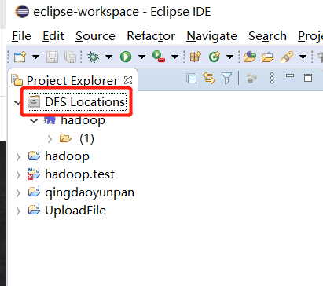
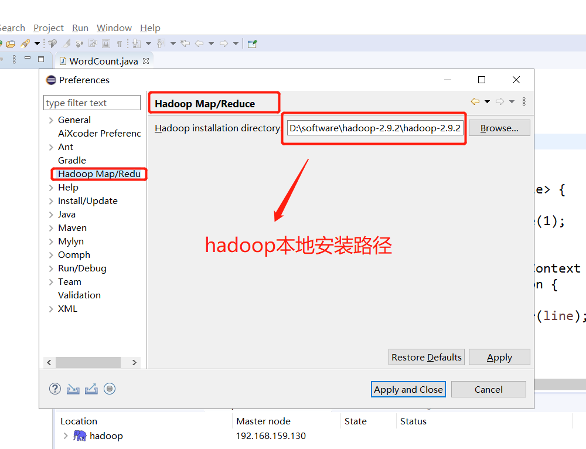
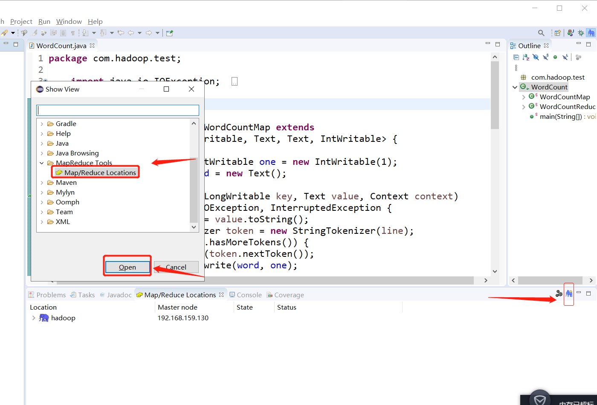
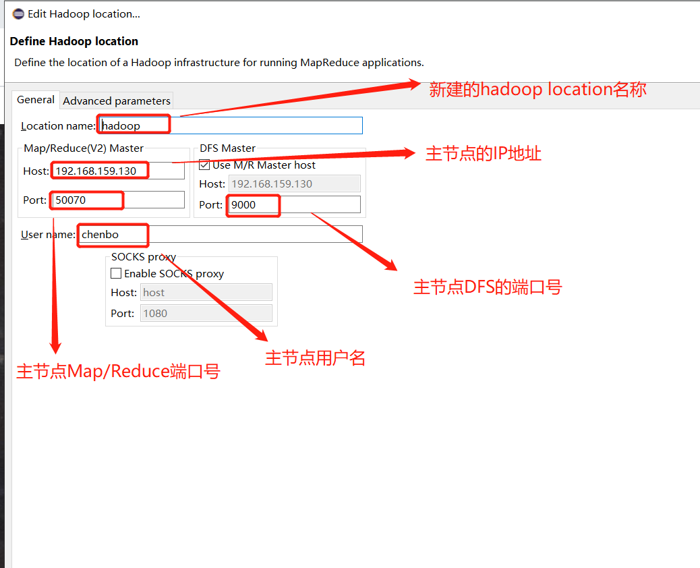
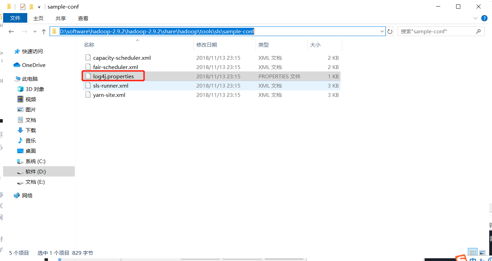
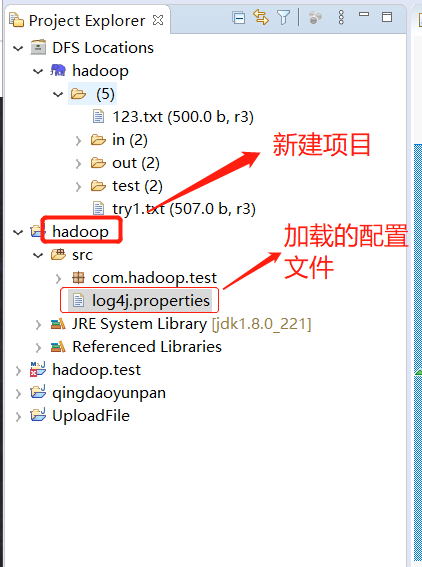
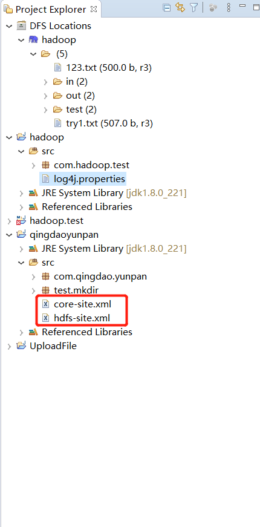

## Eclipse 安装 Hadoop 插件

**[Eclipse配置本地Hadoop开发环境](https://blog.csdn.net/weixin_44322234/article/details/105248496)**

#### 1、首先下载对应版本的hadoop插件 

注意：Hadoop插件要跟自己安装的Hadoop版本相对应。

链接：https://pan.baidu.com/s/1ffZDzwHf52Efo9ph5DTwcQ 
提取码：9e1n

这里是hadoop2.9.2版本对应的Hadoop插件， 下载文件里面的hadoop-eclipse-plugin-2.9.2.jar即为我们所需要的插件。

#### 2..安装hadoop-eclipse-plugins.jar

将hadoop-eclipse-plugins插件放入eclipse安装目录的dropins文件夹中


#### 3.打开Eclipse，会发现左侧多了一个DFS Location，说明已经安装成功  




注：安装好插件后eclipse中preferences无法找到Hadoop Map/Reduce 删除eclipse安装目录configuration文件中的org.eclipse.update文件夹，重启eclipse即可。 

 #### 4. 打开Window-->Preferens，可以看到Hadoop Map/Reduc选项，然后点击，然后添加hadoop2.9.2进来，如图所示： 




#### 5、打开Windows–Show View 

配置Map/ReduceLocations

  1）点击Window-->Show View -->MapReduce Tools  点击Map/ReduceLocation

  2）点击Map/ReduceLocation选项卡，点击右边小象图标，打开Hadoop Location配置窗口： 输入Location Name，任意名称即可.配置Map/Reduce Master和DFS Mastrer，Host和Port配置成hdfs-site.xml与core-site.xml的设置一致即可。







#### 6、这些配置完成之后，就可以新建一个项目hadoop，开始写mapreduce程序了，但是要注意的是，这个时候还需要加载一个配置文件log4j.properties，可以拷贝hadoop的配置文件到项目中,注意修改其中的路径和内容

D:\software\hadoop-2.9.2\hadoop-2.9.2\share\hadoop\tools\sls\sample-conf


* 文件内容如下

```
log4j.rootLogger=info,consolePrint,errorFile,logFile


log4j.appender.consolePrint.Encoding = UTF-8
log4j.appender.consolePrint = org.apache.log4j.ConsoleAppender
log4j.appender.consolePrint.Target = System.out
log4j.appender.consolePrint.layout = org.apache.log4j.PatternLayout
log4j.appender.consolePrint.layout.ConversionPattern=%d %p [%c] - %m%n

#  修改路径log4j.appender.logFile.File 
log4j.appender.logFile.Encoding = UTF-8
log4j.appender.logFile = org.apache.log4j.DailyRollingFileAppender
log4j.appender.logFile.File = D:/software/hadoop-2.9.2/RUN_Data/log/demo_run.log
log4j.appender.logFile.Append = true
log4j.appender.logFile.Threshold = info
log4j.appender.logFile.layout = org.apache.log4j.PatternLayout
log4j.appender.logFile.layout.ConversionPattern = %-d{yyyy-MM-dd HH:mm:ss}  [ %t:%r ] - [ %p ]  %m%n

#修改路径log4j.appender.errorFile.File
log4j.appender.errorFile.Encoding = UTF-8
log4j.appender.errorFile = org.apache.log4j.DailyRollingFileAppender
log4j.appender.errorFile.File = D:/software/hadoop-2.9.2/RUN_Data/log/demo_error.log
log4j.appender.errorFile.Append = true
log4j.appender.errorFile.Threshold = ERROR
log4j.appender.errorFile.layout = org.apache.log4j.PatternLayout
log4j.appender.errorFile.layout.ConversionPattern =%-d{yyyy-MM-dd HH\:mm\:ss}  [ %t\:%r ] - [ %p ]  %m%n
```



#### 7.把远程Linux中的hadoop配置文件里面的下列两个文件拷贝到src下面



