# 在阿里云服务器（Centos6.9）上设置可远端访问的jupyter notebook

### 0、配置云服务器的安全组

因为我用的是阿里云的服务器，所以就以阿里云的配置来说明。因为从外网访问服务器，需要开放一定的端口，所以要对服务器的访问规则进行配置。阿里云是用安全组来管理这些规则的，所以需要对安全组进行配置。

阿里云为了安全起见，默认只开放了22、80等少数端口。而jupyter notebook默认采用8888端口，因此在安全组配置中，需要将此端口开放。
 如果一切都正常，就是无法远程访问，有90%的可能性就是安全组规则配置的问题。

 **设置过程：云服务器管理控制台》云服务器ECS》网络和安全》安全组》配置规则》添加安全组规则**


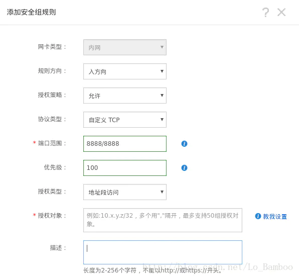


### 1、下载Anaconda（清华源）

Anaconda用来管理python的各种库是很好的，推荐使用。不过Anaconda默认源在国外，直接下载慢，所以选择清华源

```python
wget https://mirrors.tuna.tsinghua.edu.cn/anaconda/archive/Anaconda3-2019.10-Linux-x86_64.sh
```
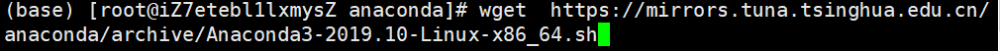


一直yes -yes-enter 即可

* 结果展示


### 2.安装Anaconda

```python
bash Anaconda3-2019.10-Linux-x86_64.sh
```


* 结果如下
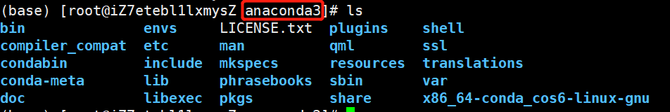


### 3.配置Anaconda环境

* 输入下面语句

```python
sudo vi ~/.bash_profile
```


* 在末尾添加如下语句

```python
export PATH="/root/anaconda3/bin:$PATH"
```

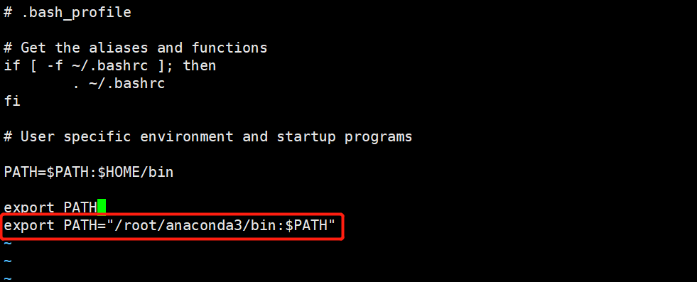


* 最后让环境生效

```python
source ~/.bash_profile
```

### 4.测试环境

```python
anaconda -V
```


```python
python3
```
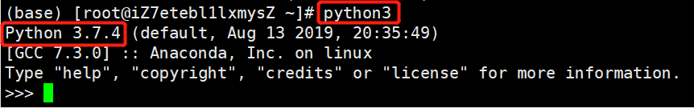


### 5.设置jupyter登录密码

输入下面语句，记下显示的哈希密码

```python
python -c "import IPython;print(IPython.lib.passwd())"
# 会提示 Enter password
# output sha1:49acd1a985cc:beb1fb6859665bfa721e65e78fc511c41basdasa
```

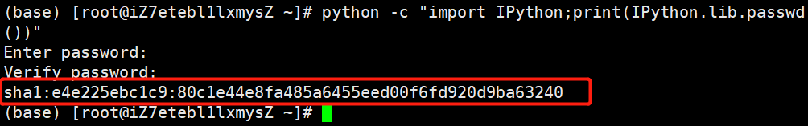


### 6.生成jupyter配置文件

```python
# 生成jupyter配置文件
jupyter notebook --generate-config
#生成的config file在/root/.jupyter/jupyter_notebook_config.py
```

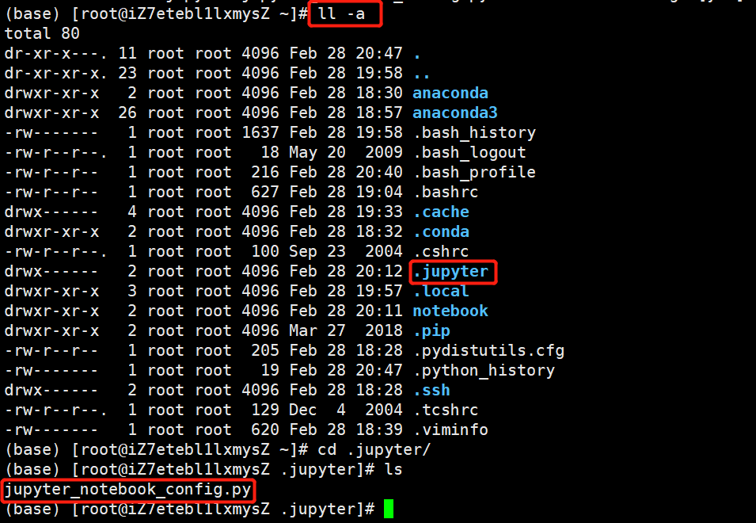


### 7.修改配置文件

```python
vi jupyter_notebook_config.py 
```


修改下列语句

```python
c.NotebookApp.password = 'sha1:<your-sha1-hash-value>'
c.NotebookApp.port = 8888
c.NotebookApp.ip = '*'
c.NotebookApp.open_browser = False

c.NotebookApp.notebook_dir = 'D:\Research\Jupyter Notebook' # 文件存放路径
c.NotebookApp.allow_root =True  #给与权限
```

* 下面的/c.NotebookApp.password 是查找位置的意思

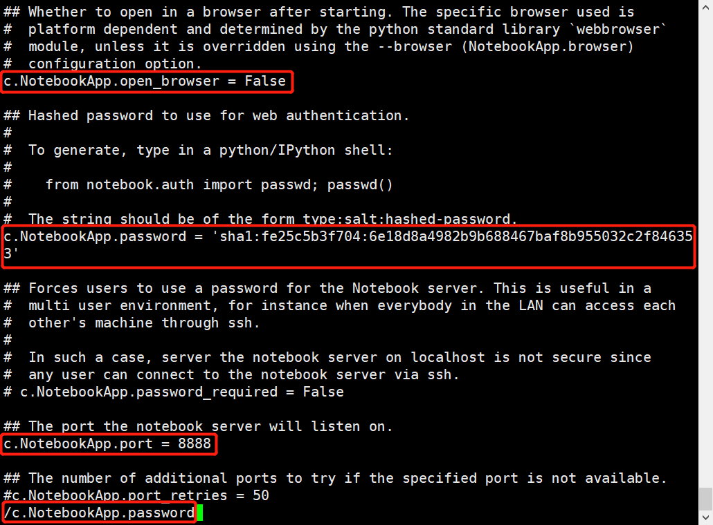


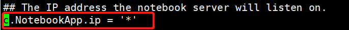

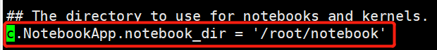

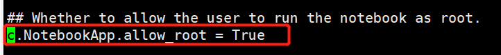


### 8.启动jupyter notebook

* 服务器重启下

```python
reboot
```

* 输入下面语句

```python
jupyter notebook
# jupyter notebook
```
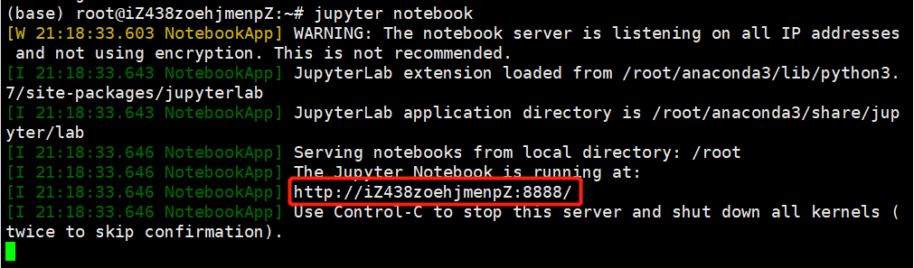


### 9、web 登录

```python
http://ip:8888 即刻访问
# nohup jupyter notebook&  后台一直运行jupyter notebook
```
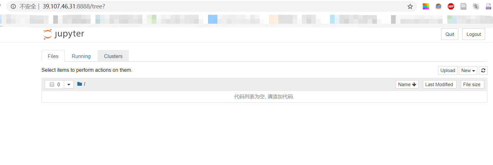
