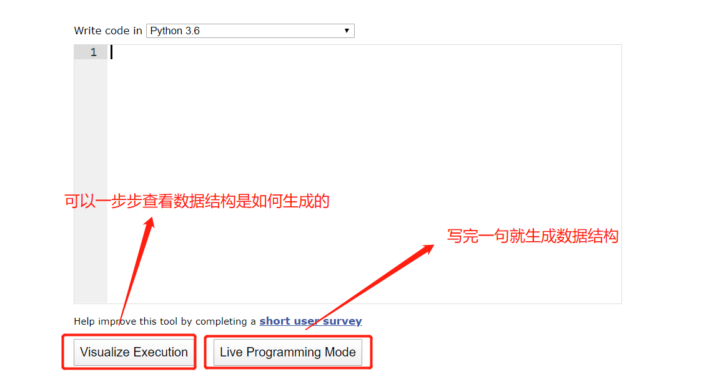
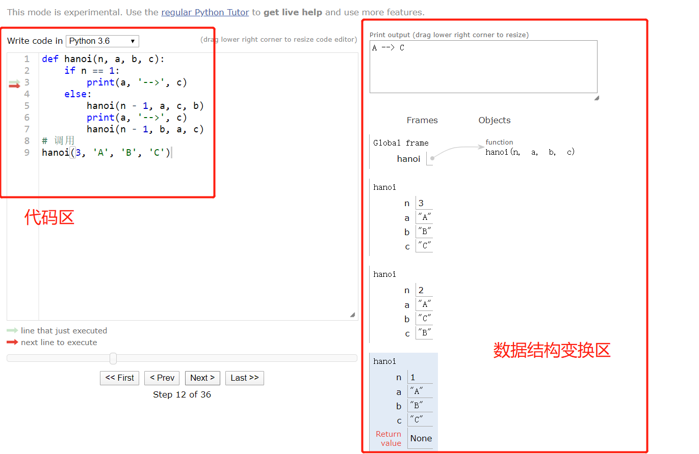

# Python数据结构可视化工具

1、打开Python数据结构可视化工具的在线网址：http://www.pythontutor.com/。

2、点击下图框选位置：

 3、进入后，有两个重要的选项，功能如下： 

 4、选择Live Programming Mode,效果如下 

 5、对于Visual Execution的选项，写完代码后，点击该选项，就可以一步步执行，然后看对应生成的数据结构了。 