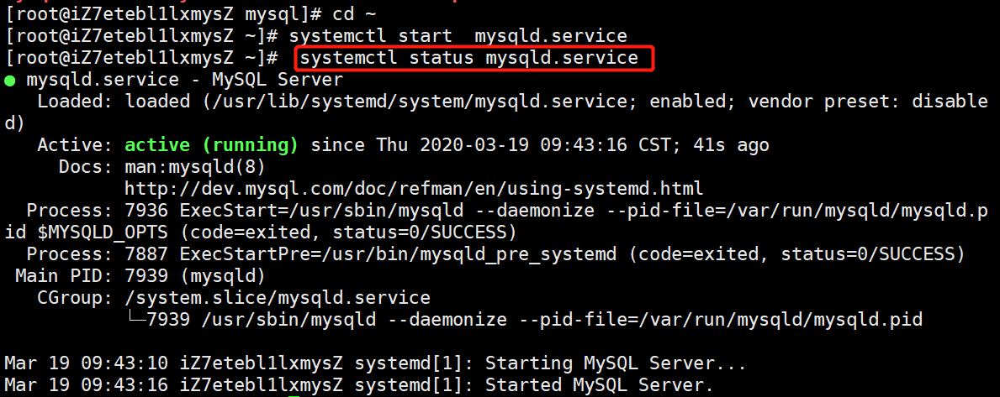
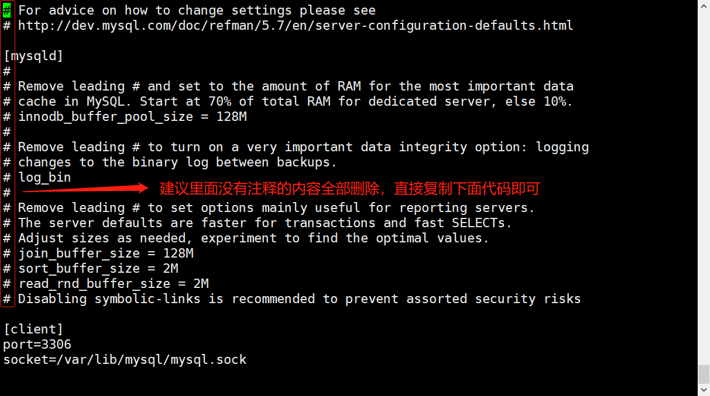
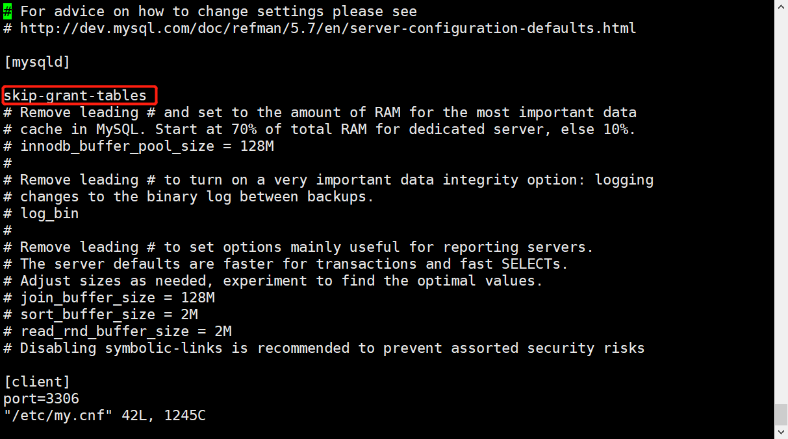
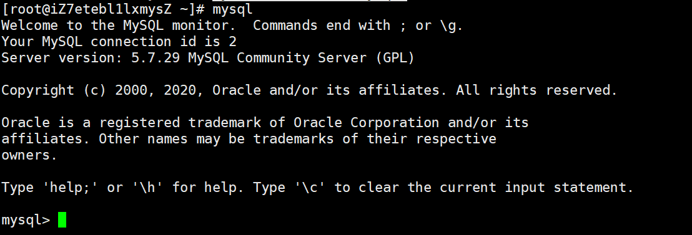
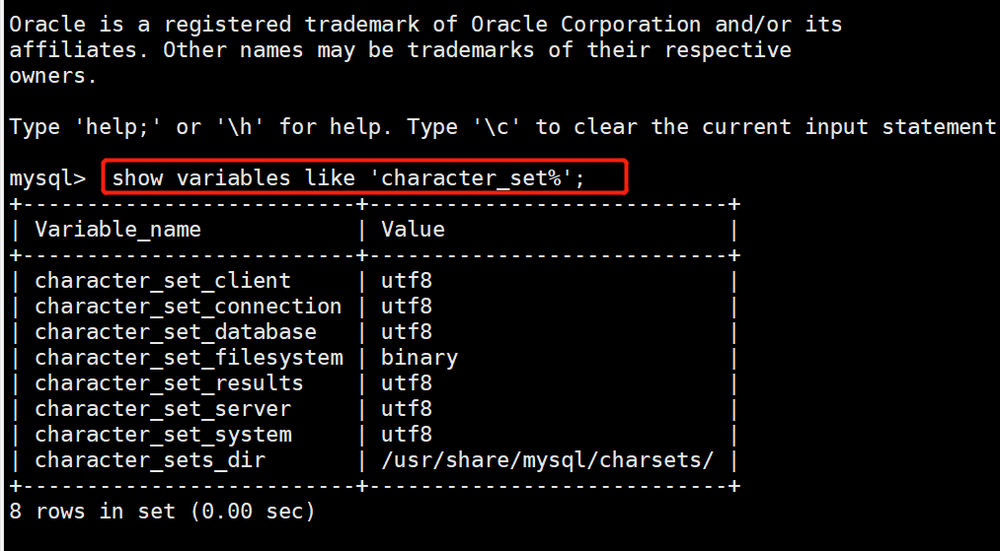

# Centos7下安装mysql（完整配置）

### 1、下载并安装MySQL官方的Yum Repository

```
 wget  http://dev.mysql.com/get/mysql57-community-release-el7-10.noarch.rpm
 rpm -ivh mysql57-community-release-el7-10.noarch.rpm 
```
### 2、使用下面的命令直接安装Yum Repository

```
 yum -y install mysql57-community-release-el7-10.noarch.rpm
```

### 3、安装MySQL服务器

```
yum -y install mysql-community-server
```

### 4、MySQL数据库设置

1)启动Mysql

```
systemctl start  mysqld.service
```

2)查看MySQL运行状态

```
 systemctl status mysqld.service
```



 3）有一个问题就是Yum Repository,以后每次 yum 操作都会自动更新，需要把这个卸载掉 

```
 yum -y remove mysql57-community-release-el7-10.noarch 
```

4）修改免密登录和相关配置

vi /etc/my.cnf(注：windows下修改的是my.ini)

* 为了让 MySQL支持中文，需要把字符集改成UTF-8，方法如下 

```
[client]
port=3306
socket=/var/lib/mysql/mysql.sock
default-character-set=utf8

[mysqld]
datadir=/var/lib/mysql
socket=/var/lib/mysql/mysql.sock
user=mysql
# Disabling symbolic-links is recommended to prevent assorted security risks
symbolic-links=0
character-set-server=utf8

[mysql]
no-auto-rehash
default-character-set=utf8

[mysqld_safe]
log-error=/var/log/mysqld.log
pid-file=/var/run/mysqld/mysqld.pid

```



* 免密登录

在文档内搜索mysqld定位到[mysqld]文本段：

/mysqld(在vim编辑状态下直接输入该命令可搜索文本内容)

**在[mysqld]后面**任意一行添加“skip-grant-tables”用来跳过密码验证的过程，如下图所示：

```
 skip-grant-tables 
```


5） 重启MySQL

```
systemctl restart mysqld
```

6）进入Mysql

```
mysql
```


7）查看编码格式

```
 show variables like 'character_set%'; 
```




### 5、其他配置

1）关闭MySQL
systemctl stop mysqld 

2）重启MySQL
systemctl restart mysqld 

3）查看MySQL运行状态
systemctl status mysqld 

4）设置开机启动
systemctl enable mysqld 

5）关闭开机启动
systemctl disable mysqld 