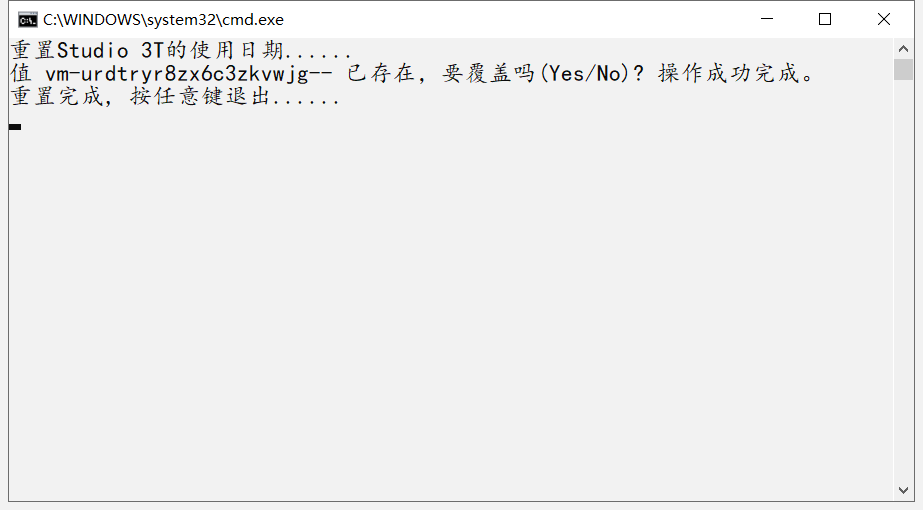

# MongoDB可视化工具Studio 3T的使用

### 1、下载工具

可以自己去官网下载windows版本的，或者在我的百度网盘下载一个

链接：https://pan.baidu.com/s/1wdMsRaifKt7dw2v0siCO3g
提取码：fgff
直接解压缩修改要安装的路径安装即可

因为studio3T是要破解的，目前我查到的破解都是延长他的试用期而已，所以我用的也是这个办法

### 2、操作步骤

**一、 自己在桌面上创建批处理文件 并且命名为 ： studio3t.bat**
在里面输入

```
@echo off
ECHO 重置Studio 3T的使用日期......
FOR /f "tokens=1,2,* " %%i IN ('reg query "HKEY_CURRENT_USER\Software\JavaSoft\Prefs\3t\mongochef\enterprise" ^| find /V "installation" ^| find /V "HKEY"') DO ECHO yes | reg add "HKEY_CURRENT_USER\Software\JavaSoft\Prefs\3t\mongochef\enterprise" /v %%i /t REG_SZ /d ""
ECHO 重置完成, 按任意键退出......
pause>nul
exit
```

注意：保存的时候要注意保存为utf-8格式

**二、然后将该文件 studio3t.bat 剪贴到这个路径：**

C:\ProgramData\Microsoft\Windows\Start Menu\Programs\StartUp

这样就可以了，每次开机的时候就会自动运行这个批处理文件，帮你延长试用期。
或者你直接双击运行它也是可以的。

### 3、双击桌面Studio 3T软件的快捷方式，完成启用并开始使用服务。



