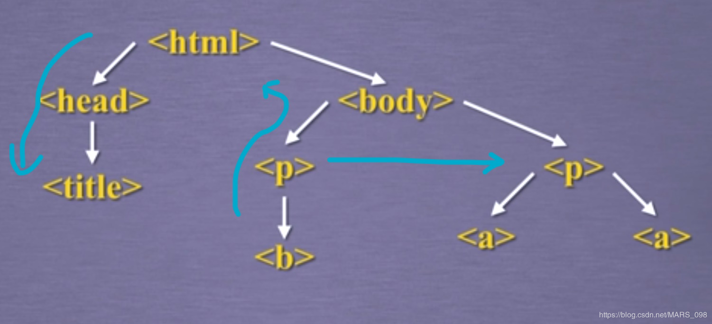

### 1、Beautiful Soup库安装

Beautiful Soup 是一个可以从HTML或XML文件中提取数据的Python库。它能够通过你喜欢的转换器实现惯用的文档导航，查找，修改文档的方式。Beautiful Soup会帮你节省数小时甚至数天的工作时间。

安装只有一步，我们使用管理员权限打开cmd，输入下面这串代码

pip install beautifulsoup4

下面我们测试一下库的安装，演示HTML页面地址：https://python123.io/ws/demo.html


```python
import requests
r = requests.get("http://python123.io/ws/demo.html")
print(r.text)
```

    <html><head><title>This is a python demo page</title></head>
    <body>
    <p class="title"><b>The demo python introduces several python courses.</b></p>
    <p class="course">Python is a wonderful general-purpose programming language. You can learn Python from novice to professional by tracking the following courses:
    <a href="http://www.icourse163.org/course/BIT-268001" class="py1" id="link1">Basic Python</a> and <a href="http://www.icourse163.org/course/BIT-1001870001" class="py2" id="link2">Advanced Python</a>.</p>
    </body></html>


然后使用一个soup变量，对demo变量进行解析处理，其中使用的html参数parser，就是用来解析格式的。最后输出美化后的代码：


```python
demo =r.text
from bs4 import BeautifulSoup
soup = BeautifulSoup(demo,'html.parser')
print(soup.prettify())
```

    <html>
     <head>
      <title>
       This is a python demo page
      </title>
     </head>
     <body>
      <p class="title">
       <b>
        The demo python introduces several python courses.
       </b>
      </p>
      <p class="course">
       Python is a wonderful general-purpose programming language. You can learn Python from novice to professional by tracking the following courses:
       <a class="py1" href="http://www.icourse163.org/course/BIT-268001" id="link1">
        Basic Python
       </a>
       and
       <a class="py2" href="http://www.icourse163.org/course/BIT-1001870001" id="link2">
        Advanced Python
       </a>
       .
      </p>
     </body>
    </html>


```python
格式
from bs4 import BeautifulSoup
soup = BeautifulSoup('<p>data</p>','html.parser')
```


```python
### Beautiful Soup类
from bs4 import BeautifulSoup
soup = BeautifulSoup("<html>data</html>","html.parser")
soup2 = BeautifulSoup(open("D://demo.html"),"html.parser")
```

### 2、BeatifulSoup库的基本元素

#### Beautiful Soup 库的理解

Beautiful Soup 库是解析、遍历、维护“标签树”的功能库

#### Beautiful Soup 库的引用

* Beautiful Soup库,也叫beautifulsoup4或bs4

from bs4 import BeautifulSoup
import bs4

#### Beautiful Soup库解析器

|解析器|使用方法|条件|
|:---|:---|:---|
|bs4的HTML解析器|BeautifulSoup(mk,'html.parser')|安装bs4库|
|lxml的HTML解析器|BeautifulSoup(mk,'lxml')|pip install lxml|
|lxml的XMl解析器|BeautifulSoup(mk,'xml'）|pip install lxml|
|html5lib的解析器|BeautifulSoup(mk,'html5lib')|pip insatll html5lib|

#### Beautiful Soup类的基本元素


| **基本元素**    | **说明**                                                 |
|:--------------- |:----------------------------------------------------- |
| Tag             | 标签，最基本的信息组织单元，分别用<>和</>标明开头和结尾  |
| Name            | 标签的名字，<p>...</p>的名字是'p'，格式：<tag>.name      |
| Attributes      | 标签的属性，字典形式组织，格式：<tag>.attrs              |
| NavigableString | 标签内非属性字符串，<>...</>中字符串，格式：<tag>.string |
| Comment         | 标签内字符串的注释部分，一种特殊的Comment类型            |


* 获得tag标签的方法


```python
from bs4 import BeautifulSoup
soup = BeautifulSoup(demo,"html.parser")
soup.title
```


    <title>This is a python demo page</title>


```python
tag = soup.a
tag
```


    <a class="py1" href="http://www.icourse163.org/course/BIT-268001" id="link1">Basic Python</a>


* 获取标签名字的方法


```python
from bs4 import BeautifulSoup
soup = BeautifulSoup(demo,"html.parser")
soup.a.name
```


    'a'


```python
soup.a.parent.name
```


    'p'


```python
soup.a.parent.parent.name
```


    'body'


* 获取标签的属性


```python
tag =soup.a
tag.attrs
```


    {'href': 'http://www.icourse163.org/course/BIT-268001',
     'class': ['py1'],
     'id': 'link1'}


```python
tag.attrs['class']
```


    ['py1']


```python
tag.attrs['href']
```


    'http://www.icourse163.org/course/BIT-268001'


```python
type(tag.attrs)
```


    dict


```python
type(tag)
```


    bs4.element.Tag


* NavigableString元素


```python
soup.a
```


    <a class="py1" href="http://www.icourse163.org/course/BIT-268001" id="link1">Basic Python</a>


```python
soup.a.string
```


    'Basic Python'


```python
soup.p
```


    <p class="title"><b>The demo python introduces several python courses.</b></p>


```python
soup.p.string
```


    'The demo python introduces several python courses.'


```python
type(soup.p.string)
```


    bs4.element.NavigableString


* Comment元素

表示标签内注释的部分，我们查看这段注释的内容和类型，代码如下（注意，格式里面的！--..--被去掉了）：


```python
newssoup = BeautifulSoup("<b><！--This is a comment--></b><p>This is not a comment</p>","html.parser")
newssoup
```


    <b>&lt;！--This is a comment--&gt;</b><p>This is not a comment</p>


```python
newssoup.b.string
```


    '<！--This is a comment-->'


```python
type(newssoup.b.string)
```


    bs4.element.NavigableString


```python
type(newssoup.p.string)
```


    bs4.element.NavigableString


### 3、基于bs4库的HTML内容遍历方法


```python
from bs4 import BeautifulSoup
soup = BeautifulSoup(demo,"html.parser")
print(soup.prettify())
```

    <html>
     <head>
      <title>
       This is a python demo page
      </title>
     </head>
     <body>
      <p class="title">
       <b>
        The demo python introduces several python courses.
       </b>
      </p>
      <p class="course">
       Python is a wonderful general-purpose programming language. You can learn Python from novice to professional by tracking the following courses:
       <a class="py1" href="http://www.icourse163.org/course/BIT-268001" id="link1">
        Basic Python
       </a>
       and
       <a class="py2" href="http://www.icourse163.org/course/BIT-1001870001" id="link2">
        Advanced Python
       </a>
       .
      </p>
     </body>
    </html>

我们将其的结构抽象出来就是这样一个树形结构：



这样来看如果我们要遍历这个树形结构，就有三种方式，如图中的下行遍历、上行遍历和平行遍历（左->右）。

下面分别介绍一下这三种遍历方法：

#### 标签树的下行遍历


|属性|说明|
|:---|:---|
|.contents|子节点的列表，将<tag>所有儿子节点存入列表|、
|.children|子节点的迭代类型，与.contents类似，用于循环遍历儿子节点|
|.descendants|子孙节点的迭代类型，包含所有子孙节点，用于循环遍历|


```python
soup.head
```


    <head><title>This is a python demo page</title></head>


```python
soup.head.contents
```


    [<title>This is a python demo page</title>]


```python
soup.body.contents
```


    ['\n',
     <p class="title"><b>The demo python introduces several python courses.</b></p>,
     '\n',
     <p class="course">Python is a wonderful general-purpose programming language. You can learn Python from novice to professional by tracking the following courses:
     <a class="py1" href="http://www.icourse163.org/course/BIT-268001" id="link1">Basic Python</a> and <a class="py2" href="http://www.icourse163.org/course/BIT-1001870001" id="link2">Advanced Python</a>.</p>,
     '\n']


```python
len(soup.body.contents)
```


    5


```python
soup.body.contents[0]
```


    '\n'


```python
soup.body.contents[1]
```


    <p class="title"><b>The demo python introduces several python courses.</b></p>


```python
soup.body.contents[2]
```


    '\n'


```python
soup.body.contents[3]
```


    <p class="course">Python is a wonderful general-purpose programming language. You can learn Python from novice to professional by tracking the following courses:
    <a class="py1" href="http://www.icourse163.org/course/BIT-268001" id="link1">Basic Python</a> and <a class="py2" href="http://www.icourse163.org/course/BIT-1001870001" id="link2">Advanced Python</a>.</p>


```python
soup.body.contents[4]
```


    '\n'


我们可以看出，我们返回的head.contents的类型是一个列表类型，也就是我们可以用列表的方式进行遍历，其中还可以使用len()方法求这个列表的长度，用下标进行遍历，下标数值从0开始表示第一个。


```python
# 遍历儿子节点
for child in soup.body.children:
    print(child)
```


​    
​    <p class="title"><b>The demo python introduces several python courses.</b></p>


​    
​    <p class="course">Python is a wonderful general-purpose programming language. You can learn Python from novice to professional by tracking the following courses:
​    <a class="py1" href="http://www.icourse163.org/course/BIT-268001" id="link1">Basic Python</a> and <a class="py2" href="http://www.icourse163.org/course/BIT-1001870001" id="link2">Advanced Python</a>.</p>


​    


```python
# 遍历子孙节点
for child in soup.body.descendants:
    print(child)
```


​    
​    <p class="title"><b>The demo python introduces several python courses.</b></p>
​    <b>The demo python introduces several python courses.</b>
​    The demo python introduces several python courses.


​    
​    <p class="course">Python is a wonderful general-purpose programming language. You can learn Python from novice to professional by tracking the following courses:
​    <a class="py1" href="http://www.icourse163.org/course/BIT-268001" id="link1">Basic Python</a> and <a class="py2" href="http://www.icourse163.org/course/BIT-1001870001" id="link2">Advanced Python</a>.</p>
​    Python is a wonderful general-purpose programming language. You can learn Python from novice to professional by tracking the following courses:
​    
​    <a class="py1" href="http://www.icourse163.org/course/BIT-268001" id="link1">Basic Python</a>
​    Basic Python
​     and 
​    <a class="py2" href="http://www.icourse163.org/course/BIT-1001870001" id="link2">Advanced Python</a>
​    Advanced Python
​    .


​    


#### 标签树的上行遍历

|属性|说明|
|:---|:---|
|.parent|节点的父亲标签|
|.parents|节点先辈标签的迭代类型，用于循环遍历先辈节点|


```python
soup = BeautifulSoup(demo,"html.parser")
soup.title.parent
```


    <head><title>This is a python demo page</title></head>


```python
soup.html.parent
```


    <html><head><title>This is a python demo page</title></head>
    <body>
    <p class="title"><b>The demo python introduces several python courses.</b></p>
    <p class="course">Python is a wonderful general-purpose programming language. You can learn Python from novice to professional by tracking the following courses:
    <a class="py1" href="http://www.icourse163.org/course/BIT-268001" id="link1">Basic Python</a> and <a class="py2" href="http://www.icourse163.org/course/BIT-1001870001" id="link2">Advanced Python</a>.</p>
    </body></html>


```python
soup.a.parent
```


    <p class="course">Python is a wonderful general-purpose programming language. You can learn Python from novice to professional by tracking the following courses:
    <a class="py1" href="http://www.icourse163.org/course/BIT-268001" id="link1">Basic Python</a> and <a class="py2" href="http://www.icourse163.org/course/BIT-1001870001" id="link2">Advanced Python</a>.</p>


我们可以看到，soup.title的父亲标签就是head，而html标签就是树的根节点了，为最高级标签，所以他的父亲标签还是它本身，soup本身的标签则为空，没有返回任何标签，而事实上如果使用循环已知往上进行遍历最终会遍历到soup，所以我们用下面这个循环来进行上行遍历：


```python
# 标签树的上行遍历
soup = BeautifulSoup(demo,"html.parser")
for parent in soup.a.parents:
    if parent is None:
        print(parent)  #html标签就是树的根节点了，为最高级标签，所以他的父亲标签还是它本身
    else:
        print(parent.name)
```

    p
    body
    html
    [document]


#### 标签树的平行遍历

|属性|说明|
|:---|:---|
|.next_sibling|返回按照HTML文本顺序的下一个平行节点标签|
|.previos_sibling|返回按照HTML文本顺序的上一个平行节点标签|
|.next_siblings|迭代类型，返回按照HTML文本顺序的后续所有平行节点标签|
|.previous_siblings|迭代类型，返回按照HTML文本顺序的前续所有平行节点标签|


```python
soup = BeautifulSoup(demo,"html.parser")
print(soup.a.next_sibling)#平行节点的后一个兄弟标签
```

     and 


```python
print(soup.a.previous_sibling)#平行节点的前一个兄弟标签
```

    Python is a wonderful general-purpose programming language. You can learn Python from novice to professional by tracking the following courses:


```python
for sibling in soup.a.next_siblings:
    print(sibling)#循环遍历后续节点
```

     and 
    <a class="py2" href="http://www.icourse163.org/course/BIT-1001870001" id="link2">Advanced Python</a>
    .


```python
for sibling in soup.a.previous_siblings:
    print(sibling)#循环遍历前续节点
```

    Python is a wonderful general-purpose programming language. You can learn Python from novice to professional by tracking the following courses:


### 4、基于bs4库的HTML格式化和编码

我们之前说到，bs4库的内容遍历方法，那么如何让html的内容更加友好的显示，还记得我们之前提到的demo实例，首先我们用requests库或的demo的html代码，再用beautifulsoup库的prettify()库来打印：


```python
from bs4 import BeautifulSoup
soup = BeautifulSoup(demo,"html.parser")
print(soup.prettify())
```

    <html>
     <head>
      <title>
       This is a python demo page
      </title>
     </head>
     <body>
      <p class="title">
       <b>
        The demo python introduces several python courses.
       </b>
      </p>
      <p class="course">
       Python is a wonderful general-purpose programming language. You can learn Python from novice to professional by tracking the following courses:
       <a class="py1" href="http://www.icourse163.org/course/BIT-268001" id="link1">
        Basic Python
       </a>
       and
       <a class="py2" href="http://www.icourse163.org/course/BIT-1001870001" id="link2">
        Advanced Python
       </a>
       .
      </p>
     </body>
    </html>


可以看出，在我们使用prettify()方法输出之前，demo获取的r.text的内容是格式混乱的，当我们使用prettify()方法但并未实际输出时，每一个语句后会多出来一个\n换行符，且会有一定的空格，这说明已经将内容格式美化了，当我们使用输出语句输出美化后的demo内容时，就会输出格式明朗的"标签树"结构内容。

其实prettify()方法还可以对其中给一个标签的内容进行美化，如下面这个：


```python
print(soup.a.prettify())
```

    <a class="py1" href="http://www.icourse163.org/course/BIT-268001" id="link1">
     Basic Python
    </a>


这里需要强调的一点就是prettify()方法可以将html内容自动转换成utf-8的编码格式，这是一种国际通用的支持第三方国家语言显示的编码格式，如下面这个例子：


```python
# bs4 库的编码
soup = BeautifulSoup("<p>中文</p>","html.parser")
soup.p.string
```


    '中文'


```python
print(soup.p.prettify())
```

    <p>
     中文
    </p>

