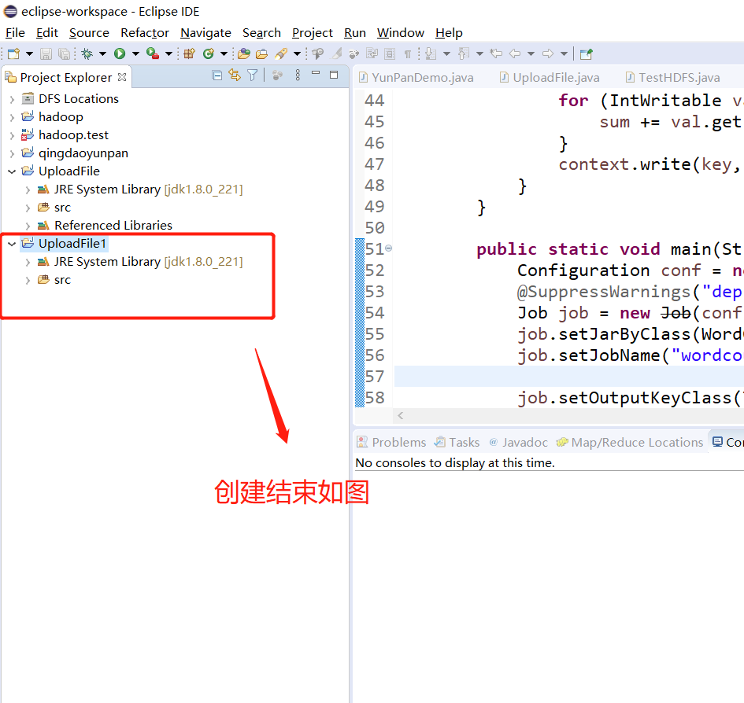

# 使用Eclipes，通过Java API 实现本地到远程hadoop的文件上传，下载，创建目录

#### 1、通过远程连接软件（WinSCP）将Linux虚拟机中的hadoop文件下载至本地目录


#### 2.使用Eclipes新建一个项目取名UploadFile1





#### 3、加载相应的jar包


#### 4、将hadoop路径下的所有jar包加载进去


#### 5、加载完成结果图


#### 6.新建一个类


7.写代码

1）本地上传到远程hadoop

```java
import java.io.BufferedInputStream;
import java.io.FileInputStream;
import java.io.InputStream;
import java.io.OutputStream;
import java.net.URI;
			 
import org.apache.hadoop.conf.Configuration;
import org.apache.hadoop.fs.FileSystem;
import org.apache.hadoop.fs.Path;
import org.apache.hadoop.io.IOUtils;
import org.apache.hadoop.util.Progressable;
			 	 
public class UploadFile {	 
	public static void main(String[] args) {			
		try {
			String localSrc = "C:\\Users\\David\\Desktop\\try.txt";
			String dst = "hdfs://192.168.159.130:9000/test/try.txt";
			InputStream in = new BufferedInputStream(new FileInputStream(localSrc));
			Configuration conf = new Configuration();
				  
			FileSystem fs = FileSystem.get(URI.create(dst), conf);
			OutputStream out = fs.create(new Path(dst), new Progressable() {
				public void progress() {
					System.out.print(".");
				}
			  });
			  IOUtils.copyBytes(in, out, 4096, true);
			  System.out.println("success");
			
		} catch (Exception e) {
			e.printStackTrace();
		}			
	}	 
}

```

2）创建目录，上传，下载

这个地方是新建一个类YunPanDemo


```java
package com.qingdao.yunpan;

import java.io.IOException;

import org.apache.hadoop.conf.Configuration;
import org.apache.hadoop.fs.FileSystem;
import org.apache.hadoop.fs.Path;

public class YunPanDemo {
	public static void main(String[] args) {
	
		Configuration conf = new Configuration();
	
		try {
			FileSystem fs = FileSystem.get(conf);
			Path path = new Path("/test");
			fs.mkdirs(path);		
		} catch (IOException e) {
			// TODO Auto-generated catch block
			e.printStackTrace();
		}
		uploadFile();
		downLoad();
	
	}
	public static void uploadFile() {
		Configuration conf = new Configuration();
		
		try {
			FileSystem fs = FileSystem.get(conf);
			Path src = new Path("E:\\WordCount.jar");
			Path dst = new Path("/test");
			fs.copyFromLocalFile(src, dst);
			
		} catch (IOException e) {
			// TODO Auto-generated catch block
			e.printStackTrace();
		}
	}
	public static void downLoad() {
		Configuration conf = new Configuration();
		conf.set("fs.defaultFS", "hdfs://192.168.159.130:9000");
        conf.set("hadoop.home.dir", "/home/chenbo/app/hadoop");
		try {
			FileSystem fs = FileSystem.get(conf);
			
			Path src = new Path("/try1.txt");
			Path dst = new Path("C:\\Users\\David\\Desktop\\");
			
			fs.copyToLocalFile(src, dst);
		} catch (IOException e) {
			// TODO Auto-generated catch block
			e.printStackTrace();
		}		
	}
}
```

#### 7.运行

