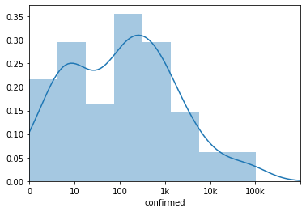

# COVID-19: EDA with recent update on April

The kernel is inspired by the great EDA kernel [COVID-19: Digging a Bit Deeper](https://www.kaggle.com/abhinand05/covid-19-digging-a-bit-deeper) by @abhinand05 in week1.<br/>
Please upvote his kernel as well :)<br/>
I will write an EDA including **the recent updates, recovering country analysis & sigmoid fitting convergence date estimation**.

[Note] It seems JHU has changed the data format, and stopped providing recovered cases. So I could not analyze recovered cases.

`plotly` visualization is heavy used in this kernel so that we can **interactively** see the figure, map etc.<br/>
As a side effect, it might take a little bit more time to load the kernel, wait a minute please.

### Version History

The data is updated daily-basis. **I will try to update the kernel DAILY basis too, so that you can refer latest information.**<br/>
Below are the version history to see the information until specified date.<br/>

 - Version 15: Added **Daily NEW confirmed cases** analysis & **Asia** region EDA.
 - [Version 18](https://www.kaggle.com/corochann/covid-19-eda-with-recent-update-on-march?scriptVersionId=31151381): Shows figure as of 2020/3/28.
 - Version 19: Added <span style="color:red">sigmoid fitting to estimate when the coronavirus converge in each country</span>, jump to [When will it converge? - Estimation by sigmoid fitting](#id_converge).
 - [Version 21](https://www.kaggle.com/corochann/covid-19-eda-with-recent-update-on-april?scriptVersionId=31276251): Shows figure as of 2020/3/31.
 - [Version 23](https://www.kaggle.com/corochann/covid-19-eda-with-recent-update-on-april?scriptVersionId=31329249): Shows figure as of 2020/4/1, moved to use week3 competition data.
 - [Version 29](https://www.kaggle.com/corochann/covid-19-eda-with-recent-update-on-april?scriptVersionId=31384138): 2020/4/2
 - [Version 30](https://www.kaggle.com/corochann/covid-19-eda-with-recent-update-on-april?scriptVersionId=31436722): 2020/4/3
 - [Version 31](https://www.kaggle.com/corochann/covid-19-eda-with-recent-update-on-april?scriptVersionId=31489960): 2020/4/4
 - [Version 32](https://www.kaggle.com/corochann/covid-19-eda-with-recent-update-on-april?scriptVersionId=31547500): 2020/4/5
 - [Version 33](https://www.kaggle.com/corochann/covid-19-eda-with-recent-update-on-april?scriptVersionId=31604729): 2020/4/6
 - [Version 35](https://www.kaggle.com/corochann/covid-19-eda-with-recent-update-on-april?scriptVersionId=31670710): 2020/4/7, **Moved to week4 dataset**
 - [Version 36](https://www.kaggle.com/corochann/covid-19-eda-with-recent-update-on-april?scriptVersionId=31723129): 2020/4/8
 - [Version 38](https://www.kaggle.com/corochann/covid-19-eda-with-recent-update-on-april?scriptVersionId=31782521): 2020/4/9
 - [Version 39](https://www.kaggle.com/corochann/covid-19-eda-with-recent-update-on-april?scriptVersionId=31839132): 2020/4/10
 - Latest Version: 2020/4/11

## Table of Contents


**[Load Data](#id_load)**<br/>
**[Worldwide trend](#id_ww)**<br/>
**[Country-wise growth](#id_country)**<br/>
**[Going into province](#id_province)**<br/>
**[Zoom up to US: what is happening in US now??](#id_province)**<br/>
**[Europe](#id_europe)**<br/>
**[Asia](#id_asia)**<br/>
**[Which country is recovering now?](#id_recover)**<br/>
**[When will it converge? - Estimation by sigmoid fitting](#id_converge)**<br/>
**[Further reading](#id_ref)**<br/>


```python
import gc
import os
from pathlib import Path
import random
import sys

from tqdm.notebook import tqdm
import numpy as np
import pandas as pd
import scipy as sp


import matplotlib.pyplot as plt
import seaborn as sns

from IPython.core.display import display, HTML

# --- plotly ---
from plotly import tools, subplots
import plotly.offline as py
py.init_notebook_mode(connected=True)
import plotly.graph_objs as go
import plotly.express as px
import plotly.figure_factory as ff
import plotly.io as pio
pio.templates.default = "plotly_dark"

# --- models ---
from sklearn import preprocessing
from sklearn.model_selection import KFold
import lightgbm as lgb
import xgboost as xgb
import catboost as cb

# --- setup ---
pd.set_option('max_columns', 50)
```


        <script type="text/javascript">
        window.PlotlyConfig = {MathJaxConfig: 'local'};
        if (window.MathJax) {MathJax.Hub.Config({SVG: {font: "STIX-Web"}});}
        if (typeof require !== 'undefined') {
        require.undef("plotly");
        requirejs.config({
            paths: {
                'plotly': ['https://cdn.plot.ly/plotly-latest.min']
            }
        });
        require(['plotly'], function(Plotly) {
            window._Plotly = Plotly;
        });
        }
        </script>
        


<a id="id_load"></a>
# Load Data

Load data and convert Japanese columns into English so that others can understand :).


```python
# Input data files are available in the "../data/" directory.
import os
for dirname, _, filenames in os.walk('data'):
    filenames.sort()
    for filename in filenames:
        print(os.path.join(dirname, filename))
```


```python
%%time
datadir = Path('../data/')

# Read in the data CSV files
train = pd.read_csv(datadir/'train.csv')
test = pd.read_csv(datadir/'test.csv')
submission = pd.read_csv(datadir/'submission.csv')
```

    CPU times: user 33.1 ms, sys: 5.02 ms, total: 38.2 ms
    Wall time: 37.4 ms
    


```python
train
```


<div>
<style scoped>
    .dataframe tbody tr th:only-of-type {
        vertical-align: middle;
    }

    .dataframe tbody tr th {
        vertical-align: top;
    }

    .dataframe thead th {
        text-align: right;
    }
</style>
<table border="1" class="dataframe">
  <thead>
    <tr style="text-align: right;">
      <th></th>
      <th>Id</th>
      <th>Province_State</th>
      <th>Country_Region</th>
      <th>Date</th>
      <th>ConfirmedCases</th>
      <th>Fatalities</th>
    </tr>
  </thead>
  <tbody>
    <tr>
      <td>0</td>
      <td>1</td>
      <td>NaN</td>
      <td>Afghanistan</td>
      <td>2020-01-22</td>
      <td>0.0</td>
      <td>0.0</td>
    </tr>
    <tr>
      <td>1</td>
      <td>2</td>
      <td>NaN</td>
      <td>Afghanistan</td>
      <td>2020-01-23</td>
      <td>0.0</td>
      <td>0.0</td>
    </tr>
    <tr>
      <td>2</td>
      <td>3</td>
      <td>NaN</td>
      <td>Afghanistan</td>
      <td>2020-01-24</td>
      <td>0.0</td>
      <td>0.0</td>
    </tr>
    <tr>
      <td>3</td>
      <td>4</td>
      <td>NaN</td>
      <td>Afghanistan</td>
      <td>2020-01-25</td>
      <td>0.0</td>
      <td>0.0</td>
    </tr>
    <tr>
      <td>4</td>
      <td>5</td>
      <td>NaN</td>
      <td>Afghanistan</td>
      <td>2020-01-26</td>
      <td>0.0</td>
      <td>0.0</td>
    </tr>
    <tr>
      <td>...</td>
      <td>...</td>
      <td>...</td>
      <td>...</td>
      <td>...</td>
      <td>...</td>
      <td>...</td>
    </tr>
    <tr>
      <td>26287</td>
      <td>35648</td>
      <td>NaN</td>
      <td>Zimbabwe</td>
      <td>2020-04-10</td>
      <td>13.0</td>
      <td>3.0</td>
    </tr>
    <tr>
      <td>26288</td>
      <td>35649</td>
      <td>NaN</td>
      <td>Zimbabwe</td>
      <td>2020-04-11</td>
      <td>14.0</td>
      <td>3.0</td>
    </tr>
    <tr>
      <td>26289</td>
      <td>35650</td>
      <td>NaN</td>
      <td>Zimbabwe</td>
      <td>2020-04-12</td>
      <td>14.0</td>
      <td>3.0</td>
    </tr>
    <tr>
      <td>26290</td>
      <td>35651</td>
      <td>NaN</td>
      <td>Zimbabwe</td>
      <td>2020-04-13</td>
      <td>17.0</td>
      <td>3.0</td>
    </tr>
    <tr>
      <td>26291</td>
      <td>35652</td>
      <td>NaN</td>
      <td>Zimbabwe</td>
      <td>2020-04-14</td>
      <td>17.0</td>
      <td>3.0</td>
    </tr>
  </tbody>
</table>
<p>26292 rows × 6 columns</p>
</div>


```python
test
```


<div>
<style scoped>
    .dataframe tbody tr th:only-of-type {
        vertical-align: middle;
    }

    .dataframe tbody tr th {
        vertical-align: top;
    }

    .dataframe thead th {
        text-align: right;
    }
</style>
<table border="1" class="dataframe">
  <thead>
    <tr style="text-align: right;">
      <th></th>
      <th>ForecastId</th>
      <th>Province_State</th>
      <th>Country_Region</th>
      <th>Date</th>
    </tr>
  </thead>
  <tbody>
    <tr>
      <td>0</td>
      <td>1</td>
      <td>NaN</td>
      <td>Afghanistan</td>
      <td>2020-04-02</td>
    </tr>
    <tr>
      <td>1</td>
      <td>2</td>
      <td>NaN</td>
      <td>Afghanistan</td>
      <td>2020-04-03</td>
    </tr>
    <tr>
      <td>2</td>
      <td>3</td>
      <td>NaN</td>
      <td>Afghanistan</td>
      <td>2020-04-04</td>
    </tr>
    <tr>
      <td>3</td>
      <td>4</td>
      <td>NaN</td>
      <td>Afghanistan</td>
      <td>2020-04-05</td>
    </tr>
    <tr>
      <td>4</td>
      <td>5</td>
      <td>NaN</td>
      <td>Afghanistan</td>
      <td>2020-04-06</td>
    </tr>
    <tr>
      <td>...</td>
      <td>...</td>
      <td>...</td>
      <td>...</td>
      <td>...</td>
    </tr>
    <tr>
      <td>13454</td>
      <td>13455</td>
      <td>NaN</td>
      <td>Zimbabwe</td>
      <td>2020-05-10</td>
    </tr>
    <tr>
      <td>13455</td>
      <td>13456</td>
      <td>NaN</td>
      <td>Zimbabwe</td>
      <td>2020-05-11</td>
    </tr>
    <tr>
      <td>13456</td>
      <td>13457</td>
      <td>NaN</td>
      <td>Zimbabwe</td>
      <td>2020-05-12</td>
    </tr>
    <tr>
      <td>13457</td>
      <td>13458</td>
      <td>NaN</td>
      <td>Zimbabwe</td>
      <td>2020-05-13</td>
    </tr>
    <tr>
      <td>13458</td>
      <td>13459</td>
      <td>NaN</td>
      <td>Zimbabwe</td>
      <td>2020-05-14</td>
    </tr>
  </tbody>
</table>
<p>13459 rows × 4 columns</p>
</div>


```python
submission
```


<div>
<style scoped>
    .dataframe tbody tr th:only-of-type {
        vertical-align: middle;
    }

    .dataframe tbody tr th {
        vertical-align: top;
    }

    .dataframe thead th {
        text-align: right;
    }
</style>
<table border="1" class="dataframe">
  <thead>
    <tr style="text-align: right;">
      <th></th>
      <th>ForecastId</th>
      <th>ConfirmedCases</th>
      <th>Fatalities</th>
    </tr>
  </thead>
  <tbody>
    <tr>
      <td>0</td>
      <td>1</td>
      <td>1</td>
      <td>1</td>
    </tr>
    <tr>
      <td>1</td>
      <td>2</td>
      <td>1</td>
      <td>1</td>
    </tr>
    <tr>
      <td>2</td>
      <td>3</td>
      <td>1</td>
      <td>1</td>
    </tr>
    <tr>
      <td>3</td>
      <td>4</td>
      <td>1</td>
      <td>1</td>
    </tr>
    <tr>
      <td>4</td>
      <td>5</td>
      <td>1</td>
      <td>1</td>
    </tr>
    <tr>
      <td>...</td>
      <td>...</td>
      <td>...</td>
      <td>...</td>
    </tr>
    <tr>
      <td>13454</td>
      <td>13455</td>
      <td>1</td>
      <td>1</td>
    </tr>
    <tr>
      <td>13455</td>
      <td>13456</td>
      <td>1</td>
      <td>1</td>
    </tr>
    <tr>
      <td>13456</td>
      <td>13457</td>
      <td>1</td>
      <td>1</td>
    </tr>
    <tr>
      <td>13457</td>
      <td>13458</td>
      <td>1</td>
      <td>1</td>
    </tr>
    <tr>
      <td>13458</td>
      <td>13459</td>
      <td>1</td>
      <td>1</td>
    </tr>
  </tbody>
</table>
<p>13459 rows × 3 columns</p>
</div>


```python
train.rename({'Country_Region': 'country', 'Province_State': 'province', 'Id': 'id', 'Date': 'date', 'ConfirmedCases': 'confirmed', 'Fatalities': 'fatalities'}, axis=1, inplace=True)
test.rename({'Country_Region': 'country', 'Province_State': 'province', 'Id': 'id', 'Date': 'date', 'ConfirmedCases': 'confirmed', 'Fatalities': 'fatalities'}, axis=1, inplace=True)
train['country_province'] = train['country'].fillna('') + '/' + train['province'].fillna('')
test['country_province'] = test['country'].fillna('') + '/' + test['province'].fillna('')
```


```python
train.head(10)
```


<div>
<style scoped>
    .dataframe tbody tr th:only-of-type {
        vertical-align: middle;
    }

    .dataframe tbody tr th {
        vertical-align: top;
    }

    .dataframe thead th {
        text-align: right;
    }
</style>
<table border="1" class="dataframe">
  <thead>
    <tr style="text-align: right;">
      <th></th>
      <th>id</th>
      <th>province</th>
      <th>country</th>
      <th>date</th>
      <th>confirmed</th>
      <th>fatalities</th>
      <th>country_province</th>
    </tr>
  </thead>
  <tbody>
    <tr>
      <td>0</td>
      <td>1</td>
      <td>NaN</td>
      <td>Afghanistan</td>
      <td>2020-01-22</td>
      <td>0.0</td>
      <td>0.0</td>
      <td>Afghanistan/</td>
    </tr>
    <tr>
      <td>1</td>
      <td>2</td>
      <td>NaN</td>
      <td>Afghanistan</td>
      <td>2020-01-23</td>
      <td>0.0</td>
      <td>0.0</td>
      <td>Afghanistan/</td>
    </tr>
    <tr>
      <td>2</td>
      <td>3</td>
      <td>NaN</td>
      <td>Afghanistan</td>
      <td>2020-01-24</td>
      <td>0.0</td>
      <td>0.0</td>
      <td>Afghanistan/</td>
    </tr>
    <tr>
      <td>3</td>
      <td>4</td>
      <td>NaN</td>
      <td>Afghanistan</td>
      <td>2020-01-25</td>
      <td>0.0</td>
      <td>0.0</td>
      <td>Afghanistan/</td>
    </tr>
    <tr>
      <td>4</td>
      <td>5</td>
      <td>NaN</td>
      <td>Afghanistan</td>
      <td>2020-01-26</td>
      <td>0.0</td>
      <td>0.0</td>
      <td>Afghanistan/</td>
    </tr>
    <tr>
      <td>5</td>
      <td>6</td>
      <td>NaN</td>
      <td>Afghanistan</td>
      <td>2020-01-27</td>
      <td>0.0</td>
      <td>0.0</td>
      <td>Afghanistan/</td>
    </tr>
    <tr>
      <td>6</td>
      <td>7</td>
      <td>NaN</td>
      <td>Afghanistan</td>
      <td>2020-01-28</td>
      <td>0.0</td>
      <td>0.0</td>
      <td>Afghanistan/</td>
    </tr>
    <tr>
      <td>7</td>
      <td>8</td>
      <td>NaN</td>
      <td>Afghanistan</td>
      <td>2020-01-29</td>
      <td>0.0</td>
      <td>0.0</td>
      <td>Afghanistan/</td>
    </tr>
    <tr>
      <td>8</td>
      <td>9</td>
      <td>NaN</td>
      <td>Afghanistan</td>
      <td>2020-01-30</td>
      <td>0.0</td>
      <td>0.0</td>
      <td>Afghanistan/</td>
    </tr>
    <tr>
      <td>9</td>
      <td>10</td>
      <td>NaN</td>
      <td>Afghanistan</td>
      <td>2020-01-31</td>
      <td>0.0</td>
      <td>0.0</td>
      <td>Afghanistan/</td>
    </tr>
  </tbody>
</table>
</div>


<a id="id_ww"></a>
# Worldwide trend


```python
ww_df = train.groupby('date')[['confirmed', 'fatalities']].sum().reset_index()
ww_df['new_case'] = ww_df['confirmed'] - ww_df['confirmed'].shift(1)
ww_df
```


<div>
<style scoped>
    .dataframe tbody tr th:only-of-type {
        vertical-align: middle;
    }

    .dataframe tbody tr th {
        vertical-align: top;
    }

    .dataframe thead th {
        text-align: right;
    }
</style>
<table border="1" class="dataframe">
  <thead>
    <tr style="text-align: right;">
      <th></th>
      <th>date</th>
      <th>confirmed</th>
      <th>fatalities</th>
      <th>new_case</th>
    </tr>
  </thead>
  <tbody>
    <tr>
      <td>0</td>
      <td>2020-01-22</td>
      <td>554.0</td>
      <td>17.0</td>
      <td>NaN</td>
    </tr>
    <tr>
      <td>1</td>
      <td>2020-01-23</td>
      <td>653.0</td>
      <td>18.0</td>
      <td>99.0</td>
    </tr>
    <tr>
      <td>2</td>
      <td>2020-01-24</td>
      <td>939.0</td>
      <td>26.0</td>
      <td>286.0</td>
    </tr>
    <tr>
      <td>3</td>
      <td>2020-01-25</td>
      <td>1432.0</td>
      <td>42.0</td>
      <td>493.0</td>
    </tr>
    <tr>
      <td>4</td>
      <td>2020-01-26</td>
      <td>2113.0</td>
      <td>56.0</td>
      <td>681.0</td>
    </tr>
    <tr>
      <td>...</td>
      <td>...</td>
      <td>...</td>
      <td>...</td>
      <td>...</td>
    </tr>
    <tr>
      <td>79</td>
      <td>2020-04-10</td>
      <td>1691542.0</td>
      <td>102519.0</td>
      <td>96368.0</td>
    </tr>
    <tr>
      <td>80</td>
      <td>2020-04-11</td>
      <td>1771337.0</td>
      <td>108497.0</td>
      <td>79795.0</td>
    </tr>
    <tr>
      <td>81</td>
      <td>2020-04-12</td>
      <td>1846503.0</td>
      <td>114088.0</td>
      <td>75166.0</td>
    </tr>
    <tr>
      <td>82</td>
      <td>2020-04-13</td>
      <td>1917143.0</td>
      <td>119481.0</td>
      <td>70640.0</td>
    </tr>
    <tr>
      <td>83</td>
      <td>2020-04-14</td>
      <td>1973538.0</td>
      <td>125908.0</td>
      <td>56395.0</td>
    </tr>
  </tbody>
</table>
<p>84 rows × 4 columns</p>
</div>


```python
ww_melt_df = pd.melt(ww_df, id_vars=['date'], value_vars=['confirmed', 'fatalities', 'new_case'])
ww_melt_df
```


<div>
<style scoped>
    .dataframe tbody tr th:only-of-type {
        vertical-align: middle;
    }

    .dataframe tbody tr th {
        vertical-align: top;
    }

    .dataframe thead th {
        text-align: right;
    }
</style>
<table border="1" class="dataframe">
  <thead>
    <tr style="text-align: right;">
      <th></th>
      <th>date</th>
      <th>variable</th>
      <th>value</th>
    </tr>
  </thead>
  <tbody>
    <tr>
      <td>0</td>
      <td>2020-01-22</td>
      <td>confirmed</td>
      <td>554.0</td>
    </tr>
    <tr>
      <td>1</td>
      <td>2020-01-23</td>
      <td>confirmed</td>
      <td>653.0</td>
    </tr>
    <tr>
      <td>2</td>
      <td>2020-01-24</td>
      <td>confirmed</td>
      <td>939.0</td>
    </tr>
    <tr>
      <td>3</td>
      <td>2020-01-25</td>
      <td>confirmed</td>
      <td>1432.0</td>
    </tr>
    <tr>
      <td>4</td>
      <td>2020-01-26</td>
      <td>confirmed</td>
      <td>2113.0</td>
    </tr>
    <tr>
      <td>...</td>
      <td>...</td>
      <td>...</td>
      <td>...</td>
    </tr>
    <tr>
      <td>247</td>
      <td>2020-04-10</td>
      <td>new_case</td>
      <td>96368.0</td>
    </tr>
    <tr>
      <td>248</td>
      <td>2020-04-11</td>
      <td>new_case</td>
      <td>79795.0</td>
    </tr>
    <tr>
      <td>249</td>
      <td>2020-04-12</td>
      <td>new_case</td>
      <td>75166.0</td>
    </tr>
    <tr>
      <td>250</td>
      <td>2020-04-13</td>
      <td>new_case</td>
      <td>70640.0</td>
    </tr>
    <tr>
      <td>251</td>
      <td>2020-04-14</td>
      <td>new_case</td>
      <td>56395.0</td>
    </tr>
  </tbody>
</table>
<p>252 rows × 3 columns</p>
</div>


When we see the confirmed cases in world wide, it just look like exponential growth curve. The number is increasing very rapidly especially recently. **the number almost doubled in last 1 week**...

Confirmed cases reached 593K people, and **27K people already died on March 27**.<br/>
<span style="color:red"><b>Confirmed cases reached 1M people, and 52K people already died on April 2</b></span>.

<span style="color:red"><b>Good news! Daily new confirmed cases start to decrease from April 4, I hope this trend will continue.</b></span>.


```python
fig = px.line(ww_melt_df, x="date", y="value", color="variable", 
              title="Worldwide Confirmed/Death Cases Over Time")
fig.show()
```


<div>
        
        
            <div id="7439517d-68ac-4550-aa26-e6b8e3504efa" class="plotly-graph-div" style="height:525px; width:100%;"></div>
            <script type="text/javascript">
                require(["plotly"], function(Plotly) {
                    window.PLOTLYENV=window.PLOTLYENV || {};
                    
                if (document.getElementById("7439517d-68ac-4550-aa26-e6b8e3504efa")) {
                    Plotly.newPlot(
                        '7439517d-68ac-4550-aa26-e6b8e3504efa',
                        [{"hovertemplate": "variable=confirmed<br>date=%{x}<br>value=%{y}<extra></extra>", "legendgroup": "confirmed", "line": {"color": "#636efa", "dash": "solid"}, "mode": "lines", "name": "confirmed", "showlegend": true, "type": "scatter", "x": ["2020-01-22", "2020-01-23", "2020-01-24", "2020-01-25", "2020-01-26", "2020-01-27", "2020-01-28", "2020-01-29", "2020-01-30", "2020-01-31", "2020-02-01", "2020-02-02", "2020-02-03", "2020-02-04", "2020-02-05", "2020-02-06", "2020-02-07", "2020-02-08", "2020-02-09", "2020-02-10", "2020-02-11", "2020-02-12", "2020-02-13", "2020-02-14", "2020-02-15", "2020-02-16", "2020-02-17", "2020-02-18", "2020-02-19", "2020-02-20", "2020-02-21", "2020-02-22", "2020-02-23", "2020-02-24", "2020-02-25", "2020-02-26", "2020-02-27", "2020-02-28", "2020-02-29", "2020-03-01", "2020-03-02", "2020-03-03", "2020-03-04", "2020-03-05", "2020-03-06", "2020-03-07", "2020-03-08", "2020-03-09", "2020-03-10", "2020-03-11", "2020-03-12", "2020-03-13", "2020-03-14", "2020-03-15", "2020-03-16", "2020-03-17", "2020-03-18", "2020-03-19", "2020-03-20", "2020-03-21", "2020-03-22", "2020-03-23", "2020-03-24", "2020-03-25", "2020-03-26", "2020-03-27", "2020-03-28", "2020-03-29", "2020-03-30", "2020-03-31", "2020-04-01", "2020-04-02", "2020-04-03", "2020-04-04", "2020-04-05", "2020-04-06", "2020-04-07", "2020-04-08", "2020-04-09", "2020-04-10", "2020-04-11", "2020-04-12", "2020-04-13", "2020-04-14"], "xaxis": "x", "y": [554.0, 653.0, 939.0, 1432.0, 2113.0, 2922.0, 5573.0, 6161.0, 8229.0, 9920.0, 12030.0, 16779.0, 19870.0, 23881.0, 27624.0, 30783.0, 34380.0, 37109.0, 40139.0, 42751.0, 44790.0, 45209.0, 60355.0, 66872.0, 69017.0, 71211.0, 73245.0, 75123.0, 75626.0, 76184.0, 76804.0, 78557.0, 78943.0, 79510.0, 80355.0, 81331.0, 82688.0, 84052.0, 85943.0, 88295.0, 90208.0, 92722.0, 94971.0, 97669.0, 101539.0, 105445.0, 109303.0, 113007.0, 118553.0, 125808.0, 128285.0, 145136.0, 156030.0, 167384.0, 181505.0, 197026.0, 214744.0, 242422.0, 271950.0, 304332.0, 337429.0, 377961.0, 417951.0, 467563.0, 529501.0, 593201.0, 660528.0, 719975.0, 782224.0, 857320.0, 932434.0, 1013132.0, 1095744.0, 1197235.0, 1271942.0, 1344928.0, 1425923.0, 1510928.0, 1595174.0, 1691542.0, 1771337.0, 1846503.0, 1917143.0, 1973538.0], "yaxis": "y"}, {"hovertemplate": "variable=fatalities<br>date=%{x}<br>value=%{y}<extra></extra>", "legendgroup": "fatalities", "line": {"color": "#EF553B", "dash": "solid"}, "mode": "lines", "name": "fatalities", "showlegend": true, "type": "scatter", "x": ["2020-01-22", "2020-01-23", "2020-01-24", "2020-01-25", "2020-01-26", "2020-01-27", "2020-01-28", "2020-01-29", "2020-01-30", "2020-01-31", "2020-02-01", "2020-02-02", "2020-02-03", "2020-02-04", "2020-02-05", "2020-02-06", "2020-02-07", "2020-02-08", "2020-02-09", "2020-02-10", "2020-02-11", "2020-02-12", "2020-02-13", "2020-02-14", "2020-02-15", "2020-02-16", "2020-02-17", "2020-02-18", "2020-02-19", "2020-02-20", "2020-02-21", "2020-02-22", "2020-02-23", "2020-02-24", "2020-02-25", "2020-02-26", "2020-02-27", "2020-02-28", "2020-02-29", "2020-03-01", "2020-03-02", "2020-03-03", "2020-03-04", "2020-03-05", "2020-03-06", "2020-03-07", "2020-03-08", "2020-03-09", "2020-03-10", "2020-03-11", "2020-03-12", "2020-03-13", "2020-03-14", "2020-03-15", "2020-03-16", "2020-03-17", "2020-03-18", "2020-03-19", "2020-03-20", "2020-03-21", "2020-03-22", "2020-03-23", "2020-03-24", "2020-03-25", "2020-03-26", "2020-03-27", "2020-03-28", "2020-03-29", "2020-03-30", "2020-03-31", "2020-04-01", "2020-04-02", "2020-04-03", "2020-04-04", "2020-04-05", "2020-04-06", "2020-04-07", "2020-04-08", "2020-04-09", "2020-04-10", "2020-04-11", "2020-04-12", "2020-04-13", "2020-04-14"], "xaxis": "x", "y": [17.0, 18.0, 26.0, 42.0, 56.0, 82.0, 131.0, 133.0, 171.0, 213.0, 259.0, 362.0, 426.0, 492.0, 564.0, 634.0, 719.0, 806.0, 906.0, 1013.0, 1113.0, 1118.0, 1371.0, 1523.0, 1666.0, 1770.0, 1868.0, 2007.0, 2122.0, 2247.0, 2251.0, 2458.0, 2469.0, 2629.0, 2708.0, 2770.0, 2814.0, 2872.0, 2940.0, 2995.0, 3079.0, 3153.0, 3243.0, 3336.0, 3446.0, 3541.0, 3781.0, 3966.0, 4262.0, 4615.0, 4720.0, 5404.0, 5819.0, 6440.0, 7126.0, 7905.0, 8733.0, 9867.0, 11299.0, 12973.0, 14659.0, 16498.0, 18623.0, 21179.0, 23968.0, 27194.0, 30648.0, 33921.0, 37578.0, 42103.0, 46804.0, 52978.0, 58782.0, 64601.0, 69369.0, 74560.0, 81859.0, 88332.0, 95449.0, 102519.0, 108497.0, 114088.0, 119481.0, 125908.0], "yaxis": "y"}, {"hovertemplate": "variable=new_case<br>date=%{x}<br>value=%{y}<extra></extra>", "legendgroup": "new_case", "line": {"color": "#00cc96", "dash": "solid"}, "mode": "lines", "name": "new_case", "showlegend": true, "type": "scatter", "x": ["2020-01-22", "2020-01-23", "2020-01-24", "2020-01-25", "2020-01-26", "2020-01-27", "2020-01-28", "2020-01-29", "2020-01-30", "2020-01-31", "2020-02-01", "2020-02-02", "2020-02-03", "2020-02-04", "2020-02-05", "2020-02-06", "2020-02-07", "2020-02-08", "2020-02-09", "2020-02-10", "2020-02-11", "2020-02-12", "2020-02-13", "2020-02-14", "2020-02-15", "2020-02-16", "2020-02-17", "2020-02-18", "2020-02-19", "2020-02-20", "2020-02-21", "2020-02-22", "2020-02-23", "2020-02-24", "2020-02-25", "2020-02-26", "2020-02-27", "2020-02-28", "2020-02-29", "2020-03-01", "2020-03-02", "2020-03-03", "2020-03-04", "2020-03-05", "2020-03-06", "2020-03-07", "2020-03-08", "2020-03-09", "2020-03-10", "2020-03-11", "2020-03-12", "2020-03-13", "2020-03-14", "2020-03-15", "2020-03-16", "2020-03-17", "2020-03-18", "2020-03-19", "2020-03-20", "2020-03-21", "2020-03-22", "2020-03-23", "2020-03-24", "2020-03-25", "2020-03-26", "2020-03-27", "2020-03-28", "2020-03-29", "2020-03-30", "2020-03-31", "2020-04-01", "2020-04-02", "2020-04-03", "2020-04-04", "2020-04-05", "2020-04-06", "2020-04-07", "2020-04-08", "2020-04-09", "2020-04-10", "2020-04-11", "2020-04-12", "2020-04-13", "2020-04-14"], "xaxis": "x", "y": [null, 99.0, 286.0, 493.0, 681.0, 809.0, 2651.0, 588.0, 2068.0, 1691.0, 2110.0, 4749.0, 3091.0, 4011.0, 3743.0, 3159.0, 3597.0, 2729.0, 3030.0, 2612.0, 2039.0, 419.0, 15146.0, 6517.0, 2145.0, 2194.0, 2034.0, 1878.0, 503.0, 558.0, 620.0, 1753.0, 386.0, 567.0, 845.0, 976.0, 1357.0, 1364.0, 1891.0, 2352.0, 1913.0, 2514.0, 2249.0, 2698.0, 3870.0, 3906.0, 3858.0, 3704.0, 5546.0, 7255.0, 2477.0, 16851.0, 10894.0, 11354.0, 14121.0, 15521.0, 17718.0, 27678.0, 29528.0, 32382.0, 33097.0, 40532.0, 39990.0, 49612.0, 61938.0, 63700.0, 67327.0, 59447.0, 62249.0, 75096.0, 75114.0, 80698.0, 82612.0, 101491.0, 74707.0, 72986.0, 80995.0, 85005.0, 84246.0, 96368.0, 79795.0, 75166.0, 70640.0, 56395.0], "yaxis": "y"}],
                        {"legend": {"title": {"text": "variable"}, "tracegroupgap": 0}, "template": {"data": {"bar": [{"error_x": {"color": "#f2f5fa"}, "error_y": {"color": "#f2f5fa"}, "marker": {"line": {"color": "rgb(17,17,17)", "width": 0.5}}, "type": "bar"}], "barpolar": [{"marker": {"line": {"color": "rgb(17,17,17)", "width": 0.5}}, "type": "barpolar"}], "carpet": [{"aaxis": {"endlinecolor": "#A2B1C6", "gridcolor": "#506784", "linecolor": "#506784", "minorgridcolor": "#506784", "startlinecolor": "#A2B1C6"}, "baxis": {"endlinecolor": "#A2B1C6", "gridcolor": "#506784", "linecolor": "#506784", "minorgridcolor": "#506784", "startlinecolor": "#A2B1C6"}, "type": "carpet"}], "choropleth": [{"colorbar": {"outlinewidth": 0, "ticks": ""}, "type": "choropleth"}], "contour": [{"colorbar": {"outlinewidth": 0, "ticks": ""}, "colorscale": [[0.0, "#0d0887"], [0.1111111111111111, "#46039f"], [0.2222222222222222, "#7201a8"], [0.3333333333333333, "#9c179e"], [0.4444444444444444, "#bd3786"], [0.5555555555555556, "#d8576b"], [0.6666666666666666, "#ed7953"], [0.7777777777777778, "#fb9f3a"], [0.8888888888888888, "#fdca26"], [1.0, "#f0f921"]], "type": "contour"}], "contourcarpet": [{"colorbar": {"outlinewidth": 0, "ticks": ""}, "type": "contourcarpet"}], "heatmap": [{"colorbar": {"outlinewidth": 0, "ticks": ""}, "colorscale": [[0.0, "#0d0887"], [0.1111111111111111, "#46039f"], [0.2222222222222222, "#7201a8"], [0.3333333333333333, "#9c179e"], [0.4444444444444444, "#bd3786"], [0.5555555555555556, "#d8576b"], [0.6666666666666666, "#ed7953"], [0.7777777777777778, "#fb9f3a"], [0.8888888888888888, "#fdca26"], [1.0, "#f0f921"]], "type": "heatmap"}], "heatmapgl": [{"colorbar": {"outlinewidth": 0, "ticks": ""}, "colorscale": [[0.0, "#0d0887"], [0.1111111111111111, "#46039f"], [0.2222222222222222, "#7201a8"], [0.3333333333333333, "#9c179e"], [0.4444444444444444, "#bd3786"], [0.5555555555555556, "#d8576b"], [0.6666666666666666, "#ed7953"], [0.7777777777777778, "#fb9f3a"], [0.8888888888888888, "#fdca26"], [1.0, "#f0f921"]], "type": "heatmapgl"}], "histogram": [{"marker": {"colorbar": {"outlinewidth": 0, "ticks": ""}}, "type": "histogram"}], "histogram2d": [{"colorbar": {"outlinewidth": 0, "ticks": ""}, "colorscale": [[0.0, "#0d0887"], [0.1111111111111111, "#46039f"], [0.2222222222222222, "#7201a8"], [0.3333333333333333, "#9c179e"], [0.4444444444444444, "#bd3786"], [0.5555555555555556, "#d8576b"], [0.6666666666666666, "#ed7953"], [0.7777777777777778, "#fb9f3a"], [0.8888888888888888, "#fdca26"], [1.0, "#f0f921"]], "type": "histogram2d"}], "histogram2dcontour": [{"colorbar": {"outlinewidth": 0, "ticks": ""}, "colorscale": [[0.0, "#0d0887"], [0.1111111111111111, "#46039f"], [0.2222222222222222, "#7201a8"], [0.3333333333333333, "#9c179e"], [0.4444444444444444, "#bd3786"], [0.5555555555555556, "#d8576b"], [0.6666666666666666, "#ed7953"], [0.7777777777777778, "#fb9f3a"], [0.8888888888888888, "#fdca26"], [1.0, "#f0f921"]], "type": "histogram2dcontour"}], "mesh3d": [{"colorbar": {"outlinewidth": 0, "ticks": ""}, "type": "mesh3d"}], "parcoords": [{"line": {"colorbar": {"outlinewidth": 0, "ticks": ""}}, "type": "parcoords"}], "pie": [{"automargin": true, "type": "pie"}], "scatter": [{"marker": {"line": {"color": "#283442"}}, "type": "scatter"}], "scatter3d": [{"line": {"colorbar": {"outlinewidth": 0, "ticks": ""}}, "marker": {"colorbar": {"outlinewidth": 0, "ticks": ""}}, "type": "scatter3d"}], "scattercarpet": [{"marker": {"colorbar": {"outlinewidth": 0, "ticks": ""}}, "type": "scattercarpet"}], "scattergeo": [{"marker": {"colorbar": {"outlinewidth": 0, "ticks": ""}}, "type": "scattergeo"}], "scattergl": [{"marker": {"line": {"color": "#283442"}}, "type": "scattergl"}], "scattermapbox": [{"marker": {"colorbar": {"outlinewidth": 0, "ticks": ""}}, "type": "scattermapbox"}], "scatterpolar": [{"marker": {"colorbar": {"outlinewidth": 0, "ticks": ""}}, "type": "scatterpolar"}], "scatterpolargl": [{"marker": {"colorbar": {"outlinewidth": 0, "ticks": ""}}, "type": "scatterpolargl"}], "scatterternary": [{"marker": {"colorbar": {"outlinewidth": 0, "ticks": ""}}, "type": "scatterternary"}], "surface": [{"colorbar": {"outlinewidth": 0, "ticks": ""}, "colorscale": [[0.0, "#0d0887"], [0.1111111111111111, "#46039f"], [0.2222222222222222, "#7201a8"], [0.3333333333333333, "#9c179e"], [0.4444444444444444, "#bd3786"], [0.5555555555555556, "#d8576b"], [0.6666666666666666, "#ed7953"], [0.7777777777777778, "#fb9f3a"], [0.8888888888888888, "#fdca26"], [1.0, "#f0f921"]], "type": "surface"}], "table": [{"cells": {"fill": {"color": "#506784"}, "line": {"color": "rgb(17,17,17)"}}, "header": {"fill": {"color": "#2a3f5f"}, "line": {"color": "rgb(17,17,17)"}}, "type": "table"}]}, "layout": {"annotationdefaults": {"arrowcolor": "#f2f5fa", "arrowhead": 0, "arrowwidth": 1}, "coloraxis": {"colorbar": {"outlinewidth": 0, "ticks": ""}}, "colorscale": {"diverging": [[0, "#8e0152"], [0.1, "#c51b7d"], [0.2, "#de77ae"], [0.3, "#f1b6da"], [0.4, "#fde0ef"], [0.5, "#f7f7f7"], [0.6, "#e6f5d0"], [0.7, "#b8e186"], [0.8, "#7fbc41"], [0.9, "#4d9221"], [1, "#276419"]], "sequential": [[0.0, "#0d0887"], [0.1111111111111111, "#46039f"], [0.2222222222222222, "#7201a8"], [0.3333333333333333, "#9c179e"], [0.4444444444444444, "#bd3786"], [0.5555555555555556, "#d8576b"], [0.6666666666666666, "#ed7953"], [0.7777777777777778, "#fb9f3a"], [0.8888888888888888, "#fdca26"], [1.0, "#f0f921"]], "sequentialminus": [[0.0, "#0d0887"], [0.1111111111111111, "#46039f"], [0.2222222222222222, "#7201a8"], [0.3333333333333333, "#9c179e"], [0.4444444444444444, "#bd3786"], [0.5555555555555556, "#d8576b"], [0.6666666666666666, "#ed7953"], [0.7777777777777778, "#fb9f3a"], [0.8888888888888888, "#fdca26"], [1.0, "#f0f921"]]}, "colorway": ["#636efa", "#EF553B", "#00cc96", "#ab63fa", "#FFA15A", "#19d3f3", "#FF6692", "#B6E880", "#FF97FF", "#FECB52"], "font": {"color": "#f2f5fa"}, "geo": {"bgcolor": "rgb(17,17,17)", "lakecolor": "rgb(17,17,17)", "landcolor": "rgb(17,17,17)", "showlakes": true, "showland": true, "subunitcolor": "#506784"}, "hoverlabel": {"align": "left"}, "hovermode": "closest", "mapbox": {"style": "dark"}, "paper_bgcolor": "rgb(17,17,17)", "plot_bgcolor": "rgb(17,17,17)", "polar": {"angularaxis": {"gridcolor": "#506784", "linecolor": "#506784", "ticks": ""}, "bgcolor": "rgb(17,17,17)", "radialaxis": {"gridcolor": "#506784", "linecolor": "#506784", "ticks": ""}}, "scene": {"xaxis": {"backgroundcolor": "rgb(17,17,17)", "gridcolor": "#506784", "gridwidth": 2, "linecolor": "#506784", "showbackground": true, "ticks": "", "zerolinecolor": "#C8D4E3"}, "yaxis": {"backgroundcolor": "rgb(17,17,17)", "gridcolor": "#506784", "gridwidth": 2, "linecolor": "#506784", "showbackground": true, "ticks": "", "zerolinecolor": "#C8D4E3"}, "zaxis": {"backgroundcolor": "rgb(17,17,17)", "gridcolor": "#506784", "gridwidth": 2, "linecolor": "#506784", "showbackground": true, "ticks": "", "zerolinecolor": "#C8D4E3"}}, "shapedefaults": {"line": {"color": "#f2f5fa"}}, "sliderdefaults": {"bgcolor": "#C8D4E3", "bordercolor": "rgb(17,17,17)", "borderwidth": 1, "tickwidth": 0}, "ternary": {"aaxis": {"gridcolor": "#506784", "linecolor": "#506784", "ticks": ""}, "baxis": {"gridcolor": "#506784", "linecolor": "#506784", "ticks": ""}, "bgcolor": "rgb(17,17,17)", "caxis": {"gridcolor": "#506784", "linecolor": "#506784", "ticks": ""}}, "title": {"x": 0.05}, "updatemenudefaults": {"bgcolor": "#506784", "borderwidth": 0}, "xaxis": {"automargin": true, "gridcolor": "#283442", "linecolor": "#506784", "ticks": "", "title": {"standoff": 15}, "zerolinecolor": "#283442", "zerolinewidth": 2}, "yaxis": {"automargin": true, "gridcolor": "#283442", "linecolor": "#506784", "ticks": "", "title": {"standoff": 15}, "zerolinecolor": "#283442", "zerolinewidth": 2}}}, "title": {"text": "Worldwide Confirmed/Death Cases Over Time"}, "xaxis": {"anchor": "y", "domain": [0.0, 1.0], "title": {"text": "date"}}, "yaxis": {"anchor": "x", "domain": [0.0, 1.0], "title": {"text": "value"}}},
                        {"responsive": true}
                    ).then(function(){
                            
var gd = document.getElementById('7439517d-68ac-4550-aa26-e6b8e3504efa');
var x = new MutationObserver(function (mutations, observer) {{
        var display = window.getComputedStyle(gd).display;
        if (!display || display === 'none') {{
            console.log([gd, 'removed!']);
            Plotly.purge(gd);
            observer.disconnect();
        }}
}});

// Listen for the removal of the full notebook cells
var notebookContainer = gd.closest('#notebook-container');
if (notebookContainer) {{
    x.observe(notebookContainer, {childList: true});
}}

// Listen for the clearing of the current output cell
var outputEl = gd.closest('.output');
if (outputEl) {{
    x.observe(outputEl, {childList: true});
}}

                        })
                };
                });
            </script>
        </div>


Moreover, when we check the growth in log-scale below figure, we can see that the speed of confirmed cases growth rate **slightly increases** when compared with the beginning of March and end of March.<br/>
In spite of the Lockdown policy in Europe or US, the number is still increasing rapidly.


```python
fig = px.line(ww_melt_df, x="date", y="value", color='variable',
              title="Worldwide Confirmed/Death Cases Over Time (Log scale)",
             log_y=True)
fig.show()
```


<div>
        
        
            <div id="7cb90b89-bf11-419f-a2b0-881f7b4c10fc" class="plotly-graph-div" style="height:525px; width:100%;"></div>
            <script type="text/javascript">
                require(["plotly"], function(Plotly) {
                    window.PLOTLYENV=window.PLOTLYENV || {};
                    
                if (document.getElementById("7cb90b89-bf11-419f-a2b0-881f7b4c10fc")) {
                    Plotly.newPlot(
                        '7cb90b89-bf11-419f-a2b0-881f7b4c10fc',
                        [{"hovertemplate": "variable=confirmed<br>date=%{x}<br>value=%{y}<extra></extra>", "legendgroup": "confirmed", "line": {"color": "#636efa", "dash": "solid"}, "mode": "lines", "name": "confirmed", "showlegend": true, "type": "scatter", "x": ["2020-01-22", "2020-01-23", "2020-01-24", "2020-01-25", "2020-01-26", "2020-01-27", "2020-01-28", "2020-01-29", "2020-01-30", "2020-01-31", "2020-02-01", "2020-02-02", "2020-02-03", "2020-02-04", "2020-02-05", "2020-02-06", "2020-02-07", "2020-02-08", "2020-02-09", "2020-02-10", "2020-02-11", "2020-02-12", "2020-02-13", "2020-02-14", "2020-02-15", "2020-02-16", "2020-02-17", "2020-02-18", "2020-02-19", "2020-02-20", "2020-02-21", "2020-02-22", "2020-02-23", "2020-02-24", "2020-02-25", "2020-02-26", "2020-02-27", "2020-02-28", "2020-02-29", "2020-03-01", "2020-03-02", "2020-03-03", "2020-03-04", "2020-03-05", "2020-03-06", "2020-03-07", "2020-03-08", "2020-03-09", "2020-03-10", "2020-03-11", "2020-03-12", "2020-03-13", "2020-03-14", "2020-03-15", "2020-03-16", "2020-03-17", "2020-03-18", "2020-03-19", "2020-03-20", "2020-03-21", "2020-03-22", "2020-03-23", "2020-03-24", "2020-03-25", "2020-03-26", "2020-03-27", "2020-03-28", "2020-03-29", "2020-03-30", "2020-03-31", "2020-04-01", "2020-04-02", "2020-04-03", "2020-04-04", "2020-04-05", "2020-04-06", "2020-04-07", "2020-04-08", "2020-04-09", "2020-04-10", "2020-04-11", "2020-04-12", "2020-04-13", "2020-04-14"], "xaxis": "x", "y": [554.0, 653.0, 939.0, 1432.0, 2113.0, 2922.0, 5573.0, 6161.0, 8229.0, 9920.0, 12030.0, 16779.0, 19870.0, 23881.0, 27624.0, 30783.0, 34380.0, 37109.0, 40139.0, 42751.0, 44790.0, 45209.0, 60355.0, 66872.0, 69017.0, 71211.0, 73245.0, 75123.0, 75626.0, 76184.0, 76804.0, 78557.0, 78943.0, 79510.0, 80355.0, 81331.0, 82688.0, 84052.0, 85943.0, 88295.0, 90208.0, 92722.0, 94971.0, 97669.0, 101539.0, 105445.0, 109303.0, 113007.0, 118553.0, 125808.0, 128285.0, 145136.0, 156030.0, 167384.0, 181505.0, 197026.0, 214744.0, 242422.0, 271950.0, 304332.0, 337429.0, 377961.0, 417951.0, 467563.0, 529501.0, 593201.0, 660528.0, 719975.0, 782224.0, 857320.0, 932434.0, 1013132.0, 1095744.0, 1197235.0, 1271942.0, 1344928.0, 1425923.0, 1510928.0, 1595174.0, 1691542.0, 1771337.0, 1846503.0, 1917143.0, 1973538.0], "yaxis": "y"}, {"hovertemplate": "variable=fatalities<br>date=%{x}<br>value=%{y}<extra></extra>", "legendgroup": "fatalities", "line": {"color": "#EF553B", "dash": "solid"}, "mode": "lines", "name": "fatalities", "showlegend": true, "type": "scatter", "x": ["2020-01-22", "2020-01-23", "2020-01-24", "2020-01-25", "2020-01-26", "2020-01-27", "2020-01-28", "2020-01-29", "2020-01-30", "2020-01-31", "2020-02-01", "2020-02-02", "2020-02-03", "2020-02-04", "2020-02-05", "2020-02-06", "2020-02-07", "2020-02-08", "2020-02-09", "2020-02-10", "2020-02-11", "2020-02-12", "2020-02-13", "2020-02-14", "2020-02-15", "2020-02-16", "2020-02-17", "2020-02-18", "2020-02-19", "2020-02-20", "2020-02-21", "2020-02-22", "2020-02-23", "2020-02-24", "2020-02-25", "2020-02-26", "2020-02-27", "2020-02-28", "2020-02-29", "2020-03-01", "2020-03-02", "2020-03-03", "2020-03-04", "2020-03-05", "2020-03-06", "2020-03-07", "2020-03-08", "2020-03-09", "2020-03-10", "2020-03-11", "2020-03-12", "2020-03-13", "2020-03-14", "2020-03-15", "2020-03-16", "2020-03-17", "2020-03-18", "2020-03-19", "2020-03-20", "2020-03-21", "2020-03-22", "2020-03-23", "2020-03-24", "2020-03-25", "2020-03-26", "2020-03-27", "2020-03-28", "2020-03-29", "2020-03-30", "2020-03-31", "2020-04-01", "2020-04-02", "2020-04-03", "2020-04-04", "2020-04-05", "2020-04-06", "2020-04-07", "2020-04-08", "2020-04-09", "2020-04-10", "2020-04-11", "2020-04-12", "2020-04-13", "2020-04-14"], "xaxis": "x", "y": [17.0, 18.0, 26.0, 42.0, 56.0, 82.0, 131.0, 133.0, 171.0, 213.0, 259.0, 362.0, 426.0, 492.0, 564.0, 634.0, 719.0, 806.0, 906.0, 1013.0, 1113.0, 1118.0, 1371.0, 1523.0, 1666.0, 1770.0, 1868.0, 2007.0, 2122.0, 2247.0, 2251.0, 2458.0, 2469.0, 2629.0, 2708.0, 2770.0, 2814.0, 2872.0, 2940.0, 2995.0, 3079.0, 3153.0, 3243.0, 3336.0, 3446.0, 3541.0, 3781.0, 3966.0, 4262.0, 4615.0, 4720.0, 5404.0, 5819.0, 6440.0, 7126.0, 7905.0, 8733.0, 9867.0, 11299.0, 12973.0, 14659.0, 16498.0, 18623.0, 21179.0, 23968.0, 27194.0, 30648.0, 33921.0, 37578.0, 42103.0, 46804.0, 52978.0, 58782.0, 64601.0, 69369.0, 74560.0, 81859.0, 88332.0, 95449.0, 102519.0, 108497.0, 114088.0, 119481.0, 125908.0], "yaxis": "y"}, {"hovertemplate": "variable=new_case<br>date=%{x}<br>value=%{y}<extra></extra>", "legendgroup": "new_case", "line": {"color": "#00cc96", "dash": "solid"}, "mode": "lines", "name": "new_case", "showlegend": true, "type": "scatter", "x": ["2020-01-22", "2020-01-23", "2020-01-24", "2020-01-25", "2020-01-26", "2020-01-27", "2020-01-28", "2020-01-29", "2020-01-30", "2020-01-31", "2020-02-01", "2020-02-02", "2020-02-03", "2020-02-04", "2020-02-05", "2020-02-06", "2020-02-07", "2020-02-08", "2020-02-09", "2020-02-10", "2020-02-11", "2020-02-12", "2020-02-13", "2020-02-14", "2020-02-15", "2020-02-16", "2020-02-17", "2020-02-18", "2020-02-19", "2020-02-20", "2020-02-21", "2020-02-22", "2020-02-23", "2020-02-24", "2020-02-25", "2020-02-26", "2020-02-27", "2020-02-28", "2020-02-29", "2020-03-01", "2020-03-02", "2020-03-03", "2020-03-04", "2020-03-05", "2020-03-06", "2020-03-07", "2020-03-08", "2020-03-09", "2020-03-10", "2020-03-11", "2020-03-12", "2020-03-13", "2020-03-14", "2020-03-15", "2020-03-16", "2020-03-17", "2020-03-18", "2020-03-19", "2020-03-20", "2020-03-21", "2020-03-22", "2020-03-23", "2020-03-24", "2020-03-25", "2020-03-26", "2020-03-27", "2020-03-28", "2020-03-29", "2020-03-30", "2020-03-31", "2020-04-01", "2020-04-02", "2020-04-03", "2020-04-04", "2020-04-05", "2020-04-06", "2020-04-07", "2020-04-08", "2020-04-09", "2020-04-10", "2020-04-11", "2020-04-12", "2020-04-13", "2020-04-14"], "xaxis": "x", "y": [null, 99.0, 286.0, 493.0, 681.0, 809.0, 2651.0, 588.0, 2068.0, 1691.0, 2110.0, 4749.0, 3091.0, 4011.0, 3743.0, 3159.0, 3597.0, 2729.0, 3030.0, 2612.0, 2039.0, 419.0, 15146.0, 6517.0, 2145.0, 2194.0, 2034.0, 1878.0, 503.0, 558.0, 620.0, 1753.0, 386.0, 567.0, 845.0, 976.0, 1357.0, 1364.0, 1891.0, 2352.0, 1913.0, 2514.0, 2249.0, 2698.0, 3870.0, 3906.0, 3858.0, 3704.0, 5546.0, 7255.0, 2477.0, 16851.0, 10894.0, 11354.0, 14121.0, 15521.0, 17718.0, 27678.0, 29528.0, 32382.0, 33097.0, 40532.0, 39990.0, 49612.0, 61938.0, 63700.0, 67327.0, 59447.0, 62249.0, 75096.0, 75114.0, 80698.0, 82612.0, 101491.0, 74707.0, 72986.0, 80995.0, 85005.0, 84246.0, 96368.0, 79795.0, 75166.0, 70640.0, 56395.0], "yaxis": "y"}],
                        {"legend": {"title": {"text": "variable"}, "tracegroupgap": 0}, "template": {"data": {"bar": [{"error_x": {"color": "#f2f5fa"}, "error_y": {"color": "#f2f5fa"}, "marker": {"line": {"color": "rgb(17,17,17)", "width": 0.5}}, "type": "bar"}], "barpolar": [{"marker": {"line": {"color": "rgb(17,17,17)", "width": 0.5}}, "type": "barpolar"}], "carpet": [{"aaxis": {"endlinecolor": "#A2B1C6", "gridcolor": "#506784", "linecolor": "#506784", "minorgridcolor": "#506784", "startlinecolor": "#A2B1C6"}, "baxis": {"endlinecolor": "#A2B1C6", "gridcolor": "#506784", "linecolor": "#506784", "minorgridcolor": "#506784", "startlinecolor": "#A2B1C6"}, "type": "carpet"}], "choropleth": [{"colorbar": {"outlinewidth": 0, "ticks": ""}, "type": "choropleth"}], "contour": [{"colorbar": {"outlinewidth": 0, "ticks": ""}, "colorscale": [[0.0, "#0d0887"], [0.1111111111111111, "#46039f"], [0.2222222222222222, "#7201a8"], [0.3333333333333333, "#9c179e"], [0.4444444444444444, "#bd3786"], [0.5555555555555556, "#d8576b"], [0.6666666666666666, "#ed7953"], [0.7777777777777778, "#fb9f3a"], [0.8888888888888888, "#fdca26"], [1.0, "#f0f921"]], "type": "contour"}], "contourcarpet": [{"colorbar": {"outlinewidth": 0, "ticks": ""}, "type": "contourcarpet"}], "heatmap": [{"colorbar": {"outlinewidth": 0, "ticks": ""}, "colorscale": [[0.0, "#0d0887"], [0.1111111111111111, "#46039f"], [0.2222222222222222, "#7201a8"], [0.3333333333333333, "#9c179e"], [0.4444444444444444, "#bd3786"], [0.5555555555555556, "#d8576b"], [0.6666666666666666, "#ed7953"], [0.7777777777777778, "#fb9f3a"], [0.8888888888888888, "#fdca26"], [1.0, "#f0f921"]], "type": "heatmap"}], "heatmapgl": [{"colorbar": {"outlinewidth": 0, "ticks": ""}, "colorscale": [[0.0, "#0d0887"], [0.1111111111111111, "#46039f"], [0.2222222222222222, "#7201a8"], [0.3333333333333333, "#9c179e"], [0.4444444444444444, "#bd3786"], [0.5555555555555556, "#d8576b"], [0.6666666666666666, "#ed7953"], [0.7777777777777778, "#fb9f3a"], [0.8888888888888888, "#fdca26"], [1.0, "#f0f921"]], "type": "heatmapgl"}], "histogram": [{"marker": {"colorbar": {"outlinewidth": 0, "ticks": ""}}, "type": "histogram"}], "histogram2d": [{"colorbar": {"outlinewidth": 0, "ticks": ""}, "colorscale": [[0.0, "#0d0887"], [0.1111111111111111, "#46039f"], [0.2222222222222222, "#7201a8"], [0.3333333333333333, "#9c179e"], [0.4444444444444444, "#bd3786"], [0.5555555555555556, "#d8576b"], [0.6666666666666666, "#ed7953"], [0.7777777777777778, "#fb9f3a"], [0.8888888888888888, "#fdca26"], [1.0, "#f0f921"]], "type": "histogram2d"}], "histogram2dcontour": [{"colorbar": {"outlinewidth": 0, "ticks": ""}, "colorscale": [[0.0, "#0d0887"], [0.1111111111111111, "#46039f"], [0.2222222222222222, "#7201a8"], [0.3333333333333333, "#9c179e"], [0.4444444444444444, "#bd3786"], [0.5555555555555556, "#d8576b"], [0.6666666666666666, "#ed7953"], [0.7777777777777778, "#fb9f3a"], [0.8888888888888888, "#fdca26"], [1.0, "#f0f921"]], "type": "histogram2dcontour"}], "mesh3d": [{"colorbar": {"outlinewidth": 0, "ticks": ""}, "type": "mesh3d"}], "parcoords": [{"line": {"colorbar": {"outlinewidth": 0, "ticks": ""}}, "type": "parcoords"}], "pie": [{"automargin": true, "type": "pie"}], "scatter": [{"marker": {"line": {"color": "#283442"}}, "type": "scatter"}], "scatter3d": [{"line": {"colorbar": {"outlinewidth": 0, "ticks": ""}}, "marker": {"colorbar": {"outlinewidth": 0, "ticks": ""}}, "type": "scatter3d"}], "scattercarpet": [{"marker": {"colorbar": {"outlinewidth": 0, "ticks": ""}}, "type": "scattercarpet"}], "scattergeo": [{"marker": {"colorbar": {"outlinewidth": 0, "ticks": ""}}, "type": "scattergeo"}], "scattergl": [{"marker": {"line": {"color": "#283442"}}, "type": "scattergl"}], "scattermapbox": [{"marker": {"colorbar": {"outlinewidth": 0, "ticks": ""}}, "type": "scattermapbox"}], "scatterpolar": [{"marker": {"colorbar": {"outlinewidth": 0, "ticks": ""}}, "type": "scatterpolar"}], "scatterpolargl": [{"marker": {"colorbar": {"outlinewidth": 0, "ticks": ""}}, "type": "scatterpolargl"}], "scatterternary": [{"marker": {"colorbar": {"outlinewidth": 0, "ticks": ""}}, "type": "scatterternary"}], "surface": [{"colorbar": {"outlinewidth": 0, "ticks": ""}, "colorscale": [[0.0, "#0d0887"], [0.1111111111111111, "#46039f"], [0.2222222222222222, "#7201a8"], [0.3333333333333333, "#9c179e"], [0.4444444444444444, "#bd3786"], [0.5555555555555556, "#d8576b"], [0.6666666666666666, "#ed7953"], [0.7777777777777778, "#fb9f3a"], [0.8888888888888888, "#fdca26"], [1.0, "#f0f921"]], "type": "surface"}], "table": [{"cells": {"fill": {"color": "#506784"}, "line": {"color": "rgb(17,17,17)"}}, "header": {"fill": {"color": "#2a3f5f"}, "line": {"color": "rgb(17,17,17)"}}, "type": "table"}]}, "layout": {"annotationdefaults": {"arrowcolor": "#f2f5fa", "arrowhead": 0, "arrowwidth": 1}, "coloraxis": {"colorbar": {"outlinewidth": 0, "ticks": ""}}, "colorscale": {"diverging": [[0, "#8e0152"], [0.1, "#c51b7d"], [0.2, "#de77ae"], [0.3, "#f1b6da"], [0.4, "#fde0ef"], [0.5, "#f7f7f7"], [0.6, "#e6f5d0"], [0.7, "#b8e186"], [0.8, "#7fbc41"], [0.9, "#4d9221"], [1, "#276419"]], "sequential": [[0.0, "#0d0887"], [0.1111111111111111, "#46039f"], [0.2222222222222222, "#7201a8"], [0.3333333333333333, "#9c179e"], [0.4444444444444444, "#bd3786"], [0.5555555555555556, "#d8576b"], [0.6666666666666666, "#ed7953"], [0.7777777777777778, "#fb9f3a"], [0.8888888888888888, "#fdca26"], [1.0, "#f0f921"]], "sequentialminus": [[0.0, "#0d0887"], [0.1111111111111111, "#46039f"], [0.2222222222222222, "#7201a8"], [0.3333333333333333, "#9c179e"], [0.4444444444444444, "#bd3786"], [0.5555555555555556, "#d8576b"], [0.6666666666666666, "#ed7953"], [0.7777777777777778, "#fb9f3a"], [0.8888888888888888, "#fdca26"], [1.0, "#f0f921"]]}, "colorway": ["#636efa", "#EF553B", "#00cc96", "#ab63fa", "#FFA15A", "#19d3f3", "#FF6692", "#B6E880", "#FF97FF", "#FECB52"], "font": {"color": "#f2f5fa"}, "geo": {"bgcolor": "rgb(17,17,17)", "lakecolor": "rgb(17,17,17)", "landcolor": "rgb(17,17,17)", "showlakes": true, "showland": true, "subunitcolor": "#506784"}, "hoverlabel": {"align": "left"}, "hovermode": "closest", "mapbox": {"style": "dark"}, "paper_bgcolor": "rgb(17,17,17)", "plot_bgcolor": "rgb(17,17,17)", "polar": {"angularaxis": {"gridcolor": "#506784", "linecolor": "#506784", "ticks": ""}, "bgcolor": "rgb(17,17,17)", "radialaxis": {"gridcolor": "#506784", "linecolor": "#506784", "ticks": ""}}, "scene": {"xaxis": {"backgroundcolor": "rgb(17,17,17)", "gridcolor": "#506784", "gridwidth": 2, "linecolor": "#506784", "showbackground": true, "ticks": "", "zerolinecolor": "#C8D4E3"}, "yaxis": {"backgroundcolor": "rgb(17,17,17)", "gridcolor": "#506784", "gridwidth": 2, "linecolor": "#506784", "showbackground": true, "ticks": "", "zerolinecolor": "#C8D4E3"}, "zaxis": {"backgroundcolor": "rgb(17,17,17)", "gridcolor": "#506784", "gridwidth": 2, "linecolor": "#506784", "showbackground": true, "ticks": "", "zerolinecolor": "#C8D4E3"}}, "shapedefaults": {"line": {"color": "#f2f5fa"}}, "sliderdefaults": {"bgcolor": "#C8D4E3", "bordercolor": "rgb(17,17,17)", "borderwidth": 1, "tickwidth": 0}, "ternary": {"aaxis": {"gridcolor": "#506784", "linecolor": "#506784", "ticks": ""}, "baxis": {"gridcolor": "#506784", "linecolor": "#506784", "ticks": ""}, "bgcolor": "rgb(17,17,17)", "caxis": {"gridcolor": "#506784", "linecolor": "#506784", "ticks": ""}}, "title": {"x": 0.05}, "updatemenudefaults": {"bgcolor": "#506784", "borderwidth": 0}, "xaxis": {"automargin": true, "gridcolor": "#283442", "linecolor": "#506784", "ticks": "", "title": {"standoff": 15}, "zerolinecolor": "#283442", "zerolinewidth": 2}, "yaxis": {"automargin": true, "gridcolor": "#283442", "linecolor": "#506784", "ticks": "", "title": {"standoff": 15}, "zerolinecolor": "#283442", "zerolinewidth": 2}}}, "title": {"text": "Worldwide Confirmed/Death Cases Over Time (Log scale)"}, "xaxis": {"anchor": "y", "domain": [0.0, 1.0], "title": {"text": "date"}}, "yaxis": {"anchor": "x", "domain": [0.0, 1.0], "title": {"text": "value"}, "type": "log"}},
                        {"responsive": true}
                    ).then(function(){
                            
var gd = document.getElementById('7cb90b89-bf11-419f-a2b0-881f7b4c10fc');
var x = new MutationObserver(function (mutations, observer) {{
        var display = window.getComputedStyle(gd).display;
        if (!display || display === 'none') {{
            console.log([gd, 'removed!']);
            Plotly.purge(gd);
            observer.disconnect();
        }}
}});

// Listen for the removal of the full notebook cells
var notebookContainer = gd.closest('#notebook-container');
if (notebookContainer) {{
    x.observe(notebookContainer, {childList: true});
}}

// Listen for the clearing of the current output cell
var outputEl = gd.closest('.output');
if (outputEl) {{
    x.observe(outputEl, {childList: true});
}}

                        })
                };
                });
            </script>
        </div>


It looks like `fatalities` curve is just shifted the `confirmed` curve to below in log-scale, which means mortality rate is almost constant.

Is it true? Let's see mortality rate in detail.<br/>
We see that mortality rate is kept almost 3%, however it is slightly **increasing gradually to go over 6%** at the middle of April.

Why? I will show you later that Europe & US has more seriously infected by Coronavirus recently, and mortality rate is high in these regions.<br/>
It might be because when too many people get coronavirus, the country cannot provide enough medical treatment.


```python
ww_df['mortality'] = ww_df['fatalities'] / ww_df['confirmed']

fig = px.line(ww_df, x="date", y="mortality", 
              title="Worldwide Mortality Rate Over Time")
fig.show()
```


<div>
        
        
            <div id="5659c5f8-6052-4e79-8381-05e2593a3bc8" class="plotly-graph-div" style="height:525px; width:100%;"></div>
            <script type="text/javascript">
                require(["plotly"], function(Plotly) {
                    window.PLOTLYENV=window.PLOTLYENV || {};
                    
                if (document.getElementById("5659c5f8-6052-4e79-8381-05e2593a3bc8")) {
                    Plotly.newPlot(
                        '5659c5f8-6052-4e79-8381-05e2593a3bc8',
                        [{"hovertemplate": "date=%{x}<br>mortality=%{y}<extra></extra>", "legendgroup": "", "line": {"color": "#636efa", "dash": "solid"}, "mode": "lines", "name": "", "showlegend": false, "type": "scatter", "x": ["2020-01-22", "2020-01-23", "2020-01-24", "2020-01-25", "2020-01-26", "2020-01-27", "2020-01-28", "2020-01-29", "2020-01-30", "2020-01-31", "2020-02-01", "2020-02-02", "2020-02-03", "2020-02-04", "2020-02-05", "2020-02-06", "2020-02-07", "2020-02-08", "2020-02-09", "2020-02-10", "2020-02-11", "2020-02-12", "2020-02-13", "2020-02-14", "2020-02-15", "2020-02-16", "2020-02-17", "2020-02-18", "2020-02-19", "2020-02-20", "2020-02-21", "2020-02-22", "2020-02-23", "2020-02-24", "2020-02-25", "2020-02-26", "2020-02-27", "2020-02-28", "2020-02-29", "2020-03-01", "2020-03-02", "2020-03-03", "2020-03-04", "2020-03-05", "2020-03-06", "2020-03-07", "2020-03-08", "2020-03-09", "2020-03-10", "2020-03-11", "2020-03-12", "2020-03-13", "2020-03-14", "2020-03-15", "2020-03-16", "2020-03-17", "2020-03-18", "2020-03-19", "2020-03-20", "2020-03-21", "2020-03-22", "2020-03-23", "2020-03-24", "2020-03-25", "2020-03-26", "2020-03-27", "2020-03-28", "2020-03-29", "2020-03-30", "2020-03-31", "2020-04-01", "2020-04-02", "2020-04-03", "2020-04-04", "2020-04-05", "2020-04-06", "2020-04-07", "2020-04-08", "2020-04-09", "2020-04-10", "2020-04-11", "2020-04-12", "2020-04-13", "2020-04-14"], "xaxis": "x", "y": [0.030685920577617327, 0.027565084226646247, 0.027689030883919063, 0.029329608938547486, 0.026502602934216753, 0.02806297056810404, 0.023506190561636463, 0.021587404642103555, 0.020780167699598978, 0.021471774193548388, 0.021529509559434747, 0.021574587281721198, 0.02143935581278309, 0.020602152338679285, 0.02041702867072111, 0.02059578338693435, 0.020913321698662012, 0.02171979843164731, 0.0225715638157403, 0.023695352155505136, 0.024849296718017416, 0.024729589241080315, 0.02271559937039185, 0.02277485345136978, 0.024138980251242448, 0.024855710494165226, 0.02550344733428903, 0.0267161854558524, 0.0280591331023722, 0.02949438202247191, 0.029308369355762722, 0.03128938223200988, 0.031275730590426, 0.03306502326751352, 0.03370045423433514, 0.034058354133110376, 0.034031540247678016, 0.03416932375196307, 0.03420871973284619, 0.03392038054249957, 0.03413222774033345, 0.034004874786997694, 0.034147266007518086, 0.0341561805690649, 0.033937698815233557, 0.033581487979515386, 0.03459191422010375, 0.035095171095595845, 0.0359501657486525, 0.03668288185171054, 0.03679307791246054, 0.03723404255319149, 0.0372941101070307, 0.038474406155904986, 0.039260626429024, 0.04012160831565377, 0.040667026785381664, 0.040701751491201296, 0.04154807869093583, 0.042627788073551255, 0.04344321323893323, 0.043650006217572715, 0.0445578548681544, 0.04529656966013136, 0.04526525917798078, 0.045842808761279906, 0.04639924424097086, 0.04711413590749679, 0.048039947636482644, 0.04911001726309896, 0.05019550981624437, 0.05229131051037772, 0.05364574207114071, 0.053958496034613085, 0.054537864147893536, 0.05543791191796141, 0.057407728187286414, 0.058462084229030105, 0.059836105653677904, 0.06060683092704763, 0.06125147275758368, 0.06178598139293573, 0.062322424566138256, 0.06379811283086517], "yaxis": "y"}],
                        {"legend": {"tracegroupgap": 0}, "template": {"data": {"bar": [{"error_x": {"color": "#f2f5fa"}, "error_y": {"color": "#f2f5fa"}, "marker": {"line": {"color": "rgb(17,17,17)", "width": 0.5}}, "type": "bar"}], "barpolar": [{"marker": {"line": {"color": "rgb(17,17,17)", "width": 0.5}}, "type": "barpolar"}], "carpet": [{"aaxis": {"endlinecolor": "#A2B1C6", "gridcolor": "#506784", "linecolor": "#506784", "minorgridcolor": "#506784", "startlinecolor": "#A2B1C6"}, "baxis": {"endlinecolor": "#A2B1C6", "gridcolor": "#506784", "linecolor": "#506784", "minorgridcolor": "#506784", "startlinecolor": "#A2B1C6"}, "type": "carpet"}], "choropleth": [{"colorbar": {"outlinewidth": 0, "ticks": ""}, "type": "choropleth"}], "contour": [{"colorbar": {"outlinewidth": 0, "ticks": ""}, "colorscale": [[0.0, "#0d0887"], [0.1111111111111111, "#46039f"], [0.2222222222222222, "#7201a8"], [0.3333333333333333, "#9c179e"], [0.4444444444444444, "#bd3786"], [0.5555555555555556, "#d8576b"], [0.6666666666666666, "#ed7953"], [0.7777777777777778, "#fb9f3a"], [0.8888888888888888, "#fdca26"], [1.0, "#f0f921"]], "type": "contour"}], "contourcarpet": [{"colorbar": {"outlinewidth": 0, "ticks": ""}, "type": "contourcarpet"}], "heatmap": [{"colorbar": {"outlinewidth": 0, "ticks": ""}, "colorscale": [[0.0, "#0d0887"], [0.1111111111111111, "#46039f"], [0.2222222222222222, "#7201a8"], [0.3333333333333333, "#9c179e"], [0.4444444444444444, "#bd3786"], [0.5555555555555556, "#d8576b"], [0.6666666666666666, "#ed7953"], [0.7777777777777778, "#fb9f3a"], [0.8888888888888888, "#fdca26"], [1.0, "#f0f921"]], "type": "heatmap"}], "heatmapgl": [{"colorbar": {"outlinewidth": 0, "ticks": ""}, "colorscale": [[0.0, "#0d0887"], [0.1111111111111111, "#46039f"], [0.2222222222222222, "#7201a8"], [0.3333333333333333, "#9c179e"], [0.4444444444444444, "#bd3786"], [0.5555555555555556, "#d8576b"], [0.6666666666666666, "#ed7953"], [0.7777777777777778, "#fb9f3a"], [0.8888888888888888, "#fdca26"], [1.0, "#f0f921"]], "type": "heatmapgl"}], "histogram": [{"marker": {"colorbar": {"outlinewidth": 0, "ticks": ""}}, "type": "histogram"}], "histogram2d": [{"colorbar": {"outlinewidth": 0, "ticks": ""}, "colorscale": [[0.0, "#0d0887"], [0.1111111111111111, "#46039f"], [0.2222222222222222, "#7201a8"], [0.3333333333333333, "#9c179e"], [0.4444444444444444, "#bd3786"], [0.5555555555555556, "#d8576b"], [0.6666666666666666, "#ed7953"], [0.7777777777777778, "#fb9f3a"], [0.8888888888888888, "#fdca26"], [1.0, "#f0f921"]], "type": "histogram2d"}], "histogram2dcontour": [{"colorbar": {"outlinewidth": 0, "ticks": ""}, "colorscale": [[0.0, "#0d0887"], [0.1111111111111111, "#46039f"], [0.2222222222222222, "#7201a8"], [0.3333333333333333, "#9c179e"], [0.4444444444444444, "#bd3786"], [0.5555555555555556, "#d8576b"], [0.6666666666666666, "#ed7953"], [0.7777777777777778, "#fb9f3a"], [0.8888888888888888, "#fdca26"], [1.0, "#f0f921"]], "type": "histogram2dcontour"}], "mesh3d": [{"colorbar": {"outlinewidth": 0, "ticks": ""}, "type": "mesh3d"}], "parcoords": [{"line": {"colorbar": {"outlinewidth": 0, "ticks": ""}}, "type": "parcoords"}], "pie": [{"automargin": true, "type": "pie"}], "scatter": [{"marker": {"line": {"color": "#283442"}}, "type": "scatter"}], "scatter3d": [{"line": {"colorbar": {"outlinewidth": 0, "ticks": ""}}, "marker": {"colorbar": {"outlinewidth": 0, "ticks": ""}}, "type": "scatter3d"}], "scattercarpet": [{"marker": {"colorbar": {"outlinewidth": 0, "ticks": ""}}, "type": "scattercarpet"}], "scattergeo": [{"marker": {"colorbar": {"outlinewidth": 0, "ticks": ""}}, "type": "scattergeo"}], "scattergl": [{"marker": {"line": {"color": "#283442"}}, "type": "scattergl"}], "scattermapbox": [{"marker": {"colorbar": {"outlinewidth": 0, "ticks": ""}}, "type": "scattermapbox"}], "scatterpolar": [{"marker": {"colorbar": {"outlinewidth": 0, "ticks": ""}}, "type": "scatterpolar"}], "scatterpolargl": [{"marker": {"colorbar": {"outlinewidth": 0, "ticks": ""}}, "type": "scatterpolargl"}], "scatterternary": [{"marker": {"colorbar": {"outlinewidth": 0, "ticks": ""}}, "type": "scatterternary"}], "surface": [{"colorbar": {"outlinewidth": 0, "ticks": ""}, "colorscale": [[0.0, "#0d0887"], [0.1111111111111111, "#46039f"], [0.2222222222222222, "#7201a8"], [0.3333333333333333, "#9c179e"], [0.4444444444444444, "#bd3786"], [0.5555555555555556, "#d8576b"], [0.6666666666666666, "#ed7953"], [0.7777777777777778, "#fb9f3a"], [0.8888888888888888, "#fdca26"], [1.0, "#f0f921"]], "type": "surface"}], "table": [{"cells": {"fill": {"color": "#506784"}, "line": {"color": "rgb(17,17,17)"}}, "header": {"fill": {"color": "#2a3f5f"}, "line": {"color": "rgb(17,17,17)"}}, "type": "table"}]}, "layout": {"annotationdefaults": {"arrowcolor": "#f2f5fa", "arrowhead": 0, "arrowwidth": 1}, "coloraxis": {"colorbar": {"outlinewidth": 0, "ticks": ""}}, "colorscale": {"diverging": [[0, "#8e0152"], [0.1, "#c51b7d"], [0.2, "#de77ae"], [0.3, "#f1b6da"], [0.4, "#fde0ef"], [0.5, "#f7f7f7"], [0.6, "#e6f5d0"], [0.7, "#b8e186"], [0.8, "#7fbc41"], [0.9, "#4d9221"], [1, "#276419"]], "sequential": [[0.0, "#0d0887"], [0.1111111111111111, "#46039f"], [0.2222222222222222, "#7201a8"], [0.3333333333333333, "#9c179e"], [0.4444444444444444, "#bd3786"], [0.5555555555555556, "#d8576b"], [0.6666666666666666, "#ed7953"], [0.7777777777777778, "#fb9f3a"], [0.8888888888888888, "#fdca26"], [1.0, "#f0f921"]], "sequentialminus": [[0.0, "#0d0887"], [0.1111111111111111, "#46039f"], [0.2222222222222222, "#7201a8"], [0.3333333333333333, "#9c179e"], [0.4444444444444444, "#bd3786"], [0.5555555555555556, "#d8576b"], [0.6666666666666666, "#ed7953"], [0.7777777777777778, "#fb9f3a"], [0.8888888888888888, "#fdca26"], [1.0, "#f0f921"]]}, "colorway": ["#636efa", "#EF553B", "#00cc96", "#ab63fa", "#FFA15A", "#19d3f3", "#FF6692", "#B6E880", "#FF97FF", "#FECB52"], "font": {"color": "#f2f5fa"}, "geo": {"bgcolor": "rgb(17,17,17)", "lakecolor": "rgb(17,17,17)", "landcolor": "rgb(17,17,17)", "showlakes": true, "showland": true, "subunitcolor": "#506784"}, "hoverlabel": {"align": "left"}, "hovermode": "closest", "mapbox": {"style": "dark"}, "paper_bgcolor": "rgb(17,17,17)", "plot_bgcolor": "rgb(17,17,17)", "polar": {"angularaxis": {"gridcolor": "#506784", "linecolor": "#506784", "ticks": ""}, "bgcolor": "rgb(17,17,17)", "radialaxis": {"gridcolor": "#506784", "linecolor": "#506784", "ticks": ""}}, "scene": {"xaxis": {"backgroundcolor": "rgb(17,17,17)", "gridcolor": "#506784", "gridwidth": 2, "linecolor": "#506784", "showbackground": true, "ticks": "", "zerolinecolor": "#C8D4E3"}, "yaxis": {"backgroundcolor": "rgb(17,17,17)", "gridcolor": "#506784", "gridwidth": 2, "linecolor": "#506784", "showbackground": true, "ticks": "", "zerolinecolor": "#C8D4E3"}, "zaxis": {"backgroundcolor": "rgb(17,17,17)", "gridcolor": "#506784", "gridwidth": 2, "linecolor": "#506784", "showbackground": true, "ticks": "", "zerolinecolor": "#C8D4E3"}}, "shapedefaults": {"line": {"color": "#f2f5fa"}}, "sliderdefaults": {"bgcolor": "#C8D4E3", "bordercolor": "rgb(17,17,17)", "borderwidth": 1, "tickwidth": 0}, "ternary": {"aaxis": {"gridcolor": "#506784", "linecolor": "#506784", "ticks": ""}, "baxis": {"gridcolor": "#506784", "linecolor": "#506784", "ticks": ""}, "bgcolor": "rgb(17,17,17)", "caxis": {"gridcolor": "#506784", "linecolor": "#506784", "ticks": ""}}, "title": {"x": 0.05}, "updatemenudefaults": {"bgcolor": "#506784", "borderwidth": 0}, "xaxis": {"automargin": true, "gridcolor": "#283442", "linecolor": "#506784", "ticks": "", "title": {"standoff": 15}, "zerolinecolor": "#283442", "zerolinewidth": 2}, "yaxis": {"automargin": true, "gridcolor": "#283442", "linecolor": "#506784", "ticks": "", "title": {"standoff": 15}, "zerolinecolor": "#283442", "zerolinewidth": 2}}}, "title": {"text": "Worldwide Mortality Rate Over Time"}, "xaxis": {"anchor": "y", "domain": [0.0, 1.0], "title": {"text": "date"}}, "yaxis": {"anchor": "x", "domain": [0.0, 1.0], "title": {"text": "mortality"}}},
                        {"responsive": true}
                    ).then(function(){
                            
var gd = document.getElementById('5659c5f8-6052-4e79-8381-05e2593a3bc8');
var x = new MutationObserver(function (mutations, observer) {{
        var display = window.getComputedStyle(gd).display;
        if (!display || display === 'none') {{
            console.log([gd, 'removed!']);
            Plotly.purge(gd);
            observer.disconnect();
        }}
}});

// Listen for the removal of the full notebook cells
var notebookContainer = gd.closest('#notebook-container');
if (notebookContainer) {{
    x.observe(notebookContainer, {childList: true});
}}

// Listen for the clearing of the current output cell
var outputEl = gd.closest('.output');
if (outputEl) {{
    x.observe(outputEl, {childList: true});
}}

                        })
                };
                });
            </script>
        </div>


<a id="id_country"></a>
# Country-wise growth


```python
country_df = train.groupby(['date', 'country'])[['confirmed', 'fatalities']].sum().reset_index()
country_df.tail()
```


<div>
<style scoped>
    .dataframe tbody tr th:only-of-type {
        vertical-align: middle;
    }

    .dataframe tbody tr th {
        vertical-align: top;
    }

    .dataframe thead th {
        text-align: right;
    }
</style>
<table border="1" class="dataframe">
  <thead>
    <tr style="text-align: right;">
      <th></th>
      <th>date</th>
      <th>country</th>
      <th>confirmed</th>
      <th>fatalities</th>
    </tr>
  </thead>
  <tbody>
    <tr>
      <td>15451</td>
      <td>2020-04-14</td>
      <td>Vietnam</td>
      <td>266.0</td>
      <td>0.0</td>
    </tr>
    <tr>
      <td>15452</td>
      <td>2020-04-14</td>
      <td>West Bank and Gaza</td>
      <td>308.0</td>
      <td>2.0</td>
    </tr>
    <tr>
      <td>15453</td>
      <td>2020-04-14</td>
      <td>Western Sahara</td>
      <td>6.0</td>
      <td>0.0</td>
    </tr>
    <tr>
      <td>15454</td>
      <td>2020-04-14</td>
      <td>Zambia</td>
      <td>45.0</td>
      <td>2.0</td>
    </tr>
    <tr>
      <td>15455</td>
      <td>2020-04-14</td>
      <td>Zimbabwe</td>
      <td>17.0</td>
      <td>3.0</td>
    </tr>
  </tbody>
</table>
</div>


What kind of country is in the dataset? How's the distribution of number of confirmed cases by country?


```python
countries = country_df['country'].unique()
print(f'{len(countries)} countries are in dataset:\n{countries}')
```

    184 countries are in dataset:
    ['Afghanistan' 'Albania' 'Algeria' 'Andorra' 'Angola'
     'Antigua and Barbuda' 'Argentina' 'Armenia' 'Australia' 'Austria'
     'Azerbaijan' 'Bahamas' 'Bahrain' 'Bangladesh' 'Barbados' 'Belarus'
     'Belgium' 'Belize' 'Benin' 'Bhutan' 'Bolivia' 'Bosnia and Herzegovina'
     'Botswana' 'Brazil' 'Brunei' 'Bulgaria' 'Burkina Faso' 'Burma' 'Burundi'
     'Cabo Verde' 'Cambodia' 'Cameroon' 'Canada' 'Central African Republic'
     'Chad' 'Chile' 'China' 'Colombia' 'Congo (Brazzaville)'
     'Congo (Kinshasa)' 'Costa Rica' "Cote d'Ivoire" 'Croatia' 'Cuba' 'Cyprus'
     'Czechia' 'Denmark' 'Diamond Princess' 'Djibouti' 'Dominica'
     'Dominican Republic' 'Ecuador' 'Egypt' 'El Salvador' 'Equatorial Guinea'
     'Eritrea' 'Estonia' 'Eswatini' 'Ethiopia' 'Fiji' 'Finland' 'France'
     'Gabon' 'Gambia' 'Georgia' 'Germany' 'Ghana' 'Greece' 'Grenada'
     'Guatemala' 'Guinea' 'Guinea-Bissau' 'Guyana' 'Haiti' 'Holy See'
     'Honduras' 'Hungary' 'Iceland' 'India' 'Indonesia' 'Iran' 'Iraq'
     'Ireland' 'Israel' 'Italy' 'Jamaica' 'Japan' 'Jordan' 'Kazakhstan'
     'Kenya' 'Korea, South' 'Kosovo' 'Kuwait' 'Kyrgyzstan' 'Laos' 'Latvia'
     'Lebanon' 'Liberia' 'Libya' 'Liechtenstein' 'Lithuania' 'Luxembourg'
     'MS Zaandam' 'Madagascar' 'Malawi' 'Malaysia' 'Maldives' 'Mali' 'Malta'
     'Mauritania' 'Mauritius' 'Mexico' 'Moldova' 'Monaco' 'Mongolia'
     'Montenegro' 'Morocco' 'Mozambique' 'Namibia' 'Nepal' 'Netherlands'
     'New Zealand' 'Nicaragua' 'Niger' 'Nigeria' 'North Macedonia' 'Norway'
     'Oman' 'Pakistan' 'Panama' 'Papua New Guinea' 'Paraguay' 'Peru'
     'Philippines' 'Poland' 'Portugal' 'Qatar' 'Romania' 'Russia' 'Rwanda'
     'Saint Kitts and Nevis' 'Saint Lucia' 'Saint Vincent and the Grenadines'
     'San Marino' 'Sao Tome and Principe' 'Saudi Arabia' 'Senegal' 'Serbia'
     'Seychelles' 'Sierra Leone' 'Singapore' 'Slovakia' 'Slovenia' 'Somalia'
     'South Africa' 'South Sudan' 'Spain' 'Sri Lanka' 'Sudan' 'Suriname'
     'Sweden' 'Switzerland' 'Syria' 'Taiwan*' 'Tanzania' 'Thailand'
     'Timor-Leste' 'Togo' 'Trinidad and Tobago' 'Tunisia' 'Turkey' 'US'
     'Uganda' 'Ukraine' 'United Arab Emirates' 'United Kingdom' 'Uruguay'
     'Uzbekistan' 'Venezuela' 'Vietnam' 'West Bank and Gaza' 'Western Sahara'
     'Zambia' 'Zimbabwe']
    


```python
target_date = country_df['date'].max()

print('Date: ', target_date)
for i in [1, 10, 100, 1000, 10000]:
    n_countries = len(country_df.query('(date == @target_date) & confirmed > @i'))
    print(f'{n_countries} countries have more than {i} confirmed cases')
```

    Date:  2020-04-14
    184 countries have more than 1 confirmed cases
    171 countries have more than 10 confirmed cases
    123 countries have more than 100 confirmed cases
    73 countries have more than 1000 confirmed cases
    23 countries have more than 10000 confirmed cases
    


```python
ax = sns.distplot(np.log10(country_df.query('date == "2020-03-27"')['confirmed'] + 1))
ax.set_xlim([0, 6])
ax.set_xticks(np.arange(7))
_ = ax.set_xticklabels(['0', '10', '100', '1k', '10k', '100k'])
```





It is difficult to see all countries so let's check top countries.


```python
top_country_df = country_df.query('(date == @target_date) & (confirmed > 1000)').sort_values('confirmed', ascending=False)
top_country_melt_df = pd.melt(top_country_df, id_vars='country', value_vars=['confirmed', 'fatalities'])
```

Now **US, Italy and Spain** has more confirmed cases than China, and we can see many Europe countries in the top.

Korea also appears in relatively top despite of its population, this is because Korea execcutes inspection check aggressively.


```python
fig = px.bar(top_country_melt_df.iloc[::-1],
             x='value',
             y='country',
             color='variable',
             barmode='group',
             title=f'Confirmed Cases/Deaths on {target_date}',
             text='value',
             height=1500,
             orientation='h')
fig.show()
```


<div>
        
        
            <div id="a7018ad4-fa80-48c7-b000-c395286aaeab" class="plotly-graph-div" style="height:1500px; width:100%;"></div>
            <script type="text/javascript">
                require(["plotly"], function(Plotly) {
                    window.PLOTLYENV=window.PLOTLYENV || {};
                    
                if (document.getElementById("a7018ad4-fa80-48c7-b000-c395286aaeab")) {
                    Plotly.newPlot(
                        'a7018ad4-fa80-48c7-b000-c395286aaeab',
                        [{"alignmentgroup": "True", "hovertemplate": "variable=fatalities<br>value=%{text}<br>country=%{y}<extra></extra>", "legendgroup": "fatalities", "marker": {"color": "#636efa"}, "name": "fatalities", "offsetgroup": "fatalities", "orientation": "h", "showlegend": true, "text": [46.0, 16.0, 29.0, 40.0, 4.0, 13.0, 56.0, 14.0, 3.0, 9.0, 31.0, 78.0, 122.0, 7.0, 31.0, 8.0, 126.0, 40.0, 326.0, 101.0, 102.0, 178.0, 27.0, 41.0, 127.0, 64.0, 10.0, 33.0, 183.0, 67.0, 98.0, 7.0, 94.0, 94.0, 459.0, 28.0, 82.0, 332.0, 335.0, 73.0, 96.0, 161.0, 62.0, 139.0, 299.0, 351.0, 263.0, 369.0, 143.0, 92.0, 230.0, 222.0, 1033.0, 406.0, 393.0, 123.0, 384.0, 567.0, 170.0, 1532.0, 1174.0, 900.0, 2955.0, 4157.0, 1403.0, 4683.0, 3345.0, 12129.0, 3294.0, 15748.0, 21067.0, 18056.0, 25755.0], "textposition": "auto", "type": "bar", "x": [46.0, 16.0, 29.0, 40.0, 4.0, 13.0, 56.0, 14.0, 3.0, 9.0, 31.0, 78.0, 122.0, 7.0, 31.0, 8.0, 126.0, 40.0, 326.0, 101.0, 102.0, 178.0, 27.0, 41.0, 127.0, 64.0, 10.0, 33.0, 183.0, 67.0, 98.0, 7.0, 94.0, 94.0, 459.0, 28.0, 82.0, 332.0, 335.0, 73.0, 96.0, 161.0, 62.0, 139.0, 299.0, 351.0, 263.0, 369.0, 143.0, 92.0, 230.0, 222.0, 1033.0, 406.0, 393.0, 123.0, 384.0, 567.0, 170.0, 1532.0, 1174.0, 900.0, 2955.0, 4157.0, 1403.0, 4683.0, 3345.0, 12129.0, 3294.0, 15748.0, 21067.0, 18056.0, 25755.0], "xaxis": "x", "y": ["Bangladesh", "Armenia", "Lithuania", "Bosnia and Herzegovina", "Uzbekistan", "Azerbaijan", "Slovenia", "Kazakhstan", "Kuwait", "New Zealand", "Estonia", "Iraq", "Hungary", "Bahrain", "Croatia", "Iceland", "Morocco", "Moldova", "Algeria", "Greece", "Argentina", "Egypt", "South Africa", "Thailand", "Colombia", "Finland", "Singapore", "Belarus", "Dominican Republic", "Luxembourg", "Ukraine", "Qatar", "Panama", "Serbia", "Indonesia", "United Arab Emirates", "Malaysia", "Mexico", "Philippines", "Saudi Arabia", "Pakistan", "Czechia", "Australia", "Norway", "Denmark", "Romania", "Poland", "Ecuador", "Japan", "Chile", "Peru", "Korea, South", "Sweden", "Ireland", "India", "Israel", "Austria", "Portugal", "Russia", "Brazil", "Switzerland", "Canada", "Netherlands", "Belgium", "Turkey", "Iran", "China", "United Kingdom", "Germany", "France", "Italy", "Spain", "US"], "yaxis": "y"}, {"alignmentgroup": "True", "hovertemplate": "variable=confirmed<br>value=%{text}<br>country=%{y}<extra></extra>", "legendgroup": "confirmed", "marker": {"color": "#EF553B"}, "name": "confirmed", "offsetgroup": "confirmed", "orientation": "h", "showlegend": true, "text": [1012.0, 1067.0, 1070.0, 1083.0, 1165.0, 1197.0, 1220.0, 1232.0, 1355.0, 1366.0, 1373.0, 1400.0, 1512.0, 1528.0, 1704.0, 1720.0, 1888.0, 1934.0, 2070.0, 2170.0, 2277.0, 2350.0, 2415.0, 2613.0, 2979.0, 3161.0, 3252.0, 3281.0, 3286.0, 3307.0, 3372.0, 3428.0, 3472.0, 4465.0, 4839.0, 4933.0, 4987.0, 5014.0, 5223.0, 5369.0, 5837.0, 6111.0, 6415.0, 6623.0, 6706.0, 6879.0, 7202.0, 7603.0, 7645.0, 7917.0, 10303.0, 10564.0, 11445.0, 11479.0, 11487.0, 12046.0, 14226.0, 17448.0, 21102.0, 25262.0, 25936.0, 27022.0, 27580.0, 31119.0, 65111.0, 74877.0, 83306.0, 94845.0, 131359.0, 131361.0, 162488.0, 172541.0, 605030.0], "textposition": "auto", "type": "bar", "x": [1012.0, 1067.0, 1070.0, 1083.0, 1165.0, 1197.0, 1220.0, 1232.0, 1355.0, 1366.0, 1373.0, 1400.0, 1512.0, 1528.0, 1704.0, 1720.0, 1888.0, 1934.0, 2070.0, 2170.0, 2277.0, 2350.0, 2415.0, 2613.0, 2979.0, 3161.0, 3252.0, 3281.0, 3286.0, 3307.0, 3372.0, 3428.0, 3472.0, 4465.0, 4839.0, 4933.0, 4987.0, 5014.0, 5223.0, 5369.0, 5837.0, 6111.0, 6415.0, 6623.0, 6706.0, 6879.0, 7202.0, 7603.0, 7645.0, 7917.0, 10303.0, 10564.0, 11445.0, 11479.0, 11487.0, 12046.0, 14226.0, 17448.0, 21102.0, 25262.0, 25936.0, 27022.0, 27580.0, 31119.0, 65111.0, 74877.0, 83306.0, 94845.0, 131359.0, 131361.0, 162488.0, 172541.0, 605030.0], "xaxis": "x", "y": ["Bangladesh", "Armenia", "Lithuania", "Bosnia and Herzegovina", "Uzbekistan", "Azerbaijan", "Slovenia", "Kazakhstan", "Kuwait", "New Zealand", "Estonia", "Iraq", "Hungary", "Bahrain", "Croatia", "Iceland", "Morocco", "Moldova", "Algeria", "Greece", "Argentina", "Egypt", "South Africa", "Thailand", "Colombia", "Finland", "Singapore", "Belarus", "Dominican Republic", "Luxembourg", "Ukraine", "Qatar", "Panama", "Serbia", "Indonesia", "United Arab Emirates", "Malaysia", "Mexico", "Philippines", "Saudi Arabia", "Pakistan", "Czechia", "Australia", "Norway", "Denmark", "Romania", "Poland", "Ecuador", "Japan", "Chile", "Peru", "Korea, South", "Sweden", "Ireland", "India", "Israel", "Austria", "Portugal", "Russia", "Brazil", "Switzerland", "Canada", "Netherlands", "Belgium", "Turkey", "Iran", "China", "United Kingdom", "Germany", "France", "Italy", "Spain", "US"], "yaxis": "y"}],
                        {"barmode": "group", "height": 1500, "legend": {"title": {"text": "variable"}, "tracegroupgap": 0}, "template": {"data": {"bar": [{"error_x": {"color": "#f2f5fa"}, "error_y": {"color": "#f2f5fa"}, "marker": {"line": {"color": "rgb(17,17,17)", "width": 0.5}}, "type": "bar"}], "barpolar": [{"marker": {"line": {"color": "rgb(17,17,17)", "width": 0.5}}, "type": "barpolar"}], "carpet": [{"aaxis": {"endlinecolor": "#A2B1C6", "gridcolor": "#506784", "linecolor": "#506784", "minorgridcolor": "#506784", "startlinecolor": "#A2B1C6"}, "baxis": {"endlinecolor": "#A2B1C6", "gridcolor": "#506784", "linecolor": "#506784", "minorgridcolor": "#506784", "startlinecolor": "#A2B1C6"}, "type": "carpet"}], "choropleth": [{"colorbar": {"outlinewidth": 0, "ticks": ""}, "type": "choropleth"}], "contour": [{"colorbar": {"outlinewidth": 0, "ticks": ""}, "colorscale": [[0.0, "#0d0887"], [0.1111111111111111, "#46039f"], [0.2222222222222222, "#7201a8"], [0.3333333333333333, "#9c179e"], [0.4444444444444444, "#bd3786"], [0.5555555555555556, "#d8576b"], [0.6666666666666666, "#ed7953"], [0.7777777777777778, "#fb9f3a"], [0.8888888888888888, "#fdca26"], [1.0, "#f0f921"]], "type": "contour"}], "contourcarpet": [{"colorbar": {"outlinewidth": 0, "ticks": ""}, "type": "contourcarpet"}], "heatmap": [{"colorbar": {"outlinewidth": 0, "ticks": ""}, "colorscale": [[0.0, "#0d0887"], [0.1111111111111111, "#46039f"], [0.2222222222222222, "#7201a8"], [0.3333333333333333, "#9c179e"], [0.4444444444444444, "#bd3786"], [0.5555555555555556, "#d8576b"], [0.6666666666666666, "#ed7953"], [0.7777777777777778, "#fb9f3a"], [0.8888888888888888, "#fdca26"], [1.0, "#f0f921"]], "type": "heatmap"}], "heatmapgl": [{"colorbar": {"outlinewidth": 0, "ticks": ""}, "colorscale": [[0.0, "#0d0887"], [0.1111111111111111, "#46039f"], [0.2222222222222222, "#7201a8"], [0.3333333333333333, "#9c179e"], [0.4444444444444444, "#bd3786"], [0.5555555555555556, "#d8576b"], [0.6666666666666666, "#ed7953"], [0.7777777777777778, "#fb9f3a"], [0.8888888888888888, "#fdca26"], [1.0, "#f0f921"]], "type": "heatmapgl"}], "histogram": [{"marker": {"colorbar": {"outlinewidth": 0, "ticks": ""}}, "type": "histogram"}], "histogram2d": [{"colorbar": {"outlinewidth": 0, "ticks": ""}, "colorscale": [[0.0, "#0d0887"], [0.1111111111111111, "#46039f"], [0.2222222222222222, "#7201a8"], [0.3333333333333333, "#9c179e"], [0.4444444444444444, "#bd3786"], [0.5555555555555556, "#d8576b"], [0.6666666666666666, "#ed7953"], [0.7777777777777778, "#fb9f3a"], [0.8888888888888888, "#fdca26"], [1.0, "#f0f921"]], "type": "histogram2d"}], "histogram2dcontour": [{"colorbar": {"outlinewidth": 0, "ticks": ""}, "colorscale": [[0.0, "#0d0887"], [0.1111111111111111, "#46039f"], [0.2222222222222222, "#7201a8"], [0.3333333333333333, "#9c179e"], [0.4444444444444444, "#bd3786"], [0.5555555555555556, "#d8576b"], [0.6666666666666666, "#ed7953"], [0.7777777777777778, "#fb9f3a"], [0.8888888888888888, "#fdca26"], [1.0, "#f0f921"]], "type": "histogram2dcontour"}], "mesh3d": [{"colorbar": {"outlinewidth": 0, "ticks": ""}, "type": "mesh3d"}], "parcoords": [{"line": {"colorbar": {"outlinewidth": 0, "ticks": ""}}, "type": "parcoords"}], "pie": [{"automargin": true, "type": "pie"}], "scatter": [{"marker": {"line": {"color": "#283442"}}, "type": "scatter"}], "scatter3d": [{"line": {"colorbar": {"outlinewidth": 0, "ticks": ""}}, "marker": {"colorbar": {"outlinewidth": 0, "ticks": ""}}, "type": "scatter3d"}], "scattercarpet": [{"marker": {"colorbar": {"outlinewidth": 0, "ticks": ""}}, "type": "scattercarpet"}], "scattergeo": [{"marker": {"colorbar": {"outlinewidth": 0, "ticks": ""}}, "type": "scattergeo"}], "scattergl": [{"marker": {"line": {"color": "#283442"}}, "type": "scattergl"}], "scattermapbox": [{"marker": {"colorbar": {"outlinewidth": 0, "ticks": ""}}, "type": "scattermapbox"}], "scatterpolar": [{"marker": {"colorbar": {"outlinewidth": 0, "ticks": ""}}, "type": "scatterpolar"}], "scatterpolargl": [{"marker": {"colorbar": {"outlinewidth": 0, "ticks": ""}}, "type": "scatterpolargl"}], "scatterternary": [{"marker": {"colorbar": {"outlinewidth": 0, "ticks": ""}}, "type": "scatterternary"}], "surface": [{"colorbar": {"outlinewidth": 0, "ticks": ""}, "colorscale": [[0.0, "#0d0887"], [0.1111111111111111, "#46039f"], [0.2222222222222222, "#7201a8"], [0.3333333333333333, "#9c179e"], [0.4444444444444444, "#bd3786"], [0.5555555555555556, "#d8576b"], [0.6666666666666666, "#ed7953"], [0.7777777777777778, "#fb9f3a"], [0.8888888888888888, "#fdca26"], [1.0, "#f0f921"]], "type": "surface"}], "table": [{"cells": {"fill": {"color": "#506784"}, "line": {"color": "rgb(17,17,17)"}}, "header": {"fill": {"color": "#2a3f5f"}, "line": {"color": "rgb(17,17,17)"}}, "type": "table"}]}, "layout": {"annotationdefaults": {"arrowcolor": "#f2f5fa", "arrowhead": 0, "arrowwidth": 1}, "coloraxis": {"colorbar": {"outlinewidth": 0, "ticks": ""}}, "colorscale": {"diverging": [[0, "#8e0152"], [0.1, "#c51b7d"], [0.2, "#de77ae"], [0.3, "#f1b6da"], [0.4, "#fde0ef"], [0.5, "#f7f7f7"], [0.6, "#e6f5d0"], [0.7, "#b8e186"], [0.8, "#7fbc41"], [0.9, "#4d9221"], [1, "#276419"]], "sequential": [[0.0, "#0d0887"], [0.1111111111111111, "#46039f"], [0.2222222222222222, "#7201a8"], [0.3333333333333333, "#9c179e"], [0.4444444444444444, "#bd3786"], [0.5555555555555556, "#d8576b"], [0.6666666666666666, "#ed7953"], [0.7777777777777778, "#fb9f3a"], [0.8888888888888888, "#fdca26"], [1.0, "#f0f921"]], "sequentialminus": [[0.0, "#0d0887"], [0.1111111111111111, "#46039f"], [0.2222222222222222, "#7201a8"], [0.3333333333333333, "#9c179e"], [0.4444444444444444, "#bd3786"], [0.5555555555555556, "#d8576b"], [0.6666666666666666, "#ed7953"], [0.7777777777777778, "#fb9f3a"], [0.8888888888888888, "#fdca26"], [1.0, "#f0f921"]]}, "colorway": ["#636efa", "#EF553B", "#00cc96", "#ab63fa", "#FFA15A", "#19d3f3", "#FF6692", "#B6E880", "#FF97FF", "#FECB52"], "font": {"color": "#f2f5fa"}, "geo": {"bgcolor": "rgb(17,17,17)", "lakecolor": "rgb(17,17,17)", "landcolor": "rgb(17,17,17)", "showlakes": true, "showland": true, "subunitcolor": "#506784"}, "hoverlabel": {"align": "left"}, "hovermode": "closest", "mapbox": {"style": "dark"}, "paper_bgcolor": "rgb(17,17,17)", "plot_bgcolor": "rgb(17,17,17)", "polar": {"angularaxis": {"gridcolor": "#506784", "linecolor": "#506784", "ticks": ""}, "bgcolor": "rgb(17,17,17)", "radialaxis": {"gridcolor": "#506784", "linecolor": "#506784", "ticks": ""}}, "scene": {"xaxis": {"backgroundcolor": "rgb(17,17,17)", "gridcolor": "#506784", "gridwidth": 2, "linecolor": "#506784", "showbackground": true, "ticks": "", "zerolinecolor": "#C8D4E3"}, "yaxis": {"backgroundcolor": "rgb(17,17,17)", "gridcolor": "#506784", "gridwidth": 2, "linecolor": "#506784", "showbackground": true, "ticks": "", "zerolinecolor": "#C8D4E3"}, "zaxis": {"backgroundcolor": "rgb(17,17,17)", "gridcolor": "#506784", "gridwidth": 2, "linecolor": "#506784", "showbackground": true, "ticks": "", "zerolinecolor": "#C8D4E3"}}, "shapedefaults": {"line": {"color": "#f2f5fa"}}, "sliderdefaults": {"bgcolor": "#C8D4E3", "bordercolor": "rgb(17,17,17)", "borderwidth": 1, "tickwidth": 0}, "ternary": {"aaxis": {"gridcolor": "#506784", "linecolor": "#506784", "ticks": ""}, "baxis": {"gridcolor": "#506784", "linecolor": "#506784", "ticks": ""}, "bgcolor": "rgb(17,17,17)", "caxis": {"gridcolor": "#506784", "linecolor": "#506784", "ticks": ""}}, "title": {"x": 0.05}, "updatemenudefaults": {"bgcolor": "#506784", "borderwidth": 0}, "xaxis": {"automargin": true, "gridcolor": "#283442", "linecolor": "#506784", "ticks": "", "title": {"standoff": 15}, "zerolinecolor": "#283442", "zerolinewidth": 2}, "yaxis": {"automargin": true, "gridcolor": "#283442", "linecolor": "#506784", "ticks": "", "title": {"standoff": 15}, "zerolinecolor": "#283442", "zerolinewidth": 2}}}, "title": {"text": "Confirmed Cases/Deaths on 2020-04-14"}, "xaxis": {"anchor": "y", "domain": [0.0, 1.0], "title": {"text": "value"}}, "yaxis": {"anchor": "x", "domain": [0.0, 1.0], "title": {"text": "country"}}},
                        {"responsive": true}
                    ).then(function(){
                            
var gd = document.getElementById('a7018ad4-fa80-48c7-b000-c395286aaeab');
var x = new MutationObserver(function (mutations, observer) {{
        var display = window.getComputedStyle(gd).display;
        if (!display || display === 'none') {{
            console.log([gd, 'removed!']);
            Plotly.purge(gd);
            observer.disconnect();
        }}
}});

// Listen for the removal of the full notebook cells
var notebookContainer = gd.closest('#notebook-container');
if (notebookContainer) {{
    x.observe(notebookContainer, {childList: true});
}}

// Listen for the clearing of the current output cell
var outputEl = gd.closest('.output');
if (outputEl) {{
    x.observe(outputEl, {childList: true});
}}

                        })
                };
                });
            </script>
        </div>


Let's check these major country's growth by date.

As we can see, Coronavirus hit **China** at first but its trend is slowing down in March which is good news.<br/>
Bad news is 2nd wave comes to **Europe (Italy, Spain, Germany, France, UK)** at March.<br/>
But more sadly 3rd wave now comes to **US, whose growth rate is much much faster than China, or even Europe**. Its main spread starts from middle of March and its speed is faster than Italy. Now US seems to be in the most serious situation in terms of both total number and spread speed.<br/>


```python
top30_countries = top_country_df.sort_values(
    'confirmed', ascending=False).iloc[:30]['country'].unique()
top30_countries_df = country_df[country_df['country'].isin(top30_countries)]
fig = px.line(top30_countries_df,
              x='date',
              y='confirmed',
              color='country',
              title=f'Confirmed Cases for top 30 country as of {target_date}')
fig.show()
```


<div>
        
        
            <div id="b4c4bbc7-2801-4812-8315-429d2980dd99" class="plotly-graph-div" style="height:525px; width:100%;"></div>
            <script type="text/javascript">
                require(["plotly"], function(Plotly) {
                    window.PLOTLYENV=window.PLOTLYENV || {};
                    
                if (document.getElementById("b4c4bbc7-2801-4812-8315-429d2980dd99")) {
                    Plotly.newPlot(
                        'b4c4bbc7-2801-4812-8315-429d2980dd99',
                        [{"hovertemplate": "country=Austria<br>date=%{x}<br>confirmed=%{y}<extra></extra>", "legendgroup": "Austria", "line": {"color": "#636efa", "dash": "solid"}, "mode": "lines", "name": "Austria", "showlegend": true, "type": "scattergl", "x": ["2020-01-22", "2020-01-23", "2020-01-24", "2020-01-25", "2020-01-26", "2020-01-27", "2020-01-28", "2020-01-29", "2020-01-30", "2020-01-31", "2020-02-01", "2020-02-02", "2020-02-03", "2020-02-04", "2020-02-05", "2020-02-06", "2020-02-07", "2020-02-08", "2020-02-09", "2020-02-10", "2020-02-11", "2020-02-12", "2020-02-13", "2020-02-14", "2020-02-15", "2020-02-16", "2020-02-17", "2020-02-18", "2020-02-19", "2020-02-20", "2020-02-21", "2020-02-22", "2020-02-23", "2020-02-24", "2020-02-25", "2020-02-26", "2020-02-27", "2020-02-28", "2020-02-29", "2020-03-01", "2020-03-02", "2020-03-03", "2020-03-04", "2020-03-05", "2020-03-06", "2020-03-07", "2020-03-08", "2020-03-09", "2020-03-10", "2020-03-11", "2020-03-12", "2020-03-13", "2020-03-14", "2020-03-15", "2020-03-16", "2020-03-17", "2020-03-18", "2020-03-19", "2020-03-20", "2020-03-21", "2020-03-22", "2020-03-23", "2020-03-24", "2020-03-25", "2020-03-26", "2020-03-27", "2020-03-28", "2020-03-29", "2020-03-30", "2020-03-31", "2020-04-01", "2020-04-02", "2020-04-03", "2020-04-04", "2020-04-05", "2020-04-06", "2020-04-07", "2020-04-08", "2020-04-09", "2020-04-10", "2020-04-11", "2020-04-12", "2020-04-13", "2020-04-14"], "xaxis": "x", "y": [0.0, 0.0, 0.0, 0.0, 0.0, 0.0, 0.0, 0.0, 0.0, 0.0, 0.0, 0.0, 0.0, 0.0, 0.0, 0.0, 0.0, 0.0, 0.0, 0.0, 0.0, 0.0, 0.0, 0.0, 0.0, 0.0, 0.0, 0.0, 0.0, 0.0, 0.0, 0.0, 0.0, 0.0, 2.0, 2.0, 3.0, 3.0, 9.0, 14.0, 18.0, 21.0, 29.0, 41.0, 55.0, 79.0, 104.0, 131.0, 182.0, 246.0, 302.0, 504.0, 655.0, 860.0, 1018.0, 1332.0, 1646.0, 2013.0, 2388.0, 2814.0, 3582.0, 4474.0, 5283.0, 5588.0, 6909.0, 7657.0, 8271.0, 8788.0, 9618.0, 10180.0, 10711.0, 11129.0, 11524.0, 11781.0, 12051.0, 12297.0, 12639.0, 12942.0, 13244.0, 13555.0, 13806.0, 13945.0, 14041.0, 14226.0], "yaxis": "y"}, {"hovertemplate": "country=Belgium<br>date=%{x}<br>confirmed=%{y}<extra></extra>", "legendgroup": "Belgium", "line": {"color": "#EF553B", "dash": "solid"}, "mode": "lines", "name": "Belgium", "showlegend": true, "type": "scattergl", "x": ["2020-01-22", "2020-01-23", "2020-01-24", "2020-01-25", "2020-01-26", "2020-01-27", "2020-01-28", "2020-01-29", "2020-01-30", "2020-01-31", "2020-02-01", "2020-02-02", "2020-02-03", "2020-02-04", "2020-02-05", "2020-02-06", "2020-02-07", "2020-02-08", "2020-02-09", "2020-02-10", "2020-02-11", "2020-02-12", "2020-02-13", "2020-02-14", "2020-02-15", "2020-02-16", "2020-02-17", "2020-02-18", "2020-02-19", "2020-02-20", "2020-02-21", "2020-02-22", "2020-02-23", "2020-02-24", "2020-02-25", "2020-02-26", "2020-02-27", "2020-02-28", "2020-02-29", "2020-03-01", "2020-03-02", "2020-03-03", "2020-03-04", "2020-03-05", "2020-03-06", "2020-03-07", "2020-03-08", "2020-03-09", "2020-03-10", "2020-03-11", "2020-03-12", "2020-03-13", "2020-03-14", "2020-03-15", "2020-03-16", "2020-03-17", "2020-03-18", "2020-03-19", "2020-03-20", "2020-03-21", "2020-03-22", "2020-03-23", "2020-03-24", "2020-03-25", "2020-03-26", "2020-03-27", "2020-03-28", "2020-03-29", "2020-03-30", "2020-03-31", "2020-04-01", "2020-04-02", "2020-04-03", "2020-04-04", "2020-04-05", "2020-04-06", "2020-04-07", "2020-04-08", "2020-04-09", "2020-04-10", "2020-04-11", "2020-04-12", "2020-04-13", "2020-04-14"], "xaxis": "x", "y": [0.0, 0.0, 0.0, 0.0, 0.0, 0.0, 0.0, 0.0, 0.0, 0.0, 0.0, 0.0, 0.0, 1.0, 1.0, 1.0, 1.0, 1.0, 1.0, 1.0, 1.0, 1.0, 1.0, 1.0, 1.0, 1.0, 1.0, 1.0, 1.0, 1.0, 1.0, 1.0, 1.0, 1.0, 1.0, 1.0, 1.0, 1.0, 1.0, 2.0, 8.0, 13.0, 23.0, 50.0, 109.0, 169.0, 200.0, 239.0, 267.0, 314.0, 314.0, 559.0, 689.0, 886.0, 1058.0, 1243.0, 1486.0, 1795.0, 2257.0, 2815.0, 3401.0, 3743.0, 4269.0, 4937.0, 6235.0, 7284.0, 9134.0, 10836.0, 11899.0, 12775.0, 13964.0, 15348.0, 16770.0, 18431.0, 19691.0, 20814.0, 22194.0, 23403.0, 24983.0, 26667.0, 28018.0, 29647.0, 30589.0, 31119.0], "yaxis": "y"}, {"hovertemplate": "country=Brazil<br>date=%{x}<br>confirmed=%{y}<extra></extra>", "legendgroup": "Brazil", "line": {"color": "#00cc96", "dash": "solid"}, "mode": "lines", "name": "Brazil", "showlegend": true, "type": "scattergl", "x": ["2020-01-22", "2020-01-23", "2020-01-24", "2020-01-25", "2020-01-26", "2020-01-27", "2020-01-28", "2020-01-29", "2020-01-30", "2020-01-31", "2020-02-01", "2020-02-02", "2020-02-03", "2020-02-04", "2020-02-05", "2020-02-06", "2020-02-07", "2020-02-08", "2020-02-09", "2020-02-10", "2020-02-11", "2020-02-12", "2020-02-13", "2020-02-14", "2020-02-15", "2020-02-16", "2020-02-17", "2020-02-18", "2020-02-19", "2020-02-20", "2020-02-21", "2020-02-22", "2020-02-23", "2020-02-24", "2020-02-25", "2020-02-26", "2020-02-27", "2020-02-28", "2020-02-29", "2020-03-01", "2020-03-02", "2020-03-03", "2020-03-04", "2020-03-05", "2020-03-06", "2020-03-07", "2020-03-08", "2020-03-09", "2020-03-10", "2020-03-11", "2020-03-12", "2020-03-13", "2020-03-14", "2020-03-15", "2020-03-16", "2020-03-17", "2020-03-18", "2020-03-19", "2020-03-20", "2020-03-21", "2020-03-22", "2020-03-23", "2020-03-24", "2020-03-25", "2020-03-26", "2020-03-27", "2020-03-28", "2020-03-29", "2020-03-30", "2020-03-31", "2020-04-01", "2020-04-02", "2020-04-03", "2020-04-04", "2020-04-05", "2020-04-06", "2020-04-07", "2020-04-08", "2020-04-09", "2020-04-10", "2020-04-11", "2020-04-12", "2020-04-13", "2020-04-14"], "xaxis": "x", "y": [0.0, 0.0, 0.0, 0.0, 0.0, 0.0, 0.0, 0.0, 0.0, 0.0, 0.0, 0.0, 0.0, 0.0, 0.0, 0.0, 0.0, 0.0, 0.0, 0.0, 0.0, 0.0, 0.0, 0.0, 0.0, 0.0, 0.0, 0.0, 0.0, 0.0, 0.0, 0.0, 0.0, 0.0, 0.0, 1.0, 1.0, 1.0, 2.0, 2.0, 2.0, 2.0, 4.0, 4.0, 13.0, 13.0, 20.0, 25.0, 31.0, 38.0, 52.0, 151.0, 151.0, 162.0, 200.0, 321.0, 372.0, 621.0, 793.0, 1021.0, 1546.0, 1924.0, 2247.0, 2554.0, 2985.0, 3417.0, 3904.0, 4256.0, 4579.0, 5717.0, 6836.0, 8044.0, 9056.0, 10360.0, 11130.0, 12161.0, 14034.0, 16170.0, 18092.0, 19638.0, 20727.0, 22192.0, 23430.0, 25262.0], "yaxis": "y"}, {"hovertemplate": "country=Canada<br>date=%{x}<br>confirmed=%{y}<extra></extra>", "legendgroup": "Canada", "line": {"color": "#ab63fa", "dash": "solid"}, "mode": "lines", "name": "Canada", "showlegend": true, "type": "scattergl", "x": ["2020-01-22", "2020-01-23", "2020-01-24", "2020-01-25", "2020-01-26", "2020-01-27", "2020-01-28", "2020-01-29", "2020-01-30", "2020-01-31", "2020-02-01", "2020-02-02", "2020-02-03", "2020-02-04", "2020-02-05", "2020-02-06", "2020-02-07", "2020-02-08", "2020-02-09", "2020-02-10", "2020-02-11", "2020-02-12", "2020-02-13", "2020-02-14", "2020-02-15", "2020-02-16", "2020-02-17", "2020-02-18", "2020-02-19", "2020-02-20", "2020-02-21", "2020-02-22", "2020-02-23", "2020-02-24", "2020-02-25", "2020-02-26", "2020-02-27", "2020-02-28", "2020-02-29", "2020-03-01", "2020-03-02", "2020-03-03", "2020-03-04", "2020-03-05", "2020-03-06", "2020-03-07", "2020-03-08", "2020-03-09", "2020-03-10", "2020-03-11", "2020-03-12", "2020-03-13", "2020-03-14", "2020-03-15", "2020-03-16", "2020-03-17", "2020-03-18", "2020-03-19", "2020-03-20", "2020-03-21", "2020-03-22", "2020-03-23", "2020-03-24", "2020-03-25", "2020-03-26", "2020-03-27", "2020-03-28", "2020-03-29", "2020-03-30", "2020-03-31", "2020-04-01", "2020-04-02", "2020-04-03", "2020-04-04", "2020-04-05", "2020-04-06", "2020-04-07", "2020-04-08", "2020-04-09", "2020-04-10", "2020-04-11", "2020-04-12", "2020-04-13", "2020-04-14"], "xaxis": "x", "y": [0.0, 0.0, 0.0, 0.0, 1.0, 1.0, 2.0, 2.0, 2.0, 4.0, 4.0, 4.0, 4.0, 4.0, 5.0, 5.0, 7.0, 7.0, 7.0, 7.0, 7.0, 7.0, 7.0, 7.0, 7.0, 7.0, 8.0, 8.0, 8.0, 8.0, 9.0, 9.0, 9.0, 10.0, 11.0, 11.0, 13.0, 14.0, 20.0, 24.0, 27.0, 30.0, 33.0, 37.0, 49.0, 54.0, 64.0, 77.0, 79.0, 108.0, 117.0, 191.0, 196.0, 250.0, 413.0, 470.0, 648.0, 791.0, 933.0, 1267.0, 1456.0, 2075.0, 2777.0, 3238.0, 4029.0, 4669.0, 5563.0, 6267.0, 7385.0, 8514.0, 9547.0, 11271.0, 12424.0, 12965.0, 15743.0, 16550.0, 17859.0, 19128.0, 20641.0, 22046.0, 23303.0, 24286.0, 25667.0, 27022.0], "yaxis": "y"}, {"hovertemplate": "country=Chile<br>date=%{x}<br>confirmed=%{y}<extra></extra>", "legendgroup": "Chile", "line": {"color": "#FFA15A", "dash": "solid"}, "mode": "lines", "name": "Chile", "showlegend": true, "type": "scattergl", "x": ["2020-01-22", "2020-01-23", "2020-01-24", "2020-01-25", "2020-01-26", "2020-01-27", "2020-01-28", "2020-01-29", "2020-01-30", "2020-01-31", "2020-02-01", "2020-02-02", "2020-02-03", "2020-02-04", "2020-02-05", "2020-02-06", "2020-02-07", "2020-02-08", "2020-02-09", "2020-02-10", "2020-02-11", "2020-02-12", "2020-02-13", "2020-02-14", "2020-02-15", "2020-02-16", "2020-02-17", "2020-02-18", "2020-02-19", "2020-02-20", "2020-02-21", "2020-02-22", "2020-02-23", "2020-02-24", "2020-02-25", "2020-02-26", "2020-02-27", "2020-02-28", "2020-02-29", "2020-03-01", "2020-03-02", "2020-03-03", "2020-03-04", "2020-03-05", "2020-03-06", "2020-03-07", "2020-03-08", "2020-03-09", "2020-03-10", "2020-03-11", "2020-03-12", "2020-03-13", "2020-03-14", "2020-03-15", "2020-03-16", "2020-03-17", "2020-03-18", "2020-03-19", "2020-03-20", "2020-03-21", "2020-03-22", "2020-03-23", "2020-03-24", "2020-03-25", "2020-03-26", "2020-03-27", "2020-03-28", "2020-03-29", "2020-03-30", "2020-03-31", "2020-04-01", "2020-04-02", "2020-04-03", "2020-04-04", "2020-04-05", "2020-04-06", "2020-04-07", "2020-04-08", "2020-04-09", "2020-04-10", "2020-04-11", "2020-04-12", "2020-04-13", "2020-04-14"], "xaxis": "x", "y": [0.0, 0.0, 0.0, 0.0, 0.0, 0.0, 0.0, 0.0, 0.0, 0.0, 0.0, 0.0, 0.0, 0.0, 0.0, 0.0, 0.0, 0.0, 0.0, 0.0, 0.0, 0.0, 0.0, 0.0, 0.0, 0.0, 0.0, 0.0, 0.0, 0.0, 0.0, 0.0, 0.0, 0.0, 0.0, 0.0, 0.0, 0.0, 0.0, 0.0, 0.0, 1.0, 1.0, 4.0, 4.0, 4.0, 8.0, 8.0, 13.0, 23.0, 23.0, 43.0, 61.0, 74.0, 155.0, 201.0, 238.0, 238.0, 434.0, 537.0, 632.0, 746.0, 922.0, 1142.0, 1306.0, 1610.0, 1909.0, 2139.0, 2449.0, 2738.0, 3031.0, 3404.0, 3737.0, 4161.0, 4471.0, 4815.0, 5116.0, 5546.0, 5972.0, 6501.0, 6927.0, 7213.0, 7525.0, 7917.0], "yaxis": "y"}, {"hovertemplate": "country=China<br>date=%{x}<br>confirmed=%{y}<extra></extra>", "legendgroup": "China", "line": {"color": "#19d3f3", "dash": "solid"}, "mode": "lines", "name": "China", "showlegend": true, "type": "scattergl", "x": ["2020-01-22", "2020-01-23", "2020-01-24", "2020-01-25", "2020-01-26", "2020-01-27", "2020-01-28", "2020-01-29", "2020-01-30", "2020-01-31", "2020-02-01", "2020-02-02", "2020-02-03", "2020-02-04", "2020-02-05", "2020-02-06", "2020-02-07", "2020-02-08", "2020-02-09", "2020-02-10", "2020-02-11", "2020-02-12", "2020-02-13", "2020-02-14", "2020-02-15", "2020-02-16", "2020-02-17", "2020-02-18", "2020-02-19", "2020-02-20", "2020-02-21", "2020-02-22", "2020-02-23", "2020-02-24", "2020-02-25", "2020-02-26", "2020-02-27", "2020-02-28", "2020-02-29", "2020-03-01", "2020-03-02", "2020-03-03", "2020-03-04", "2020-03-05", "2020-03-06", "2020-03-07", "2020-03-08", "2020-03-09", "2020-03-10", "2020-03-11", "2020-03-12", "2020-03-13", "2020-03-14", "2020-03-15", "2020-03-16", "2020-03-17", "2020-03-18", "2020-03-19", "2020-03-20", "2020-03-21", "2020-03-22", "2020-03-23", "2020-03-24", "2020-03-25", "2020-03-26", "2020-03-27", "2020-03-28", "2020-03-29", "2020-03-30", "2020-03-31", "2020-04-01", "2020-04-02", "2020-04-03", "2020-04-04", "2020-04-05", "2020-04-06", "2020-04-07", "2020-04-08", "2020-04-09", "2020-04-10", "2020-04-11", "2020-04-12", "2020-04-13", "2020-04-14"], "xaxis": "x", "y": [548.0, 643.0, 920.0, 1406.0, 2075.0, 2877.0, 5509.0, 6087.0, 8141.0, 9802.0, 11891.0, 16630.0, 19716.0, 23707.0, 27440.0, 30587.0, 34110.0, 36814.0, 39829.0, 42354.0, 44386.0, 44759.0, 59895.0, 66358.0, 68413.0, 70513.0, 72434.0, 74211.0, 74619.0, 75077.0, 75550.0, 77001.0, 77022.0, 77241.0, 77754.0, 78166.0, 78600.0, 78928.0, 79356.0, 79932.0, 80136.0, 80261.0, 80386.0, 80537.0, 80690.0, 80770.0, 80823.0, 80860.0, 80887.0, 80921.0, 80932.0, 80945.0, 80977.0, 81003.0, 81033.0, 81058.0, 81102.0, 81156.0, 81250.0, 81305.0, 81435.0, 81498.0, 81591.0, 81661.0, 81782.0, 81897.0, 81999.0, 82122.0, 82198.0, 82279.0, 82361.0, 82432.0, 82511.0, 82543.0, 82602.0, 82665.0, 82718.0, 82809.0, 82883.0, 82941.0, 83014.0, 83134.0, 83213.0, 83306.0], "yaxis": "y"}, {"hovertemplate": "country=Denmark<br>date=%{x}<br>confirmed=%{y}<extra></extra>", "legendgroup": "Denmark", "line": {"color": "#FF6692", "dash": "solid"}, "mode": "lines", "name": "Denmark", "showlegend": true, "type": "scattergl", "x": ["2020-01-22", "2020-01-23", "2020-01-24", "2020-01-25", "2020-01-26", "2020-01-27", "2020-01-28", "2020-01-29", "2020-01-30", "2020-01-31", "2020-02-01", "2020-02-02", "2020-02-03", "2020-02-04", "2020-02-05", "2020-02-06", "2020-02-07", "2020-02-08", "2020-02-09", "2020-02-10", "2020-02-11", "2020-02-12", "2020-02-13", "2020-02-14", "2020-02-15", "2020-02-16", "2020-02-17", "2020-02-18", "2020-02-19", "2020-02-20", "2020-02-21", "2020-02-22", "2020-02-23", "2020-02-24", "2020-02-25", "2020-02-26", "2020-02-27", "2020-02-28", "2020-02-29", "2020-03-01", "2020-03-02", "2020-03-03", "2020-03-04", "2020-03-05", "2020-03-06", "2020-03-07", "2020-03-08", "2020-03-09", "2020-03-10", "2020-03-11", "2020-03-12", "2020-03-13", "2020-03-14", "2020-03-15", "2020-03-16", "2020-03-17", "2020-03-18", "2020-03-19", "2020-03-20", "2020-03-21", "2020-03-22", "2020-03-23", "2020-03-24", "2020-03-25", "2020-03-26", "2020-03-27", "2020-03-28", "2020-03-29", "2020-03-30", "2020-03-31", "2020-04-01", "2020-04-02", "2020-04-03", "2020-04-04", "2020-04-05", "2020-04-06", "2020-04-07", "2020-04-08", "2020-04-09", "2020-04-10", "2020-04-11", "2020-04-12", "2020-04-13", "2020-04-14"], "xaxis": "x", "y": [0.0, 0.0, 0.0, 0.0, 0.0, 0.0, 0.0, 0.0, 0.0, 0.0, 0.0, 0.0, 0.0, 0.0, 0.0, 0.0, 0.0, 0.0, 0.0, 0.0, 0.0, 0.0, 0.0, 0.0, 0.0, 0.0, 0.0, 0.0, 0.0, 0.0, 0.0, 0.0, 0.0, 0.0, 0.0, 0.0, 1.0, 1.0, 3.0, 4.0, 4.0, 6.0, 11.0, 11.0, 24.0, 24.0, 37.0, 92.0, 264.0, 444.0, 617.0, 804.0, 836.0, 875.0, 933.0, 1025.0, 1116.0, 1225.0, 1337.0, 1420.0, 1514.0, 1572.0, 1718.0, 1862.0, 2023.0, 2200.0, 2366.0, 2564.0, 2755.0, 3039.0, 3290.0, 3573.0, 3946.0, 4269.0, 4561.0, 4875.0, 5266.0, 5597.0, 5830.0, 6014.0, 6191.0, 6369.0, 6513.0, 6706.0], "yaxis": "y"}, {"hovertemplate": "country=Ecuador<br>date=%{x}<br>confirmed=%{y}<extra></extra>", "legendgroup": "Ecuador", "line": {"color": "#B6E880", "dash": "solid"}, "mode": "lines", "name": "Ecuador", "showlegend": true, "type": "scattergl", "x": ["2020-01-22", "2020-01-23", "2020-01-24", "2020-01-25", "2020-01-26", "2020-01-27", "2020-01-28", "2020-01-29", "2020-01-30", "2020-01-31", "2020-02-01", "2020-02-02", "2020-02-03", "2020-02-04", "2020-02-05", "2020-02-06", "2020-02-07", "2020-02-08", "2020-02-09", "2020-02-10", "2020-02-11", "2020-02-12", "2020-02-13", "2020-02-14", "2020-02-15", "2020-02-16", "2020-02-17", "2020-02-18", "2020-02-19", "2020-02-20", "2020-02-21", "2020-02-22", "2020-02-23", "2020-02-24", "2020-02-25", "2020-02-26", "2020-02-27", "2020-02-28", "2020-02-29", "2020-03-01", "2020-03-02", "2020-03-03", "2020-03-04", "2020-03-05", "2020-03-06", "2020-03-07", "2020-03-08", "2020-03-09", "2020-03-10", "2020-03-11", "2020-03-12", "2020-03-13", "2020-03-14", "2020-03-15", "2020-03-16", "2020-03-17", "2020-03-18", "2020-03-19", "2020-03-20", "2020-03-21", "2020-03-22", "2020-03-23", "2020-03-24", "2020-03-25", "2020-03-26", "2020-03-27", "2020-03-28", "2020-03-29", "2020-03-30", "2020-03-31", "2020-04-01", "2020-04-02", "2020-04-03", "2020-04-04", "2020-04-05", "2020-04-06", "2020-04-07", "2020-04-08", "2020-04-09", "2020-04-10", "2020-04-11", "2020-04-12", "2020-04-13", "2020-04-14"], "xaxis": "x", "y": [0.0, 0.0, 0.0, 0.0, 0.0, 0.0, 0.0, 0.0, 0.0, 0.0, 0.0, 0.0, 0.0, 0.0, 0.0, 0.0, 0.0, 0.0, 0.0, 0.0, 0.0, 0.0, 0.0, 0.0, 0.0, 0.0, 0.0, 0.0, 0.0, 0.0, 0.0, 0.0, 0.0, 0.0, 0.0, 0.0, 0.0, 0.0, 0.0, 6.0, 6.0, 7.0, 10.0, 13.0, 13.0, 13.0, 14.0, 15.0, 15.0, 17.0, 17.0, 17.0, 28.0, 28.0, 37.0, 58.0, 111.0, 199.0, 367.0, 506.0, 789.0, 981.0, 1082.0, 1173.0, 1403.0, 1595.0, 1823.0, 1924.0, 1962.0, 2240.0, 2748.0, 3163.0, 3368.0, 3465.0, 3646.0, 3747.0, 3747.0, 4450.0, 4965.0, 7161.0, 7257.0, 7466.0, 7529.0, 7603.0], "yaxis": "y"}, {"hovertemplate": "country=France<br>date=%{x}<br>confirmed=%{y}<extra></extra>", "legendgroup": "France", "line": {"color": "#FF97FF", "dash": "solid"}, "mode": "lines", "name": "France", "showlegend": true, "type": "scattergl", "x": ["2020-01-22", "2020-01-23", "2020-01-24", "2020-01-25", "2020-01-26", "2020-01-27", "2020-01-28", "2020-01-29", "2020-01-30", "2020-01-31", "2020-02-01", "2020-02-02", "2020-02-03", "2020-02-04", "2020-02-05", "2020-02-06", "2020-02-07", "2020-02-08", "2020-02-09", "2020-02-10", "2020-02-11", "2020-02-12", "2020-02-13", "2020-02-14", "2020-02-15", "2020-02-16", "2020-02-17", "2020-02-18", "2020-02-19", "2020-02-20", "2020-02-21", "2020-02-22", "2020-02-23", "2020-02-24", "2020-02-25", "2020-02-26", "2020-02-27", "2020-02-28", "2020-02-29", "2020-03-01", "2020-03-02", "2020-03-03", "2020-03-04", "2020-03-05", "2020-03-06", "2020-03-07", "2020-03-08", "2020-03-09", "2020-03-10", "2020-03-11", "2020-03-12", "2020-03-13", "2020-03-14", "2020-03-15", "2020-03-16", "2020-03-17", "2020-03-18", "2020-03-19", "2020-03-20", "2020-03-21", "2020-03-22", "2020-03-23", "2020-03-24", "2020-03-25", "2020-03-26", "2020-03-27", "2020-03-28", "2020-03-29", "2020-03-30", "2020-03-31", "2020-04-01", "2020-04-02", "2020-04-03", "2020-04-04", "2020-04-05", "2020-04-06", "2020-04-07", "2020-04-08", "2020-04-09", "2020-04-10", "2020-04-11", "2020-04-12", "2020-04-13", "2020-04-14"], "xaxis": "x", "y": [0.0, 0.0, 2.0, 3.0, 3.0, 3.0, 4.0, 5.0, 5.0, 5.0, 6.0, 6.0, 6.0, 6.0, 6.0, 6.0, 6.0, 11.0, 11.0, 11.0, 11.0, 11.0, 11.0, 11.0, 12.0, 12.0, 12.0, 12.0, 12.0, 12.0, 12.0, 12.0, 12.0, 12.0, 14.0, 18.0, 38.0, 57.0, 100.0, 130.0, 191.0, 204.0, 288.0, 380.0, 656.0, 959.0, 1136.0, 1219.0, 1794.0, 2293.0, 2293.0, 3681.0, 4496.0, 4532.0, 6683.0, 7715.0, 9124.0, 10970.0, 12758.0, 14463.0, 16243.0, 20123.0, 22622.0, 25600.0, 29551.0, 33402.0, 38105.0, 40708.0, 45170.0, 52827.0, 57749.0, 59929.0, 65202.0, 90848.0, 93773.0, 98963.0, 110065.0, 113959.0, 118781.0, 125931.0, 130727.0, 133670.0, 137875.0, 131361.0], "yaxis": "y"}, {"hovertemplate": "country=Germany<br>date=%{x}<br>confirmed=%{y}<extra></extra>", "legendgroup": "Germany", "line": {"color": "#FECB52", "dash": "solid"}, "mode": "lines", "name": "Germany", "showlegend": true, "type": "scattergl", "x": ["2020-01-22", "2020-01-23", "2020-01-24", "2020-01-25", "2020-01-26", "2020-01-27", "2020-01-28", "2020-01-29", "2020-01-30", "2020-01-31", "2020-02-01", "2020-02-02", "2020-02-03", "2020-02-04", "2020-02-05", "2020-02-06", "2020-02-07", "2020-02-08", "2020-02-09", "2020-02-10", "2020-02-11", "2020-02-12", "2020-02-13", "2020-02-14", "2020-02-15", "2020-02-16", "2020-02-17", "2020-02-18", "2020-02-19", "2020-02-20", "2020-02-21", "2020-02-22", "2020-02-23", "2020-02-24", "2020-02-25", "2020-02-26", "2020-02-27", "2020-02-28", "2020-02-29", "2020-03-01", "2020-03-02", "2020-03-03", "2020-03-04", "2020-03-05", "2020-03-06", "2020-03-07", "2020-03-08", "2020-03-09", "2020-03-10", "2020-03-11", "2020-03-12", "2020-03-13", "2020-03-14", "2020-03-15", "2020-03-16", "2020-03-17", "2020-03-18", "2020-03-19", "2020-03-20", "2020-03-21", "2020-03-22", "2020-03-23", "2020-03-24", "2020-03-25", "2020-03-26", "2020-03-27", "2020-03-28", "2020-03-29", "2020-03-30", "2020-03-31", "2020-04-01", "2020-04-02", "2020-04-03", "2020-04-04", "2020-04-05", "2020-04-06", "2020-04-07", "2020-04-08", "2020-04-09", "2020-04-10", "2020-04-11", "2020-04-12", "2020-04-13", "2020-04-14"], "xaxis": "x", "y": [0.0, 0.0, 0.0, 0.0, 0.0, 1.0, 4.0, 4.0, 4.0, 5.0, 8.0, 10.0, 12.0, 12.0, 12.0, 12.0, 13.0, 13.0, 14.0, 14.0, 16.0, 16.0, 16.0, 16.0, 16.0, 16.0, 16.0, 16.0, 16.0, 16.0, 16.0, 16.0, 16.0, 16.0, 17.0, 27.0, 46.0, 48.0, 79.0, 130.0, 159.0, 196.0, 262.0, 482.0, 670.0, 799.0, 1040.0, 1176.0, 1457.0, 1908.0, 2078.0, 3675.0, 4585.0, 5795.0, 7272.0, 9257.0, 12327.0, 15320.0, 19848.0, 22213.0, 24873.0, 29056.0, 32986.0, 37323.0, 43938.0, 50871.0, 57695.0, 62095.0, 66885.0, 71808.0, 77872.0, 84794.0, 91159.0, 96092.0, 100123.0, 103374.0, 107663.0, 113296.0, 118181.0, 122171.0, 124908.0, 127854.0, 130072.0, 131359.0], "yaxis": "y"}, {"hovertemplate": "country=India<br>date=%{x}<br>confirmed=%{y}<extra></extra>", "legendgroup": "India", "line": {"color": "#636efa", "dash": "solid"}, "mode": "lines", "name": "India", "showlegend": true, "type": "scattergl", "x": ["2020-01-22", "2020-01-23", "2020-01-24", "2020-01-25", "2020-01-26", "2020-01-27", "2020-01-28", "2020-01-29", "2020-01-30", "2020-01-31", "2020-02-01", "2020-02-02", "2020-02-03", "2020-02-04", "2020-02-05", "2020-02-06", "2020-02-07", "2020-02-08", "2020-02-09", "2020-02-10", "2020-02-11", "2020-02-12", "2020-02-13", "2020-02-14", "2020-02-15", "2020-02-16", "2020-02-17", "2020-02-18", "2020-02-19", "2020-02-20", "2020-02-21", "2020-02-22", "2020-02-23", "2020-02-24", "2020-02-25", "2020-02-26", "2020-02-27", "2020-02-28", "2020-02-29", "2020-03-01", "2020-03-02", "2020-03-03", "2020-03-04", "2020-03-05", "2020-03-06", "2020-03-07", "2020-03-08", "2020-03-09", "2020-03-10", "2020-03-11", "2020-03-12", "2020-03-13", "2020-03-14", "2020-03-15", "2020-03-16", "2020-03-17", "2020-03-18", "2020-03-19", "2020-03-20", "2020-03-21", "2020-03-22", "2020-03-23", "2020-03-24", "2020-03-25", "2020-03-26", "2020-03-27", "2020-03-28", "2020-03-29", "2020-03-30", "2020-03-31", "2020-04-01", "2020-04-02", "2020-04-03", "2020-04-04", "2020-04-05", "2020-04-06", "2020-04-07", "2020-04-08", "2020-04-09", "2020-04-10", "2020-04-11", "2020-04-12", "2020-04-13", "2020-04-14"], "xaxis": "x", "y": [0.0, 0.0, 0.0, 0.0, 0.0, 0.0, 0.0, 0.0, 1.0, 1.0, 1.0, 2.0, 3.0, 3.0, 3.0, 3.0, 3.0, 3.0, 3.0, 3.0, 3.0, 3.0, 3.0, 3.0, 3.0, 3.0, 3.0, 3.0, 3.0, 3.0, 3.0, 3.0, 3.0, 3.0, 3.0, 3.0, 3.0, 3.0, 3.0, 3.0, 5.0, 5.0, 28.0, 30.0, 31.0, 34.0, 39.0, 43.0, 56.0, 62.0, 73.0, 82.0, 102.0, 113.0, 119.0, 142.0, 156.0, 194.0, 244.0, 330.0, 396.0, 499.0, 536.0, 657.0, 727.0, 887.0, 987.0, 1024.0, 1251.0, 1397.0, 1998.0, 2543.0, 2567.0, 3082.0, 3588.0, 4778.0, 5311.0, 5916.0, 6725.0, 7598.0, 8446.0, 9205.0, 10453.0, 11487.0], "yaxis": "y"}, {"hovertemplate": "country=Iran<br>date=%{x}<br>confirmed=%{y}<extra></extra>", "legendgroup": "Iran", "line": {"color": "#EF553B", "dash": "solid"}, "mode": "lines", "name": "Iran", "showlegend": true, "type": "scattergl", "x": ["2020-01-22", "2020-01-23", "2020-01-24", "2020-01-25", "2020-01-26", "2020-01-27", "2020-01-28", "2020-01-29", "2020-01-30", "2020-01-31", "2020-02-01", "2020-02-02", "2020-02-03", "2020-02-04", "2020-02-05", "2020-02-06", "2020-02-07", "2020-02-08", "2020-02-09", "2020-02-10", "2020-02-11", "2020-02-12", "2020-02-13", "2020-02-14", "2020-02-15", "2020-02-16", "2020-02-17", "2020-02-18", "2020-02-19", "2020-02-20", "2020-02-21", "2020-02-22", "2020-02-23", "2020-02-24", "2020-02-25", "2020-02-26", "2020-02-27", "2020-02-28", "2020-02-29", "2020-03-01", "2020-03-02", "2020-03-03", "2020-03-04", "2020-03-05", "2020-03-06", "2020-03-07", "2020-03-08", "2020-03-09", "2020-03-10", "2020-03-11", "2020-03-12", "2020-03-13", "2020-03-14", "2020-03-15", "2020-03-16", "2020-03-17", "2020-03-18", "2020-03-19", "2020-03-20", "2020-03-21", "2020-03-22", "2020-03-23", "2020-03-24", "2020-03-25", "2020-03-26", "2020-03-27", "2020-03-28", "2020-03-29", "2020-03-30", "2020-03-31", "2020-04-01", "2020-04-02", "2020-04-03", "2020-04-04", "2020-04-05", "2020-04-06", "2020-04-07", "2020-04-08", "2020-04-09", "2020-04-10", "2020-04-11", "2020-04-12", "2020-04-13", "2020-04-14"], "xaxis": "x", "y": [0.0, 0.0, 0.0, 0.0, 0.0, 0.0, 0.0, 0.0, 0.0, 0.0, 0.0, 0.0, 0.0, 0.0, 0.0, 0.0, 0.0, 0.0, 0.0, 0.0, 0.0, 0.0, 0.0, 0.0, 0.0, 0.0, 0.0, 0.0, 2.0, 5.0, 18.0, 28.0, 43.0, 61.0, 95.0, 139.0, 245.0, 388.0, 593.0, 978.0, 1501.0, 2336.0, 2922.0, 3513.0, 4747.0, 5823.0, 6566.0, 7161.0, 8042.0, 9000.0, 10075.0, 11364.0, 12729.0, 13938.0, 14991.0, 16169.0, 17361.0, 18407.0, 19644.0, 20610.0, 21638.0, 23049.0, 24811.0, 27017.0, 29406.0, 32332.0, 35408.0, 38309.0, 41495.0, 44605.0, 47593.0, 50468.0, 53183.0, 55743.0, 58226.0, 60500.0, 62589.0, 64586.0, 66220.0, 68192.0, 70029.0, 71686.0, 73303.0, 74877.0], "yaxis": "y"}, {"hovertemplate": "country=Ireland<br>date=%{x}<br>confirmed=%{y}<extra></extra>", "legendgroup": "Ireland", "line": {"color": "#00cc96", "dash": "solid"}, "mode": "lines", "name": "Ireland", "showlegend": true, "type": "scattergl", "x": ["2020-01-22", "2020-01-23", "2020-01-24", "2020-01-25", "2020-01-26", "2020-01-27", "2020-01-28", "2020-01-29", "2020-01-30", "2020-01-31", "2020-02-01", "2020-02-02", "2020-02-03", "2020-02-04", "2020-02-05", "2020-02-06", "2020-02-07", "2020-02-08", "2020-02-09", "2020-02-10", "2020-02-11", "2020-02-12", "2020-02-13", "2020-02-14", "2020-02-15", "2020-02-16", "2020-02-17", "2020-02-18", "2020-02-19", "2020-02-20", "2020-02-21", "2020-02-22", "2020-02-23", "2020-02-24", "2020-02-25", "2020-02-26", "2020-02-27", "2020-02-28", "2020-02-29", "2020-03-01", "2020-03-02", "2020-03-03", "2020-03-04", "2020-03-05", "2020-03-06", "2020-03-07", "2020-03-08", "2020-03-09", "2020-03-10", "2020-03-11", "2020-03-12", "2020-03-13", "2020-03-14", "2020-03-15", "2020-03-16", "2020-03-17", "2020-03-18", "2020-03-19", "2020-03-20", "2020-03-21", "2020-03-22", "2020-03-23", "2020-03-24", "2020-03-25", "2020-03-26", "2020-03-27", "2020-03-28", "2020-03-29", "2020-03-30", "2020-03-31", "2020-04-01", "2020-04-02", "2020-04-03", "2020-04-04", "2020-04-05", "2020-04-06", "2020-04-07", "2020-04-08", "2020-04-09", "2020-04-10", "2020-04-11", "2020-04-12", "2020-04-13", "2020-04-14"], "xaxis": "x", "y": [0.0, 0.0, 0.0, 0.0, 0.0, 0.0, 0.0, 0.0, 0.0, 0.0, 0.0, 0.0, 0.0, 0.0, 0.0, 0.0, 0.0, 0.0, 0.0, 0.0, 0.0, 0.0, 0.0, 0.0, 0.0, 0.0, 0.0, 0.0, 0.0, 0.0, 0.0, 0.0, 0.0, 0.0, 0.0, 0.0, 0.0, 0.0, 1.0, 1.0, 1.0, 2.0, 6.0, 6.0, 18.0, 18.0, 19.0, 21.0, 34.0, 43.0, 43.0, 90.0, 129.0, 129.0, 169.0, 223.0, 292.0, 557.0, 683.0, 785.0, 906.0, 1125.0, 1329.0, 1564.0, 1819.0, 2121.0, 2415.0, 2615.0, 2910.0, 3235.0, 3447.0, 3849.0, 4273.0, 4604.0, 4994.0, 5364.0, 5709.0, 6074.0, 6574.0, 8089.0, 8928.0, 9655.0, 10647.0, 11479.0], "yaxis": "y"}, {"hovertemplate": "country=Israel<br>date=%{x}<br>confirmed=%{y}<extra></extra>", "legendgroup": "Israel", "line": {"color": "#ab63fa", "dash": "solid"}, "mode": "lines", "name": "Israel", "showlegend": true, "type": "scattergl", "x": ["2020-01-22", "2020-01-23", "2020-01-24", "2020-01-25", "2020-01-26", "2020-01-27", "2020-01-28", "2020-01-29", "2020-01-30", "2020-01-31", "2020-02-01", "2020-02-02", "2020-02-03", "2020-02-04", "2020-02-05", "2020-02-06", "2020-02-07", "2020-02-08", "2020-02-09", "2020-02-10", "2020-02-11", "2020-02-12", "2020-02-13", "2020-02-14", "2020-02-15", "2020-02-16", "2020-02-17", "2020-02-18", "2020-02-19", "2020-02-20", "2020-02-21", "2020-02-22", "2020-02-23", "2020-02-24", "2020-02-25", "2020-02-26", "2020-02-27", "2020-02-28", "2020-02-29", "2020-03-01", "2020-03-02", "2020-03-03", "2020-03-04", "2020-03-05", "2020-03-06", "2020-03-07", "2020-03-08", "2020-03-09", "2020-03-10", "2020-03-11", "2020-03-12", "2020-03-13", "2020-03-14", "2020-03-15", "2020-03-16", "2020-03-17", "2020-03-18", "2020-03-19", "2020-03-20", "2020-03-21", "2020-03-22", "2020-03-23", "2020-03-24", "2020-03-25", "2020-03-26", "2020-03-27", "2020-03-28", "2020-03-29", "2020-03-30", "2020-03-31", "2020-04-01", "2020-04-02", "2020-04-03", "2020-04-04", "2020-04-05", "2020-04-06", "2020-04-07", "2020-04-08", "2020-04-09", "2020-04-10", "2020-04-11", "2020-04-12", "2020-04-13", "2020-04-14"], "xaxis": "x", "y": [0.0, 0.0, 0.0, 0.0, 0.0, 0.0, 0.0, 0.0, 0.0, 0.0, 0.0, 0.0, 0.0, 0.0, 0.0, 0.0, 0.0, 0.0, 0.0, 0.0, 0.0, 0.0, 0.0, 0.0, 0.0, 0.0, 0.0, 0.0, 0.0, 0.0, 1.0, 1.0, 1.0, 1.0, 1.0, 2.0, 3.0, 4.0, 7.0, 10.0, 10.0, 12.0, 15.0, 20.0, 37.0, 43.0, 61.0, 61.0, 75.0, 79.0, 100.0, 126.0, 155.0, 213.0, 218.0, 250.0, 304.0, 427.0, 529.0, 712.0, 883.0, 1071.0, 1238.0, 2369.0, 2693.0, 3035.0, 3619.0, 4247.0, 4695.0, 5358.0, 6092.0, 6857.0, 7428.0, 7851.0, 8430.0, 8904.0, 9248.0, 9404.0, 9968.0, 10408.0, 10743.0, 11145.0, 11586.0, 12046.0], "yaxis": "y"}, {"hovertemplate": "country=Italy<br>date=%{x}<br>confirmed=%{y}<extra></extra>", "legendgroup": "Italy", "line": {"color": "#FFA15A", "dash": "solid"}, "mode": "lines", "name": "Italy", "showlegend": true, "type": "scattergl", "x": ["2020-01-22", "2020-01-23", "2020-01-24", "2020-01-25", "2020-01-26", "2020-01-27", "2020-01-28", "2020-01-29", "2020-01-30", "2020-01-31", "2020-02-01", "2020-02-02", "2020-02-03", "2020-02-04", "2020-02-05", "2020-02-06", "2020-02-07", "2020-02-08", "2020-02-09", "2020-02-10", "2020-02-11", "2020-02-12", "2020-02-13", "2020-02-14", "2020-02-15", "2020-02-16", "2020-02-17", "2020-02-18", "2020-02-19", "2020-02-20", "2020-02-21", "2020-02-22", "2020-02-23", "2020-02-24", "2020-02-25", "2020-02-26", "2020-02-27", "2020-02-28", "2020-02-29", "2020-03-01", "2020-03-02", "2020-03-03", "2020-03-04", "2020-03-05", "2020-03-06", "2020-03-07", "2020-03-08", "2020-03-09", "2020-03-10", "2020-03-11", "2020-03-12", "2020-03-13", "2020-03-14", "2020-03-15", "2020-03-16", "2020-03-17", "2020-03-18", "2020-03-19", "2020-03-20", "2020-03-21", "2020-03-22", "2020-03-23", "2020-03-24", "2020-03-25", "2020-03-26", "2020-03-27", "2020-03-28", "2020-03-29", "2020-03-30", "2020-03-31", "2020-04-01", "2020-04-02", "2020-04-03", "2020-04-04", "2020-04-05", "2020-04-06", "2020-04-07", "2020-04-08", "2020-04-09", "2020-04-10", "2020-04-11", "2020-04-12", "2020-04-13", "2020-04-14"], "xaxis": "x", "y": [0.0, 0.0, 0.0, 0.0, 0.0, 0.0, 0.0, 0.0, 0.0, 2.0, 2.0, 2.0, 2.0, 2.0, 2.0, 2.0, 3.0, 3.0, 3.0, 3.0, 3.0, 3.0, 3.0, 3.0, 3.0, 3.0, 3.0, 3.0, 3.0, 3.0, 20.0, 62.0, 155.0, 229.0, 322.0, 453.0, 655.0, 888.0, 1128.0, 1694.0, 2036.0, 2502.0, 3089.0, 3858.0, 4636.0, 5883.0, 7375.0, 9172.0, 10149.0, 12462.0, 12462.0, 17660.0, 21157.0, 24747.0, 27980.0, 31506.0, 35713.0, 41035.0, 47021.0, 53578.0, 59138.0, 63927.0, 69176.0, 74386.0, 80589.0, 86498.0, 92472.0, 97689.0, 101739.0, 105792.0, 110574.0, 115242.0, 119827.0, 124632.0, 128948.0, 132547.0, 135586.0, 139422.0, 143626.0, 147577.0, 152271.0, 156363.0, 159516.0, 162488.0], "yaxis": "y"}, {"hovertemplate": "country=Japan<br>date=%{x}<br>confirmed=%{y}<extra></extra>", "legendgroup": "Japan", "line": {"color": "#19d3f3", "dash": "solid"}, "mode": "lines", "name": "Japan", "showlegend": true, "type": "scattergl", "x": ["2020-01-22", "2020-01-23", "2020-01-24", "2020-01-25", "2020-01-26", "2020-01-27", "2020-01-28", "2020-01-29", "2020-01-30", "2020-01-31", "2020-02-01", "2020-02-02", "2020-02-03", "2020-02-04", "2020-02-05", "2020-02-06", "2020-02-07", "2020-02-08", "2020-02-09", "2020-02-10", "2020-02-11", "2020-02-12", "2020-02-13", "2020-02-14", "2020-02-15", "2020-02-16", "2020-02-17", "2020-02-18", "2020-02-19", "2020-02-20", "2020-02-21", "2020-02-22", "2020-02-23", "2020-02-24", "2020-02-25", "2020-02-26", "2020-02-27", "2020-02-28", "2020-02-29", "2020-03-01", "2020-03-02", "2020-03-03", "2020-03-04", "2020-03-05", "2020-03-06", "2020-03-07", "2020-03-08", "2020-03-09", "2020-03-10", "2020-03-11", "2020-03-12", "2020-03-13", "2020-03-14", "2020-03-15", "2020-03-16", "2020-03-17", "2020-03-18", "2020-03-19", "2020-03-20", "2020-03-21", "2020-03-22", "2020-03-23", "2020-03-24", "2020-03-25", "2020-03-26", "2020-03-27", "2020-03-28", "2020-03-29", "2020-03-30", "2020-03-31", "2020-04-01", "2020-04-02", "2020-04-03", "2020-04-04", "2020-04-05", "2020-04-06", "2020-04-07", "2020-04-08", "2020-04-09", "2020-04-10", "2020-04-11", "2020-04-12", "2020-04-13", "2020-04-14"], "xaxis": "x", "y": [2.0, 2.0, 2.0, 2.0, 4.0, 4.0, 7.0, 7.0, 11.0, 15.0, 20.0, 20.0, 20.0, 22.0, 22.0, 22.0, 25.0, 25.0, 26.0, 26.0, 26.0, 28.0, 28.0, 29.0, 43.0, 59.0, 66.0, 74.0, 84.0, 94.0, 105.0, 122.0, 147.0, 159.0, 170.0, 189.0, 214.0, 228.0, 241.0, 256.0, 274.0, 293.0, 331.0, 360.0, 420.0, 461.0, 502.0, 511.0, 581.0, 639.0, 639.0, 701.0, 773.0, 839.0, 839.0, 878.0, 889.0, 924.0, 963.0, 1007.0, 1101.0, 1128.0, 1193.0, 1307.0, 1387.0, 1468.0, 1693.0, 1866.0, 1866.0, 1953.0, 2178.0, 2495.0, 2617.0, 3139.0, 3139.0, 3654.0, 3906.0, 4257.0, 4667.0, 5530.0, 6005.0, 6748.0, 7370.0, 7645.0], "yaxis": "y"}, {"hovertemplate": "country=Korea, South<br>date=%{x}<br>confirmed=%{y}<extra></extra>", "legendgroup": "Korea, South", "line": {"color": "#FF6692", "dash": "solid"}, "mode": "lines", "name": "Korea, South", "showlegend": true, "type": "scattergl", "x": ["2020-01-22", "2020-01-23", "2020-01-24", "2020-01-25", "2020-01-26", "2020-01-27", "2020-01-28", "2020-01-29", "2020-01-30", "2020-01-31", "2020-02-01", "2020-02-02", "2020-02-03", "2020-02-04", "2020-02-05", "2020-02-06", "2020-02-07", "2020-02-08", "2020-02-09", "2020-02-10", "2020-02-11", "2020-02-12", "2020-02-13", "2020-02-14", "2020-02-15", "2020-02-16", "2020-02-17", "2020-02-18", "2020-02-19", "2020-02-20", "2020-02-21", "2020-02-22", "2020-02-23", "2020-02-24", "2020-02-25", "2020-02-26", "2020-02-27", "2020-02-28", "2020-02-29", "2020-03-01", "2020-03-02", "2020-03-03", "2020-03-04", "2020-03-05", "2020-03-06", "2020-03-07", "2020-03-08", "2020-03-09", "2020-03-10", "2020-03-11", "2020-03-12", "2020-03-13", "2020-03-14", "2020-03-15", "2020-03-16", "2020-03-17", "2020-03-18", "2020-03-19", "2020-03-20", "2020-03-21", "2020-03-22", "2020-03-23", "2020-03-24", "2020-03-25", "2020-03-26", "2020-03-27", "2020-03-28", "2020-03-29", "2020-03-30", "2020-03-31", "2020-04-01", "2020-04-02", "2020-04-03", "2020-04-04", "2020-04-05", "2020-04-06", "2020-04-07", "2020-04-08", "2020-04-09", "2020-04-10", "2020-04-11", "2020-04-12", "2020-04-13", "2020-04-14"], "xaxis": "x", "y": [1.0, 1.0, 2.0, 2.0, 3.0, 4.0, 4.0, 4.0, 4.0, 11.0, 12.0, 15.0, 15.0, 16.0, 19.0, 23.0, 24.0, 24.0, 25.0, 27.0, 28.0, 28.0, 28.0, 28.0, 28.0, 29.0, 30.0, 31.0, 31.0, 104.0, 204.0, 433.0, 602.0, 833.0, 977.0, 1261.0, 1766.0, 2337.0, 3150.0, 3736.0, 4335.0, 5186.0, 5621.0, 6088.0, 6593.0, 7041.0, 7314.0, 7478.0, 7513.0, 7755.0, 7869.0, 7979.0, 8086.0, 8162.0, 8236.0, 8320.0, 8413.0, 8565.0, 8652.0, 8799.0, 8961.0, 8961.0, 9037.0, 9137.0, 9241.0, 9332.0, 9478.0, 9583.0, 9661.0, 9786.0, 9887.0, 9976.0, 10062.0, 10156.0, 10237.0, 10284.0, 10331.0, 10384.0, 10423.0, 10450.0, 10480.0, 10512.0, 10537.0, 10564.0], "yaxis": "y"}, {"hovertemplate": "country=Netherlands<br>date=%{x}<br>confirmed=%{y}<extra></extra>", "legendgroup": "Netherlands", "line": {"color": "#B6E880", "dash": "solid"}, "mode": "lines", "name": "Netherlands", "showlegend": true, "type": "scattergl", "x": ["2020-01-22", "2020-01-23", "2020-01-24", "2020-01-25", "2020-01-26", "2020-01-27", "2020-01-28", "2020-01-29", "2020-01-30", "2020-01-31", "2020-02-01", "2020-02-02", "2020-02-03", "2020-02-04", "2020-02-05", "2020-02-06", "2020-02-07", "2020-02-08", "2020-02-09", "2020-02-10", "2020-02-11", "2020-02-12", "2020-02-13", "2020-02-14", "2020-02-15", "2020-02-16", "2020-02-17", "2020-02-18", "2020-02-19", "2020-02-20", "2020-02-21", "2020-02-22", "2020-02-23", "2020-02-24", "2020-02-25", "2020-02-26", "2020-02-27", "2020-02-28", "2020-02-29", "2020-03-01", "2020-03-02", "2020-03-03", "2020-03-04", "2020-03-05", "2020-03-06", "2020-03-07", "2020-03-08", "2020-03-09", "2020-03-10", "2020-03-11", "2020-03-12", "2020-03-13", "2020-03-14", "2020-03-15", "2020-03-16", "2020-03-17", "2020-03-18", "2020-03-19", "2020-03-20", "2020-03-21", "2020-03-22", "2020-03-23", "2020-03-24", "2020-03-25", "2020-03-26", "2020-03-27", "2020-03-28", "2020-03-29", "2020-03-30", "2020-03-31", "2020-04-01", "2020-04-02", "2020-04-03", "2020-04-04", "2020-04-05", "2020-04-06", "2020-04-07", "2020-04-08", "2020-04-09", "2020-04-10", "2020-04-11", "2020-04-12", "2020-04-13", "2020-04-14"], "xaxis": "x", "y": [0.0, 0.0, 0.0, 0.0, 0.0, 0.0, 0.0, 0.0, 0.0, 0.0, 0.0, 0.0, 0.0, 0.0, 0.0, 0.0, 0.0, 0.0, 0.0, 0.0, 0.0, 0.0, 0.0, 0.0, 0.0, 0.0, 0.0, 0.0, 0.0, 0.0, 0.0, 0.0, 0.0, 0.0, 0.0, 0.0, 1.0, 1.0, 6.0, 10.0, 18.0, 24.0, 38.0, 82.0, 128.0, 188.0, 265.0, 321.0, 382.0, 503.0, 503.0, 806.0, 962.0, 1138.0, 1416.0, 1711.0, 2058.0, 2467.0, 3003.0, 3640.0, 4217.0, 4764.0, 5580.0, 6438.0, 7468.0, 8647.0, 9819.0, 10930.0, 11817.0, 12667.0, 13696.0, 14788.0, 15821.0, 16727.0, 17953.0, 18926.0, 19709.0, 20682.0, 21903.0, 23249.0, 24571.0, 25746.0, 26710.0, 27580.0], "yaxis": "y"}, {"hovertemplate": "country=Norway<br>date=%{x}<br>confirmed=%{y}<extra></extra>", "legendgroup": "Norway", "line": {"color": "#FF97FF", "dash": "solid"}, "mode": "lines", "name": "Norway", "showlegend": true, "type": "scattergl", "x": ["2020-01-22", "2020-01-23", "2020-01-24", "2020-01-25", "2020-01-26", "2020-01-27", "2020-01-28", "2020-01-29", "2020-01-30", "2020-01-31", "2020-02-01", "2020-02-02", "2020-02-03", "2020-02-04", "2020-02-05", "2020-02-06", "2020-02-07", "2020-02-08", "2020-02-09", "2020-02-10", "2020-02-11", "2020-02-12", "2020-02-13", "2020-02-14", "2020-02-15", "2020-02-16", "2020-02-17", "2020-02-18", "2020-02-19", "2020-02-20", "2020-02-21", "2020-02-22", "2020-02-23", "2020-02-24", "2020-02-25", "2020-02-26", "2020-02-27", "2020-02-28", "2020-02-29", "2020-03-01", "2020-03-02", "2020-03-03", "2020-03-04", "2020-03-05", "2020-03-06", "2020-03-07", "2020-03-08", "2020-03-09", "2020-03-10", "2020-03-11", "2020-03-12", "2020-03-13", "2020-03-14", "2020-03-15", "2020-03-16", "2020-03-17", "2020-03-18", "2020-03-19", "2020-03-20", "2020-03-21", "2020-03-22", "2020-03-23", "2020-03-24", "2020-03-25", "2020-03-26", "2020-03-27", "2020-03-28", "2020-03-29", "2020-03-30", "2020-03-31", "2020-04-01", "2020-04-02", "2020-04-03", "2020-04-04", "2020-04-05", "2020-04-06", "2020-04-07", "2020-04-08", "2020-04-09", "2020-04-10", "2020-04-11", "2020-04-12", "2020-04-13", "2020-04-14"], "xaxis": "x", "y": [0.0, 0.0, 0.0, 0.0, 0.0, 0.0, 0.0, 0.0, 0.0, 0.0, 0.0, 0.0, 0.0, 0.0, 0.0, 0.0, 0.0, 0.0, 0.0, 0.0, 0.0, 0.0, 0.0, 0.0, 0.0, 0.0, 0.0, 0.0, 0.0, 0.0, 0.0, 0.0, 0.0, 0.0, 0.0, 1.0, 1.0, 6.0, 15.0, 19.0, 25.0, 32.0, 56.0, 87.0, 108.0, 147.0, 176.0, 205.0, 400.0, 598.0, 702.0, 996.0, 1090.0, 1221.0, 1333.0, 1463.0, 1550.0, 1746.0, 1914.0, 2118.0, 2385.0, 2621.0, 2863.0, 3084.0, 3369.0, 3755.0, 4015.0, 4284.0, 4445.0, 4641.0, 4863.0, 5147.0, 5370.0, 5550.0, 5687.0, 5865.0, 6086.0, 6086.0, 6211.0, 6314.0, 6409.0, 6525.0, 6603.0, 6623.0], "yaxis": "y"}, {"hovertemplate": "country=Peru<br>date=%{x}<br>confirmed=%{y}<extra></extra>", "legendgroup": "Peru", "line": {"color": "#FECB52", "dash": "solid"}, "mode": "lines", "name": "Peru", "showlegend": true, "type": "scattergl", "x": ["2020-01-22", "2020-01-23", "2020-01-24", "2020-01-25", "2020-01-26", "2020-01-27", "2020-01-28", "2020-01-29", "2020-01-30", "2020-01-31", "2020-02-01", "2020-02-02", "2020-02-03", "2020-02-04", "2020-02-05", "2020-02-06", "2020-02-07", "2020-02-08", "2020-02-09", "2020-02-10", "2020-02-11", "2020-02-12", "2020-02-13", "2020-02-14", "2020-02-15", "2020-02-16", "2020-02-17", "2020-02-18", "2020-02-19", "2020-02-20", "2020-02-21", "2020-02-22", "2020-02-23", "2020-02-24", "2020-02-25", "2020-02-26", "2020-02-27", "2020-02-28", "2020-02-29", "2020-03-01", "2020-03-02", "2020-03-03", "2020-03-04", "2020-03-05", "2020-03-06", "2020-03-07", "2020-03-08", "2020-03-09", "2020-03-10", "2020-03-11", "2020-03-12", "2020-03-13", "2020-03-14", "2020-03-15", "2020-03-16", "2020-03-17", "2020-03-18", "2020-03-19", "2020-03-20", "2020-03-21", "2020-03-22", "2020-03-23", "2020-03-24", "2020-03-25", "2020-03-26", "2020-03-27", "2020-03-28", "2020-03-29", "2020-03-30", "2020-03-31", "2020-04-01", "2020-04-02", "2020-04-03", "2020-04-04", "2020-04-05", "2020-04-06", "2020-04-07", "2020-04-08", "2020-04-09", "2020-04-10", "2020-04-11", "2020-04-12", "2020-04-13", "2020-04-14"], "xaxis": "x", "y": [0.0, 0.0, 0.0, 0.0, 0.0, 0.0, 0.0, 0.0, 0.0, 0.0, 0.0, 0.0, 0.0, 0.0, 0.0, 0.0, 0.0, 0.0, 0.0, 0.0, 0.0, 0.0, 0.0, 0.0, 0.0, 0.0, 0.0, 0.0, 0.0, 0.0, 0.0, 0.0, 0.0, 0.0, 0.0, 0.0, 0.0, 0.0, 0.0, 0.0, 0.0, 0.0, 0.0, 0.0, 1.0, 1.0, 6.0, 7.0, 11.0, 11.0, 15.0, 28.0, 38.0, 43.0, 86.0, 117.0, 145.0, 234.0, 234.0, 318.0, 363.0, 395.0, 416.0, 480.0, 580.0, 635.0, 671.0, 852.0, 950.0, 1065.0, 1323.0, 1414.0, 1595.0, 1746.0, 2281.0, 2561.0, 2954.0, 4342.0, 5256.0, 5897.0, 6848.0, 7519.0, 9784.0, 10303.0], "yaxis": "y"}, {"hovertemplate": "country=Poland<br>date=%{x}<br>confirmed=%{y}<extra></extra>", "legendgroup": "Poland", "line": {"color": "#636efa", "dash": "solid"}, "mode": "lines", "name": "Poland", "showlegend": true, "type": "scattergl", "x": ["2020-01-22", "2020-01-23", "2020-01-24", "2020-01-25", "2020-01-26", "2020-01-27", "2020-01-28", "2020-01-29", "2020-01-30", "2020-01-31", "2020-02-01", "2020-02-02", "2020-02-03", "2020-02-04", "2020-02-05", "2020-02-06", "2020-02-07", "2020-02-08", "2020-02-09", "2020-02-10", "2020-02-11", "2020-02-12", "2020-02-13", "2020-02-14", "2020-02-15", "2020-02-16", "2020-02-17", "2020-02-18", "2020-02-19", "2020-02-20", "2020-02-21", "2020-02-22", "2020-02-23", "2020-02-24", "2020-02-25", "2020-02-26", "2020-02-27", "2020-02-28", "2020-02-29", "2020-03-01", "2020-03-02", "2020-03-03", "2020-03-04", "2020-03-05", "2020-03-06", "2020-03-07", "2020-03-08", "2020-03-09", "2020-03-10", "2020-03-11", "2020-03-12", "2020-03-13", "2020-03-14", "2020-03-15", "2020-03-16", "2020-03-17", "2020-03-18", "2020-03-19", "2020-03-20", "2020-03-21", "2020-03-22", "2020-03-23", "2020-03-24", "2020-03-25", "2020-03-26", "2020-03-27", "2020-03-28", "2020-03-29", "2020-03-30", "2020-03-31", "2020-04-01", "2020-04-02", "2020-04-03", "2020-04-04", "2020-04-05", "2020-04-06", "2020-04-07", "2020-04-08", "2020-04-09", "2020-04-10", "2020-04-11", "2020-04-12", "2020-04-13", "2020-04-14"], "xaxis": "x", "y": [0.0, 0.0, 0.0, 0.0, 0.0, 0.0, 0.0, 0.0, 0.0, 0.0, 0.0, 0.0, 0.0, 0.0, 0.0, 0.0, 0.0, 0.0, 0.0, 0.0, 0.0, 0.0, 0.0, 0.0, 0.0, 0.0, 0.0, 0.0, 0.0, 0.0, 0.0, 0.0, 0.0, 0.0, 0.0, 0.0, 0.0, 0.0, 0.0, 0.0, 0.0, 0.0, 1.0, 1.0, 5.0, 5.0, 11.0, 16.0, 22.0, 31.0, 49.0, 68.0, 103.0, 119.0, 177.0, 238.0, 251.0, 355.0, 425.0, 536.0, 634.0, 749.0, 901.0, 1051.0, 1221.0, 1389.0, 1638.0, 1862.0, 2055.0, 2311.0, 2554.0, 2946.0, 3383.0, 3627.0, 4102.0, 4413.0, 4848.0, 5205.0, 5575.0, 5955.0, 6356.0, 6674.0, 6934.0, 7202.0], "yaxis": "y"}, {"hovertemplate": "country=Portugal<br>date=%{x}<br>confirmed=%{y}<extra></extra>", "legendgroup": "Portugal", "line": {"color": "#EF553B", "dash": "solid"}, "mode": "lines", "name": "Portugal", "showlegend": true, "type": "scattergl", "x": ["2020-01-22", "2020-01-23", "2020-01-24", "2020-01-25", "2020-01-26", "2020-01-27", "2020-01-28", "2020-01-29", "2020-01-30", "2020-01-31", "2020-02-01", "2020-02-02", "2020-02-03", "2020-02-04", "2020-02-05", "2020-02-06", "2020-02-07", "2020-02-08", "2020-02-09", "2020-02-10", "2020-02-11", "2020-02-12", "2020-02-13", "2020-02-14", "2020-02-15", "2020-02-16", "2020-02-17", "2020-02-18", "2020-02-19", "2020-02-20", "2020-02-21", "2020-02-22", "2020-02-23", "2020-02-24", "2020-02-25", "2020-02-26", "2020-02-27", "2020-02-28", "2020-02-29", "2020-03-01", "2020-03-02", "2020-03-03", "2020-03-04", "2020-03-05", "2020-03-06", "2020-03-07", "2020-03-08", "2020-03-09", "2020-03-10", "2020-03-11", "2020-03-12", "2020-03-13", "2020-03-14", "2020-03-15", "2020-03-16", "2020-03-17", "2020-03-18", "2020-03-19", "2020-03-20", "2020-03-21", "2020-03-22", "2020-03-23", "2020-03-24", "2020-03-25", "2020-03-26", "2020-03-27", "2020-03-28", "2020-03-29", "2020-03-30", "2020-03-31", "2020-04-01", "2020-04-02", "2020-04-03", "2020-04-04", "2020-04-05", "2020-04-06", "2020-04-07", "2020-04-08", "2020-04-09", "2020-04-10", "2020-04-11", "2020-04-12", "2020-04-13", "2020-04-14"], "xaxis": "x", "y": [0.0, 0.0, 0.0, 0.0, 0.0, 0.0, 0.0, 0.0, 0.0, 0.0, 0.0, 0.0, 0.0, 0.0, 0.0, 0.0, 0.0, 0.0, 0.0, 0.0, 0.0, 0.0, 0.0, 0.0, 0.0, 0.0, 0.0, 0.0, 0.0, 0.0, 0.0, 0.0, 0.0, 0.0, 0.0, 0.0, 0.0, 0.0, 0.0, 0.0, 2.0, 2.0, 5.0, 8.0, 13.0, 20.0, 30.0, 30.0, 41.0, 59.0, 59.0, 112.0, 169.0, 245.0, 331.0, 448.0, 448.0, 785.0, 1020.0, 1280.0, 1600.0, 2060.0, 2362.0, 2995.0, 3544.0, 4268.0, 5170.0, 5962.0, 6408.0, 7443.0, 8251.0, 9034.0, 9886.0, 10524.0, 11278.0, 11730.0, 12442.0, 13141.0, 13956.0, 15472.0, 15987.0, 16585.0, 16934.0, 17448.0], "yaxis": "y"}, {"hovertemplate": "country=Romania<br>date=%{x}<br>confirmed=%{y}<extra></extra>", "legendgroup": "Romania", "line": {"color": "#00cc96", "dash": "solid"}, "mode": "lines", "name": "Romania", "showlegend": true, "type": "scattergl", "x": ["2020-01-22", "2020-01-23", "2020-01-24", "2020-01-25", "2020-01-26", "2020-01-27", "2020-01-28", "2020-01-29", "2020-01-30", "2020-01-31", "2020-02-01", "2020-02-02", "2020-02-03", "2020-02-04", "2020-02-05", "2020-02-06", "2020-02-07", "2020-02-08", "2020-02-09", "2020-02-10", "2020-02-11", "2020-02-12", "2020-02-13", "2020-02-14", "2020-02-15", "2020-02-16", "2020-02-17", "2020-02-18", "2020-02-19", "2020-02-20", "2020-02-21", "2020-02-22", "2020-02-23", "2020-02-24", "2020-02-25", "2020-02-26", "2020-02-27", "2020-02-28", "2020-02-29", "2020-03-01", "2020-03-02", "2020-03-03", "2020-03-04", "2020-03-05", "2020-03-06", "2020-03-07", "2020-03-08", "2020-03-09", "2020-03-10", "2020-03-11", "2020-03-12", "2020-03-13", "2020-03-14", "2020-03-15", "2020-03-16", "2020-03-17", "2020-03-18", "2020-03-19", "2020-03-20", "2020-03-21", "2020-03-22", "2020-03-23", "2020-03-24", "2020-03-25", "2020-03-26", "2020-03-27", "2020-03-28", "2020-03-29", "2020-03-30", "2020-03-31", "2020-04-01", "2020-04-02", "2020-04-03", "2020-04-04", "2020-04-05", "2020-04-06", "2020-04-07", "2020-04-08", "2020-04-09", "2020-04-10", "2020-04-11", "2020-04-12", "2020-04-13", "2020-04-14"], "xaxis": "x", "y": [0.0, 0.0, 0.0, 0.0, 0.0, 0.0, 0.0, 0.0, 0.0, 0.0, 0.0, 0.0, 0.0, 0.0, 0.0, 0.0, 0.0, 0.0, 0.0, 0.0, 0.0, 0.0, 0.0, 0.0, 0.0, 0.0, 0.0, 0.0, 0.0, 0.0, 0.0, 0.0, 0.0, 0.0, 0.0, 1.0, 1.0, 3.0, 3.0, 3.0, 3.0, 3.0, 4.0, 6.0, 9.0, 9.0, 15.0, 15.0, 25.0, 45.0, 49.0, 89.0, 123.0, 131.0, 158.0, 184.0, 260.0, 277.0, 308.0, 367.0, 433.0, 576.0, 794.0, 906.0, 1029.0, 1292.0, 1452.0, 1815.0, 2109.0, 2245.0, 2460.0, 2738.0, 3183.0, 3613.0, 3864.0, 4057.0, 4417.0, 4761.0, 5202.0, 5467.0, 5990.0, 6300.0, 6633.0, 6879.0], "yaxis": "y"}, {"hovertemplate": "country=Russia<br>date=%{x}<br>confirmed=%{y}<extra></extra>", "legendgroup": "Russia", "line": {"color": "#ab63fa", "dash": "solid"}, "mode": "lines", "name": "Russia", "showlegend": true, "type": "scattergl", "x": ["2020-01-22", "2020-01-23", "2020-01-24", "2020-01-25", "2020-01-26", "2020-01-27", "2020-01-28", "2020-01-29", "2020-01-30", "2020-01-31", "2020-02-01", "2020-02-02", "2020-02-03", "2020-02-04", "2020-02-05", "2020-02-06", "2020-02-07", "2020-02-08", "2020-02-09", "2020-02-10", "2020-02-11", "2020-02-12", "2020-02-13", "2020-02-14", "2020-02-15", "2020-02-16", "2020-02-17", "2020-02-18", "2020-02-19", "2020-02-20", "2020-02-21", "2020-02-22", "2020-02-23", "2020-02-24", "2020-02-25", "2020-02-26", "2020-02-27", "2020-02-28", "2020-02-29", "2020-03-01", "2020-03-02", "2020-03-03", "2020-03-04", "2020-03-05", "2020-03-06", "2020-03-07", "2020-03-08", "2020-03-09", "2020-03-10", "2020-03-11", "2020-03-12", "2020-03-13", "2020-03-14", "2020-03-15", "2020-03-16", "2020-03-17", "2020-03-18", "2020-03-19", "2020-03-20", "2020-03-21", "2020-03-22", "2020-03-23", "2020-03-24", "2020-03-25", "2020-03-26", "2020-03-27", "2020-03-28", "2020-03-29", "2020-03-30", "2020-03-31", "2020-04-01", "2020-04-02", "2020-04-03", "2020-04-04", "2020-04-05", "2020-04-06", "2020-04-07", "2020-04-08", "2020-04-09", "2020-04-10", "2020-04-11", "2020-04-12", "2020-04-13", "2020-04-14"], "xaxis": "x", "y": [0.0, 0.0, 0.0, 0.0, 0.0, 0.0, 0.0, 0.0, 0.0, 2.0, 2.0, 2.0, 2.0, 2.0, 2.0, 2.0, 2.0, 2.0, 2.0, 2.0, 2.0, 2.0, 2.0, 2.0, 2.0, 2.0, 2.0, 2.0, 2.0, 2.0, 2.0, 2.0, 2.0, 2.0, 2.0, 2.0, 2.0, 2.0, 2.0, 2.0, 3.0, 3.0, 3.0, 4.0, 13.0, 13.0, 17.0, 17.0, 20.0, 20.0, 28.0, 45.0, 59.0, 63.0, 90.0, 114.0, 147.0, 199.0, 253.0, 306.0, 367.0, 438.0, 495.0, 658.0, 840.0, 1036.0, 1264.0, 1534.0, 1836.0, 2337.0, 2777.0, 3548.0, 4149.0, 4731.0, 5389.0, 6343.0, 7497.0, 8672.0, 10131.0, 11917.0, 13584.0, 15770.0, 18328.0, 21102.0], "yaxis": "y"}, {"hovertemplate": "country=Spain<br>date=%{x}<br>confirmed=%{y}<extra></extra>", "legendgroup": "Spain", "line": {"color": "#FFA15A", "dash": "solid"}, "mode": "lines", "name": "Spain", "showlegend": true, "type": "scattergl", "x": ["2020-01-22", "2020-01-23", "2020-01-24", "2020-01-25", "2020-01-26", "2020-01-27", "2020-01-28", "2020-01-29", "2020-01-30", "2020-01-31", "2020-02-01", "2020-02-02", "2020-02-03", "2020-02-04", "2020-02-05", "2020-02-06", "2020-02-07", "2020-02-08", "2020-02-09", "2020-02-10", "2020-02-11", "2020-02-12", "2020-02-13", "2020-02-14", "2020-02-15", "2020-02-16", "2020-02-17", "2020-02-18", "2020-02-19", "2020-02-20", "2020-02-21", "2020-02-22", "2020-02-23", "2020-02-24", "2020-02-25", "2020-02-26", "2020-02-27", "2020-02-28", "2020-02-29", "2020-03-01", "2020-03-02", "2020-03-03", "2020-03-04", "2020-03-05", "2020-03-06", "2020-03-07", "2020-03-08", "2020-03-09", "2020-03-10", "2020-03-11", "2020-03-12", "2020-03-13", "2020-03-14", "2020-03-15", "2020-03-16", "2020-03-17", "2020-03-18", "2020-03-19", "2020-03-20", "2020-03-21", "2020-03-22", "2020-03-23", "2020-03-24", "2020-03-25", "2020-03-26", "2020-03-27", "2020-03-28", "2020-03-29", "2020-03-30", "2020-03-31", "2020-04-01", "2020-04-02", "2020-04-03", "2020-04-04", "2020-04-05", "2020-04-06", "2020-04-07", "2020-04-08", "2020-04-09", "2020-04-10", "2020-04-11", "2020-04-12", "2020-04-13", "2020-04-14"], "xaxis": "x", "y": [0.0, 0.0, 0.0, 0.0, 0.0, 0.0, 0.0, 0.0, 0.0, 0.0, 1.0, 1.0, 1.0, 1.0, 1.0, 1.0, 1.0, 1.0, 2.0, 2.0, 2.0, 2.0, 2.0, 2.0, 2.0, 2.0, 2.0, 2.0, 2.0, 2.0, 2.0, 2.0, 2.0, 2.0, 6.0, 13.0, 15.0, 32.0, 45.0, 84.0, 120.0, 165.0, 222.0, 259.0, 400.0, 500.0, 673.0, 1073.0, 1695.0, 2277.0, 2277.0, 5232.0, 6391.0, 7798.0, 9942.0, 11748.0, 13910.0, 17963.0, 20410.0, 25374.0, 28768.0, 35136.0, 39885.0, 49515.0, 57786.0, 65719.0, 73235.0, 80110.0, 87956.0, 95923.0, 104118.0, 112065.0, 119199.0, 126168.0, 131646.0, 136675.0, 141942.0, 148220.0, 153222.0, 158273.0, 163027.0, 166831.0, 170099.0, 172541.0], "yaxis": "y"}, {"hovertemplate": "country=Sweden<br>date=%{x}<br>confirmed=%{y}<extra></extra>", "legendgroup": "Sweden", "line": {"color": "#19d3f3", "dash": "solid"}, "mode": "lines", "name": "Sweden", "showlegend": true, "type": "scattergl", "x": ["2020-01-22", "2020-01-23", "2020-01-24", "2020-01-25", "2020-01-26", "2020-01-27", "2020-01-28", "2020-01-29", "2020-01-30", "2020-01-31", "2020-02-01", "2020-02-02", "2020-02-03", "2020-02-04", "2020-02-05", "2020-02-06", "2020-02-07", "2020-02-08", "2020-02-09", "2020-02-10", "2020-02-11", "2020-02-12", "2020-02-13", "2020-02-14", "2020-02-15", "2020-02-16", "2020-02-17", "2020-02-18", "2020-02-19", "2020-02-20", "2020-02-21", "2020-02-22", "2020-02-23", "2020-02-24", "2020-02-25", "2020-02-26", "2020-02-27", "2020-02-28", "2020-02-29", "2020-03-01", "2020-03-02", "2020-03-03", "2020-03-04", "2020-03-05", "2020-03-06", "2020-03-07", "2020-03-08", "2020-03-09", "2020-03-10", "2020-03-11", "2020-03-12", "2020-03-13", "2020-03-14", "2020-03-15", "2020-03-16", "2020-03-17", "2020-03-18", "2020-03-19", "2020-03-20", "2020-03-21", "2020-03-22", "2020-03-23", "2020-03-24", "2020-03-25", "2020-03-26", "2020-03-27", "2020-03-28", "2020-03-29", "2020-03-30", "2020-03-31", "2020-04-01", "2020-04-02", "2020-04-03", "2020-04-04", "2020-04-05", "2020-04-06", "2020-04-07", "2020-04-08", "2020-04-09", "2020-04-10", "2020-04-11", "2020-04-12", "2020-04-13", "2020-04-14"], "xaxis": "x", "y": [0.0, 0.0, 0.0, 0.0, 0.0, 0.0, 0.0, 0.0, 0.0, 1.0, 1.0, 1.0, 1.0, 1.0, 1.0, 1.0, 1.0, 1.0, 1.0, 1.0, 1.0, 1.0, 1.0, 1.0, 1.0, 1.0, 1.0, 1.0, 1.0, 1.0, 1.0, 1.0, 1.0, 1.0, 1.0, 2.0, 7.0, 7.0, 12.0, 14.0, 15.0, 21.0, 35.0, 94.0, 101.0, 161.0, 203.0, 248.0, 355.0, 500.0, 599.0, 814.0, 961.0, 1022.0, 1103.0, 1190.0, 1279.0, 1439.0, 1639.0, 1763.0, 1934.0, 2046.0, 2286.0, 2526.0, 2840.0, 3069.0, 3447.0, 3700.0, 4028.0, 4435.0, 4947.0, 5568.0, 6131.0, 6443.0, 6830.0, 7206.0, 7693.0, 8419.0, 9141.0, 9685.0, 10151.0, 10483.0, 10948.0, 11445.0], "yaxis": "y"}, {"hovertemplate": "country=Switzerland<br>date=%{x}<br>confirmed=%{y}<extra></extra>", "legendgroup": "Switzerland", "line": {"color": "#FF6692", "dash": "solid"}, "mode": "lines", "name": "Switzerland", "showlegend": true, "type": "scattergl", "x": ["2020-01-22", "2020-01-23", "2020-01-24", "2020-01-25", "2020-01-26", "2020-01-27", "2020-01-28", "2020-01-29", "2020-01-30", "2020-01-31", "2020-02-01", "2020-02-02", "2020-02-03", "2020-02-04", "2020-02-05", "2020-02-06", "2020-02-07", "2020-02-08", "2020-02-09", "2020-02-10", "2020-02-11", "2020-02-12", "2020-02-13", "2020-02-14", "2020-02-15", "2020-02-16", "2020-02-17", "2020-02-18", "2020-02-19", "2020-02-20", "2020-02-21", "2020-02-22", "2020-02-23", "2020-02-24", "2020-02-25", "2020-02-26", "2020-02-27", "2020-02-28", "2020-02-29", "2020-03-01", "2020-03-02", "2020-03-03", "2020-03-04", "2020-03-05", "2020-03-06", "2020-03-07", "2020-03-08", "2020-03-09", "2020-03-10", "2020-03-11", "2020-03-12", "2020-03-13", "2020-03-14", "2020-03-15", "2020-03-16", "2020-03-17", "2020-03-18", "2020-03-19", "2020-03-20", "2020-03-21", "2020-03-22", "2020-03-23", "2020-03-24", "2020-03-25", "2020-03-26", "2020-03-27", "2020-03-28", "2020-03-29", "2020-03-30", "2020-03-31", "2020-04-01", "2020-04-02", "2020-04-03", "2020-04-04", "2020-04-05", "2020-04-06", "2020-04-07", "2020-04-08", "2020-04-09", "2020-04-10", "2020-04-11", "2020-04-12", "2020-04-13", "2020-04-14"], "xaxis": "x", "y": [0.0, 0.0, 0.0, 0.0, 0.0, 0.0, 0.0, 0.0, 0.0, 0.0, 0.0, 0.0, 0.0, 0.0, 0.0, 0.0, 0.0, 0.0, 0.0, 0.0, 0.0, 0.0, 0.0, 0.0, 0.0, 0.0, 0.0, 0.0, 0.0, 0.0, 0.0, 0.0, 0.0, 0.0, 1.0, 1.0, 8.0, 8.0, 18.0, 27.0, 42.0, 56.0, 90.0, 114.0, 214.0, 268.0, 337.0, 374.0, 491.0, 652.0, 652.0, 1139.0, 1359.0, 2200.0, 2200.0, 2700.0, 3028.0, 4075.0, 5294.0, 6575.0, 7474.0, 8795.0, 9877.0, 10897.0, 11811.0, 12928.0, 14076.0, 14829.0, 15922.0, 16605.0, 17768.0, 18827.0, 19606.0, 20505.0, 21100.0, 21657.0, 22253.0, 23280.0, 24051.0, 24551.0, 25107.0, 25415.0, 25688.0, 25936.0], "yaxis": "y"}, {"hovertemplate": "country=Turkey<br>date=%{x}<br>confirmed=%{y}<extra></extra>", "legendgroup": "Turkey", "line": {"color": "#B6E880", "dash": "solid"}, "mode": "lines", "name": "Turkey", "showlegend": true, "type": "scattergl", "x": ["2020-01-22", "2020-01-23", "2020-01-24", "2020-01-25", "2020-01-26", "2020-01-27", "2020-01-28", "2020-01-29", "2020-01-30", "2020-01-31", "2020-02-01", "2020-02-02", "2020-02-03", "2020-02-04", "2020-02-05", "2020-02-06", "2020-02-07", "2020-02-08", "2020-02-09", "2020-02-10", "2020-02-11", "2020-02-12", "2020-02-13", "2020-02-14", "2020-02-15", "2020-02-16", "2020-02-17", "2020-02-18", "2020-02-19", "2020-02-20", "2020-02-21", "2020-02-22", "2020-02-23", "2020-02-24", "2020-02-25", "2020-02-26", "2020-02-27", "2020-02-28", "2020-02-29", "2020-03-01", "2020-03-02", "2020-03-03", "2020-03-04", "2020-03-05", "2020-03-06", "2020-03-07", "2020-03-08", "2020-03-09", "2020-03-10", "2020-03-11", "2020-03-12", "2020-03-13", "2020-03-14", "2020-03-15", "2020-03-16", "2020-03-17", "2020-03-18", "2020-03-19", "2020-03-20", "2020-03-21", "2020-03-22", "2020-03-23", "2020-03-24", "2020-03-25", "2020-03-26", "2020-03-27", "2020-03-28", "2020-03-29", "2020-03-30", "2020-03-31", "2020-04-01", "2020-04-02", "2020-04-03", "2020-04-04", "2020-04-05", "2020-04-06", "2020-04-07", "2020-04-08", "2020-04-09", "2020-04-10", "2020-04-11", "2020-04-12", "2020-04-13", "2020-04-14"], "xaxis": "x", "y": [0.0, 0.0, 0.0, 0.0, 0.0, 0.0, 0.0, 0.0, 0.0, 0.0, 0.0, 0.0, 0.0, 0.0, 0.0, 0.0, 0.0, 0.0, 0.0, 0.0, 0.0, 0.0, 0.0, 0.0, 0.0, 0.0, 0.0, 0.0, 0.0, 0.0, 0.0, 0.0, 0.0, 0.0, 0.0, 0.0, 0.0, 0.0, 0.0, 0.0, 0.0, 0.0, 0.0, 0.0, 0.0, 0.0, 0.0, 0.0, 0.0, 1.0, 1.0, 5.0, 5.0, 6.0, 18.0, 47.0, 98.0, 192.0, 359.0, 670.0, 1236.0, 1529.0, 1872.0, 2433.0, 3629.0, 5698.0, 7402.0, 9217.0, 10827.0, 13531.0, 15679.0, 18135.0, 20921.0, 23934.0, 27069.0, 30217.0, 34109.0, 38226.0, 42282.0, 47029.0, 52167.0, 56956.0, 61049.0, 65111.0], "yaxis": "y"}, {"hovertemplate": "country=US<br>date=%{x}<br>confirmed=%{y}<extra></extra>", "legendgroup": "US", "line": {"color": "#FF97FF", "dash": "solid"}, "mode": "lines", "name": "US", "showlegend": true, "type": "scattergl", "x": ["2020-01-22", "2020-01-23", "2020-01-24", "2020-01-25", "2020-01-26", "2020-01-27", "2020-01-28", "2020-01-29", "2020-01-30", "2020-01-31", "2020-02-01", "2020-02-02", "2020-02-03", "2020-02-04", "2020-02-05", "2020-02-06", "2020-02-07", "2020-02-08", "2020-02-09", "2020-02-10", "2020-02-11", "2020-02-12", "2020-02-13", "2020-02-14", "2020-02-15", "2020-02-16", "2020-02-17", "2020-02-18", "2020-02-19", "2020-02-20", "2020-02-21", "2020-02-22", "2020-02-23", "2020-02-24", "2020-02-25", "2020-02-26", "2020-02-27", "2020-02-28", "2020-02-29", "2020-03-01", "2020-03-02", "2020-03-03", "2020-03-04", "2020-03-05", "2020-03-06", "2020-03-07", "2020-03-08", "2020-03-09", "2020-03-10", "2020-03-11", "2020-03-12", "2020-03-13", "2020-03-14", "2020-03-15", "2020-03-16", "2020-03-17", "2020-03-18", "2020-03-19", "2020-03-20", "2020-03-21", "2020-03-22", "2020-03-23", "2020-03-24", "2020-03-25", "2020-03-26", "2020-03-27", "2020-03-28", "2020-03-29", "2020-03-30", "2020-03-31", "2020-04-01", "2020-04-02", "2020-04-03", "2020-04-04", "2020-04-05", "2020-04-06", "2020-04-07", "2020-04-08", "2020-04-09", "2020-04-10", "2020-04-11", "2020-04-12", "2020-04-13", "2020-04-14"], "xaxis": "x", "y": [0.0, 0.0, 0.0, 0.0, 0.0, 0.0, 0.0, 0.0, 0.0, 0.0, 0.0, 0.0, 0.0, 0.0, 0.0, 0.0, 0.0, 0.0, 0.0, 0.0, 0.0, 0.0, 0.0, 0.0, 0.0, 0.0, 0.0, 0.0, 0.0, 0.0, 0.0, 0.0, 0.0, 0.0, 0.0, 0.0, 0.0, 0.0, 0.0, 0.0, 0.0, 0.0, 0.0, 0.0, 0.0, 0.0, 0.0, 0.0, 892.0, 1214.0, 1596.0, 2112.0, 2658.0, 3431.0, 4565.0, 6353.0, 7715.0, 13608.0, 19025.0, 25435.0, 33765.0, 43586.0, 53659.0, 65701.0, 83759.0, 101580.0, 121313.0, 140757.0, 161679.0, 188018.0, 213214.0, 243441.0, 275426.0, 308693.0, 336912.0, 366507.0, 396063.0, 428889.0, 461274.0, 496372.0, 526233.0, 555150.0, 580456.0, 605030.0], "yaxis": "y"}, {"hovertemplate": "country=United Kingdom<br>date=%{x}<br>confirmed=%{y}<extra></extra>", "legendgroup": "United Kingdom", "line": {"color": "#FECB52", "dash": "solid"}, "mode": "lines", "name": "United Kingdom", "showlegend": true, "type": "scattergl", "x": ["2020-01-22", "2020-01-23", "2020-01-24", "2020-01-25", "2020-01-26", "2020-01-27", "2020-01-28", "2020-01-29", "2020-01-30", "2020-01-31", "2020-02-01", "2020-02-02", "2020-02-03", "2020-02-04", "2020-02-05", "2020-02-06", "2020-02-07", "2020-02-08", "2020-02-09", "2020-02-10", "2020-02-11", "2020-02-12", "2020-02-13", "2020-02-14", "2020-02-15", "2020-02-16", "2020-02-17", "2020-02-18", "2020-02-19", "2020-02-20", "2020-02-21", "2020-02-22", "2020-02-23", "2020-02-24", "2020-02-25", "2020-02-26", "2020-02-27", "2020-02-28", "2020-02-29", "2020-03-01", "2020-03-02", "2020-03-03", "2020-03-04", "2020-03-05", "2020-03-06", "2020-03-07", "2020-03-08", "2020-03-09", "2020-03-10", "2020-03-11", "2020-03-12", "2020-03-13", "2020-03-14", "2020-03-15", "2020-03-16", "2020-03-17", "2020-03-18", "2020-03-19", "2020-03-20", "2020-03-21", "2020-03-22", "2020-03-23", "2020-03-24", "2020-03-25", "2020-03-26", "2020-03-27", "2020-03-28", "2020-03-29", "2020-03-30", "2020-03-31", "2020-04-01", "2020-04-02", "2020-04-03", "2020-04-04", "2020-04-05", "2020-04-06", "2020-04-07", "2020-04-08", "2020-04-09", "2020-04-10", "2020-04-11", "2020-04-12", "2020-04-13", "2020-04-14"], "xaxis": "x", "y": [0.0, 0.0, 0.0, 0.0, 0.0, 0.0, 0.0, 0.0, 0.0, 2.0, 2.0, 2.0, 2.0, 2.0, 2.0, 2.0, 3.0, 3.0, 3.0, 8.0, 8.0, 9.0, 9.0, 9.0, 9.0, 9.0, 9.0, 9.0, 9.0, 9.0, 9.0, 9.0, 9.0, 13.0, 13.0, 13.0, 15.0, 20.0, 23.0, 36.0, 40.0, 51.0, 86.0, 116.0, 164.0, 207.0, 274.0, 322.0, 384.0, 459.0, 459.0, 802.0, 1144.0, 1145.0, 1551.0, 1960.0, 2642.0, 2716.0, 4014.0, 5067.0, 5745.0, 6726.0, 8164.0, 9640.0, 11812.0, 14745.0, 17312.0, 19780.0, 22453.0, 25481.0, 29865.0, 34173.0, 38689.0, 42477.0, 48436.0, 52279.0, 55949.0, 61474.0, 65872.0, 74605.0, 79874.0, 85206.0, 89570.0, 94845.0], "yaxis": "y"}],
                        {"legend": {"title": {"text": "country"}, "tracegroupgap": 0}, "template": {"data": {"bar": [{"error_x": {"color": "#f2f5fa"}, "error_y": {"color": "#f2f5fa"}, "marker": {"line": {"color": "rgb(17,17,17)", "width": 0.5}}, "type": "bar"}], "barpolar": [{"marker": {"line": {"color": "rgb(17,17,17)", "width": 0.5}}, "type": "barpolar"}], "carpet": [{"aaxis": {"endlinecolor": "#A2B1C6", "gridcolor": "#506784", "linecolor": "#506784", "minorgridcolor": "#506784", "startlinecolor": "#A2B1C6"}, "baxis": {"endlinecolor": "#A2B1C6", "gridcolor": "#506784", "linecolor": "#506784", "minorgridcolor": "#506784", "startlinecolor": "#A2B1C6"}, "type": "carpet"}], "choropleth": [{"colorbar": {"outlinewidth": 0, "ticks": ""}, "type": "choropleth"}], "contour": [{"colorbar": {"outlinewidth": 0, "ticks": ""}, "colorscale": [[0.0, "#0d0887"], [0.1111111111111111, "#46039f"], [0.2222222222222222, "#7201a8"], [0.3333333333333333, "#9c179e"], [0.4444444444444444, "#bd3786"], [0.5555555555555556, "#d8576b"], [0.6666666666666666, "#ed7953"], [0.7777777777777778, "#fb9f3a"], [0.8888888888888888, "#fdca26"], [1.0, "#f0f921"]], "type": "contour"}], "contourcarpet": [{"colorbar": {"outlinewidth": 0, "ticks": ""}, "type": "contourcarpet"}], "heatmap": [{"colorbar": {"outlinewidth": 0, "ticks": ""}, "colorscale": [[0.0, "#0d0887"], [0.1111111111111111, "#46039f"], [0.2222222222222222, "#7201a8"], [0.3333333333333333, "#9c179e"], [0.4444444444444444, "#bd3786"], [0.5555555555555556, "#d8576b"], [0.6666666666666666, "#ed7953"], [0.7777777777777778, "#fb9f3a"], [0.8888888888888888, "#fdca26"], [1.0, "#f0f921"]], "type": "heatmap"}], "heatmapgl": [{"colorbar": {"outlinewidth": 0, "ticks": ""}, "colorscale": [[0.0, "#0d0887"], [0.1111111111111111, "#46039f"], [0.2222222222222222, "#7201a8"], [0.3333333333333333, "#9c179e"], [0.4444444444444444, "#bd3786"], [0.5555555555555556, "#d8576b"], [0.6666666666666666, "#ed7953"], [0.7777777777777778, "#fb9f3a"], [0.8888888888888888, "#fdca26"], [1.0, "#f0f921"]], "type": "heatmapgl"}], "histogram": [{"marker": {"colorbar": {"outlinewidth": 0, "ticks": ""}}, "type": "histogram"}], "histogram2d": [{"colorbar": {"outlinewidth": 0, "ticks": ""}, "colorscale": [[0.0, "#0d0887"], [0.1111111111111111, "#46039f"], [0.2222222222222222, "#7201a8"], [0.3333333333333333, "#9c179e"], [0.4444444444444444, "#bd3786"], [0.5555555555555556, "#d8576b"], [0.6666666666666666, "#ed7953"], [0.7777777777777778, "#fb9f3a"], [0.8888888888888888, "#fdca26"], [1.0, "#f0f921"]], "type": "histogram2d"}], "histogram2dcontour": [{"colorbar": {"outlinewidth": 0, "ticks": ""}, "colorscale": [[0.0, "#0d0887"], [0.1111111111111111, "#46039f"], [0.2222222222222222, "#7201a8"], [0.3333333333333333, "#9c179e"], [0.4444444444444444, "#bd3786"], [0.5555555555555556, "#d8576b"], [0.6666666666666666, "#ed7953"], [0.7777777777777778, "#fb9f3a"], [0.8888888888888888, "#fdca26"], [1.0, "#f0f921"]], "type": "histogram2dcontour"}], "mesh3d": [{"colorbar": {"outlinewidth": 0, "ticks": ""}, "type": "mesh3d"}], "parcoords": [{"line": {"colorbar": {"outlinewidth": 0, "ticks": ""}}, "type": "parcoords"}], "pie": [{"automargin": true, "type": "pie"}], "scatter": [{"marker": {"line": {"color": "#283442"}}, "type": "scatter"}], "scatter3d": [{"line": {"colorbar": {"outlinewidth": 0, "ticks": ""}}, "marker": {"colorbar": {"outlinewidth": 0, "ticks": ""}}, "type": "scatter3d"}], "scattercarpet": [{"marker": {"colorbar": {"outlinewidth": 0, "ticks": ""}}, "type": "scattercarpet"}], "scattergeo": [{"marker": {"colorbar": {"outlinewidth": 0, "ticks": ""}}, "type": "scattergeo"}], "scattergl": [{"marker": {"line": {"color": "#283442"}}, "type": "scattergl"}], "scattermapbox": [{"marker": {"colorbar": {"outlinewidth": 0, "ticks": ""}}, "type": "scattermapbox"}], "scatterpolar": [{"marker": {"colorbar": {"outlinewidth": 0, "ticks": ""}}, "type": "scatterpolar"}], "scatterpolargl": [{"marker": {"colorbar": {"outlinewidth": 0, "ticks": ""}}, "type": "scatterpolargl"}], "scatterternary": [{"marker": {"colorbar": {"outlinewidth": 0, "ticks": ""}}, "type": "scatterternary"}], "surface": [{"colorbar": {"outlinewidth": 0, "ticks": ""}, "colorscale": [[0.0, "#0d0887"], [0.1111111111111111, "#46039f"], [0.2222222222222222, "#7201a8"], [0.3333333333333333, "#9c179e"], [0.4444444444444444, "#bd3786"], [0.5555555555555556, "#d8576b"], [0.6666666666666666, "#ed7953"], [0.7777777777777778, "#fb9f3a"], [0.8888888888888888, "#fdca26"], [1.0, "#f0f921"]], "type": "surface"}], "table": [{"cells": {"fill": {"color": "#506784"}, "line": {"color": "rgb(17,17,17)"}}, "header": {"fill": {"color": "#2a3f5f"}, "line": {"color": "rgb(17,17,17)"}}, "type": "table"}]}, "layout": {"annotationdefaults": {"arrowcolor": "#f2f5fa", "arrowhead": 0, "arrowwidth": 1}, "coloraxis": {"colorbar": {"outlinewidth": 0, "ticks": ""}}, "colorscale": {"diverging": [[0, "#8e0152"], [0.1, "#c51b7d"], [0.2, "#de77ae"], [0.3, "#f1b6da"], [0.4, "#fde0ef"], [0.5, "#f7f7f7"], [0.6, "#e6f5d0"], [0.7, "#b8e186"], [0.8, "#7fbc41"], [0.9, "#4d9221"], [1, "#276419"]], "sequential": [[0.0, "#0d0887"], [0.1111111111111111, "#46039f"], [0.2222222222222222, "#7201a8"], [0.3333333333333333, "#9c179e"], [0.4444444444444444, "#bd3786"], [0.5555555555555556, "#d8576b"], [0.6666666666666666, "#ed7953"], [0.7777777777777778, "#fb9f3a"], [0.8888888888888888, "#fdca26"], [1.0, "#f0f921"]], "sequentialminus": [[0.0, "#0d0887"], [0.1111111111111111, "#46039f"], [0.2222222222222222, "#7201a8"], [0.3333333333333333, "#9c179e"], [0.4444444444444444, "#bd3786"], [0.5555555555555556, "#d8576b"], [0.6666666666666666, "#ed7953"], [0.7777777777777778, "#fb9f3a"], [0.8888888888888888, "#fdca26"], [1.0, "#f0f921"]]}, "colorway": ["#636efa", "#EF553B", "#00cc96", "#ab63fa", "#FFA15A", "#19d3f3", "#FF6692", "#B6E880", "#FF97FF", "#FECB52"], "font": {"color": "#f2f5fa"}, "geo": {"bgcolor": "rgb(17,17,17)", "lakecolor": "rgb(17,17,17)", "landcolor": "rgb(17,17,17)", "showlakes": true, "showland": true, "subunitcolor": "#506784"}, "hoverlabel": {"align": "left"}, "hovermode": "closest", "mapbox": {"style": "dark"}, "paper_bgcolor": "rgb(17,17,17)", "plot_bgcolor": "rgb(17,17,17)", "polar": {"angularaxis": {"gridcolor": "#506784", "linecolor": "#506784", "ticks": ""}, "bgcolor": "rgb(17,17,17)", "radialaxis": {"gridcolor": "#506784", "linecolor": "#506784", "ticks": ""}}, "scene": {"xaxis": {"backgroundcolor": "rgb(17,17,17)", "gridcolor": "#506784", "gridwidth": 2, "linecolor": "#506784", "showbackground": true, "ticks": "", "zerolinecolor": "#C8D4E3"}, "yaxis": {"backgroundcolor": "rgb(17,17,17)", "gridcolor": "#506784", "gridwidth": 2, "linecolor": "#506784", "showbackground": true, "ticks": "", "zerolinecolor": "#C8D4E3"}, "zaxis": {"backgroundcolor": "rgb(17,17,17)", "gridcolor": "#506784", "gridwidth": 2, "linecolor": "#506784", "showbackground": true, "ticks": "", "zerolinecolor": "#C8D4E3"}}, "shapedefaults": {"line": {"color": "#f2f5fa"}}, "sliderdefaults": {"bgcolor": "#C8D4E3", "bordercolor": "rgb(17,17,17)", "borderwidth": 1, "tickwidth": 0}, "ternary": {"aaxis": {"gridcolor": "#506784", "linecolor": "#506784", "ticks": ""}, "baxis": {"gridcolor": "#506784", "linecolor": "#506784", "ticks": ""}, "bgcolor": "rgb(17,17,17)", "caxis": {"gridcolor": "#506784", "linecolor": "#506784", "ticks": ""}}, "title": {"x": 0.05}, "updatemenudefaults": {"bgcolor": "#506784", "borderwidth": 0}, "xaxis": {"automargin": true, "gridcolor": "#283442", "linecolor": "#506784", "ticks": "", "title": {"standoff": 15}, "zerolinecolor": "#283442", "zerolinewidth": 2}, "yaxis": {"automargin": true, "gridcolor": "#283442", "linecolor": "#506784", "ticks": "", "title": {"standoff": 15}, "zerolinecolor": "#283442", "zerolinewidth": 2}}}, "title": {"text": "Confirmed Cases for top 30 country as of 2020-04-14"}, "xaxis": {"anchor": "y", "domain": [0.0, 1.0], "title": {"text": "date"}}, "yaxis": {"anchor": "x", "domain": [0.0, 1.0], "title": {"text": "confirmed"}}},
                        {"responsive": true}
                    ).then(function(){
                            
var gd = document.getElementById('b4c4bbc7-2801-4812-8315-429d2980dd99');
var x = new MutationObserver(function (mutations, observer) {{
        var display = window.getComputedStyle(gd).display;
        if (!display || display === 'none') {{
            console.log([gd, 'removed!']);
            Plotly.purge(gd);
            observer.disconnect();
        }}
}});

// Listen for the removal of the full notebook cells
var notebookContainer = gd.closest('#notebook-container');
if (notebookContainer) {{
    x.observe(notebookContainer, {childList: true});
}}

// Listen for the clearing of the current output cell
var outputEl = gd.closest('.output');
if (outputEl) {{
    x.observe(outputEl, {childList: true});
}}

                        })
                };
                });
            </script>
        </div>


In terms of number of fatalities, Europe & US are serious situation now.<br/>
6 countries, US, Italy, Spain, France, UK, Iran have more fatalities than China.

**US's spread speed is the fastest, US's fatality cases become top1 on Apr 10th.**


```python
top30_countries = top_country_df.sort_values('fatalities', ascending=False).iloc[:30]['country'].unique()
top30_countries_df = country_df[country_df['country'].isin(top30_countries)]
fig = px.line(top30_countries_df,
              x='date', y='fatalities', color='country',
              title=f'Fatalities for top 30 country as of {target_date}')
fig.show()
```


<div>
        
        
            <div id="c508c105-68d0-4603-8e82-5f88284ed4c1" class="plotly-graph-div" style="height:525px; width:100%;"></div>
            <script type="text/javascript">
                require(["plotly"], function(Plotly) {
                    window.PLOTLYENV=window.PLOTLYENV || {};
                    
                if (document.getElementById("c508c105-68d0-4603-8e82-5f88284ed4c1")) {
                    Plotly.newPlot(
                        'c508c105-68d0-4603-8e82-5f88284ed4c1',
                        [{"hovertemplate": "country=Algeria<br>date=%{x}<br>fatalities=%{y}<extra></extra>", "legendgroup": "Algeria", "line": {"color": "#636efa", "dash": "solid"}, "mode": "lines", "name": "Algeria", "showlegend": true, "type": "scattergl", "x": ["2020-01-22", "2020-01-23", "2020-01-24", "2020-01-25", "2020-01-26", "2020-01-27", "2020-01-28", "2020-01-29", "2020-01-30", "2020-01-31", "2020-02-01", "2020-02-02", "2020-02-03", "2020-02-04", "2020-02-05", "2020-02-06", "2020-02-07", "2020-02-08", "2020-02-09", "2020-02-10", "2020-02-11", "2020-02-12", "2020-02-13", "2020-02-14", "2020-02-15", "2020-02-16", "2020-02-17", "2020-02-18", "2020-02-19", "2020-02-20", "2020-02-21", "2020-02-22", "2020-02-23", "2020-02-24", "2020-02-25", "2020-02-26", "2020-02-27", "2020-02-28", "2020-02-29", "2020-03-01", "2020-03-02", "2020-03-03", "2020-03-04", "2020-03-05", "2020-03-06", "2020-03-07", "2020-03-08", "2020-03-09", "2020-03-10", "2020-03-11", "2020-03-12", "2020-03-13", "2020-03-14", "2020-03-15", "2020-03-16", "2020-03-17", "2020-03-18", "2020-03-19", "2020-03-20", "2020-03-21", "2020-03-22", "2020-03-23", "2020-03-24", "2020-03-25", "2020-03-26", "2020-03-27", "2020-03-28", "2020-03-29", "2020-03-30", "2020-03-31", "2020-04-01", "2020-04-02", "2020-04-03", "2020-04-04", "2020-04-05", "2020-04-06", "2020-04-07", "2020-04-08", "2020-04-09", "2020-04-10", "2020-04-11", "2020-04-12", "2020-04-13", "2020-04-14"], "xaxis": "x", "y": [0.0, 0.0, 0.0, 0.0, 0.0, 0.0, 0.0, 0.0, 0.0, 0.0, 0.0, 0.0, 0.0, 0.0, 0.0, 0.0, 0.0, 0.0, 0.0, 0.0, 0.0, 0.0, 0.0, 0.0, 0.0, 0.0, 0.0, 0.0, 0.0, 0.0, 0.0, 0.0, 0.0, 0.0, 0.0, 0.0, 0.0, 0.0, 0.0, 0.0, 0.0, 0.0, 0.0, 0.0, 0.0, 0.0, 0.0, 0.0, 0.0, 0.0, 1.0, 2.0, 3.0, 4.0, 4.0, 4.0, 7.0, 9.0, 11.0, 15.0, 17.0, 17.0, 19.0, 21.0, 25.0, 26.0, 29.0, 31.0, 35.0, 44.0, 58.0, 86.0, 105.0, 130.0, 152.0, 173.0, 193.0, 205.0, 235.0, 256.0, 275.0, 293.0, 313.0, 326.0], "yaxis": "y"}, {"hovertemplate": "country=Austria<br>date=%{x}<br>fatalities=%{y}<extra></extra>", "legendgroup": "Austria", "line": {"color": "#EF553B", "dash": "solid"}, "mode": "lines", "name": "Austria", "showlegend": true, "type": "scattergl", "x": ["2020-01-22", "2020-01-23", "2020-01-24", "2020-01-25", "2020-01-26", "2020-01-27", "2020-01-28", "2020-01-29", "2020-01-30", "2020-01-31", "2020-02-01", "2020-02-02", "2020-02-03", "2020-02-04", "2020-02-05", "2020-02-06", "2020-02-07", "2020-02-08", "2020-02-09", "2020-02-10", "2020-02-11", "2020-02-12", "2020-02-13", "2020-02-14", "2020-02-15", "2020-02-16", "2020-02-17", "2020-02-18", "2020-02-19", "2020-02-20", "2020-02-21", "2020-02-22", "2020-02-23", "2020-02-24", "2020-02-25", "2020-02-26", "2020-02-27", "2020-02-28", "2020-02-29", "2020-03-01", "2020-03-02", "2020-03-03", "2020-03-04", "2020-03-05", "2020-03-06", "2020-03-07", "2020-03-08", "2020-03-09", "2020-03-10", "2020-03-11", "2020-03-12", "2020-03-13", "2020-03-14", "2020-03-15", "2020-03-16", "2020-03-17", "2020-03-18", "2020-03-19", "2020-03-20", "2020-03-21", "2020-03-22", "2020-03-23", "2020-03-24", "2020-03-25", "2020-03-26", "2020-03-27", "2020-03-28", "2020-03-29", "2020-03-30", "2020-03-31", "2020-04-01", "2020-04-02", "2020-04-03", "2020-04-04", "2020-04-05", "2020-04-06", "2020-04-07", "2020-04-08", "2020-04-09", "2020-04-10", "2020-04-11", "2020-04-12", "2020-04-13", "2020-04-14"], "xaxis": "x", "y": [0.0, 0.0, 0.0, 0.0, 0.0, 0.0, 0.0, 0.0, 0.0, 0.0, 0.0, 0.0, 0.0, 0.0, 0.0, 0.0, 0.0, 0.0, 0.0, 0.0, 0.0, 0.0, 0.0, 0.0, 0.0, 0.0, 0.0, 0.0, 0.0, 0.0, 0.0, 0.0, 0.0, 0.0, 0.0, 0.0, 0.0, 0.0, 0.0, 0.0, 0.0, 0.0, 0.0, 0.0, 0.0, 0.0, 0.0, 0.0, 0.0, 0.0, 1.0, 1.0, 1.0, 1.0, 3.0, 3.0, 4.0, 6.0, 6.0, 8.0, 16.0, 21.0, 28.0, 30.0, 49.0, 58.0, 68.0, 86.0, 108.0, 128.0, 146.0, 158.0, 168.0, 186.0, 204.0, 220.0, 243.0, 273.0, 295.0, 319.0, 337.0, 350.0, 368.0, 384.0], "yaxis": "y"}, {"hovertemplate": "country=Belgium<br>date=%{x}<br>fatalities=%{y}<extra></extra>", "legendgroup": "Belgium", "line": {"color": "#00cc96", "dash": "solid"}, "mode": "lines", "name": "Belgium", "showlegend": true, "type": "scattergl", "x": ["2020-01-22", "2020-01-23", "2020-01-24", "2020-01-25", "2020-01-26", "2020-01-27", "2020-01-28", "2020-01-29", "2020-01-30", "2020-01-31", "2020-02-01", "2020-02-02", "2020-02-03", "2020-02-04", "2020-02-05", "2020-02-06", "2020-02-07", "2020-02-08", "2020-02-09", "2020-02-10", "2020-02-11", "2020-02-12", "2020-02-13", "2020-02-14", "2020-02-15", "2020-02-16", "2020-02-17", "2020-02-18", "2020-02-19", "2020-02-20", "2020-02-21", "2020-02-22", "2020-02-23", "2020-02-24", "2020-02-25", "2020-02-26", "2020-02-27", "2020-02-28", "2020-02-29", "2020-03-01", "2020-03-02", "2020-03-03", "2020-03-04", "2020-03-05", "2020-03-06", "2020-03-07", "2020-03-08", "2020-03-09", "2020-03-10", "2020-03-11", "2020-03-12", "2020-03-13", "2020-03-14", "2020-03-15", "2020-03-16", "2020-03-17", "2020-03-18", "2020-03-19", "2020-03-20", "2020-03-21", "2020-03-22", "2020-03-23", "2020-03-24", "2020-03-25", "2020-03-26", "2020-03-27", "2020-03-28", "2020-03-29", "2020-03-30", "2020-03-31", "2020-04-01", "2020-04-02", "2020-04-03", "2020-04-04", "2020-04-05", "2020-04-06", "2020-04-07", "2020-04-08", "2020-04-09", "2020-04-10", "2020-04-11", "2020-04-12", "2020-04-13", "2020-04-14"], "xaxis": "x", "y": [0.0, 0.0, 0.0, 0.0, 0.0, 0.0, 0.0, 0.0, 0.0, 0.0, 0.0, 0.0, 0.0, 0.0, 0.0, 0.0, 0.0, 0.0, 0.0, 0.0, 0.0, 0.0, 0.0, 0.0, 0.0, 0.0, 0.0, 0.0, 0.0, 0.0, 0.0, 0.0, 0.0, 0.0, 0.0, 0.0, 0.0, 0.0, 0.0, 0.0, 0.0, 0.0, 0.0, 0.0, 0.0, 0.0, 0.0, 0.0, 0.0, 3.0, 3.0, 3.0, 4.0, 4.0, 5.0, 10.0, 14.0, 21.0, 37.0, 67.0, 75.0, 88.0, 122.0, 178.0, 220.0, 289.0, 353.0, 431.0, 513.0, 705.0, 828.0, 1011.0, 1143.0, 1283.0, 1447.0, 1632.0, 2035.0, 2240.0, 2523.0, 3019.0, 3346.0, 3600.0, 3903.0, 4157.0], "yaxis": "y"}, {"hovertemplate": "country=Brazil<br>date=%{x}<br>fatalities=%{y}<extra></extra>", "legendgroup": "Brazil", "line": {"color": "#ab63fa", "dash": "solid"}, "mode": "lines", "name": "Brazil", "showlegend": true, "type": "scattergl", "x": ["2020-01-22", "2020-01-23", "2020-01-24", "2020-01-25", "2020-01-26", "2020-01-27", "2020-01-28", "2020-01-29", "2020-01-30", "2020-01-31", "2020-02-01", "2020-02-02", "2020-02-03", "2020-02-04", "2020-02-05", "2020-02-06", "2020-02-07", "2020-02-08", "2020-02-09", "2020-02-10", "2020-02-11", "2020-02-12", "2020-02-13", "2020-02-14", "2020-02-15", "2020-02-16", "2020-02-17", "2020-02-18", "2020-02-19", "2020-02-20", "2020-02-21", "2020-02-22", "2020-02-23", "2020-02-24", "2020-02-25", "2020-02-26", "2020-02-27", "2020-02-28", "2020-02-29", "2020-03-01", "2020-03-02", "2020-03-03", "2020-03-04", "2020-03-05", "2020-03-06", "2020-03-07", "2020-03-08", "2020-03-09", "2020-03-10", "2020-03-11", "2020-03-12", "2020-03-13", "2020-03-14", "2020-03-15", "2020-03-16", "2020-03-17", "2020-03-18", "2020-03-19", "2020-03-20", "2020-03-21", "2020-03-22", "2020-03-23", "2020-03-24", "2020-03-25", "2020-03-26", "2020-03-27", "2020-03-28", "2020-03-29", "2020-03-30", "2020-03-31", "2020-04-01", "2020-04-02", "2020-04-03", "2020-04-04", "2020-04-05", "2020-04-06", "2020-04-07", "2020-04-08", "2020-04-09", "2020-04-10", "2020-04-11", "2020-04-12", "2020-04-13", "2020-04-14"], "xaxis": "x", "y": [0.0, 0.0, 0.0, 0.0, 0.0, 0.0, 0.0, 0.0, 0.0, 0.0, 0.0, 0.0, 0.0, 0.0, 0.0, 0.0, 0.0, 0.0, 0.0, 0.0, 0.0, 0.0, 0.0, 0.0, 0.0, 0.0, 0.0, 0.0, 0.0, 0.0, 0.0, 0.0, 0.0, 0.0, 0.0, 0.0, 0.0, 0.0, 0.0, 0.0, 0.0, 0.0, 0.0, 0.0, 0.0, 0.0, 0.0, 0.0, 0.0, 0.0, 0.0, 0.0, 0.0, 0.0, 0.0, 1.0, 3.0, 6.0, 11.0, 15.0, 25.0, 34.0, 46.0, 59.0, 77.0, 92.0, 111.0, 136.0, 159.0, 201.0, 240.0, 324.0, 359.0, 445.0, 486.0, 564.0, 686.0, 819.0, 950.0, 1057.0, 1124.0, 1223.0, 1328.0, 1532.0], "yaxis": "y"}, {"hovertemplate": "country=Canada<br>date=%{x}<br>fatalities=%{y}<extra></extra>", "legendgroup": "Canada", "line": {"color": "#FFA15A", "dash": "solid"}, "mode": "lines", "name": "Canada", "showlegend": true, "type": "scattergl", "x": ["2020-01-22", "2020-01-23", "2020-01-24", "2020-01-25", "2020-01-26", "2020-01-27", "2020-01-28", "2020-01-29", "2020-01-30", "2020-01-31", "2020-02-01", "2020-02-02", "2020-02-03", "2020-02-04", "2020-02-05", "2020-02-06", "2020-02-07", "2020-02-08", "2020-02-09", "2020-02-10", "2020-02-11", "2020-02-12", "2020-02-13", "2020-02-14", "2020-02-15", "2020-02-16", "2020-02-17", "2020-02-18", "2020-02-19", "2020-02-20", "2020-02-21", "2020-02-22", "2020-02-23", "2020-02-24", "2020-02-25", "2020-02-26", "2020-02-27", "2020-02-28", "2020-02-29", "2020-03-01", "2020-03-02", "2020-03-03", "2020-03-04", "2020-03-05", "2020-03-06", "2020-03-07", "2020-03-08", "2020-03-09", "2020-03-10", "2020-03-11", "2020-03-12", "2020-03-13", "2020-03-14", "2020-03-15", "2020-03-16", "2020-03-17", "2020-03-18", "2020-03-19", "2020-03-20", "2020-03-21", "2020-03-22", "2020-03-23", "2020-03-24", "2020-03-25", "2020-03-26", "2020-03-27", "2020-03-28", "2020-03-29", "2020-03-30", "2020-03-31", "2020-04-01", "2020-04-02", "2020-04-03", "2020-04-04", "2020-04-05", "2020-04-06", "2020-04-07", "2020-04-08", "2020-04-09", "2020-04-10", "2020-04-11", "2020-04-12", "2020-04-13", "2020-04-14"], "xaxis": "x", "y": [0.0, 0.0, 0.0, 0.0, 0.0, 0.0, 0.0, 0.0, 0.0, 0.0, 0.0, 0.0, 0.0, 0.0, 0.0, 0.0, 0.0, 0.0, 0.0, 0.0, 0.0, 0.0, 0.0, 0.0, 0.0, 0.0, 0.0, 0.0, 0.0, 0.0, 0.0, 0.0, 0.0, 0.0, 0.0, 0.0, 0.0, 0.0, 0.0, 0.0, 0.0, 0.0, 0.0, 0.0, 0.0, 0.0, 0.0, 1.0, 1.0, 1.0, 1.0, 1.0, 1.0, 1.0, 4.0, 5.0, 8.0, 9.0, 12.0, 19.0, 20.0, 24.0, 25.0, 29.0, 37.0, 53.0, 60.0, 63.0, 79.0, 100.0, 108.0, 138.0, 178.0, 217.0, 258.0, 338.0, 374.0, 406.0, 502.0, 556.0, 653.0, 713.0, 780.0, 900.0], "yaxis": "y"}, {"hovertemplate": "country=China<br>date=%{x}<br>fatalities=%{y}<extra></extra>", "legendgroup": "China", "line": {"color": "#19d3f3", "dash": "solid"}, "mode": "lines", "name": "China", "showlegend": true, "type": "scattergl", "x": ["2020-01-22", "2020-01-23", "2020-01-24", "2020-01-25", "2020-01-26", "2020-01-27", "2020-01-28", "2020-01-29", "2020-01-30", "2020-01-31", "2020-02-01", "2020-02-02", "2020-02-03", "2020-02-04", "2020-02-05", "2020-02-06", "2020-02-07", "2020-02-08", "2020-02-09", "2020-02-10", "2020-02-11", "2020-02-12", "2020-02-13", "2020-02-14", "2020-02-15", "2020-02-16", "2020-02-17", "2020-02-18", "2020-02-19", "2020-02-20", "2020-02-21", "2020-02-22", "2020-02-23", "2020-02-24", "2020-02-25", "2020-02-26", "2020-02-27", "2020-02-28", "2020-02-29", "2020-03-01", "2020-03-02", "2020-03-03", "2020-03-04", "2020-03-05", "2020-03-06", "2020-03-07", "2020-03-08", "2020-03-09", "2020-03-10", "2020-03-11", "2020-03-12", "2020-03-13", "2020-03-14", "2020-03-15", "2020-03-16", "2020-03-17", "2020-03-18", "2020-03-19", "2020-03-20", "2020-03-21", "2020-03-22", "2020-03-23", "2020-03-24", "2020-03-25", "2020-03-26", "2020-03-27", "2020-03-28", "2020-03-29", "2020-03-30", "2020-03-31", "2020-04-01", "2020-04-02", "2020-04-03", "2020-04-04", "2020-04-05", "2020-04-06", "2020-04-07", "2020-04-08", "2020-04-09", "2020-04-10", "2020-04-11", "2020-04-12", "2020-04-13", "2020-04-14"], "xaxis": "x", "y": [17.0, 18.0, 26.0, 42.0, 56.0, 82.0, 131.0, 133.0, 171.0, 213.0, 259.0, 361.0, 425.0, 491.0, 563.0, 633.0, 718.0, 805.0, 905.0, 1012.0, 1112.0, 1117.0, 1369.0, 1521.0, 1663.0, 1766.0, 1864.0, 2003.0, 2116.0, 2238.0, 2238.0, 2443.0, 2445.0, 2595.0, 2665.0, 2717.0, 2746.0, 2790.0, 2837.0, 2872.0, 2914.0, 2947.0, 2983.0, 3015.0, 3044.0, 3072.0, 3100.0, 3123.0, 3139.0, 3161.0, 3172.0, 3180.0, 3193.0, 3203.0, 3217.0, 3230.0, 3241.0, 3249.0, 3253.0, 3259.0, 3274.0, 3274.0, 3281.0, 3285.0, 3291.0, 3296.0, 3299.0, 3304.0, 3308.0, 3309.0, 3316.0, 3322.0, 3326.0, 3330.0, 3333.0, 3335.0, 3335.0, 3337.0, 3339.0, 3340.0, 3343.0, 3343.0, 3345.0, 3345.0], "yaxis": "y"}, {"hovertemplate": "country=Denmark<br>date=%{x}<br>fatalities=%{y}<extra></extra>", "legendgroup": "Denmark", "line": {"color": "#FF6692", "dash": "solid"}, "mode": "lines", "name": "Denmark", "showlegend": true, "type": "scattergl", "x": ["2020-01-22", "2020-01-23", "2020-01-24", "2020-01-25", "2020-01-26", "2020-01-27", "2020-01-28", "2020-01-29", "2020-01-30", "2020-01-31", "2020-02-01", "2020-02-02", "2020-02-03", "2020-02-04", "2020-02-05", "2020-02-06", "2020-02-07", "2020-02-08", "2020-02-09", "2020-02-10", "2020-02-11", "2020-02-12", "2020-02-13", "2020-02-14", "2020-02-15", "2020-02-16", "2020-02-17", "2020-02-18", "2020-02-19", "2020-02-20", "2020-02-21", "2020-02-22", "2020-02-23", "2020-02-24", "2020-02-25", "2020-02-26", "2020-02-27", "2020-02-28", "2020-02-29", "2020-03-01", "2020-03-02", "2020-03-03", "2020-03-04", "2020-03-05", "2020-03-06", "2020-03-07", "2020-03-08", "2020-03-09", "2020-03-10", "2020-03-11", "2020-03-12", "2020-03-13", "2020-03-14", "2020-03-15", "2020-03-16", "2020-03-17", "2020-03-18", "2020-03-19", "2020-03-20", "2020-03-21", "2020-03-22", "2020-03-23", "2020-03-24", "2020-03-25", "2020-03-26", "2020-03-27", "2020-03-28", "2020-03-29", "2020-03-30", "2020-03-31", "2020-04-01", "2020-04-02", "2020-04-03", "2020-04-04", "2020-04-05", "2020-04-06", "2020-04-07", "2020-04-08", "2020-04-09", "2020-04-10", "2020-04-11", "2020-04-12", "2020-04-13", "2020-04-14"], "xaxis": "x", "y": [0.0, 0.0, 0.0, 0.0, 0.0, 0.0, 0.0, 0.0, 0.0, 0.0, 0.0, 0.0, 0.0, 0.0, 0.0, 0.0, 0.0, 0.0, 0.0, 0.0, 0.0, 0.0, 0.0, 0.0, 0.0, 0.0, 0.0, 0.0, 0.0, 0.0, 0.0, 0.0, 0.0, 0.0, 0.0, 0.0, 0.0, 0.0, 0.0, 0.0, 0.0, 0.0, 0.0, 0.0, 0.0, 0.0, 0.0, 0.0, 0.0, 0.0, 0.0, 0.0, 1.0, 2.0, 3.0, 4.0, 4.0, 6.0, 9.0, 13.0, 13.0, 24.0, 32.0, 34.0, 41.0, 52.0, 65.0, 72.0, 77.0, 90.0, 104.0, 123.0, 139.0, 161.0, 179.0, 187.0, 203.0, 218.0, 237.0, 247.0, 260.0, 273.0, 285.0, 299.0], "yaxis": "y"}, {"hovertemplate": "country=Dominican Republic<br>date=%{x}<br>fatalities=%{y}<extra></extra>", "legendgroup": "Dominican Republic", "line": {"color": "#B6E880", "dash": "solid"}, "mode": "lines", "name": "Dominican Republic", "showlegend": true, "type": "scattergl", "x": ["2020-01-22", "2020-01-23", "2020-01-24", "2020-01-25", "2020-01-26", "2020-01-27", "2020-01-28", "2020-01-29", "2020-01-30", "2020-01-31", "2020-02-01", "2020-02-02", "2020-02-03", "2020-02-04", "2020-02-05", "2020-02-06", "2020-02-07", "2020-02-08", "2020-02-09", "2020-02-10", "2020-02-11", "2020-02-12", "2020-02-13", "2020-02-14", "2020-02-15", "2020-02-16", "2020-02-17", "2020-02-18", "2020-02-19", "2020-02-20", "2020-02-21", "2020-02-22", "2020-02-23", "2020-02-24", "2020-02-25", "2020-02-26", "2020-02-27", "2020-02-28", "2020-02-29", "2020-03-01", "2020-03-02", "2020-03-03", "2020-03-04", "2020-03-05", "2020-03-06", "2020-03-07", "2020-03-08", "2020-03-09", "2020-03-10", "2020-03-11", "2020-03-12", "2020-03-13", "2020-03-14", "2020-03-15", "2020-03-16", "2020-03-17", "2020-03-18", "2020-03-19", "2020-03-20", "2020-03-21", "2020-03-22", "2020-03-23", "2020-03-24", "2020-03-25", "2020-03-26", "2020-03-27", "2020-03-28", "2020-03-29", "2020-03-30", "2020-03-31", "2020-04-01", "2020-04-02", "2020-04-03", "2020-04-04", "2020-04-05", "2020-04-06", "2020-04-07", "2020-04-08", "2020-04-09", "2020-04-10", "2020-04-11", "2020-04-12", "2020-04-13", "2020-04-14"], "xaxis": "x", "y": [0.0, 0.0, 0.0, 0.0, 0.0, 0.0, 0.0, 0.0, 0.0, 0.0, 0.0, 0.0, 0.0, 0.0, 0.0, 0.0, 0.0, 0.0, 0.0, 0.0, 0.0, 0.0, 0.0, 0.0, 0.0, 0.0, 0.0, 0.0, 0.0, 0.0, 0.0, 0.0, 0.0, 0.0, 0.0, 0.0, 0.0, 0.0, 0.0, 0.0, 0.0, 0.0, 0.0, 0.0, 0.0, 0.0, 0.0, 0.0, 0.0, 0.0, 0.0, 0.0, 0.0, 0.0, 0.0, 1.0, 1.0, 2.0, 2.0, 2.0, 3.0, 3.0, 6.0, 10.0, 10.0, 20.0, 28.0, 39.0, 42.0, 51.0, 57.0, 60.0, 68.0, 68.0, 82.0, 86.0, 98.0, 108.0, 118.0, 126.0, 135.0, 173.0, 177.0, 183.0], "yaxis": "y"}, {"hovertemplate": "country=Ecuador<br>date=%{x}<br>fatalities=%{y}<extra></extra>", "legendgroup": "Ecuador", "line": {"color": "#FF97FF", "dash": "solid"}, "mode": "lines", "name": "Ecuador", "showlegend": true, "type": "scattergl", "x": ["2020-01-22", "2020-01-23", "2020-01-24", "2020-01-25", "2020-01-26", "2020-01-27", "2020-01-28", "2020-01-29", "2020-01-30", "2020-01-31", "2020-02-01", "2020-02-02", "2020-02-03", "2020-02-04", "2020-02-05", "2020-02-06", "2020-02-07", "2020-02-08", "2020-02-09", "2020-02-10", "2020-02-11", "2020-02-12", "2020-02-13", "2020-02-14", "2020-02-15", "2020-02-16", "2020-02-17", "2020-02-18", "2020-02-19", "2020-02-20", "2020-02-21", "2020-02-22", "2020-02-23", "2020-02-24", "2020-02-25", "2020-02-26", "2020-02-27", "2020-02-28", "2020-02-29", "2020-03-01", "2020-03-02", "2020-03-03", "2020-03-04", "2020-03-05", "2020-03-06", "2020-03-07", "2020-03-08", "2020-03-09", "2020-03-10", "2020-03-11", "2020-03-12", "2020-03-13", "2020-03-14", "2020-03-15", "2020-03-16", "2020-03-17", "2020-03-18", "2020-03-19", "2020-03-20", "2020-03-21", "2020-03-22", "2020-03-23", "2020-03-24", "2020-03-25", "2020-03-26", "2020-03-27", "2020-03-28", "2020-03-29", "2020-03-30", "2020-03-31", "2020-04-01", "2020-04-02", "2020-04-03", "2020-04-04", "2020-04-05", "2020-04-06", "2020-04-07", "2020-04-08", "2020-04-09", "2020-04-10", "2020-04-11", "2020-04-12", "2020-04-13", "2020-04-14"], "xaxis": "x", "y": [0.0, 0.0, 0.0, 0.0, 0.0, 0.0, 0.0, 0.0, 0.0, 0.0, 0.0, 0.0, 0.0, 0.0, 0.0, 0.0, 0.0, 0.0, 0.0, 0.0, 0.0, 0.0, 0.0, 0.0, 0.0, 0.0, 0.0, 0.0, 0.0, 0.0, 0.0, 0.0, 0.0, 0.0, 0.0, 0.0, 0.0, 0.0, 0.0, 0.0, 0.0, 0.0, 0.0, 0.0, 0.0, 0.0, 0.0, 0.0, 0.0, 0.0, 0.0, 0.0, 2.0, 2.0, 2.0, 2.0, 2.0, 3.0, 5.0, 7.0, 14.0, 18.0, 27.0, 28.0, 34.0, 36.0, 48.0, 58.0, 60.0, 75.0, 93.0, 120.0, 145.0, 172.0, 180.0, 191.0, 191.0, 242.0, 272.0, 297.0, 315.0, 333.0, 355.0, 369.0], "yaxis": "y"}, {"hovertemplate": "country=France<br>date=%{x}<br>fatalities=%{y}<extra></extra>", "legendgroup": "France", "line": {"color": "#FECB52", "dash": "solid"}, "mode": "lines", "name": "France", "showlegend": true, "type": "scattergl", "x": ["2020-01-22", "2020-01-23", "2020-01-24", "2020-01-25", "2020-01-26", "2020-01-27", "2020-01-28", "2020-01-29", "2020-01-30", "2020-01-31", "2020-02-01", "2020-02-02", "2020-02-03", "2020-02-04", "2020-02-05", "2020-02-06", "2020-02-07", "2020-02-08", "2020-02-09", "2020-02-10", "2020-02-11", "2020-02-12", "2020-02-13", "2020-02-14", "2020-02-15", "2020-02-16", "2020-02-17", "2020-02-18", "2020-02-19", "2020-02-20", "2020-02-21", "2020-02-22", "2020-02-23", "2020-02-24", "2020-02-25", "2020-02-26", "2020-02-27", "2020-02-28", "2020-02-29", "2020-03-01", "2020-03-02", "2020-03-03", "2020-03-04", "2020-03-05", "2020-03-06", "2020-03-07", "2020-03-08", "2020-03-09", "2020-03-10", "2020-03-11", "2020-03-12", "2020-03-13", "2020-03-14", "2020-03-15", "2020-03-16", "2020-03-17", "2020-03-18", "2020-03-19", "2020-03-20", "2020-03-21", "2020-03-22", "2020-03-23", "2020-03-24", "2020-03-25", "2020-03-26", "2020-03-27", "2020-03-28", "2020-03-29", "2020-03-30", "2020-03-31", "2020-04-01", "2020-04-02", "2020-04-03", "2020-04-04", "2020-04-05", "2020-04-06", "2020-04-07", "2020-04-08", "2020-04-09", "2020-04-10", "2020-04-11", "2020-04-12", "2020-04-13", "2020-04-14"], "xaxis": "x", "y": [0.0, 0.0, 0.0, 0.0, 0.0, 0.0, 0.0, 0.0, 0.0, 0.0, 0.0, 0.0, 0.0, 0.0, 0.0, 0.0, 0.0, 0.0, 0.0, 0.0, 0.0, 0.0, 0.0, 0.0, 1.0, 1.0, 1.0, 1.0, 1.0, 1.0, 1.0, 1.0, 1.0, 1.0, 1.0, 2.0, 2.0, 2.0, 2.0, 2.0, 3.0, 4.0, 4.0, 6.0, 9.0, 11.0, 19.0, 19.0, 33.0, 48.0, 48.0, 79.0, 91.0, 91.0, 149.0, 149.0, 149.0, 244.0, 451.0, 563.0, 676.0, 862.0, 1102.0, 1333.0, 1698.0, 1997.0, 2317.0, 2611.0, 3030.0, 3532.0, 4043.0, 5398.0, 6520.0, 7574.0, 8093.0, 8926.0, 10343.0, 10887.0, 12228.0, 13215.0, 13851.0, 14412.0, 14986.0, 15748.0], "yaxis": "y"}, {"hovertemplate": "country=Germany<br>date=%{x}<br>fatalities=%{y}<extra></extra>", "legendgroup": "Germany", "line": {"color": "#636efa", "dash": "solid"}, "mode": "lines", "name": "Germany", "showlegend": true, "type": "scattergl", "x": ["2020-01-22", "2020-01-23", "2020-01-24", "2020-01-25", "2020-01-26", "2020-01-27", "2020-01-28", "2020-01-29", "2020-01-30", "2020-01-31", "2020-02-01", "2020-02-02", "2020-02-03", "2020-02-04", "2020-02-05", "2020-02-06", "2020-02-07", "2020-02-08", "2020-02-09", "2020-02-10", "2020-02-11", "2020-02-12", "2020-02-13", "2020-02-14", "2020-02-15", "2020-02-16", "2020-02-17", "2020-02-18", "2020-02-19", "2020-02-20", "2020-02-21", "2020-02-22", "2020-02-23", "2020-02-24", "2020-02-25", "2020-02-26", "2020-02-27", "2020-02-28", "2020-02-29", "2020-03-01", "2020-03-02", "2020-03-03", "2020-03-04", "2020-03-05", "2020-03-06", "2020-03-07", "2020-03-08", "2020-03-09", "2020-03-10", "2020-03-11", "2020-03-12", "2020-03-13", "2020-03-14", "2020-03-15", "2020-03-16", "2020-03-17", "2020-03-18", "2020-03-19", "2020-03-20", "2020-03-21", "2020-03-22", "2020-03-23", "2020-03-24", "2020-03-25", "2020-03-26", "2020-03-27", "2020-03-28", "2020-03-29", "2020-03-30", "2020-03-31", "2020-04-01", "2020-04-02", "2020-04-03", "2020-04-04", "2020-04-05", "2020-04-06", "2020-04-07", "2020-04-08", "2020-04-09", "2020-04-10", "2020-04-11", "2020-04-12", "2020-04-13", "2020-04-14"], "xaxis": "x", "y": [0.0, 0.0, 0.0, 0.0, 0.0, 0.0, 0.0, 0.0, 0.0, 0.0, 0.0, 0.0, 0.0, 0.0, 0.0, 0.0, 0.0, 0.0, 0.0, 0.0, 0.0, 0.0, 0.0, 0.0, 0.0, 0.0, 0.0, 0.0, 0.0, 0.0, 0.0, 0.0, 0.0, 0.0, 0.0, 0.0, 0.0, 0.0, 0.0, 0.0, 0.0, 0.0, 0.0, 0.0, 0.0, 0.0, 0.0, 2.0, 2.0, 3.0, 3.0, 7.0, 9.0, 11.0, 17.0, 24.0, 28.0, 44.0, 67.0, 84.0, 94.0, 123.0, 157.0, 206.0, 267.0, 342.0, 433.0, 533.0, 645.0, 775.0, 920.0, 1107.0, 1275.0, 1444.0, 1584.0, 1810.0, 2016.0, 2349.0, 2607.0, 2767.0, 2736.0, 3022.0, 3194.0, 3294.0], "yaxis": "y"}, {"hovertemplate": "country=India<br>date=%{x}<br>fatalities=%{y}<extra></extra>", "legendgroup": "India", "line": {"color": "#EF553B", "dash": "solid"}, "mode": "lines", "name": "India", "showlegend": true, "type": "scattergl", "x": ["2020-01-22", "2020-01-23", "2020-01-24", "2020-01-25", "2020-01-26", "2020-01-27", "2020-01-28", "2020-01-29", "2020-01-30", "2020-01-31", "2020-02-01", "2020-02-02", "2020-02-03", "2020-02-04", "2020-02-05", "2020-02-06", "2020-02-07", "2020-02-08", "2020-02-09", "2020-02-10", "2020-02-11", "2020-02-12", "2020-02-13", "2020-02-14", "2020-02-15", "2020-02-16", "2020-02-17", "2020-02-18", "2020-02-19", "2020-02-20", "2020-02-21", "2020-02-22", "2020-02-23", "2020-02-24", "2020-02-25", "2020-02-26", "2020-02-27", "2020-02-28", "2020-02-29", "2020-03-01", "2020-03-02", "2020-03-03", "2020-03-04", "2020-03-05", "2020-03-06", "2020-03-07", "2020-03-08", "2020-03-09", "2020-03-10", "2020-03-11", "2020-03-12", "2020-03-13", "2020-03-14", "2020-03-15", "2020-03-16", "2020-03-17", "2020-03-18", "2020-03-19", "2020-03-20", "2020-03-21", "2020-03-22", "2020-03-23", "2020-03-24", "2020-03-25", "2020-03-26", "2020-03-27", "2020-03-28", "2020-03-29", "2020-03-30", "2020-03-31", "2020-04-01", "2020-04-02", "2020-04-03", "2020-04-04", "2020-04-05", "2020-04-06", "2020-04-07", "2020-04-08", "2020-04-09", "2020-04-10", "2020-04-11", "2020-04-12", "2020-04-13", "2020-04-14"], "xaxis": "x", "y": [0.0, 0.0, 0.0, 0.0, 0.0, 0.0, 0.0, 0.0, 0.0, 0.0, 0.0, 0.0, 0.0, 0.0, 0.0, 0.0, 0.0, 0.0, 0.0, 0.0, 0.0, 0.0, 0.0, 0.0, 0.0, 0.0, 0.0, 0.0, 0.0, 0.0, 0.0, 0.0, 0.0, 0.0, 0.0, 0.0, 0.0, 0.0, 0.0, 0.0, 0.0, 0.0, 0.0, 0.0, 0.0, 0.0, 0.0, 0.0, 0.0, 1.0, 1.0, 2.0, 2.0, 2.0, 2.0, 3.0, 3.0, 4.0, 5.0, 4.0, 7.0, 10.0, 10.0, 12.0, 20.0, 20.0, 24.0, 27.0, 32.0, 35.0, 58.0, 72.0, 72.0, 86.0, 99.0, 136.0, 150.0, 178.0, 226.0, 246.0, 288.0, 331.0, 358.0, 393.0], "yaxis": "y"}, {"hovertemplate": "country=Indonesia<br>date=%{x}<br>fatalities=%{y}<extra></extra>", "legendgroup": "Indonesia", "line": {"color": "#00cc96", "dash": "solid"}, "mode": "lines", "name": "Indonesia", "showlegend": true, "type": "scattergl", "x": ["2020-01-22", "2020-01-23", "2020-01-24", "2020-01-25", "2020-01-26", "2020-01-27", "2020-01-28", "2020-01-29", "2020-01-30", "2020-01-31", "2020-02-01", "2020-02-02", "2020-02-03", "2020-02-04", "2020-02-05", "2020-02-06", "2020-02-07", "2020-02-08", "2020-02-09", "2020-02-10", "2020-02-11", "2020-02-12", "2020-02-13", "2020-02-14", "2020-02-15", "2020-02-16", "2020-02-17", "2020-02-18", "2020-02-19", "2020-02-20", "2020-02-21", "2020-02-22", "2020-02-23", "2020-02-24", "2020-02-25", "2020-02-26", "2020-02-27", "2020-02-28", "2020-02-29", "2020-03-01", "2020-03-02", "2020-03-03", "2020-03-04", "2020-03-05", "2020-03-06", "2020-03-07", "2020-03-08", "2020-03-09", "2020-03-10", "2020-03-11", "2020-03-12", "2020-03-13", "2020-03-14", "2020-03-15", "2020-03-16", "2020-03-17", "2020-03-18", "2020-03-19", "2020-03-20", "2020-03-21", "2020-03-22", "2020-03-23", "2020-03-24", "2020-03-25", "2020-03-26", "2020-03-27", "2020-03-28", "2020-03-29", "2020-03-30", "2020-03-31", "2020-04-01", "2020-04-02", "2020-04-03", "2020-04-04", "2020-04-05", "2020-04-06", "2020-04-07", "2020-04-08", "2020-04-09", "2020-04-10", "2020-04-11", "2020-04-12", "2020-04-13", "2020-04-14"], "xaxis": "x", "y": [0.0, 0.0, 0.0, 0.0, 0.0, 0.0, 0.0, 0.0, 0.0, 0.0, 0.0, 0.0, 0.0, 0.0, 0.0, 0.0, 0.0, 0.0, 0.0, 0.0, 0.0, 0.0, 0.0, 0.0, 0.0, 0.0, 0.0, 0.0, 0.0, 0.0, 0.0, 0.0, 0.0, 0.0, 0.0, 0.0, 0.0, 0.0, 0.0, 0.0, 0.0, 0.0, 0.0, 0.0, 0.0, 0.0, 0.0, 0.0, 0.0, 1.0, 1.0, 4.0, 5.0, 5.0, 5.0, 5.0, 19.0, 25.0, 32.0, 38.0, 48.0, 49.0, 55.0, 58.0, 78.0, 87.0, 102.0, 114.0, 122.0, 136.0, 157.0, 170.0, 181.0, 191.0, 198.0, 209.0, 221.0, 240.0, 280.0, 306.0, 327.0, 373.0, 399.0, 459.0], "yaxis": "y"}, {"hovertemplate": "country=Iran<br>date=%{x}<br>fatalities=%{y}<extra></extra>", "legendgroup": "Iran", "line": {"color": "#ab63fa", "dash": "solid"}, "mode": "lines", "name": "Iran", "showlegend": true, "type": "scattergl", "x": ["2020-01-22", "2020-01-23", "2020-01-24", "2020-01-25", "2020-01-26", "2020-01-27", "2020-01-28", "2020-01-29", "2020-01-30", "2020-01-31", "2020-02-01", "2020-02-02", "2020-02-03", "2020-02-04", "2020-02-05", "2020-02-06", "2020-02-07", "2020-02-08", "2020-02-09", "2020-02-10", "2020-02-11", "2020-02-12", "2020-02-13", "2020-02-14", "2020-02-15", "2020-02-16", "2020-02-17", "2020-02-18", "2020-02-19", "2020-02-20", "2020-02-21", "2020-02-22", "2020-02-23", "2020-02-24", "2020-02-25", "2020-02-26", "2020-02-27", "2020-02-28", "2020-02-29", "2020-03-01", "2020-03-02", "2020-03-03", "2020-03-04", "2020-03-05", "2020-03-06", "2020-03-07", "2020-03-08", "2020-03-09", "2020-03-10", "2020-03-11", "2020-03-12", "2020-03-13", "2020-03-14", "2020-03-15", "2020-03-16", "2020-03-17", "2020-03-18", "2020-03-19", "2020-03-20", "2020-03-21", "2020-03-22", "2020-03-23", "2020-03-24", "2020-03-25", "2020-03-26", "2020-03-27", "2020-03-28", "2020-03-29", "2020-03-30", "2020-03-31", "2020-04-01", "2020-04-02", "2020-04-03", "2020-04-04", "2020-04-05", "2020-04-06", "2020-04-07", "2020-04-08", "2020-04-09", "2020-04-10", "2020-04-11", "2020-04-12", "2020-04-13", "2020-04-14"], "xaxis": "x", "y": [0.0, 0.0, 0.0, 0.0, 0.0, 0.0, 0.0, 0.0, 0.0, 0.0, 0.0, 0.0, 0.0, 0.0, 0.0, 0.0, 0.0, 0.0, 0.0, 0.0, 0.0, 0.0, 0.0, 0.0, 0.0, 0.0, 0.0, 0.0, 2.0, 2.0, 4.0, 5.0, 8.0, 12.0, 16.0, 19.0, 26.0, 34.0, 43.0, 54.0, 66.0, 77.0, 92.0, 107.0, 124.0, 145.0, 194.0, 237.0, 291.0, 354.0, 429.0, 514.0, 611.0, 724.0, 853.0, 988.0, 1135.0, 1284.0, 1433.0, 1556.0, 1685.0, 1812.0, 1934.0, 2077.0, 2234.0, 2378.0, 2517.0, 2640.0, 2757.0, 2898.0, 3036.0, 3160.0, 3294.0, 3452.0, 3603.0, 3739.0, 3872.0, 3993.0, 4110.0, 4232.0, 4357.0, 4474.0, 4585.0, 4683.0], "yaxis": "y"}, {"hovertemplate": "country=Ireland<br>date=%{x}<br>fatalities=%{y}<extra></extra>", "legendgroup": "Ireland", "line": {"color": "#FFA15A", "dash": "solid"}, "mode": "lines", "name": "Ireland", "showlegend": true, "type": "scattergl", "x": ["2020-01-22", "2020-01-23", "2020-01-24", "2020-01-25", "2020-01-26", "2020-01-27", "2020-01-28", "2020-01-29", "2020-01-30", "2020-01-31", "2020-02-01", "2020-02-02", "2020-02-03", "2020-02-04", "2020-02-05", "2020-02-06", "2020-02-07", "2020-02-08", "2020-02-09", "2020-02-10", "2020-02-11", "2020-02-12", "2020-02-13", "2020-02-14", "2020-02-15", "2020-02-16", "2020-02-17", "2020-02-18", "2020-02-19", "2020-02-20", "2020-02-21", "2020-02-22", "2020-02-23", "2020-02-24", "2020-02-25", "2020-02-26", "2020-02-27", "2020-02-28", "2020-02-29", "2020-03-01", "2020-03-02", "2020-03-03", "2020-03-04", "2020-03-05", "2020-03-06", "2020-03-07", "2020-03-08", "2020-03-09", "2020-03-10", "2020-03-11", "2020-03-12", "2020-03-13", "2020-03-14", "2020-03-15", "2020-03-16", "2020-03-17", "2020-03-18", "2020-03-19", "2020-03-20", "2020-03-21", "2020-03-22", "2020-03-23", "2020-03-24", "2020-03-25", "2020-03-26", "2020-03-27", "2020-03-28", "2020-03-29", "2020-03-30", "2020-03-31", "2020-04-01", "2020-04-02", "2020-04-03", "2020-04-04", "2020-04-05", "2020-04-06", "2020-04-07", "2020-04-08", "2020-04-09", "2020-04-10", "2020-04-11", "2020-04-12", "2020-04-13", "2020-04-14"], "xaxis": "x", "y": [0.0, 0.0, 0.0, 0.0, 0.0, 0.0, 0.0, 0.0, 0.0, 0.0, 0.0, 0.0, 0.0, 0.0, 0.0, 0.0, 0.0, 0.0, 0.0, 0.0, 0.0, 0.0, 0.0, 0.0, 0.0, 0.0, 0.0, 0.0, 0.0, 0.0, 0.0, 0.0, 0.0, 0.0, 0.0, 0.0, 0.0, 0.0, 0.0, 0.0, 0.0, 0.0, 0.0, 0.0, 0.0, 0.0, 0.0, 0.0, 0.0, 1.0, 1.0, 1.0, 2.0, 2.0, 2.0, 2.0, 2.0, 3.0, 3.0, 3.0, 4.0, 6.0, 7.0, 9.0, 19.0, 22.0, 36.0, 46.0, 54.0, 71.0, 85.0, 98.0, 120.0, 137.0, 158.0, 174.0, 210.0, 235.0, 263.0, 287.0, 320.0, 334.0, 365.0, 406.0], "yaxis": "y"}, {"hovertemplate": "country=Italy<br>date=%{x}<br>fatalities=%{y}<extra></extra>", "legendgroup": "Italy", "line": {"color": "#19d3f3", "dash": "solid"}, "mode": "lines", "name": "Italy", "showlegend": true, "type": "scattergl", "x": ["2020-01-22", "2020-01-23", "2020-01-24", "2020-01-25", "2020-01-26", "2020-01-27", "2020-01-28", "2020-01-29", "2020-01-30", "2020-01-31", "2020-02-01", "2020-02-02", "2020-02-03", "2020-02-04", "2020-02-05", "2020-02-06", "2020-02-07", "2020-02-08", "2020-02-09", "2020-02-10", "2020-02-11", "2020-02-12", "2020-02-13", "2020-02-14", "2020-02-15", "2020-02-16", "2020-02-17", "2020-02-18", "2020-02-19", "2020-02-20", "2020-02-21", "2020-02-22", "2020-02-23", "2020-02-24", "2020-02-25", "2020-02-26", "2020-02-27", "2020-02-28", "2020-02-29", "2020-03-01", "2020-03-02", "2020-03-03", "2020-03-04", "2020-03-05", "2020-03-06", "2020-03-07", "2020-03-08", "2020-03-09", "2020-03-10", "2020-03-11", "2020-03-12", "2020-03-13", "2020-03-14", "2020-03-15", "2020-03-16", "2020-03-17", "2020-03-18", "2020-03-19", "2020-03-20", "2020-03-21", "2020-03-22", "2020-03-23", "2020-03-24", "2020-03-25", "2020-03-26", "2020-03-27", "2020-03-28", "2020-03-29", "2020-03-30", "2020-03-31", "2020-04-01", "2020-04-02", "2020-04-03", "2020-04-04", "2020-04-05", "2020-04-06", "2020-04-07", "2020-04-08", "2020-04-09", "2020-04-10", "2020-04-11", "2020-04-12", "2020-04-13", "2020-04-14"], "xaxis": "x", "y": [0.0, 0.0, 0.0, 0.0, 0.0, 0.0, 0.0, 0.0, 0.0, 0.0, 0.0, 0.0, 0.0, 0.0, 0.0, 0.0, 0.0, 0.0, 0.0, 0.0, 0.0, 0.0, 0.0, 0.0, 0.0, 0.0, 0.0, 0.0, 0.0, 0.0, 1.0, 2.0, 3.0, 7.0, 10.0, 12.0, 17.0, 21.0, 29.0, 34.0, 52.0, 79.0, 107.0, 148.0, 197.0, 233.0, 366.0, 463.0, 631.0, 827.0, 827.0, 1266.0, 1441.0, 1809.0, 2158.0, 2503.0, 2978.0, 3405.0, 4032.0, 4825.0, 5476.0, 6077.0, 6820.0, 7503.0, 8215.0, 9134.0, 10023.0, 10779.0, 11591.0, 12428.0, 13155.0, 13915.0, 14681.0, 15362.0, 15887.0, 16523.0, 17127.0, 17669.0, 18279.0, 18849.0, 19468.0, 19899.0, 20465.0, 21067.0], "yaxis": "y"}, {"hovertemplate": "country=Korea, South<br>date=%{x}<br>fatalities=%{y}<extra></extra>", "legendgroup": "Korea, South", "line": {"color": "#FF6692", "dash": "solid"}, "mode": "lines", "name": "Korea, South", "showlegend": true, "type": "scattergl", "x": ["2020-01-22", "2020-01-23", "2020-01-24", "2020-01-25", "2020-01-26", "2020-01-27", "2020-01-28", "2020-01-29", "2020-01-30", "2020-01-31", "2020-02-01", "2020-02-02", "2020-02-03", "2020-02-04", "2020-02-05", "2020-02-06", "2020-02-07", "2020-02-08", "2020-02-09", "2020-02-10", "2020-02-11", "2020-02-12", "2020-02-13", "2020-02-14", "2020-02-15", "2020-02-16", "2020-02-17", "2020-02-18", "2020-02-19", "2020-02-20", "2020-02-21", "2020-02-22", "2020-02-23", "2020-02-24", "2020-02-25", "2020-02-26", "2020-02-27", "2020-02-28", "2020-02-29", "2020-03-01", "2020-03-02", "2020-03-03", "2020-03-04", "2020-03-05", "2020-03-06", "2020-03-07", "2020-03-08", "2020-03-09", "2020-03-10", "2020-03-11", "2020-03-12", "2020-03-13", "2020-03-14", "2020-03-15", "2020-03-16", "2020-03-17", "2020-03-18", "2020-03-19", "2020-03-20", "2020-03-21", "2020-03-22", "2020-03-23", "2020-03-24", "2020-03-25", "2020-03-26", "2020-03-27", "2020-03-28", "2020-03-29", "2020-03-30", "2020-03-31", "2020-04-01", "2020-04-02", "2020-04-03", "2020-04-04", "2020-04-05", "2020-04-06", "2020-04-07", "2020-04-08", "2020-04-09", "2020-04-10", "2020-04-11", "2020-04-12", "2020-04-13", "2020-04-14"], "xaxis": "x", "y": [0.0, 0.0, 0.0, 0.0, 0.0, 0.0, 0.0, 0.0, 0.0, 0.0, 0.0, 0.0, 0.0, 0.0, 0.0, 0.0, 0.0, 0.0, 0.0, 0.0, 0.0, 0.0, 0.0, 0.0, 0.0, 0.0, 0.0, 0.0, 0.0, 1.0, 2.0, 2.0, 6.0, 8.0, 10.0, 12.0, 13.0, 13.0, 16.0, 17.0, 28.0, 28.0, 35.0, 35.0, 42.0, 44.0, 50.0, 53.0, 54.0, 60.0, 66.0, 66.0, 72.0, 75.0, 75.0, 81.0, 84.0, 91.0, 94.0, 102.0, 111.0, 111.0, 120.0, 126.0, 131.0, 139.0, 144.0, 152.0, 158.0, 162.0, 165.0, 169.0, 174.0, 177.0, 183.0, 186.0, 192.0, 200.0, 204.0, 208.0, 211.0, 214.0, 217.0, 222.0], "yaxis": "y"}, {"hovertemplate": "country=Mexico<br>date=%{x}<br>fatalities=%{y}<extra></extra>", "legendgroup": "Mexico", "line": {"color": "#B6E880", "dash": "solid"}, "mode": "lines", "name": "Mexico", "showlegend": true, "type": "scattergl", "x": ["2020-01-22", "2020-01-23", "2020-01-24", "2020-01-25", "2020-01-26", "2020-01-27", "2020-01-28", "2020-01-29", "2020-01-30", "2020-01-31", "2020-02-01", "2020-02-02", "2020-02-03", "2020-02-04", "2020-02-05", "2020-02-06", "2020-02-07", "2020-02-08", "2020-02-09", "2020-02-10", "2020-02-11", "2020-02-12", "2020-02-13", "2020-02-14", "2020-02-15", "2020-02-16", "2020-02-17", "2020-02-18", "2020-02-19", "2020-02-20", "2020-02-21", "2020-02-22", "2020-02-23", "2020-02-24", "2020-02-25", "2020-02-26", "2020-02-27", "2020-02-28", "2020-02-29", "2020-03-01", "2020-03-02", "2020-03-03", "2020-03-04", "2020-03-05", "2020-03-06", "2020-03-07", "2020-03-08", "2020-03-09", "2020-03-10", "2020-03-11", "2020-03-12", "2020-03-13", "2020-03-14", "2020-03-15", "2020-03-16", "2020-03-17", "2020-03-18", "2020-03-19", "2020-03-20", "2020-03-21", "2020-03-22", "2020-03-23", "2020-03-24", "2020-03-25", "2020-03-26", "2020-03-27", "2020-03-28", "2020-03-29", "2020-03-30", "2020-03-31", "2020-04-01", "2020-04-02", "2020-04-03", "2020-04-04", "2020-04-05", "2020-04-06", "2020-04-07", "2020-04-08", "2020-04-09", "2020-04-10", "2020-04-11", "2020-04-12", "2020-04-13", "2020-04-14"], "xaxis": "x", "y": [0.0, 0.0, 0.0, 0.0, 0.0, 0.0, 0.0, 0.0, 0.0, 0.0, 0.0, 0.0, 0.0, 0.0, 0.0, 0.0, 0.0, 0.0, 0.0, 0.0, 0.0, 0.0, 0.0, 0.0, 0.0, 0.0, 0.0, 0.0, 0.0, 0.0, 0.0, 0.0, 0.0, 0.0, 0.0, 0.0, 0.0, 0.0, 0.0, 0.0, 0.0, 0.0, 0.0, 0.0, 0.0, 0.0, 0.0, 0.0, 0.0, 0.0, 0.0, 0.0, 0.0, 0.0, 0.0, 0.0, 0.0, 1.0, 1.0, 2.0, 2.0, 3.0, 4.0, 5.0, 6.0, 8.0, 12.0, 16.0, 20.0, 28.0, 29.0, 37.0, 50.0, 60.0, 79.0, 94.0, 125.0, 141.0, 174.0, 194.0, 233.0, 273.0, 296.0, 332.0], "yaxis": "y"}, {"hovertemplate": "country=Netherlands<br>date=%{x}<br>fatalities=%{y}<extra></extra>", "legendgroup": "Netherlands", "line": {"color": "#FF97FF", "dash": "solid"}, "mode": "lines", "name": "Netherlands", "showlegend": true, "type": "scattergl", "x": ["2020-01-22", "2020-01-23", "2020-01-24", "2020-01-25", "2020-01-26", "2020-01-27", "2020-01-28", "2020-01-29", "2020-01-30", "2020-01-31", "2020-02-01", "2020-02-02", "2020-02-03", "2020-02-04", "2020-02-05", "2020-02-06", "2020-02-07", "2020-02-08", "2020-02-09", "2020-02-10", "2020-02-11", "2020-02-12", "2020-02-13", "2020-02-14", "2020-02-15", "2020-02-16", "2020-02-17", "2020-02-18", "2020-02-19", "2020-02-20", "2020-02-21", "2020-02-22", "2020-02-23", "2020-02-24", "2020-02-25", "2020-02-26", "2020-02-27", "2020-02-28", "2020-02-29", "2020-03-01", "2020-03-02", "2020-03-03", "2020-03-04", "2020-03-05", "2020-03-06", "2020-03-07", "2020-03-08", "2020-03-09", "2020-03-10", "2020-03-11", "2020-03-12", "2020-03-13", "2020-03-14", "2020-03-15", "2020-03-16", "2020-03-17", "2020-03-18", "2020-03-19", "2020-03-20", "2020-03-21", "2020-03-22", "2020-03-23", "2020-03-24", "2020-03-25", "2020-03-26", "2020-03-27", "2020-03-28", "2020-03-29", "2020-03-30", "2020-03-31", "2020-04-01", "2020-04-02", "2020-04-03", "2020-04-04", "2020-04-05", "2020-04-06", "2020-04-07", "2020-04-08", "2020-04-09", "2020-04-10", "2020-04-11", "2020-04-12", "2020-04-13", "2020-04-14"], "xaxis": "x", "y": [0.0, 0.0, 0.0, 0.0, 0.0, 0.0, 0.0, 0.0, 0.0, 0.0, 0.0, 0.0, 0.0, 0.0, 0.0, 0.0, 0.0, 0.0, 0.0, 0.0, 0.0, 0.0, 0.0, 0.0, 0.0, 0.0, 0.0, 0.0, 0.0, 0.0, 0.0, 0.0, 0.0, 0.0, 0.0, 0.0, 0.0, 0.0, 0.0, 0.0, 0.0, 0.0, 0.0, 0.0, 1.0, 1.0, 3.0, 3.0, 4.0, 5.0, 5.0, 10.0, 12.0, 20.0, 24.0, 43.0, 58.0, 77.0, 107.0, 137.0, 180.0, 214.0, 277.0, 357.0, 435.0, 547.0, 640.0, 772.0, 865.0, 1040.0, 1175.0, 1341.0, 1490.0, 1656.0, 1771.0, 1874.0, 2108.0, 2255.0, 2403.0, 2520.0, 2653.0, 2747.0, 2833.0, 2955.0], "yaxis": "y"}, {"hovertemplate": "country=Peru<br>date=%{x}<br>fatalities=%{y}<extra></extra>", "legendgroup": "Peru", "line": {"color": "#FECB52", "dash": "solid"}, "mode": "lines", "name": "Peru", "showlegend": true, "type": "scattergl", "x": ["2020-01-22", "2020-01-23", "2020-01-24", "2020-01-25", "2020-01-26", "2020-01-27", "2020-01-28", "2020-01-29", "2020-01-30", "2020-01-31", "2020-02-01", "2020-02-02", "2020-02-03", "2020-02-04", "2020-02-05", "2020-02-06", "2020-02-07", "2020-02-08", "2020-02-09", "2020-02-10", "2020-02-11", "2020-02-12", "2020-02-13", "2020-02-14", "2020-02-15", "2020-02-16", "2020-02-17", "2020-02-18", "2020-02-19", "2020-02-20", "2020-02-21", "2020-02-22", "2020-02-23", "2020-02-24", "2020-02-25", "2020-02-26", "2020-02-27", "2020-02-28", "2020-02-29", "2020-03-01", "2020-03-02", "2020-03-03", "2020-03-04", "2020-03-05", "2020-03-06", "2020-03-07", "2020-03-08", "2020-03-09", "2020-03-10", "2020-03-11", "2020-03-12", "2020-03-13", "2020-03-14", "2020-03-15", "2020-03-16", "2020-03-17", "2020-03-18", "2020-03-19", "2020-03-20", "2020-03-21", "2020-03-22", "2020-03-23", "2020-03-24", "2020-03-25", "2020-03-26", "2020-03-27", "2020-03-28", "2020-03-29", "2020-03-30", "2020-03-31", "2020-04-01", "2020-04-02", "2020-04-03", "2020-04-04", "2020-04-05", "2020-04-06", "2020-04-07", "2020-04-08", "2020-04-09", "2020-04-10", "2020-04-11", "2020-04-12", "2020-04-13", "2020-04-14"], "xaxis": "x", "y": [0.0, 0.0, 0.0, 0.0, 0.0, 0.0, 0.0, 0.0, 0.0, 0.0, 0.0, 0.0, 0.0, 0.0, 0.0, 0.0, 0.0, 0.0, 0.0, 0.0, 0.0, 0.0, 0.0, 0.0, 0.0, 0.0, 0.0, 0.0, 0.0, 0.0, 0.0, 0.0, 0.0, 0.0, 0.0, 0.0, 0.0, 0.0, 0.0, 0.0, 0.0, 0.0, 0.0, 0.0, 0.0, 0.0, 0.0, 0.0, 0.0, 0.0, 0.0, 0.0, 0.0, 0.0, 0.0, 0.0, 0.0, 0.0, 3.0, 5.0, 5.0, 5.0, 7.0, 9.0, 9.0, 11.0, 16.0, 18.0, 24.0, 30.0, 38.0, 55.0, 61.0, 73.0, 83.0, 92.0, 107.0, 121.0, 138.0, 169.0, 181.0, 193.0, 216.0, 230.0], "yaxis": "y"}, {"hovertemplate": "country=Philippines<br>date=%{x}<br>fatalities=%{y}<extra></extra>", "legendgroup": "Philippines", "line": {"color": "#636efa", "dash": "solid"}, "mode": "lines", "name": "Philippines", "showlegend": true, "type": "scattergl", "x": ["2020-01-22", "2020-01-23", "2020-01-24", "2020-01-25", "2020-01-26", "2020-01-27", "2020-01-28", "2020-01-29", "2020-01-30", "2020-01-31", "2020-02-01", "2020-02-02", "2020-02-03", "2020-02-04", "2020-02-05", "2020-02-06", "2020-02-07", "2020-02-08", "2020-02-09", "2020-02-10", "2020-02-11", "2020-02-12", "2020-02-13", "2020-02-14", "2020-02-15", "2020-02-16", "2020-02-17", "2020-02-18", "2020-02-19", "2020-02-20", "2020-02-21", "2020-02-22", "2020-02-23", "2020-02-24", "2020-02-25", "2020-02-26", "2020-02-27", "2020-02-28", "2020-02-29", "2020-03-01", "2020-03-02", "2020-03-03", "2020-03-04", "2020-03-05", "2020-03-06", "2020-03-07", "2020-03-08", "2020-03-09", "2020-03-10", "2020-03-11", "2020-03-12", "2020-03-13", "2020-03-14", "2020-03-15", "2020-03-16", "2020-03-17", "2020-03-18", "2020-03-19", "2020-03-20", "2020-03-21", "2020-03-22", "2020-03-23", "2020-03-24", "2020-03-25", "2020-03-26", "2020-03-27", "2020-03-28", "2020-03-29", "2020-03-30", "2020-03-31", "2020-04-01", "2020-04-02", "2020-04-03", "2020-04-04", "2020-04-05", "2020-04-06", "2020-04-07", "2020-04-08", "2020-04-09", "2020-04-10", "2020-04-11", "2020-04-12", "2020-04-13", "2020-04-14"], "xaxis": "x", "y": [0.0, 0.0, 0.0, 0.0, 0.0, 0.0, 0.0, 0.0, 0.0, 0.0, 0.0, 1.0, 1.0, 1.0, 1.0, 1.0, 1.0, 1.0, 1.0, 1.0, 1.0, 1.0, 1.0, 1.0, 1.0, 1.0, 1.0, 1.0, 1.0, 1.0, 1.0, 1.0, 1.0, 1.0, 1.0, 1.0, 1.0, 1.0, 1.0, 1.0, 1.0, 1.0, 1.0, 1.0, 1.0, 1.0, 1.0, 1.0, 1.0, 1.0, 2.0, 5.0, 8.0, 11.0, 12.0, 12.0, 19.0, 17.0, 18.0, 19.0, 25.0, 33.0, 35.0, 38.0, 45.0, 54.0, 68.0, 71.0, 78.0, 88.0, 96.0, 107.0, 136.0, 144.0, 152.0, 163.0, 177.0, 182.0, 203.0, 221.0, 247.0, 297.0, 315.0, 335.0], "yaxis": "y"}, {"hovertemplate": "country=Poland<br>date=%{x}<br>fatalities=%{y}<extra></extra>", "legendgroup": "Poland", "line": {"color": "#EF553B", "dash": "solid"}, "mode": "lines", "name": "Poland", "showlegend": true, "type": "scattergl", "x": ["2020-01-22", "2020-01-23", "2020-01-24", "2020-01-25", "2020-01-26", "2020-01-27", "2020-01-28", "2020-01-29", "2020-01-30", "2020-01-31", "2020-02-01", "2020-02-02", "2020-02-03", "2020-02-04", "2020-02-05", "2020-02-06", "2020-02-07", "2020-02-08", "2020-02-09", "2020-02-10", "2020-02-11", "2020-02-12", "2020-02-13", "2020-02-14", "2020-02-15", "2020-02-16", "2020-02-17", "2020-02-18", "2020-02-19", "2020-02-20", "2020-02-21", "2020-02-22", "2020-02-23", "2020-02-24", "2020-02-25", "2020-02-26", "2020-02-27", "2020-02-28", "2020-02-29", "2020-03-01", "2020-03-02", "2020-03-03", "2020-03-04", "2020-03-05", "2020-03-06", "2020-03-07", "2020-03-08", "2020-03-09", "2020-03-10", "2020-03-11", "2020-03-12", "2020-03-13", "2020-03-14", "2020-03-15", "2020-03-16", "2020-03-17", "2020-03-18", "2020-03-19", "2020-03-20", "2020-03-21", "2020-03-22", "2020-03-23", "2020-03-24", "2020-03-25", "2020-03-26", "2020-03-27", "2020-03-28", "2020-03-29", "2020-03-30", "2020-03-31", "2020-04-01", "2020-04-02", "2020-04-03", "2020-04-04", "2020-04-05", "2020-04-06", "2020-04-07", "2020-04-08", "2020-04-09", "2020-04-10", "2020-04-11", "2020-04-12", "2020-04-13", "2020-04-14"], "xaxis": "x", "y": [0.0, 0.0, 0.0, 0.0, 0.0, 0.0, 0.0, 0.0, 0.0, 0.0, 0.0, 0.0, 0.0, 0.0, 0.0, 0.0, 0.0, 0.0, 0.0, 0.0, 0.0, 0.0, 0.0, 0.0, 0.0, 0.0, 0.0, 0.0, 0.0, 0.0, 0.0, 0.0, 0.0, 0.0, 0.0, 0.0, 0.0, 0.0, 0.0, 0.0, 0.0, 0.0, 0.0, 0.0, 0.0, 0.0, 0.0, 0.0, 0.0, 0.0, 1.0, 2.0, 3.0, 3.0, 4.0, 5.0, 5.0, 5.0, 5.0, 5.0, 7.0, 8.0, 10.0, 14.0, 16.0, 16.0, 18.0, 22.0, 31.0, 33.0, 43.0, 57.0, 71.0, 79.0, 94.0, 107.0, 129.0, 159.0, 174.0, 181.0, 208.0, 232.0, 245.0, 263.0], "yaxis": "y"}, {"hovertemplate": "country=Portugal<br>date=%{x}<br>fatalities=%{y}<extra></extra>", "legendgroup": "Portugal", "line": {"color": "#00cc96", "dash": "solid"}, "mode": "lines", "name": "Portugal", "showlegend": true, "type": "scattergl", "x": ["2020-01-22", "2020-01-23", "2020-01-24", "2020-01-25", "2020-01-26", "2020-01-27", "2020-01-28", "2020-01-29", "2020-01-30", "2020-01-31", "2020-02-01", "2020-02-02", "2020-02-03", "2020-02-04", "2020-02-05", "2020-02-06", "2020-02-07", "2020-02-08", "2020-02-09", "2020-02-10", "2020-02-11", "2020-02-12", "2020-02-13", "2020-02-14", "2020-02-15", "2020-02-16", "2020-02-17", "2020-02-18", "2020-02-19", "2020-02-20", "2020-02-21", "2020-02-22", "2020-02-23", "2020-02-24", "2020-02-25", "2020-02-26", "2020-02-27", "2020-02-28", "2020-02-29", "2020-03-01", "2020-03-02", "2020-03-03", "2020-03-04", "2020-03-05", "2020-03-06", "2020-03-07", "2020-03-08", "2020-03-09", "2020-03-10", "2020-03-11", "2020-03-12", "2020-03-13", "2020-03-14", "2020-03-15", "2020-03-16", "2020-03-17", "2020-03-18", "2020-03-19", "2020-03-20", "2020-03-21", "2020-03-22", "2020-03-23", "2020-03-24", "2020-03-25", "2020-03-26", "2020-03-27", "2020-03-28", "2020-03-29", "2020-03-30", "2020-03-31", "2020-04-01", "2020-04-02", "2020-04-03", "2020-04-04", "2020-04-05", "2020-04-06", "2020-04-07", "2020-04-08", "2020-04-09", "2020-04-10", "2020-04-11", "2020-04-12", "2020-04-13", "2020-04-14"], "xaxis": "x", "y": [0.0, 0.0, 0.0, 0.0, 0.0, 0.0, 0.0, 0.0, 0.0, 0.0, 0.0, 0.0, 0.0, 0.0, 0.0, 0.0, 0.0, 0.0, 0.0, 0.0, 0.0, 0.0, 0.0, 0.0, 0.0, 0.0, 0.0, 0.0, 0.0, 0.0, 0.0, 0.0, 0.0, 0.0, 0.0, 0.0, 0.0, 0.0, 0.0, 0.0, 0.0, 0.0, 0.0, 0.0, 0.0, 0.0, 0.0, 0.0, 0.0, 0.0, 0.0, 0.0, 0.0, 0.0, 0.0, 1.0, 2.0, 3.0, 6.0, 12.0, 14.0, 23.0, 33.0, 43.0, 60.0, 76.0, 100.0, 119.0, 140.0, 160.0, 187.0, 209.0, 246.0, 266.0, 295.0, 311.0, 345.0, 380.0, 409.0, 435.0, 470.0, 504.0, 535.0, 567.0], "yaxis": "y"}, {"hovertemplate": "country=Romania<br>date=%{x}<br>fatalities=%{y}<extra></extra>", "legendgroup": "Romania", "line": {"color": "#ab63fa", "dash": "solid"}, "mode": "lines", "name": "Romania", "showlegend": true, "type": "scattergl", "x": ["2020-01-22", "2020-01-23", "2020-01-24", "2020-01-25", "2020-01-26", "2020-01-27", "2020-01-28", "2020-01-29", "2020-01-30", "2020-01-31", "2020-02-01", "2020-02-02", "2020-02-03", "2020-02-04", "2020-02-05", "2020-02-06", "2020-02-07", "2020-02-08", "2020-02-09", "2020-02-10", "2020-02-11", "2020-02-12", "2020-02-13", "2020-02-14", "2020-02-15", "2020-02-16", "2020-02-17", "2020-02-18", "2020-02-19", "2020-02-20", "2020-02-21", "2020-02-22", "2020-02-23", "2020-02-24", "2020-02-25", "2020-02-26", "2020-02-27", "2020-02-28", "2020-02-29", "2020-03-01", "2020-03-02", "2020-03-03", "2020-03-04", "2020-03-05", "2020-03-06", "2020-03-07", "2020-03-08", "2020-03-09", "2020-03-10", "2020-03-11", "2020-03-12", "2020-03-13", "2020-03-14", "2020-03-15", "2020-03-16", "2020-03-17", "2020-03-18", "2020-03-19", "2020-03-20", "2020-03-21", "2020-03-22", "2020-03-23", "2020-03-24", "2020-03-25", "2020-03-26", "2020-03-27", "2020-03-28", "2020-03-29", "2020-03-30", "2020-03-31", "2020-04-01", "2020-04-02", "2020-04-03", "2020-04-04", "2020-04-05", "2020-04-06", "2020-04-07", "2020-04-08", "2020-04-09", "2020-04-10", "2020-04-11", "2020-04-12", "2020-04-13", "2020-04-14"], "xaxis": "x", "y": [0.0, 0.0, 0.0, 0.0, 0.0, 0.0, 0.0, 0.0, 0.0, 0.0, 0.0, 0.0, 0.0, 0.0, 0.0, 0.0, 0.0, 0.0, 0.0, 0.0, 0.0, 0.0, 0.0, 0.0, 0.0, 0.0, 0.0, 0.0, 0.0, 0.0, 0.0, 0.0, 0.0, 0.0, 0.0, 0.0, 0.0, 0.0, 0.0, 0.0, 0.0, 0.0, 0.0, 0.0, 0.0, 0.0, 0.0, 0.0, 0.0, 0.0, 0.0, 0.0, 0.0, 0.0, 0.0, 0.0, 0.0, 0.0, 0.0, 0.0, 3.0, 7.0, 11.0, 17.0, 23.0, 26.0, 37.0, 43.0, 65.0, 82.0, 92.0, 115.0, 133.0, 146.0, 151.0, 176.0, 197.0, 220.0, 248.0, 270.0, 291.0, 316.0, 331.0, 351.0], "yaxis": "y"}, {"hovertemplate": "country=Spain<br>date=%{x}<br>fatalities=%{y}<extra></extra>", "legendgroup": "Spain", "line": {"color": "#FFA15A", "dash": "solid"}, "mode": "lines", "name": "Spain", "showlegend": true, "type": "scattergl", "x": ["2020-01-22", "2020-01-23", "2020-01-24", "2020-01-25", "2020-01-26", "2020-01-27", "2020-01-28", "2020-01-29", "2020-01-30", "2020-01-31", "2020-02-01", "2020-02-02", "2020-02-03", "2020-02-04", "2020-02-05", "2020-02-06", "2020-02-07", "2020-02-08", "2020-02-09", "2020-02-10", "2020-02-11", "2020-02-12", "2020-02-13", "2020-02-14", "2020-02-15", "2020-02-16", "2020-02-17", "2020-02-18", "2020-02-19", "2020-02-20", "2020-02-21", "2020-02-22", "2020-02-23", "2020-02-24", "2020-02-25", "2020-02-26", "2020-02-27", "2020-02-28", "2020-02-29", "2020-03-01", "2020-03-02", "2020-03-03", "2020-03-04", "2020-03-05", "2020-03-06", "2020-03-07", "2020-03-08", "2020-03-09", "2020-03-10", "2020-03-11", "2020-03-12", "2020-03-13", "2020-03-14", "2020-03-15", "2020-03-16", "2020-03-17", "2020-03-18", "2020-03-19", "2020-03-20", "2020-03-21", "2020-03-22", "2020-03-23", "2020-03-24", "2020-03-25", "2020-03-26", "2020-03-27", "2020-03-28", "2020-03-29", "2020-03-30", "2020-03-31", "2020-04-01", "2020-04-02", "2020-04-03", "2020-04-04", "2020-04-05", "2020-04-06", "2020-04-07", "2020-04-08", "2020-04-09", "2020-04-10", "2020-04-11", "2020-04-12", "2020-04-13", "2020-04-14"], "xaxis": "x", "y": [0.0, 0.0, 0.0, 0.0, 0.0, 0.0, 0.0, 0.0, 0.0, 0.0, 0.0, 0.0, 0.0, 0.0, 0.0, 0.0, 0.0, 0.0, 0.0, 0.0, 0.0, 0.0, 0.0, 0.0, 0.0, 0.0, 0.0, 0.0, 0.0, 0.0, 0.0, 0.0, 0.0, 0.0, 0.0, 0.0, 0.0, 0.0, 0.0, 0.0, 0.0, 1.0, 2.0, 3.0, 5.0, 10.0, 17.0, 28.0, 35.0, 54.0, 55.0, 133.0, 195.0, 289.0, 342.0, 533.0, 623.0, 830.0, 1043.0, 1375.0, 1772.0, 2311.0, 2808.0, 3647.0, 4365.0, 5138.0, 5982.0, 6803.0, 7716.0, 8464.0, 9387.0, 10348.0, 11198.0, 11947.0, 12641.0, 13341.0, 14045.0, 14792.0, 15447.0, 16081.0, 16606.0, 17209.0, 17756.0, 18056.0], "yaxis": "y"}, {"hovertemplate": "country=Sweden<br>date=%{x}<br>fatalities=%{y}<extra></extra>", "legendgroup": "Sweden", "line": {"color": "#19d3f3", "dash": "solid"}, "mode": "lines", "name": "Sweden", "showlegend": true, "type": "scattergl", "x": ["2020-01-22", "2020-01-23", "2020-01-24", "2020-01-25", "2020-01-26", "2020-01-27", "2020-01-28", "2020-01-29", "2020-01-30", "2020-01-31", "2020-02-01", "2020-02-02", "2020-02-03", "2020-02-04", "2020-02-05", "2020-02-06", "2020-02-07", "2020-02-08", "2020-02-09", "2020-02-10", "2020-02-11", "2020-02-12", "2020-02-13", "2020-02-14", "2020-02-15", "2020-02-16", "2020-02-17", "2020-02-18", "2020-02-19", "2020-02-20", "2020-02-21", "2020-02-22", "2020-02-23", "2020-02-24", "2020-02-25", "2020-02-26", "2020-02-27", "2020-02-28", "2020-02-29", "2020-03-01", "2020-03-02", "2020-03-03", "2020-03-04", "2020-03-05", "2020-03-06", "2020-03-07", "2020-03-08", "2020-03-09", "2020-03-10", "2020-03-11", "2020-03-12", "2020-03-13", "2020-03-14", "2020-03-15", "2020-03-16", "2020-03-17", "2020-03-18", "2020-03-19", "2020-03-20", "2020-03-21", "2020-03-22", "2020-03-23", "2020-03-24", "2020-03-25", "2020-03-26", "2020-03-27", "2020-03-28", "2020-03-29", "2020-03-30", "2020-03-31", "2020-04-01", "2020-04-02", "2020-04-03", "2020-04-04", "2020-04-05", "2020-04-06", "2020-04-07", "2020-04-08", "2020-04-09", "2020-04-10", "2020-04-11", "2020-04-12", "2020-04-13", "2020-04-14"], "xaxis": "x", "y": [0.0, 0.0, 0.0, 0.0, 0.0, 0.0, 0.0, 0.0, 0.0, 0.0, 0.0, 0.0, 0.0, 0.0, 0.0, 0.0, 0.0, 0.0, 0.0, 0.0, 0.0, 0.0, 0.0, 0.0, 0.0, 0.0, 0.0, 0.0, 0.0, 0.0, 0.0, 0.0, 0.0, 0.0, 0.0, 0.0, 0.0, 0.0, 0.0, 0.0, 0.0, 0.0, 0.0, 0.0, 0.0, 0.0, 0.0, 0.0, 0.0, 1.0, 1.0, 1.0, 2.0, 3.0, 6.0, 7.0, 10.0, 11.0, 16.0, 20.0, 21.0, 25.0, 36.0, 62.0, 77.0, 105.0, 105.0, 110.0, 146.0, 180.0, 239.0, 308.0, 358.0, 373.0, 401.0, 477.0, 591.0, 687.0, 793.0, 870.0, 887.0, 899.0, 919.0, 1033.0], "yaxis": "y"}, {"hovertemplate": "country=Switzerland<br>date=%{x}<br>fatalities=%{y}<extra></extra>", "legendgroup": "Switzerland", "line": {"color": "#FF6692", "dash": "solid"}, "mode": "lines", "name": "Switzerland", "showlegend": true, "type": "scattergl", "x": ["2020-01-22", "2020-01-23", "2020-01-24", "2020-01-25", "2020-01-26", "2020-01-27", "2020-01-28", "2020-01-29", "2020-01-30", "2020-01-31", "2020-02-01", "2020-02-02", "2020-02-03", "2020-02-04", "2020-02-05", "2020-02-06", "2020-02-07", "2020-02-08", "2020-02-09", "2020-02-10", "2020-02-11", "2020-02-12", "2020-02-13", "2020-02-14", "2020-02-15", "2020-02-16", "2020-02-17", "2020-02-18", "2020-02-19", "2020-02-20", "2020-02-21", "2020-02-22", "2020-02-23", "2020-02-24", "2020-02-25", "2020-02-26", "2020-02-27", "2020-02-28", "2020-02-29", "2020-03-01", "2020-03-02", "2020-03-03", "2020-03-04", "2020-03-05", "2020-03-06", "2020-03-07", "2020-03-08", "2020-03-09", "2020-03-10", "2020-03-11", "2020-03-12", "2020-03-13", "2020-03-14", "2020-03-15", "2020-03-16", "2020-03-17", "2020-03-18", "2020-03-19", "2020-03-20", "2020-03-21", "2020-03-22", "2020-03-23", "2020-03-24", "2020-03-25", "2020-03-26", "2020-03-27", "2020-03-28", "2020-03-29", "2020-03-30", "2020-03-31", "2020-04-01", "2020-04-02", "2020-04-03", "2020-04-04", "2020-04-05", "2020-04-06", "2020-04-07", "2020-04-08", "2020-04-09", "2020-04-10", "2020-04-11", "2020-04-12", "2020-04-13", "2020-04-14"], "xaxis": "x", "y": [0.0, 0.0, 0.0, 0.0, 0.0, 0.0, 0.0, 0.0, 0.0, 0.0, 0.0, 0.0, 0.0, 0.0, 0.0, 0.0, 0.0, 0.0, 0.0, 0.0, 0.0, 0.0, 0.0, 0.0, 0.0, 0.0, 0.0, 0.0, 0.0, 0.0, 0.0, 0.0, 0.0, 0.0, 0.0, 0.0, 0.0, 0.0, 0.0, 0.0, 0.0, 0.0, 0.0, 1.0, 1.0, 1.0, 2.0, 2.0, 3.0, 4.0, 4.0, 11.0, 13.0, 14.0, 14.0, 27.0, 28.0, 41.0, 54.0, 75.0, 98.0, 120.0, 122.0, 153.0, 191.0, 231.0, 264.0, 300.0, 359.0, 433.0, 488.0, 536.0, 591.0, 666.0, 715.0, 765.0, 821.0, 895.0, 948.0, 1002.0, 1036.0, 1106.0, 1138.0, 1174.0], "yaxis": "y"}, {"hovertemplate": "country=Turkey<br>date=%{x}<br>fatalities=%{y}<extra></extra>", "legendgroup": "Turkey", "line": {"color": "#B6E880", "dash": "solid"}, "mode": "lines", "name": "Turkey", "showlegend": true, "type": "scattergl", "x": ["2020-01-22", "2020-01-23", "2020-01-24", "2020-01-25", "2020-01-26", "2020-01-27", "2020-01-28", "2020-01-29", "2020-01-30", "2020-01-31", "2020-02-01", "2020-02-02", "2020-02-03", "2020-02-04", "2020-02-05", "2020-02-06", "2020-02-07", "2020-02-08", "2020-02-09", "2020-02-10", "2020-02-11", "2020-02-12", "2020-02-13", "2020-02-14", "2020-02-15", "2020-02-16", "2020-02-17", "2020-02-18", "2020-02-19", "2020-02-20", "2020-02-21", "2020-02-22", "2020-02-23", "2020-02-24", "2020-02-25", "2020-02-26", "2020-02-27", "2020-02-28", "2020-02-29", "2020-03-01", "2020-03-02", "2020-03-03", "2020-03-04", "2020-03-05", "2020-03-06", "2020-03-07", "2020-03-08", "2020-03-09", "2020-03-10", "2020-03-11", "2020-03-12", "2020-03-13", "2020-03-14", "2020-03-15", "2020-03-16", "2020-03-17", "2020-03-18", "2020-03-19", "2020-03-20", "2020-03-21", "2020-03-22", "2020-03-23", "2020-03-24", "2020-03-25", "2020-03-26", "2020-03-27", "2020-03-28", "2020-03-29", "2020-03-30", "2020-03-31", "2020-04-01", "2020-04-02", "2020-04-03", "2020-04-04", "2020-04-05", "2020-04-06", "2020-04-07", "2020-04-08", "2020-04-09", "2020-04-10", "2020-04-11", "2020-04-12", "2020-04-13", "2020-04-14"], "xaxis": "x", "y": [0.0, 0.0, 0.0, 0.0, 0.0, 0.0, 0.0, 0.0, 0.0, 0.0, 0.0, 0.0, 0.0, 0.0, 0.0, 0.0, 0.0, 0.0, 0.0, 0.0, 0.0, 0.0, 0.0, 0.0, 0.0, 0.0, 0.0, 0.0, 0.0, 0.0, 0.0, 0.0, 0.0, 0.0, 0.0, 0.0, 0.0, 0.0, 0.0, 0.0, 0.0, 0.0, 0.0, 0.0, 0.0, 0.0, 0.0, 0.0, 0.0, 0.0, 0.0, 0.0, 0.0, 0.0, 0.0, 1.0, 1.0, 3.0, 4.0, 9.0, 30.0, 37.0, 44.0, 59.0, 75.0, 92.0, 108.0, 131.0, 168.0, 214.0, 277.0, 356.0, 425.0, 501.0, 574.0, 649.0, 725.0, 812.0, 908.0, 1006.0, 1101.0, 1198.0, 1296.0, 1403.0], "yaxis": "y"}, {"hovertemplate": "country=US<br>date=%{x}<br>fatalities=%{y}<extra></extra>", "legendgroup": "US", "line": {"color": "#FF97FF", "dash": "solid"}, "mode": "lines", "name": "US", "showlegend": true, "type": "scattergl", "x": ["2020-01-22", "2020-01-23", "2020-01-24", "2020-01-25", "2020-01-26", "2020-01-27", "2020-01-28", "2020-01-29", "2020-01-30", "2020-01-31", "2020-02-01", "2020-02-02", "2020-02-03", "2020-02-04", "2020-02-05", "2020-02-06", "2020-02-07", "2020-02-08", "2020-02-09", "2020-02-10", "2020-02-11", "2020-02-12", "2020-02-13", "2020-02-14", "2020-02-15", "2020-02-16", "2020-02-17", "2020-02-18", "2020-02-19", "2020-02-20", "2020-02-21", "2020-02-22", "2020-02-23", "2020-02-24", "2020-02-25", "2020-02-26", "2020-02-27", "2020-02-28", "2020-02-29", "2020-03-01", "2020-03-02", "2020-03-03", "2020-03-04", "2020-03-05", "2020-03-06", "2020-03-07", "2020-03-08", "2020-03-09", "2020-03-10", "2020-03-11", "2020-03-12", "2020-03-13", "2020-03-14", "2020-03-15", "2020-03-16", "2020-03-17", "2020-03-18", "2020-03-19", "2020-03-20", "2020-03-21", "2020-03-22", "2020-03-23", "2020-03-24", "2020-03-25", "2020-03-26", "2020-03-27", "2020-03-28", "2020-03-29", "2020-03-30", "2020-03-31", "2020-04-01", "2020-04-02", "2020-04-03", "2020-04-04", "2020-04-05", "2020-04-06", "2020-04-07", "2020-04-08", "2020-04-09", "2020-04-10", "2020-04-11", "2020-04-12", "2020-04-13", "2020-04-14"], "xaxis": "x", "y": [0.0, 0.0, 0.0, 0.0, 0.0, 0.0, 0.0, 0.0, 0.0, 0.0, 0.0, 0.0, 0.0, 0.0, 0.0, 0.0, 0.0, 0.0, 0.0, 0.0, 0.0, 0.0, 0.0, 0.0, 0.0, 0.0, 0.0, 0.0, 0.0, 0.0, 0.0, 0.0, 0.0, 0.0, 0.0, 0.0, 0.0, 0.0, 0.0, 0.0, 0.0, 0.0, 0.0, 0.0, 0.0, 0.0, 0.0, 0.0, 28.0, 36.0, 40.0, 47.0, 54.0, 63.0, 85.0, 108.0, 118.0, 200.0, 244.0, 307.0, 426.0, 551.0, 705.0, 941.0, 1208.0, 1578.0, 2023.0, 2464.0, 2975.0, 3870.0, 4753.0, 5922.0, 7083.0, 8403.0, 9615.0, 10779.0, 12717.0, 14690.0, 16473.0, 18581.0, 20458.0, 22018.0, 23527.0, 25755.0], "yaxis": "y"}, {"hovertemplate": "country=United Kingdom<br>date=%{x}<br>fatalities=%{y}<extra></extra>", "legendgroup": "United Kingdom", "line": {"color": "#FECB52", "dash": "solid"}, "mode": "lines", "name": "United Kingdom", "showlegend": true, "type": "scattergl", "x": ["2020-01-22", "2020-01-23", "2020-01-24", "2020-01-25", "2020-01-26", "2020-01-27", "2020-01-28", "2020-01-29", "2020-01-30", "2020-01-31", "2020-02-01", "2020-02-02", "2020-02-03", "2020-02-04", "2020-02-05", "2020-02-06", "2020-02-07", "2020-02-08", "2020-02-09", "2020-02-10", "2020-02-11", "2020-02-12", "2020-02-13", "2020-02-14", "2020-02-15", "2020-02-16", "2020-02-17", "2020-02-18", "2020-02-19", "2020-02-20", "2020-02-21", "2020-02-22", "2020-02-23", "2020-02-24", "2020-02-25", "2020-02-26", "2020-02-27", "2020-02-28", "2020-02-29", "2020-03-01", "2020-03-02", "2020-03-03", "2020-03-04", "2020-03-05", "2020-03-06", "2020-03-07", "2020-03-08", "2020-03-09", "2020-03-10", "2020-03-11", "2020-03-12", "2020-03-13", "2020-03-14", "2020-03-15", "2020-03-16", "2020-03-17", "2020-03-18", "2020-03-19", "2020-03-20", "2020-03-21", "2020-03-22", "2020-03-23", "2020-03-24", "2020-03-25", "2020-03-26", "2020-03-27", "2020-03-28", "2020-03-29", "2020-03-30", "2020-03-31", "2020-04-01", "2020-04-02", "2020-04-03", "2020-04-04", "2020-04-05", "2020-04-06", "2020-04-07", "2020-04-08", "2020-04-09", "2020-04-10", "2020-04-11", "2020-04-12", "2020-04-13", "2020-04-14"], "xaxis": "x", "y": [0.0, 0.0, 0.0, 0.0, 0.0, 0.0, 0.0, 0.0, 0.0, 0.0, 0.0, 0.0, 0.0, 0.0, 0.0, 0.0, 0.0, 0.0, 0.0, 0.0, 0.0, 0.0, 0.0, 0.0, 0.0, 0.0, 0.0, 0.0, 0.0, 0.0, 0.0, 0.0, 0.0, 0.0, 0.0, 0.0, 0.0, 0.0, 0.0, 0.0, 0.0, 0.0, 0.0, 1.0, 2.0, 2.0, 3.0, 4.0, 6.0, 8.0, 8.0, 8.0, 21.0, 21.0, 56.0, 56.0, 72.0, 138.0, 178.0, 234.0, 282.0, 336.0, 423.0, 466.0, 580.0, 761.0, 1021.0, 1231.0, 1411.0, 1793.0, 2357.0, 2926.0, 3611.0, 4320.0, 4943.0, 5385.0, 6171.0, 7111.0, 7993.0, 8974.0, 9892.0, 10629.0, 11347.0, 12129.0], "yaxis": "y"}],
                        {"legend": {"title": {"text": "country"}, "tracegroupgap": 0}, "template": {"data": {"bar": [{"error_x": {"color": "#f2f5fa"}, "error_y": {"color": "#f2f5fa"}, "marker": {"line": {"color": "rgb(17,17,17)", "width": 0.5}}, "type": "bar"}], "barpolar": [{"marker": {"line": {"color": "rgb(17,17,17)", "width": 0.5}}, "type": "barpolar"}], "carpet": [{"aaxis": {"endlinecolor": "#A2B1C6", "gridcolor": "#506784", "linecolor": "#506784", "minorgridcolor": "#506784", "startlinecolor": "#A2B1C6"}, "baxis": {"endlinecolor": "#A2B1C6", "gridcolor": "#506784", "linecolor": "#506784", "minorgridcolor": "#506784", "startlinecolor": "#A2B1C6"}, "type": "carpet"}], "choropleth": [{"colorbar": {"outlinewidth": 0, "ticks": ""}, "type": "choropleth"}], "contour": [{"colorbar": {"outlinewidth": 0, "ticks": ""}, "colorscale": [[0.0, "#0d0887"], [0.1111111111111111, "#46039f"], [0.2222222222222222, "#7201a8"], [0.3333333333333333, "#9c179e"], [0.4444444444444444, "#bd3786"], [0.5555555555555556, "#d8576b"], [0.6666666666666666, "#ed7953"], [0.7777777777777778, "#fb9f3a"], [0.8888888888888888, "#fdca26"], [1.0, "#f0f921"]], "type": "contour"}], "contourcarpet": [{"colorbar": {"outlinewidth": 0, "ticks": ""}, "type": "contourcarpet"}], "heatmap": [{"colorbar": {"outlinewidth": 0, "ticks": ""}, "colorscale": [[0.0, "#0d0887"], [0.1111111111111111, "#46039f"], [0.2222222222222222, "#7201a8"], [0.3333333333333333, "#9c179e"], [0.4444444444444444, "#bd3786"], [0.5555555555555556, "#d8576b"], [0.6666666666666666, "#ed7953"], [0.7777777777777778, "#fb9f3a"], [0.8888888888888888, "#fdca26"], [1.0, "#f0f921"]], "type": "heatmap"}], "heatmapgl": [{"colorbar": {"outlinewidth": 0, "ticks": ""}, "colorscale": [[0.0, "#0d0887"], [0.1111111111111111, "#46039f"], [0.2222222222222222, "#7201a8"], [0.3333333333333333, "#9c179e"], [0.4444444444444444, "#bd3786"], [0.5555555555555556, "#d8576b"], [0.6666666666666666, "#ed7953"], [0.7777777777777778, "#fb9f3a"], [0.8888888888888888, "#fdca26"], [1.0, "#f0f921"]], "type": "heatmapgl"}], "histogram": [{"marker": {"colorbar": {"outlinewidth": 0, "ticks": ""}}, "type": "histogram"}], "histogram2d": [{"colorbar": {"outlinewidth": 0, "ticks": ""}, "colorscale": [[0.0, "#0d0887"], [0.1111111111111111, "#46039f"], [0.2222222222222222, "#7201a8"], [0.3333333333333333, "#9c179e"], [0.4444444444444444, "#bd3786"], [0.5555555555555556, "#d8576b"], [0.6666666666666666, "#ed7953"], [0.7777777777777778, "#fb9f3a"], [0.8888888888888888, "#fdca26"], [1.0, "#f0f921"]], "type": "histogram2d"}], "histogram2dcontour": [{"colorbar": {"outlinewidth": 0, "ticks": ""}, "colorscale": [[0.0, "#0d0887"], [0.1111111111111111, "#46039f"], [0.2222222222222222, "#7201a8"], [0.3333333333333333, "#9c179e"], [0.4444444444444444, "#bd3786"], [0.5555555555555556, "#d8576b"], [0.6666666666666666, "#ed7953"], [0.7777777777777778, "#fb9f3a"], [0.8888888888888888, "#fdca26"], [1.0, "#f0f921"]], "type": "histogram2dcontour"}], "mesh3d": [{"colorbar": {"outlinewidth": 0, "ticks": ""}, "type": "mesh3d"}], "parcoords": [{"line": {"colorbar": {"outlinewidth": 0, "ticks": ""}}, "type": "parcoords"}], "pie": [{"automargin": true, "type": "pie"}], "scatter": [{"marker": {"line": {"color": "#283442"}}, "type": "scatter"}], "scatter3d": [{"line": {"colorbar": {"outlinewidth": 0, "ticks": ""}}, "marker": {"colorbar": {"outlinewidth": 0, "ticks": ""}}, "type": "scatter3d"}], "scattercarpet": [{"marker": {"colorbar": {"outlinewidth": 0, "ticks": ""}}, "type": "scattercarpet"}], "scattergeo": [{"marker": {"colorbar": {"outlinewidth": 0, "ticks": ""}}, "type": "scattergeo"}], "scattergl": [{"marker": {"line": {"color": "#283442"}}, "type": "scattergl"}], "scattermapbox": [{"marker": {"colorbar": {"outlinewidth": 0, "ticks": ""}}, "type": "scattermapbox"}], "scatterpolar": [{"marker": {"colorbar": {"outlinewidth": 0, "ticks": ""}}, "type": "scatterpolar"}], "scatterpolargl": [{"marker": {"colorbar": {"outlinewidth": 0, "ticks": ""}}, "type": "scatterpolargl"}], "scatterternary": [{"marker": {"colorbar": {"outlinewidth": 0, "ticks": ""}}, "type": "scatterternary"}], "surface": [{"colorbar": {"outlinewidth": 0, "ticks": ""}, "colorscale": [[0.0, "#0d0887"], [0.1111111111111111, "#46039f"], [0.2222222222222222, "#7201a8"], [0.3333333333333333, "#9c179e"], [0.4444444444444444, "#bd3786"], [0.5555555555555556, "#d8576b"], [0.6666666666666666, "#ed7953"], [0.7777777777777778, "#fb9f3a"], [0.8888888888888888, "#fdca26"], [1.0, "#f0f921"]], "type": "surface"}], "table": [{"cells": {"fill": {"color": "#506784"}, "line": {"color": "rgb(17,17,17)"}}, "header": {"fill": {"color": "#2a3f5f"}, "line": {"color": "rgb(17,17,17)"}}, "type": "table"}]}, "layout": {"annotationdefaults": {"arrowcolor": "#f2f5fa", "arrowhead": 0, "arrowwidth": 1}, "coloraxis": {"colorbar": {"outlinewidth": 0, "ticks": ""}}, "colorscale": {"diverging": [[0, "#8e0152"], [0.1, "#c51b7d"], [0.2, "#de77ae"], [0.3, "#f1b6da"], [0.4, "#fde0ef"], [0.5, "#f7f7f7"], [0.6, "#e6f5d0"], [0.7, "#b8e186"], [0.8, "#7fbc41"], [0.9, "#4d9221"], [1, "#276419"]], "sequential": [[0.0, "#0d0887"], [0.1111111111111111, "#46039f"], [0.2222222222222222, "#7201a8"], [0.3333333333333333, "#9c179e"], [0.4444444444444444, "#bd3786"], [0.5555555555555556, "#d8576b"], [0.6666666666666666, "#ed7953"], [0.7777777777777778, "#fb9f3a"], [0.8888888888888888, "#fdca26"], [1.0, "#f0f921"]], "sequentialminus": [[0.0, "#0d0887"], [0.1111111111111111, "#46039f"], [0.2222222222222222, "#7201a8"], [0.3333333333333333, "#9c179e"], [0.4444444444444444, "#bd3786"], [0.5555555555555556, "#d8576b"], [0.6666666666666666, "#ed7953"], [0.7777777777777778, "#fb9f3a"], [0.8888888888888888, "#fdca26"], [1.0, "#f0f921"]]}, "colorway": ["#636efa", "#EF553B", "#00cc96", "#ab63fa", "#FFA15A", "#19d3f3", "#FF6692", "#B6E880", "#FF97FF", "#FECB52"], "font": {"color": "#f2f5fa"}, "geo": {"bgcolor": "rgb(17,17,17)", "lakecolor": "rgb(17,17,17)", "landcolor": "rgb(17,17,17)", "showlakes": true, "showland": true, "subunitcolor": "#506784"}, "hoverlabel": {"align": "left"}, "hovermode": "closest", "mapbox": {"style": "dark"}, "paper_bgcolor": "rgb(17,17,17)", "plot_bgcolor": "rgb(17,17,17)", "polar": {"angularaxis": {"gridcolor": "#506784", "linecolor": "#506784", "ticks": ""}, "bgcolor": "rgb(17,17,17)", "radialaxis": {"gridcolor": "#506784", "linecolor": "#506784", "ticks": ""}}, "scene": {"xaxis": {"backgroundcolor": "rgb(17,17,17)", "gridcolor": "#506784", "gridwidth": 2, "linecolor": "#506784", "showbackground": true, "ticks": "", "zerolinecolor": "#C8D4E3"}, "yaxis": {"backgroundcolor": "rgb(17,17,17)", "gridcolor": "#506784", "gridwidth": 2, "linecolor": "#506784", "showbackground": true, "ticks": "", "zerolinecolor": "#C8D4E3"}, "zaxis": {"backgroundcolor": "rgb(17,17,17)", "gridcolor": "#506784", "gridwidth": 2, "linecolor": "#506784", "showbackground": true, "ticks": "", "zerolinecolor": "#C8D4E3"}}, "shapedefaults": {"line": {"color": "#f2f5fa"}}, "sliderdefaults": {"bgcolor": "#C8D4E3", "bordercolor": "rgb(17,17,17)", "borderwidth": 1, "tickwidth": 0}, "ternary": {"aaxis": {"gridcolor": "#506784", "linecolor": "#506784", "ticks": ""}, "baxis": {"gridcolor": "#506784", "linecolor": "#506784", "ticks": ""}, "bgcolor": "rgb(17,17,17)", "caxis": {"gridcolor": "#506784", "linecolor": "#506784", "ticks": ""}}, "title": {"x": 0.05}, "updatemenudefaults": {"bgcolor": "#506784", "borderwidth": 0}, "xaxis": {"automargin": true, "gridcolor": "#283442", "linecolor": "#506784", "ticks": "", "title": {"standoff": 15}, "zerolinecolor": "#283442", "zerolinewidth": 2}, "yaxis": {"automargin": true, "gridcolor": "#283442", "linecolor": "#506784", "ticks": "", "title": {"standoff": 15}, "zerolinecolor": "#283442", "zerolinewidth": 2}}}, "title": {"text": "Fatalities for top 30 country as of 2020-04-14"}, "xaxis": {"anchor": "y", "domain": [0.0, 1.0], "title": {"text": "date"}}, "yaxis": {"anchor": "x", "domain": [0.0, 1.0], "title": {"text": "fatalities"}}},
                        {"responsive": true}
                    ).then(function(){
                            
var gd = document.getElementById('c508c105-68d0-4603-8e82-5f88284ed4c1');
var x = new MutationObserver(function (mutations, observer) {{
        var display = window.getComputedStyle(gd).display;
        if (!display || display === 'none') {{
            console.log([gd, 'removed!']);
            Plotly.purge(gd);
            observer.disconnect();
        }}
}});

// Listen for the removal of the full notebook cells
var notebookContainer = gd.closest('#notebook-container');
if (notebookContainer) {{
    x.observe(notebookContainer, {childList: true});
}}

// Listen for the clearing of the current output cell
var outputEl = gd.closest('.output');
if (outputEl) {{
    x.observe(outputEl, {childList: true});
}}

                        })
                };
                });
            </script>
        </div>


Now let's see mortality rate by country


```python
top_country_df = country_df.query('(date == @target_date) & (confirmed > 100)')
top_country_df['mortality_rate'] = top_country_df['fatalities'] / top_country_df['confirmed']
top_country_df = top_country_df.sort_values('mortality_rate', ascending=False)
```

Italy is the most serious situation, whose mortality rate is over 10% as of 2020/3/28.<br/>
We can also find countries from all over the world when we see top mortality rate countries.<br/>
Iran/Iraq from Middle East, Phillipines & Indonesia from tropical areas.<br/>
Spain, Netherlands, France, and UK form Europe etc. It shows this coronavirus is really world wide pandemic.

[UPDATE]: According to the comment by @elettra84, 10% of Italy is due to extreme outlier of Lombardy cluster. Except that mortality rate in Italy is comparable to other country. Refer [Lombardy cluster in wikipedia](https://en.wikipedia.org/wiki/2020_coronavirus_pandemic_in_Italy#Lombardy_cluster).


```python
fig = px.bar(top_country_df[:30].iloc[::-1],
             x='mortality_rate',
             y='country',
             title=f'Mortality rate HIGH: top 30 countries on {target_date}',
             text='mortality_rate',
             height=800,
             orientation='h')
fig.show()
```


<div>
        
        
            <div id="8cab787a-d3d2-40a4-bab1-74df1692a5ae" class="plotly-graph-div" style="height:800px; width:100%;"></div>
            <script type="text/javascript">
                require(["plotly"], function(Plotly) {
                    window.PLOTLYENV=window.PLOTLYENV || {};
                    
                if (document.getElementById("8cab787a-d3d2-40a4-bab1-74df1692a5ae")) {
                    Plotly.newPlot(
                        '8cab787a-d3d2-40a4-bab1-74df1692a5ae',
                        [{"alignmentgroup": "True", "hovertemplate": "mortality_rate=%{text}<br>country=%{y}<extra></extra>", "legendgroup": "", "marker": {"color": "#636efa"}, "name": "", "offsetgroup": "", "orientation": "h", "showlegend": false, "text": [0.048458149779735685, 0.048533473628830724, 0.04908835904628331, 0.05052631578947368, 0.0510248582642826, 0.055690809494826535, 0.055714285714285716, 0.056818181818181816, 0.06064444620378434, 0.06254256981449577, 0.06388206388206388, 0.06413938349607505, 0.06621459912245713, 0.06673728813559322, 0.07079646017699115, 0.07574468085106383, 0.07909604519774012, 0.08068783068783068, 0.08298755186721991, 0.09025775447793796, 0.09027777777777778, 0.09485430874147552, 0.09703504043126684, 0.10464759100735477, 0.10714285714285714, 0.11988337482205526, 0.12788233433496757, 0.12965265127270936, 0.1335839840611845, 0.157487922705314], "textposition": "auto", "type": "bar", "x": [0.048458149779735685, 0.048533473628830724, 0.04908835904628331, 0.05052631578947368, 0.0510248582642826, 0.055690809494826535, 0.055714285714285716, 0.056818181818181816, 0.06064444620378434, 0.06254256981449577, 0.06388206388206388, 0.06413938349607505, 0.06621459912245713, 0.06673728813559322, 0.07079646017699115, 0.07574468085106383, 0.07909604519774012, 0.08068783068783068, 0.08298755186721991, 0.09025775447793796, 0.09027777777777778, 0.09485430874147552, 0.09703504043126684, 0.10464759100735477, 0.10714285714285714, 0.11988337482205526, 0.12788233433496757, 0.12965265127270936, 0.1335839840611845, 0.157487922705314], "xaxis": "x", "y": ["North Macedonia", "Ecuador", "Bulgaria", "Albania", "Romania", "Dominican Republic", "Iraq", "Burkina Faso", "Brazil", "Iran", "Honduras", "Philippines", "Mexico", "Morocco", "Trinidad and Tobago", "Egypt", "Bolivia", "Hungary", "Congo (Kinshasa)", "Sweden", "Mali", "Indonesia", "San Marino", "Spain", "Netherlands", "France", "United Kingdom", "Italy", "Belgium", "Algeria"], "yaxis": "y"}],
                        {"barmode": "relative", "height": 800, "legend": {"tracegroupgap": 0}, "template": {"data": {"bar": [{"error_x": {"color": "#f2f5fa"}, "error_y": {"color": "#f2f5fa"}, "marker": {"line": {"color": "rgb(17,17,17)", "width": 0.5}}, "type": "bar"}], "barpolar": [{"marker": {"line": {"color": "rgb(17,17,17)", "width": 0.5}}, "type": "barpolar"}], "carpet": [{"aaxis": {"endlinecolor": "#A2B1C6", "gridcolor": "#506784", "linecolor": "#506784", "minorgridcolor": "#506784", "startlinecolor": "#A2B1C6"}, "baxis": {"endlinecolor": "#A2B1C6", "gridcolor": "#506784", "linecolor": "#506784", "minorgridcolor": "#506784", "startlinecolor": "#A2B1C6"}, "type": "carpet"}], "choropleth": [{"colorbar": {"outlinewidth": 0, "ticks": ""}, "type": "choropleth"}], "contour": [{"colorbar": {"outlinewidth": 0, "ticks": ""}, "colorscale": [[0.0, "#0d0887"], [0.1111111111111111, "#46039f"], [0.2222222222222222, "#7201a8"], [0.3333333333333333, "#9c179e"], [0.4444444444444444, "#bd3786"], [0.5555555555555556, "#d8576b"], [0.6666666666666666, "#ed7953"], [0.7777777777777778, "#fb9f3a"], [0.8888888888888888, "#fdca26"], [1.0, "#f0f921"]], "type": "contour"}], "contourcarpet": [{"colorbar": {"outlinewidth": 0, "ticks": ""}, "type": "contourcarpet"}], "heatmap": [{"colorbar": {"outlinewidth": 0, "ticks": ""}, "colorscale": [[0.0, "#0d0887"], [0.1111111111111111, "#46039f"], [0.2222222222222222, "#7201a8"], [0.3333333333333333, "#9c179e"], [0.4444444444444444, "#bd3786"], [0.5555555555555556, "#d8576b"], [0.6666666666666666, "#ed7953"], [0.7777777777777778, "#fb9f3a"], [0.8888888888888888, "#fdca26"], [1.0, "#f0f921"]], "type": "heatmap"}], "heatmapgl": [{"colorbar": {"outlinewidth": 0, "ticks": ""}, "colorscale": [[0.0, "#0d0887"], [0.1111111111111111, "#46039f"], [0.2222222222222222, "#7201a8"], [0.3333333333333333, "#9c179e"], [0.4444444444444444, "#bd3786"], [0.5555555555555556, "#d8576b"], [0.6666666666666666, "#ed7953"], [0.7777777777777778, "#fb9f3a"], [0.8888888888888888, "#fdca26"], [1.0, "#f0f921"]], "type": "heatmapgl"}], "histogram": [{"marker": {"colorbar": {"outlinewidth": 0, "ticks": ""}}, "type": "histogram"}], "histogram2d": [{"colorbar": {"outlinewidth": 0, "ticks": ""}, "colorscale": [[0.0, "#0d0887"], [0.1111111111111111, "#46039f"], [0.2222222222222222, "#7201a8"], [0.3333333333333333, "#9c179e"], [0.4444444444444444, "#bd3786"], [0.5555555555555556, "#d8576b"], [0.6666666666666666, "#ed7953"], [0.7777777777777778, "#fb9f3a"], [0.8888888888888888, "#fdca26"], [1.0, "#f0f921"]], "type": "histogram2d"}], "histogram2dcontour": [{"colorbar": {"outlinewidth": 0, "ticks": ""}, "colorscale": [[0.0, "#0d0887"], [0.1111111111111111, "#46039f"], [0.2222222222222222, "#7201a8"], [0.3333333333333333, "#9c179e"], [0.4444444444444444, "#bd3786"], [0.5555555555555556, "#d8576b"], [0.6666666666666666, "#ed7953"], [0.7777777777777778, "#fb9f3a"], [0.8888888888888888, "#fdca26"], [1.0, "#f0f921"]], "type": "histogram2dcontour"}], "mesh3d": [{"colorbar": {"outlinewidth": 0, "ticks": ""}, "type": "mesh3d"}], "parcoords": [{"line": {"colorbar": {"outlinewidth": 0, "ticks": ""}}, "type": "parcoords"}], "pie": [{"automargin": true, "type": "pie"}], "scatter": [{"marker": {"line": {"color": "#283442"}}, "type": "scatter"}], "scatter3d": [{"line": {"colorbar": {"outlinewidth": 0, "ticks": ""}}, "marker": {"colorbar": {"outlinewidth": 0, "ticks": ""}}, "type": "scatter3d"}], "scattercarpet": [{"marker": {"colorbar": {"outlinewidth": 0, "ticks": ""}}, "type": "scattercarpet"}], "scattergeo": [{"marker": {"colorbar": {"outlinewidth": 0, "ticks": ""}}, "type": "scattergeo"}], "scattergl": [{"marker": {"line": {"color": "#283442"}}, "type": "scattergl"}], "scattermapbox": [{"marker": {"colorbar": {"outlinewidth": 0, "ticks": ""}}, "type": "scattermapbox"}], "scatterpolar": [{"marker": {"colorbar": {"outlinewidth": 0, "ticks": ""}}, "type": "scatterpolar"}], "scatterpolargl": [{"marker": {"colorbar": {"outlinewidth": 0, "ticks": ""}}, "type": "scatterpolargl"}], "scatterternary": [{"marker": {"colorbar": {"outlinewidth": 0, "ticks": ""}}, "type": "scatterternary"}], "surface": [{"colorbar": {"outlinewidth": 0, "ticks": ""}, "colorscale": [[0.0, "#0d0887"], [0.1111111111111111, "#46039f"], [0.2222222222222222, "#7201a8"], [0.3333333333333333, "#9c179e"], [0.4444444444444444, "#bd3786"], [0.5555555555555556, "#d8576b"], [0.6666666666666666, "#ed7953"], [0.7777777777777778, "#fb9f3a"], [0.8888888888888888, "#fdca26"], [1.0, "#f0f921"]], "type": "surface"}], "table": [{"cells": {"fill": {"color": "#506784"}, "line": {"color": "rgb(17,17,17)"}}, "header": {"fill": {"color": "#2a3f5f"}, "line": {"color": "rgb(17,17,17)"}}, "type": "table"}]}, "layout": {"annotationdefaults": {"arrowcolor": "#f2f5fa", "arrowhead": 0, "arrowwidth": 1}, "coloraxis": {"colorbar": {"outlinewidth": 0, "ticks": ""}}, "colorscale": {"diverging": [[0, "#8e0152"], [0.1, "#c51b7d"], [0.2, "#de77ae"], [0.3, "#f1b6da"], [0.4, "#fde0ef"], [0.5, "#f7f7f7"], [0.6, "#e6f5d0"], [0.7, "#b8e186"], [0.8, "#7fbc41"], [0.9, "#4d9221"], [1, "#276419"]], "sequential": [[0.0, "#0d0887"], [0.1111111111111111, "#46039f"], [0.2222222222222222, "#7201a8"], [0.3333333333333333, "#9c179e"], [0.4444444444444444, "#bd3786"], [0.5555555555555556, "#d8576b"], [0.6666666666666666, "#ed7953"], [0.7777777777777778, "#fb9f3a"], [0.8888888888888888, "#fdca26"], [1.0, "#f0f921"]], "sequentialminus": [[0.0, "#0d0887"], [0.1111111111111111, "#46039f"], [0.2222222222222222, "#7201a8"], [0.3333333333333333, "#9c179e"], [0.4444444444444444, "#bd3786"], [0.5555555555555556, "#d8576b"], [0.6666666666666666, "#ed7953"], [0.7777777777777778, "#fb9f3a"], [0.8888888888888888, "#fdca26"], [1.0, "#f0f921"]]}, "colorway": ["#636efa", "#EF553B", "#00cc96", "#ab63fa", "#FFA15A", "#19d3f3", "#FF6692", "#B6E880", "#FF97FF", "#FECB52"], "font": {"color": "#f2f5fa"}, "geo": {"bgcolor": "rgb(17,17,17)", "lakecolor": "rgb(17,17,17)", "landcolor": "rgb(17,17,17)", "showlakes": true, "showland": true, "subunitcolor": "#506784"}, "hoverlabel": {"align": "left"}, "hovermode": "closest", "mapbox": {"style": "dark"}, "paper_bgcolor": "rgb(17,17,17)", "plot_bgcolor": "rgb(17,17,17)", "polar": {"angularaxis": {"gridcolor": "#506784", "linecolor": "#506784", "ticks": ""}, "bgcolor": "rgb(17,17,17)", "radialaxis": {"gridcolor": "#506784", "linecolor": "#506784", "ticks": ""}}, "scene": {"xaxis": {"backgroundcolor": "rgb(17,17,17)", "gridcolor": "#506784", "gridwidth": 2, "linecolor": "#506784", "showbackground": true, "ticks": "", "zerolinecolor": "#C8D4E3"}, "yaxis": {"backgroundcolor": "rgb(17,17,17)", "gridcolor": "#506784", "gridwidth": 2, "linecolor": "#506784", "showbackground": true, "ticks": "", "zerolinecolor": "#C8D4E3"}, "zaxis": {"backgroundcolor": "rgb(17,17,17)", "gridcolor": "#506784", "gridwidth": 2, "linecolor": "#506784", "showbackground": true, "ticks": "", "zerolinecolor": "#C8D4E3"}}, "shapedefaults": {"line": {"color": "#f2f5fa"}}, "sliderdefaults": {"bgcolor": "#C8D4E3", "bordercolor": "rgb(17,17,17)", "borderwidth": 1, "tickwidth": 0}, "ternary": {"aaxis": {"gridcolor": "#506784", "linecolor": "#506784", "ticks": ""}, "baxis": {"gridcolor": "#506784", "linecolor": "#506784", "ticks": ""}, "bgcolor": "rgb(17,17,17)", "caxis": {"gridcolor": "#506784", "linecolor": "#506784", "ticks": ""}}, "title": {"x": 0.05}, "updatemenudefaults": {"bgcolor": "#506784", "borderwidth": 0}, "xaxis": {"automargin": true, "gridcolor": "#283442", "linecolor": "#506784", "ticks": "", "title": {"standoff": 15}, "zerolinecolor": "#283442", "zerolinewidth": 2}, "yaxis": {"automargin": true, "gridcolor": "#283442", "linecolor": "#506784", "ticks": "", "title": {"standoff": 15}, "zerolinecolor": "#283442", "zerolinewidth": 2}}}, "title": {"text": "Mortality rate HIGH: top 30 countries on 2020-04-14"}, "xaxis": {"anchor": "y", "domain": [0.0, 1.0], "title": {"text": "mortality_rate"}}, "yaxis": {"anchor": "x", "domain": [0.0, 1.0], "title": {"text": "country"}}},
                        {"responsive": true}
                    ).then(function(){
                            
var gd = document.getElementById('8cab787a-d3d2-40a4-bab1-74df1692a5ae');
var x = new MutationObserver(function (mutations, observer) {{
        var display = window.getComputedStyle(gd).display;
        if (!display || display === 'none') {{
            console.log([gd, 'removed!']);
            Plotly.purge(gd);
            observer.disconnect();
        }}
}});

// Listen for the removal of the full notebook cells
var notebookContainer = gd.closest('#notebook-container');
if (notebookContainer) {{
    x.observe(notebookContainer, {childList: true});
}}

// Listen for the clearing of the current output cell
var outputEl = gd.closest('.output');
if (outputEl) {{
    x.observe(outputEl, {childList: true});
}}

                        })
                };
                });
            </script>
        </div>


How about the countries whose mortality rate is low?

By investigating the difference between above & below countries, we might be able to figure out what is the cause which leads death.<br/>
Be careful that there may be a case that these country's mortality rate is low due to these country does not report/measure fatality cases properly.


```python
fig = px.bar(top_country_df[-30:],
             x='mortality_rate', y='country',
             title=f'Mortality rate LOW: top 30 countries on {target_date}', text='mortality_rate', height=800, orientation='h')
fig.show()
```


<div>
        
        
            <div id="1a462562-74d9-49b0-b4a1-1833b1ee44ff" class="plotly-graph-div" style="height:800px; width:100%;"></div>
            <script type="text/javascript">
                require(["plotly"], function(Plotly) {
                    window.PLOTLYENV=window.PLOTLYENV || {};
                    
                if (document.getElementById("1a462562-74d9-49b0-b4a1-1833b1ee44ff")) {
                    Plotly.newPlot(
                        '1a462562-74d9-49b0-b4a1-1833b1ee44ff',
                        [{"alignmentgroup": "True", "hovertemplate": "mortality_rate=%{text}<br>country=%{y}<extra></extra>", "legendgroup": "", "marker": {"color": "#636efa"}, "name": "", "offsetgroup": "", "orientation": "h", "showlegend": false, "text": [0.011180124223602485, 0.01086048454469507, 0.010210858376224473, 0.010057909174032308, 0.01, 0.009664848012470771, 0.009404388714733543, 0.008056108425741636, 0.007633587786259542, 0.0076103500761035, 0.007352941176470588, 0.006688963210702341, 0.006588579795021962, 0.006493506493506494, 0.005676059193188729, 0.005509641873278237, 0.004920049200492005, 0.0048543689320388345, 0.004651162790697674, 0.004581151832460733, 0.0034334763948497852, 0.003075030750307503, 0.0023952095808383233, 0.002214022140221402, 0.002042007001166861, 0.0, 0.0, 0.0, 0.0, 0.0], "textposition": "auto", "type": "bar", "x": [0.011180124223602485, 0.01086048454469507, 0.010210858376224473, 0.010057909174032308, 0.01, 0.009664848012470771, 0.009404388714733543, 0.008056108425741636, 0.007633587786259542, 0.0076103500761035, 0.007352941176470588, 0.006688963210702341, 0.006588579795021962, 0.006493506493506494, 0.005676059193188729, 0.005509641873278237, 0.004920049200492005, 0.0048543689320388345, 0.004651162790697674, 0.004581151832460733, 0.0034334763948497852, 0.003075030750307503, 0.0023952095808383233, 0.002214022140221402, 0.002042007001166861, 0.0, 0.0, 0.0, 0.0, 0.0], "xaxis": "x", "y": ["South Africa", "Azerbaijan", "Israel", "Belarus", "Georgia", "Australia", "Cote d'Ivoire", "Russia", "Malta", "Latvia", "Brunei", "Senegal", "New Zealand", "West Bank and Gaza", "United Arab Emirates", "Djibouti", "Oman", "Costa Rica", "Iceland", "Bahrain", "Uzbekistan", "Singapore", "Slovakia", "Kuwait", "Qatar", "Cambodia", "Rwanda", "Guinea", "Madagascar", "Vietnam"], "yaxis": "y"}],
                        {"barmode": "relative", "height": 800, "legend": {"tracegroupgap": 0}, "template": {"data": {"bar": [{"error_x": {"color": "#f2f5fa"}, "error_y": {"color": "#f2f5fa"}, "marker": {"line": {"color": "rgb(17,17,17)", "width": 0.5}}, "type": "bar"}], "barpolar": [{"marker": {"line": {"color": "rgb(17,17,17)", "width": 0.5}}, "type": "barpolar"}], "carpet": [{"aaxis": {"endlinecolor": "#A2B1C6", "gridcolor": "#506784", "linecolor": "#506784", "minorgridcolor": "#506784", "startlinecolor": "#A2B1C6"}, "baxis": {"endlinecolor": "#A2B1C6", "gridcolor": "#506784", "linecolor": "#506784", "minorgridcolor": "#506784", "startlinecolor": "#A2B1C6"}, "type": "carpet"}], "choropleth": [{"colorbar": {"outlinewidth": 0, "ticks": ""}, "type": "choropleth"}], "contour": [{"colorbar": {"outlinewidth": 0, "ticks": ""}, "colorscale": [[0.0, "#0d0887"], [0.1111111111111111, "#46039f"], [0.2222222222222222, "#7201a8"], [0.3333333333333333, "#9c179e"], [0.4444444444444444, "#bd3786"], [0.5555555555555556, "#d8576b"], [0.6666666666666666, "#ed7953"], [0.7777777777777778, "#fb9f3a"], [0.8888888888888888, "#fdca26"], [1.0, "#f0f921"]], "type": "contour"}], "contourcarpet": [{"colorbar": {"outlinewidth": 0, "ticks": ""}, "type": "contourcarpet"}], "heatmap": [{"colorbar": {"outlinewidth": 0, "ticks": ""}, "colorscale": [[0.0, "#0d0887"], [0.1111111111111111, "#46039f"], [0.2222222222222222, "#7201a8"], [0.3333333333333333, "#9c179e"], [0.4444444444444444, "#bd3786"], [0.5555555555555556, "#d8576b"], [0.6666666666666666, "#ed7953"], [0.7777777777777778, "#fb9f3a"], [0.8888888888888888, "#fdca26"], [1.0, "#f0f921"]], "type": "heatmap"}], "heatmapgl": [{"colorbar": {"outlinewidth": 0, "ticks": ""}, "colorscale": [[0.0, "#0d0887"], [0.1111111111111111, "#46039f"], [0.2222222222222222, "#7201a8"], [0.3333333333333333, "#9c179e"], [0.4444444444444444, "#bd3786"], [0.5555555555555556, "#d8576b"], [0.6666666666666666, "#ed7953"], [0.7777777777777778, "#fb9f3a"], [0.8888888888888888, "#fdca26"], [1.0, "#f0f921"]], "type": "heatmapgl"}], "histogram": [{"marker": {"colorbar": {"outlinewidth": 0, "ticks": ""}}, "type": "histogram"}], "histogram2d": [{"colorbar": {"outlinewidth": 0, "ticks": ""}, "colorscale": [[0.0, "#0d0887"], [0.1111111111111111, "#46039f"], [0.2222222222222222, "#7201a8"], [0.3333333333333333, "#9c179e"], [0.4444444444444444, "#bd3786"], [0.5555555555555556, "#d8576b"], [0.6666666666666666, "#ed7953"], [0.7777777777777778, "#fb9f3a"], [0.8888888888888888, "#fdca26"], [1.0, "#f0f921"]], "type": "histogram2d"}], "histogram2dcontour": [{"colorbar": {"outlinewidth": 0, "ticks": ""}, "colorscale": [[0.0, "#0d0887"], [0.1111111111111111, "#46039f"], [0.2222222222222222, "#7201a8"], [0.3333333333333333, "#9c179e"], [0.4444444444444444, "#bd3786"], [0.5555555555555556, "#d8576b"], [0.6666666666666666, "#ed7953"], [0.7777777777777778, "#fb9f3a"], [0.8888888888888888, "#fdca26"], [1.0, "#f0f921"]], "type": "histogram2dcontour"}], "mesh3d": [{"colorbar": {"outlinewidth": 0, "ticks": ""}, "type": "mesh3d"}], "parcoords": [{"line": {"colorbar": {"outlinewidth": 0, "ticks": ""}}, "type": "parcoords"}], "pie": [{"automargin": true, "type": "pie"}], "scatter": [{"marker": {"line": {"color": "#283442"}}, "type": "scatter"}], "scatter3d": [{"line": {"colorbar": {"outlinewidth": 0, "ticks": ""}}, "marker": {"colorbar": {"outlinewidth": 0, "ticks": ""}}, "type": "scatter3d"}], "scattercarpet": [{"marker": {"colorbar": {"outlinewidth": 0, "ticks": ""}}, "type": "scattercarpet"}], "scattergeo": [{"marker": {"colorbar": {"outlinewidth": 0, "ticks": ""}}, "type": "scattergeo"}], "scattergl": [{"marker": {"line": {"color": "#283442"}}, "type": "scattergl"}], "scattermapbox": [{"marker": {"colorbar": {"outlinewidth": 0, "ticks": ""}}, "type": "scattermapbox"}], "scatterpolar": [{"marker": {"colorbar": {"outlinewidth": 0, "ticks": ""}}, "type": "scatterpolar"}], "scatterpolargl": [{"marker": {"colorbar": {"outlinewidth": 0, "ticks": ""}}, "type": "scatterpolargl"}], "scatterternary": [{"marker": {"colorbar": {"outlinewidth": 0, "ticks": ""}}, "type": "scatterternary"}], "surface": [{"colorbar": {"outlinewidth": 0, "ticks": ""}, "colorscale": [[0.0, "#0d0887"], [0.1111111111111111, "#46039f"], [0.2222222222222222, "#7201a8"], [0.3333333333333333, "#9c179e"], [0.4444444444444444, "#bd3786"], [0.5555555555555556, "#d8576b"], [0.6666666666666666, "#ed7953"], [0.7777777777777778, "#fb9f3a"], [0.8888888888888888, "#fdca26"], [1.0, "#f0f921"]], "type": "surface"}], "table": [{"cells": {"fill": {"color": "#506784"}, "line": {"color": "rgb(17,17,17)"}}, "header": {"fill": {"color": "#2a3f5f"}, "line": {"color": "rgb(17,17,17)"}}, "type": "table"}]}, "layout": {"annotationdefaults": {"arrowcolor": "#f2f5fa", "arrowhead": 0, "arrowwidth": 1}, "coloraxis": {"colorbar": {"outlinewidth": 0, "ticks": ""}}, "colorscale": {"diverging": [[0, "#8e0152"], [0.1, "#c51b7d"], [0.2, "#de77ae"], [0.3, "#f1b6da"], [0.4, "#fde0ef"], [0.5, "#f7f7f7"], [0.6, "#e6f5d0"], [0.7, "#b8e186"], [0.8, "#7fbc41"], [0.9, "#4d9221"], [1, "#276419"]], "sequential": [[0.0, "#0d0887"], [0.1111111111111111, "#46039f"], [0.2222222222222222, "#7201a8"], [0.3333333333333333, "#9c179e"], [0.4444444444444444, "#bd3786"], [0.5555555555555556, "#d8576b"], [0.6666666666666666, "#ed7953"], [0.7777777777777778, "#fb9f3a"], [0.8888888888888888, "#fdca26"], [1.0, "#f0f921"]], "sequentialminus": [[0.0, "#0d0887"], [0.1111111111111111, "#46039f"], [0.2222222222222222, "#7201a8"], [0.3333333333333333, "#9c179e"], [0.4444444444444444, "#bd3786"], [0.5555555555555556, "#d8576b"], [0.6666666666666666, "#ed7953"], [0.7777777777777778, "#fb9f3a"], [0.8888888888888888, "#fdca26"], [1.0, "#f0f921"]]}, "colorway": ["#636efa", "#EF553B", "#00cc96", "#ab63fa", "#FFA15A", "#19d3f3", "#FF6692", "#B6E880", "#FF97FF", "#FECB52"], "font": {"color": "#f2f5fa"}, "geo": {"bgcolor": "rgb(17,17,17)", "lakecolor": "rgb(17,17,17)", "landcolor": "rgb(17,17,17)", "showlakes": true, "showland": true, "subunitcolor": "#506784"}, "hoverlabel": {"align": "left"}, "hovermode": "closest", "mapbox": {"style": "dark"}, "paper_bgcolor": "rgb(17,17,17)", "plot_bgcolor": "rgb(17,17,17)", "polar": {"angularaxis": {"gridcolor": "#506784", "linecolor": "#506784", "ticks": ""}, "bgcolor": "rgb(17,17,17)", "radialaxis": {"gridcolor": "#506784", "linecolor": "#506784", "ticks": ""}}, "scene": {"xaxis": {"backgroundcolor": "rgb(17,17,17)", "gridcolor": "#506784", "gridwidth": 2, "linecolor": "#506784", "showbackground": true, "ticks": "", "zerolinecolor": "#C8D4E3"}, "yaxis": {"backgroundcolor": "rgb(17,17,17)", "gridcolor": "#506784", "gridwidth": 2, "linecolor": "#506784", "showbackground": true, "ticks": "", "zerolinecolor": "#C8D4E3"}, "zaxis": {"backgroundcolor": "rgb(17,17,17)", "gridcolor": "#506784", "gridwidth": 2, "linecolor": "#506784", "showbackground": true, "ticks": "", "zerolinecolor": "#C8D4E3"}}, "shapedefaults": {"line": {"color": "#f2f5fa"}}, "sliderdefaults": {"bgcolor": "#C8D4E3", "bordercolor": "rgb(17,17,17)", "borderwidth": 1, "tickwidth": 0}, "ternary": {"aaxis": {"gridcolor": "#506784", "linecolor": "#506784", "ticks": ""}, "baxis": {"gridcolor": "#506784", "linecolor": "#506784", "ticks": ""}, "bgcolor": "rgb(17,17,17)", "caxis": {"gridcolor": "#506784", "linecolor": "#506784", "ticks": ""}}, "title": {"x": 0.05}, "updatemenudefaults": {"bgcolor": "#506784", "borderwidth": 0}, "xaxis": {"automargin": true, "gridcolor": "#283442", "linecolor": "#506784", "ticks": "", "title": {"standoff": 15}, "zerolinecolor": "#283442", "zerolinewidth": 2}, "yaxis": {"automargin": true, "gridcolor": "#283442", "linecolor": "#506784", "ticks": "", "title": {"standoff": 15}, "zerolinecolor": "#283442", "zerolinewidth": 2}}}, "title": {"text": "Mortality rate LOW: top 30 countries on 2020-04-14"}, "xaxis": {"anchor": "y", "domain": [0.0, 1.0], "title": {"text": "mortality_rate"}}, "yaxis": {"anchor": "x", "domain": [0.0, 1.0], "title": {"text": "country"}}},
                        {"responsive": true}
                    ).then(function(){
                            
var gd = document.getElementById('1a462562-74d9-49b0-b4a1-1833b1ee44ff');
var x = new MutationObserver(function (mutations, observer) {{
        var display = window.getComputedStyle(gd).display;
        if (!display || display === 'none') {{
            console.log([gd, 'removed!']);
            Plotly.purge(gd);
            observer.disconnect();
        }}
}});

// Listen for the removal of the full notebook cells
var notebookContainer = gd.closest('#notebook-container');
if (notebookContainer) {{
    x.observe(notebookContainer, {childList: true});
}}

// Listen for the clearing of the current output cell
var outputEl = gd.closest('.output');
if (outputEl) {{
    x.observe(outputEl, {childList: true});
}}

                        })
                };
                });
            </script>
        </div>


Let's see number of confirmed cases on map. Again we can see Europe, US, MiddleEast (Turkey, Iran) and Asia (China, Korea) are red.


```python
all_country_df = country_df.query('date == @target_date')
all_country_df['confirmed_log1p'] = np.log10(all_country_df['confirmed'] + 1)
all_country_df['fatalities_log1p'] = np.log10(all_country_df['fatalities'] + 1)
all_country_df['mortality_rate'] = all_country_df['fatalities'] / all_country_df['confirmed']
```


```python
fig = px.choropleth(all_country_df, locations="country", 
                    locationmode='country names', color="confirmed_log1p", 
                    hover_name="country", hover_data=["confirmed", 'fatalities', 'mortality_rate'],
                    range_color=[all_country_df['confirmed_log1p'].min(), all_country_df['confirmed_log1p'].max()], 
                    color_continuous_scale="peach", 
                    title='Countries with Confirmed Cases')

# I'd like to update colorbar to show raw values, but this does not work somehow...
# Please let me know if you know how to do this!!
trace1 = list(fig.select_traces())[0]
trace1.colorbar = go.choropleth.ColorBar(
    tickvals=[0, 1, 2, 3, 4, 5],
    ticktext=['1', '10', '100', '1000','10000', '10000'])
fig.show()
```


<div>
        
        
            <div id="0b1d0332-8bae-4f26-80f5-0274a4b09713" class="plotly-graph-div" style="height:525px; width:100%;"></div>
            <script type="text/javascript">
                require(["plotly"], function(Plotly) {
                    window.PLOTLYENV=window.PLOTLYENV || {};
                    
                if (document.getElementById("0b1d0332-8bae-4f26-80f5-0274a4b09713")) {
                    Plotly.newPlot(
                        '0b1d0332-8bae-4f26-80f5-0274a4b09713',
                        [{"coloraxis": "coloraxis", "colorbar": {"ticktext": ["1", "10", "100", "1000", "10000", "10000"], "tickvals": [0, 1, 2, 3, 4, 5]}, "customdata": [[714.0, 23.0, 0.03221288515406162], [475.0, 24.0, 0.05052631578947368], [2070.0, 326.0, 0.157487922705314], [659.0, 31.0, 0.04704097116843703], [19.0, 2.0, 0.10526315789473684], [23.0, 2.0, 0.08695652173913043], [2277.0, 102.0, 0.04479578392621871], [1067.0, 16.0, 0.01499531396438613], [6415.0, 62.0, 0.009664848012470771], [14226.0, 384.0, 0.026992830029523407], [1197.0, 13.0, 0.01086048454469507], [49.0, 8.0, 0.16326530612244897], [1528.0, 7.0, 0.004581151832460733], [1012.0, 46.0, 0.045454545454545456], [72.0, 4.0, 0.05555555555555555], [3281.0, 33.0, 0.010057909174032308], [31119.0, 4157.0, 0.1335839840611845], [18.0, 2.0, 0.1111111111111111], [35.0, 1.0, 0.02857142857142857], [5.0, 0.0, 0.0], [354.0, 28.0, 0.07909604519774012], [1083.0, 40.0, 0.03693444136657433], [13.0, 1.0, 0.07692307692307693], [25262.0, 1532.0, 0.06064444620378434], [136.0, 1.0, 0.007352941176470588], [713.0, 35.0, 0.04908835904628331], [528.0, 30.0, 0.056818181818181816], [63.0, 4.0, 0.06349206349206349], [5.0, 1.0, 0.2], [11.0, 1.0, 0.09090909090909091], [122.0, 0.0, 0.0], [848.0, 14.0, 0.01650943396226415], [27022.0, 900.0, 0.03330619495226112], [11.0, 0.0, 0.0], [23.0, 0.0, 0.0], [7917.0, 92.0, 0.011620563344701275], [83306.0, 3345.0, 0.040153170239838665], [2979.0, 127.0, 0.042631755622692176], [60.0, 5.0, 0.08333333333333333], [241.0, 20.0, 0.08298755186721991], [618.0, 3.0, 0.0048543689320388345], [638.0, 6.0, 0.009404388714733543], [1704.0, 31.0, 0.018192488262910797], [766.0, 21.0, 0.02741514360313316], [695.0, 12.0, 0.017266187050359712], [6111.0, 161.0, 0.026345933562428408], [6706.0, 299.0, 0.044586937071279455], [712.0, 12.0, 0.016853932584269662], [363.0, 2.0, 0.005509641873278237], [16.0, 0.0, 0.0], [3286.0, 183.0, 0.055690809494826535], [7603.0, 369.0, 0.048533473628830724], [2350.0, 178.0, 0.07574468085106383], [149.0, 6.0, 0.040268456375838924], [41.0, 0.0, 0.0], [34.0, 0.0, 0.0], [1373.0, 31.0, 0.022578295702840496], [15.0, 0.0, 0.0], [82.0, 3.0, 0.036585365853658534], [16.0, 0.0, 0.0], [3161.0, 64.0, 0.02024675735526732], [131361.0, 15748.0, 0.11988337482205526], [57.0, 1.0, 0.017543859649122806], [9.0, 1.0, 0.1111111111111111], [300.0, 3.0, 0.01], [131359.0, 3294.0, 0.025076317572454113], [636.0, 8.0, 0.012578616352201259], [2170.0, 101.0, 0.046543778801843315], [14.0, 0.0, 0.0], [167.0, 5.0, 0.029940119760479042], [363.0, 0.0, 0.0], [38.0, 0.0, 0.0], [47.0, 6.0, 0.1276595744680851], [40.0, 3.0, 0.075], [8.0, 0.0, 0.0], [407.0, 26.0, 0.06388206388206388], [1512.0, 122.0, 0.08068783068783068], [1720.0, 8.0, 0.004651162790697674], [11487.0, 393.0, 0.03421258814311831], [4839.0, 459.0, 0.09485430874147552], [74877.0, 4683.0, 0.06254256981449577], [1400.0, 78.0, 0.055714285714285716], [11479.0, 406.0, 0.03536893457618259], [12046.0, 123.0, 0.010210858376224473], [162488.0, 21067.0, 0.12965265127270936], [73.0, 4.0, 0.0547945205479452], [7645.0, 143.0, 0.01870503597122302], [397.0, 7.0, 0.017632241813602016], [1232.0, 14.0, 0.011363636363636364], [216.0, 9.0, 0.041666666666666664], [10564.0, 222.0, 0.021014767133661492], [387.0, 8.0, 0.020671834625323], [1355.0, 3.0, 0.002214022140221402], [430.0, 5.0, 0.011627906976744186], [19.0, 0.0, 0.0], [657.0, 5.0, 0.0076103500761035], [641.0, 21.0, 0.0327613104524181], [59.0, 6.0, 0.1016949152542373], [35.0, 1.0, 0.02857142857142857], [79.0, 1.0, 0.012658227848101266], [1070.0, 29.0, 0.027102803738317756], [3307.0, 67.0, 0.020260054429996975], [9.0, 2.0, 0.2222222222222222], [108.0, 0.0, 0.0], [16.0, 2.0, 0.125], [4987.0, 82.0, 0.016442751152997793], [20.0, 0.0, 0.0], [144.0, 13.0, 0.09027777777777778], [393.0, 3.0, 0.007633587786259542], [7.0, 1.0, 0.14285714285714285], [324.0, 9.0, 0.027777777777777776], [5014.0, 332.0, 0.06621459912245713], [1934.0, 40.0, 0.020682523267838676], [93.0, 1.0, 0.010752688172043012], [30.0, 0.0, 0.0], [283.0, 4.0, 0.014134275618374558], [1888.0, 126.0, 0.06673728813559322], [28.0, 0.0, 0.0], [16.0, 0.0, 0.0], [16.0, 0.0, 0.0], [27580.0, 2955.0, 0.10714285714285714], [1366.0, 9.0, 0.006588579795021962], [9.0, 1.0, 0.1111111111111111], [570.0, 14.0, 0.02456140350877193], [373.0, 11.0, 0.029490616621983913], [908.0, 44.0, 0.048458149779735685], [6623.0, 139.0, 0.020987467914842215], [813.0, 4.0, 0.004920049200492005], [5837.0, 96.0, 0.016446804865513105], [3472.0, 94.0, 0.02707373271889401], [2.0, 0.0, 0.0], [159.0, 7.0, 0.0440251572327044], [10303.0, 230.0, 0.022323595069397264], [5223.0, 335.0, 0.06413938349607505], [7202.0, 263.0, 0.03651763399055818], [17448.0, 567.0, 0.03249656121045392], [3428.0, 7.0, 0.002042007001166861], [6879.0, 351.0, 0.0510248582642826], [21102.0, 170.0, 0.008056108425741636], [134.0, 0.0, 0.0], [14.0, 0.0, 0.0], [15.0, 0.0, 0.0], [12.0, 0.0, 0.0], [371.0, 36.0, 0.09703504043126684], [4.0, 0.0, 0.0], [5369.0, 73.0, 0.013596572918606817], [299.0, 2.0, 0.006688963210702341], [4465.0, 94.0, 0.021052631578947368], [11.0, 0.0, 0.0], [11.0, 0.0, 0.0], [3252.0, 10.0, 0.003075030750307503], [835.0, 2.0, 0.0023952095808383233], [1220.0, 56.0, 0.04590163934426229], [60.0, 2.0, 0.03333333333333333], [2415.0, 27.0, 0.011180124223602485], [4.0, 0.0, 0.0], [172541.0, 18056.0, 0.10464759100735477], [233.0, 7.0, 0.030042918454935622], [32.0, 5.0, 0.15625], [10.0, 1.0, 0.1], [11445.0, 1033.0, 0.09025775447793796], [25936.0, 1174.0, 0.0452652683528686], [29.0, 2.0, 0.06896551724137931], [393.0, 6.0, 0.015267175572519083], [53.0, 3.0, 0.05660377358490566], [2613.0, 41.0, 0.015690776884806735], [6.0, 0.0, 0.0], [77.0, 3.0, 0.03896103896103896], [113.0, 8.0, 0.07079646017699115], [747.0, 34.0, 0.04551539491298527], [65111.0, 1403.0, 0.02154781834098693], [605030.0, 25755.0, 0.04256813711716775], [55.0, 0.0, 0.0], [3372.0, 98.0, 0.029062870699881376], [4933.0, 28.0, 0.005676059193188729], [94845.0, 12129.0, 0.12788233433496757], [483.0, 8.0, 0.016563146997929608], [1165.0, 4.0, 0.0034334763948497852], [189.0, 9.0, 0.047619047619047616], [266.0, 0.0, 0.0], [308.0, 2.0, 0.006493506493506494], [6.0, 0.0, 0.0], [45.0, 2.0, 0.044444444444444446], [17.0, 3.0, 0.17647058823529413]], "geo": "geo", "hovertemplate": "<b>%{hovertext}</b><br><br>confirmed=%{customdata[0]}<br>fatalities=%{customdata[1]}<br>mortality_rate=%{customdata[2]}<br>country=%{location}<br>confirmed_log1p=%{z}<extra></extra>", "hovertext": ["Afghanistan", "Albania", "Algeria", "Andorra", "Angola", "Antigua and Barbuda", "Argentina", "Armenia", "Australia", "Austria", "Azerbaijan", "Bahamas", "Bahrain", "Bangladesh", "Barbados", "Belarus", "Belgium", "Belize", "Benin", "Bhutan", "Bolivia", "Bosnia and Herzegovina", "Botswana", "Brazil", "Brunei", "Bulgaria", "Burkina Faso", "Burma", "Burundi", "Cabo Verde", "Cambodia", "Cameroon", "Canada", "Central African Republic", "Chad", "Chile", "China", "Colombia", "Congo (Brazzaville)", "Congo (Kinshasa)", "Costa Rica", "Cote d'Ivoire", "Croatia", "Cuba", "Cyprus", "Czechia", "Denmark", "Diamond Princess", "Djibouti", "Dominica", "Dominican Republic", "Ecuador", "Egypt", "El Salvador", "Equatorial Guinea", "Eritrea", "Estonia", "Eswatini", "Ethiopia", "Fiji", "Finland", "France", "Gabon", "Gambia", "Georgia", "Germany", "Ghana", "Greece", "Grenada", "Guatemala", "Guinea", "Guinea-Bissau", "Guyana", "Haiti", "Holy See", "Honduras", "Hungary", "Iceland", "India", "Indonesia", "Iran", "Iraq", "Ireland", "Israel", "Italy", "Jamaica", "Japan", "Jordan", "Kazakhstan", "Kenya", "Korea, South", "Kosovo", "Kuwait", "Kyrgyzstan", "Laos", "Latvia", "Lebanon", "Liberia", "Libya", "Liechtenstein", "Lithuania", "Luxembourg", "MS Zaandam", "Madagascar", "Malawi", "Malaysia", "Maldives", "Mali", "Malta", "Mauritania", "Mauritius", "Mexico", "Moldova", "Monaco", "Mongolia", "Montenegro", "Morocco", "Mozambique", "Namibia", "Nepal", "Netherlands", "New Zealand", "Nicaragua", "Niger", "Nigeria", "North Macedonia", "Norway", "Oman", "Pakistan", "Panama", "Papua New Guinea", "Paraguay", "Peru", "Philippines", "Poland", "Portugal", "Qatar", "Romania", "Russia", "Rwanda", "Saint Kitts and Nevis", "Saint Lucia", "Saint Vincent and the Grenadines", "San Marino", "Sao Tome and Principe", "Saudi Arabia", "Senegal", "Serbia", "Seychelles", "Sierra Leone", "Singapore", "Slovakia", "Slovenia", "Somalia", "South Africa", "South Sudan", "Spain", "Sri Lanka", "Sudan", "Suriname", "Sweden", "Switzerland", "Syria", "Taiwan*", "Tanzania", "Thailand", "Timor-Leste", "Togo", "Trinidad and Tobago", "Tunisia", "Turkey", "US", "Uganda", "Ukraine", "United Arab Emirates", "United Kingdom", "Uruguay", "Uzbekistan", "Venezuela", "Vietnam", "West Bank and Gaza", "Western Sahara", "Zambia", "Zimbabwe"], "locationmode": "country names", "locations": ["Afghanistan", "Albania", "Algeria", "Andorra", "Angola", "Antigua and Barbuda", "Argentina", "Armenia", "Australia", "Austria", "Azerbaijan", "Bahamas", "Bahrain", "Bangladesh", "Barbados", "Belarus", "Belgium", "Belize", "Benin", "Bhutan", "Bolivia", "Bosnia and Herzegovina", "Botswana", "Brazil", "Brunei", "Bulgaria", "Burkina Faso", "Burma", "Burundi", "Cabo Verde", "Cambodia", "Cameroon", "Canada", "Central African Republic", "Chad", "Chile", "China", "Colombia", "Congo (Brazzaville)", "Congo (Kinshasa)", "Costa Rica", "Cote d'Ivoire", "Croatia", "Cuba", "Cyprus", "Czechia", "Denmark", "Diamond Princess", "Djibouti", "Dominica", "Dominican Republic", "Ecuador", "Egypt", "El Salvador", "Equatorial Guinea", "Eritrea", "Estonia", "Eswatini", "Ethiopia", "Fiji", "Finland", "France", "Gabon", "Gambia", "Georgia", "Germany", "Ghana", "Greece", "Grenada", "Guatemala", "Guinea", "Guinea-Bissau", "Guyana", "Haiti", "Holy See", "Honduras", "Hungary", "Iceland", "India", "Indonesia", "Iran", "Iraq", "Ireland", "Israel", "Italy", "Jamaica", "Japan", "Jordan", "Kazakhstan", "Kenya", "Korea, South", "Kosovo", "Kuwait", "Kyrgyzstan", "Laos", "Latvia", "Lebanon", "Liberia", "Libya", "Liechtenstein", "Lithuania", "Luxembourg", "MS Zaandam", "Madagascar", "Malawi", "Malaysia", "Maldives", "Mali", "Malta", "Mauritania", "Mauritius", "Mexico", "Moldova", "Monaco", "Mongolia", "Montenegro", "Morocco", "Mozambique", "Namibia", "Nepal", "Netherlands", "New Zealand", "Nicaragua", "Niger", "Nigeria", "North Macedonia", "Norway", "Oman", "Pakistan", "Panama", "Papua New Guinea", "Paraguay", "Peru", "Philippines", "Poland", "Portugal", "Qatar", "Romania", "Russia", "Rwanda", "Saint Kitts and Nevis", "Saint Lucia", "Saint Vincent and the Grenadines", "San Marino", "Sao Tome and Principe", "Saudi Arabia", "Senegal", "Serbia", "Seychelles", "Sierra Leone", "Singapore", "Slovakia", "Slovenia", "Somalia", "South Africa", "South Sudan", "Spain", "Sri Lanka", "Sudan", "Suriname", "Sweden", "Switzerland", "Syria", "Taiwan*", "Tanzania", "Thailand", "Timor-Leste", "Togo", "Trinidad and Tobago", "Tunisia", "Turkey", "US", "Uganda", "Ukraine", "United Arab Emirates", "United Kingdom", "Uruguay", "Uzbekistan", "Venezuela", "Vietnam", "West Bank and Gaza", "Western Sahara", "Zambia", "Zimbabwe"], "name": "", "type": "choropleth", "z": [2.8543060418010806, 2.677606952720493, 3.3161800988934527, 2.8195439355418688, 1.3010299956639813, 1.380211241711606, 3.3575537197430814, 3.0285712526925375, 3.807264355276107, 4.1531133315106095, 3.0784568180532927, 1.6989700043360187, 3.1844074854123203, 3.0056094453602804, 1.863322860120456, 3.5161385767170743, 4.493039588317651, 1.2787536009528289, 1.5563025007672873, 0.7781512503836436, 2.550228353055094, 3.0350292822023683, 1.146128035678238, 4.402484922073764, 2.1367205671564067, 2.8536982117761744, 2.7234556720351857, 1.806179973983887, 0.7781512503836436, 1.0791812460476249, 2.089905111439398, 2.928907690243953, 4.431733561233837, 1.0791812460476249, 1.380211241711606, 3.898615497416186, 4.92068149520807, 3.4742162640762553, 1.7853298350107671, 2.383815365980431, 2.791690649020118, 2.8055008581584002, 3.2317243833285163, 2.8847953639489807, 2.842609239610562, 3.7861833455676335, 3.8265283063406517, 2.8530895298518657, 2.561101383649056, 1.2304489213782739, 3.5167997040816243, 3.8810421081934057, 3.3712526291249394, 2.1760912590556813, 1.6232492903979006, 1.5440680443502757, 3.137986732723532, 1.2041199826559248, 1.919078092376074, 1.2304489213782739, 3.49996186559619, 5.118469752003986, 1.7634279935629373, 1.0, 2.478566495593843, 5.118463139775366, 2.8041394323353503, 3.3366598234544202, 1.1760912590556813, 2.225309281725863, 2.561101383649056, 1.591064607026499, 1.6812412373755872, 1.6127838567197355, 0.9542425094393249, 2.61066016308988, 3.179838928023187, 3.2357808703275603, 4.060244426898225, 3.6848453616444123, 4.874354235829357, 3.1464381352857744, 4.059941888061955, 4.080878910341817, 5.210823965924128, 1.8692317197309762, 3.8834342936830093, 2.5998830720736876, 3.0909630765957314, 2.3364597338485296, 4.023869501388332, 2.5888317255942073, 3.1322596895310446, 2.6344772701607315, 1.3010299956639813, 2.8182258936139557, 2.807535028068853, 1.7781512503836436, 1.5563025007672873, 1.9030899869919435, 3.029789470831856, 3.519565500880509, 1.0, 2.037426497940624, 1.2304489213782739, 3.6979264448065052, 1.3222192947339193, 2.161368002234975, 2.595496221825574, 0.9030899869919435, 2.5118833609788744, 3.700270937356437, 3.28668096935493, 1.9731278535996986, 1.4913616938342726, 2.4533183400470375, 3.2762319579218335, 1.462397997898956, 1.2304489213782739, 1.2304489213782739, 4.440610008272345, 3.1357685145678222, 1.0, 2.756636108245848, 2.5728716022004803, 2.9585638832219674, 3.8211203237768236, 2.910624404889201, 3.7662640906519957, 3.5407047833107623, 0.47712125471966244, 2.204119982655925, 4.013005850015737, 3.7180031682670176, 3.85751341477669, 4.241770542646124, 3.535167485114944, 3.837588438235511, 4.32434419893904, 2.130333768495006, 1.1760912590556813, 1.2041199826559248, 1.1139433523068367, 2.5705429398818973, 0.6989700043360189, 3.7299742856995555, 2.4771212547196626, 3.649918718735419, 1.0791812460476249, 1.0791812460476249, 3.5122840632818537, 2.9222062774390163, 3.0867156639448825, 1.7853298350107671, 3.3830969299490943, 0.6989700043360189, 5.236894827803692, 2.369215857410143, 1.5185139398778875, 1.041392685158225, 4.05865374157237, 4.413919742033654, 1.4771212547196624, 2.595496221825574, 1.7323937598229686, 3.4173055832445254, 0.8450980400142568, 1.8920946026904804, 2.0569048513364727, 2.8739015978644615, 4.813661035473202, 5.781777627188052, 1.7481880270062005, 3.5280163411892014, 3.6931991451537174, 4.977019019836609, 2.6848453616444123, 3.0666985504229953, 2.278753600952829, 2.4265112613645754, 2.4899584794248346, 0.8450980400142568, 1.662757831681574, 1.255272505103306]}],
                        {"coloraxis": {"cmax": 5.781777627188052, "cmin": 0.47712125471966244, "colorbar": {"title": {"text": "confirmed_log1p"}}, "colorscale": [[0.0, "rgb(253, 224, 197)"], [0.16666666666666666, "rgb(250, 203, 166)"], [0.3333333333333333, "rgb(248, 181, 139)"], [0.5, "rgb(245, 158, 114)"], [0.6666666666666666, "rgb(242, 133, 93)"], [0.8333333333333334, "rgb(239, 106, 76)"], [1.0, "rgb(235, 74, 64)"]]}, "geo": {"center": {}, "domain": {"x": [0.0, 1.0], "y": [0.0, 1.0]}}, "legend": {"tracegroupgap": 0}, "template": {"data": {"bar": [{"error_x": {"color": "#f2f5fa"}, "error_y": {"color": "#f2f5fa"}, "marker": {"line": {"color": "rgb(17,17,17)", "width": 0.5}}, "type": "bar"}], "barpolar": [{"marker": {"line": {"color": "rgb(17,17,17)", "width": 0.5}}, "type": "barpolar"}], "carpet": [{"aaxis": {"endlinecolor": "#A2B1C6", "gridcolor": "#506784", "linecolor": "#506784", "minorgridcolor": "#506784", "startlinecolor": "#A2B1C6"}, "baxis": {"endlinecolor": "#A2B1C6", "gridcolor": "#506784", "linecolor": "#506784", "minorgridcolor": "#506784", "startlinecolor": "#A2B1C6"}, "type": "carpet"}], "choropleth": [{"colorbar": {"outlinewidth": 0, "ticks": ""}, "type": "choropleth"}], "contour": [{"colorbar": {"outlinewidth": 0, "ticks": ""}, "colorscale": [[0.0, "#0d0887"], [0.1111111111111111, "#46039f"], [0.2222222222222222, "#7201a8"], [0.3333333333333333, "#9c179e"], [0.4444444444444444, "#bd3786"], [0.5555555555555556, "#d8576b"], [0.6666666666666666, "#ed7953"], [0.7777777777777778, "#fb9f3a"], [0.8888888888888888, "#fdca26"], [1.0, "#f0f921"]], "type": "contour"}], "contourcarpet": [{"colorbar": {"outlinewidth": 0, "ticks": ""}, "type": "contourcarpet"}], "heatmap": [{"colorbar": {"outlinewidth": 0, "ticks": ""}, "colorscale": [[0.0, "#0d0887"], [0.1111111111111111, "#46039f"], [0.2222222222222222, "#7201a8"], [0.3333333333333333, "#9c179e"], [0.4444444444444444, "#bd3786"], [0.5555555555555556, "#d8576b"], [0.6666666666666666, "#ed7953"], [0.7777777777777778, "#fb9f3a"], [0.8888888888888888, "#fdca26"], [1.0, "#f0f921"]], "type": "heatmap"}], "heatmapgl": [{"colorbar": {"outlinewidth": 0, "ticks": ""}, "colorscale": [[0.0, "#0d0887"], [0.1111111111111111, "#46039f"], [0.2222222222222222, "#7201a8"], [0.3333333333333333, "#9c179e"], [0.4444444444444444, "#bd3786"], [0.5555555555555556, "#d8576b"], [0.6666666666666666, "#ed7953"], [0.7777777777777778, "#fb9f3a"], [0.8888888888888888, "#fdca26"], [1.0, "#f0f921"]], "type": "heatmapgl"}], "histogram": [{"marker": {"colorbar": {"outlinewidth": 0, "ticks": ""}}, "type": "histogram"}], "histogram2d": [{"colorbar": {"outlinewidth": 0, "ticks": ""}, "colorscale": [[0.0, "#0d0887"], [0.1111111111111111, "#46039f"], [0.2222222222222222, "#7201a8"], [0.3333333333333333, "#9c179e"], [0.4444444444444444, "#bd3786"], [0.5555555555555556, "#d8576b"], [0.6666666666666666, "#ed7953"], [0.7777777777777778, "#fb9f3a"], [0.8888888888888888, "#fdca26"], [1.0, "#f0f921"]], "type": "histogram2d"}], "histogram2dcontour": [{"colorbar": {"outlinewidth": 0, "ticks": ""}, "colorscale": [[0.0, "#0d0887"], [0.1111111111111111, "#46039f"], [0.2222222222222222, "#7201a8"], [0.3333333333333333, "#9c179e"], [0.4444444444444444, "#bd3786"], [0.5555555555555556, "#d8576b"], [0.6666666666666666, "#ed7953"], [0.7777777777777778, "#fb9f3a"], [0.8888888888888888, "#fdca26"], [1.0, "#f0f921"]], "type": "histogram2dcontour"}], "mesh3d": [{"colorbar": {"outlinewidth": 0, "ticks": ""}, "type": "mesh3d"}], "parcoords": [{"line": {"colorbar": {"outlinewidth": 0, "ticks": ""}}, "type": "parcoords"}], "pie": [{"automargin": true, "type": "pie"}], "scatter": [{"marker": {"line": {"color": "#283442"}}, "type": "scatter"}], "scatter3d": [{"line": {"colorbar": {"outlinewidth": 0, "ticks": ""}}, "marker": {"colorbar": {"outlinewidth": 0, "ticks": ""}}, "type": "scatter3d"}], "scattercarpet": [{"marker": {"colorbar": {"outlinewidth": 0, "ticks": ""}}, "type": "scattercarpet"}], "scattergeo": [{"marker": {"colorbar": {"outlinewidth": 0, "ticks": ""}}, "type": "scattergeo"}], "scattergl": [{"marker": {"line": {"color": "#283442"}}, "type": "scattergl"}], "scattermapbox": [{"marker": {"colorbar": {"outlinewidth": 0, "ticks": ""}}, "type": "scattermapbox"}], "scatterpolar": [{"marker": {"colorbar": {"outlinewidth": 0, "ticks": ""}}, "type": "scatterpolar"}], "scatterpolargl": [{"marker": {"colorbar": {"outlinewidth": 0, "ticks": ""}}, "type": "scatterpolargl"}], "scatterternary": [{"marker": {"colorbar": {"outlinewidth": 0, "ticks": ""}}, "type": "scatterternary"}], "surface": [{"colorbar": {"outlinewidth": 0, "ticks": ""}, "colorscale": [[0.0, "#0d0887"], [0.1111111111111111, "#46039f"], [0.2222222222222222, "#7201a8"], [0.3333333333333333, "#9c179e"], [0.4444444444444444, "#bd3786"], [0.5555555555555556, "#d8576b"], [0.6666666666666666, "#ed7953"], [0.7777777777777778, "#fb9f3a"], [0.8888888888888888, "#fdca26"], [1.0, "#f0f921"]], "type": "surface"}], "table": [{"cells": {"fill": {"color": "#506784"}, "line": {"color": "rgb(17,17,17)"}}, "header": {"fill": {"color": "#2a3f5f"}, "line": {"color": "rgb(17,17,17)"}}, "type": "table"}]}, "layout": {"annotationdefaults": {"arrowcolor": "#f2f5fa", "arrowhead": 0, "arrowwidth": 1}, "coloraxis": {"colorbar": {"outlinewidth": 0, "ticks": ""}}, "colorscale": {"diverging": [[0, "#8e0152"], [0.1, "#c51b7d"], [0.2, "#de77ae"], [0.3, "#f1b6da"], [0.4, "#fde0ef"], [0.5, "#f7f7f7"], [0.6, "#e6f5d0"], [0.7, "#b8e186"], [0.8, "#7fbc41"], [0.9, "#4d9221"], [1, "#276419"]], "sequential": [[0.0, "#0d0887"], [0.1111111111111111, "#46039f"], [0.2222222222222222, "#7201a8"], [0.3333333333333333, "#9c179e"], [0.4444444444444444, "#bd3786"], [0.5555555555555556, "#d8576b"], [0.6666666666666666, "#ed7953"], [0.7777777777777778, "#fb9f3a"], [0.8888888888888888, "#fdca26"], [1.0, "#f0f921"]], "sequentialminus": [[0.0, "#0d0887"], [0.1111111111111111, "#46039f"], [0.2222222222222222, "#7201a8"], [0.3333333333333333, "#9c179e"], [0.4444444444444444, "#bd3786"], [0.5555555555555556, "#d8576b"], [0.6666666666666666, "#ed7953"], [0.7777777777777778, "#fb9f3a"], [0.8888888888888888, "#fdca26"], [1.0, "#f0f921"]]}, "colorway": ["#636efa", "#EF553B", "#00cc96", "#ab63fa", "#FFA15A", "#19d3f3", "#FF6692", "#B6E880", "#FF97FF", "#FECB52"], "font": {"color": "#f2f5fa"}, "geo": {"bgcolor": "rgb(17,17,17)", "lakecolor": "rgb(17,17,17)", "landcolor": "rgb(17,17,17)", "showlakes": true, "showland": true, "subunitcolor": "#506784"}, "hoverlabel": {"align": "left"}, "hovermode": "closest", "mapbox": {"style": "dark"}, "paper_bgcolor": "rgb(17,17,17)", "plot_bgcolor": "rgb(17,17,17)", "polar": {"angularaxis": {"gridcolor": "#506784", "linecolor": "#506784", "ticks": ""}, "bgcolor": "rgb(17,17,17)", "radialaxis": {"gridcolor": "#506784", "linecolor": "#506784", "ticks": ""}}, "scene": {"xaxis": {"backgroundcolor": "rgb(17,17,17)", "gridcolor": "#506784", "gridwidth": 2, "linecolor": "#506784", "showbackground": true, "ticks": "", "zerolinecolor": "#C8D4E3"}, "yaxis": {"backgroundcolor": "rgb(17,17,17)", "gridcolor": "#506784", "gridwidth": 2, "linecolor": "#506784", "showbackground": true, "ticks": "", "zerolinecolor": "#C8D4E3"}, "zaxis": {"backgroundcolor": "rgb(17,17,17)", "gridcolor": "#506784", "gridwidth": 2, "linecolor": "#506784", "showbackground": true, "ticks": "", "zerolinecolor": "#C8D4E3"}}, "shapedefaults": {"line": {"color": "#f2f5fa"}}, "sliderdefaults": {"bgcolor": "#C8D4E3", "bordercolor": "rgb(17,17,17)", "borderwidth": 1, "tickwidth": 0}, "ternary": {"aaxis": {"gridcolor": "#506784", "linecolor": "#506784", "ticks": ""}, "baxis": {"gridcolor": "#506784", "linecolor": "#506784", "ticks": ""}, "bgcolor": "rgb(17,17,17)", "caxis": {"gridcolor": "#506784", "linecolor": "#506784", "ticks": ""}}, "title": {"x": 0.05}, "updatemenudefaults": {"bgcolor": "#506784", "borderwidth": 0}, "xaxis": {"automargin": true, "gridcolor": "#283442", "linecolor": "#506784", "ticks": "", "title": {"standoff": 15}, "zerolinecolor": "#283442", "zerolinewidth": 2}, "yaxis": {"automargin": true, "gridcolor": "#283442", "linecolor": "#506784", "ticks": "", "title": {"standoff": 15}, "zerolinecolor": "#283442", "zerolinewidth": 2}}}, "title": {"text": "Countries with Confirmed Cases"}},
                        {"responsive": true}
                    ).then(function(){
                            
var gd = document.getElementById('0b1d0332-8bae-4f26-80f5-0274a4b09713');
var x = new MutationObserver(function (mutations, observer) {{
        var display = window.getComputedStyle(gd).display;
        if (!display || display === 'none') {{
            console.log([gd, 'removed!']);
            Plotly.purge(gd);
            observer.disconnect();
        }}
}});

// Listen for the removal of the full notebook cells
var notebookContainer = gd.closest('#notebook-container');
if (notebookContainer) {{
    x.observe(notebookContainer, {childList: true});
}}

// Listen for the clearing of the current output cell
var outputEl = gd.closest('.output');
if (outputEl) {{
    x.observe(outputEl, {childList: true});
}}

                        })
                };
                });
            </script>
        </div>


When we see mortality rate on map, we see Europe (especaiily Italy) is high. Also we notice MiddleEast (Iran, Iraq) is high.

When we see tropical area, I wonder why Phillipines and Indonesia are high while other countries (Malaysia, Thai, Vietnam, as well as Australia) are low.

For Asian region, Korea's mortality rate is lower than China or Japan, I guess this is due to the fact that number of inspection is quite many in Korea.
Please refer these blogs for detail:

 - [South Korea launches 'drive-thru' coronavirus testing facilities as demand soars](https://www.japantimes.co.jp/news/2020/03/01/asia-pacific/science-health-asia-pacific/south-korea-drive-thru-coronavirus/#.XoAmw4j7RPY)
 - [Coronavirus: Why Japan tested so few people](https://asia.nikkei.com/Spotlight/Coronavirus/Coronavirus-Why-Japan-tested-so-few-people)


```python
fig = px.choropleth(all_country_df, locations="country", 
                    locationmode='country names', color="fatalities_log1p", 
                    hover_name="country", range_color=[0, 4],
                    hover_data=['confirmed', 'fatalities', 'mortality_rate'],
                    color_continuous_scale="peach", 
                    title='Countries with fatalities')
fig.show()
```


<div>
        
        
            <div id="40079ec7-fe88-428f-b2c1-c0c891df8d24" class="plotly-graph-div" style="height:525px; width:100%;"></div>
            <script type="text/javascript">
                require(["plotly"], function(Plotly) {
                    window.PLOTLYENV=window.PLOTLYENV || {};
                    
                if (document.getElementById("40079ec7-fe88-428f-b2c1-c0c891df8d24")) {
                    Plotly.newPlot(
                        '40079ec7-fe88-428f-b2c1-c0c891df8d24',
                        [{"coloraxis": "coloraxis", "customdata": [[714.0, 23.0, 0.03221288515406162], [475.0, 24.0, 0.05052631578947368], [2070.0, 326.0, 0.157487922705314], [659.0, 31.0, 0.04704097116843703], [19.0, 2.0, 0.10526315789473684], [23.0, 2.0, 0.08695652173913043], [2277.0, 102.0, 0.04479578392621871], [1067.0, 16.0, 0.01499531396438613], [6415.0, 62.0, 0.009664848012470771], [14226.0, 384.0, 0.026992830029523407], [1197.0, 13.0, 0.01086048454469507], [49.0, 8.0, 0.16326530612244897], [1528.0, 7.0, 0.004581151832460733], [1012.0, 46.0, 0.045454545454545456], [72.0, 4.0, 0.05555555555555555], [3281.0, 33.0, 0.010057909174032308], [31119.0, 4157.0, 0.1335839840611845], [18.0, 2.0, 0.1111111111111111], [35.0, 1.0, 0.02857142857142857], [5.0, 0.0, 0.0], [354.0, 28.0, 0.07909604519774012], [1083.0, 40.0, 0.03693444136657433], [13.0, 1.0, 0.07692307692307693], [25262.0, 1532.0, 0.06064444620378434], [136.0, 1.0, 0.007352941176470588], [713.0, 35.0, 0.04908835904628331], [528.0, 30.0, 0.056818181818181816], [63.0, 4.0, 0.06349206349206349], [5.0, 1.0, 0.2], [11.0, 1.0, 0.09090909090909091], [122.0, 0.0, 0.0], [848.0, 14.0, 0.01650943396226415], [27022.0, 900.0, 0.03330619495226112], [11.0, 0.0, 0.0], [23.0, 0.0, 0.0], [7917.0, 92.0, 0.011620563344701275], [83306.0, 3345.0, 0.040153170239838665], [2979.0, 127.0, 0.042631755622692176], [60.0, 5.0, 0.08333333333333333], [241.0, 20.0, 0.08298755186721991], [618.0, 3.0, 0.0048543689320388345], [638.0, 6.0, 0.009404388714733543], [1704.0, 31.0, 0.018192488262910797], [766.0, 21.0, 0.02741514360313316], [695.0, 12.0, 0.017266187050359712], [6111.0, 161.0, 0.026345933562428408], [6706.0, 299.0, 0.044586937071279455], [712.0, 12.0, 0.016853932584269662], [363.0, 2.0, 0.005509641873278237], [16.0, 0.0, 0.0], [3286.0, 183.0, 0.055690809494826535], [7603.0, 369.0, 0.048533473628830724], [2350.0, 178.0, 0.07574468085106383], [149.0, 6.0, 0.040268456375838924], [41.0, 0.0, 0.0], [34.0, 0.0, 0.0], [1373.0, 31.0, 0.022578295702840496], [15.0, 0.0, 0.0], [82.0, 3.0, 0.036585365853658534], [16.0, 0.0, 0.0], [3161.0, 64.0, 0.02024675735526732], [131361.0, 15748.0, 0.11988337482205526], [57.0, 1.0, 0.017543859649122806], [9.0, 1.0, 0.1111111111111111], [300.0, 3.0, 0.01], [131359.0, 3294.0, 0.025076317572454113], [636.0, 8.0, 0.012578616352201259], [2170.0, 101.0, 0.046543778801843315], [14.0, 0.0, 0.0], [167.0, 5.0, 0.029940119760479042], [363.0, 0.0, 0.0], [38.0, 0.0, 0.0], [47.0, 6.0, 0.1276595744680851], [40.0, 3.0, 0.075], [8.0, 0.0, 0.0], [407.0, 26.0, 0.06388206388206388], [1512.0, 122.0, 0.08068783068783068], [1720.0, 8.0, 0.004651162790697674], [11487.0, 393.0, 0.03421258814311831], [4839.0, 459.0, 0.09485430874147552], [74877.0, 4683.0, 0.06254256981449577], [1400.0, 78.0, 0.055714285714285716], [11479.0, 406.0, 0.03536893457618259], [12046.0, 123.0, 0.010210858376224473], [162488.0, 21067.0, 0.12965265127270936], [73.0, 4.0, 0.0547945205479452], [7645.0, 143.0, 0.01870503597122302], [397.0, 7.0, 0.017632241813602016], [1232.0, 14.0, 0.011363636363636364], [216.0, 9.0, 0.041666666666666664], [10564.0, 222.0, 0.021014767133661492], [387.0, 8.0, 0.020671834625323], [1355.0, 3.0, 0.002214022140221402], [430.0, 5.0, 0.011627906976744186], [19.0, 0.0, 0.0], [657.0, 5.0, 0.0076103500761035], [641.0, 21.0, 0.0327613104524181], [59.0, 6.0, 0.1016949152542373], [35.0, 1.0, 0.02857142857142857], [79.0, 1.0, 0.012658227848101266], [1070.0, 29.0, 0.027102803738317756], [3307.0, 67.0, 0.020260054429996975], [9.0, 2.0, 0.2222222222222222], [108.0, 0.0, 0.0], [16.0, 2.0, 0.125], [4987.0, 82.0, 0.016442751152997793], [20.0, 0.0, 0.0], [144.0, 13.0, 0.09027777777777778], [393.0, 3.0, 0.007633587786259542], [7.0, 1.0, 0.14285714285714285], [324.0, 9.0, 0.027777777777777776], [5014.0, 332.0, 0.06621459912245713], [1934.0, 40.0, 0.020682523267838676], [93.0, 1.0, 0.010752688172043012], [30.0, 0.0, 0.0], [283.0, 4.0, 0.014134275618374558], [1888.0, 126.0, 0.06673728813559322], [28.0, 0.0, 0.0], [16.0, 0.0, 0.0], [16.0, 0.0, 0.0], [27580.0, 2955.0, 0.10714285714285714], [1366.0, 9.0, 0.006588579795021962], [9.0, 1.0, 0.1111111111111111], [570.0, 14.0, 0.02456140350877193], [373.0, 11.0, 0.029490616621983913], [908.0, 44.0, 0.048458149779735685], [6623.0, 139.0, 0.020987467914842215], [813.0, 4.0, 0.004920049200492005], [5837.0, 96.0, 0.016446804865513105], [3472.0, 94.0, 0.02707373271889401], [2.0, 0.0, 0.0], [159.0, 7.0, 0.0440251572327044], [10303.0, 230.0, 0.022323595069397264], [5223.0, 335.0, 0.06413938349607505], [7202.0, 263.0, 0.03651763399055818], [17448.0, 567.0, 0.03249656121045392], [3428.0, 7.0, 0.002042007001166861], [6879.0, 351.0, 0.0510248582642826], [21102.0, 170.0, 0.008056108425741636], [134.0, 0.0, 0.0], [14.0, 0.0, 0.0], [15.0, 0.0, 0.0], [12.0, 0.0, 0.0], [371.0, 36.0, 0.09703504043126684], [4.0, 0.0, 0.0], [5369.0, 73.0, 0.013596572918606817], [299.0, 2.0, 0.006688963210702341], [4465.0, 94.0, 0.021052631578947368], [11.0, 0.0, 0.0], [11.0, 0.0, 0.0], [3252.0, 10.0, 0.003075030750307503], [835.0, 2.0, 0.0023952095808383233], [1220.0, 56.0, 0.04590163934426229], [60.0, 2.0, 0.03333333333333333], [2415.0, 27.0, 0.011180124223602485], [4.0, 0.0, 0.0], [172541.0, 18056.0, 0.10464759100735477], [233.0, 7.0, 0.030042918454935622], [32.0, 5.0, 0.15625], [10.0, 1.0, 0.1], [11445.0, 1033.0, 0.09025775447793796], [25936.0, 1174.0, 0.0452652683528686], [29.0, 2.0, 0.06896551724137931], [393.0, 6.0, 0.015267175572519083], [53.0, 3.0, 0.05660377358490566], [2613.0, 41.0, 0.015690776884806735], [6.0, 0.0, 0.0], [77.0, 3.0, 0.03896103896103896], [113.0, 8.0, 0.07079646017699115], [747.0, 34.0, 0.04551539491298527], [65111.0, 1403.0, 0.02154781834098693], [605030.0, 25755.0, 0.04256813711716775], [55.0, 0.0, 0.0], [3372.0, 98.0, 0.029062870699881376], [4933.0, 28.0, 0.005676059193188729], [94845.0, 12129.0, 0.12788233433496757], [483.0, 8.0, 0.016563146997929608], [1165.0, 4.0, 0.0034334763948497852], [189.0, 9.0, 0.047619047619047616], [266.0, 0.0, 0.0], [308.0, 2.0, 0.006493506493506494], [6.0, 0.0, 0.0], [45.0, 2.0, 0.044444444444444446], [17.0, 3.0, 0.17647058823529413]], "geo": "geo", "hovertemplate": "<b>%{hovertext}</b><br><br>confirmed=%{customdata[0]}<br>fatalities=%{customdata[1]}<br>mortality_rate=%{customdata[2]}<br>country=%{location}<br>fatalities_log1p=%{z}<extra></extra>", "hovertext": ["Afghanistan", "Albania", "Algeria", "Andorra", "Angola", "Antigua and Barbuda", "Argentina", "Armenia", "Australia", "Austria", "Azerbaijan", "Bahamas", "Bahrain", "Bangladesh", "Barbados", "Belarus", "Belgium", "Belize", "Benin", "Bhutan", "Bolivia", "Bosnia and Herzegovina", "Botswana", "Brazil", "Brunei", "Bulgaria", "Burkina Faso", "Burma", "Burundi", "Cabo Verde", "Cambodia", "Cameroon", "Canada", "Central African Republic", "Chad", "Chile", "China", "Colombia", "Congo (Brazzaville)", "Congo (Kinshasa)", "Costa Rica", "Cote d'Ivoire", "Croatia", "Cuba", "Cyprus", "Czechia", "Denmark", "Diamond Princess", "Djibouti", "Dominica", "Dominican Republic", "Ecuador", "Egypt", "El Salvador", "Equatorial Guinea", "Eritrea", "Estonia", "Eswatini", "Ethiopia", "Fiji", "Finland", "France", "Gabon", "Gambia", "Georgia", "Germany", "Ghana", "Greece", "Grenada", "Guatemala", "Guinea", "Guinea-Bissau", "Guyana", "Haiti", "Holy See", "Honduras", "Hungary", "Iceland", "India", "Indonesia", "Iran", "Iraq", "Ireland", "Israel", "Italy", "Jamaica", "Japan", "Jordan", "Kazakhstan", "Kenya", "Korea, South", "Kosovo", "Kuwait", "Kyrgyzstan", "Laos", "Latvia", "Lebanon", "Liberia", "Libya", "Liechtenstein", "Lithuania", "Luxembourg", "MS Zaandam", "Madagascar", "Malawi", "Malaysia", "Maldives", "Mali", "Malta", "Mauritania", "Mauritius", "Mexico", "Moldova", "Monaco", "Mongolia", "Montenegro", "Morocco", "Mozambique", "Namibia", "Nepal", "Netherlands", "New Zealand", "Nicaragua", "Niger", "Nigeria", "North Macedonia", "Norway", "Oman", "Pakistan", "Panama", "Papua New Guinea", "Paraguay", "Peru", "Philippines", "Poland", "Portugal", "Qatar", "Romania", "Russia", "Rwanda", "Saint Kitts and Nevis", "Saint Lucia", "Saint Vincent and the Grenadines", "San Marino", "Sao Tome and Principe", "Saudi Arabia", "Senegal", "Serbia", "Seychelles", "Sierra Leone", "Singapore", "Slovakia", "Slovenia", "Somalia", "South Africa", "South Sudan", "Spain", "Sri Lanka", "Sudan", "Suriname", "Sweden", "Switzerland", "Syria", "Taiwan*", "Tanzania", "Thailand", "Timor-Leste", "Togo", "Trinidad and Tobago", "Tunisia", "Turkey", "US", "Uganda", "Ukraine", "United Arab Emirates", "United Kingdom", "Uruguay", "Uzbekistan", "Venezuela", "Vietnam", "West Bank and Gaza", "Western Sahara", "Zambia", "Zimbabwe"], "locationmode": "country names", "locations": ["Afghanistan", "Albania", "Algeria", "Andorra", "Angola", "Antigua and Barbuda", "Argentina", "Armenia", "Australia", "Austria", "Azerbaijan", "Bahamas", "Bahrain", "Bangladesh", "Barbados", "Belarus", "Belgium", "Belize", "Benin", "Bhutan", "Bolivia", "Bosnia and Herzegovina", "Botswana", "Brazil", "Brunei", "Bulgaria", "Burkina Faso", "Burma", "Burundi", "Cabo Verde", "Cambodia", "Cameroon", "Canada", "Central African Republic", "Chad", "Chile", "China", "Colombia", "Congo (Brazzaville)", "Congo (Kinshasa)", "Costa Rica", "Cote d'Ivoire", "Croatia", "Cuba", "Cyprus", "Czechia", "Denmark", "Diamond Princess", "Djibouti", "Dominica", "Dominican Republic", "Ecuador", "Egypt", "El Salvador", "Equatorial Guinea", "Eritrea", "Estonia", "Eswatini", "Ethiopia", "Fiji", "Finland", "France", "Gabon", "Gambia", "Georgia", "Germany", "Ghana", "Greece", "Grenada", "Guatemala", "Guinea", "Guinea-Bissau", "Guyana", "Haiti", "Holy See", "Honduras", "Hungary", "Iceland", "India", "Indonesia", "Iran", "Iraq", "Ireland", "Israel", "Italy", "Jamaica", "Japan", "Jordan", "Kazakhstan", "Kenya", "Korea, South", "Kosovo", "Kuwait", "Kyrgyzstan", "Laos", "Latvia", "Lebanon", "Liberia", "Libya", "Liechtenstein", "Lithuania", "Luxembourg", "MS Zaandam", "Madagascar", "Malawi", "Malaysia", "Maldives", "Mali", "Malta", "Mauritania", "Mauritius", "Mexico", "Moldova", "Monaco", "Mongolia", "Montenegro", "Morocco", "Mozambique", "Namibia", "Nepal", "Netherlands", "New Zealand", "Nicaragua", "Niger", "Nigeria", "North Macedonia", "Norway", "Oman", "Pakistan", "Panama", "Papua New Guinea", "Paraguay", "Peru", "Philippines", "Poland", "Portugal", "Qatar", "Romania", "Russia", "Rwanda", "Saint Kitts and Nevis", "Saint Lucia", "Saint Vincent and the Grenadines", "San Marino", "Sao Tome and Principe", "Saudi Arabia", "Senegal", "Serbia", "Seychelles", "Sierra Leone", "Singapore", "Slovakia", "Slovenia", "Somalia", "South Africa", "South Sudan", "Spain", "Sri Lanka", "Sudan", "Suriname", "Sweden", "Switzerland", "Syria", "Taiwan*", "Tanzania", "Thailand", "Timor-Leste", "Togo", "Trinidad and Tobago", "Tunisia", "Turkey", "US", "Uganda", "Ukraine", "United Arab Emirates", "United Kingdom", "Uruguay", "Uzbekistan", "Venezuela", "Vietnam", "West Bank and Gaza", "Western Sahara", "Zambia", "Zimbabwe"], "name": "", "type": "choropleth", "z": [1.380211241711606, 1.3979400086720377, 2.514547752660286, 1.505149978319906, 0.47712125471966244, 0.47712125471966244, 2.012837224705172, 1.2304489213782739, 1.7993405494535817, 2.5854607295085006, 1.146128035678238, 0.9542425094393249, 0.9030899869919435, 1.6720978579357175, 0.6989700043360189, 1.5314789170422551, 3.6188844849954505, 0.47712125471966244, 0.3010299956639812, 0.0, 1.462397997898956, 1.6127838567197355, 0.3010299956639812, 3.185542154854375, 0.3010299956639812, 1.5563025007672873, 1.4913616938342726, 0.6989700043360189, 0.3010299956639812, 0.3010299956639812, 0.0, 1.1760912590556813, 2.954724790979063, 0.0, 0.0, 1.968482948553935, 3.5245259366263757, 2.1072099696478683, 0.7781512503836436, 1.3222192947339193, 0.6020599913279624, 0.8450980400142568, 1.505149978319906, 1.3424226808222062, 1.1139433523068367, 2.2095150145426308, 2.4771212547196626, 1.1139433523068367, 0.47712125471966244, 0.0, 2.2648178230095364, 2.568201724066995, 2.2528530309798933, 0.8450980400142568, 0.0, 0.0, 1.505149978319906, 0.0, 0.6020599913279624, 0.0, 1.8129133566428555, 4.19725298299739, 0.3010299956639812, 0.3010299956639812, 0.6020599913279624, 3.517855418930029, 0.9542425094393249, 2.0086001717619175, 0.0, 0.7781512503836436, 0.0, 0.0, 0.8450980400142568, 0.6020599913279624, 0.0, 1.4313637641589874, 2.089905111439398, 0.9542425094393249, 2.595496221825574, 2.6627578316815743, 3.6706168864003255, 1.8976270912904414, 2.60959440922522, 2.093421685162235, 4.323623309685443, 0.6989700043360189, 2.1583624920952498, 0.9030899869919435, 1.1760912590556813, 1.0, 2.3483048630481607, 0.9542425094393249, 0.6020599913279624, 0.7781512503836436, 0.0, 0.7781512503836436, 1.3424226808222062, 0.8450980400142568, 0.3010299956639812, 0.3010299956639812, 1.4771212547196624, 1.8325089127062364, 0.47712125471966244, 0.0, 0.47712125471966244, 1.919078092376074, 0.0, 1.146128035678238, 0.6020599913279624, 0.3010299956639812, 1.0, 2.5224442335063197, 1.6127838567197355, 0.3010299956639812, 0.0, 0.6989700043360189, 2.103803720955957, 0.0, 0.0, 0.0, 3.470704429722788, 1.0, 0.3010299956639812, 1.1760912590556813, 1.0791812460476249, 1.6532125137753437, 2.146128035678238, 0.6989700043360189, 1.9867717342662448, 1.9777236052888478, 0.0, 0.9030899869919435, 2.3636119798921444, 2.526339277389844, 2.4216039268698313, 2.754348335711019, 0.9030899869919435, 2.546542663478131, 2.2329961103921536, 0.0, 0.0, 0.0, 0.0, 1.568201724066995, 0.0, 1.8692317197309762, 0.47712125471966244, 1.9777236052888478, 0.0, 0.0, 1.041392685158225, 0.47712125471966244, 1.7558748556724915, 0.47712125471966244, 1.4471580313422192, 0.0, 4.256645598044452, 0.9030899869919435, 0.7781512503836436, 0.3010299956639812, 3.0145205387579237, 3.070037866607755, 0.47712125471966244, 0.8450980400142568, 0.6020599913279624, 1.6232492903979006, 0.0, 0.6020599913279624, 0.9542425094393249, 1.5440680443502757, 3.1473671077937864, 4.410878416420086, 0.0, 1.99563519459755, 1.462397997898956, 4.083860800866573, 0.9542425094393249, 0.6989700043360189, 1.0, 0.0, 0.47712125471966244, 0.0, 0.47712125471966244, 0.6020599913279624]}],
                        {"coloraxis": {"cmax": 4, "cmin": 0, "colorbar": {"title": {"text": "fatalities_log1p"}}, "colorscale": [[0.0, "rgb(253, 224, 197)"], [0.16666666666666666, "rgb(250, 203, 166)"], [0.3333333333333333, "rgb(248, 181, 139)"], [0.5, "rgb(245, 158, 114)"], [0.6666666666666666, "rgb(242, 133, 93)"], [0.8333333333333334, "rgb(239, 106, 76)"], [1.0, "rgb(235, 74, 64)"]]}, "geo": {"center": {}, "domain": {"x": [0.0, 1.0], "y": [0.0, 1.0]}}, "legend": {"tracegroupgap": 0}, "template": {"data": {"bar": [{"error_x": {"color": "#f2f5fa"}, "error_y": {"color": "#f2f5fa"}, "marker": {"line": {"color": "rgb(17,17,17)", "width": 0.5}}, "type": "bar"}], "barpolar": [{"marker": {"line": {"color": "rgb(17,17,17)", "width": 0.5}}, "type": "barpolar"}], "carpet": [{"aaxis": {"endlinecolor": "#A2B1C6", "gridcolor": "#506784", "linecolor": "#506784", "minorgridcolor": "#506784", "startlinecolor": "#A2B1C6"}, "baxis": {"endlinecolor": "#A2B1C6", "gridcolor": "#506784", "linecolor": "#506784", "minorgridcolor": "#506784", "startlinecolor": "#A2B1C6"}, "type": "carpet"}], "choropleth": [{"colorbar": {"outlinewidth": 0, "ticks": ""}, "type": "choropleth"}], "contour": [{"colorbar": {"outlinewidth": 0, "ticks": ""}, "colorscale": [[0.0, "#0d0887"], [0.1111111111111111, "#46039f"], [0.2222222222222222, "#7201a8"], [0.3333333333333333, "#9c179e"], [0.4444444444444444, "#bd3786"], [0.5555555555555556, "#d8576b"], [0.6666666666666666, "#ed7953"], [0.7777777777777778, "#fb9f3a"], [0.8888888888888888, "#fdca26"], [1.0, "#f0f921"]], "type": "contour"}], "contourcarpet": [{"colorbar": {"outlinewidth": 0, "ticks": ""}, "type": "contourcarpet"}], "heatmap": [{"colorbar": {"outlinewidth": 0, "ticks": ""}, "colorscale": [[0.0, "#0d0887"], [0.1111111111111111, "#46039f"], [0.2222222222222222, "#7201a8"], [0.3333333333333333, "#9c179e"], [0.4444444444444444, "#bd3786"], [0.5555555555555556, "#d8576b"], [0.6666666666666666, "#ed7953"], [0.7777777777777778, "#fb9f3a"], [0.8888888888888888, "#fdca26"], [1.0, "#f0f921"]], "type": "heatmap"}], "heatmapgl": [{"colorbar": {"outlinewidth": 0, "ticks": ""}, "colorscale": [[0.0, "#0d0887"], [0.1111111111111111, "#46039f"], [0.2222222222222222, "#7201a8"], [0.3333333333333333, "#9c179e"], [0.4444444444444444, "#bd3786"], [0.5555555555555556, "#d8576b"], [0.6666666666666666, "#ed7953"], [0.7777777777777778, "#fb9f3a"], [0.8888888888888888, "#fdca26"], [1.0, "#f0f921"]], "type": "heatmapgl"}], "histogram": [{"marker": {"colorbar": {"outlinewidth": 0, "ticks": ""}}, "type": "histogram"}], "histogram2d": [{"colorbar": {"outlinewidth": 0, "ticks": ""}, "colorscale": [[0.0, "#0d0887"], [0.1111111111111111, "#46039f"], [0.2222222222222222, "#7201a8"], [0.3333333333333333, "#9c179e"], [0.4444444444444444, "#bd3786"], [0.5555555555555556, "#d8576b"], [0.6666666666666666, "#ed7953"], [0.7777777777777778, "#fb9f3a"], [0.8888888888888888, "#fdca26"], [1.0, "#f0f921"]], "type": "histogram2d"}], "histogram2dcontour": [{"colorbar": {"outlinewidth": 0, "ticks": ""}, "colorscale": [[0.0, "#0d0887"], [0.1111111111111111, "#46039f"], [0.2222222222222222, "#7201a8"], [0.3333333333333333, "#9c179e"], [0.4444444444444444, "#bd3786"], [0.5555555555555556, "#d8576b"], [0.6666666666666666, "#ed7953"], [0.7777777777777778, "#fb9f3a"], [0.8888888888888888, "#fdca26"], [1.0, "#f0f921"]], "type": "histogram2dcontour"}], "mesh3d": [{"colorbar": {"outlinewidth": 0, "ticks": ""}, "type": "mesh3d"}], "parcoords": [{"line": {"colorbar": {"outlinewidth": 0, "ticks": ""}}, "type": "parcoords"}], "pie": [{"automargin": true, "type": "pie"}], "scatter": [{"marker": {"line": {"color": "#283442"}}, "type": "scatter"}], "scatter3d": [{"line": {"colorbar": {"outlinewidth": 0, "ticks": ""}}, "marker": {"colorbar": {"outlinewidth": 0, "ticks": ""}}, "type": "scatter3d"}], "scattercarpet": [{"marker": {"colorbar": {"outlinewidth": 0, "ticks": ""}}, "type": "scattercarpet"}], "scattergeo": [{"marker": {"colorbar": {"outlinewidth": 0, "ticks": ""}}, "type": "scattergeo"}], "scattergl": [{"marker": {"line": {"color": "#283442"}}, "type": "scattergl"}], "scattermapbox": [{"marker": {"colorbar": {"outlinewidth": 0, "ticks": ""}}, "type": "scattermapbox"}], "scatterpolar": [{"marker": {"colorbar": {"outlinewidth": 0, "ticks": ""}}, "type": "scatterpolar"}], "scatterpolargl": [{"marker": {"colorbar": {"outlinewidth": 0, "ticks": ""}}, "type": "scatterpolargl"}], "scatterternary": [{"marker": {"colorbar": {"outlinewidth": 0, "ticks": ""}}, "type": "scatterternary"}], "surface": [{"colorbar": {"outlinewidth": 0, "ticks": ""}, "colorscale": [[0.0, "#0d0887"], [0.1111111111111111, "#46039f"], [0.2222222222222222, "#7201a8"], [0.3333333333333333, "#9c179e"], [0.4444444444444444, "#bd3786"], [0.5555555555555556, "#d8576b"], [0.6666666666666666, "#ed7953"], [0.7777777777777778, "#fb9f3a"], [0.8888888888888888, "#fdca26"], [1.0, "#f0f921"]], "type": "surface"}], "table": [{"cells": {"fill": {"color": "#506784"}, "line": {"color": "rgb(17,17,17)"}}, "header": {"fill": {"color": "#2a3f5f"}, "line": {"color": "rgb(17,17,17)"}}, "type": "table"}]}, "layout": {"annotationdefaults": {"arrowcolor": "#f2f5fa", "arrowhead": 0, "arrowwidth": 1}, "coloraxis": {"colorbar": {"outlinewidth": 0, "ticks": ""}}, "colorscale": {"diverging": [[0, "#8e0152"], [0.1, "#c51b7d"], [0.2, "#de77ae"], [0.3, "#f1b6da"], [0.4, "#fde0ef"], [0.5, "#f7f7f7"], [0.6, "#e6f5d0"], [0.7, "#b8e186"], [0.8, "#7fbc41"], [0.9, "#4d9221"], [1, "#276419"]], "sequential": [[0.0, "#0d0887"], [0.1111111111111111, "#46039f"], [0.2222222222222222, "#7201a8"], [0.3333333333333333, "#9c179e"], [0.4444444444444444, "#bd3786"], [0.5555555555555556, "#d8576b"], [0.6666666666666666, "#ed7953"], [0.7777777777777778, "#fb9f3a"], [0.8888888888888888, "#fdca26"], [1.0, "#f0f921"]], "sequentialminus": [[0.0, "#0d0887"], [0.1111111111111111, "#46039f"], [0.2222222222222222, "#7201a8"], [0.3333333333333333, "#9c179e"], [0.4444444444444444, "#bd3786"], [0.5555555555555556, "#d8576b"], [0.6666666666666666, "#ed7953"], [0.7777777777777778, "#fb9f3a"], [0.8888888888888888, "#fdca26"], [1.0, "#f0f921"]]}, "colorway": ["#636efa", "#EF553B", "#00cc96", "#ab63fa", "#FFA15A", "#19d3f3", "#FF6692", "#B6E880", "#FF97FF", "#FECB52"], "font": {"color": "#f2f5fa"}, "geo": {"bgcolor": "rgb(17,17,17)", "lakecolor": "rgb(17,17,17)", "landcolor": "rgb(17,17,17)", "showlakes": true, "showland": true, "subunitcolor": "#506784"}, "hoverlabel": {"align": "left"}, "hovermode": "closest", "mapbox": {"style": "dark"}, "paper_bgcolor": "rgb(17,17,17)", "plot_bgcolor": "rgb(17,17,17)", "polar": {"angularaxis": {"gridcolor": "#506784", "linecolor": "#506784", "ticks": ""}, "bgcolor": "rgb(17,17,17)", "radialaxis": {"gridcolor": "#506784", "linecolor": "#506784", "ticks": ""}}, "scene": {"xaxis": {"backgroundcolor": "rgb(17,17,17)", "gridcolor": "#506784", "gridwidth": 2, "linecolor": "#506784", "showbackground": true, "ticks": "", "zerolinecolor": "#C8D4E3"}, "yaxis": {"backgroundcolor": "rgb(17,17,17)", "gridcolor": "#506784", "gridwidth": 2, "linecolor": "#506784", "showbackground": true, "ticks": "", "zerolinecolor": "#C8D4E3"}, "zaxis": {"backgroundcolor": "rgb(17,17,17)", "gridcolor": "#506784", "gridwidth": 2, "linecolor": "#506784", "showbackground": true, "ticks": "", "zerolinecolor": "#C8D4E3"}}, "shapedefaults": {"line": {"color": "#f2f5fa"}}, "sliderdefaults": {"bgcolor": "#C8D4E3", "bordercolor": "rgb(17,17,17)", "borderwidth": 1, "tickwidth": 0}, "ternary": {"aaxis": {"gridcolor": "#506784", "linecolor": "#506784", "ticks": ""}, "baxis": {"gridcolor": "#506784", "linecolor": "#506784", "ticks": ""}, "bgcolor": "rgb(17,17,17)", "caxis": {"gridcolor": "#506784", "linecolor": "#506784", "ticks": ""}}, "title": {"x": 0.05}, "updatemenudefaults": {"bgcolor": "#506784", "borderwidth": 0}, "xaxis": {"automargin": true, "gridcolor": "#283442", "linecolor": "#506784", "ticks": "", "title": {"standoff": 15}, "zerolinecolor": "#283442", "zerolinewidth": 2}, "yaxis": {"automargin": true, "gridcolor": "#283442", "linecolor": "#506784", "ticks": "", "title": {"standoff": 15}, "zerolinecolor": "#283442", "zerolinewidth": 2}}}, "title": {"text": "Countries with fatalities"}},
                        {"responsive": true}
                    ).then(function(){
                            
var gd = document.getElementById('40079ec7-fe88-428f-b2c1-c0c891df8d24');
var x = new MutationObserver(function (mutations, observer) {{
        var display = window.getComputedStyle(gd).display;
        if (!display || display === 'none') {{
            console.log([gd, 'removed!']);
            Plotly.purge(gd);
            observer.disconnect();
        }}
}});

// Listen for the removal of the full notebook cells
var notebookContainer = gd.closest('#notebook-container');
if (notebookContainer) {{
    x.observe(notebookContainer, {childList: true});
}}

// Listen for the clearing of the current output cell
var outputEl = gd.closest('.output');
if (outputEl) {{
    x.observe(outputEl, {childList: true});
}}

                        })
                };
                });
            </script>
        </div>


```python
fig = px.choropleth(all_country_df, locations="country", 
                    locationmode='country names', color="mortality_rate", 
                    hover_name="country", range_color=[0, 0.12], 
                    color_continuous_scale="peach", 
                    title='Countries with mortality rate')
fig.show()
```


<div>
        
        
            <div id="4998931e-9e70-41d7-8acc-272c1821d490" class="plotly-graph-div" style="height:525px; width:100%;"></div>
            <script type="text/javascript">
                require(["plotly"], function(Plotly) {
                    window.PLOTLYENV=window.PLOTLYENV || {};
                    
                if (document.getElementById("4998931e-9e70-41d7-8acc-272c1821d490")) {
                    Plotly.newPlot(
                        '4998931e-9e70-41d7-8acc-272c1821d490',
                        [{"coloraxis": "coloraxis", "geo": "geo", "hovertemplate": "<b>%{hovertext}</b><br><br>country=%{location}<br>mortality_rate=%{z}<extra></extra>", "hovertext": ["Afghanistan", "Albania", "Algeria", "Andorra", "Angola", "Antigua and Barbuda", "Argentina", "Armenia", "Australia", "Austria", "Azerbaijan", "Bahamas", "Bahrain", "Bangladesh", "Barbados", "Belarus", "Belgium", "Belize", "Benin", "Bhutan", "Bolivia", "Bosnia and Herzegovina", "Botswana", "Brazil", "Brunei", "Bulgaria", "Burkina Faso", "Burma", "Burundi", "Cabo Verde", "Cambodia", "Cameroon", "Canada", "Central African Republic", "Chad", "Chile", "China", "Colombia", "Congo (Brazzaville)", "Congo (Kinshasa)", "Costa Rica", "Cote d'Ivoire", "Croatia", "Cuba", "Cyprus", "Czechia", "Denmark", "Diamond Princess", "Djibouti", "Dominica", "Dominican Republic", "Ecuador", "Egypt", "El Salvador", "Equatorial Guinea", "Eritrea", "Estonia", "Eswatini", "Ethiopia", "Fiji", "Finland", "France", "Gabon", "Gambia", "Georgia", "Germany", "Ghana", "Greece", "Grenada", "Guatemala", "Guinea", "Guinea-Bissau", "Guyana", "Haiti", "Holy See", "Honduras", "Hungary", "Iceland", "India", "Indonesia", "Iran", "Iraq", "Ireland", "Israel", "Italy", "Jamaica", "Japan", "Jordan", "Kazakhstan", "Kenya", "Korea, South", "Kosovo", "Kuwait", "Kyrgyzstan", "Laos", "Latvia", "Lebanon", "Liberia", "Libya", "Liechtenstein", "Lithuania", "Luxembourg", "MS Zaandam", "Madagascar", "Malawi", "Malaysia", "Maldives", "Mali", "Malta", "Mauritania", "Mauritius", "Mexico", "Moldova", "Monaco", "Mongolia", "Montenegro", "Morocco", "Mozambique", "Namibia", "Nepal", "Netherlands", "New Zealand", "Nicaragua", "Niger", "Nigeria", "North Macedonia", "Norway", "Oman", "Pakistan", "Panama", "Papua New Guinea", "Paraguay", "Peru", "Philippines", "Poland", "Portugal", "Qatar", "Romania", "Russia", "Rwanda", "Saint Kitts and Nevis", "Saint Lucia", "Saint Vincent and the Grenadines", "San Marino", "Sao Tome and Principe", "Saudi Arabia", "Senegal", "Serbia", "Seychelles", "Sierra Leone", "Singapore", "Slovakia", "Slovenia", "Somalia", "South Africa", "South Sudan", "Spain", "Sri Lanka", "Sudan", "Suriname", "Sweden", "Switzerland", "Syria", "Taiwan*", "Tanzania", "Thailand", "Timor-Leste", "Togo", "Trinidad and Tobago", "Tunisia", "Turkey", "US", "Uganda", "Ukraine", "United Arab Emirates", "United Kingdom", "Uruguay", "Uzbekistan", "Venezuela", "Vietnam", "West Bank and Gaza", "Western Sahara", "Zambia", "Zimbabwe"], "locationmode": "country names", "locations": ["Afghanistan", "Albania", "Algeria", "Andorra", "Angola", "Antigua and Barbuda", "Argentina", "Armenia", "Australia", "Austria", "Azerbaijan", "Bahamas", "Bahrain", "Bangladesh", "Barbados", "Belarus", "Belgium", "Belize", "Benin", "Bhutan", "Bolivia", "Bosnia and Herzegovina", "Botswana", "Brazil", "Brunei", "Bulgaria", "Burkina Faso", "Burma", "Burundi", "Cabo Verde", "Cambodia", "Cameroon", "Canada", "Central African Republic", "Chad", "Chile", "China", "Colombia", "Congo (Brazzaville)", "Congo (Kinshasa)", "Costa Rica", "Cote d'Ivoire", "Croatia", "Cuba", "Cyprus", "Czechia", "Denmark", "Diamond Princess", "Djibouti", "Dominica", "Dominican Republic", "Ecuador", "Egypt", "El Salvador", "Equatorial Guinea", "Eritrea", "Estonia", "Eswatini", "Ethiopia", "Fiji", "Finland", "France", "Gabon", "Gambia", "Georgia", "Germany", "Ghana", "Greece", "Grenada", "Guatemala", "Guinea", "Guinea-Bissau", "Guyana", "Haiti", "Holy See", "Honduras", "Hungary", "Iceland", "India", "Indonesia", "Iran", "Iraq", "Ireland", "Israel", "Italy", "Jamaica", "Japan", "Jordan", "Kazakhstan", "Kenya", "Korea, South", "Kosovo", "Kuwait", "Kyrgyzstan", "Laos", "Latvia", "Lebanon", "Liberia", "Libya", "Liechtenstein", "Lithuania", "Luxembourg", "MS Zaandam", "Madagascar", "Malawi", "Malaysia", "Maldives", "Mali", "Malta", "Mauritania", "Mauritius", "Mexico", "Moldova", "Monaco", "Mongolia", "Montenegro", "Morocco", "Mozambique", "Namibia", "Nepal", "Netherlands", "New Zealand", "Nicaragua", "Niger", "Nigeria", "North Macedonia", "Norway", "Oman", "Pakistan", "Panama", "Papua New Guinea", "Paraguay", "Peru", "Philippines", "Poland", "Portugal", "Qatar", "Romania", "Russia", "Rwanda", "Saint Kitts and Nevis", "Saint Lucia", "Saint Vincent and the Grenadines", "San Marino", "Sao Tome and Principe", "Saudi Arabia", "Senegal", "Serbia", "Seychelles", "Sierra Leone", "Singapore", "Slovakia", "Slovenia", "Somalia", "South Africa", "South Sudan", "Spain", "Sri Lanka", "Sudan", "Suriname", "Sweden", "Switzerland", "Syria", "Taiwan*", "Tanzania", "Thailand", "Timor-Leste", "Togo", "Trinidad and Tobago", "Tunisia", "Turkey", "US", "Uganda", "Ukraine", "United Arab Emirates", "United Kingdom", "Uruguay", "Uzbekistan", "Venezuela", "Vietnam", "West Bank and Gaza", "Western Sahara", "Zambia", "Zimbabwe"], "name": "", "type": "choropleth", "z": [0.03221288515406162, 0.05052631578947368, 0.157487922705314, 0.04704097116843703, 0.10526315789473684, 0.08695652173913043, 0.04479578392621871, 0.01499531396438613, 0.009664848012470771, 0.026992830029523407, 0.01086048454469507, 0.16326530612244897, 0.004581151832460733, 0.045454545454545456, 0.05555555555555555, 0.010057909174032308, 0.1335839840611845, 0.1111111111111111, 0.02857142857142857, 0.0, 0.07909604519774012, 0.03693444136657433, 0.07692307692307693, 0.06064444620378434, 0.007352941176470588, 0.04908835904628331, 0.056818181818181816, 0.06349206349206349, 0.2, 0.09090909090909091, 0.0, 0.01650943396226415, 0.03330619495226112, 0.0, 0.0, 0.011620563344701275, 0.040153170239838665, 0.042631755622692176, 0.08333333333333333, 0.08298755186721991, 0.0048543689320388345, 0.009404388714733543, 0.018192488262910797, 0.02741514360313316, 0.017266187050359712, 0.026345933562428408, 0.044586937071279455, 0.016853932584269662, 0.005509641873278237, 0.0, 0.055690809494826535, 0.048533473628830724, 0.07574468085106383, 0.040268456375838924, 0.0, 0.0, 0.022578295702840496, 0.0, 0.036585365853658534, 0.0, 0.02024675735526732, 0.11988337482205526, 0.017543859649122806, 0.1111111111111111, 0.01, 0.025076317572454113, 0.012578616352201259, 0.046543778801843315, 0.0, 0.029940119760479042, 0.0, 0.0, 0.1276595744680851, 0.075, 0.0, 0.06388206388206388, 0.08068783068783068, 0.004651162790697674, 0.03421258814311831, 0.09485430874147552, 0.06254256981449577, 0.055714285714285716, 0.03536893457618259, 0.010210858376224473, 0.12965265127270936, 0.0547945205479452, 0.01870503597122302, 0.017632241813602016, 0.011363636363636364, 0.041666666666666664, 0.021014767133661492, 0.020671834625323, 0.002214022140221402, 0.011627906976744186, 0.0, 0.0076103500761035, 0.0327613104524181, 0.1016949152542373, 0.02857142857142857, 0.012658227848101266, 0.027102803738317756, 0.020260054429996975, 0.2222222222222222, 0.0, 0.125, 0.016442751152997793, 0.0, 0.09027777777777778, 0.007633587786259542, 0.14285714285714285, 0.027777777777777776, 0.06621459912245713, 0.020682523267838676, 0.010752688172043012, 0.0, 0.014134275618374558, 0.06673728813559322, 0.0, 0.0, 0.0, 0.10714285714285714, 0.006588579795021962, 0.1111111111111111, 0.02456140350877193, 0.029490616621983913, 0.048458149779735685, 0.020987467914842215, 0.004920049200492005, 0.016446804865513105, 0.02707373271889401, 0.0, 0.0440251572327044, 0.022323595069397264, 0.06413938349607505, 0.03651763399055818, 0.03249656121045392, 0.002042007001166861, 0.0510248582642826, 0.008056108425741636, 0.0, 0.0, 0.0, 0.0, 0.09703504043126684, 0.0, 0.013596572918606817, 0.006688963210702341, 0.021052631578947368, 0.0, 0.0, 0.003075030750307503, 0.0023952095808383233, 0.04590163934426229, 0.03333333333333333, 0.011180124223602485, 0.0, 0.10464759100735477, 0.030042918454935622, 0.15625, 0.1, 0.09025775447793796, 0.0452652683528686, 0.06896551724137931, 0.015267175572519083, 0.05660377358490566, 0.015690776884806735, 0.0, 0.03896103896103896, 0.07079646017699115, 0.04551539491298527, 0.02154781834098693, 0.04256813711716775, 0.0, 0.029062870699881376, 0.005676059193188729, 0.12788233433496757, 0.016563146997929608, 0.0034334763948497852, 0.047619047619047616, 0.0, 0.006493506493506494, 0.0, 0.044444444444444446, 0.17647058823529413]}],
                        {"coloraxis": {"cmax": 0.12, "cmin": 0, "colorbar": {"title": {"text": "mortality_rate"}}, "colorscale": [[0.0, "rgb(253, 224, 197)"], [0.16666666666666666, "rgb(250, 203, 166)"], [0.3333333333333333, "rgb(248, 181, 139)"], [0.5, "rgb(245, 158, 114)"], [0.6666666666666666, "rgb(242, 133, 93)"], [0.8333333333333334, "rgb(239, 106, 76)"], [1.0, "rgb(235, 74, 64)"]]}, "geo": {"center": {}, "domain": {"x": [0.0, 1.0], "y": [0.0, 1.0]}}, "legend": {"tracegroupgap": 0}, "template": {"data": {"bar": [{"error_x": {"color": "#f2f5fa"}, "error_y": {"color": "#f2f5fa"}, "marker": {"line": {"color": "rgb(17,17,17)", "width": 0.5}}, "type": "bar"}], "barpolar": [{"marker": {"line": {"color": "rgb(17,17,17)", "width": 0.5}}, "type": "barpolar"}], "carpet": [{"aaxis": {"endlinecolor": "#A2B1C6", "gridcolor": "#506784", "linecolor": "#506784", "minorgridcolor": "#506784", "startlinecolor": "#A2B1C6"}, "baxis": {"endlinecolor": "#A2B1C6", "gridcolor": "#506784", "linecolor": "#506784", "minorgridcolor": "#506784", "startlinecolor": "#A2B1C6"}, "type": "carpet"}], "choropleth": [{"colorbar": {"outlinewidth": 0, "ticks": ""}, "type": "choropleth"}], "contour": [{"colorbar": {"outlinewidth": 0, "ticks": ""}, "colorscale": [[0.0, "#0d0887"], [0.1111111111111111, "#46039f"], [0.2222222222222222, "#7201a8"], [0.3333333333333333, "#9c179e"], [0.4444444444444444, "#bd3786"], [0.5555555555555556, "#d8576b"], [0.6666666666666666, "#ed7953"], [0.7777777777777778, "#fb9f3a"], [0.8888888888888888, "#fdca26"], [1.0, "#f0f921"]], "type": "contour"}], "contourcarpet": [{"colorbar": {"outlinewidth": 0, "ticks": ""}, "type": "contourcarpet"}], "heatmap": [{"colorbar": {"outlinewidth": 0, "ticks": ""}, "colorscale": [[0.0, "#0d0887"], [0.1111111111111111, "#46039f"], [0.2222222222222222, "#7201a8"], [0.3333333333333333, "#9c179e"], [0.4444444444444444, "#bd3786"], [0.5555555555555556, "#d8576b"], [0.6666666666666666, "#ed7953"], [0.7777777777777778, "#fb9f3a"], [0.8888888888888888, "#fdca26"], [1.0, "#f0f921"]], "type": "heatmap"}], "heatmapgl": [{"colorbar": {"outlinewidth": 0, "ticks": ""}, "colorscale": [[0.0, "#0d0887"], [0.1111111111111111, "#46039f"], [0.2222222222222222, "#7201a8"], [0.3333333333333333, "#9c179e"], [0.4444444444444444, "#bd3786"], [0.5555555555555556, "#d8576b"], [0.6666666666666666, "#ed7953"], [0.7777777777777778, "#fb9f3a"], [0.8888888888888888, "#fdca26"], [1.0, "#f0f921"]], "type": "heatmapgl"}], "histogram": [{"marker": {"colorbar": {"outlinewidth": 0, "ticks": ""}}, "type": "histogram"}], "histogram2d": [{"colorbar": {"outlinewidth": 0, "ticks": ""}, "colorscale": [[0.0, "#0d0887"], [0.1111111111111111, "#46039f"], [0.2222222222222222, "#7201a8"], [0.3333333333333333, "#9c179e"], [0.4444444444444444, "#bd3786"], [0.5555555555555556, "#d8576b"], [0.6666666666666666, "#ed7953"], [0.7777777777777778, "#fb9f3a"], [0.8888888888888888, "#fdca26"], [1.0, "#f0f921"]], "type": "histogram2d"}], "histogram2dcontour": [{"colorbar": {"outlinewidth": 0, "ticks": ""}, "colorscale": [[0.0, "#0d0887"], [0.1111111111111111, "#46039f"], [0.2222222222222222, "#7201a8"], [0.3333333333333333, "#9c179e"], [0.4444444444444444, "#bd3786"], [0.5555555555555556, "#d8576b"], [0.6666666666666666, "#ed7953"], [0.7777777777777778, "#fb9f3a"], [0.8888888888888888, "#fdca26"], [1.0, "#f0f921"]], "type": "histogram2dcontour"}], "mesh3d": [{"colorbar": {"outlinewidth": 0, "ticks": ""}, "type": "mesh3d"}], "parcoords": [{"line": {"colorbar": {"outlinewidth": 0, "ticks": ""}}, "type": "parcoords"}], "pie": [{"automargin": true, "type": "pie"}], "scatter": [{"marker": {"line": {"color": "#283442"}}, "type": "scatter"}], "scatter3d": [{"line": {"colorbar": {"outlinewidth": 0, "ticks": ""}}, "marker": {"colorbar": {"outlinewidth": 0, "ticks": ""}}, "type": "scatter3d"}], "scattercarpet": [{"marker": {"colorbar": {"outlinewidth": 0, "ticks": ""}}, "type": "scattercarpet"}], "scattergeo": [{"marker": {"colorbar": {"outlinewidth": 0, "ticks": ""}}, "type": "scattergeo"}], "scattergl": [{"marker": {"line": {"color": "#283442"}}, "type": "scattergl"}], "scattermapbox": [{"marker": {"colorbar": {"outlinewidth": 0, "ticks": ""}}, "type": "scattermapbox"}], "scatterpolar": [{"marker": {"colorbar": {"outlinewidth": 0, "ticks": ""}}, "type": "scatterpolar"}], "scatterpolargl": [{"marker": {"colorbar": {"outlinewidth": 0, "ticks": ""}}, "type": "scatterpolargl"}], "scatterternary": [{"marker": {"colorbar": {"outlinewidth": 0, "ticks": ""}}, "type": "scatterternary"}], "surface": [{"colorbar": {"outlinewidth": 0, "ticks": ""}, "colorscale": [[0.0, "#0d0887"], [0.1111111111111111, "#46039f"], [0.2222222222222222, "#7201a8"], [0.3333333333333333, "#9c179e"], [0.4444444444444444, "#bd3786"], [0.5555555555555556, "#d8576b"], [0.6666666666666666, "#ed7953"], [0.7777777777777778, "#fb9f3a"], [0.8888888888888888, "#fdca26"], [1.0, "#f0f921"]], "type": "surface"}], "table": [{"cells": {"fill": {"color": "#506784"}, "line": {"color": "rgb(17,17,17)"}}, "header": {"fill": {"color": "#2a3f5f"}, "line": {"color": "rgb(17,17,17)"}}, "type": "table"}]}, "layout": {"annotationdefaults": {"arrowcolor": "#f2f5fa", "arrowhead": 0, "arrowwidth": 1}, "coloraxis": {"colorbar": {"outlinewidth": 0, "ticks": ""}}, "colorscale": {"diverging": [[0, "#8e0152"], [0.1, "#c51b7d"], [0.2, "#de77ae"], [0.3, "#f1b6da"], [0.4, "#fde0ef"], [0.5, "#f7f7f7"], [0.6, "#e6f5d0"], [0.7, "#b8e186"], [0.8, "#7fbc41"], [0.9, "#4d9221"], [1, "#276419"]], "sequential": [[0.0, "#0d0887"], [0.1111111111111111, "#46039f"], [0.2222222222222222, "#7201a8"], [0.3333333333333333, "#9c179e"], [0.4444444444444444, "#bd3786"], [0.5555555555555556, "#d8576b"], [0.6666666666666666, "#ed7953"], [0.7777777777777778, "#fb9f3a"], [0.8888888888888888, "#fdca26"], [1.0, "#f0f921"]], "sequentialminus": [[0.0, "#0d0887"], [0.1111111111111111, "#46039f"], [0.2222222222222222, "#7201a8"], [0.3333333333333333, "#9c179e"], [0.4444444444444444, "#bd3786"], [0.5555555555555556, "#d8576b"], [0.6666666666666666, "#ed7953"], [0.7777777777777778, "#fb9f3a"], [0.8888888888888888, "#fdca26"], [1.0, "#f0f921"]]}, "colorway": ["#636efa", "#EF553B", "#00cc96", "#ab63fa", "#FFA15A", "#19d3f3", "#FF6692", "#B6E880", "#FF97FF", "#FECB52"], "font": {"color": "#f2f5fa"}, "geo": {"bgcolor": "rgb(17,17,17)", "lakecolor": "rgb(17,17,17)", "landcolor": "rgb(17,17,17)", "showlakes": true, "showland": true, "subunitcolor": "#506784"}, "hoverlabel": {"align": "left"}, "hovermode": "closest", "mapbox": {"style": "dark"}, "paper_bgcolor": "rgb(17,17,17)", "plot_bgcolor": "rgb(17,17,17)", "polar": {"angularaxis": {"gridcolor": "#506784", "linecolor": "#506784", "ticks": ""}, "bgcolor": "rgb(17,17,17)", "radialaxis": {"gridcolor": "#506784", "linecolor": "#506784", "ticks": ""}}, "scene": {"xaxis": {"backgroundcolor": "rgb(17,17,17)", "gridcolor": "#506784", "gridwidth": 2, "linecolor": "#506784", "showbackground": true, "ticks": "", "zerolinecolor": "#C8D4E3"}, "yaxis": {"backgroundcolor": "rgb(17,17,17)", "gridcolor": "#506784", "gridwidth": 2, "linecolor": "#506784", "showbackground": true, "ticks": "", "zerolinecolor": "#C8D4E3"}, "zaxis": {"backgroundcolor": "rgb(17,17,17)", "gridcolor": "#506784", "gridwidth": 2, "linecolor": "#506784", "showbackground": true, "ticks": "", "zerolinecolor": "#C8D4E3"}}, "shapedefaults": {"line": {"color": "#f2f5fa"}}, "sliderdefaults": {"bgcolor": "#C8D4E3", "bordercolor": "rgb(17,17,17)", "borderwidth": 1, "tickwidth": 0}, "ternary": {"aaxis": {"gridcolor": "#506784", "linecolor": "#506784", "ticks": ""}, "baxis": {"gridcolor": "#506784", "linecolor": "#506784", "ticks": ""}, "bgcolor": "rgb(17,17,17)", "caxis": {"gridcolor": "#506784", "linecolor": "#506784", "ticks": ""}}, "title": {"x": 0.05}, "updatemenudefaults": {"bgcolor": "#506784", "borderwidth": 0}, "xaxis": {"automargin": true, "gridcolor": "#283442", "linecolor": "#506784", "ticks": "", "title": {"standoff": 15}, "zerolinecolor": "#283442", "zerolinewidth": 2}, "yaxis": {"automargin": true, "gridcolor": "#283442", "linecolor": "#506784", "ticks": "", "title": {"standoff": 15}, "zerolinecolor": "#283442", "zerolinewidth": 2}}}, "title": {"text": "Countries with mortality rate"}},
                        {"responsive": true}
                    ).then(function(){
                            
var gd = document.getElementById('4998931e-9e70-41d7-8acc-272c1821d490');
var x = new MutationObserver(function (mutations, observer) {{
        var display = window.getComputedStyle(gd).display;
        if (!display || display === 'none') {{
            console.log([gd, 'removed!']);
            Plotly.purge(gd);
            observer.disconnect();
        }}
}});

// Listen for the removal of the full notebook cells
var notebookContainer = gd.closest('#notebook-container');
if (notebookContainer) {{
    x.observe(notebookContainer, {childList: true});
}}

// Listen for the clearing of the current output cell
var outputEl = gd.closest('.output');
if (outputEl) {{
    x.observe(outputEl, {childList: true});
}}

                        })
                };
                });
            </script>
        </div>


Why mortality rate is different among country? What kind of hint is hidden in this map? Especially mortality rate is high in Europe and US, is there some reasons?

There is one interesting hypothesis that BCG vaccination<br/>
The below figure shows BCG vaccination policy by country: Advanced countries like Europe & US, especially Italy and US does not take BCG vaccination. We can notice this map is indeed similar to mortality rate map above. Is it just accidental?


Reference: [If I were North American/West European/Australian, I will take BCG vaccination now against the novel coronavirus pandemic.](https://www.jsatonotes.com/2020/03/if-i-were-north-americaneuropeanaustral.html)

 - [Australia's Trialing a TB Vaccine Against COVID-19, And Health Workers Get It First](https://www.sciencealert.com/australia-is-trialling-a-tb-vaccine-for-coronavirus-and-health-workers-get-it-first)

Of course this is just one hypothesis but we can notice/find some hints to tackle Coronavirus like this by carefully analyzing/comparing the data.

The figure showing fatality growth since 10 deaths.
 - Ref: [COVID-19 Deaths Per Capita](https://covid19dashboards.com/covid-compare-permillion/)


```python
n_countries = 20
n_start_death = 10
fatality_top_countires = top_country_df.sort_values('fatalities', ascending=False).iloc[:n_countries]['country'].values
country_df['date'] = pd.to_datetime(country_df['date'])


df_list = []
for country in fatality_top_countires:
    this_country_df = country_df.query('country == @country')
    start_date = this_country_df.query('fatalities > @n_start_death')['date'].min()
    this_country_df = this_country_df.query('date >= @start_date')
    this_country_df['date_since'] = this_country_df['date'] - start_date
    this_country_df['fatalities_log1p'] = np.log10(this_country_df['fatalities'] + 1)
    this_country_df['fatalities_log1p'] -= this_country_df['fatalities_log1p'].values[0]
    df_list.append(this_country_df)

tmpdf = pd.concat(df_list)
tmpdf['date_since_days'] = tmpdf['date_since'] / pd.Timedelta('1 days')
```


```python
fig = px.line(tmpdf,
              x='date_since_days', y='fatalities_log1p', color='country',
              title=f'Fatalities by country since 10 deaths, as of {target_date}')
fig.add_trace(go.Scatter(x=[0, 21], y=[0, 3], name='Double by 7 days', line=dict(dash='dash', color=('rgb(200, 200, 200)'))))
fig.add_trace(go.Scatter(x=[0, 42], y=[0, 3], name='Double by 14 days', line=dict(dash='dash', color=('rgb(200, 200, 200)'))))
fig.add_trace(go.Scatter(x=[0, 63], y=[0, 3], name='Double by 21 days', line=dict(dash='dash', color=('rgb(200, 200, 200)'))))
fig.show()
```


<div>
        
        
            <div id="b2525f53-cf16-4f2e-b67b-3e88a686fafb" class="plotly-graph-div" style="height:525px; width:100%;"></div>
            <script type="text/javascript">
                require(["plotly"], function(Plotly) {
                    window.PLOTLYENV=window.PLOTLYENV || {};
                    
                if (document.getElementById("b2525f53-cf16-4f2e-b67b-3e88a686fafb")) {
                    Plotly.newPlot(
                        'b2525f53-cf16-4f2e-b67b-3e88a686fafb',
                        [{"hovertemplate": "country=US<br>date_since_days=%{x}<br>fatalities_log1p=%{y}<extra></extra>", "legendgroup": "US", "line": {"color": "#636efa", "dash": "solid"}, "mode": "lines", "name": "US", "showlegend": true, "type": "scatter", "x": [0.0, 1.0, 2.0, 3.0, 4.0, 5.0, 6.0, 7.0, 8.0, 9.0, 10.0, 11.0, 12.0, 13.0, 14.0, 15.0, 16.0, 17.0, 18.0, 19.0, 20.0, 21.0, 22.0, 23.0, 24.0, 25.0, 26.0, 27.0, 28.0, 29.0, 30.0, 31.0, 32.0, 33.0, 34.0, 35.0], "xaxis": "x", "y": [0.0, 0.1058037261680389, 0.15038585882077937, 0.2188432394766311, 0.2779646915952878, 0.343781976084931, 0.4721004533446116, 0.5750285000416677, 0.613148963493575, 0.840798059521533, 0.9267680864655765, 1.0261527186014883, 1.168029877126068, 1.279541079830243, 1.3864067031528475, 1.5116529048939213, 1.6200283029618157, 1.7359841321093383, 1.8438125102688052, 1.9294189257142929, 2.011234928974885, 2.125425173419999, 2.214661179493205, 2.3101437347419873, 2.387880554619081, 2.462088045834959, 2.520596456759708, 2.5702207629517635, 2.642020822748639, 2.704653360838924, 2.7544010637487095, 2.8066944578414748, 2.8484864044441696, 2.8803995935604116, 2.909187013600057, 2.94848041852113], "yaxis": "y"}, {"hovertemplate": "country=Italy<br>date_since_days=%{x}<br>fatalities_log1p=%{y}<extra></extra>", "legendgroup": "Italy", "line": {"color": "#EF553B", "dash": "solid"}, "mode": "lines", "name": "Italy", "showlegend": true, "type": "scatter", "x": [0.0, 1.0, 2.0, 3.0, 4.0, 5.0, 6.0, 7.0, 8.0, 9.0, 10.0, 11.0, 12.0, 13.0, 14.0, 15.0, 16.0, 17.0, 18.0, 19.0, 20.0, 21.0, 22.0, 23.0, 24.0, 25.0, 26.0, 27.0, 28.0, 29.0, 30.0, 31.0, 32.0, 33.0, 34.0, 35.0, 36.0, 37.0, 38.0, 39.0, 40.0, 41.0, 42.0, 43.0, 44.0, 45.0, 46.0, 47.0, 48.0], "xaxis": "x", "y": [0.0, 0.1413291527964693, 0.22847932851536945, 0.36317790241282566, 0.43012469204343895, 0.6103325172939524, 0.7891466346851068, 0.9194804031801131, 1.0592429161054373, 1.1827218379546942, 1.2552725051033062, 1.4507227119452526, 1.552574628248044, 1.6867737259755484, 1.8040869844780436, 1.8040869844780436, 1.9888332625766048, 2.0450219080765732, 2.1437352225623476, 2.2203092900273944, 2.284690972231555, 2.360127150908207, 2.4183012913197457, 2.491684869700782, 2.5696439652659304, 2.6245993886219487, 2.6698173434370878, 2.7199046972243117, 2.761349473064171, 2.8007170782823847, 2.8467651993817196, 2.887097705679257, 2.9186754085438826, 2.950215020156281, 2.980492835711119, 3.00518051250378, 3.029571067768714, 3.0528418674285955, 3.0725326782472218, 3.0871258788444687, 3.104171833997712, 3.119763301979545, 3.1332931971999267, 3.148032839090976, 3.1613680022349744, 3.1754002928117977, 3.1849097241028694, 3.1970896174842043, 3.209679957378606], "yaxis": "y"}, {"hovertemplate": "country=Spain<br>date_since_days=%{x}<br>fatalities_log1p=%{y}<extra></extra>", "legendgroup": "Spain", "line": {"color": "#00cc96", "dash": "solid"}, "mode": "lines", "name": "Spain", "showlegend": true, "type": "scatter", "x": [0.0, 1.0, 2.0, 3.0, 4.0, 5.0, 6.0, 7.0, 8.0, 9.0, 10.0, 11.0, 12.0, 13.0, 14.0, 15.0, 16.0, 17.0, 18.0, 19.0, 20.0, 21.0, 22.0, 23.0, 24.0, 25.0, 26.0, 27.0, 28.0, 29.0, 30.0, 31.0, 32.0, 33.0, 34.0, 35.0, 36.0, 37.0], "xaxis": "x", "y": [0.0, 0.20712549279565007, 0.30102999566398125, 0.4850901843909379, 0.49291552190289445, 0.8718322932615017, 1.03698356625317, 1.20712549279565, 1.2800216149394643, 1.4722687519252502, 1.539912084579118, 1.6643285186808048, 1.7634279935629373, 1.8833459287961865, 1.9934362304976116, 2.1087153246451855, 2.1932792340982723, 2.3067823245530725, 2.3848112262698145, 2.455606112581867, 2.5216464977387405, 2.5774917998372255, 2.6321759951466475, 2.672354457341648, 2.717300575823249, 2.7596258818428994, 2.793906739542661, 2.822022708828785, 2.846543280888438, 2.8699484312132584, 2.8922801589769622, 2.914783752147494, 2.9335997556680327, 2.951067552676761, 2.9650186805618497, 2.9805083652242543, 2.99409708958821, 3.001373092941146], "yaxis": "y"}, {"hovertemplate": "country=France<br>date_since_days=%{x}<br>fatalities_log1p=%{y}<extra></extra>", "legendgroup": "France", "line": {"color": "#ab63fa", "dash": "solid"}, "mode": "lines", "name": "France", "showlegend": true, "type": "scatter", "x": [0.0, 1.0, 2.0, 3.0, 4.0, 5.0, 6.0, 7.0, 8.0, 9.0, 10.0, 11.0, 12.0, 13.0, 14.0, 15.0, 16.0, 17.0, 18.0, 19.0, 20.0, 21.0, 22.0, 23.0, 24.0, 25.0, 26.0, 27.0, 28.0, 29.0, 30.0, 31.0, 32.0, 33.0, 34.0, 35.0, 36.0, 37.0, 38.0], "xaxis": "x", "y": [0.0, 0.22184874961635637, 0.22184874961635637, 0.45229767099463025, 0.6110148339808887, 0.6110148339808887, 0.8239087409443187, 0.8846065812979305, 0.8846065812979305, 1.0969100130080565, 1.0969100130080565, 1.0969100130080565, 1.3099848383169077, 1.5759571887637571, 1.6720978579357173, 1.7514074226375194, 1.8568295496675848, 1.9633942663925656, 2.045974583532905, 2.151012132821421, 2.221414237842339, 2.285932185579952, 2.3377919265554112, 2.4024046903199974, 2.4689623913872207, 2.5276299008713385, 2.6531320814236174, 2.735132954159835, 2.800201391126718, 2.828981954007923, 2.8715242887262367, 2.9355072658247128, 2.9577668661476535, 3.008209698949563, 3.041918783928682, 3.062331236829798, 3.079573140584663, 3.09653346126107, 3.118071736949765], "yaxis": "y"}, {"hovertemplate": "country=United Kingdom<br>date_since_days=%{x}<br>fatalities_log1p=%{y}<extra></extra>", "legendgroup": "United Kingdom", "line": {"color": "#FFA15A", "dash": "solid"}, "mode": "lines", "name": "United Kingdom", "showlegend": true, "type": "scatter", "x": [0.0, 1.0, 2.0, 3.0, 4.0, 5.0, 6.0, 7.0, 8.0, 9.0, 10.0, 11.0, 12.0, 13.0, 14.0, 15.0, 16.0, 17.0, 18.0, 19.0, 20.0, 21.0, 22.0, 23.0, 24.0, 25.0, 26.0, 27.0, 28.0, 29.0, 30.0, 31.0], "xaxis": "x", "y": [0.0, 0.0, 0.4134521748502853, 0.4134521748502853, 0.5209001792982497, 0.8005921194318888, 0.9104303501576871, 1.02864518144953, 1.109363754702084, 1.1852072200491324, 1.2849431757705263, 1.326894199743906, 1.4217534515681245, 1.5395322905173945, 1.667028214976488, 1.7481880270062007, 1.8074120158935787, 1.9113997578858672, 2.0301211199368643, 2.124000041611586, 2.215325060819262, 2.293161585489024, 2.3516557812585535, 2.3888436682532856, 2.4480032365689044, 2.509569067139951, 2.5603414631018797, 2.6106117764281507, 2.6529053282552035, 2.684110583701091, 2.712496646301609, 2.7414381200443665], "yaxis": "y"}, {"hovertemplate": "country=Iran<br>date_since_days=%{x}<br>fatalities_log1p=%{y}<extra></extra>", "legendgroup": "Iran", "line": {"color": "#19d3f3", "dash": "solid"}, "mode": "lines", "name": "Iran", "showlegend": true, "type": "scatter", "x": [0.0, 1.0, 2.0, 3.0, 4.0, 5.0, 6.0, 7.0, 8.0, 9.0, 10.0, 11.0, 12.0, 13.0, 14.0, 15.0, 16.0, 17.0, 18.0, 19.0, 20.0, 21.0, 22.0, 23.0, 24.0, 25.0, 26.0, 27.0, 28.0, 29.0, 30.0, 31.0, 32.0, 33.0, 34.0, 35.0, 36.0, 37.0, 38.0, 39.0, 40.0, 41.0, 42.0, 43.0, 44.0, 45.0, 46.0, 47.0, 48.0, 49.0, 50.0], "xaxis": "x", "y": [0.0, 0.11650556907143717, 0.18708664335714453, 0.31742041185215064, 0.43012469204343895, 0.5295093241793507, 0.6264193371874072, 0.7121314503939897, 0.7781512503836436, 0.8545395962470983, 0.9194804031801131, 0.9829666607012195, 1.0504095034776004, 1.1760912590556811, 1.2626336047496751, 1.3514394991415817, 1.4362850007482575, 1.51952510327275, 1.5978638767343545, 1.6728080698387247, 1.7463946542641569, 1.8175145183821682, 1.8812529392903425, 1.9414349790681633, 1.9949597753604766, 2.042605799024945, 2.0783452602612833, 2.1129142179818867, 2.144454451788672, 2.172737617048093, 2.2037021909143215, 2.2353341751611184, 2.2624510897304297, 2.287112373465007, 2.307825048900087, 2.3266509095329946, 2.3483048630481607, 2.3685014396114283, 2.3858811435327434, 2.4039120666231923, 2.4242532260426177, 2.442841430000189, 2.458928249893644, 2.474104144679246, 2.487464708227847, 2.500004124473513, 2.5127049161671735, 2.5253438736033997, 2.536849687345094, 2.547490698087083, 2.5566735340934885], "yaxis": "y"}, {"hovertemplate": "country=Belgium<br>date_since_days=%{x}<br>fatalities_log1p=%{y}<extra></extra>", "legendgroup": "Belgium", "line": {"color": "#FF6692", "dash": "solid"}, "mode": "lines", "name": "Belgium", "showlegend": true, "type": "scatter", "x": [0.0, 1.0, 2.0, 3.0, 4.0, 5.0, 6.0, 7.0, 8.0, 9.0, 10.0, 11.0, 12.0, 13.0, 14.0, 15.0, 16.0, 17.0, 18.0, 19.0, 20.0, 21.0, 22.0, 23.0, 24.0, 25.0, 26.0, 27.0], "xaxis": "x", "y": [0.0, 0.16633142176652482, 0.40369233756112877, 0.656417653650555, 0.70472233322511, 0.7732987475892314, 0.9138138523837167, 1.076761771924212, 1.1683010146294293, 1.2863067388432747, 1.3729120029701063, 1.4593924877592306, 1.5348718599395945, 1.6727134419961223, 1.742463271494592, 1.8290892534480991, 1.8823347654013238, 1.932473764677153, 1.984677302805447, 2.0368949256809867, 2.13268651460904, 2.1743505974793798, 2.2259980915164155, 2.303915683901469, 2.348564453302096, 2.380331862315604, 2.415418549938973, 2.442793225939769], "yaxis": "y"}, {"hovertemplate": "country=China<br>date_since_days=%{x}<br>fatalities_log1p=%{y}<extra></extra>", "legendgroup": "China", "line": {"color": "#B6E880", "dash": "solid"}, "mode": "lines", "name": "China", "showlegend": true, "type": "scatter", "x": [0.0, 1.0, 2.0, 3.0, 4.0, 5.0, 6.0, 7.0, 8.0, 9.0, 10.0, 11.0, 12.0, 13.0, 14.0, 15.0, 16.0, 17.0, 18.0, 19.0, 20.0, 21.0, 22.0, 23.0, 24.0, 25.0, 26.0, 27.0, 28.0, 29.0, 30.0, 31.0, 32.0, 33.0, 34.0, 35.0, 36.0, 37.0, 38.0, 39.0, 40.0, 41.0, 42.0, 43.0, 44.0, 45.0, 46.0, 47.0, 48.0, 49.0, 50.0, 51.0, 52.0, 53.0, 54.0, 55.0, 56.0, 57.0, 58.0, 59.0, 60.0, 61.0, 62.0, 63.0, 64.0, 65.0, 66.0, 67.0, 68.0, 69.0, 70.0, 71.0, 72.0, 73.0, 74.0, 75.0, 76.0, 77.0, 78.0, 79.0, 80.0, 81.0, 82.0, 83.0], "xaxis": "x", "y": [0.0, 0.02348109584952285, 0.17609125905568135, 0.37819595047628063, 0.5006023505691855, 0.663805587272768, 0.865301426102544, 0.8718322932615017, 0.9802559418042427, 1.075141268245885, 1.1597008428675117, 1.3034360654298598, 1.3741370939994129, 1.4366925976640545, 1.4960065988800362, 1.5468167527784265, 1.6014563852795765, 1.6510625367017848, 1.701855692573507, 1.7503369402569744, 1.7912226592314022, 1.7931692984470984, 1.8814480620531007, 1.927142147331248, 1.9658808168513993, 1.991964044403458, 2.0154063310414005, 2.046625212091902, 2.070448352916106, 2.0947815884757244, 2.0947815884757244, 2.1328286964672105, 2.1331839475969607, 2.1590321830250256, 2.1705876399745345, 2.1789769472931693, 2.183586154317256, 2.190487331385325, 2.1977398860181494, 2.2030631208886415, 2.209366053991727, 2.214254974083708, 2.219526313697325, 2.2241588320944303, 2.2283147918655883, 2.232290055153072, 2.2362292611340204, 2.239438520101957, 2.241657142969909, 2.244689360492884, 2.246197566997106, 2.247291164004057, 2.2490624066991582, 2.250420002308894, 2.2523135346597045, 2.254064452914338, 2.25554050540919, 2.2566108558755684, 2.257145043497534, 2.257945094964633, 2.259938799224496, 2.259938799224496, 2.2608660716137683, 2.261395053995737, 2.2621873214369264, 2.262846442039847, 2.2632414347745815, 2.263898958718353, 2.264424262056547, 2.264555488672413, 2.2654729664161763, 2.266257836175405, 2.2667802957655163, 2.267302127587871, 2.2676930903886805, 2.2679535368623953, 2.2679535368623953, 2.2682138272399217, 2.2684739617082585, 2.268603970534825, 2.268993763663673, 2.268993763663673, 2.2692534315230697, 2.2692534315230697], "yaxis": "y"}, {"hovertemplate": "country=Germany<br>date_since_days=%{x}<br>fatalities_log1p=%{y}<extra></extra>", "legendgroup": "Germany", "line": {"color": "#FF97FF", "dash": "solid"}, "mode": "lines", "name": "Germany", "showlegend": true, "type": "scatter", "x": [0.0, 1.0, 2.0, 3.0, 4.0, 5.0, 6.0, 7.0, 8.0, 9.0, 10.0, 11.0, 12.0, 13.0, 14.0, 15.0, 16.0, 17.0, 18.0, 19.0, 20.0, 21.0, 22.0, 23.0, 24.0, 25.0, 26.0, 27.0, 28.0, 29.0, 30.0], "xaxis": "x", "y": [0.0, 0.17609125905568113, 0.31875876262441283, 0.3832167518513312, 0.5740312677277188, 0.7533276666586115, 0.850237679666668, 0.8985423592412229, 1.0142404391146103, 1.1194758409067977, 1.236789099409293, 1.348953547981164, 1.4561128739951454, 1.558308483464886, 1.6483600109809313, 1.7310512719474593, 1.8106804752105636, 1.8850783841492242, 1.9653585143447863, 2.0266694283375184, 2.080686601044942, 2.1208480205061457, 2.178737204266434, 2.2255246521651406, 2.2918866162241116, 2.337126341012258, 2.362984839737095, 2.358093551362499, 2.401256901130192, 2.4252896164467943, 2.438674172882404], "yaxis": "y"}, {"hovertemplate": "country=Netherlands<br>date_since_days=%{x}<br>fatalities_log1p=%{y}<extra></extra>", "legendgroup": "Netherlands", "line": {"color": "#FECB52", "dash": "solid"}, "mode": "lines", "name": "Netherlands", "showlegend": true, "type": "scatter", "x": [0.0, 1.0, 2.0, 3.0, 4.0, 5.0, 6.0, 7.0, 8.0, 9.0, 10.0, 11.0, 12.0, 13.0, 14.0, 15.0, 16.0, 17.0, 18.0, 19.0, 20.0, 21.0, 22.0, 23.0, 24.0, 25.0, 26.0, 27.0, 28.0, 29.0, 30.0, 31.0], "xaxis": "x", "y": [0.0, 0.20827594242708258, 0.283996656365201, 0.5295093241793507, 0.6569086593353075, 0.7781512503836436, 0.9194804031801131, 1.0259357340943998, 1.1437352225623478, 1.2184951076087687, 1.3301014436112395, 1.4399396743370378, 1.5255431369617491, 1.6248372061775325, 1.6929146772119805, 1.7742361416114882, 1.82357453971051, 1.9035073772036994, 1.956463969433283, 2.013809163526137, 2.059534291146158, 2.1053791561125, 2.134520365244195, 2.1590579197569006, 2.2101332274326495, 2.2393957430044678, 2.2669911110238647, 2.287629493369609, 2.3099575662215797, 2.3250733760806757, 2.338456493604605, 2.3567610774159515], "yaxis": "y"}, {"hovertemplate": "country=Brazil<br>date_since_days=%{x}<br>fatalities_log1p=%{y}<extra></extra>", "legendgroup": "Brazil", "line": {"color": "#636efa", "dash": "solid"}, "mode": "lines", "name": "Brazil", "showlegend": true, "type": "scatter", "x": [0.0, 1.0, 2.0, 3.0, 4.0, 5.0, 6.0, 7.0, 8.0, 9.0, 10.0, 11.0, 12.0, 13.0, 14.0, 15.0, 16.0, 17.0, 18.0, 19.0, 20.0, 21.0, 22.0, 23.0, 24.0, 25.0], "xaxis": "x", "y": [0.0, 0.1249387366082999, 0.3357921019231931, 0.4648867983026508, 0.5929166118880926, 0.6989700043360187, 0.8129133566428555, 0.8893017025063101, 0.9700367766225566, 1.0575393211087818, 1.1249387366083001, 1.226170123398999, 1.3028357965272435, 1.4327021149312495, 1.4771212547196624, 1.570153612664517, 1.6083477151670096, 1.6728672017718138, 1.7577754910119257, 1.8346326063360918, 1.898999270889789, 1.945304421651542, 1.9719712763997566, 2.008600171761917, 2.044343734895107, 2.1063609088067503], "yaxis": "y"}, {"hovertemplate": "country=Turkey<br>date_since_days=%{x}<br>fatalities_log1p=%{y}<extra></extra>", "legendgroup": "Turkey", "line": {"color": "#EF553B", "dash": "solid"}, "mode": "lines", "name": "Turkey", "showlegend": true, "type": "scatter", "x": [0.0, 1.0, 2.0, 3.0, 4.0, 5.0, 6.0, 7.0, 8.0, 9.0, 10.0, 11.0, 12.0, 13.0, 14.0, 15.0, 16.0, 17.0, 18.0, 19.0, 20.0, 21.0, 22.0, 23.0], "xaxis": "x", "y": [0.0, 0.08842190278253748, 0.1618508199410711, 0.286789556549371, 0.38945189844651873, 0.4771212547196624, 0.5460648041063512, 0.6292122373715774, 0.7365250107794008, 0.8410767660813327, 0.9526831020838036, 1.0613065222779205, 1.1380479052684462, 1.2093420233107466, 1.268306150855358, 1.321551662808583, 1.369574926865821, 1.4187288517597954, 1.4672021893876948, 1.5116677767193454, 1.5508199006814936, 1.587457489264576, 1.6215782822498075, 1.6560054139595137], "yaxis": "y"}, {"hovertemplate": "country=Switzerland<br>date_since_days=%{x}<br>fatalities_log1p=%{y}<extra></extra>", "legendgroup": "Switzerland", "line": {"color": "#00cc96", "dash": "solid"}, "mode": "lines", "name": "Switzerland", "showlegend": true, "type": "scatter", "x": [0.0, 1.0, 2.0, 3.0, 4.0, 5.0, 6.0, 7.0, 8.0, 9.0, 10.0, 11.0, 12.0, 13.0, 14.0, 15.0, 16.0, 17.0, 18.0, 19.0, 20.0, 21.0, 22.0, 23.0, 24.0, 25.0, 26.0, 27.0, 28.0, 29.0, 30.0, 31.0, 32.0], "xaxis": "x", "y": [0.0, 0.06694678963061307, 0.09691001300805646, 0.09691001300805646, 0.3679767852945943, 0.3832167518513312, 0.5440680443502757, 0.661181443446619, 0.8016323462331665, 0.916453948549925, 1.003604124268825, 1.0107238653917732, 1.1083394747888382, 1.2041199826559248, 1.286306738843275, 1.344064627889183, 1.3993852495462182, 1.4771212547196624, 1.558308483464886, 1.6101276130759954, 1.6507930396519306, 1.6931404606752951, 1.7449445878689243, 1.7757317762602305, 1.8050475235849792, 1.8356905714924256, 1.8731267636145004, 1.898084966379668, 1.922119686972793, 1.936597510341416, 1.964966374831098, 1.9773424780314757, 1.9908566205601301], "yaxis": "y"}, {"hovertemplate": "country=Sweden<br>date_since_days=%{x}<br>fatalities_log1p=%{y}<extra></extra>", "legendgroup": "Sweden", "line": {"color": "#ab63fa", "dash": "solid"}, "mode": "lines", "name": "Sweden", "showlegend": true, "type": "scatter", "x": [0.0, 1.0, 2.0, 3.0, 4.0, 5.0, 6.0, 7.0, 8.0, 9.0, 10.0, 11.0, 12.0, 13.0, 14.0, 15.0, 16.0, 17.0, 18.0, 19.0, 20.0, 21.0, 22.0, 23.0, 24.0, 25.0, 26.0], "xaxis": "x", "y": [0.0, 0.151267675330649, 0.24303804868629442, 0.2632414347745813, 0.3357921019231931, 0.4890204780193701, 0.7201593034059568, 0.8129133566428555, 0.9461246192171455, 0.9461246192171455, 0.9661417327390327, 1.0881360887005511, 1.1784973288215597, 1.301029995663981, 1.4107772333772097, 1.4759132025306945, 1.4936903561528554, 1.525044807036845, 1.6002466505644939, 1.6931404606752951, 1.7584071921878863, 1.8206392563794715, 1.8608369089600385, 1.869231719730976, 1.8750612633916999, 1.8846065812979302, 1.9353392927102988], "yaxis": "y"}, {"hovertemplate": "country=Canada<br>date_since_days=%{x}<br>fatalities_log1p=%{y}<extra></extra>", "legendgroup": "Canada", "line": {"color": "#FFA15A", "dash": "solid"}, "mode": "lines", "name": "Canada", "showlegend": true, "type": "scatter", "x": [0.0, 1.0, 2.0, 3.0, 4.0, 5.0, 6.0, 7.0, 8.0, 9.0, 10.0, 11.0, 12.0, 13.0, 14.0, 15.0, 16.0, 17.0, 18.0, 19.0, 20.0, 21.0, 22.0, 23.0, 24.0, 25.0], "xaxis": "x", "y": [0.0, 0.18708664335714453, 0.20827594242708258, 0.283996656365201, 0.30102999566398125, 0.36317790241282566, 0.4658402443099734, 0.6184504075161319, 0.6713864827039304, 0.6922366216770504, 0.7891466346851068, 0.8903780214758059, 0.9234831456337871, 1.0290714479472582, 1.1389096786730566, 1.224513141297768, 1.2993564117744152, 1.4162563458962454, 1.4600879154208821, 1.4956510569183832, 1.5876246327490906, 1.6319118428668922, 1.7016343960174305, 1.7397548594693377, 1.7787076815704637, 1.840781438672226], "yaxis": "y"}, {"hovertemplate": "country=Portugal<br>date_since_days=%{x}<br>fatalities_log1p=%{y}<extra></extra>", "legendgroup": "Portugal", "line": {"color": "#19d3f3", "dash": "solid"}, "mode": "lines", "name": "Portugal", "showlegend": true, "type": "scatter", "x": [0.0, 1.0, 2.0, 3.0, 4.0, 5.0, 6.0, 7.0, 8.0, 9.0, 10.0, 11.0, 12.0, 13.0, 14.0, 15.0, 16.0, 17.0, 18.0, 19.0, 20.0, 21.0, 22.0, 23.0, 24.0], "xaxis": "x", "y": [0.0, 0.06214790674884463, 0.2662678894047692, 0.4175355647354184, 0.5295093241793507, 0.6713864827039304, 0.7725473728656451, 0.8903780214758059, 0.9652378937407879, 1.035275760348543, 1.0928825237250128, 1.1602144969568433, 1.2082759424270824, 1.278753600952829, 1.3125679090577387, 1.357348358752102, 1.3802112417116061, 1.42513274648594, 1.4669816233687827, 1.4988405044128987, 1.5255431369617491, 1.5590775548220595, 1.5893480258118247, 1.6152214373859335, 1.640404983404182], "yaxis": "y"}, {"hovertemplate": "country=Indonesia<br>date_since_days=%{x}<br>fatalities_log1p=%{y}<extra></extra>", "legendgroup": "Indonesia", "line": {"color": "#FF6692", "dash": "solid"}, "mode": "lines", "name": "Indonesia", "showlegend": true, "type": "scatter", "x": [0.0, 1.0, 2.0, 3.0, 4.0, 5.0, 6.0, 7.0, 8.0, 9.0, 10.0, 11.0, 12.0, 13.0, 14.0, 15.0, 16.0, 17.0, 18.0, 19.0, 20.0, 21.0, 22.0, 23.0, 24.0, 25.0, 26.0, 27.0], "xaxis": "x", "y": [0.0, 0.11394335230683672, 0.21748394421390627, 0.29003461136251785, 0.38916608436453237, 0.3979400086720375, 0.4471580313422192, 0.469822015978163, 0.5965970956264601, 0.6434526764861874, 0.7118072290411908, 0.7596678446896306, 0.7888751157754168, 0.8356905714924254, 0.8976270912904414, 0.9319661147281724, 0.9590413923210934, 0.9822712330395684, 0.9978230807457256, 1.0211892990699378, 1.0453229787866576, 1.080987046910887, 1.1476763242410986, 1.1861083798132053, 1.214843848047698, 1.271841606536499, 1.3010299956639813, 1.361727836017593], "yaxis": "y"}, {"hovertemplate": "country=Ireland<br>date_since_days=%{x}<br>fatalities_log1p=%{y}<extra></extra>", "legendgroup": "Ireland", "line": {"color": "#B6E880", "dash": "solid"}, "mode": "lines", "name": "Ireland", "showlegend": true, "type": "scatter", "x": [0.0, 1.0, 2.0, 3.0, 4.0, 5.0, 6.0, 7.0, 8.0, 9.0, 10.0, 11.0, 12.0, 13.0, 14.0, 15.0, 16.0, 17.0, 18.0, 19.0], "xaxis": "x", "y": [0.0, 0.06069784035361159, 0.26717172840301373, 0.37106786227173627, 0.43933269383026263, 0.5563025007672873, 0.6334684555795864, 0.6946051989335686, 0.7817553746524686, 0.8388490907372552, 0.9003671286564701, 0.9420080530223132, 1.0232524596337114, 1.0718820073061255, 1.12057393120585, 1.1583624920952498, 1.2054750367408906, 1.224014811372864, 1.2624510897304293, 1.3085644135612386], "yaxis": "y"}, {"hovertemplate": "country=India<br>date_since_days=%{x}<br>fatalities_log1p=%{y}<extra></extra>", "legendgroup": "India", "line": {"color": "#FF97FF", "dash": "solid"}, "mode": "lines", "name": "India", "showlegend": true, "type": "scatter", "x": [0.0, 1.0, 2.0, 3.0, 4.0, 5.0, 6.0, 7.0, 8.0, 9.0, 10.0, 11.0, 12.0, 13.0, 14.0, 15.0, 16.0, 17.0, 18.0, 19.0, 20.0], "xaxis": "x", "y": [0.0, 0.20827594242708258, 0.20827594242708258, 0.283996656365201, 0.3332146790353825, 0.4045705875710508, 0.44235914846045055, 0.6569086593353075, 0.7493795078136192, 0.7493795078136192, 0.8255759003117817, 0.8860566476931633, 1.02277721484957, 1.0650335949863325, 1.1389096786730566, 1.2420825048862858, 1.278753600952829, 1.346954490449711, 1.4071947313971995, 1.4411510962714826, 1.4815528695187374], "yaxis": "y"}, {"hovertemplate": "country=Austria<br>date_since_days=%{x}<br>fatalities_log1p=%{y}<extra></extra>", "legendgroup": "Austria", "line": {"color": "#FECB52", "dash": "solid"}, "mode": "lines", "name": "Austria", "showlegend": true, "type": "scatter", "x": [0.0, 1.0, 2.0, 3.0, 4.0, 5.0, 6.0, 7.0, 8.0, 9.0, 10.0, 11.0, 12.0, 13.0, 14.0, 15.0, 16.0, 17.0, 18.0, 19.0, 20.0, 21.0, 22.0, 23.0], "xaxis": "x", "y": [0.0, 0.11197375944393229, 0.2319490765206822, 0.26091277245599875, 0.46852108295774486, 0.5404030902638703, 0.6084001693589813, 0.7090703312403446, 0.8069775765623499, 0.8801407889209749, 0.9368684133699021, 0.9709482029421774, 0.9974377832353996, 1.0413926851582251, 1.0813049396774803, 1.1139433523068367, 1.1569409049604558, 1.207301641442114, 1.2408427896806649, 1.274701056941632, 1.2984677788993808, 1.31485819508755, 1.3365774447807863, 1.3550118081302267], "yaxis": "y"}, {"line": {"color": "rgb(200, 200, 200)", "dash": "dash"}, "name": "Double by 7 days", "type": "scatter", "x": [0, 21], "y": [0, 3]}, {"line": {"color": "rgb(200, 200, 200)", "dash": "dash"}, "name": "Double by 14 days", "type": "scatter", "x": [0, 42], "y": [0, 3]}, {"line": {"color": "rgb(200, 200, 200)", "dash": "dash"}, "name": "Double by 21 days", "type": "scatter", "x": [0, 63], "y": [0, 3]}],
                        {"legend": {"title": {"text": "country"}, "tracegroupgap": 0}, "template": {"data": {"bar": [{"error_x": {"color": "#f2f5fa"}, "error_y": {"color": "#f2f5fa"}, "marker": {"line": {"color": "rgb(17,17,17)", "width": 0.5}}, "type": "bar"}], "barpolar": [{"marker": {"line": {"color": "rgb(17,17,17)", "width": 0.5}}, "type": "barpolar"}], "carpet": [{"aaxis": {"endlinecolor": "#A2B1C6", "gridcolor": "#506784", "linecolor": "#506784", "minorgridcolor": "#506784", "startlinecolor": "#A2B1C6"}, "baxis": {"endlinecolor": "#A2B1C6", "gridcolor": "#506784", "linecolor": "#506784", "minorgridcolor": "#506784", "startlinecolor": "#A2B1C6"}, "type": "carpet"}], "choropleth": [{"colorbar": {"outlinewidth": 0, "ticks": ""}, "type": "choropleth"}], "contour": [{"colorbar": {"outlinewidth": 0, "ticks": ""}, "colorscale": [[0.0, "#0d0887"], [0.1111111111111111, "#46039f"], [0.2222222222222222, "#7201a8"], [0.3333333333333333, "#9c179e"], [0.4444444444444444, "#bd3786"], [0.5555555555555556, "#d8576b"], [0.6666666666666666, "#ed7953"], [0.7777777777777778, "#fb9f3a"], [0.8888888888888888, "#fdca26"], [1.0, "#f0f921"]], "type": "contour"}], "contourcarpet": [{"colorbar": {"outlinewidth": 0, "ticks": ""}, "type": "contourcarpet"}], "heatmap": [{"colorbar": {"outlinewidth": 0, "ticks": ""}, "colorscale": [[0.0, "#0d0887"], [0.1111111111111111, "#46039f"], [0.2222222222222222, "#7201a8"], [0.3333333333333333, "#9c179e"], [0.4444444444444444, "#bd3786"], [0.5555555555555556, "#d8576b"], [0.6666666666666666, "#ed7953"], [0.7777777777777778, "#fb9f3a"], [0.8888888888888888, "#fdca26"], [1.0, "#f0f921"]], "type": "heatmap"}], "heatmapgl": [{"colorbar": {"outlinewidth": 0, "ticks": ""}, "colorscale": [[0.0, "#0d0887"], [0.1111111111111111, "#46039f"], [0.2222222222222222, "#7201a8"], [0.3333333333333333, "#9c179e"], [0.4444444444444444, "#bd3786"], [0.5555555555555556, "#d8576b"], [0.6666666666666666, "#ed7953"], [0.7777777777777778, "#fb9f3a"], [0.8888888888888888, "#fdca26"], [1.0, "#f0f921"]], "type": "heatmapgl"}], "histogram": [{"marker": {"colorbar": {"outlinewidth": 0, "ticks": ""}}, "type": "histogram"}], "histogram2d": [{"colorbar": {"outlinewidth": 0, "ticks": ""}, "colorscale": [[0.0, "#0d0887"], [0.1111111111111111, "#46039f"], [0.2222222222222222, "#7201a8"], [0.3333333333333333, "#9c179e"], [0.4444444444444444, "#bd3786"], [0.5555555555555556, "#d8576b"], [0.6666666666666666, "#ed7953"], [0.7777777777777778, "#fb9f3a"], [0.8888888888888888, "#fdca26"], [1.0, "#f0f921"]], "type": "histogram2d"}], "histogram2dcontour": [{"colorbar": {"outlinewidth": 0, "ticks": ""}, "colorscale": [[0.0, "#0d0887"], [0.1111111111111111, "#46039f"], [0.2222222222222222, "#7201a8"], [0.3333333333333333, "#9c179e"], [0.4444444444444444, "#bd3786"], [0.5555555555555556, "#d8576b"], [0.6666666666666666, "#ed7953"], [0.7777777777777778, "#fb9f3a"], [0.8888888888888888, "#fdca26"], [1.0, "#f0f921"]], "type": "histogram2dcontour"}], "mesh3d": [{"colorbar": {"outlinewidth": 0, "ticks": ""}, "type": "mesh3d"}], "parcoords": [{"line": {"colorbar": {"outlinewidth": 0, "ticks": ""}}, "type": "parcoords"}], "pie": [{"automargin": true, "type": "pie"}], "scatter": [{"marker": {"line": {"color": "#283442"}}, "type": "scatter"}], "scatter3d": [{"line": {"colorbar": {"outlinewidth": 0, "ticks": ""}}, "marker": {"colorbar": {"outlinewidth": 0, "ticks": ""}}, "type": "scatter3d"}], "scattercarpet": [{"marker": {"colorbar": {"outlinewidth": 0, "ticks": ""}}, "type": "scattercarpet"}], "scattergeo": [{"marker": {"colorbar": {"outlinewidth": 0, "ticks": ""}}, "type": "scattergeo"}], "scattergl": [{"marker": {"line": {"color": "#283442"}}, "type": "scattergl"}], "scattermapbox": [{"marker": {"colorbar": {"outlinewidth": 0, "ticks": ""}}, "type": "scattermapbox"}], "scatterpolar": [{"marker": {"colorbar": {"outlinewidth": 0, "ticks": ""}}, "type": "scatterpolar"}], "scatterpolargl": [{"marker": {"colorbar": {"outlinewidth": 0, "ticks": ""}}, "type": "scatterpolargl"}], "scatterternary": [{"marker": {"colorbar": {"outlinewidth": 0, "ticks": ""}}, "type": "scatterternary"}], "surface": [{"colorbar": {"outlinewidth": 0, "ticks": ""}, "colorscale": [[0.0, "#0d0887"], [0.1111111111111111, "#46039f"], [0.2222222222222222, "#7201a8"], [0.3333333333333333, "#9c179e"], [0.4444444444444444, "#bd3786"], [0.5555555555555556, "#d8576b"], [0.6666666666666666, "#ed7953"], [0.7777777777777778, "#fb9f3a"], [0.8888888888888888, "#fdca26"], [1.0, "#f0f921"]], "type": "surface"}], "table": [{"cells": {"fill": {"color": "#506784"}, "line": {"color": "rgb(17,17,17)"}}, "header": {"fill": {"color": "#2a3f5f"}, "line": {"color": "rgb(17,17,17)"}}, "type": "table"}]}, "layout": {"annotationdefaults": {"arrowcolor": "#f2f5fa", "arrowhead": 0, "arrowwidth": 1}, "coloraxis": {"colorbar": {"outlinewidth": 0, "ticks": ""}}, "colorscale": {"diverging": [[0, "#8e0152"], [0.1, "#c51b7d"], [0.2, "#de77ae"], [0.3, "#f1b6da"], [0.4, "#fde0ef"], [0.5, "#f7f7f7"], [0.6, "#e6f5d0"], [0.7, "#b8e186"], [0.8, "#7fbc41"], [0.9, "#4d9221"], [1, "#276419"]], "sequential": [[0.0, "#0d0887"], [0.1111111111111111, "#46039f"], [0.2222222222222222, "#7201a8"], [0.3333333333333333, "#9c179e"], [0.4444444444444444, "#bd3786"], [0.5555555555555556, "#d8576b"], [0.6666666666666666, "#ed7953"], [0.7777777777777778, "#fb9f3a"], [0.8888888888888888, "#fdca26"], [1.0, "#f0f921"]], "sequentialminus": [[0.0, "#0d0887"], [0.1111111111111111, "#46039f"], [0.2222222222222222, "#7201a8"], [0.3333333333333333, "#9c179e"], [0.4444444444444444, "#bd3786"], [0.5555555555555556, "#d8576b"], [0.6666666666666666, "#ed7953"], [0.7777777777777778, "#fb9f3a"], [0.8888888888888888, "#fdca26"], [1.0, "#f0f921"]]}, "colorway": ["#636efa", "#EF553B", "#00cc96", "#ab63fa", "#FFA15A", "#19d3f3", "#FF6692", "#B6E880", "#FF97FF", "#FECB52"], "font": {"color": "#f2f5fa"}, "geo": {"bgcolor": "rgb(17,17,17)", "lakecolor": "rgb(17,17,17)", "landcolor": "rgb(17,17,17)", "showlakes": true, "showland": true, "subunitcolor": "#506784"}, "hoverlabel": {"align": "left"}, "hovermode": "closest", "mapbox": {"style": "dark"}, "paper_bgcolor": "rgb(17,17,17)", "plot_bgcolor": "rgb(17,17,17)", "polar": {"angularaxis": {"gridcolor": "#506784", "linecolor": "#506784", "ticks": ""}, "bgcolor": "rgb(17,17,17)", "radialaxis": {"gridcolor": "#506784", "linecolor": "#506784", "ticks": ""}}, "scene": {"xaxis": {"backgroundcolor": "rgb(17,17,17)", "gridcolor": "#506784", "gridwidth": 2, "linecolor": "#506784", "showbackground": true, "ticks": "", "zerolinecolor": "#C8D4E3"}, "yaxis": {"backgroundcolor": "rgb(17,17,17)", "gridcolor": "#506784", "gridwidth": 2, "linecolor": "#506784", "showbackground": true, "ticks": "", "zerolinecolor": "#C8D4E3"}, "zaxis": {"backgroundcolor": "rgb(17,17,17)", "gridcolor": "#506784", "gridwidth": 2, "linecolor": "#506784", "showbackground": true, "ticks": "", "zerolinecolor": "#C8D4E3"}}, "shapedefaults": {"line": {"color": "#f2f5fa"}}, "sliderdefaults": {"bgcolor": "#C8D4E3", "bordercolor": "rgb(17,17,17)", "borderwidth": 1, "tickwidth": 0}, "ternary": {"aaxis": {"gridcolor": "#506784", "linecolor": "#506784", "ticks": ""}, "baxis": {"gridcolor": "#506784", "linecolor": "#506784", "ticks": ""}, "bgcolor": "rgb(17,17,17)", "caxis": {"gridcolor": "#506784", "linecolor": "#506784", "ticks": ""}}, "title": {"x": 0.05}, "updatemenudefaults": {"bgcolor": "#506784", "borderwidth": 0}, "xaxis": {"automargin": true, "gridcolor": "#283442", "linecolor": "#506784", "ticks": "", "title": {"standoff": 15}, "zerolinecolor": "#283442", "zerolinewidth": 2}, "yaxis": {"automargin": true, "gridcolor": "#283442", "linecolor": "#506784", "ticks": "", "title": {"standoff": 15}, "zerolinecolor": "#283442", "zerolinewidth": 2}}}, "title": {"text": "Fatalities by country since 10 deaths, as of 2020-04-14"}, "xaxis": {"anchor": "y", "domain": [0.0, 1.0], "title": {"text": "date_since_days"}}, "yaxis": {"anchor": "x", "domain": [0.0, 1.0], "title": {"text": "fatalities_log1p"}}},
                        {"responsive": true}
                    ).then(function(){
                            
var gd = document.getElementById('b2525f53-cf16-4f2e-b67b-3e88a686fafb');
var x = new MutationObserver(function (mutations, observer) {{
        var display = window.getComputedStyle(gd).display;
        if (!display || display === 'none') {{
            console.log([gd, 'removed!']);
            Plotly.purge(gd);
            observer.disconnect();
        }}
}});

// Listen for the removal of the full notebook cells
var notebookContainer = gd.closest('#notebook-container');
if (notebookContainer) {{
    x.observe(notebookContainer, {childList: true});
}}

// Listen for the clearing of the current output cell
var outputEl = gd.closest('.output');
if (outputEl) {{
    x.observe(outputEl, {childList: true});
}}

                        })
                };
                });
            </script>
        </div>


## Daily NEW confirmed cases trend

How about **DAILY new cases** trend?<br/>
We find from below figure:
 - China has finished its peak at Feb 14, new confirmed cases are surpressed now.
 - Europe&US spread starts on mid of March, after China slows down.
 - I feel effect of lock down policy in Europe (Italy, Spain, Germany, France) now comes on the figure,
   the number of new cases are not so increasing rapidly at the end of March.
 - Current US new confirmed cases are the worst speed, recording worst speed at more than 30k people/day at peak. <span style="color:red"><b>Daily new confirmed cases start to decrease from April 4 or April 10, I hope this trend will continue.</b></span>.


```python
country_df['prev_confirmed'] = country_df.groupby('country')['confirmed'].shift(1)
country_df['new_case'] = country_df['confirmed'] - country_df['prev_confirmed']
country_df['new_case'].fillna(0, inplace=True)
top30_country_df = country_df[country_df['country'].isin(top30_countries)]

fig = px.line(top30_country_df,
              x='date', y='new_case', color='country',
              title=f'DAILY NEW Confirmed cases world wide')
fig.show()
```


<div>
        
        
            <div id="50dda604-3e2d-47dd-a538-841b550ca365" class="plotly-graph-div" style="height:525px; width:100%;"></div>
            <script type="text/javascript">
                require(["plotly"], function(Plotly) {
                    window.PLOTLYENV=window.PLOTLYENV || {};
                    
                if (document.getElementById("50dda604-3e2d-47dd-a538-841b550ca365")) {
                    Plotly.newPlot(
                        '50dda604-3e2d-47dd-a538-841b550ca365',
                        [{"hovertemplate": "country=Algeria<br>date=%{x}<br>new_case=%{y}<extra></extra>", "legendgroup": "Algeria", "line": {"color": "#636efa", "dash": "solid"}, "mode": "lines", "name": "Algeria", "showlegend": true, "type": "scattergl", "x": ["2020-01-22T00:00:00", "2020-01-23T00:00:00", "2020-01-24T00:00:00", "2020-01-25T00:00:00", "2020-01-26T00:00:00", "2020-01-27T00:00:00", "2020-01-28T00:00:00", "2020-01-29T00:00:00", "2020-01-30T00:00:00", "2020-01-31T00:00:00", "2020-02-01T00:00:00", "2020-02-02T00:00:00", "2020-02-03T00:00:00", "2020-02-04T00:00:00", "2020-02-05T00:00:00", "2020-02-06T00:00:00", "2020-02-07T00:00:00", "2020-02-08T00:00:00", "2020-02-09T00:00:00", "2020-02-10T00:00:00", "2020-02-11T00:00:00", "2020-02-12T00:00:00", "2020-02-13T00:00:00", "2020-02-14T00:00:00", "2020-02-15T00:00:00", "2020-02-16T00:00:00", "2020-02-17T00:00:00", "2020-02-18T00:00:00", "2020-02-19T00:00:00", "2020-02-20T00:00:00", "2020-02-21T00:00:00", "2020-02-22T00:00:00", "2020-02-23T00:00:00", "2020-02-24T00:00:00", "2020-02-25T00:00:00", "2020-02-26T00:00:00", "2020-02-27T00:00:00", "2020-02-28T00:00:00", "2020-02-29T00:00:00", "2020-03-01T00:00:00", "2020-03-02T00:00:00", "2020-03-03T00:00:00", "2020-03-04T00:00:00", "2020-03-05T00:00:00", "2020-03-06T00:00:00", "2020-03-07T00:00:00", "2020-03-08T00:00:00", "2020-03-09T00:00:00", "2020-03-10T00:00:00", "2020-03-11T00:00:00", "2020-03-12T00:00:00", "2020-03-13T00:00:00", "2020-03-14T00:00:00", "2020-03-15T00:00:00", "2020-03-16T00:00:00", "2020-03-17T00:00:00", "2020-03-18T00:00:00", "2020-03-19T00:00:00", "2020-03-20T00:00:00", "2020-03-21T00:00:00", "2020-03-22T00:00:00", "2020-03-23T00:00:00", "2020-03-24T00:00:00", "2020-03-25T00:00:00", "2020-03-26T00:00:00", "2020-03-27T00:00:00", "2020-03-28T00:00:00", "2020-03-29T00:00:00", "2020-03-30T00:00:00", "2020-03-31T00:00:00", "2020-04-01T00:00:00", "2020-04-02T00:00:00", "2020-04-03T00:00:00", "2020-04-04T00:00:00", "2020-04-05T00:00:00", "2020-04-06T00:00:00", "2020-04-07T00:00:00", "2020-04-08T00:00:00", "2020-04-09T00:00:00", "2020-04-10T00:00:00", "2020-04-11T00:00:00", "2020-04-12T00:00:00", "2020-04-13T00:00:00", "2020-04-14T00:00:00"], "xaxis": "x", "y": [0.0, 0.0, 0.0, 0.0, 0.0, 0.0, 0.0, 0.0, 0.0, 0.0, 0.0, 0.0, 0.0, 0.0, 0.0, 0.0, 0.0, 0.0, 0.0, 0.0, 0.0, 0.0, 0.0, 0.0, 0.0, 0.0, 0.0, 0.0, 0.0, 0.0, 0.0, 0.0, 0.0, 0.0, 1.0, 0.0, 0.0, 0.0, 0.0, 0.0, 2.0, 2.0, 7.0, 0.0, 5.0, 0.0, 2.0, 1.0, 0.0, 0.0, 4.0, 2.0, 11.0, 11.0, 6.0, 6.0, 14.0, 13.0, 3.0, 49.0, 62.0, 29.0, 34.0, 38.0, 65.0, 42.0, 45.0, 57.0, 73.0, 132.0, 131.0, 139.0, 185.0, 80.0, 69.0, 103.0, 45.0, 104.0, 94.0, 95.0, 64.0, 89.0, 69.0, 87.0], "yaxis": "y"}, {"hovertemplate": "country=Austria<br>date=%{x}<br>new_case=%{y}<extra></extra>", "legendgroup": "Austria", "line": {"color": "#EF553B", "dash": "solid"}, "mode": "lines", "name": "Austria", "showlegend": true, "type": "scattergl", "x": ["2020-01-22T00:00:00", "2020-01-23T00:00:00", "2020-01-24T00:00:00", "2020-01-25T00:00:00", "2020-01-26T00:00:00", "2020-01-27T00:00:00", "2020-01-28T00:00:00", "2020-01-29T00:00:00", "2020-01-30T00:00:00", "2020-01-31T00:00:00", "2020-02-01T00:00:00", "2020-02-02T00:00:00", "2020-02-03T00:00:00", "2020-02-04T00:00:00", "2020-02-05T00:00:00", "2020-02-06T00:00:00", "2020-02-07T00:00:00", "2020-02-08T00:00:00", "2020-02-09T00:00:00", "2020-02-10T00:00:00", "2020-02-11T00:00:00", "2020-02-12T00:00:00", "2020-02-13T00:00:00", "2020-02-14T00:00:00", "2020-02-15T00:00:00", "2020-02-16T00:00:00", "2020-02-17T00:00:00", "2020-02-18T00:00:00", "2020-02-19T00:00:00", "2020-02-20T00:00:00", "2020-02-21T00:00:00", "2020-02-22T00:00:00", "2020-02-23T00:00:00", "2020-02-24T00:00:00", "2020-02-25T00:00:00", "2020-02-26T00:00:00", "2020-02-27T00:00:00", "2020-02-28T00:00:00", "2020-02-29T00:00:00", "2020-03-01T00:00:00", "2020-03-02T00:00:00", "2020-03-03T00:00:00", "2020-03-04T00:00:00", "2020-03-05T00:00:00", "2020-03-06T00:00:00", "2020-03-07T00:00:00", "2020-03-08T00:00:00", "2020-03-09T00:00:00", "2020-03-10T00:00:00", "2020-03-11T00:00:00", "2020-03-12T00:00:00", "2020-03-13T00:00:00", "2020-03-14T00:00:00", "2020-03-15T00:00:00", "2020-03-16T00:00:00", "2020-03-17T00:00:00", "2020-03-18T00:00:00", "2020-03-19T00:00:00", "2020-03-20T00:00:00", "2020-03-21T00:00:00", "2020-03-22T00:00:00", "2020-03-23T00:00:00", "2020-03-24T00:00:00", "2020-03-25T00:00:00", "2020-03-26T00:00:00", "2020-03-27T00:00:00", "2020-03-28T00:00:00", "2020-03-29T00:00:00", "2020-03-30T00:00:00", "2020-03-31T00:00:00", "2020-04-01T00:00:00", "2020-04-02T00:00:00", "2020-04-03T00:00:00", "2020-04-04T00:00:00", "2020-04-05T00:00:00", "2020-04-06T00:00:00", "2020-04-07T00:00:00", "2020-04-08T00:00:00", "2020-04-09T00:00:00", "2020-04-10T00:00:00", "2020-04-11T00:00:00", "2020-04-12T00:00:00", "2020-04-13T00:00:00", "2020-04-14T00:00:00"], "xaxis": "x", "y": [0.0, 0.0, 0.0, 0.0, 0.0, 0.0, 0.0, 0.0, 0.0, 0.0, 0.0, 0.0, 0.0, 0.0, 0.0, 0.0, 0.0, 0.0, 0.0, 0.0, 0.0, 0.0, 0.0, 0.0, 0.0, 0.0, 0.0, 0.0, 0.0, 0.0, 0.0, 0.0, 0.0, 0.0, 2.0, 0.0, 1.0, 0.0, 6.0, 5.0, 4.0, 3.0, 8.0, 12.0, 14.0, 24.0, 25.0, 27.0, 51.0, 64.0, 56.0, 202.0, 151.0, 205.0, 158.0, 314.0, 314.0, 367.0, 375.0, 426.0, 768.0, 892.0, 809.0, 305.0, 1321.0, 748.0, 614.0, 517.0, 830.0, 562.0, 531.0, 418.0, 395.0, 257.0, 270.0, 246.0, 342.0, 303.0, 302.0, 311.0, 251.0, 139.0, 96.0, 185.0], "yaxis": "y"}, {"hovertemplate": "country=Belgium<br>date=%{x}<br>new_case=%{y}<extra></extra>", "legendgroup": "Belgium", "line": {"color": "#00cc96", "dash": "solid"}, "mode": "lines", "name": "Belgium", "showlegend": true, "type": "scattergl", "x": ["2020-01-22T00:00:00", "2020-01-23T00:00:00", "2020-01-24T00:00:00", "2020-01-25T00:00:00", "2020-01-26T00:00:00", "2020-01-27T00:00:00", "2020-01-28T00:00:00", "2020-01-29T00:00:00", "2020-01-30T00:00:00", "2020-01-31T00:00:00", "2020-02-01T00:00:00", "2020-02-02T00:00:00", "2020-02-03T00:00:00", "2020-02-04T00:00:00", "2020-02-05T00:00:00", "2020-02-06T00:00:00", "2020-02-07T00:00:00", "2020-02-08T00:00:00", "2020-02-09T00:00:00", "2020-02-10T00:00:00", "2020-02-11T00:00:00", "2020-02-12T00:00:00", "2020-02-13T00:00:00", "2020-02-14T00:00:00", "2020-02-15T00:00:00", "2020-02-16T00:00:00", "2020-02-17T00:00:00", "2020-02-18T00:00:00", "2020-02-19T00:00:00", "2020-02-20T00:00:00", "2020-02-21T00:00:00", "2020-02-22T00:00:00", "2020-02-23T00:00:00", "2020-02-24T00:00:00", "2020-02-25T00:00:00", "2020-02-26T00:00:00", "2020-02-27T00:00:00", "2020-02-28T00:00:00", "2020-02-29T00:00:00", "2020-03-01T00:00:00", "2020-03-02T00:00:00", "2020-03-03T00:00:00", "2020-03-04T00:00:00", "2020-03-05T00:00:00", "2020-03-06T00:00:00", "2020-03-07T00:00:00", "2020-03-08T00:00:00", "2020-03-09T00:00:00", "2020-03-10T00:00:00", "2020-03-11T00:00:00", "2020-03-12T00:00:00", "2020-03-13T00:00:00", "2020-03-14T00:00:00", "2020-03-15T00:00:00", "2020-03-16T00:00:00", "2020-03-17T00:00:00", "2020-03-18T00:00:00", "2020-03-19T00:00:00", "2020-03-20T00:00:00", "2020-03-21T00:00:00", "2020-03-22T00:00:00", "2020-03-23T00:00:00", "2020-03-24T00:00:00", "2020-03-25T00:00:00", "2020-03-26T00:00:00", "2020-03-27T00:00:00", "2020-03-28T00:00:00", "2020-03-29T00:00:00", "2020-03-30T00:00:00", "2020-03-31T00:00:00", "2020-04-01T00:00:00", "2020-04-02T00:00:00", "2020-04-03T00:00:00", "2020-04-04T00:00:00", "2020-04-05T00:00:00", "2020-04-06T00:00:00", "2020-04-07T00:00:00", "2020-04-08T00:00:00", "2020-04-09T00:00:00", "2020-04-10T00:00:00", "2020-04-11T00:00:00", "2020-04-12T00:00:00", "2020-04-13T00:00:00", "2020-04-14T00:00:00"], "xaxis": "x", "y": [0.0, 0.0, 0.0, 0.0, 0.0, 0.0, 0.0, 0.0, 0.0, 0.0, 0.0, 0.0, 0.0, 1.0, 0.0, 0.0, 0.0, 0.0, 0.0, 0.0, 0.0, 0.0, 0.0, 0.0, 0.0, 0.0, 0.0, 0.0, 0.0, 0.0, 0.0, 0.0, 0.0, 0.0, 0.0, 0.0, 0.0, 0.0, 0.0, 1.0, 6.0, 5.0, 10.0, 27.0, 59.0, 60.0, 31.0, 39.0, 28.0, 47.0, 0.0, 245.0, 130.0, 197.0, 172.0, 185.0, 243.0, 309.0, 462.0, 558.0, 586.0, 342.0, 526.0, 668.0, 1298.0, 1049.0, 1850.0, 1702.0, 1063.0, 876.0, 1189.0, 1384.0, 1422.0, 1661.0, 1260.0, 1123.0, 1380.0, 1209.0, 1580.0, 1684.0, 1351.0, 1629.0, 942.0, 530.0], "yaxis": "y"}, {"hovertemplate": "country=Brazil<br>date=%{x}<br>new_case=%{y}<extra></extra>", "legendgroup": "Brazil", "line": {"color": "#ab63fa", "dash": "solid"}, "mode": "lines", "name": "Brazil", "showlegend": true, "type": "scattergl", "x": ["2020-01-22T00:00:00", "2020-01-23T00:00:00", "2020-01-24T00:00:00", "2020-01-25T00:00:00", "2020-01-26T00:00:00", "2020-01-27T00:00:00", "2020-01-28T00:00:00", "2020-01-29T00:00:00", "2020-01-30T00:00:00", "2020-01-31T00:00:00", "2020-02-01T00:00:00", "2020-02-02T00:00:00", "2020-02-03T00:00:00", "2020-02-04T00:00:00", "2020-02-05T00:00:00", "2020-02-06T00:00:00", "2020-02-07T00:00:00", "2020-02-08T00:00:00", "2020-02-09T00:00:00", "2020-02-10T00:00:00", "2020-02-11T00:00:00", "2020-02-12T00:00:00", "2020-02-13T00:00:00", "2020-02-14T00:00:00", "2020-02-15T00:00:00", "2020-02-16T00:00:00", "2020-02-17T00:00:00", "2020-02-18T00:00:00", "2020-02-19T00:00:00", "2020-02-20T00:00:00", "2020-02-21T00:00:00", "2020-02-22T00:00:00", "2020-02-23T00:00:00", "2020-02-24T00:00:00", "2020-02-25T00:00:00", "2020-02-26T00:00:00", "2020-02-27T00:00:00", "2020-02-28T00:00:00", "2020-02-29T00:00:00", "2020-03-01T00:00:00", "2020-03-02T00:00:00", "2020-03-03T00:00:00", "2020-03-04T00:00:00", "2020-03-05T00:00:00", "2020-03-06T00:00:00", "2020-03-07T00:00:00", "2020-03-08T00:00:00", "2020-03-09T00:00:00", "2020-03-10T00:00:00", "2020-03-11T00:00:00", "2020-03-12T00:00:00", "2020-03-13T00:00:00", "2020-03-14T00:00:00", "2020-03-15T00:00:00", "2020-03-16T00:00:00", "2020-03-17T00:00:00", "2020-03-18T00:00:00", "2020-03-19T00:00:00", "2020-03-20T00:00:00", "2020-03-21T00:00:00", "2020-03-22T00:00:00", "2020-03-23T00:00:00", "2020-03-24T00:00:00", "2020-03-25T00:00:00", "2020-03-26T00:00:00", "2020-03-27T00:00:00", "2020-03-28T00:00:00", "2020-03-29T00:00:00", "2020-03-30T00:00:00", "2020-03-31T00:00:00", "2020-04-01T00:00:00", "2020-04-02T00:00:00", "2020-04-03T00:00:00", "2020-04-04T00:00:00", "2020-04-05T00:00:00", "2020-04-06T00:00:00", "2020-04-07T00:00:00", "2020-04-08T00:00:00", "2020-04-09T00:00:00", "2020-04-10T00:00:00", "2020-04-11T00:00:00", "2020-04-12T00:00:00", "2020-04-13T00:00:00", "2020-04-14T00:00:00"], "xaxis": "x", "y": [0.0, 0.0, 0.0, 0.0, 0.0, 0.0, 0.0, 0.0, 0.0, 0.0, 0.0, 0.0, 0.0, 0.0, 0.0, 0.0, 0.0, 0.0, 0.0, 0.0, 0.0, 0.0, 0.0, 0.0, 0.0, 0.0, 0.0, 0.0, 0.0, 0.0, 0.0, 0.0, 0.0, 0.0, 0.0, 1.0, 0.0, 0.0, 1.0, 0.0, 0.0, 0.0, 2.0, 0.0, 9.0, 0.0, 7.0, 5.0, 6.0, 7.0, 14.0, 99.0, 0.0, 11.0, 38.0, 121.0, 51.0, 249.0, 172.0, 228.0, 525.0, 378.0, 323.0, 307.0, 431.0, 432.0, 487.0, 352.0, 323.0, 1138.0, 1119.0, 1208.0, 1012.0, 1304.0, 770.0, 1031.0, 1873.0, 2136.0, 1922.0, 1546.0, 1089.0, 1465.0, 1238.0, 1832.0], "yaxis": "y"}, {"hovertemplate": "country=Canada<br>date=%{x}<br>new_case=%{y}<extra></extra>", "legendgroup": "Canada", "line": {"color": "#FFA15A", "dash": "solid"}, "mode": "lines", "name": "Canada", "showlegend": true, "type": "scattergl", "x": ["2020-01-22T00:00:00", "2020-01-23T00:00:00", "2020-01-24T00:00:00", "2020-01-25T00:00:00", "2020-01-26T00:00:00", "2020-01-27T00:00:00", "2020-01-28T00:00:00", "2020-01-29T00:00:00", "2020-01-30T00:00:00", "2020-01-31T00:00:00", "2020-02-01T00:00:00", "2020-02-02T00:00:00", "2020-02-03T00:00:00", "2020-02-04T00:00:00", "2020-02-05T00:00:00", "2020-02-06T00:00:00", "2020-02-07T00:00:00", "2020-02-08T00:00:00", "2020-02-09T00:00:00", "2020-02-10T00:00:00", "2020-02-11T00:00:00", "2020-02-12T00:00:00", "2020-02-13T00:00:00", "2020-02-14T00:00:00", "2020-02-15T00:00:00", "2020-02-16T00:00:00", "2020-02-17T00:00:00", "2020-02-18T00:00:00", "2020-02-19T00:00:00", "2020-02-20T00:00:00", "2020-02-21T00:00:00", "2020-02-22T00:00:00", "2020-02-23T00:00:00", "2020-02-24T00:00:00", "2020-02-25T00:00:00", "2020-02-26T00:00:00", "2020-02-27T00:00:00", "2020-02-28T00:00:00", "2020-02-29T00:00:00", "2020-03-01T00:00:00", "2020-03-02T00:00:00", "2020-03-03T00:00:00", "2020-03-04T00:00:00", "2020-03-05T00:00:00", "2020-03-06T00:00:00", "2020-03-07T00:00:00", "2020-03-08T00:00:00", "2020-03-09T00:00:00", "2020-03-10T00:00:00", "2020-03-11T00:00:00", "2020-03-12T00:00:00", "2020-03-13T00:00:00", "2020-03-14T00:00:00", "2020-03-15T00:00:00", "2020-03-16T00:00:00", "2020-03-17T00:00:00", "2020-03-18T00:00:00", "2020-03-19T00:00:00", "2020-03-20T00:00:00", "2020-03-21T00:00:00", "2020-03-22T00:00:00", "2020-03-23T00:00:00", "2020-03-24T00:00:00", "2020-03-25T00:00:00", "2020-03-26T00:00:00", "2020-03-27T00:00:00", "2020-03-28T00:00:00", "2020-03-29T00:00:00", "2020-03-30T00:00:00", "2020-03-31T00:00:00", "2020-04-01T00:00:00", "2020-04-02T00:00:00", "2020-04-03T00:00:00", "2020-04-04T00:00:00", "2020-04-05T00:00:00", "2020-04-06T00:00:00", "2020-04-07T00:00:00", "2020-04-08T00:00:00", "2020-04-09T00:00:00", "2020-04-10T00:00:00", "2020-04-11T00:00:00", "2020-04-12T00:00:00", "2020-04-13T00:00:00", "2020-04-14T00:00:00"], "xaxis": "x", "y": [0.0, 0.0, 0.0, 0.0, 1.0, 0.0, 1.0, 0.0, 0.0, 2.0, 0.0, 0.0, 0.0, 0.0, 1.0, 0.0, 2.0, 0.0, 0.0, 0.0, 0.0, 0.0, 0.0, 0.0, 0.0, 0.0, 1.0, 0.0, 0.0, 0.0, 1.0, 0.0, 0.0, 1.0, 1.0, 0.0, 2.0, 1.0, 6.0, 4.0, 3.0, 3.0, 3.0, 4.0, 12.0, 5.0, 10.0, 13.0, 2.0, 29.0, 9.0, 74.0, 5.0, 54.0, 163.0, 57.0, 178.0, 143.0, 142.0, 334.0, 189.0, 619.0, 702.0, 461.0, 791.0, 640.0, 894.0, 704.0, 1118.0, 1129.0, 1033.0, 1724.0, 1153.0, 541.0, 2778.0, 807.0, 1309.0, 1269.0, 1513.0, 1405.0, 1257.0, 983.0, 1381.0, 1355.0], "yaxis": "y"}, {"hovertemplate": "country=China<br>date=%{x}<br>new_case=%{y}<extra></extra>", "legendgroup": "China", "line": {"color": "#19d3f3", "dash": "solid"}, "mode": "lines", "name": "China", "showlegend": true, "type": "scattergl", "x": ["2020-01-22T00:00:00", "2020-01-23T00:00:00", "2020-01-24T00:00:00", "2020-01-25T00:00:00", "2020-01-26T00:00:00", "2020-01-27T00:00:00", "2020-01-28T00:00:00", "2020-01-29T00:00:00", "2020-01-30T00:00:00", "2020-01-31T00:00:00", "2020-02-01T00:00:00", "2020-02-02T00:00:00", "2020-02-03T00:00:00", "2020-02-04T00:00:00", "2020-02-05T00:00:00", "2020-02-06T00:00:00", "2020-02-07T00:00:00", "2020-02-08T00:00:00", "2020-02-09T00:00:00", "2020-02-10T00:00:00", "2020-02-11T00:00:00", "2020-02-12T00:00:00", "2020-02-13T00:00:00", "2020-02-14T00:00:00", "2020-02-15T00:00:00", "2020-02-16T00:00:00", "2020-02-17T00:00:00", "2020-02-18T00:00:00", "2020-02-19T00:00:00", "2020-02-20T00:00:00", "2020-02-21T00:00:00", "2020-02-22T00:00:00", "2020-02-23T00:00:00", "2020-02-24T00:00:00", "2020-02-25T00:00:00", "2020-02-26T00:00:00", "2020-02-27T00:00:00", "2020-02-28T00:00:00", "2020-02-29T00:00:00", "2020-03-01T00:00:00", "2020-03-02T00:00:00", "2020-03-03T00:00:00", "2020-03-04T00:00:00", "2020-03-05T00:00:00", "2020-03-06T00:00:00", "2020-03-07T00:00:00", "2020-03-08T00:00:00", "2020-03-09T00:00:00", "2020-03-10T00:00:00", "2020-03-11T00:00:00", "2020-03-12T00:00:00", "2020-03-13T00:00:00", "2020-03-14T00:00:00", "2020-03-15T00:00:00", "2020-03-16T00:00:00", "2020-03-17T00:00:00", "2020-03-18T00:00:00", "2020-03-19T00:00:00", "2020-03-20T00:00:00", "2020-03-21T00:00:00", "2020-03-22T00:00:00", "2020-03-23T00:00:00", "2020-03-24T00:00:00", "2020-03-25T00:00:00", "2020-03-26T00:00:00", "2020-03-27T00:00:00", "2020-03-28T00:00:00", "2020-03-29T00:00:00", "2020-03-30T00:00:00", "2020-03-31T00:00:00", "2020-04-01T00:00:00", "2020-04-02T00:00:00", "2020-04-03T00:00:00", "2020-04-04T00:00:00", "2020-04-05T00:00:00", "2020-04-06T00:00:00", "2020-04-07T00:00:00", "2020-04-08T00:00:00", "2020-04-09T00:00:00", "2020-04-10T00:00:00", "2020-04-11T00:00:00", "2020-04-12T00:00:00", "2020-04-13T00:00:00", "2020-04-14T00:00:00"], "xaxis": "x", "y": [0.0, 95.0, 277.0, 486.0, 669.0, 802.0, 2632.0, 578.0, 2054.0, 1661.0, 2089.0, 4739.0, 3086.0, 3991.0, 3733.0, 3147.0, 3523.0, 2704.0, 3015.0, 2525.0, 2032.0, 373.0, 15136.0, 6463.0, 2055.0, 2100.0, 1921.0, 1777.0, 408.0, 458.0, 473.0, 1451.0, 21.0, 219.0, 513.0, 412.0, 434.0, 328.0, 428.0, 576.0, 204.0, 125.0, 125.0, 151.0, 153.0, 80.0, 53.0, 37.0, 27.0, 34.0, 11.0, 13.0, 32.0, 26.0, 30.0, 25.0, 44.0, 54.0, 94.0, 55.0, 130.0, 63.0, 93.0, 70.0, 121.0, 115.0, 102.0, 123.0, 76.0, 81.0, 82.0, 71.0, 79.0, 32.0, 59.0, 63.0, 53.0, 91.0, 74.0, 58.0, 73.0, 120.0, 79.0, 93.0], "yaxis": "y"}, {"hovertemplate": "country=Denmark<br>date=%{x}<br>new_case=%{y}<extra></extra>", "legendgroup": "Denmark", "line": {"color": "#FF6692", "dash": "solid"}, "mode": "lines", "name": "Denmark", "showlegend": true, "type": "scattergl", "x": ["2020-01-22T00:00:00", "2020-01-23T00:00:00", "2020-01-24T00:00:00", "2020-01-25T00:00:00", "2020-01-26T00:00:00", "2020-01-27T00:00:00", "2020-01-28T00:00:00", "2020-01-29T00:00:00", "2020-01-30T00:00:00", "2020-01-31T00:00:00", "2020-02-01T00:00:00", "2020-02-02T00:00:00", "2020-02-03T00:00:00", "2020-02-04T00:00:00", "2020-02-05T00:00:00", "2020-02-06T00:00:00", "2020-02-07T00:00:00", "2020-02-08T00:00:00", "2020-02-09T00:00:00", "2020-02-10T00:00:00", "2020-02-11T00:00:00", "2020-02-12T00:00:00", "2020-02-13T00:00:00", "2020-02-14T00:00:00", "2020-02-15T00:00:00", "2020-02-16T00:00:00", "2020-02-17T00:00:00", "2020-02-18T00:00:00", "2020-02-19T00:00:00", "2020-02-20T00:00:00", "2020-02-21T00:00:00", "2020-02-22T00:00:00", "2020-02-23T00:00:00", "2020-02-24T00:00:00", "2020-02-25T00:00:00", "2020-02-26T00:00:00", "2020-02-27T00:00:00", "2020-02-28T00:00:00", "2020-02-29T00:00:00", "2020-03-01T00:00:00", "2020-03-02T00:00:00", "2020-03-03T00:00:00", "2020-03-04T00:00:00", "2020-03-05T00:00:00", "2020-03-06T00:00:00", "2020-03-07T00:00:00", "2020-03-08T00:00:00", "2020-03-09T00:00:00", "2020-03-10T00:00:00", "2020-03-11T00:00:00", "2020-03-12T00:00:00", "2020-03-13T00:00:00", "2020-03-14T00:00:00", "2020-03-15T00:00:00", "2020-03-16T00:00:00", "2020-03-17T00:00:00", "2020-03-18T00:00:00", "2020-03-19T00:00:00", "2020-03-20T00:00:00", "2020-03-21T00:00:00", "2020-03-22T00:00:00", "2020-03-23T00:00:00", "2020-03-24T00:00:00", "2020-03-25T00:00:00", "2020-03-26T00:00:00", "2020-03-27T00:00:00", "2020-03-28T00:00:00", "2020-03-29T00:00:00", "2020-03-30T00:00:00", "2020-03-31T00:00:00", "2020-04-01T00:00:00", "2020-04-02T00:00:00", "2020-04-03T00:00:00", "2020-04-04T00:00:00", "2020-04-05T00:00:00", "2020-04-06T00:00:00", "2020-04-07T00:00:00", "2020-04-08T00:00:00", "2020-04-09T00:00:00", "2020-04-10T00:00:00", "2020-04-11T00:00:00", "2020-04-12T00:00:00", "2020-04-13T00:00:00", "2020-04-14T00:00:00"], "xaxis": "x", "y": [0.0, 0.0, 0.0, 0.0, 0.0, 0.0, 0.0, 0.0, 0.0, 0.0, 0.0, 0.0, 0.0, 0.0, 0.0, 0.0, 0.0, 0.0, 0.0, 0.0, 0.0, 0.0, 0.0, 0.0, 0.0, 0.0, 0.0, 0.0, 0.0, 0.0, 0.0, 0.0, 0.0, 0.0, 0.0, 0.0, 1.0, 0.0, 2.0, 1.0, 0.0, 2.0, 5.0, 0.0, 13.0, 0.0, 13.0, 55.0, 172.0, 180.0, 173.0, 187.0, 32.0, 39.0, 58.0, 92.0, 91.0, 109.0, 112.0, 83.0, 94.0, 58.0, 146.0, 144.0, 161.0, 177.0, 166.0, 198.0, 191.0, 284.0, 251.0, 283.0, 373.0, 323.0, 292.0, 314.0, 391.0, 331.0, 233.0, 184.0, 177.0, 178.0, 144.0, 193.0], "yaxis": "y"}, {"hovertemplate": "country=Dominican Republic<br>date=%{x}<br>new_case=%{y}<extra></extra>", "legendgroup": "Dominican Republic", "line": {"color": "#B6E880", "dash": "solid"}, "mode": "lines", "name": "Dominican Republic", "showlegend": true, "type": "scattergl", "x": ["2020-01-22T00:00:00", "2020-01-23T00:00:00", "2020-01-24T00:00:00", "2020-01-25T00:00:00", "2020-01-26T00:00:00", "2020-01-27T00:00:00", "2020-01-28T00:00:00", "2020-01-29T00:00:00", "2020-01-30T00:00:00", "2020-01-31T00:00:00", "2020-02-01T00:00:00", "2020-02-02T00:00:00", "2020-02-03T00:00:00", "2020-02-04T00:00:00", "2020-02-05T00:00:00", "2020-02-06T00:00:00", "2020-02-07T00:00:00", "2020-02-08T00:00:00", "2020-02-09T00:00:00", "2020-02-10T00:00:00", "2020-02-11T00:00:00", "2020-02-12T00:00:00", "2020-02-13T00:00:00", "2020-02-14T00:00:00", "2020-02-15T00:00:00", "2020-02-16T00:00:00", "2020-02-17T00:00:00", "2020-02-18T00:00:00", "2020-02-19T00:00:00", "2020-02-20T00:00:00", "2020-02-21T00:00:00", "2020-02-22T00:00:00", "2020-02-23T00:00:00", "2020-02-24T00:00:00", "2020-02-25T00:00:00", "2020-02-26T00:00:00", "2020-02-27T00:00:00", "2020-02-28T00:00:00", "2020-02-29T00:00:00", "2020-03-01T00:00:00", "2020-03-02T00:00:00", "2020-03-03T00:00:00", "2020-03-04T00:00:00", "2020-03-05T00:00:00", "2020-03-06T00:00:00", "2020-03-07T00:00:00", "2020-03-08T00:00:00", "2020-03-09T00:00:00", "2020-03-10T00:00:00", "2020-03-11T00:00:00", "2020-03-12T00:00:00", "2020-03-13T00:00:00", "2020-03-14T00:00:00", "2020-03-15T00:00:00", "2020-03-16T00:00:00", "2020-03-17T00:00:00", "2020-03-18T00:00:00", "2020-03-19T00:00:00", "2020-03-20T00:00:00", "2020-03-21T00:00:00", "2020-03-22T00:00:00", "2020-03-23T00:00:00", "2020-03-24T00:00:00", "2020-03-25T00:00:00", "2020-03-26T00:00:00", "2020-03-27T00:00:00", "2020-03-28T00:00:00", "2020-03-29T00:00:00", "2020-03-30T00:00:00", "2020-03-31T00:00:00", "2020-04-01T00:00:00", "2020-04-02T00:00:00", "2020-04-03T00:00:00", "2020-04-04T00:00:00", "2020-04-05T00:00:00", "2020-04-06T00:00:00", "2020-04-07T00:00:00", "2020-04-08T00:00:00", "2020-04-09T00:00:00", "2020-04-10T00:00:00", "2020-04-11T00:00:00", "2020-04-12T00:00:00", "2020-04-13T00:00:00", "2020-04-14T00:00:00"], "xaxis": "x", "y": [0.0, 0.0, 0.0, 0.0, 0.0, 0.0, 0.0, 0.0, 0.0, 0.0, 0.0, 0.0, 0.0, 0.0, 0.0, 0.0, 0.0, 0.0, 0.0, 0.0, 0.0, 0.0, 0.0, 0.0, 0.0, 0.0, 0.0, 0.0, 0.0, 0.0, 0.0, 0.0, 0.0, 0.0, 0.0, 0.0, 0.0, 0.0, 0.0, 1.0, 0.0, 0.0, 0.0, 0.0, 1.0, 0.0, 3.0, 0.0, 0.0, 0.0, 0.0, 0.0, 6.0, 0.0, 0.0, 10.0, 0.0, 13.0, 38.0, 40.0, 90.0, 43.0, 67.0, 80.0, 96.0, 93.0, 138.0, 140.0, 42.0, 208.0, 175.0, 96.0, 108.0, 0.0, 257.0, 83.0, 128.0, 155.0, 238.0, 271.0, 139.0, 208.0, 200.0, 119.0], "yaxis": "y"}, {"hovertemplate": "country=Ecuador<br>date=%{x}<br>new_case=%{y}<extra></extra>", "legendgroup": "Ecuador", "line": {"color": "#FF97FF", "dash": "solid"}, "mode": "lines", "name": "Ecuador", "showlegend": true, "type": "scattergl", "x": ["2020-01-22T00:00:00", "2020-01-23T00:00:00", "2020-01-24T00:00:00", "2020-01-25T00:00:00", "2020-01-26T00:00:00", "2020-01-27T00:00:00", "2020-01-28T00:00:00", "2020-01-29T00:00:00", "2020-01-30T00:00:00", "2020-01-31T00:00:00", "2020-02-01T00:00:00", "2020-02-02T00:00:00", "2020-02-03T00:00:00", "2020-02-04T00:00:00", "2020-02-05T00:00:00", "2020-02-06T00:00:00", "2020-02-07T00:00:00", "2020-02-08T00:00:00", "2020-02-09T00:00:00", "2020-02-10T00:00:00", "2020-02-11T00:00:00", "2020-02-12T00:00:00", "2020-02-13T00:00:00", "2020-02-14T00:00:00", "2020-02-15T00:00:00", "2020-02-16T00:00:00", "2020-02-17T00:00:00", "2020-02-18T00:00:00", "2020-02-19T00:00:00", "2020-02-20T00:00:00", "2020-02-21T00:00:00", "2020-02-22T00:00:00", "2020-02-23T00:00:00", "2020-02-24T00:00:00", "2020-02-25T00:00:00", "2020-02-26T00:00:00", "2020-02-27T00:00:00", "2020-02-28T00:00:00", "2020-02-29T00:00:00", "2020-03-01T00:00:00", "2020-03-02T00:00:00", "2020-03-03T00:00:00", "2020-03-04T00:00:00", "2020-03-05T00:00:00", "2020-03-06T00:00:00", "2020-03-07T00:00:00", "2020-03-08T00:00:00", "2020-03-09T00:00:00", "2020-03-10T00:00:00", "2020-03-11T00:00:00", "2020-03-12T00:00:00", "2020-03-13T00:00:00", "2020-03-14T00:00:00", "2020-03-15T00:00:00", "2020-03-16T00:00:00", "2020-03-17T00:00:00", "2020-03-18T00:00:00", "2020-03-19T00:00:00", "2020-03-20T00:00:00", "2020-03-21T00:00:00", "2020-03-22T00:00:00", "2020-03-23T00:00:00", "2020-03-24T00:00:00", "2020-03-25T00:00:00", "2020-03-26T00:00:00", "2020-03-27T00:00:00", "2020-03-28T00:00:00", "2020-03-29T00:00:00", "2020-03-30T00:00:00", "2020-03-31T00:00:00", "2020-04-01T00:00:00", "2020-04-02T00:00:00", "2020-04-03T00:00:00", "2020-04-04T00:00:00", "2020-04-05T00:00:00", "2020-04-06T00:00:00", "2020-04-07T00:00:00", "2020-04-08T00:00:00", "2020-04-09T00:00:00", "2020-04-10T00:00:00", "2020-04-11T00:00:00", "2020-04-12T00:00:00", "2020-04-13T00:00:00", "2020-04-14T00:00:00"], "xaxis": "x", "y": [0.0, 0.0, 0.0, 0.0, 0.0, 0.0, 0.0, 0.0, 0.0, 0.0, 0.0, 0.0, 0.0, 0.0, 0.0, 0.0, 0.0, 0.0, 0.0, 0.0, 0.0, 0.0, 0.0, 0.0, 0.0, 0.0, 0.0, 0.0, 0.0, 0.0, 0.0, 0.0, 0.0, 0.0, 0.0, 0.0, 0.0, 0.0, 0.0, 6.0, 0.0, 1.0, 3.0, 3.0, 0.0, 0.0, 1.0, 1.0, 0.0, 2.0, 0.0, 0.0, 11.0, 0.0, 9.0, 21.0, 53.0, 88.0, 168.0, 139.0, 283.0, 192.0, 101.0, 91.0, 230.0, 192.0, 228.0, 101.0, 38.0, 278.0, 508.0, 415.0, 205.0, 97.0, 181.0, 101.0, 0.0, 703.0, 515.0, 2196.0, 96.0, 209.0, 63.0, 74.0], "yaxis": "y"}, {"hovertemplate": "country=France<br>date=%{x}<br>new_case=%{y}<extra></extra>", "legendgroup": "France", "line": {"color": "#FECB52", "dash": "solid"}, "mode": "lines", "name": "France", "showlegend": true, "type": "scattergl", "x": ["2020-01-22T00:00:00", "2020-01-23T00:00:00", "2020-01-24T00:00:00", "2020-01-25T00:00:00", "2020-01-26T00:00:00", "2020-01-27T00:00:00", "2020-01-28T00:00:00", "2020-01-29T00:00:00", "2020-01-30T00:00:00", "2020-01-31T00:00:00", "2020-02-01T00:00:00", "2020-02-02T00:00:00", "2020-02-03T00:00:00", "2020-02-04T00:00:00", "2020-02-05T00:00:00", "2020-02-06T00:00:00", "2020-02-07T00:00:00", "2020-02-08T00:00:00", "2020-02-09T00:00:00", "2020-02-10T00:00:00", "2020-02-11T00:00:00", "2020-02-12T00:00:00", "2020-02-13T00:00:00", "2020-02-14T00:00:00", "2020-02-15T00:00:00", "2020-02-16T00:00:00", "2020-02-17T00:00:00", "2020-02-18T00:00:00", "2020-02-19T00:00:00", "2020-02-20T00:00:00", "2020-02-21T00:00:00", "2020-02-22T00:00:00", "2020-02-23T00:00:00", "2020-02-24T00:00:00", "2020-02-25T00:00:00", "2020-02-26T00:00:00", "2020-02-27T00:00:00", "2020-02-28T00:00:00", "2020-02-29T00:00:00", "2020-03-01T00:00:00", "2020-03-02T00:00:00", "2020-03-03T00:00:00", "2020-03-04T00:00:00", "2020-03-05T00:00:00", "2020-03-06T00:00:00", "2020-03-07T00:00:00", "2020-03-08T00:00:00", "2020-03-09T00:00:00", "2020-03-10T00:00:00", "2020-03-11T00:00:00", "2020-03-12T00:00:00", "2020-03-13T00:00:00", "2020-03-14T00:00:00", "2020-03-15T00:00:00", "2020-03-16T00:00:00", "2020-03-17T00:00:00", "2020-03-18T00:00:00", "2020-03-19T00:00:00", "2020-03-20T00:00:00", "2020-03-21T00:00:00", "2020-03-22T00:00:00", "2020-03-23T00:00:00", "2020-03-24T00:00:00", "2020-03-25T00:00:00", "2020-03-26T00:00:00", "2020-03-27T00:00:00", "2020-03-28T00:00:00", "2020-03-29T00:00:00", "2020-03-30T00:00:00", "2020-03-31T00:00:00", "2020-04-01T00:00:00", "2020-04-02T00:00:00", "2020-04-03T00:00:00", "2020-04-04T00:00:00", "2020-04-05T00:00:00", "2020-04-06T00:00:00", "2020-04-07T00:00:00", "2020-04-08T00:00:00", "2020-04-09T00:00:00", "2020-04-10T00:00:00", "2020-04-11T00:00:00", "2020-04-12T00:00:00", "2020-04-13T00:00:00", "2020-04-14T00:00:00"], "xaxis": "x", "y": [0.0, 0.0, 2.0, 1.0, 0.0, 0.0, 1.0, 1.0, 0.0, 0.0, 1.0, 0.0, 0.0, 0.0, 0.0, 0.0, 0.0, 5.0, 0.0, 0.0, 0.0, 0.0, 0.0, 0.0, 1.0, 0.0, 0.0, 0.0, 0.0, 0.0, 0.0, 0.0, 0.0, 0.0, 2.0, 4.0, 20.0, 19.0, 43.0, 30.0, 61.0, 13.0, 84.0, 92.0, 276.0, 303.0, 177.0, 83.0, 575.0, 499.0, 0.0, 1388.0, 815.0, 36.0, 2151.0, 1032.0, 1409.0, 1846.0, 1788.0, 1705.0, 1780.0, 3880.0, 2499.0, 2978.0, 3951.0, 3851.0, 4703.0, 2603.0, 4462.0, 7657.0, 4922.0, 2180.0, 5273.0, 25646.0, 2925.0, 5190.0, 11102.0, 3894.0, 4822.0, 7150.0, 4796.0, 2943.0, 4205.0, -6514.0], "yaxis": "y"}, {"hovertemplate": "country=Germany<br>date=%{x}<br>new_case=%{y}<extra></extra>", "legendgroup": "Germany", "line": {"color": "#636efa", "dash": "solid"}, "mode": "lines", "name": "Germany", "showlegend": true, "type": "scattergl", "x": ["2020-01-22T00:00:00", "2020-01-23T00:00:00", "2020-01-24T00:00:00", "2020-01-25T00:00:00", "2020-01-26T00:00:00", "2020-01-27T00:00:00", "2020-01-28T00:00:00", "2020-01-29T00:00:00", "2020-01-30T00:00:00", "2020-01-31T00:00:00", "2020-02-01T00:00:00", "2020-02-02T00:00:00", "2020-02-03T00:00:00", "2020-02-04T00:00:00", "2020-02-05T00:00:00", "2020-02-06T00:00:00", "2020-02-07T00:00:00", "2020-02-08T00:00:00", "2020-02-09T00:00:00", "2020-02-10T00:00:00", "2020-02-11T00:00:00", "2020-02-12T00:00:00", "2020-02-13T00:00:00", "2020-02-14T00:00:00", "2020-02-15T00:00:00", "2020-02-16T00:00:00", "2020-02-17T00:00:00", "2020-02-18T00:00:00", "2020-02-19T00:00:00", "2020-02-20T00:00:00", "2020-02-21T00:00:00", "2020-02-22T00:00:00", "2020-02-23T00:00:00", "2020-02-24T00:00:00", "2020-02-25T00:00:00", "2020-02-26T00:00:00", "2020-02-27T00:00:00", "2020-02-28T00:00:00", "2020-02-29T00:00:00", "2020-03-01T00:00:00", "2020-03-02T00:00:00", "2020-03-03T00:00:00", "2020-03-04T00:00:00", "2020-03-05T00:00:00", "2020-03-06T00:00:00", "2020-03-07T00:00:00", "2020-03-08T00:00:00", "2020-03-09T00:00:00", "2020-03-10T00:00:00", "2020-03-11T00:00:00", "2020-03-12T00:00:00", "2020-03-13T00:00:00", "2020-03-14T00:00:00", "2020-03-15T00:00:00", "2020-03-16T00:00:00", "2020-03-17T00:00:00", "2020-03-18T00:00:00", "2020-03-19T00:00:00", "2020-03-20T00:00:00", "2020-03-21T00:00:00", "2020-03-22T00:00:00", "2020-03-23T00:00:00", "2020-03-24T00:00:00", "2020-03-25T00:00:00", "2020-03-26T00:00:00", "2020-03-27T00:00:00", "2020-03-28T00:00:00", "2020-03-29T00:00:00", "2020-03-30T00:00:00", "2020-03-31T00:00:00", "2020-04-01T00:00:00", "2020-04-02T00:00:00", "2020-04-03T00:00:00", "2020-04-04T00:00:00", "2020-04-05T00:00:00", "2020-04-06T00:00:00", "2020-04-07T00:00:00", "2020-04-08T00:00:00", "2020-04-09T00:00:00", "2020-04-10T00:00:00", "2020-04-11T00:00:00", "2020-04-12T00:00:00", "2020-04-13T00:00:00", "2020-04-14T00:00:00"], "xaxis": "x", "y": [0.0, 0.0, 0.0, 0.0, 0.0, 1.0, 3.0, 0.0, 0.0, 1.0, 3.0, 2.0, 2.0, 0.0, 0.0, 0.0, 1.0, 0.0, 1.0, 0.0, 2.0, 0.0, 0.0, 0.0, 0.0, 0.0, 0.0, 0.0, 0.0, 0.0, 0.0, 0.0, 0.0, 0.0, 1.0, 10.0, 19.0, 2.0, 31.0, 51.0, 29.0, 37.0, 66.0, 220.0, 188.0, 129.0, 241.0, 136.0, 281.0, 451.0, 170.0, 1597.0, 910.0, 1210.0, 1477.0, 1985.0, 3070.0, 2993.0, 4528.0, 2365.0, 2660.0, 4183.0, 3930.0, 4337.0, 6615.0, 6933.0, 6824.0, 4400.0, 4790.0, 4923.0, 6064.0, 6922.0, 6365.0, 4933.0, 4031.0, 3251.0, 4289.0, 5633.0, 4885.0, 3990.0, 2737.0, 2946.0, 2218.0, 1287.0], "yaxis": "y"}, {"hovertemplate": "country=India<br>date=%{x}<br>new_case=%{y}<extra></extra>", "legendgroup": "India", "line": {"color": "#EF553B", "dash": "solid"}, "mode": "lines", "name": "India", "showlegend": true, "type": "scattergl", "x": ["2020-01-22T00:00:00", "2020-01-23T00:00:00", "2020-01-24T00:00:00", "2020-01-25T00:00:00", "2020-01-26T00:00:00", "2020-01-27T00:00:00", "2020-01-28T00:00:00", "2020-01-29T00:00:00", "2020-01-30T00:00:00", "2020-01-31T00:00:00", "2020-02-01T00:00:00", "2020-02-02T00:00:00", "2020-02-03T00:00:00", "2020-02-04T00:00:00", "2020-02-05T00:00:00", "2020-02-06T00:00:00", "2020-02-07T00:00:00", "2020-02-08T00:00:00", "2020-02-09T00:00:00", "2020-02-10T00:00:00", "2020-02-11T00:00:00", "2020-02-12T00:00:00", "2020-02-13T00:00:00", "2020-02-14T00:00:00", "2020-02-15T00:00:00", "2020-02-16T00:00:00", "2020-02-17T00:00:00", "2020-02-18T00:00:00", "2020-02-19T00:00:00", "2020-02-20T00:00:00", "2020-02-21T00:00:00", "2020-02-22T00:00:00", "2020-02-23T00:00:00", "2020-02-24T00:00:00", "2020-02-25T00:00:00", "2020-02-26T00:00:00", "2020-02-27T00:00:00", "2020-02-28T00:00:00", "2020-02-29T00:00:00", "2020-03-01T00:00:00", "2020-03-02T00:00:00", "2020-03-03T00:00:00", "2020-03-04T00:00:00", "2020-03-05T00:00:00", "2020-03-06T00:00:00", "2020-03-07T00:00:00", "2020-03-08T00:00:00", "2020-03-09T00:00:00", "2020-03-10T00:00:00", "2020-03-11T00:00:00", "2020-03-12T00:00:00", "2020-03-13T00:00:00", "2020-03-14T00:00:00", "2020-03-15T00:00:00", "2020-03-16T00:00:00", "2020-03-17T00:00:00", "2020-03-18T00:00:00", "2020-03-19T00:00:00", "2020-03-20T00:00:00", "2020-03-21T00:00:00", "2020-03-22T00:00:00", "2020-03-23T00:00:00", "2020-03-24T00:00:00", "2020-03-25T00:00:00", "2020-03-26T00:00:00", "2020-03-27T00:00:00", "2020-03-28T00:00:00", "2020-03-29T00:00:00", "2020-03-30T00:00:00", "2020-03-31T00:00:00", "2020-04-01T00:00:00", "2020-04-02T00:00:00", "2020-04-03T00:00:00", "2020-04-04T00:00:00", "2020-04-05T00:00:00", "2020-04-06T00:00:00", "2020-04-07T00:00:00", "2020-04-08T00:00:00", "2020-04-09T00:00:00", "2020-04-10T00:00:00", "2020-04-11T00:00:00", "2020-04-12T00:00:00", "2020-04-13T00:00:00", "2020-04-14T00:00:00"], "xaxis": "x", "y": [0.0, 0.0, 0.0, 0.0, 0.0, 0.0, 0.0, 0.0, 1.0, 0.0, 0.0, 1.0, 1.0, 0.0, 0.0, 0.0, 0.0, 0.0, 0.0, 0.0, 0.0, 0.0, 0.0, 0.0, 0.0, 0.0, 0.0, 0.0, 0.0, 0.0, 0.0, 0.0, 0.0, 0.0, 0.0, 0.0, 0.0, 0.0, 0.0, 0.0, 2.0, 0.0, 23.0, 2.0, 1.0, 3.0, 5.0, 4.0, 13.0, 6.0, 11.0, 9.0, 20.0, 11.0, 6.0, 23.0, 14.0, 38.0, 50.0, 86.0, 66.0, 103.0, 37.0, 121.0, 70.0, 160.0, 100.0, 37.0, 227.0, 146.0, 601.0, 545.0, 24.0, 515.0, 506.0, 1190.0, 533.0, 605.0, 809.0, 873.0, 848.0, 759.0, 1248.0, 1034.0], "yaxis": "y"}, {"hovertemplate": "country=Indonesia<br>date=%{x}<br>new_case=%{y}<extra></extra>", "legendgroup": "Indonesia", "line": {"color": "#00cc96", "dash": "solid"}, "mode": "lines", "name": "Indonesia", "showlegend": true, "type": "scattergl", "x": ["2020-01-22T00:00:00", "2020-01-23T00:00:00", "2020-01-24T00:00:00", "2020-01-25T00:00:00", "2020-01-26T00:00:00", "2020-01-27T00:00:00", "2020-01-28T00:00:00", "2020-01-29T00:00:00", "2020-01-30T00:00:00", "2020-01-31T00:00:00", "2020-02-01T00:00:00", "2020-02-02T00:00:00", "2020-02-03T00:00:00", "2020-02-04T00:00:00", "2020-02-05T00:00:00", "2020-02-06T00:00:00", "2020-02-07T00:00:00", "2020-02-08T00:00:00", "2020-02-09T00:00:00", "2020-02-10T00:00:00", "2020-02-11T00:00:00", "2020-02-12T00:00:00", "2020-02-13T00:00:00", "2020-02-14T00:00:00", "2020-02-15T00:00:00", "2020-02-16T00:00:00", "2020-02-17T00:00:00", "2020-02-18T00:00:00", "2020-02-19T00:00:00", "2020-02-20T00:00:00", "2020-02-21T00:00:00", "2020-02-22T00:00:00", "2020-02-23T00:00:00", "2020-02-24T00:00:00", "2020-02-25T00:00:00", "2020-02-26T00:00:00", "2020-02-27T00:00:00", "2020-02-28T00:00:00", "2020-02-29T00:00:00", "2020-03-01T00:00:00", "2020-03-02T00:00:00", "2020-03-03T00:00:00", "2020-03-04T00:00:00", "2020-03-05T00:00:00", "2020-03-06T00:00:00", "2020-03-07T00:00:00", "2020-03-08T00:00:00", "2020-03-09T00:00:00", "2020-03-10T00:00:00", "2020-03-11T00:00:00", "2020-03-12T00:00:00", "2020-03-13T00:00:00", "2020-03-14T00:00:00", "2020-03-15T00:00:00", "2020-03-16T00:00:00", "2020-03-17T00:00:00", "2020-03-18T00:00:00", "2020-03-19T00:00:00", "2020-03-20T00:00:00", "2020-03-21T00:00:00", "2020-03-22T00:00:00", "2020-03-23T00:00:00", "2020-03-24T00:00:00", "2020-03-25T00:00:00", "2020-03-26T00:00:00", "2020-03-27T00:00:00", "2020-03-28T00:00:00", "2020-03-29T00:00:00", "2020-03-30T00:00:00", "2020-03-31T00:00:00", "2020-04-01T00:00:00", "2020-04-02T00:00:00", "2020-04-03T00:00:00", "2020-04-04T00:00:00", "2020-04-05T00:00:00", "2020-04-06T00:00:00", "2020-04-07T00:00:00", "2020-04-08T00:00:00", "2020-04-09T00:00:00", "2020-04-10T00:00:00", "2020-04-11T00:00:00", "2020-04-12T00:00:00", "2020-04-13T00:00:00", "2020-04-14T00:00:00"], "xaxis": "x", "y": [0.0, 0.0, 0.0, 0.0, 0.0, 0.0, 0.0, 0.0, 0.0, 0.0, 0.0, 0.0, 0.0, 0.0, 0.0, 0.0, 0.0, 0.0, 0.0, 0.0, 0.0, 0.0, 0.0, 0.0, 0.0, 0.0, 0.0, 0.0, 0.0, 0.0, 0.0, 0.0, 0.0, 0.0, 0.0, 0.0, 0.0, 0.0, 0.0, 0.0, 2.0, 0.0, 0.0, 0.0, 2.0, 0.0, 2.0, 13.0, 8.0, 7.0, 0.0, 35.0, 27.0, 21.0, 17.0, 38.0, 55.0, 84.0, 58.0, 81.0, 64.0, 65.0, 107.0, 104.0, 103.0, 153.0, 109.0, 130.0, 129.0, 114.0, 149.0, 113.0, 196.0, 106.0, 181.0, 218.0, 247.0, 218.0, 337.0, 219.0, 330.0, 399.0, 316.0, 282.0], "yaxis": "y"}, {"hovertemplate": "country=Iran<br>date=%{x}<br>new_case=%{y}<extra></extra>", "legendgroup": "Iran", "line": {"color": "#ab63fa", "dash": "solid"}, "mode": "lines", "name": "Iran", "showlegend": true, "type": "scattergl", "x": ["2020-01-22T00:00:00", "2020-01-23T00:00:00", "2020-01-24T00:00:00", "2020-01-25T00:00:00", "2020-01-26T00:00:00", "2020-01-27T00:00:00", "2020-01-28T00:00:00", "2020-01-29T00:00:00", "2020-01-30T00:00:00", "2020-01-31T00:00:00", "2020-02-01T00:00:00", "2020-02-02T00:00:00", "2020-02-03T00:00:00", "2020-02-04T00:00:00", "2020-02-05T00:00:00", "2020-02-06T00:00:00", "2020-02-07T00:00:00", "2020-02-08T00:00:00", "2020-02-09T00:00:00", "2020-02-10T00:00:00", "2020-02-11T00:00:00", "2020-02-12T00:00:00", "2020-02-13T00:00:00", "2020-02-14T00:00:00", "2020-02-15T00:00:00", "2020-02-16T00:00:00", "2020-02-17T00:00:00", "2020-02-18T00:00:00", "2020-02-19T00:00:00", "2020-02-20T00:00:00", "2020-02-21T00:00:00", "2020-02-22T00:00:00", "2020-02-23T00:00:00", "2020-02-24T00:00:00", "2020-02-25T00:00:00", "2020-02-26T00:00:00", "2020-02-27T00:00:00", "2020-02-28T00:00:00", "2020-02-29T00:00:00", "2020-03-01T00:00:00", "2020-03-02T00:00:00", "2020-03-03T00:00:00", "2020-03-04T00:00:00", "2020-03-05T00:00:00", "2020-03-06T00:00:00", "2020-03-07T00:00:00", "2020-03-08T00:00:00", "2020-03-09T00:00:00", "2020-03-10T00:00:00", "2020-03-11T00:00:00", "2020-03-12T00:00:00", "2020-03-13T00:00:00", "2020-03-14T00:00:00", "2020-03-15T00:00:00", "2020-03-16T00:00:00", "2020-03-17T00:00:00", "2020-03-18T00:00:00", "2020-03-19T00:00:00", "2020-03-20T00:00:00", "2020-03-21T00:00:00", "2020-03-22T00:00:00", "2020-03-23T00:00:00", "2020-03-24T00:00:00", "2020-03-25T00:00:00", "2020-03-26T00:00:00", "2020-03-27T00:00:00", "2020-03-28T00:00:00", "2020-03-29T00:00:00", "2020-03-30T00:00:00", "2020-03-31T00:00:00", "2020-04-01T00:00:00", "2020-04-02T00:00:00", "2020-04-03T00:00:00", "2020-04-04T00:00:00", "2020-04-05T00:00:00", "2020-04-06T00:00:00", "2020-04-07T00:00:00", "2020-04-08T00:00:00", "2020-04-09T00:00:00", "2020-04-10T00:00:00", "2020-04-11T00:00:00", "2020-04-12T00:00:00", "2020-04-13T00:00:00", "2020-04-14T00:00:00"], "xaxis": "x", "y": [0.0, 0.0, 0.0, 0.0, 0.0, 0.0, 0.0, 0.0, 0.0, 0.0, 0.0, 0.0, 0.0, 0.0, 0.0, 0.0, 0.0, 0.0, 0.0, 0.0, 0.0, 0.0, 0.0, 0.0, 0.0, 0.0, 0.0, 0.0, 2.0, 3.0, 13.0, 10.0, 15.0, 18.0, 34.0, 44.0, 106.0, 143.0, 205.0, 385.0, 523.0, 835.0, 586.0, 591.0, 1234.0, 1076.0, 743.0, 595.0, 881.0, 958.0, 1075.0, 1289.0, 1365.0, 1209.0, 1053.0, 1178.0, 1192.0, 1046.0, 1237.0, 966.0, 1028.0, 1411.0, 1762.0, 2206.0, 2389.0, 2926.0, 3076.0, 2901.0, 3186.0, 3110.0, 2988.0, 2875.0, 2715.0, 2560.0, 2483.0, 2274.0, 2089.0, 1997.0, 1634.0, 1972.0, 1837.0, 1657.0, 1617.0, 1574.0], "yaxis": "y"}, {"hovertemplate": "country=Ireland<br>date=%{x}<br>new_case=%{y}<extra></extra>", "legendgroup": "Ireland", "line": {"color": "#FFA15A", "dash": "solid"}, "mode": "lines", "name": "Ireland", "showlegend": true, "type": "scattergl", "x": ["2020-01-22T00:00:00", "2020-01-23T00:00:00", "2020-01-24T00:00:00", "2020-01-25T00:00:00", "2020-01-26T00:00:00", "2020-01-27T00:00:00", "2020-01-28T00:00:00", "2020-01-29T00:00:00", "2020-01-30T00:00:00", "2020-01-31T00:00:00", "2020-02-01T00:00:00", "2020-02-02T00:00:00", "2020-02-03T00:00:00", "2020-02-04T00:00:00", "2020-02-05T00:00:00", "2020-02-06T00:00:00", "2020-02-07T00:00:00", "2020-02-08T00:00:00", "2020-02-09T00:00:00", "2020-02-10T00:00:00", "2020-02-11T00:00:00", "2020-02-12T00:00:00", "2020-02-13T00:00:00", "2020-02-14T00:00:00", "2020-02-15T00:00:00", "2020-02-16T00:00:00", "2020-02-17T00:00:00", "2020-02-18T00:00:00", "2020-02-19T00:00:00", "2020-02-20T00:00:00", "2020-02-21T00:00:00", "2020-02-22T00:00:00", "2020-02-23T00:00:00", "2020-02-24T00:00:00", "2020-02-25T00:00:00", "2020-02-26T00:00:00", "2020-02-27T00:00:00", "2020-02-28T00:00:00", "2020-02-29T00:00:00", "2020-03-01T00:00:00", "2020-03-02T00:00:00", "2020-03-03T00:00:00", "2020-03-04T00:00:00", "2020-03-05T00:00:00", "2020-03-06T00:00:00", "2020-03-07T00:00:00", "2020-03-08T00:00:00", "2020-03-09T00:00:00", "2020-03-10T00:00:00", "2020-03-11T00:00:00", "2020-03-12T00:00:00", "2020-03-13T00:00:00", "2020-03-14T00:00:00", "2020-03-15T00:00:00", "2020-03-16T00:00:00", "2020-03-17T00:00:00", "2020-03-18T00:00:00", "2020-03-19T00:00:00", "2020-03-20T00:00:00", "2020-03-21T00:00:00", "2020-03-22T00:00:00", "2020-03-23T00:00:00", "2020-03-24T00:00:00", "2020-03-25T00:00:00", "2020-03-26T00:00:00", "2020-03-27T00:00:00", "2020-03-28T00:00:00", "2020-03-29T00:00:00", "2020-03-30T00:00:00", "2020-03-31T00:00:00", "2020-04-01T00:00:00", "2020-04-02T00:00:00", "2020-04-03T00:00:00", "2020-04-04T00:00:00", "2020-04-05T00:00:00", "2020-04-06T00:00:00", "2020-04-07T00:00:00", "2020-04-08T00:00:00", "2020-04-09T00:00:00", "2020-04-10T00:00:00", "2020-04-11T00:00:00", "2020-04-12T00:00:00", "2020-04-13T00:00:00", "2020-04-14T00:00:00"], "xaxis": "x", "y": [0.0, 0.0, 0.0, 0.0, 0.0, 0.0, 0.0, 0.0, 0.0, 0.0, 0.0, 0.0, 0.0, 0.0, 0.0, 0.0, 0.0, 0.0, 0.0, 0.0, 0.0, 0.0, 0.0, 0.0, 0.0, 0.0, 0.0, 0.0, 0.0, 0.0, 0.0, 0.0, 0.0, 0.0, 0.0, 0.0, 0.0, 0.0, 1.0, 0.0, 0.0, 1.0, 4.0, 0.0, 12.0, 0.0, 1.0, 2.0, 13.0, 9.0, 0.0, 47.0, 39.0, 0.0, 40.0, 54.0, 69.0, 265.0, 126.0, 102.0, 121.0, 219.0, 204.0, 235.0, 255.0, 302.0, 294.0, 200.0, 295.0, 325.0, 212.0, 402.0, 424.0, 331.0, 390.0, 370.0, 345.0, 365.0, 500.0, 1515.0, 839.0, 727.0, 992.0, 832.0], "yaxis": "y"}, {"hovertemplate": "country=Italy<br>date=%{x}<br>new_case=%{y}<extra></extra>", "legendgroup": "Italy", "line": {"color": "#19d3f3", "dash": "solid"}, "mode": "lines", "name": "Italy", "showlegend": true, "type": "scattergl", "x": ["2020-01-22T00:00:00", "2020-01-23T00:00:00", "2020-01-24T00:00:00", "2020-01-25T00:00:00", "2020-01-26T00:00:00", "2020-01-27T00:00:00", "2020-01-28T00:00:00", "2020-01-29T00:00:00", "2020-01-30T00:00:00", "2020-01-31T00:00:00", "2020-02-01T00:00:00", "2020-02-02T00:00:00", "2020-02-03T00:00:00", "2020-02-04T00:00:00", "2020-02-05T00:00:00", "2020-02-06T00:00:00", "2020-02-07T00:00:00", "2020-02-08T00:00:00", "2020-02-09T00:00:00", "2020-02-10T00:00:00", "2020-02-11T00:00:00", "2020-02-12T00:00:00", "2020-02-13T00:00:00", "2020-02-14T00:00:00", "2020-02-15T00:00:00", "2020-02-16T00:00:00", "2020-02-17T00:00:00", "2020-02-18T00:00:00", "2020-02-19T00:00:00", "2020-02-20T00:00:00", "2020-02-21T00:00:00", "2020-02-22T00:00:00", "2020-02-23T00:00:00", "2020-02-24T00:00:00", "2020-02-25T00:00:00", "2020-02-26T00:00:00", "2020-02-27T00:00:00", "2020-02-28T00:00:00", "2020-02-29T00:00:00", "2020-03-01T00:00:00", "2020-03-02T00:00:00", "2020-03-03T00:00:00", "2020-03-04T00:00:00", "2020-03-05T00:00:00", "2020-03-06T00:00:00", "2020-03-07T00:00:00", "2020-03-08T00:00:00", "2020-03-09T00:00:00", "2020-03-10T00:00:00", "2020-03-11T00:00:00", "2020-03-12T00:00:00", "2020-03-13T00:00:00", "2020-03-14T00:00:00", "2020-03-15T00:00:00", "2020-03-16T00:00:00", "2020-03-17T00:00:00", "2020-03-18T00:00:00", "2020-03-19T00:00:00", "2020-03-20T00:00:00", "2020-03-21T00:00:00", "2020-03-22T00:00:00", "2020-03-23T00:00:00", "2020-03-24T00:00:00", "2020-03-25T00:00:00", "2020-03-26T00:00:00", "2020-03-27T00:00:00", "2020-03-28T00:00:00", "2020-03-29T00:00:00", "2020-03-30T00:00:00", "2020-03-31T00:00:00", "2020-04-01T00:00:00", "2020-04-02T00:00:00", "2020-04-03T00:00:00", "2020-04-04T00:00:00", "2020-04-05T00:00:00", "2020-04-06T00:00:00", "2020-04-07T00:00:00", "2020-04-08T00:00:00", "2020-04-09T00:00:00", "2020-04-10T00:00:00", "2020-04-11T00:00:00", "2020-04-12T00:00:00", "2020-04-13T00:00:00", "2020-04-14T00:00:00"], "xaxis": "x", "y": [0.0, 0.0, 0.0, 0.0, 0.0, 0.0, 0.0, 0.0, 0.0, 2.0, 0.0, 0.0, 0.0, 0.0, 0.0, 0.0, 1.0, 0.0, 0.0, 0.0, 0.0, 0.0, 0.0, 0.0, 0.0, 0.0, 0.0, 0.0, 0.0, 0.0, 17.0, 42.0, 93.0, 74.0, 93.0, 131.0, 202.0, 233.0, 240.0, 566.0, 342.0, 466.0, 587.0, 769.0, 778.0, 1247.0, 1492.0, 1797.0, 977.0, 2313.0, 0.0, 5198.0, 3497.0, 3590.0, 3233.0, 3526.0, 4207.0, 5322.0, 5986.0, 6557.0, 5560.0, 4789.0, 5249.0, 5210.0, 6203.0, 5909.0, 5974.0, 5217.0, 4050.0, 4053.0, 4782.0, 4668.0, 4585.0, 4805.0, 4316.0, 3599.0, 3039.0, 3836.0, 4204.0, 3951.0, 4694.0, 4092.0, 3153.0, 2972.0], "yaxis": "y"}, {"hovertemplate": "country=Korea, South<br>date=%{x}<br>new_case=%{y}<extra></extra>", "legendgroup": "Korea, South", "line": {"color": "#FF6692", "dash": "solid"}, "mode": "lines", "name": "Korea, South", "showlegend": true, "type": "scattergl", "x": ["2020-01-22T00:00:00", "2020-01-23T00:00:00", "2020-01-24T00:00:00", "2020-01-25T00:00:00", "2020-01-26T00:00:00", "2020-01-27T00:00:00", "2020-01-28T00:00:00", "2020-01-29T00:00:00", "2020-01-30T00:00:00", "2020-01-31T00:00:00", "2020-02-01T00:00:00", "2020-02-02T00:00:00", "2020-02-03T00:00:00", "2020-02-04T00:00:00", "2020-02-05T00:00:00", "2020-02-06T00:00:00", "2020-02-07T00:00:00", "2020-02-08T00:00:00", "2020-02-09T00:00:00", "2020-02-10T00:00:00", "2020-02-11T00:00:00", "2020-02-12T00:00:00", "2020-02-13T00:00:00", "2020-02-14T00:00:00", "2020-02-15T00:00:00", "2020-02-16T00:00:00", "2020-02-17T00:00:00", "2020-02-18T00:00:00", "2020-02-19T00:00:00", "2020-02-20T00:00:00", "2020-02-21T00:00:00", "2020-02-22T00:00:00", "2020-02-23T00:00:00", "2020-02-24T00:00:00", "2020-02-25T00:00:00", "2020-02-26T00:00:00", "2020-02-27T00:00:00", "2020-02-28T00:00:00", "2020-02-29T00:00:00", "2020-03-01T00:00:00", "2020-03-02T00:00:00", "2020-03-03T00:00:00", "2020-03-04T00:00:00", "2020-03-05T00:00:00", "2020-03-06T00:00:00", "2020-03-07T00:00:00", "2020-03-08T00:00:00", "2020-03-09T00:00:00", "2020-03-10T00:00:00", "2020-03-11T00:00:00", "2020-03-12T00:00:00", "2020-03-13T00:00:00", "2020-03-14T00:00:00", "2020-03-15T00:00:00", "2020-03-16T00:00:00", "2020-03-17T00:00:00", "2020-03-18T00:00:00", "2020-03-19T00:00:00", "2020-03-20T00:00:00", "2020-03-21T00:00:00", "2020-03-22T00:00:00", "2020-03-23T00:00:00", "2020-03-24T00:00:00", "2020-03-25T00:00:00", "2020-03-26T00:00:00", "2020-03-27T00:00:00", "2020-03-28T00:00:00", "2020-03-29T00:00:00", "2020-03-30T00:00:00", "2020-03-31T00:00:00", "2020-04-01T00:00:00", "2020-04-02T00:00:00", "2020-04-03T00:00:00", "2020-04-04T00:00:00", "2020-04-05T00:00:00", "2020-04-06T00:00:00", "2020-04-07T00:00:00", "2020-04-08T00:00:00", "2020-04-09T00:00:00", "2020-04-10T00:00:00", "2020-04-11T00:00:00", "2020-04-12T00:00:00", "2020-04-13T00:00:00", "2020-04-14T00:00:00"], "xaxis": "x", "y": [0.0, 0.0, 1.0, 0.0, 1.0, 1.0, 0.0, 0.0, 0.0, 7.0, 1.0, 3.0, 0.0, 1.0, 3.0, 4.0, 1.0, 0.0, 1.0, 2.0, 1.0, 0.0, 0.0, 0.0, 0.0, 1.0, 1.0, 1.0, 0.0, 73.0, 100.0, 229.0, 169.0, 231.0, 144.0, 284.0, 505.0, 571.0, 813.0, 586.0, 599.0, 851.0, 435.0, 467.0, 505.0, 448.0, 273.0, 164.0, 35.0, 242.0, 114.0, 110.0, 107.0, 76.0, 74.0, 84.0, 93.0, 152.0, 87.0, 147.0, 162.0, 0.0, 76.0, 100.0, 104.0, 91.0, 146.0, 105.0, 78.0, 125.0, 101.0, 89.0, 86.0, 94.0, 81.0, 47.0, 47.0, 53.0, 39.0, 27.0, 30.0, 32.0, 25.0, 27.0], "yaxis": "y"}, {"hovertemplate": "country=Mexico<br>date=%{x}<br>new_case=%{y}<extra></extra>", "legendgroup": "Mexico", "line": {"color": "#B6E880", "dash": "solid"}, "mode": "lines", "name": "Mexico", "showlegend": true, "type": "scattergl", "x": ["2020-01-22T00:00:00", "2020-01-23T00:00:00", "2020-01-24T00:00:00", "2020-01-25T00:00:00", "2020-01-26T00:00:00", "2020-01-27T00:00:00", "2020-01-28T00:00:00", "2020-01-29T00:00:00", "2020-01-30T00:00:00", "2020-01-31T00:00:00", "2020-02-01T00:00:00", "2020-02-02T00:00:00", "2020-02-03T00:00:00", "2020-02-04T00:00:00", "2020-02-05T00:00:00", "2020-02-06T00:00:00", "2020-02-07T00:00:00", "2020-02-08T00:00:00", "2020-02-09T00:00:00", "2020-02-10T00:00:00", "2020-02-11T00:00:00", "2020-02-12T00:00:00", "2020-02-13T00:00:00", "2020-02-14T00:00:00", "2020-02-15T00:00:00", "2020-02-16T00:00:00", "2020-02-17T00:00:00", "2020-02-18T00:00:00", "2020-02-19T00:00:00", "2020-02-20T00:00:00", "2020-02-21T00:00:00", "2020-02-22T00:00:00", "2020-02-23T00:00:00", "2020-02-24T00:00:00", "2020-02-25T00:00:00", "2020-02-26T00:00:00", "2020-02-27T00:00:00", "2020-02-28T00:00:00", "2020-02-29T00:00:00", "2020-03-01T00:00:00", "2020-03-02T00:00:00", "2020-03-03T00:00:00", "2020-03-04T00:00:00", "2020-03-05T00:00:00", "2020-03-06T00:00:00", "2020-03-07T00:00:00", "2020-03-08T00:00:00", "2020-03-09T00:00:00", "2020-03-10T00:00:00", "2020-03-11T00:00:00", "2020-03-12T00:00:00", "2020-03-13T00:00:00", "2020-03-14T00:00:00", "2020-03-15T00:00:00", "2020-03-16T00:00:00", "2020-03-17T00:00:00", "2020-03-18T00:00:00", "2020-03-19T00:00:00", "2020-03-20T00:00:00", "2020-03-21T00:00:00", "2020-03-22T00:00:00", "2020-03-23T00:00:00", "2020-03-24T00:00:00", "2020-03-25T00:00:00", "2020-03-26T00:00:00", "2020-03-27T00:00:00", "2020-03-28T00:00:00", "2020-03-29T00:00:00", "2020-03-30T00:00:00", "2020-03-31T00:00:00", "2020-04-01T00:00:00", "2020-04-02T00:00:00", "2020-04-03T00:00:00", "2020-04-04T00:00:00", "2020-04-05T00:00:00", "2020-04-06T00:00:00", "2020-04-07T00:00:00", "2020-04-08T00:00:00", "2020-04-09T00:00:00", "2020-04-10T00:00:00", "2020-04-11T00:00:00", "2020-04-12T00:00:00", "2020-04-13T00:00:00", "2020-04-14T00:00:00"], "xaxis": "x", "y": [0.0, 0.0, 0.0, 0.0, 0.0, 0.0, 0.0, 0.0, 0.0, 0.0, 0.0, 0.0, 0.0, 0.0, 0.0, 0.0, 0.0, 0.0, 0.0, 0.0, 0.0, 0.0, 0.0, 0.0, 0.0, 0.0, 0.0, 0.0, 0.0, 0.0, 0.0, 0.0, 0.0, 0.0, 0.0, 0.0, 0.0, 1.0, 3.0, 1.0, 0.0, 0.0, 0.0, 0.0, 1.0, 0.0, 1.0, 0.0, 0.0, 1.0, 4.0, 0.0, 14.0, 15.0, 12.0, 29.0, 11.0, 25.0, 46.0, 39.0, 48.0, 65.0, 51.0, 38.0, 70.0, 110.0, 132.0, 131.0, 145.0, 101.0, 121.0, 163.0, 132.0, 178.0, 202.0, 253.0, 296.0, 346.0, 396.0, 260.0, 403.0, 375.0, 442.0, 353.0], "yaxis": "y"}, {"hovertemplate": "country=Netherlands<br>date=%{x}<br>new_case=%{y}<extra></extra>", "legendgroup": "Netherlands", "line": {"color": "#FF97FF", "dash": "solid"}, "mode": "lines", "name": "Netherlands", "showlegend": true, "type": "scattergl", "x": ["2020-01-22T00:00:00", "2020-01-23T00:00:00", "2020-01-24T00:00:00", "2020-01-25T00:00:00", "2020-01-26T00:00:00", "2020-01-27T00:00:00", "2020-01-28T00:00:00", "2020-01-29T00:00:00", "2020-01-30T00:00:00", "2020-01-31T00:00:00", "2020-02-01T00:00:00", "2020-02-02T00:00:00", "2020-02-03T00:00:00", "2020-02-04T00:00:00", "2020-02-05T00:00:00", "2020-02-06T00:00:00", "2020-02-07T00:00:00", "2020-02-08T00:00:00", "2020-02-09T00:00:00", "2020-02-10T00:00:00", "2020-02-11T00:00:00", "2020-02-12T00:00:00", "2020-02-13T00:00:00", "2020-02-14T00:00:00", "2020-02-15T00:00:00", "2020-02-16T00:00:00", "2020-02-17T00:00:00", "2020-02-18T00:00:00", "2020-02-19T00:00:00", "2020-02-20T00:00:00", "2020-02-21T00:00:00", "2020-02-22T00:00:00", "2020-02-23T00:00:00", "2020-02-24T00:00:00", "2020-02-25T00:00:00", "2020-02-26T00:00:00", "2020-02-27T00:00:00", "2020-02-28T00:00:00", "2020-02-29T00:00:00", "2020-03-01T00:00:00", "2020-03-02T00:00:00", "2020-03-03T00:00:00", "2020-03-04T00:00:00", "2020-03-05T00:00:00", "2020-03-06T00:00:00", "2020-03-07T00:00:00", "2020-03-08T00:00:00", "2020-03-09T00:00:00", "2020-03-10T00:00:00", "2020-03-11T00:00:00", "2020-03-12T00:00:00", "2020-03-13T00:00:00", "2020-03-14T00:00:00", "2020-03-15T00:00:00", "2020-03-16T00:00:00", "2020-03-17T00:00:00", "2020-03-18T00:00:00", "2020-03-19T00:00:00", "2020-03-20T00:00:00", "2020-03-21T00:00:00", "2020-03-22T00:00:00", "2020-03-23T00:00:00", "2020-03-24T00:00:00", "2020-03-25T00:00:00", "2020-03-26T00:00:00", "2020-03-27T00:00:00", "2020-03-28T00:00:00", "2020-03-29T00:00:00", "2020-03-30T00:00:00", "2020-03-31T00:00:00", "2020-04-01T00:00:00", "2020-04-02T00:00:00", "2020-04-03T00:00:00", "2020-04-04T00:00:00", "2020-04-05T00:00:00", "2020-04-06T00:00:00", "2020-04-07T00:00:00", "2020-04-08T00:00:00", "2020-04-09T00:00:00", "2020-04-10T00:00:00", "2020-04-11T00:00:00", "2020-04-12T00:00:00", "2020-04-13T00:00:00", "2020-04-14T00:00:00"], "xaxis": "x", "y": [0.0, 0.0, 0.0, 0.0, 0.0, 0.0, 0.0, 0.0, 0.0, 0.0, 0.0, 0.0, 0.0, 0.0, 0.0, 0.0, 0.0, 0.0, 0.0, 0.0, 0.0, 0.0, 0.0, 0.0, 0.0, 0.0, 0.0, 0.0, 0.0, 0.0, 0.0, 0.0, 0.0, 0.0, 0.0, 0.0, 1.0, 0.0, 5.0, 4.0, 8.0, 6.0, 14.0, 44.0, 46.0, 60.0, 77.0, 56.0, 61.0, 121.0, 0.0, 303.0, 156.0, 176.0, 278.0, 295.0, 347.0, 409.0, 536.0, 637.0, 577.0, 547.0, 816.0, 858.0, 1030.0, 1179.0, 1172.0, 1111.0, 887.0, 850.0, 1029.0, 1092.0, 1033.0, 906.0, 1226.0, 973.0, 783.0, 973.0, 1221.0, 1346.0, 1322.0, 1175.0, 964.0, 870.0], "yaxis": "y"}, {"hovertemplate": "country=Peru<br>date=%{x}<br>new_case=%{y}<extra></extra>", "legendgroup": "Peru", "line": {"color": "#FECB52", "dash": "solid"}, "mode": "lines", "name": "Peru", "showlegend": true, "type": "scattergl", "x": ["2020-01-22T00:00:00", "2020-01-23T00:00:00", "2020-01-24T00:00:00", "2020-01-25T00:00:00", "2020-01-26T00:00:00", "2020-01-27T00:00:00", "2020-01-28T00:00:00", "2020-01-29T00:00:00", "2020-01-30T00:00:00", "2020-01-31T00:00:00", "2020-02-01T00:00:00", "2020-02-02T00:00:00", "2020-02-03T00:00:00", "2020-02-04T00:00:00", "2020-02-05T00:00:00", "2020-02-06T00:00:00", "2020-02-07T00:00:00", "2020-02-08T00:00:00", "2020-02-09T00:00:00", "2020-02-10T00:00:00", "2020-02-11T00:00:00", "2020-02-12T00:00:00", "2020-02-13T00:00:00", "2020-02-14T00:00:00", "2020-02-15T00:00:00", "2020-02-16T00:00:00", "2020-02-17T00:00:00", "2020-02-18T00:00:00", "2020-02-19T00:00:00", "2020-02-20T00:00:00", "2020-02-21T00:00:00", "2020-02-22T00:00:00", "2020-02-23T00:00:00", "2020-02-24T00:00:00", "2020-02-25T00:00:00", "2020-02-26T00:00:00", "2020-02-27T00:00:00", "2020-02-28T00:00:00", "2020-02-29T00:00:00", "2020-03-01T00:00:00", "2020-03-02T00:00:00", "2020-03-03T00:00:00", "2020-03-04T00:00:00", "2020-03-05T00:00:00", "2020-03-06T00:00:00", "2020-03-07T00:00:00", "2020-03-08T00:00:00", "2020-03-09T00:00:00", "2020-03-10T00:00:00", "2020-03-11T00:00:00", "2020-03-12T00:00:00", "2020-03-13T00:00:00", "2020-03-14T00:00:00", "2020-03-15T00:00:00", "2020-03-16T00:00:00", "2020-03-17T00:00:00", "2020-03-18T00:00:00", "2020-03-19T00:00:00", "2020-03-20T00:00:00", "2020-03-21T00:00:00", "2020-03-22T00:00:00", "2020-03-23T00:00:00", "2020-03-24T00:00:00", "2020-03-25T00:00:00", "2020-03-26T00:00:00", "2020-03-27T00:00:00", "2020-03-28T00:00:00", "2020-03-29T00:00:00", "2020-03-30T00:00:00", "2020-03-31T00:00:00", "2020-04-01T00:00:00", "2020-04-02T00:00:00", "2020-04-03T00:00:00", "2020-04-04T00:00:00", "2020-04-05T00:00:00", "2020-04-06T00:00:00", "2020-04-07T00:00:00", "2020-04-08T00:00:00", "2020-04-09T00:00:00", "2020-04-10T00:00:00", "2020-04-11T00:00:00", "2020-04-12T00:00:00", "2020-04-13T00:00:00", "2020-04-14T00:00:00"], "xaxis": "x", "y": [0.0, 0.0, 0.0, 0.0, 0.0, 0.0, 0.0, 0.0, 0.0, 0.0, 0.0, 0.0, 0.0, 0.0, 0.0, 0.0, 0.0, 0.0, 0.0, 0.0, 0.0, 0.0, 0.0, 0.0, 0.0, 0.0, 0.0, 0.0, 0.0, 0.0, 0.0, 0.0, 0.0, 0.0, 0.0, 0.0, 0.0, 0.0, 0.0, 0.0, 0.0, 0.0, 0.0, 0.0, 1.0, 0.0, 5.0, 1.0, 4.0, 0.0, 4.0, 13.0, 10.0, 5.0, 43.0, 31.0, 28.0, 89.0, 0.0, 84.0, 45.0, 32.0, 21.0, 64.0, 100.0, 55.0, 36.0, 181.0, 98.0, 115.0, 258.0, 91.0, 181.0, 151.0, 535.0, 280.0, 393.0, 1388.0, 914.0, 641.0, 951.0, 671.0, 2265.0, 519.0], "yaxis": "y"}, {"hovertemplate": "country=Philippines<br>date=%{x}<br>new_case=%{y}<extra></extra>", "legendgroup": "Philippines", "line": {"color": "#636efa", "dash": "solid"}, "mode": "lines", "name": "Philippines", "showlegend": true, "type": "scattergl", "x": ["2020-01-22T00:00:00", "2020-01-23T00:00:00", "2020-01-24T00:00:00", "2020-01-25T00:00:00", "2020-01-26T00:00:00", "2020-01-27T00:00:00", "2020-01-28T00:00:00", "2020-01-29T00:00:00", "2020-01-30T00:00:00", "2020-01-31T00:00:00", "2020-02-01T00:00:00", "2020-02-02T00:00:00", "2020-02-03T00:00:00", "2020-02-04T00:00:00", "2020-02-05T00:00:00", "2020-02-06T00:00:00", "2020-02-07T00:00:00", "2020-02-08T00:00:00", "2020-02-09T00:00:00", "2020-02-10T00:00:00", "2020-02-11T00:00:00", "2020-02-12T00:00:00", "2020-02-13T00:00:00", "2020-02-14T00:00:00", "2020-02-15T00:00:00", "2020-02-16T00:00:00", "2020-02-17T00:00:00", "2020-02-18T00:00:00", "2020-02-19T00:00:00", "2020-02-20T00:00:00", "2020-02-21T00:00:00", "2020-02-22T00:00:00", "2020-02-23T00:00:00", "2020-02-24T00:00:00", "2020-02-25T00:00:00", "2020-02-26T00:00:00", "2020-02-27T00:00:00", "2020-02-28T00:00:00", "2020-02-29T00:00:00", "2020-03-01T00:00:00", "2020-03-02T00:00:00", "2020-03-03T00:00:00", "2020-03-04T00:00:00", "2020-03-05T00:00:00", "2020-03-06T00:00:00", "2020-03-07T00:00:00", "2020-03-08T00:00:00", "2020-03-09T00:00:00", "2020-03-10T00:00:00", "2020-03-11T00:00:00", "2020-03-12T00:00:00", "2020-03-13T00:00:00", "2020-03-14T00:00:00", "2020-03-15T00:00:00", "2020-03-16T00:00:00", "2020-03-17T00:00:00", "2020-03-18T00:00:00", "2020-03-19T00:00:00", "2020-03-20T00:00:00", "2020-03-21T00:00:00", "2020-03-22T00:00:00", "2020-03-23T00:00:00", "2020-03-24T00:00:00", "2020-03-25T00:00:00", "2020-03-26T00:00:00", "2020-03-27T00:00:00", "2020-03-28T00:00:00", "2020-03-29T00:00:00", "2020-03-30T00:00:00", "2020-03-31T00:00:00", "2020-04-01T00:00:00", "2020-04-02T00:00:00", "2020-04-03T00:00:00", "2020-04-04T00:00:00", "2020-04-05T00:00:00", "2020-04-06T00:00:00", "2020-04-07T00:00:00", "2020-04-08T00:00:00", "2020-04-09T00:00:00", "2020-04-10T00:00:00", "2020-04-11T00:00:00", "2020-04-12T00:00:00", "2020-04-13T00:00:00", "2020-04-14T00:00:00"], "xaxis": "x", "y": [0.0, 0.0, 0.0, 0.0, 0.0, 0.0, 0.0, 0.0, 1.0, 0.0, 0.0, 1.0, 0.0, 0.0, 0.0, 0.0, 1.0, 0.0, 0.0, 0.0, 0.0, 0.0, 0.0, 0.0, 0.0, 0.0, 0.0, 0.0, 0.0, 0.0, 0.0, 0.0, 0.0, 0.0, 0.0, 0.0, 0.0, 0.0, 0.0, 0.0, 0.0, 0.0, 0.0, 0.0, 2.0, 1.0, 4.0, 10.0, 13.0, 16.0, 3.0, 12.0, 47.0, 29.0, 2.0, 45.0, 15.0, 15.0, 13.0, 77.0, 73.0, 82.0, 90.0, 84.0, 71.0, 96.0, 272.0, 343.0, 128.0, 538.0, 227.0, 322.0, 385.0, 76.0, 152.0, 414.0, 104.0, 106.0, 206.0, 119.0, 233.0, 220.0, 284.0, 291.0], "yaxis": "y"}, {"hovertemplate": "country=Poland<br>date=%{x}<br>new_case=%{y}<extra></extra>", "legendgroup": "Poland", "line": {"color": "#EF553B", "dash": "solid"}, "mode": "lines", "name": "Poland", "showlegend": true, "type": "scattergl", "x": ["2020-01-22T00:00:00", "2020-01-23T00:00:00", "2020-01-24T00:00:00", "2020-01-25T00:00:00", "2020-01-26T00:00:00", "2020-01-27T00:00:00", "2020-01-28T00:00:00", "2020-01-29T00:00:00", "2020-01-30T00:00:00", "2020-01-31T00:00:00", "2020-02-01T00:00:00", "2020-02-02T00:00:00", "2020-02-03T00:00:00", "2020-02-04T00:00:00", "2020-02-05T00:00:00", "2020-02-06T00:00:00", "2020-02-07T00:00:00", "2020-02-08T00:00:00", "2020-02-09T00:00:00", "2020-02-10T00:00:00", "2020-02-11T00:00:00", "2020-02-12T00:00:00", "2020-02-13T00:00:00", "2020-02-14T00:00:00", "2020-02-15T00:00:00", "2020-02-16T00:00:00", "2020-02-17T00:00:00", "2020-02-18T00:00:00", "2020-02-19T00:00:00", "2020-02-20T00:00:00", "2020-02-21T00:00:00", "2020-02-22T00:00:00", "2020-02-23T00:00:00", "2020-02-24T00:00:00", "2020-02-25T00:00:00", "2020-02-26T00:00:00", "2020-02-27T00:00:00", "2020-02-28T00:00:00", "2020-02-29T00:00:00", "2020-03-01T00:00:00", "2020-03-02T00:00:00", "2020-03-03T00:00:00", "2020-03-04T00:00:00", "2020-03-05T00:00:00", "2020-03-06T00:00:00", "2020-03-07T00:00:00", "2020-03-08T00:00:00", "2020-03-09T00:00:00", "2020-03-10T00:00:00", "2020-03-11T00:00:00", "2020-03-12T00:00:00", "2020-03-13T00:00:00", "2020-03-14T00:00:00", "2020-03-15T00:00:00", "2020-03-16T00:00:00", "2020-03-17T00:00:00", "2020-03-18T00:00:00", "2020-03-19T00:00:00", "2020-03-20T00:00:00", "2020-03-21T00:00:00", "2020-03-22T00:00:00", "2020-03-23T00:00:00", "2020-03-24T00:00:00", "2020-03-25T00:00:00", "2020-03-26T00:00:00", "2020-03-27T00:00:00", "2020-03-28T00:00:00", "2020-03-29T00:00:00", "2020-03-30T00:00:00", "2020-03-31T00:00:00", "2020-04-01T00:00:00", "2020-04-02T00:00:00", "2020-04-03T00:00:00", "2020-04-04T00:00:00", "2020-04-05T00:00:00", "2020-04-06T00:00:00", "2020-04-07T00:00:00", "2020-04-08T00:00:00", "2020-04-09T00:00:00", "2020-04-10T00:00:00", "2020-04-11T00:00:00", "2020-04-12T00:00:00", "2020-04-13T00:00:00", "2020-04-14T00:00:00"], "xaxis": "x", "y": [0.0, 0.0, 0.0, 0.0, 0.0, 0.0, 0.0, 0.0, 0.0, 0.0, 0.0, 0.0, 0.0, 0.0, 0.0, 0.0, 0.0, 0.0, 0.0, 0.0, 0.0, 0.0, 0.0, 0.0, 0.0, 0.0, 0.0, 0.0, 0.0, 0.0, 0.0, 0.0, 0.0, 0.0, 0.0, 0.0, 0.0, 0.0, 0.0, 0.0, 0.0, 0.0, 1.0, 0.0, 4.0, 0.0, 6.0, 5.0, 6.0, 9.0, 18.0, 19.0, 35.0, 16.0, 58.0, 61.0, 13.0, 104.0, 70.0, 111.0, 98.0, 115.0, 152.0, 150.0, 170.0, 168.0, 249.0, 224.0, 193.0, 256.0, 243.0, 392.0, 437.0, 244.0, 475.0, 311.0, 435.0, 357.0, 370.0, 380.0, 401.0, 318.0, 260.0, 268.0], "yaxis": "y"}, {"hovertemplate": "country=Portugal<br>date=%{x}<br>new_case=%{y}<extra></extra>", "legendgroup": "Portugal", "line": {"color": "#00cc96", "dash": "solid"}, "mode": "lines", "name": "Portugal", "showlegend": true, "type": "scattergl", "x": ["2020-01-22T00:00:00", "2020-01-23T00:00:00", "2020-01-24T00:00:00", "2020-01-25T00:00:00", "2020-01-26T00:00:00", "2020-01-27T00:00:00", "2020-01-28T00:00:00", "2020-01-29T00:00:00", "2020-01-30T00:00:00", "2020-01-31T00:00:00", "2020-02-01T00:00:00", "2020-02-02T00:00:00", "2020-02-03T00:00:00", "2020-02-04T00:00:00", "2020-02-05T00:00:00", "2020-02-06T00:00:00", "2020-02-07T00:00:00", "2020-02-08T00:00:00", "2020-02-09T00:00:00", "2020-02-10T00:00:00", "2020-02-11T00:00:00", "2020-02-12T00:00:00", "2020-02-13T00:00:00", "2020-02-14T00:00:00", "2020-02-15T00:00:00", "2020-02-16T00:00:00", "2020-02-17T00:00:00", "2020-02-18T00:00:00", "2020-02-19T00:00:00", "2020-02-20T00:00:00", "2020-02-21T00:00:00", "2020-02-22T00:00:00", "2020-02-23T00:00:00", "2020-02-24T00:00:00", "2020-02-25T00:00:00", "2020-02-26T00:00:00", "2020-02-27T00:00:00", "2020-02-28T00:00:00", "2020-02-29T00:00:00", "2020-03-01T00:00:00", "2020-03-02T00:00:00", "2020-03-03T00:00:00", "2020-03-04T00:00:00", "2020-03-05T00:00:00", "2020-03-06T00:00:00", "2020-03-07T00:00:00", "2020-03-08T00:00:00", "2020-03-09T00:00:00", "2020-03-10T00:00:00", "2020-03-11T00:00:00", "2020-03-12T00:00:00", "2020-03-13T00:00:00", "2020-03-14T00:00:00", "2020-03-15T00:00:00", "2020-03-16T00:00:00", "2020-03-17T00:00:00", "2020-03-18T00:00:00", "2020-03-19T00:00:00", "2020-03-20T00:00:00", "2020-03-21T00:00:00", "2020-03-22T00:00:00", "2020-03-23T00:00:00", "2020-03-24T00:00:00", "2020-03-25T00:00:00", "2020-03-26T00:00:00", "2020-03-27T00:00:00", "2020-03-28T00:00:00", "2020-03-29T00:00:00", "2020-03-30T00:00:00", "2020-03-31T00:00:00", "2020-04-01T00:00:00", "2020-04-02T00:00:00", "2020-04-03T00:00:00", "2020-04-04T00:00:00", "2020-04-05T00:00:00", "2020-04-06T00:00:00", "2020-04-07T00:00:00", "2020-04-08T00:00:00", "2020-04-09T00:00:00", "2020-04-10T00:00:00", "2020-04-11T00:00:00", "2020-04-12T00:00:00", "2020-04-13T00:00:00", "2020-04-14T00:00:00"], "xaxis": "x", "y": [0.0, 0.0, 0.0, 0.0, 0.0, 0.0, 0.0, 0.0, 0.0, 0.0, 0.0, 0.0, 0.0, 0.0, 0.0, 0.0, 0.0, 0.0, 0.0, 0.0, 0.0, 0.0, 0.0, 0.0, 0.0, 0.0, 0.0, 0.0, 0.0, 0.0, 0.0, 0.0, 0.0, 0.0, 0.0, 0.0, 0.0, 0.0, 0.0, 0.0, 2.0, 0.0, 3.0, 3.0, 5.0, 7.0, 10.0, 0.0, 11.0, 18.0, 0.0, 53.0, 57.0, 76.0, 86.0, 117.0, 0.0, 337.0, 235.0, 260.0, 320.0, 460.0, 302.0, 633.0, 549.0, 724.0, 902.0, 792.0, 446.0, 1035.0, 808.0, 783.0, 852.0, 638.0, 754.0, 452.0, 712.0, 699.0, 815.0, 1516.0, 515.0, 598.0, 349.0, 514.0], "yaxis": "y"}, {"hovertemplate": "country=Romania<br>date=%{x}<br>new_case=%{y}<extra></extra>", "legendgroup": "Romania", "line": {"color": "#ab63fa", "dash": "solid"}, "mode": "lines", "name": "Romania", "showlegend": true, "type": "scattergl", "x": ["2020-01-22T00:00:00", "2020-01-23T00:00:00", "2020-01-24T00:00:00", "2020-01-25T00:00:00", "2020-01-26T00:00:00", "2020-01-27T00:00:00", "2020-01-28T00:00:00", "2020-01-29T00:00:00", "2020-01-30T00:00:00", "2020-01-31T00:00:00", "2020-02-01T00:00:00", "2020-02-02T00:00:00", "2020-02-03T00:00:00", "2020-02-04T00:00:00", "2020-02-05T00:00:00", "2020-02-06T00:00:00", "2020-02-07T00:00:00", "2020-02-08T00:00:00", "2020-02-09T00:00:00", "2020-02-10T00:00:00", "2020-02-11T00:00:00", "2020-02-12T00:00:00", "2020-02-13T00:00:00", "2020-02-14T00:00:00", "2020-02-15T00:00:00", "2020-02-16T00:00:00", "2020-02-17T00:00:00", "2020-02-18T00:00:00", "2020-02-19T00:00:00", "2020-02-20T00:00:00", "2020-02-21T00:00:00", "2020-02-22T00:00:00", "2020-02-23T00:00:00", "2020-02-24T00:00:00", "2020-02-25T00:00:00", "2020-02-26T00:00:00", "2020-02-27T00:00:00", "2020-02-28T00:00:00", "2020-02-29T00:00:00", "2020-03-01T00:00:00", "2020-03-02T00:00:00", "2020-03-03T00:00:00", "2020-03-04T00:00:00", "2020-03-05T00:00:00", "2020-03-06T00:00:00", "2020-03-07T00:00:00", "2020-03-08T00:00:00", "2020-03-09T00:00:00", "2020-03-10T00:00:00", "2020-03-11T00:00:00", "2020-03-12T00:00:00", "2020-03-13T00:00:00", "2020-03-14T00:00:00", "2020-03-15T00:00:00", "2020-03-16T00:00:00", "2020-03-17T00:00:00", "2020-03-18T00:00:00", "2020-03-19T00:00:00", "2020-03-20T00:00:00", "2020-03-21T00:00:00", "2020-03-22T00:00:00", "2020-03-23T00:00:00", "2020-03-24T00:00:00", "2020-03-25T00:00:00", "2020-03-26T00:00:00", "2020-03-27T00:00:00", "2020-03-28T00:00:00", "2020-03-29T00:00:00", "2020-03-30T00:00:00", "2020-03-31T00:00:00", "2020-04-01T00:00:00", "2020-04-02T00:00:00", "2020-04-03T00:00:00", "2020-04-04T00:00:00", "2020-04-05T00:00:00", "2020-04-06T00:00:00", "2020-04-07T00:00:00", "2020-04-08T00:00:00", "2020-04-09T00:00:00", "2020-04-10T00:00:00", "2020-04-11T00:00:00", "2020-04-12T00:00:00", "2020-04-13T00:00:00", "2020-04-14T00:00:00"], "xaxis": "x", "y": [0.0, 0.0, 0.0, 0.0, 0.0, 0.0, 0.0, 0.0, 0.0, 0.0, 0.0, 0.0, 0.0, 0.0, 0.0, 0.0, 0.0, 0.0, 0.0, 0.0, 0.0, 0.0, 0.0, 0.0, 0.0, 0.0, 0.0, 0.0, 0.0, 0.0, 0.0, 0.0, 0.0, 0.0, 0.0, 1.0, 0.0, 2.0, 0.0, 0.0, 0.0, 0.0, 1.0, 2.0, 3.0, 0.0, 6.0, 0.0, 10.0, 20.0, 4.0, 40.0, 34.0, 8.0, 27.0, 26.0, 76.0, 17.0, 31.0, 59.0, 66.0, 143.0, 218.0, 112.0, 123.0, 263.0, 160.0, 363.0, 294.0, 136.0, 215.0, 278.0, 445.0, 430.0, 251.0, 193.0, 360.0, 344.0, 441.0, 265.0, 523.0, 310.0, 333.0, 246.0], "yaxis": "y"}, {"hovertemplate": "country=Spain<br>date=%{x}<br>new_case=%{y}<extra></extra>", "legendgroup": "Spain", "line": {"color": "#FFA15A", "dash": "solid"}, "mode": "lines", "name": "Spain", "showlegend": true, "type": "scattergl", "x": ["2020-01-22T00:00:00", "2020-01-23T00:00:00", "2020-01-24T00:00:00", "2020-01-25T00:00:00", "2020-01-26T00:00:00", "2020-01-27T00:00:00", "2020-01-28T00:00:00", "2020-01-29T00:00:00", "2020-01-30T00:00:00", "2020-01-31T00:00:00", "2020-02-01T00:00:00", "2020-02-02T00:00:00", "2020-02-03T00:00:00", "2020-02-04T00:00:00", "2020-02-05T00:00:00", "2020-02-06T00:00:00", "2020-02-07T00:00:00", "2020-02-08T00:00:00", "2020-02-09T00:00:00", "2020-02-10T00:00:00", "2020-02-11T00:00:00", "2020-02-12T00:00:00", "2020-02-13T00:00:00", "2020-02-14T00:00:00", "2020-02-15T00:00:00", "2020-02-16T00:00:00", "2020-02-17T00:00:00", "2020-02-18T00:00:00", "2020-02-19T00:00:00", "2020-02-20T00:00:00", "2020-02-21T00:00:00", "2020-02-22T00:00:00", "2020-02-23T00:00:00", "2020-02-24T00:00:00", "2020-02-25T00:00:00", "2020-02-26T00:00:00", "2020-02-27T00:00:00", "2020-02-28T00:00:00", "2020-02-29T00:00:00", "2020-03-01T00:00:00", "2020-03-02T00:00:00", "2020-03-03T00:00:00", "2020-03-04T00:00:00", "2020-03-05T00:00:00", "2020-03-06T00:00:00", "2020-03-07T00:00:00", "2020-03-08T00:00:00", "2020-03-09T00:00:00", "2020-03-10T00:00:00", "2020-03-11T00:00:00", "2020-03-12T00:00:00", "2020-03-13T00:00:00", "2020-03-14T00:00:00", "2020-03-15T00:00:00", "2020-03-16T00:00:00", "2020-03-17T00:00:00", "2020-03-18T00:00:00", "2020-03-19T00:00:00", "2020-03-20T00:00:00", "2020-03-21T00:00:00", "2020-03-22T00:00:00", "2020-03-23T00:00:00", "2020-03-24T00:00:00", "2020-03-25T00:00:00", "2020-03-26T00:00:00", "2020-03-27T00:00:00", "2020-03-28T00:00:00", "2020-03-29T00:00:00", "2020-03-30T00:00:00", "2020-03-31T00:00:00", "2020-04-01T00:00:00", "2020-04-02T00:00:00", "2020-04-03T00:00:00", "2020-04-04T00:00:00", "2020-04-05T00:00:00", "2020-04-06T00:00:00", "2020-04-07T00:00:00", "2020-04-08T00:00:00", "2020-04-09T00:00:00", "2020-04-10T00:00:00", "2020-04-11T00:00:00", "2020-04-12T00:00:00", "2020-04-13T00:00:00", "2020-04-14T00:00:00"], "xaxis": "x", "y": [0.0, 0.0, 0.0, 0.0, 0.0, 0.0, 0.0, 0.0, 0.0, 0.0, 1.0, 0.0, 0.0, 0.0, 0.0, 0.0, 0.0, 0.0, 1.0, 0.0, 0.0, 0.0, 0.0, 0.0, 0.0, 0.0, 0.0, 0.0, 0.0, 0.0, 0.0, 0.0, 0.0, 0.0, 4.0, 7.0, 2.0, 17.0, 13.0, 39.0, 36.0, 45.0, 57.0, 37.0, 141.0, 100.0, 173.0, 400.0, 622.0, 582.0, 0.0, 2955.0, 1159.0, 1407.0, 2144.0, 1806.0, 2162.0, 4053.0, 2447.0, 4964.0, 3394.0, 6368.0, 4749.0, 9630.0, 8271.0, 7933.0, 7516.0, 6875.0, 7846.0, 7967.0, 8195.0, 7947.0, 7134.0, 6969.0, 5478.0, 5029.0, 5267.0, 6278.0, 5002.0, 5051.0, 4754.0, 3804.0, 3268.0, 2442.0], "yaxis": "y"}, {"hovertemplate": "country=Sweden<br>date=%{x}<br>new_case=%{y}<extra></extra>", "legendgroup": "Sweden", "line": {"color": "#19d3f3", "dash": "solid"}, "mode": "lines", "name": "Sweden", "showlegend": true, "type": "scattergl", "x": ["2020-01-22T00:00:00", "2020-01-23T00:00:00", "2020-01-24T00:00:00", "2020-01-25T00:00:00", "2020-01-26T00:00:00", "2020-01-27T00:00:00", "2020-01-28T00:00:00", "2020-01-29T00:00:00", "2020-01-30T00:00:00", "2020-01-31T00:00:00", "2020-02-01T00:00:00", "2020-02-02T00:00:00", "2020-02-03T00:00:00", "2020-02-04T00:00:00", "2020-02-05T00:00:00", "2020-02-06T00:00:00", "2020-02-07T00:00:00", "2020-02-08T00:00:00", "2020-02-09T00:00:00", "2020-02-10T00:00:00", "2020-02-11T00:00:00", "2020-02-12T00:00:00", "2020-02-13T00:00:00", "2020-02-14T00:00:00", "2020-02-15T00:00:00", "2020-02-16T00:00:00", "2020-02-17T00:00:00", "2020-02-18T00:00:00", "2020-02-19T00:00:00", "2020-02-20T00:00:00", "2020-02-21T00:00:00", "2020-02-22T00:00:00", "2020-02-23T00:00:00", "2020-02-24T00:00:00", "2020-02-25T00:00:00", "2020-02-26T00:00:00", "2020-02-27T00:00:00", "2020-02-28T00:00:00", "2020-02-29T00:00:00", "2020-03-01T00:00:00", "2020-03-02T00:00:00", "2020-03-03T00:00:00", "2020-03-04T00:00:00", "2020-03-05T00:00:00", "2020-03-06T00:00:00", "2020-03-07T00:00:00", "2020-03-08T00:00:00", "2020-03-09T00:00:00", "2020-03-10T00:00:00", "2020-03-11T00:00:00", "2020-03-12T00:00:00", "2020-03-13T00:00:00", "2020-03-14T00:00:00", "2020-03-15T00:00:00", "2020-03-16T00:00:00", "2020-03-17T00:00:00", "2020-03-18T00:00:00", "2020-03-19T00:00:00", "2020-03-20T00:00:00", "2020-03-21T00:00:00", "2020-03-22T00:00:00", "2020-03-23T00:00:00", "2020-03-24T00:00:00", "2020-03-25T00:00:00", "2020-03-26T00:00:00", "2020-03-27T00:00:00", "2020-03-28T00:00:00", "2020-03-29T00:00:00", "2020-03-30T00:00:00", "2020-03-31T00:00:00", "2020-04-01T00:00:00", "2020-04-02T00:00:00", "2020-04-03T00:00:00", "2020-04-04T00:00:00", "2020-04-05T00:00:00", "2020-04-06T00:00:00", "2020-04-07T00:00:00", "2020-04-08T00:00:00", "2020-04-09T00:00:00", "2020-04-10T00:00:00", "2020-04-11T00:00:00", "2020-04-12T00:00:00", "2020-04-13T00:00:00", "2020-04-14T00:00:00"], "xaxis": "x", "y": [0.0, 0.0, 0.0, 0.0, 0.0, 0.0, 0.0, 0.0, 0.0, 1.0, 0.0, 0.0, 0.0, 0.0, 0.0, 0.0, 0.0, 0.0, 0.0, 0.0, 0.0, 0.0, 0.0, 0.0, 0.0, 0.0, 0.0, 0.0, 0.0, 0.0, 0.0, 0.0, 0.0, 0.0, 0.0, 1.0, 5.0, 0.0, 5.0, 2.0, 1.0, 6.0, 14.0, 59.0, 7.0, 60.0, 42.0, 45.0, 107.0, 145.0, 99.0, 215.0, 147.0, 61.0, 81.0, 87.0, 89.0, 160.0, 200.0, 124.0, 171.0, 112.0, 240.0, 240.0, 314.0, 229.0, 378.0, 253.0, 328.0, 407.0, 512.0, 621.0, 563.0, 312.0, 387.0, 376.0, 487.0, 726.0, 722.0, 544.0, 466.0, 332.0, 465.0, 497.0], "yaxis": "y"}, {"hovertemplate": "country=Switzerland<br>date=%{x}<br>new_case=%{y}<extra></extra>", "legendgroup": "Switzerland", "line": {"color": "#FF6692", "dash": "solid"}, "mode": "lines", "name": "Switzerland", "showlegend": true, "type": "scattergl", "x": ["2020-01-22T00:00:00", "2020-01-23T00:00:00", "2020-01-24T00:00:00", "2020-01-25T00:00:00", "2020-01-26T00:00:00", "2020-01-27T00:00:00", "2020-01-28T00:00:00", "2020-01-29T00:00:00", "2020-01-30T00:00:00", "2020-01-31T00:00:00", "2020-02-01T00:00:00", "2020-02-02T00:00:00", "2020-02-03T00:00:00", "2020-02-04T00:00:00", "2020-02-05T00:00:00", "2020-02-06T00:00:00", "2020-02-07T00:00:00", "2020-02-08T00:00:00", "2020-02-09T00:00:00", "2020-02-10T00:00:00", "2020-02-11T00:00:00", "2020-02-12T00:00:00", "2020-02-13T00:00:00", "2020-02-14T00:00:00", "2020-02-15T00:00:00", "2020-02-16T00:00:00", "2020-02-17T00:00:00", "2020-02-18T00:00:00", "2020-02-19T00:00:00", "2020-02-20T00:00:00", "2020-02-21T00:00:00", "2020-02-22T00:00:00", "2020-02-23T00:00:00", "2020-02-24T00:00:00", "2020-02-25T00:00:00", "2020-02-26T00:00:00", "2020-02-27T00:00:00", "2020-02-28T00:00:00", "2020-02-29T00:00:00", "2020-03-01T00:00:00", "2020-03-02T00:00:00", "2020-03-03T00:00:00", "2020-03-04T00:00:00", "2020-03-05T00:00:00", "2020-03-06T00:00:00", "2020-03-07T00:00:00", "2020-03-08T00:00:00", "2020-03-09T00:00:00", "2020-03-10T00:00:00", "2020-03-11T00:00:00", "2020-03-12T00:00:00", "2020-03-13T00:00:00", "2020-03-14T00:00:00", "2020-03-15T00:00:00", "2020-03-16T00:00:00", "2020-03-17T00:00:00", "2020-03-18T00:00:00", "2020-03-19T00:00:00", "2020-03-20T00:00:00", "2020-03-21T00:00:00", "2020-03-22T00:00:00", "2020-03-23T00:00:00", "2020-03-24T00:00:00", "2020-03-25T00:00:00", "2020-03-26T00:00:00", "2020-03-27T00:00:00", "2020-03-28T00:00:00", "2020-03-29T00:00:00", "2020-03-30T00:00:00", "2020-03-31T00:00:00", "2020-04-01T00:00:00", "2020-04-02T00:00:00", "2020-04-03T00:00:00", "2020-04-04T00:00:00", "2020-04-05T00:00:00", "2020-04-06T00:00:00", "2020-04-07T00:00:00", "2020-04-08T00:00:00", "2020-04-09T00:00:00", "2020-04-10T00:00:00", "2020-04-11T00:00:00", "2020-04-12T00:00:00", "2020-04-13T00:00:00", "2020-04-14T00:00:00"], "xaxis": "x", "y": [0.0, 0.0, 0.0, 0.0, 0.0, 0.0, 0.0, 0.0, 0.0, 0.0, 0.0, 0.0, 0.0, 0.0, 0.0, 0.0, 0.0, 0.0, 0.0, 0.0, 0.0, 0.0, 0.0, 0.0, 0.0, 0.0, 0.0, 0.0, 0.0, 0.0, 0.0, 0.0, 0.0, 0.0, 1.0, 0.0, 7.0, 0.0, 10.0, 9.0, 15.0, 14.0, 34.0, 24.0, 100.0, 54.0, 69.0, 37.0, 117.0, 161.0, 0.0, 487.0, 220.0, 841.0, 0.0, 500.0, 328.0, 1047.0, 1219.0, 1281.0, 899.0, 1321.0, 1082.0, 1020.0, 914.0, 1117.0, 1148.0, 753.0, 1093.0, 683.0, 1163.0, 1059.0, 779.0, 899.0, 595.0, 557.0, 596.0, 1027.0, 771.0, 500.0, 556.0, 308.0, 273.0, 248.0], "yaxis": "y"}, {"hovertemplate": "country=Turkey<br>date=%{x}<br>new_case=%{y}<extra></extra>", "legendgroup": "Turkey", "line": {"color": "#B6E880", "dash": "solid"}, "mode": "lines", "name": "Turkey", "showlegend": true, "type": "scattergl", "x": ["2020-01-22T00:00:00", "2020-01-23T00:00:00", "2020-01-24T00:00:00", "2020-01-25T00:00:00", "2020-01-26T00:00:00", "2020-01-27T00:00:00", "2020-01-28T00:00:00", "2020-01-29T00:00:00", "2020-01-30T00:00:00", "2020-01-31T00:00:00", "2020-02-01T00:00:00", "2020-02-02T00:00:00", "2020-02-03T00:00:00", "2020-02-04T00:00:00", "2020-02-05T00:00:00", "2020-02-06T00:00:00", "2020-02-07T00:00:00", "2020-02-08T00:00:00", "2020-02-09T00:00:00", "2020-02-10T00:00:00", "2020-02-11T00:00:00", "2020-02-12T00:00:00", "2020-02-13T00:00:00", "2020-02-14T00:00:00", "2020-02-15T00:00:00", "2020-02-16T00:00:00", "2020-02-17T00:00:00", "2020-02-18T00:00:00", "2020-02-19T00:00:00", "2020-02-20T00:00:00", "2020-02-21T00:00:00", "2020-02-22T00:00:00", "2020-02-23T00:00:00", "2020-02-24T00:00:00", "2020-02-25T00:00:00", "2020-02-26T00:00:00", "2020-02-27T00:00:00", "2020-02-28T00:00:00", "2020-02-29T00:00:00", "2020-03-01T00:00:00", "2020-03-02T00:00:00", "2020-03-03T00:00:00", "2020-03-04T00:00:00", "2020-03-05T00:00:00", "2020-03-06T00:00:00", "2020-03-07T00:00:00", "2020-03-08T00:00:00", "2020-03-09T00:00:00", "2020-03-10T00:00:00", "2020-03-11T00:00:00", "2020-03-12T00:00:00", "2020-03-13T00:00:00", "2020-03-14T00:00:00", "2020-03-15T00:00:00", "2020-03-16T00:00:00", "2020-03-17T00:00:00", "2020-03-18T00:00:00", "2020-03-19T00:00:00", "2020-03-20T00:00:00", "2020-03-21T00:00:00", "2020-03-22T00:00:00", "2020-03-23T00:00:00", "2020-03-24T00:00:00", "2020-03-25T00:00:00", "2020-03-26T00:00:00", "2020-03-27T00:00:00", "2020-03-28T00:00:00", "2020-03-29T00:00:00", "2020-03-30T00:00:00", "2020-03-31T00:00:00", "2020-04-01T00:00:00", "2020-04-02T00:00:00", "2020-04-03T00:00:00", "2020-04-04T00:00:00", "2020-04-05T00:00:00", "2020-04-06T00:00:00", "2020-04-07T00:00:00", "2020-04-08T00:00:00", "2020-04-09T00:00:00", "2020-04-10T00:00:00", "2020-04-11T00:00:00", "2020-04-12T00:00:00", "2020-04-13T00:00:00", "2020-04-14T00:00:00"], "xaxis": "x", "y": [0.0, 0.0, 0.0, 0.0, 0.0, 0.0, 0.0, 0.0, 0.0, 0.0, 0.0, 0.0, 0.0, 0.0, 0.0, 0.0, 0.0, 0.0, 0.0, 0.0, 0.0, 0.0, 0.0, 0.0, 0.0, 0.0, 0.0, 0.0, 0.0, 0.0, 0.0, 0.0, 0.0, 0.0, 0.0, 0.0, 0.0, 0.0, 0.0, 0.0, 0.0, 0.0, 0.0, 0.0, 0.0, 0.0, 0.0, 0.0, 0.0, 1.0, 0.0, 4.0, 0.0, 1.0, 12.0, 29.0, 51.0, 94.0, 167.0, 311.0, 566.0, 293.0, 343.0, 561.0, 1196.0, 2069.0, 1704.0, 1815.0, 1610.0, 2704.0, 2148.0, 2456.0, 2786.0, 3013.0, 3135.0, 3148.0, 3892.0, 4117.0, 4056.0, 4747.0, 5138.0, 4789.0, 4093.0, 4062.0], "yaxis": "y"}, {"hovertemplate": "country=US<br>date=%{x}<br>new_case=%{y}<extra></extra>", "legendgroup": "US", "line": {"color": "#FF97FF", "dash": "solid"}, "mode": "lines", "name": "US", "showlegend": true, "type": "scattergl", "x": ["2020-01-22T00:00:00", "2020-01-23T00:00:00", "2020-01-24T00:00:00", "2020-01-25T00:00:00", "2020-01-26T00:00:00", "2020-01-27T00:00:00", "2020-01-28T00:00:00", "2020-01-29T00:00:00", "2020-01-30T00:00:00", "2020-01-31T00:00:00", "2020-02-01T00:00:00", "2020-02-02T00:00:00", "2020-02-03T00:00:00", "2020-02-04T00:00:00", "2020-02-05T00:00:00", "2020-02-06T00:00:00", "2020-02-07T00:00:00", "2020-02-08T00:00:00", "2020-02-09T00:00:00", "2020-02-10T00:00:00", "2020-02-11T00:00:00", "2020-02-12T00:00:00", "2020-02-13T00:00:00", "2020-02-14T00:00:00", "2020-02-15T00:00:00", "2020-02-16T00:00:00", "2020-02-17T00:00:00", "2020-02-18T00:00:00", "2020-02-19T00:00:00", "2020-02-20T00:00:00", "2020-02-21T00:00:00", "2020-02-22T00:00:00", "2020-02-23T00:00:00", "2020-02-24T00:00:00", "2020-02-25T00:00:00", "2020-02-26T00:00:00", "2020-02-27T00:00:00", "2020-02-28T00:00:00", "2020-02-29T00:00:00", "2020-03-01T00:00:00", "2020-03-02T00:00:00", "2020-03-03T00:00:00", "2020-03-04T00:00:00", "2020-03-05T00:00:00", "2020-03-06T00:00:00", "2020-03-07T00:00:00", "2020-03-08T00:00:00", "2020-03-09T00:00:00", "2020-03-10T00:00:00", "2020-03-11T00:00:00", "2020-03-12T00:00:00", "2020-03-13T00:00:00", "2020-03-14T00:00:00", "2020-03-15T00:00:00", "2020-03-16T00:00:00", "2020-03-17T00:00:00", "2020-03-18T00:00:00", "2020-03-19T00:00:00", "2020-03-20T00:00:00", "2020-03-21T00:00:00", "2020-03-22T00:00:00", "2020-03-23T00:00:00", "2020-03-24T00:00:00", "2020-03-25T00:00:00", "2020-03-26T00:00:00", "2020-03-27T00:00:00", "2020-03-28T00:00:00", "2020-03-29T00:00:00", "2020-03-30T00:00:00", "2020-03-31T00:00:00", "2020-04-01T00:00:00", "2020-04-02T00:00:00", "2020-04-03T00:00:00", "2020-04-04T00:00:00", "2020-04-05T00:00:00", "2020-04-06T00:00:00", "2020-04-07T00:00:00", "2020-04-08T00:00:00", "2020-04-09T00:00:00", "2020-04-10T00:00:00", "2020-04-11T00:00:00", "2020-04-12T00:00:00", "2020-04-13T00:00:00", "2020-04-14T00:00:00"], "xaxis": "x", "y": [0.0, 0.0, 0.0, 0.0, 0.0, 0.0, 0.0, 0.0, 0.0, 0.0, 0.0, 0.0, 0.0, 0.0, 0.0, 0.0, 0.0, 0.0, 0.0, 0.0, 0.0, 0.0, 0.0, 0.0, 0.0, 0.0, 0.0, 0.0, 0.0, 0.0, 0.0, 0.0, 0.0, 0.0, 0.0, 0.0, 0.0, 0.0, 0.0, 0.0, 0.0, 0.0, 0.0, 0.0, 0.0, 0.0, 0.0, 0.0, 892.0, 322.0, 382.0, 516.0, 546.0, 773.0, 1134.0, 1788.0, 1362.0, 5893.0, 5417.0, 6410.0, 8330.0, 9821.0, 10073.0, 12042.0, 18058.0, 17821.0, 19733.0, 19444.0, 20922.0, 26339.0, 25196.0, 30227.0, 31985.0, 33267.0, 28219.0, 29595.0, 29556.0, 32826.0, 32385.0, 35098.0, 29861.0, 28917.0, 25306.0, 24574.0], "yaxis": "y"}, {"hovertemplate": "country=United Kingdom<br>date=%{x}<br>new_case=%{y}<extra></extra>", "legendgroup": "United Kingdom", "line": {"color": "#FECB52", "dash": "solid"}, "mode": "lines", "name": "United Kingdom", "showlegend": true, "type": "scattergl", "x": ["2020-01-22T00:00:00", "2020-01-23T00:00:00", "2020-01-24T00:00:00", "2020-01-25T00:00:00", "2020-01-26T00:00:00", "2020-01-27T00:00:00", "2020-01-28T00:00:00", "2020-01-29T00:00:00", "2020-01-30T00:00:00", "2020-01-31T00:00:00", "2020-02-01T00:00:00", "2020-02-02T00:00:00", "2020-02-03T00:00:00", "2020-02-04T00:00:00", "2020-02-05T00:00:00", "2020-02-06T00:00:00", "2020-02-07T00:00:00", "2020-02-08T00:00:00", "2020-02-09T00:00:00", "2020-02-10T00:00:00", "2020-02-11T00:00:00", "2020-02-12T00:00:00", "2020-02-13T00:00:00", "2020-02-14T00:00:00", "2020-02-15T00:00:00", "2020-02-16T00:00:00", "2020-02-17T00:00:00", "2020-02-18T00:00:00", "2020-02-19T00:00:00", "2020-02-20T00:00:00", "2020-02-21T00:00:00", "2020-02-22T00:00:00", "2020-02-23T00:00:00", "2020-02-24T00:00:00", "2020-02-25T00:00:00", "2020-02-26T00:00:00", "2020-02-27T00:00:00", "2020-02-28T00:00:00", "2020-02-29T00:00:00", "2020-03-01T00:00:00", "2020-03-02T00:00:00", "2020-03-03T00:00:00", "2020-03-04T00:00:00", "2020-03-05T00:00:00", "2020-03-06T00:00:00", "2020-03-07T00:00:00", "2020-03-08T00:00:00", "2020-03-09T00:00:00", "2020-03-10T00:00:00", "2020-03-11T00:00:00", "2020-03-12T00:00:00", "2020-03-13T00:00:00", "2020-03-14T00:00:00", "2020-03-15T00:00:00", "2020-03-16T00:00:00", "2020-03-17T00:00:00", "2020-03-18T00:00:00", "2020-03-19T00:00:00", "2020-03-20T00:00:00", "2020-03-21T00:00:00", "2020-03-22T00:00:00", "2020-03-23T00:00:00", "2020-03-24T00:00:00", "2020-03-25T00:00:00", "2020-03-26T00:00:00", "2020-03-27T00:00:00", "2020-03-28T00:00:00", "2020-03-29T00:00:00", "2020-03-30T00:00:00", "2020-03-31T00:00:00", "2020-04-01T00:00:00", "2020-04-02T00:00:00", "2020-04-03T00:00:00", "2020-04-04T00:00:00", "2020-04-05T00:00:00", "2020-04-06T00:00:00", "2020-04-07T00:00:00", "2020-04-08T00:00:00", "2020-04-09T00:00:00", "2020-04-10T00:00:00", "2020-04-11T00:00:00", "2020-04-12T00:00:00", "2020-04-13T00:00:00", "2020-04-14T00:00:00"], "xaxis": "x", "y": [0.0, 0.0, 0.0, 0.0, 0.0, 0.0, 0.0, 0.0, 0.0, 2.0, 0.0, 0.0, 0.0, 0.0, 0.0, 0.0, 1.0, 0.0, 0.0, 5.0, 0.0, 1.0, 0.0, 0.0, 0.0, 0.0, 0.0, 0.0, 0.0, 0.0, 0.0, 0.0, 0.0, 4.0, 0.0, 0.0, 2.0, 5.0, 3.0, 13.0, 4.0, 11.0, 35.0, 30.0, 48.0, 43.0, 67.0, 48.0, 62.0, 75.0, 0.0, 343.0, 342.0, 1.0, 406.0, 409.0, 682.0, 74.0, 1298.0, 1053.0, 678.0, 981.0, 1438.0, 1476.0, 2172.0, 2933.0, 2567.0, 2468.0, 2673.0, 3028.0, 4384.0, 4308.0, 4516.0, 3788.0, 5959.0, 3843.0, 3670.0, 5525.0, 4398.0, 8733.0, 5269.0, 5332.0, 4364.0, 5275.0], "yaxis": "y"}],
                        {"legend": {"title": {"text": "country"}, "tracegroupgap": 0}, "template": {"data": {"bar": [{"error_x": {"color": "#f2f5fa"}, "error_y": {"color": "#f2f5fa"}, "marker": {"line": {"color": "rgb(17,17,17)", "width": 0.5}}, "type": "bar"}], "barpolar": [{"marker": {"line": {"color": "rgb(17,17,17)", "width": 0.5}}, "type": "barpolar"}], "carpet": [{"aaxis": {"endlinecolor": "#A2B1C6", "gridcolor": "#506784", "linecolor": "#506784", "minorgridcolor": "#506784", "startlinecolor": "#A2B1C6"}, "baxis": {"endlinecolor": "#A2B1C6", "gridcolor": "#506784", "linecolor": "#506784", "minorgridcolor": "#506784", "startlinecolor": "#A2B1C6"}, "type": "carpet"}], "choropleth": [{"colorbar": {"outlinewidth": 0, "ticks": ""}, "type": "choropleth"}], "contour": [{"colorbar": {"outlinewidth": 0, "ticks": ""}, "colorscale": [[0.0, "#0d0887"], [0.1111111111111111, "#46039f"], [0.2222222222222222, "#7201a8"], [0.3333333333333333, "#9c179e"], [0.4444444444444444, "#bd3786"], [0.5555555555555556, "#d8576b"], [0.6666666666666666, "#ed7953"], [0.7777777777777778, "#fb9f3a"], [0.8888888888888888, "#fdca26"], [1.0, "#f0f921"]], "type": "contour"}], "contourcarpet": [{"colorbar": {"outlinewidth": 0, "ticks": ""}, "type": "contourcarpet"}], "heatmap": [{"colorbar": {"outlinewidth": 0, "ticks": ""}, "colorscale": [[0.0, "#0d0887"], [0.1111111111111111, "#46039f"], [0.2222222222222222, "#7201a8"], [0.3333333333333333, "#9c179e"], [0.4444444444444444, "#bd3786"], [0.5555555555555556, "#d8576b"], [0.6666666666666666, "#ed7953"], [0.7777777777777778, "#fb9f3a"], [0.8888888888888888, "#fdca26"], [1.0, "#f0f921"]], "type": "heatmap"}], "heatmapgl": [{"colorbar": {"outlinewidth": 0, "ticks": ""}, "colorscale": [[0.0, "#0d0887"], [0.1111111111111111, "#46039f"], [0.2222222222222222, "#7201a8"], [0.3333333333333333, "#9c179e"], [0.4444444444444444, "#bd3786"], [0.5555555555555556, "#d8576b"], [0.6666666666666666, "#ed7953"], [0.7777777777777778, "#fb9f3a"], [0.8888888888888888, "#fdca26"], [1.0, "#f0f921"]], "type": "heatmapgl"}], "histogram": [{"marker": {"colorbar": {"outlinewidth": 0, "ticks": ""}}, "type": "histogram"}], "histogram2d": [{"colorbar": {"outlinewidth": 0, "ticks": ""}, "colorscale": [[0.0, "#0d0887"], [0.1111111111111111, "#46039f"], [0.2222222222222222, "#7201a8"], [0.3333333333333333, "#9c179e"], [0.4444444444444444, "#bd3786"], [0.5555555555555556, "#d8576b"], [0.6666666666666666, "#ed7953"], [0.7777777777777778, "#fb9f3a"], [0.8888888888888888, "#fdca26"], [1.0, "#f0f921"]], "type": "histogram2d"}], "histogram2dcontour": [{"colorbar": {"outlinewidth": 0, "ticks": ""}, "colorscale": [[0.0, "#0d0887"], [0.1111111111111111, "#46039f"], [0.2222222222222222, "#7201a8"], [0.3333333333333333, "#9c179e"], [0.4444444444444444, "#bd3786"], [0.5555555555555556, "#d8576b"], [0.6666666666666666, "#ed7953"], [0.7777777777777778, "#fb9f3a"], [0.8888888888888888, "#fdca26"], [1.0, "#f0f921"]], "type": "histogram2dcontour"}], "mesh3d": [{"colorbar": {"outlinewidth": 0, "ticks": ""}, "type": "mesh3d"}], "parcoords": [{"line": {"colorbar": {"outlinewidth": 0, "ticks": ""}}, "type": "parcoords"}], "pie": [{"automargin": true, "type": "pie"}], "scatter": [{"marker": {"line": {"color": "#283442"}}, "type": "scatter"}], "scatter3d": [{"line": {"colorbar": {"outlinewidth": 0, "ticks": ""}}, "marker": {"colorbar": {"outlinewidth": 0, "ticks": ""}}, "type": "scatter3d"}], "scattercarpet": [{"marker": {"colorbar": {"outlinewidth": 0, "ticks": ""}}, "type": "scattercarpet"}], "scattergeo": [{"marker": {"colorbar": {"outlinewidth": 0, "ticks": ""}}, "type": "scattergeo"}], "scattergl": [{"marker": {"line": {"color": "#283442"}}, "type": "scattergl"}], "scattermapbox": [{"marker": {"colorbar": {"outlinewidth": 0, "ticks": ""}}, "type": "scattermapbox"}], "scatterpolar": [{"marker": {"colorbar": {"outlinewidth": 0, "ticks": ""}}, "type": "scatterpolar"}], "scatterpolargl": [{"marker": {"colorbar": {"outlinewidth": 0, "ticks": ""}}, "type": "scatterpolargl"}], "scatterternary": [{"marker": {"colorbar": {"outlinewidth": 0, "ticks": ""}}, "type": "scatterternary"}], "surface": [{"colorbar": {"outlinewidth": 0, "ticks": ""}, "colorscale": [[0.0, "#0d0887"], [0.1111111111111111, "#46039f"], [0.2222222222222222, "#7201a8"], [0.3333333333333333, "#9c179e"], [0.4444444444444444, "#bd3786"], [0.5555555555555556, "#d8576b"], [0.6666666666666666, "#ed7953"], [0.7777777777777778, "#fb9f3a"], [0.8888888888888888, "#fdca26"], [1.0, "#f0f921"]], "type": "surface"}], "table": [{"cells": {"fill": {"color": "#506784"}, "line": {"color": "rgb(17,17,17)"}}, "header": {"fill": {"color": "#2a3f5f"}, "line": {"color": "rgb(17,17,17)"}}, "type": "table"}]}, "layout": {"annotationdefaults": {"arrowcolor": "#f2f5fa", "arrowhead": 0, "arrowwidth": 1}, "coloraxis": {"colorbar": {"outlinewidth": 0, "ticks": ""}}, "colorscale": {"diverging": [[0, "#8e0152"], [0.1, "#c51b7d"], [0.2, "#de77ae"], [0.3, "#f1b6da"], [0.4, "#fde0ef"], [0.5, "#f7f7f7"], [0.6, "#e6f5d0"], [0.7, "#b8e186"], [0.8, "#7fbc41"], [0.9, "#4d9221"], [1, "#276419"]], "sequential": [[0.0, "#0d0887"], [0.1111111111111111, "#46039f"], [0.2222222222222222, "#7201a8"], [0.3333333333333333, "#9c179e"], [0.4444444444444444, "#bd3786"], [0.5555555555555556, "#d8576b"], [0.6666666666666666, "#ed7953"], [0.7777777777777778, "#fb9f3a"], [0.8888888888888888, "#fdca26"], [1.0, "#f0f921"]], "sequentialminus": [[0.0, "#0d0887"], [0.1111111111111111, "#46039f"], [0.2222222222222222, "#7201a8"], [0.3333333333333333, "#9c179e"], [0.4444444444444444, "#bd3786"], [0.5555555555555556, "#d8576b"], [0.6666666666666666, "#ed7953"], [0.7777777777777778, "#fb9f3a"], [0.8888888888888888, "#fdca26"], [1.0, "#f0f921"]]}, "colorway": ["#636efa", "#EF553B", "#00cc96", "#ab63fa", "#FFA15A", "#19d3f3", "#FF6692", "#B6E880", "#FF97FF", "#FECB52"], "font": {"color": "#f2f5fa"}, "geo": {"bgcolor": "rgb(17,17,17)", "lakecolor": "rgb(17,17,17)", "landcolor": "rgb(17,17,17)", "showlakes": true, "showland": true, "subunitcolor": "#506784"}, "hoverlabel": {"align": "left"}, "hovermode": "closest", "mapbox": {"style": "dark"}, "paper_bgcolor": "rgb(17,17,17)", "plot_bgcolor": "rgb(17,17,17)", "polar": {"angularaxis": {"gridcolor": "#506784", "linecolor": "#506784", "ticks": ""}, "bgcolor": "rgb(17,17,17)", "radialaxis": {"gridcolor": "#506784", "linecolor": "#506784", "ticks": ""}}, "scene": {"xaxis": {"backgroundcolor": "rgb(17,17,17)", "gridcolor": "#506784", "gridwidth": 2, "linecolor": "#506784", "showbackground": true, "ticks": "", "zerolinecolor": "#C8D4E3"}, "yaxis": {"backgroundcolor": "rgb(17,17,17)", "gridcolor": "#506784", "gridwidth": 2, "linecolor": "#506784", "showbackground": true, "ticks": "", "zerolinecolor": "#C8D4E3"}, "zaxis": {"backgroundcolor": "rgb(17,17,17)", "gridcolor": "#506784", "gridwidth": 2, "linecolor": "#506784", "showbackground": true, "ticks": "", "zerolinecolor": "#C8D4E3"}}, "shapedefaults": {"line": {"color": "#f2f5fa"}}, "sliderdefaults": {"bgcolor": "#C8D4E3", "bordercolor": "rgb(17,17,17)", "borderwidth": 1, "tickwidth": 0}, "ternary": {"aaxis": {"gridcolor": "#506784", "linecolor": "#506784", "ticks": ""}, "baxis": {"gridcolor": "#506784", "linecolor": "#506784", "ticks": ""}, "bgcolor": "rgb(17,17,17)", "caxis": {"gridcolor": "#506784", "linecolor": "#506784", "ticks": ""}}, "title": {"x": 0.05}, "updatemenudefaults": {"bgcolor": "#506784", "borderwidth": 0}, "xaxis": {"automargin": true, "gridcolor": "#283442", "linecolor": "#506784", "ticks": "", "title": {"standoff": 15}, "zerolinecolor": "#283442", "zerolinewidth": 2}, "yaxis": {"automargin": true, "gridcolor": "#283442", "linecolor": "#506784", "ticks": "", "title": {"standoff": 15}, "zerolinecolor": "#283442", "zerolinewidth": 2}}}, "title": {"text": "DAILY NEW Confirmed cases world wide"}, "xaxis": {"anchor": "y", "domain": [0.0, 1.0], "title": {"text": "date"}}, "yaxis": {"anchor": "x", "domain": [0.0, 1.0], "title": {"text": "new_case"}}},
                        {"responsive": true}
                    ).then(function(){
                            
var gd = document.getElementById('50dda604-3e2d-47dd-a538-841b550ca365');
var x = new MutationObserver(function (mutations, observer) {{
        var display = window.getComputedStyle(gd).display;
        if (!display || display === 'none') {{
            console.log([gd, 'removed!']);
            Plotly.purge(gd);
            observer.disconnect();
        }}
}});

// Listen for the removal of the full notebook cells
var notebookContainer = gd.closest('#notebook-container');
if (notebookContainer) {{
    x.observe(notebookContainer, {childList: true});
}}

// Listen for the clearing of the current output cell
var outputEl = gd.closest('.output');
if (outputEl) {{
    x.observe(outputEl, {childList: true});
}}

                        })
                };
                });
            </script>
        </div>


## Geographical animation: spready by date

You can see animation how confirmed cases spread over time, you can see trend moving to China -> Europe -> US.


```python
country_df['date'] = country_df['date'].apply(str)
country_df['confirmed_log1p'] = np.log1p(country_df['confirmed'])
country_df['fatalities_log1p'] = np.log1p(country_df['fatalities'])

fig = px.scatter_geo(country_df, locations="country", locationmode='country names', 
                     color="confirmed", size='confirmed', hover_name="country", 
                     hover_data=['confirmed', 'fatalities'],
                     range_color= [0, country_df['confirmed'].max()], 
                     projection="natural earth", animation_frame="date", 
                     title='COVID-19: Confirmed cases spread Over Time', color_continuous_scale="portland")
# fig.update(layout_coloraxis_showscale=False)
fig.show()
```


<div>
        
        
            <div id="d4cbbfd3-add2-47f0-b1a7-1b3f5f825161" class="plotly-graph-div" style="height:525px; width:100%;"></div>
            <script type="text/javascript">
                require(["plotly"], function(Plotly) {
                    window.PLOTLYENV=window.PLOTLYENV || {};
                    
                if (document.getElementById("d4cbbfd3-add2-47f0-b1a7-1b3f5f825161")) {
                    Plotly.newPlot(
                        'd4cbbfd3-add2-47f0-b1a7-1b3f5f825161',
                        [{"customdata": [[0.0, 0.0], [0.0, 0.0], [0.0, 0.0], [0.0, 0.0], [0.0, 0.0], [0.0, 0.0], [0.0, 0.0], [0.0, 0.0], [0.0, 0.0], [0.0, 0.0], [0.0, 0.0], [0.0, 0.0], [0.0, 0.0], [0.0, 0.0], [0.0, 0.0], [0.0, 0.0], [0.0, 0.0], [0.0, 0.0], [0.0, 0.0], [0.0, 0.0], [0.0, 0.0], [0.0, 0.0], [0.0, 0.0], [0.0, 0.0], [0.0, 0.0], [0.0, 0.0], [0.0, 0.0], [0.0, 0.0], [0.0, 0.0], [0.0, 0.0], [0.0, 0.0], [0.0, 0.0], [0.0, 0.0], [0.0, 0.0], [0.0, 0.0], [0.0, 0.0], [548.0, 17.0], [0.0, 0.0], [0.0, 0.0], [0.0, 0.0], [0.0, 0.0], [0.0, 0.0], [0.0, 0.0], [0.0, 0.0], [0.0, 0.0], [0.0, 0.0], [0.0, 0.0], [0.0, 0.0], [0.0, 0.0], [0.0, 0.0], [0.0, 0.0], [0.0, 0.0], [0.0, 0.0], [0.0, 0.0], [0.0, 0.0], [0.0, 0.0], [0.0, 0.0], [0.0, 0.0], [0.0, 0.0], [0.0, 0.0], [0.0, 0.0], [0.0, 0.0], [0.0, 0.0], [0.0, 0.0], [0.0, 0.0], [0.0, 0.0], [0.0, 0.0], [0.0, 0.0], [0.0, 0.0], [0.0, 0.0], [0.0, 0.0], [0.0, 0.0], [0.0, 0.0], [0.0, 0.0], [0.0, 0.0], [0.0, 0.0], [0.0, 0.0], [0.0, 0.0], [0.0, 0.0], [0.0, 0.0], [0.0, 0.0], [0.0, 0.0], [0.0, 0.0], [0.0, 0.0], [0.0, 0.0], [0.0, 0.0], [2.0, 0.0], [0.0, 0.0], [0.0, 0.0], [0.0, 0.0], [1.0, 0.0], [0.0, 0.0], [0.0, 0.0], [0.0, 0.0], [0.0, 0.0], [0.0, 0.0], [0.0, 0.0], [0.0, 0.0], [0.0, 0.0], [0.0, 0.0], [0.0, 0.0], [0.0, 0.0], [0.0, 0.0], [0.0, 0.0], [0.0, 0.0], [0.0, 0.0], [0.0, 0.0], [0.0, 0.0], [0.0, 0.0], [0.0, 0.0], [0.0, 0.0], [0.0, 0.0], [0.0, 0.0], [0.0, 0.0], [0.0, 0.0], [0.0, 0.0], [0.0, 0.0], [0.0, 0.0], [0.0, 0.0], [0.0, 0.0], [0.0, 0.0], [0.0, 0.0], [0.0, 0.0], [0.0, 0.0], [0.0, 0.0], [0.0, 0.0], [0.0, 0.0], [0.0, 0.0], [0.0, 0.0], [0.0, 0.0], [0.0, 0.0], [0.0, 0.0], [0.0, 0.0], [0.0, 0.0], [0.0, 0.0], [0.0, 0.0], [0.0, 0.0], [0.0, 0.0], [0.0, 0.0], [0.0, 0.0], [0.0, 0.0], [0.0, 0.0], [0.0, 0.0], [0.0, 0.0], [0.0, 0.0], [0.0, 0.0], [0.0, 0.0], [0.0, 0.0], [0.0, 0.0], [0.0, 0.0], [0.0, 0.0], [0.0, 0.0], [0.0, 0.0], [0.0, 0.0], [0.0, 0.0], [0.0, 0.0], [0.0, 0.0], [0.0, 0.0], [0.0, 0.0], [0.0, 0.0], [0.0, 0.0], [0.0, 0.0], [0.0, 0.0], [1.0, 0.0], [0.0, 0.0], [2.0, 0.0], [0.0, 0.0], [0.0, 0.0], [0.0, 0.0], [0.0, 0.0], [0.0, 0.0], [0.0, 0.0], [0.0, 0.0], [0.0, 0.0], [0.0, 0.0], [0.0, 0.0], [0.0, 0.0], [0.0, 0.0], [0.0, 0.0], [0.0, 0.0], [0.0, 0.0], [0.0, 0.0], [0.0, 0.0], [0.0, 0.0]], "geo": "geo", "hovertemplate": "<b>%{hovertext}</b><br><br>date=2020-01-22 00:00:00<br>confirmed=%{marker.color}<br>fatalities=%{customdata[1]}<br>country=%{location}<extra></extra>", "hovertext": ["Afghanistan", "Albania", "Algeria", "Andorra", "Angola", "Antigua and Barbuda", "Argentina", "Armenia", "Australia", "Austria", "Azerbaijan", "Bahamas", "Bahrain", "Bangladesh", "Barbados", "Belarus", "Belgium", "Belize", "Benin", "Bhutan", "Bolivia", "Bosnia and Herzegovina", "Botswana", "Brazil", "Brunei", "Bulgaria", "Burkina Faso", "Burma", "Burundi", "Cabo Verde", "Cambodia", "Cameroon", "Canada", "Central African Republic", "Chad", "Chile", "China", "Colombia", "Congo (Brazzaville)", "Congo (Kinshasa)", "Costa Rica", "Cote d'Ivoire", "Croatia", "Cuba", "Cyprus", "Czechia", "Denmark", "Diamond Princess", "Djibouti", "Dominica", "Dominican Republic", "Ecuador", "Egypt", "El Salvador", "Equatorial Guinea", "Eritrea", "Estonia", "Eswatini", "Ethiopia", "Fiji", "Finland", "France", "Gabon", "Gambia", "Georgia", "Germany", "Ghana", "Greece", "Grenada", "Guatemala", "Guinea", "Guinea-Bissau", "Guyana", "Haiti", "Holy See", "Honduras", "Hungary", "Iceland", "India", "Indonesia", "Iran", "Iraq", "Ireland", "Israel", "Italy", "Jamaica", "Japan", "Jordan", "Kazakhstan", "Kenya", "Korea, South", "Kosovo", "Kuwait", "Kyrgyzstan", "Laos", "Latvia", "Lebanon", "Liberia", "Libya", "Liechtenstein", "Lithuania", "Luxembourg", "MS Zaandam", "Madagascar", "Malawi", "Malaysia", "Maldives", "Mali", "Malta", "Mauritania", "Mauritius", "Mexico", "Moldova", "Monaco", "Mongolia", "Montenegro", "Morocco", "Mozambique", "Namibia", "Nepal", "Netherlands", "New Zealand", "Nicaragua", "Niger", "Nigeria", "North Macedonia", "Norway", "Oman", "Pakistan", "Panama", "Papua New Guinea", "Paraguay", "Peru", "Philippines", "Poland", "Portugal", "Qatar", "Romania", "Russia", "Rwanda", "Saint Kitts and Nevis", "Saint Lucia", "Saint Vincent and the Grenadines", "San Marino", "Sao Tome and Principe", "Saudi Arabia", "Senegal", "Serbia", "Seychelles", "Sierra Leone", "Singapore", "Slovakia", "Slovenia", "Somalia", "South Africa", "South Sudan", "Spain", "Sri Lanka", "Sudan", "Suriname", "Sweden", "Switzerland", "Syria", "Taiwan*", "Tanzania", "Thailand", "Timor-Leste", "Togo", "Trinidad and Tobago", "Tunisia", "Turkey", "US", "Uganda", "Ukraine", "United Arab Emirates", "United Kingdom", "Uruguay", "Uzbekistan", "Venezuela", "Vietnam", "West Bank and Gaza", "Western Sahara", "Zambia", "Zimbabwe"], "legendgroup": "", "locationmode": "country names", "locations": ["Afghanistan", "Albania", "Algeria", "Andorra", "Angola", "Antigua and Barbuda", "Argentina", "Armenia", "Australia", "Austria", "Azerbaijan", "Bahamas", "Bahrain", "Bangladesh", "Barbados", "Belarus", "Belgium", "Belize", "Benin", "Bhutan", "Bolivia", "Bosnia and Herzegovina", "Botswana", "Brazil", "Brunei", "Bulgaria", "Burkina Faso", "Burma", "Burundi", "Cabo Verde", "Cambodia", "Cameroon", "Canada", "Central African Republic", "Chad", "Chile", "China", "Colombia", "Congo (Brazzaville)", "Congo (Kinshasa)", "Costa Rica", "Cote d'Ivoire", "Croatia", "Cuba", "Cyprus", "Czechia", "Denmark", "Diamond Princess", "Djibouti", "Dominica", "Dominican Republic", "Ecuador", "Egypt", "El Salvador", "Equatorial Guinea", "Eritrea", "Estonia", "Eswatini", "Ethiopia", "Fiji", "Finland", "France", "Gabon", "Gambia", "Georgia", "Germany", "Ghana", "Greece", "Grenada", "Guatemala", "Guinea", "Guinea-Bissau", "Guyana", "Haiti", "Holy See", "Honduras", "Hungary", "Iceland", "India", "Indonesia", "Iran", "Iraq", "Ireland", "Israel", "Italy", "Jamaica", "Japan", "Jordan", "Kazakhstan", "Kenya", "Korea, South", "Kosovo", "Kuwait", "Kyrgyzstan", "Laos", "Latvia", "Lebanon", "Liberia", "Libya", "Liechtenstein", "Lithuania", "Luxembourg", "MS Zaandam", "Madagascar", "Malawi", "Malaysia", "Maldives", "Mali", "Malta", "Mauritania", "Mauritius", "Mexico", "Moldova", "Monaco", "Mongolia", "Montenegro", "Morocco", "Mozambique", "Namibia", "Nepal", "Netherlands", "New Zealand", "Nicaragua", "Niger", "Nigeria", "North Macedonia", "Norway", "Oman", "Pakistan", "Panama", "Papua New Guinea", "Paraguay", "Peru", "Philippines", "Poland", "Portugal", "Qatar", "Romania", "Russia", "Rwanda", "Saint Kitts and Nevis", "Saint Lucia", "Saint Vincent and the Grenadines", "San Marino", "Sao Tome and Principe", "Saudi Arabia", "Senegal", "Serbia", "Seychelles", "Sierra Leone", "Singapore", "Slovakia", "Slovenia", "Somalia", "South Africa", "South Sudan", "Spain", "Sri Lanka", "Sudan", "Suriname", "Sweden", "Switzerland", "Syria", "Taiwan*", "Tanzania", "Thailand", "Timor-Leste", "Togo", "Trinidad and Tobago", "Tunisia", "Turkey", "US", "Uganda", "Ukraine", "United Arab Emirates", "United Kingdom", "Uruguay", "Uzbekistan", "Venezuela", "Vietnam", "West Bank and Gaza", "Western Sahara", "Zambia", "Zimbabwe"], "marker": {"color": [0.0, 0.0, 0.0, 0.0, 0.0, 0.0, 0.0, 0.0, 0.0, 0.0, 0.0, 0.0, 0.0, 0.0, 0.0, 0.0, 0.0, 0.0, 0.0, 0.0, 0.0, 0.0, 0.0, 0.0, 0.0, 0.0, 0.0, 0.0, 0.0, 0.0, 0.0, 0.0, 0.0, 0.0, 0.0, 0.0, 548.0, 0.0, 0.0, 0.0, 0.0, 0.0, 0.0, 0.0, 0.0, 0.0, 0.0, 0.0, 0.0, 0.0, 0.0, 0.0, 0.0, 0.0, 0.0, 0.0, 0.0, 0.0, 0.0, 0.0, 0.0, 0.0, 0.0, 0.0, 0.0, 0.0, 0.0, 0.0, 0.0, 0.0, 0.0, 0.0, 0.0, 0.0, 0.0, 0.0, 0.0, 0.0, 0.0, 0.0, 0.0, 0.0, 0.0, 0.0, 0.0, 0.0, 2.0, 0.0, 0.0, 0.0, 1.0, 0.0, 0.0, 0.0, 0.0, 0.0, 0.0, 0.0, 0.0, 0.0, 0.0, 0.0, 0.0, 0.0, 0.0, 0.0, 0.0, 0.0, 0.0, 0.0, 0.0, 0.0, 0.0, 0.0, 0.0, 0.0, 0.0, 0.0, 0.0, 0.0, 0.0, 0.0, 0.0, 0.0, 0.0, 0.0, 0.0, 0.0, 0.0, 0.0, 0.0, 0.0, 0.0, 0.0, 0.0, 0.0, 0.0, 0.0, 0.0, 0.0, 0.0, 0.0, 0.0, 0.0, 0.0, 0.0, 0.0, 0.0, 0.0, 0.0, 0.0, 0.0, 0.0, 0.0, 0.0, 0.0, 0.0, 0.0, 0.0, 0.0, 0.0, 0.0, 0.0, 1.0, 0.0, 2.0, 0.0, 0.0, 0.0, 0.0, 0.0, 0.0, 0.0, 0.0, 0.0, 0.0, 0.0, 0.0, 0.0, 0.0, 0.0, 0.0, 0.0, 0.0], "coloraxis": "coloraxis", "size": [0.0, 0.0, 0.0, 0.0, 0.0, 0.0, 0.0, 0.0, 0.0, 0.0, 0.0, 0.0, 0.0, 0.0, 0.0, 0.0, 0.0, 0.0, 0.0, 0.0, 0.0, 0.0, 0.0, 0.0, 0.0, 0.0, 0.0, 0.0, 0.0, 0.0, 0.0, 0.0, 0.0, 0.0, 0.0, 0.0, 548.0, 0.0, 0.0, 0.0, 0.0, 0.0, 0.0, 0.0, 0.0, 0.0, 0.0, 0.0, 0.0, 0.0, 0.0, 0.0, 0.0, 0.0, 0.0, 0.0, 0.0, 0.0, 0.0, 0.0, 0.0, 0.0, 0.0, 0.0, 0.0, 0.0, 0.0, 0.0, 0.0, 0.0, 0.0, 0.0, 0.0, 0.0, 0.0, 0.0, 0.0, 0.0, 0.0, 0.0, 0.0, 0.0, 0.0, 0.0, 0.0, 0.0, 2.0, 0.0, 0.0, 0.0, 1.0, 0.0, 0.0, 0.0, 0.0, 0.0, 0.0, 0.0, 0.0, 0.0, 0.0, 0.0, 0.0, 0.0, 0.0, 0.0, 0.0, 0.0, 0.0, 0.0, 0.0, 0.0, 0.0, 0.0, 0.0, 0.0, 0.0, 0.0, 0.0, 0.0, 0.0, 0.0, 0.0, 0.0, 0.0, 0.0, 0.0, 0.0, 0.0, 0.0, 0.0, 0.0, 0.0, 0.0, 0.0, 0.0, 0.0, 0.0, 0.0, 0.0, 0.0, 0.0, 0.0, 0.0, 0.0, 0.0, 0.0, 0.0, 0.0, 0.0, 0.0, 0.0, 0.0, 0.0, 0.0, 0.0, 0.0, 0.0, 0.0, 0.0, 0.0, 0.0, 0.0, 1.0, 0.0, 2.0, 0.0, 0.0, 0.0, 0.0, 0.0, 0.0, 0.0, 0.0, 0.0, 0.0, 0.0, 0.0, 0.0, 0.0, 0.0, 0.0, 0.0, 0.0], "sizemode": "area", "sizeref": 1512.575}, "name": "", "showlegend": false, "type": "scattergeo"}],
                        {"coloraxis": {"cmax": 605030.0, "cmin": 0, "colorbar": {"title": {"text": "confirmed"}}, "colorscale": [[0.0, "rgb(12,51,131)"], [0.25, "rgb(10,136,186)"], [0.5, "rgb(242,211,56)"], [0.75, "rgb(242,143,56)"], [1.0, "rgb(217,30,30)"]]}, "geo": {"center": {}, "domain": {"x": [0.0, 1.0], "y": [0.0, 1.0]}, "projection": {"type": "natural earth"}}, "legend": {"itemsizing": "constant", "tracegroupgap": 0}, "sliders": [{"active": 0, "currentvalue": {"prefix": "date="}, "len": 0.9, "pad": {"b": 10, "t": 60}, "steps": [{"args": [["2020-01-22 00:00:00"], {"frame": {"duration": 0, "redraw": true}, "fromcurrent": true, "mode": "immediate", "transition": {"duration": 0, "easing": "linear"}}], "label": "2020-01-22 00:00:00", "method": "animate"}, {"args": [["2020-01-23 00:00:00"], {"frame": {"duration": 0, "redraw": true}, "fromcurrent": true, "mode": "immediate", "transition": {"duration": 0, "easing": "linear"}}], "label": "2020-01-23 00:00:00", "method": "animate"}, {"args": [["2020-01-24 00:00:00"], {"frame": {"duration": 0, "redraw": true}, "fromcurrent": true, "mode": "immediate", "transition": {"duration": 0, "easing": "linear"}}], "label": "2020-01-24 00:00:00", "method": "animate"}, {"args": [["2020-01-25 00:00:00"], {"frame": {"duration": 0, "redraw": true}, "fromcurrent": true, "mode": "immediate", "transition": {"duration": 0, "easing": "linear"}}], "label": "2020-01-25 00:00:00", "method": "animate"}, {"args": [["2020-01-26 00:00:00"], {"frame": {"duration": 0, "redraw": true}, "fromcurrent": true, "mode": "immediate", "transition": {"duration": 0, "easing": "linear"}}], "label": "2020-01-26 00:00:00", "method": "animate"}, {"args": [["2020-01-27 00:00:00"], {"frame": {"duration": 0, "redraw": true}, "fromcurrent": true, "mode": "immediate", "transition": {"duration": 0, "easing": "linear"}}], "label": "2020-01-27 00:00:00", "method": "animate"}, {"args": [["2020-01-28 00:00:00"], {"frame": {"duration": 0, "redraw": true}, "fromcurrent": true, "mode": "immediate", "transition": {"duration": 0, "easing": "linear"}}], "label": "2020-01-28 00:00:00", "method": "animate"}, {"args": [["2020-01-29 00:00:00"], {"frame": {"duration": 0, "redraw": true}, "fromcurrent": true, "mode": "immediate", "transition": {"duration": 0, "easing": "linear"}}], "label": "2020-01-29 00:00:00", "method": "animate"}, {"args": [["2020-01-30 00:00:00"], {"frame": {"duration": 0, "redraw": true}, "fromcurrent": true, "mode": "immediate", "transition": {"duration": 0, "easing": "linear"}}], "label": "2020-01-30 00:00:00", "method": "animate"}, {"args": [["2020-01-31 00:00:00"], {"frame": {"duration": 0, "redraw": true}, "fromcurrent": true, "mode": "immediate", "transition": {"duration": 0, "easing": "linear"}}], "label": "2020-01-31 00:00:00", "method": "animate"}, {"args": [["2020-02-01 00:00:00"], {"frame": {"duration": 0, "redraw": true}, "fromcurrent": true, "mode": "immediate", "transition": {"duration": 0, "easing": "linear"}}], "label": "2020-02-01 00:00:00", "method": "animate"}, {"args": [["2020-02-02 00:00:00"], {"frame": {"duration": 0, "redraw": true}, "fromcurrent": true, "mode": "immediate", "transition": {"duration": 0, "easing": "linear"}}], "label": "2020-02-02 00:00:00", "method": "animate"}, {"args": [["2020-02-03 00:00:00"], {"frame": {"duration": 0, "redraw": true}, "fromcurrent": true, "mode": "immediate", "transition": {"duration": 0, "easing": "linear"}}], "label": "2020-02-03 00:00:00", "method": "animate"}, {"args": [["2020-02-04 00:00:00"], {"frame": {"duration": 0, "redraw": true}, "fromcurrent": true, "mode": "immediate", "transition": {"duration": 0, "easing": "linear"}}], "label": "2020-02-04 00:00:00", "method": "animate"}, {"args": [["2020-02-05 00:00:00"], {"frame": {"duration": 0, "redraw": true}, "fromcurrent": true, "mode": "immediate", "transition": {"duration": 0, "easing": "linear"}}], "label": "2020-02-05 00:00:00", "method": "animate"}, {"args": [["2020-02-06 00:00:00"], {"frame": {"duration": 0, "redraw": true}, "fromcurrent": true, "mode": "immediate", "transition": {"duration": 0, "easing": "linear"}}], "label": "2020-02-06 00:00:00", "method": "animate"}, {"args": [["2020-02-07 00:00:00"], {"frame": {"duration": 0, "redraw": true}, "fromcurrent": true, "mode": "immediate", "transition": {"duration": 0, "easing": "linear"}}], "label": "2020-02-07 00:00:00", "method": "animate"}, {"args": [["2020-02-08 00:00:00"], {"frame": {"duration": 0, "redraw": true}, "fromcurrent": true, "mode": "immediate", "transition": {"duration": 0, "easing": "linear"}}], "label": "2020-02-08 00:00:00", "method": "animate"}, {"args": [["2020-02-09 00:00:00"], {"frame": {"duration": 0, "redraw": true}, "fromcurrent": true, "mode": "immediate", "transition": {"duration": 0, "easing": "linear"}}], "label": "2020-02-09 00:00:00", "method": "animate"}, {"args": [["2020-02-10 00:00:00"], {"frame": {"duration": 0, "redraw": true}, "fromcurrent": true, "mode": "immediate", "transition": {"duration": 0, "easing": "linear"}}], "label": "2020-02-10 00:00:00", "method": "animate"}, {"args": [["2020-02-11 00:00:00"], {"frame": {"duration": 0, "redraw": true}, "fromcurrent": true, "mode": "immediate", "transition": {"duration": 0, "easing": "linear"}}], "label": "2020-02-11 00:00:00", "method": "animate"}, {"args": [["2020-02-12 00:00:00"], {"frame": {"duration": 0, "redraw": true}, "fromcurrent": true, "mode": "immediate", "transition": {"duration": 0, "easing": "linear"}}], "label": "2020-02-12 00:00:00", "method": "animate"}, {"args": [["2020-02-13 00:00:00"], {"frame": {"duration": 0, "redraw": true}, "fromcurrent": true, "mode": "immediate", "transition": {"duration": 0, "easing": "linear"}}], "label": "2020-02-13 00:00:00", "method": "animate"}, {"args": [["2020-02-14 00:00:00"], {"frame": {"duration": 0, "redraw": true}, "fromcurrent": true, "mode": "immediate", "transition": {"duration": 0, "easing": "linear"}}], "label": "2020-02-14 00:00:00", "method": "animate"}, {"args": [["2020-02-15 00:00:00"], {"frame": {"duration": 0, "redraw": true}, "fromcurrent": true, "mode": "immediate", "transition": {"duration": 0, "easing": "linear"}}], "label": "2020-02-15 00:00:00", "method": "animate"}, {"args": [["2020-02-16 00:00:00"], {"frame": {"duration": 0, "redraw": true}, "fromcurrent": true, "mode": "immediate", "transition": {"duration": 0, "easing": "linear"}}], "label": "2020-02-16 00:00:00", "method": "animate"}, {"args": [["2020-02-17 00:00:00"], {"frame": {"duration": 0, "redraw": true}, "fromcurrent": true, "mode": "immediate", "transition": {"duration": 0, "easing": "linear"}}], "label": "2020-02-17 00:00:00", "method": "animate"}, {"args": [["2020-02-18 00:00:00"], {"frame": {"duration": 0, "redraw": true}, "fromcurrent": true, "mode": "immediate", "transition": {"duration": 0, "easing": "linear"}}], "label": "2020-02-18 00:00:00", "method": "animate"}, {"args": [["2020-02-19 00:00:00"], {"frame": {"duration": 0, "redraw": true}, "fromcurrent": true, "mode": "immediate", "transition": {"duration": 0, "easing": "linear"}}], "label": "2020-02-19 00:00:00", "method": "animate"}, {"args": [["2020-02-20 00:00:00"], {"frame": {"duration": 0, "redraw": true}, "fromcurrent": true, "mode": "immediate", "transition": {"duration": 0, "easing": "linear"}}], "label": "2020-02-20 00:00:00", "method": "animate"}, {"args": [["2020-02-21 00:00:00"], {"frame": {"duration": 0, "redraw": true}, "fromcurrent": true, "mode": "immediate", "transition": {"duration": 0, "easing": "linear"}}], "label": "2020-02-21 00:00:00", "method": "animate"}, {"args": [["2020-02-22 00:00:00"], {"frame": {"duration": 0, "redraw": true}, "fromcurrent": true, "mode": "immediate", "transition": {"duration": 0, "easing": "linear"}}], "label": "2020-02-22 00:00:00", "method": "animate"}, {"args": [["2020-02-23 00:00:00"], {"frame": {"duration": 0, "redraw": true}, "fromcurrent": true, "mode": "immediate", "transition": {"duration": 0, "easing": "linear"}}], "label": "2020-02-23 00:00:00", "method": "animate"}, {"args": [["2020-02-24 00:00:00"], {"frame": {"duration": 0, "redraw": true}, "fromcurrent": true, "mode": "immediate", "transition": {"duration": 0, "easing": "linear"}}], "label": "2020-02-24 00:00:00", "method": "animate"}, {"args": [["2020-02-25 00:00:00"], {"frame": {"duration": 0, "redraw": true}, "fromcurrent": true, "mode": "immediate", "transition": {"duration": 0, "easing": "linear"}}], "label": "2020-02-25 00:00:00", "method": "animate"}, {"args": [["2020-02-26 00:00:00"], {"frame": {"duration": 0, "redraw": true}, "fromcurrent": true, "mode": "immediate", "transition": {"duration": 0, "easing": "linear"}}], "label": "2020-02-26 00:00:00", "method": "animate"}, {"args": [["2020-02-27 00:00:00"], {"frame": {"duration": 0, "redraw": true}, "fromcurrent": true, "mode": "immediate", "transition": {"duration": 0, "easing": "linear"}}], "label": "2020-02-27 00:00:00", "method": "animate"}, {"args": [["2020-02-28 00:00:00"], {"frame": {"duration": 0, "redraw": true}, "fromcurrent": true, "mode": "immediate", "transition": {"duration": 0, "easing": "linear"}}], "label": "2020-02-28 00:00:00", "method": "animate"}, {"args": [["2020-02-29 00:00:00"], {"frame": {"duration": 0, "redraw": true}, "fromcurrent": true, "mode": "immediate", "transition": {"duration": 0, "easing": "linear"}}], "label": "2020-02-29 00:00:00", "method": "animate"}, {"args": [["2020-03-01 00:00:00"], {"frame": {"duration": 0, "redraw": true}, "fromcurrent": true, "mode": "immediate", "transition": {"duration": 0, "easing": "linear"}}], "label": "2020-03-01 00:00:00", "method": "animate"}, {"args": [["2020-03-02 00:00:00"], {"frame": {"duration": 0, "redraw": true}, "fromcurrent": true, "mode": "immediate", "transition": {"duration": 0, "easing": "linear"}}], "label": "2020-03-02 00:00:00", "method": "animate"}, {"args": [["2020-03-03 00:00:00"], {"frame": {"duration": 0, "redraw": true}, "fromcurrent": true, "mode": "immediate", "transition": {"duration": 0, "easing": "linear"}}], "label": "2020-03-03 00:00:00", "method": "animate"}, {"args": [["2020-03-04 00:00:00"], {"frame": {"duration": 0, "redraw": true}, "fromcurrent": true, "mode": "immediate", "transition": {"duration": 0, "easing": "linear"}}], "label": "2020-03-04 00:00:00", "method": "animate"}, {"args": [["2020-03-05 00:00:00"], {"frame": {"duration": 0, "redraw": true}, "fromcurrent": true, "mode": "immediate", "transition": {"duration": 0, "easing": "linear"}}], "label": "2020-03-05 00:00:00", "method": "animate"}, {"args": [["2020-03-06 00:00:00"], {"frame": {"duration": 0, "redraw": true}, "fromcurrent": true, "mode": "immediate", "transition": {"duration": 0, "easing": "linear"}}], "label": "2020-03-06 00:00:00", "method": "animate"}, {"args": [["2020-03-07 00:00:00"], {"frame": {"duration": 0, "redraw": true}, "fromcurrent": true, "mode": "immediate", "transition": {"duration": 0, "easing": "linear"}}], "label": "2020-03-07 00:00:00", "method": "animate"}, {"args": [["2020-03-08 00:00:00"], {"frame": {"duration": 0, "redraw": true}, "fromcurrent": true, "mode": "immediate", "transition": {"duration": 0, "easing": "linear"}}], "label": "2020-03-08 00:00:00", "method": "animate"}, {"args": [["2020-03-09 00:00:00"], {"frame": {"duration": 0, "redraw": true}, "fromcurrent": true, "mode": "immediate", "transition": {"duration": 0, "easing": "linear"}}], "label": "2020-03-09 00:00:00", "method": "animate"}, {"args": [["2020-03-10 00:00:00"], {"frame": {"duration": 0, "redraw": true}, "fromcurrent": true, "mode": "immediate", "transition": {"duration": 0, "easing": "linear"}}], "label": "2020-03-10 00:00:00", "method": "animate"}, {"args": [["2020-03-11 00:00:00"], {"frame": {"duration": 0, "redraw": true}, "fromcurrent": true, "mode": "immediate", "transition": {"duration": 0, "easing": "linear"}}], "label": "2020-03-11 00:00:00", "method": "animate"}, {"args": [["2020-03-12 00:00:00"], {"frame": {"duration": 0, "redraw": true}, "fromcurrent": true, "mode": "immediate", "transition": {"duration": 0, "easing": "linear"}}], "label": "2020-03-12 00:00:00", "method": "animate"}, {"args": [["2020-03-13 00:00:00"], {"frame": {"duration": 0, "redraw": true}, "fromcurrent": true, "mode": "immediate", "transition": {"duration": 0, "easing": "linear"}}], "label": "2020-03-13 00:00:00", "method": "animate"}, {"args": [["2020-03-14 00:00:00"], {"frame": {"duration": 0, "redraw": true}, "fromcurrent": true, "mode": "immediate", "transition": {"duration": 0, "easing": "linear"}}], "label": "2020-03-14 00:00:00", "method": "animate"}, {"args": [["2020-03-15 00:00:00"], {"frame": {"duration": 0, "redraw": true}, "fromcurrent": true, "mode": "immediate", "transition": {"duration": 0, "easing": "linear"}}], "label": "2020-03-15 00:00:00", "method": "animate"}, {"args": [["2020-03-16 00:00:00"], {"frame": {"duration": 0, "redraw": true}, "fromcurrent": true, "mode": "immediate", "transition": {"duration": 0, "easing": "linear"}}], "label": "2020-03-16 00:00:00", "method": "animate"}, {"args": [["2020-03-17 00:00:00"], {"frame": {"duration": 0, "redraw": true}, "fromcurrent": true, "mode": "immediate", "transition": {"duration": 0, "easing": "linear"}}], "label": "2020-03-17 00:00:00", "method": "animate"}, {"args": [["2020-03-18 00:00:00"], {"frame": {"duration": 0, "redraw": true}, "fromcurrent": true, "mode": "immediate", "transition": {"duration": 0, "easing": "linear"}}], "label": "2020-03-18 00:00:00", "method": "animate"}, {"args": [["2020-03-19 00:00:00"], {"frame": {"duration": 0, "redraw": true}, "fromcurrent": true, "mode": "immediate", "transition": {"duration": 0, "easing": "linear"}}], "label": "2020-03-19 00:00:00", "method": "animate"}, {"args": [["2020-03-20 00:00:00"], {"frame": {"duration": 0, "redraw": true}, "fromcurrent": true, "mode": "immediate", "transition": {"duration": 0, "easing": "linear"}}], "label": "2020-03-20 00:00:00", "method": "animate"}, {"args": [["2020-03-21 00:00:00"], {"frame": {"duration": 0, "redraw": true}, "fromcurrent": true, "mode": "immediate", "transition": {"duration": 0, "easing": "linear"}}], "label": "2020-03-21 00:00:00", "method": "animate"}, {"args": [["2020-03-22 00:00:00"], {"frame": {"duration": 0, "redraw": true}, "fromcurrent": true, "mode": "immediate", "transition": {"duration": 0, "easing": "linear"}}], "label": "2020-03-22 00:00:00", "method": "animate"}, {"args": [["2020-03-23 00:00:00"], {"frame": {"duration": 0, "redraw": true}, "fromcurrent": true, "mode": "immediate", "transition": {"duration": 0, "easing": "linear"}}], "label": "2020-03-23 00:00:00", "method": "animate"}, {"args": [["2020-03-24 00:00:00"], {"frame": {"duration": 0, "redraw": true}, "fromcurrent": true, "mode": "immediate", "transition": {"duration": 0, "easing": "linear"}}], "label": "2020-03-24 00:00:00", "method": "animate"}, {"args": [["2020-03-25 00:00:00"], {"frame": {"duration": 0, "redraw": true}, "fromcurrent": true, "mode": "immediate", "transition": {"duration": 0, "easing": "linear"}}], "label": "2020-03-25 00:00:00", "method": "animate"}, {"args": [["2020-03-26 00:00:00"], {"frame": {"duration": 0, "redraw": true}, "fromcurrent": true, "mode": "immediate", "transition": {"duration": 0, "easing": "linear"}}], "label": "2020-03-26 00:00:00", "method": "animate"}, {"args": [["2020-03-27 00:00:00"], {"frame": {"duration": 0, "redraw": true}, "fromcurrent": true, "mode": "immediate", "transition": {"duration": 0, "easing": "linear"}}], "label": "2020-03-27 00:00:00", "method": "animate"}, {"args": [["2020-03-28 00:00:00"], {"frame": {"duration": 0, "redraw": true}, "fromcurrent": true, "mode": "immediate", "transition": {"duration": 0, "easing": "linear"}}], "label": "2020-03-28 00:00:00", "method": "animate"}, {"args": [["2020-03-29 00:00:00"], {"frame": {"duration": 0, "redraw": true}, "fromcurrent": true, "mode": "immediate", "transition": {"duration": 0, "easing": "linear"}}], "label": "2020-03-29 00:00:00", "method": "animate"}, {"args": [["2020-03-30 00:00:00"], {"frame": {"duration": 0, "redraw": true}, "fromcurrent": true, "mode": "immediate", "transition": {"duration": 0, "easing": "linear"}}], "label": "2020-03-30 00:00:00", "method": "animate"}, {"args": [["2020-03-31 00:00:00"], {"frame": {"duration": 0, "redraw": true}, "fromcurrent": true, "mode": "immediate", "transition": {"duration": 0, "easing": "linear"}}], "label": "2020-03-31 00:00:00", "method": "animate"}, {"args": [["2020-04-01 00:00:00"], {"frame": {"duration": 0, "redraw": true}, "fromcurrent": true, "mode": "immediate", "transition": {"duration": 0, "easing": "linear"}}], "label": "2020-04-01 00:00:00", "method": "animate"}, {"args": [["2020-04-02 00:00:00"], {"frame": {"duration": 0, "redraw": true}, "fromcurrent": true, "mode": "immediate", "transition": {"duration": 0, "easing": "linear"}}], "label": "2020-04-02 00:00:00", "method": "animate"}, {"args": [["2020-04-03 00:00:00"], {"frame": {"duration": 0, "redraw": true}, "fromcurrent": true, "mode": "immediate", "transition": {"duration": 0, "easing": "linear"}}], "label": "2020-04-03 00:00:00", "method": "animate"}, {"args": [["2020-04-04 00:00:00"], {"frame": {"duration": 0, "redraw": true}, "fromcurrent": true, "mode": "immediate", "transition": {"duration": 0, "easing": "linear"}}], "label": "2020-04-04 00:00:00", "method": "animate"}, {"args": [["2020-04-05 00:00:00"], {"frame": {"duration": 0, "redraw": true}, "fromcurrent": true, "mode": "immediate", "transition": {"duration": 0, "easing": "linear"}}], "label": "2020-04-05 00:00:00", "method": "animate"}, {"args": [["2020-04-06 00:00:00"], {"frame": {"duration": 0, "redraw": true}, "fromcurrent": true, "mode": "immediate", "transition": {"duration": 0, "easing": "linear"}}], "label": "2020-04-06 00:00:00", "method": "animate"}, {"args": [["2020-04-07 00:00:00"], {"frame": {"duration": 0, "redraw": true}, "fromcurrent": true, "mode": "immediate", "transition": {"duration": 0, "easing": "linear"}}], "label": "2020-04-07 00:00:00", "method": "animate"}, {"args": [["2020-04-08 00:00:00"], {"frame": {"duration": 0, "redraw": true}, "fromcurrent": true, "mode": "immediate", "transition": {"duration": 0, "easing": "linear"}}], "label": "2020-04-08 00:00:00", "method": "animate"}, {"args": [["2020-04-09 00:00:00"], {"frame": {"duration": 0, "redraw": true}, "fromcurrent": true, "mode": "immediate", "transition": {"duration": 0, "easing": "linear"}}], "label": "2020-04-09 00:00:00", "method": "animate"}, {"args": [["2020-04-10 00:00:00"], {"frame": {"duration": 0, "redraw": true}, "fromcurrent": true, "mode": "immediate", "transition": {"duration": 0, "easing": "linear"}}], "label": "2020-04-10 00:00:00", "method": "animate"}, {"args": [["2020-04-11 00:00:00"], {"frame": {"duration": 0, "redraw": true}, "fromcurrent": true, "mode": "immediate", "transition": {"duration": 0, "easing": "linear"}}], "label": "2020-04-11 00:00:00", "method": "animate"}, {"args": [["2020-04-12 00:00:00"], {"frame": {"duration": 0, "redraw": true}, "fromcurrent": true, "mode": "immediate", "transition": {"duration": 0, "easing": "linear"}}], "label": "2020-04-12 00:00:00", "method": "animate"}, {"args": [["2020-04-13 00:00:00"], {"frame": {"duration": 0, "redraw": true}, "fromcurrent": true, "mode": "immediate", "transition": {"duration": 0, "easing": "linear"}}], "label": "2020-04-13 00:00:00", "method": "animate"}, {"args": [["2020-04-14 00:00:00"], {"frame": {"duration": 0, "redraw": true}, "fromcurrent": true, "mode": "immediate", "transition": {"duration": 0, "easing": "linear"}}], "label": "2020-04-14 00:00:00", "method": "animate"}], "x": 0.1, "xanchor": "left", "y": 0, "yanchor": "top"}], "template": {"data": {"bar": [{"error_x": {"color": "#f2f5fa"}, "error_y": {"color": "#f2f5fa"}, "marker": {"line": {"color": "rgb(17,17,17)", "width": 0.5}}, "type": "bar"}], "barpolar": [{"marker": {"line": {"color": "rgb(17,17,17)", "width": 0.5}}, "type": "barpolar"}], "carpet": [{"aaxis": {"endlinecolor": "#A2B1C6", "gridcolor": "#506784", "linecolor": "#506784", "minorgridcolor": "#506784", "startlinecolor": "#A2B1C6"}, "baxis": {"endlinecolor": "#A2B1C6", "gridcolor": "#506784", "linecolor": "#506784", "minorgridcolor": "#506784", "startlinecolor": "#A2B1C6"}, "type": "carpet"}], "choropleth": [{"colorbar": {"outlinewidth": 0, "ticks": ""}, "type": "choropleth"}], "contour": [{"colorbar": {"outlinewidth": 0, "ticks": ""}, "colorscale": [[0.0, "#0d0887"], [0.1111111111111111, "#46039f"], [0.2222222222222222, "#7201a8"], [0.3333333333333333, "#9c179e"], [0.4444444444444444, "#bd3786"], [0.5555555555555556, "#d8576b"], [0.6666666666666666, "#ed7953"], [0.7777777777777778, "#fb9f3a"], [0.8888888888888888, "#fdca26"], [1.0, "#f0f921"]], "type": "contour"}], "contourcarpet": [{"colorbar": {"outlinewidth": 0, "ticks": ""}, "type": "contourcarpet"}], "heatmap": [{"colorbar": {"outlinewidth": 0, "ticks": ""}, "colorscale": [[0.0, "#0d0887"], [0.1111111111111111, "#46039f"], [0.2222222222222222, "#7201a8"], [0.3333333333333333, "#9c179e"], [0.4444444444444444, "#bd3786"], [0.5555555555555556, "#d8576b"], [0.6666666666666666, "#ed7953"], [0.7777777777777778, "#fb9f3a"], [0.8888888888888888, "#fdca26"], [1.0, "#f0f921"]], "type": "heatmap"}], "heatmapgl": [{"colorbar": {"outlinewidth": 0, "ticks": ""}, "colorscale": [[0.0, "#0d0887"], [0.1111111111111111, "#46039f"], [0.2222222222222222, "#7201a8"], [0.3333333333333333, "#9c179e"], [0.4444444444444444, "#bd3786"], [0.5555555555555556, "#d8576b"], [0.6666666666666666, "#ed7953"], [0.7777777777777778, "#fb9f3a"], [0.8888888888888888, "#fdca26"], [1.0, "#f0f921"]], "type": "heatmapgl"}], "histogram": [{"marker": {"colorbar": {"outlinewidth": 0, "ticks": ""}}, "type": "histogram"}], "histogram2d": [{"colorbar": {"outlinewidth": 0, "ticks": ""}, "colorscale": [[0.0, "#0d0887"], [0.1111111111111111, "#46039f"], [0.2222222222222222, "#7201a8"], [0.3333333333333333, "#9c179e"], [0.4444444444444444, "#bd3786"], [0.5555555555555556, "#d8576b"], [0.6666666666666666, "#ed7953"], [0.7777777777777778, "#fb9f3a"], [0.8888888888888888, "#fdca26"], [1.0, "#f0f921"]], "type": "histogram2d"}], "histogram2dcontour": [{"colorbar": {"outlinewidth": 0, "ticks": ""}, "colorscale": [[0.0, "#0d0887"], [0.1111111111111111, "#46039f"], [0.2222222222222222, "#7201a8"], [0.3333333333333333, "#9c179e"], [0.4444444444444444, "#bd3786"], [0.5555555555555556, "#d8576b"], [0.6666666666666666, "#ed7953"], [0.7777777777777778, "#fb9f3a"], [0.8888888888888888, "#fdca26"], [1.0, "#f0f921"]], "type": "histogram2dcontour"}], "mesh3d": [{"colorbar": {"outlinewidth": 0, "ticks": ""}, "type": "mesh3d"}], "parcoords": [{"line": {"colorbar": {"outlinewidth": 0, "ticks": ""}}, "type": "parcoords"}], "pie": [{"automargin": true, "type": "pie"}], "scatter": [{"marker": {"line": {"color": "#283442"}}, "type": "scatter"}], "scatter3d": [{"line": {"colorbar": {"outlinewidth": 0, "ticks": ""}}, "marker": {"colorbar": {"outlinewidth": 0, "ticks": ""}}, "type": "scatter3d"}], "scattercarpet": [{"marker": {"colorbar": {"outlinewidth": 0, "ticks": ""}}, "type": "scattercarpet"}], "scattergeo": [{"marker": {"colorbar": {"outlinewidth": 0, "ticks": ""}}, "type": "scattergeo"}], "scattergl": [{"marker": {"line": {"color": "#283442"}}, "type": "scattergl"}], "scattermapbox": [{"marker": {"colorbar": {"outlinewidth": 0, "ticks": ""}}, "type": "scattermapbox"}], "scatterpolar": [{"marker": {"colorbar": {"outlinewidth": 0, "ticks": ""}}, "type": "scatterpolar"}], "scatterpolargl": [{"marker": {"colorbar": {"outlinewidth": 0, "ticks": ""}}, "type": "scatterpolargl"}], "scatterternary": [{"marker": {"colorbar": {"outlinewidth": 0, "ticks": ""}}, "type": "scatterternary"}], "surface": [{"colorbar": {"outlinewidth": 0, "ticks": ""}, "colorscale": [[0.0, "#0d0887"], [0.1111111111111111, "#46039f"], [0.2222222222222222, "#7201a8"], [0.3333333333333333, "#9c179e"], [0.4444444444444444, "#bd3786"], [0.5555555555555556, "#d8576b"], [0.6666666666666666, "#ed7953"], [0.7777777777777778, "#fb9f3a"], [0.8888888888888888, "#fdca26"], [1.0, "#f0f921"]], "type": "surface"}], "table": [{"cells": {"fill": {"color": "#506784"}, "line": {"color": "rgb(17,17,17)"}}, "header": {"fill": {"color": "#2a3f5f"}, "line": {"color": "rgb(17,17,17)"}}, "type": "table"}]}, "layout": {"annotationdefaults": {"arrowcolor": "#f2f5fa", "arrowhead": 0, "arrowwidth": 1}, "coloraxis": {"colorbar": {"outlinewidth": 0, "ticks": ""}}, "colorscale": {"diverging": [[0, "#8e0152"], [0.1, "#c51b7d"], [0.2, "#de77ae"], [0.3, "#f1b6da"], [0.4, "#fde0ef"], [0.5, "#f7f7f7"], [0.6, "#e6f5d0"], [0.7, "#b8e186"], [0.8, "#7fbc41"], [0.9, "#4d9221"], [1, "#276419"]], "sequential": [[0.0, "#0d0887"], [0.1111111111111111, "#46039f"], [0.2222222222222222, "#7201a8"], [0.3333333333333333, "#9c179e"], [0.4444444444444444, "#bd3786"], [0.5555555555555556, "#d8576b"], [0.6666666666666666, "#ed7953"], [0.7777777777777778, "#fb9f3a"], [0.8888888888888888, "#fdca26"], [1.0, "#f0f921"]], "sequentialminus": [[0.0, "#0d0887"], [0.1111111111111111, "#46039f"], [0.2222222222222222, "#7201a8"], [0.3333333333333333, "#9c179e"], [0.4444444444444444, "#bd3786"], [0.5555555555555556, "#d8576b"], [0.6666666666666666, "#ed7953"], [0.7777777777777778, "#fb9f3a"], [0.8888888888888888, "#fdca26"], [1.0, "#f0f921"]]}, "colorway": ["#636efa", "#EF553B", "#00cc96", "#ab63fa", "#FFA15A", "#19d3f3", "#FF6692", "#B6E880", "#FF97FF", "#FECB52"], "font": {"color": "#f2f5fa"}, "geo": {"bgcolor": "rgb(17,17,17)", "lakecolor": "rgb(17,17,17)", "landcolor": "rgb(17,17,17)", "showlakes": true, "showland": true, "subunitcolor": "#506784"}, "hoverlabel": {"align": "left"}, "hovermode": "closest", "mapbox": {"style": "dark"}, "paper_bgcolor": "rgb(17,17,17)", "plot_bgcolor": "rgb(17,17,17)", "polar": {"angularaxis": {"gridcolor": "#506784", "linecolor": "#506784", "ticks": ""}, "bgcolor": "rgb(17,17,17)", "radialaxis": {"gridcolor": "#506784", "linecolor": "#506784", "ticks": ""}}, "scene": {"xaxis": {"backgroundcolor": "rgb(17,17,17)", "gridcolor": "#506784", "gridwidth": 2, "linecolor": "#506784", "showbackground": true, "ticks": "", "zerolinecolor": "#C8D4E3"}, "yaxis": {"backgroundcolor": "rgb(17,17,17)", "gridcolor": "#506784", "gridwidth": 2, "linecolor": "#506784", "showbackground": true, "ticks": "", "zerolinecolor": "#C8D4E3"}, "zaxis": {"backgroundcolor": "rgb(17,17,17)", "gridcolor": "#506784", "gridwidth": 2, "linecolor": "#506784", "showbackground": true, "ticks": "", "zerolinecolor": "#C8D4E3"}}, "shapedefaults": {"line": {"color": "#f2f5fa"}}, "sliderdefaults": {"bgcolor": "#C8D4E3", "bordercolor": "rgb(17,17,17)", "borderwidth": 1, "tickwidth": 0}, "ternary": {"aaxis": {"gridcolor": "#506784", "linecolor": "#506784", "ticks": ""}, "baxis": {"gridcolor": "#506784", "linecolor": "#506784", "ticks": ""}, "bgcolor": "rgb(17,17,17)", "caxis": {"gridcolor": "#506784", "linecolor": "#506784", "ticks": ""}}, "title": {"x": 0.05}, "updatemenudefaults": {"bgcolor": "#506784", "borderwidth": 0}, "xaxis": {"automargin": true, "gridcolor": "#283442", "linecolor": "#506784", "ticks": "", "title": {"standoff": 15}, "zerolinecolor": "#283442", "zerolinewidth": 2}, "yaxis": {"automargin": true, "gridcolor": "#283442", "linecolor": "#506784", "ticks": "", "title": {"standoff": 15}, "zerolinecolor": "#283442", "zerolinewidth": 2}}}, "title": {"text": "COVID-19: Confirmed cases spread Over Time"}, "updatemenus": [{"buttons": [{"args": [null, {"frame": {"duration": 500, "redraw": true}, "fromcurrent": true, "mode": "immediate", "transition": {"duration": 500, "easing": "linear"}}], "label": "&#9654;", "method": "animate"}, {"args": [[null], {"frame": {"duration": 0, "redraw": true}, "fromcurrent": true, "mode": "immediate", "transition": {"duration": 0, "easing": "linear"}}], "label": "&#9724;", "method": "animate"}], "direction": "left", "pad": {"r": 10, "t": 70}, "showactive": false, "type": "buttons", "x": 0.1, "xanchor": "right", "y": 0, "yanchor": "top"}]},
                        {"responsive": true}
                    ).then(function(){
                            Plotly.addFrames('d4cbbfd3-add2-47f0-b1a7-1b3f5f825161', [{"data": [{"customdata": [[0.0, 0.0], [0.0, 0.0], [0.0, 0.0], [0.0, 0.0], [0.0, 0.0], [0.0, 0.0], [0.0, 0.0], [0.0, 0.0], [0.0, 0.0], [0.0, 0.0], [0.0, 0.0], [0.0, 0.0], [0.0, 0.0], [0.0, 0.0], [0.0, 0.0], [0.0, 0.0], [0.0, 0.0], [0.0, 0.0], [0.0, 0.0], [0.0, 0.0], [0.0, 0.0], [0.0, 0.0], [0.0, 0.0], [0.0, 0.0], [0.0, 0.0], [0.0, 0.0], [0.0, 0.0], [0.0, 0.0], [0.0, 0.0], [0.0, 0.0], [0.0, 0.0], [0.0, 0.0], [0.0, 0.0], [0.0, 0.0], [0.0, 0.0], [0.0, 0.0], [548.0, 17.0], [0.0, 0.0], [0.0, 0.0], [0.0, 0.0], [0.0, 0.0], [0.0, 0.0], [0.0, 0.0], [0.0, 0.0], [0.0, 0.0], [0.0, 0.0], [0.0, 0.0], [0.0, 0.0], [0.0, 0.0], [0.0, 0.0], [0.0, 0.0], [0.0, 0.0], [0.0, 0.0], [0.0, 0.0], [0.0, 0.0], [0.0, 0.0], [0.0, 0.0], [0.0, 0.0], [0.0, 0.0], [0.0, 0.0], [0.0, 0.0], [0.0, 0.0], [0.0, 0.0], [0.0, 0.0], [0.0, 0.0], [0.0, 0.0], [0.0, 0.0], [0.0, 0.0], [0.0, 0.0], [0.0, 0.0], [0.0, 0.0], [0.0, 0.0], [0.0, 0.0], [0.0, 0.0], [0.0, 0.0], [0.0, 0.0], [0.0, 0.0], [0.0, 0.0], [0.0, 0.0], [0.0, 0.0], [0.0, 0.0], [0.0, 0.0], [0.0, 0.0], [0.0, 0.0], [0.0, 0.0], [0.0, 0.0], [2.0, 0.0], [0.0, 0.0], [0.0, 0.0], [0.0, 0.0], [1.0, 0.0], [0.0, 0.0], [0.0, 0.0], [0.0, 0.0], [0.0, 0.0], [0.0, 0.0], [0.0, 0.0], [0.0, 0.0], [0.0, 0.0], [0.0, 0.0], [0.0, 0.0], [0.0, 0.0], [0.0, 0.0], [0.0, 0.0], [0.0, 0.0], [0.0, 0.0], [0.0, 0.0], [0.0, 0.0], [0.0, 0.0], [0.0, 0.0], [0.0, 0.0], [0.0, 0.0], [0.0, 0.0], [0.0, 0.0], [0.0, 0.0], [0.0, 0.0], [0.0, 0.0], [0.0, 0.0], [0.0, 0.0], [0.0, 0.0], [0.0, 0.0], [0.0, 0.0], [0.0, 0.0], [0.0, 0.0], [0.0, 0.0], [0.0, 0.0], [0.0, 0.0], [0.0, 0.0], [0.0, 0.0], [0.0, 0.0], [0.0, 0.0], [0.0, 0.0], [0.0, 0.0], [0.0, 0.0], [0.0, 0.0], [0.0, 0.0], [0.0, 0.0], [0.0, 0.0], [0.0, 0.0], [0.0, 0.0], [0.0, 0.0], [0.0, 0.0], [0.0, 0.0], [0.0, 0.0], [0.0, 0.0], [0.0, 0.0], [0.0, 0.0], [0.0, 0.0], [0.0, 0.0], [0.0, 0.0], [0.0, 0.0], [0.0, 0.0], [0.0, 0.0], [0.0, 0.0], [0.0, 0.0], [0.0, 0.0], [0.0, 0.0], [0.0, 0.0], [0.0, 0.0], [0.0, 0.0], [0.0, 0.0], [0.0, 0.0], [0.0, 0.0], [1.0, 0.0], [0.0, 0.0], [2.0, 0.0], [0.0, 0.0], [0.0, 0.0], [0.0, 0.0], [0.0, 0.0], [0.0, 0.0], [0.0, 0.0], [0.0, 0.0], [0.0, 0.0], [0.0, 0.0], [0.0, 0.0], [0.0, 0.0], [0.0, 0.0], [0.0, 0.0], [0.0, 0.0], [0.0, 0.0], [0.0, 0.0], [0.0, 0.0], [0.0, 0.0]], "geo": "geo", "hovertemplate": "<b>%{hovertext}</b><br><br>date=2020-01-22 00:00:00<br>confirmed=%{marker.color}<br>fatalities=%{customdata[1]}<br>country=%{location}<extra></extra>", "hovertext": ["Afghanistan", "Albania", "Algeria", "Andorra", "Angola", "Antigua and Barbuda", "Argentina", "Armenia", "Australia", "Austria", "Azerbaijan", "Bahamas", "Bahrain", "Bangladesh", "Barbados", "Belarus", "Belgium", "Belize", "Benin", "Bhutan", "Bolivia", "Bosnia and Herzegovina", "Botswana", "Brazil", "Brunei", "Bulgaria", "Burkina Faso", "Burma", "Burundi", "Cabo Verde", "Cambodia", "Cameroon", "Canada", "Central African Republic", "Chad", "Chile", "China", "Colombia", "Congo (Brazzaville)", "Congo (Kinshasa)", "Costa Rica", "Cote d'Ivoire", "Croatia", "Cuba", "Cyprus", "Czechia", "Denmark", "Diamond Princess", "Djibouti", "Dominica", "Dominican Republic", "Ecuador", "Egypt", "El Salvador", "Equatorial Guinea", "Eritrea", "Estonia", "Eswatini", "Ethiopia", "Fiji", "Finland", "France", "Gabon", "Gambia", "Georgia", "Germany", "Ghana", "Greece", "Grenada", "Guatemala", "Guinea", "Guinea-Bissau", "Guyana", "Haiti", "Holy See", "Honduras", "Hungary", "Iceland", "India", "Indonesia", "Iran", "Iraq", "Ireland", "Israel", "Italy", "Jamaica", "Japan", "Jordan", "Kazakhstan", "Kenya", "Korea, South", "Kosovo", "Kuwait", "Kyrgyzstan", "Laos", "Latvia", "Lebanon", "Liberia", "Libya", "Liechtenstein", "Lithuania", "Luxembourg", "MS Zaandam", "Madagascar", "Malawi", "Malaysia", "Maldives", "Mali", "Malta", "Mauritania", "Mauritius", "Mexico", "Moldova", "Monaco", "Mongolia", "Montenegro", "Morocco", "Mozambique", "Namibia", "Nepal", "Netherlands", "New Zealand", "Nicaragua", "Niger", "Nigeria", "North Macedonia", "Norway", "Oman", "Pakistan", "Panama", "Papua New Guinea", "Paraguay", "Peru", "Philippines", "Poland", "Portugal", "Qatar", "Romania", "Russia", "Rwanda", "Saint Kitts and Nevis", "Saint Lucia", "Saint Vincent and the Grenadines", "San Marino", "Sao Tome and Principe", "Saudi Arabia", "Senegal", "Serbia", "Seychelles", "Sierra Leone", "Singapore", "Slovakia", "Slovenia", "Somalia", "South Africa", "South Sudan", "Spain", "Sri Lanka", "Sudan", "Suriname", "Sweden", "Switzerland", "Syria", "Taiwan*", "Tanzania", "Thailand", "Timor-Leste", "Togo", "Trinidad and Tobago", "Tunisia", "Turkey", "US", "Uganda", "Ukraine", "United Arab Emirates", "United Kingdom", "Uruguay", "Uzbekistan", "Venezuela", "Vietnam", "West Bank and Gaza", "Western Sahara", "Zambia", "Zimbabwe"], "legendgroup": "", "locationmode": "country names", "locations": ["Afghanistan", "Albania", "Algeria", "Andorra", "Angola", "Antigua and Barbuda", "Argentina", "Armenia", "Australia", "Austria", "Azerbaijan", "Bahamas", "Bahrain", "Bangladesh", "Barbados", "Belarus", "Belgium", "Belize", "Benin", "Bhutan", "Bolivia", "Bosnia and Herzegovina", "Botswana", "Brazil", "Brunei", "Bulgaria", "Burkina Faso", "Burma", "Burundi", "Cabo Verde", "Cambodia", "Cameroon", "Canada", "Central African Republic", "Chad", "Chile", "China", "Colombia", "Congo (Brazzaville)", "Congo (Kinshasa)", "Costa Rica", "Cote d'Ivoire", "Croatia", "Cuba", "Cyprus", "Czechia", "Denmark", "Diamond Princess", "Djibouti", "Dominica", "Dominican Republic", "Ecuador", "Egypt", "El Salvador", "Equatorial Guinea", "Eritrea", "Estonia", "Eswatini", "Ethiopia", "Fiji", "Finland", "France", "Gabon", "Gambia", "Georgia", "Germany", "Ghana", "Greece", "Grenada", "Guatemala", "Guinea", "Guinea-Bissau", "Guyana", "Haiti", "Holy See", "Honduras", "Hungary", "Iceland", "India", "Indonesia", "Iran", "Iraq", "Ireland", "Israel", "Italy", "Jamaica", "Japan", "Jordan", "Kazakhstan", "Kenya", "Korea, South", "Kosovo", "Kuwait", "Kyrgyzstan", "Laos", "Latvia", "Lebanon", "Liberia", "Libya", "Liechtenstein", "Lithuania", "Luxembourg", "MS Zaandam", "Madagascar", "Malawi", "Malaysia", "Maldives", "Mali", "Malta", "Mauritania", "Mauritius", "Mexico", "Moldova", "Monaco", "Mongolia", "Montenegro", "Morocco", "Mozambique", "Namibia", "Nepal", "Netherlands", "New Zealand", "Nicaragua", "Niger", "Nigeria", "North Macedonia", "Norway", "Oman", "Pakistan", "Panama", "Papua New Guinea", "Paraguay", "Peru", "Philippines", "Poland", "Portugal", "Qatar", "Romania", "Russia", "Rwanda", "Saint Kitts and Nevis", "Saint Lucia", "Saint Vincent and the Grenadines", "San Marino", "Sao Tome and Principe", "Saudi Arabia", "Senegal", "Serbia", "Seychelles", "Sierra Leone", "Singapore", "Slovakia", "Slovenia", "Somalia", "South Africa", "South Sudan", "Spain", "Sri Lanka", "Sudan", "Suriname", "Sweden", "Switzerland", "Syria", "Taiwan*", "Tanzania", "Thailand", "Timor-Leste", "Togo", "Trinidad and Tobago", "Tunisia", "Turkey", "US", "Uganda", "Ukraine", "United Arab Emirates", "United Kingdom", "Uruguay", "Uzbekistan", "Venezuela", "Vietnam", "West Bank and Gaza", "Western Sahara", "Zambia", "Zimbabwe"], "marker": {"color": [0.0, 0.0, 0.0, 0.0, 0.0, 0.0, 0.0, 0.0, 0.0, 0.0, 0.0, 0.0, 0.0, 0.0, 0.0, 0.0, 0.0, 0.0, 0.0, 0.0, 0.0, 0.0, 0.0, 0.0, 0.0, 0.0, 0.0, 0.0, 0.0, 0.0, 0.0, 0.0, 0.0, 0.0, 0.0, 0.0, 548.0, 0.0, 0.0, 0.0, 0.0, 0.0, 0.0, 0.0, 0.0, 0.0, 0.0, 0.0, 0.0, 0.0, 0.0, 0.0, 0.0, 0.0, 0.0, 0.0, 0.0, 0.0, 0.0, 0.0, 0.0, 0.0, 0.0, 0.0, 0.0, 0.0, 0.0, 0.0, 0.0, 0.0, 0.0, 0.0, 0.0, 0.0, 0.0, 0.0, 0.0, 0.0, 0.0, 0.0, 0.0, 0.0, 0.0, 0.0, 0.0, 0.0, 2.0, 0.0, 0.0, 0.0, 1.0, 0.0, 0.0, 0.0, 0.0, 0.0, 0.0, 0.0, 0.0, 0.0, 0.0, 0.0, 0.0, 0.0, 0.0, 0.0, 0.0, 0.0, 0.0, 0.0, 0.0, 0.0, 0.0, 0.0, 0.0, 0.0, 0.0, 0.0, 0.0, 0.0, 0.0, 0.0, 0.0, 0.0, 0.0, 0.0, 0.0, 0.0, 0.0, 0.0, 0.0, 0.0, 0.0, 0.0, 0.0, 0.0, 0.0, 0.0, 0.0, 0.0, 0.0, 0.0, 0.0, 0.0, 0.0, 0.0, 0.0, 0.0, 0.0, 0.0, 0.0, 0.0, 0.0, 0.0, 0.0, 0.0, 0.0, 0.0, 0.0, 0.0, 0.0, 0.0, 0.0, 1.0, 0.0, 2.0, 0.0, 0.0, 0.0, 0.0, 0.0, 0.0, 0.0, 0.0, 0.0, 0.0, 0.0, 0.0, 0.0, 0.0, 0.0, 0.0, 0.0, 0.0], "coloraxis": "coloraxis", "size": [0.0, 0.0, 0.0, 0.0, 0.0, 0.0, 0.0, 0.0, 0.0, 0.0, 0.0, 0.0, 0.0, 0.0, 0.0, 0.0, 0.0, 0.0, 0.0, 0.0, 0.0, 0.0, 0.0, 0.0, 0.0, 0.0, 0.0, 0.0, 0.0, 0.0, 0.0, 0.0, 0.0, 0.0, 0.0, 0.0, 548.0, 0.0, 0.0, 0.0, 0.0, 0.0, 0.0, 0.0, 0.0, 0.0, 0.0, 0.0, 0.0, 0.0, 0.0, 0.0, 0.0, 0.0, 0.0, 0.0, 0.0, 0.0, 0.0, 0.0, 0.0, 0.0, 0.0, 0.0, 0.0, 0.0, 0.0, 0.0, 0.0, 0.0, 0.0, 0.0, 0.0, 0.0, 0.0, 0.0, 0.0, 0.0, 0.0, 0.0, 0.0, 0.0, 0.0, 0.0, 0.0, 0.0, 2.0, 0.0, 0.0, 0.0, 1.0, 0.0, 0.0, 0.0, 0.0, 0.0, 0.0, 0.0, 0.0, 0.0, 0.0, 0.0, 0.0, 0.0, 0.0, 0.0, 0.0, 0.0, 0.0, 0.0, 0.0, 0.0, 0.0, 0.0, 0.0, 0.0, 0.0, 0.0, 0.0, 0.0, 0.0, 0.0, 0.0, 0.0, 0.0, 0.0, 0.0, 0.0, 0.0, 0.0, 0.0, 0.0, 0.0, 0.0, 0.0, 0.0, 0.0, 0.0, 0.0, 0.0, 0.0, 0.0, 0.0, 0.0, 0.0, 0.0, 0.0, 0.0, 0.0, 0.0, 0.0, 0.0, 0.0, 0.0, 0.0, 0.0, 0.0, 0.0, 0.0, 0.0, 0.0, 0.0, 0.0, 1.0, 0.0, 2.0, 0.0, 0.0, 0.0, 0.0, 0.0, 0.0, 0.0, 0.0, 0.0, 0.0, 0.0, 0.0, 0.0, 0.0, 0.0, 0.0, 0.0, 0.0], "sizemode": "area", "sizeref": 1512.575}, "name": "", "showlegend": false, "type": "scattergeo"}], "name": "2020-01-22 00:00:00"}, {"data": [{"customdata": [[0.0, 0.0], [0.0, 0.0], [0.0, 0.0], [0.0, 0.0], [0.0, 0.0], [0.0, 0.0], [0.0, 0.0], [0.0, 0.0], [0.0, 0.0], [0.0, 0.0], [0.0, 0.0], [0.0, 0.0], [0.0, 0.0], [0.0, 0.0], [0.0, 0.0], [0.0, 0.0], [0.0, 0.0], [0.0, 0.0], [0.0, 0.0], [0.0, 0.0], [0.0, 0.0], [0.0, 0.0], [0.0, 0.0], [0.0, 0.0], [0.0, 0.0], [0.0, 0.0], [0.0, 0.0], [0.0, 0.0], [0.0, 0.0], [0.0, 0.0], [0.0, 0.0], [0.0, 0.0], [0.0, 0.0], [0.0, 0.0], [0.0, 0.0], [0.0, 0.0], [643.0, 18.0], [0.0, 0.0], [0.0, 0.0], [0.0, 0.0], [0.0, 0.0], [0.0, 0.0], [0.0, 0.0], [0.0, 0.0], [0.0, 0.0], [0.0, 0.0], [0.0, 0.0], [0.0, 0.0], [0.0, 0.0], [0.0, 0.0], [0.0, 0.0], [0.0, 0.0], [0.0, 0.0], [0.0, 0.0], [0.0, 0.0], [0.0, 0.0], [0.0, 0.0], [0.0, 0.0], [0.0, 0.0], [0.0, 0.0], [0.0, 0.0], [0.0, 0.0], [0.0, 0.0], [0.0, 0.0], [0.0, 0.0], [0.0, 0.0], [0.0, 0.0], [0.0, 0.0], [0.0, 0.0], [0.0, 0.0], [0.0, 0.0], [0.0, 0.0], [0.0, 0.0], [0.0, 0.0], [0.0, 0.0], [0.0, 0.0], [0.0, 0.0], [0.0, 0.0], [0.0, 0.0], [0.0, 0.0], [0.0, 0.0], [0.0, 0.0], [0.0, 0.0], [0.0, 0.0], [0.0, 0.0], [0.0, 0.0], [2.0, 0.0], [0.0, 0.0], [0.0, 0.0], [0.0, 0.0], [1.0, 0.0], [0.0, 0.0], [0.0, 0.0], [0.0, 0.0], [0.0, 0.0], [0.0, 0.0], [0.0, 0.0], [0.0, 0.0], [0.0, 0.0], [0.0, 0.0], [0.0, 0.0], [0.0, 0.0], [0.0, 0.0], [0.0, 0.0], [0.0, 0.0], [0.0, 0.0], [0.0, 0.0], [0.0, 0.0], [0.0, 0.0], [0.0, 0.0], [0.0, 0.0], [0.0, 0.0], [0.0, 0.0], [0.0, 0.0], [0.0, 0.0], [0.0, 0.0], [0.0, 0.0], [0.0, 0.0], [0.0, 0.0], [0.0, 0.0], [0.0, 0.0], [0.0, 0.0], [0.0, 0.0], [0.0, 0.0], [0.0, 0.0], [0.0, 0.0], [0.0, 0.0], [0.0, 0.0], [0.0, 0.0], [0.0, 0.0], [0.0, 0.0], [0.0, 0.0], [0.0, 0.0], [0.0, 0.0], [0.0, 0.0], [0.0, 0.0], [0.0, 0.0], [0.0, 0.0], [0.0, 0.0], [0.0, 0.0], [0.0, 0.0], [0.0, 0.0], [0.0, 0.0], [0.0, 0.0], [0.0, 0.0], [0.0, 0.0], [0.0, 0.0], [0.0, 0.0], [0.0, 0.0], [0.0, 0.0], [1.0, 0.0], [0.0, 0.0], [0.0, 0.0], [0.0, 0.0], [0.0, 0.0], [0.0, 0.0], [0.0, 0.0], [0.0, 0.0], [0.0, 0.0], [0.0, 0.0], [0.0, 0.0], [0.0, 0.0], [0.0, 0.0], [1.0, 0.0], [0.0, 0.0], [3.0, 0.0], [0.0, 0.0], [0.0, 0.0], [0.0, 0.0], [0.0, 0.0], [0.0, 0.0], [0.0, 0.0], [0.0, 0.0], [0.0, 0.0], [0.0, 0.0], [0.0, 0.0], [0.0, 0.0], [0.0, 0.0], [0.0, 0.0], [2.0, 0.0], [0.0, 0.0], [0.0, 0.0], [0.0, 0.0], [0.0, 0.0]], "geo": "geo", "hovertemplate": "<b>%{hovertext}</b><br><br>date=2020-01-23 00:00:00<br>confirmed=%{marker.color}<br>fatalities=%{customdata[1]}<br>country=%{location}<extra></extra>", "hovertext": ["Afghanistan", "Albania", "Algeria", "Andorra", "Angola", "Antigua and Barbuda", "Argentina", "Armenia", "Australia", "Austria", "Azerbaijan", "Bahamas", "Bahrain", "Bangladesh", "Barbados", "Belarus", "Belgium", "Belize", "Benin", "Bhutan", "Bolivia", "Bosnia and Herzegovina", "Botswana", "Brazil", "Brunei", "Bulgaria", "Burkina Faso", "Burma", "Burundi", "Cabo Verde", "Cambodia", "Cameroon", "Canada", "Central African Republic", "Chad", "Chile", "China", "Colombia", "Congo (Brazzaville)", "Congo (Kinshasa)", "Costa Rica", "Cote d'Ivoire", "Croatia", "Cuba", "Cyprus", "Czechia", "Denmark", "Diamond Princess", "Djibouti", "Dominica", "Dominican Republic", "Ecuador", "Egypt", "El Salvador", "Equatorial Guinea", "Eritrea", "Estonia", "Eswatini", "Ethiopia", "Fiji", "Finland", "France", "Gabon", "Gambia", "Georgia", "Germany", "Ghana", "Greece", "Grenada", "Guatemala", "Guinea", "Guinea-Bissau", "Guyana", "Haiti", "Holy See", "Honduras", "Hungary", "Iceland", "India", "Indonesia", "Iran", "Iraq", "Ireland", "Israel", "Italy", "Jamaica", "Japan", "Jordan", "Kazakhstan", "Kenya", "Korea, South", "Kosovo", "Kuwait", "Kyrgyzstan", "Laos", "Latvia", "Lebanon", "Liberia", "Libya", "Liechtenstein", "Lithuania", "Luxembourg", "MS Zaandam", "Madagascar", "Malawi", "Malaysia", "Maldives", "Mali", "Malta", "Mauritania", "Mauritius", "Mexico", "Moldova", "Monaco", "Mongolia", "Montenegro", "Morocco", "Mozambique", "Namibia", "Nepal", "Netherlands", "New Zealand", "Nicaragua", "Niger", "Nigeria", "North Macedonia", "Norway", "Oman", "Pakistan", "Panama", "Papua New Guinea", "Paraguay", "Peru", "Philippines", "Poland", "Portugal", "Qatar", "Romania", "Russia", "Rwanda", "Saint Kitts and Nevis", "Saint Lucia", "Saint Vincent and the Grenadines", "San Marino", "Sao Tome and Principe", "Saudi Arabia", "Senegal", "Serbia", "Seychelles", "Sierra Leone", "Singapore", "Slovakia", "Slovenia", "Somalia", "South Africa", "South Sudan", "Spain", "Sri Lanka", "Sudan", "Suriname", "Sweden", "Switzerland", "Syria", "Taiwan*", "Tanzania", "Thailand", "Timor-Leste", "Togo", "Trinidad and Tobago", "Tunisia", "Turkey", "US", "Uganda", "Ukraine", "United Arab Emirates", "United Kingdom", "Uruguay", "Uzbekistan", "Venezuela", "Vietnam", "West Bank and Gaza", "Western Sahara", "Zambia", "Zimbabwe"], "legendgroup": "", "locationmode": "country names", "locations": ["Afghanistan", "Albania", "Algeria", "Andorra", "Angola", "Antigua and Barbuda", "Argentina", "Armenia", "Australia", "Austria", "Azerbaijan", "Bahamas", "Bahrain", "Bangladesh", "Barbados", "Belarus", "Belgium", "Belize", "Benin", "Bhutan", "Bolivia", "Bosnia and Herzegovina", "Botswana", "Brazil", "Brunei", "Bulgaria", "Burkina Faso", "Burma", "Burundi", "Cabo Verde", "Cambodia", "Cameroon", "Canada", "Central African Republic", "Chad", "Chile", "China", "Colombia", "Congo (Brazzaville)", "Congo (Kinshasa)", "Costa Rica", "Cote d'Ivoire", "Croatia", "Cuba", "Cyprus", "Czechia", "Denmark", "Diamond Princess", "Djibouti", "Dominica", "Dominican Republic", "Ecuador", "Egypt", "El Salvador", "Equatorial Guinea", "Eritrea", "Estonia", "Eswatini", "Ethiopia", "Fiji", "Finland", "France", "Gabon", "Gambia", "Georgia", "Germany", "Ghana", "Greece", "Grenada", "Guatemala", "Guinea", "Guinea-Bissau", "Guyana", "Haiti", "Holy See", "Honduras", "Hungary", "Iceland", "India", "Indonesia", "Iran", "Iraq", "Ireland", "Israel", "Italy", "Jamaica", "Japan", "Jordan", "Kazakhstan", "Kenya", "Korea, South", "Kosovo", "Kuwait", "Kyrgyzstan", "Laos", "Latvia", "Lebanon", "Liberia", "Libya", "Liechtenstein", "Lithuania", "Luxembourg", "MS Zaandam", "Madagascar", "Malawi", "Malaysia", "Maldives", "Mali", "Malta", "Mauritania", "Mauritius", "Mexico", "Moldova", "Monaco", "Mongolia", "Montenegro", "Morocco", "Mozambique", "Namibia", "Nepal", "Netherlands", "New Zealand", "Nicaragua", "Niger", "Nigeria", "North Macedonia", "Norway", "Oman", "Pakistan", "Panama", "Papua New Guinea", "Paraguay", "Peru", "Philippines", "Poland", "Portugal", "Qatar", "Romania", "Russia", "Rwanda", "Saint Kitts and Nevis", "Saint Lucia", "Saint Vincent and the Grenadines", "San Marino", "Sao Tome and Principe", "Saudi Arabia", "Senegal", "Serbia", "Seychelles", "Sierra Leone", "Singapore", "Slovakia", "Slovenia", "Somalia", "South Africa", "South Sudan", "Spain", "Sri Lanka", "Sudan", "Suriname", "Sweden", "Switzerland", "Syria", "Taiwan*", "Tanzania", "Thailand", "Timor-Leste", "Togo", "Trinidad and Tobago", "Tunisia", "Turkey", "US", "Uganda", "Ukraine", "United Arab Emirates", "United Kingdom", "Uruguay", "Uzbekistan", "Venezuela", "Vietnam", "West Bank and Gaza", "Western Sahara", "Zambia", "Zimbabwe"], "marker": {"color": [0.0, 0.0, 0.0, 0.0, 0.0, 0.0, 0.0, 0.0, 0.0, 0.0, 0.0, 0.0, 0.0, 0.0, 0.0, 0.0, 0.0, 0.0, 0.0, 0.0, 0.0, 0.0, 0.0, 0.0, 0.0, 0.0, 0.0, 0.0, 0.0, 0.0, 0.0, 0.0, 0.0, 0.0, 0.0, 0.0, 643.0, 0.0, 0.0, 0.0, 0.0, 0.0, 0.0, 0.0, 0.0, 0.0, 0.0, 0.0, 0.0, 0.0, 0.0, 0.0, 0.0, 0.0, 0.0, 0.0, 0.0, 0.0, 0.0, 0.0, 0.0, 0.0, 0.0, 0.0, 0.0, 0.0, 0.0, 0.0, 0.0, 0.0, 0.0, 0.0, 0.0, 0.0, 0.0, 0.0, 0.0, 0.0, 0.0, 0.0, 0.0, 0.0, 0.0, 0.0, 0.0, 0.0, 2.0, 0.0, 0.0, 0.0, 1.0, 0.0, 0.0, 0.0, 0.0, 0.0, 0.0, 0.0, 0.0, 0.0, 0.0, 0.0, 0.0, 0.0, 0.0, 0.0, 0.0, 0.0, 0.0, 0.0, 0.0, 0.0, 0.0, 0.0, 0.0, 0.0, 0.0, 0.0, 0.0, 0.0, 0.0, 0.0, 0.0, 0.0, 0.0, 0.0, 0.0, 0.0, 0.0, 0.0, 0.0, 0.0, 0.0, 0.0, 0.0, 0.0, 0.0, 0.0, 0.0, 0.0, 0.0, 0.0, 0.0, 0.0, 0.0, 0.0, 0.0, 0.0, 0.0, 0.0, 1.0, 0.0, 0.0, 0.0, 0.0, 0.0, 0.0, 0.0, 0.0, 0.0, 0.0, 0.0, 0.0, 1.0, 0.0, 3.0, 0.0, 0.0, 0.0, 0.0, 0.0, 0.0, 0.0, 0.0, 0.0, 0.0, 0.0, 0.0, 0.0, 2.0, 0.0, 0.0, 0.0, 0.0], "coloraxis": "coloraxis", "size": [0.0, 0.0, 0.0, 0.0, 0.0, 0.0, 0.0, 0.0, 0.0, 0.0, 0.0, 0.0, 0.0, 0.0, 0.0, 0.0, 0.0, 0.0, 0.0, 0.0, 0.0, 0.0, 0.0, 0.0, 0.0, 0.0, 0.0, 0.0, 0.0, 0.0, 0.0, 0.0, 0.0, 0.0, 0.0, 0.0, 643.0, 0.0, 0.0, 0.0, 0.0, 0.0, 0.0, 0.0, 0.0, 0.0, 0.0, 0.0, 0.0, 0.0, 0.0, 0.0, 0.0, 0.0, 0.0, 0.0, 0.0, 0.0, 0.0, 0.0, 0.0, 0.0, 0.0, 0.0, 0.0, 0.0, 0.0, 0.0, 0.0, 0.0, 0.0, 0.0, 0.0, 0.0, 0.0, 0.0, 0.0, 0.0, 0.0, 0.0, 0.0, 0.0, 0.0, 0.0, 0.0, 0.0, 2.0, 0.0, 0.0, 0.0, 1.0, 0.0, 0.0, 0.0, 0.0, 0.0, 0.0, 0.0, 0.0, 0.0, 0.0, 0.0, 0.0, 0.0, 0.0, 0.0, 0.0, 0.0, 0.0, 0.0, 0.0, 0.0, 0.0, 0.0, 0.0, 0.0, 0.0, 0.0, 0.0, 0.0, 0.0, 0.0, 0.0, 0.0, 0.0, 0.0, 0.0, 0.0, 0.0, 0.0, 0.0, 0.0, 0.0, 0.0, 0.0, 0.0, 0.0, 0.0, 0.0, 0.0, 0.0, 0.0, 0.0, 0.0, 0.0, 0.0, 0.0, 0.0, 0.0, 0.0, 1.0, 0.0, 0.0, 0.0, 0.0, 0.0, 0.0, 0.0, 0.0, 0.0, 0.0, 0.0, 0.0, 1.0, 0.0, 3.0, 0.0, 0.0, 0.0, 0.0, 0.0, 0.0, 0.0, 0.0, 0.0, 0.0, 0.0, 0.0, 0.0, 2.0, 0.0, 0.0, 0.0, 0.0], "sizemode": "area", "sizeref": 1512.575}, "name": "", "showlegend": false, "type": "scattergeo"}], "name": "2020-01-23 00:00:00"}, {"data": [{"customdata": [[0.0, 0.0], [0.0, 0.0], [0.0, 0.0], [0.0, 0.0], [0.0, 0.0], [0.0, 0.0], [0.0, 0.0], [0.0, 0.0], [0.0, 0.0], [0.0, 0.0], [0.0, 0.0], [0.0, 0.0], [0.0, 0.0], [0.0, 0.0], [0.0, 0.0], [0.0, 0.0], [0.0, 0.0], [0.0, 0.0], [0.0, 0.0], [0.0, 0.0], [0.0, 0.0], [0.0, 0.0], [0.0, 0.0], [0.0, 0.0], [0.0, 0.0], [0.0, 0.0], [0.0, 0.0], [0.0, 0.0], [0.0, 0.0], [0.0, 0.0], [0.0, 0.0], [0.0, 0.0], [0.0, 0.0], [0.0, 0.0], [0.0, 0.0], [0.0, 0.0], [920.0, 26.0], [0.0, 0.0], [0.0, 0.0], [0.0, 0.0], [0.0, 0.0], [0.0, 0.0], [0.0, 0.0], [0.0, 0.0], [0.0, 0.0], [0.0, 0.0], [0.0, 0.0], [0.0, 0.0], [0.0, 0.0], [0.0, 0.0], [0.0, 0.0], [0.0, 0.0], [0.0, 0.0], [0.0, 0.0], [0.0, 0.0], [0.0, 0.0], [0.0, 0.0], [0.0, 0.0], [0.0, 0.0], [0.0, 0.0], [0.0, 0.0], [2.0, 0.0], [0.0, 0.0], [0.0, 0.0], [0.0, 0.0], [0.0, 0.0], [0.0, 0.0], [0.0, 0.0], [0.0, 0.0], [0.0, 0.0], [0.0, 0.0], [0.0, 0.0], [0.0, 0.0], [0.0, 0.0], [0.0, 0.0], [0.0, 0.0], [0.0, 0.0], [0.0, 0.0], [0.0, 0.0], [0.0, 0.0], [0.0, 0.0], [0.0, 0.0], [0.0, 0.0], [0.0, 0.0], [0.0, 0.0], [0.0, 0.0], [2.0, 0.0], [0.0, 0.0], [0.0, 0.0], [0.0, 0.0], [2.0, 0.0], [0.0, 0.0], [0.0, 0.0], [0.0, 0.0], [0.0, 0.0], [0.0, 0.0], [0.0, 0.0], [0.0, 0.0], [0.0, 0.0], [0.0, 0.0], [0.0, 0.0], [0.0, 0.0], [0.0, 0.0], [0.0, 0.0], [0.0, 0.0], [0.0, 0.0], [0.0, 0.0], [0.0, 0.0], [0.0, 0.0], [0.0, 0.0], [0.0, 0.0], [0.0, 0.0], [0.0, 0.0], [0.0, 0.0], [0.0, 0.0], [0.0, 0.0], [0.0, 0.0], [0.0, 0.0], [0.0, 0.0], [0.0, 0.0], [0.0, 0.0], [0.0, 0.0], [0.0, 0.0], [0.0, 0.0], [0.0, 0.0], [0.0, 0.0], [0.0, 0.0], [0.0, 0.0], [0.0, 0.0], [0.0, 0.0], [0.0, 0.0], [0.0, 0.0], [0.0, 0.0], [0.0, 0.0], [0.0, 0.0], [0.0, 0.0], [0.0, 0.0], [0.0, 0.0], [0.0, 0.0], [0.0, 0.0], [0.0, 0.0], [0.0, 0.0], [0.0, 0.0], [0.0, 0.0], [0.0, 0.0], [0.0, 0.0], [0.0, 0.0], [0.0, 0.0], [0.0, 0.0], [0.0, 0.0], [3.0, 0.0], [0.0, 0.0], [0.0, 0.0], [0.0, 0.0], [0.0, 0.0], [0.0, 0.0], [0.0, 0.0], [0.0, 0.0], [0.0, 0.0], [0.0, 0.0], [0.0, 0.0], [0.0, 0.0], [0.0, 0.0], [3.0, 0.0], [0.0, 0.0], [5.0, 0.0], [0.0, 0.0], [0.0, 0.0], [0.0, 0.0], [0.0, 0.0], [0.0, 0.0], [0.0, 0.0], [0.0, 0.0], [0.0, 0.0], [0.0, 0.0], [0.0, 0.0], [0.0, 0.0], [0.0, 0.0], [0.0, 0.0], [2.0, 0.0], [0.0, 0.0], [0.0, 0.0], [0.0, 0.0], [0.0, 0.0]], "geo": "geo", "hovertemplate": "<b>%{hovertext}</b><br><br>date=2020-01-24 00:00:00<br>confirmed=%{marker.color}<br>fatalities=%{customdata[1]}<br>country=%{location}<extra></extra>", "hovertext": ["Afghanistan", "Albania", "Algeria", "Andorra", "Angola", "Antigua and Barbuda", "Argentina", "Armenia", "Australia", "Austria", "Azerbaijan", "Bahamas", "Bahrain", "Bangladesh", "Barbados", "Belarus", "Belgium", "Belize", "Benin", "Bhutan", "Bolivia", "Bosnia and Herzegovina", "Botswana", "Brazil", "Brunei", "Bulgaria", "Burkina Faso", "Burma", "Burundi", "Cabo Verde", "Cambodia", "Cameroon", "Canada", "Central African Republic", "Chad", "Chile", "China", "Colombia", "Congo (Brazzaville)", "Congo (Kinshasa)", "Costa Rica", "Cote d'Ivoire", "Croatia", "Cuba", "Cyprus", "Czechia", "Denmark", "Diamond Princess", "Djibouti", "Dominica", "Dominican Republic", "Ecuador", "Egypt", "El Salvador", "Equatorial Guinea", "Eritrea", "Estonia", "Eswatini", "Ethiopia", "Fiji", "Finland", "France", "Gabon", "Gambia", "Georgia", "Germany", "Ghana", "Greece", "Grenada", "Guatemala", "Guinea", "Guinea-Bissau", "Guyana", "Haiti", "Holy See", "Honduras", "Hungary", "Iceland", "India", "Indonesia", "Iran", "Iraq", "Ireland", "Israel", "Italy", "Jamaica", "Japan", "Jordan", "Kazakhstan", "Kenya", "Korea, South", "Kosovo", "Kuwait", "Kyrgyzstan", "Laos", "Latvia", "Lebanon", "Liberia", "Libya", "Liechtenstein", "Lithuania", "Luxembourg", "MS Zaandam", "Madagascar", "Malawi", "Malaysia", "Maldives", "Mali", "Malta", "Mauritania", "Mauritius", "Mexico", "Moldova", "Monaco", "Mongolia", "Montenegro", "Morocco", "Mozambique", "Namibia", "Nepal", "Netherlands", "New Zealand", "Nicaragua", "Niger", "Nigeria", "North Macedonia", "Norway", "Oman", "Pakistan", "Panama", "Papua New Guinea", "Paraguay", "Peru", "Philippines", "Poland", "Portugal", "Qatar", "Romania", "Russia", "Rwanda", "Saint Kitts and Nevis", "Saint Lucia", "Saint Vincent and the Grenadines", "San Marino", "Sao Tome and Principe", "Saudi Arabia", "Senegal", "Serbia", "Seychelles", "Sierra Leone", "Singapore", "Slovakia", "Slovenia", "Somalia", "South Africa", "South Sudan", "Spain", "Sri Lanka", "Sudan", "Suriname", "Sweden", "Switzerland", "Syria", "Taiwan*", "Tanzania", "Thailand", "Timor-Leste", "Togo", "Trinidad and Tobago", "Tunisia", "Turkey", "US", "Uganda", "Ukraine", "United Arab Emirates", "United Kingdom", "Uruguay", "Uzbekistan", "Venezuela", "Vietnam", "West Bank and Gaza", "Western Sahara", "Zambia", "Zimbabwe"], "legendgroup": "", "locationmode": "country names", "locations": ["Afghanistan", "Albania", "Algeria", "Andorra", "Angola", "Antigua and Barbuda", "Argentina", "Armenia", "Australia", "Austria", "Azerbaijan", "Bahamas", "Bahrain", "Bangladesh", "Barbados", "Belarus", "Belgium", "Belize", "Benin", "Bhutan", "Bolivia", "Bosnia and Herzegovina", "Botswana", "Brazil", "Brunei", "Bulgaria", "Burkina Faso", "Burma", "Burundi", "Cabo Verde", "Cambodia", "Cameroon", "Canada", "Central African Republic", "Chad", "Chile", "China", "Colombia", "Congo (Brazzaville)", "Congo (Kinshasa)", "Costa Rica", "Cote d'Ivoire", "Croatia", "Cuba", "Cyprus", "Czechia", "Denmark", "Diamond Princess", "Djibouti", "Dominica", "Dominican Republic", "Ecuador", "Egypt", "El Salvador", "Equatorial Guinea", "Eritrea", "Estonia", "Eswatini", "Ethiopia", "Fiji", "Finland", "France", "Gabon", "Gambia", "Georgia", "Germany", "Ghana", "Greece", "Grenada", "Guatemala", "Guinea", "Guinea-Bissau", "Guyana", "Haiti", "Holy See", "Honduras", "Hungary", "Iceland", "India", "Indonesia", "Iran", "Iraq", "Ireland", "Israel", "Italy", "Jamaica", "Japan", "Jordan", "Kazakhstan", "Kenya", "Korea, South", "Kosovo", "Kuwait", "Kyrgyzstan", "Laos", "Latvia", "Lebanon", "Liberia", "Libya", "Liechtenstein", "Lithuania", "Luxembourg", "MS Zaandam", "Madagascar", "Malawi", "Malaysia", "Maldives", "Mali", "Malta", "Mauritania", "Mauritius", "Mexico", "Moldova", "Monaco", "Mongolia", "Montenegro", "Morocco", "Mozambique", "Namibia", "Nepal", "Netherlands", "New Zealand", "Nicaragua", "Niger", "Nigeria", "North Macedonia", "Norway", "Oman", "Pakistan", "Panama", "Papua New Guinea", "Paraguay", "Peru", "Philippines", "Poland", "Portugal", "Qatar", "Romania", "Russia", "Rwanda", "Saint Kitts and Nevis", "Saint Lucia", "Saint Vincent and the Grenadines", "San Marino", "Sao Tome and Principe", "Saudi Arabia", "Senegal", "Serbia", "Seychelles", "Sierra Leone", "Singapore", "Slovakia", "Slovenia", "Somalia", "South Africa", "South Sudan", "Spain", "Sri Lanka", "Sudan", "Suriname", "Sweden", "Switzerland", "Syria", "Taiwan*", "Tanzania", "Thailand", "Timor-Leste", "Togo", "Trinidad and Tobago", "Tunisia", "Turkey", "US", "Uganda", "Ukraine", "United Arab Emirates", "United Kingdom", "Uruguay", "Uzbekistan", "Venezuela", "Vietnam", "West Bank and Gaza", "Western Sahara", "Zambia", "Zimbabwe"], "marker": {"color": [0.0, 0.0, 0.0, 0.0, 0.0, 0.0, 0.0, 0.0, 0.0, 0.0, 0.0, 0.0, 0.0, 0.0, 0.0, 0.0, 0.0, 0.0, 0.0, 0.0, 0.0, 0.0, 0.0, 0.0, 0.0, 0.0, 0.0, 0.0, 0.0, 0.0, 0.0, 0.0, 0.0, 0.0, 0.0, 0.0, 920.0, 0.0, 0.0, 0.0, 0.0, 0.0, 0.0, 0.0, 0.0, 0.0, 0.0, 0.0, 0.0, 0.0, 0.0, 0.0, 0.0, 0.0, 0.0, 0.0, 0.0, 0.0, 0.0, 0.0, 0.0, 2.0, 0.0, 0.0, 0.0, 0.0, 0.0, 0.0, 0.0, 0.0, 0.0, 0.0, 0.0, 0.0, 0.0, 0.0, 0.0, 0.0, 0.0, 0.0, 0.0, 0.0, 0.0, 0.0, 0.0, 0.0, 2.0, 0.0, 0.0, 0.0, 2.0, 0.0, 0.0, 0.0, 0.0, 0.0, 0.0, 0.0, 0.0, 0.0, 0.0, 0.0, 0.0, 0.0, 0.0, 0.0, 0.0, 0.0, 0.0, 0.0, 0.0, 0.0, 0.0, 0.0, 0.0, 0.0, 0.0, 0.0, 0.0, 0.0, 0.0, 0.0, 0.0, 0.0, 0.0, 0.0, 0.0, 0.0, 0.0, 0.0, 0.0, 0.0, 0.0, 0.0, 0.0, 0.0, 0.0, 0.0, 0.0, 0.0, 0.0, 0.0, 0.0, 0.0, 0.0, 0.0, 0.0, 0.0, 0.0, 0.0, 3.0, 0.0, 0.0, 0.0, 0.0, 0.0, 0.0, 0.0, 0.0, 0.0, 0.0, 0.0, 0.0, 3.0, 0.0, 5.0, 0.0, 0.0, 0.0, 0.0, 0.0, 0.0, 0.0, 0.0, 0.0, 0.0, 0.0, 0.0, 0.0, 2.0, 0.0, 0.0, 0.0, 0.0], "coloraxis": "coloraxis", "size": [0.0, 0.0, 0.0, 0.0, 0.0, 0.0, 0.0, 0.0, 0.0, 0.0, 0.0, 0.0, 0.0, 0.0, 0.0, 0.0, 0.0, 0.0, 0.0, 0.0, 0.0, 0.0, 0.0, 0.0, 0.0, 0.0, 0.0, 0.0, 0.0, 0.0, 0.0, 0.0, 0.0, 0.0, 0.0, 0.0, 920.0, 0.0, 0.0, 0.0, 0.0, 0.0, 0.0, 0.0, 0.0, 0.0, 0.0, 0.0, 0.0, 0.0, 0.0, 0.0, 0.0, 0.0, 0.0, 0.0, 0.0, 0.0, 0.0, 0.0, 0.0, 2.0, 0.0, 0.0, 0.0, 0.0, 0.0, 0.0, 0.0, 0.0, 0.0, 0.0, 0.0, 0.0, 0.0, 0.0, 0.0, 0.0, 0.0, 0.0, 0.0, 0.0, 0.0, 0.0, 0.0, 0.0, 2.0, 0.0, 0.0, 0.0, 2.0, 0.0, 0.0, 0.0, 0.0, 0.0, 0.0, 0.0, 0.0, 0.0, 0.0, 0.0, 0.0, 0.0, 0.0, 0.0, 0.0, 0.0, 0.0, 0.0, 0.0, 0.0, 0.0, 0.0, 0.0, 0.0, 0.0, 0.0, 0.0, 0.0, 0.0, 0.0, 0.0, 0.0, 0.0, 0.0, 0.0, 0.0, 0.0, 0.0, 0.0, 0.0, 0.0, 0.0, 0.0, 0.0, 0.0, 0.0, 0.0, 0.0, 0.0, 0.0, 0.0, 0.0, 0.0, 0.0, 0.0, 0.0, 0.0, 0.0, 3.0, 0.0, 0.0, 0.0, 0.0, 0.0, 0.0, 0.0, 0.0, 0.0, 0.0, 0.0, 0.0, 3.0, 0.0, 5.0, 0.0, 0.0, 0.0, 0.0, 0.0, 0.0, 0.0, 0.0, 0.0, 0.0, 0.0, 0.0, 0.0, 2.0, 0.0, 0.0, 0.0, 0.0], "sizemode": "area", "sizeref": 1512.575}, "name": "", "showlegend": false, "type": "scattergeo"}], "name": "2020-01-24 00:00:00"}, {"data": [{"customdata": [[0.0, 0.0], [0.0, 0.0], [0.0, 0.0], [0.0, 0.0], [0.0, 0.0], [0.0, 0.0], [0.0, 0.0], [0.0, 0.0], [0.0, 0.0], [0.0, 0.0], [0.0, 0.0], [0.0, 0.0], [0.0, 0.0], [0.0, 0.0], [0.0, 0.0], [0.0, 0.0], [0.0, 0.0], [0.0, 0.0], [0.0, 0.0], [0.0, 0.0], [0.0, 0.0], [0.0, 0.0], [0.0, 0.0], [0.0, 0.0], [0.0, 0.0], [0.0, 0.0], [0.0, 0.0], [0.0, 0.0], [0.0, 0.0], [0.0, 0.0], [0.0, 0.0], [0.0, 0.0], [0.0, 0.0], [0.0, 0.0], [0.0, 0.0], [0.0, 0.0], [1406.0, 42.0], [0.0, 0.0], [0.0, 0.0], [0.0, 0.0], [0.0, 0.0], [0.0, 0.0], [0.0, 0.0], [0.0, 0.0], [0.0, 0.0], [0.0, 0.0], [0.0, 0.0], [0.0, 0.0], [0.0, 0.0], [0.0, 0.0], [0.0, 0.0], [0.0, 0.0], [0.0, 0.0], [0.0, 0.0], [0.0, 0.0], [0.0, 0.0], [0.0, 0.0], [0.0, 0.0], [0.0, 0.0], [0.0, 0.0], [0.0, 0.0], [3.0, 0.0], [0.0, 0.0], [0.0, 0.0], [0.0, 0.0], [0.0, 0.0], [0.0, 0.0], [0.0, 0.0], [0.0, 0.0], [0.0, 0.0], [0.0, 0.0], [0.0, 0.0], [0.0, 0.0], [0.0, 0.0], [0.0, 0.0], [0.0, 0.0], [0.0, 0.0], [0.0, 0.0], [0.0, 0.0], [0.0, 0.0], [0.0, 0.0], [0.0, 0.0], [0.0, 0.0], [0.0, 0.0], [0.0, 0.0], [0.0, 0.0], [2.0, 0.0], [0.0, 0.0], [0.0, 0.0], [0.0, 0.0], [2.0, 0.0], [0.0, 0.0], [0.0, 0.0], [0.0, 0.0], [0.0, 0.0], [0.0, 0.0], [0.0, 0.0], [0.0, 0.0], [0.0, 0.0], [0.0, 0.0], [0.0, 0.0], [0.0, 0.0], [0.0, 0.0], [0.0, 0.0], [0.0, 0.0], [3.0, 0.0], [0.0, 0.0], [0.0, 0.0], [0.0, 0.0], [0.0, 0.0], [0.0, 0.0], [0.0, 0.0], [0.0, 0.0], [0.0, 0.0], [0.0, 0.0], [0.0, 0.0], [0.0, 0.0], [0.0, 0.0], [0.0, 0.0], [1.0, 0.0], [0.0, 0.0], [0.0, 0.0], [0.0, 0.0], [0.0, 0.0], [0.0, 0.0], [0.0, 0.0], [0.0, 0.0], [0.0, 0.0], [0.0, 0.0], [0.0, 0.0], [0.0, 0.0], [0.0, 0.0], [0.0, 0.0], [0.0, 0.0], [0.0, 0.0], [0.0, 0.0], [0.0, 0.0], [0.0, 0.0], [0.0, 0.0], [0.0, 0.0], [0.0, 0.0], [0.0, 0.0], [0.0, 0.0], [0.0, 0.0], [0.0, 0.0], [0.0, 0.0], [0.0, 0.0], [0.0, 0.0], [0.0, 0.0], [0.0, 0.0], [3.0, 0.0], [0.0, 0.0], [0.0, 0.0], [0.0, 0.0], [0.0, 0.0], [0.0, 0.0], [0.0, 0.0], [0.0, 0.0], [0.0, 0.0], [0.0, 0.0], [0.0, 0.0], [0.0, 0.0], [0.0, 0.0], [3.0, 0.0], [0.0, 0.0], [7.0, 0.0], [0.0, 0.0], [0.0, 0.0], [0.0, 0.0], [0.0, 0.0], [0.0, 0.0], [0.0, 0.0], [0.0, 0.0], [0.0, 0.0], [0.0, 0.0], [0.0, 0.0], [0.0, 0.0], [0.0, 0.0], [0.0, 0.0], [2.0, 0.0], [0.0, 0.0], [0.0, 0.0], [0.0, 0.0], [0.0, 0.0]], "geo": "geo", "hovertemplate": "<b>%{hovertext}</b><br><br>date=2020-01-25 00:00:00<br>confirmed=%{marker.color}<br>fatalities=%{customdata[1]}<br>country=%{location}<extra></extra>", "hovertext": ["Afghanistan", "Albania", "Algeria", "Andorra", "Angola", "Antigua and Barbuda", "Argentina", "Armenia", "Australia", "Austria", "Azerbaijan", "Bahamas", "Bahrain", "Bangladesh", "Barbados", "Belarus", "Belgium", "Belize", "Benin", "Bhutan", "Bolivia", "Bosnia and Herzegovina", "Botswana", "Brazil", "Brunei", "Bulgaria", "Burkina Faso", "Burma", "Burundi", "Cabo Verde", "Cambodia", "Cameroon", "Canada", "Central African Republic", "Chad", "Chile", "China", "Colombia", "Congo (Brazzaville)", "Congo (Kinshasa)", "Costa Rica", "Cote d'Ivoire", "Croatia", "Cuba", "Cyprus", "Czechia", "Denmark", "Diamond Princess", "Djibouti", "Dominica", "Dominican Republic", "Ecuador", "Egypt", "El Salvador", "Equatorial Guinea", "Eritrea", "Estonia", "Eswatini", "Ethiopia", "Fiji", "Finland", "France", "Gabon", "Gambia", "Georgia", "Germany", "Ghana", "Greece", "Grenada", "Guatemala", "Guinea", "Guinea-Bissau", "Guyana", "Haiti", "Holy See", "Honduras", "Hungary", "Iceland", "India", "Indonesia", "Iran", "Iraq", "Ireland", "Israel", "Italy", "Jamaica", "Japan", "Jordan", "Kazakhstan", "Kenya", "Korea, South", "Kosovo", "Kuwait", "Kyrgyzstan", "Laos", "Latvia", "Lebanon", "Liberia", "Libya", "Liechtenstein", "Lithuania", "Luxembourg", "MS Zaandam", "Madagascar", "Malawi", "Malaysia", "Maldives", "Mali", "Malta", "Mauritania", "Mauritius", "Mexico", "Moldova", "Monaco", "Mongolia", "Montenegro", "Morocco", "Mozambique", "Namibia", "Nepal", "Netherlands", "New Zealand", "Nicaragua", "Niger", "Nigeria", "North Macedonia", "Norway", "Oman", "Pakistan", "Panama", "Papua New Guinea", "Paraguay", "Peru", "Philippines", "Poland", "Portugal", "Qatar", "Romania", "Russia", "Rwanda", "Saint Kitts and Nevis", "Saint Lucia", "Saint Vincent and the Grenadines", "San Marino", "Sao Tome and Principe", "Saudi Arabia", "Senegal", "Serbia", "Seychelles", "Sierra Leone", "Singapore", "Slovakia", "Slovenia", "Somalia", "South Africa", "South Sudan", "Spain", "Sri Lanka", "Sudan", "Suriname", "Sweden", "Switzerland", "Syria", "Taiwan*", "Tanzania", "Thailand", "Timor-Leste", "Togo", "Trinidad and Tobago", "Tunisia", "Turkey", "US", "Uganda", "Ukraine", "United Arab Emirates", "United Kingdom", "Uruguay", "Uzbekistan", "Venezuela", "Vietnam", "West Bank and Gaza", "Western Sahara", "Zambia", "Zimbabwe"], "legendgroup": "", "locationmode": "country names", "locations": ["Afghanistan", "Albania", "Algeria", "Andorra", "Angola", "Antigua and Barbuda", "Argentina", "Armenia", "Australia", "Austria", "Azerbaijan", "Bahamas", "Bahrain", "Bangladesh", "Barbados", "Belarus", "Belgium", "Belize", "Benin", "Bhutan", "Bolivia", "Bosnia and Herzegovina", "Botswana", "Brazil", "Brunei", "Bulgaria", "Burkina Faso", "Burma", "Burundi", "Cabo Verde", "Cambodia", "Cameroon", "Canada", "Central African Republic", "Chad", "Chile", "China", "Colombia", "Congo (Brazzaville)", "Congo (Kinshasa)", "Costa Rica", "Cote d'Ivoire", "Croatia", "Cuba", "Cyprus", "Czechia", "Denmark", "Diamond Princess", "Djibouti", "Dominica", "Dominican Republic", "Ecuador", "Egypt", "El Salvador", "Equatorial Guinea", "Eritrea", "Estonia", "Eswatini", "Ethiopia", "Fiji", "Finland", "France", "Gabon", "Gambia", "Georgia", "Germany", "Ghana", "Greece", "Grenada", "Guatemala", "Guinea", "Guinea-Bissau", "Guyana", "Haiti", "Holy See", "Honduras", "Hungary", "Iceland", "India", "Indonesia", "Iran", "Iraq", "Ireland", "Israel", "Italy", "Jamaica", "Japan", "Jordan", "Kazakhstan", "Kenya", "Korea, South", "Kosovo", "Kuwait", "Kyrgyzstan", "Laos", "Latvia", "Lebanon", "Liberia", "Libya", "Liechtenstein", "Lithuania", "Luxembourg", "MS Zaandam", "Madagascar", "Malawi", "Malaysia", "Maldives", "Mali", "Malta", "Mauritania", "Mauritius", "Mexico", "Moldova", "Monaco", "Mongolia", "Montenegro", "Morocco", "Mozambique", "Namibia", "Nepal", "Netherlands", "New Zealand", "Nicaragua", "Niger", "Nigeria", "North Macedonia", "Norway", "Oman", "Pakistan", "Panama", "Papua New Guinea", "Paraguay", "Peru", "Philippines", "Poland", "Portugal", "Qatar", "Romania", "Russia", "Rwanda", "Saint Kitts and Nevis", "Saint Lucia", "Saint Vincent and the Grenadines", "San Marino", "Sao Tome and Principe", "Saudi Arabia", "Senegal", "Serbia", "Seychelles", "Sierra Leone", "Singapore", "Slovakia", "Slovenia", "Somalia", "South Africa", "South Sudan", "Spain", "Sri Lanka", "Sudan", "Suriname", "Sweden", "Switzerland", "Syria", "Taiwan*", "Tanzania", "Thailand", "Timor-Leste", "Togo", "Trinidad and Tobago", "Tunisia", "Turkey", "US", "Uganda", "Ukraine", "United Arab Emirates", "United Kingdom", "Uruguay", "Uzbekistan", "Venezuela", "Vietnam", "West Bank and Gaza", "Western Sahara", "Zambia", "Zimbabwe"], "marker": {"color": [0.0, 0.0, 0.0, 0.0, 0.0, 0.0, 0.0, 0.0, 0.0, 0.0, 0.0, 0.0, 0.0, 0.0, 0.0, 0.0, 0.0, 0.0, 0.0, 0.0, 0.0, 0.0, 0.0, 0.0, 0.0, 0.0, 0.0, 0.0, 0.0, 0.0, 0.0, 0.0, 0.0, 0.0, 0.0, 0.0, 1406.0, 0.0, 0.0, 0.0, 0.0, 0.0, 0.0, 0.0, 0.0, 0.0, 0.0, 0.0, 0.0, 0.0, 0.0, 0.0, 0.0, 0.0, 0.0, 0.0, 0.0, 0.0, 0.0, 0.0, 0.0, 3.0, 0.0, 0.0, 0.0, 0.0, 0.0, 0.0, 0.0, 0.0, 0.0, 0.0, 0.0, 0.0, 0.0, 0.0, 0.0, 0.0, 0.0, 0.0, 0.0, 0.0, 0.0, 0.0, 0.0, 0.0, 2.0, 0.0, 0.0, 0.0, 2.0, 0.0, 0.0, 0.0, 0.0, 0.0, 0.0, 0.0, 0.0, 0.0, 0.0, 0.0, 0.0, 0.0, 0.0, 3.0, 0.0, 0.0, 0.0, 0.0, 0.0, 0.0, 0.0, 0.0, 0.0, 0.0, 0.0, 0.0, 0.0, 1.0, 0.0, 0.0, 0.0, 0.0, 0.0, 0.0, 0.0, 0.0, 0.0, 0.0, 0.0, 0.0, 0.0, 0.0, 0.0, 0.0, 0.0, 0.0, 0.0, 0.0, 0.0, 0.0, 0.0, 0.0, 0.0, 0.0, 0.0, 0.0, 0.0, 0.0, 3.0, 0.0, 0.0, 0.0, 0.0, 0.0, 0.0, 0.0, 0.0, 0.0, 0.0, 0.0, 0.0, 3.0, 0.0, 7.0, 0.0, 0.0, 0.0, 0.0, 0.0, 0.0, 0.0, 0.0, 0.0, 0.0, 0.0, 0.0, 0.0, 2.0, 0.0, 0.0, 0.0, 0.0], "coloraxis": "coloraxis", "size": [0.0, 0.0, 0.0, 0.0, 0.0, 0.0, 0.0, 0.0, 0.0, 0.0, 0.0, 0.0, 0.0, 0.0, 0.0, 0.0, 0.0, 0.0, 0.0, 0.0, 0.0, 0.0, 0.0, 0.0, 0.0, 0.0, 0.0, 0.0, 0.0, 0.0, 0.0, 0.0, 0.0, 0.0, 0.0, 0.0, 1406.0, 0.0, 0.0, 0.0, 0.0, 0.0, 0.0, 0.0, 0.0, 0.0, 0.0, 0.0, 0.0, 0.0, 0.0, 0.0, 0.0, 0.0, 0.0, 0.0, 0.0, 0.0, 0.0, 0.0, 0.0, 3.0, 0.0, 0.0, 0.0, 0.0, 0.0, 0.0, 0.0, 0.0, 0.0, 0.0, 0.0, 0.0, 0.0, 0.0, 0.0, 0.0, 0.0, 0.0, 0.0, 0.0, 0.0, 0.0, 0.0, 0.0, 2.0, 0.0, 0.0, 0.0, 2.0, 0.0, 0.0, 0.0, 0.0, 0.0, 0.0, 0.0, 0.0, 0.0, 0.0, 0.0, 0.0, 0.0, 0.0, 3.0, 0.0, 0.0, 0.0, 0.0, 0.0, 0.0, 0.0, 0.0, 0.0, 0.0, 0.0, 0.0, 0.0, 1.0, 0.0, 0.0, 0.0, 0.0, 0.0, 0.0, 0.0, 0.0, 0.0, 0.0, 0.0, 0.0, 0.0, 0.0, 0.0, 0.0, 0.0, 0.0, 0.0, 0.0, 0.0, 0.0, 0.0, 0.0, 0.0, 0.0, 0.0, 0.0, 0.0, 0.0, 3.0, 0.0, 0.0, 0.0, 0.0, 0.0, 0.0, 0.0, 0.0, 0.0, 0.0, 0.0, 0.0, 3.0, 0.0, 7.0, 0.0, 0.0, 0.0, 0.0, 0.0, 0.0, 0.0, 0.0, 0.0, 0.0, 0.0, 0.0, 0.0, 2.0, 0.0, 0.0, 0.0, 0.0], "sizemode": "area", "sizeref": 1512.575}, "name": "", "showlegend": false, "type": "scattergeo"}], "name": "2020-01-25 00:00:00"}, {"data": [{"customdata": [[0.0, 0.0], [0.0, 0.0], [0.0, 0.0], [0.0, 0.0], [0.0, 0.0], [0.0, 0.0], [0.0, 0.0], [0.0, 0.0], [4.0, 0.0], [0.0, 0.0], [0.0, 0.0], [0.0, 0.0], [0.0, 0.0], [0.0, 0.0], [0.0, 0.0], [0.0, 0.0], [0.0, 0.0], [0.0, 0.0], [0.0, 0.0], [0.0, 0.0], [0.0, 0.0], [0.0, 0.0], [0.0, 0.0], [0.0, 0.0], [0.0, 0.0], [0.0, 0.0], [0.0, 0.0], [0.0, 0.0], [0.0, 0.0], [0.0, 0.0], [0.0, 0.0], [0.0, 0.0], [1.0, 0.0], [0.0, 0.0], [0.0, 0.0], [0.0, 0.0], [2075.0, 56.0], [0.0, 0.0], [0.0, 0.0], [0.0, 0.0], [0.0, 0.0], [0.0, 0.0], [0.0, 0.0], [0.0, 0.0], [0.0, 0.0], [0.0, 0.0], [0.0, 0.0], [0.0, 0.0], [0.0, 0.0], [0.0, 0.0], [0.0, 0.0], [0.0, 0.0], [0.0, 0.0], [0.0, 0.0], [0.0, 0.0], [0.0, 0.0], [0.0, 0.0], [0.0, 0.0], [0.0, 0.0], [0.0, 0.0], [0.0, 0.0], [3.0, 0.0], [0.0, 0.0], [0.0, 0.0], [0.0, 0.0], [0.0, 0.0], [0.0, 0.0], [0.0, 0.0], [0.0, 0.0], [0.0, 0.0], [0.0, 0.0], [0.0, 0.0], [0.0, 0.0], [0.0, 0.0], [0.0, 0.0], [0.0, 0.0], [0.0, 0.0], [0.0, 0.0], [0.0, 0.0], [0.0, 0.0], [0.0, 0.0], [0.0, 0.0], [0.0, 0.0], [0.0, 0.0], [0.0, 0.0], [0.0, 0.0], [4.0, 0.0], [0.0, 0.0], [0.0, 0.0], [0.0, 0.0], [3.0, 0.0], [0.0, 0.0], [0.0, 0.0], [0.0, 0.0], [0.0, 0.0], [0.0, 0.0], [0.0, 0.0], [0.0, 0.0], [0.0, 0.0], [0.0, 0.0], [0.0, 0.0], [0.0, 0.0], [0.0, 0.0], [0.0, 0.0], [0.0, 0.0], [4.0, 0.0], [0.0, 0.0], [0.0, 0.0], [0.0, 0.0], [0.0, 0.0], [0.0, 0.0], [0.0, 0.0], [0.0, 0.0], [0.0, 0.0], [0.0, 0.0], [0.0, 0.0], [0.0, 0.0], [0.0, 0.0], [0.0, 0.0], [1.0, 0.0], [0.0, 0.0], [0.0, 0.0], [0.0, 0.0], [0.0, 0.0], [0.0, 0.0], [0.0, 0.0], [0.0, 0.0], [0.0, 0.0], [0.0, 0.0], [0.0, 0.0], [0.0, 0.0], [0.0, 0.0], [0.0, 0.0], [0.0, 0.0], [0.0, 0.0], [0.0, 0.0], [0.0, 0.0], [0.0, 0.0], [0.0, 0.0], [0.0, 0.0], [0.0, 0.0], [0.0, 0.0], [0.0, 0.0], [0.0, 0.0], [0.0, 0.0], [0.0, 0.0], [0.0, 0.0], [0.0, 0.0], [0.0, 0.0], [0.0, 0.0], [4.0, 0.0], [0.0, 0.0], [0.0, 0.0], [0.0, 0.0], [0.0, 0.0], [0.0, 0.0], [0.0, 0.0], [0.0, 0.0], [0.0, 0.0], [0.0, 0.0], [0.0, 0.0], [0.0, 0.0], [0.0, 0.0], [4.0, 0.0], [0.0, 0.0], [8.0, 0.0], [0.0, 0.0], [0.0, 0.0], [0.0, 0.0], [0.0, 0.0], [0.0, 0.0], [0.0, 0.0], [0.0, 0.0], [0.0, 0.0], [0.0, 0.0], [0.0, 0.0], [0.0, 0.0], [0.0, 0.0], [0.0, 0.0], [2.0, 0.0], [0.0, 0.0], [0.0, 0.0], [0.0, 0.0], [0.0, 0.0]], "geo": "geo", "hovertemplate": "<b>%{hovertext}</b><br><br>date=2020-01-26 00:00:00<br>confirmed=%{marker.color}<br>fatalities=%{customdata[1]}<br>country=%{location}<extra></extra>", "hovertext": ["Afghanistan", "Albania", "Algeria", "Andorra", "Angola", "Antigua and Barbuda", "Argentina", "Armenia", "Australia", "Austria", "Azerbaijan", "Bahamas", "Bahrain", "Bangladesh", "Barbados", "Belarus", "Belgium", "Belize", "Benin", "Bhutan", "Bolivia", "Bosnia and Herzegovina", "Botswana", "Brazil", "Brunei", "Bulgaria", "Burkina Faso", "Burma", "Burundi", "Cabo Verde", "Cambodia", "Cameroon", "Canada", "Central African Republic", "Chad", "Chile", "China", "Colombia", "Congo (Brazzaville)", "Congo (Kinshasa)", "Costa Rica", "Cote d'Ivoire", "Croatia", "Cuba", "Cyprus", "Czechia", "Denmark", "Diamond Princess", "Djibouti", "Dominica", "Dominican Republic", "Ecuador", "Egypt", "El Salvador", "Equatorial Guinea", "Eritrea", "Estonia", "Eswatini", "Ethiopia", "Fiji", "Finland", "France", "Gabon", "Gambia", "Georgia", "Germany", "Ghana", "Greece", "Grenada", "Guatemala", "Guinea", "Guinea-Bissau", "Guyana", "Haiti", "Holy See", "Honduras", "Hungary", "Iceland", "India", "Indonesia", "Iran", "Iraq", "Ireland", "Israel", "Italy", "Jamaica", "Japan", "Jordan", "Kazakhstan", "Kenya", "Korea, South", "Kosovo", "Kuwait", "Kyrgyzstan", "Laos", "Latvia", "Lebanon", "Liberia", "Libya", "Liechtenstein", "Lithuania", "Luxembourg", "MS Zaandam", "Madagascar", "Malawi", "Malaysia", "Maldives", "Mali", "Malta", "Mauritania", "Mauritius", "Mexico", "Moldova", "Monaco", "Mongolia", "Montenegro", "Morocco", "Mozambique", "Namibia", "Nepal", "Netherlands", "New Zealand", "Nicaragua", "Niger", "Nigeria", "North Macedonia", "Norway", "Oman", "Pakistan", "Panama", "Papua New Guinea", "Paraguay", "Peru", "Philippines", "Poland", "Portugal", "Qatar", "Romania", "Russia", "Rwanda", "Saint Kitts and Nevis", "Saint Lucia", "Saint Vincent and the Grenadines", "San Marino", "Sao Tome and Principe", "Saudi Arabia", "Senegal", "Serbia", "Seychelles", "Sierra Leone", "Singapore", "Slovakia", "Slovenia", "Somalia", "South Africa", "South Sudan", "Spain", "Sri Lanka", "Sudan", "Suriname", "Sweden", "Switzerland", "Syria", "Taiwan*", "Tanzania", "Thailand", "Timor-Leste", "Togo", "Trinidad and Tobago", "Tunisia", "Turkey", "US", "Uganda", "Ukraine", "United Arab Emirates", "United Kingdom", "Uruguay", "Uzbekistan", "Venezuela", "Vietnam", "West Bank and Gaza", "Western Sahara", "Zambia", "Zimbabwe"], "legendgroup": "", "locationmode": "country names", "locations": ["Afghanistan", "Albania", "Algeria", "Andorra", "Angola", "Antigua and Barbuda", "Argentina", "Armenia", "Australia", "Austria", "Azerbaijan", "Bahamas", "Bahrain", "Bangladesh", "Barbados", "Belarus", "Belgium", "Belize", "Benin", "Bhutan", "Bolivia", "Bosnia and Herzegovina", "Botswana", "Brazil", "Brunei", "Bulgaria", "Burkina Faso", "Burma", "Burundi", "Cabo Verde", "Cambodia", "Cameroon", "Canada", "Central African Republic", "Chad", "Chile", "China", "Colombia", "Congo (Brazzaville)", "Congo (Kinshasa)", "Costa Rica", "Cote d'Ivoire", "Croatia", "Cuba", "Cyprus", "Czechia", "Denmark", "Diamond Princess", "Djibouti", "Dominica", "Dominican Republic", "Ecuador", "Egypt", "El Salvador", "Equatorial Guinea", "Eritrea", "Estonia", "Eswatini", "Ethiopia", "Fiji", "Finland", "France", "Gabon", "Gambia", "Georgia", "Germany", "Ghana", "Greece", "Grenada", "Guatemala", "Guinea", "Guinea-Bissau", "Guyana", "Haiti", "Holy See", "Honduras", "Hungary", "Iceland", "India", "Indonesia", "Iran", "Iraq", "Ireland", "Israel", "Italy", "Jamaica", "Japan", "Jordan", "Kazakhstan", "Kenya", "Korea, South", "Kosovo", "Kuwait", "Kyrgyzstan", "Laos", "Latvia", "Lebanon", "Liberia", "Libya", "Liechtenstein", "Lithuania", "Luxembourg", "MS Zaandam", "Madagascar", "Malawi", "Malaysia", "Maldives", "Mali", "Malta", "Mauritania", "Mauritius", "Mexico", "Moldova", "Monaco", "Mongolia", "Montenegro", "Morocco", "Mozambique", "Namibia", "Nepal", "Netherlands", "New Zealand", "Nicaragua", "Niger", "Nigeria", "North Macedonia", "Norway", "Oman", "Pakistan", "Panama", "Papua New Guinea", "Paraguay", "Peru", "Philippines", "Poland", "Portugal", "Qatar", "Romania", "Russia", "Rwanda", "Saint Kitts and Nevis", "Saint Lucia", "Saint Vincent and the Grenadines", "San Marino", "Sao Tome and Principe", "Saudi Arabia", "Senegal", "Serbia", "Seychelles", "Sierra Leone", "Singapore", "Slovakia", "Slovenia", "Somalia", "South Africa", "South Sudan", "Spain", "Sri Lanka", "Sudan", "Suriname", "Sweden", "Switzerland", "Syria", "Taiwan*", "Tanzania", "Thailand", "Timor-Leste", "Togo", "Trinidad and Tobago", "Tunisia", "Turkey", "US", "Uganda", "Ukraine", "United Arab Emirates", "United Kingdom", "Uruguay", "Uzbekistan", "Venezuela", "Vietnam", "West Bank and Gaza", "Western Sahara", "Zambia", "Zimbabwe"], "marker": {"color": [0.0, 0.0, 0.0, 0.0, 0.0, 0.0, 0.0, 0.0, 4.0, 0.0, 0.0, 0.0, 0.0, 0.0, 0.0, 0.0, 0.0, 0.0, 0.0, 0.0, 0.0, 0.0, 0.0, 0.0, 0.0, 0.0, 0.0, 0.0, 0.0, 0.0, 0.0, 0.0, 1.0, 0.0, 0.0, 0.0, 2075.0, 0.0, 0.0, 0.0, 0.0, 0.0, 0.0, 0.0, 0.0, 0.0, 0.0, 0.0, 0.0, 0.0, 0.0, 0.0, 0.0, 0.0, 0.0, 0.0, 0.0, 0.0, 0.0, 0.0, 0.0, 3.0, 0.0, 0.0, 0.0, 0.0, 0.0, 0.0, 0.0, 0.0, 0.0, 0.0, 0.0, 0.0, 0.0, 0.0, 0.0, 0.0, 0.0, 0.0, 0.0, 0.0, 0.0, 0.0, 0.0, 0.0, 4.0, 0.0, 0.0, 0.0, 3.0, 0.0, 0.0, 0.0, 0.0, 0.0, 0.0, 0.0, 0.0, 0.0, 0.0, 0.0, 0.0, 0.0, 0.0, 4.0, 0.0, 0.0, 0.0, 0.0, 0.0, 0.0, 0.0, 0.0, 0.0, 0.0, 0.0, 0.0, 0.0, 1.0, 0.0, 0.0, 0.0, 0.0, 0.0, 0.0, 0.0, 0.0, 0.0, 0.0, 0.0, 0.0, 0.0, 0.0, 0.0, 0.0, 0.0, 0.0, 0.0, 0.0, 0.0, 0.0, 0.0, 0.0, 0.0, 0.0, 0.0, 0.0, 0.0, 0.0, 4.0, 0.0, 0.0, 0.0, 0.0, 0.0, 0.0, 0.0, 0.0, 0.0, 0.0, 0.0, 0.0, 4.0, 0.0, 8.0, 0.0, 0.0, 0.0, 0.0, 0.0, 0.0, 0.0, 0.0, 0.0, 0.0, 0.0, 0.0, 0.0, 2.0, 0.0, 0.0, 0.0, 0.0], "coloraxis": "coloraxis", "size": [0.0, 0.0, 0.0, 0.0, 0.0, 0.0, 0.0, 0.0, 4.0, 0.0, 0.0, 0.0, 0.0, 0.0, 0.0, 0.0, 0.0, 0.0, 0.0, 0.0, 0.0, 0.0, 0.0, 0.0, 0.0, 0.0, 0.0, 0.0, 0.0, 0.0, 0.0, 0.0, 1.0, 0.0, 0.0, 0.0, 2075.0, 0.0, 0.0, 0.0, 0.0, 0.0, 0.0, 0.0, 0.0, 0.0, 0.0, 0.0, 0.0, 0.0, 0.0, 0.0, 0.0, 0.0, 0.0, 0.0, 0.0, 0.0, 0.0, 0.0, 0.0, 3.0, 0.0, 0.0, 0.0, 0.0, 0.0, 0.0, 0.0, 0.0, 0.0, 0.0, 0.0, 0.0, 0.0, 0.0, 0.0, 0.0, 0.0, 0.0, 0.0, 0.0, 0.0, 0.0, 0.0, 0.0, 4.0, 0.0, 0.0, 0.0, 3.0, 0.0, 0.0, 0.0, 0.0, 0.0, 0.0, 0.0, 0.0, 0.0, 0.0, 0.0, 0.0, 0.0, 0.0, 4.0, 0.0, 0.0, 0.0, 0.0, 0.0, 0.0, 0.0, 0.0, 0.0, 0.0, 0.0, 0.0, 0.0, 1.0, 0.0, 0.0, 0.0, 0.0, 0.0, 0.0, 0.0, 0.0, 0.0, 0.0, 0.0, 0.0, 0.0, 0.0, 0.0, 0.0, 0.0, 0.0, 0.0, 0.0, 0.0, 0.0, 0.0, 0.0, 0.0, 0.0, 0.0, 0.0, 0.0, 0.0, 4.0, 0.0, 0.0, 0.0, 0.0, 0.0, 0.0, 0.0, 0.0, 0.0, 0.0, 0.0, 0.0, 4.0, 0.0, 8.0, 0.0, 0.0, 0.0, 0.0, 0.0, 0.0, 0.0, 0.0, 0.0, 0.0, 0.0, 0.0, 0.0, 2.0, 0.0, 0.0, 0.0, 0.0], "sizemode": "area", "sizeref": 1512.575}, "name": "", "showlegend": false, "type": "scattergeo"}], "name": "2020-01-26 00:00:00"}, {"data": [{"customdata": [[0.0, 0.0], [0.0, 0.0], [0.0, 0.0], [0.0, 0.0], [0.0, 0.0], [0.0, 0.0], [0.0, 0.0], [0.0, 0.0], [5.0, 0.0], [0.0, 0.0], [0.0, 0.0], [0.0, 0.0], [0.0, 0.0], [0.0, 0.0], [0.0, 0.0], [0.0, 0.0], [0.0, 0.0], [0.0, 0.0], [0.0, 0.0], [0.0, 0.0], [0.0, 0.0], [0.0, 0.0], [0.0, 0.0], [0.0, 0.0], [0.0, 0.0], [0.0, 0.0], [0.0, 0.0], [0.0, 0.0], [0.0, 0.0], [0.0, 0.0], [1.0, 0.0], [0.0, 0.0], [1.0, 0.0], [0.0, 0.0], [0.0, 0.0], [0.0, 0.0], [2877.0, 82.0], [0.0, 0.0], [0.0, 0.0], [0.0, 0.0], [0.0, 0.0], [0.0, 0.0], [0.0, 0.0], [0.0, 0.0], [0.0, 0.0], [0.0, 0.0], [0.0, 0.0], [0.0, 0.0], [0.0, 0.0], [0.0, 0.0], [0.0, 0.0], [0.0, 0.0], [0.0, 0.0], [0.0, 0.0], [0.0, 0.0], [0.0, 0.0], [0.0, 0.0], [0.0, 0.0], [0.0, 0.0], [0.0, 0.0], [0.0, 0.0], [3.0, 0.0], [0.0, 0.0], [0.0, 0.0], [0.0, 0.0], [1.0, 0.0], [0.0, 0.0], [0.0, 0.0], [0.0, 0.0], [0.0, 0.0], [0.0, 0.0], [0.0, 0.0], [0.0, 0.0], [0.0, 0.0], [0.0, 0.0], [0.0, 0.0], [0.0, 0.0], [0.0, 0.0], [0.0, 0.0], [0.0, 0.0], [0.0, 0.0], [0.0, 0.0], [0.0, 0.0], [0.0, 0.0], [0.0, 0.0], [0.0, 0.0], [4.0, 0.0], [0.0, 0.0], [0.0, 0.0], [0.0, 0.0], [4.0, 0.0], [0.0, 0.0], [0.0, 0.0], [0.0, 0.0], [0.0, 0.0], [0.0, 0.0], [0.0, 0.0], [0.0, 0.0], [0.0, 0.0], [0.0, 0.0], [0.0, 0.0], [0.0, 0.0], [0.0, 0.0], [0.0, 0.0], [0.0, 0.0], [4.0, 0.0], [0.0, 0.0], [0.0, 0.0], [0.0, 0.0], [0.0, 0.0], [0.0, 0.0], [0.0, 0.0], [0.0, 0.0], [0.0, 0.0], [0.0, 0.0], [0.0, 0.0], [0.0, 0.0], [0.0, 0.0], [0.0, 0.0], [1.0, 0.0], [0.0, 0.0], [0.0, 0.0], [0.0, 0.0], [0.0, 0.0], [0.0, 0.0], [0.0, 0.0], [0.0, 0.0], [0.0, 0.0], [0.0, 0.0], [0.0, 0.0], [0.0, 0.0], [0.0, 0.0], [0.0, 0.0], [0.0, 0.0], [0.0, 0.0], [0.0, 0.0], [0.0, 0.0], [0.0, 0.0], [0.0, 0.0], [0.0, 0.0], [0.0, 0.0], [0.0, 0.0], [0.0, 0.0], [0.0, 0.0], [0.0, 0.0], [0.0, 0.0], [0.0, 0.0], [0.0, 0.0], [0.0, 0.0], [0.0, 0.0], [5.0, 0.0], [0.0, 0.0], [0.0, 0.0], [0.0, 0.0], [0.0, 0.0], [0.0, 0.0], [0.0, 0.0], [1.0, 0.0], [0.0, 0.0], [0.0, 0.0], [0.0, 0.0], [0.0, 0.0], [0.0, 0.0], [5.0, 0.0], [0.0, 0.0], [8.0, 0.0], [0.0, 0.0], [0.0, 0.0], [0.0, 0.0], [0.0, 0.0], [0.0, 0.0], [0.0, 0.0], [0.0, 0.0], [0.0, 0.0], [0.0, 0.0], [0.0, 0.0], [0.0, 0.0], [0.0, 0.0], [0.0, 0.0], [2.0, 0.0], [0.0, 0.0], [0.0, 0.0], [0.0, 0.0], [0.0, 0.0]], "geo": "geo", "hovertemplate": "<b>%{hovertext}</b><br><br>date=2020-01-27 00:00:00<br>confirmed=%{marker.color}<br>fatalities=%{customdata[1]}<br>country=%{location}<extra></extra>", "hovertext": ["Afghanistan", "Albania", "Algeria", "Andorra", "Angola", "Antigua and Barbuda", "Argentina", "Armenia", "Australia", "Austria", "Azerbaijan", "Bahamas", "Bahrain", "Bangladesh", "Barbados", "Belarus", "Belgium", "Belize", "Benin", "Bhutan", "Bolivia", "Bosnia and Herzegovina", "Botswana", "Brazil", "Brunei", "Bulgaria", "Burkina Faso", "Burma", "Burundi", "Cabo Verde", "Cambodia", "Cameroon", "Canada", "Central African Republic", "Chad", "Chile", "China", "Colombia", "Congo (Brazzaville)", "Congo (Kinshasa)", "Costa Rica", "Cote d'Ivoire", "Croatia", "Cuba", "Cyprus", "Czechia", "Denmark", "Diamond Princess", "Djibouti", "Dominica", "Dominican Republic", "Ecuador", "Egypt", "El Salvador", "Equatorial Guinea", "Eritrea", "Estonia", "Eswatini", "Ethiopia", "Fiji", "Finland", "France", "Gabon", "Gambia", "Georgia", "Germany", "Ghana", "Greece", "Grenada", "Guatemala", "Guinea", "Guinea-Bissau", "Guyana", "Haiti", "Holy See", "Honduras", "Hungary", "Iceland", "India", "Indonesia", "Iran", "Iraq", "Ireland", "Israel", "Italy", "Jamaica", "Japan", "Jordan", "Kazakhstan", "Kenya", "Korea, South", "Kosovo", "Kuwait", "Kyrgyzstan", "Laos", "Latvia", "Lebanon", "Liberia", "Libya", "Liechtenstein", "Lithuania", "Luxembourg", "MS Zaandam", "Madagascar", "Malawi", "Malaysia", "Maldives", "Mali", "Malta", "Mauritania", "Mauritius", "Mexico", "Moldova", "Monaco", "Mongolia", "Montenegro", "Morocco", "Mozambique", "Namibia", "Nepal", "Netherlands", "New Zealand", "Nicaragua", "Niger", "Nigeria", "North Macedonia", "Norway", "Oman", "Pakistan", "Panama", "Papua New Guinea", "Paraguay", "Peru", "Philippines", "Poland", "Portugal", "Qatar", "Romania", "Russia", "Rwanda", "Saint Kitts and Nevis", "Saint Lucia", "Saint Vincent and the Grenadines", "San Marino", "Sao Tome and Principe", "Saudi Arabia", "Senegal", "Serbia", "Seychelles", "Sierra Leone", "Singapore", "Slovakia", "Slovenia", "Somalia", "South Africa", "South Sudan", "Spain", "Sri Lanka", "Sudan", "Suriname", "Sweden", "Switzerland", "Syria", "Taiwan*", "Tanzania", "Thailand", "Timor-Leste", "Togo", "Trinidad and Tobago", "Tunisia", "Turkey", "US", "Uganda", "Ukraine", "United Arab Emirates", "United Kingdom", "Uruguay", "Uzbekistan", "Venezuela", "Vietnam", "West Bank and Gaza", "Western Sahara", "Zambia", "Zimbabwe"], "legendgroup": "", "locationmode": "country names", "locations": ["Afghanistan", "Albania", "Algeria", "Andorra", "Angola", "Antigua and Barbuda", "Argentina", "Armenia", "Australia", "Austria", "Azerbaijan", "Bahamas", "Bahrain", "Bangladesh", "Barbados", "Belarus", "Belgium", "Belize", "Benin", "Bhutan", "Bolivia", "Bosnia and Herzegovina", "Botswana", "Brazil", "Brunei", "Bulgaria", "Burkina Faso", "Burma", "Burundi", "Cabo Verde", "Cambodia", "Cameroon", "Canada", "Central African Republic", "Chad", "Chile", "China", "Colombia", "Congo (Brazzaville)", "Congo (Kinshasa)", "Costa Rica", "Cote d'Ivoire", "Croatia", "Cuba", "Cyprus", "Czechia", "Denmark", "Diamond Princess", "Djibouti", "Dominica", "Dominican Republic", "Ecuador", "Egypt", "El Salvador", "Equatorial Guinea", "Eritrea", "Estonia", "Eswatini", "Ethiopia", "Fiji", "Finland", "France", "Gabon", "Gambia", "Georgia", "Germany", "Ghana", "Greece", "Grenada", "Guatemala", "Guinea", "Guinea-Bissau", "Guyana", "Haiti", "Holy See", "Honduras", "Hungary", "Iceland", "India", "Indonesia", "Iran", "Iraq", "Ireland", "Israel", "Italy", "Jamaica", "Japan", "Jordan", "Kazakhstan", "Kenya", "Korea, South", "Kosovo", "Kuwait", "Kyrgyzstan", "Laos", "Latvia", "Lebanon", "Liberia", "Libya", "Liechtenstein", "Lithuania", "Luxembourg", "MS Zaandam", "Madagascar", "Malawi", "Malaysia", "Maldives", "Mali", "Malta", "Mauritania", "Mauritius", "Mexico", "Moldova", "Monaco", "Mongolia", "Montenegro", "Morocco", "Mozambique", "Namibia", "Nepal", "Netherlands", "New Zealand", "Nicaragua", "Niger", "Nigeria", "North Macedonia", "Norway", "Oman", "Pakistan", "Panama", "Papua New Guinea", "Paraguay", "Peru", "Philippines", "Poland", "Portugal", "Qatar", "Romania", "Russia", "Rwanda", "Saint Kitts and Nevis", "Saint Lucia", "Saint Vincent and the Grenadines", "San Marino", "Sao Tome and Principe", "Saudi Arabia", "Senegal", "Serbia", "Seychelles", "Sierra Leone", "Singapore", "Slovakia", "Slovenia", "Somalia", "South Africa", "South Sudan", "Spain", "Sri Lanka", "Sudan", "Suriname", "Sweden", "Switzerland", "Syria", "Taiwan*", "Tanzania", "Thailand", "Timor-Leste", "Togo", "Trinidad and Tobago", "Tunisia", "Turkey", "US", "Uganda", "Ukraine", "United Arab Emirates", "United Kingdom", "Uruguay", "Uzbekistan", "Venezuela", "Vietnam", "West Bank and Gaza", "Western Sahara", "Zambia", "Zimbabwe"], "marker": {"color": [0.0, 0.0, 0.0, 0.0, 0.0, 0.0, 0.0, 0.0, 5.0, 0.0, 0.0, 0.0, 0.0, 0.0, 0.0, 0.0, 0.0, 0.0, 0.0, 0.0, 0.0, 0.0, 0.0, 0.0, 0.0, 0.0, 0.0, 0.0, 0.0, 0.0, 1.0, 0.0, 1.0, 0.0, 0.0, 0.0, 2877.0, 0.0, 0.0, 0.0, 0.0, 0.0, 0.0, 0.0, 0.0, 0.0, 0.0, 0.0, 0.0, 0.0, 0.0, 0.0, 0.0, 0.0, 0.0, 0.0, 0.0, 0.0, 0.0, 0.0, 0.0, 3.0, 0.0, 0.0, 0.0, 1.0, 0.0, 0.0, 0.0, 0.0, 0.0, 0.0, 0.0, 0.0, 0.0, 0.0, 0.0, 0.0, 0.0, 0.0, 0.0, 0.0, 0.0, 0.0, 0.0, 0.0, 4.0, 0.0, 0.0, 0.0, 4.0, 0.0, 0.0, 0.0, 0.0, 0.0, 0.0, 0.0, 0.0, 0.0, 0.0, 0.0, 0.0, 0.0, 0.0, 4.0, 0.0, 0.0, 0.0, 0.0, 0.0, 0.0, 0.0, 0.0, 0.0, 0.0, 0.0, 0.0, 0.0, 1.0, 0.0, 0.0, 0.0, 0.0, 0.0, 0.0, 0.0, 0.0, 0.0, 0.0, 0.0, 0.0, 0.0, 0.0, 0.0, 0.0, 0.0, 0.0, 0.0, 0.0, 0.0, 0.0, 0.0, 0.0, 0.0, 0.0, 0.0, 0.0, 0.0, 0.0, 5.0, 0.0, 0.0, 0.0, 0.0, 0.0, 0.0, 1.0, 0.0, 0.0, 0.0, 0.0, 0.0, 5.0, 0.0, 8.0, 0.0, 0.0, 0.0, 0.0, 0.0, 0.0, 0.0, 0.0, 0.0, 0.0, 0.0, 0.0, 0.0, 2.0, 0.0, 0.0, 0.0, 0.0], "coloraxis": "coloraxis", "size": [0.0, 0.0, 0.0, 0.0, 0.0, 0.0, 0.0, 0.0, 5.0, 0.0, 0.0, 0.0, 0.0, 0.0, 0.0, 0.0, 0.0, 0.0, 0.0, 0.0, 0.0, 0.0, 0.0, 0.0, 0.0, 0.0, 0.0, 0.0, 0.0, 0.0, 1.0, 0.0, 1.0, 0.0, 0.0, 0.0, 2877.0, 0.0, 0.0, 0.0, 0.0, 0.0, 0.0, 0.0, 0.0, 0.0, 0.0, 0.0, 0.0, 0.0, 0.0, 0.0, 0.0, 0.0, 0.0, 0.0, 0.0, 0.0, 0.0, 0.0, 0.0, 3.0, 0.0, 0.0, 0.0, 1.0, 0.0, 0.0, 0.0, 0.0, 0.0, 0.0, 0.0, 0.0, 0.0, 0.0, 0.0, 0.0, 0.0, 0.0, 0.0, 0.0, 0.0, 0.0, 0.0, 0.0, 4.0, 0.0, 0.0, 0.0, 4.0, 0.0, 0.0, 0.0, 0.0, 0.0, 0.0, 0.0, 0.0, 0.0, 0.0, 0.0, 0.0, 0.0, 0.0, 4.0, 0.0, 0.0, 0.0, 0.0, 0.0, 0.0, 0.0, 0.0, 0.0, 0.0, 0.0, 0.0, 0.0, 1.0, 0.0, 0.0, 0.0, 0.0, 0.0, 0.0, 0.0, 0.0, 0.0, 0.0, 0.0, 0.0, 0.0, 0.0, 0.0, 0.0, 0.0, 0.0, 0.0, 0.0, 0.0, 0.0, 0.0, 0.0, 0.0, 0.0, 0.0, 0.0, 0.0, 0.0, 5.0, 0.0, 0.0, 0.0, 0.0, 0.0, 0.0, 1.0, 0.0, 0.0, 0.0, 0.0, 0.0, 5.0, 0.0, 8.0, 0.0, 0.0, 0.0, 0.0, 0.0, 0.0, 0.0, 0.0, 0.0, 0.0, 0.0, 0.0, 0.0, 2.0, 0.0, 0.0, 0.0, 0.0], "sizemode": "area", "sizeref": 1512.575}, "name": "", "showlegend": false, "type": "scattergeo"}], "name": "2020-01-27 00:00:00"}, {"data": [{"customdata": [[0.0, 0.0], [0.0, 0.0], [0.0, 0.0], [0.0, 0.0], [0.0, 0.0], [0.0, 0.0], [0.0, 0.0], [0.0, 0.0], [5.0, 0.0], [0.0, 0.0], [0.0, 0.0], [0.0, 0.0], [0.0, 0.0], [0.0, 0.0], [0.0, 0.0], [0.0, 0.0], [0.0, 0.0], [0.0, 0.0], [0.0, 0.0], [0.0, 0.0], [0.0, 0.0], [0.0, 0.0], [0.0, 0.0], [0.0, 0.0], [0.0, 0.0], [0.0, 0.0], [0.0, 0.0], [0.0, 0.0], [0.0, 0.0], [0.0, 0.0], [1.0, 0.0], [0.0, 0.0], [2.0, 0.0], [0.0, 0.0], [0.0, 0.0], [0.0, 0.0], [5509.0, 131.0], [0.0, 0.0], [0.0, 0.0], [0.0, 0.0], [0.0, 0.0], [0.0, 0.0], [0.0, 0.0], [0.0, 0.0], [0.0, 0.0], [0.0, 0.0], [0.0, 0.0], [0.0, 0.0], [0.0, 0.0], [0.0, 0.0], [0.0, 0.0], [0.0, 0.0], [0.0, 0.0], [0.0, 0.0], [0.0, 0.0], [0.0, 0.0], [0.0, 0.0], [0.0, 0.0], [0.0, 0.0], [0.0, 0.0], [0.0, 0.0], [4.0, 0.0], [0.0, 0.0], [0.0, 0.0], [0.0, 0.0], [4.0, 0.0], [0.0, 0.0], [0.0, 0.0], [0.0, 0.0], [0.0, 0.0], [0.0, 0.0], [0.0, 0.0], [0.0, 0.0], [0.0, 0.0], [0.0, 0.0], [0.0, 0.0], [0.0, 0.0], [0.0, 0.0], [0.0, 0.0], [0.0, 0.0], [0.0, 0.0], [0.0, 0.0], [0.0, 0.0], [0.0, 0.0], [0.0, 0.0], [0.0, 0.0], [7.0, 0.0], [0.0, 0.0], [0.0, 0.0], [0.0, 0.0], [4.0, 0.0], [0.0, 0.0], [0.0, 0.0], [0.0, 0.0], [0.0, 0.0], [0.0, 0.0], [0.0, 0.0], [0.0, 0.0], [0.0, 0.0], [0.0, 0.0], [0.0, 0.0], [0.0, 0.0], [0.0, 0.0], [0.0, 0.0], [0.0, 0.0], [4.0, 0.0], [0.0, 0.0], [0.0, 0.0], [0.0, 0.0], [0.0, 0.0], [0.0, 0.0], [0.0, 0.0], [0.0, 0.0], [0.0, 0.0], [0.0, 0.0], [0.0, 0.0], [0.0, 0.0], [0.0, 0.0], [0.0, 0.0], [1.0, 0.0], [0.0, 0.0], [0.0, 0.0], [0.0, 0.0], [0.0, 0.0], [0.0, 0.0], [0.0, 0.0], [0.0, 0.0], [0.0, 0.0], [0.0, 0.0], [0.0, 0.0], [0.0, 0.0], [0.0, 0.0], [0.0, 0.0], [0.0, 0.0], [0.0, 0.0], [0.0, 0.0], [0.0, 0.0], [0.0, 0.0], [0.0, 0.0], [0.0, 0.0], [0.0, 0.0], [0.0, 0.0], [0.0, 0.0], [0.0, 0.0], [0.0, 0.0], [0.0, 0.0], [0.0, 0.0], [0.0, 0.0], [0.0, 0.0], [0.0, 0.0], [7.0, 0.0], [0.0, 0.0], [0.0, 0.0], [0.0, 0.0], [0.0, 0.0], [0.0, 0.0], [0.0, 0.0], [1.0, 0.0], [0.0, 0.0], [0.0, 0.0], [0.0, 0.0], [0.0, 0.0], [0.0, 0.0], [8.0, 0.0], [0.0, 0.0], [14.0, 0.0], [0.0, 0.0], [0.0, 0.0], [0.0, 0.0], [0.0, 0.0], [0.0, 0.0], [0.0, 0.0], [0.0, 0.0], [0.0, 0.0], [0.0, 0.0], [0.0, 0.0], [0.0, 0.0], [0.0, 0.0], [0.0, 0.0], [2.0, 0.0], [0.0, 0.0], [0.0, 0.0], [0.0, 0.0], [0.0, 0.0]], "geo": "geo", "hovertemplate": "<b>%{hovertext}</b><br><br>date=2020-01-28 00:00:00<br>confirmed=%{marker.color}<br>fatalities=%{customdata[1]}<br>country=%{location}<extra></extra>", "hovertext": ["Afghanistan", "Albania", "Algeria", "Andorra", "Angola", "Antigua and Barbuda", "Argentina", "Armenia", "Australia", "Austria", "Azerbaijan", "Bahamas", "Bahrain", "Bangladesh", "Barbados", "Belarus", "Belgium", "Belize", "Benin", "Bhutan", "Bolivia", "Bosnia and Herzegovina", "Botswana", "Brazil", "Brunei", "Bulgaria", "Burkina Faso", "Burma", "Burundi", "Cabo Verde", "Cambodia", "Cameroon", "Canada", "Central African Republic", "Chad", "Chile", "China", "Colombia", "Congo (Brazzaville)", "Congo (Kinshasa)", "Costa Rica", "Cote d'Ivoire", "Croatia", "Cuba", "Cyprus", "Czechia", "Denmark", "Diamond Princess", "Djibouti", "Dominica", "Dominican Republic", "Ecuador", "Egypt", "El Salvador", "Equatorial Guinea", "Eritrea", "Estonia", "Eswatini", "Ethiopia", "Fiji", "Finland", "France", "Gabon", "Gambia", "Georgia", "Germany", "Ghana", "Greece", "Grenada", "Guatemala", "Guinea", "Guinea-Bissau", "Guyana", "Haiti", "Holy See", "Honduras", "Hungary", "Iceland", "India", "Indonesia", "Iran", "Iraq", "Ireland", "Israel", "Italy", "Jamaica", "Japan", "Jordan", "Kazakhstan", "Kenya", "Korea, South", "Kosovo", "Kuwait", "Kyrgyzstan", "Laos", "Latvia", "Lebanon", "Liberia", "Libya", "Liechtenstein", "Lithuania", "Luxembourg", "MS Zaandam", "Madagascar", "Malawi", "Malaysia", "Maldives", "Mali", "Malta", "Mauritania", "Mauritius", "Mexico", "Moldova", "Monaco", "Mongolia", "Montenegro", "Morocco", "Mozambique", "Namibia", "Nepal", "Netherlands", "New Zealand", "Nicaragua", "Niger", "Nigeria", "North Macedonia", "Norway", "Oman", "Pakistan", "Panama", "Papua New Guinea", "Paraguay", "Peru", "Philippines", "Poland", "Portugal", "Qatar", "Romania", "Russia", "Rwanda", "Saint Kitts and Nevis", "Saint Lucia", "Saint Vincent and the Grenadines", "San Marino", "Sao Tome and Principe", "Saudi Arabia", "Senegal", "Serbia", "Seychelles", "Sierra Leone", "Singapore", "Slovakia", "Slovenia", "Somalia", "South Africa", "South Sudan", "Spain", "Sri Lanka", "Sudan", "Suriname", "Sweden", "Switzerland", "Syria", "Taiwan*", "Tanzania", "Thailand", "Timor-Leste", "Togo", "Trinidad and Tobago", "Tunisia", "Turkey", "US", "Uganda", "Ukraine", "United Arab Emirates", "United Kingdom", "Uruguay", "Uzbekistan", "Venezuela", "Vietnam", "West Bank and Gaza", "Western Sahara", "Zambia", "Zimbabwe"], "legendgroup": "", "locationmode": "country names", "locations": ["Afghanistan", "Albania", "Algeria", "Andorra", "Angola", "Antigua and Barbuda", "Argentina", "Armenia", "Australia", "Austria", "Azerbaijan", "Bahamas", "Bahrain", "Bangladesh", "Barbados", "Belarus", "Belgium", "Belize", "Benin", "Bhutan", "Bolivia", "Bosnia and Herzegovina", "Botswana", "Brazil", "Brunei", "Bulgaria", "Burkina Faso", "Burma", "Burundi", "Cabo Verde", "Cambodia", "Cameroon", "Canada", "Central African Republic", "Chad", "Chile", "China", "Colombia", "Congo (Brazzaville)", "Congo (Kinshasa)", "Costa Rica", "Cote d'Ivoire", "Croatia", "Cuba", "Cyprus", "Czechia", "Denmark", "Diamond Princess", "Djibouti", "Dominica", "Dominican Republic", "Ecuador", "Egypt", "El Salvador", "Equatorial Guinea", "Eritrea", "Estonia", "Eswatini", "Ethiopia", "Fiji", "Finland", "France", "Gabon", "Gambia", "Georgia", "Germany", "Ghana", "Greece", "Grenada", "Guatemala", "Guinea", "Guinea-Bissau", "Guyana", "Haiti", "Holy See", "Honduras", "Hungary", "Iceland", "India", "Indonesia", "Iran", "Iraq", "Ireland", "Israel", "Italy", "Jamaica", "Japan", "Jordan", "Kazakhstan", "Kenya", "Korea, South", "Kosovo", "Kuwait", "Kyrgyzstan", "Laos", "Latvia", "Lebanon", "Liberia", "Libya", "Liechtenstein", "Lithuania", "Luxembourg", "MS Zaandam", "Madagascar", "Malawi", "Malaysia", "Maldives", "Mali", "Malta", "Mauritania", "Mauritius", "Mexico", "Moldova", "Monaco", "Mongolia", "Montenegro", "Morocco", "Mozambique", "Namibia", "Nepal", "Netherlands", "New Zealand", "Nicaragua", "Niger", "Nigeria", "North Macedonia", "Norway", "Oman", "Pakistan", "Panama", "Papua New Guinea", "Paraguay", "Peru", "Philippines", "Poland", "Portugal", "Qatar", "Romania", "Russia", "Rwanda", "Saint Kitts and Nevis", "Saint Lucia", "Saint Vincent and the Grenadines", "San Marino", "Sao Tome and Principe", "Saudi Arabia", "Senegal", "Serbia", "Seychelles", "Sierra Leone", "Singapore", "Slovakia", "Slovenia", "Somalia", "South Africa", "South Sudan", "Spain", "Sri Lanka", "Sudan", "Suriname", "Sweden", "Switzerland", "Syria", "Taiwan*", "Tanzania", "Thailand", "Timor-Leste", "Togo", "Trinidad and Tobago", "Tunisia", "Turkey", "US", "Uganda", "Ukraine", "United Arab Emirates", "United Kingdom", "Uruguay", "Uzbekistan", "Venezuela", "Vietnam", "West Bank and Gaza", "Western Sahara", "Zambia", "Zimbabwe"], "marker": {"color": [0.0, 0.0, 0.0, 0.0, 0.0, 0.0, 0.0, 0.0, 5.0, 0.0, 0.0, 0.0, 0.0, 0.0, 0.0, 0.0, 0.0, 0.0, 0.0, 0.0, 0.0, 0.0, 0.0, 0.0, 0.0, 0.0, 0.0, 0.0, 0.0, 0.0, 1.0, 0.0, 2.0, 0.0, 0.0, 0.0, 5509.0, 0.0, 0.0, 0.0, 0.0, 0.0, 0.0, 0.0, 0.0, 0.0, 0.0, 0.0, 0.0, 0.0, 0.0, 0.0, 0.0, 0.0, 0.0, 0.0, 0.0, 0.0, 0.0, 0.0, 0.0, 4.0, 0.0, 0.0, 0.0, 4.0, 0.0, 0.0, 0.0, 0.0, 0.0, 0.0, 0.0, 0.0, 0.0, 0.0, 0.0, 0.0, 0.0, 0.0, 0.0, 0.0, 0.0, 0.0, 0.0, 0.0, 7.0, 0.0, 0.0, 0.0, 4.0, 0.0, 0.0, 0.0, 0.0, 0.0, 0.0, 0.0, 0.0, 0.0, 0.0, 0.0, 0.0, 0.0, 0.0, 4.0, 0.0, 0.0, 0.0, 0.0, 0.0, 0.0, 0.0, 0.0, 0.0, 0.0, 0.0, 0.0, 0.0, 1.0, 0.0, 0.0, 0.0, 0.0, 0.0, 0.0, 0.0, 0.0, 0.0, 0.0, 0.0, 0.0, 0.0, 0.0, 0.0, 0.0, 0.0, 0.0, 0.0, 0.0, 0.0, 0.0, 0.0, 0.0, 0.0, 0.0, 0.0, 0.0, 0.0, 0.0, 7.0, 0.0, 0.0, 0.0, 0.0, 0.0, 0.0, 1.0, 0.0, 0.0, 0.0, 0.0, 0.0, 8.0, 0.0, 14.0, 0.0, 0.0, 0.0, 0.0, 0.0, 0.0, 0.0, 0.0, 0.0, 0.0, 0.0, 0.0, 0.0, 2.0, 0.0, 0.0, 0.0, 0.0], "coloraxis": "coloraxis", "size": [0.0, 0.0, 0.0, 0.0, 0.0, 0.0, 0.0, 0.0, 5.0, 0.0, 0.0, 0.0, 0.0, 0.0, 0.0, 0.0, 0.0, 0.0, 0.0, 0.0, 0.0, 0.0, 0.0, 0.0, 0.0, 0.0, 0.0, 0.0, 0.0, 0.0, 1.0, 0.0, 2.0, 0.0, 0.0, 0.0, 5509.0, 0.0, 0.0, 0.0, 0.0, 0.0, 0.0, 0.0, 0.0, 0.0, 0.0, 0.0, 0.0, 0.0, 0.0, 0.0, 0.0, 0.0, 0.0, 0.0, 0.0, 0.0, 0.0, 0.0, 0.0, 4.0, 0.0, 0.0, 0.0, 4.0, 0.0, 0.0, 0.0, 0.0, 0.0, 0.0, 0.0, 0.0, 0.0, 0.0, 0.0, 0.0, 0.0, 0.0, 0.0, 0.0, 0.0, 0.0, 0.0, 0.0, 7.0, 0.0, 0.0, 0.0, 4.0, 0.0, 0.0, 0.0, 0.0, 0.0, 0.0, 0.0, 0.0, 0.0, 0.0, 0.0, 0.0, 0.0, 0.0, 4.0, 0.0, 0.0, 0.0, 0.0, 0.0, 0.0, 0.0, 0.0, 0.0, 0.0, 0.0, 0.0, 0.0, 1.0, 0.0, 0.0, 0.0, 0.0, 0.0, 0.0, 0.0, 0.0, 0.0, 0.0, 0.0, 0.0, 0.0, 0.0, 0.0, 0.0, 0.0, 0.0, 0.0, 0.0, 0.0, 0.0, 0.0, 0.0, 0.0, 0.0, 0.0, 0.0, 0.0, 0.0, 7.0, 0.0, 0.0, 0.0, 0.0, 0.0, 0.0, 1.0, 0.0, 0.0, 0.0, 0.0, 0.0, 8.0, 0.0, 14.0, 0.0, 0.0, 0.0, 0.0, 0.0, 0.0, 0.0, 0.0, 0.0, 0.0, 0.0, 0.0, 0.0, 2.0, 0.0, 0.0, 0.0, 0.0], "sizemode": "area", "sizeref": 1512.575}, "name": "", "showlegend": false, "type": "scattergeo"}], "name": "2020-01-28 00:00:00"}, {"data": [{"customdata": [[0.0, 0.0], [0.0, 0.0], [0.0, 0.0], [0.0, 0.0], [0.0, 0.0], [0.0, 0.0], [0.0, 0.0], [0.0, 0.0], [6.0, 0.0], [0.0, 0.0], [0.0, 0.0], [0.0, 0.0], [0.0, 0.0], [0.0, 0.0], [0.0, 0.0], [0.0, 0.0], [0.0, 0.0], [0.0, 0.0], [0.0, 0.0], [0.0, 0.0], [0.0, 0.0], [0.0, 0.0], [0.0, 0.0], [0.0, 0.0], [0.0, 0.0], [0.0, 0.0], [0.0, 0.0], [0.0, 0.0], [0.0, 0.0], [0.0, 0.0], [1.0, 0.0], [0.0, 0.0], [2.0, 0.0], [0.0, 0.0], [0.0, 0.0], [0.0, 0.0], [6087.0, 133.0], [0.0, 0.0], [0.0, 0.0], [0.0, 0.0], [0.0, 0.0], [0.0, 0.0], [0.0, 0.0], [0.0, 0.0], [0.0, 0.0], [0.0, 0.0], [0.0, 0.0], [0.0, 0.0], [0.0, 0.0], [0.0, 0.0], [0.0, 0.0], [0.0, 0.0], [0.0, 0.0], [0.0, 0.0], [0.0, 0.0], [0.0, 0.0], [0.0, 0.0], [0.0, 0.0], [0.0, 0.0], [0.0, 0.0], [1.0, 0.0], [5.0, 0.0], [0.0, 0.0], [0.0, 0.0], [0.0, 0.0], [4.0, 0.0], [0.0, 0.0], [0.0, 0.0], [0.0, 0.0], [0.0, 0.0], [0.0, 0.0], [0.0, 0.0], [0.0, 0.0], [0.0, 0.0], [0.0, 0.0], [0.0, 0.0], [0.0, 0.0], [0.0, 0.0], [0.0, 0.0], [0.0, 0.0], [0.0, 0.0], [0.0, 0.0], [0.0, 0.0], [0.0, 0.0], [0.0, 0.0], [0.0, 0.0], [7.0, 0.0], [0.0, 0.0], [0.0, 0.0], [0.0, 0.0], [4.0, 0.0], [0.0, 0.0], [0.0, 0.0], [0.0, 0.0], [0.0, 0.0], [0.0, 0.0], [0.0, 0.0], [0.0, 0.0], [0.0, 0.0], [0.0, 0.0], [0.0, 0.0], [0.0, 0.0], [0.0, 0.0], [0.0, 0.0], [0.0, 0.0], [7.0, 0.0], [0.0, 0.0], [0.0, 0.0], [0.0, 0.0], [0.0, 0.0], [0.0, 0.0], [0.0, 0.0], [0.0, 0.0], [0.0, 0.0], [0.0, 0.0], [0.0, 0.0], [0.0, 0.0], [0.0, 0.0], [0.0, 0.0], [1.0, 0.0], [0.0, 0.0], [0.0, 0.0], [0.0, 0.0], [0.0, 0.0], [0.0, 0.0], [0.0, 0.0], [0.0, 0.0], [0.0, 0.0], [0.0, 0.0], [0.0, 0.0], [0.0, 0.0], [0.0, 0.0], [0.0, 0.0], [0.0, 0.0], [0.0, 0.0], [0.0, 0.0], [0.0, 0.0], [0.0, 0.0], [0.0, 0.0], [0.0, 0.0], [0.0, 0.0], [0.0, 0.0], [0.0, 0.0], [0.0, 0.0], [0.0, 0.0], [0.0, 0.0], [0.0, 0.0], [0.0, 0.0], [0.0, 0.0], [0.0, 0.0], [7.0, 0.0], [0.0, 0.0], [0.0, 0.0], [0.0, 0.0], [0.0, 0.0], [0.0, 0.0], [0.0, 0.0], [1.0, 0.0], [0.0, 0.0], [0.0, 0.0], [0.0, 0.0], [0.0, 0.0], [0.0, 0.0], [8.0, 0.0], [0.0, 0.0], [14.0, 0.0], [0.0, 0.0], [0.0, 0.0], [0.0, 0.0], [0.0, 0.0], [0.0, 0.0], [0.0, 0.0], [0.0, 0.0], [0.0, 0.0], [4.0, 0.0], [0.0, 0.0], [0.0, 0.0], [0.0, 0.0], [0.0, 0.0], [2.0, 0.0], [0.0, 0.0], [0.0, 0.0], [0.0, 0.0], [0.0, 0.0]], "geo": "geo", "hovertemplate": "<b>%{hovertext}</b><br><br>date=2020-01-29 00:00:00<br>confirmed=%{marker.color}<br>fatalities=%{customdata[1]}<br>country=%{location}<extra></extra>", "hovertext": ["Afghanistan", "Albania", "Algeria", "Andorra", "Angola", "Antigua and Barbuda", "Argentina", "Armenia", "Australia", "Austria", "Azerbaijan", "Bahamas", "Bahrain", "Bangladesh", "Barbados", "Belarus", "Belgium", "Belize", "Benin", "Bhutan", "Bolivia", "Bosnia and Herzegovina", "Botswana", "Brazil", "Brunei", "Bulgaria", "Burkina Faso", "Burma", "Burundi", "Cabo Verde", "Cambodia", "Cameroon", "Canada", "Central African Republic", "Chad", "Chile", "China", "Colombia", "Congo (Brazzaville)", "Congo (Kinshasa)", "Costa Rica", "Cote d'Ivoire", "Croatia", "Cuba", "Cyprus", "Czechia", "Denmark", "Diamond Princess", "Djibouti", "Dominica", "Dominican Republic", "Ecuador", "Egypt", "El Salvador", "Equatorial Guinea", "Eritrea", "Estonia", "Eswatini", "Ethiopia", "Fiji", "Finland", "France", "Gabon", "Gambia", "Georgia", "Germany", "Ghana", "Greece", "Grenada", "Guatemala", "Guinea", "Guinea-Bissau", "Guyana", "Haiti", "Holy See", "Honduras", "Hungary", "Iceland", "India", "Indonesia", "Iran", "Iraq", "Ireland", "Israel", "Italy", "Jamaica", "Japan", "Jordan", "Kazakhstan", "Kenya", "Korea, South", "Kosovo", "Kuwait", "Kyrgyzstan", "Laos", "Latvia", "Lebanon", "Liberia", "Libya", "Liechtenstein", "Lithuania", "Luxembourg", "MS Zaandam", "Madagascar", "Malawi", "Malaysia", "Maldives", "Mali", "Malta", "Mauritania", "Mauritius", "Mexico", "Moldova", "Monaco", "Mongolia", "Montenegro", "Morocco", "Mozambique", "Namibia", "Nepal", "Netherlands", "New Zealand", "Nicaragua", "Niger", "Nigeria", "North Macedonia", "Norway", "Oman", "Pakistan", "Panama", "Papua New Guinea", "Paraguay", "Peru", "Philippines", "Poland", "Portugal", "Qatar", "Romania", "Russia", "Rwanda", "Saint Kitts and Nevis", "Saint Lucia", "Saint Vincent and the Grenadines", "San Marino", "Sao Tome and Principe", "Saudi Arabia", "Senegal", "Serbia", "Seychelles", "Sierra Leone", "Singapore", "Slovakia", "Slovenia", "Somalia", "South Africa", "South Sudan", "Spain", "Sri Lanka", "Sudan", "Suriname", "Sweden", "Switzerland", "Syria", "Taiwan*", "Tanzania", "Thailand", "Timor-Leste", "Togo", "Trinidad and Tobago", "Tunisia", "Turkey", "US", "Uganda", "Ukraine", "United Arab Emirates", "United Kingdom", "Uruguay", "Uzbekistan", "Venezuela", "Vietnam", "West Bank and Gaza", "Western Sahara", "Zambia", "Zimbabwe"], "legendgroup": "", "locationmode": "country names", "locations": ["Afghanistan", "Albania", "Algeria", "Andorra", "Angola", "Antigua and Barbuda", "Argentina", "Armenia", "Australia", "Austria", "Azerbaijan", "Bahamas", "Bahrain", "Bangladesh", "Barbados", "Belarus", "Belgium", "Belize", "Benin", "Bhutan", "Bolivia", "Bosnia and Herzegovina", "Botswana", "Brazil", "Brunei", "Bulgaria", "Burkina Faso", "Burma", "Burundi", "Cabo Verde", "Cambodia", "Cameroon", "Canada", "Central African Republic", "Chad", "Chile", "China", "Colombia", "Congo (Brazzaville)", "Congo (Kinshasa)", "Costa Rica", "Cote d'Ivoire", "Croatia", "Cuba", "Cyprus", "Czechia", "Denmark", "Diamond Princess", "Djibouti", "Dominica", "Dominican Republic", "Ecuador", "Egypt", "El Salvador", "Equatorial Guinea", "Eritrea", "Estonia", "Eswatini", "Ethiopia", "Fiji", "Finland", "France", "Gabon", "Gambia", "Georgia", "Germany", "Ghana", "Greece", "Grenada", "Guatemala", "Guinea", "Guinea-Bissau", "Guyana", "Haiti", "Holy See", "Honduras", "Hungary", "Iceland", "India", "Indonesia", "Iran", "Iraq", "Ireland", "Israel", "Italy", "Jamaica", "Japan", "Jordan", "Kazakhstan", "Kenya", "Korea, South", "Kosovo", "Kuwait", "Kyrgyzstan", "Laos", "Latvia", "Lebanon", "Liberia", "Libya", "Liechtenstein", "Lithuania", "Luxembourg", "MS Zaandam", "Madagascar", "Malawi", "Malaysia", "Maldives", "Mali", "Malta", "Mauritania", "Mauritius", "Mexico", "Moldova", "Monaco", "Mongolia", "Montenegro", "Morocco", "Mozambique", "Namibia", "Nepal", "Netherlands", "New Zealand", "Nicaragua", "Niger", "Nigeria", "North Macedonia", "Norway", "Oman", "Pakistan", "Panama", "Papua New Guinea", "Paraguay", "Peru", "Philippines", "Poland", "Portugal", "Qatar", "Romania", "Russia", "Rwanda", "Saint Kitts and Nevis", "Saint Lucia", "Saint Vincent and the Grenadines", "San Marino", "Sao Tome and Principe", "Saudi Arabia", "Senegal", "Serbia", "Seychelles", "Sierra Leone", "Singapore", "Slovakia", "Slovenia", "Somalia", "South Africa", "South Sudan", "Spain", "Sri Lanka", "Sudan", "Suriname", "Sweden", "Switzerland", "Syria", "Taiwan*", "Tanzania", "Thailand", "Timor-Leste", "Togo", "Trinidad and Tobago", "Tunisia", "Turkey", "US", "Uganda", "Ukraine", "United Arab Emirates", "United Kingdom", "Uruguay", "Uzbekistan", "Venezuela", "Vietnam", "West Bank and Gaza", "Western Sahara", "Zambia", "Zimbabwe"], "marker": {"color": [0.0, 0.0, 0.0, 0.0, 0.0, 0.0, 0.0, 0.0, 6.0, 0.0, 0.0, 0.0, 0.0, 0.0, 0.0, 0.0, 0.0, 0.0, 0.0, 0.0, 0.0, 0.0, 0.0, 0.0, 0.0, 0.0, 0.0, 0.0, 0.0, 0.0, 1.0, 0.0, 2.0, 0.0, 0.0, 0.0, 6087.0, 0.0, 0.0, 0.0, 0.0, 0.0, 0.0, 0.0, 0.0, 0.0, 0.0, 0.0, 0.0, 0.0, 0.0, 0.0, 0.0, 0.0, 0.0, 0.0, 0.0, 0.0, 0.0, 0.0, 1.0, 5.0, 0.0, 0.0, 0.0, 4.0, 0.0, 0.0, 0.0, 0.0, 0.0, 0.0, 0.0, 0.0, 0.0, 0.0, 0.0, 0.0, 0.0, 0.0, 0.0, 0.0, 0.0, 0.0, 0.0, 0.0, 7.0, 0.0, 0.0, 0.0, 4.0, 0.0, 0.0, 0.0, 0.0, 0.0, 0.0, 0.0, 0.0, 0.0, 0.0, 0.0, 0.0, 0.0, 0.0, 7.0, 0.0, 0.0, 0.0, 0.0, 0.0, 0.0, 0.0, 0.0, 0.0, 0.0, 0.0, 0.0, 0.0, 1.0, 0.0, 0.0, 0.0, 0.0, 0.0, 0.0, 0.0, 0.0, 0.0, 0.0, 0.0, 0.0, 0.0, 0.0, 0.0, 0.0, 0.0, 0.0, 0.0, 0.0, 0.0, 0.0, 0.0, 0.0, 0.0, 0.0, 0.0, 0.0, 0.0, 0.0, 7.0, 0.0, 0.0, 0.0, 0.0, 0.0, 0.0, 1.0, 0.0, 0.0, 0.0, 0.0, 0.0, 8.0, 0.0, 14.0, 0.0, 0.0, 0.0, 0.0, 0.0, 0.0, 0.0, 0.0, 4.0, 0.0, 0.0, 0.0, 0.0, 2.0, 0.0, 0.0, 0.0, 0.0], "coloraxis": "coloraxis", "size": [0.0, 0.0, 0.0, 0.0, 0.0, 0.0, 0.0, 0.0, 6.0, 0.0, 0.0, 0.0, 0.0, 0.0, 0.0, 0.0, 0.0, 0.0, 0.0, 0.0, 0.0, 0.0, 0.0, 0.0, 0.0, 0.0, 0.0, 0.0, 0.0, 0.0, 1.0, 0.0, 2.0, 0.0, 0.0, 0.0, 6087.0, 0.0, 0.0, 0.0, 0.0, 0.0, 0.0, 0.0, 0.0, 0.0, 0.0, 0.0, 0.0, 0.0, 0.0, 0.0, 0.0, 0.0, 0.0, 0.0, 0.0, 0.0, 0.0, 0.0, 1.0, 5.0, 0.0, 0.0, 0.0, 4.0, 0.0, 0.0, 0.0, 0.0, 0.0, 0.0, 0.0, 0.0, 0.0, 0.0, 0.0, 0.0, 0.0, 0.0, 0.0, 0.0, 0.0, 0.0, 0.0, 0.0, 7.0, 0.0, 0.0, 0.0, 4.0, 0.0, 0.0, 0.0, 0.0, 0.0, 0.0, 0.0, 0.0, 0.0, 0.0, 0.0, 0.0, 0.0, 0.0, 7.0, 0.0, 0.0, 0.0, 0.0, 0.0, 0.0, 0.0, 0.0, 0.0, 0.0, 0.0, 0.0, 0.0, 1.0, 0.0, 0.0, 0.0, 0.0, 0.0, 0.0, 0.0, 0.0, 0.0, 0.0, 0.0, 0.0, 0.0, 0.0, 0.0, 0.0, 0.0, 0.0, 0.0, 0.0, 0.0, 0.0, 0.0, 0.0, 0.0, 0.0, 0.0, 0.0, 0.0, 0.0, 7.0, 0.0, 0.0, 0.0, 0.0, 0.0, 0.0, 1.0, 0.0, 0.0, 0.0, 0.0, 0.0, 8.0, 0.0, 14.0, 0.0, 0.0, 0.0, 0.0, 0.0, 0.0, 0.0, 0.0, 4.0, 0.0, 0.0, 0.0, 0.0, 2.0, 0.0, 0.0, 0.0, 0.0], "sizemode": "area", "sizeref": 1512.575}, "name": "", "showlegend": false, "type": "scattergeo"}], "name": "2020-01-29 00:00:00"}, {"data": [{"customdata": [[0.0, 0.0], [0.0, 0.0], [0.0, 0.0], [0.0, 0.0], [0.0, 0.0], [0.0, 0.0], [0.0, 0.0], [0.0, 0.0], [9.0, 0.0], [0.0, 0.0], [0.0, 0.0], [0.0, 0.0], [0.0, 0.0], [0.0, 0.0], [0.0, 0.0], [0.0, 0.0], [0.0, 0.0], [0.0, 0.0], [0.0, 0.0], [0.0, 0.0], [0.0, 0.0], [0.0, 0.0], [0.0, 0.0], [0.0, 0.0], [0.0, 0.0], [0.0, 0.0], [0.0, 0.0], [0.0, 0.0], [0.0, 0.0], [0.0, 0.0], [1.0, 0.0], [0.0, 0.0], [2.0, 0.0], [0.0, 0.0], [0.0, 0.0], [0.0, 0.0], [8141.0, 171.0], [0.0, 0.0], [0.0, 0.0], [0.0, 0.0], [0.0, 0.0], [0.0, 0.0], [0.0, 0.0], [0.0, 0.0], [0.0, 0.0], [0.0, 0.0], [0.0, 0.0], [0.0, 0.0], [0.0, 0.0], [0.0, 0.0], [0.0, 0.0], [0.0, 0.0], [0.0, 0.0], [0.0, 0.0], [0.0, 0.0], [0.0, 0.0], [0.0, 0.0], [0.0, 0.0], [0.0, 0.0], [0.0, 0.0], [1.0, 0.0], [5.0, 0.0], [0.0, 0.0], [0.0, 0.0], [0.0, 0.0], [4.0, 0.0], [0.0, 0.0], [0.0, 0.0], [0.0, 0.0], [0.0, 0.0], [0.0, 0.0], [0.0, 0.0], [0.0, 0.0], [0.0, 0.0], [0.0, 0.0], [0.0, 0.0], [0.0, 0.0], [0.0, 0.0], [1.0, 0.0], [0.0, 0.0], [0.0, 0.0], [0.0, 0.0], [0.0, 0.0], [0.0, 0.0], [0.0, 0.0], [0.0, 0.0], [11.0, 0.0], [0.0, 0.0], [0.0, 0.0], [0.0, 0.0], [4.0, 0.0], [0.0, 0.0], [0.0, 0.0], [0.0, 0.0], [0.0, 0.0], [0.0, 0.0], [0.0, 0.0], [0.0, 0.0], [0.0, 0.0], [0.0, 0.0], [0.0, 0.0], [0.0, 0.0], [0.0, 0.0], [0.0, 0.0], [0.0, 0.0], [8.0, 0.0], [0.0, 0.0], [0.0, 0.0], [0.0, 0.0], [0.0, 0.0], [0.0, 0.0], [0.0, 0.0], [0.0, 0.0], [0.0, 0.0], [0.0, 0.0], [0.0, 0.0], [0.0, 0.0], [0.0, 0.0], [0.0, 0.0], [1.0, 0.0], [0.0, 0.0], [0.0, 0.0], [0.0, 0.0], [0.0, 0.0], [0.0, 0.0], [0.0, 0.0], [0.0, 0.0], [0.0, 0.0], [0.0, 0.0], [0.0, 0.0], [0.0, 0.0], [0.0, 0.0], [0.0, 0.0], [1.0, 0.0], [0.0, 0.0], [0.0, 0.0], [0.0, 0.0], [0.0, 0.0], [0.0, 0.0], [0.0, 0.0], [0.0, 0.0], [0.0, 0.0], [0.0, 0.0], [0.0, 0.0], [0.0, 0.0], [0.0, 0.0], [0.0, 0.0], [0.0, 0.0], [0.0, 0.0], [0.0, 0.0], [10.0, 0.0], [0.0, 0.0], [0.0, 0.0], [0.0, 0.0], [0.0, 0.0], [0.0, 0.0], [0.0, 0.0], [1.0, 0.0], [0.0, 0.0], [0.0, 0.0], [0.0, 0.0], [0.0, 0.0], [0.0, 0.0], [9.0, 0.0], [0.0, 0.0], [14.0, 0.0], [0.0, 0.0], [0.0, 0.0], [0.0, 0.0], [0.0, 0.0], [0.0, 0.0], [0.0, 0.0], [0.0, 0.0], [0.0, 0.0], [4.0, 0.0], [0.0, 0.0], [0.0, 0.0], [0.0, 0.0], [0.0, 0.0], [2.0, 0.0], [0.0, 0.0], [0.0, 0.0], [0.0, 0.0], [0.0, 0.0]], "geo": "geo", "hovertemplate": "<b>%{hovertext}</b><br><br>date=2020-01-30 00:00:00<br>confirmed=%{marker.color}<br>fatalities=%{customdata[1]}<br>country=%{location}<extra></extra>", "hovertext": ["Afghanistan", "Albania", "Algeria", "Andorra", "Angola", "Antigua and Barbuda", "Argentina", "Armenia", "Australia", "Austria", "Azerbaijan", "Bahamas", "Bahrain", "Bangladesh", "Barbados", "Belarus", "Belgium", "Belize", "Benin", "Bhutan", "Bolivia", "Bosnia and Herzegovina", "Botswana", "Brazil", "Brunei", "Bulgaria", "Burkina Faso", "Burma", "Burundi", "Cabo Verde", "Cambodia", "Cameroon", "Canada", "Central African Republic", "Chad", "Chile", "China", "Colombia", "Congo (Brazzaville)", "Congo (Kinshasa)", "Costa Rica", "Cote d'Ivoire", "Croatia", "Cuba", "Cyprus", "Czechia", "Denmark", "Diamond Princess", "Djibouti", "Dominica", "Dominican Republic", "Ecuador", "Egypt", "El Salvador", "Equatorial Guinea", "Eritrea", "Estonia", "Eswatini", "Ethiopia", "Fiji", "Finland", "France", "Gabon", "Gambia", "Georgia", "Germany", "Ghana", "Greece", "Grenada", "Guatemala", "Guinea", "Guinea-Bissau", "Guyana", "Haiti", "Holy See", "Honduras", "Hungary", "Iceland", "India", "Indonesia", "Iran", "Iraq", "Ireland", "Israel", "Italy", "Jamaica", "Japan", "Jordan", "Kazakhstan", "Kenya", "Korea, South", "Kosovo", "Kuwait", "Kyrgyzstan", "Laos", "Latvia", "Lebanon", "Liberia", "Libya", "Liechtenstein", "Lithuania", "Luxembourg", "MS Zaandam", "Madagascar", "Malawi", "Malaysia", "Maldives", "Mali", "Malta", "Mauritania", "Mauritius", "Mexico", "Moldova", "Monaco", "Mongolia", "Montenegro", "Morocco", "Mozambique", "Namibia", "Nepal", "Netherlands", "New Zealand", "Nicaragua", "Niger", "Nigeria", "North Macedonia", "Norway", "Oman", "Pakistan", "Panama", "Papua New Guinea", "Paraguay", "Peru", "Philippines", "Poland", "Portugal", "Qatar", "Romania", "Russia", "Rwanda", "Saint Kitts and Nevis", "Saint Lucia", "Saint Vincent and the Grenadines", "San Marino", "Sao Tome and Principe", "Saudi Arabia", "Senegal", "Serbia", "Seychelles", "Sierra Leone", "Singapore", "Slovakia", "Slovenia", "Somalia", "South Africa", "South Sudan", "Spain", "Sri Lanka", "Sudan", "Suriname", "Sweden", "Switzerland", "Syria", "Taiwan*", "Tanzania", "Thailand", "Timor-Leste", "Togo", "Trinidad and Tobago", "Tunisia", "Turkey", "US", "Uganda", "Ukraine", "United Arab Emirates", "United Kingdom", "Uruguay", "Uzbekistan", "Venezuela", "Vietnam", "West Bank and Gaza", "Western Sahara", "Zambia", "Zimbabwe"], "legendgroup": "", "locationmode": "country names", "locations": ["Afghanistan", "Albania", "Algeria", "Andorra", "Angola", "Antigua and Barbuda", "Argentina", "Armenia", "Australia", "Austria", "Azerbaijan", "Bahamas", "Bahrain", "Bangladesh", "Barbados", "Belarus", "Belgium", "Belize", "Benin", "Bhutan", "Bolivia", "Bosnia and Herzegovina", "Botswana", "Brazil", "Brunei", "Bulgaria", "Burkina Faso", "Burma", "Burundi", "Cabo Verde", "Cambodia", "Cameroon", "Canada", "Central African Republic", "Chad", "Chile", "China", "Colombia", "Congo (Brazzaville)", "Congo (Kinshasa)", "Costa Rica", "Cote d'Ivoire", "Croatia", "Cuba", "Cyprus", "Czechia", "Denmark", "Diamond Princess", "Djibouti", "Dominica", "Dominican Republic", "Ecuador", "Egypt", "El Salvador", "Equatorial Guinea", "Eritrea", "Estonia", "Eswatini", "Ethiopia", "Fiji", "Finland", "France", "Gabon", "Gambia", "Georgia", "Germany", "Ghana", "Greece", "Grenada", "Guatemala", "Guinea", "Guinea-Bissau", "Guyana", "Haiti", "Holy See", "Honduras", "Hungary", "Iceland", "India", "Indonesia", "Iran", "Iraq", "Ireland", "Israel", "Italy", "Jamaica", "Japan", "Jordan", "Kazakhstan", "Kenya", "Korea, South", "Kosovo", "Kuwait", "Kyrgyzstan", "Laos", "Latvia", "Lebanon", "Liberia", "Libya", "Liechtenstein", "Lithuania", "Luxembourg", "MS Zaandam", "Madagascar", "Malawi", "Malaysia", "Maldives", "Mali", "Malta", "Mauritania", "Mauritius", "Mexico", "Moldova", "Monaco", "Mongolia", "Montenegro", "Morocco", "Mozambique", "Namibia", "Nepal", "Netherlands", "New Zealand", "Nicaragua", "Niger", "Nigeria", "North Macedonia", "Norway", "Oman", "Pakistan", "Panama", "Papua New Guinea", "Paraguay", "Peru", "Philippines", "Poland", "Portugal", "Qatar", "Romania", "Russia", "Rwanda", "Saint Kitts and Nevis", "Saint Lucia", "Saint Vincent and the Grenadines", "San Marino", "Sao Tome and Principe", "Saudi Arabia", "Senegal", "Serbia", "Seychelles", "Sierra Leone", "Singapore", "Slovakia", "Slovenia", "Somalia", "South Africa", "South Sudan", "Spain", "Sri Lanka", "Sudan", "Suriname", "Sweden", "Switzerland", "Syria", "Taiwan*", "Tanzania", "Thailand", "Timor-Leste", "Togo", "Trinidad and Tobago", "Tunisia", "Turkey", "US", "Uganda", "Ukraine", "United Arab Emirates", "United Kingdom", "Uruguay", "Uzbekistan", "Venezuela", "Vietnam", "West Bank and Gaza", "Western Sahara", "Zambia", "Zimbabwe"], "marker": {"color": [0.0, 0.0, 0.0, 0.0, 0.0, 0.0, 0.0, 0.0, 9.0, 0.0, 0.0, 0.0, 0.0, 0.0, 0.0, 0.0, 0.0, 0.0, 0.0, 0.0, 0.0, 0.0, 0.0, 0.0, 0.0, 0.0, 0.0, 0.0, 0.0, 0.0, 1.0, 0.0, 2.0, 0.0, 0.0, 0.0, 8141.0, 0.0, 0.0, 0.0, 0.0, 0.0, 0.0, 0.0, 0.0, 0.0, 0.0, 0.0, 0.0, 0.0, 0.0, 0.0, 0.0, 0.0, 0.0, 0.0, 0.0, 0.0, 0.0, 0.0, 1.0, 5.0, 0.0, 0.0, 0.0, 4.0, 0.0, 0.0, 0.0, 0.0, 0.0, 0.0, 0.0, 0.0, 0.0, 0.0, 0.0, 0.0, 1.0, 0.0, 0.0, 0.0, 0.0, 0.0, 0.0, 0.0, 11.0, 0.0, 0.0, 0.0, 4.0, 0.0, 0.0, 0.0, 0.0, 0.0, 0.0, 0.0, 0.0, 0.0, 0.0, 0.0, 0.0, 0.0, 0.0, 8.0, 0.0, 0.0, 0.0, 0.0, 0.0, 0.0, 0.0, 0.0, 0.0, 0.0, 0.0, 0.0, 0.0, 1.0, 0.0, 0.0, 0.0, 0.0, 0.0, 0.0, 0.0, 0.0, 0.0, 0.0, 0.0, 0.0, 0.0, 1.0, 0.0, 0.0, 0.0, 0.0, 0.0, 0.0, 0.0, 0.0, 0.0, 0.0, 0.0, 0.0, 0.0, 0.0, 0.0, 0.0, 10.0, 0.0, 0.0, 0.0, 0.0, 0.0, 0.0, 1.0, 0.0, 0.0, 0.0, 0.0, 0.0, 9.0, 0.0, 14.0, 0.0, 0.0, 0.0, 0.0, 0.0, 0.0, 0.0, 0.0, 4.0, 0.0, 0.0, 0.0, 0.0, 2.0, 0.0, 0.0, 0.0, 0.0], "coloraxis": "coloraxis", "size": [0.0, 0.0, 0.0, 0.0, 0.0, 0.0, 0.0, 0.0, 9.0, 0.0, 0.0, 0.0, 0.0, 0.0, 0.0, 0.0, 0.0, 0.0, 0.0, 0.0, 0.0, 0.0, 0.0, 0.0, 0.0, 0.0, 0.0, 0.0, 0.0, 0.0, 1.0, 0.0, 2.0, 0.0, 0.0, 0.0, 8141.0, 0.0, 0.0, 0.0, 0.0, 0.0, 0.0, 0.0, 0.0, 0.0, 0.0, 0.0, 0.0, 0.0, 0.0, 0.0, 0.0, 0.0, 0.0, 0.0, 0.0, 0.0, 0.0, 0.0, 1.0, 5.0, 0.0, 0.0, 0.0, 4.0, 0.0, 0.0, 0.0, 0.0, 0.0, 0.0, 0.0, 0.0, 0.0, 0.0, 0.0, 0.0, 1.0, 0.0, 0.0, 0.0, 0.0, 0.0, 0.0, 0.0, 11.0, 0.0, 0.0, 0.0, 4.0, 0.0, 0.0, 0.0, 0.0, 0.0, 0.0, 0.0, 0.0, 0.0, 0.0, 0.0, 0.0, 0.0, 0.0, 8.0, 0.0, 0.0, 0.0, 0.0, 0.0, 0.0, 0.0, 0.0, 0.0, 0.0, 0.0, 0.0, 0.0, 1.0, 0.0, 0.0, 0.0, 0.0, 0.0, 0.0, 0.0, 0.0, 0.0, 0.0, 0.0, 0.0, 0.0, 1.0, 0.0, 0.0, 0.0, 0.0, 0.0, 0.0, 0.0, 0.0, 0.0, 0.0, 0.0, 0.0, 0.0, 0.0, 0.0, 0.0, 10.0, 0.0, 0.0, 0.0, 0.0, 0.0, 0.0, 1.0, 0.0, 0.0, 0.0, 0.0, 0.0, 9.0, 0.0, 14.0, 0.0, 0.0, 0.0, 0.0, 0.0, 0.0, 0.0, 0.0, 4.0, 0.0, 0.0, 0.0, 0.0, 2.0, 0.0, 0.0, 0.0, 0.0], "sizemode": "area", "sizeref": 1512.575}, "name": "", "showlegend": false, "type": "scattergeo"}], "name": "2020-01-30 00:00:00"}, {"data": [{"customdata": [[0.0, 0.0], [0.0, 0.0], [0.0, 0.0], [0.0, 0.0], [0.0, 0.0], [0.0, 0.0], [0.0, 0.0], [0.0, 0.0], [9.0, 0.0], [0.0, 0.0], [0.0, 0.0], [0.0, 0.0], [0.0, 0.0], [0.0, 0.0], [0.0, 0.0], [0.0, 0.0], [0.0, 0.0], [0.0, 0.0], [0.0, 0.0], [0.0, 0.0], [0.0, 0.0], [0.0, 0.0], [0.0, 0.0], [0.0, 0.0], [0.0, 0.0], [0.0, 0.0], [0.0, 0.0], [0.0, 0.0], [0.0, 0.0], [0.0, 0.0], [1.0, 0.0], [0.0, 0.0], [4.0, 0.0], [0.0, 0.0], [0.0, 0.0], [0.0, 0.0], [9802.0, 213.0], [0.0, 0.0], [0.0, 0.0], [0.0, 0.0], [0.0, 0.0], [0.0, 0.0], [0.0, 0.0], [0.0, 0.0], [0.0, 0.0], [0.0, 0.0], [0.0, 0.0], [0.0, 0.0], [0.0, 0.0], [0.0, 0.0], [0.0, 0.0], [0.0, 0.0], [0.0, 0.0], [0.0, 0.0], [0.0, 0.0], [0.0, 0.0], [0.0, 0.0], [0.0, 0.0], [0.0, 0.0], [0.0, 0.0], [1.0, 0.0], [5.0, 0.0], [0.0, 0.0], [0.0, 0.0], [0.0, 0.0], [5.0, 0.0], [0.0, 0.0], [0.0, 0.0], [0.0, 0.0], [0.0, 0.0], [0.0, 0.0], [0.0, 0.0], [0.0, 0.0], [0.0, 0.0], [0.0, 0.0], [0.0, 0.0], [0.0, 0.0], [0.0, 0.0], [1.0, 0.0], [0.0, 0.0], [0.0, 0.0], [0.0, 0.0], [0.0, 0.0], [0.0, 0.0], [2.0, 0.0], [0.0, 0.0], [15.0, 0.0], [0.0, 0.0], [0.0, 0.0], [0.0, 0.0], [11.0, 0.0], [0.0, 0.0], [0.0, 0.0], [0.0, 0.0], [0.0, 0.0], [0.0, 0.0], [0.0, 0.0], [0.0, 0.0], [0.0, 0.0], [0.0, 0.0], [0.0, 0.0], [0.0, 0.0], [0.0, 0.0], [0.0, 0.0], [0.0, 0.0], [8.0, 0.0], [0.0, 0.0], [0.0, 0.0], [0.0, 0.0], [0.0, 0.0], [0.0, 0.0], [0.0, 0.0], [0.0, 0.0], [0.0, 0.0], [0.0, 0.0], [0.0, 0.0], [0.0, 0.0], [0.0, 0.0], [0.0, 0.0], [1.0, 0.0], [0.0, 0.0], [0.0, 0.0], [0.0, 0.0], [0.0, 0.0], [0.0, 0.0], [0.0, 0.0], [0.0, 0.0], [0.0, 0.0], [0.0, 0.0], [0.0, 0.0], [0.0, 0.0], [0.0, 0.0], [0.0, 0.0], [1.0, 0.0], [0.0, 0.0], [0.0, 0.0], [0.0, 0.0], [0.0, 0.0], [2.0, 0.0], [0.0, 0.0], [0.0, 0.0], [0.0, 0.0], [0.0, 0.0], [0.0, 0.0], [0.0, 0.0], [0.0, 0.0], [0.0, 0.0], [0.0, 0.0], [0.0, 0.0], [0.0, 0.0], [13.0, 0.0], [0.0, 0.0], [0.0, 0.0], [0.0, 0.0], [0.0, 0.0], [0.0, 0.0], [0.0, 0.0], [1.0, 0.0], [0.0, 0.0], [0.0, 0.0], [1.0, 0.0], [0.0, 0.0], [0.0, 0.0], [10.0, 0.0], [0.0, 0.0], [19.0, 0.0], [0.0, 0.0], [0.0, 0.0], [0.0, 0.0], [0.0, 0.0], [0.0, 0.0], [0.0, 0.0], [0.0, 0.0], [0.0, 0.0], [4.0, 0.0], [2.0, 0.0], [0.0, 0.0], [0.0, 0.0], [0.0, 0.0], [2.0, 0.0], [0.0, 0.0], [0.0, 0.0], [0.0, 0.0], [0.0, 0.0]], "geo": "geo", "hovertemplate": "<b>%{hovertext}</b><br><br>date=2020-01-31 00:00:00<br>confirmed=%{marker.color}<br>fatalities=%{customdata[1]}<br>country=%{location}<extra></extra>", "hovertext": ["Afghanistan", "Albania", "Algeria", "Andorra", "Angola", "Antigua and Barbuda", "Argentina", "Armenia", "Australia", "Austria", "Azerbaijan", "Bahamas", "Bahrain", "Bangladesh", "Barbados", "Belarus", "Belgium", "Belize", "Benin", "Bhutan", "Bolivia", "Bosnia and Herzegovina", "Botswana", "Brazil", "Brunei", "Bulgaria", "Burkina Faso", "Burma", "Burundi", "Cabo Verde", "Cambodia", "Cameroon", "Canada", "Central African Republic", "Chad", "Chile", "China", "Colombia", "Congo (Brazzaville)", "Congo (Kinshasa)", "Costa Rica", "Cote d'Ivoire", "Croatia", "Cuba", "Cyprus", "Czechia", "Denmark", "Diamond Princess", "Djibouti", "Dominica", "Dominican Republic", "Ecuador", "Egypt", "El Salvador", "Equatorial Guinea", "Eritrea", "Estonia", "Eswatini", "Ethiopia", "Fiji", "Finland", "France", "Gabon", "Gambia", "Georgia", "Germany", "Ghana", "Greece", "Grenada", "Guatemala", "Guinea", "Guinea-Bissau", "Guyana", "Haiti", "Holy See", "Honduras", "Hungary", "Iceland", "India", "Indonesia", "Iran", "Iraq", "Ireland", "Israel", "Italy", "Jamaica", "Japan", "Jordan", "Kazakhstan", "Kenya", "Korea, South", "Kosovo", "Kuwait", "Kyrgyzstan", "Laos", "Latvia", "Lebanon", "Liberia", "Libya", "Liechtenstein", "Lithuania", "Luxembourg", "MS Zaandam", "Madagascar", "Malawi", "Malaysia", "Maldives", "Mali", "Malta", "Mauritania", "Mauritius", "Mexico", "Moldova", "Monaco", "Mongolia", "Montenegro", "Morocco", "Mozambique", "Namibia", "Nepal", "Netherlands", "New Zealand", "Nicaragua", "Niger", "Nigeria", "North Macedonia", "Norway", "Oman", "Pakistan", "Panama", "Papua New Guinea", "Paraguay", "Peru", "Philippines", "Poland", "Portugal", "Qatar", "Romania", "Russia", "Rwanda", "Saint Kitts and Nevis", "Saint Lucia", "Saint Vincent and the Grenadines", "San Marino", "Sao Tome and Principe", "Saudi Arabia", "Senegal", "Serbia", "Seychelles", "Sierra Leone", "Singapore", "Slovakia", "Slovenia", "Somalia", "South Africa", "South Sudan", "Spain", "Sri Lanka", "Sudan", "Suriname", "Sweden", "Switzerland", "Syria", "Taiwan*", "Tanzania", "Thailand", "Timor-Leste", "Togo", "Trinidad and Tobago", "Tunisia", "Turkey", "US", "Uganda", "Ukraine", "United Arab Emirates", "United Kingdom", "Uruguay", "Uzbekistan", "Venezuela", "Vietnam", "West Bank and Gaza", "Western Sahara", "Zambia", "Zimbabwe"], "legendgroup": "", "locationmode": "country names", "locations": ["Afghanistan", "Albania", "Algeria", "Andorra", "Angola", "Antigua and Barbuda", "Argentina", "Armenia", "Australia", "Austria", "Azerbaijan", "Bahamas", "Bahrain", "Bangladesh", "Barbados", "Belarus", "Belgium", "Belize", "Benin", "Bhutan", "Bolivia", "Bosnia and Herzegovina", "Botswana", "Brazil", "Brunei", "Bulgaria", "Burkina Faso", "Burma", "Burundi", "Cabo Verde", "Cambodia", "Cameroon", "Canada", "Central African Republic", "Chad", "Chile", "China", "Colombia", "Congo (Brazzaville)", "Congo (Kinshasa)", "Costa Rica", "Cote d'Ivoire", "Croatia", "Cuba", "Cyprus", "Czechia", "Denmark", "Diamond Princess", "Djibouti", "Dominica", "Dominican Republic", "Ecuador", "Egypt", "El Salvador", "Equatorial Guinea", "Eritrea", "Estonia", "Eswatini", "Ethiopia", "Fiji", "Finland", "France", "Gabon", "Gambia", "Georgia", "Germany", "Ghana", "Greece", "Grenada", "Guatemala", "Guinea", "Guinea-Bissau", "Guyana", "Haiti", "Holy See", "Honduras", "Hungary", "Iceland", "India", "Indonesia", "Iran", "Iraq", "Ireland", "Israel", "Italy", "Jamaica", "Japan", "Jordan", "Kazakhstan", "Kenya", "Korea, South", "Kosovo", "Kuwait", "Kyrgyzstan", "Laos", "Latvia", "Lebanon", "Liberia", "Libya", "Liechtenstein", "Lithuania", "Luxembourg", "MS Zaandam", "Madagascar", "Malawi", "Malaysia", "Maldives", "Mali", "Malta", "Mauritania", "Mauritius", "Mexico", "Moldova", "Monaco", "Mongolia", "Montenegro", "Morocco", "Mozambique", "Namibia", "Nepal", "Netherlands", "New Zealand", "Nicaragua", "Niger", "Nigeria", "North Macedonia", "Norway", "Oman", "Pakistan", "Panama", "Papua New Guinea", "Paraguay", "Peru", "Philippines", "Poland", "Portugal", "Qatar", "Romania", "Russia", "Rwanda", "Saint Kitts and Nevis", "Saint Lucia", "Saint Vincent and the Grenadines", "San Marino", "Sao Tome and Principe", "Saudi Arabia", "Senegal", "Serbia", "Seychelles", "Sierra Leone", "Singapore", "Slovakia", "Slovenia", "Somalia", "South Africa", "South Sudan", "Spain", "Sri Lanka", "Sudan", "Suriname", "Sweden", "Switzerland", "Syria", "Taiwan*", "Tanzania", "Thailand", "Timor-Leste", "Togo", "Trinidad and Tobago", "Tunisia", "Turkey", "US", "Uganda", "Ukraine", "United Arab Emirates", "United Kingdom", "Uruguay", "Uzbekistan", "Venezuela", "Vietnam", "West Bank and Gaza", "Western Sahara", "Zambia", "Zimbabwe"], "marker": {"color": [0.0, 0.0, 0.0, 0.0, 0.0, 0.0, 0.0, 0.0, 9.0, 0.0, 0.0, 0.0, 0.0, 0.0, 0.0, 0.0, 0.0, 0.0, 0.0, 0.0, 0.0, 0.0, 0.0, 0.0, 0.0, 0.0, 0.0, 0.0, 0.0, 0.0, 1.0, 0.0, 4.0, 0.0, 0.0, 0.0, 9802.0, 0.0, 0.0, 0.0, 0.0, 0.0, 0.0, 0.0, 0.0, 0.0, 0.0, 0.0, 0.0, 0.0, 0.0, 0.0, 0.0, 0.0, 0.0, 0.0, 0.0, 0.0, 0.0, 0.0, 1.0, 5.0, 0.0, 0.0, 0.0, 5.0, 0.0, 0.0, 0.0, 0.0, 0.0, 0.0, 0.0, 0.0, 0.0, 0.0, 0.0, 0.0, 1.0, 0.0, 0.0, 0.0, 0.0, 0.0, 2.0, 0.0, 15.0, 0.0, 0.0, 0.0, 11.0, 0.0, 0.0, 0.0, 0.0, 0.0, 0.0, 0.0, 0.0, 0.0, 0.0, 0.0, 0.0, 0.0, 0.0, 8.0, 0.0, 0.0, 0.0, 0.0, 0.0, 0.0, 0.0, 0.0, 0.0, 0.0, 0.0, 0.0, 0.0, 1.0, 0.0, 0.0, 0.0, 0.0, 0.0, 0.0, 0.0, 0.0, 0.0, 0.0, 0.0, 0.0, 0.0, 1.0, 0.0, 0.0, 0.0, 0.0, 2.0, 0.0, 0.0, 0.0, 0.0, 0.0, 0.0, 0.0, 0.0, 0.0, 0.0, 0.0, 13.0, 0.0, 0.0, 0.0, 0.0, 0.0, 0.0, 1.0, 0.0, 0.0, 1.0, 0.0, 0.0, 10.0, 0.0, 19.0, 0.0, 0.0, 0.0, 0.0, 0.0, 0.0, 0.0, 0.0, 4.0, 2.0, 0.0, 0.0, 0.0, 2.0, 0.0, 0.0, 0.0, 0.0], "coloraxis": "coloraxis", "size": [0.0, 0.0, 0.0, 0.0, 0.0, 0.0, 0.0, 0.0, 9.0, 0.0, 0.0, 0.0, 0.0, 0.0, 0.0, 0.0, 0.0, 0.0, 0.0, 0.0, 0.0, 0.0, 0.0, 0.0, 0.0, 0.0, 0.0, 0.0, 0.0, 0.0, 1.0, 0.0, 4.0, 0.0, 0.0, 0.0, 9802.0, 0.0, 0.0, 0.0, 0.0, 0.0, 0.0, 0.0, 0.0, 0.0, 0.0, 0.0, 0.0, 0.0, 0.0, 0.0, 0.0, 0.0, 0.0, 0.0, 0.0, 0.0, 0.0, 0.0, 1.0, 5.0, 0.0, 0.0, 0.0, 5.0, 0.0, 0.0, 0.0, 0.0, 0.0, 0.0, 0.0, 0.0, 0.0, 0.0, 0.0, 0.0, 1.0, 0.0, 0.0, 0.0, 0.0, 0.0, 2.0, 0.0, 15.0, 0.0, 0.0, 0.0, 11.0, 0.0, 0.0, 0.0, 0.0, 0.0, 0.0, 0.0, 0.0, 0.0, 0.0, 0.0, 0.0, 0.0, 0.0, 8.0, 0.0, 0.0, 0.0, 0.0, 0.0, 0.0, 0.0, 0.0, 0.0, 0.0, 0.0, 0.0, 0.0, 1.0, 0.0, 0.0, 0.0, 0.0, 0.0, 0.0, 0.0, 0.0, 0.0, 0.0, 0.0, 0.0, 0.0, 1.0, 0.0, 0.0, 0.0, 0.0, 2.0, 0.0, 0.0, 0.0, 0.0, 0.0, 0.0, 0.0, 0.0, 0.0, 0.0, 0.0, 13.0, 0.0, 0.0, 0.0, 0.0, 0.0, 0.0, 1.0, 0.0, 0.0, 1.0, 0.0, 0.0, 10.0, 0.0, 19.0, 0.0, 0.0, 0.0, 0.0, 0.0, 0.0, 0.0, 0.0, 4.0, 2.0, 0.0, 0.0, 0.0, 2.0, 0.0, 0.0, 0.0, 0.0], "sizemode": "area", "sizeref": 1512.575}, "name": "", "showlegend": false, "type": "scattergeo"}], "name": "2020-01-31 00:00:00"}, {"data": [{"customdata": [[0.0, 0.0], [0.0, 0.0], [0.0, 0.0], [0.0, 0.0], [0.0, 0.0], [0.0, 0.0], [0.0, 0.0], [0.0, 0.0], [12.0, 0.0], [0.0, 0.0], [0.0, 0.0], [0.0, 0.0], [0.0, 0.0], [0.0, 0.0], [0.0, 0.0], [0.0, 0.0], [0.0, 0.0], [0.0, 0.0], [0.0, 0.0], [0.0, 0.0], [0.0, 0.0], [0.0, 0.0], [0.0, 0.0], [0.0, 0.0], [0.0, 0.0], [0.0, 0.0], [0.0, 0.0], [0.0, 0.0], [0.0, 0.0], [0.0, 0.0], [1.0, 0.0], [0.0, 0.0], [4.0, 0.0], [0.0, 0.0], [0.0, 0.0], [0.0, 0.0], [11891.0, 259.0], [0.0, 0.0], [0.0, 0.0], [0.0, 0.0], [0.0, 0.0], [0.0, 0.0], [0.0, 0.0], [0.0, 0.0], [0.0, 0.0], [0.0, 0.0], [0.0, 0.0], [0.0, 0.0], [0.0, 0.0], [0.0, 0.0], [0.0, 0.0], [0.0, 0.0], [0.0, 0.0], [0.0, 0.0], [0.0, 0.0], [0.0, 0.0], [0.0, 0.0], [0.0, 0.0], [0.0, 0.0], [0.0, 0.0], [1.0, 0.0], [6.0, 0.0], [0.0, 0.0], [0.0, 0.0], [0.0, 0.0], [8.0, 0.0], [0.0, 0.0], [0.0, 0.0], [0.0, 0.0], [0.0, 0.0], [0.0, 0.0], [0.0, 0.0], [0.0, 0.0], [0.0, 0.0], [0.0, 0.0], [0.0, 0.0], [0.0, 0.0], [0.0, 0.0], [1.0, 0.0], [0.0, 0.0], [0.0, 0.0], [0.0, 0.0], [0.0, 0.0], [0.0, 0.0], [2.0, 0.0], [0.0, 0.0], [20.0, 0.0], [0.0, 0.0], [0.0, 0.0], [0.0, 0.0], [12.0, 0.0], [0.0, 0.0], [0.0, 0.0], [0.0, 0.0], [0.0, 0.0], [0.0, 0.0], [0.0, 0.0], [0.0, 0.0], [0.0, 0.0], [0.0, 0.0], [0.0, 0.0], [0.0, 0.0], [0.0, 0.0], [0.0, 0.0], [0.0, 0.0], [8.0, 0.0], [0.0, 0.0], [0.0, 0.0], [0.0, 0.0], [0.0, 0.0], [0.0, 0.0], [0.0, 0.0], [0.0, 0.0], [0.0, 0.0], [0.0, 0.0], [0.0, 0.0], [0.0, 0.0], [0.0, 0.0], [0.0, 0.0], [1.0, 0.0], [0.0, 0.0], [0.0, 0.0], [0.0, 0.0], [0.0, 0.0], [0.0, 0.0], [0.0, 0.0], [0.0, 0.0], [0.0, 0.0], [0.0, 0.0], [0.0, 0.0], [0.0, 0.0], [0.0, 0.0], [0.0, 0.0], [1.0, 0.0], [0.0, 0.0], [0.0, 0.0], [0.0, 0.0], [0.0, 0.0], [2.0, 0.0], [0.0, 0.0], [0.0, 0.0], [0.0, 0.0], [0.0, 0.0], [0.0, 0.0], [0.0, 0.0], [0.0, 0.0], [0.0, 0.0], [0.0, 0.0], [0.0, 0.0], [0.0, 0.0], [16.0, 0.0], [0.0, 0.0], [0.0, 0.0], [0.0, 0.0], [0.0, 0.0], [0.0, 0.0], [1.0, 0.0], [1.0, 0.0], [0.0, 0.0], [0.0, 0.0], [1.0, 0.0], [0.0, 0.0], [0.0, 0.0], [10.0, 0.0], [0.0, 0.0], [19.0, 0.0], [0.0, 0.0], [0.0, 0.0], [0.0, 0.0], [0.0, 0.0], [0.0, 0.0], [0.0, 0.0], [0.0, 0.0], [0.0, 0.0], [4.0, 0.0], [2.0, 0.0], [0.0, 0.0], [0.0, 0.0], [0.0, 0.0], [6.0, 0.0], [0.0, 0.0], [0.0, 0.0], [0.0, 0.0], [0.0, 0.0]], "geo": "geo", "hovertemplate": "<b>%{hovertext}</b><br><br>date=2020-02-01 00:00:00<br>confirmed=%{marker.color}<br>fatalities=%{customdata[1]}<br>country=%{location}<extra></extra>", "hovertext": ["Afghanistan", "Albania", "Algeria", "Andorra", "Angola", "Antigua and Barbuda", "Argentina", "Armenia", "Australia", "Austria", "Azerbaijan", "Bahamas", "Bahrain", "Bangladesh", "Barbados", "Belarus", "Belgium", "Belize", "Benin", "Bhutan", "Bolivia", "Bosnia and Herzegovina", "Botswana", "Brazil", "Brunei", "Bulgaria", "Burkina Faso", "Burma", "Burundi", "Cabo Verde", "Cambodia", "Cameroon", "Canada", "Central African Republic", "Chad", "Chile", "China", "Colombia", "Congo (Brazzaville)", "Congo (Kinshasa)", "Costa Rica", "Cote d'Ivoire", "Croatia", "Cuba", "Cyprus", "Czechia", "Denmark", "Diamond Princess", "Djibouti", "Dominica", "Dominican Republic", "Ecuador", "Egypt", "El Salvador", "Equatorial Guinea", "Eritrea", "Estonia", "Eswatini", "Ethiopia", "Fiji", "Finland", "France", "Gabon", "Gambia", "Georgia", "Germany", "Ghana", "Greece", "Grenada", "Guatemala", "Guinea", "Guinea-Bissau", "Guyana", "Haiti", "Holy See", "Honduras", "Hungary", "Iceland", "India", "Indonesia", "Iran", "Iraq", "Ireland", "Israel", "Italy", "Jamaica", "Japan", "Jordan", "Kazakhstan", "Kenya", "Korea, South", "Kosovo", "Kuwait", "Kyrgyzstan", "Laos", "Latvia", "Lebanon", "Liberia", "Libya", "Liechtenstein", "Lithuania", "Luxembourg", "MS Zaandam", "Madagascar", "Malawi", "Malaysia", "Maldives", "Mali", "Malta", "Mauritania", "Mauritius", "Mexico", "Moldova", "Monaco", "Mongolia", "Montenegro", "Morocco", "Mozambique", "Namibia", "Nepal", "Netherlands", "New Zealand", "Nicaragua", "Niger", "Nigeria", "North Macedonia", "Norway", "Oman", "Pakistan", "Panama", "Papua New Guinea", "Paraguay", "Peru", "Philippines", "Poland", "Portugal", "Qatar", "Romania", "Russia", "Rwanda", "Saint Kitts and Nevis", "Saint Lucia", "Saint Vincent and the Grenadines", "San Marino", "Sao Tome and Principe", "Saudi Arabia", "Senegal", "Serbia", "Seychelles", "Sierra Leone", "Singapore", "Slovakia", "Slovenia", "Somalia", "South Africa", "South Sudan", "Spain", "Sri Lanka", "Sudan", "Suriname", "Sweden", "Switzerland", "Syria", "Taiwan*", "Tanzania", "Thailand", "Timor-Leste", "Togo", "Trinidad and Tobago", "Tunisia", "Turkey", "US", "Uganda", "Ukraine", "United Arab Emirates", "United Kingdom", "Uruguay", "Uzbekistan", "Venezuela", "Vietnam", "West Bank and Gaza", "Western Sahara", "Zambia", "Zimbabwe"], "legendgroup": "", "locationmode": "country names", "locations": ["Afghanistan", "Albania", "Algeria", "Andorra", "Angola", "Antigua and Barbuda", "Argentina", "Armenia", "Australia", "Austria", "Azerbaijan", "Bahamas", "Bahrain", "Bangladesh", "Barbados", "Belarus", "Belgium", "Belize", "Benin", "Bhutan", "Bolivia", "Bosnia and Herzegovina", "Botswana", "Brazil", "Brunei", "Bulgaria", "Burkina Faso", "Burma", "Burundi", "Cabo Verde", "Cambodia", "Cameroon", "Canada", "Central African Republic", "Chad", "Chile", "China", "Colombia", "Congo (Brazzaville)", "Congo (Kinshasa)", "Costa Rica", "Cote d'Ivoire", "Croatia", "Cuba", "Cyprus", "Czechia", "Denmark", "Diamond Princess", "Djibouti", "Dominica", "Dominican Republic", "Ecuador", "Egypt", "El Salvador", "Equatorial Guinea", "Eritrea", "Estonia", "Eswatini", "Ethiopia", "Fiji", "Finland", "France", "Gabon", "Gambia", "Georgia", "Germany", "Ghana", "Greece", "Grenada", "Guatemala", "Guinea", "Guinea-Bissau", "Guyana", "Haiti", "Holy See", "Honduras", "Hungary", "Iceland", "India", "Indonesia", "Iran", "Iraq", "Ireland", "Israel", "Italy", "Jamaica", "Japan", "Jordan", "Kazakhstan", "Kenya", "Korea, South", "Kosovo", "Kuwait", "Kyrgyzstan", "Laos", "Latvia", "Lebanon", "Liberia", "Libya", "Liechtenstein", "Lithuania", "Luxembourg", "MS Zaandam", "Madagascar", "Malawi", "Malaysia", "Maldives", "Mali", "Malta", "Mauritania", "Mauritius", "Mexico", "Moldova", "Monaco", "Mongolia", "Montenegro", "Morocco", "Mozambique", "Namibia", "Nepal", "Netherlands", "New Zealand", "Nicaragua", "Niger", "Nigeria", "North Macedonia", "Norway", "Oman", "Pakistan", "Panama", "Papua New Guinea", "Paraguay", "Peru", "Philippines", "Poland", "Portugal", "Qatar", "Romania", "Russia", "Rwanda", "Saint Kitts and Nevis", "Saint Lucia", "Saint Vincent and the Grenadines", "San Marino", "Sao Tome and Principe", "Saudi Arabia", "Senegal", "Serbia", "Seychelles", "Sierra Leone", "Singapore", "Slovakia", "Slovenia", "Somalia", "South Africa", "South Sudan", "Spain", "Sri Lanka", "Sudan", "Suriname", "Sweden", "Switzerland", "Syria", "Taiwan*", "Tanzania", "Thailand", "Timor-Leste", "Togo", "Trinidad and Tobago", "Tunisia", "Turkey", "US", "Uganda", "Ukraine", "United Arab Emirates", "United Kingdom", "Uruguay", "Uzbekistan", "Venezuela", "Vietnam", "West Bank and Gaza", "Western Sahara", "Zambia", "Zimbabwe"], "marker": {"color": [0.0, 0.0, 0.0, 0.0, 0.0, 0.0, 0.0, 0.0, 12.0, 0.0, 0.0, 0.0, 0.0, 0.0, 0.0, 0.0, 0.0, 0.0, 0.0, 0.0, 0.0, 0.0, 0.0, 0.0, 0.0, 0.0, 0.0, 0.0, 0.0, 0.0, 1.0, 0.0, 4.0, 0.0, 0.0, 0.0, 11891.0, 0.0, 0.0, 0.0, 0.0, 0.0, 0.0, 0.0, 0.0, 0.0, 0.0, 0.0, 0.0, 0.0, 0.0, 0.0, 0.0, 0.0, 0.0, 0.0, 0.0, 0.0, 0.0, 0.0, 1.0, 6.0, 0.0, 0.0, 0.0, 8.0, 0.0, 0.0, 0.0, 0.0, 0.0, 0.0, 0.0, 0.0, 0.0, 0.0, 0.0, 0.0, 1.0, 0.0, 0.0, 0.0, 0.0, 0.0, 2.0, 0.0, 20.0, 0.0, 0.0, 0.0, 12.0, 0.0, 0.0, 0.0, 0.0, 0.0, 0.0, 0.0, 0.0, 0.0, 0.0, 0.0, 0.0, 0.0, 0.0, 8.0, 0.0, 0.0, 0.0, 0.0, 0.0, 0.0, 0.0, 0.0, 0.0, 0.0, 0.0, 0.0, 0.0, 1.0, 0.0, 0.0, 0.0, 0.0, 0.0, 0.0, 0.0, 0.0, 0.0, 0.0, 0.0, 0.0, 0.0, 1.0, 0.0, 0.0, 0.0, 0.0, 2.0, 0.0, 0.0, 0.0, 0.0, 0.0, 0.0, 0.0, 0.0, 0.0, 0.0, 0.0, 16.0, 0.0, 0.0, 0.0, 0.0, 0.0, 1.0, 1.0, 0.0, 0.0, 1.0, 0.0, 0.0, 10.0, 0.0, 19.0, 0.0, 0.0, 0.0, 0.0, 0.0, 0.0, 0.0, 0.0, 4.0, 2.0, 0.0, 0.0, 0.0, 6.0, 0.0, 0.0, 0.0, 0.0], "coloraxis": "coloraxis", "size": [0.0, 0.0, 0.0, 0.0, 0.0, 0.0, 0.0, 0.0, 12.0, 0.0, 0.0, 0.0, 0.0, 0.0, 0.0, 0.0, 0.0, 0.0, 0.0, 0.0, 0.0, 0.0, 0.0, 0.0, 0.0, 0.0, 0.0, 0.0, 0.0, 0.0, 1.0, 0.0, 4.0, 0.0, 0.0, 0.0, 11891.0, 0.0, 0.0, 0.0, 0.0, 0.0, 0.0, 0.0, 0.0, 0.0, 0.0, 0.0, 0.0, 0.0, 0.0, 0.0, 0.0, 0.0, 0.0, 0.0, 0.0, 0.0, 0.0, 0.0, 1.0, 6.0, 0.0, 0.0, 0.0, 8.0, 0.0, 0.0, 0.0, 0.0, 0.0, 0.0, 0.0, 0.0, 0.0, 0.0, 0.0, 0.0, 1.0, 0.0, 0.0, 0.0, 0.0, 0.0, 2.0, 0.0, 20.0, 0.0, 0.0, 0.0, 12.0, 0.0, 0.0, 0.0, 0.0, 0.0, 0.0, 0.0, 0.0, 0.0, 0.0, 0.0, 0.0, 0.0, 0.0, 8.0, 0.0, 0.0, 0.0, 0.0, 0.0, 0.0, 0.0, 0.0, 0.0, 0.0, 0.0, 0.0, 0.0, 1.0, 0.0, 0.0, 0.0, 0.0, 0.0, 0.0, 0.0, 0.0, 0.0, 0.0, 0.0, 0.0, 0.0, 1.0, 0.0, 0.0, 0.0, 0.0, 2.0, 0.0, 0.0, 0.0, 0.0, 0.0, 0.0, 0.0, 0.0, 0.0, 0.0, 0.0, 16.0, 0.0, 0.0, 0.0, 0.0, 0.0, 1.0, 1.0, 0.0, 0.0, 1.0, 0.0, 0.0, 10.0, 0.0, 19.0, 0.0, 0.0, 0.0, 0.0, 0.0, 0.0, 0.0, 0.0, 4.0, 2.0, 0.0, 0.0, 0.0, 6.0, 0.0, 0.0, 0.0, 0.0], "sizemode": "area", "sizeref": 1512.575}, "name": "", "showlegend": false, "type": "scattergeo"}], "name": "2020-02-01 00:00:00"}, {"data": [{"customdata": [[0.0, 0.0], [0.0, 0.0], [0.0, 0.0], [0.0, 0.0], [0.0, 0.0], [0.0, 0.0], [0.0, 0.0], [0.0, 0.0], [12.0, 0.0], [0.0, 0.0], [0.0, 0.0], [0.0, 0.0], [0.0, 0.0], [0.0, 0.0], [0.0, 0.0], [0.0, 0.0], [0.0, 0.0], [0.0, 0.0], [0.0, 0.0], [0.0, 0.0], [0.0, 0.0], [0.0, 0.0], [0.0, 0.0], [0.0, 0.0], [0.0, 0.0], [0.0, 0.0], [0.0, 0.0], [0.0, 0.0], [0.0, 0.0], [0.0, 0.0], [1.0, 0.0], [0.0, 0.0], [4.0, 0.0], [0.0, 0.0], [0.0, 0.0], [0.0, 0.0], [16630.0, 361.0], [0.0, 0.0], [0.0, 0.0], [0.0, 0.0], [0.0, 0.0], [0.0, 0.0], [0.0, 0.0], [0.0, 0.0], [0.0, 0.0], [0.0, 0.0], [0.0, 0.0], [0.0, 0.0], [0.0, 0.0], [0.0, 0.0], [0.0, 0.0], [0.0, 0.0], [0.0, 0.0], [0.0, 0.0], [0.0, 0.0], [0.0, 0.0], [0.0, 0.0], [0.0, 0.0], [0.0, 0.0], [0.0, 0.0], [1.0, 0.0], [6.0, 0.0], [0.0, 0.0], [0.0, 0.0], [0.0, 0.0], [10.0, 0.0], [0.0, 0.0], [0.0, 0.0], [0.0, 0.0], [0.0, 0.0], [0.0, 0.0], [0.0, 0.0], [0.0, 0.0], [0.0, 0.0], [0.0, 0.0], [0.0, 0.0], [0.0, 0.0], [0.0, 0.0], [2.0, 0.0], [0.0, 0.0], [0.0, 0.0], [0.0, 0.0], [0.0, 0.0], [0.0, 0.0], [2.0, 0.0], [0.0, 0.0], [20.0, 0.0], [0.0, 0.0], [0.0, 0.0], [0.0, 0.0], [15.0, 0.0], [0.0, 0.0], [0.0, 0.0], [0.0, 0.0], [0.0, 0.0], [0.0, 0.0], [0.0, 0.0], [0.0, 0.0], [0.0, 0.0], [0.0, 0.0], [0.0, 0.0], [0.0, 0.0], [0.0, 0.0], [0.0, 0.0], [0.0, 0.0], [8.0, 0.0], [0.0, 0.0], [0.0, 0.0], [0.0, 0.0], [0.0, 0.0], [0.0, 0.0], [0.0, 0.0], [0.0, 0.0], [0.0, 0.0], [0.0, 0.0], [0.0, 0.0], [0.0, 0.0], [0.0, 0.0], [0.0, 0.0], [1.0, 0.0], [0.0, 0.0], [0.0, 0.0], [0.0, 0.0], [0.0, 0.0], [0.0, 0.0], [0.0, 0.0], [0.0, 0.0], [0.0, 0.0], [0.0, 0.0], [0.0, 0.0], [0.0, 0.0], [0.0, 0.0], [0.0, 0.0], [2.0, 1.0], [0.0, 0.0], [0.0, 0.0], [0.0, 0.0], [0.0, 0.0], [2.0, 0.0], [0.0, 0.0], [0.0, 0.0], [0.0, 0.0], [0.0, 0.0], [0.0, 0.0], [0.0, 0.0], [0.0, 0.0], [0.0, 0.0], [0.0, 0.0], [0.0, 0.0], [0.0, 0.0], [18.0, 0.0], [0.0, 0.0], [0.0, 0.0], [0.0, 0.0], [0.0, 0.0], [0.0, 0.0], [1.0, 0.0], [1.0, 0.0], [0.0, 0.0], [0.0, 0.0], [1.0, 0.0], [0.0, 0.0], [0.0, 0.0], [10.0, 0.0], [0.0, 0.0], [19.0, 0.0], [0.0, 0.0], [0.0, 0.0], [0.0, 0.0], [0.0, 0.0], [0.0, 0.0], [0.0, 0.0], [0.0, 0.0], [0.0, 0.0], [5.0, 0.0], [2.0, 0.0], [0.0, 0.0], [0.0, 0.0], [0.0, 0.0], [6.0, 0.0], [0.0, 0.0], [0.0, 0.0], [0.0, 0.0], [0.0, 0.0]], "geo": "geo", "hovertemplate": "<b>%{hovertext}</b><br><br>date=2020-02-02 00:00:00<br>confirmed=%{marker.color}<br>fatalities=%{customdata[1]}<br>country=%{location}<extra></extra>", "hovertext": ["Afghanistan", "Albania", "Algeria", "Andorra", "Angola", "Antigua and Barbuda", "Argentina", "Armenia", "Australia", "Austria", "Azerbaijan", "Bahamas", "Bahrain", "Bangladesh", "Barbados", "Belarus", "Belgium", "Belize", "Benin", "Bhutan", "Bolivia", "Bosnia and Herzegovina", "Botswana", "Brazil", "Brunei", "Bulgaria", "Burkina Faso", "Burma", "Burundi", "Cabo Verde", "Cambodia", "Cameroon", "Canada", "Central African Republic", "Chad", "Chile", "China", "Colombia", "Congo (Brazzaville)", "Congo (Kinshasa)", "Costa Rica", "Cote d'Ivoire", "Croatia", "Cuba", "Cyprus", "Czechia", "Denmark", "Diamond Princess", "Djibouti", "Dominica", "Dominican Republic", "Ecuador", "Egypt", "El Salvador", "Equatorial Guinea", "Eritrea", "Estonia", "Eswatini", "Ethiopia", "Fiji", "Finland", "France", "Gabon", "Gambia", "Georgia", "Germany", "Ghana", "Greece", "Grenada", "Guatemala", "Guinea", "Guinea-Bissau", "Guyana", "Haiti", "Holy See", "Honduras", "Hungary", "Iceland", "India", "Indonesia", "Iran", "Iraq", "Ireland", "Israel", "Italy", "Jamaica", "Japan", "Jordan", "Kazakhstan", "Kenya", "Korea, South", "Kosovo", "Kuwait", "Kyrgyzstan", "Laos", "Latvia", "Lebanon", "Liberia", "Libya", "Liechtenstein", "Lithuania", "Luxembourg", "MS Zaandam", "Madagascar", "Malawi", "Malaysia", "Maldives", "Mali", "Malta", "Mauritania", "Mauritius", "Mexico", "Moldova", "Monaco", "Mongolia", "Montenegro", "Morocco", "Mozambique", "Namibia", "Nepal", "Netherlands", "New Zealand", "Nicaragua", "Niger", "Nigeria", "North Macedonia", "Norway", "Oman", "Pakistan", "Panama", "Papua New Guinea", "Paraguay", "Peru", "Philippines", "Poland", "Portugal", "Qatar", "Romania", "Russia", "Rwanda", "Saint Kitts and Nevis", "Saint Lucia", "Saint Vincent and the Grenadines", "San Marino", "Sao Tome and Principe", "Saudi Arabia", "Senegal", "Serbia", "Seychelles", "Sierra Leone", "Singapore", "Slovakia", "Slovenia", "Somalia", "South Africa", "South Sudan", "Spain", "Sri Lanka", "Sudan", "Suriname", "Sweden", "Switzerland", "Syria", "Taiwan*", "Tanzania", "Thailand", "Timor-Leste", "Togo", "Trinidad and Tobago", "Tunisia", "Turkey", "US", "Uganda", "Ukraine", "United Arab Emirates", "United Kingdom", "Uruguay", "Uzbekistan", "Venezuela", "Vietnam", "West Bank and Gaza", "Western Sahara", "Zambia", "Zimbabwe"], "legendgroup": "", "locationmode": "country names", "locations": ["Afghanistan", "Albania", "Algeria", "Andorra", "Angola", "Antigua and Barbuda", "Argentina", "Armenia", "Australia", "Austria", "Azerbaijan", "Bahamas", "Bahrain", "Bangladesh", "Barbados", "Belarus", "Belgium", "Belize", "Benin", "Bhutan", "Bolivia", "Bosnia and Herzegovina", "Botswana", "Brazil", "Brunei", "Bulgaria", "Burkina Faso", "Burma", "Burundi", "Cabo Verde", "Cambodia", "Cameroon", "Canada", "Central African Republic", "Chad", "Chile", "China", "Colombia", "Congo (Brazzaville)", "Congo (Kinshasa)", "Costa Rica", "Cote d'Ivoire", "Croatia", "Cuba", "Cyprus", "Czechia", "Denmark", "Diamond Princess", "Djibouti", "Dominica", "Dominican Republic", "Ecuador", "Egypt", "El Salvador", "Equatorial Guinea", "Eritrea", "Estonia", "Eswatini", "Ethiopia", "Fiji", "Finland", "France", "Gabon", "Gambia", "Georgia", "Germany", "Ghana", "Greece", "Grenada", "Guatemala", "Guinea", "Guinea-Bissau", "Guyana", "Haiti", "Holy See", "Honduras", "Hungary", "Iceland", "India", "Indonesia", "Iran", "Iraq", "Ireland", "Israel", "Italy", "Jamaica", "Japan", "Jordan", "Kazakhstan", "Kenya", "Korea, South", "Kosovo", "Kuwait", "Kyrgyzstan", "Laos", "Latvia", "Lebanon", "Liberia", "Libya", "Liechtenstein", "Lithuania", "Luxembourg", "MS Zaandam", "Madagascar", "Malawi", "Malaysia", "Maldives", "Mali", "Malta", "Mauritania", "Mauritius", "Mexico", "Moldova", "Monaco", "Mongolia", "Montenegro", "Morocco", "Mozambique", "Namibia", "Nepal", "Netherlands", "New Zealand", "Nicaragua", "Niger", "Nigeria", "North Macedonia", "Norway", "Oman", "Pakistan", "Panama", "Papua New Guinea", "Paraguay", "Peru", "Philippines", "Poland", "Portugal", "Qatar", "Romania", "Russia", "Rwanda", "Saint Kitts and Nevis", "Saint Lucia", "Saint Vincent and the Grenadines", "San Marino", "Sao Tome and Principe", "Saudi Arabia", "Senegal", "Serbia", "Seychelles", "Sierra Leone", "Singapore", "Slovakia", "Slovenia", "Somalia", "South Africa", "South Sudan", "Spain", "Sri Lanka", "Sudan", "Suriname", "Sweden", "Switzerland", "Syria", "Taiwan*", "Tanzania", "Thailand", "Timor-Leste", "Togo", "Trinidad and Tobago", "Tunisia", "Turkey", "US", "Uganda", "Ukraine", "United Arab Emirates", "United Kingdom", "Uruguay", "Uzbekistan", "Venezuela", "Vietnam", "West Bank and Gaza", "Western Sahara", "Zambia", "Zimbabwe"], "marker": {"color": [0.0, 0.0, 0.0, 0.0, 0.0, 0.0, 0.0, 0.0, 12.0, 0.0, 0.0, 0.0, 0.0, 0.0, 0.0, 0.0, 0.0, 0.0, 0.0, 0.0, 0.0, 0.0, 0.0, 0.0, 0.0, 0.0, 0.0, 0.0, 0.0, 0.0, 1.0, 0.0, 4.0, 0.0, 0.0, 0.0, 16630.0, 0.0, 0.0, 0.0, 0.0, 0.0, 0.0, 0.0, 0.0, 0.0, 0.0, 0.0, 0.0, 0.0, 0.0, 0.0, 0.0, 0.0, 0.0, 0.0, 0.0, 0.0, 0.0, 0.0, 1.0, 6.0, 0.0, 0.0, 0.0, 10.0, 0.0, 0.0, 0.0, 0.0, 0.0, 0.0, 0.0, 0.0, 0.0, 0.0, 0.0, 0.0, 2.0, 0.0, 0.0, 0.0, 0.0, 0.0, 2.0, 0.0, 20.0, 0.0, 0.0, 0.0, 15.0, 0.0, 0.0, 0.0, 0.0, 0.0, 0.0, 0.0, 0.0, 0.0, 0.0, 0.0, 0.0, 0.0, 0.0, 8.0, 0.0, 0.0, 0.0, 0.0, 0.0, 0.0, 0.0, 0.0, 0.0, 0.0, 0.0, 0.0, 0.0, 1.0, 0.0, 0.0, 0.0, 0.0, 0.0, 0.0, 0.0, 0.0, 0.0, 0.0, 0.0, 0.0, 0.0, 2.0, 0.0, 0.0, 0.0, 0.0, 2.0, 0.0, 0.0, 0.0, 0.0, 0.0, 0.0, 0.0, 0.0, 0.0, 0.0, 0.0, 18.0, 0.0, 0.0, 0.0, 0.0, 0.0, 1.0, 1.0, 0.0, 0.0, 1.0, 0.0, 0.0, 10.0, 0.0, 19.0, 0.0, 0.0, 0.0, 0.0, 0.0, 0.0, 0.0, 0.0, 5.0, 2.0, 0.0, 0.0, 0.0, 6.0, 0.0, 0.0, 0.0, 0.0], "coloraxis": "coloraxis", "size": [0.0, 0.0, 0.0, 0.0, 0.0, 0.0, 0.0, 0.0, 12.0, 0.0, 0.0, 0.0, 0.0, 0.0, 0.0, 0.0, 0.0, 0.0, 0.0, 0.0, 0.0, 0.0, 0.0, 0.0, 0.0, 0.0, 0.0, 0.0, 0.0, 0.0, 1.0, 0.0, 4.0, 0.0, 0.0, 0.0, 16630.0, 0.0, 0.0, 0.0, 0.0, 0.0, 0.0, 0.0, 0.0, 0.0, 0.0, 0.0, 0.0, 0.0, 0.0, 0.0, 0.0, 0.0, 0.0, 0.0, 0.0, 0.0, 0.0, 0.0, 1.0, 6.0, 0.0, 0.0, 0.0, 10.0, 0.0, 0.0, 0.0, 0.0, 0.0, 0.0, 0.0, 0.0, 0.0, 0.0, 0.0, 0.0, 2.0, 0.0, 0.0, 0.0, 0.0, 0.0, 2.0, 0.0, 20.0, 0.0, 0.0, 0.0, 15.0, 0.0, 0.0, 0.0, 0.0, 0.0, 0.0, 0.0, 0.0, 0.0, 0.0, 0.0, 0.0, 0.0, 0.0, 8.0, 0.0, 0.0, 0.0, 0.0, 0.0, 0.0, 0.0, 0.0, 0.0, 0.0, 0.0, 0.0, 0.0, 1.0, 0.0, 0.0, 0.0, 0.0, 0.0, 0.0, 0.0, 0.0, 0.0, 0.0, 0.0, 0.0, 0.0, 2.0, 0.0, 0.0, 0.0, 0.0, 2.0, 0.0, 0.0, 0.0, 0.0, 0.0, 0.0, 0.0, 0.0, 0.0, 0.0, 0.0, 18.0, 0.0, 0.0, 0.0, 0.0, 0.0, 1.0, 1.0, 0.0, 0.0, 1.0, 0.0, 0.0, 10.0, 0.0, 19.0, 0.0, 0.0, 0.0, 0.0, 0.0, 0.0, 0.0, 0.0, 5.0, 2.0, 0.0, 0.0, 0.0, 6.0, 0.0, 0.0, 0.0, 0.0], "sizemode": "area", "sizeref": 1512.575}, "name": "", "showlegend": false, "type": "scattergeo"}], "name": "2020-02-02 00:00:00"}, {"data": [{"customdata": [[0.0, 0.0], [0.0, 0.0], [0.0, 0.0], [0.0, 0.0], [0.0, 0.0], [0.0, 0.0], [0.0, 0.0], [0.0, 0.0], [12.0, 0.0], [0.0, 0.0], [0.0, 0.0], [0.0, 0.0], [0.0, 0.0], [0.0, 0.0], [0.0, 0.0], [0.0, 0.0], [0.0, 0.0], [0.0, 0.0], [0.0, 0.0], [0.0, 0.0], [0.0, 0.0], [0.0, 0.0], [0.0, 0.0], [0.0, 0.0], [0.0, 0.0], [0.0, 0.0], [0.0, 0.0], [0.0, 0.0], [0.0, 0.0], [0.0, 0.0], [1.0, 0.0], [0.0, 0.0], [4.0, 0.0], [0.0, 0.0], [0.0, 0.0], [0.0, 0.0], [19716.0, 425.0], [0.0, 0.0], [0.0, 0.0], [0.0, 0.0], [0.0, 0.0], [0.0, 0.0], [0.0, 0.0], [0.0, 0.0], [0.0, 0.0], [0.0, 0.0], [0.0, 0.0], [0.0, 0.0], [0.0, 0.0], [0.0, 0.0], [0.0, 0.0], [0.0, 0.0], [0.0, 0.0], [0.0, 0.0], [0.0, 0.0], [0.0, 0.0], [0.0, 0.0], [0.0, 0.0], [0.0, 0.0], [0.0, 0.0], [1.0, 0.0], [6.0, 0.0], [0.0, 0.0], [0.0, 0.0], [0.0, 0.0], [12.0, 0.0], [0.0, 0.0], [0.0, 0.0], [0.0, 0.0], [0.0, 0.0], [0.0, 0.0], [0.0, 0.0], [0.0, 0.0], [0.0, 0.0], [0.0, 0.0], [0.0, 0.0], [0.0, 0.0], [0.0, 0.0], [3.0, 0.0], [0.0, 0.0], [0.0, 0.0], [0.0, 0.0], [0.0, 0.0], [0.0, 0.0], [2.0, 0.0], [0.0, 0.0], [20.0, 0.0], [0.0, 0.0], [0.0, 0.0], [0.0, 0.0], [15.0, 0.0], [0.0, 0.0], [0.0, 0.0], [0.0, 0.0], [0.0, 0.0], [0.0, 0.0], [0.0, 0.0], [0.0, 0.0], [0.0, 0.0], [0.0, 0.0], [0.0, 0.0], [0.0, 0.0], [0.0, 0.0], [0.0, 0.0], [0.0, 0.0], [8.0, 0.0], [0.0, 0.0], [0.0, 0.0], [0.0, 0.0], [0.0, 0.0], [0.0, 0.0], [0.0, 0.0], [0.0, 0.0], [0.0, 0.0], [0.0, 0.0], [0.0, 0.0], [0.0, 0.0], [0.0, 0.0], [0.0, 0.0], [1.0, 0.0], [0.0, 0.0], [0.0, 0.0], [0.0, 0.0], [0.0, 0.0], [0.0, 0.0], [0.0, 0.0], [0.0, 0.0], [0.0, 0.0], [0.0, 0.0], [0.0, 0.0], [0.0, 0.0], [0.0, 0.0], [0.0, 0.0], [2.0, 1.0], [0.0, 0.0], [0.0, 0.0], [0.0, 0.0], [0.0, 0.0], [2.0, 0.0], [0.0, 0.0], [0.0, 0.0], [0.0, 0.0], [0.0, 0.0], [0.0, 0.0], [0.0, 0.0], [0.0, 0.0], [0.0, 0.0], [0.0, 0.0], [0.0, 0.0], [0.0, 0.0], [18.0, 0.0], [0.0, 0.0], [0.0, 0.0], [0.0, 0.0], [0.0, 0.0], [0.0, 0.0], [1.0, 0.0], [1.0, 0.0], [0.0, 0.0], [0.0, 0.0], [1.0, 0.0], [0.0, 0.0], [0.0, 0.0], [10.0, 0.0], [0.0, 0.0], [19.0, 0.0], [0.0, 0.0], [0.0, 0.0], [0.0, 0.0], [0.0, 0.0], [0.0, 0.0], [0.0, 0.0], [0.0, 0.0], [0.0, 0.0], [5.0, 0.0], [2.0, 0.0], [0.0, 0.0], [0.0, 0.0], [0.0, 0.0], [8.0, 0.0], [0.0, 0.0], [0.0, 0.0], [0.0, 0.0], [0.0, 0.0]], "geo": "geo", "hovertemplate": "<b>%{hovertext}</b><br><br>date=2020-02-03 00:00:00<br>confirmed=%{marker.color}<br>fatalities=%{customdata[1]}<br>country=%{location}<extra></extra>", "hovertext": ["Afghanistan", "Albania", "Algeria", "Andorra", "Angola", "Antigua and Barbuda", "Argentina", "Armenia", "Australia", "Austria", "Azerbaijan", "Bahamas", "Bahrain", "Bangladesh", "Barbados", "Belarus", "Belgium", "Belize", "Benin", "Bhutan", "Bolivia", "Bosnia and Herzegovina", "Botswana", "Brazil", "Brunei", "Bulgaria", "Burkina Faso", "Burma", "Burundi", "Cabo Verde", "Cambodia", "Cameroon", "Canada", "Central African Republic", "Chad", "Chile", "China", "Colombia", "Congo (Brazzaville)", "Congo (Kinshasa)", "Costa Rica", "Cote d'Ivoire", "Croatia", "Cuba", "Cyprus", "Czechia", "Denmark", "Diamond Princess", "Djibouti", "Dominica", "Dominican Republic", "Ecuador", "Egypt", "El Salvador", "Equatorial Guinea", "Eritrea", "Estonia", "Eswatini", "Ethiopia", "Fiji", "Finland", "France", "Gabon", "Gambia", "Georgia", "Germany", "Ghana", "Greece", "Grenada", "Guatemala", "Guinea", "Guinea-Bissau", "Guyana", "Haiti", "Holy See", "Honduras", "Hungary", "Iceland", "India", "Indonesia", "Iran", "Iraq", "Ireland", "Israel", "Italy", "Jamaica", "Japan", "Jordan", "Kazakhstan", "Kenya", "Korea, South", "Kosovo", "Kuwait", "Kyrgyzstan", "Laos", "Latvia", "Lebanon", "Liberia", "Libya", "Liechtenstein", "Lithuania", "Luxembourg", "MS Zaandam", "Madagascar", "Malawi", "Malaysia", "Maldives", "Mali", "Malta", "Mauritania", "Mauritius", "Mexico", "Moldova", "Monaco", "Mongolia", "Montenegro", "Morocco", "Mozambique", "Namibia", "Nepal", "Netherlands", "New Zealand", "Nicaragua", "Niger", "Nigeria", "North Macedonia", "Norway", "Oman", "Pakistan", "Panama", "Papua New Guinea", "Paraguay", "Peru", "Philippines", "Poland", "Portugal", "Qatar", "Romania", "Russia", "Rwanda", "Saint Kitts and Nevis", "Saint Lucia", "Saint Vincent and the Grenadines", "San Marino", "Sao Tome and Principe", "Saudi Arabia", "Senegal", "Serbia", "Seychelles", "Sierra Leone", "Singapore", "Slovakia", "Slovenia", "Somalia", "South Africa", "South Sudan", "Spain", "Sri Lanka", "Sudan", "Suriname", "Sweden", "Switzerland", "Syria", "Taiwan*", "Tanzania", "Thailand", "Timor-Leste", "Togo", "Trinidad and Tobago", "Tunisia", "Turkey", "US", "Uganda", "Ukraine", "United Arab Emirates", "United Kingdom", "Uruguay", "Uzbekistan", "Venezuela", "Vietnam", "West Bank and Gaza", "Western Sahara", "Zambia", "Zimbabwe"], "legendgroup": "", "locationmode": "country names", "locations": ["Afghanistan", "Albania", "Algeria", "Andorra", "Angola", "Antigua and Barbuda", "Argentina", "Armenia", "Australia", "Austria", "Azerbaijan", "Bahamas", "Bahrain", "Bangladesh", "Barbados", "Belarus", "Belgium", "Belize", "Benin", "Bhutan", "Bolivia", "Bosnia and Herzegovina", "Botswana", "Brazil", "Brunei", "Bulgaria", "Burkina Faso", "Burma", "Burundi", "Cabo Verde", "Cambodia", "Cameroon", "Canada", "Central African Republic", "Chad", "Chile", "China", "Colombia", "Congo (Brazzaville)", "Congo (Kinshasa)", "Costa Rica", "Cote d'Ivoire", "Croatia", "Cuba", "Cyprus", "Czechia", "Denmark", "Diamond Princess", "Djibouti", "Dominica", "Dominican Republic", "Ecuador", "Egypt", "El Salvador", "Equatorial Guinea", "Eritrea", "Estonia", "Eswatini", "Ethiopia", "Fiji", "Finland", "France", "Gabon", "Gambia", "Georgia", "Germany", "Ghana", "Greece", "Grenada", "Guatemala", "Guinea", "Guinea-Bissau", "Guyana", "Haiti", "Holy See", "Honduras", "Hungary", "Iceland", "India", "Indonesia", "Iran", "Iraq", "Ireland", "Israel", "Italy", "Jamaica", "Japan", "Jordan", "Kazakhstan", "Kenya", "Korea, South", "Kosovo", "Kuwait", "Kyrgyzstan", "Laos", "Latvia", "Lebanon", "Liberia", "Libya", "Liechtenstein", "Lithuania", "Luxembourg", "MS Zaandam", "Madagascar", "Malawi", "Malaysia", "Maldives", "Mali", "Malta", "Mauritania", "Mauritius", "Mexico", "Moldova", "Monaco", "Mongolia", "Montenegro", "Morocco", "Mozambique", "Namibia", "Nepal", "Netherlands", "New Zealand", "Nicaragua", "Niger", "Nigeria", "North Macedonia", "Norway", "Oman", "Pakistan", "Panama", "Papua New Guinea", "Paraguay", "Peru", "Philippines", "Poland", "Portugal", "Qatar", "Romania", "Russia", "Rwanda", "Saint Kitts and Nevis", "Saint Lucia", "Saint Vincent and the Grenadines", "San Marino", "Sao Tome and Principe", "Saudi Arabia", "Senegal", "Serbia", "Seychelles", "Sierra Leone", "Singapore", "Slovakia", "Slovenia", "Somalia", "South Africa", "South Sudan", "Spain", "Sri Lanka", "Sudan", "Suriname", "Sweden", "Switzerland", "Syria", "Taiwan*", "Tanzania", "Thailand", "Timor-Leste", "Togo", "Trinidad and Tobago", "Tunisia", "Turkey", "US", "Uganda", "Ukraine", "United Arab Emirates", "United Kingdom", "Uruguay", "Uzbekistan", "Venezuela", "Vietnam", "West Bank and Gaza", "Western Sahara", "Zambia", "Zimbabwe"], "marker": {"color": [0.0, 0.0, 0.0, 0.0, 0.0, 0.0, 0.0, 0.0, 12.0, 0.0, 0.0, 0.0, 0.0, 0.0, 0.0, 0.0, 0.0, 0.0, 0.0, 0.0, 0.0, 0.0, 0.0, 0.0, 0.0, 0.0, 0.0, 0.0, 0.0, 0.0, 1.0, 0.0, 4.0, 0.0, 0.0, 0.0, 19716.0, 0.0, 0.0, 0.0, 0.0, 0.0, 0.0, 0.0, 0.0, 0.0, 0.0, 0.0, 0.0, 0.0, 0.0, 0.0, 0.0, 0.0, 0.0, 0.0, 0.0, 0.0, 0.0, 0.0, 1.0, 6.0, 0.0, 0.0, 0.0, 12.0, 0.0, 0.0, 0.0, 0.0, 0.0, 0.0, 0.0, 0.0, 0.0, 0.0, 0.0, 0.0, 3.0, 0.0, 0.0, 0.0, 0.0, 0.0, 2.0, 0.0, 20.0, 0.0, 0.0, 0.0, 15.0, 0.0, 0.0, 0.0, 0.0, 0.0, 0.0, 0.0, 0.0, 0.0, 0.0, 0.0, 0.0, 0.0, 0.0, 8.0, 0.0, 0.0, 0.0, 0.0, 0.0, 0.0, 0.0, 0.0, 0.0, 0.0, 0.0, 0.0, 0.0, 1.0, 0.0, 0.0, 0.0, 0.0, 0.0, 0.0, 0.0, 0.0, 0.0, 0.0, 0.0, 0.0, 0.0, 2.0, 0.0, 0.0, 0.0, 0.0, 2.0, 0.0, 0.0, 0.0, 0.0, 0.0, 0.0, 0.0, 0.0, 0.0, 0.0, 0.0, 18.0, 0.0, 0.0, 0.0, 0.0, 0.0, 1.0, 1.0, 0.0, 0.0, 1.0, 0.0, 0.0, 10.0, 0.0, 19.0, 0.0, 0.0, 0.0, 0.0, 0.0, 0.0, 0.0, 0.0, 5.0, 2.0, 0.0, 0.0, 0.0, 8.0, 0.0, 0.0, 0.0, 0.0], "coloraxis": "coloraxis", "size": [0.0, 0.0, 0.0, 0.0, 0.0, 0.0, 0.0, 0.0, 12.0, 0.0, 0.0, 0.0, 0.0, 0.0, 0.0, 0.0, 0.0, 0.0, 0.0, 0.0, 0.0, 0.0, 0.0, 0.0, 0.0, 0.0, 0.0, 0.0, 0.0, 0.0, 1.0, 0.0, 4.0, 0.0, 0.0, 0.0, 19716.0, 0.0, 0.0, 0.0, 0.0, 0.0, 0.0, 0.0, 0.0, 0.0, 0.0, 0.0, 0.0, 0.0, 0.0, 0.0, 0.0, 0.0, 0.0, 0.0, 0.0, 0.0, 0.0, 0.0, 1.0, 6.0, 0.0, 0.0, 0.0, 12.0, 0.0, 0.0, 0.0, 0.0, 0.0, 0.0, 0.0, 0.0, 0.0, 0.0, 0.0, 0.0, 3.0, 0.0, 0.0, 0.0, 0.0, 0.0, 2.0, 0.0, 20.0, 0.0, 0.0, 0.0, 15.0, 0.0, 0.0, 0.0, 0.0, 0.0, 0.0, 0.0, 0.0, 0.0, 0.0, 0.0, 0.0, 0.0, 0.0, 8.0, 0.0, 0.0, 0.0, 0.0, 0.0, 0.0, 0.0, 0.0, 0.0, 0.0, 0.0, 0.0, 0.0, 1.0, 0.0, 0.0, 0.0, 0.0, 0.0, 0.0, 0.0, 0.0, 0.0, 0.0, 0.0, 0.0, 0.0, 2.0, 0.0, 0.0, 0.0, 0.0, 2.0, 0.0, 0.0, 0.0, 0.0, 0.0, 0.0, 0.0, 0.0, 0.0, 0.0, 0.0, 18.0, 0.0, 0.0, 0.0, 0.0, 0.0, 1.0, 1.0, 0.0, 0.0, 1.0, 0.0, 0.0, 10.0, 0.0, 19.0, 0.0, 0.0, 0.0, 0.0, 0.0, 0.0, 0.0, 0.0, 5.0, 2.0, 0.0, 0.0, 0.0, 8.0, 0.0, 0.0, 0.0, 0.0], "sizemode": "area", "sizeref": 1512.575}, "name": "", "showlegend": false, "type": "scattergeo"}], "name": "2020-02-03 00:00:00"}, {"data": [{"customdata": [[0.0, 0.0], [0.0, 0.0], [0.0, 0.0], [0.0, 0.0], [0.0, 0.0], [0.0, 0.0], [0.0, 0.0], [0.0, 0.0], [13.0, 0.0], [0.0, 0.0], [0.0, 0.0], [0.0, 0.0], [0.0, 0.0], [0.0, 0.0], [0.0, 0.0], [0.0, 0.0], [1.0, 0.0], [0.0, 0.0], [0.0, 0.0], [0.0, 0.0], [0.0, 0.0], [0.0, 0.0], [0.0, 0.0], [0.0, 0.0], [0.0, 0.0], [0.0, 0.0], [0.0, 0.0], [0.0, 0.0], [0.0, 0.0], [0.0, 0.0], [1.0, 0.0], [0.0, 0.0], [4.0, 0.0], [0.0, 0.0], [0.0, 0.0], [0.0, 0.0], [23707.0, 491.0], [0.0, 0.0], [0.0, 0.0], [0.0, 0.0], [0.0, 0.0], [0.0, 0.0], [0.0, 0.0], [0.0, 0.0], [0.0, 0.0], [0.0, 0.0], [0.0, 0.0], [0.0, 0.0], [0.0, 0.0], [0.0, 0.0], [0.0, 0.0], [0.0, 0.0], [0.0, 0.0], [0.0, 0.0], [0.0, 0.0], [0.0, 0.0], [0.0, 0.0], [0.0, 0.0], [0.0, 0.0], [0.0, 0.0], [1.0, 0.0], [6.0, 0.0], [0.0, 0.0], [0.0, 0.0], [0.0, 0.0], [12.0, 0.0], [0.0, 0.0], [0.0, 0.0], [0.0, 0.0], [0.0, 0.0], [0.0, 0.0], [0.0, 0.0], [0.0, 0.0], [0.0, 0.0], [0.0, 0.0], [0.0, 0.0], [0.0, 0.0], [0.0, 0.0], [3.0, 0.0], [0.0, 0.0], [0.0, 0.0], [0.0, 0.0], [0.0, 0.0], [0.0, 0.0], [2.0, 0.0], [0.0, 0.0], [22.0, 0.0], [0.0, 0.0], [0.0, 0.0], [0.0, 0.0], [16.0, 0.0], [0.0, 0.0], [0.0, 0.0], [0.0, 0.0], [0.0, 0.0], [0.0, 0.0], [0.0, 0.0], [0.0, 0.0], [0.0, 0.0], [0.0, 0.0], [0.0, 0.0], [0.0, 0.0], [0.0, 0.0], [0.0, 0.0], [0.0, 0.0], [10.0, 0.0], [0.0, 0.0], [0.0, 0.0], [0.0, 0.0], [0.0, 0.0], [0.0, 0.0], [0.0, 0.0], [0.0, 0.0], [0.0, 0.0], [0.0, 0.0], [0.0, 0.0], [0.0, 0.0], [0.0, 0.0], [0.0, 0.0], [1.0, 0.0], [0.0, 0.0], [0.0, 0.0], [0.0, 0.0], [0.0, 0.0], [0.0, 0.0], [0.0, 0.0], [0.0, 0.0], [0.0, 0.0], [0.0, 0.0], [0.0, 0.0], [0.0, 0.0], [0.0, 0.0], [0.0, 0.0], [2.0, 1.0], [0.0, 0.0], [0.0, 0.0], [0.0, 0.0], [0.0, 0.0], [2.0, 0.0], [0.0, 0.0], [0.0, 0.0], [0.0, 0.0], [0.0, 0.0], [0.0, 0.0], [0.0, 0.0], [0.0, 0.0], [0.0, 0.0], [0.0, 0.0], [0.0, 0.0], [0.0, 0.0], [24.0, 0.0], [0.0, 0.0], [0.0, 0.0], [0.0, 0.0], [0.0, 0.0], [0.0, 0.0], [1.0, 0.0], [1.0, 0.0], [0.0, 0.0], [0.0, 0.0], [1.0, 0.0], [0.0, 0.0], [0.0, 0.0], [11.0, 0.0], [0.0, 0.0], [25.0, 0.0], [0.0, 0.0], [0.0, 0.0], [0.0, 0.0], [0.0, 0.0], [0.0, 0.0], [0.0, 0.0], [0.0, 0.0], [0.0, 0.0], [5.0, 0.0], [2.0, 0.0], [0.0, 0.0], [0.0, 0.0], [0.0, 0.0], [8.0, 0.0], [0.0, 0.0], [0.0, 0.0], [0.0, 0.0], [0.0, 0.0]], "geo": "geo", "hovertemplate": "<b>%{hovertext}</b><br><br>date=2020-02-04 00:00:00<br>confirmed=%{marker.color}<br>fatalities=%{customdata[1]}<br>country=%{location}<extra></extra>", "hovertext": ["Afghanistan", "Albania", "Algeria", "Andorra", "Angola", "Antigua and Barbuda", "Argentina", "Armenia", "Australia", "Austria", "Azerbaijan", "Bahamas", "Bahrain", "Bangladesh", "Barbados", "Belarus", "Belgium", "Belize", "Benin", "Bhutan", "Bolivia", "Bosnia and Herzegovina", "Botswana", "Brazil", "Brunei", "Bulgaria", "Burkina Faso", "Burma", "Burundi", "Cabo Verde", "Cambodia", "Cameroon", "Canada", "Central African Republic", "Chad", "Chile", "China", "Colombia", "Congo (Brazzaville)", "Congo (Kinshasa)", "Costa Rica", "Cote d'Ivoire", "Croatia", "Cuba", "Cyprus", "Czechia", "Denmark", "Diamond Princess", "Djibouti", "Dominica", "Dominican Republic", "Ecuador", "Egypt", "El Salvador", "Equatorial Guinea", "Eritrea", "Estonia", "Eswatini", "Ethiopia", "Fiji", "Finland", "France", "Gabon", "Gambia", "Georgia", "Germany", "Ghana", "Greece", "Grenada", "Guatemala", "Guinea", "Guinea-Bissau", "Guyana", "Haiti", "Holy See", "Honduras", "Hungary", "Iceland", "India", "Indonesia", "Iran", "Iraq", "Ireland", "Israel", "Italy", "Jamaica", "Japan", "Jordan", "Kazakhstan", "Kenya", "Korea, South", "Kosovo", "Kuwait", "Kyrgyzstan", "Laos", "Latvia", "Lebanon", "Liberia", "Libya", "Liechtenstein", "Lithuania", "Luxembourg", "MS Zaandam", "Madagascar", "Malawi", "Malaysia", "Maldives", "Mali", "Malta", "Mauritania", "Mauritius", "Mexico", "Moldova", "Monaco", "Mongolia", "Montenegro", "Morocco", "Mozambique", "Namibia", "Nepal", "Netherlands", "New Zealand", "Nicaragua", "Niger", "Nigeria", "North Macedonia", "Norway", "Oman", "Pakistan", "Panama", "Papua New Guinea", "Paraguay", "Peru", "Philippines", "Poland", "Portugal", "Qatar", "Romania", "Russia", "Rwanda", "Saint Kitts and Nevis", "Saint Lucia", "Saint Vincent and the Grenadines", "San Marino", "Sao Tome and Principe", "Saudi Arabia", "Senegal", "Serbia", "Seychelles", "Sierra Leone", "Singapore", "Slovakia", "Slovenia", "Somalia", "South Africa", "South Sudan", "Spain", "Sri Lanka", "Sudan", "Suriname", "Sweden", "Switzerland", "Syria", "Taiwan*", "Tanzania", "Thailand", "Timor-Leste", "Togo", "Trinidad and Tobago", "Tunisia", "Turkey", "US", "Uganda", "Ukraine", "United Arab Emirates", "United Kingdom", "Uruguay", "Uzbekistan", "Venezuela", "Vietnam", "West Bank and Gaza", "Western Sahara", "Zambia", "Zimbabwe"], "legendgroup": "", "locationmode": "country names", "locations": ["Afghanistan", "Albania", "Algeria", "Andorra", "Angola", "Antigua and Barbuda", "Argentina", "Armenia", "Australia", "Austria", "Azerbaijan", "Bahamas", "Bahrain", "Bangladesh", "Barbados", "Belarus", "Belgium", "Belize", "Benin", "Bhutan", "Bolivia", "Bosnia and Herzegovina", "Botswana", "Brazil", "Brunei", "Bulgaria", "Burkina Faso", "Burma", "Burundi", "Cabo Verde", "Cambodia", "Cameroon", "Canada", "Central African Republic", "Chad", "Chile", "China", "Colombia", "Congo (Brazzaville)", "Congo (Kinshasa)", "Costa Rica", "Cote d'Ivoire", "Croatia", "Cuba", "Cyprus", "Czechia", "Denmark", "Diamond Princess", "Djibouti", "Dominica", "Dominican Republic", "Ecuador", "Egypt", "El Salvador", "Equatorial Guinea", "Eritrea", "Estonia", "Eswatini", "Ethiopia", "Fiji", "Finland", "France", "Gabon", "Gambia", "Georgia", "Germany", "Ghana", "Greece", "Grenada", "Guatemala", "Guinea", "Guinea-Bissau", "Guyana", "Haiti", "Holy See", "Honduras", "Hungary", "Iceland", "India", "Indonesia", "Iran", "Iraq", "Ireland", "Israel", "Italy", "Jamaica", "Japan", "Jordan", "Kazakhstan", "Kenya", "Korea, South", "Kosovo", "Kuwait", "Kyrgyzstan", "Laos", "Latvia", "Lebanon", "Liberia", "Libya", "Liechtenstein", "Lithuania", "Luxembourg", "MS Zaandam", "Madagascar", "Malawi", "Malaysia", "Maldives", "Mali", "Malta", "Mauritania", "Mauritius", "Mexico", "Moldova", "Monaco", "Mongolia", "Montenegro", "Morocco", "Mozambique", "Namibia", "Nepal", "Netherlands", "New Zealand", "Nicaragua", "Niger", "Nigeria", "North Macedonia", "Norway", "Oman", "Pakistan", "Panama", "Papua New Guinea", "Paraguay", "Peru", "Philippines", "Poland", "Portugal", "Qatar", "Romania", "Russia", "Rwanda", "Saint Kitts and Nevis", "Saint Lucia", "Saint Vincent and the Grenadines", "San Marino", "Sao Tome and Principe", "Saudi Arabia", "Senegal", "Serbia", "Seychelles", "Sierra Leone", "Singapore", "Slovakia", "Slovenia", "Somalia", "South Africa", "South Sudan", "Spain", "Sri Lanka", "Sudan", "Suriname", "Sweden", "Switzerland", "Syria", "Taiwan*", "Tanzania", "Thailand", "Timor-Leste", "Togo", "Trinidad and Tobago", "Tunisia", "Turkey", "US", "Uganda", "Ukraine", "United Arab Emirates", "United Kingdom", "Uruguay", "Uzbekistan", "Venezuela", "Vietnam", "West Bank and Gaza", "Western Sahara", "Zambia", "Zimbabwe"], "marker": {"color": [0.0, 0.0, 0.0, 0.0, 0.0, 0.0, 0.0, 0.0, 13.0, 0.0, 0.0, 0.0, 0.0, 0.0, 0.0, 0.0, 1.0, 0.0, 0.0, 0.0, 0.0, 0.0, 0.0, 0.0, 0.0, 0.0, 0.0, 0.0, 0.0, 0.0, 1.0, 0.0, 4.0, 0.0, 0.0, 0.0, 23707.0, 0.0, 0.0, 0.0, 0.0, 0.0, 0.0, 0.0, 0.0, 0.0, 0.0, 0.0, 0.0, 0.0, 0.0, 0.0, 0.0, 0.0, 0.0, 0.0, 0.0, 0.0, 0.0, 0.0, 1.0, 6.0, 0.0, 0.0, 0.0, 12.0, 0.0, 0.0, 0.0, 0.0, 0.0, 0.0, 0.0, 0.0, 0.0, 0.0, 0.0, 0.0, 3.0, 0.0, 0.0, 0.0, 0.0, 0.0, 2.0, 0.0, 22.0, 0.0, 0.0, 0.0, 16.0, 0.0, 0.0, 0.0, 0.0, 0.0, 0.0, 0.0, 0.0, 0.0, 0.0, 0.0, 0.0, 0.0, 0.0, 10.0, 0.0, 0.0, 0.0, 0.0, 0.0, 0.0, 0.0, 0.0, 0.0, 0.0, 0.0, 0.0, 0.0, 1.0, 0.0, 0.0, 0.0, 0.0, 0.0, 0.0, 0.0, 0.0, 0.0, 0.0, 0.0, 0.0, 0.0, 2.0, 0.0, 0.0, 0.0, 0.0, 2.0, 0.0, 0.0, 0.0, 0.0, 0.0, 0.0, 0.0, 0.0, 0.0, 0.0, 0.0, 24.0, 0.0, 0.0, 0.0, 0.0, 0.0, 1.0, 1.0, 0.0, 0.0, 1.0, 0.0, 0.0, 11.0, 0.0, 25.0, 0.0, 0.0, 0.0, 0.0, 0.0, 0.0, 0.0, 0.0, 5.0, 2.0, 0.0, 0.0, 0.0, 8.0, 0.0, 0.0, 0.0, 0.0], "coloraxis": "coloraxis", "size": [0.0, 0.0, 0.0, 0.0, 0.0, 0.0, 0.0, 0.0, 13.0, 0.0, 0.0, 0.0, 0.0, 0.0, 0.0, 0.0, 1.0, 0.0, 0.0, 0.0, 0.0, 0.0, 0.0, 0.0, 0.0, 0.0, 0.0, 0.0, 0.0, 0.0, 1.0, 0.0, 4.0, 0.0, 0.0, 0.0, 23707.0, 0.0, 0.0, 0.0, 0.0, 0.0, 0.0, 0.0, 0.0, 0.0, 0.0, 0.0, 0.0, 0.0, 0.0, 0.0, 0.0, 0.0, 0.0, 0.0, 0.0, 0.0, 0.0, 0.0, 1.0, 6.0, 0.0, 0.0, 0.0, 12.0, 0.0, 0.0, 0.0, 0.0, 0.0, 0.0, 0.0, 0.0, 0.0, 0.0, 0.0, 0.0, 3.0, 0.0, 0.0, 0.0, 0.0, 0.0, 2.0, 0.0, 22.0, 0.0, 0.0, 0.0, 16.0, 0.0, 0.0, 0.0, 0.0, 0.0, 0.0, 0.0, 0.0, 0.0, 0.0, 0.0, 0.0, 0.0, 0.0, 10.0, 0.0, 0.0, 0.0, 0.0, 0.0, 0.0, 0.0, 0.0, 0.0, 0.0, 0.0, 0.0, 0.0, 1.0, 0.0, 0.0, 0.0, 0.0, 0.0, 0.0, 0.0, 0.0, 0.0, 0.0, 0.0, 0.0, 0.0, 2.0, 0.0, 0.0, 0.0, 0.0, 2.0, 0.0, 0.0, 0.0, 0.0, 0.0, 0.0, 0.0, 0.0, 0.0, 0.0, 0.0, 24.0, 0.0, 0.0, 0.0, 0.0, 0.0, 1.0, 1.0, 0.0, 0.0, 1.0, 0.0, 0.0, 11.0, 0.0, 25.0, 0.0, 0.0, 0.0, 0.0, 0.0, 0.0, 0.0, 0.0, 5.0, 2.0, 0.0, 0.0, 0.0, 8.0, 0.0, 0.0, 0.0, 0.0], "sizemode": "area", "sizeref": 1512.575}, "name": "", "showlegend": false, "type": "scattergeo"}], "name": "2020-02-04 00:00:00"}, {"data": [{"customdata": [[0.0, 0.0], [0.0, 0.0], [0.0, 0.0], [0.0, 0.0], [0.0, 0.0], [0.0, 0.0], [0.0, 0.0], [0.0, 0.0], [13.0, 0.0], [0.0, 0.0], [0.0, 0.0], [0.0, 0.0], [0.0, 0.0], [0.0, 0.0], [0.0, 0.0], [0.0, 0.0], [1.0, 0.0], [0.0, 0.0], [0.0, 0.0], [0.0, 0.0], [0.0, 0.0], [0.0, 0.0], [0.0, 0.0], [0.0, 0.0], [0.0, 0.0], [0.0, 0.0], [0.0, 0.0], [0.0, 0.0], [0.0, 0.0], [0.0, 0.0], [1.0, 0.0], [0.0, 0.0], [5.0, 0.0], [0.0, 0.0], [0.0, 0.0], [0.0, 0.0], [27440.0, 563.0], [0.0, 0.0], [0.0, 0.0], [0.0, 0.0], [0.0, 0.0], [0.0, 0.0], [0.0, 0.0], [0.0, 0.0], [0.0, 0.0], [0.0, 0.0], [0.0, 0.0], [0.0, 0.0], [0.0, 0.0], [0.0, 0.0], [0.0, 0.0], [0.0, 0.0], [0.0, 0.0], [0.0, 0.0], [0.0, 0.0], [0.0, 0.0], [0.0, 0.0], [0.0, 0.0], [0.0, 0.0], [0.0, 0.0], [1.0, 0.0], [6.0, 0.0], [0.0, 0.0], [0.0, 0.0], [0.0, 0.0], [12.0, 0.0], [0.0, 0.0], [0.0, 0.0], [0.0, 0.0], [0.0, 0.0], [0.0, 0.0], [0.0, 0.0], [0.0, 0.0], [0.0, 0.0], [0.0, 0.0], [0.0, 0.0], [0.0, 0.0], [0.0, 0.0], [3.0, 0.0], [0.0, 0.0], [0.0, 0.0], [0.0, 0.0], [0.0, 0.0], [0.0, 0.0], [2.0, 0.0], [0.0, 0.0], [22.0, 0.0], [0.0, 0.0], [0.0, 0.0], [0.0, 0.0], [19.0, 0.0], [0.0, 0.0], [0.0, 0.0], [0.0, 0.0], [0.0, 0.0], [0.0, 0.0], [0.0, 0.0], [0.0, 0.0], [0.0, 0.0], [0.0, 0.0], [0.0, 0.0], [0.0, 0.0], [0.0, 0.0], [0.0, 0.0], [0.0, 0.0], [12.0, 0.0], [0.0, 0.0], [0.0, 0.0], [0.0, 0.0], [0.0, 0.0], [0.0, 0.0], [0.0, 0.0], [0.0, 0.0], [0.0, 0.0], [0.0, 0.0], [0.0, 0.0], [0.0, 0.0], [0.0, 0.0], [0.0, 0.0], [1.0, 0.0], [0.0, 0.0], [0.0, 0.0], [0.0, 0.0], [0.0, 0.0], [0.0, 0.0], [0.0, 0.0], [0.0, 0.0], [0.0, 0.0], [0.0, 0.0], [0.0, 0.0], [0.0, 0.0], [0.0, 0.0], [0.0, 0.0], [2.0, 1.0], [0.0, 0.0], [0.0, 0.0], [0.0, 0.0], [0.0, 0.0], [2.0, 0.0], [0.0, 0.0], [0.0, 0.0], [0.0, 0.0], [0.0, 0.0], [0.0, 0.0], [0.0, 0.0], [0.0, 0.0], [0.0, 0.0], [0.0, 0.0], [0.0, 0.0], [0.0, 0.0], [28.0, 0.0], [0.0, 0.0], [0.0, 0.0], [0.0, 0.0], [0.0, 0.0], [0.0, 0.0], [1.0, 0.0], [1.0, 0.0], [0.0, 0.0], [0.0, 0.0], [1.0, 0.0], [0.0, 0.0], [0.0, 0.0], [11.0, 0.0], [0.0, 0.0], [25.0, 0.0], [0.0, 0.0], [0.0, 0.0], [0.0, 0.0], [0.0, 0.0], [0.0, 0.0], [0.0, 0.0], [0.0, 0.0], [0.0, 0.0], [5.0, 0.0], [2.0, 0.0], [0.0, 0.0], [0.0, 0.0], [0.0, 0.0], [8.0, 0.0], [0.0, 0.0], [0.0, 0.0], [0.0, 0.0], [0.0, 0.0]], "geo": "geo", "hovertemplate": "<b>%{hovertext}</b><br><br>date=2020-02-05 00:00:00<br>confirmed=%{marker.color}<br>fatalities=%{customdata[1]}<br>country=%{location}<extra></extra>", "hovertext": ["Afghanistan", "Albania", "Algeria", "Andorra", "Angola", "Antigua and Barbuda", "Argentina", "Armenia", "Australia", "Austria", "Azerbaijan", "Bahamas", "Bahrain", "Bangladesh", "Barbados", "Belarus", "Belgium", "Belize", "Benin", "Bhutan", "Bolivia", "Bosnia and Herzegovina", "Botswana", "Brazil", "Brunei", "Bulgaria", "Burkina Faso", "Burma", "Burundi", "Cabo Verde", "Cambodia", "Cameroon", "Canada", "Central African Republic", "Chad", "Chile", "China", "Colombia", "Congo (Brazzaville)", "Congo (Kinshasa)", "Costa Rica", "Cote d'Ivoire", "Croatia", "Cuba", "Cyprus", "Czechia", "Denmark", "Diamond Princess", "Djibouti", "Dominica", "Dominican Republic", "Ecuador", "Egypt", "El Salvador", "Equatorial Guinea", "Eritrea", "Estonia", "Eswatini", "Ethiopia", "Fiji", "Finland", "France", "Gabon", "Gambia", "Georgia", "Germany", "Ghana", "Greece", "Grenada", "Guatemala", "Guinea", "Guinea-Bissau", "Guyana", "Haiti", "Holy See", "Honduras", "Hungary", "Iceland", "India", "Indonesia", "Iran", "Iraq", "Ireland", "Israel", "Italy", "Jamaica", "Japan", "Jordan", "Kazakhstan", "Kenya", "Korea, South", "Kosovo", "Kuwait", "Kyrgyzstan", "Laos", "Latvia", "Lebanon", "Liberia", "Libya", "Liechtenstein", "Lithuania", "Luxembourg", "MS Zaandam", "Madagascar", "Malawi", "Malaysia", "Maldives", "Mali", "Malta", "Mauritania", "Mauritius", "Mexico", "Moldova", "Monaco", "Mongolia", "Montenegro", "Morocco", "Mozambique", "Namibia", "Nepal", "Netherlands", "New Zealand", "Nicaragua", "Niger", "Nigeria", "North Macedonia", "Norway", "Oman", "Pakistan", "Panama", "Papua New Guinea", "Paraguay", "Peru", "Philippines", "Poland", "Portugal", "Qatar", "Romania", "Russia", "Rwanda", "Saint Kitts and Nevis", "Saint Lucia", "Saint Vincent and the Grenadines", "San Marino", "Sao Tome and Principe", "Saudi Arabia", "Senegal", "Serbia", "Seychelles", "Sierra Leone", "Singapore", "Slovakia", "Slovenia", "Somalia", "South Africa", "South Sudan", "Spain", "Sri Lanka", "Sudan", "Suriname", "Sweden", "Switzerland", "Syria", "Taiwan*", "Tanzania", "Thailand", "Timor-Leste", "Togo", "Trinidad and Tobago", "Tunisia", "Turkey", "US", "Uganda", "Ukraine", "United Arab Emirates", "United Kingdom", "Uruguay", "Uzbekistan", "Venezuela", "Vietnam", "West Bank and Gaza", "Western Sahara", "Zambia", "Zimbabwe"], "legendgroup": "", "locationmode": "country names", "locations": ["Afghanistan", "Albania", "Algeria", "Andorra", "Angola", "Antigua and Barbuda", "Argentina", "Armenia", "Australia", "Austria", "Azerbaijan", "Bahamas", "Bahrain", "Bangladesh", "Barbados", "Belarus", "Belgium", "Belize", "Benin", "Bhutan", "Bolivia", "Bosnia and Herzegovina", "Botswana", "Brazil", "Brunei", "Bulgaria", "Burkina Faso", "Burma", "Burundi", "Cabo Verde", "Cambodia", "Cameroon", "Canada", "Central African Republic", "Chad", "Chile", "China", "Colombia", "Congo (Brazzaville)", "Congo (Kinshasa)", "Costa Rica", "Cote d'Ivoire", "Croatia", "Cuba", "Cyprus", "Czechia", "Denmark", "Diamond Princess", "Djibouti", "Dominica", "Dominican Republic", "Ecuador", "Egypt", "El Salvador", "Equatorial Guinea", "Eritrea", "Estonia", "Eswatini", "Ethiopia", "Fiji", "Finland", "France", "Gabon", "Gambia", "Georgia", "Germany", "Ghana", "Greece", "Grenada", "Guatemala", "Guinea", "Guinea-Bissau", "Guyana", "Haiti", "Holy See", "Honduras", "Hungary", "Iceland", "India", "Indonesia", "Iran", "Iraq", "Ireland", "Israel", "Italy", "Jamaica", "Japan", "Jordan", "Kazakhstan", "Kenya", "Korea, South", "Kosovo", "Kuwait", "Kyrgyzstan", "Laos", "Latvia", "Lebanon", "Liberia", "Libya", "Liechtenstein", "Lithuania", "Luxembourg", "MS Zaandam", "Madagascar", "Malawi", "Malaysia", "Maldives", "Mali", "Malta", "Mauritania", "Mauritius", "Mexico", "Moldova", "Monaco", "Mongolia", "Montenegro", "Morocco", "Mozambique", "Namibia", "Nepal", "Netherlands", "New Zealand", "Nicaragua", "Niger", "Nigeria", "North Macedonia", "Norway", "Oman", "Pakistan", "Panama", "Papua New Guinea", "Paraguay", "Peru", "Philippines", "Poland", "Portugal", "Qatar", "Romania", "Russia", "Rwanda", "Saint Kitts and Nevis", "Saint Lucia", "Saint Vincent and the Grenadines", "San Marino", "Sao Tome and Principe", "Saudi Arabia", "Senegal", "Serbia", "Seychelles", "Sierra Leone", "Singapore", "Slovakia", "Slovenia", "Somalia", "South Africa", "South Sudan", "Spain", "Sri Lanka", "Sudan", "Suriname", "Sweden", "Switzerland", "Syria", "Taiwan*", "Tanzania", "Thailand", "Timor-Leste", "Togo", "Trinidad and Tobago", "Tunisia", "Turkey", "US", "Uganda", "Ukraine", "United Arab Emirates", "United Kingdom", "Uruguay", "Uzbekistan", "Venezuela", "Vietnam", "West Bank and Gaza", "Western Sahara", "Zambia", "Zimbabwe"], "marker": {"color": [0.0, 0.0, 0.0, 0.0, 0.0, 0.0, 0.0, 0.0, 13.0, 0.0, 0.0, 0.0, 0.0, 0.0, 0.0, 0.0, 1.0, 0.0, 0.0, 0.0, 0.0, 0.0, 0.0, 0.0, 0.0, 0.0, 0.0, 0.0, 0.0, 0.0, 1.0, 0.0, 5.0, 0.0, 0.0, 0.0, 27440.0, 0.0, 0.0, 0.0, 0.0, 0.0, 0.0, 0.0, 0.0, 0.0, 0.0, 0.0, 0.0, 0.0, 0.0, 0.0, 0.0, 0.0, 0.0, 0.0, 0.0, 0.0, 0.0, 0.0, 1.0, 6.0, 0.0, 0.0, 0.0, 12.0, 0.0, 0.0, 0.0, 0.0, 0.0, 0.0, 0.0, 0.0, 0.0, 0.0, 0.0, 0.0, 3.0, 0.0, 0.0, 0.0, 0.0, 0.0, 2.0, 0.0, 22.0, 0.0, 0.0, 0.0, 19.0, 0.0, 0.0, 0.0, 0.0, 0.0, 0.0, 0.0, 0.0, 0.0, 0.0, 0.0, 0.0, 0.0, 0.0, 12.0, 0.0, 0.0, 0.0, 0.0, 0.0, 0.0, 0.0, 0.0, 0.0, 0.0, 0.0, 0.0, 0.0, 1.0, 0.0, 0.0, 0.0, 0.0, 0.0, 0.0, 0.0, 0.0, 0.0, 0.0, 0.0, 0.0, 0.0, 2.0, 0.0, 0.0, 0.0, 0.0, 2.0, 0.0, 0.0, 0.0, 0.0, 0.0, 0.0, 0.0, 0.0, 0.0, 0.0, 0.0, 28.0, 0.0, 0.0, 0.0, 0.0, 0.0, 1.0, 1.0, 0.0, 0.0, 1.0, 0.0, 0.0, 11.0, 0.0, 25.0, 0.0, 0.0, 0.0, 0.0, 0.0, 0.0, 0.0, 0.0, 5.0, 2.0, 0.0, 0.0, 0.0, 8.0, 0.0, 0.0, 0.0, 0.0], "coloraxis": "coloraxis", "size": [0.0, 0.0, 0.0, 0.0, 0.0, 0.0, 0.0, 0.0, 13.0, 0.0, 0.0, 0.0, 0.0, 0.0, 0.0, 0.0, 1.0, 0.0, 0.0, 0.0, 0.0, 0.0, 0.0, 0.0, 0.0, 0.0, 0.0, 0.0, 0.0, 0.0, 1.0, 0.0, 5.0, 0.0, 0.0, 0.0, 27440.0, 0.0, 0.0, 0.0, 0.0, 0.0, 0.0, 0.0, 0.0, 0.0, 0.0, 0.0, 0.0, 0.0, 0.0, 0.0, 0.0, 0.0, 0.0, 0.0, 0.0, 0.0, 0.0, 0.0, 1.0, 6.0, 0.0, 0.0, 0.0, 12.0, 0.0, 0.0, 0.0, 0.0, 0.0, 0.0, 0.0, 0.0, 0.0, 0.0, 0.0, 0.0, 3.0, 0.0, 0.0, 0.0, 0.0, 0.0, 2.0, 0.0, 22.0, 0.0, 0.0, 0.0, 19.0, 0.0, 0.0, 0.0, 0.0, 0.0, 0.0, 0.0, 0.0, 0.0, 0.0, 0.0, 0.0, 0.0, 0.0, 12.0, 0.0, 0.0, 0.0, 0.0, 0.0, 0.0, 0.0, 0.0, 0.0, 0.0, 0.0, 0.0, 0.0, 1.0, 0.0, 0.0, 0.0, 0.0, 0.0, 0.0, 0.0, 0.0, 0.0, 0.0, 0.0, 0.0, 0.0, 2.0, 0.0, 0.0, 0.0, 0.0, 2.0, 0.0, 0.0, 0.0, 0.0, 0.0, 0.0, 0.0, 0.0, 0.0, 0.0, 0.0, 28.0, 0.0, 0.0, 0.0, 0.0, 0.0, 1.0, 1.0, 0.0, 0.0, 1.0, 0.0, 0.0, 11.0, 0.0, 25.0, 0.0, 0.0, 0.0, 0.0, 0.0, 0.0, 0.0, 0.0, 5.0, 2.0, 0.0, 0.0, 0.0, 8.0, 0.0, 0.0, 0.0, 0.0], "sizemode": "area", "sizeref": 1512.575}, "name": "", "showlegend": false, "type": "scattergeo"}], "name": "2020-02-05 00:00:00"}, {"data": [{"customdata": [[0.0, 0.0], [0.0, 0.0], [0.0, 0.0], [0.0, 0.0], [0.0, 0.0], [0.0, 0.0], [0.0, 0.0], [0.0, 0.0], [14.0, 0.0], [0.0, 0.0], [0.0, 0.0], [0.0, 0.0], [0.0, 0.0], [0.0, 0.0], [0.0, 0.0], [0.0, 0.0], [1.0, 0.0], [0.0, 0.0], [0.0, 0.0], [0.0, 0.0], [0.0, 0.0], [0.0, 0.0], [0.0, 0.0], [0.0, 0.0], [0.0, 0.0], [0.0, 0.0], [0.0, 0.0], [0.0, 0.0], [0.0, 0.0], [0.0, 0.0], [1.0, 0.0], [0.0, 0.0], [5.0, 0.0], [0.0, 0.0], [0.0, 0.0], [0.0, 0.0], [30587.0, 633.0], [0.0, 0.0], [0.0, 0.0], [0.0, 0.0], [0.0, 0.0], [0.0, 0.0], [0.0, 0.0], [0.0, 0.0], [0.0, 0.0], [0.0, 0.0], [0.0, 0.0], [0.0, 0.0], [0.0, 0.0], [0.0, 0.0], [0.0, 0.0], [0.0, 0.0], [0.0, 0.0], [0.0, 0.0], [0.0, 0.0], [0.0, 0.0], [0.0, 0.0], [0.0, 0.0], [0.0, 0.0], [0.0, 0.0], [1.0, 0.0], [6.0, 0.0], [0.0, 0.0], [0.0, 0.0], [0.0, 0.0], [12.0, 0.0], [0.0, 0.0], [0.0, 0.0], [0.0, 0.0], [0.0, 0.0], [0.0, 0.0], [0.0, 0.0], [0.0, 0.0], [0.0, 0.0], [0.0, 0.0], [0.0, 0.0], [0.0, 0.0], [0.0, 0.0], [3.0, 0.0], [0.0, 0.0], [0.0, 0.0], [0.0, 0.0], [0.0, 0.0], [0.0, 0.0], [2.0, 0.0], [0.0, 0.0], [22.0, 0.0], [0.0, 0.0], [0.0, 0.0], [0.0, 0.0], [23.0, 0.0], [0.0, 0.0], [0.0, 0.0], [0.0, 0.0], [0.0, 0.0], [0.0, 0.0], [0.0, 0.0], [0.0, 0.0], [0.0, 0.0], [0.0, 0.0], [0.0, 0.0], [0.0, 0.0], [0.0, 0.0], [0.0, 0.0], [0.0, 0.0], [12.0, 0.0], [0.0, 0.0], [0.0, 0.0], [0.0, 0.0], [0.0, 0.0], [0.0, 0.0], [0.0, 0.0], [0.0, 0.0], [0.0, 0.0], [0.0, 0.0], [0.0, 0.0], [0.0, 0.0], [0.0, 0.0], [0.0, 0.0], [1.0, 0.0], [0.0, 0.0], [0.0, 0.0], [0.0, 0.0], [0.0, 0.0], [0.0, 0.0], [0.0, 0.0], [0.0, 0.0], [0.0, 0.0], [0.0, 0.0], [0.0, 0.0], [0.0, 0.0], [0.0, 0.0], [0.0, 0.0], [2.0, 1.0], [0.0, 0.0], [0.0, 0.0], [0.0, 0.0], [0.0, 0.0], [2.0, 0.0], [0.0, 0.0], [0.0, 0.0], [0.0, 0.0], [0.0, 0.0], [0.0, 0.0], [0.0, 0.0], [0.0, 0.0], [0.0, 0.0], [0.0, 0.0], [0.0, 0.0], [0.0, 0.0], [28.0, 0.0], [0.0, 0.0], [0.0, 0.0], [0.0, 0.0], [0.0, 0.0], [0.0, 0.0], [1.0, 0.0], [1.0, 0.0], [0.0, 0.0], [0.0, 0.0], [1.0, 0.0], [0.0, 0.0], [0.0, 0.0], [16.0, 0.0], [0.0, 0.0], [25.0, 0.0], [0.0, 0.0], [0.0, 0.0], [0.0, 0.0], [0.0, 0.0], [0.0, 0.0], [0.0, 0.0], [0.0, 0.0], [0.0, 0.0], [5.0, 0.0], [2.0, 0.0], [0.0, 0.0], [0.0, 0.0], [0.0, 0.0], [10.0, 0.0], [0.0, 0.0], [0.0, 0.0], [0.0, 0.0], [0.0, 0.0]], "geo": "geo", "hovertemplate": "<b>%{hovertext}</b><br><br>date=2020-02-06 00:00:00<br>confirmed=%{marker.color}<br>fatalities=%{customdata[1]}<br>country=%{location}<extra></extra>", "hovertext": ["Afghanistan", "Albania", "Algeria", "Andorra", "Angola", "Antigua and Barbuda", "Argentina", "Armenia", "Australia", "Austria", "Azerbaijan", "Bahamas", "Bahrain", "Bangladesh", "Barbados", "Belarus", "Belgium", "Belize", "Benin", "Bhutan", "Bolivia", "Bosnia and Herzegovina", "Botswana", "Brazil", "Brunei", "Bulgaria", "Burkina Faso", "Burma", "Burundi", "Cabo Verde", "Cambodia", "Cameroon", "Canada", "Central African Republic", "Chad", "Chile", "China", "Colombia", "Congo (Brazzaville)", "Congo (Kinshasa)", "Costa Rica", "Cote d'Ivoire", "Croatia", "Cuba", "Cyprus", "Czechia", "Denmark", "Diamond Princess", "Djibouti", "Dominica", "Dominican Republic", "Ecuador", "Egypt", "El Salvador", "Equatorial Guinea", "Eritrea", "Estonia", "Eswatini", "Ethiopia", "Fiji", "Finland", "France", "Gabon", "Gambia", "Georgia", "Germany", "Ghana", "Greece", "Grenada", "Guatemala", "Guinea", "Guinea-Bissau", "Guyana", "Haiti", "Holy See", "Honduras", "Hungary", "Iceland", "India", "Indonesia", "Iran", "Iraq", "Ireland", "Israel", "Italy", "Jamaica", "Japan", "Jordan", "Kazakhstan", "Kenya", "Korea, South", "Kosovo", "Kuwait", "Kyrgyzstan", "Laos", "Latvia", "Lebanon", "Liberia", "Libya", "Liechtenstein", "Lithuania", "Luxembourg", "MS Zaandam", "Madagascar", "Malawi", "Malaysia", "Maldives", "Mali", "Malta", "Mauritania", "Mauritius", "Mexico", "Moldova", "Monaco", "Mongolia", "Montenegro", "Morocco", "Mozambique", "Namibia", "Nepal", "Netherlands", "New Zealand", "Nicaragua", "Niger", "Nigeria", "North Macedonia", "Norway", "Oman", "Pakistan", "Panama", "Papua New Guinea", "Paraguay", "Peru", "Philippines", "Poland", "Portugal", "Qatar", "Romania", "Russia", "Rwanda", "Saint Kitts and Nevis", "Saint Lucia", "Saint Vincent and the Grenadines", "San Marino", "Sao Tome and Principe", "Saudi Arabia", "Senegal", "Serbia", "Seychelles", "Sierra Leone", "Singapore", "Slovakia", "Slovenia", "Somalia", "South Africa", "South Sudan", "Spain", "Sri Lanka", "Sudan", "Suriname", "Sweden", "Switzerland", "Syria", "Taiwan*", "Tanzania", "Thailand", "Timor-Leste", "Togo", "Trinidad and Tobago", "Tunisia", "Turkey", "US", "Uganda", "Ukraine", "United Arab Emirates", "United Kingdom", "Uruguay", "Uzbekistan", "Venezuela", "Vietnam", "West Bank and Gaza", "Western Sahara", "Zambia", "Zimbabwe"], "legendgroup": "", "locationmode": "country names", "locations": ["Afghanistan", "Albania", "Algeria", "Andorra", "Angola", "Antigua and Barbuda", "Argentina", "Armenia", "Australia", "Austria", "Azerbaijan", "Bahamas", "Bahrain", "Bangladesh", "Barbados", "Belarus", "Belgium", "Belize", "Benin", "Bhutan", "Bolivia", "Bosnia and Herzegovina", "Botswana", "Brazil", "Brunei", "Bulgaria", "Burkina Faso", "Burma", "Burundi", "Cabo Verde", "Cambodia", "Cameroon", "Canada", "Central African Republic", "Chad", "Chile", "China", "Colombia", "Congo (Brazzaville)", "Congo (Kinshasa)", "Costa Rica", "Cote d'Ivoire", "Croatia", "Cuba", "Cyprus", "Czechia", "Denmark", "Diamond Princess", "Djibouti", "Dominica", "Dominican Republic", "Ecuador", "Egypt", "El Salvador", "Equatorial Guinea", "Eritrea", "Estonia", "Eswatini", "Ethiopia", "Fiji", "Finland", "France", "Gabon", "Gambia", "Georgia", "Germany", "Ghana", "Greece", "Grenada", "Guatemala", "Guinea", "Guinea-Bissau", "Guyana", "Haiti", "Holy See", "Honduras", "Hungary", "Iceland", "India", "Indonesia", "Iran", "Iraq", "Ireland", "Israel", "Italy", "Jamaica", "Japan", "Jordan", "Kazakhstan", "Kenya", "Korea, South", "Kosovo", "Kuwait", "Kyrgyzstan", "Laos", "Latvia", "Lebanon", "Liberia", "Libya", "Liechtenstein", "Lithuania", "Luxembourg", "MS Zaandam", "Madagascar", "Malawi", "Malaysia", "Maldives", "Mali", "Malta", "Mauritania", "Mauritius", "Mexico", "Moldova", "Monaco", "Mongolia", "Montenegro", "Morocco", "Mozambique", "Namibia", "Nepal", "Netherlands", "New Zealand", "Nicaragua", "Niger", "Nigeria", "North Macedonia", "Norway", "Oman", "Pakistan", "Panama", "Papua New Guinea", "Paraguay", "Peru", "Philippines", "Poland", "Portugal", "Qatar", "Romania", "Russia", "Rwanda", "Saint Kitts and Nevis", "Saint Lucia", "Saint Vincent and the Grenadines", "San Marino", "Sao Tome and Principe", "Saudi Arabia", "Senegal", "Serbia", "Seychelles", "Sierra Leone", "Singapore", "Slovakia", "Slovenia", "Somalia", "South Africa", "South Sudan", "Spain", "Sri Lanka", "Sudan", "Suriname", "Sweden", "Switzerland", "Syria", "Taiwan*", "Tanzania", "Thailand", "Timor-Leste", "Togo", "Trinidad and Tobago", "Tunisia", "Turkey", "US", "Uganda", "Ukraine", "United Arab Emirates", "United Kingdom", "Uruguay", "Uzbekistan", "Venezuela", "Vietnam", "West Bank and Gaza", "Western Sahara", "Zambia", "Zimbabwe"], "marker": {"color": [0.0, 0.0, 0.0, 0.0, 0.0, 0.0, 0.0, 0.0, 14.0, 0.0, 0.0, 0.0, 0.0, 0.0, 0.0, 0.0, 1.0, 0.0, 0.0, 0.0, 0.0, 0.0, 0.0, 0.0, 0.0, 0.0, 0.0, 0.0, 0.0, 0.0, 1.0, 0.0, 5.0, 0.0, 0.0, 0.0, 30587.0, 0.0, 0.0, 0.0, 0.0, 0.0, 0.0, 0.0, 0.0, 0.0, 0.0, 0.0, 0.0, 0.0, 0.0, 0.0, 0.0, 0.0, 0.0, 0.0, 0.0, 0.0, 0.0, 0.0, 1.0, 6.0, 0.0, 0.0, 0.0, 12.0, 0.0, 0.0, 0.0, 0.0, 0.0, 0.0, 0.0, 0.0, 0.0, 0.0, 0.0, 0.0, 3.0, 0.0, 0.0, 0.0, 0.0, 0.0, 2.0, 0.0, 22.0, 0.0, 0.0, 0.0, 23.0, 0.0, 0.0, 0.0, 0.0, 0.0, 0.0, 0.0, 0.0, 0.0, 0.0, 0.0, 0.0, 0.0, 0.0, 12.0, 0.0, 0.0, 0.0, 0.0, 0.0, 0.0, 0.0, 0.0, 0.0, 0.0, 0.0, 0.0, 0.0, 1.0, 0.0, 0.0, 0.0, 0.0, 0.0, 0.0, 0.0, 0.0, 0.0, 0.0, 0.0, 0.0, 0.0, 2.0, 0.0, 0.0, 0.0, 0.0, 2.0, 0.0, 0.0, 0.0, 0.0, 0.0, 0.0, 0.0, 0.0, 0.0, 0.0, 0.0, 28.0, 0.0, 0.0, 0.0, 0.0, 0.0, 1.0, 1.0, 0.0, 0.0, 1.0, 0.0, 0.0, 16.0, 0.0, 25.0, 0.0, 0.0, 0.0, 0.0, 0.0, 0.0, 0.0, 0.0, 5.0, 2.0, 0.0, 0.0, 0.0, 10.0, 0.0, 0.0, 0.0, 0.0], "coloraxis": "coloraxis", "size": [0.0, 0.0, 0.0, 0.0, 0.0, 0.0, 0.0, 0.0, 14.0, 0.0, 0.0, 0.0, 0.0, 0.0, 0.0, 0.0, 1.0, 0.0, 0.0, 0.0, 0.0, 0.0, 0.0, 0.0, 0.0, 0.0, 0.0, 0.0, 0.0, 0.0, 1.0, 0.0, 5.0, 0.0, 0.0, 0.0, 30587.0, 0.0, 0.0, 0.0, 0.0, 0.0, 0.0, 0.0, 0.0, 0.0, 0.0, 0.0, 0.0, 0.0, 0.0, 0.0, 0.0, 0.0, 0.0, 0.0, 0.0, 0.0, 0.0, 0.0, 1.0, 6.0, 0.0, 0.0, 0.0, 12.0, 0.0, 0.0, 0.0, 0.0, 0.0, 0.0, 0.0, 0.0, 0.0, 0.0, 0.0, 0.0, 3.0, 0.0, 0.0, 0.0, 0.0, 0.0, 2.0, 0.0, 22.0, 0.0, 0.0, 0.0, 23.0, 0.0, 0.0, 0.0, 0.0, 0.0, 0.0, 0.0, 0.0, 0.0, 0.0, 0.0, 0.0, 0.0, 0.0, 12.0, 0.0, 0.0, 0.0, 0.0, 0.0, 0.0, 0.0, 0.0, 0.0, 0.0, 0.0, 0.0, 0.0, 1.0, 0.0, 0.0, 0.0, 0.0, 0.0, 0.0, 0.0, 0.0, 0.0, 0.0, 0.0, 0.0, 0.0, 2.0, 0.0, 0.0, 0.0, 0.0, 2.0, 0.0, 0.0, 0.0, 0.0, 0.0, 0.0, 0.0, 0.0, 0.0, 0.0, 0.0, 28.0, 0.0, 0.0, 0.0, 0.0, 0.0, 1.0, 1.0, 0.0, 0.0, 1.0, 0.0, 0.0, 16.0, 0.0, 25.0, 0.0, 0.0, 0.0, 0.0, 0.0, 0.0, 0.0, 0.0, 5.0, 2.0, 0.0, 0.0, 0.0, 10.0, 0.0, 0.0, 0.0, 0.0], "sizemode": "area", "sizeref": 1512.575}, "name": "", "showlegend": false, "type": "scattergeo"}], "name": "2020-02-06 00:00:00"}, {"data": [{"customdata": [[0.0, 0.0], [0.0, 0.0], [0.0, 0.0], [0.0, 0.0], [0.0, 0.0], [0.0, 0.0], [0.0, 0.0], [0.0, 0.0], [15.0, 0.0], [0.0, 0.0], [0.0, 0.0], [0.0, 0.0], [0.0, 0.0], [0.0, 0.0], [0.0, 0.0], [0.0, 0.0], [1.0, 0.0], [0.0, 0.0], [0.0, 0.0], [0.0, 0.0], [0.0, 0.0], [0.0, 0.0], [0.0, 0.0], [0.0, 0.0], [0.0, 0.0], [0.0, 0.0], [0.0, 0.0], [0.0, 0.0], [0.0, 0.0], [0.0, 0.0], [1.0, 0.0], [0.0, 0.0], [7.0, 0.0], [0.0, 0.0], [0.0, 0.0], [0.0, 0.0], [34110.0, 718.0], [0.0, 0.0], [0.0, 0.0], [0.0, 0.0], [0.0, 0.0], [0.0, 0.0], [0.0, 0.0], [0.0, 0.0], [0.0, 0.0], [0.0, 0.0], [0.0, 0.0], [61.0, 0.0], [0.0, 0.0], [0.0, 0.0], [0.0, 0.0], [0.0, 0.0], [0.0, 0.0], [0.0, 0.0], [0.0, 0.0], [0.0, 0.0], [0.0, 0.0], [0.0, 0.0], [0.0, 0.0], [0.0, 0.0], [1.0, 0.0], [6.0, 0.0], [0.0, 0.0], [0.0, 0.0], [0.0, 0.0], [13.0, 0.0], [0.0, 0.0], [0.0, 0.0], [0.0, 0.0], [0.0, 0.0], [0.0, 0.0], [0.0, 0.0], [0.0, 0.0], [0.0, 0.0], [0.0, 0.0], [0.0, 0.0], [0.0, 0.0], [0.0, 0.0], [3.0, 0.0], [0.0, 0.0], [0.0, 0.0], [0.0, 0.0], [0.0, 0.0], [0.0, 0.0], [3.0, 0.0], [0.0, 0.0], [25.0, 0.0], [0.0, 0.0], [0.0, 0.0], [0.0, 0.0], [24.0, 0.0], [0.0, 0.0], [0.0, 0.0], [0.0, 0.0], [0.0, 0.0], [0.0, 0.0], [0.0, 0.0], [0.0, 0.0], [0.0, 0.0], [0.0, 0.0], [0.0, 0.0], [0.0, 0.0], [0.0, 0.0], [0.0, 0.0], [0.0, 0.0], [12.0, 0.0], [0.0, 0.0], [0.0, 0.0], [0.0, 0.0], [0.0, 0.0], [0.0, 0.0], [0.0, 0.0], [0.0, 0.0], [0.0, 0.0], [0.0, 0.0], [0.0, 0.0], [0.0, 0.0], [0.0, 0.0], [0.0, 0.0], [1.0, 0.0], [0.0, 0.0], [0.0, 0.0], [0.0, 0.0], [0.0, 0.0], [0.0, 0.0], [0.0, 0.0], [0.0, 0.0], [0.0, 0.0], [0.0, 0.0], [0.0, 0.0], [0.0, 0.0], [0.0, 0.0], [0.0, 0.0], [3.0, 1.0], [0.0, 0.0], [0.0, 0.0], [0.0, 0.0], [0.0, 0.0], [2.0, 0.0], [0.0, 0.0], [0.0, 0.0], [0.0, 0.0], [0.0, 0.0], [0.0, 0.0], [0.0, 0.0], [0.0, 0.0], [0.0, 0.0], [0.0, 0.0], [0.0, 0.0], [0.0, 0.0], [30.0, 0.0], [0.0, 0.0], [0.0, 0.0], [0.0, 0.0], [0.0, 0.0], [0.0, 0.0], [1.0, 0.0], [1.0, 0.0], [0.0, 0.0], [0.0, 0.0], [1.0, 0.0], [0.0, 0.0], [0.0, 0.0], [16.0, 0.0], [0.0, 0.0], [25.0, 0.0], [0.0, 0.0], [0.0, 0.0], [0.0, 0.0], [0.0, 0.0], [0.0, 0.0], [0.0, 0.0], [0.0, 0.0], [0.0, 0.0], [5.0, 0.0], [3.0, 0.0], [0.0, 0.0], [0.0, 0.0], [0.0, 0.0], [10.0, 0.0], [0.0, 0.0], [0.0, 0.0], [0.0, 0.0], [0.0, 0.0]], "geo": "geo", "hovertemplate": "<b>%{hovertext}</b><br><br>date=2020-02-07 00:00:00<br>confirmed=%{marker.color}<br>fatalities=%{customdata[1]}<br>country=%{location}<extra></extra>", "hovertext": ["Afghanistan", "Albania", "Algeria", "Andorra", "Angola", "Antigua and Barbuda", "Argentina", "Armenia", "Australia", "Austria", "Azerbaijan", "Bahamas", "Bahrain", "Bangladesh", "Barbados", "Belarus", "Belgium", "Belize", "Benin", "Bhutan", "Bolivia", "Bosnia and Herzegovina", "Botswana", "Brazil", "Brunei", "Bulgaria", "Burkina Faso", "Burma", "Burundi", "Cabo Verde", "Cambodia", "Cameroon", "Canada", "Central African Republic", "Chad", "Chile", "China", "Colombia", "Congo (Brazzaville)", "Congo (Kinshasa)", "Costa Rica", "Cote d'Ivoire", "Croatia", "Cuba", "Cyprus", "Czechia", "Denmark", "Diamond Princess", "Djibouti", "Dominica", "Dominican Republic", "Ecuador", "Egypt", "El Salvador", "Equatorial Guinea", "Eritrea", "Estonia", "Eswatini", "Ethiopia", "Fiji", "Finland", "France", "Gabon", "Gambia", "Georgia", "Germany", "Ghana", "Greece", "Grenada", "Guatemala", "Guinea", "Guinea-Bissau", "Guyana", "Haiti", "Holy See", "Honduras", "Hungary", "Iceland", "India", "Indonesia", "Iran", "Iraq", "Ireland", "Israel", "Italy", "Jamaica", "Japan", "Jordan", "Kazakhstan", "Kenya", "Korea, South", "Kosovo", "Kuwait", "Kyrgyzstan", "Laos", "Latvia", "Lebanon", "Liberia", "Libya", "Liechtenstein", "Lithuania", "Luxembourg", "MS Zaandam", "Madagascar", "Malawi", "Malaysia", "Maldives", "Mali", "Malta", "Mauritania", "Mauritius", "Mexico", "Moldova", "Monaco", "Mongolia", "Montenegro", "Morocco", "Mozambique", "Namibia", "Nepal", "Netherlands", "New Zealand", "Nicaragua", "Niger", "Nigeria", "North Macedonia", "Norway", "Oman", "Pakistan", "Panama", "Papua New Guinea", "Paraguay", "Peru", "Philippines", "Poland", "Portugal", "Qatar", "Romania", "Russia", "Rwanda", "Saint Kitts and Nevis", "Saint Lucia", "Saint Vincent and the Grenadines", "San Marino", "Sao Tome and Principe", "Saudi Arabia", "Senegal", "Serbia", "Seychelles", "Sierra Leone", "Singapore", "Slovakia", "Slovenia", "Somalia", "South Africa", "South Sudan", "Spain", "Sri Lanka", "Sudan", "Suriname", "Sweden", "Switzerland", "Syria", "Taiwan*", "Tanzania", "Thailand", "Timor-Leste", "Togo", "Trinidad and Tobago", "Tunisia", "Turkey", "US", "Uganda", "Ukraine", "United Arab Emirates", "United Kingdom", "Uruguay", "Uzbekistan", "Venezuela", "Vietnam", "West Bank and Gaza", "Western Sahara", "Zambia", "Zimbabwe"], "legendgroup": "", "locationmode": "country names", "locations": ["Afghanistan", "Albania", "Algeria", "Andorra", "Angola", "Antigua and Barbuda", "Argentina", "Armenia", "Australia", "Austria", "Azerbaijan", "Bahamas", "Bahrain", "Bangladesh", "Barbados", "Belarus", "Belgium", "Belize", "Benin", "Bhutan", "Bolivia", "Bosnia and Herzegovina", "Botswana", "Brazil", "Brunei", "Bulgaria", "Burkina Faso", "Burma", "Burundi", "Cabo Verde", "Cambodia", "Cameroon", "Canada", "Central African Republic", "Chad", "Chile", "China", "Colombia", "Congo (Brazzaville)", "Congo (Kinshasa)", "Costa Rica", "Cote d'Ivoire", "Croatia", "Cuba", "Cyprus", "Czechia", "Denmark", "Diamond Princess", "Djibouti", "Dominica", "Dominican Republic", "Ecuador", "Egypt", "El Salvador", "Equatorial Guinea", "Eritrea", "Estonia", "Eswatini", "Ethiopia", "Fiji", "Finland", "France", "Gabon", "Gambia", "Georgia", "Germany", "Ghana", "Greece", "Grenada", "Guatemala", "Guinea", "Guinea-Bissau", "Guyana", "Haiti", "Holy See", "Honduras", "Hungary", "Iceland", "India", "Indonesia", "Iran", "Iraq", "Ireland", "Israel", "Italy", "Jamaica", "Japan", "Jordan", "Kazakhstan", "Kenya", "Korea, South", "Kosovo", "Kuwait", "Kyrgyzstan", "Laos", "Latvia", "Lebanon", "Liberia", "Libya", "Liechtenstein", "Lithuania", "Luxembourg", "MS Zaandam", "Madagascar", "Malawi", "Malaysia", "Maldives", "Mali", "Malta", "Mauritania", "Mauritius", "Mexico", "Moldova", "Monaco", "Mongolia", "Montenegro", "Morocco", "Mozambique", "Namibia", "Nepal", "Netherlands", "New Zealand", "Nicaragua", "Niger", "Nigeria", "North Macedonia", "Norway", "Oman", "Pakistan", "Panama", "Papua New Guinea", "Paraguay", "Peru", "Philippines", "Poland", "Portugal", "Qatar", "Romania", "Russia", "Rwanda", "Saint Kitts and Nevis", "Saint Lucia", "Saint Vincent and the Grenadines", "San Marino", "Sao Tome and Principe", "Saudi Arabia", "Senegal", "Serbia", "Seychelles", "Sierra Leone", "Singapore", "Slovakia", "Slovenia", "Somalia", "South Africa", "South Sudan", "Spain", "Sri Lanka", "Sudan", "Suriname", "Sweden", "Switzerland", "Syria", "Taiwan*", "Tanzania", "Thailand", "Timor-Leste", "Togo", "Trinidad and Tobago", "Tunisia", "Turkey", "US", "Uganda", "Ukraine", "United Arab Emirates", "United Kingdom", "Uruguay", "Uzbekistan", "Venezuela", "Vietnam", "West Bank and Gaza", "Western Sahara", "Zambia", "Zimbabwe"], "marker": {"color": [0.0, 0.0, 0.0, 0.0, 0.0, 0.0, 0.0, 0.0, 15.0, 0.0, 0.0, 0.0, 0.0, 0.0, 0.0, 0.0, 1.0, 0.0, 0.0, 0.0, 0.0, 0.0, 0.0, 0.0, 0.0, 0.0, 0.0, 0.0, 0.0, 0.0, 1.0, 0.0, 7.0, 0.0, 0.0, 0.0, 34110.0, 0.0, 0.0, 0.0, 0.0, 0.0, 0.0, 0.0, 0.0, 0.0, 0.0, 61.0, 0.0, 0.0, 0.0, 0.0, 0.0, 0.0, 0.0, 0.0, 0.0, 0.0, 0.0, 0.0, 1.0, 6.0, 0.0, 0.0, 0.0, 13.0, 0.0, 0.0, 0.0, 0.0, 0.0, 0.0, 0.0, 0.0, 0.0, 0.0, 0.0, 0.0, 3.0, 0.0, 0.0, 0.0, 0.0, 0.0, 3.0, 0.0, 25.0, 0.0, 0.0, 0.0, 24.0, 0.0, 0.0, 0.0, 0.0, 0.0, 0.0, 0.0, 0.0, 0.0, 0.0, 0.0, 0.0, 0.0, 0.0, 12.0, 0.0, 0.0, 0.0, 0.0, 0.0, 0.0, 0.0, 0.0, 0.0, 0.0, 0.0, 0.0, 0.0, 1.0, 0.0, 0.0, 0.0, 0.0, 0.0, 0.0, 0.0, 0.0, 0.0, 0.0, 0.0, 0.0, 0.0, 3.0, 0.0, 0.0, 0.0, 0.0, 2.0, 0.0, 0.0, 0.0, 0.0, 0.0, 0.0, 0.0, 0.0, 0.0, 0.0, 0.0, 30.0, 0.0, 0.0, 0.0, 0.0, 0.0, 1.0, 1.0, 0.0, 0.0, 1.0, 0.0, 0.0, 16.0, 0.0, 25.0, 0.0, 0.0, 0.0, 0.0, 0.0, 0.0, 0.0, 0.0, 5.0, 3.0, 0.0, 0.0, 0.0, 10.0, 0.0, 0.0, 0.0, 0.0], "coloraxis": "coloraxis", "size": [0.0, 0.0, 0.0, 0.0, 0.0, 0.0, 0.0, 0.0, 15.0, 0.0, 0.0, 0.0, 0.0, 0.0, 0.0, 0.0, 1.0, 0.0, 0.0, 0.0, 0.0, 0.0, 0.0, 0.0, 0.0, 0.0, 0.0, 0.0, 0.0, 0.0, 1.0, 0.0, 7.0, 0.0, 0.0, 0.0, 34110.0, 0.0, 0.0, 0.0, 0.0, 0.0, 0.0, 0.0, 0.0, 0.0, 0.0, 61.0, 0.0, 0.0, 0.0, 0.0, 0.0, 0.0, 0.0, 0.0, 0.0, 0.0, 0.0, 0.0, 1.0, 6.0, 0.0, 0.0, 0.0, 13.0, 0.0, 0.0, 0.0, 0.0, 0.0, 0.0, 0.0, 0.0, 0.0, 0.0, 0.0, 0.0, 3.0, 0.0, 0.0, 0.0, 0.0, 0.0, 3.0, 0.0, 25.0, 0.0, 0.0, 0.0, 24.0, 0.0, 0.0, 0.0, 0.0, 0.0, 0.0, 0.0, 0.0, 0.0, 0.0, 0.0, 0.0, 0.0, 0.0, 12.0, 0.0, 0.0, 0.0, 0.0, 0.0, 0.0, 0.0, 0.0, 0.0, 0.0, 0.0, 0.0, 0.0, 1.0, 0.0, 0.0, 0.0, 0.0, 0.0, 0.0, 0.0, 0.0, 0.0, 0.0, 0.0, 0.0, 0.0, 3.0, 0.0, 0.0, 0.0, 0.0, 2.0, 0.0, 0.0, 0.0, 0.0, 0.0, 0.0, 0.0, 0.0, 0.0, 0.0, 0.0, 30.0, 0.0, 0.0, 0.0, 0.0, 0.0, 1.0, 1.0, 0.0, 0.0, 1.0, 0.0, 0.0, 16.0, 0.0, 25.0, 0.0, 0.0, 0.0, 0.0, 0.0, 0.0, 0.0, 0.0, 5.0, 3.0, 0.0, 0.0, 0.0, 10.0, 0.0, 0.0, 0.0, 0.0], "sizemode": "area", "sizeref": 1512.575}, "name": "", "showlegend": false, "type": "scattergeo"}], "name": "2020-02-07 00:00:00"}, {"data": [{"customdata": [[0.0, 0.0], [0.0, 0.0], [0.0, 0.0], [0.0, 0.0], [0.0, 0.0], [0.0, 0.0], [0.0, 0.0], [0.0, 0.0], [15.0, 0.0], [0.0, 0.0], [0.0, 0.0], [0.0, 0.0], [0.0, 0.0], [0.0, 0.0], [0.0, 0.0], [0.0, 0.0], [1.0, 0.0], [0.0, 0.0], [0.0, 0.0], [0.0, 0.0], [0.0, 0.0], [0.0, 0.0], [0.0, 0.0], [0.0, 0.0], [0.0, 0.0], [0.0, 0.0], [0.0, 0.0], [0.0, 0.0], [0.0, 0.0], [0.0, 0.0], [1.0, 0.0], [0.0, 0.0], [7.0, 0.0], [0.0, 0.0], [0.0, 0.0], [0.0, 0.0], [36814.0, 805.0], [0.0, 0.0], [0.0, 0.0], [0.0, 0.0], [0.0, 0.0], [0.0, 0.0], [0.0, 0.0], [0.0, 0.0], [0.0, 0.0], [0.0, 0.0], [0.0, 0.0], [61.0, 0.0], [0.0, 0.0], [0.0, 0.0], [0.0, 0.0], [0.0, 0.0], [0.0, 0.0], [0.0, 0.0], [0.0, 0.0], [0.0, 0.0], [0.0, 0.0], [0.0, 0.0], [0.0, 0.0], [0.0, 0.0], [1.0, 0.0], [11.0, 0.0], [0.0, 0.0], [0.0, 0.0], [0.0, 0.0], [13.0, 0.0], [0.0, 0.0], [0.0, 0.0], [0.0, 0.0], [0.0, 0.0], [0.0, 0.0], [0.0, 0.0], [0.0, 0.0], [0.0, 0.0], [0.0, 0.0], [0.0, 0.0], [0.0, 0.0], [0.0, 0.0], [3.0, 0.0], [0.0, 0.0], [0.0, 0.0], [0.0, 0.0], [0.0, 0.0], [0.0, 0.0], [3.0, 0.0], [0.0, 0.0], [25.0, 0.0], [0.0, 0.0], [0.0, 0.0], [0.0, 0.0], [24.0, 0.0], [0.0, 0.0], [0.0, 0.0], [0.0, 0.0], [0.0, 0.0], [0.0, 0.0], [0.0, 0.0], [0.0, 0.0], [0.0, 0.0], [0.0, 0.0], [0.0, 0.0], [0.0, 0.0], [0.0, 0.0], [0.0, 0.0], [0.0, 0.0], [16.0, 0.0], [0.0, 0.0], [0.0, 0.0], [0.0, 0.0], [0.0, 0.0], [0.0, 0.0], [0.0, 0.0], [0.0, 0.0], [0.0, 0.0], [0.0, 0.0], [0.0, 0.0], [0.0, 0.0], [0.0, 0.0], [0.0, 0.0], [1.0, 0.0], [0.0, 0.0], [0.0, 0.0], [0.0, 0.0], [0.0, 0.0], [0.0, 0.0], [0.0, 0.0], [0.0, 0.0], [0.0, 0.0], [0.0, 0.0], [0.0, 0.0], [0.0, 0.0], [0.0, 0.0], [0.0, 0.0], [3.0, 1.0], [0.0, 0.0], [0.0, 0.0], [0.0, 0.0], [0.0, 0.0], [2.0, 0.0], [0.0, 0.0], [0.0, 0.0], [0.0, 0.0], [0.0, 0.0], [0.0, 0.0], [0.0, 0.0], [0.0, 0.0], [0.0, 0.0], [0.0, 0.0], [0.0, 0.0], [0.0, 0.0], [33.0, 0.0], [0.0, 0.0], [0.0, 0.0], [0.0, 0.0], [0.0, 0.0], [0.0, 0.0], [1.0, 0.0], [1.0, 0.0], [0.0, 0.0], [0.0, 0.0], [1.0, 0.0], [0.0, 0.0], [0.0, 0.0], [17.0, 0.0], [0.0, 0.0], [32.0, 0.0], [0.0, 0.0], [0.0, 0.0], [0.0, 0.0], [0.0, 0.0], [0.0, 0.0], [0.0, 0.0], [0.0, 0.0], [0.0, 0.0], [7.0, 0.0], [3.0, 0.0], [0.0, 0.0], [0.0, 0.0], [0.0, 0.0], [13.0, 0.0], [0.0, 0.0], [0.0, 0.0], [0.0, 0.0], [0.0, 0.0]], "geo": "geo", "hovertemplate": "<b>%{hovertext}</b><br><br>date=2020-02-08 00:00:00<br>confirmed=%{marker.color}<br>fatalities=%{customdata[1]}<br>country=%{location}<extra></extra>", "hovertext": ["Afghanistan", "Albania", "Algeria", "Andorra", "Angola", "Antigua and Barbuda", "Argentina", "Armenia", "Australia", "Austria", "Azerbaijan", "Bahamas", "Bahrain", "Bangladesh", "Barbados", "Belarus", "Belgium", "Belize", "Benin", "Bhutan", "Bolivia", "Bosnia and Herzegovina", "Botswana", "Brazil", "Brunei", "Bulgaria", "Burkina Faso", "Burma", "Burundi", "Cabo Verde", "Cambodia", "Cameroon", "Canada", "Central African Republic", "Chad", "Chile", "China", "Colombia", "Congo (Brazzaville)", "Congo (Kinshasa)", "Costa Rica", "Cote d'Ivoire", "Croatia", "Cuba", "Cyprus", "Czechia", "Denmark", "Diamond Princess", "Djibouti", "Dominica", "Dominican Republic", "Ecuador", "Egypt", "El Salvador", "Equatorial Guinea", "Eritrea", "Estonia", "Eswatini", "Ethiopia", "Fiji", "Finland", "France", "Gabon", "Gambia", "Georgia", "Germany", "Ghana", "Greece", "Grenada", "Guatemala", "Guinea", "Guinea-Bissau", "Guyana", "Haiti", "Holy See", "Honduras", "Hungary", "Iceland", "India", "Indonesia", "Iran", "Iraq", "Ireland", "Israel", "Italy", "Jamaica", "Japan", "Jordan", "Kazakhstan", "Kenya", "Korea, South", "Kosovo", "Kuwait", "Kyrgyzstan", "Laos", "Latvia", "Lebanon", "Liberia", "Libya", "Liechtenstein", "Lithuania", "Luxembourg", "MS Zaandam", "Madagascar", "Malawi", "Malaysia", "Maldives", "Mali", "Malta", "Mauritania", "Mauritius", "Mexico", "Moldova", "Monaco", "Mongolia", "Montenegro", "Morocco", "Mozambique", "Namibia", "Nepal", "Netherlands", "New Zealand", "Nicaragua", "Niger", "Nigeria", "North Macedonia", "Norway", "Oman", "Pakistan", "Panama", "Papua New Guinea", "Paraguay", "Peru", "Philippines", "Poland", "Portugal", "Qatar", "Romania", "Russia", "Rwanda", "Saint Kitts and Nevis", "Saint Lucia", "Saint Vincent and the Grenadines", "San Marino", "Sao Tome and Principe", "Saudi Arabia", "Senegal", "Serbia", "Seychelles", "Sierra Leone", "Singapore", "Slovakia", "Slovenia", "Somalia", "South Africa", "South Sudan", "Spain", "Sri Lanka", "Sudan", "Suriname", "Sweden", "Switzerland", "Syria", "Taiwan*", "Tanzania", "Thailand", "Timor-Leste", "Togo", "Trinidad and Tobago", "Tunisia", "Turkey", "US", "Uganda", "Ukraine", "United Arab Emirates", "United Kingdom", "Uruguay", "Uzbekistan", "Venezuela", "Vietnam", "West Bank and Gaza", "Western Sahara", "Zambia", "Zimbabwe"], "legendgroup": "", "locationmode": "country names", "locations": ["Afghanistan", "Albania", "Algeria", "Andorra", "Angola", "Antigua and Barbuda", "Argentina", "Armenia", "Australia", "Austria", "Azerbaijan", "Bahamas", "Bahrain", "Bangladesh", "Barbados", "Belarus", "Belgium", "Belize", "Benin", "Bhutan", "Bolivia", "Bosnia and Herzegovina", "Botswana", "Brazil", "Brunei", "Bulgaria", "Burkina Faso", "Burma", "Burundi", "Cabo Verde", "Cambodia", "Cameroon", "Canada", "Central African Republic", "Chad", "Chile", "China", "Colombia", "Congo (Brazzaville)", "Congo (Kinshasa)", "Costa Rica", "Cote d'Ivoire", "Croatia", "Cuba", "Cyprus", "Czechia", "Denmark", "Diamond Princess", "Djibouti", "Dominica", "Dominican Republic", "Ecuador", "Egypt", "El Salvador", "Equatorial Guinea", "Eritrea", "Estonia", "Eswatini", "Ethiopia", "Fiji", "Finland", "France", "Gabon", "Gambia", "Georgia", "Germany", "Ghana", "Greece", "Grenada", "Guatemala", "Guinea", "Guinea-Bissau", "Guyana", "Haiti", "Holy See", "Honduras", "Hungary", "Iceland", "India", "Indonesia", "Iran", "Iraq", "Ireland", "Israel", "Italy", "Jamaica", "Japan", "Jordan", "Kazakhstan", "Kenya", "Korea, South", "Kosovo", "Kuwait", "Kyrgyzstan", "Laos", "Latvia", "Lebanon", "Liberia", "Libya", "Liechtenstein", "Lithuania", "Luxembourg", "MS Zaandam", "Madagascar", "Malawi", "Malaysia", "Maldives", "Mali", "Malta", "Mauritania", "Mauritius", "Mexico", "Moldova", "Monaco", "Mongolia", "Montenegro", "Morocco", "Mozambique", "Namibia", "Nepal", "Netherlands", "New Zealand", "Nicaragua", "Niger", "Nigeria", "North Macedonia", "Norway", "Oman", "Pakistan", "Panama", "Papua New Guinea", "Paraguay", "Peru", "Philippines", "Poland", "Portugal", "Qatar", "Romania", "Russia", "Rwanda", "Saint Kitts and Nevis", "Saint Lucia", "Saint Vincent and the Grenadines", "San Marino", "Sao Tome and Principe", "Saudi Arabia", "Senegal", "Serbia", "Seychelles", "Sierra Leone", "Singapore", "Slovakia", "Slovenia", "Somalia", "South Africa", "South Sudan", "Spain", "Sri Lanka", "Sudan", "Suriname", "Sweden", "Switzerland", "Syria", "Taiwan*", "Tanzania", "Thailand", "Timor-Leste", "Togo", "Trinidad and Tobago", "Tunisia", "Turkey", "US", "Uganda", "Ukraine", "United Arab Emirates", "United Kingdom", "Uruguay", "Uzbekistan", "Venezuela", "Vietnam", "West Bank and Gaza", "Western Sahara", "Zambia", "Zimbabwe"], "marker": {"color": [0.0, 0.0, 0.0, 0.0, 0.0, 0.0, 0.0, 0.0, 15.0, 0.0, 0.0, 0.0, 0.0, 0.0, 0.0, 0.0, 1.0, 0.0, 0.0, 0.0, 0.0, 0.0, 0.0, 0.0, 0.0, 0.0, 0.0, 0.0, 0.0, 0.0, 1.0, 0.0, 7.0, 0.0, 0.0, 0.0, 36814.0, 0.0, 0.0, 0.0, 0.0, 0.0, 0.0, 0.0, 0.0, 0.0, 0.0, 61.0, 0.0, 0.0, 0.0, 0.0, 0.0, 0.0, 0.0, 0.0, 0.0, 0.0, 0.0, 0.0, 1.0, 11.0, 0.0, 0.0, 0.0, 13.0, 0.0, 0.0, 0.0, 0.0, 0.0, 0.0, 0.0, 0.0, 0.0, 0.0, 0.0, 0.0, 3.0, 0.0, 0.0, 0.0, 0.0, 0.0, 3.0, 0.0, 25.0, 0.0, 0.0, 0.0, 24.0, 0.0, 0.0, 0.0, 0.0, 0.0, 0.0, 0.0, 0.0, 0.0, 0.0, 0.0, 0.0, 0.0, 0.0, 16.0, 0.0, 0.0, 0.0, 0.0, 0.0, 0.0, 0.0, 0.0, 0.0, 0.0, 0.0, 0.0, 0.0, 1.0, 0.0, 0.0, 0.0, 0.0, 0.0, 0.0, 0.0, 0.0, 0.0, 0.0, 0.0, 0.0, 0.0, 3.0, 0.0, 0.0, 0.0, 0.0, 2.0, 0.0, 0.0, 0.0, 0.0, 0.0, 0.0, 0.0, 0.0, 0.0, 0.0, 0.0, 33.0, 0.0, 0.0, 0.0, 0.0, 0.0, 1.0, 1.0, 0.0, 0.0, 1.0, 0.0, 0.0, 17.0, 0.0, 32.0, 0.0, 0.0, 0.0, 0.0, 0.0, 0.0, 0.0, 0.0, 7.0, 3.0, 0.0, 0.0, 0.0, 13.0, 0.0, 0.0, 0.0, 0.0], "coloraxis": "coloraxis", "size": [0.0, 0.0, 0.0, 0.0, 0.0, 0.0, 0.0, 0.0, 15.0, 0.0, 0.0, 0.0, 0.0, 0.0, 0.0, 0.0, 1.0, 0.0, 0.0, 0.0, 0.0, 0.0, 0.0, 0.0, 0.0, 0.0, 0.0, 0.0, 0.0, 0.0, 1.0, 0.0, 7.0, 0.0, 0.0, 0.0, 36814.0, 0.0, 0.0, 0.0, 0.0, 0.0, 0.0, 0.0, 0.0, 0.0, 0.0, 61.0, 0.0, 0.0, 0.0, 0.0, 0.0, 0.0, 0.0, 0.0, 0.0, 0.0, 0.0, 0.0, 1.0, 11.0, 0.0, 0.0, 0.0, 13.0, 0.0, 0.0, 0.0, 0.0, 0.0, 0.0, 0.0, 0.0, 0.0, 0.0, 0.0, 0.0, 3.0, 0.0, 0.0, 0.0, 0.0, 0.0, 3.0, 0.0, 25.0, 0.0, 0.0, 0.0, 24.0, 0.0, 0.0, 0.0, 0.0, 0.0, 0.0, 0.0, 0.0, 0.0, 0.0, 0.0, 0.0, 0.0, 0.0, 16.0, 0.0, 0.0, 0.0, 0.0, 0.0, 0.0, 0.0, 0.0, 0.0, 0.0, 0.0, 0.0, 0.0, 1.0, 0.0, 0.0, 0.0, 0.0, 0.0, 0.0, 0.0, 0.0, 0.0, 0.0, 0.0, 0.0, 0.0, 3.0, 0.0, 0.0, 0.0, 0.0, 2.0, 0.0, 0.0, 0.0, 0.0, 0.0, 0.0, 0.0, 0.0, 0.0, 0.0, 0.0, 33.0, 0.0, 0.0, 0.0, 0.0, 0.0, 1.0, 1.0, 0.0, 0.0, 1.0, 0.0, 0.0, 17.0, 0.0, 32.0, 0.0, 0.0, 0.0, 0.0, 0.0, 0.0, 0.0, 0.0, 7.0, 3.0, 0.0, 0.0, 0.0, 13.0, 0.0, 0.0, 0.0, 0.0], "sizemode": "area", "sizeref": 1512.575}, "name": "", "showlegend": false, "type": "scattergeo"}], "name": "2020-02-08 00:00:00"}, {"data": [{"customdata": [[0.0, 0.0], [0.0, 0.0], [0.0, 0.0], [0.0, 0.0], [0.0, 0.0], [0.0, 0.0], [0.0, 0.0], [0.0, 0.0], [15.0, 0.0], [0.0, 0.0], [0.0, 0.0], [0.0, 0.0], [0.0, 0.0], [0.0, 0.0], [0.0, 0.0], [0.0, 0.0], [1.0, 0.0], [0.0, 0.0], [0.0, 0.0], [0.0, 0.0], [0.0, 0.0], [0.0, 0.0], [0.0, 0.0], [0.0, 0.0], [0.0, 0.0], [0.0, 0.0], [0.0, 0.0], [0.0, 0.0], [0.0, 0.0], [0.0, 0.0], [1.0, 0.0], [0.0, 0.0], [7.0, 0.0], [0.0, 0.0], [0.0, 0.0], [0.0, 0.0], [39829.0, 905.0], [0.0, 0.0], [0.0, 0.0], [0.0, 0.0], [0.0, 0.0], [0.0, 0.0], [0.0, 0.0], [0.0, 0.0], [0.0, 0.0], [0.0, 0.0], [0.0, 0.0], [64.0, 0.0], [0.0, 0.0], [0.0, 0.0], [0.0, 0.0], [0.0, 0.0], [0.0, 0.0], [0.0, 0.0], [0.0, 0.0], [0.0, 0.0], [0.0, 0.0], [0.0, 0.0], [0.0, 0.0], [0.0, 0.0], [1.0, 0.0], [11.0, 0.0], [0.0, 0.0], [0.0, 0.0], [0.0, 0.0], [14.0, 0.0], [0.0, 0.0], [0.0, 0.0], [0.0, 0.0], [0.0, 0.0], [0.0, 0.0], [0.0, 0.0], [0.0, 0.0], [0.0, 0.0], [0.0, 0.0], [0.0, 0.0], [0.0, 0.0], [0.0, 0.0], [3.0, 0.0], [0.0, 0.0], [0.0, 0.0], [0.0, 0.0], [0.0, 0.0], [0.0, 0.0], [3.0, 0.0], [0.0, 0.0], [26.0, 0.0], [0.0, 0.0], [0.0, 0.0], [0.0, 0.0], [25.0, 0.0], [0.0, 0.0], [0.0, 0.0], [0.0, 0.0], [0.0, 0.0], [0.0, 0.0], [0.0, 0.0], [0.0, 0.0], [0.0, 0.0], [0.0, 0.0], [0.0, 0.0], [0.0, 0.0], [0.0, 0.0], [0.0, 0.0], [0.0, 0.0], [16.0, 0.0], [0.0, 0.0], [0.0, 0.0], [0.0, 0.0], [0.0, 0.0], [0.0, 0.0], [0.0, 0.0], [0.0, 0.0], [0.0, 0.0], [0.0, 0.0], [0.0, 0.0], [0.0, 0.0], [0.0, 0.0], [0.0, 0.0], [1.0, 0.0], [0.0, 0.0], [0.0, 0.0], [0.0, 0.0], [0.0, 0.0], [0.0, 0.0], [0.0, 0.0], [0.0, 0.0], [0.0, 0.0], [0.0, 0.0], [0.0, 0.0], [0.0, 0.0], [0.0, 0.0], [0.0, 0.0], [3.0, 1.0], [0.0, 0.0], [0.0, 0.0], [0.0, 0.0], [0.0, 0.0], [2.0, 0.0], [0.0, 0.0], [0.0, 0.0], [0.0, 0.0], [0.0, 0.0], [0.0, 0.0], [0.0, 0.0], [0.0, 0.0], [0.0, 0.0], [0.0, 0.0], [0.0, 0.0], [0.0, 0.0], [40.0, 0.0], [0.0, 0.0], [0.0, 0.0], [0.0, 0.0], [0.0, 0.0], [0.0, 0.0], [2.0, 0.0], [1.0, 0.0], [0.0, 0.0], [0.0, 0.0], [1.0, 0.0], [0.0, 0.0], [0.0, 0.0], [18.0, 0.0], [0.0, 0.0], [32.0, 0.0], [0.0, 0.0], [0.0, 0.0], [0.0, 0.0], [0.0, 0.0], [0.0, 0.0], [0.0, 0.0], [0.0, 0.0], [0.0, 0.0], [7.0, 0.0], [3.0, 0.0], [0.0, 0.0], [0.0, 0.0], [0.0, 0.0], [13.0, 0.0], [0.0, 0.0], [0.0, 0.0], [0.0, 0.0], [0.0, 0.0]], "geo": "geo", "hovertemplate": "<b>%{hovertext}</b><br><br>date=2020-02-09 00:00:00<br>confirmed=%{marker.color}<br>fatalities=%{customdata[1]}<br>country=%{location}<extra></extra>", "hovertext": ["Afghanistan", "Albania", "Algeria", "Andorra", "Angola", "Antigua and Barbuda", "Argentina", "Armenia", "Australia", "Austria", "Azerbaijan", "Bahamas", "Bahrain", "Bangladesh", "Barbados", "Belarus", "Belgium", "Belize", "Benin", "Bhutan", "Bolivia", "Bosnia and Herzegovina", "Botswana", "Brazil", "Brunei", "Bulgaria", "Burkina Faso", "Burma", "Burundi", "Cabo Verde", "Cambodia", "Cameroon", "Canada", "Central African Republic", "Chad", "Chile", "China", "Colombia", "Congo (Brazzaville)", "Congo (Kinshasa)", "Costa Rica", "Cote d'Ivoire", "Croatia", "Cuba", "Cyprus", "Czechia", "Denmark", "Diamond Princess", "Djibouti", "Dominica", "Dominican Republic", "Ecuador", "Egypt", "El Salvador", "Equatorial Guinea", "Eritrea", "Estonia", "Eswatini", "Ethiopia", "Fiji", "Finland", "France", "Gabon", "Gambia", "Georgia", "Germany", "Ghana", "Greece", "Grenada", "Guatemala", "Guinea", "Guinea-Bissau", "Guyana", "Haiti", "Holy See", "Honduras", "Hungary", "Iceland", "India", "Indonesia", "Iran", "Iraq", "Ireland", "Israel", "Italy", "Jamaica", "Japan", "Jordan", "Kazakhstan", "Kenya", "Korea, South", "Kosovo", "Kuwait", "Kyrgyzstan", "Laos", "Latvia", "Lebanon", "Liberia", "Libya", "Liechtenstein", "Lithuania", "Luxembourg", "MS Zaandam", "Madagascar", "Malawi", "Malaysia", "Maldives", "Mali", "Malta", "Mauritania", "Mauritius", "Mexico", "Moldova", "Monaco", "Mongolia", "Montenegro", "Morocco", "Mozambique", "Namibia", "Nepal", "Netherlands", "New Zealand", "Nicaragua", "Niger", "Nigeria", "North Macedonia", "Norway", "Oman", "Pakistan", "Panama", "Papua New Guinea", "Paraguay", "Peru", "Philippines", "Poland", "Portugal", "Qatar", "Romania", "Russia", "Rwanda", "Saint Kitts and Nevis", "Saint Lucia", "Saint Vincent and the Grenadines", "San Marino", "Sao Tome and Principe", "Saudi Arabia", "Senegal", "Serbia", "Seychelles", "Sierra Leone", "Singapore", "Slovakia", "Slovenia", "Somalia", "South Africa", "South Sudan", "Spain", "Sri Lanka", "Sudan", "Suriname", "Sweden", "Switzerland", "Syria", "Taiwan*", "Tanzania", "Thailand", "Timor-Leste", "Togo", "Trinidad and Tobago", "Tunisia", "Turkey", "US", "Uganda", "Ukraine", "United Arab Emirates", "United Kingdom", "Uruguay", "Uzbekistan", "Venezuela", "Vietnam", "West Bank and Gaza", "Western Sahara", "Zambia", "Zimbabwe"], "legendgroup": "", "locationmode": "country names", "locations": ["Afghanistan", "Albania", "Algeria", "Andorra", "Angola", "Antigua and Barbuda", "Argentina", "Armenia", "Australia", "Austria", "Azerbaijan", "Bahamas", "Bahrain", "Bangladesh", "Barbados", "Belarus", "Belgium", "Belize", "Benin", "Bhutan", "Bolivia", "Bosnia and Herzegovina", "Botswana", "Brazil", "Brunei", "Bulgaria", "Burkina Faso", "Burma", "Burundi", "Cabo Verde", "Cambodia", "Cameroon", "Canada", "Central African Republic", "Chad", "Chile", "China", "Colombia", "Congo (Brazzaville)", "Congo (Kinshasa)", "Costa Rica", "Cote d'Ivoire", "Croatia", "Cuba", "Cyprus", "Czechia", "Denmark", "Diamond Princess", "Djibouti", "Dominica", "Dominican Republic", "Ecuador", "Egypt", "El Salvador", "Equatorial Guinea", "Eritrea", "Estonia", "Eswatini", "Ethiopia", "Fiji", "Finland", "France", "Gabon", "Gambia", "Georgia", "Germany", "Ghana", "Greece", "Grenada", "Guatemala", "Guinea", "Guinea-Bissau", "Guyana", "Haiti", "Holy See", "Honduras", "Hungary", "Iceland", "India", "Indonesia", "Iran", "Iraq", "Ireland", "Israel", "Italy", "Jamaica", "Japan", "Jordan", "Kazakhstan", "Kenya", "Korea, South", "Kosovo", "Kuwait", "Kyrgyzstan", "Laos", "Latvia", "Lebanon", "Liberia", "Libya", "Liechtenstein", "Lithuania", "Luxembourg", "MS Zaandam", "Madagascar", "Malawi", "Malaysia", "Maldives", "Mali", "Malta", "Mauritania", "Mauritius", "Mexico", "Moldova", "Monaco", "Mongolia", "Montenegro", "Morocco", "Mozambique", "Namibia", "Nepal", "Netherlands", "New Zealand", "Nicaragua", "Niger", "Nigeria", "North Macedonia", "Norway", "Oman", "Pakistan", "Panama", "Papua New Guinea", "Paraguay", "Peru", "Philippines", "Poland", "Portugal", "Qatar", "Romania", "Russia", "Rwanda", "Saint Kitts and Nevis", "Saint Lucia", "Saint Vincent and the Grenadines", "San Marino", "Sao Tome and Principe", "Saudi Arabia", "Senegal", "Serbia", "Seychelles", "Sierra Leone", "Singapore", "Slovakia", "Slovenia", "Somalia", "South Africa", "South Sudan", "Spain", "Sri Lanka", "Sudan", "Suriname", "Sweden", "Switzerland", "Syria", "Taiwan*", "Tanzania", "Thailand", "Timor-Leste", "Togo", "Trinidad and Tobago", "Tunisia", "Turkey", "US", "Uganda", "Ukraine", "United Arab Emirates", "United Kingdom", "Uruguay", "Uzbekistan", "Venezuela", "Vietnam", "West Bank and Gaza", "Western Sahara", "Zambia", "Zimbabwe"], "marker": {"color": [0.0, 0.0, 0.0, 0.0, 0.0, 0.0, 0.0, 0.0, 15.0, 0.0, 0.0, 0.0, 0.0, 0.0, 0.0, 0.0, 1.0, 0.0, 0.0, 0.0, 0.0, 0.0, 0.0, 0.0, 0.0, 0.0, 0.0, 0.0, 0.0, 0.0, 1.0, 0.0, 7.0, 0.0, 0.0, 0.0, 39829.0, 0.0, 0.0, 0.0, 0.0, 0.0, 0.0, 0.0, 0.0, 0.0, 0.0, 64.0, 0.0, 0.0, 0.0, 0.0, 0.0, 0.0, 0.0, 0.0, 0.0, 0.0, 0.0, 0.0, 1.0, 11.0, 0.0, 0.0, 0.0, 14.0, 0.0, 0.0, 0.0, 0.0, 0.0, 0.0, 0.0, 0.0, 0.0, 0.0, 0.0, 0.0, 3.0, 0.0, 0.0, 0.0, 0.0, 0.0, 3.0, 0.0, 26.0, 0.0, 0.0, 0.0, 25.0, 0.0, 0.0, 0.0, 0.0, 0.0, 0.0, 0.0, 0.0, 0.0, 0.0, 0.0, 0.0, 0.0, 0.0, 16.0, 0.0, 0.0, 0.0, 0.0, 0.0, 0.0, 0.0, 0.0, 0.0, 0.0, 0.0, 0.0, 0.0, 1.0, 0.0, 0.0, 0.0, 0.0, 0.0, 0.0, 0.0, 0.0, 0.0, 0.0, 0.0, 0.0, 0.0, 3.0, 0.0, 0.0, 0.0, 0.0, 2.0, 0.0, 0.0, 0.0, 0.0, 0.0, 0.0, 0.0, 0.0, 0.0, 0.0, 0.0, 40.0, 0.0, 0.0, 0.0, 0.0, 0.0, 2.0, 1.0, 0.0, 0.0, 1.0, 0.0, 0.0, 18.0, 0.0, 32.0, 0.0, 0.0, 0.0, 0.0, 0.0, 0.0, 0.0, 0.0, 7.0, 3.0, 0.0, 0.0, 0.0, 13.0, 0.0, 0.0, 0.0, 0.0], "coloraxis": "coloraxis", "size": [0.0, 0.0, 0.0, 0.0, 0.0, 0.0, 0.0, 0.0, 15.0, 0.0, 0.0, 0.0, 0.0, 0.0, 0.0, 0.0, 1.0, 0.0, 0.0, 0.0, 0.0, 0.0, 0.0, 0.0, 0.0, 0.0, 0.0, 0.0, 0.0, 0.0, 1.0, 0.0, 7.0, 0.0, 0.0, 0.0, 39829.0, 0.0, 0.0, 0.0, 0.0, 0.0, 0.0, 0.0, 0.0, 0.0, 0.0, 64.0, 0.0, 0.0, 0.0, 0.0, 0.0, 0.0, 0.0, 0.0, 0.0, 0.0, 0.0, 0.0, 1.0, 11.0, 0.0, 0.0, 0.0, 14.0, 0.0, 0.0, 0.0, 0.0, 0.0, 0.0, 0.0, 0.0, 0.0, 0.0, 0.0, 0.0, 3.0, 0.0, 0.0, 0.0, 0.0, 0.0, 3.0, 0.0, 26.0, 0.0, 0.0, 0.0, 25.0, 0.0, 0.0, 0.0, 0.0, 0.0, 0.0, 0.0, 0.0, 0.0, 0.0, 0.0, 0.0, 0.0, 0.0, 16.0, 0.0, 0.0, 0.0, 0.0, 0.0, 0.0, 0.0, 0.0, 0.0, 0.0, 0.0, 0.0, 0.0, 1.0, 0.0, 0.0, 0.0, 0.0, 0.0, 0.0, 0.0, 0.0, 0.0, 0.0, 0.0, 0.0, 0.0, 3.0, 0.0, 0.0, 0.0, 0.0, 2.0, 0.0, 0.0, 0.0, 0.0, 0.0, 0.0, 0.0, 0.0, 0.0, 0.0, 0.0, 40.0, 0.0, 0.0, 0.0, 0.0, 0.0, 2.0, 1.0, 0.0, 0.0, 1.0, 0.0, 0.0, 18.0, 0.0, 32.0, 0.0, 0.0, 0.0, 0.0, 0.0, 0.0, 0.0, 0.0, 7.0, 3.0, 0.0, 0.0, 0.0, 13.0, 0.0, 0.0, 0.0, 0.0], "sizemode": "area", "sizeref": 1512.575}, "name": "", "showlegend": false, "type": "scattergeo"}], "name": "2020-02-09 00:00:00"}, {"data": [{"customdata": [[0.0, 0.0], [0.0, 0.0], [0.0, 0.0], [0.0, 0.0], [0.0, 0.0], [0.0, 0.0], [0.0, 0.0], [0.0, 0.0], [15.0, 0.0], [0.0, 0.0], [0.0, 0.0], [0.0, 0.0], [0.0, 0.0], [0.0, 0.0], [0.0, 0.0], [0.0, 0.0], [1.0, 0.0], [0.0, 0.0], [0.0, 0.0], [0.0, 0.0], [0.0, 0.0], [0.0, 0.0], [0.0, 0.0], [0.0, 0.0], [0.0, 0.0], [0.0, 0.0], [0.0, 0.0], [0.0, 0.0], [0.0, 0.0], [0.0, 0.0], [1.0, 0.0], [0.0, 0.0], [7.0, 0.0], [0.0, 0.0], [0.0, 0.0], [0.0, 0.0], [42354.0, 1012.0], [0.0, 0.0], [0.0, 0.0], [0.0, 0.0], [0.0, 0.0], [0.0, 0.0], [0.0, 0.0], [0.0, 0.0], [0.0, 0.0], [0.0, 0.0], [0.0, 0.0], [135.0, 0.0], [0.0, 0.0], [0.0, 0.0], [0.0, 0.0], [0.0, 0.0], [0.0, 0.0], [0.0, 0.0], [0.0, 0.0], [0.0, 0.0], [0.0, 0.0], [0.0, 0.0], [0.0, 0.0], [0.0, 0.0], [1.0, 0.0], [11.0, 0.0], [0.0, 0.0], [0.0, 0.0], [0.0, 0.0], [14.0, 0.0], [0.0, 0.0], [0.0, 0.0], [0.0, 0.0], [0.0, 0.0], [0.0, 0.0], [0.0, 0.0], [0.0, 0.0], [0.0, 0.0], [0.0, 0.0], [0.0, 0.0], [0.0, 0.0], [0.0, 0.0], [3.0, 0.0], [0.0, 0.0], [0.0, 0.0], [0.0, 0.0], [0.0, 0.0], [0.0, 0.0], [3.0, 0.0], [0.0, 0.0], [26.0, 0.0], [0.0, 0.0], [0.0, 0.0], [0.0, 0.0], [27.0, 0.0], [0.0, 0.0], [0.0, 0.0], [0.0, 0.0], [0.0, 0.0], [0.0, 0.0], [0.0, 0.0], [0.0, 0.0], [0.0, 0.0], [0.0, 0.0], [0.0, 0.0], [0.0, 0.0], [0.0, 0.0], [0.0, 0.0], [0.0, 0.0], [18.0, 0.0], [0.0, 0.0], [0.0, 0.0], [0.0, 0.0], [0.0, 0.0], [0.0, 0.0], [0.0, 0.0], [0.0, 0.0], [0.0, 0.0], [0.0, 0.0], [0.0, 0.0], [0.0, 0.0], [0.0, 0.0], [0.0, 0.0], [1.0, 0.0], [0.0, 0.0], [0.0, 0.0], [0.0, 0.0], [0.0, 0.0], [0.0, 0.0], [0.0, 0.0], [0.0, 0.0], [0.0, 0.0], [0.0, 0.0], [0.0, 0.0], [0.0, 0.0], [0.0, 0.0], [0.0, 0.0], [3.0, 1.0], [0.0, 0.0], [0.0, 0.0], [0.0, 0.0], [0.0, 0.0], [2.0, 0.0], [0.0, 0.0], [0.0, 0.0], [0.0, 0.0], [0.0, 0.0], [0.0, 0.0], [0.0, 0.0], [0.0, 0.0], [0.0, 0.0], [0.0, 0.0], [0.0, 0.0], [0.0, 0.0], [45.0, 0.0], [0.0, 0.0], [0.0, 0.0], [0.0, 0.0], [0.0, 0.0], [0.0, 0.0], [2.0, 0.0], [1.0, 0.0], [0.0, 0.0], [0.0, 0.0], [1.0, 0.0], [0.0, 0.0], [0.0, 0.0], [18.0, 0.0], [0.0, 0.0], [32.0, 0.0], [0.0, 0.0], [0.0, 0.0], [0.0, 0.0], [0.0, 0.0], [0.0, 0.0], [0.0, 0.0], [0.0, 0.0], [0.0, 0.0], [8.0, 0.0], [8.0, 0.0], [0.0, 0.0], [0.0, 0.0], [0.0, 0.0], [14.0, 0.0], [0.0, 0.0], [0.0, 0.0], [0.0, 0.0], [0.0, 0.0]], "geo": "geo", "hovertemplate": "<b>%{hovertext}</b><br><br>date=2020-02-10 00:00:00<br>confirmed=%{marker.color}<br>fatalities=%{customdata[1]}<br>country=%{location}<extra></extra>", "hovertext": ["Afghanistan", "Albania", "Algeria", "Andorra", "Angola", "Antigua and Barbuda", "Argentina", "Armenia", "Australia", "Austria", "Azerbaijan", "Bahamas", "Bahrain", "Bangladesh", "Barbados", "Belarus", "Belgium", "Belize", "Benin", "Bhutan", "Bolivia", "Bosnia and Herzegovina", "Botswana", "Brazil", "Brunei", "Bulgaria", "Burkina Faso", "Burma", "Burundi", "Cabo Verde", "Cambodia", "Cameroon", "Canada", "Central African Republic", "Chad", "Chile", "China", "Colombia", "Congo (Brazzaville)", "Congo (Kinshasa)", "Costa Rica", "Cote d'Ivoire", "Croatia", "Cuba", "Cyprus", "Czechia", "Denmark", "Diamond Princess", "Djibouti", "Dominica", "Dominican Republic", "Ecuador", "Egypt", "El Salvador", "Equatorial Guinea", "Eritrea", "Estonia", "Eswatini", "Ethiopia", "Fiji", "Finland", "France", "Gabon", "Gambia", "Georgia", "Germany", "Ghana", "Greece", "Grenada", "Guatemala", "Guinea", "Guinea-Bissau", "Guyana", "Haiti", "Holy See", "Honduras", "Hungary", "Iceland", "India", "Indonesia", "Iran", "Iraq", "Ireland", "Israel", "Italy", "Jamaica", "Japan", "Jordan", "Kazakhstan", "Kenya", "Korea, South", "Kosovo", "Kuwait", "Kyrgyzstan", "Laos", "Latvia", "Lebanon", "Liberia", "Libya", "Liechtenstein", "Lithuania", "Luxembourg", "MS Zaandam", "Madagascar", "Malawi", "Malaysia", "Maldives", "Mali", "Malta", "Mauritania", "Mauritius", "Mexico", "Moldova", "Monaco", "Mongolia", "Montenegro", "Morocco", "Mozambique", "Namibia", "Nepal", "Netherlands", "New Zealand", "Nicaragua", "Niger", "Nigeria", "North Macedonia", "Norway", "Oman", "Pakistan", "Panama", "Papua New Guinea", "Paraguay", "Peru", "Philippines", "Poland", "Portugal", "Qatar", "Romania", "Russia", "Rwanda", "Saint Kitts and Nevis", "Saint Lucia", "Saint Vincent and the Grenadines", "San Marino", "Sao Tome and Principe", "Saudi Arabia", "Senegal", "Serbia", "Seychelles", "Sierra Leone", "Singapore", "Slovakia", "Slovenia", "Somalia", "South Africa", "South Sudan", "Spain", "Sri Lanka", "Sudan", "Suriname", "Sweden", "Switzerland", "Syria", "Taiwan*", "Tanzania", "Thailand", "Timor-Leste", "Togo", "Trinidad and Tobago", "Tunisia", "Turkey", "US", "Uganda", "Ukraine", "United Arab Emirates", "United Kingdom", "Uruguay", "Uzbekistan", "Venezuela", "Vietnam", "West Bank and Gaza", "Western Sahara", "Zambia", "Zimbabwe"], "legendgroup": "", "locationmode": "country names", "locations": ["Afghanistan", "Albania", "Algeria", "Andorra", "Angola", "Antigua and Barbuda", "Argentina", "Armenia", "Australia", "Austria", "Azerbaijan", "Bahamas", "Bahrain", "Bangladesh", "Barbados", "Belarus", "Belgium", "Belize", "Benin", "Bhutan", "Bolivia", "Bosnia and Herzegovina", "Botswana", "Brazil", "Brunei", "Bulgaria", "Burkina Faso", "Burma", "Burundi", "Cabo Verde", "Cambodia", "Cameroon", "Canada", "Central African Republic", "Chad", "Chile", "China", "Colombia", "Congo (Brazzaville)", "Congo (Kinshasa)", "Costa Rica", "Cote d'Ivoire", "Croatia", "Cuba", "Cyprus", "Czechia", "Denmark", "Diamond Princess", "Djibouti", "Dominica", "Dominican Republic", "Ecuador", "Egypt", "El Salvador", "Equatorial Guinea", "Eritrea", "Estonia", "Eswatini", "Ethiopia", "Fiji", "Finland", "France", "Gabon", "Gambia", "Georgia", "Germany", "Ghana", "Greece", "Grenada", "Guatemala", "Guinea", "Guinea-Bissau", "Guyana", "Haiti", "Holy See", "Honduras", "Hungary", "Iceland", "India", "Indonesia", "Iran", "Iraq", "Ireland", "Israel", "Italy", "Jamaica", "Japan", "Jordan", "Kazakhstan", "Kenya", "Korea, South", "Kosovo", "Kuwait", "Kyrgyzstan", "Laos", "Latvia", "Lebanon", "Liberia", "Libya", "Liechtenstein", "Lithuania", "Luxembourg", "MS Zaandam", "Madagascar", "Malawi", "Malaysia", "Maldives", "Mali", "Malta", "Mauritania", "Mauritius", "Mexico", "Moldova", "Monaco", "Mongolia", "Montenegro", "Morocco", "Mozambique", "Namibia", "Nepal", "Netherlands", "New Zealand", "Nicaragua", "Niger", "Nigeria", "North Macedonia", "Norway", "Oman", "Pakistan", "Panama", "Papua New Guinea", "Paraguay", "Peru", "Philippines", "Poland", "Portugal", "Qatar", "Romania", "Russia", "Rwanda", "Saint Kitts and Nevis", "Saint Lucia", "Saint Vincent and the Grenadines", "San Marino", "Sao Tome and Principe", "Saudi Arabia", "Senegal", "Serbia", "Seychelles", "Sierra Leone", "Singapore", "Slovakia", "Slovenia", "Somalia", "South Africa", "South Sudan", "Spain", "Sri Lanka", "Sudan", "Suriname", "Sweden", "Switzerland", "Syria", "Taiwan*", "Tanzania", "Thailand", "Timor-Leste", "Togo", "Trinidad and Tobago", "Tunisia", "Turkey", "US", "Uganda", "Ukraine", "United Arab Emirates", "United Kingdom", "Uruguay", "Uzbekistan", "Venezuela", "Vietnam", "West Bank and Gaza", "Western Sahara", "Zambia", "Zimbabwe"], "marker": {"color": [0.0, 0.0, 0.0, 0.0, 0.0, 0.0, 0.0, 0.0, 15.0, 0.0, 0.0, 0.0, 0.0, 0.0, 0.0, 0.0, 1.0, 0.0, 0.0, 0.0, 0.0, 0.0, 0.0, 0.0, 0.0, 0.0, 0.0, 0.0, 0.0, 0.0, 1.0, 0.0, 7.0, 0.0, 0.0, 0.0, 42354.0, 0.0, 0.0, 0.0, 0.0, 0.0, 0.0, 0.0, 0.0, 0.0, 0.0, 135.0, 0.0, 0.0, 0.0, 0.0, 0.0, 0.0, 0.0, 0.0, 0.0, 0.0, 0.0, 0.0, 1.0, 11.0, 0.0, 0.0, 0.0, 14.0, 0.0, 0.0, 0.0, 0.0, 0.0, 0.0, 0.0, 0.0, 0.0, 0.0, 0.0, 0.0, 3.0, 0.0, 0.0, 0.0, 0.0, 0.0, 3.0, 0.0, 26.0, 0.0, 0.0, 0.0, 27.0, 0.0, 0.0, 0.0, 0.0, 0.0, 0.0, 0.0, 0.0, 0.0, 0.0, 0.0, 0.0, 0.0, 0.0, 18.0, 0.0, 0.0, 0.0, 0.0, 0.0, 0.0, 0.0, 0.0, 0.0, 0.0, 0.0, 0.0, 0.0, 1.0, 0.0, 0.0, 0.0, 0.0, 0.0, 0.0, 0.0, 0.0, 0.0, 0.0, 0.0, 0.0, 0.0, 3.0, 0.0, 0.0, 0.0, 0.0, 2.0, 0.0, 0.0, 0.0, 0.0, 0.0, 0.0, 0.0, 0.0, 0.0, 0.0, 0.0, 45.0, 0.0, 0.0, 0.0, 0.0, 0.0, 2.0, 1.0, 0.0, 0.0, 1.0, 0.0, 0.0, 18.0, 0.0, 32.0, 0.0, 0.0, 0.0, 0.0, 0.0, 0.0, 0.0, 0.0, 8.0, 8.0, 0.0, 0.0, 0.0, 14.0, 0.0, 0.0, 0.0, 0.0], "coloraxis": "coloraxis", "size": [0.0, 0.0, 0.0, 0.0, 0.0, 0.0, 0.0, 0.0, 15.0, 0.0, 0.0, 0.0, 0.0, 0.0, 0.0, 0.0, 1.0, 0.0, 0.0, 0.0, 0.0, 0.0, 0.0, 0.0, 0.0, 0.0, 0.0, 0.0, 0.0, 0.0, 1.0, 0.0, 7.0, 0.0, 0.0, 0.0, 42354.0, 0.0, 0.0, 0.0, 0.0, 0.0, 0.0, 0.0, 0.0, 0.0, 0.0, 135.0, 0.0, 0.0, 0.0, 0.0, 0.0, 0.0, 0.0, 0.0, 0.0, 0.0, 0.0, 0.0, 1.0, 11.0, 0.0, 0.0, 0.0, 14.0, 0.0, 0.0, 0.0, 0.0, 0.0, 0.0, 0.0, 0.0, 0.0, 0.0, 0.0, 0.0, 3.0, 0.0, 0.0, 0.0, 0.0, 0.0, 3.0, 0.0, 26.0, 0.0, 0.0, 0.0, 27.0, 0.0, 0.0, 0.0, 0.0, 0.0, 0.0, 0.0, 0.0, 0.0, 0.0, 0.0, 0.0, 0.0, 0.0, 18.0, 0.0, 0.0, 0.0, 0.0, 0.0, 0.0, 0.0, 0.0, 0.0, 0.0, 0.0, 0.0, 0.0, 1.0, 0.0, 0.0, 0.0, 0.0, 0.0, 0.0, 0.0, 0.0, 0.0, 0.0, 0.0, 0.0, 0.0, 3.0, 0.0, 0.0, 0.0, 0.0, 2.0, 0.0, 0.0, 0.0, 0.0, 0.0, 0.0, 0.0, 0.0, 0.0, 0.0, 0.0, 45.0, 0.0, 0.0, 0.0, 0.0, 0.0, 2.0, 1.0, 0.0, 0.0, 1.0, 0.0, 0.0, 18.0, 0.0, 32.0, 0.0, 0.0, 0.0, 0.0, 0.0, 0.0, 0.0, 0.0, 8.0, 8.0, 0.0, 0.0, 0.0, 14.0, 0.0, 0.0, 0.0, 0.0], "sizemode": "area", "sizeref": 1512.575}, "name": "", "showlegend": false, "type": "scattergeo"}], "name": "2020-02-10 00:00:00"}, {"data": [{"customdata": [[0.0, 0.0], [0.0, 0.0], [0.0, 0.0], [0.0, 0.0], [0.0, 0.0], [0.0, 0.0], [0.0, 0.0], [0.0, 0.0], [15.0, 0.0], [0.0, 0.0], [0.0, 0.0], [0.0, 0.0], [0.0, 0.0], [0.0, 0.0], [0.0, 0.0], [0.0, 0.0], [1.0, 0.0], [0.0, 0.0], [0.0, 0.0], [0.0, 0.0], [0.0, 0.0], [0.0, 0.0], [0.0, 0.0], [0.0, 0.0], [0.0, 0.0], [0.0, 0.0], [0.0, 0.0], [0.0, 0.0], [0.0, 0.0], [0.0, 0.0], [1.0, 0.0], [0.0, 0.0], [7.0, 0.0], [0.0, 0.0], [0.0, 0.0], [0.0, 0.0], [44386.0, 1112.0], [0.0, 0.0], [0.0, 0.0], [0.0, 0.0], [0.0, 0.0], [0.0, 0.0], [0.0, 0.0], [0.0, 0.0], [0.0, 0.0], [0.0, 0.0], [0.0, 0.0], [135.0, 0.0], [0.0, 0.0], [0.0, 0.0], [0.0, 0.0], [0.0, 0.0], [0.0, 0.0], [0.0, 0.0], [0.0, 0.0], [0.0, 0.0], [0.0, 0.0], [0.0, 0.0], [0.0, 0.0], [0.0, 0.0], [1.0, 0.0], [11.0, 0.0], [0.0, 0.0], [0.0, 0.0], [0.0, 0.0], [16.0, 0.0], [0.0, 0.0], [0.0, 0.0], [0.0, 0.0], [0.0, 0.0], [0.0, 0.0], [0.0, 0.0], [0.0, 0.0], [0.0, 0.0], [0.0, 0.0], [0.0, 0.0], [0.0, 0.0], [0.0, 0.0], [3.0, 0.0], [0.0, 0.0], [0.0, 0.0], [0.0, 0.0], [0.0, 0.0], [0.0, 0.0], [3.0, 0.0], [0.0, 0.0], [26.0, 0.0], [0.0, 0.0], [0.0, 0.0], [0.0, 0.0], [28.0, 0.0], [0.0, 0.0], [0.0, 0.0], [0.0, 0.0], [0.0, 0.0], [0.0, 0.0], [0.0, 0.0], [0.0, 0.0], [0.0, 0.0], [0.0, 0.0], [0.0, 0.0], [0.0, 0.0], [0.0, 0.0], [0.0, 0.0], [0.0, 0.0], [18.0, 0.0], [0.0, 0.0], [0.0, 0.0], [0.0, 0.0], [0.0, 0.0], [0.0, 0.0], [0.0, 0.0], [0.0, 0.0], [0.0, 0.0], [0.0, 0.0], [0.0, 0.0], [0.0, 0.0], [0.0, 0.0], [0.0, 0.0], [1.0, 0.0], [0.0, 0.0], [0.0, 0.0], [0.0, 0.0], [0.0, 0.0], [0.0, 0.0], [0.0, 0.0], [0.0, 0.0], [0.0, 0.0], [0.0, 0.0], [0.0, 0.0], [0.0, 0.0], [0.0, 0.0], [0.0, 0.0], [3.0, 1.0], [0.0, 0.0], [0.0, 0.0], [0.0, 0.0], [0.0, 0.0], [2.0, 0.0], [0.0, 0.0], [0.0, 0.0], [0.0, 0.0], [0.0, 0.0], [0.0, 0.0], [0.0, 0.0], [0.0, 0.0], [0.0, 0.0], [0.0, 0.0], [0.0, 0.0], [0.0, 0.0], [47.0, 0.0], [0.0, 0.0], [0.0, 0.0], [0.0, 0.0], [0.0, 0.0], [0.0, 0.0], [2.0, 0.0], [1.0, 0.0], [0.0, 0.0], [0.0, 0.0], [1.0, 0.0], [0.0, 0.0], [0.0, 0.0], [18.0, 0.0], [0.0, 0.0], [33.0, 0.0], [0.0, 0.0], [0.0, 0.0], [0.0, 0.0], [0.0, 0.0], [0.0, 0.0], [0.0, 0.0], [0.0, 0.0], [0.0, 0.0], [8.0, 0.0], [8.0, 0.0], [0.0, 0.0], [0.0, 0.0], [0.0, 0.0], [15.0, 0.0], [0.0, 0.0], [0.0, 0.0], [0.0, 0.0], [0.0, 0.0]], "geo": "geo", "hovertemplate": "<b>%{hovertext}</b><br><br>date=2020-02-11 00:00:00<br>confirmed=%{marker.color}<br>fatalities=%{customdata[1]}<br>country=%{location}<extra></extra>", "hovertext": ["Afghanistan", "Albania", "Algeria", "Andorra", "Angola", "Antigua and Barbuda", "Argentina", "Armenia", "Australia", "Austria", "Azerbaijan", "Bahamas", "Bahrain", "Bangladesh", "Barbados", "Belarus", "Belgium", "Belize", "Benin", "Bhutan", "Bolivia", "Bosnia and Herzegovina", "Botswana", "Brazil", "Brunei", "Bulgaria", "Burkina Faso", "Burma", "Burundi", "Cabo Verde", "Cambodia", "Cameroon", "Canada", "Central African Republic", "Chad", "Chile", "China", "Colombia", "Congo (Brazzaville)", "Congo (Kinshasa)", "Costa Rica", "Cote d'Ivoire", "Croatia", "Cuba", "Cyprus", "Czechia", "Denmark", "Diamond Princess", "Djibouti", "Dominica", "Dominican Republic", "Ecuador", "Egypt", "El Salvador", "Equatorial Guinea", "Eritrea", "Estonia", "Eswatini", "Ethiopia", "Fiji", "Finland", "France", "Gabon", "Gambia", "Georgia", "Germany", "Ghana", "Greece", "Grenada", "Guatemala", "Guinea", "Guinea-Bissau", "Guyana", "Haiti", "Holy See", "Honduras", "Hungary", "Iceland", "India", "Indonesia", "Iran", "Iraq", "Ireland", "Israel", "Italy", "Jamaica", "Japan", "Jordan", "Kazakhstan", "Kenya", "Korea, South", "Kosovo", "Kuwait", "Kyrgyzstan", "Laos", "Latvia", "Lebanon", "Liberia", "Libya", "Liechtenstein", "Lithuania", "Luxembourg", "MS Zaandam", "Madagascar", "Malawi", "Malaysia", "Maldives", "Mali", "Malta", "Mauritania", "Mauritius", "Mexico", "Moldova", "Monaco", "Mongolia", "Montenegro", "Morocco", "Mozambique", "Namibia", "Nepal", "Netherlands", "New Zealand", "Nicaragua", "Niger", "Nigeria", "North Macedonia", "Norway", "Oman", "Pakistan", "Panama", "Papua New Guinea", "Paraguay", "Peru", "Philippines", "Poland", "Portugal", "Qatar", "Romania", "Russia", "Rwanda", "Saint Kitts and Nevis", "Saint Lucia", "Saint Vincent and the Grenadines", "San Marino", "Sao Tome and Principe", "Saudi Arabia", "Senegal", "Serbia", "Seychelles", "Sierra Leone", "Singapore", "Slovakia", "Slovenia", "Somalia", "South Africa", "South Sudan", "Spain", "Sri Lanka", "Sudan", "Suriname", "Sweden", "Switzerland", "Syria", "Taiwan*", "Tanzania", "Thailand", "Timor-Leste", "Togo", "Trinidad and Tobago", "Tunisia", "Turkey", "US", "Uganda", "Ukraine", "United Arab Emirates", "United Kingdom", "Uruguay", "Uzbekistan", "Venezuela", "Vietnam", "West Bank and Gaza", "Western Sahara", "Zambia", "Zimbabwe"], "legendgroup": "", "locationmode": "country names", "locations": ["Afghanistan", "Albania", "Algeria", "Andorra", "Angola", "Antigua and Barbuda", "Argentina", "Armenia", "Australia", "Austria", "Azerbaijan", "Bahamas", "Bahrain", "Bangladesh", "Barbados", "Belarus", "Belgium", "Belize", "Benin", "Bhutan", "Bolivia", "Bosnia and Herzegovina", "Botswana", "Brazil", "Brunei", "Bulgaria", "Burkina Faso", "Burma", "Burundi", "Cabo Verde", "Cambodia", "Cameroon", "Canada", "Central African Republic", "Chad", "Chile", "China", "Colombia", "Congo (Brazzaville)", "Congo (Kinshasa)", "Costa Rica", "Cote d'Ivoire", "Croatia", "Cuba", "Cyprus", "Czechia", "Denmark", "Diamond Princess", "Djibouti", "Dominica", "Dominican Republic", "Ecuador", "Egypt", "El Salvador", "Equatorial Guinea", "Eritrea", "Estonia", "Eswatini", "Ethiopia", "Fiji", "Finland", "France", "Gabon", "Gambia", "Georgia", "Germany", "Ghana", "Greece", "Grenada", "Guatemala", "Guinea", "Guinea-Bissau", "Guyana", "Haiti", "Holy See", "Honduras", "Hungary", "Iceland", "India", "Indonesia", "Iran", "Iraq", "Ireland", "Israel", "Italy", "Jamaica", "Japan", "Jordan", "Kazakhstan", "Kenya", "Korea, South", "Kosovo", "Kuwait", "Kyrgyzstan", "Laos", "Latvia", "Lebanon", "Liberia", "Libya", "Liechtenstein", "Lithuania", "Luxembourg", "MS Zaandam", "Madagascar", "Malawi", "Malaysia", "Maldives", "Mali", "Malta", "Mauritania", "Mauritius", "Mexico", "Moldova", "Monaco", "Mongolia", "Montenegro", "Morocco", "Mozambique", "Namibia", "Nepal", "Netherlands", "New Zealand", "Nicaragua", "Niger", "Nigeria", "North Macedonia", "Norway", "Oman", "Pakistan", "Panama", "Papua New Guinea", "Paraguay", "Peru", "Philippines", "Poland", "Portugal", "Qatar", "Romania", "Russia", "Rwanda", "Saint Kitts and Nevis", "Saint Lucia", "Saint Vincent and the Grenadines", "San Marino", "Sao Tome and Principe", "Saudi Arabia", "Senegal", "Serbia", "Seychelles", "Sierra Leone", "Singapore", "Slovakia", "Slovenia", "Somalia", "South Africa", "South Sudan", "Spain", "Sri Lanka", "Sudan", "Suriname", "Sweden", "Switzerland", "Syria", "Taiwan*", "Tanzania", "Thailand", "Timor-Leste", "Togo", "Trinidad and Tobago", "Tunisia", "Turkey", "US", "Uganda", "Ukraine", "United Arab Emirates", "United Kingdom", "Uruguay", "Uzbekistan", "Venezuela", "Vietnam", "West Bank and Gaza", "Western Sahara", "Zambia", "Zimbabwe"], "marker": {"color": [0.0, 0.0, 0.0, 0.0, 0.0, 0.0, 0.0, 0.0, 15.0, 0.0, 0.0, 0.0, 0.0, 0.0, 0.0, 0.0, 1.0, 0.0, 0.0, 0.0, 0.0, 0.0, 0.0, 0.0, 0.0, 0.0, 0.0, 0.0, 0.0, 0.0, 1.0, 0.0, 7.0, 0.0, 0.0, 0.0, 44386.0, 0.0, 0.0, 0.0, 0.0, 0.0, 0.0, 0.0, 0.0, 0.0, 0.0, 135.0, 0.0, 0.0, 0.0, 0.0, 0.0, 0.0, 0.0, 0.0, 0.0, 0.0, 0.0, 0.0, 1.0, 11.0, 0.0, 0.0, 0.0, 16.0, 0.0, 0.0, 0.0, 0.0, 0.0, 0.0, 0.0, 0.0, 0.0, 0.0, 0.0, 0.0, 3.0, 0.0, 0.0, 0.0, 0.0, 0.0, 3.0, 0.0, 26.0, 0.0, 0.0, 0.0, 28.0, 0.0, 0.0, 0.0, 0.0, 0.0, 0.0, 0.0, 0.0, 0.0, 0.0, 0.0, 0.0, 0.0, 0.0, 18.0, 0.0, 0.0, 0.0, 0.0, 0.0, 0.0, 0.0, 0.0, 0.0, 0.0, 0.0, 0.0, 0.0, 1.0, 0.0, 0.0, 0.0, 0.0, 0.0, 0.0, 0.0, 0.0, 0.0, 0.0, 0.0, 0.0, 0.0, 3.0, 0.0, 0.0, 0.0, 0.0, 2.0, 0.0, 0.0, 0.0, 0.0, 0.0, 0.0, 0.0, 0.0, 0.0, 0.0, 0.0, 47.0, 0.0, 0.0, 0.0, 0.0, 0.0, 2.0, 1.0, 0.0, 0.0, 1.0, 0.0, 0.0, 18.0, 0.0, 33.0, 0.0, 0.0, 0.0, 0.0, 0.0, 0.0, 0.0, 0.0, 8.0, 8.0, 0.0, 0.0, 0.0, 15.0, 0.0, 0.0, 0.0, 0.0], "coloraxis": "coloraxis", "size": [0.0, 0.0, 0.0, 0.0, 0.0, 0.0, 0.0, 0.0, 15.0, 0.0, 0.0, 0.0, 0.0, 0.0, 0.0, 0.0, 1.0, 0.0, 0.0, 0.0, 0.0, 0.0, 0.0, 0.0, 0.0, 0.0, 0.0, 0.0, 0.0, 0.0, 1.0, 0.0, 7.0, 0.0, 0.0, 0.0, 44386.0, 0.0, 0.0, 0.0, 0.0, 0.0, 0.0, 0.0, 0.0, 0.0, 0.0, 135.0, 0.0, 0.0, 0.0, 0.0, 0.0, 0.0, 0.0, 0.0, 0.0, 0.0, 0.0, 0.0, 1.0, 11.0, 0.0, 0.0, 0.0, 16.0, 0.0, 0.0, 0.0, 0.0, 0.0, 0.0, 0.0, 0.0, 0.0, 0.0, 0.0, 0.0, 3.0, 0.0, 0.0, 0.0, 0.0, 0.0, 3.0, 0.0, 26.0, 0.0, 0.0, 0.0, 28.0, 0.0, 0.0, 0.0, 0.0, 0.0, 0.0, 0.0, 0.0, 0.0, 0.0, 0.0, 0.0, 0.0, 0.0, 18.0, 0.0, 0.0, 0.0, 0.0, 0.0, 0.0, 0.0, 0.0, 0.0, 0.0, 0.0, 0.0, 0.0, 1.0, 0.0, 0.0, 0.0, 0.0, 0.0, 0.0, 0.0, 0.0, 0.0, 0.0, 0.0, 0.0, 0.0, 3.0, 0.0, 0.0, 0.0, 0.0, 2.0, 0.0, 0.0, 0.0, 0.0, 0.0, 0.0, 0.0, 0.0, 0.0, 0.0, 0.0, 47.0, 0.0, 0.0, 0.0, 0.0, 0.0, 2.0, 1.0, 0.0, 0.0, 1.0, 0.0, 0.0, 18.0, 0.0, 33.0, 0.0, 0.0, 0.0, 0.0, 0.0, 0.0, 0.0, 0.0, 8.0, 8.0, 0.0, 0.0, 0.0, 15.0, 0.0, 0.0, 0.0, 0.0], "sizemode": "area", "sizeref": 1512.575}, "name": "", "showlegend": false, "type": "scattergeo"}], "name": "2020-02-11 00:00:00"}, {"data": [{"customdata": [[0.0, 0.0], [0.0, 0.0], [0.0, 0.0], [0.0, 0.0], [0.0, 0.0], [0.0, 0.0], [0.0, 0.0], [0.0, 0.0], [15.0, 0.0], [0.0, 0.0], [0.0, 0.0], [0.0, 0.0], [0.0, 0.0], [0.0, 0.0], [0.0, 0.0], [0.0, 0.0], [1.0, 0.0], [0.0, 0.0], [0.0, 0.0], [0.0, 0.0], [0.0, 0.0], [0.0, 0.0], [0.0, 0.0], [0.0, 0.0], [0.0, 0.0], [0.0, 0.0], [0.0, 0.0], [0.0, 0.0], [0.0, 0.0], [0.0, 0.0], [1.0, 0.0], [0.0, 0.0], [7.0, 0.0], [0.0, 0.0], [0.0, 0.0], [0.0, 0.0], [44759.0, 1117.0], [0.0, 0.0], [0.0, 0.0], [0.0, 0.0], [0.0, 0.0], [0.0, 0.0], [0.0, 0.0], [0.0, 0.0], [0.0, 0.0], [0.0, 0.0], [0.0, 0.0], [175.0, 0.0], [0.0, 0.0], [0.0, 0.0], [0.0, 0.0], [0.0, 0.0], [0.0, 0.0], [0.0, 0.0], [0.0, 0.0], [0.0, 0.0], [0.0, 0.0], [0.0, 0.0], [0.0, 0.0], [0.0, 0.0], [1.0, 0.0], [11.0, 0.0], [0.0, 0.0], [0.0, 0.0], [0.0, 0.0], [16.0, 0.0], [0.0, 0.0], [0.0, 0.0], [0.0, 0.0], [0.0, 0.0], [0.0, 0.0], [0.0, 0.0], [0.0, 0.0], [0.0, 0.0], [0.0, 0.0], [0.0, 0.0], [0.0, 0.0], [0.0, 0.0], [3.0, 0.0], [0.0, 0.0], [0.0, 0.0], [0.0, 0.0], [0.0, 0.0], [0.0, 0.0], [3.0, 0.0], [0.0, 0.0], [28.0, 0.0], [0.0, 0.0], [0.0, 0.0], [0.0, 0.0], [28.0, 0.0], [0.0, 0.0], [0.0, 0.0], [0.0, 0.0], [0.0, 0.0], [0.0, 0.0], [0.0, 0.0], [0.0, 0.0], [0.0, 0.0], [0.0, 0.0], [0.0, 0.0], [0.0, 0.0], [0.0, 0.0], [0.0, 0.0], [0.0, 0.0], [18.0, 0.0], [0.0, 0.0], [0.0, 0.0], [0.0, 0.0], [0.0, 0.0], [0.0, 0.0], [0.0, 0.0], [0.0, 0.0], [0.0, 0.0], [0.0, 0.0], [0.0, 0.0], [0.0, 0.0], [0.0, 0.0], [0.0, 0.0], [1.0, 0.0], [0.0, 0.0], [0.0, 0.0], [0.0, 0.0], [0.0, 0.0], [0.0, 0.0], [0.0, 0.0], [0.0, 0.0], [0.0, 0.0], [0.0, 0.0], [0.0, 0.0], [0.0, 0.0], [0.0, 0.0], [0.0, 0.0], [3.0, 1.0], [0.0, 0.0], [0.0, 0.0], [0.0, 0.0], [0.0, 0.0], [2.0, 0.0], [0.0, 0.0], [0.0, 0.0], [0.0, 0.0], [0.0, 0.0], [0.0, 0.0], [0.0, 0.0], [0.0, 0.0], [0.0, 0.0], [0.0, 0.0], [0.0, 0.0], [0.0, 0.0], [50.0, 0.0], [0.0, 0.0], [0.0, 0.0], [0.0, 0.0], [0.0, 0.0], [0.0, 0.0], [2.0, 0.0], [1.0, 0.0], [0.0, 0.0], [0.0, 0.0], [1.0, 0.0], [0.0, 0.0], [0.0, 0.0], [18.0, 0.0], [0.0, 0.0], [33.0, 0.0], [0.0, 0.0], [0.0, 0.0], [0.0, 0.0], [0.0, 0.0], [0.0, 0.0], [0.0, 0.0], [0.0, 0.0], [0.0, 0.0], [8.0, 0.0], [9.0, 0.0], [0.0, 0.0], [0.0, 0.0], [0.0, 0.0], [15.0, 0.0], [0.0, 0.0], [0.0, 0.0], [0.0, 0.0], [0.0, 0.0]], "geo": "geo", "hovertemplate": "<b>%{hovertext}</b><br><br>date=2020-02-12 00:00:00<br>confirmed=%{marker.color}<br>fatalities=%{customdata[1]}<br>country=%{location}<extra></extra>", "hovertext": ["Afghanistan", "Albania", "Algeria", "Andorra", "Angola", "Antigua and Barbuda", "Argentina", "Armenia", "Australia", "Austria", "Azerbaijan", "Bahamas", "Bahrain", "Bangladesh", "Barbados", "Belarus", "Belgium", "Belize", "Benin", "Bhutan", "Bolivia", "Bosnia and Herzegovina", "Botswana", "Brazil", "Brunei", "Bulgaria", "Burkina Faso", "Burma", "Burundi", "Cabo Verde", "Cambodia", "Cameroon", "Canada", "Central African Republic", "Chad", "Chile", "China", "Colombia", "Congo (Brazzaville)", "Congo (Kinshasa)", "Costa Rica", "Cote d'Ivoire", "Croatia", "Cuba", "Cyprus", "Czechia", "Denmark", "Diamond Princess", "Djibouti", "Dominica", "Dominican Republic", "Ecuador", "Egypt", "El Salvador", "Equatorial Guinea", "Eritrea", "Estonia", "Eswatini", "Ethiopia", "Fiji", "Finland", "France", "Gabon", "Gambia", "Georgia", "Germany", "Ghana", "Greece", "Grenada", "Guatemala", "Guinea", "Guinea-Bissau", "Guyana", "Haiti", "Holy See", "Honduras", "Hungary", "Iceland", "India", "Indonesia", "Iran", "Iraq", "Ireland", "Israel", "Italy", "Jamaica", "Japan", "Jordan", "Kazakhstan", "Kenya", "Korea, South", "Kosovo", "Kuwait", "Kyrgyzstan", "Laos", "Latvia", "Lebanon", "Liberia", "Libya", "Liechtenstein", "Lithuania", "Luxembourg", "MS Zaandam", "Madagascar", "Malawi", "Malaysia", "Maldives", "Mali", "Malta", "Mauritania", "Mauritius", "Mexico", "Moldova", "Monaco", "Mongolia", "Montenegro", "Morocco", "Mozambique", "Namibia", "Nepal", "Netherlands", "New Zealand", "Nicaragua", "Niger", "Nigeria", "North Macedonia", "Norway", "Oman", "Pakistan", "Panama", "Papua New Guinea", "Paraguay", "Peru", "Philippines", "Poland", "Portugal", "Qatar", "Romania", "Russia", "Rwanda", "Saint Kitts and Nevis", "Saint Lucia", "Saint Vincent and the Grenadines", "San Marino", "Sao Tome and Principe", "Saudi Arabia", "Senegal", "Serbia", "Seychelles", "Sierra Leone", "Singapore", "Slovakia", "Slovenia", "Somalia", "South Africa", "South Sudan", "Spain", "Sri Lanka", "Sudan", "Suriname", "Sweden", "Switzerland", "Syria", "Taiwan*", "Tanzania", "Thailand", "Timor-Leste", "Togo", "Trinidad and Tobago", "Tunisia", "Turkey", "US", "Uganda", "Ukraine", "United Arab Emirates", "United Kingdom", "Uruguay", "Uzbekistan", "Venezuela", "Vietnam", "West Bank and Gaza", "Western Sahara", "Zambia", "Zimbabwe"], "legendgroup": "", "locationmode": "country names", "locations": ["Afghanistan", "Albania", "Algeria", "Andorra", "Angola", "Antigua and Barbuda", "Argentina", "Armenia", "Australia", "Austria", "Azerbaijan", "Bahamas", "Bahrain", "Bangladesh", "Barbados", "Belarus", "Belgium", "Belize", "Benin", "Bhutan", "Bolivia", "Bosnia and Herzegovina", "Botswana", "Brazil", "Brunei", "Bulgaria", "Burkina Faso", "Burma", "Burundi", "Cabo Verde", "Cambodia", "Cameroon", "Canada", "Central African Republic", "Chad", "Chile", "China", "Colombia", "Congo (Brazzaville)", "Congo (Kinshasa)", "Costa Rica", "Cote d'Ivoire", "Croatia", "Cuba", "Cyprus", "Czechia", "Denmark", "Diamond Princess", "Djibouti", "Dominica", "Dominican Republic", "Ecuador", "Egypt", "El Salvador", "Equatorial Guinea", "Eritrea", "Estonia", "Eswatini", "Ethiopia", "Fiji", "Finland", "France", "Gabon", "Gambia", "Georgia", "Germany", "Ghana", "Greece", "Grenada", "Guatemala", "Guinea", "Guinea-Bissau", "Guyana", "Haiti", "Holy See", "Honduras", "Hungary", "Iceland", "India", "Indonesia", "Iran", "Iraq", "Ireland", "Israel", "Italy", "Jamaica", "Japan", "Jordan", "Kazakhstan", "Kenya", "Korea, South", "Kosovo", "Kuwait", "Kyrgyzstan", "Laos", "Latvia", "Lebanon", "Liberia", "Libya", "Liechtenstein", "Lithuania", "Luxembourg", "MS Zaandam", "Madagascar", "Malawi", "Malaysia", "Maldives", "Mali", "Malta", "Mauritania", "Mauritius", "Mexico", "Moldova", "Monaco", "Mongolia", "Montenegro", "Morocco", "Mozambique", "Namibia", "Nepal", "Netherlands", "New Zealand", "Nicaragua", "Niger", "Nigeria", "North Macedonia", "Norway", "Oman", "Pakistan", "Panama", "Papua New Guinea", "Paraguay", "Peru", "Philippines", "Poland", "Portugal", "Qatar", "Romania", "Russia", "Rwanda", "Saint Kitts and Nevis", "Saint Lucia", "Saint Vincent and the Grenadines", "San Marino", "Sao Tome and Principe", "Saudi Arabia", "Senegal", "Serbia", "Seychelles", "Sierra Leone", "Singapore", "Slovakia", "Slovenia", "Somalia", "South Africa", "South Sudan", "Spain", "Sri Lanka", "Sudan", "Suriname", "Sweden", "Switzerland", "Syria", "Taiwan*", "Tanzania", "Thailand", "Timor-Leste", "Togo", "Trinidad and Tobago", "Tunisia", "Turkey", "US", "Uganda", "Ukraine", "United Arab Emirates", "United Kingdom", "Uruguay", "Uzbekistan", "Venezuela", "Vietnam", "West Bank and Gaza", "Western Sahara", "Zambia", "Zimbabwe"], "marker": {"color": [0.0, 0.0, 0.0, 0.0, 0.0, 0.0, 0.0, 0.0, 15.0, 0.0, 0.0, 0.0, 0.0, 0.0, 0.0, 0.0, 1.0, 0.0, 0.0, 0.0, 0.0, 0.0, 0.0, 0.0, 0.0, 0.0, 0.0, 0.0, 0.0, 0.0, 1.0, 0.0, 7.0, 0.0, 0.0, 0.0, 44759.0, 0.0, 0.0, 0.0, 0.0, 0.0, 0.0, 0.0, 0.0, 0.0, 0.0, 175.0, 0.0, 0.0, 0.0, 0.0, 0.0, 0.0, 0.0, 0.0, 0.0, 0.0, 0.0, 0.0, 1.0, 11.0, 0.0, 0.0, 0.0, 16.0, 0.0, 0.0, 0.0, 0.0, 0.0, 0.0, 0.0, 0.0, 0.0, 0.0, 0.0, 0.0, 3.0, 0.0, 0.0, 0.0, 0.0, 0.0, 3.0, 0.0, 28.0, 0.0, 0.0, 0.0, 28.0, 0.0, 0.0, 0.0, 0.0, 0.0, 0.0, 0.0, 0.0, 0.0, 0.0, 0.0, 0.0, 0.0, 0.0, 18.0, 0.0, 0.0, 0.0, 0.0, 0.0, 0.0, 0.0, 0.0, 0.0, 0.0, 0.0, 0.0, 0.0, 1.0, 0.0, 0.0, 0.0, 0.0, 0.0, 0.0, 0.0, 0.0, 0.0, 0.0, 0.0, 0.0, 0.0, 3.0, 0.0, 0.0, 0.0, 0.0, 2.0, 0.0, 0.0, 0.0, 0.0, 0.0, 0.0, 0.0, 0.0, 0.0, 0.0, 0.0, 50.0, 0.0, 0.0, 0.0, 0.0, 0.0, 2.0, 1.0, 0.0, 0.0, 1.0, 0.0, 0.0, 18.0, 0.0, 33.0, 0.0, 0.0, 0.0, 0.0, 0.0, 0.0, 0.0, 0.0, 8.0, 9.0, 0.0, 0.0, 0.0, 15.0, 0.0, 0.0, 0.0, 0.0], "coloraxis": "coloraxis", "size": [0.0, 0.0, 0.0, 0.0, 0.0, 0.0, 0.0, 0.0, 15.0, 0.0, 0.0, 0.0, 0.0, 0.0, 0.0, 0.0, 1.0, 0.0, 0.0, 0.0, 0.0, 0.0, 0.0, 0.0, 0.0, 0.0, 0.0, 0.0, 0.0, 0.0, 1.0, 0.0, 7.0, 0.0, 0.0, 0.0, 44759.0, 0.0, 0.0, 0.0, 0.0, 0.0, 0.0, 0.0, 0.0, 0.0, 0.0, 175.0, 0.0, 0.0, 0.0, 0.0, 0.0, 0.0, 0.0, 0.0, 0.0, 0.0, 0.0, 0.0, 1.0, 11.0, 0.0, 0.0, 0.0, 16.0, 0.0, 0.0, 0.0, 0.0, 0.0, 0.0, 0.0, 0.0, 0.0, 0.0, 0.0, 0.0, 3.0, 0.0, 0.0, 0.0, 0.0, 0.0, 3.0, 0.0, 28.0, 0.0, 0.0, 0.0, 28.0, 0.0, 0.0, 0.0, 0.0, 0.0, 0.0, 0.0, 0.0, 0.0, 0.0, 0.0, 0.0, 0.0, 0.0, 18.0, 0.0, 0.0, 0.0, 0.0, 0.0, 0.0, 0.0, 0.0, 0.0, 0.0, 0.0, 0.0, 0.0, 1.0, 0.0, 0.0, 0.0, 0.0, 0.0, 0.0, 0.0, 0.0, 0.0, 0.0, 0.0, 0.0, 0.0, 3.0, 0.0, 0.0, 0.0, 0.0, 2.0, 0.0, 0.0, 0.0, 0.0, 0.0, 0.0, 0.0, 0.0, 0.0, 0.0, 0.0, 50.0, 0.0, 0.0, 0.0, 0.0, 0.0, 2.0, 1.0, 0.0, 0.0, 1.0, 0.0, 0.0, 18.0, 0.0, 33.0, 0.0, 0.0, 0.0, 0.0, 0.0, 0.0, 0.0, 0.0, 8.0, 9.0, 0.0, 0.0, 0.0, 15.0, 0.0, 0.0, 0.0, 0.0], "sizemode": "area", "sizeref": 1512.575}, "name": "", "showlegend": false, "type": "scattergeo"}], "name": "2020-02-12 00:00:00"}, {"data": [{"customdata": [[0.0, 0.0], [0.0, 0.0], [0.0, 0.0], [0.0, 0.0], [0.0, 0.0], [0.0, 0.0], [0.0, 0.0], [0.0, 0.0], [15.0, 0.0], [0.0, 0.0], [0.0, 0.0], [0.0, 0.0], [0.0, 0.0], [0.0, 0.0], [0.0, 0.0], [0.0, 0.0], [1.0, 0.0], [0.0, 0.0], [0.0, 0.0], [0.0, 0.0], [0.0, 0.0], [0.0, 0.0], [0.0, 0.0], [0.0, 0.0], [0.0, 0.0], [0.0, 0.0], [0.0, 0.0], [0.0, 0.0], [0.0, 0.0], [0.0, 0.0], [1.0, 0.0], [0.0, 0.0], [7.0, 0.0], [0.0, 0.0], [0.0, 0.0], [0.0, 0.0], [59895.0, 1369.0], [0.0, 0.0], [0.0, 0.0], [0.0, 0.0], [0.0, 0.0], [0.0, 0.0], [0.0, 0.0], [0.0, 0.0], [0.0, 0.0], [0.0, 0.0], [0.0, 0.0], [175.0, 0.0], [0.0, 0.0], [0.0, 0.0], [0.0, 0.0], [0.0, 0.0], [0.0, 0.0], [0.0, 0.0], [0.0, 0.0], [0.0, 0.0], [0.0, 0.0], [0.0, 0.0], [0.0, 0.0], [0.0, 0.0], [1.0, 0.0], [11.0, 0.0], [0.0, 0.0], [0.0, 0.0], [0.0, 0.0], [16.0, 0.0], [0.0, 0.0], [0.0, 0.0], [0.0, 0.0], [0.0, 0.0], [0.0, 0.0], [0.0, 0.0], [0.0, 0.0], [0.0, 0.0], [0.0, 0.0], [0.0, 0.0], [0.0, 0.0], [0.0, 0.0], [3.0, 0.0], [0.0, 0.0], [0.0, 0.0], [0.0, 0.0], [0.0, 0.0], [0.0, 0.0], [3.0, 0.0], [0.0, 0.0], [28.0, 1.0], [0.0, 0.0], [0.0, 0.0], [0.0, 0.0], [28.0, 0.0], [0.0, 0.0], [0.0, 0.0], [0.0, 0.0], [0.0, 0.0], [0.0, 0.0], [0.0, 0.0], [0.0, 0.0], [0.0, 0.0], [0.0, 0.0], [0.0, 0.0], [0.0, 0.0], [0.0, 0.0], [0.0, 0.0], [0.0, 0.0], [19.0, 0.0], [0.0, 0.0], [0.0, 0.0], [0.0, 0.0], [0.0, 0.0], [0.0, 0.0], [0.0, 0.0], [0.0, 0.0], [0.0, 0.0], [0.0, 0.0], [0.0, 0.0], [0.0, 0.0], [0.0, 0.0], [0.0, 0.0], [1.0, 0.0], [0.0, 0.0], [0.0, 0.0], [0.0, 0.0], [0.0, 0.0], [0.0, 0.0], [0.0, 0.0], [0.0, 0.0], [0.0, 0.0], [0.0, 0.0], [0.0, 0.0], [0.0, 0.0], [0.0, 0.0], [0.0, 0.0], [3.0, 1.0], [0.0, 0.0], [0.0, 0.0], [0.0, 0.0], [0.0, 0.0], [2.0, 0.0], [0.0, 0.0], [0.0, 0.0], [0.0, 0.0], [0.0, 0.0], [0.0, 0.0], [0.0, 0.0], [0.0, 0.0], [0.0, 0.0], [0.0, 0.0], [0.0, 0.0], [0.0, 0.0], [58.0, 0.0], [0.0, 0.0], [0.0, 0.0], [0.0, 0.0], [0.0, 0.0], [0.0, 0.0], [2.0, 0.0], [1.0, 0.0], [0.0, 0.0], [0.0, 0.0], [1.0, 0.0], [0.0, 0.0], [0.0, 0.0], [18.0, 0.0], [0.0, 0.0], [33.0, 0.0], [0.0, 0.0], [0.0, 0.0], [0.0, 0.0], [0.0, 0.0], [0.0, 0.0], [0.0, 0.0], [0.0, 0.0], [0.0, 0.0], [8.0, 0.0], [9.0, 0.0], [0.0, 0.0], [0.0, 0.0], [0.0, 0.0], [16.0, 0.0], [0.0, 0.0], [0.0, 0.0], [0.0, 0.0], [0.0, 0.0]], "geo": "geo", "hovertemplate": "<b>%{hovertext}</b><br><br>date=2020-02-13 00:00:00<br>confirmed=%{marker.color}<br>fatalities=%{customdata[1]}<br>country=%{location}<extra></extra>", "hovertext": ["Afghanistan", "Albania", "Algeria", "Andorra", "Angola", "Antigua and Barbuda", "Argentina", "Armenia", "Australia", "Austria", "Azerbaijan", "Bahamas", "Bahrain", "Bangladesh", "Barbados", "Belarus", "Belgium", "Belize", "Benin", "Bhutan", "Bolivia", "Bosnia and Herzegovina", "Botswana", "Brazil", "Brunei", "Bulgaria", "Burkina Faso", "Burma", "Burundi", "Cabo Verde", "Cambodia", "Cameroon", "Canada", "Central African Republic", "Chad", "Chile", "China", "Colombia", "Congo (Brazzaville)", "Congo (Kinshasa)", "Costa Rica", "Cote d'Ivoire", "Croatia", "Cuba", "Cyprus", "Czechia", "Denmark", "Diamond Princess", "Djibouti", "Dominica", "Dominican Republic", "Ecuador", "Egypt", "El Salvador", "Equatorial Guinea", "Eritrea", "Estonia", "Eswatini", "Ethiopia", "Fiji", "Finland", "France", "Gabon", "Gambia", "Georgia", "Germany", "Ghana", "Greece", "Grenada", "Guatemala", "Guinea", "Guinea-Bissau", "Guyana", "Haiti", "Holy See", "Honduras", "Hungary", "Iceland", "India", "Indonesia", "Iran", "Iraq", "Ireland", "Israel", "Italy", "Jamaica", "Japan", "Jordan", "Kazakhstan", "Kenya", "Korea, South", "Kosovo", "Kuwait", "Kyrgyzstan", "Laos", "Latvia", "Lebanon", "Liberia", "Libya", "Liechtenstein", "Lithuania", "Luxembourg", "MS Zaandam", "Madagascar", "Malawi", "Malaysia", "Maldives", "Mali", "Malta", "Mauritania", "Mauritius", "Mexico", "Moldova", "Monaco", "Mongolia", "Montenegro", "Morocco", "Mozambique", "Namibia", "Nepal", "Netherlands", "New Zealand", "Nicaragua", "Niger", "Nigeria", "North Macedonia", "Norway", "Oman", "Pakistan", "Panama", "Papua New Guinea", "Paraguay", "Peru", "Philippines", "Poland", "Portugal", "Qatar", "Romania", "Russia", "Rwanda", "Saint Kitts and Nevis", "Saint Lucia", "Saint Vincent and the Grenadines", "San Marino", "Sao Tome and Principe", "Saudi Arabia", "Senegal", "Serbia", "Seychelles", "Sierra Leone", "Singapore", "Slovakia", "Slovenia", "Somalia", "South Africa", "South Sudan", "Spain", "Sri Lanka", "Sudan", "Suriname", "Sweden", "Switzerland", "Syria", "Taiwan*", "Tanzania", "Thailand", "Timor-Leste", "Togo", "Trinidad and Tobago", "Tunisia", "Turkey", "US", "Uganda", "Ukraine", "United Arab Emirates", "United Kingdom", "Uruguay", "Uzbekistan", "Venezuela", "Vietnam", "West Bank and Gaza", "Western Sahara", "Zambia", "Zimbabwe"], "legendgroup": "", "locationmode": "country names", "locations": ["Afghanistan", "Albania", "Algeria", "Andorra", "Angola", "Antigua and Barbuda", "Argentina", "Armenia", "Australia", "Austria", "Azerbaijan", "Bahamas", "Bahrain", "Bangladesh", "Barbados", "Belarus", "Belgium", "Belize", "Benin", "Bhutan", "Bolivia", "Bosnia and Herzegovina", "Botswana", "Brazil", "Brunei", "Bulgaria", "Burkina Faso", "Burma", "Burundi", "Cabo Verde", "Cambodia", "Cameroon", "Canada", "Central African Republic", "Chad", "Chile", "China", "Colombia", "Congo (Brazzaville)", "Congo (Kinshasa)", "Costa Rica", "Cote d'Ivoire", "Croatia", "Cuba", "Cyprus", "Czechia", "Denmark", "Diamond Princess", "Djibouti", "Dominica", "Dominican Republic", "Ecuador", "Egypt", "El Salvador", "Equatorial Guinea", "Eritrea", "Estonia", "Eswatini", "Ethiopia", "Fiji", "Finland", "France", "Gabon", "Gambia", "Georgia", "Germany", "Ghana", "Greece", "Grenada", "Guatemala", "Guinea", "Guinea-Bissau", "Guyana", "Haiti", "Holy See", "Honduras", "Hungary", "Iceland", "India", "Indonesia", "Iran", "Iraq", "Ireland", "Israel", "Italy", "Jamaica", "Japan", "Jordan", "Kazakhstan", "Kenya", "Korea, South", "Kosovo", "Kuwait", "Kyrgyzstan", "Laos", "Latvia", "Lebanon", "Liberia", "Libya", "Liechtenstein", "Lithuania", "Luxembourg", "MS Zaandam", "Madagascar", "Malawi", "Malaysia", "Maldives", "Mali", "Malta", "Mauritania", "Mauritius", "Mexico", "Moldova", "Monaco", "Mongolia", "Montenegro", "Morocco", "Mozambique", "Namibia", "Nepal", "Netherlands", "New Zealand", "Nicaragua", "Niger", "Nigeria", "North Macedonia", "Norway", "Oman", "Pakistan", "Panama", "Papua New Guinea", "Paraguay", "Peru", "Philippines", "Poland", "Portugal", "Qatar", "Romania", "Russia", "Rwanda", "Saint Kitts and Nevis", "Saint Lucia", "Saint Vincent and the Grenadines", "San Marino", "Sao Tome and Principe", "Saudi Arabia", "Senegal", "Serbia", "Seychelles", "Sierra Leone", "Singapore", "Slovakia", "Slovenia", "Somalia", "South Africa", "South Sudan", "Spain", "Sri Lanka", "Sudan", "Suriname", "Sweden", "Switzerland", "Syria", "Taiwan*", "Tanzania", "Thailand", "Timor-Leste", "Togo", "Trinidad and Tobago", "Tunisia", "Turkey", "US", "Uganda", "Ukraine", "United Arab Emirates", "United Kingdom", "Uruguay", "Uzbekistan", "Venezuela", "Vietnam", "West Bank and Gaza", "Western Sahara", "Zambia", "Zimbabwe"], "marker": {"color": [0.0, 0.0, 0.0, 0.0, 0.0, 0.0, 0.0, 0.0, 15.0, 0.0, 0.0, 0.0, 0.0, 0.0, 0.0, 0.0, 1.0, 0.0, 0.0, 0.0, 0.0, 0.0, 0.0, 0.0, 0.0, 0.0, 0.0, 0.0, 0.0, 0.0, 1.0, 0.0, 7.0, 0.0, 0.0, 0.0, 59895.0, 0.0, 0.0, 0.0, 0.0, 0.0, 0.0, 0.0, 0.0, 0.0, 0.0, 175.0, 0.0, 0.0, 0.0, 0.0, 0.0, 0.0, 0.0, 0.0, 0.0, 0.0, 0.0, 0.0, 1.0, 11.0, 0.0, 0.0, 0.0, 16.0, 0.0, 0.0, 0.0, 0.0, 0.0, 0.0, 0.0, 0.0, 0.0, 0.0, 0.0, 0.0, 3.0, 0.0, 0.0, 0.0, 0.0, 0.0, 3.0, 0.0, 28.0, 0.0, 0.0, 0.0, 28.0, 0.0, 0.0, 0.0, 0.0, 0.0, 0.0, 0.0, 0.0, 0.0, 0.0, 0.0, 0.0, 0.0, 0.0, 19.0, 0.0, 0.0, 0.0, 0.0, 0.0, 0.0, 0.0, 0.0, 0.0, 0.0, 0.0, 0.0, 0.0, 1.0, 0.0, 0.0, 0.0, 0.0, 0.0, 0.0, 0.0, 0.0, 0.0, 0.0, 0.0, 0.0, 0.0, 3.0, 0.0, 0.0, 0.0, 0.0, 2.0, 0.0, 0.0, 0.0, 0.0, 0.0, 0.0, 0.0, 0.0, 0.0, 0.0, 0.0, 58.0, 0.0, 0.0, 0.0, 0.0, 0.0, 2.0, 1.0, 0.0, 0.0, 1.0, 0.0, 0.0, 18.0, 0.0, 33.0, 0.0, 0.0, 0.0, 0.0, 0.0, 0.0, 0.0, 0.0, 8.0, 9.0, 0.0, 0.0, 0.0, 16.0, 0.0, 0.0, 0.0, 0.0], "coloraxis": "coloraxis", "size": [0.0, 0.0, 0.0, 0.0, 0.0, 0.0, 0.0, 0.0, 15.0, 0.0, 0.0, 0.0, 0.0, 0.0, 0.0, 0.0, 1.0, 0.0, 0.0, 0.0, 0.0, 0.0, 0.0, 0.0, 0.0, 0.0, 0.0, 0.0, 0.0, 0.0, 1.0, 0.0, 7.0, 0.0, 0.0, 0.0, 59895.0, 0.0, 0.0, 0.0, 0.0, 0.0, 0.0, 0.0, 0.0, 0.0, 0.0, 175.0, 0.0, 0.0, 0.0, 0.0, 0.0, 0.0, 0.0, 0.0, 0.0, 0.0, 0.0, 0.0, 1.0, 11.0, 0.0, 0.0, 0.0, 16.0, 0.0, 0.0, 0.0, 0.0, 0.0, 0.0, 0.0, 0.0, 0.0, 0.0, 0.0, 0.0, 3.0, 0.0, 0.0, 0.0, 0.0, 0.0, 3.0, 0.0, 28.0, 0.0, 0.0, 0.0, 28.0, 0.0, 0.0, 0.0, 0.0, 0.0, 0.0, 0.0, 0.0, 0.0, 0.0, 0.0, 0.0, 0.0, 0.0, 19.0, 0.0, 0.0, 0.0, 0.0, 0.0, 0.0, 0.0, 0.0, 0.0, 0.0, 0.0, 0.0, 0.0, 1.0, 0.0, 0.0, 0.0, 0.0, 0.0, 0.0, 0.0, 0.0, 0.0, 0.0, 0.0, 0.0, 0.0, 3.0, 0.0, 0.0, 0.0, 0.0, 2.0, 0.0, 0.0, 0.0, 0.0, 0.0, 0.0, 0.0, 0.0, 0.0, 0.0, 0.0, 58.0, 0.0, 0.0, 0.0, 0.0, 0.0, 2.0, 1.0, 0.0, 0.0, 1.0, 0.0, 0.0, 18.0, 0.0, 33.0, 0.0, 0.0, 0.0, 0.0, 0.0, 0.0, 0.0, 0.0, 8.0, 9.0, 0.0, 0.0, 0.0, 16.0, 0.0, 0.0, 0.0, 0.0], "sizemode": "area", "sizeref": 1512.575}, "name": "", "showlegend": false, "type": "scattergeo"}], "name": "2020-02-13 00:00:00"}, {"data": [{"customdata": [[0.0, 0.0], [0.0, 0.0], [0.0, 0.0], [0.0, 0.0], [0.0, 0.0], [0.0, 0.0], [0.0, 0.0], [0.0, 0.0], [15.0, 0.0], [0.0, 0.0], [0.0, 0.0], [0.0, 0.0], [0.0, 0.0], [0.0, 0.0], [0.0, 0.0], [0.0, 0.0], [1.0, 0.0], [0.0, 0.0], [0.0, 0.0], [0.0, 0.0], [0.0, 0.0], [0.0, 0.0], [0.0, 0.0], [0.0, 0.0], [0.0, 0.0], [0.0, 0.0], [0.0, 0.0], [0.0, 0.0], [0.0, 0.0], [0.0, 0.0], [1.0, 0.0], [0.0, 0.0], [7.0, 0.0], [0.0, 0.0], [0.0, 0.0], [0.0, 0.0], [66358.0, 1521.0], [0.0, 0.0], [0.0, 0.0], [0.0, 0.0], [0.0, 0.0], [0.0, 0.0], [0.0, 0.0], [0.0, 0.0], [0.0, 0.0], [0.0, 0.0], [0.0, 0.0], [218.0, 0.0], [0.0, 0.0], [0.0, 0.0], [0.0, 0.0], [0.0, 0.0], [1.0, 0.0], [0.0, 0.0], [0.0, 0.0], [0.0, 0.0], [0.0, 0.0], [0.0, 0.0], [0.0, 0.0], [0.0, 0.0], [1.0, 0.0], [11.0, 0.0], [0.0, 0.0], [0.0, 0.0], [0.0, 0.0], [16.0, 0.0], [0.0, 0.0], [0.0, 0.0], [0.0, 0.0], [0.0, 0.0], [0.0, 0.0], [0.0, 0.0], [0.0, 0.0], [0.0, 0.0], [0.0, 0.0], [0.0, 0.0], [0.0, 0.0], [0.0, 0.0], [3.0, 0.0], [0.0, 0.0], [0.0, 0.0], [0.0, 0.0], [0.0, 0.0], [0.0, 0.0], [3.0, 0.0], [0.0, 0.0], [29.0, 1.0], [0.0, 0.0], [0.0, 0.0], [0.0, 0.0], [28.0, 0.0], [0.0, 0.0], [0.0, 0.0], [0.0, 0.0], [0.0, 0.0], [0.0, 0.0], [0.0, 0.0], [0.0, 0.0], [0.0, 0.0], [0.0, 0.0], [0.0, 0.0], [0.0, 0.0], [0.0, 0.0], [0.0, 0.0], [0.0, 0.0], [19.0, 0.0], [0.0, 0.0], [0.0, 0.0], [0.0, 0.0], [0.0, 0.0], [0.0, 0.0], [0.0, 0.0], [0.0, 0.0], [0.0, 0.0], [0.0, 0.0], [0.0, 0.0], [0.0, 0.0], [0.0, 0.0], [0.0, 0.0], [1.0, 0.0], [0.0, 0.0], [0.0, 0.0], [0.0, 0.0], [0.0, 0.0], [0.0, 0.0], [0.0, 0.0], [0.0, 0.0], [0.0, 0.0], [0.0, 0.0], [0.0, 0.0], [0.0, 0.0], [0.0, 0.0], [0.0, 0.0], [3.0, 1.0], [0.0, 0.0], [0.0, 0.0], [0.0, 0.0], [0.0, 0.0], [2.0, 0.0], [0.0, 0.0], [0.0, 0.0], [0.0, 0.0], [0.0, 0.0], [0.0, 0.0], [0.0, 0.0], [0.0, 0.0], [0.0, 0.0], [0.0, 0.0], [0.0, 0.0], [0.0, 0.0], [67.0, 0.0], [0.0, 0.0], [0.0, 0.0], [0.0, 0.0], [0.0, 0.0], [0.0, 0.0], [2.0, 0.0], [1.0, 0.0], [0.0, 0.0], [0.0, 0.0], [1.0, 0.0], [0.0, 0.0], [0.0, 0.0], [18.0, 0.0], [0.0, 0.0], [33.0, 0.0], [0.0, 0.0], [0.0, 0.0], [0.0, 0.0], [0.0, 0.0], [0.0, 0.0], [0.0, 0.0], [0.0, 0.0], [0.0, 0.0], [8.0, 0.0], [9.0, 0.0], [0.0, 0.0], [0.0, 0.0], [0.0, 0.0], [16.0, 0.0], [0.0, 0.0], [0.0, 0.0], [0.0, 0.0], [0.0, 0.0]], "geo": "geo", "hovertemplate": "<b>%{hovertext}</b><br><br>date=2020-02-14 00:00:00<br>confirmed=%{marker.color}<br>fatalities=%{customdata[1]}<br>country=%{location}<extra></extra>", "hovertext": ["Afghanistan", "Albania", "Algeria", "Andorra", "Angola", "Antigua and Barbuda", "Argentina", "Armenia", "Australia", "Austria", "Azerbaijan", "Bahamas", "Bahrain", "Bangladesh", "Barbados", "Belarus", "Belgium", "Belize", "Benin", "Bhutan", "Bolivia", "Bosnia and Herzegovina", "Botswana", "Brazil", "Brunei", "Bulgaria", "Burkina Faso", "Burma", "Burundi", "Cabo Verde", "Cambodia", "Cameroon", "Canada", "Central African Republic", "Chad", "Chile", "China", "Colombia", "Congo (Brazzaville)", "Congo (Kinshasa)", "Costa Rica", "Cote d'Ivoire", "Croatia", "Cuba", "Cyprus", "Czechia", "Denmark", "Diamond Princess", "Djibouti", "Dominica", "Dominican Republic", "Ecuador", "Egypt", "El Salvador", "Equatorial Guinea", "Eritrea", "Estonia", "Eswatini", "Ethiopia", "Fiji", "Finland", "France", "Gabon", "Gambia", "Georgia", "Germany", "Ghana", "Greece", "Grenada", "Guatemala", "Guinea", "Guinea-Bissau", "Guyana", "Haiti", "Holy See", "Honduras", "Hungary", "Iceland", "India", "Indonesia", "Iran", "Iraq", "Ireland", "Israel", "Italy", "Jamaica", "Japan", "Jordan", "Kazakhstan", "Kenya", "Korea, South", "Kosovo", "Kuwait", "Kyrgyzstan", "Laos", "Latvia", "Lebanon", "Liberia", "Libya", "Liechtenstein", "Lithuania", "Luxembourg", "MS Zaandam", "Madagascar", "Malawi", "Malaysia", "Maldives", "Mali", "Malta", "Mauritania", "Mauritius", "Mexico", "Moldova", "Monaco", "Mongolia", "Montenegro", "Morocco", "Mozambique", "Namibia", "Nepal", "Netherlands", "New Zealand", "Nicaragua", "Niger", "Nigeria", "North Macedonia", "Norway", "Oman", "Pakistan", "Panama", "Papua New Guinea", "Paraguay", "Peru", "Philippines", "Poland", "Portugal", "Qatar", "Romania", "Russia", "Rwanda", "Saint Kitts and Nevis", "Saint Lucia", "Saint Vincent and the Grenadines", "San Marino", "Sao Tome and Principe", "Saudi Arabia", "Senegal", "Serbia", "Seychelles", "Sierra Leone", "Singapore", "Slovakia", "Slovenia", "Somalia", "South Africa", "South Sudan", "Spain", "Sri Lanka", "Sudan", "Suriname", "Sweden", "Switzerland", "Syria", "Taiwan*", "Tanzania", "Thailand", "Timor-Leste", "Togo", "Trinidad and Tobago", "Tunisia", "Turkey", "US", "Uganda", "Ukraine", "United Arab Emirates", "United Kingdom", "Uruguay", "Uzbekistan", "Venezuela", "Vietnam", "West Bank and Gaza", "Western Sahara", "Zambia", "Zimbabwe"], "legendgroup": "", "locationmode": "country names", "locations": ["Afghanistan", "Albania", "Algeria", "Andorra", "Angola", "Antigua and Barbuda", "Argentina", "Armenia", "Australia", "Austria", "Azerbaijan", "Bahamas", "Bahrain", "Bangladesh", "Barbados", "Belarus", "Belgium", "Belize", "Benin", "Bhutan", "Bolivia", "Bosnia and Herzegovina", "Botswana", "Brazil", "Brunei", "Bulgaria", "Burkina Faso", "Burma", "Burundi", "Cabo Verde", "Cambodia", "Cameroon", "Canada", "Central African Republic", "Chad", "Chile", "China", "Colombia", "Congo (Brazzaville)", "Congo (Kinshasa)", "Costa Rica", "Cote d'Ivoire", "Croatia", "Cuba", "Cyprus", "Czechia", "Denmark", "Diamond Princess", "Djibouti", "Dominica", "Dominican Republic", "Ecuador", "Egypt", "El Salvador", "Equatorial Guinea", "Eritrea", "Estonia", "Eswatini", "Ethiopia", "Fiji", "Finland", "France", "Gabon", "Gambia", "Georgia", "Germany", "Ghana", "Greece", "Grenada", "Guatemala", "Guinea", "Guinea-Bissau", "Guyana", "Haiti", "Holy See", "Honduras", "Hungary", "Iceland", "India", "Indonesia", "Iran", "Iraq", "Ireland", "Israel", "Italy", "Jamaica", "Japan", "Jordan", "Kazakhstan", "Kenya", "Korea, South", "Kosovo", "Kuwait", "Kyrgyzstan", "Laos", "Latvia", "Lebanon", "Liberia", "Libya", "Liechtenstein", "Lithuania", "Luxembourg", "MS Zaandam", "Madagascar", "Malawi", "Malaysia", "Maldives", "Mali", "Malta", "Mauritania", "Mauritius", "Mexico", "Moldova", "Monaco", "Mongolia", "Montenegro", "Morocco", "Mozambique", "Namibia", "Nepal", "Netherlands", "New Zealand", "Nicaragua", "Niger", "Nigeria", "North Macedonia", "Norway", "Oman", "Pakistan", "Panama", "Papua New Guinea", "Paraguay", "Peru", "Philippines", "Poland", "Portugal", "Qatar", "Romania", "Russia", "Rwanda", "Saint Kitts and Nevis", "Saint Lucia", "Saint Vincent and the Grenadines", "San Marino", "Sao Tome and Principe", "Saudi Arabia", "Senegal", "Serbia", "Seychelles", "Sierra Leone", "Singapore", "Slovakia", "Slovenia", "Somalia", "South Africa", "South Sudan", "Spain", "Sri Lanka", "Sudan", "Suriname", "Sweden", "Switzerland", "Syria", "Taiwan*", "Tanzania", "Thailand", "Timor-Leste", "Togo", "Trinidad and Tobago", "Tunisia", "Turkey", "US", "Uganda", "Ukraine", "United Arab Emirates", "United Kingdom", "Uruguay", "Uzbekistan", "Venezuela", "Vietnam", "West Bank and Gaza", "Western Sahara", "Zambia", "Zimbabwe"], "marker": {"color": [0.0, 0.0, 0.0, 0.0, 0.0, 0.0, 0.0, 0.0, 15.0, 0.0, 0.0, 0.0, 0.0, 0.0, 0.0, 0.0, 1.0, 0.0, 0.0, 0.0, 0.0, 0.0, 0.0, 0.0, 0.0, 0.0, 0.0, 0.0, 0.0, 0.0, 1.0, 0.0, 7.0, 0.0, 0.0, 0.0, 66358.0, 0.0, 0.0, 0.0, 0.0, 0.0, 0.0, 0.0, 0.0, 0.0, 0.0, 218.0, 0.0, 0.0, 0.0, 0.0, 1.0, 0.0, 0.0, 0.0, 0.0, 0.0, 0.0, 0.0, 1.0, 11.0, 0.0, 0.0, 0.0, 16.0, 0.0, 0.0, 0.0, 0.0, 0.0, 0.0, 0.0, 0.0, 0.0, 0.0, 0.0, 0.0, 3.0, 0.0, 0.0, 0.0, 0.0, 0.0, 3.0, 0.0, 29.0, 0.0, 0.0, 0.0, 28.0, 0.0, 0.0, 0.0, 0.0, 0.0, 0.0, 0.0, 0.0, 0.0, 0.0, 0.0, 0.0, 0.0, 0.0, 19.0, 0.0, 0.0, 0.0, 0.0, 0.0, 0.0, 0.0, 0.0, 0.0, 0.0, 0.0, 0.0, 0.0, 1.0, 0.0, 0.0, 0.0, 0.0, 0.0, 0.0, 0.0, 0.0, 0.0, 0.0, 0.0, 0.0, 0.0, 3.0, 0.0, 0.0, 0.0, 0.0, 2.0, 0.0, 0.0, 0.0, 0.0, 0.0, 0.0, 0.0, 0.0, 0.0, 0.0, 0.0, 67.0, 0.0, 0.0, 0.0, 0.0, 0.0, 2.0, 1.0, 0.0, 0.0, 1.0, 0.0, 0.0, 18.0, 0.0, 33.0, 0.0, 0.0, 0.0, 0.0, 0.0, 0.0, 0.0, 0.0, 8.0, 9.0, 0.0, 0.0, 0.0, 16.0, 0.0, 0.0, 0.0, 0.0], "coloraxis": "coloraxis", "size": [0.0, 0.0, 0.0, 0.0, 0.0, 0.0, 0.0, 0.0, 15.0, 0.0, 0.0, 0.0, 0.0, 0.0, 0.0, 0.0, 1.0, 0.0, 0.0, 0.0, 0.0, 0.0, 0.0, 0.0, 0.0, 0.0, 0.0, 0.0, 0.0, 0.0, 1.0, 0.0, 7.0, 0.0, 0.0, 0.0, 66358.0, 0.0, 0.0, 0.0, 0.0, 0.0, 0.0, 0.0, 0.0, 0.0, 0.0, 218.0, 0.0, 0.0, 0.0, 0.0, 1.0, 0.0, 0.0, 0.0, 0.0, 0.0, 0.0, 0.0, 1.0, 11.0, 0.0, 0.0, 0.0, 16.0, 0.0, 0.0, 0.0, 0.0, 0.0, 0.0, 0.0, 0.0, 0.0, 0.0, 0.0, 0.0, 3.0, 0.0, 0.0, 0.0, 0.0, 0.0, 3.0, 0.0, 29.0, 0.0, 0.0, 0.0, 28.0, 0.0, 0.0, 0.0, 0.0, 0.0, 0.0, 0.0, 0.0, 0.0, 0.0, 0.0, 0.0, 0.0, 0.0, 19.0, 0.0, 0.0, 0.0, 0.0, 0.0, 0.0, 0.0, 0.0, 0.0, 0.0, 0.0, 0.0, 0.0, 1.0, 0.0, 0.0, 0.0, 0.0, 0.0, 0.0, 0.0, 0.0, 0.0, 0.0, 0.0, 0.0, 0.0, 3.0, 0.0, 0.0, 0.0, 0.0, 2.0, 0.0, 0.0, 0.0, 0.0, 0.0, 0.0, 0.0, 0.0, 0.0, 0.0, 0.0, 67.0, 0.0, 0.0, 0.0, 0.0, 0.0, 2.0, 1.0, 0.0, 0.0, 1.0, 0.0, 0.0, 18.0, 0.0, 33.0, 0.0, 0.0, 0.0, 0.0, 0.0, 0.0, 0.0, 0.0, 8.0, 9.0, 0.0, 0.0, 0.0, 16.0, 0.0, 0.0, 0.0, 0.0], "sizemode": "area", "sizeref": 1512.575}, "name": "", "showlegend": false, "type": "scattergeo"}], "name": "2020-02-14 00:00:00"}, {"data": [{"customdata": [[0.0, 0.0], [0.0, 0.0], [0.0, 0.0], [0.0, 0.0], [0.0, 0.0], [0.0, 0.0], [0.0, 0.0], [0.0, 0.0], [15.0, 0.0], [0.0, 0.0], [0.0, 0.0], [0.0, 0.0], [0.0, 0.0], [0.0, 0.0], [0.0, 0.0], [0.0, 0.0], [1.0, 0.0], [0.0, 0.0], [0.0, 0.0], [0.0, 0.0], [0.0, 0.0], [0.0, 0.0], [0.0, 0.0], [0.0, 0.0], [0.0, 0.0], [0.0, 0.0], [0.0, 0.0], [0.0, 0.0], [0.0, 0.0], [0.0, 0.0], [1.0, 0.0], [0.0, 0.0], [7.0, 0.0], [0.0, 0.0], [0.0, 0.0], [0.0, 0.0], [68413.0, 1663.0], [0.0, 0.0], [0.0, 0.0], [0.0, 0.0], [0.0, 0.0], [0.0, 0.0], [0.0, 0.0], [0.0, 0.0], [0.0, 0.0], [0.0, 0.0], [0.0, 0.0], [285.0, 0.0], [0.0, 0.0], [0.0, 0.0], [0.0, 0.0], [0.0, 0.0], [1.0, 0.0], [0.0, 0.0], [0.0, 0.0], [0.0, 0.0], [0.0, 0.0], [0.0, 0.0], [0.0, 0.0], [0.0, 0.0], [1.0, 0.0], [12.0, 1.0], [0.0, 0.0], [0.0, 0.0], [0.0, 0.0], [16.0, 0.0], [0.0, 0.0], [0.0, 0.0], [0.0, 0.0], [0.0, 0.0], [0.0, 0.0], [0.0, 0.0], [0.0, 0.0], [0.0, 0.0], [0.0, 0.0], [0.0, 0.0], [0.0, 0.0], [0.0, 0.0], [3.0, 0.0], [0.0, 0.0], [0.0, 0.0], [0.0, 0.0], [0.0, 0.0], [0.0, 0.0], [3.0, 0.0], [0.0, 0.0], [43.0, 1.0], [0.0, 0.0], [0.0, 0.0], [0.0, 0.0], [28.0, 0.0], [0.0, 0.0], [0.0, 0.0], [0.0, 0.0], [0.0, 0.0], [0.0, 0.0], [0.0, 0.0], [0.0, 0.0], [0.0, 0.0], [0.0, 0.0], [0.0, 0.0], [0.0, 0.0], [0.0, 0.0], [0.0, 0.0], [0.0, 0.0], [22.0, 0.0], [0.0, 0.0], [0.0, 0.0], [0.0, 0.0], [0.0, 0.0], [0.0, 0.0], [0.0, 0.0], [0.0, 0.0], [0.0, 0.0], [0.0, 0.0], [0.0, 0.0], [0.0, 0.0], [0.0, 0.0], [0.0, 0.0], [1.0, 0.0], [0.0, 0.0], [0.0, 0.0], [0.0, 0.0], [0.0, 0.0], [0.0, 0.0], [0.0, 0.0], [0.0, 0.0], [0.0, 0.0], [0.0, 0.0], [0.0, 0.0], [0.0, 0.0], [0.0, 0.0], [0.0, 0.0], [3.0, 1.0], [0.0, 0.0], [0.0, 0.0], [0.0, 0.0], [0.0, 0.0], [2.0, 0.0], [0.0, 0.0], [0.0, 0.0], [0.0, 0.0], [0.0, 0.0], [0.0, 0.0], [0.0, 0.0], [0.0, 0.0], [0.0, 0.0], [0.0, 0.0], [0.0, 0.0], [0.0, 0.0], [72.0, 0.0], [0.0, 0.0], [0.0, 0.0], [0.0, 0.0], [0.0, 0.0], [0.0, 0.0], [2.0, 0.0], [1.0, 0.0], [0.0, 0.0], [0.0, 0.0], [1.0, 0.0], [0.0, 0.0], [0.0, 0.0], [18.0, 0.0], [0.0, 0.0], [33.0, 0.0], [0.0, 0.0], [0.0, 0.0], [0.0, 0.0], [0.0, 0.0], [0.0, 0.0], [0.0, 0.0], [0.0, 0.0], [0.0, 0.0], [8.0, 0.0], [9.0, 0.0], [0.0, 0.0], [0.0, 0.0], [0.0, 0.0], [16.0, 0.0], [0.0, 0.0], [0.0, 0.0], [0.0, 0.0], [0.0, 0.0]], "geo": "geo", "hovertemplate": "<b>%{hovertext}</b><br><br>date=2020-02-15 00:00:00<br>confirmed=%{marker.color}<br>fatalities=%{customdata[1]}<br>country=%{location}<extra></extra>", "hovertext": ["Afghanistan", "Albania", "Algeria", "Andorra", "Angola", "Antigua and Barbuda", "Argentina", "Armenia", "Australia", "Austria", "Azerbaijan", "Bahamas", "Bahrain", "Bangladesh", "Barbados", "Belarus", "Belgium", "Belize", "Benin", "Bhutan", "Bolivia", "Bosnia and Herzegovina", "Botswana", "Brazil", "Brunei", "Bulgaria", "Burkina Faso", "Burma", "Burundi", "Cabo Verde", "Cambodia", "Cameroon", "Canada", "Central African Republic", "Chad", "Chile", "China", "Colombia", "Congo (Brazzaville)", "Congo (Kinshasa)", "Costa Rica", "Cote d'Ivoire", "Croatia", "Cuba", "Cyprus", "Czechia", "Denmark", "Diamond Princess", "Djibouti", "Dominica", "Dominican Republic", "Ecuador", "Egypt", "El Salvador", "Equatorial Guinea", "Eritrea", "Estonia", "Eswatini", "Ethiopia", "Fiji", "Finland", "France", "Gabon", "Gambia", "Georgia", "Germany", "Ghana", "Greece", "Grenada", "Guatemala", "Guinea", "Guinea-Bissau", "Guyana", "Haiti", "Holy See", "Honduras", "Hungary", "Iceland", "India", "Indonesia", "Iran", "Iraq", "Ireland", "Israel", "Italy", "Jamaica", "Japan", "Jordan", "Kazakhstan", "Kenya", "Korea, South", "Kosovo", "Kuwait", "Kyrgyzstan", "Laos", "Latvia", "Lebanon", "Liberia", "Libya", "Liechtenstein", "Lithuania", "Luxembourg", "MS Zaandam", "Madagascar", "Malawi", "Malaysia", "Maldives", "Mali", "Malta", "Mauritania", "Mauritius", "Mexico", "Moldova", "Monaco", "Mongolia", "Montenegro", "Morocco", "Mozambique", "Namibia", "Nepal", "Netherlands", "New Zealand", "Nicaragua", "Niger", "Nigeria", "North Macedonia", "Norway", "Oman", "Pakistan", "Panama", "Papua New Guinea", "Paraguay", "Peru", "Philippines", "Poland", "Portugal", "Qatar", "Romania", "Russia", "Rwanda", "Saint Kitts and Nevis", "Saint Lucia", "Saint Vincent and the Grenadines", "San Marino", "Sao Tome and Principe", "Saudi Arabia", "Senegal", "Serbia", "Seychelles", "Sierra Leone", "Singapore", "Slovakia", "Slovenia", "Somalia", "South Africa", "South Sudan", "Spain", "Sri Lanka", "Sudan", "Suriname", "Sweden", "Switzerland", "Syria", "Taiwan*", "Tanzania", "Thailand", "Timor-Leste", "Togo", "Trinidad and Tobago", "Tunisia", "Turkey", "US", "Uganda", "Ukraine", "United Arab Emirates", "United Kingdom", "Uruguay", "Uzbekistan", "Venezuela", "Vietnam", "West Bank and Gaza", "Western Sahara", "Zambia", "Zimbabwe"], "legendgroup": "", "locationmode": "country names", "locations": ["Afghanistan", "Albania", "Algeria", "Andorra", "Angola", "Antigua and Barbuda", "Argentina", "Armenia", "Australia", "Austria", "Azerbaijan", "Bahamas", "Bahrain", "Bangladesh", "Barbados", "Belarus", "Belgium", "Belize", "Benin", "Bhutan", "Bolivia", "Bosnia and Herzegovina", "Botswana", "Brazil", "Brunei", "Bulgaria", "Burkina Faso", "Burma", "Burundi", "Cabo Verde", "Cambodia", "Cameroon", "Canada", "Central African Republic", "Chad", "Chile", "China", "Colombia", "Congo (Brazzaville)", "Congo (Kinshasa)", "Costa Rica", "Cote d'Ivoire", "Croatia", "Cuba", "Cyprus", "Czechia", "Denmark", "Diamond Princess", "Djibouti", "Dominica", "Dominican Republic", "Ecuador", "Egypt", "El Salvador", "Equatorial Guinea", "Eritrea", "Estonia", "Eswatini", "Ethiopia", "Fiji", "Finland", "France", "Gabon", "Gambia", "Georgia", "Germany", "Ghana", "Greece", "Grenada", "Guatemala", "Guinea", "Guinea-Bissau", "Guyana", "Haiti", "Holy See", "Honduras", "Hungary", "Iceland", "India", "Indonesia", "Iran", "Iraq", "Ireland", "Israel", "Italy", "Jamaica", "Japan", "Jordan", "Kazakhstan", "Kenya", "Korea, South", "Kosovo", "Kuwait", "Kyrgyzstan", "Laos", "Latvia", "Lebanon", "Liberia", "Libya", "Liechtenstein", "Lithuania", "Luxembourg", "MS Zaandam", "Madagascar", "Malawi", "Malaysia", "Maldives", "Mali", "Malta", "Mauritania", "Mauritius", "Mexico", "Moldova", "Monaco", "Mongolia", "Montenegro", "Morocco", "Mozambique", "Namibia", "Nepal", "Netherlands", "New Zealand", "Nicaragua", "Niger", "Nigeria", "North Macedonia", "Norway", "Oman", "Pakistan", "Panama", "Papua New Guinea", "Paraguay", "Peru", "Philippines", "Poland", "Portugal", "Qatar", "Romania", "Russia", "Rwanda", "Saint Kitts and Nevis", "Saint Lucia", "Saint Vincent and the Grenadines", "San Marino", "Sao Tome and Principe", "Saudi Arabia", "Senegal", "Serbia", "Seychelles", "Sierra Leone", "Singapore", "Slovakia", "Slovenia", "Somalia", "South Africa", "South Sudan", "Spain", "Sri Lanka", "Sudan", "Suriname", "Sweden", "Switzerland", "Syria", "Taiwan*", "Tanzania", "Thailand", "Timor-Leste", "Togo", "Trinidad and Tobago", "Tunisia", "Turkey", "US", "Uganda", "Ukraine", "United Arab Emirates", "United Kingdom", "Uruguay", "Uzbekistan", "Venezuela", "Vietnam", "West Bank and Gaza", "Western Sahara", "Zambia", "Zimbabwe"], "marker": {"color": [0.0, 0.0, 0.0, 0.0, 0.0, 0.0, 0.0, 0.0, 15.0, 0.0, 0.0, 0.0, 0.0, 0.0, 0.0, 0.0, 1.0, 0.0, 0.0, 0.0, 0.0, 0.0, 0.0, 0.0, 0.0, 0.0, 0.0, 0.0, 0.0, 0.0, 1.0, 0.0, 7.0, 0.0, 0.0, 0.0, 68413.0, 0.0, 0.0, 0.0, 0.0, 0.0, 0.0, 0.0, 0.0, 0.0, 0.0, 285.0, 0.0, 0.0, 0.0, 0.0, 1.0, 0.0, 0.0, 0.0, 0.0, 0.0, 0.0, 0.0, 1.0, 12.0, 0.0, 0.0, 0.0, 16.0, 0.0, 0.0, 0.0, 0.0, 0.0, 0.0, 0.0, 0.0, 0.0, 0.0, 0.0, 0.0, 3.0, 0.0, 0.0, 0.0, 0.0, 0.0, 3.0, 0.0, 43.0, 0.0, 0.0, 0.0, 28.0, 0.0, 0.0, 0.0, 0.0, 0.0, 0.0, 0.0, 0.0, 0.0, 0.0, 0.0, 0.0, 0.0, 0.0, 22.0, 0.0, 0.0, 0.0, 0.0, 0.0, 0.0, 0.0, 0.0, 0.0, 0.0, 0.0, 0.0, 0.0, 1.0, 0.0, 0.0, 0.0, 0.0, 0.0, 0.0, 0.0, 0.0, 0.0, 0.0, 0.0, 0.0, 0.0, 3.0, 0.0, 0.0, 0.0, 0.0, 2.0, 0.0, 0.0, 0.0, 0.0, 0.0, 0.0, 0.0, 0.0, 0.0, 0.0, 0.0, 72.0, 0.0, 0.0, 0.0, 0.0, 0.0, 2.0, 1.0, 0.0, 0.0, 1.0, 0.0, 0.0, 18.0, 0.0, 33.0, 0.0, 0.0, 0.0, 0.0, 0.0, 0.0, 0.0, 0.0, 8.0, 9.0, 0.0, 0.0, 0.0, 16.0, 0.0, 0.0, 0.0, 0.0], "coloraxis": "coloraxis", "size": [0.0, 0.0, 0.0, 0.0, 0.0, 0.0, 0.0, 0.0, 15.0, 0.0, 0.0, 0.0, 0.0, 0.0, 0.0, 0.0, 1.0, 0.0, 0.0, 0.0, 0.0, 0.0, 0.0, 0.0, 0.0, 0.0, 0.0, 0.0, 0.0, 0.0, 1.0, 0.0, 7.0, 0.0, 0.0, 0.0, 68413.0, 0.0, 0.0, 0.0, 0.0, 0.0, 0.0, 0.0, 0.0, 0.0, 0.0, 285.0, 0.0, 0.0, 0.0, 0.0, 1.0, 0.0, 0.0, 0.0, 0.0, 0.0, 0.0, 0.0, 1.0, 12.0, 0.0, 0.0, 0.0, 16.0, 0.0, 0.0, 0.0, 0.0, 0.0, 0.0, 0.0, 0.0, 0.0, 0.0, 0.0, 0.0, 3.0, 0.0, 0.0, 0.0, 0.0, 0.0, 3.0, 0.0, 43.0, 0.0, 0.0, 0.0, 28.0, 0.0, 0.0, 0.0, 0.0, 0.0, 0.0, 0.0, 0.0, 0.0, 0.0, 0.0, 0.0, 0.0, 0.0, 22.0, 0.0, 0.0, 0.0, 0.0, 0.0, 0.0, 0.0, 0.0, 0.0, 0.0, 0.0, 0.0, 0.0, 1.0, 0.0, 0.0, 0.0, 0.0, 0.0, 0.0, 0.0, 0.0, 0.0, 0.0, 0.0, 0.0, 0.0, 3.0, 0.0, 0.0, 0.0, 0.0, 2.0, 0.0, 0.0, 0.0, 0.0, 0.0, 0.0, 0.0, 0.0, 0.0, 0.0, 0.0, 72.0, 0.0, 0.0, 0.0, 0.0, 0.0, 2.0, 1.0, 0.0, 0.0, 1.0, 0.0, 0.0, 18.0, 0.0, 33.0, 0.0, 0.0, 0.0, 0.0, 0.0, 0.0, 0.0, 0.0, 8.0, 9.0, 0.0, 0.0, 0.0, 16.0, 0.0, 0.0, 0.0, 0.0], "sizemode": "area", "sizeref": 1512.575}, "name": "", "showlegend": false, "type": "scattergeo"}], "name": "2020-02-15 00:00:00"}, {"data": [{"customdata": [[0.0, 0.0], [0.0, 0.0], [0.0, 0.0], [0.0, 0.0], [0.0, 0.0], [0.0, 0.0], [0.0, 0.0], [0.0, 0.0], [15.0, 0.0], [0.0, 0.0], [0.0, 0.0], [0.0, 0.0], [0.0, 0.0], [0.0, 0.0], [0.0, 0.0], [0.0, 0.0], [1.0, 0.0], [0.0, 0.0], [0.0, 0.0], [0.0, 0.0], [0.0, 0.0], [0.0, 0.0], [0.0, 0.0], [0.0, 0.0], [0.0, 0.0], [0.0, 0.0], [0.0, 0.0], [0.0, 0.0], [0.0, 0.0], [0.0, 0.0], [1.0, 0.0], [0.0, 0.0], [7.0, 0.0], [0.0, 0.0], [0.0, 0.0], [0.0, 0.0], [70513.0, 1766.0], [0.0, 0.0], [0.0, 0.0], [0.0, 0.0], [0.0, 0.0], [0.0, 0.0], [0.0, 0.0], [0.0, 0.0], [0.0, 0.0], [0.0, 0.0], [0.0, 0.0], [355.0, 0.0], [0.0, 0.0], [0.0, 0.0], [0.0, 0.0], [0.0, 0.0], [1.0, 0.0], [0.0, 0.0], [0.0, 0.0], [0.0, 0.0], [0.0, 0.0], [0.0, 0.0], [0.0, 0.0], [0.0, 0.0], [1.0, 0.0], [12.0, 1.0], [0.0, 0.0], [0.0, 0.0], [0.0, 0.0], [16.0, 0.0], [0.0, 0.0], [0.0, 0.0], [0.0, 0.0], [0.0, 0.0], [0.0, 0.0], [0.0, 0.0], [0.0, 0.0], [0.0, 0.0], [0.0, 0.0], [0.0, 0.0], [0.0, 0.0], [0.0, 0.0], [3.0, 0.0], [0.0, 0.0], [0.0, 0.0], [0.0, 0.0], [0.0, 0.0], [0.0, 0.0], [3.0, 0.0], [0.0, 0.0], [59.0, 1.0], [0.0, 0.0], [0.0, 0.0], [0.0, 0.0], [29.0, 0.0], [0.0, 0.0], [0.0, 0.0], [0.0, 0.0], [0.0, 0.0], [0.0, 0.0], [0.0, 0.0], [0.0, 0.0], [0.0, 0.0], [0.0, 0.0], [0.0, 0.0], [0.0, 0.0], [0.0, 0.0], [0.0, 0.0], [0.0, 0.0], [22.0, 0.0], [0.0, 0.0], [0.0, 0.0], [0.0, 0.0], [0.0, 0.0], [0.0, 0.0], [0.0, 0.0], [0.0, 0.0], [0.0, 0.0], [0.0, 0.0], [0.0, 0.0], [0.0, 0.0], [0.0, 0.0], [0.0, 0.0], [1.0, 0.0], [0.0, 0.0], [0.0, 0.0], [0.0, 0.0], [0.0, 0.0], [0.0, 0.0], [0.0, 0.0], [0.0, 0.0], [0.0, 0.0], [0.0, 0.0], [0.0, 0.0], [0.0, 0.0], [0.0, 0.0], [0.0, 0.0], [3.0, 1.0], [0.0, 0.0], [0.0, 0.0], [0.0, 0.0], [0.0, 0.0], [2.0, 0.0], [0.0, 0.0], [0.0, 0.0], [0.0, 0.0], [0.0, 0.0], [0.0, 0.0], [0.0, 0.0], [0.0, 0.0], [0.0, 0.0], [0.0, 0.0], [0.0, 0.0], [0.0, 0.0], [75.0, 0.0], [0.0, 0.0], [0.0, 0.0], [0.0, 0.0], [0.0, 0.0], [0.0, 0.0], [2.0, 0.0], [1.0, 0.0], [0.0, 0.0], [0.0, 0.0], [1.0, 0.0], [0.0, 0.0], [0.0, 0.0], [20.0, 1.0], [0.0, 0.0], [34.0, 0.0], [0.0, 0.0], [0.0, 0.0], [0.0, 0.0], [0.0, 0.0], [0.0, 0.0], [0.0, 0.0], [0.0, 0.0], [0.0, 0.0], [9.0, 0.0], [9.0, 0.0], [0.0, 0.0], [0.0, 0.0], [0.0, 0.0], [16.0, 0.0], [0.0, 0.0], [0.0, 0.0], [0.0, 0.0], [0.0, 0.0]], "geo": "geo", "hovertemplate": "<b>%{hovertext}</b><br><br>date=2020-02-16 00:00:00<br>confirmed=%{marker.color}<br>fatalities=%{customdata[1]}<br>country=%{location}<extra></extra>", "hovertext": ["Afghanistan", "Albania", "Algeria", "Andorra", "Angola", "Antigua and Barbuda", "Argentina", "Armenia", "Australia", "Austria", "Azerbaijan", "Bahamas", "Bahrain", "Bangladesh", "Barbados", "Belarus", "Belgium", "Belize", "Benin", "Bhutan", "Bolivia", "Bosnia and Herzegovina", "Botswana", "Brazil", "Brunei", "Bulgaria", "Burkina Faso", "Burma", "Burundi", "Cabo Verde", "Cambodia", "Cameroon", "Canada", "Central African Republic", "Chad", "Chile", "China", "Colombia", "Congo (Brazzaville)", "Congo (Kinshasa)", "Costa Rica", "Cote d'Ivoire", "Croatia", "Cuba", "Cyprus", "Czechia", "Denmark", "Diamond Princess", "Djibouti", "Dominica", "Dominican Republic", "Ecuador", "Egypt", "El Salvador", "Equatorial Guinea", "Eritrea", "Estonia", "Eswatini", "Ethiopia", "Fiji", "Finland", "France", "Gabon", "Gambia", "Georgia", "Germany", "Ghana", "Greece", "Grenada", "Guatemala", "Guinea", "Guinea-Bissau", "Guyana", "Haiti", "Holy See", "Honduras", "Hungary", "Iceland", "India", "Indonesia", "Iran", "Iraq", "Ireland", "Israel", "Italy", "Jamaica", "Japan", "Jordan", "Kazakhstan", "Kenya", "Korea, South", "Kosovo", "Kuwait", "Kyrgyzstan", "Laos", "Latvia", "Lebanon", "Liberia", "Libya", "Liechtenstein", "Lithuania", "Luxembourg", "MS Zaandam", "Madagascar", "Malawi", "Malaysia", "Maldives", "Mali", "Malta", "Mauritania", "Mauritius", "Mexico", "Moldova", "Monaco", "Mongolia", "Montenegro", "Morocco", "Mozambique", "Namibia", "Nepal", "Netherlands", "New Zealand", "Nicaragua", "Niger", "Nigeria", "North Macedonia", "Norway", "Oman", "Pakistan", "Panama", "Papua New Guinea", "Paraguay", "Peru", "Philippines", "Poland", "Portugal", "Qatar", "Romania", "Russia", "Rwanda", "Saint Kitts and Nevis", "Saint Lucia", "Saint Vincent and the Grenadines", "San Marino", "Sao Tome and Principe", "Saudi Arabia", "Senegal", "Serbia", "Seychelles", "Sierra Leone", "Singapore", "Slovakia", "Slovenia", "Somalia", "South Africa", "South Sudan", "Spain", "Sri Lanka", "Sudan", "Suriname", "Sweden", "Switzerland", "Syria", "Taiwan*", "Tanzania", "Thailand", "Timor-Leste", "Togo", "Trinidad and Tobago", "Tunisia", "Turkey", "US", "Uganda", "Ukraine", "United Arab Emirates", "United Kingdom", "Uruguay", "Uzbekistan", "Venezuela", "Vietnam", "West Bank and Gaza", "Western Sahara", "Zambia", "Zimbabwe"], "legendgroup": "", "locationmode": "country names", "locations": ["Afghanistan", "Albania", "Algeria", "Andorra", "Angola", "Antigua and Barbuda", "Argentina", "Armenia", "Australia", "Austria", "Azerbaijan", "Bahamas", "Bahrain", "Bangladesh", "Barbados", "Belarus", "Belgium", "Belize", "Benin", "Bhutan", "Bolivia", "Bosnia and Herzegovina", "Botswana", "Brazil", "Brunei", "Bulgaria", "Burkina Faso", "Burma", "Burundi", "Cabo Verde", "Cambodia", "Cameroon", "Canada", "Central African Republic", "Chad", "Chile", "China", "Colombia", "Congo (Brazzaville)", "Congo (Kinshasa)", "Costa Rica", "Cote d'Ivoire", "Croatia", "Cuba", "Cyprus", "Czechia", "Denmark", "Diamond Princess", "Djibouti", "Dominica", "Dominican Republic", "Ecuador", "Egypt", "El Salvador", "Equatorial Guinea", "Eritrea", "Estonia", "Eswatini", "Ethiopia", "Fiji", "Finland", "France", "Gabon", "Gambia", "Georgia", "Germany", "Ghana", "Greece", "Grenada", "Guatemala", "Guinea", "Guinea-Bissau", "Guyana", "Haiti", "Holy See", "Honduras", "Hungary", "Iceland", "India", "Indonesia", "Iran", "Iraq", "Ireland", "Israel", "Italy", "Jamaica", "Japan", "Jordan", "Kazakhstan", "Kenya", "Korea, South", "Kosovo", "Kuwait", "Kyrgyzstan", "Laos", "Latvia", "Lebanon", "Liberia", "Libya", "Liechtenstein", "Lithuania", "Luxembourg", "MS Zaandam", "Madagascar", "Malawi", "Malaysia", "Maldives", "Mali", "Malta", "Mauritania", "Mauritius", "Mexico", "Moldova", "Monaco", "Mongolia", "Montenegro", "Morocco", "Mozambique", "Namibia", "Nepal", "Netherlands", "New Zealand", "Nicaragua", "Niger", "Nigeria", "North Macedonia", "Norway", "Oman", "Pakistan", "Panama", "Papua New Guinea", "Paraguay", "Peru", "Philippines", "Poland", "Portugal", "Qatar", "Romania", "Russia", "Rwanda", "Saint Kitts and Nevis", "Saint Lucia", "Saint Vincent and the Grenadines", "San Marino", "Sao Tome and Principe", "Saudi Arabia", "Senegal", "Serbia", "Seychelles", "Sierra Leone", "Singapore", "Slovakia", "Slovenia", "Somalia", "South Africa", "South Sudan", "Spain", "Sri Lanka", "Sudan", "Suriname", "Sweden", "Switzerland", "Syria", "Taiwan*", "Tanzania", "Thailand", "Timor-Leste", "Togo", "Trinidad and Tobago", "Tunisia", "Turkey", "US", "Uganda", "Ukraine", "United Arab Emirates", "United Kingdom", "Uruguay", "Uzbekistan", "Venezuela", "Vietnam", "West Bank and Gaza", "Western Sahara", "Zambia", "Zimbabwe"], "marker": {"color": [0.0, 0.0, 0.0, 0.0, 0.0, 0.0, 0.0, 0.0, 15.0, 0.0, 0.0, 0.0, 0.0, 0.0, 0.0, 0.0, 1.0, 0.0, 0.0, 0.0, 0.0, 0.0, 0.0, 0.0, 0.0, 0.0, 0.0, 0.0, 0.0, 0.0, 1.0, 0.0, 7.0, 0.0, 0.0, 0.0, 70513.0, 0.0, 0.0, 0.0, 0.0, 0.0, 0.0, 0.0, 0.0, 0.0, 0.0, 355.0, 0.0, 0.0, 0.0, 0.0, 1.0, 0.0, 0.0, 0.0, 0.0, 0.0, 0.0, 0.0, 1.0, 12.0, 0.0, 0.0, 0.0, 16.0, 0.0, 0.0, 0.0, 0.0, 0.0, 0.0, 0.0, 0.0, 0.0, 0.0, 0.0, 0.0, 3.0, 0.0, 0.0, 0.0, 0.0, 0.0, 3.0, 0.0, 59.0, 0.0, 0.0, 0.0, 29.0, 0.0, 0.0, 0.0, 0.0, 0.0, 0.0, 0.0, 0.0, 0.0, 0.0, 0.0, 0.0, 0.0, 0.0, 22.0, 0.0, 0.0, 0.0, 0.0, 0.0, 0.0, 0.0, 0.0, 0.0, 0.0, 0.0, 0.0, 0.0, 1.0, 0.0, 0.0, 0.0, 0.0, 0.0, 0.0, 0.0, 0.0, 0.0, 0.0, 0.0, 0.0, 0.0, 3.0, 0.0, 0.0, 0.0, 0.0, 2.0, 0.0, 0.0, 0.0, 0.0, 0.0, 0.0, 0.0, 0.0, 0.0, 0.0, 0.0, 75.0, 0.0, 0.0, 0.0, 0.0, 0.0, 2.0, 1.0, 0.0, 0.0, 1.0, 0.0, 0.0, 20.0, 0.0, 34.0, 0.0, 0.0, 0.0, 0.0, 0.0, 0.0, 0.0, 0.0, 9.0, 9.0, 0.0, 0.0, 0.0, 16.0, 0.0, 0.0, 0.0, 0.0], "coloraxis": "coloraxis", "size": [0.0, 0.0, 0.0, 0.0, 0.0, 0.0, 0.0, 0.0, 15.0, 0.0, 0.0, 0.0, 0.0, 0.0, 0.0, 0.0, 1.0, 0.0, 0.0, 0.0, 0.0, 0.0, 0.0, 0.0, 0.0, 0.0, 0.0, 0.0, 0.0, 0.0, 1.0, 0.0, 7.0, 0.0, 0.0, 0.0, 70513.0, 0.0, 0.0, 0.0, 0.0, 0.0, 0.0, 0.0, 0.0, 0.0, 0.0, 355.0, 0.0, 0.0, 0.0, 0.0, 1.0, 0.0, 0.0, 0.0, 0.0, 0.0, 0.0, 0.0, 1.0, 12.0, 0.0, 0.0, 0.0, 16.0, 0.0, 0.0, 0.0, 0.0, 0.0, 0.0, 0.0, 0.0, 0.0, 0.0, 0.0, 0.0, 3.0, 0.0, 0.0, 0.0, 0.0, 0.0, 3.0, 0.0, 59.0, 0.0, 0.0, 0.0, 29.0, 0.0, 0.0, 0.0, 0.0, 0.0, 0.0, 0.0, 0.0, 0.0, 0.0, 0.0, 0.0, 0.0, 0.0, 22.0, 0.0, 0.0, 0.0, 0.0, 0.0, 0.0, 0.0, 0.0, 0.0, 0.0, 0.0, 0.0, 0.0, 1.0, 0.0, 0.0, 0.0, 0.0, 0.0, 0.0, 0.0, 0.0, 0.0, 0.0, 0.0, 0.0, 0.0, 3.0, 0.0, 0.0, 0.0, 0.0, 2.0, 0.0, 0.0, 0.0, 0.0, 0.0, 0.0, 0.0, 0.0, 0.0, 0.0, 0.0, 75.0, 0.0, 0.0, 0.0, 0.0, 0.0, 2.0, 1.0, 0.0, 0.0, 1.0, 0.0, 0.0, 20.0, 0.0, 34.0, 0.0, 0.0, 0.0, 0.0, 0.0, 0.0, 0.0, 0.0, 9.0, 9.0, 0.0, 0.0, 0.0, 16.0, 0.0, 0.0, 0.0, 0.0], "sizemode": "area", "sizeref": 1512.575}, "name": "", "showlegend": false, "type": "scattergeo"}], "name": "2020-02-16 00:00:00"}, {"data": [{"customdata": [[0.0, 0.0], [0.0, 0.0], [0.0, 0.0], [0.0, 0.0], [0.0, 0.0], [0.0, 0.0], [0.0, 0.0], [0.0, 0.0], [15.0, 0.0], [0.0, 0.0], [0.0, 0.0], [0.0, 0.0], [0.0, 0.0], [0.0, 0.0], [0.0, 0.0], [0.0, 0.0], [1.0, 0.0], [0.0, 0.0], [0.0, 0.0], [0.0, 0.0], [0.0, 0.0], [0.0, 0.0], [0.0, 0.0], [0.0, 0.0], [0.0, 0.0], [0.0, 0.0], [0.0, 0.0], [0.0, 0.0], [0.0, 0.0], [0.0, 0.0], [1.0, 0.0], [0.0, 0.0], [8.0, 0.0], [0.0, 0.0], [0.0, 0.0], [0.0, 0.0], [72434.0, 1864.0], [0.0, 0.0], [0.0, 0.0], [0.0, 0.0], [0.0, 0.0], [0.0, 0.0], [0.0, 0.0], [0.0, 0.0], [0.0, 0.0], [0.0, 0.0], [0.0, 0.0], [454.0, 0.0], [0.0, 0.0], [0.0, 0.0], [0.0, 0.0], [0.0, 0.0], [1.0, 0.0], [0.0, 0.0], [0.0, 0.0], [0.0, 0.0], [0.0, 0.0], [0.0, 0.0], [0.0, 0.0], [0.0, 0.0], [1.0, 0.0], [12.0, 1.0], [0.0, 0.0], [0.0, 0.0], [0.0, 0.0], [16.0, 0.0], [0.0, 0.0], [0.0, 0.0], [0.0, 0.0], [0.0, 0.0], [0.0, 0.0], [0.0, 0.0], [0.0, 0.0], [0.0, 0.0], [0.0, 0.0], [0.0, 0.0], [0.0, 0.0], [0.0, 0.0], [3.0, 0.0], [0.0, 0.0], [0.0, 0.0], [0.0, 0.0], [0.0, 0.0], [0.0, 0.0], [3.0, 0.0], [0.0, 0.0], [66.0, 1.0], [0.0, 0.0], [0.0, 0.0], [0.0, 0.0], [30.0, 0.0], [0.0, 0.0], [0.0, 0.0], [0.0, 0.0], [0.0, 0.0], [0.0, 0.0], [0.0, 0.0], [0.0, 0.0], [0.0, 0.0], [0.0, 0.0], [0.0, 0.0], [0.0, 0.0], [0.0, 0.0], [0.0, 0.0], [0.0, 0.0], [22.0, 0.0], [0.0, 0.0], [0.0, 0.0], [0.0, 0.0], [0.0, 0.0], [0.0, 0.0], [0.0, 0.0], [0.0, 0.0], [0.0, 0.0], [0.0, 0.0], [0.0, 0.0], [0.0, 0.0], [0.0, 0.0], [0.0, 0.0], [1.0, 0.0], [0.0, 0.0], [0.0, 0.0], [0.0, 0.0], [0.0, 0.0], [0.0, 0.0], [0.0, 0.0], [0.0, 0.0], [0.0, 0.0], [0.0, 0.0], [0.0, 0.0], [0.0, 0.0], [0.0, 0.0], [0.0, 0.0], [3.0, 1.0], [0.0, 0.0], [0.0, 0.0], [0.0, 0.0], [0.0, 0.0], [2.0, 0.0], [0.0, 0.0], [0.0, 0.0], [0.0, 0.0], [0.0, 0.0], [0.0, 0.0], [0.0, 0.0], [0.0, 0.0], [0.0, 0.0], [0.0, 0.0], [0.0, 0.0], [0.0, 0.0], [77.0, 0.0], [0.0, 0.0], [0.0, 0.0], [0.0, 0.0], [0.0, 0.0], [0.0, 0.0], [2.0, 0.0], [1.0, 0.0], [0.0, 0.0], [0.0, 0.0], [1.0, 0.0], [0.0, 0.0], [0.0, 0.0], [22.0, 1.0], [0.0, 0.0], [35.0, 0.0], [0.0, 0.0], [0.0, 0.0], [0.0, 0.0], [0.0, 0.0], [0.0, 0.0], [0.0, 0.0], [0.0, 0.0], [0.0, 0.0], [9.0, 0.0], [9.0, 0.0], [0.0, 0.0], [0.0, 0.0], [0.0, 0.0], [16.0, 0.0], [0.0, 0.0], [0.0, 0.0], [0.0, 0.0], [0.0, 0.0]], "geo": "geo", "hovertemplate": "<b>%{hovertext}</b><br><br>date=2020-02-17 00:00:00<br>confirmed=%{marker.color}<br>fatalities=%{customdata[1]}<br>country=%{location}<extra></extra>", "hovertext": ["Afghanistan", "Albania", "Algeria", "Andorra", "Angola", "Antigua and Barbuda", "Argentina", "Armenia", "Australia", "Austria", "Azerbaijan", "Bahamas", "Bahrain", "Bangladesh", "Barbados", "Belarus", "Belgium", "Belize", "Benin", "Bhutan", "Bolivia", "Bosnia and Herzegovina", "Botswana", "Brazil", "Brunei", "Bulgaria", "Burkina Faso", "Burma", "Burundi", "Cabo Verde", "Cambodia", "Cameroon", "Canada", "Central African Republic", "Chad", "Chile", "China", "Colombia", "Congo (Brazzaville)", "Congo (Kinshasa)", "Costa Rica", "Cote d'Ivoire", "Croatia", "Cuba", "Cyprus", "Czechia", "Denmark", "Diamond Princess", "Djibouti", "Dominica", "Dominican Republic", "Ecuador", "Egypt", "El Salvador", "Equatorial Guinea", "Eritrea", "Estonia", "Eswatini", "Ethiopia", "Fiji", "Finland", "France", "Gabon", "Gambia", "Georgia", "Germany", "Ghana", "Greece", "Grenada", "Guatemala", "Guinea", "Guinea-Bissau", "Guyana", "Haiti", "Holy See", "Honduras", "Hungary", "Iceland", "India", "Indonesia", "Iran", "Iraq", "Ireland", "Israel", "Italy", "Jamaica", "Japan", "Jordan", "Kazakhstan", "Kenya", "Korea, South", "Kosovo", "Kuwait", "Kyrgyzstan", "Laos", "Latvia", "Lebanon", "Liberia", "Libya", "Liechtenstein", "Lithuania", "Luxembourg", "MS Zaandam", "Madagascar", "Malawi", "Malaysia", "Maldives", "Mali", "Malta", "Mauritania", "Mauritius", "Mexico", "Moldova", "Monaco", "Mongolia", "Montenegro", "Morocco", "Mozambique", "Namibia", "Nepal", "Netherlands", "New Zealand", "Nicaragua", "Niger", "Nigeria", "North Macedonia", "Norway", "Oman", "Pakistan", "Panama", "Papua New Guinea", "Paraguay", "Peru", "Philippines", "Poland", "Portugal", "Qatar", "Romania", "Russia", "Rwanda", "Saint Kitts and Nevis", "Saint Lucia", "Saint Vincent and the Grenadines", "San Marino", "Sao Tome and Principe", "Saudi Arabia", "Senegal", "Serbia", "Seychelles", "Sierra Leone", "Singapore", "Slovakia", "Slovenia", "Somalia", "South Africa", "South Sudan", "Spain", "Sri Lanka", "Sudan", "Suriname", "Sweden", "Switzerland", "Syria", "Taiwan*", "Tanzania", "Thailand", "Timor-Leste", "Togo", "Trinidad and Tobago", "Tunisia", "Turkey", "US", "Uganda", "Ukraine", "United Arab Emirates", "United Kingdom", "Uruguay", "Uzbekistan", "Venezuela", "Vietnam", "West Bank and Gaza", "Western Sahara", "Zambia", "Zimbabwe"], "legendgroup": "", "locationmode": "country names", "locations": ["Afghanistan", "Albania", "Algeria", "Andorra", "Angola", "Antigua and Barbuda", "Argentina", "Armenia", "Australia", "Austria", "Azerbaijan", "Bahamas", "Bahrain", "Bangladesh", "Barbados", "Belarus", "Belgium", "Belize", "Benin", "Bhutan", "Bolivia", "Bosnia and Herzegovina", "Botswana", "Brazil", "Brunei", "Bulgaria", "Burkina Faso", "Burma", "Burundi", "Cabo Verde", "Cambodia", "Cameroon", "Canada", "Central African Republic", "Chad", "Chile", "China", "Colombia", "Congo (Brazzaville)", "Congo (Kinshasa)", "Costa Rica", "Cote d'Ivoire", "Croatia", "Cuba", "Cyprus", "Czechia", "Denmark", "Diamond Princess", "Djibouti", "Dominica", "Dominican Republic", "Ecuador", "Egypt", "El Salvador", "Equatorial Guinea", "Eritrea", "Estonia", "Eswatini", "Ethiopia", "Fiji", "Finland", "France", "Gabon", "Gambia", "Georgia", "Germany", "Ghana", "Greece", "Grenada", "Guatemala", "Guinea", "Guinea-Bissau", "Guyana", "Haiti", "Holy See", "Honduras", "Hungary", "Iceland", "India", "Indonesia", "Iran", "Iraq", "Ireland", "Israel", "Italy", "Jamaica", "Japan", "Jordan", "Kazakhstan", "Kenya", "Korea, South", "Kosovo", "Kuwait", "Kyrgyzstan", "Laos", "Latvia", "Lebanon", "Liberia", "Libya", "Liechtenstein", "Lithuania", "Luxembourg", "MS Zaandam", "Madagascar", "Malawi", "Malaysia", "Maldives", "Mali", "Malta", "Mauritania", "Mauritius", "Mexico", "Moldova", "Monaco", "Mongolia", "Montenegro", "Morocco", "Mozambique", "Namibia", "Nepal", "Netherlands", "New Zealand", "Nicaragua", "Niger", "Nigeria", "North Macedonia", "Norway", "Oman", "Pakistan", "Panama", "Papua New Guinea", "Paraguay", "Peru", "Philippines", "Poland", "Portugal", "Qatar", "Romania", "Russia", "Rwanda", "Saint Kitts and Nevis", "Saint Lucia", "Saint Vincent and the Grenadines", "San Marino", "Sao Tome and Principe", "Saudi Arabia", "Senegal", "Serbia", "Seychelles", "Sierra Leone", "Singapore", "Slovakia", "Slovenia", "Somalia", "South Africa", "South Sudan", "Spain", "Sri Lanka", "Sudan", "Suriname", "Sweden", "Switzerland", "Syria", "Taiwan*", "Tanzania", "Thailand", "Timor-Leste", "Togo", "Trinidad and Tobago", "Tunisia", "Turkey", "US", "Uganda", "Ukraine", "United Arab Emirates", "United Kingdom", "Uruguay", "Uzbekistan", "Venezuela", "Vietnam", "West Bank and Gaza", "Western Sahara", "Zambia", "Zimbabwe"], "marker": {"color": [0.0, 0.0, 0.0, 0.0, 0.0, 0.0, 0.0, 0.0, 15.0, 0.0, 0.0, 0.0, 0.0, 0.0, 0.0, 0.0, 1.0, 0.0, 0.0, 0.0, 0.0, 0.0, 0.0, 0.0, 0.0, 0.0, 0.0, 0.0, 0.0, 0.0, 1.0, 0.0, 8.0, 0.0, 0.0, 0.0, 72434.0, 0.0, 0.0, 0.0, 0.0, 0.0, 0.0, 0.0, 0.0, 0.0, 0.0, 454.0, 0.0, 0.0, 0.0, 0.0, 1.0, 0.0, 0.0, 0.0, 0.0, 0.0, 0.0, 0.0, 1.0, 12.0, 0.0, 0.0, 0.0, 16.0, 0.0, 0.0, 0.0, 0.0, 0.0, 0.0, 0.0, 0.0, 0.0, 0.0, 0.0, 0.0, 3.0, 0.0, 0.0, 0.0, 0.0, 0.0, 3.0, 0.0, 66.0, 0.0, 0.0, 0.0, 30.0, 0.0, 0.0, 0.0, 0.0, 0.0, 0.0, 0.0, 0.0, 0.0, 0.0, 0.0, 0.0, 0.0, 0.0, 22.0, 0.0, 0.0, 0.0, 0.0, 0.0, 0.0, 0.0, 0.0, 0.0, 0.0, 0.0, 0.0, 0.0, 1.0, 0.0, 0.0, 0.0, 0.0, 0.0, 0.0, 0.0, 0.0, 0.0, 0.0, 0.0, 0.0, 0.0, 3.0, 0.0, 0.0, 0.0, 0.0, 2.0, 0.0, 0.0, 0.0, 0.0, 0.0, 0.0, 0.0, 0.0, 0.0, 0.0, 0.0, 77.0, 0.0, 0.0, 0.0, 0.0, 0.0, 2.0, 1.0, 0.0, 0.0, 1.0, 0.0, 0.0, 22.0, 0.0, 35.0, 0.0, 0.0, 0.0, 0.0, 0.0, 0.0, 0.0, 0.0, 9.0, 9.0, 0.0, 0.0, 0.0, 16.0, 0.0, 0.0, 0.0, 0.0], "coloraxis": "coloraxis", "size": [0.0, 0.0, 0.0, 0.0, 0.0, 0.0, 0.0, 0.0, 15.0, 0.0, 0.0, 0.0, 0.0, 0.0, 0.0, 0.0, 1.0, 0.0, 0.0, 0.0, 0.0, 0.0, 0.0, 0.0, 0.0, 0.0, 0.0, 0.0, 0.0, 0.0, 1.0, 0.0, 8.0, 0.0, 0.0, 0.0, 72434.0, 0.0, 0.0, 0.0, 0.0, 0.0, 0.0, 0.0, 0.0, 0.0, 0.0, 454.0, 0.0, 0.0, 0.0, 0.0, 1.0, 0.0, 0.0, 0.0, 0.0, 0.0, 0.0, 0.0, 1.0, 12.0, 0.0, 0.0, 0.0, 16.0, 0.0, 0.0, 0.0, 0.0, 0.0, 0.0, 0.0, 0.0, 0.0, 0.0, 0.0, 0.0, 3.0, 0.0, 0.0, 0.0, 0.0, 0.0, 3.0, 0.0, 66.0, 0.0, 0.0, 0.0, 30.0, 0.0, 0.0, 0.0, 0.0, 0.0, 0.0, 0.0, 0.0, 0.0, 0.0, 0.0, 0.0, 0.0, 0.0, 22.0, 0.0, 0.0, 0.0, 0.0, 0.0, 0.0, 0.0, 0.0, 0.0, 0.0, 0.0, 0.0, 0.0, 1.0, 0.0, 0.0, 0.0, 0.0, 0.0, 0.0, 0.0, 0.0, 0.0, 0.0, 0.0, 0.0, 0.0, 3.0, 0.0, 0.0, 0.0, 0.0, 2.0, 0.0, 0.0, 0.0, 0.0, 0.0, 0.0, 0.0, 0.0, 0.0, 0.0, 0.0, 77.0, 0.0, 0.0, 0.0, 0.0, 0.0, 2.0, 1.0, 0.0, 0.0, 1.0, 0.0, 0.0, 22.0, 0.0, 35.0, 0.0, 0.0, 0.0, 0.0, 0.0, 0.0, 0.0, 0.0, 9.0, 9.0, 0.0, 0.0, 0.0, 16.0, 0.0, 0.0, 0.0, 0.0], "sizemode": "area", "sizeref": 1512.575}, "name": "", "showlegend": false, "type": "scattergeo"}], "name": "2020-02-17 00:00:00"}, {"data": [{"customdata": [[0.0, 0.0], [0.0, 0.0], [0.0, 0.0], [0.0, 0.0], [0.0, 0.0], [0.0, 0.0], [0.0, 0.0], [0.0, 0.0], [15.0, 0.0], [0.0, 0.0], [0.0, 0.0], [0.0, 0.0], [0.0, 0.0], [0.0, 0.0], [0.0, 0.0], [0.0, 0.0], [1.0, 0.0], [0.0, 0.0], [0.0, 0.0], [0.0, 0.0], [0.0, 0.0], [0.0, 0.0], [0.0, 0.0], [0.0, 0.0], [0.0, 0.0], [0.0, 0.0], [0.0, 0.0], [0.0, 0.0], [0.0, 0.0], [0.0, 0.0], [1.0, 0.0], [0.0, 0.0], [8.0, 0.0], [0.0, 0.0], [0.0, 0.0], [0.0, 0.0], [74211.0, 2003.0], [0.0, 0.0], [0.0, 0.0], [0.0, 0.0], [0.0, 0.0], [0.0, 0.0], [0.0, 0.0], [0.0, 0.0], [0.0, 0.0], [0.0, 0.0], [0.0, 0.0], [542.0, 0.0], [0.0, 0.0], [0.0, 0.0], [0.0, 0.0], [0.0, 0.0], [1.0, 0.0], [0.0, 0.0], [0.0, 0.0], [0.0, 0.0], [0.0, 0.0], [0.0, 0.0], [0.0, 0.0], [0.0, 0.0], [1.0, 0.0], [12.0, 1.0], [0.0, 0.0], [0.0, 0.0], [0.0, 0.0], [16.0, 0.0], [0.0, 0.0], [0.0, 0.0], [0.0, 0.0], [0.0, 0.0], [0.0, 0.0], [0.0, 0.0], [0.0, 0.0], [0.0, 0.0], [0.0, 0.0], [0.0, 0.0], [0.0, 0.0], [0.0, 0.0], [3.0, 0.0], [0.0, 0.0], [0.0, 0.0], [0.0, 0.0], [0.0, 0.0], [0.0, 0.0], [3.0, 0.0], [0.0, 0.0], [74.0, 1.0], [0.0, 0.0], [0.0, 0.0], [0.0, 0.0], [31.0, 0.0], [0.0, 0.0], [0.0, 0.0], [0.0, 0.0], [0.0, 0.0], [0.0, 0.0], [0.0, 0.0], [0.0, 0.0], [0.0, 0.0], [0.0, 0.0], [0.0, 0.0], [0.0, 0.0], [0.0, 0.0], [0.0, 0.0], [0.0, 0.0], [22.0, 0.0], [0.0, 0.0], [0.0, 0.0], [0.0, 0.0], [0.0, 0.0], [0.0, 0.0], [0.0, 0.0], [0.0, 0.0], [0.0, 0.0], [0.0, 0.0], [0.0, 0.0], [0.0, 0.0], [0.0, 0.0], [0.0, 0.0], [1.0, 0.0], [0.0, 0.0], [0.0, 0.0], [0.0, 0.0], [0.0, 0.0], [0.0, 0.0], [0.0, 0.0], [0.0, 0.0], [0.0, 0.0], [0.0, 0.0], [0.0, 0.0], [0.0, 0.0], [0.0, 0.0], [0.0, 0.0], [3.0, 1.0], [0.0, 0.0], [0.0, 0.0], [0.0, 0.0], [0.0, 0.0], [2.0, 0.0], [0.0, 0.0], [0.0, 0.0], [0.0, 0.0], [0.0, 0.0], [0.0, 0.0], [0.0, 0.0], [0.0, 0.0], [0.0, 0.0], [0.0, 0.0], [0.0, 0.0], [0.0, 0.0], [81.0, 0.0], [0.0, 0.0], [0.0, 0.0], [0.0, 0.0], [0.0, 0.0], [0.0, 0.0], [2.0, 0.0], [1.0, 0.0], [0.0, 0.0], [0.0, 0.0], [1.0, 0.0], [0.0, 0.0], [0.0, 0.0], [22.0, 1.0], [0.0, 0.0], [35.0, 0.0], [0.0, 0.0], [0.0, 0.0], [0.0, 0.0], [0.0, 0.0], [0.0, 0.0], [0.0, 0.0], [0.0, 0.0], [0.0, 0.0], [9.0, 0.0], [9.0, 0.0], [0.0, 0.0], [0.0, 0.0], [0.0, 0.0], [16.0, 0.0], [0.0, 0.0], [0.0, 0.0], [0.0, 0.0], [0.0, 0.0]], "geo": "geo", "hovertemplate": "<b>%{hovertext}</b><br><br>date=2020-02-18 00:00:00<br>confirmed=%{marker.color}<br>fatalities=%{customdata[1]}<br>country=%{location}<extra></extra>", "hovertext": ["Afghanistan", "Albania", "Algeria", "Andorra", "Angola", "Antigua and Barbuda", "Argentina", "Armenia", "Australia", "Austria", "Azerbaijan", "Bahamas", "Bahrain", "Bangladesh", "Barbados", "Belarus", "Belgium", "Belize", "Benin", "Bhutan", "Bolivia", "Bosnia and Herzegovina", "Botswana", "Brazil", "Brunei", "Bulgaria", "Burkina Faso", "Burma", "Burundi", "Cabo Verde", "Cambodia", "Cameroon", "Canada", "Central African Republic", "Chad", "Chile", "China", "Colombia", "Congo (Brazzaville)", "Congo (Kinshasa)", "Costa Rica", "Cote d'Ivoire", "Croatia", "Cuba", "Cyprus", "Czechia", "Denmark", "Diamond Princess", "Djibouti", "Dominica", "Dominican Republic", "Ecuador", "Egypt", "El Salvador", "Equatorial Guinea", "Eritrea", "Estonia", "Eswatini", "Ethiopia", "Fiji", "Finland", "France", "Gabon", "Gambia", "Georgia", "Germany", "Ghana", "Greece", "Grenada", "Guatemala", "Guinea", "Guinea-Bissau", "Guyana", "Haiti", "Holy See", "Honduras", "Hungary", "Iceland", "India", "Indonesia", "Iran", "Iraq", "Ireland", "Israel", "Italy", "Jamaica", "Japan", "Jordan", "Kazakhstan", "Kenya", "Korea, South", "Kosovo", "Kuwait", "Kyrgyzstan", "Laos", "Latvia", "Lebanon", "Liberia", "Libya", "Liechtenstein", "Lithuania", "Luxembourg", "MS Zaandam", "Madagascar", "Malawi", "Malaysia", "Maldives", "Mali", "Malta", "Mauritania", "Mauritius", "Mexico", "Moldova", "Monaco", "Mongolia", "Montenegro", "Morocco", "Mozambique", "Namibia", "Nepal", "Netherlands", "New Zealand", "Nicaragua", "Niger", "Nigeria", "North Macedonia", "Norway", "Oman", "Pakistan", "Panama", "Papua New Guinea", "Paraguay", "Peru", "Philippines", "Poland", "Portugal", "Qatar", "Romania", "Russia", "Rwanda", "Saint Kitts and Nevis", "Saint Lucia", "Saint Vincent and the Grenadines", "San Marino", "Sao Tome and Principe", "Saudi Arabia", "Senegal", "Serbia", "Seychelles", "Sierra Leone", "Singapore", "Slovakia", "Slovenia", "Somalia", "South Africa", "South Sudan", "Spain", "Sri Lanka", "Sudan", "Suriname", "Sweden", "Switzerland", "Syria", "Taiwan*", "Tanzania", "Thailand", "Timor-Leste", "Togo", "Trinidad and Tobago", "Tunisia", "Turkey", "US", "Uganda", "Ukraine", "United Arab Emirates", "United Kingdom", "Uruguay", "Uzbekistan", "Venezuela", "Vietnam", "West Bank and Gaza", "Western Sahara", "Zambia", "Zimbabwe"], "legendgroup": "", "locationmode": "country names", "locations": ["Afghanistan", "Albania", "Algeria", "Andorra", "Angola", "Antigua and Barbuda", "Argentina", "Armenia", "Australia", "Austria", "Azerbaijan", "Bahamas", "Bahrain", "Bangladesh", "Barbados", "Belarus", "Belgium", "Belize", "Benin", "Bhutan", "Bolivia", "Bosnia and Herzegovina", "Botswana", "Brazil", "Brunei", "Bulgaria", "Burkina Faso", "Burma", "Burundi", "Cabo Verde", "Cambodia", "Cameroon", "Canada", "Central African Republic", "Chad", "Chile", "China", "Colombia", "Congo (Brazzaville)", "Congo (Kinshasa)", "Costa Rica", "Cote d'Ivoire", "Croatia", "Cuba", "Cyprus", "Czechia", "Denmark", "Diamond Princess", "Djibouti", "Dominica", "Dominican Republic", "Ecuador", "Egypt", "El Salvador", "Equatorial Guinea", "Eritrea", "Estonia", "Eswatini", "Ethiopia", "Fiji", "Finland", "France", "Gabon", "Gambia", "Georgia", "Germany", "Ghana", "Greece", "Grenada", "Guatemala", "Guinea", "Guinea-Bissau", "Guyana", "Haiti", "Holy See", "Honduras", "Hungary", "Iceland", "India", "Indonesia", "Iran", "Iraq", "Ireland", "Israel", "Italy", "Jamaica", "Japan", "Jordan", "Kazakhstan", "Kenya", "Korea, South", "Kosovo", "Kuwait", "Kyrgyzstan", "Laos", "Latvia", "Lebanon", "Liberia", "Libya", "Liechtenstein", "Lithuania", "Luxembourg", "MS Zaandam", "Madagascar", "Malawi", "Malaysia", "Maldives", "Mali", "Malta", "Mauritania", "Mauritius", "Mexico", "Moldova", "Monaco", "Mongolia", "Montenegro", "Morocco", "Mozambique", "Namibia", "Nepal", "Netherlands", "New Zealand", "Nicaragua", "Niger", "Nigeria", "North Macedonia", "Norway", "Oman", "Pakistan", "Panama", "Papua New Guinea", "Paraguay", "Peru", "Philippines", "Poland", "Portugal", "Qatar", "Romania", "Russia", "Rwanda", "Saint Kitts and Nevis", "Saint Lucia", "Saint Vincent and the Grenadines", "San Marino", "Sao Tome and Principe", "Saudi Arabia", "Senegal", "Serbia", "Seychelles", "Sierra Leone", "Singapore", "Slovakia", "Slovenia", "Somalia", "South Africa", "South Sudan", "Spain", "Sri Lanka", "Sudan", "Suriname", "Sweden", "Switzerland", "Syria", "Taiwan*", "Tanzania", "Thailand", "Timor-Leste", "Togo", "Trinidad and Tobago", "Tunisia", "Turkey", "US", "Uganda", "Ukraine", "United Arab Emirates", "United Kingdom", "Uruguay", "Uzbekistan", "Venezuela", "Vietnam", "West Bank and Gaza", "Western Sahara", "Zambia", "Zimbabwe"], "marker": {"color": [0.0, 0.0, 0.0, 0.0, 0.0, 0.0, 0.0, 0.0, 15.0, 0.0, 0.0, 0.0, 0.0, 0.0, 0.0, 0.0, 1.0, 0.0, 0.0, 0.0, 0.0, 0.0, 0.0, 0.0, 0.0, 0.0, 0.0, 0.0, 0.0, 0.0, 1.0, 0.0, 8.0, 0.0, 0.0, 0.0, 74211.0, 0.0, 0.0, 0.0, 0.0, 0.0, 0.0, 0.0, 0.0, 0.0, 0.0, 542.0, 0.0, 0.0, 0.0, 0.0, 1.0, 0.0, 0.0, 0.0, 0.0, 0.0, 0.0, 0.0, 1.0, 12.0, 0.0, 0.0, 0.0, 16.0, 0.0, 0.0, 0.0, 0.0, 0.0, 0.0, 0.0, 0.0, 0.0, 0.0, 0.0, 0.0, 3.0, 0.0, 0.0, 0.0, 0.0, 0.0, 3.0, 0.0, 74.0, 0.0, 0.0, 0.0, 31.0, 0.0, 0.0, 0.0, 0.0, 0.0, 0.0, 0.0, 0.0, 0.0, 0.0, 0.0, 0.0, 0.0, 0.0, 22.0, 0.0, 0.0, 0.0, 0.0, 0.0, 0.0, 0.0, 0.0, 0.0, 0.0, 0.0, 0.0, 0.0, 1.0, 0.0, 0.0, 0.0, 0.0, 0.0, 0.0, 0.0, 0.0, 0.0, 0.0, 0.0, 0.0, 0.0, 3.0, 0.0, 0.0, 0.0, 0.0, 2.0, 0.0, 0.0, 0.0, 0.0, 0.0, 0.0, 0.0, 0.0, 0.0, 0.0, 0.0, 81.0, 0.0, 0.0, 0.0, 0.0, 0.0, 2.0, 1.0, 0.0, 0.0, 1.0, 0.0, 0.0, 22.0, 0.0, 35.0, 0.0, 0.0, 0.0, 0.0, 0.0, 0.0, 0.0, 0.0, 9.0, 9.0, 0.0, 0.0, 0.0, 16.0, 0.0, 0.0, 0.0, 0.0], "coloraxis": "coloraxis", "size": [0.0, 0.0, 0.0, 0.0, 0.0, 0.0, 0.0, 0.0, 15.0, 0.0, 0.0, 0.0, 0.0, 0.0, 0.0, 0.0, 1.0, 0.0, 0.0, 0.0, 0.0, 0.0, 0.0, 0.0, 0.0, 0.0, 0.0, 0.0, 0.0, 0.0, 1.0, 0.0, 8.0, 0.0, 0.0, 0.0, 74211.0, 0.0, 0.0, 0.0, 0.0, 0.0, 0.0, 0.0, 0.0, 0.0, 0.0, 542.0, 0.0, 0.0, 0.0, 0.0, 1.0, 0.0, 0.0, 0.0, 0.0, 0.0, 0.0, 0.0, 1.0, 12.0, 0.0, 0.0, 0.0, 16.0, 0.0, 0.0, 0.0, 0.0, 0.0, 0.0, 0.0, 0.0, 0.0, 0.0, 0.0, 0.0, 3.0, 0.0, 0.0, 0.0, 0.0, 0.0, 3.0, 0.0, 74.0, 0.0, 0.0, 0.0, 31.0, 0.0, 0.0, 0.0, 0.0, 0.0, 0.0, 0.0, 0.0, 0.0, 0.0, 0.0, 0.0, 0.0, 0.0, 22.0, 0.0, 0.0, 0.0, 0.0, 0.0, 0.0, 0.0, 0.0, 0.0, 0.0, 0.0, 0.0, 0.0, 1.0, 0.0, 0.0, 0.0, 0.0, 0.0, 0.0, 0.0, 0.0, 0.0, 0.0, 0.0, 0.0, 0.0, 3.0, 0.0, 0.0, 0.0, 0.0, 2.0, 0.0, 0.0, 0.0, 0.0, 0.0, 0.0, 0.0, 0.0, 0.0, 0.0, 0.0, 81.0, 0.0, 0.0, 0.0, 0.0, 0.0, 2.0, 1.0, 0.0, 0.0, 1.0, 0.0, 0.0, 22.0, 0.0, 35.0, 0.0, 0.0, 0.0, 0.0, 0.0, 0.0, 0.0, 0.0, 9.0, 9.0, 0.0, 0.0, 0.0, 16.0, 0.0, 0.0, 0.0, 0.0], "sizemode": "area", "sizeref": 1512.575}, "name": "", "showlegend": false, "type": "scattergeo"}], "name": "2020-02-18 00:00:00"}, {"data": [{"customdata": [[0.0, 0.0], [0.0, 0.0], [0.0, 0.0], [0.0, 0.0], [0.0, 0.0], [0.0, 0.0], [0.0, 0.0], [0.0, 0.0], [15.0, 0.0], [0.0, 0.0], [0.0, 0.0], [0.0, 0.0], [0.0, 0.0], [0.0, 0.0], [0.0, 0.0], [0.0, 0.0], [1.0, 0.0], [0.0, 0.0], [0.0, 0.0], [0.0, 0.0], [0.0, 0.0], [0.0, 0.0], [0.0, 0.0], [0.0, 0.0], [0.0, 0.0], [0.0, 0.0], [0.0, 0.0], [0.0, 0.0], [0.0, 0.0], [0.0, 0.0], [1.0, 0.0], [0.0, 0.0], [8.0, 0.0], [0.0, 0.0], [0.0, 0.0], [0.0, 0.0], [74619.0, 2116.0], [0.0, 0.0], [0.0, 0.0], [0.0, 0.0], [0.0, 0.0], [0.0, 0.0], [0.0, 0.0], [0.0, 0.0], [0.0, 0.0], [0.0, 0.0], [0.0, 0.0], [621.0, 0.0], [0.0, 0.0], [0.0, 0.0], [0.0, 0.0], [0.0, 0.0], [1.0, 0.0], [0.0, 0.0], [0.0, 0.0], [0.0, 0.0], [0.0, 0.0], [0.0, 0.0], [0.0, 0.0], [0.0, 0.0], [1.0, 0.0], [12.0, 1.0], [0.0, 0.0], [0.0, 0.0], [0.0, 0.0], [16.0, 0.0], [0.0, 0.0], [0.0, 0.0], [0.0, 0.0], [0.0, 0.0], [0.0, 0.0], [0.0, 0.0], [0.0, 0.0], [0.0, 0.0], [0.0, 0.0], [0.0, 0.0], [0.0, 0.0], [0.0, 0.0], [3.0, 0.0], [0.0, 0.0], [2.0, 2.0], [0.0, 0.0], [0.0, 0.0], [0.0, 0.0], [3.0, 0.0], [0.0, 0.0], [84.0, 1.0], [0.0, 0.0], [0.0, 0.0], [0.0, 0.0], [31.0, 0.0], [0.0, 0.0], [0.0, 0.0], [0.0, 0.0], [0.0, 0.0], [0.0, 0.0], [0.0, 0.0], [0.0, 0.0], [0.0, 0.0], [0.0, 0.0], [0.0, 0.0], [0.0, 0.0], [0.0, 0.0], [0.0, 0.0], [0.0, 0.0], [22.0, 0.0], [0.0, 0.0], [0.0, 0.0], [0.0, 0.0], [0.0, 0.0], [0.0, 0.0], [0.0, 0.0], [0.0, 0.0], [0.0, 0.0], [0.0, 0.0], [0.0, 0.0], [0.0, 0.0], [0.0, 0.0], [0.0, 0.0], [1.0, 0.0], [0.0, 0.0], [0.0, 0.0], [0.0, 0.0], [0.0, 0.0], [0.0, 0.0], [0.0, 0.0], [0.0, 0.0], [0.0, 0.0], [0.0, 0.0], [0.0, 0.0], [0.0, 0.0], [0.0, 0.0], [0.0, 0.0], [3.0, 1.0], [0.0, 0.0], [0.0, 0.0], [0.0, 0.0], [0.0, 0.0], [2.0, 0.0], [0.0, 0.0], [0.0, 0.0], [0.0, 0.0], [0.0, 0.0], [0.0, 0.0], [0.0, 0.0], [0.0, 0.0], [0.0, 0.0], [0.0, 0.0], [0.0, 0.0], [0.0, 0.0], [84.0, 0.0], [0.0, 0.0], [0.0, 0.0], [0.0, 0.0], [0.0, 0.0], [0.0, 0.0], [2.0, 0.0], [1.0, 0.0], [0.0, 0.0], [0.0, 0.0], [1.0, 0.0], [0.0, 0.0], [0.0, 0.0], [23.0, 1.0], [0.0, 0.0], [35.0, 0.0], [0.0, 0.0], [0.0, 0.0], [0.0, 0.0], [0.0, 0.0], [0.0, 0.0], [0.0, 0.0], [0.0, 0.0], [0.0, 0.0], [9.0, 0.0], [9.0, 0.0], [0.0, 0.0], [0.0, 0.0], [0.0, 0.0], [16.0, 0.0], [0.0, 0.0], [0.0, 0.0], [0.0, 0.0], [0.0, 0.0]], "geo": "geo", "hovertemplate": "<b>%{hovertext}</b><br><br>date=2020-02-19 00:00:00<br>confirmed=%{marker.color}<br>fatalities=%{customdata[1]}<br>country=%{location}<extra></extra>", "hovertext": ["Afghanistan", "Albania", "Algeria", "Andorra", "Angola", "Antigua and Barbuda", "Argentina", "Armenia", "Australia", "Austria", "Azerbaijan", "Bahamas", "Bahrain", "Bangladesh", "Barbados", "Belarus", "Belgium", "Belize", "Benin", "Bhutan", "Bolivia", "Bosnia and Herzegovina", "Botswana", "Brazil", "Brunei", "Bulgaria", "Burkina Faso", "Burma", "Burundi", "Cabo Verde", "Cambodia", "Cameroon", "Canada", "Central African Republic", "Chad", "Chile", "China", "Colombia", "Congo (Brazzaville)", "Congo (Kinshasa)", "Costa Rica", "Cote d'Ivoire", "Croatia", "Cuba", "Cyprus", "Czechia", "Denmark", "Diamond Princess", "Djibouti", "Dominica", "Dominican Republic", "Ecuador", "Egypt", "El Salvador", "Equatorial Guinea", "Eritrea", "Estonia", "Eswatini", "Ethiopia", "Fiji", "Finland", "France", "Gabon", "Gambia", "Georgia", "Germany", "Ghana", "Greece", "Grenada", "Guatemala", "Guinea", "Guinea-Bissau", "Guyana", "Haiti", "Holy See", "Honduras", "Hungary", "Iceland", "India", "Indonesia", "Iran", "Iraq", "Ireland", "Israel", "Italy", "Jamaica", "Japan", "Jordan", "Kazakhstan", "Kenya", "Korea, South", "Kosovo", "Kuwait", "Kyrgyzstan", "Laos", "Latvia", "Lebanon", "Liberia", "Libya", "Liechtenstein", "Lithuania", "Luxembourg", "MS Zaandam", "Madagascar", "Malawi", "Malaysia", "Maldives", "Mali", "Malta", "Mauritania", "Mauritius", "Mexico", "Moldova", "Monaco", "Mongolia", "Montenegro", "Morocco", "Mozambique", "Namibia", "Nepal", "Netherlands", "New Zealand", "Nicaragua", "Niger", "Nigeria", "North Macedonia", "Norway", "Oman", "Pakistan", "Panama", "Papua New Guinea", "Paraguay", "Peru", "Philippines", "Poland", "Portugal", "Qatar", "Romania", "Russia", "Rwanda", "Saint Kitts and Nevis", "Saint Lucia", "Saint Vincent and the Grenadines", "San Marino", "Sao Tome and Principe", "Saudi Arabia", "Senegal", "Serbia", "Seychelles", "Sierra Leone", "Singapore", "Slovakia", "Slovenia", "Somalia", "South Africa", "South Sudan", "Spain", "Sri Lanka", "Sudan", "Suriname", "Sweden", "Switzerland", "Syria", "Taiwan*", "Tanzania", "Thailand", "Timor-Leste", "Togo", "Trinidad and Tobago", "Tunisia", "Turkey", "US", "Uganda", "Ukraine", "United Arab Emirates", "United Kingdom", "Uruguay", "Uzbekistan", "Venezuela", "Vietnam", "West Bank and Gaza", "Western Sahara", "Zambia", "Zimbabwe"], "legendgroup": "", "locationmode": "country names", "locations": ["Afghanistan", "Albania", "Algeria", "Andorra", "Angola", "Antigua and Barbuda", "Argentina", "Armenia", "Australia", "Austria", "Azerbaijan", "Bahamas", "Bahrain", "Bangladesh", "Barbados", "Belarus", "Belgium", "Belize", "Benin", "Bhutan", "Bolivia", "Bosnia and Herzegovina", "Botswana", "Brazil", "Brunei", "Bulgaria", "Burkina Faso", "Burma", "Burundi", "Cabo Verde", "Cambodia", "Cameroon", "Canada", "Central African Republic", "Chad", "Chile", "China", "Colombia", "Congo (Brazzaville)", "Congo (Kinshasa)", "Costa Rica", "Cote d'Ivoire", "Croatia", "Cuba", "Cyprus", "Czechia", "Denmark", "Diamond Princess", "Djibouti", "Dominica", "Dominican Republic", "Ecuador", "Egypt", "El Salvador", "Equatorial Guinea", "Eritrea", "Estonia", "Eswatini", "Ethiopia", "Fiji", "Finland", "France", "Gabon", "Gambia", "Georgia", "Germany", "Ghana", "Greece", "Grenada", "Guatemala", "Guinea", "Guinea-Bissau", "Guyana", "Haiti", "Holy See", "Honduras", "Hungary", "Iceland", "India", "Indonesia", "Iran", "Iraq", "Ireland", "Israel", "Italy", "Jamaica", "Japan", "Jordan", "Kazakhstan", "Kenya", "Korea, South", "Kosovo", "Kuwait", "Kyrgyzstan", "Laos", "Latvia", "Lebanon", "Liberia", "Libya", "Liechtenstein", "Lithuania", "Luxembourg", "MS Zaandam", "Madagascar", "Malawi", "Malaysia", "Maldives", "Mali", "Malta", "Mauritania", "Mauritius", "Mexico", "Moldova", "Monaco", "Mongolia", "Montenegro", "Morocco", "Mozambique", "Namibia", "Nepal", "Netherlands", "New Zealand", "Nicaragua", "Niger", "Nigeria", "North Macedonia", "Norway", "Oman", "Pakistan", "Panama", "Papua New Guinea", "Paraguay", "Peru", "Philippines", "Poland", "Portugal", "Qatar", "Romania", "Russia", "Rwanda", "Saint Kitts and Nevis", "Saint Lucia", "Saint Vincent and the Grenadines", "San Marino", "Sao Tome and Principe", "Saudi Arabia", "Senegal", "Serbia", "Seychelles", "Sierra Leone", "Singapore", "Slovakia", "Slovenia", "Somalia", "South Africa", "South Sudan", "Spain", "Sri Lanka", "Sudan", "Suriname", "Sweden", "Switzerland", "Syria", "Taiwan*", "Tanzania", "Thailand", "Timor-Leste", "Togo", "Trinidad and Tobago", "Tunisia", "Turkey", "US", "Uganda", "Ukraine", "United Arab Emirates", "United Kingdom", "Uruguay", "Uzbekistan", "Venezuela", "Vietnam", "West Bank and Gaza", "Western Sahara", "Zambia", "Zimbabwe"], "marker": {"color": [0.0, 0.0, 0.0, 0.0, 0.0, 0.0, 0.0, 0.0, 15.0, 0.0, 0.0, 0.0, 0.0, 0.0, 0.0, 0.0, 1.0, 0.0, 0.0, 0.0, 0.0, 0.0, 0.0, 0.0, 0.0, 0.0, 0.0, 0.0, 0.0, 0.0, 1.0, 0.0, 8.0, 0.0, 0.0, 0.0, 74619.0, 0.0, 0.0, 0.0, 0.0, 0.0, 0.0, 0.0, 0.0, 0.0, 0.0, 621.0, 0.0, 0.0, 0.0, 0.0, 1.0, 0.0, 0.0, 0.0, 0.0, 0.0, 0.0, 0.0, 1.0, 12.0, 0.0, 0.0, 0.0, 16.0, 0.0, 0.0, 0.0, 0.0, 0.0, 0.0, 0.0, 0.0, 0.0, 0.0, 0.0, 0.0, 3.0, 0.0, 2.0, 0.0, 0.0, 0.0, 3.0, 0.0, 84.0, 0.0, 0.0, 0.0, 31.0, 0.0, 0.0, 0.0, 0.0, 0.0, 0.0, 0.0, 0.0, 0.0, 0.0, 0.0, 0.0, 0.0, 0.0, 22.0, 0.0, 0.0, 0.0, 0.0, 0.0, 0.0, 0.0, 0.0, 0.0, 0.0, 0.0, 0.0, 0.0, 1.0, 0.0, 0.0, 0.0, 0.0, 0.0, 0.0, 0.0, 0.0, 0.0, 0.0, 0.0, 0.0, 0.0, 3.0, 0.0, 0.0, 0.0, 0.0, 2.0, 0.0, 0.0, 0.0, 0.0, 0.0, 0.0, 0.0, 0.0, 0.0, 0.0, 0.0, 84.0, 0.0, 0.0, 0.0, 0.0, 0.0, 2.0, 1.0, 0.0, 0.0, 1.0, 0.0, 0.0, 23.0, 0.0, 35.0, 0.0, 0.0, 0.0, 0.0, 0.0, 0.0, 0.0, 0.0, 9.0, 9.0, 0.0, 0.0, 0.0, 16.0, 0.0, 0.0, 0.0, 0.0], "coloraxis": "coloraxis", "size": [0.0, 0.0, 0.0, 0.0, 0.0, 0.0, 0.0, 0.0, 15.0, 0.0, 0.0, 0.0, 0.0, 0.0, 0.0, 0.0, 1.0, 0.0, 0.0, 0.0, 0.0, 0.0, 0.0, 0.0, 0.0, 0.0, 0.0, 0.0, 0.0, 0.0, 1.0, 0.0, 8.0, 0.0, 0.0, 0.0, 74619.0, 0.0, 0.0, 0.0, 0.0, 0.0, 0.0, 0.0, 0.0, 0.0, 0.0, 621.0, 0.0, 0.0, 0.0, 0.0, 1.0, 0.0, 0.0, 0.0, 0.0, 0.0, 0.0, 0.0, 1.0, 12.0, 0.0, 0.0, 0.0, 16.0, 0.0, 0.0, 0.0, 0.0, 0.0, 0.0, 0.0, 0.0, 0.0, 0.0, 0.0, 0.0, 3.0, 0.0, 2.0, 0.0, 0.0, 0.0, 3.0, 0.0, 84.0, 0.0, 0.0, 0.0, 31.0, 0.0, 0.0, 0.0, 0.0, 0.0, 0.0, 0.0, 0.0, 0.0, 0.0, 0.0, 0.0, 0.0, 0.0, 22.0, 0.0, 0.0, 0.0, 0.0, 0.0, 0.0, 0.0, 0.0, 0.0, 0.0, 0.0, 0.0, 0.0, 1.0, 0.0, 0.0, 0.0, 0.0, 0.0, 0.0, 0.0, 0.0, 0.0, 0.0, 0.0, 0.0, 0.0, 3.0, 0.0, 0.0, 0.0, 0.0, 2.0, 0.0, 0.0, 0.0, 0.0, 0.0, 0.0, 0.0, 0.0, 0.0, 0.0, 0.0, 84.0, 0.0, 0.0, 0.0, 0.0, 0.0, 2.0, 1.0, 0.0, 0.0, 1.0, 0.0, 0.0, 23.0, 0.0, 35.0, 0.0, 0.0, 0.0, 0.0, 0.0, 0.0, 0.0, 0.0, 9.0, 9.0, 0.0, 0.0, 0.0, 16.0, 0.0, 0.0, 0.0, 0.0], "sizemode": "area", "sizeref": 1512.575}, "name": "", "showlegend": false, "type": "scattergeo"}], "name": "2020-02-19 00:00:00"}, {"data": [{"customdata": [[0.0, 0.0], [0.0, 0.0], [0.0, 0.0], [0.0, 0.0], [0.0, 0.0], [0.0, 0.0], [0.0, 0.0], [0.0, 0.0], [15.0, 0.0], [0.0, 0.0], [0.0, 0.0], [0.0, 0.0], [0.0, 0.0], [0.0, 0.0], [0.0, 0.0], [0.0, 0.0], [1.0, 0.0], [0.0, 0.0], [0.0, 0.0], [0.0, 0.0], [0.0, 0.0], [0.0, 0.0], [0.0, 0.0], [0.0, 0.0], [0.0, 0.0], [0.0, 0.0], [0.0, 0.0], [0.0, 0.0], [0.0, 0.0], [0.0, 0.0], [1.0, 0.0], [0.0, 0.0], [8.0, 0.0], [0.0, 0.0], [0.0, 0.0], [0.0, 0.0], [75077.0, 2238.0], [0.0, 0.0], [0.0, 0.0], [0.0, 0.0], [0.0, 0.0], [0.0, 0.0], [0.0, 0.0], [0.0, 0.0], [0.0, 0.0], [0.0, 0.0], [0.0, 0.0], [634.0, 2.0], [0.0, 0.0], [0.0, 0.0], [0.0, 0.0], [0.0, 0.0], [1.0, 0.0], [0.0, 0.0], [0.0, 0.0], [0.0, 0.0], [0.0, 0.0], [0.0, 0.0], [0.0, 0.0], [0.0, 0.0], [1.0, 0.0], [12.0, 1.0], [0.0, 0.0], [0.0, 0.0], [0.0, 0.0], [16.0, 0.0], [0.0, 0.0], [0.0, 0.0], [0.0, 0.0], [0.0, 0.0], [0.0, 0.0], [0.0, 0.0], [0.0, 0.0], [0.0, 0.0], [0.0, 0.0], [0.0, 0.0], [0.0, 0.0], [0.0, 0.0], [3.0, 0.0], [0.0, 0.0], [5.0, 2.0], [0.0, 0.0], [0.0, 0.0], [0.0, 0.0], [3.0, 0.0], [0.0, 0.0], [94.0, 1.0], [0.0, 0.0], [0.0, 0.0], [0.0, 0.0], [104.0, 1.0], [0.0, 0.0], [0.0, 0.0], [0.0, 0.0], [0.0, 0.0], [0.0, 0.0], [0.0, 0.0], [0.0, 0.0], [0.0, 0.0], [0.0, 0.0], [0.0, 0.0], [0.0, 0.0], [0.0, 0.0], [0.0, 0.0], [0.0, 0.0], [22.0, 0.0], [0.0, 0.0], [0.0, 0.0], [0.0, 0.0], [0.0, 0.0], [0.0, 0.0], [0.0, 0.0], [0.0, 0.0], [0.0, 0.0], [0.0, 0.0], [0.0, 0.0], [0.0, 0.0], [0.0, 0.0], [0.0, 0.0], [1.0, 0.0], [0.0, 0.0], [0.0, 0.0], [0.0, 0.0], [0.0, 0.0], [0.0, 0.0], [0.0, 0.0], [0.0, 0.0], [0.0, 0.0], [0.0, 0.0], [0.0, 0.0], [0.0, 0.0], [0.0, 0.0], [0.0, 0.0], [3.0, 1.0], [0.0, 0.0], [0.0, 0.0], [0.0, 0.0], [0.0, 0.0], [2.0, 0.0], [0.0, 0.0], [0.0, 0.0], [0.0, 0.0], [0.0, 0.0], [0.0, 0.0], [0.0, 0.0], [0.0, 0.0], [0.0, 0.0], [0.0, 0.0], [0.0, 0.0], [0.0, 0.0], [84.0, 0.0], [0.0, 0.0], [0.0, 0.0], [0.0, 0.0], [0.0, 0.0], [0.0, 0.0], [2.0, 0.0], [1.0, 0.0], [0.0, 0.0], [0.0, 0.0], [1.0, 0.0], [0.0, 0.0], [0.0, 0.0], [24.0, 1.0], [0.0, 0.0], [35.0, 0.0], [0.0, 0.0], [0.0, 0.0], [0.0, 0.0], [0.0, 0.0], [0.0, 0.0], [0.0, 0.0], [0.0, 0.0], [0.0, 0.0], [9.0, 0.0], [9.0, 0.0], [0.0, 0.0], [0.0, 0.0], [0.0, 0.0], [16.0, 0.0], [0.0, 0.0], [0.0, 0.0], [0.0, 0.0], [0.0, 0.0]], "geo": "geo", "hovertemplate": "<b>%{hovertext}</b><br><br>date=2020-02-20 00:00:00<br>confirmed=%{marker.color}<br>fatalities=%{customdata[1]}<br>country=%{location}<extra></extra>", "hovertext": ["Afghanistan", "Albania", "Algeria", "Andorra", "Angola", "Antigua and Barbuda", "Argentina", "Armenia", "Australia", "Austria", "Azerbaijan", "Bahamas", "Bahrain", "Bangladesh", "Barbados", "Belarus", "Belgium", "Belize", "Benin", "Bhutan", "Bolivia", "Bosnia and Herzegovina", "Botswana", "Brazil", "Brunei", "Bulgaria", "Burkina Faso", "Burma", "Burundi", "Cabo Verde", "Cambodia", "Cameroon", "Canada", "Central African Republic", "Chad", "Chile", "China", "Colombia", "Congo (Brazzaville)", "Congo (Kinshasa)", "Costa Rica", "Cote d'Ivoire", "Croatia", "Cuba", "Cyprus", "Czechia", "Denmark", "Diamond Princess", "Djibouti", "Dominica", "Dominican Republic", "Ecuador", "Egypt", "El Salvador", "Equatorial Guinea", "Eritrea", "Estonia", "Eswatini", "Ethiopia", "Fiji", "Finland", "France", "Gabon", "Gambia", "Georgia", "Germany", "Ghana", "Greece", "Grenada", "Guatemala", "Guinea", "Guinea-Bissau", "Guyana", "Haiti", "Holy See", "Honduras", "Hungary", "Iceland", "India", "Indonesia", "Iran", "Iraq", "Ireland", "Israel", "Italy", "Jamaica", "Japan", "Jordan", "Kazakhstan", "Kenya", "Korea, South", "Kosovo", "Kuwait", "Kyrgyzstan", "Laos", "Latvia", "Lebanon", "Liberia", "Libya", "Liechtenstein", "Lithuania", "Luxembourg", "MS Zaandam", "Madagascar", "Malawi", "Malaysia", "Maldives", "Mali", "Malta", "Mauritania", "Mauritius", "Mexico", "Moldova", "Monaco", "Mongolia", "Montenegro", "Morocco", "Mozambique", "Namibia", "Nepal", "Netherlands", "New Zealand", "Nicaragua", "Niger", "Nigeria", "North Macedonia", "Norway", "Oman", "Pakistan", "Panama", "Papua New Guinea", "Paraguay", "Peru", "Philippines", "Poland", "Portugal", "Qatar", "Romania", "Russia", "Rwanda", "Saint Kitts and Nevis", "Saint Lucia", "Saint Vincent and the Grenadines", "San Marino", "Sao Tome and Principe", "Saudi Arabia", "Senegal", "Serbia", "Seychelles", "Sierra Leone", "Singapore", "Slovakia", "Slovenia", "Somalia", "South Africa", "South Sudan", "Spain", "Sri Lanka", "Sudan", "Suriname", "Sweden", "Switzerland", "Syria", "Taiwan*", "Tanzania", "Thailand", "Timor-Leste", "Togo", "Trinidad and Tobago", "Tunisia", "Turkey", "US", "Uganda", "Ukraine", "United Arab Emirates", "United Kingdom", "Uruguay", "Uzbekistan", "Venezuela", "Vietnam", "West Bank and Gaza", "Western Sahara", "Zambia", "Zimbabwe"], "legendgroup": "", "locationmode": "country names", "locations": ["Afghanistan", "Albania", "Algeria", "Andorra", "Angola", "Antigua and Barbuda", "Argentina", "Armenia", "Australia", "Austria", "Azerbaijan", "Bahamas", "Bahrain", "Bangladesh", "Barbados", "Belarus", "Belgium", "Belize", "Benin", "Bhutan", "Bolivia", "Bosnia and Herzegovina", "Botswana", "Brazil", "Brunei", "Bulgaria", "Burkina Faso", "Burma", "Burundi", "Cabo Verde", "Cambodia", "Cameroon", "Canada", "Central African Republic", "Chad", "Chile", "China", "Colombia", "Congo (Brazzaville)", "Congo (Kinshasa)", "Costa Rica", "Cote d'Ivoire", "Croatia", "Cuba", "Cyprus", "Czechia", "Denmark", "Diamond Princess", "Djibouti", "Dominica", "Dominican Republic", "Ecuador", "Egypt", "El Salvador", "Equatorial Guinea", "Eritrea", "Estonia", "Eswatini", "Ethiopia", "Fiji", "Finland", "France", "Gabon", "Gambia", "Georgia", "Germany", "Ghana", "Greece", "Grenada", "Guatemala", "Guinea", "Guinea-Bissau", "Guyana", "Haiti", "Holy See", "Honduras", "Hungary", "Iceland", "India", "Indonesia", "Iran", "Iraq", "Ireland", "Israel", "Italy", "Jamaica", "Japan", "Jordan", "Kazakhstan", "Kenya", "Korea, South", "Kosovo", "Kuwait", "Kyrgyzstan", "Laos", "Latvia", "Lebanon", "Liberia", "Libya", "Liechtenstein", "Lithuania", "Luxembourg", "MS Zaandam", "Madagascar", "Malawi", "Malaysia", "Maldives", "Mali", "Malta", "Mauritania", "Mauritius", "Mexico", "Moldova", "Monaco", "Mongolia", "Montenegro", "Morocco", "Mozambique", "Namibia", "Nepal", "Netherlands", "New Zealand", "Nicaragua", "Niger", "Nigeria", "North Macedonia", "Norway", "Oman", "Pakistan", "Panama", "Papua New Guinea", "Paraguay", "Peru", "Philippines", "Poland", "Portugal", "Qatar", "Romania", "Russia", "Rwanda", "Saint Kitts and Nevis", "Saint Lucia", "Saint Vincent and the Grenadines", "San Marino", "Sao Tome and Principe", "Saudi Arabia", "Senegal", "Serbia", "Seychelles", "Sierra Leone", "Singapore", "Slovakia", "Slovenia", "Somalia", "South Africa", "South Sudan", "Spain", "Sri Lanka", "Sudan", "Suriname", "Sweden", "Switzerland", "Syria", "Taiwan*", "Tanzania", "Thailand", "Timor-Leste", "Togo", "Trinidad and Tobago", "Tunisia", "Turkey", "US", "Uganda", "Ukraine", "United Arab Emirates", "United Kingdom", "Uruguay", "Uzbekistan", "Venezuela", "Vietnam", "West Bank and Gaza", "Western Sahara", "Zambia", "Zimbabwe"], "marker": {"color": [0.0, 0.0, 0.0, 0.0, 0.0, 0.0, 0.0, 0.0, 15.0, 0.0, 0.0, 0.0, 0.0, 0.0, 0.0, 0.0, 1.0, 0.0, 0.0, 0.0, 0.0, 0.0, 0.0, 0.0, 0.0, 0.0, 0.0, 0.0, 0.0, 0.0, 1.0, 0.0, 8.0, 0.0, 0.0, 0.0, 75077.0, 0.0, 0.0, 0.0, 0.0, 0.0, 0.0, 0.0, 0.0, 0.0, 0.0, 634.0, 0.0, 0.0, 0.0, 0.0, 1.0, 0.0, 0.0, 0.0, 0.0, 0.0, 0.0, 0.0, 1.0, 12.0, 0.0, 0.0, 0.0, 16.0, 0.0, 0.0, 0.0, 0.0, 0.0, 0.0, 0.0, 0.0, 0.0, 0.0, 0.0, 0.0, 3.0, 0.0, 5.0, 0.0, 0.0, 0.0, 3.0, 0.0, 94.0, 0.0, 0.0, 0.0, 104.0, 0.0, 0.0, 0.0, 0.0, 0.0, 0.0, 0.0, 0.0, 0.0, 0.0, 0.0, 0.0, 0.0, 0.0, 22.0, 0.0, 0.0, 0.0, 0.0, 0.0, 0.0, 0.0, 0.0, 0.0, 0.0, 0.0, 0.0, 0.0, 1.0, 0.0, 0.0, 0.0, 0.0, 0.0, 0.0, 0.0, 0.0, 0.0, 0.0, 0.0, 0.0, 0.0, 3.0, 0.0, 0.0, 0.0, 0.0, 2.0, 0.0, 0.0, 0.0, 0.0, 0.0, 0.0, 0.0, 0.0, 0.0, 0.0, 0.0, 84.0, 0.0, 0.0, 0.0, 0.0, 0.0, 2.0, 1.0, 0.0, 0.0, 1.0, 0.0, 0.0, 24.0, 0.0, 35.0, 0.0, 0.0, 0.0, 0.0, 0.0, 0.0, 0.0, 0.0, 9.0, 9.0, 0.0, 0.0, 0.0, 16.0, 0.0, 0.0, 0.0, 0.0], "coloraxis": "coloraxis", "size": [0.0, 0.0, 0.0, 0.0, 0.0, 0.0, 0.0, 0.0, 15.0, 0.0, 0.0, 0.0, 0.0, 0.0, 0.0, 0.0, 1.0, 0.0, 0.0, 0.0, 0.0, 0.0, 0.0, 0.0, 0.0, 0.0, 0.0, 0.0, 0.0, 0.0, 1.0, 0.0, 8.0, 0.0, 0.0, 0.0, 75077.0, 0.0, 0.0, 0.0, 0.0, 0.0, 0.0, 0.0, 0.0, 0.0, 0.0, 634.0, 0.0, 0.0, 0.0, 0.0, 1.0, 0.0, 0.0, 0.0, 0.0, 0.0, 0.0, 0.0, 1.0, 12.0, 0.0, 0.0, 0.0, 16.0, 0.0, 0.0, 0.0, 0.0, 0.0, 0.0, 0.0, 0.0, 0.0, 0.0, 0.0, 0.0, 3.0, 0.0, 5.0, 0.0, 0.0, 0.0, 3.0, 0.0, 94.0, 0.0, 0.0, 0.0, 104.0, 0.0, 0.0, 0.0, 0.0, 0.0, 0.0, 0.0, 0.0, 0.0, 0.0, 0.0, 0.0, 0.0, 0.0, 22.0, 0.0, 0.0, 0.0, 0.0, 0.0, 0.0, 0.0, 0.0, 0.0, 0.0, 0.0, 0.0, 0.0, 1.0, 0.0, 0.0, 0.0, 0.0, 0.0, 0.0, 0.0, 0.0, 0.0, 0.0, 0.0, 0.0, 0.0, 3.0, 0.0, 0.0, 0.0, 0.0, 2.0, 0.0, 0.0, 0.0, 0.0, 0.0, 0.0, 0.0, 0.0, 0.0, 0.0, 0.0, 84.0, 0.0, 0.0, 0.0, 0.0, 0.0, 2.0, 1.0, 0.0, 0.0, 1.0, 0.0, 0.0, 24.0, 0.0, 35.0, 0.0, 0.0, 0.0, 0.0, 0.0, 0.0, 0.0, 0.0, 9.0, 9.0, 0.0, 0.0, 0.0, 16.0, 0.0, 0.0, 0.0, 0.0], "sizemode": "area", "sizeref": 1512.575}, "name": "", "showlegend": false, "type": "scattergeo"}], "name": "2020-02-20 00:00:00"}, {"data": [{"customdata": [[0.0, 0.0], [0.0, 0.0], [0.0, 0.0], [0.0, 0.0], [0.0, 0.0], [0.0, 0.0], [0.0, 0.0], [0.0, 0.0], [15.0, 0.0], [0.0, 0.0], [0.0, 0.0], [0.0, 0.0], [0.0, 0.0], [0.0, 0.0], [0.0, 0.0], [0.0, 0.0], [1.0, 0.0], [0.0, 0.0], [0.0, 0.0], [0.0, 0.0], [0.0, 0.0], [0.0, 0.0], [0.0, 0.0], [0.0, 0.0], [0.0, 0.0], [0.0, 0.0], [0.0, 0.0], [0.0, 0.0], [0.0, 0.0], [0.0, 0.0], [1.0, 0.0], [0.0, 0.0], [9.0, 0.0], [0.0, 0.0], [0.0, 0.0], [0.0, 0.0], [75550.0, 2238.0], [0.0, 0.0], [0.0, 0.0], [0.0, 0.0], [0.0, 0.0], [0.0, 0.0], [0.0, 0.0], [0.0, 0.0], [0.0, 0.0], [0.0, 0.0], [0.0, 0.0], [634.0, 2.0], [0.0, 0.0], [0.0, 0.0], [0.0, 0.0], [0.0, 0.0], [1.0, 0.0], [0.0, 0.0], [0.0, 0.0], [0.0, 0.0], [0.0, 0.0], [0.0, 0.0], [0.0, 0.0], [0.0, 0.0], [1.0, 0.0], [12.0, 1.0], [0.0, 0.0], [0.0, 0.0], [0.0, 0.0], [16.0, 0.0], [0.0, 0.0], [0.0, 0.0], [0.0, 0.0], [0.0, 0.0], [0.0, 0.0], [0.0, 0.0], [0.0, 0.0], [0.0, 0.0], [0.0, 0.0], [0.0, 0.0], [0.0, 0.0], [0.0, 0.0], [3.0, 0.0], [0.0, 0.0], [18.0, 4.0], [0.0, 0.0], [0.0, 0.0], [1.0, 0.0], [20.0, 1.0], [0.0, 0.0], [105.0, 1.0], [0.0, 0.0], [0.0, 0.0], [0.0, 0.0], [204.0, 2.0], [0.0, 0.0], [0.0, 0.0], [0.0, 0.0], [0.0, 0.0], [0.0, 0.0], [1.0, 0.0], [0.0, 0.0], [0.0, 0.0], [0.0, 0.0], [0.0, 0.0], [0.0, 0.0], [0.0, 0.0], [0.0, 0.0], [0.0, 0.0], [22.0, 0.0], [0.0, 0.0], [0.0, 0.0], [0.0, 0.0], [0.0, 0.0], [0.0, 0.0], [0.0, 0.0], [0.0, 0.0], [0.0, 0.0], [0.0, 0.0], [0.0, 0.0], [0.0, 0.0], [0.0, 0.0], [0.0, 0.0], [1.0, 0.0], [0.0, 0.0], [0.0, 0.0], [0.0, 0.0], [0.0, 0.0], [0.0, 0.0], [0.0, 0.0], [0.0, 0.0], [0.0, 0.0], [0.0, 0.0], [0.0, 0.0], [0.0, 0.0], [0.0, 0.0], [0.0, 0.0], [3.0, 1.0], [0.0, 0.0], [0.0, 0.0], [0.0, 0.0], [0.0, 0.0], [2.0, 0.0], [0.0, 0.0], [0.0, 0.0], [0.0, 0.0], [0.0, 0.0], [0.0, 0.0], [0.0, 0.0], [0.0, 0.0], [0.0, 0.0], [0.0, 0.0], [0.0, 0.0], [0.0, 0.0], [85.0, 0.0], [0.0, 0.0], [0.0, 0.0], [0.0, 0.0], [0.0, 0.0], [0.0, 0.0], [2.0, 0.0], [1.0, 0.0], [0.0, 0.0], [0.0, 0.0], [1.0, 0.0], [0.0, 0.0], [0.0, 0.0], [26.0, 1.0], [0.0, 0.0], [35.0, 0.0], [0.0, 0.0], [0.0, 0.0], [0.0, 0.0], [0.0, 0.0], [0.0, 0.0], [0.0, 0.0], [0.0, 0.0], [0.0, 0.0], [9.0, 0.0], [9.0, 0.0], [0.0, 0.0], [0.0, 0.0], [0.0, 0.0], [16.0, 0.0], [0.0, 0.0], [0.0, 0.0], [0.0, 0.0], [0.0, 0.0]], "geo": "geo", "hovertemplate": "<b>%{hovertext}</b><br><br>date=2020-02-21 00:00:00<br>confirmed=%{marker.color}<br>fatalities=%{customdata[1]}<br>country=%{location}<extra></extra>", "hovertext": ["Afghanistan", "Albania", "Algeria", "Andorra", "Angola", "Antigua and Barbuda", "Argentina", "Armenia", "Australia", "Austria", "Azerbaijan", "Bahamas", "Bahrain", "Bangladesh", "Barbados", "Belarus", "Belgium", "Belize", "Benin", "Bhutan", "Bolivia", "Bosnia and Herzegovina", "Botswana", "Brazil", "Brunei", "Bulgaria", "Burkina Faso", "Burma", "Burundi", "Cabo Verde", "Cambodia", "Cameroon", "Canada", "Central African Republic", "Chad", "Chile", "China", "Colombia", "Congo (Brazzaville)", "Congo (Kinshasa)", "Costa Rica", "Cote d'Ivoire", "Croatia", "Cuba", "Cyprus", "Czechia", "Denmark", "Diamond Princess", "Djibouti", "Dominica", "Dominican Republic", "Ecuador", "Egypt", "El Salvador", "Equatorial Guinea", "Eritrea", "Estonia", "Eswatini", "Ethiopia", "Fiji", "Finland", "France", "Gabon", "Gambia", "Georgia", "Germany", "Ghana", "Greece", "Grenada", "Guatemala", "Guinea", "Guinea-Bissau", "Guyana", "Haiti", "Holy See", "Honduras", "Hungary", "Iceland", "India", "Indonesia", "Iran", "Iraq", "Ireland", "Israel", "Italy", "Jamaica", "Japan", "Jordan", "Kazakhstan", "Kenya", "Korea, South", "Kosovo", "Kuwait", "Kyrgyzstan", "Laos", "Latvia", "Lebanon", "Liberia", "Libya", "Liechtenstein", "Lithuania", "Luxembourg", "MS Zaandam", "Madagascar", "Malawi", "Malaysia", "Maldives", "Mali", "Malta", "Mauritania", "Mauritius", "Mexico", "Moldova", "Monaco", "Mongolia", "Montenegro", "Morocco", "Mozambique", "Namibia", "Nepal", "Netherlands", "New Zealand", "Nicaragua", "Niger", "Nigeria", "North Macedonia", "Norway", "Oman", "Pakistan", "Panama", "Papua New Guinea", "Paraguay", "Peru", "Philippines", "Poland", "Portugal", "Qatar", "Romania", "Russia", "Rwanda", "Saint Kitts and Nevis", "Saint Lucia", "Saint Vincent and the Grenadines", "San Marino", "Sao Tome and Principe", "Saudi Arabia", "Senegal", "Serbia", "Seychelles", "Sierra Leone", "Singapore", "Slovakia", "Slovenia", "Somalia", "South Africa", "South Sudan", "Spain", "Sri Lanka", "Sudan", "Suriname", "Sweden", "Switzerland", "Syria", "Taiwan*", "Tanzania", "Thailand", "Timor-Leste", "Togo", "Trinidad and Tobago", "Tunisia", "Turkey", "US", "Uganda", "Ukraine", "United Arab Emirates", "United Kingdom", "Uruguay", "Uzbekistan", "Venezuela", "Vietnam", "West Bank and Gaza", "Western Sahara", "Zambia", "Zimbabwe"], "legendgroup": "", "locationmode": "country names", "locations": ["Afghanistan", "Albania", "Algeria", "Andorra", "Angola", "Antigua and Barbuda", "Argentina", "Armenia", "Australia", "Austria", "Azerbaijan", "Bahamas", "Bahrain", "Bangladesh", "Barbados", "Belarus", "Belgium", "Belize", "Benin", "Bhutan", "Bolivia", "Bosnia and Herzegovina", "Botswana", "Brazil", "Brunei", "Bulgaria", "Burkina Faso", "Burma", "Burundi", "Cabo Verde", "Cambodia", "Cameroon", "Canada", "Central African Republic", "Chad", "Chile", "China", "Colombia", "Congo (Brazzaville)", "Congo (Kinshasa)", "Costa Rica", "Cote d'Ivoire", "Croatia", "Cuba", "Cyprus", "Czechia", "Denmark", "Diamond Princess", "Djibouti", "Dominica", "Dominican Republic", "Ecuador", "Egypt", "El Salvador", "Equatorial Guinea", "Eritrea", "Estonia", "Eswatini", "Ethiopia", "Fiji", "Finland", "France", "Gabon", "Gambia", "Georgia", "Germany", "Ghana", "Greece", "Grenada", "Guatemala", "Guinea", "Guinea-Bissau", "Guyana", "Haiti", "Holy See", "Honduras", "Hungary", "Iceland", "India", "Indonesia", "Iran", "Iraq", "Ireland", "Israel", "Italy", "Jamaica", "Japan", "Jordan", "Kazakhstan", "Kenya", "Korea, South", "Kosovo", "Kuwait", "Kyrgyzstan", "Laos", "Latvia", "Lebanon", "Liberia", "Libya", "Liechtenstein", "Lithuania", "Luxembourg", "MS Zaandam", "Madagascar", "Malawi", "Malaysia", "Maldives", "Mali", "Malta", "Mauritania", "Mauritius", "Mexico", "Moldova", "Monaco", "Mongolia", "Montenegro", "Morocco", "Mozambique", "Namibia", "Nepal", "Netherlands", "New Zealand", "Nicaragua", "Niger", "Nigeria", "North Macedonia", "Norway", "Oman", "Pakistan", "Panama", "Papua New Guinea", "Paraguay", "Peru", "Philippines", "Poland", "Portugal", "Qatar", "Romania", "Russia", "Rwanda", "Saint Kitts and Nevis", "Saint Lucia", "Saint Vincent and the Grenadines", "San Marino", "Sao Tome and Principe", "Saudi Arabia", "Senegal", "Serbia", "Seychelles", "Sierra Leone", "Singapore", "Slovakia", "Slovenia", "Somalia", "South Africa", "South Sudan", "Spain", "Sri Lanka", "Sudan", "Suriname", "Sweden", "Switzerland", "Syria", "Taiwan*", "Tanzania", "Thailand", "Timor-Leste", "Togo", "Trinidad and Tobago", "Tunisia", "Turkey", "US", "Uganda", "Ukraine", "United Arab Emirates", "United Kingdom", "Uruguay", "Uzbekistan", "Venezuela", "Vietnam", "West Bank and Gaza", "Western Sahara", "Zambia", "Zimbabwe"], "marker": {"color": [0.0, 0.0, 0.0, 0.0, 0.0, 0.0, 0.0, 0.0, 15.0, 0.0, 0.0, 0.0, 0.0, 0.0, 0.0, 0.0, 1.0, 0.0, 0.0, 0.0, 0.0, 0.0, 0.0, 0.0, 0.0, 0.0, 0.0, 0.0, 0.0, 0.0, 1.0, 0.0, 9.0, 0.0, 0.0, 0.0, 75550.0, 0.0, 0.0, 0.0, 0.0, 0.0, 0.0, 0.0, 0.0, 0.0, 0.0, 634.0, 0.0, 0.0, 0.0, 0.0, 1.0, 0.0, 0.0, 0.0, 0.0, 0.0, 0.0, 0.0, 1.0, 12.0, 0.0, 0.0, 0.0, 16.0, 0.0, 0.0, 0.0, 0.0, 0.0, 0.0, 0.0, 0.0, 0.0, 0.0, 0.0, 0.0, 3.0, 0.0, 18.0, 0.0, 0.0, 1.0, 20.0, 0.0, 105.0, 0.0, 0.0, 0.0, 204.0, 0.0, 0.0, 0.0, 0.0, 0.0, 1.0, 0.0, 0.0, 0.0, 0.0, 0.0, 0.0, 0.0, 0.0, 22.0, 0.0, 0.0, 0.0, 0.0, 0.0, 0.0, 0.0, 0.0, 0.0, 0.0, 0.0, 0.0, 0.0, 1.0, 0.0, 0.0, 0.0, 0.0, 0.0, 0.0, 0.0, 0.0, 0.0, 0.0, 0.0, 0.0, 0.0, 3.0, 0.0, 0.0, 0.0, 0.0, 2.0, 0.0, 0.0, 0.0, 0.0, 0.0, 0.0, 0.0, 0.0, 0.0, 0.0, 0.0, 85.0, 0.0, 0.0, 0.0, 0.0, 0.0, 2.0, 1.0, 0.0, 0.0, 1.0, 0.0, 0.0, 26.0, 0.0, 35.0, 0.0, 0.0, 0.0, 0.0, 0.0, 0.0, 0.0, 0.0, 9.0, 9.0, 0.0, 0.0, 0.0, 16.0, 0.0, 0.0, 0.0, 0.0], "coloraxis": "coloraxis", "size": [0.0, 0.0, 0.0, 0.0, 0.0, 0.0, 0.0, 0.0, 15.0, 0.0, 0.0, 0.0, 0.0, 0.0, 0.0, 0.0, 1.0, 0.0, 0.0, 0.0, 0.0, 0.0, 0.0, 0.0, 0.0, 0.0, 0.0, 0.0, 0.0, 0.0, 1.0, 0.0, 9.0, 0.0, 0.0, 0.0, 75550.0, 0.0, 0.0, 0.0, 0.0, 0.0, 0.0, 0.0, 0.0, 0.0, 0.0, 634.0, 0.0, 0.0, 0.0, 0.0, 1.0, 0.0, 0.0, 0.0, 0.0, 0.0, 0.0, 0.0, 1.0, 12.0, 0.0, 0.0, 0.0, 16.0, 0.0, 0.0, 0.0, 0.0, 0.0, 0.0, 0.0, 0.0, 0.0, 0.0, 0.0, 0.0, 3.0, 0.0, 18.0, 0.0, 0.0, 1.0, 20.0, 0.0, 105.0, 0.0, 0.0, 0.0, 204.0, 0.0, 0.0, 0.0, 0.0, 0.0, 1.0, 0.0, 0.0, 0.0, 0.0, 0.0, 0.0, 0.0, 0.0, 22.0, 0.0, 0.0, 0.0, 0.0, 0.0, 0.0, 0.0, 0.0, 0.0, 0.0, 0.0, 0.0, 0.0, 1.0, 0.0, 0.0, 0.0, 0.0, 0.0, 0.0, 0.0, 0.0, 0.0, 0.0, 0.0, 0.0, 0.0, 3.0, 0.0, 0.0, 0.0, 0.0, 2.0, 0.0, 0.0, 0.0, 0.0, 0.0, 0.0, 0.0, 0.0, 0.0, 0.0, 0.0, 85.0, 0.0, 0.0, 0.0, 0.0, 0.0, 2.0, 1.0, 0.0, 0.0, 1.0, 0.0, 0.0, 26.0, 0.0, 35.0, 0.0, 0.0, 0.0, 0.0, 0.0, 0.0, 0.0, 0.0, 9.0, 9.0, 0.0, 0.0, 0.0, 16.0, 0.0, 0.0, 0.0, 0.0], "sizemode": "area", "sizeref": 1512.575}, "name": "", "showlegend": false, "type": "scattergeo"}], "name": "2020-02-21 00:00:00"}, {"data": [{"customdata": [[0.0, 0.0], [0.0, 0.0], [0.0, 0.0], [0.0, 0.0], [0.0, 0.0], [0.0, 0.0], [0.0, 0.0], [0.0, 0.0], [15.0, 0.0], [0.0, 0.0], [0.0, 0.0], [0.0, 0.0], [0.0, 0.0], [0.0, 0.0], [0.0, 0.0], [0.0, 0.0], [1.0, 0.0], [0.0, 0.0], [0.0, 0.0], [0.0, 0.0], [0.0, 0.0], [0.0, 0.0], [0.0, 0.0], [0.0, 0.0], [0.0, 0.0], [0.0, 0.0], [0.0, 0.0], [0.0, 0.0], [0.0, 0.0], [0.0, 0.0], [1.0, 0.0], [0.0, 0.0], [9.0, 0.0], [0.0, 0.0], [0.0, 0.0], [0.0, 0.0], [77001.0, 2443.0], [0.0, 0.0], [0.0, 0.0], [0.0, 0.0], [0.0, 0.0], [0.0, 0.0], [0.0, 0.0], [0.0, 0.0], [0.0, 0.0], [0.0, 0.0], [0.0, 0.0], [634.0, 2.0], [0.0, 0.0], [0.0, 0.0], [0.0, 0.0], [0.0, 0.0], [1.0, 0.0], [0.0, 0.0], [0.0, 0.0], [0.0, 0.0], [0.0, 0.0], [0.0, 0.0], [0.0, 0.0], [0.0, 0.0], [1.0, 0.0], [12.0, 1.0], [0.0, 0.0], [0.0, 0.0], [0.0, 0.0], [16.0, 0.0], [0.0, 0.0], [0.0, 0.0], [0.0, 0.0], [0.0, 0.0], [0.0, 0.0], [0.0, 0.0], [0.0, 0.0], [0.0, 0.0], [0.0, 0.0], [0.0, 0.0], [0.0, 0.0], [0.0, 0.0], [3.0, 0.0], [0.0, 0.0], [28.0, 5.0], [0.0, 0.0], [0.0, 0.0], [1.0, 0.0], [62.0, 2.0], [0.0, 0.0], [122.0, 1.0], [0.0, 0.0], [0.0, 0.0], [0.0, 0.0], [433.0, 2.0], [0.0, 0.0], [0.0, 0.0], [0.0, 0.0], [0.0, 0.0], [0.0, 0.0], [1.0, 0.0], [0.0, 0.0], [0.0, 0.0], [0.0, 0.0], [0.0, 0.0], [0.0, 0.0], [0.0, 0.0], [0.0, 0.0], [0.0, 0.0], [22.0, 0.0], [0.0, 0.0], [0.0, 0.0], [0.0, 0.0], [0.0, 0.0], [0.0, 0.0], [0.0, 0.0], [0.0, 0.0], [0.0, 0.0], [0.0, 0.0], [0.0, 0.0], [0.0, 0.0], [0.0, 0.0], [0.0, 0.0], [1.0, 0.0], [0.0, 0.0], [0.0, 0.0], [0.0, 0.0], [0.0, 0.0], [0.0, 0.0], [0.0, 0.0], [0.0, 0.0], [0.0, 0.0], [0.0, 0.0], [0.0, 0.0], [0.0, 0.0], [0.0, 0.0], [0.0, 0.0], [3.0, 1.0], [0.0, 0.0], [0.0, 0.0], [0.0, 0.0], [0.0, 0.0], [2.0, 0.0], [0.0, 0.0], [0.0, 0.0], [0.0, 0.0], [0.0, 0.0], [0.0, 0.0], [0.0, 0.0], [0.0, 0.0], [0.0, 0.0], [0.0, 0.0], [0.0, 0.0], [0.0, 0.0], [85.0, 0.0], [0.0, 0.0], [0.0, 0.0], [0.0, 0.0], [0.0, 0.0], [0.0, 0.0], [2.0, 0.0], [1.0, 0.0], [0.0, 0.0], [0.0, 0.0], [1.0, 0.0], [0.0, 0.0], [0.0, 0.0], [26.0, 1.0], [0.0, 0.0], [35.0, 0.0], [0.0, 0.0], [0.0, 0.0], [0.0, 0.0], [0.0, 0.0], [0.0, 0.0], [0.0, 0.0], [0.0, 0.0], [0.0, 0.0], [13.0, 0.0], [9.0, 0.0], [0.0, 0.0], [0.0, 0.0], [0.0, 0.0], [16.0, 0.0], [0.0, 0.0], [0.0, 0.0], [0.0, 0.0], [0.0, 0.0]], "geo": "geo", "hovertemplate": "<b>%{hovertext}</b><br><br>date=2020-02-22 00:00:00<br>confirmed=%{marker.color}<br>fatalities=%{customdata[1]}<br>country=%{location}<extra></extra>", "hovertext": ["Afghanistan", "Albania", "Algeria", "Andorra", "Angola", "Antigua and Barbuda", "Argentina", "Armenia", "Australia", "Austria", "Azerbaijan", "Bahamas", "Bahrain", "Bangladesh", "Barbados", "Belarus", "Belgium", "Belize", "Benin", "Bhutan", "Bolivia", "Bosnia and Herzegovina", "Botswana", "Brazil", "Brunei", "Bulgaria", "Burkina Faso", "Burma", "Burundi", "Cabo Verde", "Cambodia", "Cameroon", "Canada", "Central African Republic", "Chad", "Chile", "China", "Colombia", "Congo (Brazzaville)", "Congo (Kinshasa)", "Costa Rica", "Cote d'Ivoire", "Croatia", "Cuba", "Cyprus", "Czechia", "Denmark", "Diamond Princess", "Djibouti", "Dominica", "Dominican Republic", "Ecuador", "Egypt", "El Salvador", "Equatorial Guinea", "Eritrea", "Estonia", "Eswatini", "Ethiopia", "Fiji", "Finland", "France", "Gabon", "Gambia", "Georgia", "Germany", "Ghana", "Greece", "Grenada", "Guatemala", "Guinea", "Guinea-Bissau", "Guyana", "Haiti", "Holy See", "Honduras", "Hungary", "Iceland", "India", "Indonesia", "Iran", "Iraq", "Ireland", "Israel", "Italy", "Jamaica", "Japan", "Jordan", "Kazakhstan", "Kenya", "Korea, South", "Kosovo", "Kuwait", "Kyrgyzstan", "Laos", "Latvia", "Lebanon", "Liberia", "Libya", "Liechtenstein", "Lithuania", "Luxembourg", "MS Zaandam", "Madagascar", "Malawi", "Malaysia", "Maldives", "Mali", "Malta", "Mauritania", "Mauritius", "Mexico", "Moldova", "Monaco", "Mongolia", "Montenegro", "Morocco", "Mozambique", "Namibia", "Nepal", "Netherlands", "New Zealand", "Nicaragua", "Niger", "Nigeria", "North Macedonia", "Norway", "Oman", "Pakistan", "Panama", "Papua New Guinea", "Paraguay", "Peru", "Philippines", "Poland", "Portugal", "Qatar", "Romania", "Russia", "Rwanda", "Saint Kitts and Nevis", "Saint Lucia", "Saint Vincent and the Grenadines", "San Marino", "Sao Tome and Principe", "Saudi Arabia", "Senegal", "Serbia", "Seychelles", "Sierra Leone", "Singapore", "Slovakia", "Slovenia", "Somalia", "South Africa", "South Sudan", "Spain", "Sri Lanka", "Sudan", "Suriname", "Sweden", "Switzerland", "Syria", "Taiwan*", "Tanzania", "Thailand", "Timor-Leste", "Togo", "Trinidad and Tobago", "Tunisia", "Turkey", "US", "Uganda", "Ukraine", "United Arab Emirates", "United Kingdom", "Uruguay", "Uzbekistan", "Venezuela", "Vietnam", "West Bank and Gaza", "Western Sahara", "Zambia", "Zimbabwe"], "legendgroup": "", "locationmode": "country names", "locations": ["Afghanistan", "Albania", "Algeria", "Andorra", "Angola", "Antigua and Barbuda", "Argentina", "Armenia", "Australia", "Austria", "Azerbaijan", "Bahamas", "Bahrain", "Bangladesh", "Barbados", "Belarus", "Belgium", "Belize", "Benin", "Bhutan", "Bolivia", "Bosnia and Herzegovina", "Botswana", "Brazil", "Brunei", "Bulgaria", "Burkina Faso", "Burma", "Burundi", "Cabo Verde", "Cambodia", "Cameroon", "Canada", "Central African Republic", "Chad", "Chile", "China", "Colombia", "Congo (Brazzaville)", "Congo (Kinshasa)", "Costa Rica", "Cote d'Ivoire", "Croatia", "Cuba", "Cyprus", "Czechia", "Denmark", "Diamond Princess", "Djibouti", "Dominica", "Dominican Republic", "Ecuador", "Egypt", "El Salvador", "Equatorial Guinea", "Eritrea", "Estonia", "Eswatini", "Ethiopia", "Fiji", "Finland", "France", "Gabon", "Gambia", "Georgia", "Germany", "Ghana", "Greece", "Grenada", "Guatemala", "Guinea", "Guinea-Bissau", "Guyana", "Haiti", "Holy See", "Honduras", "Hungary", "Iceland", "India", "Indonesia", "Iran", "Iraq", "Ireland", "Israel", "Italy", "Jamaica", "Japan", "Jordan", "Kazakhstan", "Kenya", "Korea, South", "Kosovo", "Kuwait", "Kyrgyzstan", "Laos", "Latvia", "Lebanon", "Liberia", "Libya", "Liechtenstein", "Lithuania", "Luxembourg", "MS Zaandam", "Madagascar", "Malawi", "Malaysia", "Maldives", "Mali", "Malta", "Mauritania", "Mauritius", "Mexico", "Moldova", "Monaco", "Mongolia", "Montenegro", "Morocco", "Mozambique", "Namibia", "Nepal", "Netherlands", "New Zealand", "Nicaragua", "Niger", "Nigeria", "North Macedonia", "Norway", "Oman", "Pakistan", "Panama", "Papua New Guinea", "Paraguay", "Peru", "Philippines", "Poland", "Portugal", "Qatar", "Romania", "Russia", "Rwanda", "Saint Kitts and Nevis", "Saint Lucia", "Saint Vincent and the Grenadines", "San Marino", "Sao Tome and Principe", "Saudi Arabia", "Senegal", "Serbia", "Seychelles", "Sierra Leone", "Singapore", "Slovakia", "Slovenia", "Somalia", "South Africa", "South Sudan", "Spain", "Sri Lanka", "Sudan", "Suriname", "Sweden", "Switzerland", "Syria", "Taiwan*", "Tanzania", "Thailand", "Timor-Leste", "Togo", "Trinidad and Tobago", "Tunisia", "Turkey", "US", "Uganda", "Ukraine", "United Arab Emirates", "United Kingdom", "Uruguay", "Uzbekistan", "Venezuela", "Vietnam", "West Bank and Gaza", "Western Sahara", "Zambia", "Zimbabwe"], "marker": {"color": [0.0, 0.0, 0.0, 0.0, 0.0, 0.0, 0.0, 0.0, 15.0, 0.0, 0.0, 0.0, 0.0, 0.0, 0.0, 0.0, 1.0, 0.0, 0.0, 0.0, 0.0, 0.0, 0.0, 0.0, 0.0, 0.0, 0.0, 0.0, 0.0, 0.0, 1.0, 0.0, 9.0, 0.0, 0.0, 0.0, 77001.0, 0.0, 0.0, 0.0, 0.0, 0.0, 0.0, 0.0, 0.0, 0.0, 0.0, 634.0, 0.0, 0.0, 0.0, 0.0, 1.0, 0.0, 0.0, 0.0, 0.0, 0.0, 0.0, 0.0, 1.0, 12.0, 0.0, 0.0, 0.0, 16.0, 0.0, 0.0, 0.0, 0.0, 0.0, 0.0, 0.0, 0.0, 0.0, 0.0, 0.0, 0.0, 3.0, 0.0, 28.0, 0.0, 0.0, 1.0, 62.0, 0.0, 122.0, 0.0, 0.0, 0.0, 433.0, 0.0, 0.0, 0.0, 0.0, 0.0, 1.0, 0.0, 0.0, 0.0, 0.0, 0.0, 0.0, 0.0, 0.0, 22.0, 0.0, 0.0, 0.0, 0.0, 0.0, 0.0, 0.0, 0.0, 0.0, 0.0, 0.0, 0.0, 0.0, 1.0, 0.0, 0.0, 0.0, 0.0, 0.0, 0.0, 0.0, 0.0, 0.0, 0.0, 0.0, 0.0, 0.0, 3.0, 0.0, 0.0, 0.0, 0.0, 2.0, 0.0, 0.0, 0.0, 0.0, 0.0, 0.0, 0.0, 0.0, 0.0, 0.0, 0.0, 85.0, 0.0, 0.0, 0.0, 0.0, 0.0, 2.0, 1.0, 0.0, 0.0, 1.0, 0.0, 0.0, 26.0, 0.0, 35.0, 0.0, 0.0, 0.0, 0.0, 0.0, 0.0, 0.0, 0.0, 13.0, 9.0, 0.0, 0.0, 0.0, 16.0, 0.0, 0.0, 0.0, 0.0], "coloraxis": "coloraxis", "size": [0.0, 0.0, 0.0, 0.0, 0.0, 0.0, 0.0, 0.0, 15.0, 0.0, 0.0, 0.0, 0.0, 0.0, 0.0, 0.0, 1.0, 0.0, 0.0, 0.0, 0.0, 0.0, 0.0, 0.0, 0.0, 0.0, 0.0, 0.0, 0.0, 0.0, 1.0, 0.0, 9.0, 0.0, 0.0, 0.0, 77001.0, 0.0, 0.0, 0.0, 0.0, 0.0, 0.0, 0.0, 0.0, 0.0, 0.0, 634.0, 0.0, 0.0, 0.0, 0.0, 1.0, 0.0, 0.0, 0.0, 0.0, 0.0, 0.0, 0.0, 1.0, 12.0, 0.0, 0.0, 0.0, 16.0, 0.0, 0.0, 0.0, 0.0, 0.0, 0.0, 0.0, 0.0, 0.0, 0.0, 0.0, 0.0, 3.0, 0.0, 28.0, 0.0, 0.0, 1.0, 62.0, 0.0, 122.0, 0.0, 0.0, 0.0, 433.0, 0.0, 0.0, 0.0, 0.0, 0.0, 1.0, 0.0, 0.0, 0.0, 0.0, 0.0, 0.0, 0.0, 0.0, 22.0, 0.0, 0.0, 0.0, 0.0, 0.0, 0.0, 0.0, 0.0, 0.0, 0.0, 0.0, 0.0, 0.0, 1.0, 0.0, 0.0, 0.0, 0.0, 0.0, 0.0, 0.0, 0.0, 0.0, 0.0, 0.0, 0.0, 0.0, 3.0, 0.0, 0.0, 0.0, 0.0, 2.0, 0.0, 0.0, 0.0, 0.0, 0.0, 0.0, 0.0, 0.0, 0.0, 0.0, 0.0, 85.0, 0.0, 0.0, 0.0, 0.0, 0.0, 2.0, 1.0, 0.0, 0.0, 1.0, 0.0, 0.0, 26.0, 0.0, 35.0, 0.0, 0.0, 0.0, 0.0, 0.0, 0.0, 0.0, 0.0, 13.0, 9.0, 0.0, 0.0, 0.0, 16.0, 0.0, 0.0, 0.0, 0.0], "sizemode": "area", "sizeref": 1512.575}, "name": "", "showlegend": false, "type": "scattergeo"}], "name": "2020-02-22 00:00:00"}, {"data": [{"customdata": [[0.0, 0.0], [0.0, 0.0], [0.0, 0.0], [0.0, 0.0], [0.0, 0.0], [0.0, 0.0], [0.0, 0.0], [0.0, 0.0], [15.0, 0.0], [0.0, 0.0], [0.0, 0.0], [0.0, 0.0], [0.0, 0.0], [0.0, 0.0], [0.0, 0.0], [0.0, 0.0], [1.0, 0.0], [0.0, 0.0], [0.0, 0.0], [0.0, 0.0], [0.0, 0.0], [0.0, 0.0], [0.0, 0.0], [0.0, 0.0], [0.0, 0.0], [0.0, 0.0], [0.0, 0.0], [0.0, 0.0], [0.0, 0.0], [0.0, 0.0], [1.0, 0.0], [0.0, 0.0], [9.0, 0.0], [0.0, 0.0], [0.0, 0.0], [0.0, 0.0], [77022.0, 2445.0], [0.0, 0.0], [0.0, 0.0], [0.0, 0.0], [0.0, 0.0], [0.0, 0.0], [0.0, 0.0], [0.0, 0.0], [0.0, 0.0], [0.0, 0.0], [0.0, 0.0], [691.0, 3.0], [0.0, 0.0], [0.0, 0.0], [0.0, 0.0], [0.0, 0.0], [1.0, 0.0], [0.0, 0.0], [0.0, 0.0], [0.0, 0.0], [0.0, 0.0], [0.0, 0.0], [0.0, 0.0], [0.0, 0.0], [1.0, 0.0], [12.0, 1.0], [0.0, 0.0], [0.0, 0.0], [0.0, 0.0], [16.0, 0.0], [0.0, 0.0], [0.0, 0.0], [0.0, 0.0], [0.0, 0.0], [0.0, 0.0], [0.0, 0.0], [0.0, 0.0], [0.0, 0.0], [0.0, 0.0], [0.0, 0.0], [0.0, 0.0], [0.0, 0.0], [3.0, 0.0], [0.0, 0.0], [43.0, 8.0], [0.0, 0.0], [0.0, 0.0], [1.0, 0.0], [155.0, 3.0], [0.0, 0.0], [147.0, 1.0], [0.0, 0.0], [0.0, 0.0], [0.0, 0.0], [602.0, 6.0], [0.0, 0.0], [0.0, 0.0], [0.0, 0.0], [0.0, 0.0], [0.0, 0.0], [1.0, 0.0], [0.0, 0.0], [0.0, 0.0], [0.0, 0.0], [0.0, 0.0], [0.0, 0.0], [0.0, 0.0], [0.0, 0.0], [0.0, 0.0], [22.0, 0.0], [0.0, 0.0], [0.0, 0.0], [0.0, 0.0], [0.0, 0.0], [0.0, 0.0], [0.0, 0.0], [0.0, 0.0], [0.0, 0.0], [0.0, 0.0], [0.0, 0.0], [0.0, 0.0], [0.0, 0.0], [0.0, 0.0], [1.0, 0.0], [0.0, 0.0], [0.0, 0.0], [0.0, 0.0], [0.0, 0.0], [0.0, 0.0], [0.0, 0.0], [0.0, 0.0], [0.0, 0.0], [0.0, 0.0], [0.0, 0.0], [0.0, 0.0], [0.0, 0.0], [0.0, 0.0], [3.0, 1.0], [0.0, 0.0], [0.0, 0.0], [0.0, 0.0], [0.0, 0.0], [2.0, 0.0], [0.0, 0.0], [0.0, 0.0], [0.0, 0.0], [0.0, 0.0], [0.0, 0.0], [0.0, 0.0], [0.0, 0.0], [0.0, 0.0], [0.0, 0.0], [0.0, 0.0], [0.0, 0.0], [89.0, 0.0], [0.0, 0.0], [0.0, 0.0], [0.0, 0.0], [0.0, 0.0], [0.0, 0.0], [2.0, 0.0], [1.0, 0.0], [0.0, 0.0], [0.0, 0.0], [1.0, 0.0], [0.0, 0.0], [0.0, 0.0], [28.0, 1.0], [0.0, 0.0], [35.0, 0.0], [0.0, 0.0], [0.0, 0.0], [0.0, 0.0], [0.0, 0.0], [0.0, 0.0], [0.0, 0.0], [0.0, 0.0], [0.0, 0.0], [13.0, 0.0], [9.0, 0.0], [0.0, 0.0], [0.0, 0.0], [0.0, 0.0], [16.0, 0.0], [0.0, 0.0], [0.0, 0.0], [0.0, 0.0], [0.0, 0.0]], "geo": "geo", "hovertemplate": "<b>%{hovertext}</b><br><br>date=2020-02-23 00:00:00<br>confirmed=%{marker.color}<br>fatalities=%{customdata[1]}<br>country=%{location}<extra></extra>", "hovertext": ["Afghanistan", "Albania", "Algeria", "Andorra", "Angola", "Antigua and Barbuda", "Argentina", "Armenia", "Australia", "Austria", "Azerbaijan", "Bahamas", "Bahrain", "Bangladesh", "Barbados", "Belarus", "Belgium", "Belize", "Benin", "Bhutan", "Bolivia", "Bosnia and Herzegovina", "Botswana", "Brazil", "Brunei", "Bulgaria", "Burkina Faso", "Burma", "Burundi", "Cabo Verde", "Cambodia", "Cameroon", "Canada", "Central African Republic", "Chad", "Chile", "China", "Colombia", "Congo (Brazzaville)", "Congo (Kinshasa)", "Costa Rica", "Cote d'Ivoire", "Croatia", "Cuba", "Cyprus", "Czechia", "Denmark", "Diamond Princess", "Djibouti", "Dominica", "Dominican Republic", "Ecuador", "Egypt", "El Salvador", "Equatorial Guinea", "Eritrea", "Estonia", "Eswatini", "Ethiopia", "Fiji", "Finland", "France", "Gabon", "Gambia", "Georgia", "Germany", "Ghana", "Greece", "Grenada", "Guatemala", "Guinea", "Guinea-Bissau", "Guyana", "Haiti", "Holy See", "Honduras", "Hungary", "Iceland", "India", "Indonesia", "Iran", "Iraq", "Ireland", "Israel", "Italy", "Jamaica", "Japan", "Jordan", "Kazakhstan", "Kenya", "Korea, South", "Kosovo", "Kuwait", "Kyrgyzstan", "Laos", "Latvia", "Lebanon", "Liberia", "Libya", "Liechtenstein", "Lithuania", "Luxembourg", "MS Zaandam", "Madagascar", "Malawi", "Malaysia", "Maldives", "Mali", "Malta", "Mauritania", "Mauritius", "Mexico", "Moldova", "Monaco", "Mongolia", "Montenegro", "Morocco", "Mozambique", "Namibia", "Nepal", "Netherlands", "New Zealand", "Nicaragua", "Niger", "Nigeria", "North Macedonia", "Norway", "Oman", "Pakistan", "Panama", "Papua New Guinea", "Paraguay", "Peru", "Philippines", "Poland", "Portugal", "Qatar", "Romania", "Russia", "Rwanda", "Saint Kitts and Nevis", "Saint Lucia", "Saint Vincent and the Grenadines", "San Marino", "Sao Tome and Principe", "Saudi Arabia", "Senegal", "Serbia", "Seychelles", "Sierra Leone", "Singapore", "Slovakia", "Slovenia", "Somalia", "South Africa", "South Sudan", "Spain", "Sri Lanka", "Sudan", "Suriname", "Sweden", "Switzerland", "Syria", "Taiwan*", "Tanzania", "Thailand", "Timor-Leste", "Togo", "Trinidad and Tobago", "Tunisia", "Turkey", "US", "Uganda", "Ukraine", "United Arab Emirates", "United Kingdom", "Uruguay", "Uzbekistan", "Venezuela", "Vietnam", "West Bank and Gaza", "Western Sahara", "Zambia", "Zimbabwe"], "legendgroup": "", "locationmode": "country names", "locations": ["Afghanistan", "Albania", "Algeria", "Andorra", "Angola", "Antigua and Barbuda", "Argentina", "Armenia", "Australia", "Austria", "Azerbaijan", "Bahamas", "Bahrain", "Bangladesh", "Barbados", "Belarus", "Belgium", "Belize", "Benin", "Bhutan", "Bolivia", "Bosnia and Herzegovina", "Botswana", "Brazil", "Brunei", "Bulgaria", "Burkina Faso", "Burma", "Burundi", "Cabo Verde", "Cambodia", "Cameroon", "Canada", "Central African Republic", "Chad", "Chile", "China", "Colombia", "Congo (Brazzaville)", "Congo (Kinshasa)", "Costa Rica", "Cote d'Ivoire", "Croatia", "Cuba", "Cyprus", "Czechia", "Denmark", "Diamond Princess", "Djibouti", "Dominica", "Dominican Republic", "Ecuador", "Egypt", "El Salvador", "Equatorial Guinea", "Eritrea", "Estonia", "Eswatini", "Ethiopia", "Fiji", "Finland", "France", "Gabon", "Gambia", "Georgia", "Germany", "Ghana", "Greece", "Grenada", "Guatemala", "Guinea", "Guinea-Bissau", "Guyana", "Haiti", "Holy See", "Honduras", "Hungary", "Iceland", "India", "Indonesia", "Iran", "Iraq", "Ireland", "Israel", "Italy", "Jamaica", "Japan", "Jordan", "Kazakhstan", "Kenya", "Korea, South", "Kosovo", "Kuwait", "Kyrgyzstan", "Laos", "Latvia", "Lebanon", "Liberia", "Libya", "Liechtenstein", "Lithuania", "Luxembourg", "MS Zaandam", "Madagascar", "Malawi", "Malaysia", "Maldives", "Mali", "Malta", "Mauritania", "Mauritius", "Mexico", "Moldova", "Monaco", "Mongolia", "Montenegro", "Morocco", "Mozambique", "Namibia", "Nepal", "Netherlands", "New Zealand", "Nicaragua", "Niger", "Nigeria", "North Macedonia", "Norway", "Oman", "Pakistan", "Panama", "Papua New Guinea", "Paraguay", "Peru", "Philippines", "Poland", "Portugal", "Qatar", "Romania", "Russia", "Rwanda", "Saint Kitts and Nevis", "Saint Lucia", "Saint Vincent and the Grenadines", "San Marino", "Sao Tome and Principe", "Saudi Arabia", "Senegal", "Serbia", "Seychelles", "Sierra Leone", "Singapore", "Slovakia", "Slovenia", "Somalia", "South Africa", "South Sudan", "Spain", "Sri Lanka", "Sudan", "Suriname", "Sweden", "Switzerland", "Syria", "Taiwan*", "Tanzania", "Thailand", "Timor-Leste", "Togo", "Trinidad and Tobago", "Tunisia", "Turkey", "US", "Uganda", "Ukraine", "United Arab Emirates", "United Kingdom", "Uruguay", "Uzbekistan", "Venezuela", "Vietnam", "West Bank and Gaza", "Western Sahara", "Zambia", "Zimbabwe"], "marker": {"color": [0.0, 0.0, 0.0, 0.0, 0.0, 0.0, 0.0, 0.0, 15.0, 0.0, 0.0, 0.0, 0.0, 0.0, 0.0, 0.0, 1.0, 0.0, 0.0, 0.0, 0.0, 0.0, 0.0, 0.0, 0.0, 0.0, 0.0, 0.0, 0.0, 0.0, 1.0, 0.0, 9.0, 0.0, 0.0, 0.0, 77022.0, 0.0, 0.0, 0.0, 0.0, 0.0, 0.0, 0.0, 0.0, 0.0, 0.0, 691.0, 0.0, 0.0, 0.0, 0.0, 1.0, 0.0, 0.0, 0.0, 0.0, 0.0, 0.0, 0.0, 1.0, 12.0, 0.0, 0.0, 0.0, 16.0, 0.0, 0.0, 0.0, 0.0, 0.0, 0.0, 0.0, 0.0, 0.0, 0.0, 0.0, 0.0, 3.0, 0.0, 43.0, 0.0, 0.0, 1.0, 155.0, 0.0, 147.0, 0.0, 0.0, 0.0, 602.0, 0.0, 0.0, 0.0, 0.0, 0.0, 1.0, 0.0, 0.0, 0.0, 0.0, 0.0, 0.0, 0.0, 0.0, 22.0, 0.0, 0.0, 0.0, 0.0, 0.0, 0.0, 0.0, 0.0, 0.0, 0.0, 0.0, 0.0, 0.0, 1.0, 0.0, 0.0, 0.0, 0.0, 0.0, 0.0, 0.0, 0.0, 0.0, 0.0, 0.0, 0.0, 0.0, 3.0, 0.0, 0.0, 0.0, 0.0, 2.0, 0.0, 0.0, 0.0, 0.0, 0.0, 0.0, 0.0, 0.0, 0.0, 0.0, 0.0, 89.0, 0.0, 0.0, 0.0, 0.0, 0.0, 2.0, 1.0, 0.0, 0.0, 1.0, 0.0, 0.0, 28.0, 0.0, 35.0, 0.0, 0.0, 0.0, 0.0, 0.0, 0.0, 0.0, 0.0, 13.0, 9.0, 0.0, 0.0, 0.0, 16.0, 0.0, 0.0, 0.0, 0.0], "coloraxis": "coloraxis", "size": [0.0, 0.0, 0.0, 0.0, 0.0, 0.0, 0.0, 0.0, 15.0, 0.0, 0.0, 0.0, 0.0, 0.0, 0.0, 0.0, 1.0, 0.0, 0.0, 0.0, 0.0, 0.0, 0.0, 0.0, 0.0, 0.0, 0.0, 0.0, 0.0, 0.0, 1.0, 0.0, 9.0, 0.0, 0.0, 0.0, 77022.0, 0.0, 0.0, 0.0, 0.0, 0.0, 0.0, 0.0, 0.0, 0.0, 0.0, 691.0, 0.0, 0.0, 0.0, 0.0, 1.0, 0.0, 0.0, 0.0, 0.0, 0.0, 0.0, 0.0, 1.0, 12.0, 0.0, 0.0, 0.0, 16.0, 0.0, 0.0, 0.0, 0.0, 0.0, 0.0, 0.0, 0.0, 0.0, 0.0, 0.0, 0.0, 3.0, 0.0, 43.0, 0.0, 0.0, 1.0, 155.0, 0.0, 147.0, 0.0, 0.0, 0.0, 602.0, 0.0, 0.0, 0.0, 0.0, 0.0, 1.0, 0.0, 0.0, 0.0, 0.0, 0.0, 0.0, 0.0, 0.0, 22.0, 0.0, 0.0, 0.0, 0.0, 0.0, 0.0, 0.0, 0.0, 0.0, 0.0, 0.0, 0.0, 0.0, 1.0, 0.0, 0.0, 0.0, 0.0, 0.0, 0.0, 0.0, 0.0, 0.0, 0.0, 0.0, 0.0, 0.0, 3.0, 0.0, 0.0, 0.0, 0.0, 2.0, 0.0, 0.0, 0.0, 0.0, 0.0, 0.0, 0.0, 0.0, 0.0, 0.0, 0.0, 89.0, 0.0, 0.0, 0.0, 0.0, 0.0, 2.0, 1.0, 0.0, 0.0, 1.0, 0.0, 0.0, 28.0, 0.0, 35.0, 0.0, 0.0, 0.0, 0.0, 0.0, 0.0, 0.0, 0.0, 13.0, 9.0, 0.0, 0.0, 0.0, 16.0, 0.0, 0.0, 0.0, 0.0], "sizemode": "area", "sizeref": 1512.575}, "name": "", "showlegend": false, "type": "scattergeo"}], "name": "2020-02-23 00:00:00"}, {"data": [{"customdata": [[1.0, 0.0], [0.0, 0.0], [0.0, 0.0], [0.0, 0.0], [0.0, 0.0], [0.0, 0.0], [0.0, 0.0], [0.0, 0.0], [15.0, 0.0], [0.0, 0.0], [0.0, 0.0], [0.0, 0.0], [1.0, 0.0], [0.0, 0.0], [0.0, 0.0], [0.0, 0.0], [1.0, 0.0], [0.0, 0.0], [0.0, 0.0], [0.0, 0.0], [0.0, 0.0], [0.0, 0.0], [0.0, 0.0], [0.0, 0.0], [0.0, 0.0], [0.0, 0.0], [0.0, 0.0], [0.0, 0.0], [0.0, 0.0], [0.0, 0.0], [1.0, 0.0], [0.0, 0.0], [10.0, 0.0], [0.0, 0.0], [0.0, 0.0], [0.0, 0.0], [77241.0, 2595.0], [0.0, 0.0], [0.0, 0.0], [0.0, 0.0], [0.0, 0.0], [0.0, 0.0], [0.0, 0.0], [0.0, 0.0], [0.0, 0.0], [0.0, 0.0], [0.0, 0.0], [691.0, 3.0], [0.0, 0.0], [0.0, 0.0], [0.0, 0.0], [0.0, 0.0], [1.0, 0.0], [0.0, 0.0], [0.0, 0.0], [0.0, 0.0], [0.0, 0.0], [0.0, 0.0], [0.0, 0.0], [0.0, 0.0], [1.0, 0.0], [12.0, 1.0], [0.0, 0.0], [0.0, 0.0], [0.0, 0.0], [16.0, 0.0], [0.0, 0.0], [0.0, 0.0], [0.0, 0.0], [0.0, 0.0], [0.0, 0.0], [0.0, 0.0], [0.0, 0.0], [0.0, 0.0], [0.0, 0.0], [0.0, 0.0], [0.0, 0.0], [0.0, 0.0], [3.0, 0.0], [0.0, 0.0], [61.0, 12.0], [1.0, 0.0], [0.0, 0.0], [1.0, 0.0], [229.0, 7.0], [0.0, 0.0], [159.0, 1.0], [0.0, 0.0], [0.0, 0.0], [0.0, 0.0], [833.0, 8.0], [0.0, 0.0], [1.0, 0.0], [0.0, 0.0], [0.0, 0.0], [0.0, 0.0], [1.0, 0.0], [0.0, 0.0], [0.0, 0.0], [0.0, 0.0], [0.0, 0.0], [0.0, 0.0], [0.0, 0.0], [0.0, 0.0], [0.0, 0.0], [22.0, 0.0], [0.0, 0.0], [0.0, 0.0], [0.0, 0.0], [0.0, 0.0], [0.0, 0.0], [0.0, 0.0], [0.0, 0.0], [0.0, 0.0], [0.0, 0.0], [0.0, 0.0], [0.0, 0.0], [0.0, 0.0], [0.0, 0.0], [1.0, 0.0], [0.0, 0.0], [0.0, 0.0], [0.0, 0.0], [0.0, 0.0], [0.0, 0.0], [0.0, 0.0], [0.0, 0.0], [2.0, 0.0], [0.0, 0.0], [0.0, 0.0], [0.0, 0.0], [0.0, 0.0], [0.0, 0.0], [3.0, 1.0], [0.0, 0.0], [0.0, 0.0], [0.0, 0.0], [0.0, 0.0], [2.0, 0.0], [0.0, 0.0], [0.0, 0.0], [0.0, 0.0], [0.0, 0.0], [0.0, 0.0], [0.0, 0.0], [0.0, 0.0], [0.0, 0.0], [0.0, 0.0], [0.0, 0.0], [0.0, 0.0], [89.0, 0.0], [0.0, 0.0], [0.0, 0.0], [0.0, 0.0], [0.0, 0.0], [0.0, 0.0], [2.0, 0.0], [1.0, 0.0], [0.0, 0.0], [0.0, 0.0], [1.0, 0.0], [0.0, 0.0], [0.0, 0.0], [30.0, 1.0], [0.0, 0.0], [35.0, 0.0], [0.0, 0.0], [0.0, 0.0], [0.0, 0.0], [0.0, 0.0], [0.0, 0.0], [0.0, 0.0], [0.0, 0.0], [0.0, 0.0], [13.0, 0.0], [13.0, 0.0], [0.0, 0.0], [0.0, 0.0], [0.0, 0.0], [16.0, 0.0], [0.0, 0.0], [0.0, 0.0], [0.0, 0.0], [0.0, 0.0]], "geo": "geo", "hovertemplate": "<b>%{hovertext}</b><br><br>date=2020-02-24 00:00:00<br>confirmed=%{marker.color}<br>fatalities=%{customdata[1]}<br>country=%{location}<extra></extra>", "hovertext": ["Afghanistan", "Albania", "Algeria", "Andorra", "Angola", "Antigua and Barbuda", "Argentina", "Armenia", "Australia", "Austria", "Azerbaijan", "Bahamas", "Bahrain", "Bangladesh", "Barbados", "Belarus", "Belgium", "Belize", "Benin", "Bhutan", "Bolivia", "Bosnia and Herzegovina", "Botswana", "Brazil", "Brunei", "Bulgaria", "Burkina Faso", "Burma", "Burundi", "Cabo Verde", "Cambodia", "Cameroon", "Canada", "Central African Republic", "Chad", "Chile", "China", "Colombia", "Congo (Brazzaville)", "Congo (Kinshasa)", "Costa Rica", "Cote d'Ivoire", "Croatia", "Cuba", "Cyprus", "Czechia", "Denmark", "Diamond Princess", "Djibouti", "Dominica", "Dominican Republic", "Ecuador", "Egypt", "El Salvador", "Equatorial Guinea", "Eritrea", "Estonia", "Eswatini", "Ethiopia", "Fiji", "Finland", "France", "Gabon", "Gambia", "Georgia", "Germany", "Ghana", "Greece", "Grenada", "Guatemala", "Guinea", "Guinea-Bissau", "Guyana", "Haiti", "Holy See", "Honduras", "Hungary", "Iceland", "India", "Indonesia", "Iran", "Iraq", "Ireland", "Israel", "Italy", "Jamaica", "Japan", "Jordan", "Kazakhstan", "Kenya", "Korea, South", "Kosovo", "Kuwait", "Kyrgyzstan", "Laos", "Latvia", "Lebanon", "Liberia", "Libya", "Liechtenstein", "Lithuania", "Luxembourg", "MS Zaandam", "Madagascar", "Malawi", "Malaysia", "Maldives", "Mali", "Malta", "Mauritania", "Mauritius", "Mexico", "Moldova", "Monaco", "Mongolia", "Montenegro", "Morocco", "Mozambique", "Namibia", "Nepal", "Netherlands", "New Zealand", "Nicaragua", "Niger", "Nigeria", "North Macedonia", "Norway", "Oman", "Pakistan", "Panama", "Papua New Guinea", "Paraguay", "Peru", "Philippines", "Poland", "Portugal", "Qatar", "Romania", "Russia", "Rwanda", "Saint Kitts and Nevis", "Saint Lucia", "Saint Vincent and the Grenadines", "San Marino", "Sao Tome and Principe", "Saudi Arabia", "Senegal", "Serbia", "Seychelles", "Sierra Leone", "Singapore", "Slovakia", "Slovenia", "Somalia", "South Africa", "South Sudan", "Spain", "Sri Lanka", "Sudan", "Suriname", "Sweden", "Switzerland", "Syria", "Taiwan*", "Tanzania", "Thailand", "Timor-Leste", "Togo", "Trinidad and Tobago", "Tunisia", "Turkey", "US", "Uganda", "Ukraine", "United Arab Emirates", "United Kingdom", "Uruguay", "Uzbekistan", "Venezuela", "Vietnam", "West Bank and Gaza", "Western Sahara", "Zambia", "Zimbabwe"], "legendgroup": "", "locationmode": "country names", "locations": ["Afghanistan", "Albania", "Algeria", "Andorra", "Angola", "Antigua and Barbuda", "Argentina", "Armenia", "Australia", "Austria", "Azerbaijan", "Bahamas", "Bahrain", "Bangladesh", "Barbados", "Belarus", "Belgium", "Belize", "Benin", "Bhutan", "Bolivia", "Bosnia and Herzegovina", "Botswana", "Brazil", "Brunei", "Bulgaria", "Burkina Faso", "Burma", "Burundi", "Cabo Verde", "Cambodia", "Cameroon", "Canada", "Central African Republic", "Chad", "Chile", "China", "Colombia", "Congo (Brazzaville)", "Congo (Kinshasa)", "Costa Rica", "Cote d'Ivoire", "Croatia", "Cuba", "Cyprus", "Czechia", "Denmark", "Diamond Princess", "Djibouti", "Dominica", "Dominican Republic", "Ecuador", "Egypt", "El Salvador", "Equatorial Guinea", "Eritrea", "Estonia", "Eswatini", "Ethiopia", "Fiji", "Finland", "France", "Gabon", "Gambia", "Georgia", "Germany", "Ghana", "Greece", "Grenada", "Guatemala", "Guinea", "Guinea-Bissau", "Guyana", "Haiti", "Holy See", "Honduras", "Hungary", "Iceland", "India", "Indonesia", "Iran", "Iraq", "Ireland", "Israel", "Italy", "Jamaica", "Japan", "Jordan", "Kazakhstan", "Kenya", "Korea, South", "Kosovo", "Kuwait", "Kyrgyzstan", "Laos", "Latvia", "Lebanon", "Liberia", "Libya", "Liechtenstein", "Lithuania", "Luxembourg", "MS Zaandam", "Madagascar", "Malawi", "Malaysia", "Maldives", "Mali", "Malta", "Mauritania", "Mauritius", "Mexico", "Moldova", "Monaco", "Mongolia", "Montenegro", "Morocco", "Mozambique", "Namibia", "Nepal", "Netherlands", "New Zealand", "Nicaragua", "Niger", "Nigeria", "North Macedonia", "Norway", "Oman", "Pakistan", "Panama", "Papua New Guinea", "Paraguay", "Peru", "Philippines", "Poland", "Portugal", "Qatar", "Romania", "Russia", "Rwanda", "Saint Kitts and Nevis", "Saint Lucia", "Saint Vincent and the Grenadines", "San Marino", "Sao Tome and Principe", "Saudi Arabia", "Senegal", "Serbia", "Seychelles", "Sierra Leone", "Singapore", "Slovakia", "Slovenia", "Somalia", "South Africa", "South Sudan", "Spain", "Sri Lanka", "Sudan", "Suriname", "Sweden", "Switzerland", "Syria", "Taiwan*", "Tanzania", "Thailand", "Timor-Leste", "Togo", "Trinidad and Tobago", "Tunisia", "Turkey", "US", "Uganda", "Ukraine", "United Arab Emirates", "United Kingdom", "Uruguay", "Uzbekistan", "Venezuela", "Vietnam", "West Bank and Gaza", "Western Sahara", "Zambia", "Zimbabwe"], "marker": {"color": [1.0, 0.0, 0.0, 0.0, 0.0, 0.0, 0.0, 0.0, 15.0, 0.0, 0.0, 0.0, 1.0, 0.0, 0.0, 0.0, 1.0, 0.0, 0.0, 0.0, 0.0, 0.0, 0.0, 0.0, 0.0, 0.0, 0.0, 0.0, 0.0, 0.0, 1.0, 0.0, 10.0, 0.0, 0.0, 0.0, 77241.0, 0.0, 0.0, 0.0, 0.0, 0.0, 0.0, 0.0, 0.0, 0.0, 0.0, 691.0, 0.0, 0.0, 0.0, 0.0, 1.0, 0.0, 0.0, 0.0, 0.0, 0.0, 0.0, 0.0, 1.0, 12.0, 0.0, 0.0, 0.0, 16.0, 0.0, 0.0, 0.0, 0.0, 0.0, 0.0, 0.0, 0.0, 0.0, 0.0, 0.0, 0.0, 3.0, 0.0, 61.0, 1.0, 0.0, 1.0, 229.0, 0.0, 159.0, 0.0, 0.0, 0.0, 833.0, 0.0, 1.0, 0.0, 0.0, 0.0, 1.0, 0.0, 0.0, 0.0, 0.0, 0.0, 0.0, 0.0, 0.0, 22.0, 0.0, 0.0, 0.0, 0.0, 0.0, 0.0, 0.0, 0.0, 0.0, 0.0, 0.0, 0.0, 0.0, 1.0, 0.0, 0.0, 0.0, 0.0, 0.0, 0.0, 0.0, 2.0, 0.0, 0.0, 0.0, 0.0, 0.0, 3.0, 0.0, 0.0, 0.0, 0.0, 2.0, 0.0, 0.0, 0.0, 0.0, 0.0, 0.0, 0.0, 0.0, 0.0, 0.0, 0.0, 89.0, 0.0, 0.0, 0.0, 0.0, 0.0, 2.0, 1.0, 0.0, 0.0, 1.0, 0.0, 0.0, 30.0, 0.0, 35.0, 0.0, 0.0, 0.0, 0.0, 0.0, 0.0, 0.0, 0.0, 13.0, 13.0, 0.0, 0.0, 0.0, 16.0, 0.0, 0.0, 0.0, 0.0], "coloraxis": "coloraxis", "size": [1.0, 0.0, 0.0, 0.0, 0.0, 0.0, 0.0, 0.0, 15.0, 0.0, 0.0, 0.0, 1.0, 0.0, 0.0, 0.0, 1.0, 0.0, 0.0, 0.0, 0.0, 0.0, 0.0, 0.0, 0.0, 0.0, 0.0, 0.0, 0.0, 0.0, 1.0, 0.0, 10.0, 0.0, 0.0, 0.0, 77241.0, 0.0, 0.0, 0.0, 0.0, 0.0, 0.0, 0.0, 0.0, 0.0, 0.0, 691.0, 0.0, 0.0, 0.0, 0.0, 1.0, 0.0, 0.0, 0.0, 0.0, 0.0, 0.0, 0.0, 1.0, 12.0, 0.0, 0.0, 0.0, 16.0, 0.0, 0.0, 0.0, 0.0, 0.0, 0.0, 0.0, 0.0, 0.0, 0.0, 0.0, 0.0, 3.0, 0.0, 61.0, 1.0, 0.0, 1.0, 229.0, 0.0, 159.0, 0.0, 0.0, 0.0, 833.0, 0.0, 1.0, 0.0, 0.0, 0.0, 1.0, 0.0, 0.0, 0.0, 0.0, 0.0, 0.0, 0.0, 0.0, 22.0, 0.0, 0.0, 0.0, 0.0, 0.0, 0.0, 0.0, 0.0, 0.0, 0.0, 0.0, 0.0, 0.0, 1.0, 0.0, 0.0, 0.0, 0.0, 0.0, 0.0, 0.0, 2.0, 0.0, 0.0, 0.0, 0.0, 0.0, 3.0, 0.0, 0.0, 0.0, 0.0, 2.0, 0.0, 0.0, 0.0, 0.0, 0.0, 0.0, 0.0, 0.0, 0.0, 0.0, 0.0, 89.0, 0.0, 0.0, 0.0, 0.0, 0.0, 2.0, 1.0, 0.0, 0.0, 1.0, 0.0, 0.0, 30.0, 0.0, 35.0, 0.0, 0.0, 0.0, 0.0, 0.0, 0.0, 0.0, 0.0, 13.0, 13.0, 0.0, 0.0, 0.0, 16.0, 0.0, 0.0, 0.0, 0.0], "sizemode": "area", "sizeref": 1512.575}, "name": "", "showlegend": false, "type": "scattergeo"}], "name": "2020-02-24 00:00:00"}, {"data": [{"customdata": [[1.0, 0.0], [0.0, 0.0], [1.0, 0.0], [0.0, 0.0], [0.0, 0.0], [0.0, 0.0], [0.0, 0.0], [0.0, 0.0], [15.0, 0.0], [2.0, 0.0], [0.0, 0.0], [0.0, 0.0], [23.0, 0.0], [0.0, 0.0], [0.0, 0.0], [0.0, 0.0], [1.0, 0.0], [0.0, 0.0], [0.0, 0.0], [0.0, 0.0], [0.0, 0.0], [0.0, 0.0], [0.0, 0.0], [0.0, 0.0], [0.0, 0.0], [0.0, 0.0], [0.0, 0.0], [0.0, 0.0], [0.0, 0.0], [0.0, 0.0], [1.0, 0.0], [0.0, 0.0], [11.0, 0.0], [0.0, 0.0], [0.0, 0.0], [0.0, 0.0], [77754.0, 2665.0], [0.0, 0.0], [0.0, 0.0], [0.0, 0.0], [0.0, 0.0], [0.0, 0.0], [1.0, 0.0], [0.0, 0.0], [0.0, 0.0], [0.0, 0.0], [0.0, 0.0], [691.0, 3.0], [0.0, 0.0], [0.0, 0.0], [0.0, 0.0], [0.0, 0.0], [1.0, 0.0], [0.0, 0.0], [0.0, 0.0], [0.0, 0.0], [0.0, 0.0], [0.0, 0.0], [0.0, 0.0], [0.0, 0.0], [1.0, 0.0], [14.0, 1.0], [0.0, 0.0], [0.0, 0.0], [0.0, 0.0], [17.0, 0.0], [0.0, 0.0], [0.0, 0.0], [0.0, 0.0], [0.0, 0.0], [0.0, 0.0], [0.0, 0.0], [0.0, 0.0], [0.0, 0.0], [0.0, 0.0], [0.0, 0.0], [0.0, 0.0], [0.0, 0.0], [3.0, 0.0], [0.0, 0.0], [95.0, 16.0], [1.0, 0.0], [0.0, 0.0], [1.0, 0.0], [322.0, 10.0], [0.0, 0.0], [170.0, 1.0], [0.0, 0.0], [0.0, 0.0], [0.0, 0.0], [977.0, 10.0], [0.0, 0.0], [11.0, 0.0], [0.0, 0.0], [0.0, 0.0], [0.0, 0.0], [1.0, 0.0], [0.0, 0.0], [0.0, 0.0], [0.0, 0.0], [0.0, 0.0], [0.0, 0.0], [0.0, 0.0], [0.0, 0.0], [0.0, 0.0], [22.0, 0.0], [0.0, 0.0], [0.0, 0.0], [0.0, 0.0], [0.0, 0.0], [0.0, 0.0], [0.0, 0.0], [0.0, 0.0], [0.0, 0.0], [0.0, 0.0], [0.0, 0.0], [0.0, 0.0], [0.0, 0.0], [0.0, 0.0], [1.0, 0.0], [0.0, 0.0], [0.0, 0.0], [0.0, 0.0], [0.0, 0.0], [0.0, 0.0], [0.0, 0.0], [0.0, 0.0], [2.0, 0.0], [0.0, 0.0], [0.0, 0.0], [0.0, 0.0], [0.0, 0.0], [0.0, 0.0], [3.0, 1.0], [0.0, 0.0], [0.0, 0.0], [0.0, 0.0], [0.0, 0.0], [2.0, 0.0], [0.0, 0.0], [0.0, 0.0], [0.0, 0.0], [0.0, 0.0], [0.0, 0.0], [0.0, 0.0], [0.0, 0.0], [0.0, 0.0], [0.0, 0.0], [0.0, 0.0], [0.0, 0.0], [91.0, 0.0], [0.0, 0.0], [0.0, 0.0], [0.0, 0.0], [0.0, 0.0], [0.0, 0.0], [6.0, 0.0], [1.0, 0.0], [0.0, 0.0], [0.0, 0.0], [1.0, 0.0], [1.0, 0.0], [0.0, 0.0], [31.0, 1.0], [0.0, 0.0], [37.0, 0.0], [0.0, 0.0], [0.0, 0.0], [0.0, 0.0], [0.0, 0.0], [0.0, 0.0], [0.0, 0.0], [0.0, 0.0], [0.0, 0.0], [13.0, 0.0], [13.0, 0.0], [0.0, 0.0], [0.0, 0.0], [0.0, 0.0], [16.0, 0.0], [0.0, 0.0], [0.0, 0.0], [0.0, 0.0], [0.0, 0.0]], "geo": "geo", "hovertemplate": "<b>%{hovertext}</b><br><br>date=2020-02-25 00:00:00<br>confirmed=%{marker.color}<br>fatalities=%{customdata[1]}<br>country=%{location}<extra></extra>", "hovertext": ["Afghanistan", "Albania", "Algeria", "Andorra", "Angola", "Antigua and Barbuda", "Argentina", "Armenia", "Australia", "Austria", "Azerbaijan", "Bahamas", "Bahrain", "Bangladesh", "Barbados", "Belarus", "Belgium", "Belize", "Benin", "Bhutan", "Bolivia", "Bosnia and Herzegovina", "Botswana", "Brazil", "Brunei", "Bulgaria", "Burkina Faso", "Burma", "Burundi", "Cabo Verde", "Cambodia", "Cameroon", "Canada", "Central African Republic", "Chad", "Chile", "China", "Colombia", "Congo (Brazzaville)", "Congo (Kinshasa)", "Costa Rica", "Cote d'Ivoire", "Croatia", "Cuba", "Cyprus", "Czechia", "Denmark", "Diamond Princess", "Djibouti", "Dominica", "Dominican Republic", "Ecuador", "Egypt", "El Salvador", "Equatorial Guinea", "Eritrea", "Estonia", "Eswatini", "Ethiopia", "Fiji", "Finland", "France", "Gabon", "Gambia", "Georgia", "Germany", "Ghana", "Greece", "Grenada", "Guatemala", "Guinea", "Guinea-Bissau", "Guyana", "Haiti", "Holy See", "Honduras", "Hungary", "Iceland", "India", "Indonesia", "Iran", "Iraq", "Ireland", "Israel", "Italy", "Jamaica", "Japan", "Jordan", "Kazakhstan", "Kenya", "Korea, South", "Kosovo", "Kuwait", "Kyrgyzstan", "Laos", "Latvia", "Lebanon", "Liberia", "Libya", "Liechtenstein", "Lithuania", "Luxembourg", "MS Zaandam", "Madagascar", "Malawi", "Malaysia", "Maldives", "Mali", "Malta", "Mauritania", "Mauritius", "Mexico", "Moldova", "Monaco", "Mongolia", "Montenegro", "Morocco", "Mozambique", "Namibia", "Nepal", "Netherlands", "New Zealand", "Nicaragua", "Niger", "Nigeria", "North Macedonia", "Norway", "Oman", "Pakistan", "Panama", "Papua New Guinea", "Paraguay", "Peru", "Philippines", "Poland", "Portugal", "Qatar", "Romania", "Russia", "Rwanda", "Saint Kitts and Nevis", "Saint Lucia", "Saint Vincent and the Grenadines", "San Marino", "Sao Tome and Principe", "Saudi Arabia", "Senegal", "Serbia", "Seychelles", "Sierra Leone", "Singapore", "Slovakia", "Slovenia", "Somalia", "South Africa", "South Sudan", "Spain", "Sri Lanka", "Sudan", "Suriname", "Sweden", "Switzerland", "Syria", "Taiwan*", "Tanzania", "Thailand", "Timor-Leste", "Togo", "Trinidad and Tobago", "Tunisia", "Turkey", "US", "Uganda", "Ukraine", "United Arab Emirates", "United Kingdom", "Uruguay", "Uzbekistan", "Venezuela", "Vietnam", "West Bank and Gaza", "Western Sahara", "Zambia", "Zimbabwe"], "legendgroup": "", "locationmode": "country names", "locations": ["Afghanistan", "Albania", "Algeria", "Andorra", "Angola", "Antigua and Barbuda", "Argentina", "Armenia", "Australia", "Austria", "Azerbaijan", "Bahamas", "Bahrain", "Bangladesh", "Barbados", "Belarus", "Belgium", "Belize", "Benin", "Bhutan", "Bolivia", "Bosnia and Herzegovina", "Botswana", "Brazil", "Brunei", "Bulgaria", "Burkina Faso", "Burma", "Burundi", "Cabo Verde", "Cambodia", "Cameroon", "Canada", "Central African Republic", "Chad", "Chile", "China", "Colombia", "Congo (Brazzaville)", "Congo (Kinshasa)", "Costa Rica", "Cote d'Ivoire", "Croatia", "Cuba", "Cyprus", "Czechia", "Denmark", "Diamond Princess", "Djibouti", "Dominica", "Dominican Republic", "Ecuador", "Egypt", "El Salvador", "Equatorial Guinea", "Eritrea", "Estonia", "Eswatini", "Ethiopia", "Fiji", "Finland", "France", "Gabon", "Gambia", "Georgia", "Germany", "Ghana", "Greece", "Grenada", "Guatemala", "Guinea", "Guinea-Bissau", "Guyana", "Haiti", "Holy See", "Honduras", "Hungary", "Iceland", "India", "Indonesia", "Iran", "Iraq", "Ireland", "Israel", "Italy", "Jamaica", "Japan", "Jordan", "Kazakhstan", "Kenya", "Korea, South", "Kosovo", "Kuwait", "Kyrgyzstan", "Laos", "Latvia", "Lebanon", "Liberia", "Libya", "Liechtenstein", "Lithuania", "Luxembourg", "MS Zaandam", "Madagascar", "Malawi", "Malaysia", "Maldives", "Mali", "Malta", "Mauritania", "Mauritius", "Mexico", "Moldova", "Monaco", "Mongolia", "Montenegro", "Morocco", "Mozambique", "Namibia", "Nepal", "Netherlands", "New Zealand", "Nicaragua", "Niger", "Nigeria", "North Macedonia", "Norway", "Oman", "Pakistan", "Panama", "Papua New Guinea", "Paraguay", "Peru", "Philippines", "Poland", "Portugal", "Qatar", "Romania", "Russia", "Rwanda", "Saint Kitts and Nevis", "Saint Lucia", "Saint Vincent and the Grenadines", "San Marino", "Sao Tome and Principe", "Saudi Arabia", "Senegal", "Serbia", "Seychelles", "Sierra Leone", "Singapore", "Slovakia", "Slovenia", "Somalia", "South Africa", "South Sudan", "Spain", "Sri Lanka", "Sudan", "Suriname", "Sweden", "Switzerland", "Syria", "Taiwan*", "Tanzania", "Thailand", "Timor-Leste", "Togo", "Trinidad and Tobago", "Tunisia", "Turkey", "US", "Uganda", "Ukraine", "United Arab Emirates", "United Kingdom", "Uruguay", "Uzbekistan", "Venezuela", "Vietnam", "West Bank and Gaza", "Western Sahara", "Zambia", "Zimbabwe"], "marker": {"color": [1.0, 0.0, 1.0, 0.0, 0.0, 0.0, 0.0, 0.0, 15.0, 2.0, 0.0, 0.0, 23.0, 0.0, 0.0, 0.0, 1.0, 0.0, 0.0, 0.0, 0.0, 0.0, 0.0, 0.0, 0.0, 0.0, 0.0, 0.0, 0.0, 0.0, 1.0, 0.0, 11.0, 0.0, 0.0, 0.0, 77754.0, 0.0, 0.0, 0.0, 0.0, 0.0, 1.0, 0.0, 0.0, 0.0, 0.0, 691.0, 0.0, 0.0, 0.0, 0.0, 1.0, 0.0, 0.0, 0.0, 0.0, 0.0, 0.0, 0.0, 1.0, 14.0, 0.0, 0.0, 0.0, 17.0, 0.0, 0.0, 0.0, 0.0, 0.0, 0.0, 0.0, 0.0, 0.0, 0.0, 0.0, 0.0, 3.0, 0.0, 95.0, 1.0, 0.0, 1.0, 322.0, 0.0, 170.0, 0.0, 0.0, 0.0, 977.0, 0.0, 11.0, 0.0, 0.0, 0.0, 1.0, 0.0, 0.0, 0.0, 0.0, 0.0, 0.0, 0.0, 0.0, 22.0, 0.0, 0.0, 0.0, 0.0, 0.0, 0.0, 0.0, 0.0, 0.0, 0.0, 0.0, 0.0, 0.0, 1.0, 0.0, 0.0, 0.0, 0.0, 0.0, 0.0, 0.0, 2.0, 0.0, 0.0, 0.0, 0.0, 0.0, 3.0, 0.0, 0.0, 0.0, 0.0, 2.0, 0.0, 0.0, 0.0, 0.0, 0.0, 0.0, 0.0, 0.0, 0.0, 0.0, 0.0, 91.0, 0.0, 0.0, 0.0, 0.0, 0.0, 6.0, 1.0, 0.0, 0.0, 1.0, 1.0, 0.0, 31.0, 0.0, 37.0, 0.0, 0.0, 0.0, 0.0, 0.0, 0.0, 0.0, 0.0, 13.0, 13.0, 0.0, 0.0, 0.0, 16.0, 0.0, 0.0, 0.0, 0.0], "coloraxis": "coloraxis", "size": [1.0, 0.0, 1.0, 0.0, 0.0, 0.0, 0.0, 0.0, 15.0, 2.0, 0.0, 0.0, 23.0, 0.0, 0.0, 0.0, 1.0, 0.0, 0.0, 0.0, 0.0, 0.0, 0.0, 0.0, 0.0, 0.0, 0.0, 0.0, 0.0, 0.0, 1.0, 0.0, 11.0, 0.0, 0.0, 0.0, 77754.0, 0.0, 0.0, 0.0, 0.0, 0.0, 1.0, 0.0, 0.0, 0.0, 0.0, 691.0, 0.0, 0.0, 0.0, 0.0, 1.0, 0.0, 0.0, 0.0, 0.0, 0.0, 0.0, 0.0, 1.0, 14.0, 0.0, 0.0, 0.0, 17.0, 0.0, 0.0, 0.0, 0.0, 0.0, 0.0, 0.0, 0.0, 0.0, 0.0, 0.0, 0.0, 3.0, 0.0, 95.0, 1.0, 0.0, 1.0, 322.0, 0.0, 170.0, 0.0, 0.0, 0.0, 977.0, 0.0, 11.0, 0.0, 0.0, 0.0, 1.0, 0.0, 0.0, 0.0, 0.0, 0.0, 0.0, 0.0, 0.0, 22.0, 0.0, 0.0, 0.0, 0.0, 0.0, 0.0, 0.0, 0.0, 0.0, 0.0, 0.0, 0.0, 0.0, 1.0, 0.0, 0.0, 0.0, 0.0, 0.0, 0.0, 0.0, 2.0, 0.0, 0.0, 0.0, 0.0, 0.0, 3.0, 0.0, 0.0, 0.0, 0.0, 2.0, 0.0, 0.0, 0.0, 0.0, 0.0, 0.0, 0.0, 0.0, 0.0, 0.0, 0.0, 91.0, 0.0, 0.0, 0.0, 0.0, 0.0, 6.0, 1.0, 0.0, 0.0, 1.0, 1.0, 0.0, 31.0, 0.0, 37.0, 0.0, 0.0, 0.0, 0.0, 0.0, 0.0, 0.0, 0.0, 13.0, 13.0, 0.0, 0.0, 0.0, 16.0, 0.0, 0.0, 0.0, 0.0], "sizemode": "area", "sizeref": 1512.575}, "name": "", "showlegend": false, "type": "scattergeo"}], "name": "2020-02-25 00:00:00"}, {"data": [{"customdata": [[1.0, 0.0], [0.0, 0.0], [1.0, 0.0], [0.0, 0.0], [0.0, 0.0], [0.0, 0.0], [0.0, 0.0], [0.0, 0.0], [15.0, 0.0], [2.0, 0.0], [0.0, 0.0], [0.0, 0.0], [33.0, 0.0], [0.0, 0.0], [0.0, 0.0], [0.0, 0.0], [1.0, 0.0], [0.0, 0.0], [0.0, 0.0], [0.0, 0.0], [0.0, 0.0], [0.0, 0.0], [0.0, 0.0], [1.0, 0.0], [0.0, 0.0], [0.0, 0.0], [0.0, 0.0], [0.0, 0.0], [0.0, 0.0], [0.0, 0.0], [1.0, 0.0], [0.0, 0.0], [11.0, 0.0], [0.0, 0.0], [0.0, 0.0], [0.0, 0.0], [78166.0, 2717.0], [0.0, 0.0], [0.0, 0.0], [0.0, 0.0], [0.0, 0.0], [0.0, 0.0], [3.0, 0.0], [0.0, 0.0], [0.0, 0.0], [0.0, 0.0], [0.0, 0.0], [705.0, 4.0], [0.0, 0.0], [0.0, 0.0], [0.0, 0.0], [0.0, 0.0], [1.0, 0.0], [0.0, 0.0], [0.0, 0.0], [0.0, 0.0], [0.0, 0.0], [0.0, 0.0], [0.0, 0.0], [0.0, 0.0], [2.0, 0.0], [18.0, 2.0], [0.0, 0.0], [0.0, 0.0], [1.0, 0.0], [27.0, 0.0], [0.0, 0.0], [1.0, 0.0], [0.0, 0.0], [0.0, 0.0], [0.0, 0.0], [0.0, 0.0], [0.0, 0.0], [0.0, 0.0], [0.0, 0.0], [0.0, 0.0], [0.0, 0.0], [0.0, 0.0], [3.0, 0.0], [0.0, 0.0], [139.0, 19.0], [5.0, 0.0], [0.0, 0.0], [2.0, 0.0], [453.0, 12.0], [0.0, 0.0], [189.0, 2.0], [0.0, 0.0], [0.0, 0.0], [0.0, 0.0], [1261.0, 12.0], [0.0, 0.0], [26.0, 0.0], [0.0, 0.0], [0.0, 0.0], [0.0, 0.0], [2.0, 0.0], [0.0, 0.0], [0.0, 0.0], [0.0, 0.0], [0.0, 0.0], [0.0, 0.0], [0.0, 0.0], [0.0, 0.0], [0.0, 0.0], [22.0, 0.0], [0.0, 0.0], [0.0, 0.0], [0.0, 0.0], [0.0, 0.0], [0.0, 0.0], [0.0, 0.0], [0.0, 0.0], [0.0, 0.0], [0.0, 0.0], [0.0, 0.0], [0.0, 0.0], [0.0, 0.0], [0.0, 0.0], [1.0, 0.0], [0.0, 0.0], [0.0, 0.0], [0.0, 0.0], [0.0, 0.0], [0.0, 0.0], [1.0, 0.0], [1.0, 0.0], [4.0, 0.0], [2.0, 0.0], [0.0, 0.0], [0.0, 0.0], [0.0, 0.0], [0.0, 0.0], [3.0, 1.0], [0.0, 0.0], [0.0, 0.0], [0.0, 0.0], [1.0, 0.0], [2.0, 0.0], [0.0, 0.0], [0.0, 0.0], [0.0, 0.0], [0.0, 0.0], [0.0, 0.0], [0.0, 0.0], [0.0, 0.0], [0.0, 0.0], [0.0, 0.0], [0.0, 0.0], [0.0, 0.0], [93.0, 0.0], [0.0, 0.0], [0.0, 0.0], [0.0, 0.0], [0.0, 0.0], [0.0, 0.0], [13.0, 0.0], [1.0, 0.0], [0.0, 0.0], [0.0, 0.0], [2.0, 0.0], [1.0, 0.0], [0.0, 0.0], [32.0, 1.0], [0.0, 0.0], [40.0, 0.0], [0.0, 0.0], [0.0, 0.0], [0.0, 0.0], [0.0, 0.0], [0.0, 0.0], [0.0, 0.0], [0.0, 0.0], [0.0, 0.0], [13.0, 0.0], [13.0, 0.0], [0.0, 0.0], [0.0, 0.0], [0.0, 0.0], [16.0, 0.0], [0.0, 0.0], [0.0, 0.0], [0.0, 0.0], [0.0, 0.0]], "geo": "geo", "hovertemplate": "<b>%{hovertext}</b><br><br>date=2020-02-26 00:00:00<br>confirmed=%{marker.color}<br>fatalities=%{customdata[1]}<br>country=%{location}<extra></extra>", "hovertext": ["Afghanistan", "Albania", "Algeria", "Andorra", "Angola", "Antigua and Barbuda", "Argentina", "Armenia", "Australia", "Austria", "Azerbaijan", "Bahamas", "Bahrain", "Bangladesh", "Barbados", "Belarus", "Belgium", "Belize", "Benin", "Bhutan", "Bolivia", "Bosnia and Herzegovina", "Botswana", "Brazil", "Brunei", "Bulgaria", "Burkina Faso", "Burma", "Burundi", "Cabo Verde", "Cambodia", "Cameroon", "Canada", "Central African Republic", "Chad", "Chile", "China", "Colombia", "Congo (Brazzaville)", "Congo (Kinshasa)", "Costa Rica", "Cote d'Ivoire", "Croatia", "Cuba", "Cyprus", "Czechia", "Denmark", "Diamond Princess", "Djibouti", "Dominica", "Dominican Republic", "Ecuador", "Egypt", "El Salvador", "Equatorial Guinea", "Eritrea", "Estonia", "Eswatini", "Ethiopia", "Fiji", "Finland", "France", "Gabon", "Gambia", "Georgia", "Germany", "Ghana", "Greece", "Grenada", "Guatemala", "Guinea", "Guinea-Bissau", "Guyana", "Haiti", "Holy See", "Honduras", "Hungary", "Iceland", "India", "Indonesia", "Iran", "Iraq", "Ireland", "Israel", "Italy", "Jamaica", "Japan", "Jordan", "Kazakhstan", "Kenya", "Korea, South", "Kosovo", "Kuwait", "Kyrgyzstan", "Laos", "Latvia", "Lebanon", "Liberia", "Libya", "Liechtenstein", "Lithuania", "Luxembourg", "MS Zaandam", "Madagascar", "Malawi", "Malaysia", "Maldives", "Mali", "Malta", "Mauritania", "Mauritius", "Mexico", "Moldova", "Monaco", "Mongolia", "Montenegro", "Morocco", "Mozambique", "Namibia", "Nepal", "Netherlands", "New Zealand", "Nicaragua", "Niger", "Nigeria", "North Macedonia", "Norway", "Oman", "Pakistan", "Panama", "Papua New Guinea", "Paraguay", "Peru", "Philippines", "Poland", "Portugal", "Qatar", "Romania", "Russia", "Rwanda", "Saint Kitts and Nevis", "Saint Lucia", "Saint Vincent and the Grenadines", "San Marino", "Sao Tome and Principe", "Saudi Arabia", "Senegal", "Serbia", "Seychelles", "Sierra Leone", "Singapore", "Slovakia", "Slovenia", "Somalia", "South Africa", "South Sudan", "Spain", "Sri Lanka", "Sudan", "Suriname", "Sweden", "Switzerland", "Syria", "Taiwan*", "Tanzania", "Thailand", "Timor-Leste", "Togo", "Trinidad and Tobago", "Tunisia", "Turkey", "US", "Uganda", "Ukraine", "United Arab Emirates", "United Kingdom", "Uruguay", "Uzbekistan", "Venezuela", "Vietnam", "West Bank and Gaza", "Western Sahara", "Zambia", "Zimbabwe"], "legendgroup": "", "locationmode": "country names", "locations": ["Afghanistan", "Albania", "Algeria", "Andorra", "Angola", "Antigua and Barbuda", "Argentina", "Armenia", "Australia", "Austria", "Azerbaijan", "Bahamas", "Bahrain", "Bangladesh", "Barbados", "Belarus", "Belgium", "Belize", "Benin", "Bhutan", "Bolivia", "Bosnia and Herzegovina", "Botswana", "Brazil", "Brunei", "Bulgaria", "Burkina Faso", "Burma", "Burundi", "Cabo Verde", "Cambodia", "Cameroon", "Canada", "Central African Republic", "Chad", "Chile", "China", "Colombia", "Congo (Brazzaville)", "Congo (Kinshasa)", "Costa Rica", "Cote d'Ivoire", "Croatia", "Cuba", "Cyprus", "Czechia", "Denmark", "Diamond Princess", "Djibouti", "Dominica", "Dominican Republic", "Ecuador", "Egypt", "El Salvador", "Equatorial Guinea", "Eritrea", "Estonia", "Eswatini", "Ethiopia", "Fiji", "Finland", "France", "Gabon", "Gambia", "Georgia", "Germany", "Ghana", "Greece", "Grenada", "Guatemala", "Guinea", "Guinea-Bissau", "Guyana", "Haiti", "Holy See", "Honduras", "Hungary", "Iceland", "India", "Indonesia", "Iran", "Iraq", "Ireland", "Israel", "Italy", "Jamaica", "Japan", "Jordan", "Kazakhstan", "Kenya", "Korea, South", "Kosovo", "Kuwait", "Kyrgyzstan", "Laos", "Latvia", "Lebanon", "Liberia", "Libya", "Liechtenstein", "Lithuania", "Luxembourg", "MS Zaandam", "Madagascar", "Malawi", "Malaysia", "Maldives", "Mali", "Malta", "Mauritania", "Mauritius", "Mexico", "Moldova", "Monaco", "Mongolia", "Montenegro", "Morocco", "Mozambique", "Namibia", "Nepal", "Netherlands", "New Zealand", "Nicaragua", "Niger", "Nigeria", "North Macedonia", "Norway", "Oman", "Pakistan", "Panama", "Papua New Guinea", "Paraguay", "Peru", "Philippines", "Poland", "Portugal", "Qatar", "Romania", "Russia", "Rwanda", "Saint Kitts and Nevis", "Saint Lucia", "Saint Vincent and the Grenadines", "San Marino", "Sao Tome and Principe", "Saudi Arabia", "Senegal", "Serbia", "Seychelles", "Sierra Leone", "Singapore", "Slovakia", "Slovenia", "Somalia", "South Africa", "South Sudan", "Spain", "Sri Lanka", "Sudan", "Suriname", "Sweden", "Switzerland", "Syria", "Taiwan*", "Tanzania", "Thailand", "Timor-Leste", "Togo", "Trinidad and Tobago", "Tunisia", "Turkey", "US", "Uganda", "Ukraine", "United Arab Emirates", "United Kingdom", "Uruguay", "Uzbekistan", "Venezuela", "Vietnam", "West Bank and Gaza", "Western Sahara", "Zambia", "Zimbabwe"], "marker": {"color": [1.0, 0.0, 1.0, 0.0, 0.0, 0.0, 0.0, 0.0, 15.0, 2.0, 0.0, 0.0, 33.0, 0.0, 0.0, 0.0, 1.0, 0.0, 0.0, 0.0, 0.0, 0.0, 0.0, 1.0, 0.0, 0.0, 0.0, 0.0, 0.0, 0.0, 1.0, 0.0, 11.0, 0.0, 0.0, 0.0, 78166.0, 0.0, 0.0, 0.0, 0.0, 0.0, 3.0, 0.0, 0.0, 0.0, 0.0, 705.0, 0.0, 0.0, 0.0, 0.0, 1.0, 0.0, 0.0, 0.0, 0.0, 0.0, 0.0, 0.0, 2.0, 18.0, 0.0, 0.0, 1.0, 27.0, 0.0, 1.0, 0.0, 0.0, 0.0, 0.0, 0.0, 0.0, 0.0, 0.0, 0.0, 0.0, 3.0, 0.0, 139.0, 5.0, 0.0, 2.0, 453.0, 0.0, 189.0, 0.0, 0.0, 0.0, 1261.0, 0.0, 26.0, 0.0, 0.0, 0.0, 2.0, 0.0, 0.0, 0.0, 0.0, 0.0, 0.0, 0.0, 0.0, 22.0, 0.0, 0.0, 0.0, 0.0, 0.0, 0.0, 0.0, 0.0, 0.0, 0.0, 0.0, 0.0, 0.0, 1.0, 0.0, 0.0, 0.0, 0.0, 0.0, 1.0, 1.0, 4.0, 2.0, 0.0, 0.0, 0.0, 0.0, 3.0, 0.0, 0.0, 0.0, 1.0, 2.0, 0.0, 0.0, 0.0, 0.0, 0.0, 0.0, 0.0, 0.0, 0.0, 0.0, 0.0, 93.0, 0.0, 0.0, 0.0, 0.0, 0.0, 13.0, 1.0, 0.0, 0.0, 2.0, 1.0, 0.0, 32.0, 0.0, 40.0, 0.0, 0.0, 0.0, 0.0, 0.0, 0.0, 0.0, 0.0, 13.0, 13.0, 0.0, 0.0, 0.0, 16.0, 0.0, 0.0, 0.0, 0.0], "coloraxis": "coloraxis", "size": [1.0, 0.0, 1.0, 0.0, 0.0, 0.0, 0.0, 0.0, 15.0, 2.0, 0.0, 0.0, 33.0, 0.0, 0.0, 0.0, 1.0, 0.0, 0.0, 0.0, 0.0, 0.0, 0.0, 1.0, 0.0, 0.0, 0.0, 0.0, 0.0, 0.0, 1.0, 0.0, 11.0, 0.0, 0.0, 0.0, 78166.0, 0.0, 0.0, 0.0, 0.0, 0.0, 3.0, 0.0, 0.0, 0.0, 0.0, 705.0, 0.0, 0.0, 0.0, 0.0, 1.0, 0.0, 0.0, 0.0, 0.0, 0.0, 0.0, 0.0, 2.0, 18.0, 0.0, 0.0, 1.0, 27.0, 0.0, 1.0, 0.0, 0.0, 0.0, 0.0, 0.0, 0.0, 0.0, 0.0, 0.0, 0.0, 3.0, 0.0, 139.0, 5.0, 0.0, 2.0, 453.0, 0.0, 189.0, 0.0, 0.0, 0.0, 1261.0, 0.0, 26.0, 0.0, 0.0, 0.0, 2.0, 0.0, 0.0, 0.0, 0.0, 0.0, 0.0, 0.0, 0.0, 22.0, 0.0, 0.0, 0.0, 0.0, 0.0, 0.0, 0.0, 0.0, 0.0, 0.0, 0.0, 0.0, 0.0, 1.0, 0.0, 0.0, 0.0, 0.0, 0.0, 1.0, 1.0, 4.0, 2.0, 0.0, 0.0, 0.0, 0.0, 3.0, 0.0, 0.0, 0.0, 1.0, 2.0, 0.0, 0.0, 0.0, 0.0, 0.0, 0.0, 0.0, 0.0, 0.0, 0.0, 0.0, 93.0, 0.0, 0.0, 0.0, 0.0, 0.0, 13.0, 1.0, 0.0, 0.0, 2.0, 1.0, 0.0, 32.0, 0.0, 40.0, 0.0, 0.0, 0.0, 0.0, 0.0, 0.0, 0.0, 0.0, 13.0, 13.0, 0.0, 0.0, 0.0, 16.0, 0.0, 0.0, 0.0, 0.0], "sizemode": "area", "sizeref": 1512.575}, "name": "", "showlegend": false, "type": "scattergeo"}], "name": "2020-02-26 00:00:00"}, {"data": [{"customdata": [[1.0, 0.0], [0.0, 0.0], [1.0, 0.0], [0.0, 0.0], [0.0, 0.0], [0.0, 0.0], [0.0, 0.0], [0.0, 0.0], [15.0, 0.0], [3.0, 0.0], [0.0, 0.0], [0.0, 0.0], [33.0, 0.0], [0.0, 0.0], [0.0, 0.0], [0.0, 0.0], [1.0, 0.0], [0.0, 0.0], [0.0, 0.0], [0.0, 0.0], [0.0, 0.0], [0.0, 0.0], [0.0, 0.0], [1.0, 0.0], [0.0, 0.0], [0.0, 0.0], [0.0, 0.0], [0.0, 0.0], [0.0, 0.0], [0.0, 0.0], [1.0, 0.0], [0.0, 0.0], [13.0, 0.0], [0.0, 0.0], [0.0, 0.0], [0.0, 0.0], [78600.0, 2746.0], [0.0, 0.0], [0.0, 0.0], [0.0, 0.0], [0.0, 0.0], [0.0, 0.0], [3.0, 0.0], [0.0, 0.0], [0.0, 0.0], [0.0, 0.0], [1.0, 0.0], [705.0, 4.0], [0.0, 0.0], [0.0, 0.0], [0.0, 0.0], [0.0, 0.0], [1.0, 0.0], [0.0, 0.0], [0.0, 0.0], [0.0, 0.0], [1.0, 0.0], [0.0, 0.0], [0.0, 0.0], [0.0, 0.0], [2.0, 0.0], [38.0, 2.0], [0.0, 0.0], [0.0, 0.0], [1.0, 0.0], [46.0, 0.0], [0.0, 0.0], [3.0, 0.0], [0.0, 0.0], [0.0, 0.0], [0.0, 0.0], [0.0, 0.0], [0.0, 0.0], [0.0, 0.0], [0.0, 0.0], [0.0, 0.0], [0.0, 0.0], [0.0, 0.0], [3.0, 0.0], [0.0, 0.0], [245.0, 26.0], [7.0, 0.0], [0.0, 0.0], [3.0, 0.0], [655.0, 17.0], [0.0, 0.0], [214.0, 4.0], [0.0, 0.0], [0.0, 0.0], [0.0, 0.0], [1766.0, 13.0], [0.0, 0.0], [43.0, 0.0], [0.0, 0.0], [0.0, 0.0], [0.0, 0.0], [2.0, 0.0], [0.0, 0.0], [0.0, 0.0], [0.0, 0.0], [0.0, 0.0], [0.0, 0.0], [0.0, 0.0], [0.0, 0.0], [0.0, 0.0], [23.0, 0.0], [0.0, 0.0], [0.0, 0.0], [0.0, 0.0], [0.0, 0.0], [0.0, 0.0], [0.0, 0.0], [0.0, 0.0], [0.0, 0.0], [0.0, 0.0], [0.0, 0.0], [0.0, 0.0], [0.0, 0.0], [0.0, 0.0], [1.0, 0.0], [1.0, 0.0], [0.0, 0.0], [0.0, 0.0], [0.0, 0.0], [0.0, 0.0], [1.0, 0.0], [1.0, 0.0], [4.0, 0.0], [2.0, 0.0], [0.0, 0.0], [0.0, 0.0], [0.0, 0.0], [0.0, 0.0], [3.0, 1.0], [0.0, 0.0], [0.0, 0.0], [0.0, 0.0], [1.0, 0.0], [2.0, 0.0], [0.0, 0.0], [0.0, 0.0], [0.0, 0.0], [0.0, 0.0], [1.0, 0.0], [0.0, 0.0], [0.0, 0.0], [0.0, 0.0], [0.0, 0.0], [0.0, 0.0], [0.0, 0.0], [93.0, 0.0], [0.0, 0.0], [0.0, 0.0], [0.0, 0.0], [0.0, 0.0], [0.0, 0.0], [15.0, 0.0], [1.0, 0.0], [0.0, 0.0], [0.0, 0.0], [7.0, 0.0], [8.0, 0.0], [0.0, 0.0], [32.0, 1.0], [0.0, 0.0], [40.0, 0.0], [0.0, 0.0], [0.0, 0.0], [0.0, 0.0], [0.0, 0.0], [0.0, 0.0], [0.0, 0.0], [0.0, 0.0], [0.0, 0.0], [13.0, 0.0], [15.0, 0.0], [0.0, 0.0], [0.0, 0.0], [0.0, 0.0], [16.0, 0.0], [0.0, 0.0], [0.0, 0.0], [0.0, 0.0], [0.0, 0.0]], "geo": "geo", "hovertemplate": "<b>%{hovertext}</b><br><br>date=2020-02-27 00:00:00<br>confirmed=%{marker.color}<br>fatalities=%{customdata[1]}<br>country=%{location}<extra></extra>", "hovertext": ["Afghanistan", "Albania", "Algeria", "Andorra", "Angola", "Antigua and Barbuda", "Argentina", "Armenia", "Australia", "Austria", "Azerbaijan", "Bahamas", "Bahrain", "Bangladesh", "Barbados", "Belarus", "Belgium", "Belize", "Benin", "Bhutan", "Bolivia", "Bosnia and Herzegovina", "Botswana", "Brazil", "Brunei", "Bulgaria", "Burkina Faso", "Burma", "Burundi", "Cabo Verde", "Cambodia", "Cameroon", "Canada", "Central African Republic", "Chad", "Chile", "China", "Colombia", "Congo (Brazzaville)", "Congo (Kinshasa)", "Costa Rica", "Cote d'Ivoire", "Croatia", "Cuba", "Cyprus", "Czechia", "Denmark", "Diamond Princess", "Djibouti", "Dominica", "Dominican Republic", "Ecuador", "Egypt", "El Salvador", "Equatorial Guinea", "Eritrea", "Estonia", "Eswatini", "Ethiopia", "Fiji", "Finland", "France", "Gabon", "Gambia", "Georgia", "Germany", "Ghana", "Greece", "Grenada", "Guatemala", "Guinea", "Guinea-Bissau", "Guyana", "Haiti", "Holy See", "Honduras", "Hungary", "Iceland", "India", "Indonesia", "Iran", "Iraq", "Ireland", "Israel", "Italy", "Jamaica", "Japan", "Jordan", "Kazakhstan", "Kenya", "Korea, South", "Kosovo", "Kuwait", "Kyrgyzstan", "Laos", "Latvia", "Lebanon", "Liberia", "Libya", "Liechtenstein", "Lithuania", "Luxembourg", "MS Zaandam", "Madagascar", "Malawi", "Malaysia", "Maldives", "Mali", "Malta", "Mauritania", "Mauritius", "Mexico", "Moldova", "Monaco", "Mongolia", "Montenegro", "Morocco", "Mozambique", "Namibia", "Nepal", "Netherlands", "New Zealand", "Nicaragua", "Niger", "Nigeria", "North Macedonia", "Norway", "Oman", "Pakistan", "Panama", "Papua New Guinea", "Paraguay", "Peru", "Philippines", "Poland", "Portugal", "Qatar", "Romania", "Russia", "Rwanda", "Saint Kitts and Nevis", "Saint Lucia", "Saint Vincent and the Grenadines", "San Marino", "Sao Tome and Principe", "Saudi Arabia", "Senegal", "Serbia", "Seychelles", "Sierra Leone", "Singapore", "Slovakia", "Slovenia", "Somalia", "South Africa", "South Sudan", "Spain", "Sri Lanka", "Sudan", "Suriname", "Sweden", "Switzerland", "Syria", "Taiwan*", "Tanzania", "Thailand", "Timor-Leste", "Togo", "Trinidad and Tobago", "Tunisia", "Turkey", "US", "Uganda", "Ukraine", "United Arab Emirates", "United Kingdom", "Uruguay", "Uzbekistan", "Venezuela", "Vietnam", "West Bank and Gaza", "Western Sahara", "Zambia", "Zimbabwe"], "legendgroup": "", "locationmode": "country names", "locations": ["Afghanistan", "Albania", "Algeria", "Andorra", "Angola", "Antigua and Barbuda", "Argentina", "Armenia", "Australia", "Austria", "Azerbaijan", "Bahamas", "Bahrain", "Bangladesh", "Barbados", "Belarus", "Belgium", "Belize", "Benin", "Bhutan", "Bolivia", "Bosnia and Herzegovina", "Botswana", "Brazil", "Brunei", "Bulgaria", "Burkina Faso", "Burma", "Burundi", "Cabo Verde", "Cambodia", "Cameroon", "Canada", "Central African Republic", "Chad", "Chile", "China", "Colombia", "Congo (Brazzaville)", "Congo (Kinshasa)", "Costa Rica", "Cote d'Ivoire", "Croatia", "Cuba", "Cyprus", "Czechia", "Denmark", "Diamond Princess", "Djibouti", "Dominica", "Dominican Republic", "Ecuador", "Egypt", "El Salvador", "Equatorial Guinea", "Eritrea", "Estonia", "Eswatini", "Ethiopia", "Fiji", "Finland", "France", "Gabon", "Gambia", "Georgia", "Germany", "Ghana", "Greece", "Grenada", "Guatemala", "Guinea", "Guinea-Bissau", "Guyana", "Haiti", "Holy See", "Honduras", "Hungary", "Iceland", "India", "Indonesia", "Iran", "Iraq", "Ireland", "Israel", "Italy", "Jamaica", "Japan", "Jordan", "Kazakhstan", "Kenya", "Korea, South", "Kosovo", "Kuwait", "Kyrgyzstan", "Laos", "Latvia", "Lebanon", "Liberia", "Libya", "Liechtenstein", "Lithuania", "Luxembourg", "MS Zaandam", "Madagascar", "Malawi", "Malaysia", "Maldives", "Mali", "Malta", "Mauritania", "Mauritius", "Mexico", "Moldova", "Monaco", "Mongolia", "Montenegro", "Morocco", "Mozambique", "Namibia", "Nepal", "Netherlands", "New Zealand", "Nicaragua", "Niger", "Nigeria", "North Macedonia", "Norway", "Oman", "Pakistan", "Panama", "Papua New Guinea", "Paraguay", "Peru", "Philippines", "Poland", "Portugal", "Qatar", "Romania", "Russia", "Rwanda", "Saint Kitts and Nevis", "Saint Lucia", "Saint Vincent and the Grenadines", "San Marino", "Sao Tome and Principe", "Saudi Arabia", "Senegal", "Serbia", "Seychelles", "Sierra Leone", "Singapore", "Slovakia", "Slovenia", "Somalia", "South Africa", "South Sudan", "Spain", "Sri Lanka", "Sudan", "Suriname", "Sweden", "Switzerland", "Syria", "Taiwan*", "Tanzania", "Thailand", "Timor-Leste", "Togo", "Trinidad and Tobago", "Tunisia", "Turkey", "US", "Uganda", "Ukraine", "United Arab Emirates", "United Kingdom", "Uruguay", "Uzbekistan", "Venezuela", "Vietnam", "West Bank and Gaza", "Western Sahara", "Zambia", "Zimbabwe"], "marker": {"color": [1.0, 0.0, 1.0, 0.0, 0.0, 0.0, 0.0, 0.0, 15.0, 3.0, 0.0, 0.0, 33.0, 0.0, 0.0, 0.0, 1.0, 0.0, 0.0, 0.0, 0.0, 0.0, 0.0, 1.0, 0.0, 0.0, 0.0, 0.0, 0.0, 0.0, 1.0, 0.0, 13.0, 0.0, 0.0, 0.0, 78600.0, 0.0, 0.0, 0.0, 0.0, 0.0, 3.0, 0.0, 0.0, 0.0, 1.0, 705.0, 0.0, 0.0, 0.0, 0.0, 1.0, 0.0, 0.0, 0.0, 1.0, 0.0, 0.0, 0.0, 2.0, 38.0, 0.0, 0.0, 1.0, 46.0, 0.0, 3.0, 0.0, 0.0, 0.0, 0.0, 0.0, 0.0, 0.0, 0.0, 0.0, 0.0, 3.0, 0.0, 245.0, 7.0, 0.0, 3.0, 655.0, 0.0, 214.0, 0.0, 0.0, 0.0, 1766.0, 0.0, 43.0, 0.0, 0.0, 0.0, 2.0, 0.0, 0.0, 0.0, 0.0, 0.0, 0.0, 0.0, 0.0, 23.0, 0.0, 0.0, 0.0, 0.0, 0.0, 0.0, 0.0, 0.0, 0.0, 0.0, 0.0, 0.0, 0.0, 1.0, 1.0, 0.0, 0.0, 0.0, 0.0, 1.0, 1.0, 4.0, 2.0, 0.0, 0.0, 0.0, 0.0, 3.0, 0.0, 0.0, 0.0, 1.0, 2.0, 0.0, 0.0, 0.0, 0.0, 1.0, 0.0, 0.0, 0.0, 0.0, 0.0, 0.0, 93.0, 0.0, 0.0, 0.0, 0.0, 0.0, 15.0, 1.0, 0.0, 0.0, 7.0, 8.0, 0.0, 32.0, 0.0, 40.0, 0.0, 0.0, 0.0, 0.0, 0.0, 0.0, 0.0, 0.0, 13.0, 15.0, 0.0, 0.0, 0.0, 16.0, 0.0, 0.0, 0.0, 0.0], "coloraxis": "coloraxis", "size": [1.0, 0.0, 1.0, 0.0, 0.0, 0.0, 0.0, 0.0, 15.0, 3.0, 0.0, 0.0, 33.0, 0.0, 0.0, 0.0, 1.0, 0.0, 0.0, 0.0, 0.0, 0.0, 0.0, 1.0, 0.0, 0.0, 0.0, 0.0, 0.0, 0.0, 1.0, 0.0, 13.0, 0.0, 0.0, 0.0, 78600.0, 0.0, 0.0, 0.0, 0.0, 0.0, 3.0, 0.0, 0.0, 0.0, 1.0, 705.0, 0.0, 0.0, 0.0, 0.0, 1.0, 0.0, 0.0, 0.0, 1.0, 0.0, 0.0, 0.0, 2.0, 38.0, 0.0, 0.0, 1.0, 46.0, 0.0, 3.0, 0.0, 0.0, 0.0, 0.0, 0.0, 0.0, 0.0, 0.0, 0.0, 0.0, 3.0, 0.0, 245.0, 7.0, 0.0, 3.0, 655.0, 0.0, 214.0, 0.0, 0.0, 0.0, 1766.0, 0.0, 43.0, 0.0, 0.0, 0.0, 2.0, 0.0, 0.0, 0.0, 0.0, 0.0, 0.0, 0.0, 0.0, 23.0, 0.0, 0.0, 0.0, 0.0, 0.0, 0.0, 0.0, 0.0, 0.0, 0.0, 0.0, 0.0, 0.0, 1.0, 1.0, 0.0, 0.0, 0.0, 0.0, 1.0, 1.0, 4.0, 2.0, 0.0, 0.0, 0.0, 0.0, 3.0, 0.0, 0.0, 0.0, 1.0, 2.0, 0.0, 0.0, 0.0, 0.0, 1.0, 0.0, 0.0, 0.0, 0.0, 0.0, 0.0, 93.0, 0.0, 0.0, 0.0, 0.0, 0.0, 15.0, 1.0, 0.0, 0.0, 7.0, 8.0, 0.0, 32.0, 0.0, 40.0, 0.0, 0.0, 0.0, 0.0, 0.0, 0.0, 0.0, 0.0, 13.0, 15.0, 0.0, 0.0, 0.0, 16.0, 0.0, 0.0, 0.0, 0.0], "sizemode": "area", "sizeref": 1512.575}, "name": "", "showlegend": false, "type": "scattergeo"}], "name": "2020-02-27 00:00:00"}, {"data": [{"customdata": [[1.0, 0.0], [0.0, 0.0], [1.0, 0.0], [0.0, 0.0], [0.0, 0.0], [0.0, 0.0], [0.0, 0.0], [0.0, 0.0], [15.0, 0.0], [3.0, 0.0], [0.0, 0.0], [0.0, 0.0], [36.0, 0.0], [0.0, 0.0], [0.0, 0.0], [1.0, 0.0], [1.0, 0.0], [0.0, 0.0], [0.0, 0.0], [0.0, 0.0], [0.0, 0.0], [0.0, 0.0], [0.0, 0.0], [1.0, 0.0], [0.0, 0.0], [0.0, 0.0], [0.0, 0.0], [0.0, 0.0], [0.0, 0.0], [0.0, 0.0], [1.0, 0.0], [0.0, 0.0], [14.0, 0.0], [0.0, 0.0], [0.0, 0.0], [0.0, 0.0], [78928.0, 2790.0], [0.0, 0.0], [0.0, 0.0], [0.0, 0.0], [0.0, 0.0], [0.0, 0.0], [5.0, 0.0], [0.0, 0.0], [0.0, 0.0], [0.0, 0.0], [1.0, 0.0], [705.0, 6.0], [0.0, 0.0], [0.0, 0.0], [0.0, 0.0], [0.0, 0.0], [1.0, 0.0], [0.0, 0.0], [0.0, 0.0], [0.0, 0.0], [1.0, 0.0], [0.0, 0.0], [0.0, 0.0], [0.0, 0.0], [2.0, 0.0], [57.0, 2.0], [0.0, 0.0], [0.0, 0.0], [1.0, 0.0], [48.0, 0.0], [0.0, 0.0], [4.0, 0.0], [0.0, 0.0], [0.0, 0.0], [0.0, 0.0], [0.0, 0.0], [0.0, 0.0], [0.0, 0.0], [0.0, 0.0], [0.0, 0.0], [0.0, 0.0], [1.0, 0.0], [3.0, 0.0], [0.0, 0.0], [388.0, 34.0], [7.0, 0.0], [0.0, 0.0], [4.0, 0.0], [888.0, 21.0], [0.0, 0.0], [228.0, 4.0], [0.0, 0.0], [0.0, 0.0], [0.0, 0.0], [2337.0, 13.0], [0.0, 0.0], [45.0, 0.0], [0.0, 0.0], [0.0, 0.0], [0.0, 0.0], [2.0, 0.0], [0.0, 0.0], [0.0, 0.0], [0.0, 0.0], [1.0, 0.0], [0.0, 0.0], [0.0, 0.0], [0.0, 0.0], [0.0, 0.0], [23.0, 0.0], [0.0, 0.0], [0.0, 0.0], [0.0, 0.0], [0.0, 0.0], [0.0, 0.0], [1.0, 0.0], [0.0, 0.0], [0.0, 0.0], [0.0, 0.0], [0.0, 0.0], [0.0, 0.0], [0.0, 0.0], [0.0, 0.0], [1.0, 0.0], [1.0, 0.0], [1.0, 0.0], [0.0, 0.0], [0.0, 0.0], [1.0, 0.0], [1.0, 0.0], [6.0, 0.0], [4.0, 0.0], [2.0, 0.0], [0.0, 0.0], [0.0, 0.0], [0.0, 0.0], [0.0, 0.0], [3.0, 1.0], [0.0, 0.0], [0.0, 0.0], [0.0, 0.0], [3.0, 0.0], [2.0, 0.0], [0.0, 0.0], [0.0, 0.0], [0.0, 0.0], [0.0, 0.0], [1.0, 0.0], [0.0, 0.0], [0.0, 0.0], [0.0, 0.0], [0.0, 0.0], [0.0, 0.0], [0.0, 0.0], [93.0, 0.0], [0.0, 0.0], [0.0, 0.0], [0.0, 0.0], [0.0, 0.0], [0.0, 0.0], [32.0, 0.0], [1.0, 0.0], [0.0, 0.0], [0.0, 0.0], [7.0, 0.0], [8.0, 0.0], [0.0, 0.0], [34.0, 1.0], [0.0, 0.0], [41.0, 0.0], [0.0, 0.0], [0.0, 0.0], [0.0, 0.0], [0.0, 0.0], [0.0, 0.0], [0.0, 0.0], [0.0, 0.0], [0.0, 0.0], [19.0, 0.0], [20.0, 0.0], [0.0, 0.0], [0.0, 0.0], [0.0, 0.0], [16.0, 0.0], [0.0, 0.0], [0.0, 0.0], [0.0, 0.0], [0.0, 0.0]], "geo": "geo", "hovertemplate": "<b>%{hovertext}</b><br><br>date=2020-02-28 00:00:00<br>confirmed=%{marker.color}<br>fatalities=%{customdata[1]}<br>country=%{location}<extra></extra>", "hovertext": ["Afghanistan", "Albania", "Algeria", "Andorra", "Angola", "Antigua and Barbuda", "Argentina", "Armenia", "Australia", "Austria", "Azerbaijan", "Bahamas", "Bahrain", "Bangladesh", "Barbados", "Belarus", "Belgium", "Belize", "Benin", "Bhutan", "Bolivia", "Bosnia and Herzegovina", "Botswana", "Brazil", "Brunei", "Bulgaria", "Burkina Faso", "Burma", "Burundi", "Cabo Verde", "Cambodia", "Cameroon", "Canada", "Central African Republic", "Chad", "Chile", "China", "Colombia", "Congo (Brazzaville)", "Congo (Kinshasa)", "Costa Rica", "Cote d'Ivoire", "Croatia", "Cuba", "Cyprus", "Czechia", "Denmark", "Diamond Princess", "Djibouti", "Dominica", "Dominican Republic", "Ecuador", "Egypt", "El Salvador", "Equatorial Guinea", "Eritrea", "Estonia", "Eswatini", "Ethiopia", "Fiji", "Finland", "France", "Gabon", "Gambia", "Georgia", "Germany", "Ghana", "Greece", "Grenada", "Guatemala", "Guinea", "Guinea-Bissau", "Guyana", "Haiti", "Holy See", "Honduras", "Hungary", "Iceland", "India", "Indonesia", "Iran", "Iraq", "Ireland", "Israel", "Italy", "Jamaica", "Japan", "Jordan", "Kazakhstan", "Kenya", "Korea, South", "Kosovo", "Kuwait", "Kyrgyzstan", "Laos", "Latvia", "Lebanon", "Liberia", "Libya", "Liechtenstein", "Lithuania", "Luxembourg", "MS Zaandam", "Madagascar", "Malawi", "Malaysia", "Maldives", "Mali", "Malta", "Mauritania", "Mauritius", "Mexico", "Moldova", "Monaco", "Mongolia", "Montenegro", "Morocco", "Mozambique", "Namibia", "Nepal", "Netherlands", "New Zealand", "Nicaragua", "Niger", "Nigeria", "North Macedonia", "Norway", "Oman", "Pakistan", "Panama", "Papua New Guinea", "Paraguay", "Peru", "Philippines", "Poland", "Portugal", "Qatar", "Romania", "Russia", "Rwanda", "Saint Kitts and Nevis", "Saint Lucia", "Saint Vincent and the Grenadines", "San Marino", "Sao Tome and Principe", "Saudi Arabia", "Senegal", "Serbia", "Seychelles", "Sierra Leone", "Singapore", "Slovakia", "Slovenia", "Somalia", "South Africa", "South Sudan", "Spain", "Sri Lanka", "Sudan", "Suriname", "Sweden", "Switzerland", "Syria", "Taiwan*", "Tanzania", "Thailand", "Timor-Leste", "Togo", "Trinidad and Tobago", "Tunisia", "Turkey", "US", "Uganda", "Ukraine", "United Arab Emirates", "United Kingdom", "Uruguay", "Uzbekistan", "Venezuela", "Vietnam", "West Bank and Gaza", "Western Sahara", "Zambia", "Zimbabwe"], "legendgroup": "", "locationmode": "country names", "locations": ["Afghanistan", "Albania", "Algeria", "Andorra", "Angola", "Antigua and Barbuda", "Argentina", "Armenia", "Australia", "Austria", "Azerbaijan", "Bahamas", "Bahrain", "Bangladesh", "Barbados", "Belarus", "Belgium", "Belize", "Benin", "Bhutan", "Bolivia", "Bosnia and Herzegovina", "Botswana", "Brazil", "Brunei", "Bulgaria", "Burkina Faso", "Burma", "Burundi", "Cabo Verde", "Cambodia", "Cameroon", "Canada", "Central African Republic", "Chad", "Chile", "China", "Colombia", "Congo (Brazzaville)", "Congo (Kinshasa)", "Costa Rica", "Cote d'Ivoire", "Croatia", "Cuba", "Cyprus", "Czechia", "Denmark", "Diamond Princess", "Djibouti", "Dominica", "Dominican Republic", "Ecuador", "Egypt", "El Salvador", "Equatorial Guinea", "Eritrea", "Estonia", "Eswatini", "Ethiopia", "Fiji", "Finland", "France", "Gabon", "Gambia", "Georgia", "Germany", "Ghana", "Greece", "Grenada", "Guatemala", "Guinea", "Guinea-Bissau", "Guyana", "Haiti", "Holy See", "Honduras", "Hungary", "Iceland", "India", "Indonesia", "Iran", "Iraq", "Ireland", "Israel", "Italy", "Jamaica", "Japan", "Jordan", "Kazakhstan", "Kenya", "Korea, South", "Kosovo", "Kuwait", "Kyrgyzstan", "Laos", "Latvia", "Lebanon", "Liberia", "Libya", "Liechtenstein", "Lithuania", "Luxembourg", "MS Zaandam", "Madagascar", "Malawi", "Malaysia", "Maldives", "Mali", "Malta", "Mauritania", "Mauritius", "Mexico", "Moldova", "Monaco", "Mongolia", "Montenegro", "Morocco", "Mozambique", "Namibia", "Nepal", "Netherlands", "New Zealand", "Nicaragua", "Niger", "Nigeria", "North Macedonia", "Norway", "Oman", "Pakistan", "Panama", "Papua New Guinea", "Paraguay", "Peru", "Philippines", "Poland", "Portugal", "Qatar", "Romania", "Russia", "Rwanda", "Saint Kitts and Nevis", "Saint Lucia", "Saint Vincent and the Grenadines", "San Marino", "Sao Tome and Principe", "Saudi Arabia", "Senegal", "Serbia", "Seychelles", "Sierra Leone", "Singapore", "Slovakia", "Slovenia", "Somalia", "South Africa", "South Sudan", "Spain", "Sri Lanka", "Sudan", "Suriname", "Sweden", "Switzerland", "Syria", "Taiwan*", "Tanzania", "Thailand", "Timor-Leste", "Togo", "Trinidad and Tobago", "Tunisia", "Turkey", "US", "Uganda", "Ukraine", "United Arab Emirates", "United Kingdom", "Uruguay", "Uzbekistan", "Venezuela", "Vietnam", "West Bank and Gaza", "Western Sahara", "Zambia", "Zimbabwe"], "marker": {"color": [1.0, 0.0, 1.0, 0.0, 0.0, 0.0, 0.0, 0.0, 15.0, 3.0, 0.0, 0.0, 36.0, 0.0, 0.0, 1.0, 1.0, 0.0, 0.0, 0.0, 0.0, 0.0, 0.0, 1.0, 0.0, 0.0, 0.0, 0.0, 0.0, 0.0, 1.0, 0.0, 14.0, 0.0, 0.0, 0.0, 78928.0, 0.0, 0.0, 0.0, 0.0, 0.0, 5.0, 0.0, 0.0, 0.0, 1.0, 705.0, 0.0, 0.0, 0.0, 0.0, 1.0, 0.0, 0.0, 0.0, 1.0, 0.0, 0.0, 0.0, 2.0, 57.0, 0.0, 0.0, 1.0, 48.0, 0.0, 4.0, 0.0, 0.0, 0.0, 0.0, 0.0, 0.0, 0.0, 0.0, 0.0, 1.0, 3.0, 0.0, 388.0, 7.0, 0.0, 4.0, 888.0, 0.0, 228.0, 0.0, 0.0, 0.0, 2337.0, 0.0, 45.0, 0.0, 0.0, 0.0, 2.0, 0.0, 0.0, 0.0, 1.0, 0.0, 0.0, 0.0, 0.0, 23.0, 0.0, 0.0, 0.0, 0.0, 0.0, 1.0, 0.0, 0.0, 0.0, 0.0, 0.0, 0.0, 0.0, 1.0, 1.0, 1.0, 0.0, 0.0, 1.0, 1.0, 6.0, 4.0, 2.0, 0.0, 0.0, 0.0, 0.0, 3.0, 0.0, 0.0, 0.0, 3.0, 2.0, 0.0, 0.0, 0.0, 0.0, 1.0, 0.0, 0.0, 0.0, 0.0, 0.0, 0.0, 93.0, 0.0, 0.0, 0.0, 0.0, 0.0, 32.0, 1.0, 0.0, 0.0, 7.0, 8.0, 0.0, 34.0, 0.0, 41.0, 0.0, 0.0, 0.0, 0.0, 0.0, 0.0, 0.0, 0.0, 19.0, 20.0, 0.0, 0.0, 0.0, 16.0, 0.0, 0.0, 0.0, 0.0], "coloraxis": "coloraxis", "size": [1.0, 0.0, 1.0, 0.0, 0.0, 0.0, 0.0, 0.0, 15.0, 3.0, 0.0, 0.0, 36.0, 0.0, 0.0, 1.0, 1.0, 0.0, 0.0, 0.0, 0.0, 0.0, 0.0, 1.0, 0.0, 0.0, 0.0, 0.0, 0.0, 0.0, 1.0, 0.0, 14.0, 0.0, 0.0, 0.0, 78928.0, 0.0, 0.0, 0.0, 0.0, 0.0, 5.0, 0.0, 0.0, 0.0, 1.0, 705.0, 0.0, 0.0, 0.0, 0.0, 1.0, 0.0, 0.0, 0.0, 1.0, 0.0, 0.0, 0.0, 2.0, 57.0, 0.0, 0.0, 1.0, 48.0, 0.0, 4.0, 0.0, 0.0, 0.0, 0.0, 0.0, 0.0, 0.0, 0.0, 0.0, 1.0, 3.0, 0.0, 388.0, 7.0, 0.0, 4.0, 888.0, 0.0, 228.0, 0.0, 0.0, 0.0, 2337.0, 0.0, 45.0, 0.0, 0.0, 0.0, 2.0, 0.0, 0.0, 0.0, 1.0, 0.0, 0.0, 0.0, 0.0, 23.0, 0.0, 0.0, 0.0, 0.0, 0.0, 1.0, 0.0, 0.0, 0.0, 0.0, 0.0, 0.0, 0.0, 1.0, 1.0, 1.0, 0.0, 0.0, 1.0, 1.0, 6.0, 4.0, 2.0, 0.0, 0.0, 0.0, 0.0, 3.0, 0.0, 0.0, 0.0, 3.0, 2.0, 0.0, 0.0, 0.0, 0.0, 1.0, 0.0, 0.0, 0.0, 0.0, 0.0, 0.0, 93.0, 0.0, 0.0, 0.0, 0.0, 0.0, 32.0, 1.0, 0.0, 0.0, 7.0, 8.0, 0.0, 34.0, 0.0, 41.0, 0.0, 0.0, 0.0, 0.0, 0.0, 0.0, 0.0, 0.0, 19.0, 20.0, 0.0, 0.0, 0.0, 16.0, 0.0, 0.0, 0.0, 0.0], "sizemode": "area", "sizeref": 1512.575}, "name": "", "showlegend": false, "type": "scattergeo"}], "name": "2020-02-28 00:00:00"}, {"data": [{"customdata": [[1.0, 0.0], [0.0, 0.0], [1.0, 0.0], [0.0, 0.0], [0.0, 0.0], [0.0, 0.0], [0.0, 0.0], [0.0, 0.0], [25.0, 0.0], [9.0, 0.0], [0.0, 0.0], [0.0, 0.0], [41.0, 0.0], [0.0, 0.0], [0.0, 0.0], [1.0, 0.0], [1.0, 0.0], [0.0, 0.0], [0.0, 0.0], [0.0, 0.0], [0.0, 0.0], [0.0, 0.0], [0.0, 0.0], [2.0, 0.0], [0.0, 0.0], [0.0, 0.0], [0.0, 0.0], [0.0, 0.0], [0.0, 0.0], [0.0, 0.0], [1.0, 0.0], [0.0, 0.0], [20.0, 0.0], [0.0, 0.0], [0.0, 0.0], [0.0, 0.0], [79356.0, 2837.0], [0.0, 0.0], [0.0, 0.0], [0.0, 0.0], [0.0, 0.0], [0.0, 0.0], [6.0, 0.0], [0.0, 0.0], [0.0, 0.0], [0.0, 0.0], [3.0, 0.0], [705.0, 6.0], [0.0, 0.0], [0.0, 0.0], [0.0, 0.0], [0.0, 0.0], [1.0, 0.0], [0.0, 0.0], [0.0, 0.0], [0.0, 0.0], [1.0, 0.0], [0.0, 0.0], [0.0, 0.0], [0.0, 0.0], [3.0, 0.0], [100.0, 2.0], [0.0, 0.0], [0.0, 0.0], [1.0, 0.0], [79.0, 0.0], [0.0, 0.0], [4.0, 0.0], [0.0, 0.0], [0.0, 0.0], [0.0, 0.0], [0.0, 0.0], [0.0, 0.0], [0.0, 0.0], [0.0, 0.0], [0.0, 0.0], [0.0, 0.0], [1.0, 0.0], [3.0, 0.0], [0.0, 0.0], [593.0, 43.0], [13.0, 0.0], [1.0, 0.0], [7.0, 0.0], [1128.0, 29.0], [0.0, 0.0], [241.0, 5.0], [0.0, 0.0], [0.0, 0.0], [0.0, 0.0], [3150.0, 16.0], [0.0, 0.0], [45.0, 0.0], [0.0, 0.0], [0.0, 0.0], [0.0, 0.0], [4.0, 0.0], [0.0, 0.0], [0.0, 0.0], [0.0, 0.0], [1.0, 0.0], [1.0, 0.0], [0.0, 0.0], [0.0, 0.0], [0.0, 0.0], [25.0, 0.0], [0.0, 0.0], [0.0, 0.0], [0.0, 0.0], [0.0, 0.0], [0.0, 0.0], [4.0, 0.0], [0.0, 0.0], [1.0, 0.0], [0.0, 0.0], [0.0, 0.0], [0.0, 0.0], [0.0, 0.0], [0.0, 0.0], [1.0, 0.0], [6.0, 0.0], [1.0, 0.0], [0.0, 0.0], [0.0, 0.0], [1.0, 0.0], [1.0, 0.0], [15.0, 0.0], [6.0, 0.0], [4.0, 0.0], [0.0, 0.0], [0.0, 0.0], [0.0, 0.0], [0.0, 0.0], [3.0, 1.0], [0.0, 0.0], [0.0, 0.0], [1.0, 0.0], [3.0, 0.0], [2.0, 0.0], [0.0, 0.0], [0.0, 0.0], [0.0, 0.0], [0.0, 0.0], [1.0, 0.0], [0.0, 0.0], [0.0, 0.0], [0.0, 0.0], [0.0, 0.0], [0.0, 0.0], [0.0, 0.0], [102.0, 0.0], [0.0, 0.0], [0.0, 0.0], [0.0, 0.0], [0.0, 0.0], [0.0, 0.0], [45.0, 0.0], [1.0, 0.0], [0.0, 0.0], [0.0, 0.0], [12.0, 0.0], [18.0, 0.0], [0.0, 0.0], [39.0, 1.0], [0.0, 0.0], [42.0, 0.0], [0.0, 0.0], [0.0, 0.0], [0.0, 0.0], [0.0, 0.0], [0.0, 0.0], [0.0, 0.0], [0.0, 0.0], [0.0, 0.0], [21.0, 0.0], [23.0, 0.0], [0.0, 0.0], [0.0, 0.0], [0.0, 0.0], [16.0, 0.0], [0.0, 0.0], [0.0, 0.0], [0.0, 0.0], [0.0, 0.0]], "geo": "geo", "hovertemplate": "<b>%{hovertext}</b><br><br>date=2020-02-29 00:00:00<br>confirmed=%{marker.color}<br>fatalities=%{customdata[1]}<br>country=%{location}<extra></extra>", "hovertext": ["Afghanistan", "Albania", "Algeria", "Andorra", "Angola", "Antigua and Barbuda", "Argentina", "Armenia", "Australia", "Austria", "Azerbaijan", "Bahamas", "Bahrain", "Bangladesh", "Barbados", "Belarus", "Belgium", "Belize", "Benin", "Bhutan", "Bolivia", "Bosnia and Herzegovina", "Botswana", "Brazil", "Brunei", "Bulgaria", "Burkina Faso", "Burma", "Burundi", "Cabo Verde", "Cambodia", "Cameroon", "Canada", "Central African Republic", "Chad", "Chile", "China", "Colombia", "Congo (Brazzaville)", "Congo (Kinshasa)", "Costa Rica", "Cote d'Ivoire", "Croatia", "Cuba", "Cyprus", "Czechia", "Denmark", "Diamond Princess", "Djibouti", "Dominica", "Dominican Republic", "Ecuador", "Egypt", "El Salvador", "Equatorial Guinea", "Eritrea", "Estonia", "Eswatini", "Ethiopia", "Fiji", "Finland", "France", "Gabon", "Gambia", "Georgia", "Germany", "Ghana", "Greece", "Grenada", "Guatemala", "Guinea", "Guinea-Bissau", "Guyana", "Haiti", "Holy See", "Honduras", "Hungary", "Iceland", "India", "Indonesia", "Iran", "Iraq", "Ireland", "Israel", "Italy", "Jamaica", "Japan", "Jordan", "Kazakhstan", "Kenya", "Korea, South", "Kosovo", "Kuwait", "Kyrgyzstan", "Laos", "Latvia", "Lebanon", "Liberia", "Libya", "Liechtenstein", "Lithuania", "Luxembourg", "MS Zaandam", "Madagascar", "Malawi", "Malaysia", "Maldives", "Mali", "Malta", "Mauritania", "Mauritius", "Mexico", "Moldova", "Monaco", "Mongolia", "Montenegro", "Morocco", "Mozambique", "Namibia", "Nepal", "Netherlands", "New Zealand", "Nicaragua", "Niger", "Nigeria", "North Macedonia", "Norway", "Oman", "Pakistan", "Panama", "Papua New Guinea", "Paraguay", "Peru", "Philippines", "Poland", "Portugal", "Qatar", "Romania", "Russia", "Rwanda", "Saint Kitts and Nevis", "Saint Lucia", "Saint Vincent and the Grenadines", "San Marino", "Sao Tome and Principe", "Saudi Arabia", "Senegal", "Serbia", "Seychelles", "Sierra Leone", "Singapore", "Slovakia", "Slovenia", "Somalia", "South Africa", "South Sudan", "Spain", "Sri Lanka", "Sudan", "Suriname", "Sweden", "Switzerland", "Syria", "Taiwan*", "Tanzania", "Thailand", "Timor-Leste", "Togo", "Trinidad and Tobago", "Tunisia", "Turkey", "US", "Uganda", "Ukraine", "United Arab Emirates", "United Kingdom", "Uruguay", "Uzbekistan", "Venezuela", "Vietnam", "West Bank and Gaza", "Western Sahara", "Zambia", "Zimbabwe"], "legendgroup": "", "locationmode": "country names", "locations": ["Afghanistan", "Albania", "Algeria", "Andorra", "Angola", "Antigua and Barbuda", "Argentina", "Armenia", "Australia", "Austria", "Azerbaijan", "Bahamas", "Bahrain", "Bangladesh", "Barbados", "Belarus", "Belgium", "Belize", "Benin", "Bhutan", "Bolivia", "Bosnia and Herzegovina", "Botswana", "Brazil", "Brunei", "Bulgaria", "Burkina Faso", "Burma", "Burundi", "Cabo Verde", "Cambodia", "Cameroon", "Canada", "Central African Republic", "Chad", "Chile", "China", "Colombia", "Congo (Brazzaville)", "Congo (Kinshasa)", "Costa Rica", "Cote d'Ivoire", "Croatia", "Cuba", "Cyprus", "Czechia", "Denmark", "Diamond Princess", "Djibouti", "Dominica", "Dominican Republic", "Ecuador", "Egypt", "El Salvador", "Equatorial Guinea", "Eritrea", "Estonia", "Eswatini", "Ethiopia", "Fiji", "Finland", "France", "Gabon", "Gambia", "Georgia", "Germany", "Ghana", "Greece", "Grenada", "Guatemala", "Guinea", "Guinea-Bissau", "Guyana", "Haiti", "Holy See", "Honduras", "Hungary", "Iceland", "India", "Indonesia", "Iran", "Iraq", "Ireland", "Israel", "Italy", "Jamaica", "Japan", "Jordan", "Kazakhstan", "Kenya", "Korea, South", "Kosovo", "Kuwait", "Kyrgyzstan", "Laos", "Latvia", "Lebanon", "Liberia", "Libya", "Liechtenstein", "Lithuania", "Luxembourg", "MS Zaandam", "Madagascar", "Malawi", "Malaysia", "Maldives", "Mali", "Malta", "Mauritania", "Mauritius", "Mexico", "Moldova", "Monaco", "Mongolia", "Montenegro", "Morocco", "Mozambique", "Namibia", "Nepal", "Netherlands", "New Zealand", "Nicaragua", "Niger", "Nigeria", "North Macedonia", "Norway", "Oman", "Pakistan", "Panama", "Papua New Guinea", "Paraguay", "Peru", "Philippines", "Poland", "Portugal", "Qatar", "Romania", "Russia", "Rwanda", "Saint Kitts and Nevis", "Saint Lucia", "Saint Vincent and the Grenadines", "San Marino", "Sao Tome and Principe", "Saudi Arabia", "Senegal", "Serbia", "Seychelles", "Sierra Leone", "Singapore", "Slovakia", "Slovenia", "Somalia", "South Africa", "South Sudan", "Spain", "Sri Lanka", "Sudan", "Suriname", "Sweden", "Switzerland", "Syria", "Taiwan*", "Tanzania", "Thailand", "Timor-Leste", "Togo", "Trinidad and Tobago", "Tunisia", "Turkey", "US", "Uganda", "Ukraine", "United Arab Emirates", "United Kingdom", "Uruguay", "Uzbekistan", "Venezuela", "Vietnam", "West Bank and Gaza", "Western Sahara", "Zambia", "Zimbabwe"], "marker": {"color": [1.0, 0.0, 1.0, 0.0, 0.0, 0.0, 0.0, 0.0, 25.0, 9.0, 0.0, 0.0, 41.0, 0.0, 0.0, 1.0, 1.0, 0.0, 0.0, 0.0, 0.0, 0.0, 0.0, 2.0, 0.0, 0.0, 0.0, 0.0, 0.0, 0.0, 1.0, 0.0, 20.0, 0.0, 0.0, 0.0, 79356.0, 0.0, 0.0, 0.0, 0.0, 0.0, 6.0, 0.0, 0.0, 0.0, 3.0, 705.0, 0.0, 0.0, 0.0, 0.0, 1.0, 0.0, 0.0, 0.0, 1.0, 0.0, 0.0, 0.0, 3.0, 100.0, 0.0, 0.0, 1.0, 79.0, 0.0, 4.0, 0.0, 0.0, 0.0, 0.0, 0.0, 0.0, 0.0, 0.0, 0.0, 1.0, 3.0, 0.0, 593.0, 13.0, 1.0, 7.0, 1128.0, 0.0, 241.0, 0.0, 0.0, 0.0, 3150.0, 0.0, 45.0, 0.0, 0.0, 0.0, 4.0, 0.0, 0.0, 0.0, 1.0, 1.0, 0.0, 0.0, 0.0, 25.0, 0.0, 0.0, 0.0, 0.0, 0.0, 4.0, 0.0, 1.0, 0.0, 0.0, 0.0, 0.0, 0.0, 1.0, 6.0, 1.0, 0.0, 0.0, 1.0, 1.0, 15.0, 6.0, 4.0, 0.0, 0.0, 0.0, 0.0, 3.0, 0.0, 0.0, 1.0, 3.0, 2.0, 0.0, 0.0, 0.0, 0.0, 1.0, 0.0, 0.0, 0.0, 0.0, 0.0, 0.0, 102.0, 0.0, 0.0, 0.0, 0.0, 0.0, 45.0, 1.0, 0.0, 0.0, 12.0, 18.0, 0.0, 39.0, 0.0, 42.0, 0.0, 0.0, 0.0, 0.0, 0.0, 0.0, 0.0, 0.0, 21.0, 23.0, 0.0, 0.0, 0.0, 16.0, 0.0, 0.0, 0.0, 0.0], "coloraxis": "coloraxis", "size": [1.0, 0.0, 1.0, 0.0, 0.0, 0.0, 0.0, 0.0, 25.0, 9.0, 0.0, 0.0, 41.0, 0.0, 0.0, 1.0, 1.0, 0.0, 0.0, 0.0, 0.0, 0.0, 0.0, 2.0, 0.0, 0.0, 0.0, 0.0, 0.0, 0.0, 1.0, 0.0, 20.0, 0.0, 0.0, 0.0, 79356.0, 0.0, 0.0, 0.0, 0.0, 0.0, 6.0, 0.0, 0.0, 0.0, 3.0, 705.0, 0.0, 0.0, 0.0, 0.0, 1.0, 0.0, 0.0, 0.0, 1.0, 0.0, 0.0, 0.0, 3.0, 100.0, 0.0, 0.0, 1.0, 79.0, 0.0, 4.0, 0.0, 0.0, 0.0, 0.0, 0.0, 0.0, 0.0, 0.0, 0.0, 1.0, 3.0, 0.0, 593.0, 13.0, 1.0, 7.0, 1128.0, 0.0, 241.0, 0.0, 0.0, 0.0, 3150.0, 0.0, 45.0, 0.0, 0.0, 0.0, 4.0, 0.0, 0.0, 0.0, 1.0, 1.0, 0.0, 0.0, 0.0, 25.0, 0.0, 0.0, 0.0, 0.0, 0.0, 4.0, 0.0, 1.0, 0.0, 0.0, 0.0, 0.0, 0.0, 1.0, 6.0, 1.0, 0.0, 0.0, 1.0, 1.0, 15.0, 6.0, 4.0, 0.0, 0.0, 0.0, 0.0, 3.0, 0.0, 0.0, 1.0, 3.0, 2.0, 0.0, 0.0, 0.0, 0.0, 1.0, 0.0, 0.0, 0.0, 0.0, 0.0, 0.0, 102.0, 0.0, 0.0, 0.0, 0.0, 0.0, 45.0, 1.0, 0.0, 0.0, 12.0, 18.0, 0.0, 39.0, 0.0, 42.0, 0.0, 0.0, 0.0, 0.0, 0.0, 0.0, 0.0, 0.0, 21.0, 23.0, 0.0, 0.0, 0.0, 16.0, 0.0, 0.0, 0.0, 0.0], "sizemode": "area", "sizeref": 1512.575}, "name": "", "showlegend": false, "type": "scattergeo"}], "name": "2020-02-29 00:00:00"}, {"data": [{"customdata": [[1.0, 0.0], [0.0, 0.0], [1.0, 0.0], [0.0, 0.0], [0.0, 0.0], [0.0, 0.0], [0.0, 0.0], [1.0, 0.0], [27.0, 1.0], [14.0, 0.0], [3.0, 0.0], [0.0, 0.0], [47.0, 0.0], [0.0, 0.0], [0.0, 0.0], [1.0, 0.0], [2.0, 0.0], [0.0, 0.0], [0.0, 0.0], [0.0, 0.0], [0.0, 0.0], [0.0, 0.0], [0.0, 0.0], [2.0, 0.0], [0.0, 0.0], [0.0, 0.0], [0.0, 0.0], [0.0, 0.0], [0.0, 0.0], [0.0, 0.0], [1.0, 0.0], [0.0, 0.0], [24.0, 0.0], [0.0, 0.0], [0.0, 0.0], [0.0, 0.0], [79932.0, 2872.0], [0.0, 0.0], [0.0, 0.0], [0.0, 0.0], [0.0, 0.0], [0.0, 0.0], [7.0, 0.0], [0.0, 0.0], [0.0, 0.0], [3.0, 0.0], [4.0, 0.0], [705.0, 6.0], [0.0, 0.0], [0.0, 0.0], [1.0, 0.0], [6.0, 0.0], [2.0, 0.0], [0.0, 0.0], [0.0, 0.0], [0.0, 0.0], [1.0, 0.0], [0.0, 0.0], [0.0, 0.0], [0.0, 0.0], [6.0, 0.0], [130.0, 2.0], [0.0, 0.0], [0.0, 0.0], [3.0, 0.0], [130.0, 0.0], [0.0, 0.0], [7.0, 0.0], [0.0, 0.0], [0.0, 0.0], [0.0, 0.0], [0.0, 0.0], [0.0, 0.0], [0.0, 0.0], [0.0, 0.0], [0.0, 0.0], [0.0, 0.0], [3.0, 0.0], [3.0, 0.0], [0.0, 0.0], [978.0, 54.0], [19.0, 0.0], [1.0, 0.0], [10.0, 0.0], [1694.0, 34.0], [0.0, 0.0], [256.0, 6.0], [0.0, 0.0], [0.0, 0.0], [0.0, 0.0], [3736.0, 17.0], [0.0, 0.0], [45.0, 0.0], [0.0, 0.0], [0.0, 0.0], [0.0, 0.0], [10.0, 0.0], [0.0, 0.0], [0.0, 0.0], [0.0, 0.0], [1.0, 0.0], [1.0, 0.0], [0.0, 0.0], [0.0, 0.0], [0.0, 0.0], [29.0, 0.0], [0.0, 0.0], [0.0, 0.0], [0.0, 0.0], [0.0, 0.0], [0.0, 0.0], [5.0, 0.0], [0.0, 0.0], [1.0, 0.0], [0.0, 0.0], [0.0, 0.0], [0.0, 0.0], [0.0, 0.0], [0.0, 0.0], [1.0, 0.0], [10.0, 0.0], [1.0, 0.0], [0.0, 0.0], [0.0, 0.0], [1.0, 0.0], [1.0, 0.0], [19.0, 0.0], [6.0, 0.0], [4.0, 0.0], [0.0, 0.0], [0.0, 0.0], [0.0, 0.0], [0.0, 0.0], [3.0, 1.0], [0.0, 0.0], [0.0, 0.0], [3.0, 0.0], [3.0, 0.0], [2.0, 0.0], [0.0, 0.0], [0.0, 0.0], [0.0, 0.0], [0.0, 0.0], [1.0, 0.0], [0.0, 0.0], [0.0, 0.0], [0.0, 0.0], [0.0, 0.0], [0.0, 0.0], [0.0, 0.0], [106.0, 0.0], [0.0, 0.0], [0.0, 0.0], [0.0, 0.0], [0.0, 0.0], [0.0, 0.0], [84.0, 0.0], [1.0, 0.0], [0.0, 0.0], [0.0, 0.0], [14.0, 0.0], [27.0, 0.0], [0.0, 0.0], [40.0, 1.0], [0.0, 0.0], [42.0, 1.0], [0.0, 0.0], [0.0, 0.0], [0.0, 0.0], [0.0, 0.0], [0.0, 0.0], [0.0, 0.0], [0.0, 0.0], [0.0, 0.0], [21.0, 0.0], [36.0, 0.0], [0.0, 0.0], [0.0, 0.0], [0.0, 0.0], [16.0, 0.0], [0.0, 0.0], [0.0, 0.0], [0.0, 0.0], [0.0, 0.0]], "geo": "geo", "hovertemplate": "<b>%{hovertext}</b><br><br>date=2020-03-01 00:00:00<br>confirmed=%{marker.color}<br>fatalities=%{customdata[1]}<br>country=%{location}<extra></extra>", "hovertext": ["Afghanistan", "Albania", "Algeria", "Andorra", "Angola", "Antigua and Barbuda", "Argentina", "Armenia", "Australia", "Austria", "Azerbaijan", "Bahamas", "Bahrain", "Bangladesh", "Barbados", "Belarus", "Belgium", "Belize", "Benin", "Bhutan", "Bolivia", "Bosnia and Herzegovina", "Botswana", "Brazil", "Brunei", "Bulgaria", "Burkina Faso", "Burma", "Burundi", "Cabo Verde", "Cambodia", "Cameroon", "Canada", "Central African Republic", "Chad", "Chile", "China", "Colombia", "Congo (Brazzaville)", "Congo (Kinshasa)", "Costa Rica", "Cote d'Ivoire", "Croatia", "Cuba", "Cyprus", "Czechia", "Denmark", "Diamond Princess", "Djibouti", "Dominica", "Dominican Republic", "Ecuador", "Egypt", "El Salvador", "Equatorial Guinea", "Eritrea", "Estonia", "Eswatini", "Ethiopia", "Fiji", "Finland", "France", "Gabon", "Gambia", "Georgia", "Germany", "Ghana", "Greece", "Grenada", "Guatemala", "Guinea", "Guinea-Bissau", "Guyana", "Haiti", "Holy See", "Honduras", "Hungary", "Iceland", "India", "Indonesia", "Iran", "Iraq", "Ireland", "Israel", "Italy", "Jamaica", "Japan", "Jordan", "Kazakhstan", "Kenya", "Korea, South", "Kosovo", "Kuwait", "Kyrgyzstan", "Laos", "Latvia", "Lebanon", "Liberia", "Libya", "Liechtenstein", "Lithuania", "Luxembourg", "MS Zaandam", "Madagascar", "Malawi", "Malaysia", "Maldives", "Mali", "Malta", "Mauritania", "Mauritius", "Mexico", "Moldova", "Monaco", "Mongolia", "Montenegro", "Morocco", "Mozambique", "Namibia", "Nepal", "Netherlands", "New Zealand", "Nicaragua", "Niger", "Nigeria", "North Macedonia", "Norway", "Oman", "Pakistan", "Panama", "Papua New Guinea", "Paraguay", "Peru", "Philippines", "Poland", "Portugal", "Qatar", "Romania", "Russia", "Rwanda", "Saint Kitts and Nevis", "Saint Lucia", "Saint Vincent and the Grenadines", "San Marino", "Sao Tome and Principe", "Saudi Arabia", "Senegal", "Serbia", "Seychelles", "Sierra Leone", "Singapore", "Slovakia", "Slovenia", "Somalia", "South Africa", "South Sudan", "Spain", "Sri Lanka", "Sudan", "Suriname", "Sweden", "Switzerland", "Syria", "Taiwan*", "Tanzania", "Thailand", "Timor-Leste", "Togo", "Trinidad and Tobago", "Tunisia", "Turkey", "US", "Uganda", "Ukraine", "United Arab Emirates", "United Kingdom", "Uruguay", "Uzbekistan", "Venezuela", "Vietnam", "West Bank and Gaza", "Western Sahara", "Zambia", "Zimbabwe"], "legendgroup": "", "locationmode": "country names", "locations": ["Afghanistan", "Albania", "Algeria", "Andorra", "Angola", "Antigua and Barbuda", "Argentina", "Armenia", "Australia", "Austria", "Azerbaijan", "Bahamas", "Bahrain", "Bangladesh", "Barbados", "Belarus", "Belgium", "Belize", "Benin", "Bhutan", "Bolivia", "Bosnia and Herzegovina", "Botswana", "Brazil", "Brunei", "Bulgaria", "Burkina Faso", "Burma", "Burundi", "Cabo Verde", "Cambodia", "Cameroon", "Canada", "Central African Republic", "Chad", "Chile", "China", "Colombia", "Congo (Brazzaville)", "Congo (Kinshasa)", "Costa Rica", "Cote d'Ivoire", "Croatia", "Cuba", "Cyprus", "Czechia", "Denmark", "Diamond Princess", "Djibouti", "Dominica", "Dominican Republic", "Ecuador", "Egypt", "El Salvador", "Equatorial Guinea", "Eritrea", "Estonia", "Eswatini", "Ethiopia", "Fiji", "Finland", "France", "Gabon", "Gambia", "Georgia", "Germany", "Ghana", "Greece", "Grenada", "Guatemala", "Guinea", "Guinea-Bissau", "Guyana", "Haiti", "Holy See", "Honduras", "Hungary", "Iceland", "India", "Indonesia", "Iran", "Iraq", "Ireland", "Israel", "Italy", "Jamaica", "Japan", "Jordan", "Kazakhstan", "Kenya", "Korea, South", "Kosovo", "Kuwait", "Kyrgyzstan", "Laos", "Latvia", "Lebanon", "Liberia", "Libya", "Liechtenstein", "Lithuania", "Luxembourg", "MS Zaandam", "Madagascar", "Malawi", "Malaysia", "Maldives", "Mali", "Malta", "Mauritania", "Mauritius", "Mexico", "Moldova", "Monaco", "Mongolia", "Montenegro", "Morocco", "Mozambique", "Namibia", "Nepal", "Netherlands", "New Zealand", "Nicaragua", "Niger", "Nigeria", "North Macedonia", "Norway", "Oman", "Pakistan", "Panama", "Papua New Guinea", "Paraguay", "Peru", "Philippines", "Poland", "Portugal", "Qatar", "Romania", "Russia", "Rwanda", "Saint Kitts and Nevis", "Saint Lucia", "Saint Vincent and the Grenadines", "San Marino", "Sao Tome and Principe", "Saudi Arabia", "Senegal", "Serbia", "Seychelles", "Sierra Leone", "Singapore", "Slovakia", "Slovenia", "Somalia", "South Africa", "South Sudan", "Spain", "Sri Lanka", "Sudan", "Suriname", "Sweden", "Switzerland", "Syria", "Taiwan*", "Tanzania", "Thailand", "Timor-Leste", "Togo", "Trinidad and Tobago", "Tunisia", "Turkey", "US", "Uganda", "Ukraine", "United Arab Emirates", "United Kingdom", "Uruguay", "Uzbekistan", "Venezuela", "Vietnam", "West Bank and Gaza", "Western Sahara", "Zambia", "Zimbabwe"], "marker": {"color": [1.0, 0.0, 1.0, 0.0, 0.0, 0.0, 0.0, 1.0, 27.0, 14.0, 3.0, 0.0, 47.0, 0.0, 0.0, 1.0, 2.0, 0.0, 0.0, 0.0, 0.0, 0.0, 0.0, 2.0, 0.0, 0.0, 0.0, 0.0, 0.0, 0.0, 1.0, 0.0, 24.0, 0.0, 0.0, 0.0, 79932.0, 0.0, 0.0, 0.0, 0.0, 0.0, 7.0, 0.0, 0.0, 3.0, 4.0, 705.0, 0.0, 0.0, 1.0, 6.0, 2.0, 0.0, 0.0, 0.0, 1.0, 0.0, 0.0, 0.0, 6.0, 130.0, 0.0, 0.0, 3.0, 130.0, 0.0, 7.0, 0.0, 0.0, 0.0, 0.0, 0.0, 0.0, 0.0, 0.0, 0.0, 3.0, 3.0, 0.0, 978.0, 19.0, 1.0, 10.0, 1694.0, 0.0, 256.0, 0.0, 0.0, 0.0, 3736.0, 0.0, 45.0, 0.0, 0.0, 0.0, 10.0, 0.0, 0.0, 0.0, 1.0, 1.0, 0.0, 0.0, 0.0, 29.0, 0.0, 0.0, 0.0, 0.0, 0.0, 5.0, 0.0, 1.0, 0.0, 0.0, 0.0, 0.0, 0.0, 1.0, 10.0, 1.0, 0.0, 0.0, 1.0, 1.0, 19.0, 6.0, 4.0, 0.0, 0.0, 0.0, 0.0, 3.0, 0.0, 0.0, 3.0, 3.0, 2.0, 0.0, 0.0, 0.0, 0.0, 1.0, 0.0, 0.0, 0.0, 0.0, 0.0, 0.0, 106.0, 0.0, 0.0, 0.0, 0.0, 0.0, 84.0, 1.0, 0.0, 0.0, 14.0, 27.0, 0.0, 40.0, 0.0, 42.0, 0.0, 0.0, 0.0, 0.0, 0.0, 0.0, 0.0, 0.0, 21.0, 36.0, 0.0, 0.0, 0.0, 16.0, 0.0, 0.0, 0.0, 0.0], "coloraxis": "coloraxis", "size": [1.0, 0.0, 1.0, 0.0, 0.0, 0.0, 0.0, 1.0, 27.0, 14.0, 3.0, 0.0, 47.0, 0.0, 0.0, 1.0, 2.0, 0.0, 0.0, 0.0, 0.0, 0.0, 0.0, 2.0, 0.0, 0.0, 0.0, 0.0, 0.0, 0.0, 1.0, 0.0, 24.0, 0.0, 0.0, 0.0, 79932.0, 0.0, 0.0, 0.0, 0.0, 0.0, 7.0, 0.0, 0.0, 3.0, 4.0, 705.0, 0.0, 0.0, 1.0, 6.0, 2.0, 0.0, 0.0, 0.0, 1.0, 0.0, 0.0, 0.0, 6.0, 130.0, 0.0, 0.0, 3.0, 130.0, 0.0, 7.0, 0.0, 0.0, 0.0, 0.0, 0.0, 0.0, 0.0, 0.0, 0.0, 3.0, 3.0, 0.0, 978.0, 19.0, 1.0, 10.0, 1694.0, 0.0, 256.0, 0.0, 0.0, 0.0, 3736.0, 0.0, 45.0, 0.0, 0.0, 0.0, 10.0, 0.0, 0.0, 0.0, 1.0, 1.0, 0.0, 0.0, 0.0, 29.0, 0.0, 0.0, 0.0, 0.0, 0.0, 5.0, 0.0, 1.0, 0.0, 0.0, 0.0, 0.0, 0.0, 1.0, 10.0, 1.0, 0.0, 0.0, 1.0, 1.0, 19.0, 6.0, 4.0, 0.0, 0.0, 0.0, 0.0, 3.0, 0.0, 0.0, 3.0, 3.0, 2.0, 0.0, 0.0, 0.0, 0.0, 1.0, 0.0, 0.0, 0.0, 0.0, 0.0, 0.0, 106.0, 0.0, 0.0, 0.0, 0.0, 0.0, 84.0, 1.0, 0.0, 0.0, 14.0, 27.0, 0.0, 40.0, 0.0, 42.0, 0.0, 0.0, 0.0, 0.0, 0.0, 0.0, 0.0, 0.0, 21.0, 36.0, 0.0, 0.0, 0.0, 16.0, 0.0, 0.0, 0.0, 0.0], "sizemode": "area", "sizeref": 1512.575}, "name": "", "showlegend": false, "type": "scattergeo"}], "name": "2020-03-01 00:00:00"}, {"data": [{"customdata": [[1.0, 0.0], [0.0, 0.0], [3.0, 0.0], [1.0, 0.0], [0.0, 0.0], [0.0, 0.0], [0.0, 0.0], [1.0, 0.0], [30.0, 1.0], [18.0, 0.0], [3.0, 0.0], [0.0, 0.0], [49.0, 0.0], [0.0, 0.0], [0.0, 0.0], [1.0, 0.0], [8.0, 0.0], [0.0, 0.0], [0.0, 0.0], [0.0, 0.0], [0.0, 0.0], [0.0, 0.0], [0.0, 0.0], [2.0, 0.0], [0.0, 0.0], [0.0, 0.0], [0.0, 0.0], [0.0, 0.0], [0.0, 0.0], [0.0, 0.0], [1.0, 0.0], [0.0, 0.0], [27.0, 0.0], [0.0, 0.0], [0.0, 0.0], [0.0, 0.0], [80136.0, 2914.0], [0.0, 0.0], [0.0, 0.0], [0.0, 0.0], [0.0, 0.0], [0.0, 0.0], [7.0, 0.0], [0.0, 0.0], [0.0, 0.0], [3.0, 0.0], [4.0, 0.0], [705.0, 6.0], [0.0, 0.0], [0.0, 0.0], [1.0, 0.0], [6.0, 0.0], [2.0, 0.0], [0.0, 0.0], [0.0, 0.0], [0.0, 0.0], [1.0, 0.0], [0.0, 0.0], [0.0, 0.0], [0.0, 0.0], [6.0, 0.0], [191.0, 3.0], [0.0, 0.0], [0.0, 0.0], [3.0, 0.0], [159.0, 0.0], [0.0, 0.0], [7.0, 0.0], [0.0, 0.0], [0.0, 0.0], [0.0, 0.0], [0.0, 0.0], [0.0, 0.0], [0.0, 0.0], [0.0, 0.0], [0.0, 0.0], [0.0, 0.0], [6.0, 0.0], [5.0, 0.0], [2.0, 0.0], [1501.0, 66.0], [26.0, 0.0], [1.0, 0.0], [10.0, 0.0], [2036.0, 52.0], [0.0, 0.0], [274.0, 6.0], [0.0, 0.0], [0.0, 0.0], [0.0, 0.0], [4335.0, 28.0], [0.0, 0.0], [56.0, 0.0], [0.0, 0.0], [0.0, 0.0], [1.0, 0.0], [13.0, 0.0], [0.0, 0.0], [0.0, 0.0], [0.0, 0.0], [1.0, 0.0], [1.0, 0.0], [0.0, 0.0], [0.0, 0.0], [0.0, 0.0], [29.0, 0.0], [0.0, 0.0], [0.0, 0.0], [0.0, 0.0], [0.0, 0.0], [0.0, 0.0], [5.0, 0.0], [0.0, 0.0], [1.0, 0.0], [0.0, 0.0], [0.0, 0.0], [1.0, 0.0], [0.0, 0.0], [0.0, 0.0], [1.0, 0.0], [18.0, 0.0], [1.0, 0.0], [0.0, 0.0], [0.0, 0.0], [1.0, 0.0], [1.0, 0.0], [25.0, 0.0], [6.0, 0.0], [4.0, 0.0], [0.0, 0.0], [0.0, 0.0], [0.0, 0.0], [0.0, 0.0], [3.0, 1.0], [0.0, 0.0], [2.0, 0.0], [3.0, 0.0], [3.0, 0.0], [3.0, 0.0], [0.0, 0.0], [0.0, 0.0], [0.0, 0.0], [0.0, 0.0], [8.0, 0.0], [0.0, 0.0], [1.0, 0.0], [1.0, 0.0], [0.0, 0.0], [0.0, 0.0], [0.0, 0.0], [108.0, 0.0], [0.0, 0.0], [0.0, 0.0], [0.0, 0.0], [0.0, 0.0], [0.0, 0.0], [120.0, 0.0], [1.0, 0.0], [0.0, 0.0], [0.0, 0.0], [15.0, 0.0], [42.0, 0.0], [0.0, 0.0], [41.0, 1.0], [0.0, 0.0], [43.0, 1.0], [0.0, 0.0], [0.0, 0.0], [0.0, 0.0], [0.0, 0.0], [0.0, 0.0], [0.0, 0.0], [0.0, 0.0], [0.0, 0.0], [21.0, 0.0], [40.0, 0.0], [0.0, 0.0], [0.0, 0.0], [0.0, 0.0], [16.0, 0.0], [0.0, 0.0], [0.0, 0.0], [0.0, 0.0], [0.0, 0.0]], "geo": "geo", "hovertemplate": "<b>%{hovertext}</b><br><br>date=2020-03-02 00:00:00<br>confirmed=%{marker.color}<br>fatalities=%{customdata[1]}<br>country=%{location}<extra></extra>", "hovertext": ["Afghanistan", "Albania", "Algeria", "Andorra", "Angola", "Antigua and Barbuda", "Argentina", "Armenia", "Australia", "Austria", "Azerbaijan", "Bahamas", "Bahrain", "Bangladesh", "Barbados", "Belarus", "Belgium", "Belize", "Benin", "Bhutan", "Bolivia", "Bosnia and Herzegovina", "Botswana", "Brazil", "Brunei", "Bulgaria", "Burkina Faso", "Burma", "Burundi", "Cabo Verde", "Cambodia", "Cameroon", "Canada", "Central African Republic", "Chad", "Chile", "China", "Colombia", "Congo (Brazzaville)", "Congo (Kinshasa)", "Costa Rica", "Cote d'Ivoire", "Croatia", "Cuba", "Cyprus", "Czechia", "Denmark", "Diamond Princess", "Djibouti", "Dominica", "Dominican Republic", "Ecuador", "Egypt", "El Salvador", "Equatorial Guinea", "Eritrea", "Estonia", "Eswatini", "Ethiopia", "Fiji", "Finland", "France", "Gabon", "Gambia", "Georgia", "Germany", "Ghana", "Greece", "Grenada", "Guatemala", "Guinea", "Guinea-Bissau", "Guyana", "Haiti", "Holy See", "Honduras", "Hungary", "Iceland", "India", "Indonesia", "Iran", "Iraq", "Ireland", "Israel", "Italy", "Jamaica", "Japan", "Jordan", "Kazakhstan", "Kenya", "Korea, South", "Kosovo", "Kuwait", "Kyrgyzstan", "Laos", "Latvia", "Lebanon", "Liberia", "Libya", "Liechtenstein", "Lithuania", "Luxembourg", "MS Zaandam", "Madagascar", "Malawi", "Malaysia", "Maldives", "Mali", "Malta", "Mauritania", "Mauritius", "Mexico", "Moldova", "Monaco", "Mongolia", "Montenegro", "Morocco", "Mozambique", "Namibia", "Nepal", "Netherlands", "New Zealand", "Nicaragua", "Niger", "Nigeria", "North Macedonia", "Norway", "Oman", "Pakistan", "Panama", "Papua New Guinea", "Paraguay", "Peru", "Philippines", "Poland", "Portugal", "Qatar", "Romania", "Russia", "Rwanda", "Saint Kitts and Nevis", "Saint Lucia", "Saint Vincent and the Grenadines", "San Marino", "Sao Tome and Principe", "Saudi Arabia", "Senegal", "Serbia", "Seychelles", "Sierra Leone", "Singapore", "Slovakia", "Slovenia", "Somalia", "South Africa", "South Sudan", "Spain", "Sri Lanka", "Sudan", "Suriname", "Sweden", "Switzerland", "Syria", "Taiwan*", "Tanzania", "Thailand", "Timor-Leste", "Togo", "Trinidad and Tobago", "Tunisia", "Turkey", "US", "Uganda", "Ukraine", "United Arab Emirates", "United Kingdom", "Uruguay", "Uzbekistan", "Venezuela", "Vietnam", "West Bank and Gaza", "Western Sahara", "Zambia", "Zimbabwe"], "legendgroup": "", "locationmode": "country names", "locations": ["Afghanistan", "Albania", "Algeria", "Andorra", "Angola", "Antigua and Barbuda", "Argentina", "Armenia", "Australia", "Austria", "Azerbaijan", "Bahamas", "Bahrain", "Bangladesh", "Barbados", "Belarus", "Belgium", "Belize", "Benin", "Bhutan", "Bolivia", "Bosnia and Herzegovina", "Botswana", "Brazil", "Brunei", "Bulgaria", "Burkina Faso", "Burma", "Burundi", "Cabo Verde", "Cambodia", "Cameroon", "Canada", "Central African Republic", "Chad", "Chile", "China", "Colombia", "Congo (Brazzaville)", "Congo (Kinshasa)", "Costa Rica", "Cote d'Ivoire", "Croatia", "Cuba", "Cyprus", "Czechia", "Denmark", "Diamond Princess", "Djibouti", "Dominica", "Dominican Republic", "Ecuador", "Egypt", "El Salvador", "Equatorial Guinea", "Eritrea", "Estonia", "Eswatini", "Ethiopia", "Fiji", "Finland", "France", "Gabon", "Gambia", "Georgia", "Germany", "Ghana", "Greece", "Grenada", "Guatemala", "Guinea", "Guinea-Bissau", "Guyana", "Haiti", "Holy See", "Honduras", "Hungary", "Iceland", "India", "Indonesia", "Iran", "Iraq", "Ireland", "Israel", "Italy", "Jamaica", "Japan", "Jordan", "Kazakhstan", "Kenya", "Korea, South", "Kosovo", "Kuwait", "Kyrgyzstan", "Laos", "Latvia", "Lebanon", "Liberia", "Libya", "Liechtenstein", "Lithuania", "Luxembourg", "MS Zaandam", "Madagascar", "Malawi", "Malaysia", "Maldives", "Mali", "Malta", "Mauritania", "Mauritius", "Mexico", "Moldova", "Monaco", "Mongolia", "Montenegro", "Morocco", "Mozambique", "Namibia", "Nepal", "Netherlands", "New Zealand", "Nicaragua", "Niger", "Nigeria", "North Macedonia", "Norway", "Oman", "Pakistan", "Panama", "Papua New Guinea", "Paraguay", "Peru", "Philippines", "Poland", "Portugal", "Qatar", "Romania", "Russia", "Rwanda", "Saint Kitts and Nevis", "Saint Lucia", "Saint Vincent and the Grenadines", "San Marino", "Sao Tome and Principe", "Saudi Arabia", "Senegal", "Serbia", "Seychelles", "Sierra Leone", "Singapore", "Slovakia", "Slovenia", "Somalia", "South Africa", "South Sudan", "Spain", "Sri Lanka", "Sudan", "Suriname", "Sweden", "Switzerland", "Syria", "Taiwan*", "Tanzania", "Thailand", "Timor-Leste", "Togo", "Trinidad and Tobago", "Tunisia", "Turkey", "US", "Uganda", "Ukraine", "United Arab Emirates", "United Kingdom", "Uruguay", "Uzbekistan", "Venezuela", "Vietnam", "West Bank and Gaza", "Western Sahara", "Zambia", "Zimbabwe"], "marker": {"color": [1.0, 0.0, 3.0, 1.0, 0.0, 0.0, 0.0, 1.0, 30.0, 18.0, 3.0, 0.0, 49.0, 0.0, 0.0, 1.0, 8.0, 0.0, 0.0, 0.0, 0.0, 0.0, 0.0, 2.0, 0.0, 0.0, 0.0, 0.0, 0.0, 0.0, 1.0, 0.0, 27.0, 0.0, 0.0, 0.0, 80136.0, 0.0, 0.0, 0.0, 0.0, 0.0, 7.0, 0.0, 0.0, 3.0, 4.0, 705.0, 0.0, 0.0, 1.0, 6.0, 2.0, 0.0, 0.0, 0.0, 1.0, 0.0, 0.0, 0.0, 6.0, 191.0, 0.0, 0.0, 3.0, 159.0, 0.0, 7.0, 0.0, 0.0, 0.0, 0.0, 0.0, 0.0, 0.0, 0.0, 0.0, 6.0, 5.0, 2.0, 1501.0, 26.0, 1.0, 10.0, 2036.0, 0.0, 274.0, 0.0, 0.0, 0.0, 4335.0, 0.0, 56.0, 0.0, 0.0, 1.0, 13.0, 0.0, 0.0, 0.0, 1.0, 1.0, 0.0, 0.0, 0.0, 29.0, 0.0, 0.0, 0.0, 0.0, 0.0, 5.0, 0.0, 1.0, 0.0, 0.0, 1.0, 0.0, 0.0, 1.0, 18.0, 1.0, 0.0, 0.0, 1.0, 1.0, 25.0, 6.0, 4.0, 0.0, 0.0, 0.0, 0.0, 3.0, 0.0, 2.0, 3.0, 3.0, 3.0, 0.0, 0.0, 0.0, 0.0, 8.0, 0.0, 1.0, 1.0, 0.0, 0.0, 0.0, 108.0, 0.0, 0.0, 0.0, 0.0, 0.0, 120.0, 1.0, 0.0, 0.0, 15.0, 42.0, 0.0, 41.0, 0.0, 43.0, 0.0, 0.0, 0.0, 0.0, 0.0, 0.0, 0.0, 0.0, 21.0, 40.0, 0.0, 0.0, 0.0, 16.0, 0.0, 0.0, 0.0, 0.0], "coloraxis": "coloraxis", "size": [1.0, 0.0, 3.0, 1.0, 0.0, 0.0, 0.0, 1.0, 30.0, 18.0, 3.0, 0.0, 49.0, 0.0, 0.0, 1.0, 8.0, 0.0, 0.0, 0.0, 0.0, 0.0, 0.0, 2.0, 0.0, 0.0, 0.0, 0.0, 0.0, 0.0, 1.0, 0.0, 27.0, 0.0, 0.0, 0.0, 80136.0, 0.0, 0.0, 0.0, 0.0, 0.0, 7.0, 0.0, 0.0, 3.0, 4.0, 705.0, 0.0, 0.0, 1.0, 6.0, 2.0, 0.0, 0.0, 0.0, 1.0, 0.0, 0.0, 0.0, 6.0, 191.0, 0.0, 0.0, 3.0, 159.0, 0.0, 7.0, 0.0, 0.0, 0.0, 0.0, 0.0, 0.0, 0.0, 0.0, 0.0, 6.0, 5.0, 2.0, 1501.0, 26.0, 1.0, 10.0, 2036.0, 0.0, 274.0, 0.0, 0.0, 0.0, 4335.0, 0.0, 56.0, 0.0, 0.0, 1.0, 13.0, 0.0, 0.0, 0.0, 1.0, 1.0, 0.0, 0.0, 0.0, 29.0, 0.0, 0.0, 0.0, 0.0, 0.0, 5.0, 0.0, 1.0, 0.0, 0.0, 1.0, 0.0, 0.0, 1.0, 18.0, 1.0, 0.0, 0.0, 1.0, 1.0, 25.0, 6.0, 4.0, 0.0, 0.0, 0.0, 0.0, 3.0, 0.0, 2.0, 3.0, 3.0, 3.0, 0.0, 0.0, 0.0, 0.0, 8.0, 0.0, 1.0, 1.0, 0.0, 0.0, 0.0, 108.0, 0.0, 0.0, 0.0, 0.0, 0.0, 120.0, 1.0, 0.0, 0.0, 15.0, 42.0, 0.0, 41.0, 0.0, 43.0, 0.0, 0.0, 0.0, 0.0, 0.0, 0.0, 0.0, 0.0, 21.0, 40.0, 0.0, 0.0, 0.0, 16.0, 0.0, 0.0, 0.0, 0.0], "sizemode": "area", "sizeref": 1512.575}, "name": "", "showlegend": false, "type": "scattergeo"}], "name": "2020-03-02 00:00:00"}, {"data": [{"customdata": [[1.0, 0.0], [0.0, 0.0], [5.0, 0.0], [1.0, 0.0], [0.0, 0.0], [0.0, 0.0], [1.0, 0.0], [1.0, 0.0], [39.0, 1.0], [21.0, 0.0], [3.0, 0.0], [0.0, 0.0], [49.0, 0.0], [0.0, 0.0], [0.0, 0.0], [1.0, 0.0], [13.0, 0.0], [0.0, 0.0], [0.0, 0.0], [0.0, 0.0], [0.0, 0.0], [0.0, 0.0], [0.0, 0.0], [2.0, 0.0], [0.0, 0.0], [0.0, 0.0], [0.0, 0.0], [0.0, 0.0], [0.0, 0.0], [0.0, 0.0], [1.0, 0.0], [0.0, 0.0], [30.0, 0.0], [0.0, 0.0], [0.0, 0.0], [1.0, 0.0], [80261.0, 2947.0], [0.0, 0.0], [0.0, 0.0], [0.0, 0.0], [0.0, 0.0], [0.0, 0.0], [9.0, 0.0], [0.0, 0.0], [0.0, 0.0], [5.0, 0.0], [6.0, 0.0], [706.0, 6.0], [0.0, 0.0], [0.0, 0.0], [1.0, 0.0], [7.0, 0.0], [2.0, 0.0], [0.0, 0.0], [0.0, 0.0], [0.0, 0.0], [2.0, 0.0], [0.0, 0.0], [0.0, 0.0], [0.0, 0.0], [6.0, 0.0], [204.0, 4.0], [0.0, 0.0], [0.0, 0.0], [3.0, 0.0], [196.0, 0.0], [0.0, 0.0], [7.0, 0.0], [0.0, 0.0], [0.0, 0.0], [0.0, 0.0], [0.0, 0.0], [0.0, 0.0], [0.0, 0.0], [0.0, 0.0], [0.0, 0.0], [0.0, 0.0], [11.0, 0.0], [5.0, 0.0], [2.0, 0.0], [2336.0, 77.0], [32.0, 0.0], [2.0, 0.0], [12.0, 0.0], [2502.0, 79.0], [0.0, 0.0], [293.0, 6.0], [1.0, 0.0], [0.0, 0.0], [0.0, 0.0], [5186.0, 28.0], [0.0, 0.0], [56.0, 0.0], [0.0, 0.0], [0.0, 0.0], [1.0, 0.0], [13.0, 0.0], [0.0, 0.0], [0.0, 0.0], [0.0, 0.0], [1.0, 0.0], [1.0, 0.0], [0.0, 0.0], [0.0, 0.0], [0.0, 0.0], [36.0, 0.0], [0.0, 0.0], [0.0, 0.0], [0.0, 0.0], [0.0, 0.0], [0.0, 0.0], [5.0, 0.0], [0.0, 0.0], [1.0, 0.0], [0.0, 0.0], [0.0, 0.0], [1.0, 0.0], [0.0, 0.0], [0.0, 0.0], [1.0, 0.0], [24.0, 0.0], [1.0, 0.0], [0.0, 0.0], [0.0, 0.0], [1.0, 0.0], [1.0, 0.0], [32.0, 0.0], [12.0, 0.0], [5.0, 0.0], [0.0, 0.0], [0.0, 0.0], [0.0, 0.0], [0.0, 0.0], [3.0, 1.0], [0.0, 0.0], [2.0, 0.0], [7.0, 0.0], [3.0, 0.0], [3.0, 0.0], [0.0, 0.0], [0.0, 0.0], [0.0, 0.0], [0.0, 0.0], [10.0, 1.0], [0.0, 0.0], [1.0, 0.0], [2.0, 0.0], [0.0, 0.0], [0.0, 0.0], [0.0, 0.0], [110.0, 0.0], [0.0, 0.0], [0.0, 0.0], [0.0, 0.0], [0.0, 0.0], [0.0, 0.0], [165.0, 1.0], [1.0, 0.0], [0.0, 0.0], [0.0, 0.0], [21.0, 0.0], [56.0, 0.0], [0.0, 0.0], [42.0, 1.0], [0.0, 0.0], [43.0, 1.0], [0.0, 0.0], [0.0, 0.0], [0.0, 0.0], [0.0, 0.0], [0.0, 0.0], [0.0, 0.0], [0.0, 0.0], [1.0, 0.0], [27.0, 0.0], [51.0, 0.0], [0.0, 0.0], [0.0, 0.0], [0.0, 0.0], [16.0, 0.0], [0.0, 0.0], [0.0, 0.0], [0.0, 0.0], [0.0, 0.0]], "geo": "geo", "hovertemplate": "<b>%{hovertext}</b><br><br>date=2020-03-03 00:00:00<br>confirmed=%{marker.color}<br>fatalities=%{customdata[1]}<br>country=%{location}<extra></extra>", "hovertext": ["Afghanistan", "Albania", "Algeria", "Andorra", "Angola", "Antigua and Barbuda", "Argentina", "Armenia", "Australia", "Austria", "Azerbaijan", "Bahamas", "Bahrain", "Bangladesh", "Barbados", "Belarus", "Belgium", "Belize", "Benin", "Bhutan", "Bolivia", "Bosnia and Herzegovina", "Botswana", "Brazil", "Brunei", "Bulgaria", "Burkina Faso", "Burma", "Burundi", "Cabo Verde", "Cambodia", "Cameroon", "Canada", "Central African Republic", "Chad", "Chile", "China", "Colombia", "Congo (Brazzaville)", "Congo (Kinshasa)", "Costa Rica", "Cote d'Ivoire", "Croatia", "Cuba", "Cyprus", "Czechia", "Denmark", "Diamond Princess", "Djibouti", "Dominica", "Dominican Republic", "Ecuador", "Egypt", "El Salvador", "Equatorial Guinea", "Eritrea", "Estonia", "Eswatini", "Ethiopia", "Fiji", "Finland", "France", "Gabon", "Gambia", "Georgia", "Germany", "Ghana", "Greece", "Grenada", "Guatemala", "Guinea", "Guinea-Bissau", "Guyana", "Haiti", "Holy See", "Honduras", "Hungary", "Iceland", "India", "Indonesia", "Iran", "Iraq", "Ireland", "Israel", "Italy", "Jamaica", "Japan", "Jordan", "Kazakhstan", "Kenya", "Korea, South", "Kosovo", "Kuwait", "Kyrgyzstan", "Laos", "Latvia", "Lebanon", "Liberia", "Libya", "Liechtenstein", "Lithuania", "Luxembourg", "MS Zaandam", "Madagascar", "Malawi", "Malaysia", "Maldives", "Mali", "Malta", "Mauritania", "Mauritius", "Mexico", "Moldova", "Monaco", "Mongolia", "Montenegro", "Morocco", "Mozambique", "Namibia", "Nepal", "Netherlands", "New Zealand", "Nicaragua", "Niger", "Nigeria", "North Macedonia", "Norway", "Oman", "Pakistan", "Panama", "Papua New Guinea", "Paraguay", "Peru", "Philippines", "Poland", "Portugal", "Qatar", "Romania", "Russia", "Rwanda", "Saint Kitts and Nevis", "Saint Lucia", "Saint Vincent and the Grenadines", "San Marino", "Sao Tome and Principe", "Saudi Arabia", "Senegal", "Serbia", "Seychelles", "Sierra Leone", "Singapore", "Slovakia", "Slovenia", "Somalia", "South Africa", "South Sudan", "Spain", "Sri Lanka", "Sudan", "Suriname", "Sweden", "Switzerland", "Syria", "Taiwan*", "Tanzania", "Thailand", "Timor-Leste", "Togo", "Trinidad and Tobago", "Tunisia", "Turkey", "US", "Uganda", "Ukraine", "United Arab Emirates", "United Kingdom", "Uruguay", "Uzbekistan", "Venezuela", "Vietnam", "West Bank and Gaza", "Western Sahara", "Zambia", "Zimbabwe"], "legendgroup": "", "locationmode": "country names", "locations": ["Afghanistan", "Albania", "Algeria", "Andorra", "Angola", "Antigua and Barbuda", "Argentina", "Armenia", "Australia", "Austria", "Azerbaijan", "Bahamas", "Bahrain", "Bangladesh", "Barbados", "Belarus", "Belgium", "Belize", "Benin", "Bhutan", "Bolivia", "Bosnia and Herzegovina", "Botswana", "Brazil", "Brunei", "Bulgaria", "Burkina Faso", "Burma", "Burundi", "Cabo Verde", "Cambodia", "Cameroon", "Canada", "Central African Republic", "Chad", "Chile", "China", "Colombia", "Congo (Brazzaville)", "Congo (Kinshasa)", "Costa Rica", "Cote d'Ivoire", "Croatia", "Cuba", "Cyprus", "Czechia", "Denmark", "Diamond Princess", "Djibouti", "Dominica", "Dominican Republic", "Ecuador", "Egypt", "El Salvador", "Equatorial Guinea", "Eritrea", "Estonia", "Eswatini", "Ethiopia", "Fiji", "Finland", "France", "Gabon", "Gambia", "Georgia", "Germany", "Ghana", "Greece", "Grenada", "Guatemala", "Guinea", "Guinea-Bissau", "Guyana", "Haiti", "Holy See", "Honduras", "Hungary", "Iceland", "India", "Indonesia", "Iran", "Iraq", "Ireland", "Israel", "Italy", "Jamaica", "Japan", "Jordan", "Kazakhstan", "Kenya", "Korea, South", "Kosovo", "Kuwait", "Kyrgyzstan", "Laos", "Latvia", "Lebanon", "Liberia", "Libya", "Liechtenstein", "Lithuania", "Luxembourg", "MS Zaandam", "Madagascar", "Malawi", "Malaysia", "Maldives", "Mali", "Malta", "Mauritania", "Mauritius", "Mexico", "Moldova", "Monaco", "Mongolia", "Montenegro", "Morocco", "Mozambique", "Namibia", "Nepal", "Netherlands", "New Zealand", "Nicaragua", "Niger", "Nigeria", "North Macedonia", "Norway", "Oman", "Pakistan", "Panama", "Papua New Guinea", "Paraguay", "Peru", "Philippines", "Poland", "Portugal", "Qatar", "Romania", "Russia", "Rwanda", "Saint Kitts and Nevis", "Saint Lucia", "Saint Vincent and the Grenadines", "San Marino", "Sao Tome and Principe", "Saudi Arabia", "Senegal", "Serbia", "Seychelles", "Sierra Leone", "Singapore", "Slovakia", "Slovenia", "Somalia", "South Africa", "South Sudan", "Spain", "Sri Lanka", "Sudan", "Suriname", "Sweden", "Switzerland", "Syria", "Taiwan*", "Tanzania", "Thailand", "Timor-Leste", "Togo", "Trinidad and Tobago", "Tunisia", "Turkey", "US", "Uganda", "Ukraine", "United Arab Emirates", "United Kingdom", "Uruguay", "Uzbekistan", "Venezuela", "Vietnam", "West Bank and Gaza", "Western Sahara", "Zambia", "Zimbabwe"], "marker": {"color": [1.0, 0.0, 5.0, 1.0, 0.0, 0.0, 1.0, 1.0, 39.0, 21.0, 3.0, 0.0, 49.0, 0.0, 0.0, 1.0, 13.0, 0.0, 0.0, 0.0, 0.0, 0.0, 0.0, 2.0, 0.0, 0.0, 0.0, 0.0, 0.0, 0.0, 1.0, 0.0, 30.0, 0.0, 0.0, 1.0, 80261.0, 0.0, 0.0, 0.0, 0.0, 0.0, 9.0, 0.0, 0.0, 5.0, 6.0, 706.0, 0.0, 0.0, 1.0, 7.0, 2.0, 0.0, 0.0, 0.0, 2.0, 0.0, 0.0, 0.0, 6.0, 204.0, 0.0, 0.0, 3.0, 196.0, 0.0, 7.0, 0.0, 0.0, 0.0, 0.0, 0.0, 0.0, 0.0, 0.0, 0.0, 11.0, 5.0, 2.0, 2336.0, 32.0, 2.0, 12.0, 2502.0, 0.0, 293.0, 1.0, 0.0, 0.0, 5186.0, 0.0, 56.0, 0.0, 0.0, 1.0, 13.0, 0.0, 0.0, 0.0, 1.0, 1.0, 0.0, 0.0, 0.0, 36.0, 0.0, 0.0, 0.0, 0.0, 0.0, 5.0, 0.0, 1.0, 0.0, 0.0, 1.0, 0.0, 0.0, 1.0, 24.0, 1.0, 0.0, 0.0, 1.0, 1.0, 32.0, 12.0, 5.0, 0.0, 0.0, 0.0, 0.0, 3.0, 0.0, 2.0, 7.0, 3.0, 3.0, 0.0, 0.0, 0.0, 0.0, 10.0, 0.0, 1.0, 2.0, 0.0, 0.0, 0.0, 110.0, 0.0, 0.0, 0.0, 0.0, 0.0, 165.0, 1.0, 0.0, 0.0, 21.0, 56.0, 0.0, 42.0, 0.0, 43.0, 0.0, 0.0, 0.0, 0.0, 0.0, 0.0, 0.0, 1.0, 27.0, 51.0, 0.0, 0.0, 0.0, 16.0, 0.0, 0.0, 0.0, 0.0], "coloraxis": "coloraxis", "size": [1.0, 0.0, 5.0, 1.0, 0.0, 0.0, 1.0, 1.0, 39.0, 21.0, 3.0, 0.0, 49.0, 0.0, 0.0, 1.0, 13.0, 0.0, 0.0, 0.0, 0.0, 0.0, 0.0, 2.0, 0.0, 0.0, 0.0, 0.0, 0.0, 0.0, 1.0, 0.0, 30.0, 0.0, 0.0, 1.0, 80261.0, 0.0, 0.0, 0.0, 0.0, 0.0, 9.0, 0.0, 0.0, 5.0, 6.0, 706.0, 0.0, 0.0, 1.0, 7.0, 2.0, 0.0, 0.0, 0.0, 2.0, 0.0, 0.0, 0.0, 6.0, 204.0, 0.0, 0.0, 3.0, 196.0, 0.0, 7.0, 0.0, 0.0, 0.0, 0.0, 0.0, 0.0, 0.0, 0.0, 0.0, 11.0, 5.0, 2.0, 2336.0, 32.0, 2.0, 12.0, 2502.0, 0.0, 293.0, 1.0, 0.0, 0.0, 5186.0, 0.0, 56.0, 0.0, 0.0, 1.0, 13.0, 0.0, 0.0, 0.0, 1.0, 1.0, 0.0, 0.0, 0.0, 36.0, 0.0, 0.0, 0.0, 0.0, 0.0, 5.0, 0.0, 1.0, 0.0, 0.0, 1.0, 0.0, 0.0, 1.0, 24.0, 1.0, 0.0, 0.0, 1.0, 1.0, 32.0, 12.0, 5.0, 0.0, 0.0, 0.0, 0.0, 3.0, 0.0, 2.0, 7.0, 3.0, 3.0, 0.0, 0.0, 0.0, 0.0, 10.0, 0.0, 1.0, 2.0, 0.0, 0.0, 0.0, 110.0, 0.0, 0.0, 0.0, 0.0, 0.0, 165.0, 1.0, 0.0, 0.0, 21.0, 56.0, 0.0, 42.0, 0.0, 43.0, 0.0, 0.0, 0.0, 0.0, 0.0, 0.0, 0.0, 1.0, 27.0, 51.0, 0.0, 0.0, 0.0, 16.0, 0.0, 0.0, 0.0, 0.0], "sizemode": "area", "sizeref": 1512.575}, "name": "", "showlegend": false, "type": "scattergeo"}], "name": "2020-03-03 00:00:00"}, {"data": [{"customdata": [[1.0, 0.0], [0.0, 0.0], [12.0, 0.0], [1.0, 0.0], [0.0, 0.0], [0.0, 0.0], [1.0, 0.0], [1.0, 0.0], [52.0, 2.0], [29.0, 0.0], [3.0, 0.0], [0.0, 0.0], [52.0, 0.0], [0.0, 0.0], [0.0, 0.0], [6.0, 0.0], [23.0, 0.0], [0.0, 0.0], [0.0, 0.0], [0.0, 0.0], [0.0, 0.0], [0.0, 0.0], [0.0, 0.0], [4.0, 0.0], [0.0, 0.0], [0.0, 0.0], [0.0, 0.0], [0.0, 0.0], [0.0, 0.0], [0.0, 0.0], [1.0, 0.0], [0.0, 0.0], [33.0, 0.0], [0.0, 0.0], [0.0, 0.0], [1.0, 0.0], [80386.0, 2983.0], [0.0, 0.0], [0.0, 0.0], [0.0, 0.0], [0.0, 0.0], [0.0, 0.0], [10.0, 0.0], [0.0, 0.0], [0.0, 0.0], [8.0, 0.0], [11.0, 0.0], [706.0, 6.0], [0.0, 0.0], [0.0, 0.0], [1.0, 0.0], [10.0, 0.0], [2.0, 0.0], [0.0, 0.0], [0.0, 0.0], [0.0, 0.0], [2.0, 0.0], [0.0, 0.0], [0.0, 0.0], [0.0, 0.0], [6.0, 0.0], [288.0, 4.0], [0.0, 0.0], [0.0, 0.0], [3.0, 0.0], [262.0, 0.0], [0.0, 0.0], [9.0, 0.0], [0.0, 0.0], [0.0, 0.0], [0.0, 0.0], [0.0, 0.0], [0.0, 0.0], [0.0, 0.0], [0.0, 0.0], [0.0, 0.0], [2.0, 0.0], [26.0, 0.0], [28.0, 0.0], [2.0, 0.0], [2922.0, 92.0], [35.0, 2.0], [6.0, 0.0], [15.0, 0.0], [3089.0, 107.0], [0.0, 0.0], [331.0, 6.0], [1.0, 0.0], [0.0, 0.0], [0.0, 0.0], [5621.0, 35.0], [0.0, 0.0], [56.0, 0.0], [0.0, 0.0], [0.0, 0.0], [1.0, 0.0], [13.0, 0.0], [0.0, 0.0], [0.0, 0.0], [1.0, 0.0], [1.0, 0.0], [1.0, 0.0], [0.0, 0.0], [0.0, 0.0], [0.0, 0.0], [50.0, 0.0], [0.0, 0.0], [0.0, 0.0], [0.0, 0.0], [0.0, 0.0], [0.0, 0.0], [5.0, 0.0], [0.0, 0.0], [1.0, 0.0], [0.0, 0.0], [0.0, 0.0], [1.0, 0.0], [0.0, 0.0], [0.0, 0.0], [1.0, 0.0], [38.0, 0.0], [3.0, 0.0], [0.0, 0.0], [0.0, 0.0], [1.0, 0.0], [1.0, 0.0], [56.0, 0.0], [15.0, 0.0], [5.0, 0.0], [0.0, 0.0], [0.0, 0.0], [0.0, 0.0], [0.0, 0.0], [3.0, 1.0], [1.0, 0.0], [5.0, 0.0], [8.0, 0.0], [4.0, 0.0], [3.0, 0.0], [0.0, 0.0], [0.0, 0.0], [0.0, 0.0], [0.0, 0.0], [16.0, 1.0], [0.0, 0.0], [1.0, 0.0], [4.0, 0.0], [0.0, 0.0], [0.0, 0.0], [0.0, 0.0], [110.0, 0.0], [0.0, 0.0], [0.0, 0.0], [0.0, 0.0], [0.0, 0.0], [0.0, 0.0], [222.0, 2.0], [1.0, 0.0], [0.0, 0.0], [0.0, 0.0], [35.0, 0.0], [90.0, 0.0], [0.0, 0.0], [42.0, 1.0], [0.0, 0.0], [43.0, 1.0], [0.0, 0.0], [0.0, 0.0], [0.0, 0.0], [1.0, 0.0], [0.0, 0.0], [0.0, 0.0], [0.0, 0.0], [1.0, 0.0], [27.0, 0.0], [86.0, 0.0], [0.0, 0.0], [0.0, 0.0], [0.0, 0.0], [16.0, 0.0], [0.0, 0.0], [0.0, 0.0], [0.0, 0.0], [0.0, 0.0]], "geo": "geo", "hovertemplate": "<b>%{hovertext}</b><br><br>date=2020-03-04 00:00:00<br>confirmed=%{marker.color}<br>fatalities=%{customdata[1]}<br>country=%{location}<extra></extra>", "hovertext": ["Afghanistan", "Albania", "Algeria", "Andorra", "Angola", "Antigua and Barbuda", "Argentina", "Armenia", "Australia", "Austria", "Azerbaijan", "Bahamas", "Bahrain", "Bangladesh", "Barbados", "Belarus", "Belgium", "Belize", "Benin", "Bhutan", "Bolivia", "Bosnia and Herzegovina", "Botswana", "Brazil", "Brunei", "Bulgaria", "Burkina Faso", "Burma", "Burundi", "Cabo Verde", "Cambodia", "Cameroon", "Canada", "Central African Republic", "Chad", "Chile", "China", "Colombia", "Congo (Brazzaville)", "Congo (Kinshasa)", "Costa Rica", "Cote d'Ivoire", "Croatia", "Cuba", "Cyprus", "Czechia", "Denmark", "Diamond Princess", "Djibouti", "Dominica", "Dominican Republic", "Ecuador", "Egypt", "El Salvador", "Equatorial Guinea", "Eritrea", "Estonia", "Eswatini", "Ethiopia", "Fiji", "Finland", "France", "Gabon", "Gambia", "Georgia", "Germany", "Ghana", "Greece", "Grenada", "Guatemala", "Guinea", "Guinea-Bissau", "Guyana", "Haiti", "Holy See", "Honduras", "Hungary", "Iceland", "India", "Indonesia", "Iran", "Iraq", "Ireland", "Israel", "Italy", "Jamaica", "Japan", "Jordan", "Kazakhstan", "Kenya", "Korea, South", "Kosovo", "Kuwait", "Kyrgyzstan", "Laos", "Latvia", "Lebanon", "Liberia", "Libya", "Liechtenstein", "Lithuania", "Luxembourg", "MS Zaandam", "Madagascar", "Malawi", "Malaysia", "Maldives", "Mali", "Malta", "Mauritania", "Mauritius", "Mexico", "Moldova", "Monaco", "Mongolia", "Montenegro", "Morocco", "Mozambique", "Namibia", "Nepal", "Netherlands", "New Zealand", "Nicaragua", "Niger", "Nigeria", "North Macedonia", "Norway", "Oman", "Pakistan", "Panama", "Papua New Guinea", "Paraguay", "Peru", "Philippines", "Poland", "Portugal", "Qatar", "Romania", "Russia", "Rwanda", "Saint Kitts and Nevis", "Saint Lucia", "Saint Vincent and the Grenadines", "San Marino", "Sao Tome and Principe", "Saudi Arabia", "Senegal", "Serbia", "Seychelles", "Sierra Leone", "Singapore", "Slovakia", "Slovenia", "Somalia", "South Africa", "South Sudan", "Spain", "Sri Lanka", "Sudan", "Suriname", "Sweden", "Switzerland", "Syria", "Taiwan*", "Tanzania", "Thailand", "Timor-Leste", "Togo", "Trinidad and Tobago", "Tunisia", "Turkey", "US", "Uganda", "Ukraine", "United Arab Emirates", "United Kingdom", "Uruguay", "Uzbekistan", "Venezuela", "Vietnam", "West Bank and Gaza", "Western Sahara", "Zambia", "Zimbabwe"], "legendgroup": "", "locationmode": "country names", "locations": ["Afghanistan", "Albania", "Algeria", "Andorra", "Angola", "Antigua and Barbuda", "Argentina", "Armenia", "Australia", "Austria", "Azerbaijan", "Bahamas", "Bahrain", "Bangladesh", "Barbados", "Belarus", "Belgium", "Belize", "Benin", "Bhutan", "Bolivia", "Bosnia and Herzegovina", "Botswana", "Brazil", "Brunei", "Bulgaria", "Burkina Faso", "Burma", "Burundi", "Cabo Verde", "Cambodia", "Cameroon", "Canada", "Central African Republic", "Chad", "Chile", "China", "Colombia", "Congo (Brazzaville)", "Congo (Kinshasa)", "Costa Rica", "Cote d'Ivoire", "Croatia", "Cuba", "Cyprus", "Czechia", "Denmark", "Diamond Princess", "Djibouti", "Dominica", "Dominican Republic", "Ecuador", "Egypt", "El Salvador", "Equatorial Guinea", "Eritrea", "Estonia", "Eswatini", "Ethiopia", "Fiji", "Finland", "France", "Gabon", "Gambia", "Georgia", "Germany", "Ghana", "Greece", "Grenada", "Guatemala", "Guinea", "Guinea-Bissau", "Guyana", "Haiti", "Holy See", "Honduras", "Hungary", "Iceland", "India", "Indonesia", "Iran", "Iraq", "Ireland", "Israel", "Italy", "Jamaica", "Japan", "Jordan", "Kazakhstan", "Kenya", "Korea, South", "Kosovo", "Kuwait", "Kyrgyzstan", "Laos", "Latvia", "Lebanon", "Liberia", "Libya", "Liechtenstein", "Lithuania", "Luxembourg", "MS Zaandam", "Madagascar", "Malawi", "Malaysia", "Maldives", "Mali", "Malta", "Mauritania", "Mauritius", "Mexico", "Moldova", "Monaco", "Mongolia", "Montenegro", "Morocco", "Mozambique", "Namibia", "Nepal", "Netherlands", "New Zealand", "Nicaragua", "Niger", "Nigeria", "North Macedonia", "Norway", "Oman", "Pakistan", "Panama", "Papua New Guinea", "Paraguay", "Peru", "Philippines", "Poland", "Portugal", "Qatar", "Romania", "Russia", "Rwanda", "Saint Kitts and Nevis", "Saint Lucia", "Saint Vincent and the Grenadines", "San Marino", "Sao Tome and Principe", "Saudi Arabia", "Senegal", "Serbia", "Seychelles", "Sierra Leone", "Singapore", "Slovakia", "Slovenia", "Somalia", "South Africa", "South Sudan", "Spain", "Sri Lanka", "Sudan", "Suriname", "Sweden", "Switzerland", "Syria", "Taiwan*", "Tanzania", "Thailand", "Timor-Leste", "Togo", "Trinidad and Tobago", "Tunisia", "Turkey", "US", "Uganda", "Ukraine", "United Arab Emirates", "United Kingdom", "Uruguay", "Uzbekistan", "Venezuela", "Vietnam", "West Bank and Gaza", "Western Sahara", "Zambia", "Zimbabwe"], "marker": {"color": [1.0, 0.0, 12.0, 1.0, 0.0, 0.0, 1.0, 1.0, 52.0, 29.0, 3.0, 0.0, 52.0, 0.0, 0.0, 6.0, 23.0, 0.0, 0.0, 0.0, 0.0, 0.0, 0.0, 4.0, 0.0, 0.0, 0.0, 0.0, 0.0, 0.0, 1.0, 0.0, 33.0, 0.0, 0.0, 1.0, 80386.0, 0.0, 0.0, 0.0, 0.0, 0.0, 10.0, 0.0, 0.0, 8.0, 11.0, 706.0, 0.0, 0.0, 1.0, 10.0, 2.0, 0.0, 0.0, 0.0, 2.0, 0.0, 0.0, 0.0, 6.0, 288.0, 0.0, 0.0, 3.0, 262.0, 0.0, 9.0, 0.0, 0.0, 0.0, 0.0, 0.0, 0.0, 0.0, 0.0, 2.0, 26.0, 28.0, 2.0, 2922.0, 35.0, 6.0, 15.0, 3089.0, 0.0, 331.0, 1.0, 0.0, 0.0, 5621.0, 0.0, 56.0, 0.0, 0.0, 1.0, 13.0, 0.0, 0.0, 1.0, 1.0, 1.0, 0.0, 0.0, 0.0, 50.0, 0.0, 0.0, 0.0, 0.0, 0.0, 5.0, 0.0, 1.0, 0.0, 0.0, 1.0, 0.0, 0.0, 1.0, 38.0, 3.0, 0.0, 0.0, 1.0, 1.0, 56.0, 15.0, 5.0, 0.0, 0.0, 0.0, 0.0, 3.0, 1.0, 5.0, 8.0, 4.0, 3.0, 0.0, 0.0, 0.0, 0.0, 16.0, 0.0, 1.0, 4.0, 0.0, 0.0, 0.0, 110.0, 0.0, 0.0, 0.0, 0.0, 0.0, 222.0, 1.0, 0.0, 0.0, 35.0, 90.0, 0.0, 42.0, 0.0, 43.0, 0.0, 0.0, 0.0, 1.0, 0.0, 0.0, 0.0, 1.0, 27.0, 86.0, 0.0, 0.0, 0.0, 16.0, 0.0, 0.0, 0.0, 0.0], "coloraxis": "coloraxis", "size": [1.0, 0.0, 12.0, 1.0, 0.0, 0.0, 1.0, 1.0, 52.0, 29.0, 3.0, 0.0, 52.0, 0.0, 0.0, 6.0, 23.0, 0.0, 0.0, 0.0, 0.0, 0.0, 0.0, 4.0, 0.0, 0.0, 0.0, 0.0, 0.0, 0.0, 1.0, 0.0, 33.0, 0.0, 0.0, 1.0, 80386.0, 0.0, 0.0, 0.0, 0.0, 0.0, 10.0, 0.0, 0.0, 8.0, 11.0, 706.0, 0.0, 0.0, 1.0, 10.0, 2.0, 0.0, 0.0, 0.0, 2.0, 0.0, 0.0, 0.0, 6.0, 288.0, 0.0, 0.0, 3.0, 262.0, 0.0, 9.0, 0.0, 0.0, 0.0, 0.0, 0.0, 0.0, 0.0, 0.0, 2.0, 26.0, 28.0, 2.0, 2922.0, 35.0, 6.0, 15.0, 3089.0, 0.0, 331.0, 1.0, 0.0, 0.0, 5621.0, 0.0, 56.0, 0.0, 0.0, 1.0, 13.0, 0.0, 0.0, 1.0, 1.0, 1.0, 0.0, 0.0, 0.0, 50.0, 0.0, 0.0, 0.0, 0.0, 0.0, 5.0, 0.0, 1.0, 0.0, 0.0, 1.0, 0.0, 0.0, 1.0, 38.0, 3.0, 0.0, 0.0, 1.0, 1.0, 56.0, 15.0, 5.0, 0.0, 0.0, 0.0, 0.0, 3.0, 1.0, 5.0, 8.0, 4.0, 3.0, 0.0, 0.0, 0.0, 0.0, 16.0, 0.0, 1.0, 4.0, 0.0, 0.0, 0.0, 110.0, 0.0, 0.0, 0.0, 0.0, 0.0, 222.0, 1.0, 0.0, 0.0, 35.0, 90.0, 0.0, 42.0, 0.0, 43.0, 0.0, 0.0, 0.0, 1.0, 0.0, 0.0, 0.0, 1.0, 27.0, 86.0, 0.0, 0.0, 0.0, 16.0, 0.0, 0.0, 0.0, 0.0], "sizemode": "area", "sizeref": 1512.575}, "name": "", "showlegend": false, "type": "scattergeo"}], "name": "2020-03-04 00:00:00"}, {"data": [{"customdata": [[1.0, 0.0], [0.0, 0.0], [12.0, 0.0], [1.0, 0.0], [0.0, 0.0], [0.0, 0.0], [1.0, 0.0], [1.0, 0.0], [55.0, 2.0], [41.0, 0.0], [6.0, 0.0], [0.0, 0.0], [55.0, 0.0], [0.0, 0.0], [0.0, 0.0], [6.0, 0.0], [50.0, 0.0], [0.0, 0.0], [0.0, 0.0], [0.0, 0.0], [0.0, 0.0], [2.0, 0.0], [0.0, 0.0], [4.0, 0.0], [0.0, 0.0], [0.0, 0.0], [0.0, 0.0], [0.0, 0.0], [0.0, 0.0], [0.0, 0.0], [1.0, 0.0], [0.0, 0.0], [37.0, 0.0], [0.0, 0.0], [0.0, 0.0], [4.0, 0.0], [80537.0, 3015.0], [0.0, 0.0], [0.0, 0.0], [0.0, 0.0], [0.0, 0.0], [0.0, 0.0], [10.0, 0.0], [0.0, 0.0], [0.0, 0.0], [12.0, 0.0], [11.0, 0.0], [706.0, 6.0], [0.0, 0.0], [0.0, 0.0], [1.0, 0.0], [13.0, 0.0], [3.0, 0.0], [0.0, 0.0], [0.0, 0.0], [0.0, 0.0], [3.0, 0.0], [0.0, 0.0], [0.0, 0.0], [0.0, 0.0], [12.0, 0.0], [380.0, 6.0], [0.0, 0.0], [0.0, 0.0], [4.0, 0.0], [482.0, 0.0], [0.0, 0.0], [31.0, 0.0], [0.0, 0.0], [0.0, 0.0], [0.0, 0.0], [0.0, 0.0], [0.0, 0.0], [0.0, 0.0], [0.0, 0.0], [0.0, 0.0], [2.0, 0.0], [34.0, 0.0], [30.0, 0.0], [2.0, 0.0], [3513.0, 107.0], [35.0, 2.0], [6.0, 0.0], [20.0, 0.0], [3858.0, 148.0], [0.0, 0.0], [360.0, 6.0], [1.0, 0.0], [0.0, 0.0], [0.0, 0.0], [6088.0, 35.0], [0.0, 0.0], [58.0, 0.0], [0.0, 0.0], [0.0, 0.0], [1.0, 0.0], [16.0, 0.0], [0.0, 0.0], [0.0, 0.0], [1.0, 0.0], [1.0, 0.0], [1.0, 0.0], [0.0, 0.0], [0.0, 0.0], [0.0, 0.0], [50.0, 0.0], [0.0, 0.0], [0.0, 0.0], [0.0, 0.0], [0.0, 0.0], [0.0, 0.0], [5.0, 0.0], [0.0, 0.0], [1.0, 0.0], [0.0, 0.0], [0.0, 0.0], [2.0, 0.0], [0.0, 0.0], [0.0, 0.0], [1.0, 0.0], [82.0, 0.0], [3.0, 0.0], [0.0, 0.0], [0.0, 0.0], [1.0, 0.0], [1.0, 0.0], [87.0, 0.0], [16.0, 0.0], [5.0, 0.0], [0.0, 0.0], [0.0, 0.0], [0.0, 0.0], [0.0, 0.0], [3.0, 1.0], [1.0, 0.0], [8.0, 0.0], [8.0, 0.0], [6.0, 0.0], [4.0, 0.0], [0.0, 0.0], [0.0, 0.0], [0.0, 0.0], [0.0, 0.0], [21.0, 1.0], [0.0, 0.0], [5.0, 0.0], [4.0, 0.0], [0.0, 0.0], [0.0, 0.0], [0.0, 0.0], [117.0, 0.0], [0.0, 0.0], [2.0, 0.0], [0.0, 0.0], [1.0, 0.0], [0.0, 0.0], [259.0, 3.0], [1.0, 0.0], [0.0, 0.0], [0.0, 0.0], [94.0, 0.0], [114.0, 1.0], [0.0, 0.0], [44.0, 1.0], [0.0, 0.0], [47.0, 1.0], [0.0, 0.0], [0.0, 0.0], [0.0, 0.0], [1.0, 0.0], [0.0, 0.0], [0.0, 0.0], [0.0, 0.0], [1.0, 0.0], [29.0, 0.0], [116.0, 1.0], [0.0, 0.0], [0.0, 0.0], [0.0, 0.0], [16.0, 0.0], [4.0, 0.0], [0.0, 0.0], [0.0, 0.0], [0.0, 0.0]], "geo": "geo", "hovertemplate": "<b>%{hovertext}</b><br><br>date=2020-03-05 00:00:00<br>confirmed=%{marker.color}<br>fatalities=%{customdata[1]}<br>country=%{location}<extra></extra>", "hovertext": ["Afghanistan", "Albania", "Algeria", "Andorra", "Angola", "Antigua and Barbuda", "Argentina", "Armenia", "Australia", "Austria", "Azerbaijan", "Bahamas", "Bahrain", "Bangladesh", "Barbados", "Belarus", "Belgium", "Belize", "Benin", "Bhutan", "Bolivia", "Bosnia and Herzegovina", "Botswana", "Brazil", "Brunei", "Bulgaria", "Burkina Faso", "Burma", "Burundi", "Cabo Verde", "Cambodia", "Cameroon", "Canada", "Central African Republic", "Chad", "Chile", "China", "Colombia", "Congo (Brazzaville)", "Congo (Kinshasa)", "Costa Rica", "Cote d'Ivoire", "Croatia", "Cuba", "Cyprus", "Czechia", "Denmark", "Diamond Princess", "Djibouti", "Dominica", "Dominican Republic", "Ecuador", "Egypt", "El Salvador", "Equatorial Guinea", "Eritrea", "Estonia", "Eswatini", "Ethiopia", "Fiji", "Finland", "France", "Gabon", "Gambia", "Georgia", "Germany", "Ghana", "Greece", "Grenada", "Guatemala", "Guinea", "Guinea-Bissau", "Guyana", "Haiti", "Holy See", "Honduras", "Hungary", "Iceland", "India", "Indonesia", "Iran", "Iraq", "Ireland", "Israel", "Italy", "Jamaica", "Japan", "Jordan", "Kazakhstan", "Kenya", "Korea, South", "Kosovo", "Kuwait", "Kyrgyzstan", "Laos", "Latvia", "Lebanon", "Liberia", "Libya", "Liechtenstein", "Lithuania", "Luxembourg", "MS Zaandam", "Madagascar", "Malawi", "Malaysia", "Maldives", "Mali", "Malta", "Mauritania", "Mauritius", "Mexico", "Moldova", "Monaco", "Mongolia", "Montenegro", "Morocco", "Mozambique", "Namibia", "Nepal", "Netherlands", "New Zealand", "Nicaragua", "Niger", "Nigeria", "North Macedonia", "Norway", "Oman", "Pakistan", "Panama", "Papua New Guinea", "Paraguay", "Peru", "Philippines", "Poland", "Portugal", "Qatar", "Romania", "Russia", "Rwanda", "Saint Kitts and Nevis", "Saint Lucia", "Saint Vincent and the Grenadines", "San Marino", "Sao Tome and Principe", "Saudi Arabia", "Senegal", "Serbia", "Seychelles", "Sierra Leone", "Singapore", "Slovakia", "Slovenia", "Somalia", "South Africa", "South Sudan", "Spain", "Sri Lanka", "Sudan", "Suriname", "Sweden", "Switzerland", "Syria", "Taiwan*", "Tanzania", "Thailand", "Timor-Leste", "Togo", "Trinidad and Tobago", "Tunisia", "Turkey", "US", "Uganda", "Ukraine", "United Arab Emirates", "United Kingdom", "Uruguay", "Uzbekistan", "Venezuela", "Vietnam", "West Bank and Gaza", "Western Sahara", "Zambia", "Zimbabwe"], "legendgroup": "", "locationmode": "country names", "locations": ["Afghanistan", "Albania", "Algeria", "Andorra", "Angola", "Antigua and Barbuda", "Argentina", "Armenia", "Australia", "Austria", "Azerbaijan", "Bahamas", "Bahrain", "Bangladesh", "Barbados", "Belarus", "Belgium", "Belize", "Benin", "Bhutan", "Bolivia", "Bosnia and Herzegovina", "Botswana", "Brazil", "Brunei", "Bulgaria", "Burkina Faso", "Burma", "Burundi", "Cabo Verde", "Cambodia", "Cameroon", "Canada", "Central African Republic", "Chad", "Chile", "China", "Colombia", "Congo (Brazzaville)", "Congo (Kinshasa)", "Costa Rica", "Cote d'Ivoire", "Croatia", "Cuba", "Cyprus", "Czechia", "Denmark", "Diamond Princess", "Djibouti", "Dominica", "Dominican Republic", "Ecuador", "Egypt", "El Salvador", "Equatorial Guinea", "Eritrea", "Estonia", "Eswatini", "Ethiopia", "Fiji", "Finland", "France", "Gabon", "Gambia", "Georgia", "Germany", "Ghana", "Greece", "Grenada", "Guatemala", "Guinea", "Guinea-Bissau", "Guyana", "Haiti", "Holy See", "Honduras", "Hungary", "Iceland", "India", "Indonesia", "Iran", "Iraq", "Ireland", "Israel", "Italy", "Jamaica", "Japan", "Jordan", "Kazakhstan", "Kenya", "Korea, South", "Kosovo", "Kuwait", "Kyrgyzstan", "Laos", "Latvia", "Lebanon", "Liberia", "Libya", "Liechtenstein", "Lithuania", "Luxembourg", "MS Zaandam", "Madagascar", "Malawi", "Malaysia", "Maldives", "Mali", "Malta", "Mauritania", "Mauritius", "Mexico", "Moldova", "Monaco", "Mongolia", "Montenegro", "Morocco", "Mozambique", "Namibia", "Nepal", "Netherlands", "New Zealand", "Nicaragua", "Niger", "Nigeria", "North Macedonia", "Norway", "Oman", "Pakistan", "Panama", "Papua New Guinea", "Paraguay", "Peru", "Philippines", "Poland", "Portugal", "Qatar", "Romania", "Russia", "Rwanda", "Saint Kitts and Nevis", "Saint Lucia", "Saint Vincent and the Grenadines", "San Marino", "Sao Tome and Principe", "Saudi Arabia", "Senegal", "Serbia", "Seychelles", "Sierra Leone", "Singapore", "Slovakia", "Slovenia", "Somalia", "South Africa", "South Sudan", "Spain", "Sri Lanka", "Sudan", "Suriname", "Sweden", "Switzerland", "Syria", "Taiwan*", "Tanzania", "Thailand", "Timor-Leste", "Togo", "Trinidad and Tobago", "Tunisia", "Turkey", "US", "Uganda", "Ukraine", "United Arab Emirates", "United Kingdom", "Uruguay", "Uzbekistan", "Venezuela", "Vietnam", "West Bank and Gaza", "Western Sahara", "Zambia", "Zimbabwe"], "marker": {"color": [1.0, 0.0, 12.0, 1.0, 0.0, 0.0, 1.0, 1.0, 55.0, 41.0, 6.0, 0.0, 55.0, 0.0, 0.0, 6.0, 50.0, 0.0, 0.0, 0.0, 0.0, 2.0, 0.0, 4.0, 0.0, 0.0, 0.0, 0.0, 0.0, 0.0, 1.0, 0.0, 37.0, 0.0, 0.0, 4.0, 80537.0, 0.0, 0.0, 0.0, 0.0, 0.0, 10.0, 0.0, 0.0, 12.0, 11.0, 706.0, 0.0, 0.0, 1.0, 13.0, 3.0, 0.0, 0.0, 0.0, 3.0, 0.0, 0.0, 0.0, 12.0, 380.0, 0.0, 0.0, 4.0, 482.0, 0.0, 31.0, 0.0, 0.0, 0.0, 0.0, 0.0, 0.0, 0.0, 0.0, 2.0, 34.0, 30.0, 2.0, 3513.0, 35.0, 6.0, 20.0, 3858.0, 0.0, 360.0, 1.0, 0.0, 0.0, 6088.0, 0.0, 58.0, 0.0, 0.0, 1.0, 16.0, 0.0, 0.0, 1.0, 1.0, 1.0, 0.0, 0.0, 0.0, 50.0, 0.0, 0.0, 0.0, 0.0, 0.0, 5.0, 0.0, 1.0, 0.0, 0.0, 2.0, 0.0, 0.0, 1.0, 82.0, 3.0, 0.0, 0.0, 1.0, 1.0, 87.0, 16.0, 5.0, 0.0, 0.0, 0.0, 0.0, 3.0, 1.0, 8.0, 8.0, 6.0, 4.0, 0.0, 0.0, 0.0, 0.0, 21.0, 0.0, 5.0, 4.0, 0.0, 0.0, 0.0, 117.0, 0.0, 2.0, 0.0, 1.0, 0.0, 259.0, 1.0, 0.0, 0.0, 94.0, 114.0, 0.0, 44.0, 0.0, 47.0, 0.0, 0.0, 0.0, 1.0, 0.0, 0.0, 0.0, 1.0, 29.0, 116.0, 0.0, 0.0, 0.0, 16.0, 4.0, 0.0, 0.0, 0.0], "coloraxis": "coloraxis", "size": [1.0, 0.0, 12.0, 1.0, 0.0, 0.0, 1.0, 1.0, 55.0, 41.0, 6.0, 0.0, 55.0, 0.0, 0.0, 6.0, 50.0, 0.0, 0.0, 0.0, 0.0, 2.0, 0.0, 4.0, 0.0, 0.0, 0.0, 0.0, 0.0, 0.0, 1.0, 0.0, 37.0, 0.0, 0.0, 4.0, 80537.0, 0.0, 0.0, 0.0, 0.0, 0.0, 10.0, 0.0, 0.0, 12.0, 11.0, 706.0, 0.0, 0.0, 1.0, 13.0, 3.0, 0.0, 0.0, 0.0, 3.0, 0.0, 0.0, 0.0, 12.0, 380.0, 0.0, 0.0, 4.0, 482.0, 0.0, 31.0, 0.0, 0.0, 0.0, 0.0, 0.0, 0.0, 0.0, 0.0, 2.0, 34.0, 30.0, 2.0, 3513.0, 35.0, 6.0, 20.0, 3858.0, 0.0, 360.0, 1.0, 0.0, 0.0, 6088.0, 0.0, 58.0, 0.0, 0.0, 1.0, 16.0, 0.0, 0.0, 1.0, 1.0, 1.0, 0.0, 0.0, 0.0, 50.0, 0.0, 0.0, 0.0, 0.0, 0.0, 5.0, 0.0, 1.0, 0.0, 0.0, 2.0, 0.0, 0.0, 1.0, 82.0, 3.0, 0.0, 0.0, 1.0, 1.0, 87.0, 16.0, 5.0, 0.0, 0.0, 0.0, 0.0, 3.0, 1.0, 8.0, 8.0, 6.0, 4.0, 0.0, 0.0, 0.0, 0.0, 21.0, 0.0, 5.0, 4.0, 0.0, 0.0, 0.0, 117.0, 0.0, 2.0, 0.0, 1.0, 0.0, 259.0, 1.0, 0.0, 0.0, 94.0, 114.0, 0.0, 44.0, 0.0, 47.0, 0.0, 0.0, 0.0, 1.0, 0.0, 0.0, 0.0, 1.0, 29.0, 116.0, 0.0, 0.0, 0.0, 16.0, 4.0, 0.0, 0.0, 0.0], "sizemode": "area", "sizeref": 1512.575}, "name": "", "showlegend": false, "type": "scattergeo"}], "name": "2020-03-05 00:00:00"}, {"data": [{"customdata": [[1.0, 0.0], [0.0, 0.0], [17.0, 0.0], [1.0, 0.0], [0.0, 0.0], [0.0, 0.0], [2.0, 0.0], [1.0, 0.0], [60.0, 2.0], [55.0, 0.0], [6.0, 0.0], [0.0, 0.0], [60.0, 0.0], [0.0, 0.0], [0.0, 0.0], [6.0, 0.0], [109.0, 0.0], [0.0, 0.0], [0.0, 0.0], [1.0, 0.0], [0.0, 0.0], [2.0, 0.0], [0.0, 0.0], [13.0, 0.0], [0.0, 0.0], [0.0, 0.0], [0.0, 0.0], [0.0, 0.0], [0.0, 0.0], [0.0, 0.0], [1.0, 0.0], [1.0, 0.0], [49.0, 0.0], [0.0, 0.0], [0.0, 0.0], [4.0, 0.0], [80690.0, 3044.0], [1.0, 0.0], [0.0, 0.0], [0.0, 0.0], [1.0, 0.0], [0.0, 0.0], [11.0, 0.0], [0.0, 0.0], [0.0, 0.0], [18.0, 0.0], [24.0, 0.0], [706.0, 6.0], [0.0, 0.0], [0.0, 0.0], [2.0, 0.0], [13.0, 0.0], [15.0, 0.0], [0.0, 0.0], [0.0, 0.0], [0.0, 0.0], [10.0, 0.0], [0.0, 0.0], [0.0, 0.0], [0.0, 0.0], [15.0, 0.0], [656.0, 9.0], [0.0, 0.0], [0.0, 0.0], [4.0, 0.0], [670.0, 0.0], [0.0, 0.0], [45.0, 0.0], [0.0, 0.0], [0.0, 0.0], [0.0, 0.0], [0.0, 0.0], [0.0, 0.0], [0.0, 0.0], [1.0, 0.0], [0.0, 0.0], [2.0, 0.0], [43.0, 0.0], [31.0, 0.0], [4.0, 0.0], [4747.0, 124.0], [40.0, 3.0], [18.0, 0.0], [37.0, 0.0], [4636.0, 197.0], [0.0, 0.0], [420.0, 6.0], [1.0, 0.0], [0.0, 0.0], [0.0, 0.0], [6593.0, 42.0], [0.0, 0.0], [58.0, 0.0], [0.0, 0.0], [0.0, 0.0], [1.0, 0.0], [22.0, 0.0], [0.0, 0.0], [0.0, 0.0], [1.0, 0.0], [1.0, 0.0], [2.0, 0.0], [0.0, 0.0], [0.0, 0.0], [0.0, 0.0], [83.0, 0.0], [0.0, 0.0], [0.0, 0.0], [0.0, 0.0], [0.0, 0.0], [0.0, 0.0], [6.0, 0.0], [0.0, 0.0], [1.0, 0.0], [0.0, 0.0], [0.0, 0.0], [2.0, 0.0], [0.0, 0.0], [0.0, 0.0], [1.0, 0.0], [128.0, 1.0], [4.0, 0.0], [0.0, 0.0], [0.0, 0.0], [1.0, 0.0], [3.0, 0.0], [108.0, 0.0], [16.0, 0.0], [6.0, 0.0], [0.0, 0.0], [0.0, 0.0], [0.0, 0.0], [1.0, 0.0], [5.0, 1.0], [5.0, 0.0], [13.0, 0.0], [8.0, 0.0], [9.0, 0.0], [13.0, 0.0], [0.0, 0.0], [0.0, 0.0], [0.0, 0.0], [0.0, 0.0], [21.0, 1.0], [0.0, 0.0], [5.0, 0.0], [4.0, 0.0], [1.0, 0.0], [0.0, 0.0], [0.0, 0.0], [130.0, 0.0], [1.0, 0.0], [7.0, 0.0], [0.0, 0.0], [1.0, 0.0], [0.0, 0.0], [400.0, 5.0], [1.0, 0.0], [0.0, 0.0], [0.0, 0.0], [101.0, 0.0], [214.0, 1.0], [0.0, 0.0], [45.0, 1.0], [0.0, 0.0], [48.0, 1.0], [0.0, 0.0], [1.0, 0.0], [0.0, 0.0], [1.0, 0.0], [0.0, 0.0], [0.0, 0.0], [0.0, 0.0], [1.0, 0.0], [29.0, 0.0], [164.0, 2.0], [0.0, 0.0], [0.0, 0.0], [0.0, 0.0], [16.0, 0.0], [7.0, 0.0], [0.0, 0.0], [0.0, 0.0], [0.0, 0.0]], "geo": "geo", "hovertemplate": "<b>%{hovertext}</b><br><br>date=2020-03-06 00:00:00<br>confirmed=%{marker.color}<br>fatalities=%{customdata[1]}<br>country=%{location}<extra></extra>", "hovertext": ["Afghanistan", "Albania", "Algeria", "Andorra", "Angola", "Antigua and Barbuda", "Argentina", "Armenia", "Australia", "Austria", "Azerbaijan", "Bahamas", "Bahrain", "Bangladesh", "Barbados", "Belarus", "Belgium", "Belize", "Benin", "Bhutan", "Bolivia", "Bosnia and Herzegovina", "Botswana", "Brazil", "Brunei", "Bulgaria", "Burkina Faso", "Burma", "Burundi", "Cabo Verde", "Cambodia", "Cameroon", "Canada", "Central African Republic", "Chad", "Chile", "China", "Colombia", "Congo (Brazzaville)", "Congo (Kinshasa)", "Costa Rica", "Cote d'Ivoire", "Croatia", "Cuba", "Cyprus", "Czechia", "Denmark", "Diamond Princess", "Djibouti", "Dominica", "Dominican Republic", "Ecuador", "Egypt", "El Salvador", "Equatorial Guinea", "Eritrea", "Estonia", "Eswatini", "Ethiopia", "Fiji", "Finland", "France", "Gabon", "Gambia", "Georgia", "Germany", "Ghana", "Greece", "Grenada", "Guatemala", "Guinea", "Guinea-Bissau", "Guyana", "Haiti", "Holy See", "Honduras", "Hungary", "Iceland", "India", "Indonesia", "Iran", "Iraq", "Ireland", "Israel", "Italy", "Jamaica", "Japan", "Jordan", "Kazakhstan", "Kenya", "Korea, South", "Kosovo", "Kuwait", "Kyrgyzstan", "Laos", "Latvia", "Lebanon", "Liberia", "Libya", "Liechtenstein", "Lithuania", "Luxembourg", "MS Zaandam", "Madagascar", "Malawi", "Malaysia", "Maldives", "Mali", "Malta", "Mauritania", "Mauritius", "Mexico", "Moldova", "Monaco", "Mongolia", "Montenegro", "Morocco", "Mozambique", "Namibia", "Nepal", "Netherlands", "New Zealand", "Nicaragua", "Niger", "Nigeria", "North Macedonia", "Norway", "Oman", "Pakistan", "Panama", "Papua New Guinea", "Paraguay", "Peru", "Philippines", "Poland", "Portugal", "Qatar", "Romania", "Russia", "Rwanda", "Saint Kitts and Nevis", "Saint Lucia", "Saint Vincent and the Grenadines", "San Marino", "Sao Tome and Principe", "Saudi Arabia", "Senegal", "Serbia", "Seychelles", "Sierra Leone", "Singapore", "Slovakia", "Slovenia", "Somalia", "South Africa", "South Sudan", "Spain", "Sri Lanka", "Sudan", "Suriname", "Sweden", "Switzerland", "Syria", "Taiwan*", "Tanzania", "Thailand", "Timor-Leste", "Togo", "Trinidad and Tobago", "Tunisia", "Turkey", "US", "Uganda", "Ukraine", "United Arab Emirates", "United Kingdom", "Uruguay", "Uzbekistan", "Venezuela", "Vietnam", "West Bank and Gaza", "Western Sahara", "Zambia", "Zimbabwe"], "legendgroup": "", "locationmode": "country names", "locations": ["Afghanistan", "Albania", "Algeria", "Andorra", "Angola", "Antigua and Barbuda", "Argentina", "Armenia", "Australia", "Austria", "Azerbaijan", "Bahamas", "Bahrain", "Bangladesh", "Barbados", "Belarus", "Belgium", "Belize", "Benin", "Bhutan", "Bolivia", "Bosnia and Herzegovina", "Botswana", "Brazil", "Brunei", "Bulgaria", "Burkina Faso", "Burma", "Burundi", "Cabo Verde", "Cambodia", "Cameroon", "Canada", "Central African Republic", "Chad", "Chile", "China", "Colombia", "Congo (Brazzaville)", "Congo (Kinshasa)", "Costa Rica", "Cote d'Ivoire", "Croatia", "Cuba", "Cyprus", "Czechia", "Denmark", "Diamond Princess", "Djibouti", "Dominica", "Dominican Republic", "Ecuador", "Egypt", "El Salvador", "Equatorial Guinea", "Eritrea", "Estonia", "Eswatini", "Ethiopia", "Fiji", "Finland", "France", "Gabon", "Gambia", "Georgia", "Germany", "Ghana", "Greece", "Grenada", "Guatemala", "Guinea", "Guinea-Bissau", "Guyana", "Haiti", "Holy See", "Honduras", "Hungary", "Iceland", "India", "Indonesia", "Iran", "Iraq", "Ireland", "Israel", "Italy", "Jamaica", "Japan", "Jordan", "Kazakhstan", "Kenya", "Korea, South", "Kosovo", "Kuwait", "Kyrgyzstan", "Laos", "Latvia", "Lebanon", "Liberia", "Libya", "Liechtenstein", "Lithuania", "Luxembourg", "MS Zaandam", "Madagascar", "Malawi", "Malaysia", "Maldives", "Mali", "Malta", "Mauritania", "Mauritius", "Mexico", "Moldova", "Monaco", "Mongolia", "Montenegro", "Morocco", "Mozambique", "Namibia", "Nepal", "Netherlands", "New Zealand", "Nicaragua", "Niger", "Nigeria", "North Macedonia", "Norway", "Oman", "Pakistan", "Panama", "Papua New Guinea", "Paraguay", "Peru", "Philippines", "Poland", "Portugal", "Qatar", "Romania", "Russia", "Rwanda", "Saint Kitts and Nevis", "Saint Lucia", "Saint Vincent and the Grenadines", "San Marino", "Sao Tome and Principe", "Saudi Arabia", "Senegal", "Serbia", "Seychelles", "Sierra Leone", "Singapore", "Slovakia", "Slovenia", "Somalia", "South Africa", "South Sudan", "Spain", "Sri Lanka", "Sudan", "Suriname", "Sweden", "Switzerland", "Syria", "Taiwan*", "Tanzania", "Thailand", "Timor-Leste", "Togo", "Trinidad and Tobago", "Tunisia", "Turkey", "US", "Uganda", "Ukraine", "United Arab Emirates", "United Kingdom", "Uruguay", "Uzbekistan", "Venezuela", "Vietnam", "West Bank and Gaza", "Western Sahara", "Zambia", "Zimbabwe"], "marker": {"color": [1.0, 0.0, 17.0, 1.0, 0.0, 0.0, 2.0, 1.0, 60.0, 55.0, 6.0, 0.0, 60.0, 0.0, 0.0, 6.0, 109.0, 0.0, 0.0, 1.0, 0.0, 2.0, 0.0, 13.0, 0.0, 0.0, 0.0, 0.0, 0.0, 0.0, 1.0, 1.0, 49.0, 0.0, 0.0, 4.0, 80690.0, 1.0, 0.0, 0.0, 1.0, 0.0, 11.0, 0.0, 0.0, 18.0, 24.0, 706.0, 0.0, 0.0, 2.0, 13.0, 15.0, 0.0, 0.0, 0.0, 10.0, 0.0, 0.0, 0.0, 15.0, 656.0, 0.0, 0.0, 4.0, 670.0, 0.0, 45.0, 0.0, 0.0, 0.0, 0.0, 0.0, 0.0, 1.0, 0.0, 2.0, 43.0, 31.0, 4.0, 4747.0, 40.0, 18.0, 37.0, 4636.0, 0.0, 420.0, 1.0, 0.0, 0.0, 6593.0, 0.0, 58.0, 0.0, 0.0, 1.0, 22.0, 0.0, 0.0, 1.0, 1.0, 2.0, 0.0, 0.0, 0.0, 83.0, 0.0, 0.0, 0.0, 0.0, 0.0, 6.0, 0.0, 1.0, 0.0, 0.0, 2.0, 0.0, 0.0, 1.0, 128.0, 4.0, 0.0, 0.0, 1.0, 3.0, 108.0, 16.0, 6.0, 0.0, 0.0, 0.0, 1.0, 5.0, 5.0, 13.0, 8.0, 9.0, 13.0, 0.0, 0.0, 0.0, 0.0, 21.0, 0.0, 5.0, 4.0, 1.0, 0.0, 0.0, 130.0, 1.0, 7.0, 0.0, 1.0, 0.0, 400.0, 1.0, 0.0, 0.0, 101.0, 214.0, 0.0, 45.0, 0.0, 48.0, 0.0, 1.0, 0.0, 1.0, 0.0, 0.0, 0.0, 1.0, 29.0, 164.0, 0.0, 0.0, 0.0, 16.0, 7.0, 0.0, 0.0, 0.0], "coloraxis": "coloraxis", "size": [1.0, 0.0, 17.0, 1.0, 0.0, 0.0, 2.0, 1.0, 60.0, 55.0, 6.0, 0.0, 60.0, 0.0, 0.0, 6.0, 109.0, 0.0, 0.0, 1.0, 0.0, 2.0, 0.0, 13.0, 0.0, 0.0, 0.0, 0.0, 0.0, 0.0, 1.0, 1.0, 49.0, 0.0, 0.0, 4.0, 80690.0, 1.0, 0.0, 0.0, 1.0, 0.0, 11.0, 0.0, 0.0, 18.0, 24.0, 706.0, 0.0, 0.0, 2.0, 13.0, 15.0, 0.0, 0.0, 0.0, 10.0, 0.0, 0.0, 0.0, 15.0, 656.0, 0.0, 0.0, 4.0, 670.0, 0.0, 45.0, 0.0, 0.0, 0.0, 0.0, 0.0, 0.0, 1.0, 0.0, 2.0, 43.0, 31.0, 4.0, 4747.0, 40.0, 18.0, 37.0, 4636.0, 0.0, 420.0, 1.0, 0.0, 0.0, 6593.0, 0.0, 58.0, 0.0, 0.0, 1.0, 22.0, 0.0, 0.0, 1.0, 1.0, 2.0, 0.0, 0.0, 0.0, 83.0, 0.0, 0.0, 0.0, 0.0, 0.0, 6.0, 0.0, 1.0, 0.0, 0.0, 2.0, 0.0, 0.0, 1.0, 128.0, 4.0, 0.0, 0.0, 1.0, 3.0, 108.0, 16.0, 6.0, 0.0, 0.0, 0.0, 1.0, 5.0, 5.0, 13.0, 8.0, 9.0, 13.0, 0.0, 0.0, 0.0, 0.0, 21.0, 0.0, 5.0, 4.0, 1.0, 0.0, 0.0, 130.0, 1.0, 7.0, 0.0, 1.0, 0.0, 400.0, 1.0, 0.0, 0.0, 101.0, 214.0, 0.0, 45.0, 0.0, 48.0, 0.0, 1.0, 0.0, 1.0, 0.0, 0.0, 0.0, 1.0, 29.0, 164.0, 0.0, 0.0, 0.0, 16.0, 7.0, 0.0, 0.0, 0.0], "sizemode": "area", "sizeref": 1512.575}, "name": "", "showlegend": false, "type": "scattergeo"}], "name": "2020-03-06 00:00:00"}, {"data": [{"customdata": [[1.0, 0.0], [0.0, 0.0], [17.0, 0.0], [1.0, 0.0], [0.0, 0.0], [0.0, 0.0], [8.0, 0.0], [1.0, 0.0], [63.0, 2.0], [79.0, 0.0], [9.0, 0.0], [0.0, 0.0], [85.0, 0.0], [0.0, 0.0], [0.0, 0.0], [6.0, 0.0], [169.0, 0.0], [0.0, 0.0], [0.0, 0.0], [1.0, 0.0], [0.0, 0.0], [3.0, 0.0], [0.0, 0.0], [13.0, 0.0], [0.0, 0.0], [0.0, 0.0], [0.0, 0.0], [0.0, 0.0], [0.0, 0.0], [0.0, 0.0], [1.0, 0.0], [1.0, 0.0], [54.0, 0.0], [0.0, 0.0], [0.0, 0.0], [4.0, 0.0], [80770.0, 3072.0], [1.0, 0.0], [0.0, 0.0], [0.0, 0.0], [1.0, 0.0], [0.0, 0.0], [12.0, 0.0], [0.0, 0.0], [0.0, 0.0], [19.0, 0.0], [24.0, 0.0], [706.0, 6.0], [0.0, 0.0], [0.0, 0.0], [2.0, 0.0], [13.0, 0.0], [15.0, 0.0], [0.0, 0.0], [0.0, 0.0], [0.0, 0.0], [10.0, 0.0], [0.0, 0.0], [0.0, 0.0], [0.0, 0.0], [15.0, 0.0], [959.0, 11.0], [0.0, 0.0], [0.0, 0.0], [4.0, 0.0], [799.0, 0.0], [0.0, 0.0], [46.0, 0.0], [0.0, 0.0], [0.0, 0.0], [0.0, 0.0], [0.0, 0.0], [0.0, 0.0], [0.0, 0.0], [1.0, 0.0], [0.0, 0.0], [4.0, 0.0], [50.0, 0.0], [34.0, 0.0], [4.0, 0.0], [5823.0, 145.0], [54.0, 4.0], [18.0, 0.0], [43.0, 0.0], [5883.0, 233.0], [0.0, 0.0], [461.0, 6.0], [1.0, 0.0], [0.0, 0.0], [0.0, 0.0], [7041.0, 44.0], [0.0, 0.0], [61.0, 0.0], [0.0, 0.0], [0.0, 0.0], [1.0, 0.0], [22.0, 0.0], [0.0, 0.0], [0.0, 0.0], [1.0, 0.0], [1.0, 0.0], [2.0, 0.0], [0.0, 0.0], [0.0, 0.0], [0.0, 0.0], [93.0, 0.0], [0.0, 0.0], [0.0, 0.0], [3.0, 0.0], [0.0, 0.0], [0.0, 0.0], [6.0, 0.0], [0.0, 0.0], [1.0, 0.0], [0.0, 0.0], [0.0, 0.0], [2.0, 0.0], [0.0, 0.0], [0.0, 0.0], [1.0, 0.0], [188.0, 1.0], [5.0, 0.0], [0.0, 0.0], [0.0, 0.0], [1.0, 0.0], [3.0, 0.0], [147.0, 0.0], [16.0, 0.0], [6.0, 0.0], [0.0, 0.0], [0.0, 0.0], [0.0, 0.0], [1.0, 0.0], [6.0, 1.0], [5.0, 0.0], [20.0, 0.0], [8.0, 0.0], [9.0, 0.0], [13.0, 0.0], [0.0, 0.0], [0.0, 0.0], [0.0, 0.0], [0.0, 0.0], [23.0, 1.0], [0.0, 0.0], [5.0, 0.0], [4.0, 0.0], [1.0, 0.0], [0.0, 0.0], [0.0, 0.0], [138.0, 0.0], [1.0, 0.0], [7.0, 0.0], [0.0, 0.0], [1.0, 0.0], [0.0, 0.0], [500.0, 10.0], [1.0, 0.0], [0.0, 0.0], [0.0, 0.0], [161.0, 0.0], [268.0, 1.0], [0.0, 0.0], [45.0, 1.0], [0.0, 0.0], [50.0, 1.0], [0.0, 0.0], [1.0, 0.0], [0.0, 0.0], [1.0, 0.0], [0.0, 0.0], [0.0, 0.0], [0.0, 0.0], [1.0, 0.0], [45.0, 0.0], [207.0, 2.0], [0.0, 0.0], [0.0, 0.0], [0.0, 0.0], [18.0, 0.0], [16.0, 0.0], [0.0, 0.0], [0.0, 0.0], [0.0, 0.0]], "geo": "geo", "hovertemplate": "<b>%{hovertext}</b><br><br>date=2020-03-07 00:00:00<br>confirmed=%{marker.color}<br>fatalities=%{customdata[1]}<br>country=%{location}<extra></extra>", "hovertext": ["Afghanistan", "Albania", "Algeria", "Andorra", "Angola", "Antigua and Barbuda", "Argentina", "Armenia", "Australia", "Austria", "Azerbaijan", "Bahamas", "Bahrain", "Bangladesh", "Barbados", "Belarus", "Belgium", "Belize", "Benin", "Bhutan", "Bolivia", "Bosnia and Herzegovina", "Botswana", "Brazil", "Brunei", "Bulgaria", "Burkina Faso", "Burma", "Burundi", "Cabo Verde", "Cambodia", "Cameroon", "Canada", "Central African Republic", "Chad", "Chile", "China", "Colombia", "Congo (Brazzaville)", "Congo (Kinshasa)", "Costa Rica", "Cote d'Ivoire", "Croatia", "Cuba", "Cyprus", "Czechia", "Denmark", "Diamond Princess", "Djibouti", "Dominica", "Dominican Republic", "Ecuador", "Egypt", "El Salvador", "Equatorial Guinea", "Eritrea", "Estonia", "Eswatini", "Ethiopia", "Fiji", "Finland", "France", "Gabon", "Gambia", "Georgia", "Germany", "Ghana", "Greece", "Grenada", "Guatemala", "Guinea", "Guinea-Bissau", "Guyana", "Haiti", "Holy See", "Honduras", "Hungary", "Iceland", "India", "Indonesia", "Iran", "Iraq", "Ireland", "Israel", "Italy", "Jamaica", "Japan", "Jordan", "Kazakhstan", "Kenya", "Korea, South", "Kosovo", "Kuwait", "Kyrgyzstan", "Laos", "Latvia", "Lebanon", "Liberia", "Libya", "Liechtenstein", "Lithuania", "Luxembourg", "MS Zaandam", "Madagascar", "Malawi", "Malaysia", "Maldives", "Mali", "Malta", "Mauritania", "Mauritius", "Mexico", "Moldova", "Monaco", "Mongolia", "Montenegro", "Morocco", "Mozambique", "Namibia", "Nepal", "Netherlands", "New Zealand", "Nicaragua", "Niger", "Nigeria", "North Macedonia", "Norway", "Oman", "Pakistan", "Panama", "Papua New Guinea", "Paraguay", "Peru", "Philippines", "Poland", "Portugal", "Qatar", "Romania", "Russia", "Rwanda", "Saint Kitts and Nevis", "Saint Lucia", "Saint Vincent and the Grenadines", "San Marino", "Sao Tome and Principe", "Saudi Arabia", "Senegal", "Serbia", "Seychelles", "Sierra Leone", "Singapore", "Slovakia", "Slovenia", "Somalia", "South Africa", "South Sudan", "Spain", "Sri Lanka", "Sudan", "Suriname", "Sweden", "Switzerland", "Syria", "Taiwan*", "Tanzania", "Thailand", "Timor-Leste", "Togo", "Trinidad and Tobago", "Tunisia", "Turkey", "US", "Uganda", "Ukraine", "United Arab Emirates", "United Kingdom", "Uruguay", "Uzbekistan", "Venezuela", "Vietnam", "West Bank and Gaza", "Western Sahara", "Zambia", "Zimbabwe"], "legendgroup": "", "locationmode": "country names", "locations": ["Afghanistan", "Albania", "Algeria", "Andorra", "Angola", "Antigua and Barbuda", "Argentina", "Armenia", "Australia", "Austria", "Azerbaijan", "Bahamas", "Bahrain", "Bangladesh", "Barbados", "Belarus", "Belgium", "Belize", "Benin", "Bhutan", "Bolivia", "Bosnia and Herzegovina", "Botswana", "Brazil", "Brunei", "Bulgaria", "Burkina Faso", "Burma", "Burundi", "Cabo Verde", "Cambodia", "Cameroon", "Canada", "Central African Republic", "Chad", "Chile", "China", "Colombia", "Congo (Brazzaville)", "Congo (Kinshasa)", "Costa Rica", "Cote d'Ivoire", "Croatia", "Cuba", "Cyprus", "Czechia", "Denmark", "Diamond Princess", "Djibouti", "Dominica", "Dominican Republic", "Ecuador", "Egypt", "El Salvador", "Equatorial Guinea", "Eritrea", "Estonia", "Eswatini", "Ethiopia", "Fiji", "Finland", "France", "Gabon", "Gambia", "Georgia", "Germany", "Ghana", "Greece", "Grenada", "Guatemala", "Guinea", "Guinea-Bissau", "Guyana", "Haiti", "Holy See", "Honduras", "Hungary", "Iceland", "India", "Indonesia", "Iran", "Iraq", "Ireland", "Israel", "Italy", "Jamaica", "Japan", "Jordan", "Kazakhstan", "Kenya", "Korea, South", "Kosovo", "Kuwait", "Kyrgyzstan", "Laos", "Latvia", "Lebanon", "Liberia", "Libya", "Liechtenstein", "Lithuania", "Luxembourg", "MS Zaandam", "Madagascar", "Malawi", "Malaysia", "Maldives", "Mali", "Malta", "Mauritania", "Mauritius", "Mexico", "Moldova", "Monaco", "Mongolia", "Montenegro", "Morocco", "Mozambique", "Namibia", "Nepal", "Netherlands", "New Zealand", "Nicaragua", "Niger", "Nigeria", "North Macedonia", "Norway", "Oman", "Pakistan", "Panama", "Papua New Guinea", "Paraguay", "Peru", "Philippines", "Poland", "Portugal", "Qatar", "Romania", "Russia", "Rwanda", "Saint Kitts and Nevis", "Saint Lucia", "Saint Vincent and the Grenadines", "San Marino", "Sao Tome and Principe", "Saudi Arabia", "Senegal", "Serbia", "Seychelles", "Sierra Leone", "Singapore", "Slovakia", "Slovenia", "Somalia", "South Africa", "South Sudan", "Spain", "Sri Lanka", "Sudan", "Suriname", "Sweden", "Switzerland", "Syria", "Taiwan*", "Tanzania", "Thailand", "Timor-Leste", "Togo", "Trinidad and Tobago", "Tunisia", "Turkey", "US", "Uganda", "Ukraine", "United Arab Emirates", "United Kingdom", "Uruguay", "Uzbekistan", "Venezuela", "Vietnam", "West Bank and Gaza", "Western Sahara", "Zambia", "Zimbabwe"], "marker": {"color": [1.0, 0.0, 17.0, 1.0, 0.0, 0.0, 8.0, 1.0, 63.0, 79.0, 9.0, 0.0, 85.0, 0.0, 0.0, 6.0, 169.0, 0.0, 0.0, 1.0, 0.0, 3.0, 0.0, 13.0, 0.0, 0.0, 0.0, 0.0, 0.0, 0.0, 1.0, 1.0, 54.0, 0.0, 0.0, 4.0, 80770.0, 1.0, 0.0, 0.0, 1.0, 0.0, 12.0, 0.0, 0.0, 19.0, 24.0, 706.0, 0.0, 0.0, 2.0, 13.0, 15.0, 0.0, 0.0, 0.0, 10.0, 0.0, 0.0, 0.0, 15.0, 959.0, 0.0, 0.0, 4.0, 799.0, 0.0, 46.0, 0.0, 0.0, 0.0, 0.0, 0.0, 0.0, 1.0, 0.0, 4.0, 50.0, 34.0, 4.0, 5823.0, 54.0, 18.0, 43.0, 5883.0, 0.0, 461.0, 1.0, 0.0, 0.0, 7041.0, 0.0, 61.0, 0.0, 0.0, 1.0, 22.0, 0.0, 0.0, 1.0, 1.0, 2.0, 0.0, 0.0, 0.0, 93.0, 0.0, 0.0, 3.0, 0.0, 0.0, 6.0, 0.0, 1.0, 0.0, 0.0, 2.0, 0.0, 0.0, 1.0, 188.0, 5.0, 0.0, 0.0, 1.0, 3.0, 147.0, 16.0, 6.0, 0.0, 0.0, 0.0, 1.0, 6.0, 5.0, 20.0, 8.0, 9.0, 13.0, 0.0, 0.0, 0.0, 0.0, 23.0, 0.0, 5.0, 4.0, 1.0, 0.0, 0.0, 138.0, 1.0, 7.0, 0.0, 1.0, 0.0, 500.0, 1.0, 0.0, 0.0, 161.0, 268.0, 0.0, 45.0, 0.0, 50.0, 0.0, 1.0, 0.0, 1.0, 0.0, 0.0, 0.0, 1.0, 45.0, 207.0, 0.0, 0.0, 0.0, 18.0, 16.0, 0.0, 0.0, 0.0], "coloraxis": "coloraxis", "size": [1.0, 0.0, 17.0, 1.0, 0.0, 0.0, 8.0, 1.0, 63.0, 79.0, 9.0, 0.0, 85.0, 0.0, 0.0, 6.0, 169.0, 0.0, 0.0, 1.0, 0.0, 3.0, 0.0, 13.0, 0.0, 0.0, 0.0, 0.0, 0.0, 0.0, 1.0, 1.0, 54.0, 0.0, 0.0, 4.0, 80770.0, 1.0, 0.0, 0.0, 1.0, 0.0, 12.0, 0.0, 0.0, 19.0, 24.0, 706.0, 0.0, 0.0, 2.0, 13.0, 15.0, 0.0, 0.0, 0.0, 10.0, 0.0, 0.0, 0.0, 15.0, 959.0, 0.0, 0.0, 4.0, 799.0, 0.0, 46.0, 0.0, 0.0, 0.0, 0.0, 0.0, 0.0, 1.0, 0.0, 4.0, 50.0, 34.0, 4.0, 5823.0, 54.0, 18.0, 43.0, 5883.0, 0.0, 461.0, 1.0, 0.0, 0.0, 7041.0, 0.0, 61.0, 0.0, 0.0, 1.0, 22.0, 0.0, 0.0, 1.0, 1.0, 2.0, 0.0, 0.0, 0.0, 93.0, 0.0, 0.0, 3.0, 0.0, 0.0, 6.0, 0.0, 1.0, 0.0, 0.0, 2.0, 0.0, 0.0, 1.0, 188.0, 5.0, 0.0, 0.0, 1.0, 3.0, 147.0, 16.0, 6.0, 0.0, 0.0, 0.0, 1.0, 6.0, 5.0, 20.0, 8.0, 9.0, 13.0, 0.0, 0.0, 0.0, 0.0, 23.0, 0.0, 5.0, 4.0, 1.0, 0.0, 0.0, 138.0, 1.0, 7.0, 0.0, 1.0, 0.0, 500.0, 1.0, 0.0, 0.0, 161.0, 268.0, 0.0, 45.0, 0.0, 50.0, 0.0, 1.0, 0.0, 1.0, 0.0, 0.0, 0.0, 1.0, 45.0, 207.0, 0.0, 0.0, 0.0, 18.0, 16.0, 0.0, 0.0, 0.0], "sizemode": "area", "sizeref": 1512.575}, "name": "", "showlegend": false, "type": "scattergeo"}], "name": "2020-03-07 00:00:00"}, {"data": [{"customdata": [[4.0, 0.0], [0.0, 0.0], [19.0, 0.0], [1.0, 0.0], [0.0, 0.0], [0.0, 0.0], [12.0, 1.0], [1.0, 0.0], [76.0, 3.0], [104.0, 0.0], [9.0, 0.0], [0.0, 0.0], [85.0, 0.0], [3.0, 0.0], [0.0, 0.0], [6.0, 0.0], [200.0, 0.0], [0.0, 0.0], [0.0, 0.0], [1.0, 0.0], [0.0, 0.0], [3.0, 0.0], [0.0, 0.0], [20.0, 0.0], [0.0, 0.0], [4.0, 0.0], [0.0, 0.0], [0.0, 0.0], [0.0, 0.0], [0.0, 0.0], [2.0, 0.0], [2.0, 0.0], [64.0, 0.0], [0.0, 0.0], [0.0, 0.0], [8.0, 0.0], [80823.0, 3100.0], [1.0, 0.0], [0.0, 0.0], [0.0, 0.0], [5.0, 0.0], [0.0, 0.0], [12.0, 0.0], [0.0, 0.0], [0.0, 0.0], [31.0, 0.0], [37.0, 0.0], [706.0, 6.0], [0.0, 0.0], [0.0, 0.0], [5.0, 0.0], [14.0, 0.0], [49.0, 1.0], [0.0, 0.0], [0.0, 0.0], [0.0, 0.0], [10.0, 0.0], [0.0, 0.0], [0.0, 0.0], [0.0, 0.0], [23.0, 0.0], [1136.0, 19.0], [0.0, 0.0], [0.0, 0.0], [13.0, 0.0], [1040.0, 0.0], [0.0, 0.0], [73.0, 0.0], [0.0, 0.0], [0.0, 0.0], [0.0, 0.0], [0.0, 0.0], [0.0, 0.0], [0.0, 0.0], [1.0, 0.0], [0.0, 0.0], [7.0, 0.0], [50.0, 0.0], [39.0, 0.0], [6.0, 0.0], [6566.0, 194.0], [60.0, 6.0], [19.0, 0.0], [61.0, 0.0], [7375.0, 366.0], [0.0, 0.0], [502.0, 6.0], [1.0, 0.0], [0.0, 0.0], [0.0, 0.0], [7314.0, 50.0], [0.0, 0.0], [64.0, 0.0], [0.0, 0.0], [0.0, 0.0], [2.0, 0.0], [32.0, 0.0], [0.0, 0.0], [0.0, 0.0], [1.0, 0.0], [1.0, 0.0], [3.0, 0.0], [0.0, 0.0], [0.0, 0.0], [0.0, 0.0], [99.0, 0.0], [4.0, 0.0], [0.0, 0.0], [3.0, 0.0], [0.0, 0.0], [0.0, 0.0], [7.0, 0.0], [1.0, 0.0], [1.0, 0.0], [0.0, 0.0], [0.0, 0.0], [2.0, 0.0], [0.0, 0.0], [0.0, 0.0], [1.0, 0.0], [265.0, 3.0], [5.0, 0.0], [0.0, 0.0], [0.0, 0.0], [1.0, 0.0], [3.0, 0.0], [176.0, 0.0], [16.0, 0.0], [6.0, 0.0], [0.0, 0.0], [0.0, 0.0], [1.0, 0.0], [6.0, 0.0], [10.0, 1.0], [11.0, 0.0], [30.0, 0.0], [15.0, 0.0], [15.0, 0.0], [17.0, 0.0], [0.0, 0.0], [0.0, 0.0], [0.0, 0.0], [0.0, 0.0], [36.0, 1.0], [0.0, 0.0], [11.0, 0.0], [4.0, 0.0], [1.0, 0.0], [0.0, 0.0], [0.0, 0.0], [150.0, 0.0], [3.0, 0.0], [16.0, 0.0], [0.0, 0.0], [3.0, 0.0], [0.0, 0.0], [673.0, 17.0], [1.0, 0.0], [0.0, 0.0], [0.0, 0.0], [203.0, 0.0], [337.0, 2.0], [0.0, 0.0], [45.0, 1.0], [0.0, 0.0], [50.0, 1.0], [0.0, 0.0], [1.0, 0.0], [0.0, 0.0], [2.0, 0.0], [0.0, 0.0], [0.0, 0.0], [0.0, 0.0], [1.0, 0.0], [45.0, 0.0], [274.0, 3.0], [0.0, 0.0], [0.0, 0.0], [0.0, 0.0], [30.0, 0.0], [16.0, 0.0], [0.0, 0.0], [0.0, 0.0], [0.0, 0.0]], "geo": "geo", "hovertemplate": "<b>%{hovertext}</b><br><br>date=2020-03-08 00:00:00<br>confirmed=%{marker.color}<br>fatalities=%{customdata[1]}<br>country=%{location}<extra></extra>", "hovertext": ["Afghanistan", "Albania", "Algeria", "Andorra", "Angola", "Antigua and Barbuda", "Argentina", "Armenia", "Australia", "Austria", "Azerbaijan", "Bahamas", "Bahrain", "Bangladesh", "Barbados", "Belarus", "Belgium", "Belize", "Benin", "Bhutan", "Bolivia", "Bosnia and Herzegovina", "Botswana", "Brazil", "Brunei", "Bulgaria", "Burkina Faso", "Burma", "Burundi", "Cabo Verde", "Cambodia", "Cameroon", "Canada", "Central African Republic", "Chad", "Chile", "China", "Colombia", "Congo (Brazzaville)", "Congo (Kinshasa)", "Costa Rica", "Cote d'Ivoire", "Croatia", "Cuba", "Cyprus", "Czechia", "Denmark", "Diamond Princess", "Djibouti", "Dominica", "Dominican Republic", "Ecuador", "Egypt", "El Salvador", "Equatorial Guinea", "Eritrea", "Estonia", "Eswatini", "Ethiopia", "Fiji", "Finland", "France", "Gabon", "Gambia", "Georgia", "Germany", "Ghana", "Greece", "Grenada", "Guatemala", "Guinea", "Guinea-Bissau", "Guyana", "Haiti", "Holy See", "Honduras", "Hungary", "Iceland", "India", "Indonesia", "Iran", "Iraq", "Ireland", "Israel", "Italy", "Jamaica", "Japan", "Jordan", "Kazakhstan", "Kenya", "Korea, South", "Kosovo", "Kuwait", "Kyrgyzstan", "Laos", "Latvia", "Lebanon", "Liberia", "Libya", "Liechtenstein", "Lithuania", "Luxembourg", "MS Zaandam", "Madagascar", "Malawi", "Malaysia", "Maldives", "Mali", "Malta", "Mauritania", "Mauritius", "Mexico", "Moldova", "Monaco", "Mongolia", "Montenegro", "Morocco", "Mozambique", "Namibia", "Nepal", "Netherlands", "New Zealand", "Nicaragua", "Niger", "Nigeria", "North Macedonia", "Norway", "Oman", "Pakistan", "Panama", "Papua New Guinea", "Paraguay", "Peru", "Philippines", "Poland", "Portugal", "Qatar", "Romania", "Russia", "Rwanda", "Saint Kitts and Nevis", "Saint Lucia", "Saint Vincent and the Grenadines", "San Marino", "Sao Tome and Principe", "Saudi Arabia", "Senegal", "Serbia", "Seychelles", "Sierra Leone", "Singapore", "Slovakia", "Slovenia", "Somalia", "South Africa", "South Sudan", "Spain", "Sri Lanka", "Sudan", "Suriname", "Sweden", "Switzerland", "Syria", "Taiwan*", "Tanzania", "Thailand", "Timor-Leste", "Togo", "Trinidad and Tobago", "Tunisia", "Turkey", "US", "Uganda", "Ukraine", "United Arab Emirates", "United Kingdom", "Uruguay", "Uzbekistan", "Venezuela", "Vietnam", "West Bank and Gaza", "Western Sahara", "Zambia", "Zimbabwe"], "legendgroup": "", "locationmode": "country names", "locations": ["Afghanistan", "Albania", "Algeria", "Andorra", "Angola", "Antigua and Barbuda", "Argentina", "Armenia", "Australia", "Austria", "Azerbaijan", "Bahamas", "Bahrain", "Bangladesh", "Barbados", "Belarus", "Belgium", "Belize", "Benin", "Bhutan", "Bolivia", "Bosnia and Herzegovina", "Botswana", "Brazil", "Brunei", "Bulgaria", "Burkina Faso", "Burma", "Burundi", "Cabo Verde", "Cambodia", "Cameroon", "Canada", "Central African Republic", "Chad", "Chile", "China", "Colombia", "Congo (Brazzaville)", "Congo (Kinshasa)", "Costa Rica", "Cote d'Ivoire", "Croatia", "Cuba", "Cyprus", "Czechia", "Denmark", "Diamond Princess", "Djibouti", "Dominica", "Dominican Republic", "Ecuador", "Egypt", "El Salvador", "Equatorial Guinea", "Eritrea", "Estonia", "Eswatini", "Ethiopia", "Fiji", "Finland", "France", "Gabon", "Gambia", "Georgia", "Germany", "Ghana", "Greece", "Grenada", "Guatemala", "Guinea", "Guinea-Bissau", "Guyana", "Haiti", "Holy See", "Honduras", "Hungary", "Iceland", "India", "Indonesia", "Iran", "Iraq", "Ireland", "Israel", "Italy", "Jamaica", "Japan", "Jordan", "Kazakhstan", "Kenya", "Korea, South", "Kosovo", "Kuwait", "Kyrgyzstan", "Laos", "Latvia", "Lebanon", "Liberia", "Libya", "Liechtenstein", "Lithuania", "Luxembourg", "MS Zaandam", "Madagascar", "Malawi", "Malaysia", "Maldives", "Mali", "Malta", "Mauritania", "Mauritius", "Mexico", "Moldova", "Monaco", "Mongolia", "Montenegro", "Morocco", "Mozambique", "Namibia", "Nepal", "Netherlands", "New Zealand", "Nicaragua", "Niger", "Nigeria", "North Macedonia", "Norway", "Oman", "Pakistan", "Panama", "Papua New Guinea", "Paraguay", "Peru", "Philippines", "Poland", "Portugal", "Qatar", "Romania", "Russia", "Rwanda", "Saint Kitts and Nevis", "Saint Lucia", "Saint Vincent and the Grenadines", "San Marino", "Sao Tome and Principe", "Saudi Arabia", "Senegal", "Serbia", "Seychelles", "Sierra Leone", "Singapore", "Slovakia", "Slovenia", "Somalia", "South Africa", "South Sudan", "Spain", "Sri Lanka", "Sudan", "Suriname", "Sweden", "Switzerland", "Syria", "Taiwan*", "Tanzania", "Thailand", "Timor-Leste", "Togo", "Trinidad and Tobago", "Tunisia", "Turkey", "US", "Uganda", "Ukraine", "United Arab Emirates", "United Kingdom", "Uruguay", "Uzbekistan", "Venezuela", "Vietnam", "West Bank and Gaza", "Western Sahara", "Zambia", "Zimbabwe"], "marker": {"color": [4.0, 0.0, 19.0, 1.0, 0.0, 0.0, 12.0, 1.0, 76.0, 104.0, 9.0, 0.0, 85.0, 3.0, 0.0, 6.0, 200.0, 0.0, 0.0, 1.0, 0.0, 3.0, 0.0, 20.0, 0.0, 4.0, 0.0, 0.0, 0.0, 0.0, 2.0, 2.0, 64.0, 0.0, 0.0, 8.0, 80823.0, 1.0, 0.0, 0.0, 5.0, 0.0, 12.0, 0.0, 0.0, 31.0, 37.0, 706.0, 0.0, 0.0, 5.0, 14.0, 49.0, 0.0, 0.0, 0.0, 10.0, 0.0, 0.0, 0.0, 23.0, 1136.0, 0.0, 0.0, 13.0, 1040.0, 0.0, 73.0, 0.0, 0.0, 0.0, 0.0, 0.0, 0.0, 1.0, 0.0, 7.0, 50.0, 39.0, 6.0, 6566.0, 60.0, 19.0, 61.0, 7375.0, 0.0, 502.0, 1.0, 0.0, 0.0, 7314.0, 0.0, 64.0, 0.0, 0.0, 2.0, 32.0, 0.0, 0.0, 1.0, 1.0, 3.0, 0.0, 0.0, 0.0, 99.0, 4.0, 0.0, 3.0, 0.0, 0.0, 7.0, 1.0, 1.0, 0.0, 0.0, 2.0, 0.0, 0.0, 1.0, 265.0, 5.0, 0.0, 0.0, 1.0, 3.0, 176.0, 16.0, 6.0, 0.0, 0.0, 1.0, 6.0, 10.0, 11.0, 30.0, 15.0, 15.0, 17.0, 0.0, 0.0, 0.0, 0.0, 36.0, 0.0, 11.0, 4.0, 1.0, 0.0, 0.0, 150.0, 3.0, 16.0, 0.0, 3.0, 0.0, 673.0, 1.0, 0.0, 0.0, 203.0, 337.0, 0.0, 45.0, 0.0, 50.0, 0.0, 1.0, 0.0, 2.0, 0.0, 0.0, 0.0, 1.0, 45.0, 274.0, 0.0, 0.0, 0.0, 30.0, 16.0, 0.0, 0.0, 0.0], "coloraxis": "coloraxis", "size": [4.0, 0.0, 19.0, 1.0, 0.0, 0.0, 12.0, 1.0, 76.0, 104.0, 9.0, 0.0, 85.0, 3.0, 0.0, 6.0, 200.0, 0.0, 0.0, 1.0, 0.0, 3.0, 0.0, 20.0, 0.0, 4.0, 0.0, 0.0, 0.0, 0.0, 2.0, 2.0, 64.0, 0.0, 0.0, 8.0, 80823.0, 1.0, 0.0, 0.0, 5.0, 0.0, 12.0, 0.0, 0.0, 31.0, 37.0, 706.0, 0.0, 0.0, 5.0, 14.0, 49.0, 0.0, 0.0, 0.0, 10.0, 0.0, 0.0, 0.0, 23.0, 1136.0, 0.0, 0.0, 13.0, 1040.0, 0.0, 73.0, 0.0, 0.0, 0.0, 0.0, 0.0, 0.0, 1.0, 0.0, 7.0, 50.0, 39.0, 6.0, 6566.0, 60.0, 19.0, 61.0, 7375.0, 0.0, 502.0, 1.0, 0.0, 0.0, 7314.0, 0.0, 64.0, 0.0, 0.0, 2.0, 32.0, 0.0, 0.0, 1.0, 1.0, 3.0, 0.0, 0.0, 0.0, 99.0, 4.0, 0.0, 3.0, 0.0, 0.0, 7.0, 1.0, 1.0, 0.0, 0.0, 2.0, 0.0, 0.0, 1.0, 265.0, 5.0, 0.0, 0.0, 1.0, 3.0, 176.0, 16.0, 6.0, 0.0, 0.0, 1.0, 6.0, 10.0, 11.0, 30.0, 15.0, 15.0, 17.0, 0.0, 0.0, 0.0, 0.0, 36.0, 0.0, 11.0, 4.0, 1.0, 0.0, 0.0, 150.0, 3.0, 16.0, 0.0, 3.0, 0.0, 673.0, 1.0, 0.0, 0.0, 203.0, 337.0, 0.0, 45.0, 0.0, 50.0, 0.0, 1.0, 0.0, 2.0, 0.0, 0.0, 0.0, 1.0, 45.0, 274.0, 0.0, 0.0, 0.0, 30.0, 16.0, 0.0, 0.0, 0.0], "sizemode": "area", "sizeref": 1512.575}, "name": "", "showlegend": false, "type": "scattergeo"}], "name": "2020-03-08 00:00:00"}, {"data": [{"customdata": [[4.0, 0.0], [2.0, 0.0], [20.0, 0.0], [1.0, 0.0], [0.0, 0.0], [0.0, 0.0], [12.0, 1.0], [1.0, 0.0], [91.0, 3.0], [131.0, 0.0], [9.0, 0.0], [0.0, 0.0], [95.0, 0.0], [3.0, 0.0], [0.0, 0.0], [6.0, 0.0], [239.0, 0.0], [0.0, 0.0], [0.0, 0.0], [1.0, 0.0], [0.0, 0.0], [3.0, 0.0], [0.0, 0.0], [25.0, 0.0], [1.0, 0.0], [4.0, 0.0], [0.0, 0.0], [0.0, 0.0], [0.0, 0.0], [0.0, 0.0], [2.0, 0.0], [2.0, 0.0], [77.0, 1.0], [0.0, 0.0], [0.0, 0.0], [8.0, 0.0], [80860.0, 3123.0], [1.0, 0.0], [0.0, 0.0], [0.0, 0.0], [9.0, 0.0], [0.0, 0.0], [12.0, 0.0], [0.0, 0.0], [2.0, 0.0], [31.0, 0.0], [92.0, 0.0], [706.0, 6.0], [0.0, 0.0], [0.0, 0.0], [5.0, 0.0], [15.0, 0.0], [55.0, 1.0], [0.0, 0.0], [0.0, 0.0], [0.0, 0.0], [10.0, 0.0], [0.0, 0.0], [0.0, 0.0], [0.0, 0.0], [30.0, 0.0], [1219.0, 19.0], [0.0, 0.0], [0.0, 0.0], [15.0, 0.0], [1176.0, 2.0], [0.0, 0.0], [73.0, 0.0], [0.0, 0.0], [0.0, 0.0], [0.0, 0.0], [0.0, 0.0], [0.0, 0.0], [0.0, 0.0], [1.0, 0.0], [0.0, 0.0], [9.0, 0.0], [58.0, 0.0], [43.0, 0.0], [19.0, 0.0], [7161.0, 237.0], [60.0, 6.0], [21.0, 0.0], [61.0, 0.0], [9172.0, 463.0], [0.0, 0.0], [511.0, 10.0], [1.0, 0.0], [0.0, 0.0], [0.0, 0.0], [7478.0, 53.0], [0.0, 0.0], [64.0, 0.0], [0.0, 0.0], [0.0, 0.0], [6.0, 0.0], [32.0, 0.0], [0.0, 0.0], [0.0, 0.0], [1.0, 0.0], [1.0, 0.0], [3.0, 0.0], [0.0, 0.0], [0.0, 0.0], [0.0, 0.0], [117.0, 0.0], [4.0, 0.0], [0.0, 0.0], [3.0, 0.0], [0.0, 0.0], [0.0, 0.0], [7.0, 0.0], [1.0, 0.0], [1.0, 0.0], [0.0, 0.0], [0.0, 0.0], [2.0, 0.0], [0.0, 0.0], [0.0, 0.0], [1.0, 0.0], [321.0, 3.0], [5.0, 0.0], [0.0, 0.0], [0.0, 0.0], [2.0, 0.0], [3.0, 0.0], [205.0, 0.0], [16.0, 0.0], [6.0, 0.0], [0.0, 0.0], [0.0, 0.0], [1.0, 0.0], [7.0, 0.0], [20.0, 1.0], [16.0, 0.0], [30.0, 0.0], [18.0, 0.0], [15.0, 0.0], [17.0, 0.0], [0.0, 0.0], [0.0, 0.0], [0.0, 0.0], [0.0, 0.0], [36.0, 1.0], [0.0, 0.0], [15.0, 0.0], [4.0, 0.0], [1.0, 0.0], [0.0, 0.0], [0.0, 0.0], [150.0, 0.0], [3.0, 0.0], [16.0, 0.0], [0.0, 0.0], [3.0, 0.0], [0.0, 0.0], [1073.0, 28.0], [1.0, 0.0], [0.0, 0.0], [0.0, 0.0], [248.0, 0.0], [374.0, 2.0], [0.0, 0.0], [45.0, 1.0], [0.0, 0.0], [50.0, 1.0], [0.0, 0.0], [1.0, 0.0], [0.0, 0.0], [2.0, 0.0], [0.0, 0.0], [0.0, 0.0], [0.0, 0.0], [1.0, 0.0], [45.0, 0.0], [322.0, 4.0], [0.0, 0.0], [0.0, 0.0], [0.0, 0.0], [30.0, 0.0], [19.0, 0.0], [0.0, 0.0], [0.0, 0.0], [0.0, 0.0]], "geo": "geo", "hovertemplate": "<b>%{hovertext}</b><br><br>date=2020-03-09 00:00:00<br>confirmed=%{marker.color}<br>fatalities=%{customdata[1]}<br>country=%{location}<extra></extra>", "hovertext": ["Afghanistan", "Albania", "Algeria", "Andorra", "Angola", "Antigua and Barbuda", "Argentina", "Armenia", "Australia", "Austria", "Azerbaijan", "Bahamas", "Bahrain", "Bangladesh", "Barbados", "Belarus", "Belgium", "Belize", "Benin", "Bhutan", "Bolivia", "Bosnia and Herzegovina", "Botswana", "Brazil", "Brunei", "Bulgaria", "Burkina Faso", "Burma", "Burundi", "Cabo Verde", "Cambodia", "Cameroon", "Canada", "Central African Republic", "Chad", "Chile", "China", "Colombia", "Congo (Brazzaville)", "Congo (Kinshasa)", "Costa Rica", "Cote d'Ivoire", "Croatia", "Cuba", "Cyprus", "Czechia", "Denmark", "Diamond Princess", "Djibouti", "Dominica", "Dominican Republic", "Ecuador", "Egypt", "El Salvador", "Equatorial Guinea", "Eritrea", "Estonia", "Eswatini", "Ethiopia", "Fiji", "Finland", "France", "Gabon", "Gambia", "Georgia", "Germany", "Ghana", "Greece", "Grenada", "Guatemala", "Guinea", "Guinea-Bissau", "Guyana", "Haiti", "Holy See", "Honduras", "Hungary", "Iceland", "India", "Indonesia", "Iran", "Iraq", "Ireland", "Israel", "Italy", "Jamaica", "Japan", "Jordan", "Kazakhstan", "Kenya", "Korea, South", "Kosovo", "Kuwait", "Kyrgyzstan", "Laos", "Latvia", "Lebanon", "Liberia", "Libya", "Liechtenstein", "Lithuania", "Luxembourg", "MS Zaandam", "Madagascar", "Malawi", "Malaysia", "Maldives", "Mali", "Malta", "Mauritania", "Mauritius", "Mexico", "Moldova", "Monaco", "Mongolia", "Montenegro", "Morocco", "Mozambique", "Namibia", "Nepal", "Netherlands", "New Zealand", "Nicaragua", "Niger", "Nigeria", "North Macedonia", "Norway", "Oman", "Pakistan", "Panama", "Papua New Guinea", "Paraguay", "Peru", "Philippines", "Poland", "Portugal", "Qatar", "Romania", "Russia", "Rwanda", "Saint Kitts and Nevis", "Saint Lucia", "Saint Vincent and the Grenadines", "San Marino", "Sao Tome and Principe", "Saudi Arabia", "Senegal", "Serbia", "Seychelles", "Sierra Leone", "Singapore", "Slovakia", "Slovenia", "Somalia", "South Africa", "South Sudan", "Spain", "Sri Lanka", "Sudan", "Suriname", "Sweden", "Switzerland", "Syria", "Taiwan*", "Tanzania", "Thailand", "Timor-Leste", "Togo", "Trinidad and Tobago", "Tunisia", "Turkey", "US", "Uganda", "Ukraine", "United Arab Emirates", "United Kingdom", "Uruguay", "Uzbekistan", "Venezuela", "Vietnam", "West Bank and Gaza", "Western Sahara", "Zambia", "Zimbabwe"], "legendgroup": "", "locationmode": "country names", "locations": ["Afghanistan", "Albania", "Algeria", "Andorra", "Angola", "Antigua and Barbuda", "Argentina", "Armenia", "Australia", "Austria", "Azerbaijan", "Bahamas", "Bahrain", "Bangladesh", "Barbados", "Belarus", "Belgium", "Belize", "Benin", "Bhutan", "Bolivia", "Bosnia and Herzegovina", "Botswana", "Brazil", "Brunei", "Bulgaria", "Burkina Faso", "Burma", "Burundi", "Cabo Verde", "Cambodia", "Cameroon", "Canada", "Central African Republic", "Chad", "Chile", "China", "Colombia", "Congo (Brazzaville)", "Congo (Kinshasa)", "Costa Rica", "Cote d'Ivoire", "Croatia", "Cuba", "Cyprus", "Czechia", "Denmark", "Diamond Princess", "Djibouti", "Dominica", "Dominican Republic", "Ecuador", "Egypt", "El Salvador", "Equatorial Guinea", "Eritrea", "Estonia", "Eswatini", "Ethiopia", "Fiji", "Finland", "France", "Gabon", "Gambia", "Georgia", "Germany", "Ghana", "Greece", "Grenada", "Guatemala", "Guinea", "Guinea-Bissau", "Guyana", "Haiti", "Holy See", "Honduras", "Hungary", "Iceland", "India", "Indonesia", "Iran", "Iraq", "Ireland", "Israel", "Italy", "Jamaica", "Japan", "Jordan", "Kazakhstan", "Kenya", "Korea, South", "Kosovo", "Kuwait", "Kyrgyzstan", "Laos", "Latvia", "Lebanon", "Liberia", "Libya", "Liechtenstein", "Lithuania", "Luxembourg", "MS Zaandam", "Madagascar", "Malawi", "Malaysia", "Maldives", "Mali", "Malta", "Mauritania", "Mauritius", "Mexico", "Moldova", "Monaco", "Mongolia", "Montenegro", "Morocco", "Mozambique", "Namibia", "Nepal", "Netherlands", "New Zealand", "Nicaragua", "Niger", "Nigeria", "North Macedonia", "Norway", "Oman", "Pakistan", "Panama", "Papua New Guinea", "Paraguay", "Peru", "Philippines", "Poland", "Portugal", "Qatar", "Romania", "Russia", "Rwanda", "Saint Kitts and Nevis", "Saint Lucia", "Saint Vincent and the Grenadines", "San Marino", "Sao Tome and Principe", "Saudi Arabia", "Senegal", "Serbia", "Seychelles", "Sierra Leone", "Singapore", "Slovakia", "Slovenia", "Somalia", "South Africa", "South Sudan", "Spain", "Sri Lanka", "Sudan", "Suriname", "Sweden", "Switzerland", "Syria", "Taiwan*", "Tanzania", "Thailand", "Timor-Leste", "Togo", "Trinidad and Tobago", "Tunisia", "Turkey", "US", "Uganda", "Ukraine", "United Arab Emirates", "United Kingdom", "Uruguay", "Uzbekistan", "Venezuela", "Vietnam", "West Bank and Gaza", "Western Sahara", "Zambia", "Zimbabwe"], "marker": {"color": [4.0, 2.0, 20.0, 1.0, 0.0, 0.0, 12.0, 1.0, 91.0, 131.0, 9.0, 0.0, 95.0, 3.0, 0.0, 6.0, 239.0, 0.0, 0.0, 1.0, 0.0, 3.0, 0.0, 25.0, 1.0, 4.0, 0.0, 0.0, 0.0, 0.0, 2.0, 2.0, 77.0, 0.0, 0.0, 8.0, 80860.0, 1.0, 0.0, 0.0, 9.0, 0.0, 12.0, 0.0, 2.0, 31.0, 92.0, 706.0, 0.0, 0.0, 5.0, 15.0, 55.0, 0.0, 0.0, 0.0, 10.0, 0.0, 0.0, 0.0, 30.0, 1219.0, 0.0, 0.0, 15.0, 1176.0, 0.0, 73.0, 0.0, 0.0, 0.0, 0.0, 0.0, 0.0, 1.0, 0.0, 9.0, 58.0, 43.0, 19.0, 7161.0, 60.0, 21.0, 61.0, 9172.0, 0.0, 511.0, 1.0, 0.0, 0.0, 7478.0, 0.0, 64.0, 0.0, 0.0, 6.0, 32.0, 0.0, 0.0, 1.0, 1.0, 3.0, 0.0, 0.0, 0.0, 117.0, 4.0, 0.0, 3.0, 0.0, 0.0, 7.0, 1.0, 1.0, 0.0, 0.0, 2.0, 0.0, 0.0, 1.0, 321.0, 5.0, 0.0, 0.0, 2.0, 3.0, 205.0, 16.0, 6.0, 0.0, 0.0, 1.0, 7.0, 20.0, 16.0, 30.0, 18.0, 15.0, 17.0, 0.0, 0.0, 0.0, 0.0, 36.0, 0.0, 15.0, 4.0, 1.0, 0.0, 0.0, 150.0, 3.0, 16.0, 0.0, 3.0, 0.0, 1073.0, 1.0, 0.0, 0.0, 248.0, 374.0, 0.0, 45.0, 0.0, 50.0, 0.0, 1.0, 0.0, 2.0, 0.0, 0.0, 0.0, 1.0, 45.0, 322.0, 0.0, 0.0, 0.0, 30.0, 19.0, 0.0, 0.0, 0.0], "coloraxis": "coloraxis", "size": [4.0, 2.0, 20.0, 1.0, 0.0, 0.0, 12.0, 1.0, 91.0, 131.0, 9.0, 0.0, 95.0, 3.0, 0.0, 6.0, 239.0, 0.0, 0.0, 1.0, 0.0, 3.0, 0.0, 25.0, 1.0, 4.0, 0.0, 0.0, 0.0, 0.0, 2.0, 2.0, 77.0, 0.0, 0.0, 8.0, 80860.0, 1.0, 0.0, 0.0, 9.0, 0.0, 12.0, 0.0, 2.0, 31.0, 92.0, 706.0, 0.0, 0.0, 5.0, 15.0, 55.0, 0.0, 0.0, 0.0, 10.0, 0.0, 0.0, 0.0, 30.0, 1219.0, 0.0, 0.0, 15.0, 1176.0, 0.0, 73.0, 0.0, 0.0, 0.0, 0.0, 0.0, 0.0, 1.0, 0.0, 9.0, 58.0, 43.0, 19.0, 7161.0, 60.0, 21.0, 61.0, 9172.0, 0.0, 511.0, 1.0, 0.0, 0.0, 7478.0, 0.0, 64.0, 0.0, 0.0, 6.0, 32.0, 0.0, 0.0, 1.0, 1.0, 3.0, 0.0, 0.0, 0.0, 117.0, 4.0, 0.0, 3.0, 0.0, 0.0, 7.0, 1.0, 1.0, 0.0, 0.0, 2.0, 0.0, 0.0, 1.0, 321.0, 5.0, 0.0, 0.0, 2.0, 3.0, 205.0, 16.0, 6.0, 0.0, 0.0, 1.0, 7.0, 20.0, 16.0, 30.0, 18.0, 15.0, 17.0, 0.0, 0.0, 0.0, 0.0, 36.0, 0.0, 15.0, 4.0, 1.0, 0.0, 0.0, 150.0, 3.0, 16.0, 0.0, 3.0, 0.0, 1073.0, 1.0, 0.0, 0.0, 248.0, 374.0, 0.0, 45.0, 0.0, 50.0, 0.0, 1.0, 0.0, 2.0, 0.0, 0.0, 0.0, 1.0, 45.0, 322.0, 0.0, 0.0, 0.0, 30.0, 19.0, 0.0, 0.0, 0.0], "sizemode": "area", "sizeref": 1512.575}, "name": "", "showlegend": false, "type": "scattergeo"}], "name": "2020-03-09 00:00:00"}, {"data": [{"customdata": [[5.0, 0.0], [10.0, 0.0], [20.0, 0.0], [1.0, 0.0], [0.0, 0.0], [0.0, 0.0], [17.0, 1.0], [1.0, 0.0], [107.0, 3.0], [182.0, 0.0], [11.0, 0.0], [0.0, 0.0], [110.0, 0.0], [3.0, 0.0], [0.0, 0.0], [9.0, 0.0], [267.0, 0.0], [0.0, 0.0], [0.0, 0.0], [1.0, 0.0], [0.0, 0.0], [5.0, 0.0], [0.0, 0.0], [31.0, 0.0], [1.0, 0.0], [4.0, 0.0], [1.0, 0.0], [0.0, 0.0], [0.0, 0.0], [0.0, 0.0], [2.0, 0.0], [2.0, 0.0], [79.0, 1.0], [0.0, 0.0], [0.0, 0.0], [13.0, 0.0], [80887.0, 3139.0], [3.0, 0.0], [0.0, 0.0], [0.0, 0.0], [9.0, 0.0], [0.0, 0.0], [14.0, 0.0], [0.0, 0.0], [3.0, 0.0], [41.0, 0.0], [264.0, 0.0], [706.0, 6.0], [0.0, 0.0], [0.0, 0.0], [5.0, 0.0], [15.0, 0.0], [59.0, 1.0], [0.0, 0.0], [0.0, 0.0], [0.0, 0.0], [12.0, 0.0], [0.0, 0.0], [0.0, 0.0], [0.0, 0.0], [40.0, 0.0], [1794.0, 33.0], [0.0, 0.0], [0.0, 0.0], [15.0, 0.0], [1457.0, 2.0], [0.0, 0.0], [89.0, 0.0], [0.0, 0.0], [0.0, 0.0], [0.0, 0.0], [0.0, 0.0], [0.0, 0.0], [0.0, 0.0], [1.0, 0.0], [0.0, 0.0], [9.0, 0.0], [69.0, 0.0], [56.0, 0.0], [27.0, 0.0], [8042.0, 291.0], [71.0, 7.0], [34.0, 0.0], [75.0, 0.0], [10149.0, 631.0], [0.0, 0.0], [581.0, 10.0], [1.0, 0.0], [0.0, 0.0], [0.0, 0.0], [7513.0, 54.0], [0.0, 0.0], [69.0, 0.0], [0.0, 0.0], [0.0, 0.0], [8.0, 0.0], [41.0, 1.0], [0.0, 0.0], [0.0, 0.0], [1.0, 0.0], [1.0, 0.0], [5.0, 0.0], [0.0, 0.0], [0.0, 0.0], [0.0, 0.0], [129.0, 0.0], [6.0, 0.0], [0.0, 0.0], [5.0, 0.0], [0.0, 0.0], [0.0, 0.0], [7.0, 0.0], [3.0, 0.0], [1.0, 0.0], [1.0, 0.0], [0.0, 0.0], [3.0, 1.0], [0.0, 0.0], [0.0, 0.0], [1.0, 0.0], [382.0, 4.0], [5.0, 0.0], [0.0, 0.0], [0.0, 0.0], [2.0, 0.0], [7.0, 0.0], [400.0, 0.0], [18.0, 0.0], [16.0, 0.0], [1.0, 0.0], [0.0, 0.0], [1.0, 0.0], [11.0, 0.0], [33.0, 1.0], [22.0, 0.0], [41.0, 0.0], [24.0, 0.0], [25.0, 0.0], [20.0, 0.0], [0.0, 0.0], [0.0, 0.0], [0.0, 0.0], [0.0, 0.0], [51.0, 2.0], [0.0, 0.0], [20.0, 0.0], [4.0, 0.0], [5.0, 0.0], [0.0, 0.0], [0.0, 0.0], [160.0, 0.0], [7.0, 0.0], [31.0, 0.0], [0.0, 0.0], [7.0, 0.0], [0.0, 0.0], [1695.0, 35.0], [1.0, 0.0], [0.0, 0.0], [0.0, 0.0], [355.0, 0.0], [491.0, 3.0], [0.0, 0.0], [47.0, 1.0], [0.0, 0.0], [53.0, 1.0], [0.0, 0.0], [1.0, 0.0], [0.0, 0.0], [5.0, 0.0], [0.0, 0.0], [892.0, 28.0], [0.0, 0.0], [1.0, 0.0], [74.0, 0.0], [384.0, 6.0], [0.0, 0.0], [0.0, 0.0], [0.0, 0.0], [31.0, 0.0], [26.0, 0.0], [0.0, 0.0], [0.0, 0.0], [0.0, 0.0]], "geo": "geo", "hovertemplate": "<b>%{hovertext}</b><br><br>date=2020-03-10 00:00:00<br>confirmed=%{marker.color}<br>fatalities=%{customdata[1]}<br>country=%{location}<extra></extra>", "hovertext": ["Afghanistan", "Albania", "Algeria", "Andorra", "Angola", "Antigua and Barbuda", "Argentina", "Armenia", "Australia", "Austria", "Azerbaijan", "Bahamas", "Bahrain", "Bangladesh", "Barbados", "Belarus", "Belgium", "Belize", "Benin", "Bhutan", "Bolivia", "Bosnia and Herzegovina", "Botswana", "Brazil", "Brunei", "Bulgaria", "Burkina Faso", "Burma", "Burundi", "Cabo Verde", "Cambodia", "Cameroon", "Canada", "Central African Republic", "Chad", "Chile", "China", "Colombia", "Congo (Brazzaville)", "Congo (Kinshasa)", "Costa Rica", "Cote d'Ivoire", "Croatia", "Cuba", "Cyprus", "Czechia", "Denmark", "Diamond Princess", "Djibouti", "Dominica", "Dominican Republic", "Ecuador", "Egypt", "El Salvador", "Equatorial Guinea", "Eritrea", "Estonia", "Eswatini", "Ethiopia", "Fiji", "Finland", "France", "Gabon", "Gambia", "Georgia", "Germany", "Ghana", "Greece", "Grenada", "Guatemala", "Guinea", "Guinea-Bissau", "Guyana", "Haiti", "Holy See", "Honduras", "Hungary", "Iceland", "India", "Indonesia", "Iran", "Iraq", "Ireland", "Israel", "Italy", "Jamaica", "Japan", "Jordan", "Kazakhstan", "Kenya", "Korea, South", "Kosovo", "Kuwait", "Kyrgyzstan", "Laos", "Latvia", "Lebanon", "Liberia", "Libya", "Liechtenstein", "Lithuania", "Luxembourg", "MS Zaandam", "Madagascar", "Malawi", "Malaysia", "Maldives", "Mali", "Malta", "Mauritania", "Mauritius", "Mexico", "Moldova", "Monaco", "Mongolia", "Montenegro", "Morocco", "Mozambique", "Namibia", "Nepal", "Netherlands", "New Zealand", "Nicaragua", "Niger", "Nigeria", "North Macedonia", "Norway", "Oman", "Pakistan", "Panama", "Papua New Guinea", "Paraguay", "Peru", "Philippines", "Poland", "Portugal", "Qatar", "Romania", "Russia", "Rwanda", "Saint Kitts and Nevis", "Saint Lucia", "Saint Vincent and the Grenadines", "San Marino", "Sao Tome and Principe", "Saudi Arabia", "Senegal", "Serbia", "Seychelles", "Sierra Leone", "Singapore", "Slovakia", "Slovenia", "Somalia", "South Africa", "South Sudan", "Spain", "Sri Lanka", "Sudan", "Suriname", "Sweden", "Switzerland", "Syria", "Taiwan*", "Tanzania", "Thailand", "Timor-Leste", "Togo", "Trinidad and Tobago", "Tunisia", "Turkey", "US", "Uganda", "Ukraine", "United Arab Emirates", "United Kingdom", "Uruguay", "Uzbekistan", "Venezuela", "Vietnam", "West Bank and Gaza", "Western Sahara", "Zambia", "Zimbabwe"], "legendgroup": "", "locationmode": "country names", "locations": ["Afghanistan", "Albania", "Algeria", "Andorra", "Angola", "Antigua and Barbuda", "Argentina", "Armenia", "Australia", "Austria", "Azerbaijan", "Bahamas", "Bahrain", "Bangladesh", "Barbados", "Belarus", "Belgium", "Belize", "Benin", "Bhutan", "Bolivia", "Bosnia and Herzegovina", "Botswana", "Brazil", "Brunei", "Bulgaria", "Burkina Faso", "Burma", "Burundi", "Cabo Verde", "Cambodia", "Cameroon", "Canada", "Central African Republic", "Chad", "Chile", "China", "Colombia", "Congo (Brazzaville)", "Congo (Kinshasa)", "Costa Rica", "Cote d'Ivoire", "Croatia", "Cuba", "Cyprus", "Czechia", "Denmark", "Diamond Princess", "Djibouti", "Dominica", "Dominican Republic", "Ecuador", "Egypt", "El Salvador", "Equatorial Guinea", "Eritrea", "Estonia", "Eswatini", "Ethiopia", "Fiji", "Finland", "France", "Gabon", "Gambia", "Georgia", "Germany", "Ghana", "Greece", "Grenada", "Guatemala", "Guinea", "Guinea-Bissau", "Guyana", "Haiti", "Holy See", "Honduras", "Hungary", "Iceland", "India", "Indonesia", "Iran", "Iraq", "Ireland", "Israel", "Italy", "Jamaica", "Japan", "Jordan", "Kazakhstan", "Kenya", "Korea, South", "Kosovo", "Kuwait", "Kyrgyzstan", "Laos", "Latvia", "Lebanon", "Liberia", "Libya", "Liechtenstein", "Lithuania", "Luxembourg", "MS Zaandam", "Madagascar", "Malawi", "Malaysia", "Maldives", "Mali", "Malta", "Mauritania", "Mauritius", "Mexico", "Moldova", "Monaco", "Mongolia", "Montenegro", "Morocco", "Mozambique", "Namibia", "Nepal", "Netherlands", "New Zealand", "Nicaragua", "Niger", "Nigeria", "North Macedonia", "Norway", "Oman", "Pakistan", "Panama", "Papua New Guinea", "Paraguay", "Peru", "Philippines", "Poland", "Portugal", "Qatar", "Romania", "Russia", "Rwanda", "Saint Kitts and Nevis", "Saint Lucia", "Saint Vincent and the Grenadines", "San Marino", "Sao Tome and Principe", "Saudi Arabia", "Senegal", "Serbia", "Seychelles", "Sierra Leone", "Singapore", "Slovakia", "Slovenia", "Somalia", "South Africa", "South Sudan", "Spain", "Sri Lanka", "Sudan", "Suriname", "Sweden", "Switzerland", "Syria", "Taiwan*", "Tanzania", "Thailand", "Timor-Leste", "Togo", "Trinidad and Tobago", "Tunisia", "Turkey", "US", "Uganda", "Ukraine", "United Arab Emirates", "United Kingdom", "Uruguay", "Uzbekistan", "Venezuela", "Vietnam", "West Bank and Gaza", "Western Sahara", "Zambia", "Zimbabwe"], "marker": {"color": [5.0, 10.0, 20.0, 1.0, 0.0, 0.0, 17.0, 1.0, 107.0, 182.0, 11.0, 0.0, 110.0, 3.0, 0.0, 9.0, 267.0, 0.0, 0.0, 1.0, 0.0, 5.0, 0.0, 31.0, 1.0, 4.0, 1.0, 0.0, 0.0, 0.0, 2.0, 2.0, 79.0, 0.0, 0.0, 13.0, 80887.0, 3.0, 0.0, 0.0, 9.0, 0.0, 14.0, 0.0, 3.0, 41.0, 264.0, 706.0, 0.0, 0.0, 5.0, 15.0, 59.0, 0.0, 0.0, 0.0, 12.0, 0.0, 0.0, 0.0, 40.0, 1794.0, 0.0, 0.0, 15.0, 1457.0, 0.0, 89.0, 0.0, 0.0, 0.0, 0.0, 0.0, 0.0, 1.0, 0.0, 9.0, 69.0, 56.0, 27.0, 8042.0, 71.0, 34.0, 75.0, 10149.0, 0.0, 581.0, 1.0, 0.0, 0.0, 7513.0, 0.0, 69.0, 0.0, 0.0, 8.0, 41.0, 0.0, 0.0, 1.0, 1.0, 5.0, 0.0, 0.0, 0.0, 129.0, 6.0, 0.0, 5.0, 0.0, 0.0, 7.0, 3.0, 1.0, 1.0, 0.0, 3.0, 0.0, 0.0, 1.0, 382.0, 5.0, 0.0, 0.0, 2.0, 7.0, 400.0, 18.0, 16.0, 1.0, 0.0, 1.0, 11.0, 33.0, 22.0, 41.0, 24.0, 25.0, 20.0, 0.0, 0.0, 0.0, 0.0, 51.0, 0.0, 20.0, 4.0, 5.0, 0.0, 0.0, 160.0, 7.0, 31.0, 0.0, 7.0, 0.0, 1695.0, 1.0, 0.0, 0.0, 355.0, 491.0, 0.0, 47.0, 0.0, 53.0, 0.0, 1.0, 0.0, 5.0, 0.0, 892.0, 0.0, 1.0, 74.0, 384.0, 0.0, 0.0, 0.0, 31.0, 26.0, 0.0, 0.0, 0.0], "coloraxis": "coloraxis", "size": [5.0, 10.0, 20.0, 1.0, 0.0, 0.0, 17.0, 1.0, 107.0, 182.0, 11.0, 0.0, 110.0, 3.0, 0.0, 9.0, 267.0, 0.0, 0.0, 1.0, 0.0, 5.0, 0.0, 31.0, 1.0, 4.0, 1.0, 0.0, 0.0, 0.0, 2.0, 2.0, 79.0, 0.0, 0.0, 13.0, 80887.0, 3.0, 0.0, 0.0, 9.0, 0.0, 14.0, 0.0, 3.0, 41.0, 264.0, 706.0, 0.0, 0.0, 5.0, 15.0, 59.0, 0.0, 0.0, 0.0, 12.0, 0.0, 0.0, 0.0, 40.0, 1794.0, 0.0, 0.0, 15.0, 1457.0, 0.0, 89.0, 0.0, 0.0, 0.0, 0.0, 0.0, 0.0, 1.0, 0.0, 9.0, 69.0, 56.0, 27.0, 8042.0, 71.0, 34.0, 75.0, 10149.0, 0.0, 581.0, 1.0, 0.0, 0.0, 7513.0, 0.0, 69.0, 0.0, 0.0, 8.0, 41.0, 0.0, 0.0, 1.0, 1.0, 5.0, 0.0, 0.0, 0.0, 129.0, 6.0, 0.0, 5.0, 0.0, 0.0, 7.0, 3.0, 1.0, 1.0, 0.0, 3.0, 0.0, 0.0, 1.0, 382.0, 5.0, 0.0, 0.0, 2.0, 7.0, 400.0, 18.0, 16.0, 1.0, 0.0, 1.0, 11.0, 33.0, 22.0, 41.0, 24.0, 25.0, 20.0, 0.0, 0.0, 0.0, 0.0, 51.0, 0.0, 20.0, 4.0, 5.0, 0.0, 0.0, 160.0, 7.0, 31.0, 0.0, 7.0, 0.0, 1695.0, 1.0, 0.0, 0.0, 355.0, 491.0, 0.0, 47.0, 0.0, 53.0, 0.0, 1.0, 0.0, 5.0, 0.0, 892.0, 0.0, 1.0, 74.0, 384.0, 0.0, 0.0, 0.0, 31.0, 26.0, 0.0, 0.0, 0.0], "sizemode": "area", "sizeref": 1512.575}, "name": "", "showlegend": false, "type": "scattergeo"}], "name": "2020-03-10 00:00:00"}, {"data": [{"customdata": [[7.0, 0.0], [12.0, 1.0], [20.0, 0.0], [1.0, 0.0], [0.0, 0.0], [0.0, 0.0], [19.0, 1.0], [1.0, 0.0], [128.0, 3.0], [246.0, 0.0], [11.0, 0.0], [0.0, 0.0], [195.0, 0.0], [3.0, 0.0], [0.0, 0.0], [9.0, 0.0], [314.0, 3.0], [0.0, 0.0], [0.0, 0.0], [1.0, 0.0], [2.0, 0.0], [7.0, 0.0], [0.0, 0.0], [38.0, 0.0], [11.0, 0.0], [7.0, 1.0], [2.0, 0.0], [0.0, 0.0], [0.0, 0.0], [0.0, 0.0], [3.0, 0.0], [2.0, 0.0], [108.0, 1.0], [0.0, 0.0], [0.0, 0.0], [23.0, 0.0], [80921.0, 3161.0], [9.0, 0.0], [0.0, 0.0], [1.0, 0.0], [13.0, 0.0], [1.0, 0.0], [19.0, 0.0], [0.0, 0.0], [6.0, 0.0], [91.0, 0.0], [444.0, 0.0], [706.0, 7.0], [0.0, 0.0], [0.0, 0.0], [5.0, 0.0], [17.0, 0.0], [60.0, 1.0], [0.0, 0.0], [0.0, 0.0], [0.0, 0.0], [16.0, 0.0], [0.0, 0.0], [0.0, 0.0], [0.0, 0.0], [59.0, 0.0], [2293.0, 48.0], [0.0, 0.0], [0.0, 0.0], [24.0, 0.0], [1908.0, 3.0], [0.0, 0.0], [99.0, 1.0], [0.0, 0.0], [0.0, 0.0], [0.0, 0.0], [0.0, 0.0], [0.0, 0.0], [0.0, 0.0], [1.0, 0.0], [2.0, 0.0], [13.0, 0.0], [85.0, 0.0], [62.0, 1.0], [34.0, 1.0], [9000.0, 354.0], [71.0, 7.0], [43.0, 1.0], [79.0, 0.0], [12462.0, 827.0], [1.0, 0.0], [639.0, 15.0], [1.0, 0.0], [0.0, 0.0], [0.0, 0.0], [7755.0, 60.0], [0.0, 0.0], [72.0, 0.0], [0.0, 0.0], [0.0, 0.0], [10.0, 0.0], [61.0, 3.0], [0.0, 0.0], [0.0, 0.0], [1.0, 0.0], [3.0, 0.0], [7.0, 0.0], [0.0, 0.0], [0.0, 0.0], [0.0, 0.0], [149.0, 0.0], [8.0, 0.0], [0.0, 0.0], [6.0, 0.0], [0.0, 0.0], [0.0, 0.0], [8.0, 0.0], [3.0, 0.0], [1.0, 0.0], [1.0, 0.0], [0.0, 0.0], [5.0, 1.0], [0.0, 0.0], [0.0, 0.0], [1.0, 0.0], [503.0, 5.0], [5.0, 0.0], [0.0, 0.0], [0.0, 0.0], [2.0, 0.0], [7.0, 0.0], [598.0, 0.0], [18.0, 0.0], [19.0, 0.0], [8.0, 1.0], [0.0, 0.0], [5.0, 0.0], [11.0, 0.0], [49.0, 1.0], [31.0, 0.0], [59.0, 0.0], [262.0, 0.0], [45.0, 0.0], [20.0, 0.0], [0.0, 0.0], [0.0, 0.0], [0.0, 0.0], [0.0, 0.0], [62.0, 2.0], [0.0, 0.0], [21.0, 0.0], [4.0, 0.0], [12.0, 0.0], [0.0, 0.0], [0.0, 0.0], [178.0, 0.0], [10.0, 0.0], [57.0, 0.0], [0.0, 0.0], [13.0, 0.0], [0.0, 0.0], [2277.0, 54.0], [2.0, 0.0], [0.0, 0.0], [0.0, 0.0], [500.0, 1.0], [652.0, 4.0], [0.0, 0.0], [48.0, 1.0], [0.0, 0.0], [59.0, 1.0], [0.0, 0.0], [1.0, 0.0], [0.0, 0.0], [7.0, 0.0], [1.0, 0.0], [1214.0, 36.0], [0.0, 0.0], [1.0, 0.0], [74.0, 0.0], [459.0, 8.0], [0.0, 0.0], [0.0, 0.0], [0.0, 0.0], [38.0, 0.0], [30.0, 0.0], [0.0, 0.0], [0.0, 0.0], [0.0, 0.0]], "geo": "geo", "hovertemplate": "<b>%{hovertext}</b><br><br>date=2020-03-11 00:00:00<br>confirmed=%{marker.color}<br>fatalities=%{customdata[1]}<br>country=%{location}<extra></extra>", "hovertext": ["Afghanistan", "Albania", "Algeria", "Andorra", "Angola", "Antigua and Barbuda", "Argentina", "Armenia", "Australia", "Austria", "Azerbaijan", "Bahamas", "Bahrain", "Bangladesh", "Barbados", "Belarus", "Belgium", "Belize", "Benin", "Bhutan", "Bolivia", "Bosnia and Herzegovina", "Botswana", "Brazil", "Brunei", "Bulgaria", "Burkina Faso", "Burma", "Burundi", "Cabo Verde", "Cambodia", "Cameroon", "Canada", "Central African Republic", "Chad", "Chile", "China", "Colombia", "Congo (Brazzaville)", "Congo (Kinshasa)", "Costa Rica", "Cote d'Ivoire", "Croatia", "Cuba", "Cyprus", "Czechia", "Denmark", "Diamond Princess", "Djibouti", "Dominica", "Dominican Republic", "Ecuador", "Egypt", "El Salvador", "Equatorial Guinea", "Eritrea", "Estonia", "Eswatini", "Ethiopia", "Fiji", "Finland", "France", "Gabon", "Gambia", "Georgia", "Germany", "Ghana", "Greece", "Grenada", "Guatemala", "Guinea", "Guinea-Bissau", "Guyana", "Haiti", "Holy See", "Honduras", "Hungary", "Iceland", "India", "Indonesia", "Iran", "Iraq", "Ireland", "Israel", "Italy", "Jamaica", "Japan", "Jordan", "Kazakhstan", "Kenya", "Korea, South", "Kosovo", "Kuwait", "Kyrgyzstan", "Laos", "Latvia", "Lebanon", "Liberia", "Libya", "Liechtenstein", "Lithuania", "Luxembourg", "MS Zaandam", "Madagascar", "Malawi", "Malaysia", "Maldives", "Mali", "Malta", "Mauritania", "Mauritius", "Mexico", "Moldova", "Monaco", "Mongolia", "Montenegro", "Morocco", "Mozambique", "Namibia", "Nepal", "Netherlands", "New Zealand", "Nicaragua", "Niger", "Nigeria", "North Macedonia", "Norway", "Oman", "Pakistan", "Panama", "Papua New Guinea", "Paraguay", "Peru", "Philippines", "Poland", "Portugal", "Qatar", "Romania", "Russia", "Rwanda", "Saint Kitts and Nevis", "Saint Lucia", "Saint Vincent and the Grenadines", "San Marino", "Sao Tome and Principe", "Saudi Arabia", "Senegal", "Serbia", "Seychelles", "Sierra Leone", "Singapore", "Slovakia", "Slovenia", "Somalia", "South Africa", "South Sudan", "Spain", "Sri Lanka", "Sudan", "Suriname", "Sweden", "Switzerland", "Syria", "Taiwan*", "Tanzania", "Thailand", "Timor-Leste", "Togo", "Trinidad and Tobago", "Tunisia", "Turkey", "US", "Uganda", "Ukraine", "United Arab Emirates", "United Kingdom", "Uruguay", "Uzbekistan", "Venezuela", "Vietnam", "West Bank and Gaza", "Western Sahara", "Zambia", "Zimbabwe"], "legendgroup": "", "locationmode": "country names", "locations": ["Afghanistan", "Albania", "Algeria", "Andorra", "Angola", "Antigua and Barbuda", "Argentina", "Armenia", "Australia", "Austria", "Azerbaijan", "Bahamas", "Bahrain", "Bangladesh", "Barbados", "Belarus", "Belgium", "Belize", "Benin", "Bhutan", "Bolivia", "Bosnia and Herzegovina", "Botswana", "Brazil", "Brunei", "Bulgaria", "Burkina Faso", "Burma", "Burundi", "Cabo Verde", "Cambodia", "Cameroon", "Canada", "Central African Republic", "Chad", "Chile", "China", "Colombia", "Congo (Brazzaville)", "Congo (Kinshasa)", "Costa Rica", "Cote d'Ivoire", "Croatia", "Cuba", "Cyprus", "Czechia", "Denmark", "Diamond Princess", "Djibouti", "Dominica", "Dominican Republic", "Ecuador", "Egypt", "El Salvador", "Equatorial Guinea", "Eritrea", "Estonia", "Eswatini", "Ethiopia", "Fiji", "Finland", "France", "Gabon", "Gambia", "Georgia", "Germany", "Ghana", "Greece", "Grenada", "Guatemala", "Guinea", "Guinea-Bissau", "Guyana", "Haiti", "Holy See", "Honduras", "Hungary", "Iceland", "India", "Indonesia", "Iran", "Iraq", "Ireland", "Israel", "Italy", "Jamaica", "Japan", "Jordan", "Kazakhstan", "Kenya", "Korea, South", "Kosovo", "Kuwait", "Kyrgyzstan", "Laos", "Latvia", "Lebanon", "Liberia", "Libya", "Liechtenstein", "Lithuania", "Luxembourg", "MS Zaandam", "Madagascar", "Malawi", "Malaysia", "Maldives", "Mali", "Malta", "Mauritania", "Mauritius", "Mexico", "Moldova", "Monaco", "Mongolia", "Montenegro", "Morocco", "Mozambique", "Namibia", "Nepal", "Netherlands", "New Zealand", "Nicaragua", "Niger", "Nigeria", "North Macedonia", "Norway", "Oman", "Pakistan", "Panama", "Papua New Guinea", "Paraguay", "Peru", "Philippines", "Poland", "Portugal", "Qatar", "Romania", "Russia", "Rwanda", "Saint Kitts and Nevis", "Saint Lucia", "Saint Vincent and the Grenadines", "San Marino", "Sao Tome and Principe", "Saudi Arabia", "Senegal", "Serbia", "Seychelles", "Sierra Leone", "Singapore", "Slovakia", "Slovenia", "Somalia", "South Africa", "South Sudan", "Spain", "Sri Lanka", "Sudan", "Suriname", "Sweden", "Switzerland", "Syria", "Taiwan*", "Tanzania", "Thailand", "Timor-Leste", "Togo", "Trinidad and Tobago", "Tunisia", "Turkey", "US", "Uganda", "Ukraine", "United Arab Emirates", "United Kingdom", "Uruguay", "Uzbekistan", "Venezuela", "Vietnam", "West Bank and Gaza", "Western Sahara", "Zambia", "Zimbabwe"], "marker": {"color": [7.0, 12.0, 20.0, 1.0, 0.0, 0.0, 19.0, 1.0, 128.0, 246.0, 11.0, 0.0, 195.0, 3.0, 0.0, 9.0, 314.0, 0.0, 0.0, 1.0, 2.0, 7.0, 0.0, 38.0, 11.0, 7.0, 2.0, 0.0, 0.0, 0.0, 3.0, 2.0, 108.0, 0.0, 0.0, 23.0, 80921.0, 9.0, 0.0, 1.0, 13.0, 1.0, 19.0, 0.0, 6.0, 91.0, 444.0, 706.0, 0.0, 0.0, 5.0, 17.0, 60.0, 0.0, 0.0, 0.0, 16.0, 0.0, 0.0, 0.0, 59.0, 2293.0, 0.0, 0.0, 24.0, 1908.0, 0.0, 99.0, 0.0, 0.0, 0.0, 0.0, 0.0, 0.0, 1.0, 2.0, 13.0, 85.0, 62.0, 34.0, 9000.0, 71.0, 43.0, 79.0, 12462.0, 1.0, 639.0, 1.0, 0.0, 0.0, 7755.0, 0.0, 72.0, 0.0, 0.0, 10.0, 61.0, 0.0, 0.0, 1.0, 3.0, 7.0, 0.0, 0.0, 0.0, 149.0, 8.0, 0.0, 6.0, 0.0, 0.0, 8.0, 3.0, 1.0, 1.0, 0.0, 5.0, 0.0, 0.0, 1.0, 503.0, 5.0, 0.0, 0.0, 2.0, 7.0, 598.0, 18.0, 19.0, 8.0, 0.0, 5.0, 11.0, 49.0, 31.0, 59.0, 262.0, 45.0, 20.0, 0.0, 0.0, 0.0, 0.0, 62.0, 0.0, 21.0, 4.0, 12.0, 0.0, 0.0, 178.0, 10.0, 57.0, 0.0, 13.0, 0.0, 2277.0, 2.0, 0.0, 0.0, 500.0, 652.0, 0.0, 48.0, 0.0, 59.0, 0.0, 1.0, 0.0, 7.0, 1.0, 1214.0, 0.0, 1.0, 74.0, 459.0, 0.0, 0.0, 0.0, 38.0, 30.0, 0.0, 0.0, 0.0], "coloraxis": "coloraxis", "size": [7.0, 12.0, 20.0, 1.0, 0.0, 0.0, 19.0, 1.0, 128.0, 246.0, 11.0, 0.0, 195.0, 3.0, 0.0, 9.0, 314.0, 0.0, 0.0, 1.0, 2.0, 7.0, 0.0, 38.0, 11.0, 7.0, 2.0, 0.0, 0.0, 0.0, 3.0, 2.0, 108.0, 0.0, 0.0, 23.0, 80921.0, 9.0, 0.0, 1.0, 13.0, 1.0, 19.0, 0.0, 6.0, 91.0, 444.0, 706.0, 0.0, 0.0, 5.0, 17.0, 60.0, 0.0, 0.0, 0.0, 16.0, 0.0, 0.0, 0.0, 59.0, 2293.0, 0.0, 0.0, 24.0, 1908.0, 0.0, 99.0, 0.0, 0.0, 0.0, 0.0, 0.0, 0.0, 1.0, 2.0, 13.0, 85.0, 62.0, 34.0, 9000.0, 71.0, 43.0, 79.0, 12462.0, 1.0, 639.0, 1.0, 0.0, 0.0, 7755.0, 0.0, 72.0, 0.0, 0.0, 10.0, 61.0, 0.0, 0.0, 1.0, 3.0, 7.0, 0.0, 0.0, 0.0, 149.0, 8.0, 0.0, 6.0, 0.0, 0.0, 8.0, 3.0, 1.0, 1.0, 0.0, 5.0, 0.0, 0.0, 1.0, 503.0, 5.0, 0.0, 0.0, 2.0, 7.0, 598.0, 18.0, 19.0, 8.0, 0.0, 5.0, 11.0, 49.0, 31.0, 59.0, 262.0, 45.0, 20.0, 0.0, 0.0, 0.0, 0.0, 62.0, 0.0, 21.0, 4.0, 12.0, 0.0, 0.0, 178.0, 10.0, 57.0, 0.0, 13.0, 0.0, 2277.0, 2.0, 0.0, 0.0, 500.0, 652.0, 0.0, 48.0, 0.0, 59.0, 0.0, 1.0, 0.0, 7.0, 1.0, 1214.0, 0.0, 1.0, 74.0, 459.0, 0.0, 0.0, 0.0, 38.0, 30.0, 0.0, 0.0, 0.0], "sizemode": "area", "sizeref": 1512.575}, "name": "", "showlegend": false, "type": "scattergeo"}], "name": "2020-03-11 00:00:00"}, {"data": [{"customdata": [[7.0, 0.0], [23.0, 1.0], [24.0, 1.0], [1.0, 0.0], [0.0, 0.0], [0.0, 0.0], [19.0, 1.0], [4.0, 0.0], [128.0, 3.0], [302.0, 1.0], [11.0, 0.0], [0.0, 0.0], [195.0, 0.0], [3.0, 0.0], [0.0, 0.0], [12.0, 0.0], [314.0, 3.0], [0.0, 0.0], [0.0, 0.0], [1.0, 0.0], [2.0, 0.0], [11.0, 0.0], [0.0, 0.0], [52.0, 0.0], [11.0, 0.0], [7.0, 1.0], [2.0, 0.0], [0.0, 0.0], [0.0, 0.0], [0.0, 0.0], [3.0, 0.0], [2.0, 0.0], [117.0, 1.0], [0.0, 0.0], [0.0, 0.0], [23.0, 0.0], [80932.0, 3172.0], [9.0, 0.0], [0.0, 0.0], [1.0, 0.0], [22.0, 0.0], [1.0, 0.0], [19.0, 0.0], [3.0, 0.0], [6.0, 0.0], [94.0, 0.0], [617.0, 0.0], [706.0, 7.0], [0.0, 0.0], [0.0, 0.0], [5.0, 0.0], [17.0, 0.0], [67.0, 1.0], [0.0, 0.0], [0.0, 0.0], [0.0, 0.0], [16.0, 0.0], [0.0, 0.0], [0.0, 0.0], [0.0, 0.0], [59.0, 0.0], [2293.0, 48.0], [0.0, 0.0], [0.0, 0.0], [24.0, 0.0], [2078.0, 3.0], [0.0, 0.0], [99.0, 1.0], [0.0, 0.0], [0.0, 0.0], [0.0, 0.0], [0.0, 0.0], [1.0, 1.0], [0.0, 0.0], [1.0, 0.0], [2.0, 0.0], [13.0, 0.0], [103.0, 0.0], [73.0, 1.0], [34.0, 1.0], [10075.0, 429.0], [71.0, 8.0], [43.0, 1.0], [100.0, 0.0], [12462.0, 827.0], [2.0, 0.0], [639.0, 16.0], [1.0, 0.0], [0.0, 0.0], [0.0, 0.0], [7869.0, 66.0], [0.0, 0.0], [80.0, 0.0], [0.0, 0.0], [0.0, 0.0], [10.0, 0.0], [61.0, 3.0], [0.0, 0.0], [0.0, 0.0], [1.0, 0.0], [3.0, 0.0], [19.0, 0.0], [0.0, 0.0], [0.0, 0.0], [0.0, 0.0], [149.0, 0.0], [8.0, 0.0], [0.0, 0.0], [6.0, 0.0], [0.0, 0.0], [0.0, 0.0], [12.0, 0.0], [3.0, 0.0], [2.0, 0.0], [1.0, 0.0], [0.0, 0.0], [6.0, 1.0], [0.0, 0.0], [0.0, 0.0], [1.0, 0.0], [503.0, 5.0], [5.0, 0.0], [0.0, 0.0], [0.0, 0.0], [2.0, 0.0], [7.0, 0.0], [702.0, 0.0], [18.0, 0.0], [20.0, 0.0], [11.0, 1.0], [0.0, 0.0], [5.0, 0.0], [15.0, 0.0], [52.0, 2.0], [49.0, 1.0], [59.0, 0.0], [262.0, 0.0], [49.0, 0.0], [28.0, 0.0], [0.0, 0.0], [0.0, 0.0], [0.0, 0.0], [0.0, 0.0], [69.0, 3.0], [0.0, 0.0], [45.0, 0.0], [4.0, 0.0], [19.0, 0.0], [0.0, 0.0], [0.0, 0.0], [178.0, 0.0], [16.0, 0.0], [89.0, 0.0], [0.0, 0.0], [17.0, 0.0], [0.0, 0.0], [2277.0, 55.0], [2.0, 0.0], [0.0, 0.0], [0.0, 0.0], [599.0, 1.0], [652.0, 4.0], [0.0, 0.0], [49.0, 1.0], [0.0, 0.0], [70.0, 1.0], [0.0, 0.0], [1.0, 0.0], [0.0, 0.0], [7.0, 0.0], [1.0, 0.0], [1596.0, 40.0], [0.0, 0.0], [1.0, 0.0], [85.0, 0.0], [459.0, 8.0], [0.0, 0.0], [0.0, 0.0], [0.0, 0.0], [39.0, 0.0], [30.0, 0.0], [0.0, 0.0], [0.0, 0.0], [0.0, 0.0]], "geo": "geo", "hovertemplate": "<b>%{hovertext}</b><br><br>date=2020-03-12 00:00:00<br>confirmed=%{marker.color}<br>fatalities=%{customdata[1]}<br>country=%{location}<extra></extra>", "hovertext": ["Afghanistan", "Albania", "Algeria", "Andorra", "Angola", "Antigua and Barbuda", "Argentina", "Armenia", "Australia", "Austria", "Azerbaijan", "Bahamas", "Bahrain", "Bangladesh", "Barbados", "Belarus", "Belgium", "Belize", "Benin", "Bhutan", "Bolivia", "Bosnia and Herzegovina", "Botswana", "Brazil", "Brunei", "Bulgaria", "Burkina Faso", "Burma", "Burundi", "Cabo Verde", "Cambodia", "Cameroon", "Canada", "Central African Republic", "Chad", "Chile", "China", "Colombia", "Congo (Brazzaville)", "Congo (Kinshasa)", "Costa Rica", "Cote d'Ivoire", "Croatia", "Cuba", "Cyprus", "Czechia", "Denmark", "Diamond Princess", "Djibouti", "Dominica", "Dominican Republic", "Ecuador", "Egypt", "El Salvador", "Equatorial Guinea", "Eritrea", "Estonia", "Eswatini", "Ethiopia", "Fiji", "Finland", "France", "Gabon", "Gambia", "Georgia", "Germany", "Ghana", "Greece", "Grenada", "Guatemala", "Guinea", "Guinea-Bissau", "Guyana", "Haiti", "Holy See", "Honduras", "Hungary", "Iceland", "India", "Indonesia", "Iran", "Iraq", "Ireland", "Israel", "Italy", "Jamaica", "Japan", "Jordan", "Kazakhstan", "Kenya", "Korea, South", "Kosovo", "Kuwait", "Kyrgyzstan", "Laos", "Latvia", "Lebanon", "Liberia", "Libya", "Liechtenstein", "Lithuania", "Luxembourg", "MS Zaandam", "Madagascar", "Malawi", "Malaysia", "Maldives", "Mali", "Malta", "Mauritania", "Mauritius", "Mexico", "Moldova", "Monaco", "Mongolia", "Montenegro", "Morocco", "Mozambique", "Namibia", "Nepal", "Netherlands", "New Zealand", "Nicaragua", "Niger", "Nigeria", "North Macedonia", "Norway", "Oman", "Pakistan", "Panama", "Papua New Guinea", "Paraguay", "Peru", "Philippines", "Poland", "Portugal", "Qatar", "Romania", "Russia", "Rwanda", "Saint Kitts and Nevis", "Saint Lucia", "Saint Vincent and the Grenadines", "San Marino", "Sao Tome and Principe", "Saudi Arabia", "Senegal", "Serbia", "Seychelles", "Sierra Leone", "Singapore", "Slovakia", "Slovenia", "Somalia", "South Africa", "South Sudan", "Spain", "Sri Lanka", "Sudan", "Suriname", "Sweden", "Switzerland", "Syria", "Taiwan*", "Tanzania", "Thailand", "Timor-Leste", "Togo", "Trinidad and Tobago", "Tunisia", "Turkey", "US", "Uganda", "Ukraine", "United Arab Emirates", "United Kingdom", "Uruguay", "Uzbekistan", "Venezuela", "Vietnam", "West Bank and Gaza", "Western Sahara", "Zambia", "Zimbabwe"], "legendgroup": "", "locationmode": "country names", "locations": ["Afghanistan", "Albania", "Algeria", "Andorra", "Angola", "Antigua and Barbuda", "Argentina", "Armenia", "Australia", "Austria", "Azerbaijan", "Bahamas", "Bahrain", "Bangladesh", "Barbados", "Belarus", "Belgium", "Belize", "Benin", "Bhutan", "Bolivia", "Bosnia and Herzegovina", "Botswana", "Brazil", "Brunei", "Bulgaria", "Burkina Faso", "Burma", "Burundi", "Cabo Verde", "Cambodia", "Cameroon", "Canada", "Central African Republic", "Chad", "Chile", "China", "Colombia", "Congo (Brazzaville)", "Congo (Kinshasa)", "Costa Rica", "Cote d'Ivoire", "Croatia", "Cuba", "Cyprus", "Czechia", "Denmark", "Diamond Princess", "Djibouti", "Dominica", "Dominican Republic", "Ecuador", "Egypt", "El Salvador", "Equatorial Guinea", "Eritrea", "Estonia", "Eswatini", "Ethiopia", "Fiji", "Finland", "France", "Gabon", "Gambia", "Georgia", "Germany", "Ghana", "Greece", "Grenada", "Guatemala", "Guinea", "Guinea-Bissau", "Guyana", "Haiti", "Holy See", "Honduras", "Hungary", "Iceland", "India", "Indonesia", "Iran", "Iraq", "Ireland", "Israel", "Italy", "Jamaica", "Japan", "Jordan", "Kazakhstan", "Kenya", "Korea, South", "Kosovo", "Kuwait", "Kyrgyzstan", "Laos", "Latvia", "Lebanon", "Liberia", "Libya", "Liechtenstein", "Lithuania", "Luxembourg", "MS Zaandam", "Madagascar", "Malawi", "Malaysia", "Maldives", "Mali", "Malta", "Mauritania", "Mauritius", "Mexico", "Moldova", "Monaco", "Mongolia", "Montenegro", "Morocco", "Mozambique", "Namibia", "Nepal", "Netherlands", "New Zealand", "Nicaragua", "Niger", "Nigeria", "North Macedonia", "Norway", "Oman", "Pakistan", "Panama", "Papua New Guinea", "Paraguay", "Peru", "Philippines", "Poland", "Portugal", "Qatar", "Romania", "Russia", "Rwanda", "Saint Kitts and Nevis", "Saint Lucia", "Saint Vincent and the Grenadines", "San Marino", "Sao Tome and Principe", "Saudi Arabia", "Senegal", "Serbia", "Seychelles", "Sierra Leone", "Singapore", "Slovakia", "Slovenia", "Somalia", "South Africa", "South Sudan", "Spain", "Sri Lanka", "Sudan", "Suriname", "Sweden", "Switzerland", "Syria", "Taiwan*", "Tanzania", "Thailand", "Timor-Leste", "Togo", "Trinidad and Tobago", "Tunisia", "Turkey", "US", "Uganda", "Ukraine", "United Arab Emirates", "United Kingdom", "Uruguay", "Uzbekistan", "Venezuela", "Vietnam", "West Bank and Gaza", "Western Sahara", "Zambia", "Zimbabwe"], "marker": {"color": [7.0, 23.0, 24.0, 1.0, 0.0, 0.0, 19.0, 4.0, 128.0, 302.0, 11.0, 0.0, 195.0, 3.0, 0.0, 12.0, 314.0, 0.0, 0.0, 1.0, 2.0, 11.0, 0.0, 52.0, 11.0, 7.0, 2.0, 0.0, 0.0, 0.0, 3.0, 2.0, 117.0, 0.0, 0.0, 23.0, 80932.0, 9.0, 0.0, 1.0, 22.0, 1.0, 19.0, 3.0, 6.0, 94.0, 617.0, 706.0, 0.0, 0.0, 5.0, 17.0, 67.0, 0.0, 0.0, 0.0, 16.0, 0.0, 0.0, 0.0, 59.0, 2293.0, 0.0, 0.0, 24.0, 2078.0, 0.0, 99.0, 0.0, 0.0, 0.0, 0.0, 1.0, 0.0, 1.0, 2.0, 13.0, 103.0, 73.0, 34.0, 10075.0, 71.0, 43.0, 100.0, 12462.0, 2.0, 639.0, 1.0, 0.0, 0.0, 7869.0, 0.0, 80.0, 0.0, 0.0, 10.0, 61.0, 0.0, 0.0, 1.0, 3.0, 19.0, 0.0, 0.0, 0.0, 149.0, 8.0, 0.0, 6.0, 0.0, 0.0, 12.0, 3.0, 2.0, 1.0, 0.0, 6.0, 0.0, 0.0, 1.0, 503.0, 5.0, 0.0, 0.0, 2.0, 7.0, 702.0, 18.0, 20.0, 11.0, 0.0, 5.0, 15.0, 52.0, 49.0, 59.0, 262.0, 49.0, 28.0, 0.0, 0.0, 0.0, 0.0, 69.0, 0.0, 45.0, 4.0, 19.0, 0.0, 0.0, 178.0, 16.0, 89.0, 0.0, 17.0, 0.0, 2277.0, 2.0, 0.0, 0.0, 599.0, 652.0, 0.0, 49.0, 0.0, 70.0, 0.0, 1.0, 0.0, 7.0, 1.0, 1596.0, 0.0, 1.0, 85.0, 459.0, 0.0, 0.0, 0.0, 39.0, 30.0, 0.0, 0.0, 0.0], "coloraxis": "coloraxis", "size": [7.0, 23.0, 24.0, 1.0, 0.0, 0.0, 19.0, 4.0, 128.0, 302.0, 11.0, 0.0, 195.0, 3.0, 0.0, 12.0, 314.0, 0.0, 0.0, 1.0, 2.0, 11.0, 0.0, 52.0, 11.0, 7.0, 2.0, 0.0, 0.0, 0.0, 3.0, 2.0, 117.0, 0.0, 0.0, 23.0, 80932.0, 9.0, 0.0, 1.0, 22.0, 1.0, 19.0, 3.0, 6.0, 94.0, 617.0, 706.0, 0.0, 0.0, 5.0, 17.0, 67.0, 0.0, 0.0, 0.0, 16.0, 0.0, 0.0, 0.0, 59.0, 2293.0, 0.0, 0.0, 24.0, 2078.0, 0.0, 99.0, 0.0, 0.0, 0.0, 0.0, 1.0, 0.0, 1.0, 2.0, 13.0, 103.0, 73.0, 34.0, 10075.0, 71.0, 43.0, 100.0, 12462.0, 2.0, 639.0, 1.0, 0.0, 0.0, 7869.0, 0.0, 80.0, 0.0, 0.0, 10.0, 61.0, 0.0, 0.0, 1.0, 3.0, 19.0, 0.0, 0.0, 0.0, 149.0, 8.0, 0.0, 6.0, 0.0, 0.0, 12.0, 3.0, 2.0, 1.0, 0.0, 6.0, 0.0, 0.0, 1.0, 503.0, 5.0, 0.0, 0.0, 2.0, 7.0, 702.0, 18.0, 20.0, 11.0, 0.0, 5.0, 15.0, 52.0, 49.0, 59.0, 262.0, 49.0, 28.0, 0.0, 0.0, 0.0, 0.0, 69.0, 0.0, 45.0, 4.0, 19.0, 0.0, 0.0, 178.0, 16.0, 89.0, 0.0, 17.0, 0.0, 2277.0, 2.0, 0.0, 0.0, 599.0, 652.0, 0.0, 49.0, 0.0, 70.0, 0.0, 1.0, 0.0, 7.0, 1.0, 1596.0, 0.0, 1.0, 85.0, 459.0, 0.0, 0.0, 0.0, 39.0, 30.0, 0.0, 0.0, 0.0], "sizemode": "area", "sizeref": 1512.575}, "name": "", "showlegend": false, "type": "scattergeo"}], "name": "2020-03-12 00:00:00"}, {"data": [{"customdata": [[7.0, 0.0], [33.0, 1.0], [26.0, 2.0], [1.0, 0.0], [0.0, 0.0], [1.0, 0.0], [31.0, 2.0], [8.0, 0.0], [200.0, 3.0], [504.0, 1.0], [15.0, 1.0], [0.0, 0.0], [195.0, 0.0], [3.0, 0.0], [0.0, 0.0], [27.0, 0.0], [559.0, 3.0], [0.0, 0.0], [0.0, 0.0], [1.0, 0.0], [3.0, 0.0], [13.0, 0.0], [0.0, 0.0], [151.0, 0.0], [37.0, 0.0], [23.0, 1.0], [2.0, 0.0], [0.0, 0.0], [0.0, 0.0], [0.0, 0.0], [5.0, 0.0], [2.0, 0.0], [191.0, 1.0], [0.0, 0.0], [0.0, 0.0], [43.0, 0.0], [80945.0, 3180.0], [13.0, 0.0], [0.0, 0.0], [2.0, 0.0], [23.0, 0.0], [1.0, 0.0], [32.0, 0.0], [4.0, 0.0], [14.0, 0.0], [141.0, 0.0], [804.0, 0.0], [706.0, 7.0], [0.0, 0.0], [0.0, 0.0], [5.0, 0.0], [17.0, 0.0], [80.0, 2.0], [0.0, 0.0], [0.0, 0.0], [0.0, 0.0], [79.0, 0.0], [0.0, 0.0], [1.0, 0.0], [0.0, 0.0], [155.0, 0.0], [3681.0, 79.0], [0.0, 0.0], [0.0, 0.0], [25.0, 0.0], [3675.0, 7.0], [0.0, 0.0], [190.0, 1.0], [0.0, 0.0], [0.0, 0.0], [1.0, 0.0], [0.0, 0.0], [1.0, 1.0], [0.0, 0.0], [1.0, 0.0], [2.0, 0.0], [19.0, 0.0], [134.0, 0.0], [82.0, 2.0], [69.0, 4.0], [11364.0, 514.0], [101.0, 9.0], [90.0, 1.0], [126.0, 0.0], [17660.0, 1266.0], [8.0, 0.0], [701.0, 19.0], [1.0, 0.0], [4.0, 0.0], [1.0, 0.0], [7979.0, 66.0], [0.0, 0.0], [80.0, 0.0], [0.0, 0.0], [0.0, 0.0], [17.0, 0.0], [77.0, 3.0], [0.0, 0.0], [0.0, 0.0], [1.0, 0.0], [6.0, 0.0], [34.0, 0.0], [0.0, 0.0], [0.0, 0.0], [0.0, 0.0], [197.0, 0.0], [9.0, 0.0], [0.0, 0.0], [12.0, 0.0], [0.0, 0.0], [0.0, 0.0], [12.0, 0.0], [6.0, 0.0], [2.0, 0.0], [1.0, 0.0], [0.0, 0.0], [7.0, 1.0], [0.0, 0.0], [0.0, 0.0], [1.0, 0.0], [806.0, 10.0], [5.0, 0.0], [0.0, 0.0], [0.0, 0.0], [2.0, 0.0], [14.0, 0.0], [996.0, 0.0], [19.0, 0.0], [28.0, 0.0], [27.0, 1.0], [0.0, 0.0], [6.0, 0.0], [28.0, 0.0], [64.0, 5.0], [68.0, 2.0], [112.0, 0.0], [320.0, 0.0], [89.0, 0.0], [45.0, 0.0], [0.0, 0.0], [0.0, 0.0], [0.0, 0.0], [0.0, 0.0], [80.0, 5.0], [0.0, 0.0], [86.0, 0.0], [10.0, 0.0], [35.0, 0.0], [0.0, 0.0], [0.0, 0.0], [200.0, 0.0], [32.0, 0.0], [141.0, 0.0], [0.0, 0.0], [24.0, 0.0], [0.0, 0.0], [5232.0, 133.0], [6.0, 0.0], [1.0, 1.0], [0.0, 0.0], [814.0, 1.0], [1139.0, 11.0], [0.0, 0.0], [50.0, 1.0], [0.0, 0.0], [75.0, 1.0], [0.0, 0.0], [1.0, 0.0], [0.0, 0.0], [16.0, 0.0], [5.0, 0.0], [2112.0, 47.0], [0.0, 0.0], [3.0, 1.0], [85.0, 0.0], [802.0, 8.0], [0.0, 0.0], [0.0, 0.0], [0.0, 0.0], [47.0, 0.0], [31.0, 0.0], [0.0, 0.0], [0.0, 0.0], [0.0, 0.0]], "geo": "geo", "hovertemplate": "<b>%{hovertext}</b><br><br>date=2020-03-13 00:00:00<br>confirmed=%{marker.color}<br>fatalities=%{customdata[1]}<br>country=%{location}<extra></extra>", "hovertext": ["Afghanistan", "Albania", "Algeria", "Andorra", "Angola", "Antigua and Barbuda", "Argentina", "Armenia", "Australia", "Austria", "Azerbaijan", "Bahamas", "Bahrain", "Bangladesh", "Barbados", "Belarus", "Belgium", "Belize", "Benin", "Bhutan", "Bolivia", "Bosnia and Herzegovina", "Botswana", "Brazil", "Brunei", "Bulgaria", "Burkina Faso", "Burma", "Burundi", "Cabo Verde", "Cambodia", "Cameroon", "Canada", "Central African Republic", "Chad", "Chile", "China", "Colombia", "Congo (Brazzaville)", "Congo (Kinshasa)", "Costa Rica", "Cote d'Ivoire", "Croatia", "Cuba", "Cyprus", "Czechia", "Denmark", "Diamond Princess", "Djibouti", "Dominica", "Dominican Republic", "Ecuador", "Egypt", "El Salvador", "Equatorial Guinea", "Eritrea", "Estonia", "Eswatini", "Ethiopia", "Fiji", "Finland", "France", "Gabon", "Gambia", "Georgia", "Germany", "Ghana", "Greece", "Grenada", "Guatemala", "Guinea", "Guinea-Bissau", "Guyana", "Haiti", "Holy See", "Honduras", "Hungary", "Iceland", "India", "Indonesia", "Iran", "Iraq", "Ireland", "Israel", "Italy", "Jamaica", "Japan", "Jordan", "Kazakhstan", "Kenya", "Korea, South", "Kosovo", "Kuwait", "Kyrgyzstan", "Laos", "Latvia", "Lebanon", "Liberia", "Libya", "Liechtenstein", "Lithuania", "Luxembourg", "MS Zaandam", "Madagascar", "Malawi", "Malaysia", "Maldives", "Mali", "Malta", "Mauritania", "Mauritius", "Mexico", "Moldova", "Monaco", "Mongolia", "Montenegro", "Morocco", "Mozambique", "Namibia", "Nepal", "Netherlands", "New Zealand", "Nicaragua", "Niger", "Nigeria", "North Macedonia", "Norway", "Oman", "Pakistan", "Panama", "Papua New Guinea", "Paraguay", "Peru", "Philippines", "Poland", "Portugal", "Qatar", "Romania", "Russia", "Rwanda", "Saint Kitts and Nevis", "Saint Lucia", "Saint Vincent and the Grenadines", "San Marino", "Sao Tome and Principe", "Saudi Arabia", "Senegal", "Serbia", "Seychelles", "Sierra Leone", "Singapore", "Slovakia", "Slovenia", "Somalia", "South Africa", "South Sudan", "Spain", "Sri Lanka", "Sudan", "Suriname", "Sweden", "Switzerland", "Syria", "Taiwan*", "Tanzania", "Thailand", "Timor-Leste", "Togo", "Trinidad and Tobago", "Tunisia", "Turkey", "US", "Uganda", "Ukraine", "United Arab Emirates", "United Kingdom", "Uruguay", "Uzbekistan", "Venezuela", "Vietnam", "West Bank and Gaza", "Western Sahara", "Zambia", "Zimbabwe"], "legendgroup": "", "locationmode": "country names", "locations": ["Afghanistan", "Albania", "Algeria", "Andorra", "Angola", "Antigua and Barbuda", "Argentina", "Armenia", "Australia", "Austria", "Azerbaijan", "Bahamas", "Bahrain", "Bangladesh", "Barbados", "Belarus", "Belgium", "Belize", "Benin", "Bhutan", "Bolivia", "Bosnia and Herzegovina", "Botswana", "Brazil", "Brunei", "Bulgaria", "Burkina Faso", "Burma", "Burundi", "Cabo Verde", "Cambodia", "Cameroon", "Canada", "Central African Republic", "Chad", "Chile", "China", "Colombia", "Congo (Brazzaville)", "Congo (Kinshasa)", "Costa Rica", "Cote d'Ivoire", "Croatia", "Cuba", "Cyprus", "Czechia", "Denmark", "Diamond Princess", "Djibouti", "Dominica", "Dominican Republic", "Ecuador", "Egypt", "El Salvador", "Equatorial Guinea", "Eritrea", "Estonia", "Eswatini", "Ethiopia", "Fiji", "Finland", "France", "Gabon", "Gambia", "Georgia", "Germany", "Ghana", "Greece", "Grenada", "Guatemala", "Guinea", "Guinea-Bissau", "Guyana", "Haiti", "Holy See", "Honduras", "Hungary", "Iceland", "India", "Indonesia", "Iran", "Iraq", "Ireland", "Israel", "Italy", "Jamaica", "Japan", "Jordan", "Kazakhstan", "Kenya", "Korea, South", "Kosovo", "Kuwait", "Kyrgyzstan", "Laos", "Latvia", "Lebanon", "Liberia", "Libya", "Liechtenstein", "Lithuania", "Luxembourg", "MS Zaandam", "Madagascar", "Malawi", "Malaysia", "Maldives", "Mali", "Malta", "Mauritania", "Mauritius", "Mexico", "Moldova", "Monaco", "Mongolia", "Montenegro", "Morocco", "Mozambique", "Namibia", "Nepal", "Netherlands", "New Zealand", "Nicaragua", "Niger", "Nigeria", "North Macedonia", "Norway", "Oman", "Pakistan", "Panama", "Papua New Guinea", "Paraguay", "Peru", "Philippines", "Poland", "Portugal", "Qatar", "Romania", "Russia", "Rwanda", "Saint Kitts and Nevis", "Saint Lucia", "Saint Vincent and the Grenadines", "San Marino", "Sao Tome and Principe", "Saudi Arabia", "Senegal", "Serbia", "Seychelles", "Sierra Leone", "Singapore", "Slovakia", "Slovenia", "Somalia", "South Africa", "South Sudan", "Spain", "Sri Lanka", "Sudan", "Suriname", "Sweden", "Switzerland", "Syria", "Taiwan*", "Tanzania", "Thailand", "Timor-Leste", "Togo", "Trinidad and Tobago", "Tunisia", "Turkey", "US", "Uganda", "Ukraine", "United Arab Emirates", "United Kingdom", "Uruguay", "Uzbekistan", "Venezuela", "Vietnam", "West Bank and Gaza", "Western Sahara", "Zambia", "Zimbabwe"], "marker": {"color": [7.0, 33.0, 26.0, 1.0, 0.0, 1.0, 31.0, 8.0, 200.0, 504.0, 15.0, 0.0, 195.0, 3.0, 0.0, 27.0, 559.0, 0.0, 0.0, 1.0, 3.0, 13.0, 0.0, 151.0, 37.0, 23.0, 2.0, 0.0, 0.0, 0.0, 5.0, 2.0, 191.0, 0.0, 0.0, 43.0, 80945.0, 13.0, 0.0, 2.0, 23.0, 1.0, 32.0, 4.0, 14.0, 141.0, 804.0, 706.0, 0.0, 0.0, 5.0, 17.0, 80.0, 0.0, 0.0, 0.0, 79.0, 0.0, 1.0, 0.0, 155.0, 3681.0, 0.0, 0.0, 25.0, 3675.0, 0.0, 190.0, 0.0, 0.0, 1.0, 0.0, 1.0, 0.0, 1.0, 2.0, 19.0, 134.0, 82.0, 69.0, 11364.0, 101.0, 90.0, 126.0, 17660.0, 8.0, 701.0, 1.0, 4.0, 1.0, 7979.0, 0.0, 80.0, 0.0, 0.0, 17.0, 77.0, 0.0, 0.0, 1.0, 6.0, 34.0, 0.0, 0.0, 0.0, 197.0, 9.0, 0.0, 12.0, 0.0, 0.0, 12.0, 6.0, 2.0, 1.0, 0.0, 7.0, 0.0, 0.0, 1.0, 806.0, 5.0, 0.0, 0.0, 2.0, 14.0, 996.0, 19.0, 28.0, 27.0, 0.0, 6.0, 28.0, 64.0, 68.0, 112.0, 320.0, 89.0, 45.0, 0.0, 0.0, 0.0, 0.0, 80.0, 0.0, 86.0, 10.0, 35.0, 0.0, 0.0, 200.0, 32.0, 141.0, 0.0, 24.0, 0.0, 5232.0, 6.0, 1.0, 0.0, 814.0, 1139.0, 0.0, 50.0, 0.0, 75.0, 0.0, 1.0, 0.0, 16.0, 5.0, 2112.0, 0.0, 3.0, 85.0, 802.0, 0.0, 0.0, 0.0, 47.0, 31.0, 0.0, 0.0, 0.0], "coloraxis": "coloraxis", "size": [7.0, 33.0, 26.0, 1.0, 0.0, 1.0, 31.0, 8.0, 200.0, 504.0, 15.0, 0.0, 195.0, 3.0, 0.0, 27.0, 559.0, 0.0, 0.0, 1.0, 3.0, 13.0, 0.0, 151.0, 37.0, 23.0, 2.0, 0.0, 0.0, 0.0, 5.0, 2.0, 191.0, 0.0, 0.0, 43.0, 80945.0, 13.0, 0.0, 2.0, 23.0, 1.0, 32.0, 4.0, 14.0, 141.0, 804.0, 706.0, 0.0, 0.0, 5.0, 17.0, 80.0, 0.0, 0.0, 0.0, 79.0, 0.0, 1.0, 0.0, 155.0, 3681.0, 0.0, 0.0, 25.0, 3675.0, 0.0, 190.0, 0.0, 0.0, 1.0, 0.0, 1.0, 0.0, 1.0, 2.0, 19.0, 134.0, 82.0, 69.0, 11364.0, 101.0, 90.0, 126.0, 17660.0, 8.0, 701.0, 1.0, 4.0, 1.0, 7979.0, 0.0, 80.0, 0.0, 0.0, 17.0, 77.0, 0.0, 0.0, 1.0, 6.0, 34.0, 0.0, 0.0, 0.0, 197.0, 9.0, 0.0, 12.0, 0.0, 0.0, 12.0, 6.0, 2.0, 1.0, 0.0, 7.0, 0.0, 0.0, 1.0, 806.0, 5.0, 0.0, 0.0, 2.0, 14.0, 996.0, 19.0, 28.0, 27.0, 0.0, 6.0, 28.0, 64.0, 68.0, 112.0, 320.0, 89.0, 45.0, 0.0, 0.0, 0.0, 0.0, 80.0, 0.0, 86.0, 10.0, 35.0, 0.0, 0.0, 200.0, 32.0, 141.0, 0.0, 24.0, 0.0, 5232.0, 6.0, 1.0, 0.0, 814.0, 1139.0, 0.0, 50.0, 0.0, 75.0, 0.0, 1.0, 0.0, 16.0, 5.0, 2112.0, 0.0, 3.0, 85.0, 802.0, 0.0, 0.0, 0.0, 47.0, 31.0, 0.0, 0.0, 0.0], "sizemode": "area", "sizeref": 1512.575}, "name": "", "showlegend": false, "type": "scattergeo"}], "name": "2020-03-13 00:00:00"}, {"data": [{"customdata": [[11.0, 0.0], [38.0, 1.0], [37.0, 3.0], [1.0, 0.0], [0.0, 0.0], [1.0, 0.0], [34.0, 2.0], [18.0, 0.0], [250.0, 3.0], [655.0, 1.0], [15.0, 1.0], [0.0, 0.0], [210.0, 0.0], [3.0, 0.0], [0.0, 0.0], [27.0, 0.0], [689.0, 4.0], [0.0, 0.0], [0.0, 0.0], [1.0, 0.0], [10.0, 0.0], [18.0, 0.0], [0.0, 0.0], [151.0, 0.0], [40.0, 0.0], [41.0, 2.0], [2.0, 0.0], [0.0, 0.0], [0.0, 0.0], [0.0, 0.0], [7.0, 0.0], [2.0, 0.0], [196.0, 1.0], [0.0, 0.0], [0.0, 0.0], [61.0, 0.0], [80977.0, 3193.0], [22.0, 0.0], [0.0, 0.0], [2.0, 0.0], [26.0, 0.0], [1.0, 0.0], [38.0, 0.0], [4.0, 0.0], [26.0, 0.0], [189.0, 0.0], [836.0, 1.0], [706.0, 7.0], [0.0, 0.0], [0.0, 0.0], [11.0, 0.0], [28.0, 2.0], [109.0, 2.0], [0.0, 0.0], [0.0, 0.0], [0.0, 0.0], [115.0, 0.0], [1.0, 0.0], [1.0, 0.0], [0.0, 0.0], [225.0, 0.0], [4496.0, 91.0], [1.0, 0.0], [0.0, 0.0], [30.0, 0.0], [4585.0, 9.0], [3.0, 0.0], [228.0, 3.0], [0.0, 0.0], [1.0, 0.0], [1.0, 0.0], [0.0, 0.0], [1.0, 1.0], [0.0, 0.0], [1.0, 0.0], [2.0, 0.0], [30.0, 0.0], [156.0, 0.0], [102.0, 2.0], [96.0, 5.0], [12729.0, 611.0], [110.0, 10.0], [129.0, 2.0], [155.0, 0.0], [21157.0, 1441.0], [8.0, 0.0], [773.0, 22.0], [1.0, 0.0], [6.0, 0.0], [1.0, 0.0], [8086.0, 72.0], [0.0, 0.0], [104.0, 0.0], [0.0, 0.0], [0.0, 0.0], [26.0, 0.0], [93.0, 3.0], [0.0, 0.0], [0.0, 0.0], [4.0, 0.0], [8.0, 0.0], [51.0, 1.0], [0.0, 0.0], [0.0, 0.0], [0.0, 0.0], [238.0, 0.0], [10.0, 0.0], [0.0, 0.0], [18.0, 0.0], [1.0, 0.0], [0.0, 0.0], [26.0, 0.0], [12.0, 0.0], [2.0, 0.0], [1.0, 0.0], [0.0, 0.0], [17.0, 1.0], [0.0, 0.0], [2.0, 0.0], [1.0, 0.0], [962.0, 12.0], [6.0, 0.0], [0.0, 0.0], [0.0, 0.0], [2.0, 0.0], [14.0, 0.0], [1090.0, 3.0], [19.0, 0.0], [31.0, 0.0], [36.0, 1.0], [0.0, 0.0], [6.0, 0.0], [38.0, 0.0], [111.0, 8.0], [103.0, 3.0], [169.0, 0.0], [337.0, 0.0], [123.0, 0.0], [59.0, 0.0], [1.0, 0.0], [0.0, 0.0], [1.0, 0.0], [1.0, 0.0], [80.0, 5.0], [0.0, 0.0], [103.0, 0.0], [10.0, 0.0], [46.0, 0.0], [2.0, 0.0], [0.0, 0.0], [212.0, 0.0], [44.0, 0.0], [181.0, 1.0], [0.0, 0.0], [38.0, 0.0], [0.0, 0.0], [6391.0, 195.0], [10.0, 0.0], [1.0, 1.0], [1.0, 0.0], [961.0, 2.0], [1359.0, 13.0], [0.0, 0.0], [53.0, 1.0], [0.0, 0.0], [82.0, 1.0], [0.0, 0.0], [1.0, 0.0], [2.0, 0.0], [18.0, 0.0], [5.0, 0.0], [2658.0, 54.0], [0.0, 0.0], [3.0, 1.0], [85.0, 0.0], [1144.0, 21.0], [4.0, 0.0], [0.0, 0.0], [2.0, 0.0], [53.0, 0.0], [35.0, 0.0], [0.0, 0.0], [0.0, 0.0], [0.0, 0.0]], "geo": "geo", "hovertemplate": "<b>%{hovertext}</b><br><br>date=2020-03-14 00:00:00<br>confirmed=%{marker.color}<br>fatalities=%{customdata[1]}<br>country=%{location}<extra></extra>", "hovertext": ["Afghanistan", "Albania", "Algeria", "Andorra", "Angola", "Antigua and Barbuda", "Argentina", "Armenia", "Australia", "Austria", "Azerbaijan", "Bahamas", "Bahrain", "Bangladesh", "Barbados", "Belarus", "Belgium", "Belize", "Benin", "Bhutan", "Bolivia", "Bosnia and Herzegovina", "Botswana", "Brazil", "Brunei", "Bulgaria", "Burkina Faso", "Burma", "Burundi", "Cabo Verde", "Cambodia", "Cameroon", "Canada", "Central African Republic", "Chad", "Chile", "China", "Colombia", "Congo (Brazzaville)", "Congo (Kinshasa)", "Costa Rica", "Cote d'Ivoire", "Croatia", "Cuba", "Cyprus", "Czechia", "Denmark", "Diamond Princess", "Djibouti", "Dominica", "Dominican Republic", "Ecuador", "Egypt", "El Salvador", "Equatorial Guinea", "Eritrea", "Estonia", "Eswatini", "Ethiopia", "Fiji", "Finland", "France", "Gabon", "Gambia", "Georgia", "Germany", "Ghana", "Greece", "Grenada", "Guatemala", "Guinea", "Guinea-Bissau", "Guyana", "Haiti", "Holy See", "Honduras", "Hungary", "Iceland", "India", "Indonesia", "Iran", "Iraq", "Ireland", "Israel", "Italy", "Jamaica", "Japan", "Jordan", "Kazakhstan", "Kenya", "Korea, South", "Kosovo", "Kuwait", "Kyrgyzstan", "Laos", "Latvia", "Lebanon", "Liberia", "Libya", "Liechtenstein", "Lithuania", "Luxembourg", "MS Zaandam", "Madagascar", "Malawi", "Malaysia", "Maldives", "Mali", "Malta", "Mauritania", "Mauritius", "Mexico", "Moldova", "Monaco", "Mongolia", "Montenegro", "Morocco", "Mozambique", "Namibia", "Nepal", "Netherlands", "New Zealand", "Nicaragua", "Niger", "Nigeria", "North Macedonia", "Norway", "Oman", "Pakistan", "Panama", "Papua New Guinea", "Paraguay", "Peru", "Philippines", "Poland", "Portugal", "Qatar", "Romania", "Russia", "Rwanda", "Saint Kitts and Nevis", "Saint Lucia", "Saint Vincent and the Grenadines", "San Marino", "Sao Tome and Principe", "Saudi Arabia", "Senegal", "Serbia", "Seychelles", "Sierra Leone", "Singapore", "Slovakia", "Slovenia", "Somalia", "South Africa", "South Sudan", "Spain", "Sri Lanka", "Sudan", "Suriname", "Sweden", "Switzerland", "Syria", "Taiwan*", "Tanzania", "Thailand", "Timor-Leste", "Togo", "Trinidad and Tobago", "Tunisia", "Turkey", "US", "Uganda", "Ukraine", "United Arab Emirates", "United Kingdom", "Uruguay", "Uzbekistan", "Venezuela", "Vietnam", "West Bank and Gaza", "Western Sahara", "Zambia", "Zimbabwe"], "legendgroup": "", "locationmode": "country names", "locations": ["Afghanistan", "Albania", "Algeria", "Andorra", "Angola", "Antigua and Barbuda", "Argentina", "Armenia", "Australia", "Austria", "Azerbaijan", "Bahamas", "Bahrain", "Bangladesh", "Barbados", "Belarus", "Belgium", "Belize", "Benin", "Bhutan", "Bolivia", "Bosnia and Herzegovina", "Botswana", "Brazil", "Brunei", "Bulgaria", "Burkina Faso", "Burma", "Burundi", "Cabo Verde", "Cambodia", "Cameroon", "Canada", "Central African Republic", "Chad", "Chile", "China", "Colombia", "Congo (Brazzaville)", "Congo (Kinshasa)", "Costa Rica", "Cote d'Ivoire", "Croatia", "Cuba", "Cyprus", "Czechia", "Denmark", "Diamond Princess", "Djibouti", "Dominica", "Dominican Republic", "Ecuador", "Egypt", "El Salvador", "Equatorial Guinea", "Eritrea", "Estonia", "Eswatini", "Ethiopia", "Fiji", "Finland", "France", "Gabon", "Gambia", "Georgia", "Germany", "Ghana", "Greece", "Grenada", "Guatemala", "Guinea", "Guinea-Bissau", "Guyana", "Haiti", "Holy See", "Honduras", "Hungary", "Iceland", "India", "Indonesia", "Iran", "Iraq", "Ireland", "Israel", "Italy", "Jamaica", "Japan", "Jordan", "Kazakhstan", "Kenya", "Korea, South", "Kosovo", "Kuwait", "Kyrgyzstan", "Laos", "Latvia", "Lebanon", "Liberia", "Libya", "Liechtenstein", "Lithuania", "Luxembourg", "MS Zaandam", "Madagascar", "Malawi", "Malaysia", "Maldives", "Mali", "Malta", "Mauritania", "Mauritius", "Mexico", "Moldova", "Monaco", "Mongolia", "Montenegro", "Morocco", "Mozambique", "Namibia", "Nepal", "Netherlands", "New Zealand", "Nicaragua", "Niger", "Nigeria", "North Macedonia", "Norway", "Oman", "Pakistan", "Panama", "Papua New Guinea", "Paraguay", "Peru", "Philippines", "Poland", "Portugal", "Qatar", "Romania", "Russia", "Rwanda", "Saint Kitts and Nevis", "Saint Lucia", "Saint Vincent and the Grenadines", "San Marino", "Sao Tome and Principe", "Saudi Arabia", "Senegal", "Serbia", "Seychelles", "Sierra Leone", "Singapore", "Slovakia", "Slovenia", "Somalia", "South Africa", "South Sudan", "Spain", "Sri Lanka", "Sudan", "Suriname", "Sweden", "Switzerland", "Syria", "Taiwan*", "Tanzania", "Thailand", "Timor-Leste", "Togo", "Trinidad and Tobago", "Tunisia", "Turkey", "US", "Uganda", "Ukraine", "United Arab Emirates", "United Kingdom", "Uruguay", "Uzbekistan", "Venezuela", "Vietnam", "West Bank and Gaza", "Western Sahara", "Zambia", "Zimbabwe"], "marker": {"color": [11.0, 38.0, 37.0, 1.0, 0.0, 1.0, 34.0, 18.0, 250.0, 655.0, 15.0, 0.0, 210.0, 3.0, 0.0, 27.0, 689.0, 0.0, 0.0, 1.0, 10.0, 18.0, 0.0, 151.0, 40.0, 41.0, 2.0, 0.0, 0.0, 0.0, 7.0, 2.0, 196.0, 0.0, 0.0, 61.0, 80977.0, 22.0, 0.0, 2.0, 26.0, 1.0, 38.0, 4.0, 26.0, 189.0, 836.0, 706.0, 0.0, 0.0, 11.0, 28.0, 109.0, 0.0, 0.0, 0.0, 115.0, 1.0, 1.0, 0.0, 225.0, 4496.0, 1.0, 0.0, 30.0, 4585.0, 3.0, 228.0, 0.0, 1.0, 1.0, 0.0, 1.0, 0.0, 1.0, 2.0, 30.0, 156.0, 102.0, 96.0, 12729.0, 110.0, 129.0, 155.0, 21157.0, 8.0, 773.0, 1.0, 6.0, 1.0, 8086.0, 0.0, 104.0, 0.0, 0.0, 26.0, 93.0, 0.0, 0.0, 4.0, 8.0, 51.0, 0.0, 0.0, 0.0, 238.0, 10.0, 0.0, 18.0, 1.0, 0.0, 26.0, 12.0, 2.0, 1.0, 0.0, 17.0, 0.0, 2.0, 1.0, 962.0, 6.0, 0.0, 0.0, 2.0, 14.0, 1090.0, 19.0, 31.0, 36.0, 0.0, 6.0, 38.0, 111.0, 103.0, 169.0, 337.0, 123.0, 59.0, 1.0, 0.0, 1.0, 1.0, 80.0, 0.0, 103.0, 10.0, 46.0, 2.0, 0.0, 212.0, 44.0, 181.0, 0.0, 38.0, 0.0, 6391.0, 10.0, 1.0, 1.0, 961.0, 1359.0, 0.0, 53.0, 0.0, 82.0, 0.0, 1.0, 2.0, 18.0, 5.0, 2658.0, 0.0, 3.0, 85.0, 1144.0, 4.0, 0.0, 2.0, 53.0, 35.0, 0.0, 0.0, 0.0], "coloraxis": "coloraxis", "size": [11.0, 38.0, 37.0, 1.0, 0.0, 1.0, 34.0, 18.0, 250.0, 655.0, 15.0, 0.0, 210.0, 3.0, 0.0, 27.0, 689.0, 0.0, 0.0, 1.0, 10.0, 18.0, 0.0, 151.0, 40.0, 41.0, 2.0, 0.0, 0.0, 0.0, 7.0, 2.0, 196.0, 0.0, 0.0, 61.0, 80977.0, 22.0, 0.0, 2.0, 26.0, 1.0, 38.0, 4.0, 26.0, 189.0, 836.0, 706.0, 0.0, 0.0, 11.0, 28.0, 109.0, 0.0, 0.0, 0.0, 115.0, 1.0, 1.0, 0.0, 225.0, 4496.0, 1.0, 0.0, 30.0, 4585.0, 3.0, 228.0, 0.0, 1.0, 1.0, 0.0, 1.0, 0.0, 1.0, 2.0, 30.0, 156.0, 102.0, 96.0, 12729.0, 110.0, 129.0, 155.0, 21157.0, 8.0, 773.0, 1.0, 6.0, 1.0, 8086.0, 0.0, 104.0, 0.0, 0.0, 26.0, 93.0, 0.0, 0.0, 4.0, 8.0, 51.0, 0.0, 0.0, 0.0, 238.0, 10.0, 0.0, 18.0, 1.0, 0.0, 26.0, 12.0, 2.0, 1.0, 0.0, 17.0, 0.0, 2.0, 1.0, 962.0, 6.0, 0.0, 0.0, 2.0, 14.0, 1090.0, 19.0, 31.0, 36.0, 0.0, 6.0, 38.0, 111.0, 103.0, 169.0, 337.0, 123.0, 59.0, 1.0, 0.0, 1.0, 1.0, 80.0, 0.0, 103.0, 10.0, 46.0, 2.0, 0.0, 212.0, 44.0, 181.0, 0.0, 38.0, 0.0, 6391.0, 10.0, 1.0, 1.0, 961.0, 1359.0, 0.0, 53.0, 0.0, 82.0, 0.0, 1.0, 2.0, 18.0, 5.0, 2658.0, 0.0, 3.0, 85.0, 1144.0, 4.0, 0.0, 2.0, 53.0, 35.0, 0.0, 0.0, 0.0], "sizemode": "area", "sizeref": 1512.575}, "name": "", "showlegend": false, "type": "scattergeo"}], "name": "2020-03-14 00:00:00"}, {"data": [{"customdata": [[16.0, 0.0], [42.0, 1.0], [48.0, 4.0], [1.0, 0.0], [0.0, 0.0], [1.0, 0.0], [45.0, 2.0], [26.0, 0.0], [297.0, 3.0], [860.0, 1.0], [23.0, 1.0], [0.0, 0.0], [214.0, 0.0], [5.0, 0.0], [0.0, 0.0], [27.0, 0.0], [886.0, 4.0], [0.0, 0.0], [0.0, 0.0], [1.0, 0.0], [10.0, 0.0], [24.0, 0.0], [0.0, 0.0], [162.0, 0.0], [50.0, 0.0], [51.0, 2.0], [3.0, 0.0], [0.0, 0.0], [0.0, 0.0], [0.0, 0.0], [7.0, 0.0], [2.0, 0.0], [250.0, 1.0], [1.0, 0.0], [0.0, 0.0], [74.0, 0.0], [81003.0, 3203.0], [34.0, 0.0], [1.0, 0.0], [2.0, 0.0], [27.0, 0.0], [1.0, 0.0], [49.0, 0.0], [4.0, 0.0], [26.0, 0.0], [253.0, 0.0], [875.0, 2.0], [706.0, 7.0], [0.0, 0.0], [0.0, 0.0], [11.0, 0.0], [28.0, 2.0], [110.0, 2.0], [0.0, 0.0], [1.0, 0.0], [0.0, 0.0], [171.0, 0.0], [1.0, 0.0], [1.0, 0.0], [0.0, 0.0], [244.0, 0.0], [4532.0, 91.0], [1.0, 0.0], [0.0, 0.0], [33.0, 0.0], [5795.0, 11.0], [6.0, 0.0], [331.0, 4.0], [0.0, 0.0], [1.0, 0.0], [1.0, 0.0], [0.0, 0.0], [4.0, 1.0], [0.0, 0.0], [1.0, 0.0], [3.0, 0.0], [32.0, 1.0], [171.0, 5.0], [113.0, 2.0], [117.0, 5.0], [13938.0, 724.0], [116.0, 10.0], [129.0, 2.0], [213.0, 0.0], [24747.0, 1809.0], [10.0, 0.0], [839.0, 22.0], [8.0, 0.0], [9.0, 0.0], [3.0, 0.0], [8162.0, 75.0], [0.0, 0.0], [112.0, 0.0], [0.0, 0.0], [0.0, 0.0], [30.0, 0.0], [110.0, 3.0], [0.0, 0.0], [0.0, 0.0], [4.0, 0.0], [12.0, 0.0], [59.0, 1.0], [0.0, 0.0], [0.0, 0.0], [0.0, 0.0], [428.0, 0.0], [13.0, 0.0], [0.0, 0.0], [21.0, 0.0], [1.0, 0.0], [0.0, 0.0], [41.0, 0.0], [23.0, 0.0], [2.0, 0.0], [1.0, 0.0], [0.0, 0.0], [28.0, 1.0], [0.0, 0.0], [2.0, 0.0], [1.0, 0.0], [1138.0, 20.0], [8.0, 0.0], [0.0, 0.0], [0.0, 0.0], [2.0, 0.0], [14.0, 0.0], [1221.0, 3.0], [22.0, 0.0], [53.0, 0.0], [43.0, 1.0], [0.0, 0.0], [6.0, 0.0], [43.0, 0.0], [140.0, 11.0], [119.0, 3.0], [245.0, 0.0], [401.0, 0.0], [131.0, 0.0], [63.0, 0.0], [1.0, 0.0], [0.0, 0.0], [2.0, 0.0], [1.0, 0.0], [101.0, 5.0], [0.0, 0.0], [103.0, 0.0], [24.0, 0.0], [48.0, 0.0], [2.0, 0.0], [0.0, 0.0], [226.0, 0.0], [54.0, 0.0], [219.0, 1.0], [0.0, 0.0], [51.0, 0.0], [0.0, 0.0], [7798.0, 289.0], [18.0, 0.0], [1.0, 1.0], [1.0, 0.0], [1022.0, 3.0], [2200.0, 14.0], [0.0, 0.0], [59.0, 1.0], [0.0, 0.0], [114.0, 1.0], [0.0, 0.0], [1.0, 0.0], [2.0, 0.0], [18.0, 0.0], [6.0, 0.0], [3431.0, 63.0], [0.0, 0.0], [3.0, 1.0], [98.0, 0.0], [1145.0, 21.0], [4.0, 0.0], [1.0, 0.0], [10.0, 0.0], [56.0, 0.0], [38.0, 0.0], [0.0, 0.0], [0.0, 0.0], [0.0, 0.0]], "geo": "geo", "hovertemplate": "<b>%{hovertext}</b><br><br>date=2020-03-15 00:00:00<br>confirmed=%{marker.color}<br>fatalities=%{customdata[1]}<br>country=%{location}<extra></extra>", "hovertext": ["Afghanistan", "Albania", "Algeria", "Andorra", "Angola", "Antigua and Barbuda", "Argentina", "Armenia", "Australia", "Austria", "Azerbaijan", "Bahamas", "Bahrain", "Bangladesh", "Barbados", "Belarus", "Belgium", "Belize", "Benin", "Bhutan", "Bolivia", "Bosnia and Herzegovina", "Botswana", "Brazil", "Brunei", "Bulgaria", "Burkina Faso", "Burma", "Burundi", "Cabo Verde", "Cambodia", "Cameroon", "Canada", "Central African Republic", "Chad", "Chile", "China", "Colombia", "Congo (Brazzaville)", "Congo (Kinshasa)", "Costa Rica", "Cote d'Ivoire", "Croatia", "Cuba", "Cyprus", "Czechia", "Denmark", "Diamond Princess", "Djibouti", "Dominica", "Dominican Republic", "Ecuador", "Egypt", "El Salvador", "Equatorial Guinea", "Eritrea", "Estonia", "Eswatini", "Ethiopia", "Fiji", "Finland", "France", "Gabon", "Gambia", "Georgia", "Germany", "Ghana", "Greece", "Grenada", "Guatemala", "Guinea", "Guinea-Bissau", "Guyana", "Haiti", "Holy See", "Honduras", "Hungary", "Iceland", "India", "Indonesia", "Iran", "Iraq", "Ireland", "Israel", "Italy", "Jamaica", "Japan", "Jordan", "Kazakhstan", "Kenya", "Korea, South", "Kosovo", "Kuwait", "Kyrgyzstan", "Laos", "Latvia", "Lebanon", "Liberia", "Libya", "Liechtenstein", "Lithuania", "Luxembourg", "MS Zaandam", "Madagascar", "Malawi", "Malaysia", "Maldives", "Mali", "Malta", "Mauritania", "Mauritius", "Mexico", "Moldova", "Monaco", "Mongolia", "Montenegro", "Morocco", "Mozambique", "Namibia", "Nepal", "Netherlands", "New Zealand", "Nicaragua", "Niger", "Nigeria", "North Macedonia", "Norway", "Oman", "Pakistan", "Panama", "Papua New Guinea", "Paraguay", "Peru", "Philippines", "Poland", "Portugal", "Qatar", "Romania", "Russia", "Rwanda", "Saint Kitts and Nevis", "Saint Lucia", "Saint Vincent and the Grenadines", "San Marino", "Sao Tome and Principe", "Saudi Arabia", "Senegal", "Serbia", "Seychelles", "Sierra Leone", "Singapore", "Slovakia", "Slovenia", "Somalia", "South Africa", "South Sudan", "Spain", "Sri Lanka", "Sudan", "Suriname", "Sweden", "Switzerland", "Syria", "Taiwan*", "Tanzania", "Thailand", "Timor-Leste", "Togo", "Trinidad and Tobago", "Tunisia", "Turkey", "US", "Uganda", "Ukraine", "United Arab Emirates", "United Kingdom", "Uruguay", "Uzbekistan", "Venezuela", "Vietnam", "West Bank and Gaza", "Western Sahara", "Zambia", "Zimbabwe"], "legendgroup": "", "locationmode": "country names", "locations": ["Afghanistan", "Albania", "Algeria", "Andorra", "Angola", "Antigua and Barbuda", "Argentina", "Armenia", "Australia", "Austria", "Azerbaijan", "Bahamas", "Bahrain", "Bangladesh", "Barbados", "Belarus", "Belgium", "Belize", "Benin", "Bhutan", "Bolivia", "Bosnia and Herzegovina", "Botswana", "Brazil", "Brunei", "Bulgaria", "Burkina Faso", "Burma", "Burundi", "Cabo Verde", "Cambodia", "Cameroon", "Canada", "Central African Republic", "Chad", "Chile", "China", "Colombia", "Congo (Brazzaville)", "Congo (Kinshasa)", "Costa Rica", "Cote d'Ivoire", "Croatia", "Cuba", "Cyprus", "Czechia", "Denmark", "Diamond Princess", "Djibouti", "Dominica", "Dominican Republic", "Ecuador", "Egypt", "El Salvador", "Equatorial Guinea", "Eritrea", "Estonia", "Eswatini", "Ethiopia", "Fiji", "Finland", "France", "Gabon", "Gambia", "Georgia", "Germany", "Ghana", "Greece", "Grenada", "Guatemala", "Guinea", "Guinea-Bissau", "Guyana", "Haiti", "Holy See", "Honduras", "Hungary", "Iceland", "India", "Indonesia", "Iran", "Iraq", "Ireland", "Israel", "Italy", "Jamaica", "Japan", "Jordan", "Kazakhstan", "Kenya", "Korea, South", "Kosovo", "Kuwait", "Kyrgyzstan", "Laos", "Latvia", "Lebanon", "Liberia", "Libya", "Liechtenstein", "Lithuania", "Luxembourg", "MS Zaandam", "Madagascar", "Malawi", "Malaysia", "Maldives", "Mali", "Malta", "Mauritania", "Mauritius", "Mexico", "Moldova", "Monaco", "Mongolia", "Montenegro", "Morocco", "Mozambique", "Namibia", "Nepal", "Netherlands", "New Zealand", "Nicaragua", "Niger", "Nigeria", "North Macedonia", "Norway", "Oman", "Pakistan", "Panama", "Papua New Guinea", "Paraguay", "Peru", "Philippines", "Poland", "Portugal", "Qatar", "Romania", "Russia", "Rwanda", "Saint Kitts and Nevis", "Saint Lucia", "Saint Vincent and the Grenadines", "San Marino", "Sao Tome and Principe", "Saudi Arabia", "Senegal", "Serbia", "Seychelles", "Sierra Leone", "Singapore", "Slovakia", "Slovenia", "Somalia", "South Africa", "South Sudan", "Spain", "Sri Lanka", "Sudan", "Suriname", "Sweden", "Switzerland", "Syria", "Taiwan*", "Tanzania", "Thailand", "Timor-Leste", "Togo", "Trinidad and Tobago", "Tunisia", "Turkey", "US", "Uganda", "Ukraine", "United Arab Emirates", "United Kingdom", "Uruguay", "Uzbekistan", "Venezuela", "Vietnam", "West Bank and Gaza", "Western Sahara", "Zambia", "Zimbabwe"], "marker": {"color": [16.0, 42.0, 48.0, 1.0, 0.0, 1.0, 45.0, 26.0, 297.0, 860.0, 23.0, 0.0, 214.0, 5.0, 0.0, 27.0, 886.0, 0.0, 0.0, 1.0, 10.0, 24.0, 0.0, 162.0, 50.0, 51.0, 3.0, 0.0, 0.0, 0.0, 7.0, 2.0, 250.0, 1.0, 0.0, 74.0, 81003.0, 34.0, 1.0, 2.0, 27.0, 1.0, 49.0, 4.0, 26.0, 253.0, 875.0, 706.0, 0.0, 0.0, 11.0, 28.0, 110.0, 0.0, 1.0, 0.0, 171.0, 1.0, 1.0, 0.0, 244.0, 4532.0, 1.0, 0.0, 33.0, 5795.0, 6.0, 331.0, 0.0, 1.0, 1.0, 0.0, 4.0, 0.0, 1.0, 3.0, 32.0, 171.0, 113.0, 117.0, 13938.0, 116.0, 129.0, 213.0, 24747.0, 10.0, 839.0, 8.0, 9.0, 3.0, 8162.0, 0.0, 112.0, 0.0, 0.0, 30.0, 110.0, 0.0, 0.0, 4.0, 12.0, 59.0, 0.0, 0.0, 0.0, 428.0, 13.0, 0.0, 21.0, 1.0, 0.0, 41.0, 23.0, 2.0, 1.0, 0.0, 28.0, 0.0, 2.0, 1.0, 1138.0, 8.0, 0.0, 0.0, 2.0, 14.0, 1221.0, 22.0, 53.0, 43.0, 0.0, 6.0, 43.0, 140.0, 119.0, 245.0, 401.0, 131.0, 63.0, 1.0, 0.0, 2.0, 1.0, 101.0, 0.0, 103.0, 24.0, 48.0, 2.0, 0.0, 226.0, 54.0, 219.0, 0.0, 51.0, 0.0, 7798.0, 18.0, 1.0, 1.0, 1022.0, 2200.0, 0.0, 59.0, 0.0, 114.0, 0.0, 1.0, 2.0, 18.0, 6.0, 3431.0, 0.0, 3.0, 98.0, 1145.0, 4.0, 1.0, 10.0, 56.0, 38.0, 0.0, 0.0, 0.0], "coloraxis": "coloraxis", "size": [16.0, 42.0, 48.0, 1.0, 0.0, 1.0, 45.0, 26.0, 297.0, 860.0, 23.0, 0.0, 214.0, 5.0, 0.0, 27.0, 886.0, 0.0, 0.0, 1.0, 10.0, 24.0, 0.0, 162.0, 50.0, 51.0, 3.0, 0.0, 0.0, 0.0, 7.0, 2.0, 250.0, 1.0, 0.0, 74.0, 81003.0, 34.0, 1.0, 2.0, 27.0, 1.0, 49.0, 4.0, 26.0, 253.0, 875.0, 706.0, 0.0, 0.0, 11.0, 28.0, 110.0, 0.0, 1.0, 0.0, 171.0, 1.0, 1.0, 0.0, 244.0, 4532.0, 1.0, 0.0, 33.0, 5795.0, 6.0, 331.0, 0.0, 1.0, 1.0, 0.0, 4.0, 0.0, 1.0, 3.0, 32.0, 171.0, 113.0, 117.0, 13938.0, 116.0, 129.0, 213.0, 24747.0, 10.0, 839.0, 8.0, 9.0, 3.0, 8162.0, 0.0, 112.0, 0.0, 0.0, 30.0, 110.0, 0.0, 0.0, 4.0, 12.0, 59.0, 0.0, 0.0, 0.0, 428.0, 13.0, 0.0, 21.0, 1.0, 0.0, 41.0, 23.0, 2.0, 1.0, 0.0, 28.0, 0.0, 2.0, 1.0, 1138.0, 8.0, 0.0, 0.0, 2.0, 14.0, 1221.0, 22.0, 53.0, 43.0, 0.0, 6.0, 43.0, 140.0, 119.0, 245.0, 401.0, 131.0, 63.0, 1.0, 0.0, 2.0, 1.0, 101.0, 0.0, 103.0, 24.0, 48.0, 2.0, 0.0, 226.0, 54.0, 219.0, 0.0, 51.0, 0.0, 7798.0, 18.0, 1.0, 1.0, 1022.0, 2200.0, 0.0, 59.0, 0.0, 114.0, 0.0, 1.0, 2.0, 18.0, 6.0, 3431.0, 0.0, 3.0, 98.0, 1145.0, 4.0, 1.0, 10.0, 56.0, 38.0, 0.0, 0.0, 0.0], "sizemode": "area", "sizeref": 1512.575}, "name": "", "showlegend": false, "type": "scattergeo"}], "name": "2020-03-15 00:00:00"}, {"data": [{"customdata": [[21.0, 0.0], [51.0, 1.0], [54.0, 4.0], [2.0, 0.0], [0.0, 0.0], [1.0, 0.0], [56.0, 2.0], [52.0, 0.0], [377.0, 3.0], [1018.0, 3.0], [28.0, 1.0], [1.0, 0.0], [214.0, 1.0], [8.0, 0.0], [0.0, 0.0], [36.0, 0.0], [1058.0, 5.0], [0.0, 0.0], [1.0, 0.0], [1.0, 0.0], [11.0, 0.0], [25.0, 0.0], [0.0, 0.0], [200.0, 0.0], [54.0, 0.0], [52.0, 2.0], [15.0, 0.0], [0.0, 0.0], [0.0, 0.0], [0.0, 0.0], [7.0, 0.0], [4.0, 0.0], [413.0, 4.0], [1.0, 0.0], [0.0, 0.0], [155.0, 0.0], [81033.0, 3217.0], [54.0, 0.0], [1.0, 0.0], [2.0, 0.0], [35.0, 0.0], [1.0, 0.0], [57.0, 0.0], [4.0, 0.0], [33.0, 0.0], [298.0, 0.0], [933.0, 3.0], [706.0, 7.0], [0.0, 0.0], [0.0, 0.0], [11.0, 0.0], [37.0, 2.0], [150.0, 2.0], [0.0, 0.0], [1.0, 0.0], [0.0, 0.0], [205.0, 0.0], [1.0, 0.0], [5.0, 0.0], [0.0, 0.0], [277.0, 0.0], [6683.0, 149.0], [1.0, 0.0], [0.0, 0.0], [33.0, 0.0], [7272.0, 17.0], [6.0, 0.0], [331.0, 4.0], [0.0, 0.0], [2.0, 1.0], [1.0, 0.0], [0.0, 0.0], [4.0, 1.0], [0.0, 0.0], [1.0, 0.0], [6.0, 0.0], [39.0, 1.0], [180.0, 0.0], [119.0, 2.0], [134.0, 5.0], [14991.0, 853.0], [124.0, 10.0], [169.0, 2.0], [218.0, 0.0], [27980.0, 2158.0], [10.0, 0.0], [839.0, 27.0], [17.0, 0.0], [10.0, 0.0], [3.0, 0.0], [8236.0, 75.0], [0.0, 0.0], [123.0, 0.0], [0.0, 0.0], [0.0, 0.0], [34.0, 0.0], [110.0, 3.0], [1.0, 0.0], [0.0, 0.0], [4.0, 0.0], [17.0, 0.0], [77.0, 1.0], [0.0, 0.0], [0.0, 0.0], [0.0, 0.0], [566.0, 0.0], [13.0, 0.0], [0.0, 0.0], [30.0, 0.0], [1.0, 0.0], [0.0, 0.0], [53.0, 0.0], [23.0, 0.0], [7.0, 0.0], [1.0, 0.0], [0.0, 0.0], [29.0, 1.0], [0.0, 0.0], [2.0, 0.0], [1.0, 0.0], [1416.0, 24.0], [8.0, 0.0], [0.0, 0.0], [0.0, 0.0], [2.0, 0.0], [18.0, 0.0], [1333.0, 3.0], [22.0, 0.0], [136.0, 0.0], [55.0, 1.0], [0.0, 0.0], [8.0, 0.0], [86.0, 0.0], [142.0, 12.0], [177.0, 4.0], [331.0, 0.0], [439.0, 0.0], [158.0, 0.0], [90.0, 0.0], [5.0, 0.0], [0.0, 0.0], [2.0, 0.0], [1.0, 0.0], [109.0, 7.0], [0.0, 0.0], [118.0, 0.0], [24.0, 0.0], [55.0, 0.0], [3.0, 0.0], [0.0, 0.0], [243.0, 0.0], [63.0, 0.0], [253.0, 1.0], [1.0, 0.0], [62.0, 0.0], [0.0, 0.0], [9942.0, 342.0], [28.0, 0.0], [1.0, 1.0], [1.0, 0.0], [1103.0, 6.0], [2200.0, 14.0], [0.0, 0.0], [67.0, 1.0], [1.0, 0.0], [147.0, 1.0], [0.0, 0.0], [1.0, 0.0], [4.0, 0.0], [20.0, 0.0], [18.0, 0.0], [4565.0, 85.0], [0.0, 0.0], [7.0, 1.0], [98.0, 0.0], [1551.0, 56.0], [8.0, 0.0], [6.0, 0.0], [17.0, 0.0], [61.0, 0.0], [38.0, 0.0], [0.0, 0.0], [0.0, 0.0], [0.0, 0.0]], "geo": "geo", "hovertemplate": "<b>%{hovertext}</b><br><br>date=2020-03-16 00:00:00<br>confirmed=%{marker.color}<br>fatalities=%{customdata[1]}<br>country=%{location}<extra></extra>", "hovertext": ["Afghanistan", "Albania", "Algeria", "Andorra", "Angola", "Antigua and Barbuda", "Argentina", "Armenia", "Australia", "Austria", "Azerbaijan", "Bahamas", "Bahrain", "Bangladesh", "Barbados", "Belarus", "Belgium", "Belize", "Benin", "Bhutan", "Bolivia", "Bosnia and Herzegovina", "Botswana", "Brazil", "Brunei", "Bulgaria", "Burkina Faso", "Burma", "Burundi", "Cabo Verde", "Cambodia", "Cameroon", "Canada", "Central African Republic", "Chad", "Chile", "China", "Colombia", "Congo (Brazzaville)", "Congo (Kinshasa)", "Costa Rica", "Cote d'Ivoire", "Croatia", "Cuba", "Cyprus", "Czechia", "Denmark", "Diamond Princess", "Djibouti", "Dominica", "Dominican Republic", "Ecuador", "Egypt", "El Salvador", "Equatorial Guinea", "Eritrea", "Estonia", "Eswatini", "Ethiopia", "Fiji", "Finland", "France", "Gabon", "Gambia", "Georgia", "Germany", "Ghana", "Greece", "Grenada", "Guatemala", "Guinea", "Guinea-Bissau", "Guyana", "Haiti", "Holy See", "Honduras", "Hungary", "Iceland", "India", "Indonesia", "Iran", "Iraq", "Ireland", "Israel", "Italy", "Jamaica", "Japan", "Jordan", "Kazakhstan", "Kenya", "Korea, South", "Kosovo", "Kuwait", "Kyrgyzstan", "Laos", "Latvia", "Lebanon", "Liberia", "Libya", "Liechtenstein", "Lithuania", "Luxembourg", "MS Zaandam", "Madagascar", "Malawi", "Malaysia", "Maldives", "Mali", "Malta", "Mauritania", "Mauritius", "Mexico", "Moldova", "Monaco", "Mongolia", "Montenegro", "Morocco", "Mozambique", "Namibia", "Nepal", "Netherlands", "New Zealand", "Nicaragua", "Niger", "Nigeria", "North Macedonia", "Norway", "Oman", "Pakistan", "Panama", "Papua New Guinea", "Paraguay", "Peru", "Philippines", "Poland", "Portugal", "Qatar", "Romania", "Russia", "Rwanda", "Saint Kitts and Nevis", "Saint Lucia", "Saint Vincent and the Grenadines", "San Marino", "Sao Tome and Principe", "Saudi Arabia", "Senegal", "Serbia", "Seychelles", "Sierra Leone", "Singapore", "Slovakia", "Slovenia", "Somalia", "South Africa", "South Sudan", "Spain", "Sri Lanka", "Sudan", "Suriname", "Sweden", "Switzerland", "Syria", "Taiwan*", "Tanzania", "Thailand", "Timor-Leste", "Togo", "Trinidad and Tobago", "Tunisia", "Turkey", "US", "Uganda", "Ukraine", "United Arab Emirates", "United Kingdom", "Uruguay", "Uzbekistan", "Venezuela", "Vietnam", "West Bank and Gaza", "Western Sahara", "Zambia", "Zimbabwe"], "legendgroup": "", "locationmode": "country names", "locations": ["Afghanistan", "Albania", "Algeria", "Andorra", "Angola", "Antigua and Barbuda", "Argentina", "Armenia", "Australia", "Austria", "Azerbaijan", "Bahamas", "Bahrain", "Bangladesh", "Barbados", "Belarus", "Belgium", "Belize", "Benin", "Bhutan", "Bolivia", "Bosnia and Herzegovina", "Botswana", "Brazil", "Brunei", "Bulgaria", "Burkina Faso", "Burma", "Burundi", "Cabo Verde", "Cambodia", "Cameroon", "Canada", "Central African Republic", "Chad", "Chile", "China", "Colombia", "Congo (Brazzaville)", "Congo (Kinshasa)", "Costa Rica", "Cote d'Ivoire", "Croatia", "Cuba", "Cyprus", "Czechia", "Denmark", "Diamond Princess", "Djibouti", "Dominica", "Dominican Republic", "Ecuador", "Egypt", "El Salvador", "Equatorial Guinea", "Eritrea", "Estonia", "Eswatini", "Ethiopia", "Fiji", "Finland", "France", "Gabon", "Gambia", "Georgia", "Germany", "Ghana", "Greece", "Grenada", "Guatemala", "Guinea", "Guinea-Bissau", "Guyana", "Haiti", "Holy See", "Honduras", "Hungary", "Iceland", "India", "Indonesia", "Iran", "Iraq", "Ireland", "Israel", "Italy", "Jamaica", "Japan", "Jordan", "Kazakhstan", "Kenya", "Korea, South", "Kosovo", "Kuwait", "Kyrgyzstan", "Laos", "Latvia", "Lebanon", "Liberia", "Libya", "Liechtenstein", "Lithuania", "Luxembourg", "MS Zaandam", "Madagascar", "Malawi", "Malaysia", "Maldives", "Mali", "Malta", "Mauritania", "Mauritius", "Mexico", "Moldova", "Monaco", "Mongolia", "Montenegro", "Morocco", "Mozambique", "Namibia", "Nepal", "Netherlands", "New Zealand", "Nicaragua", "Niger", "Nigeria", "North Macedonia", "Norway", "Oman", "Pakistan", "Panama", "Papua New Guinea", "Paraguay", "Peru", "Philippines", "Poland", "Portugal", "Qatar", "Romania", "Russia", "Rwanda", "Saint Kitts and Nevis", "Saint Lucia", "Saint Vincent and the Grenadines", "San Marino", "Sao Tome and Principe", "Saudi Arabia", "Senegal", "Serbia", "Seychelles", "Sierra Leone", "Singapore", "Slovakia", "Slovenia", "Somalia", "South Africa", "South Sudan", "Spain", "Sri Lanka", "Sudan", "Suriname", "Sweden", "Switzerland", "Syria", "Taiwan*", "Tanzania", "Thailand", "Timor-Leste", "Togo", "Trinidad and Tobago", "Tunisia", "Turkey", "US", "Uganda", "Ukraine", "United Arab Emirates", "United Kingdom", "Uruguay", "Uzbekistan", "Venezuela", "Vietnam", "West Bank and Gaza", "Western Sahara", "Zambia", "Zimbabwe"], "marker": {"color": [21.0, 51.0, 54.0, 2.0, 0.0, 1.0, 56.0, 52.0, 377.0, 1018.0, 28.0, 1.0, 214.0, 8.0, 0.0, 36.0, 1058.0, 0.0, 1.0, 1.0, 11.0, 25.0, 0.0, 200.0, 54.0, 52.0, 15.0, 0.0, 0.0, 0.0, 7.0, 4.0, 413.0, 1.0, 0.0, 155.0, 81033.0, 54.0, 1.0, 2.0, 35.0, 1.0, 57.0, 4.0, 33.0, 298.0, 933.0, 706.0, 0.0, 0.0, 11.0, 37.0, 150.0, 0.0, 1.0, 0.0, 205.0, 1.0, 5.0, 0.0, 277.0, 6683.0, 1.0, 0.0, 33.0, 7272.0, 6.0, 331.0, 0.0, 2.0, 1.0, 0.0, 4.0, 0.0, 1.0, 6.0, 39.0, 180.0, 119.0, 134.0, 14991.0, 124.0, 169.0, 218.0, 27980.0, 10.0, 839.0, 17.0, 10.0, 3.0, 8236.0, 0.0, 123.0, 0.0, 0.0, 34.0, 110.0, 1.0, 0.0, 4.0, 17.0, 77.0, 0.0, 0.0, 0.0, 566.0, 13.0, 0.0, 30.0, 1.0, 0.0, 53.0, 23.0, 7.0, 1.0, 0.0, 29.0, 0.0, 2.0, 1.0, 1416.0, 8.0, 0.0, 0.0, 2.0, 18.0, 1333.0, 22.0, 136.0, 55.0, 0.0, 8.0, 86.0, 142.0, 177.0, 331.0, 439.0, 158.0, 90.0, 5.0, 0.0, 2.0, 1.0, 109.0, 0.0, 118.0, 24.0, 55.0, 3.0, 0.0, 243.0, 63.0, 253.0, 1.0, 62.0, 0.0, 9942.0, 28.0, 1.0, 1.0, 1103.0, 2200.0, 0.0, 67.0, 1.0, 147.0, 0.0, 1.0, 4.0, 20.0, 18.0, 4565.0, 0.0, 7.0, 98.0, 1551.0, 8.0, 6.0, 17.0, 61.0, 38.0, 0.0, 0.0, 0.0], "coloraxis": "coloraxis", "size": [21.0, 51.0, 54.0, 2.0, 0.0, 1.0, 56.0, 52.0, 377.0, 1018.0, 28.0, 1.0, 214.0, 8.0, 0.0, 36.0, 1058.0, 0.0, 1.0, 1.0, 11.0, 25.0, 0.0, 200.0, 54.0, 52.0, 15.0, 0.0, 0.0, 0.0, 7.0, 4.0, 413.0, 1.0, 0.0, 155.0, 81033.0, 54.0, 1.0, 2.0, 35.0, 1.0, 57.0, 4.0, 33.0, 298.0, 933.0, 706.0, 0.0, 0.0, 11.0, 37.0, 150.0, 0.0, 1.0, 0.0, 205.0, 1.0, 5.0, 0.0, 277.0, 6683.0, 1.0, 0.0, 33.0, 7272.0, 6.0, 331.0, 0.0, 2.0, 1.0, 0.0, 4.0, 0.0, 1.0, 6.0, 39.0, 180.0, 119.0, 134.0, 14991.0, 124.0, 169.0, 218.0, 27980.0, 10.0, 839.0, 17.0, 10.0, 3.0, 8236.0, 0.0, 123.0, 0.0, 0.0, 34.0, 110.0, 1.0, 0.0, 4.0, 17.0, 77.0, 0.0, 0.0, 0.0, 566.0, 13.0, 0.0, 30.0, 1.0, 0.0, 53.0, 23.0, 7.0, 1.0, 0.0, 29.0, 0.0, 2.0, 1.0, 1416.0, 8.0, 0.0, 0.0, 2.0, 18.0, 1333.0, 22.0, 136.0, 55.0, 0.0, 8.0, 86.0, 142.0, 177.0, 331.0, 439.0, 158.0, 90.0, 5.0, 0.0, 2.0, 1.0, 109.0, 0.0, 118.0, 24.0, 55.0, 3.0, 0.0, 243.0, 63.0, 253.0, 1.0, 62.0, 0.0, 9942.0, 28.0, 1.0, 1.0, 1103.0, 2200.0, 0.0, 67.0, 1.0, 147.0, 0.0, 1.0, 4.0, 20.0, 18.0, 4565.0, 0.0, 7.0, 98.0, 1551.0, 8.0, 6.0, 17.0, 61.0, 38.0, 0.0, 0.0, 0.0], "sizemode": "area", "sizeref": 1512.575}, "name": "", "showlegend": false, "type": "scattergeo"}], "name": "2020-03-16 00:00:00"}, {"data": [{"customdata": [[22.0, 0.0], [55.0, 1.0], [60.0, 4.0], [39.0, 0.0], [0.0, 0.0], [1.0, 0.0], [68.0, 2.0], [78.0, 0.0], [452.0, 5.0], [1332.0, 3.0], [28.0, 1.0], [1.0, 0.0], [228.0, 1.0], [10.0, 0.0], [2.0, 0.0], [36.0, 0.0], [1243.0, 10.0], [0.0, 0.0], [1.0, 0.0], [1.0, 0.0], [11.0, 0.0], [26.0, 0.0], [0.0, 0.0], [321.0, 1.0], [56.0, 0.0], [67.0, 2.0], [15.0, 0.0], [0.0, 0.0], [0.0, 0.0], [0.0, 0.0], [33.0, 0.0], [10.0, 0.0], [470.0, 5.0], [1.0, 0.0], [0.0, 0.0], [201.0, 0.0], [81058.0, 3230.0], [65.0, 0.0], [1.0, 0.0], [3.0, 0.0], [41.0, 0.0], [5.0, 0.0], [65.0, 0.0], [5.0, 0.0], [46.0, 0.0], [396.0, 0.0], [1025.0, 4.0], [706.0, 7.0], [0.0, 0.0], [0.0, 0.0], [21.0, 1.0], [58.0, 2.0], [196.0, 4.0], [0.0, 0.0], [1.0, 0.0], [0.0, 0.0], [225.0, 0.0], [1.0, 0.0], [5.0, 0.0], [0.0, 0.0], [321.0, 0.0], [7715.0, 149.0], [1.0, 0.0], [1.0, 0.0], [34.0, 0.0], [9257.0, 24.0], [7.0, 0.0], [387.0, 5.0], [0.0, 0.0], [6.0, 1.0], [1.0, 0.0], [0.0, 0.0], [7.0, 1.0], [0.0, 0.0], [1.0, 0.0], [8.0, 0.0], [50.0, 1.0], [220.0, 1.0], [142.0, 3.0], [172.0, 5.0], [16169.0, 988.0], [154.0, 11.0], [223.0, 2.0], [250.0, 0.0], [31506.0, 2503.0], [12.0, 0.0], [878.0, 29.0], [34.0, 0.0], [33.0, 0.0], [3.0, 0.0], [8320.0, 81.0], [0.0, 0.0], [130.0, 0.0], [0.0, 0.0], [0.0, 0.0], [49.0, 0.0], [120.0, 3.0], [1.0, 0.0], [0.0, 0.0], [7.0, 0.0], [25.0, 0.0], [140.0, 1.0], [0.0, 0.0], [0.0, 0.0], [0.0, 0.0], [673.0, 2.0], [13.0, 0.0], [0.0, 0.0], [38.0, 0.0], [1.0, 0.0], [0.0, 0.0], [82.0, 0.0], [30.0, 0.0], [7.0, 0.0], [5.0, 0.0], [2.0, 0.0], [38.0, 2.0], [0.0, 0.0], [2.0, 0.0], [1.0, 0.0], [1711.0, 43.0], [12.0, 0.0], [0.0, 0.0], [0.0, 0.0], [3.0, 0.0], [26.0, 0.0], [1463.0, 3.0], [24.0, 0.0], [236.0, 0.0], [69.0, 1.0], [0.0, 0.0], [9.0, 0.0], [117.0, 0.0], [187.0, 12.0], [238.0, 5.0], [448.0, 1.0], [439.0, 0.0], [184.0, 0.0], [114.0, 0.0], [7.0, 0.0], [0.0, 0.0], [2.0, 0.0], [1.0, 0.0], [109.0, 7.0], [0.0, 0.0], [171.0, 0.0], [26.0, 0.0], [65.0, 0.0], [4.0, 0.0], [0.0, 0.0], [266.0, 0.0], [72.0, 0.0], [275.0, 1.0], [1.0, 0.0], [62.0, 0.0], [0.0, 0.0], [11748.0, 533.0], [44.0, 0.0], [1.0, 1.0], [1.0, 0.0], [1190.0, 7.0], [2700.0, 27.0], [0.0, 0.0], [77.0, 1.0], [1.0, 0.0], [177.0, 1.0], [0.0, 0.0], [1.0, 0.0], [5.0, 0.0], [24.0, 0.0], [47.0, 1.0], [6353.0, 108.0], [0.0, 0.0], [14.0, 2.0], [98.0, 0.0], [1960.0, 56.0], [29.0, 0.0], [10.0, 0.0], [33.0, 0.0], [66.0, 0.0], [39.0, 0.0], [0.0, 0.0], [0.0, 0.0], [0.0, 0.0]], "geo": "geo", "hovertemplate": "<b>%{hovertext}</b><br><br>date=2020-03-17 00:00:00<br>confirmed=%{marker.color}<br>fatalities=%{customdata[1]}<br>country=%{location}<extra></extra>", "hovertext": ["Afghanistan", "Albania", "Algeria", "Andorra", "Angola", "Antigua and Barbuda", "Argentina", "Armenia", "Australia", "Austria", "Azerbaijan", "Bahamas", "Bahrain", "Bangladesh", "Barbados", "Belarus", "Belgium", "Belize", "Benin", "Bhutan", "Bolivia", "Bosnia and Herzegovina", "Botswana", "Brazil", "Brunei", "Bulgaria", "Burkina Faso", "Burma", "Burundi", "Cabo Verde", "Cambodia", "Cameroon", "Canada", "Central African Republic", "Chad", "Chile", "China", "Colombia", "Congo (Brazzaville)", "Congo (Kinshasa)", "Costa Rica", "Cote d'Ivoire", "Croatia", "Cuba", "Cyprus", "Czechia", "Denmark", "Diamond Princess", "Djibouti", "Dominica", "Dominican Republic", "Ecuador", "Egypt", "El Salvador", "Equatorial Guinea", "Eritrea", "Estonia", "Eswatini", "Ethiopia", "Fiji", "Finland", "France", "Gabon", "Gambia", "Georgia", "Germany", "Ghana", "Greece", "Grenada", "Guatemala", "Guinea", "Guinea-Bissau", "Guyana", "Haiti", "Holy See", "Honduras", "Hungary", "Iceland", "India", "Indonesia", "Iran", "Iraq", "Ireland", "Israel", "Italy", "Jamaica", "Japan", "Jordan", "Kazakhstan", "Kenya", "Korea, South", "Kosovo", "Kuwait", "Kyrgyzstan", "Laos", "Latvia", "Lebanon", "Liberia", "Libya", "Liechtenstein", "Lithuania", "Luxembourg", "MS Zaandam", "Madagascar", "Malawi", "Malaysia", "Maldives", "Mali", "Malta", "Mauritania", "Mauritius", "Mexico", "Moldova", "Monaco", "Mongolia", "Montenegro", "Morocco", "Mozambique", "Namibia", "Nepal", "Netherlands", "New Zealand", "Nicaragua", "Niger", "Nigeria", "North Macedonia", "Norway", "Oman", "Pakistan", "Panama", "Papua New Guinea", "Paraguay", "Peru", "Philippines", "Poland", "Portugal", "Qatar", "Romania", "Russia", "Rwanda", "Saint Kitts and Nevis", "Saint Lucia", "Saint Vincent and the Grenadines", "San Marino", "Sao Tome and Principe", "Saudi Arabia", "Senegal", "Serbia", "Seychelles", "Sierra Leone", "Singapore", "Slovakia", "Slovenia", "Somalia", "South Africa", "South Sudan", "Spain", "Sri Lanka", "Sudan", "Suriname", "Sweden", "Switzerland", "Syria", "Taiwan*", "Tanzania", "Thailand", "Timor-Leste", "Togo", "Trinidad and Tobago", "Tunisia", "Turkey", "US", "Uganda", "Ukraine", "United Arab Emirates", "United Kingdom", "Uruguay", "Uzbekistan", "Venezuela", "Vietnam", "West Bank and Gaza", "Western Sahara", "Zambia", "Zimbabwe"], "legendgroup": "", "locationmode": "country names", "locations": ["Afghanistan", "Albania", "Algeria", "Andorra", "Angola", "Antigua and Barbuda", "Argentina", "Armenia", "Australia", "Austria", "Azerbaijan", "Bahamas", "Bahrain", "Bangladesh", "Barbados", "Belarus", "Belgium", "Belize", "Benin", "Bhutan", "Bolivia", "Bosnia and Herzegovina", "Botswana", "Brazil", "Brunei", "Bulgaria", "Burkina Faso", "Burma", "Burundi", "Cabo Verde", "Cambodia", "Cameroon", "Canada", "Central African Republic", "Chad", "Chile", "China", "Colombia", "Congo (Brazzaville)", "Congo (Kinshasa)", "Costa Rica", "Cote d'Ivoire", "Croatia", "Cuba", "Cyprus", "Czechia", "Denmark", "Diamond Princess", "Djibouti", "Dominica", "Dominican Republic", "Ecuador", "Egypt", "El Salvador", "Equatorial Guinea", "Eritrea", "Estonia", "Eswatini", "Ethiopia", "Fiji", "Finland", "France", "Gabon", "Gambia", "Georgia", "Germany", "Ghana", "Greece", "Grenada", "Guatemala", "Guinea", "Guinea-Bissau", "Guyana", "Haiti", "Holy See", "Honduras", "Hungary", "Iceland", "India", "Indonesia", "Iran", "Iraq", "Ireland", "Israel", "Italy", "Jamaica", "Japan", "Jordan", "Kazakhstan", "Kenya", "Korea, South", "Kosovo", "Kuwait", "Kyrgyzstan", "Laos", "Latvia", "Lebanon", "Liberia", "Libya", "Liechtenstein", "Lithuania", "Luxembourg", "MS Zaandam", "Madagascar", "Malawi", "Malaysia", "Maldives", "Mali", "Malta", "Mauritania", "Mauritius", "Mexico", "Moldova", "Monaco", "Mongolia", "Montenegro", "Morocco", "Mozambique", "Namibia", "Nepal", "Netherlands", "New Zealand", "Nicaragua", "Niger", "Nigeria", "North Macedonia", "Norway", "Oman", "Pakistan", "Panama", "Papua New Guinea", "Paraguay", "Peru", "Philippines", "Poland", "Portugal", "Qatar", "Romania", "Russia", "Rwanda", "Saint Kitts and Nevis", "Saint Lucia", "Saint Vincent and the Grenadines", "San Marino", "Sao Tome and Principe", "Saudi Arabia", "Senegal", "Serbia", "Seychelles", "Sierra Leone", "Singapore", "Slovakia", "Slovenia", "Somalia", "South Africa", "South Sudan", "Spain", "Sri Lanka", "Sudan", "Suriname", "Sweden", "Switzerland", "Syria", "Taiwan*", "Tanzania", "Thailand", "Timor-Leste", "Togo", "Trinidad and Tobago", "Tunisia", "Turkey", "US", "Uganda", "Ukraine", "United Arab Emirates", "United Kingdom", "Uruguay", "Uzbekistan", "Venezuela", "Vietnam", "West Bank and Gaza", "Western Sahara", "Zambia", "Zimbabwe"], "marker": {"color": [22.0, 55.0, 60.0, 39.0, 0.0, 1.0, 68.0, 78.0, 452.0, 1332.0, 28.0, 1.0, 228.0, 10.0, 2.0, 36.0, 1243.0, 0.0, 1.0, 1.0, 11.0, 26.0, 0.0, 321.0, 56.0, 67.0, 15.0, 0.0, 0.0, 0.0, 33.0, 10.0, 470.0, 1.0, 0.0, 201.0, 81058.0, 65.0, 1.0, 3.0, 41.0, 5.0, 65.0, 5.0, 46.0, 396.0, 1025.0, 706.0, 0.0, 0.0, 21.0, 58.0, 196.0, 0.0, 1.0, 0.0, 225.0, 1.0, 5.0, 0.0, 321.0, 7715.0, 1.0, 1.0, 34.0, 9257.0, 7.0, 387.0, 0.0, 6.0, 1.0, 0.0, 7.0, 0.0, 1.0, 8.0, 50.0, 220.0, 142.0, 172.0, 16169.0, 154.0, 223.0, 250.0, 31506.0, 12.0, 878.0, 34.0, 33.0, 3.0, 8320.0, 0.0, 130.0, 0.0, 0.0, 49.0, 120.0, 1.0, 0.0, 7.0, 25.0, 140.0, 0.0, 0.0, 0.0, 673.0, 13.0, 0.0, 38.0, 1.0, 0.0, 82.0, 30.0, 7.0, 5.0, 2.0, 38.0, 0.0, 2.0, 1.0, 1711.0, 12.0, 0.0, 0.0, 3.0, 26.0, 1463.0, 24.0, 236.0, 69.0, 0.0, 9.0, 117.0, 187.0, 238.0, 448.0, 439.0, 184.0, 114.0, 7.0, 0.0, 2.0, 1.0, 109.0, 0.0, 171.0, 26.0, 65.0, 4.0, 0.0, 266.0, 72.0, 275.0, 1.0, 62.0, 0.0, 11748.0, 44.0, 1.0, 1.0, 1190.0, 2700.0, 0.0, 77.0, 1.0, 177.0, 0.0, 1.0, 5.0, 24.0, 47.0, 6353.0, 0.0, 14.0, 98.0, 1960.0, 29.0, 10.0, 33.0, 66.0, 39.0, 0.0, 0.0, 0.0], "coloraxis": "coloraxis", "size": [22.0, 55.0, 60.0, 39.0, 0.0, 1.0, 68.0, 78.0, 452.0, 1332.0, 28.0, 1.0, 228.0, 10.0, 2.0, 36.0, 1243.0, 0.0, 1.0, 1.0, 11.0, 26.0, 0.0, 321.0, 56.0, 67.0, 15.0, 0.0, 0.0, 0.0, 33.0, 10.0, 470.0, 1.0, 0.0, 201.0, 81058.0, 65.0, 1.0, 3.0, 41.0, 5.0, 65.0, 5.0, 46.0, 396.0, 1025.0, 706.0, 0.0, 0.0, 21.0, 58.0, 196.0, 0.0, 1.0, 0.0, 225.0, 1.0, 5.0, 0.0, 321.0, 7715.0, 1.0, 1.0, 34.0, 9257.0, 7.0, 387.0, 0.0, 6.0, 1.0, 0.0, 7.0, 0.0, 1.0, 8.0, 50.0, 220.0, 142.0, 172.0, 16169.0, 154.0, 223.0, 250.0, 31506.0, 12.0, 878.0, 34.0, 33.0, 3.0, 8320.0, 0.0, 130.0, 0.0, 0.0, 49.0, 120.0, 1.0, 0.0, 7.0, 25.0, 140.0, 0.0, 0.0, 0.0, 673.0, 13.0, 0.0, 38.0, 1.0, 0.0, 82.0, 30.0, 7.0, 5.0, 2.0, 38.0, 0.0, 2.0, 1.0, 1711.0, 12.0, 0.0, 0.0, 3.0, 26.0, 1463.0, 24.0, 236.0, 69.0, 0.0, 9.0, 117.0, 187.0, 238.0, 448.0, 439.0, 184.0, 114.0, 7.0, 0.0, 2.0, 1.0, 109.0, 0.0, 171.0, 26.0, 65.0, 4.0, 0.0, 266.0, 72.0, 275.0, 1.0, 62.0, 0.0, 11748.0, 44.0, 1.0, 1.0, 1190.0, 2700.0, 0.0, 77.0, 1.0, 177.0, 0.0, 1.0, 5.0, 24.0, 47.0, 6353.0, 0.0, 14.0, 98.0, 1960.0, 29.0, 10.0, 33.0, 66.0, 39.0, 0.0, 0.0, 0.0], "sizemode": "area", "sizeref": 1512.575}, "name": "", "showlegend": false, "type": "scattergeo"}], "name": "2020-03-17 00:00:00"}, {"data": [{"customdata": [[22.0, 0.0], [59.0, 2.0], [74.0, 7.0], [39.0, 0.0], [0.0, 0.0], [1.0, 0.0], [79.0, 2.0], [84.0, 0.0], [568.0, 6.0], [1646.0, 4.0], [28.0, 1.0], [1.0, 0.0], [256.0, 1.0], [14.0, 1.0], [2.0, 0.0], [51.0, 0.0], [1486.0, 14.0], [0.0, 0.0], [2.0, 0.0], [1.0, 0.0], [12.0, 0.0], [38.0, 0.0], [0.0, 0.0], [372.0, 3.0], [68.0, 0.0], [92.0, 2.0], [20.0, 1.0], [0.0, 0.0], [0.0, 0.0], [0.0, 0.0], [35.0, 0.0], [10.0, 0.0], [648.0, 8.0], [1.0, 0.0], [0.0, 0.0], [238.0, 0.0], [81102.0, 3241.0], [93.0, 0.0], [1.0, 0.0], [4.0, 0.0], [50.0, 0.0], [6.0, 0.0], [81.0, 0.0], [7.0, 1.0], [49.0, 0.0], [464.0, 0.0], [1116.0, 4.0], [712.0, 7.0], [1.0, 0.0], [0.0, 0.0], [21.0, 1.0], [111.0, 2.0], [196.0, 6.0], [0.0, 0.0], [4.0, 0.0], [0.0, 0.0], [258.0, 0.0], [1.0, 0.0], [6.0, 0.0], [0.0, 0.0], [336.0, 0.0], [9124.0, 149.0], [1.0, 0.0], [1.0, 0.0], [38.0, 0.0], [12327.0, 28.0], [7.0, 0.0], [418.0, 5.0], [0.0, 0.0], [6.0, 1.0], [1.0, 0.0], [0.0, 0.0], [7.0, 1.0], [0.0, 0.0], [1.0, 0.0], [9.0, 0.0], [58.0, 1.0], [250.0, 1.0], [156.0, 3.0], [227.0, 19.0], [17361.0, 1135.0], [164.0, 12.0], [292.0, 2.0], [304.0, 0.0], [35713.0, 2978.0], [13.0, 0.0], [889.0, 29.0], [52.0, 0.0], [35.0, 0.0], [3.0, 0.0], [8413.0, 84.0], [0.0, 0.0], [142.0, 0.0], [3.0, 0.0], [0.0, 0.0], [71.0, 0.0], [133.0, 3.0], [2.0, 0.0], [0.0, 0.0], [28.0, 0.0], [27.0, 0.0], [203.0, 2.0], [0.0, 0.0], [0.0, 0.0], [0.0, 0.0], [790.0, 2.0], [13.0, 0.0], [0.0, 0.0], [38.0, 0.0], [1.0, 0.0], [3.0, 0.0], [93.0, 0.0], [30.0, 1.0], [7.0, 0.0], [6.0, 0.0], [2.0, 0.0], [49.0, 2.0], [0.0, 0.0], [2.0, 0.0], [1.0, 0.0], [2058.0, 58.0], [20.0, 0.0], [0.0, 0.0], [0.0, 0.0], [8.0, 0.0], [35.0, 0.0], [1550.0, 6.0], [39.0, 0.0], [299.0, 0.0], [86.0, 1.0], [0.0, 0.0], [11.0, 0.0], [145.0, 0.0], [202.0, 19.0], [251.0, 5.0], [448.0, 2.0], [452.0, 0.0], [260.0, 0.0], [147.0, 0.0], [8.0, 0.0], [0.0, 0.0], [2.0, 0.0], [1.0, 0.0], [119.0, 11.0], [0.0, 0.0], [171.0, 0.0], [31.0, 0.0], [83.0, 0.0], [4.0, 0.0], [0.0, 0.0], [313.0, 0.0], [105.0, 1.0], [275.0, 1.0], [1.0, 0.0], [116.0, 0.0], [0.0, 0.0], [13910.0, 623.0], [51.0, 0.0], [2.0, 1.0], [1.0, 0.0], [1279.0, 10.0], [3028.0, 28.0], [0.0, 0.0], [100.0, 1.0], [3.0, 0.0], [212.0, 1.0], [0.0, 0.0], [1.0, 0.0], [7.0, 0.0], [29.0, 0.0], [98.0, 1.0], [7715.0, 118.0], [0.0, 0.0], [14.0, 2.0], [113.0, 0.0], [2642.0, 72.0], [50.0, 0.0], [15.0, 0.0], [36.0, 0.0], [75.0, 0.0], [41.0, 0.0], [0.0, 0.0], [2.0, 0.0], [0.0, 0.0]], "geo": "geo", "hovertemplate": "<b>%{hovertext}</b><br><br>date=2020-03-18 00:00:00<br>confirmed=%{marker.color}<br>fatalities=%{customdata[1]}<br>country=%{location}<extra></extra>", "hovertext": ["Afghanistan", "Albania", "Algeria", "Andorra", "Angola", "Antigua and Barbuda", "Argentina", "Armenia", "Australia", "Austria", "Azerbaijan", "Bahamas", "Bahrain", "Bangladesh", "Barbados", "Belarus", "Belgium", "Belize", "Benin", "Bhutan", "Bolivia", "Bosnia and Herzegovina", "Botswana", "Brazil", "Brunei", "Bulgaria", "Burkina Faso", "Burma", "Burundi", "Cabo Verde", "Cambodia", "Cameroon", "Canada", "Central African Republic", "Chad", "Chile", "China", "Colombia", "Congo (Brazzaville)", "Congo (Kinshasa)", "Costa Rica", "Cote d'Ivoire", "Croatia", "Cuba", "Cyprus", "Czechia", "Denmark", "Diamond Princess", "Djibouti", "Dominica", "Dominican Republic", "Ecuador", "Egypt", "El Salvador", "Equatorial Guinea", "Eritrea", "Estonia", "Eswatini", "Ethiopia", "Fiji", "Finland", "France", "Gabon", "Gambia", "Georgia", "Germany", "Ghana", "Greece", "Grenada", "Guatemala", "Guinea", "Guinea-Bissau", "Guyana", "Haiti", "Holy See", "Honduras", "Hungary", "Iceland", "India", "Indonesia", "Iran", "Iraq", "Ireland", "Israel", "Italy", "Jamaica", "Japan", "Jordan", "Kazakhstan", "Kenya", "Korea, South", "Kosovo", "Kuwait", "Kyrgyzstan", "Laos", "Latvia", "Lebanon", "Liberia", "Libya", "Liechtenstein", "Lithuania", "Luxembourg", "MS Zaandam", "Madagascar", "Malawi", "Malaysia", "Maldives", "Mali", "Malta", "Mauritania", "Mauritius", "Mexico", "Moldova", "Monaco", "Mongolia", "Montenegro", "Morocco", "Mozambique", "Namibia", "Nepal", "Netherlands", "New Zealand", "Nicaragua", "Niger", "Nigeria", "North Macedonia", "Norway", "Oman", "Pakistan", "Panama", "Papua New Guinea", "Paraguay", "Peru", "Philippines", "Poland", "Portugal", "Qatar", "Romania", "Russia", "Rwanda", "Saint Kitts and Nevis", "Saint Lucia", "Saint Vincent and the Grenadines", "San Marino", "Sao Tome and Principe", "Saudi Arabia", "Senegal", "Serbia", "Seychelles", "Sierra Leone", "Singapore", "Slovakia", "Slovenia", "Somalia", "South Africa", "South Sudan", "Spain", "Sri Lanka", "Sudan", "Suriname", "Sweden", "Switzerland", "Syria", "Taiwan*", "Tanzania", "Thailand", "Timor-Leste", "Togo", "Trinidad and Tobago", "Tunisia", "Turkey", "US", "Uganda", "Ukraine", "United Arab Emirates", "United Kingdom", "Uruguay", "Uzbekistan", "Venezuela", "Vietnam", "West Bank and Gaza", "Western Sahara", "Zambia", "Zimbabwe"], "legendgroup": "", "locationmode": "country names", "locations": ["Afghanistan", "Albania", "Algeria", "Andorra", "Angola", "Antigua and Barbuda", "Argentina", "Armenia", "Australia", "Austria", "Azerbaijan", "Bahamas", "Bahrain", "Bangladesh", "Barbados", "Belarus", "Belgium", "Belize", "Benin", "Bhutan", "Bolivia", "Bosnia and Herzegovina", "Botswana", "Brazil", "Brunei", "Bulgaria", "Burkina Faso", "Burma", "Burundi", "Cabo Verde", "Cambodia", "Cameroon", "Canada", "Central African Republic", "Chad", "Chile", "China", "Colombia", "Congo (Brazzaville)", "Congo (Kinshasa)", "Costa Rica", "Cote d'Ivoire", "Croatia", "Cuba", "Cyprus", "Czechia", "Denmark", "Diamond Princess", "Djibouti", "Dominica", "Dominican Republic", "Ecuador", "Egypt", "El Salvador", "Equatorial Guinea", "Eritrea", "Estonia", "Eswatini", "Ethiopia", "Fiji", "Finland", "France", "Gabon", "Gambia", "Georgia", "Germany", "Ghana", "Greece", "Grenada", "Guatemala", "Guinea", "Guinea-Bissau", "Guyana", "Haiti", "Holy See", "Honduras", "Hungary", "Iceland", "India", "Indonesia", "Iran", "Iraq", "Ireland", "Israel", "Italy", "Jamaica", "Japan", "Jordan", "Kazakhstan", "Kenya", "Korea, South", "Kosovo", "Kuwait", "Kyrgyzstan", "Laos", "Latvia", "Lebanon", "Liberia", "Libya", "Liechtenstein", "Lithuania", "Luxembourg", "MS Zaandam", "Madagascar", "Malawi", "Malaysia", "Maldives", "Mali", "Malta", "Mauritania", "Mauritius", "Mexico", "Moldova", "Monaco", "Mongolia", "Montenegro", "Morocco", "Mozambique", "Namibia", "Nepal", "Netherlands", "New Zealand", "Nicaragua", "Niger", "Nigeria", "North Macedonia", "Norway", "Oman", "Pakistan", "Panama", "Papua New Guinea", "Paraguay", "Peru", "Philippines", "Poland", "Portugal", "Qatar", "Romania", "Russia", "Rwanda", "Saint Kitts and Nevis", "Saint Lucia", "Saint Vincent and the Grenadines", "San Marino", "Sao Tome and Principe", "Saudi Arabia", "Senegal", "Serbia", "Seychelles", "Sierra Leone", "Singapore", "Slovakia", "Slovenia", "Somalia", "South Africa", "South Sudan", "Spain", "Sri Lanka", "Sudan", "Suriname", "Sweden", "Switzerland", "Syria", "Taiwan*", "Tanzania", "Thailand", "Timor-Leste", "Togo", "Trinidad and Tobago", "Tunisia", "Turkey", "US", "Uganda", "Ukraine", "United Arab Emirates", "United Kingdom", "Uruguay", "Uzbekistan", "Venezuela", "Vietnam", "West Bank and Gaza", "Western Sahara", "Zambia", "Zimbabwe"], "marker": {"color": [22.0, 59.0, 74.0, 39.0, 0.0, 1.0, 79.0, 84.0, 568.0, 1646.0, 28.0, 1.0, 256.0, 14.0, 2.0, 51.0, 1486.0, 0.0, 2.0, 1.0, 12.0, 38.0, 0.0, 372.0, 68.0, 92.0, 20.0, 0.0, 0.0, 0.0, 35.0, 10.0, 648.0, 1.0, 0.0, 238.0, 81102.0, 93.0, 1.0, 4.0, 50.0, 6.0, 81.0, 7.0, 49.0, 464.0, 1116.0, 712.0, 1.0, 0.0, 21.0, 111.0, 196.0, 0.0, 4.0, 0.0, 258.0, 1.0, 6.0, 0.0, 336.0, 9124.0, 1.0, 1.0, 38.0, 12327.0, 7.0, 418.0, 0.0, 6.0, 1.0, 0.0, 7.0, 0.0, 1.0, 9.0, 58.0, 250.0, 156.0, 227.0, 17361.0, 164.0, 292.0, 304.0, 35713.0, 13.0, 889.0, 52.0, 35.0, 3.0, 8413.0, 0.0, 142.0, 3.0, 0.0, 71.0, 133.0, 2.0, 0.0, 28.0, 27.0, 203.0, 0.0, 0.0, 0.0, 790.0, 13.0, 0.0, 38.0, 1.0, 3.0, 93.0, 30.0, 7.0, 6.0, 2.0, 49.0, 0.0, 2.0, 1.0, 2058.0, 20.0, 0.0, 0.0, 8.0, 35.0, 1550.0, 39.0, 299.0, 86.0, 0.0, 11.0, 145.0, 202.0, 251.0, 448.0, 452.0, 260.0, 147.0, 8.0, 0.0, 2.0, 1.0, 119.0, 0.0, 171.0, 31.0, 83.0, 4.0, 0.0, 313.0, 105.0, 275.0, 1.0, 116.0, 0.0, 13910.0, 51.0, 2.0, 1.0, 1279.0, 3028.0, 0.0, 100.0, 3.0, 212.0, 0.0, 1.0, 7.0, 29.0, 98.0, 7715.0, 0.0, 14.0, 113.0, 2642.0, 50.0, 15.0, 36.0, 75.0, 41.0, 0.0, 2.0, 0.0], "coloraxis": "coloraxis", "size": [22.0, 59.0, 74.0, 39.0, 0.0, 1.0, 79.0, 84.0, 568.0, 1646.0, 28.0, 1.0, 256.0, 14.0, 2.0, 51.0, 1486.0, 0.0, 2.0, 1.0, 12.0, 38.0, 0.0, 372.0, 68.0, 92.0, 20.0, 0.0, 0.0, 0.0, 35.0, 10.0, 648.0, 1.0, 0.0, 238.0, 81102.0, 93.0, 1.0, 4.0, 50.0, 6.0, 81.0, 7.0, 49.0, 464.0, 1116.0, 712.0, 1.0, 0.0, 21.0, 111.0, 196.0, 0.0, 4.0, 0.0, 258.0, 1.0, 6.0, 0.0, 336.0, 9124.0, 1.0, 1.0, 38.0, 12327.0, 7.0, 418.0, 0.0, 6.0, 1.0, 0.0, 7.0, 0.0, 1.0, 9.0, 58.0, 250.0, 156.0, 227.0, 17361.0, 164.0, 292.0, 304.0, 35713.0, 13.0, 889.0, 52.0, 35.0, 3.0, 8413.0, 0.0, 142.0, 3.0, 0.0, 71.0, 133.0, 2.0, 0.0, 28.0, 27.0, 203.0, 0.0, 0.0, 0.0, 790.0, 13.0, 0.0, 38.0, 1.0, 3.0, 93.0, 30.0, 7.0, 6.0, 2.0, 49.0, 0.0, 2.0, 1.0, 2058.0, 20.0, 0.0, 0.0, 8.0, 35.0, 1550.0, 39.0, 299.0, 86.0, 0.0, 11.0, 145.0, 202.0, 251.0, 448.0, 452.0, 260.0, 147.0, 8.0, 0.0, 2.0, 1.0, 119.0, 0.0, 171.0, 31.0, 83.0, 4.0, 0.0, 313.0, 105.0, 275.0, 1.0, 116.0, 0.0, 13910.0, 51.0, 2.0, 1.0, 1279.0, 3028.0, 0.0, 100.0, 3.0, 212.0, 0.0, 1.0, 7.0, 29.0, 98.0, 7715.0, 0.0, 14.0, 113.0, 2642.0, 50.0, 15.0, 36.0, 75.0, 41.0, 0.0, 2.0, 0.0], "sizemode": "area", "sizeref": 1512.575}, "name": "", "showlegend": false, "type": "scattergeo"}], "name": "2020-03-18 00:00:00"}, {"data": [{"customdata": [[22.0, 0.0], [64.0, 2.0], [87.0, 9.0], [53.0, 0.0], [0.0, 0.0], [1.0, 0.0], [97.0, 3.0], [115.0, 0.0], [681.0, 6.0], [2013.0, 6.0], [44.0, 1.0], [3.0, 0.0], [278.0, 1.0], [17.0, 1.0], [5.0, 0.0], [51.0, 0.0], [1795.0, 21.0], [0.0, 0.0], [2.0, 0.0], [1.0, 0.0], [12.0, 0.0], [63.0, 0.0], [0.0, 0.0], [621.0, 6.0], [75.0, 0.0], [94.0, 3.0], [33.0, 1.0], [0.0, 0.0], [0.0, 0.0], [0.0, 0.0], [37.0, 0.0], [13.0, 0.0], [791.0, 9.0], [1.0, 0.0], [1.0, 0.0], [238.0, 0.0], [81156.0, 3249.0], [102.0, 0.0], [3.0, 0.0], [14.0, 0.0], [69.0, 1.0], [9.0, 0.0], [105.0, 1.0], [11.0, 1.0], [67.0, 0.0], [694.0, 0.0], [1225.0, 6.0], [712.0, 7.0], [1.0, 0.0], [0.0, 0.0], [34.0, 2.0], [199.0, 3.0], [256.0, 6.0], [1.0, 0.0], [6.0, 0.0], [0.0, 0.0], [267.0, 0.0], [1.0, 0.0], [6.0, 0.0], [1.0, 0.0], [400.0, 0.0], [10970.0, 244.0], [1.0, 0.0], [1.0, 0.0], [40.0, 0.0], [15320.0, 44.0], [11.0, 0.0], [418.0, 6.0], [0.0, 0.0], [9.0, 1.0], [1.0, 0.0], [0.0, 0.0], [7.0, 1.0], [0.0, 0.0], [1.0, 0.0], [12.0, 0.0], [73.0, 1.0], [330.0, 1.0], [194.0, 4.0], [311.0, 25.0], [18407.0, 1284.0], [192.0, 13.0], [557.0, 3.0], [427.0, 0.0], [41035.0, 3405.0], [15.0, 1.0], [924.0, 29.0], [69.0, 0.0], [44.0, 0.0], [7.0, 0.0], [8565.0, 91.0], [0.0, 0.0], [148.0, 0.0], [3.0, 0.0], [0.0, 0.0], [86.0, 0.0], [157.0, 4.0], [2.0, 0.0], [0.0, 0.0], [28.0, 0.0], [36.0, 0.0], [335.0, 4.0], [0.0, 0.0], [0.0, 0.0], [0.0, 0.0], [900.0, 2.0], [13.0, 0.0], [0.0, 0.0], [53.0, 0.0], [2.0, 0.0], [3.0, 0.0], [118.0, 1.0], [49.0, 1.0], [7.0, 0.0], [6.0, 0.0], [3.0, 0.0], [63.0, 2.0], [0.0, 0.0], [3.0, 0.0], [1.0, 0.0], [2467.0, 77.0], [28.0, 0.0], [1.0, 0.0], [0.0, 0.0], [8.0, 0.0], [48.0, 0.0], [1746.0, 7.0], [48.0, 0.0], [454.0, 2.0], [109.0, 1.0], [0.0, 0.0], [11.0, 0.0], [234.0, 0.0], [217.0, 17.0], [355.0, 5.0], [785.0, 3.0], [460.0, 0.0], [277.0, 0.0], [199.0, 1.0], [8.0, 0.0], [0.0, 0.0], [2.0, 0.0], [1.0, 0.0], [119.0, 11.0], [0.0, 0.0], [274.0, 0.0], [31.0, 0.0], [103.0, 0.0], [6.0, 0.0], [0.0, 0.0], [345.0, 0.0], [123.0, 1.0], [286.0, 1.0], [1.0, 0.0], [150.0, 0.0], [0.0, 0.0], [17963.0, 830.0], [60.0, 0.0], [2.0, 1.0], [1.0, 0.0], [1439.0, 11.0], [4075.0, 41.0], [0.0, 0.0], [108.0, 1.0], [6.0, 0.0], [272.0, 1.0], [0.0, 0.0], [1.0, 0.0], [9.0, 0.0], [39.0, 1.0], [192.0, 3.0], [13608.0, 200.0], [0.0, 0.0], [16.0, 2.0], [140.0, 0.0], [2716.0, 138.0], [79.0, 0.0], [23.0, 0.0], [42.0, 0.0], [85.0, 0.0], [44.0, 0.0], [0.0, 0.0], [2.0, 0.0], [0.0, 0.0]], "geo": "geo", "hovertemplate": "<b>%{hovertext}</b><br><br>date=2020-03-19 00:00:00<br>confirmed=%{marker.color}<br>fatalities=%{customdata[1]}<br>country=%{location}<extra></extra>", "hovertext": ["Afghanistan", "Albania", "Algeria", "Andorra", "Angola", "Antigua and Barbuda", "Argentina", "Armenia", "Australia", "Austria", "Azerbaijan", "Bahamas", "Bahrain", "Bangladesh", "Barbados", "Belarus", "Belgium", "Belize", "Benin", "Bhutan", "Bolivia", "Bosnia and Herzegovina", "Botswana", "Brazil", "Brunei", "Bulgaria", "Burkina Faso", "Burma", "Burundi", "Cabo Verde", "Cambodia", "Cameroon", "Canada", "Central African Republic", "Chad", "Chile", "China", "Colombia", "Congo (Brazzaville)", "Congo (Kinshasa)", "Costa Rica", "Cote d'Ivoire", "Croatia", "Cuba", "Cyprus", "Czechia", "Denmark", "Diamond Princess", "Djibouti", "Dominica", "Dominican Republic", "Ecuador", "Egypt", "El Salvador", "Equatorial Guinea", "Eritrea", "Estonia", "Eswatini", "Ethiopia", "Fiji", "Finland", "France", "Gabon", "Gambia", "Georgia", "Germany", "Ghana", "Greece", "Grenada", "Guatemala", "Guinea", "Guinea-Bissau", "Guyana", "Haiti", "Holy See", "Honduras", "Hungary", "Iceland", "India", "Indonesia", "Iran", "Iraq", "Ireland", "Israel", "Italy", "Jamaica", "Japan", "Jordan", "Kazakhstan", "Kenya", "Korea, South", "Kosovo", "Kuwait", "Kyrgyzstan", "Laos", "Latvia", "Lebanon", "Liberia", "Libya", "Liechtenstein", "Lithuania", "Luxembourg", "MS Zaandam", "Madagascar", "Malawi", "Malaysia", "Maldives", "Mali", "Malta", "Mauritania", "Mauritius", "Mexico", "Moldova", "Monaco", "Mongolia", "Montenegro", "Morocco", "Mozambique", "Namibia", "Nepal", "Netherlands", "New Zealand", "Nicaragua", "Niger", "Nigeria", "North Macedonia", "Norway", "Oman", "Pakistan", "Panama", "Papua New Guinea", "Paraguay", "Peru", "Philippines", "Poland", "Portugal", "Qatar", "Romania", "Russia", "Rwanda", "Saint Kitts and Nevis", "Saint Lucia", "Saint Vincent and the Grenadines", "San Marino", "Sao Tome and Principe", "Saudi Arabia", "Senegal", "Serbia", "Seychelles", "Sierra Leone", "Singapore", "Slovakia", "Slovenia", "Somalia", "South Africa", "South Sudan", "Spain", "Sri Lanka", "Sudan", "Suriname", "Sweden", "Switzerland", "Syria", "Taiwan*", "Tanzania", "Thailand", "Timor-Leste", "Togo", "Trinidad and Tobago", "Tunisia", "Turkey", "US", "Uganda", "Ukraine", "United Arab Emirates", "United Kingdom", "Uruguay", "Uzbekistan", "Venezuela", "Vietnam", "West Bank and Gaza", "Western Sahara", "Zambia", "Zimbabwe"], "legendgroup": "", "locationmode": "country names", "locations": ["Afghanistan", "Albania", "Algeria", "Andorra", "Angola", "Antigua and Barbuda", "Argentina", "Armenia", "Australia", "Austria", "Azerbaijan", "Bahamas", "Bahrain", "Bangladesh", "Barbados", "Belarus", "Belgium", "Belize", "Benin", "Bhutan", "Bolivia", "Bosnia and Herzegovina", "Botswana", "Brazil", "Brunei", "Bulgaria", "Burkina Faso", "Burma", "Burundi", "Cabo Verde", "Cambodia", "Cameroon", "Canada", "Central African Republic", "Chad", "Chile", "China", "Colombia", "Congo (Brazzaville)", "Congo (Kinshasa)", "Costa Rica", "Cote d'Ivoire", "Croatia", "Cuba", "Cyprus", "Czechia", "Denmark", "Diamond Princess", "Djibouti", "Dominica", "Dominican Republic", "Ecuador", "Egypt", "El Salvador", "Equatorial Guinea", "Eritrea", "Estonia", "Eswatini", "Ethiopia", "Fiji", "Finland", "France", "Gabon", "Gambia", "Georgia", "Germany", "Ghana", "Greece", "Grenada", "Guatemala", "Guinea", "Guinea-Bissau", "Guyana", "Haiti", "Holy See", "Honduras", "Hungary", "Iceland", "India", "Indonesia", "Iran", "Iraq", "Ireland", "Israel", "Italy", "Jamaica", "Japan", "Jordan", "Kazakhstan", "Kenya", "Korea, South", "Kosovo", "Kuwait", "Kyrgyzstan", "Laos", "Latvia", "Lebanon", "Liberia", "Libya", "Liechtenstein", "Lithuania", "Luxembourg", "MS Zaandam", "Madagascar", "Malawi", "Malaysia", "Maldives", "Mali", "Malta", "Mauritania", "Mauritius", "Mexico", "Moldova", "Monaco", "Mongolia", "Montenegro", "Morocco", "Mozambique", "Namibia", "Nepal", "Netherlands", "New Zealand", "Nicaragua", "Niger", "Nigeria", "North Macedonia", "Norway", "Oman", "Pakistan", "Panama", "Papua New Guinea", "Paraguay", "Peru", "Philippines", "Poland", "Portugal", "Qatar", "Romania", "Russia", "Rwanda", "Saint Kitts and Nevis", "Saint Lucia", "Saint Vincent and the Grenadines", "San Marino", "Sao Tome and Principe", "Saudi Arabia", "Senegal", "Serbia", "Seychelles", "Sierra Leone", "Singapore", "Slovakia", "Slovenia", "Somalia", "South Africa", "South Sudan", "Spain", "Sri Lanka", "Sudan", "Suriname", "Sweden", "Switzerland", "Syria", "Taiwan*", "Tanzania", "Thailand", "Timor-Leste", "Togo", "Trinidad and Tobago", "Tunisia", "Turkey", "US", "Uganda", "Ukraine", "United Arab Emirates", "United Kingdom", "Uruguay", "Uzbekistan", "Venezuela", "Vietnam", "West Bank and Gaza", "Western Sahara", "Zambia", "Zimbabwe"], "marker": {"color": [22.0, 64.0, 87.0, 53.0, 0.0, 1.0, 97.0, 115.0, 681.0, 2013.0, 44.0, 3.0, 278.0, 17.0, 5.0, 51.0, 1795.0, 0.0, 2.0, 1.0, 12.0, 63.0, 0.0, 621.0, 75.0, 94.0, 33.0, 0.0, 0.0, 0.0, 37.0, 13.0, 791.0, 1.0, 1.0, 238.0, 81156.0, 102.0, 3.0, 14.0, 69.0, 9.0, 105.0, 11.0, 67.0, 694.0, 1225.0, 712.0, 1.0, 0.0, 34.0, 199.0, 256.0, 1.0, 6.0, 0.0, 267.0, 1.0, 6.0, 1.0, 400.0, 10970.0, 1.0, 1.0, 40.0, 15320.0, 11.0, 418.0, 0.0, 9.0, 1.0, 0.0, 7.0, 0.0, 1.0, 12.0, 73.0, 330.0, 194.0, 311.0, 18407.0, 192.0, 557.0, 427.0, 41035.0, 15.0, 924.0, 69.0, 44.0, 7.0, 8565.0, 0.0, 148.0, 3.0, 0.0, 86.0, 157.0, 2.0, 0.0, 28.0, 36.0, 335.0, 0.0, 0.0, 0.0, 900.0, 13.0, 0.0, 53.0, 2.0, 3.0, 118.0, 49.0, 7.0, 6.0, 3.0, 63.0, 0.0, 3.0, 1.0, 2467.0, 28.0, 1.0, 0.0, 8.0, 48.0, 1746.0, 48.0, 454.0, 109.0, 0.0, 11.0, 234.0, 217.0, 355.0, 785.0, 460.0, 277.0, 199.0, 8.0, 0.0, 2.0, 1.0, 119.0, 0.0, 274.0, 31.0, 103.0, 6.0, 0.0, 345.0, 123.0, 286.0, 1.0, 150.0, 0.0, 17963.0, 60.0, 2.0, 1.0, 1439.0, 4075.0, 0.0, 108.0, 6.0, 272.0, 0.0, 1.0, 9.0, 39.0, 192.0, 13608.0, 0.0, 16.0, 140.0, 2716.0, 79.0, 23.0, 42.0, 85.0, 44.0, 0.0, 2.0, 0.0], "coloraxis": "coloraxis", "size": [22.0, 64.0, 87.0, 53.0, 0.0, 1.0, 97.0, 115.0, 681.0, 2013.0, 44.0, 3.0, 278.0, 17.0, 5.0, 51.0, 1795.0, 0.0, 2.0, 1.0, 12.0, 63.0, 0.0, 621.0, 75.0, 94.0, 33.0, 0.0, 0.0, 0.0, 37.0, 13.0, 791.0, 1.0, 1.0, 238.0, 81156.0, 102.0, 3.0, 14.0, 69.0, 9.0, 105.0, 11.0, 67.0, 694.0, 1225.0, 712.0, 1.0, 0.0, 34.0, 199.0, 256.0, 1.0, 6.0, 0.0, 267.0, 1.0, 6.0, 1.0, 400.0, 10970.0, 1.0, 1.0, 40.0, 15320.0, 11.0, 418.0, 0.0, 9.0, 1.0, 0.0, 7.0, 0.0, 1.0, 12.0, 73.0, 330.0, 194.0, 311.0, 18407.0, 192.0, 557.0, 427.0, 41035.0, 15.0, 924.0, 69.0, 44.0, 7.0, 8565.0, 0.0, 148.0, 3.0, 0.0, 86.0, 157.0, 2.0, 0.0, 28.0, 36.0, 335.0, 0.0, 0.0, 0.0, 900.0, 13.0, 0.0, 53.0, 2.0, 3.0, 118.0, 49.0, 7.0, 6.0, 3.0, 63.0, 0.0, 3.0, 1.0, 2467.0, 28.0, 1.0, 0.0, 8.0, 48.0, 1746.0, 48.0, 454.0, 109.0, 0.0, 11.0, 234.0, 217.0, 355.0, 785.0, 460.0, 277.0, 199.0, 8.0, 0.0, 2.0, 1.0, 119.0, 0.0, 274.0, 31.0, 103.0, 6.0, 0.0, 345.0, 123.0, 286.0, 1.0, 150.0, 0.0, 17963.0, 60.0, 2.0, 1.0, 1439.0, 4075.0, 0.0, 108.0, 6.0, 272.0, 0.0, 1.0, 9.0, 39.0, 192.0, 13608.0, 0.0, 16.0, 140.0, 2716.0, 79.0, 23.0, 42.0, 85.0, 44.0, 0.0, 2.0, 0.0], "sizemode": "area", "sizeref": 1512.575}, "name": "", "showlegend": false, "type": "scattergeo"}], "name": "2020-03-19 00:00:00"}, {"data": [{"customdata": [[24.0, 0.0], [70.0, 2.0], [90.0, 11.0], [75.0, 0.0], [1.0, 0.0], [1.0, 0.0], [128.0, 3.0], [136.0, 0.0], [791.0, 7.0], [2388.0, 6.0], [44.0, 1.0], [3.0, 0.0], [285.0, 1.0], [20.0, 1.0], [5.0, 0.0], [69.0, 0.0], [2257.0, 37.0], [0.0, 0.0], [2.0, 0.0], [2.0, 0.0], [15.0, 0.0], [89.0, 0.0], [0.0, 0.0], [793.0, 11.0], [78.0, 0.0], [127.0, 3.0], [40.0, 1.0], [0.0, 0.0], [0.0, 0.0], [1.0, 0.0], [51.0, 0.0], [20.0, 0.0], [933.0, 12.0], [3.0, 0.0], [1.0, 0.0], [434.0, 0.0], [81250.0, 3253.0], [128.0, 0.0], [3.0, 0.0], [18.0, 0.0], [89.0, 1.0], [9.0, 0.0], [128.0, 1.0], [16.0, 1.0], [67.0, 0.0], [833.0, 0.0], [1337.0, 9.0], [712.0, 7.0], [1.0, 0.0], [0.0, 0.0], [72.0, 2.0], [367.0, 5.0], [285.0, 8.0], [1.0, 0.0], [6.0, 0.0], [0.0, 0.0], [283.0, 0.0], [1.0, 0.0], [9.0, 0.0], [1.0, 0.0], [450.0, 0.0], [12758.0, 451.0], [3.0, 1.0], [1.0, 0.0], [43.0, 0.0], [19848.0, 67.0], [16.0, 0.0], [495.0, 6.0], [0.0, 0.0], [12.0, 1.0], [1.0, 0.0], [0.0, 0.0], [7.0, 1.0], [2.0, 0.0], [1.0, 0.0], [24.0, 0.0], [85.0, 3.0], [409.0, 0.0], [244.0, 5.0], [369.0, 32.0], [19644.0, 1433.0], [208.0, 17.0], [683.0, 3.0], [529.0, 0.0], [47021.0, 4032.0], [16.0, 1.0], [963.0, 33.0], [85.0, 0.0], [49.0, 3.0], [7.0, 0.0], [8652.0, 94.0], [0.0, 0.0], [159.0, 0.0], [6.0, 0.0], [0.0, 0.0], [111.0, 0.0], [163.0, 4.0], [2.0, 0.0], [0.0, 0.0], [28.0, 0.0], [49.0, 0.0], [484.0, 4.0], [0.0, 0.0], [3.0, 0.0], [0.0, 0.0], [1030.0, 3.0], [13.0, 0.0], [0.0, 0.0], [64.0, 0.0], [2.0, 0.0], [12.0, 0.0], [164.0, 1.0], [66.0, 1.0], [11.0, 0.0], [6.0, 0.0], [14.0, 0.0], [77.0, 3.0], [0.0, 0.0], [3.0, 0.0], [1.0, 0.0], [3003.0, 107.0], [39.0, 0.0], [1.0, 0.0], [1.0, 0.0], [12.0, 0.0], [67.0, 0.0], [1914.0, 7.0], [48.0, 0.0], [501.0, 3.0], [137.0, 1.0], [1.0, 0.0], [13.0, 0.0], [234.0, 3.0], [230.0, 18.0], [425.0, 5.0], [1020.0, 6.0], [470.0, 0.0], [308.0, 0.0], [253.0, 1.0], [17.0, 0.0], [0.0, 0.0], [2.0, 0.0], [1.0, 0.0], [144.0, 14.0], [0.0, 0.0], [344.0, 0.0], [38.0, 0.0], [135.0, 1.0], [7.0, 0.0], [0.0, 0.0], [385.0, 0.0], [137.0, 1.0], [341.0, 1.0], [1.0, 0.0], [202.0, 0.0], [0.0, 0.0], [20410.0, 1043.0], [73.0, 0.0], [2.0, 1.0], [4.0, 0.0], [1639.0, 16.0], [5294.0, 54.0], [0.0, 0.0], [135.0, 2.0], [6.0, 0.0], [322.0, 1.0], [0.0, 0.0], [9.0, 0.0], [9.0, 0.0], [54.0, 1.0], [359.0, 4.0], [19025.0, 244.0], [0.0, 0.0], [29.0, 3.0], [140.0, 2.0], [4014.0, 178.0], [94.0, 0.0], [33.0, 0.0], [42.0, 0.0], [91.0, 0.0], [47.0, 0.0], [0.0, 0.0], [2.0, 0.0], [1.0, 0.0]], "geo": "geo", "hovertemplate": "<b>%{hovertext}</b><br><br>date=2020-03-20 00:00:00<br>confirmed=%{marker.color}<br>fatalities=%{customdata[1]}<br>country=%{location}<extra></extra>", "hovertext": ["Afghanistan", "Albania", "Algeria", "Andorra", "Angola", "Antigua and Barbuda", "Argentina", "Armenia", "Australia", "Austria", "Azerbaijan", "Bahamas", "Bahrain", "Bangladesh", "Barbados", "Belarus", "Belgium", "Belize", "Benin", "Bhutan", "Bolivia", "Bosnia and Herzegovina", "Botswana", "Brazil", "Brunei", "Bulgaria", "Burkina Faso", "Burma", "Burundi", "Cabo Verde", "Cambodia", "Cameroon", "Canada", "Central African Republic", "Chad", "Chile", "China", "Colombia", "Congo (Brazzaville)", "Congo (Kinshasa)", "Costa Rica", "Cote d'Ivoire", "Croatia", "Cuba", "Cyprus", "Czechia", "Denmark", "Diamond Princess", "Djibouti", "Dominica", "Dominican Republic", "Ecuador", "Egypt", "El Salvador", "Equatorial Guinea", "Eritrea", "Estonia", "Eswatini", "Ethiopia", "Fiji", "Finland", "France", "Gabon", "Gambia", "Georgia", "Germany", "Ghana", "Greece", "Grenada", "Guatemala", "Guinea", "Guinea-Bissau", "Guyana", "Haiti", "Holy See", "Honduras", "Hungary", "Iceland", "India", "Indonesia", "Iran", "Iraq", "Ireland", "Israel", "Italy", "Jamaica", "Japan", "Jordan", "Kazakhstan", "Kenya", "Korea, South", "Kosovo", "Kuwait", "Kyrgyzstan", "Laos", "Latvia", "Lebanon", "Liberia", "Libya", "Liechtenstein", "Lithuania", "Luxembourg", "MS Zaandam", "Madagascar", "Malawi", "Malaysia", "Maldives", "Mali", "Malta", "Mauritania", "Mauritius", "Mexico", "Moldova", "Monaco", "Mongolia", "Montenegro", "Morocco", "Mozambique", "Namibia", "Nepal", "Netherlands", "New Zealand", "Nicaragua", "Niger", "Nigeria", "North Macedonia", "Norway", "Oman", "Pakistan", "Panama", "Papua New Guinea", "Paraguay", "Peru", "Philippines", "Poland", "Portugal", "Qatar", "Romania", "Russia", "Rwanda", "Saint Kitts and Nevis", "Saint Lucia", "Saint Vincent and the Grenadines", "San Marino", "Sao Tome and Principe", "Saudi Arabia", "Senegal", "Serbia", "Seychelles", "Sierra Leone", "Singapore", "Slovakia", "Slovenia", "Somalia", "South Africa", "South Sudan", "Spain", "Sri Lanka", "Sudan", "Suriname", "Sweden", "Switzerland", "Syria", "Taiwan*", "Tanzania", "Thailand", "Timor-Leste", "Togo", "Trinidad and Tobago", "Tunisia", "Turkey", "US", "Uganda", "Ukraine", "United Arab Emirates", "United Kingdom", "Uruguay", "Uzbekistan", "Venezuela", "Vietnam", "West Bank and Gaza", "Western Sahara", "Zambia", "Zimbabwe"], "legendgroup": "", "locationmode": "country names", "locations": ["Afghanistan", "Albania", "Algeria", "Andorra", "Angola", "Antigua and Barbuda", "Argentina", "Armenia", "Australia", "Austria", "Azerbaijan", "Bahamas", "Bahrain", "Bangladesh", "Barbados", "Belarus", "Belgium", "Belize", "Benin", "Bhutan", "Bolivia", "Bosnia and Herzegovina", "Botswana", "Brazil", "Brunei", "Bulgaria", "Burkina Faso", "Burma", "Burundi", "Cabo Verde", "Cambodia", "Cameroon", "Canada", "Central African Republic", "Chad", "Chile", "China", "Colombia", "Congo (Brazzaville)", "Congo (Kinshasa)", "Costa Rica", "Cote d'Ivoire", "Croatia", "Cuba", "Cyprus", "Czechia", "Denmark", "Diamond Princess", "Djibouti", "Dominica", "Dominican Republic", "Ecuador", "Egypt", "El Salvador", "Equatorial Guinea", "Eritrea", "Estonia", "Eswatini", "Ethiopia", "Fiji", "Finland", "France", "Gabon", "Gambia", "Georgia", "Germany", "Ghana", "Greece", "Grenada", "Guatemala", "Guinea", "Guinea-Bissau", "Guyana", "Haiti", "Holy See", "Honduras", "Hungary", "Iceland", "India", "Indonesia", "Iran", "Iraq", "Ireland", "Israel", "Italy", "Jamaica", "Japan", "Jordan", "Kazakhstan", "Kenya", "Korea, South", "Kosovo", "Kuwait", "Kyrgyzstan", "Laos", "Latvia", "Lebanon", "Liberia", "Libya", "Liechtenstein", "Lithuania", "Luxembourg", "MS Zaandam", "Madagascar", "Malawi", "Malaysia", "Maldives", "Mali", "Malta", "Mauritania", "Mauritius", "Mexico", "Moldova", "Monaco", "Mongolia", "Montenegro", "Morocco", "Mozambique", "Namibia", "Nepal", "Netherlands", "New Zealand", "Nicaragua", "Niger", "Nigeria", "North Macedonia", "Norway", "Oman", "Pakistan", "Panama", "Papua New Guinea", "Paraguay", "Peru", "Philippines", "Poland", "Portugal", "Qatar", "Romania", "Russia", "Rwanda", "Saint Kitts and Nevis", "Saint Lucia", "Saint Vincent and the Grenadines", "San Marino", "Sao Tome and Principe", "Saudi Arabia", "Senegal", "Serbia", "Seychelles", "Sierra Leone", "Singapore", "Slovakia", "Slovenia", "Somalia", "South Africa", "South Sudan", "Spain", "Sri Lanka", "Sudan", "Suriname", "Sweden", "Switzerland", "Syria", "Taiwan*", "Tanzania", "Thailand", "Timor-Leste", "Togo", "Trinidad and Tobago", "Tunisia", "Turkey", "US", "Uganda", "Ukraine", "United Arab Emirates", "United Kingdom", "Uruguay", "Uzbekistan", "Venezuela", "Vietnam", "West Bank and Gaza", "Western Sahara", "Zambia", "Zimbabwe"], "marker": {"color": [24.0, 70.0, 90.0, 75.0, 1.0, 1.0, 128.0, 136.0, 791.0, 2388.0, 44.0, 3.0, 285.0, 20.0, 5.0, 69.0, 2257.0, 0.0, 2.0, 2.0, 15.0, 89.0, 0.0, 793.0, 78.0, 127.0, 40.0, 0.0, 0.0, 1.0, 51.0, 20.0, 933.0, 3.0, 1.0, 434.0, 81250.0, 128.0, 3.0, 18.0, 89.0, 9.0, 128.0, 16.0, 67.0, 833.0, 1337.0, 712.0, 1.0, 0.0, 72.0, 367.0, 285.0, 1.0, 6.0, 0.0, 283.0, 1.0, 9.0, 1.0, 450.0, 12758.0, 3.0, 1.0, 43.0, 19848.0, 16.0, 495.0, 0.0, 12.0, 1.0, 0.0, 7.0, 2.0, 1.0, 24.0, 85.0, 409.0, 244.0, 369.0, 19644.0, 208.0, 683.0, 529.0, 47021.0, 16.0, 963.0, 85.0, 49.0, 7.0, 8652.0, 0.0, 159.0, 6.0, 0.0, 111.0, 163.0, 2.0, 0.0, 28.0, 49.0, 484.0, 0.0, 3.0, 0.0, 1030.0, 13.0, 0.0, 64.0, 2.0, 12.0, 164.0, 66.0, 11.0, 6.0, 14.0, 77.0, 0.0, 3.0, 1.0, 3003.0, 39.0, 1.0, 1.0, 12.0, 67.0, 1914.0, 48.0, 501.0, 137.0, 1.0, 13.0, 234.0, 230.0, 425.0, 1020.0, 470.0, 308.0, 253.0, 17.0, 0.0, 2.0, 1.0, 144.0, 0.0, 344.0, 38.0, 135.0, 7.0, 0.0, 385.0, 137.0, 341.0, 1.0, 202.0, 0.0, 20410.0, 73.0, 2.0, 4.0, 1639.0, 5294.0, 0.0, 135.0, 6.0, 322.0, 0.0, 9.0, 9.0, 54.0, 359.0, 19025.0, 0.0, 29.0, 140.0, 4014.0, 94.0, 33.0, 42.0, 91.0, 47.0, 0.0, 2.0, 1.0], "coloraxis": "coloraxis", "size": [24.0, 70.0, 90.0, 75.0, 1.0, 1.0, 128.0, 136.0, 791.0, 2388.0, 44.0, 3.0, 285.0, 20.0, 5.0, 69.0, 2257.0, 0.0, 2.0, 2.0, 15.0, 89.0, 0.0, 793.0, 78.0, 127.0, 40.0, 0.0, 0.0, 1.0, 51.0, 20.0, 933.0, 3.0, 1.0, 434.0, 81250.0, 128.0, 3.0, 18.0, 89.0, 9.0, 128.0, 16.0, 67.0, 833.0, 1337.0, 712.0, 1.0, 0.0, 72.0, 367.0, 285.0, 1.0, 6.0, 0.0, 283.0, 1.0, 9.0, 1.0, 450.0, 12758.0, 3.0, 1.0, 43.0, 19848.0, 16.0, 495.0, 0.0, 12.0, 1.0, 0.0, 7.0, 2.0, 1.0, 24.0, 85.0, 409.0, 244.0, 369.0, 19644.0, 208.0, 683.0, 529.0, 47021.0, 16.0, 963.0, 85.0, 49.0, 7.0, 8652.0, 0.0, 159.0, 6.0, 0.0, 111.0, 163.0, 2.0, 0.0, 28.0, 49.0, 484.0, 0.0, 3.0, 0.0, 1030.0, 13.0, 0.0, 64.0, 2.0, 12.0, 164.0, 66.0, 11.0, 6.0, 14.0, 77.0, 0.0, 3.0, 1.0, 3003.0, 39.0, 1.0, 1.0, 12.0, 67.0, 1914.0, 48.0, 501.0, 137.0, 1.0, 13.0, 234.0, 230.0, 425.0, 1020.0, 470.0, 308.0, 253.0, 17.0, 0.0, 2.0, 1.0, 144.0, 0.0, 344.0, 38.0, 135.0, 7.0, 0.0, 385.0, 137.0, 341.0, 1.0, 202.0, 0.0, 20410.0, 73.0, 2.0, 4.0, 1639.0, 5294.0, 0.0, 135.0, 6.0, 322.0, 0.0, 9.0, 9.0, 54.0, 359.0, 19025.0, 0.0, 29.0, 140.0, 4014.0, 94.0, 33.0, 42.0, 91.0, 47.0, 0.0, 2.0, 1.0], "sizemode": "area", "sizeref": 1512.575}, "name": "", "showlegend": false, "type": "scattergeo"}], "name": "2020-03-20 00:00:00"}, {"data": [{"customdata": [[24.0, 0.0], [76.0, 2.0], [139.0, 15.0], [88.0, 0.0], [2.0, 0.0], [1.0, 0.0], [158.0, 4.0], [160.0, 0.0], [1071.0, 7.0], [2814.0, 8.0], [53.0, 1.0], [4.0, 0.0], [305.0, 1.0], [25.0, 2.0], [6.0, 0.0], [76.0, 0.0], [2815.0, 67.0], [0.0, 0.0], [2.0, 0.0], [2.0, 0.0], [19.0, 0.0], [93.0, 1.0], [0.0, 0.0], [1021.0, 15.0], [83.0, 0.0], [163.0, 3.0], [64.0, 2.0], [0.0, 0.0], [0.0, 0.0], [3.0, 0.0], [53.0, 0.0], [27.0, 0.0], [1267.0, 19.0], [3.0, 0.0], [1.0, 0.0], [537.0, 0.0], [81305.0, 3259.0], [196.0, 0.0], [3.0, 0.0], [23.0, 1.0], [117.0, 2.0], [14.0, 0.0], [206.0, 1.0], [21.0, 1.0], [84.0, 0.0], [995.0, 0.0], [1420.0, 13.0], [712.0, 8.0], [1.0, 0.0], [0.0, 0.0], [112.0, 2.0], [506.0, 7.0], [294.0, 10.0], [3.0, 0.0], [6.0, 0.0], [1.0, 0.0], [306.0, 0.0], [1.0, 0.0], [9.0, 0.0], [1.0, 0.0], [523.0, 1.0], [14463.0, 563.0], [4.0, 1.0], [1.0, 0.0], [49.0, 0.0], [22213.0, 84.0], [19.0, 1.0], [530.0, 13.0], [0.0, 0.0], [17.0, 1.0], [2.0, 0.0], [0.0, 0.0], [7.0, 1.0], [2.0, 0.0], [1.0, 0.0], [24.0, 0.0], [103.0, 4.0], [473.0, 1.0], [330.0, 4.0], [450.0, 38.0], [20610.0, 1556.0], [214.0, 17.0], [785.0, 3.0], [712.0, 1.0], [53578.0, 4825.0], [16.0, 1.0], [1007.0, 35.0], [85.0, 0.0], [53.0, 0.0], [7.0, 0.0], [8799.0, 102.0], [0.0, 0.0], [176.0, 0.0], [14.0, 0.0], [0.0, 0.0], [124.0, 0.0], [187.0, 4.0], [3.0, 0.0], [0.0, 0.0], [37.0, 0.0], [83.0, 1.0], [670.0, 8.0], [0.0, 0.0], [3.0, 0.0], [0.0, 0.0], [1183.0, 4.0], [13.0, 0.0], [0.0, 0.0], [73.0, 0.0], [2.0, 0.0], [14.0, 1.0], [203.0, 2.0], [80.0, 1.0], [11.0, 0.0], [10.0, 0.0], [14.0, 0.0], [96.0, 3.0], [0.0, 0.0], [3.0, 0.0], [1.0, 0.0], [3640.0, 137.0], [52.0, 0.0], [2.0, 0.0], [1.0, 0.0], [22.0, 0.0], [85.0, 0.0], [2118.0, 7.0], [52.0, 0.0], [730.0, 3.0], [200.0, 1.0], [1.0, 0.0], [18.0, 1.0], [318.0, 5.0], [307.0, 19.0], [536.0, 5.0], [1280.0, 12.0], [481.0, 0.0], [367.0, 0.0], [306.0, 1.0], [17.0, 0.0], [0.0, 0.0], [2.0, 0.0], [1.0, 0.0], [144.0, 20.0], [0.0, 0.0], [392.0, 0.0], [47.0, 0.0], [171.0, 1.0], [7.0, 0.0], [0.0, 0.0], [432.0, 2.0], [178.0, 1.0], [383.0, 1.0], [1.0, 0.0], [240.0, 0.0], [0.0, 0.0], [25374.0, 1375.0], [77.0, 0.0], [2.0, 1.0], [4.0, 0.0], [1763.0, 20.0], [6575.0, 75.0], [0.0, 0.0], [153.0, 2.0], [6.0, 0.0], [411.0, 1.0], [0.0, 0.0], [16.0, 0.0], [49.0, 0.0], [60.0, 1.0], [670.0, 9.0], [25435.0, 307.0], [1.0, 0.0], [47.0, 3.0], [153.0, 2.0], [5067.0, 234.0], [110.0, 0.0], [43.0, 0.0], [70.0, 0.0], [94.0, 0.0], [48.0, 0.0], [0.0, 0.0], [2.0, 0.0], [3.0, 0.0]], "geo": "geo", "hovertemplate": "<b>%{hovertext}</b><br><br>date=2020-03-21 00:00:00<br>confirmed=%{marker.color}<br>fatalities=%{customdata[1]}<br>country=%{location}<extra></extra>", "hovertext": ["Afghanistan", "Albania", "Algeria", "Andorra", "Angola", "Antigua and Barbuda", "Argentina", "Armenia", "Australia", "Austria", "Azerbaijan", "Bahamas", "Bahrain", "Bangladesh", "Barbados", "Belarus", "Belgium", "Belize", "Benin", "Bhutan", "Bolivia", "Bosnia and Herzegovina", "Botswana", "Brazil", "Brunei", "Bulgaria", "Burkina Faso", "Burma", "Burundi", "Cabo Verde", "Cambodia", "Cameroon", "Canada", "Central African Republic", "Chad", "Chile", "China", "Colombia", "Congo (Brazzaville)", "Congo (Kinshasa)", "Costa Rica", "Cote d'Ivoire", "Croatia", "Cuba", "Cyprus", "Czechia", "Denmark", "Diamond Princess", "Djibouti", "Dominica", "Dominican Republic", "Ecuador", "Egypt", "El Salvador", "Equatorial Guinea", "Eritrea", "Estonia", "Eswatini", "Ethiopia", "Fiji", "Finland", "France", "Gabon", "Gambia", "Georgia", "Germany", "Ghana", "Greece", "Grenada", "Guatemala", "Guinea", "Guinea-Bissau", "Guyana", "Haiti", "Holy See", "Honduras", "Hungary", "Iceland", "India", "Indonesia", "Iran", "Iraq", "Ireland", "Israel", "Italy", "Jamaica", "Japan", "Jordan", "Kazakhstan", "Kenya", "Korea, South", "Kosovo", "Kuwait", "Kyrgyzstan", "Laos", "Latvia", "Lebanon", "Liberia", "Libya", "Liechtenstein", "Lithuania", "Luxembourg", "MS Zaandam", "Madagascar", "Malawi", "Malaysia", "Maldives", "Mali", "Malta", "Mauritania", "Mauritius", "Mexico", "Moldova", "Monaco", "Mongolia", "Montenegro", "Morocco", "Mozambique", "Namibia", "Nepal", "Netherlands", "New Zealand", "Nicaragua", "Niger", "Nigeria", "North Macedonia", "Norway", "Oman", "Pakistan", "Panama", "Papua New Guinea", "Paraguay", "Peru", "Philippines", "Poland", "Portugal", "Qatar", "Romania", "Russia", "Rwanda", "Saint Kitts and Nevis", "Saint Lucia", "Saint Vincent and the Grenadines", "San Marino", "Sao Tome and Principe", "Saudi Arabia", "Senegal", "Serbia", "Seychelles", "Sierra Leone", "Singapore", "Slovakia", "Slovenia", "Somalia", "South Africa", "South Sudan", "Spain", "Sri Lanka", "Sudan", "Suriname", "Sweden", "Switzerland", "Syria", "Taiwan*", "Tanzania", "Thailand", "Timor-Leste", "Togo", "Trinidad and Tobago", "Tunisia", "Turkey", "US", "Uganda", "Ukraine", "United Arab Emirates", "United Kingdom", "Uruguay", "Uzbekistan", "Venezuela", "Vietnam", "West Bank and Gaza", "Western Sahara", "Zambia", "Zimbabwe"], "legendgroup": "", "locationmode": "country names", "locations": ["Afghanistan", "Albania", "Algeria", "Andorra", "Angola", "Antigua and Barbuda", "Argentina", "Armenia", "Australia", "Austria", "Azerbaijan", "Bahamas", "Bahrain", "Bangladesh", "Barbados", "Belarus", "Belgium", "Belize", "Benin", "Bhutan", "Bolivia", "Bosnia and Herzegovina", "Botswana", "Brazil", "Brunei", "Bulgaria", "Burkina Faso", "Burma", "Burundi", "Cabo Verde", "Cambodia", "Cameroon", "Canada", "Central African Republic", "Chad", "Chile", "China", "Colombia", "Congo (Brazzaville)", "Congo (Kinshasa)", "Costa Rica", "Cote d'Ivoire", "Croatia", "Cuba", "Cyprus", "Czechia", "Denmark", "Diamond Princess", "Djibouti", "Dominica", "Dominican Republic", "Ecuador", "Egypt", "El Salvador", "Equatorial Guinea", "Eritrea", "Estonia", "Eswatini", "Ethiopia", "Fiji", "Finland", "France", "Gabon", "Gambia", "Georgia", "Germany", "Ghana", "Greece", "Grenada", "Guatemala", "Guinea", "Guinea-Bissau", "Guyana", "Haiti", "Holy See", "Honduras", "Hungary", "Iceland", "India", "Indonesia", "Iran", "Iraq", "Ireland", "Israel", "Italy", "Jamaica", "Japan", "Jordan", "Kazakhstan", "Kenya", "Korea, South", "Kosovo", "Kuwait", "Kyrgyzstan", "Laos", "Latvia", "Lebanon", "Liberia", "Libya", "Liechtenstein", "Lithuania", "Luxembourg", "MS Zaandam", "Madagascar", "Malawi", "Malaysia", "Maldives", "Mali", "Malta", "Mauritania", "Mauritius", "Mexico", "Moldova", "Monaco", "Mongolia", "Montenegro", "Morocco", "Mozambique", "Namibia", "Nepal", "Netherlands", "New Zealand", "Nicaragua", "Niger", "Nigeria", "North Macedonia", "Norway", "Oman", "Pakistan", "Panama", "Papua New Guinea", "Paraguay", "Peru", "Philippines", "Poland", "Portugal", "Qatar", "Romania", "Russia", "Rwanda", "Saint Kitts and Nevis", "Saint Lucia", "Saint Vincent and the Grenadines", "San Marino", "Sao Tome and Principe", "Saudi Arabia", "Senegal", "Serbia", "Seychelles", "Sierra Leone", "Singapore", "Slovakia", "Slovenia", "Somalia", "South Africa", "South Sudan", "Spain", "Sri Lanka", "Sudan", "Suriname", "Sweden", "Switzerland", "Syria", "Taiwan*", "Tanzania", "Thailand", "Timor-Leste", "Togo", "Trinidad and Tobago", "Tunisia", "Turkey", "US", "Uganda", "Ukraine", "United Arab Emirates", "United Kingdom", "Uruguay", "Uzbekistan", "Venezuela", "Vietnam", "West Bank and Gaza", "Western Sahara", "Zambia", "Zimbabwe"], "marker": {"color": [24.0, 76.0, 139.0, 88.0, 2.0, 1.0, 158.0, 160.0, 1071.0, 2814.0, 53.0, 4.0, 305.0, 25.0, 6.0, 76.0, 2815.0, 0.0, 2.0, 2.0, 19.0, 93.0, 0.0, 1021.0, 83.0, 163.0, 64.0, 0.0, 0.0, 3.0, 53.0, 27.0, 1267.0, 3.0, 1.0, 537.0, 81305.0, 196.0, 3.0, 23.0, 117.0, 14.0, 206.0, 21.0, 84.0, 995.0, 1420.0, 712.0, 1.0, 0.0, 112.0, 506.0, 294.0, 3.0, 6.0, 1.0, 306.0, 1.0, 9.0, 1.0, 523.0, 14463.0, 4.0, 1.0, 49.0, 22213.0, 19.0, 530.0, 0.0, 17.0, 2.0, 0.0, 7.0, 2.0, 1.0, 24.0, 103.0, 473.0, 330.0, 450.0, 20610.0, 214.0, 785.0, 712.0, 53578.0, 16.0, 1007.0, 85.0, 53.0, 7.0, 8799.0, 0.0, 176.0, 14.0, 0.0, 124.0, 187.0, 3.0, 0.0, 37.0, 83.0, 670.0, 0.0, 3.0, 0.0, 1183.0, 13.0, 0.0, 73.0, 2.0, 14.0, 203.0, 80.0, 11.0, 10.0, 14.0, 96.0, 0.0, 3.0, 1.0, 3640.0, 52.0, 2.0, 1.0, 22.0, 85.0, 2118.0, 52.0, 730.0, 200.0, 1.0, 18.0, 318.0, 307.0, 536.0, 1280.0, 481.0, 367.0, 306.0, 17.0, 0.0, 2.0, 1.0, 144.0, 0.0, 392.0, 47.0, 171.0, 7.0, 0.0, 432.0, 178.0, 383.0, 1.0, 240.0, 0.0, 25374.0, 77.0, 2.0, 4.0, 1763.0, 6575.0, 0.0, 153.0, 6.0, 411.0, 0.0, 16.0, 49.0, 60.0, 670.0, 25435.0, 1.0, 47.0, 153.0, 5067.0, 110.0, 43.0, 70.0, 94.0, 48.0, 0.0, 2.0, 3.0], "coloraxis": "coloraxis", "size": [24.0, 76.0, 139.0, 88.0, 2.0, 1.0, 158.0, 160.0, 1071.0, 2814.0, 53.0, 4.0, 305.0, 25.0, 6.0, 76.0, 2815.0, 0.0, 2.0, 2.0, 19.0, 93.0, 0.0, 1021.0, 83.0, 163.0, 64.0, 0.0, 0.0, 3.0, 53.0, 27.0, 1267.0, 3.0, 1.0, 537.0, 81305.0, 196.0, 3.0, 23.0, 117.0, 14.0, 206.0, 21.0, 84.0, 995.0, 1420.0, 712.0, 1.0, 0.0, 112.0, 506.0, 294.0, 3.0, 6.0, 1.0, 306.0, 1.0, 9.0, 1.0, 523.0, 14463.0, 4.0, 1.0, 49.0, 22213.0, 19.0, 530.0, 0.0, 17.0, 2.0, 0.0, 7.0, 2.0, 1.0, 24.0, 103.0, 473.0, 330.0, 450.0, 20610.0, 214.0, 785.0, 712.0, 53578.0, 16.0, 1007.0, 85.0, 53.0, 7.0, 8799.0, 0.0, 176.0, 14.0, 0.0, 124.0, 187.0, 3.0, 0.0, 37.0, 83.0, 670.0, 0.0, 3.0, 0.0, 1183.0, 13.0, 0.0, 73.0, 2.0, 14.0, 203.0, 80.0, 11.0, 10.0, 14.0, 96.0, 0.0, 3.0, 1.0, 3640.0, 52.0, 2.0, 1.0, 22.0, 85.0, 2118.0, 52.0, 730.0, 200.0, 1.0, 18.0, 318.0, 307.0, 536.0, 1280.0, 481.0, 367.0, 306.0, 17.0, 0.0, 2.0, 1.0, 144.0, 0.0, 392.0, 47.0, 171.0, 7.0, 0.0, 432.0, 178.0, 383.0, 1.0, 240.0, 0.0, 25374.0, 77.0, 2.0, 4.0, 1763.0, 6575.0, 0.0, 153.0, 6.0, 411.0, 0.0, 16.0, 49.0, 60.0, 670.0, 25435.0, 1.0, 47.0, 153.0, 5067.0, 110.0, 43.0, 70.0, 94.0, 48.0, 0.0, 2.0, 3.0], "sizemode": "area", "sizeref": 1512.575}, "name": "", "showlegend": false, "type": "scattergeo"}], "name": "2020-03-21 00:00:00"}, {"data": [{"customdata": [[40.0, 1.0], [89.0, 2.0], [201.0, 17.0], [113.0, 1.0], [2.0, 0.0], [1.0, 0.0], [266.0, 4.0], [194.0, 0.0], [1549.0, 7.0], [3582.0, 16.0], [65.0, 1.0], [4.0, 0.0], [334.0, 2.0], [27.0, 2.0], [14.0, 0.0], [76.0, 0.0], [3401.0, 75.0], [0.0, 0.0], [2.0, 0.0], [2.0, 0.0], [24.0, 0.0], [126.0, 1.0], [0.0, 0.0], [1546.0, 25.0], [88.0, 0.0], [187.0, 3.0], [75.0, 4.0], [0.0, 0.0], [0.0, 0.0], [3.0, 0.0], [84.0, 0.0], [40.0, 0.0], [1456.0, 20.0], [3.0, 0.0], [1.0, 0.0], [632.0, 1.0], [81435.0, 3274.0], [231.0, 2.0], [3.0, 0.0], [30.0, 1.0], [134.0, 2.0], [14.0, 0.0], [254.0, 1.0], [35.0, 1.0], [95.0, 1.0], [1120.0, 1.0], [1514.0, 13.0], [712.0, 8.0], [1.0, 0.0], [1.0, 0.0], [202.0, 3.0], [789.0, 14.0], [327.0, 14.0], [3.0, 0.0], [6.0, 0.0], [1.0, 0.0], [326.0, 0.0], [4.0, 0.0], [11.0, 0.0], [2.0, 0.0], [626.0, 1.0], [16243.0, 676.0], [5.0, 1.0], [1.0, 0.0], [54.0, 0.0], [24873.0, 94.0], [23.0, 1.0], [624.0, 15.0], [1.0, 0.0], [19.0, 1.0], [2.0, 0.0], [0.0, 0.0], [19.0, 1.0], [2.0, 0.0], [1.0, 0.0], [26.0, 0.0], [131.0, 6.0], [568.0, 1.0], [396.0, 7.0], [514.0, 48.0], [21638.0, 1685.0], [233.0, 20.0], [906.0, 4.0], [883.0, 1.0], [59138.0, 5476.0], [19.0, 1.0], [1101.0, 41.0], [112.0, 0.0], [60.0, 0.0], [15.0, 0.0], [8961.0, 111.0], [0.0, 0.0], [188.0, 0.0], [14.0, 0.0], [0.0, 0.0], [139.0, 0.0], [248.0, 4.0], [3.0, 0.0], [0.0, 0.0], [37.0, 0.0], [143.0, 1.0], [798.0, 8.0], [0.0, 0.0], [3.0, 0.0], [0.0, 0.0], [1306.0, 10.0], [13.0, 0.0], [0.0, 0.0], [90.0, 0.0], [2.0, 0.0], [28.0, 2.0], [251.0, 2.0], [94.0, 1.0], [23.0, 0.0], [10.0, 0.0], [21.0, 0.0], [115.0, 4.0], [1.0, 0.0], [3.0, 0.0], [1.0, 0.0], [4217.0, 180.0], [102.0, 0.0], [2.0, 0.0], [2.0, 0.0], [30.0, 0.0], [115.0, 1.0], [2385.0, 7.0], [55.0, 0.0], [776.0, 5.0], [313.0, 3.0], [1.0, 0.0], [22.0, 1.0], [363.0, 5.0], [380.0, 25.0], [634.0, 7.0], [1600.0, 14.0], [494.0, 0.0], [433.0, 3.0], [367.0, 1.0], [19.0, 0.0], [0.0, 0.0], [2.0, 0.0], [1.0, 0.0], [175.0, 20.0], [0.0, 0.0], [511.0, 0.0], [67.0, 0.0], [222.0, 2.0], [7.0, 0.0], [0.0, 0.0], [455.0, 2.0], [185.0, 0.0], [414.0, 2.0], [1.0, 0.0], [274.0, 0.0], [0.0, 0.0], [28768.0, 1772.0], [82.0, 0.0], [2.0, 1.0], [5.0, 0.0], [1934.0, 21.0], [7474.0, 98.0], [1.0, 0.0], [169.0, 2.0], [12.0, 0.0], [599.0, 1.0], [1.0, 0.0], [16.0, 0.0], [50.0, 0.0], [75.0, 3.0], [1236.0, 30.0], [33765.0, 426.0], [1.0, 0.0], [73.0, 3.0], [153.0, 2.0], [5745.0, 282.0], [158.0, 0.0], [43.0, 0.0], [70.0, 0.0], [113.0, 0.0], [52.0, 0.0], [0.0, 0.0], [3.0, 0.0], [3.0, 0.0]], "geo": "geo", "hovertemplate": "<b>%{hovertext}</b><br><br>date=2020-03-22 00:00:00<br>confirmed=%{marker.color}<br>fatalities=%{customdata[1]}<br>country=%{location}<extra></extra>", "hovertext": ["Afghanistan", "Albania", "Algeria", "Andorra", "Angola", "Antigua and Barbuda", "Argentina", "Armenia", "Australia", "Austria", "Azerbaijan", "Bahamas", "Bahrain", "Bangladesh", "Barbados", "Belarus", "Belgium", "Belize", "Benin", "Bhutan", "Bolivia", "Bosnia and Herzegovina", "Botswana", "Brazil", "Brunei", "Bulgaria", "Burkina Faso", "Burma", "Burundi", "Cabo Verde", "Cambodia", "Cameroon", "Canada", "Central African Republic", "Chad", "Chile", "China", "Colombia", "Congo (Brazzaville)", "Congo (Kinshasa)", "Costa Rica", "Cote d'Ivoire", "Croatia", "Cuba", "Cyprus", "Czechia", "Denmark", "Diamond Princess", "Djibouti", "Dominica", "Dominican Republic", "Ecuador", "Egypt", "El Salvador", "Equatorial Guinea", "Eritrea", "Estonia", "Eswatini", "Ethiopia", "Fiji", "Finland", "France", "Gabon", "Gambia", "Georgia", "Germany", "Ghana", "Greece", "Grenada", "Guatemala", "Guinea", "Guinea-Bissau", "Guyana", "Haiti", "Holy See", "Honduras", "Hungary", "Iceland", "India", "Indonesia", "Iran", "Iraq", "Ireland", "Israel", "Italy", "Jamaica", "Japan", "Jordan", "Kazakhstan", "Kenya", "Korea, South", "Kosovo", "Kuwait", "Kyrgyzstan", "Laos", "Latvia", "Lebanon", "Liberia", "Libya", "Liechtenstein", "Lithuania", "Luxembourg", "MS Zaandam", "Madagascar", "Malawi", "Malaysia", "Maldives", "Mali", "Malta", "Mauritania", "Mauritius", "Mexico", "Moldova", "Monaco", "Mongolia", "Montenegro", "Morocco", "Mozambique", "Namibia", "Nepal", "Netherlands", "New Zealand", "Nicaragua", "Niger", "Nigeria", "North Macedonia", "Norway", "Oman", "Pakistan", "Panama", "Papua New Guinea", "Paraguay", "Peru", "Philippines", "Poland", "Portugal", "Qatar", "Romania", "Russia", "Rwanda", "Saint Kitts and Nevis", "Saint Lucia", "Saint Vincent and the Grenadines", "San Marino", "Sao Tome and Principe", "Saudi Arabia", "Senegal", "Serbia", "Seychelles", "Sierra Leone", "Singapore", "Slovakia", "Slovenia", "Somalia", "South Africa", "South Sudan", "Spain", "Sri Lanka", "Sudan", "Suriname", "Sweden", "Switzerland", "Syria", "Taiwan*", "Tanzania", "Thailand", "Timor-Leste", "Togo", "Trinidad and Tobago", "Tunisia", "Turkey", "US", "Uganda", "Ukraine", "United Arab Emirates", "United Kingdom", "Uruguay", "Uzbekistan", "Venezuela", "Vietnam", "West Bank and Gaza", "Western Sahara", "Zambia", "Zimbabwe"], "legendgroup": "", "locationmode": "country names", "locations": ["Afghanistan", "Albania", "Algeria", "Andorra", "Angola", "Antigua and Barbuda", "Argentina", "Armenia", "Australia", "Austria", "Azerbaijan", "Bahamas", "Bahrain", "Bangladesh", "Barbados", "Belarus", "Belgium", "Belize", "Benin", "Bhutan", "Bolivia", "Bosnia and Herzegovina", "Botswana", "Brazil", "Brunei", "Bulgaria", "Burkina Faso", "Burma", "Burundi", "Cabo Verde", "Cambodia", "Cameroon", "Canada", "Central African Republic", "Chad", "Chile", "China", "Colombia", "Congo (Brazzaville)", "Congo (Kinshasa)", "Costa Rica", "Cote d'Ivoire", "Croatia", "Cuba", "Cyprus", "Czechia", "Denmark", "Diamond Princess", "Djibouti", "Dominica", "Dominican Republic", "Ecuador", "Egypt", "El Salvador", "Equatorial Guinea", "Eritrea", "Estonia", "Eswatini", "Ethiopia", "Fiji", "Finland", "France", "Gabon", "Gambia", "Georgia", "Germany", "Ghana", "Greece", "Grenada", "Guatemala", "Guinea", "Guinea-Bissau", "Guyana", "Haiti", "Holy See", "Honduras", "Hungary", "Iceland", "India", "Indonesia", "Iran", "Iraq", "Ireland", "Israel", "Italy", "Jamaica", "Japan", "Jordan", "Kazakhstan", "Kenya", "Korea, South", "Kosovo", "Kuwait", "Kyrgyzstan", "Laos", "Latvia", "Lebanon", "Liberia", "Libya", "Liechtenstein", "Lithuania", "Luxembourg", "MS Zaandam", "Madagascar", "Malawi", "Malaysia", "Maldives", "Mali", "Malta", "Mauritania", "Mauritius", "Mexico", "Moldova", "Monaco", "Mongolia", "Montenegro", "Morocco", "Mozambique", "Namibia", "Nepal", "Netherlands", "New Zealand", "Nicaragua", "Niger", "Nigeria", "North Macedonia", "Norway", "Oman", "Pakistan", "Panama", "Papua New Guinea", "Paraguay", "Peru", "Philippines", "Poland", "Portugal", "Qatar", "Romania", "Russia", "Rwanda", "Saint Kitts and Nevis", "Saint Lucia", "Saint Vincent and the Grenadines", "San Marino", "Sao Tome and Principe", "Saudi Arabia", "Senegal", "Serbia", "Seychelles", "Sierra Leone", "Singapore", "Slovakia", "Slovenia", "Somalia", "South Africa", "South Sudan", "Spain", "Sri Lanka", "Sudan", "Suriname", "Sweden", "Switzerland", "Syria", "Taiwan*", "Tanzania", "Thailand", "Timor-Leste", "Togo", "Trinidad and Tobago", "Tunisia", "Turkey", "US", "Uganda", "Ukraine", "United Arab Emirates", "United Kingdom", "Uruguay", "Uzbekistan", "Venezuela", "Vietnam", "West Bank and Gaza", "Western Sahara", "Zambia", "Zimbabwe"], "marker": {"color": [40.0, 89.0, 201.0, 113.0, 2.0, 1.0, 266.0, 194.0, 1549.0, 3582.0, 65.0, 4.0, 334.0, 27.0, 14.0, 76.0, 3401.0, 0.0, 2.0, 2.0, 24.0, 126.0, 0.0, 1546.0, 88.0, 187.0, 75.0, 0.0, 0.0, 3.0, 84.0, 40.0, 1456.0, 3.0, 1.0, 632.0, 81435.0, 231.0, 3.0, 30.0, 134.0, 14.0, 254.0, 35.0, 95.0, 1120.0, 1514.0, 712.0, 1.0, 1.0, 202.0, 789.0, 327.0, 3.0, 6.0, 1.0, 326.0, 4.0, 11.0, 2.0, 626.0, 16243.0, 5.0, 1.0, 54.0, 24873.0, 23.0, 624.0, 1.0, 19.0, 2.0, 0.0, 19.0, 2.0, 1.0, 26.0, 131.0, 568.0, 396.0, 514.0, 21638.0, 233.0, 906.0, 883.0, 59138.0, 19.0, 1101.0, 112.0, 60.0, 15.0, 8961.0, 0.0, 188.0, 14.0, 0.0, 139.0, 248.0, 3.0, 0.0, 37.0, 143.0, 798.0, 0.0, 3.0, 0.0, 1306.0, 13.0, 0.0, 90.0, 2.0, 28.0, 251.0, 94.0, 23.0, 10.0, 21.0, 115.0, 1.0, 3.0, 1.0, 4217.0, 102.0, 2.0, 2.0, 30.0, 115.0, 2385.0, 55.0, 776.0, 313.0, 1.0, 22.0, 363.0, 380.0, 634.0, 1600.0, 494.0, 433.0, 367.0, 19.0, 0.0, 2.0, 1.0, 175.0, 0.0, 511.0, 67.0, 222.0, 7.0, 0.0, 455.0, 185.0, 414.0, 1.0, 274.0, 0.0, 28768.0, 82.0, 2.0, 5.0, 1934.0, 7474.0, 1.0, 169.0, 12.0, 599.0, 1.0, 16.0, 50.0, 75.0, 1236.0, 33765.0, 1.0, 73.0, 153.0, 5745.0, 158.0, 43.0, 70.0, 113.0, 52.0, 0.0, 3.0, 3.0], "coloraxis": "coloraxis", "size": [40.0, 89.0, 201.0, 113.0, 2.0, 1.0, 266.0, 194.0, 1549.0, 3582.0, 65.0, 4.0, 334.0, 27.0, 14.0, 76.0, 3401.0, 0.0, 2.0, 2.0, 24.0, 126.0, 0.0, 1546.0, 88.0, 187.0, 75.0, 0.0, 0.0, 3.0, 84.0, 40.0, 1456.0, 3.0, 1.0, 632.0, 81435.0, 231.0, 3.0, 30.0, 134.0, 14.0, 254.0, 35.0, 95.0, 1120.0, 1514.0, 712.0, 1.0, 1.0, 202.0, 789.0, 327.0, 3.0, 6.0, 1.0, 326.0, 4.0, 11.0, 2.0, 626.0, 16243.0, 5.0, 1.0, 54.0, 24873.0, 23.0, 624.0, 1.0, 19.0, 2.0, 0.0, 19.0, 2.0, 1.0, 26.0, 131.0, 568.0, 396.0, 514.0, 21638.0, 233.0, 906.0, 883.0, 59138.0, 19.0, 1101.0, 112.0, 60.0, 15.0, 8961.0, 0.0, 188.0, 14.0, 0.0, 139.0, 248.0, 3.0, 0.0, 37.0, 143.0, 798.0, 0.0, 3.0, 0.0, 1306.0, 13.0, 0.0, 90.0, 2.0, 28.0, 251.0, 94.0, 23.0, 10.0, 21.0, 115.0, 1.0, 3.0, 1.0, 4217.0, 102.0, 2.0, 2.0, 30.0, 115.0, 2385.0, 55.0, 776.0, 313.0, 1.0, 22.0, 363.0, 380.0, 634.0, 1600.0, 494.0, 433.0, 367.0, 19.0, 0.0, 2.0, 1.0, 175.0, 0.0, 511.0, 67.0, 222.0, 7.0, 0.0, 455.0, 185.0, 414.0, 1.0, 274.0, 0.0, 28768.0, 82.0, 2.0, 5.0, 1934.0, 7474.0, 1.0, 169.0, 12.0, 599.0, 1.0, 16.0, 50.0, 75.0, 1236.0, 33765.0, 1.0, 73.0, 153.0, 5745.0, 158.0, 43.0, 70.0, 113.0, 52.0, 0.0, 3.0, 3.0], "sizemode": "area", "sizeref": 1512.575}, "name": "", "showlegend": false, "type": "scattergeo"}], "name": "2020-03-22 00:00:00"}, {"data": [{"customdata": [[40.0, 1.0], [104.0, 4.0], [230.0, 17.0], [133.0, 1.0], [3.0, 0.0], [3.0, 0.0], [301.0, 4.0], [235.0, 0.0], [1682.0, 7.0], [4474.0, 21.0], [72.0, 1.0], [4.0, 0.0], [377.0, 2.0], [33.0, 3.0], [17.0, 0.0], [81.0, 0.0], [3743.0, 88.0], [1.0, 0.0], [5.0, 0.0], [2.0, 0.0], [27.0, 0.0], [136.0, 1.0], [0.0, 0.0], [1924.0, 34.0], [91.0, 0.0], [201.0, 3.0], [99.0, 4.0], [0.0, 0.0], [0.0, 0.0], [3.0, 0.0], [87.0, 0.0], [56.0, 0.0], [2075.0, 24.0], [3.0, 0.0], [1.0, 0.0], [746.0, 2.0], [81498.0, 3274.0], [277.0, 3.0], [4.0, 0.0], [36.0, 1.0], [158.0, 2.0], [25.0, 0.0], [315.0, 1.0], [40.0, 1.0], [116.0, 1.0], [1236.0, 1.0], [1572.0, 24.0], [712.0, 8.0], [3.0, 0.0], [2.0, 0.0], [245.0, 3.0], [981.0, 18.0], [366.0, 19.0], [3.0, 0.0], [9.0, 0.0], [1.0, 0.0], [352.0, 0.0], [4.0, 0.0], [11.0, 0.0], [3.0, 0.0], [700.0, 1.0], [20123.0, 862.0], [5.0, 1.0], [2.0, 1.0], [61.0, 0.0], [29056.0, 123.0], [27.0, 2.0], [695.0, 17.0], [1.0, 0.0], [20.0, 1.0], [4.0, 0.0], [0.0, 0.0], [20.0, 1.0], [6.0, 0.0], [1.0, 0.0], [30.0, 0.0], [167.0, 7.0], [588.0, 1.0], [499.0, 10.0], [579.0, 49.0], [23049.0, 1812.0], [266.0, 23.0], [1125.0, 6.0], [1071.0, 1.0], [63927.0, 6077.0], [19.0, 1.0], [1128.0, 42.0], [127.0, 0.0], [62.0, 0.0], [16.0, 0.0], [8961.0, 111.0], [0.0, 0.0], [189.0, 0.0], [16.0, 0.0], [0.0, 0.0], [180.0, 0.0], [267.0, 4.0], [3.0, 0.0], [0.0, 0.0], [51.0, 0.0], [179.0, 1.0], [875.0, 8.0], [0.0, 0.0], [12.0, 0.0], [0.0, 0.0], [1518.0, 14.0], [13.0, 0.0], [0.0, 0.0], [107.0, 0.0], [2.0, 0.0], [36.0, 2.0], [316.0, 3.0], [109.0, 1.0], [23.0, 0.0], [10.0, 0.0], [27.0, 1.0], [143.0, 4.0], [1.0, 0.0], [4.0, 0.0], [2.0, 0.0], [4764.0, 214.0], [102.0, 0.0], [2.0, 0.0], [3.0, 0.0], [40.0, 1.0], [136.0, 2.0], [2621.0, 10.0], [66.0, 0.0], [875.0, 6.0], [345.0, 6.0], [1.0, 0.0], [22.0, 1.0], [395.0, 5.0], [462.0, 33.0], [749.0, 8.0], [2060.0, 23.0], [501.0, 0.0], [576.0, 7.0], [438.0, 1.0], [36.0, 0.0], [0.0, 0.0], [3.0, 0.0], [1.0, 0.0], [187.0, 20.0], [0.0, 0.0], [562.0, 0.0], [79.0, 0.0], [249.0, 3.0], [7.0, 0.0], [0.0, 0.0], [509.0, 2.0], [186.0, 0.0], [442.0, 3.0], [1.0, 0.0], [402.0, 0.0], [0.0, 0.0], [35136.0, 2311.0], [97.0, 0.0], [2.0, 1.0], [5.0, 0.0], [2046.0, 25.0], [8795.0, 120.0], [1.0, 0.0], [195.0, 2.0], [12.0, 0.0], [721.0, 1.0], [1.0, 0.0], [18.0, 0.0], [51.0, 0.0], [89.0, 3.0], [1529.0, 37.0], [43586.0, 551.0], [9.0, 0.0], [73.0, 3.0], [198.0, 2.0], [6726.0, 336.0], [162.0, 0.0], [46.0, 0.0], [77.0, 0.0], [123.0, 0.0], [59.0, 0.0], [0.0, 0.0], [3.0, 0.0], [3.0, 1.0]], "geo": "geo", "hovertemplate": "<b>%{hovertext}</b><br><br>date=2020-03-23 00:00:00<br>confirmed=%{marker.color}<br>fatalities=%{customdata[1]}<br>country=%{location}<extra></extra>", "hovertext": ["Afghanistan", "Albania", "Algeria", "Andorra", "Angola", "Antigua and Barbuda", "Argentina", "Armenia", "Australia", "Austria", "Azerbaijan", "Bahamas", "Bahrain", "Bangladesh", "Barbados", "Belarus", "Belgium", "Belize", "Benin", "Bhutan", "Bolivia", "Bosnia and Herzegovina", "Botswana", "Brazil", "Brunei", "Bulgaria", "Burkina Faso", "Burma", "Burundi", "Cabo Verde", "Cambodia", "Cameroon", "Canada", "Central African Republic", "Chad", "Chile", "China", "Colombia", "Congo (Brazzaville)", "Congo (Kinshasa)", "Costa Rica", "Cote d'Ivoire", "Croatia", "Cuba", "Cyprus", "Czechia", "Denmark", "Diamond Princess", "Djibouti", "Dominica", "Dominican Republic", "Ecuador", "Egypt", "El Salvador", "Equatorial Guinea", "Eritrea", "Estonia", "Eswatini", "Ethiopia", "Fiji", "Finland", "France", "Gabon", "Gambia", "Georgia", "Germany", "Ghana", "Greece", "Grenada", "Guatemala", "Guinea", "Guinea-Bissau", "Guyana", "Haiti", "Holy See", "Honduras", "Hungary", "Iceland", "India", "Indonesia", "Iran", "Iraq", "Ireland", "Israel", "Italy", "Jamaica", "Japan", "Jordan", "Kazakhstan", "Kenya", "Korea, South", "Kosovo", "Kuwait", "Kyrgyzstan", "Laos", "Latvia", "Lebanon", "Liberia", "Libya", "Liechtenstein", "Lithuania", "Luxembourg", "MS Zaandam", "Madagascar", "Malawi", "Malaysia", "Maldives", "Mali", "Malta", "Mauritania", "Mauritius", "Mexico", "Moldova", "Monaco", "Mongolia", "Montenegro", "Morocco", "Mozambique", "Namibia", "Nepal", "Netherlands", "New Zealand", "Nicaragua", "Niger", "Nigeria", "North Macedonia", "Norway", "Oman", "Pakistan", "Panama", "Papua New Guinea", "Paraguay", "Peru", "Philippines", "Poland", "Portugal", "Qatar", "Romania", "Russia", "Rwanda", "Saint Kitts and Nevis", "Saint Lucia", "Saint Vincent and the Grenadines", "San Marino", "Sao Tome and Principe", "Saudi Arabia", "Senegal", "Serbia", "Seychelles", "Sierra Leone", "Singapore", "Slovakia", "Slovenia", "Somalia", "South Africa", "South Sudan", "Spain", "Sri Lanka", "Sudan", "Suriname", "Sweden", "Switzerland", "Syria", "Taiwan*", "Tanzania", "Thailand", "Timor-Leste", "Togo", "Trinidad and Tobago", "Tunisia", "Turkey", "US", "Uganda", "Ukraine", "United Arab Emirates", "United Kingdom", "Uruguay", "Uzbekistan", "Venezuela", "Vietnam", "West Bank and Gaza", "Western Sahara", "Zambia", "Zimbabwe"], "legendgroup": "", "locationmode": "country names", "locations": ["Afghanistan", "Albania", "Algeria", "Andorra", "Angola", "Antigua and Barbuda", "Argentina", "Armenia", "Australia", "Austria", "Azerbaijan", "Bahamas", "Bahrain", "Bangladesh", "Barbados", "Belarus", "Belgium", "Belize", "Benin", "Bhutan", "Bolivia", "Bosnia and Herzegovina", "Botswana", "Brazil", "Brunei", "Bulgaria", "Burkina Faso", "Burma", "Burundi", "Cabo Verde", "Cambodia", "Cameroon", "Canada", "Central African Republic", "Chad", "Chile", "China", "Colombia", "Congo (Brazzaville)", "Congo (Kinshasa)", "Costa Rica", "Cote d'Ivoire", "Croatia", "Cuba", "Cyprus", "Czechia", "Denmark", "Diamond Princess", "Djibouti", "Dominica", "Dominican Republic", "Ecuador", "Egypt", "El Salvador", "Equatorial Guinea", "Eritrea", "Estonia", "Eswatini", "Ethiopia", "Fiji", "Finland", "France", "Gabon", "Gambia", "Georgia", "Germany", "Ghana", "Greece", "Grenada", "Guatemala", "Guinea", "Guinea-Bissau", "Guyana", "Haiti", "Holy See", "Honduras", "Hungary", "Iceland", "India", "Indonesia", "Iran", "Iraq", "Ireland", "Israel", "Italy", "Jamaica", "Japan", "Jordan", "Kazakhstan", "Kenya", "Korea, South", "Kosovo", "Kuwait", "Kyrgyzstan", "Laos", "Latvia", "Lebanon", "Liberia", "Libya", "Liechtenstein", "Lithuania", "Luxembourg", "MS Zaandam", "Madagascar", "Malawi", "Malaysia", "Maldives", "Mali", "Malta", "Mauritania", "Mauritius", "Mexico", "Moldova", "Monaco", "Mongolia", "Montenegro", "Morocco", "Mozambique", "Namibia", "Nepal", "Netherlands", "New Zealand", "Nicaragua", "Niger", "Nigeria", "North Macedonia", "Norway", "Oman", "Pakistan", "Panama", "Papua New Guinea", "Paraguay", "Peru", "Philippines", "Poland", "Portugal", "Qatar", "Romania", "Russia", "Rwanda", "Saint Kitts and Nevis", "Saint Lucia", "Saint Vincent and the Grenadines", "San Marino", "Sao Tome and Principe", "Saudi Arabia", "Senegal", "Serbia", "Seychelles", "Sierra Leone", "Singapore", "Slovakia", "Slovenia", "Somalia", "South Africa", "South Sudan", "Spain", "Sri Lanka", "Sudan", "Suriname", "Sweden", "Switzerland", "Syria", "Taiwan*", "Tanzania", "Thailand", "Timor-Leste", "Togo", "Trinidad and Tobago", "Tunisia", "Turkey", "US", "Uganda", "Ukraine", "United Arab Emirates", "United Kingdom", "Uruguay", "Uzbekistan", "Venezuela", "Vietnam", "West Bank and Gaza", "Western Sahara", "Zambia", "Zimbabwe"], "marker": {"color": [40.0, 104.0, 230.0, 133.0, 3.0, 3.0, 301.0, 235.0, 1682.0, 4474.0, 72.0, 4.0, 377.0, 33.0, 17.0, 81.0, 3743.0, 1.0, 5.0, 2.0, 27.0, 136.0, 0.0, 1924.0, 91.0, 201.0, 99.0, 0.0, 0.0, 3.0, 87.0, 56.0, 2075.0, 3.0, 1.0, 746.0, 81498.0, 277.0, 4.0, 36.0, 158.0, 25.0, 315.0, 40.0, 116.0, 1236.0, 1572.0, 712.0, 3.0, 2.0, 245.0, 981.0, 366.0, 3.0, 9.0, 1.0, 352.0, 4.0, 11.0, 3.0, 700.0, 20123.0, 5.0, 2.0, 61.0, 29056.0, 27.0, 695.0, 1.0, 20.0, 4.0, 0.0, 20.0, 6.0, 1.0, 30.0, 167.0, 588.0, 499.0, 579.0, 23049.0, 266.0, 1125.0, 1071.0, 63927.0, 19.0, 1128.0, 127.0, 62.0, 16.0, 8961.0, 0.0, 189.0, 16.0, 0.0, 180.0, 267.0, 3.0, 0.0, 51.0, 179.0, 875.0, 0.0, 12.0, 0.0, 1518.0, 13.0, 0.0, 107.0, 2.0, 36.0, 316.0, 109.0, 23.0, 10.0, 27.0, 143.0, 1.0, 4.0, 2.0, 4764.0, 102.0, 2.0, 3.0, 40.0, 136.0, 2621.0, 66.0, 875.0, 345.0, 1.0, 22.0, 395.0, 462.0, 749.0, 2060.0, 501.0, 576.0, 438.0, 36.0, 0.0, 3.0, 1.0, 187.0, 0.0, 562.0, 79.0, 249.0, 7.0, 0.0, 509.0, 186.0, 442.0, 1.0, 402.0, 0.0, 35136.0, 97.0, 2.0, 5.0, 2046.0, 8795.0, 1.0, 195.0, 12.0, 721.0, 1.0, 18.0, 51.0, 89.0, 1529.0, 43586.0, 9.0, 73.0, 198.0, 6726.0, 162.0, 46.0, 77.0, 123.0, 59.0, 0.0, 3.0, 3.0], "coloraxis": "coloraxis", "size": [40.0, 104.0, 230.0, 133.0, 3.0, 3.0, 301.0, 235.0, 1682.0, 4474.0, 72.0, 4.0, 377.0, 33.0, 17.0, 81.0, 3743.0, 1.0, 5.0, 2.0, 27.0, 136.0, 0.0, 1924.0, 91.0, 201.0, 99.0, 0.0, 0.0, 3.0, 87.0, 56.0, 2075.0, 3.0, 1.0, 746.0, 81498.0, 277.0, 4.0, 36.0, 158.0, 25.0, 315.0, 40.0, 116.0, 1236.0, 1572.0, 712.0, 3.0, 2.0, 245.0, 981.0, 366.0, 3.0, 9.0, 1.0, 352.0, 4.0, 11.0, 3.0, 700.0, 20123.0, 5.0, 2.0, 61.0, 29056.0, 27.0, 695.0, 1.0, 20.0, 4.0, 0.0, 20.0, 6.0, 1.0, 30.0, 167.0, 588.0, 499.0, 579.0, 23049.0, 266.0, 1125.0, 1071.0, 63927.0, 19.0, 1128.0, 127.0, 62.0, 16.0, 8961.0, 0.0, 189.0, 16.0, 0.0, 180.0, 267.0, 3.0, 0.0, 51.0, 179.0, 875.0, 0.0, 12.0, 0.0, 1518.0, 13.0, 0.0, 107.0, 2.0, 36.0, 316.0, 109.0, 23.0, 10.0, 27.0, 143.0, 1.0, 4.0, 2.0, 4764.0, 102.0, 2.0, 3.0, 40.0, 136.0, 2621.0, 66.0, 875.0, 345.0, 1.0, 22.0, 395.0, 462.0, 749.0, 2060.0, 501.0, 576.0, 438.0, 36.0, 0.0, 3.0, 1.0, 187.0, 0.0, 562.0, 79.0, 249.0, 7.0, 0.0, 509.0, 186.0, 442.0, 1.0, 402.0, 0.0, 35136.0, 97.0, 2.0, 5.0, 2046.0, 8795.0, 1.0, 195.0, 12.0, 721.0, 1.0, 18.0, 51.0, 89.0, 1529.0, 43586.0, 9.0, 73.0, 198.0, 6726.0, 162.0, 46.0, 77.0, 123.0, 59.0, 0.0, 3.0, 3.0], "sizemode": "area", "sizeref": 1512.575}, "name": "", "showlegend": false, "type": "scattergeo"}], "name": "2020-03-23 00:00:00"}, {"data": [{"customdata": [[74.0, 1.0], [123.0, 5.0], [264.0, 19.0], [164.0, 1.0], [3.0, 0.0], [3.0, 0.0], [387.0, 6.0], [249.0, 0.0], [2044.0, 8.0], [5283.0, 28.0], [87.0, 1.0], [5.0, 0.0], [392.0, 3.0], [39.0, 4.0], [18.0, 0.0], [81.0, 0.0], [4269.0, 122.0], [1.0, 0.0], [6.0, 0.0], [2.0, 0.0], [29.0, 0.0], [166.0, 3.0], [0.0, 0.0], [2247.0, 46.0], [104.0, 0.0], [218.0, 3.0], [114.0, 4.0], [0.0, 0.0], [0.0, 0.0], [3.0, 1.0], [91.0, 0.0], [66.0, 0.0], [2777.0, 25.0], [3.0, 0.0], [3.0, 0.0], [922.0, 2.0], [81591.0, 3281.0], [378.0, 3.0], [4.0, 0.0], [45.0, 2.0], [177.0, 2.0], [73.0, 0.0], [382.0, 1.0], [48.0, 1.0], [124.0, 3.0], [1394.0, 3.0], [1718.0, 32.0], [712.0, 10.0], [3.0, 0.0], [2.0, 0.0], [312.0, 6.0], [1082.0, 27.0], [402.0, 20.0], [5.0, 0.0], [9.0, 0.0], [1.0, 0.0], [369.0, 0.0], [4.0, 0.0], [12.0, 0.0], [4.0, 0.0], [792.0, 1.0], [22622.0, 1102.0], [6.0, 1.0], [3.0, 1.0], [70.0, 0.0], [32986.0, 157.0], [53.0, 2.0], [743.0, 20.0], [1.0, 0.0], [21.0, 1.0], [4.0, 0.0], [0.0, 0.0], [5.0, 1.0], [7.0, 0.0], [4.0, 0.0], [30.0, 0.0], [187.0, 9.0], [648.0, 2.0], [536.0, 10.0], [686.0, 55.0], [24811.0, 1934.0], [316.0, 27.0], [1329.0, 7.0], [1238.0, 3.0], [69176.0, 6820.0], [21.0, 1.0], [1193.0, 43.0], [154.0, 0.0], [72.0, 0.0], [25.0, 0.0], [9037.0, 120.0], [0.0, 0.0], [191.0, 0.0], [42.0, 0.0], [2.0, 0.0], [197.0, 0.0], [318.0, 4.0], [3.0, 0.0], [1.0, 0.0], [51.0, 0.0], [209.0, 2.0], [1099.0, 8.0], [0.0, 0.0], [17.0, 0.0], [0.0, 0.0], [1624.0, 16.0], [13.0, 0.0], [0.0, 0.0], [110.0, 0.0], [2.0, 0.0], [42.0, 2.0], [367.0, 4.0], [125.0, 1.0], [23.0, 0.0], [10.0, 0.0], [47.0, 1.0], [170.0, 5.0], [3.0, 0.0], [7.0, 0.0], [2.0, 0.0], [5580.0, 277.0], [155.0, 0.0], [2.0, 0.0], [3.0, 0.0], [44.0, 1.0], [148.0, 2.0], [2863.0, 12.0], [84.0, 0.0], [972.0, 7.0], [345.0, 6.0], [1.0, 0.0], [27.0, 2.0], [416.0, 7.0], [552.0, 35.0], [901.0, 10.0], [2362.0, 33.0], [526.0, 0.0], [794.0, 11.0], [495.0, 1.0], [40.0, 0.0], [0.0, 0.0], [3.0, 0.0], [1.0, 0.0], [187.0, 21.0], [0.0, 0.0], [767.0, 1.0], [86.0, 0.0], [303.0, 3.0], [7.0, 0.0], [0.0, 0.0], [558.0, 2.0], [204.0, 0.0], [480.0, 4.0], [1.0, 0.0], [554.0, 0.0], [0.0, 0.0], [39885.0, 2808.0], [102.0, 0.0], [3.0, 1.0], [7.0, 0.0], [2286.0, 36.0], [9877.0, 122.0], [1.0, 0.0], [215.0, 2.0], [12.0, 0.0], [827.0, 4.0], [1.0, 0.0], [20.0, 0.0], [57.0, 0.0], [114.0, 4.0], [1872.0, 44.0], [53659.0, 705.0], [9.0, 0.0], [97.0, 3.0], [248.0, 2.0], [8164.0, 423.0], [162.0, 0.0], [50.0, 0.0], [84.0, 0.0], [134.0, 0.0], [59.0, 0.0], [0.0, 0.0], [3.0, 0.0], [3.0, 1.0]], "geo": "geo", "hovertemplate": "<b>%{hovertext}</b><br><br>date=2020-03-24 00:00:00<br>confirmed=%{marker.color}<br>fatalities=%{customdata[1]}<br>country=%{location}<extra></extra>", "hovertext": ["Afghanistan", "Albania", "Algeria", "Andorra", "Angola", "Antigua and Barbuda", "Argentina", "Armenia", "Australia", "Austria", "Azerbaijan", "Bahamas", "Bahrain", "Bangladesh", "Barbados", "Belarus", "Belgium", "Belize", "Benin", "Bhutan", "Bolivia", "Bosnia and Herzegovina", "Botswana", "Brazil", "Brunei", "Bulgaria", "Burkina Faso", "Burma", "Burundi", "Cabo Verde", "Cambodia", "Cameroon", "Canada", "Central African Republic", "Chad", "Chile", "China", "Colombia", "Congo (Brazzaville)", "Congo (Kinshasa)", "Costa Rica", "Cote d'Ivoire", "Croatia", "Cuba", "Cyprus", "Czechia", "Denmark", "Diamond Princess", "Djibouti", "Dominica", "Dominican Republic", "Ecuador", "Egypt", "El Salvador", "Equatorial Guinea", "Eritrea", "Estonia", "Eswatini", "Ethiopia", "Fiji", "Finland", "France", "Gabon", "Gambia", "Georgia", "Germany", "Ghana", "Greece", "Grenada", "Guatemala", "Guinea", "Guinea-Bissau", "Guyana", "Haiti", "Holy See", "Honduras", "Hungary", "Iceland", "India", "Indonesia", "Iran", "Iraq", "Ireland", "Israel", "Italy", "Jamaica", "Japan", "Jordan", "Kazakhstan", "Kenya", "Korea, South", "Kosovo", "Kuwait", "Kyrgyzstan", "Laos", "Latvia", "Lebanon", "Liberia", "Libya", "Liechtenstein", "Lithuania", "Luxembourg", "MS Zaandam", "Madagascar", "Malawi", "Malaysia", "Maldives", "Mali", "Malta", "Mauritania", "Mauritius", "Mexico", "Moldova", "Monaco", "Mongolia", "Montenegro", "Morocco", "Mozambique", "Namibia", "Nepal", "Netherlands", "New Zealand", "Nicaragua", "Niger", "Nigeria", "North Macedonia", "Norway", "Oman", "Pakistan", "Panama", "Papua New Guinea", "Paraguay", "Peru", "Philippines", "Poland", "Portugal", "Qatar", "Romania", "Russia", "Rwanda", "Saint Kitts and Nevis", "Saint Lucia", "Saint Vincent and the Grenadines", "San Marino", "Sao Tome and Principe", "Saudi Arabia", "Senegal", "Serbia", "Seychelles", "Sierra Leone", "Singapore", "Slovakia", "Slovenia", "Somalia", "South Africa", "South Sudan", "Spain", "Sri Lanka", "Sudan", "Suriname", "Sweden", "Switzerland", "Syria", "Taiwan*", "Tanzania", "Thailand", "Timor-Leste", "Togo", "Trinidad and Tobago", "Tunisia", "Turkey", "US", "Uganda", "Ukraine", "United Arab Emirates", "United Kingdom", "Uruguay", "Uzbekistan", "Venezuela", "Vietnam", "West Bank and Gaza", "Western Sahara", "Zambia", "Zimbabwe"], "legendgroup": "", "locationmode": "country names", "locations": ["Afghanistan", "Albania", "Algeria", "Andorra", "Angola", "Antigua and Barbuda", "Argentina", "Armenia", "Australia", "Austria", "Azerbaijan", "Bahamas", "Bahrain", "Bangladesh", "Barbados", "Belarus", "Belgium", "Belize", "Benin", "Bhutan", "Bolivia", "Bosnia and Herzegovina", "Botswana", "Brazil", "Brunei", "Bulgaria", "Burkina Faso", "Burma", "Burundi", "Cabo Verde", "Cambodia", "Cameroon", "Canada", "Central African Republic", "Chad", "Chile", "China", "Colombia", "Congo (Brazzaville)", "Congo (Kinshasa)", "Costa Rica", "Cote d'Ivoire", "Croatia", "Cuba", "Cyprus", "Czechia", "Denmark", "Diamond Princess", "Djibouti", "Dominica", "Dominican Republic", "Ecuador", "Egypt", "El Salvador", "Equatorial Guinea", "Eritrea", "Estonia", "Eswatini", "Ethiopia", "Fiji", "Finland", "France", "Gabon", "Gambia", "Georgia", "Germany", "Ghana", "Greece", "Grenada", "Guatemala", "Guinea", "Guinea-Bissau", "Guyana", "Haiti", "Holy See", "Honduras", "Hungary", "Iceland", "India", "Indonesia", "Iran", "Iraq", "Ireland", "Israel", "Italy", "Jamaica", "Japan", "Jordan", "Kazakhstan", "Kenya", "Korea, South", "Kosovo", "Kuwait", "Kyrgyzstan", "Laos", "Latvia", "Lebanon", "Liberia", "Libya", "Liechtenstein", "Lithuania", "Luxembourg", "MS Zaandam", "Madagascar", "Malawi", "Malaysia", "Maldives", "Mali", "Malta", "Mauritania", "Mauritius", "Mexico", "Moldova", "Monaco", "Mongolia", "Montenegro", "Morocco", "Mozambique", "Namibia", "Nepal", "Netherlands", "New Zealand", "Nicaragua", "Niger", "Nigeria", "North Macedonia", "Norway", "Oman", "Pakistan", "Panama", "Papua New Guinea", "Paraguay", "Peru", "Philippines", "Poland", "Portugal", "Qatar", "Romania", "Russia", "Rwanda", "Saint Kitts and Nevis", "Saint Lucia", "Saint Vincent and the Grenadines", "San Marino", "Sao Tome and Principe", "Saudi Arabia", "Senegal", "Serbia", "Seychelles", "Sierra Leone", "Singapore", "Slovakia", "Slovenia", "Somalia", "South Africa", "South Sudan", "Spain", "Sri Lanka", "Sudan", "Suriname", "Sweden", "Switzerland", "Syria", "Taiwan*", "Tanzania", "Thailand", "Timor-Leste", "Togo", "Trinidad and Tobago", "Tunisia", "Turkey", "US", "Uganda", "Ukraine", "United Arab Emirates", "United Kingdom", "Uruguay", "Uzbekistan", "Venezuela", "Vietnam", "West Bank and Gaza", "Western Sahara", "Zambia", "Zimbabwe"], "marker": {"color": [74.0, 123.0, 264.0, 164.0, 3.0, 3.0, 387.0, 249.0, 2044.0, 5283.0, 87.0, 5.0, 392.0, 39.0, 18.0, 81.0, 4269.0, 1.0, 6.0, 2.0, 29.0, 166.0, 0.0, 2247.0, 104.0, 218.0, 114.0, 0.0, 0.0, 3.0, 91.0, 66.0, 2777.0, 3.0, 3.0, 922.0, 81591.0, 378.0, 4.0, 45.0, 177.0, 73.0, 382.0, 48.0, 124.0, 1394.0, 1718.0, 712.0, 3.0, 2.0, 312.0, 1082.0, 402.0, 5.0, 9.0, 1.0, 369.0, 4.0, 12.0, 4.0, 792.0, 22622.0, 6.0, 3.0, 70.0, 32986.0, 53.0, 743.0, 1.0, 21.0, 4.0, 0.0, 5.0, 7.0, 4.0, 30.0, 187.0, 648.0, 536.0, 686.0, 24811.0, 316.0, 1329.0, 1238.0, 69176.0, 21.0, 1193.0, 154.0, 72.0, 25.0, 9037.0, 0.0, 191.0, 42.0, 2.0, 197.0, 318.0, 3.0, 1.0, 51.0, 209.0, 1099.0, 0.0, 17.0, 0.0, 1624.0, 13.0, 0.0, 110.0, 2.0, 42.0, 367.0, 125.0, 23.0, 10.0, 47.0, 170.0, 3.0, 7.0, 2.0, 5580.0, 155.0, 2.0, 3.0, 44.0, 148.0, 2863.0, 84.0, 972.0, 345.0, 1.0, 27.0, 416.0, 552.0, 901.0, 2362.0, 526.0, 794.0, 495.0, 40.0, 0.0, 3.0, 1.0, 187.0, 0.0, 767.0, 86.0, 303.0, 7.0, 0.0, 558.0, 204.0, 480.0, 1.0, 554.0, 0.0, 39885.0, 102.0, 3.0, 7.0, 2286.0, 9877.0, 1.0, 215.0, 12.0, 827.0, 1.0, 20.0, 57.0, 114.0, 1872.0, 53659.0, 9.0, 97.0, 248.0, 8164.0, 162.0, 50.0, 84.0, 134.0, 59.0, 0.0, 3.0, 3.0], "coloraxis": "coloraxis", "size": [74.0, 123.0, 264.0, 164.0, 3.0, 3.0, 387.0, 249.0, 2044.0, 5283.0, 87.0, 5.0, 392.0, 39.0, 18.0, 81.0, 4269.0, 1.0, 6.0, 2.0, 29.0, 166.0, 0.0, 2247.0, 104.0, 218.0, 114.0, 0.0, 0.0, 3.0, 91.0, 66.0, 2777.0, 3.0, 3.0, 922.0, 81591.0, 378.0, 4.0, 45.0, 177.0, 73.0, 382.0, 48.0, 124.0, 1394.0, 1718.0, 712.0, 3.0, 2.0, 312.0, 1082.0, 402.0, 5.0, 9.0, 1.0, 369.0, 4.0, 12.0, 4.0, 792.0, 22622.0, 6.0, 3.0, 70.0, 32986.0, 53.0, 743.0, 1.0, 21.0, 4.0, 0.0, 5.0, 7.0, 4.0, 30.0, 187.0, 648.0, 536.0, 686.0, 24811.0, 316.0, 1329.0, 1238.0, 69176.0, 21.0, 1193.0, 154.0, 72.0, 25.0, 9037.0, 0.0, 191.0, 42.0, 2.0, 197.0, 318.0, 3.0, 1.0, 51.0, 209.0, 1099.0, 0.0, 17.0, 0.0, 1624.0, 13.0, 0.0, 110.0, 2.0, 42.0, 367.0, 125.0, 23.0, 10.0, 47.0, 170.0, 3.0, 7.0, 2.0, 5580.0, 155.0, 2.0, 3.0, 44.0, 148.0, 2863.0, 84.0, 972.0, 345.0, 1.0, 27.0, 416.0, 552.0, 901.0, 2362.0, 526.0, 794.0, 495.0, 40.0, 0.0, 3.0, 1.0, 187.0, 0.0, 767.0, 86.0, 303.0, 7.0, 0.0, 558.0, 204.0, 480.0, 1.0, 554.0, 0.0, 39885.0, 102.0, 3.0, 7.0, 2286.0, 9877.0, 1.0, 215.0, 12.0, 827.0, 1.0, 20.0, 57.0, 114.0, 1872.0, 53659.0, 9.0, 97.0, 248.0, 8164.0, 162.0, 50.0, 84.0, 134.0, 59.0, 0.0, 3.0, 3.0], "sizemode": "area", "sizeref": 1512.575}, "name": "", "showlegend": false, "type": "scattergeo"}], "name": "2020-03-24 00:00:00"}, {"data": [{"customdata": [[84.0, 2.0], [146.0, 5.0], [302.0, 21.0], [188.0, 1.0], [3.0, 0.0], [3.0, 0.0], [387.0, 8.0], [265.0, 0.0], [2364.0, 8.0], [5588.0, 30.0], [93.0, 2.0], [5.0, 0.0], [419.0, 4.0], [39.0, 5.0], [18.0, 0.0], [86.0, 0.0], [4937.0, 178.0], [2.0, 0.0], [6.0, 0.0], [2.0, 0.0], [32.0, 0.0], [176.0, 3.0], [0.0, 0.0], [2554.0, 59.0], [109.0, 0.0], [242.0, 3.0], [146.0, 4.0], [0.0, 0.0], [0.0, 0.0], [4.0, 1.0], [96.0, 0.0], [75.0, 1.0], [3238.0, 29.0], [3.0, 0.0], [3.0, 0.0], [1142.0, 3.0], [81661.0, 3285.0], [470.0, 4.0], [4.0, 0.0], [48.0, 2.0], [201.0, 2.0], [80.0, 0.0], [442.0, 1.0], [57.0, 1.0], [132.0, 3.0], [1654.0, 6.0], [1862.0, 34.0], [712.0, 10.0], [11.0, 0.0], [7.0, 0.0], [392.0, 10.0], [1173.0, 28.0], [456.0, 21.0], [9.0, 0.0], [9.0, 0.0], [4.0, 0.0], [404.0, 1.0], [4.0, 0.0], [12.0, 0.0], [5.0, 0.0], [880.0, 3.0], [25600.0, 1333.0], [6.0, 1.0], [3.0, 1.0], [75.0, 0.0], [37323.0, 206.0], [93.0, 4.0], [821.0, 22.0], [1.0, 0.0], [24.0, 1.0], [4.0, 0.0], [2.0, 0.0], [5.0, 1.0], [8.0, 0.0], [4.0, 0.0], [36.0, 0.0], [226.0, 10.0], [737.0, 2.0], [657.0, 12.0], [790.0, 58.0], [27017.0, 2077.0], [346.0, 29.0], [1564.0, 9.0], [2369.0, 5.0], [74386.0, 7503.0], [26.0, 1.0], [1307.0, 45.0], [172.0, 0.0], [81.0, 0.0], [28.0, 0.0], [9137.0, 126.0], [0.0, 0.0], [195.0, 0.0], [44.0, 0.0], [3.0, 0.0], [221.0, 0.0], [333.0, 6.0], [3.0, 0.0], [1.0, 0.0], [51.0, 0.0], [274.0, 4.0], [1333.0, 8.0], [0.0, 0.0], [19.0, 0.0], [0.0, 0.0], [1796.0, 20.0], [13.0, 0.0], [2.0, 0.0], [129.0, 0.0], [2.0, 0.0], [48.0, 2.0], [405.0, 5.0], [149.0, 1.0], [31.0, 0.0], [10.0, 0.0], [52.0, 1.0], [225.0, 6.0], [5.0, 0.0], [7.0, 0.0], [3.0, 0.0], [6438.0, 357.0], [205.0, 0.0], [2.0, 0.0], [7.0, 1.0], [51.0, 1.0], [177.0, 3.0], [3084.0, 14.0], [99.0, 0.0], [1063.0, 8.0], [443.0, 8.0], [1.0, 0.0], [37.0, 3.0], [480.0, 9.0], [636.0, 38.0], [1051.0, 14.0], [2995.0, 43.0], [537.0, 0.0], [906.0, 17.0], [658.0, 3.0], [41.0, 0.0], [2.0, 0.0], [3.0, 0.0], [1.0, 0.0], [208.0, 21.0], [0.0, 0.0], [900.0, 2.0], [99.0, 0.0], [384.0, 4.0], [7.0, 0.0], [0.0, 0.0], [631.0, 2.0], [216.0, 0.0], [528.0, 5.0], [1.0, 0.0], [709.0, 0.0], [0.0, 0.0], [49515.0, 3647.0], [102.0, 0.0], [3.0, 1.0], [8.0, 0.0], [2526.0, 62.0], [10897.0, 153.0], [5.0, 0.0], [235.0, 2.0], [12.0, 0.0], [934.0, 4.0], [1.0, 0.0], [23.0, 0.0], [60.0, 1.0], [173.0, 5.0], [2433.0, 59.0], [65701.0, 941.0], [14.0, 0.0], [145.0, 5.0], [333.0, 2.0], [9640.0, 466.0], [189.0, 0.0], [60.0, 0.0], [91.0, 0.0], [141.0, 0.0], [59.0, 0.0], [0.0, 0.0], [12.0, 0.0], [3.0, 1.0]], "geo": "geo", "hovertemplate": "<b>%{hovertext}</b><br><br>date=2020-03-25 00:00:00<br>confirmed=%{marker.color}<br>fatalities=%{customdata[1]}<br>country=%{location}<extra></extra>", "hovertext": ["Afghanistan", "Albania", "Algeria", "Andorra", "Angola", "Antigua and Barbuda", "Argentina", "Armenia", "Australia", "Austria", "Azerbaijan", "Bahamas", "Bahrain", "Bangladesh", "Barbados", "Belarus", "Belgium", "Belize", "Benin", "Bhutan", "Bolivia", "Bosnia and Herzegovina", "Botswana", "Brazil", "Brunei", "Bulgaria", "Burkina Faso", "Burma", "Burundi", "Cabo Verde", "Cambodia", "Cameroon", "Canada", "Central African Republic", "Chad", "Chile", "China", "Colombia", "Congo (Brazzaville)", "Congo (Kinshasa)", "Costa Rica", "Cote d'Ivoire", "Croatia", "Cuba", "Cyprus", "Czechia", "Denmark", "Diamond Princess", "Djibouti", "Dominica", "Dominican Republic", "Ecuador", "Egypt", "El Salvador", "Equatorial Guinea", "Eritrea", "Estonia", "Eswatini", "Ethiopia", "Fiji", "Finland", "France", "Gabon", "Gambia", "Georgia", "Germany", "Ghana", "Greece", "Grenada", "Guatemala", "Guinea", "Guinea-Bissau", "Guyana", "Haiti", "Holy See", "Honduras", "Hungary", "Iceland", "India", "Indonesia", "Iran", "Iraq", "Ireland", "Israel", "Italy", "Jamaica", "Japan", "Jordan", "Kazakhstan", "Kenya", "Korea, South", "Kosovo", "Kuwait", "Kyrgyzstan", "Laos", "Latvia", "Lebanon", "Liberia", "Libya", "Liechtenstein", "Lithuania", "Luxembourg", "MS Zaandam", "Madagascar", "Malawi", "Malaysia", "Maldives", "Mali", "Malta", "Mauritania", "Mauritius", "Mexico", "Moldova", "Monaco", "Mongolia", "Montenegro", "Morocco", "Mozambique", "Namibia", "Nepal", "Netherlands", "New Zealand", "Nicaragua", "Niger", "Nigeria", "North Macedonia", "Norway", "Oman", "Pakistan", "Panama", "Papua New Guinea", "Paraguay", "Peru", "Philippines", "Poland", "Portugal", "Qatar", "Romania", "Russia", "Rwanda", "Saint Kitts and Nevis", "Saint Lucia", "Saint Vincent and the Grenadines", "San Marino", "Sao Tome and Principe", "Saudi Arabia", "Senegal", "Serbia", "Seychelles", "Sierra Leone", "Singapore", "Slovakia", "Slovenia", "Somalia", "South Africa", "South Sudan", "Spain", "Sri Lanka", "Sudan", "Suriname", "Sweden", "Switzerland", "Syria", "Taiwan*", "Tanzania", "Thailand", "Timor-Leste", "Togo", "Trinidad and Tobago", "Tunisia", "Turkey", "US", "Uganda", "Ukraine", "United Arab Emirates", "United Kingdom", "Uruguay", "Uzbekistan", "Venezuela", "Vietnam", "West Bank and Gaza", "Western Sahara", "Zambia", "Zimbabwe"], "legendgroup": "", "locationmode": "country names", "locations": ["Afghanistan", "Albania", "Algeria", "Andorra", "Angola", "Antigua and Barbuda", "Argentina", "Armenia", "Australia", "Austria", "Azerbaijan", "Bahamas", "Bahrain", "Bangladesh", "Barbados", "Belarus", "Belgium", "Belize", "Benin", "Bhutan", "Bolivia", "Bosnia and Herzegovina", "Botswana", "Brazil", "Brunei", "Bulgaria", "Burkina Faso", "Burma", "Burundi", "Cabo Verde", "Cambodia", "Cameroon", "Canada", "Central African Republic", "Chad", "Chile", "China", "Colombia", "Congo (Brazzaville)", "Congo (Kinshasa)", "Costa Rica", "Cote d'Ivoire", "Croatia", "Cuba", "Cyprus", "Czechia", "Denmark", "Diamond Princess", "Djibouti", "Dominica", "Dominican Republic", "Ecuador", "Egypt", "El Salvador", "Equatorial Guinea", "Eritrea", "Estonia", "Eswatini", "Ethiopia", "Fiji", "Finland", "France", "Gabon", "Gambia", "Georgia", "Germany", "Ghana", "Greece", "Grenada", "Guatemala", "Guinea", "Guinea-Bissau", "Guyana", "Haiti", "Holy See", "Honduras", "Hungary", "Iceland", "India", "Indonesia", "Iran", "Iraq", "Ireland", "Israel", "Italy", "Jamaica", "Japan", "Jordan", "Kazakhstan", "Kenya", "Korea, South", "Kosovo", "Kuwait", "Kyrgyzstan", "Laos", "Latvia", "Lebanon", "Liberia", "Libya", "Liechtenstein", "Lithuania", "Luxembourg", "MS Zaandam", "Madagascar", "Malawi", "Malaysia", "Maldives", "Mali", "Malta", "Mauritania", "Mauritius", "Mexico", "Moldova", "Monaco", "Mongolia", "Montenegro", "Morocco", "Mozambique", "Namibia", "Nepal", "Netherlands", "New Zealand", "Nicaragua", "Niger", "Nigeria", "North Macedonia", "Norway", "Oman", "Pakistan", "Panama", "Papua New Guinea", "Paraguay", "Peru", "Philippines", "Poland", "Portugal", "Qatar", "Romania", "Russia", "Rwanda", "Saint Kitts and Nevis", "Saint Lucia", "Saint Vincent and the Grenadines", "San Marino", "Sao Tome and Principe", "Saudi Arabia", "Senegal", "Serbia", "Seychelles", "Sierra Leone", "Singapore", "Slovakia", "Slovenia", "Somalia", "South Africa", "South Sudan", "Spain", "Sri Lanka", "Sudan", "Suriname", "Sweden", "Switzerland", "Syria", "Taiwan*", "Tanzania", "Thailand", "Timor-Leste", "Togo", "Trinidad and Tobago", "Tunisia", "Turkey", "US", "Uganda", "Ukraine", "United Arab Emirates", "United Kingdom", "Uruguay", "Uzbekistan", "Venezuela", "Vietnam", "West Bank and Gaza", "Western Sahara", "Zambia", "Zimbabwe"], "marker": {"color": [84.0, 146.0, 302.0, 188.0, 3.0, 3.0, 387.0, 265.0, 2364.0, 5588.0, 93.0, 5.0, 419.0, 39.0, 18.0, 86.0, 4937.0, 2.0, 6.0, 2.0, 32.0, 176.0, 0.0, 2554.0, 109.0, 242.0, 146.0, 0.0, 0.0, 4.0, 96.0, 75.0, 3238.0, 3.0, 3.0, 1142.0, 81661.0, 470.0, 4.0, 48.0, 201.0, 80.0, 442.0, 57.0, 132.0, 1654.0, 1862.0, 712.0, 11.0, 7.0, 392.0, 1173.0, 456.0, 9.0, 9.0, 4.0, 404.0, 4.0, 12.0, 5.0, 880.0, 25600.0, 6.0, 3.0, 75.0, 37323.0, 93.0, 821.0, 1.0, 24.0, 4.0, 2.0, 5.0, 8.0, 4.0, 36.0, 226.0, 737.0, 657.0, 790.0, 27017.0, 346.0, 1564.0, 2369.0, 74386.0, 26.0, 1307.0, 172.0, 81.0, 28.0, 9137.0, 0.0, 195.0, 44.0, 3.0, 221.0, 333.0, 3.0, 1.0, 51.0, 274.0, 1333.0, 0.0, 19.0, 0.0, 1796.0, 13.0, 2.0, 129.0, 2.0, 48.0, 405.0, 149.0, 31.0, 10.0, 52.0, 225.0, 5.0, 7.0, 3.0, 6438.0, 205.0, 2.0, 7.0, 51.0, 177.0, 3084.0, 99.0, 1063.0, 443.0, 1.0, 37.0, 480.0, 636.0, 1051.0, 2995.0, 537.0, 906.0, 658.0, 41.0, 2.0, 3.0, 1.0, 208.0, 0.0, 900.0, 99.0, 384.0, 7.0, 0.0, 631.0, 216.0, 528.0, 1.0, 709.0, 0.0, 49515.0, 102.0, 3.0, 8.0, 2526.0, 10897.0, 5.0, 235.0, 12.0, 934.0, 1.0, 23.0, 60.0, 173.0, 2433.0, 65701.0, 14.0, 145.0, 333.0, 9640.0, 189.0, 60.0, 91.0, 141.0, 59.0, 0.0, 12.0, 3.0], "coloraxis": "coloraxis", "size": [84.0, 146.0, 302.0, 188.0, 3.0, 3.0, 387.0, 265.0, 2364.0, 5588.0, 93.0, 5.0, 419.0, 39.0, 18.0, 86.0, 4937.0, 2.0, 6.0, 2.0, 32.0, 176.0, 0.0, 2554.0, 109.0, 242.0, 146.0, 0.0, 0.0, 4.0, 96.0, 75.0, 3238.0, 3.0, 3.0, 1142.0, 81661.0, 470.0, 4.0, 48.0, 201.0, 80.0, 442.0, 57.0, 132.0, 1654.0, 1862.0, 712.0, 11.0, 7.0, 392.0, 1173.0, 456.0, 9.0, 9.0, 4.0, 404.0, 4.0, 12.0, 5.0, 880.0, 25600.0, 6.0, 3.0, 75.0, 37323.0, 93.0, 821.0, 1.0, 24.0, 4.0, 2.0, 5.0, 8.0, 4.0, 36.0, 226.0, 737.0, 657.0, 790.0, 27017.0, 346.0, 1564.0, 2369.0, 74386.0, 26.0, 1307.0, 172.0, 81.0, 28.0, 9137.0, 0.0, 195.0, 44.0, 3.0, 221.0, 333.0, 3.0, 1.0, 51.0, 274.0, 1333.0, 0.0, 19.0, 0.0, 1796.0, 13.0, 2.0, 129.0, 2.0, 48.0, 405.0, 149.0, 31.0, 10.0, 52.0, 225.0, 5.0, 7.0, 3.0, 6438.0, 205.0, 2.0, 7.0, 51.0, 177.0, 3084.0, 99.0, 1063.0, 443.0, 1.0, 37.0, 480.0, 636.0, 1051.0, 2995.0, 537.0, 906.0, 658.0, 41.0, 2.0, 3.0, 1.0, 208.0, 0.0, 900.0, 99.0, 384.0, 7.0, 0.0, 631.0, 216.0, 528.0, 1.0, 709.0, 0.0, 49515.0, 102.0, 3.0, 8.0, 2526.0, 10897.0, 5.0, 235.0, 12.0, 934.0, 1.0, 23.0, 60.0, 173.0, 2433.0, 65701.0, 14.0, 145.0, 333.0, 9640.0, 189.0, 60.0, 91.0, 141.0, 59.0, 0.0, 12.0, 3.0], "sizemode": "area", "sizeref": 1512.575}, "name": "", "showlegend": false, "type": "scattergeo"}], "name": "2020-03-25 00:00:00"}, {"data": [{"customdata": [[94.0, 4.0], [174.0, 6.0], [367.0, 25.0], [224.0, 3.0], [4.0, 0.0], [7.0, 0.0], [502.0, 9.0], [290.0, 1.0], [2810.0, 13.0], [6909.0, 49.0], [122.0, 3.0], [9.0, 0.0], [458.0, 4.0], [44.0, 5.0], [18.0, 0.0], [86.0, 0.0], [6235.0, 220.0], [2.0, 0.0], [6.0, 0.0], [2.0, 0.0], [43.0, 0.0], [191.0, 3.0], [0.0, 0.0], [2985.0, 77.0], [114.0, 0.0], [264.0, 3.0], [152.0, 7.0], [0.0, 0.0], [0.0, 0.0], [4.0, 1.0], [96.0, 0.0], [75.0, 1.0], [4029.0, 37.0], [3.0, 0.0], [3.0, 0.0], [1306.0, 4.0], [81782.0, 3291.0], [491.0, 6.0], [4.0, 0.0], [51.0, 3.0], [231.0, 2.0], [96.0, 0.0], [495.0, 3.0], [67.0, 2.0], [146.0, 3.0], [1925.0, 9.0], [2023.0, 41.0], [712.0, 10.0], [11.0, 0.0], [11.0, 0.0], [488.0, 10.0], [1403.0, 34.0], [495.0, 24.0], [13.0, 0.0], [12.0, 0.0], [6.0, 0.0], [538.0, 1.0], [6.0, 0.0], [12.0, 0.0], [5.0, 0.0], [958.0, 5.0], [29551.0, 1698.0], [7.0, 1.0], [3.0, 1.0], [79.0, 0.0], [43938.0, 267.0], [132.0, 4.0], [892.0, 26.0], [7.0, 0.0], [25.0, 1.0], [4.0, 0.0], [2.0, 0.0], [5.0, 1.0], [8.0, 0.0], [4.0, 0.0], [52.0, 1.0], [261.0, 10.0], [802.0, 2.0], [727.0, 20.0], [893.0, 78.0], [29406.0, 2234.0], [382.0, 36.0], [1819.0, 19.0], [2693.0, 8.0], [80589.0, 8215.0], [26.0, 1.0], [1387.0, 47.0], [212.0, 0.0], [111.0, 1.0], [31.0, 1.0], [9241.0, 131.0], [71.0, 1.0], [208.0, 0.0], [44.0, 0.0], [6.0, 0.0], [244.0, 0.0], [368.0, 6.0], [3.0, 0.0], [1.0, 0.0], [56.0, 0.0], [299.0, 4.0], [1453.0, 9.0], [0.0, 0.0], [23.0, 0.0], [0.0, 0.0], [2031.0, 23.0], [13.0, 0.0], [4.0, 0.0], [134.0, 0.0], [3.0, 0.0], [81.0, 2.0], [475.0, 6.0], [177.0, 1.0], [33.0, 0.0], [11.0, 0.0], [69.0, 1.0], [275.0, 11.0], [7.0, 0.0], [8.0, 0.0], [3.0, 0.0], [7468.0, 435.0], [283.0, 0.0], [2.0, 0.0], [10.0, 1.0], [65.0, 1.0], [201.0, 3.0], [3369.0, 14.0], [109.0, 0.0], [1201.0, 9.0], [558.0, 8.0], [1.0, 0.0], [41.0, 3.0], [580.0, 9.0], [707.0, 45.0], [1221.0, 16.0], [3544.0, 60.0], [549.0, 0.0], [1029.0, 23.0], [840.0, 3.0], [50.0, 0.0], [2.0, 0.0], [3.0, 0.0], [1.0, 0.0], [208.0, 21.0], [0.0, 0.0], [1012.0, 3.0], [105.0, 0.0], [384.0, 1.0], [7.0, 0.0], [0.0, 0.0], [683.0, 2.0], [226.0, 0.0], [562.0, 6.0], [2.0, 0.0], [927.0, 0.0], [0.0, 0.0], [57786.0, 4365.0], [106.0, 0.0], [3.0, 1.0], [8.0, 0.0], [2840.0, 77.0], [11811.0, 191.0], [5.0, 0.0], [252.0, 2.0], [13.0, 0.0], [1045.0, 4.0], [1.0, 0.0], [23.0, 0.0], [65.0, 1.0], [197.0, 6.0], [3629.0, 75.0], [83759.0, 1208.0], [14.0, 0.0], [196.0, 5.0], [333.0, 2.0], [11812.0, 580.0], [217.0, 0.0], [75.0, 0.0], [107.0, 0.0], [153.0, 0.0], [84.0, 1.0], [0.0, 0.0], [16.0, 0.0], [3.0, 1.0]], "geo": "geo", "hovertemplate": "<b>%{hovertext}</b><br><br>date=2020-03-26 00:00:00<br>confirmed=%{marker.color}<br>fatalities=%{customdata[1]}<br>country=%{location}<extra></extra>", "hovertext": ["Afghanistan", "Albania", "Algeria", "Andorra", "Angola", "Antigua and Barbuda", "Argentina", "Armenia", "Australia", "Austria", "Azerbaijan", "Bahamas", "Bahrain", "Bangladesh", "Barbados", "Belarus", "Belgium", "Belize", "Benin", "Bhutan", "Bolivia", "Bosnia and Herzegovina", "Botswana", "Brazil", "Brunei", "Bulgaria", "Burkina Faso", "Burma", "Burundi", "Cabo Verde", "Cambodia", "Cameroon", "Canada", "Central African Republic", "Chad", "Chile", "China", "Colombia", "Congo (Brazzaville)", "Congo (Kinshasa)", "Costa Rica", "Cote d'Ivoire", "Croatia", "Cuba", "Cyprus", "Czechia", "Denmark", "Diamond Princess", "Djibouti", "Dominica", "Dominican Republic", "Ecuador", "Egypt", "El Salvador", "Equatorial Guinea", "Eritrea", "Estonia", "Eswatini", "Ethiopia", "Fiji", "Finland", "France", "Gabon", "Gambia", "Georgia", "Germany", "Ghana", "Greece", "Grenada", "Guatemala", "Guinea", "Guinea-Bissau", "Guyana", "Haiti", "Holy See", "Honduras", "Hungary", "Iceland", "India", "Indonesia", "Iran", "Iraq", "Ireland", "Israel", "Italy", "Jamaica", "Japan", "Jordan", "Kazakhstan", "Kenya", "Korea, South", "Kosovo", "Kuwait", "Kyrgyzstan", "Laos", "Latvia", "Lebanon", "Liberia", "Libya", "Liechtenstein", "Lithuania", "Luxembourg", "MS Zaandam", "Madagascar", "Malawi", "Malaysia", "Maldives", "Mali", "Malta", "Mauritania", "Mauritius", "Mexico", "Moldova", "Monaco", "Mongolia", "Montenegro", "Morocco", "Mozambique", "Namibia", "Nepal", "Netherlands", "New Zealand", "Nicaragua", "Niger", "Nigeria", "North Macedonia", "Norway", "Oman", "Pakistan", "Panama", "Papua New Guinea", "Paraguay", "Peru", "Philippines", "Poland", "Portugal", "Qatar", "Romania", "Russia", "Rwanda", "Saint Kitts and Nevis", "Saint Lucia", "Saint Vincent and the Grenadines", "San Marino", "Sao Tome and Principe", "Saudi Arabia", "Senegal", "Serbia", "Seychelles", "Sierra Leone", "Singapore", "Slovakia", "Slovenia", "Somalia", "South Africa", "South Sudan", "Spain", "Sri Lanka", "Sudan", "Suriname", "Sweden", "Switzerland", "Syria", "Taiwan*", "Tanzania", "Thailand", "Timor-Leste", "Togo", "Trinidad and Tobago", "Tunisia", "Turkey", "US", "Uganda", "Ukraine", "United Arab Emirates", "United Kingdom", "Uruguay", "Uzbekistan", "Venezuela", "Vietnam", "West Bank and Gaza", "Western Sahara", "Zambia", "Zimbabwe"], "legendgroup": "", "locationmode": "country names", "locations": ["Afghanistan", "Albania", "Algeria", "Andorra", "Angola", "Antigua and Barbuda", "Argentina", "Armenia", "Australia", "Austria", "Azerbaijan", "Bahamas", "Bahrain", "Bangladesh", "Barbados", "Belarus", "Belgium", "Belize", "Benin", "Bhutan", "Bolivia", "Bosnia and Herzegovina", "Botswana", "Brazil", "Brunei", "Bulgaria", "Burkina Faso", "Burma", "Burundi", "Cabo Verde", "Cambodia", "Cameroon", "Canada", "Central African Republic", "Chad", "Chile", "China", "Colombia", "Congo (Brazzaville)", "Congo (Kinshasa)", "Costa Rica", "Cote d'Ivoire", "Croatia", "Cuba", "Cyprus", "Czechia", "Denmark", "Diamond Princess", "Djibouti", "Dominica", "Dominican Republic", "Ecuador", "Egypt", "El Salvador", "Equatorial Guinea", "Eritrea", "Estonia", "Eswatini", "Ethiopia", "Fiji", "Finland", "France", "Gabon", "Gambia", "Georgia", "Germany", "Ghana", "Greece", "Grenada", "Guatemala", "Guinea", "Guinea-Bissau", "Guyana", "Haiti", "Holy See", "Honduras", "Hungary", "Iceland", "India", "Indonesia", "Iran", "Iraq", "Ireland", "Israel", "Italy", "Jamaica", "Japan", "Jordan", "Kazakhstan", "Kenya", "Korea, South", "Kosovo", "Kuwait", "Kyrgyzstan", "Laos", "Latvia", "Lebanon", "Liberia", "Libya", "Liechtenstein", "Lithuania", "Luxembourg", "MS Zaandam", "Madagascar", "Malawi", "Malaysia", "Maldives", "Mali", "Malta", "Mauritania", "Mauritius", "Mexico", "Moldova", "Monaco", "Mongolia", "Montenegro", "Morocco", "Mozambique", "Namibia", "Nepal", "Netherlands", "New Zealand", "Nicaragua", "Niger", "Nigeria", "North Macedonia", "Norway", "Oman", "Pakistan", "Panama", "Papua New Guinea", "Paraguay", "Peru", "Philippines", "Poland", "Portugal", "Qatar", "Romania", "Russia", "Rwanda", "Saint Kitts and Nevis", "Saint Lucia", "Saint Vincent and the Grenadines", "San Marino", "Sao Tome and Principe", "Saudi Arabia", "Senegal", "Serbia", "Seychelles", "Sierra Leone", "Singapore", "Slovakia", "Slovenia", "Somalia", "South Africa", "South Sudan", "Spain", "Sri Lanka", "Sudan", "Suriname", "Sweden", "Switzerland", "Syria", "Taiwan*", "Tanzania", "Thailand", "Timor-Leste", "Togo", "Trinidad and Tobago", "Tunisia", "Turkey", "US", "Uganda", "Ukraine", "United Arab Emirates", "United Kingdom", "Uruguay", "Uzbekistan", "Venezuela", "Vietnam", "West Bank and Gaza", "Western Sahara", "Zambia", "Zimbabwe"], "marker": {"color": [94.0, 174.0, 367.0, 224.0, 4.0, 7.0, 502.0, 290.0, 2810.0, 6909.0, 122.0, 9.0, 458.0, 44.0, 18.0, 86.0, 6235.0, 2.0, 6.0, 2.0, 43.0, 191.0, 0.0, 2985.0, 114.0, 264.0, 152.0, 0.0, 0.0, 4.0, 96.0, 75.0, 4029.0, 3.0, 3.0, 1306.0, 81782.0, 491.0, 4.0, 51.0, 231.0, 96.0, 495.0, 67.0, 146.0, 1925.0, 2023.0, 712.0, 11.0, 11.0, 488.0, 1403.0, 495.0, 13.0, 12.0, 6.0, 538.0, 6.0, 12.0, 5.0, 958.0, 29551.0, 7.0, 3.0, 79.0, 43938.0, 132.0, 892.0, 7.0, 25.0, 4.0, 2.0, 5.0, 8.0, 4.0, 52.0, 261.0, 802.0, 727.0, 893.0, 29406.0, 382.0, 1819.0, 2693.0, 80589.0, 26.0, 1387.0, 212.0, 111.0, 31.0, 9241.0, 71.0, 208.0, 44.0, 6.0, 244.0, 368.0, 3.0, 1.0, 56.0, 299.0, 1453.0, 0.0, 23.0, 0.0, 2031.0, 13.0, 4.0, 134.0, 3.0, 81.0, 475.0, 177.0, 33.0, 11.0, 69.0, 275.0, 7.0, 8.0, 3.0, 7468.0, 283.0, 2.0, 10.0, 65.0, 201.0, 3369.0, 109.0, 1201.0, 558.0, 1.0, 41.0, 580.0, 707.0, 1221.0, 3544.0, 549.0, 1029.0, 840.0, 50.0, 2.0, 3.0, 1.0, 208.0, 0.0, 1012.0, 105.0, 384.0, 7.0, 0.0, 683.0, 226.0, 562.0, 2.0, 927.0, 0.0, 57786.0, 106.0, 3.0, 8.0, 2840.0, 11811.0, 5.0, 252.0, 13.0, 1045.0, 1.0, 23.0, 65.0, 197.0, 3629.0, 83759.0, 14.0, 196.0, 333.0, 11812.0, 217.0, 75.0, 107.0, 153.0, 84.0, 0.0, 16.0, 3.0], "coloraxis": "coloraxis", "size": [94.0, 174.0, 367.0, 224.0, 4.0, 7.0, 502.0, 290.0, 2810.0, 6909.0, 122.0, 9.0, 458.0, 44.0, 18.0, 86.0, 6235.0, 2.0, 6.0, 2.0, 43.0, 191.0, 0.0, 2985.0, 114.0, 264.0, 152.0, 0.0, 0.0, 4.0, 96.0, 75.0, 4029.0, 3.0, 3.0, 1306.0, 81782.0, 491.0, 4.0, 51.0, 231.0, 96.0, 495.0, 67.0, 146.0, 1925.0, 2023.0, 712.0, 11.0, 11.0, 488.0, 1403.0, 495.0, 13.0, 12.0, 6.0, 538.0, 6.0, 12.0, 5.0, 958.0, 29551.0, 7.0, 3.0, 79.0, 43938.0, 132.0, 892.0, 7.0, 25.0, 4.0, 2.0, 5.0, 8.0, 4.0, 52.0, 261.0, 802.0, 727.0, 893.0, 29406.0, 382.0, 1819.0, 2693.0, 80589.0, 26.0, 1387.0, 212.0, 111.0, 31.0, 9241.0, 71.0, 208.0, 44.0, 6.0, 244.0, 368.0, 3.0, 1.0, 56.0, 299.0, 1453.0, 0.0, 23.0, 0.0, 2031.0, 13.0, 4.0, 134.0, 3.0, 81.0, 475.0, 177.0, 33.0, 11.0, 69.0, 275.0, 7.0, 8.0, 3.0, 7468.0, 283.0, 2.0, 10.0, 65.0, 201.0, 3369.0, 109.0, 1201.0, 558.0, 1.0, 41.0, 580.0, 707.0, 1221.0, 3544.0, 549.0, 1029.0, 840.0, 50.0, 2.0, 3.0, 1.0, 208.0, 0.0, 1012.0, 105.0, 384.0, 7.0, 0.0, 683.0, 226.0, 562.0, 2.0, 927.0, 0.0, 57786.0, 106.0, 3.0, 8.0, 2840.0, 11811.0, 5.0, 252.0, 13.0, 1045.0, 1.0, 23.0, 65.0, 197.0, 3629.0, 83759.0, 14.0, 196.0, 333.0, 11812.0, 217.0, 75.0, 107.0, 153.0, 84.0, 0.0, 16.0, 3.0], "sizemode": "area", "sizeref": 1512.575}, "name": "", "showlegend": false, "type": "scattergeo"}], "name": "2020-03-26 00:00:00"}, {"data": [{"customdata": [[110.0, 4.0], [186.0, 8.0], [409.0, 26.0], [267.0, 3.0], [4.0, 0.0], [7.0, 0.0], [589.0, 13.0], [329.0, 1.0], [3143.0, 13.0], [7657.0, 58.0], [165.0, 3.0], [10.0, 0.0], [466.0, 4.0], [48.0, 5.0], [24.0, 0.0], [94.0, 0.0], [7284.0, 289.0], [2.0, 0.0], [6.0, 0.0], [3.0, 0.0], [61.0, 0.0], [237.0, 4.0], [0.0, 0.0], [3417.0, 92.0], [115.0, 0.0], [293.0, 3.0], [180.0, 9.0], [8.0, 0.0], [0.0, 0.0], [5.0, 1.0], [99.0, 0.0], [91.0, 2.0], [4669.0, 53.0], [3.0, 0.0], [3.0, 0.0], [1610.0, 5.0], [81897.0, 3296.0], [539.0, 6.0], [4.0, 0.0], [51.0, 3.0], [263.0, 2.0], [101.0, 0.0], [586.0, 3.0], [80.0, 2.0], [162.0, 5.0], [2279.0, 9.0], [2200.0, 52.0], [712.0, 10.0], [12.0, 0.0], [11.0, 0.0], [581.0, 20.0], [1595.0, 36.0], [536.0, 30.0], [13.0, 0.0], [12.0, 0.0], [6.0, 0.0], [575.0, 1.0], [9.0, 0.0], [16.0, 0.0], [5.0, 0.0], [1041.0, 7.0], [33402.0, 1997.0], [7.0, 1.0], [3.0, 1.0], [83.0, 0.0], [50871.0, 342.0], [137.0, 4.0], [966.0, 28.0], [7.0, 0.0], [28.0, 1.0], [8.0, 0.0], [2.0, 0.0], [5.0, 1.0], [8.0, 0.0], [4.0, 0.0], [68.0, 1.0], [300.0, 10.0], [890.0, 2.0], [887.0, 20.0], [1046.0, 87.0], [32332.0, 2378.0], [458.0, 40.0], [2121.0, 22.0], [3035.0, 12.0], [86498.0, 9134.0], [26.0, 1.0], [1468.0, 49.0], [235.0, 1.0], [150.0, 1.0], [31.0, 1.0], [9332.0, 139.0], [86.0, 1.0], [225.0, 0.0], [58.0, 0.0], [6.0, 0.0], [280.0, 0.0], [391.0, 8.0], [3.0, 0.0], [1.0, 0.0], [56.0, 0.0], [358.0, 5.0], [1605.0, 15.0], [0.0, 0.0], [26.0, 0.0], [0.0, 0.0], [2161.0, 26.0], [16.0, 0.0], [11.0, 0.0], [139.0, 0.0], [3.0, 0.0], [94.0, 2.0], [585.0, 8.0], [199.0, 2.0], [42.0, 0.0], [11.0, 0.0], [82.0, 1.0], [345.0, 23.0], [7.0, 0.0], [8.0, 0.0], [4.0, 0.0], [8647.0, 547.0], [368.0, 0.0], [2.0, 1.0], [10.0, 1.0], [70.0, 1.0], [219.0, 3.0], [3755.0, 19.0], [131.0, 0.0], [1373.0, 11.0], [674.0, 9.0], [1.0, 0.0], [52.0, 3.0], [635.0, 11.0], [803.0, 54.0], [1389.0, 16.0], [4268.0, 76.0], [562.0, 0.0], [1292.0, 26.0], [1036.0, 4.0], [54.0, 0.0], [2.0, 0.0], [3.0, 0.0], [1.0, 0.0], [223.0, 21.0], [0.0, 0.0], [1104.0, 3.0], [119.0, 0.0], [457.0, 1.0], [7.0, 0.0], [0.0, 0.0], [732.0, 2.0], [269.0, 0.0], [632.0, 9.0], [3.0, 0.0], [1170.0, 1.0], [0.0, 0.0], [65719.0, 5138.0], [106.0, 0.0], [3.0, 1.0], [8.0, 0.0], [3069.0, 105.0], [12928.0, 231.0], [5.0, 0.0], [267.0, 2.0], [13.0, 0.0], [1136.0, 5.0], [1.0, 0.0], [25.0, 1.0], [66.0, 2.0], [227.0, 6.0], [5698.0, 92.0], [101580.0, 1578.0], [23.0, 0.0], [310.0, 5.0], [405.0, 2.0], [14745.0, 761.0], [238.0, 0.0], [88.0, 1.0], [107.0, 1.0], [163.0, 0.0], [91.0, 1.0], [0.0, 0.0], [22.0, 0.0], [5.0, 1.0]], "geo": "geo", "hovertemplate": "<b>%{hovertext}</b><br><br>date=2020-03-27 00:00:00<br>confirmed=%{marker.color}<br>fatalities=%{customdata[1]}<br>country=%{location}<extra></extra>", "hovertext": ["Afghanistan", "Albania", "Algeria", "Andorra", "Angola", "Antigua and Barbuda", "Argentina", "Armenia", "Australia", "Austria", "Azerbaijan", "Bahamas", "Bahrain", "Bangladesh", "Barbados", "Belarus", "Belgium", "Belize", "Benin", "Bhutan", "Bolivia", "Bosnia and Herzegovina", "Botswana", "Brazil", "Brunei", "Bulgaria", "Burkina Faso", "Burma", "Burundi", "Cabo Verde", "Cambodia", "Cameroon", "Canada", "Central African Republic", "Chad", "Chile", "China", "Colombia", "Congo (Brazzaville)", "Congo (Kinshasa)", "Costa Rica", "Cote d'Ivoire", "Croatia", "Cuba", "Cyprus", "Czechia", "Denmark", "Diamond Princess", "Djibouti", "Dominica", "Dominican Republic", "Ecuador", "Egypt", "El Salvador", "Equatorial Guinea", "Eritrea", "Estonia", "Eswatini", "Ethiopia", "Fiji", "Finland", "France", "Gabon", "Gambia", "Georgia", "Germany", "Ghana", "Greece", "Grenada", "Guatemala", "Guinea", "Guinea-Bissau", "Guyana", "Haiti", "Holy See", "Honduras", "Hungary", "Iceland", "India", "Indonesia", "Iran", "Iraq", "Ireland", "Israel", "Italy", "Jamaica", "Japan", "Jordan", "Kazakhstan", "Kenya", "Korea, South", "Kosovo", "Kuwait", "Kyrgyzstan", "Laos", "Latvia", "Lebanon", "Liberia", "Libya", "Liechtenstein", "Lithuania", "Luxembourg", "MS Zaandam", "Madagascar", "Malawi", "Malaysia", "Maldives", "Mali", "Malta", "Mauritania", "Mauritius", "Mexico", "Moldova", "Monaco", "Mongolia", "Montenegro", "Morocco", "Mozambique", "Namibia", "Nepal", "Netherlands", "New Zealand", "Nicaragua", "Niger", "Nigeria", "North Macedonia", "Norway", "Oman", "Pakistan", "Panama", "Papua New Guinea", "Paraguay", "Peru", "Philippines", "Poland", "Portugal", "Qatar", "Romania", "Russia", "Rwanda", "Saint Kitts and Nevis", "Saint Lucia", "Saint Vincent and the Grenadines", "San Marino", "Sao Tome and Principe", "Saudi Arabia", "Senegal", "Serbia", "Seychelles", "Sierra Leone", "Singapore", "Slovakia", "Slovenia", "Somalia", "South Africa", "South Sudan", "Spain", "Sri Lanka", "Sudan", "Suriname", "Sweden", "Switzerland", "Syria", "Taiwan*", "Tanzania", "Thailand", "Timor-Leste", "Togo", "Trinidad and Tobago", "Tunisia", "Turkey", "US", "Uganda", "Ukraine", "United Arab Emirates", "United Kingdom", "Uruguay", "Uzbekistan", "Venezuela", "Vietnam", "West Bank and Gaza", "Western Sahara", "Zambia", "Zimbabwe"], "legendgroup": "", "locationmode": "country names", "locations": ["Afghanistan", "Albania", "Algeria", "Andorra", "Angola", "Antigua and Barbuda", "Argentina", "Armenia", "Australia", "Austria", "Azerbaijan", "Bahamas", "Bahrain", "Bangladesh", "Barbados", "Belarus", "Belgium", "Belize", "Benin", "Bhutan", "Bolivia", "Bosnia and Herzegovina", "Botswana", "Brazil", "Brunei", "Bulgaria", "Burkina Faso", "Burma", "Burundi", "Cabo Verde", "Cambodia", "Cameroon", "Canada", "Central African Republic", "Chad", "Chile", "China", "Colombia", "Congo (Brazzaville)", "Congo (Kinshasa)", "Costa Rica", "Cote d'Ivoire", "Croatia", "Cuba", "Cyprus", "Czechia", "Denmark", "Diamond Princess", "Djibouti", "Dominica", "Dominican Republic", "Ecuador", "Egypt", "El Salvador", "Equatorial Guinea", "Eritrea", "Estonia", "Eswatini", "Ethiopia", "Fiji", "Finland", "France", "Gabon", "Gambia", "Georgia", "Germany", "Ghana", "Greece", "Grenada", "Guatemala", "Guinea", "Guinea-Bissau", "Guyana", "Haiti", "Holy See", "Honduras", "Hungary", "Iceland", "India", "Indonesia", "Iran", "Iraq", "Ireland", "Israel", "Italy", "Jamaica", "Japan", "Jordan", "Kazakhstan", "Kenya", "Korea, South", "Kosovo", "Kuwait", "Kyrgyzstan", "Laos", "Latvia", "Lebanon", "Liberia", "Libya", "Liechtenstein", "Lithuania", "Luxembourg", "MS Zaandam", "Madagascar", "Malawi", "Malaysia", "Maldives", "Mali", "Malta", "Mauritania", "Mauritius", "Mexico", "Moldova", "Monaco", "Mongolia", "Montenegro", "Morocco", "Mozambique", "Namibia", "Nepal", "Netherlands", "New Zealand", "Nicaragua", "Niger", "Nigeria", "North Macedonia", "Norway", "Oman", "Pakistan", "Panama", "Papua New Guinea", "Paraguay", "Peru", "Philippines", "Poland", "Portugal", "Qatar", "Romania", "Russia", "Rwanda", "Saint Kitts and Nevis", "Saint Lucia", "Saint Vincent and the Grenadines", "San Marino", "Sao Tome and Principe", "Saudi Arabia", "Senegal", "Serbia", "Seychelles", "Sierra Leone", "Singapore", "Slovakia", "Slovenia", "Somalia", "South Africa", "South Sudan", "Spain", "Sri Lanka", "Sudan", "Suriname", "Sweden", "Switzerland", "Syria", "Taiwan*", "Tanzania", "Thailand", "Timor-Leste", "Togo", "Trinidad and Tobago", "Tunisia", "Turkey", "US", "Uganda", "Ukraine", "United Arab Emirates", "United Kingdom", "Uruguay", "Uzbekistan", "Venezuela", "Vietnam", "West Bank and Gaza", "Western Sahara", "Zambia", "Zimbabwe"], "marker": {"color": [110.0, 186.0, 409.0, 267.0, 4.0, 7.0, 589.0, 329.0, 3143.0, 7657.0, 165.0, 10.0, 466.0, 48.0, 24.0, 94.0, 7284.0, 2.0, 6.0, 3.0, 61.0, 237.0, 0.0, 3417.0, 115.0, 293.0, 180.0, 8.0, 0.0, 5.0, 99.0, 91.0, 4669.0, 3.0, 3.0, 1610.0, 81897.0, 539.0, 4.0, 51.0, 263.0, 101.0, 586.0, 80.0, 162.0, 2279.0, 2200.0, 712.0, 12.0, 11.0, 581.0, 1595.0, 536.0, 13.0, 12.0, 6.0, 575.0, 9.0, 16.0, 5.0, 1041.0, 33402.0, 7.0, 3.0, 83.0, 50871.0, 137.0, 966.0, 7.0, 28.0, 8.0, 2.0, 5.0, 8.0, 4.0, 68.0, 300.0, 890.0, 887.0, 1046.0, 32332.0, 458.0, 2121.0, 3035.0, 86498.0, 26.0, 1468.0, 235.0, 150.0, 31.0, 9332.0, 86.0, 225.0, 58.0, 6.0, 280.0, 391.0, 3.0, 1.0, 56.0, 358.0, 1605.0, 0.0, 26.0, 0.0, 2161.0, 16.0, 11.0, 139.0, 3.0, 94.0, 585.0, 199.0, 42.0, 11.0, 82.0, 345.0, 7.0, 8.0, 4.0, 8647.0, 368.0, 2.0, 10.0, 70.0, 219.0, 3755.0, 131.0, 1373.0, 674.0, 1.0, 52.0, 635.0, 803.0, 1389.0, 4268.0, 562.0, 1292.0, 1036.0, 54.0, 2.0, 3.0, 1.0, 223.0, 0.0, 1104.0, 119.0, 457.0, 7.0, 0.0, 732.0, 269.0, 632.0, 3.0, 1170.0, 0.0, 65719.0, 106.0, 3.0, 8.0, 3069.0, 12928.0, 5.0, 267.0, 13.0, 1136.0, 1.0, 25.0, 66.0, 227.0, 5698.0, 101580.0, 23.0, 310.0, 405.0, 14745.0, 238.0, 88.0, 107.0, 163.0, 91.0, 0.0, 22.0, 5.0], "coloraxis": "coloraxis", "size": [110.0, 186.0, 409.0, 267.0, 4.0, 7.0, 589.0, 329.0, 3143.0, 7657.0, 165.0, 10.0, 466.0, 48.0, 24.0, 94.0, 7284.0, 2.0, 6.0, 3.0, 61.0, 237.0, 0.0, 3417.0, 115.0, 293.0, 180.0, 8.0, 0.0, 5.0, 99.0, 91.0, 4669.0, 3.0, 3.0, 1610.0, 81897.0, 539.0, 4.0, 51.0, 263.0, 101.0, 586.0, 80.0, 162.0, 2279.0, 2200.0, 712.0, 12.0, 11.0, 581.0, 1595.0, 536.0, 13.0, 12.0, 6.0, 575.0, 9.0, 16.0, 5.0, 1041.0, 33402.0, 7.0, 3.0, 83.0, 50871.0, 137.0, 966.0, 7.0, 28.0, 8.0, 2.0, 5.0, 8.0, 4.0, 68.0, 300.0, 890.0, 887.0, 1046.0, 32332.0, 458.0, 2121.0, 3035.0, 86498.0, 26.0, 1468.0, 235.0, 150.0, 31.0, 9332.0, 86.0, 225.0, 58.0, 6.0, 280.0, 391.0, 3.0, 1.0, 56.0, 358.0, 1605.0, 0.0, 26.0, 0.0, 2161.0, 16.0, 11.0, 139.0, 3.0, 94.0, 585.0, 199.0, 42.0, 11.0, 82.0, 345.0, 7.0, 8.0, 4.0, 8647.0, 368.0, 2.0, 10.0, 70.0, 219.0, 3755.0, 131.0, 1373.0, 674.0, 1.0, 52.0, 635.0, 803.0, 1389.0, 4268.0, 562.0, 1292.0, 1036.0, 54.0, 2.0, 3.0, 1.0, 223.0, 0.0, 1104.0, 119.0, 457.0, 7.0, 0.0, 732.0, 269.0, 632.0, 3.0, 1170.0, 0.0, 65719.0, 106.0, 3.0, 8.0, 3069.0, 12928.0, 5.0, 267.0, 13.0, 1136.0, 1.0, 25.0, 66.0, 227.0, 5698.0, 101580.0, 23.0, 310.0, 405.0, 14745.0, 238.0, 88.0, 107.0, 163.0, 91.0, 0.0, 22.0, 5.0], "sizemode": "area", "sizeref": 1512.575}, "name": "", "showlegend": false, "type": "scattergeo"}], "name": "2020-03-27 00:00:00"}, {"data": [{"customdata": [[110.0, 4.0], [197.0, 10.0], [454.0, 29.0], [308.0, 3.0], [5.0, 0.0], [7.0, 0.0], [690.0, 18.0], [407.0, 1.0], [3640.0, 14.0], [8271.0, 68.0], [182.0, 4.0], [10.0, 0.0], [476.0, 4.0], [48.0, 5.0], [26.0, 0.0], [94.0, 0.0], [9134.0, 353.0], [2.0, 0.0], [6.0, 0.0], [3.0, 0.0], [74.0, 0.0], [258.0, 5.0], [0.0, 0.0], [3904.0, 111.0], [120.0, 1.0], [331.0, 7.0], [207.0, 11.0], [8.0, 0.0], [0.0, 0.0], [5.0, 1.0], [99.0, 0.0], [91.0, 2.0], [5563.0, 60.0], [3.0, 0.0], [3.0, 0.0], [1909.0, 6.0], [81999.0, 3299.0], [608.0, 6.0], [4.0, 0.0], [65.0, 6.0], [295.0, 2.0], [101.0, 0.0], [657.0, 5.0], [119.0, 3.0], [179.0, 5.0], [2631.0, 11.0], [2366.0, 65.0], [712.0, 10.0], [14.0, 0.0], [11.0, 0.0], [719.0, 28.0], [1823.0, 48.0], [576.0, 36.0], [19.0, 0.0], [12.0, 0.0], [6.0, 0.0], [645.0, 1.0], [9.0, 0.0], [16.0, 0.0], [5.0, 0.0], [1167.0, 9.0], [38105.0, 2317.0], [7.0, 1.0], [3.0, 1.0], [90.0, 0.0], [57695.0, 433.0], [141.0, 5.0], [1061.0, 32.0], [7.0, 0.0], [34.0, 1.0], [8.0, 0.0], [2.0, 0.0], [8.0, 1.0], [8.0, 0.0], [6.0, 0.0], [95.0, 1.0], [343.0, 11.0], [963.0, 2.0], [987.0, 24.0], [1155.0, 102.0], [35408.0, 2517.0], [506.0, 42.0], [2415.0, 36.0], [3619.0, 12.0], [92472.0, 10023.0], [30.0, 1.0], [1693.0, 52.0], [246.0, 1.0], [228.0, 1.0], [38.0, 1.0], [9478.0, 144.0], [91.0, 1.0], [235.0, 0.0], [58.0, 0.0], [8.0, 0.0], [305.0, 0.0], [412.0, 8.0], [3.0, 0.0], [3.0, 0.0], [56.0, 0.0], [394.0, 7.0], [1831.0, 18.0], [2.0, 0.0], [26.0, 0.0], [0.0, 0.0], [2320.0, 27.0], [16.0, 0.0], [18.0, 0.0], [149.0, 0.0], [5.0, 0.0], [102.0, 2.0], [717.0, 12.0], [231.0, 2.0], [42.0, 0.0], [12.0, 0.0], [84.0, 1.0], [402.0, 25.0], [8.0, 0.0], [8.0, 0.0], [5.0, 0.0], [9819.0, 640.0], [451.0, 0.0], [4.0, 1.0], [10.0, 1.0], [89.0, 1.0], [241.0, 4.0], [4015.0, 23.0], [152.0, 0.0], [1495.0, 12.0], [786.0, 14.0], [1.0, 0.0], [56.0, 3.0], [671.0, 16.0], [1075.0, 68.0], [1638.0, 18.0], [5170.0, 100.0], [590.0, 1.0], [1452.0, 37.0], [1264.0, 4.0], [60.0, 0.0], [2.0, 0.0], [3.0, 0.0], [1.0, 0.0], [224.0, 22.0], [0.0, 0.0], [1203.0, 4.0], [130.0, 0.0], [659.0, 10.0], [8.0, 0.0], [0.0, 0.0], [802.0, 2.0], [292.0, 0.0], [684.0, 9.0], [3.0, 0.0], [1187.0, 1.0], [0.0, 0.0], [73235.0, 5982.0], [113.0, 1.0], [5.0, 1.0], [8.0, 0.0], [3447.0, 105.0], [14076.0, 264.0], [5.0, 0.0], [283.0, 2.0], [14.0, 0.0], [1245.0, 6.0], [1.0, 0.0], [25.0, 1.0], [74.0, 3.0], [278.0, 8.0], [7402.0, 108.0], [121313.0, 2023.0], [30.0, 0.0], [356.0, 9.0], [468.0, 2.0], [17312.0, 1021.0], [274.0, 0.0], [104.0, 2.0], [119.0, 2.0], [174.0, 0.0], [98.0, 1.0], [0.0, 0.0], [28.0, 0.0], [7.0, 1.0]], "geo": "geo", "hovertemplate": "<b>%{hovertext}</b><br><br>date=2020-03-28 00:00:00<br>confirmed=%{marker.color}<br>fatalities=%{customdata[1]}<br>country=%{location}<extra></extra>", "hovertext": ["Afghanistan", "Albania", "Algeria", "Andorra", "Angola", "Antigua and Barbuda", "Argentina", "Armenia", "Australia", "Austria", "Azerbaijan", "Bahamas", "Bahrain", "Bangladesh", "Barbados", "Belarus", "Belgium", "Belize", "Benin", "Bhutan", "Bolivia", "Bosnia and Herzegovina", "Botswana", "Brazil", "Brunei", "Bulgaria", "Burkina Faso", "Burma", "Burundi", "Cabo Verde", "Cambodia", "Cameroon", "Canada", "Central African Republic", "Chad", "Chile", "China", "Colombia", "Congo (Brazzaville)", "Congo (Kinshasa)", "Costa Rica", "Cote d'Ivoire", "Croatia", "Cuba", "Cyprus", "Czechia", "Denmark", "Diamond Princess", "Djibouti", "Dominica", "Dominican Republic", "Ecuador", "Egypt", "El Salvador", "Equatorial Guinea", "Eritrea", "Estonia", "Eswatini", "Ethiopia", "Fiji", "Finland", "France", "Gabon", "Gambia", "Georgia", "Germany", "Ghana", "Greece", "Grenada", "Guatemala", "Guinea", "Guinea-Bissau", "Guyana", "Haiti", "Holy See", "Honduras", "Hungary", "Iceland", "India", "Indonesia", "Iran", "Iraq", "Ireland", "Israel", "Italy", "Jamaica", "Japan", "Jordan", "Kazakhstan", "Kenya", "Korea, South", "Kosovo", "Kuwait", "Kyrgyzstan", "Laos", "Latvia", "Lebanon", "Liberia", "Libya", "Liechtenstein", "Lithuania", "Luxembourg", "MS Zaandam", "Madagascar", "Malawi", "Malaysia", "Maldives", "Mali", "Malta", "Mauritania", "Mauritius", "Mexico", "Moldova", "Monaco", "Mongolia", "Montenegro", "Morocco", "Mozambique", "Namibia", "Nepal", "Netherlands", "New Zealand", "Nicaragua", "Niger", "Nigeria", "North Macedonia", "Norway", "Oman", "Pakistan", "Panama", "Papua New Guinea", "Paraguay", "Peru", "Philippines", "Poland", "Portugal", "Qatar", "Romania", "Russia", "Rwanda", "Saint Kitts and Nevis", "Saint Lucia", "Saint Vincent and the Grenadines", "San Marino", "Sao Tome and Principe", "Saudi Arabia", "Senegal", "Serbia", "Seychelles", "Sierra Leone", "Singapore", "Slovakia", "Slovenia", "Somalia", "South Africa", "South Sudan", "Spain", "Sri Lanka", "Sudan", "Suriname", "Sweden", "Switzerland", "Syria", "Taiwan*", "Tanzania", "Thailand", "Timor-Leste", "Togo", "Trinidad and Tobago", "Tunisia", "Turkey", "US", "Uganda", "Ukraine", "United Arab Emirates", "United Kingdom", "Uruguay", "Uzbekistan", "Venezuela", "Vietnam", "West Bank and Gaza", "Western Sahara", "Zambia", "Zimbabwe"], "legendgroup": "", "locationmode": "country names", "locations": ["Afghanistan", "Albania", "Algeria", "Andorra", "Angola", "Antigua and Barbuda", "Argentina", "Armenia", "Australia", "Austria", "Azerbaijan", "Bahamas", "Bahrain", "Bangladesh", "Barbados", "Belarus", "Belgium", "Belize", "Benin", "Bhutan", "Bolivia", "Bosnia and Herzegovina", "Botswana", "Brazil", "Brunei", "Bulgaria", "Burkina Faso", "Burma", "Burundi", "Cabo Verde", "Cambodia", "Cameroon", "Canada", "Central African Republic", "Chad", "Chile", "China", "Colombia", "Congo (Brazzaville)", "Congo (Kinshasa)", "Costa Rica", "Cote d'Ivoire", "Croatia", "Cuba", "Cyprus", "Czechia", "Denmark", "Diamond Princess", "Djibouti", "Dominica", "Dominican Republic", "Ecuador", "Egypt", "El Salvador", "Equatorial Guinea", "Eritrea", "Estonia", "Eswatini", "Ethiopia", "Fiji", "Finland", "France", "Gabon", "Gambia", "Georgia", "Germany", "Ghana", "Greece", "Grenada", "Guatemala", "Guinea", "Guinea-Bissau", "Guyana", "Haiti", "Holy See", "Honduras", "Hungary", "Iceland", "India", "Indonesia", "Iran", "Iraq", "Ireland", "Israel", "Italy", "Jamaica", "Japan", "Jordan", "Kazakhstan", "Kenya", "Korea, South", "Kosovo", "Kuwait", "Kyrgyzstan", "Laos", "Latvia", "Lebanon", "Liberia", "Libya", "Liechtenstein", "Lithuania", "Luxembourg", "MS Zaandam", "Madagascar", "Malawi", "Malaysia", "Maldives", "Mali", "Malta", "Mauritania", "Mauritius", "Mexico", "Moldova", "Monaco", "Mongolia", "Montenegro", "Morocco", "Mozambique", "Namibia", "Nepal", "Netherlands", "New Zealand", "Nicaragua", "Niger", "Nigeria", "North Macedonia", "Norway", "Oman", "Pakistan", "Panama", "Papua New Guinea", "Paraguay", "Peru", "Philippines", "Poland", "Portugal", "Qatar", "Romania", "Russia", "Rwanda", "Saint Kitts and Nevis", "Saint Lucia", "Saint Vincent and the Grenadines", "San Marino", "Sao Tome and Principe", "Saudi Arabia", "Senegal", "Serbia", "Seychelles", "Sierra Leone", "Singapore", "Slovakia", "Slovenia", "Somalia", "South Africa", "South Sudan", "Spain", "Sri Lanka", "Sudan", "Suriname", "Sweden", "Switzerland", "Syria", "Taiwan*", "Tanzania", "Thailand", "Timor-Leste", "Togo", "Trinidad and Tobago", "Tunisia", "Turkey", "US", "Uganda", "Ukraine", "United Arab Emirates", "United Kingdom", "Uruguay", "Uzbekistan", "Venezuela", "Vietnam", "West Bank and Gaza", "Western Sahara", "Zambia", "Zimbabwe"], "marker": {"color": [110.0, 197.0, 454.0, 308.0, 5.0, 7.0, 690.0, 407.0, 3640.0, 8271.0, 182.0, 10.0, 476.0, 48.0, 26.0, 94.0, 9134.0, 2.0, 6.0, 3.0, 74.0, 258.0, 0.0, 3904.0, 120.0, 331.0, 207.0, 8.0, 0.0, 5.0, 99.0, 91.0, 5563.0, 3.0, 3.0, 1909.0, 81999.0, 608.0, 4.0, 65.0, 295.0, 101.0, 657.0, 119.0, 179.0, 2631.0, 2366.0, 712.0, 14.0, 11.0, 719.0, 1823.0, 576.0, 19.0, 12.0, 6.0, 645.0, 9.0, 16.0, 5.0, 1167.0, 38105.0, 7.0, 3.0, 90.0, 57695.0, 141.0, 1061.0, 7.0, 34.0, 8.0, 2.0, 8.0, 8.0, 6.0, 95.0, 343.0, 963.0, 987.0, 1155.0, 35408.0, 506.0, 2415.0, 3619.0, 92472.0, 30.0, 1693.0, 246.0, 228.0, 38.0, 9478.0, 91.0, 235.0, 58.0, 8.0, 305.0, 412.0, 3.0, 3.0, 56.0, 394.0, 1831.0, 2.0, 26.0, 0.0, 2320.0, 16.0, 18.0, 149.0, 5.0, 102.0, 717.0, 231.0, 42.0, 12.0, 84.0, 402.0, 8.0, 8.0, 5.0, 9819.0, 451.0, 4.0, 10.0, 89.0, 241.0, 4015.0, 152.0, 1495.0, 786.0, 1.0, 56.0, 671.0, 1075.0, 1638.0, 5170.0, 590.0, 1452.0, 1264.0, 60.0, 2.0, 3.0, 1.0, 224.0, 0.0, 1203.0, 130.0, 659.0, 8.0, 0.0, 802.0, 292.0, 684.0, 3.0, 1187.0, 0.0, 73235.0, 113.0, 5.0, 8.0, 3447.0, 14076.0, 5.0, 283.0, 14.0, 1245.0, 1.0, 25.0, 74.0, 278.0, 7402.0, 121313.0, 30.0, 356.0, 468.0, 17312.0, 274.0, 104.0, 119.0, 174.0, 98.0, 0.0, 28.0, 7.0], "coloraxis": "coloraxis", "size": [110.0, 197.0, 454.0, 308.0, 5.0, 7.0, 690.0, 407.0, 3640.0, 8271.0, 182.0, 10.0, 476.0, 48.0, 26.0, 94.0, 9134.0, 2.0, 6.0, 3.0, 74.0, 258.0, 0.0, 3904.0, 120.0, 331.0, 207.0, 8.0, 0.0, 5.0, 99.0, 91.0, 5563.0, 3.0, 3.0, 1909.0, 81999.0, 608.0, 4.0, 65.0, 295.0, 101.0, 657.0, 119.0, 179.0, 2631.0, 2366.0, 712.0, 14.0, 11.0, 719.0, 1823.0, 576.0, 19.0, 12.0, 6.0, 645.0, 9.0, 16.0, 5.0, 1167.0, 38105.0, 7.0, 3.0, 90.0, 57695.0, 141.0, 1061.0, 7.0, 34.0, 8.0, 2.0, 8.0, 8.0, 6.0, 95.0, 343.0, 963.0, 987.0, 1155.0, 35408.0, 506.0, 2415.0, 3619.0, 92472.0, 30.0, 1693.0, 246.0, 228.0, 38.0, 9478.0, 91.0, 235.0, 58.0, 8.0, 305.0, 412.0, 3.0, 3.0, 56.0, 394.0, 1831.0, 2.0, 26.0, 0.0, 2320.0, 16.0, 18.0, 149.0, 5.0, 102.0, 717.0, 231.0, 42.0, 12.0, 84.0, 402.0, 8.0, 8.0, 5.0, 9819.0, 451.0, 4.0, 10.0, 89.0, 241.0, 4015.0, 152.0, 1495.0, 786.0, 1.0, 56.0, 671.0, 1075.0, 1638.0, 5170.0, 590.0, 1452.0, 1264.0, 60.0, 2.0, 3.0, 1.0, 224.0, 0.0, 1203.0, 130.0, 659.0, 8.0, 0.0, 802.0, 292.0, 684.0, 3.0, 1187.0, 0.0, 73235.0, 113.0, 5.0, 8.0, 3447.0, 14076.0, 5.0, 283.0, 14.0, 1245.0, 1.0, 25.0, 74.0, 278.0, 7402.0, 121313.0, 30.0, 356.0, 468.0, 17312.0, 274.0, 104.0, 119.0, 174.0, 98.0, 0.0, 28.0, 7.0], "sizemode": "area", "sizeref": 1512.575}, "name": "", "showlegend": false, "type": "scattergeo"}], "name": "2020-03-28 00:00:00"}, {"data": [{"customdata": [[120.0, 4.0], [212.0, 10.0], [511.0, 31.0], [334.0, 6.0], [7.0, 2.0], [7.0, 0.0], [745.0, 19.0], [424.0, 3.0], [3984.0, 16.0], [8788.0, 86.0], [209.0, 4.0], [11.0, 0.0], [499.0, 4.0], [48.0, 5.0], [33.0, 0.0], [94.0, 0.0], [10836.0, 431.0], [2.0, 0.0], [6.0, 0.0], [4.0, 0.0], [81.0, 1.0], [323.0, 6.0], [0.0, 0.0], [4256.0, 136.0], [126.0, 1.0], [346.0, 8.0], [222.0, 12.0], [10.0, 0.0], [0.0, 0.0], [6.0, 1.0], [103.0, 0.0], [139.0, 6.0], [6267.0, 63.0], [3.0, 0.0], [3.0, 0.0], [2139.0, 7.0], [82122.0, 3304.0], [702.0, 10.0], [19.0, 0.0], [65.0, 6.0], [314.0, 2.0], [165.0, 1.0], [713.0, 6.0], [139.0, 3.0], [214.0, 5.0], [2817.0, 16.0], [2564.0, 72.0], [712.0, 10.0], [18.0, 0.0], [11.0, 0.0], [859.0, 39.0], [1924.0, 58.0], [609.0, 40.0], [24.0, 0.0], [12.0, 0.0], [12.0, 0.0], [679.0, 3.0], [9.0, 0.0], [21.0, 0.0], [5.0, 0.0], [1240.0, 11.0], [40708.0, 2611.0], [7.0, 1.0], [4.0, 1.0], [91.0, 0.0], [62095.0, 533.0], [152.0, 5.0], [1156.0, 38.0], [9.0, 0.0], [34.0, 1.0], [16.0, 0.0], [2.0, 0.0], [8.0, 1.0], [15.0, 0.0], [6.0, 0.0], [110.0, 3.0], [408.0, 13.0], [1020.0, 2.0], [1024.0, 27.0], [1285.0, 114.0], [38309.0, 2640.0], [547.0, 42.0], [2615.0, 46.0], [4247.0, 15.0], [97689.0, 10779.0], [32.0, 1.0], [1866.0, 54.0], [259.0, 3.0], [284.0, 1.0], [42.0, 1.0], [9583.0, 152.0], [94.0, 1.0], [255.0, 0.0], [84.0, 0.0], [8.0, 0.0], [347.0, 0.0], [438.0, 10.0], [3.0, 0.0], [8.0, 0.0], [56.0, 0.0], [460.0, 7.0], [1950.0, 21.0], [2.0, 0.0], [39.0, 0.0], [0.0, 0.0], [2470.0, 35.0], [17.0, 0.0], [18.0, 1.0], [151.0, 0.0], [5.0, 0.0], [107.0, 3.0], [848.0, 16.0], [263.0, 2.0], [46.0, 1.0], [12.0, 0.0], [85.0, 1.0], [479.0, 26.0], [8.0, 0.0], [11.0, 0.0], [5.0, 0.0], [10930.0, 772.0], [514.0, 1.0], [4.0, 1.0], [18.0, 1.0], [111.0, 1.0], [259.0, 6.0], [4284.0, 25.0], [167.0, 0.0], [1597.0, 14.0], [901.0, 17.0], [1.0, 0.0], [59.0, 3.0], [852.0, 18.0], [1418.0, 71.0], [1862.0, 22.0], [5962.0, 119.0], [634.0, 1.0], [1815.0, 43.0], [1534.0, 8.0], [70.0, 0.0], [2.0, 0.0], [9.0, 0.0], [1.0, 0.0], [224.0, 22.0], [0.0, 0.0], [1299.0, 8.0], [142.0, 0.0], [741.0, 13.0], [8.0, 0.0], [0.0, 0.0], [844.0, 3.0], [314.0, 0.0], [730.0, 11.0], [3.0, 0.0], [1280.0, 2.0], [0.0, 0.0], [80110.0, 6803.0], [117.0, 1.0], [6.0, 1.0], [8.0, 0.0], [3700.0, 110.0], [14829.0, 300.0], [9.0, 1.0], [298.0, 2.0], [14.0, 0.0], [1388.0, 7.0], [1.0, 0.0], [25.0, 1.0], [78.0, 3.0], [312.0, 8.0], [9217.0, 131.0], [140757.0, 2464.0], [33.0, 0.0], [475.0, 10.0], [570.0, 3.0], [19780.0, 1231.0], [304.0, 1.0], [144.0, 2.0], [119.0, 2.0], [188.0, 0.0], [109.0, 1.0], [0.0, 0.0], [29.0, 0.0], [7.0, 1.0]], "geo": "geo", "hovertemplate": "<b>%{hovertext}</b><br><br>date=2020-03-29 00:00:00<br>confirmed=%{marker.color}<br>fatalities=%{customdata[1]}<br>country=%{location}<extra></extra>", "hovertext": ["Afghanistan", "Albania", "Algeria", "Andorra", "Angola", "Antigua and Barbuda", "Argentina", "Armenia", "Australia", "Austria", "Azerbaijan", "Bahamas", "Bahrain", "Bangladesh", "Barbados", "Belarus", "Belgium", "Belize", "Benin", "Bhutan", "Bolivia", "Bosnia and Herzegovina", "Botswana", "Brazil", "Brunei", "Bulgaria", "Burkina Faso", "Burma", "Burundi", "Cabo Verde", "Cambodia", "Cameroon", "Canada", "Central African Republic", "Chad", "Chile", "China", "Colombia", "Congo (Brazzaville)", "Congo (Kinshasa)", "Costa Rica", "Cote d'Ivoire", "Croatia", "Cuba", "Cyprus", "Czechia", "Denmark", "Diamond Princess", "Djibouti", "Dominica", "Dominican Republic", "Ecuador", "Egypt", "El Salvador", "Equatorial Guinea", "Eritrea", "Estonia", "Eswatini", "Ethiopia", "Fiji", "Finland", "France", "Gabon", "Gambia", "Georgia", "Germany", "Ghana", "Greece", "Grenada", "Guatemala", "Guinea", "Guinea-Bissau", "Guyana", "Haiti", "Holy See", "Honduras", "Hungary", "Iceland", "India", "Indonesia", "Iran", "Iraq", "Ireland", "Israel", "Italy", "Jamaica", "Japan", "Jordan", "Kazakhstan", "Kenya", "Korea, South", "Kosovo", "Kuwait", "Kyrgyzstan", "Laos", "Latvia", "Lebanon", "Liberia", "Libya", "Liechtenstein", "Lithuania", "Luxembourg", "MS Zaandam", "Madagascar", "Malawi", "Malaysia", "Maldives", "Mali", "Malta", "Mauritania", "Mauritius", "Mexico", "Moldova", "Monaco", "Mongolia", "Montenegro", "Morocco", "Mozambique", "Namibia", "Nepal", "Netherlands", "New Zealand", "Nicaragua", "Niger", "Nigeria", "North Macedonia", "Norway", "Oman", "Pakistan", "Panama", "Papua New Guinea", "Paraguay", "Peru", "Philippines", "Poland", "Portugal", "Qatar", "Romania", "Russia", "Rwanda", "Saint Kitts and Nevis", "Saint Lucia", "Saint Vincent and the Grenadines", "San Marino", "Sao Tome and Principe", "Saudi Arabia", "Senegal", "Serbia", "Seychelles", "Sierra Leone", "Singapore", "Slovakia", "Slovenia", "Somalia", "South Africa", "South Sudan", "Spain", "Sri Lanka", "Sudan", "Suriname", "Sweden", "Switzerland", "Syria", "Taiwan*", "Tanzania", "Thailand", "Timor-Leste", "Togo", "Trinidad and Tobago", "Tunisia", "Turkey", "US", "Uganda", "Ukraine", "United Arab Emirates", "United Kingdom", "Uruguay", "Uzbekistan", "Venezuela", "Vietnam", "West Bank and Gaza", "Western Sahara", "Zambia", "Zimbabwe"], "legendgroup": "", "locationmode": "country names", "locations": ["Afghanistan", "Albania", "Algeria", "Andorra", "Angola", "Antigua and Barbuda", "Argentina", "Armenia", "Australia", "Austria", "Azerbaijan", "Bahamas", "Bahrain", "Bangladesh", "Barbados", "Belarus", "Belgium", "Belize", "Benin", "Bhutan", "Bolivia", "Bosnia and Herzegovina", "Botswana", "Brazil", "Brunei", "Bulgaria", "Burkina Faso", "Burma", "Burundi", "Cabo Verde", "Cambodia", "Cameroon", "Canada", "Central African Republic", "Chad", "Chile", "China", "Colombia", "Congo (Brazzaville)", "Congo (Kinshasa)", "Costa Rica", "Cote d'Ivoire", "Croatia", "Cuba", "Cyprus", "Czechia", "Denmark", "Diamond Princess", "Djibouti", "Dominica", "Dominican Republic", "Ecuador", "Egypt", "El Salvador", "Equatorial Guinea", "Eritrea", "Estonia", "Eswatini", "Ethiopia", "Fiji", "Finland", "France", "Gabon", "Gambia", "Georgia", "Germany", "Ghana", "Greece", "Grenada", "Guatemala", "Guinea", "Guinea-Bissau", "Guyana", "Haiti", "Holy See", "Honduras", "Hungary", "Iceland", "India", "Indonesia", "Iran", "Iraq", "Ireland", "Israel", "Italy", "Jamaica", "Japan", "Jordan", "Kazakhstan", "Kenya", "Korea, South", "Kosovo", "Kuwait", "Kyrgyzstan", "Laos", "Latvia", "Lebanon", "Liberia", "Libya", "Liechtenstein", "Lithuania", "Luxembourg", "MS Zaandam", "Madagascar", "Malawi", "Malaysia", "Maldives", "Mali", "Malta", "Mauritania", "Mauritius", "Mexico", "Moldova", "Monaco", "Mongolia", "Montenegro", "Morocco", "Mozambique", "Namibia", "Nepal", "Netherlands", "New Zealand", "Nicaragua", "Niger", "Nigeria", "North Macedonia", "Norway", "Oman", "Pakistan", "Panama", "Papua New Guinea", "Paraguay", "Peru", "Philippines", "Poland", "Portugal", "Qatar", "Romania", "Russia", "Rwanda", "Saint Kitts and Nevis", "Saint Lucia", "Saint Vincent and the Grenadines", "San Marino", "Sao Tome and Principe", "Saudi Arabia", "Senegal", "Serbia", "Seychelles", "Sierra Leone", "Singapore", "Slovakia", "Slovenia", "Somalia", "South Africa", "South Sudan", "Spain", "Sri Lanka", "Sudan", "Suriname", "Sweden", "Switzerland", "Syria", "Taiwan*", "Tanzania", "Thailand", "Timor-Leste", "Togo", "Trinidad and Tobago", "Tunisia", "Turkey", "US", "Uganda", "Ukraine", "United Arab Emirates", "United Kingdom", "Uruguay", "Uzbekistan", "Venezuela", "Vietnam", "West Bank and Gaza", "Western Sahara", "Zambia", "Zimbabwe"], "marker": {"color": [120.0, 212.0, 511.0, 334.0, 7.0, 7.0, 745.0, 424.0, 3984.0, 8788.0, 209.0, 11.0, 499.0, 48.0, 33.0, 94.0, 10836.0, 2.0, 6.0, 4.0, 81.0, 323.0, 0.0, 4256.0, 126.0, 346.0, 222.0, 10.0, 0.0, 6.0, 103.0, 139.0, 6267.0, 3.0, 3.0, 2139.0, 82122.0, 702.0, 19.0, 65.0, 314.0, 165.0, 713.0, 139.0, 214.0, 2817.0, 2564.0, 712.0, 18.0, 11.0, 859.0, 1924.0, 609.0, 24.0, 12.0, 12.0, 679.0, 9.0, 21.0, 5.0, 1240.0, 40708.0, 7.0, 4.0, 91.0, 62095.0, 152.0, 1156.0, 9.0, 34.0, 16.0, 2.0, 8.0, 15.0, 6.0, 110.0, 408.0, 1020.0, 1024.0, 1285.0, 38309.0, 547.0, 2615.0, 4247.0, 97689.0, 32.0, 1866.0, 259.0, 284.0, 42.0, 9583.0, 94.0, 255.0, 84.0, 8.0, 347.0, 438.0, 3.0, 8.0, 56.0, 460.0, 1950.0, 2.0, 39.0, 0.0, 2470.0, 17.0, 18.0, 151.0, 5.0, 107.0, 848.0, 263.0, 46.0, 12.0, 85.0, 479.0, 8.0, 11.0, 5.0, 10930.0, 514.0, 4.0, 18.0, 111.0, 259.0, 4284.0, 167.0, 1597.0, 901.0, 1.0, 59.0, 852.0, 1418.0, 1862.0, 5962.0, 634.0, 1815.0, 1534.0, 70.0, 2.0, 9.0, 1.0, 224.0, 0.0, 1299.0, 142.0, 741.0, 8.0, 0.0, 844.0, 314.0, 730.0, 3.0, 1280.0, 0.0, 80110.0, 117.0, 6.0, 8.0, 3700.0, 14829.0, 9.0, 298.0, 14.0, 1388.0, 1.0, 25.0, 78.0, 312.0, 9217.0, 140757.0, 33.0, 475.0, 570.0, 19780.0, 304.0, 144.0, 119.0, 188.0, 109.0, 0.0, 29.0, 7.0], "coloraxis": "coloraxis", "size": [120.0, 212.0, 511.0, 334.0, 7.0, 7.0, 745.0, 424.0, 3984.0, 8788.0, 209.0, 11.0, 499.0, 48.0, 33.0, 94.0, 10836.0, 2.0, 6.0, 4.0, 81.0, 323.0, 0.0, 4256.0, 126.0, 346.0, 222.0, 10.0, 0.0, 6.0, 103.0, 139.0, 6267.0, 3.0, 3.0, 2139.0, 82122.0, 702.0, 19.0, 65.0, 314.0, 165.0, 713.0, 139.0, 214.0, 2817.0, 2564.0, 712.0, 18.0, 11.0, 859.0, 1924.0, 609.0, 24.0, 12.0, 12.0, 679.0, 9.0, 21.0, 5.0, 1240.0, 40708.0, 7.0, 4.0, 91.0, 62095.0, 152.0, 1156.0, 9.0, 34.0, 16.0, 2.0, 8.0, 15.0, 6.0, 110.0, 408.0, 1020.0, 1024.0, 1285.0, 38309.0, 547.0, 2615.0, 4247.0, 97689.0, 32.0, 1866.0, 259.0, 284.0, 42.0, 9583.0, 94.0, 255.0, 84.0, 8.0, 347.0, 438.0, 3.0, 8.0, 56.0, 460.0, 1950.0, 2.0, 39.0, 0.0, 2470.0, 17.0, 18.0, 151.0, 5.0, 107.0, 848.0, 263.0, 46.0, 12.0, 85.0, 479.0, 8.0, 11.0, 5.0, 10930.0, 514.0, 4.0, 18.0, 111.0, 259.0, 4284.0, 167.0, 1597.0, 901.0, 1.0, 59.0, 852.0, 1418.0, 1862.0, 5962.0, 634.0, 1815.0, 1534.0, 70.0, 2.0, 9.0, 1.0, 224.0, 0.0, 1299.0, 142.0, 741.0, 8.0, 0.0, 844.0, 314.0, 730.0, 3.0, 1280.0, 0.0, 80110.0, 117.0, 6.0, 8.0, 3700.0, 14829.0, 9.0, 298.0, 14.0, 1388.0, 1.0, 25.0, 78.0, 312.0, 9217.0, 140757.0, 33.0, 475.0, 570.0, 19780.0, 304.0, 144.0, 119.0, 188.0, 109.0, 0.0, 29.0, 7.0], "sizemode": "area", "sizeref": 1512.575}, "name": "", "showlegend": false, "type": "scattergeo"}], "name": "2020-03-29 00:00:00"}, {"data": [{"customdata": [[170.0, 4.0], [223.0, 11.0], [584.0, 35.0], [370.0, 8.0], [7.0, 2.0], [7.0, 0.0], [820.0, 23.0], [482.0, 3.0], [4361.0, 17.0], [9618.0, 108.0], [273.0, 4.0], [14.0, 0.0], [515.0, 4.0], [49.0, 5.0], [33.0, 0.0], [152.0, 0.0], [11899.0, 513.0], [3.0, 0.0], [6.0, 0.0], [4.0, 0.0], [97.0, 4.0], [368.0, 10.0], [3.0, 0.0], [4579.0, 159.0], [127.0, 1.0], [359.0, 8.0], [246.0, 12.0], [14.0, 0.0], [0.0, 0.0], [6.0, 1.0], [107.0, 0.0], [139.0, 6.0], [7385.0, 79.0], [3.0, 0.0], [5.0, 0.0], [2449.0, 8.0], [82198.0, 3308.0], [798.0, 12.0], [19.0, 0.0], [81.0, 8.0], [330.0, 2.0], [168.0, 1.0], [790.0, 6.0], [170.0, 4.0], [230.0, 7.0], [3001.0, 23.0], [2755.0, 77.0], [712.0, 10.0], [18.0, 0.0], [11.0, 0.0], [901.0, 42.0], [1962.0, 60.0], [656.0, 41.0], [30.0, 0.0], [12.0, 0.0], [12.0, 0.0], [715.0, 3.0], [9.0, 0.0], [23.0, 0.0], [5.0, 0.0], [1352.0, 13.0], [45170.0, 3030.0], [7.0, 1.0], [4.0, 1.0], [103.0, 0.0], [66885.0, 645.0], [152.0, 5.0], [1212.0, 43.0], [9.0, 0.0], [36.0, 1.0], [22.0, 0.0], [8.0, 0.0], [8.0, 1.0], [15.0, 0.0], [6.0, 0.0], [139.0, 7.0], [447.0, 15.0], [1086.0, 2.0], [1251.0, 32.0], [1414.0, 122.0], [41495.0, 2757.0], [630.0, 46.0], [2910.0, 54.0], [4695.0, 16.0], [101739.0, 11591.0], [36.0, 1.0], [1866.0, 54.0], [268.0, 5.0], [302.0, 1.0], [50.0, 1.0], [9661.0, 158.0], [94.0, 1.0], [266.0, 0.0], [94.0, 0.0], [8.0, 0.0], [376.0, 0.0], [446.0, 11.0], [3.0, 0.0], [8.0, 0.0], [62.0, 0.0], [491.0, 7.0], [1988.0, 22.0], [2.0, 0.0], [43.0, 0.0], [0.0, 0.0], [2626.0, 37.0], [17.0, 0.0], [25.0, 2.0], [156.0, 0.0], [5.0, 1.0], [128.0, 3.0], [993.0, 20.0], [298.0, 2.0], [49.0, 1.0], [12.0, 0.0], [91.0, 1.0], [556.0, 33.0], [8.0, 0.0], [11.0, 0.0], [5.0, 0.0], [11817.0, 865.0], [589.0, 1.0], [4.0, 1.0], [27.0, 3.0], [131.0, 2.0], [285.0, 7.0], [4445.0, 32.0], [179.0, 0.0], [1717.0, 21.0], [989.0, 24.0], [1.0, 0.0], [64.0, 3.0], [950.0, 24.0], [1546.0, 78.0], [2055.0, 31.0], [6408.0, 140.0], [693.0, 1.0], [2109.0, 65.0], [1836.0, 9.0], [70.0, 0.0], [7.0, 0.0], [9.0, 0.0], [1.0, 0.0], [230.0, 25.0], [0.0, 0.0], [1453.0, 8.0], [162.0, 0.0], [785.0, 16.0], [8.0, 0.0], [0.0, 0.0], [879.0, 3.0], [336.0, 0.0], [756.0, 11.0], [3.0, 0.0], [1326.0, 3.0], [0.0, 0.0], [87956.0, 7716.0], [122.0, 2.0], [6.0, 2.0], [8.0, 0.0], [4028.0, 146.0], [15922.0, 359.0], [10.0, 2.0], [306.0, 5.0], [19.0, 0.0], [1524.0, 9.0], [1.0, 0.0], [30.0, 1.0], [82.0, 3.0], [312.0, 8.0], [10827.0, 168.0], [161679.0, 2975.0], [33.0, 0.0], [548.0, 13.0], [611.0, 5.0], [22453.0, 1411.0], [310.0, 1.0], [149.0, 2.0], [135.0, 3.0], [203.0, 0.0], [116.0, 1.0], [0.0, 0.0], [35.0, 0.0], [7.0, 1.0]], "geo": "geo", "hovertemplate": "<b>%{hovertext}</b><br><br>date=2020-03-30 00:00:00<br>confirmed=%{marker.color}<br>fatalities=%{customdata[1]}<br>country=%{location}<extra></extra>", "hovertext": ["Afghanistan", "Albania", "Algeria", "Andorra", "Angola", "Antigua and Barbuda", "Argentina", "Armenia", "Australia", "Austria", "Azerbaijan", "Bahamas", "Bahrain", "Bangladesh", "Barbados", "Belarus", "Belgium", "Belize", "Benin", "Bhutan", "Bolivia", "Bosnia and Herzegovina", "Botswana", "Brazil", "Brunei", "Bulgaria", "Burkina Faso", "Burma", "Burundi", "Cabo Verde", "Cambodia", "Cameroon", "Canada", "Central African Republic", "Chad", "Chile", "China", "Colombia", "Congo (Brazzaville)", "Congo (Kinshasa)", "Costa Rica", "Cote d'Ivoire", "Croatia", "Cuba", "Cyprus", "Czechia", "Denmark", "Diamond Princess", "Djibouti", "Dominica", "Dominican Republic", "Ecuador", "Egypt", "El Salvador", "Equatorial Guinea", "Eritrea", "Estonia", "Eswatini", "Ethiopia", "Fiji", "Finland", "France", "Gabon", "Gambia", "Georgia", "Germany", "Ghana", "Greece", "Grenada", "Guatemala", "Guinea", "Guinea-Bissau", "Guyana", "Haiti", "Holy See", "Honduras", "Hungary", "Iceland", "India", "Indonesia", "Iran", "Iraq", "Ireland", "Israel", "Italy", "Jamaica", "Japan", "Jordan", "Kazakhstan", "Kenya", "Korea, South", "Kosovo", "Kuwait", "Kyrgyzstan", "Laos", "Latvia", "Lebanon", "Liberia", "Libya", "Liechtenstein", "Lithuania", "Luxembourg", "MS Zaandam", "Madagascar", "Malawi", "Malaysia", "Maldives", "Mali", "Malta", "Mauritania", "Mauritius", "Mexico", "Moldova", "Monaco", "Mongolia", "Montenegro", "Morocco", "Mozambique", "Namibia", "Nepal", "Netherlands", "New Zealand", "Nicaragua", "Niger", "Nigeria", "North Macedonia", "Norway", "Oman", "Pakistan", "Panama", "Papua New Guinea", "Paraguay", "Peru", "Philippines", "Poland", "Portugal", "Qatar", "Romania", "Russia", "Rwanda", "Saint Kitts and Nevis", "Saint Lucia", "Saint Vincent and the Grenadines", "San Marino", "Sao Tome and Principe", "Saudi Arabia", "Senegal", "Serbia", "Seychelles", "Sierra Leone", "Singapore", "Slovakia", "Slovenia", "Somalia", "South Africa", "South Sudan", "Spain", "Sri Lanka", "Sudan", "Suriname", "Sweden", "Switzerland", "Syria", "Taiwan*", "Tanzania", "Thailand", "Timor-Leste", "Togo", "Trinidad and Tobago", "Tunisia", "Turkey", "US", "Uganda", "Ukraine", "United Arab Emirates", "United Kingdom", "Uruguay", "Uzbekistan", "Venezuela", "Vietnam", "West Bank and Gaza", "Western Sahara", "Zambia", "Zimbabwe"], "legendgroup": "", "locationmode": "country names", "locations": ["Afghanistan", "Albania", "Algeria", "Andorra", "Angola", "Antigua and Barbuda", "Argentina", "Armenia", "Australia", "Austria", "Azerbaijan", "Bahamas", "Bahrain", "Bangladesh", "Barbados", "Belarus", "Belgium", "Belize", "Benin", "Bhutan", "Bolivia", "Bosnia and Herzegovina", "Botswana", "Brazil", "Brunei", "Bulgaria", "Burkina Faso", "Burma", "Burundi", "Cabo Verde", "Cambodia", "Cameroon", "Canada", "Central African Republic", "Chad", "Chile", "China", "Colombia", "Congo (Brazzaville)", "Congo (Kinshasa)", "Costa Rica", "Cote d'Ivoire", "Croatia", "Cuba", "Cyprus", "Czechia", "Denmark", "Diamond Princess", "Djibouti", "Dominica", "Dominican Republic", "Ecuador", "Egypt", "El Salvador", "Equatorial Guinea", "Eritrea", "Estonia", "Eswatini", "Ethiopia", "Fiji", "Finland", "France", "Gabon", "Gambia", "Georgia", "Germany", "Ghana", "Greece", "Grenada", "Guatemala", "Guinea", "Guinea-Bissau", "Guyana", "Haiti", "Holy See", "Honduras", "Hungary", "Iceland", "India", "Indonesia", "Iran", "Iraq", "Ireland", "Israel", "Italy", "Jamaica", "Japan", "Jordan", "Kazakhstan", "Kenya", "Korea, South", "Kosovo", "Kuwait", "Kyrgyzstan", "Laos", "Latvia", "Lebanon", "Liberia", "Libya", "Liechtenstein", "Lithuania", "Luxembourg", "MS Zaandam", "Madagascar", "Malawi", "Malaysia", "Maldives", "Mali", "Malta", "Mauritania", "Mauritius", "Mexico", "Moldova", "Monaco", "Mongolia", "Montenegro", "Morocco", "Mozambique", "Namibia", "Nepal", "Netherlands", "New Zealand", "Nicaragua", "Niger", "Nigeria", "North Macedonia", "Norway", "Oman", "Pakistan", "Panama", "Papua New Guinea", "Paraguay", "Peru", "Philippines", "Poland", "Portugal", "Qatar", "Romania", "Russia", "Rwanda", "Saint Kitts and Nevis", "Saint Lucia", "Saint Vincent and the Grenadines", "San Marino", "Sao Tome and Principe", "Saudi Arabia", "Senegal", "Serbia", "Seychelles", "Sierra Leone", "Singapore", "Slovakia", "Slovenia", "Somalia", "South Africa", "South Sudan", "Spain", "Sri Lanka", "Sudan", "Suriname", "Sweden", "Switzerland", "Syria", "Taiwan*", "Tanzania", "Thailand", "Timor-Leste", "Togo", "Trinidad and Tobago", "Tunisia", "Turkey", "US", "Uganda", "Ukraine", "United Arab Emirates", "United Kingdom", "Uruguay", "Uzbekistan", "Venezuela", "Vietnam", "West Bank and Gaza", "Western Sahara", "Zambia", "Zimbabwe"], "marker": {"color": [170.0, 223.0, 584.0, 370.0, 7.0, 7.0, 820.0, 482.0, 4361.0, 9618.0, 273.0, 14.0, 515.0, 49.0, 33.0, 152.0, 11899.0, 3.0, 6.0, 4.0, 97.0, 368.0, 3.0, 4579.0, 127.0, 359.0, 246.0, 14.0, 0.0, 6.0, 107.0, 139.0, 7385.0, 3.0, 5.0, 2449.0, 82198.0, 798.0, 19.0, 81.0, 330.0, 168.0, 790.0, 170.0, 230.0, 3001.0, 2755.0, 712.0, 18.0, 11.0, 901.0, 1962.0, 656.0, 30.0, 12.0, 12.0, 715.0, 9.0, 23.0, 5.0, 1352.0, 45170.0, 7.0, 4.0, 103.0, 66885.0, 152.0, 1212.0, 9.0, 36.0, 22.0, 8.0, 8.0, 15.0, 6.0, 139.0, 447.0, 1086.0, 1251.0, 1414.0, 41495.0, 630.0, 2910.0, 4695.0, 101739.0, 36.0, 1866.0, 268.0, 302.0, 50.0, 9661.0, 94.0, 266.0, 94.0, 8.0, 376.0, 446.0, 3.0, 8.0, 62.0, 491.0, 1988.0, 2.0, 43.0, 0.0, 2626.0, 17.0, 25.0, 156.0, 5.0, 128.0, 993.0, 298.0, 49.0, 12.0, 91.0, 556.0, 8.0, 11.0, 5.0, 11817.0, 589.0, 4.0, 27.0, 131.0, 285.0, 4445.0, 179.0, 1717.0, 989.0, 1.0, 64.0, 950.0, 1546.0, 2055.0, 6408.0, 693.0, 2109.0, 1836.0, 70.0, 7.0, 9.0, 1.0, 230.0, 0.0, 1453.0, 162.0, 785.0, 8.0, 0.0, 879.0, 336.0, 756.0, 3.0, 1326.0, 0.0, 87956.0, 122.0, 6.0, 8.0, 4028.0, 15922.0, 10.0, 306.0, 19.0, 1524.0, 1.0, 30.0, 82.0, 312.0, 10827.0, 161679.0, 33.0, 548.0, 611.0, 22453.0, 310.0, 149.0, 135.0, 203.0, 116.0, 0.0, 35.0, 7.0], "coloraxis": "coloraxis", "size": [170.0, 223.0, 584.0, 370.0, 7.0, 7.0, 820.0, 482.0, 4361.0, 9618.0, 273.0, 14.0, 515.0, 49.0, 33.0, 152.0, 11899.0, 3.0, 6.0, 4.0, 97.0, 368.0, 3.0, 4579.0, 127.0, 359.0, 246.0, 14.0, 0.0, 6.0, 107.0, 139.0, 7385.0, 3.0, 5.0, 2449.0, 82198.0, 798.0, 19.0, 81.0, 330.0, 168.0, 790.0, 170.0, 230.0, 3001.0, 2755.0, 712.0, 18.0, 11.0, 901.0, 1962.0, 656.0, 30.0, 12.0, 12.0, 715.0, 9.0, 23.0, 5.0, 1352.0, 45170.0, 7.0, 4.0, 103.0, 66885.0, 152.0, 1212.0, 9.0, 36.0, 22.0, 8.0, 8.0, 15.0, 6.0, 139.0, 447.0, 1086.0, 1251.0, 1414.0, 41495.0, 630.0, 2910.0, 4695.0, 101739.0, 36.0, 1866.0, 268.0, 302.0, 50.0, 9661.0, 94.0, 266.0, 94.0, 8.0, 376.0, 446.0, 3.0, 8.0, 62.0, 491.0, 1988.0, 2.0, 43.0, 0.0, 2626.0, 17.0, 25.0, 156.0, 5.0, 128.0, 993.0, 298.0, 49.0, 12.0, 91.0, 556.0, 8.0, 11.0, 5.0, 11817.0, 589.0, 4.0, 27.0, 131.0, 285.0, 4445.0, 179.0, 1717.0, 989.0, 1.0, 64.0, 950.0, 1546.0, 2055.0, 6408.0, 693.0, 2109.0, 1836.0, 70.0, 7.0, 9.0, 1.0, 230.0, 0.0, 1453.0, 162.0, 785.0, 8.0, 0.0, 879.0, 336.0, 756.0, 3.0, 1326.0, 0.0, 87956.0, 122.0, 6.0, 8.0, 4028.0, 15922.0, 10.0, 306.0, 19.0, 1524.0, 1.0, 30.0, 82.0, 312.0, 10827.0, 161679.0, 33.0, 548.0, 611.0, 22453.0, 310.0, 149.0, 135.0, 203.0, 116.0, 0.0, 35.0, 7.0], "sizemode": "area", "sizeref": 1512.575}, "name": "", "showlegend": false, "type": "scattergeo"}], "name": "2020-03-30 00:00:00"}, {"data": [{"customdata": [[174.0, 4.0], [243.0, 15.0], [716.0, 44.0], [376.0, 12.0], [7.0, 2.0], [7.0, 0.0], [1054.0, 27.0], [532.0, 3.0], [4559.0, 18.0], [10180.0, 128.0], [298.0, 5.0], [14.0, 0.0], [567.0, 4.0], [51.0, 5.0], [34.0, 0.0], [152.0, 1.0], [12775.0, 705.0], [3.0, 0.0], [9.0, 0.0], [4.0, 0.0], [107.0, 6.0], [420.0, 13.0], [4.0, 1.0], [5717.0, 201.0], [129.0, 1.0], [399.0, 8.0], [261.0, 14.0], [15.0, 1.0], [2.0, 0.0], [6.0, 1.0], [109.0, 0.0], [193.0, 6.0], [8514.0, 100.0], [3.0, 0.0], [7.0, 0.0], [2738.0, 12.0], [82279.0, 3309.0], [906.0, 16.0], [19.0, 0.0], [98.0, 8.0], [347.0, 2.0], [179.0, 1.0], [867.0, 6.0], [186.0, 6.0], [262.0, 8.0], [3308.0, 31.0], [3039.0, 90.0], [712.0, 10.0], [30.0, 0.0], [12.0, 0.0], [1109.0, 51.0], [2240.0, 75.0], [710.0, 46.0], [32.0, 1.0], [12.0, 0.0], [15.0, 0.0], [745.0, 4.0], [9.0, 0.0], [26.0, 0.0], [5.0, 0.0], [1418.0, 17.0], [52827.0, 3532.0], [16.0, 1.0], [4.0, 1.0], [110.0, 0.0], [71808.0, 775.0], [161.0, 5.0], [1314.0, 49.0], [9.0, 0.0], [38.0, 1.0], [22.0, 0.0], [8.0, 0.0], [12.0, 2.0], [15.0, 0.0], [6.0, 0.0], [141.0, 7.0], [492.0, 16.0], [1135.0, 2.0], [1397.0, 35.0], [1528.0, 136.0], [44605.0, 2898.0], [694.0, 50.0], [3235.0, 71.0], [5358.0, 20.0], [105792.0, 12428.0], [36.0, 1.0], [1953.0, 56.0], [274.0, 5.0], [343.0, 2.0], [59.0, 1.0], [9786.0, 162.0], [112.0, 1.0], [289.0, 0.0], [107.0, 0.0], [9.0, 0.0], [398.0, 0.0], [470.0, 12.0], [3.0, 0.0], [10.0, 0.0], [68.0, 0.0], [537.0, 8.0], [2178.0, 23.0], [2.0, 0.0], [57.0, 0.0], [0.0, 0.0], [2766.0, 43.0], [18.0, 0.0], [28.0, 2.0], [169.0, 0.0], [6.0, 1.0], [143.0, 5.0], [1094.0, 28.0], [353.0, 4.0], [52.0, 1.0], [12.0, 0.0], [109.0, 2.0], [617.0, 36.0], [8.0, 0.0], [11.0, 0.0], [5.0, 0.0], [12667.0, 1040.0], [647.0, 1.0], [5.0, 1.0], [27.0, 3.0], [135.0, 2.0], [329.0, 9.0], [4641.0, 39.0], [192.0, 1.0], [1938.0, 26.0], [1181.0, 30.0], [1.0, 0.0], [65.0, 3.0], [1065.0, 30.0], [2084.0, 88.0], [2311.0, 33.0], [7443.0, 160.0], [781.0, 2.0], [2245.0, 82.0], [2337.0, 17.0], [75.0, 0.0], [8.0, 0.0], [13.0, 0.0], [1.0, 0.0], [236.0, 26.0], [0.0, 0.0], [1563.0, 10.0], [175.0, 0.0], [900.0, 16.0], [10.0, 0.0], [1.0, 0.0], [926.0, 3.0], [363.0, 0.0], [802.0, 15.0], [5.0, 0.0], [1353.0, 5.0], [0.0, 0.0], [95923.0, 8464.0], [143.0, 2.0], [7.0, 2.0], [9.0, 0.0], [4435.0, 180.0], [16605.0, 433.0], [10.0, 2.0], [322.0, 5.0], [19.0, 1.0], [1651.0, 10.0], [1.0, 0.0], [34.0, 1.0], [87.0, 3.0], [394.0, 10.0], [13531.0, 214.0], [188018.0, 3870.0], [44.0, 0.0], [645.0, 17.0], [664.0, 6.0], [25481.0, 1793.0], [338.0, 1.0], [172.0, 2.0], [135.0, 3.0], [212.0, 0.0], [119.0, 1.0], [0.0, 0.0], [35.0, 0.0], [8.0, 1.0]], "geo": "geo", "hovertemplate": "<b>%{hovertext}</b><br><br>date=2020-03-31 00:00:00<br>confirmed=%{marker.color}<br>fatalities=%{customdata[1]}<br>country=%{location}<extra></extra>", "hovertext": ["Afghanistan", "Albania", "Algeria", "Andorra", "Angola", "Antigua and Barbuda", "Argentina", "Armenia", "Australia", "Austria", "Azerbaijan", "Bahamas", "Bahrain", "Bangladesh", "Barbados", "Belarus", "Belgium", "Belize", "Benin", "Bhutan", "Bolivia", "Bosnia and Herzegovina", "Botswana", "Brazil", "Brunei", "Bulgaria", "Burkina Faso", "Burma", "Burundi", "Cabo Verde", "Cambodia", "Cameroon", "Canada", "Central African Republic", "Chad", "Chile", "China", "Colombia", "Congo (Brazzaville)", "Congo (Kinshasa)", "Costa Rica", "Cote d'Ivoire", "Croatia", "Cuba", "Cyprus", "Czechia", "Denmark", "Diamond Princess", "Djibouti", "Dominica", "Dominican Republic", "Ecuador", "Egypt", "El Salvador", "Equatorial Guinea", "Eritrea", "Estonia", "Eswatini", "Ethiopia", "Fiji", "Finland", "France", "Gabon", "Gambia", "Georgia", "Germany", "Ghana", "Greece", "Grenada", "Guatemala", "Guinea", "Guinea-Bissau", "Guyana", "Haiti", "Holy See", "Honduras", "Hungary", "Iceland", "India", "Indonesia", "Iran", "Iraq", "Ireland", "Israel", "Italy", "Jamaica", "Japan", "Jordan", "Kazakhstan", "Kenya", "Korea, South", "Kosovo", "Kuwait", "Kyrgyzstan", "Laos", "Latvia", "Lebanon", "Liberia", "Libya", "Liechtenstein", "Lithuania", "Luxembourg", "MS Zaandam", "Madagascar", "Malawi", "Malaysia", "Maldives", "Mali", "Malta", "Mauritania", "Mauritius", "Mexico", "Moldova", "Monaco", "Mongolia", "Montenegro", "Morocco", "Mozambique", "Namibia", "Nepal", "Netherlands", "New Zealand", "Nicaragua", "Niger", "Nigeria", "North Macedonia", "Norway", "Oman", "Pakistan", "Panama", "Papua New Guinea", "Paraguay", "Peru", "Philippines", "Poland", "Portugal", "Qatar", "Romania", "Russia", "Rwanda", "Saint Kitts and Nevis", "Saint Lucia", "Saint Vincent and the Grenadines", "San Marino", "Sao Tome and Principe", "Saudi Arabia", "Senegal", "Serbia", "Seychelles", "Sierra Leone", "Singapore", "Slovakia", "Slovenia", "Somalia", "South Africa", "South Sudan", "Spain", "Sri Lanka", "Sudan", "Suriname", "Sweden", "Switzerland", "Syria", "Taiwan*", "Tanzania", "Thailand", "Timor-Leste", "Togo", "Trinidad and Tobago", "Tunisia", "Turkey", "US", "Uganda", "Ukraine", "United Arab Emirates", "United Kingdom", "Uruguay", "Uzbekistan", "Venezuela", "Vietnam", "West Bank and Gaza", "Western Sahara", "Zambia", "Zimbabwe"], "legendgroup": "", "locationmode": "country names", "locations": ["Afghanistan", "Albania", "Algeria", "Andorra", "Angola", "Antigua and Barbuda", "Argentina", "Armenia", "Australia", "Austria", "Azerbaijan", "Bahamas", "Bahrain", "Bangladesh", "Barbados", "Belarus", "Belgium", "Belize", "Benin", "Bhutan", "Bolivia", "Bosnia and Herzegovina", "Botswana", "Brazil", "Brunei", "Bulgaria", "Burkina Faso", "Burma", "Burundi", "Cabo Verde", "Cambodia", "Cameroon", "Canada", "Central African Republic", "Chad", "Chile", "China", "Colombia", "Congo (Brazzaville)", "Congo (Kinshasa)", "Costa Rica", "Cote d'Ivoire", "Croatia", "Cuba", "Cyprus", "Czechia", "Denmark", "Diamond Princess", "Djibouti", "Dominica", "Dominican Republic", "Ecuador", "Egypt", "El Salvador", "Equatorial Guinea", "Eritrea", "Estonia", "Eswatini", "Ethiopia", "Fiji", "Finland", "France", "Gabon", "Gambia", "Georgia", "Germany", "Ghana", "Greece", "Grenada", "Guatemala", "Guinea", "Guinea-Bissau", "Guyana", "Haiti", "Holy See", "Honduras", "Hungary", "Iceland", "India", "Indonesia", "Iran", "Iraq", "Ireland", "Israel", "Italy", "Jamaica", "Japan", "Jordan", "Kazakhstan", "Kenya", "Korea, South", "Kosovo", "Kuwait", "Kyrgyzstan", "Laos", "Latvia", "Lebanon", "Liberia", "Libya", "Liechtenstein", "Lithuania", "Luxembourg", "MS Zaandam", "Madagascar", "Malawi", "Malaysia", "Maldives", "Mali", "Malta", "Mauritania", "Mauritius", "Mexico", "Moldova", "Monaco", "Mongolia", "Montenegro", "Morocco", "Mozambique", "Namibia", "Nepal", "Netherlands", "New Zealand", "Nicaragua", "Niger", "Nigeria", "North Macedonia", "Norway", "Oman", "Pakistan", "Panama", "Papua New Guinea", "Paraguay", "Peru", "Philippines", "Poland", "Portugal", "Qatar", "Romania", "Russia", "Rwanda", "Saint Kitts and Nevis", "Saint Lucia", "Saint Vincent and the Grenadines", "San Marino", "Sao Tome and Principe", "Saudi Arabia", "Senegal", "Serbia", "Seychelles", "Sierra Leone", "Singapore", "Slovakia", "Slovenia", "Somalia", "South Africa", "South Sudan", "Spain", "Sri Lanka", "Sudan", "Suriname", "Sweden", "Switzerland", "Syria", "Taiwan*", "Tanzania", "Thailand", "Timor-Leste", "Togo", "Trinidad and Tobago", "Tunisia", "Turkey", "US", "Uganda", "Ukraine", "United Arab Emirates", "United Kingdom", "Uruguay", "Uzbekistan", "Venezuela", "Vietnam", "West Bank and Gaza", "Western Sahara", "Zambia", "Zimbabwe"], "marker": {"color": [174.0, 243.0, 716.0, 376.0, 7.0, 7.0, 1054.0, 532.0, 4559.0, 10180.0, 298.0, 14.0, 567.0, 51.0, 34.0, 152.0, 12775.0, 3.0, 9.0, 4.0, 107.0, 420.0, 4.0, 5717.0, 129.0, 399.0, 261.0, 15.0, 2.0, 6.0, 109.0, 193.0, 8514.0, 3.0, 7.0, 2738.0, 82279.0, 906.0, 19.0, 98.0, 347.0, 179.0, 867.0, 186.0, 262.0, 3308.0, 3039.0, 712.0, 30.0, 12.0, 1109.0, 2240.0, 710.0, 32.0, 12.0, 15.0, 745.0, 9.0, 26.0, 5.0, 1418.0, 52827.0, 16.0, 4.0, 110.0, 71808.0, 161.0, 1314.0, 9.0, 38.0, 22.0, 8.0, 12.0, 15.0, 6.0, 141.0, 492.0, 1135.0, 1397.0, 1528.0, 44605.0, 694.0, 3235.0, 5358.0, 105792.0, 36.0, 1953.0, 274.0, 343.0, 59.0, 9786.0, 112.0, 289.0, 107.0, 9.0, 398.0, 470.0, 3.0, 10.0, 68.0, 537.0, 2178.0, 2.0, 57.0, 0.0, 2766.0, 18.0, 28.0, 169.0, 6.0, 143.0, 1094.0, 353.0, 52.0, 12.0, 109.0, 617.0, 8.0, 11.0, 5.0, 12667.0, 647.0, 5.0, 27.0, 135.0, 329.0, 4641.0, 192.0, 1938.0, 1181.0, 1.0, 65.0, 1065.0, 2084.0, 2311.0, 7443.0, 781.0, 2245.0, 2337.0, 75.0, 8.0, 13.0, 1.0, 236.0, 0.0, 1563.0, 175.0, 900.0, 10.0, 1.0, 926.0, 363.0, 802.0, 5.0, 1353.0, 0.0, 95923.0, 143.0, 7.0, 9.0, 4435.0, 16605.0, 10.0, 322.0, 19.0, 1651.0, 1.0, 34.0, 87.0, 394.0, 13531.0, 188018.0, 44.0, 645.0, 664.0, 25481.0, 338.0, 172.0, 135.0, 212.0, 119.0, 0.0, 35.0, 8.0], "coloraxis": "coloraxis", "size": [174.0, 243.0, 716.0, 376.0, 7.0, 7.0, 1054.0, 532.0, 4559.0, 10180.0, 298.0, 14.0, 567.0, 51.0, 34.0, 152.0, 12775.0, 3.0, 9.0, 4.0, 107.0, 420.0, 4.0, 5717.0, 129.0, 399.0, 261.0, 15.0, 2.0, 6.0, 109.0, 193.0, 8514.0, 3.0, 7.0, 2738.0, 82279.0, 906.0, 19.0, 98.0, 347.0, 179.0, 867.0, 186.0, 262.0, 3308.0, 3039.0, 712.0, 30.0, 12.0, 1109.0, 2240.0, 710.0, 32.0, 12.0, 15.0, 745.0, 9.0, 26.0, 5.0, 1418.0, 52827.0, 16.0, 4.0, 110.0, 71808.0, 161.0, 1314.0, 9.0, 38.0, 22.0, 8.0, 12.0, 15.0, 6.0, 141.0, 492.0, 1135.0, 1397.0, 1528.0, 44605.0, 694.0, 3235.0, 5358.0, 105792.0, 36.0, 1953.0, 274.0, 343.0, 59.0, 9786.0, 112.0, 289.0, 107.0, 9.0, 398.0, 470.0, 3.0, 10.0, 68.0, 537.0, 2178.0, 2.0, 57.0, 0.0, 2766.0, 18.0, 28.0, 169.0, 6.0, 143.0, 1094.0, 353.0, 52.0, 12.0, 109.0, 617.0, 8.0, 11.0, 5.0, 12667.0, 647.0, 5.0, 27.0, 135.0, 329.0, 4641.0, 192.0, 1938.0, 1181.0, 1.0, 65.0, 1065.0, 2084.0, 2311.0, 7443.0, 781.0, 2245.0, 2337.0, 75.0, 8.0, 13.0, 1.0, 236.0, 0.0, 1563.0, 175.0, 900.0, 10.0, 1.0, 926.0, 363.0, 802.0, 5.0, 1353.0, 0.0, 95923.0, 143.0, 7.0, 9.0, 4435.0, 16605.0, 10.0, 322.0, 19.0, 1651.0, 1.0, 34.0, 87.0, 394.0, 13531.0, 188018.0, 44.0, 645.0, 664.0, 25481.0, 338.0, 172.0, 135.0, 212.0, 119.0, 0.0, 35.0, 8.0], "sizemode": "area", "sizeref": 1512.575}, "name": "", "showlegend": false, "type": "scattergeo"}], "name": "2020-03-31 00:00:00"}, {"data": [{"customdata": [[237.0, 4.0], [259.0, 15.0], [847.0, 58.0], [390.0, 14.0], [8.0, 2.0], [7.0, 0.0], [1054.0, 28.0], [571.0, 4.0], [4862.0, 20.0], [10711.0, 146.0], [359.0, 5.0], [21.0, 1.0], [569.0, 4.0], [54.0, 6.0], [34.0, 0.0], [163.0, 2.0], [13964.0, 828.0], [3.0, 0.0], [13.0, 0.0], [4.0, 0.0], [115.0, 7.0], [459.0, 13.0], [4.0, 1.0], [6836.0, 240.0], [131.0, 1.0], [422.0, 10.0], [282.0, 16.0], [15.0, 1.0], [2.0, 0.0], [6.0, 1.0], [109.0, 0.0], [233.0, 6.0], [9547.0, 108.0], [3.0, 0.0], [7.0, 0.0], [3031.0, 16.0], [82361.0, 3316.0], [1065.0, 17.0], [19.0, 0.0], [109.0, 9.0], [375.0, 2.0], [190.0, 1.0], [963.0, 6.0], [212.0, 6.0], [320.0, 9.0], [3508.0, 39.0], [3290.0, 104.0], [712.0, 11.0], [33.0, 0.0], [12.0, 0.0], [1284.0, 57.0], [2748.0, 93.0], [779.0, 52.0], [32.0, 1.0], [15.0, 0.0], [15.0, 0.0], [779.0, 5.0], [9.0, 0.0], [29.0, 0.0], [5.0, 0.0], [1446.0, 17.0], [57749.0, 4043.0], [18.0, 1.0], [4.0, 1.0], [117.0, 0.0], [77872.0, 920.0], [195.0, 5.0], [1415.0, 50.0], [9.0, 0.0], [39.0, 1.0], [30.0, 0.0], [9.0, 0.0], [19.0, 2.0], [16.0, 0.0], [6.0, 0.0], [172.0, 10.0], [525.0, 20.0], [1220.0, 2.0], [1998.0, 58.0], [1677.0, 157.0], [47593.0, 3036.0], [728.0, 52.0], [3447.0, 85.0], [6092.0, 26.0], [110574.0, 13155.0], [44.0, 3.0], [2178.0, 57.0], [278.0, 5.0], [380.0, 3.0], [81.0, 1.0], [9887.0, 165.0], [125.0, 1.0], [317.0, 0.0], [111.0, 0.0], [10.0, 0.0], [446.0, 0.0], [479.0, 14.0], [6.0, 0.0], [10.0, 0.0], [68.0, 0.0], [581.0, 8.0], [2319.0, 29.0], [9.0, 2.0], [57.0, 0.0], [0.0, 0.0], [2908.0, 45.0], [19.0, 0.0], [31.0, 3.0], [188.0, 0.0], [6.0, 1.0], [161.0, 6.0], [1215.0, 29.0], [423.0, 5.0], [55.0, 1.0], [14.0, 0.0], [123.0, 2.0], [654.0, 39.0], [10.0, 0.0], [14.0, 0.0], [5.0, 0.0], [13696.0, 1175.0], [708.0, 1.0], [5.0, 1.0], [74.0, 5.0], [174.0, 2.0], [354.0, 11.0], [4863.0, 44.0], [210.0, 1.0], [2118.0, 27.0], [1181.0, 30.0], [1.0, 0.0], [69.0, 3.0], [1323.0, 38.0], [2311.0, 96.0], [2554.0, 43.0], [8251.0, 187.0], [835.0, 2.0], [2460.0, 92.0], [2777.0, 24.0], [82.0, 0.0], [8.0, 0.0], [13.0, 0.0], [1.0, 0.0], [236.0, 26.0], [0.0, 0.0], [1720.0, 16.0], [190.0, 1.0], [1060.0, 28.0], [10.0, 0.0], [2.0, 0.0], [1000.0, 3.0], [400.0, 1.0], [841.0, 15.0], [5.0, 0.0], [1380.0, 5.0], [0.0, 0.0], [104118.0, 9387.0], [146.0, 3.0], [7.0, 2.0], [10.0, 0.0], [4947.0, 239.0], [17768.0, 488.0], [10.0, 2.0], [329.0, 5.0], [20.0, 1.0], [1771.0, 12.0], [1.0, 0.0], [36.0, 2.0], [90.0, 5.0], [423.0, 12.0], [15679.0, 277.0], [213214.0, 4753.0], [44.0, 0.0], [794.0, 20.0], [814.0, 8.0], [29865.0, 2357.0], [338.0, 2.0], [181.0, 2.0], [143.0, 3.0], [218.0, 0.0], [134.0, 1.0], [0.0, 0.0], [36.0, 0.0], [8.0, 1.0]], "geo": "geo", "hovertemplate": "<b>%{hovertext}</b><br><br>date=2020-04-01 00:00:00<br>confirmed=%{marker.color}<br>fatalities=%{customdata[1]}<br>country=%{location}<extra></extra>", "hovertext": ["Afghanistan", "Albania", "Algeria", "Andorra", "Angola", "Antigua and Barbuda", "Argentina", "Armenia", "Australia", "Austria", "Azerbaijan", "Bahamas", "Bahrain", "Bangladesh", "Barbados", "Belarus", "Belgium", "Belize", "Benin", "Bhutan", "Bolivia", "Bosnia and Herzegovina", "Botswana", "Brazil", "Brunei", "Bulgaria", "Burkina Faso", "Burma", "Burundi", "Cabo Verde", "Cambodia", "Cameroon", "Canada", "Central African Republic", "Chad", "Chile", "China", "Colombia", "Congo (Brazzaville)", "Congo (Kinshasa)", "Costa Rica", "Cote d'Ivoire", "Croatia", "Cuba", "Cyprus", "Czechia", "Denmark", "Diamond Princess", "Djibouti", "Dominica", "Dominican Republic", "Ecuador", "Egypt", "El Salvador", "Equatorial Guinea", "Eritrea", "Estonia", "Eswatini", "Ethiopia", "Fiji", "Finland", "France", "Gabon", "Gambia", "Georgia", "Germany", "Ghana", "Greece", "Grenada", "Guatemala", "Guinea", "Guinea-Bissau", "Guyana", "Haiti", "Holy See", "Honduras", "Hungary", "Iceland", "India", "Indonesia", "Iran", "Iraq", "Ireland", "Israel", "Italy", "Jamaica", "Japan", "Jordan", "Kazakhstan", "Kenya", "Korea, South", "Kosovo", "Kuwait", "Kyrgyzstan", "Laos", "Latvia", "Lebanon", "Liberia", "Libya", "Liechtenstein", "Lithuania", "Luxembourg", "MS Zaandam", "Madagascar", "Malawi", "Malaysia", "Maldives", "Mali", "Malta", "Mauritania", "Mauritius", "Mexico", "Moldova", "Monaco", "Mongolia", "Montenegro", "Morocco", "Mozambique", "Namibia", "Nepal", "Netherlands", "New Zealand", "Nicaragua", "Niger", "Nigeria", "North Macedonia", "Norway", "Oman", "Pakistan", "Panama", "Papua New Guinea", "Paraguay", "Peru", "Philippines", "Poland", "Portugal", "Qatar", "Romania", "Russia", "Rwanda", "Saint Kitts and Nevis", "Saint Lucia", "Saint Vincent and the Grenadines", "San Marino", "Sao Tome and Principe", "Saudi Arabia", "Senegal", "Serbia", "Seychelles", "Sierra Leone", "Singapore", "Slovakia", "Slovenia", "Somalia", "South Africa", "South Sudan", "Spain", "Sri Lanka", "Sudan", "Suriname", "Sweden", "Switzerland", "Syria", "Taiwan*", "Tanzania", "Thailand", "Timor-Leste", "Togo", "Trinidad and Tobago", "Tunisia", "Turkey", "US", "Uganda", "Ukraine", "United Arab Emirates", "United Kingdom", "Uruguay", "Uzbekistan", "Venezuela", "Vietnam", "West Bank and Gaza", "Western Sahara", "Zambia", "Zimbabwe"], "legendgroup": "", "locationmode": "country names", "locations": ["Afghanistan", "Albania", "Algeria", "Andorra", "Angola", "Antigua and Barbuda", "Argentina", "Armenia", "Australia", "Austria", "Azerbaijan", "Bahamas", "Bahrain", "Bangladesh", "Barbados", "Belarus", "Belgium", "Belize", "Benin", "Bhutan", "Bolivia", "Bosnia and Herzegovina", "Botswana", "Brazil", "Brunei", "Bulgaria", "Burkina Faso", "Burma", "Burundi", "Cabo Verde", "Cambodia", "Cameroon", "Canada", "Central African Republic", "Chad", "Chile", "China", "Colombia", "Congo (Brazzaville)", "Congo (Kinshasa)", "Costa Rica", "Cote d'Ivoire", "Croatia", "Cuba", "Cyprus", "Czechia", "Denmark", "Diamond Princess", "Djibouti", "Dominica", "Dominican Republic", "Ecuador", "Egypt", "El Salvador", "Equatorial Guinea", "Eritrea", "Estonia", "Eswatini", "Ethiopia", "Fiji", "Finland", "France", "Gabon", "Gambia", "Georgia", "Germany", "Ghana", "Greece", "Grenada", "Guatemala", "Guinea", "Guinea-Bissau", "Guyana", "Haiti", "Holy See", "Honduras", "Hungary", "Iceland", "India", "Indonesia", "Iran", "Iraq", "Ireland", "Israel", "Italy", "Jamaica", "Japan", "Jordan", "Kazakhstan", "Kenya", "Korea, South", "Kosovo", "Kuwait", "Kyrgyzstan", "Laos", "Latvia", "Lebanon", "Liberia", "Libya", "Liechtenstein", "Lithuania", "Luxembourg", "MS Zaandam", "Madagascar", "Malawi", "Malaysia", "Maldives", "Mali", "Malta", "Mauritania", "Mauritius", "Mexico", "Moldova", "Monaco", "Mongolia", "Montenegro", "Morocco", "Mozambique", "Namibia", "Nepal", "Netherlands", "New Zealand", "Nicaragua", "Niger", "Nigeria", "North Macedonia", "Norway", "Oman", "Pakistan", "Panama", "Papua New Guinea", "Paraguay", "Peru", "Philippines", "Poland", "Portugal", "Qatar", "Romania", "Russia", "Rwanda", "Saint Kitts and Nevis", "Saint Lucia", "Saint Vincent and the Grenadines", "San Marino", "Sao Tome and Principe", "Saudi Arabia", "Senegal", "Serbia", "Seychelles", "Sierra Leone", "Singapore", "Slovakia", "Slovenia", "Somalia", "South Africa", "South Sudan", "Spain", "Sri Lanka", "Sudan", "Suriname", "Sweden", "Switzerland", "Syria", "Taiwan*", "Tanzania", "Thailand", "Timor-Leste", "Togo", "Trinidad and Tobago", "Tunisia", "Turkey", "US", "Uganda", "Ukraine", "United Arab Emirates", "United Kingdom", "Uruguay", "Uzbekistan", "Venezuela", "Vietnam", "West Bank and Gaza", "Western Sahara", "Zambia", "Zimbabwe"], "marker": {"color": [237.0, 259.0, 847.0, 390.0, 8.0, 7.0, 1054.0, 571.0, 4862.0, 10711.0, 359.0, 21.0, 569.0, 54.0, 34.0, 163.0, 13964.0, 3.0, 13.0, 4.0, 115.0, 459.0, 4.0, 6836.0, 131.0, 422.0, 282.0, 15.0, 2.0, 6.0, 109.0, 233.0, 9547.0, 3.0, 7.0, 3031.0, 82361.0, 1065.0, 19.0, 109.0, 375.0, 190.0, 963.0, 212.0, 320.0, 3508.0, 3290.0, 712.0, 33.0, 12.0, 1284.0, 2748.0, 779.0, 32.0, 15.0, 15.0, 779.0, 9.0, 29.0, 5.0, 1446.0, 57749.0, 18.0, 4.0, 117.0, 77872.0, 195.0, 1415.0, 9.0, 39.0, 30.0, 9.0, 19.0, 16.0, 6.0, 172.0, 525.0, 1220.0, 1998.0, 1677.0, 47593.0, 728.0, 3447.0, 6092.0, 110574.0, 44.0, 2178.0, 278.0, 380.0, 81.0, 9887.0, 125.0, 317.0, 111.0, 10.0, 446.0, 479.0, 6.0, 10.0, 68.0, 581.0, 2319.0, 9.0, 57.0, 0.0, 2908.0, 19.0, 31.0, 188.0, 6.0, 161.0, 1215.0, 423.0, 55.0, 14.0, 123.0, 654.0, 10.0, 14.0, 5.0, 13696.0, 708.0, 5.0, 74.0, 174.0, 354.0, 4863.0, 210.0, 2118.0, 1181.0, 1.0, 69.0, 1323.0, 2311.0, 2554.0, 8251.0, 835.0, 2460.0, 2777.0, 82.0, 8.0, 13.0, 1.0, 236.0, 0.0, 1720.0, 190.0, 1060.0, 10.0, 2.0, 1000.0, 400.0, 841.0, 5.0, 1380.0, 0.0, 104118.0, 146.0, 7.0, 10.0, 4947.0, 17768.0, 10.0, 329.0, 20.0, 1771.0, 1.0, 36.0, 90.0, 423.0, 15679.0, 213214.0, 44.0, 794.0, 814.0, 29865.0, 338.0, 181.0, 143.0, 218.0, 134.0, 0.0, 36.0, 8.0], "coloraxis": "coloraxis", "size": [237.0, 259.0, 847.0, 390.0, 8.0, 7.0, 1054.0, 571.0, 4862.0, 10711.0, 359.0, 21.0, 569.0, 54.0, 34.0, 163.0, 13964.0, 3.0, 13.0, 4.0, 115.0, 459.0, 4.0, 6836.0, 131.0, 422.0, 282.0, 15.0, 2.0, 6.0, 109.0, 233.0, 9547.0, 3.0, 7.0, 3031.0, 82361.0, 1065.0, 19.0, 109.0, 375.0, 190.0, 963.0, 212.0, 320.0, 3508.0, 3290.0, 712.0, 33.0, 12.0, 1284.0, 2748.0, 779.0, 32.0, 15.0, 15.0, 779.0, 9.0, 29.0, 5.0, 1446.0, 57749.0, 18.0, 4.0, 117.0, 77872.0, 195.0, 1415.0, 9.0, 39.0, 30.0, 9.0, 19.0, 16.0, 6.0, 172.0, 525.0, 1220.0, 1998.0, 1677.0, 47593.0, 728.0, 3447.0, 6092.0, 110574.0, 44.0, 2178.0, 278.0, 380.0, 81.0, 9887.0, 125.0, 317.0, 111.0, 10.0, 446.0, 479.0, 6.0, 10.0, 68.0, 581.0, 2319.0, 9.0, 57.0, 0.0, 2908.0, 19.0, 31.0, 188.0, 6.0, 161.0, 1215.0, 423.0, 55.0, 14.0, 123.0, 654.0, 10.0, 14.0, 5.0, 13696.0, 708.0, 5.0, 74.0, 174.0, 354.0, 4863.0, 210.0, 2118.0, 1181.0, 1.0, 69.0, 1323.0, 2311.0, 2554.0, 8251.0, 835.0, 2460.0, 2777.0, 82.0, 8.0, 13.0, 1.0, 236.0, 0.0, 1720.0, 190.0, 1060.0, 10.0, 2.0, 1000.0, 400.0, 841.0, 5.0, 1380.0, 0.0, 104118.0, 146.0, 7.0, 10.0, 4947.0, 17768.0, 10.0, 329.0, 20.0, 1771.0, 1.0, 36.0, 90.0, 423.0, 15679.0, 213214.0, 44.0, 794.0, 814.0, 29865.0, 338.0, 181.0, 143.0, 218.0, 134.0, 0.0, 36.0, 8.0], "sizemode": "area", "sizeref": 1512.575}, "name": "", "showlegend": false, "type": "scattergeo"}], "name": "2020-04-01 00:00:00"}, {"data": [{"customdata": [[273.0, 6.0], [277.0, 16.0], [986.0, 86.0], [428.0, 15.0], [8.0, 2.0], [9.0, 0.0], [1133.0, 36.0], [663.0, 7.0], [5116.0, 24.0], [11129.0, 158.0], [400.0, 5.0], [24.0, 1.0], [643.0, 4.0], [56.0, 6.0], [46.0, 0.0], [304.0, 4.0], [15348.0, 1011.0], [3.0, 0.0], [13.0, 0.0], [5.0, 0.0], [123.0, 8.0], [533.0, 16.0], [4.0, 1.0], [8044.0, 324.0], [133.0, 1.0], [457.0, 10.0], [288.0, 16.0], [20.0, 1.0], [3.0, 0.0], [6.0, 1.0], [110.0, 0.0], [306.0, 7.0], [11271.0, 138.0], [3.0, 0.0], [8.0, 0.0], [3404.0, 18.0], [82432.0, 3322.0], [1161.0, 19.0], [22.0, 2.0], [134.0, 13.0], [396.0, 2.0], [194.0, 1.0], [1011.0, 7.0], [233.0, 6.0], [356.0, 10.0], [3858.0, 44.0], [3573.0, 123.0], [712.0, 11.0], [40.0, 0.0], [12.0, 0.0], [1380.0, 60.0], [3163.0, 120.0], [865.0, 58.0], [41.0, 2.0], [15.0, 0.0], [22.0, 0.0], [858.0, 11.0], [9.0, 0.0], [29.0, 0.0], [7.0, 0.0], [1518.0, 19.0], [59929.0, 5398.0], [21.0, 1.0], [4.0, 1.0], [134.0, 0.0], [84794.0, 1107.0], [204.0, 5.0], [1544.0, 53.0], [10.0, 0.0], [47.0, 1.0], [52.0, 0.0], [9.0, 0.0], [19.0, 4.0], [16.0, 0.0], [7.0, 0.0], [219.0, 14.0], [585.0, 21.0], [1319.0, 4.0], [2543.0, 72.0], [1790.0, 170.0], [50468.0, 3160.0], [772.0, 54.0], [3849.0, 98.0], [6857.0, 36.0], [115242.0, 13915.0], [47.0, 3.0], [2495.0, 62.0], [299.0, 5.0], [435.0, 3.0], [110.0, 3.0], [9976.0, 169.0], [125.0, 1.0], [342.0, 0.0], [116.0, 0.0], [10.0, 0.0], [458.0, 0.0], [494.0, 16.0], [6.0, 0.0], [11.0, 1.0], [75.0, 0.0], [649.0, 9.0], [2487.0, 30.0], [9.0, 2.0], [59.0, 0.0], [3.0, 0.0], [3116.0, 50.0], [19.0, 0.0], [36.0, 3.0], [196.0, 0.0], [6.0, 1.0], [169.0, 7.0], [1378.0, 37.0], [505.0, 6.0], [60.0, 1.0], [14.0, 0.0], [144.0, 2.0], [708.0, 44.0], [10.0, 0.0], [14.0, 0.0], [6.0, 0.0], [14788.0, 1341.0], [797.0, 1.0], [5.0, 1.0], [98.0, 5.0], [184.0, 2.0], [384.0, 11.0], [5147.0, 50.0], [231.0, 1.0], [2421.0, 34.0], [1317.0, 32.0], [1.0, 0.0], [77.0, 3.0], [1414.0, 55.0], [2633.0, 107.0], [2946.0, 57.0], [9034.0, 209.0], [949.0, 3.0], [2738.0, 115.0], [3548.0, 30.0], [84.0, 0.0], [9.0, 0.0], [13.0, 0.0], [2.0, 0.0], [245.0, 30.0], [0.0, 0.0], [1885.0, 21.0], [195.0, 1.0], [1171.0, 31.0], [10.0, 0.0], [2.0, 0.0], [1049.0, 4.0], [426.0, 1.0], [897.0, 17.0], [5.0, 0.0], [1462.0, 5.0], [0.0, 0.0], [112065.0, 10348.0], [151.0, 4.0], [8.0, 2.0], [10.0, 0.0], [5568.0, 308.0], [18827.0, 536.0], [16.0, 2.0], [339.0, 5.0], [20.0, 1.0], [1875.0, 15.0], [1.0, 0.0], [39.0, 2.0], [94.0, 5.0], [455.0, 14.0], [18135.0, 356.0], [243441.0, 5922.0], [45.0, 0.0], [897.0, 22.0], [1024.0, 8.0], [34173.0, 2926.0], [350.0, 4.0], [205.0, 2.0], [146.0, 5.0], [233.0, 0.0], [161.0, 1.0], [0.0, 0.0], [39.0, 1.0], [9.0, 1.0]], "geo": "geo", "hovertemplate": "<b>%{hovertext}</b><br><br>date=2020-04-02 00:00:00<br>confirmed=%{marker.color}<br>fatalities=%{customdata[1]}<br>country=%{location}<extra></extra>", "hovertext": ["Afghanistan", "Albania", "Algeria", "Andorra", "Angola", "Antigua and Barbuda", "Argentina", "Armenia", "Australia", "Austria", "Azerbaijan", "Bahamas", "Bahrain", "Bangladesh", "Barbados", "Belarus", "Belgium", "Belize", "Benin", "Bhutan", "Bolivia", "Bosnia and Herzegovina", "Botswana", "Brazil", "Brunei", "Bulgaria", "Burkina Faso", "Burma", "Burundi", "Cabo Verde", "Cambodia", "Cameroon", "Canada", "Central African Republic", "Chad", "Chile", "China", "Colombia", "Congo (Brazzaville)", "Congo (Kinshasa)", "Costa Rica", "Cote d'Ivoire", "Croatia", "Cuba", "Cyprus", "Czechia", "Denmark", "Diamond Princess", "Djibouti", "Dominica", "Dominican Republic", "Ecuador", "Egypt", "El Salvador", "Equatorial Guinea", "Eritrea", "Estonia", "Eswatini", "Ethiopia", "Fiji", "Finland", "France", "Gabon", "Gambia", "Georgia", "Germany", "Ghana", "Greece", "Grenada", "Guatemala", "Guinea", "Guinea-Bissau", "Guyana", "Haiti", "Holy See", "Honduras", "Hungary", "Iceland", "India", "Indonesia", "Iran", "Iraq", "Ireland", "Israel", "Italy", "Jamaica", "Japan", "Jordan", "Kazakhstan", "Kenya", "Korea, South", "Kosovo", "Kuwait", "Kyrgyzstan", "Laos", "Latvia", "Lebanon", "Liberia", "Libya", "Liechtenstein", "Lithuania", "Luxembourg", "MS Zaandam", "Madagascar", "Malawi", "Malaysia", "Maldives", "Mali", "Malta", "Mauritania", "Mauritius", "Mexico", "Moldova", "Monaco", "Mongolia", "Montenegro", "Morocco", "Mozambique", "Namibia", "Nepal", "Netherlands", "New Zealand", "Nicaragua", "Niger", "Nigeria", "North Macedonia", "Norway", "Oman", "Pakistan", "Panama", "Papua New Guinea", "Paraguay", "Peru", "Philippines", "Poland", "Portugal", "Qatar", "Romania", "Russia", "Rwanda", "Saint Kitts and Nevis", "Saint Lucia", "Saint Vincent and the Grenadines", "San Marino", "Sao Tome and Principe", "Saudi Arabia", "Senegal", "Serbia", "Seychelles", "Sierra Leone", "Singapore", "Slovakia", "Slovenia", "Somalia", "South Africa", "South Sudan", "Spain", "Sri Lanka", "Sudan", "Suriname", "Sweden", "Switzerland", "Syria", "Taiwan*", "Tanzania", "Thailand", "Timor-Leste", "Togo", "Trinidad and Tobago", "Tunisia", "Turkey", "US", "Uganda", "Ukraine", "United Arab Emirates", "United Kingdom", "Uruguay", "Uzbekistan", "Venezuela", "Vietnam", "West Bank and Gaza", "Western Sahara", "Zambia", "Zimbabwe"], "legendgroup": "", "locationmode": "country names", "locations": ["Afghanistan", "Albania", "Algeria", "Andorra", "Angola", "Antigua and Barbuda", "Argentina", "Armenia", "Australia", "Austria", "Azerbaijan", "Bahamas", "Bahrain", "Bangladesh", "Barbados", "Belarus", "Belgium", "Belize", "Benin", "Bhutan", "Bolivia", "Bosnia and Herzegovina", "Botswana", "Brazil", "Brunei", "Bulgaria", "Burkina Faso", "Burma", "Burundi", "Cabo Verde", "Cambodia", "Cameroon", "Canada", "Central African Republic", "Chad", "Chile", "China", "Colombia", "Congo (Brazzaville)", "Congo (Kinshasa)", "Costa Rica", "Cote d'Ivoire", "Croatia", "Cuba", "Cyprus", "Czechia", "Denmark", "Diamond Princess", "Djibouti", "Dominica", "Dominican Republic", "Ecuador", "Egypt", "El Salvador", "Equatorial Guinea", "Eritrea", "Estonia", "Eswatini", "Ethiopia", "Fiji", "Finland", "France", "Gabon", "Gambia", "Georgia", "Germany", "Ghana", "Greece", "Grenada", "Guatemala", "Guinea", "Guinea-Bissau", "Guyana", "Haiti", "Holy See", "Honduras", "Hungary", "Iceland", "India", "Indonesia", "Iran", "Iraq", "Ireland", "Israel", "Italy", "Jamaica", "Japan", "Jordan", "Kazakhstan", "Kenya", "Korea, South", "Kosovo", "Kuwait", "Kyrgyzstan", "Laos", "Latvia", "Lebanon", "Liberia", "Libya", "Liechtenstein", "Lithuania", "Luxembourg", "MS Zaandam", "Madagascar", "Malawi", "Malaysia", "Maldives", "Mali", "Malta", "Mauritania", "Mauritius", "Mexico", "Moldova", "Monaco", "Mongolia", "Montenegro", "Morocco", "Mozambique", "Namibia", "Nepal", "Netherlands", "New Zealand", "Nicaragua", "Niger", "Nigeria", "North Macedonia", "Norway", "Oman", "Pakistan", "Panama", "Papua New Guinea", "Paraguay", "Peru", "Philippines", "Poland", "Portugal", "Qatar", "Romania", "Russia", "Rwanda", "Saint Kitts and Nevis", "Saint Lucia", "Saint Vincent and the Grenadines", "San Marino", "Sao Tome and Principe", "Saudi Arabia", "Senegal", "Serbia", "Seychelles", "Sierra Leone", "Singapore", "Slovakia", "Slovenia", "Somalia", "South Africa", "South Sudan", "Spain", "Sri Lanka", "Sudan", "Suriname", "Sweden", "Switzerland", "Syria", "Taiwan*", "Tanzania", "Thailand", "Timor-Leste", "Togo", "Trinidad and Tobago", "Tunisia", "Turkey", "US", "Uganda", "Ukraine", "United Arab Emirates", "United Kingdom", "Uruguay", "Uzbekistan", "Venezuela", "Vietnam", "West Bank and Gaza", "Western Sahara", "Zambia", "Zimbabwe"], "marker": {"color": [273.0, 277.0, 986.0, 428.0, 8.0, 9.0, 1133.0, 663.0, 5116.0, 11129.0, 400.0, 24.0, 643.0, 56.0, 46.0, 304.0, 15348.0, 3.0, 13.0, 5.0, 123.0, 533.0, 4.0, 8044.0, 133.0, 457.0, 288.0, 20.0, 3.0, 6.0, 110.0, 306.0, 11271.0, 3.0, 8.0, 3404.0, 82432.0, 1161.0, 22.0, 134.0, 396.0, 194.0, 1011.0, 233.0, 356.0, 3858.0, 3573.0, 712.0, 40.0, 12.0, 1380.0, 3163.0, 865.0, 41.0, 15.0, 22.0, 858.0, 9.0, 29.0, 7.0, 1518.0, 59929.0, 21.0, 4.0, 134.0, 84794.0, 204.0, 1544.0, 10.0, 47.0, 52.0, 9.0, 19.0, 16.0, 7.0, 219.0, 585.0, 1319.0, 2543.0, 1790.0, 50468.0, 772.0, 3849.0, 6857.0, 115242.0, 47.0, 2495.0, 299.0, 435.0, 110.0, 9976.0, 125.0, 342.0, 116.0, 10.0, 458.0, 494.0, 6.0, 11.0, 75.0, 649.0, 2487.0, 9.0, 59.0, 3.0, 3116.0, 19.0, 36.0, 196.0, 6.0, 169.0, 1378.0, 505.0, 60.0, 14.0, 144.0, 708.0, 10.0, 14.0, 6.0, 14788.0, 797.0, 5.0, 98.0, 184.0, 384.0, 5147.0, 231.0, 2421.0, 1317.0, 1.0, 77.0, 1414.0, 2633.0, 2946.0, 9034.0, 949.0, 2738.0, 3548.0, 84.0, 9.0, 13.0, 2.0, 245.0, 0.0, 1885.0, 195.0, 1171.0, 10.0, 2.0, 1049.0, 426.0, 897.0, 5.0, 1462.0, 0.0, 112065.0, 151.0, 8.0, 10.0, 5568.0, 18827.0, 16.0, 339.0, 20.0, 1875.0, 1.0, 39.0, 94.0, 455.0, 18135.0, 243441.0, 45.0, 897.0, 1024.0, 34173.0, 350.0, 205.0, 146.0, 233.0, 161.0, 0.0, 39.0, 9.0], "coloraxis": "coloraxis", "size": [273.0, 277.0, 986.0, 428.0, 8.0, 9.0, 1133.0, 663.0, 5116.0, 11129.0, 400.0, 24.0, 643.0, 56.0, 46.0, 304.0, 15348.0, 3.0, 13.0, 5.0, 123.0, 533.0, 4.0, 8044.0, 133.0, 457.0, 288.0, 20.0, 3.0, 6.0, 110.0, 306.0, 11271.0, 3.0, 8.0, 3404.0, 82432.0, 1161.0, 22.0, 134.0, 396.0, 194.0, 1011.0, 233.0, 356.0, 3858.0, 3573.0, 712.0, 40.0, 12.0, 1380.0, 3163.0, 865.0, 41.0, 15.0, 22.0, 858.0, 9.0, 29.0, 7.0, 1518.0, 59929.0, 21.0, 4.0, 134.0, 84794.0, 204.0, 1544.0, 10.0, 47.0, 52.0, 9.0, 19.0, 16.0, 7.0, 219.0, 585.0, 1319.0, 2543.0, 1790.0, 50468.0, 772.0, 3849.0, 6857.0, 115242.0, 47.0, 2495.0, 299.0, 435.0, 110.0, 9976.0, 125.0, 342.0, 116.0, 10.0, 458.0, 494.0, 6.0, 11.0, 75.0, 649.0, 2487.0, 9.0, 59.0, 3.0, 3116.0, 19.0, 36.0, 196.0, 6.0, 169.0, 1378.0, 505.0, 60.0, 14.0, 144.0, 708.0, 10.0, 14.0, 6.0, 14788.0, 797.0, 5.0, 98.0, 184.0, 384.0, 5147.0, 231.0, 2421.0, 1317.0, 1.0, 77.0, 1414.0, 2633.0, 2946.0, 9034.0, 949.0, 2738.0, 3548.0, 84.0, 9.0, 13.0, 2.0, 245.0, 0.0, 1885.0, 195.0, 1171.0, 10.0, 2.0, 1049.0, 426.0, 897.0, 5.0, 1462.0, 0.0, 112065.0, 151.0, 8.0, 10.0, 5568.0, 18827.0, 16.0, 339.0, 20.0, 1875.0, 1.0, 39.0, 94.0, 455.0, 18135.0, 243441.0, 45.0, 897.0, 1024.0, 34173.0, 350.0, 205.0, 146.0, 233.0, 161.0, 0.0, 39.0, 9.0], "sizemode": "area", "sizeref": 1512.575}, "name": "", "showlegend": false, "type": "scattergeo"}], "name": "2020-04-02 00:00:00"}, {"data": [{"customdata": [[281.0, 6.0], [304.0, 17.0], [1171.0, 105.0], [439.0, 16.0], [8.0, 2.0], [15.0, 0.0], [1265.0, 39.0], [736.0, 7.0], [5330.0, 28.0], [11524.0, 168.0], [443.0, 5.0], [24.0, 1.0], [672.0, 4.0], [61.0, 6.0], [51.0, 0.0], [351.0, 4.0], [16770.0, 1143.0], [4.0, 0.0], [16.0, 0.0], [5.0, 0.0], [132.0, 9.0], [579.0, 17.0], [4.0, 1.0], [9056.0, 359.0], [134.0, 1.0], [485.0, 14.0], [302.0, 16.0], [20.0, 1.0], [3.0, 0.0], [6.0, 1.0], [114.0, 0.0], [509.0, 8.0], [12424.0, 178.0], [8.0, 0.0], [8.0, 0.0], [3737.0, 22.0], [82511.0, 3326.0], [1267.0, 25.0], [22.0, 2.0], [134.0, 13.0], [416.0, 2.0], [218.0, 1.0], [1079.0, 8.0], [269.0, 6.0], [396.0, 11.0], [4091.0, 53.0], [3946.0, 139.0], [712.0, 11.0], [49.0, 0.0], [12.0, 0.0], [1488.0, 68.0], [3368.0, 145.0], [985.0, 66.0], [46.0, 2.0], [16.0, 0.0], [22.0, 0.0], [961.0, 12.0], [9.0, 0.0], [35.0, 0.0], [7.0, 0.0], [1615.0, 20.0], [65202.0, 6520.0], [21.0, 1.0], [4.0, 1.0], [155.0, 0.0], [91159.0, 1275.0], [205.0, 5.0], [1613.0, 63.0], [12.0, 0.0], [50.0, 1.0], [73.0, 0.0], [15.0, 0.0], [23.0, 4.0], [18.0, 0.0], [7.0, 0.0], [222.0, 15.0], [623.0, 26.0], [1364.0, 4.0], [2567.0, 72.0], [1986.0, 181.0], [53183.0, 3294.0], [820.0, 54.0], [4273.0, 120.0], [7428.0, 40.0], [119827.0, 14681.0], [47.0, 3.0], [2617.0, 63.0], [310.0, 5.0], [464.0, 6.0], [122.0, 4.0], [10062.0, 174.0], [126.0, 1.0], [417.0, 0.0], [130.0, 1.0], [10.0, 0.0], [493.0, 1.0], [508.0, 17.0], [7.0, 0.0], [11.0, 1.0], [75.0, 0.0], [696.0, 9.0], [2612.0, 31.0], [9.0, 2.0], [70.0, 0.0], [3.0, 0.0], [3333.0, 53.0], [19.0, 0.0], [39.0, 3.0], [202.0, 0.0], [6.0, 1.0], [186.0, 7.0], [1510.0, 50.0], [591.0, 8.0], [64.0, 1.0], [14.0, 0.0], [174.0, 2.0], [791.0, 48.0], [10.0, 0.0], [14.0, 0.0], [6.0, 0.0], [15821.0, 1490.0], [868.0, 1.0], [5.0, 1.0], [120.0, 5.0], [210.0, 4.0], [430.0, 12.0], [5370.0, 59.0], [252.0, 1.0], [2686.0, 40.0], [1475.0, 37.0], [1.0, 0.0], [92.0, 3.0], [1595.0, 61.0], [3018.0, 136.0], [3383.0, 71.0], [9886.0, 246.0], [1075.0, 3.0], [3183.0, 133.0], [4149.0, 34.0], [89.0, 0.0], [9.0, 0.0], [13.0, 0.0], [3.0, 0.0], [245.0, 30.0], [0.0, 0.0], [2039.0, 25.0], [207.0, 1.0], [1476.0, 39.0], [10.0, 0.0], [2.0, 0.0], [1114.0, 5.0], [450.0, 1.0], [934.0, 20.0], [7.0, 0.0], [1505.0, 9.0], [0.0, 0.0], [119199.0, 11198.0], [159.0, 4.0], [10.0, 2.0], [10.0, 1.0], [6131.0, 358.0], [19606.0, 591.0], [16.0, 2.0], [348.0, 5.0], [20.0, 1.0], [1978.0, 19.0], [1.0, 0.0], [40.0, 3.0], [98.0, 6.0], [495.0, 18.0], [20921.0, 425.0], [275426.0, 7083.0], [48.0, 0.0], [1072.0, 27.0], [1264.0, 9.0], [38689.0, 3611.0], [369.0, 4.0], [227.0, 2.0], [153.0, 7.0], [237.0, 0.0], [194.0, 1.0], [0.0, 0.0], [39.0, 1.0], [9.0, 1.0]], "geo": "geo", "hovertemplate": "<b>%{hovertext}</b><br><br>date=2020-04-03 00:00:00<br>confirmed=%{marker.color}<br>fatalities=%{customdata[1]}<br>country=%{location}<extra></extra>", "hovertext": ["Afghanistan", "Albania", "Algeria", "Andorra", "Angola", "Antigua and Barbuda", "Argentina", "Armenia", "Australia", "Austria", "Azerbaijan", "Bahamas", "Bahrain", "Bangladesh", "Barbados", "Belarus", "Belgium", "Belize", "Benin", "Bhutan", "Bolivia", "Bosnia and Herzegovina", "Botswana", "Brazil", "Brunei", "Bulgaria", "Burkina Faso", "Burma", "Burundi", "Cabo Verde", "Cambodia", "Cameroon", "Canada", "Central African Republic", "Chad", "Chile", "China", "Colombia", "Congo (Brazzaville)", "Congo (Kinshasa)", "Costa Rica", "Cote d'Ivoire", "Croatia", "Cuba", "Cyprus", "Czechia", "Denmark", "Diamond Princess", "Djibouti", "Dominica", "Dominican Republic", "Ecuador", "Egypt", "El Salvador", "Equatorial Guinea", "Eritrea", "Estonia", "Eswatini", "Ethiopia", "Fiji", "Finland", "France", "Gabon", "Gambia", "Georgia", "Germany", "Ghana", "Greece", "Grenada", "Guatemala", "Guinea", "Guinea-Bissau", "Guyana", "Haiti", "Holy See", "Honduras", "Hungary", "Iceland", "India", "Indonesia", "Iran", "Iraq", "Ireland", "Israel", "Italy", "Jamaica", "Japan", "Jordan", "Kazakhstan", "Kenya", "Korea, South", "Kosovo", "Kuwait", "Kyrgyzstan", "Laos", "Latvia", "Lebanon", "Liberia", "Libya", "Liechtenstein", "Lithuania", "Luxembourg", "MS Zaandam", "Madagascar", "Malawi", "Malaysia", "Maldives", "Mali", "Malta", "Mauritania", "Mauritius", "Mexico", "Moldova", "Monaco", "Mongolia", "Montenegro", "Morocco", "Mozambique", "Namibia", "Nepal", "Netherlands", "New Zealand", "Nicaragua", "Niger", "Nigeria", "North Macedonia", "Norway", "Oman", "Pakistan", "Panama", "Papua New Guinea", "Paraguay", "Peru", "Philippines", "Poland", "Portugal", "Qatar", "Romania", "Russia", "Rwanda", "Saint Kitts and Nevis", "Saint Lucia", "Saint Vincent and the Grenadines", "San Marino", "Sao Tome and Principe", "Saudi Arabia", "Senegal", "Serbia", "Seychelles", "Sierra Leone", "Singapore", "Slovakia", "Slovenia", "Somalia", "South Africa", "South Sudan", "Spain", "Sri Lanka", "Sudan", "Suriname", "Sweden", "Switzerland", "Syria", "Taiwan*", "Tanzania", "Thailand", "Timor-Leste", "Togo", "Trinidad and Tobago", "Tunisia", "Turkey", "US", "Uganda", "Ukraine", "United Arab Emirates", "United Kingdom", "Uruguay", "Uzbekistan", "Venezuela", "Vietnam", "West Bank and Gaza", "Western Sahara", "Zambia", "Zimbabwe"], "legendgroup": "", "locationmode": "country names", "locations": ["Afghanistan", "Albania", "Algeria", "Andorra", "Angola", "Antigua and Barbuda", "Argentina", "Armenia", "Australia", "Austria", "Azerbaijan", "Bahamas", "Bahrain", "Bangladesh", "Barbados", "Belarus", "Belgium", "Belize", "Benin", "Bhutan", "Bolivia", "Bosnia and Herzegovina", "Botswana", "Brazil", "Brunei", "Bulgaria", "Burkina Faso", "Burma", "Burundi", "Cabo Verde", "Cambodia", "Cameroon", "Canada", "Central African Republic", "Chad", "Chile", "China", "Colombia", "Congo (Brazzaville)", "Congo (Kinshasa)", "Costa Rica", "Cote d'Ivoire", "Croatia", "Cuba", "Cyprus", "Czechia", "Denmark", "Diamond Princess", "Djibouti", "Dominica", "Dominican Republic", "Ecuador", "Egypt", "El Salvador", "Equatorial Guinea", "Eritrea", "Estonia", "Eswatini", "Ethiopia", "Fiji", "Finland", "France", "Gabon", "Gambia", "Georgia", "Germany", "Ghana", "Greece", "Grenada", "Guatemala", "Guinea", "Guinea-Bissau", "Guyana", "Haiti", "Holy See", "Honduras", "Hungary", "Iceland", "India", "Indonesia", "Iran", "Iraq", "Ireland", "Israel", "Italy", "Jamaica", "Japan", "Jordan", "Kazakhstan", "Kenya", "Korea, South", "Kosovo", "Kuwait", "Kyrgyzstan", "Laos", "Latvia", "Lebanon", "Liberia", "Libya", "Liechtenstein", "Lithuania", "Luxembourg", "MS Zaandam", "Madagascar", "Malawi", "Malaysia", "Maldives", "Mali", "Malta", "Mauritania", "Mauritius", "Mexico", "Moldova", "Monaco", "Mongolia", "Montenegro", "Morocco", "Mozambique", "Namibia", "Nepal", "Netherlands", "New Zealand", "Nicaragua", "Niger", "Nigeria", "North Macedonia", "Norway", "Oman", "Pakistan", "Panama", "Papua New Guinea", "Paraguay", "Peru", "Philippines", "Poland", "Portugal", "Qatar", "Romania", "Russia", "Rwanda", "Saint Kitts and Nevis", "Saint Lucia", "Saint Vincent and the Grenadines", "San Marino", "Sao Tome and Principe", "Saudi Arabia", "Senegal", "Serbia", "Seychelles", "Sierra Leone", "Singapore", "Slovakia", "Slovenia", "Somalia", "South Africa", "South Sudan", "Spain", "Sri Lanka", "Sudan", "Suriname", "Sweden", "Switzerland", "Syria", "Taiwan*", "Tanzania", "Thailand", "Timor-Leste", "Togo", "Trinidad and Tobago", "Tunisia", "Turkey", "US", "Uganda", "Ukraine", "United Arab Emirates", "United Kingdom", "Uruguay", "Uzbekistan", "Venezuela", "Vietnam", "West Bank and Gaza", "Western Sahara", "Zambia", "Zimbabwe"], "marker": {"color": [281.0, 304.0, 1171.0, 439.0, 8.0, 15.0, 1265.0, 736.0, 5330.0, 11524.0, 443.0, 24.0, 672.0, 61.0, 51.0, 351.0, 16770.0, 4.0, 16.0, 5.0, 132.0, 579.0, 4.0, 9056.0, 134.0, 485.0, 302.0, 20.0, 3.0, 6.0, 114.0, 509.0, 12424.0, 8.0, 8.0, 3737.0, 82511.0, 1267.0, 22.0, 134.0, 416.0, 218.0, 1079.0, 269.0, 396.0, 4091.0, 3946.0, 712.0, 49.0, 12.0, 1488.0, 3368.0, 985.0, 46.0, 16.0, 22.0, 961.0, 9.0, 35.0, 7.0, 1615.0, 65202.0, 21.0, 4.0, 155.0, 91159.0, 205.0, 1613.0, 12.0, 50.0, 73.0, 15.0, 23.0, 18.0, 7.0, 222.0, 623.0, 1364.0, 2567.0, 1986.0, 53183.0, 820.0, 4273.0, 7428.0, 119827.0, 47.0, 2617.0, 310.0, 464.0, 122.0, 10062.0, 126.0, 417.0, 130.0, 10.0, 493.0, 508.0, 7.0, 11.0, 75.0, 696.0, 2612.0, 9.0, 70.0, 3.0, 3333.0, 19.0, 39.0, 202.0, 6.0, 186.0, 1510.0, 591.0, 64.0, 14.0, 174.0, 791.0, 10.0, 14.0, 6.0, 15821.0, 868.0, 5.0, 120.0, 210.0, 430.0, 5370.0, 252.0, 2686.0, 1475.0, 1.0, 92.0, 1595.0, 3018.0, 3383.0, 9886.0, 1075.0, 3183.0, 4149.0, 89.0, 9.0, 13.0, 3.0, 245.0, 0.0, 2039.0, 207.0, 1476.0, 10.0, 2.0, 1114.0, 450.0, 934.0, 7.0, 1505.0, 0.0, 119199.0, 159.0, 10.0, 10.0, 6131.0, 19606.0, 16.0, 348.0, 20.0, 1978.0, 1.0, 40.0, 98.0, 495.0, 20921.0, 275426.0, 48.0, 1072.0, 1264.0, 38689.0, 369.0, 227.0, 153.0, 237.0, 194.0, 0.0, 39.0, 9.0], "coloraxis": "coloraxis", "size": [281.0, 304.0, 1171.0, 439.0, 8.0, 15.0, 1265.0, 736.0, 5330.0, 11524.0, 443.0, 24.0, 672.0, 61.0, 51.0, 351.0, 16770.0, 4.0, 16.0, 5.0, 132.0, 579.0, 4.0, 9056.0, 134.0, 485.0, 302.0, 20.0, 3.0, 6.0, 114.0, 509.0, 12424.0, 8.0, 8.0, 3737.0, 82511.0, 1267.0, 22.0, 134.0, 416.0, 218.0, 1079.0, 269.0, 396.0, 4091.0, 3946.0, 712.0, 49.0, 12.0, 1488.0, 3368.0, 985.0, 46.0, 16.0, 22.0, 961.0, 9.0, 35.0, 7.0, 1615.0, 65202.0, 21.0, 4.0, 155.0, 91159.0, 205.0, 1613.0, 12.0, 50.0, 73.0, 15.0, 23.0, 18.0, 7.0, 222.0, 623.0, 1364.0, 2567.0, 1986.0, 53183.0, 820.0, 4273.0, 7428.0, 119827.0, 47.0, 2617.0, 310.0, 464.0, 122.0, 10062.0, 126.0, 417.0, 130.0, 10.0, 493.0, 508.0, 7.0, 11.0, 75.0, 696.0, 2612.0, 9.0, 70.0, 3.0, 3333.0, 19.0, 39.0, 202.0, 6.0, 186.0, 1510.0, 591.0, 64.0, 14.0, 174.0, 791.0, 10.0, 14.0, 6.0, 15821.0, 868.0, 5.0, 120.0, 210.0, 430.0, 5370.0, 252.0, 2686.0, 1475.0, 1.0, 92.0, 1595.0, 3018.0, 3383.0, 9886.0, 1075.0, 3183.0, 4149.0, 89.0, 9.0, 13.0, 3.0, 245.0, 0.0, 2039.0, 207.0, 1476.0, 10.0, 2.0, 1114.0, 450.0, 934.0, 7.0, 1505.0, 0.0, 119199.0, 159.0, 10.0, 10.0, 6131.0, 19606.0, 16.0, 348.0, 20.0, 1978.0, 1.0, 40.0, 98.0, 495.0, 20921.0, 275426.0, 48.0, 1072.0, 1264.0, 38689.0, 369.0, 227.0, 153.0, 237.0, 194.0, 0.0, 39.0, 9.0], "sizemode": "area", "sizeref": 1512.575}, "name": "", "showlegend": false, "type": "scattergeo"}], "name": "2020-04-03 00:00:00"}, {"data": [{"customdata": [[299.0, 7.0], [333.0, 20.0], [1251.0, 130.0], [466.0, 17.0], [10.0, 2.0], [15.0, 0.0], [1451.0, 43.0], [770.0, 7.0], [5550.0, 30.0], [11781.0, 186.0], [521.0, 5.0], [28.0, 4.0], [688.0, 4.0], [70.0, 8.0], [52.0, 0.0], [440.0, 5.0], [18431.0, 1283.0], [4.0, 0.0], [16.0, 0.0], [5.0, 0.0], [139.0, 10.0], [624.0, 21.0], [4.0, 1.0], [10360.0, 445.0], [135.0, 1.0], [503.0, 17.0], [318.0, 16.0], [21.0, 1.0], [3.0, 0.0], [7.0, 1.0], [114.0, 0.0], [555.0, 9.0], [12965.0, 217.0], [8.0, 0.0], [9.0, 0.0], [4161.0, 27.0], [82543.0, 3330.0], [1406.0, 32.0], [22.0, 2.0], [154.0, 18.0], [435.0, 2.0], [245.0, 1.0], [1126.0, 12.0], [288.0, 6.0], [426.0, 11.0], [4472.0, 59.0], [4269.0, 161.0], [712.0, 11.0], [50.0, 0.0], [14.0, 0.0], [1488.0, 68.0], [3465.0, 172.0], [1070.0, 71.0], [56.0, 3.0], [16.0, 0.0], [29.0, 0.0], [1039.0, 13.0], [9.0, 0.0], [38.0, 0.0], [12.0, 0.0], [1882.0, 25.0], [90848.0, 7574.0], [21.0, 1.0], [4.0, 1.0], [162.0, 1.0], [96092.0, 1444.0], [205.0, 5.0], [1673.0, 68.0], [12.0, 0.0], [61.0, 2.0], [111.0, 0.0], [18.0, 0.0], [23.0, 4.0], [20.0, 0.0], [7.0, 0.0], [264.0, 15.0], [678.0, 32.0], [1417.0, 4.0], [3082.0, 86.0], [2092.0, 191.0], [55743.0, 3452.0], [878.0, 56.0], [4604.0, 137.0], [7851.0, 44.0], [124632.0, 15362.0], [53.0, 3.0], [3139.0, 77.0], [323.0, 5.0], [531.0, 5.0], [126.0, 4.0], [10156.0, 177.0], [135.0, 1.0], [479.0, 1.0], [144.0, 1.0], [10.0, 0.0], [509.0, 1.0], [520.0, 17.0], [10.0, 1.0], [18.0, 1.0], [77.0, 1.0], [771.0, 11.0], [2729.0, 31.0], [9.0, 2.0], [70.0, 0.0], [4.0, 0.0], [3483.0, 57.0], [19.0, 0.0], [41.0, 3.0], [213.0, 0.0], [6.0, 1.0], [196.0, 7.0], [1688.0, 60.0], [752.0, 12.0], [66.0, 1.0], [14.0, 0.0], [201.0, 2.0], [919.0, 59.0], [10.0, 0.0], [14.0, 0.0], [9.0, 0.0], [16727.0, 1656.0], [950.0, 1.0], [5.0, 1.0], [144.0, 8.0], [214.0, 4.0], [483.0, 17.0], [5550.0, 62.0], [277.0, 2.0], [2818.0, 41.0], [1673.0, 41.0], [1.0, 0.0], [96.0, 3.0], [1746.0, 73.0], [3094.0, 144.0], [3627.0, 79.0], [10524.0, 266.0], [1325.0, 3.0], [3613.0, 146.0], [4731.0, 43.0], [102.0, 0.0], [9.0, 0.0], [14.0, 0.0], [7.0, 0.0], [259.0, 32.0], [0.0, 0.0], [2179.0, 29.0], [219.0, 2.0], [1624.0, 44.0], [10.0, 0.0], [4.0, 0.0], [1189.0, 6.0], [471.0, 1.0], [977.0, 22.0], [7.0, 0.0], [1585.0, 9.0], [0.0, 0.0], [126168.0, 11947.0], [166.0, 5.0], [10.0, 2.0], [10.0, 1.0], [6443.0, 373.0], [20505.0, 666.0], [16.0, 2.0], [355.0, 5.0], [20.0, 1.0], [2067.0, 20.0], [1.0, 0.0], [41.0, 3.0], [103.0, 6.0], [553.0, 18.0], [23934.0, 501.0], [308693.0, 8403.0], [48.0, 0.0], [1225.0, 32.0], [1505.0, 10.0], [42477.0, 4320.0], [400.0, 5.0], [266.0, 2.0], [155.0, 7.0], [240.0, 0.0], [217.0, 1.0], [0.0, 0.0], [39.0, 1.0], [9.0, 1.0]], "geo": "geo", "hovertemplate": "<b>%{hovertext}</b><br><br>date=2020-04-04 00:00:00<br>confirmed=%{marker.color}<br>fatalities=%{customdata[1]}<br>country=%{location}<extra></extra>", "hovertext": ["Afghanistan", "Albania", "Algeria", "Andorra", "Angola", "Antigua and Barbuda", "Argentina", "Armenia", "Australia", "Austria", "Azerbaijan", "Bahamas", "Bahrain", "Bangladesh", "Barbados", "Belarus", "Belgium", "Belize", "Benin", "Bhutan", "Bolivia", "Bosnia and Herzegovina", "Botswana", "Brazil", "Brunei", "Bulgaria", "Burkina Faso", "Burma", "Burundi", "Cabo Verde", "Cambodia", "Cameroon", "Canada", "Central African Republic", "Chad", "Chile", "China", "Colombia", "Congo (Brazzaville)", "Congo (Kinshasa)", "Costa Rica", "Cote d'Ivoire", "Croatia", "Cuba", "Cyprus", "Czechia", "Denmark", "Diamond Princess", "Djibouti", "Dominica", "Dominican Republic", "Ecuador", "Egypt", "El Salvador", "Equatorial Guinea", "Eritrea", "Estonia", "Eswatini", "Ethiopia", "Fiji", "Finland", "France", "Gabon", "Gambia", "Georgia", "Germany", "Ghana", "Greece", "Grenada", "Guatemala", "Guinea", "Guinea-Bissau", "Guyana", "Haiti", "Holy See", "Honduras", "Hungary", "Iceland", "India", "Indonesia", "Iran", "Iraq", "Ireland", "Israel", "Italy", "Jamaica", "Japan", "Jordan", "Kazakhstan", "Kenya", "Korea, South", "Kosovo", "Kuwait", "Kyrgyzstan", "Laos", "Latvia", "Lebanon", "Liberia", "Libya", "Liechtenstein", "Lithuania", "Luxembourg", "MS Zaandam", "Madagascar", "Malawi", "Malaysia", "Maldives", "Mali", "Malta", "Mauritania", "Mauritius", "Mexico", "Moldova", "Monaco", "Mongolia", "Montenegro", "Morocco", "Mozambique", "Namibia", "Nepal", "Netherlands", "New Zealand", "Nicaragua", "Niger", "Nigeria", "North Macedonia", "Norway", "Oman", "Pakistan", "Panama", "Papua New Guinea", "Paraguay", "Peru", "Philippines", "Poland", "Portugal", "Qatar", "Romania", "Russia", "Rwanda", "Saint Kitts and Nevis", "Saint Lucia", "Saint Vincent and the Grenadines", "San Marino", "Sao Tome and Principe", "Saudi Arabia", "Senegal", "Serbia", "Seychelles", "Sierra Leone", "Singapore", "Slovakia", "Slovenia", "Somalia", "South Africa", "South Sudan", "Spain", "Sri Lanka", "Sudan", "Suriname", "Sweden", "Switzerland", "Syria", "Taiwan*", "Tanzania", "Thailand", "Timor-Leste", "Togo", "Trinidad and Tobago", "Tunisia", "Turkey", "US", "Uganda", "Ukraine", "United Arab Emirates", "United Kingdom", "Uruguay", "Uzbekistan", "Venezuela", "Vietnam", "West Bank and Gaza", "Western Sahara", "Zambia", "Zimbabwe"], "legendgroup": "", "locationmode": "country names", "locations": ["Afghanistan", "Albania", "Algeria", "Andorra", "Angola", "Antigua and Barbuda", "Argentina", "Armenia", "Australia", "Austria", "Azerbaijan", "Bahamas", "Bahrain", "Bangladesh", "Barbados", "Belarus", "Belgium", "Belize", "Benin", "Bhutan", "Bolivia", "Bosnia and Herzegovina", "Botswana", "Brazil", "Brunei", "Bulgaria", "Burkina Faso", "Burma", "Burundi", "Cabo Verde", "Cambodia", "Cameroon", "Canada", "Central African Republic", "Chad", "Chile", "China", "Colombia", "Congo (Brazzaville)", "Congo (Kinshasa)", "Costa Rica", "Cote d'Ivoire", "Croatia", "Cuba", "Cyprus", "Czechia", "Denmark", "Diamond Princess", "Djibouti", "Dominica", "Dominican Republic", "Ecuador", "Egypt", "El Salvador", "Equatorial Guinea", "Eritrea", "Estonia", "Eswatini", "Ethiopia", "Fiji", "Finland", "France", "Gabon", "Gambia", "Georgia", "Germany", "Ghana", "Greece", "Grenada", "Guatemala", "Guinea", "Guinea-Bissau", "Guyana", "Haiti", "Holy See", "Honduras", "Hungary", "Iceland", "India", "Indonesia", "Iran", "Iraq", "Ireland", "Israel", "Italy", "Jamaica", "Japan", "Jordan", "Kazakhstan", "Kenya", "Korea, South", "Kosovo", "Kuwait", "Kyrgyzstan", "Laos", "Latvia", "Lebanon", "Liberia", "Libya", "Liechtenstein", "Lithuania", "Luxembourg", "MS Zaandam", "Madagascar", "Malawi", "Malaysia", "Maldives", "Mali", "Malta", "Mauritania", "Mauritius", "Mexico", "Moldova", "Monaco", "Mongolia", "Montenegro", "Morocco", "Mozambique", "Namibia", "Nepal", "Netherlands", "New Zealand", "Nicaragua", "Niger", "Nigeria", "North Macedonia", "Norway", "Oman", "Pakistan", "Panama", "Papua New Guinea", "Paraguay", "Peru", "Philippines", "Poland", "Portugal", "Qatar", "Romania", "Russia", "Rwanda", "Saint Kitts and Nevis", "Saint Lucia", "Saint Vincent and the Grenadines", "San Marino", "Sao Tome and Principe", "Saudi Arabia", "Senegal", "Serbia", "Seychelles", "Sierra Leone", "Singapore", "Slovakia", "Slovenia", "Somalia", "South Africa", "South Sudan", "Spain", "Sri Lanka", "Sudan", "Suriname", "Sweden", "Switzerland", "Syria", "Taiwan*", "Tanzania", "Thailand", "Timor-Leste", "Togo", "Trinidad and Tobago", "Tunisia", "Turkey", "US", "Uganda", "Ukraine", "United Arab Emirates", "United Kingdom", "Uruguay", "Uzbekistan", "Venezuela", "Vietnam", "West Bank and Gaza", "Western Sahara", "Zambia", "Zimbabwe"], "marker": {"color": [299.0, 333.0, 1251.0, 466.0, 10.0, 15.0, 1451.0, 770.0, 5550.0, 11781.0, 521.0, 28.0, 688.0, 70.0, 52.0, 440.0, 18431.0, 4.0, 16.0, 5.0, 139.0, 624.0, 4.0, 10360.0, 135.0, 503.0, 318.0, 21.0, 3.0, 7.0, 114.0, 555.0, 12965.0, 8.0, 9.0, 4161.0, 82543.0, 1406.0, 22.0, 154.0, 435.0, 245.0, 1126.0, 288.0, 426.0, 4472.0, 4269.0, 712.0, 50.0, 14.0, 1488.0, 3465.0, 1070.0, 56.0, 16.0, 29.0, 1039.0, 9.0, 38.0, 12.0, 1882.0, 90848.0, 21.0, 4.0, 162.0, 96092.0, 205.0, 1673.0, 12.0, 61.0, 111.0, 18.0, 23.0, 20.0, 7.0, 264.0, 678.0, 1417.0, 3082.0, 2092.0, 55743.0, 878.0, 4604.0, 7851.0, 124632.0, 53.0, 3139.0, 323.0, 531.0, 126.0, 10156.0, 135.0, 479.0, 144.0, 10.0, 509.0, 520.0, 10.0, 18.0, 77.0, 771.0, 2729.0, 9.0, 70.0, 4.0, 3483.0, 19.0, 41.0, 213.0, 6.0, 196.0, 1688.0, 752.0, 66.0, 14.0, 201.0, 919.0, 10.0, 14.0, 9.0, 16727.0, 950.0, 5.0, 144.0, 214.0, 483.0, 5550.0, 277.0, 2818.0, 1673.0, 1.0, 96.0, 1746.0, 3094.0, 3627.0, 10524.0, 1325.0, 3613.0, 4731.0, 102.0, 9.0, 14.0, 7.0, 259.0, 0.0, 2179.0, 219.0, 1624.0, 10.0, 4.0, 1189.0, 471.0, 977.0, 7.0, 1585.0, 0.0, 126168.0, 166.0, 10.0, 10.0, 6443.0, 20505.0, 16.0, 355.0, 20.0, 2067.0, 1.0, 41.0, 103.0, 553.0, 23934.0, 308693.0, 48.0, 1225.0, 1505.0, 42477.0, 400.0, 266.0, 155.0, 240.0, 217.0, 0.0, 39.0, 9.0], "coloraxis": "coloraxis", "size": [299.0, 333.0, 1251.0, 466.0, 10.0, 15.0, 1451.0, 770.0, 5550.0, 11781.0, 521.0, 28.0, 688.0, 70.0, 52.0, 440.0, 18431.0, 4.0, 16.0, 5.0, 139.0, 624.0, 4.0, 10360.0, 135.0, 503.0, 318.0, 21.0, 3.0, 7.0, 114.0, 555.0, 12965.0, 8.0, 9.0, 4161.0, 82543.0, 1406.0, 22.0, 154.0, 435.0, 245.0, 1126.0, 288.0, 426.0, 4472.0, 4269.0, 712.0, 50.0, 14.0, 1488.0, 3465.0, 1070.0, 56.0, 16.0, 29.0, 1039.0, 9.0, 38.0, 12.0, 1882.0, 90848.0, 21.0, 4.0, 162.0, 96092.0, 205.0, 1673.0, 12.0, 61.0, 111.0, 18.0, 23.0, 20.0, 7.0, 264.0, 678.0, 1417.0, 3082.0, 2092.0, 55743.0, 878.0, 4604.0, 7851.0, 124632.0, 53.0, 3139.0, 323.0, 531.0, 126.0, 10156.0, 135.0, 479.0, 144.0, 10.0, 509.0, 520.0, 10.0, 18.0, 77.0, 771.0, 2729.0, 9.0, 70.0, 4.0, 3483.0, 19.0, 41.0, 213.0, 6.0, 196.0, 1688.0, 752.0, 66.0, 14.0, 201.0, 919.0, 10.0, 14.0, 9.0, 16727.0, 950.0, 5.0, 144.0, 214.0, 483.0, 5550.0, 277.0, 2818.0, 1673.0, 1.0, 96.0, 1746.0, 3094.0, 3627.0, 10524.0, 1325.0, 3613.0, 4731.0, 102.0, 9.0, 14.0, 7.0, 259.0, 0.0, 2179.0, 219.0, 1624.0, 10.0, 4.0, 1189.0, 471.0, 977.0, 7.0, 1585.0, 0.0, 126168.0, 166.0, 10.0, 10.0, 6443.0, 20505.0, 16.0, 355.0, 20.0, 2067.0, 1.0, 41.0, 103.0, 553.0, 23934.0, 308693.0, 48.0, 1225.0, 1505.0, 42477.0, 400.0, 266.0, 155.0, 240.0, 217.0, 0.0, 39.0, 9.0], "sizemode": "area", "sizeref": 1512.575}, "name": "", "showlegend": false, "type": "scattergeo"}], "name": "2020-04-04 00:00:00"}, {"data": [{"customdata": [[349.0, 7.0], [361.0, 20.0], [1320.0, 152.0], [501.0, 18.0], [14.0, 2.0], [15.0, 0.0], [1451.0, 44.0], [822.0, 7.0], [5687.0, 35.0], [12051.0, 204.0], [584.0, 7.0], [28.0, 4.0], [700.0, 4.0], [88.0, 9.0], [56.0, 1.0], [562.0, 8.0], [19691.0, 1447.0], [5.0, 0.0], [22.0, 0.0], [5.0, 0.0], [157.0, 10.0], [654.0, 23.0], [6.0, 1.0], [11130.0, 486.0], [135.0, 1.0], [531.0, 20.0], [345.0, 17.0], [21.0, 1.0], [3.0, 0.0], [7.0, 1.0], [114.0, 0.0], [650.0, 9.0], [15743.0, 258.0], [8.0, 0.0], [9.0, 0.0], [4471.0, 34.0], [82602.0, 3333.0], [1485.0, 35.0], [45.0, 5.0], [154.0, 18.0], [454.0, 2.0], [261.0, 3.0], [1182.0, 15.0], [320.0, 8.0], [446.0, 9.0], [4587.0, 67.0], [4561.0, 179.0], [712.0, 11.0], [59.0, 0.0], [14.0, 0.0], [1745.0, 82.0], [3646.0, 180.0], [1173.0, 78.0], [62.0, 3.0], [16.0, 0.0], [29.0, 0.0], [1097.0, 15.0], [9.0, 0.0], [43.0, 2.0], [12.0, 0.0], [1927.0, 28.0], [93773.0, 8093.0], [21.0, 1.0], [4.0, 1.0], [174.0, 2.0], [100123.0, 1584.0], [214.0, 5.0], [1735.0, 73.0], [12.0, 0.0], [61.0, 2.0], [121.0, 0.0], [18.0, 0.0], [24.0, 4.0], [21.0, 1.0], [7.0, 0.0], [268.0, 22.0], [733.0, 34.0], [1486.0, 4.0], [3588.0, 99.0], [2273.0, 198.0], [58226.0, 3603.0], [961.0, 61.0], [4994.0, 158.0], [8430.0, 49.0], [128948.0, 15887.0], [58.0, 3.0], [3139.0, 77.0], [345.0, 5.0], [584.0, 6.0], [142.0, 4.0], [10237.0, 183.0], [145.0, 1.0], [556.0, 1.0], [147.0, 1.0], [11.0, 0.0], [533.0, 1.0], [527.0, 18.0], [13.0, 3.0], [18.0, 1.0], [77.0, 1.0], [811.0, 13.0], [2804.0, 36.0], [9.0, 2.0], [72.0, 0.0], [4.0, 0.0], [3662.0, 61.0], [19.0, 0.0], [45.0, 5.0], [227.0, 0.0], [6.0, 1.0], [227.0, 7.0], [1890.0, 79.0], [864.0, 15.0], [73.0, 1.0], [14.0, 0.0], [214.0, 2.0], [1021.0, 70.0], [10.0, 0.0], [16.0, 0.0], [9.0, 0.0], [17953.0, 1771.0], [1039.0, 1.0], [6.0, 1.0], [184.0, 10.0], [232.0, 5.0], [555.0, 18.0], [5687.0, 71.0], [298.0, 2.0], [3157.0, 47.0], [1801.0, 46.0], [1.0, 0.0], [104.0, 3.0], [2281.0, 83.0], [3246.0, 152.0], [4102.0, 94.0], [11278.0, 295.0], [1604.0, 4.0], [3864.0, 151.0], [5389.0, 45.0], [104.0, 0.0], [10.0, 0.0], [14.0, 0.0], [7.0, 0.0], [266.0, 32.0], [0.0, 0.0], [2402.0, 34.0], [222.0, 2.0], [1908.0, 51.0], [10.0, 0.0], [6.0, 0.0], [1309.0, 6.0], [485.0, 1.0], [997.0, 28.0], [7.0, 0.0], [1655.0, 11.0], [1.0, 0.0], [131646.0, 12641.0], [176.0, 5.0], [12.0, 2.0], [10.0, 1.0], [6830.0, 401.0], [21100.0, 715.0], [19.0, 2.0], [363.0, 5.0], [22.0, 1.0], [2169.0, 23.0], [1.0, 0.0], [44.0, 3.0], [104.0, 7.0], [574.0, 22.0], [27069.0, 574.0], [336912.0, 9615.0], [52.0, 0.0], [1308.0, 37.0], [1799.0, 10.0], [48436.0, 4943.0], [400.0, 5.0], [342.0, 2.0], [159.0, 7.0], [241.0, 0.0], [237.0, 1.0], [4.0, 0.0], [39.0, 1.0], [9.0, 1.0]], "geo": "geo", "hovertemplate": "<b>%{hovertext}</b><br><br>date=2020-04-05 00:00:00<br>confirmed=%{marker.color}<br>fatalities=%{customdata[1]}<br>country=%{location}<extra></extra>", "hovertext": ["Afghanistan", "Albania", "Algeria", "Andorra", "Angola", "Antigua and Barbuda", "Argentina", "Armenia", "Australia", "Austria", "Azerbaijan", "Bahamas", "Bahrain", "Bangladesh", "Barbados", "Belarus", "Belgium", "Belize", "Benin", "Bhutan", "Bolivia", "Bosnia and Herzegovina", "Botswana", "Brazil", "Brunei", "Bulgaria", "Burkina Faso", "Burma", "Burundi", "Cabo Verde", "Cambodia", "Cameroon", "Canada", "Central African Republic", "Chad", "Chile", "China", "Colombia", "Congo (Brazzaville)", "Congo (Kinshasa)", "Costa Rica", "Cote d'Ivoire", "Croatia", "Cuba", "Cyprus", "Czechia", "Denmark", "Diamond Princess", "Djibouti", "Dominica", "Dominican Republic", "Ecuador", "Egypt", "El Salvador", "Equatorial Guinea", "Eritrea", "Estonia", "Eswatini", "Ethiopia", "Fiji", "Finland", "France", "Gabon", "Gambia", "Georgia", "Germany", "Ghana", "Greece", "Grenada", "Guatemala", "Guinea", "Guinea-Bissau", "Guyana", "Haiti", "Holy See", "Honduras", "Hungary", "Iceland", "India", "Indonesia", "Iran", "Iraq", "Ireland", "Israel", "Italy", "Jamaica", "Japan", "Jordan", "Kazakhstan", "Kenya", "Korea, South", "Kosovo", "Kuwait", "Kyrgyzstan", "Laos", "Latvia", "Lebanon", "Liberia", "Libya", "Liechtenstein", "Lithuania", "Luxembourg", "MS Zaandam", "Madagascar", "Malawi", "Malaysia", "Maldives", "Mali", "Malta", "Mauritania", "Mauritius", "Mexico", "Moldova", "Monaco", "Mongolia", "Montenegro", "Morocco", "Mozambique", "Namibia", "Nepal", "Netherlands", "New Zealand", "Nicaragua", "Niger", "Nigeria", "North Macedonia", "Norway", "Oman", "Pakistan", "Panama", "Papua New Guinea", "Paraguay", "Peru", "Philippines", "Poland", "Portugal", "Qatar", "Romania", "Russia", "Rwanda", "Saint Kitts and Nevis", "Saint Lucia", "Saint Vincent and the Grenadines", "San Marino", "Sao Tome and Principe", "Saudi Arabia", "Senegal", "Serbia", "Seychelles", "Sierra Leone", "Singapore", "Slovakia", "Slovenia", "Somalia", "South Africa", "South Sudan", "Spain", "Sri Lanka", "Sudan", "Suriname", "Sweden", "Switzerland", "Syria", "Taiwan*", "Tanzania", "Thailand", "Timor-Leste", "Togo", "Trinidad and Tobago", "Tunisia", "Turkey", "US", "Uganda", "Ukraine", "United Arab Emirates", "United Kingdom", "Uruguay", "Uzbekistan", "Venezuela", "Vietnam", "West Bank and Gaza", "Western Sahara", "Zambia", "Zimbabwe"], "legendgroup": "", "locationmode": "country names", "locations": ["Afghanistan", "Albania", "Algeria", "Andorra", "Angola", "Antigua and Barbuda", "Argentina", "Armenia", "Australia", "Austria", "Azerbaijan", "Bahamas", "Bahrain", "Bangladesh", "Barbados", "Belarus", "Belgium", "Belize", "Benin", "Bhutan", "Bolivia", "Bosnia and Herzegovina", "Botswana", "Brazil", "Brunei", "Bulgaria", "Burkina Faso", "Burma", "Burundi", "Cabo Verde", "Cambodia", "Cameroon", "Canada", "Central African Republic", "Chad", "Chile", "China", "Colombia", "Congo (Brazzaville)", "Congo (Kinshasa)", "Costa Rica", "Cote d'Ivoire", "Croatia", "Cuba", "Cyprus", "Czechia", "Denmark", "Diamond Princess", "Djibouti", "Dominica", "Dominican Republic", "Ecuador", "Egypt", "El Salvador", "Equatorial Guinea", "Eritrea", "Estonia", "Eswatini", "Ethiopia", "Fiji", "Finland", "France", "Gabon", "Gambia", "Georgia", "Germany", "Ghana", "Greece", "Grenada", "Guatemala", "Guinea", "Guinea-Bissau", "Guyana", "Haiti", "Holy See", "Honduras", "Hungary", "Iceland", "India", "Indonesia", "Iran", "Iraq", "Ireland", "Israel", "Italy", "Jamaica", "Japan", "Jordan", "Kazakhstan", "Kenya", "Korea, South", "Kosovo", "Kuwait", "Kyrgyzstan", "Laos", "Latvia", "Lebanon", "Liberia", "Libya", "Liechtenstein", "Lithuania", "Luxembourg", "MS Zaandam", "Madagascar", "Malawi", "Malaysia", "Maldives", "Mali", "Malta", "Mauritania", "Mauritius", "Mexico", "Moldova", "Monaco", "Mongolia", "Montenegro", "Morocco", "Mozambique", "Namibia", "Nepal", "Netherlands", "New Zealand", "Nicaragua", "Niger", "Nigeria", "North Macedonia", "Norway", "Oman", "Pakistan", "Panama", "Papua New Guinea", "Paraguay", "Peru", "Philippines", "Poland", "Portugal", "Qatar", "Romania", "Russia", "Rwanda", "Saint Kitts and Nevis", "Saint Lucia", "Saint Vincent and the Grenadines", "San Marino", "Sao Tome and Principe", "Saudi Arabia", "Senegal", "Serbia", "Seychelles", "Sierra Leone", "Singapore", "Slovakia", "Slovenia", "Somalia", "South Africa", "South Sudan", "Spain", "Sri Lanka", "Sudan", "Suriname", "Sweden", "Switzerland", "Syria", "Taiwan*", "Tanzania", "Thailand", "Timor-Leste", "Togo", "Trinidad and Tobago", "Tunisia", "Turkey", "US", "Uganda", "Ukraine", "United Arab Emirates", "United Kingdom", "Uruguay", "Uzbekistan", "Venezuela", "Vietnam", "West Bank and Gaza", "Western Sahara", "Zambia", "Zimbabwe"], "marker": {"color": [349.0, 361.0, 1320.0, 501.0, 14.0, 15.0, 1451.0, 822.0, 5687.0, 12051.0, 584.0, 28.0, 700.0, 88.0, 56.0, 562.0, 19691.0, 5.0, 22.0, 5.0, 157.0, 654.0, 6.0, 11130.0, 135.0, 531.0, 345.0, 21.0, 3.0, 7.0, 114.0, 650.0, 15743.0, 8.0, 9.0, 4471.0, 82602.0, 1485.0, 45.0, 154.0, 454.0, 261.0, 1182.0, 320.0, 446.0, 4587.0, 4561.0, 712.0, 59.0, 14.0, 1745.0, 3646.0, 1173.0, 62.0, 16.0, 29.0, 1097.0, 9.0, 43.0, 12.0, 1927.0, 93773.0, 21.0, 4.0, 174.0, 100123.0, 214.0, 1735.0, 12.0, 61.0, 121.0, 18.0, 24.0, 21.0, 7.0, 268.0, 733.0, 1486.0, 3588.0, 2273.0, 58226.0, 961.0, 4994.0, 8430.0, 128948.0, 58.0, 3139.0, 345.0, 584.0, 142.0, 10237.0, 145.0, 556.0, 147.0, 11.0, 533.0, 527.0, 13.0, 18.0, 77.0, 811.0, 2804.0, 9.0, 72.0, 4.0, 3662.0, 19.0, 45.0, 227.0, 6.0, 227.0, 1890.0, 864.0, 73.0, 14.0, 214.0, 1021.0, 10.0, 16.0, 9.0, 17953.0, 1039.0, 6.0, 184.0, 232.0, 555.0, 5687.0, 298.0, 3157.0, 1801.0, 1.0, 104.0, 2281.0, 3246.0, 4102.0, 11278.0, 1604.0, 3864.0, 5389.0, 104.0, 10.0, 14.0, 7.0, 266.0, 0.0, 2402.0, 222.0, 1908.0, 10.0, 6.0, 1309.0, 485.0, 997.0, 7.0, 1655.0, 1.0, 131646.0, 176.0, 12.0, 10.0, 6830.0, 21100.0, 19.0, 363.0, 22.0, 2169.0, 1.0, 44.0, 104.0, 574.0, 27069.0, 336912.0, 52.0, 1308.0, 1799.0, 48436.0, 400.0, 342.0, 159.0, 241.0, 237.0, 4.0, 39.0, 9.0], "coloraxis": "coloraxis", "size": [349.0, 361.0, 1320.0, 501.0, 14.0, 15.0, 1451.0, 822.0, 5687.0, 12051.0, 584.0, 28.0, 700.0, 88.0, 56.0, 562.0, 19691.0, 5.0, 22.0, 5.0, 157.0, 654.0, 6.0, 11130.0, 135.0, 531.0, 345.0, 21.0, 3.0, 7.0, 114.0, 650.0, 15743.0, 8.0, 9.0, 4471.0, 82602.0, 1485.0, 45.0, 154.0, 454.0, 261.0, 1182.0, 320.0, 446.0, 4587.0, 4561.0, 712.0, 59.0, 14.0, 1745.0, 3646.0, 1173.0, 62.0, 16.0, 29.0, 1097.0, 9.0, 43.0, 12.0, 1927.0, 93773.0, 21.0, 4.0, 174.0, 100123.0, 214.0, 1735.0, 12.0, 61.0, 121.0, 18.0, 24.0, 21.0, 7.0, 268.0, 733.0, 1486.0, 3588.0, 2273.0, 58226.0, 961.0, 4994.0, 8430.0, 128948.0, 58.0, 3139.0, 345.0, 584.0, 142.0, 10237.0, 145.0, 556.0, 147.0, 11.0, 533.0, 527.0, 13.0, 18.0, 77.0, 811.0, 2804.0, 9.0, 72.0, 4.0, 3662.0, 19.0, 45.0, 227.0, 6.0, 227.0, 1890.0, 864.0, 73.0, 14.0, 214.0, 1021.0, 10.0, 16.0, 9.0, 17953.0, 1039.0, 6.0, 184.0, 232.0, 555.0, 5687.0, 298.0, 3157.0, 1801.0, 1.0, 104.0, 2281.0, 3246.0, 4102.0, 11278.0, 1604.0, 3864.0, 5389.0, 104.0, 10.0, 14.0, 7.0, 266.0, 0.0, 2402.0, 222.0, 1908.0, 10.0, 6.0, 1309.0, 485.0, 997.0, 7.0, 1655.0, 1.0, 131646.0, 176.0, 12.0, 10.0, 6830.0, 21100.0, 19.0, 363.0, 22.0, 2169.0, 1.0, 44.0, 104.0, 574.0, 27069.0, 336912.0, 52.0, 1308.0, 1799.0, 48436.0, 400.0, 342.0, 159.0, 241.0, 237.0, 4.0, 39.0, 9.0], "sizemode": "area", "sizeref": 1512.575}, "name": "", "showlegend": false, "type": "scattergeo"}], "name": "2020-04-05 00:00:00"}, {"data": [{"customdata": [[367.0, 11.0], [377.0, 21.0], [1423.0, 173.0], [525.0, 21.0], [16.0, 2.0], [15.0, 0.0], [1554.0, 48.0], [833.0, 8.0], [5797.0, 40.0], [12297.0, 220.0], [641.0, 7.0], [29.0, 5.0], [756.0, 4.0], [123.0, 12.0], [60.0, 2.0], [700.0, 13.0], [20814.0, 1632.0], [7.0, 1.0], [26.0, 1.0], [5.0, 0.0], [183.0, 11.0], [674.0, 29.0], [6.0, 1.0], [12161.0, 564.0], [135.0, 1.0], [549.0, 22.0], [364.0, 18.0], [22.0, 1.0], [3.0, 0.0], [7.0, 1.0], [114.0, 0.0], [658.0, 9.0], [16550.0, 338.0], [8.0, 0.0], [9.0, 0.0], [4815.0, 37.0], [82665.0, 3335.0], [1579.0, 46.0], [45.0, 5.0], [161.0, 18.0], [467.0, 2.0], [323.0, 3.0], [1222.0, 16.0], [350.0, 9.0], [465.0, 9.0], [4822.0, 78.0], [4875.0, 187.0], [712.0, 11.0], [90.0, 0.0], [15.0, 0.0], [1828.0, 86.0], [3747.0, 191.0], [1322.0, 85.0], [69.0, 4.0], [16.0, 0.0], [31.0, 0.0], [1108.0, 19.0], [10.0, 0.0], [44.0, 2.0], [14.0, 0.0], [2176.0, 27.0], [98963.0, 8926.0], [24.0, 1.0], [4.0, 1.0], [188.0, 2.0], [103374.0, 1810.0], [214.0, 5.0], [1755.0, 79.0], [12.0, 0.0], [70.0, 3.0], [128.0, 0.0], [18.0, 0.0], [31.0, 4.0], [24.0, 1.0], [7.0, 0.0], [298.0, 22.0], [744.0, 38.0], [1562.0, 6.0], [4778.0, 136.0], [2491.0, 209.0], [60500.0, 3739.0], [1031.0, 64.0], [5364.0, 174.0], [8904.0, 57.0], [132547.0, 16523.0], [58.0, 3.0], [3654.0, 85.0], [349.0, 6.0], [662.0, 6.0], [158.0, 6.0], [10284.0, 186.0], [145.0, 1.0], [665.0, 1.0], [216.0, 4.0], [12.0, 0.0], [542.0, 1.0], [541.0, 19.0], [14.0, 3.0], [19.0, 1.0], [77.0, 1.0], [843.0, 15.0], [2843.0, 41.0], [9.0, 2.0], [82.0, 0.0], [5.0, 0.0], [3793.0, 62.0], [19.0, 0.0], [47.0, 5.0], [241.0, 0.0], [6.0, 1.0], [244.0, 7.0], [2143.0, 94.0], [965.0, 19.0], [77.0, 1.0], [15.0, 0.0], [233.0, 2.0], [1120.0, 80.0], [10.0, 0.0], [16.0, 0.0], [9.0, 0.0], [18926.0, 1874.0], [1106.0, 1.0], [6.0, 1.0], [253.0, 10.0], [238.0, 5.0], [570.0, 23.0], [5865.0, 76.0], [331.0, 2.0], [3766.0, 53.0], [1988.0, 54.0], [2.0, 0.0], [113.0, 5.0], [2561.0, 92.0], [3660.0, 163.0], [4413.0, 107.0], [11730.0, 311.0], [1832.0, 4.0], [4057.0, 176.0], [6343.0, 47.0], [105.0, 0.0], [10.0, 0.0], [14.0, 0.0], [7.0, 0.0], [266.0, 32.0], [4.0, 0.0], [2605.0, 38.0], [226.0, 2.0], [2200.0, 58.0], [11.0, 0.0], [6.0, 0.0], [1375.0, 6.0], [534.0, 2.0], [1021.0, 30.0], [7.0, 0.0], [1686.0, 12.0], [1.0, 0.0], [136675.0, 13341.0], [178.0, 5.0], [12.0, 2.0], [10.0, 1.0], [7206.0, 477.0], [21657.0, 765.0], [19.0, 2.0], [373.0, 5.0], [24.0, 1.0], [2220.0, 26.0], [1.0, 0.0], [58.0, 3.0], [105.0, 8.0], [596.0, 22.0], [30217.0, 649.0], [366507.0, 10779.0], [52.0, 0.0], [1319.0, 38.0], [2076.0, 11.0], [52279.0, 5385.0], [406.0, 6.0], [457.0, 2.0], [165.0, 7.0], [245.0, 0.0], [254.0, 1.0], [4.0, 0.0], [39.0, 1.0], [10.0, 1.0]], "geo": "geo", "hovertemplate": "<b>%{hovertext}</b><br><br>date=2020-04-06 00:00:00<br>confirmed=%{marker.color}<br>fatalities=%{customdata[1]}<br>country=%{location}<extra></extra>", "hovertext": ["Afghanistan", "Albania", "Algeria", "Andorra", "Angola", "Antigua and Barbuda", "Argentina", "Armenia", "Australia", "Austria", "Azerbaijan", "Bahamas", "Bahrain", "Bangladesh", "Barbados", "Belarus", "Belgium", "Belize", "Benin", "Bhutan", "Bolivia", "Bosnia and Herzegovina", "Botswana", "Brazil", "Brunei", "Bulgaria", "Burkina Faso", "Burma", "Burundi", "Cabo Verde", "Cambodia", "Cameroon", "Canada", "Central African Republic", "Chad", "Chile", "China", "Colombia", "Congo (Brazzaville)", "Congo (Kinshasa)", "Costa Rica", "Cote d'Ivoire", "Croatia", "Cuba", "Cyprus", "Czechia", "Denmark", "Diamond Princess", "Djibouti", "Dominica", "Dominican Republic", "Ecuador", "Egypt", "El Salvador", "Equatorial Guinea", "Eritrea", "Estonia", "Eswatini", "Ethiopia", "Fiji", "Finland", "France", "Gabon", "Gambia", "Georgia", "Germany", "Ghana", "Greece", "Grenada", "Guatemala", "Guinea", "Guinea-Bissau", "Guyana", "Haiti", "Holy See", "Honduras", "Hungary", "Iceland", "India", "Indonesia", "Iran", "Iraq", "Ireland", "Israel", "Italy", "Jamaica", "Japan", "Jordan", "Kazakhstan", "Kenya", "Korea, South", "Kosovo", "Kuwait", "Kyrgyzstan", "Laos", "Latvia", "Lebanon", "Liberia", "Libya", "Liechtenstein", "Lithuania", "Luxembourg", "MS Zaandam", "Madagascar", "Malawi", "Malaysia", "Maldives", "Mali", "Malta", "Mauritania", "Mauritius", "Mexico", "Moldova", "Monaco", "Mongolia", "Montenegro", "Morocco", "Mozambique", "Namibia", "Nepal", "Netherlands", "New Zealand", "Nicaragua", "Niger", "Nigeria", "North Macedonia", "Norway", "Oman", "Pakistan", "Panama", "Papua New Guinea", "Paraguay", "Peru", "Philippines", "Poland", "Portugal", "Qatar", "Romania", "Russia", "Rwanda", "Saint Kitts and Nevis", "Saint Lucia", "Saint Vincent and the Grenadines", "San Marino", "Sao Tome and Principe", "Saudi Arabia", "Senegal", "Serbia", "Seychelles", "Sierra Leone", "Singapore", "Slovakia", "Slovenia", "Somalia", "South Africa", "South Sudan", "Spain", "Sri Lanka", "Sudan", "Suriname", "Sweden", "Switzerland", "Syria", "Taiwan*", "Tanzania", "Thailand", "Timor-Leste", "Togo", "Trinidad and Tobago", "Tunisia", "Turkey", "US", "Uganda", "Ukraine", "United Arab Emirates", "United Kingdom", "Uruguay", "Uzbekistan", "Venezuela", "Vietnam", "West Bank and Gaza", "Western Sahara", "Zambia", "Zimbabwe"], "legendgroup": "", "locationmode": "country names", "locations": ["Afghanistan", "Albania", "Algeria", "Andorra", "Angola", "Antigua and Barbuda", "Argentina", "Armenia", "Australia", "Austria", "Azerbaijan", "Bahamas", "Bahrain", "Bangladesh", "Barbados", "Belarus", "Belgium", "Belize", "Benin", "Bhutan", "Bolivia", "Bosnia and Herzegovina", "Botswana", "Brazil", "Brunei", "Bulgaria", "Burkina Faso", "Burma", "Burundi", "Cabo Verde", "Cambodia", "Cameroon", "Canada", "Central African Republic", "Chad", "Chile", "China", "Colombia", "Congo (Brazzaville)", "Congo (Kinshasa)", "Costa Rica", "Cote d'Ivoire", "Croatia", "Cuba", "Cyprus", "Czechia", "Denmark", "Diamond Princess", "Djibouti", "Dominica", "Dominican Republic", "Ecuador", "Egypt", "El Salvador", "Equatorial Guinea", "Eritrea", "Estonia", "Eswatini", "Ethiopia", "Fiji", "Finland", "France", "Gabon", "Gambia", "Georgia", "Germany", "Ghana", "Greece", "Grenada", "Guatemala", "Guinea", "Guinea-Bissau", "Guyana", "Haiti", "Holy See", "Honduras", "Hungary", "Iceland", "India", "Indonesia", "Iran", "Iraq", "Ireland", "Israel", "Italy", "Jamaica", "Japan", "Jordan", "Kazakhstan", "Kenya", "Korea, South", "Kosovo", "Kuwait", "Kyrgyzstan", "Laos", "Latvia", "Lebanon", "Liberia", "Libya", "Liechtenstein", "Lithuania", "Luxembourg", "MS Zaandam", "Madagascar", "Malawi", "Malaysia", "Maldives", "Mali", "Malta", "Mauritania", "Mauritius", "Mexico", "Moldova", "Monaco", "Mongolia", "Montenegro", "Morocco", "Mozambique", "Namibia", "Nepal", "Netherlands", "New Zealand", "Nicaragua", "Niger", "Nigeria", "North Macedonia", "Norway", "Oman", "Pakistan", "Panama", "Papua New Guinea", "Paraguay", "Peru", "Philippines", "Poland", "Portugal", "Qatar", "Romania", "Russia", "Rwanda", "Saint Kitts and Nevis", "Saint Lucia", "Saint Vincent and the Grenadines", "San Marino", "Sao Tome and Principe", "Saudi Arabia", "Senegal", "Serbia", "Seychelles", "Sierra Leone", "Singapore", "Slovakia", "Slovenia", "Somalia", "South Africa", "South Sudan", "Spain", "Sri Lanka", "Sudan", "Suriname", "Sweden", "Switzerland", "Syria", "Taiwan*", "Tanzania", "Thailand", "Timor-Leste", "Togo", "Trinidad and Tobago", "Tunisia", "Turkey", "US", "Uganda", "Ukraine", "United Arab Emirates", "United Kingdom", "Uruguay", "Uzbekistan", "Venezuela", "Vietnam", "West Bank and Gaza", "Western Sahara", "Zambia", "Zimbabwe"], "marker": {"color": [367.0, 377.0, 1423.0, 525.0, 16.0, 15.0, 1554.0, 833.0, 5797.0, 12297.0, 641.0, 29.0, 756.0, 123.0, 60.0, 700.0, 20814.0, 7.0, 26.0, 5.0, 183.0, 674.0, 6.0, 12161.0, 135.0, 549.0, 364.0, 22.0, 3.0, 7.0, 114.0, 658.0, 16550.0, 8.0, 9.0, 4815.0, 82665.0, 1579.0, 45.0, 161.0, 467.0, 323.0, 1222.0, 350.0, 465.0, 4822.0, 4875.0, 712.0, 90.0, 15.0, 1828.0, 3747.0, 1322.0, 69.0, 16.0, 31.0, 1108.0, 10.0, 44.0, 14.0, 2176.0, 98963.0, 24.0, 4.0, 188.0, 103374.0, 214.0, 1755.0, 12.0, 70.0, 128.0, 18.0, 31.0, 24.0, 7.0, 298.0, 744.0, 1562.0, 4778.0, 2491.0, 60500.0, 1031.0, 5364.0, 8904.0, 132547.0, 58.0, 3654.0, 349.0, 662.0, 158.0, 10284.0, 145.0, 665.0, 216.0, 12.0, 542.0, 541.0, 14.0, 19.0, 77.0, 843.0, 2843.0, 9.0, 82.0, 5.0, 3793.0, 19.0, 47.0, 241.0, 6.0, 244.0, 2143.0, 965.0, 77.0, 15.0, 233.0, 1120.0, 10.0, 16.0, 9.0, 18926.0, 1106.0, 6.0, 253.0, 238.0, 570.0, 5865.0, 331.0, 3766.0, 1988.0, 2.0, 113.0, 2561.0, 3660.0, 4413.0, 11730.0, 1832.0, 4057.0, 6343.0, 105.0, 10.0, 14.0, 7.0, 266.0, 4.0, 2605.0, 226.0, 2200.0, 11.0, 6.0, 1375.0, 534.0, 1021.0, 7.0, 1686.0, 1.0, 136675.0, 178.0, 12.0, 10.0, 7206.0, 21657.0, 19.0, 373.0, 24.0, 2220.0, 1.0, 58.0, 105.0, 596.0, 30217.0, 366507.0, 52.0, 1319.0, 2076.0, 52279.0, 406.0, 457.0, 165.0, 245.0, 254.0, 4.0, 39.0, 10.0], "coloraxis": "coloraxis", "size": [367.0, 377.0, 1423.0, 525.0, 16.0, 15.0, 1554.0, 833.0, 5797.0, 12297.0, 641.0, 29.0, 756.0, 123.0, 60.0, 700.0, 20814.0, 7.0, 26.0, 5.0, 183.0, 674.0, 6.0, 12161.0, 135.0, 549.0, 364.0, 22.0, 3.0, 7.0, 114.0, 658.0, 16550.0, 8.0, 9.0, 4815.0, 82665.0, 1579.0, 45.0, 161.0, 467.0, 323.0, 1222.0, 350.0, 465.0, 4822.0, 4875.0, 712.0, 90.0, 15.0, 1828.0, 3747.0, 1322.0, 69.0, 16.0, 31.0, 1108.0, 10.0, 44.0, 14.0, 2176.0, 98963.0, 24.0, 4.0, 188.0, 103374.0, 214.0, 1755.0, 12.0, 70.0, 128.0, 18.0, 31.0, 24.0, 7.0, 298.0, 744.0, 1562.0, 4778.0, 2491.0, 60500.0, 1031.0, 5364.0, 8904.0, 132547.0, 58.0, 3654.0, 349.0, 662.0, 158.0, 10284.0, 145.0, 665.0, 216.0, 12.0, 542.0, 541.0, 14.0, 19.0, 77.0, 843.0, 2843.0, 9.0, 82.0, 5.0, 3793.0, 19.0, 47.0, 241.0, 6.0, 244.0, 2143.0, 965.0, 77.0, 15.0, 233.0, 1120.0, 10.0, 16.0, 9.0, 18926.0, 1106.0, 6.0, 253.0, 238.0, 570.0, 5865.0, 331.0, 3766.0, 1988.0, 2.0, 113.0, 2561.0, 3660.0, 4413.0, 11730.0, 1832.0, 4057.0, 6343.0, 105.0, 10.0, 14.0, 7.0, 266.0, 4.0, 2605.0, 226.0, 2200.0, 11.0, 6.0, 1375.0, 534.0, 1021.0, 7.0, 1686.0, 1.0, 136675.0, 178.0, 12.0, 10.0, 7206.0, 21657.0, 19.0, 373.0, 24.0, 2220.0, 1.0, 58.0, 105.0, 596.0, 30217.0, 366507.0, 52.0, 1319.0, 2076.0, 52279.0, 406.0, 457.0, 165.0, 245.0, 254.0, 4.0, 39.0, 10.0], "sizemode": "area", "sizeref": 1512.575}, "name": "", "showlegend": false, "type": "scattergeo"}], "name": "2020-04-06 00:00:00"}, {"data": [{"customdata": [[423.0, 14.0], [383.0, 22.0], [1468.0, 193.0], [545.0, 22.0], [17.0, 2.0], [19.0, 1.0], [1628.0, 56.0], [853.0, 8.0], [5895.0, 45.0], [12639.0, 243.0], [717.0, 8.0], [33.0, 6.0], [811.0, 5.0], [164.0, 17.0], [63.0, 3.0], [861.0, 13.0], [22194.0, 2035.0], [7.0, 1.0], [26.0, 1.0], [5.0, 0.0], [194.0, 14.0], [764.0, 33.0], [6.0, 1.0], [14034.0, 686.0], [135.0, 1.0], [577.0, 23.0], [384.0, 19.0], [22.0, 1.0], [3.0, 0.0], [7.0, 1.0], [115.0, 0.0], [658.0, 9.0], [17859.0, 374.0], [8.0, 0.0], [10.0, 0.0], [5116.0, 43.0], [82718.0, 3335.0], [1780.0, 50.0], [45.0, 5.0], [180.0, 18.0], [483.0, 2.0], [349.0, 3.0], [1282.0, 18.0], [396.0, 11.0], [494.0, 9.0], [5017.0, 88.0], [5266.0, 203.0], [712.0, 11.0], [90.0, 0.0], [15.0, 0.0], [1956.0, 98.0], [3747.0, 191.0], [1450.0, 94.0], [78.0, 4.0], [16.0, 0.0], [31.0, 0.0], [1149.0, 21.0], [10.0, 0.0], [52.0, 2.0], [15.0, 0.0], [2308.0, 34.0], [110065.0, 10343.0], [30.0, 1.0], [4.0, 1.0], [196.0, 3.0], [107663.0, 2016.0], [287.0, 5.0], [1832.0, 81.0], [12.0, 0.0], [77.0, 3.0], [144.0, 0.0], [33.0, 0.0], [33.0, 5.0], [25.0, 1.0], [7.0, 0.0], [305.0, 22.0], [817.0, 47.0], [1586.0, 6.0], [5311.0, 150.0], [2738.0, 221.0], [62589.0, 3872.0], [1122.0, 65.0], [5709.0, 210.0], [9248.0, 65.0], [135586.0, 17127.0], [63.0, 3.0], [3906.0, 92.0], [353.0, 6.0], [697.0, 6.0], [172.0, 6.0], [10331.0, 192.0], [170.0, 4.0], [743.0, 1.0], [228.0, 4.0], [14.0, 0.0], [548.0, 2.0], [548.0, 19.0], [14.0, 3.0], [20.0, 1.0], [78.0, 1.0], [880.0, 15.0], [2970.0, 44.0], [9.0, 2.0], [88.0, 0.0], [8.0, 1.0], [3963.0, 63.0], [19.0, 0.0], [56.0, 5.0], [293.0, 0.0], [6.0, 1.0], [268.0, 7.0], [2439.0, 125.0], [1056.0, 22.0], [79.0, 1.0], [15.0, 0.0], [241.0, 2.0], [1184.0, 90.0], [10.0, 0.0], [16.0, 0.0], [9.0, 0.0], [19709.0, 2108.0], [1160.0, 1.0], [6.0, 1.0], [278.0, 11.0], [254.0, 6.0], [599.0, 26.0], [6086.0, 89.0], [371.0, 2.0], [4035.0, 57.0], [2100.0, 55.0], [2.0, 0.0], [115.0, 5.0], [2954.0, 107.0], [3764.0, 177.0], [4848.0, 129.0], [12442.0, 345.0], [2057.0, 6.0], [4417.0, 197.0], [7497.0, 58.0], [105.0, 0.0], [11.0, 0.0], [14.0, 0.0], [8.0, 0.0], [279.0, 34.0], [4.0, 0.0], [2795.0, 41.0], [237.0, 2.0], [2447.0, 61.0], [11.0, 0.0], [6.0, 0.0], [1481.0, 6.0], [581.0, 2.0], [1059.0, 36.0], [8.0, 0.0], [1749.0, 13.0], [2.0, 0.0], [141942.0, 14045.0], [185.0, 6.0], [14.0, 2.0], [10.0, 1.0], [7693.0, 591.0], [22253.0, 821.0], [19.0, 2.0], [376.0, 5.0], [24.0, 1.0], [2258.0, 27.0], [1.0, 0.0], [65.0, 3.0], [107.0, 8.0], [623.0, 23.0], [34109.0, 725.0], [396063.0, 12717.0], [52.0, 0.0], [1462.0, 45.0], [2359.0, 12.0], [55949.0, 6171.0], [424.0, 7.0], [520.0, 2.0], [165.0, 7.0], [249.0, 0.0], [261.0, 1.0], [4.0, 0.0], [39.0, 1.0], [11.0, 2.0]], "geo": "geo", "hovertemplate": "<b>%{hovertext}</b><br><br>date=2020-04-07 00:00:00<br>confirmed=%{marker.color}<br>fatalities=%{customdata[1]}<br>country=%{location}<extra></extra>", "hovertext": ["Afghanistan", "Albania", "Algeria", "Andorra", "Angola", "Antigua and Barbuda", "Argentina", "Armenia", "Australia", "Austria", "Azerbaijan", "Bahamas", "Bahrain", "Bangladesh", "Barbados", "Belarus", "Belgium", "Belize", "Benin", "Bhutan", "Bolivia", "Bosnia and Herzegovina", "Botswana", "Brazil", "Brunei", "Bulgaria", "Burkina Faso", "Burma", "Burundi", "Cabo Verde", "Cambodia", "Cameroon", "Canada", "Central African Republic", "Chad", "Chile", "China", "Colombia", "Congo (Brazzaville)", "Congo (Kinshasa)", "Costa Rica", "Cote d'Ivoire", "Croatia", "Cuba", "Cyprus", "Czechia", "Denmark", "Diamond Princess", "Djibouti", "Dominica", "Dominican Republic", "Ecuador", "Egypt", "El Salvador", "Equatorial Guinea", "Eritrea", "Estonia", "Eswatini", "Ethiopia", "Fiji", "Finland", "France", "Gabon", "Gambia", "Georgia", "Germany", "Ghana", "Greece", "Grenada", "Guatemala", "Guinea", "Guinea-Bissau", "Guyana", "Haiti", "Holy See", "Honduras", "Hungary", "Iceland", "India", "Indonesia", "Iran", "Iraq", "Ireland", "Israel", "Italy", "Jamaica", "Japan", "Jordan", "Kazakhstan", "Kenya", "Korea, South", "Kosovo", "Kuwait", "Kyrgyzstan", "Laos", "Latvia", "Lebanon", "Liberia", "Libya", "Liechtenstein", "Lithuania", "Luxembourg", "MS Zaandam", "Madagascar", "Malawi", "Malaysia", "Maldives", "Mali", "Malta", "Mauritania", "Mauritius", "Mexico", "Moldova", "Monaco", "Mongolia", "Montenegro", "Morocco", "Mozambique", "Namibia", "Nepal", "Netherlands", "New Zealand", "Nicaragua", "Niger", "Nigeria", "North Macedonia", "Norway", "Oman", "Pakistan", "Panama", "Papua New Guinea", "Paraguay", "Peru", "Philippines", "Poland", "Portugal", "Qatar", "Romania", "Russia", "Rwanda", "Saint Kitts and Nevis", "Saint Lucia", "Saint Vincent and the Grenadines", "San Marino", "Sao Tome and Principe", "Saudi Arabia", "Senegal", "Serbia", "Seychelles", "Sierra Leone", "Singapore", "Slovakia", "Slovenia", "Somalia", "South Africa", "South Sudan", "Spain", "Sri Lanka", "Sudan", "Suriname", "Sweden", "Switzerland", "Syria", "Taiwan*", "Tanzania", "Thailand", "Timor-Leste", "Togo", "Trinidad and Tobago", "Tunisia", "Turkey", "US", "Uganda", "Ukraine", "United Arab Emirates", "United Kingdom", "Uruguay", "Uzbekistan", "Venezuela", "Vietnam", "West Bank and Gaza", "Western Sahara", "Zambia", "Zimbabwe"], "legendgroup": "", "locationmode": "country names", "locations": ["Afghanistan", "Albania", "Algeria", "Andorra", "Angola", "Antigua and Barbuda", "Argentina", "Armenia", "Australia", "Austria", "Azerbaijan", "Bahamas", "Bahrain", "Bangladesh", "Barbados", "Belarus", "Belgium", "Belize", "Benin", "Bhutan", "Bolivia", "Bosnia and Herzegovina", "Botswana", "Brazil", "Brunei", "Bulgaria", "Burkina Faso", "Burma", "Burundi", "Cabo Verde", "Cambodia", "Cameroon", "Canada", "Central African Republic", "Chad", "Chile", "China", "Colombia", "Congo (Brazzaville)", "Congo (Kinshasa)", "Costa Rica", "Cote d'Ivoire", "Croatia", "Cuba", "Cyprus", "Czechia", "Denmark", "Diamond Princess", "Djibouti", "Dominica", "Dominican Republic", "Ecuador", "Egypt", "El Salvador", "Equatorial Guinea", "Eritrea", "Estonia", "Eswatini", "Ethiopia", "Fiji", "Finland", "France", "Gabon", "Gambia", "Georgia", "Germany", "Ghana", "Greece", "Grenada", "Guatemala", "Guinea", "Guinea-Bissau", "Guyana", "Haiti", "Holy See", "Honduras", "Hungary", "Iceland", "India", "Indonesia", "Iran", "Iraq", "Ireland", "Israel", "Italy", "Jamaica", "Japan", "Jordan", "Kazakhstan", "Kenya", "Korea, South", "Kosovo", "Kuwait", "Kyrgyzstan", "Laos", "Latvia", "Lebanon", "Liberia", "Libya", "Liechtenstein", "Lithuania", "Luxembourg", "MS Zaandam", "Madagascar", "Malawi", "Malaysia", "Maldives", "Mali", "Malta", "Mauritania", "Mauritius", "Mexico", "Moldova", "Monaco", "Mongolia", "Montenegro", "Morocco", "Mozambique", "Namibia", "Nepal", "Netherlands", "New Zealand", "Nicaragua", "Niger", "Nigeria", "North Macedonia", "Norway", "Oman", "Pakistan", "Panama", "Papua New Guinea", "Paraguay", "Peru", "Philippines", "Poland", "Portugal", "Qatar", "Romania", "Russia", "Rwanda", "Saint Kitts and Nevis", "Saint Lucia", "Saint Vincent and the Grenadines", "San Marino", "Sao Tome and Principe", "Saudi Arabia", "Senegal", "Serbia", "Seychelles", "Sierra Leone", "Singapore", "Slovakia", "Slovenia", "Somalia", "South Africa", "South Sudan", "Spain", "Sri Lanka", "Sudan", "Suriname", "Sweden", "Switzerland", "Syria", "Taiwan*", "Tanzania", "Thailand", "Timor-Leste", "Togo", "Trinidad and Tobago", "Tunisia", "Turkey", "US", "Uganda", "Ukraine", "United Arab Emirates", "United Kingdom", "Uruguay", "Uzbekistan", "Venezuela", "Vietnam", "West Bank and Gaza", "Western Sahara", "Zambia", "Zimbabwe"], "marker": {"color": [423.0, 383.0, 1468.0, 545.0, 17.0, 19.0, 1628.0, 853.0, 5895.0, 12639.0, 717.0, 33.0, 811.0, 164.0, 63.0, 861.0, 22194.0, 7.0, 26.0, 5.0, 194.0, 764.0, 6.0, 14034.0, 135.0, 577.0, 384.0, 22.0, 3.0, 7.0, 115.0, 658.0, 17859.0, 8.0, 10.0, 5116.0, 82718.0, 1780.0, 45.0, 180.0, 483.0, 349.0, 1282.0, 396.0, 494.0, 5017.0, 5266.0, 712.0, 90.0, 15.0, 1956.0, 3747.0, 1450.0, 78.0, 16.0, 31.0, 1149.0, 10.0, 52.0, 15.0, 2308.0, 110065.0, 30.0, 4.0, 196.0, 107663.0, 287.0, 1832.0, 12.0, 77.0, 144.0, 33.0, 33.0, 25.0, 7.0, 305.0, 817.0, 1586.0, 5311.0, 2738.0, 62589.0, 1122.0, 5709.0, 9248.0, 135586.0, 63.0, 3906.0, 353.0, 697.0, 172.0, 10331.0, 170.0, 743.0, 228.0, 14.0, 548.0, 548.0, 14.0, 20.0, 78.0, 880.0, 2970.0, 9.0, 88.0, 8.0, 3963.0, 19.0, 56.0, 293.0, 6.0, 268.0, 2439.0, 1056.0, 79.0, 15.0, 241.0, 1184.0, 10.0, 16.0, 9.0, 19709.0, 1160.0, 6.0, 278.0, 254.0, 599.0, 6086.0, 371.0, 4035.0, 2100.0, 2.0, 115.0, 2954.0, 3764.0, 4848.0, 12442.0, 2057.0, 4417.0, 7497.0, 105.0, 11.0, 14.0, 8.0, 279.0, 4.0, 2795.0, 237.0, 2447.0, 11.0, 6.0, 1481.0, 581.0, 1059.0, 8.0, 1749.0, 2.0, 141942.0, 185.0, 14.0, 10.0, 7693.0, 22253.0, 19.0, 376.0, 24.0, 2258.0, 1.0, 65.0, 107.0, 623.0, 34109.0, 396063.0, 52.0, 1462.0, 2359.0, 55949.0, 424.0, 520.0, 165.0, 249.0, 261.0, 4.0, 39.0, 11.0], "coloraxis": "coloraxis", "size": [423.0, 383.0, 1468.0, 545.0, 17.0, 19.0, 1628.0, 853.0, 5895.0, 12639.0, 717.0, 33.0, 811.0, 164.0, 63.0, 861.0, 22194.0, 7.0, 26.0, 5.0, 194.0, 764.0, 6.0, 14034.0, 135.0, 577.0, 384.0, 22.0, 3.0, 7.0, 115.0, 658.0, 17859.0, 8.0, 10.0, 5116.0, 82718.0, 1780.0, 45.0, 180.0, 483.0, 349.0, 1282.0, 396.0, 494.0, 5017.0, 5266.0, 712.0, 90.0, 15.0, 1956.0, 3747.0, 1450.0, 78.0, 16.0, 31.0, 1149.0, 10.0, 52.0, 15.0, 2308.0, 110065.0, 30.0, 4.0, 196.0, 107663.0, 287.0, 1832.0, 12.0, 77.0, 144.0, 33.0, 33.0, 25.0, 7.0, 305.0, 817.0, 1586.0, 5311.0, 2738.0, 62589.0, 1122.0, 5709.0, 9248.0, 135586.0, 63.0, 3906.0, 353.0, 697.0, 172.0, 10331.0, 170.0, 743.0, 228.0, 14.0, 548.0, 548.0, 14.0, 20.0, 78.0, 880.0, 2970.0, 9.0, 88.0, 8.0, 3963.0, 19.0, 56.0, 293.0, 6.0, 268.0, 2439.0, 1056.0, 79.0, 15.0, 241.0, 1184.0, 10.0, 16.0, 9.0, 19709.0, 1160.0, 6.0, 278.0, 254.0, 599.0, 6086.0, 371.0, 4035.0, 2100.0, 2.0, 115.0, 2954.0, 3764.0, 4848.0, 12442.0, 2057.0, 4417.0, 7497.0, 105.0, 11.0, 14.0, 8.0, 279.0, 4.0, 2795.0, 237.0, 2447.0, 11.0, 6.0, 1481.0, 581.0, 1059.0, 8.0, 1749.0, 2.0, 141942.0, 185.0, 14.0, 10.0, 7693.0, 22253.0, 19.0, 376.0, 24.0, 2258.0, 1.0, 65.0, 107.0, 623.0, 34109.0, 396063.0, 52.0, 1462.0, 2359.0, 55949.0, 424.0, 520.0, 165.0, 249.0, 261.0, 4.0, 39.0, 11.0], "sizemode": "area", "sizeref": 1512.575}, "name": "", "showlegend": false, "type": "scattergeo"}], "name": "2020-04-07 00:00:00"}, {"data": [{"customdata": [[444.0, 14.0], [400.0, 22.0], [1572.0, 205.0], [564.0, 23.0], [19.0, 2.0], [19.0, 2.0], [1715.0, 63.0], [881.0, 9.0], [6010.0, 50.0], [12942.0, 273.0], [822.0, 8.0], [40.0, 7.0], [823.0, 5.0], [218.0, 20.0], [63.0, 3.0], [1066.0, 13.0], [23403.0, 2240.0], [8.0, 1.0], [26.0, 1.0], [5.0, 0.0], [210.0, 15.0], [804.0, 34.0], [6.0, 1.0], [16170.0, 819.0], [135.0, 1.0], [593.0, 24.0], [414.0, 23.0], [22.0, 3.0], [3.0, 0.0], [7.0, 1.0], [117.0, 0.0], [730.0, 10.0], [19128.0, 406.0], [8.0, 0.0], [10.0, 0.0], [5546.0, 48.0], [82809.0, 3337.0], [2054.0, 54.0], [45.0, 5.0], [180.0, 18.0], [502.0, 3.0], [384.0, 3.0], [1343.0, 19.0], [457.0, 12.0], [526.0, 9.0], [5312.0, 99.0], [5597.0, 218.0], [712.0, 11.0], [135.0, 0.0], [15.0, 0.0], [2111.0, 108.0], [4450.0, 242.0], [1560.0, 103.0], [93.0, 5.0], [18.0, 0.0], [33.0, 0.0], [1185.0, 24.0], [12.0, 0.0], [55.0, 2.0], [15.0, 0.0], [2487.0, 40.0], [113959.0, 10887.0], [34.0, 1.0], [4.0, 1.0], [211.0, 3.0], [113296.0, 2349.0], [313.0, 6.0], [1884.0, 83.0], [12.0, 0.0], [87.0, 3.0], [164.0, 0.0], [33.0, 0.0], [37.0, 6.0], [27.0, 1.0], [8.0, 0.0], [312.0, 22.0], [895.0, 58.0], [1616.0, 6.0], [5916.0, 178.0], [2956.0, 240.0], [64586.0, 3993.0], [1202.0, 69.0], [6074.0, 235.0], [9404.0, 73.0], [139422.0, 17669.0], [63.0, 4.0], [4257.0, 93.0], [358.0, 6.0], [727.0, 7.0], [179.0, 6.0], [10384.0, 200.0], [184.0, 5.0], [855.0, 1.0], [270.0, 4.0], [15.0, 0.0], [577.0, 2.0], [576.0, 19.0], [31.0, 4.0], [21.0, 1.0], [78.0, 1.0], [912.0, 15.0], [3034.0, 46.0], [9.0, 2.0], [93.0, 0.0], [8.0, 1.0], [4119.0, 65.0], [19.0, 0.0], [59.0, 7.0], [299.0, 1.0], [6.0, 1.0], [273.0, 7.0], [2785.0, 141.0], [1174.0, 27.0], [81.0, 1.0], [16.0, 0.0], [248.0, 2.0], [1275.0, 93.0], [17.0, 0.0], [16.0, 0.0], [9.0, 0.0], [20682.0, 2255.0], [1210.0, 1.0], [6.0, 1.0], [342.0, 11.0], [276.0, 6.0], [617.0, 29.0], [6086.0, 101.0], [419.0, 2.0], [4263.0, 61.0], [2249.0, 59.0], [2.0, 0.0], [119.0, 5.0], [4342.0, 121.0], [3870.0, 182.0], [5205.0, 159.0], [13141.0, 380.0], [2210.0, 6.0], [4761.0, 220.0], [8672.0, 63.0], [110.0, 0.0], [11.0, 0.0], [14.0, 0.0], [8.0, 0.0], [279.0, 34.0], [4.0, 0.0], [2932.0, 41.0], [244.0, 2.0], [2666.0, 65.0], [11.0, 0.0], [7.0, 0.0], [1623.0, 6.0], [682.0, 2.0], [1091.0, 40.0], [12.0, 1.0], [1845.0, 18.0], [2.0, 0.0], [148220.0, 14792.0], [189.0, 7.0], [14.0, 2.0], [10.0, 1.0], [8419.0, 687.0], [23280.0, 895.0], [19.0, 2.0], [379.0, 5.0], [25.0, 1.0], [2369.0, 30.0], [1.0, 0.0], [70.0, 3.0], [107.0, 8.0], [628.0, 24.0], [38226.0, 812.0], [428889.0, 14690.0], [53.0, 0.0], [1668.0, 52.0], [2659.0, 12.0], [61474.0, 7111.0], [424.0, 7.0], [545.0, 3.0], [167.0, 9.0], [251.0, 0.0], [263.0, 1.0], [4.0, 0.0], [39.0, 1.0], [11.0, 3.0]], "geo": "geo", "hovertemplate": "<b>%{hovertext}</b><br><br>date=2020-04-08 00:00:00<br>confirmed=%{marker.color}<br>fatalities=%{customdata[1]}<br>country=%{location}<extra></extra>", "hovertext": ["Afghanistan", "Albania", "Algeria", "Andorra", "Angola", "Antigua and Barbuda", "Argentina", "Armenia", "Australia", "Austria", "Azerbaijan", "Bahamas", "Bahrain", "Bangladesh", "Barbados", "Belarus", "Belgium", "Belize", "Benin", "Bhutan", "Bolivia", "Bosnia and Herzegovina", "Botswana", "Brazil", "Brunei", "Bulgaria", "Burkina Faso", "Burma", "Burundi", "Cabo Verde", "Cambodia", "Cameroon", "Canada", "Central African Republic", "Chad", "Chile", "China", "Colombia", "Congo (Brazzaville)", "Congo (Kinshasa)", "Costa Rica", "Cote d'Ivoire", "Croatia", "Cuba", "Cyprus", "Czechia", "Denmark", "Diamond Princess", "Djibouti", "Dominica", "Dominican Republic", "Ecuador", "Egypt", "El Salvador", "Equatorial Guinea", "Eritrea", "Estonia", "Eswatini", "Ethiopia", "Fiji", "Finland", "France", "Gabon", "Gambia", "Georgia", "Germany", "Ghana", "Greece", "Grenada", "Guatemala", "Guinea", "Guinea-Bissau", "Guyana", "Haiti", "Holy See", "Honduras", "Hungary", "Iceland", "India", "Indonesia", "Iran", "Iraq", "Ireland", "Israel", "Italy", "Jamaica", "Japan", "Jordan", "Kazakhstan", "Kenya", "Korea, South", "Kosovo", "Kuwait", "Kyrgyzstan", "Laos", "Latvia", "Lebanon", "Liberia", "Libya", "Liechtenstein", "Lithuania", "Luxembourg", "MS Zaandam", "Madagascar", "Malawi", "Malaysia", "Maldives", "Mali", "Malta", "Mauritania", "Mauritius", "Mexico", "Moldova", "Monaco", "Mongolia", "Montenegro", "Morocco", "Mozambique", "Namibia", "Nepal", "Netherlands", "New Zealand", "Nicaragua", "Niger", "Nigeria", "North Macedonia", "Norway", "Oman", "Pakistan", "Panama", "Papua New Guinea", "Paraguay", "Peru", "Philippines", "Poland", "Portugal", "Qatar", "Romania", "Russia", "Rwanda", "Saint Kitts and Nevis", "Saint Lucia", "Saint Vincent and the Grenadines", "San Marino", "Sao Tome and Principe", "Saudi Arabia", "Senegal", "Serbia", "Seychelles", "Sierra Leone", "Singapore", "Slovakia", "Slovenia", "Somalia", "South Africa", "South Sudan", "Spain", "Sri Lanka", "Sudan", "Suriname", "Sweden", "Switzerland", "Syria", "Taiwan*", "Tanzania", "Thailand", "Timor-Leste", "Togo", "Trinidad and Tobago", "Tunisia", "Turkey", "US", "Uganda", "Ukraine", "United Arab Emirates", "United Kingdom", "Uruguay", "Uzbekistan", "Venezuela", "Vietnam", "West Bank and Gaza", "Western Sahara", "Zambia", "Zimbabwe"], "legendgroup": "", "locationmode": "country names", "locations": ["Afghanistan", "Albania", "Algeria", "Andorra", "Angola", "Antigua and Barbuda", "Argentina", "Armenia", "Australia", "Austria", "Azerbaijan", "Bahamas", "Bahrain", "Bangladesh", "Barbados", "Belarus", "Belgium", "Belize", "Benin", "Bhutan", "Bolivia", "Bosnia and Herzegovina", "Botswana", "Brazil", "Brunei", "Bulgaria", "Burkina Faso", "Burma", "Burundi", "Cabo Verde", "Cambodia", "Cameroon", "Canada", "Central African Republic", "Chad", "Chile", "China", "Colombia", "Congo (Brazzaville)", "Congo (Kinshasa)", "Costa Rica", "Cote d'Ivoire", "Croatia", "Cuba", "Cyprus", "Czechia", "Denmark", "Diamond Princess", "Djibouti", "Dominica", "Dominican Republic", "Ecuador", "Egypt", "El Salvador", "Equatorial Guinea", "Eritrea", "Estonia", "Eswatini", "Ethiopia", "Fiji", "Finland", "France", "Gabon", "Gambia", "Georgia", "Germany", "Ghana", "Greece", "Grenada", "Guatemala", "Guinea", "Guinea-Bissau", "Guyana", "Haiti", "Holy See", "Honduras", "Hungary", "Iceland", "India", "Indonesia", "Iran", "Iraq", "Ireland", "Israel", "Italy", "Jamaica", "Japan", "Jordan", "Kazakhstan", "Kenya", "Korea, South", "Kosovo", "Kuwait", "Kyrgyzstan", "Laos", "Latvia", "Lebanon", "Liberia", "Libya", "Liechtenstein", "Lithuania", "Luxembourg", "MS Zaandam", "Madagascar", "Malawi", "Malaysia", "Maldives", "Mali", "Malta", "Mauritania", "Mauritius", "Mexico", "Moldova", "Monaco", "Mongolia", "Montenegro", "Morocco", "Mozambique", "Namibia", "Nepal", "Netherlands", "New Zealand", "Nicaragua", "Niger", "Nigeria", "North Macedonia", "Norway", "Oman", "Pakistan", "Panama", "Papua New Guinea", "Paraguay", "Peru", "Philippines", "Poland", "Portugal", "Qatar", "Romania", "Russia", "Rwanda", "Saint Kitts and Nevis", "Saint Lucia", "Saint Vincent and the Grenadines", "San Marino", "Sao Tome and Principe", "Saudi Arabia", "Senegal", "Serbia", "Seychelles", "Sierra Leone", "Singapore", "Slovakia", "Slovenia", "Somalia", "South Africa", "South Sudan", "Spain", "Sri Lanka", "Sudan", "Suriname", "Sweden", "Switzerland", "Syria", "Taiwan*", "Tanzania", "Thailand", "Timor-Leste", "Togo", "Trinidad and Tobago", "Tunisia", "Turkey", "US", "Uganda", "Ukraine", "United Arab Emirates", "United Kingdom", "Uruguay", "Uzbekistan", "Venezuela", "Vietnam", "West Bank and Gaza", "Western Sahara", "Zambia", "Zimbabwe"], "marker": {"color": [444.0, 400.0, 1572.0, 564.0, 19.0, 19.0, 1715.0, 881.0, 6010.0, 12942.0, 822.0, 40.0, 823.0, 218.0, 63.0, 1066.0, 23403.0, 8.0, 26.0, 5.0, 210.0, 804.0, 6.0, 16170.0, 135.0, 593.0, 414.0, 22.0, 3.0, 7.0, 117.0, 730.0, 19128.0, 8.0, 10.0, 5546.0, 82809.0, 2054.0, 45.0, 180.0, 502.0, 384.0, 1343.0, 457.0, 526.0, 5312.0, 5597.0, 712.0, 135.0, 15.0, 2111.0, 4450.0, 1560.0, 93.0, 18.0, 33.0, 1185.0, 12.0, 55.0, 15.0, 2487.0, 113959.0, 34.0, 4.0, 211.0, 113296.0, 313.0, 1884.0, 12.0, 87.0, 164.0, 33.0, 37.0, 27.0, 8.0, 312.0, 895.0, 1616.0, 5916.0, 2956.0, 64586.0, 1202.0, 6074.0, 9404.0, 139422.0, 63.0, 4257.0, 358.0, 727.0, 179.0, 10384.0, 184.0, 855.0, 270.0, 15.0, 577.0, 576.0, 31.0, 21.0, 78.0, 912.0, 3034.0, 9.0, 93.0, 8.0, 4119.0, 19.0, 59.0, 299.0, 6.0, 273.0, 2785.0, 1174.0, 81.0, 16.0, 248.0, 1275.0, 17.0, 16.0, 9.0, 20682.0, 1210.0, 6.0, 342.0, 276.0, 617.0, 6086.0, 419.0, 4263.0, 2249.0, 2.0, 119.0, 4342.0, 3870.0, 5205.0, 13141.0, 2210.0, 4761.0, 8672.0, 110.0, 11.0, 14.0, 8.0, 279.0, 4.0, 2932.0, 244.0, 2666.0, 11.0, 7.0, 1623.0, 682.0, 1091.0, 12.0, 1845.0, 2.0, 148220.0, 189.0, 14.0, 10.0, 8419.0, 23280.0, 19.0, 379.0, 25.0, 2369.0, 1.0, 70.0, 107.0, 628.0, 38226.0, 428889.0, 53.0, 1668.0, 2659.0, 61474.0, 424.0, 545.0, 167.0, 251.0, 263.0, 4.0, 39.0, 11.0], "coloraxis": "coloraxis", "size": [444.0, 400.0, 1572.0, 564.0, 19.0, 19.0, 1715.0, 881.0, 6010.0, 12942.0, 822.0, 40.0, 823.0, 218.0, 63.0, 1066.0, 23403.0, 8.0, 26.0, 5.0, 210.0, 804.0, 6.0, 16170.0, 135.0, 593.0, 414.0, 22.0, 3.0, 7.0, 117.0, 730.0, 19128.0, 8.0, 10.0, 5546.0, 82809.0, 2054.0, 45.0, 180.0, 502.0, 384.0, 1343.0, 457.0, 526.0, 5312.0, 5597.0, 712.0, 135.0, 15.0, 2111.0, 4450.0, 1560.0, 93.0, 18.0, 33.0, 1185.0, 12.0, 55.0, 15.0, 2487.0, 113959.0, 34.0, 4.0, 211.0, 113296.0, 313.0, 1884.0, 12.0, 87.0, 164.0, 33.0, 37.0, 27.0, 8.0, 312.0, 895.0, 1616.0, 5916.0, 2956.0, 64586.0, 1202.0, 6074.0, 9404.0, 139422.0, 63.0, 4257.0, 358.0, 727.0, 179.0, 10384.0, 184.0, 855.0, 270.0, 15.0, 577.0, 576.0, 31.0, 21.0, 78.0, 912.0, 3034.0, 9.0, 93.0, 8.0, 4119.0, 19.0, 59.0, 299.0, 6.0, 273.0, 2785.0, 1174.0, 81.0, 16.0, 248.0, 1275.0, 17.0, 16.0, 9.0, 20682.0, 1210.0, 6.0, 342.0, 276.0, 617.0, 6086.0, 419.0, 4263.0, 2249.0, 2.0, 119.0, 4342.0, 3870.0, 5205.0, 13141.0, 2210.0, 4761.0, 8672.0, 110.0, 11.0, 14.0, 8.0, 279.0, 4.0, 2932.0, 244.0, 2666.0, 11.0, 7.0, 1623.0, 682.0, 1091.0, 12.0, 1845.0, 2.0, 148220.0, 189.0, 14.0, 10.0, 8419.0, 23280.0, 19.0, 379.0, 25.0, 2369.0, 1.0, 70.0, 107.0, 628.0, 38226.0, 428889.0, 53.0, 1668.0, 2659.0, 61474.0, 424.0, 545.0, 167.0, 251.0, 263.0, 4.0, 39.0, 11.0], "sizemode": "area", "sizeref": 1512.575}, "name": "", "showlegend": false, "type": "scattergeo"}], "name": "2020-04-08 00:00:00"}, {"data": [{"customdata": [[484.0, 15.0], [409.0, 23.0], [1666.0, 235.0], [583.0, 25.0], [19.0, 2.0], [19.0, 2.0], [1795.0, 72.0], [921.0, 10.0], [6108.0, 51.0], [13244.0, 295.0], [926.0, 9.0], [41.0, 8.0], [887.0, 5.0], [330.0, 21.0], [66.0, 3.0], [1486.0, 16.0], [24983.0, 2523.0], [9.0, 1.0], [26.0, 1.0], [5.0, 0.0], [264.0, 18.0], [858.0, 35.0], [13.0, 1.0], [18092.0, 950.0], [135.0, 1.0], [618.0, 24.0], [443.0, 24.0], [23.0, 3.0], [3.0, 0.0], [7.0, 1.0], [119.0, 0.0], [730.0, 10.0], [20641.0, 502.0], [8.0, 0.0], [11.0, 0.0], [5972.0, 57.0], [82883.0, 3339.0], [2223.0, 69.0], [60.0, 5.0], [180.0, 18.0], [539.0, 3.0], [444.0, 3.0], [1407.0, 20.0], [515.0, 15.0], [564.0, 10.0], [5569.0, 112.0], [5830.0, 237.0], [712.0, 11.0], [135.0, 0.0], [15.0, 0.0], [2349.0, 118.0], [4965.0, 272.0], [1699.0, 118.0], [103.0, 6.0], [18.0, 0.0], [33.0, 0.0], [1207.0, 24.0], [12.0, 0.0], [56.0, 2.0], [15.0, 0.0], [2605.0, 42.0], [118781.0, 12228.0], [44.0, 1.0], [4.0, 1.0], [218.0, 3.0], [118181.0, 2607.0], [378.0, 6.0], [1955.0, 87.0], [12.0, 0.0], [95.0, 3.0], [194.0, 0.0], [36.0, 0.0], [37.0, 6.0], [30.0, 2.0], [8.0, 0.0], [343.0, 23.0], [980.0, 66.0], [1648.0, 6.0], [6725.0, 226.0], [3293.0, 280.0], [66220.0, 4110.0], [1232.0, 69.0], [6574.0, 263.0], [9968.0, 86.0], [143626.0, 18279.0], [63.0, 4.0], [4667.0, 94.0], [372.0, 7.0], [781.0, 8.0], [184.0, 7.0], [10423.0, 204.0], [184.0, 5.0], [910.0, 1.0], [280.0, 4.0], [16.0, 0.0], [589.0, 3.0], [582.0, 19.0], [31.0, 4.0], [24.0, 1.0], [78.0, 1.0], [955.0, 16.0], [3115.0, 52.0], [9.0, 2.0], [93.0, 0.0], [8.0, 1.0], [4228.0, 67.0], [19.0, 0.0], [74.0, 7.0], [337.0, 2.0], [7.0, 1.0], [314.0, 7.0], [3181.0, 174.0], [1289.0, 29.0], [84.0, 1.0], [16.0, 0.0], [252.0, 2.0], [1374.0, 97.0], [17.0, 0.0], [16.0, 0.0], [9.0, 0.0], [21903.0, 2403.0], [1239.0, 1.0], [7.0, 1.0], [410.0, 11.0], [288.0, 7.0], [663.0, 30.0], [6211.0, 108.0], [457.0, 3.0], [4489.0, 65.0], [2528.0, 63.0], [2.0, 0.0], [124.0, 5.0], [5256.0, 138.0], [4076.0, 203.0], [5575.0, 174.0], [13956.0, 409.0], [2376.0, 6.0], [5202.0, 248.0], [10131.0, 76.0], [110.0, 0.0], [11.0, 0.0], [14.0, 0.0], [12.0, 0.0], [333.0, 34.0], [4.0, 0.0], [3287.0, 44.0], [250.0, 2.0], [2867.0, 66.0], [11.0, 0.0], [7.0, 0.0], [1910.0, 6.0], [701.0, 2.0], [1124.0, 43.0], [12.0, 1.0], [1934.0, 18.0], [3.0, 0.0], [153222.0, 15447.0], [190.0, 7.0], [15.0, 2.0], [10.0, 1.0], [9141.0, 793.0], [24051.0, 948.0], [19.0, 2.0], [380.0, 5.0], [25.0, 1.0], [2423.0, 32.0], [1.0, 0.0], [73.0, 3.0], [109.0, 8.0], [643.0, 25.0], [42282.0, 908.0], [461274.0, 16473.0], [53.0, 0.0], [1892.0, 57.0], [2990.0, 14.0], [65872.0, 7993.0], [456.0, 7.0], [582.0, 3.0], [171.0, 9.0], [255.0, 0.0], [263.0, 1.0], [4.0, 0.0], [39.0, 1.0], [11.0, 3.0]], "geo": "geo", "hovertemplate": "<b>%{hovertext}</b><br><br>date=2020-04-09 00:00:00<br>confirmed=%{marker.color}<br>fatalities=%{customdata[1]}<br>country=%{location}<extra></extra>", "hovertext": ["Afghanistan", "Albania", "Algeria", "Andorra", "Angola", "Antigua and Barbuda", "Argentina", "Armenia", "Australia", "Austria", "Azerbaijan", "Bahamas", "Bahrain", "Bangladesh", "Barbados", "Belarus", "Belgium", "Belize", "Benin", "Bhutan", "Bolivia", "Bosnia and Herzegovina", "Botswana", "Brazil", "Brunei", "Bulgaria", "Burkina Faso", "Burma", "Burundi", "Cabo Verde", "Cambodia", "Cameroon", "Canada", "Central African Republic", "Chad", "Chile", "China", "Colombia", "Congo (Brazzaville)", "Congo (Kinshasa)", "Costa Rica", "Cote d'Ivoire", "Croatia", "Cuba", "Cyprus", "Czechia", "Denmark", "Diamond Princess", "Djibouti", "Dominica", "Dominican Republic", "Ecuador", "Egypt", "El Salvador", "Equatorial Guinea", "Eritrea", "Estonia", "Eswatini", "Ethiopia", "Fiji", "Finland", "France", "Gabon", "Gambia", "Georgia", "Germany", "Ghana", "Greece", "Grenada", "Guatemala", "Guinea", "Guinea-Bissau", "Guyana", "Haiti", "Holy See", "Honduras", "Hungary", "Iceland", "India", "Indonesia", "Iran", "Iraq", "Ireland", "Israel", "Italy", "Jamaica", "Japan", "Jordan", "Kazakhstan", "Kenya", "Korea, South", "Kosovo", "Kuwait", "Kyrgyzstan", "Laos", "Latvia", "Lebanon", "Liberia", "Libya", "Liechtenstein", "Lithuania", "Luxembourg", "MS Zaandam", "Madagascar", "Malawi", "Malaysia", "Maldives", "Mali", "Malta", "Mauritania", "Mauritius", "Mexico", "Moldova", "Monaco", "Mongolia", "Montenegro", "Morocco", "Mozambique", "Namibia", "Nepal", "Netherlands", "New Zealand", "Nicaragua", "Niger", "Nigeria", "North Macedonia", "Norway", "Oman", "Pakistan", "Panama", "Papua New Guinea", "Paraguay", "Peru", "Philippines", "Poland", "Portugal", "Qatar", "Romania", "Russia", "Rwanda", "Saint Kitts and Nevis", "Saint Lucia", "Saint Vincent and the Grenadines", "San Marino", "Sao Tome and Principe", "Saudi Arabia", "Senegal", "Serbia", "Seychelles", "Sierra Leone", "Singapore", "Slovakia", "Slovenia", "Somalia", "South Africa", "South Sudan", "Spain", "Sri Lanka", "Sudan", "Suriname", "Sweden", "Switzerland", "Syria", "Taiwan*", "Tanzania", "Thailand", "Timor-Leste", "Togo", "Trinidad and Tobago", "Tunisia", "Turkey", "US", "Uganda", "Ukraine", "United Arab Emirates", "United Kingdom", "Uruguay", "Uzbekistan", "Venezuela", "Vietnam", "West Bank and Gaza", "Western Sahara", "Zambia", "Zimbabwe"], "legendgroup": "", "locationmode": "country names", "locations": ["Afghanistan", "Albania", "Algeria", "Andorra", "Angola", "Antigua and Barbuda", "Argentina", "Armenia", "Australia", "Austria", "Azerbaijan", "Bahamas", "Bahrain", "Bangladesh", "Barbados", "Belarus", "Belgium", "Belize", "Benin", "Bhutan", "Bolivia", "Bosnia and Herzegovina", "Botswana", "Brazil", "Brunei", "Bulgaria", "Burkina Faso", "Burma", "Burundi", "Cabo Verde", "Cambodia", "Cameroon", "Canada", "Central African Republic", "Chad", "Chile", "China", "Colombia", "Congo (Brazzaville)", "Congo (Kinshasa)", "Costa Rica", "Cote d'Ivoire", "Croatia", "Cuba", "Cyprus", "Czechia", "Denmark", "Diamond Princess", "Djibouti", "Dominica", "Dominican Republic", "Ecuador", "Egypt", "El Salvador", "Equatorial Guinea", "Eritrea", "Estonia", "Eswatini", "Ethiopia", "Fiji", "Finland", "France", "Gabon", "Gambia", "Georgia", "Germany", "Ghana", "Greece", "Grenada", "Guatemala", "Guinea", "Guinea-Bissau", "Guyana", "Haiti", "Holy See", "Honduras", "Hungary", "Iceland", "India", "Indonesia", "Iran", "Iraq", "Ireland", "Israel", "Italy", "Jamaica", "Japan", "Jordan", "Kazakhstan", "Kenya", "Korea, South", "Kosovo", "Kuwait", "Kyrgyzstan", "Laos", "Latvia", "Lebanon", "Liberia", "Libya", "Liechtenstein", "Lithuania", "Luxembourg", "MS Zaandam", "Madagascar", "Malawi", "Malaysia", "Maldives", "Mali", "Malta", "Mauritania", "Mauritius", "Mexico", "Moldova", "Monaco", "Mongolia", "Montenegro", "Morocco", "Mozambique", "Namibia", "Nepal", "Netherlands", "New Zealand", "Nicaragua", "Niger", "Nigeria", "North Macedonia", "Norway", "Oman", "Pakistan", "Panama", "Papua New Guinea", "Paraguay", "Peru", "Philippines", "Poland", "Portugal", "Qatar", "Romania", "Russia", "Rwanda", "Saint Kitts and Nevis", "Saint Lucia", "Saint Vincent and the Grenadines", "San Marino", "Sao Tome and Principe", "Saudi Arabia", "Senegal", "Serbia", "Seychelles", "Sierra Leone", "Singapore", "Slovakia", "Slovenia", "Somalia", "South Africa", "South Sudan", "Spain", "Sri Lanka", "Sudan", "Suriname", "Sweden", "Switzerland", "Syria", "Taiwan*", "Tanzania", "Thailand", "Timor-Leste", "Togo", "Trinidad and Tobago", "Tunisia", "Turkey", "US", "Uganda", "Ukraine", "United Arab Emirates", "United Kingdom", "Uruguay", "Uzbekistan", "Venezuela", "Vietnam", "West Bank and Gaza", "Western Sahara", "Zambia", "Zimbabwe"], "marker": {"color": [484.0, 409.0, 1666.0, 583.0, 19.0, 19.0, 1795.0, 921.0, 6108.0, 13244.0, 926.0, 41.0, 887.0, 330.0, 66.0, 1486.0, 24983.0, 9.0, 26.0, 5.0, 264.0, 858.0, 13.0, 18092.0, 135.0, 618.0, 443.0, 23.0, 3.0, 7.0, 119.0, 730.0, 20641.0, 8.0, 11.0, 5972.0, 82883.0, 2223.0, 60.0, 180.0, 539.0, 444.0, 1407.0, 515.0, 564.0, 5569.0, 5830.0, 712.0, 135.0, 15.0, 2349.0, 4965.0, 1699.0, 103.0, 18.0, 33.0, 1207.0, 12.0, 56.0, 15.0, 2605.0, 118781.0, 44.0, 4.0, 218.0, 118181.0, 378.0, 1955.0, 12.0, 95.0, 194.0, 36.0, 37.0, 30.0, 8.0, 343.0, 980.0, 1648.0, 6725.0, 3293.0, 66220.0, 1232.0, 6574.0, 9968.0, 143626.0, 63.0, 4667.0, 372.0, 781.0, 184.0, 10423.0, 184.0, 910.0, 280.0, 16.0, 589.0, 582.0, 31.0, 24.0, 78.0, 955.0, 3115.0, 9.0, 93.0, 8.0, 4228.0, 19.0, 74.0, 337.0, 7.0, 314.0, 3181.0, 1289.0, 84.0, 16.0, 252.0, 1374.0, 17.0, 16.0, 9.0, 21903.0, 1239.0, 7.0, 410.0, 288.0, 663.0, 6211.0, 457.0, 4489.0, 2528.0, 2.0, 124.0, 5256.0, 4076.0, 5575.0, 13956.0, 2376.0, 5202.0, 10131.0, 110.0, 11.0, 14.0, 12.0, 333.0, 4.0, 3287.0, 250.0, 2867.0, 11.0, 7.0, 1910.0, 701.0, 1124.0, 12.0, 1934.0, 3.0, 153222.0, 190.0, 15.0, 10.0, 9141.0, 24051.0, 19.0, 380.0, 25.0, 2423.0, 1.0, 73.0, 109.0, 643.0, 42282.0, 461274.0, 53.0, 1892.0, 2990.0, 65872.0, 456.0, 582.0, 171.0, 255.0, 263.0, 4.0, 39.0, 11.0], "coloraxis": "coloraxis", "size": [484.0, 409.0, 1666.0, 583.0, 19.0, 19.0, 1795.0, 921.0, 6108.0, 13244.0, 926.0, 41.0, 887.0, 330.0, 66.0, 1486.0, 24983.0, 9.0, 26.0, 5.0, 264.0, 858.0, 13.0, 18092.0, 135.0, 618.0, 443.0, 23.0, 3.0, 7.0, 119.0, 730.0, 20641.0, 8.0, 11.0, 5972.0, 82883.0, 2223.0, 60.0, 180.0, 539.0, 444.0, 1407.0, 515.0, 564.0, 5569.0, 5830.0, 712.0, 135.0, 15.0, 2349.0, 4965.0, 1699.0, 103.0, 18.0, 33.0, 1207.0, 12.0, 56.0, 15.0, 2605.0, 118781.0, 44.0, 4.0, 218.0, 118181.0, 378.0, 1955.0, 12.0, 95.0, 194.0, 36.0, 37.0, 30.0, 8.0, 343.0, 980.0, 1648.0, 6725.0, 3293.0, 66220.0, 1232.0, 6574.0, 9968.0, 143626.0, 63.0, 4667.0, 372.0, 781.0, 184.0, 10423.0, 184.0, 910.0, 280.0, 16.0, 589.0, 582.0, 31.0, 24.0, 78.0, 955.0, 3115.0, 9.0, 93.0, 8.0, 4228.0, 19.0, 74.0, 337.0, 7.0, 314.0, 3181.0, 1289.0, 84.0, 16.0, 252.0, 1374.0, 17.0, 16.0, 9.0, 21903.0, 1239.0, 7.0, 410.0, 288.0, 663.0, 6211.0, 457.0, 4489.0, 2528.0, 2.0, 124.0, 5256.0, 4076.0, 5575.0, 13956.0, 2376.0, 5202.0, 10131.0, 110.0, 11.0, 14.0, 12.0, 333.0, 4.0, 3287.0, 250.0, 2867.0, 11.0, 7.0, 1910.0, 701.0, 1124.0, 12.0, 1934.0, 3.0, 153222.0, 190.0, 15.0, 10.0, 9141.0, 24051.0, 19.0, 380.0, 25.0, 2423.0, 1.0, 73.0, 109.0, 643.0, 42282.0, 461274.0, 53.0, 1892.0, 2990.0, 65872.0, 456.0, 582.0, 171.0, 255.0, 263.0, 4.0, 39.0, 11.0], "sizemode": "area", "sizeref": 1512.575}, "name": "", "showlegend": false, "type": "scattergeo"}], "name": "2020-04-09 00:00:00"}, {"data": [{"customdata": [[521.0, 15.0], [416.0, 23.0], [1761.0, 256.0], [601.0, 26.0], [19.0, 2.0], [19.0, 2.0], [1975.0, 82.0], [937.0, 12.0], [6215.0, 54.0], [13555.0, 319.0], [991.0, 10.0], [42.0, 8.0], [925.0, 6.0], [424.0, 27.0], [67.0, 4.0], [1981.0, 19.0], [26667.0, 3019.0], [10.0, 2.0], [35.0, 1.0], [5.0, 0.0], [268.0, 19.0], [901.0, 36.0], [13.0, 1.0], [19638.0, 1057.0], [136.0, 1.0], [635.0, 25.0], [443.0, 24.0], [27.0, 3.0], [3.0, 0.0], [7.0, 1.0], [119.0, 0.0], [820.0, 12.0], [22046.0, 556.0], [8.0, 0.0], [11.0, 0.0], [6501.0, 65.0], [82941.0, 3340.0], [2473.0, 80.0], [60.0, 5.0], [215.0, 20.0], [558.0, 3.0], [444.0, 3.0], [1495.0, 21.0], [564.0, 15.0], [595.0, 10.0], [5732.0, 119.0], [6014.0, 247.0], [712.0, 11.0], [150.0, 1.0], [16.0, 0.0], [2620.0, 126.0], [7161.0, 297.0], [1794.0, 135.0], [117.0, 6.0], [18.0, 0.0], [34.0, 0.0], [1258.0, 24.0], [12.0, 0.0], [65.0, 3.0], [16.0, 0.0], [2769.0, 48.0], [125931.0, 13215.0], [44.0, 1.0], [4.0, 1.0], [234.0, 3.0], [122171.0, 2767.0], [378.0, 6.0], [2011.0, 92.0], [14.0, 0.0], [126.0, 3.0], [212.0, 0.0], [36.0, 0.0], [37.0, 6.0], [31.0, 2.0], [8.0, 0.0], [382.0, 23.0], [1190.0, 77.0], [1675.0, 7.0], [7598.0, 246.0], [3512.0, 306.0], [68192.0, 4232.0], [1279.0, 70.0], [8089.0, 287.0], [10408.0, 95.0], [147577.0, 18849.0], [63.0, 4.0], [5530.0, 99.0], [372.0, 7.0], [812.0, 10.0], [189.0, 7.0], [10450.0, 208.0], [250.0, 7.0], [993.0, 1.0], [298.0, 5.0], [16.0, 0.0], [612.0, 3.0], [609.0, 20.0], [37.0, 5.0], [24.0, 1.0], [79.0, 1.0], [999.0, 22.0], [3223.0, 54.0], [9.0, 2.0], [93.0, 0.0], [9.0, 1.0], [4346.0, 70.0], [19.0, 0.0], [87.0, 7.0], [350.0, 2.0], [7.0, 1.0], [318.0, 9.0], [3441.0, 194.0], [1438.0, 29.0], [90.0, 1.0], [16.0, 0.0], [255.0, 2.0], [1448.0, 107.0], [20.0, 0.0], [16.0, 0.0], [9.0, 0.0], [23249.0, 2520.0], [1283.0, 2.0], [7.0, 1.0], [438.0, 11.0], [305.0, 7.0], [711.0, 32.0], [6314.0, 113.0], [484.0, 3.0], [4695.0, 66.0], [2752.0, 66.0], [2.0, 0.0], [129.0, 6.0], [5897.0, 169.0], [4195.0, 221.0], [5955.0, 181.0], [15472.0, 435.0], [2512.0, 6.0], [5467.0, 270.0], [11917.0, 94.0], [118.0, 0.0], [12.0, 0.0], [15.0, 0.0], [12.0, 0.0], [344.0, 34.0], [4.0, 0.0], [3651.0, 47.0], [265.0, 2.0], [3105.0, 71.0], [11.0, 0.0], [8.0, 0.0], [2108.0, 7.0], [715.0, 2.0], [1160.0, 45.0], [21.0, 1.0], [2003.0, 24.0], [4.0, 0.0], [158273.0, 16081.0], [190.0, 7.0], [17.0, 2.0], [10.0, 1.0], [9685.0, 870.0], [24551.0, 1002.0], [19.0, 2.0], [382.0, 6.0], [32.0, 3.0], [2473.0, 33.0], [2.0, 0.0], [76.0, 3.0], [109.0, 8.0], [671.0, 25.0], [47029.0, 1006.0], [496372.0, 18581.0], [53.0, 0.0], [2203.0, 69.0], [3360.0, 16.0], [74605.0, 8974.0], [473.0, 7.0], [624.0, 3.0], [171.0, 9.0], [257.0, 0.0], [267.0, 2.0], [4.0, 0.0], [40.0, 2.0], [13.0, 3.0]], "geo": "geo", "hovertemplate": "<b>%{hovertext}</b><br><br>date=2020-04-10 00:00:00<br>confirmed=%{marker.color}<br>fatalities=%{customdata[1]}<br>country=%{location}<extra></extra>", "hovertext": ["Afghanistan", "Albania", "Algeria", "Andorra", "Angola", "Antigua and Barbuda", "Argentina", "Armenia", "Australia", "Austria", "Azerbaijan", "Bahamas", "Bahrain", "Bangladesh", "Barbados", "Belarus", "Belgium", "Belize", "Benin", "Bhutan", "Bolivia", "Bosnia and Herzegovina", "Botswana", "Brazil", "Brunei", "Bulgaria", "Burkina Faso", "Burma", "Burundi", "Cabo Verde", "Cambodia", "Cameroon", "Canada", "Central African Republic", "Chad", "Chile", "China", "Colombia", "Congo (Brazzaville)", "Congo (Kinshasa)", "Costa Rica", "Cote d'Ivoire", "Croatia", "Cuba", "Cyprus", "Czechia", "Denmark", "Diamond Princess", "Djibouti", "Dominica", "Dominican Republic", "Ecuador", "Egypt", "El Salvador", "Equatorial Guinea", "Eritrea", "Estonia", "Eswatini", "Ethiopia", "Fiji", "Finland", "France", "Gabon", "Gambia", "Georgia", "Germany", "Ghana", "Greece", "Grenada", "Guatemala", "Guinea", "Guinea-Bissau", "Guyana", "Haiti", "Holy See", "Honduras", "Hungary", "Iceland", "India", "Indonesia", "Iran", "Iraq", "Ireland", "Israel", "Italy", "Jamaica", "Japan", "Jordan", "Kazakhstan", "Kenya", "Korea, South", "Kosovo", "Kuwait", "Kyrgyzstan", "Laos", "Latvia", "Lebanon", "Liberia", "Libya", "Liechtenstein", "Lithuania", "Luxembourg", "MS Zaandam", "Madagascar", "Malawi", "Malaysia", "Maldives", "Mali", "Malta", "Mauritania", "Mauritius", "Mexico", "Moldova", "Monaco", "Mongolia", "Montenegro", "Morocco", "Mozambique", "Namibia", "Nepal", "Netherlands", "New Zealand", "Nicaragua", "Niger", "Nigeria", "North Macedonia", "Norway", "Oman", "Pakistan", "Panama", "Papua New Guinea", "Paraguay", "Peru", "Philippines", "Poland", "Portugal", "Qatar", "Romania", "Russia", "Rwanda", "Saint Kitts and Nevis", "Saint Lucia", "Saint Vincent and the Grenadines", "San Marino", "Sao Tome and Principe", "Saudi Arabia", "Senegal", "Serbia", "Seychelles", "Sierra Leone", "Singapore", "Slovakia", "Slovenia", "Somalia", "South Africa", "South Sudan", "Spain", "Sri Lanka", "Sudan", "Suriname", "Sweden", "Switzerland", "Syria", "Taiwan*", "Tanzania", "Thailand", "Timor-Leste", "Togo", "Trinidad and Tobago", "Tunisia", "Turkey", "US", "Uganda", "Ukraine", "United Arab Emirates", "United Kingdom", "Uruguay", "Uzbekistan", "Venezuela", "Vietnam", "West Bank and Gaza", "Western Sahara", "Zambia", "Zimbabwe"], "legendgroup": "", "locationmode": "country names", "locations": ["Afghanistan", "Albania", "Algeria", "Andorra", "Angola", "Antigua and Barbuda", "Argentina", "Armenia", "Australia", "Austria", "Azerbaijan", "Bahamas", "Bahrain", "Bangladesh", "Barbados", "Belarus", "Belgium", "Belize", "Benin", "Bhutan", "Bolivia", "Bosnia and Herzegovina", "Botswana", "Brazil", "Brunei", "Bulgaria", "Burkina Faso", "Burma", "Burundi", "Cabo Verde", "Cambodia", "Cameroon", "Canada", "Central African Republic", "Chad", "Chile", "China", "Colombia", "Congo (Brazzaville)", "Congo (Kinshasa)", "Costa Rica", "Cote d'Ivoire", "Croatia", "Cuba", "Cyprus", "Czechia", "Denmark", "Diamond Princess", "Djibouti", "Dominica", "Dominican Republic", "Ecuador", "Egypt", "El Salvador", "Equatorial Guinea", "Eritrea", "Estonia", "Eswatini", "Ethiopia", "Fiji", "Finland", "France", "Gabon", "Gambia", "Georgia", "Germany", "Ghana", "Greece", "Grenada", "Guatemala", "Guinea", "Guinea-Bissau", "Guyana", "Haiti", "Holy See", "Honduras", "Hungary", "Iceland", "India", "Indonesia", "Iran", "Iraq", "Ireland", "Israel", "Italy", "Jamaica", "Japan", "Jordan", "Kazakhstan", "Kenya", "Korea, South", "Kosovo", "Kuwait", "Kyrgyzstan", "Laos", "Latvia", "Lebanon", "Liberia", "Libya", "Liechtenstein", "Lithuania", "Luxembourg", "MS Zaandam", "Madagascar", "Malawi", "Malaysia", "Maldives", "Mali", "Malta", "Mauritania", "Mauritius", "Mexico", "Moldova", "Monaco", "Mongolia", "Montenegro", "Morocco", "Mozambique", "Namibia", "Nepal", "Netherlands", "New Zealand", "Nicaragua", "Niger", "Nigeria", "North Macedonia", "Norway", "Oman", "Pakistan", "Panama", "Papua New Guinea", "Paraguay", "Peru", "Philippines", "Poland", "Portugal", "Qatar", "Romania", "Russia", "Rwanda", "Saint Kitts and Nevis", "Saint Lucia", "Saint Vincent and the Grenadines", "San Marino", "Sao Tome and Principe", "Saudi Arabia", "Senegal", "Serbia", "Seychelles", "Sierra Leone", "Singapore", "Slovakia", "Slovenia", "Somalia", "South Africa", "South Sudan", "Spain", "Sri Lanka", "Sudan", "Suriname", "Sweden", "Switzerland", "Syria", "Taiwan*", "Tanzania", "Thailand", "Timor-Leste", "Togo", "Trinidad and Tobago", "Tunisia", "Turkey", "US", "Uganda", "Ukraine", "United Arab Emirates", "United Kingdom", "Uruguay", "Uzbekistan", "Venezuela", "Vietnam", "West Bank and Gaza", "Western Sahara", "Zambia", "Zimbabwe"], "marker": {"color": [521.0, 416.0, 1761.0, 601.0, 19.0, 19.0, 1975.0, 937.0, 6215.0, 13555.0, 991.0, 42.0, 925.0, 424.0, 67.0, 1981.0, 26667.0, 10.0, 35.0, 5.0, 268.0, 901.0, 13.0, 19638.0, 136.0, 635.0, 443.0, 27.0, 3.0, 7.0, 119.0, 820.0, 22046.0, 8.0, 11.0, 6501.0, 82941.0, 2473.0, 60.0, 215.0, 558.0, 444.0, 1495.0, 564.0, 595.0, 5732.0, 6014.0, 712.0, 150.0, 16.0, 2620.0, 7161.0, 1794.0, 117.0, 18.0, 34.0, 1258.0, 12.0, 65.0, 16.0, 2769.0, 125931.0, 44.0, 4.0, 234.0, 122171.0, 378.0, 2011.0, 14.0, 126.0, 212.0, 36.0, 37.0, 31.0, 8.0, 382.0, 1190.0, 1675.0, 7598.0, 3512.0, 68192.0, 1279.0, 8089.0, 10408.0, 147577.0, 63.0, 5530.0, 372.0, 812.0, 189.0, 10450.0, 250.0, 993.0, 298.0, 16.0, 612.0, 609.0, 37.0, 24.0, 79.0, 999.0, 3223.0, 9.0, 93.0, 9.0, 4346.0, 19.0, 87.0, 350.0, 7.0, 318.0, 3441.0, 1438.0, 90.0, 16.0, 255.0, 1448.0, 20.0, 16.0, 9.0, 23249.0, 1283.0, 7.0, 438.0, 305.0, 711.0, 6314.0, 484.0, 4695.0, 2752.0, 2.0, 129.0, 5897.0, 4195.0, 5955.0, 15472.0, 2512.0, 5467.0, 11917.0, 118.0, 12.0, 15.0, 12.0, 344.0, 4.0, 3651.0, 265.0, 3105.0, 11.0, 8.0, 2108.0, 715.0, 1160.0, 21.0, 2003.0, 4.0, 158273.0, 190.0, 17.0, 10.0, 9685.0, 24551.0, 19.0, 382.0, 32.0, 2473.0, 2.0, 76.0, 109.0, 671.0, 47029.0, 496372.0, 53.0, 2203.0, 3360.0, 74605.0, 473.0, 624.0, 171.0, 257.0, 267.0, 4.0, 40.0, 13.0], "coloraxis": "coloraxis", "size": [521.0, 416.0, 1761.0, 601.0, 19.0, 19.0, 1975.0, 937.0, 6215.0, 13555.0, 991.0, 42.0, 925.0, 424.0, 67.0, 1981.0, 26667.0, 10.0, 35.0, 5.0, 268.0, 901.0, 13.0, 19638.0, 136.0, 635.0, 443.0, 27.0, 3.0, 7.0, 119.0, 820.0, 22046.0, 8.0, 11.0, 6501.0, 82941.0, 2473.0, 60.0, 215.0, 558.0, 444.0, 1495.0, 564.0, 595.0, 5732.0, 6014.0, 712.0, 150.0, 16.0, 2620.0, 7161.0, 1794.0, 117.0, 18.0, 34.0, 1258.0, 12.0, 65.0, 16.0, 2769.0, 125931.0, 44.0, 4.0, 234.0, 122171.0, 378.0, 2011.0, 14.0, 126.0, 212.0, 36.0, 37.0, 31.0, 8.0, 382.0, 1190.0, 1675.0, 7598.0, 3512.0, 68192.0, 1279.0, 8089.0, 10408.0, 147577.0, 63.0, 5530.0, 372.0, 812.0, 189.0, 10450.0, 250.0, 993.0, 298.0, 16.0, 612.0, 609.0, 37.0, 24.0, 79.0, 999.0, 3223.0, 9.0, 93.0, 9.0, 4346.0, 19.0, 87.0, 350.0, 7.0, 318.0, 3441.0, 1438.0, 90.0, 16.0, 255.0, 1448.0, 20.0, 16.0, 9.0, 23249.0, 1283.0, 7.0, 438.0, 305.0, 711.0, 6314.0, 484.0, 4695.0, 2752.0, 2.0, 129.0, 5897.0, 4195.0, 5955.0, 15472.0, 2512.0, 5467.0, 11917.0, 118.0, 12.0, 15.0, 12.0, 344.0, 4.0, 3651.0, 265.0, 3105.0, 11.0, 8.0, 2108.0, 715.0, 1160.0, 21.0, 2003.0, 4.0, 158273.0, 190.0, 17.0, 10.0, 9685.0, 24551.0, 19.0, 382.0, 32.0, 2473.0, 2.0, 76.0, 109.0, 671.0, 47029.0, 496372.0, 53.0, 2203.0, 3360.0, 74605.0, 473.0, 624.0, 171.0, 257.0, 267.0, 4.0, 40.0, 13.0], "sizemode": "area", "sizeref": 1512.575}, "name": "", "showlegend": false, "type": "scattergeo"}], "name": "2020-04-10 00:00:00"}, {"data": [{"customdata": [[555.0, 18.0], [433.0, 23.0], [1825.0, 275.0], [601.0, 26.0], [19.0, 2.0], [21.0, 2.0], [1975.0, 83.0], [967.0, 13.0], [6303.0, 57.0], [13806.0, 337.0], [1058.0, 11.0], [46.0, 8.0], [1040.0, 6.0], [482.0, 30.0], [68.0, 4.0], [2226.0, 23.0], [28018.0, 3346.0], [13.0, 2.0], [35.0, 1.0], [5.0, 0.0], [275.0, 20.0], [946.0, 37.0], [13.0, 1.0], [20727.0, 1124.0], [136.0, 1.0], [661.0, 28.0], [484.0, 27.0], [38.0, 3.0], [5.0, 0.0], [8.0, 1.0], [120.0, 0.0], [820.0, 12.0], [23303.0, 653.0], [8.0, 0.0], [11.0, 0.0], [6927.0, 73.0], [83014.0, 3343.0], [2709.0, 100.0], [60.0, 5.0], [223.0, 20.0], [577.0, 3.0], [533.0, 4.0], [1534.0, 21.0], [620.0, 16.0], [616.0, 10.0], [5831.0, 129.0], [6191.0, 260.0], [712.0, 11.0], [187.0, 2.0], [16.0, 0.0], [2759.0, 135.0], [7257.0, 315.0], [1939.0, 146.0], [118.0, 6.0], [18.0, 0.0], [34.0, 0.0], [1304.0, 24.0], [12.0, 0.0], [69.0, 3.0], [16.0, 0.0], [2905.0, 49.0], [130727.0, 13851.0], [46.0, 1.0], [9.0, 1.0], [242.0, 3.0], [124908.0, 2736.0], [408.0, 8.0], [2081.0, 93.0], [14.0, 0.0], [137.0, 3.0], [250.0, 0.0], [38.0, 0.0], [45.0, 6.0], [33.0, 2.0], [8.0, 0.0], [392.0, 24.0], [1310.0, 85.0], [1689.0, 8.0], [8446.0, 288.0], [3842.0, 327.0], [70029.0, 4357.0], [1318.0, 72.0], [8928.0, 320.0], [10743.0, 101.0], [152271.0, 19468.0], [65.0, 4.0], [6005.0, 99.0], [381.0, 7.0], [865.0, 10.0], [191.0, 7.0], [10480.0, 211.0], [283.0, 7.0], [1154.0, 1.0], [339.0, 5.0], [18.0, 0.0], [630.0, 3.0], [619.0, 20.0], [48.0, 5.0], [24.0, 1.0], [79.0, 1.0], [1026.0, 23.0], [3270.0, 62.0], [9.0, 2.0], [102.0, 0.0], [12.0, 2.0], [4530.0, 73.0], [19.0, 0.0], [87.0, 7.0], [370.0, 3.0], [7.0, 1.0], [319.0, 9.0], [3844.0, 233.0], [1560.0, 30.0], [92.0, 1.0], [16.0, 0.0], [263.0, 2.0], [1545.0, 111.0], [20.0, 0.0], [16.0, 0.0], [9.0, 0.0], [24571.0, 2653.0], [1312.0, 4.0], [8.0, 1.0], [491.0, 11.0], [318.0, 10.0], [760.0, 34.0], [6409.0, 119.0], [546.0, 3.0], [5011.0, 86.0], [2974.0, 74.0], [2.0, 0.0], [133.0, 6.0], [6848.0, 181.0], [4428.0, 247.0], [6356.0, 208.0], [15987.0, 470.0], [2728.0, 6.0], [5990.0, 291.0], [13584.0, 106.0], [120.0, 0.0], [12.0, 0.0], [15.0, 0.0], [12.0, 0.0], [356.0, 35.0], [4.0, 0.0], [4033.0, 52.0], [278.0, 2.0], [3380.0, 74.0], [11.0, 0.0], [8.0, 0.0], [2299.0, 8.0], [728.0, 2.0], [1188.0, 50.0], [21.0, 1.0], [2028.0, 25.0], [4.0, 0.0], [163027.0, 16606.0], [198.0, 7.0], [19.0, 2.0], [10.0, 1.0], [10151.0, 887.0], [25107.0, 1036.0], [25.0, 2.0], [385.0, 6.0], [32.0, 3.0], [2518.0, 35.0], [2.0, 0.0], [76.0, 3.0], [112.0, 8.0], [685.0, 28.0], [52167.0, 1101.0], [526233.0, 20458.0], [53.0, 0.0], [2511.0, 73.0], [3736.0, 20.0], [79874.0, 9892.0], [494.0, 7.0], [767.0, 4.0], [175.0, 9.0], [258.0, 0.0], [268.0, 2.0], [4.0, 0.0], [40.0, 2.0], [14.0, 3.0]], "geo": "geo", "hovertemplate": "<b>%{hovertext}</b><br><br>date=2020-04-11 00:00:00<br>confirmed=%{marker.color}<br>fatalities=%{customdata[1]}<br>country=%{location}<extra></extra>", "hovertext": ["Afghanistan", "Albania", "Algeria", "Andorra", "Angola", "Antigua and Barbuda", "Argentina", "Armenia", "Australia", "Austria", "Azerbaijan", "Bahamas", "Bahrain", "Bangladesh", "Barbados", "Belarus", "Belgium", "Belize", "Benin", "Bhutan", "Bolivia", "Bosnia and Herzegovina", "Botswana", "Brazil", "Brunei", "Bulgaria", "Burkina Faso", "Burma", "Burundi", "Cabo Verde", "Cambodia", "Cameroon", "Canada", "Central African Republic", "Chad", "Chile", "China", "Colombia", "Congo (Brazzaville)", "Congo (Kinshasa)", "Costa Rica", "Cote d'Ivoire", "Croatia", "Cuba", "Cyprus", "Czechia", "Denmark", "Diamond Princess", "Djibouti", "Dominica", "Dominican Republic", "Ecuador", "Egypt", "El Salvador", "Equatorial Guinea", "Eritrea", "Estonia", "Eswatini", "Ethiopia", "Fiji", "Finland", "France", "Gabon", "Gambia", "Georgia", "Germany", "Ghana", "Greece", "Grenada", "Guatemala", "Guinea", "Guinea-Bissau", "Guyana", "Haiti", "Holy See", "Honduras", "Hungary", "Iceland", "India", "Indonesia", "Iran", "Iraq", "Ireland", "Israel", "Italy", "Jamaica", "Japan", "Jordan", "Kazakhstan", "Kenya", "Korea, South", "Kosovo", "Kuwait", "Kyrgyzstan", "Laos", "Latvia", "Lebanon", "Liberia", "Libya", "Liechtenstein", "Lithuania", "Luxembourg", "MS Zaandam", "Madagascar", "Malawi", "Malaysia", "Maldives", "Mali", "Malta", "Mauritania", "Mauritius", "Mexico", "Moldova", "Monaco", "Mongolia", "Montenegro", "Morocco", "Mozambique", "Namibia", "Nepal", "Netherlands", "New Zealand", "Nicaragua", "Niger", "Nigeria", "North Macedonia", "Norway", "Oman", "Pakistan", "Panama", "Papua New Guinea", "Paraguay", "Peru", "Philippines", "Poland", "Portugal", "Qatar", "Romania", "Russia", "Rwanda", "Saint Kitts and Nevis", "Saint Lucia", "Saint Vincent and the Grenadines", "San Marino", "Sao Tome and Principe", "Saudi Arabia", "Senegal", "Serbia", "Seychelles", "Sierra Leone", "Singapore", "Slovakia", "Slovenia", "Somalia", "South Africa", "South Sudan", "Spain", "Sri Lanka", "Sudan", "Suriname", "Sweden", "Switzerland", "Syria", "Taiwan*", "Tanzania", "Thailand", "Timor-Leste", "Togo", "Trinidad and Tobago", "Tunisia", "Turkey", "US", "Uganda", "Ukraine", "United Arab Emirates", "United Kingdom", "Uruguay", "Uzbekistan", "Venezuela", "Vietnam", "West Bank and Gaza", "Western Sahara", "Zambia", "Zimbabwe"], "legendgroup": "", "locationmode": "country names", "locations": ["Afghanistan", "Albania", "Algeria", "Andorra", "Angola", "Antigua and Barbuda", "Argentina", "Armenia", "Australia", "Austria", "Azerbaijan", "Bahamas", "Bahrain", "Bangladesh", "Barbados", "Belarus", "Belgium", "Belize", "Benin", "Bhutan", "Bolivia", "Bosnia and Herzegovina", "Botswana", "Brazil", "Brunei", "Bulgaria", "Burkina Faso", "Burma", "Burundi", "Cabo Verde", "Cambodia", "Cameroon", "Canada", "Central African Republic", "Chad", "Chile", "China", "Colombia", "Congo (Brazzaville)", "Congo (Kinshasa)", "Costa Rica", "Cote d'Ivoire", "Croatia", "Cuba", "Cyprus", "Czechia", "Denmark", "Diamond Princess", "Djibouti", "Dominica", "Dominican Republic", "Ecuador", "Egypt", "El Salvador", "Equatorial Guinea", "Eritrea", "Estonia", "Eswatini", "Ethiopia", "Fiji", "Finland", "France", "Gabon", "Gambia", "Georgia", "Germany", "Ghana", "Greece", "Grenada", "Guatemala", "Guinea", "Guinea-Bissau", "Guyana", "Haiti", "Holy See", "Honduras", "Hungary", "Iceland", "India", "Indonesia", "Iran", "Iraq", "Ireland", "Israel", "Italy", "Jamaica", "Japan", "Jordan", "Kazakhstan", "Kenya", "Korea, South", "Kosovo", "Kuwait", "Kyrgyzstan", "Laos", "Latvia", "Lebanon", "Liberia", "Libya", "Liechtenstein", "Lithuania", "Luxembourg", "MS Zaandam", "Madagascar", "Malawi", "Malaysia", "Maldives", "Mali", "Malta", "Mauritania", "Mauritius", "Mexico", "Moldova", "Monaco", "Mongolia", "Montenegro", "Morocco", "Mozambique", "Namibia", "Nepal", "Netherlands", "New Zealand", "Nicaragua", "Niger", "Nigeria", "North Macedonia", "Norway", "Oman", "Pakistan", "Panama", "Papua New Guinea", "Paraguay", "Peru", "Philippines", "Poland", "Portugal", "Qatar", "Romania", "Russia", "Rwanda", "Saint Kitts and Nevis", "Saint Lucia", "Saint Vincent and the Grenadines", "San Marino", "Sao Tome and Principe", "Saudi Arabia", "Senegal", "Serbia", "Seychelles", "Sierra Leone", "Singapore", "Slovakia", "Slovenia", "Somalia", "South Africa", "South Sudan", "Spain", "Sri Lanka", "Sudan", "Suriname", "Sweden", "Switzerland", "Syria", "Taiwan*", "Tanzania", "Thailand", "Timor-Leste", "Togo", "Trinidad and Tobago", "Tunisia", "Turkey", "US", "Uganda", "Ukraine", "United Arab Emirates", "United Kingdom", "Uruguay", "Uzbekistan", "Venezuela", "Vietnam", "West Bank and Gaza", "Western Sahara", "Zambia", "Zimbabwe"], "marker": {"color": [555.0, 433.0, 1825.0, 601.0, 19.0, 21.0, 1975.0, 967.0, 6303.0, 13806.0, 1058.0, 46.0, 1040.0, 482.0, 68.0, 2226.0, 28018.0, 13.0, 35.0, 5.0, 275.0, 946.0, 13.0, 20727.0, 136.0, 661.0, 484.0, 38.0, 5.0, 8.0, 120.0, 820.0, 23303.0, 8.0, 11.0, 6927.0, 83014.0, 2709.0, 60.0, 223.0, 577.0, 533.0, 1534.0, 620.0, 616.0, 5831.0, 6191.0, 712.0, 187.0, 16.0, 2759.0, 7257.0, 1939.0, 118.0, 18.0, 34.0, 1304.0, 12.0, 69.0, 16.0, 2905.0, 130727.0, 46.0, 9.0, 242.0, 124908.0, 408.0, 2081.0, 14.0, 137.0, 250.0, 38.0, 45.0, 33.0, 8.0, 392.0, 1310.0, 1689.0, 8446.0, 3842.0, 70029.0, 1318.0, 8928.0, 10743.0, 152271.0, 65.0, 6005.0, 381.0, 865.0, 191.0, 10480.0, 283.0, 1154.0, 339.0, 18.0, 630.0, 619.0, 48.0, 24.0, 79.0, 1026.0, 3270.0, 9.0, 102.0, 12.0, 4530.0, 19.0, 87.0, 370.0, 7.0, 319.0, 3844.0, 1560.0, 92.0, 16.0, 263.0, 1545.0, 20.0, 16.0, 9.0, 24571.0, 1312.0, 8.0, 491.0, 318.0, 760.0, 6409.0, 546.0, 5011.0, 2974.0, 2.0, 133.0, 6848.0, 4428.0, 6356.0, 15987.0, 2728.0, 5990.0, 13584.0, 120.0, 12.0, 15.0, 12.0, 356.0, 4.0, 4033.0, 278.0, 3380.0, 11.0, 8.0, 2299.0, 728.0, 1188.0, 21.0, 2028.0, 4.0, 163027.0, 198.0, 19.0, 10.0, 10151.0, 25107.0, 25.0, 385.0, 32.0, 2518.0, 2.0, 76.0, 112.0, 685.0, 52167.0, 526233.0, 53.0, 2511.0, 3736.0, 79874.0, 494.0, 767.0, 175.0, 258.0, 268.0, 4.0, 40.0, 14.0], "coloraxis": "coloraxis", "size": [555.0, 433.0, 1825.0, 601.0, 19.0, 21.0, 1975.0, 967.0, 6303.0, 13806.0, 1058.0, 46.0, 1040.0, 482.0, 68.0, 2226.0, 28018.0, 13.0, 35.0, 5.0, 275.0, 946.0, 13.0, 20727.0, 136.0, 661.0, 484.0, 38.0, 5.0, 8.0, 120.0, 820.0, 23303.0, 8.0, 11.0, 6927.0, 83014.0, 2709.0, 60.0, 223.0, 577.0, 533.0, 1534.0, 620.0, 616.0, 5831.0, 6191.0, 712.0, 187.0, 16.0, 2759.0, 7257.0, 1939.0, 118.0, 18.0, 34.0, 1304.0, 12.0, 69.0, 16.0, 2905.0, 130727.0, 46.0, 9.0, 242.0, 124908.0, 408.0, 2081.0, 14.0, 137.0, 250.0, 38.0, 45.0, 33.0, 8.0, 392.0, 1310.0, 1689.0, 8446.0, 3842.0, 70029.0, 1318.0, 8928.0, 10743.0, 152271.0, 65.0, 6005.0, 381.0, 865.0, 191.0, 10480.0, 283.0, 1154.0, 339.0, 18.0, 630.0, 619.0, 48.0, 24.0, 79.0, 1026.0, 3270.0, 9.0, 102.0, 12.0, 4530.0, 19.0, 87.0, 370.0, 7.0, 319.0, 3844.0, 1560.0, 92.0, 16.0, 263.0, 1545.0, 20.0, 16.0, 9.0, 24571.0, 1312.0, 8.0, 491.0, 318.0, 760.0, 6409.0, 546.0, 5011.0, 2974.0, 2.0, 133.0, 6848.0, 4428.0, 6356.0, 15987.0, 2728.0, 5990.0, 13584.0, 120.0, 12.0, 15.0, 12.0, 356.0, 4.0, 4033.0, 278.0, 3380.0, 11.0, 8.0, 2299.0, 728.0, 1188.0, 21.0, 2028.0, 4.0, 163027.0, 198.0, 19.0, 10.0, 10151.0, 25107.0, 25.0, 385.0, 32.0, 2518.0, 2.0, 76.0, 112.0, 685.0, 52167.0, 526233.0, 53.0, 2511.0, 3736.0, 79874.0, 494.0, 767.0, 175.0, 258.0, 268.0, 4.0, 40.0, 14.0], "sizemode": "area", "sizeref": 1512.575}, "name": "", "showlegend": false, "type": "scattergeo"}], "name": "2020-04-11 00:00:00"}, {"data": [{"customdata": [[607.0, 18.0], [446.0, 23.0], [1914.0, 293.0], [638.0, 29.0], [19.0, 2.0], [21.0, 2.0], [2142.0, 90.0], [1013.0, 13.0], [6315.0, 60.0], [13945.0, 350.0], [1098.0, 11.0], [46.0, 8.0], [1136.0, 6.0], [621.0, 34.0], [71.0, 4.0], [2578.0, 26.0], [29647.0, 3600.0], [14.0, 2.0], [35.0, 1.0], [5.0, 0.0], [300.0, 24.0], [1009.0, 39.0], [13.0, 1.0], [22192.0, 1223.0], [136.0, 1.0], [675.0, 29.0], [497.0, 27.0], [41.0, 4.0], [5.0, 0.0], [8.0, 1.0], [122.0, 0.0], [820.0, 12.0], [24286.0, 713.0], [8.0, 0.0], [18.0, 0.0], [7213.0, 80.0], [83134.0, 3343.0], [2776.0, 109.0], [60.0, 5.0], [234.0, 20.0], [595.0, 3.0], [574.0, 5.0], [1600.0, 23.0], [669.0, 18.0], [633.0, 11.0], [5991.0, 138.0], [6369.0, 273.0], [712.0, 11.0], [214.0, 2.0], [16.0, 0.0], [2967.0, 173.0], [7466.0, 333.0], [2065.0, 159.0], [125.0, 6.0], [21.0, 0.0], [34.0, 0.0], [1309.0, 25.0], [14.0, 0.0], [71.0, 3.0], [16.0, 0.0], [2974.0, 56.0], [133670.0, 14412.0], [49.0, 1.0], [9.0, 1.0], [257.0, 3.0], [127854.0, 3022.0], [566.0, 8.0], [2114.0, 98.0], [14.0, 0.0], [155.0, 5.0], [250.0, 0.0], [38.0, 0.0], [45.0, 6.0], [33.0, 3.0], [8.0, 0.0], [393.0, 25.0], [1410.0, 99.0], [1701.0, 8.0], [9205.0, 331.0], [4241.0, 373.0], [71686.0, 4474.0], [1352.0, 76.0], [9655.0, 334.0], [11145.0, 103.0], [156363.0, 19899.0], [69.0, 4.0], [6748.0, 108.0], [389.0, 7.0], [951.0, 10.0], [197.0, 8.0], [10512.0, 214.0], [283.0, 7.0], [1234.0, 1.0], [377.0, 5.0], [19.0, 0.0], [651.0, 5.0], [630.0, 20.0], [50.0, 5.0], [25.0, 1.0], [79.0, 1.0], [1053.0, 23.0], [3281.0, 66.0], [9.0, 2.0], [106.0, 0.0], [13.0, 2.0], [4683.0, 76.0], [20.0, 0.0], [105.0, 9.0], [378.0, 3.0], [7.0, 1.0], [324.0, 9.0], [4219.0, 273.0], [1662.0, 31.0], [93.0, 1.0], [16.0, 0.0], [272.0, 3.0], [1661.0, 118.0], [21.0, 0.0], [16.0, 0.0], [12.0, 0.0], [25746.0, 2747.0], [1330.0, 4.0], [9.0, 1.0], [529.0, 12.0], [323.0, 10.0], [828.0, 34.0], [6525.0, 128.0], [599.0, 4.0], [5230.0, 91.0], [3234.0, 79.0], [2.0, 0.0], [134.0, 6.0], [7519.0, 193.0], [4648.0, 297.0], [6674.0, 232.0], [16585.0, 504.0], [2979.0, 7.0], [6300.0, 316.0], [15770.0, 130.0], [126.0, 0.0], [12.0, 0.0], [15.0, 0.0], [12.0, 0.0], [356.0, 35.0], [4.0, 0.0], [4462.0, 59.0], [280.0, 2.0], [3630.0, 80.0], [11.0, 0.0], [10.0, 0.0], [2532.0, 8.0], [742.0, 2.0], [1205.0, 53.0], [25.0, 1.0], [2173.0, 25.0], [4.0, 0.0], [166831.0, 17209.0], [210.0, 7.0], [19.0, 2.0], [10.0, 1.0], [10483.0, 899.0], [25415.0, 1106.0], [25.0, 2.0], [388.0, 6.0], [32.0, 3.0], [2551.0, 38.0], [2.0, 0.0], [76.0, 3.0], [113.0, 8.0], [707.0, 31.0], [56956.0, 1198.0], [555150.0, 22018.0], [54.0, 0.0], [2777.0, 83.0], [4123.0, 22.0], [85206.0, 10629.0], [480.0, 7.0], [865.0, 4.0], [181.0, 9.0], [262.0, 0.0], [290.0, 2.0], [6.0, 0.0], [43.0, 2.0], [14.0, 3.0]], "geo": "geo", "hovertemplate": "<b>%{hovertext}</b><br><br>date=2020-04-12 00:00:00<br>confirmed=%{marker.color}<br>fatalities=%{customdata[1]}<br>country=%{location}<extra></extra>", "hovertext": ["Afghanistan", "Albania", "Algeria", "Andorra", "Angola", "Antigua and Barbuda", "Argentina", "Armenia", "Australia", "Austria", "Azerbaijan", "Bahamas", "Bahrain", "Bangladesh", "Barbados", "Belarus", "Belgium", "Belize", "Benin", "Bhutan", "Bolivia", "Bosnia and Herzegovina", "Botswana", "Brazil", "Brunei", "Bulgaria", "Burkina Faso", "Burma", "Burundi", "Cabo Verde", "Cambodia", "Cameroon", "Canada", "Central African Republic", "Chad", "Chile", "China", "Colombia", "Congo (Brazzaville)", "Congo (Kinshasa)", "Costa Rica", "Cote d'Ivoire", "Croatia", "Cuba", "Cyprus", "Czechia", "Denmark", "Diamond Princess", "Djibouti", "Dominica", "Dominican Republic", "Ecuador", "Egypt", "El Salvador", "Equatorial Guinea", "Eritrea", "Estonia", "Eswatini", "Ethiopia", "Fiji", "Finland", "France", "Gabon", "Gambia", "Georgia", "Germany", "Ghana", "Greece", "Grenada", "Guatemala", "Guinea", "Guinea-Bissau", "Guyana", "Haiti", "Holy See", "Honduras", "Hungary", "Iceland", "India", "Indonesia", "Iran", "Iraq", "Ireland", "Israel", "Italy", "Jamaica", "Japan", "Jordan", "Kazakhstan", "Kenya", "Korea, South", "Kosovo", "Kuwait", "Kyrgyzstan", "Laos", "Latvia", "Lebanon", "Liberia", "Libya", "Liechtenstein", "Lithuania", "Luxembourg", "MS Zaandam", "Madagascar", "Malawi", "Malaysia", "Maldives", "Mali", "Malta", "Mauritania", "Mauritius", "Mexico", "Moldova", "Monaco", "Mongolia", "Montenegro", "Morocco", "Mozambique", "Namibia", "Nepal", "Netherlands", "New Zealand", "Nicaragua", "Niger", "Nigeria", "North Macedonia", "Norway", "Oman", "Pakistan", "Panama", "Papua New Guinea", "Paraguay", "Peru", "Philippines", "Poland", "Portugal", "Qatar", "Romania", "Russia", "Rwanda", "Saint Kitts and Nevis", "Saint Lucia", "Saint Vincent and the Grenadines", "San Marino", "Sao Tome and Principe", "Saudi Arabia", "Senegal", "Serbia", "Seychelles", "Sierra Leone", "Singapore", "Slovakia", "Slovenia", "Somalia", "South Africa", "South Sudan", "Spain", "Sri Lanka", "Sudan", "Suriname", "Sweden", "Switzerland", "Syria", "Taiwan*", "Tanzania", "Thailand", "Timor-Leste", "Togo", "Trinidad and Tobago", "Tunisia", "Turkey", "US", "Uganda", "Ukraine", "United Arab Emirates", "United Kingdom", "Uruguay", "Uzbekistan", "Venezuela", "Vietnam", "West Bank and Gaza", "Western Sahara", "Zambia", "Zimbabwe"], "legendgroup": "", "locationmode": "country names", "locations": ["Afghanistan", "Albania", "Algeria", "Andorra", "Angola", "Antigua and Barbuda", "Argentina", "Armenia", "Australia", "Austria", "Azerbaijan", "Bahamas", "Bahrain", "Bangladesh", "Barbados", "Belarus", "Belgium", "Belize", "Benin", "Bhutan", "Bolivia", "Bosnia and Herzegovina", "Botswana", "Brazil", "Brunei", "Bulgaria", "Burkina Faso", "Burma", "Burundi", "Cabo Verde", "Cambodia", "Cameroon", "Canada", "Central African Republic", "Chad", "Chile", "China", "Colombia", "Congo (Brazzaville)", "Congo (Kinshasa)", "Costa Rica", "Cote d'Ivoire", "Croatia", "Cuba", "Cyprus", "Czechia", "Denmark", "Diamond Princess", "Djibouti", "Dominica", "Dominican Republic", "Ecuador", "Egypt", "El Salvador", "Equatorial Guinea", "Eritrea", "Estonia", "Eswatini", "Ethiopia", "Fiji", "Finland", "France", "Gabon", "Gambia", "Georgia", "Germany", "Ghana", "Greece", "Grenada", "Guatemala", "Guinea", "Guinea-Bissau", "Guyana", "Haiti", "Holy See", "Honduras", "Hungary", "Iceland", "India", "Indonesia", "Iran", "Iraq", "Ireland", "Israel", "Italy", "Jamaica", "Japan", "Jordan", "Kazakhstan", "Kenya", "Korea, South", "Kosovo", "Kuwait", "Kyrgyzstan", "Laos", "Latvia", "Lebanon", "Liberia", "Libya", "Liechtenstein", "Lithuania", "Luxembourg", "MS Zaandam", "Madagascar", "Malawi", "Malaysia", "Maldives", "Mali", "Malta", "Mauritania", "Mauritius", "Mexico", "Moldova", "Monaco", "Mongolia", "Montenegro", "Morocco", "Mozambique", "Namibia", "Nepal", "Netherlands", "New Zealand", "Nicaragua", "Niger", "Nigeria", "North Macedonia", "Norway", "Oman", "Pakistan", "Panama", "Papua New Guinea", "Paraguay", "Peru", "Philippines", "Poland", "Portugal", "Qatar", "Romania", "Russia", "Rwanda", "Saint Kitts and Nevis", "Saint Lucia", "Saint Vincent and the Grenadines", "San Marino", "Sao Tome and Principe", "Saudi Arabia", "Senegal", "Serbia", "Seychelles", "Sierra Leone", "Singapore", "Slovakia", "Slovenia", "Somalia", "South Africa", "South Sudan", "Spain", "Sri Lanka", "Sudan", "Suriname", "Sweden", "Switzerland", "Syria", "Taiwan*", "Tanzania", "Thailand", "Timor-Leste", "Togo", "Trinidad and Tobago", "Tunisia", "Turkey", "US", "Uganda", "Ukraine", "United Arab Emirates", "United Kingdom", "Uruguay", "Uzbekistan", "Venezuela", "Vietnam", "West Bank and Gaza", "Western Sahara", "Zambia", "Zimbabwe"], "marker": {"color": [607.0, 446.0, 1914.0, 638.0, 19.0, 21.0, 2142.0, 1013.0, 6315.0, 13945.0, 1098.0, 46.0, 1136.0, 621.0, 71.0, 2578.0, 29647.0, 14.0, 35.0, 5.0, 300.0, 1009.0, 13.0, 22192.0, 136.0, 675.0, 497.0, 41.0, 5.0, 8.0, 122.0, 820.0, 24286.0, 8.0, 18.0, 7213.0, 83134.0, 2776.0, 60.0, 234.0, 595.0, 574.0, 1600.0, 669.0, 633.0, 5991.0, 6369.0, 712.0, 214.0, 16.0, 2967.0, 7466.0, 2065.0, 125.0, 21.0, 34.0, 1309.0, 14.0, 71.0, 16.0, 2974.0, 133670.0, 49.0, 9.0, 257.0, 127854.0, 566.0, 2114.0, 14.0, 155.0, 250.0, 38.0, 45.0, 33.0, 8.0, 393.0, 1410.0, 1701.0, 9205.0, 4241.0, 71686.0, 1352.0, 9655.0, 11145.0, 156363.0, 69.0, 6748.0, 389.0, 951.0, 197.0, 10512.0, 283.0, 1234.0, 377.0, 19.0, 651.0, 630.0, 50.0, 25.0, 79.0, 1053.0, 3281.0, 9.0, 106.0, 13.0, 4683.0, 20.0, 105.0, 378.0, 7.0, 324.0, 4219.0, 1662.0, 93.0, 16.0, 272.0, 1661.0, 21.0, 16.0, 12.0, 25746.0, 1330.0, 9.0, 529.0, 323.0, 828.0, 6525.0, 599.0, 5230.0, 3234.0, 2.0, 134.0, 7519.0, 4648.0, 6674.0, 16585.0, 2979.0, 6300.0, 15770.0, 126.0, 12.0, 15.0, 12.0, 356.0, 4.0, 4462.0, 280.0, 3630.0, 11.0, 10.0, 2532.0, 742.0, 1205.0, 25.0, 2173.0, 4.0, 166831.0, 210.0, 19.0, 10.0, 10483.0, 25415.0, 25.0, 388.0, 32.0, 2551.0, 2.0, 76.0, 113.0, 707.0, 56956.0, 555150.0, 54.0, 2777.0, 4123.0, 85206.0, 480.0, 865.0, 181.0, 262.0, 290.0, 6.0, 43.0, 14.0], "coloraxis": "coloraxis", "size": [607.0, 446.0, 1914.0, 638.0, 19.0, 21.0, 2142.0, 1013.0, 6315.0, 13945.0, 1098.0, 46.0, 1136.0, 621.0, 71.0, 2578.0, 29647.0, 14.0, 35.0, 5.0, 300.0, 1009.0, 13.0, 22192.0, 136.0, 675.0, 497.0, 41.0, 5.0, 8.0, 122.0, 820.0, 24286.0, 8.0, 18.0, 7213.0, 83134.0, 2776.0, 60.0, 234.0, 595.0, 574.0, 1600.0, 669.0, 633.0, 5991.0, 6369.0, 712.0, 214.0, 16.0, 2967.0, 7466.0, 2065.0, 125.0, 21.0, 34.0, 1309.0, 14.0, 71.0, 16.0, 2974.0, 133670.0, 49.0, 9.0, 257.0, 127854.0, 566.0, 2114.0, 14.0, 155.0, 250.0, 38.0, 45.0, 33.0, 8.0, 393.0, 1410.0, 1701.0, 9205.0, 4241.0, 71686.0, 1352.0, 9655.0, 11145.0, 156363.0, 69.0, 6748.0, 389.0, 951.0, 197.0, 10512.0, 283.0, 1234.0, 377.0, 19.0, 651.0, 630.0, 50.0, 25.0, 79.0, 1053.0, 3281.0, 9.0, 106.0, 13.0, 4683.0, 20.0, 105.0, 378.0, 7.0, 324.0, 4219.0, 1662.0, 93.0, 16.0, 272.0, 1661.0, 21.0, 16.0, 12.0, 25746.0, 1330.0, 9.0, 529.0, 323.0, 828.0, 6525.0, 599.0, 5230.0, 3234.0, 2.0, 134.0, 7519.0, 4648.0, 6674.0, 16585.0, 2979.0, 6300.0, 15770.0, 126.0, 12.0, 15.0, 12.0, 356.0, 4.0, 4462.0, 280.0, 3630.0, 11.0, 10.0, 2532.0, 742.0, 1205.0, 25.0, 2173.0, 4.0, 166831.0, 210.0, 19.0, 10.0, 10483.0, 25415.0, 25.0, 388.0, 32.0, 2551.0, 2.0, 76.0, 113.0, 707.0, 56956.0, 555150.0, 54.0, 2777.0, 4123.0, 85206.0, 480.0, 865.0, 181.0, 262.0, 290.0, 6.0, 43.0, 14.0], "sizemode": "area", "sizeref": 1512.575}, "name": "", "showlegend": false, "type": "scattergeo"}], "name": "2020-04-12 00:00:00"}, {"data": [{"customdata": [[665.0, 21.0], [467.0, 23.0], [1983.0, 313.0], [646.0, 29.0], [19.0, 2.0], [23.0, 2.0], [2208.0, 97.0], [1039.0, 14.0], [6351.0, 61.0], [14041.0, 368.0], [1148.0, 12.0], [47.0, 8.0], [1361.0, 6.0], [803.0, 39.0], [72.0, 4.0], [2919.0, 29.0], [30589.0, 3903.0], [18.0, 2.0], [35.0, 1.0], [5.0, 0.0], [330.0, 27.0], [1037.0, 39.0], [13.0, 1.0], [23430.0, 1328.0], [136.0, 1.0], [685.0, 32.0], [497.0, 27.0], [62.0, 4.0], [5.0, 1.0], [10.0, 1.0], [122.0, 0.0], [820.0, 12.0], [25667.0, 780.0], [11.0, 0.0], [23.0, 0.0], [7525.0, 82.0], [83213.0, 3345.0], [2852.0, 112.0], [60.0, 5.0], [235.0, 20.0], [612.0, 3.0], [626.0, 6.0], [1650.0, 25.0], [726.0, 21.0], [662.0, 12.0], [6059.0, 143.0], [6513.0, 285.0], [712.0, 11.0], [298.0, 2.0], [16.0, 0.0], [3167.0, 177.0], [7529.0, 355.0], [2190.0, 164.0], [137.0, 6.0], [21.0, 0.0], [34.0, 0.0], [1332.0, 28.0], [15.0, 0.0], [74.0, 3.0], [16.0, 0.0], [3064.0, 59.0], [137875.0, 14986.0], [57.0, 1.0], [9.0, 1.0], [272.0, 3.0], [130072.0, 3194.0], [566.0, 8.0], [2145.0, 99.0], [14.0, 0.0], [156.0, 5.0], [319.0, 0.0], [38.0, 0.0], [45.0, 6.0], [40.0, 3.0], [8.0, 0.0], [397.0, 25.0], [1458.0, 109.0], [1711.0, 8.0], [10453.0, 358.0], [4557.0, 399.0], [73303.0, 4585.0], [1378.0, 78.0], [10647.0, 365.0], [11586.0, 116.0], [159516.0, 20465.0], [73.0, 4.0], [7370.0, 123.0], [391.0, 7.0], [1091.0, 12.0], [208.0, 9.0], [10537.0, 217.0], [283.0, 7.0], [1300.0, 2.0], [419.0, 5.0], [19.0, 0.0], [655.0, 5.0], [632.0, 20.0], [59.0, 6.0], [26.0, 1.0], [79.0, 1.0], [1062.0, 24.0], [3292.0, 69.0], [9.0, 2.0], [106.0, 0.0], [16.0, 2.0], [4817.0, 77.0], [20.0, 0.0], [123.0, 10.0], [384.0, 3.0], [7.0, 1.0], [324.0, 9.0], [4661.0, 296.0], [1712.0, 35.0], [93.0, 1.0], [17.0, 0.0], [274.0, 3.0], [1763.0, 126.0], [21.0, 0.0], [16.0, 0.0], [14.0, 0.0], [26710.0, 2833.0], [1349.0, 5.0], [9.0, 1.0], [529.0, 12.0], [343.0, 10.0], [854.0, 38.0], [6603.0, 134.0], [727.0, 4.0], [5496.0, 93.0], [3400.0, 87.0], [2.0, 0.0], [147.0, 6.0], [9784.0, 216.0], [4932.0, 315.0], [6934.0, 245.0], [16934.0, 535.0], [3231.0, 7.0], [6633.0, 331.0], [18328.0, 148.0], [127.0, 0.0], [12.0, 0.0], [15.0, 0.0], [12.0, 0.0], [356.0, 35.0], [4.0, 0.0], [4934.0, 65.0], [291.0, 2.0], [4054.0, 85.0], [11.0, 0.0], [10.0, 0.0], [2918.0, 9.0], [769.0, 2.0], [1212.0, 55.0], [60.0, 2.0], [2272.0, 27.0], [4.0, 0.0], [170099.0, 17756.0], [217.0, 7.0], [29.0, 4.0], [10.0, 1.0], [10948.0, 919.0], [25688.0, 1138.0], [25.0, 2.0], [393.0, 6.0], [49.0, 3.0], [2579.0, 40.0], [4.0, 0.0], [77.0, 3.0], [113.0, 8.0], [726.0, 34.0], [61049.0, 1296.0], [580456.0, 23527.0], [54.0, 0.0], [3102.0, 93.0], [4521.0, 25.0], [89570.0, 11347.0], [480.0, 8.0], [998.0, 4.0], [189.0, 9.0], [265.0, 0.0], [308.0, 2.0], [6.0, 0.0], [45.0, 2.0], [17.0, 3.0]], "geo": "geo", "hovertemplate": "<b>%{hovertext}</b><br><br>date=2020-04-13 00:00:00<br>confirmed=%{marker.color}<br>fatalities=%{customdata[1]}<br>country=%{location}<extra></extra>", "hovertext": ["Afghanistan", "Albania", "Algeria", "Andorra", "Angola", "Antigua and Barbuda", "Argentina", "Armenia", "Australia", "Austria", "Azerbaijan", "Bahamas", "Bahrain", "Bangladesh", "Barbados", "Belarus", "Belgium", "Belize", "Benin", "Bhutan", "Bolivia", "Bosnia and Herzegovina", "Botswana", "Brazil", "Brunei", "Bulgaria", "Burkina Faso", "Burma", "Burundi", "Cabo Verde", "Cambodia", "Cameroon", "Canada", "Central African Republic", "Chad", "Chile", "China", "Colombia", "Congo (Brazzaville)", "Congo (Kinshasa)", "Costa Rica", "Cote d'Ivoire", "Croatia", "Cuba", "Cyprus", "Czechia", "Denmark", "Diamond Princess", "Djibouti", "Dominica", "Dominican Republic", "Ecuador", "Egypt", "El Salvador", "Equatorial Guinea", "Eritrea", "Estonia", "Eswatini", "Ethiopia", "Fiji", "Finland", "France", "Gabon", "Gambia", "Georgia", "Germany", "Ghana", "Greece", "Grenada", "Guatemala", "Guinea", "Guinea-Bissau", "Guyana", "Haiti", "Holy See", "Honduras", "Hungary", "Iceland", "India", "Indonesia", "Iran", "Iraq", "Ireland", "Israel", "Italy", "Jamaica", "Japan", "Jordan", "Kazakhstan", "Kenya", "Korea, South", "Kosovo", "Kuwait", "Kyrgyzstan", "Laos", "Latvia", "Lebanon", "Liberia", "Libya", "Liechtenstein", "Lithuania", "Luxembourg", "MS Zaandam", "Madagascar", "Malawi", "Malaysia", "Maldives", "Mali", "Malta", "Mauritania", "Mauritius", "Mexico", "Moldova", "Monaco", "Mongolia", "Montenegro", "Morocco", "Mozambique", "Namibia", "Nepal", "Netherlands", "New Zealand", "Nicaragua", "Niger", "Nigeria", "North Macedonia", "Norway", "Oman", "Pakistan", "Panama", "Papua New Guinea", "Paraguay", "Peru", "Philippines", "Poland", "Portugal", "Qatar", "Romania", "Russia", "Rwanda", "Saint Kitts and Nevis", "Saint Lucia", "Saint Vincent and the Grenadines", "San Marino", "Sao Tome and Principe", "Saudi Arabia", "Senegal", "Serbia", "Seychelles", "Sierra Leone", "Singapore", "Slovakia", "Slovenia", "Somalia", "South Africa", "South Sudan", "Spain", "Sri Lanka", "Sudan", "Suriname", "Sweden", "Switzerland", "Syria", "Taiwan*", "Tanzania", "Thailand", "Timor-Leste", "Togo", "Trinidad and Tobago", "Tunisia", "Turkey", "US", "Uganda", "Ukraine", "United Arab Emirates", "United Kingdom", "Uruguay", "Uzbekistan", "Venezuela", "Vietnam", "West Bank and Gaza", "Western Sahara", "Zambia", "Zimbabwe"], "legendgroup": "", "locationmode": "country names", "locations": ["Afghanistan", "Albania", "Algeria", "Andorra", "Angola", "Antigua and Barbuda", "Argentina", "Armenia", "Australia", "Austria", "Azerbaijan", "Bahamas", "Bahrain", "Bangladesh", "Barbados", "Belarus", "Belgium", "Belize", "Benin", "Bhutan", "Bolivia", "Bosnia and Herzegovina", "Botswana", "Brazil", "Brunei", "Bulgaria", "Burkina Faso", "Burma", "Burundi", "Cabo Verde", "Cambodia", "Cameroon", "Canada", "Central African Republic", "Chad", "Chile", "China", "Colombia", "Congo (Brazzaville)", "Congo (Kinshasa)", "Costa Rica", "Cote d'Ivoire", "Croatia", "Cuba", "Cyprus", "Czechia", "Denmark", "Diamond Princess", "Djibouti", "Dominica", "Dominican Republic", "Ecuador", "Egypt", "El Salvador", "Equatorial Guinea", "Eritrea", "Estonia", "Eswatini", "Ethiopia", "Fiji", "Finland", "France", "Gabon", "Gambia", "Georgia", "Germany", "Ghana", "Greece", "Grenada", "Guatemala", "Guinea", "Guinea-Bissau", "Guyana", "Haiti", "Holy See", "Honduras", "Hungary", "Iceland", "India", "Indonesia", "Iran", "Iraq", "Ireland", "Israel", "Italy", "Jamaica", "Japan", "Jordan", "Kazakhstan", "Kenya", "Korea, South", "Kosovo", "Kuwait", "Kyrgyzstan", "Laos", "Latvia", "Lebanon", "Liberia", "Libya", "Liechtenstein", "Lithuania", "Luxembourg", "MS Zaandam", "Madagascar", "Malawi", "Malaysia", "Maldives", "Mali", "Malta", "Mauritania", "Mauritius", "Mexico", "Moldova", "Monaco", "Mongolia", "Montenegro", "Morocco", "Mozambique", "Namibia", "Nepal", "Netherlands", "New Zealand", "Nicaragua", "Niger", "Nigeria", "North Macedonia", "Norway", "Oman", "Pakistan", "Panama", "Papua New Guinea", "Paraguay", "Peru", "Philippines", "Poland", "Portugal", "Qatar", "Romania", "Russia", "Rwanda", "Saint Kitts and Nevis", "Saint Lucia", "Saint Vincent and the Grenadines", "San Marino", "Sao Tome and Principe", "Saudi Arabia", "Senegal", "Serbia", "Seychelles", "Sierra Leone", "Singapore", "Slovakia", "Slovenia", "Somalia", "South Africa", "South Sudan", "Spain", "Sri Lanka", "Sudan", "Suriname", "Sweden", "Switzerland", "Syria", "Taiwan*", "Tanzania", "Thailand", "Timor-Leste", "Togo", "Trinidad and Tobago", "Tunisia", "Turkey", "US", "Uganda", "Ukraine", "United Arab Emirates", "United Kingdom", "Uruguay", "Uzbekistan", "Venezuela", "Vietnam", "West Bank and Gaza", "Western Sahara", "Zambia", "Zimbabwe"], "marker": {"color": [665.0, 467.0, 1983.0, 646.0, 19.0, 23.0, 2208.0, 1039.0, 6351.0, 14041.0, 1148.0, 47.0, 1361.0, 803.0, 72.0, 2919.0, 30589.0, 18.0, 35.0, 5.0, 330.0, 1037.0, 13.0, 23430.0, 136.0, 685.0, 497.0, 62.0, 5.0, 10.0, 122.0, 820.0, 25667.0, 11.0, 23.0, 7525.0, 83213.0, 2852.0, 60.0, 235.0, 612.0, 626.0, 1650.0, 726.0, 662.0, 6059.0, 6513.0, 712.0, 298.0, 16.0, 3167.0, 7529.0, 2190.0, 137.0, 21.0, 34.0, 1332.0, 15.0, 74.0, 16.0, 3064.0, 137875.0, 57.0, 9.0, 272.0, 130072.0, 566.0, 2145.0, 14.0, 156.0, 319.0, 38.0, 45.0, 40.0, 8.0, 397.0, 1458.0, 1711.0, 10453.0, 4557.0, 73303.0, 1378.0, 10647.0, 11586.0, 159516.0, 73.0, 7370.0, 391.0, 1091.0, 208.0, 10537.0, 283.0, 1300.0, 419.0, 19.0, 655.0, 632.0, 59.0, 26.0, 79.0, 1062.0, 3292.0, 9.0, 106.0, 16.0, 4817.0, 20.0, 123.0, 384.0, 7.0, 324.0, 4661.0, 1712.0, 93.0, 17.0, 274.0, 1763.0, 21.0, 16.0, 14.0, 26710.0, 1349.0, 9.0, 529.0, 343.0, 854.0, 6603.0, 727.0, 5496.0, 3400.0, 2.0, 147.0, 9784.0, 4932.0, 6934.0, 16934.0, 3231.0, 6633.0, 18328.0, 127.0, 12.0, 15.0, 12.0, 356.0, 4.0, 4934.0, 291.0, 4054.0, 11.0, 10.0, 2918.0, 769.0, 1212.0, 60.0, 2272.0, 4.0, 170099.0, 217.0, 29.0, 10.0, 10948.0, 25688.0, 25.0, 393.0, 49.0, 2579.0, 4.0, 77.0, 113.0, 726.0, 61049.0, 580456.0, 54.0, 3102.0, 4521.0, 89570.0, 480.0, 998.0, 189.0, 265.0, 308.0, 6.0, 45.0, 17.0], "coloraxis": "coloraxis", "size": [665.0, 467.0, 1983.0, 646.0, 19.0, 23.0, 2208.0, 1039.0, 6351.0, 14041.0, 1148.0, 47.0, 1361.0, 803.0, 72.0, 2919.0, 30589.0, 18.0, 35.0, 5.0, 330.0, 1037.0, 13.0, 23430.0, 136.0, 685.0, 497.0, 62.0, 5.0, 10.0, 122.0, 820.0, 25667.0, 11.0, 23.0, 7525.0, 83213.0, 2852.0, 60.0, 235.0, 612.0, 626.0, 1650.0, 726.0, 662.0, 6059.0, 6513.0, 712.0, 298.0, 16.0, 3167.0, 7529.0, 2190.0, 137.0, 21.0, 34.0, 1332.0, 15.0, 74.0, 16.0, 3064.0, 137875.0, 57.0, 9.0, 272.0, 130072.0, 566.0, 2145.0, 14.0, 156.0, 319.0, 38.0, 45.0, 40.0, 8.0, 397.0, 1458.0, 1711.0, 10453.0, 4557.0, 73303.0, 1378.0, 10647.0, 11586.0, 159516.0, 73.0, 7370.0, 391.0, 1091.0, 208.0, 10537.0, 283.0, 1300.0, 419.0, 19.0, 655.0, 632.0, 59.0, 26.0, 79.0, 1062.0, 3292.0, 9.0, 106.0, 16.0, 4817.0, 20.0, 123.0, 384.0, 7.0, 324.0, 4661.0, 1712.0, 93.0, 17.0, 274.0, 1763.0, 21.0, 16.0, 14.0, 26710.0, 1349.0, 9.0, 529.0, 343.0, 854.0, 6603.0, 727.0, 5496.0, 3400.0, 2.0, 147.0, 9784.0, 4932.0, 6934.0, 16934.0, 3231.0, 6633.0, 18328.0, 127.0, 12.0, 15.0, 12.0, 356.0, 4.0, 4934.0, 291.0, 4054.0, 11.0, 10.0, 2918.0, 769.0, 1212.0, 60.0, 2272.0, 4.0, 170099.0, 217.0, 29.0, 10.0, 10948.0, 25688.0, 25.0, 393.0, 49.0, 2579.0, 4.0, 77.0, 113.0, 726.0, 61049.0, 580456.0, 54.0, 3102.0, 4521.0, 89570.0, 480.0, 998.0, 189.0, 265.0, 308.0, 6.0, 45.0, 17.0], "sizemode": "area", "sizeref": 1512.575}, "name": "", "showlegend": false, "type": "scattergeo"}], "name": "2020-04-13 00:00:00"}, {"data": [{"customdata": [[714.0, 23.0], [475.0, 24.0], [2070.0, 326.0], [659.0, 31.0], [19.0, 2.0], [23.0, 2.0], [2277.0, 102.0], [1067.0, 16.0], [6415.0, 62.0], [14226.0, 384.0], [1197.0, 13.0], [49.0, 8.0], [1528.0, 7.0], [1012.0, 46.0], [72.0, 4.0], [3281.0, 33.0], [31119.0, 4157.0], [18.0, 2.0], [35.0, 1.0], [5.0, 0.0], [354.0, 28.0], [1083.0, 40.0], [13.0, 1.0], [25262.0, 1532.0], [136.0, 1.0], [713.0, 35.0], [528.0, 30.0], [63.0, 4.0], [5.0, 1.0], [11.0, 1.0], [122.0, 0.0], [848.0, 14.0], [27022.0, 900.0], [11.0, 0.0], [23.0, 0.0], [7917.0, 92.0], [83306.0, 3345.0], [2979.0, 127.0], [60.0, 5.0], [241.0, 20.0], [618.0, 3.0], [638.0, 6.0], [1704.0, 31.0], [766.0, 21.0], [695.0, 12.0], [6111.0, 161.0], [6706.0, 299.0], [712.0, 12.0], [363.0, 2.0], [16.0, 0.0], [3286.0, 183.0], [7603.0, 369.0], [2350.0, 178.0], [149.0, 6.0], [41.0, 0.0], [34.0, 0.0], [1373.0, 31.0], [15.0, 0.0], [82.0, 3.0], [16.0, 0.0], [3161.0, 64.0], [131361.0, 15748.0], [57.0, 1.0], [9.0, 1.0], [300.0, 3.0], [131359.0, 3294.0], [636.0, 8.0], [2170.0, 101.0], [14.0, 0.0], [167.0, 5.0], [363.0, 0.0], [38.0, 0.0], [47.0, 6.0], [40.0, 3.0], [8.0, 0.0], [407.0, 26.0], [1512.0, 122.0], [1720.0, 8.0], [11487.0, 393.0], [4839.0, 459.0], [74877.0, 4683.0], [1400.0, 78.0], [11479.0, 406.0], [12046.0, 123.0], [162488.0, 21067.0], [73.0, 4.0], [7645.0, 143.0], [397.0, 7.0], [1232.0, 14.0], [216.0, 9.0], [10564.0, 222.0], [387.0, 8.0], [1355.0, 3.0], [430.0, 5.0], [19.0, 0.0], [657.0, 5.0], [641.0, 21.0], [59.0, 6.0], [35.0, 1.0], [79.0, 1.0], [1070.0, 29.0], [3307.0, 67.0], [9.0, 2.0], [108.0, 0.0], [16.0, 2.0], [4987.0, 82.0], [20.0, 0.0], [144.0, 13.0], [393.0, 3.0], [7.0, 1.0], [324.0, 9.0], [5014.0, 332.0], [1934.0, 40.0], [93.0, 1.0], [30.0, 0.0], [283.0, 4.0], [1888.0, 126.0], [28.0, 0.0], [16.0, 0.0], [16.0, 0.0], [27580.0, 2955.0], [1366.0, 9.0], [9.0, 1.0], [570.0, 14.0], [373.0, 11.0], [908.0, 44.0], [6623.0, 139.0], [813.0, 4.0], [5837.0, 96.0], [3472.0, 94.0], [2.0, 0.0], [159.0, 7.0], [10303.0, 230.0], [5223.0, 335.0], [7202.0, 263.0], [17448.0, 567.0], [3428.0, 7.0], [6879.0, 351.0], [21102.0, 170.0], [134.0, 0.0], [14.0, 0.0], [15.0, 0.0], [12.0, 0.0], [371.0, 36.0], [4.0, 0.0], [5369.0, 73.0], [299.0, 2.0], [4465.0, 94.0], [11.0, 0.0], [11.0, 0.0], [3252.0, 10.0], [835.0, 2.0], [1220.0, 56.0], [60.0, 2.0], [2415.0, 27.0], [4.0, 0.0], [172541.0, 18056.0], [233.0, 7.0], [32.0, 5.0], [10.0, 1.0], [11445.0, 1033.0], [25936.0, 1174.0], [29.0, 2.0], [393.0, 6.0], [53.0, 3.0], [2613.0, 41.0], [6.0, 0.0], [77.0, 3.0], [113.0, 8.0], [747.0, 34.0], [65111.0, 1403.0], [605030.0, 25755.0], [55.0, 0.0], [3372.0, 98.0], [4933.0, 28.0], [94845.0, 12129.0], [483.0, 8.0], [1165.0, 4.0], [189.0, 9.0], [266.0, 0.0], [308.0, 2.0], [6.0, 0.0], [45.0, 2.0], [17.0, 3.0]], "geo": "geo", "hovertemplate": "<b>%{hovertext}</b><br><br>date=2020-04-14 00:00:00<br>confirmed=%{marker.color}<br>fatalities=%{customdata[1]}<br>country=%{location}<extra></extra>", "hovertext": ["Afghanistan", "Albania", "Algeria", "Andorra", "Angola", "Antigua and Barbuda", "Argentina", "Armenia", "Australia", "Austria", "Azerbaijan", "Bahamas", "Bahrain", "Bangladesh", "Barbados", "Belarus", "Belgium", "Belize", "Benin", "Bhutan", "Bolivia", "Bosnia and Herzegovina", "Botswana", "Brazil", "Brunei", "Bulgaria", "Burkina Faso", "Burma", "Burundi", "Cabo Verde", "Cambodia", "Cameroon", "Canada", "Central African Republic", "Chad", "Chile", "China", "Colombia", "Congo (Brazzaville)", "Congo (Kinshasa)", "Costa Rica", "Cote d'Ivoire", "Croatia", "Cuba", "Cyprus", "Czechia", "Denmark", "Diamond Princess", "Djibouti", "Dominica", "Dominican Republic", "Ecuador", "Egypt", "El Salvador", "Equatorial Guinea", "Eritrea", "Estonia", "Eswatini", "Ethiopia", "Fiji", "Finland", "France", "Gabon", "Gambia", "Georgia", "Germany", "Ghana", "Greece", "Grenada", "Guatemala", "Guinea", "Guinea-Bissau", "Guyana", "Haiti", "Holy See", "Honduras", "Hungary", "Iceland", "India", "Indonesia", "Iran", "Iraq", "Ireland", "Israel", "Italy", "Jamaica", "Japan", "Jordan", "Kazakhstan", "Kenya", "Korea, South", "Kosovo", "Kuwait", "Kyrgyzstan", "Laos", "Latvia", "Lebanon", "Liberia", "Libya", "Liechtenstein", "Lithuania", "Luxembourg", "MS Zaandam", "Madagascar", "Malawi", "Malaysia", "Maldives", "Mali", "Malta", "Mauritania", "Mauritius", "Mexico", "Moldova", "Monaco", "Mongolia", "Montenegro", "Morocco", "Mozambique", "Namibia", "Nepal", "Netherlands", "New Zealand", "Nicaragua", "Niger", "Nigeria", "North Macedonia", "Norway", "Oman", "Pakistan", "Panama", "Papua New Guinea", "Paraguay", "Peru", "Philippines", "Poland", "Portugal", "Qatar", "Romania", "Russia", "Rwanda", "Saint Kitts and Nevis", "Saint Lucia", "Saint Vincent and the Grenadines", "San Marino", "Sao Tome and Principe", "Saudi Arabia", "Senegal", "Serbia", "Seychelles", "Sierra Leone", "Singapore", "Slovakia", "Slovenia", "Somalia", "South Africa", "South Sudan", "Spain", "Sri Lanka", "Sudan", "Suriname", "Sweden", "Switzerland", "Syria", "Taiwan*", "Tanzania", "Thailand", "Timor-Leste", "Togo", "Trinidad and Tobago", "Tunisia", "Turkey", "US", "Uganda", "Ukraine", "United Arab Emirates", "United Kingdom", "Uruguay", "Uzbekistan", "Venezuela", "Vietnam", "West Bank and Gaza", "Western Sahara", "Zambia", "Zimbabwe"], "legendgroup": "", "locationmode": "country names", "locations": ["Afghanistan", "Albania", "Algeria", "Andorra", "Angola", "Antigua and Barbuda", "Argentina", "Armenia", "Australia", "Austria", "Azerbaijan", "Bahamas", "Bahrain", "Bangladesh", "Barbados", "Belarus", "Belgium", "Belize", "Benin", "Bhutan", "Bolivia", "Bosnia and Herzegovina", "Botswana", "Brazil", "Brunei", "Bulgaria", "Burkina Faso", "Burma", "Burundi", "Cabo Verde", "Cambodia", "Cameroon", "Canada", "Central African Republic", "Chad", "Chile", "China", "Colombia", "Congo (Brazzaville)", "Congo (Kinshasa)", "Costa Rica", "Cote d'Ivoire", "Croatia", "Cuba", "Cyprus", "Czechia", "Denmark", "Diamond Princess", "Djibouti", "Dominica", "Dominican Republic", "Ecuador", "Egypt", "El Salvador", "Equatorial Guinea", "Eritrea", "Estonia", "Eswatini", "Ethiopia", "Fiji", "Finland", "France", "Gabon", "Gambia", "Georgia", "Germany", "Ghana", "Greece", "Grenada", "Guatemala", "Guinea", "Guinea-Bissau", "Guyana", "Haiti", "Holy See", "Honduras", "Hungary", "Iceland", "India", "Indonesia", "Iran", "Iraq", "Ireland", "Israel", "Italy", "Jamaica", "Japan", "Jordan", "Kazakhstan", "Kenya", "Korea, South", "Kosovo", "Kuwait", "Kyrgyzstan", "Laos", "Latvia", "Lebanon", "Liberia", "Libya", "Liechtenstein", "Lithuania", "Luxembourg", "MS Zaandam", "Madagascar", "Malawi", "Malaysia", "Maldives", "Mali", "Malta", "Mauritania", "Mauritius", "Mexico", "Moldova", "Monaco", "Mongolia", "Montenegro", "Morocco", "Mozambique", "Namibia", "Nepal", "Netherlands", "New Zealand", "Nicaragua", "Niger", "Nigeria", "North Macedonia", "Norway", "Oman", "Pakistan", "Panama", "Papua New Guinea", "Paraguay", "Peru", "Philippines", "Poland", "Portugal", "Qatar", "Romania", "Russia", "Rwanda", "Saint Kitts and Nevis", "Saint Lucia", "Saint Vincent and the Grenadines", "San Marino", "Sao Tome and Principe", "Saudi Arabia", "Senegal", "Serbia", "Seychelles", "Sierra Leone", "Singapore", "Slovakia", "Slovenia", "Somalia", "South Africa", "South Sudan", "Spain", "Sri Lanka", "Sudan", "Suriname", "Sweden", "Switzerland", "Syria", "Taiwan*", "Tanzania", "Thailand", "Timor-Leste", "Togo", "Trinidad and Tobago", "Tunisia", "Turkey", "US", "Uganda", "Ukraine", "United Arab Emirates", "United Kingdom", "Uruguay", "Uzbekistan", "Venezuela", "Vietnam", "West Bank and Gaza", "Western Sahara", "Zambia", "Zimbabwe"], "marker": {"color": [714.0, 475.0, 2070.0, 659.0, 19.0, 23.0, 2277.0, 1067.0, 6415.0, 14226.0, 1197.0, 49.0, 1528.0, 1012.0, 72.0, 3281.0, 31119.0, 18.0, 35.0, 5.0, 354.0, 1083.0, 13.0, 25262.0, 136.0, 713.0, 528.0, 63.0, 5.0, 11.0, 122.0, 848.0, 27022.0, 11.0, 23.0, 7917.0, 83306.0, 2979.0, 60.0, 241.0, 618.0, 638.0, 1704.0, 766.0, 695.0, 6111.0, 6706.0, 712.0, 363.0, 16.0, 3286.0, 7603.0, 2350.0, 149.0, 41.0, 34.0, 1373.0, 15.0, 82.0, 16.0, 3161.0, 131361.0, 57.0, 9.0, 300.0, 131359.0, 636.0, 2170.0, 14.0, 167.0, 363.0, 38.0, 47.0, 40.0, 8.0, 407.0, 1512.0, 1720.0, 11487.0, 4839.0, 74877.0, 1400.0, 11479.0, 12046.0, 162488.0, 73.0, 7645.0, 397.0, 1232.0, 216.0, 10564.0, 387.0, 1355.0, 430.0, 19.0, 657.0, 641.0, 59.0, 35.0, 79.0, 1070.0, 3307.0, 9.0, 108.0, 16.0, 4987.0, 20.0, 144.0, 393.0, 7.0, 324.0, 5014.0, 1934.0, 93.0, 30.0, 283.0, 1888.0, 28.0, 16.0, 16.0, 27580.0, 1366.0, 9.0, 570.0, 373.0, 908.0, 6623.0, 813.0, 5837.0, 3472.0, 2.0, 159.0, 10303.0, 5223.0, 7202.0, 17448.0, 3428.0, 6879.0, 21102.0, 134.0, 14.0, 15.0, 12.0, 371.0, 4.0, 5369.0, 299.0, 4465.0, 11.0, 11.0, 3252.0, 835.0, 1220.0, 60.0, 2415.0, 4.0, 172541.0, 233.0, 32.0, 10.0, 11445.0, 25936.0, 29.0, 393.0, 53.0, 2613.0, 6.0, 77.0, 113.0, 747.0, 65111.0, 605030.0, 55.0, 3372.0, 4933.0, 94845.0, 483.0, 1165.0, 189.0, 266.0, 308.0, 6.0, 45.0, 17.0], "coloraxis": "coloraxis", "size": [714.0, 475.0, 2070.0, 659.0, 19.0, 23.0, 2277.0, 1067.0, 6415.0, 14226.0, 1197.0, 49.0, 1528.0, 1012.0, 72.0, 3281.0, 31119.0, 18.0, 35.0, 5.0, 354.0, 1083.0, 13.0, 25262.0, 136.0, 713.0, 528.0, 63.0, 5.0, 11.0, 122.0, 848.0, 27022.0, 11.0, 23.0, 7917.0, 83306.0, 2979.0, 60.0, 241.0, 618.0, 638.0, 1704.0, 766.0, 695.0, 6111.0, 6706.0, 712.0, 363.0, 16.0, 3286.0, 7603.0, 2350.0, 149.0, 41.0, 34.0, 1373.0, 15.0, 82.0, 16.0, 3161.0, 131361.0, 57.0, 9.0, 300.0, 131359.0, 636.0, 2170.0, 14.0, 167.0, 363.0, 38.0, 47.0, 40.0, 8.0, 407.0, 1512.0, 1720.0, 11487.0, 4839.0, 74877.0, 1400.0, 11479.0, 12046.0, 162488.0, 73.0, 7645.0, 397.0, 1232.0, 216.0, 10564.0, 387.0, 1355.0, 430.0, 19.0, 657.0, 641.0, 59.0, 35.0, 79.0, 1070.0, 3307.0, 9.0, 108.0, 16.0, 4987.0, 20.0, 144.0, 393.0, 7.0, 324.0, 5014.0, 1934.0, 93.0, 30.0, 283.0, 1888.0, 28.0, 16.0, 16.0, 27580.0, 1366.0, 9.0, 570.0, 373.0, 908.0, 6623.0, 813.0, 5837.0, 3472.0, 2.0, 159.0, 10303.0, 5223.0, 7202.0, 17448.0, 3428.0, 6879.0, 21102.0, 134.0, 14.0, 15.0, 12.0, 371.0, 4.0, 5369.0, 299.0, 4465.0, 11.0, 11.0, 3252.0, 835.0, 1220.0, 60.0, 2415.0, 4.0, 172541.0, 233.0, 32.0, 10.0, 11445.0, 25936.0, 29.0, 393.0, 53.0, 2613.0, 6.0, 77.0, 113.0, 747.0, 65111.0, 605030.0, 55.0, 3372.0, 4933.0, 94845.0, 483.0, 1165.0, 189.0, 266.0, 308.0, 6.0, 45.0, 17.0], "sizemode": "area", "sizeref": 1512.575}, "name": "", "showlegend": false, "type": "scattergeo"}], "name": "2020-04-14 00:00:00"}]);
                        }).then(function(){
                            
var gd = document.getElementById('d4cbbfd3-add2-47f0-b1a7-1b3f5f825161');
var x = new MutationObserver(function (mutations, observer) {{
        var display = window.getComputedStyle(gd).display;
        if (!display || display === 'none') {{
            console.log([gd, 'removed!']);
            Plotly.purge(gd);
            observer.disconnect();
        }}
}});

// Listen for the removal of the full notebook cells
var notebookContainer = gd.closest('#notebook-container');
if (notebookContainer) {{
    x.observe(notebookContainer, {childList: true});
}}

// Listen for the clearing of the current output cell
var outputEl = gd.closest('.output');
if (outputEl) {{
    x.observe(outputEl, {childList: true});
}}

                        })
                };
                });
            </script>
        </div>


You can see animation how confirmed cases spread over time, you can see trend moving to China -> Europe -> US. But Europe is worse than US for number of fatalities now.


```python
fig = px.scatter_geo(country_df, locations="country", locationmode='country names', 
                     color="fatalities", size='fatalities', hover_name="country", 
                     hover_data=['confirmed', 'fatalities'],
                     range_color= [0, country_df['fatalities'].max()], 
                     projection="natural earth", animation_frame="date", 
                     title='COVID-19: Fatalities growth Over Time', color_continuous_scale="portland")
fig.show()
```


<div>
        
        
            <div id="a4056e74-ae87-4884-978e-57db72bf8ec7" class="plotly-graph-div" style="height:525px; width:100%;"></div>
            <script type="text/javascript">
                require(["plotly"], function(Plotly) {
                    window.PLOTLYENV=window.PLOTLYENV || {};
                    
                if (document.getElementById("a4056e74-ae87-4884-978e-57db72bf8ec7")) {
                    Plotly.newPlot(
                        'a4056e74-ae87-4884-978e-57db72bf8ec7',
                        [{"customdata": [[0.0, 0.0], [0.0, 0.0], [0.0, 0.0], [0.0, 0.0], [0.0, 0.0], [0.0, 0.0], [0.0, 0.0], [0.0, 0.0], [0.0, 0.0], [0.0, 0.0], [0.0, 0.0], [0.0, 0.0], [0.0, 0.0], [0.0, 0.0], [0.0, 0.0], [0.0, 0.0], [0.0, 0.0], [0.0, 0.0], [0.0, 0.0], [0.0, 0.0], [0.0, 0.0], [0.0, 0.0], [0.0, 0.0], [0.0, 0.0], [0.0, 0.0], [0.0, 0.0], [0.0, 0.0], [0.0, 0.0], [0.0, 0.0], [0.0, 0.0], [0.0, 0.0], [0.0, 0.0], [0.0, 0.0], [0.0, 0.0], [0.0, 0.0], [0.0, 0.0], [548.0, 17.0], [0.0, 0.0], [0.0, 0.0], [0.0, 0.0], [0.0, 0.0], [0.0, 0.0], [0.0, 0.0], [0.0, 0.0], [0.0, 0.0], [0.0, 0.0], [0.0, 0.0], [0.0, 0.0], [0.0, 0.0], [0.0, 0.0], [0.0, 0.0], [0.0, 0.0], [0.0, 0.0], [0.0, 0.0], [0.0, 0.0], [0.0, 0.0], [0.0, 0.0], [0.0, 0.0], [0.0, 0.0], [0.0, 0.0], [0.0, 0.0], [0.0, 0.0], [0.0, 0.0], [0.0, 0.0], [0.0, 0.0], [0.0, 0.0], [0.0, 0.0], [0.0, 0.0], [0.0, 0.0], [0.0, 0.0], [0.0, 0.0], [0.0, 0.0], [0.0, 0.0], [0.0, 0.0], [0.0, 0.0], [0.0, 0.0], [0.0, 0.0], [0.0, 0.0], [0.0, 0.0], [0.0, 0.0], [0.0, 0.0], [0.0, 0.0], [0.0, 0.0], [0.0, 0.0], [0.0, 0.0], [0.0, 0.0], [2.0, 0.0], [0.0, 0.0], [0.0, 0.0], [0.0, 0.0], [1.0, 0.0], [0.0, 0.0], [0.0, 0.0], [0.0, 0.0], [0.0, 0.0], [0.0, 0.0], [0.0, 0.0], [0.0, 0.0], [0.0, 0.0], [0.0, 0.0], [0.0, 0.0], [0.0, 0.0], [0.0, 0.0], [0.0, 0.0], [0.0, 0.0], [0.0, 0.0], [0.0, 0.0], [0.0, 0.0], [0.0, 0.0], [0.0, 0.0], [0.0, 0.0], [0.0, 0.0], [0.0, 0.0], [0.0, 0.0], [0.0, 0.0], [0.0, 0.0], [0.0, 0.0], [0.0, 0.0], [0.0, 0.0], [0.0, 0.0], [0.0, 0.0], [0.0, 0.0], [0.0, 0.0], [0.0, 0.0], [0.0, 0.0], [0.0, 0.0], [0.0, 0.0], [0.0, 0.0], [0.0, 0.0], [0.0, 0.0], [0.0, 0.0], [0.0, 0.0], [0.0, 0.0], [0.0, 0.0], [0.0, 0.0], [0.0, 0.0], [0.0, 0.0], [0.0, 0.0], [0.0, 0.0], [0.0, 0.0], [0.0, 0.0], [0.0, 0.0], [0.0, 0.0], [0.0, 0.0], [0.0, 0.0], [0.0, 0.0], [0.0, 0.0], [0.0, 0.0], [0.0, 0.0], [0.0, 0.0], [0.0, 0.0], [0.0, 0.0], [0.0, 0.0], [0.0, 0.0], [0.0, 0.0], [0.0, 0.0], [0.0, 0.0], [0.0, 0.0], [0.0, 0.0], [0.0, 0.0], [0.0, 0.0], [0.0, 0.0], [0.0, 0.0], [1.0, 0.0], [0.0, 0.0], [2.0, 0.0], [0.0, 0.0], [0.0, 0.0], [0.0, 0.0], [0.0, 0.0], [0.0, 0.0], [0.0, 0.0], [0.0, 0.0], [0.0, 0.0], [0.0, 0.0], [0.0, 0.0], [0.0, 0.0], [0.0, 0.0], [0.0, 0.0], [0.0, 0.0], [0.0, 0.0], [0.0, 0.0], [0.0, 0.0], [0.0, 0.0]], "geo": "geo", "hovertemplate": "<b>%{hovertext}</b><br><br>date=2020-01-22 00:00:00<br>fatalities=%{marker.color}<br>confirmed=%{customdata[0]}<br>country=%{location}<extra></extra>", "hovertext": ["Afghanistan", "Albania", "Algeria", "Andorra", "Angola", "Antigua and Barbuda", "Argentina", "Armenia", "Australia", "Austria", "Azerbaijan", "Bahamas", "Bahrain", "Bangladesh", "Barbados", "Belarus", "Belgium", "Belize", "Benin", "Bhutan", "Bolivia", "Bosnia and Herzegovina", "Botswana", "Brazil", "Brunei", "Bulgaria", "Burkina Faso", "Burma", "Burundi", "Cabo Verde", "Cambodia", "Cameroon", "Canada", "Central African Republic", "Chad", "Chile", "China", "Colombia", "Congo (Brazzaville)", "Congo (Kinshasa)", "Costa Rica", "Cote d'Ivoire", "Croatia", "Cuba", "Cyprus", "Czechia", "Denmark", "Diamond Princess", "Djibouti", "Dominica", "Dominican Republic", "Ecuador", "Egypt", "El Salvador", "Equatorial Guinea", "Eritrea", "Estonia", "Eswatini", "Ethiopia", "Fiji", "Finland", "France", "Gabon", "Gambia", "Georgia", "Germany", "Ghana", "Greece", "Grenada", "Guatemala", "Guinea", "Guinea-Bissau", "Guyana", "Haiti", "Holy See", "Honduras", "Hungary", "Iceland", "India", "Indonesia", "Iran", "Iraq", "Ireland", "Israel", "Italy", "Jamaica", "Japan", "Jordan", "Kazakhstan", "Kenya", "Korea, South", "Kosovo", "Kuwait", "Kyrgyzstan", "Laos", "Latvia", "Lebanon", "Liberia", "Libya", "Liechtenstein", "Lithuania", "Luxembourg", "MS Zaandam", "Madagascar", "Malawi", "Malaysia", "Maldives", "Mali", "Malta", "Mauritania", "Mauritius", "Mexico", "Moldova", "Monaco", "Mongolia", "Montenegro", "Morocco", "Mozambique", "Namibia", "Nepal", "Netherlands", "New Zealand", "Nicaragua", "Niger", "Nigeria", "North Macedonia", "Norway", "Oman", "Pakistan", "Panama", "Papua New Guinea", "Paraguay", "Peru", "Philippines", "Poland", "Portugal", "Qatar", "Romania", "Russia", "Rwanda", "Saint Kitts and Nevis", "Saint Lucia", "Saint Vincent and the Grenadines", "San Marino", "Sao Tome and Principe", "Saudi Arabia", "Senegal", "Serbia", "Seychelles", "Sierra Leone", "Singapore", "Slovakia", "Slovenia", "Somalia", "South Africa", "South Sudan", "Spain", "Sri Lanka", "Sudan", "Suriname", "Sweden", "Switzerland", "Syria", "Taiwan*", "Tanzania", "Thailand", "Timor-Leste", "Togo", "Trinidad and Tobago", "Tunisia", "Turkey", "US", "Uganda", "Ukraine", "United Arab Emirates", "United Kingdom", "Uruguay", "Uzbekistan", "Venezuela", "Vietnam", "West Bank and Gaza", "Western Sahara", "Zambia", "Zimbabwe"], "legendgroup": "", "locationmode": "country names", "locations": ["Afghanistan", "Albania", "Algeria", "Andorra", "Angola", "Antigua and Barbuda", "Argentina", "Armenia", "Australia", "Austria", "Azerbaijan", "Bahamas", "Bahrain", "Bangladesh", "Barbados", "Belarus", "Belgium", "Belize", "Benin", "Bhutan", "Bolivia", "Bosnia and Herzegovina", "Botswana", "Brazil", "Brunei", "Bulgaria", "Burkina Faso", "Burma", "Burundi", "Cabo Verde", "Cambodia", "Cameroon", "Canada", "Central African Republic", "Chad", "Chile", "China", "Colombia", "Congo (Brazzaville)", "Congo (Kinshasa)", "Costa Rica", "Cote d'Ivoire", "Croatia", "Cuba", "Cyprus", "Czechia", "Denmark", "Diamond Princess", "Djibouti", "Dominica", "Dominican Republic", "Ecuador", "Egypt", "El Salvador", "Equatorial Guinea", "Eritrea", "Estonia", "Eswatini", "Ethiopia", "Fiji", "Finland", "France", "Gabon", "Gambia", "Georgia", "Germany", "Ghana", "Greece", "Grenada", "Guatemala", "Guinea", "Guinea-Bissau", "Guyana", "Haiti", "Holy See", "Honduras", "Hungary", "Iceland", "India", "Indonesia", "Iran", "Iraq", "Ireland", "Israel", "Italy", "Jamaica", "Japan", "Jordan", "Kazakhstan", "Kenya", "Korea, South", "Kosovo", "Kuwait", "Kyrgyzstan", "Laos", "Latvia", "Lebanon", "Liberia", "Libya", "Liechtenstein", "Lithuania", "Luxembourg", "MS Zaandam", "Madagascar", "Malawi", "Malaysia", "Maldives", "Mali", "Malta", "Mauritania", "Mauritius", "Mexico", "Moldova", "Monaco", "Mongolia", "Montenegro", "Morocco", "Mozambique", "Namibia", "Nepal", "Netherlands", "New Zealand", "Nicaragua", "Niger", "Nigeria", "North Macedonia", "Norway", "Oman", "Pakistan", "Panama", "Papua New Guinea", "Paraguay", "Peru", "Philippines", "Poland", "Portugal", "Qatar", "Romania", "Russia", "Rwanda", "Saint Kitts and Nevis", "Saint Lucia", "Saint Vincent and the Grenadines", "San Marino", "Sao Tome and Principe", "Saudi Arabia", "Senegal", "Serbia", "Seychelles", "Sierra Leone", "Singapore", "Slovakia", "Slovenia", "Somalia", "South Africa", "South Sudan", "Spain", "Sri Lanka", "Sudan", "Suriname", "Sweden", "Switzerland", "Syria", "Taiwan*", "Tanzania", "Thailand", "Timor-Leste", "Togo", "Trinidad and Tobago", "Tunisia", "Turkey", "US", "Uganda", "Ukraine", "United Arab Emirates", "United Kingdom", "Uruguay", "Uzbekistan", "Venezuela", "Vietnam", "West Bank and Gaza", "Western Sahara", "Zambia", "Zimbabwe"], "marker": {"color": [0.0, 0.0, 0.0, 0.0, 0.0, 0.0, 0.0, 0.0, 0.0, 0.0, 0.0, 0.0, 0.0, 0.0, 0.0, 0.0, 0.0, 0.0, 0.0, 0.0, 0.0, 0.0, 0.0, 0.0, 0.0, 0.0, 0.0, 0.0, 0.0, 0.0, 0.0, 0.0, 0.0, 0.0, 0.0, 0.0, 17.0, 0.0, 0.0, 0.0, 0.0, 0.0, 0.0, 0.0, 0.0, 0.0, 0.0, 0.0, 0.0, 0.0, 0.0, 0.0, 0.0, 0.0, 0.0, 0.0, 0.0, 0.0, 0.0, 0.0, 0.0, 0.0, 0.0, 0.0, 0.0, 0.0, 0.0, 0.0, 0.0, 0.0, 0.0, 0.0, 0.0, 0.0, 0.0, 0.0, 0.0, 0.0, 0.0, 0.0, 0.0, 0.0, 0.0, 0.0, 0.0, 0.0, 0.0, 0.0, 0.0, 0.0, 0.0, 0.0, 0.0, 0.0, 0.0, 0.0, 0.0, 0.0, 0.0, 0.0, 0.0, 0.0, 0.0, 0.0, 0.0, 0.0, 0.0, 0.0, 0.0, 0.0, 0.0, 0.0, 0.0, 0.0, 0.0, 0.0, 0.0, 0.0, 0.0, 0.0, 0.0, 0.0, 0.0, 0.0, 0.0, 0.0, 0.0, 0.0, 0.0, 0.0, 0.0, 0.0, 0.0, 0.0, 0.0, 0.0, 0.0, 0.0, 0.0, 0.0, 0.0, 0.0, 0.0, 0.0, 0.0, 0.0, 0.0, 0.0, 0.0, 0.0, 0.0, 0.0, 0.0, 0.0, 0.0, 0.0, 0.0, 0.0, 0.0, 0.0, 0.0, 0.0, 0.0, 0.0, 0.0, 0.0, 0.0, 0.0, 0.0, 0.0, 0.0, 0.0, 0.0, 0.0, 0.0, 0.0, 0.0, 0.0, 0.0, 0.0, 0.0, 0.0, 0.0, 0.0], "coloraxis": "coloraxis", "size": [0.0, 0.0, 0.0, 0.0, 0.0, 0.0, 0.0, 0.0, 0.0, 0.0, 0.0, 0.0, 0.0, 0.0, 0.0, 0.0, 0.0, 0.0, 0.0, 0.0, 0.0, 0.0, 0.0, 0.0, 0.0, 0.0, 0.0, 0.0, 0.0, 0.0, 0.0, 0.0, 0.0, 0.0, 0.0, 0.0, 17.0, 0.0, 0.0, 0.0, 0.0, 0.0, 0.0, 0.0, 0.0, 0.0, 0.0, 0.0, 0.0, 0.0, 0.0, 0.0, 0.0, 0.0, 0.0, 0.0, 0.0, 0.0, 0.0, 0.0, 0.0, 0.0, 0.0, 0.0, 0.0, 0.0, 0.0, 0.0, 0.0, 0.0, 0.0, 0.0, 0.0, 0.0, 0.0, 0.0, 0.0, 0.0, 0.0, 0.0, 0.0, 0.0, 0.0, 0.0, 0.0, 0.0, 0.0, 0.0, 0.0, 0.0, 0.0, 0.0, 0.0, 0.0, 0.0, 0.0, 0.0, 0.0, 0.0, 0.0, 0.0, 0.0, 0.0, 0.0, 0.0, 0.0, 0.0, 0.0, 0.0, 0.0, 0.0, 0.0, 0.0, 0.0, 0.0, 0.0, 0.0, 0.0, 0.0, 0.0, 0.0, 0.0, 0.0, 0.0, 0.0, 0.0, 0.0, 0.0, 0.0, 0.0, 0.0, 0.0, 0.0, 0.0, 0.0, 0.0, 0.0, 0.0, 0.0, 0.0, 0.0, 0.0, 0.0, 0.0, 0.0, 0.0, 0.0, 0.0, 0.0, 0.0, 0.0, 0.0, 0.0, 0.0, 0.0, 0.0, 0.0, 0.0, 0.0, 0.0, 0.0, 0.0, 0.0, 0.0, 0.0, 0.0, 0.0, 0.0, 0.0, 0.0, 0.0, 0.0, 0.0, 0.0, 0.0, 0.0, 0.0, 0.0, 0.0, 0.0, 0.0, 0.0, 0.0, 0.0], "sizemode": "area", "sizeref": 64.3875}, "name": "", "showlegend": false, "type": "scattergeo"}],
                        {"coloraxis": {"cmax": 25755.0, "cmin": 0, "colorbar": {"title": {"text": "fatalities"}}, "colorscale": [[0.0, "rgb(12,51,131)"], [0.25, "rgb(10,136,186)"], [0.5, "rgb(242,211,56)"], [0.75, "rgb(242,143,56)"], [1.0, "rgb(217,30,30)"]]}, "geo": {"center": {}, "domain": {"x": [0.0, 1.0], "y": [0.0, 1.0]}, "projection": {"type": "natural earth"}}, "legend": {"itemsizing": "constant", "tracegroupgap": 0}, "sliders": [{"active": 0, "currentvalue": {"prefix": "date="}, "len": 0.9, "pad": {"b": 10, "t": 60}, "steps": [{"args": [["2020-01-22 00:00:00"], {"frame": {"duration": 0, "redraw": true}, "fromcurrent": true, "mode": "immediate", "transition": {"duration": 0, "easing": "linear"}}], "label": "2020-01-22 00:00:00", "method": "animate"}, {"args": [["2020-01-23 00:00:00"], {"frame": {"duration": 0, "redraw": true}, "fromcurrent": true, "mode": "immediate", "transition": {"duration": 0, "easing": "linear"}}], "label": "2020-01-23 00:00:00", "method": "animate"}, {"args": [["2020-01-24 00:00:00"], {"frame": {"duration": 0, "redraw": true}, "fromcurrent": true, "mode": "immediate", "transition": {"duration": 0, "easing": "linear"}}], "label": "2020-01-24 00:00:00", "method": "animate"}, {"args": [["2020-01-25 00:00:00"], {"frame": {"duration": 0, "redraw": true}, "fromcurrent": true, "mode": "immediate", "transition": {"duration": 0, "easing": "linear"}}], "label": "2020-01-25 00:00:00", "method": "animate"}, {"args": [["2020-01-26 00:00:00"], {"frame": {"duration": 0, "redraw": true}, "fromcurrent": true, "mode": "immediate", "transition": {"duration": 0, "easing": "linear"}}], "label": "2020-01-26 00:00:00", "method": "animate"}, {"args": [["2020-01-27 00:00:00"], {"frame": {"duration": 0, "redraw": true}, "fromcurrent": true, "mode": "immediate", "transition": {"duration": 0, "easing": "linear"}}], "label": "2020-01-27 00:00:00", "method": "animate"}, {"args": [["2020-01-28 00:00:00"], {"frame": {"duration": 0, "redraw": true}, "fromcurrent": true, "mode": "immediate", "transition": {"duration": 0, "easing": "linear"}}], "label": "2020-01-28 00:00:00", "method": "animate"}, {"args": [["2020-01-29 00:00:00"], {"frame": {"duration": 0, "redraw": true}, "fromcurrent": true, "mode": "immediate", "transition": {"duration": 0, "easing": "linear"}}], "label": "2020-01-29 00:00:00", "method": "animate"}, {"args": [["2020-01-30 00:00:00"], {"frame": {"duration": 0, "redraw": true}, "fromcurrent": true, "mode": "immediate", "transition": {"duration": 0, "easing": "linear"}}], "label": "2020-01-30 00:00:00", "method": "animate"}, {"args": [["2020-01-31 00:00:00"], {"frame": {"duration": 0, "redraw": true}, "fromcurrent": true, "mode": "immediate", "transition": {"duration": 0, "easing": "linear"}}], "label": "2020-01-31 00:00:00", "method": "animate"}, {"args": [["2020-02-01 00:00:00"], {"frame": {"duration": 0, "redraw": true}, "fromcurrent": true, "mode": "immediate", "transition": {"duration": 0, "easing": "linear"}}], "label": "2020-02-01 00:00:00", "method": "animate"}, {"args": [["2020-02-02 00:00:00"], {"frame": {"duration": 0, "redraw": true}, "fromcurrent": true, "mode": "immediate", "transition": {"duration": 0, "easing": "linear"}}], "label": "2020-02-02 00:00:00", "method": "animate"}, {"args": [["2020-02-03 00:00:00"], {"frame": {"duration": 0, "redraw": true}, "fromcurrent": true, "mode": "immediate", "transition": {"duration": 0, "easing": "linear"}}], "label": "2020-02-03 00:00:00", "method": "animate"}, {"args": [["2020-02-04 00:00:00"], {"frame": {"duration": 0, "redraw": true}, "fromcurrent": true, "mode": "immediate", "transition": {"duration": 0, "easing": "linear"}}], "label": "2020-02-04 00:00:00", "method": "animate"}, {"args": [["2020-02-05 00:00:00"], {"frame": {"duration": 0, "redraw": true}, "fromcurrent": true, "mode": "immediate", "transition": {"duration": 0, "easing": "linear"}}], "label": "2020-02-05 00:00:00", "method": "animate"}, {"args": [["2020-02-06 00:00:00"], {"frame": {"duration": 0, "redraw": true}, "fromcurrent": true, "mode": "immediate", "transition": {"duration": 0, "easing": "linear"}}], "label": "2020-02-06 00:00:00", "method": "animate"}, {"args": [["2020-02-07 00:00:00"], {"frame": {"duration": 0, "redraw": true}, "fromcurrent": true, "mode": "immediate", "transition": {"duration": 0, "easing": "linear"}}], "label": "2020-02-07 00:00:00", "method": "animate"}, {"args": [["2020-02-08 00:00:00"], {"frame": {"duration": 0, "redraw": true}, "fromcurrent": true, "mode": "immediate", "transition": {"duration": 0, "easing": "linear"}}], "label": "2020-02-08 00:00:00", "method": "animate"}, {"args": [["2020-02-09 00:00:00"], {"frame": {"duration": 0, "redraw": true}, "fromcurrent": true, "mode": "immediate", "transition": {"duration": 0, "easing": "linear"}}], "label": "2020-02-09 00:00:00", "method": "animate"}, {"args": [["2020-02-10 00:00:00"], {"frame": {"duration": 0, "redraw": true}, "fromcurrent": true, "mode": "immediate", "transition": {"duration": 0, "easing": "linear"}}], "label": "2020-02-10 00:00:00", "method": "animate"}, {"args": [["2020-02-11 00:00:00"], {"frame": {"duration": 0, "redraw": true}, "fromcurrent": true, "mode": "immediate", "transition": {"duration": 0, "easing": "linear"}}], "label": "2020-02-11 00:00:00", "method": "animate"}, {"args": [["2020-02-12 00:00:00"], {"frame": {"duration": 0, "redraw": true}, "fromcurrent": true, "mode": "immediate", "transition": {"duration": 0, "easing": "linear"}}], "label": "2020-02-12 00:00:00", "method": "animate"}, {"args": [["2020-02-13 00:00:00"], {"frame": {"duration": 0, "redraw": true}, "fromcurrent": true, "mode": "immediate", "transition": {"duration": 0, "easing": "linear"}}], "label": "2020-02-13 00:00:00", "method": "animate"}, {"args": [["2020-02-14 00:00:00"], {"frame": {"duration": 0, "redraw": true}, "fromcurrent": true, "mode": "immediate", "transition": {"duration": 0, "easing": "linear"}}], "label": "2020-02-14 00:00:00", "method": "animate"}, {"args": [["2020-02-15 00:00:00"], {"frame": {"duration": 0, "redraw": true}, "fromcurrent": true, "mode": "immediate", "transition": {"duration": 0, "easing": "linear"}}], "label": "2020-02-15 00:00:00", "method": "animate"}, {"args": [["2020-02-16 00:00:00"], {"frame": {"duration": 0, "redraw": true}, "fromcurrent": true, "mode": "immediate", "transition": {"duration": 0, "easing": "linear"}}], "label": "2020-02-16 00:00:00", "method": "animate"}, {"args": [["2020-02-17 00:00:00"], {"frame": {"duration": 0, "redraw": true}, "fromcurrent": true, "mode": "immediate", "transition": {"duration": 0, "easing": "linear"}}], "label": "2020-02-17 00:00:00", "method": "animate"}, {"args": [["2020-02-18 00:00:00"], {"frame": {"duration": 0, "redraw": true}, "fromcurrent": true, "mode": "immediate", "transition": {"duration": 0, "easing": "linear"}}], "label": "2020-02-18 00:00:00", "method": "animate"}, {"args": [["2020-02-19 00:00:00"], {"frame": {"duration": 0, "redraw": true}, "fromcurrent": true, "mode": "immediate", "transition": {"duration": 0, "easing": "linear"}}], "label": "2020-02-19 00:00:00", "method": "animate"}, {"args": [["2020-02-20 00:00:00"], {"frame": {"duration": 0, "redraw": true}, "fromcurrent": true, "mode": "immediate", "transition": {"duration": 0, "easing": "linear"}}], "label": "2020-02-20 00:00:00", "method": "animate"}, {"args": [["2020-02-21 00:00:00"], {"frame": {"duration": 0, "redraw": true}, "fromcurrent": true, "mode": "immediate", "transition": {"duration": 0, "easing": "linear"}}], "label": "2020-02-21 00:00:00", "method": "animate"}, {"args": [["2020-02-22 00:00:00"], {"frame": {"duration": 0, "redraw": true}, "fromcurrent": true, "mode": "immediate", "transition": {"duration": 0, "easing": "linear"}}], "label": "2020-02-22 00:00:00", "method": "animate"}, {"args": [["2020-02-23 00:00:00"], {"frame": {"duration": 0, "redraw": true}, "fromcurrent": true, "mode": "immediate", "transition": {"duration": 0, "easing": "linear"}}], "label": "2020-02-23 00:00:00", "method": "animate"}, {"args": [["2020-02-24 00:00:00"], {"frame": {"duration": 0, "redraw": true}, "fromcurrent": true, "mode": "immediate", "transition": {"duration": 0, "easing": "linear"}}], "label": "2020-02-24 00:00:00", "method": "animate"}, {"args": [["2020-02-25 00:00:00"], {"frame": {"duration": 0, "redraw": true}, "fromcurrent": true, "mode": "immediate", "transition": {"duration": 0, "easing": "linear"}}], "label": "2020-02-25 00:00:00", "method": "animate"}, {"args": [["2020-02-26 00:00:00"], {"frame": {"duration": 0, "redraw": true}, "fromcurrent": true, "mode": "immediate", "transition": {"duration": 0, "easing": "linear"}}], "label": "2020-02-26 00:00:00", "method": "animate"}, {"args": [["2020-02-27 00:00:00"], {"frame": {"duration": 0, "redraw": true}, "fromcurrent": true, "mode": "immediate", "transition": {"duration": 0, "easing": "linear"}}], "label": "2020-02-27 00:00:00", "method": "animate"}, {"args": [["2020-02-28 00:00:00"], {"frame": {"duration": 0, "redraw": true}, "fromcurrent": true, "mode": "immediate", "transition": {"duration": 0, "easing": "linear"}}], "label": "2020-02-28 00:00:00", "method": "animate"}, {"args": [["2020-02-29 00:00:00"], {"frame": {"duration": 0, "redraw": true}, "fromcurrent": true, "mode": "immediate", "transition": {"duration": 0, "easing": "linear"}}], "label": "2020-02-29 00:00:00", "method": "animate"}, {"args": [["2020-03-01 00:00:00"], {"frame": {"duration": 0, "redraw": true}, "fromcurrent": true, "mode": "immediate", "transition": {"duration": 0, "easing": "linear"}}], "label": "2020-03-01 00:00:00", "method": "animate"}, {"args": [["2020-03-02 00:00:00"], {"frame": {"duration": 0, "redraw": true}, "fromcurrent": true, "mode": "immediate", "transition": {"duration": 0, "easing": "linear"}}], "label": "2020-03-02 00:00:00", "method": "animate"}, {"args": [["2020-03-03 00:00:00"], {"frame": {"duration": 0, "redraw": true}, "fromcurrent": true, "mode": "immediate", "transition": {"duration": 0, "easing": "linear"}}], "label": "2020-03-03 00:00:00", "method": "animate"}, {"args": [["2020-03-04 00:00:00"], {"frame": {"duration": 0, "redraw": true}, "fromcurrent": true, "mode": "immediate", "transition": {"duration": 0, "easing": "linear"}}], "label": "2020-03-04 00:00:00", "method": "animate"}, {"args": [["2020-03-05 00:00:00"], {"frame": {"duration": 0, "redraw": true}, "fromcurrent": true, "mode": "immediate", "transition": {"duration": 0, "easing": "linear"}}], "label": "2020-03-05 00:00:00", "method": "animate"}, {"args": [["2020-03-06 00:00:00"], {"frame": {"duration": 0, "redraw": true}, "fromcurrent": true, "mode": "immediate", "transition": {"duration": 0, "easing": "linear"}}], "label": "2020-03-06 00:00:00", "method": "animate"}, {"args": [["2020-03-07 00:00:00"], {"frame": {"duration": 0, "redraw": true}, "fromcurrent": true, "mode": "immediate", "transition": {"duration": 0, "easing": "linear"}}], "label": "2020-03-07 00:00:00", "method": "animate"}, {"args": [["2020-03-08 00:00:00"], {"frame": {"duration": 0, "redraw": true}, "fromcurrent": true, "mode": "immediate", "transition": {"duration": 0, "easing": "linear"}}], "label": "2020-03-08 00:00:00", "method": "animate"}, {"args": [["2020-03-09 00:00:00"], {"frame": {"duration": 0, "redraw": true}, "fromcurrent": true, "mode": "immediate", "transition": {"duration": 0, "easing": "linear"}}], "label": "2020-03-09 00:00:00", "method": "animate"}, {"args": [["2020-03-10 00:00:00"], {"frame": {"duration": 0, "redraw": true}, "fromcurrent": true, "mode": "immediate", "transition": {"duration": 0, "easing": "linear"}}], "label": "2020-03-10 00:00:00", "method": "animate"}, {"args": [["2020-03-11 00:00:00"], {"frame": {"duration": 0, "redraw": true}, "fromcurrent": true, "mode": "immediate", "transition": {"duration": 0, "easing": "linear"}}], "label": "2020-03-11 00:00:00", "method": "animate"}, {"args": [["2020-03-12 00:00:00"], {"frame": {"duration": 0, "redraw": true}, "fromcurrent": true, "mode": "immediate", "transition": {"duration": 0, "easing": "linear"}}], "label": "2020-03-12 00:00:00", "method": "animate"}, {"args": [["2020-03-13 00:00:00"], {"frame": {"duration": 0, "redraw": true}, "fromcurrent": true, "mode": "immediate", "transition": {"duration": 0, "easing": "linear"}}], "label": "2020-03-13 00:00:00", "method": "animate"}, {"args": [["2020-03-14 00:00:00"], {"frame": {"duration": 0, "redraw": true}, "fromcurrent": true, "mode": "immediate", "transition": {"duration": 0, "easing": "linear"}}], "label": "2020-03-14 00:00:00", "method": "animate"}, {"args": [["2020-03-15 00:00:00"], {"frame": {"duration": 0, "redraw": true}, "fromcurrent": true, "mode": "immediate", "transition": {"duration": 0, "easing": "linear"}}], "label": "2020-03-15 00:00:00", "method": "animate"}, {"args": [["2020-03-16 00:00:00"], {"frame": {"duration": 0, "redraw": true}, "fromcurrent": true, "mode": "immediate", "transition": {"duration": 0, "easing": "linear"}}], "label": "2020-03-16 00:00:00", "method": "animate"}, {"args": [["2020-03-17 00:00:00"], {"frame": {"duration": 0, "redraw": true}, "fromcurrent": true, "mode": "immediate", "transition": {"duration": 0, "easing": "linear"}}], "label": "2020-03-17 00:00:00", "method": "animate"}, {"args": [["2020-03-18 00:00:00"], {"frame": {"duration": 0, "redraw": true}, "fromcurrent": true, "mode": "immediate", "transition": {"duration": 0, "easing": "linear"}}], "label": "2020-03-18 00:00:00", "method": "animate"}, {"args": [["2020-03-19 00:00:00"], {"frame": {"duration": 0, "redraw": true}, "fromcurrent": true, "mode": "immediate", "transition": {"duration": 0, "easing": "linear"}}], "label": "2020-03-19 00:00:00", "method": "animate"}, {"args": [["2020-03-20 00:00:00"], {"frame": {"duration": 0, "redraw": true}, "fromcurrent": true, "mode": "immediate", "transition": {"duration": 0, "easing": "linear"}}], "label": "2020-03-20 00:00:00", "method": "animate"}, {"args": [["2020-03-21 00:00:00"], {"frame": {"duration": 0, "redraw": true}, "fromcurrent": true, "mode": "immediate", "transition": {"duration": 0, "easing": "linear"}}], "label": "2020-03-21 00:00:00", "method": "animate"}, {"args": [["2020-03-22 00:00:00"], {"frame": {"duration": 0, "redraw": true}, "fromcurrent": true, "mode": "immediate", "transition": {"duration": 0, "easing": "linear"}}], "label": "2020-03-22 00:00:00", "method": "animate"}, {"args": [["2020-03-23 00:00:00"], {"frame": {"duration": 0, "redraw": true}, "fromcurrent": true, "mode": "immediate", "transition": {"duration": 0, "easing": "linear"}}], "label": "2020-03-23 00:00:00", "method": "animate"}, {"args": [["2020-03-24 00:00:00"], {"frame": {"duration": 0, "redraw": true}, "fromcurrent": true, "mode": "immediate", "transition": {"duration": 0, "easing": "linear"}}], "label": "2020-03-24 00:00:00", "method": "animate"}, {"args": [["2020-03-25 00:00:00"], {"frame": {"duration": 0, "redraw": true}, "fromcurrent": true, "mode": "immediate", "transition": {"duration": 0, "easing": "linear"}}], "label": "2020-03-25 00:00:00", "method": "animate"}, {"args": [["2020-03-26 00:00:00"], {"frame": {"duration": 0, "redraw": true}, "fromcurrent": true, "mode": "immediate", "transition": {"duration": 0, "easing": "linear"}}], "label": "2020-03-26 00:00:00", "method": "animate"}, {"args": [["2020-03-27 00:00:00"], {"frame": {"duration": 0, "redraw": true}, "fromcurrent": true, "mode": "immediate", "transition": {"duration": 0, "easing": "linear"}}], "label": "2020-03-27 00:00:00", "method": "animate"}, {"args": [["2020-03-28 00:00:00"], {"frame": {"duration": 0, "redraw": true}, "fromcurrent": true, "mode": "immediate", "transition": {"duration": 0, "easing": "linear"}}], "label": "2020-03-28 00:00:00", "method": "animate"}, {"args": [["2020-03-29 00:00:00"], {"frame": {"duration": 0, "redraw": true}, "fromcurrent": true, "mode": "immediate", "transition": {"duration": 0, "easing": "linear"}}], "label": "2020-03-29 00:00:00", "method": "animate"}, {"args": [["2020-03-30 00:00:00"], {"frame": {"duration": 0, "redraw": true}, "fromcurrent": true, "mode": "immediate", "transition": {"duration": 0, "easing": "linear"}}], "label": "2020-03-30 00:00:00", "method": "animate"}, {"args": [["2020-03-31 00:00:00"], {"frame": {"duration": 0, "redraw": true}, "fromcurrent": true, "mode": "immediate", "transition": {"duration": 0, "easing": "linear"}}], "label": "2020-03-31 00:00:00", "method": "animate"}, {"args": [["2020-04-01 00:00:00"], {"frame": {"duration": 0, "redraw": true}, "fromcurrent": true, "mode": "immediate", "transition": {"duration": 0, "easing": "linear"}}], "label": "2020-04-01 00:00:00", "method": "animate"}, {"args": [["2020-04-02 00:00:00"], {"frame": {"duration": 0, "redraw": true}, "fromcurrent": true, "mode": "immediate", "transition": {"duration": 0, "easing": "linear"}}], "label": "2020-04-02 00:00:00", "method": "animate"}, {"args": [["2020-04-03 00:00:00"], {"frame": {"duration": 0, "redraw": true}, "fromcurrent": true, "mode": "immediate", "transition": {"duration": 0, "easing": "linear"}}], "label": "2020-04-03 00:00:00", "method": "animate"}, {"args": [["2020-04-04 00:00:00"], {"frame": {"duration": 0, "redraw": true}, "fromcurrent": true, "mode": "immediate", "transition": {"duration": 0, "easing": "linear"}}], "label": "2020-04-04 00:00:00", "method": "animate"}, {"args": [["2020-04-05 00:00:00"], {"frame": {"duration": 0, "redraw": true}, "fromcurrent": true, "mode": "immediate", "transition": {"duration": 0, "easing": "linear"}}], "label": "2020-04-05 00:00:00", "method": "animate"}, {"args": [["2020-04-06 00:00:00"], {"frame": {"duration": 0, "redraw": true}, "fromcurrent": true, "mode": "immediate", "transition": {"duration": 0, "easing": "linear"}}], "label": "2020-04-06 00:00:00", "method": "animate"}, {"args": [["2020-04-07 00:00:00"], {"frame": {"duration": 0, "redraw": true}, "fromcurrent": true, "mode": "immediate", "transition": {"duration": 0, "easing": "linear"}}], "label": "2020-04-07 00:00:00", "method": "animate"}, {"args": [["2020-04-08 00:00:00"], {"frame": {"duration": 0, "redraw": true}, "fromcurrent": true, "mode": "immediate", "transition": {"duration": 0, "easing": "linear"}}], "label": "2020-04-08 00:00:00", "method": "animate"}, {"args": [["2020-04-09 00:00:00"], {"frame": {"duration": 0, "redraw": true}, "fromcurrent": true, "mode": "immediate", "transition": {"duration": 0, "easing": "linear"}}], "label": "2020-04-09 00:00:00", "method": "animate"}, {"args": [["2020-04-10 00:00:00"], {"frame": {"duration": 0, "redraw": true}, "fromcurrent": true, "mode": "immediate", "transition": {"duration": 0, "easing": "linear"}}], "label": "2020-04-10 00:00:00", "method": "animate"}, {"args": [["2020-04-11 00:00:00"], {"frame": {"duration": 0, "redraw": true}, "fromcurrent": true, "mode": "immediate", "transition": {"duration": 0, "easing": "linear"}}], "label": "2020-04-11 00:00:00", "method": "animate"}, {"args": [["2020-04-12 00:00:00"], {"frame": {"duration": 0, "redraw": true}, "fromcurrent": true, "mode": "immediate", "transition": {"duration": 0, "easing": "linear"}}], "label": "2020-04-12 00:00:00", "method": "animate"}, {"args": [["2020-04-13 00:00:00"], {"frame": {"duration": 0, "redraw": true}, "fromcurrent": true, "mode": "immediate", "transition": {"duration": 0, "easing": "linear"}}], "label": "2020-04-13 00:00:00", "method": "animate"}, {"args": [["2020-04-14 00:00:00"], {"frame": {"duration": 0, "redraw": true}, "fromcurrent": true, "mode": "immediate", "transition": {"duration": 0, "easing": "linear"}}], "label": "2020-04-14 00:00:00", "method": "animate"}], "x": 0.1, "xanchor": "left", "y": 0, "yanchor": "top"}], "template": {"data": {"bar": [{"error_x": {"color": "#f2f5fa"}, "error_y": {"color": "#f2f5fa"}, "marker": {"line": {"color": "rgb(17,17,17)", "width": 0.5}}, "type": "bar"}], "barpolar": [{"marker": {"line": {"color": "rgb(17,17,17)", "width": 0.5}}, "type": "barpolar"}], "carpet": [{"aaxis": {"endlinecolor": "#A2B1C6", "gridcolor": "#506784", "linecolor": "#506784", "minorgridcolor": "#506784", "startlinecolor": "#A2B1C6"}, "baxis": {"endlinecolor": "#A2B1C6", "gridcolor": "#506784", "linecolor": "#506784", "minorgridcolor": "#506784", "startlinecolor": "#A2B1C6"}, "type": "carpet"}], "choropleth": [{"colorbar": {"outlinewidth": 0, "ticks": ""}, "type": "choropleth"}], "contour": [{"colorbar": {"outlinewidth": 0, "ticks": ""}, "colorscale": [[0.0, "#0d0887"], [0.1111111111111111, "#46039f"], [0.2222222222222222, "#7201a8"], [0.3333333333333333, "#9c179e"], [0.4444444444444444, "#bd3786"], [0.5555555555555556, "#d8576b"], [0.6666666666666666, "#ed7953"], [0.7777777777777778, "#fb9f3a"], [0.8888888888888888, "#fdca26"], [1.0, "#f0f921"]], "type": "contour"}], "contourcarpet": [{"colorbar": {"outlinewidth": 0, "ticks": ""}, "type": "contourcarpet"}], "heatmap": [{"colorbar": {"outlinewidth": 0, "ticks": ""}, "colorscale": [[0.0, "#0d0887"], [0.1111111111111111, "#46039f"], [0.2222222222222222, "#7201a8"], [0.3333333333333333, "#9c179e"], [0.4444444444444444, "#bd3786"], [0.5555555555555556, "#d8576b"], [0.6666666666666666, "#ed7953"], [0.7777777777777778, "#fb9f3a"], [0.8888888888888888, "#fdca26"], [1.0, "#f0f921"]], "type": "heatmap"}], "heatmapgl": [{"colorbar": {"outlinewidth": 0, "ticks": ""}, "colorscale": [[0.0, "#0d0887"], [0.1111111111111111, "#46039f"], [0.2222222222222222, "#7201a8"], [0.3333333333333333, "#9c179e"], [0.4444444444444444, "#bd3786"], [0.5555555555555556, "#d8576b"], [0.6666666666666666, "#ed7953"], [0.7777777777777778, "#fb9f3a"], [0.8888888888888888, "#fdca26"], [1.0, "#f0f921"]], "type": "heatmapgl"}], "histogram": [{"marker": {"colorbar": {"outlinewidth": 0, "ticks": ""}}, "type": "histogram"}], "histogram2d": [{"colorbar": {"outlinewidth": 0, "ticks": ""}, "colorscale": [[0.0, "#0d0887"], [0.1111111111111111, "#46039f"], [0.2222222222222222, "#7201a8"], [0.3333333333333333, "#9c179e"], [0.4444444444444444, "#bd3786"], [0.5555555555555556, "#d8576b"], [0.6666666666666666, "#ed7953"], [0.7777777777777778, "#fb9f3a"], [0.8888888888888888, "#fdca26"], [1.0, "#f0f921"]], "type": "histogram2d"}], "histogram2dcontour": [{"colorbar": {"outlinewidth": 0, "ticks": ""}, "colorscale": [[0.0, "#0d0887"], [0.1111111111111111, "#46039f"], [0.2222222222222222, "#7201a8"], [0.3333333333333333, "#9c179e"], [0.4444444444444444, "#bd3786"], [0.5555555555555556, "#d8576b"], [0.6666666666666666, "#ed7953"], [0.7777777777777778, "#fb9f3a"], [0.8888888888888888, "#fdca26"], [1.0, "#f0f921"]], "type": "histogram2dcontour"}], "mesh3d": [{"colorbar": {"outlinewidth": 0, "ticks": ""}, "type": "mesh3d"}], "parcoords": [{"line": {"colorbar": {"outlinewidth": 0, "ticks": ""}}, "type": "parcoords"}], "pie": [{"automargin": true, "type": "pie"}], "scatter": [{"marker": {"line": {"color": "#283442"}}, "type": "scatter"}], "scatter3d": [{"line": {"colorbar": {"outlinewidth": 0, "ticks": ""}}, "marker": {"colorbar": {"outlinewidth": 0, "ticks": ""}}, "type": "scatter3d"}], "scattercarpet": [{"marker": {"colorbar": {"outlinewidth": 0, "ticks": ""}}, "type": "scattercarpet"}], "scattergeo": [{"marker": {"colorbar": {"outlinewidth": 0, "ticks": ""}}, "type": "scattergeo"}], "scattergl": [{"marker": {"line": {"color": "#283442"}}, "type": "scattergl"}], "scattermapbox": [{"marker": {"colorbar": {"outlinewidth": 0, "ticks": ""}}, "type": "scattermapbox"}], "scatterpolar": [{"marker": {"colorbar": {"outlinewidth": 0, "ticks": ""}}, "type": "scatterpolar"}], "scatterpolargl": [{"marker": {"colorbar": {"outlinewidth": 0, "ticks": ""}}, "type": "scatterpolargl"}], "scatterternary": [{"marker": {"colorbar": {"outlinewidth": 0, "ticks": ""}}, "type": "scatterternary"}], "surface": [{"colorbar": {"outlinewidth": 0, "ticks": ""}, "colorscale": [[0.0, "#0d0887"], [0.1111111111111111, "#46039f"], [0.2222222222222222, "#7201a8"], [0.3333333333333333, "#9c179e"], [0.4444444444444444, "#bd3786"], [0.5555555555555556, "#d8576b"], [0.6666666666666666, "#ed7953"], [0.7777777777777778, "#fb9f3a"], [0.8888888888888888, "#fdca26"], [1.0, "#f0f921"]], "type": "surface"}], "table": [{"cells": {"fill": {"color": "#506784"}, "line": {"color": "rgb(17,17,17)"}}, "header": {"fill": {"color": "#2a3f5f"}, "line": {"color": "rgb(17,17,17)"}}, "type": "table"}]}, "layout": {"annotationdefaults": {"arrowcolor": "#f2f5fa", "arrowhead": 0, "arrowwidth": 1}, "coloraxis": {"colorbar": {"outlinewidth": 0, "ticks": ""}}, "colorscale": {"diverging": [[0, "#8e0152"], [0.1, "#c51b7d"], [0.2, "#de77ae"], [0.3, "#f1b6da"], [0.4, "#fde0ef"], [0.5, "#f7f7f7"], [0.6, "#e6f5d0"], [0.7, "#b8e186"], [0.8, "#7fbc41"], [0.9, "#4d9221"], [1, "#276419"]], "sequential": [[0.0, "#0d0887"], [0.1111111111111111, "#46039f"], [0.2222222222222222, "#7201a8"], [0.3333333333333333, "#9c179e"], [0.4444444444444444, "#bd3786"], [0.5555555555555556, "#d8576b"], [0.6666666666666666, "#ed7953"], [0.7777777777777778, "#fb9f3a"], [0.8888888888888888, "#fdca26"], [1.0, "#f0f921"]], "sequentialminus": [[0.0, "#0d0887"], [0.1111111111111111, "#46039f"], [0.2222222222222222, "#7201a8"], [0.3333333333333333, "#9c179e"], [0.4444444444444444, "#bd3786"], [0.5555555555555556, "#d8576b"], [0.6666666666666666, "#ed7953"], [0.7777777777777778, "#fb9f3a"], [0.8888888888888888, "#fdca26"], [1.0, "#f0f921"]]}, "colorway": ["#636efa", "#EF553B", "#00cc96", "#ab63fa", "#FFA15A", "#19d3f3", "#FF6692", "#B6E880", "#FF97FF", "#FECB52"], "font": {"color": "#f2f5fa"}, "geo": {"bgcolor": "rgb(17,17,17)", "lakecolor": "rgb(17,17,17)", "landcolor": "rgb(17,17,17)", "showlakes": true, "showland": true, "subunitcolor": "#506784"}, "hoverlabel": {"align": "left"}, "hovermode": "closest", "mapbox": {"style": "dark"}, "paper_bgcolor": "rgb(17,17,17)", "plot_bgcolor": "rgb(17,17,17)", "polar": {"angularaxis": {"gridcolor": "#506784", "linecolor": "#506784", "ticks": ""}, "bgcolor": "rgb(17,17,17)", "radialaxis": {"gridcolor": "#506784", "linecolor": "#506784", "ticks": ""}}, "scene": {"xaxis": {"backgroundcolor": "rgb(17,17,17)", "gridcolor": "#506784", "gridwidth": 2, "linecolor": "#506784", "showbackground": true, "ticks": "", "zerolinecolor": "#C8D4E3"}, "yaxis": {"backgroundcolor": "rgb(17,17,17)", "gridcolor": "#506784", "gridwidth": 2, "linecolor": "#506784", "showbackground": true, "ticks": "", "zerolinecolor": "#C8D4E3"}, "zaxis": {"backgroundcolor": "rgb(17,17,17)", "gridcolor": "#506784", "gridwidth": 2, "linecolor": "#506784", "showbackground": true, "ticks": "", "zerolinecolor": "#C8D4E3"}}, "shapedefaults": {"line": {"color": "#f2f5fa"}}, "sliderdefaults": {"bgcolor": "#C8D4E3", "bordercolor": "rgb(17,17,17)", "borderwidth": 1, "tickwidth": 0}, "ternary": {"aaxis": {"gridcolor": "#506784", "linecolor": "#506784", "ticks": ""}, "baxis": {"gridcolor": "#506784", "linecolor": "#506784", "ticks": ""}, "bgcolor": "rgb(17,17,17)", "caxis": {"gridcolor": "#506784", "linecolor": "#506784", "ticks": ""}}, "title": {"x": 0.05}, "updatemenudefaults": {"bgcolor": "#506784", "borderwidth": 0}, "xaxis": {"automargin": true, "gridcolor": "#283442", "linecolor": "#506784", "ticks": "", "title": {"standoff": 15}, "zerolinecolor": "#283442", "zerolinewidth": 2}, "yaxis": {"automargin": true, "gridcolor": "#283442", "linecolor": "#506784", "ticks": "", "title": {"standoff": 15}, "zerolinecolor": "#283442", "zerolinewidth": 2}}}, "title": {"text": "COVID-19: Fatalities growth Over Time"}, "updatemenus": [{"buttons": [{"args": [null, {"frame": {"duration": 500, "redraw": true}, "fromcurrent": true, "mode": "immediate", "transition": {"duration": 500, "easing": "linear"}}], "label": "&#9654;", "method": "animate"}, {"args": [[null], {"frame": {"duration": 0, "redraw": true}, "fromcurrent": true, "mode": "immediate", "transition": {"duration": 0, "easing": "linear"}}], "label": "&#9724;", "method": "animate"}], "direction": "left", "pad": {"r": 10, "t": 70}, "showactive": false, "type": "buttons", "x": 0.1, "xanchor": "right", "y": 0, "yanchor": "top"}]},
                        {"responsive": true}
                    ).then(function(){
                            Plotly.addFrames('a4056e74-ae87-4884-978e-57db72bf8ec7', [{"data": [{"customdata": [[0.0, 0.0], [0.0, 0.0], [0.0, 0.0], [0.0, 0.0], [0.0, 0.0], [0.0, 0.0], [0.0, 0.0], [0.0, 0.0], [0.0, 0.0], [0.0, 0.0], [0.0, 0.0], [0.0, 0.0], [0.0, 0.0], [0.0, 0.0], [0.0, 0.0], [0.0, 0.0], [0.0, 0.0], [0.0, 0.0], [0.0, 0.0], [0.0, 0.0], [0.0, 0.0], [0.0, 0.0], [0.0, 0.0], [0.0, 0.0], [0.0, 0.0], [0.0, 0.0], [0.0, 0.0], [0.0, 0.0], [0.0, 0.0], [0.0, 0.0], [0.0, 0.0], [0.0, 0.0], [0.0, 0.0], [0.0, 0.0], [0.0, 0.0], [0.0, 0.0], [548.0, 17.0], [0.0, 0.0], [0.0, 0.0], [0.0, 0.0], [0.0, 0.0], [0.0, 0.0], [0.0, 0.0], [0.0, 0.0], [0.0, 0.0], [0.0, 0.0], [0.0, 0.0], [0.0, 0.0], [0.0, 0.0], [0.0, 0.0], [0.0, 0.0], [0.0, 0.0], [0.0, 0.0], [0.0, 0.0], [0.0, 0.0], [0.0, 0.0], [0.0, 0.0], [0.0, 0.0], [0.0, 0.0], [0.0, 0.0], [0.0, 0.0], [0.0, 0.0], [0.0, 0.0], [0.0, 0.0], [0.0, 0.0], [0.0, 0.0], [0.0, 0.0], [0.0, 0.0], [0.0, 0.0], [0.0, 0.0], [0.0, 0.0], [0.0, 0.0], [0.0, 0.0], [0.0, 0.0], [0.0, 0.0], [0.0, 0.0], [0.0, 0.0], [0.0, 0.0], [0.0, 0.0], [0.0, 0.0], [0.0, 0.0], [0.0, 0.0], [0.0, 0.0], [0.0, 0.0], [0.0, 0.0], [0.0, 0.0], [2.0, 0.0], [0.0, 0.0], [0.0, 0.0], [0.0, 0.0], [1.0, 0.0], [0.0, 0.0], [0.0, 0.0], [0.0, 0.0], [0.0, 0.0], [0.0, 0.0], [0.0, 0.0], [0.0, 0.0], [0.0, 0.0], [0.0, 0.0], [0.0, 0.0], [0.0, 0.0], [0.0, 0.0], [0.0, 0.0], [0.0, 0.0], [0.0, 0.0], [0.0, 0.0], [0.0, 0.0], [0.0, 0.0], [0.0, 0.0], [0.0, 0.0], [0.0, 0.0], [0.0, 0.0], [0.0, 0.0], [0.0, 0.0], [0.0, 0.0], [0.0, 0.0], [0.0, 0.0], [0.0, 0.0], [0.0, 0.0], [0.0, 0.0], [0.0, 0.0], [0.0, 0.0], [0.0, 0.0], [0.0, 0.0], [0.0, 0.0], [0.0, 0.0], [0.0, 0.0], [0.0, 0.0], [0.0, 0.0], [0.0, 0.0], [0.0, 0.0], [0.0, 0.0], [0.0, 0.0], [0.0, 0.0], [0.0, 0.0], [0.0, 0.0], [0.0, 0.0], [0.0, 0.0], [0.0, 0.0], [0.0, 0.0], [0.0, 0.0], [0.0, 0.0], [0.0, 0.0], [0.0, 0.0], [0.0, 0.0], [0.0, 0.0], [0.0, 0.0], [0.0, 0.0], [0.0, 0.0], [0.0, 0.0], [0.0, 0.0], [0.0, 0.0], [0.0, 0.0], [0.0, 0.0], [0.0, 0.0], [0.0, 0.0], [0.0, 0.0], [0.0, 0.0], [0.0, 0.0], [0.0, 0.0], [0.0, 0.0], [0.0, 0.0], [1.0, 0.0], [0.0, 0.0], [2.0, 0.0], [0.0, 0.0], [0.0, 0.0], [0.0, 0.0], [0.0, 0.0], [0.0, 0.0], [0.0, 0.0], [0.0, 0.0], [0.0, 0.0], [0.0, 0.0], [0.0, 0.0], [0.0, 0.0], [0.0, 0.0], [0.0, 0.0], [0.0, 0.0], [0.0, 0.0], [0.0, 0.0], [0.0, 0.0], [0.0, 0.0]], "geo": "geo", "hovertemplate": "<b>%{hovertext}</b><br><br>date=2020-01-22 00:00:00<br>fatalities=%{marker.color}<br>confirmed=%{customdata[0]}<br>country=%{location}<extra></extra>", "hovertext": ["Afghanistan", "Albania", "Algeria", "Andorra", "Angola", "Antigua and Barbuda", "Argentina", "Armenia", "Australia", "Austria", "Azerbaijan", "Bahamas", "Bahrain", "Bangladesh", "Barbados", "Belarus", "Belgium", "Belize", "Benin", "Bhutan", "Bolivia", "Bosnia and Herzegovina", "Botswana", "Brazil", "Brunei", "Bulgaria", "Burkina Faso", "Burma", "Burundi", "Cabo Verde", "Cambodia", "Cameroon", "Canada", "Central African Republic", "Chad", "Chile", "China", "Colombia", "Congo (Brazzaville)", "Congo (Kinshasa)", "Costa Rica", "Cote d'Ivoire", "Croatia", "Cuba", "Cyprus", "Czechia", "Denmark", "Diamond Princess", "Djibouti", "Dominica", "Dominican Republic", "Ecuador", "Egypt", "El Salvador", "Equatorial Guinea", "Eritrea", "Estonia", "Eswatini", "Ethiopia", "Fiji", "Finland", "France", "Gabon", "Gambia", "Georgia", "Germany", "Ghana", "Greece", "Grenada", "Guatemala", "Guinea", "Guinea-Bissau", "Guyana", "Haiti", "Holy See", "Honduras", "Hungary", "Iceland", "India", "Indonesia", "Iran", "Iraq", "Ireland", "Israel", "Italy", "Jamaica", "Japan", "Jordan", "Kazakhstan", "Kenya", "Korea, South", "Kosovo", "Kuwait", "Kyrgyzstan", "Laos", "Latvia", "Lebanon", "Liberia", "Libya", "Liechtenstein", "Lithuania", "Luxembourg", "MS Zaandam", "Madagascar", "Malawi", "Malaysia", "Maldives", "Mali", "Malta", "Mauritania", "Mauritius", "Mexico", "Moldova", "Monaco", "Mongolia", "Montenegro", "Morocco", "Mozambique", "Namibia", "Nepal", "Netherlands", "New Zealand", "Nicaragua", "Niger", "Nigeria", "North Macedonia", "Norway", "Oman", "Pakistan", "Panama", "Papua New Guinea", "Paraguay", "Peru", "Philippines", "Poland", "Portugal", "Qatar", "Romania", "Russia", "Rwanda", "Saint Kitts and Nevis", "Saint Lucia", "Saint Vincent and the Grenadines", "San Marino", "Sao Tome and Principe", "Saudi Arabia", "Senegal", "Serbia", "Seychelles", "Sierra Leone", "Singapore", "Slovakia", "Slovenia", "Somalia", "South Africa", "South Sudan", "Spain", "Sri Lanka", "Sudan", "Suriname", "Sweden", "Switzerland", "Syria", "Taiwan*", "Tanzania", "Thailand", "Timor-Leste", "Togo", "Trinidad and Tobago", "Tunisia", "Turkey", "US", "Uganda", "Ukraine", "United Arab Emirates", "United Kingdom", "Uruguay", "Uzbekistan", "Venezuela", "Vietnam", "West Bank and Gaza", "Western Sahara", "Zambia", "Zimbabwe"], "legendgroup": "", "locationmode": "country names", "locations": ["Afghanistan", "Albania", "Algeria", "Andorra", "Angola", "Antigua and Barbuda", "Argentina", "Armenia", "Australia", "Austria", "Azerbaijan", "Bahamas", "Bahrain", "Bangladesh", "Barbados", "Belarus", "Belgium", "Belize", "Benin", "Bhutan", "Bolivia", "Bosnia and Herzegovina", "Botswana", "Brazil", "Brunei", "Bulgaria", "Burkina Faso", "Burma", "Burundi", "Cabo Verde", "Cambodia", "Cameroon", "Canada", "Central African Republic", "Chad", "Chile", "China", "Colombia", "Congo (Brazzaville)", "Congo (Kinshasa)", "Costa Rica", "Cote d'Ivoire", "Croatia", "Cuba", "Cyprus", "Czechia", "Denmark", "Diamond Princess", "Djibouti", "Dominica", "Dominican Republic", "Ecuador", "Egypt", "El Salvador", "Equatorial Guinea", "Eritrea", "Estonia", "Eswatini", "Ethiopia", "Fiji", "Finland", "France", "Gabon", "Gambia", "Georgia", "Germany", "Ghana", "Greece", "Grenada", "Guatemala", "Guinea", "Guinea-Bissau", "Guyana", "Haiti", "Holy See", "Honduras", "Hungary", "Iceland", "India", "Indonesia", "Iran", "Iraq", "Ireland", "Israel", "Italy", "Jamaica", "Japan", "Jordan", "Kazakhstan", "Kenya", "Korea, South", "Kosovo", "Kuwait", "Kyrgyzstan", "Laos", "Latvia", "Lebanon", "Liberia", "Libya", "Liechtenstein", "Lithuania", "Luxembourg", "MS Zaandam", "Madagascar", "Malawi", "Malaysia", "Maldives", "Mali", "Malta", "Mauritania", "Mauritius", "Mexico", "Moldova", "Monaco", "Mongolia", "Montenegro", "Morocco", "Mozambique", "Namibia", "Nepal", "Netherlands", "New Zealand", "Nicaragua", "Niger", "Nigeria", "North Macedonia", "Norway", "Oman", "Pakistan", "Panama", "Papua New Guinea", "Paraguay", "Peru", "Philippines", "Poland", "Portugal", "Qatar", "Romania", "Russia", "Rwanda", "Saint Kitts and Nevis", "Saint Lucia", "Saint Vincent and the Grenadines", "San Marino", "Sao Tome and Principe", "Saudi Arabia", "Senegal", "Serbia", "Seychelles", "Sierra Leone", "Singapore", "Slovakia", "Slovenia", "Somalia", "South Africa", "South Sudan", "Spain", "Sri Lanka", "Sudan", "Suriname", "Sweden", "Switzerland", "Syria", "Taiwan*", "Tanzania", "Thailand", "Timor-Leste", "Togo", "Trinidad and Tobago", "Tunisia", "Turkey", "US", "Uganda", "Ukraine", "United Arab Emirates", "United Kingdom", "Uruguay", "Uzbekistan", "Venezuela", "Vietnam", "West Bank and Gaza", "Western Sahara", "Zambia", "Zimbabwe"], "marker": {"color": [0.0, 0.0, 0.0, 0.0, 0.0, 0.0, 0.0, 0.0, 0.0, 0.0, 0.0, 0.0, 0.0, 0.0, 0.0, 0.0, 0.0, 0.0, 0.0, 0.0, 0.0, 0.0, 0.0, 0.0, 0.0, 0.0, 0.0, 0.0, 0.0, 0.0, 0.0, 0.0, 0.0, 0.0, 0.0, 0.0, 17.0, 0.0, 0.0, 0.0, 0.0, 0.0, 0.0, 0.0, 0.0, 0.0, 0.0, 0.0, 0.0, 0.0, 0.0, 0.0, 0.0, 0.0, 0.0, 0.0, 0.0, 0.0, 0.0, 0.0, 0.0, 0.0, 0.0, 0.0, 0.0, 0.0, 0.0, 0.0, 0.0, 0.0, 0.0, 0.0, 0.0, 0.0, 0.0, 0.0, 0.0, 0.0, 0.0, 0.0, 0.0, 0.0, 0.0, 0.0, 0.0, 0.0, 0.0, 0.0, 0.0, 0.0, 0.0, 0.0, 0.0, 0.0, 0.0, 0.0, 0.0, 0.0, 0.0, 0.0, 0.0, 0.0, 0.0, 0.0, 0.0, 0.0, 0.0, 0.0, 0.0, 0.0, 0.0, 0.0, 0.0, 0.0, 0.0, 0.0, 0.0, 0.0, 0.0, 0.0, 0.0, 0.0, 0.0, 0.0, 0.0, 0.0, 0.0, 0.0, 0.0, 0.0, 0.0, 0.0, 0.0, 0.0, 0.0, 0.0, 0.0, 0.0, 0.0, 0.0, 0.0, 0.0, 0.0, 0.0, 0.0, 0.0, 0.0, 0.0, 0.0, 0.0, 0.0, 0.0, 0.0, 0.0, 0.0, 0.0, 0.0, 0.0, 0.0, 0.0, 0.0, 0.0, 0.0, 0.0, 0.0, 0.0, 0.0, 0.0, 0.0, 0.0, 0.0, 0.0, 0.0, 0.0, 0.0, 0.0, 0.0, 0.0, 0.0, 0.0, 0.0, 0.0, 0.0, 0.0], "coloraxis": "coloraxis", "size": [0.0, 0.0, 0.0, 0.0, 0.0, 0.0, 0.0, 0.0, 0.0, 0.0, 0.0, 0.0, 0.0, 0.0, 0.0, 0.0, 0.0, 0.0, 0.0, 0.0, 0.0, 0.0, 0.0, 0.0, 0.0, 0.0, 0.0, 0.0, 0.0, 0.0, 0.0, 0.0, 0.0, 0.0, 0.0, 0.0, 17.0, 0.0, 0.0, 0.0, 0.0, 0.0, 0.0, 0.0, 0.0, 0.0, 0.0, 0.0, 0.0, 0.0, 0.0, 0.0, 0.0, 0.0, 0.0, 0.0, 0.0, 0.0, 0.0, 0.0, 0.0, 0.0, 0.0, 0.0, 0.0, 0.0, 0.0, 0.0, 0.0, 0.0, 0.0, 0.0, 0.0, 0.0, 0.0, 0.0, 0.0, 0.0, 0.0, 0.0, 0.0, 0.0, 0.0, 0.0, 0.0, 0.0, 0.0, 0.0, 0.0, 0.0, 0.0, 0.0, 0.0, 0.0, 0.0, 0.0, 0.0, 0.0, 0.0, 0.0, 0.0, 0.0, 0.0, 0.0, 0.0, 0.0, 0.0, 0.0, 0.0, 0.0, 0.0, 0.0, 0.0, 0.0, 0.0, 0.0, 0.0, 0.0, 0.0, 0.0, 0.0, 0.0, 0.0, 0.0, 0.0, 0.0, 0.0, 0.0, 0.0, 0.0, 0.0, 0.0, 0.0, 0.0, 0.0, 0.0, 0.0, 0.0, 0.0, 0.0, 0.0, 0.0, 0.0, 0.0, 0.0, 0.0, 0.0, 0.0, 0.0, 0.0, 0.0, 0.0, 0.0, 0.0, 0.0, 0.0, 0.0, 0.0, 0.0, 0.0, 0.0, 0.0, 0.0, 0.0, 0.0, 0.0, 0.0, 0.0, 0.0, 0.0, 0.0, 0.0, 0.0, 0.0, 0.0, 0.0, 0.0, 0.0, 0.0, 0.0, 0.0, 0.0, 0.0, 0.0], "sizemode": "area", "sizeref": 64.3875}, "name": "", "showlegend": false, "type": "scattergeo"}], "name": "2020-01-22 00:00:00"}, {"data": [{"customdata": [[0.0, 0.0], [0.0, 0.0], [0.0, 0.0], [0.0, 0.0], [0.0, 0.0], [0.0, 0.0], [0.0, 0.0], [0.0, 0.0], [0.0, 0.0], [0.0, 0.0], [0.0, 0.0], [0.0, 0.0], [0.0, 0.0], [0.0, 0.0], [0.0, 0.0], [0.0, 0.0], [0.0, 0.0], [0.0, 0.0], [0.0, 0.0], [0.0, 0.0], [0.0, 0.0], [0.0, 0.0], [0.0, 0.0], [0.0, 0.0], [0.0, 0.0], [0.0, 0.0], [0.0, 0.0], [0.0, 0.0], [0.0, 0.0], [0.0, 0.0], [0.0, 0.0], [0.0, 0.0], [0.0, 0.0], [0.0, 0.0], [0.0, 0.0], [0.0, 0.0], [643.0, 18.0], [0.0, 0.0], [0.0, 0.0], [0.0, 0.0], [0.0, 0.0], [0.0, 0.0], [0.0, 0.0], [0.0, 0.0], [0.0, 0.0], [0.0, 0.0], [0.0, 0.0], [0.0, 0.0], [0.0, 0.0], [0.0, 0.0], [0.0, 0.0], [0.0, 0.0], [0.0, 0.0], [0.0, 0.0], [0.0, 0.0], [0.0, 0.0], [0.0, 0.0], [0.0, 0.0], [0.0, 0.0], [0.0, 0.0], [0.0, 0.0], [0.0, 0.0], [0.0, 0.0], [0.0, 0.0], [0.0, 0.0], [0.0, 0.0], [0.0, 0.0], [0.0, 0.0], [0.0, 0.0], [0.0, 0.0], [0.0, 0.0], [0.0, 0.0], [0.0, 0.0], [0.0, 0.0], [0.0, 0.0], [0.0, 0.0], [0.0, 0.0], [0.0, 0.0], [0.0, 0.0], [0.0, 0.0], [0.0, 0.0], [0.0, 0.0], [0.0, 0.0], [0.0, 0.0], [0.0, 0.0], [0.0, 0.0], [2.0, 0.0], [0.0, 0.0], [0.0, 0.0], [0.0, 0.0], [1.0, 0.0], [0.0, 0.0], [0.0, 0.0], [0.0, 0.0], [0.0, 0.0], [0.0, 0.0], [0.0, 0.0], [0.0, 0.0], [0.0, 0.0], [0.0, 0.0], [0.0, 0.0], [0.0, 0.0], [0.0, 0.0], [0.0, 0.0], [0.0, 0.0], [0.0, 0.0], [0.0, 0.0], [0.0, 0.0], [0.0, 0.0], [0.0, 0.0], [0.0, 0.0], [0.0, 0.0], [0.0, 0.0], [0.0, 0.0], [0.0, 0.0], [0.0, 0.0], [0.0, 0.0], [0.0, 0.0], [0.0, 0.0], [0.0, 0.0], [0.0, 0.0], [0.0, 0.0], [0.0, 0.0], [0.0, 0.0], [0.0, 0.0], [0.0, 0.0], [0.0, 0.0], [0.0, 0.0], [0.0, 0.0], [0.0, 0.0], [0.0, 0.0], [0.0, 0.0], [0.0, 0.0], [0.0, 0.0], [0.0, 0.0], [0.0, 0.0], [0.0, 0.0], [0.0, 0.0], [0.0, 0.0], [0.0, 0.0], [0.0, 0.0], [0.0, 0.0], [0.0, 0.0], [0.0, 0.0], [0.0, 0.0], [0.0, 0.0], [0.0, 0.0], [0.0, 0.0], [0.0, 0.0], [0.0, 0.0], [1.0, 0.0], [0.0, 0.0], [0.0, 0.0], [0.0, 0.0], [0.0, 0.0], [0.0, 0.0], [0.0, 0.0], [0.0, 0.0], [0.0, 0.0], [0.0, 0.0], [0.0, 0.0], [0.0, 0.0], [0.0, 0.0], [1.0, 0.0], [0.0, 0.0], [3.0, 0.0], [0.0, 0.0], [0.0, 0.0], [0.0, 0.0], [0.0, 0.0], [0.0, 0.0], [0.0, 0.0], [0.0, 0.0], [0.0, 0.0], [0.0, 0.0], [0.0, 0.0], [0.0, 0.0], [0.0, 0.0], [0.0, 0.0], [2.0, 0.0], [0.0, 0.0], [0.0, 0.0], [0.0, 0.0], [0.0, 0.0]], "geo": "geo", "hovertemplate": "<b>%{hovertext}</b><br><br>date=2020-01-23 00:00:00<br>fatalities=%{marker.color}<br>confirmed=%{customdata[0]}<br>country=%{location}<extra></extra>", "hovertext": ["Afghanistan", "Albania", "Algeria", "Andorra", "Angola", "Antigua and Barbuda", "Argentina", "Armenia", "Australia", "Austria", "Azerbaijan", "Bahamas", "Bahrain", "Bangladesh", "Barbados", "Belarus", "Belgium", "Belize", "Benin", "Bhutan", "Bolivia", "Bosnia and Herzegovina", "Botswana", "Brazil", "Brunei", "Bulgaria", "Burkina Faso", "Burma", "Burundi", "Cabo Verde", "Cambodia", "Cameroon", "Canada", "Central African Republic", "Chad", "Chile", "China", "Colombia", "Congo (Brazzaville)", "Congo (Kinshasa)", "Costa Rica", "Cote d'Ivoire", "Croatia", "Cuba", "Cyprus", "Czechia", "Denmark", "Diamond Princess", "Djibouti", "Dominica", "Dominican Republic", "Ecuador", "Egypt", "El Salvador", "Equatorial Guinea", "Eritrea", "Estonia", "Eswatini", "Ethiopia", "Fiji", "Finland", "France", "Gabon", "Gambia", "Georgia", "Germany", "Ghana", "Greece", "Grenada", "Guatemala", "Guinea", "Guinea-Bissau", "Guyana", "Haiti", "Holy See", "Honduras", "Hungary", "Iceland", "India", "Indonesia", "Iran", "Iraq", "Ireland", "Israel", "Italy", "Jamaica", "Japan", "Jordan", "Kazakhstan", "Kenya", "Korea, South", "Kosovo", "Kuwait", "Kyrgyzstan", "Laos", "Latvia", "Lebanon", "Liberia", "Libya", "Liechtenstein", "Lithuania", "Luxembourg", "MS Zaandam", "Madagascar", "Malawi", "Malaysia", "Maldives", "Mali", "Malta", "Mauritania", "Mauritius", "Mexico", "Moldova", "Monaco", "Mongolia", "Montenegro", "Morocco", "Mozambique", "Namibia", "Nepal", "Netherlands", "New Zealand", "Nicaragua", "Niger", "Nigeria", "North Macedonia", "Norway", "Oman", "Pakistan", "Panama", "Papua New Guinea", "Paraguay", "Peru", "Philippines", "Poland", "Portugal", "Qatar", "Romania", "Russia", "Rwanda", "Saint Kitts and Nevis", "Saint Lucia", "Saint Vincent and the Grenadines", "San Marino", "Sao Tome and Principe", "Saudi Arabia", "Senegal", "Serbia", "Seychelles", "Sierra Leone", "Singapore", "Slovakia", "Slovenia", "Somalia", "South Africa", "South Sudan", "Spain", "Sri Lanka", "Sudan", "Suriname", "Sweden", "Switzerland", "Syria", "Taiwan*", "Tanzania", "Thailand", "Timor-Leste", "Togo", "Trinidad and Tobago", "Tunisia", "Turkey", "US", "Uganda", "Ukraine", "United Arab Emirates", "United Kingdom", "Uruguay", "Uzbekistan", "Venezuela", "Vietnam", "West Bank and Gaza", "Western Sahara", "Zambia", "Zimbabwe"], "legendgroup": "", "locationmode": "country names", "locations": ["Afghanistan", "Albania", "Algeria", "Andorra", "Angola", "Antigua and Barbuda", "Argentina", "Armenia", "Australia", "Austria", "Azerbaijan", "Bahamas", "Bahrain", "Bangladesh", "Barbados", "Belarus", "Belgium", "Belize", "Benin", "Bhutan", "Bolivia", "Bosnia and Herzegovina", "Botswana", "Brazil", "Brunei", "Bulgaria", "Burkina Faso", "Burma", "Burundi", "Cabo Verde", "Cambodia", "Cameroon", "Canada", "Central African Republic", "Chad", "Chile", "China", "Colombia", "Congo (Brazzaville)", "Congo (Kinshasa)", "Costa Rica", "Cote d'Ivoire", "Croatia", "Cuba", "Cyprus", "Czechia", "Denmark", "Diamond Princess", "Djibouti", "Dominica", "Dominican Republic", "Ecuador", "Egypt", "El Salvador", "Equatorial Guinea", "Eritrea", "Estonia", "Eswatini", "Ethiopia", "Fiji", "Finland", "France", "Gabon", "Gambia", "Georgia", "Germany", "Ghana", "Greece", "Grenada", "Guatemala", "Guinea", "Guinea-Bissau", "Guyana", "Haiti", "Holy See", "Honduras", "Hungary", "Iceland", "India", "Indonesia", "Iran", "Iraq", "Ireland", "Israel", "Italy", "Jamaica", "Japan", "Jordan", "Kazakhstan", "Kenya", "Korea, South", "Kosovo", "Kuwait", "Kyrgyzstan", "Laos", "Latvia", "Lebanon", "Liberia", "Libya", "Liechtenstein", "Lithuania", "Luxembourg", "MS Zaandam", "Madagascar", "Malawi", "Malaysia", "Maldives", "Mali", "Malta", "Mauritania", "Mauritius", "Mexico", "Moldova", "Monaco", "Mongolia", "Montenegro", "Morocco", "Mozambique", "Namibia", "Nepal", "Netherlands", "New Zealand", "Nicaragua", "Niger", "Nigeria", "North Macedonia", "Norway", "Oman", "Pakistan", "Panama", "Papua New Guinea", "Paraguay", "Peru", "Philippines", "Poland", "Portugal", "Qatar", "Romania", "Russia", "Rwanda", "Saint Kitts and Nevis", "Saint Lucia", "Saint Vincent and the Grenadines", "San Marino", "Sao Tome and Principe", "Saudi Arabia", "Senegal", "Serbia", "Seychelles", "Sierra Leone", "Singapore", "Slovakia", "Slovenia", "Somalia", "South Africa", "South Sudan", "Spain", "Sri Lanka", "Sudan", "Suriname", "Sweden", "Switzerland", "Syria", "Taiwan*", "Tanzania", "Thailand", "Timor-Leste", "Togo", "Trinidad and Tobago", "Tunisia", "Turkey", "US", "Uganda", "Ukraine", "United Arab Emirates", "United Kingdom", "Uruguay", "Uzbekistan", "Venezuela", "Vietnam", "West Bank and Gaza", "Western Sahara", "Zambia", "Zimbabwe"], "marker": {"color": [0.0, 0.0, 0.0, 0.0, 0.0, 0.0, 0.0, 0.0, 0.0, 0.0, 0.0, 0.0, 0.0, 0.0, 0.0, 0.0, 0.0, 0.0, 0.0, 0.0, 0.0, 0.0, 0.0, 0.0, 0.0, 0.0, 0.0, 0.0, 0.0, 0.0, 0.0, 0.0, 0.0, 0.0, 0.0, 0.0, 18.0, 0.0, 0.0, 0.0, 0.0, 0.0, 0.0, 0.0, 0.0, 0.0, 0.0, 0.0, 0.0, 0.0, 0.0, 0.0, 0.0, 0.0, 0.0, 0.0, 0.0, 0.0, 0.0, 0.0, 0.0, 0.0, 0.0, 0.0, 0.0, 0.0, 0.0, 0.0, 0.0, 0.0, 0.0, 0.0, 0.0, 0.0, 0.0, 0.0, 0.0, 0.0, 0.0, 0.0, 0.0, 0.0, 0.0, 0.0, 0.0, 0.0, 0.0, 0.0, 0.0, 0.0, 0.0, 0.0, 0.0, 0.0, 0.0, 0.0, 0.0, 0.0, 0.0, 0.0, 0.0, 0.0, 0.0, 0.0, 0.0, 0.0, 0.0, 0.0, 0.0, 0.0, 0.0, 0.0, 0.0, 0.0, 0.0, 0.0, 0.0, 0.0, 0.0, 0.0, 0.0, 0.0, 0.0, 0.0, 0.0, 0.0, 0.0, 0.0, 0.0, 0.0, 0.0, 0.0, 0.0, 0.0, 0.0, 0.0, 0.0, 0.0, 0.0, 0.0, 0.0, 0.0, 0.0, 0.0, 0.0, 0.0, 0.0, 0.0, 0.0, 0.0, 0.0, 0.0, 0.0, 0.0, 0.0, 0.0, 0.0, 0.0, 0.0, 0.0, 0.0, 0.0, 0.0, 0.0, 0.0, 0.0, 0.0, 0.0, 0.0, 0.0, 0.0, 0.0, 0.0, 0.0, 0.0, 0.0, 0.0, 0.0, 0.0, 0.0, 0.0, 0.0, 0.0, 0.0], "coloraxis": "coloraxis", "size": [0.0, 0.0, 0.0, 0.0, 0.0, 0.0, 0.0, 0.0, 0.0, 0.0, 0.0, 0.0, 0.0, 0.0, 0.0, 0.0, 0.0, 0.0, 0.0, 0.0, 0.0, 0.0, 0.0, 0.0, 0.0, 0.0, 0.0, 0.0, 0.0, 0.0, 0.0, 0.0, 0.0, 0.0, 0.0, 0.0, 18.0, 0.0, 0.0, 0.0, 0.0, 0.0, 0.0, 0.0, 0.0, 0.0, 0.0, 0.0, 0.0, 0.0, 0.0, 0.0, 0.0, 0.0, 0.0, 0.0, 0.0, 0.0, 0.0, 0.0, 0.0, 0.0, 0.0, 0.0, 0.0, 0.0, 0.0, 0.0, 0.0, 0.0, 0.0, 0.0, 0.0, 0.0, 0.0, 0.0, 0.0, 0.0, 0.0, 0.0, 0.0, 0.0, 0.0, 0.0, 0.0, 0.0, 0.0, 0.0, 0.0, 0.0, 0.0, 0.0, 0.0, 0.0, 0.0, 0.0, 0.0, 0.0, 0.0, 0.0, 0.0, 0.0, 0.0, 0.0, 0.0, 0.0, 0.0, 0.0, 0.0, 0.0, 0.0, 0.0, 0.0, 0.0, 0.0, 0.0, 0.0, 0.0, 0.0, 0.0, 0.0, 0.0, 0.0, 0.0, 0.0, 0.0, 0.0, 0.0, 0.0, 0.0, 0.0, 0.0, 0.0, 0.0, 0.0, 0.0, 0.0, 0.0, 0.0, 0.0, 0.0, 0.0, 0.0, 0.0, 0.0, 0.0, 0.0, 0.0, 0.0, 0.0, 0.0, 0.0, 0.0, 0.0, 0.0, 0.0, 0.0, 0.0, 0.0, 0.0, 0.0, 0.0, 0.0, 0.0, 0.0, 0.0, 0.0, 0.0, 0.0, 0.0, 0.0, 0.0, 0.0, 0.0, 0.0, 0.0, 0.0, 0.0, 0.0, 0.0, 0.0, 0.0, 0.0, 0.0], "sizemode": "area", "sizeref": 64.3875}, "name": "", "showlegend": false, "type": "scattergeo"}], "name": "2020-01-23 00:00:00"}, {"data": [{"customdata": [[0.0, 0.0], [0.0, 0.0], [0.0, 0.0], [0.0, 0.0], [0.0, 0.0], [0.0, 0.0], [0.0, 0.0], [0.0, 0.0], [0.0, 0.0], [0.0, 0.0], [0.0, 0.0], [0.0, 0.0], [0.0, 0.0], [0.0, 0.0], [0.0, 0.0], [0.0, 0.0], [0.0, 0.0], [0.0, 0.0], [0.0, 0.0], [0.0, 0.0], [0.0, 0.0], [0.0, 0.0], [0.0, 0.0], [0.0, 0.0], [0.0, 0.0], [0.0, 0.0], [0.0, 0.0], [0.0, 0.0], [0.0, 0.0], [0.0, 0.0], [0.0, 0.0], [0.0, 0.0], [0.0, 0.0], [0.0, 0.0], [0.0, 0.0], [0.0, 0.0], [920.0, 26.0], [0.0, 0.0], [0.0, 0.0], [0.0, 0.0], [0.0, 0.0], [0.0, 0.0], [0.0, 0.0], [0.0, 0.0], [0.0, 0.0], [0.0, 0.0], [0.0, 0.0], [0.0, 0.0], [0.0, 0.0], [0.0, 0.0], [0.0, 0.0], [0.0, 0.0], [0.0, 0.0], [0.0, 0.0], [0.0, 0.0], [0.0, 0.0], [0.0, 0.0], [0.0, 0.0], [0.0, 0.0], [0.0, 0.0], [0.0, 0.0], [2.0, 0.0], [0.0, 0.0], [0.0, 0.0], [0.0, 0.0], [0.0, 0.0], [0.0, 0.0], [0.0, 0.0], [0.0, 0.0], [0.0, 0.0], [0.0, 0.0], [0.0, 0.0], [0.0, 0.0], [0.0, 0.0], [0.0, 0.0], [0.0, 0.0], [0.0, 0.0], [0.0, 0.0], [0.0, 0.0], [0.0, 0.0], [0.0, 0.0], [0.0, 0.0], [0.0, 0.0], [0.0, 0.0], [0.0, 0.0], [0.0, 0.0], [2.0, 0.0], [0.0, 0.0], [0.0, 0.0], [0.0, 0.0], [2.0, 0.0], [0.0, 0.0], [0.0, 0.0], [0.0, 0.0], [0.0, 0.0], [0.0, 0.0], [0.0, 0.0], [0.0, 0.0], [0.0, 0.0], [0.0, 0.0], [0.0, 0.0], [0.0, 0.0], [0.0, 0.0], [0.0, 0.0], [0.0, 0.0], [0.0, 0.0], [0.0, 0.0], [0.0, 0.0], [0.0, 0.0], [0.0, 0.0], [0.0, 0.0], [0.0, 0.0], [0.0, 0.0], [0.0, 0.0], [0.0, 0.0], [0.0, 0.0], [0.0, 0.0], [0.0, 0.0], [0.0, 0.0], [0.0, 0.0], [0.0, 0.0], [0.0, 0.0], [0.0, 0.0], [0.0, 0.0], [0.0, 0.0], [0.0, 0.0], [0.0, 0.0], [0.0, 0.0], [0.0, 0.0], [0.0, 0.0], [0.0, 0.0], [0.0, 0.0], [0.0, 0.0], [0.0, 0.0], [0.0, 0.0], [0.0, 0.0], [0.0, 0.0], [0.0, 0.0], [0.0, 0.0], [0.0, 0.0], [0.0, 0.0], [0.0, 0.0], [0.0, 0.0], [0.0, 0.0], [0.0, 0.0], [0.0, 0.0], [0.0, 0.0], [0.0, 0.0], [0.0, 0.0], [0.0, 0.0], [3.0, 0.0], [0.0, 0.0], [0.0, 0.0], [0.0, 0.0], [0.0, 0.0], [0.0, 0.0], [0.0, 0.0], [0.0, 0.0], [0.0, 0.0], [0.0, 0.0], [0.0, 0.0], [0.0, 0.0], [0.0, 0.0], [3.0, 0.0], [0.0, 0.0], [5.0, 0.0], [0.0, 0.0], [0.0, 0.0], [0.0, 0.0], [0.0, 0.0], [0.0, 0.0], [0.0, 0.0], [0.0, 0.0], [0.0, 0.0], [0.0, 0.0], [0.0, 0.0], [0.0, 0.0], [0.0, 0.0], [0.0, 0.0], [2.0, 0.0], [0.0, 0.0], [0.0, 0.0], [0.0, 0.0], [0.0, 0.0]], "geo": "geo", "hovertemplate": "<b>%{hovertext}</b><br><br>date=2020-01-24 00:00:00<br>fatalities=%{marker.color}<br>confirmed=%{customdata[0]}<br>country=%{location}<extra></extra>", "hovertext": ["Afghanistan", "Albania", "Algeria", "Andorra", "Angola", "Antigua and Barbuda", "Argentina", "Armenia", "Australia", "Austria", "Azerbaijan", "Bahamas", "Bahrain", "Bangladesh", "Barbados", "Belarus", "Belgium", "Belize", "Benin", "Bhutan", "Bolivia", "Bosnia and Herzegovina", "Botswana", "Brazil", "Brunei", "Bulgaria", "Burkina Faso", "Burma", "Burundi", "Cabo Verde", "Cambodia", "Cameroon", "Canada", "Central African Republic", "Chad", "Chile", "China", "Colombia", "Congo (Brazzaville)", "Congo (Kinshasa)", "Costa Rica", "Cote d'Ivoire", "Croatia", "Cuba", "Cyprus", "Czechia", "Denmark", "Diamond Princess", "Djibouti", "Dominica", "Dominican Republic", "Ecuador", "Egypt", "El Salvador", "Equatorial Guinea", "Eritrea", "Estonia", "Eswatini", "Ethiopia", "Fiji", "Finland", "France", "Gabon", "Gambia", "Georgia", "Germany", "Ghana", "Greece", "Grenada", "Guatemala", "Guinea", "Guinea-Bissau", "Guyana", "Haiti", "Holy See", "Honduras", "Hungary", "Iceland", "India", "Indonesia", "Iran", "Iraq", "Ireland", "Israel", "Italy", "Jamaica", "Japan", "Jordan", "Kazakhstan", "Kenya", "Korea, South", "Kosovo", "Kuwait", "Kyrgyzstan", "Laos", "Latvia", "Lebanon", "Liberia", "Libya", "Liechtenstein", "Lithuania", "Luxembourg", "MS Zaandam", "Madagascar", "Malawi", "Malaysia", "Maldives", "Mali", "Malta", "Mauritania", "Mauritius", "Mexico", "Moldova", "Monaco", "Mongolia", "Montenegro", "Morocco", "Mozambique", "Namibia", "Nepal", "Netherlands", "New Zealand", "Nicaragua", "Niger", "Nigeria", "North Macedonia", "Norway", "Oman", "Pakistan", "Panama", "Papua New Guinea", "Paraguay", "Peru", "Philippines", "Poland", "Portugal", "Qatar", "Romania", "Russia", "Rwanda", "Saint Kitts and Nevis", "Saint Lucia", "Saint Vincent and the Grenadines", "San Marino", "Sao Tome and Principe", "Saudi Arabia", "Senegal", "Serbia", "Seychelles", "Sierra Leone", "Singapore", "Slovakia", "Slovenia", "Somalia", "South Africa", "South Sudan", "Spain", "Sri Lanka", "Sudan", "Suriname", "Sweden", "Switzerland", "Syria", "Taiwan*", "Tanzania", "Thailand", "Timor-Leste", "Togo", "Trinidad and Tobago", "Tunisia", "Turkey", "US", "Uganda", "Ukraine", "United Arab Emirates", "United Kingdom", "Uruguay", "Uzbekistan", "Venezuela", "Vietnam", "West Bank and Gaza", "Western Sahara", "Zambia", "Zimbabwe"], "legendgroup": "", "locationmode": "country names", "locations": ["Afghanistan", "Albania", "Algeria", "Andorra", "Angola", "Antigua and Barbuda", "Argentina", "Armenia", "Australia", "Austria", "Azerbaijan", "Bahamas", "Bahrain", "Bangladesh", "Barbados", "Belarus", "Belgium", "Belize", "Benin", "Bhutan", "Bolivia", "Bosnia and Herzegovina", "Botswana", "Brazil", "Brunei", "Bulgaria", "Burkina Faso", "Burma", "Burundi", "Cabo Verde", "Cambodia", "Cameroon", "Canada", "Central African Republic", "Chad", "Chile", "China", "Colombia", "Congo (Brazzaville)", "Congo (Kinshasa)", "Costa Rica", "Cote d'Ivoire", "Croatia", "Cuba", "Cyprus", "Czechia", "Denmark", "Diamond Princess", "Djibouti", "Dominica", "Dominican Republic", "Ecuador", "Egypt", "El Salvador", "Equatorial Guinea", "Eritrea", "Estonia", "Eswatini", "Ethiopia", "Fiji", "Finland", "France", "Gabon", "Gambia", "Georgia", "Germany", "Ghana", "Greece", "Grenada", "Guatemala", "Guinea", "Guinea-Bissau", "Guyana", "Haiti", "Holy See", "Honduras", "Hungary", "Iceland", "India", "Indonesia", "Iran", "Iraq", "Ireland", "Israel", "Italy", "Jamaica", "Japan", "Jordan", "Kazakhstan", "Kenya", "Korea, South", "Kosovo", "Kuwait", "Kyrgyzstan", "Laos", "Latvia", "Lebanon", "Liberia", "Libya", "Liechtenstein", "Lithuania", "Luxembourg", "MS Zaandam", "Madagascar", "Malawi", "Malaysia", "Maldives", "Mali", "Malta", "Mauritania", "Mauritius", "Mexico", "Moldova", "Monaco", "Mongolia", "Montenegro", "Morocco", "Mozambique", "Namibia", "Nepal", "Netherlands", "New Zealand", "Nicaragua", "Niger", "Nigeria", "North Macedonia", "Norway", "Oman", "Pakistan", "Panama", "Papua New Guinea", "Paraguay", "Peru", "Philippines", "Poland", "Portugal", "Qatar", "Romania", "Russia", "Rwanda", "Saint Kitts and Nevis", "Saint Lucia", "Saint Vincent and the Grenadines", "San Marino", "Sao Tome and Principe", "Saudi Arabia", "Senegal", "Serbia", "Seychelles", "Sierra Leone", "Singapore", "Slovakia", "Slovenia", "Somalia", "South Africa", "South Sudan", "Spain", "Sri Lanka", "Sudan", "Suriname", "Sweden", "Switzerland", "Syria", "Taiwan*", "Tanzania", "Thailand", "Timor-Leste", "Togo", "Trinidad and Tobago", "Tunisia", "Turkey", "US", "Uganda", "Ukraine", "United Arab Emirates", "United Kingdom", "Uruguay", "Uzbekistan", "Venezuela", "Vietnam", "West Bank and Gaza", "Western Sahara", "Zambia", "Zimbabwe"], "marker": {"color": [0.0, 0.0, 0.0, 0.0, 0.0, 0.0, 0.0, 0.0, 0.0, 0.0, 0.0, 0.0, 0.0, 0.0, 0.0, 0.0, 0.0, 0.0, 0.0, 0.0, 0.0, 0.0, 0.0, 0.0, 0.0, 0.0, 0.0, 0.0, 0.0, 0.0, 0.0, 0.0, 0.0, 0.0, 0.0, 0.0, 26.0, 0.0, 0.0, 0.0, 0.0, 0.0, 0.0, 0.0, 0.0, 0.0, 0.0, 0.0, 0.0, 0.0, 0.0, 0.0, 0.0, 0.0, 0.0, 0.0, 0.0, 0.0, 0.0, 0.0, 0.0, 0.0, 0.0, 0.0, 0.0, 0.0, 0.0, 0.0, 0.0, 0.0, 0.0, 0.0, 0.0, 0.0, 0.0, 0.0, 0.0, 0.0, 0.0, 0.0, 0.0, 0.0, 0.0, 0.0, 0.0, 0.0, 0.0, 0.0, 0.0, 0.0, 0.0, 0.0, 0.0, 0.0, 0.0, 0.0, 0.0, 0.0, 0.0, 0.0, 0.0, 0.0, 0.0, 0.0, 0.0, 0.0, 0.0, 0.0, 0.0, 0.0, 0.0, 0.0, 0.0, 0.0, 0.0, 0.0, 0.0, 0.0, 0.0, 0.0, 0.0, 0.0, 0.0, 0.0, 0.0, 0.0, 0.0, 0.0, 0.0, 0.0, 0.0, 0.0, 0.0, 0.0, 0.0, 0.0, 0.0, 0.0, 0.0, 0.0, 0.0, 0.0, 0.0, 0.0, 0.0, 0.0, 0.0, 0.0, 0.0, 0.0, 0.0, 0.0, 0.0, 0.0, 0.0, 0.0, 0.0, 0.0, 0.0, 0.0, 0.0, 0.0, 0.0, 0.0, 0.0, 0.0, 0.0, 0.0, 0.0, 0.0, 0.0, 0.0, 0.0, 0.0, 0.0, 0.0, 0.0, 0.0, 0.0, 0.0, 0.0, 0.0, 0.0, 0.0], "coloraxis": "coloraxis", "size": [0.0, 0.0, 0.0, 0.0, 0.0, 0.0, 0.0, 0.0, 0.0, 0.0, 0.0, 0.0, 0.0, 0.0, 0.0, 0.0, 0.0, 0.0, 0.0, 0.0, 0.0, 0.0, 0.0, 0.0, 0.0, 0.0, 0.0, 0.0, 0.0, 0.0, 0.0, 0.0, 0.0, 0.0, 0.0, 0.0, 26.0, 0.0, 0.0, 0.0, 0.0, 0.0, 0.0, 0.0, 0.0, 0.0, 0.0, 0.0, 0.0, 0.0, 0.0, 0.0, 0.0, 0.0, 0.0, 0.0, 0.0, 0.0, 0.0, 0.0, 0.0, 0.0, 0.0, 0.0, 0.0, 0.0, 0.0, 0.0, 0.0, 0.0, 0.0, 0.0, 0.0, 0.0, 0.0, 0.0, 0.0, 0.0, 0.0, 0.0, 0.0, 0.0, 0.0, 0.0, 0.0, 0.0, 0.0, 0.0, 0.0, 0.0, 0.0, 0.0, 0.0, 0.0, 0.0, 0.0, 0.0, 0.0, 0.0, 0.0, 0.0, 0.0, 0.0, 0.0, 0.0, 0.0, 0.0, 0.0, 0.0, 0.0, 0.0, 0.0, 0.0, 0.0, 0.0, 0.0, 0.0, 0.0, 0.0, 0.0, 0.0, 0.0, 0.0, 0.0, 0.0, 0.0, 0.0, 0.0, 0.0, 0.0, 0.0, 0.0, 0.0, 0.0, 0.0, 0.0, 0.0, 0.0, 0.0, 0.0, 0.0, 0.0, 0.0, 0.0, 0.0, 0.0, 0.0, 0.0, 0.0, 0.0, 0.0, 0.0, 0.0, 0.0, 0.0, 0.0, 0.0, 0.0, 0.0, 0.0, 0.0, 0.0, 0.0, 0.0, 0.0, 0.0, 0.0, 0.0, 0.0, 0.0, 0.0, 0.0, 0.0, 0.0, 0.0, 0.0, 0.0, 0.0, 0.0, 0.0, 0.0, 0.0, 0.0, 0.0], "sizemode": "area", "sizeref": 64.3875}, "name": "", "showlegend": false, "type": "scattergeo"}], "name": "2020-01-24 00:00:00"}, {"data": [{"customdata": [[0.0, 0.0], [0.0, 0.0], [0.0, 0.0], [0.0, 0.0], [0.0, 0.0], [0.0, 0.0], [0.0, 0.0], [0.0, 0.0], [0.0, 0.0], [0.0, 0.0], [0.0, 0.0], [0.0, 0.0], [0.0, 0.0], [0.0, 0.0], [0.0, 0.0], [0.0, 0.0], [0.0, 0.0], [0.0, 0.0], [0.0, 0.0], [0.0, 0.0], [0.0, 0.0], [0.0, 0.0], [0.0, 0.0], [0.0, 0.0], [0.0, 0.0], [0.0, 0.0], [0.0, 0.0], [0.0, 0.0], [0.0, 0.0], [0.0, 0.0], [0.0, 0.0], [0.0, 0.0], [0.0, 0.0], [0.0, 0.0], [0.0, 0.0], [0.0, 0.0], [1406.0, 42.0], [0.0, 0.0], [0.0, 0.0], [0.0, 0.0], [0.0, 0.0], [0.0, 0.0], [0.0, 0.0], [0.0, 0.0], [0.0, 0.0], [0.0, 0.0], [0.0, 0.0], [0.0, 0.0], [0.0, 0.0], [0.0, 0.0], [0.0, 0.0], [0.0, 0.0], [0.0, 0.0], [0.0, 0.0], [0.0, 0.0], [0.0, 0.0], [0.0, 0.0], [0.0, 0.0], [0.0, 0.0], [0.0, 0.0], [0.0, 0.0], [3.0, 0.0], [0.0, 0.0], [0.0, 0.0], [0.0, 0.0], [0.0, 0.0], [0.0, 0.0], [0.0, 0.0], [0.0, 0.0], [0.0, 0.0], [0.0, 0.0], [0.0, 0.0], [0.0, 0.0], [0.0, 0.0], [0.0, 0.0], [0.0, 0.0], [0.0, 0.0], [0.0, 0.0], [0.0, 0.0], [0.0, 0.0], [0.0, 0.0], [0.0, 0.0], [0.0, 0.0], [0.0, 0.0], [0.0, 0.0], [0.0, 0.0], [2.0, 0.0], [0.0, 0.0], [0.0, 0.0], [0.0, 0.0], [2.0, 0.0], [0.0, 0.0], [0.0, 0.0], [0.0, 0.0], [0.0, 0.0], [0.0, 0.0], [0.0, 0.0], [0.0, 0.0], [0.0, 0.0], [0.0, 0.0], [0.0, 0.0], [0.0, 0.0], [0.0, 0.0], [0.0, 0.0], [0.0, 0.0], [3.0, 0.0], [0.0, 0.0], [0.0, 0.0], [0.0, 0.0], [0.0, 0.0], [0.0, 0.0], [0.0, 0.0], [0.0, 0.0], [0.0, 0.0], [0.0, 0.0], [0.0, 0.0], [0.0, 0.0], [0.0, 0.0], [0.0, 0.0], [1.0, 0.0], [0.0, 0.0], [0.0, 0.0], [0.0, 0.0], [0.0, 0.0], [0.0, 0.0], [0.0, 0.0], [0.0, 0.0], [0.0, 0.0], [0.0, 0.0], [0.0, 0.0], [0.0, 0.0], [0.0, 0.0], [0.0, 0.0], [0.0, 0.0], [0.0, 0.0], [0.0, 0.0], [0.0, 0.0], [0.0, 0.0], [0.0, 0.0], [0.0, 0.0], [0.0, 0.0], [0.0, 0.0], [0.0, 0.0], [0.0, 0.0], [0.0, 0.0], [0.0, 0.0], [0.0, 0.0], [0.0, 0.0], [0.0, 0.0], [0.0, 0.0], [3.0, 0.0], [0.0, 0.0], [0.0, 0.0], [0.0, 0.0], [0.0, 0.0], [0.0, 0.0], [0.0, 0.0], [0.0, 0.0], [0.0, 0.0], [0.0, 0.0], [0.0, 0.0], [0.0, 0.0], [0.0, 0.0], [3.0, 0.0], [0.0, 0.0], [7.0, 0.0], [0.0, 0.0], [0.0, 0.0], [0.0, 0.0], [0.0, 0.0], [0.0, 0.0], [0.0, 0.0], [0.0, 0.0], [0.0, 0.0], [0.0, 0.0], [0.0, 0.0], [0.0, 0.0], [0.0, 0.0], [0.0, 0.0], [2.0, 0.0], [0.0, 0.0], [0.0, 0.0], [0.0, 0.0], [0.0, 0.0]], "geo": "geo", "hovertemplate": "<b>%{hovertext}</b><br><br>date=2020-01-25 00:00:00<br>fatalities=%{marker.color}<br>confirmed=%{customdata[0]}<br>country=%{location}<extra></extra>", "hovertext": ["Afghanistan", "Albania", "Algeria", "Andorra", "Angola", "Antigua and Barbuda", "Argentina", "Armenia", "Australia", "Austria", "Azerbaijan", "Bahamas", "Bahrain", "Bangladesh", "Barbados", "Belarus", "Belgium", "Belize", "Benin", "Bhutan", "Bolivia", "Bosnia and Herzegovina", "Botswana", "Brazil", "Brunei", "Bulgaria", "Burkina Faso", "Burma", "Burundi", "Cabo Verde", "Cambodia", "Cameroon", "Canada", "Central African Republic", "Chad", "Chile", "China", "Colombia", "Congo (Brazzaville)", "Congo (Kinshasa)", "Costa Rica", "Cote d'Ivoire", "Croatia", "Cuba", "Cyprus", "Czechia", "Denmark", "Diamond Princess", "Djibouti", "Dominica", "Dominican Republic", "Ecuador", "Egypt", "El Salvador", "Equatorial Guinea", "Eritrea", "Estonia", "Eswatini", "Ethiopia", "Fiji", "Finland", "France", "Gabon", "Gambia", "Georgia", "Germany", "Ghana", "Greece", "Grenada", "Guatemala", "Guinea", "Guinea-Bissau", "Guyana", "Haiti", "Holy See", "Honduras", "Hungary", "Iceland", "India", "Indonesia", "Iran", "Iraq", "Ireland", "Israel", "Italy", "Jamaica", "Japan", "Jordan", "Kazakhstan", "Kenya", "Korea, South", "Kosovo", "Kuwait", "Kyrgyzstan", "Laos", "Latvia", "Lebanon", "Liberia", "Libya", "Liechtenstein", "Lithuania", "Luxembourg", "MS Zaandam", "Madagascar", "Malawi", "Malaysia", "Maldives", "Mali", "Malta", "Mauritania", "Mauritius", "Mexico", "Moldova", "Monaco", "Mongolia", "Montenegro", "Morocco", "Mozambique", "Namibia", "Nepal", "Netherlands", "New Zealand", "Nicaragua", "Niger", "Nigeria", "North Macedonia", "Norway", "Oman", "Pakistan", "Panama", "Papua New Guinea", "Paraguay", "Peru", "Philippines", "Poland", "Portugal", "Qatar", "Romania", "Russia", "Rwanda", "Saint Kitts and Nevis", "Saint Lucia", "Saint Vincent and the Grenadines", "San Marino", "Sao Tome and Principe", "Saudi Arabia", "Senegal", "Serbia", "Seychelles", "Sierra Leone", "Singapore", "Slovakia", "Slovenia", "Somalia", "South Africa", "South Sudan", "Spain", "Sri Lanka", "Sudan", "Suriname", "Sweden", "Switzerland", "Syria", "Taiwan*", "Tanzania", "Thailand", "Timor-Leste", "Togo", "Trinidad and Tobago", "Tunisia", "Turkey", "US", "Uganda", "Ukraine", "United Arab Emirates", "United Kingdom", "Uruguay", "Uzbekistan", "Venezuela", "Vietnam", "West Bank and Gaza", "Western Sahara", "Zambia", "Zimbabwe"], "legendgroup": "", "locationmode": "country names", "locations": ["Afghanistan", "Albania", "Algeria", "Andorra", "Angola", "Antigua and Barbuda", "Argentina", "Armenia", "Australia", "Austria", "Azerbaijan", "Bahamas", "Bahrain", "Bangladesh", "Barbados", "Belarus", "Belgium", "Belize", "Benin", "Bhutan", "Bolivia", "Bosnia and Herzegovina", "Botswana", "Brazil", "Brunei", "Bulgaria", "Burkina Faso", "Burma", "Burundi", "Cabo Verde", "Cambodia", "Cameroon", "Canada", "Central African Republic", "Chad", "Chile", "China", "Colombia", "Congo (Brazzaville)", "Congo (Kinshasa)", "Costa Rica", "Cote d'Ivoire", "Croatia", "Cuba", "Cyprus", "Czechia", "Denmark", "Diamond Princess", "Djibouti", "Dominica", "Dominican Republic", "Ecuador", "Egypt", "El Salvador", "Equatorial Guinea", "Eritrea", "Estonia", "Eswatini", "Ethiopia", "Fiji", "Finland", "France", "Gabon", "Gambia", "Georgia", "Germany", "Ghana", "Greece", "Grenada", "Guatemala", "Guinea", "Guinea-Bissau", "Guyana", "Haiti", "Holy See", "Honduras", "Hungary", "Iceland", "India", "Indonesia", "Iran", "Iraq", "Ireland", "Israel", "Italy", "Jamaica", "Japan", "Jordan", "Kazakhstan", "Kenya", "Korea, South", "Kosovo", "Kuwait", "Kyrgyzstan", "Laos", "Latvia", "Lebanon", "Liberia", "Libya", "Liechtenstein", "Lithuania", "Luxembourg", "MS Zaandam", "Madagascar", "Malawi", "Malaysia", "Maldives", "Mali", "Malta", "Mauritania", "Mauritius", "Mexico", "Moldova", "Monaco", "Mongolia", "Montenegro", "Morocco", "Mozambique", "Namibia", "Nepal", "Netherlands", "New Zealand", "Nicaragua", "Niger", "Nigeria", "North Macedonia", "Norway", "Oman", "Pakistan", "Panama", "Papua New Guinea", "Paraguay", "Peru", "Philippines", "Poland", "Portugal", "Qatar", "Romania", "Russia", "Rwanda", "Saint Kitts and Nevis", "Saint Lucia", "Saint Vincent and the Grenadines", "San Marino", "Sao Tome and Principe", "Saudi Arabia", "Senegal", "Serbia", "Seychelles", "Sierra Leone", "Singapore", "Slovakia", "Slovenia", "Somalia", "South Africa", "South Sudan", "Spain", "Sri Lanka", "Sudan", "Suriname", "Sweden", "Switzerland", "Syria", "Taiwan*", "Tanzania", "Thailand", "Timor-Leste", "Togo", "Trinidad and Tobago", "Tunisia", "Turkey", "US", "Uganda", "Ukraine", "United Arab Emirates", "United Kingdom", "Uruguay", "Uzbekistan", "Venezuela", "Vietnam", "West Bank and Gaza", "Western Sahara", "Zambia", "Zimbabwe"], "marker": {"color": [0.0, 0.0, 0.0, 0.0, 0.0, 0.0, 0.0, 0.0, 0.0, 0.0, 0.0, 0.0, 0.0, 0.0, 0.0, 0.0, 0.0, 0.0, 0.0, 0.0, 0.0, 0.0, 0.0, 0.0, 0.0, 0.0, 0.0, 0.0, 0.0, 0.0, 0.0, 0.0, 0.0, 0.0, 0.0, 0.0, 42.0, 0.0, 0.0, 0.0, 0.0, 0.0, 0.0, 0.0, 0.0, 0.0, 0.0, 0.0, 0.0, 0.0, 0.0, 0.0, 0.0, 0.0, 0.0, 0.0, 0.0, 0.0, 0.0, 0.0, 0.0, 0.0, 0.0, 0.0, 0.0, 0.0, 0.0, 0.0, 0.0, 0.0, 0.0, 0.0, 0.0, 0.0, 0.0, 0.0, 0.0, 0.0, 0.0, 0.0, 0.0, 0.0, 0.0, 0.0, 0.0, 0.0, 0.0, 0.0, 0.0, 0.0, 0.0, 0.0, 0.0, 0.0, 0.0, 0.0, 0.0, 0.0, 0.0, 0.0, 0.0, 0.0, 0.0, 0.0, 0.0, 0.0, 0.0, 0.0, 0.0, 0.0, 0.0, 0.0, 0.0, 0.0, 0.0, 0.0, 0.0, 0.0, 0.0, 0.0, 0.0, 0.0, 0.0, 0.0, 0.0, 0.0, 0.0, 0.0, 0.0, 0.0, 0.0, 0.0, 0.0, 0.0, 0.0, 0.0, 0.0, 0.0, 0.0, 0.0, 0.0, 0.0, 0.0, 0.0, 0.0, 0.0, 0.0, 0.0, 0.0, 0.0, 0.0, 0.0, 0.0, 0.0, 0.0, 0.0, 0.0, 0.0, 0.0, 0.0, 0.0, 0.0, 0.0, 0.0, 0.0, 0.0, 0.0, 0.0, 0.0, 0.0, 0.0, 0.0, 0.0, 0.0, 0.0, 0.0, 0.0, 0.0, 0.0, 0.0, 0.0, 0.0, 0.0, 0.0], "coloraxis": "coloraxis", "size": [0.0, 0.0, 0.0, 0.0, 0.0, 0.0, 0.0, 0.0, 0.0, 0.0, 0.0, 0.0, 0.0, 0.0, 0.0, 0.0, 0.0, 0.0, 0.0, 0.0, 0.0, 0.0, 0.0, 0.0, 0.0, 0.0, 0.0, 0.0, 0.0, 0.0, 0.0, 0.0, 0.0, 0.0, 0.0, 0.0, 42.0, 0.0, 0.0, 0.0, 0.0, 0.0, 0.0, 0.0, 0.0, 0.0, 0.0, 0.0, 0.0, 0.0, 0.0, 0.0, 0.0, 0.0, 0.0, 0.0, 0.0, 0.0, 0.0, 0.0, 0.0, 0.0, 0.0, 0.0, 0.0, 0.0, 0.0, 0.0, 0.0, 0.0, 0.0, 0.0, 0.0, 0.0, 0.0, 0.0, 0.0, 0.0, 0.0, 0.0, 0.0, 0.0, 0.0, 0.0, 0.0, 0.0, 0.0, 0.0, 0.0, 0.0, 0.0, 0.0, 0.0, 0.0, 0.0, 0.0, 0.0, 0.0, 0.0, 0.0, 0.0, 0.0, 0.0, 0.0, 0.0, 0.0, 0.0, 0.0, 0.0, 0.0, 0.0, 0.0, 0.0, 0.0, 0.0, 0.0, 0.0, 0.0, 0.0, 0.0, 0.0, 0.0, 0.0, 0.0, 0.0, 0.0, 0.0, 0.0, 0.0, 0.0, 0.0, 0.0, 0.0, 0.0, 0.0, 0.0, 0.0, 0.0, 0.0, 0.0, 0.0, 0.0, 0.0, 0.0, 0.0, 0.0, 0.0, 0.0, 0.0, 0.0, 0.0, 0.0, 0.0, 0.0, 0.0, 0.0, 0.0, 0.0, 0.0, 0.0, 0.0, 0.0, 0.0, 0.0, 0.0, 0.0, 0.0, 0.0, 0.0, 0.0, 0.0, 0.0, 0.0, 0.0, 0.0, 0.0, 0.0, 0.0, 0.0, 0.0, 0.0, 0.0, 0.0, 0.0], "sizemode": "area", "sizeref": 64.3875}, "name": "", "showlegend": false, "type": "scattergeo"}], "name": "2020-01-25 00:00:00"}, {"data": [{"customdata": [[0.0, 0.0], [0.0, 0.0], [0.0, 0.0], [0.0, 0.0], [0.0, 0.0], [0.0, 0.0], [0.0, 0.0], [0.0, 0.0], [4.0, 0.0], [0.0, 0.0], [0.0, 0.0], [0.0, 0.0], [0.0, 0.0], [0.0, 0.0], [0.0, 0.0], [0.0, 0.0], [0.0, 0.0], [0.0, 0.0], [0.0, 0.0], [0.0, 0.0], [0.0, 0.0], [0.0, 0.0], [0.0, 0.0], [0.0, 0.0], [0.0, 0.0], [0.0, 0.0], [0.0, 0.0], [0.0, 0.0], [0.0, 0.0], [0.0, 0.0], [0.0, 0.0], [0.0, 0.0], [1.0, 0.0], [0.0, 0.0], [0.0, 0.0], [0.0, 0.0], [2075.0, 56.0], [0.0, 0.0], [0.0, 0.0], [0.0, 0.0], [0.0, 0.0], [0.0, 0.0], [0.0, 0.0], [0.0, 0.0], [0.0, 0.0], [0.0, 0.0], [0.0, 0.0], [0.0, 0.0], [0.0, 0.0], [0.0, 0.0], [0.0, 0.0], [0.0, 0.0], [0.0, 0.0], [0.0, 0.0], [0.0, 0.0], [0.0, 0.0], [0.0, 0.0], [0.0, 0.0], [0.0, 0.0], [0.0, 0.0], [0.0, 0.0], [3.0, 0.0], [0.0, 0.0], [0.0, 0.0], [0.0, 0.0], [0.0, 0.0], [0.0, 0.0], [0.0, 0.0], [0.0, 0.0], [0.0, 0.0], [0.0, 0.0], [0.0, 0.0], [0.0, 0.0], [0.0, 0.0], [0.0, 0.0], [0.0, 0.0], [0.0, 0.0], [0.0, 0.0], [0.0, 0.0], [0.0, 0.0], [0.0, 0.0], [0.0, 0.0], [0.0, 0.0], [0.0, 0.0], [0.0, 0.0], [0.0, 0.0], [4.0, 0.0], [0.0, 0.0], [0.0, 0.0], [0.0, 0.0], [3.0, 0.0], [0.0, 0.0], [0.0, 0.0], [0.0, 0.0], [0.0, 0.0], [0.0, 0.0], [0.0, 0.0], [0.0, 0.0], [0.0, 0.0], [0.0, 0.0], [0.0, 0.0], [0.0, 0.0], [0.0, 0.0], [0.0, 0.0], [0.0, 0.0], [4.0, 0.0], [0.0, 0.0], [0.0, 0.0], [0.0, 0.0], [0.0, 0.0], [0.0, 0.0], [0.0, 0.0], [0.0, 0.0], [0.0, 0.0], [0.0, 0.0], [0.0, 0.0], [0.0, 0.0], [0.0, 0.0], [0.0, 0.0], [1.0, 0.0], [0.0, 0.0], [0.0, 0.0], [0.0, 0.0], [0.0, 0.0], [0.0, 0.0], [0.0, 0.0], [0.0, 0.0], [0.0, 0.0], [0.0, 0.0], [0.0, 0.0], [0.0, 0.0], [0.0, 0.0], [0.0, 0.0], [0.0, 0.0], [0.0, 0.0], [0.0, 0.0], [0.0, 0.0], [0.0, 0.0], [0.0, 0.0], [0.0, 0.0], [0.0, 0.0], [0.0, 0.0], [0.0, 0.0], [0.0, 0.0], [0.0, 0.0], [0.0, 0.0], [0.0, 0.0], [0.0, 0.0], [0.0, 0.0], [0.0, 0.0], [4.0, 0.0], [0.0, 0.0], [0.0, 0.0], [0.0, 0.0], [0.0, 0.0], [0.0, 0.0], [0.0, 0.0], [0.0, 0.0], [0.0, 0.0], [0.0, 0.0], [0.0, 0.0], [0.0, 0.0], [0.0, 0.0], [4.0, 0.0], [0.0, 0.0], [8.0, 0.0], [0.0, 0.0], [0.0, 0.0], [0.0, 0.0], [0.0, 0.0], [0.0, 0.0], [0.0, 0.0], [0.0, 0.0], [0.0, 0.0], [0.0, 0.0], [0.0, 0.0], [0.0, 0.0], [0.0, 0.0], [0.0, 0.0], [2.0, 0.0], [0.0, 0.0], [0.0, 0.0], [0.0, 0.0], [0.0, 0.0]], "geo": "geo", "hovertemplate": "<b>%{hovertext}</b><br><br>date=2020-01-26 00:00:00<br>fatalities=%{marker.color}<br>confirmed=%{customdata[0]}<br>country=%{location}<extra></extra>", "hovertext": ["Afghanistan", "Albania", "Algeria", "Andorra", "Angola", "Antigua and Barbuda", "Argentina", "Armenia", "Australia", "Austria", "Azerbaijan", "Bahamas", "Bahrain", "Bangladesh", "Barbados", "Belarus", "Belgium", "Belize", "Benin", "Bhutan", "Bolivia", "Bosnia and Herzegovina", "Botswana", "Brazil", "Brunei", "Bulgaria", "Burkina Faso", "Burma", "Burundi", "Cabo Verde", "Cambodia", "Cameroon", "Canada", "Central African Republic", "Chad", "Chile", "China", "Colombia", "Congo (Brazzaville)", "Congo (Kinshasa)", "Costa Rica", "Cote d'Ivoire", "Croatia", "Cuba", "Cyprus", "Czechia", "Denmark", "Diamond Princess", "Djibouti", "Dominica", "Dominican Republic", "Ecuador", "Egypt", "El Salvador", "Equatorial Guinea", "Eritrea", "Estonia", "Eswatini", "Ethiopia", "Fiji", "Finland", "France", "Gabon", "Gambia", "Georgia", "Germany", "Ghana", "Greece", "Grenada", "Guatemala", "Guinea", "Guinea-Bissau", "Guyana", "Haiti", "Holy See", "Honduras", "Hungary", "Iceland", "India", "Indonesia", "Iran", "Iraq", "Ireland", "Israel", "Italy", "Jamaica", "Japan", "Jordan", "Kazakhstan", "Kenya", "Korea, South", "Kosovo", "Kuwait", "Kyrgyzstan", "Laos", "Latvia", "Lebanon", "Liberia", "Libya", "Liechtenstein", "Lithuania", "Luxembourg", "MS Zaandam", "Madagascar", "Malawi", "Malaysia", "Maldives", "Mali", "Malta", "Mauritania", "Mauritius", "Mexico", "Moldova", "Monaco", "Mongolia", "Montenegro", "Morocco", "Mozambique", "Namibia", "Nepal", "Netherlands", "New Zealand", "Nicaragua", "Niger", "Nigeria", "North Macedonia", "Norway", "Oman", "Pakistan", "Panama", "Papua New Guinea", "Paraguay", "Peru", "Philippines", "Poland", "Portugal", "Qatar", "Romania", "Russia", "Rwanda", "Saint Kitts and Nevis", "Saint Lucia", "Saint Vincent and the Grenadines", "San Marino", "Sao Tome and Principe", "Saudi Arabia", "Senegal", "Serbia", "Seychelles", "Sierra Leone", "Singapore", "Slovakia", "Slovenia", "Somalia", "South Africa", "South Sudan", "Spain", "Sri Lanka", "Sudan", "Suriname", "Sweden", "Switzerland", "Syria", "Taiwan*", "Tanzania", "Thailand", "Timor-Leste", "Togo", "Trinidad and Tobago", "Tunisia", "Turkey", "US", "Uganda", "Ukraine", "United Arab Emirates", "United Kingdom", "Uruguay", "Uzbekistan", "Venezuela", "Vietnam", "West Bank and Gaza", "Western Sahara", "Zambia", "Zimbabwe"], "legendgroup": "", "locationmode": "country names", "locations": ["Afghanistan", "Albania", "Algeria", "Andorra", "Angola", "Antigua and Barbuda", "Argentina", "Armenia", "Australia", "Austria", "Azerbaijan", "Bahamas", "Bahrain", "Bangladesh", "Barbados", "Belarus", "Belgium", "Belize", "Benin", "Bhutan", "Bolivia", "Bosnia and Herzegovina", "Botswana", "Brazil", "Brunei", "Bulgaria", "Burkina Faso", "Burma", "Burundi", "Cabo Verde", "Cambodia", "Cameroon", "Canada", "Central African Republic", "Chad", "Chile", "China", "Colombia", "Congo (Brazzaville)", "Congo (Kinshasa)", "Costa Rica", "Cote d'Ivoire", "Croatia", "Cuba", "Cyprus", "Czechia", "Denmark", "Diamond Princess", "Djibouti", "Dominica", "Dominican Republic", "Ecuador", "Egypt", "El Salvador", "Equatorial Guinea", "Eritrea", "Estonia", "Eswatini", "Ethiopia", "Fiji", "Finland", "France", "Gabon", "Gambia", "Georgia", "Germany", "Ghana", "Greece", "Grenada", "Guatemala", "Guinea", "Guinea-Bissau", "Guyana", "Haiti", "Holy See", "Honduras", "Hungary", "Iceland", "India", "Indonesia", "Iran", "Iraq", "Ireland", "Israel", "Italy", "Jamaica", "Japan", "Jordan", "Kazakhstan", "Kenya", "Korea, South", "Kosovo", "Kuwait", "Kyrgyzstan", "Laos", "Latvia", "Lebanon", "Liberia", "Libya", "Liechtenstein", "Lithuania", "Luxembourg", "MS Zaandam", "Madagascar", "Malawi", "Malaysia", "Maldives", "Mali", "Malta", "Mauritania", "Mauritius", "Mexico", "Moldova", "Monaco", "Mongolia", "Montenegro", "Morocco", "Mozambique", "Namibia", "Nepal", "Netherlands", "New Zealand", "Nicaragua", "Niger", "Nigeria", "North Macedonia", "Norway", "Oman", "Pakistan", "Panama", "Papua New Guinea", "Paraguay", "Peru", "Philippines", "Poland", "Portugal", "Qatar", "Romania", "Russia", "Rwanda", "Saint Kitts and Nevis", "Saint Lucia", "Saint Vincent and the Grenadines", "San Marino", "Sao Tome and Principe", "Saudi Arabia", "Senegal", "Serbia", "Seychelles", "Sierra Leone", "Singapore", "Slovakia", "Slovenia", "Somalia", "South Africa", "South Sudan", "Spain", "Sri Lanka", "Sudan", "Suriname", "Sweden", "Switzerland", "Syria", "Taiwan*", "Tanzania", "Thailand", "Timor-Leste", "Togo", "Trinidad and Tobago", "Tunisia", "Turkey", "US", "Uganda", "Ukraine", "United Arab Emirates", "United Kingdom", "Uruguay", "Uzbekistan", "Venezuela", "Vietnam", "West Bank and Gaza", "Western Sahara", "Zambia", "Zimbabwe"], "marker": {"color": [0.0, 0.0, 0.0, 0.0, 0.0, 0.0, 0.0, 0.0, 0.0, 0.0, 0.0, 0.0, 0.0, 0.0, 0.0, 0.0, 0.0, 0.0, 0.0, 0.0, 0.0, 0.0, 0.0, 0.0, 0.0, 0.0, 0.0, 0.0, 0.0, 0.0, 0.0, 0.0, 0.0, 0.0, 0.0, 0.0, 56.0, 0.0, 0.0, 0.0, 0.0, 0.0, 0.0, 0.0, 0.0, 0.0, 0.0, 0.0, 0.0, 0.0, 0.0, 0.0, 0.0, 0.0, 0.0, 0.0, 0.0, 0.0, 0.0, 0.0, 0.0, 0.0, 0.0, 0.0, 0.0, 0.0, 0.0, 0.0, 0.0, 0.0, 0.0, 0.0, 0.0, 0.0, 0.0, 0.0, 0.0, 0.0, 0.0, 0.0, 0.0, 0.0, 0.0, 0.0, 0.0, 0.0, 0.0, 0.0, 0.0, 0.0, 0.0, 0.0, 0.0, 0.0, 0.0, 0.0, 0.0, 0.0, 0.0, 0.0, 0.0, 0.0, 0.0, 0.0, 0.0, 0.0, 0.0, 0.0, 0.0, 0.0, 0.0, 0.0, 0.0, 0.0, 0.0, 0.0, 0.0, 0.0, 0.0, 0.0, 0.0, 0.0, 0.0, 0.0, 0.0, 0.0, 0.0, 0.0, 0.0, 0.0, 0.0, 0.0, 0.0, 0.0, 0.0, 0.0, 0.0, 0.0, 0.0, 0.0, 0.0, 0.0, 0.0, 0.0, 0.0, 0.0, 0.0, 0.0, 0.0, 0.0, 0.0, 0.0, 0.0, 0.0, 0.0, 0.0, 0.0, 0.0, 0.0, 0.0, 0.0, 0.0, 0.0, 0.0, 0.0, 0.0, 0.0, 0.0, 0.0, 0.0, 0.0, 0.0, 0.0, 0.0, 0.0, 0.0, 0.0, 0.0, 0.0, 0.0, 0.0, 0.0, 0.0, 0.0], "coloraxis": "coloraxis", "size": [0.0, 0.0, 0.0, 0.0, 0.0, 0.0, 0.0, 0.0, 0.0, 0.0, 0.0, 0.0, 0.0, 0.0, 0.0, 0.0, 0.0, 0.0, 0.0, 0.0, 0.0, 0.0, 0.0, 0.0, 0.0, 0.0, 0.0, 0.0, 0.0, 0.0, 0.0, 0.0, 0.0, 0.0, 0.0, 0.0, 56.0, 0.0, 0.0, 0.0, 0.0, 0.0, 0.0, 0.0, 0.0, 0.0, 0.0, 0.0, 0.0, 0.0, 0.0, 0.0, 0.0, 0.0, 0.0, 0.0, 0.0, 0.0, 0.0, 0.0, 0.0, 0.0, 0.0, 0.0, 0.0, 0.0, 0.0, 0.0, 0.0, 0.0, 0.0, 0.0, 0.0, 0.0, 0.0, 0.0, 0.0, 0.0, 0.0, 0.0, 0.0, 0.0, 0.0, 0.0, 0.0, 0.0, 0.0, 0.0, 0.0, 0.0, 0.0, 0.0, 0.0, 0.0, 0.0, 0.0, 0.0, 0.0, 0.0, 0.0, 0.0, 0.0, 0.0, 0.0, 0.0, 0.0, 0.0, 0.0, 0.0, 0.0, 0.0, 0.0, 0.0, 0.0, 0.0, 0.0, 0.0, 0.0, 0.0, 0.0, 0.0, 0.0, 0.0, 0.0, 0.0, 0.0, 0.0, 0.0, 0.0, 0.0, 0.0, 0.0, 0.0, 0.0, 0.0, 0.0, 0.0, 0.0, 0.0, 0.0, 0.0, 0.0, 0.0, 0.0, 0.0, 0.0, 0.0, 0.0, 0.0, 0.0, 0.0, 0.0, 0.0, 0.0, 0.0, 0.0, 0.0, 0.0, 0.0, 0.0, 0.0, 0.0, 0.0, 0.0, 0.0, 0.0, 0.0, 0.0, 0.0, 0.0, 0.0, 0.0, 0.0, 0.0, 0.0, 0.0, 0.0, 0.0, 0.0, 0.0, 0.0, 0.0, 0.0, 0.0], "sizemode": "area", "sizeref": 64.3875}, "name": "", "showlegend": false, "type": "scattergeo"}], "name": "2020-01-26 00:00:00"}, {"data": [{"customdata": [[0.0, 0.0], [0.0, 0.0], [0.0, 0.0], [0.0, 0.0], [0.0, 0.0], [0.0, 0.0], [0.0, 0.0], [0.0, 0.0], [5.0, 0.0], [0.0, 0.0], [0.0, 0.0], [0.0, 0.0], [0.0, 0.0], [0.0, 0.0], [0.0, 0.0], [0.0, 0.0], [0.0, 0.0], [0.0, 0.0], [0.0, 0.0], [0.0, 0.0], [0.0, 0.0], [0.0, 0.0], [0.0, 0.0], [0.0, 0.0], [0.0, 0.0], [0.0, 0.0], [0.0, 0.0], [0.0, 0.0], [0.0, 0.0], [0.0, 0.0], [1.0, 0.0], [0.0, 0.0], [1.0, 0.0], [0.0, 0.0], [0.0, 0.0], [0.0, 0.0], [2877.0, 82.0], [0.0, 0.0], [0.0, 0.0], [0.0, 0.0], [0.0, 0.0], [0.0, 0.0], [0.0, 0.0], [0.0, 0.0], [0.0, 0.0], [0.0, 0.0], [0.0, 0.0], [0.0, 0.0], [0.0, 0.0], [0.0, 0.0], [0.0, 0.0], [0.0, 0.0], [0.0, 0.0], [0.0, 0.0], [0.0, 0.0], [0.0, 0.0], [0.0, 0.0], [0.0, 0.0], [0.0, 0.0], [0.0, 0.0], [0.0, 0.0], [3.0, 0.0], [0.0, 0.0], [0.0, 0.0], [0.0, 0.0], [1.0, 0.0], [0.0, 0.0], [0.0, 0.0], [0.0, 0.0], [0.0, 0.0], [0.0, 0.0], [0.0, 0.0], [0.0, 0.0], [0.0, 0.0], [0.0, 0.0], [0.0, 0.0], [0.0, 0.0], [0.0, 0.0], [0.0, 0.0], [0.0, 0.0], [0.0, 0.0], [0.0, 0.0], [0.0, 0.0], [0.0, 0.0], [0.0, 0.0], [0.0, 0.0], [4.0, 0.0], [0.0, 0.0], [0.0, 0.0], [0.0, 0.0], [4.0, 0.0], [0.0, 0.0], [0.0, 0.0], [0.0, 0.0], [0.0, 0.0], [0.0, 0.0], [0.0, 0.0], [0.0, 0.0], [0.0, 0.0], [0.0, 0.0], [0.0, 0.0], [0.0, 0.0], [0.0, 0.0], [0.0, 0.0], [0.0, 0.0], [4.0, 0.0], [0.0, 0.0], [0.0, 0.0], [0.0, 0.0], [0.0, 0.0], [0.0, 0.0], [0.0, 0.0], [0.0, 0.0], [0.0, 0.0], [0.0, 0.0], [0.0, 0.0], [0.0, 0.0], [0.0, 0.0], [0.0, 0.0], [1.0, 0.0], [0.0, 0.0], [0.0, 0.0], [0.0, 0.0], [0.0, 0.0], [0.0, 0.0], [0.0, 0.0], [0.0, 0.0], [0.0, 0.0], [0.0, 0.0], [0.0, 0.0], [0.0, 0.0], [0.0, 0.0], [0.0, 0.0], [0.0, 0.0], [0.0, 0.0], [0.0, 0.0], [0.0, 0.0], [0.0, 0.0], [0.0, 0.0], [0.0, 0.0], [0.0, 0.0], [0.0, 0.0], [0.0, 0.0], [0.0, 0.0], [0.0, 0.0], [0.0, 0.0], [0.0, 0.0], [0.0, 0.0], [0.0, 0.0], [0.0, 0.0], [5.0, 0.0], [0.0, 0.0], [0.0, 0.0], [0.0, 0.0], [0.0, 0.0], [0.0, 0.0], [0.0, 0.0], [1.0, 0.0], [0.0, 0.0], [0.0, 0.0], [0.0, 0.0], [0.0, 0.0], [0.0, 0.0], [5.0, 0.0], [0.0, 0.0], [8.0, 0.0], [0.0, 0.0], [0.0, 0.0], [0.0, 0.0], [0.0, 0.0], [0.0, 0.0], [0.0, 0.0], [0.0, 0.0], [0.0, 0.0], [0.0, 0.0], [0.0, 0.0], [0.0, 0.0], [0.0, 0.0], [0.0, 0.0], [2.0, 0.0], [0.0, 0.0], [0.0, 0.0], [0.0, 0.0], [0.0, 0.0]], "geo": "geo", "hovertemplate": "<b>%{hovertext}</b><br><br>date=2020-01-27 00:00:00<br>fatalities=%{marker.color}<br>confirmed=%{customdata[0]}<br>country=%{location}<extra></extra>", "hovertext": ["Afghanistan", "Albania", "Algeria", "Andorra", "Angola", "Antigua and Barbuda", "Argentina", "Armenia", "Australia", "Austria", "Azerbaijan", "Bahamas", "Bahrain", "Bangladesh", "Barbados", "Belarus", "Belgium", "Belize", "Benin", "Bhutan", "Bolivia", "Bosnia and Herzegovina", "Botswana", "Brazil", "Brunei", "Bulgaria", "Burkina Faso", "Burma", "Burundi", "Cabo Verde", "Cambodia", "Cameroon", "Canada", "Central African Republic", "Chad", "Chile", "China", "Colombia", "Congo (Brazzaville)", "Congo (Kinshasa)", "Costa Rica", "Cote d'Ivoire", "Croatia", "Cuba", "Cyprus", "Czechia", "Denmark", "Diamond Princess", "Djibouti", "Dominica", "Dominican Republic", "Ecuador", "Egypt", "El Salvador", "Equatorial Guinea", "Eritrea", "Estonia", "Eswatini", "Ethiopia", "Fiji", "Finland", "France", "Gabon", "Gambia", "Georgia", "Germany", "Ghana", "Greece", "Grenada", "Guatemala", "Guinea", "Guinea-Bissau", "Guyana", "Haiti", "Holy See", "Honduras", "Hungary", "Iceland", "India", "Indonesia", "Iran", "Iraq", "Ireland", "Israel", "Italy", "Jamaica", "Japan", "Jordan", "Kazakhstan", "Kenya", "Korea, South", "Kosovo", "Kuwait", "Kyrgyzstan", "Laos", "Latvia", "Lebanon", "Liberia", "Libya", "Liechtenstein", "Lithuania", "Luxembourg", "MS Zaandam", "Madagascar", "Malawi", "Malaysia", "Maldives", "Mali", "Malta", "Mauritania", "Mauritius", "Mexico", "Moldova", "Monaco", "Mongolia", "Montenegro", "Morocco", "Mozambique", "Namibia", "Nepal", "Netherlands", "New Zealand", "Nicaragua", "Niger", "Nigeria", "North Macedonia", "Norway", "Oman", "Pakistan", "Panama", "Papua New Guinea", "Paraguay", "Peru", "Philippines", "Poland", "Portugal", "Qatar", "Romania", "Russia", "Rwanda", "Saint Kitts and Nevis", "Saint Lucia", "Saint Vincent and the Grenadines", "San Marino", "Sao Tome and Principe", "Saudi Arabia", "Senegal", "Serbia", "Seychelles", "Sierra Leone", "Singapore", "Slovakia", "Slovenia", "Somalia", "South Africa", "South Sudan", "Spain", "Sri Lanka", "Sudan", "Suriname", "Sweden", "Switzerland", "Syria", "Taiwan*", "Tanzania", "Thailand", "Timor-Leste", "Togo", "Trinidad and Tobago", "Tunisia", "Turkey", "US", "Uganda", "Ukraine", "United Arab Emirates", "United Kingdom", "Uruguay", "Uzbekistan", "Venezuela", "Vietnam", "West Bank and Gaza", "Western Sahara", "Zambia", "Zimbabwe"], "legendgroup": "", "locationmode": "country names", "locations": ["Afghanistan", "Albania", "Algeria", "Andorra", "Angola", "Antigua and Barbuda", "Argentina", "Armenia", "Australia", "Austria", "Azerbaijan", "Bahamas", "Bahrain", "Bangladesh", "Barbados", "Belarus", "Belgium", "Belize", "Benin", "Bhutan", "Bolivia", "Bosnia and Herzegovina", "Botswana", "Brazil", "Brunei", "Bulgaria", "Burkina Faso", "Burma", "Burundi", "Cabo Verde", "Cambodia", "Cameroon", "Canada", "Central African Republic", "Chad", "Chile", "China", "Colombia", "Congo (Brazzaville)", "Congo (Kinshasa)", "Costa Rica", "Cote d'Ivoire", "Croatia", "Cuba", "Cyprus", "Czechia", "Denmark", "Diamond Princess", "Djibouti", "Dominica", "Dominican Republic", "Ecuador", "Egypt", "El Salvador", "Equatorial Guinea", "Eritrea", "Estonia", "Eswatini", "Ethiopia", "Fiji", "Finland", "France", "Gabon", "Gambia", "Georgia", "Germany", "Ghana", "Greece", "Grenada", "Guatemala", "Guinea", "Guinea-Bissau", "Guyana", "Haiti", "Holy See", "Honduras", "Hungary", "Iceland", "India", "Indonesia", "Iran", "Iraq", "Ireland", "Israel", "Italy", "Jamaica", "Japan", "Jordan", "Kazakhstan", "Kenya", "Korea, South", "Kosovo", "Kuwait", "Kyrgyzstan", "Laos", "Latvia", "Lebanon", "Liberia", "Libya", "Liechtenstein", "Lithuania", "Luxembourg", "MS Zaandam", "Madagascar", "Malawi", "Malaysia", "Maldives", "Mali", "Malta", "Mauritania", "Mauritius", "Mexico", "Moldova", "Monaco", "Mongolia", "Montenegro", "Morocco", "Mozambique", "Namibia", "Nepal", "Netherlands", "New Zealand", "Nicaragua", "Niger", "Nigeria", "North Macedonia", "Norway", "Oman", "Pakistan", "Panama", "Papua New Guinea", "Paraguay", "Peru", "Philippines", "Poland", "Portugal", "Qatar", "Romania", "Russia", "Rwanda", "Saint Kitts and Nevis", "Saint Lucia", "Saint Vincent and the Grenadines", "San Marino", "Sao Tome and Principe", "Saudi Arabia", "Senegal", "Serbia", "Seychelles", "Sierra Leone", "Singapore", "Slovakia", "Slovenia", "Somalia", "South Africa", "South Sudan", "Spain", "Sri Lanka", "Sudan", "Suriname", "Sweden", "Switzerland", "Syria", "Taiwan*", "Tanzania", "Thailand", "Timor-Leste", "Togo", "Trinidad and Tobago", "Tunisia", "Turkey", "US", "Uganda", "Ukraine", "United Arab Emirates", "United Kingdom", "Uruguay", "Uzbekistan", "Venezuela", "Vietnam", "West Bank and Gaza", "Western Sahara", "Zambia", "Zimbabwe"], "marker": {"color": [0.0, 0.0, 0.0, 0.0, 0.0, 0.0, 0.0, 0.0, 0.0, 0.0, 0.0, 0.0, 0.0, 0.0, 0.0, 0.0, 0.0, 0.0, 0.0, 0.0, 0.0, 0.0, 0.0, 0.0, 0.0, 0.0, 0.0, 0.0, 0.0, 0.0, 0.0, 0.0, 0.0, 0.0, 0.0, 0.0, 82.0, 0.0, 0.0, 0.0, 0.0, 0.0, 0.0, 0.0, 0.0, 0.0, 0.0, 0.0, 0.0, 0.0, 0.0, 0.0, 0.0, 0.0, 0.0, 0.0, 0.0, 0.0, 0.0, 0.0, 0.0, 0.0, 0.0, 0.0, 0.0, 0.0, 0.0, 0.0, 0.0, 0.0, 0.0, 0.0, 0.0, 0.0, 0.0, 0.0, 0.0, 0.0, 0.0, 0.0, 0.0, 0.0, 0.0, 0.0, 0.0, 0.0, 0.0, 0.0, 0.0, 0.0, 0.0, 0.0, 0.0, 0.0, 0.0, 0.0, 0.0, 0.0, 0.0, 0.0, 0.0, 0.0, 0.0, 0.0, 0.0, 0.0, 0.0, 0.0, 0.0, 0.0, 0.0, 0.0, 0.0, 0.0, 0.0, 0.0, 0.0, 0.0, 0.0, 0.0, 0.0, 0.0, 0.0, 0.0, 0.0, 0.0, 0.0, 0.0, 0.0, 0.0, 0.0, 0.0, 0.0, 0.0, 0.0, 0.0, 0.0, 0.0, 0.0, 0.0, 0.0, 0.0, 0.0, 0.0, 0.0, 0.0, 0.0, 0.0, 0.0, 0.0, 0.0, 0.0, 0.0, 0.0, 0.0, 0.0, 0.0, 0.0, 0.0, 0.0, 0.0, 0.0, 0.0, 0.0, 0.0, 0.0, 0.0, 0.0, 0.0, 0.0, 0.0, 0.0, 0.0, 0.0, 0.0, 0.0, 0.0, 0.0, 0.0, 0.0, 0.0, 0.0, 0.0, 0.0], "coloraxis": "coloraxis", "size": [0.0, 0.0, 0.0, 0.0, 0.0, 0.0, 0.0, 0.0, 0.0, 0.0, 0.0, 0.0, 0.0, 0.0, 0.0, 0.0, 0.0, 0.0, 0.0, 0.0, 0.0, 0.0, 0.0, 0.0, 0.0, 0.0, 0.0, 0.0, 0.0, 0.0, 0.0, 0.0, 0.0, 0.0, 0.0, 0.0, 82.0, 0.0, 0.0, 0.0, 0.0, 0.0, 0.0, 0.0, 0.0, 0.0, 0.0, 0.0, 0.0, 0.0, 0.0, 0.0, 0.0, 0.0, 0.0, 0.0, 0.0, 0.0, 0.0, 0.0, 0.0, 0.0, 0.0, 0.0, 0.0, 0.0, 0.0, 0.0, 0.0, 0.0, 0.0, 0.0, 0.0, 0.0, 0.0, 0.0, 0.0, 0.0, 0.0, 0.0, 0.0, 0.0, 0.0, 0.0, 0.0, 0.0, 0.0, 0.0, 0.0, 0.0, 0.0, 0.0, 0.0, 0.0, 0.0, 0.0, 0.0, 0.0, 0.0, 0.0, 0.0, 0.0, 0.0, 0.0, 0.0, 0.0, 0.0, 0.0, 0.0, 0.0, 0.0, 0.0, 0.0, 0.0, 0.0, 0.0, 0.0, 0.0, 0.0, 0.0, 0.0, 0.0, 0.0, 0.0, 0.0, 0.0, 0.0, 0.0, 0.0, 0.0, 0.0, 0.0, 0.0, 0.0, 0.0, 0.0, 0.0, 0.0, 0.0, 0.0, 0.0, 0.0, 0.0, 0.0, 0.0, 0.0, 0.0, 0.0, 0.0, 0.0, 0.0, 0.0, 0.0, 0.0, 0.0, 0.0, 0.0, 0.0, 0.0, 0.0, 0.0, 0.0, 0.0, 0.0, 0.0, 0.0, 0.0, 0.0, 0.0, 0.0, 0.0, 0.0, 0.0, 0.0, 0.0, 0.0, 0.0, 0.0, 0.0, 0.0, 0.0, 0.0, 0.0, 0.0], "sizemode": "area", "sizeref": 64.3875}, "name": "", "showlegend": false, "type": "scattergeo"}], "name": "2020-01-27 00:00:00"}, {"data": [{"customdata": [[0.0, 0.0], [0.0, 0.0], [0.0, 0.0], [0.0, 0.0], [0.0, 0.0], [0.0, 0.0], [0.0, 0.0], [0.0, 0.0], [5.0, 0.0], [0.0, 0.0], [0.0, 0.0], [0.0, 0.0], [0.0, 0.0], [0.0, 0.0], [0.0, 0.0], [0.0, 0.0], [0.0, 0.0], [0.0, 0.0], [0.0, 0.0], [0.0, 0.0], [0.0, 0.0], [0.0, 0.0], [0.0, 0.0], [0.0, 0.0], [0.0, 0.0], [0.0, 0.0], [0.0, 0.0], [0.0, 0.0], [0.0, 0.0], [0.0, 0.0], [1.0, 0.0], [0.0, 0.0], [2.0, 0.0], [0.0, 0.0], [0.0, 0.0], [0.0, 0.0], [5509.0, 131.0], [0.0, 0.0], [0.0, 0.0], [0.0, 0.0], [0.0, 0.0], [0.0, 0.0], [0.0, 0.0], [0.0, 0.0], [0.0, 0.0], [0.0, 0.0], [0.0, 0.0], [0.0, 0.0], [0.0, 0.0], [0.0, 0.0], [0.0, 0.0], [0.0, 0.0], [0.0, 0.0], [0.0, 0.0], [0.0, 0.0], [0.0, 0.0], [0.0, 0.0], [0.0, 0.0], [0.0, 0.0], [0.0, 0.0], [0.0, 0.0], [4.0, 0.0], [0.0, 0.0], [0.0, 0.0], [0.0, 0.0], [4.0, 0.0], [0.0, 0.0], [0.0, 0.0], [0.0, 0.0], [0.0, 0.0], [0.0, 0.0], [0.0, 0.0], [0.0, 0.0], [0.0, 0.0], [0.0, 0.0], [0.0, 0.0], [0.0, 0.0], [0.0, 0.0], [0.0, 0.0], [0.0, 0.0], [0.0, 0.0], [0.0, 0.0], [0.0, 0.0], [0.0, 0.0], [0.0, 0.0], [0.0, 0.0], [7.0, 0.0], [0.0, 0.0], [0.0, 0.0], [0.0, 0.0], [4.0, 0.0], [0.0, 0.0], [0.0, 0.0], [0.0, 0.0], [0.0, 0.0], [0.0, 0.0], [0.0, 0.0], [0.0, 0.0], [0.0, 0.0], [0.0, 0.0], [0.0, 0.0], [0.0, 0.0], [0.0, 0.0], [0.0, 0.0], [0.0, 0.0], [4.0, 0.0], [0.0, 0.0], [0.0, 0.0], [0.0, 0.0], [0.0, 0.0], [0.0, 0.0], [0.0, 0.0], [0.0, 0.0], [0.0, 0.0], [0.0, 0.0], [0.0, 0.0], [0.0, 0.0], [0.0, 0.0], [0.0, 0.0], [1.0, 0.0], [0.0, 0.0], [0.0, 0.0], [0.0, 0.0], [0.0, 0.0], [0.0, 0.0], [0.0, 0.0], [0.0, 0.0], [0.0, 0.0], [0.0, 0.0], [0.0, 0.0], [0.0, 0.0], [0.0, 0.0], [0.0, 0.0], [0.0, 0.0], [0.0, 0.0], [0.0, 0.0], [0.0, 0.0], [0.0, 0.0], [0.0, 0.0], [0.0, 0.0], [0.0, 0.0], [0.0, 0.0], [0.0, 0.0], [0.0, 0.0], [0.0, 0.0], [0.0, 0.0], [0.0, 0.0], [0.0, 0.0], [0.0, 0.0], [0.0, 0.0], [7.0, 0.0], [0.0, 0.0], [0.0, 0.0], [0.0, 0.0], [0.0, 0.0], [0.0, 0.0], [0.0, 0.0], [1.0, 0.0], [0.0, 0.0], [0.0, 0.0], [0.0, 0.0], [0.0, 0.0], [0.0, 0.0], [8.0, 0.0], [0.0, 0.0], [14.0, 0.0], [0.0, 0.0], [0.0, 0.0], [0.0, 0.0], [0.0, 0.0], [0.0, 0.0], [0.0, 0.0], [0.0, 0.0], [0.0, 0.0], [0.0, 0.0], [0.0, 0.0], [0.0, 0.0], [0.0, 0.0], [0.0, 0.0], [2.0, 0.0], [0.0, 0.0], [0.0, 0.0], [0.0, 0.0], [0.0, 0.0]], "geo": "geo", "hovertemplate": "<b>%{hovertext}</b><br><br>date=2020-01-28 00:00:00<br>fatalities=%{marker.color}<br>confirmed=%{customdata[0]}<br>country=%{location}<extra></extra>", "hovertext": ["Afghanistan", "Albania", "Algeria", "Andorra", "Angola", "Antigua and Barbuda", "Argentina", "Armenia", "Australia", "Austria", "Azerbaijan", "Bahamas", "Bahrain", "Bangladesh", "Barbados", "Belarus", "Belgium", "Belize", "Benin", "Bhutan", "Bolivia", "Bosnia and Herzegovina", "Botswana", "Brazil", "Brunei", "Bulgaria", "Burkina Faso", "Burma", "Burundi", "Cabo Verde", "Cambodia", "Cameroon", "Canada", "Central African Republic", "Chad", "Chile", "China", "Colombia", "Congo (Brazzaville)", "Congo (Kinshasa)", "Costa Rica", "Cote d'Ivoire", "Croatia", "Cuba", "Cyprus", "Czechia", "Denmark", "Diamond Princess", "Djibouti", "Dominica", "Dominican Republic", "Ecuador", "Egypt", "El Salvador", "Equatorial Guinea", "Eritrea", "Estonia", "Eswatini", "Ethiopia", "Fiji", "Finland", "France", "Gabon", "Gambia", "Georgia", "Germany", "Ghana", "Greece", "Grenada", "Guatemala", "Guinea", "Guinea-Bissau", "Guyana", "Haiti", "Holy See", "Honduras", "Hungary", "Iceland", "India", "Indonesia", "Iran", "Iraq", "Ireland", "Israel", "Italy", "Jamaica", "Japan", "Jordan", "Kazakhstan", "Kenya", "Korea, South", "Kosovo", "Kuwait", "Kyrgyzstan", "Laos", "Latvia", "Lebanon", "Liberia", "Libya", "Liechtenstein", "Lithuania", "Luxembourg", "MS Zaandam", "Madagascar", "Malawi", "Malaysia", "Maldives", "Mali", "Malta", "Mauritania", "Mauritius", "Mexico", "Moldova", "Monaco", "Mongolia", "Montenegro", "Morocco", "Mozambique", "Namibia", "Nepal", "Netherlands", "New Zealand", "Nicaragua", "Niger", "Nigeria", "North Macedonia", "Norway", "Oman", "Pakistan", "Panama", "Papua New Guinea", "Paraguay", "Peru", "Philippines", "Poland", "Portugal", "Qatar", "Romania", "Russia", "Rwanda", "Saint Kitts and Nevis", "Saint Lucia", "Saint Vincent and the Grenadines", "San Marino", "Sao Tome and Principe", "Saudi Arabia", "Senegal", "Serbia", "Seychelles", "Sierra Leone", "Singapore", "Slovakia", "Slovenia", "Somalia", "South Africa", "South Sudan", "Spain", "Sri Lanka", "Sudan", "Suriname", "Sweden", "Switzerland", "Syria", "Taiwan*", "Tanzania", "Thailand", "Timor-Leste", "Togo", "Trinidad and Tobago", "Tunisia", "Turkey", "US", "Uganda", "Ukraine", "United Arab Emirates", "United Kingdom", "Uruguay", "Uzbekistan", "Venezuela", "Vietnam", "West Bank and Gaza", "Western Sahara", "Zambia", "Zimbabwe"], "legendgroup": "", "locationmode": "country names", "locations": ["Afghanistan", "Albania", "Algeria", "Andorra", "Angola", "Antigua and Barbuda", "Argentina", "Armenia", "Australia", "Austria", "Azerbaijan", "Bahamas", "Bahrain", "Bangladesh", "Barbados", "Belarus", "Belgium", "Belize", "Benin", "Bhutan", "Bolivia", "Bosnia and Herzegovina", "Botswana", "Brazil", "Brunei", "Bulgaria", "Burkina Faso", "Burma", "Burundi", "Cabo Verde", "Cambodia", "Cameroon", "Canada", "Central African Republic", "Chad", "Chile", "China", "Colombia", "Congo (Brazzaville)", "Congo (Kinshasa)", "Costa Rica", "Cote d'Ivoire", "Croatia", "Cuba", "Cyprus", "Czechia", "Denmark", "Diamond Princess", "Djibouti", "Dominica", "Dominican Republic", "Ecuador", "Egypt", "El Salvador", "Equatorial Guinea", "Eritrea", "Estonia", "Eswatini", "Ethiopia", "Fiji", "Finland", "France", "Gabon", "Gambia", "Georgia", "Germany", "Ghana", "Greece", "Grenada", "Guatemala", "Guinea", "Guinea-Bissau", "Guyana", "Haiti", "Holy See", "Honduras", "Hungary", "Iceland", "India", "Indonesia", "Iran", "Iraq", "Ireland", "Israel", "Italy", "Jamaica", "Japan", "Jordan", "Kazakhstan", "Kenya", "Korea, South", "Kosovo", "Kuwait", "Kyrgyzstan", "Laos", "Latvia", "Lebanon", "Liberia", "Libya", "Liechtenstein", "Lithuania", "Luxembourg", "MS Zaandam", "Madagascar", "Malawi", "Malaysia", "Maldives", "Mali", "Malta", "Mauritania", "Mauritius", "Mexico", "Moldova", "Monaco", "Mongolia", "Montenegro", "Morocco", "Mozambique", "Namibia", "Nepal", "Netherlands", "New Zealand", "Nicaragua", "Niger", "Nigeria", "North Macedonia", "Norway", "Oman", "Pakistan", "Panama", "Papua New Guinea", "Paraguay", "Peru", "Philippines", "Poland", "Portugal", "Qatar", "Romania", "Russia", "Rwanda", "Saint Kitts and Nevis", "Saint Lucia", "Saint Vincent and the Grenadines", "San Marino", "Sao Tome and Principe", "Saudi Arabia", "Senegal", "Serbia", "Seychelles", "Sierra Leone", "Singapore", "Slovakia", "Slovenia", "Somalia", "South Africa", "South Sudan", "Spain", "Sri Lanka", "Sudan", "Suriname", "Sweden", "Switzerland", "Syria", "Taiwan*", "Tanzania", "Thailand", "Timor-Leste", "Togo", "Trinidad and Tobago", "Tunisia", "Turkey", "US", "Uganda", "Ukraine", "United Arab Emirates", "United Kingdom", "Uruguay", "Uzbekistan", "Venezuela", "Vietnam", "West Bank and Gaza", "Western Sahara", "Zambia", "Zimbabwe"], "marker": {"color": [0.0, 0.0, 0.0, 0.0, 0.0, 0.0, 0.0, 0.0, 0.0, 0.0, 0.0, 0.0, 0.0, 0.0, 0.0, 0.0, 0.0, 0.0, 0.0, 0.0, 0.0, 0.0, 0.0, 0.0, 0.0, 0.0, 0.0, 0.0, 0.0, 0.0, 0.0, 0.0, 0.0, 0.0, 0.0, 0.0, 131.0, 0.0, 0.0, 0.0, 0.0, 0.0, 0.0, 0.0, 0.0, 0.0, 0.0, 0.0, 0.0, 0.0, 0.0, 0.0, 0.0, 0.0, 0.0, 0.0, 0.0, 0.0, 0.0, 0.0, 0.0, 0.0, 0.0, 0.0, 0.0, 0.0, 0.0, 0.0, 0.0, 0.0, 0.0, 0.0, 0.0, 0.0, 0.0, 0.0, 0.0, 0.0, 0.0, 0.0, 0.0, 0.0, 0.0, 0.0, 0.0, 0.0, 0.0, 0.0, 0.0, 0.0, 0.0, 0.0, 0.0, 0.0, 0.0, 0.0, 0.0, 0.0, 0.0, 0.0, 0.0, 0.0, 0.0, 0.0, 0.0, 0.0, 0.0, 0.0, 0.0, 0.0, 0.0, 0.0, 0.0, 0.0, 0.0, 0.0, 0.0, 0.0, 0.0, 0.0, 0.0, 0.0, 0.0, 0.0, 0.0, 0.0, 0.0, 0.0, 0.0, 0.0, 0.0, 0.0, 0.0, 0.0, 0.0, 0.0, 0.0, 0.0, 0.0, 0.0, 0.0, 0.0, 0.0, 0.0, 0.0, 0.0, 0.0, 0.0, 0.0, 0.0, 0.0, 0.0, 0.0, 0.0, 0.0, 0.0, 0.0, 0.0, 0.0, 0.0, 0.0, 0.0, 0.0, 0.0, 0.0, 0.0, 0.0, 0.0, 0.0, 0.0, 0.0, 0.0, 0.0, 0.0, 0.0, 0.0, 0.0, 0.0, 0.0, 0.0, 0.0, 0.0, 0.0, 0.0], "coloraxis": "coloraxis", "size": [0.0, 0.0, 0.0, 0.0, 0.0, 0.0, 0.0, 0.0, 0.0, 0.0, 0.0, 0.0, 0.0, 0.0, 0.0, 0.0, 0.0, 0.0, 0.0, 0.0, 0.0, 0.0, 0.0, 0.0, 0.0, 0.0, 0.0, 0.0, 0.0, 0.0, 0.0, 0.0, 0.0, 0.0, 0.0, 0.0, 131.0, 0.0, 0.0, 0.0, 0.0, 0.0, 0.0, 0.0, 0.0, 0.0, 0.0, 0.0, 0.0, 0.0, 0.0, 0.0, 0.0, 0.0, 0.0, 0.0, 0.0, 0.0, 0.0, 0.0, 0.0, 0.0, 0.0, 0.0, 0.0, 0.0, 0.0, 0.0, 0.0, 0.0, 0.0, 0.0, 0.0, 0.0, 0.0, 0.0, 0.0, 0.0, 0.0, 0.0, 0.0, 0.0, 0.0, 0.0, 0.0, 0.0, 0.0, 0.0, 0.0, 0.0, 0.0, 0.0, 0.0, 0.0, 0.0, 0.0, 0.0, 0.0, 0.0, 0.0, 0.0, 0.0, 0.0, 0.0, 0.0, 0.0, 0.0, 0.0, 0.0, 0.0, 0.0, 0.0, 0.0, 0.0, 0.0, 0.0, 0.0, 0.0, 0.0, 0.0, 0.0, 0.0, 0.0, 0.0, 0.0, 0.0, 0.0, 0.0, 0.0, 0.0, 0.0, 0.0, 0.0, 0.0, 0.0, 0.0, 0.0, 0.0, 0.0, 0.0, 0.0, 0.0, 0.0, 0.0, 0.0, 0.0, 0.0, 0.0, 0.0, 0.0, 0.0, 0.0, 0.0, 0.0, 0.0, 0.0, 0.0, 0.0, 0.0, 0.0, 0.0, 0.0, 0.0, 0.0, 0.0, 0.0, 0.0, 0.0, 0.0, 0.0, 0.0, 0.0, 0.0, 0.0, 0.0, 0.0, 0.0, 0.0, 0.0, 0.0, 0.0, 0.0, 0.0, 0.0], "sizemode": "area", "sizeref": 64.3875}, "name": "", "showlegend": false, "type": "scattergeo"}], "name": "2020-01-28 00:00:00"}, {"data": [{"customdata": [[0.0, 0.0], [0.0, 0.0], [0.0, 0.0], [0.0, 0.0], [0.0, 0.0], [0.0, 0.0], [0.0, 0.0], [0.0, 0.0], [6.0, 0.0], [0.0, 0.0], [0.0, 0.0], [0.0, 0.0], [0.0, 0.0], [0.0, 0.0], [0.0, 0.0], [0.0, 0.0], [0.0, 0.0], [0.0, 0.0], [0.0, 0.0], [0.0, 0.0], [0.0, 0.0], [0.0, 0.0], [0.0, 0.0], [0.0, 0.0], [0.0, 0.0], [0.0, 0.0], [0.0, 0.0], [0.0, 0.0], [0.0, 0.0], [0.0, 0.0], [1.0, 0.0], [0.0, 0.0], [2.0, 0.0], [0.0, 0.0], [0.0, 0.0], [0.0, 0.0], [6087.0, 133.0], [0.0, 0.0], [0.0, 0.0], [0.0, 0.0], [0.0, 0.0], [0.0, 0.0], [0.0, 0.0], [0.0, 0.0], [0.0, 0.0], [0.0, 0.0], [0.0, 0.0], [0.0, 0.0], [0.0, 0.0], [0.0, 0.0], [0.0, 0.0], [0.0, 0.0], [0.0, 0.0], [0.0, 0.0], [0.0, 0.0], [0.0, 0.0], [0.0, 0.0], [0.0, 0.0], [0.0, 0.0], [0.0, 0.0], [1.0, 0.0], [5.0, 0.0], [0.0, 0.0], [0.0, 0.0], [0.0, 0.0], [4.0, 0.0], [0.0, 0.0], [0.0, 0.0], [0.0, 0.0], [0.0, 0.0], [0.0, 0.0], [0.0, 0.0], [0.0, 0.0], [0.0, 0.0], [0.0, 0.0], [0.0, 0.0], [0.0, 0.0], [0.0, 0.0], [0.0, 0.0], [0.0, 0.0], [0.0, 0.0], [0.0, 0.0], [0.0, 0.0], [0.0, 0.0], [0.0, 0.0], [0.0, 0.0], [7.0, 0.0], [0.0, 0.0], [0.0, 0.0], [0.0, 0.0], [4.0, 0.0], [0.0, 0.0], [0.0, 0.0], [0.0, 0.0], [0.0, 0.0], [0.0, 0.0], [0.0, 0.0], [0.0, 0.0], [0.0, 0.0], [0.0, 0.0], [0.0, 0.0], [0.0, 0.0], [0.0, 0.0], [0.0, 0.0], [0.0, 0.0], [7.0, 0.0], [0.0, 0.0], [0.0, 0.0], [0.0, 0.0], [0.0, 0.0], [0.0, 0.0], [0.0, 0.0], [0.0, 0.0], [0.0, 0.0], [0.0, 0.0], [0.0, 0.0], [0.0, 0.0], [0.0, 0.0], [0.0, 0.0], [1.0, 0.0], [0.0, 0.0], [0.0, 0.0], [0.0, 0.0], [0.0, 0.0], [0.0, 0.0], [0.0, 0.0], [0.0, 0.0], [0.0, 0.0], [0.0, 0.0], [0.0, 0.0], [0.0, 0.0], [0.0, 0.0], [0.0, 0.0], [0.0, 0.0], [0.0, 0.0], [0.0, 0.0], [0.0, 0.0], [0.0, 0.0], [0.0, 0.0], [0.0, 0.0], [0.0, 0.0], [0.0, 0.0], [0.0, 0.0], [0.0, 0.0], [0.0, 0.0], [0.0, 0.0], [0.0, 0.0], [0.0, 0.0], [0.0, 0.0], [0.0, 0.0], [7.0, 0.0], [0.0, 0.0], [0.0, 0.0], [0.0, 0.0], [0.0, 0.0], [0.0, 0.0], [0.0, 0.0], [1.0, 0.0], [0.0, 0.0], [0.0, 0.0], [0.0, 0.0], [0.0, 0.0], [0.0, 0.0], [8.0, 0.0], [0.0, 0.0], [14.0, 0.0], [0.0, 0.0], [0.0, 0.0], [0.0, 0.0], [0.0, 0.0], [0.0, 0.0], [0.0, 0.0], [0.0, 0.0], [0.0, 0.0], [4.0, 0.0], [0.0, 0.0], [0.0, 0.0], [0.0, 0.0], [0.0, 0.0], [2.0, 0.0], [0.0, 0.0], [0.0, 0.0], [0.0, 0.0], [0.0, 0.0]], "geo": "geo", "hovertemplate": "<b>%{hovertext}</b><br><br>date=2020-01-29 00:00:00<br>fatalities=%{marker.color}<br>confirmed=%{customdata[0]}<br>country=%{location}<extra></extra>", "hovertext": ["Afghanistan", "Albania", "Algeria", "Andorra", "Angola", "Antigua and Barbuda", "Argentina", "Armenia", "Australia", "Austria", "Azerbaijan", "Bahamas", "Bahrain", "Bangladesh", "Barbados", "Belarus", "Belgium", "Belize", "Benin", "Bhutan", "Bolivia", "Bosnia and Herzegovina", "Botswana", "Brazil", "Brunei", "Bulgaria", "Burkina Faso", "Burma", "Burundi", "Cabo Verde", "Cambodia", "Cameroon", "Canada", "Central African Republic", "Chad", "Chile", "China", "Colombia", "Congo (Brazzaville)", "Congo (Kinshasa)", "Costa Rica", "Cote d'Ivoire", "Croatia", "Cuba", "Cyprus", "Czechia", "Denmark", "Diamond Princess", "Djibouti", "Dominica", "Dominican Republic", "Ecuador", "Egypt", "El Salvador", "Equatorial Guinea", "Eritrea", "Estonia", "Eswatini", "Ethiopia", "Fiji", "Finland", "France", "Gabon", "Gambia", "Georgia", "Germany", "Ghana", "Greece", "Grenada", "Guatemala", "Guinea", "Guinea-Bissau", "Guyana", "Haiti", "Holy See", "Honduras", "Hungary", "Iceland", "India", "Indonesia", "Iran", "Iraq", "Ireland", "Israel", "Italy", "Jamaica", "Japan", "Jordan", "Kazakhstan", "Kenya", "Korea, South", "Kosovo", "Kuwait", "Kyrgyzstan", "Laos", "Latvia", "Lebanon", "Liberia", "Libya", "Liechtenstein", "Lithuania", "Luxembourg", "MS Zaandam", "Madagascar", "Malawi", "Malaysia", "Maldives", "Mali", "Malta", "Mauritania", "Mauritius", "Mexico", "Moldova", "Monaco", "Mongolia", "Montenegro", "Morocco", "Mozambique", "Namibia", "Nepal", "Netherlands", "New Zealand", "Nicaragua", "Niger", "Nigeria", "North Macedonia", "Norway", "Oman", "Pakistan", "Panama", "Papua New Guinea", "Paraguay", "Peru", "Philippines", "Poland", "Portugal", "Qatar", "Romania", "Russia", "Rwanda", "Saint Kitts and Nevis", "Saint Lucia", "Saint Vincent and the Grenadines", "San Marino", "Sao Tome and Principe", "Saudi Arabia", "Senegal", "Serbia", "Seychelles", "Sierra Leone", "Singapore", "Slovakia", "Slovenia", "Somalia", "South Africa", "South Sudan", "Spain", "Sri Lanka", "Sudan", "Suriname", "Sweden", "Switzerland", "Syria", "Taiwan*", "Tanzania", "Thailand", "Timor-Leste", "Togo", "Trinidad and Tobago", "Tunisia", "Turkey", "US", "Uganda", "Ukraine", "United Arab Emirates", "United Kingdom", "Uruguay", "Uzbekistan", "Venezuela", "Vietnam", "West Bank and Gaza", "Western Sahara", "Zambia", "Zimbabwe"], "legendgroup": "", "locationmode": "country names", "locations": ["Afghanistan", "Albania", "Algeria", "Andorra", "Angola", "Antigua and Barbuda", "Argentina", "Armenia", "Australia", "Austria", "Azerbaijan", "Bahamas", "Bahrain", "Bangladesh", "Barbados", "Belarus", "Belgium", "Belize", "Benin", "Bhutan", "Bolivia", "Bosnia and Herzegovina", "Botswana", "Brazil", "Brunei", "Bulgaria", "Burkina Faso", "Burma", "Burundi", "Cabo Verde", "Cambodia", "Cameroon", "Canada", "Central African Republic", "Chad", "Chile", "China", "Colombia", "Congo (Brazzaville)", "Congo (Kinshasa)", "Costa Rica", "Cote d'Ivoire", "Croatia", "Cuba", "Cyprus", "Czechia", "Denmark", "Diamond Princess", "Djibouti", "Dominica", "Dominican Republic", "Ecuador", "Egypt", "El Salvador", "Equatorial Guinea", "Eritrea", "Estonia", "Eswatini", "Ethiopia", "Fiji", "Finland", "France", "Gabon", "Gambia", "Georgia", "Germany", "Ghana", "Greece", "Grenada", "Guatemala", "Guinea", "Guinea-Bissau", "Guyana", "Haiti", "Holy See", "Honduras", "Hungary", "Iceland", "India", "Indonesia", "Iran", "Iraq", "Ireland", "Israel", "Italy", "Jamaica", "Japan", "Jordan", "Kazakhstan", "Kenya", "Korea, South", "Kosovo", "Kuwait", "Kyrgyzstan", "Laos", "Latvia", "Lebanon", "Liberia", "Libya", "Liechtenstein", "Lithuania", "Luxembourg", "MS Zaandam", "Madagascar", "Malawi", "Malaysia", "Maldives", "Mali", "Malta", "Mauritania", "Mauritius", "Mexico", "Moldova", "Monaco", "Mongolia", "Montenegro", "Morocco", "Mozambique", "Namibia", "Nepal", "Netherlands", "New Zealand", "Nicaragua", "Niger", "Nigeria", "North Macedonia", "Norway", "Oman", "Pakistan", "Panama", "Papua New Guinea", "Paraguay", "Peru", "Philippines", "Poland", "Portugal", "Qatar", "Romania", "Russia", "Rwanda", "Saint Kitts and Nevis", "Saint Lucia", "Saint Vincent and the Grenadines", "San Marino", "Sao Tome and Principe", "Saudi Arabia", "Senegal", "Serbia", "Seychelles", "Sierra Leone", "Singapore", "Slovakia", "Slovenia", "Somalia", "South Africa", "South Sudan", "Spain", "Sri Lanka", "Sudan", "Suriname", "Sweden", "Switzerland", "Syria", "Taiwan*", "Tanzania", "Thailand", "Timor-Leste", "Togo", "Trinidad and Tobago", "Tunisia", "Turkey", "US", "Uganda", "Ukraine", "United Arab Emirates", "United Kingdom", "Uruguay", "Uzbekistan", "Venezuela", "Vietnam", "West Bank and Gaza", "Western Sahara", "Zambia", "Zimbabwe"], "marker": {"color": [0.0, 0.0, 0.0, 0.0, 0.0, 0.0, 0.0, 0.0, 0.0, 0.0, 0.0, 0.0, 0.0, 0.0, 0.0, 0.0, 0.0, 0.0, 0.0, 0.0, 0.0, 0.0, 0.0, 0.0, 0.0, 0.0, 0.0, 0.0, 0.0, 0.0, 0.0, 0.0, 0.0, 0.0, 0.0, 0.0, 133.0, 0.0, 0.0, 0.0, 0.0, 0.0, 0.0, 0.0, 0.0, 0.0, 0.0, 0.0, 0.0, 0.0, 0.0, 0.0, 0.0, 0.0, 0.0, 0.0, 0.0, 0.0, 0.0, 0.0, 0.0, 0.0, 0.0, 0.0, 0.0, 0.0, 0.0, 0.0, 0.0, 0.0, 0.0, 0.0, 0.0, 0.0, 0.0, 0.0, 0.0, 0.0, 0.0, 0.0, 0.0, 0.0, 0.0, 0.0, 0.0, 0.0, 0.0, 0.0, 0.0, 0.0, 0.0, 0.0, 0.0, 0.0, 0.0, 0.0, 0.0, 0.0, 0.0, 0.0, 0.0, 0.0, 0.0, 0.0, 0.0, 0.0, 0.0, 0.0, 0.0, 0.0, 0.0, 0.0, 0.0, 0.0, 0.0, 0.0, 0.0, 0.0, 0.0, 0.0, 0.0, 0.0, 0.0, 0.0, 0.0, 0.0, 0.0, 0.0, 0.0, 0.0, 0.0, 0.0, 0.0, 0.0, 0.0, 0.0, 0.0, 0.0, 0.0, 0.0, 0.0, 0.0, 0.0, 0.0, 0.0, 0.0, 0.0, 0.0, 0.0, 0.0, 0.0, 0.0, 0.0, 0.0, 0.0, 0.0, 0.0, 0.0, 0.0, 0.0, 0.0, 0.0, 0.0, 0.0, 0.0, 0.0, 0.0, 0.0, 0.0, 0.0, 0.0, 0.0, 0.0, 0.0, 0.0, 0.0, 0.0, 0.0, 0.0, 0.0, 0.0, 0.0, 0.0, 0.0], "coloraxis": "coloraxis", "size": [0.0, 0.0, 0.0, 0.0, 0.0, 0.0, 0.0, 0.0, 0.0, 0.0, 0.0, 0.0, 0.0, 0.0, 0.0, 0.0, 0.0, 0.0, 0.0, 0.0, 0.0, 0.0, 0.0, 0.0, 0.0, 0.0, 0.0, 0.0, 0.0, 0.0, 0.0, 0.0, 0.0, 0.0, 0.0, 0.0, 133.0, 0.0, 0.0, 0.0, 0.0, 0.0, 0.0, 0.0, 0.0, 0.0, 0.0, 0.0, 0.0, 0.0, 0.0, 0.0, 0.0, 0.0, 0.0, 0.0, 0.0, 0.0, 0.0, 0.0, 0.0, 0.0, 0.0, 0.0, 0.0, 0.0, 0.0, 0.0, 0.0, 0.0, 0.0, 0.0, 0.0, 0.0, 0.0, 0.0, 0.0, 0.0, 0.0, 0.0, 0.0, 0.0, 0.0, 0.0, 0.0, 0.0, 0.0, 0.0, 0.0, 0.0, 0.0, 0.0, 0.0, 0.0, 0.0, 0.0, 0.0, 0.0, 0.0, 0.0, 0.0, 0.0, 0.0, 0.0, 0.0, 0.0, 0.0, 0.0, 0.0, 0.0, 0.0, 0.0, 0.0, 0.0, 0.0, 0.0, 0.0, 0.0, 0.0, 0.0, 0.0, 0.0, 0.0, 0.0, 0.0, 0.0, 0.0, 0.0, 0.0, 0.0, 0.0, 0.0, 0.0, 0.0, 0.0, 0.0, 0.0, 0.0, 0.0, 0.0, 0.0, 0.0, 0.0, 0.0, 0.0, 0.0, 0.0, 0.0, 0.0, 0.0, 0.0, 0.0, 0.0, 0.0, 0.0, 0.0, 0.0, 0.0, 0.0, 0.0, 0.0, 0.0, 0.0, 0.0, 0.0, 0.0, 0.0, 0.0, 0.0, 0.0, 0.0, 0.0, 0.0, 0.0, 0.0, 0.0, 0.0, 0.0, 0.0, 0.0, 0.0, 0.0, 0.0, 0.0], "sizemode": "area", "sizeref": 64.3875}, "name": "", "showlegend": false, "type": "scattergeo"}], "name": "2020-01-29 00:00:00"}, {"data": [{"customdata": [[0.0, 0.0], [0.0, 0.0], [0.0, 0.0], [0.0, 0.0], [0.0, 0.0], [0.0, 0.0], [0.0, 0.0], [0.0, 0.0], [9.0, 0.0], [0.0, 0.0], [0.0, 0.0], [0.0, 0.0], [0.0, 0.0], [0.0, 0.0], [0.0, 0.0], [0.0, 0.0], [0.0, 0.0], [0.0, 0.0], [0.0, 0.0], [0.0, 0.0], [0.0, 0.0], [0.0, 0.0], [0.0, 0.0], [0.0, 0.0], [0.0, 0.0], [0.0, 0.0], [0.0, 0.0], [0.0, 0.0], [0.0, 0.0], [0.0, 0.0], [1.0, 0.0], [0.0, 0.0], [2.0, 0.0], [0.0, 0.0], [0.0, 0.0], [0.0, 0.0], [8141.0, 171.0], [0.0, 0.0], [0.0, 0.0], [0.0, 0.0], [0.0, 0.0], [0.0, 0.0], [0.0, 0.0], [0.0, 0.0], [0.0, 0.0], [0.0, 0.0], [0.0, 0.0], [0.0, 0.0], [0.0, 0.0], [0.0, 0.0], [0.0, 0.0], [0.0, 0.0], [0.0, 0.0], [0.0, 0.0], [0.0, 0.0], [0.0, 0.0], [0.0, 0.0], [0.0, 0.0], [0.0, 0.0], [0.0, 0.0], [1.0, 0.0], [5.0, 0.0], [0.0, 0.0], [0.0, 0.0], [0.0, 0.0], [4.0, 0.0], [0.0, 0.0], [0.0, 0.0], [0.0, 0.0], [0.0, 0.0], [0.0, 0.0], [0.0, 0.0], [0.0, 0.0], [0.0, 0.0], [0.0, 0.0], [0.0, 0.0], [0.0, 0.0], [0.0, 0.0], [1.0, 0.0], [0.0, 0.0], [0.0, 0.0], [0.0, 0.0], [0.0, 0.0], [0.0, 0.0], [0.0, 0.0], [0.0, 0.0], [11.0, 0.0], [0.0, 0.0], [0.0, 0.0], [0.0, 0.0], [4.0, 0.0], [0.0, 0.0], [0.0, 0.0], [0.0, 0.0], [0.0, 0.0], [0.0, 0.0], [0.0, 0.0], [0.0, 0.0], [0.0, 0.0], [0.0, 0.0], [0.0, 0.0], [0.0, 0.0], [0.0, 0.0], [0.0, 0.0], [0.0, 0.0], [8.0, 0.0], [0.0, 0.0], [0.0, 0.0], [0.0, 0.0], [0.0, 0.0], [0.0, 0.0], [0.0, 0.0], [0.0, 0.0], [0.0, 0.0], [0.0, 0.0], [0.0, 0.0], [0.0, 0.0], [0.0, 0.0], [0.0, 0.0], [1.0, 0.0], [0.0, 0.0], [0.0, 0.0], [0.0, 0.0], [0.0, 0.0], [0.0, 0.0], [0.0, 0.0], [0.0, 0.0], [0.0, 0.0], [0.0, 0.0], [0.0, 0.0], [0.0, 0.0], [0.0, 0.0], [0.0, 0.0], [1.0, 0.0], [0.0, 0.0], [0.0, 0.0], [0.0, 0.0], [0.0, 0.0], [0.0, 0.0], [0.0, 0.0], [0.0, 0.0], [0.0, 0.0], [0.0, 0.0], [0.0, 0.0], [0.0, 0.0], [0.0, 0.0], [0.0, 0.0], [0.0, 0.0], [0.0, 0.0], [0.0, 0.0], [10.0, 0.0], [0.0, 0.0], [0.0, 0.0], [0.0, 0.0], [0.0, 0.0], [0.0, 0.0], [0.0, 0.0], [1.0, 0.0], [0.0, 0.0], [0.0, 0.0], [0.0, 0.0], [0.0, 0.0], [0.0, 0.0], [9.0, 0.0], [0.0, 0.0], [14.0, 0.0], [0.0, 0.0], [0.0, 0.0], [0.0, 0.0], [0.0, 0.0], [0.0, 0.0], [0.0, 0.0], [0.0, 0.0], [0.0, 0.0], [4.0, 0.0], [0.0, 0.0], [0.0, 0.0], [0.0, 0.0], [0.0, 0.0], [2.0, 0.0], [0.0, 0.0], [0.0, 0.0], [0.0, 0.0], [0.0, 0.0]], "geo": "geo", "hovertemplate": "<b>%{hovertext}</b><br><br>date=2020-01-30 00:00:00<br>fatalities=%{marker.color}<br>confirmed=%{customdata[0]}<br>country=%{location}<extra></extra>", "hovertext": ["Afghanistan", "Albania", "Algeria", "Andorra", "Angola", "Antigua and Barbuda", "Argentina", "Armenia", "Australia", "Austria", "Azerbaijan", "Bahamas", "Bahrain", "Bangladesh", "Barbados", "Belarus", "Belgium", "Belize", "Benin", "Bhutan", "Bolivia", "Bosnia and Herzegovina", "Botswana", "Brazil", "Brunei", "Bulgaria", "Burkina Faso", "Burma", "Burundi", "Cabo Verde", "Cambodia", "Cameroon", "Canada", "Central African Republic", "Chad", "Chile", "China", "Colombia", "Congo (Brazzaville)", "Congo (Kinshasa)", "Costa Rica", "Cote d'Ivoire", "Croatia", "Cuba", "Cyprus", "Czechia", "Denmark", "Diamond Princess", "Djibouti", "Dominica", "Dominican Republic", "Ecuador", "Egypt", "El Salvador", "Equatorial Guinea", "Eritrea", "Estonia", "Eswatini", "Ethiopia", "Fiji", "Finland", "France", "Gabon", "Gambia", "Georgia", "Germany", "Ghana", "Greece", "Grenada", "Guatemala", "Guinea", "Guinea-Bissau", "Guyana", "Haiti", "Holy See", "Honduras", "Hungary", "Iceland", "India", "Indonesia", "Iran", "Iraq", "Ireland", "Israel", "Italy", "Jamaica", "Japan", "Jordan", "Kazakhstan", "Kenya", "Korea, South", "Kosovo", "Kuwait", "Kyrgyzstan", "Laos", "Latvia", "Lebanon", "Liberia", "Libya", "Liechtenstein", "Lithuania", "Luxembourg", "MS Zaandam", "Madagascar", "Malawi", "Malaysia", "Maldives", "Mali", "Malta", "Mauritania", "Mauritius", "Mexico", "Moldova", "Monaco", "Mongolia", "Montenegro", "Morocco", "Mozambique", "Namibia", "Nepal", "Netherlands", "New Zealand", "Nicaragua", "Niger", "Nigeria", "North Macedonia", "Norway", "Oman", "Pakistan", "Panama", "Papua New Guinea", "Paraguay", "Peru", "Philippines", "Poland", "Portugal", "Qatar", "Romania", "Russia", "Rwanda", "Saint Kitts and Nevis", "Saint Lucia", "Saint Vincent and the Grenadines", "San Marino", "Sao Tome and Principe", "Saudi Arabia", "Senegal", "Serbia", "Seychelles", "Sierra Leone", "Singapore", "Slovakia", "Slovenia", "Somalia", "South Africa", "South Sudan", "Spain", "Sri Lanka", "Sudan", "Suriname", "Sweden", "Switzerland", "Syria", "Taiwan*", "Tanzania", "Thailand", "Timor-Leste", "Togo", "Trinidad and Tobago", "Tunisia", "Turkey", "US", "Uganda", "Ukraine", "United Arab Emirates", "United Kingdom", "Uruguay", "Uzbekistan", "Venezuela", "Vietnam", "West Bank and Gaza", "Western Sahara", "Zambia", "Zimbabwe"], "legendgroup": "", "locationmode": "country names", "locations": ["Afghanistan", "Albania", "Algeria", "Andorra", "Angola", "Antigua and Barbuda", "Argentina", "Armenia", "Australia", "Austria", "Azerbaijan", "Bahamas", "Bahrain", "Bangladesh", "Barbados", "Belarus", "Belgium", "Belize", "Benin", "Bhutan", "Bolivia", "Bosnia and Herzegovina", "Botswana", "Brazil", "Brunei", "Bulgaria", "Burkina Faso", "Burma", "Burundi", "Cabo Verde", "Cambodia", "Cameroon", "Canada", "Central African Republic", "Chad", "Chile", "China", "Colombia", "Congo (Brazzaville)", "Congo (Kinshasa)", "Costa Rica", "Cote d'Ivoire", "Croatia", "Cuba", "Cyprus", "Czechia", "Denmark", "Diamond Princess", "Djibouti", "Dominica", "Dominican Republic", "Ecuador", "Egypt", "El Salvador", "Equatorial Guinea", "Eritrea", "Estonia", "Eswatini", "Ethiopia", "Fiji", "Finland", "France", "Gabon", "Gambia", "Georgia", "Germany", "Ghana", "Greece", "Grenada", "Guatemala", "Guinea", "Guinea-Bissau", "Guyana", "Haiti", "Holy See", "Honduras", "Hungary", "Iceland", "India", "Indonesia", "Iran", "Iraq", "Ireland", "Israel", "Italy", "Jamaica", "Japan", "Jordan", "Kazakhstan", "Kenya", "Korea, South", "Kosovo", "Kuwait", "Kyrgyzstan", "Laos", "Latvia", "Lebanon", "Liberia", "Libya", "Liechtenstein", "Lithuania", "Luxembourg", "MS Zaandam", "Madagascar", "Malawi", "Malaysia", "Maldives", "Mali", "Malta", "Mauritania", "Mauritius", "Mexico", "Moldova", "Monaco", "Mongolia", "Montenegro", "Morocco", "Mozambique", "Namibia", "Nepal", "Netherlands", "New Zealand", "Nicaragua", "Niger", "Nigeria", "North Macedonia", "Norway", "Oman", "Pakistan", "Panama", "Papua New Guinea", "Paraguay", "Peru", "Philippines", "Poland", "Portugal", "Qatar", "Romania", "Russia", "Rwanda", "Saint Kitts and Nevis", "Saint Lucia", "Saint Vincent and the Grenadines", "San Marino", "Sao Tome and Principe", "Saudi Arabia", "Senegal", "Serbia", "Seychelles", "Sierra Leone", "Singapore", "Slovakia", "Slovenia", "Somalia", "South Africa", "South Sudan", "Spain", "Sri Lanka", "Sudan", "Suriname", "Sweden", "Switzerland", "Syria", "Taiwan*", "Tanzania", "Thailand", "Timor-Leste", "Togo", "Trinidad and Tobago", "Tunisia", "Turkey", "US", "Uganda", "Ukraine", "United Arab Emirates", "United Kingdom", "Uruguay", "Uzbekistan", "Venezuela", "Vietnam", "West Bank and Gaza", "Western Sahara", "Zambia", "Zimbabwe"], "marker": {"color": [0.0, 0.0, 0.0, 0.0, 0.0, 0.0, 0.0, 0.0, 0.0, 0.0, 0.0, 0.0, 0.0, 0.0, 0.0, 0.0, 0.0, 0.0, 0.0, 0.0, 0.0, 0.0, 0.0, 0.0, 0.0, 0.0, 0.0, 0.0, 0.0, 0.0, 0.0, 0.0, 0.0, 0.0, 0.0, 0.0, 171.0, 0.0, 0.0, 0.0, 0.0, 0.0, 0.0, 0.0, 0.0, 0.0, 0.0, 0.0, 0.0, 0.0, 0.0, 0.0, 0.0, 0.0, 0.0, 0.0, 0.0, 0.0, 0.0, 0.0, 0.0, 0.0, 0.0, 0.0, 0.0, 0.0, 0.0, 0.0, 0.0, 0.0, 0.0, 0.0, 0.0, 0.0, 0.0, 0.0, 0.0, 0.0, 0.0, 0.0, 0.0, 0.0, 0.0, 0.0, 0.0, 0.0, 0.0, 0.0, 0.0, 0.0, 0.0, 0.0, 0.0, 0.0, 0.0, 0.0, 0.0, 0.0, 0.0, 0.0, 0.0, 0.0, 0.0, 0.0, 0.0, 0.0, 0.0, 0.0, 0.0, 0.0, 0.0, 0.0, 0.0, 0.0, 0.0, 0.0, 0.0, 0.0, 0.0, 0.0, 0.0, 0.0, 0.0, 0.0, 0.0, 0.0, 0.0, 0.0, 0.0, 0.0, 0.0, 0.0, 0.0, 0.0, 0.0, 0.0, 0.0, 0.0, 0.0, 0.0, 0.0, 0.0, 0.0, 0.0, 0.0, 0.0, 0.0, 0.0, 0.0, 0.0, 0.0, 0.0, 0.0, 0.0, 0.0, 0.0, 0.0, 0.0, 0.0, 0.0, 0.0, 0.0, 0.0, 0.0, 0.0, 0.0, 0.0, 0.0, 0.0, 0.0, 0.0, 0.0, 0.0, 0.0, 0.0, 0.0, 0.0, 0.0, 0.0, 0.0, 0.0, 0.0, 0.0, 0.0], "coloraxis": "coloraxis", "size": [0.0, 0.0, 0.0, 0.0, 0.0, 0.0, 0.0, 0.0, 0.0, 0.0, 0.0, 0.0, 0.0, 0.0, 0.0, 0.0, 0.0, 0.0, 0.0, 0.0, 0.0, 0.0, 0.0, 0.0, 0.0, 0.0, 0.0, 0.0, 0.0, 0.0, 0.0, 0.0, 0.0, 0.0, 0.0, 0.0, 171.0, 0.0, 0.0, 0.0, 0.0, 0.0, 0.0, 0.0, 0.0, 0.0, 0.0, 0.0, 0.0, 0.0, 0.0, 0.0, 0.0, 0.0, 0.0, 0.0, 0.0, 0.0, 0.0, 0.0, 0.0, 0.0, 0.0, 0.0, 0.0, 0.0, 0.0, 0.0, 0.0, 0.0, 0.0, 0.0, 0.0, 0.0, 0.0, 0.0, 0.0, 0.0, 0.0, 0.0, 0.0, 0.0, 0.0, 0.0, 0.0, 0.0, 0.0, 0.0, 0.0, 0.0, 0.0, 0.0, 0.0, 0.0, 0.0, 0.0, 0.0, 0.0, 0.0, 0.0, 0.0, 0.0, 0.0, 0.0, 0.0, 0.0, 0.0, 0.0, 0.0, 0.0, 0.0, 0.0, 0.0, 0.0, 0.0, 0.0, 0.0, 0.0, 0.0, 0.0, 0.0, 0.0, 0.0, 0.0, 0.0, 0.0, 0.0, 0.0, 0.0, 0.0, 0.0, 0.0, 0.0, 0.0, 0.0, 0.0, 0.0, 0.0, 0.0, 0.0, 0.0, 0.0, 0.0, 0.0, 0.0, 0.0, 0.0, 0.0, 0.0, 0.0, 0.0, 0.0, 0.0, 0.0, 0.0, 0.0, 0.0, 0.0, 0.0, 0.0, 0.0, 0.0, 0.0, 0.0, 0.0, 0.0, 0.0, 0.0, 0.0, 0.0, 0.0, 0.0, 0.0, 0.0, 0.0, 0.0, 0.0, 0.0, 0.0, 0.0, 0.0, 0.0, 0.0, 0.0], "sizemode": "area", "sizeref": 64.3875}, "name": "", "showlegend": false, "type": "scattergeo"}], "name": "2020-01-30 00:00:00"}, {"data": [{"customdata": [[0.0, 0.0], [0.0, 0.0], [0.0, 0.0], [0.0, 0.0], [0.0, 0.0], [0.0, 0.0], [0.0, 0.0], [0.0, 0.0], [9.0, 0.0], [0.0, 0.0], [0.0, 0.0], [0.0, 0.0], [0.0, 0.0], [0.0, 0.0], [0.0, 0.0], [0.0, 0.0], [0.0, 0.0], [0.0, 0.0], [0.0, 0.0], [0.0, 0.0], [0.0, 0.0], [0.0, 0.0], [0.0, 0.0], [0.0, 0.0], [0.0, 0.0], [0.0, 0.0], [0.0, 0.0], [0.0, 0.0], [0.0, 0.0], [0.0, 0.0], [1.0, 0.0], [0.0, 0.0], [4.0, 0.0], [0.0, 0.0], [0.0, 0.0], [0.0, 0.0], [9802.0, 213.0], [0.0, 0.0], [0.0, 0.0], [0.0, 0.0], [0.0, 0.0], [0.0, 0.0], [0.0, 0.0], [0.0, 0.0], [0.0, 0.0], [0.0, 0.0], [0.0, 0.0], [0.0, 0.0], [0.0, 0.0], [0.0, 0.0], [0.0, 0.0], [0.0, 0.0], [0.0, 0.0], [0.0, 0.0], [0.0, 0.0], [0.0, 0.0], [0.0, 0.0], [0.0, 0.0], [0.0, 0.0], [0.0, 0.0], [1.0, 0.0], [5.0, 0.0], [0.0, 0.0], [0.0, 0.0], [0.0, 0.0], [5.0, 0.0], [0.0, 0.0], [0.0, 0.0], [0.0, 0.0], [0.0, 0.0], [0.0, 0.0], [0.0, 0.0], [0.0, 0.0], [0.0, 0.0], [0.0, 0.0], [0.0, 0.0], [0.0, 0.0], [0.0, 0.0], [1.0, 0.0], [0.0, 0.0], [0.0, 0.0], [0.0, 0.0], [0.0, 0.0], [0.0, 0.0], [2.0, 0.0], [0.0, 0.0], [15.0, 0.0], [0.0, 0.0], [0.0, 0.0], [0.0, 0.0], [11.0, 0.0], [0.0, 0.0], [0.0, 0.0], [0.0, 0.0], [0.0, 0.0], [0.0, 0.0], [0.0, 0.0], [0.0, 0.0], [0.0, 0.0], [0.0, 0.0], [0.0, 0.0], [0.0, 0.0], [0.0, 0.0], [0.0, 0.0], [0.0, 0.0], [8.0, 0.0], [0.0, 0.0], [0.0, 0.0], [0.0, 0.0], [0.0, 0.0], [0.0, 0.0], [0.0, 0.0], [0.0, 0.0], [0.0, 0.0], [0.0, 0.0], [0.0, 0.0], [0.0, 0.0], [0.0, 0.0], [0.0, 0.0], [1.0, 0.0], [0.0, 0.0], [0.0, 0.0], [0.0, 0.0], [0.0, 0.0], [0.0, 0.0], [0.0, 0.0], [0.0, 0.0], [0.0, 0.0], [0.0, 0.0], [0.0, 0.0], [0.0, 0.0], [0.0, 0.0], [0.0, 0.0], [1.0, 0.0], [0.0, 0.0], [0.0, 0.0], [0.0, 0.0], [0.0, 0.0], [2.0, 0.0], [0.0, 0.0], [0.0, 0.0], [0.0, 0.0], [0.0, 0.0], [0.0, 0.0], [0.0, 0.0], [0.0, 0.0], [0.0, 0.0], [0.0, 0.0], [0.0, 0.0], [0.0, 0.0], [13.0, 0.0], [0.0, 0.0], [0.0, 0.0], [0.0, 0.0], [0.0, 0.0], [0.0, 0.0], [0.0, 0.0], [1.0, 0.0], [0.0, 0.0], [0.0, 0.0], [1.0, 0.0], [0.0, 0.0], [0.0, 0.0], [10.0, 0.0], [0.0, 0.0], [19.0, 0.0], [0.0, 0.0], [0.0, 0.0], [0.0, 0.0], [0.0, 0.0], [0.0, 0.0], [0.0, 0.0], [0.0, 0.0], [0.0, 0.0], [4.0, 0.0], [2.0, 0.0], [0.0, 0.0], [0.0, 0.0], [0.0, 0.0], [2.0, 0.0], [0.0, 0.0], [0.0, 0.0], [0.0, 0.0], [0.0, 0.0]], "geo": "geo", "hovertemplate": "<b>%{hovertext}</b><br><br>date=2020-01-31 00:00:00<br>fatalities=%{marker.color}<br>confirmed=%{customdata[0]}<br>country=%{location}<extra></extra>", "hovertext": ["Afghanistan", "Albania", "Algeria", "Andorra", "Angola", "Antigua and Barbuda", "Argentina", "Armenia", "Australia", "Austria", "Azerbaijan", "Bahamas", "Bahrain", "Bangladesh", "Barbados", "Belarus", "Belgium", "Belize", "Benin", "Bhutan", "Bolivia", "Bosnia and Herzegovina", "Botswana", "Brazil", "Brunei", "Bulgaria", "Burkina Faso", "Burma", "Burundi", "Cabo Verde", "Cambodia", "Cameroon", "Canada", "Central African Republic", "Chad", "Chile", "China", "Colombia", "Congo (Brazzaville)", "Congo (Kinshasa)", "Costa Rica", "Cote d'Ivoire", "Croatia", "Cuba", "Cyprus", "Czechia", "Denmark", "Diamond Princess", "Djibouti", "Dominica", "Dominican Republic", "Ecuador", "Egypt", "El Salvador", "Equatorial Guinea", "Eritrea", "Estonia", "Eswatini", "Ethiopia", "Fiji", "Finland", "France", "Gabon", "Gambia", "Georgia", "Germany", "Ghana", "Greece", "Grenada", "Guatemala", "Guinea", "Guinea-Bissau", "Guyana", "Haiti", "Holy See", "Honduras", "Hungary", "Iceland", "India", "Indonesia", "Iran", "Iraq", "Ireland", "Israel", "Italy", "Jamaica", "Japan", "Jordan", "Kazakhstan", "Kenya", "Korea, South", "Kosovo", "Kuwait", "Kyrgyzstan", "Laos", "Latvia", "Lebanon", "Liberia", "Libya", "Liechtenstein", "Lithuania", "Luxembourg", "MS Zaandam", "Madagascar", "Malawi", "Malaysia", "Maldives", "Mali", "Malta", "Mauritania", "Mauritius", "Mexico", "Moldova", "Monaco", "Mongolia", "Montenegro", "Morocco", "Mozambique", "Namibia", "Nepal", "Netherlands", "New Zealand", "Nicaragua", "Niger", "Nigeria", "North Macedonia", "Norway", "Oman", "Pakistan", "Panama", "Papua New Guinea", "Paraguay", "Peru", "Philippines", "Poland", "Portugal", "Qatar", "Romania", "Russia", "Rwanda", "Saint Kitts and Nevis", "Saint Lucia", "Saint Vincent and the Grenadines", "San Marino", "Sao Tome and Principe", "Saudi Arabia", "Senegal", "Serbia", "Seychelles", "Sierra Leone", "Singapore", "Slovakia", "Slovenia", "Somalia", "South Africa", "South Sudan", "Spain", "Sri Lanka", "Sudan", "Suriname", "Sweden", "Switzerland", "Syria", "Taiwan*", "Tanzania", "Thailand", "Timor-Leste", "Togo", "Trinidad and Tobago", "Tunisia", "Turkey", "US", "Uganda", "Ukraine", "United Arab Emirates", "United Kingdom", "Uruguay", "Uzbekistan", "Venezuela", "Vietnam", "West Bank and Gaza", "Western Sahara", "Zambia", "Zimbabwe"], "legendgroup": "", "locationmode": "country names", "locations": ["Afghanistan", "Albania", "Algeria", "Andorra", "Angola", "Antigua and Barbuda", "Argentina", "Armenia", "Australia", "Austria", "Azerbaijan", "Bahamas", "Bahrain", "Bangladesh", "Barbados", "Belarus", "Belgium", "Belize", "Benin", "Bhutan", "Bolivia", "Bosnia and Herzegovina", "Botswana", "Brazil", "Brunei", "Bulgaria", "Burkina Faso", "Burma", "Burundi", "Cabo Verde", "Cambodia", "Cameroon", "Canada", "Central African Republic", "Chad", "Chile", "China", "Colombia", "Congo (Brazzaville)", "Congo (Kinshasa)", "Costa Rica", "Cote d'Ivoire", "Croatia", "Cuba", "Cyprus", "Czechia", "Denmark", "Diamond Princess", "Djibouti", "Dominica", "Dominican Republic", "Ecuador", "Egypt", "El Salvador", "Equatorial Guinea", "Eritrea", "Estonia", "Eswatini", "Ethiopia", "Fiji", "Finland", "France", "Gabon", "Gambia", "Georgia", "Germany", "Ghana", "Greece", "Grenada", "Guatemala", "Guinea", "Guinea-Bissau", "Guyana", "Haiti", "Holy See", "Honduras", "Hungary", "Iceland", "India", "Indonesia", "Iran", "Iraq", "Ireland", "Israel", "Italy", "Jamaica", "Japan", "Jordan", "Kazakhstan", "Kenya", "Korea, South", "Kosovo", "Kuwait", "Kyrgyzstan", "Laos", "Latvia", "Lebanon", "Liberia", "Libya", "Liechtenstein", "Lithuania", "Luxembourg", "MS Zaandam", "Madagascar", "Malawi", "Malaysia", "Maldives", "Mali", "Malta", "Mauritania", "Mauritius", "Mexico", "Moldova", "Monaco", "Mongolia", "Montenegro", "Morocco", "Mozambique", "Namibia", "Nepal", "Netherlands", "New Zealand", "Nicaragua", "Niger", "Nigeria", "North Macedonia", "Norway", "Oman", "Pakistan", "Panama", "Papua New Guinea", "Paraguay", "Peru", "Philippines", "Poland", "Portugal", "Qatar", "Romania", "Russia", "Rwanda", "Saint Kitts and Nevis", "Saint Lucia", "Saint Vincent and the Grenadines", "San Marino", "Sao Tome and Principe", "Saudi Arabia", "Senegal", "Serbia", "Seychelles", "Sierra Leone", "Singapore", "Slovakia", "Slovenia", "Somalia", "South Africa", "South Sudan", "Spain", "Sri Lanka", "Sudan", "Suriname", "Sweden", "Switzerland", "Syria", "Taiwan*", "Tanzania", "Thailand", "Timor-Leste", "Togo", "Trinidad and Tobago", "Tunisia", "Turkey", "US", "Uganda", "Ukraine", "United Arab Emirates", "United Kingdom", "Uruguay", "Uzbekistan", "Venezuela", "Vietnam", "West Bank and Gaza", "Western Sahara", "Zambia", "Zimbabwe"], "marker": {"color": [0.0, 0.0, 0.0, 0.0, 0.0, 0.0, 0.0, 0.0, 0.0, 0.0, 0.0, 0.0, 0.0, 0.0, 0.0, 0.0, 0.0, 0.0, 0.0, 0.0, 0.0, 0.0, 0.0, 0.0, 0.0, 0.0, 0.0, 0.0, 0.0, 0.0, 0.0, 0.0, 0.0, 0.0, 0.0, 0.0, 213.0, 0.0, 0.0, 0.0, 0.0, 0.0, 0.0, 0.0, 0.0, 0.0, 0.0, 0.0, 0.0, 0.0, 0.0, 0.0, 0.0, 0.0, 0.0, 0.0, 0.0, 0.0, 0.0, 0.0, 0.0, 0.0, 0.0, 0.0, 0.0, 0.0, 0.0, 0.0, 0.0, 0.0, 0.0, 0.0, 0.0, 0.0, 0.0, 0.0, 0.0, 0.0, 0.0, 0.0, 0.0, 0.0, 0.0, 0.0, 0.0, 0.0, 0.0, 0.0, 0.0, 0.0, 0.0, 0.0, 0.0, 0.0, 0.0, 0.0, 0.0, 0.0, 0.0, 0.0, 0.0, 0.0, 0.0, 0.0, 0.0, 0.0, 0.0, 0.0, 0.0, 0.0, 0.0, 0.0, 0.0, 0.0, 0.0, 0.0, 0.0, 0.0, 0.0, 0.0, 0.0, 0.0, 0.0, 0.0, 0.0, 0.0, 0.0, 0.0, 0.0, 0.0, 0.0, 0.0, 0.0, 0.0, 0.0, 0.0, 0.0, 0.0, 0.0, 0.0, 0.0, 0.0, 0.0, 0.0, 0.0, 0.0, 0.0, 0.0, 0.0, 0.0, 0.0, 0.0, 0.0, 0.0, 0.0, 0.0, 0.0, 0.0, 0.0, 0.0, 0.0, 0.0, 0.0, 0.0, 0.0, 0.0, 0.0, 0.0, 0.0, 0.0, 0.0, 0.0, 0.0, 0.0, 0.0, 0.0, 0.0, 0.0, 0.0, 0.0, 0.0, 0.0, 0.0, 0.0], "coloraxis": "coloraxis", "size": [0.0, 0.0, 0.0, 0.0, 0.0, 0.0, 0.0, 0.0, 0.0, 0.0, 0.0, 0.0, 0.0, 0.0, 0.0, 0.0, 0.0, 0.0, 0.0, 0.0, 0.0, 0.0, 0.0, 0.0, 0.0, 0.0, 0.0, 0.0, 0.0, 0.0, 0.0, 0.0, 0.0, 0.0, 0.0, 0.0, 213.0, 0.0, 0.0, 0.0, 0.0, 0.0, 0.0, 0.0, 0.0, 0.0, 0.0, 0.0, 0.0, 0.0, 0.0, 0.0, 0.0, 0.0, 0.0, 0.0, 0.0, 0.0, 0.0, 0.0, 0.0, 0.0, 0.0, 0.0, 0.0, 0.0, 0.0, 0.0, 0.0, 0.0, 0.0, 0.0, 0.0, 0.0, 0.0, 0.0, 0.0, 0.0, 0.0, 0.0, 0.0, 0.0, 0.0, 0.0, 0.0, 0.0, 0.0, 0.0, 0.0, 0.0, 0.0, 0.0, 0.0, 0.0, 0.0, 0.0, 0.0, 0.0, 0.0, 0.0, 0.0, 0.0, 0.0, 0.0, 0.0, 0.0, 0.0, 0.0, 0.0, 0.0, 0.0, 0.0, 0.0, 0.0, 0.0, 0.0, 0.0, 0.0, 0.0, 0.0, 0.0, 0.0, 0.0, 0.0, 0.0, 0.0, 0.0, 0.0, 0.0, 0.0, 0.0, 0.0, 0.0, 0.0, 0.0, 0.0, 0.0, 0.0, 0.0, 0.0, 0.0, 0.0, 0.0, 0.0, 0.0, 0.0, 0.0, 0.0, 0.0, 0.0, 0.0, 0.0, 0.0, 0.0, 0.0, 0.0, 0.0, 0.0, 0.0, 0.0, 0.0, 0.0, 0.0, 0.0, 0.0, 0.0, 0.0, 0.0, 0.0, 0.0, 0.0, 0.0, 0.0, 0.0, 0.0, 0.0, 0.0, 0.0, 0.0, 0.0, 0.0, 0.0, 0.0, 0.0], "sizemode": "area", "sizeref": 64.3875}, "name": "", "showlegend": false, "type": "scattergeo"}], "name": "2020-01-31 00:00:00"}, {"data": [{"customdata": [[0.0, 0.0], [0.0, 0.0], [0.0, 0.0], [0.0, 0.0], [0.0, 0.0], [0.0, 0.0], [0.0, 0.0], [0.0, 0.0], [12.0, 0.0], [0.0, 0.0], [0.0, 0.0], [0.0, 0.0], [0.0, 0.0], [0.0, 0.0], [0.0, 0.0], [0.0, 0.0], [0.0, 0.0], [0.0, 0.0], [0.0, 0.0], [0.0, 0.0], [0.0, 0.0], [0.0, 0.0], [0.0, 0.0], [0.0, 0.0], [0.0, 0.0], [0.0, 0.0], [0.0, 0.0], [0.0, 0.0], [0.0, 0.0], [0.0, 0.0], [1.0, 0.0], [0.0, 0.0], [4.0, 0.0], [0.0, 0.0], [0.0, 0.0], [0.0, 0.0], [11891.0, 259.0], [0.0, 0.0], [0.0, 0.0], [0.0, 0.0], [0.0, 0.0], [0.0, 0.0], [0.0, 0.0], [0.0, 0.0], [0.0, 0.0], [0.0, 0.0], [0.0, 0.0], [0.0, 0.0], [0.0, 0.0], [0.0, 0.0], [0.0, 0.0], [0.0, 0.0], [0.0, 0.0], [0.0, 0.0], [0.0, 0.0], [0.0, 0.0], [0.0, 0.0], [0.0, 0.0], [0.0, 0.0], [0.0, 0.0], [1.0, 0.0], [6.0, 0.0], [0.0, 0.0], [0.0, 0.0], [0.0, 0.0], [8.0, 0.0], [0.0, 0.0], [0.0, 0.0], [0.0, 0.0], [0.0, 0.0], [0.0, 0.0], [0.0, 0.0], [0.0, 0.0], [0.0, 0.0], [0.0, 0.0], [0.0, 0.0], [0.0, 0.0], [0.0, 0.0], [1.0, 0.0], [0.0, 0.0], [0.0, 0.0], [0.0, 0.0], [0.0, 0.0], [0.0, 0.0], [2.0, 0.0], [0.0, 0.0], [20.0, 0.0], [0.0, 0.0], [0.0, 0.0], [0.0, 0.0], [12.0, 0.0], [0.0, 0.0], [0.0, 0.0], [0.0, 0.0], [0.0, 0.0], [0.0, 0.0], [0.0, 0.0], [0.0, 0.0], [0.0, 0.0], [0.0, 0.0], [0.0, 0.0], [0.0, 0.0], [0.0, 0.0], [0.0, 0.0], [0.0, 0.0], [8.0, 0.0], [0.0, 0.0], [0.0, 0.0], [0.0, 0.0], [0.0, 0.0], [0.0, 0.0], [0.0, 0.0], [0.0, 0.0], [0.0, 0.0], [0.0, 0.0], [0.0, 0.0], [0.0, 0.0], [0.0, 0.0], [0.0, 0.0], [1.0, 0.0], [0.0, 0.0], [0.0, 0.0], [0.0, 0.0], [0.0, 0.0], [0.0, 0.0], [0.0, 0.0], [0.0, 0.0], [0.0, 0.0], [0.0, 0.0], [0.0, 0.0], [0.0, 0.0], [0.0, 0.0], [0.0, 0.0], [1.0, 0.0], [0.0, 0.0], [0.0, 0.0], [0.0, 0.0], [0.0, 0.0], [2.0, 0.0], [0.0, 0.0], [0.0, 0.0], [0.0, 0.0], [0.0, 0.0], [0.0, 0.0], [0.0, 0.0], [0.0, 0.0], [0.0, 0.0], [0.0, 0.0], [0.0, 0.0], [0.0, 0.0], [16.0, 0.0], [0.0, 0.0], [0.0, 0.0], [0.0, 0.0], [0.0, 0.0], [0.0, 0.0], [1.0, 0.0], [1.0, 0.0], [0.0, 0.0], [0.0, 0.0], [1.0, 0.0], [0.0, 0.0], [0.0, 0.0], [10.0, 0.0], [0.0, 0.0], [19.0, 0.0], [0.0, 0.0], [0.0, 0.0], [0.0, 0.0], [0.0, 0.0], [0.0, 0.0], [0.0, 0.0], [0.0, 0.0], [0.0, 0.0], [4.0, 0.0], [2.0, 0.0], [0.0, 0.0], [0.0, 0.0], [0.0, 0.0], [6.0, 0.0], [0.0, 0.0], [0.0, 0.0], [0.0, 0.0], [0.0, 0.0]], "geo": "geo", "hovertemplate": "<b>%{hovertext}</b><br><br>date=2020-02-01 00:00:00<br>fatalities=%{marker.color}<br>confirmed=%{customdata[0]}<br>country=%{location}<extra></extra>", "hovertext": ["Afghanistan", "Albania", "Algeria", "Andorra", "Angola", "Antigua and Barbuda", "Argentina", "Armenia", "Australia", "Austria", "Azerbaijan", "Bahamas", "Bahrain", "Bangladesh", "Barbados", "Belarus", "Belgium", "Belize", "Benin", "Bhutan", "Bolivia", "Bosnia and Herzegovina", "Botswana", "Brazil", "Brunei", "Bulgaria", "Burkina Faso", "Burma", "Burundi", "Cabo Verde", "Cambodia", "Cameroon", "Canada", "Central African Republic", "Chad", "Chile", "China", "Colombia", "Congo (Brazzaville)", "Congo (Kinshasa)", "Costa Rica", "Cote d'Ivoire", "Croatia", "Cuba", "Cyprus", "Czechia", "Denmark", "Diamond Princess", "Djibouti", "Dominica", "Dominican Republic", "Ecuador", "Egypt", "El Salvador", "Equatorial Guinea", "Eritrea", "Estonia", "Eswatini", "Ethiopia", "Fiji", "Finland", "France", "Gabon", "Gambia", "Georgia", "Germany", "Ghana", "Greece", "Grenada", "Guatemala", "Guinea", "Guinea-Bissau", "Guyana", "Haiti", "Holy See", "Honduras", "Hungary", "Iceland", "India", "Indonesia", "Iran", "Iraq", "Ireland", "Israel", "Italy", "Jamaica", "Japan", "Jordan", "Kazakhstan", "Kenya", "Korea, South", "Kosovo", "Kuwait", "Kyrgyzstan", "Laos", "Latvia", "Lebanon", "Liberia", "Libya", "Liechtenstein", "Lithuania", "Luxembourg", "MS Zaandam", "Madagascar", "Malawi", "Malaysia", "Maldives", "Mali", "Malta", "Mauritania", "Mauritius", "Mexico", "Moldova", "Monaco", "Mongolia", "Montenegro", "Morocco", "Mozambique", "Namibia", "Nepal", "Netherlands", "New Zealand", "Nicaragua", "Niger", "Nigeria", "North Macedonia", "Norway", "Oman", "Pakistan", "Panama", "Papua New Guinea", "Paraguay", "Peru", "Philippines", "Poland", "Portugal", "Qatar", "Romania", "Russia", "Rwanda", "Saint Kitts and Nevis", "Saint Lucia", "Saint Vincent and the Grenadines", "San Marino", "Sao Tome and Principe", "Saudi Arabia", "Senegal", "Serbia", "Seychelles", "Sierra Leone", "Singapore", "Slovakia", "Slovenia", "Somalia", "South Africa", "South Sudan", "Spain", "Sri Lanka", "Sudan", "Suriname", "Sweden", "Switzerland", "Syria", "Taiwan*", "Tanzania", "Thailand", "Timor-Leste", "Togo", "Trinidad and Tobago", "Tunisia", "Turkey", "US", "Uganda", "Ukraine", "United Arab Emirates", "United Kingdom", "Uruguay", "Uzbekistan", "Venezuela", "Vietnam", "West Bank and Gaza", "Western Sahara", "Zambia", "Zimbabwe"], "legendgroup": "", "locationmode": "country names", "locations": ["Afghanistan", "Albania", "Algeria", "Andorra", "Angola", "Antigua and Barbuda", "Argentina", "Armenia", "Australia", "Austria", "Azerbaijan", "Bahamas", "Bahrain", "Bangladesh", "Barbados", "Belarus", "Belgium", "Belize", "Benin", "Bhutan", "Bolivia", "Bosnia and Herzegovina", "Botswana", "Brazil", "Brunei", "Bulgaria", "Burkina Faso", "Burma", "Burundi", "Cabo Verde", "Cambodia", "Cameroon", "Canada", "Central African Republic", "Chad", "Chile", "China", "Colombia", "Congo (Brazzaville)", "Congo (Kinshasa)", "Costa Rica", "Cote d'Ivoire", "Croatia", "Cuba", "Cyprus", "Czechia", "Denmark", "Diamond Princess", "Djibouti", "Dominica", "Dominican Republic", "Ecuador", "Egypt", "El Salvador", "Equatorial Guinea", "Eritrea", "Estonia", "Eswatini", "Ethiopia", "Fiji", "Finland", "France", "Gabon", "Gambia", "Georgia", "Germany", "Ghana", "Greece", "Grenada", "Guatemala", "Guinea", "Guinea-Bissau", "Guyana", "Haiti", "Holy See", "Honduras", "Hungary", "Iceland", "India", "Indonesia", "Iran", "Iraq", "Ireland", "Israel", "Italy", "Jamaica", "Japan", "Jordan", "Kazakhstan", "Kenya", "Korea, South", "Kosovo", "Kuwait", "Kyrgyzstan", "Laos", "Latvia", "Lebanon", "Liberia", "Libya", "Liechtenstein", "Lithuania", "Luxembourg", "MS Zaandam", "Madagascar", "Malawi", "Malaysia", "Maldives", "Mali", "Malta", "Mauritania", "Mauritius", "Mexico", "Moldova", "Monaco", "Mongolia", "Montenegro", "Morocco", "Mozambique", "Namibia", "Nepal", "Netherlands", "New Zealand", "Nicaragua", "Niger", "Nigeria", "North Macedonia", "Norway", "Oman", "Pakistan", "Panama", "Papua New Guinea", "Paraguay", "Peru", "Philippines", "Poland", "Portugal", "Qatar", "Romania", "Russia", "Rwanda", "Saint Kitts and Nevis", "Saint Lucia", "Saint Vincent and the Grenadines", "San Marino", "Sao Tome and Principe", "Saudi Arabia", "Senegal", "Serbia", "Seychelles", "Sierra Leone", "Singapore", "Slovakia", "Slovenia", "Somalia", "South Africa", "South Sudan", "Spain", "Sri Lanka", "Sudan", "Suriname", "Sweden", "Switzerland", "Syria", "Taiwan*", "Tanzania", "Thailand", "Timor-Leste", "Togo", "Trinidad and Tobago", "Tunisia", "Turkey", "US", "Uganda", "Ukraine", "United Arab Emirates", "United Kingdom", "Uruguay", "Uzbekistan", "Venezuela", "Vietnam", "West Bank and Gaza", "Western Sahara", "Zambia", "Zimbabwe"], "marker": {"color": [0.0, 0.0, 0.0, 0.0, 0.0, 0.0, 0.0, 0.0, 0.0, 0.0, 0.0, 0.0, 0.0, 0.0, 0.0, 0.0, 0.0, 0.0, 0.0, 0.0, 0.0, 0.0, 0.0, 0.0, 0.0, 0.0, 0.0, 0.0, 0.0, 0.0, 0.0, 0.0, 0.0, 0.0, 0.0, 0.0, 259.0, 0.0, 0.0, 0.0, 0.0, 0.0, 0.0, 0.0, 0.0, 0.0, 0.0, 0.0, 0.0, 0.0, 0.0, 0.0, 0.0, 0.0, 0.0, 0.0, 0.0, 0.0, 0.0, 0.0, 0.0, 0.0, 0.0, 0.0, 0.0, 0.0, 0.0, 0.0, 0.0, 0.0, 0.0, 0.0, 0.0, 0.0, 0.0, 0.0, 0.0, 0.0, 0.0, 0.0, 0.0, 0.0, 0.0, 0.0, 0.0, 0.0, 0.0, 0.0, 0.0, 0.0, 0.0, 0.0, 0.0, 0.0, 0.0, 0.0, 0.0, 0.0, 0.0, 0.0, 0.0, 0.0, 0.0, 0.0, 0.0, 0.0, 0.0, 0.0, 0.0, 0.0, 0.0, 0.0, 0.0, 0.0, 0.0, 0.0, 0.0, 0.0, 0.0, 0.0, 0.0, 0.0, 0.0, 0.0, 0.0, 0.0, 0.0, 0.0, 0.0, 0.0, 0.0, 0.0, 0.0, 0.0, 0.0, 0.0, 0.0, 0.0, 0.0, 0.0, 0.0, 0.0, 0.0, 0.0, 0.0, 0.0, 0.0, 0.0, 0.0, 0.0, 0.0, 0.0, 0.0, 0.0, 0.0, 0.0, 0.0, 0.0, 0.0, 0.0, 0.0, 0.0, 0.0, 0.0, 0.0, 0.0, 0.0, 0.0, 0.0, 0.0, 0.0, 0.0, 0.0, 0.0, 0.0, 0.0, 0.0, 0.0, 0.0, 0.0, 0.0, 0.0, 0.0, 0.0], "coloraxis": "coloraxis", "size": [0.0, 0.0, 0.0, 0.0, 0.0, 0.0, 0.0, 0.0, 0.0, 0.0, 0.0, 0.0, 0.0, 0.0, 0.0, 0.0, 0.0, 0.0, 0.0, 0.0, 0.0, 0.0, 0.0, 0.0, 0.0, 0.0, 0.0, 0.0, 0.0, 0.0, 0.0, 0.0, 0.0, 0.0, 0.0, 0.0, 259.0, 0.0, 0.0, 0.0, 0.0, 0.0, 0.0, 0.0, 0.0, 0.0, 0.0, 0.0, 0.0, 0.0, 0.0, 0.0, 0.0, 0.0, 0.0, 0.0, 0.0, 0.0, 0.0, 0.0, 0.0, 0.0, 0.0, 0.0, 0.0, 0.0, 0.0, 0.0, 0.0, 0.0, 0.0, 0.0, 0.0, 0.0, 0.0, 0.0, 0.0, 0.0, 0.0, 0.0, 0.0, 0.0, 0.0, 0.0, 0.0, 0.0, 0.0, 0.0, 0.0, 0.0, 0.0, 0.0, 0.0, 0.0, 0.0, 0.0, 0.0, 0.0, 0.0, 0.0, 0.0, 0.0, 0.0, 0.0, 0.0, 0.0, 0.0, 0.0, 0.0, 0.0, 0.0, 0.0, 0.0, 0.0, 0.0, 0.0, 0.0, 0.0, 0.0, 0.0, 0.0, 0.0, 0.0, 0.0, 0.0, 0.0, 0.0, 0.0, 0.0, 0.0, 0.0, 0.0, 0.0, 0.0, 0.0, 0.0, 0.0, 0.0, 0.0, 0.0, 0.0, 0.0, 0.0, 0.0, 0.0, 0.0, 0.0, 0.0, 0.0, 0.0, 0.0, 0.0, 0.0, 0.0, 0.0, 0.0, 0.0, 0.0, 0.0, 0.0, 0.0, 0.0, 0.0, 0.0, 0.0, 0.0, 0.0, 0.0, 0.0, 0.0, 0.0, 0.0, 0.0, 0.0, 0.0, 0.0, 0.0, 0.0, 0.0, 0.0, 0.0, 0.0, 0.0, 0.0], "sizemode": "area", "sizeref": 64.3875}, "name": "", "showlegend": false, "type": "scattergeo"}], "name": "2020-02-01 00:00:00"}, {"data": [{"customdata": [[0.0, 0.0], [0.0, 0.0], [0.0, 0.0], [0.0, 0.0], [0.0, 0.0], [0.0, 0.0], [0.0, 0.0], [0.0, 0.0], [12.0, 0.0], [0.0, 0.0], [0.0, 0.0], [0.0, 0.0], [0.0, 0.0], [0.0, 0.0], [0.0, 0.0], [0.0, 0.0], [0.0, 0.0], [0.0, 0.0], [0.0, 0.0], [0.0, 0.0], [0.0, 0.0], [0.0, 0.0], [0.0, 0.0], [0.0, 0.0], [0.0, 0.0], [0.0, 0.0], [0.0, 0.0], [0.0, 0.0], [0.0, 0.0], [0.0, 0.0], [1.0, 0.0], [0.0, 0.0], [4.0, 0.0], [0.0, 0.0], [0.0, 0.0], [0.0, 0.0], [16630.0, 361.0], [0.0, 0.0], [0.0, 0.0], [0.0, 0.0], [0.0, 0.0], [0.0, 0.0], [0.0, 0.0], [0.0, 0.0], [0.0, 0.0], [0.0, 0.0], [0.0, 0.0], [0.0, 0.0], [0.0, 0.0], [0.0, 0.0], [0.0, 0.0], [0.0, 0.0], [0.0, 0.0], [0.0, 0.0], [0.0, 0.0], [0.0, 0.0], [0.0, 0.0], [0.0, 0.0], [0.0, 0.0], [0.0, 0.0], [1.0, 0.0], [6.0, 0.0], [0.0, 0.0], [0.0, 0.0], [0.0, 0.0], [10.0, 0.0], [0.0, 0.0], [0.0, 0.0], [0.0, 0.0], [0.0, 0.0], [0.0, 0.0], [0.0, 0.0], [0.0, 0.0], [0.0, 0.0], [0.0, 0.0], [0.0, 0.0], [0.0, 0.0], [0.0, 0.0], [2.0, 0.0], [0.0, 0.0], [0.0, 0.0], [0.0, 0.0], [0.0, 0.0], [0.0, 0.0], [2.0, 0.0], [0.0, 0.0], [20.0, 0.0], [0.0, 0.0], [0.0, 0.0], [0.0, 0.0], [15.0, 0.0], [0.0, 0.0], [0.0, 0.0], [0.0, 0.0], [0.0, 0.0], [0.0, 0.0], [0.0, 0.0], [0.0, 0.0], [0.0, 0.0], [0.0, 0.0], [0.0, 0.0], [0.0, 0.0], [0.0, 0.0], [0.0, 0.0], [0.0, 0.0], [8.0, 0.0], [0.0, 0.0], [0.0, 0.0], [0.0, 0.0], [0.0, 0.0], [0.0, 0.0], [0.0, 0.0], [0.0, 0.0], [0.0, 0.0], [0.0, 0.0], [0.0, 0.0], [0.0, 0.0], [0.0, 0.0], [0.0, 0.0], [1.0, 0.0], [0.0, 0.0], [0.0, 0.0], [0.0, 0.0], [0.0, 0.0], [0.0, 0.0], [0.0, 0.0], [0.0, 0.0], [0.0, 0.0], [0.0, 0.0], [0.0, 0.0], [0.0, 0.0], [0.0, 0.0], [0.0, 0.0], [2.0, 1.0], [0.0, 0.0], [0.0, 0.0], [0.0, 0.0], [0.0, 0.0], [2.0, 0.0], [0.0, 0.0], [0.0, 0.0], [0.0, 0.0], [0.0, 0.0], [0.0, 0.0], [0.0, 0.0], [0.0, 0.0], [0.0, 0.0], [0.0, 0.0], [0.0, 0.0], [0.0, 0.0], [18.0, 0.0], [0.0, 0.0], [0.0, 0.0], [0.0, 0.0], [0.0, 0.0], [0.0, 0.0], [1.0, 0.0], [1.0, 0.0], [0.0, 0.0], [0.0, 0.0], [1.0, 0.0], [0.0, 0.0], [0.0, 0.0], [10.0, 0.0], [0.0, 0.0], [19.0, 0.0], [0.0, 0.0], [0.0, 0.0], [0.0, 0.0], [0.0, 0.0], [0.0, 0.0], [0.0, 0.0], [0.0, 0.0], [0.0, 0.0], [5.0, 0.0], [2.0, 0.0], [0.0, 0.0], [0.0, 0.0], [0.0, 0.0], [6.0, 0.0], [0.0, 0.0], [0.0, 0.0], [0.0, 0.0], [0.0, 0.0]], "geo": "geo", "hovertemplate": "<b>%{hovertext}</b><br><br>date=2020-02-02 00:00:00<br>fatalities=%{marker.color}<br>confirmed=%{customdata[0]}<br>country=%{location}<extra></extra>", "hovertext": ["Afghanistan", "Albania", "Algeria", "Andorra", "Angola", "Antigua and Barbuda", "Argentina", "Armenia", "Australia", "Austria", "Azerbaijan", "Bahamas", "Bahrain", "Bangladesh", "Barbados", "Belarus", "Belgium", "Belize", "Benin", "Bhutan", "Bolivia", "Bosnia and Herzegovina", "Botswana", "Brazil", "Brunei", "Bulgaria", "Burkina Faso", "Burma", "Burundi", "Cabo Verde", "Cambodia", "Cameroon", "Canada", "Central African Republic", "Chad", "Chile", "China", "Colombia", "Congo (Brazzaville)", "Congo (Kinshasa)", "Costa Rica", "Cote d'Ivoire", "Croatia", "Cuba", "Cyprus", "Czechia", "Denmark", "Diamond Princess", "Djibouti", "Dominica", "Dominican Republic", "Ecuador", "Egypt", "El Salvador", "Equatorial Guinea", "Eritrea", "Estonia", "Eswatini", "Ethiopia", "Fiji", "Finland", "France", "Gabon", "Gambia", "Georgia", "Germany", "Ghana", "Greece", "Grenada", "Guatemala", "Guinea", "Guinea-Bissau", "Guyana", "Haiti", "Holy See", "Honduras", "Hungary", "Iceland", "India", "Indonesia", "Iran", "Iraq", "Ireland", "Israel", "Italy", "Jamaica", "Japan", "Jordan", "Kazakhstan", "Kenya", "Korea, South", "Kosovo", "Kuwait", "Kyrgyzstan", "Laos", "Latvia", "Lebanon", "Liberia", "Libya", "Liechtenstein", "Lithuania", "Luxembourg", "MS Zaandam", "Madagascar", "Malawi", "Malaysia", "Maldives", "Mali", "Malta", "Mauritania", "Mauritius", "Mexico", "Moldova", "Monaco", "Mongolia", "Montenegro", "Morocco", "Mozambique", "Namibia", "Nepal", "Netherlands", "New Zealand", "Nicaragua", "Niger", "Nigeria", "North Macedonia", "Norway", "Oman", "Pakistan", "Panama", "Papua New Guinea", "Paraguay", "Peru", "Philippines", "Poland", "Portugal", "Qatar", "Romania", "Russia", "Rwanda", "Saint Kitts and Nevis", "Saint Lucia", "Saint Vincent and the Grenadines", "San Marino", "Sao Tome and Principe", "Saudi Arabia", "Senegal", "Serbia", "Seychelles", "Sierra Leone", "Singapore", "Slovakia", "Slovenia", "Somalia", "South Africa", "South Sudan", "Spain", "Sri Lanka", "Sudan", "Suriname", "Sweden", "Switzerland", "Syria", "Taiwan*", "Tanzania", "Thailand", "Timor-Leste", "Togo", "Trinidad and Tobago", "Tunisia", "Turkey", "US", "Uganda", "Ukraine", "United Arab Emirates", "United Kingdom", "Uruguay", "Uzbekistan", "Venezuela", "Vietnam", "West Bank and Gaza", "Western Sahara", "Zambia", "Zimbabwe"], "legendgroup": "", "locationmode": "country names", "locations": ["Afghanistan", "Albania", "Algeria", "Andorra", "Angola", "Antigua and Barbuda", "Argentina", "Armenia", "Australia", "Austria", "Azerbaijan", "Bahamas", "Bahrain", "Bangladesh", "Barbados", "Belarus", "Belgium", "Belize", "Benin", "Bhutan", "Bolivia", "Bosnia and Herzegovina", "Botswana", "Brazil", "Brunei", "Bulgaria", "Burkina Faso", "Burma", "Burundi", "Cabo Verde", "Cambodia", "Cameroon", "Canada", "Central African Republic", "Chad", "Chile", "China", "Colombia", "Congo (Brazzaville)", "Congo (Kinshasa)", "Costa Rica", "Cote d'Ivoire", "Croatia", "Cuba", "Cyprus", "Czechia", "Denmark", "Diamond Princess", "Djibouti", "Dominica", "Dominican Republic", "Ecuador", "Egypt", "El Salvador", "Equatorial Guinea", "Eritrea", "Estonia", "Eswatini", "Ethiopia", "Fiji", "Finland", "France", "Gabon", "Gambia", "Georgia", "Germany", "Ghana", "Greece", "Grenada", "Guatemala", "Guinea", "Guinea-Bissau", "Guyana", "Haiti", "Holy See", "Honduras", "Hungary", "Iceland", "India", "Indonesia", "Iran", "Iraq", "Ireland", "Israel", "Italy", "Jamaica", "Japan", "Jordan", "Kazakhstan", "Kenya", "Korea, South", "Kosovo", "Kuwait", "Kyrgyzstan", "Laos", "Latvia", "Lebanon", "Liberia", "Libya", "Liechtenstein", "Lithuania", "Luxembourg", "MS Zaandam", "Madagascar", "Malawi", "Malaysia", "Maldives", "Mali", "Malta", "Mauritania", "Mauritius", "Mexico", "Moldova", "Monaco", "Mongolia", "Montenegro", "Morocco", "Mozambique", "Namibia", "Nepal", "Netherlands", "New Zealand", "Nicaragua", "Niger", "Nigeria", "North Macedonia", "Norway", "Oman", "Pakistan", "Panama", "Papua New Guinea", "Paraguay", "Peru", "Philippines", "Poland", "Portugal", "Qatar", "Romania", "Russia", "Rwanda", "Saint Kitts and Nevis", "Saint Lucia", "Saint Vincent and the Grenadines", "San Marino", "Sao Tome and Principe", "Saudi Arabia", "Senegal", "Serbia", "Seychelles", "Sierra Leone", "Singapore", "Slovakia", "Slovenia", "Somalia", "South Africa", "South Sudan", "Spain", "Sri Lanka", "Sudan", "Suriname", "Sweden", "Switzerland", "Syria", "Taiwan*", "Tanzania", "Thailand", "Timor-Leste", "Togo", "Trinidad and Tobago", "Tunisia", "Turkey", "US", "Uganda", "Ukraine", "United Arab Emirates", "United Kingdom", "Uruguay", "Uzbekistan", "Venezuela", "Vietnam", "West Bank and Gaza", "Western Sahara", "Zambia", "Zimbabwe"], "marker": {"color": [0.0, 0.0, 0.0, 0.0, 0.0, 0.0, 0.0, 0.0, 0.0, 0.0, 0.0, 0.0, 0.0, 0.0, 0.0, 0.0, 0.0, 0.0, 0.0, 0.0, 0.0, 0.0, 0.0, 0.0, 0.0, 0.0, 0.0, 0.0, 0.0, 0.0, 0.0, 0.0, 0.0, 0.0, 0.0, 0.0, 361.0, 0.0, 0.0, 0.0, 0.0, 0.0, 0.0, 0.0, 0.0, 0.0, 0.0, 0.0, 0.0, 0.0, 0.0, 0.0, 0.0, 0.0, 0.0, 0.0, 0.0, 0.0, 0.0, 0.0, 0.0, 0.0, 0.0, 0.0, 0.0, 0.0, 0.0, 0.0, 0.0, 0.0, 0.0, 0.0, 0.0, 0.0, 0.0, 0.0, 0.0, 0.0, 0.0, 0.0, 0.0, 0.0, 0.0, 0.0, 0.0, 0.0, 0.0, 0.0, 0.0, 0.0, 0.0, 0.0, 0.0, 0.0, 0.0, 0.0, 0.0, 0.0, 0.0, 0.0, 0.0, 0.0, 0.0, 0.0, 0.0, 0.0, 0.0, 0.0, 0.0, 0.0, 0.0, 0.0, 0.0, 0.0, 0.0, 0.0, 0.0, 0.0, 0.0, 0.0, 0.0, 0.0, 0.0, 0.0, 0.0, 0.0, 0.0, 0.0, 0.0, 0.0, 0.0, 0.0, 0.0, 1.0, 0.0, 0.0, 0.0, 0.0, 0.0, 0.0, 0.0, 0.0, 0.0, 0.0, 0.0, 0.0, 0.0, 0.0, 0.0, 0.0, 0.0, 0.0, 0.0, 0.0, 0.0, 0.0, 0.0, 0.0, 0.0, 0.0, 0.0, 0.0, 0.0, 0.0, 0.0, 0.0, 0.0, 0.0, 0.0, 0.0, 0.0, 0.0, 0.0, 0.0, 0.0, 0.0, 0.0, 0.0, 0.0, 0.0, 0.0, 0.0, 0.0, 0.0], "coloraxis": "coloraxis", "size": [0.0, 0.0, 0.0, 0.0, 0.0, 0.0, 0.0, 0.0, 0.0, 0.0, 0.0, 0.0, 0.0, 0.0, 0.0, 0.0, 0.0, 0.0, 0.0, 0.0, 0.0, 0.0, 0.0, 0.0, 0.0, 0.0, 0.0, 0.0, 0.0, 0.0, 0.0, 0.0, 0.0, 0.0, 0.0, 0.0, 361.0, 0.0, 0.0, 0.0, 0.0, 0.0, 0.0, 0.0, 0.0, 0.0, 0.0, 0.0, 0.0, 0.0, 0.0, 0.0, 0.0, 0.0, 0.0, 0.0, 0.0, 0.0, 0.0, 0.0, 0.0, 0.0, 0.0, 0.0, 0.0, 0.0, 0.0, 0.0, 0.0, 0.0, 0.0, 0.0, 0.0, 0.0, 0.0, 0.0, 0.0, 0.0, 0.0, 0.0, 0.0, 0.0, 0.0, 0.0, 0.0, 0.0, 0.0, 0.0, 0.0, 0.0, 0.0, 0.0, 0.0, 0.0, 0.0, 0.0, 0.0, 0.0, 0.0, 0.0, 0.0, 0.0, 0.0, 0.0, 0.0, 0.0, 0.0, 0.0, 0.0, 0.0, 0.0, 0.0, 0.0, 0.0, 0.0, 0.0, 0.0, 0.0, 0.0, 0.0, 0.0, 0.0, 0.0, 0.0, 0.0, 0.0, 0.0, 0.0, 0.0, 0.0, 0.0, 0.0, 0.0, 1.0, 0.0, 0.0, 0.0, 0.0, 0.0, 0.0, 0.0, 0.0, 0.0, 0.0, 0.0, 0.0, 0.0, 0.0, 0.0, 0.0, 0.0, 0.0, 0.0, 0.0, 0.0, 0.0, 0.0, 0.0, 0.0, 0.0, 0.0, 0.0, 0.0, 0.0, 0.0, 0.0, 0.0, 0.0, 0.0, 0.0, 0.0, 0.0, 0.0, 0.0, 0.0, 0.0, 0.0, 0.0, 0.0, 0.0, 0.0, 0.0, 0.0, 0.0], "sizemode": "area", "sizeref": 64.3875}, "name": "", "showlegend": false, "type": "scattergeo"}], "name": "2020-02-02 00:00:00"}, {"data": [{"customdata": [[0.0, 0.0], [0.0, 0.0], [0.0, 0.0], [0.0, 0.0], [0.0, 0.0], [0.0, 0.0], [0.0, 0.0], [0.0, 0.0], [12.0, 0.0], [0.0, 0.0], [0.0, 0.0], [0.0, 0.0], [0.0, 0.0], [0.0, 0.0], [0.0, 0.0], [0.0, 0.0], [0.0, 0.0], [0.0, 0.0], [0.0, 0.0], [0.0, 0.0], [0.0, 0.0], [0.0, 0.0], [0.0, 0.0], [0.0, 0.0], [0.0, 0.0], [0.0, 0.0], [0.0, 0.0], [0.0, 0.0], [0.0, 0.0], [0.0, 0.0], [1.0, 0.0], [0.0, 0.0], [4.0, 0.0], [0.0, 0.0], [0.0, 0.0], [0.0, 0.0], [19716.0, 425.0], [0.0, 0.0], [0.0, 0.0], [0.0, 0.0], [0.0, 0.0], [0.0, 0.0], [0.0, 0.0], [0.0, 0.0], [0.0, 0.0], [0.0, 0.0], [0.0, 0.0], [0.0, 0.0], [0.0, 0.0], [0.0, 0.0], [0.0, 0.0], [0.0, 0.0], [0.0, 0.0], [0.0, 0.0], [0.0, 0.0], [0.0, 0.0], [0.0, 0.0], [0.0, 0.0], [0.0, 0.0], [0.0, 0.0], [1.0, 0.0], [6.0, 0.0], [0.0, 0.0], [0.0, 0.0], [0.0, 0.0], [12.0, 0.0], [0.0, 0.0], [0.0, 0.0], [0.0, 0.0], [0.0, 0.0], [0.0, 0.0], [0.0, 0.0], [0.0, 0.0], [0.0, 0.0], [0.0, 0.0], [0.0, 0.0], [0.0, 0.0], [0.0, 0.0], [3.0, 0.0], [0.0, 0.0], [0.0, 0.0], [0.0, 0.0], [0.0, 0.0], [0.0, 0.0], [2.0, 0.0], [0.0, 0.0], [20.0, 0.0], [0.0, 0.0], [0.0, 0.0], [0.0, 0.0], [15.0, 0.0], [0.0, 0.0], [0.0, 0.0], [0.0, 0.0], [0.0, 0.0], [0.0, 0.0], [0.0, 0.0], [0.0, 0.0], [0.0, 0.0], [0.0, 0.0], [0.0, 0.0], [0.0, 0.0], [0.0, 0.0], [0.0, 0.0], [0.0, 0.0], [8.0, 0.0], [0.0, 0.0], [0.0, 0.0], [0.0, 0.0], [0.0, 0.0], [0.0, 0.0], [0.0, 0.0], [0.0, 0.0], [0.0, 0.0], [0.0, 0.0], [0.0, 0.0], [0.0, 0.0], [0.0, 0.0], [0.0, 0.0], [1.0, 0.0], [0.0, 0.0], [0.0, 0.0], [0.0, 0.0], [0.0, 0.0], [0.0, 0.0], [0.0, 0.0], [0.0, 0.0], [0.0, 0.0], [0.0, 0.0], [0.0, 0.0], [0.0, 0.0], [0.0, 0.0], [0.0, 0.0], [2.0, 1.0], [0.0, 0.0], [0.0, 0.0], [0.0, 0.0], [0.0, 0.0], [2.0, 0.0], [0.0, 0.0], [0.0, 0.0], [0.0, 0.0], [0.0, 0.0], [0.0, 0.0], [0.0, 0.0], [0.0, 0.0], [0.0, 0.0], [0.0, 0.0], [0.0, 0.0], [0.0, 0.0], [18.0, 0.0], [0.0, 0.0], [0.0, 0.0], [0.0, 0.0], [0.0, 0.0], [0.0, 0.0], [1.0, 0.0], [1.0, 0.0], [0.0, 0.0], [0.0, 0.0], [1.0, 0.0], [0.0, 0.0], [0.0, 0.0], [10.0, 0.0], [0.0, 0.0], [19.0, 0.0], [0.0, 0.0], [0.0, 0.0], [0.0, 0.0], [0.0, 0.0], [0.0, 0.0], [0.0, 0.0], [0.0, 0.0], [0.0, 0.0], [5.0, 0.0], [2.0, 0.0], [0.0, 0.0], [0.0, 0.0], [0.0, 0.0], [8.0, 0.0], [0.0, 0.0], [0.0, 0.0], [0.0, 0.0], [0.0, 0.0]], "geo": "geo", "hovertemplate": "<b>%{hovertext}</b><br><br>date=2020-02-03 00:00:00<br>fatalities=%{marker.color}<br>confirmed=%{customdata[0]}<br>country=%{location}<extra></extra>", "hovertext": ["Afghanistan", "Albania", "Algeria", "Andorra", "Angola", "Antigua and Barbuda", "Argentina", "Armenia", "Australia", "Austria", "Azerbaijan", "Bahamas", "Bahrain", "Bangladesh", "Barbados", "Belarus", "Belgium", "Belize", "Benin", "Bhutan", "Bolivia", "Bosnia and Herzegovina", "Botswana", "Brazil", "Brunei", "Bulgaria", "Burkina Faso", "Burma", "Burundi", "Cabo Verde", "Cambodia", "Cameroon", "Canada", "Central African Republic", "Chad", "Chile", "China", "Colombia", "Congo (Brazzaville)", "Congo (Kinshasa)", "Costa Rica", "Cote d'Ivoire", "Croatia", "Cuba", "Cyprus", "Czechia", "Denmark", "Diamond Princess", "Djibouti", "Dominica", "Dominican Republic", "Ecuador", "Egypt", "El Salvador", "Equatorial Guinea", "Eritrea", "Estonia", "Eswatini", "Ethiopia", "Fiji", "Finland", "France", "Gabon", "Gambia", "Georgia", "Germany", "Ghana", "Greece", "Grenada", "Guatemala", "Guinea", "Guinea-Bissau", "Guyana", "Haiti", "Holy See", "Honduras", "Hungary", "Iceland", "India", "Indonesia", "Iran", "Iraq", "Ireland", "Israel", "Italy", "Jamaica", "Japan", "Jordan", "Kazakhstan", "Kenya", "Korea, South", "Kosovo", "Kuwait", "Kyrgyzstan", "Laos", "Latvia", "Lebanon", "Liberia", "Libya", "Liechtenstein", "Lithuania", "Luxembourg", "MS Zaandam", "Madagascar", "Malawi", "Malaysia", "Maldives", "Mali", "Malta", "Mauritania", "Mauritius", "Mexico", "Moldova", "Monaco", "Mongolia", "Montenegro", "Morocco", "Mozambique", "Namibia", "Nepal", "Netherlands", "New Zealand", "Nicaragua", "Niger", "Nigeria", "North Macedonia", "Norway", "Oman", "Pakistan", "Panama", "Papua New Guinea", "Paraguay", "Peru", "Philippines", "Poland", "Portugal", "Qatar", "Romania", "Russia", "Rwanda", "Saint Kitts and Nevis", "Saint Lucia", "Saint Vincent and the Grenadines", "San Marino", "Sao Tome and Principe", "Saudi Arabia", "Senegal", "Serbia", "Seychelles", "Sierra Leone", "Singapore", "Slovakia", "Slovenia", "Somalia", "South Africa", "South Sudan", "Spain", "Sri Lanka", "Sudan", "Suriname", "Sweden", "Switzerland", "Syria", "Taiwan*", "Tanzania", "Thailand", "Timor-Leste", "Togo", "Trinidad and Tobago", "Tunisia", "Turkey", "US", "Uganda", "Ukraine", "United Arab Emirates", "United Kingdom", "Uruguay", "Uzbekistan", "Venezuela", "Vietnam", "West Bank and Gaza", "Western Sahara", "Zambia", "Zimbabwe"], "legendgroup": "", "locationmode": "country names", "locations": ["Afghanistan", "Albania", "Algeria", "Andorra", "Angola", "Antigua and Barbuda", "Argentina", "Armenia", "Australia", "Austria", "Azerbaijan", "Bahamas", "Bahrain", "Bangladesh", "Barbados", "Belarus", "Belgium", "Belize", "Benin", "Bhutan", "Bolivia", "Bosnia and Herzegovina", "Botswana", "Brazil", "Brunei", "Bulgaria", "Burkina Faso", "Burma", "Burundi", "Cabo Verde", "Cambodia", "Cameroon", "Canada", "Central African Republic", "Chad", "Chile", "China", "Colombia", "Congo (Brazzaville)", "Congo (Kinshasa)", "Costa Rica", "Cote d'Ivoire", "Croatia", "Cuba", "Cyprus", "Czechia", "Denmark", "Diamond Princess", "Djibouti", "Dominica", "Dominican Republic", "Ecuador", "Egypt", "El Salvador", "Equatorial Guinea", "Eritrea", "Estonia", "Eswatini", "Ethiopia", "Fiji", "Finland", "France", "Gabon", "Gambia", "Georgia", "Germany", "Ghana", "Greece", "Grenada", "Guatemala", "Guinea", "Guinea-Bissau", "Guyana", "Haiti", "Holy See", "Honduras", "Hungary", "Iceland", "India", "Indonesia", "Iran", "Iraq", "Ireland", "Israel", "Italy", "Jamaica", "Japan", "Jordan", "Kazakhstan", "Kenya", "Korea, South", "Kosovo", "Kuwait", "Kyrgyzstan", "Laos", "Latvia", "Lebanon", "Liberia", "Libya", "Liechtenstein", "Lithuania", "Luxembourg", "MS Zaandam", "Madagascar", "Malawi", "Malaysia", "Maldives", "Mali", "Malta", "Mauritania", "Mauritius", "Mexico", "Moldova", "Monaco", "Mongolia", "Montenegro", "Morocco", "Mozambique", "Namibia", "Nepal", "Netherlands", "New Zealand", "Nicaragua", "Niger", "Nigeria", "North Macedonia", "Norway", "Oman", "Pakistan", "Panama", "Papua New Guinea", "Paraguay", "Peru", "Philippines", "Poland", "Portugal", "Qatar", "Romania", "Russia", "Rwanda", "Saint Kitts and Nevis", "Saint Lucia", "Saint Vincent and the Grenadines", "San Marino", "Sao Tome and Principe", "Saudi Arabia", "Senegal", "Serbia", "Seychelles", "Sierra Leone", "Singapore", "Slovakia", "Slovenia", "Somalia", "South Africa", "South Sudan", "Spain", "Sri Lanka", "Sudan", "Suriname", "Sweden", "Switzerland", "Syria", "Taiwan*", "Tanzania", "Thailand", "Timor-Leste", "Togo", "Trinidad and Tobago", "Tunisia", "Turkey", "US", "Uganda", "Ukraine", "United Arab Emirates", "United Kingdom", "Uruguay", "Uzbekistan", "Venezuela", "Vietnam", "West Bank and Gaza", "Western Sahara", "Zambia", "Zimbabwe"], "marker": {"color": [0.0, 0.0, 0.0, 0.0, 0.0, 0.0, 0.0, 0.0, 0.0, 0.0, 0.0, 0.0, 0.0, 0.0, 0.0, 0.0, 0.0, 0.0, 0.0, 0.0, 0.0, 0.0, 0.0, 0.0, 0.0, 0.0, 0.0, 0.0, 0.0, 0.0, 0.0, 0.0, 0.0, 0.0, 0.0, 0.0, 425.0, 0.0, 0.0, 0.0, 0.0, 0.0, 0.0, 0.0, 0.0, 0.0, 0.0, 0.0, 0.0, 0.0, 0.0, 0.0, 0.0, 0.0, 0.0, 0.0, 0.0, 0.0, 0.0, 0.0, 0.0, 0.0, 0.0, 0.0, 0.0, 0.0, 0.0, 0.0, 0.0, 0.0, 0.0, 0.0, 0.0, 0.0, 0.0, 0.0, 0.0, 0.0, 0.0, 0.0, 0.0, 0.0, 0.0, 0.0, 0.0, 0.0, 0.0, 0.0, 0.0, 0.0, 0.0, 0.0, 0.0, 0.0, 0.0, 0.0, 0.0, 0.0, 0.0, 0.0, 0.0, 0.0, 0.0, 0.0, 0.0, 0.0, 0.0, 0.0, 0.0, 0.0, 0.0, 0.0, 0.0, 0.0, 0.0, 0.0, 0.0, 0.0, 0.0, 0.0, 0.0, 0.0, 0.0, 0.0, 0.0, 0.0, 0.0, 0.0, 0.0, 0.0, 0.0, 0.0, 0.0, 1.0, 0.0, 0.0, 0.0, 0.0, 0.0, 0.0, 0.0, 0.0, 0.0, 0.0, 0.0, 0.0, 0.0, 0.0, 0.0, 0.0, 0.0, 0.0, 0.0, 0.0, 0.0, 0.0, 0.0, 0.0, 0.0, 0.0, 0.0, 0.0, 0.0, 0.0, 0.0, 0.0, 0.0, 0.0, 0.0, 0.0, 0.0, 0.0, 0.0, 0.0, 0.0, 0.0, 0.0, 0.0, 0.0, 0.0, 0.0, 0.0, 0.0, 0.0], "coloraxis": "coloraxis", "size": [0.0, 0.0, 0.0, 0.0, 0.0, 0.0, 0.0, 0.0, 0.0, 0.0, 0.0, 0.0, 0.0, 0.0, 0.0, 0.0, 0.0, 0.0, 0.0, 0.0, 0.0, 0.0, 0.0, 0.0, 0.0, 0.0, 0.0, 0.0, 0.0, 0.0, 0.0, 0.0, 0.0, 0.0, 0.0, 0.0, 425.0, 0.0, 0.0, 0.0, 0.0, 0.0, 0.0, 0.0, 0.0, 0.0, 0.0, 0.0, 0.0, 0.0, 0.0, 0.0, 0.0, 0.0, 0.0, 0.0, 0.0, 0.0, 0.0, 0.0, 0.0, 0.0, 0.0, 0.0, 0.0, 0.0, 0.0, 0.0, 0.0, 0.0, 0.0, 0.0, 0.0, 0.0, 0.0, 0.0, 0.0, 0.0, 0.0, 0.0, 0.0, 0.0, 0.0, 0.0, 0.0, 0.0, 0.0, 0.0, 0.0, 0.0, 0.0, 0.0, 0.0, 0.0, 0.0, 0.0, 0.0, 0.0, 0.0, 0.0, 0.0, 0.0, 0.0, 0.0, 0.0, 0.0, 0.0, 0.0, 0.0, 0.0, 0.0, 0.0, 0.0, 0.0, 0.0, 0.0, 0.0, 0.0, 0.0, 0.0, 0.0, 0.0, 0.0, 0.0, 0.0, 0.0, 0.0, 0.0, 0.0, 0.0, 0.0, 0.0, 0.0, 1.0, 0.0, 0.0, 0.0, 0.0, 0.0, 0.0, 0.0, 0.0, 0.0, 0.0, 0.0, 0.0, 0.0, 0.0, 0.0, 0.0, 0.0, 0.0, 0.0, 0.0, 0.0, 0.0, 0.0, 0.0, 0.0, 0.0, 0.0, 0.0, 0.0, 0.0, 0.0, 0.0, 0.0, 0.0, 0.0, 0.0, 0.0, 0.0, 0.0, 0.0, 0.0, 0.0, 0.0, 0.0, 0.0, 0.0, 0.0, 0.0, 0.0, 0.0], "sizemode": "area", "sizeref": 64.3875}, "name": "", "showlegend": false, "type": "scattergeo"}], "name": "2020-02-03 00:00:00"}, {"data": [{"customdata": [[0.0, 0.0], [0.0, 0.0], [0.0, 0.0], [0.0, 0.0], [0.0, 0.0], [0.0, 0.0], [0.0, 0.0], [0.0, 0.0], [13.0, 0.0], [0.0, 0.0], [0.0, 0.0], [0.0, 0.0], [0.0, 0.0], [0.0, 0.0], [0.0, 0.0], [0.0, 0.0], [1.0, 0.0], [0.0, 0.0], [0.0, 0.0], [0.0, 0.0], [0.0, 0.0], [0.0, 0.0], [0.0, 0.0], [0.0, 0.0], [0.0, 0.0], [0.0, 0.0], [0.0, 0.0], [0.0, 0.0], [0.0, 0.0], [0.0, 0.0], [1.0, 0.0], [0.0, 0.0], [4.0, 0.0], [0.0, 0.0], [0.0, 0.0], [0.0, 0.0], [23707.0, 491.0], [0.0, 0.0], [0.0, 0.0], [0.0, 0.0], [0.0, 0.0], [0.0, 0.0], [0.0, 0.0], [0.0, 0.0], [0.0, 0.0], [0.0, 0.0], [0.0, 0.0], [0.0, 0.0], [0.0, 0.0], [0.0, 0.0], [0.0, 0.0], [0.0, 0.0], [0.0, 0.0], [0.0, 0.0], [0.0, 0.0], [0.0, 0.0], [0.0, 0.0], [0.0, 0.0], [0.0, 0.0], [0.0, 0.0], [1.0, 0.0], [6.0, 0.0], [0.0, 0.0], [0.0, 0.0], [0.0, 0.0], [12.0, 0.0], [0.0, 0.0], [0.0, 0.0], [0.0, 0.0], [0.0, 0.0], [0.0, 0.0], [0.0, 0.0], [0.0, 0.0], [0.0, 0.0], [0.0, 0.0], [0.0, 0.0], [0.0, 0.0], [0.0, 0.0], [3.0, 0.0], [0.0, 0.0], [0.0, 0.0], [0.0, 0.0], [0.0, 0.0], [0.0, 0.0], [2.0, 0.0], [0.0, 0.0], [22.0, 0.0], [0.0, 0.0], [0.0, 0.0], [0.0, 0.0], [16.0, 0.0], [0.0, 0.0], [0.0, 0.0], [0.0, 0.0], [0.0, 0.0], [0.0, 0.0], [0.0, 0.0], [0.0, 0.0], [0.0, 0.0], [0.0, 0.0], [0.0, 0.0], [0.0, 0.0], [0.0, 0.0], [0.0, 0.0], [0.0, 0.0], [10.0, 0.0], [0.0, 0.0], [0.0, 0.0], [0.0, 0.0], [0.0, 0.0], [0.0, 0.0], [0.0, 0.0], [0.0, 0.0], [0.0, 0.0], [0.0, 0.0], [0.0, 0.0], [0.0, 0.0], [0.0, 0.0], [0.0, 0.0], [1.0, 0.0], [0.0, 0.0], [0.0, 0.0], [0.0, 0.0], [0.0, 0.0], [0.0, 0.0], [0.0, 0.0], [0.0, 0.0], [0.0, 0.0], [0.0, 0.0], [0.0, 0.0], [0.0, 0.0], [0.0, 0.0], [0.0, 0.0], [2.0, 1.0], [0.0, 0.0], [0.0, 0.0], [0.0, 0.0], [0.0, 0.0], [2.0, 0.0], [0.0, 0.0], [0.0, 0.0], [0.0, 0.0], [0.0, 0.0], [0.0, 0.0], [0.0, 0.0], [0.0, 0.0], [0.0, 0.0], [0.0, 0.0], [0.0, 0.0], [0.0, 0.0], [24.0, 0.0], [0.0, 0.0], [0.0, 0.0], [0.0, 0.0], [0.0, 0.0], [0.0, 0.0], [1.0, 0.0], [1.0, 0.0], [0.0, 0.0], [0.0, 0.0], [1.0, 0.0], [0.0, 0.0], [0.0, 0.0], [11.0, 0.0], [0.0, 0.0], [25.0, 0.0], [0.0, 0.0], [0.0, 0.0], [0.0, 0.0], [0.0, 0.0], [0.0, 0.0], [0.0, 0.0], [0.0, 0.0], [0.0, 0.0], [5.0, 0.0], [2.0, 0.0], [0.0, 0.0], [0.0, 0.0], [0.0, 0.0], [8.0, 0.0], [0.0, 0.0], [0.0, 0.0], [0.0, 0.0], [0.0, 0.0]], "geo": "geo", "hovertemplate": "<b>%{hovertext}</b><br><br>date=2020-02-04 00:00:00<br>fatalities=%{marker.color}<br>confirmed=%{customdata[0]}<br>country=%{location}<extra></extra>", "hovertext": ["Afghanistan", "Albania", "Algeria", "Andorra", "Angola", "Antigua and Barbuda", "Argentina", "Armenia", "Australia", "Austria", "Azerbaijan", "Bahamas", "Bahrain", "Bangladesh", "Barbados", "Belarus", "Belgium", "Belize", "Benin", "Bhutan", "Bolivia", "Bosnia and Herzegovina", "Botswana", "Brazil", "Brunei", "Bulgaria", "Burkina Faso", "Burma", "Burundi", "Cabo Verde", "Cambodia", "Cameroon", "Canada", "Central African Republic", "Chad", "Chile", "China", "Colombia", "Congo (Brazzaville)", "Congo (Kinshasa)", "Costa Rica", "Cote d'Ivoire", "Croatia", "Cuba", "Cyprus", "Czechia", "Denmark", "Diamond Princess", "Djibouti", "Dominica", "Dominican Republic", "Ecuador", "Egypt", "El Salvador", "Equatorial Guinea", "Eritrea", "Estonia", "Eswatini", "Ethiopia", "Fiji", "Finland", "France", "Gabon", "Gambia", "Georgia", "Germany", "Ghana", "Greece", "Grenada", "Guatemala", "Guinea", "Guinea-Bissau", "Guyana", "Haiti", "Holy See", "Honduras", "Hungary", "Iceland", "India", "Indonesia", "Iran", "Iraq", "Ireland", "Israel", "Italy", "Jamaica", "Japan", "Jordan", "Kazakhstan", "Kenya", "Korea, South", "Kosovo", "Kuwait", "Kyrgyzstan", "Laos", "Latvia", "Lebanon", "Liberia", "Libya", "Liechtenstein", "Lithuania", "Luxembourg", "MS Zaandam", "Madagascar", "Malawi", "Malaysia", "Maldives", "Mali", "Malta", "Mauritania", "Mauritius", "Mexico", "Moldova", "Monaco", "Mongolia", "Montenegro", "Morocco", "Mozambique", "Namibia", "Nepal", "Netherlands", "New Zealand", "Nicaragua", "Niger", "Nigeria", "North Macedonia", "Norway", "Oman", "Pakistan", "Panama", "Papua New Guinea", "Paraguay", "Peru", "Philippines", "Poland", "Portugal", "Qatar", "Romania", "Russia", "Rwanda", "Saint Kitts and Nevis", "Saint Lucia", "Saint Vincent and the Grenadines", "San Marino", "Sao Tome and Principe", "Saudi Arabia", "Senegal", "Serbia", "Seychelles", "Sierra Leone", "Singapore", "Slovakia", "Slovenia", "Somalia", "South Africa", "South Sudan", "Spain", "Sri Lanka", "Sudan", "Suriname", "Sweden", "Switzerland", "Syria", "Taiwan*", "Tanzania", "Thailand", "Timor-Leste", "Togo", "Trinidad and Tobago", "Tunisia", "Turkey", "US", "Uganda", "Ukraine", "United Arab Emirates", "United Kingdom", "Uruguay", "Uzbekistan", "Venezuela", "Vietnam", "West Bank and Gaza", "Western Sahara", "Zambia", "Zimbabwe"], "legendgroup": "", "locationmode": "country names", "locations": ["Afghanistan", "Albania", "Algeria", "Andorra", "Angola", "Antigua and Barbuda", "Argentina", "Armenia", "Australia", "Austria", "Azerbaijan", "Bahamas", "Bahrain", "Bangladesh", "Barbados", "Belarus", "Belgium", "Belize", "Benin", "Bhutan", "Bolivia", "Bosnia and Herzegovina", "Botswana", "Brazil", "Brunei", "Bulgaria", "Burkina Faso", "Burma", "Burundi", "Cabo Verde", "Cambodia", "Cameroon", "Canada", "Central African Republic", "Chad", "Chile", "China", "Colombia", "Congo (Brazzaville)", "Congo (Kinshasa)", "Costa Rica", "Cote d'Ivoire", "Croatia", "Cuba", "Cyprus", "Czechia", "Denmark", "Diamond Princess", "Djibouti", "Dominica", "Dominican Republic", "Ecuador", "Egypt", "El Salvador", "Equatorial Guinea", "Eritrea", "Estonia", "Eswatini", "Ethiopia", "Fiji", "Finland", "France", "Gabon", "Gambia", "Georgia", "Germany", "Ghana", "Greece", "Grenada", "Guatemala", "Guinea", "Guinea-Bissau", "Guyana", "Haiti", "Holy See", "Honduras", "Hungary", "Iceland", "India", "Indonesia", "Iran", "Iraq", "Ireland", "Israel", "Italy", "Jamaica", "Japan", "Jordan", "Kazakhstan", "Kenya", "Korea, South", "Kosovo", "Kuwait", "Kyrgyzstan", "Laos", "Latvia", "Lebanon", "Liberia", "Libya", "Liechtenstein", "Lithuania", "Luxembourg", "MS Zaandam", "Madagascar", "Malawi", "Malaysia", "Maldives", "Mali", "Malta", "Mauritania", "Mauritius", "Mexico", "Moldova", "Monaco", "Mongolia", "Montenegro", "Morocco", "Mozambique", "Namibia", "Nepal", "Netherlands", "New Zealand", "Nicaragua", "Niger", "Nigeria", "North Macedonia", "Norway", "Oman", "Pakistan", "Panama", "Papua New Guinea", "Paraguay", "Peru", "Philippines", "Poland", "Portugal", "Qatar", "Romania", "Russia", "Rwanda", "Saint Kitts and Nevis", "Saint Lucia", "Saint Vincent and the Grenadines", "San Marino", "Sao Tome and Principe", "Saudi Arabia", "Senegal", "Serbia", "Seychelles", "Sierra Leone", "Singapore", "Slovakia", "Slovenia", "Somalia", "South Africa", "South Sudan", "Spain", "Sri Lanka", "Sudan", "Suriname", "Sweden", "Switzerland", "Syria", "Taiwan*", "Tanzania", "Thailand", "Timor-Leste", "Togo", "Trinidad and Tobago", "Tunisia", "Turkey", "US", "Uganda", "Ukraine", "United Arab Emirates", "United Kingdom", "Uruguay", "Uzbekistan", "Venezuela", "Vietnam", "West Bank and Gaza", "Western Sahara", "Zambia", "Zimbabwe"], "marker": {"color": [0.0, 0.0, 0.0, 0.0, 0.0, 0.0, 0.0, 0.0, 0.0, 0.0, 0.0, 0.0, 0.0, 0.0, 0.0, 0.0, 0.0, 0.0, 0.0, 0.0, 0.0, 0.0, 0.0, 0.0, 0.0, 0.0, 0.0, 0.0, 0.0, 0.0, 0.0, 0.0, 0.0, 0.0, 0.0, 0.0, 491.0, 0.0, 0.0, 0.0, 0.0, 0.0, 0.0, 0.0, 0.0, 0.0, 0.0, 0.0, 0.0, 0.0, 0.0, 0.0, 0.0, 0.0, 0.0, 0.0, 0.0, 0.0, 0.0, 0.0, 0.0, 0.0, 0.0, 0.0, 0.0, 0.0, 0.0, 0.0, 0.0, 0.0, 0.0, 0.0, 0.0, 0.0, 0.0, 0.0, 0.0, 0.0, 0.0, 0.0, 0.0, 0.0, 0.0, 0.0, 0.0, 0.0, 0.0, 0.0, 0.0, 0.0, 0.0, 0.0, 0.0, 0.0, 0.0, 0.0, 0.0, 0.0, 0.0, 0.0, 0.0, 0.0, 0.0, 0.0, 0.0, 0.0, 0.0, 0.0, 0.0, 0.0, 0.0, 0.0, 0.0, 0.0, 0.0, 0.0, 0.0, 0.0, 0.0, 0.0, 0.0, 0.0, 0.0, 0.0, 0.0, 0.0, 0.0, 0.0, 0.0, 0.0, 0.0, 0.0, 0.0, 1.0, 0.0, 0.0, 0.0, 0.0, 0.0, 0.0, 0.0, 0.0, 0.0, 0.0, 0.0, 0.0, 0.0, 0.0, 0.0, 0.0, 0.0, 0.0, 0.0, 0.0, 0.0, 0.0, 0.0, 0.0, 0.0, 0.0, 0.0, 0.0, 0.0, 0.0, 0.0, 0.0, 0.0, 0.0, 0.0, 0.0, 0.0, 0.0, 0.0, 0.0, 0.0, 0.0, 0.0, 0.0, 0.0, 0.0, 0.0, 0.0, 0.0, 0.0], "coloraxis": "coloraxis", "size": [0.0, 0.0, 0.0, 0.0, 0.0, 0.0, 0.0, 0.0, 0.0, 0.0, 0.0, 0.0, 0.0, 0.0, 0.0, 0.0, 0.0, 0.0, 0.0, 0.0, 0.0, 0.0, 0.0, 0.0, 0.0, 0.0, 0.0, 0.0, 0.0, 0.0, 0.0, 0.0, 0.0, 0.0, 0.0, 0.0, 491.0, 0.0, 0.0, 0.0, 0.0, 0.0, 0.0, 0.0, 0.0, 0.0, 0.0, 0.0, 0.0, 0.0, 0.0, 0.0, 0.0, 0.0, 0.0, 0.0, 0.0, 0.0, 0.0, 0.0, 0.0, 0.0, 0.0, 0.0, 0.0, 0.0, 0.0, 0.0, 0.0, 0.0, 0.0, 0.0, 0.0, 0.0, 0.0, 0.0, 0.0, 0.0, 0.0, 0.0, 0.0, 0.0, 0.0, 0.0, 0.0, 0.0, 0.0, 0.0, 0.0, 0.0, 0.0, 0.0, 0.0, 0.0, 0.0, 0.0, 0.0, 0.0, 0.0, 0.0, 0.0, 0.0, 0.0, 0.0, 0.0, 0.0, 0.0, 0.0, 0.0, 0.0, 0.0, 0.0, 0.0, 0.0, 0.0, 0.0, 0.0, 0.0, 0.0, 0.0, 0.0, 0.0, 0.0, 0.0, 0.0, 0.0, 0.0, 0.0, 0.0, 0.0, 0.0, 0.0, 0.0, 1.0, 0.0, 0.0, 0.0, 0.0, 0.0, 0.0, 0.0, 0.0, 0.0, 0.0, 0.0, 0.0, 0.0, 0.0, 0.0, 0.0, 0.0, 0.0, 0.0, 0.0, 0.0, 0.0, 0.0, 0.0, 0.0, 0.0, 0.0, 0.0, 0.0, 0.0, 0.0, 0.0, 0.0, 0.0, 0.0, 0.0, 0.0, 0.0, 0.0, 0.0, 0.0, 0.0, 0.0, 0.0, 0.0, 0.0, 0.0, 0.0, 0.0, 0.0], "sizemode": "area", "sizeref": 64.3875}, "name": "", "showlegend": false, "type": "scattergeo"}], "name": "2020-02-04 00:00:00"}, {"data": [{"customdata": [[0.0, 0.0], [0.0, 0.0], [0.0, 0.0], [0.0, 0.0], [0.0, 0.0], [0.0, 0.0], [0.0, 0.0], [0.0, 0.0], [13.0, 0.0], [0.0, 0.0], [0.0, 0.0], [0.0, 0.0], [0.0, 0.0], [0.0, 0.0], [0.0, 0.0], [0.0, 0.0], [1.0, 0.0], [0.0, 0.0], [0.0, 0.0], [0.0, 0.0], [0.0, 0.0], [0.0, 0.0], [0.0, 0.0], [0.0, 0.0], [0.0, 0.0], [0.0, 0.0], [0.0, 0.0], [0.0, 0.0], [0.0, 0.0], [0.0, 0.0], [1.0, 0.0], [0.0, 0.0], [5.0, 0.0], [0.0, 0.0], [0.0, 0.0], [0.0, 0.0], [27440.0, 563.0], [0.0, 0.0], [0.0, 0.0], [0.0, 0.0], [0.0, 0.0], [0.0, 0.0], [0.0, 0.0], [0.0, 0.0], [0.0, 0.0], [0.0, 0.0], [0.0, 0.0], [0.0, 0.0], [0.0, 0.0], [0.0, 0.0], [0.0, 0.0], [0.0, 0.0], [0.0, 0.0], [0.0, 0.0], [0.0, 0.0], [0.0, 0.0], [0.0, 0.0], [0.0, 0.0], [0.0, 0.0], [0.0, 0.0], [1.0, 0.0], [6.0, 0.0], [0.0, 0.0], [0.0, 0.0], [0.0, 0.0], [12.0, 0.0], [0.0, 0.0], [0.0, 0.0], [0.0, 0.0], [0.0, 0.0], [0.0, 0.0], [0.0, 0.0], [0.0, 0.0], [0.0, 0.0], [0.0, 0.0], [0.0, 0.0], [0.0, 0.0], [0.0, 0.0], [3.0, 0.0], [0.0, 0.0], [0.0, 0.0], [0.0, 0.0], [0.0, 0.0], [0.0, 0.0], [2.0, 0.0], [0.0, 0.0], [22.0, 0.0], [0.0, 0.0], [0.0, 0.0], [0.0, 0.0], [19.0, 0.0], [0.0, 0.0], [0.0, 0.0], [0.0, 0.0], [0.0, 0.0], [0.0, 0.0], [0.0, 0.0], [0.0, 0.0], [0.0, 0.0], [0.0, 0.0], [0.0, 0.0], [0.0, 0.0], [0.0, 0.0], [0.0, 0.0], [0.0, 0.0], [12.0, 0.0], [0.0, 0.0], [0.0, 0.0], [0.0, 0.0], [0.0, 0.0], [0.0, 0.0], [0.0, 0.0], [0.0, 0.0], [0.0, 0.0], [0.0, 0.0], [0.0, 0.0], [0.0, 0.0], [0.0, 0.0], [0.0, 0.0], [1.0, 0.0], [0.0, 0.0], [0.0, 0.0], [0.0, 0.0], [0.0, 0.0], [0.0, 0.0], [0.0, 0.0], [0.0, 0.0], [0.0, 0.0], [0.0, 0.0], [0.0, 0.0], [0.0, 0.0], [0.0, 0.0], [0.0, 0.0], [2.0, 1.0], [0.0, 0.0], [0.0, 0.0], [0.0, 0.0], [0.0, 0.0], [2.0, 0.0], [0.0, 0.0], [0.0, 0.0], [0.0, 0.0], [0.0, 0.0], [0.0, 0.0], [0.0, 0.0], [0.0, 0.0], [0.0, 0.0], [0.0, 0.0], [0.0, 0.0], [0.0, 0.0], [28.0, 0.0], [0.0, 0.0], [0.0, 0.0], [0.0, 0.0], [0.0, 0.0], [0.0, 0.0], [1.0, 0.0], [1.0, 0.0], [0.0, 0.0], [0.0, 0.0], [1.0, 0.0], [0.0, 0.0], [0.0, 0.0], [11.0, 0.0], [0.0, 0.0], [25.0, 0.0], [0.0, 0.0], [0.0, 0.0], [0.0, 0.0], [0.0, 0.0], [0.0, 0.0], [0.0, 0.0], [0.0, 0.0], [0.0, 0.0], [5.0, 0.0], [2.0, 0.0], [0.0, 0.0], [0.0, 0.0], [0.0, 0.0], [8.0, 0.0], [0.0, 0.0], [0.0, 0.0], [0.0, 0.0], [0.0, 0.0]], "geo": "geo", "hovertemplate": "<b>%{hovertext}</b><br><br>date=2020-02-05 00:00:00<br>fatalities=%{marker.color}<br>confirmed=%{customdata[0]}<br>country=%{location}<extra></extra>", "hovertext": ["Afghanistan", "Albania", "Algeria", "Andorra", "Angola", "Antigua and Barbuda", "Argentina", "Armenia", "Australia", "Austria", "Azerbaijan", "Bahamas", "Bahrain", "Bangladesh", "Barbados", "Belarus", "Belgium", "Belize", "Benin", "Bhutan", "Bolivia", "Bosnia and Herzegovina", "Botswana", "Brazil", "Brunei", "Bulgaria", "Burkina Faso", "Burma", "Burundi", "Cabo Verde", "Cambodia", "Cameroon", "Canada", "Central African Republic", "Chad", "Chile", "China", "Colombia", "Congo (Brazzaville)", "Congo (Kinshasa)", "Costa Rica", "Cote d'Ivoire", "Croatia", "Cuba", "Cyprus", "Czechia", "Denmark", "Diamond Princess", "Djibouti", "Dominica", "Dominican Republic", "Ecuador", "Egypt", "El Salvador", "Equatorial Guinea", "Eritrea", "Estonia", "Eswatini", "Ethiopia", "Fiji", "Finland", "France", "Gabon", "Gambia", "Georgia", "Germany", "Ghana", "Greece", "Grenada", "Guatemala", "Guinea", "Guinea-Bissau", "Guyana", "Haiti", "Holy See", "Honduras", "Hungary", "Iceland", "India", "Indonesia", "Iran", "Iraq", "Ireland", "Israel", "Italy", "Jamaica", "Japan", "Jordan", "Kazakhstan", "Kenya", "Korea, South", "Kosovo", "Kuwait", "Kyrgyzstan", "Laos", "Latvia", "Lebanon", "Liberia", "Libya", "Liechtenstein", "Lithuania", "Luxembourg", "MS Zaandam", "Madagascar", "Malawi", "Malaysia", "Maldives", "Mali", "Malta", "Mauritania", "Mauritius", "Mexico", "Moldova", "Monaco", "Mongolia", "Montenegro", "Morocco", "Mozambique", "Namibia", "Nepal", "Netherlands", "New Zealand", "Nicaragua", "Niger", "Nigeria", "North Macedonia", "Norway", "Oman", "Pakistan", "Panama", "Papua New Guinea", "Paraguay", "Peru", "Philippines", "Poland", "Portugal", "Qatar", "Romania", "Russia", "Rwanda", "Saint Kitts and Nevis", "Saint Lucia", "Saint Vincent and the Grenadines", "San Marino", "Sao Tome and Principe", "Saudi Arabia", "Senegal", "Serbia", "Seychelles", "Sierra Leone", "Singapore", "Slovakia", "Slovenia", "Somalia", "South Africa", "South Sudan", "Spain", "Sri Lanka", "Sudan", "Suriname", "Sweden", "Switzerland", "Syria", "Taiwan*", "Tanzania", "Thailand", "Timor-Leste", "Togo", "Trinidad and Tobago", "Tunisia", "Turkey", "US", "Uganda", "Ukraine", "United Arab Emirates", "United Kingdom", "Uruguay", "Uzbekistan", "Venezuela", "Vietnam", "West Bank and Gaza", "Western Sahara", "Zambia", "Zimbabwe"], "legendgroup": "", "locationmode": "country names", "locations": ["Afghanistan", "Albania", "Algeria", "Andorra", "Angola", "Antigua and Barbuda", "Argentina", "Armenia", "Australia", "Austria", "Azerbaijan", "Bahamas", "Bahrain", "Bangladesh", "Barbados", "Belarus", "Belgium", "Belize", "Benin", "Bhutan", "Bolivia", "Bosnia and Herzegovina", "Botswana", "Brazil", "Brunei", "Bulgaria", "Burkina Faso", "Burma", "Burundi", "Cabo Verde", "Cambodia", "Cameroon", "Canada", "Central African Republic", "Chad", "Chile", "China", "Colombia", "Congo (Brazzaville)", "Congo (Kinshasa)", "Costa Rica", "Cote d'Ivoire", "Croatia", "Cuba", "Cyprus", "Czechia", "Denmark", "Diamond Princess", "Djibouti", "Dominica", "Dominican Republic", "Ecuador", "Egypt", "El Salvador", "Equatorial Guinea", "Eritrea", "Estonia", "Eswatini", "Ethiopia", "Fiji", "Finland", "France", "Gabon", "Gambia", "Georgia", "Germany", "Ghana", "Greece", "Grenada", "Guatemala", "Guinea", "Guinea-Bissau", "Guyana", "Haiti", "Holy See", "Honduras", "Hungary", "Iceland", "India", "Indonesia", "Iran", "Iraq", "Ireland", "Israel", "Italy", "Jamaica", "Japan", "Jordan", "Kazakhstan", "Kenya", "Korea, South", "Kosovo", "Kuwait", "Kyrgyzstan", "Laos", "Latvia", "Lebanon", "Liberia", "Libya", "Liechtenstein", "Lithuania", "Luxembourg", "MS Zaandam", "Madagascar", "Malawi", "Malaysia", "Maldives", "Mali", "Malta", "Mauritania", "Mauritius", "Mexico", "Moldova", "Monaco", "Mongolia", "Montenegro", "Morocco", "Mozambique", "Namibia", "Nepal", "Netherlands", "New Zealand", "Nicaragua", "Niger", "Nigeria", "North Macedonia", "Norway", "Oman", "Pakistan", "Panama", "Papua New Guinea", "Paraguay", "Peru", "Philippines", "Poland", "Portugal", "Qatar", "Romania", "Russia", "Rwanda", "Saint Kitts and Nevis", "Saint Lucia", "Saint Vincent and the Grenadines", "San Marino", "Sao Tome and Principe", "Saudi Arabia", "Senegal", "Serbia", "Seychelles", "Sierra Leone", "Singapore", "Slovakia", "Slovenia", "Somalia", "South Africa", "South Sudan", "Spain", "Sri Lanka", "Sudan", "Suriname", "Sweden", "Switzerland", "Syria", "Taiwan*", "Tanzania", "Thailand", "Timor-Leste", "Togo", "Trinidad and Tobago", "Tunisia", "Turkey", "US", "Uganda", "Ukraine", "United Arab Emirates", "United Kingdom", "Uruguay", "Uzbekistan", "Venezuela", "Vietnam", "West Bank and Gaza", "Western Sahara", "Zambia", "Zimbabwe"], "marker": {"color": [0.0, 0.0, 0.0, 0.0, 0.0, 0.0, 0.0, 0.0, 0.0, 0.0, 0.0, 0.0, 0.0, 0.0, 0.0, 0.0, 0.0, 0.0, 0.0, 0.0, 0.0, 0.0, 0.0, 0.0, 0.0, 0.0, 0.0, 0.0, 0.0, 0.0, 0.0, 0.0, 0.0, 0.0, 0.0, 0.0, 563.0, 0.0, 0.0, 0.0, 0.0, 0.0, 0.0, 0.0, 0.0, 0.0, 0.0, 0.0, 0.0, 0.0, 0.0, 0.0, 0.0, 0.0, 0.0, 0.0, 0.0, 0.0, 0.0, 0.0, 0.0, 0.0, 0.0, 0.0, 0.0, 0.0, 0.0, 0.0, 0.0, 0.0, 0.0, 0.0, 0.0, 0.0, 0.0, 0.0, 0.0, 0.0, 0.0, 0.0, 0.0, 0.0, 0.0, 0.0, 0.0, 0.0, 0.0, 0.0, 0.0, 0.0, 0.0, 0.0, 0.0, 0.0, 0.0, 0.0, 0.0, 0.0, 0.0, 0.0, 0.0, 0.0, 0.0, 0.0, 0.0, 0.0, 0.0, 0.0, 0.0, 0.0, 0.0, 0.0, 0.0, 0.0, 0.0, 0.0, 0.0, 0.0, 0.0, 0.0, 0.0, 0.0, 0.0, 0.0, 0.0, 0.0, 0.0, 0.0, 0.0, 0.0, 0.0, 0.0, 0.0, 1.0, 0.0, 0.0, 0.0, 0.0, 0.0, 0.0, 0.0, 0.0, 0.0, 0.0, 0.0, 0.0, 0.0, 0.0, 0.0, 0.0, 0.0, 0.0, 0.0, 0.0, 0.0, 0.0, 0.0, 0.0, 0.0, 0.0, 0.0, 0.0, 0.0, 0.0, 0.0, 0.0, 0.0, 0.0, 0.0, 0.0, 0.0, 0.0, 0.0, 0.0, 0.0, 0.0, 0.0, 0.0, 0.0, 0.0, 0.0, 0.0, 0.0, 0.0], "coloraxis": "coloraxis", "size": [0.0, 0.0, 0.0, 0.0, 0.0, 0.0, 0.0, 0.0, 0.0, 0.0, 0.0, 0.0, 0.0, 0.0, 0.0, 0.0, 0.0, 0.0, 0.0, 0.0, 0.0, 0.0, 0.0, 0.0, 0.0, 0.0, 0.0, 0.0, 0.0, 0.0, 0.0, 0.0, 0.0, 0.0, 0.0, 0.0, 563.0, 0.0, 0.0, 0.0, 0.0, 0.0, 0.0, 0.0, 0.0, 0.0, 0.0, 0.0, 0.0, 0.0, 0.0, 0.0, 0.0, 0.0, 0.0, 0.0, 0.0, 0.0, 0.0, 0.0, 0.0, 0.0, 0.0, 0.0, 0.0, 0.0, 0.0, 0.0, 0.0, 0.0, 0.0, 0.0, 0.0, 0.0, 0.0, 0.0, 0.0, 0.0, 0.0, 0.0, 0.0, 0.0, 0.0, 0.0, 0.0, 0.0, 0.0, 0.0, 0.0, 0.0, 0.0, 0.0, 0.0, 0.0, 0.0, 0.0, 0.0, 0.0, 0.0, 0.0, 0.0, 0.0, 0.0, 0.0, 0.0, 0.0, 0.0, 0.0, 0.0, 0.0, 0.0, 0.0, 0.0, 0.0, 0.0, 0.0, 0.0, 0.0, 0.0, 0.0, 0.0, 0.0, 0.0, 0.0, 0.0, 0.0, 0.0, 0.0, 0.0, 0.0, 0.0, 0.0, 0.0, 1.0, 0.0, 0.0, 0.0, 0.0, 0.0, 0.0, 0.0, 0.0, 0.0, 0.0, 0.0, 0.0, 0.0, 0.0, 0.0, 0.0, 0.0, 0.0, 0.0, 0.0, 0.0, 0.0, 0.0, 0.0, 0.0, 0.0, 0.0, 0.0, 0.0, 0.0, 0.0, 0.0, 0.0, 0.0, 0.0, 0.0, 0.0, 0.0, 0.0, 0.0, 0.0, 0.0, 0.0, 0.0, 0.0, 0.0, 0.0, 0.0, 0.0, 0.0], "sizemode": "area", "sizeref": 64.3875}, "name": "", "showlegend": false, "type": "scattergeo"}], "name": "2020-02-05 00:00:00"}, {"data": [{"customdata": [[0.0, 0.0], [0.0, 0.0], [0.0, 0.0], [0.0, 0.0], [0.0, 0.0], [0.0, 0.0], [0.0, 0.0], [0.0, 0.0], [14.0, 0.0], [0.0, 0.0], [0.0, 0.0], [0.0, 0.0], [0.0, 0.0], [0.0, 0.0], [0.0, 0.0], [0.0, 0.0], [1.0, 0.0], [0.0, 0.0], [0.0, 0.0], [0.0, 0.0], [0.0, 0.0], [0.0, 0.0], [0.0, 0.0], [0.0, 0.0], [0.0, 0.0], [0.0, 0.0], [0.0, 0.0], [0.0, 0.0], [0.0, 0.0], [0.0, 0.0], [1.0, 0.0], [0.0, 0.0], [5.0, 0.0], [0.0, 0.0], [0.0, 0.0], [0.0, 0.0], [30587.0, 633.0], [0.0, 0.0], [0.0, 0.0], [0.0, 0.0], [0.0, 0.0], [0.0, 0.0], [0.0, 0.0], [0.0, 0.0], [0.0, 0.0], [0.0, 0.0], [0.0, 0.0], [0.0, 0.0], [0.0, 0.0], [0.0, 0.0], [0.0, 0.0], [0.0, 0.0], [0.0, 0.0], [0.0, 0.0], [0.0, 0.0], [0.0, 0.0], [0.0, 0.0], [0.0, 0.0], [0.0, 0.0], [0.0, 0.0], [1.0, 0.0], [6.0, 0.0], [0.0, 0.0], [0.0, 0.0], [0.0, 0.0], [12.0, 0.0], [0.0, 0.0], [0.0, 0.0], [0.0, 0.0], [0.0, 0.0], [0.0, 0.0], [0.0, 0.0], [0.0, 0.0], [0.0, 0.0], [0.0, 0.0], [0.0, 0.0], [0.0, 0.0], [0.0, 0.0], [3.0, 0.0], [0.0, 0.0], [0.0, 0.0], [0.0, 0.0], [0.0, 0.0], [0.0, 0.0], [2.0, 0.0], [0.0, 0.0], [22.0, 0.0], [0.0, 0.0], [0.0, 0.0], [0.0, 0.0], [23.0, 0.0], [0.0, 0.0], [0.0, 0.0], [0.0, 0.0], [0.0, 0.0], [0.0, 0.0], [0.0, 0.0], [0.0, 0.0], [0.0, 0.0], [0.0, 0.0], [0.0, 0.0], [0.0, 0.0], [0.0, 0.0], [0.0, 0.0], [0.0, 0.0], [12.0, 0.0], [0.0, 0.0], [0.0, 0.0], [0.0, 0.0], [0.0, 0.0], [0.0, 0.0], [0.0, 0.0], [0.0, 0.0], [0.0, 0.0], [0.0, 0.0], [0.0, 0.0], [0.0, 0.0], [0.0, 0.0], [0.0, 0.0], [1.0, 0.0], [0.0, 0.0], [0.0, 0.0], [0.0, 0.0], [0.0, 0.0], [0.0, 0.0], [0.0, 0.0], [0.0, 0.0], [0.0, 0.0], [0.0, 0.0], [0.0, 0.0], [0.0, 0.0], [0.0, 0.0], [0.0, 0.0], [2.0, 1.0], [0.0, 0.0], [0.0, 0.0], [0.0, 0.0], [0.0, 0.0], [2.0, 0.0], [0.0, 0.0], [0.0, 0.0], [0.0, 0.0], [0.0, 0.0], [0.0, 0.0], [0.0, 0.0], [0.0, 0.0], [0.0, 0.0], [0.0, 0.0], [0.0, 0.0], [0.0, 0.0], [28.0, 0.0], [0.0, 0.0], [0.0, 0.0], [0.0, 0.0], [0.0, 0.0], [0.0, 0.0], [1.0, 0.0], [1.0, 0.0], [0.0, 0.0], [0.0, 0.0], [1.0, 0.0], [0.0, 0.0], [0.0, 0.0], [16.0, 0.0], [0.0, 0.0], [25.0, 0.0], [0.0, 0.0], [0.0, 0.0], [0.0, 0.0], [0.0, 0.0], [0.0, 0.0], [0.0, 0.0], [0.0, 0.0], [0.0, 0.0], [5.0, 0.0], [2.0, 0.0], [0.0, 0.0], [0.0, 0.0], [0.0, 0.0], [10.0, 0.0], [0.0, 0.0], [0.0, 0.0], [0.0, 0.0], [0.0, 0.0]], "geo": "geo", "hovertemplate": "<b>%{hovertext}</b><br><br>date=2020-02-06 00:00:00<br>fatalities=%{marker.color}<br>confirmed=%{customdata[0]}<br>country=%{location}<extra></extra>", "hovertext": ["Afghanistan", "Albania", "Algeria", "Andorra", "Angola", "Antigua and Barbuda", "Argentina", "Armenia", "Australia", "Austria", "Azerbaijan", "Bahamas", "Bahrain", "Bangladesh", "Barbados", "Belarus", "Belgium", "Belize", "Benin", "Bhutan", "Bolivia", "Bosnia and Herzegovina", "Botswana", "Brazil", "Brunei", "Bulgaria", "Burkina Faso", "Burma", "Burundi", "Cabo Verde", "Cambodia", "Cameroon", "Canada", "Central African Republic", "Chad", "Chile", "China", "Colombia", "Congo (Brazzaville)", "Congo (Kinshasa)", "Costa Rica", "Cote d'Ivoire", "Croatia", "Cuba", "Cyprus", "Czechia", "Denmark", "Diamond Princess", "Djibouti", "Dominica", "Dominican Republic", "Ecuador", "Egypt", "El Salvador", "Equatorial Guinea", "Eritrea", "Estonia", "Eswatini", "Ethiopia", "Fiji", "Finland", "France", "Gabon", "Gambia", "Georgia", "Germany", "Ghana", "Greece", "Grenada", "Guatemala", "Guinea", "Guinea-Bissau", "Guyana", "Haiti", "Holy See", "Honduras", "Hungary", "Iceland", "India", "Indonesia", "Iran", "Iraq", "Ireland", "Israel", "Italy", "Jamaica", "Japan", "Jordan", "Kazakhstan", "Kenya", "Korea, South", "Kosovo", "Kuwait", "Kyrgyzstan", "Laos", "Latvia", "Lebanon", "Liberia", "Libya", "Liechtenstein", "Lithuania", "Luxembourg", "MS Zaandam", "Madagascar", "Malawi", "Malaysia", "Maldives", "Mali", "Malta", "Mauritania", "Mauritius", "Mexico", "Moldova", "Monaco", "Mongolia", "Montenegro", "Morocco", "Mozambique", "Namibia", "Nepal", "Netherlands", "New Zealand", "Nicaragua", "Niger", "Nigeria", "North Macedonia", "Norway", "Oman", "Pakistan", "Panama", "Papua New Guinea", "Paraguay", "Peru", "Philippines", "Poland", "Portugal", "Qatar", "Romania", "Russia", "Rwanda", "Saint Kitts and Nevis", "Saint Lucia", "Saint Vincent and the Grenadines", "San Marino", "Sao Tome and Principe", "Saudi Arabia", "Senegal", "Serbia", "Seychelles", "Sierra Leone", "Singapore", "Slovakia", "Slovenia", "Somalia", "South Africa", "South Sudan", "Spain", "Sri Lanka", "Sudan", "Suriname", "Sweden", "Switzerland", "Syria", "Taiwan*", "Tanzania", "Thailand", "Timor-Leste", "Togo", "Trinidad and Tobago", "Tunisia", "Turkey", "US", "Uganda", "Ukraine", "United Arab Emirates", "United Kingdom", "Uruguay", "Uzbekistan", "Venezuela", "Vietnam", "West Bank and Gaza", "Western Sahara", "Zambia", "Zimbabwe"], "legendgroup": "", "locationmode": "country names", "locations": ["Afghanistan", "Albania", "Algeria", "Andorra", "Angola", "Antigua and Barbuda", "Argentina", "Armenia", "Australia", "Austria", "Azerbaijan", "Bahamas", "Bahrain", "Bangladesh", "Barbados", "Belarus", "Belgium", "Belize", "Benin", "Bhutan", "Bolivia", "Bosnia and Herzegovina", "Botswana", "Brazil", "Brunei", "Bulgaria", "Burkina Faso", "Burma", "Burundi", "Cabo Verde", "Cambodia", "Cameroon", "Canada", "Central African Republic", "Chad", "Chile", "China", "Colombia", "Congo (Brazzaville)", "Congo (Kinshasa)", "Costa Rica", "Cote d'Ivoire", "Croatia", "Cuba", "Cyprus", "Czechia", "Denmark", "Diamond Princess", "Djibouti", "Dominica", "Dominican Republic", "Ecuador", "Egypt", "El Salvador", "Equatorial Guinea", "Eritrea", "Estonia", "Eswatini", "Ethiopia", "Fiji", "Finland", "France", "Gabon", "Gambia", "Georgia", "Germany", "Ghana", "Greece", "Grenada", "Guatemala", "Guinea", "Guinea-Bissau", "Guyana", "Haiti", "Holy See", "Honduras", "Hungary", "Iceland", "India", "Indonesia", "Iran", "Iraq", "Ireland", "Israel", "Italy", "Jamaica", "Japan", "Jordan", "Kazakhstan", "Kenya", "Korea, South", "Kosovo", "Kuwait", "Kyrgyzstan", "Laos", "Latvia", "Lebanon", "Liberia", "Libya", "Liechtenstein", "Lithuania", "Luxembourg", "MS Zaandam", "Madagascar", "Malawi", "Malaysia", "Maldives", "Mali", "Malta", "Mauritania", "Mauritius", "Mexico", "Moldova", "Monaco", "Mongolia", "Montenegro", "Morocco", "Mozambique", "Namibia", "Nepal", "Netherlands", "New Zealand", "Nicaragua", "Niger", "Nigeria", "North Macedonia", "Norway", "Oman", "Pakistan", "Panama", "Papua New Guinea", "Paraguay", "Peru", "Philippines", "Poland", "Portugal", "Qatar", "Romania", "Russia", "Rwanda", "Saint Kitts and Nevis", "Saint Lucia", "Saint Vincent and the Grenadines", "San Marino", "Sao Tome and Principe", "Saudi Arabia", "Senegal", "Serbia", "Seychelles", "Sierra Leone", "Singapore", "Slovakia", "Slovenia", "Somalia", "South Africa", "South Sudan", "Spain", "Sri Lanka", "Sudan", "Suriname", "Sweden", "Switzerland", "Syria", "Taiwan*", "Tanzania", "Thailand", "Timor-Leste", "Togo", "Trinidad and Tobago", "Tunisia", "Turkey", "US", "Uganda", "Ukraine", "United Arab Emirates", "United Kingdom", "Uruguay", "Uzbekistan", "Venezuela", "Vietnam", "West Bank and Gaza", "Western Sahara", "Zambia", "Zimbabwe"], "marker": {"color": [0.0, 0.0, 0.0, 0.0, 0.0, 0.0, 0.0, 0.0, 0.0, 0.0, 0.0, 0.0, 0.0, 0.0, 0.0, 0.0, 0.0, 0.0, 0.0, 0.0, 0.0, 0.0, 0.0, 0.0, 0.0, 0.0, 0.0, 0.0, 0.0, 0.0, 0.0, 0.0, 0.0, 0.0, 0.0, 0.0, 633.0, 0.0, 0.0, 0.0, 0.0, 0.0, 0.0, 0.0, 0.0, 0.0, 0.0, 0.0, 0.0, 0.0, 0.0, 0.0, 0.0, 0.0, 0.0, 0.0, 0.0, 0.0, 0.0, 0.0, 0.0, 0.0, 0.0, 0.0, 0.0, 0.0, 0.0, 0.0, 0.0, 0.0, 0.0, 0.0, 0.0, 0.0, 0.0, 0.0, 0.0, 0.0, 0.0, 0.0, 0.0, 0.0, 0.0, 0.0, 0.0, 0.0, 0.0, 0.0, 0.0, 0.0, 0.0, 0.0, 0.0, 0.0, 0.0, 0.0, 0.0, 0.0, 0.0, 0.0, 0.0, 0.0, 0.0, 0.0, 0.0, 0.0, 0.0, 0.0, 0.0, 0.0, 0.0, 0.0, 0.0, 0.0, 0.0, 0.0, 0.0, 0.0, 0.0, 0.0, 0.0, 0.0, 0.0, 0.0, 0.0, 0.0, 0.0, 0.0, 0.0, 0.0, 0.0, 0.0, 0.0, 1.0, 0.0, 0.0, 0.0, 0.0, 0.0, 0.0, 0.0, 0.0, 0.0, 0.0, 0.0, 0.0, 0.0, 0.0, 0.0, 0.0, 0.0, 0.0, 0.0, 0.0, 0.0, 0.0, 0.0, 0.0, 0.0, 0.0, 0.0, 0.0, 0.0, 0.0, 0.0, 0.0, 0.0, 0.0, 0.0, 0.0, 0.0, 0.0, 0.0, 0.0, 0.0, 0.0, 0.0, 0.0, 0.0, 0.0, 0.0, 0.0, 0.0, 0.0], "coloraxis": "coloraxis", "size": [0.0, 0.0, 0.0, 0.0, 0.0, 0.0, 0.0, 0.0, 0.0, 0.0, 0.0, 0.0, 0.0, 0.0, 0.0, 0.0, 0.0, 0.0, 0.0, 0.0, 0.0, 0.0, 0.0, 0.0, 0.0, 0.0, 0.0, 0.0, 0.0, 0.0, 0.0, 0.0, 0.0, 0.0, 0.0, 0.0, 633.0, 0.0, 0.0, 0.0, 0.0, 0.0, 0.0, 0.0, 0.0, 0.0, 0.0, 0.0, 0.0, 0.0, 0.0, 0.0, 0.0, 0.0, 0.0, 0.0, 0.0, 0.0, 0.0, 0.0, 0.0, 0.0, 0.0, 0.0, 0.0, 0.0, 0.0, 0.0, 0.0, 0.0, 0.0, 0.0, 0.0, 0.0, 0.0, 0.0, 0.0, 0.0, 0.0, 0.0, 0.0, 0.0, 0.0, 0.0, 0.0, 0.0, 0.0, 0.0, 0.0, 0.0, 0.0, 0.0, 0.0, 0.0, 0.0, 0.0, 0.0, 0.0, 0.0, 0.0, 0.0, 0.0, 0.0, 0.0, 0.0, 0.0, 0.0, 0.0, 0.0, 0.0, 0.0, 0.0, 0.0, 0.0, 0.0, 0.0, 0.0, 0.0, 0.0, 0.0, 0.0, 0.0, 0.0, 0.0, 0.0, 0.0, 0.0, 0.0, 0.0, 0.0, 0.0, 0.0, 0.0, 1.0, 0.0, 0.0, 0.0, 0.0, 0.0, 0.0, 0.0, 0.0, 0.0, 0.0, 0.0, 0.0, 0.0, 0.0, 0.0, 0.0, 0.0, 0.0, 0.0, 0.0, 0.0, 0.0, 0.0, 0.0, 0.0, 0.0, 0.0, 0.0, 0.0, 0.0, 0.0, 0.0, 0.0, 0.0, 0.0, 0.0, 0.0, 0.0, 0.0, 0.0, 0.0, 0.0, 0.0, 0.0, 0.0, 0.0, 0.0, 0.0, 0.0, 0.0], "sizemode": "area", "sizeref": 64.3875}, "name": "", "showlegend": false, "type": "scattergeo"}], "name": "2020-02-06 00:00:00"}, {"data": [{"customdata": [[0.0, 0.0], [0.0, 0.0], [0.0, 0.0], [0.0, 0.0], [0.0, 0.0], [0.0, 0.0], [0.0, 0.0], [0.0, 0.0], [15.0, 0.0], [0.0, 0.0], [0.0, 0.0], [0.0, 0.0], [0.0, 0.0], [0.0, 0.0], [0.0, 0.0], [0.0, 0.0], [1.0, 0.0], [0.0, 0.0], [0.0, 0.0], [0.0, 0.0], [0.0, 0.0], [0.0, 0.0], [0.0, 0.0], [0.0, 0.0], [0.0, 0.0], [0.0, 0.0], [0.0, 0.0], [0.0, 0.0], [0.0, 0.0], [0.0, 0.0], [1.0, 0.0], [0.0, 0.0], [7.0, 0.0], [0.0, 0.0], [0.0, 0.0], [0.0, 0.0], [34110.0, 718.0], [0.0, 0.0], [0.0, 0.0], [0.0, 0.0], [0.0, 0.0], [0.0, 0.0], [0.0, 0.0], [0.0, 0.0], [0.0, 0.0], [0.0, 0.0], [0.0, 0.0], [61.0, 0.0], [0.0, 0.0], [0.0, 0.0], [0.0, 0.0], [0.0, 0.0], [0.0, 0.0], [0.0, 0.0], [0.0, 0.0], [0.0, 0.0], [0.0, 0.0], [0.0, 0.0], [0.0, 0.0], [0.0, 0.0], [1.0, 0.0], [6.0, 0.0], [0.0, 0.0], [0.0, 0.0], [0.0, 0.0], [13.0, 0.0], [0.0, 0.0], [0.0, 0.0], [0.0, 0.0], [0.0, 0.0], [0.0, 0.0], [0.0, 0.0], [0.0, 0.0], [0.0, 0.0], [0.0, 0.0], [0.0, 0.0], [0.0, 0.0], [0.0, 0.0], [3.0, 0.0], [0.0, 0.0], [0.0, 0.0], [0.0, 0.0], [0.0, 0.0], [0.0, 0.0], [3.0, 0.0], [0.0, 0.0], [25.0, 0.0], [0.0, 0.0], [0.0, 0.0], [0.0, 0.0], [24.0, 0.0], [0.0, 0.0], [0.0, 0.0], [0.0, 0.0], [0.0, 0.0], [0.0, 0.0], [0.0, 0.0], [0.0, 0.0], [0.0, 0.0], [0.0, 0.0], [0.0, 0.0], [0.0, 0.0], [0.0, 0.0], [0.0, 0.0], [0.0, 0.0], [12.0, 0.0], [0.0, 0.0], [0.0, 0.0], [0.0, 0.0], [0.0, 0.0], [0.0, 0.0], [0.0, 0.0], [0.0, 0.0], [0.0, 0.0], [0.0, 0.0], [0.0, 0.0], [0.0, 0.0], [0.0, 0.0], [0.0, 0.0], [1.0, 0.0], [0.0, 0.0], [0.0, 0.0], [0.0, 0.0], [0.0, 0.0], [0.0, 0.0], [0.0, 0.0], [0.0, 0.0], [0.0, 0.0], [0.0, 0.0], [0.0, 0.0], [0.0, 0.0], [0.0, 0.0], [0.0, 0.0], [3.0, 1.0], [0.0, 0.0], [0.0, 0.0], [0.0, 0.0], [0.0, 0.0], [2.0, 0.0], [0.0, 0.0], [0.0, 0.0], [0.0, 0.0], [0.0, 0.0], [0.0, 0.0], [0.0, 0.0], [0.0, 0.0], [0.0, 0.0], [0.0, 0.0], [0.0, 0.0], [0.0, 0.0], [30.0, 0.0], [0.0, 0.0], [0.0, 0.0], [0.0, 0.0], [0.0, 0.0], [0.0, 0.0], [1.0, 0.0], [1.0, 0.0], [0.0, 0.0], [0.0, 0.0], [1.0, 0.0], [0.0, 0.0], [0.0, 0.0], [16.0, 0.0], [0.0, 0.0], [25.0, 0.0], [0.0, 0.0], [0.0, 0.0], [0.0, 0.0], [0.0, 0.0], [0.0, 0.0], [0.0, 0.0], [0.0, 0.0], [0.0, 0.0], [5.0, 0.0], [3.0, 0.0], [0.0, 0.0], [0.0, 0.0], [0.0, 0.0], [10.0, 0.0], [0.0, 0.0], [0.0, 0.0], [0.0, 0.0], [0.0, 0.0]], "geo": "geo", "hovertemplate": "<b>%{hovertext}</b><br><br>date=2020-02-07 00:00:00<br>fatalities=%{marker.color}<br>confirmed=%{customdata[0]}<br>country=%{location}<extra></extra>", "hovertext": ["Afghanistan", "Albania", "Algeria", "Andorra", "Angola", "Antigua and Barbuda", "Argentina", "Armenia", "Australia", "Austria", "Azerbaijan", "Bahamas", "Bahrain", "Bangladesh", "Barbados", "Belarus", "Belgium", "Belize", "Benin", "Bhutan", "Bolivia", "Bosnia and Herzegovina", "Botswana", "Brazil", "Brunei", "Bulgaria", "Burkina Faso", "Burma", "Burundi", "Cabo Verde", "Cambodia", "Cameroon", "Canada", "Central African Republic", "Chad", "Chile", "China", "Colombia", "Congo (Brazzaville)", "Congo (Kinshasa)", "Costa Rica", "Cote d'Ivoire", "Croatia", "Cuba", "Cyprus", "Czechia", "Denmark", "Diamond Princess", "Djibouti", "Dominica", "Dominican Republic", "Ecuador", "Egypt", "El Salvador", "Equatorial Guinea", "Eritrea", "Estonia", "Eswatini", "Ethiopia", "Fiji", "Finland", "France", "Gabon", "Gambia", "Georgia", "Germany", "Ghana", "Greece", "Grenada", "Guatemala", "Guinea", "Guinea-Bissau", "Guyana", "Haiti", "Holy See", "Honduras", "Hungary", "Iceland", "India", "Indonesia", "Iran", "Iraq", "Ireland", "Israel", "Italy", "Jamaica", "Japan", "Jordan", "Kazakhstan", "Kenya", "Korea, South", "Kosovo", "Kuwait", "Kyrgyzstan", "Laos", "Latvia", "Lebanon", "Liberia", "Libya", "Liechtenstein", "Lithuania", "Luxembourg", "MS Zaandam", "Madagascar", "Malawi", "Malaysia", "Maldives", "Mali", "Malta", "Mauritania", "Mauritius", "Mexico", "Moldova", "Monaco", "Mongolia", "Montenegro", "Morocco", "Mozambique", "Namibia", "Nepal", "Netherlands", "New Zealand", "Nicaragua", "Niger", "Nigeria", "North Macedonia", "Norway", "Oman", "Pakistan", "Panama", "Papua New Guinea", "Paraguay", "Peru", "Philippines", "Poland", "Portugal", "Qatar", "Romania", "Russia", "Rwanda", "Saint Kitts and Nevis", "Saint Lucia", "Saint Vincent and the Grenadines", "San Marino", "Sao Tome and Principe", "Saudi Arabia", "Senegal", "Serbia", "Seychelles", "Sierra Leone", "Singapore", "Slovakia", "Slovenia", "Somalia", "South Africa", "South Sudan", "Spain", "Sri Lanka", "Sudan", "Suriname", "Sweden", "Switzerland", "Syria", "Taiwan*", "Tanzania", "Thailand", "Timor-Leste", "Togo", "Trinidad and Tobago", "Tunisia", "Turkey", "US", "Uganda", "Ukraine", "United Arab Emirates", "United Kingdom", "Uruguay", "Uzbekistan", "Venezuela", "Vietnam", "West Bank and Gaza", "Western Sahara", "Zambia", "Zimbabwe"], "legendgroup": "", "locationmode": "country names", "locations": ["Afghanistan", "Albania", "Algeria", "Andorra", "Angola", "Antigua and Barbuda", "Argentina", "Armenia", "Australia", "Austria", "Azerbaijan", "Bahamas", "Bahrain", "Bangladesh", "Barbados", "Belarus", "Belgium", "Belize", "Benin", "Bhutan", "Bolivia", "Bosnia and Herzegovina", "Botswana", "Brazil", "Brunei", "Bulgaria", "Burkina Faso", "Burma", "Burundi", "Cabo Verde", "Cambodia", "Cameroon", "Canada", "Central African Republic", "Chad", "Chile", "China", "Colombia", "Congo (Brazzaville)", "Congo (Kinshasa)", "Costa Rica", "Cote d'Ivoire", "Croatia", "Cuba", "Cyprus", "Czechia", "Denmark", "Diamond Princess", "Djibouti", "Dominica", "Dominican Republic", "Ecuador", "Egypt", "El Salvador", "Equatorial Guinea", "Eritrea", "Estonia", "Eswatini", "Ethiopia", "Fiji", "Finland", "France", "Gabon", "Gambia", "Georgia", "Germany", "Ghana", "Greece", "Grenada", "Guatemala", "Guinea", "Guinea-Bissau", "Guyana", "Haiti", "Holy See", "Honduras", "Hungary", "Iceland", "India", "Indonesia", "Iran", "Iraq", "Ireland", "Israel", "Italy", "Jamaica", "Japan", "Jordan", "Kazakhstan", "Kenya", "Korea, South", "Kosovo", "Kuwait", "Kyrgyzstan", "Laos", "Latvia", "Lebanon", "Liberia", "Libya", "Liechtenstein", "Lithuania", "Luxembourg", "MS Zaandam", "Madagascar", "Malawi", "Malaysia", "Maldives", "Mali", "Malta", "Mauritania", "Mauritius", "Mexico", "Moldova", "Monaco", "Mongolia", "Montenegro", "Morocco", "Mozambique", "Namibia", "Nepal", "Netherlands", "New Zealand", "Nicaragua", "Niger", "Nigeria", "North Macedonia", "Norway", "Oman", "Pakistan", "Panama", "Papua New Guinea", "Paraguay", "Peru", "Philippines", "Poland", "Portugal", "Qatar", "Romania", "Russia", "Rwanda", "Saint Kitts and Nevis", "Saint Lucia", "Saint Vincent and the Grenadines", "San Marino", "Sao Tome and Principe", "Saudi Arabia", "Senegal", "Serbia", "Seychelles", "Sierra Leone", "Singapore", "Slovakia", "Slovenia", "Somalia", "South Africa", "South Sudan", "Spain", "Sri Lanka", "Sudan", "Suriname", "Sweden", "Switzerland", "Syria", "Taiwan*", "Tanzania", "Thailand", "Timor-Leste", "Togo", "Trinidad and Tobago", "Tunisia", "Turkey", "US", "Uganda", "Ukraine", "United Arab Emirates", "United Kingdom", "Uruguay", "Uzbekistan", "Venezuela", "Vietnam", "West Bank and Gaza", "Western Sahara", "Zambia", "Zimbabwe"], "marker": {"color": [0.0, 0.0, 0.0, 0.0, 0.0, 0.0, 0.0, 0.0, 0.0, 0.0, 0.0, 0.0, 0.0, 0.0, 0.0, 0.0, 0.0, 0.0, 0.0, 0.0, 0.0, 0.0, 0.0, 0.0, 0.0, 0.0, 0.0, 0.0, 0.0, 0.0, 0.0, 0.0, 0.0, 0.0, 0.0, 0.0, 718.0, 0.0, 0.0, 0.0, 0.0, 0.0, 0.0, 0.0, 0.0, 0.0, 0.0, 0.0, 0.0, 0.0, 0.0, 0.0, 0.0, 0.0, 0.0, 0.0, 0.0, 0.0, 0.0, 0.0, 0.0, 0.0, 0.0, 0.0, 0.0, 0.0, 0.0, 0.0, 0.0, 0.0, 0.0, 0.0, 0.0, 0.0, 0.0, 0.0, 0.0, 0.0, 0.0, 0.0, 0.0, 0.0, 0.0, 0.0, 0.0, 0.0, 0.0, 0.0, 0.0, 0.0, 0.0, 0.0, 0.0, 0.0, 0.0, 0.0, 0.0, 0.0, 0.0, 0.0, 0.0, 0.0, 0.0, 0.0, 0.0, 0.0, 0.0, 0.0, 0.0, 0.0, 0.0, 0.0, 0.0, 0.0, 0.0, 0.0, 0.0, 0.0, 0.0, 0.0, 0.0, 0.0, 0.0, 0.0, 0.0, 0.0, 0.0, 0.0, 0.0, 0.0, 0.0, 0.0, 0.0, 1.0, 0.0, 0.0, 0.0, 0.0, 0.0, 0.0, 0.0, 0.0, 0.0, 0.0, 0.0, 0.0, 0.0, 0.0, 0.0, 0.0, 0.0, 0.0, 0.0, 0.0, 0.0, 0.0, 0.0, 0.0, 0.0, 0.0, 0.0, 0.0, 0.0, 0.0, 0.0, 0.0, 0.0, 0.0, 0.0, 0.0, 0.0, 0.0, 0.0, 0.0, 0.0, 0.0, 0.0, 0.0, 0.0, 0.0, 0.0, 0.0, 0.0, 0.0], "coloraxis": "coloraxis", "size": [0.0, 0.0, 0.0, 0.0, 0.0, 0.0, 0.0, 0.0, 0.0, 0.0, 0.0, 0.0, 0.0, 0.0, 0.0, 0.0, 0.0, 0.0, 0.0, 0.0, 0.0, 0.0, 0.0, 0.0, 0.0, 0.0, 0.0, 0.0, 0.0, 0.0, 0.0, 0.0, 0.0, 0.0, 0.0, 0.0, 718.0, 0.0, 0.0, 0.0, 0.0, 0.0, 0.0, 0.0, 0.0, 0.0, 0.0, 0.0, 0.0, 0.0, 0.0, 0.0, 0.0, 0.0, 0.0, 0.0, 0.0, 0.0, 0.0, 0.0, 0.0, 0.0, 0.0, 0.0, 0.0, 0.0, 0.0, 0.0, 0.0, 0.0, 0.0, 0.0, 0.0, 0.0, 0.0, 0.0, 0.0, 0.0, 0.0, 0.0, 0.0, 0.0, 0.0, 0.0, 0.0, 0.0, 0.0, 0.0, 0.0, 0.0, 0.0, 0.0, 0.0, 0.0, 0.0, 0.0, 0.0, 0.0, 0.0, 0.0, 0.0, 0.0, 0.0, 0.0, 0.0, 0.0, 0.0, 0.0, 0.0, 0.0, 0.0, 0.0, 0.0, 0.0, 0.0, 0.0, 0.0, 0.0, 0.0, 0.0, 0.0, 0.0, 0.0, 0.0, 0.0, 0.0, 0.0, 0.0, 0.0, 0.0, 0.0, 0.0, 0.0, 1.0, 0.0, 0.0, 0.0, 0.0, 0.0, 0.0, 0.0, 0.0, 0.0, 0.0, 0.0, 0.0, 0.0, 0.0, 0.0, 0.0, 0.0, 0.0, 0.0, 0.0, 0.0, 0.0, 0.0, 0.0, 0.0, 0.0, 0.0, 0.0, 0.0, 0.0, 0.0, 0.0, 0.0, 0.0, 0.0, 0.0, 0.0, 0.0, 0.0, 0.0, 0.0, 0.0, 0.0, 0.0, 0.0, 0.0, 0.0, 0.0, 0.0, 0.0], "sizemode": "area", "sizeref": 64.3875}, "name": "", "showlegend": false, "type": "scattergeo"}], "name": "2020-02-07 00:00:00"}, {"data": [{"customdata": [[0.0, 0.0], [0.0, 0.0], [0.0, 0.0], [0.0, 0.0], [0.0, 0.0], [0.0, 0.0], [0.0, 0.0], [0.0, 0.0], [15.0, 0.0], [0.0, 0.0], [0.0, 0.0], [0.0, 0.0], [0.0, 0.0], [0.0, 0.0], [0.0, 0.0], [0.0, 0.0], [1.0, 0.0], [0.0, 0.0], [0.0, 0.0], [0.0, 0.0], [0.0, 0.0], [0.0, 0.0], [0.0, 0.0], [0.0, 0.0], [0.0, 0.0], [0.0, 0.0], [0.0, 0.0], [0.0, 0.0], [0.0, 0.0], [0.0, 0.0], [1.0, 0.0], [0.0, 0.0], [7.0, 0.0], [0.0, 0.0], [0.0, 0.0], [0.0, 0.0], [36814.0, 805.0], [0.0, 0.0], [0.0, 0.0], [0.0, 0.0], [0.0, 0.0], [0.0, 0.0], [0.0, 0.0], [0.0, 0.0], [0.0, 0.0], [0.0, 0.0], [0.0, 0.0], [61.0, 0.0], [0.0, 0.0], [0.0, 0.0], [0.0, 0.0], [0.0, 0.0], [0.0, 0.0], [0.0, 0.0], [0.0, 0.0], [0.0, 0.0], [0.0, 0.0], [0.0, 0.0], [0.0, 0.0], [0.0, 0.0], [1.0, 0.0], [11.0, 0.0], [0.0, 0.0], [0.0, 0.0], [0.0, 0.0], [13.0, 0.0], [0.0, 0.0], [0.0, 0.0], [0.0, 0.0], [0.0, 0.0], [0.0, 0.0], [0.0, 0.0], [0.0, 0.0], [0.0, 0.0], [0.0, 0.0], [0.0, 0.0], [0.0, 0.0], [0.0, 0.0], [3.0, 0.0], [0.0, 0.0], [0.0, 0.0], [0.0, 0.0], [0.0, 0.0], [0.0, 0.0], [3.0, 0.0], [0.0, 0.0], [25.0, 0.0], [0.0, 0.0], [0.0, 0.0], [0.0, 0.0], [24.0, 0.0], [0.0, 0.0], [0.0, 0.0], [0.0, 0.0], [0.0, 0.0], [0.0, 0.0], [0.0, 0.0], [0.0, 0.0], [0.0, 0.0], [0.0, 0.0], [0.0, 0.0], [0.0, 0.0], [0.0, 0.0], [0.0, 0.0], [0.0, 0.0], [16.0, 0.0], [0.0, 0.0], [0.0, 0.0], [0.0, 0.0], [0.0, 0.0], [0.0, 0.0], [0.0, 0.0], [0.0, 0.0], [0.0, 0.0], [0.0, 0.0], [0.0, 0.0], [0.0, 0.0], [0.0, 0.0], [0.0, 0.0], [1.0, 0.0], [0.0, 0.0], [0.0, 0.0], [0.0, 0.0], [0.0, 0.0], [0.0, 0.0], [0.0, 0.0], [0.0, 0.0], [0.0, 0.0], [0.0, 0.0], [0.0, 0.0], [0.0, 0.0], [0.0, 0.0], [0.0, 0.0], [3.0, 1.0], [0.0, 0.0], [0.0, 0.0], [0.0, 0.0], [0.0, 0.0], [2.0, 0.0], [0.0, 0.0], [0.0, 0.0], [0.0, 0.0], [0.0, 0.0], [0.0, 0.0], [0.0, 0.0], [0.0, 0.0], [0.0, 0.0], [0.0, 0.0], [0.0, 0.0], [0.0, 0.0], [33.0, 0.0], [0.0, 0.0], [0.0, 0.0], [0.0, 0.0], [0.0, 0.0], [0.0, 0.0], [1.0, 0.0], [1.0, 0.0], [0.0, 0.0], [0.0, 0.0], [1.0, 0.0], [0.0, 0.0], [0.0, 0.0], [17.0, 0.0], [0.0, 0.0], [32.0, 0.0], [0.0, 0.0], [0.0, 0.0], [0.0, 0.0], [0.0, 0.0], [0.0, 0.0], [0.0, 0.0], [0.0, 0.0], [0.0, 0.0], [7.0, 0.0], [3.0, 0.0], [0.0, 0.0], [0.0, 0.0], [0.0, 0.0], [13.0, 0.0], [0.0, 0.0], [0.0, 0.0], [0.0, 0.0], [0.0, 0.0]], "geo": "geo", "hovertemplate": "<b>%{hovertext}</b><br><br>date=2020-02-08 00:00:00<br>fatalities=%{marker.color}<br>confirmed=%{customdata[0]}<br>country=%{location}<extra></extra>", "hovertext": ["Afghanistan", "Albania", "Algeria", "Andorra", "Angola", "Antigua and Barbuda", "Argentina", "Armenia", "Australia", "Austria", "Azerbaijan", "Bahamas", "Bahrain", "Bangladesh", "Barbados", "Belarus", "Belgium", "Belize", "Benin", "Bhutan", "Bolivia", "Bosnia and Herzegovina", "Botswana", "Brazil", "Brunei", "Bulgaria", "Burkina Faso", "Burma", "Burundi", "Cabo Verde", "Cambodia", "Cameroon", "Canada", "Central African Republic", "Chad", "Chile", "China", "Colombia", "Congo (Brazzaville)", "Congo (Kinshasa)", "Costa Rica", "Cote d'Ivoire", "Croatia", "Cuba", "Cyprus", "Czechia", "Denmark", "Diamond Princess", "Djibouti", "Dominica", "Dominican Republic", "Ecuador", "Egypt", "El Salvador", "Equatorial Guinea", "Eritrea", "Estonia", "Eswatini", "Ethiopia", "Fiji", "Finland", "France", "Gabon", "Gambia", "Georgia", "Germany", "Ghana", "Greece", "Grenada", "Guatemala", "Guinea", "Guinea-Bissau", "Guyana", "Haiti", "Holy See", "Honduras", "Hungary", "Iceland", "India", "Indonesia", "Iran", "Iraq", "Ireland", "Israel", "Italy", "Jamaica", "Japan", "Jordan", "Kazakhstan", "Kenya", "Korea, South", "Kosovo", "Kuwait", "Kyrgyzstan", "Laos", "Latvia", "Lebanon", "Liberia", "Libya", "Liechtenstein", "Lithuania", "Luxembourg", "MS Zaandam", "Madagascar", "Malawi", "Malaysia", "Maldives", "Mali", "Malta", "Mauritania", "Mauritius", "Mexico", "Moldova", "Monaco", "Mongolia", "Montenegro", "Morocco", "Mozambique", "Namibia", "Nepal", "Netherlands", "New Zealand", "Nicaragua", "Niger", "Nigeria", "North Macedonia", "Norway", "Oman", "Pakistan", "Panama", "Papua New Guinea", "Paraguay", "Peru", "Philippines", "Poland", "Portugal", "Qatar", "Romania", "Russia", "Rwanda", "Saint Kitts and Nevis", "Saint Lucia", "Saint Vincent and the Grenadines", "San Marino", "Sao Tome and Principe", "Saudi Arabia", "Senegal", "Serbia", "Seychelles", "Sierra Leone", "Singapore", "Slovakia", "Slovenia", "Somalia", "South Africa", "South Sudan", "Spain", "Sri Lanka", "Sudan", "Suriname", "Sweden", "Switzerland", "Syria", "Taiwan*", "Tanzania", "Thailand", "Timor-Leste", "Togo", "Trinidad and Tobago", "Tunisia", "Turkey", "US", "Uganda", "Ukraine", "United Arab Emirates", "United Kingdom", "Uruguay", "Uzbekistan", "Venezuela", "Vietnam", "West Bank and Gaza", "Western Sahara", "Zambia", "Zimbabwe"], "legendgroup": "", "locationmode": "country names", "locations": ["Afghanistan", "Albania", "Algeria", "Andorra", "Angola", "Antigua and Barbuda", "Argentina", "Armenia", "Australia", "Austria", "Azerbaijan", "Bahamas", "Bahrain", "Bangladesh", "Barbados", "Belarus", "Belgium", "Belize", "Benin", "Bhutan", "Bolivia", "Bosnia and Herzegovina", "Botswana", "Brazil", "Brunei", "Bulgaria", "Burkina Faso", "Burma", "Burundi", "Cabo Verde", "Cambodia", "Cameroon", "Canada", "Central African Republic", "Chad", "Chile", "China", "Colombia", "Congo (Brazzaville)", "Congo (Kinshasa)", "Costa Rica", "Cote d'Ivoire", "Croatia", "Cuba", "Cyprus", "Czechia", "Denmark", "Diamond Princess", "Djibouti", "Dominica", "Dominican Republic", "Ecuador", "Egypt", "El Salvador", "Equatorial Guinea", "Eritrea", "Estonia", "Eswatini", "Ethiopia", "Fiji", "Finland", "France", "Gabon", "Gambia", "Georgia", "Germany", "Ghana", "Greece", "Grenada", "Guatemala", "Guinea", "Guinea-Bissau", "Guyana", "Haiti", "Holy See", "Honduras", "Hungary", "Iceland", "India", "Indonesia", "Iran", "Iraq", "Ireland", "Israel", "Italy", "Jamaica", "Japan", "Jordan", "Kazakhstan", "Kenya", "Korea, South", "Kosovo", "Kuwait", "Kyrgyzstan", "Laos", "Latvia", "Lebanon", "Liberia", "Libya", "Liechtenstein", "Lithuania", "Luxembourg", "MS Zaandam", "Madagascar", "Malawi", "Malaysia", "Maldives", "Mali", "Malta", "Mauritania", "Mauritius", "Mexico", "Moldova", "Monaco", "Mongolia", "Montenegro", "Morocco", "Mozambique", "Namibia", "Nepal", "Netherlands", "New Zealand", "Nicaragua", "Niger", "Nigeria", "North Macedonia", "Norway", "Oman", "Pakistan", "Panama", "Papua New Guinea", "Paraguay", "Peru", "Philippines", "Poland", "Portugal", "Qatar", "Romania", "Russia", "Rwanda", "Saint Kitts and Nevis", "Saint Lucia", "Saint Vincent and the Grenadines", "San Marino", "Sao Tome and Principe", "Saudi Arabia", "Senegal", "Serbia", "Seychelles", "Sierra Leone", "Singapore", "Slovakia", "Slovenia", "Somalia", "South Africa", "South Sudan", "Spain", "Sri Lanka", "Sudan", "Suriname", "Sweden", "Switzerland", "Syria", "Taiwan*", "Tanzania", "Thailand", "Timor-Leste", "Togo", "Trinidad and Tobago", "Tunisia", "Turkey", "US", "Uganda", "Ukraine", "United Arab Emirates", "United Kingdom", "Uruguay", "Uzbekistan", "Venezuela", "Vietnam", "West Bank and Gaza", "Western Sahara", "Zambia", "Zimbabwe"], "marker": {"color": [0.0, 0.0, 0.0, 0.0, 0.0, 0.0, 0.0, 0.0, 0.0, 0.0, 0.0, 0.0, 0.0, 0.0, 0.0, 0.0, 0.0, 0.0, 0.0, 0.0, 0.0, 0.0, 0.0, 0.0, 0.0, 0.0, 0.0, 0.0, 0.0, 0.0, 0.0, 0.0, 0.0, 0.0, 0.0, 0.0, 805.0, 0.0, 0.0, 0.0, 0.0, 0.0, 0.0, 0.0, 0.0, 0.0, 0.0, 0.0, 0.0, 0.0, 0.0, 0.0, 0.0, 0.0, 0.0, 0.0, 0.0, 0.0, 0.0, 0.0, 0.0, 0.0, 0.0, 0.0, 0.0, 0.0, 0.0, 0.0, 0.0, 0.0, 0.0, 0.0, 0.0, 0.0, 0.0, 0.0, 0.0, 0.0, 0.0, 0.0, 0.0, 0.0, 0.0, 0.0, 0.0, 0.0, 0.0, 0.0, 0.0, 0.0, 0.0, 0.0, 0.0, 0.0, 0.0, 0.0, 0.0, 0.0, 0.0, 0.0, 0.0, 0.0, 0.0, 0.0, 0.0, 0.0, 0.0, 0.0, 0.0, 0.0, 0.0, 0.0, 0.0, 0.0, 0.0, 0.0, 0.0, 0.0, 0.0, 0.0, 0.0, 0.0, 0.0, 0.0, 0.0, 0.0, 0.0, 0.0, 0.0, 0.0, 0.0, 0.0, 0.0, 1.0, 0.0, 0.0, 0.0, 0.0, 0.0, 0.0, 0.0, 0.0, 0.0, 0.0, 0.0, 0.0, 0.0, 0.0, 0.0, 0.0, 0.0, 0.0, 0.0, 0.0, 0.0, 0.0, 0.0, 0.0, 0.0, 0.0, 0.0, 0.0, 0.0, 0.0, 0.0, 0.0, 0.0, 0.0, 0.0, 0.0, 0.0, 0.0, 0.0, 0.0, 0.0, 0.0, 0.0, 0.0, 0.0, 0.0, 0.0, 0.0, 0.0, 0.0], "coloraxis": "coloraxis", "size": [0.0, 0.0, 0.0, 0.0, 0.0, 0.0, 0.0, 0.0, 0.0, 0.0, 0.0, 0.0, 0.0, 0.0, 0.0, 0.0, 0.0, 0.0, 0.0, 0.0, 0.0, 0.0, 0.0, 0.0, 0.0, 0.0, 0.0, 0.0, 0.0, 0.0, 0.0, 0.0, 0.0, 0.0, 0.0, 0.0, 805.0, 0.0, 0.0, 0.0, 0.0, 0.0, 0.0, 0.0, 0.0, 0.0, 0.0, 0.0, 0.0, 0.0, 0.0, 0.0, 0.0, 0.0, 0.0, 0.0, 0.0, 0.0, 0.0, 0.0, 0.0, 0.0, 0.0, 0.0, 0.0, 0.0, 0.0, 0.0, 0.0, 0.0, 0.0, 0.0, 0.0, 0.0, 0.0, 0.0, 0.0, 0.0, 0.0, 0.0, 0.0, 0.0, 0.0, 0.0, 0.0, 0.0, 0.0, 0.0, 0.0, 0.0, 0.0, 0.0, 0.0, 0.0, 0.0, 0.0, 0.0, 0.0, 0.0, 0.0, 0.0, 0.0, 0.0, 0.0, 0.0, 0.0, 0.0, 0.0, 0.0, 0.0, 0.0, 0.0, 0.0, 0.0, 0.0, 0.0, 0.0, 0.0, 0.0, 0.0, 0.0, 0.0, 0.0, 0.0, 0.0, 0.0, 0.0, 0.0, 0.0, 0.0, 0.0, 0.0, 0.0, 1.0, 0.0, 0.0, 0.0, 0.0, 0.0, 0.0, 0.0, 0.0, 0.0, 0.0, 0.0, 0.0, 0.0, 0.0, 0.0, 0.0, 0.0, 0.0, 0.0, 0.0, 0.0, 0.0, 0.0, 0.0, 0.0, 0.0, 0.0, 0.0, 0.0, 0.0, 0.0, 0.0, 0.0, 0.0, 0.0, 0.0, 0.0, 0.0, 0.0, 0.0, 0.0, 0.0, 0.0, 0.0, 0.0, 0.0, 0.0, 0.0, 0.0, 0.0], "sizemode": "area", "sizeref": 64.3875}, "name": "", "showlegend": false, "type": "scattergeo"}], "name": "2020-02-08 00:00:00"}, {"data": [{"customdata": [[0.0, 0.0], [0.0, 0.0], [0.0, 0.0], [0.0, 0.0], [0.0, 0.0], [0.0, 0.0], [0.0, 0.0], [0.0, 0.0], [15.0, 0.0], [0.0, 0.0], [0.0, 0.0], [0.0, 0.0], [0.0, 0.0], [0.0, 0.0], [0.0, 0.0], [0.0, 0.0], [1.0, 0.0], [0.0, 0.0], [0.0, 0.0], [0.0, 0.0], [0.0, 0.0], [0.0, 0.0], [0.0, 0.0], [0.0, 0.0], [0.0, 0.0], [0.0, 0.0], [0.0, 0.0], [0.0, 0.0], [0.0, 0.0], [0.0, 0.0], [1.0, 0.0], [0.0, 0.0], [7.0, 0.0], [0.0, 0.0], [0.0, 0.0], [0.0, 0.0], [39829.0, 905.0], [0.0, 0.0], [0.0, 0.0], [0.0, 0.0], [0.0, 0.0], [0.0, 0.0], [0.0, 0.0], [0.0, 0.0], [0.0, 0.0], [0.0, 0.0], [0.0, 0.0], [64.0, 0.0], [0.0, 0.0], [0.0, 0.0], [0.0, 0.0], [0.0, 0.0], [0.0, 0.0], [0.0, 0.0], [0.0, 0.0], [0.0, 0.0], [0.0, 0.0], [0.0, 0.0], [0.0, 0.0], [0.0, 0.0], [1.0, 0.0], [11.0, 0.0], [0.0, 0.0], [0.0, 0.0], [0.0, 0.0], [14.0, 0.0], [0.0, 0.0], [0.0, 0.0], [0.0, 0.0], [0.0, 0.0], [0.0, 0.0], [0.0, 0.0], [0.0, 0.0], [0.0, 0.0], [0.0, 0.0], [0.0, 0.0], [0.0, 0.0], [0.0, 0.0], [3.0, 0.0], [0.0, 0.0], [0.0, 0.0], [0.0, 0.0], [0.0, 0.0], [0.0, 0.0], [3.0, 0.0], [0.0, 0.0], [26.0, 0.0], [0.0, 0.0], [0.0, 0.0], [0.0, 0.0], [25.0, 0.0], [0.0, 0.0], [0.0, 0.0], [0.0, 0.0], [0.0, 0.0], [0.0, 0.0], [0.0, 0.0], [0.0, 0.0], [0.0, 0.0], [0.0, 0.0], [0.0, 0.0], [0.0, 0.0], [0.0, 0.0], [0.0, 0.0], [0.0, 0.0], [16.0, 0.0], [0.0, 0.0], [0.0, 0.0], [0.0, 0.0], [0.0, 0.0], [0.0, 0.0], [0.0, 0.0], [0.0, 0.0], [0.0, 0.0], [0.0, 0.0], [0.0, 0.0], [0.0, 0.0], [0.0, 0.0], [0.0, 0.0], [1.0, 0.0], [0.0, 0.0], [0.0, 0.0], [0.0, 0.0], [0.0, 0.0], [0.0, 0.0], [0.0, 0.0], [0.0, 0.0], [0.0, 0.0], [0.0, 0.0], [0.0, 0.0], [0.0, 0.0], [0.0, 0.0], [0.0, 0.0], [3.0, 1.0], [0.0, 0.0], [0.0, 0.0], [0.0, 0.0], [0.0, 0.0], [2.0, 0.0], [0.0, 0.0], [0.0, 0.0], [0.0, 0.0], [0.0, 0.0], [0.0, 0.0], [0.0, 0.0], [0.0, 0.0], [0.0, 0.0], [0.0, 0.0], [0.0, 0.0], [0.0, 0.0], [40.0, 0.0], [0.0, 0.0], [0.0, 0.0], [0.0, 0.0], [0.0, 0.0], [0.0, 0.0], [2.0, 0.0], [1.0, 0.0], [0.0, 0.0], [0.0, 0.0], [1.0, 0.0], [0.0, 0.0], [0.0, 0.0], [18.0, 0.0], [0.0, 0.0], [32.0, 0.0], [0.0, 0.0], [0.0, 0.0], [0.0, 0.0], [0.0, 0.0], [0.0, 0.0], [0.0, 0.0], [0.0, 0.0], [0.0, 0.0], [7.0, 0.0], [3.0, 0.0], [0.0, 0.0], [0.0, 0.0], [0.0, 0.0], [13.0, 0.0], [0.0, 0.0], [0.0, 0.0], [0.0, 0.0], [0.0, 0.0]], "geo": "geo", "hovertemplate": "<b>%{hovertext}</b><br><br>date=2020-02-09 00:00:00<br>fatalities=%{marker.color}<br>confirmed=%{customdata[0]}<br>country=%{location}<extra></extra>", "hovertext": ["Afghanistan", "Albania", "Algeria", "Andorra", "Angola", "Antigua and Barbuda", "Argentina", "Armenia", "Australia", "Austria", "Azerbaijan", "Bahamas", "Bahrain", "Bangladesh", "Barbados", "Belarus", "Belgium", "Belize", "Benin", "Bhutan", "Bolivia", "Bosnia and Herzegovina", "Botswana", "Brazil", "Brunei", "Bulgaria", "Burkina Faso", "Burma", "Burundi", "Cabo Verde", "Cambodia", "Cameroon", "Canada", "Central African Republic", "Chad", "Chile", "China", "Colombia", "Congo (Brazzaville)", "Congo (Kinshasa)", "Costa Rica", "Cote d'Ivoire", "Croatia", "Cuba", "Cyprus", "Czechia", "Denmark", "Diamond Princess", "Djibouti", "Dominica", "Dominican Republic", "Ecuador", "Egypt", "El Salvador", "Equatorial Guinea", "Eritrea", "Estonia", "Eswatini", "Ethiopia", "Fiji", "Finland", "France", "Gabon", "Gambia", "Georgia", "Germany", "Ghana", "Greece", "Grenada", "Guatemala", "Guinea", "Guinea-Bissau", "Guyana", "Haiti", "Holy See", "Honduras", "Hungary", "Iceland", "India", "Indonesia", "Iran", "Iraq", "Ireland", "Israel", "Italy", "Jamaica", "Japan", "Jordan", "Kazakhstan", "Kenya", "Korea, South", "Kosovo", "Kuwait", "Kyrgyzstan", "Laos", "Latvia", "Lebanon", "Liberia", "Libya", "Liechtenstein", "Lithuania", "Luxembourg", "MS Zaandam", "Madagascar", "Malawi", "Malaysia", "Maldives", "Mali", "Malta", "Mauritania", "Mauritius", "Mexico", "Moldova", "Monaco", "Mongolia", "Montenegro", "Morocco", "Mozambique", "Namibia", "Nepal", "Netherlands", "New Zealand", "Nicaragua", "Niger", "Nigeria", "North Macedonia", "Norway", "Oman", "Pakistan", "Panama", "Papua New Guinea", "Paraguay", "Peru", "Philippines", "Poland", "Portugal", "Qatar", "Romania", "Russia", "Rwanda", "Saint Kitts and Nevis", "Saint Lucia", "Saint Vincent and the Grenadines", "San Marino", "Sao Tome and Principe", "Saudi Arabia", "Senegal", "Serbia", "Seychelles", "Sierra Leone", "Singapore", "Slovakia", "Slovenia", "Somalia", "South Africa", "South Sudan", "Spain", "Sri Lanka", "Sudan", "Suriname", "Sweden", "Switzerland", "Syria", "Taiwan*", "Tanzania", "Thailand", "Timor-Leste", "Togo", "Trinidad and Tobago", "Tunisia", "Turkey", "US", "Uganda", "Ukraine", "United Arab Emirates", "United Kingdom", "Uruguay", "Uzbekistan", "Venezuela", "Vietnam", "West Bank and Gaza", "Western Sahara", "Zambia", "Zimbabwe"], "legendgroup": "", "locationmode": "country names", "locations": ["Afghanistan", "Albania", "Algeria", "Andorra", "Angola", "Antigua and Barbuda", "Argentina", "Armenia", "Australia", "Austria", "Azerbaijan", "Bahamas", "Bahrain", "Bangladesh", "Barbados", "Belarus", "Belgium", "Belize", "Benin", "Bhutan", "Bolivia", "Bosnia and Herzegovina", "Botswana", "Brazil", "Brunei", "Bulgaria", "Burkina Faso", "Burma", "Burundi", "Cabo Verde", "Cambodia", "Cameroon", "Canada", "Central African Republic", "Chad", "Chile", "China", "Colombia", "Congo (Brazzaville)", "Congo (Kinshasa)", "Costa Rica", "Cote d'Ivoire", "Croatia", "Cuba", "Cyprus", "Czechia", "Denmark", "Diamond Princess", "Djibouti", "Dominica", "Dominican Republic", "Ecuador", "Egypt", "El Salvador", "Equatorial Guinea", "Eritrea", "Estonia", "Eswatini", "Ethiopia", "Fiji", "Finland", "France", "Gabon", "Gambia", "Georgia", "Germany", "Ghana", "Greece", "Grenada", "Guatemala", "Guinea", "Guinea-Bissau", "Guyana", "Haiti", "Holy See", "Honduras", "Hungary", "Iceland", "India", "Indonesia", "Iran", "Iraq", "Ireland", "Israel", "Italy", "Jamaica", "Japan", "Jordan", "Kazakhstan", "Kenya", "Korea, South", "Kosovo", "Kuwait", "Kyrgyzstan", "Laos", "Latvia", "Lebanon", "Liberia", "Libya", "Liechtenstein", "Lithuania", "Luxembourg", "MS Zaandam", "Madagascar", "Malawi", "Malaysia", "Maldives", "Mali", "Malta", "Mauritania", "Mauritius", "Mexico", "Moldova", "Monaco", "Mongolia", "Montenegro", "Morocco", "Mozambique", "Namibia", "Nepal", "Netherlands", "New Zealand", "Nicaragua", "Niger", "Nigeria", "North Macedonia", "Norway", "Oman", "Pakistan", "Panama", "Papua New Guinea", "Paraguay", "Peru", "Philippines", "Poland", "Portugal", "Qatar", "Romania", "Russia", "Rwanda", "Saint Kitts and Nevis", "Saint Lucia", "Saint Vincent and the Grenadines", "San Marino", "Sao Tome and Principe", "Saudi Arabia", "Senegal", "Serbia", "Seychelles", "Sierra Leone", "Singapore", "Slovakia", "Slovenia", "Somalia", "South Africa", "South Sudan", "Spain", "Sri Lanka", "Sudan", "Suriname", "Sweden", "Switzerland", "Syria", "Taiwan*", "Tanzania", "Thailand", "Timor-Leste", "Togo", "Trinidad and Tobago", "Tunisia", "Turkey", "US", "Uganda", "Ukraine", "United Arab Emirates", "United Kingdom", "Uruguay", "Uzbekistan", "Venezuela", "Vietnam", "West Bank and Gaza", "Western Sahara", "Zambia", "Zimbabwe"], "marker": {"color": [0.0, 0.0, 0.0, 0.0, 0.0, 0.0, 0.0, 0.0, 0.0, 0.0, 0.0, 0.0, 0.0, 0.0, 0.0, 0.0, 0.0, 0.0, 0.0, 0.0, 0.0, 0.0, 0.0, 0.0, 0.0, 0.0, 0.0, 0.0, 0.0, 0.0, 0.0, 0.0, 0.0, 0.0, 0.0, 0.0, 905.0, 0.0, 0.0, 0.0, 0.0, 0.0, 0.0, 0.0, 0.0, 0.0, 0.0, 0.0, 0.0, 0.0, 0.0, 0.0, 0.0, 0.0, 0.0, 0.0, 0.0, 0.0, 0.0, 0.0, 0.0, 0.0, 0.0, 0.0, 0.0, 0.0, 0.0, 0.0, 0.0, 0.0, 0.0, 0.0, 0.0, 0.0, 0.0, 0.0, 0.0, 0.0, 0.0, 0.0, 0.0, 0.0, 0.0, 0.0, 0.0, 0.0, 0.0, 0.0, 0.0, 0.0, 0.0, 0.0, 0.0, 0.0, 0.0, 0.0, 0.0, 0.0, 0.0, 0.0, 0.0, 0.0, 0.0, 0.0, 0.0, 0.0, 0.0, 0.0, 0.0, 0.0, 0.0, 0.0, 0.0, 0.0, 0.0, 0.0, 0.0, 0.0, 0.0, 0.0, 0.0, 0.0, 0.0, 0.0, 0.0, 0.0, 0.0, 0.0, 0.0, 0.0, 0.0, 0.0, 0.0, 1.0, 0.0, 0.0, 0.0, 0.0, 0.0, 0.0, 0.0, 0.0, 0.0, 0.0, 0.0, 0.0, 0.0, 0.0, 0.0, 0.0, 0.0, 0.0, 0.0, 0.0, 0.0, 0.0, 0.0, 0.0, 0.0, 0.0, 0.0, 0.0, 0.0, 0.0, 0.0, 0.0, 0.0, 0.0, 0.0, 0.0, 0.0, 0.0, 0.0, 0.0, 0.0, 0.0, 0.0, 0.0, 0.0, 0.0, 0.0, 0.0, 0.0, 0.0], "coloraxis": "coloraxis", "size": [0.0, 0.0, 0.0, 0.0, 0.0, 0.0, 0.0, 0.0, 0.0, 0.0, 0.0, 0.0, 0.0, 0.0, 0.0, 0.0, 0.0, 0.0, 0.0, 0.0, 0.0, 0.0, 0.0, 0.0, 0.0, 0.0, 0.0, 0.0, 0.0, 0.0, 0.0, 0.0, 0.0, 0.0, 0.0, 0.0, 905.0, 0.0, 0.0, 0.0, 0.0, 0.0, 0.0, 0.0, 0.0, 0.0, 0.0, 0.0, 0.0, 0.0, 0.0, 0.0, 0.0, 0.0, 0.0, 0.0, 0.0, 0.0, 0.0, 0.0, 0.0, 0.0, 0.0, 0.0, 0.0, 0.0, 0.0, 0.0, 0.0, 0.0, 0.0, 0.0, 0.0, 0.0, 0.0, 0.0, 0.0, 0.0, 0.0, 0.0, 0.0, 0.0, 0.0, 0.0, 0.0, 0.0, 0.0, 0.0, 0.0, 0.0, 0.0, 0.0, 0.0, 0.0, 0.0, 0.0, 0.0, 0.0, 0.0, 0.0, 0.0, 0.0, 0.0, 0.0, 0.0, 0.0, 0.0, 0.0, 0.0, 0.0, 0.0, 0.0, 0.0, 0.0, 0.0, 0.0, 0.0, 0.0, 0.0, 0.0, 0.0, 0.0, 0.0, 0.0, 0.0, 0.0, 0.0, 0.0, 0.0, 0.0, 0.0, 0.0, 0.0, 1.0, 0.0, 0.0, 0.0, 0.0, 0.0, 0.0, 0.0, 0.0, 0.0, 0.0, 0.0, 0.0, 0.0, 0.0, 0.0, 0.0, 0.0, 0.0, 0.0, 0.0, 0.0, 0.0, 0.0, 0.0, 0.0, 0.0, 0.0, 0.0, 0.0, 0.0, 0.0, 0.0, 0.0, 0.0, 0.0, 0.0, 0.0, 0.0, 0.0, 0.0, 0.0, 0.0, 0.0, 0.0, 0.0, 0.0, 0.0, 0.0, 0.0, 0.0], "sizemode": "area", "sizeref": 64.3875}, "name": "", "showlegend": false, "type": "scattergeo"}], "name": "2020-02-09 00:00:00"}, {"data": [{"customdata": [[0.0, 0.0], [0.0, 0.0], [0.0, 0.0], [0.0, 0.0], [0.0, 0.0], [0.0, 0.0], [0.0, 0.0], [0.0, 0.0], [15.0, 0.0], [0.0, 0.0], [0.0, 0.0], [0.0, 0.0], [0.0, 0.0], [0.0, 0.0], [0.0, 0.0], [0.0, 0.0], [1.0, 0.0], [0.0, 0.0], [0.0, 0.0], [0.0, 0.0], [0.0, 0.0], [0.0, 0.0], [0.0, 0.0], [0.0, 0.0], [0.0, 0.0], [0.0, 0.0], [0.0, 0.0], [0.0, 0.0], [0.0, 0.0], [0.0, 0.0], [1.0, 0.0], [0.0, 0.0], [7.0, 0.0], [0.0, 0.0], [0.0, 0.0], [0.0, 0.0], [42354.0, 1012.0], [0.0, 0.0], [0.0, 0.0], [0.0, 0.0], [0.0, 0.0], [0.0, 0.0], [0.0, 0.0], [0.0, 0.0], [0.0, 0.0], [0.0, 0.0], [0.0, 0.0], [135.0, 0.0], [0.0, 0.0], [0.0, 0.0], [0.0, 0.0], [0.0, 0.0], [0.0, 0.0], [0.0, 0.0], [0.0, 0.0], [0.0, 0.0], [0.0, 0.0], [0.0, 0.0], [0.0, 0.0], [0.0, 0.0], [1.0, 0.0], [11.0, 0.0], [0.0, 0.0], [0.0, 0.0], [0.0, 0.0], [14.0, 0.0], [0.0, 0.0], [0.0, 0.0], [0.0, 0.0], [0.0, 0.0], [0.0, 0.0], [0.0, 0.0], [0.0, 0.0], [0.0, 0.0], [0.0, 0.0], [0.0, 0.0], [0.0, 0.0], [0.0, 0.0], [3.0, 0.0], [0.0, 0.0], [0.0, 0.0], [0.0, 0.0], [0.0, 0.0], [0.0, 0.0], [3.0, 0.0], [0.0, 0.0], [26.0, 0.0], [0.0, 0.0], [0.0, 0.0], [0.0, 0.0], [27.0, 0.0], [0.0, 0.0], [0.0, 0.0], [0.0, 0.0], [0.0, 0.0], [0.0, 0.0], [0.0, 0.0], [0.0, 0.0], [0.0, 0.0], [0.0, 0.0], [0.0, 0.0], [0.0, 0.0], [0.0, 0.0], [0.0, 0.0], [0.0, 0.0], [18.0, 0.0], [0.0, 0.0], [0.0, 0.0], [0.0, 0.0], [0.0, 0.0], [0.0, 0.0], [0.0, 0.0], [0.0, 0.0], [0.0, 0.0], [0.0, 0.0], [0.0, 0.0], [0.0, 0.0], [0.0, 0.0], [0.0, 0.0], [1.0, 0.0], [0.0, 0.0], [0.0, 0.0], [0.0, 0.0], [0.0, 0.0], [0.0, 0.0], [0.0, 0.0], [0.0, 0.0], [0.0, 0.0], [0.0, 0.0], [0.0, 0.0], [0.0, 0.0], [0.0, 0.0], [0.0, 0.0], [3.0, 1.0], [0.0, 0.0], [0.0, 0.0], [0.0, 0.0], [0.0, 0.0], [2.0, 0.0], [0.0, 0.0], [0.0, 0.0], [0.0, 0.0], [0.0, 0.0], [0.0, 0.0], [0.0, 0.0], [0.0, 0.0], [0.0, 0.0], [0.0, 0.0], [0.0, 0.0], [0.0, 0.0], [45.0, 0.0], [0.0, 0.0], [0.0, 0.0], [0.0, 0.0], [0.0, 0.0], [0.0, 0.0], [2.0, 0.0], [1.0, 0.0], [0.0, 0.0], [0.0, 0.0], [1.0, 0.0], [0.0, 0.0], [0.0, 0.0], [18.0, 0.0], [0.0, 0.0], [32.0, 0.0], [0.0, 0.0], [0.0, 0.0], [0.0, 0.0], [0.0, 0.0], [0.0, 0.0], [0.0, 0.0], [0.0, 0.0], [0.0, 0.0], [8.0, 0.0], [8.0, 0.0], [0.0, 0.0], [0.0, 0.0], [0.0, 0.0], [14.0, 0.0], [0.0, 0.0], [0.0, 0.0], [0.0, 0.0], [0.0, 0.0]], "geo": "geo", "hovertemplate": "<b>%{hovertext}</b><br><br>date=2020-02-10 00:00:00<br>fatalities=%{marker.color}<br>confirmed=%{customdata[0]}<br>country=%{location}<extra></extra>", "hovertext": ["Afghanistan", "Albania", "Algeria", "Andorra", "Angola", "Antigua and Barbuda", "Argentina", "Armenia", "Australia", "Austria", "Azerbaijan", "Bahamas", "Bahrain", "Bangladesh", "Barbados", "Belarus", "Belgium", "Belize", "Benin", "Bhutan", "Bolivia", "Bosnia and Herzegovina", "Botswana", "Brazil", "Brunei", "Bulgaria", "Burkina Faso", "Burma", "Burundi", "Cabo Verde", "Cambodia", "Cameroon", "Canada", "Central African Republic", "Chad", "Chile", "China", "Colombia", "Congo (Brazzaville)", "Congo (Kinshasa)", "Costa Rica", "Cote d'Ivoire", "Croatia", "Cuba", "Cyprus", "Czechia", "Denmark", "Diamond Princess", "Djibouti", "Dominica", "Dominican Republic", "Ecuador", "Egypt", "El Salvador", "Equatorial Guinea", "Eritrea", "Estonia", "Eswatini", "Ethiopia", "Fiji", "Finland", "France", "Gabon", "Gambia", "Georgia", "Germany", "Ghana", "Greece", "Grenada", "Guatemala", "Guinea", "Guinea-Bissau", "Guyana", "Haiti", "Holy See", "Honduras", "Hungary", "Iceland", "India", "Indonesia", "Iran", "Iraq", "Ireland", "Israel", "Italy", "Jamaica", "Japan", "Jordan", "Kazakhstan", "Kenya", "Korea, South", "Kosovo", "Kuwait", "Kyrgyzstan", "Laos", "Latvia", "Lebanon", "Liberia", "Libya", "Liechtenstein", "Lithuania", "Luxembourg", "MS Zaandam", "Madagascar", "Malawi", "Malaysia", "Maldives", "Mali", "Malta", "Mauritania", "Mauritius", "Mexico", "Moldova", "Monaco", "Mongolia", "Montenegro", "Morocco", "Mozambique", "Namibia", "Nepal", "Netherlands", "New Zealand", "Nicaragua", "Niger", "Nigeria", "North Macedonia", "Norway", "Oman", "Pakistan", "Panama", "Papua New Guinea", "Paraguay", "Peru", "Philippines", "Poland", "Portugal", "Qatar", "Romania", "Russia", "Rwanda", "Saint Kitts and Nevis", "Saint Lucia", "Saint Vincent and the Grenadines", "San Marino", "Sao Tome and Principe", "Saudi Arabia", "Senegal", "Serbia", "Seychelles", "Sierra Leone", "Singapore", "Slovakia", "Slovenia", "Somalia", "South Africa", "South Sudan", "Spain", "Sri Lanka", "Sudan", "Suriname", "Sweden", "Switzerland", "Syria", "Taiwan*", "Tanzania", "Thailand", "Timor-Leste", "Togo", "Trinidad and Tobago", "Tunisia", "Turkey", "US", "Uganda", "Ukraine", "United Arab Emirates", "United Kingdom", "Uruguay", "Uzbekistan", "Venezuela", "Vietnam", "West Bank and Gaza", "Western Sahara", "Zambia", "Zimbabwe"], "legendgroup": "", "locationmode": "country names", "locations": ["Afghanistan", "Albania", "Algeria", "Andorra", "Angola", "Antigua and Barbuda", "Argentina", "Armenia", "Australia", "Austria", "Azerbaijan", "Bahamas", "Bahrain", "Bangladesh", "Barbados", "Belarus", "Belgium", "Belize", "Benin", "Bhutan", "Bolivia", "Bosnia and Herzegovina", "Botswana", "Brazil", "Brunei", "Bulgaria", "Burkina Faso", "Burma", "Burundi", "Cabo Verde", "Cambodia", "Cameroon", "Canada", "Central African Republic", "Chad", "Chile", "China", "Colombia", "Congo (Brazzaville)", "Congo (Kinshasa)", "Costa Rica", "Cote d'Ivoire", "Croatia", "Cuba", "Cyprus", "Czechia", "Denmark", "Diamond Princess", "Djibouti", "Dominica", "Dominican Republic", "Ecuador", "Egypt", "El Salvador", "Equatorial Guinea", "Eritrea", "Estonia", "Eswatini", "Ethiopia", "Fiji", "Finland", "France", "Gabon", "Gambia", "Georgia", "Germany", "Ghana", "Greece", "Grenada", "Guatemala", "Guinea", "Guinea-Bissau", "Guyana", "Haiti", "Holy See", "Honduras", "Hungary", "Iceland", "India", "Indonesia", "Iran", "Iraq", "Ireland", "Israel", "Italy", "Jamaica", "Japan", "Jordan", "Kazakhstan", "Kenya", "Korea, South", "Kosovo", "Kuwait", "Kyrgyzstan", "Laos", "Latvia", "Lebanon", "Liberia", "Libya", "Liechtenstein", "Lithuania", "Luxembourg", "MS Zaandam", "Madagascar", "Malawi", "Malaysia", "Maldives", "Mali", "Malta", "Mauritania", "Mauritius", "Mexico", "Moldova", "Monaco", "Mongolia", "Montenegro", "Morocco", "Mozambique", "Namibia", "Nepal", "Netherlands", "New Zealand", "Nicaragua", "Niger", "Nigeria", "North Macedonia", "Norway", "Oman", "Pakistan", "Panama", "Papua New Guinea", "Paraguay", "Peru", "Philippines", "Poland", "Portugal", "Qatar", "Romania", "Russia", "Rwanda", "Saint Kitts and Nevis", "Saint Lucia", "Saint Vincent and the Grenadines", "San Marino", "Sao Tome and Principe", "Saudi Arabia", "Senegal", "Serbia", "Seychelles", "Sierra Leone", "Singapore", "Slovakia", "Slovenia", "Somalia", "South Africa", "South Sudan", "Spain", "Sri Lanka", "Sudan", "Suriname", "Sweden", "Switzerland", "Syria", "Taiwan*", "Tanzania", "Thailand", "Timor-Leste", "Togo", "Trinidad and Tobago", "Tunisia", "Turkey", "US", "Uganda", "Ukraine", "United Arab Emirates", "United Kingdom", "Uruguay", "Uzbekistan", "Venezuela", "Vietnam", "West Bank and Gaza", "Western Sahara", "Zambia", "Zimbabwe"], "marker": {"color": [0.0, 0.0, 0.0, 0.0, 0.0, 0.0, 0.0, 0.0, 0.0, 0.0, 0.0, 0.0, 0.0, 0.0, 0.0, 0.0, 0.0, 0.0, 0.0, 0.0, 0.0, 0.0, 0.0, 0.0, 0.0, 0.0, 0.0, 0.0, 0.0, 0.0, 0.0, 0.0, 0.0, 0.0, 0.0, 0.0, 1012.0, 0.0, 0.0, 0.0, 0.0, 0.0, 0.0, 0.0, 0.0, 0.0, 0.0, 0.0, 0.0, 0.0, 0.0, 0.0, 0.0, 0.0, 0.0, 0.0, 0.0, 0.0, 0.0, 0.0, 0.0, 0.0, 0.0, 0.0, 0.0, 0.0, 0.0, 0.0, 0.0, 0.0, 0.0, 0.0, 0.0, 0.0, 0.0, 0.0, 0.0, 0.0, 0.0, 0.0, 0.0, 0.0, 0.0, 0.0, 0.0, 0.0, 0.0, 0.0, 0.0, 0.0, 0.0, 0.0, 0.0, 0.0, 0.0, 0.0, 0.0, 0.0, 0.0, 0.0, 0.0, 0.0, 0.0, 0.0, 0.0, 0.0, 0.0, 0.0, 0.0, 0.0, 0.0, 0.0, 0.0, 0.0, 0.0, 0.0, 0.0, 0.0, 0.0, 0.0, 0.0, 0.0, 0.0, 0.0, 0.0, 0.0, 0.0, 0.0, 0.0, 0.0, 0.0, 0.0, 0.0, 1.0, 0.0, 0.0, 0.0, 0.0, 0.0, 0.0, 0.0, 0.0, 0.0, 0.0, 0.0, 0.0, 0.0, 0.0, 0.0, 0.0, 0.0, 0.0, 0.0, 0.0, 0.0, 0.0, 0.0, 0.0, 0.0, 0.0, 0.0, 0.0, 0.0, 0.0, 0.0, 0.0, 0.0, 0.0, 0.0, 0.0, 0.0, 0.0, 0.0, 0.0, 0.0, 0.0, 0.0, 0.0, 0.0, 0.0, 0.0, 0.0, 0.0, 0.0], "coloraxis": "coloraxis", "size": [0.0, 0.0, 0.0, 0.0, 0.0, 0.0, 0.0, 0.0, 0.0, 0.0, 0.0, 0.0, 0.0, 0.0, 0.0, 0.0, 0.0, 0.0, 0.0, 0.0, 0.0, 0.0, 0.0, 0.0, 0.0, 0.0, 0.0, 0.0, 0.0, 0.0, 0.0, 0.0, 0.0, 0.0, 0.0, 0.0, 1012.0, 0.0, 0.0, 0.0, 0.0, 0.0, 0.0, 0.0, 0.0, 0.0, 0.0, 0.0, 0.0, 0.0, 0.0, 0.0, 0.0, 0.0, 0.0, 0.0, 0.0, 0.0, 0.0, 0.0, 0.0, 0.0, 0.0, 0.0, 0.0, 0.0, 0.0, 0.0, 0.0, 0.0, 0.0, 0.0, 0.0, 0.0, 0.0, 0.0, 0.0, 0.0, 0.0, 0.0, 0.0, 0.0, 0.0, 0.0, 0.0, 0.0, 0.0, 0.0, 0.0, 0.0, 0.0, 0.0, 0.0, 0.0, 0.0, 0.0, 0.0, 0.0, 0.0, 0.0, 0.0, 0.0, 0.0, 0.0, 0.0, 0.0, 0.0, 0.0, 0.0, 0.0, 0.0, 0.0, 0.0, 0.0, 0.0, 0.0, 0.0, 0.0, 0.0, 0.0, 0.0, 0.0, 0.0, 0.0, 0.0, 0.0, 0.0, 0.0, 0.0, 0.0, 0.0, 0.0, 0.0, 1.0, 0.0, 0.0, 0.0, 0.0, 0.0, 0.0, 0.0, 0.0, 0.0, 0.0, 0.0, 0.0, 0.0, 0.0, 0.0, 0.0, 0.0, 0.0, 0.0, 0.0, 0.0, 0.0, 0.0, 0.0, 0.0, 0.0, 0.0, 0.0, 0.0, 0.0, 0.0, 0.0, 0.0, 0.0, 0.0, 0.0, 0.0, 0.0, 0.0, 0.0, 0.0, 0.0, 0.0, 0.0, 0.0, 0.0, 0.0, 0.0, 0.0, 0.0], "sizemode": "area", "sizeref": 64.3875}, "name": "", "showlegend": false, "type": "scattergeo"}], "name": "2020-02-10 00:00:00"}, {"data": [{"customdata": [[0.0, 0.0], [0.0, 0.0], [0.0, 0.0], [0.0, 0.0], [0.0, 0.0], [0.0, 0.0], [0.0, 0.0], [0.0, 0.0], [15.0, 0.0], [0.0, 0.0], [0.0, 0.0], [0.0, 0.0], [0.0, 0.0], [0.0, 0.0], [0.0, 0.0], [0.0, 0.0], [1.0, 0.0], [0.0, 0.0], [0.0, 0.0], [0.0, 0.0], [0.0, 0.0], [0.0, 0.0], [0.0, 0.0], [0.0, 0.0], [0.0, 0.0], [0.0, 0.0], [0.0, 0.0], [0.0, 0.0], [0.0, 0.0], [0.0, 0.0], [1.0, 0.0], [0.0, 0.0], [7.0, 0.0], [0.0, 0.0], [0.0, 0.0], [0.0, 0.0], [44386.0, 1112.0], [0.0, 0.0], [0.0, 0.0], [0.0, 0.0], [0.0, 0.0], [0.0, 0.0], [0.0, 0.0], [0.0, 0.0], [0.0, 0.0], [0.0, 0.0], [0.0, 0.0], [135.0, 0.0], [0.0, 0.0], [0.0, 0.0], [0.0, 0.0], [0.0, 0.0], [0.0, 0.0], [0.0, 0.0], [0.0, 0.0], [0.0, 0.0], [0.0, 0.0], [0.0, 0.0], [0.0, 0.0], [0.0, 0.0], [1.0, 0.0], [11.0, 0.0], [0.0, 0.0], [0.0, 0.0], [0.0, 0.0], [16.0, 0.0], [0.0, 0.0], [0.0, 0.0], [0.0, 0.0], [0.0, 0.0], [0.0, 0.0], [0.0, 0.0], [0.0, 0.0], [0.0, 0.0], [0.0, 0.0], [0.0, 0.0], [0.0, 0.0], [0.0, 0.0], [3.0, 0.0], [0.0, 0.0], [0.0, 0.0], [0.0, 0.0], [0.0, 0.0], [0.0, 0.0], [3.0, 0.0], [0.0, 0.0], [26.0, 0.0], [0.0, 0.0], [0.0, 0.0], [0.0, 0.0], [28.0, 0.0], [0.0, 0.0], [0.0, 0.0], [0.0, 0.0], [0.0, 0.0], [0.0, 0.0], [0.0, 0.0], [0.0, 0.0], [0.0, 0.0], [0.0, 0.0], [0.0, 0.0], [0.0, 0.0], [0.0, 0.0], [0.0, 0.0], [0.0, 0.0], [18.0, 0.0], [0.0, 0.0], [0.0, 0.0], [0.0, 0.0], [0.0, 0.0], [0.0, 0.0], [0.0, 0.0], [0.0, 0.0], [0.0, 0.0], [0.0, 0.0], [0.0, 0.0], [0.0, 0.0], [0.0, 0.0], [0.0, 0.0], [1.0, 0.0], [0.0, 0.0], [0.0, 0.0], [0.0, 0.0], [0.0, 0.0], [0.0, 0.0], [0.0, 0.0], [0.0, 0.0], [0.0, 0.0], [0.0, 0.0], [0.0, 0.0], [0.0, 0.0], [0.0, 0.0], [0.0, 0.0], [3.0, 1.0], [0.0, 0.0], [0.0, 0.0], [0.0, 0.0], [0.0, 0.0], [2.0, 0.0], [0.0, 0.0], [0.0, 0.0], [0.0, 0.0], [0.0, 0.0], [0.0, 0.0], [0.0, 0.0], [0.0, 0.0], [0.0, 0.0], [0.0, 0.0], [0.0, 0.0], [0.0, 0.0], [47.0, 0.0], [0.0, 0.0], [0.0, 0.0], [0.0, 0.0], [0.0, 0.0], [0.0, 0.0], [2.0, 0.0], [1.0, 0.0], [0.0, 0.0], [0.0, 0.0], [1.0, 0.0], [0.0, 0.0], [0.0, 0.0], [18.0, 0.0], [0.0, 0.0], [33.0, 0.0], [0.0, 0.0], [0.0, 0.0], [0.0, 0.0], [0.0, 0.0], [0.0, 0.0], [0.0, 0.0], [0.0, 0.0], [0.0, 0.0], [8.0, 0.0], [8.0, 0.0], [0.0, 0.0], [0.0, 0.0], [0.0, 0.0], [15.0, 0.0], [0.0, 0.0], [0.0, 0.0], [0.0, 0.0], [0.0, 0.0]], "geo": "geo", "hovertemplate": "<b>%{hovertext}</b><br><br>date=2020-02-11 00:00:00<br>fatalities=%{marker.color}<br>confirmed=%{customdata[0]}<br>country=%{location}<extra></extra>", "hovertext": ["Afghanistan", "Albania", "Algeria", "Andorra", "Angola", "Antigua and Barbuda", "Argentina", "Armenia", "Australia", "Austria", "Azerbaijan", "Bahamas", "Bahrain", "Bangladesh", "Barbados", "Belarus", "Belgium", "Belize", "Benin", "Bhutan", "Bolivia", "Bosnia and Herzegovina", "Botswana", "Brazil", "Brunei", "Bulgaria", "Burkina Faso", "Burma", "Burundi", "Cabo Verde", "Cambodia", "Cameroon", "Canada", "Central African Republic", "Chad", "Chile", "China", "Colombia", "Congo (Brazzaville)", "Congo (Kinshasa)", "Costa Rica", "Cote d'Ivoire", "Croatia", "Cuba", "Cyprus", "Czechia", "Denmark", "Diamond Princess", "Djibouti", "Dominica", "Dominican Republic", "Ecuador", "Egypt", "El Salvador", "Equatorial Guinea", "Eritrea", "Estonia", "Eswatini", "Ethiopia", "Fiji", "Finland", "France", "Gabon", "Gambia", "Georgia", "Germany", "Ghana", "Greece", "Grenada", "Guatemala", "Guinea", "Guinea-Bissau", "Guyana", "Haiti", "Holy See", "Honduras", "Hungary", "Iceland", "India", "Indonesia", "Iran", "Iraq", "Ireland", "Israel", "Italy", "Jamaica", "Japan", "Jordan", "Kazakhstan", "Kenya", "Korea, South", "Kosovo", "Kuwait", "Kyrgyzstan", "Laos", "Latvia", "Lebanon", "Liberia", "Libya", "Liechtenstein", "Lithuania", "Luxembourg", "MS Zaandam", "Madagascar", "Malawi", "Malaysia", "Maldives", "Mali", "Malta", "Mauritania", "Mauritius", "Mexico", "Moldova", "Monaco", "Mongolia", "Montenegro", "Morocco", "Mozambique", "Namibia", "Nepal", "Netherlands", "New Zealand", "Nicaragua", "Niger", "Nigeria", "North Macedonia", "Norway", "Oman", "Pakistan", "Panama", "Papua New Guinea", "Paraguay", "Peru", "Philippines", "Poland", "Portugal", "Qatar", "Romania", "Russia", "Rwanda", "Saint Kitts and Nevis", "Saint Lucia", "Saint Vincent and the Grenadines", "San Marino", "Sao Tome and Principe", "Saudi Arabia", "Senegal", "Serbia", "Seychelles", "Sierra Leone", "Singapore", "Slovakia", "Slovenia", "Somalia", "South Africa", "South Sudan", "Spain", "Sri Lanka", "Sudan", "Suriname", "Sweden", "Switzerland", "Syria", "Taiwan*", "Tanzania", "Thailand", "Timor-Leste", "Togo", "Trinidad and Tobago", "Tunisia", "Turkey", "US", "Uganda", "Ukraine", "United Arab Emirates", "United Kingdom", "Uruguay", "Uzbekistan", "Venezuela", "Vietnam", "West Bank and Gaza", "Western Sahara", "Zambia", "Zimbabwe"], "legendgroup": "", "locationmode": "country names", "locations": ["Afghanistan", "Albania", "Algeria", "Andorra", "Angola", "Antigua and Barbuda", "Argentina", "Armenia", "Australia", "Austria", "Azerbaijan", "Bahamas", "Bahrain", "Bangladesh", "Barbados", "Belarus", "Belgium", "Belize", "Benin", "Bhutan", "Bolivia", "Bosnia and Herzegovina", "Botswana", "Brazil", "Brunei", "Bulgaria", "Burkina Faso", "Burma", "Burundi", "Cabo Verde", "Cambodia", "Cameroon", "Canada", "Central African Republic", "Chad", "Chile", "China", "Colombia", "Congo (Brazzaville)", "Congo (Kinshasa)", "Costa Rica", "Cote d'Ivoire", "Croatia", "Cuba", "Cyprus", "Czechia", "Denmark", "Diamond Princess", "Djibouti", "Dominica", "Dominican Republic", "Ecuador", "Egypt", "El Salvador", "Equatorial Guinea", "Eritrea", "Estonia", "Eswatini", "Ethiopia", "Fiji", "Finland", "France", "Gabon", "Gambia", "Georgia", "Germany", "Ghana", "Greece", "Grenada", "Guatemala", "Guinea", "Guinea-Bissau", "Guyana", "Haiti", "Holy See", "Honduras", "Hungary", "Iceland", "India", "Indonesia", "Iran", "Iraq", "Ireland", "Israel", "Italy", "Jamaica", "Japan", "Jordan", "Kazakhstan", "Kenya", "Korea, South", "Kosovo", "Kuwait", "Kyrgyzstan", "Laos", "Latvia", "Lebanon", "Liberia", "Libya", "Liechtenstein", "Lithuania", "Luxembourg", "MS Zaandam", "Madagascar", "Malawi", "Malaysia", "Maldives", "Mali", "Malta", "Mauritania", "Mauritius", "Mexico", "Moldova", "Monaco", "Mongolia", "Montenegro", "Morocco", "Mozambique", "Namibia", "Nepal", "Netherlands", "New Zealand", "Nicaragua", "Niger", "Nigeria", "North Macedonia", "Norway", "Oman", "Pakistan", "Panama", "Papua New Guinea", "Paraguay", "Peru", "Philippines", "Poland", "Portugal", "Qatar", "Romania", "Russia", "Rwanda", "Saint Kitts and Nevis", "Saint Lucia", "Saint Vincent and the Grenadines", "San Marino", "Sao Tome and Principe", "Saudi Arabia", "Senegal", "Serbia", "Seychelles", "Sierra Leone", "Singapore", "Slovakia", "Slovenia", "Somalia", "South Africa", "South Sudan", "Spain", "Sri Lanka", "Sudan", "Suriname", "Sweden", "Switzerland", "Syria", "Taiwan*", "Tanzania", "Thailand", "Timor-Leste", "Togo", "Trinidad and Tobago", "Tunisia", "Turkey", "US", "Uganda", "Ukraine", "United Arab Emirates", "United Kingdom", "Uruguay", "Uzbekistan", "Venezuela", "Vietnam", "West Bank and Gaza", "Western Sahara", "Zambia", "Zimbabwe"], "marker": {"color": [0.0, 0.0, 0.0, 0.0, 0.0, 0.0, 0.0, 0.0, 0.0, 0.0, 0.0, 0.0, 0.0, 0.0, 0.0, 0.0, 0.0, 0.0, 0.0, 0.0, 0.0, 0.0, 0.0, 0.0, 0.0, 0.0, 0.0, 0.0, 0.0, 0.0, 0.0, 0.0, 0.0, 0.0, 0.0, 0.0, 1112.0, 0.0, 0.0, 0.0, 0.0, 0.0, 0.0, 0.0, 0.0, 0.0, 0.0, 0.0, 0.0, 0.0, 0.0, 0.0, 0.0, 0.0, 0.0, 0.0, 0.0, 0.0, 0.0, 0.0, 0.0, 0.0, 0.0, 0.0, 0.0, 0.0, 0.0, 0.0, 0.0, 0.0, 0.0, 0.0, 0.0, 0.0, 0.0, 0.0, 0.0, 0.0, 0.0, 0.0, 0.0, 0.0, 0.0, 0.0, 0.0, 0.0, 0.0, 0.0, 0.0, 0.0, 0.0, 0.0, 0.0, 0.0, 0.0, 0.0, 0.0, 0.0, 0.0, 0.0, 0.0, 0.0, 0.0, 0.0, 0.0, 0.0, 0.0, 0.0, 0.0, 0.0, 0.0, 0.0, 0.0, 0.0, 0.0, 0.0, 0.0, 0.0, 0.0, 0.0, 0.0, 0.0, 0.0, 0.0, 0.0, 0.0, 0.0, 0.0, 0.0, 0.0, 0.0, 0.0, 0.0, 1.0, 0.0, 0.0, 0.0, 0.0, 0.0, 0.0, 0.0, 0.0, 0.0, 0.0, 0.0, 0.0, 0.0, 0.0, 0.0, 0.0, 0.0, 0.0, 0.0, 0.0, 0.0, 0.0, 0.0, 0.0, 0.0, 0.0, 0.0, 0.0, 0.0, 0.0, 0.0, 0.0, 0.0, 0.0, 0.0, 0.0, 0.0, 0.0, 0.0, 0.0, 0.0, 0.0, 0.0, 0.0, 0.0, 0.0, 0.0, 0.0, 0.0, 0.0], "coloraxis": "coloraxis", "size": [0.0, 0.0, 0.0, 0.0, 0.0, 0.0, 0.0, 0.0, 0.0, 0.0, 0.0, 0.0, 0.0, 0.0, 0.0, 0.0, 0.0, 0.0, 0.0, 0.0, 0.0, 0.0, 0.0, 0.0, 0.0, 0.0, 0.0, 0.0, 0.0, 0.0, 0.0, 0.0, 0.0, 0.0, 0.0, 0.0, 1112.0, 0.0, 0.0, 0.0, 0.0, 0.0, 0.0, 0.0, 0.0, 0.0, 0.0, 0.0, 0.0, 0.0, 0.0, 0.0, 0.0, 0.0, 0.0, 0.0, 0.0, 0.0, 0.0, 0.0, 0.0, 0.0, 0.0, 0.0, 0.0, 0.0, 0.0, 0.0, 0.0, 0.0, 0.0, 0.0, 0.0, 0.0, 0.0, 0.0, 0.0, 0.0, 0.0, 0.0, 0.0, 0.0, 0.0, 0.0, 0.0, 0.0, 0.0, 0.0, 0.0, 0.0, 0.0, 0.0, 0.0, 0.0, 0.0, 0.0, 0.0, 0.0, 0.0, 0.0, 0.0, 0.0, 0.0, 0.0, 0.0, 0.0, 0.0, 0.0, 0.0, 0.0, 0.0, 0.0, 0.0, 0.0, 0.0, 0.0, 0.0, 0.0, 0.0, 0.0, 0.0, 0.0, 0.0, 0.0, 0.0, 0.0, 0.0, 0.0, 0.0, 0.0, 0.0, 0.0, 0.0, 1.0, 0.0, 0.0, 0.0, 0.0, 0.0, 0.0, 0.0, 0.0, 0.0, 0.0, 0.0, 0.0, 0.0, 0.0, 0.0, 0.0, 0.0, 0.0, 0.0, 0.0, 0.0, 0.0, 0.0, 0.0, 0.0, 0.0, 0.0, 0.0, 0.0, 0.0, 0.0, 0.0, 0.0, 0.0, 0.0, 0.0, 0.0, 0.0, 0.0, 0.0, 0.0, 0.0, 0.0, 0.0, 0.0, 0.0, 0.0, 0.0, 0.0, 0.0], "sizemode": "area", "sizeref": 64.3875}, "name": "", "showlegend": false, "type": "scattergeo"}], "name": "2020-02-11 00:00:00"}, {"data": [{"customdata": [[0.0, 0.0], [0.0, 0.0], [0.0, 0.0], [0.0, 0.0], [0.0, 0.0], [0.0, 0.0], [0.0, 0.0], [0.0, 0.0], [15.0, 0.0], [0.0, 0.0], [0.0, 0.0], [0.0, 0.0], [0.0, 0.0], [0.0, 0.0], [0.0, 0.0], [0.0, 0.0], [1.0, 0.0], [0.0, 0.0], [0.0, 0.0], [0.0, 0.0], [0.0, 0.0], [0.0, 0.0], [0.0, 0.0], [0.0, 0.0], [0.0, 0.0], [0.0, 0.0], [0.0, 0.0], [0.0, 0.0], [0.0, 0.0], [0.0, 0.0], [1.0, 0.0], [0.0, 0.0], [7.0, 0.0], [0.0, 0.0], [0.0, 0.0], [0.0, 0.0], [44759.0, 1117.0], [0.0, 0.0], [0.0, 0.0], [0.0, 0.0], [0.0, 0.0], [0.0, 0.0], [0.0, 0.0], [0.0, 0.0], [0.0, 0.0], [0.0, 0.0], [0.0, 0.0], [175.0, 0.0], [0.0, 0.0], [0.0, 0.0], [0.0, 0.0], [0.0, 0.0], [0.0, 0.0], [0.0, 0.0], [0.0, 0.0], [0.0, 0.0], [0.0, 0.0], [0.0, 0.0], [0.0, 0.0], [0.0, 0.0], [1.0, 0.0], [11.0, 0.0], [0.0, 0.0], [0.0, 0.0], [0.0, 0.0], [16.0, 0.0], [0.0, 0.0], [0.0, 0.0], [0.0, 0.0], [0.0, 0.0], [0.0, 0.0], [0.0, 0.0], [0.0, 0.0], [0.0, 0.0], [0.0, 0.0], [0.0, 0.0], [0.0, 0.0], [0.0, 0.0], [3.0, 0.0], [0.0, 0.0], [0.0, 0.0], [0.0, 0.0], [0.0, 0.0], [0.0, 0.0], [3.0, 0.0], [0.0, 0.0], [28.0, 0.0], [0.0, 0.0], [0.0, 0.0], [0.0, 0.0], [28.0, 0.0], [0.0, 0.0], [0.0, 0.0], [0.0, 0.0], [0.0, 0.0], [0.0, 0.0], [0.0, 0.0], [0.0, 0.0], [0.0, 0.0], [0.0, 0.0], [0.0, 0.0], [0.0, 0.0], [0.0, 0.0], [0.0, 0.0], [0.0, 0.0], [18.0, 0.0], [0.0, 0.0], [0.0, 0.0], [0.0, 0.0], [0.0, 0.0], [0.0, 0.0], [0.0, 0.0], [0.0, 0.0], [0.0, 0.0], [0.0, 0.0], [0.0, 0.0], [0.0, 0.0], [0.0, 0.0], [0.0, 0.0], [1.0, 0.0], [0.0, 0.0], [0.0, 0.0], [0.0, 0.0], [0.0, 0.0], [0.0, 0.0], [0.0, 0.0], [0.0, 0.0], [0.0, 0.0], [0.0, 0.0], [0.0, 0.0], [0.0, 0.0], [0.0, 0.0], [0.0, 0.0], [3.0, 1.0], [0.0, 0.0], [0.0, 0.0], [0.0, 0.0], [0.0, 0.0], [2.0, 0.0], [0.0, 0.0], [0.0, 0.0], [0.0, 0.0], [0.0, 0.0], [0.0, 0.0], [0.0, 0.0], [0.0, 0.0], [0.0, 0.0], [0.0, 0.0], [0.0, 0.0], [0.0, 0.0], [50.0, 0.0], [0.0, 0.0], [0.0, 0.0], [0.0, 0.0], [0.0, 0.0], [0.0, 0.0], [2.0, 0.0], [1.0, 0.0], [0.0, 0.0], [0.0, 0.0], [1.0, 0.0], [0.0, 0.0], [0.0, 0.0], [18.0, 0.0], [0.0, 0.0], [33.0, 0.0], [0.0, 0.0], [0.0, 0.0], [0.0, 0.0], [0.0, 0.0], [0.0, 0.0], [0.0, 0.0], [0.0, 0.0], [0.0, 0.0], [8.0, 0.0], [9.0, 0.0], [0.0, 0.0], [0.0, 0.0], [0.0, 0.0], [15.0, 0.0], [0.0, 0.0], [0.0, 0.0], [0.0, 0.0], [0.0, 0.0]], "geo": "geo", "hovertemplate": "<b>%{hovertext}</b><br><br>date=2020-02-12 00:00:00<br>fatalities=%{marker.color}<br>confirmed=%{customdata[0]}<br>country=%{location}<extra></extra>", "hovertext": ["Afghanistan", "Albania", "Algeria", "Andorra", "Angola", "Antigua and Barbuda", "Argentina", "Armenia", "Australia", "Austria", "Azerbaijan", "Bahamas", "Bahrain", "Bangladesh", "Barbados", "Belarus", "Belgium", "Belize", "Benin", "Bhutan", "Bolivia", "Bosnia and Herzegovina", "Botswana", "Brazil", "Brunei", "Bulgaria", "Burkina Faso", "Burma", "Burundi", "Cabo Verde", "Cambodia", "Cameroon", "Canada", "Central African Republic", "Chad", "Chile", "China", "Colombia", "Congo (Brazzaville)", "Congo (Kinshasa)", "Costa Rica", "Cote d'Ivoire", "Croatia", "Cuba", "Cyprus", "Czechia", "Denmark", "Diamond Princess", "Djibouti", "Dominica", "Dominican Republic", "Ecuador", "Egypt", "El Salvador", "Equatorial Guinea", "Eritrea", "Estonia", "Eswatini", "Ethiopia", "Fiji", "Finland", "France", "Gabon", "Gambia", "Georgia", "Germany", "Ghana", "Greece", "Grenada", "Guatemala", "Guinea", "Guinea-Bissau", "Guyana", "Haiti", "Holy See", "Honduras", "Hungary", "Iceland", "India", "Indonesia", "Iran", "Iraq", "Ireland", "Israel", "Italy", "Jamaica", "Japan", "Jordan", "Kazakhstan", "Kenya", "Korea, South", "Kosovo", "Kuwait", "Kyrgyzstan", "Laos", "Latvia", "Lebanon", "Liberia", "Libya", "Liechtenstein", "Lithuania", "Luxembourg", "MS Zaandam", "Madagascar", "Malawi", "Malaysia", "Maldives", "Mali", "Malta", "Mauritania", "Mauritius", "Mexico", "Moldova", "Monaco", "Mongolia", "Montenegro", "Morocco", "Mozambique", "Namibia", "Nepal", "Netherlands", "New Zealand", "Nicaragua", "Niger", "Nigeria", "North Macedonia", "Norway", "Oman", "Pakistan", "Panama", "Papua New Guinea", "Paraguay", "Peru", "Philippines", "Poland", "Portugal", "Qatar", "Romania", "Russia", "Rwanda", "Saint Kitts and Nevis", "Saint Lucia", "Saint Vincent and the Grenadines", "San Marino", "Sao Tome and Principe", "Saudi Arabia", "Senegal", "Serbia", "Seychelles", "Sierra Leone", "Singapore", "Slovakia", "Slovenia", "Somalia", "South Africa", "South Sudan", "Spain", "Sri Lanka", "Sudan", "Suriname", "Sweden", "Switzerland", "Syria", "Taiwan*", "Tanzania", "Thailand", "Timor-Leste", "Togo", "Trinidad and Tobago", "Tunisia", "Turkey", "US", "Uganda", "Ukraine", "United Arab Emirates", "United Kingdom", "Uruguay", "Uzbekistan", "Venezuela", "Vietnam", "West Bank and Gaza", "Western Sahara", "Zambia", "Zimbabwe"], "legendgroup": "", "locationmode": "country names", "locations": ["Afghanistan", "Albania", "Algeria", "Andorra", "Angola", "Antigua and Barbuda", "Argentina", "Armenia", "Australia", "Austria", "Azerbaijan", "Bahamas", "Bahrain", "Bangladesh", "Barbados", "Belarus", "Belgium", "Belize", "Benin", "Bhutan", "Bolivia", "Bosnia and Herzegovina", "Botswana", "Brazil", "Brunei", "Bulgaria", "Burkina Faso", "Burma", "Burundi", "Cabo Verde", "Cambodia", "Cameroon", "Canada", "Central African Republic", "Chad", "Chile", "China", "Colombia", "Congo (Brazzaville)", "Congo (Kinshasa)", "Costa Rica", "Cote d'Ivoire", "Croatia", "Cuba", "Cyprus", "Czechia", "Denmark", "Diamond Princess", "Djibouti", "Dominica", "Dominican Republic", "Ecuador", "Egypt", "El Salvador", "Equatorial Guinea", "Eritrea", "Estonia", "Eswatini", "Ethiopia", "Fiji", "Finland", "France", "Gabon", "Gambia", "Georgia", "Germany", "Ghana", "Greece", "Grenada", "Guatemala", "Guinea", "Guinea-Bissau", "Guyana", "Haiti", "Holy See", "Honduras", "Hungary", "Iceland", "India", "Indonesia", "Iran", "Iraq", "Ireland", "Israel", "Italy", "Jamaica", "Japan", "Jordan", "Kazakhstan", "Kenya", "Korea, South", "Kosovo", "Kuwait", "Kyrgyzstan", "Laos", "Latvia", "Lebanon", "Liberia", "Libya", "Liechtenstein", "Lithuania", "Luxembourg", "MS Zaandam", "Madagascar", "Malawi", "Malaysia", "Maldives", "Mali", "Malta", "Mauritania", "Mauritius", "Mexico", "Moldova", "Monaco", "Mongolia", "Montenegro", "Morocco", "Mozambique", "Namibia", "Nepal", "Netherlands", "New Zealand", "Nicaragua", "Niger", "Nigeria", "North Macedonia", "Norway", "Oman", "Pakistan", "Panama", "Papua New Guinea", "Paraguay", "Peru", "Philippines", "Poland", "Portugal", "Qatar", "Romania", "Russia", "Rwanda", "Saint Kitts and Nevis", "Saint Lucia", "Saint Vincent and the Grenadines", "San Marino", "Sao Tome and Principe", "Saudi Arabia", "Senegal", "Serbia", "Seychelles", "Sierra Leone", "Singapore", "Slovakia", "Slovenia", "Somalia", "South Africa", "South Sudan", "Spain", "Sri Lanka", "Sudan", "Suriname", "Sweden", "Switzerland", "Syria", "Taiwan*", "Tanzania", "Thailand", "Timor-Leste", "Togo", "Trinidad and Tobago", "Tunisia", "Turkey", "US", "Uganda", "Ukraine", "United Arab Emirates", "United Kingdom", "Uruguay", "Uzbekistan", "Venezuela", "Vietnam", "West Bank and Gaza", "Western Sahara", "Zambia", "Zimbabwe"], "marker": {"color": [0.0, 0.0, 0.0, 0.0, 0.0, 0.0, 0.0, 0.0, 0.0, 0.0, 0.0, 0.0, 0.0, 0.0, 0.0, 0.0, 0.0, 0.0, 0.0, 0.0, 0.0, 0.0, 0.0, 0.0, 0.0, 0.0, 0.0, 0.0, 0.0, 0.0, 0.0, 0.0, 0.0, 0.0, 0.0, 0.0, 1117.0, 0.0, 0.0, 0.0, 0.0, 0.0, 0.0, 0.0, 0.0, 0.0, 0.0, 0.0, 0.0, 0.0, 0.0, 0.0, 0.0, 0.0, 0.0, 0.0, 0.0, 0.0, 0.0, 0.0, 0.0, 0.0, 0.0, 0.0, 0.0, 0.0, 0.0, 0.0, 0.0, 0.0, 0.0, 0.0, 0.0, 0.0, 0.0, 0.0, 0.0, 0.0, 0.0, 0.0, 0.0, 0.0, 0.0, 0.0, 0.0, 0.0, 0.0, 0.0, 0.0, 0.0, 0.0, 0.0, 0.0, 0.0, 0.0, 0.0, 0.0, 0.0, 0.0, 0.0, 0.0, 0.0, 0.0, 0.0, 0.0, 0.0, 0.0, 0.0, 0.0, 0.0, 0.0, 0.0, 0.0, 0.0, 0.0, 0.0, 0.0, 0.0, 0.0, 0.0, 0.0, 0.0, 0.0, 0.0, 0.0, 0.0, 0.0, 0.0, 0.0, 0.0, 0.0, 0.0, 0.0, 1.0, 0.0, 0.0, 0.0, 0.0, 0.0, 0.0, 0.0, 0.0, 0.0, 0.0, 0.0, 0.0, 0.0, 0.0, 0.0, 0.0, 0.0, 0.0, 0.0, 0.0, 0.0, 0.0, 0.0, 0.0, 0.0, 0.0, 0.0, 0.0, 0.0, 0.0, 0.0, 0.0, 0.0, 0.0, 0.0, 0.0, 0.0, 0.0, 0.0, 0.0, 0.0, 0.0, 0.0, 0.0, 0.0, 0.0, 0.0, 0.0, 0.0, 0.0], "coloraxis": "coloraxis", "size": [0.0, 0.0, 0.0, 0.0, 0.0, 0.0, 0.0, 0.0, 0.0, 0.0, 0.0, 0.0, 0.0, 0.0, 0.0, 0.0, 0.0, 0.0, 0.0, 0.0, 0.0, 0.0, 0.0, 0.0, 0.0, 0.0, 0.0, 0.0, 0.0, 0.0, 0.0, 0.0, 0.0, 0.0, 0.0, 0.0, 1117.0, 0.0, 0.0, 0.0, 0.0, 0.0, 0.0, 0.0, 0.0, 0.0, 0.0, 0.0, 0.0, 0.0, 0.0, 0.0, 0.0, 0.0, 0.0, 0.0, 0.0, 0.0, 0.0, 0.0, 0.0, 0.0, 0.0, 0.0, 0.0, 0.0, 0.0, 0.0, 0.0, 0.0, 0.0, 0.0, 0.0, 0.0, 0.0, 0.0, 0.0, 0.0, 0.0, 0.0, 0.0, 0.0, 0.0, 0.0, 0.0, 0.0, 0.0, 0.0, 0.0, 0.0, 0.0, 0.0, 0.0, 0.0, 0.0, 0.0, 0.0, 0.0, 0.0, 0.0, 0.0, 0.0, 0.0, 0.0, 0.0, 0.0, 0.0, 0.0, 0.0, 0.0, 0.0, 0.0, 0.0, 0.0, 0.0, 0.0, 0.0, 0.0, 0.0, 0.0, 0.0, 0.0, 0.0, 0.0, 0.0, 0.0, 0.0, 0.0, 0.0, 0.0, 0.0, 0.0, 0.0, 1.0, 0.0, 0.0, 0.0, 0.0, 0.0, 0.0, 0.0, 0.0, 0.0, 0.0, 0.0, 0.0, 0.0, 0.0, 0.0, 0.0, 0.0, 0.0, 0.0, 0.0, 0.0, 0.0, 0.0, 0.0, 0.0, 0.0, 0.0, 0.0, 0.0, 0.0, 0.0, 0.0, 0.0, 0.0, 0.0, 0.0, 0.0, 0.0, 0.0, 0.0, 0.0, 0.0, 0.0, 0.0, 0.0, 0.0, 0.0, 0.0, 0.0, 0.0], "sizemode": "area", "sizeref": 64.3875}, "name": "", "showlegend": false, "type": "scattergeo"}], "name": "2020-02-12 00:00:00"}, {"data": [{"customdata": [[0.0, 0.0], [0.0, 0.0], [0.0, 0.0], [0.0, 0.0], [0.0, 0.0], [0.0, 0.0], [0.0, 0.0], [0.0, 0.0], [15.0, 0.0], [0.0, 0.0], [0.0, 0.0], [0.0, 0.0], [0.0, 0.0], [0.0, 0.0], [0.0, 0.0], [0.0, 0.0], [1.0, 0.0], [0.0, 0.0], [0.0, 0.0], [0.0, 0.0], [0.0, 0.0], [0.0, 0.0], [0.0, 0.0], [0.0, 0.0], [0.0, 0.0], [0.0, 0.0], [0.0, 0.0], [0.0, 0.0], [0.0, 0.0], [0.0, 0.0], [1.0, 0.0], [0.0, 0.0], [7.0, 0.0], [0.0, 0.0], [0.0, 0.0], [0.0, 0.0], [59895.0, 1369.0], [0.0, 0.0], [0.0, 0.0], [0.0, 0.0], [0.0, 0.0], [0.0, 0.0], [0.0, 0.0], [0.0, 0.0], [0.0, 0.0], [0.0, 0.0], [0.0, 0.0], [175.0, 0.0], [0.0, 0.0], [0.0, 0.0], [0.0, 0.0], [0.0, 0.0], [0.0, 0.0], [0.0, 0.0], [0.0, 0.0], [0.0, 0.0], [0.0, 0.0], [0.0, 0.0], [0.0, 0.0], [0.0, 0.0], [1.0, 0.0], [11.0, 0.0], [0.0, 0.0], [0.0, 0.0], [0.0, 0.0], [16.0, 0.0], [0.0, 0.0], [0.0, 0.0], [0.0, 0.0], [0.0, 0.0], [0.0, 0.0], [0.0, 0.0], [0.0, 0.0], [0.0, 0.0], [0.0, 0.0], [0.0, 0.0], [0.0, 0.0], [0.0, 0.0], [3.0, 0.0], [0.0, 0.0], [0.0, 0.0], [0.0, 0.0], [0.0, 0.0], [0.0, 0.0], [3.0, 0.0], [0.0, 0.0], [28.0, 1.0], [0.0, 0.0], [0.0, 0.0], [0.0, 0.0], [28.0, 0.0], [0.0, 0.0], [0.0, 0.0], [0.0, 0.0], [0.0, 0.0], [0.0, 0.0], [0.0, 0.0], [0.0, 0.0], [0.0, 0.0], [0.0, 0.0], [0.0, 0.0], [0.0, 0.0], [0.0, 0.0], [0.0, 0.0], [0.0, 0.0], [19.0, 0.0], [0.0, 0.0], [0.0, 0.0], [0.0, 0.0], [0.0, 0.0], [0.0, 0.0], [0.0, 0.0], [0.0, 0.0], [0.0, 0.0], [0.0, 0.0], [0.0, 0.0], [0.0, 0.0], [0.0, 0.0], [0.0, 0.0], [1.0, 0.0], [0.0, 0.0], [0.0, 0.0], [0.0, 0.0], [0.0, 0.0], [0.0, 0.0], [0.0, 0.0], [0.0, 0.0], [0.0, 0.0], [0.0, 0.0], [0.0, 0.0], [0.0, 0.0], [0.0, 0.0], [0.0, 0.0], [3.0, 1.0], [0.0, 0.0], [0.0, 0.0], [0.0, 0.0], [0.0, 0.0], [2.0, 0.0], [0.0, 0.0], [0.0, 0.0], [0.0, 0.0], [0.0, 0.0], [0.0, 0.0], [0.0, 0.0], [0.0, 0.0], [0.0, 0.0], [0.0, 0.0], [0.0, 0.0], [0.0, 0.0], [58.0, 0.0], [0.0, 0.0], [0.0, 0.0], [0.0, 0.0], [0.0, 0.0], [0.0, 0.0], [2.0, 0.0], [1.0, 0.0], [0.0, 0.0], [0.0, 0.0], [1.0, 0.0], [0.0, 0.0], [0.0, 0.0], [18.0, 0.0], [0.0, 0.0], [33.0, 0.0], [0.0, 0.0], [0.0, 0.0], [0.0, 0.0], [0.0, 0.0], [0.0, 0.0], [0.0, 0.0], [0.0, 0.0], [0.0, 0.0], [8.0, 0.0], [9.0, 0.0], [0.0, 0.0], [0.0, 0.0], [0.0, 0.0], [16.0, 0.0], [0.0, 0.0], [0.0, 0.0], [0.0, 0.0], [0.0, 0.0]], "geo": "geo", "hovertemplate": "<b>%{hovertext}</b><br><br>date=2020-02-13 00:00:00<br>fatalities=%{marker.color}<br>confirmed=%{customdata[0]}<br>country=%{location}<extra></extra>", "hovertext": ["Afghanistan", "Albania", "Algeria", "Andorra", "Angola", "Antigua and Barbuda", "Argentina", "Armenia", "Australia", "Austria", "Azerbaijan", "Bahamas", "Bahrain", "Bangladesh", "Barbados", "Belarus", "Belgium", "Belize", "Benin", "Bhutan", "Bolivia", "Bosnia and Herzegovina", "Botswana", "Brazil", "Brunei", "Bulgaria", "Burkina Faso", "Burma", "Burundi", "Cabo Verde", "Cambodia", "Cameroon", "Canada", "Central African Republic", "Chad", "Chile", "China", "Colombia", "Congo (Brazzaville)", "Congo (Kinshasa)", "Costa Rica", "Cote d'Ivoire", "Croatia", "Cuba", "Cyprus", "Czechia", "Denmark", "Diamond Princess", "Djibouti", "Dominica", "Dominican Republic", "Ecuador", "Egypt", "El Salvador", "Equatorial Guinea", "Eritrea", "Estonia", "Eswatini", "Ethiopia", "Fiji", "Finland", "France", "Gabon", "Gambia", "Georgia", "Germany", "Ghana", "Greece", "Grenada", "Guatemala", "Guinea", "Guinea-Bissau", "Guyana", "Haiti", "Holy See", "Honduras", "Hungary", "Iceland", "India", "Indonesia", "Iran", "Iraq", "Ireland", "Israel", "Italy", "Jamaica", "Japan", "Jordan", "Kazakhstan", "Kenya", "Korea, South", "Kosovo", "Kuwait", "Kyrgyzstan", "Laos", "Latvia", "Lebanon", "Liberia", "Libya", "Liechtenstein", "Lithuania", "Luxembourg", "MS Zaandam", "Madagascar", "Malawi", "Malaysia", "Maldives", "Mali", "Malta", "Mauritania", "Mauritius", "Mexico", "Moldova", "Monaco", "Mongolia", "Montenegro", "Morocco", "Mozambique", "Namibia", "Nepal", "Netherlands", "New Zealand", "Nicaragua", "Niger", "Nigeria", "North Macedonia", "Norway", "Oman", "Pakistan", "Panama", "Papua New Guinea", "Paraguay", "Peru", "Philippines", "Poland", "Portugal", "Qatar", "Romania", "Russia", "Rwanda", "Saint Kitts and Nevis", "Saint Lucia", "Saint Vincent and the Grenadines", "San Marino", "Sao Tome and Principe", "Saudi Arabia", "Senegal", "Serbia", "Seychelles", "Sierra Leone", "Singapore", "Slovakia", "Slovenia", "Somalia", "South Africa", "South Sudan", "Spain", "Sri Lanka", "Sudan", "Suriname", "Sweden", "Switzerland", "Syria", "Taiwan*", "Tanzania", "Thailand", "Timor-Leste", "Togo", "Trinidad and Tobago", "Tunisia", "Turkey", "US", "Uganda", "Ukraine", "United Arab Emirates", "United Kingdom", "Uruguay", "Uzbekistan", "Venezuela", "Vietnam", "West Bank and Gaza", "Western Sahara", "Zambia", "Zimbabwe"], "legendgroup": "", "locationmode": "country names", "locations": ["Afghanistan", "Albania", "Algeria", "Andorra", "Angola", "Antigua and Barbuda", "Argentina", "Armenia", "Australia", "Austria", "Azerbaijan", "Bahamas", "Bahrain", "Bangladesh", "Barbados", "Belarus", "Belgium", "Belize", "Benin", "Bhutan", "Bolivia", "Bosnia and Herzegovina", "Botswana", "Brazil", "Brunei", "Bulgaria", "Burkina Faso", "Burma", "Burundi", "Cabo Verde", "Cambodia", "Cameroon", "Canada", "Central African Republic", "Chad", "Chile", "China", "Colombia", "Congo (Brazzaville)", "Congo (Kinshasa)", "Costa Rica", "Cote d'Ivoire", "Croatia", "Cuba", "Cyprus", "Czechia", "Denmark", "Diamond Princess", "Djibouti", "Dominica", "Dominican Republic", "Ecuador", "Egypt", "El Salvador", "Equatorial Guinea", "Eritrea", "Estonia", "Eswatini", "Ethiopia", "Fiji", "Finland", "France", "Gabon", "Gambia", "Georgia", "Germany", "Ghana", "Greece", "Grenada", "Guatemala", "Guinea", "Guinea-Bissau", "Guyana", "Haiti", "Holy See", "Honduras", "Hungary", "Iceland", "India", "Indonesia", "Iran", "Iraq", "Ireland", "Israel", "Italy", "Jamaica", "Japan", "Jordan", "Kazakhstan", "Kenya", "Korea, South", "Kosovo", "Kuwait", "Kyrgyzstan", "Laos", "Latvia", "Lebanon", "Liberia", "Libya", "Liechtenstein", "Lithuania", "Luxembourg", "MS Zaandam", "Madagascar", "Malawi", "Malaysia", "Maldives", "Mali", "Malta", "Mauritania", "Mauritius", "Mexico", "Moldova", "Monaco", "Mongolia", "Montenegro", "Morocco", "Mozambique", "Namibia", "Nepal", "Netherlands", "New Zealand", "Nicaragua", "Niger", "Nigeria", "North Macedonia", "Norway", "Oman", "Pakistan", "Panama", "Papua New Guinea", "Paraguay", "Peru", "Philippines", "Poland", "Portugal", "Qatar", "Romania", "Russia", "Rwanda", "Saint Kitts and Nevis", "Saint Lucia", "Saint Vincent and the Grenadines", "San Marino", "Sao Tome and Principe", "Saudi Arabia", "Senegal", "Serbia", "Seychelles", "Sierra Leone", "Singapore", "Slovakia", "Slovenia", "Somalia", "South Africa", "South Sudan", "Spain", "Sri Lanka", "Sudan", "Suriname", "Sweden", "Switzerland", "Syria", "Taiwan*", "Tanzania", "Thailand", "Timor-Leste", "Togo", "Trinidad and Tobago", "Tunisia", "Turkey", "US", "Uganda", "Ukraine", "United Arab Emirates", "United Kingdom", "Uruguay", "Uzbekistan", "Venezuela", "Vietnam", "West Bank and Gaza", "Western Sahara", "Zambia", "Zimbabwe"], "marker": {"color": [0.0, 0.0, 0.0, 0.0, 0.0, 0.0, 0.0, 0.0, 0.0, 0.0, 0.0, 0.0, 0.0, 0.0, 0.0, 0.0, 0.0, 0.0, 0.0, 0.0, 0.0, 0.0, 0.0, 0.0, 0.0, 0.0, 0.0, 0.0, 0.0, 0.0, 0.0, 0.0, 0.0, 0.0, 0.0, 0.0, 1369.0, 0.0, 0.0, 0.0, 0.0, 0.0, 0.0, 0.0, 0.0, 0.0, 0.0, 0.0, 0.0, 0.0, 0.0, 0.0, 0.0, 0.0, 0.0, 0.0, 0.0, 0.0, 0.0, 0.0, 0.0, 0.0, 0.0, 0.0, 0.0, 0.0, 0.0, 0.0, 0.0, 0.0, 0.0, 0.0, 0.0, 0.0, 0.0, 0.0, 0.0, 0.0, 0.0, 0.0, 0.0, 0.0, 0.0, 0.0, 0.0, 0.0, 1.0, 0.0, 0.0, 0.0, 0.0, 0.0, 0.0, 0.0, 0.0, 0.0, 0.0, 0.0, 0.0, 0.0, 0.0, 0.0, 0.0, 0.0, 0.0, 0.0, 0.0, 0.0, 0.0, 0.0, 0.0, 0.0, 0.0, 0.0, 0.0, 0.0, 0.0, 0.0, 0.0, 0.0, 0.0, 0.0, 0.0, 0.0, 0.0, 0.0, 0.0, 0.0, 0.0, 0.0, 0.0, 0.0, 0.0, 1.0, 0.0, 0.0, 0.0, 0.0, 0.0, 0.0, 0.0, 0.0, 0.0, 0.0, 0.0, 0.0, 0.0, 0.0, 0.0, 0.0, 0.0, 0.0, 0.0, 0.0, 0.0, 0.0, 0.0, 0.0, 0.0, 0.0, 0.0, 0.0, 0.0, 0.0, 0.0, 0.0, 0.0, 0.0, 0.0, 0.0, 0.0, 0.0, 0.0, 0.0, 0.0, 0.0, 0.0, 0.0, 0.0, 0.0, 0.0, 0.0, 0.0, 0.0], "coloraxis": "coloraxis", "size": [0.0, 0.0, 0.0, 0.0, 0.0, 0.0, 0.0, 0.0, 0.0, 0.0, 0.0, 0.0, 0.0, 0.0, 0.0, 0.0, 0.0, 0.0, 0.0, 0.0, 0.0, 0.0, 0.0, 0.0, 0.0, 0.0, 0.0, 0.0, 0.0, 0.0, 0.0, 0.0, 0.0, 0.0, 0.0, 0.0, 1369.0, 0.0, 0.0, 0.0, 0.0, 0.0, 0.0, 0.0, 0.0, 0.0, 0.0, 0.0, 0.0, 0.0, 0.0, 0.0, 0.0, 0.0, 0.0, 0.0, 0.0, 0.0, 0.0, 0.0, 0.0, 0.0, 0.0, 0.0, 0.0, 0.0, 0.0, 0.0, 0.0, 0.0, 0.0, 0.0, 0.0, 0.0, 0.0, 0.0, 0.0, 0.0, 0.0, 0.0, 0.0, 0.0, 0.0, 0.0, 0.0, 0.0, 1.0, 0.0, 0.0, 0.0, 0.0, 0.0, 0.0, 0.0, 0.0, 0.0, 0.0, 0.0, 0.0, 0.0, 0.0, 0.0, 0.0, 0.0, 0.0, 0.0, 0.0, 0.0, 0.0, 0.0, 0.0, 0.0, 0.0, 0.0, 0.0, 0.0, 0.0, 0.0, 0.0, 0.0, 0.0, 0.0, 0.0, 0.0, 0.0, 0.0, 0.0, 0.0, 0.0, 0.0, 0.0, 0.0, 0.0, 1.0, 0.0, 0.0, 0.0, 0.0, 0.0, 0.0, 0.0, 0.0, 0.0, 0.0, 0.0, 0.0, 0.0, 0.0, 0.0, 0.0, 0.0, 0.0, 0.0, 0.0, 0.0, 0.0, 0.0, 0.0, 0.0, 0.0, 0.0, 0.0, 0.0, 0.0, 0.0, 0.0, 0.0, 0.0, 0.0, 0.0, 0.0, 0.0, 0.0, 0.0, 0.0, 0.0, 0.0, 0.0, 0.0, 0.0, 0.0, 0.0, 0.0, 0.0], "sizemode": "area", "sizeref": 64.3875}, "name": "", "showlegend": false, "type": "scattergeo"}], "name": "2020-02-13 00:00:00"}, {"data": [{"customdata": [[0.0, 0.0], [0.0, 0.0], [0.0, 0.0], [0.0, 0.0], [0.0, 0.0], [0.0, 0.0], [0.0, 0.0], [0.0, 0.0], [15.0, 0.0], [0.0, 0.0], [0.0, 0.0], [0.0, 0.0], [0.0, 0.0], [0.0, 0.0], [0.0, 0.0], [0.0, 0.0], [1.0, 0.0], [0.0, 0.0], [0.0, 0.0], [0.0, 0.0], [0.0, 0.0], [0.0, 0.0], [0.0, 0.0], [0.0, 0.0], [0.0, 0.0], [0.0, 0.0], [0.0, 0.0], [0.0, 0.0], [0.0, 0.0], [0.0, 0.0], [1.0, 0.0], [0.0, 0.0], [7.0, 0.0], [0.0, 0.0], [0.0, 0.0], [0.0, 0.0], [66358.0, 1521.0], [0.0, 0.0], [0.0, 0.0], [0.0, 0.0], [0.0, 0.0], [0.0, 0.0], [0.0, 0.0], [0.0, 0.0], [0.0, 0.0], [0.0, 0.0], [0.0, 0.0], [218.0, 0.0], [0.0, 0.0], [0.0, 0.0], [0.0, 0.0], [0.0, 0.0], [1.0, 0.0], [0.0, 0.0], [0.0, 0.0], [0.0, 0.0], [0.0, 0.0], [0.0, 0.0], [0.0, 0.0], [0.0, 0.0], [1.0, 0.0], [11.0, 0.0], [0.0, 0.0], [0.0, 0.0], [0.0, 0.0], [16.0, 0.0], [0.0, 0.0], [0.0, 0.0], [0.0, 0.0], [0.0, 0.0], [0.0, 0.0], [0.0, 0.0], [0.0, 0.0], [0.0, 0.0], [0.0, 0.0], [0.0, 0.0], [0.0, 0.0], [0.0, 0.0], [3.0, 0.0], [0.0, 0.0], [0.0, 0.0], [0.0, 0.0], [0.0, 0.0], [0.0, 0.0], [3.0, 0.0], [0.0, 0.0], [29.0, 1.0], [0.0, 0.0], [0.0, 0.0], [0.0, 0.0], [28.0, 0.0], [0.0, 0.0], [0.0, 0.0], [0.0, 0.0], [0.0, 0.0], [0.0, 0.0], [0.0, 0.0], [0.0, 0.0], [0.0, 0.0], [0.0, 0.0], [0.0, 0.0], [0.0, 0.0], [0.0, 0.0], [0.0, 0.0], [0.0, 0.0], [19.0, 0.0], [0.0, 0.0], [0.0, 0.0], [0.0, 0.0], [0.0, 0.0], [0.0, 0.0], [0.0, 0.0], [0.0, 0.0], [0.0, 0.0], [0.0, 0.0], [0.0, 0.0], [0.0, 0.0], [0.0, 0.0], [0.0, 0.0], [1.0, 0.0], [0.0, 0.0], [0.0, 0.0], [0.0, 0.0], [0.0, 0.0], [0.0, 0.0], [0.0, 0.0], [0.0, 0.0], [0.0, 0.0], [0.0, 0.0], [0.0, 0.0], [0.0, 0.0], [0.0, 0.0], [0.0, 0.0], [3.0, 1.0], [0.0, 0.0], [0.0, 0.0], [0.0, 0.0], [0.0, 0.0], [2.0, 0.0], [0.0, 0.0], [0.0, 0.0], [0.0, 0.0], [0.0, 0.0], [0.0, 0.0], [0.0, 0.0], [0.0, 0.0], [0.0, 0.0], [0.0, 0.0], [0.0, 0.0], [0.0, 0.0], [67.0, 0.0], [0.0, 0.0], [0.0, 0.0], [0.0, 0.0], [0.0, 0.0], [0.0, 0.0], [2.0, 0.0], [1.0, 0.0], [0.0, 0.0], [0.0, 0.0], [1.0, 0.0], [0.0, 0.0], [0.0, 0.0], [18.0, 0.0], [0.0, 0.0], [33.0, 0.0], [0.0, 0.0], [0.0, 0.0], [0.0, 0.0], [0.0, 0.0], [0.0, 0.0], [0.0, 0.0], [0.0, 0.0], [0.0, 0.0], [8.0, 0.0], [9.0, 0.0], [0.0, 0.0], [0.0, 0.0], [0.0, 0.0], [16.0, 0.0], [0.0, 0.0], [0.0, 0.0], [0.0, 0.0], [0.0, 0.0]], "geo": "geo", "hovertemplate": "<b>%{hovertext}</b><br><br>date=2020-02-14 00:00:00<br>fatalities=%{marker.color}<br>confirmed=%{customdata[0]}<br>country=%{location}<extra></extra>", "hovertext": ["Afghanistan", "Albania", "Algeria", "Andorra", "Angola", "Antigua and Barbuda", "Argentina", "Armenia", "Australia", "Austria", "Azerbaijan", "Bahamas", "Bahrain", "Bangladesh", "Barbados", "Belarus", "Belgium", "Belize", "Benin", "Bhutan", "Bolivia", "Bosnia and Herzegovina", "Botswana", "Brazil", "Brunei", "Bulgaria", "Burkina Faso", "Burma", "Burundi", "Cabo Verde", "Cambodia", "Cameroon", "Canada", "Central African Republic", "Chad", "Chile", "China", "Colombia", "Congo (Brazzaville)", "Congo (Kinshasa)", "Costa Rica", "Cote d'Ivoire", "Croatia", "Cuba", "Cyprus", "Czechia", "Denmark", "Diamond Princess", "Djibouti", "Dominica", "Dominican Republic", "Ecuador", "Egypt", "El Salvador", "Equatorial Guinea", "Eritrea", "Estonia", "Eswatini", "Ethiopia", "Fiji", "Finland", "France", "Gabon", "Gambia", "Georgia", "Germany", "Ghana", "Greece", "Grenada", "Guatemala", "Guinea", "Guinea-Bissau", "Guyana", "Haiti", "Holy See", "Honduras", "Hungary", "Iceland", "India", "Indonesia", "Iran", "Iraq", "Ireland", "Israel", "Italy", "Jamaica", "Japan", "Jordan", "Kazakhstan", "Kenya", "Korea, South", "Kosovo", "Kuwait", "Kyrgyzstan", "Laos", "Latvia", "Lebanon", "Liberia", "Libya", "Liechtenstein", "Lithuania", "Luxembourg", "MS Zaandam", "Madagascar", "Malawi", "Malaysia", "Maldives", "Mali", "Malta", "Mauritania", "Mauritius", "Mexico", "Moldova", "Monaco", "Mongolia", "Montenegro", "Morocco", "Mozambique", "Namibia", "Nepal", "Netherlands", "New Zealand", "Nicaragua", "Niger", "Nigeria", "North Macedonia", "Norway", "Oman", "Pakistan", "Panama", "Papua New Guinea", "Paraguay", "Peru", "Philippines", "Poland", "Portugal", "Qatar", "Romania", "Russia", "Rwanda", "Saint Kitts and Nevis", "Saint Lucia", "Saint Vincent and the Grenadines", "San Marino", "Sao Tome and Principe", "Saudi Arabia", "Senegal", "Serbia", "Seychelles", "Sierra Leone", "Singapore", "Slovakia", "Slovenia", "Somalia", "South Africa", "South Sudan", "Spain", "Sri Lanka", "Sudan", "Suriname", "Sweden", "Switzerland", "Syria", "Taiwan*", "Tanzania", "Thailand", "Timor-Leste", "Togo", "Trinidad and Tobago", "Tunisia", "Turkey", "US", "Uganda", "Ukraine", "United Arab Emirates", "United Kingdom", "Uruguay", "Uzbekistan", "Venezuela", "Vietnam", "West Bank and Gaza", "Western Sahara", "Zambia", "Zimbabwe"], "legendgroup": "", "locationmode": "country names", "locations": ["Afghanistan", "Albania", "Algeria", "Andorra", "Angola", "Antigua and Barbuda", "Argentina", "Armenia", "Australia", "Austria", "Azerbaijan", "Bahamas", "Bahrain", "Bangladesh", "Barbados", "Belarus", "Belgium", "Belize", "Benin", "Bhutan", "Bolivia", "Bosnia and Herzegovina", "Botswana", "Brazil", "Brunei", "Bulgaria", "Burkina Faso", "Burma", "Burundi", "Cabo Verde", "Cambodia", "Cameroon", "Canada", "Central African Republic", "Chad", "Chile", "China", "Colombia", "Congo (Brazzaville)", "Congo (Kinshasa)", "Costa Rica", "Cote d'Ivoire", "Croatia", "Cuba", "Cyprus", "Czechia", "Denmark", "Diamond Princess", "Djibouti", "Dominica", "Dominican Republic", "Ecuador", "Egypt", "El Salvador", "Equatorial Guinea", "Eritrea", "Estonia", "Eswatini", "Ethiopia", "Fiji", "Finland", "France", "Gabon", "Gambia", "Georgia", "Germany", "Ghana", "Greece", "Grenada", "Guatemala", "Guinea", "Guinea-Bissau", "Guyana", "Haiti", "Holy See", "Honduras", "Hungary", "Iceland", "India", "Indonesia", "Iran", "Iraq", "Ireland", "Israel", "Italy", "Jamaica", "Japan", "Jordan", "Kazakhstan", "Kenya", "Korea, South", "Kosovo", "Kuwait", "Kyrgyzstan", "Laos", "Latvia", "Lebanon", "Liberia", "Libya", "Liechtenstein", "Lithuania", "Luxembourg", "MS Zaandam", "Madagascar", "Malawi", "Malaysia", "Maldives", "Mali", "Malta", "Mauritania", "Mauritius", "Mexico", "Moldova", "Monaco", "Mongolia", "Montenegro", "Morocco", "Mozambique", "Namibia", "Nepal", "Netherlands", "New Zealand", "Nicaragua", "Niger", "Nigeria", "North Macedonia", "Norway", "Oman", "Pakistan", "Panama", "Papua New Guinea", "Paraguay", "Peru", "Philippines", "Poland", "Portugal", "Qatar", "Romania", "Russia", "Rwanda", "Saint Kitts and Nevis", "Saint Lucia", "Saint Vincent and the Grenadines", "San Marino", "Sao Tome and Principe", "Saudi Arabia", "Senegal", "Serbia", "Seychelles", "Sierra Leone", "Singapore", "Slovakia", "Slovenia", "Somalia", "South Africa", "South Sudan", "Spain", "Sri Lanka", "Sudan", "Suriname", "Sweden", "Switzerland", "Syria", "Taiwan*", "Tanzania", "Thailand", "Timor-Leste", "Togo", "Trinidad and Tobago", "Tunisia", "Turkey", "US", "Uganda", "Ukraine", "United Arab Emirates", "United Kingdom", "Uruguay", "Uzbekistan", "Venezuela", "Vietnam", "West Bank and Gaza", "Western Sahara", "Zambia", "Zimbabwe"], "marker": {"color": [0.0, 0.0, 0.0, 0.0, 0.0, 0.0, 0.0, 0.0, 0.0, 0.0, 0.0, 0.0, 0.0, 0.0, 0.0, 0.0, 0.0, 0.0, 0.0, 0.0, 0.0, 0.0, 0.0, 0.0, 0.0, 0.0, 0.0, 0.0, 0.0, 0.0, 0.0, 0.0, 0.0, 0.0, 0.0, 0.0, 1521.0, 0.0, 0.0, 0.0, 0.0, 0.0, 0.0, 0.0, 0.0, 0.0, 0.0, 0.0, 0.0, 0.0, 0.0, 0.0, 0.0, 0.0, 0.0, 0.0, 0.0, 0.0, 0.0, 0.0, 0.0, 0.0, 0.0, 0.0, 0.0, 0.0, 0.0, 0.0, 0.0, 0.0, 0.0, 0.0, 0.0, 0.0, 0.0, 0.0, 0.0, 0.0, 0.0, 0.0, 0.0, 0.0, 0.0, 0.0, 0.0, 0.0, 1.0, 0.0, 0.0, 0.0, 0.0, 0.0, 0.0, 0.0, 0.0, 0.0, 0.0, 0.0, 0.0, 0.0, 0.0, 0.0, 0.0, 0.0, 0.0, 0.0, 0.0, 0.0, 0.0, 0.0, 0.0, 0.0, 0.0, 0.0, 0.0, 0.0, 0.0, 0.0, 0.0, 0.0, 0.0, 0.0, 0.0, 0.0, 0.0, 0.0, 0.0, 0.0, 0.0, 0.0, 0.0, 0.0, 0.0, 1.0, 0.0, 0.0, 0.0, 0.0, 0.0, 0.0, 0.0, 0.0, 0.0, 0.0, 0.0, 0.0, 0.0, 0.0, 0.0, 0.0, 0.0, 0.0, 0.0, 0.0, 0.0, 0.0, 0.0, 0.0, 0.0, 0.0, 0.0, 0.0, 0.0, 0.0, 0.0, 0.0, 0.0, 0.0, 0.0, 0.0, 0.0, 0.0, 0.0, 0.0, 0.0, 0.0, 0.0, 0.0, 0.0, 0.0, 0.0, 0.0, 0.0, 0.0], "coloraxis": "coloraxis", "size": [0.0, 0.0, 0.0, 0.0, 0.0, 0.0, 0.0, 0.0, 0.0, 0.0, 0.0, 0.0, 0.0, 0.0, 0.0, 0.0, 0.0, 0.0, 0.0, 0.0, 0.0, 0.0, 0.0, 0.0, 0.0, 0.0, 0.0, 0.0, 0.0, 0.0, 0.0, 0.0, 0.0, 0.0, 0.0, 0.0, 1521.0, 0.0, 0.0, 0.0, 0.0, 0.0, 0.0, 0.0, 0.0, 0.0, 0.0, 0.0, 0.0, 0.0, 0.0, 0.0, 0.0, 0.0, 0.0, 0.0, 0.0, 0.0, 0.0, 0.0, 0.0, 0.0, 0.0, 0.0, 0.0, 0.0, 0.0, 0.0, 0.0, 0.0, 0.0, 0.0, 0.0, 0.0, 0.0, 0.0, 0.0, 0.0, 0.0, 0.0, 0.0, 0.0, 0.0, 0.0, 0.0, 0.0, 1.0, 0.0, 0.0, 0.0, 0.0, 0.0, 0.0, 0.0, 0.0, 0.0, 0.0, 0.0, 0.0, 0.0, 0.0, 0.0, 0.0, 0.0, 0.0, 0.0, 0.0, 0.0, 0.0, 0.0, 0.0, 0.0, 0.0, 0.0, 0.0, 0.0, 0.0, 0.0, 0.0, 0.0, 0.0, 0.0, 0.0, 0.0, 0.0, 0.0, 0.0, 0.0, 0.0, 0.0, 0.0, 0.0, 0.0, 1.0, 0.0, 0.0, 0.0, 0.0, 0.0, 0.0, 0.0, 0.0, 0.0, 0.0, 0.0, 0.0, 0.0, 0.0, 0.0, 0.0, 0.0, 0.0, 0.0, 0.0, 0.0, 0.0, 0.0, 0.0, 0.0, 0.0, 0.0, 0.0, 0.0, 0.0, 0.0, 0.0, 0.0, 0.0, 0.0, 0.0, 0.0, 0.0, 0.0, 0.0, 0.0, 0.0, 0.0, 0.0, 0.0, 0.0, 0.0, 0.0, 0.0, 0.0], "sizemode": "area", "sizeref": 64.3875}, "name": "", "showlegend": false, "type": "scattergeo"}], "name": "2020-02-14 00:00:00"}, {"data": [{"customdata": [[0.0, 0.0], [0.0, 0.0], [0.0, 0.0], [0.0, 0.0], [0.0, 0.0], [0.0, 0.0], [0.0, 0.0], [0.0, 0.0], [15.0, 0.0], [0.0, 0.0], [0.0, 0.0], [0.0, 0.0], [0.0, 0.0], [0.0, 0.0], [0.0, 0.0], [0.0, 0.0], [1.0, 0.0], [0.0, 0.0], [0.0, 0.0], [0.0, 0.0], [0.0, 0.0], [0.0, 0.0], [0.0, 0.0], [0.0, 0.0], [0.0, 0.0], [0.0, 0.0], [0.0, 0.0], [0.0, 0.0], [0.0, 0.0], [0.0, 0.0], [1.0, 0.0], [0.0, 0.0], [7.0, 0.0], [0.0, 0.0], [0.0, 0.0], [0.0, 0.0], [68413.0, 1663.0], [0.0, 0.0], [0.0, 0.0], [0.0, 0.0], [0.0, 0.0], [0.0, 0.0], [0.0, 0.0], [0.0, 0.0], [0.0, 0.0], [0.0, 0.0], [0.0, 0.0], [285.0, 0.0], [0.0, 0.0], [0.0, 0.0], [0.0, 0.0], [0.0, 0.0], [1.0, 0.0], [0.0, 0.0], [0.0, 0.0], [0.0, 0.0], [0.0, 0.0], [0.0, 0.0], [0.0, 0.0], [0.0, 0.0], [1.0, 0.0], [12.0, 1.0], [0.0, 0.0], [0.0, 0.0], [0.0, 0.0], [16.0, 0.0], [0.0, 0.0], [0.0, 0.0], [0.0, 0.0], [0.0, 0.0], [0.0, 0.0], [0.0, 0.0], [0.0, 0.0], [0.0, 0.0], [0.0, 0.0], [0.0, 0.0], [0.0, 0.0], [0.0, 0.0], [3.0, 0.0], [0.0, 0.0], [0.0, 0.0], [0.0, 0.0], [0.0, 0.0], [0.0, 0.0], [3.0, 0.0], [0.0, 0.0], [43.0, 1.0], [0.0, 0.0], [0.0, 0.0], [0.0, 0.0], [28.0, 0.0], [0.0, 0.0], [0.0, 0.0], [0.0, 0.0], [0.0, 0.0], [0.0, 0.0], [0.0, 0.0], [0.0, 0.0], [0.0, 0.0], [0.0, 0.0], [0.0, 0.0], [0.0, 0.0], [0.0, 0.0], [0.0, 0.0], [0.0, 0.0], [22.0, 0.0], [0.0, 0.0], [0.0, 0.0], [0.0, 0.0], [0.0, 0.0], [0.0, 0.0], [0.0, 0.0], [0.0, 0.0], [0.0, 0.0], [0.0, 0.0], [0.0, 0.0], [0.0, 0.0], [0.0, 0.0], [0.0, 0.0], [1.0, 0.0], [0.0, 0.0], [0.0, 0.0], [0.0, 0.0], [0.0, 0.0], [0.0, 0.0], [0.0, 0.0], [0.0, 0.0], [0.0, 0.0], [0.0, 0.0], [0.0, 0.0], [0.0, 0.0], [0.0, 0.0], [0.0, 0.0], [3.0, 1.0], [0.0, 0.0], [0.0, 0.0], [0.0, 0.0], [0.0, 0.0], [2.0, 0.0], [0.0, 0.0], [0.0, 0.0], [0.0, 0.0], [0.0, 0.0], [0.0, 0.0], [0.0, 0.0], [0.0, 0.0], [0.0, 0.0], [0.0, 0.0], [0.0, 0.0], [0.0, 0.0], [72.0, 0.0], [0.0, 0.0], [0.0, 0.0], [0.0, 0.0], [0.0, 0.0], [0.0, 0.0], [2.0, 0.0], [1.0, 0.0], [0.0, 0.0], [0.0, 0.0], [1.0, 0.0], [0.0, 0.0], [0.0, 0.0], [18.0, 0.0], [0.0, 0.0], [33.0, 0.0], [0.0, 0.0], [0.0, 0.0], [0.0, 0.0], [0.0, 0.0], [0.0, 0.0], [0.0, 0.0], [0.0, 0.0], [0.0, 0.0], [8.0, 0.0], [9.0, 0.0], [0.0, 0.0], [0.0, 0.0], [0.0, 0.0], [16.0, 0.0], [0.0, 0.0], [0.0, 0.0], [0.0, 0.0], [0.0, 0.0]], "geo": "geo", "hovertemplate": "<b>%{hovertext}</b><br><br>date=2020-02-15 00:00:00<br>fatalities=%{marker.color}<br>confirmed=%{customdata[0]}<br>country=%{location}<extra></extra>", "hovertext": ["Afghanistan", "Albania", "Algeria", "Andorra", "Angola", "Antigua and Barbuda", "Argentina", "Armenia", "Australia", "Austria", "Azerbaijan", "Bahamas", "Bahrain", "Bangladesh", "Barbados", "Belarus", "Belgium", "Belize", "Benin", "Bhutan", "Bolivia", "Bosnia and Herzegovina", "Botswana", "Brazil", "Brunei", "Bulgaria", "Burkina Faso", "Burma", "Burundi", "Cabo Verde", "Cambodia", "Cameroon", "Canada", "Central African Republic", "Chad", "Chile", "China", "Colombia", "Congo (Brazzaville)", "Congo (Kinshasa)", "Costa Rica", "Cote d'Ivoire", "Croatia", "Cuba", "Cyprus", "Czechia", "Denmark", "Diamond Princess", "Djibouti", "Dominica", "Dominican Republic", "Ecuador", "Egypt", "El Salvador", "Equatorial Guinea", "Eritrea", "Estonia", "Eswatini", "Ethiopia", "Fiji", "Finland", "France", "Gabon", "Gambia", "Georgia", "Germany", "Ghana", "Greece", "Grenada", "Guatemala", "Guinea", "Guinea-Bissau", "Guyana", "Haiti", "Holy See", "Honduras", "Hungary", "Iceland", "India", "Indonesia", "Iran", "Iraq", "Ireland", "Israel", "Italy", "Jamaica", "Japan", "Jordan", "Kazakhstan", "Kenya", "Korea, South", "Kosovo", "Kuwait", "Kyrgyzstan", "Laos", "Latvia", "Lebanon", "Liberia", "Libya", "Liechtenstein", "Lithuania", "Luxembourg", "MS Zaandam", "Madagascar", "Malawi", "Malaysia", "Maldives", "Mali", "Malta", "Mauritania", "Mauritius", "Mexico", "Moldova", "Monaco", "Mongolia", "Montenegro", "Morocco", "Mozambique", "Namibia", "Nepal", "Netherlands", "New Zealand", "Nicaragua", "Niger", "Nigeria", "North Macedonia", "Norway", "Oman", "Pakistan", "Panama", "Papua New Guinea", "Paraguay", "Peru", "Philippines", "Poland", "Portugal", "Qatar", "Romania", "Russia", "Rwanda", "Saint Kitts and Nevis", "Saint Lucia", "Saint Vincent and the Grenadines", "San Marino", "Sao Tome and Principe", "Saudi Arabia", "Senegal", "Serbia", "Seychelles", "Sierra Leone", "Singapore", "Slovakia", "Slovenia", "Somalia", "South Africa", "South Sudan", "Spain", "Sri Lanka", "Sudan", "Suriname", "Sweden", "Switzerland", "Syria", "Taiwan*", "Tanzania", "Thailand", "Timor-Leste", "Togo", "Trinidad and Tobago", "Tunisia", "Turkey", "US", "Uganda", "Ukraine", "United Arab Emirates", "United Kingdom", "Uruguay", "Uzbekistan", "Venezuela", "Vietnam", "West Bank and Gaza", "Western Sahara", "Zambia", "Zimbabwe"], "legendgroup": "", "locationmode": "country names", "locations": ["Afghanistan", "Albania", "Algeria", "Andorra", "Angola", "Antigua and Barbuda", "Argentina", "Armenia", "Australia", "Austria", "Azerbaijan", "Bahamas", "Bahrain", "Bangladesh", "Barbados", "Belarus", "Belgium", "Belize", "Benin", "Bhutan", "Bolivia", "Bosnia and Herzegovina", "Botswana", "Brazil", "Brunei", "Bulgaria", "Burkina Faso", "Burma", "Burundi", "Cabo Verde", "Cambodia", "Cameroon", "Canada", "Central African Republic", "Chad", "Chile", "China", "Colombia", "Congo (Brazzaville)", "Congo (Kinshasa)", "Costa Rica", "Cote d'Ivoire", "Croatia", "Cuba", "Cyprus", "Czechia", "Denmark", "Diamond Princess", "Djibouti", "Dominica", "Dominican Republic", "Ecuador", "Egypt", "El Salvador", "Equatorial Guinea", "Eritrea", "Estonia", "Eswatini", "Ethiopia", "Fiji", "Finland", "France", "Gabon", "Gambia", "Georgia", "Germany", "Ghana", "Greece", "Grenada", "Guatemala", "Guinea", "Guinea-Bissau", "Guyana", "Haiti", "Holy See", "Honduras", "Hungary", "Iceland", "India", "Indonesia", "Iran", "Iraq", "Ireland", "Israel", "Italy", "Jamaica", "Japan", "Jordan", "Kazakhstan", "Kenya", "Korea, South", "Kosovo", "Kuwait", "Kyrgyzstan", "Laos", "Latvia", "Lebanon", "Liberia", "Libya", "Liechtenstein", "Lithuania", "Luxembourg", "MS Zaandam", "Madagascar", "Malawi", "Malaysia", "Maldives", "Mali", "Malta", "Mauritania", "Mauritius", "Mexico", "Moldova", "Monaco", "Mongolia", "Montenegro", "Morocco", "Mozambique", "Namibia", "Nepal", "Netherlands", "New Zealand", "Nicaragua", "Niger", "Nigeria", "North Macedonia", "Norway", "Oman", "Pakistan", "Panama", "Papua New Guinea", "Paraguay", "Peru", "Philippines", "Poland", "Portugal", "Qatar", "Romania", "Russia", "Rwanda", "Saint Kitts and Nevis", "Saint Lucia", "Saint Vincent and the Grenadines", "San Marino", "Sao Tome and Principe", "Saudi Arabia", "Senegal", "Serbia", "Seychelles", "Sierra Leone", "Singapore", "Slovakia", "Slovenia", "Somalia", "South Africa", "South Sudan", "Spain", "Sri Lanka", "Sudan", "Suriname", "Sweden", "Switzerland", "Syria", "Taiwan*", "Tanzania", "Thailand", "Timor-Leste", "Togo", "Trinidad and Tobago", "Tunisia", "Turkey", "US", "Uganda", "Ukraine", "United Arab Emirates", "United Kingdom", "Uruguay", "Uzbekistan", "Venezuela", "Vietnam", "West Bank and Gaza", "Western Sahara", "Zambia", "Zimbabwe"], "marker": {"color": [0.0, 0.0, 0.0, 0.0, 0.0, 0.0, 0.0, 0.0, 0.0, 0.0, 0.0, 0.0, 0.0, 0.0, 0.0, 0.0, 0.0, 0.0, 0.0, 0.0, 0.0, 0.0, 0.0, 0.0, 0.0, 0.0, 0.0, 0.0, 0.0, 0.0, 0.0, 0.0, 0.0, 0.0, 0.0, 0.0, 1663.0, 0.0, 0.0, 0.0, 0.0, 0.0, 0.0, 0.0, 0.0, 0.0, 0.0, 0.0, 0.0, 0.0, 0.0, 0.0, 0.0, 0.0, 0.0, 0.0, 0.0, 0.0, 0.0, 0.0, 0.0, 1.0, 0.0, 0.0, 0.0, 0.0, 0.0, 0.0, 0.0, 0.0, 0.0, 0.0, 0.0, 0.0, 0.0, 0.0, 0.0, 0.0, 0.0, 0.0, 0.0, 0.0, 0.0, 0.0, 0.0, 0.0, 1.0, 0.0, 0.0, 0.0, 0.0, 0.0, 0.0, 0.0, 0.0, 0.0, 0.0, 0.0, 0.0, 0.0, 0.0, 0.0, 0.0, 0.0, 0.0, 0.0, 0.0, 0.0, 0.0, 0.0, 0.0, 0.0, 0.0, 0.0, 0.0, 0.0, 0.0, 0.0, 0.0, 0.0, 0.0, 0.0, 0.0, 0.0, 0.0, 0.0, 0.0, 0.0, 0.0, 0.0, 0.0, 0.0, 0.0, 1.0, 0.0, 0.0, 0.0, 0.0, 0.0, 0.0, 0.0, 0.0, 0.0, 0.0, 0.0, 0.0, 0.0, 0.0, 0.0, 0.0, 0.0, 0.0, 0.0, 0.0, 0.0, 0.0, 0.0, 0.0, 0.0, 0.0, 0.0, 0.0, 0.0, 0.0, 0.0, 0.0, 0.0, 0.0, 0.0, 0.0, 0.0, 0.0, 0.0, 0.0, 0.0, 0.0, 0.0, 0.0, 0.0, 0.0, 0.0, 0.0, 0.0, 0.0], "coloraxis": "coloraxis", "size": [0.0, 0.0, 0.0, 0.0, 0.0, 0.0, 0.0, 0.0, 0.0, 0.0, 0.0, 0.0, 0.0, 0.0, 0.0, 0.0, 0.0, 0.0, 0.0, 0.0, 0.0, 0.0, 0.0, 0.0, 0.0, 0.0, 0.0, 0.0, 0.0, 0.0, 0.0, 0.0, 0.0, 0.0, 0.0, 0.0, 1663.0, 0.0, 0.0, 0.0, 0.0, 0.0, 0.0, 0.0, 0.0, 0.0, 0.0, 0.0, 0.0, 0.0, 0.0, 0.0, 0.0, 0.0, 0.0, 0.0, 0.0, 0.0, 0.0, 0.0, 0.0, 1.0, 0.0, 0.0, 0.0, 0.0, 0.0, 0.0, 0.0, 0.0, 0.0, 0.0, 0.0, 0.0, 0.0, 0.0, 0.0, 0.0, 0.0, 0.0, 0.0, 0.0, 0.0, 0.0, 0.0, 0.0, 1.0, 0.0, 0.0, 0.0, 0.0, 0.0, 0.0, 0.0, 0.0, 0.0, 0.0, 0.0, 0.0, 0.0, 0.0, 0.0, 0.0, 0.0, 0.0, 0.0, 0.0, 0.0, 0.0, 0.0, 0.0, 0.0, 0.0, 0.0, 0.0, 0.0, 0.0, 0.0, 0.0, 0.0, 0.0, 0.0, 0.0, 0.0, 0.0, 0.0, 0.0, 0.0, 0.0, 0.0, 0.0, 0.0, 0.0, 1.0, 0.0, 0.0, 0.0, 0.0, 0.0, 0.0, 0.0, 0.0, 0.0, 0.0, 0.0, 0.0, 0.0, 0.0, 0.0, 0.0, 0.0, 0.0, 0.0, 0.0, 0.0, 0.0, 0.0, 0.0, 0.0, 0.0, 0.0, 0.0, 0.0, 0.0, 0.0, 0.0, 0.0, 0.0, 0.0, 0.0, 0.0, 0.0, 0.0, 0.0, 0.0, 0.0, 0.0, 0.0, 0.0, 0.0, 0.0, 0.0, 0.0, 0.0], "sizemode": "area", "sizeref": 64.3875}, "name": "", "showlegend": false, "type": "scattergeo"}], "name": "2020-02-15 00:00:00"}, {"data": [{"customdata": [[0.0, 0.0], [0.0, 0.0], [0.0, 0.0], [0.0, 0.0], [0.0, 0.0], [0.0, 0.0], [0.0, 0.0], [0.0, 0.0], [15.0, 0.0], [0.0, 0.0], [0.0, 0.0], [0.0, 0.0], [0.0, 0.0], [0.0, 0.0], [0.0, 0.0], [0.0, 0.0], [1.0, 0.0], [0.0, 0.0], [0.0, 0.0], [0.0, 0.0], [0.0, 0.0], [0.0, 0.0], [0.0, 0.0], [0.0, 0.0], [0.0, 0.0], [0.0, 0.0], [0.0, 0.0], [0.0, 0.0], [0.0, 0.0], [0.0, 0.0], [1.0, 0.0], [0.0, 0.0], [7.0, 0.0], [0.0, 0.0], [0.0, 0.0], [0.0, 0.0], [70513.0, 1766.0], [0.0, 0.0], [0.0, 0.0], [0.0, 0.0], [0.0, 0.0], [0.0, 0.0], [0.0, 0.0], [0.0, 0.0], [0.0, 0.0], [0.0, 0.0], [0.0, 0.0], [355.0, 0.0], [0.0, 0.0], [0.0, 0.0], [0.0, 0.0], [0.0, 0.0], [1.0, 0.0], [0.0, 0.0], [0.0, 0.0], [0.0, 0.0], [0.0, 0.0], [0.0, 0.0], [0.0, 0.0], [0.0, 0.0], [1.0, 0.0], [12.0, 1.0], [0.0, 0.0], [0.0, 0.0], [0.0, 0.0], [16.0, 0.0], [0.0, 0.0], [0.0, 0.0], [0.0, 0.0], [0.0, 0.0], [0.0, 0.0], [0.0, 0.0], [0.0, 0.0], [0.0, 0.0], [0.0, 0.0], [0.0, 0.0], [0.0, 0.0], [0.0, 0.0], [3.0, 0.0], [0.0, 0.0], [0.0, 0.0], [0.0, 0.0], [0.0, 0.0], [0.0, 0.0], [3.0, 0.0], [0.0, 0.0], [59.0, 1.0], [0.0, 0.0], [0.0, 0.0], [0.0, 0.0], [29.0, 0.0], [0.0, 0.0], [0.0, 0.0], [0.0, 0.0], [0.0, 0.0], [0.0, 0.0], [0.0, 0.0], [0.0, 0.0], [0.0, 0.0], [0.0, 0.0], [0.0, 0.0], [0.0, 0.0], [0.0, 0.0], [0.0, 0.0], [0.0, 0.0], [22.0, 0.0], [0.0, 0.0], [0.0, 0.0], [0.0, 0.0], [0.0, 0.0], [0.0, 0.0], [0.0, 0.0], [0.0, 0.0], [0.0, 0.0], [0.0, 0.0], [0.0, 0.0], [0.0, 0.0], [0.0, 0.0], [0.0, 0.0], [1.0, 0.0], [0.0, 0.0], [0.0, 0.0], [0.0, 0.0], [0.0, 0.0], [0.0, 0.0], [0.0, 0.0], [0.0, 0.0], [0.0, 0.0], [0.0, 0.0], [0.0, 0.0], [0.0, 0.0], [0.0, 0.0], [0.0, 0.0], [3.0, 1.0], [0.0, 0.0], [0.0, 0.0], [0.0, 0.0], [0.0, 0.0], [2.0, 0.0], [0.0, 0.0], [0.0, 0.0], [0.0, 0.0], [0.0, 0.0], [0.0, 0.0], [0.0, 0.0], [0.0, 0.0], [0.0, 0.0], [0.0, 0.0], [0.0, 0.0], [0.0, 0.0], [75.0, 0.0], [0.0, 0.0], [0.0, 0.0], [0.0, 0.0], [0.0, 0.0], [0.0, 0.0], [2.0, 0.0], [1.0, 0.0], [0.0, 0.0], [0.0, 0.0], [1.0, 0.0], [0.0, 0.0], [0.0, 0.0], [20.0, 1.0], [0.0, 0.0], [34.0, 0.0], [0.0, 0.0], [0.0, 0.0], [0.0, 0.0], [0.0, 0.0], [0.0, 0.0], [0.0, 0.0], [0.0, 0.0], [0.0, 0.0], [9.0, 0.0], [9.0, 0.0], [0.0, 0.0], [0.0, 0.0], [0.0, 0.0], [16.0, 0.0], [0.0, 0.0], [0.0, 0.0], [0.0, 0.0], [0.0, 0.0]], "geo": "geo", "hovertemplate": "<b>%{hovertext}</b><br><br>date=2020-02-16 00:00:00<br>fatalities=%{marker.color}<br>confirmed=%{customdata[0]}<br>country=%{location}<extra></extra>", "hovertext": ["Afghanistan", "Albania", "Algeria", "Andorra", "Angola", "Antigua and Barbuda", "Argentina", "Armenia", "Australia", "Austria", "Azerbaijan", "Bahamas", "Bahrain", "Bangladesh", "Barbados", "Belarus", "Belgium", "Belize", "Benin", "Bhutan", "Bolivia", "Bosnia and Herzegovina", "Botswana", "Brazil", "Brunei", "Bulgaria", "Burkina Faso", "Burma", "Burundi", "Cabo Verde", "Cambodia", "Cameroon", "Canada", "Central African Republic", "Chad", "Chile", "China", "Colombia", "Congo (Brazzaville)", "Congo (Kinshasa)", "Costa Rica", "Cote d'Ivoire", "Croatia", "Cuba", "Cyprus", "Czechia", "Denmark", "Diamond Princess", "Djibouti", "Dominica", "Dominican Republic", "Ecuador", "Egypt", "El Salvador", "Equatorial Guinea", "Eritrea", "Estonia", "Eswatini", "Ethiopia", "Fiji", "Finland", "France", "Gabon", "Gambia", "Georgia", "Germany", "Ghana", "Greece", "Grenada", "Guatemala", "Guinea", "Guinea-Bissau", "Guyana", "Haiti", "Holy See", "Honduras", "Hungary", "Iceland", "India", "Indonesia", "Iran", "Iraq", "Ireland", "Israel", "Italy", "Jamaica", "Japan", "Jordan", "Kazakhstan", "Kenya", "Korea, South", "Kosovo", "Kuwait", "Kyrgyzstan", "Laos", "Latvia", "Lebanon", "Liberia", "Libya", "Liechtenstein", "Lithuania", "Luxembourg", "MS Zaandam", "Madagascar", "Malawi", "Malaysia", "Maldives", "Mali", "Malta", "Mauritania", "Mauritius", "Mexico", "Moldova", "Monaco", "Mongolia", "Montenegro", "Morocco", "Mozambique", "Namibia", "Nepal", "Netherlands", "New Zealand", "Nicaragua", "Niger", "Nigeria", "North Macedonia", "Norway", "Oman", "Pakistan", "Panama", "Papua New Guinea", "Paraguay", "Peru", "Philippines", "Poland", "Portugal", "Qatar", "Romania", "Russia", "Rwanda", "Saint Kitts and Nevis", "Saint Lucia", "Saint Vincent and the Grenadines", "San Marino", "Sao Tome and Principe", "Saudi Arabia", "Senegal", "Serbia", "Seychelles", "Sierra Leone", "Singapore", "Slovakia", "Slovenia", "Somalia", "South Africa", "South Sudan", "Spain", "Sri Lanka", "Sudan", "Suriname", "Sweden", "Switzerland", "Syria", "Taiwan*", "Tanzania", "Thailand", "Timor-Leste", "Togo", "Trinidad and Tobago", "Tunisia", "Turkey", "US", "Uganda", "Ukraine", "United Arab Emirates", "United Kingdom", "Uruguay", "Uzbekistan", "Venezuela", "Vietnam", "West Bank and Gaza", "Western Sahara", "Zambia", "Zimbabwe"], "legendgroup": "", "locationmode": "country names", "locations": ["Afghanistan", "Albania", "Algeria", "Andorra", "Angola", "Antigua and Barbuda", "Argentina", "Armenia", "Australia", "Austria", "Azerbaijan", "Bahamas", "Bahrain", "Bangladesh", "Barbados", "Belarus", "Belgium", "Belize", "Benin", "Bhutan", "Bolivia", "Bosnia and Herzegovina", "Botswana", "Brazil", "Brunei", "Bulgaria", "Burkina Faso", "Burma", "Burundi", "Cabo Verde", "Cambodia", "Cameroon", "Canada", "Central African Republic", "Chad", "Chile", "China", "Colombia", "Congo (Brazzaville)", "Congo (Kinshasa)", "Costa Rica", "Cote d'Ivoire", "Croatia", "Cuba", "Cyprus", "Czechia", "Denmark", "Diamond Princess", "Djibouti", "Dominica", "Dominican Republic", "Ecuador", "Egypt", "El Salvador", "Equatorial Guinea", "Eritrea", "Estonia", "Eswatini", "Ethiopia", "Fiji", "Finland", "France", "Gabon", "Gambia", "Georgia", "Germany", "Ghana", "Greece", "Grenada", "Guatemala", "Guinea", "Guinea-Bissau", "Guyana", "Haiti", "Holy See", "Honduras", "Hungary", "Iceland", "India", "Indonesia", "Iran", "Iraq", "Ireland", "Israel", "Italy", "Jamaica", "Japan", "Jordan", "Kazakhstan", "Kenya", "Korea, South", "Kosovo", "Kuwait", "Kyrgyzstan", "Laos", "Latvia", "Lebanon", "Liberia", "Libya", "Liechtenstein", "Lithuania", "Luxembourg", "MS Zaandam", "Madagascar", "Malawi", "Malaysia", "Maldives", "Mali", "Malta", "Mauritania", "Mauritius", "Mexico", "Moldova", "Monaco", "Mongolia", "Montenegro", "Morocco", "Mozambique", "Namibia", "Nepal", "Netherlands", "New Zealand", "Nicaragua", "Niger", "Nigeria", "North Macedonia", "Norway", "Oman", "Pakistan", "Panama", "Papua New Guinea", "Paraguay", "Peru", "Philippines", "Poland", "Portugal", "Qatar", "Romania", "Russia", "Rwanda", "Saint Kitts and Nevis", "Saint Lucia", "Saint Vincent and the Grenadines", "San Marino", "Sao Tome and Principe", "Saudi Arabia", "Senegal", "Serbia", "Seychelles", "Sierra Leone", "Singapore", "Slovakia", "Slovenia", "Somalia", "South Africa", "South Sudan", "Spain", "Sri Lanka", "Sudan", "Suriname", "Sweden", "Switzerland", "Syria", "Taiwan*", "Tanzania", "Thailand", "Timor-Leste", "Togo", "Trinidad and Tobago", "Tunisia", "Turkey", "US", "Uganda", "Ukraine", "United Arab Emirates", "United Kingdom", "Uruguay", "Uzbekistan", "Venezuela", "Vietnam", "West Bank and Gaza", "Western Sahara", "Zambia", "Zimbabwe"], "marker": {"color": [0.0, 0.0, 0.0, 0.0, 0.0, 0.0, 0.0, 0.0, 0.0, 0.0, 0.0, 0.0, 0.0, 0.0, 0.0, 0.0, 0.0, 0.0, 0.0, 0.0, 0.0, 0.0, 0.0, 0.0, 0.0, 0.0, 0.0, 0.0, 0.0, 0.0, 0.0, 0.0, 0.0, 0.0, 0.0, 0.0, 1766.0, 0.0, 0.0, 0.0, 0.0, 0.0, 0.0, 0.0, 0.0, 0.0, 0.0, 0.0, 0.0, 0.0, 0.0, 0.0, 0.0, 0.0, 0.0, 0.0, 0.0, 0.0, 0.0, 0.0, 0.0, 1.0, 0.0, 0.0, 0.0, 0.0, 0.0, 0.0, 0.0, 0.0, 0.0, 0.0, 0.0, 0.0, 0.0, 0.0, 0.0, 0.0, 0.0, 0.0, 0.0, 0.0, 0.0, 0.0, 0.0, 0.0, 1.0, 0.0, 0.0, 0.0, 0.0, 0.0, 0.0, 0.0, 0.0, 0.0, 0.0, 0.0, 0.0, 0.0, 0.0, 0.0, 0.0, 0.0, 0.0, 0.0, 0.0, 0.0, 0.0, 0.0, 0.0, 0.0, 0.0, 0.0, 0.0, 0.0, 0.0, 0.0, 0.0, 0.0, 0.0, 0.0, 0.0, 0.0, 0.0, 0.0, 0.0, 0.0, 0.0, 0.0, 0.0, 0.0, 0.0, 1.0, 0.0, 0.0, 0.0, 0.0, 0.0, 0.0, 0.0, 0.0, 0.0, 0.0, 0.0, 0.0, 0.0, 0.0, 0.0, 0.0, 0.0, 0.0, 0.0, 0.0, 0.0, 0.0, 0.0, 0.0, 0.0, 0.0, 0.0, 0.0, 0.0, 1.0, 0.0, 0.0, 0.0, 0.0, 0.0, 0.0, 0.0, 0.0, 0.0, 0.0, 0.0, 0.0, 0.0, 0.0, 0.0, 0.0, 0.0, 0.0, 0.0, 0.0], "coloraxis": "coloraxis", "size": [0.0, 0.0, 0.0, 0.0, 0.0, 0.0, 0.0, 0.0, 0.0, 0.0, 0.0, 0.0, 0.0, 0.0, 0.0, 0.0, 0.0, 0.0, 0.0, 0.0, 0.0, 0.0, 0.0, 0.0, 0.0, 0.0, 0.0, 0.0, 0.0, 0.0, 0.0, 0.0, 0.0, 0.0, 0.0, 0.0, 1766.0, 0.0, 0.0, 0.0, 0.0, 0.0, 0.0, 0.0, 0.0, 0.0, 0.0, 0.0, 0.0, 0.0, 0.0, 0.0, 0.0, 0.0, 0.0, 0.0, 0.0, 0.0, 0.0, 0.0, 0.0, 1.0, 0.0, 0.0, 0.0, 0.0, 0.0, 0.0, 0.0, 0.0, 0.0, 0.0, 0.0, 0.0, 0.0, 0.0, 0.0, 0.0, 0.0, 0.0, 0.0, 0.0, 0.0, 0.0, 0.0, 0.0, 1.0, 0.0, 0.0, 0.0, 0.0, 0.0, 0.0, 0.0, 0.0, 0.0, 0.0, 0.0, 0.0, 0.0, 0.0, 0.0, 0.0, 0.0, 0.0, 0.0, 0.0, 0.0, 0.0, 0.0, 0.0, 0.0, 0.0, 0.0, 0.0, 0.0, 0.0, 0.0, 0.0, 0.0, 0.0, 0.0, 0.0, 0.0, 0.0, 0.0, 0.0, 0.0, 0.0, 0.0, 0.0, 0.0, 0.0, 1.0, 0.0, 0.0, 0.0, 0.0, 0.0, 0.0, 0.0, 0.0, 0.0, 0.0, 0.0, 0.0, 0.0, 0.0, 0.0, 0.0, 0.0, 0.0, 0.0, 0.0, 0.0, 0.0, 0.0, 0.0, 0.0, 0.0, 0.0, 0.0, 0.0, 1.0, 0.0, 0.0, 0.0, 0.0, 0.0, 0.0, 0.0, 0.0, 0.0, 0.0, 0.0, 0.0, 0.0, 0.0, 0.0, 0.0, 0.0, 0.0, 0.0, 0.0], "sizemode": "area", "sizeref": 64.3875}, "name": "", "showlegend": false, "type": "scattergeo"}], "name": "2020-02-16 00:00:00"}, {"data": [{"customdata": [[0.0, 0.0], [0.0, 0.0], [0.0, 0.0], [0.0, 0.0], [0.0, 0.0], [0.0, 0.0], [0.0, 0.0], [0.0, 0.0], [15.0, 0.0], [0.0, 0.0], [0.0, 0.0], [0.0, 0.0], [0.0, 0.0], [0.0, 0.0], [0.0, 0.0], [0.0, 0.0], [1.0, 0.0], [0.0, 0.0], [0.0, 0.0], [0.0, 0.0], [0.0, 0.0], [0.0, 0.0], [0.0, 0.0], [0.0, 0.0], [0.0, 0.0], [0.0, 0.0], [0.0, 0.0], [0.0, 0.0], [0.0, 0.0], [0.0, 0.0], [1.0, 0.0], [0.0, 0.0], [8.0, 0.0], [0.0, 0.0], [0.0, 0.0], [0.0, 0.0], [72434.0, 1864.0], [0.0, 0.0], [0.0, 0.0], [0.0, 0.0], [0.0, 0.0], [0.0, 0.0], [0.0, 0.0], [0.0, 0.0], [0.0, 0.0], [0.0, 0.0], [0.0, 0.0], [454.0, 0.0], [0.0, 0.0], [0.0, 0.0], [0.0, 0.0], [0.0, 0.0], [1.0, 0.0], [0.0, 0.0], [0.0, 0.0], [0.0, 0.0], [0.0, 0.0], [0.0, 0.0], [0.0, 0.0], [0.0, 0.0], [1.0, 0.0], [12.0, 1.0], [0.0, 0.0], [0.0, 0.0], [0.0, 0.0], [16.0, 0.0], [0.0, 0.0], [0.0, 0.0], [0.0, 0.0], [0.0, 0.0], [0.0, 0.0], [0.0, 0.0], [0.0, 0.0], [0.0, 0.0], [0.0, 0.0], [0.0, 0.0], [0.0, 0.0], [0.0, 0.0], [3.0, 0.0], [0.0, 0.0], [0.0, 0.0], [0.0, 0.0], [0.0, 0.0], [0.0, 0.0], [3.0, 0.0], [0.0, 0.0], [66.0, 1.0], [0.0, 0.0], [0.0, 0.0], [0.0, 0.0], [30.0, 0.0], [0.0, 0.0], [0.0, 0.0], [0.0, 0.0], [0.0, 0.0], [0.0, 0.0], [0.0, 0.0], [0.0, 0.0], [0.0, 0.0], [0.0, 0.0], [0.0, 0.0], [0.0, 0.0], [0.0, 0.0], [0.0, 0.0], [0.0, 0.0], [22.0, 0.0], [0.0, 0.0], [0.0, 0.0], [0.0, 0.0], [0.0, 0.0], [0.0, 0.0], [0.0, 0.0], [0.0, 0.0], [0.0, 0.0], [0.0, 0.0], [0.0, 0.0], [0.0, 0.0], [0.0, 0.0], [0.0, 0.0], [1.0, 0.0], [0.0, 0.0], [0.0, 0.0], [0.0, 0.0], [0.0, 0.0], [0.0, 0.0], [0.0, 0.0], [0.0, 0.0], [0.0, 0.0], [0.0, 0.0], [0.0, 0.0], [0.0, 0.0], [0.0, 0.0], [0.0, 0.0], [3.0, 1.0], [0.0, 0.0], [0.0, 0.0], [0.0, 0.0], [0.0, 0.0], [2.0, 0.0], [0.0, 0.0], [0.0, 0.0], [0.0, 0.0], [0.0, 0.0], [0.0, 0.0], [0.0, 0.0], [0.0, 0.0], [0.0, 0.0], [0.0, 0.0], [0.0, 0.0], [0.0, 0.0], [77.0, 0.0], [0.0, 0.0], [0.0, 0.0], [0.0, 0.0], [0.0, 0.0], [0.0, 0.0], [2.0, 0.0], [1.0, 0.0], [0.0, 0.0], [0.0, 0.0], [1.0, 0.0], [0.0, 0.0], [0.0, 0.0], [22.0, 1.0], [0.0, 0.0], [35.0, 0.0], [0.0, 0.0], [0.0, 0.0], [0.0, 0.0], [0.0, 0.0], [0.0, 0.0], [0.0, 0.0], [0.0, 0.0], [0.0, 0.0], [9.0, 0.0], [9.0, 0.0], [0.0, 0.0], [0.0, 0.0], [0.0, 0.0], [16.0, 0.0], [0.0, 0.0], [0.0, 0.0], [0.0, 0.0], [0.0, 0.0]], "geo": "geo", "hovertemplate": "<b>%{hovertext}</b><br><br>date=2020-02-17 00:00:00<br>fatalities=%{marker.color}<br>confirmed=%{customdata[0]}<br>country=%{location}<extra></extra>", "hovertext": ["Afghanistan", "Albania", "Algeria", "Andorra", "Angola", "Antigua and Barbuda", "Argentina", "Armenia", "Australia", "Austria", "Azerbaijan", "Bahamas", "Bahrain", "Bangladesh", "Barbados", "Belarus", "Belgium", "Belize", "Benin", "Bhutan", "Bolivia", "Bosnia and Herzegovina", "Botswana", "Brazil", "Brunei", "Bulgaria", "Burkina Faso", "Burma", "Burundi", "Cabo Verde", "Cambodia", "Cameroon", "Canada", "Central African Republic", "Chad", "Chile", "China", "Colombia", "Congo (Brazzaville)", "Congo (Kinshasa)", "Costa Rica", "Cote d'Ivoire", "Croatia", "Cuba", "Cyprus", "Czechia", "Denmark", "Diamond Princess", "Djibouti", "Dominica", "Dominican Republic", "Ecuador", "Egypt", "El Salvador", "Equatorial Guinea", "Eritrea", "Estonia", "Eswatini", "Ethiopia", "Fiji", "Finland", "France", "Gabon", "Gambia", "Georgia", "Germany", "Ghana", "Greece", "Grenada", "Guatemala", "Guinea", "Guinea-Bissau", "Guyana", "Haiti", "Holy See", "Honduras", "Hungary", "Iceland", "India", "Indonesia", "Iran", "Iraq", "Ireland", "Israel", "Italy", "Jamaica", "Japan", "Jordan", "Kazakhstan", "Kenya", "Korea, South", "Kosovo", "Kuwait", "Kyrgyzstan", "Laos", "Latvia", "Lebanon", "Liberia", "Libya", "Liechtenstein", "Lithuania", "Luxembourg", "MS Zaandam", "Madagascar", "Malawi", "Malaysia", "Maldives", "Mali", "Malta", "Mauritania", "Mauritius", "Mexico", "Moldova", "Monaco", "Mongolia", "Montenegro", "Morocco", "Mozambique", "Namibia", "Nepal", "Netherlands", "New Zealand", "Nicaragua", "Niger", "Nigeria", "North Macedonia", "Norway", "Oman", "Pakistan", "Panama", "Papua New Guinea", "Paraguay", "Peru", "Philippines", "Poland", "Portugal", "Qatar", "Romania", "Russia", "Rwanda", "Saint Kitts and Nevis", "Saint Lucia", "Saint Vincent and the Grenadines", "San Marino", "Sao Tome and Principe", "Saudi Arabia", "Senegal", "Serbia", "Seychelles", "Sierra Leone", "Singapore", "Slovakia", "Slovenia", "Somalia", "South Africa", "South Sudan", "Spain", "Sri Lanka", "Sudan", "Suriname", "Sweden", "Switzerland", "Syria", "Taiwan*", "Tanzania", "Thailand", "Timor-Leste", "Togo", "Trinidad and Tobago", "Tunisia", "Turkey", "US", "Uganda", "Ukraine", "United Arab Emirates", "United Kingdom", "Uruguay", "Uzbekistan", "Venezuela", "Vietnam", "West Bank and Gaza", "Western Sahara", "Zambia", "Zimbabwe"], "legendgroup": "", "locationmode": "country names", "locations": ["Afghanistan", "Albania", "Algeria", "Andorra", "Angola", "Antigua and Barbuda", "Argentina", "Armenia", "Australia", "Austria", "Azerbaijan", "Bahamas", "Bahrain", "Bangladesh", "Barbados", "Belarus", "Belgium", "Belize", "Benin", "Bhutan", "Bolivia", "Bosnia and Herzegovina", "Botswana", "Brazil", "Brunei", "Bulgaria", "Burkina Faso", "Burma", "Burundi", "Cabo Verde", "Cambodia", "Cameroon", "Canada", "Central African Republic", "Chad", "Chile", "China", "Colombia", "Congo (Brazzaville)", "Congo (Kinshasa)", "Costa Rica", "Cote d'Ivoire", "Croatia", "Cuba", "Cyprus", "Czechia", "Denmark", "Diamond Princess", "Djibouti", "Dominica", "Dominican Republic", "Ecuador", "Egypt", "El Salvador", "Equatorial Guinea", "Eritrea", "Estonia", "Eswatini", "Ethiopia", "Fiji", "Finland", "France", "Gabon", "Gambia", "Georgia", "Germany", "Ghana", "Greece", "Grenada", "Guatemala", "Guinea", "Guinea-Bissau", "Guyana", "Haiti", "Holy See", "Honduras", "Hungary", "Iceland", "India", "Indonesia", "Iran", "Iraq", "Ireland", "Israel", "Italy", "Jamaica", "Japan", "Jordan", "Kazakhstan", "Kenya", "Korea, South", "Kosovo", "Kuwait", "Kyrgyzstan", "Laos", "Latvia", "Lebanon", "Liberia", "Libya", "Liechtenstein", "Lithuania", "Luxembourg", "MS Zaandam", "Madagascar", "Malawi", "Malaysia", "Maldives", "Mali", "Malta", "Mauritania", "Mauritius", "Mexico", "Moldova", "Monaco", "Mongolia", "Montenegro", "Morocco", "Mozambique", "Namibia", "Nepal", "Netherlands", "New Zealand", "Nicaragua", "Niger", "Nigeria", "North Macedonia", "Norway", "Oman", "Pakistan", "Panama", "Papua New Guinea", "Paraguay", "Peru", "Philippines", "Poland", "Portugal", "Qatar", "Romania", "Russia", "Rwanda", "Saint Kitts and Nevis", "Saint Lucia", "Saint Vincent and the Grenadines", "San Marino", "Sao Tome and Principe", "Saudi Arabia", "Senegal", "Serbia", "Seychelles", "Sierra Leone", "Singapore", "Slovakia", "Slovenia", "Somalia", "South Africa", "South Sudan", "Spain", "Sri Lanka", "Sudan", "Suriname", "Sweden", "Switzerland", "Syria", "Taiwan*", "Tanzania", "Thailand", "Timor-Leste", "Togo", "Trinidad and Tobago", "Tunisia", "Turkey", "US", "Uganda", "Ukraine", "United Arab Emirates", "United Kingdom", "Uruguay", "Uzbekistan", "Venezuela", "Vietnam", "West Bank and Gaza", "Western Sahara", "Zambia", "Zimbabwe"], "marker": {"color": [0.0, 0.0, 0.0, 0.0, 0.0, 0.0, 0.0, 0.0, 0.0, 0.0, 0.0, 0.0, 0.0, 0.0, 0.0, 0.0, 0.0, 0.0, 0.0, 0.0, 0.0, 0.0, 0.0, 0.0, 0.0, 0.0, 0.0, 0.0, 0.0, 0.0, 0.0, 0.0, 0.0, 0.0, 0.0, 0.0, 1864.0, 0.0, 0.0, 0.0, 0.0, 0.0, 0.0, 0.0, 0.0, 0.0, 0.0, 0.0, 0.0, 0.0, 0.0, 0.0, 0.0, 0.0, 0.0, 0.0, 0.0, 0.0, 0.0, 0.0, 0.0, 1.0, 0.0, 0.0, 0.0, 0.0, 0.0, 0.0, 0.0, 0.0, 0.0, 0.0, 0.0, 0.0, 0.0, 0.0, 0.0, 0.0, 0.0, 0.0, 0.0, 0.0, 0.0, 0.0, 0.0, 0.0, 1.0, 0.0, 0.0, 0.0, 0.0, 0.0, 0.0, 0.0, 0.0, 0.0, 0.0, 0.0, 0.0, 0.0, 0.0, 0.0, 0.0, 0.0, 0.0, 0.0, 0.0, 0.0, 0.0, 0.0, 0.0, 0.0, 0.0, 0.0, 0.0, 0.0, 0.0, 0.0, 0.0, 0.0, 0.0, 0.0, 0.0, 0.0, 0.0, 0.0, 0.0, 0.0, 0.0, 0.0, 0.0, 0.0, 0.0, 1.0, 0.0, 0.0, 0.0, 0.0, 0.0, 0.0, 0.0, 0.0, 0.0, 0.0, 0.0, 0.0, 0.0, 0.0, 0.0, 0.0, 0.0, 0.0, 0.0, 0.0, 0.0, 0.0, 0.0, 0.0, 0.0, 0.0, 0.0, 0.0, 0.0, 1.0, 0.0, 0.0, 0.0, 0.0, 0.0, 0.0, 0.0, 0.0, 0.0, 0.0, 0.0, 0.0, 0.0, 0.0, 0.0, 0.0, 0.0, 0.0, 0.0, 0.0], "coloraxis": "coloraxis", "size": [0.0, 0.0, 0.0, 0.0, 0.0, 0.0, 0.0, 0.0, 0.0, 0.0, 0.0, 0.0, 0.0, 0.0, 0.0, 0.0, 0.0, 0.0, 0.0, 0.0, 0.0, 0.0, 0.0, 0.0, 0.0, 0.0, 0.0, 0.0, 0.0, 0.0, 0.0, 0.0, 0.0, 0.0, 0.0, 0.0, 1864.0, 0.0, 0.0, 0.0, 0.0, 0.0, 0.0, 0.0, 0.0, 0.0, 0.0, 0.0, 0.0, 0.0, 0.0, 0.0, 0.0, 0.0, 0.0, 0.0, 0.0, 0.0, 0.0, 0.0, 0.0, 1.0, 0.0, 0.0, 0.0, 0.0, 0.0, 0.0, 0.0, 0.0, 0.0, 0.0, 0.0, 0.0, 0.0, 0.0, 0.0, 0.0, 0.0, 0.0, 0.0, 0.0, 0.0, 0.0, 0.0, 0.0, 1.0, 0.0, 0.0, 0.0, 0.0, 0.0, 0.0, 0.0, 0.0, 0.0, 0.0, 0.0, 0.0, 0.0, 0.0, 0.0, 0.0, 0.0, 0.0, 0.0, 0.0, 0.0, 0.0, 0.0, 0.0, 0.0, 0.0, 0.0, 0.0, 0.0, 0.0, 0.0, 0.0, 0.0, 0.0, 0.0, 0.0, 0.0, 0.0, 0.0, 0.0, 0.0, 0.0, 0.0, 0.0, 0.0, 0.0, 1.0, 0.0, 0.0, 0.0, 0.0, 0.0, 0.0, 0.0, 0.0, 0.0, 0.0, 0.0, 0.0, 0.0, 0.0, 0.0, 0.0, 0.0, 0.0, 0.0, 0.0, 0.0, 0.0, 0.0, 0.0, 0.0, 0.0, 0.0, 0.0, 0.0, 1.0, 0.0, 0.0, 0.0, 0.0, 0.0, 0.0, 0.0, 0.0, 0.0, 0.0, 0.0, 0.0, 0.0, 0.0, 0.0, 0.0, 0.0, 0.0, 0.0, 0.0], "sizemode": "area", "sizeref": 64.3875}, "name": "", "showlegend": false, "type": "scattergeo"}], "name": "2020-02-17 00:00:00"}, {"data": [{"customdata": [[0.0, 0.0], [0.0, 0.0], [0.0, 0.0], [0.0, 0.0], [0.0, 0.0], [0.0, 0.0], [0.0, 0.0], [0.0, 0.0], [15.0, 0.0], [0.0, 0.0], [0.0, 0.0], [0.0, 0.0], [0.0, 0.0], [0.0, 0.0], [0.0, 0.0], [0.0, 0.0], [1.0, 0.0], [0.0, 0.0], [0.0, 0.0], [0.0, 0.0], [0.0, 0.0], [0.0, 0.0], [0.0, 0.0], [0.0, 0.0], [0.0, 0.0], [0.0, 0.0], [0.0, 0.0], [0.0, 0.0], [0.0, 0.0], [0.0, 0.0], [1.0, 0.0], [0.0, 0.0], [8.0, 0.0], [0.0, 0.0], [0.0, 0.0], [0.0, 0.0], [74211.0, 2003.0], [0.0, 0.0], [0.0, 0.0], [0.0, 0.0], [0.0, 0.0], [0.0, 0.0], [0.0, 0.0], [0.0, 0.0], [0.0, 0.0], [0.0, 0.0], [0.0, 0.0], [542.0, 0.0], [0.0, 0.0], [0.0, 0.0], [0.0, 0.0], [0.0, 0.0], [1.0, 0.0], [0.0, 0.0], [0.0, 0.0], [0.0, 0.0], [0.0, 0.0], [0.0, 0.0], [0.0, 0.0], [0.0, 0.0], [1.0, 0.0], [12.0, 1.0], [0.0, 0.0], [0.0, 0.0], [0.0, 0.0], [16.0, 0.0], [0.0, 0.0], [0.0, 0.0], [0.0, 0.0], [0.0, 0.0], [0.0, 0.0], [0.0, 0.0], [0.0, 0.0], [0.0, 0.0], [0.0, 0.0], [0.0, 0.0], [0.0, 0.0], [0.0, 0.0], [3.0, 0.0], [0.0, 0.0], [0.0, 0.0], [0.0, 0.0], [0.0, 0.0], [0.0, 0.0], [3.0, 0.0], [0.0, 0.0], [74.0, 1.0], [0.0, 0.0], [0.0, 0.0], [0.0, 0.0], [31.0, 0.0], [0.0, 0.0], [0.0, 0.0], [0.0, 0.0], [0.0, 0.0], [0.0, 0.0], [0.0, 0.0], [0.0, 0.0], [0.0, 0.0], [0.0, 0.0], [0.0, 0.0], [0.0, 0.0], [0.0, 0.0], [0.0, 0.0], [0.0, 0.0], [22.0, 0.0], [0.0, 0.0], [0.0, 0.0], [0.0, 0.0], [0.0, 0.0], [0.0, 0.0], [0.0, 0.0], [0.0, 0.0], [0.0, 0.0], [0.0, 0.0], [0.0, 0.0], [0.0, 0.0], [0.0, 0.0], [0.0, 0.0], [1.0, 0.0], [0.0, 0.0], [0.0, 0.0], [0.0, 0.0], [0.0, 0.0], [0.0, 0.0], [0.0, 0.0], [0.0, 0.0], [0.0, 0.0], [0.0, 0.0], [0.0, 0.0], [0.0, 0.0], [0.0, 0.0], [0.0, 0.0], [3.0, 1.0], [0.0, 0.0], [0.0, 0.0], [0.0, 0.0], [0.0, 0.0], [2.0, 0.0], [0.0, 0.0], [0.0, 0.0], [0.0, 0.0], [0.0, 0.0], [0.0, 0.0], [0.0, 0.0], [0.0, 0.0], [0.0, 0.0], [0.0, 0.0], [0.0, 0.0], [0.0, 0.0], [81.0, 0.0], [0.0, 0.0], [0.0, 0.0], [0.0, 0.0], [0.0, 0.0], [0.0, 0.0], [2.0, 0.0], [1.0, 0.0], [0.0, 0.0], [0.0, 0.0], [1.0, 0.0], [0.0, 0.0], [0.0, 0.0], [22.0, 1.0], [0.0, 0.0], [35.0, 0.0], [0.0, 0.0], [0.0, 0.0], [0.0, 0.0], [0.0, 0.0], [0.0, 0.0], [0.0, 0.0], [0.0, 0.0], [0.0, 0.0], [9.0, 0.0], [9.0, 0.0], [0.0, 0.0], [0.0, 0.0], [0.0, 0.0], [16.0, 0.0], [0.0, 0.0], [0.0, 0.0], [0.0, 0.0], [0.0, 0.0]], "geo": "geo", "hovertemplate": "<b>%{hovertext}</b><br><br>date=2020-02-18 00:00:00<br>fatalities=%{marker.color}<br>confirmed=%{customdata[0]}<br>country=%{location}<extra></extra>", "hovertext": ["Afghanistan", "Albania", "Algeria", "Andorra", "Angola", "Antigua and Barbuda", "Argentina", "Armenia", "Australia", "Austria", "Azerbaijan", "Bahamas", "Bahrain", "Bangladesh", "Barbados", "Belarus", "Belgium", "Belize", "Benin", "Bhutan", "Bolivia", "Bosnia and Herzegovina", "Botswana", "Brazil", "Brunei", "Bulgaria", "Burkina Faso", "Burma", "Burundi", "Cabo Verde", "Cambodia", "Cameroon", "Canada", "Central African Republic", "Chad", "Chile", "China", "Colombia", "Congo (Brazzaville)", "Congo (Kinshasa)", "Costa Rica", "Cote d'Ivoire", "Croatia", "Cuba", "Cyprus", "Czechia", "Denmark", "Diamond Princess", "Djibouti", "Dominica", "Dominican Republic", "Ecuador", "Egypt", "El Salvador", "Equatorial Guinea", "Eritrea", "Estonia", "Eswatini", "Ethiopia", "Fiji", "Finland", "France", "Gabon", "Gambia", "Georgia", "Germany", "Ghana", "Greece", "Grenada", "Guatemala", "Guinea", "Guinea-Bissau", "Guyana", "Haiti", "Holy See", "Honduras", "Hungary", "Iceland", "India", "Indonesia", "Iran", "Iraq", "Ireland", "Israel", "Italy", "Jamaica", "Japan", "Jordan", "Kazakhstan", "Kenya", "Korea, South", "Kosovo", "Kuwait", "Kyrgyzstan", "Laos", "Latvia", "Lebanon", "Liberia", "Libya", "Liechtenstein", "Lithuania", "Luxembourg", "MS Zaandam", "Madagascar", "Malawi", "Malaysia", "Maldives", "Mali", "Malta", "Mauritania", "Mauritius", "Mexico", "Moldova", "Monaco", "Mongolia", "Montenegro", "Morocco", "Mozambique", "Namibia", "Nepal", "Netherlands", "New Zealand", "Nicaragua", "Niger", "Nigeria", "North Macedonia", "Norway", "Oman", "Pakistan", "Panama", "Papua New Guinea", "Paraguay", "Peru", "Philippines", "Poland", "Portugal", "Qatar", "Romania", "Russia", "Rwanda", "Saint Kitts and Nevis", "Saint Lucia", "Saint Vincent and the Grenadines", "San Marino", "Sao Tome and Principe", "Saudi Arabia", "Senegal", "Serbia", "Seychelles", "Sierra Leone", "Singapore", "Slovakia", "Slovenia", "Somalia", "South Africa", "South Sudan", "Spain", "Sri Lanka", "Sudan", "Suriname", "Sweden", "Switzerland", "Syria", "Taiwan*", "Tanzania", "Thailand", "Timor-Leste", "Togo", "Trinidad and Tobago", "Tunisia", "Turkey", "US", "Uganda", "Ukraine", "United Arab Emirates", "United Kingdom", "Uruguay", "Uzbekistan", "Venezuela", "Vietnam", "West Bank and Gaza", "Western Sahara", "Zambia", "Zimbabwe"], "legendgroup": "", "locationmode": "country names", "locations": ["Afghanistan", "Albania", "Algeria", "Andorra", "Angola", "Antigua and Barbuda", "Argentina", "Armenia", "Australia", "Austria", "Azerbaijan", "Bahamas", "Bahrain", "Bangladesh", "Barbados", "Belarus", "Belgium", "Belize", "Benin", "Bhutan", "Bolivia", "Bosnia and Herzegovina", "Botswana", "Brazil", "Brunei", "Bulgaria", "Burkina Faso", "Burma", "Burundi", "Cabo Verde", "Cambodia", "Cameroon", "Canada", "Central African Republic", "Chad", "Chile", "China", "Colombia", "Congo (Brazzaville)", "Congo (Kinshasa)", "Costa Rica", "Cote d'Ivoire", "Croatia", "Cuba", "Cyprus", "Czechia", "Denmark", "Diamond Princess", "Djibouti", "Dominica", "Dominican Republic", "Ecuador", "Egypt", "El Salvador", "Equatorial Guinea", "Eritrea", "Estonia", "Eswatini", "Ethiopia", "Fiji", "Finland", "France", "Gabon", "Gambia", "Georgia", "Germany", "Ghana", "Greece", "Grenada", "Guatemala", "Guinea", "Guinea-Bissau", "Guyana", "Haiti", "Holy See", "Honduras", "Hungary", "Iceland", "India", "Indonesia", "Iran", "Iraq", "Ireland", "Israel", "Italy", "Jamaica", "Japan", "Jordan", "Kazakhstan", "Kenya", "Korea, South", "Kosovo", "Kuwait", "Kyrgyzstan", "Laos", "Latvia", "Lebanon", "Liberia", "Libya", "Liechtenstein", "Lithuania", "Luxembourg", "MS Zaandam", "Madagascar", "Malawi", "Malaysia", "Maldives", "Mali", "Malta", "Mauritania", "Mauritius", "Mexico", "Moldova", "Monaco", "Mongolia", "Montenegro", "Morocco", "Mozambique", "Namibia", "Nepal", "Netherlands", "New Zealand", "Nicaragua", "Niger", "Nigeria", "North Macedonia", "Norway", "Oman", "Pakistan", "Panama", "Papua New Guinea", "Paraguay", "Peru", "Philippines", "Poland", "Portugal", "Qatar", "Romania", "Russia", "Rwanda", "Saint Kitts and Nevis", "Saint Lucia", "Saint Vincent and the Grenadines", "San Marino", "Sao Tome and Principe", "Saudi Arabia", "Senegal", "Serbia", "Seychelles", "Sierra Leone", "Singapore", "Slovakia", "Slovenia", "Somalia", "South Africa", "South Sudan", "Spain", "Sri Lanka", "Sudan", "Suriname", "Sweden", "Switzerland", "Syria", "Taiwan*", "Tanzania", "Thailand", "Timor-Leste", "Togo", "Trinidad and Tobago", "Tunisia", "Turkey", "US", "Uganda", "Ukraine", "United Arab Emirates", "United Kingdom", "Uruguay", "Uzbekistan", "Venezuela", "Vietnam", "West Bank and Gaza", "Western Sahara", "Zambia", "Zimbabwe"], "marker": {"color": [0.0, 0.0, 0.0, 0.0, 0.0, 0.0, 0.0, 0.0, 0.0, 0.0, 0.0, 0.0, 0.0, 0.0, 0.0, 0.0, 0.0, 0.0, 0.0, 0.0, 0.0, 0.0, 0.0, 0.0, 0.0, 0.0, 0.0, 0.0, 0.0, 0.0, 0.0, 0.0, 0.0, 0.0, 0.0, 0.0, 2003.0, 0.0, 0.0, 0.0, 0.0, 0.0, 0.0, 0.0, 0.0, 0.0, 0.0, 0.0, 0.0, 0.0, 0.0, 0.0, 0.0, 0.0, 0.0, 0.0, 0.0, 0.0, 0.0, 0.0, 0.0, 1.0, 0.0, 0.0, 0.0, 0.0, 0.0, 0.0, 0.0, 0.0, 0.0, 0.0, 0.0, 0.0, 0.0, 0.0, 0.0, 0.0, 0.0, 0.0, 0.0, 0.0, 0.0, 0.0, 0.0, 0.0, 1.0, 0.0, 0.0, 0.0, 0.0, 0.0, 0.0, 0.0, 0.0, 0.0, 0.0, 0.0, 0.0, 0.0, 0.0, 0.0, 0.0, 0.0, 0.0, 0.0, 0.0, 0.0, 0.0, 0.0, 0.0, 0.0, 0.0, 0.0, 0.0, 0.0, 0.0, 0.0, 0.0, 0.0, 0.0, 0.0, 0.0, 0.0, 0.0, 0.0, 0.0, 0.0, 0.0, 0.0, 0.0, 0.0, 0.0, 1.0, 0.0, 0.0, 0.0, 0.0, 0.0, 0.0, 0.0, 0.0, 0.0, 0.0, 0.0, 0.0, 0.0, 0.0, 0.0, 0.0, 0.0, 0.0, 0.0, 0.0, 0.0, 0.0, 0.0, 0.0, 0.0, 0.0, 0.0, 0.0, 0.0, 1.0, 0.0, 0.0, 0.0, 0.0, 0.0, 0.0, 0.0, 0.0, 0.0, 0.0, 0.0, 0.0, 0.0, 0.0, 0.0, 0.0, 0.0, 0.0, 0.0, 0.0], "coloraxis": "coloraxis", "size": [0.0, 0.0, 0.0, 0.0, 0.0, 0.0, 0.0, 0.0, 0.0, 0.0, 0.0, 0.0, 0.0, 0.0, 0.0, 0.0, 0.0, 0.0, 0.0, 0.0, 0.0, 0.0, 0.0, 0.0, 0.0, 0.0, 0.0, 0.0, 0.0, 0.0, 0.0, 0.0, 0.0, 0.0, 0.0, 0.0, 2003.0, 0.0, 0.0, 0.0, 0.0, 0.0, 0.0, 0.0, 0.0, 0.0, 0.0, 0.0, 0.0, 0.0, 0.0, 0.0, 0.0, 0.0, 0.0, 0.0, 0.0, 0.0, 0.0, 0.0, 0.0, 1.0, 0.0, 0.0, 0.0, 0.0, 0.0, 0.0, 0.0, 0.0, 0.0, 0.0, 0.0, 0.0, 0.0, 0.0, 0.0, 0.0, 0.0, 0.0, 0.0, 0.0, 0.0, 0.0, 0.0, 0.0, 1.0, 0.0, 0.0, 0.0, 0.0, 0.0, 0.0, 0.0, 0.0, 0.0, 0.0, 0.0, 0.0, 0.0, 0.0, 0.0, 0.0, 0.0, 0.0, 0.0, 0.0, 0.0, 0.0, 0.0, 0.0, 0.0, 0.0, 0.0, 0.0, 0.0, 0.0, 0.0, 0.0, 0.0, 0.0, 0.0, 0.0, 0.0, 0.0, 0.0, 0.0, 0.0, 0.0, 0.0, 0.0, 0.0, 0.0, 1.0, 0.0, 0.0, 0.0, 0.0, 0.0, 0.0, 0.0, 0.0, 0.0, 0.0, 0.0, 0.0, 0.0, 0.0, 0.0, 0.0, 0.0, 0.0, 0.0, 0.0, 0.0, 0.0, 0.0, 0.0, 0.0, 0.0, 0.0, 0.0, 0.0, 1.0, 0.0, 0.0, 0.0, 0.0, 0.0, 0.0, 0.0, 0.0, 0.0, 0.0, 0.0, 0.0, 0.0, 0.0, 0.0, 0.0, 0.0, 0.0, 0.0, 0.0], "sizemode": "area", "sizeref": 64.3875}, "name": "", "showlegend": false, "type": "scattergeo"}], "name": "2020-02-18 00:00:00"}, {"data": [{"customdata": [[0.0, 0.0], [0.0, 0.0], [0.0, 0.0], [0.0, 0.0], [0.0, 0.0], [0.0, 0.0], [0.0, 0.0], [0.0, 0.0], [15.0, 0.0], [0.0, 0.0], [0.0, 0.0], [0.0, 0.0], [0.0, 0.0], [0.0, 0.0], [0.0, 0.0], [0.0, 0.0], [1.0, 0.0], [0.0, 0.0], [0.0, 0.0], [0.0, 0.0], [0.0, 0.0], [0.0, 0.0], [0.0, 0.0], [0.0, 0.0], [0.0, 0.0], [0.0, 0.0], [0.0, 0.0], [0.0, 0.0], [0.0, 0.0], [0.0, 0.0], [1.0, 0.0], [0.0, 0.0], [8.0, 0.0], [0.0, 0.0], [0.0, 0.0], [0.0, 0.0], [74619.0, 2116.0], [0.0, 0.0], [0.0, 0.0], [0.0, 0.0], [0.0, 0.0], [0.0, 0.0], [0.0, 0.0], [0.0, 0.0], [0.0, 0.0], [0.0, 0.0], [0.0, 0.0], [621.0, 0.0], [0.0, 0.0], [0.0, 0.0], [0.0, 0.0], [0.0, 0.0], [1.0, 0.0], [0.0, 0.0], [0.0, 0.0], [0.0, 0.0], [0.0, 0.0], [0.0, 0.0], [0.0, 0.0], [0.0, 0.0], [1.0, 0.0], [12.0, 1.0], [0.0, 0.0], [0.0, 0.0], [0.0, 0.0], [16.0, 0.0], [0.0, 0.0], [0.0, 0.0], [0.0, 0.0], [0.0, 0.0], [0.0, 0.0], [0.0, 0.0], [0.0, 0.0], [0.0, 0.0], [0.0, 0.0], [0.0, 0.0], [0.0, 0.0], [0.0, 0.0], [3.0, 0.0], [0.0, 0.0], [2.0, 2.0], [0.0, 0.0], [0.0, 0.0], [0.0, 0.0], [3.0, 0.0], [0.0, 0.0], [84.0, 1.0], [0.0, 0.0], [0.0, 0.0], [0.0, 0.0], [31.0, 0.0], [0.0, 0.0], [0.0, 0.0], [0.0, 0.0], [0.0, 0.0], [0.0, 0.0], [0.0, 0.0], [0.0, 0.0], [0.0, 0.0], [0.0, 0.0], [0.0, 0.0], [0.0, 0.0], [0.0, 0.0], [0.0, 0.0], [0.0, 0.0], [22.0, 0.0], [0.0, 0.0], [0.0, 0.0], [0.0, 0.0], [0.0, 0.0], [0.0, 0.0], [0.0, 0.0], [0.0, 0.0], [0.0, 0.0], [0.0, 0.0], [0.0, 0.0], [0.0, 0.0], [0.0, 0.0], [0.0, 0.0], [1.0, 0.0], [0.0, 0.0], [0.0, 0.0], [0.0, 0.0], [0.0, 0.0], [0.0, 0.0], [0.0, 0.0], [0.0, 0.0], [0.0, 0.0], [0.0, 0.0], [0.0, 0.0], [0.0, 0.0], [0.0, 0.0], [0.0, 0.0], [3.0, 1.0], [0.0, 0.0], [0.0, 0.0], [0.0, 0.0], [0.0, 0.0], [2.0, 0.0], [0.0, 0.0], [0.0, 0.0], [0.0, 0.0], [0.0, 0.0], [0.0, 0.0], [0.0, 0.0], [0.0, 0.0], [0.0, 0.0], [0.0, 0.0], [0.0, 0.0], [0.0, 0.0], [84.0, 0.0], [0.0, 0.0], [0.0, 0.0], [0.0, 0.0], [0.0, 0.0], [0.0, 0.0], [2.0, 0.0], [1.0, 0.0], [0.0, 0.0], [0.0, 0.0], [1.0, 0.0], [0.0, 0.0], [0.0, 0.0], [23.0, 1.0], [0.0, 0.0], [35.0, 0.0], [0.0, 0.0], [0.0, 0.0], [0.0, 0.0], [0.0, 0.0], [0.0, 0.0], [0.0, 0.0], [0.0, 0.0], [0.0, 0.0], [9.0, 0.0], [9.0, 0.0], [0.0, 0.0], [0.0, 0.0], [0.0, 0.0], [16.0, 0.0], [0.0, 0.0], [0.0, 0.0], [0.0, 0.0], [0.0, 0.0]], "geo": "geo", "hovertemplate": "<b>%{hovertext}</b><br><br>date=2020-02-19 00:00:00<br>fatalities=%{marker.color}<br>confirmed=%{customdata[0]}<br>country=%{location}<extra></extra>", "hovertext": ["Afghanistan", "Albania", "Algeria", "Andorra", "Angola", "Antigua and Barbuda", "Argentina", "Armenia", "Australia", "Austria", "Azerbaijan", "Bahamas", "Bahrain", "Bangladesh", "Barbados", "Belarus", "Belgium", "Belize", "Benin", "Bhutan", "Bolivia", "Bosnia and Herzegovina", "Botswana", "Brazil", "Brunei", "Bulgaria", "Burkina Faso", "Burma", "Burundi", "Cabo Verde", "Cambodia", "Cameroon", "Canada", "Central African Republic", "Chad", "Chile", "China", "Colombia", "Congo (Brazzaville)", "Congo (Kinshasa)", "Costa Rica", "Cote d'Ivoire", "Croatia", "Cuba", "Cyprus", "Czechia", "Denmark", "Diamond Princess", "Djibouti", "Dominica", "Dominican Republic", "Ecuador", "Egypt", "El Salvador", "Equatorial Guinea", "Eritrea", "Estonia", "Eswatini", "Ethiopia", "Fiji", "Finland", "France", "Gabon", "Gambia", "Georgia", "Germany", "Ghana", "Greece", "Grenada", "Guatemala", "Guinea", "Guinea-Bissau", "Guyana", "Haiti", "Holy See", "Honduras", "Hungary", "Iceland", "India", "Indonesia", "Iran", "Iraq", "Ireland", "Israel", "Italy", "Jamaica", "Japan", "Jordan", "Kazakhstan", "Kenya", "Korea, South", "Kosovo", "Kuwait", "Kyrgyzstan", "Laos", "Latvia", "Lebanon", "Liberia", "Libya", "Liechtenstein", "Lithuania", "Luxembourg", "MS Zaandam", "Madagascar", "Malawi", "Malaysia", "Maldives", "Mali", "Malta", "Mauritania", "Mauritius", "Mexico", "Moldova", "Monaco", "Mongolia", "Montenegro", "Morocco", "Mozambique", "Namibia", "Nepal", "Netherlands", "New Zealand", "Nicaragua", "Niger", "Nigeria", "North Macedonia", "Norway", "Oman", "Pakistan", "Panama", "Papua New Guinea", "Paraguay", "Peru", "Philippines", "Poland", "Portugal", "Qatar", "Romania", "Russia", "Rwanda", "Saint Kitts and Nevis", "Saint Lucia", "Saint Vincent and the Grenadines", "San Marino", "Sao Tome and Principe", "Saudi Arabia", "Senegal", "Serbia", "Seychelles", "Sierra Leone", "Singapore", "Slovakia", "Slovenia", "Somalia", "South Africa", "South Sudan", "Spain", "Sri Lanka", "Sudan", "Suriname", "Sweden", "Switzerland", "Syria", "Taiwan*", "Tanzania", "Thailand", "Timor-Leste", "Togo", "Trinidad and Tobago", "Tunisia", "Turkey", "US", "Uganda", "Ukraine", "United Arab Emirates", "United Kingdom", "Uruguay", "Uzbekistan", "Venezuela", "Vietnam", "West Bank and Gaza", "Western Sahara", "Zambia", "Zimbabwe"], "legendgroup": "", "locationmode": "country names", "locations": ["Afghanistan", "Albania", "Algeria", "Andorra", "Angola", "Antigua and Barbuda", "Argentina", "Armenia", "Australia", "Austria", "Azerbaijan", "Bahamas", "Bahrain", "Bangladesh", "Barbados", "Belarus", "Belgium", "Belize", "Benin", "Bhutan", "Bolivia", "Bosnia and Herzegovina", "Botswana", "Brazil", "Brunei", "Bulgaria", "Burkina Faso", "Burma", "Burundi", "Cabo Verde", "Cambodia", "Cameroon", "Canada", "Central African Republic", "Chad", "Chile", "China", "Colombia", "Congo (Brazzaville)", "Congo (Kinshasa)", "Costa Rica", "Cote d'Ivoire", "Croatia", "Cuba", "Cyprus", "Czechia", "Denmark", "Diamond Princess", "Djibouti", "Dominica", "Dominican Republic", "Ecuador", "Egypt", "El Salvador", "Equatorial Guinea", "Eritrea", "Estonia", "Eswatini", "Ethiopia", "Fiji", "Finland", "France", "Gabon", "Gambia", "Georgia", "Germany", "Ghana", "Greece", "Grenada", "Guatemala", "Guinea", "Guinea-Bissau", "Guyana", "Haiti", "Holy See", "Honduras", "Hungary", "Iceland", "India", "Indonesia", "Iran", "Iraq", "Ireland", "Israel", "Italy", "Jamaica", "Japan", "Jordan", "Kazakhstan", "Kenya", "Korea, South", "Kosovo", "Kuwait", "Kyrgyzstan", "Laos", "Latvia", "Lebanon", "Liberia", "Libya", "Liechtenstein", "Lithuania", "Luxembourg", "MS Zaandam", "Madagascar", "Malawi", "Malaysia", "Maldives", "Mali", "Malta", "Mauritania", "Mauritius", "Mexico", "Moldova", "Monaco", "Mongolia", "Montenegro", "Morocco", "Mozambique", "Namibia", "Nepal", "Netherlands", "New Zealand", "Nicaragua", "Niger", "Nigeria", "North Macedonia", "Norway", "Oman", "Pakistan", "Panama", "Papua New Guinea", "Paraguay", "Peru", "Philippines", "Poland", "Portugal", "Qatar", "Romania", "Russia", "Rwanda", "Saint Kitts and Nevis", "Saint Lucia", "Saint Vincent and the Grenadines", "San Marino", "Sao Tome and Principe", "Saudi Arabia", "Senegal", "Serbia", "Seychelles", "Sierra Leone", "Singapore", "Slovakia", "Slovenia", "Somalia", "South Africa", "South Sudan", "Spain", "Sri Lanka", "Sudan", "Suriname", "Sweden", "Switzerland", "Syria", "Taiwan*", "Tanzania", "Thailand", "Timor-Leste", "Togo", "Trinidad and Tobago", "Tunisia", "Turkey", "US", "Uganda", "Ukraine", "United Arab Emirates", "United Kingdom", "Uruguay", "Uzbekistan", "Venezuela", "Vietnam", "West Bank and Gaza", "Western Sahara", "Zambia", "Zimbabwe"], "marker": {"color": [0.0, 0.0, 0.0, 0.0, 0.0, 0.0, 0.0, 0.0, 0.0, 0.0, 0.0, 0.0, 0.0, 0.0, 0.0, 0.0, 0.0, 0.0, 0.0, 0.0, 0.0, 0.0, 0.0, 0.0, 0.0, 0.0, 0.0, 0.0, 0.0, 0.0, 0.0, 0.0, 0.0, 0.0, 0.0, 0.0, 2116.0, 0.0, 0.0, 0.0, 0.0, 0.0, 0.0, 0.0, 0.0, 0.0, 0.0, 0.0, 0.0, 0.0, 0.0, 0.0, 0.0, 0.0, 0.0, 0.0, 0.0, 0.0, 0.0, 0.0, 0.0, 1.0, 0.0, 0.0, 0.0, 0.0, 0.0, 0.0, 0.0, 0.0, 0.0, 0.0, 0.0, 0.0, 0.0, 0.0, 0.0, 0.0, 0.0, 0.0, 2.0, 0.0, 0.0, 0.0, 0.0, 0.0, 1.0, 0.0, 0.0, 0.0, 0.0, 0.0, 0.0, 0.0, 0.0, 0.0, 0.0, 0.0, 0.0, 0.0, 0.0, 0.0, 0.0, 0.0, 0.0, 0.0, 0.0, 0.0, 0.0, 0.0, 0.0, 0.0, 0.0, 0.0, 0.0, 0.0, 0.0, 0.0, 0.0, 0.0, 0.0, 0.0, 0.0, 0.0, 0.0, 0.0, 0.0, 0.0, 0.0, 0.0, 0.0, 0.0, 0.0, 1.0, 0.0, 0.0, 0.0, 0.0, 0.0, 0.0, 0.0, 0.0, 0.0, 0.0, 0.0, 0.0, 0.0, 0.0, 0.0, 0.0, 0.0, 0.0, 0.0, 0.0, 0.0, 0.0, 0.0, 0.0, 0.0, 0.0, 0.0, 0.0, 0.0, 1.0, 0.0, 0.0, 0.0, 0.0, 0.0, 0.0, 0.0, 0.0, 0.0, 0.0, 0.0, 0.0, 0.0, 0.0, 0.0, 0.0, 0.0, 0.0, 0.0, 0.0], "coloraxis": "coloraxis", "size": [0.0, 0.0, 0.0, 0.0, 0.0, 0.0, 0.0, 0.0, 0.0, 0.0, 0.0, 0.0, 0.0, 0.0, 0.0, 0.0, 0.0, 0.0, 0.0, 0.0, 0.0, 0.0, 0.0, 0.0, 0.0, 0.0, 0.0, 0.0, 0.0, 0.0, 0.0, 0.0, 0.0, 0.0, 0.0, 0.0, 2116.0, 0.0, 0.0, 0.0, 0.0, 0.0, 0.0, 0.0, 0.0, 0.0, 0.0, 0.0, 0.0, 0.0, 0.0, 0.0, 0.0, 0.0, 0.0, 0.0, 0.0, 0.0, 0.0, 0.0, 0.0, 1.0, 0.0, 0.0, 0.0, 0.0, 0.0, 0.0, 0.0, 0.0, 0.0, 0.0, 0.0, 0.0, 0.0, 0.0, 0.0, 0.0, 0.0, 0.0, 2.0, 0.0, 0.0, 0.0, 0.0, 0.0, 1.0, 0.0, 0.0, 0.0, 0.0, 0.0, 0.0, 0.0, 0.0, 0.0, 0.0, 0.0, 0.0, 0.0, 0.0, 0.0, 0.0, 0.0, 0.0, 0.0, 0.0, 0.0, 0.0, 0.0, 0.0, 0.0, 0.0, 0.0, 0.0, 0.0, 0.0, 0.0, 0.0, 0.0, 0.0, 0.0, 0.0, 0.0, 0.0, 0.0, 0.0, 0.0, 0.0, 0.0, 0.0, 0.0, 0.0, 1.0, 0.0, 0.0, 0.0, 0.0, 0.0, 0.0, 0.0, 0.0, 0.0, 0.0, 0.0, 0.0, 0.0, 0.0, 0.0, 0.0, 0.0, 0.0, 0.0, 0.0, 0.0, 0.0, 0.0, 0.0, 0.0, 0.0, 0.0, 0.0, 0.0, 1.0, 0.0, 0.0, 0.0, 0.0, 0.0, 0.0, 0.0, 0.0, 0.0, 0.0, 0.0, 0.0, 0.0, 0.0, 0.0, 0.0, 0.0, 0.0, 0.0, 0.0], "sizemode": "area", "sizeref": 64.3875}, "name": "", "showlegend": false, "type": "scattergeo"}], "name": "2020-02-19 00:00:00"}, {"data": [{"customdata": [[0.0, 0.0], [0.0, 0.0], [0.0, 0.0], [0.0, 0.0], [0.0, 0.0], [0.0, 0.0], [0.0, 0.0], [0.0, 0.0], [15.0, 0.0], [0.0, 0.0], [0.0, 0.0], [0.0, 0.0], [0.0, 0.0], [0.0, 0.0], [0.0, 0.0], [0.0, 0.0], [1.0, 0.0], [0.0, 0.0], [0.0, 0.0], [0.0, 0.0], [0.0, 0.0], [0.0, 0.0], [0.0, 0.0], [0.0, 0.0], [0.0, 0.0], [0.0, 0.0], [0.0, 0.0], [0.0, 0.0], [0.0, 0.0], [0.0, 0.0], [1.0, 0.0], [0.0, 0.0], [8.0, 0.0], [0.0, 0.0], [0.0, 0.0], [0.0, 0.0], [75077.0, 2238.0], [0.0, 0.0], [0.0, 0.0], [0.0, 0.0], [0.0, 0.0], [0.0, 0.0], [0.0, 0.0], [0.0, 0.0], [0.0, 0.0], [0.0, 0.0], [0.0, 0.0], [634.0, 2.0], [0.0, 0.0], [0.0, 0.0], [0.0, 0.0], [0.0, 0.0], [1.0, 0.0], [0.0, 0.0], [0.0, 0.0], [0.0, 0.0], [0.0, 0.0], [0.0, 0.0], [0.0, 0.0], [0.0, 0.0], [1.0, 0.0], [12.0, 1.0], [0.0, 0.0], [0.0, 0.0], [0.0, 0.0], [16.0, 0.0], [0.0, 0.0], [0.0, 0.0], [0.0, 0.0], [0.0, 0.0], [0.0, 0.0], [0.0, 0.0], [0.0, 0.0], [0.0, 0.0], [0.0, 0.0], [0.0, 0.0], [0.0, 0.0], [0.0, 0.0], [3.0, 0.0], [0.0, 0.0], [5.0, 2.0], [0.0, 0.0], [0.0, 0.0], [0.0, 0.0], [3.0, 0.0], [0.0, 0.0], [94.0, 1.0], [0.0, 0.0], [0.0, 0.0], [0.0, 0.0], [104.0, 1.0], [0.0, 0.0], [0.0, 0.0], [0.0, 0.0], [0.0, 0.0], [0.0, 0.0], [0.0, 0.0], [0.0, 0.0], [0.0, 0.0], [0.0, 0.0], [0.0, 0.0], [0.0, 0.0], [0.0, 0.0], [0.0, 0.0], [0.0, 0.0], [22.0, 0.0], [0.0, 0.0], [0.0, 0.0], [0.0, 0.0], [0.0, 0.0], [0.0, 0.0], [0.0, 0.0], [0.0, 0.0], [0.0, 0.0], [0.0, 0.0], [0.0, 0.0], [0.0, 0.0], [0.0, 0.0], [0.0, 0.0], [1.0, 0.0], [0.0, 0.0], [0.0, 0.0], [0.0, 0.0], [0.0, 0.0], [0.0, 0.0], [0.0, 0.0], [0.0, 0.0], [0.0, 0.0], [0.0, 0.0], [0.0, 0.0], [0.0, 0.0], [0.0, 0.0], [0.0, 0.0], [3.0, 1.0], [0.0, 0.0], [0.0, 0.0], [0.0, 0.0], [0.0, 0.0], [2.0, 0.0], [0.0, 0.0], [0.0, 0.0], [0.0, 0.0], [0.0, 0.0], [0.0, 0.0], [0.0, 0.0], [0.0, 0.0], [0.0, 0.0], [0.0, 0.0], [0.0, 0.0], [0.0, 0.0], [84.0, 0.0], [0.0, 0.0], [0.0, 0.0], [0.0, 0.0], [0.0, 0.0], [0.0, 0.0], [2.0, 0.0], [1.0, 0.0], [0.0, 0.0], [0.0, 0.0], [1.0, 0.0], [0.0, 0.0], [0.0, 0.0], [24.0, 1.0], [0.0, 0.0], [35.0, 0.0], [0.0, 0.0], [0.0, 0.0], [0.0, 0.0], [0.0, 0.0], [0.0, 0.0], [0.0, 0.0], [0.0, 0.0], [0.0, 0.0], [9.0, 0.0], [9.0, 0.0], [0.0, 0.0], [0.0, 0.0], [0.0, 0.0], [16.0, 0.0], [0.0, 0.0], [0.0, 0.0], [0.0, 0.0], [0.0, 0.0]], "geo": "geo", "hovertemplate": "<b>%{hovertext}</b><br><br>date=2020-02-20 00:00:00<br>fatalities=%{marker.color}<br>confirmed=%{customdata[0]}<br>country=%{location}<extra></extra>", "hovertext": ["Afghanistan", "Albania", "Algeria", "Andorra", "Angola", "Antigua and Barbuda", "Argentina", "Armenia", "Australia", "Austria", "Azerbaijan", "Bahamas", "Bahrain", "Bangladesh", "Barbados", "Belarus", "Belgium", "Belize", "Benin", "Bhutan", "Bolivia", "Bosnia and Herzegovina", "Botswana", "Brazil", "Brunei", "Bulgaria", "Burkina Faso", "Burma", "Burundi", "Cabo Verde", "Cambodia", "Cameroon", "Canada", "Central African Republic", "Chad", "Chile", "China", "Colombia", "Congo (Brazzaville)", "Congo (Kinshasa)", "Costa Rica", "Cote d'Ivoire", "Croatia", "Cuba", "Cyprus", "Czechia", "Denmark", "Diamond Princess", "Djibouti", "Dominica", "Dominican Republic", "Ecuador", "Egypt", "El Salvador", "Equatorial Guinea", "Eritrea", "Estonia", "Eswatini", "Ethiopia", "Fiji", "Finland", "France", "Gabon", "Gambia", "Georgia", "Germany", "Ghana", "Greece", "Grenada", "Guatemala", "Guinea", "Guinea-Bissau", "Guyana", "Haiti", "Holy See", "Honduras", "Hungary", "Iceland", "India", "Indonesia", "Iran", "Iraq", "Ireland", "Israel", "Italy", "Jamaica", "Japan", "Jordan", "Kazakhstan", "Kenya", "Korea, South", "Kosovo", "Kuwait", "Kyrgyzstan", "Laos", "Latvia", "Lebanon", "Liberia", "Libya", "Liechtenstein", "Lithuania", "Luxembourg", "MS Zaandam", "Madagascar", "Malawi", "Malaysia", "Maldives", "Mali", "Malta", "Mauritania", "Mauritius", "Mexico", "Moldova", "Monaco", "Mongolia", "Montenegro", "Morocco", "Mozambique", "Namibia", "Nepal", "Netherlands", "New Zealand", "Nicaragua", "Niger", "Nigeria", "North Macedonia", "Norway", "Oman", "Pakistan", "Panama", "Papua New Guinea", "Paraguay", "Peru", "Philippines", "Poland", "Portugal", "Qatar", "Romania", "Russia", "Rwanda", "Saint Kitts and Nevis", "Saint Lucia", "Saint Vincent and the Grenadines", "San Marino", "Sao Tome and Principe", "Saudi Arabia", "Senegal", "Serbia", "Seychelles", "Sierra Leone", "Singapore", "Slovakia", "Slovenia", "Somalia", "South Africa", "South Sudan", "Spain", "Sri Lanka", "Sudan", "Suriname", "Sweden", "Switzerland", "Syria", "Taiwan*", "Tanzania", "Thailand", "Timor-Leste", "Togo", "Trinidad and Tobago", "Tunisia", "Turkey", "US", "Uganda", "Ukraine", "United Arab Emirates", "United Kingdom", "Uruguay", "Uzbekistan", "Venezuela", "Vietnam", "West Bank and Gaza", "Western Sahara", "Zambia", "Zimbabwe"], "legendgroup": "", "locationmode": "country names", "locations": ["Afghanistan", "Albania", "Algeria", "Andorra", "Angola", "Antigua and Barbuda", "Argentina", "Armenia", "Australia", "Austria", "Azerbaijan", "Bahamas", "Bahrain", "Bangladesh", "Barbados", "Belarus", "Belgium", "Belize", "Benin", "Bhutan", "Bolivia", "Bosnia and Herzegovina", "Botswana", "Brazil", "Brunei", "Bulgaria", "Burkina Faso", "Burma", "Burundi", "Cabo Verde", "Cambodia", "Cameroon", "Canada", "Central African Republic", "Chad", "Chile", "China", "Colombia", "Congo (Brazzaville)", "Congo (Kinshasa)", "Costa Rica", "Cote d'Ivoire", "Croatia", "Cuba", "Cyprus", "Czechia", "Denmark", "Diamond Princess", "Djibouti", "Dominica", "Dominican Republic", "Ecuador", "Egypt", "El Salvador", "Equatorial Guinea", "Eritrea", "Estonia", "Eswatini", "Ethiopia", "Fiji", "Finland", "France", "Gabon", "Gambia", "Georgia", "Germany", "Ghana", "Greece", "Grenada", "Guatemala", "Guinea", "Guinea-Bissau", "Guyana", "Haiti", "Holy See", "Honduras", "Hungary", "Iceland", "India", "Indonesia", "Iran", "Iraq", "Ireland", "Israel", "Italy", "Jamaica", "Japan", "Jordan", "Kazakhstan", "Kenya", "Korea, South", "Kosovo", "Kuwait", "Kyrgyzstan", "Laos", "Latvia", "Lebanon", "Liberia", "Libya", "Liechtenstein", "Lithuania", "Luxembourg", "MS Zaandam", "Madagascar", "Malawi", "Malaysia", "Maldives", "Mali", "Malta", "Mauritania", "Mauritius", "Mexico", "Moldova", "Monaco", "Mongolia", "Montenegro", "Morocco", "Mozambique", "Namibia", "Nepal", "Netherlands", "New Zealand", "Nicaragua", "Niger", "Nigeria", "North Macedonia", "Norway", "Oman", "Pakistan", "Panama", "Papua New Guinea", "Paraguay", "Peru", "Philippines", "Poland", "Portugal", "Qatar", "Romania", "Russia", "Rwanda", "Saint Kitts and Nevis", "Saint Lucia", "Saint Vincent and the Grenadines", "San Marino", "Sao Tome and Principe", "Saudi Arabia", "Senegal", "Serbia", "Seychelles", "Sierra Leone", "Singapore", "Slovakia", "Slovenia", "Somalia", "South Africa", "South Sudan", "Spain", "Sri Lanka", "Sudan", "Suriname", "Sweden", "Switzerland", "Syria", "Taiwan*", "Tanzania", "Thailand", "Timor-Leste", "Togo", "Trinidad and Tobago", "Tunisia", "Turkey", "US", "Uganda", "Ukraine", "United Arab Emirates", "United Kingdom", "Uruguay", "Uzbekistan", "Venezuela", "Vietnam", "West Bank and Gaza", "Western Sahara", "Zambia", "Zimbabwe"], "marker": {"color": [0.0, 0.0, 0.0, 0.0, 0.0, 0.0, 0.0, 0.0, 0.0, 0.0, 0.0, 0.0, 0.0, 0.0, 0.0, 0.0, 0.0, 0.0, 0.0, 0.0, 0.0, 0.0, 0.0, 0.0, 0.0, 0.0, 0.0, 0.0, 0.0, 0.0, 0.0, 0.0, 0.0, 0.0, 0.0, 0.0, 2238.0, 0.0, 0.0, 0.0, 0.0, 0.0, 0.0, 0.0, 0.0, 0.0, 0.0, 2.0, 0.0, 0.0, 0.0, 0.0, 0.0, 0.0, 0.0, 0.0, 0.0, 0.0, 0.0, 0.0, 0.0, 1.0, 0.0, 0.0, 0.0, 0.0, 0.0, 0.0, 0.0, 0.0, 0.0, 0.0, 0.0, 0.0, 0.0, 0.0, 0.0, 0.0, 0.0, 0.0, 2.0, 0.0, 0.0, 0.0, 0.0, 0.0, 1.0, 0.0, 0.0, 0.0, 1.0, 0.0, 0.0, 0.0, 0.0, 0.0, 0.0, 0.0, 0.0, 0.0, 0.0, 0.0, 0.0, 0.0, 0.0, 0.0, 0.0, 0.0, 0.0, 0.0, 0.0, 0.0, 0.0, 0.0, 0.0, 0.0, 0.0, 0.0, 0.0, 0.0, 0.0, 0.0, 0.0, 0.0, 0.0, 0.0, 0.0, 0.0, 0.0, 0.0, 0.0, 0.0, 0.0, 1.0, 0.0, 0.0, 0.0, 0.0, 0.0, 0.0, 0.0, 0.0, 0.0, 0.0, 0.0, 0.0, 0.0, 0.0, 0.0, 0.0, 0.0, 0.0, 0.0, 0.0, 0.0, 0.0, 0.0, 0.0, 0.0, 0.0, 0.0, 0.0, 0.0, 1.0, 0.0, 0.0, 0.0, 0.0, 0.0, 0.0, 0.0, 0.0, 0.0, 0.0, 0.0, 0.0, 0.0, 0.0, 0.0, 0.0, 0.0, 0.0, 0.0, 0.0], "coloraxis": "coloraxis", "size": [0.0, 0.0, 0.0, 0.0, 0.0, 0.0, 0.0, 0.0, 0.0, 0.0, 0.0, 0.0, 0.0, 0.0, 0.0, 0.0, 0.0, 0.0, 0.0, 0.0, 0.0, 0.0, 0.0, 0.0, 0.0, 0.0, 0.0, 0.0, 0.0, 0.0, 0.0, 0.0, 0.0, 0.0, 0.0, 0.0, 2238.0, 0.0, 0.0, 0.0, 0.0, 0.0, 0.0, 0.0, 0.0, 0.0, 0.0, 2.0, 0.0, 0.0, 0.0, 0.0, 0.0, 0.0, 0.0, 0.0, 0.0, 0.0, 0.0, 0.0, 0.0, 1.0, 0.0, 0.0, 0.0, 0.0, 0.0, 0.0, 0.0, 0.0, 0.0, 0.0, 0.0, 0.0, 0.0, 0.0, 0.0, 0.0, 0.0, 0.0, 2.0, 0.0, 0.0, 0.0, 0.0, 0.0, 1.0, 0.0, 0.0, 0.0, 1.0, 0.0, 0.0, 0.0, 0.0, 0.0, 0.0, 0.0, 0.0, 0.0, 0.0, 0.0, 0.0, 0.0, 0.0, 0.0, 0.0, 0.0, 0.0, 0.0, 0.0, 0.0, 0.0, 0.0, 0.0, 0.0, 0.0, 0.0, 0.0, 0.0, 0.0, 0.0, 0.0, 0.0, 0.0, 0.0, 0.0, 0.0, 0.0, 0.0, 0.0, 0.0, 0.0, 1.0, 0.0, 0.0, 0.0, 0.0, 0.0, 0.0, 0.0, 0.0, 0.0, 0.0, 0.0, 0.0, 0.0, 0.0, 0.0, 0.0, 0.0, 0.0, 0.0, 0.0, 0.0, 0.0, 0.0, 0.0, 0.0, 0.0, 0.0, 0.0, 0.0, 1.0, 0.0, 0.0, 0.0, 0.0, 0.0, 0.0, 0.0, 0.0, 0.0, 0.0, 0.0, 0.0, 0.0, 0.0, 0.0, 0.0, 0.0, 0.0, 0.0, 0.0], "sizemode": "area", "sizeref": 64.3875}, "name": "", "showlegend": false, "type": "scattergeo"}], "name": "2020-02-20 00:00:00"}, {"data": [{"customdata": [[0.0, 0.0], [0.0, 0.0], [0.0, 0.0], [0.0, 0.0], [0.0, 0.0], [0.0, 0.0], [0.0, 0.0], [0.0, 0.0], [15.0, 0.0], [0.0, 0.0], [0.0, 0.0], [0.0, 0.0], [0.0, 0.0], [0.0, 0.0], [0.0, 0.0], [0.0, 0.0], [1.0, 0.0], [0.0, 0.0], [0.0, 0.0], [0.0, 0.0], [0.0, 0.0], [0.0, 0.0], [0.0, 0.0], [0.0, 0.0], [0.0, 0.0], [0.0, 0.0], [0.0, 0.0], [0.0, 0.0], [0.0, 0.0], [0.0, 0.0], [1.0, 0.0], [0.0, 0.0], [9.0, 0.0], [0.0, 0.0], [0.0, 0.0], [0.0, 0.0], [75550.0, 2238.0], [0.0, 0.0], [0.0, 0.0], [0.0, 0.0], [0.0, 0.0], [0.0, 0.0], [0.0, 0.0], [0.0, 0.0], [0.0, 0.0], [0.0, 0.0], [0.0, 0.0], [634.0, 2.0], [0.0, 0.0], [0.0, 0.0], [0.0, 0.0], [0.0, 0.0], [1.0, 0.0], [0.0, 0.0], [0.0, 0.0], [0.0, 0.0], [0.0, 0.0], [0.0, 0.0], [0.0, 0.0], [0.0, 0.0], [1.0, 0.0], [12.0, 1.0], [0.0, 0.0], [0.0, 0.0], [0.0, 0.0], [16.0, 0.0], [0.0, 0.0], [0.0, 0.0], [0.0, 0.0], [0.0, 0.0], [0.0, 0.0], [0.0, 0.0], [0.0, 0.0], [0.0, 0.0], [0.0, 0.0], [0.0, 0.0], [0.0, 0.0], [0.0, 0.0], [3.0, 0.0], [0.0, 0.0], [18.0, 4.0], [0.0, 0.0], [0.0, 0.0], [1.0, 0.0], [20.0, 1.0], [0.0, 0.0], [105.0, 1.0], [0.0, 0.0], [0.0, 0.0], [0.0, 0.0], [204.0, 2.0], [0.0, 0.0], [0.0, 0.0], [0.0, 0.0], [0.0, 0.0], [0.0, 0.0], [1.0, 0.0], [0.0, 0.0], [0.0, 0.0], [0.0, 0.0], [0.0, 0.0], [0.0, 0.0], [0.0, 0.0], [0.0, 0.0], [0.0, 0.0], [22.0, 0.0], [0.0, 0.0], [0.0, 0.0], [0.0, 0.0], [0.0, 0.0], [0.0, 0.0], [0.0, 0.0], [0.0, 0.0], [0.0, 0.0], [0.0, 0.0], [0.0, 0.0], [0.0, 0.0], [0.0, 0.0], [0.0, 0.0], [1.0, 0.0], [0.0, 0.0], [0.0, 0.0], [0.0, 0.0], [0.0, 0.0], [0.0, 0.0], [0.0, 0.0], [0.0, 0.0], [0.0, 0.0], [0.0, 0.0], [0.0, 0.0], [0.0, 0.0], [0.0, 0.0], [0.0, 0.0], [3.0, 1.0], [0.0, 0.0], [0.0, 0.0], [0.0, 0.0], [0.0, 0.0], [2.0, 0.0], [0.0, 0.0], [0.0, 0.0], [0.0, 0.0], [0.0, 0.0], [0.0, 0.0], [0.0, 0.0], [0.0, 0.0], [0.0, 0.0], [0.0, 0.0], [0.0, 0.0], [0.0, 0.0], [85.0, 0.0], [0.0, 0.0], [0.0, 0.0], [0.0, 0.0], [0.0, 0.0], [0.0, 0.0], [2.0, 0.0], [1.0, 0.0], [0.0, 0.0], [0.0, 0.0], [1.0, 0.0], [0.0, 0.0], [0.0, 0.0], [26.0, 1.0], [0.0, 0.0], [35.0, 0.0], [0.0, 0.0], [0.0, 0.0], [0.0, 0.0], [0.0, 0.0], [0.0, 0.0], [0.0, 0.0], [0.0, 0.0], [0.0, 0.0], [9.0, 0.0], [9.0, 0.0], [0.0, 0.0], [0.0, 0.0], [0.0, 0.0], [16.0, 0.0], [0.0, 0.0], [0.0, 0.0], [0.0, 0.0], [0.0, 0.0]], "geo": "geo", "hovertemplate": "<b>%{hovertext}</b><br><br>date=2020-02-21 00:00:00<br>fatalities=%{marker.color}<br>confirmed=%{customdata[0]}<br>country=%{location}<extra></extra>", "hovertext": ["Afghanistan", "Albania", "Algeria", "Andorra", "Angola", "Antigua and Barbuda", "Argentina", "Armenia", "Australia", "Austria", "Azerbaijan", "Bahamas", "Bahrain", "Bangladesh", "Barbados", "Belarus", "Belgium", "Belize", "Benin", "Bhutan", "Bolivia", "Bosnia and Herzegovina", "Botswana", "Brazil", "Brunei", "Bulgaria", "Burkina Faso", "Burma", "Burundi", "Cabo Verde", "Cambodia", "Cameroon", "Canada", "Central African Republic", "Chad", "Chile", "China", "Colombia", "Congo (Brazzaville)", "Congo (Kinshasa)", "Costa Rica", "Cote d'Ivoire", "Croatia", "Cuba", "Cyprus", "Czechia", "Denmark", "Diamond Princess", "Djibouti", "Dominica", "Dominican Republic", "Ecuador", "Egypt", "El Salvador", "Equatorial Guinea", "Eritrea", "Estonia", "Eswatini", "Ethiopia", "Fiji", "Finland", "France", "Gabon", "Gambia", "Georgia", "Germany", "Ghana", "Greece", "Grenada", "Guatemala", "Guinea", "Guinea-Bissau", "Guyana", "Haiti", "Holy See", "Honduras", "Hungary", "Iceland", "India", "Indonesia", "Iran", "Iraq", "Ireland", "Israel", "Italy", "Jamaica", "Japan", "Jordan", "Kazakhstan", "Kenya", "Korea, South", "Kosovo", "Kuwait", "Kyrgyzstan", "Laos", "Latvia", "Lebanon", "Liberia", "Libya", "Liechtenstein", "Lithuania", "Luxembourg", "MS Zaandam", "Madagascar", "Malawi", "Malaysia", "Maldives", "Mali", "Malta", "Mauritania", "Mauritius", "Mexico", "Moldova", "Monaco", "Mongolia", "Montenegro", "Morocco", "Mozambique", "Namibia", "Nepal", "Netherlands", "New Zealand", "Nicaragua", "Niger", "Nigeria", "North Macedonia", "Norway", "Oman", "Pakistan", "Panama", "Papua New Guinea", "Paraguay", "Peru", "Philippines", "Poland", "Portugal", "Qatar", "Romania", "Russia", "Rwanda", "Saint Kitts and Nevis", "Saint Lucia", "Saint Vincent and the Grenadines", "San Marino", "Sao Tome and Principe", "Saudi Arabia", "Senegal", "Serbia", "Seychelles", "Sierra Leone", "Singapore", "Slovakia", "Slovenia", "Somalia", "South Africa", "South Sudan", "Spain", "Sri Lanka", "Sudan", "Suriname", "Sweden", "Switzerland", "Syria", "Taiwan*", "Tanzania", "Thailand", "Timor-Leste", "Togo", "Trinidad and Tobago", "Tunisia", "Turkey", "US", "Uganda", "Ukraine", "United Arab Emirates", "United Kingdom", "Uruguay", "Uzbekistan", "Venezuela", "Vietnam", "West Bank and Gaza", "Western Sahara", "Zambia", "Zimbabwe"], "legendgroup": "", "locationmode": "country names", "locations": ["Afghanistan", "Albania", "Algeria", "Andorra", "Angola", "Antigua and Barbuda", "Argentina", "Armenia", "Australia", "Austria", "Azerbaijan", "Bahamas", "Bahrain", "Bangladesh", "Barbados", "Belarus", "Belgium", "Belize", "Benin", "Bhutan", "Bolivia", "Bosnia and Herzegovina", "Botswana", "Brazil", "Brunei", "Bulgaria", "Burkina Faso", "Burma", "Burundi", "Cabo Verde", "Cambodia", "Cameroon", "Canada", "Central African Republic", "Chad", "Chile", "China", "Colombia", "Congo (Brazzaville)", "Congo (Kinshasa)", "Costa Rica", "Cote d'Ivoire", "Croatia", "Cuba", "Cyprus", "Czechia", "Denmark", "Diamond Princess", "Djibouti", "Dominica", "Dominican Republic", "Ecuador", "Egypt", "El Salvador", "Equatorial Guinea", "Eritrea", "Estonia", "Eswatini", "Ethiopia", "Fiji", "Finland", "France", "Gabon", "Gambia", "Georgia", "Germany", "Ghana", "Greece", "Grenada", "Guatemala", "Guinea", "Guinea-Bissau", "Guyana", "Haiti", "Holy See", "Honduras", "Hungary", "Iceland", "India", "Indonesia", "Iran", "Iraq", "Ireland", "Israel", "Italy", "Jamaica", "Japan", "Jordan", "Kazakhstan", "Kenya", "Korea, South", "Kosovo", "Kuwait", "Kyrgyzstan", "Laos", "Latvia", "Lebanon", "Liberia", "Libya", "Liechtenstein", "Lithuania", "Luxembourg", "MS Zaandam", "Madagascar", "Malawi", "Malaysia", "Maldives", "Mali", "Malta", "Mauritania", "Mauritius", "Mexico", "Moldova", "Monaco", "Mongolia", "Montenegro", "Morocco", "Mozambique", "Namibia", "Nepal", "Netherlands", "New Zealand", "Nicaragua", "Niger", "Nigeria", "North Macedonia", "Norway", "Oman", "Pakistan", "Panama", "Papua New Guinea", "Paraguay", "Peru", "Philippines", "Poland", "Portugal", "Qatar", "Romania", "Russia", "Rwanda", "Saint Kitts and Nevis", "Saint Lucia", "Saint Vincent and the Grenadines", "San Marino", "Sao Tome and Principe", "Saudi Arabia", "Senegal", "Serbia", "Seychelles", "Sierra Leone", "Singapore", "Slovakia", "Slovenia", "Somalia", "South Africa", "South Sudan", "Spain", "Sri Lanka", "Sudan", "Suriname", "Sweden", "Switzerland", "Syria", "Taiwan*", "Tanzania", "Thailand", "Timor-Leste", "Togo", "Trinidad and Tobago", "Tunisia", "Turkey", "US", "Uganda", "Ukraine", "United Arab Emirates", "United Kingdom", "Uruguay", "Uzbekistan", "Venezuela", "Vietnam", "West Bank and Gaza", "Western Sahara", "Zambia", "Zimbabwe"], "marker": {"color": [0.0, 0.0, 0.0, 0.0, 0.0, 0.0, 0.0, 0.0, 0.0, 0.0, 0.0, 0.0, 0.0, 0.0, 0.0, 0.0, 0.0, 0.0, 0.0, 0.0, 0.0, 0.0, 0.0, 0.0, 0.0, 0.0, 0.0, 0.0, 0.0, 0.0, 0.0, 0.0, 0.0, 0.0, 0.0, 0.0, 2238.0, 0.0, 0.0, 0.0, 0.0, 0.0, 0.0, 0.0, 0.0, 0.0, 0.0, 2.0, 0.0, 0.0, 0.0, 0.0, 0.0, 0.0, 0.0, 0.0, 0.0, 0.0, 0.0, 0.0, 0.0, 1.0, 0.0, 0.0, 0.0, 0.0, 0.0, 0.0, 0.0, 0.0, 0.0, 0.0, 0.0, 0.0, 0.0, 0.0, 0.0, 0.0, 0.0, 0.0, 4.0, 0.0, 0.0, 0.0, 1.0, 0.0, 1.0, 0.0, 0.0, 0.0, 2.0, 0.0, 0.0, 0.0, 0.0, 0.0, 0.0, 0.0, 0.0, 0.0, 0.0, 0.0, 0.0, 0.0, 0.0, 0.0, 0.0, 0.0, 0.0, 0.0, 0.0, 0.0, 0.0, 0.0, 0.0, 0.0, 0.0, 0.0, 0.0, 0.0, 0.0, 0.0, 0.0, 0.0, 0.0, 0.0, 0.0, 0.0, 0.0, 0.0, 0.0, 0.0, 0.0, 1.0, 0.0, 0.0, 0.0, 0.0, 0.0, 0.0, 0.0, 0.0, 0.0, 0.0, 0.0, 0.0, 0.0, 0.0, 0.0, 0.0, 0.0, 0.0, 0.0, 0.0, 0.0, 0.0, 0.0, 0.0, 0.0, 0.0, 0.0, 0.0, 0.0, 1.0, 0.0, 0.0, 0.0, 0.0, 0.0, 0.0, 0.0, 0.0, 0.0, 0.0, 0.0, 0.0, 0.0, 0.0, 0.0, 0.0, 0.0, 0.0, 0.0, 0.0], "coloraxis": "coloraxis", "size": [0.0, 0.0, 0.0, 0.0, 0.0, 0.0, 0.0, 0.0, 0.0, 0.0, 0.0, 0.0, 0.0, 0.0, 0.0, 0.0, 0.0, 0.0, 0.0, 0.0, 0.0, 0.0, 0.0, 0.0, 0.0, 0.0, 0.0, 0.0, 0.0, 0.0, 0.0, 0.0, 0.0, 0.0, 0.0, 0.0, 2238.0, 0.0, 0.0, 0.0, 0.0, 0.0, 0.0, 0.0, 0.0, 0.0, 0.0, 2.0, 0.0, 0.0, 0.0, 0.0, 0.0, 0.0, 0.0, 0.0, 0.0, 0.0, 0.0, 0.0, 0.0, 1.0, 0.0, 0.0, 0.0, 0.0, 0.0, 0.0, 0.0, 0.0, 0.0, 0.0, 0.0, 0.0, 0.0, 0.0, 0.0, 0.0, 0.0, 0.0, 4.0, 0.0, 0.0, 0.0, 1.0, 0.0, 1.0, 0.0, 0.0, 0.0, 2.0, 0.0, 0.0, 0.0, 0.0, 0.0, 0.0, 0.0, 0.0, 0.0, 0.0, 0.0, 0.0, 0.0, 0.0, 0.0, 0.0, 0.0, 0.0, 0.0, 0.0, 0.0, 0.0, 0.0, 0.0, 0.0, 0.0, 0.0, 0.0, 0.0, 0.0, 0.0, 0.0, 0.0, 0.0, 0.0, 0.0, 0.0, 0.0, 0.0, 0.0, 0.0, 0.0, 1.0, 0.0, 0.0, 0.0, 0.0, 0.0, 0.0, 0.0, 0.0, 0.0, 0.0, 0.0, 0.0, 0.0, 0.0, 0.0, 0.0, 0.0, 0.0, 0.0, 0.0, 0.0, 0.0, 0.0, 0.0, 0.0, 0.0, 0.0, 0.0, 0.0, 1.0, 0.0, 0.0, 0.0, 0.0, 0.0, 0.0, 0.0, 0.0, 0.0, 0.0, 0.0, 0.0, 0.0, 0.0, 0.0, 0.0, 0.0, 0.0, 0.0, 0.0], "sizemode": "area", "sizeref": 64.3875}, "name": "", "showlegend": false, "type": "scattergeo"}], "name": "2020-02-21 00:00:00"}, {"data": [{"customdata": [[0.0, 0.0], [0.0, 0.0], [0.0, 0.0], [0.0, 0.0], [0.0, 0.0], [0.0, 0.0], [0.0, 0.0], [0.0, 0.0], [15.0, 0.0], [0.0, 0.0], [0.0, 0.0], [0.0, 0.0], [0.0, 0.0], [0.0, 0.0], [0.0, 0.0], [0.0, 0.0], [1.0, 0.0], [0.0, 0.0], [0.0, 0.0], [0.0, 0.0], [0.0, 0.0], [0.0, 0.0], [0.0, 0.0], [0.0, 0.0], [0.0, 0.0], [0.0, 0.0], [0.0, 0.0], [0.0, 0.0], [0.0, 0.0], [0.0, 0.0], [1.0, 0.0], [0.0, 0.0], [9.0, 0.0], [0.0, 0.0], [0.0, 0.0], [0.0, 0.0], [77001.0, 2443.0], [0.0, 0.0], [0.0, 0.0], [0.0, 0.0], [0.0, 0.0], [0.0, 0.0], [0.0, 0.0], [0.0, 0.0], [0.0, 0.0], [0.0, 0.0], [0.0, 0.0], [634.0, 2.0], [0.0, 0.0], [0.0, 0.0], [0.0, 0.0], [0.0, 0.0], [1.0, 0.0], [0.0, 0.0], [0.0, 0.0], [0.0, 0.0], [0.0, 0.0], [0.0, 0.0], [0.0, 0.0], [0.0, 0.0], [1.0, 0.0], [12.0, 1.0], [0.0, 0.0], [0.0, 0.0], [0.0, 0.0], [16.0, 0.0], [0.0, 0.0], [0.0, 0.0], [0.0, 0.0], [0.0, 0.0], [0.0, 0.0], [0.0, 0.0], [0.0, 0.0], [0.0, 0.0], [0.0, 0.0], [0.0, 0.0], [0.0, 0.0], [0.0, 0.0], [3.0, 0.0], [0.0, 0.0], [28.0, 5.0], [0.0, 0.0], [0.0, 0.0], [1.0, 0.0], [62.0, 2.0], [0.0, 0.0], [122.0, 1.0], [0.0, 0.0], [0.0, 0.0], [0.0, 0.0], [433.0, 2.0], [0.0, 0.0], [0.0, 0.0], [0.0, 0.0], [0.0, 0.0], [0.0, 0.0], [1.0, 0.0], [0.0, 0.0], [0.0, 0.0], [0.0, 0.0], [0.0, 0.0], [0.0, 0.0], [0.0, 0.0], [0.0, 0.0], [0.0, 0.0], [22.0, 0.0], [0.0, 0.0], [0.0, 0.0], [0.0, 0.0], [0.0, 0.0], [0.0, 0.0], [0.0, 0.0], [0.0, 0.0], [0.0, 0.0], [0.0, 0.0], [0.0, 0.0], [0.0, 0.0], [0.0, 0.0], [0.0, 0.0], [1.0, 0.0], [0.0, 0.0], [0.0, 0.0], [0.0, 0.0], [0.0, 0.0], [0.0, 0.0], [0.0, 0.0], [0.0, 0.0], [0.0, 0.0], [0.0, 0.0], [0.0, 0.0], [0.0, 0.0], [0.0, 0.0], [0.0, 0.0], [3.0, 1.0], [0.0, 0.0], [0.0, 0.0], [0.0, 0.0], [0.0, 0.0], [2.0, 0.0], [0.0, 0.0], [0.0, 0.0], [0.0, 0.0], [0.0, 0.0], [0.0, 0.0], [0.0, 0.0], [0.0, 0.0], [0.0, 0.0], [0.0, 0.0], [0.0, 0.0], [0.0, 0.0], [85.0, 0.0], [0.0, 0.0], [0.0, 0.0], [0.0, 0.0], [0.0, 0.0], [0.0, 0.0], [2.0, 0.0], [1.0, 0.0], [0.0, 0.0], [0.0, 0.0], [1.0, 0.0], [0.0, 0.0], [0.0, 0.0], [26.0, 1.0], [0.0, 0.0], [35.0, 0.0], [0.0, 0.0], [0.0, 0.0], [0.0, 0.0], [0.0, 0.0], [0.0, 0.0], [0.0, 0.0], [0.0, 0.0], [0.0, 0.0], [13.0, 0.0], [9.0, 0.0], [0.0, 0.0], [0.0, 0.0], [0.0, 0.0], [16.0, 0.0], [0.0, 0.0], [0.0, 0.0], [0.0, 0.0], [0.0, 0.0]], "geo": "geo", "hovertemplate": "<b>%{hovertext}</b><br><br>date=2020-02-22 00:00:00<br>fatalities=%{marker.color}<br>confirmed=%{customdata[0]}<br>country=%{location}<extra></extra>", "hovertext": ["Afghanistan", "Albania", "Algeria", "Andorra", "Angola", "Antigua and Barbuda", "Argentina", "Armenia", "Australia", "Austria", "Azerbaijan", "Bahamas", "Bahrain", "Bangladesh", "Barbados", "Belarus", "Belgium", "Belize", "Benin", "Bhutan", "Bolivia", "Bosnia and Herzegovina", "Botswana", "Brazil", "Brunei", "Bulgaria", "Burkina Faso", "Burma", "Burundi", "Cabo Verde", "Cambodia", "Cameroon", "Canada", "Central African Republic", "Chad", "Chile", "China", "Colombia", "Congo (Brazzaville)", "Congo (Kinshasa)", "Costa Rica", "Cote d'Ivoire", "Croatia", "Cuba", "Cyprus", "Czechia", "Denmark", "Diamond Princess", "Djibouti", "Dominica", "Dominican Republic", "Ecuador", "Egypt", "El Salvador", "Equatorial Guinea", "Eritrea", "Estonia", "Eswatini", "Ethiopia", "Fiji", "Finland", "France", "Gabon", "Gambia", "Georgia", "Germany", "Ghana", "Greece", "Grenada", "Guatemala", "Guinea", "Guinea-Bissau", "Guyana", "Haiti", "Holy See", "Honduras", "Hungary", "Iceland", "India", "Indonesia", "Iran", "Iraq", "Ireland", "Israel", "Italy", "Jamaica", "Japan", "Jordan", "Kazakhstan", "Kenya", "Korea, South", "Kosovo", "Kuwait", "Kyrgyzstan", "Laos", "Latvia", "Lebanon", "Liberia", "Libya", "Liechtenstein", "Lithuania", "Luxembourg", "MS Zaandam", "Madagascar", "Malawi", "Malaysia", "Maldives", "Mali", "Malta", "Mauritania", "Mauritius", "Mexico", "Moldova", "Monaco", "Mongolia", "Montenegro", "Morocco", "Mozambique", "Namibia", "Nepal", "Netherlands", "New Zealand", "Nicaragua", "Niger", "Nigeria", "North Macedonia", "Norway", "Oman", "Pakistan", "Panama", "Papua New Guinea", "Paraguay", "Peru", "Philippines", "Poland", "Portugal", "Qatar", "Romania", "Russia", "Rwanda", "Saint Kitts and Nevis", "Saint Lucia", "Saint Vincent and the Grenadines", "San Marino", "Sao Tome and Principe", "Saudi Arabia", "Senegal", "Serbia", "Seychelles", "Sierra Leone", "Singapore", "Slovakia", "Slovenia", "Somalia", "South Africa", "South Sudan", "Spain", "Sri Lanka", "Sudan", "Suriname", "Sweden", "Switzerland", "Syria", "Taiwan*", "Tanzania", "Thailand", "Timor-Leste", "Togo", "Trinidad and Tobago", "Tunisia", "Turkey", "US", "Uganda", "Ukraine", "United Arab Emirates", "United Kingdom", "Uruguay", "Uzbekistan", "Venezuela", "Vietnam", "West Bank and Gaza", "Western Sahara", "Zambia", "Zimbabwe"], "legendgroup": "", "locationmode": "country names", "locations": ["Afghanistan", "Albania", "Algeria", "Andorra", "Angola", "Antigua and Barbuda", "Argentina", "Armenia", "Australia", "Austria", "Azerbaijan", "Bahamas", "Bahrain", "Bangladesh", "Barbados", "Belarus", "Belgium", "Belize", "Benin", "Bhutan", "Bolivia", "Bosnia and Herzegovina", "Botswana", "Brazil", "Brunei", "Bulgaria", "Burkina Faso", "Burma", "Burundi", "Cabo Verde", "Cambodia", "Cameroon", "Canada", "Central African Republic", "Chad", "Chile", "China", "Colombia", "Congo (Brazzaville)", "Congo (Kinshasa)", "Costa Rica", "Cote d'Ivoire", "Croatia", "Cuba", "Cyprus", "Czechia", "Denmark", "Diamond Princess", "Djibouti", "Dominica", "Dominican Republic", "Ecuador", "Egypt", "El Salvador", "Equatorial Guinea", "Eritrea", "Estonia", "Eswatini", "Ethiopia", "Fiji", "Finland", "France", "Gabon", "Gambia", "Georgia", "Germany", "Ghana", "Greece", "Grenada", "Guatemala", "Guinea", "Guinea-Bissau", "Guyana", "Haiti", "Holy See", "Honduras", "Hungary", "Iceland", "India", "Indonesia", "Iran", "Iraq", "Ireland", "Israel", "Italy", "Jamaica", "Japan", "Jordan", "Kazakhstan", "Kenya", "Korea, South", "Kosovo", "Kuwait", "Kyrgyzstan", "Laos", "Latvia", "Lebanon", "Liberia", "Libya", "Liechtenstein", "Lithuania", "Luxembourg", "MS Zaandam", "Madagascar", "Malawi", "Malaysia", "Maldives", "Mali", "Malta", "Mauritania", "Mauritius", "Mexico", "Moldova", "Monaco", "Mongolia", "Montenegro", "Morocco", "Mozambique", "Namibia", "Nepal", "Netherlands", "New Zealand", "Nicaragua", "Niger", "Nigeria", "North Macedonia", "Norway", "Oman", "Pakistan", "Panama", "Papua New Guinea", "Paraguay", "Peru", "Philippines", "Poland", "Portugal", "Qatar", "Romania", "Russia", "Rwanda", "Saint Kitts and Nevis", "Saint Lucia", "Saint Vincent and the Grenadines", "San Marino", "Sao Tome and Principe", "Saudi Arabia", "Senegal", "Serbia", "Seychelles", "Sierra Leone", "Singapore", "Slovakia", "Slovenia", "Somalia", "South Africa", "South Sudan", "Spain", "Sri Lanka", "Sudan", "Suriname", "Sweden", "Switzerland", "Syria", "Taiwan*", "Tanzania", "Thailand", "Timor-Leste", "Togo", "Trinidad and Tobago", "Tunisia", "Turkey", "US", "Uganda", "Ukraine", "United Arab Emirates", "United Kingdom", "Uruguay", "Uzbekistan", "Venezuela", "Vietnam", "West Bank and Gaza", "Western Sahara", "Zambia", "Zimbabwe"], "marker": {"color": [0.0, 0.0, 0.0, 0.0, 0.0, 0.0, 0.0, 0.0, 0.0, 0.0, 0.0, 0.0, 0.0, 0.0, 0.0, 0.0, 0.0, 0.0, 0.0, 0.0, 0.0, 0.0, 0.0, 0.0, 0.0, 0.0, 0.0, 0.0, 0.0, 0.0, 0.0, 0.0, 0.0, 0.0, 0.0, 0.0, 2443.0, 0.0, 0.0, 0.0, 0.0, 0.0, 0.0, 0.0, 0.0, 0.0, 0.0, 2.0, 0.0, 0.0, 0.0, 0.0, 0.0, 0.0, 0.0, 0.0, 0.0, 0.0, 0.0, 0.0, 0.0, 1.0, 0.0, 0.0, 0.0, 0.0, 0.0, 0.0, 0.0, 0.0, 0.0, 0.0, 0.0, 0.0, 0.0, 0.0, 0.0, 0.0, 0.0, 0.0, 5.0, 0.0, 0.0, 0.0, 2.0, 0.0, 1.0, 0.0, 0.0, 0.0, 2.0, 0.0, 0.0, 0.0, 0.0, 0.0, 0.0, 0.0, 0.0, 0.0, 0.0, 0.0, 0.0, 0.0, 0.0, 0.0, 0.0, 0.0, 0.0, 0.0, 0.0, 0.0, 0.0, 0.0, 0.0, 0.0, 0.0, 0.0, 0.0, 0.0, 0.0, 0.0, 0.0, 0.0, 0.0, 0.0, 0.0, 0.0, 0.0, 0.0, 0.0, 0.0, 0.0, 1.0, 0.0, 0.0, 0.0, 0.0, 0.0, 0.0, 0.0, 0.0, 0.0, 0.0, 0.0, 0.0, 0.0, 0.0, 0.0, 0.0, 0.0, 0.0, 0.0, 0.0, 0.0, 0.0, 0.0, 0.0, 0.0, 0.0, 0.0, 0.0, 0.0, 1.0, 0.0, 0.0, 0.0, 0.0, 0.0, 0.0, 0.0, 0.0, 0.0, 0.0, 0.0, 0.0, 0.0, 0.0, 0.0, 0.0, 0.0, 0.0, 0.0, 0.0], "coloraxis": "coloraxis", "size": [0.0, 0.0, 0.0, 0.0, 0.0, 0.0, 0.0, 0.0, 0.0, 0.0, 0.0, 0.0, 0.0, 0.0, 0.0, 0.0, 0.0, 0.0, 0.0, 0.0, 0.0, 0.0, 0.0, 0.0, 0.0, 0.0, 0.0, 0.0, 0.0, 0.0, 0.0, 0.0, 0.0, 0.0, 0.0, 0.0, 2443.0, 0.0, 0.0, 0.0, 0.0, 0.0, 0.0, 0.0, 0.0, 0.0, 0.0, 2.0, 0.0, 0.0, 0.0, 0.0, 0.0, 0.0, 0.0, 0.0, 0.0, 0.0, 0.0, 0.0, 0.0, 1.0, 0.0, 0.0, 0.0, 0.0, 0.0, 0.0, 0.0, 0.0, 0.0, 0.0, 0.0, 0.0, 0.0, 0.0, 0.0, 0.0, 0.0, 0.0, 5.0, 0.0, 0.0, 0.0, 2.0, 0.0, 1.0, 0.0, 0.0, 0.0, 2.0, 0.0, 0.0, 0.0, 0.0, 0.0, 0.0, 0.0, 0.0, 0.0, 0.0, 0.0, 0.0, 0.0, 0.0, 0.0, 0.0, 0.0, 0.0, 0.0, 0.0, 0.0, 0.0, 0.0, 0.0, 0.0, 0.0, 0.0, 0.0, 0.0, 0.0, 0.0, 0.0, 0.0, 0.0, 0.0, 0.0, 0.0, 0.0, 0.0, 0.0, 0.0, 0.0, 1.0, 0.0, 0.0, 0.0, 0.0, 0.0, 0.0, 0.0, 0.0, 0.0, 0.0, 0.0, 0.0, 0.0, 0.0, 0.0, 0.0, 0.0, 0.0, 0.0, 0.0, 0.0, 0.0, 0.0, 0.0, 0.0, 0.0, 0.0, 0.0, 0.0, 1.0, 0.0, 0.0, 0.0, 0.0, 0.0, 0.0, 0.0, 0.0, 0.0, 0.0, 0.0, 0.0, 0.0, 0.0, 0.0, 0.0, 0.0, 0.0, 0.0, 0.0], "sizemode": "area", "sizeref": 64.3875}, "name": "", "showlegend": false, "type": "scattergeo"}], "name": "2020-02-22 00:00:00"}, {"data": [{"customdata": [[0.0, 0.0], [0.0, 0.0], [0.0, 0.0], [0.0, 0.0], [0.0, 0.0], [0.0, 0.0], [0.0, 0.0], [0.0, 0.0], [15.0, 0.0], [0.0, 0.0], [0.0, 0.0], [0.0, 0.0], [0.0, 0.0], [0.0, 0.0], [0.0, 0.0], [0.0, 0.0], [1.0, 0.0], [0.0, 0.0], [0.0, 0.0], [0.0, 0.0], [0.0, 0.0], [0.0, 0.0], [0.0, 0.0], [0.0, 0.0], [0.0, 0.0], [0.0, 0.0], [0.0, 0.0], [0.0, 0.0], [0.0, 0.0], [0.0, 0.0], [1.0, 0.0], [0.0, 0.0], [9.0, 0.0], [0.0, 0.0], [0.0, 0.0], [0.0, 0.0], [77022.0, 2445.0], [0.0, 0.0], [0.0, 0.0], [0.0, 0.0], [0.0, 0.0], [0.0, 0.0], [0.0, 0.0], [0.0, 0.0], [0.0, 0.0], [0.0, 0.0], [0.0, 0.0], [691.0, 3.0], [0.0, 0.0], [0.0, 0.0], [0.0, 0.0], [0.0, 0.0], [1.0, 0.0], [0.0, 0.0], [0.0, 0.0], [0.0, 0.0], [0.0, 0.0], [0.0, 0.0], [0.0, 0.0], [0.0, 0.0], [1.0, 0.0], [12.0, 1.0], [0.0, 0.0], [0.0, 0.0], [0.0, 0.0], [16.0, 0.0], [0.0, 0.0], [0.0, 0.0], [0.0, 0.0], [0.0, 0.0], [0.0, 0.0], [0.0, 0.0], [0.0, 0.0], [0.0, 0.0], [0.0, 0.0], [0.0, 0.0], [0.0, 0.0], [0.0, 0.0], [3.0, 0.0], [0.0, 0.0], [43.0, 8.0], [0.0, 0.0], [0.0, 0.0], [1.0, 0.0], [155.0, 3.0], [0.0, 0.0], [147.0, 1.0], [0.0, 0.0], [0.0, 0.0], [0.0, 0.0], [602.0, 6.0], [0.0, 0.0], [0.0, 0.0], [0.0, 0.0], [0.0, 0.0], [0.0, 0.0], [1.0, 0.0], [0.0, 0.0], [0.0, 0.0], [0.0, 0.0], [0.0, 0.0], [0.0, 0.0], [0.0, 0.0], [0.0, 0.0], [0.0, 0.0], [22.0, 0.0], [0.0, 0.0], [0.0, 0.0], [0.0, 0.0], [0.0, 0.0], [0.0, 0.0], [0.0, 0.0], [0.0, 0.0], [0.0, 0.0], [0.0, 0.0], [0.0, 0.0], [0.0, 0.0], [0.0, 0.0], [0.0, 0.0], [1.0, 0.0], [0.0, 0.0], [0.0, 0.0], [0.0, 0.0], [0.0, 0.0], [0.0, 0.0], [0.0, 0.0], [0.0, 0.0], [0.0, 0.0], [0.0, 0.0], [0.0, 0.0], [0.0, 0.0], [0.0, 0.0], [0.0, 0.0], [3.0, 1.0], [0.0, 0.0], [0.0, 0.0], [0.0, 0.0], [0.0, 0.0], [2.0, 0.0], [0.0, 0.0], [0.0, 0.0], [0.0, 0.0], [0.0, 0.0], [0.0, 0.0], [0.0, 0.0], [0.0, 0.0], [0.0, 0.0], [0.0, 0.0], [0.0, 0.0], [0.0, 0.0], [89.0, 0.0], [0.0, 0.0], [0.0, 0.0], [0.0, 0.0], [0.0, 0.0], [0.0, 0.0], [2.0, 0.0], [1.0, 0.0], [0.0, 0.0], [0.0, 0.0], [1.0, 0.0], [0.0, 0.0], [0.0, 0.0], [28.0, 1.0], [0.0, 0.0], [35.0, 0.0], [0.0, 0.0], [0.0, 0.0], [0.0, 0.0], [0.0, 0.0], [0.0, 0.0], [0.0, 0.0], [0.0, 0.0], [0.0, 0.0], [13.0, 0.0], [9.0, 0.0], [0.0, 0.0], [0.0, 0.0], [0.0, 0.0], [16.0, 0.0], [0.0, 0.0], [0.0, 0.0], [0.0, 0.0], [0.0, 0.0]], "geo": "geo", "hovertemplate": "<b>%{hovertext}</b><br><br>date=2020-02-23 00:00:00<br>fatalities=%{marker.color}<br>confirmed=%{customdata[0]}<br>country=%{location}<extra></extra>", "hovertext": ["Afghanistan", "Albania", "Algeria", "Andorra", "Angola", "Antigua and Barbuda", "Argentina", "Armenia", "Australia", "Austria", "Azerbaijan", "Bahamas", "Bahrain", "Bangladesh", "Barbados", "Belarus", "Belgium", "Belize", "Benin", "Bhutan", "Bolivia", "Bosnia and Herzegovina", "Botswana", "Brazil", "Brunei", "Bulgaria", "Burkina Faso", "Burma", "Burundi", "Cabo Verde", "Cambodia", "Cameroon", "Canada", "Central African Republic", "Chad", "Chile", "China", "Colombia", "Congo (Brazzaville)", "Congo (Kinshasa)", "Costa Rica", "Cote d'Ivoire", "Croatia", "Cuba", "Cyprus", "Czechia", "Denmark", "Diamond Princess", "Djibouti", "Dominica", "Dominican Republic", "Ecuador", "Egypt", "El Salvador", "Equatorial Guinea", "Eritrea", "Estonia", "Eswatini", "Ethiopia", "Fiji", "Finland", "France", "Gabon", "Gambia", "Georgia", "Germany", "Ghana", "Greece", "Grenada", "Guatemala", "Guinea", "Guinea-Bissau", "Guyana", "Haiti", "Holy See", "Honduras", "Hungary", "Iceland", "India", "Indonesia", "Iran", "Iraq", "Ireland", "Israel", "Italy", "Jamaica", "Japan", "Jordan", "Kazakhstan", "Kenya", "Korea, South", "Kosovo", "Kuwait", "Kyrgyzstan", "Laos", "Latvia", "Lebanon", "Liberia", "Libya", "Liechtenstein", "Lithuania", "Luxembourg", "MS Zaandam", "Madagascar", "Malawi", "Malaysia", "Maldives", "Mali", "Malta", "Mauritania", "Mauritius", "Mexico", "Moldova", "Monaco", "Mongolia", "Montenegro", "Morocco", "Mozambique", "Namibia", "Nepal", "Netherlands", "New Zealand", "Nicaragua", "Niger", "Nigeria", "North Macedonia", "Norway", "Oman", "Pakistan", "Panama", "Papua New Guinea", "Paraguay", "Peru", "Philippines", "Poland", "Portugal", "Qatar", "Romania", "Russia", "Rwanda", "Saint Kitts and Nevis", "Saint Lucia", "Saint Vincent and the Grenadines", "San Marino", "Sao Tome and Principe", "Saudi Arabia", "Senegal", "Serbia", "Seychelles", "Sierra Leone", "Singapore", "Slovakia", "Slovenia", "Somalia", "South Africa", "South Sudan", "Spain", "Sri Lanka", "Sudan", "Suriname", "Sweden", "Switzerland", "Syria", "Taiwan*", "Tanzania", "Thailand", "Timor-Leste", "Togo", "Trinidad and Tobago", "Tunisia", "Turkey", "US", "Uganda", "Ukraine", "United Arab Emirates", "United Kingdom", "Uruguay", "Uzbekistan", "Venezuela", "Vietnam", "West Bank and Gaza", "Western Sahara", "Zambia", "Zimbabwe"], "legendgroup": "", "locationmode": "country names", "locations": ["Afghanistan", "Albania", "Algeria", "Andorra", "Angola", "Antigua and Barbuda", "Argentina", "Armenia", "Australia", "Austria", "Azerbaijan", "Bahamas", "Bahrain", "Bangladesh", "Barbados", "Belarus", "Belgium", "Belize", "Benin", "Bhutan", "Bolivia", "Bosnia and Herzegovina", "Botswana", "Brazil", "Brunei", "Bulgaria", "Burkina Faso", "Burma", "Burundi", "Cabo Verde", "Cambodia", "Cameroon", "Canada", "Central African Republic", "Chad", "Chile", "China", "Colombia", "Congo (Brazzaville)", "Congo (Kinshasa)", "Costa Rica", "Cote d'Ivoire", "Croatia", "Cuba", "Cyprus", "Czechia", "Denmark", "Diamond Princess", "Djibouti", "Dominica", "Dominican Republic", "Ecuador", "Egypt", "El Salvador", "Equatorial Guinea", "Eritrea", "Estonia", "Eswatini", "Ethiopia", "Fiji", "Finland", "France", "Gabon", "Gambia", "Georgia", "Germany", "Ghana", "Greece", "Grenada", "Guatemala", "Guinea", "Guinea-Bissau", "Guyana", "Haiti", "Holy See", "Honduras", "Hungary", "Iceland", "India", "Indonesia", "Iran", "Iraq", "Ireland", "Israel", "Italy", "Jamaica", "Japan", "Jordan", "Kazakhstan", "Kenya", "Korea, South", "Kosovo", "Kuwait", "Kyrgyzstan", "Laos", "Latvia", "Lebanon", "Liberia", "Libya", "Liechtenstein", "Lithuania", "Luxembourg", "MS Zaandam", "Madagascar", "Malawi", "Malaysia", "Maldives", "Mali", "Malta", "Mauritania", "Mauritius", "Mexico", "Moldova", "Monaco", "Mongolia", "Montenegro", "Morocco", "Mozambique", "Namibia", "Nepal", "Netherlands", "New Zealand", "Nicaragua", "Niger", "Nigeria", "North Macedonia", "Norway", "Oman", "Pakistan", "Panama", "Papua New Guinea", "Paraguay", "Peru", "Philippines", "Poland", "Portugal", "Qatar", "Romania", "Russia", "Rwanda", "Saint Kitts and Nevis", "Saint Lucia", "Saint Vincent and the Grenadines", "San Marino", "Sao Tome and Principe", "Saudi Arabia", "Senegal", "Serbia", "Seychelles", "Sierra Leone", "Singapore", "Slovakia", "Slovenia", "Somalia", "South Africa", "South Sudan", "Spain", "Sri Lanka", "Sudan", "Suriname", "Sweden", "Switzerland", "Syria", "Taiwan*", "Tanzania", "Thailand", "Timor-Leste", "Togo", "Trinidad and Tobago", "Tunisia", "Turkey", "US", "Uganda", "Ukraine", "United Arab Emirates", "United Kingdom", "Uruguay", "Uzbekistan", "Venezuela", "Vietnam", "West Bank and Gaza", "Western Sahara", "Zambia", "Zimbabwe"], "marker": {"color": [0.0, 0.0, 0.0, 0.0, 0.0, 0.0, 0.0, 0.0, 0.0, 0.0, 0.0, 0.0, 0.0, 0.0, 0.0, 0.0, 0.0, 0.0, 0.0, 0.0, 0.0, 0.0, 0.0, 0.0, 0.0, 0.0, 0.0, 0.0, 0.0, 0.0, 0.0, 0.0, 0.0, 0.0, 0.0, 0.0, 2445.0, 0.0, 0.0, 0.0, 0.0, 0.0, 0.0, 0.0, 0.0, 0.0, 0.0, 3.0, 0.0, 0.0, 0.0, 0.0, 0.0, 0.0, 0.0, 0.0, 0.0, 0.0, 0.0, 0.0, 0.0, 1.0, 0.0, 0.0, 0.0, 0.0, 0.0, 0.0, 0.0, 0.0, 0.0, 0.0, 0.0, 0.0, 0.0, 0.0, 0.0, 0.0, 0.0, 0.0, 8.0, 0.0, 0.0, 0.0, 3.0, 0.0, 1.0, 0.0, 0.0, 0.0, 6.0, 0.0, 0.0, 0.0, 0.0, 0.0, 0.0, 0.0, 0.0, 0.0, 0.0, 0.0, 0.0, 0.0, 0.0, 0.0, 0.0, 0.0, 0.0, 0.0, 0.0, 0.0, 0.0, 0.0, 0.0, 0.0, 0.0, 0.0, 0.0, 0.0, 0.0, 0.0, 0.0, 0.0, 0.0, 0.0, 0.0, 0.0, 0.0, 0.0, 0.0, 0.0, 0.0, 1.0, 0.0, 0.0, 0.0, 0.0, 0.0, 0.0, 0.0, 0.0, 0.0, 0.0, 0.0, 0.0, 0.0, 0.0, 0.0, 0.0, 0.0, 0.0, 0.0, 0.0, 0.0, 0.0, 0.0, 0.0, 0.0, 0.0, 0.0, 0.0, 0.0, 1.0, 0.0, 0.0, 0.0, 0.0, 0.0, 0.0, 0.0, 0.0, 0.0, 0.0, 0.0, 0.0, 0.0, 0.0, 0.0, 0.0, 0.0, 0.0, 0.0, 0.0], "coloraxis": "coloraxis", "size": [0.0, 0.0, 0.0, 0.0, 0.0, 0.0, 0.0, 0.0, 0.0, 0.0, 0.0, 0.0, 0.0, 0.0, 0.0, 0.0, 0.0, 0.0, 0.0, 0.0, 0.0, 0.0, 0.0, 0.0, 0.0, 0.0, 0.0, 0.0, 0.0, 0.0, 0.0, 0.0, 0.0, 0.0, 0.0, 0.0, 2445.0, 0.0, 0.0, 0.0, 0.0, 0.0, 0.0, 0.0, 0.0, 0.0, 0.0, 3.0, 0.0, 0.0, 0.0, 0.0, 0.0, 0.0, 0.0, 0.0, 0.0, 0.0, 0.0, 0.0, 0.0, 1.0, 0.0, 0.0, 0.0, 0.0, 0.0, 0.0, 0.0, 0.0, 0.0, 0.0, 0.0, 0.0, 0.0, 0.0, 0.0, 0.0, 0.0, 0.0, 8.0, 0.0, 0.0, 0.0, 3.0, 0.0, 1.0, 0.0, 0.0, 0.0, 6.0, 0.0, 0.0, 0.0, 0.0, 0.0, 0.0, 0.0, 0.0, 0.0, 0.0, 0.0, 0.0, 0.0, 0.0, 0.0, 0.0, 0.0, 0.0, 0.0, 0.0, 0.0, 0.0, 0.0, 0.0, 0.0, 0.0, 0.0, 0.0, 0.0, 0.0, 0.0, 0.0, 0.0, 0.0, 0.0, 0.0, 0.0, 0.0, 0.0, 0.0, 0.0, 0.0, 1.0, 0.0, 0.0, 0.0, 0.0, 0.0, 0.0, 0.0, 0.0, 0.0, 0.0, 0.0, 0.0, 0.0, 0.0, 0.0, 0.0, 0.0, 0.0, 0.0, 0.0, 0.0, 0.0, 0.0, 0.0, 0.0, 0.0, 0.0, 0.0, 0.0, 1.0, 0.0, 0.0, 0.0, 0.0, 0.0, 0.0, 0.0, 0.0, 0.0, 0.0, 0.0, 0.0, 0.0, 0.0, 0.0, 0.0, 0.0, 0.0, 0.0, 0.0], "sizemode": "area", "sizeref": 64.3875}, "name": "", "showlegend": false, "type": "scattergeo"}], "name": "2020-02-23 00:00:00"}, {"data": [{"customdata": [[1.0, 0.0], [0.0, 0.0], [0.0, 0.0], [0.0, 0.0], [0.0, 0.0], [0.0, 0.0], [0.0, 0.0], [0.0, 0.0], [15.0, 0.0], [0.0, 0.0], [0.0, 0.0], [0.0, 0.0], [1.0, 0.0], [0.0, 0.0], [0.0, 0.0], [0.0, 0.0], [1.0, 0.0], [0.0, 0.0], [0.0, 0.0], [0.0, 0.0], [0.0, 0.0], [0.0, 0.0], [0.0, 0.0], [0.0, 0.0], [0.0, 0.0], [0.0, 0.0], [0.0, 0.0], [0.0, 0.0], [0.0, 0.0], [0.0, 0.0], [1.0, 0.0], [0.0, 0.0], [10.0, 0.0], [0.0, 0.0], [0.0, 0.0], [0.0, 0.0], [77241.0, 2595.0], [0.0, 0.0], [0.0, 0.0], [0.0, 0.0], [0.0, 0.0], [0.0, 0.0], [0.0, 0.0], [0.0, 0.0], [0.0, 0.0], [0.0, 0.0], [0.0, 0.0], [691.0, 3.0], [0.0, 0.0], [0.0, 0.0], [0.0, 0.0], [0.0, 0.0], [1.0, 0.0], [0.0, 0.0], [0.0, 0.0], [0.0, 0.0], [0.0, 0.0], [0.0, 0.0], [0.0, 0.0], [0.0, 0.0], [1.0, 0.0], [12.0, 1.0], [0.0, 0.0], [0.0, 0.0], [0.0, 0.0], [16.0, 0.0], [0.0, 0.0], [0.0, 0.0], [0.0, 0.0], [0.0, 0.0], [0.0, 0.0], [0.0, 0.0], [0.0, 0.0], [0.0, 0.0], [0.0, 0.0], [0.0, 0.0], [0.0, 0.0], [0.0, 0.0], [3.0, 0.0], [0.0, 0.0], [61.0, 12.0], [1.0, 0.0], [0.0, 0.0], [1.0, 0.0], [229.0, 7.0], [0.0, 0.0], [159.0, 1.0], [0.0, 0.0], [0.0, 0.0], [0.0, 0.0], [833.0, 8.0], [0.0, 0.0], [1.0, 0.0], [0.0, 0.0], [0.0, 0.0], [0.0, 0.0], [1.0, 0.0], [0.0, 0.0], [0.0, 0.0], [0.0, 0.0], [0.0, 0.0], [0.0, 0.0], [0.0, 0.0], [0.0, 0.0], [0.0, 0.0], [22.0, 0.0], [0.0, 0.0], [0.0, 0.0], [0.0, 0.0], [0.0, 0.0], [0.0, 0.0], [0.0, 0.0], [0.0, 0.0], [0.0, 0.0], [0.0, 0.0], [0.0, 0.0], [0.0, 0.0], [0.0, 0.0], [0.0, 0.0], [1.0, 0.0], [0.0, 0.0], [0.0, 0.0], [0.0, 0.0], [0.0, 0.0], [0.0, 0.0], [0.0, 0.0], [0.0, 0.0], [2.0, 0.0], [0.0, 0.0], [0.0, 0.0], [0.0, 0.0], [0.0, 0.0], [0.0, 0.0], [3.0, 1.0], [0.0, 0.0], [0.0, 0.0], [0.0, 0.0], [0.0, 0.0], [2.0, 0.0], [0.0, 0.0], [0.0, 0.0], [0.0, 0.0], [0.0, 0.0], [0.0, 0.0], [0.0, 0.0], [0.0, 0.0], [0.0, 0.0], [0.0, 0.0], [0.0, 0.0], [0.0, 0.0], [89.0, 0.0], [0.0, 0.0], [0.0, 0.0], [0.0, 0.0], [0.0, 0.0], [0.0, 0.0], [2.0, 0.0], [1.0, 0.0], [0.0, 0.0], [0.0, 0.0], [1.0, 0.0], [0.0, 0.0], [0.0, 0.0], [30.0, 1.0], [0.0, 0.0], [35.0, 0.0], [0.0, 0.0], [0.0, 0.0], [0.0, 0.0], [0.0, 0.0], [0.0, 0.0], [0.0, 0.0], [0.0, 0.0], [0.0, 0.0], [13.0, 0.0], [13.0, 0.0], [0.0, 0.0], [0.0, 0.0], [0.0, 0.0], [16.0, 0.0], [0.0, 0.0], [0.0, 0.0], [0.0, 0.0], [0.0, 0.0]], "geo": "geo", "hovertemplate": "<b>%{hovertext}</b><br><br>date=2020-02-24 00:00:00<br>fatalities=%{marker.color}<br>confirmed=%{customdata[0]}<br>country=%{location}<extra></extra>", "hovertext": ["Afghanistan", "Albania", "Algeria", "Andorra", "Angola", "Antigua and Barbuda", "Argentina", "Armenia", "Australia", "Austria", "Azerbaijan", "Bahamas", "Bahrain", "Bangladesh", "Barbados", "Belarus", "Belgium", "Belize", "Benin", "Bhutan", "Bolivia", "Bosnia and Herzegovina", "Botswana", "Brazil", "Brunei", "Bulgaria", "Burkina Faso", "Burma", "Burundi", "Cabo Verde", "Cambodia", "Cameroon", "Canada", "Central African Republic", "Chad", "Chile", "China", "Colombia", "Congo (Brazzaville)", "Congo (Kinshasa)", "Costa Rica", "Cote d'Ivoire", "Croatia", "Cuba", "Cyprus", "Czechia", "Denmark", "Diamond Princess", "Djibouti", "Dominica", "Dominican Republic", "Ecuador", "Egypt", "El Salvador", "Equatorial Guinea", "Eritrea", "Estonia", "Eswatini", "Ethiopia", "Fiji", "Finland", "France", "Gabon", "Gambia", "Georgia", "Germany", "Ghana", "Greece", "Grenada", "Guatemala", "Guinea", "Guinea-Bissau", "Guyana", "Haiti", "Holy See", "Honduras", "Hungary", "Iceland", "India", "Indonesia", "Iran", "Iraq", "Ireland", "Israel", "Italy", "Jamaica", "Japan", "Jordan", "Kazakhstan", "Kenya", "Korea, South", "Kosovo", "Kuwait", "Kyrgyzstan", "Laos", "Latvia", "Lebanon", "Liberia", "Libya", "Liechtenstein", "Lithuania", "Luxembourg", "MS Zaandam", "Madagascar", "Malawi", "Malaysia", "Maldives", "Mali", "Malta", "Mauritania", "Mauritius", "Mexico", "Moldova", "Monaco", "Mongolia", "Montenegro", "Morocco", "Mozambique", "Namibia", "Nepal", "Netherlands", "New Zealand", "Nicaragua", "Niger", "Nigeria", "North Macedonia", "Norway", "Oman", "Pakistan", "Panama", "Papua New Guinea", "Paraguay", "Peru", "Philippines", "Poland", "Portugal", "Qatar", "Romania", "Russia", "Rwanda", "Saint Kitts and Nevis", "Saint Lucia", "Saint Vincent and the Grenadines", "San Marino", "Sao Tome and Principe", "Saudi Arabia", "Senegal", "Serbia", "Seychelles", "Sierra Leone", "Singapore", "Slovakia", "Slovenia", "Somalia", "South Africa", "South Sudan", "Spain", "Sri Lanka", "Sudan", "Suriname", "Sweden", "Switzerland", "Syria", "Taiwan*", "Tanzania", "Thailand", "Timor-Leste", "Togo", "Trinidad and Tobago", "Tunisia", "Turkey", "US", "Uganda", "Ukraine", "United Arab Emirates", "United Kingdom", "Uruguay", "Uzbekistan", "Venezuela", "Vietnam", "West Bank and Gaza", "Western Sahara", "Zambia", "Zimbabwe"], "legendgroup": "", "locationmode": "country names", "locations": ["Afghanistan", "Albania", "Algeria", "Andorra", "Angola", "Antigua and Barbuda", "Argentina", "Armenia", "Australia", "Austria", "Azerbaijan", "Bahamas", "Bahrain", "Bangladesh", "Barbados", "Belarus", "Belgium", "Belize", "Benin", "Bhutan", "Bolivia", "Bosnia and Herzegovina", "Botswana", "Brazil", "Brunei", "Bulgaria", "Burkina Faso", "Burma", "Burundi", "Cabo Verde", "Cambodia", "Cameroon", "Canada", "Central African Republic", "Chad", "Chile", "China", "Colombia", "Congo (Brazzaville)", "Congo (Kinshasa)", "Costa Rica", "Cote d'Ivoire", "Croatia", "Cuba", "Cyprus", "Czechia", "Denmark", "Diamond Princess", "Djibouti", "Dominica", "Dominican Republic", "Ecuador", "Egypt", "El Salvador", "Equatorial Guinea", "Eritrea", "Estonia", "Eswatini", "Ethiopia", "Fiji", "Finland", "France", "Gabon", "Gambia", "Georgia", "Germany", "Ghana", "Greece", "Grenada", "Guatemala", "Guinea", "Guinea-Bissau", "Guyana", "Haiti", "Holy See", "Honduras", "Hungary", "Iceland", "India", "Indonesia", "Iran", "Iraq", "Ireland", "Israel", "Italy", "Jamaica", "Japan", "Jordan", "Kazakhstan", "Kenya", "Korea, South", "Kosovo", "Kuwait", "Kyrgyzstan", "Laos", "Latvia", "Lebanon", "Liberia", "Libya", "Liechtenstein", "Lithuania", "Luxembourg", "MS Zaandam", "Madagascar", "Malawi", "Malaysia", "Maldives", "Mali", "Malta", "Mauritania", "Mauritius", "Mexico", "Moldova", "Monaco", "Mongolia", "Montenegro", "Morocco", "Mozambique", "Namibia", "Nepal", "Netherlands", "New Zealand", "Nicaragua", "Niger", "Nigeria", "North Macedonia", "Norway", "Oman", "Pakistan", "Panama", "Papua New Guinea", "Paraguay", "Peru", "Philippines", "Poland", "Portugal", "Qatar", "Romania", "Russia", "Rwanda", "Saint Kitts and Nevis", "Saint Lucia", "Saint Vincent and the Grenadines", "San Marino", "Sao Tome and Principe", "Saudi Arabia", "Senegal", "Serbia", "Seychelles", "Sierra Leone", "Singapore", "Slovakia", "Slovenia", "Somalia", "South Africa", "South Sudan", "Spain", "Sri Lanka", "Sudan", "Suriname", "Sweden", "Switzerland", "Syria", "Taiwan*", "Tanzania", "Thailand", "Timor-Leste", "Togo", "Trinidad and Tobago", "Tunisia", "Turkey", "US", "Uganda", "Ukraine", "United Arab Emirates", "United Kingdom", "Uruguay", "Uzbekistan", "Venezuela", "Vietnam", "West Bank and Gaza", "Western Sahara", "Zambia", "Zimbabwe"], "marker": {"color": [0.0, 0.0, 0.0, 0.0, 0.0, 0.0, 0.0, 0.0, 0.0, 0.0, 0.0, 0.0, 0.0, 0.0, 0.0, 0.0, 0.0, 0.0, 0.0, 0.0, 0.0, 0.0, 0.0, 0.0, 0.0, 0.0, 0.0, 0.0, 0.0, 0.0, 0.0, 0.0, 0.0, 0.0, 0.0, 0.0, 2595.0, 0.0, 0.0, 0.0, 0.0, 0.0, 0.0, 0.0, 0.0, 0.0, 0.0, 3.0, 0.0, 0.0, 0.0, 0.0, 0.0, 0.0, 0.0, 0.0, 0.0, 0.0, 0.0, 0.0, 0.0, 1.0, 0.0, 0.0, 0.0, 0.0, 0.0, 0.0, 0.0, 0.0, 0.0, 0.0, 0.0, 0.0, 0.0, 0.0, 0.0, 0.0, 0.0, 0.0, 12.0, 0.0, 0.0, 0.0, 7.0, 0.0, 1.0, 0.0, 0.0, 0.0, 8.0, 0.0, 0.0, 0.0, 0.0, 0.0, 0.0, 0.0, 0.0, 0.0, 0.0, 0.0, 0.0, 0.0, 0.0, 0.0, 0.0, 0.0, 0.0, 0.0, 0.0, 0.0, 0.0, 0.0, 0.0, 0.0, 0.0, 0.0, 0.0, 0.0, 0.0, 0.0, 0.0, 0.0, 0.0, 0.0, 0.0, 0.0, 0.0, 0.0, 0.0, 0.0, 0.0, 1.0, 0.0, 0.0, 0.0, 0.0, 0.0, 0.0, 0.0, 0.0, 0.0, 0.0, 0.0, 0.0, 0.0, 0.0, 0.0, 0.0, 0.0, 0.0, 0.0, 0.0, 0.0, 0.0, 0.0, 0.0, 0.0, 0.0, 0.0, 0.0, 0.0, 1.0, 0.0, 0.0, 0.0, 0.0, 0.0, 0.0, 0.0, 0.0, 0.0, 0.0, 0.0, 0.0, 0.0, 0.0, 0.0, 0.0, 0.0, 0.0, 0.0, 0.0], "coloraxis": "coloraxis", "size": [0.0, 0.0, 0.0, 0.0, 0.0, 0.0, 0.0, 0.0, 0.0, 0.0, 0.0, 0.0, 0.0, 0.0, 0.0, 0.0, 0.0, 0.0, 0.0, 0.0, 0.0, 0.0, 0.0, 0.0, 0.0, 0.0, 0.0, 0.0, 0.0, 0.0, 0.0, 0.0, 0.0, 0.0, 0.0, 0.0, 2595.0, 0.0, 0.0, 0.0, 0.0, 0.0, 0.0, 0.0, 0.0, 0.0, 0.0, 3.0, 0.0, 0.0, 0.0, 0.0, 0.0, 0.0, 0.0, 0.0, 0.0, 0.0, 0.0, 0.0, 0.0, 1.0, 0.0, 0.0, 0.0, 0.0, 0.0, 0.0, 0.0, 0.0, 0.0, 0.0, 0.0, 0.0, 0.0, 0.0, 0.0, 0.0, 0.0, 0.0, 12.0, 0.0, 0.0, 0.0, 7.0, 0.0, 1.0, 0.0, 0.0, 0.0, 8.0, 0.0, 0.0, 0.0, 0.0, 0.0, 0.0, 0.0, 0.0, 0.0, 0.0, 0.0, 0.0, 0.0, 0.0, 0.0, 0.0, 0.0, 0.0, 0.0, 0.0, 0.0, 0.0, 0.0, 0.0, 0.0, 0.0, 0.0, 0.0, 0.0, 0.0, 0.0, 0.0, 0.0, 0.0, 0.0, 0.0, 0.0, 0.0, 0.0, 0.0, 0.0, 0.0, 1.0, 0.0, 0.0, 0.0, 0.0, 0.0, 0.0, 0.0, 0.0, 0.0, 0.0, 0.0, 0.0, 0.0, 0.0, 0.0, 0.0, 0.0, 0.0, 0.0, 0.0, 0.0, 0.0, 0.0, 0.0, 0.0, 0.0, 0.0, 0.0, 0.0, 1.0, 0.0, 0.0, 0.0, 0.0, 0.0, 0.0, 0.0, 0.0, 0.0, 0.0, 0.0, 0.0, 0.0, 0.0, 0.0, 0.0, 0.0, 0.0, 0.0, 0.0], "sizemode": "area", "sizeref": 64.3875}, "name": "", "showlegend": false, "type": "scattergeo"}], "name": "2020-02-24 00:00:00"}, {"data": [{"customdata": [[1.0, 0.0], [0.0, 0.0], [1.0, 0.0], [0.0, 0.0], [0.0, 0.0], [0.0, 0.0], [0.0, 0.0], [0.0, 0.0], [15.0, 0.0], [2.0, 0.0], [0.0, 0.0], [0.0, 0.0], [23.0, 0.0], [0.0, 0.0], [0.0, 0.0], [0.0, 0.0], [1.0, 0.0], [0.0, 0.0], [0.0, 0.0], [0.0, 0.0], [0.0, 0.0], [0.0, 0.0], [0.0, 0.0], [0.0, 0.0], [0.0, 0.0], [0.0, 0.0], [0.0, 0.0], [0.0, 0.0], [0.0, 0.0], [0.0, 0.0], [1.0, 0.0], [0.0, 0.0], [11.0, 0.0], [0.0, 0.0], [0.0, 0.0], [0.0, 0.0], [77754.0, 2665.0], [0.0, 0.0], [0.0, 0.0], [0.0, 0.0], [0.0, 0.0], [0.0, 0.0], [1.0, 0.0], [0.0, 0.0], [0.0, 0.0], [0.0, 0.0], [0.0, 0.0], [691.0, 3.0], [0.0, 0.0], [0.0, 0.0], [0.0, 0.0], [0.0, 0.0], [1.0, 0.0], [0.0, 0.0], [0.0, 0.0], [0.0, 0.0], [0.0, 0.0], [0.0, 0.0], [0.0, 0.0], [0.0, 0.0], [1.0, 0.0], [14.0, 1.0], [0.0, 0.0], [0.0, 0.0], [0.0, 0.0], [17.0, 0.0], [0.0, 0.0], [0.0, 0.0], [0.0, 0.0], [0.0, 0.0], [0.0, 0.0], [0.0, 0.0], [0.0, 0.0], [0.0, 0.0], [0.0, 0.0], [0.0, 0.0], [0.0, 0.0], [0.0, 0.0], [3.0, 0.0], [0.0, 0.0], [95.0, 16.0], [1.0, 0.0], [0.0, 0.0], [1.0, 0.0], [322.0, 10.0], [0.0, 0.0], [170.0, 1.0], [0.0, 0.0], [0.0, 0.0], [0.0, 0.0], [977.0, 10.0], [0.0, 0.0], [11.0, 0.0], [0.0, 0.0], [0.0, 0.0], [0.0, 0.0], [1.0, 0.0], [0.0, 0.0], [0.0, 0.0], [0.0, 0.0], [0.0, 0.0], [0.0, 0.0], [0.0, 0.0], [0.0, 0.0], [0.0, 0.0], [22.0, 0.0], [0.0, 0.0], [0.0, 0.0], [0.0, 0.0], [0.0, 0.0], [0.0, 0.0], [0.0, 0.0], [0.0, 0.0], [0.0, 0.0], [0.0, 0.0], [0.0, 0.0], [0.0, 0.0], [0.0, 0.0], [0.0, 0.0], [1.0, 0.0], [0.0, 0.0], [0.0, 0.0], [0.0, 0.0], [0.0, 0.0], [0.0, 0.0], [0.0, 0.0], [0.0, 0.0], [2.0, 0.0], [0.0, 0.0], [0.0, 0.0], [0.0, 0.0], [0.0, 0.0], [0.0, 0.0], [3.0, 1.0], [0.0, 0.0], [0.0, 0.0], [0.0, 0.0], [0.0, 0.0], [2.0, 0.0], [0.0, 0.0], [0.0, 0.0], [0.0, 0.0], [0.0, 0.0], [0.0, 0.0], [0.0, 0.0], [0.0, 0.0], [0.0, 0.0], [0.0, 0.0], [0.0, 0.0], [0.0, 0.0], [91.0, 0.0], [0.0, 0.0], [0.0, 0.0], [0.0, 0.0], [0.0, 0.0], [0.0, 0.0], [6.0, 0.0], [1.0, 0.0], [0.0, 0.0], [0.0, 0.0], [1.0, 0.0], [1.0, 0.0], [0.0, 0.0], [31.0, 1.0], [0.0, 0.0], [37.0, 0.0], [0.0, 0.0], [0.0, 0.0], [0.0, 0.0], [0.0, 0.0], [0.0, 0.0], [0.0, 0.0], [0.0, 0.0], [0.0, 0.0], [13.0, 0.0], [13.0, 0.0], [0.0, 0.0], [0.0, 0.0], [0.0, 0.0], [16.0, 0.0], [0.0, 0.0], [0.0, 0.0], [0.0, 0.0], [0.0, 0.0]], "geo": "geo", "hovertemplate": "<b>%{hovertext}</b><br><br>date=2020-02-25 00:00:00<br>fatalities=%{marker.color}<br>confirmed=%{customdata[0]}<br>country=%{location}<extra></extra>", "hovertext": ["Afghanistan", "Albania", "Algeria", "Andorra", "Angola", "Antigua and Barbuda", "Argentina", "Armenia", "Australia", "Austria", "Azerbaijan", "Bahamas", "Bahrain", "Bangladesh", "Barbados", "Belarus", "Belgium", "Belize", "Benin", "Bhutan", "Bolivia", "Bosnia and Herzegovina", "Botswana", "Brazil", "Brunei", "Bulgaria", "Burkina Faso", "Burma", "Burundi", "Cabo Verde", "Cambodia", "Cameroon", "Canada", "Central African Republic", "Chad", "Chile", "China", "Colombia", "Congo (Brazzaville)", "Congo (Kinshasa)", "Costa Rica", "Cote d'Ivoire", "Croatia", "Cuba", "Cyprus", "Czechia", "Denmark", "Diamond Princess", "Djibouti", "Dominica", "Dominican Republic", "Ecuador", "Egypt", "El Salvador", "Equatorial Guinea", "Eritrea", "Estonia", "Eswatini", "Ethiopia", "Fiji", "Finland", "France", "Gabon", "Gambia", "Georgia", "Germany", "Ghana", "Greece", "Grenada", "Guatemala", "Guinea", "Guinea-Bissau", "Guyana", "Haiti", "Holy See", "Honduras", "Hungary", "Iceland", "India", "Indonesia", "Iran", "Iraq", "Ireland", "Israel", "Italy", "Jamaica", "Japan", "Jordan", "Kazakhstan", "Kenya", "Korea, South", "Kosovo", "Kuwait", "Kyrgyzstan", "Laos", "Latvia", "Lebanon", "Liberia", "Libya", "Liechtenstein", "Lithuania", "Luxembourg", "MS Zaandam", "Madagascar", "Malawi", "Malaysia", "Maldives", "Mali", "Malta", "Mauritania", "Mauritius", "Mexico", "Moldova", "Monaco", "Mongolia", "Montenegro", "Morocco", "Mozambique", "Namibia", "Nepal", "Netherlands", "New Zealand", "Nicaragua", "Niger", "Nigeria", "North Macedonia", "Norway", "Oman", "Pakistan", "Panama", "Papua New Guinea", "Paraguay", "Peru", "Philippines", "Poland", "Portugal", "Qatar", "Romania", "Russia", "Rwanda", "Saint Kitts and Nevis", "Saint Lucia", "Saint Vincent and the Grenadines", "San Marino", "Sao Tome and Principe", "Saudi Arabia", "Senegal", "Serbia", "Seychelles", "Sierra Leone", "Singapore", "Slovakia", "Slovenia", "Somalia", "South Africa", "South Sudan", "Spain", "Sri Lanka", "Sudan", "Suriname", "Sweden", "Switzerland", "Syria", "Taiwan*", "Tanzania", "Thailand", "Timor-Leste", "Togo", "Trinidad and Tobago", "Tunisia", "Turkey", "US", "Uganda", "Ukraine", "United Arab Emirates", "United Kingdom", "Uruguay", "Uzbekistan", "Venezuela", "Vietnam", "West Bank and Gaza", "Western Sahara", "Zambia", "Zimbabwe"], "legendgroup": "", "locationmode": "country names", "locations": ["Afghanistan", "Albania", "Algeria", "Andorra", "Angola", "Antigua and Barbuda", "Argentina", "Armenia", "Australia", "Austria", "Azerbaijan", "Bahamas", "Bahrain", "Bangladesh", "Barbados", "Belarus", "Belgium", "Belize", "Benin", "Bhutan", "Bolivia", "Bosnia and Herzegovina", "Botswana", "Brazil", "Brunei", "Bulgaria", "Burkina Faso", "Burma", "Burundi", "Cabo Verde", "Cambodia", "Cameroon", "Canada", "Central African Republic", "Chad", "Chile", "China", "Colombia", "Congo (Brazzaville)", "Congo (Kinshasa)", "Costa Rica", "Cote d'Ivoire", "Croatia", "Cuba", "Cyprus", "Czechia", "Denmark", "Diamond Princess", "Djibouti", "Dominica", "Dominican Republic", "Ecuador", "Egypt", "El Salvador", "Equatorial Guinea", "Eritrea", "Estonia", "Eswatini", "Ethiopia", "Fiji", "Finland", "France", "Gabon", "Gambia", "Georgia", "Germany", "Ghana", "Greece", "Grenada", "Guatemala", "Guinea", "Guinea-Bissau", "Guyana", "Haiti", "Holy See", "Honduras", "Hungary", "Iceland", "India", "Indonesia", "Iran", "Iraq", "Ireland", "Israel", "Italy", "Jamaica", "Japan", "Jordan", "Kazakhstan", "Kenya", "Korea, South", "Kosovo", "Kuwait", "Kyrgyzstan", "Laos", "Latvia", "Lebanon", "Liberia", "Libya", "Liechtenstein", "Lithuania", "Luxembourg", "MS Zaandam", "Madagascar", "Malawi", "Malaysia", "Maldives", "Mali", "Malta", "Mauritania", "Mauritius", "Mexico", "Moldova", "Monaco", "Mongolia", "Montenegro", "Morocco", "Mozambique", "Namibia", "Nepal", "Netherlands", "New Zealand", "Nicaragua", "Niger", "Nigeria", "North Macedonia", "Norway", "Oman", "Pakistan", "Panama", "Papua New Guinea", "Paraguay", "Peru", "Philippines", "Poland", "Portugal", "Qatar", "Romania", "Russia", "Rwanda", "Saint Kitts and Nevis", "Saint Lucia", "Saint Vincent and the Grenadines", "San Marino", "Sao Tome and Principe", "Saudi Arabia", "Senegal", "Serbia", "Seychelles", "Sierra Leone", "Singapore", "Slovakia", "Slovenia", "Somalia", "South Africa", "South Sudan", "Spain", "Sri Lanka", "Sudan", "Suriname", "Sweden", "Switzerland", "Syria", "Taiwan*", "Tanzania", "Thailand", "Timor-Leste", "Togo", "Trinidad and Tobago", "Tunisia", "Turkey", "US", "Uganda", "Ukraine", "United Arab Emirates", "United Kingdom", "Uruguay", "Uzbekistan", "Venezuela", "Vietnam", "West Bank and Gaza", "Western Sahara", "Zambia", "Zimbabwe"], "marker": {"color": [0.0, 0.0, 0.0, 0.0, 0.0, 0.0, 0.0, 0.0, 0.0, 0.0, 0.0, 0.0, 0.0, 0.0, 0.0, 0.0, 0.0, 0.0, 0.0, 0.0, 0.0, 0.0, 0.0, 0.0, 0.0, 0.0, 0.0, 0.0, 0.0, 0.0, 0.0, 0.0, 0.0, 0.0, 0.0, 0.0, 2665.0, 0.0, 0.0, 0.0, 0.0, 0.0, 0.0, 0.0, 0.0, 0.0, 0.0, 3.0, 0.0, 0.0, 0.0, 0.0, 0.0, 0.0, 0.0, 0.0, 0.0, 0.0, 0.0, 0.0, 0.0, 1.0, 0.0, 0.0, 0.0, 0.0, 0.0, 0.0, 0.0, 0.0, 0.0, 0.0, 0.0, 0.0, 0.0, 0.0, 0.0, 0.0, 0.0, 0.0, 16.0, 0.0, 0.0, 0.0, 10.0, 0.0, 1.0, 0.0, 0.0, 0.0, 10.0, 0.0, 0.0, 0.0, 0.0, 0.0, 0.0, 0.0, 0.0, 0.0, 0.0, 0.0, 0.0, 0.0, 0.0, 0.0, 0.0, 0.0, 0.0, 0.0, 0.0, 0.0, 0.0, 0.0, 0.0, 0.0, 0.0, 0.0, 0.0, 0.0, 0.0, 0.0, 0.0, 0.0, 0.0, 0.0, 0.0, 0.0, 0.0, 0.0, 0.0, 0.0, 0.0, 1.0, 0.0, 0.0, 0.0, 0.0, 0.0, 0.0, 0.0, 0.0, 0.0, 0.0, 0.0, 0.0, 0.0, 0.0, 0.0, 0.0, 0.0, 0.0, 0.0, 0.0, 0.0, 0.0, 0.0, 0.0, 0.0, 0.0, 0.0, 0.0, 0.0, 1.0, 0.0, 0.0, 0.0, 0.0, 0.0, 0.0, 0.0, 0.0, 0.0, 0.0, 0.0, 0.0, 0.0, 0.0, 0.0, 0.0, 0.0, 0.0, 0.0, 0.0], "coloraxis": "coloraxis", "size": [0.0, 0.0, 0.0, 0.0, 0.0, 0.0, 0.0, 0.0, 0.0, 0.0, 0.0, 0.0, 0.0, 0.0, 0.0, 0.0, 0.0, 0.0, 0.0, 0.0, 0.0, 0.0, 0.0, 0.0, 0.0, 0.0, 0.0, 0.0, 0.0, 0.0, 0.0, 0.0, 0.0, 0.0, 0.0, 0.0, 2665.0, 0.0, 0.0, 0.0, 0.0, 0.0, 0.0, 0.0, 0.0, 0.0, 0.0, 3.0, 0.0, 0.0, 0.0, 0.0, 0.0, 0.0, 0.0, 0.0, 0.0, 0.0, 0.0, 0.0, 0.0, 1.0, 0.0, 0.0, 0.0, 0.0, 0.0, 0.0, 0.0, 0.0, 0.0, 0.0, 0.0, 0.0, 0.0, 0.0, 0.0, 0.0, 0.0, 0.0, 16.0, 0.0, 0.0, 0.0, 10.0, 0.0, 1.0, 0.0, 0.0, 0.0, 10.0, 0.0, 0.0, 0.0, 0.0, 0.0, 0.0, 0.0, 0.0, 0.0, 0.0, 0.0, 0.0, 0.0, 0.0, 0.0, 0.0, 0.0, 0.0, 0.0, 0.0, 0.0, 0.0, 0.0, 0.0, 0.0, 0.0, 0.0, 0.0, 0.0, 0.0, 0.0, 0.0, 0.0, 0.0, 0.0, 0.0, 0.0, 0.0, 0.0, 0.0, 0.0, 0.0, 1.0, 0.0, 0.0, 0.0, 0.0, 0.0, 0.0, 0.0, 0.0, 0.0, 0.0, 0.0, 0.0, 0.0, 0.0, 0.0, 0.0, 0.0, 0.0, 0.0, 0.0, 0.0, 0.0, 0.0, 0.0, 0.0, 0.0, 0.0, 0.0, 0.0, 1.0, 0.0, 0.0, 0.0, 0.0, 0.0, 0.0, 0.0, 0.0, 0.0, 0.0, 0.0, 0.0, 0.0, 0.0, 0.0, 0.0, 0.0, 0.0, 0.0, 0.0], "sizemode": "area", "sizeref": 64.3875}, "name": "", "showlegend": false, "type": "scattergeo"}], "name": "2020-02-25 00:00:00"}, {"data": [{"customdata": [[1.0, 0.0], [0.0, 0.0], [1.0, 0.0], [0.0, 0.0], [0.0, 0.0], [0.0, 0.0], [0.0, 0.0], [0.0, 0.0], [15.0, 0.0], [2.0, 0.0], [0.0, 0.0], [0.0, 0.0], [33.0, 0.0], [0.0, 0.0], [0.0, 0.0], [0.0, 0.0], [1.0, 0.0], [0.0, 0.0], [0.0, 0.0], [0.0, 0.0], [0.0, 0.0], [0.0, 0.0], [0.0, 0.0], [1.0, 0.0], [0.0, 0.0], [0.0, 0.0], [0.0, 0.0], [0.0, 0.0], [0.0, 0.0], [0.0, 0.0], [1.0, 0.0], [0.0, 0.0], [11.0, 0.0], [0.0, 0.0], [0.0, 0.0], [0.0, 0.0], [78166.0, 2717.0], [0.0, 0.0], [0.0, 0.0], [0.0, 0.0], [0.0, 0.0], [0.0, 0.0], [3.0, 0.0], [0.0, 0.0], [0.0, 0.0], [0.0, 0.0], [0.0, 0.0], [705.0, 4.0], [0.0, 0.0], [0.0, 0.0], [0.0, 0.0], [0.0, 0.0], [1.0, 0.0], [0.0, 0.0], [0.0, 0.0], [0.0, 0.0], [0.0, 0.0], [0.0, 0.0], [0.0, 0.0], [0.0, 0.0], [2.0, 0.0], [18.0, 2.0], [0.0, 0.0], [0.0, 0.0], [1.0, 0.0], [27.0, 0.0], [0.0, 0.0], [1.0, 0.0], [0.0, 0.0], [0.0, 0.0], [0.0, 0.0], [0.0, 0.0], [0.0, 0.0], [0.0, 0.0], [0.0, 0.0], [0.0, 0.0], [0.0, 0.0], [0.0, 0.0], [3.0, 0.0], [0.0, 0.0], [139.0, 19.0], [5.0, 0.0], [0.0, 0.0], [2.0, 0.0], [453.0, 12.0], [0.0, 0.0], [189.0, 2.0], [0.0, 0.0], [0.0, 0.0], [0.0, 0.0], [1261.0, 12.0], [0.0, 0.0], [26.0, 0.0], [0.0, 0.0], [0.0, 0.0], [0.0, 0.0], [2.0, 0.0], [0.0, 0.0], [0.0, 0.0], [0.0, 0.0], [0.0, 0.0], [0.0, 0.0], [0.0, 0.0], [0.0, 0.0], [0.0, 0.0], [22.0, 0.0], [0.0, 0.0], [0.0, 0.0], [0.0, 0.0], [0.0, 0.0], [0.0, 0.0], [0.0, 0.0], [0.0, 0.0], [0.0, 0.0], [0.0, 0.0], [0.0, 0.0], [0.0, 0.0], [0.0, 0.0], [0.0, 0.0], [1.0, 0.0], [0.0, 0.0], [0.0, 0.0], [0.0, 0.0], [0.0, 0.0], [0.0, 0.0], [1.0, 0.0], [1.0, 0.0], [4.0, 0.0], [2.0, 0.0], [0.0, 0.0], [0.0, 0.0], [0.0, 0.0], [0.0, 0.0], [3.0, 1.0], [0.0, 0.0], [0.0, 0.0], [0.0, 0.0], [1.0, 0.0], [2.0, 0.0], [0.0, 0.0], [0.0, 0.0], [0.0, 0.0], [0.0, 0.0], [0.0, 0.0], [0.0, 0.0], [0.0, 0.0], [0.0, 0.0], [0.0, 0.0], [0.0, 0.0], [0.0, 0.0], [93.0, 0.0], [0.0, 0.0], [0.0, 0.0], [0.0, 0.0], [0.0, 0.0], [0.0, 0.0], [13.0, 0.0], [1.0, 0.0], [0.0, 0.0], [0.0, 0.0], [2.0, 0.0], [1.0, 0.0], [0.0, 0.0], [32.0, 1.0], [0.0, 0.0], [40.0, 0.0], [0.0, 0.0], [0.0, 0.0], [0.0, 0.0], [0.0, 0.0], [0.0, 0.0], [0.0, 0.0], [0.0, 0.0], [0.0, 0.0], [13.0, 0.0], [13.0, 0.0], [0.0, 0.0], [0.0, 0.0], [0.0, 0.0], [16.0, 0.0], [0.0, 0.0], [0.0, 0.0], [0.0, 0.0], [0.0, 0.0]], "geo": "geo", "hovertemplate": "<b>%{hovertext}</b><br><br>date=2020-02-26 00:00:00<br>fatalities=%{marker.color}<br>confirmed=%{customdata[0]}<br>country=%{location}<extra></extra>", "hovertext": ["Afghanistan", "Albania", "Algeria", "Andorra", "Angola", "Antigua and Barbuda", "Argentina", "Armenia", "Australia", "Austria", "Azerbaijan", "Bahamas", "Bahrain", "Bangladesh", "Barbados", "Belarus", "Belgium", "Belize", "Benin", "Bhutan", "Bolivia", "Bosnia and Herzegovina", "Botswana", "Brazil", "Brunei", "Bulgaria", "Burkina Faso", "Burma", "Burundi", "Cabo Verde", "Cambodia", "Cameroon", "Canada", "Central African Republic", "Chad", "Chile", "China", "Colombia", "Congo (Brazzaville)", "Congo (Kinshasa)", "Costa Rica", "Cote d'Ivoire", "Croatia", "Cuba", "Cyprus", "Czechia", "Denmark", "Diamond Princess", "Djibouti", "Dominica", "Dominican Republic", "Ecuador", "Egypt", "El Salvador", "Equatorial Guinea", "Eritrea", "Estonia", "Eswatini", "Ethiopia", "Fiji", "Finland", "France", "Gabon", "Gambia", "Georgia", "Germany", "Ghana", "Greece", "Grenada", "Guatemala", "Guinea", "Guinea-Bissau", "Guyana", "Haiti", "Holy See", "Honduras", "Hungary", "Iceland", "India", "Indonesia", "Iran", "Iraq", "Ireland", "Israel", "Italy", "Jamaica", "Japan", "Jordan", "Kazakhstan", "Kenya", "Korea, South", "Kosovo", "Kuwait", "Kyrgyzstan", "Laos", "Latvia", "Lebanon", "Liberia", "Libya", "Liechtenstein", "Lithuania", "Luxembourg", "MS Zaandam", "Madagascar", "Malawi", "Malaysia", "Maldives", "Mali", "Malta", "Mauritania", "Mauritius", "Mexico", "Moldova", "Monaco", "Mongolia", "Montenegro", "Morocco", "Mozambique", "Namibia", "Nepal", "Netherlands", "New Zealand", "Nicaragua", "Niger", "Nigeria", "North Macedonia", "Norway", "Oman", "Pakistan", "Panama", "Papua New Guinea", "Paraguay", "Peru", "Philippines", "Poland", "Portugal", "Qatar", "Romania", "Russia", "Rwanda", "Saint Kitts and Nevis", "Saint Lucia", "Saint Vincent and the Grenadines", "San Marino", "Sao Tome and Principe", "Saudi Arabia", "Senegal", "Serbia", "Seychelles", "Sierra Leone", "Singapore", "Slovakia", "Slovenia", "Somalia", "South Africa", "South Sudan", "Spain", "Sri Lanka", "Sudan", "Suriname", "Sweden", "Switzerland", "Syria", "Taiwan*", "Tanzania", "Thailand", "Timor-Leste", "Togo", "Trinidad and Tobago", "Tunisia", "Turkey", "US", "Uganda", "Ukraine", "United Arab Emirates", "United Kingdom", "Uruguay", "Uzbekistan", "Venezuela", "Vietnam", "West Bank and Gaza", "Western Sahara", "Zambia", "Zimbabwe"], "legendgroup": "", "locationmode": "country names", "locations": ["Afghanistan", "Albania", "Algeria", "Andorra", "Angola", "Antigua and Barbuda", "Argentina", "Armenia", "Australia", "Austria", "Azerbaijan", "Bahamas", "Bahrain", "Bangladesh", "Barbados", "Belarus", "Belgium", "Belize", "Benin", "Bhutan", "Bolivia", "Bosnia and Herzegovina", "Botswana", "Brazil", "Brunei", "Bulgaria", "Burkina Faso", "Burma", "Burundi", "Cabo Verde", "Cambodia", "Cameroon", "Canada", "Central African Republic", "Chad", "Chile", "China", "Colombia", "Congo (Brazzaville)", "Congo (Kinshasa)", "Costa Rica", "Cote d'Ivoire", "Croatia", "Cuba", "Cyprus", "Czechia", "Denmark", "Diamond Princess", "Djibouti", "Dominica", "Dominican Republic", "Ecuador", "Egypt", "El Salvador", "Equatorial Guinea", "Eritrea", "Estonia", "Eswatini", "Ethiopia", "Fiji", "Finland", "France", "Gabon", "Gambia", "Georgia", "Germany", "Ghana", "Greece", "Grenada", "Guatemala", "Guinea", "Guinea-Bissau", "Guyana", "Haiti", "Holy See", "Honduras", "Hungary", "Iceland", "India", "Indonesia", "Iran", "Iraq", "Ireland", "Israel", "Italy", "Jamaica", "Japan", "Jordan", "Kazakhstan", "Kenya", "Korea, South", "Kosovo", "Kuwait", "Kyrgyzstan", "Laos", "Latvia", "Lebanon", "Liberia", "Libya", "Liechtenstein", "Lithuania", "Luxembourg", "MS Zaandam", "Madagascar", "Malawi", "Malaysia", "Maldives", "Mali", "Malta", "Mauritania", "Mauritius", "Mexico", "Moldova", "Monaco", "Mongolia", "Montenegro", "Morocco", "Mozambique", "Namibia", "Nepal", "Netherlands", "New Zealand", "Nicaragua", "Niger", "Nigeria", "North Macedonia", "Norway", "Oman", "Pakistan", "Panama", "Papua New Guinea", "Paraguay", "Peru", "Philippines", "Poland", "Portugal", "Qatar", "Romania", "Russia", "Rwanda", "Saint Kitts and Nevis", "Saint Lucia", "Saint Vincent and the Grenadines", "San Marino", "Sao Tome and Principe", "Saudi Arabia", "Senegal", "Serbia", "Seychelles", "Sierra Leone", "Singapore", "Slovakia", "Slovenia", "Somalia", "South Africa", "South Sudan", "Spain", "Sri Lanka", "Sudan", "Suriname", "Sweden", "Switzerland", "Syria", "Taiwan*", "Tanzania", "Thailand", "Timor-Leste", "Togo", "Trinidad and Tobago", "Tunisia", "Turkey", "US", "Uganda", "Ukraine", "United Arab Emirates", "United Kingdom", "Uruguay", "Uzbekistan", "Venezuela", "Vietnam", "West Bank and Gaza", "Western Sahara", "Zambia", "Zimbabwe"], "marker": {"color": [0.0, 0.0, 0.0, 0.0, 0.0, 0.0, 0.0, 0.0, 0.0, 0.0, 0.0, 0.0, 0.0, 0.0, 0.0, 0.0, 0.0, 0.0, 0.0, 0.0, 0.0, 0.0, 0.0, 0.0, 0.0, 0.0, 0.0, 0.0, 0.0, 0.0, 0.0, 0.0, 0.0, 0.0, 0.0, 0.0, 2717.0, 0.0, 0.0, 0.0, 0.0, 0.0, 0.0, 0.0, 0.0, 0.0, 0.0, 4.0, 0.0, 0.0, 0.0, 0.0, 0.0, 0.0, 0.0, 0.0, 0.0, 0.0, 0.0, 0.0, 0.0, 2.0, 0.0, 0.0, 0.0, 0.0, 0.0, 0.0, 0.0, 0.0, 0.0, 0.0, 0.0, 0.0, 0.0, 0.0, 0.0, 0.0, 0.0, 0.0, 19.0, 0.0, 0.0, 0.0, 12.0, 0.0, 2.0, 0.0, 0.0, 0.0, 12.0, 0.0, 0.0, 0.0, 0.0, 0.0, 0.0, 0.0, 0.0, 0.0, 0.0, 0.0, 0.0, 0.0, 0.0, 0.0, 0.0, 0.0, 0.0, 0.0, 0.0, 0.0, 0.0, 0.0, 0.0, 0.0, 0.0, 0.0, 0.0, 0.0, 0.0, 0.0, 0.0, 0.0, 0.0, 0.0, 0.0, 0.0, 0.0, 0.0, 0.0, 0.0, 0.0, 1.0, 0.0, 0.0, 0.0, 0.0, 0.0, 0.0, 0.0, 0.0, 0.0, 0.0, 0.0, 0.0, 0.0, 0.0, 0.0, 0.0, 0.0, 0.0, 0.0, 0.0, 0.0, 0.0, 0.0, 0.0, 0.0, 0.0, 0.0, 0.0, 0.0, 1.0, 0.0, 0.0, 0.0, 0.0, 0.0, 0.0, 0.0, 0.0, 0.0, 0.0, 0.0, 0.0, 0.0, 0.0, 0.0, 0.0, 0.0, 0.0, 0.0, 0.0], "coloraxis": "coloraxis", "size": [0.0, 0.0, 0.0, 0.0, 0.0, 0.0, 0.0, 0.0, 0.0, 0.0, 0.0, 0.0, 0.0, 0.0, 0.0, 0.0, 0.0, 0.0, 0.0, 0.0, 0.0, 0.0, 0.0, 0.0, 0.0, 0.0, 0.0, 0.0, 0.0, 0.0, 0.0, 0.0, 0.0, 0.0, 0.0, 0.0, 2717.0, 0.0, 0.0, 0.0, 0.0, 0.0, 0.0, 0.0, 0.0, 0.0, 0.0, 4.0, 0.0, 0.0, 0.0, 0.0, 0.0, 0.0, 0.0, 0.0, 0.0, 0.0, 0.0, 0.0, 0.0, 2.0, 0.0, 0.0, 0.0, 0.0, 0.0, 0.0, 0.0, 0.0, 0.0, 0.0, 0.0, 0.0, 0.0, 0.0, 0.0, 0.0, 0.0, 0.0, 19.0, 0.0, 0.0, 0.0, 12.0, 0.0, 2.0, 0.0, 0.0, 0.0, 12.0, 0.0, 0.0, 0.0, 0.0, 0.0, 0.0, 0.0, 0.0, 0.0, 0.0, 0.0, 0.0, 0.0, 0.0, 0.0, 0.0, 0.0, 0.0, 0.0, 0.0, 0.0, 0.0, 0.0, 0.0, 0.0, 0.0, 0.0, 0.0, 0.0, 0.0, 0.0, 0.0, 0.0, 0.0, 0.0, 0.0, 0.0, 0.0, 0.0, 0.0, 0.0, 0.0, 1.0, 0.0, 0.0, 0.0, 0.0, 0.0, 0.0, 0.0, 0.0, 0.0, 0.0, 0.0, 0.0, 0.0, 0.0, 0.0, 0.0, 0.0, 0.0, 0.0, 0.0, 0.0, 0.0, 0.0, 0.0, 0.0, 0.0, 0.0, 0.0, 0.0, 1.0, 0.0, 0.0, 0.0, 0.0, 0.0, 0.0, 0.0, 0.0, 0.0, 0.0, 0.0, 0.0, 0.0, 0.0, 0.0, 0.0, 0.0, 0.0, 0.0, 0.0], "sizemode": "area", "sizeref": 64.3875}, "name": "", "showlegend": false, "type": "scattergeo"}], "name": "2020-02-26 00:00:00"}, {"data": [{"customdata": [[1.0, 0.0], [0.0, 0.0], [1.0, 0.0], [0.0, 0.0], [0.0, 0.0], [0.0, 0.0], [0.0, 0.0], [0.0, 0.0], [15.0, 0.0], [3.0, 0.0], [0.0, 0.0], [0.0, 0.0], [33.0, 0.0], [0.0, 0.0], [0.0, 0.0], [0.0, 0.0], [1.0, 0.0], [0.0, 0.0], [0.0, 0.0], [0.0, 0.0], [0.0, 0.0], [0.0, 0.0], [0.0, 0.0], [1.0, 0.0], [0.0, 0.0], [0.0, 0.0], [0.0, 0.0], [0.0, 0.0], [0.0, 0.0], [0.0, 0.0], [1.0, 0.0], [0.0, 0.0], [13.0, 0.0], [0.0, 0.0], [0.0, 0.0], [0.0, 0.0], [78600.0, 2746.0], [0.0, 0.0], [0.0, 0.0], [0.0, 0.0], [0.0, 0.0], [0.0, 0.0], [3.0, 0.0], [0.0, 0.0], [0.0, 0.0], [0.0, 0.0], [1.0, 0.0], [705.0, 4.0], [0.0, 0.0], [0.0, 0.0], [0.0, 0.0], [0.0, 0.0], [1.0, 0.0], [0.0, 0.0], [0.0, 0.0], [0.0, 0.0], [1.0, 0.0], [0.0, 0.0], [0.0, 0.0], [0.0, 0.0], [2.0, 0.0], [38.0, 2.0], [0.0, 0.0], [0.0, 0.0], [1.0, 0.0], [46.0, 0.0], [0.0, 0.0], [3.0, 0.0], [0.0, 0.0], [0.0, 0.0], [0.0, 0.0], [0.0, 0.0], [0.0, 0.0], [0.0, 0.0], [0.0, 0.0], [0.0, 0.0], [0.0, 0.0], [0.0, 0.0], [3.0, 0.0], [0.0, 0.0], [245.0, 26.0], [7.0, 0.0], [0.0, 0.0], [3.0, 0.0], [655.0, 17.0], [0.0, 0.0], [214.0, 4.0], [0.0, 0.0], [0.0, 0.0], [0.0, 0.0], [1766.0, 13.0], [0.0, 0.0], [43.0, 0.0], [0.0, 0.0], [0.0, 0.0], [0.0, 0.0], [2.0, 0.0], [0.0, 0.0], [0.0, 0.0], [0.0, 0.0], [0.0, 0.0], [0.0, 0.0], [0.0, 0.0], [0.0, 0.0], [0.0, 0.0], [23.0, 0.0], [0.0, 0.0], [0.0, 0.0], [0.0, 0.0], [0.0, 0.0], [0.0, 0.0], [0.0, 0.0], [0.0, 0.0], [0.0, 0.0], [0.0, 0.0], [0.0, 0.0], [0.0, 0.0], [0.0, 0.0], [0.0, 0.0], [1.0, 0.0], [1.0, 0.0], [0.0, 0.0], [0.0, 0.0], [0.0, 0.0], [0.0, 0.0], [1.0, 0.0], [1.0, 0.0], [4.0, 0.0], [2.0, 0.0], [0.0, 0.0], [0.0, 0.0], [0.0, 0.0], [0.0, 0.0], [3.0, 1.0], [0.0, 0.0], [0.0, 0.0], [0.0, 0.0], [1.0, 0.0], [2.0, 0.0], [0.0, 0.0], [0.0, 0.0], [0.0, 0.0], [0.0, 0.0], [1.0, 0.0], [0.0, 0.0], [0.0, 0.0], [0.0, 0.0], [0.0, 0.0], [0.0, 0.0], [0.0, 0.0], [93.0, 0.0], [0.0, 0.0], [0.0, 0.0], [0.0, 0.0], [0.0, 0.0], [0.0, 0.0], [15.0, 0.0], [1.0, 0.0], [0.0, 0.0], [0.0, 0.0], [7.0, 0.0], [8.0, 0.0], [0.0, 0.0], [32.0, 1.0], [0.0, 0.0], [40.0, 0.0], [0.0, 0.0], [0.0, 0.0], [0.0, 0.0], [0.0, 0.0], [0.0, 0.0], [0.0, 0.0], [0.0, 0.0], [0.0, 0.0], [13.0, 0.0], [15.0, 0.0], [0.0, 0.0], [0.0, 0.0], [0.0, 0.0], [16.0, 0.0], [0.0, 0.0], [0.0, 0.0], [0.0, 0.0], [0.0, 0.0]], "geo": "geo", "hovertemplate": "<b>%{hovertext}</b><br><br>date=2020-02-27 00:00:00<br>fatalities=%{marker.color}<br>confirmed=%{customdata[0]}<br>country=%{location}<extra></extra>", "hovertext": ["Afghanistan", "Albania", "Algeria", "Andorra", "Angola", "Antigua and Barbuda", "Argentina", "Armenia", "Australia", "Austria", "Azerbaijan", "Bahamas", "Bahrain", "Bangladesh", "Barbados", "Belarus", "Belgium", "Belize", "Benin", "Bhutan", "Bolivia", "Bosnia and Herzegovina", "Botswana", "Brazil", "Brunei", "Bulgaria", "Burkina Faso", "Burma", "Burundi", "Cabo Verde", "Cambodia", "Cameroon", "Canada", "Central African Republic", "Chad", "Chile", "China", "Colombia", "Congo (Brazzaville)", "Congo (Kinshasa)", "Costa Rica", "Cote d'Ivoire", "Croatia", "Cuba", "Cyprus", "Czechia", "Denmark", "Diamond Princess", "Djibouti", "Dominica", "Dominican Republic", "Ecuador", "Egypt", "El Salvador", "Equatorial Guinea", "Eritrea", "Estonia", "Eswatini", "Ethiopia", "Fiji", "Finland", "France", "Gabon", "Gambia", "Georgia", "Germany", "Ghana", "Greece", "Grenada", "Guatemala", "Guinea", "Guinea-Bissau", "Guyana", "Haiti", "Holy See", "Honduras", "Hungary", "Iceland", "India", "Indonesia", "Iran", "Iraq", "Ireland", "Israel", "Italy", "Jamaica", "Japan", "Jordan", "Kazakhstan", "Kenya", "Korea, South", "Kosovo", "Kuwait", "Kyrgyzstan", "Laos", "Latvia", "Lebanon", "Liberia", "Libya", "Liechtenstein", "Lithuania", "Luxembourg", "MS Zaandam", "Madagascar", "Malawi", "Malaysia", "Maldives", "Mali", "Malta", "Mauritania", "Mauritius", "Mexico", "Moldova", "Monaco", "Mongolia", "Montenegro", "Morocco", "Mozambique", "Namibia", "Nepal", "Netherlands", "New Zealand", "Nicaragua", "Niger", "Nigeria", "North Macedonia", "Norway", "Oman", "Pakistan", "Panama", "Papua New Guinea", "Paraguay", "Peru", "Philippines", "Poland", "Portugal", "Qatar", "Romania", "Russia", "Rwanda", "Saint Kitts and Nevis", "Saint Lucia", "Saint Vincent and the Grenadines", "San Marino", "Sao Tome and Principe", "Saudi Arabia", "Senegal", "Serbia", "Seychelles", "Sierra Leone", "Singapore", "Slovakia", "Slovenia", "Somalia", "South Africa", "South Sudan", "Spain", "Sri Lanka", "Sudan", "Suriname", "Sweden", "Switzerland", "Syria", "Taiwan*", "Tanzania", "Thailand", "Timor-Leste", "Togo", "Trinidad and Tobago", "Tunisia", "Turkey", "US", "Uganda", "Ukraine", "United Arab Emirates", "United Kingdom", "Uruguay", "Uzbekistan", "Venezuela", "Vietnam", "West Bank and Gaza", "Western Sahara", "Zambia", "Zimbabwe"], "legendgroup": "", "locationmode": "country names", "locations": ["Afghanistan", "Albania", "Algeria", "Andorra", "Angola", "Antigua and Barbuda", "Argentina", "Armenia", "Australia", "Austria", "Azerbaijan", "Bahamas", "Bahrain", "Bangladesh", "Barbados", "Belarus", "Belgium", "Belize", "Benin", "Bhutan", "Bolivia", "Bosnia and Herzegovina", "Botswana", "Brazil", "Brunei", "Bulgaria", "Burkina Faso", "Burma", "Burundi", "Cabo Verde", "Cambodia", "Cameroon", "Canada", "Central African Republic", "Chad", "Chile", "China", "Colombia", "Congo (Brazzaville)", "Congo (Kinshasa)", "Costa Rica", "Cote d'Ivoire", "Croatia", "Cuba", "Cyprus", "Czechia", "Denmark", "Diamond Princess", "Djibouti", "Dominica", "Dominican Republic", "Ecuador", "Egypt", "El Salvador", "Equatorial Guinea", "Eritrea", "Estonia", "Eswatini", "Ethiopia", "Fiji", "Finland", "France", "Gabon", "Gambia", "Georgia", "Germany", "Ghana", "Greece", "Grenada", "Guatemala", "Guinea", "Guinea-Bissau", "Guyana", "Haiti", "Holy See", "Honduras", "Hungary", "Iceland", "India", "Indonesia", "Iran", "Iraq", "Ireland", "Israel", "Italy", "Jamaica", "Japan", "Jordan", "Kazakhstan", "Kenya", "Korea, South", "Kosovo", "Kuwait", "Kyrgyzstan", "Laos", "Latvia", "Lebanon", "Liberia", "Libya", "Liechtenstein", "Lithuania", "Luxembourg", "MS Zaandam", "Madagascar", "Malawi", "Malaysia", "Maldives", "Mali", "Malta", "Mauritania", "Mauritius", "Mexico", "Moldova", "Monaco", "Mongolia", "Montenegro", "Morocco", "Mozambique", "Namibia", "Nepal", "Netherlands", "New Zealand", "Nicaragua", "Niger", "Nigeria", "North Macedonia", "Norway", "Oman", "Pakistan", "Panama", "Papua New Guinea", "Paraguay", "Peru", "Philippines", "Poland", "Portugal", "Qatar", "Romania", "Russia", "Rwanda", "Saint Kitts and Nevis", "Saint Lucia", "Saint Vincent and the Grenadines", "San Marino", "Sao Tome and Principe", "Saudi Arabia", "Senegal", "Serbia", "Seychelles", "Sierra Leone", "Singapore", "Slovakia", "Slovenia", "Somalia", "South Africa", "South Sudan", "Spain", "Sri Lanka", "Sudan", "Suriname", "Sweden", "Switzerland", "Syria", "Taiwan*", "Tanzania", "Thailand", "Timor-Leste", "Togo", "Trinidad and Tobago", "Tunisia", "Turkey", "US", "Uganda", "Ukraine", "United Arab Emirates", "United Kingdom", "Uruguay", "Uzbekistan", "Venezuela", "Vietnam", "West Bank and Gaza", "Western Sahara", "Zambia", "Zimbabwe"], "marker": {"color": [0.0, 0.0, 0.0, 0.0, 0.0, 0.0, 0.0, 0.0, 0.0, 0.0, 0.0, 0.0, 0.0, 0.0, 0.0, 0.0, 0.0, 0.0, 0.0, 0.0, 0.0, 0.0, 0.0, 0.0, 0.0, 0.0, 0.0, 0.0, 0.0, 0.0, 0.0, 0.0, 0.0, 0.0, 0.0, 0.0, 2746.0, 0.0, 0.0, 0.0, 0.0, 0.0, 0.0, 0.0, 0.0, 0.0, 0.0, 4.0, 0.0, 0.0, 0.0, 0.0, 0.0, 0.0, 0.0, 0.0, 0.0, 0.0, 0.0, 0.0, 0.0, 2.0, 0.0, 0.0, 0.0, 0.0, 0.0, 0.0, 0.0, 0.0, 0.0, 0.0, 0.0, 0.0, 0.0, 0.0, 0.0, 0.0, 0.0, 0.0, 26.0, 0.0, 0.0, 0.0, 17.0, 0.0, 4.0, 0.0, 0.0, 0.0, 13.0, 0.0, 0.0, 0.0, 0.0, 0.0, 0.0, 0.0, 0.0, 0.0, 0.0, 0.0, 0.0, 0.0, 0.0, 0.0, 0.0, 0.0, 0.0, 0.0, 0.0, 0.0, 0.0, 0.0, 0.0, 0.0, 0.0, 0.0, 0.0, 0.0, 0.0, 0.0, 0.0, 0.0, 0.0, 0.0, 0.0, 0.0, 0.0, 0.0, 0.0, 0.0, 0.0, 1.0, 0.0, 0.0, 0.0, 0.0, 0.0, 0.0, 0.0, 0.0, 0.0, 0.0, 0.0, 0.0, 0.0, 0.0, 0.0, 0.0, 0.0, 0.0, 0.0, 0.0, 0.0, 0.0, 0.0, 0.0, 0.0, 0.0, 0.0, 0.0, 0.0, 1.0, 0.0, 0.0, 0.0, 0.0, 0.0, 0.0, 0.0, 0.0, 0.0, 0.0, 0.0, 0.0, 0.0, 0.0, 0.0, 0.0, 0.0, 0.0, 0.0, 0.0], "coloraxis": "coloraxis", "size": [0.0, 0.0, 0.0, 0.0, 0.0, 0.0, 0.0, 0.0, 0.0, 0.0, 0.0, 0.0, 0.0, 0.0, 0.0, 0.0, 0.0, 0.0, 0.0, 0.0, 0.0, 0.0, 0.0, 0.0, 0.0, 0.0, 0.0, 0.0, 0.0, 0.0, 0.0, 0.0, 0.0, 0.0, 0.0, 0.0, 2746.0, 0.0, 0.0, 0.0, 0.0, 0.0, 0.0, 0.0, 0.0, 0.0, 0.0, 4.0, 0.0, 0.0, 0.0, 0.0, 0.0, 0.0, 0.0, 0.0, 0.0, 0.0, 0.0, 0.0, 0.0, 2.0, 0.0, 0.0, 0.0, 0.0, 0.0, 0.0, 0.0, 0.0, 0.0, 0.0, 0.0, 0.0, 0.0, 0.0, 0.0, 0.0, 0.0, 0.0, 26.0, 0.0, 0.0, 0.0, 17.0, 0.0, 4.0, 0.0, 0.0, 0.0, 13.0, 0.0, 0.0, 0.0, 0.0, 0.0, 0.0, 0.0, 0.0, 0.0, 0.0, 0.0, 0.0, 0.0, 0.0, 0.0, 0.0, 0.0, 0.0, 0.0, 0.0, 0.0, 0.0, 0.0, 0.0, 0.0, 0.0, 0.0, 0.0, 0.0, 0.0, 0.0, 0.0, 0.0, 0.0, 0.0, 0.0, 0.0, 0.0, 0.0, 0.0, 0.0, 0.0, 1.0, 0.0, 0.0, 0.0, 0.0, 0.0, 0.0, 0.0, 0.0, 0.0, 0.0, 0.0, 0.0, 0.0, 0.0, 0.0, 0.0, 0.0, 0.0, 0.0, 0.0, 0.0, 0.0, 0.0, 0.0, 0.0, 0.0, 0.0, 0.0, 0.0, 1.0, 0.0, 0.0, 0.0, 0.0, 0.0, 0.0, 0.0, 0.0, 0.0, 0.0, 0.0, 0.0, 0.0, 0.0, 0.0, 0.0, 0.0, 0.0, 0.0, 0.0], "sizemode": "area", "sizeref": 64.3875}, "name": "", "showlegend": false, "type": "scattergeo"}], "name": "2020-02-27 00:00:00"}, {"data": [{"customdata": [[1.0, 0.0], [0.0, 0.0], [1.0, 0.0], [0.0, 0.0], [0.0, 0.0], [0.0, 0.0], [0.0, 0.0], [0.0, 0.0], [15.0, 0.0], [3.0, 0.0], [0.0, 0.0], [0.0, 0.0], [36.0, 0.0], [0.0, 0.0], [0.0, 0.0], [1.0, 0.0], [1.0, 0.0], [0.0, 0.0], [0.0, 0.0], [0.0, 0.0], [0.0, 0.0], [0.0, 0.0], [0.0, 0.0], [1.0, 0.0], [0.0, 0.0], [0.0, 0.0], [0.0, 0.0], [0.0, 0.0], [0.0, 0.0], [0.0, 0.0], [1.0, 0.0], [0.0, 0.0], [14.0, 0.0], [0.0, 0.0], [0.0, 0.0], [0.0, 0.0], [78928.0, 2790.0], [0.0, 0.0], [0.0, 0.0], [0.0, 0.0], [0.0, 0.0], [0.0, 0.0], [5.0, 0.0], [0.0, 0.0], [0.0, 0.0], [0.0, 0.0], [1.0, 0.0], [705.0, 6.0], [0.0, 0.0], [0.0, 0.0], [0.0, 0.0], [0.0, 0.0], [1.0, 0.0], [0.0, 0.0], [0.0, 0.0], [0.0, 0.0], [1.0, 0.0], [0.0, 0.0], [0.0, 0.0], [0.0, 0.0], [2.0, 0.0], [57.0, 2.0], [0.0, 0.0], [0.0, 0.0], [1.0, 0.0], [48.0, 0.0], [0.0, 0.0], [4.0, 0.0], [0.0, 0.0], [0.0, 0.0], [0.0, 0.0], [0.0, 0.0], [0.0, 0.0], [0.0, 0.0], [0.0, 0.0], [0.0, 0.0], [0.0, 0.0], [1.0, 0.0], [3.0, 0.0], [0.0, 0.0], [388.0, 34.0], [7.0, 0.0], [0.0, 0.0], [4.0, 0.0], [888.0, 21.0], [0.0, 0.0], [228.0, 4.0], [0.0, 0.0], [0.0, 0.0], [0.0, 0.0], [2337.0, 13.0], [0.0, 0.0], [45.0, 0.0], [0.0, 0.0], [0.0, 0.0], [0.0, 0.0], [2.0, 0.0], [0.0, 0.0], [0.0, 0.0], [0.0, 0.0], [1.0, 0.0], [0.0, 0.0], [0.0, 0.0], [0.0, 0.0], [0.0, 0.0], [23.0, 0.0], [0.0, 0.0], [0.0, 0.0], [0.0, 0.0], [0.0, 0.0], [0.0, 0.0], [1.0, 0.0], [0.0, 0.0], [0.0, 0.0], [0.0, 0.0], [0.0, 0.0], [0.0, 0.0], [0.0, 0.0], [0.0, 0.0], [1.0, 0.0], [1.0, 0.0], [1.0, 0.0], [0.0, 0.0], [0.0, 0.0], [1.0, 0.0], [1.0, 0.0], [6.0, 0.0], [4.0, 0.0], [2.0, 0.0], [0.0, 0.0], [0.0, 0.0], [0.0, 0.0], [0.0, 0.0], [3.0, 1.0], [0.0, 0.0], [0.0, 0.0], [0.0, 0.0], [3.0, 0.0], [2.0, 0.0], [0.0, 0.0], [0.0, 0.0], [0.0, 0.0], [0.0, 0.0], [1.0, 0.0], [0.0, 0.0], [0.0, 0.0], [0.0, 0.0], [0.0, 0.0], [0.0, 0.0], [0.0, 0.0], [93.0, 0.0], [0.0, 0.0], [0.0, 0.0], [0.0, 0.0], [0.0, 0.0], [0.0, 0.0], [32.0, 0.0], [1.0, 0.0], [0.0, 0.0], [0.0, 0.0], [7.0, 0.0], [8.0, 0.0], [0.0, 0.0], [34.0, 1.0], [0.0, 0.0], [41.0, 0.0], [0.0, 0.0], [0.0, 0.0], [0.0, 0.0], [0.0, 0.0], [0.0, 0.0], [0.0, 0.0], [0.0, 0.0], [0.0, 0.0], [19.0, 0.0], [20.0, 0.0], [0.0, 0.0], [0.0, 0.0], [0.0, 0.0], [16.0, 0.0], [0.0, 0.0], [0.0, 0.0], [0.0, 0.0], [0.0, 0.0]], "geo": "geo", "hovertemplate": "<b>%{hovertext}</b><br><br>date=2020-02-28 00:00:00<br>fatalities=%{marker.color}<br>confirmed=%{customdata[0]}<br>country=%{location}<extra></extra>", "hovertext": ["Afghanistan", "Albania", "Algeria", "Andorra", "Angola", "Antigua and Barbuda", "Argentina", "Armenia", "Australia", "Austria", "Azerbaijan", "Bahamas", "Bahrain", "Bangladesh", "Barbados", "Belarus", "Belgium", "Belize", "Benin", "Bhutan", "Bolivia", "Bosnia and Herzegovina", "Botswana", "Brazil", "Brunei", "Bulgaria", "Burkina Faso", "Burma", "Burundi", "Cabo Verde", "Cambodia", "Cameroon", "Canada", "Central African Republic", "Chad", "Chile", "China", "Colombia", "Congo (Brazzaville)", "Congo (Kinshasa)", "Costa Rica", "Cote d'Ivoire", "Croatia", "Cuba", "Cyprus", "Czechia", "Denmark", "Diamond Princess", "Djibouti", "Dominica", "Dominican Republic", "Ecuador", "Egypt", "El Salvador", "Equatorial Guinea", "Eritrea", "Estonia", "Eswatini", "Ethiopia", "Fiji", "Finland", "France", "Gabon", "Gambia", "Georgia", "Germany", "Ghana", "Greece", "Grenada", "Guatemala", "Guinea", "Guinea-Bissau", "Guyana", "Haiti", "Holy See", "Honduras", "Hungary", "Iceland", "India", "Indonesia", "Iran", "Iraq", "Ireland", "Israel", "Italy", "Jamaica", "Japan", "Jordan", "Kazakhstan", "Kenya", "Korea, South", "Kosovo", "Kuwait", "Kyrgyzstan", "Laos", "Latvia", "Lebanon", "Liberia", "Libya", "Liechtenstein", "Lithuania", "Luxembourg", "MS Zaandam", "Madagascar", "Malawi", "Malaysia", "Maldives", "Mali", "Malta", "Mauritania", "Mauritius", "Mexico", "Moldova", "Monaco", "Mongolia", "Montenegro", "Morocco", "Mozambique", "Namibia", "Nepal", "Netherlands", "New Zealand", "Nicaragua", "Niger", "Nigeria", "North Macedonia", "Norway", "Oman", "Pakistan", "Panama", "Papua New Guinea", "Paraguay", "Peru", "Philippines", "Poland", "Portugal", "Qatar", "Romania", "Russia", "Rwanda", "Saint Kitts and Nevis", "Saint Lucia", "Saint Vincent and the Grenadines", "San Marino", "Sao Tome and Principe", "Saudi Arabia", "Senegal", "Serbia", "Seychelles", "Sierra Leone", "Singapore", "Slovakia", "Slovenia", "Somalia", "South Africa", "South Sudan", "Spain", "Sri Lanka", "Sudan", "Suriname", "Sweden", "Switzerland", "Syria", "Taiwan*", "Tanzania", "Thailand", "Timor-Leste", "Togo", "Trinidad and Tobago", "Tunisia", "Turkey", "US", "Uganda", "Ukraine", "United Arab Emirates", "United Kingdom", "Uruguay", "Uzbekistan", "Venezuela", "Vietnam", "West Bank and Gaza", "Western Sahara", "Zambia", "Zimbabwe"], "legendgroup": "", "locationmode": "country names", "locations": ["Afghanistan", "Albania", "Algeria", "Andorra", "Angola", "Antigua and Barbuda", "Argentina", "Armenia", "Australia", "Austria", "Azerbaijan", "Bahamas", "Bahrain", "Bangladesh", "Barbados", "Belarus", "Belgium", "Belize", "Benin", "Bhutan", "Bolivia", "Bosnia and Herzegovina", "Botswana", "Brazil", "Brunei", "Bulgaria", "Burkina Faso", "Burma", "Burundi", "Cabo Verde", "Cambodia", "Cameroon", "Canada", "Central African Republic", "Chad", "Chile", "China", "Colombia", "Congo (Brazzaville)", "Congo (Kinshasa)", "Costa Rica", "Cote d'Ivoire", "Croatia", "Cuba", "Cyprus", "Czechia", "Denmark", "Diamond Princess", "Djibouti", "Dominica", "Dominican Republic", "Ecuador", "Egypt", "El Salvador", "Equatorial Guinea", "Eritrea", "Estonia", "Eswatini", "Ethiopia", "Fiji", "Finland", "France", "Gabon", "Gambia", "Georgia", "Germany", "Ghana", "Greece", "Grenada", "Guatemala", "Guinea", "Guinea-Bissau", "Guyana", "Haiti", "Holy See", "Honduras", "Hungary", "Iceland", "India", "Indonesia", "Iran", "Iraq", "Ireland", "Israel", "Italy", "Jamaica", "Japan", "Jordan", "Kazakhstan", "Kenya", "Korea, South", "Kosovo", "Kuwait", "Kyrgyzstan", "Laos", "Latvia", "Lebanon", "Liberia", "Libya", "Liechtenstein", "Lithuania", "Luxembourg", "MS Zaandam", "Madagascar", "Malawi", "Malaysia", "Maldives", "Mali", "Malta", "Mauritania", "Mauritius", "Mexico", "Moldova", "Monaco", "Mongolia", "Montenegro", "Morocco", "Mozambique", "Namibia", "Nepal", "Netherlands", "New Zealand", "Nicaragua", "Niger", "Nigeria", "North Macedonia", "Norway", "Oman", "Pakistan", "Panama", "Papua New Guinea", "Paraguay", "Peru", "Philippines", "Poland", "Portugal", "Qatar", "Romania", "Russia", "Rwanda", "Saint Kitts and Nevis", "Saint Lucia", "Saint Vincent and the Grenadines", "San Marino", "Sao Tome and Principe", "Saudi Arabia", "Senegal", "Serbia", "Seychelles", "Sierra Leone", "Singapore", "Slovakia", "Slovenia", "Somalia", "South Africa", "South Sudan", "Spain", "Sri Lanka", "Sudan", "Suriname", "Sweden", "Switzerland", "Syria", "Taiwan*", "Tanzania", "Thailand", "Timor-Leste", "Togo", "Trinidad and Tobago", "Tunisia", "Turkey", "US", "Uganda", "Ukraine", "United Arab Emirates", "United Kingdom", "Uruguay", "Uzbekistan", "Venezuela", "Vietnam", "West Bank and Gaza", "Western Sahara", "Zambia", "Zimbabwe"], "marker": {"color": [0.0, 0.0, 0.0, 0.0, 0.0, 0.0, 0.0, 0.0, 0.0, 0.0, 0.0, 0.0, 0.0, 0.0, 0.0, 0.0, 0.0, 0.0, 0.0, 0.0, 0.0, 0.0, 0.0, 0.0, 0.0, 0.0, 0.0, 0.0, 0.0, 0.0, 0.0, 0.0, 0.0, 0.0, 0.0, 0.0, 2790.0, 0.0, 0.0, 0.0, 0.0, 0.0, 0.0, 0.0, 0.0, 0.0, 0.0, 6.0, 0.0, 0.0, 0.0, 0.0, 0.0, 0.0, 0.0, 0.0, 0.0, 0.0, 0.0, 0.0, 0.0, 2.0, 0.0, 0.0, 0.0, 0.0, 0.0, 0.0, 0.0, 0.0, 0.0, 0.0, 0.0, 0.0, 0.0, 0.0, 0.0, 0.0, 0.0, 0.0, 34.0, 0.0, 0.0, 0.0, 21.0, 0.0, 4.0, 0.0, 0.0, 0.0, 13.0, 0.0, 0.0, 0.0, 0.0, 0.0, 0.0, 0.0, 0.0, 0.0, 0.0, 0.0, 0.0, 0.0, 0.0, 0.0, 0.0, 0.0, 0.0, 0.0, 0.0, 0.0, 0.0, 0.0, 0.0, 0.0, 0.0, 0.0, 0.0, 0.0, 0.0, 0.0, 0.0, 0.0, 0.0, 0.0, 0.0, 0.0, 0.0, 0.0, 0.0, 0.0, 0.0, 1.0, 0.0, 0.0, 0.0, 0.0, 0.0, 0.0, 0.0, 0.0, 0.0, 0.0, 0.0, 0.0, 0.0, 0.0, 0.0, 0.0, 0.0, 0.0, 0.0, 0.0, 0.0, 0.0, 0.0, 0.0, 0.0, 0.0, 0.0, 0.0, 0.0, 1.0, 0.0, 0.0, 0.0, 0.0, 0.0, 0.0, 0.0, 0.0, 0.0, 0.0, 0.0, 0.0, 0.0, 0.0, 0.0, 0.0, 0.0, 0.0, 0.0, 0.0], "coloraxis": "coloraxis", "size": [0.0, 0.0, 0.0, 0.0, 0.0, 0.0, 0.0, 0.0, 0.0, 0.0, 0.0, 0.0, 0.0, 0.0, 0.0, 0.0, 0.0, 0.0, 0.0, 0.0, 0.0, 0.0, 0.0, 0.0, 0.0, 0.0, 0.0, 0.0, 0.0, 0.0, 0.0, 0.0, 0.0, 0.0, 0.0, 0.0, 2790.0, 0.0, 0.0, 0.0, 0.0, 0.0, 0.0, 0.0, 0.0, 0.0, 0.0, 6.0, 0.0, 0.0, 0.0, 0.0, 0.0, 0.0, 0.0, 0.0, 0.0, 0.0, 0.0, 0.0, 0.0, 2.0, 0.0, 0.0, 0.0, 0.0, 0.0, 0.0, 0.0, 0.0, 0.0, 0.0, 0.0, 0.0, 0.0, 0.0, 0.0, 0.0, 0.0, 0.0, 34.0, 0.0, 0.0, 0.0, 21.0, 0.0, 4.0, 0.0, 0.0, 0.0, 13.0, 0.0, 0.0, 0.0, 0.0, 0.0, 0.0, 0.0, 0.0, 0.0, 0.0, 0.0, 0.0, 0.0, 0.0, 0.0, 0.0, 0.0, 0.0, 0.0, 0.0, 0.0, 0.0, 0.0, 0.0, 0.0, 0.0, 0.0, 0.0, 0.0, 0.0, 0.0, 0.0, 0.0, 0.0, 0.0, 0.0, 0.0, 0.0, 0.0, 0.0, 0.0, 0.0, 1.0, 0.0, 0.0, 0.0, 0.0, 0.0, 0.0, 0.0, 0.0, 0.0, 0.0, 0.0, 0.0, 0.0, 0.0, 0.0, 0.0, 0.0, 0.0, 0.0, 0.0, 0.0, 0.0, 0.0, 0.0, 0.0, 0.0, 0.0, 0.0, 0.0, 1.0, 0.0, 0.0, 0.0, 0.0, 0.0, 0.0, 0.0, 0.0, 0.0, 0.0, 0.0, 0.0, 0.0, 0.0, 0.0, 0.0, 0.0, 0.0, 0.0, 0.0], "sizemode": "area", "sizeref": 64.3875}, "name": "", "showlegend": false, "type": "scattergeo"}], "name": "2020-02-28 00:00:00"}, {"data": [{"customdata": [[1.0, 0.0], [0.0, 0.0], [1.0, 0.0], [0.0, 0.0], [0.0, 0.0], [0.0, 0.0], [0.0, 0.0], [0.0, 0.0], [25.0, 0.0], [9.0, 0.0], [0.0, 0.0], [0.0, 0.0], [41.0, 0.0], [0.0, 0.0], [0.0, 0.0], [1.0, 0.0], [1.0, 0.0], [0.0, 0.0], [0.0, 0.0], [0.0, 0.0], [0.0, 0.0], [0.0, 0.0], [0.0, 0.0], [2.0, 0.0], [0.0, 0.0], [0.0, 0.0], [0.0, 0.0], [0.0, 0.0], [0.0, 0.0], [0.0, 0.0], [1.0, 0.0], [0.0, 0.0], [20.0, 0.0], [0.0, 0.0], [0.0, 0.0], [0.0, 0.0], [79356.0, 2837.0], [0.0, 0.0], [0.0, 0.0], [0.0, 0.0], [0.0, 0.0], [0.0, 0.0], [6.0, 0.0], [0.0, 0.0], [0.0, 0.0], [0.0, 0.0], [3.0, 0.0], [705.0, 6.0], [0.0, 0.0], [0.0, 0.0], [0.0, 0.0], [0.0, 0.0], [1.0, 0.0], [0.0, 0.0], [0.0, 0.0], [0.0, 0.0], [1.0, 0.0], [0.0, 0.0], [0.0, 0.0], [0.0, 0.0], [3.0, 0.0], [100.0, 2.0], [0.0, 0.0], [0.0, 0.0], [1.0, 0.0], [79.0, 0.0], [0.0, 0.0], [4.0, 0.0], [0.0, 0.0], [0.0, 0.0], [0.0, 0.0], [0.0, 0.0], [0.0, 0.0], [0.0, 0.0], [0.0, 0.0], [0.0, 0.0], [0.0, 0.0], [1.0, 0.0], [3.0, 0.0], [0.0, 0.0], [593.0, 43.0], [13.0, 0.0], [1.0, 0.0], [7.0, 0.0], [1128.0, 29.0], [0.0, 0.0], [241.0, 5.0], [0.0, 0.0], [0.0, 0.0], [0.0, 0.0], [3150.0, 16.0], [0.0, 0.0], [45.0, 0.0], [0.0, 0.0], [0.0, 0.0], [0.0, 0.0], [4.0, 0.0], [0.0, 0.0], [0.0, 0.0], [0.0, 0.0], [1.0, 0.0], [1.0, 0.0], [0.0, 0.0], [0.0, 0.0], [0.0, 0.0], [25.0, 0.0], [0.0, 0.0], [0.0, 0.0], [0.0, 0.0], [0.0, 0.0], [0.0, 0.0], [4.0, 0.0], [0.0, 0.0], [1.0, 0.0], [0.0, 0.0], [0.0, 0.0], [0.0, 0.0], [0.0, 0.0], [0.0, 0.0], [1.0, 0.0], [6.0, 0.0], [1.0, 0.0], [0.0, 0.0], [0.0, 0.0], [1.0, 0.0], [1.0, 0.0], [15.0, 0.0], [6.0, 0.0], [4.0, 0.0], [0.0, 0.0], [0.0, 0.0], [0.0, 0.0], [0.0, 0.0], [3.0, 1.0], [0.0, 0.0], [0.0, 0.0], [1.0, 0.0], [3.0, 0.0], [2.0, 0.0], [0.0, 0.0], [0.0, 0.0], [0.0, 0.0], [0.0, 0.0], [1.0, 0.0], [0.0, 0.0], [0.0, 0.0], [0.0, 0.0], [0.0, 0.0], [0.0, 0.0], [0.0, 0.0], [102.0, 0.0], [0.0, 0.0], [0.0, 0.0], [0.0, 0.0], [0.0, 0.0], [0.0, 0.0], [45.0, 0.0], [1.0, 0.0], [0.0, 0.0], [0.0, 0.0], [12.0, 0.0], [18.0, 0.0], [0.0, 0.0], [39.0, 1.0], [0.0, 0.0], [42.0, 0.0], [0.0, 0.0], [0.0, 0.0], [0.0, 0.0], [0.0, 0.0], [0.0, 0.0], [0.0, 0.0], [0.0, 0.0], [0.0, 0.0], [21.0, 0.0], [23.0, 0.0], [0.0, 0.0], [0.0, 0.0], [0.0, 0.0], [16.0, 0.0], [0.0, 0.0], [0.0, 0.0], [0.0, 0.0], [0.0, 0.0]], "geo": "geo", "hovertemplate": "<b>%{hovertext}</b><br><br>date=2020-02-29 00:00:00<br>fatalities=%{marker.color}<br>confirmed=%{customdata[0]}<br>country=%{location}<extra></extra>", "hovertext": ["Afghanistan", "Albania", "Algeria", "Andorra", "Angola", "Antigua and Barbuda", "Argentina", "Armenia", "Australia", "Austria", "Azerbaijan", "Bahamas", "Bahrain", "Bangladesh", "Barbados", "Belarus", "Belgium", "Belize", "Benin", "Bhutan", "Bolivia", "Bosnia and Herzegovina", "Botswana", "Brazil", "Brunei", "Bulgaria", "Burkina Faso", "Burma", "Burundi", "Cabo Verde", "Cambodia", "Cameroon", "Canada", "Central African Republic", "Chad", "Chile", "China", "Colombia", "Congo (Brazzaville)", "Congo (Kinshasa)", "Costa Rica", "Cote d'Ivoire", "Croatia", "Cuba", "Cyprus", "Czechia", "Denmark", "Diamond Princess", "Djibouti", "Dominica", "Dominican Republic", "Ecuador", "Egypt", "El Salvador", "Equatorial Guinea", "Eritrea", "Estonia", "Eswatini", "Ethiopia", "Fiji", "Finland", "France", "Gabon", "Gambia", "Georgia", "Germany", "Ghana", "Greece", "Grenada", "Guatemala", "Guinea", "Guinea-Bissau", "Guyana", "Haiti", "Holy See", "Honduras", "Hungary", "Iceland", "India", "Indonesia", "Iran", "Iraq", "Ireland", "Israel", "Italy", "Jamaica", "Japan", "Jordan", "Kazakhstan", "Kenya", "Korea, South", "Kosovo", "Kuwait", "Kyrgyzstan", "Laos", "Latvia", "Lebanon", "Liberia", "Libya", "Liechtenstein", "Lithuania", "Luxembourg", "MS Zaandam", "Madagascar", "Malawi", "Malaysia", "Maldives", "Mali", "Malta", "Mauritania", "Mauritius", "Mexico", "Moldova", "Monaco", "Mongolia", "Montenegro", "Morocco", "Mozambique", "Namibia", "Nepal", "Netherlands", "New Zealand", "Nicaragua", "Niger", "Nigeria", "North Macedonia", "Norway", "Oman", "Pakistan", "Panama", "Papua New Guinea", "Paraguay", "Peru", "Philippines", "Poland", "Portugal", "Qatar", "Romania", "Russia", "Rwanda", "Saint Kitts and Nevis", "Saint Lucia", "Saint Vincent and the Grenadines", "San Marino", "Sao Tome and Principe", "Saudi Arabia", "Senegal", "Serbia", "Seychelles", "Sierra Leone", "Singapore", "Slovakia", "Slovenia", "Somalia", "South Africa", "South Sudan", "Spain", "Sri Lanka", "Sudan", "Suriname", "Sweden", "Switzerland", "Syria", "Taiwan*", "Tanzania", "Thailand", "Timor-Leste", "Togo", "Trinidad and Tobago", "Tunisia", "Turkey", "US", "Uganda", "Ukraine", "United Arab Emirates", "United Kingdom", "Uruguay", "Uzbekistan", "Venezuela", "Vietnam", "West Bank and Gaza", "Western Sahara", "Zambia", "Zimbabwe"], "legendgroup": "", "locationmode": "country names", "locations": ["Afghanistan", "Albania", "Algeria", "Andorra", "Angola", "Antigua and Barbuda", "Argentina", "Armenia", "Australia", "Austria", "Azerbaijan", "Bahamas", "Bahrain", "Bangladesh", "Barbados", "Belarus", "Belgium", "Belize", "Benin", "Bhutan", "Bolivia", "Bosnia and Herzegovina", "Botswana", "Brazil", "Brunei", "Bulgaria", "Burkina Faso", "Burma", "Burundi", "Cabo Verde", "Cambodia", "Cameroon", "Canada", "Central African Republic", "Chad", "Chile", "China", "Colombia", "Congo (Brazzaville)", "Congo (Kinshasa)", "Costa Rica", "Cote d'Ivoire", "Croatia", "Cuba", "Cyprus", "Czechia", "Denmark", "Diamond Princess", "Djibouti", "Dominica", "Dominican Republic", "Ecuador", "Egypt", "El Salvador", "Equatorial Guinea", "Eritrea", "Estonia", "Eswatini", "Ethiopia", "Fiji", "Finland", "France", "Gabon", "Gambia", "Georgia", "Germany", "Ghana", "Greece", "Grenada", "Guatemala", "Guinea", "Guinea-Bissau", "Guyana", "Haiti", "Holy See", "Honduras", "Hungary", "Iceland", "India", "Indonesia", "Iran", "Iraq", "Ireland", "Israel", "Italy", "Jamaica", "Japan", "Jordan", "Kazakhstan", "Kenya", "Korea, South", "Kosovo", "Kuwait", "Kyrgyzstan", "Laos", "Latvia", "Lebanon", "Liberia", "Libya", "Liechtenstein", "Lithuania", "Luxembourg", "MS Zaandam", "Madagascar", "Malawi", "Malaysia", "Maldives", "Mali", "Malta", "Mauritania", "Mauritius", "Mexico", "Moldova", "Monaco", "Mongolia", "Montenegro", "Morocco", "Mozambique", "Namibia", "Nepal", "Netherlands", "New Zealand", "Nicaragua", "Niger", "Nigeria", "North Macedonia", "Norway", "Oman", "Pakistan", "Panama", "Papua New Guinea", "Paraguay", "Peru", "Philippines", "Poland", "Portugal", "Qatar", "Romania", "Russia", "Rwanda", "Saint Kitts and Nevis", "Saint Lucia", "Saint Vincent and the Grenadines", "San Marino", "Sao Tome and Principe", "Saudi Arabia", "Senegal", "Serbia", "Seychelles", "Sierra Leone", "Singapore", "Slovakia", "Slovenia", "Somalia", "South Africa", "South Sudan", "Spain", "Sri Lanka", "Sudan", "Suriname", "Sweden", "Switzerland", "Syria", "Taiwan*", "Tanzania", "Thailand", "Timor-Leste", "Togo", "Trinidad and Tobago", "Tunisia", "Turkey", "US", "Uganda", "Ukraine", "United Arab Emirates", "United Kingdom", "Uruguay", "Uzbekistan", "Venezuela", "Vietnam", "West Bank and Gaza", "Western Sahara", "Zambia", "Zimbabwe"], "marker": {"color": [0.0, 0.0, 0.0, 0.0, 0.0, 0.0, 0.0, 0.0, 0.0, 0.0, 0.0, 0.0, 0.0, 0.0, 0.0, 0.0, 0.0, 0.0, 0.0, 0.0, 0.0, 0.0, 0.0, 0.0, 0.0, 0.0, 0.0, 0.0, 0.0, 0.0, 0.0, 0.0, 0.0, 0.0, 0.0, 0.0, 2837.0, 0.0, 0.0, 0.0, 0.0, 0.0, 0.0, 0.0, 0.0, 0.0, 0.0, 6.0, 0.0, 0.0, 0.0, 0.0, 0.0, 0.0, 0.0, 0.0, 0.0, 0.0, 0.0, 0.0, 0.0, 2.0, 0.0, 0.0, 0.0, 0.0, 0.0, 0.0, 0.0, 0.0, 0.0, 0.0, 0.0, 0.0, 0.0, 0.0, 0.0, 0.0, 0.0, 0.0, 43.0, 0.0, 0.0, 0.0, 29.0, 0.0, 5.0, 0.0, 0.0, 0.0, 16.0, 0.0, 0.0, 0.0, 0.0, 0.0, 0.0, 0.0, 0.0, 0.0, 0.0, 0.0, 0.0, 0.0, 0.0, 0.0, 0.0, 0.0, 0.0, 0.0, 0.0, 0.0, 0.0, 0.0, 0.0, 0.0, 0.0, 0.0, 0.0, 0.0, 0.0, 0.0, 0.0, 0.0, 0.0, 0.0, 0.0, 0.0, 0.0, 0.0, 0.0, 0.0, 0.0, 1.0, 0.0, 0.0, 0.0, 0.0, 0.0, 0.0, 0.0, 0.0, 0.0, 0.0, 0.0, 0.0, 0.0, 0.0, 0.0, 0.0, 0.0, 0.0, 0.0, 0.0, 0.0, 0.0, 0.0, 0.0, 0.0, 0.0, 0.0, 0.0, 0.0, 1.0, 0.0, 0.0, 0.0, 0.0, 0.0, 0.0, 0.0, 0.0, 0.0, 0.0, 0.0, 0.0, 0.0, 0.0, 0.0, 0.0, 0.0, 0.0, 0.0, 0.0], "coloraxis": "coloraxis", "size": [0.0, 0.0, 0.0, 0.0, 0.0, 0.0, 0.0, 0.0, 0.0, 0.0, 0.0, 0.0, 0.0, 0.0, 0.0, 0.0, 0.0, 0.0, 0.0, 0.0, 0.0, 0.0, 0.0, 0.0, 0.0, 0.0, 0.0, 0.0, 0.0, 0.0, 0.0, 0.0, 0.0, 0.0, 0.0, 0.0, 2837.0, 0.0, 0.0, 0.0, 0.0, 0.0, 0.0, 0.0, 0.0, 0.0, 0.0, 6.0, 0.0, 0.0, 0.0, 0.0, 0.0, 0.0, 0.0, 0.0, 0.0, 0.0, 0.0, 0.0, 0.0, 2.0, 0.0, 0.0, 0.0, 0.0, 0.0, 0.0, 0.0, 0.0, 0.0, 0.0, 0.0, 0.0, 0.0, 0.0, 0.0, 0.0, 0.0, 0.0, 43.0, 0.0, 0.0, 0.0, 29.0, 0.0, 5.0, 0.0, 0.0, 0.0, 16.0, 0.0, 0.0, 0.0, 0.0, 0.0, 0.0, 0.0, 0.0, 0.0, 0.0, 0.0, 0.0, 0.0, 0.0, 0.0, 0.0, 0.0, 0.0, 0.0, 0.0, 0.0, 0.0, 0.0, 0.0, 0.0, 0.0, 0.0, 0.0, 0.0, 0.0, 0.0, 0.0, 0.0, 0.0, 0.0, 0.0, 0.0, 0.0, 0.0, 0.0, 0.0, 0.0, 1.0, 0.0, 0.0, 0.0, 0.0, 0.0, 0.0, 0.0, 0.0, 0.0, 0.0, 0.0, 0.0, 0.0, 0.0, 0.0, 0.0, 0.0, 0.0, 0.0, 0.0, 0.0, 0.0, 0.0, 0.0, 0.0, 0.0, 0.0, 0.0, 0.0, 1.0, 0.0, 0.0, 0.0, 0.0, 0.0, 0.0, 0.0, 0.0, 0.0, 0.0, 0.0, 0.0, 0.0, 0.0, 0.0, 0.0, 0.0, 0.0, 0.0, 0.0], "sizemode": "area", "sizeref": 64.3875}, "name": "", "showlegend": false, "type": "scattergeo"}], "name": "2020-02-29 00:00:00"}, {"data": [{"customdata": [[1.0, 0.0], [0.0, 0.0], [1.0, 0.0], [0.0, 0.0], [0.0, 0.0], [0.0, 0.0], [0.0, 0.0], [1.0, 0.0], [27.0, 1.0], [14.0, 0.0], [3.0, 0.0], [0.0, 0.0], [47.0, 0.0], [0.0, 0.0], [0.0, 0.0], [1.0, 0.0], [2.0, 0.0], [0.0, 0.0], [0.0, 0.0], [0.0, 0.0], [0.0, 0.0], [0.0, 0.0], [0.0, 0.0], [2.0, 0.0], [0.0, 0.0], [0.0, 0.0], [0.0, 0.0], [0.0, 0.0], [0.0, 0.0], [0.0, 0.0], [1.0, 0.0], [0.0, 0.0], [24.0, 0.0], [0.0, 0.0], [0.0, 0.0], [0.0, 0.0], [79932.0, 2872.0], [0.0, 0.0], [0.0, 0.0], [0.0, 0.0], [0.0, 0.0], [0.0, 0.0], [7.0, 0.0], [0.0, 0.0], [0.0, 0.0], [3.0, 0.0], [4.0, 0.0], [705.0, 6.0], [0.0, 0.0], [0.0, 0.0], [1.0, 0.0], [6.0, 0.0], [2.0, 0.0], [0.0, 0.0], [0.0, 0.0], [0.0, 0.0], [1.0, 0.0], [0.0, 0.0], [0.0, 0.0], [0.0, 0.0], [6.0, 0.0], [130.0, 2.0], [0.0, 0.0], [0.0, 0.0], [3.0, 0.0], [130.0, 0.0], [0.0, 0.0], [7.0, 0.0], [0.0, 0.0], [0.0, 0.0], [0.0, 0.0], [0.0, 0.0], [0.0, 0.0], [0.0, 0.0], [0.0, 0.0], [0.0, 0.0], [0.0, 0.0], [3.0, 0.0], [3.0, 0.0], [0.0, 0.0], [978.0, 54.0], [19.0, 0.0], [1.0, 0.0], [10.0, 0.0], [1694.0, 34.0], [0.0, 0.0], [256.0, 6.0], [0.0, 0.0], [0.0, 0.0], [0.0, 0.0], [3736.0, 17.0], [0.0, 0.0], [45.0, 0.0], [0.0, 0.0], [0.0, 0.0], [0.0, 0.0], [10.0, 0.0], [0.0, 0.0], [0.0, 0.0], [0.0, 0.0], [1.0, 0.0], [1.0, 0.0], [0.0, 0.0], [0.0, 0.0], [0.0, 0.0], [29.0, 0.0], [0.0, 0.0], [0.0, 0.0], [0.0, 0.0], [0.0, 0.0], [0.0, 0.0], [5.0, 0.0], [0.0, 0.0], [1.0, 0.0], [0.0, 0.0], [0.0, 0.0], [0.0, 0.0], [0.0, 0.0], [0.0, 0.0], [1.0, 0.0], [10.0, 0.0], [1.0, 0.0], [0.0, 0.0], [0.0, 0.0], [1.0, 0.0], [1.0, 0.0], [19.0, 0.0], [6.0, 0.0], [4.0, 0.0], [0.0, 0.0], [0.0, 0.0], [0.0, 0.0], [0.0, 0.0], [3.0, 1.0], [0.0, 0.0], [0.0, 0.0], [3.0, 0.0], [3.0, 0.0], [2.0, 0.0], [0.0, 0.0], [0.0, 0.0], [0.0, 0.0], [0.0, 0.0], [1.0, 0.0], [0.0, 0.0], [0.0, 0.0], [0.0, 0.0], [0.0, 0.0], [0.0, 0.0], [0.0, 0.0], [106.0, 0.0], [0.0, 0.0], [0.0, 0.0], [0.0, 0.0], [0.0, 0.0], [0.0, 0.0], [84.0, 0.0], [1.0, 0.0], [0.0, 0.0], [0.0, 0.0], [14.0, 0.0], [27.0, 0.0], [0.0, 0.0], [40.0, 1.0], [0.0, 0.0], [42.0, 1.0], [0.0, 0.0], [0.0, 0.0], [0.0, 0.0], [0.0, 0.0], [0.0, 0.0], [0.0, 0.0], [0.0, 0.0], [0.0, 0.0], [21.0, 0.0], [36.0, 0.0], [0.0, 0.0], [0.0, 0.0], [0.0, 0.0], [16.0, 0.0], [0.0, 0.0], [0.0, 0.0], [0.0, 0.0], [0.0, 0.0]], "geo": "geo", "hovertemplate": "<b>%{hovertext}</b><br><br>date=2020-03-01 00:00:00<br>fatalities=%{marker.color}<br>confirmed=%{customdata[0]}<br>country=%{location}<extra></extra>", "hovertext": ["Afghanistan", "Albania", "Algeria", "Andorra", "Angola", "Antigua and Barbuda", "Argentina", "Armenia", "Australia", "Austria", "Azerbaijan", "Bahamas", "Bahrain", "Bangladesh", "Barbados", "Belarus", "Belgium", "Belize", "Benin", "Bhutan", "Bolivia", "Bosnia and Herzegovina", "Botswana", "Brazil", "Brunei", "Bulgaria", "Burkina Faso", "Burma", "Burundi", "Cabo Verde", "Cambodia", "Cameroon", "Canada", "Central African Republic", "Chad", "Chile", "China", "Colombia", "Congo (Brazzaville)", "Congo (Kinshasa)", "Costa Rica", "Cote d'Ivoire", "Croatia", "Cuba", "Cyprus", "Czechia", "Denmark", "Diamond Princess", "Djibouti", "Dominica", "Dominican Republic", "Ecuador", "Egypt", "El Salvador", "Equatorial Guinea", "Eritrea", "Estonia", "Eswatini", "Ethiopia", "Fiji", "Finland", "France", "Gabon", "Gambia", "Georgia", "Germany", "Ghana", "Greece", "Grenada", "Guatemala", "Guinea", "Guinea-Bissau", "Guyana", "Haiti", "Holy See", "Honduras", "Hungary", "Iceland", "India", "Indonesia", "Iran", "Iraq", "Ireland", "Israel", "Italy", "Jamaica", "Japan", "Jordan", "Kazakhstan", "Kenya", "Korea, South", "Kosovo", "Kuwait", "Kyrgyzstan", "Laos", "Latvia", "Lebanon", "Liberia", "Libya", "Liechtenstein", "Lithuania", "Luxembourg", "MS Zaandam", "Madagascar", "Malawi", "Malaysia", "Maldives", "Mali", "Malta", "Mauritania", "Mauritius", "Mexico", "Moldova", "Monaco", "Mongolia", "Montenegro", "Morocco", "Mozambique", "Namibia", "Nepal", "Netherlands", "New Zealand", "Nicaragua", "Niger", "Nigeria", "North Macedonia", "Norway", "Oman", "Pakistan", "Panama", "Papua New Guinea", "Paraguay", "Peru", "Philippines", "Poland", "Portugal", "Qatar", "Romania", "Russia", "Rwanda", "Saint Kitts and Nevis", "Saint Lucia", "Saint Vincent and the Grenadines", "San Marino", "Sao Tome and Principe", "Saudi Arabia", "Senegal", "Serbia", "Seychelles", "Sierra Leone", "Singapore", "Slovakia", "Slovenia", "Somalia", "South Africa", "South Sudan", "Spain", "Sri Lanka", "Sudan", "Suriname", "Sweden", "Switzerland", "Syria", "Taiwan*", "Tanzania", "Thailand", "Timor-Leste", "Togo", "Trinidad and Tobago", "Tunisia", "Turkey", "US", "Uganda", "Ukraine", "United Arab Emirates", "United Kingdom", "Uruguay", "Uzbekistan", "Venezuela", "Vietnam", "West Bank and Gaza", "Western Sahara", "Zambia", "Zimbabwe"], "legendgroup": "", "locationmode": "country names", "locations": ["Afghanistan", "Albania", "Algeria", "Andorra", "Angola", "Antigua and Barbuda", "Argentina", "Armenia", "Australia", "Austria", "Azerbaijan", "Bahamas", "Bahrain", "Bangladesh", "Barbados", "Belarus", "Belgium", "Belize", "Benin", "Bhutan", "Bolivia", "Bosnia and Herzegovina", "Botswana", "Brazil", "Brunei", "Bulgaria", "Burkina Faso", "Burma", "Burundi", "Cabo Verde", "Cambodia", "Cameroon", "Canada", "Central African Republic", "Chad", "Chile", "China", "Colombia", "Congo (Brazzaville)", "Congo (Kinshasa)", "Costa Rica", "Cote d'Ivoire", "Croatia", "Cuba", "Cyprus", "Czechia", "Denmark", "Diamond Princess", "Djibouti", "Dominica", "Dominican Republic", "Ecuador", "Egypt", "El Salvador", "Equatorial Guinea", "Eritrea", "Estonia", "Eswatini", "Ethiopia", "Fiji", "Finland", "France", "Gabon", "Gambia", "Georgia", "Germany", "Ghana", "Greece", "Grenada", "Guatemala", "Guinea", "Guinea-Bissau", "Guyana", "Haiti", "Holy See", "Honduras", "Hungary", "Iceland", "India", "Indonesia", "Iran", "Iraq", "Ireland", "Israel", "Italy", "Jamaica", "Japan", "Jordan", "Kazakhstan", "Kenya", "Korea, South", "Kosovo", "Kuwait", "Kyrgyzstan", "Laos", "Latvia", "Lebanon", "Liberia", "Libya", "Liechtenstein", "Lithuania", "Luxembourg", "MS Zaandam", "Madagascar", "Malawi", "Malaysia", "Maldives", "Mali", "Malta", "Mauritania", "Mauritius", "Mexico", "Moldova", "Monaco", "Mongolia", "Montenegro", "Morocco", "Mozambique", "Namibia", "Nepal", "Netherlands", "New Zealand", "Nicaragua", "Niger", "Nigeria", "North Macedonia", "Norway", "Oman", "Pakistan", "Panama", "Papua New Guinea", "Paraguay", "Peru", "Philippines", "Poland", "Portugal", "Qatar", "Romania", "Russia", "Rwanda", "Saint Kitts and Nevis", "Saint Lucia", "Saint Vincent and the Grenadines", "San Marino", "Sao Tome and Principe", "Saudi Arabia", "Senegal", "Serbia", "Seychelles", "Sierra Leone", "Singapore", "Slovakia", "Slovenia", "Somalia", "South Africa", "South Sudan", "Spain", "Sri Lanka", "Sudan", "Suriname", "Sweden", "Switzerland", "Syria", "Taiwan*", "Tanzania", "Thailand", "Timor-Leste", "Togo", "Trinidad and Tobago", "Tunisia", "Turkey", "US", "Uganda", "Ukraine", "United Arab Emirates", "United Kingdom", "Uruguay", "Uzbekistan", "Venezuela", "Vietnam", "West Bank and Gaza", "Western Sahara", "Zambia", "Zimbabwe"], "marker": {"color": [0.0, 0.0, 0.0, 0.0, 0.0, 0.0, 0.0, 0.0, 1.0, 0.0, 0.0, 0.0, 0.0, 0.0, 0.0, 0.0, 0.0, 0.0, 0.0, 0.0, 0.0, 0.0, 0.0, 0.0, 0.0, 0.0, 0.0, 0.0, 0.0, 0.0, 0.0, 0.0, 0.0, 0.0, 0.0, 0.0, 2872.0, 0.0, 0.0, 0.0, 0.0, 0.0, 0.0, 0.0, 0.0, 0.0, 0.0, 6.0, 0.0, 0.0, 0.0, 0.0, 0.0, 0.0, 0.0, 0.0, 0.0, 0.0, 0.0, 0.0, 0.0, 2.0, 0.0, 0.0, 0.0, 0.0, 0.0, 0.0, 0.0, 0.0, 0.0, 0.0, 0.0, 0.0, 0.0, 0.0, 0.0, 0.0, 0.0, 0.0, 54.0, 0.0, 0.0, 0.0, 34.0, 0.0, 6.0, 0.0, 0.0, 0.0, 17.0, 0.0, 0.0, 0.0, 0.0, 0.0, 0.0, 0.0, 0.0, 0.0, 0.0, 0.0, 0.0, 0.0, 0.0, 0.0, 0.0, 0.0, 0.0, 0.0, 0.0, 0.0, 0.0, 0.0, 0.0, 0.0, 0.0, 0.0, 0.0, 0.0, 0.0, 0.0, 0.0, 0.0, 0.0, 0.0, 0.0, 0.0, 0.0, 0.0, 0.0, 0.0, 0.0, 1.0, 0.0, 0.0, 0.0, 0.0, 0.0, 0.0, 0.0, 0.0, 0.0, 0.0, 0.0, 0.0, 0.0, 0.0, 0.0, 0.0, 0.0, 0.0, 0.0, 0.0, 0.0, 0.0, 0.0, 0.0, 0.0, 0.0, 0.0, 0.0, 0.0, 1.0, 0.0, 1.0, 0.0, 0.0, 0.0, 0.0, 0.0, 0.0, 0.0, 0.0, 0.0, 0.0, 0.0, 0.0, 0.0, 0.0, 0.0, 0.0, 0.0, 0.0], "coloraxis": "coloraxis", "size": [0.0, 0.0, 0.0, 0.0, 0.0, 0.0, 0.0, 0.0, 1.0, 0.0, 0.0, 0.0, 0.0, 0.0, 0.0, 0.0, 0.0, 0.0, 0.0, 0.0, 0.0, 0.0, 0.0, 0.0, 0.0, 0.0, 0.0, 0.0, 0.0, 0.0, 0.0, 0.0, 0.0, 0.0, 0.0, 0.0, 2872.0, 0.0, 0.0, 0.0, 0.0, 0.0, 0.0, 0.0, 0.0, 0.0, 0.0, 6.0, 0.0, 0.0, 0.0, 0.0, 0.0, 0.0, 0.0, 0.0, 0.0, 0.0, 0.0, 0.0, 0.0, 2.0, 0.0, 0.0, 0.0, 0.0, 0.0, 0.0, 0.0, 0.0, 0.0, 0.0, 0.0, 0.0, 0.0, 0.0, 0.0, 0.0, 0.0, 0.0, 54.0, 0.0, 0.0, 0.0, 34.0, 0.0, 6.0, 0.0, 0.0, 0.0, 17.0, 0.0, 0.0, 0.0, 0.0, 0.0, 0.0, 0.0, 0.0, 0.0, 0.0, 0.0, 0.0, 0.0, 0.0, 0.0, 0.0, 0.0, 0.0, 0.0, 0.0, 0.0, 0.0, 0.0, 0.0, 0.0, 0.0, 0.0, 0.0, 0.0, 0.0, 0.0, 0.0, 0.0, 0.0, 0.0, 0.0, 0.0, 0.0, 0.0, 0.0, 0.0, 0.0, 1.0, 0.0, 0.0, 0.0, 0.0, 0.0, 0.0, 0.0, 0.0, 0.0, 0.0, 0.0, 0.0, 0.0, 0.0, 0.0, 0.0, 0.0, 0.0, 0.0, 0.0, 0.0, 0.0, 0.0, 0.0, 0.0, 0.0, 0.0, 0.0, 0.0, 1.0, 0.0, 1.0, 0.0, 0.0, 0.0, 0.0, 0.0, 0.0, 0.0, 0.0, 0.0, 0.0, 0.0, 0.0, 0.0, 0.0, 0.0, 0.0, 0.0, 0.0], "sizemode": "area", "sizeref": 64.3875}, "name": "", "showlegend": false, "type": "scattergeo"}], "name": "2020-03-01 00:00:00"}, {"data": [{"customdata": [[1.0, 0.0], [0.0, 0.0], [3.0, 0.0], [1.0, 0.0], [0.0, 0.0], [0.0, 0.0], [0.0, 0.0], [1.0, 0.0], [30.0, 1.0], [18.0, 0.0], [3.0, 0.0], [0.0, 0.0], [49.0, 0.0], [0.0, 0.0], [0.0, 0.0], [1.0, 0.0], [8.0, 0.0], [0.0, 0.0], [0.0, 0.0], [0.0, 0.0], [0.0, 0.0], [0.0, 0.0], [0.0, 0.0], [2.0, 0.0], [0.0, 0.0], [0.0, 0.0], [0.0, 0.0], [0.0, 0.0], [0.0, 0.0], [0.0, 0.0], [1.0, 0.0], [0.0, 0.0], [27.0, 0.0], [0.0, 0.0], [0.0, 0.0], [0.0, 0.0], [80136.0, 2914.0], [0.0, 0.0], [0.0, 0.0], [0.0, 0.0], [0.0, 0.0], [0.0, 0.0], [7.0, 0.0], [0.0, 0.0], [0.0, 0.0], [3.0, 0.0], [4.0, 0.0], [705.0, 6.0], [0.0, 0.0], [0.0, 0.0], [1.0, 0.0], [6.0, 0.0], [2.0, 0.0], [0.0, 0.0], [0.0, 0.0], [0.0, 0.0], [1.0, 0.0], [0.0, 0.0], [0.0, 0.0], [0.0, 0.0], [6.0, 0.0], [191.0, 3.0], [0.0, 0.0], [0.0, 0.0], [3.0, 0.0], [159.0, 0.0], [0.0, 0.0], [7.0, 0.0], [0.0, 0.0], [0.0, 0.0], [0.0, 0.0], [0.0, 0.0], [0.0, 0.0], [0.0, 0.0], [0.0, 0.0], [0.0, 0.0], [0.0, 0.0], [6.0, 0.0], [5.0, 0.0], [2.0, 0.0], [1501.0, 66.0], [26.0, 0.0], [1.0, 0.0], [10.0, 0.0], [2036.0, 52.0], [0.0, 0.0], [274.0, 6.0], [0.0, 0.0], [0.0, 0.0], [0.0, 0.0], [4335.0, 28.0], [0.0, 0.0], [56.0, 0.0], [0.0, 0.0], [0.0, 0.0], [1.0, 0.0], [13.0, 0.0], [0.0, 0.0], [0.0, 0.0], [0.0, 0.0], [1.0, 0.0], [1.0, 0.0], [0.0, 0.0], [0.0, 0.0], [0.0, 0.0], [29.0, 0.0], [0.0, 0.0], [0.0, 0.0], [0.0, 0.0], [0.0, 0.0], [0.0, 0.0], [5.0, 0.0], [0.0, 0.0], [1.0, 0.0], [0.0, 0.0], [0.0, 0.0], [1.0, 0.0], [0.0, 0.0], [0.0, 0.0], [1.0, 0.0], [18.0, 0.0], [1.0, 0.0], [0.0, 0.0], [0.0, 0.0], [1.0, 0.0], [1.0, 0.0], [25.0, 0.0], [6.0, 0.0], [4.0, 0.0], [0.0, 0.0], [0.0, 0.0], [0.0, 0.0], [0.0, 0.0], [3.0, 1.0], [0.0, 0.0], [2.0, 0.0], [3.0, 0.0], [3.0, 0.0], [3.0, 0.0], [0.0, 0.0], [0.0, 0.0], [0.0, 0.0], [0.0, 0.0], [8.0, 0.0], [0.0, 0.0], [1.0, 0.0], [1.0, 0.0], [0.0, 0.0], [0.0, 0.0], [0.0, 0.0], [108.0, 0.0], [0.0, 0.0], [0.0, 0.0], [0.0, 0.0], [0.0, 0.0], [0.0, 0.0], [120.0, 0.0], [1.0, 0.0], [0.0, 0.0], [0.0, 0.0], [15.0, 0.0], [42.0, 0.0], [0.0, 0.0], [41.0, 1.0], [0.0, 0.0], [43.0, 1.0], [0.0, 0.0], [0.0, 0.0], [0.0, 0.0], [0.0, 0.0], [0.0, 0.0], [0.0, 0.0], [0.0, 0.0], [0.0, 0.0], [21.0, 0.0], [40.0, 0.0], [0.0, 0.0], [0.0, 0.0], [0.0, 0.0], [16.0, 0.0], [0.0, 0.0], [0.0, 0.0], [0.0, 0.0], [0.0, 0.0]], "geo": "geo", "hovertemplate": "<b>%{hovertext}</b><br><br>date=2020-03-02 00:00:00<br>fatalities=%{marker.color}<br>confirmed=%{customdata[0]}<br>country=%{location}<extra></extra>", "hovertext": ["Afghanistan", "Albania", "Algeria", "Andorra", "Angola", "Antigua and Barbuda", "Argentina", "Armenia", "Australia", "Austria", "Azerbaijan", "Bahamas", "Bahrain", "Bangladesh", "Barbados", "Belarus", "Belgium", "Belize", "Benin", "Bhutan", "Bolivia", "Bosnia and Herzegovina", "Botswana", "Brazil", "Brunei", "Bulgaria", "Burkina Faso", "Burma", "Burundi", "Cabo Verde", "Cambodia", "Cameroon", "Canada", "Central African Republic", "Chad", "Chile", "China", "Colombia", "Congo (Brazzaville)", "Congo (Kinshasa)", "Costa Rica", "Cote d'Ivoire", "Croatia", "Cuba", "Cyprus", "Czechia", "Denmark", "Diamond Princess", "Djibouti", "Dominica", "Dominican Republic", "Ecuador", "Egypt", "El Salvador", "Equatorial Guinea", "Eritrea", "Estonia", "Eswatini", "Ethiopia", "Fiji", "Finland", "France", "Gabon", "Gambia", "Georgia", "Germany", "Ghana", "Greece", "Grenada", "Guatemala", "Guinea", "Guinea-Bissau", "Guyana", "Haiti", "Holy See", "Honduras", "Hungary", "Iceland", "India", "Indonesia", "Iran", "Iraq", "Ireland", "Israel", "Italy", "Jamaica", "Japan", "Jordan", "Kazakhstan", "Kenya", "Korea, South", "Kosovo", "Kuwait", "Kyrgyzstan", "Laos", "Latvia", "Lebanon", "Liberia", "Libya", "Liechtenstein", "Lithuania", "Luxembourg", "MS Zaandam", "Madagascar", "Malawi", "Malaysia", "Maldives", "Mali", "Malta", "Mauritania", "Mauritius", "Mexico", "Moldova", "Monaco", "Mongolia", "Montenegro", "Morocco", "Mozambique", "Namibia", "Nepal", "Netherlands", "New Zealand", "Nicaragua", "Niger", "Nigeria", "North Macedonia", "Norway", "Oman", "Pakistan", "Panama", "Papua New Guinea", "Paraguay", "Peru", "Philippines", "Poland", "Portugal", "Qatar", "Romania", "Russia", "Rwanda", "Saint Kitts and Nevis", "Saint Lucia", "Saint Vincent and the Grenadines", "San Marino", "Sao Tome and Principe", "Saudi Arabia", "Senegal", "Serbia", "Seychelles", "Sierra Leone", "Singapore", "Slovakia", "Slovenia", "Somalia", "South Africa", "South Sudan", "Spain", "Sri Lanka", "Sudan", "Suriname", "Sweden", "Switzerland", "Syria", "Taiwan*", "Tanzania", "Thailand", "Timor-Leste", "Togo", "Trinidad and Tobago", "Tunisia", "Turkey", "US", "Uganda", "Ukraine", "United Arab Emirates", "United Kingdom", "Uruguay", "Uzbekistan", "Venezuela", "Vietnam", "West Bank and Gaza", "Western Sahara", "Zambia", "Zimbabwe"], "legendgroup": "", "locationmode": "country names", "locations": ["Afghanistan", "Albania", "Algeria", "Andorra", "Angola", "Antigua and Barbuda", "Argentina", "Armenia", "Australia", "Austria", "Azerbaijan", "Bahamas", "Bahrain", "Bangladesh", "Barbados", "Belarus", "Belgium", "Belize", "Benin", "Bhutan", "Bolivia", "Bosnia and Herzegovina", "Botswana", "Brazil", "Brunei", "Bulgaria", "Burkina Faso", "Burma", "Burundi", "Cabo Verde", "Cambodia", "Cameroon", "Canada", "Central African Republic", "Chad", "Chile", "China", "Colombia", "Congo (Brazzaville)", "Congo (Kinshasa)", "Costa Rica", "Cote d'Ivoire", "Croatia", "Cuba", "Cyprus", "Czechia", "Denmark", "Diamond Princess", "Djibouti", "Dominica", "Dominican Republic", "Ecuador", "Egypt", "El Salvador", "Equatorial Guinea", "Eritrea", "Estonia", "Eswatini", "Ethiopia", "Fiji", "Finland", "France", "Gabon", "Gambia", "Georgia", "Germany", "Ghana", "Greece", "Grenada", "Guatemala", "Guinea", "Guinea-Bissau", "Guyana", "Haiti", "Holy See", "Honduras", "Hungary", "Iceland", "India", "Indonesia", "Iran", "Iraq", "Ireland", "Israel", "Italy", "Jamaica", "Japan", "Jordan", "Kazakhstan", "Kenya", "Korea, South", "Kosovo", "Kuwait", "Kyrgyzstan", "Laos", "Latvia", "Lebanon", "Liberia", "Libya", "Liechtenstein", "Lithuania", "Luxembourg", "MS Zaandam", "Madagascar", "Malawi", "Malaysia", "Maldives", "Mali", "Malta", "Mauritania", "Mauritius", "Mexico", "Moldova", "Monaco", "Mongolia", "Montenegro", "Morocco", "Mozambique", "Namibia", "Nepal", "Netherlands", "New Zealand", "Nicaragua", "Niger", "Nigeria", "North Macedonia", "Norway", "Oman", "Pakistan", "Panama", "Papua New Guinea", "Paraguay", "Peru", "Philippines", "Poland", "Portugal", "Qatar", "Romania", "Russia", "Rwanda", "Saint Kitts and Nevis", "Saint Lucia", "Saint Vincent and the Grenadines", "San Marino", "Sao Tome and Principe", "Saudi Arabia", "Senegal", "Serbia", "Seychelles", "Sierra Leone", "Singapore", "Slovakia", "Slovenia", "Somalia", "South Africa", "South Sudan", "Spain", "Sri Lanka", "Sudan", "Suriname", "Sweden", "Switzerland", "Syria", "Taiwan*", "Tanzania", "Thailand", "Timor-Leste", "Togo", "Trinidad and Tobago", "Tunisia", "Turkey", "US", "Uganda", "Ukraine", "United Arab Emirates", "United Kingdom", "Uruguay", "Uzbekistan", "Venezuela", "Vietnam", "West Bank and Gaza", "Western Sahara", "Zambia", "Zimbabwe"], "marker": {"color": [0.0, 0.0, 0.0, 0.0, 0.0, 0.0, 0.0, 0.0, 1.0, 0.0, 0.0, 0.0, 0.0, 0.0, 0.0, 0.0, 0.0, 0.0, 0.0, 0.0, 0.0, 0.0, 0.0, 0.0, 0.0, 0.0, 0.0, 0.0, 0.0, 0.0, 0.0, 0.0, 0.0, 0.0, 0.0, 0.0, 2914.0, 0.0, 0.0, 0.0, 0.0, 0.0, 0.0, 0.0, 0.0, 0.0, 0.0, 6.0, 0.0, 0.0, 0.0, 0.0, 0.0, 0.0, 0.0, 0.0, 0.0, 0.0, 0.0, 0.0, 0.0, 3.0, 0.0, 0.0, 0.0, 0.0, 0.0, 0.0, 0.0, 0.0, 0.0, 0.0, 0.0, 0.0, 0.0, 0.0, 0.0, 0.0, 0.0, 0.0, 66.0, 0.0, 0.0, 0.0, 52.0, 0.0, 6.0, 0.0, 0.0, 0.0, 28.0, 0.0, 0.0, 0.0, 0.0, 0.0, 0.0, 0.0, 0.0, 0.0, 0.0, 0.0, 0.0, 0.0, 0.0, 0.0, 0.0, 0.0, 0.0, 0.0, 0.0, 0.0, 0.0, 0.0, 0.0, 0.0, 0.0, 0.0, 0.0, 0.0, 0.0, 0.0, 0.0, 0.0, 0.0, 0.0, 0.0, 0.0, 0.0, 0.0, 0.0, 0.0, 0.0, 1.0, 0.0, 0.0, 0.0, 0.0, 0.0, 0.0, 0.0, 0.0, 0.0, 0.0, 0.0, 0.0, 0.0, 0.0, 0.0, 0.0, 0.0, 0.0, 0.0, 0.0, 0.0, 0.0, 0.0, 0.0, 0.0, 0.0, 0.0, 0.0, 0.0, 1.0, 0.0, 1.0, 0.0, 0.0, 0.0, 0.0, 0.0, 0.0, 0.0, 0.0, 0.0, 0.0, 0.0, 0.0, 0.0, 0.0, 0.0, 0.0, 0.0, 0.0], "coloraxis": "coloraxis", "size": [0.0, 0.0, 0.0, 0.0, 0.0, 0.0, 0.0, 0.0, 1.0, 0.0, 0.0, 0.0, 0.0, 0.0, 0.0, 0.0, 0.0, 0.0, 0.0, 0.0, 0.0, 0.0, 0.0, 0.0, 0.0, 0.0, 0.0, 0.0, 0.0, 0.0, 0.0, 0.0, 0.0, 0.0, 0.0, 0.0, 2914.0, 0.0, 0.0, 0.0, 0.0, 0.0, 0.0, 0.0, 0.0, 0.0, 0.0, 6.0, 0.0, 0.0, 0.0, 0.0, 0.0, 0.0, 0.0, 0.0, 0.0, 0.0, 0.0, 0.0, 0.0, 3.0, 0.0, 0.0, 0.0, 0.0, 0.0, 0.0, 0.0, 0.0, 0.0, 0.0, 0.0, 0.0, 0.0, 0.0, 0.0, 0.0, 0.0, 0.0, 66.0, 0.0, 0.0, 0.0, 52.0, 0.0, 6.0, 0.0, 0.0, 0.0, 28.0, 0.0, 0.0, 0.0, 0.0, 0.0, 0.0, 0.0, 0.0, 0.0, 0.0, 0.0, 0.0, 0.0, 0.0, 0.0, 0.0, 0.0, 0.0, 0.0, 0.0, 0.0, 0.0, 0.0, 0.0, 0.0, 0.0, 0.0, 0.0, 0.0, 0.0, 0.0, 0.0, 0.0, 0.0, 0.0, 0.0, 0.0, 0.0, 0.0, 0.0, 0.0, 0.0, 1.0, 0.0, 0.0, 0.0, 0.0, 0.0, 0.0, 0.0, 0.0, 0.0, 0.0, 0.0, 0.0, 0.0, 0.0, 0.0, 0.0, 0.0, 0.0, 0.0, 0.0, 0.0, 0.0, 0.0, 0.0, 0.0, 0.0, 0.0, 0.0, 0.0, 1.0, 0.0, 1.0, 0.0, 0.0, 0.0, 0.0, 0.0, 0.0, 0.0, 0.0, 0.0, 0.0, 0.0, 0.0, 0.0, 0.0, 0.0, 0.0, 0.0, 0.0], "sizemode": "area", "sizeref": 64.3875}, "name": "", "showlegend": false, "type": "scattergeo"}], "name": "2020-03-02 00:00:00"}, {"data": [{"customdata": [[1.0, 0.0], [0.0, 0.0], [5.0, 0.0], [1.0, 0.0], [0.0, 0.0], [0.0, 0.0], [1.0, 0.0], [1.0, 0.0], [39.0, 1.0], [21.0, 0.0], [3.0, 0.0], [0.0, 0.0], [49.0, 0.0], [0.0, 0.0], [0.0, 0.0], [1.0, 0.0], [13.0, 0.0], [0.0, 0.0], [0.0, 0.0], [0.0, 0.0], [0.0, 0.0], [0.0, 0.0], [0.0, 0.0], [2.0, 0.0], [0.0, 0.0], [0.0, 0.0], [0.0, 0.0], [0.0, 0.0], [0.0, 0.0], [0.0, 0.0], [1.0, 0.0], [0.0, 0.0], [30.0, 0.0], [0.0, 0.0], [0.0, 0.0], [1.0, 0.0], [80261.0, 2947.0], [0.0, 0.0], [0.0, 0.0], [0.0, 0.0], [0.0, 0.0], [0.0, 0.0], [9.0, 0.0], [0.0, 0.0], [0.0, 0.0], [5.0, 0.0], [6.0, 0.0], [706.0, 6.0], [0.0, 0.0], [0.0, 0.0], [1.0, 0.0], [7.0, 0.0], [2.0, 0.0], [0.0, 0.0], [0.0, 0.0], [0.0, 0.0], [2.0, 0.0], [0.0, 0.0], [0.0, 0.0], [0.0, 0.0], [6.0, 0.0], [204.0, 4.0], [0.0, 0.0], [0.0, 0.0], [3.0, 0.0], [196.0, 0.0], [0.0, 0.0], [7.0, 0.0], [0.0, 0.0], [0.0, 0.0], [0.0, 0.0], [0.0, 0.0], [0.0, 0.0], [0.0, 0.0], [0.0, 0.0], [0.0, 0.0], [0.0, 0.0], [11.0, 0.0], [5.0, 0.0], [2.0, 0.0], [2336.0, 77.0], [32.0, 0.0], [2.0, 0.0], [12.0, 0.0], [2502.0, 79.0], [0.0, 0.0], [293.0, 6.0], [1.0, 0.0], [0.0, 0.0], [0.0, 0.0], [5186.0, 28.0], [0.0, 0.0], [56.0, 0.0], [0.0, 0.0], [0.0, 0.0], [1.0, 0.0], [13.0, 0.0], [0.0, 0.0], [0.0, 0.0], [0.0, 0.0], [1.0, 0.0], [1.0, 0.0], [0.0, 0.0], [0.0, 0.0], [0.0, 0.0], [36.0, 0.0], [0.0, 0.0], [0.0, 0.0], [0.0, 0.0], [0.0, 0.0], [0.0, 0.0], [5.0, 0.0], [0.0, 0.0], [1.0, 0.0], [0.0, 0.0], [0.0, 0.0], [1.0, 0.0], [0.0, 0.0], [0.0, 0.0], [1.0, 0.0], [24.0, 0.0], [1.0, 0.0], [0.0, 0.0], [0.0, 0.0], [1.0, 0.0], [1.0, 0.0], [32.0, 0.0], [12.0, 0.0], [5.0, 0.0], [0.0, 0.0], [0.0, 0.0], [0.0, 0.0], [0.0, 0.0], [3.0, 1.0], [0.0, 0.0], [2.0, 0.0], [7.0, 0.0], [3.0, 0.0], [3.0, 0.0], [0.0, 0.0], [0.0, 0.0], [0.0, 0.0], [0.0, 0.0], [10.0, 1.0], [0.0, 0.0], [1.0, 0.0], [2.0, 0.0], [0.0, 0.0], [0.0, 0.0], [0.0, 0.0], [110.0, 0.0], [0.0, 0.0], [0.0, 0.0], [0.0, 0.0], [0.0, 0.0], [0.0, 0.0], [165.0, 1.0], [1.0, 0.0], [0.0, 0.0], [0.0, 0.0], [21.0, 0.0], [56.0, 0.0], [0.0, 0.0], [42.0, 1.0], [0.0, 0.0], [43.0, 1.0], [0.0, 0.0], [0.0, 0.0], [0.0, 0.0], [0.0, 0.0], [0.0, 0.0], [0.0, 0.0], [0.0, 0.0], [1.0, 0.0], [27.0, 0.0], [51.0, 0.0], [0.0, 0.0], [0.0, 0.0], [0.0, 0.0], [16.0, 0.0], [0.0, 0.0], [0.0, 0.0], [0.0, 0.0], [0.0, 0.0]], "geo": "geo", "hovertemplate": "<b>%{hovertext}</b><br><br>date=2020-03-03 00:00:00<br>fatalities=%{marker.color}<br>confirmed=%{customdata[0]}<br>country=%{location}<extra></extra>", "hovertext": ["Afghanistan", "Albania", "Algeria", "Andorra", "Angola", "Antigua and Barbuda", "Argentina", "Armenia", "Australia", "Austria", "Azerbaijan", "Bahamas", "Bahrain", "Bangladesh", "Barbados", "Belarus", "Belgium", "Belize", "Benin", "Bhutan", "Bolivia", "Bosnia and Herzegovina", "Botswana", "Brazil", "Brunei", "Bulgaria", "Burkina Faso", "Burma", "Burundi", "Cabo Verde", "Cambodia", "Cameroon", "Canada", "Central African Republic", "Chad", "Chile", "China", "Colombia", "Congo (Brazzaville)", "Congo (Kinshasa)", "Costa Rica", "Cote d'Ivoire", "Croatia", "Cuba", "Cyprus", "Czechia", "Denmark", "Diamond Princess", "Djibouti", "Dominica", "Dominican Republic", "Ecuador", "Egypt", "El Salvador", "Equatorial Guinea", "Eritrea", "Estonia", "Eswatini", "Ethiopia", "Fiji", "Finland", "France", "Gabon", "Gambia", "Georgia", "Germany", "Ghana", "Greece", "Grenada", "Guatemala", "Guinea", "Guinea-Bissau", "Guyana", "Haiti", "Holy See", "Honduras", "Hungary", "Iceland", "India", "Indonesia", "Iran", "Iraq", "Ireland", "Israel", "Italy", "Jamaica", "Japan", "Jordan", "Kazakhstan", "Kenya", "Korea, South", "Kosovo", "Kuwait", "Kyrgyzstan", "Laos", "Latvia", "Lebanon", "Liberia", "Libya", "Liechtenstein", "Lithuania", "Luxembourg", "MS Zaandam", "Madagascar", "Malawi", "Malaysia", "Maldives", "Mali", "Malta", "Mauritania", "Mauritius", "Mexico", "Moldova", "Monaco", "Mongolia", "Montenegro", "Morocco", "Mozambique", "Namibia", "Nepal", "Netherlands", "New Zealand", "Nicaragua", "Niger", "Nigeria", "North Macedonia", "Norway", "Oman", "Pakistan", "Panama", "Papua New Guinea", "Paraguay", "Peru", "Philippines", "Poland", "Portugal", "Qatar", "Romania", "Russia", "Rwanda", "Saint Kitts and Nevis", "Saint Lucia", "Saint Vincent and the Grenadines", "San Marino", "Sao Tome and Principe", "Saudi Arabia", "Senegal", "Serbia", "Seychelles", "Sierra Leone", "Singapore", "Slovakia", "Slovenia", "Somalia", "South Africa", "South Sudan", "Spain", "Sri Lanka", "Sudan", "Suriname", "Sweden", "Switzerland", "Syria", "Taiwan*", "Tanzania", "Thailand", "Timor-Leste", "Togo", "Trinidad and Tobago", "Tunisia", "Turkey", "US", "Uganda", "Ukraine", "United Arab Emirates", "United Kingdom", "Uruguay", "Uzbekistan", "Venezuela", "Vietnam", "West Bank and Gaza", "Western Sahara", "Zambia", "Zimbabwe"], "legendgroup": "", "locationmode": "country names", "locations": ["Afghanistan", "Albania", "Algeria", "Andorra", "Angola", "Antigua and Barbuda", "Argentina", "Armenia", "Australia", "Austria", "Azerbaijan", "Bahamas", "Bahrain", "Bangladesh", "Barbados", "Belarus", "Belgium", "Belize", "Benin", "Bhutan", "Bolivia", "Bosnia and Herzegovina", "Botswana", "Brazil", "Brunei", "Bulgaria", "Burkina Faso", "Burma", "Burundi", "Cabo Verde", "Cambodia", "Cameroon", "Canada", "Central African Republic", "Chad", "Chile", "China", "Colombia", "Congo (Brazzaville)", "Congo (Kinshasa)", "Costa Rica", "Cote d'Ivoire", "Croatia", "Cuba", "Cyprus", "Czechia", "Denmark", "Diamond Princess", "Djibouti", "Dominica", "Dominican Republic", "Ecuador", "Egypt", "El Salvador", "Equatorial Guinea", "Eritrea", "Estonia", "Eswatini", "Ethiopia", "Fiji", "Finland", "France", "Gabon", "Gambia", "Georgia", "Germany", "Ghana", "Greece", "Grenada", "Guatemala", "Guinea", "Guinea-Bissau", "Guyana", "Haiti", "Holy See", "Honduras", "Hungary", "Iceland", "India", "Indonesia", "Iran", "Iraq", "Ireland", "Israel", "Italy", "Jamaica", "Japan", "Jordan", "Kazakhstan", "Kenya", "Korea, South", "Kosovo", "Kuwait", "Kyrgyzstan", "Laos", "Latvia", "Lebanon", "Liberia", "Libya", "Liechtenstein", "Lithuania", "Luxembourg", "MS Zaandam", "Madagascar", "Malawi", "Malaysia", "Maldives", "Mali", "Malta", "Mauritania", "Mauritius", "Mexico", "Moldova", "Monaco", "Mongolia", "Montenegro", "Morocco", "Mozambique", "Namibia", "Nepal", "Netherlands", "New Zealand", "Nicaragua", "Niger", "Nigeria", "North Macedonia", "Norway", "Oman", "Pakistan", "Panama", "Papua New Guinea", "Paraguay", "Peru", "Philippines", "Poland", "Portugal", "Qatar", "Romania", "Russia", "Rwanda", "Saint Kitts and Nevis", "Saint Lucia", "Saint Vincent and the Grenadines", "San Marino", "Sao Tome and Principe", "Saudi Arabia", "Senegal", "Serbia", "Seychelles", "Sierra Leone", "Singapore", "Slovakia", "Slovenia", "Somalia", "South Africa", "South Sudan", "Spain", "Sri Lanka", "Sudan", "Suriname", "Sweden", "Switzerland", "Syria", "Taiwan*", "Tanzania", "Thailand", "Timor-Leste", "Togo", "Trinidad and Tobago", "Tunisia", "Turkey", "US", "Uganda", "Ukraine", "United Arab Emirates", "United Kingdom", "Uruguay", "Uzbekistan", "Venezuela", "Vietnam", "West Bank and Gaza", "Western Sahara", "Zambia", "Zimbabwe"], "marker": {"color": [0.0, 0.0, 0.0, 0.0, 0.0, 0.0, 0.0, 0.0, 1.0, 0.0, 0.0, 0.0, 0.0, 0.0, 0.0, 0.0, 0.0, 0.0, 0.0, 0.0, 0.0, 0.0, 0.0, 0.0, 0.0, 0.0, 0.0, 0.0, 0.0, 0.0, 0.0, 0.0, 0.0, 0.0, 0.0, 0.0, 2947.0, 0.0, 0.0, 0.0, 0.0, 0.0, 0.0, 0.0, 0.0, 0.0, 0.0, 6.0, 0.0, 0.0, 0.0, 0.0, 0.0, 0.0, 0.0, 0.0, 0.0, 0.0, 0.0, 0.0, 0.0, 4.0, 0.0, 0.0, 0.0, 0.0, 0.0, 0.0, 0.0, 0.0, 0.0, 0.0, 0.0, 0.0, 0.0, 0.0, 0.0, 0.0, 0.0, 0.0, 77.0, 0.0, 0.0, 0.0, 79.0, 0.0, 6.0, 0.0, 0.0, 0.0, 28.0, 0.0, 0.0, 0.0, 0.0, 0.0, 0.0, 0.0, 0.0, 0.0, 0.0, 0.0, 0.0, 0.0, 0.0, 0.0, 0.0, 0.0, 0.0, 0.0, 0.0, 0.0, 0.0, 0.0, 0.0, 0.0, 0.0, 0.0, 0.0, 0.0, 0.0, 0.0, 0.0, 0.0, 0.0, 0.0, 0.0, 0.0, 0.0, 0.0, 0.0, 0.0, 0.0, 1.0, 0.0, 0.0, 0.0, 0.0, 0.0, 0.0, 0.0, 0.0, 0.0, 1.0, 0.0, 0.0, 0.0, 0.0, 0.0, 0.0, 0.0, 0.0, 0.0, 0.0, 0.0, 0.0, 1.0, 0.0, 0.0, 0.0, 0.0, 0.0, 0.0, 1.0, 0.0, 1.0, 0.0, 0.0, 0.0, 0.0, 0.0, 0.0, 0.0, 0.0, 0.0, 0.0, 0.0, 0.0, 0.0, 0.0, 0.0, 0.0, 0.0, 0.0], "coloraxis": "coloraxis", "size": [0.0, 0.0, 0.0, 0.0, 0.0, 0.0, 0.0, 0.0, 1.0, 0.0, 0.0, 0.0, 0.0, 0.0, 0.0, 0.0, 0.0, 0.0, 0.0, 0.0, 0.0, 0.0, 0.0, 0.0, 0.0, 0.0, 0.0, 0.0, 0.0, 0.0, 0.0, 0.0, 0.0, 0.0, 0.0, 0.0, 2947.0, 0.0, 0.0, 0.0, 0.0, 0.0, 0.0, 0.0, 0.0, 0.0, 0.0, 6.0, 0.0, 0.0, 0.0, 0.0, 0.0, 0.0, 0.0, 0.0, 0.0, 0.0, 0.0, 0.0, 0.0, 4.0, 0.0, 0.0, 0.0, 0.0, 0.0, 0.0, 0.0, 0.0, 0.0, 0.0, 0.0, 0.0, 0.0, 0.0, 0.0, 0.0, 0.0, 0.0, 77.0, 0.0, 0.0, 0.0, 79.0, 0.0, 6.0, 0.0, 0.0, 0.0, 28.0, 0.0, 0.0, 0.0, 0.0, 0.0, 0.0, 0.0, 0.0, 0.0, 0.0, 0.0, 0.0, 0.0, 0.0, 0.0, 0.0, 0.0, 0.0, 0.0, 0.0, 0.0, 0.0, 0.0, 0.0, 0.0, 0.0, 0.0, 0.0, 0.0, 0.0, 0.0, 0.0, 0.0, 0.0, 0.0, 0.0, 0.0, 0.0, 0.0, 0.0, 0.0, 0.0, 1.0, 0.0, 0.0, 0.0, 0.0, 0.0, 0.0, 0.0, 0.0, 0.0, 1.0, 0.0, 0.0, 0.0, 0.0, 0.0, 0.0, 0.0, 0.0, 0.0, 0.0, 0.0, 0.0, 1.0, 0.0, 0.0, 0.0, 0.0, 0.0, 0.0, 1.0, 0.0, 1.0, 0.0, 0.0, 0.0, 0.0, 0.0, 0.0, 0.0, 0.0, 0.0, 0.0, 0.0, 0.0, 0.0, 0.0, 0.0, 0.0, 0.0, 0.0], "sizemode": "area", "sizeref": 64.3875}, "name": "", "showlegend": false, "type": "scattergeo"}], "name": "2020-03-03 00:00:00"}, {"data": [{"customdata": [[1.0, 0.0], [0.0, 0.0], [12.0, 0.0], [1.0, 0.0], [0.0, 0.0], [0.0, 0.0], [1.0, 0.0], [1.0, 0.0], [52.0, 2.0], [29.0, 0.0], [3.0, 0.0], [0.0, 0.0], [52.0, 0.0], [0.0, 0.0], [0.0, 0.0], [6.0, 0.0], [23.0, 0.0], [0.0, 0.0], [0.0, 0.0], [0.0, 0.0], [0.0, 0.0], [0.0, 0.0], [0.0, 0.0], [4.0, 0.0], [0.0, 0.0], [0.0, 0.0], [0.0, 0.0], [0.0, 0.0], [0.0, 0.0], [0.0, 0.0], [1.0, 0.0], [0.0, 0.0], [33.0, 0.0], [0.0, 0.0], [0.0, 0.0], [1.0, 0.0], [80386.0, 2983.0], [0.0, 0.0], [0.0, 0.0], [0.0, 0.0], [0.0, 0.0], [0.0, 0.0], [10.0, 0.0], [0.0, 0.0], [0.0, 0.0], [8.0, 0.0], [11.0, 0.0], [706.0, 6.0], [0.0, 0.0], [0.0, 0.0], [1.0, 0.0], [10.0, 0.0], [2.0, 0.0], [0.0, 0.0], [0.0, 0.0], [0.0, 0.0], [2.0, 0.0], [0.0, 0.0], [0.0, 0.0], [0.0, 0.0], [6.0, 0.0], [288.0, 4.0], [0.0, 0.0], [0.0, 0.0], [3.0, 0.0], [262.0, 0.0], [0.0, 0.0], [9.0, 0.0], [0.0, 0.0], [0.0, 0.0], [0.0, 0.0], [0.0, 0.0], [0.0, 0.0], [0.0, 0.0], [0.0, 0.0], [0.0, 0.0], [2.0, 0.0], [26.0, 0.0], [28.0, 0.0], [2.0, 0.0], [2922.0, 92.0], [35.0, 2.0], [6.0, 0.0], [15.0, 0.0], [3089.0, 107.0], [0.0, 0.0], [331.0, 6.0], [1.0, 0.0], [0.0, 0.0], [0.0, 0.0], [5621.0, 35.0], [0.0, 0.0], [56.0, 0.0], [0.0, 0.0], [0.0, 0.0], [1.0, 0.0], [13.0, 0.0], [0.0, 0.0], [0.0, 0.0], [1.0, 0.0], [1.0, 0.0], [1.0, 0.0], [0.0, 0.0], [0.0, 0.0], [0.0, 0.0], [50.0, 0.0], [0.0, 0.0], [0.0, 0.0], [0.0, 0.0], [0.0, 0.0], [0.0, 0.0], [5.0, 0.0], [0.0, 0.0], [1.0, 0.0], [0.0, 0.0], [0.0, 0.0], [1.0, 0.0], [0.0, 0.0], [0.0, 0.0], [1.0, 0.0], [38.0, 0.0], [3.0, 0.0], [0.0, 0.0], [0.0, 0.0], [1.0, 0.0], [1.0, 0.0], [56.0, 0.0], [15.0, 0.0], [5.0, 0.0], [0.0, 0.0], [0.0, 0.0], [0.0, 0.0], [0.0, 0.0], [3.0, 1.0], [1.0, 0.0], [5.0, 0.0], [8.0, 0.0], [4.0, 0.0], [3.0, 0.0], [0.0, 0.0], [0.0, 0.0], [0.0, 0.0], [0.0, 0.0], [16.0, 1.0], [0.0, 0.0], [1.0, 0.0], [4.0, 0.0], [0.0, 0.0], [0.0, 0.0], [0.0, 0.0], [110.0, 0.0], [0.0, 0.0], [0.0, 0.0], [0.0, 0.0], [0.0, 0.0], [0.0, 0.0], [222.0, 2.0], [1.0, 0.0], [0.0, 0.0], [0.0, 0.0], [35.0, 0.0], [90.0, 0.0], [0.0, 0.0], [42.0, 1.0], [0.0, 0.0], [43.0, 1.0], [0.0, 0.0], [0.0, 0.0], [0.0, 0.0], [1.0, 0.0], [0.0, 0.0], [0.0, 0.0], [0.0, 0.0], [1.0, 0.0], [27.0, 0.0], [86.0, 0.0], [0.0, 0.0], [0.0, 0.0], [0.0, 0.0], [16.0, 0.0], [0.0, 0.0], [0.0, 0.0], [0.0, 0.0], [0.0, 0.0]], "geo": "geo", "hovertemplate": "<b>%{hovertext}</b><br><br>date=2020-03-04 00:00:00<br>fatalities=%{marker.color}<br>confirmed=%{customdata[0]}<br>country=%{location}<extra></extra>", "hovertext": ["Afghanistan", "Albania", "Algeria", "Andorra", "Angola", "Antigua and Barbuda", "Argentina", "Armenia", "Australia", "Austria", "Azerbaijan", "Bahamas", "Bahrain", "Bangladesh", "Barbados", "Belarus", "Belgium", "Belize", "Benin", "Bhutan", "Bolivia", "Bosnia and Herzegovina", "Botswana", "Brazil", "Brunei", "Bulgaria", "Burkina Faso", "Burma", "Burundi", "Cabo Verde", "Cambodia", "Cameroon", "Canada", "Central African Republic", "Chad", "Chile", "China", "Colombia", "Congo (Brazzaville)", "Congo (Kinshasa)", "Costa Rica", "Cote d'Ivoire", "Croatia", "Cuba", "Cyprus", "Czechia", "Denmark", "Diamond Princess", "Djibouti", "Dominica", "Dominican Republic", "Ecuador", "Egypt", "El Salvador", "Equatorial Guinea", "Eritrea", "Estonia", "Eswatini", "Ethiopia", "Fiji", "Finland", "France", "Gabon", "Gambia", "Georgia", "Germany", "Ghana", "Greece", "Grenada", "Guatemala", "Guinea", "Guinea-Bissau", "Guyana", "Haiti", "Holy See", "Honduras", "Hungary", "Iceland", "India", "Indonesia", "Iran", "Iraq", "Ireland", "Israel", "Italy", "Jamaica", "Japan", "Jordan", "Kazakhstan", "Kenya", "Korea, South", "Kosovo", "Kuwait", "Kyrgyzstan", "Laos", "Latvia", "Lebanon", "Liberia", "Libya", "Liechtenstein", "Lithuania", "Luxembourg", "MS Zaandam", "Madagascar", "Malawi", "Malaysia", "Maldives", "Mali", "Malta", "Mauritania", "Mauritius", "Mexico", "Moldova", "Monaco", "Mongolia", "Montenegro", "Morocco", "Mozambique", "Namibia", "Nepal", "Netherlands", "New Zealand", "Nicaragua", "Niger", "Nigeria", "North Macedonia", "Norway", "Oman", "Pakistan", "Panama", "Papua New Guinea", "Paraguay", "Peru", "Philippines", "Poland", "Portugal", "Qatar", "Romania", "Russia", "Rwanda", "Saint Kitts and Nevis", "Saint Lucia", "Saint Vincent and the Grenadines", "San Marino", "Sao Tome and Principe", "Saudi Arabia", "Senegal", "Serbia", "Seychelles", "Sierra Leone", "Singapore", "Slovakia", "Slovenia", "Somalia", "South Africa", "South Sudan", "Spain", "Sri Lanka", "Sudan", "Suriname", "Sweden", "Switzerland", "Syria", "Taiwan*", "Tanzania", "Thailand", "Timor-Leste", "Togo", "Trinidad and Tobago", "Tunisia", "Turkey", "US", "Uganda", "Ukraine", "United Arab Emirates", "United Kingdom", "Uruguay", "Uzbekistan", "Venezuela", "Vietnam", "West Bank and Gaza", "Western Sahara", "Zambia", "Zimbabwe"], "legendgroup": "", "locationmode": "country names", "locations": ["Afghanistan", "Albania", "Algeria", "Andorra", "Angola", "Antigua and Barbuda", "Argentina", "Armenia", "Australia", "Austria", "Azerbaijan", "Bahamas", "Bahrain", "Bangladesh", "Barbados", "Belarus", "Belgium", "Belize", "Benin", "Bhutan", "Bolivia", "Bosnia and Herzegovina", "Botswana", "Brazil", "Brunei", "Bulgaria", "Burkina Faso", "Burma", "Burundi", "Cabo Verde", "Cambodia", "Cameroon", "Canada", "Central African Republic", "Chad", "Chile", "China", "Colombia", "Congo (Brazzaville)", "Congo (Kinshasa)", "Costa Rica", "Cote d'Ivoire", "Croatia", "Cuba", "Cyprus", "Czechia", "Denmark", "Diamond Princess", "Djibouti", "Dominica", "Dominican Republic", "Ecuador", "Egypt", "El Salvador", "Equatorial Guinea", "Eritrea", "Estonia", "Eswatini", "Ethiopia", "Fiji", "Finland", "France", "Gabon", "Gambia", "Georgia", "Germany", "Ghana", "Greece", "Grenada", "Guatemala", "Guinea", "Guinea-Bissau", "Guyana", "Haiti", "Holy See", "Honduras", "Hungary", "Iceland", "India", "Indonesia", "Iran", "Iraq", "Ireland", "Israel", "Italy", "Jamaica", "Japan", "Jordan", "Kazakhstan", "Kenya", "Korea, South", "Kosovo", "Kuwait", "Kyrgyzstan", "Laos", "Latvia", "Lebanon", "Liberia", "Libya", "Liechtenstein", "Lithuania", "Luxembourg", "MS Zaandam", "Madagascar", "Malawi", "Malaysia", "Maldives", "Mali", "Malta", "Mauritania", "Mauritius", "Mexico", "Moldova", "Monaco", "Mongolia", "Montenegro", "Morocco", "Mozambique", "Namibia", "Nepal", "Netherlands", "New Zealand", "Nicaragua", "Niger", "Nigeria", "North Macedonia", "Norway", "Oman", "Pakistan", "Panama", "Papua New Guinea", "Paraguay", "Peru", "Philippines", "Poland", "Portugal", "Qatar", "Romania", "Russia", "Rwanda", "Saint Kitts and Nevis", "Saint Lucia", "Saint Vincent and the Grenadines", "San Marino", "Sao Tome and Principe", "Saudi Arabia", "Senegal", "Serbia", "Seychelles", "Sierra Leone", "Singapore", "Slovakia", "Slovenia", "Somalia", "South Africa", "South Sudan", "Spain", "Sri Lanka", "Sudan", "Suriname", "Sweden", "Switzerland", "Syria", "Taiwan*", "Tanzania", "Thailand", "Timor-Leste", "Togo", "Trinidad and Tobago", "Tunisia", "Turkey", "US", "Uganda", "Ukraine", "United Arab Emirates", "United Kingdom", "Uruguay", "Uzbekistan", "Venezuela", "Vietnam", "West Bank and Gaza", "Western Sahara", "Zambia", "Zimbabwe"], "marker": {"color": [0.0, 0.0, 0.0, 0.0, 0.0, 0.0, 0.0, 0.0, 2.0, 0.0, 0.0, 0.0, 0.0, 0.0, 0.0, 0.0, 0.0, 0.0, 0.0, 0.0, 0.0, 0.0, 0.0, 0.0, 0.0, 0.0, 0.0, 0.0, 0.0, 0.0, 0.0, 0.0, 0.0, 0.0, 0.0, 0.0, 2983.0, 0.0, 0.0, 0.0, 0.0, 0.0, 0.0, 0.0, 0.0, 0.0, 0.0, 6.0, 0.0, 0.0, 0.0, 0.0, 0.0, 0.0, 0.0, 0.0, 0.0, 0.0, 0.0, 0.0, 0.0, 4.0, 0.0, 0.0, 0.0, 0.0, 0.0, 0.0, 0.0, 0.0, 0.0, 0.0, 0.0, 0.0, 0.0, 0.0, 0.0, 0.0, 0.0, 0.0, 92.0, 2.0, 0.0, 0.0, 107.0, 0.0, 6.0, 0.0, 0.0, 0.0, 35.0, 0.0, 0.0, 0.0, 0.0, 0.0, 0.0, 0.0, 0.0, 0.0, 0.0, 0.0, 0.0, 0.0, 0.0, 0.0, 0.0, 0.0, 0.0, 0.0, 0.0, 0.0, 0.0, 0.0, 0.0, 0.0, 0.0, 0.0, 0.0, 0.0, 0.0, 0.0, 0.0, 0.0, 0.0, 0.0, 0.0, 0.0, 0.0, 0.0, 0.0, 0.0, 0.0, 1.0, 0.0, 0.0, 0.0, 0.0, 0.0, 0.0, 0.0, 0.0, 0.0, 1.0, 0.0, 0.0, 0.0, 0.0, 0.0, 0.0, 0.0, 0.0, 0.0, 0.0, 0.0, 0.0, 2.0, 0.0, 0.0, 0.0, 0.0, 0.0, 0.0, 1.0, 0.0, 1.0, 0.0, 0.0, 0.0, 0.0, 0.0, 0.0, 0.0, 0.0, 0.0, 0.0, 0.0, 0.0, 0.0, 0.0, 0.0, 0.0, 0.0, 0.0], "coloraxis": "coloraxis", "size": [0.0, 0.0, 0.0, 0.0, 0.0, 0.0, 0.0, 0.0, 2.0, 0.0, 0.0, 0.0, 0.0, 0.0, 0.0, 0.0, 0.0, 0.0, 0.0, 0.0, 0.0, 0.0, 0.0, 0.0, 0.0, 0.0, 0.0, 0.0, 0.0, 0.0, 0.0, 0.0, 0.0, 0.0, 0.0, 0.0, 2983.0, 0.0, 0.0, 0.0, 0.0, 0.0, 0.0, 0.0, 0.0, 0.0, 0.0, 6.0, 0.0, 0.0, 0.0, 0.0, 0.0, 0.0, 0.0, 0.0, 0.0, 0.0, 0.0, 0.0, 0.0, 4.0, 0.0, 0.0, 0.0, 0.0, 0.0, 0.0, 0.0, 0.0, 0.0, 0.0, 0.0, 0.0, 0.0, 0.0, 0.0, 0.0, 0.0, 0.0, 92.0, 2.0, 0.0, 0.0, 107.0, 0.0, 6.0, 0.0, 0.0, 0.0, 35.0, 0.0, 0.0, 0.0, 0.0, 0.0, 0.0, 0.0, 0.0, 0.0, 0.0, 0.0, 0.0, 0.0, 0.0, 0.0, 0.0, 0.0, 0.0, 0.0, 0.0, 0.0, 0.0, 0.0, 0.0, 0.0, 0.0, 0.0, 0.0, 0.0, 0.0, 0.0, 0.0, 0.0, 0.0, 0.0, 0.0, 0.0, 0.0, 0.0, 0.0, 0.0, 0.0, 1.0, 0.0, 0.0, 0.0, 0.0, 0.0, 0.0, 0.0, 0.0, 0.0, 1.0, 0.0, 0.0, 0.0, 0.0, 0.0, 0.0, 0.0, 0.0, 0.0, 0.0, 0.0, 0.0, 2.0, 0.0, 0.0, 0.0, 0.0, 0.0, 0.0, 1.0, 0.0, 1.0, 0.0, 0.0, 0.0, 0.0, 0.0, 0.0, 0.0, 0.0, 0.0, 0.0, 0.0, 0.0, 0.0, 0.0, 0.0, 0.0, 0.0, 0.0], "sizemode": "area", "sizeref": 64.3875}, "name": "", "showlegend": false, "type": "scattergeo"}], "name": "2020-03-04 00:00:00"}, {"data": [{"customdata": [[1.0, 0.0], [0.0, 0.0], [12.0, 0.0], [1.0, 0.0], [0.0, 0.0], [0.0, 0.0], [1.0, 0.0], [1.0, 0.0], [55.0, 2.0], [41.0, 0.0], [6.0, 0.0], [0.0, 0.0], [55.0, 0.0], [0.0, 0.0], [0.0, 0.0], [6.0, 0.0], [50.0, 0.0], [0.0, 0.0], [0.0, 0.0], [0.0, 0.0], [0.0, 0.0], [2.0, 0.0], [0.0, 0.0], [4.0, 0.0], [0.0, 0.0], [0.0, 0.0], [0.0, 0.0], [0.0, 0.0], [0.0, 0.0], [0.0, 0.0], [1.0, 0.0], [0.0, 0.0], [37.0, 0.0], [0.0, 0.0], [0.0, 0.0], [4.0, 0.0], [80537.0, 3015.0], [0.0, 0.0], [0.0, 0.0], [0.0, 0.0], [0.0, 0.0], [0.0, 0.0], [10.0, 0.0], [0.0, 0.0], [0.0, 0.0], [12.0, 0.0], [11.0, 0.0], [706.0, 6.0], [0.0, 0.0], [0.0, 0.0], [1.0, 0.0], [13.0, 0.0], [3.0, 0.0], [0.0, 0.0], [0.0, 0.0], [0.0, 0.0], [3.0, 0.0], [0.0, 0.0], [0.0, 0.0], [0.0, 0.0], [12.0, 0.0], [380.0, 6.0], [0.0, 0.0], [0.0, 0.0], [4.0, 0.0], [482.0, 0.0], [0.0, 0.0], [31.0, 0.0], [0.0, 0.0], [0.0, 0.0], [0.0, 0.0], [0.0, 0.0], [0.0, 0.0], [0.0, 0.0], [0.0, 0.0], [0.0, 0.0], [2.0, 0.0], [34.0, 0.0], [30.0, 0.0], [2.0, 0.0], [3513.0, 107.0], [35.0, 2.0], [6.0, 0.0], [20.0, 0.0], [3858.0, 148.0], [0.0, 0.0], [360.0, 6.0], [1.0, 0.0], [0.0, 0.0], [0.0, 0.0], [6088.0, 35.0], [0.0, 0.0], [58.0, 0.0], [0.0, 0.0], [0.0, 0.0], [1.0, 0.0], [16.0, 0.0], [0.0, 0.0], [0.0, 0.0], [1.0, 0.0], [1.0, 0.0], [1.0, 0.0], [0.0, 0.0], [0.0, 0.0], [0.0, 0.0], [50.0, 0.0], [0.0, 0.0], [0.0, 0.0], [0.0, 0.0], [0.0, 0.0], [0.0, 0.0], [5.0, 0.0], [0.0, 0.0], [1.0, 0.0], [0.0, 0.0], [0.0, 0.0], [2.0, 0.0], [0.0, 0.0], [0.0, 0.0], [1.0, 0.0], [82.0, 0.0], [3.0, 0.0], [0.0, 0.0], [0.0, 0.0], [1.0, 0.0], [1.0, 0.0], [87.0, 0.0], [16.0, 0.0], [5.0, 0.0], [0.0, 0.0], [0.0, 0.0], [0.0, 0.0], [0.0, 0.0], [3.0, 1.0], [1.0, 0.0], [8.0, 0.0], [8.0, 0.0], [6.0, 0.0], [4.0, 0.0], [0.0, 0.0], [0.0, 0.0], [0.0, 0.0], [0.0, 0.0], [21.0, 1.0], [0.0, 0.0], [5.0, 0.0], [4.0, 0.0], [0.0, 0.0], [0.0, 0.0], [0.0, 0.0], [117.0, 0.0], [0.0, 0.0], [2.0, 0.0], [0.0, 0.0], [1.0, 0.0], [0.0, 0.0], [259.0, 3.0], [1.0, 0.0], [0.0, 0.0], [0.0, 0.0], [94.0, 0.0], [114.0, 1.0], [0.0, 0.0], [44.0, 1.0], [0.0, 0.0], [47.0, 1.0], [0.0, 0.0], [0.0, 0.0], [0.0, 0.0], [1.0, 0.0], [0.0, 0.0], [0.0, 0.0], [0.0, 0.0], [1.0, 0.0], [29.0, 0.0], [116.0, 1.0], [0.0, 0.0], [0.0, 0.0], [0.0, 0.0], [16.0, 0.0], [4.0, 0.0], [0.0, 0.0], [0.0, 0.0], [0.0, 0.0]], "geo": "geo", "hovertemplate": "<b>%{hovertext}</b><br><br>date=2020-03-05 00:00:00<br>fatalities=%{marker.color}<br>confirmed=%{customdata[0]}<br>country=%{location}<extra></extra>", "hovertext": ["Afghanistan", "Albania", "Algeria", "Andorra", "Angola", "Antigua and Barbuda", "Argentina", "Armenia", "Australia", "Austria", "Azerbaijan", "Bahamas", "Bahrain", "Bangladesh", "Barbados", "Belarus", "Belgium", "Belize", "Benin", "Bhutan", "Bolivia", "Bosnia and Herzegovina", "Botswana", "Brazil", "Brunei", "Bulgaria", "Burkina Faso", "Burma", "Burundi", "Cabo Verde", "Cambodia", "Cameroon", "Canada", "Central African Republic", "Chad", "Chile", "China", "Colombia", "Congo (Brazzaville)", "Congo (Kinshasa)", "Costa Rica", "Cote d'Ivoire", "Croatia", "Cuba", "Cyprus", "Czechia", "Denmark", "Diamond Princess", "Djibouti", "Dominica", "Dominican Republic", "Ecuador", "Egypt", "El Salvador", "Equatorial Guinea", "Eritrea", "Estonia", "Eswatini", "Ethiopia", "Fiji", "Finland", "France", "Gabon", "Gambia", "Georgia", "Germany", "Ghana", "Greece", "Grenada", "Guatemala", "Guinea", "Guinea-Bissau", "Guyana", "Haiti", "Holy See", "Honduras", "Hungary", "Iceland", "India", "Indonesia", "Iran", "Iraq", "Ireland", "Israel", "Italy", "Jamaica", "Japan", "Jordan", "Kazakhstan", "Kenya", "Korea, South", "Kosovo", "Kuwait", "Kyrgyzstan", "Laos", "Latvia", "Lebanon", "Liberia", "Libya", "Liechtenstein", "Lithuania", "Luxembourg", "MS Zaandam", "Madagascar", "Malawi", "Malaysia", "Maldives", "Mali", "Malta", "Mauritania", "Mauritius", "Mexico", "Moldova", "Monaco", "Mongolia", "Montenegro", "Morocco", "Mozambique", "Namibia", "Nepal", "Netherlands", "New Zealand", "Nicaragua", "Niger", "Nigeria", "North Macedonia", "Norway", "Oman", "Pakistan", "Panama", "Papua New Guinea", "Paraguay", "Peru", "Philippines", "Poland", "Portugal", "Qatar", "Romania", "Russia", "Rwanda", "Saint Kitts and Nevis", "Saint Lucia", "Saint Vincent and the Grenadines", "San Marino", "Sao Tome and Principe", "Saudi Arabia", "Senegal", "Serbia", "Seychelles", "Sierra Leone", "Singapore", "Slovakia", "Slovenia", "Somalia", "South Africa", "South Sudan", "Spain", "Sri Lanka", "Sudan", "Suriname", "Sweden", "Switzerland", "Syria", "Taiwan*", "Tanzania", "Thailand", "Timor-Leste", "Togo", "Trinidad and Tobago", "Tunisia", "Turkey", "US", "Uganda", "Ukraine", "United Arab Emirates", "United Kingdom", "Uruguay", "Uzbekistan", "Venezuela", "Vietnam", "West Bank and Gaza", "Western Sahara", "Zambia", "Zimbabwe"], "legendgroup": "", "locationmode": "country names", "locations": ["Afghanistan", "Albania", "Algeria", "Andorra", "Angola", "Antigua and Barbuda", "Argentina", "Armenia", "Australia", "Austria", "Azerbaijan", "Bahamas", "Bahrain", "Bangladesh", "Barbados", "Belarus", "Belgium", "Belize", "Benin", "Bhutan", "Bolivia", "Bosnia and Herzegovina", "Botswana", "Brazil", "Brunei", "Bulgaria", "Burkina Faso", "Burma", "Burundi", "Cabo Verde", "Cambodia", "Cameroon", "Canada", "Central African Republic", "Chad", "Chile", "China", "Colombia", "Congo (Brazzaville)", "Congo (Kinshasa)", "Costa Rica", "Cote d'Ivoire", "Croatia", "Cuba", "Cyprus", "Czechia", "Denmark", "Diamond Princess", "Djibouti", "Dominica", "Dominican Republic", "Ecuador", "Egypt", "El Salvador", "Equatorial Guinea", "Eritrea", "Estonia", "Eswatini", "Ethiopia", "Fiji", "Finland", "France", "Gabon", "Gambia", "Georgia", "Germany", "Ghana", "Greece", "Grenada", "Guatemala", "Guinea", "Guinea-Bissau", "Guyana", "Haiti", "Holy See", "Honduras", "Hungary", "Iceland", "India", "Indonesia", "Iran", "Iraq", "Ireland", "Israel", "Italy", "Jamaica", "Japan", "Jordan", "Kazakhstan", "Kenya", "Korea, South", "Kosovo", "Kuwait", "Kyrgyzstan", "Laos", "Latvia", "Lebanon", "Liberia", "Libya", "Liechtenstein", "Lithuania", "Luxembourg", "MS Zaandam", "Madagascar", "Malawi", "Malaysia", "Maldives", "Mali", "Malta", "Mauritania", "Mauritius", "Mexico", "Moldova", "Monaco", "Mongolia", "Montenegro", "Morocco", "Mozambique", "Namibia", "Nepal", "Netherlands", "New Zealand", "Nicaragua", "Niger", "Nigeria", "North Macedonia", "Norway", "Oman", "Pakistan", "Panama", "Papua New Guinea", "Paraguay", "Peru", "Philippines", "Poland", "Portugal", "Qatar", "Romania", "Russia", "Rwanda", "Saint Kitts and Nevis", "Saint Lucia", "Saint Vincent and the Grenadines", "San Marino", "Sao Tome and Principe", "Saudi Arabia", "Senegal", "Serbia", "Seychelles", "Sierra Leone", "Singapore", "Slovakia", "Slovenia", "Somalia", "South Africa", "South Sudan", "Spain", "Sri Lanka", "Sudan", "Suriname", "Sweden", "Switzerland", "Syria", "Taiwan*", "Tanzania", "Thailand", "Timor-Leste", "Togo", "Trinidad and Tobago", "Tunisia", "Turkey", "US", "Uganda", "Ukraine", "United Arab Emirates", "United Kingdom", "Uruguay", "Uzbekistan", "Venezuela", "Vietnam", "West Bank and Gaza", "Western Sahara", "Zambia", "Zimbabwe"], "marker": {"color": [0.0, 0.0, 0.0, 0.0, 0.0, 0.0, 0.0, 0.0, 2.0, 0.0, 0.0, 0.0, 0.0, 0.0, 0.0, 0.0, 0.0, 0.0, 0.0, 0.0, 0.0, 0.0, 0.0, 0.0, 0.0, 0.0, 0.0, 0.0, 0.0, 0.0, 0.0, 0.0, 0.0, 0.0, 0.0, 0.0, 3015.0, 0.0, 0.0, 0.0, 0.0, 0.0, 0.0, 0.0, 0.0, 0.0, 0.0, 6.0, 0.0, 0.0, 0.0, 0.0, 0.0, 0.0, 0.0, 0.0, 0.0, 0.0, 0.0, 0.0, 0.0, 6.0, 0.0, 0.0, 0.0, 0.0, 0.0, 0.0, 0.0, 0.0, 0.0, 0.0, 0.0, 0.0, 0.0, 0.0, 0.0, 0.0, 0.0, 0.0, 107.0, 2.0, 0.0, 0.0, 148.0, 0.0, 6.0, 0.0, 0.0, 0.0, 35.0, 0.0, 0.0, 0.0, 0.0, 0.0, 0.0, 0.0, 0.0, 0.0, 0.0, 0.0, 0.0, 0.0, 0.0, 0.0, 0.0, 0.0, 0.0, 0.0, 0.0, 0.0, 0.0, 0.0, 0.0, 0.0, 0.0, 0.0, 0.0, 0.0, 0.0, 0.0, 0.0, 0.0, 0.0, 0.0, 0.0, 0.0, 0.0, 0.0, 0.0, 0.0, 0.0, 1.0, 0.0, 0.0, 0.0, 0.0, 0.0, 0.0, 0.0, 0.0, 0.0, 1.0, 0.0, 0.0, 0.0, 0.0, 0.0, 0.0, 0.0, 0.0, 0.0, 0.0, 0.0, 0.0, 3.0, 0.0, 0.0, 0.0, 0.0, 1.0, 0.0, 1.0, 0.0, 1.0, 0.0, 0.0, 0.0, 0.0, 0.0, 0.0, 0.0, 0.0, 0.0, 1.0, 0.0, 0.0, 0.0, 0.0, 0.0, 0.0, 0.0, 0.0], "coloraxis": "coloraxis", "size": [0.0, 0.0, 0.0, 0.0, 0.0, 0.0, 0.0, 0.0, 2.0, 0.0, 0.0, 0.0, 0.0, 0.0, 0.0, 0.0, 0.0, 0.0, 0.0, 0.0, 0.0, 0.0, 0.0, 0.0, 0.0, 0.0, 0.0, 0.0, 0.0, 0.0, 0.0, 0.0, 0.0, 0.0, 0.0, 0.0, 3015.0, 0.0, 0.0, 0.0, 0.0, 0.0, 0.0, 0.0, 0.0, 0.0, 0.0, 6.0, 0.0, 0.0, 0.0, 0.0, 0.0, 0.0, 0.0, 0.0, 0.0, 0.0, 0.0, 0.0, 0.0, 6.0, 0.0, 0.0, 0.0, 0.0, 0.0, 0.0, 0.0, 0.0, 0.0, 0.0, 0.0, 0.0, 0.0, 0.0, 0.0, 0.0, 0.0, 0.0, 107.0, 2.0, 0.0, 0.0, 148.0, 0.0, 6.0, 0.0, 0.0, 0.0, 35.0, 0.0, 0.0, 0.0, 0.0, 0.0, 0.0, 0.0, 0.0, 0.0, 0.0, 0.0, 0.0, 0.0, 0.0, 0.0, 0.0, 0.0, 0.0, 0.0, 0.0, 0.0, 0.0, 0.0, 0.0, 0.0, 0.0, 0.0, 0.0, 0.0, 0.0, 0.0, 0.0, 0.0, 0.0, 0.0, 0.0, 0.0, 0.0, 0.0, 0.0, 0.0, 0.0, 1.0, 0.0, 0.0, 0.0, 0.0, 0.0, 0.0, 0.0, 0.0, 0.0, 1.0, 0.0, 0.0, 0.0, 0.0, 0.0, 0.0, 0.0, 0.0, 0.0, 0.0, 0.0, 0.0, 3.0, 0.0, 0.0, 0.0, 0.0, 1.0, 0.0, 1.0, 0.0, 1.0, 0.0, 0.0, 0.0, 0.0, 0.0, 0.0, 0.0, 0.0, 0.0, 1.0, 0.0, 0.0, 0.0, 0.0, 0.0, 0.0, 0.0, 0.0], "sizemode": "area", "sizeref": 64.3875}, "name": "", "showlegend": false, "type": "scattergeo"}], "name": "2020-03-05 00:00:00"}, {"data": [{"customdata": [[1.0, 0.0], [0.0, 0.0], [17.0, 0.0], [1.0, 0.0], [0.0, 0.0], [0.0, 0.0], [2.0, 0.0], [1.0, 0.0], [60.0, 2.0], [55.0, 0.0], [6.0, 0.0], [0.0, 0.0], [60.0, 0.0], [0.0, 0.0], [0.0, 0.0], [6.0, 0.0], [109.0, 0.0], [0.0, 0.0], [0.0, 0.0], [1.0, 0.0], [0.0, 0.0], [2.0, 0.0], [0.0, 0.0], [13.0, 0.0], [0.0, 0.0], [0.0, 0.0], [0.0, 0.0], [0.0, 0.0], [0.0, 0.0], [0.0, 0.0], [1.0, 0.0], [1.0, 0.0], [49.0, 0.0], [0.0, 0.0], [0.0, 0.0], [4.0, 0.0], [80690.0, 3044.0], [1.0, 0.0], [0.0, 0.0], [0.0, 0.0], [1.0, 0.0], [0.0, 0.0], [11.0, 0.0], [0.0, 0.0], [0.0, 0.0], [18.0, 0.0], [24.0, 0.0], [706.0, 6.0], [0.0, 0.0], [0.0, 0.0], [2.0, 0.0], [13.0, 0.0], [15.0, 0.0], [0.0, 0.0], [0.0, 0.0], [0.0, 0.0], [10.0, 0.0], [0.0, 0.0], [0.0, 0.0], [0.0, 0.0], [15.0, 0.0], [656.0, 9.0], [0.0, 0.0], [0.0, 0.0], [4.0, 0.0], [670.0, 0.0], [0.0, 0.0], [45.0, 0.0], [0.0, 0.0], [0.0, 0.0], [0.0, 0.0], [0.0, 0.0], [0.0, 0.0], [0.0, 0.0], [1.0, 0.0], [0.0, 0.0], [2.0, 0.0], [43.0, 0.0], [31.0, 0.0], [4.0, 0.0], [4747.0, 124.0], [40.0, 3.0], [18.0, 0.0], [37.0, 0.0], [4636.0, 197.0], [0.0, 0.0], [420.0, 6.0], [1.0, 0.0], [0.0, 0.0], [0.0, 0.0], [6593.0, 42.0], [0.0, 0.0], [58.0, 0.0], [0.0, 0.0], [0.0, 0.0], [1.0, 0.0], [22.0, 0.0], [0.0, 0.0], [0.0, 0.0], [1.0, 0.0], [1.0, 0.0], [2.0, 0.0], [0.0, 0.0], [0.0, 0.0], [0.0, 0.0], [83.0, 0.0], [0.0, 0.0], [0.0, 0.0], [0.0, 0.0], [0.0, 0.0], [0.0, 0.0], [6.0, 0.0], [0.0, 0.0], [1.0, 0.0], [0.0, 0.0], [0.0, 0.0], [2.0, 0.0], [0.0, 0.0], [0.0, 0.0], [1.0, 0.0], [128.0, 1.0], [4.0, 0.0], [0.0, 0.0], [0.0, 0.0], [1.0, 0.0], [3.0, 0.0], [108.0, 0.0], [16.0, 0.0], [6.0, 0.0], [0.0, 0.0], [0.0, 0.0], [0.0, 0.0], [1.0, 0.0], [5.0, 1.0], [5.0, 0.0], [13.0, 0.0], [8.0, 0.0], [9.0, 0.0], [13.0, 0.0], [0.0, 0.0], [0.0, 0.0], [0.0, 0.0], [0.0, 0.0], [21.0, 1.0], [0.0, 0.0], [5.0, 0.0], [4.0, 0.0], [1.0, 0.0], [0.0, 0.0], [0.0, 0.0], [130.0, 0.0], [1.0, 0.0], [7.0, 0.0], [0.0, 0.0], [1.0, 0.0], [0.0, 0.0], [400.0, 5.0], [1.0, 0.0], [0.0, 0.0], [0.0, 0.0], [101.0, 0.0], [214.0, 1.0], [0.0, 0.0], [45.0, 1.0], [0.0, 0.0], [48.0, 1.0], [0.0, 0.0], [1.0, 0.0], [0.0, 0.0], [1.0, 0.0], [0.0, 0.0], [0.0, 0.0], [0.0, 0.0], [1.0, 0.0], [29.0, 0.0], [164.0, 2.0], [0.0, 0.0], [0.0, 0.0], [0.0, 0.0], [16.0, 0.0], [7.0, 0.0], [0.0, 0.0], [0.0, 0.0], [0.0, 0.0]], "geo": "geo", "hovertemplate": "<b>%{hovertext}</b><br><br>date=2020-03-06 00:00:00<br>fatalities=%{marker.color}<br>confirmed=%{customdata[0]}<br>country=%{location}<extra></extra>", "hovertext": ["Afghanistan", "Albania", "Algeria", "Andorra", "Angola", "Antigua and Barbuda", "Argentina", "Armenia", "Australia", "Austria", "Azerbaijan", "Bahamas", "Bahrain", "Bangladesh", "Barbados", "Belarus", "Belgium", "Belize", "Benin", "Bhutan", "Bolivia", "Bosnia and Herzegovina", "Botswana", "Brazil", "Brunei", "Bulgaria", "Burkina Faso", "Burma", "Burundi", "Cabo Verde", "Cambodia", "Cameroon", "Canada", "Central African Republic", "Chad", "Chile", "China", "Colombia", "Congo (Brazzaville)", "Congo (Kinshasa)", "Costa Rica", "Cote d'Ivoire", "Croatia", "Cuba", "Cyprus", "Czechia", "Denmark", "Diamond Princess", "Djibouti", "Dominica", "Dominican Republic", "Ecuador", "Egypt", "El Salvador", "Equatorial Guinea", "Eritrea", "Estonia", "Eswatini", "Ethiopia", "Fiji", "Finland", "France", "Gabon", "Gambia", "Georgia", "Germany", "Ghana", "Greece", "Grenada", "Guatemala", "Guinea", "Guinea-Bissau", "Guyana", "Haiti", "Holy See", "Honduras", "Hungary", "Iceland", "India", "Indonesia", "Iran", "Iraq", "Ireland", "Israel", "Italy", "Jamaica", "Japan", "Jordan", "Kazakhstan", "Kenya", "Korea, South", "Kosovo", "Kuwait", "Kyrgyzstan", "Laos", "Latvia", "Lebanon", "Liberia", "Libya", "Liechtenstein", "Lithuania", "Luxembourg", "MS Zaandam", "Madagascar", "Malawi", "Malaysia", "Maldives", "Mali", "Malta", "Mauritania", "Mauritius", "Mexico", "Moldova", "Monaco", "Mongolia", "Montenegro", "Morocco", "Mozambique", "Namibia", "Nepal", "Netherlands", "New Zealand", "Nicaragua", "Niger", "Nigeria", "North Macedonia", "Norway", "Oman", "Pakistan", "Panama", "Papua New Guinea", "Paraguay", "Peru", "Philippines", "Poland", "Portugal", "Qatar", "Romania", "Russia", "Rwanda", "Saint Kitts and Nevis", "Saint Lucia", "Saint Vincent and the Grenadines", "San Marino", "Sao Tome and Principe", "Saudi Arabia", "Senegal", "Serbia", "Seychelles", "Sierra Leone", "Singapore", "Slovakia", "Slovenia", "Somalia", "South Africa", "South Sudan", "Spain", "Sri Lanka", "Sudan", "Suriname", "Sweden", "Switzerland", "Syria", "Taiwan*", "Tanzania", "Thailand", "Timor-Leste", "Togo", "Trinidad and Tobago", "Tunisia", "Turkey", "US", "Uganda", "Ukraine", "United Arab Emirates", "United Kingdom", "Uruguay", "Uzbekistan", "Venezuela", "Vietnam", "West Bank and Gaza", "Western Sahara", "Zambia", "Zimbabwe"], "legendgroup": "", "locationmode": "country names", "locations": ["Afghanistan", "Albania", "Algeria", "Andorra", "Angola", "Antigua and Barbuda", "Argentina", "Armenia", "Australia", "Austria", "Azerbaijan", "Bahamas", "Bahrain", "Bangladesh", "Barbados", "Belarus", "Belgium", "Belize", "Benin", "Bhutan", "Bolivia", "Bosnia and Herzegovina", "Botswana", "Brazil", "Brunei", "Bulgaria", "Burkina Faso", "Burma", "Burundi", "Cabo Verde", "Cambodia", "Cameroon", "Canada", "Central African Republic", "Chad", "Chile", "China", "Colombia", "Congo (Brazzaville)", "Congo (Kinshasa)", "Costa Rica", "Cote d'Ivoire", "Croatia", "Cuba", "Cyprus", "Czechia", "Denmark", "Diamond Princess", "Djibouti", "Dominica", "Dominican Republic", "Ecuador", "Egypt", "El Salvador", "Equatorial Guinea", "Eritrea", "Estonia", "Eswatini", "Ethiopia", "Fiji", "Finland", "France", "Gabon", "Gambia", "Georgia", "Germany", "Ghana", "Greece", "Grenada", "Guatemala", "Guinea", "Guinea-Bissau", "Guyana", "Haiti", "Holy See", "Honduras", "Hungary", "Iceland", "India", "Indonesia", "Iran", "Iraq", "Ireland", "Israel", "Italy", "Jamaica", "Japan", "Jordan", "Kazakhstan", "Kenya", "Korea, South", "Kosovo", "Kuwait", "Kyrgyzstan", "Laos", "Latvia", "Lebanon", "Liberia", "Libya", "Liechtenstein", "Lithuania", "Luxembourg", "MS Zaandam", "Madagascar", "Malawi", "Malaysia", "Maldives", "Mali", "Malta", "Mauritania", "Mauritius", "Mexico", "Moldova", "Monaco", "Mongolia", "Montenegro", "Morocco", "Mozambique", "Namibia", "Nepal", "Netherlands", "New Zealand", "Nicaragua", "Niger", "Nigeria", "North Macedonia", "Norway", "Oman", "Pakistan", "Panama", "Papua New Guinea", "Paraguay", "Peru", "Philippines", "Poland", "Portugal", "Qatar", "Romania", "Russia", "Rwanda", "Saint Kitts and Nevis", "Saint Lucia", "Saint Vincent and the Grenadines", "San Marino", "Sao Tome and Principe", "Saudi Arabia", "Senegal", "Serbia", "Seychelles", "Sierra Leone", "Singapore", "Slovakia", "Slovenia", "Somalia", "South Africa", "South Sudan", "Spain", "Sri Lanka", "Sudan", "Suriname", "Sweden", "Switzerland", "Syria", "Taiwan*", "Tanzania", "Thailand", "Timor-Leste", "Togo", "Trinidad and Tobago", "Tunisia", "Turkey", "US", "Uganda", "Ukraine", "United Arab Emirates", "United Kingdom", "Uruguay", "Uzbekistan", "Venezuela", "Vietnam", "West Bank and Gaza", "Western Sahara", "Zambia", "Zimbabwe"], "marker": {"color": [0.0, 0.0, 0.0, 0.0, 0.0, 0.0, 0.0, 0.0, 2.0, 0.0, 0.0, 0.0, 0.0, 0.0, 0.0, 0.0, 0.0, 0.0, 0.0, 0.0, 0.0, 0.0, 0.0, 0.0, 0.0, 0.0, 0.0, 0.0, 0.0, 0.0, 0.0, 0.0, 0.0, 0.0, 0.0, 0.0, 3044.0, 0.0, 0.0, 0.0, 0.0, 0.0, 0.0, 0.0, 0.0, 0.0, 0.0, 6.0, 0.0, 0.0, 0.0, 0.0, 0.0, 0.0, 0.0, 0.0, 0.0, 0.0, 0.0, 0.0, 0.0, 9.0, 0.0, 0.0, 0.0, 0.0, 0.0, 0.0, 0.0, 0.0, 0.0, 0.0, 0.0, 0.0, 0.0, 0.0, 0.0, 0.0, 0.0, 0.0, 124.0, 3.0, 0.0, 0.0, 197.0, 0.0, 6.0, 0.0, 0.0, 0.0, 42.0, 0.0, 0.0, 0.0, 0.0, 0.0, 0.0, 0.0, 0.0, 0.0, 0.0, 0.0, 0.0, 0.0, 0.0, 0.0, 0.0, 0.0, 0.0, 0.0, 0.0, 0.0, 0.0, 0.0, 0.0, 0.0, 0.0, 0.0, 0.0, 0.0, 1.0, 0.0, 0.0, 0.0, 0.0, 0.0, 0.0, 0.0, 0.0, 0.0, 0.0, 0.0, 0.0, 1.0, 0.0, 0.0, 0.0, 0.0, 0.0, 0.0, 0.0, 0.0, 0.0, 1.0, 0.0, 0.0, 0.0, 0.0, 0.0, 0.0, 0.0, 0.0, 0.0, 0.0, 0.0, 0.0, 5.0, 0.0, 0.0, 0.0, 0.0, 1.0, 0.0, 1.0, 0.0, 1.0, 0.0, 0.0, 0.0, 0.0, 0.0, 0.0, 0.0, 0.0, 0.0, 2.0, 0.0, 0.0, 0.0, 0.0, 0.0, 0.0, 0.0, 0.0], "coloraxis": "coloraxis", "size": [0.0, 0.0, 0.0, 0.0, 0.0, 0.0, 0.0, 0.0, 2.0, 0.0, 0.0, 0.0, 0.0, 0.0, 0.0, 0.0, 0.0, 0.0, 0.0, 0.0, 0.0, 0.0, 0.0, 0.0, 0.0, 0.0, 0.0, 0.0, 0.0, 0.0, 0.0, 0.0, 0.0, 0.0, 0.0, 0.0, 3044.0, 0.0, 0.0, 0.0, 0.0, 0.0, 0.0, 0.0, 0.0, 0.0, 0.0, 6.0, 0.0, 0.0, 0.0, 0.0, 0.0, 0.0, 0.0, 0.0, 0.0, 0.0, 0.0, 0.0, 0.0, 9.0, 0.0, 0.0, 0.0, 0.0, 0.0, 0.0, 0.0, 0.0, 0.0, 0.0, 0.0, 0.0, 0.0, 0.0, 0.0, 0.0, 0.0, 0.0, 124.0, 3.0, 0.0, 0.0, 197.0, 0.0, 6.0, 0.0, 0.0, 0.0, 42.0, 0.0, 0.0, 0.0, 0.0, 0.0, 0.0, 0.0, 0.0, 0.0, 0.0, 0.0, 0.0, 0.0, 0.0, 0.0, 0.0, 0.0, 0.0, 0.0, 0.0, 0.0, 0.0, 0.0, 0.0, 0.0, 0.0, 0.0, 0.0, 0.0, 1.0, 0.0, 0.0, 0.0, 0.0, 0.0, 0.0, 0.0, 0.0, 0.0, 0.0, 0.0, 0.0, 1.0, 0.0, 0.0, 0.0, 0.0, 0.0, 0.0, 0.0, 0.0, 0.0, 1.0, 0.0, 0.0, 0.0, 0.0, 0.0, 0.0, 0.0, 0.0, 0.0, 0.0, 0.0, 0.0, 5.0, 0.0, 0.0, 0.0, 0.0, 1.0, 0.0, 1.0, 0.0, 1.0, 0.0, 0.0, 0.0, 0.0, 0.0, 0.0, 0.0, 0.0, 0.0, 2.0, 0.0, 0.0, 0.0, 0.0, 0.0, 0.0, 0.0, 0.0], "sizemode": "area", "sizeref": 64.3875}, "name": "", "showlegend": false, "type": "scattergeo"}], "name": "2020-03-06 00:00:00"}, {"data": [{"customdata": [[1.0, 0.0], [0.0, 0.0], [17.0, 0.0], [1.0, 0.0], [0.0, 0.0], [0.0, 0.0], [8.0, 0.0], [1.0, 0.0], [63.0, 2.0], [79.0, 0.0], [9.0, 0.0], [0.0, 0.0], [85.0, 0.0], [0.0, 0.0], [0.0, 0.0], [6.0, 0.0], [169.0, 0.0], [0.0, 0.0], [0.0, 0.0], [1.0, 0.0], [0.0, 0.0], [3.0, 0.0], [0.0, 0.0], [13.0, 0.0], [0.0, 0.0], [0.0, 0.0], [0.0, 0.0], [0.0, 0.0], [0.0, 0.0], [0.0, 0.0], [1.0, 0.0], [1.0, 0.0], [54.0, 0.0], [0.0, 0.0], [0.0, 0.0], [4.0, 0.0], [80770.0, 3072.0], [1.0, 0.0], [0.0, 0.0], [0.0, 0.0], [1.0, 0.0], [0.0, 0.0], [12.0, 0.0], [0.0, 0.0], [0.0, 0.0], [19.0, 0.0], [24.0, 0.0], [706.0, 6.0], [0.0, 0.0], [0.0, 0.0], [2.0, 0.0], [13.0, 0.0], [15.0, 0.0], [0.0, 0.0], [0.0, 0.0], [0.0, 0.0], [10.0, 0.0], [0.0, 0.0], [0.0, 0.0], [0.0, 0.0], [15.0, 0.0], [959.0, 11.0], [0.0, 0.0], [0.0, 0.0], [4.0, 0.0], [799.0, 0.0], [0.0, 0.0], [46.0, 0.0], [0.0, 0.0], [0.0, 0.0], [0.0, 0.0], [0.0, 0.0], [0.0, 0.0], [0.0, 0.0], [1.0, 0.0], [0.0, 0.0], [4.0, 0.0], [50.0, 0.0], [34.0, 0.0], [4.0, 0.0], [5823.0, 145.0], [54.0, 4.0], [18.0, 0.0], [43.0, 0.0], [5883.0, 233.0], [0.0, 0.0], [461.0, 6.0], [1.0, 0.0], [0.0, 0.0], [0.0, 0.0], [7041.0, 44.0], [0.0, 0.0], [61.0, 0.0], [0.0, 0.0], [0.0, 0.0], [1.0, 0.0], [22.0, 0.0], [0.0, 0.0], [0.0, 0.0], [1.0, 0.0], [1.0, 0.0], [2.0, 0.0], [0.0, 0.0], [0.0, 0.0], [0.0, 0.0], [93.0, 0.0], [0.0, 0.0], [0.0, 0.0], [3.0, 0.0], [0.0, 0.0], [0.0, 0.0], [6.0, 0.0], [0.0, 0.0], [1.0, 0.0], [0.0, 0.0], [0.0, 0.0], [2.0, 0.0], [0.0, 0.0], [0.0, 0.0], [1.0, 0.0], [188.0, 1.0], [5.0, 0.0], [0.0, 0.0], [0.0, 0.0], [1.0, 0.0], [3.0, 0.0], [147.0, 0.0], [16.0, 0.0], [6.0, 0.0], [0.0, 0.0], [0.0, 0.0], [0.0, 0.0], [1.0, 0.0], [6.0, 1.0], [5.0, 0.0], [20.0, 0.0], [8.0, 0.0], [9.0, 0.0], [13.0, 0.0], [0.0, 0.0], [0.0, 0.0], [0.0, 0.0], [0.0, 0.0], [23.0, 1.0], [0.0, 0.0], [5.0, 0.0], [4.0, 0.0], [1.0, 0.0], [0.0, 0.0], [0.0, 0.0], [138.0, 0.0], [1.0, 0.0], [7.0, 0.0], [0.0, 0.0], [1.0, 0.0], [0.0, 0.0], [500.0, 10.0], [1.0, 0.0], [0.0, 0.0], [0.0, 0.0], [161.0, 0.0], [268.0, 1.0], [0.0, 0.0], [45.0, 1.0], [0.0, 0.0], [50.0, 1.0], [0.0, 0.0], [1.0, 0.0], [0.0, 0.0], [1.0, 0.0], [0.0, 0.0], [0.0, 0.0], [0.0, 0.0], [1.0, 0.0], [45.0, 0.0], [207.0, 2.0], [0.0, 0.0], [0.0, 0.0], [0.0, 0.0], [18.0, 0.0], [16.0, 0.0], [0.0, 0.0], [0.0, 0.0], [0.0, 0.0]], "geo": "geo", "hovertemplate": "<b>%{hovertext}</b><br><br>date=2020-03-07 00:00:00<br>fatalities=%{marker.color}<br>confirmed=%{customdata[0]}<br>country=%{location}<extra></extra>", "hovertext": ["Afghanistan", "Albania", "Algeria", "Andorra", "Angola", "Antigua and Barbuda", "Argentina", "Armenia", "Australia", "Austria", "Azerbaijan", "Bahamas", "Bahrain", "Bangladesh", "Barbados", "Belarus", "Belgium", "Belize", "Benin", "Bhutan", "Bolivia", "Bosnia and Herzegovina", "Botswana", "Brazil", "Brunei", "Bulgaria", "Burkina Faso", "Burma", "Burundi", "Cabo Verde", "Cambodia", "Cameroon", "Canada", "Central African Republic", "Chad", "Chile", "China", "Colombia", "Congo (Brazzaville)", "Congo (Kinshasa)", "Costa Rica", "Cote d'Ivoire", "Croatia", "Cuba", "Cyprus", "Czechia", "Denmark", "Diamond Princess", "Djibouti", "Dominica", "Dominican Republic", "Ecuador", "Egypt", "El Salvador", "Equatorial Guinea", "Eritrea", "Estonia", "Eswatini", "Ethiopia", "Fiji", "Finland", "France", "Gabon", "Gambia", "Georgia", "Germany", "Ghana", "Greece", "Grenada", "Guatemala", "Guinea", "Guinea-Bissau", "Guyana", "Haiti", "Holy See", "Honduras", "Hungary", "Iceland", "India", "Indonesia", "Iran", "Iraq", "Ireland", "Israel", "Italy", "Jamaica", "Japan", "Jordan", "Kazakhstan", "Kenya", "Korea, South", "Kosovo", "Kuwait", "Kyrgyzstan", "Laos", "Latvia", "Lebanon", "Liberia", "Libya", "Liechtenstein", "Lithuania", "Luxembourg", "MS Zaandam", "Madagascar", "Malawi", "Malaysia", "Maldives", "Mali", "Malta", "Mauritania", "Mauritius", "Mexico", "Moldova", "Monaco", "Mongolia", "Montenegro", "Morocco", "Mozambique", "Namibia", "Nepal", "Netherlands", "New Zealand", "Nicaragua", "Niger", "Nigeria", "North Macedonia", "Norway", "Oman", "Pakistan", "Panama", "Papua New Guinea", "Paraguay", "Peru", "Philippines", "Poland", "Portugal", "Qatar", "Romania", "Russia", "Rwanda", "Saint Kitts and Nevis", "Saint Lucia", "Saint Vincent and the Grenadines", "San Marino", "Sao Tome and Principe", "Saudi Arabia", "Senegal", "Serbia", "Seychelles", "Sierra Leone", "Singapore", "Slovakia", "Slovenia", "Somalia", "South Africa", "South Sudan", "Spain", "Sri Lanka", "Sudan", "Suriname", "Sweden", "Switzerland", "Syria", "Taiwan*", "Tanzania", "Thailand", "Timor-Leste", "Togo", "Trinidad and Tobago", "Tunisia", "Turkey", "US", "Uganda", "Ukraine", "United Arab Emirates", "United Kingdom", "Uruguay", "Uzbekistan", "Venezuela", "Vietnam", "West Bank and Gaza", "Western Sahara", "Zambia", "Zimbabwe"], "legendgroup": "", "locationmode": "country names", "locations": ["Afghanistan", "Albania", "Algeria", "Andorra", "Angola", "Antigua and Barbuda", "Argentina", "Armenia", "Australia", "Austria", "Azerbaijan", "Bahamas", "Bahrain", "Bangladesh", "Barbados", "Belarus", "Belgium", "Belize", "Benin", "Bhutan", "Bolivia", "Bosnia and Herzegovina", "Botswana", "Brazil", "Brunei", "Bulgaria", "Burkina Faso", "Burma", "Burundi", "Cabo Verde", "Cambodia", "Cameroon", "Canada", "Central African Republic", "Chad", "Chile", "China", "Colombia", "Congo (Brazzaville)", "Congo (Kinshasa)", "Costa Rica", "Cote d'Ivoire", "Croatia", "Cuba", "Cyprus", "Czechia", "Denmark", "Diamond Princess", "Djibouti", "Dominica", "Dominican Republic", "Ecuador", "Egypt", "El Salvador", "Equatorial Guinea", "Eritrea", "Estonia", "Eswatini", "Ethiopia", "Fiji", "Finland", "France", "Gabon", "Gambia", "Georgia", "Germany", "Ghana", "Greece", "Grenada", "Guatemala", "Guinea", "Guinea-Bissau", "Guyana", "Haiti", "Holy See", "Honduras", "Hungary", "Iceland", "India", "Indonesia", "Iran", "Iraq", "Ireland", "Israel", "Italy", "Jamaica", "Japan", "Jordan", "Kazakhstan", "Kenya", "Korea, South", "Kosovo", "Kuwait", "Kyrgyzstan", "Laos", "Latvia", "Lebanon", "Liberia", "Libya", "Liechtenstein", "Lithuania", "Luxembourg", "MS Zaandam", "Madagascar", "Malawi", "Malaysia", "Maldives", "Mali", "Malta", "Mauritania", "Mauritius", "Mexico", "Moldova", "Monaco", "Mongolia", "Montenegro", "Morocco", "Mozambique", "Namibia", "Nepal", "Netherlands", "New Zealand", "Nicaragua", "Niger", "Nigeria", "North Macedonia", "Norway", "Oman", "Pakistan", "Panama", "Papua New Guinea", "Paraguay", "Peru", "Philippines", "Poland", "Portugal", "Qatar", "Romania", "Russia", "Rwanda", "Saint Kitts and Nevis", "Saint Lucia", "Saint Vincent and the Grenadines", "San Marino", "Sao Tome and Principe", "Saudi Arabia", "Senegal", "Serbia", "Seychelles", "Sierra Leone", "Singapore", "Slovakia", "Slovenia", "Somalia", "South Africa", "South Sudan", "Spain", "Sri Lanka", "Sudan", "Suriname", "Sweden", "Switzerland", "Syria", "Taiwan*", "Tanzania", "Thailand", "Timor-Leste", "Togo", "Trinidad and Tobago", "Tunisia", "Turkey", "US", "Uganda", "Ukraine", "United Arab Emirates", "United Kingdom", "Uruguay", "Uzbekistan", "Venezuela", "Vietnam", "West Bank and Gaza", "Western Sahara", "Zambia", "Zimbabwe"], "marker": {"color": [0.0, 0.0, 0.0, 0.0, 0.0, 0.0, 0.0, 0.0, 2.0, 0.0, 0.0, 0.0, 0.0, 0.0, 0.0, 0.0, 0.0, 0.0, 0.0, 0.0, 0.0, 0.0, 0.0, 0.0, 0.0, 0.0, 0.0, 0.0, 0.0, 0.0, 0.0, 0.0, 0.0, 0.0, 0.0, 0.0, 3072.0, 0.0, 0.0, 0.0, 0.0, 0.0, 0.0, 0.0, 0.0, 0.0, 0.0, 6.0, 0.0, 0.0, 0.0, 0.0, 0.0, 0.0, 0.0, 0.0, 0.0, 0.0, 0.0, 0.0, 0.0, 11.0, 0.0, 0.0, 0.0, 0.0, 0.0, 0.0, 0.0, 0.0, 0.0, 0.0, 0.0, 0.0, 0.0, 0.0, 0.0, 0.0, 0.0, 0.0, 145.0, 4.0, 0.0, 0.0, 233.0, 0.0, 6.0, 0.0, 0.0, 0.0, 44.0, 0.0, 0.0, 0.0, 0.0, 0.0, 0.0, 0.0, 0.0, 0.0, 0.0, 0.0, 0.0, 0.0, 0.0, 0.0, 0.0, 0.0, 0.0, 0.0, 0.0, 0.0, 0.0, 0.0, 0.0, 0.0, 0.0, 0.0, 0.0, 0.0, 1.0, 0.0, 0.0, 0.0, 0.0, 0.0, 0.0, 0.0, 0.0, 0.0, 0.0, 0.0, 0.0, 1.0, 0.0, 0.0, 0.0, 0.0, 0.0, 0.0, 0.0, 0.0, 0.0, 1.0, 0.0, 0.0, 0.0, 0.0, 0.0, 0.0, 0.0, 0.0, 0.0, 0.0, 0.0, 0.0, 10.0, 0.0, 0.0, 0.0, 0.0, 1.0, 0.0, 1.0, 0.0, 1.0, 0.0, 0.0, 0.0, 0.0, 0.0, 0.0, 0.0, 0.0, 0.0, 2.0, 0.0, 0.0, 0.0, 0.0, 0.0, 0.0, 0.0, 0.0], "coloraxis": "coloraxis", "size": [0.0, 0.0, 0.0, 0.0, 0.0, 0.0, 0.0, 0.0, 2.0, 0.0, 0.0, 0.0, 0.0, 0.0, 0.0, 0.0, 0.0, 0.0, 0.0, 0.0, 0.0, 0.0, 0.0, 0.0, 0.0, 0.0, 0.0, 0.0, 0.0, 0.0, 0.0, 0.0, 0.0, 0.0, 0.0, 0.0, 3072.0, 0.0, 0.0, 0.0, 0.0, 0.0, 0.0, 0.0, 0.0, 0.0, 0.0, 6.0, 0.0, 0.0, 0.0, 0.0, 0.0, 0.0, 0.0, 0.0, 0.0, 0.0, 0.0, 0.0, 0.0, 11.0, 0.0, 0.0, 0.0, 0.0, 0.0, 0.0, 0.0, 0.0, 0.0, 0.0, 0.0, 0.0, 0.0, 0.0, 0.0, 0.0, 0.0, 0.0, 145.0, 4.0, 0.0, 0.0, 233.0, 0.0, 6.0, 0.0, 0.0, 0.0, 44.0, 0.0, 0.0, 0.0, 0.0, 0.0, 0.0, 0.0, 0.0, 0.0, 0.0, 0.0, 0.0, 0.0, 0.0, 0.0, 0.0, 0.0, 0.0, 0.0, 0.0, 0.0, 0.0, 0.0, 0.0, 0.0, 0.0, 0.0, 0.0, 0.0, 1.0, 0.0, 0.0, 0.0, 0.0, 0.0, 0.0, 0.0, 0.0, 0.0, 0.0, 0.0, 0.0, 1.0, 0.0, 0.0, 0.0, 0.0, 0.0, 0.0, 0.0, 0.0, 0.0, 1.0, 0.0, 0.0, 0.0, 0.0, 0.0, 0.0, 0.0, 0.0, 0.0, 0.0, 0.0, 0.0, 10.0, 0.0, 0.0, 0.0, 0.0, 1.0, 0.0, 1.0, 0.0, 1.0, 0.0, 0.0, 0.0, 0.0, 0.0, 0.0, 0.0, 0.0, 0.0, 2.0, 0.0, 0.0, 0.0, 0.0, 0.0, 0.0, 0.0, 0.0], "sizemode": "area", "sizeref": 64.3875}, "name": "", "showlegend": false, "type": "scattergeo"}], "name": "2020-03-07 00:00:00"}, {"data": [{"customdata": [[4.0, 0.0], [0.0, 0.0], [19.0, 0.0], [1.0, 0.0], [0.0, 0.0], [0.0, 0.0], [12.0, 1.0], [1.0, 0.0], [76.0, 3.0], [104.0, 0.0], [9.0, 0.0], [0.0, 0.0], [85.0, 0.0], [3.0, 0.0], [0.0, 0.0], [6.0, 0.0], [200.0, 0.0], [0.0, 0.0], [0.0, 0.0], [1.0, 0.0], [0.0, 0.0], [3.0, 0.0], [0.0, 0.0], [20.0, 0.0], [0.0, 0.0], [4.0, 0.0], [0.0, 0.0], [0.0, 0.0], [0.0, 0.0], [0.0, 0.0], [2.0, 0.0], [2.0, 0.0], [64.0, 0.0], [0.0, 0.0], [0.0, 0.0], [8.0, 0.0], [80823.0, 3100.0], [1.0, 0.0], [0.0, 0.0], [0.0, 0.0], [5.0, 0.0], [0.0, 0.0], [12.0, 0.0], [0.0, 0.0], [0.0, 0.0], [31.0, 0.0], [37.0, 0.0], [706.0, 6.0], [0.0, 0.0], [0.0, 0.0], [5.0, 0.0], [14.0, 0.0], [49.0, 1.0], [0.0, 0.0], [0.0, 0.0], [0.0, 0.0], [10.0, 0.0], [0.0, 0.0], [0.0, 0.0], [0.0, 0.0], [23.0, 0.0], [1136.0, 19.0], [0.0, 0.0], [0.0, 0.0], [13.0, 0.0], [1040.0, 0.0], [0.0, 0.0], [73.0, 0.0], [0.0, 0.0], [0.0, 0.0], [0.0, 0.0], [0.0, 0.0], [0.0, 0.0], [0.0, 0.0], [1.0, 0.0], [0.0, 0.0], [7.0, 0.0], [50.0, 0.0], [39.0, 0.0], [6.0, 0.0], [6566.0, 194.0], [60.0, 6.0], [19.0, 0.0], [61.0, 0.0], [7375.0, 366.0], [0.0, 0.0], [502.0, 6.0], [1.0, 0.0], [0.0, 0.0], [0.0, 0.0], [7314.0, 50.0], [0.0, 0.0], [64.0, 0.0], [0.0, 0.0], [0.0, 0.0], [2.0, 0.0], [32.0, 0.0], [0.0, 0.0], [0.0, 0.0], [1.0, 0.0], [1.0, 0.0], [3.0, 0.0], [0.0, 0.0], [0.0, 0.0], [0.0, 0.0], [99.0, 0.0], [4.0, 0.0], [0.0, 0.0], [3.0, 0.0], [0.0, 0.0], [0.0, 0.0], [7.0, 0.0], [1.0, 0.0], [1.0, 0.0], [0.0, 0.0], [0.0, 0.0], [2.0, 0.0], [0.0, 0.0], [0.0, 0.0], [1.0, 0.0], [265.0, 3.0], [5.0, 0.0], [0.0, 0.0], [0.0, 0.0], [1.0, 0.0], [3.0, 0.0], [176.0, 0.0], [16.0, 0.0], [6.0, 0.0], [0.0, 0.0], [0.0, 0.0], [1.0, 0.0], [6.0, 0.0], [10.0, 1.0], [11.0, 0.0], [30.0, 0.0], [15.0, 0.0], [15.0, 0.0], [17.0, 0.0], [0.0, 0.0], [0.0, 0.0], [0.0, 0.0], [0.0, 0.0], [36.0, 1.0], [0.0, 0.0], [11.0, 0.0], [4.0, 0.0], [1.0, 0.0], [0.0, 0.0], [0.0, 0.0], [150.0, 0.0], [3.0, 0.0], [16.0, 0.0], [0.0, 0.0], [3.0, 0.0], [0.0, 0.0], [673.0, 17.0], [1.0, 0.0], [0.0, 0.0], [0.0, 0.0], [203.0, 0.0], [337.0, 2.0], [0.0, 0.0], [45.0, 1.0], [0.0, 0.0], [50.0, 1.0], [0.0, 0.0], [1.0, 0.0], [0.0, 0.0], [2.0, 0.0], [0.0, 0.0], [0.0, 0.0], [0.0, 0.0], [1.0, 0.0], [45.0, 0.0], [274.0, 3.0], [0.0, 0.0], [0.0, 0.0], [0.0, 0.0], [30.0, 0.0], [16.0, 0.0], [0.0, 0.0], [0.0, 0.0], [0.0, 0.0]], "geo": "geo", "hovertemplate": "<b>%{hovertext}</b><br><br>date=2020-03-08 00:00:00<br>fatalities=%{marker.color}<br>confirmed=%{customdata[0]}<br>country=%{location}<extra></extra>", "hovertext": ["Afghanistan", "Albania", "Algeria", "Andorra", "Angola", "Antigua and Barbuda", "Argentina", "Armenia", "Australia", "Austria", "Azerbaijan", "Bahamas", "Bahrain", "Bangladesh", "Barbados", "Belarus", "Belgium", "Belize", "Benin", "Bhutan", "Bolivia", "Bosnia and Herzegovina", "Botswana", "Brazil", "Brunei", "Bulgaria", "Burkina Faso", "Burma", "Burundi", "Cabo Verde", "Cambodia", "Cameroon", "Canada", "Central African Republic", "Chad", "Chile", "China", "Colombia", "Congo (Brazzaville)", "Congo (Kinshasa)", "Costa Rica", "Cote d'Ivoire", "Croatia", "Cuba", "Cyprus", "Czechia", "Denmark", "Diamond Princess", "Djibouti", "Dominica", "Dominican Republic", "Ecuador", "Egypt", "El Salvador", "Equatorial Guinea", "Eritrea", "Estonia", "Eswatini", "Ethiopia", "Fiji", "Finland", "France", "Gabon", "Gambia", "Georgia", "Germany", "Ghana", "Greece", "Grenada", "Guatemala", "Guinea", "Guinea-Bissau", "Guyana", "Haiti", "Holy See", "Honduras", "Hungary", "Iceland", "India", "Indonesia", "Iran", "Iraq", "Ireland", "Israel", "Italy", "Jamaica", "Japan", "Jordan", "Kazakhstan", "Kenya", "Korea, South", "Kosovo", "Kuwait", "Kyrgyzstan", "Laos", "Latvia", "Lebanon", "Liberia", "Libya", "Liechtenstein", "Lithuania", "Luxembourg", "MS Zaandam", "Madagascar", "Malawi", "Malaysia", "Maldives", "Mali", "Malta", "Mauritania", "Mauritius", "Mexico", "Moldova", "Monaco", "Mongolia", "Montenegro", "Morocco", "Mozambique", "Namibia", "Nepal", "Netherlands", "New Zealand", "Nicaragua", "Niger", "Nigeria", "North Macedonia", "Norway", "Oman", "Pakistan", "Panama", "Papua New Guinea", "Paraguay", "Peru", "Philippines", "Poland", "Portugal", "Qatar", "Romania", "Russia", "Rwanda", "Saint Kitts and Nevis", "Saint Lucia", "Saint Vincent and the Grenadines", "San Marino", "Sao Tome and Principe", "Saudi Arabia", "Senegal", "Serbia", "Seychelles", "Sierra Leone", "Singapore", "Slovakia", "Slovenia", "Somalia", "South Africa", "South Sudan", "Spain", "Sri Lanka", "Sudan", "Suriname", "Sweden", "Switzerland", "Syria", "Taiwan*", "Tanzania", "Thailand", "Timor-Leste", "Togo", "Trinidad and Tobago", "Tunisia", "Turkey", "US", "Uganda", "Ukraine", "United Arab Emirates", "United Kingdom", "Uruguay", "Uzbekistan", "Venezuela", "Vietnam", "West Bank and Gaza", "Western Sahara", "Zambia", "Zimbabwe"], "legendgroup": "", "locationmode": "country names", "locations": ["Afghanistan", "Albania", "Algeria", "Andorra", "Angola", "Antigua and Barbuda", "Argentina", "Armenia", "Australia", "Austria", "Azerbaijan", "Bahamas", "Bahrain", "Bangladesh", "Barbados", "Belarus", "Belgium", "Belize", "Benin", "Bhutan", "Bolivia", "Bosnia and Herzegovina", "Botswana", "Brazil", "Brunei", "Bulgaria", "Burkina Faso", "Burma", "Burundi", "Cabo Verde", "Cambodia", "Cameroon", "Canada", "Central African Republic", "Chad", "Chile", "China", "Colombia", "Congo (Brazzaville)", "Congo (Kinshasa)", "Costa Rica", "Cote d'Ivoire", "Croatia", "Cuba", "Cyprus", "Czechia", "Denmark", "Diamond Princess", "Djibouti", "Dominica", "Dominican Republic", "Ecuador", "Egypt", "El Salvador", "Equatorial Guinea", "Eritrea", "Estonia", "Eswatini", "Ethiopia", "Fiji", "Finland", "France", "Gabon", "Gambia", "Georgia", "Germany", "Ghana", "Greece", "Grenada", "Guatemala", "Guinea", "Guinea-Bissau", "Guyana", "Haiti", "Holy See", "Honduras", "Hungary", "Iceland", "India", "Indonesia", "Iran", "Iraq", "Ireland", "Israel", "Italy", "Jamaica", "Japan", "Jordan", "Kazakhstan", "Kenya", "Korea, South", "Kosovo", "Kuwait", "Kyrgyzstan", "Laos", "Latvia", "Lebanon", "Liberia", "Libya", "Liechtenstein", "Lithuania", "Luxembourg", "MS Zaandam", "Madagascar", "Malawi", "Malaysia", "Maldives", "Mali", "Malta", "Mauritania", "Mauritius", "Mexico", "Moldova", "Monaco", "Mongolia", "Montenegro", "Morocco", "Mozambique", "Namibia", "Nepal", "Netherlands", "New Zealand", "Nicaragua", "Niger", "Nigeria", "North Macedonia", "Norway", "Oman", "Pakistan", "Panama", "Papua New Guinea", "Paraguay", "Peru", "Philippines", "Poland", "Portugal", "Qatar", "Romania", "Russia", "Rwanda", "Saint Kitts and Nevis", "Saint Lucia", "Saint Vincent and the Grenadines", "San Marino", "Sao Tome and Principe", "Saudi Arabia", "Senegal", "Serbia", "Seychelles", "Sierra Leone", "Singapore", "Slovakia", "Slovenia", "Somalia", "South Africa", "South Sudan", "Spain", "Sri Lanka", "Sudan", "Suriname", "Sweden", "Switzerland", "Syria", "Taiwan*", "Tanzania", "Thailand", "Timor-Leste", "Togo", "Trinidad and Tobago", "Tunisia", "Turkey", "US", "Uganda", "Ukraine", "United Arab Emirates", "United Kingdom", "Uruguay", "Uzbekistan", "Venezuela", "Vietnam", "West Bank and Gaza", "Western Sahara", "Zambia", "Zimbabwe"], "marker": {"color": [0.0, 0.0, 0.0, 0.0, 0.0, 0.0, 1.0, 0.0, 3.0, 0.0, 0.0, 0.0, 0.0, 0.0, 0.0, 0.0, 0.0, 0.0, 0.0, 0.0, 0.0, 0.0, 0.0, 0.0, 0.0, 0.0, 0.0, 0.0, 0.0, 0.0, 0.0, 0.0, 0.0, 0.0, 0.0, 0.0, 3100.0, 0.0, 0.0, 0.0, 0.0, 0.0, 0.0, 0.0, 0.0, 0.0, 0.0, 6.0, 0.0, 0.0, 0.0, 0.0, 1.0, 0.0, 0.0, 0.0, 0.0, 0.0, 0.0, 0.0, 0.0, 19.0, 0.0, 0.0, 0.0, 0.0, 0.0, 0.0, 0.0, 0.0, 0.0, 0.0, 0.0, 0.0, 0.0, 0.0, 0.0, 0.0, 0.0, 0.0, 194.0, 6.0, 0.0, 0.0, 366.0, 0.0, 6.0, 0.0, 0.0, 0.0, 50.0, 0.0, 0.0, 0.0, 0.0, 0.0, 0.0, 0.0, 0.0, 0.0, 0.0, 0.0, 0.0, 0.0, 0.0, 0.0, 0.0, 0.0, 0.0, 0.0, 0.0, 0.0, 0.0, 0.0, 0.0, 0.0, 0.0, 0.0, 0.0, 0.0, 3.0, 0.0, 0.0, 0.0, 0.0, 0.0, 0.0, 0.0, 0.0, 0.0, 0.0, 0.0, 0.0, 1.0, 0.0, 0.0, 0.0, 0.0, 0.0, 0.0, 0.0, 0.0, 0.0, 1.0, 0.0, 0.0, 0.0, 0.0, 0.0, 0.0, 0.0, 0.0, 0.0, 0.0, 0.0, 0.0, 17.0, 0.0, 0.0, 0.0, 0.0, 2.0, 0.0, 1.0, 0.0, 1.0, 0.0, 0.0, 0.0, 0.0, 0.0, 0.0, 0.0, 0.0, 0.0, 3.0, 0.0, 0.0, 0.0, 0.0, 0.0, 0.0, 0.0, 0.0], "coloraxis": "coloraxis", "size": [0.0, 0.0, 0.0, 0.0, 0.0, 0.0, 1.0, 0.0, 3.0, 0.0, 0.0, 0.0, 0.0, 0.0, 0.0, 0.0, 0.0, 0.0, 0.0, 0.0, 0.0, 0.0, 0.0, 0.0, 0.0, 0.0, 0.0, 0.0, 0.0, 0.0, 0.0, 0.0, 0.0, 0.0, 0.0, 0.0, 3100.0, 0.0, 0.0, 0.0, 0.0, 0.0, 0.0, 0.0, 0.0, 0.0, 0.0, 6.0, 0.0, 0.0, 0.0, 0.0, 1.0, 0.0, 0.0, 0.0, 0.0, 0.0, 0.0, 0.0, 0.0, 19.0, 0.0, 0.0, 0.0, 0.0, 0.0, 0.0, 0.0, 0.0, 0.0, 0.0, 0.0, 0.0, 0.0, 0.0, 0.0, 0.0, 0.0, 0.0, 194.0, 6.0, 0.0, 0.0, 366.0, 0.0, 6.0, 0.0, 0.0, 0.0, 50.0, 0.0, 0.0, 0.0, 0.0, 0.0, 0.0, 0.0, 0.0, 0.0, 0.0, 0.0, 0.0, 0.0, 0.0, 0.0, 0.0, 0.0, 0.0, 0.0, 0.0, 0.0, 0.0, 0.0, 0.0, 0.0, 0.0, 0.0, 0.0, 0.0, 3.0, 0.0, 0.0, 0.0, 0.0, 0.0, 0.0, 0.0, 0.0, 0.0, 0.0, 0.0, 0.0, 1.0, 0.0, 0.0, 0.0, 0.0, 0.0, 0.0, 0.0, 0.0, 0.0, 1.0, 0.0, 0.0, 0.0, 0.0, 0.0, 0.0, 0.0, 0.0, 0.0, 0.0, 0.0, 0.0, 17.0, 0.0, 0.0, 0.0, 0.0, 2.0, 0.0, 1.0, 0.0, 1.0, 0.0, 0.0, 0.0, 0.0, 0.0, 0.0, 0.0, 0.0, 0.0, 3.0, 0.0, 0.0, 0.0, 0.0, 0.0, 0.0, 0.0, 0.0], "sizemode": "area", "sizeref": 64.3875}, "name": "", "showlegend": false, "type": "scattergeo"}], "name": "2020-03-08 00:00:00"}, {"data": [{"customdata": [[4.0, 0.0], [2.0, 0.0], [20.0, 0.0], [1.0, 0.0], [0.0, 0.0], [0.0, 0.0], [12.0, 1.0], [1.0, 0.0], [91.0, 3.0], [131.0, 0.0], [9.0, 0.0], [0.0, 0.0], [95.0, 0.0], [3.0, 0.0], [0.0, 0.0], [6.0, 0.0], [239.0, 0.0], [0.0, 0.0], [0.0, 0.0], [1.0, 0.0], [0.0, 0.0], [3.0, 0.0], [0.0, 0.0], [25.0, 0.0], [1.0, 0.0], [4.0, 0.0], [0.0, 0.0], [0.0, 0.0], [0.0, 0.0], [0.0, 0.0], [2.0, 0.0], [2.0, 0.0], [77.0, 1.0], [0.0, 0.0], [0.0, 0.0], [8.0, 0.0], [80860.0, 3123.0], [1.0, 0.0], [0.0, 0.0], [0.0, 0.0], [9.0, 0.0], [0.0, 0.0], [12.0, 0.0], [0.0, 0.0], [2.0, 0.0], [31.0, 0.0], [92.0, 0.0], [706.0, 6.0], [0.0, 0.0], [0.0, 0.0], [5.0, 0.0], [15.0, 0.0], [55.0, 1.0], [0.0, 0.0], [0.0, 0.0], [0.0, 0.0], [10.0, 0.0], [0.0, 0.0], [0.0, 0.0], [0.0, 0.0], [30.0, 0.0], [1219.0, 19.0], [0.0, 0.0], [0.0, 0.0], [15.0, 0.0], [1176.0, 2.0], [0.0, 0.0], [73.0, 0.0], [0.0, 0.0], [0.0, 0.0], [0.0, 0.0], [0.0, 0.0], [0.0, 0.0], [0.0, 0.0], [1.0, 0.0], [0.0, 0.0], [9.0, 0.0], [58.0, 0.0], [43.0, 0.0], [19.0, 0.0], [7161.0, 237.0], [60.0, 6.0], [21.0, 0.0], [61.0, 0.0], [9172.0, 463.0], [0.0, 0.0], [511.0, 10.0], [1.0, 0.0], [0.0, 0.0], [0.0, 0.0], [7478.0, 53.0], [0.0, 0.0], [64.0, 0.0], [0.0, 0.0], [0.0, 0.0], [6.0, 0.0], [32.0, 0.0], [0.0, 0.0], [0.0, 0.0], [1.0, 0.0], [1.0, 0.0], [3.0, 0.0], [0.0, 0.0], [0.0, 0.0], [0.0, 0.0], [117.0, 0.0], [4.0, 0.0], [0.0, 0.0], [3.0, 0.0], [0.0, 0.0], [0.0, 0.0], [7.0, 0.0], [1.0, 0.0], [1.0, 0.0], [0.0, 0.0], [0.0, 0.0], [2.0, 0.0], [0.0, 0.0], [0.0, 0.0], [1.0, 0.0], [321.0, 3.0], [5.0, 0.0], [0.0, 0.0], [0.0, 0.0], [2.0, 0.0], [3.0, 0.0], [205.0, 0.0], [16.0, 0.0], [6.0, 0.0], [0.0, 0.0], [0.0, 0.0], [1.0, 0.0], [7.0, 0.0], [20.0, 1.0], [16.0, 0.0], [30.0, 0.0], [18.0, 0.0], [15.0, 0.0], [17.0, 0.0], [0.0, 0.0], [0.0, 0.0], [0.0, 0.0], [0.0, 0.0], [36.0, 1.0], [0.0, 0.0], [15.0, 0.0], [4.0, 0.0], [1.0, 0.0], [0.0, 0.0], [0.0, 0.0], [150.0, 0.0], [3.0, 0.0], [16.0, 0.0], [0.0, 0.0], [3.0, 0.0], [0.0, 0.0], [1073.0, 28.0], [1.0, 0.0], [0.0, 0.0], [0.0, 0.0], [248.0, 0.0], [374.0, 2.0], [0.0, 0.0], [45.0, 1.0], [0.0, 0.0], [50.0, 1.0], [0.0, 0.0], [1.0, 0.0], [0.0, 0.0], [2.0, 0.0], [0.0, 0.0], [0.0, 0.0], [0.0, 0.0], [1.0, 0.0], [45.0, 0.0], [322.0, 4.0], [0.0, 0.0], [0.0, 0.0], [0.0, 0.0], [30.0, 0.0], [19.0, 0.0], [0.0, 0.0], [0.0, 0.0], [0.0, 0.0]], "geo": "geo", "hovertemplate": "<b>%{hovertext}</b><br><br>date=2020-03-09 00:00:00<br>fatalities=%{marker.color}<br>confirmed=%{customdata[0]}<br>country=%{location}<extra></extra>", "hovertext": ["Afghanistan", "Albania", "Algeria", "Andorra", "Angola", "Antigua and Barbuda", "Argentina", "Armenia", "Australia", "Austria", "Azerbaijan", "Bahamas", "Bahrain", "Bangladesh", "Barbados", "Belarus", "Belgium", "Belize", "Benin", "Bhutan", "Bolivia", "Bosnia and Herzegovina", "Botswana", "Brazil", "Brunei", "Bulgaria", "Burkina Faso", "Burma", "Burundi", "Cabo Verde", "Cambodia", "Cameroon", "Canada", "Central African Republic", "Chad", "Chile", "China", "Colombia", "Congo (Brazzaville)", "Congo (Kinshasa)", "Costa Rica", "Cote d'Ivoire", "Croatia", "Cuba", "Cyprus", "Czechia", "Denmark", "Diamond Princess", "Djibouti", "Dominica", "Dominican Republic", "Ecuador", "Egypt", "El Salvador", "Equatorial Guinea", "Eritrea", "Estonia", "Eswatini", "Ethiopia", "Fiji", "Finland", "France", "Gabon", "Gambia", "Georgia", "Germany", "Ghana", "Greece", "Grenada", "Guatemala", "Guinea", "Guinea-Bissau", "Guyana", "Haiti", "Holy See", "Honduras", "Hungary", "Iceland", "India", "Indonesia", "Iran", "Iraq", "Ireland", "Israel", "Italy", "Jamaica", "Japan", "Jordan", "Kazakhstan", "Kenya", "Korea, South", "Kosovo", "Kuwait", "Kyrgyzstan", "Laos", "Latvia", "Lebanon", "Liberia", "Libya", "Liechtenstein", "Lithuania", "Luxembourg", "MS Zaandam", "Madagascar", "Malawi", "Malaysia", "Maldives", "Mali", "Malta", "Mauritania", "Mauritius", "Mexico", "Moldova", "Monaco", "Mongolia", "Montenegro", "Morocco", "Mozambique", "Namibia", "Nepal", "Netherlands", "New Zealand", "Nicaragua", "Niger", "Nigeria", "North Macedonia", "Norway", "Oman", "Pakistan", "Panama", "Papua New Guinea", "Paraguay", "Peru", "Philippines", "Poland", "Portugal", "Qatar", "Romania", "Russia", "Rwanda", "Saint Kitts and Nevis", "Saint Lucia", "Saint Vincent and the Grenadines", "San Marino", "Sao Tome and Principe", "Saudi Arabia", "Senegal", "Serbia", "Seychelles", "Sierra Leone", "Singapore", "Slovakia", "Slovenia", "Somalia", "South Africa", "South Sudan", "Spain", "Sri Lanka", "Sudan", "Suriname", "Sweden", "Switzerland", "Syria", "Taiwan*", "Tanzania", "Thailand", "Timor-Leste", "Togo", "Trinidad and Tobago", "Tunisia", "Turkey", "US", "Uganda", "Ukraine", "United Arab Emirates", "United Kingdom", "Uruguay", "Uzbekistan", "Venezuela", "Vietnam", "West Bank and Gaza", "Western Sahara", "Zambia", "Zimbabwe"], "legendgroup": "", "locationmode": "country names", "locations": ["Afghanistan", "Albania", "Algeria", "Andorra", "Angola", "Antigua and Barbuda", "Argentina", "Armenia", "Australia", "Austria", "Azerbaijan", "Bahamas", "Bahrain", "Bangladesh", "Barbados", "Belarus", "Belgium", "Belize", "Benin", "Bhutan", "Bolivia", "Bosnia and Herzegovina", "Botswana", "Brazil", "Brunei", "Bulgaria", "Burkina Faso", "Burma", "Burundi", "Cabo Verde", "Cambodia", "Cameroon", "Canada", "Central African Republic", "Chad", "Chile", "China", "Colombia", "Congo (Brazzaville)", "Congo (Kinshasa)", "Costa Rica", "Cote d'Ivoire", "Croatia", "Cuba", "Cyprus", "Czechia", "Denmark", "Diamond Princess", "Djibouti", "Dominica", "Dominican Republic", "Ecuador", "Egypt", "El Salvador", "Equatorial Guinea", "Eritrea", "Estonia", "Eswatini", "Ethiopia", "Fiji", "Finland", "France", "Gabon", "Gambia", "Georgia", "Germany", "Ghana", "Greece", "Grenada", "Guatemala", "Guinea", "Guinea-Bissau", "Guyana", "Haiti", "Holy See", "Honduras", "Hungary", "Iceland", "India", "Indonesia", "Iran", "Iraq", "Ireland", "Israel", "Italy", "Jamaica", "Japan", "Jordan", "Kazakhstan", "Kenya", "Korea, South", "Kosovo", "Kuwait", "Kyrgyzstan", "Laos", "Latvia", "Lebanon", "Liberia", "Libya", "Liechtenstein", "Lithuania", "Luxembourg", "MS Zaandam", "Madagascar", "Malawi", "Malaysia", "Maldives", "Mali", "Malta", "Mauritania", "Mauritius", "Mexico", "Moldova", "Monaco", "Mongolia", "Montenegro", "Morocco", "Mozambique", "Namibia", "Nepal", "Netherlands", "New Zealand", "Nicaragua", "Niger", "Nigeria", "North Macedonia", "Norway", "Oman", "Pakistan", "Panama", "Papua New Guinea", "Paraguay", "Peru", "Philippines", "Poland", "Portugal", "Qatar", "Romania", "Russia", "Rwanda", "Saint Kitts and Nevis", "Saint Lucia", "Saint Vincent and the Grenadines", "San Marino", "Sao Tome and Principe", "Saudi Arabia", "Senegal", "Serbia", "Seychelles", "Sierra Leone", "Singapore", "Slovakia", "Slovenia", "Somalia", "South Africa", "South Sudan", "Spain", "Sri Lanka", "Sudan", "Suriname", "Sweden", "Switzerland", "Syria", "Taiwan*", "Tanzania", "Thailand", "Timor-Leste", "Togo", "Trinidad and Tobago", "Tunisia", "Turkey", "US", "Uganda", "Ukraine", "United Arab Emirates", "United Kingdom", "Uruguay", "Uzbekistan", "Venezuela", "Vietnam", "West Bank and Gaza", "Western Sahara", "Zambia", "Zimbabwe"], "marker": {"color": [0.0, 0.0, 0.0, 0.0, 0.0, 0.0, 1.0, 0.0, 3.0, 0.0, 0.0, 0.0, 0.0, 0.0, 0.0, 0.0, 0.0, 0.0, 0.0, 0.0, 0.0, 0.0, 0.0, 0.0, 0.0, 0.0, 0.0, 0.0, 0.0, 0.0, 0.0, 0.0, 1.0, 0.0, 0.0, 0.0, 3123.0, 0.0, 0.0, 0.0, 0.0, 0.0, 0.0, 0.0, 0.0, 0.0, 0.0, 6.0, 0.0, 0.0, 0.0, 0.0, 1.0, 0.0, 0.0, 0.0, 0.0, 0.0, 0.0, 0.0, 0.0, 19.0, 0.0, 0.0, 0.0, 2.0, 0.0, 0.0, 0.0, 0.0, 0.0, 0.0, 0.0, 0.0, 0.0, 0.0, 0.0, 0.0, 0.0, 0.0, 237.0, 6.0, 0.0, 0.0, 463.0, 0.0, 10.0, 0.0, 0.0, 0.0, 53.0, 0.0, 0.0, 0.0, 0.0, 0.0, 0.0, 0.0, 0.0, 0.0, 0.0, 0.0, 0.0, 0.0, 0.0, 0.0, 0.0, 0.0, 0.0, 0.0, 0.0, 0.0, 0.0, 0.0, 0.0, 0.0, 0.0, 0.0, 0.0, 0.0, 3.0, 0.0, 0.0, 0.0, 0.0, 0.0, 0.0, 0.0, 0.0, 0.0, 0.0, 0.0, 0.0, 1.0, 0.0, 0.0, 0.0, 0.0, 0.0, 0.0, 0.0, 0.0, 0.0, 1.0, 0.0, 0.0, 0.0, 0.0, 0.0, 0.0, 0.0, 0.0, 0.0, 0.0, 0.0, 0.0, 28.0, 0.0, 0.0, 0.0, 0.0, 2.0, 0.0, 1.0, 0.0, 1.0, 0.0, 0.0, 0.0, 0.0, 0.0, 0.0, 0.0, 0.0, 0.0, 4.0, 0.0, 0.0, 0.0, 0.0, 0.0, 0.0, 0.0, 0.0], "coloraxis": "coloraxis", "size": [0.0, 0.0, 0.0, 0.0, 0.0, 0.0, 1.0, 0.0, 3.0, 0.0, 0.0, 0.0, 0.0, 0.0, 0.0, 0.0, 0.0, 0.0, 0.0, 0.0, 0.0, 0.0, 0.0, 0.0, 0.0, 0.0, 0.0, 0.0, 0.0, 0.0, 0.0, 0.0, 1.0, 0.0, 0.0, 0.0, 3123.0, 0.0, 0.0, 0.0, 0.0, 0.0, 0.0, 0.0, 0.0, 0.0, 0.0, 6.0, 0.0, 0.0, 0.0, 0.0, 1.0, 0.0, 0.0, 0.0, 0.0, 0.0, 0.0, 0.0, 0.0, 19.0, 0.0, 0.0, 0.0, 2.0, 0.0, 0.0, 0.0, 0.0, 0.0, 0.0, 0.0, 0.0, 0.0, 0.0, 0.0, 0.0, 0.0, 0.0, 237.0, 6.0, 0.0, 0.0, 463.0, 0.0, 10.0, 0.0, 0.0, 0.0, 53.0, 0.0, 0.0, 0.0, 0.0, 0.0, 0.0, 0.0, 0.0, 0.0, 0.0, 0.0, 0.0, 0.0, 0.0, 0.0, 0.0, 0.0, 0.0, 0.0, 0.0, 0.0, 0.0, 0.0, 0.0, 0.0, 0.0, 0.0, 0.0, 0.0, 3.0, 0.0, 0.0, 0.0, 0.0, 0.0, 0.0, 0.0, 0.0, 0.0, 0.0, 0.0, 0.0, 1.0, 0.0, 0.0, 0.0, 0.0, 0.0, 0.0, 0.0, 0.0, 0.0, 1.0, 0.0, 0.0, 0.0, 0.0, 0.0, 0.0, 0.0, 0.0, 0.0, 0.0, 0.0, 0.0, 28.0, 0.0, 0.0, 0.0, 0.0, 2.0, 0.0, 1.0, 0.0, 1.0, 0.0, 0.0, 0.0, 0.0, 0.0, 0.0, 0.0, 0.0, 0.0, 4.0, 0.0, 0.0, 0.0, 0.0, 0.0, 0.0, 0.0, 0.0], "sizemode": "area", "sizeref": 64.3875}, "name": "", "showlegend": false, "type": "scattergeo"}], "name": "2020-03-09 00:00:00"}, {"data": [{"customdata": [[5.0, 0.0], [10.0, 0.0], [20.0, 0.0], [1.0, 0.0], [0.0, 0.0], [0.0, 0.0], [17.0, 1.0], [1.0, 0.0], [107.0, 3.0], [182.0, 0.0], [11.0, 0.0], [0.0, 0.0], [110.0, 0.0], [3.0, 0.0], [0.0, 0.0], [9.0, 0.0], [267.0, 0.0], [0.0, 0.0], [0.0, 0.0], [1.0, 0.0], [0.0, 0.0], [5.0, 0.0], [0.0, 0.0], [31.0, 0.0], [1.0, 0.0], [4.0, 0.0], [1.0, 0.0], [0.0, 0.0], [0.0, 0.0], [0.0, 0.0], [2.0, 0.0], [2.0, 0.0], [79.0, 1.0], [0.0, 0.0], [0.0, 0.0], [13.0, 0.0], [80887.0, 3139.0], [3.0, 0.0], [0.0, 0.0], [0.0, 0.0], [9.0, 0.0], [0.0, 0.0], [14.0, 0.0], [0.0, 0.0], [3.0, 0.0], [41.0, 0.0], [264.0, 0.0], [706.0, 6.0], [0.0, 0.0], [0.0, 0.0], [5.0, 0.0], [15.0, 0.0], [59.0, 1.0], [0.0, 0.0], [0.0, 0.0], [0.0, 0.0], [12.0, 0.0], [0.0, 0.0], [0.0, 0.0], [0.0, 0.0], [40.0, 0.0], [1794.0, 33.0], [0.0, 0.0], [0.0, 0.0], [15.0, 0.0], [1457.0, 2.0], [0.0, 0.0], [89.0, 0.0], [0.0, 0.0], [0.0, 0.0], [0.0, 0.0], [0.0, 0.0], [0.0, 0.0], [0.0, 0.0], [1.0, 0.0], [0.0, 0.0], [9.0, 0.0], [69.0, 0.0], [56.0, 0.0], [27.0, 0.0], [8042.0, 291.0], [71.0, 7.0], [34.0, 0.0], [75.0, 0.0], [10149.0, 631.0], [0.0, 0.0], [581.0, 10.0], [1.0, 0.0], [0.0, 0.0], [0.0, 0.0], [7513.0, 54.0], [0.0, 0.0], [69.0, 0.0], [0.0, 0.0], [0.0, 0.0], [8.0, 0.0], [41.0, 1.0], [0.0, 0.0], [0.0, 0.0], [1.0, 0.0], [1.0, 0.0], [5.0, 0.0], [0.0, 0.0], [0.0, 0.0], [0.0, 0.0], [129.0, 0.0], [6.0, 0.0], [0.0, 0.0], [5.0, 0.0], [0.0, 0.0], [0.0, 0.0], [7.0, 0.0], [3.0, 0.0], [1.0, 0.0], [1.0, 0.0], [0.0, 0.0], [3.0, 1.0], [0.0, 0.0], [0.0, 0.0], [1.0, 0.0], [382.0, 4.0], [5.0, 0.0], [0.0, 0.0], [0.0, 0.0], [2.0, 0.0], [7.0, 0.0], [400.0, 0.0], [18.0, 0.0], [16.0, 0.0], [1.0, 0.0], [0.0, 0.0], [1.0, 0.0], [11.0, 0.0], [33.0, 1.0], [22.0, 0.0], [41.0, 0.0], [24.0, 0.0], [25.0, 0.0], [20.0, 0.0], [0.0, 0.0], [0.0, 0.0], [0.0, 0.0], [0.0, 0.0], [51.0, 2.0], [0.0, 0.0], [20.0, 0.0], [4.0, 0.0], [5.0, 0.0], [0.0, 0.0], [0.0, 0.0], [160.0, 0.0], [7.0, 0.0], [31.0, 0.0], [0.0, 0.0], [7.0, 0.0], [0.0, 0.0], [1695.0, 35.0], [1.0, 0.0], [0.0, 0.0], [0.0, 0.0], [355.0, 0.0], [491.0, 3.0], [0.0, 0.0], [47.0, 1.0], [0.0, 0.0], [53.0, 1.0], [0.0, 0.0], [1.0, 0.0], [0.0, 0.0], [5.0, 0.0], [0.0, 0.0], [892.0, 28.0], [0.0, 0.0], [1.0, 0.0], [74.0, 0.0], [384.0, 6.0], [0.0, 0.0], [0.0, 0.0], [0.0, 0.0], [31.0, 0.0], [26.0, 0.0], [0.0, 0.0], [0.0, 0.0], [0.0, 0.0]], "geo": "geo", "hovertemplate": "<b>%{hovertext}</b><br><br>date=2020-03-10 00:00:00<br>fatalities=%{marker.color}<br>confirmed=%{customdata[0]}<br>country=%{location}<extra></extra>", "hovertext": ["Afghanistan", "Albania", "Algeria", "Andorra", "Angola", "Antigua and Barbuda", "Argentina", "Armenia", "Australia", "Austria", "Azerbaijan", "Bahamas", "Bahrain", "Bangladesh", "Barbados", "Belarus", "Belgium", "Belize", "Benin", "Bhutan", "Bolivia", "Bosnia and Herzegovina", "Botswana", "Brazil", "Brunei", "Bulgaria", "Burkina Faso", "Burma", "Burundi", "Cabo Verde", "Cambodia", "Cameroon", "Canada", "Central African Republic", "Chad", "Chile", "China", "Colombia", "Congo (Brazzaville)", "Congo (Kinshasa)", "Costa Rica", "Cote d'Ivoire", "Croatia", "Cuba", "Cyprus", "Czechia", "Denmark", "Diamond Princess", "Djibouti", "Dominica", "Dominican Republic", "Ecuador", "Egypt", "El Salvador", "Equatorial Guinea", "Eritrea", "Estonia", "Eswatini", "Ethiopia", "Fiji", "Finland", "France", "Gabon", "Gambia", "Georgia", "Germany", "Ghana", "Greece", "Grenada", "Guatemala", "Guinea", "Guinea-Bissau", "Guyana", "Haiti", "Holy See", "Honduras", "Hungary", "Iceland", "India", "Indonesia", "Iran", "Iraq", "Ireland", "Israel", "Italy", "Jamaica", "Japan", "Jordan", "Kazakhstan", "Kenya", "Korea, South", "Kosovo", "Kuwait", "Kyrgyzstan", "Laos", "Latvia", "Lebanon", "Liberia", "Libya", "Liechtenstein", "Lithuania", "Luxembourg", "MS Zaandam", "Madagascar", "Malawi", "Malaysia", "Maldives", "Mali", "Malta", "Mauritania", "Mauritius", "Mexico", "Moldova", "Monaco", "Mongolia", "Montenegro", "Morocco", "Mozambique", "Namibia", "Nepal", "Netherlands", "New Zealand", "Nicaragua", "Niger", "Nigeria", "North Macedonia", "Norway", "Oman", "Pakistan", "Panama", "Papua New Guinea", "Paraguay", "Peru", "Philippines", "Poland", "Portugal", "Qatar", "Romania", "Russia", "Rwanda", "Saint Kitts and Nevis", "Saint Lucia", "Saint Vincent and the Grenadines", "San Marino", "Sao Tome and Principe", "Saudi Arabia", "Senegal", "Serbia", "Seychelles", "Sierra Leone", "Singapore", "Slovakia", "Slovenia", "Somalia", "South Africa", "South Sudan", "Spain", "Sri Lanka", "Sudan", "Suriname", "Sweden", "Switzerland", "Syria", "Taiwan*", "Tanzania", "Thailand", "Timor-Leste", "Togo", "Trinidad and Tobago", "Tunisia", "Turkey", "US", "Uganda", "Ukraine", "United Arab Emirates", "United Kingdom", "Uruguay", "Uzbekistan", "Venezuela", "Vietnam", "West Bank and Gaza", "Western Sahara", "Zambia", "Zimbabwe"], "legendgroup": "", "locationmode": "country names", "locations": ["Afghanistan", "Albania", "Algeria", "Andorra", "Angola", "Antigua and Barbuda", "Argentina", "Armenia", "Australia", "Austria", "Azerbaijan", "Bahamas", "Bahrain", "Bangladesh", "Barbados", "Belarus", "Belgium", "Belize", "Benin", "Bhutan", "Bolivia", "Bosnia and Herzegovina", "Botswana", "Brazil", "Brunei", "Bulgaria", "Burkina Faso", "Burma", "Burundi", "Cabo Verde", "Cambodia", "Cameroon", "Canada", "Central African Republic", "Chad", "Chile", "China", "Colombia", "Congo (Brazzaville)", "Congo (Kinshasa)", "Costa Rica", "Cote d'Ivoire", "Croatia", "Cuba", "Cyprus", "Czechia", "Denmark", "Diamond Princess", "Djibouti", "Dominica", "Dominican Republic", "Ecuador", "Egypt", "El Salvador", "Equatorial Guinea", "Eritrea", "Estonia", "Eswatini", "Ethiopia", "Fiji", "Finland", "France", "Gabon", "Gambia", "Georgia", "Germany", "Ghana", "Greece", "Grenada", "Guatemala", "Guinea", "Guinea-Bissau", "Guyana", "Haiti", "Holy See", "Honduras", "Hungary", "Iceland", "India", "Indonesia", "Iran", "Iraq", "Ireland", "Israel", "Italy", "Jamaica", "Japan", "Jordan", "Kazakhstan", "Kenya", "Korea, South", "Kosovo", "Kuwait", "Kyrgyzstan", "Laos", "Latvia", "Lebanon", "Liberia", "Libya", "Liechtenstein", "Lithuania", "Luxembourg", "MS Zaandam", "Madagascar", "Malawi", "Malaysia", "Maldives", "Mali", "Malta", "Mauritania", "Mauritius", "Mexico", "Moldova", "Monaco", "Mongolia", "Montenegro", "Morocco", "Mozambique", "Namibia", "Nepal", "Netherlands", "New Zealand", "Nicaragua", "Niger", "Nigeria", "North Macedonia", "Norway", "Oman", "Pakistan", "Panama", "Papua New Guinea", "Paraguay", "Peru", "Philippines", "Poland", "Portugal", "Qatar", "Romania", "Russia", "Rwanda", "Saint Kitts and Nevis", "Saint Lucia", "Saint Vincent and the Grenadines", "San Marino", "Sao Tome and Principe", "Saudi Arabia", "Senegal", "Serbia", "Seychelles", "Sierra Leone", "Singapore", "Slovakia", "Slovenia", "Somalia", "South Africa", "South Sudan", "Spain", "Sri Lanka", "Sudan", "Suriname", "Sweden", "Switzerland", "Syria", "Taiwan*", "Tanzania", "Thailand", "Timor-Leste", "Togo", "Trinidad and Tobago", "Tunisia", "Turkey", "US", "Uganda", "Ukraine", "United Arab Emirates", "United Kingdom", "Uruguay", "Uzbekistan", "Venezuela", "Vietnam", "West Bank and Gaza", "Western Sahara", "Zambia", "Zimbabwe"], "marker": {"color": [0.0, 0.0, 0.0, 0.0, 0.0, 0.0, 1.0, 0.0, 3.0, 0.0, 0.0, 0.0, 0.0, 0.0, 0.0, 0.0, 0.0, 0.0, 0.0, 0.0, 0.0, 0.0, 0.0, 0.0, 0.0, 0.0, 0.0, 0.0, 0.0, 0.0, 0.0, 0.0, 1.0, 0.0, 0.0, 0.0, 3139.0, 0.0, 0.0, 0.0, 0.0, 0.0, 0.0, 0.0, 0.0, 0.0, 0.0, 6.0, 0.0, 0.0, 0.0, 0.0, 1.0, 0.0, 0.0, 0.0, 0.0, 0.0, 0.0, 0.0, 0.0, 33.0, 0.0, 0.0, 0.0, 2.0, 0.0, 0.0, 0.0, 0.0, 0.0, 0.0, 0.0, 0.0, 0.0, 0.0, 0.0, 0.0, 0.0, 0.0, 291.0, 7.0, 0.0, 0.0, 631.0, 0.0, 10.0, 0.0, 0.0, 0.0, 54.0, 0.0, 0.0, 0.0, 0.0, 0.0, 1.0, 0.0, 0.0, 0.0, 0.0, 0.0, 0.0, 0.0, 0.0, 0.0, 0.0, 0.0, 0.0, 0.0, 0.0, 0.0, 0.0, 0.0, 0.0, 0.0, 1.0, 0.0, 0.0, 0.0, 4.0, 0.0, 0.0, 0.0, 0.0, 0.0, 0.0, 0.0, 0.0, 0.0, 0.0, 0.0, 0.0, 1.0, 0.0, 0.0, 0.0, 0.0, 0.0, 0.0, 0.0, 0.0, 0.0, 2.0, 0.0, 0.0, 0.0, 0.0, 0.0, 0.0, 0.0, 0.0, 0.0, 0.0, 0.0, 0.0, 35.0, 0.0, 0.0, 0.0, 0.0, 3.0, 0.0, 1.0, 0.0, 1.0, 0.0, 0.0, 0.0, 0.0, 0.0, 28.0, 0.0, 0.0, 0.0, 6.0, 0.0, 0.0, 0.0, 0.0, 0.0, 0.0, 0.0, 0.0], "coloraxis": "coloraxis", "size": [0.0, 0.0, 0.0, 0.0, 0.0, 0.0, 1.0, 0.0, 3.0, 0.0, 0.0, 0.0, 0.0, 0.0, 0.0, 0.0, 0.0, 0.0, 0.0, 0.0, 0.0, 0.0, 0.0, 0.0, 0.0, 0.0, 0.0, 0.0, 0.0, 0.0, 0.0, 0.0, 1.0, 0.0, 0.0, 0.0, 3139.0, 0.0, 0.0, 0.0, 0.0, 0.0, 0.0, 0.0, 0.0, 0.0, 0.0, 6.0, 0.0, 0.0, 0.0, 0.0, 1.0, 0.0, 0.0, 0.0, 0.0, 0.0, 0.0, 0.0, 0.0, 33.0, 0.0, 0.0, 0.0, 2.0, 0.0, 0.0, 0.0, 0.0, 0.0, 0.0, 0.0, 0.0, 0.0, 0.0, 0.0, 0.0, 0.0, 0.0, 291.0, 7.0, 0.0, 0.0, 631.0, 0.0, 10.0, 0.0, 0.0, 0.0, 54.0, 0.0, 0.0, 0.0, 0.0, 0.0, 1.0, 0.0, 0.0, 0.0, 0.0, 0.0, 0.0, 0.0, 0.0, 0.0, 0.0, 0.0, 0.0, 0.0, 0.0, 0.0, 0.0, 0.0, 0.0, 0.0, 1.0, 0.0, 0.0, 0.0, 4.0, 0.0, 0.0, 0.0, 0.0, 0.0, 0.0, 0.0, 0.0, 0.0, 0.0, 0.0, 0.0, 1.0, 0.0, 0.0, 0.0, 0.0, 0.0, 0.0, 0.0, 0.0, 0.0, 2.0, 0.0, 0.0, 0.0, 0.0, 0.0, 0.0, 0.0, 0.0, 0.0, 0.0, 0.0, 0.0, 35.0, 0.0, 0.0, 0.0, 0.0, 3.0, 0.0, 1.0, 0.0, 1.0, 0.0, 0.0, 0.0, 0.0, 0.0, 28.0, 0.0, 0.0, 0.0, 6.0, 0.0, 0.0, 0.0, 0.0, 0.0, 0.0, 0.0, 0.0], "sizemode": "area", "sizeref": 64.3875}, "name": "", "showlegend": false, "type": "scattergeo"}], "name": "2020-03-10 00:00:00"}, {"data": [{"customdata": [[7.0, 0.0], [12.0, 1.0], [20.0, 0.0], [1.0, 0.0], [0.0, 0.0], [0.0, 0.0], [19.0, 1.0], [1.0, 0.0], [128.0, 3.0], [246.0, 0.0], [11.0, 0.0], [0.0, 0.0], [195.0, 0.0], [3.0, 0.0], [0.0, 0.0], [9.0, 0.0], [314.0, 3.0], [0.0, 0.0], [0.0, 0.0], [1.0, 0.0], [2.0, 0.0], [7.0, 0.0], [0.0, 0.0], [38.0, 0.0], [11.0, 0.0], [7.0, 1.0], [2.0, 0.0], [0.0, 0.0], [0.0, 0.0], [0.0, 0.0], [3.0, 0.0], [2.0, 0.0], [108.0, 1.0], [0.0, 0.0], [0.0, 0.0], [23.0, 0.0], [80921.0, 3161.0], [9.0, 0.0], [0.0, 0.0], [1.0, 0.0], [13.0, 0.0], [1.0, 0.0], [19.0, 0.0], [0.0, 0.0], [6.0, 0.0], [91.0, 0.0], [444.0, 0.0], [706.0, 7.0], [0.0, 0.0], [0.0, 0.0], [5.0, 0.0], [17.0, 0.0], [60.0, 1.0], [0.0, 0.0], [0.0, 0.0], [0.0, 0.0], [16.0, 0.0], [0.0, 0.0], [0.0, 0.0], [0.0, 0.0], [59.0, 0.0], [2293.0, 48.0], [0.0, 0.0], [0.0, 0.0], [24.0, 0.0], [1908.0, 3.0], [0.0, 0.0], [99.0, 1.0], [0.0, 0.0], [0.0, 0.0], [0.0, 0.0], [0.0, 0.0], [0.0, 0.0], [0.0, 0.0], [1.0, 0.0], [2.0, 0.0], [13.0, 0.0], [85.0, 0.0], [62.0, 1.0], [34.0, 1.0], [9000.0, 354.0], [71.0, 7.0], [43.0, 1.0], [79.0, 0.0], [12462.0, 827.0], [1.0, 0.0], [639.0, 15.0], [1.0, 0.0], [0.0, 0.0], [0.0, 0.0], [7755.0, 60.0], [0.0, 0.0], [72.0, 0.0], [0.0, 0.0], [0.0, 0.0], [10.0, 0.0], [61.0, 3.0], [0.0, 0.0], [0.0, 0.0], [1.0, 0.0], [3.0, 0.0], [7.0, 0.0], [0.0, 0.0], [0.0, 0.0], [0.0, 0.0], [149.0, 0.0], [8.0, 0.0], [0.0, 0.0], [6.0, 0.0], [0.0, 0.0], [0.0, 0.0], [8.0, 0.0], [3.0, 0.0], [1.0, 0.0], [1.0, 0.0], [0.0, 0.0], [5.0, 1.0], [0.0, 0.0], [0.0, 0.0], [1.0, 0.0], [503.0, 5.0], [5.0, 0.0], [0.0, 0.0], [0.0, 0.0], [2.0, 0.0], [7.0, 0.0], [598.0, 0.0], [18.0, 0.0], [19.0, 0.0], [8.0, 1.0], [0.0, 0.0], [5.0, 0.0], [11.0, 0.0], [49.0, 1.0], [31.0, 0.0], [59.0, 0.0], [262.0, 0.0], [45.0, 0.0], [20.0, 0.0], [0.0, 0.0], [0.0, 0.0], [0.0, 0.0], [0.0, 0.0], [62.0, 2.0], [0.0, 0.0], [21.0, 0.0], [4.0, 0.0], [12.0, 0.0], [0.0, 0.0], [0.0, 0.0], [178.0, 0.0], [10.0, 0.0], [57.0, 0.0], [0.0, 0.0], [13.0, 0.0], [0.0, 0.0], [2277.0, 54.0], [2.0, 0.0], [0.0, 0.0], [0.0, 0.0], [500.0, 1.0], [652.0, 4.0], [0.0, 0.0], [48.0, 1.0], [0.0, 0.0], [59.0, 1.0], [0.0, 0.0], [1.0, 0.0], [0.0, 0.0], [7.0, 0.0], [1.0, 0.0], [1214.0, 36.0], [0.0, 0.0], [1.0, 0.0], [74.0, 0.0], [459.0, 8.0], [0.0, 0.0], [0.0, 0.0], [0.0, 0.0], [38.0, 0.0], [30.0, 0.0], [0.0, 0.0], [0.0, 0.0], [0.0, 0.0]], "geo": "geo", "hovertemplate": "<b>%{hovertext}</b><br><br>date=2020-03-11 00:00:00<br>fatalities=%{marker.color}<br>confirmed=%{customdata[0]}<br>country=%{location}<extra></extra>", "hovertext": ["Afghanistan", "Albania", "Algeria", "Andorra", "Angola", "Antigua and Barbuda", "Argentina", "Armenia", "Australia", "Austria", "Azerbaijan", "Bahamas", "Bahrain", "Bangladesh", "Barbados", "Belarus", "Belgium", "Belize", "Benin", "Bhutan", "Bolivia", "Bosnia and Herzegovina", "Botswana", "Brazil", "Brunei", "Bulgaria", "Burkina Faso", "Burma", "Burundi", "Cabo Verde", "Cambodia", "Cameroon", "Canada", "Central African Republic", "Chad", "Chile", "China", "Colombia", "Congo (Brazzaville)", "Congo (Kinshasa)", "Costa Rica", "Cote d'Ivoire", "Croatia", "Cuba", "Cyprus", "Czechia", "Denmark", "Diamond Princess", "Djibouti", "Dominica", "Dominican Republic", "Ecuador", "Egypt", "El Salvador", "Equatorial Guinea", "Eritrea", "Estonia", "Eswatini", "Ethiopia", "Fiji", "Finland", "France", "Gabon", "Gambia", "Georgia", "Germany", "Ghana", "Greece", "Grenada", "Guatemala", "Guinea", "Guinea-Bissau", "Guyana", "Haiti", "Holy See", "Honduras", "Hungary", "Iceland", "India", "Indonesia", "Iran", "Iraq", "Ireland", "Israel", "Italy", "Jamaica", "Japan", "Jordan", "Kazakhstan", "Kenya", "Korea, South", "Kosovo", "Kuwait", "Kyrgyzstan", "Laos", "Latvia", "Lebanon", "Liberia", "Libya", "Liechtenstein", "Lithuania", "Luxembourg", "MS Zaandam", "Madagascar", "Malawi", "Malaysia", "Maldives", "Mali", "Malta", "Mauritania", "Mauritius", "Mexico", "Moldova", "Monaco", "Mongolia", "Montenegro", "Morocco", "Mozambique", "Namibia", "Nepal", "Netherlands", "New Zealand", "Nicaragua", "Niger", "Nigeria", "North Macedonia", "Norway", "Oman", "Pakistan", "Panama", "Papua New Guinea", "Paraguay", "Peru", "Philippines", "Poland", "Portugal", "Qatar", "Romania", "Russia", "Rwanda", "Saint Kitts and Nevis", "Saint Lucia", "Saint Vincent and the Grenadines", "San Marino", "Sao Tome and Principe", "Saudi Arabia", "Senegal", "Serbia", "Seychelles", "Sierra Leone", "Singapore", "Slovakia", "Slovenia", "Somalia", "South Africa", "South Sudan", "Spain", "Sri Lanka", "Sudan", "Suriname", "Sweden", "Switzerland", "Syria", "Taiwan*", "Tanzania", "Thailand", "Timor-Leste", "Togo", "Trinidad and Tobago", "Tunisia", "Turkey", "US", "Uganda", "Ukraine", "United Arab Emirates", "United Kingdom", "Uruguay", "Uzbekistan", "Venezuela", "Vietnam", "West Bank and Gaza", "Western Sahara", "Zambia", "Zimbabwe"], "legendgroup": "", "locationmode": "country names", "locations": ["Afghanistan", "Albania", "Algeria", "Andorra", "Angola", "Antigua and Barbuda", "Argentina", "Armenia", "Australia", "Austria", "Azerbaijan", "Bahamas", "Bahrain", "Bangladesh", "Barbados", "Belarus", "Belgium", "Belize", "Benin", "Bhutan", "Bolivia", "Bosnia and Herzegovina", "Botswana", "Brazil", "Brunei", "Bulgaria", "Burkina Faso", "Burma", "Burundi", "Cabo Verde", "Cambodia", "Cameroon", "Canada", "Central African Republic", "Chad", "Chile", "China", "Colombia", "Congo (Brazzaville)", "Congo (Kinshasa)", "Costa Rica", "Cote d'Ivoire", "Croatia", "Cuba", "Cyprus", "Czechia", "Denmark", "Diamond Princess", "Djibouti", "Dominica", "Dominican Republic", "Ecuador", "Egypt", "El Salvador", "Equatorial Guinea", "Eritrea", "Estonia", "Eswatini", "Ethiopia", "Fiji", "Finland", "France", "Gabon", "Gambia", "Georgia", "Germany", "Ghana", "Greece", "Grenada", "Guatemala", "Guinea", "Guinea-Bissau", "Guyana", "Haiti", "Holy See", "Honduras", "Hungary", "Iceland", "India", "Indonesia", "Iran", "Iraq", "Ireland", "Israel", "Italy", "Jamaica", "Japan", "Jordan", "Kazakhstan", "Kenya", "Korea, South", "Kosovo", "Kuwait", "Kyrgyzstan", "Laos", "Latvia", "Lebanon", "Liberia", "Libya", "Liechtenstein", "Lithuania", "Luxembourg", "MS Zaandam", "Madagascar", "Malawi", "Malaysia", "Maldives", "Mali", "Malta", "Mauritania", "Mauritius", "Mexico", "Moldova", "Monaco", "Mongolia", "Montenegro", "Morocco", "Mozambique", "Namibia", "Nepal", "Netherlands", "New Zealand", "Nicaragua", "Niger", "Nigeria", "North Macedonia", "Norway", "Oman", "Pakistan", "Panama", "Papua New Guinea", "Paraguay", "Peru", "Philippines", "Poland", "Portugal", "Qatar", "Romania", "Russia", "Rwanda", "Saint Kitts and Nevis", "Saint Lucia", "Saint Vincent and the Grenadines", "San Marino", "Sao Tome and Principe", "Saudi Arabia", "Senegal", "Serbia", "Seychelles", "Sierra Leone", "Singapore", "Slovakia", "Slovenia", "Somalia", "South Africa", "South Sudan", "Spain", "Sri Lanka", "Sudan", "Suriname", "Sweden", "Switzerland", "Syria", "Taiwan*", "Tanzania", "Thailand", "Timor-Leste", "Togo", "Trinidad and Tobago", "Tunisia", "Turkey", "US", "Uganda", "Ukraine", "United Arab Emirates", "United Kingdom", "Uruguay", "Uzbekistan", "Venezuela", "Vietnam", "West Bank and Gaza", "Western Sahara", "Zambia", "Zimbabwe"], "marker": {"color": [0.0, 1.0, 0.0, 0.0, 0.0, 0.0, 1.0, 0.0, 3.0, 0.0, 0.0, 0.0, 0.0, 0.0, 0.0, 0.0, 3.0, 0.0, 0.0, 0.0, 0.0, 0.0, 0.0, 0.0, 0.0, 1.0, 0.0, 0.0, 0.0, 0.0, 0.0, 0.0, 1.0, 0.0, 0.0, 0.0, 3161.0, 0.0, 0.0, 0.0, 0.0, 0.0, 0.0, 0.0, 0.0, 0.0, 0.0, 7.0, 0.0, 0.0, 0.0, 0.0, 1.0, 0.0, 0.0, 0.0, 0.0, 0.0, 0.0, 0.0, 0.0, 48.0, 0.0, 0.0, 0.0, 3.0, 0.0, 1.0, 0.0, 0.0, 0.0, 0.0, 0.0, 0.0, 0.0, 0.0, 0.0, 0.0, 1.0, 1.0, 354.0, 7.0, 1.0, 0.0, 827.0, 0.0, 15.0, 0.0, 0.0, 0.0, 60.0, 0.0, 0.0, 0.0, 0.0, 0.0, 3.0, 0.0, 0.0, 0.0, 0.0, 0.0, 0.0, 0.0, 0.0, 0.0, 0.0, 0.0, 0.0, 0.0, 0.0, 0.0, 0.0, 0.0, 0.0, 0.0, 1.0, 0.0, 0.0, 0.0, 5.0, 0.0, 0.0, 0.0, 0.0, 0.0, 0.0, 0.0, 0.0, 1.0, 0.0, 0.0, 0.0, 1.0, 0.0, 0.0, 0.0, 0.0, 0.0, 0.0, 0.0, 0.0, 0.0, 2.0, 0.0, 0.0, 0.0, 0.0, 0.0, 0.0, 0.0, 0.0, 0.0, 0.0, 0.0, 0.0, 54.0, 0.0, 0.0, 0.0, 1.0, 4.0, 0.0, 1.0, 0.0, 1.0, 0.0, 0.0, 0.0, 0.0, 0.0, 36.0, 0.0, 0.0, 0.0, 8.0, 0.0, 0.0, 0.0, 0.0, 0.0, 0.0, 0.0, 0.0], "coloraxis": "coloraxis", "size": [0.0, 1.0, 0.0, 0.0, 0.0, 0.0, 1.0, 0.0, 3.0, 0.0, 0.0, 0.0, 0.0, 0.0, 0.0, 0.0, 3.0, 0.0, 0.0, 0.0, 0.0, 0.0, 0.0, 0.0, 0.0, 1.0, 0.0, 0.0, 0.0, 0.0, 0.0, 0.0, 1.0, 0.0, 0.0, 0.0, 3161.0, 0.0, 0.0, 0.0, 0.0, 0.0, 0.0, 0.0, 0.0, 0.0, 0.0, 7.0, 0.0, 0.0, 0.0, 0.0, 1.0, 0.0, 0.0, 0.0, 0.0, 0.0, 0.0, 0.0, 0.0, 48.0, 0.0, 0.0, 0.0, 3.0, 0.0, 1.0, 0.0, 0.0, 0.0, 0.0, 0.0, 0.0, 0.0, 0.0, 0.0, 0.0, 1.0, 1.0, 354.0, 7.0, 1.0, 0.0, 827.0, 0.0, 15.0, 0.0, 0.0, 0.0, 60.0, 0.0, 0.0, 0.0, 0.0, 0.0, 3.0, 0.0, 0.0, 0.0, 0.0, 0.0, 0.0, 0.0, 0.0, 0.0, 0.0, 0.0, 0.0, 0.0, 0.0, 0.0, 0.0, 0.0, 0.0, 0.0, 1.0, 0.0, 0.0, 0.0, 5.0, 0.0, 0.0, 0.0, 0.0, 0.0, 0.0, 0.0, 0.0, 1.0, 0.0, 0.0, 0.0, 1.0, 0.0, 0.0, 0.0, 0.0, 0.0, 0.0, 0.0, 0.0, 0.0, 2.0, 0.0, 0.0, 0.0, 0.0, 0.0, 0.0, 0.0, 0.0, 0.0, 0.0, 0.0, 0.0, 54.0, 0.0, 0.0, 0.0, 1.0, 4.0, 0.0, 1.0, 0.0, 1.0, 0.0, 0.0, 0.0, 0.0, 0.0, 36.0, 0.0, 0.0, 0.0, 8.0, 0.0, 0.0, 0.0, 0.0, 0.0, 0.0, 0.0, 0.0], "sizemode": "area", "sizeref": 64.3875}, "name": "", "showlegend": false, "type": "scattergeo"}], "name": "2020-03-11 00:00:00"}, {"data": [{"customdata": [[7.0, 0.0], [23.0, 1.0], [24.0, 1.0], [1.0, 0.0], [0.0, 0.0], [0.0, 0.0], [19.0, 1.0], [4.0, 0.0], [128.0, 3.0], [302.0, 1.0], [11.0, 0.0], [0.0, 0.0], [195.0, 0.0], [3.0, 0.0], [0.0, 0.0], [12.0, 0.0], [314.0, 3.0], [0.0, 0.0], [0.0, 0.0], [1.0, 0.0], [2.0, 0.0], [11.0, 0.0], [0.0, 0.0], [52.0, 0.0], [11.0, 0.0], [7.0, 1.0], [2.0, 0.0], [0.0, 0.0], [0.0, 0.0], [0.0, 0.0], [3.0, 0.0], [2.0, 0.0], [117.0, 1.0], [0.0, 0.0], [0.0, 0.0], [23.0, 0.0], [80932.0, 3172.0], [9.0, 0.0], [0.0, 0.0], [1.0, 0.0], [22.0, 0.0], [1.0, 0.0], [19.0, 0.0], [3.0, 0.0], [6.0, 0.0], [94.0, 0.0], [617.0, 0.0], [706.0, 7.0], [0.0, 0.0], [0.0, 0.0], [5.0, 0.0], [17.0, 0.0], [67.0, 1.0], [0.0, 0.0], [0.0, 0.0], [0.0, 0.0], [16.0, 0.0], [0.0, 0.0], [0.0, 0.0], [0.0, 0.0], [59.0, 0.0], [2293.0, 48.0], [0.0, 0.0], [0.0, 0.0], [24.0, 0.0], [2078.0, 3.0], [0.0, 0.0], [99.0, 1.0], [0.0, 0.0], [0.0, 0.0], [0.0, 0.0], [0.0, 0.0], [1.0, 1.0], [0.0, 0.0], [1.0, 0.0], [2.0, 0.0], [13.0, 0.0], [103.0, 0.0], [73.0, 1.0], [34.0, 1.0], [10075.0, 429.0], [71.0, 8.0], [43.0, 1.0], [100.0, 0.0], [12462.0, 827.0], [2.0, 0.0], [639.0, 16.0], [1.0, 0.0], [0.0, 0.0], [0.0, 0.0], [7869.0, 66.0], [0.0, 0.0], [80.0, 0.0], [0.0, 0.0], [0.0, 0.0], [10.0, 0.0], [61.0, 3.0], [0.0, 0.0], [0.0, 0.0], [1.0, 0.0], [3.0, 0.0], [19.0, 0.0], [0.0, 0.0], [0.0, 0.0], [0.0, 0.0], [149.0, 0.0], [8.0, 0.0], [0.0, 0.0], [6.0, 0.0], [0.0, 0.0], [0.0, 0.0], [12.0, 0.0], [3.0, 0.0], [2.0, 0.0], [1.0, 0.0], [0.0, 0.0], [6.0, 1.0], [0.0, 0.0], [0.0, 0.0], [1.0, 0.0], [503.0, 5.0], [5.0, 0.0], [0.0, 0.0], [0.0, 0.0], [2.0, 0.0], [7.0, 0.0], [702.0, 0.0], [18.0, 0.0], [20.0, 0.0], [11.0, 1.0], [0.0, 0.0], [5.0, 0.0], [15.0, 0.0], [52.0, 2.0], [49.0, 1.0], [59.0, 0.0], [262.0, 0.0], [49.0, 0.0], [28.0, 0.0], [0.0, 0.0], [0.0, 0.0], [0.0, 0.0], [0.0, 0.0], [69.0, 3.0], [0.0, 0.0], [45.0, 0.0], [4.0, 0.0], [19.0, 0.0], [0.0, 0.0], [0.0, 0.0], [178.0, 0.0], [16.0, 0.0], [89.0, 0.0], [0.0, 0.0], [17.0, 0.0], [0.0, 0.0], [2277.0, 55.0], [2.0, 0.0], [0.0, 0.0], [0.0, 0.0], [599.0, 1.0], [652.0, 4.0], [0.0, 0.0], [49.0, 1.0], [0.0, 0.0], [70.0, 1.0], [0.0, 0.0], [1.0, 0.0], [0.0, 0.0], [7.0, 0.0], [1.0, 0.0], [1596.0, 40.0], [0.0, 0.0], [1.0, 0.0], [85.0, 0.0], [459.0, 8.0], [0.0, 0.0], [0.0, 0.0], [0.0, 0.0], [39.0, 0.0], [30.0, 0.0], [0.0, 0.0], [0.0, 0.0], [0.0, 0.0]], "geo": "geo", "hovertemplate": "<b>%{hovertext}</b><br><br>date=2020-03-12 00:00:00<br>fatalities=%{marker.color}<br>confirmed=%{customdata[0]}<br>country=%{location}<extra></extra>", "hovertext": ["Afghanistan", "Albania", "Algeria", "Andorra", "Angola", "Antigua and Barbuda", "Argentina", "Armenia", "Australia", "Austria", "Azerbaijan", "Bahamas", "Bahrain", "Bangladesh", "Barbados", "Belarus", "Belgium", "Belize", "Benin", "Bhutan", "Bolivia", "Bosnia and Herzegovina", "Botswana", "Brazil", "Brunei", "Bulgaria", "Burkina Faso", "Burma", "Burundi", "Cabo Verde", "Cambodia", "Cameroon", "Canada", "Central African Republic", "Chad", "Chile", "China", "Colombia", "Congo (Brazzaville)", "Congo (Kinshasa)", "Costa Rica", "Cote d'Ivoire", "Croatia", "Cuba", "Cyprus", "Czechia", "Denmark", "Diamond Princess", "Djibouti", "Dominica", "Dominican Republic", "Ecuador", "Egypt", "El Salvador", "Equatorial Guinea", "Eritrea", "Estonia", "Eswatini", "Ethiopia", "Fiji", "Finland", "France", "Gabon", "Gambia", "Georgia", "Germany", "Ghana", "Greece", "Grenada", "Guatemala", "Guinea", "Guinea-Bissau", "Guyana", "Haiti", "Holy See", "Honduras", "Hungary", "Iceland", "India", "Indonesia", "Iran", "Iraq", "Ireland", "Israel", "Italy", "Jamaica", "Japan", "Jordan", "Kazakhstan", "Kenya", "Korea, South", "Kosovo", "Kuwait", "Kyrgyzstan", "Laos", "Latvia", "Lebanon", "Liberia", "Libya", "Liechtenstein", "Lithuania", "Luxembourg", "MS Zaandam", "Madagascar", "Malawi", "Malaysia", "Maldives", "Mali", "Malta", "Mauritania", "Mauritius", "Mexico", "Moldova", "Monaco", "Mongolia", "Montenegro", "Morocco", "Mozambique", "Namibia", "Nepal", "Netherlands", "New Zealand", "Nicaragua", "Niger", "Nigeria", "North Macedonia", "Norway", "Oman", "Pakistan", "Panama", "Papua New Guinea", "Paraguay", "Peru", "Philippines", "Poland", "Portugal", "Qatar", "Romania", "Russia", "Rwanda", "Saint Kitts and Nevis", "Saint Lucia", "Saint Vincent and the Grenadines", "San Marino", "Sao Tome and Principe", "Saudi Arabia", "Senegal", "Serbia", "Seychelles", "Sierra Leone", "Singapore", "Slovakia", "Slovenia", "Somalia", "South Africa", "South Sudan", "Spain", "Sri Lanka", "Sudan", "Suriname", "Sweden", "Switzerland", "Syria", "Taiwan*", "Tanzania", "Thailand", "Timor-Leste", "Togo", "Trinidad and Tobago", "Tunisia", "Turkey", "US", "Uganda", "Ukraine", "United Arab Emirates", "United Kingdom", "Uruguay", "Uzbekistan", "Venezuela", "Vietnam", "West Bank and Gaza", "Western Sahara", "Zambia", "Zimbabwe"], "legendgroup": "", "locationmode": "country names", "locations": ["Afghanistan", "Albania", "Algeria", "Andorra", "Angola", "Antigua and Barbuda", "Argentina", "Armenia", "Australia", "Austria", "Azerbaijan", "Bahamas", "Bahrain", "Bangladesh", "Barbados", "Belarus", "Belgium", "Belize", "Benin", "Bhutan", "Bolivia", "Bosnia and Herzegovina", "Botswana", "Brazil", "Brunei", "Bulgaria", "Burkina Faso", "Burma", "Burundi", "Cabo Verde", "Cambodia", "Cameroon", "Canada", "Central African Republic", "Chad", "Chile", "China", "Colombia", "Congo (Brazzaville)", "Congo (Kinshasa)", "Costa Rica", "Cote d'Ivoire", "Croatia", "Cuba", "Cyprus", "Czechia", "Denmark", "Diamond Princess", "Djibouti", "Dominica", "Dominican Republic", "Ecuador", "Egypt", "El Salvador", "Equatorial Guinea", "Eritrea", "Estonia", "Eswatini", "Ethiopia", "Fiji", "Finland", "France", "Gabon", "Gambia", "Georgia", "Germany", "Ghana", "Greece", "Grenada", "Guatemala", "Guinea", "Guinea-Bissau", "Guyana", "Haiti", "Holy See", "Honduras", "Hungary", "Iceland", "India", "Indonesia", "Iran", "Iraq", "Ireland", "Israel", "Italy", "Jamaica", "Japan", "Jordan", "Kazakhstan", "Kenya", "Korea, South", "Kosovo", "Kuwait", "Kyrgyzstan", "Laos", "Latvia", "Lebanon", "Liberia", "Libya", "Liechtenstein", "Lithuania", "Luxembourg", "MS Zaandam", "Madagascar", "Malawi", "Malaysia", "Maldives", "Mali", "Malta", "Mauritania", "Mauritius", "Mexico", "Moldova", "Monaco", "Mongolia", "Montenegro", "Morocco", "Mozambique", "Namibia", "Nepal", "Netherlands", "New Zealand", "Nicaragua", "Niger", "Nigeria", "North Macedonia", "Norway", "Oman", "Pakistan", "Panama", "Papua New Guinea", "Paraguay", "Peru", "Philippines", "Poland", "Portugal", "Qatar", "Romania", "Russia", "Rwanda", "Saint Kitts and Nevis", "Saint Lucia", "Saint Vincent and the Grenadines", "San Marino", "Sao Tome and Principe", "Saudi Arabia", "Senegal", "Serbia", "Seychelles", "Sierra Leone", "Singapore", "Slovakia", "Slovenia", "Somalia", "South Africa", "South Sudan", "Spain", "Sri Lanka", "Sudan", "Suriname", "Sweden", "Switzerland", "Syria", "Taiwan*", "Tanzania", "Thailand", "Timor-Leste", "Togo", "Trinidad and Tobago", "Tunisia", "Turkey", "US", "Uganda", "Ukraine", "United Arab Emirates", "United Kingdom", "Uruguay", "Uzbekistan", "Venezuela", "Vietnam", "West Bank and Gaza", "Western Sahara", "Zambia", "Zimbabwe"], "marker": {"color": [0.0, 1.0, 1.0, 0.0, 0.0, 0.0, 1.0, 0.0, 3.0, 1.0, 0.0, 0.0, 0.0, 0.0, 0.0, 0.0, 3.0, 0.0, 0.0, 0.0, 0.0, 0.0, 0.0, 0.0, 0.0, 1.0, 0.0, 0.0, 0.0, 0.0, 0.0, 0.0, 1.0, 0.0, 0.0, 0.0, 3172.0, 0.0, 0.0, 0.0, 0.0, 0.0, 0.0, 0.0, 0.0, 0.0, 0.0, 7.0, 0.0, 0.0, 0.0, 0.0, 1.0, 0.0, 0.0, 0.0, 0.0, 0.0, 0.0, 0.0, 0.0, 48.0, 0.0, 0.0, 0.0, 3.0, 0.0, 1.0, 0.0, 0.0, 0.0, 0.0, 1.0, 0.0, 0.0, 0.0, 0.0, 0.0, 1.0, 1.0, 429.0, 8.0, 1.0, 0.0, 827.0, 0.0, 16.0, 0.0, 0.0, 0.0, 66.0, 0.0, 0.0, 0.0, 0.0, 0.0, 3.0, 0.0, 0.0, 0.0, 0.0, 0.0, 0.0, 0.0, 0.0, 0.0, 0.0, 0.0, 0.0, 0.0, 0.0, 0.0, 0.0, 0.0, 0.0, 0.0, 1.0, 0.0, 0.0, 0.0, 5.0, 0.0, 0.0, 0.0, 0.0, 0.0, 0.0, 0.0, 0.0, 1.0, 0.0, 0.0, 0.0, 2.0, 1.0, 0.0, 0.0, 0.0, 0.0, 0.0, 0.0, 0.0, 0.0, 3.0, 0.0, 0.0, 0.0, 0.0, 0.0, 0.0, 0.0, 0.0, 0.0, 0.0, 0.0, 0.0, 55.0, 0.0, 0.0, 0.0, 1.0, 4.0, 0.0, 1.0, 0.0, 1.0, 0.0, 0.0, 0.0, 0.0, 0.0, 40.0, 0.0, 0.0, 0.0, 8.0, 0.0, 0.0, 0.0, 0.0, 0.0, 0.0, 0.0, 0.0], "coloraxis": "coloraxis", "size": [0.0, 1.0, 1.0, 0.0, 0.0, 0.0, 1.0, 0.0, 3.0, 1.0, 0.0, 0.0, 0.0, 0.0, 0.0, 0.0, 3.0, 0.0, 0.0, 0.0, 0.0, 0.0, 0.0, 0.0, 0.0, 1.0, 0.0, 0.0, 0.0, 0.0, 0.0, 0.0, 1.0, 0.0, 0.0, 0.0, 3172.0, 0.0, 0.0, 0.0, 0.0, 0.0, 0.0, 0.0, 0.0, 0.0, 0.0, 7.0, 0.0, 0.0, 0.0, 0.0, 1.0, 0.0, 0.0, 0.0, 0.0, 0.0, 0.0, 0.0, 0.0, 48.0, 0.0, 0.0, 0.0, 3.0, 0.0, 1.0, 0.0, 0.0, 0.0, 0.0, 1.0, 0.0, 0.0, 0.0, 0.0, 0.0, 1.0, 1.0, 429.0, 8.0, 1.0, 0.0, 827.0, 0.0, 16.0, 0.0, 0.0, 0.0, 66.0, 0.0, 0.0, 0.0, 0.0, 0.0, 3.0, 0.0, 0.0, 0.0, 0.0, 0.0, 0.0, 0.0, 0.0, 0.0, 0.0, 0.0, 0.0, 0.0, 0.0, 0.0, 0.0, 0.0, 0.0, 0.0, 1.0, 0.0, 0.0, 0.0, 5.0, 0.0, 0.0, 0.0, 0.0, 0.0, 0.0, 0.0, 0.0, 1.0, 0.0, 0.0, 0.0, 2.0, 1.0, 0.0, 0.0, 0.0, 0.0, 0.0, 0.0, 0.0, 0.0, 3.0, 0.0, 0.0, 0.0, 0.0, 0.0, 0.0, 0.0, 0.0, 0.0, 0.0, 0.0, 0.0, 55.0, 0.0, 0.0, 0.0, 1.0, 4.0, 0.0, 1.0, 0.0, 1.0, 0.0, 0.0, 0.0, 0.0, 0.0, 40.0, 0.0, 0.0, 0.0, 8.0, 0.0, 0.0, 0.0, 0.0, 0.0, 0.0, 0.0, 0.0], "sizemode": "area", "sizeref": 64.3875}, "name": "", "showlegend": false, "type": "scattergeo"}], "name": "2020-03-12 00:00:00"}, {"data": [{"customdata": [[7.0, 0.0], [33.0, 1.0], [26.0, 2.0], [1.0, 0.0], [0.0, 0.0], [1.0, 0.0], [31.0, 2.0], [8.0, 0.0], [200.0, 3.0], [504.0, 1.0], [15.0, 1.0], [0.0, 0.0], [195.0, 0.0], [3.0, 0.0], [0.0, 0.0], [27.0, 0.0], [559.0, 3.0], [0.0, 0.0], [0.0, 0.0], [1.0, 0.0], [3.0, 0.0], [13.0, 0.0], [0.0, 0.0], [151.0, 0.0], [37.0, 0.0], [23.0, 1.0], [2.0, 0.0], [0.0, 0.0], [0.0, 0.0], [0.0, 0.0], [5.0, 0.0], [2.0, 0.0], [191.0, 1.0], [0.0, 0.0], [0.0, 0.0], [43.0, 0.0], [80945.0, 3180.0], [13.0, 0.0], [0.0, 0.0], [2.0, 0.0], [23.0, 0.0], [1.0, 0.0], [32.0, 0.0], [4.0, 0.0], [14.0, 0.0], [141.0, 0.0], [804.0, 0.0], [706.0, 7.0], [0.0, 0.0], [0.0, 0.0], [5.0, 0.0], [17.0, 0.0], [80.0, 2.0], [0.0, 0.0], [0.0, 0.0], [0.0, 0.0], [79.0, 0.0], [0.0, 0.0], [1.0, 0.0], [0.0, 0.0], [155.0, 0.0], [3681.0, 79.0], [0.0, 0.0], [0.0, 0.0], [25.0, 0.0], [3675.0, 7.0], [0.0, 0.0], [190.0, 1.0], [0.0, 0.0], [0.0, 0.0], [1.0, 0.0], [0.0, 0.0], [1.0, 1.0], [0.0, 0.0], [1.0, 0.0], [2.0, 0.0], [19.0, 0.0], [134.0, 0.0], [82.0, 2.0], [69.0, 4.0], [11364.0, 514.0], [101.0, 9.0], [90.0, 1.0], [126.0, 0.0], [17660.0, 1266.0], [8.0, 0.0], [701.0, 19.0], [1.0, 0.0], [4.0, 0.0], [1.0, 0.0], [7979.0, 66.0], [0.0, 0.0], [80.0, 0.0], [0.0, 0.0], [0.0, 0.0], [17.0, 0.0], [77.0, 3.0], [0.0, 0.0], [0.0, 0.0], [1.0, 0.0], [6.0, 0.0], [34.0, 0.0], [0.0, 0.0], [0.0, 0.0], [0.0, 0.0], [197.0, 0.0], [9.0, 0.0], [0.0, 0.0], [12.0, 0.0], [0.0, 0.0], [0.0, 0.0], [12.0, 0.0], [6.0, 0.0], [2.0, 0.0], [1.0, 0.0], [0.0, 0.0], [7.0, 1.0], [0.0, 0.0], [0.0, 0.0], [1.0, 0.0], [806.0, 10.0], [5.0, 0.0], [0.0, 0.0], [0.0, 0.0], [2.0, 0.0], [14.0, 0.0], [996.0, 0.0], [19.0, 0.0], [28.0, 0.0], [27.0, 1.0], [0.0, 0.0], [6.0, 0.0], [28.0, 0.0], [64.0, 5.0], [68.0, 2.0], [112.0, 0.0], [320.0, 0.0], [89.0, 0.0], [45.0, 0.0], [0.0, 0.0], [0.0, 0.0], [0.0, 0.0], [0.0, 0.0], [80.0, 5.0], [0.0, 0.0], [86.0, 0.0], [10.0, 0.0], [35.0, 0.0], [0.0, 0.0], [0.0, 0.0], [200.0, 0.0], [32.0, 0.0], [141.0, 0.0], [0.0, 0.0], [24.0, 0.0], [0.0, 0.0], [5232.0, 133.0], [6.0, 0.0], [1.0, 1.0], [0.0, 0.0], [814.0, 1.0], [1139.0, 11.0], [0.0, 0.0], [50.0, 1.0], [0.0, 0.0], [75.0, 1.0], [0.0, 0.0], [1.0, 0.0], [0.0, 0.0], [16.0, 0.0], [5.0, 0.0], [2112.0, 47.0], [0.0, 0.0], [3.0, 1.0], [85.0, 0.0], [802.0, 8.0], [0.0, 0.0], [0.0, 0.0], [0.0, 0.0], [47.0, 0.0], [31.0, 0.0], [0.0, 0.0], [0.0, 0.0], [0.0, 0.0]], "geo": "geo", "hovertemplate": "<b>%{hovertext}</b><br><br>date=2020-03-13 00:00:00<br>fatalities=%{marker.color}<br>confirmed=%{customdata[0]}<br>country=%{location}<extra></extra>", "hovertext": ["Afghanistan", "Albania", "Algeria", "Andorra", "Angola", "Antigua and Barbuda", "Argentina", "Armenia", "Australia", "Austria", "Azerbaijan", "Bahamas", "Bahrain", "Bangladesh", "Barbados", "Belarus", "Belgium", "Belize", "Benin", "Bhutan", "Bolivia", "Bosnia and Herzegovina", "Botswana", "Brazil", "Brunei", "Bulgaria", "Burkina Faso", "Burma", "Burundi", "Cabo Verde", "Cambodia", "Cameroon", "Canada", "Central African Republic", "Chad", "Chile", "China", "Colombia", "Congo (Brazzaville)", "Congo (Kinshasa)", "Costa Rica", "Cote d'Ivoire", "Croatia", "Cuba", "Cyprus", "Czechia", "Denmark", "Diamond Princess", "Djibouti", "Dominica", "Dominican Republic", "Ecuador", "Egypt", "El Salvador", "Equatorial Guinea", "Eritrea", "Estonia", "Eswatini", "Ethiopia", "Fiji", "Finland", "France", "Gabon", "Gambia", "Georgia", "Germany", "Ghana", "Greece", "Grenada", "Guatemala", "Guinea", "Guinea-Bissau", "Guyana", "Haiti", "Holy See", "Honduras", "Hungary", "Iceland", "India", "Indonesia", "Iran", "Iraq", "Ireland", "Israel", "Italy", "Jamaica", "Japan", "Jordan", "Kazakhstan", "Kenya", "Korea, South", "Kosovo", "Kuwait", "Kyrgyzstan", "Laos", "Latvia", "Lebanon", "Liberia", "Libya", "Liechtenstein", "Lithuania", "Luxembourg", "MS Zaandam", "Madagascar", "Malawi", "Malaysia", "Maldives", "Mali", "Malta", "Mauritania", "Mauritius", "Mexico", "Moldova", "Monaco", "Mongolia", "Montenegro", "Morocco", "Mozambique", "Namibia", "Nepal", "Netherlands", "New Zealand", "Nicaragua", "Niger", "Nigeria", "North Macedonia", "Norway", "Oman", "Pakistan", "Panama", "Papua New Guinea", "Paraguay", "Peru", "Philippines", "Poland", "Portugal", "Qatar", "Romania", "Russia", "Rwanda", "Saint Kitts and Nevis", "Saint Lucia", "Saint Vincent and the Grenadines", "San Marino", "Sao Tome and Principe", "Saudi Arabia", "Senegal", "Serbia", "Seychelles", "Sierra Leone", "Singapore", "Slovakia", "Slovenia", "Somalia", "South Africa", "South Sudan", "Spain", "Sri Lanka", "Sudan", "Suriname", "Sweden", "Switzerland", "Syria", "Taiwan*", "Tanzania", "Thailand", "Timor-Leste", "Togo", "Trinidad and Tobago", "Tunisia", "Turkey", "US", "Uganda", "Ukraine", "United Arab Emirates", "United Kingdom", "Uruguay", "Uzbekistan", "Venezuela", "Vietnam", "West Bank and Gaza", "Western Sahara", "Zambia", "Zimbabwe"], "legendgroup": "", "locationmode": "country names", "locations": ["Afghanistan", "Albania", "Algeria", "Andorra", "Angola", "Antigua and Barbuda", "Argentina", "Armenia", "Australia", "Austria", "Azerbaijan", "Bahamas", "Bahrain", "Bangladesh", "Barbados", "Belarus", "Belgium", "Belize", "Benin", "Bhutan", "Bolivia", "Bosnia and Herzegovina", "Botswana", "Brazil", "Brunei", "Bulgaria", "Burkina Faso", "Burma", "Burundi", "Cabo Verde", "Cambodia", "Cameroon", "Canada", "Central African Republic", "Chad", "Chile", "China", "Colombia", "Congo (Brazzaville)", "Congo (Kinshasa)", "Costa Rica", "Cote d'Ivoire", "Croatia", "Cuba", "Cyprus", "Czechia", "Denmark", "Diamond Princess", "Djibouti", "Dominica", "Dominican Republic", "Ecuador", "Egypt", "El Salvador", "Equatorial Guinea", "Eritrea", "Estonia", "Eswatini", "Ethiopia", "Fiji", "Finland", "France", "Gabon", "Gambia", "Georgia", "Germany", "Ghana", "Greece", "Grenada", "Guatemala", "Guinea", "Guinea-Bissau", "Guyana", "Haiti", "Holy See", "Honduras", "Hungary", "Iceland", "India", "Indonesia", "Iran", "Iraq", "Ireland", "Israel", "Italy", "Jamaica", "Japan", "Jordan", "Kazakhstan", "Kenya", "Korea, South", "Kosovo", "Kuwait", "Kyrgyzstan", "Laos", "Latvia", "Lebanon", "Liberia", "Libya", "Liechtenstein", "Lithuania", "Luxembourg", "MS Zaandam", "Madagascar", "Malawi", "Malaysia", "Maldives", "Mali", "Malta", "Mauritania", "Mauritius", "Mexico", "Moldova", "Monaco", "Mongolia", "Montenegro", "Morocco", "Mozambique", "Namibia", "Nepal", "Netherlands", "New Zealand", "Nicaragua", "Niger", "Nigeria", "North Macedonia", "Norway", "Oman", "Pakistan", "Panama", "Papua New Guinea", "Paraguay", "Peru", "Philippines", "Poland", "Portugal", "Qatar", "Romania", "Russia", "Rwanda", "Saint Kitts and Nevis", "Saint Lucia", "Saint Vincent and the Grenadines", "San Marino", "Sao Tome and Principe", "Saudi Arabia", "Senegal", "Serbia", "Seychelles", "Sierra Leone", "Singapore", "Slovakia", "Slovenia", "Somalia", "South Africa", "South Sudan", "Spain", "Sri Lanka", "Sudan", "Suriname", "Sweden", "Switzerland", "Syria", "Taiwan*", "Tanzania", "Thailand", "Timor-Leste", "Togo", "Trinidad and Tobago", "Tunisia", "Turkey", "US", "Uganda", "Ukraine", "United Arab Emirates", "United Kingdom", "Uruguay", "Uzbekistan", "Venezuela", "Vietnam", "West Bank and Gaza", "Western Sahara", "Zambia", "Zimbabwe"], "marker": {"color": [0.0, 1.0, 2.0, 0.0, 0.0, 0.0, 2.0, 0.0, 3.0, 1.0, 1.0, 0.0, 0.0, 0.0, 0.0, 0.0, 3.0, 0.0, 0.0, 0.0, 0.0, 0.0, 0.0, 0.0, 0.0, 1.0, 0.0, 0.0, 0.0, 0.0, 0.0, 0.0, 1.0, 0.0, 0.0, 0.0, 3180.0, 0.0, 0.0, 0.0, 0.0, 0.0, 0.0, 0.0, 0.0, 0.0, 0.0, 7.0, 0.0, 0.0, 0.0, 0.0, 2.0, 0.0, 0.0, 0.0, 0.0, 0.0, 0.0, 0.0, 0.0, 79.0, 0.0, 0.0, 0.0, 7.0, 0.0, 1.0, 0.0, 0.0, 0.0, 0.0, 1.0, 0.0, 0.0, 0.0, 0.0, 0.0, 2.0, 4.0, 514.0, 9.0, 1.0, 0.0, 1266.0, 0.0, 19.0, 0.0, 0.0, 0.0, 66.0, 0.0, 0.0, 0.0, 0.0, 0.0, 3.0, 0.0, 0.0, 0.0, 0.0, 0.0, 0.0, 0.0, 0.0, 0.0, 0.0, 0.0, 0.0, 0.0, 0.0, 0.0, 0.0, 0.0, 0.0, 0.0, 1.0, 0.0, 0.0, 0.0, 10.0, 0.0, 0.0, 0.0, 0.0, 0.0, 0.0, 0.0, 0.0, 1.0, 0.0, 0.0, 0.0, 5.0, 2.0, 0.0, 0.0, 0.0, 0.0, 0.0, 0.0, 0.0, 0.0, 5.0, 0.0, 0.0, 0.0, 0.0, 0.0, 0.0, 0.0, 0.0, 0.0, 0.0, 0.0, 0.0, 133.0, 0.0, 1.0, 0.0, 1.0, 11.0, 0.0, 1.0, 0.0, 1.0, 0.0, 0.0, 0.0, 0.0, 0.0, 47.0, 0.0, 1.0, 0.0, 8.0, 0.0, 0.0, 0.0, 0.0, 0.0, 0.0, 0.0, 0.0], "coloraxis": "coloraxis", "size": [0.0, 1.0, 2.0, 0.0, 0.0, 0.0, 2.0, 0.0, 3.0, 1.0, 1.0, 0.0, 0.0, 0.0, 0.0, 0.0, 3.0, 0.0, 0.0, 0.0, 0.0, 0.0, 0.0, 0.0, 0.0, 1.0, 0.0, 0.0, 0.0, 0.0, 0.0, 0.0, 1.0, 0.0, 0.0, 0.0, 3180.0, 0.0, 0.0, 0.0, 0.0, 0.0, 0.0, 0.0, 0.0, 0.0, 0.0, 7.0, 0.0, 0.0, 0.0, 0.0, 2.0, 0.0, 0.0, 0.0, 0.0, 0.0, 0.0, 0.0, 0.0, 79.0, 0.0, 0.0, 0.0, 7.0, 0.0, 1.0, 0.0, 0.0, 0.0, 0.0, 1.0, 0.0, 0.0, 0.0, 0.0, 0.0, 2.0, 4.0, 514.0, 9.0, 1.0, 0.0, 1266.0, 0.0, 19.0, 0.0, 0.0, 0.0, 66.0, 0.0, 0.0, 0.0, 0.0, 0.0, 3.0, 0.0, 0.0, 0.0, 0.0, 0.0, 0.0, 0.0, 0.0, 0.0, 0.0, 0.0, 0.0, 0.0, 0.0, 0.0, 0.0, 0.0, 0.0, 0.0, 1.0, 0.0, 0.0, 0.0, 10.0, 0.0, 0.0, 0.0, 0.0, 0.0, 0.0, 0.0, 0.0, 1.0, 0.0, 0.0, 0.0, 5.0, 2.0, 0.0, 0.0, 0.0, 0.0, 0.0, 0.0, 0.0, 0.0, 5.0, 0.0, 0.0, 0.0, 0.0, 0.0, 0.0, 0.0, 0.0, 0.0, 0.0, 0.0, 0.0, 133.0, 0.0, 1.0, 0.0, 1.0, 11.0, 0.0, 1.0, 0.0, 1.0, 0.0, 0.0, 0.0, 0.0, 0.0, 47.0, 0.0, 1.0, 0.0, 8.0, 0.0, 0.0, 0.0, 0.0, 0.0, 0.0, 0.0, 0.0], "sizemode": "area", "sizeref": 64.3875}, "name": "", "showlegend": false, "type": "scattergeo"}], "name": "2020-03-13 00:00:00"}, {"data": [{"customdata": [[11.0, 0.0], [38.0, 1.0], [37.0, 3.0], [1.0, 0.0], [0.0, 0.0], [1.0, 0.0], [34.0, 2.0], [18.0, 0.0], [250.0, 3.0], [655.0, 1.0], [15.0, 1.0], [0.0, 0.0], [210.0, 0.0], [3.0, 0.0], [0.0, 0.0], [27.0, 0.0], [689.0, 4.0], [0.0, 0.0], [0.0, 0.0], [1.0, 0.0], [10.0, 0.0], [18.0, 0.0], [0.0, 0.0], [151.0, 0.0], [40.0, 0.0], [41.0, 2.0], [2.0, 0.0], [0.0, 0.0], [0.0, 0.0], [0.0, 0.0], [7.0, 0.0], [2.0, 0.0], [196.0, 1.0], [0.0, 0.0], [0.0, 0.0], [61.0, 0.0], [80977.0, 3193.0], [22.0, 0.0], [0.0, 0.0], [2.0, 0.0], [26.0, 0.0], [1.0, 0.0], [38.0, 0.0], [4.0, 0.0], [26.0, 0.0], [189.0, 0.0], [836.0, 1.0], [706.0, 7.0], [0.0, 0.0], [0.0, 0.0], [11.0, 0.0], [28.0, 2.0], [109.0, 2.0], [0.0, 0.0], [0.0, 0.0], [0.0, 0.0], [115.0, 0.0], [1.0, 0.0], [1.0, 0.0], [0.0, 0.0], [225.0, 0.0], [4496.0, 91.0], [1.0, 0.0], [0.0, 0.0], [30.0, 0.0], [4585.0, 9.0], [3.0, 0.0], [228.0, 3.0], [0.0, 0.0], [1.0, 0.0], [1.0, 0.0], [0.0, 0.0], [1.0, 1.0], [0.0, 0.0], [1.0, 0.0], [2.0, 0.0], [30.0, 0.0], [156.0, 0.0], [102.0, 2.0], [96.0, 5.0], [12729.0, 611.0], [110.0, 10.0], [129.0, 2.0], [155.0, 0.0], [21157.0, 1441.0], [8.0, 0.0], [773.0, 22.0], [1.0, 0.0], [6.0, 0.0], [1.0, 0.0], [8086.0, 72.0], [0.0, 0.0], [104.0, 0.0], [0.0, 0.0], [0.0, 0.0], [26.0, 0.0], [93.0, 3.0], [0.0, 0.0], [0.0, 0.0], [4.0, 0.0], [8.0, 0.0], [51.0, 1.0], [0.0, 0.0], [0.0, 0.0], [0.0, 0.0], [238.0, 0.0], [10.0, 0.0], [0.0, 0.0], [18.0, 0.0], [1.0, 0.0], [0.0, 0.0], [26.0, 0.0], [12.0, 0.0], [2.0, 0.0], [1.0, 0.0], [0.0, 0.0], [17.0, 1.0], [0.0, 0.0], [2.0, 0.0], [1.0, 0.0], [962.0, 12.0], [6.0, 0.0], [0.0, 0.0], [0.0, 0.0], [2.0, 0.0], [14.0, 0.0], [1090.0, 3.0], [19.0, 0.0], [31.0, 0.0], [36.0, 1.0], [0.0, 0.0], [6.0, 0.0], [38.0, 0.0], [111.0, 8.0], [103.0, 3.0], [169.0, 0.0], [337.0, 0.0], [123.0, 0.0], [59.0, 0.0], [1.0, 0.0], [0.0, 0.0], [1.0, 0.0], [1.0, 0.0], [80.0, 5.0], [0.0, 0.0], [103.0, 0.0], [10.0, 0.0], [46.0, 0.0], [2.0, 0.0], [0.0, 0.0], [212.0, 0.0], [44.0, 0.0], [181.0, 1.0], [0.0, 0.0], [38.0, 0.0], [0.0, 0.0], [6391.0, 195.0], [10.0, 0.0], [1.0, 1.0], [1.0, 0.0], [961.0, 2.0], [1359.0, 13.0], [0.0, 0.0], [53.0, 1.0], [0.0, 0.0], [82.0, 1.0], [0.0, 0.0], [1.0, 0.0], [2.0, 0.0], [18.0, 0.0], [5.0, 0.0], [2658.0, 54.0], [0.0, 0.0], [3.0, 1.0], [85.0, 0.0], [1144.0, 21.0], [4.0, 0.0], [0.0, 0.0], [2.0, 0.0], [53.0, 0.0], [35.0, 0.0], [0.0, 0.0], [0.0, 0.0], [0.0, 0.0]], "geo": "geo", "hovertemplate": "<b>%{hovertext}</b><br><br>date=2020-03-14 00:00:00<br>fatalities=%{marker.color}<br>confirmed=%{customdata[0]}<br>country=%{location}<extra></extra>", "hovertext": ["Afghanistan", "Albania", "Algeria", "Andorra", "Angola", "Antigua and Barbuda", "Argentina", "Armenia", "Australia", "Austria", "Azerbaijan", "Bahamas", "Bahrain", "Bangladesh", "Barbados", "Belarus", "Belgium", "Belize", "Benin", "Bhutan", "Bolivia", "Bosnia and Herzegovina", "Botswana", "Brazil", "Brunei", "Bulgaria", "Burkina Faso", "Burma", "Burundi", "Cabo Verde", "Cambodia", "Cameroon", "Canada", "Central African Republic", "Chad", "Chile", "China", "Colombia", "Congo (Brazzaville)", "Congo (Kinshasa)", "Costa Rica", "Cote d'Ivoire", "Croatia", "Cuba", "Cyprus", "Czechia", "Denmark", "Diamond Princess", "Djibouti", "Dominica", "Dominican Republic", "Ecuador", "Egypt", "El Salvador", "Equatorial Guinea", "Eritrea", "Estonia", "Eswatini", "Ethiopia", "Fiji", "Finland", "France", "Gabon", "Gambia", "Georgia", "Germany", "Ghana", "Greece", "Grenada", "Guatemala", "Guinea", "Guinea-Bissau", "Guyana", "Haiti", "Holy See", "Honduras", "Hungary", "Iceland", "India", "Indonesia", "Iran", "Iraq", "Ireland", "Israel", "Italy", "Jamaica", "Japan", "Jordan", "Kazakhstan", "Kenya", "Korea, South", "Kosovo", "Kuwait", "Kyrgyzstan", "Laos", "Latvia", "Lebanon", "Liberia", "Libya", "Liechtenstein", "Lithuania", "Luxembourg", "MS Zaandam", "Madagascar", "Malawi", "Malaysia", "Maldives", "Mali", "Malta", "Mauritania", "Mauritius", "Mexico", "Moldova", "Monaco", "Mongolia", "Montenegro", "Morocco", "Mozambique", "Namibia", "Nepal", "Netherlands", "New Zealand", "Nicaragua", "Niger", "Nigeria", "North Macedonia", "Norway", "Oman", "Pakistan", "Panama", "Papua New Guinea", "Paraguay", "Peru", "Philippines", "Poland", "Portugal", "Qatar", "Romania", "Russia", "Rwanda", "Saint Kitts and Nevis", "Saint Lucia", "Saint Vincent and the Grenadines", "San Marino", "Sao Tome and Principe", "Saudi Arabia", "Senegal", "Serbia", "Seychelles", "Sierra Leone", "Singapore", "Slovakia", "Slovenia", "Somalia", "South Africa", "South Sudan", "Spain", "Sri Lanka", "Sudan", "Suriname", "Sweden", "Switzerland", "Syria", "Taiwan*", "Tanzania", "Thailand", "Timor-Leste", "Togo", "Trinidad and Tobago", "Tunisia", "Turkey", "US", "Uganda", "Ukraine", "United Arab Emirates", "United Kingdom", "Uruguay", "Uzbekistan", "Venezuela", "Vietnam", "West Bank and Gaza", "Western Sahara", "Zambia", "Zimbabwe"], "legendgroup": "", "locationmode": "country names", "locations": ["Afghanistan", "Albania", "Algeria", "Andorra", "Angola", "Antigua and Barbuda", "Argentina", "Armenia", "Australia", "Austria", "Azerbaijan", "Bahamas", "Bahrain", "Bangladesh", "Barbados", "Belarus", "Belgium", "Belize", "Benin", "Bhutan", "Bolivia", "Bosnia and Herzegovina", "Botswana", "Brazil", "Brunei", "Bulgaria", "Burkina Faso", "Burma", "Burundi", "Cabo Verde", "Cambodia", "Cameroon", "Canada", "Central African Republic", "Chad", "Chile", "China", "Colombia", "Congo (Brazzaville)", "Congo (Kinshasa)", "Costa Rica", "Cote d'Ivoire", "Croatia", "Cuba", "Cyprus", "Czechia", "Denmark", "Diamond Princess", "Djibouti", "Dominica", "Dominican Republic", "Ecuador", "Egypt", "El Salvador", "Equatorial Guinea", "Eritrea", "Estonia", "Eswatini", "Ethiopia", "Fiji", "Finland", "France", "Gabon", "Gambia", "Georgia", "Germany", "Ghana", "Greece", "Grenada", "Guatemala", "Guinea", "Guinea-Bissau", "Guyana", "Haiti", "Holy See", "Honduras", "Hungary", "Iceland", "India", "Indonesia", "Iran", "Iraq", "Ireland", "Israel", "Italy", "Jamaica", "Japan", "Jordan", "Kazakhstan", "Kenya", "Korea, South", "Kosovo", "Kuwait", "Kyrgyzstan", "Laos", "Latvia", "Lebanon", "Liberia", "Libya", "Liechtenstein", "Lithuania", "Luxembourg", "MS Zaandam", "Madagascar", "Malawi", "Malaysia", "Maldives", "Mali", "Malta", "Mauritania", "Mauritius", "Mexico", "Moldova", "Monaco", "Mongolia", "Montenegro", "Morocco", "Mozambique", "Namibia", "Nepal", "Netherlands", "New Zealand", "Nicaragua", "Niger", "Nigeria", "North Macedonia", "Norway", "Oman", "Pakistan", "Panama", "Papua New Guinea", "Paraguay", "Peru", "Philippines", "Poland", "Portugal", "Qatar", "Romania", "Russia", "Rwanda", "Saint Kitts and Nevis", "Saint Lucia", "Saint Vincent and the Grenadines", "San Marino", "Sao Tome and Principe", "Saudi Arabia", "Senegal", "Serbia", "Seychelles", "Sierra Leone", "Singapore", "Slovakia", "Slovenia", "Somalia", "South Africa", "South Sudan", "Spain", "Sri Lanka", "Sudan", "Suriname", "Sweden", "Switzerland", "Syria", "Taiwan*", "Tanzania", "Thailand", "Timor-Leste", "Togo", "Trinidad and Tobago", "Tunisia", "Turkey", "US", "Uganda", "Ukraine", "United Arab Emirates", "United Kingdom", "Uruguay", "Uzbekistan", "Venezuela", "Vietnam", "West Bank and Gaza", "Western Sahara", "Zambia", "Zimbabwe"], "marker": {"color": [0.0, 1.0, 3.0, 0.0, 0.0, 0.0, 2.0, 0.0, 3.0, 1.0, 1.0, 0.0, 0.0, 0.0, 0.0, 0.0, 4.0, 0.0, 0.0, 0.0, 0.0, 0.0, 0.0, 0.0, 0.0, 2.0, 0.0, 0.0, 0.0, 0.0, 0.0, 0.0, 1.0, 0.0, 0.0, 0.0, 3193.0, 0.0, 0.0, 0.0, 0.0, 0.0, 0.0, 0.0, 0.0, 0.0, 1.0, 7.0, 0.0, 0.0, 0.0, 2.0, 2.0, 0.0, 0.0, 0.0, 0.0, 0.0, 0.0, 0.0, 0.0, 91.0, 0.0, 0.0, 0.0, 9.0, 0.0, 3.0, 0.0, 0.0, 0.0, 0.0, 1.0, 0.0, 0.0, 0.0, 0.0, 0.0, 2.0, 5.0, 611.0, 10.0, 2.0, 0.0, 1441.0, 0.0, 22.0, 0.0, 0.0, 0.0, 72.0, 0.0, 0.0, 0.0, 0.0, 0.0, 3.0, 0.0, 0.0, 0.0, 0.0, 1.0, 0.0, 0.0, 0.0, 0.0, 0.0, 0.0, 0.0, 0.0, 0.0, 0.0, 0.0, 0.0, 0.0, 0.0, 1.0, 0.0, 0.0, 0.0, 12.0, 0.0, 0.0, 0.0, 0.0, 0.0, 3.0, 0.0, 0.0, 1.0, 0.0, 0.0, 0.0, 8.0, 3.0, 0.0, 0.0, 0.0, 0.0, 0.0, 0.0, 0.0, 0.0, 5.0, 0.0, 0.0, 0.0, 0.0, 0.0, 0.0, 0.0, 0.0, 1.0, 0.0, 0.0, 0.0, 195.0, 0.0, 1.0, 0.0, 2.0, 13.0, 0.0, 1.0, 0.0, 1.0, 0.0, 0.0, 0.0, 0.0, 0.0, 54.0, 0.0, 1.0, 0.0, 21.0, 0.0, 0.0, 0.0, 0.0, 0.0, 0.0, 0.0, 0.0], "coloraxis": "coloraxis", "size": [0.0, 1.0, 3.0, 0.0, 0.0, 0.0, 2.0, 0.0, 3.0, 1.0, 1.0, 0.0, 0.0, 0.0, 0.0, 0.0, 4.0, 0.0, 0.0, 0.0, 0.0, 0.0, 0.0, 0.0, 0.0, 2.0, 0.0, 0.0, 0.0, 0.0, 0.0, 0.0, 1.0, 0.0, 0.0, 0.0, 3193.0, 0.0, 0.0, 0.0, 0.0, 0.0, 0.0, 0.0, 0.0, 0.0, 1.0, 7.0, 0.0, 0.0, 0.0, 2.0, 2.0, 0.0, 0.0, 0.0, 0.0, 0.0, 0.0, 0.0, 0.0, 91.0, 0.0, 0.0, 0.0, 9.0, 0.0, 3.0, 0.0, 0.0, 0.0, 0.0, 1.0, 0.0, 0.0, 0.0, 0.0, 0.0, 2.0, 5.0, 611.0, 10.0, 2.0, 0.0, 1441.0, 0.0, 22.0, 0.0, 0.0, 0.0, 72.0, 0.0, 0.0, 0.0, 0.0, 0.0, 3.0, 0.0, 0.0, 0.0, 0.0, 1.0, 0.0, 0.0, 0.0, 0.0, 0.0, 0.0, 0.0, 0.0, 0.0, 0.0, 0.0, 0.0, 0.0, 0.0, 1.0, 0.0, 0.0, 0.0, 12.0, 0.0, 0.0, 0.0, 0.0, 0.0, 3.0, 0.0, 0.0, 1.0, 0.0, 0.0, 0.0, 8.0, 3.0, 0.0, 0.0, 0.0, 0.0, 0.0, 0.0, 0.0, 0.0, 5.0, 0.0, 0.0, 0.0, 0.0, 0.0, 0.0, 0.0, 0.0, 1.0, 0.0, 0.0, 0.0, 195.0, 0.0, 1.0, 0.0, 2.0, 13.0, 0.0, 1.0, 0.0, 1.0, 0.0, 0.0, 0.0, 0.0, 0.0, 54.0, 0.0, 1.0, 0.0, 21.0, 0.0, 0.0, 0.0, 0.0, 0.0, 0.0, 0.0, 0.0], "sizemode": "area", "sizeref": 64.3875}, "name": "", "showlegend": false, "type": "scattergeo"}], "name": "2020-03-14 00:00:00"}, {"data": [{"customdata": [[16.0, 0.0], [42.0, 1.0], [48.0, 4.0], [1.0, 0.0], [0.0, 0.0], [1.0, 0.0], [45.0, 2.0], [26.0, 0.0], [297.0, 3.0], [860.0, 1.0], [23.0, 1.0], [0.0, 0.0], [214.0, 0.0], [5.0, 0.0], [0.0, 0.0], [27.0, 0.0], [886.0, 4.0], [0.0, 0.0], [0.0, 0.0], [1.0, 0.0], [10.0, 0.0], [24.0, 0.0], [0.0, 0.0], [162.0, 0.0], [50.0, 0.0], [51.0, 2.0], [3.0, 0.0], [0.0, 0.0], [0.0, 0.0], [0.0, 0.0], [7.0, 0.0], [2.0, 0.0], [250.0, 1.0], [1.0, 0.0], [0.0, 0.0], [74.0, 0.0], [81003.0, 3203.0], [34.0, 0.0], [1.0, 0.0], [2.0, 0.0], [27.0, 0.0], [1.0, 0.0], [49.0, 0.0], [4.0, 0.0], [26.0, 0.0], [253.0, 0.0], [875.0, 2.0], [706.0, 7.0], [0.0, 0.0], [0.0, 0.0], [11.0, 0.0], [28.0, 2.0], [110.0, 2.0], [0.0, 0.0], [1.0, 0.0], [0.0, 0.0], [171.0, 0.0], [1.0, 0.0], [1.0, 0.0], [0.0, 0.0], [244.0, 0.0], [4532.0, 91.0], [1.0, 0.0], [0.0, 0.0], [33.0, 0.0], [5795.0, 11.0], [6.0, 0.0], [331.0, 4.0], [0.0, 0.0], [1.0, 0.0], [1.0, 0.0], [0.0, 0.0], [4.0, 1.0], [0.0, 0.0], [1.0, 0.0], [3.0, 0.0], [32.0, 1.0], [171.0, 5.0], [113.0, 2.0], [117.0, 5.0], [13938.0, 724.0], [116.0, 10.0], [129.0, 2.0], [213.0, 0.0], [24747.0, 1809.0], [10.0, 0.0], [839.0, 22.0], [8.0, 0.0], [9.0, 0.0], [3.0, 0.0], [8162.0, 75.0], [0.0, 0.0], [112.0, 0.0], [0.0, 0.0], [0.0, 0.0], [30.0, 0.0], [110.0, 3.0], [0.0, 0.0], [0.0, 0.0], [4.0, 0.0], [12.0, 0.0], [59.0, 1.0], [0.0, 0.0], [0.0, 0.0], [0.0, 0.0], [428.0, 0.0], [13.0, 0.0], [0.0, 0.0], [21.0, 0.0], [1.0, 0.0], [0.0, 0.0], [41.0, 0.0], [23.0, 0.0], [2.0, 0.0], [1.0, 0.0], [0.0, 0.0], [28.0, 1.0], [0.0, 0.0], [2.0, 0.0], [1.0, 0.0], [1138.0, 20.0], [8.0, 0.0], [0.0, 0.0], [0.0, 0.0], [2.0, 0.0], [14.0, 0.0], [1221.0, 3.0], [22.0, 0.0], [53.0, 0.0], [43.0, 1.0], [0.0, 0.0], [6.0, 0.0], [43.0, 0.0], [140.0, 11.0], [119.0, 3.0], [245.0, 0.0], [401.0, 0.0], [131.0, 0.0], [63.0, 0.0], [1.0, 0.0], [0.0, 0.0], [2.0, 0.0], [1.0, 0.0], [101.0, 5.0], [0.0, 0.0], [103.0, 0.0], [24.0, 0.0], [48.0, 0.0], [2.0, 0.0], [0.0, 0.0], [226.0, 0.0], [54.0, 0.0], [219.0, 1.0], [0.0, 0.0], [51.0, 0.0], [0.0, 0.0], [7798.0, 289.0], [18.0, 0.0], [1.0, 1.0], [1.0, 0.0], [1022.0, 3.0], [2200.0, 14.0], [0.0, 0.0], [59.0, 1.0], [0.0, 0.0], [114.0, 1.0], [0.0, 0.0], [1.0, 0.0], [2.0, 0.0], [18.0, 0.0], [6.0, 0.0], [3431.0, 63.0], [0.0, 0.0], [3.0, 1.0], [98.0, 0.0], [1145.0, 21.0], [4.0, 0.0], [1.0, 0.0], [10.0, 0.0], [56.0, 0.0], [38.0, 0.0], [0.0, 0.0], [0.0, 0.0], [0.0, 0.0]], "geo": "geo", "hovertemplate": "<b>%{hovertext}</b><br><br>date=2020-03-15 00:00:00<br>fatalities=%{marker.color}<br>confirmed=%{customdata[0]}<br>country=%{location}<extra></extra>", "hovertext": ["Afghanistan", "Albania", "Algeria", "Andorra", "Angola", "Antigua and Barbuda", "Argentina", "Armenia", "Australia", "Austria", "Azerbaijan", "Bahamas", "Bahrain", "Bangladesh", "Barbados", "Belarus", "Belgium", "Belize", "Benin", "Bhutan", "Bolivia", "Bosnia and Herzegovina", "Botswana", "Brazil", "Brunei", "Bulgaria", "Burkina Faso", "Burma", "Burundi", "Cabo Verde", "Cambodia", "Cameroon", "Canada", "Central African Republic", "Chad", "Chile", "China", "Colombia", "Congo (Brazzaville)", "Congo (Kinshasa)", "Costa Rica", "Cote d'Ivoire", "Croatia", "Cuba", "Cyprus", "Czechia", "Denmark", "Diamond Princess", "Djibouti", "Dominica", "Dominican Republic", "Ecuador", "Egypt", "El Salvador", "Equatorial Guinea", "Eritrea", "Estonia", "Eswatini", "Ethiopia", "Fiji", "Finland", "France", "Gabon", "Gambia", "Georgia", "Germany", "Ghana", "Greece", "Grenada", "Guatemala", "Guinea", "Guinea-Bissau", "Guyana", "Haiti", "Holy See", "Honduras", "Hungary", "Iceland", "India", "Indonesia", "Iran", "Iraq", "Ireland", "Israel", "Italy", "Jamaica", "Japan", "Jordan", "Kazakhstan", "Kenya", "Korea, South", "Kosovo", "Kuwait", "Kyrgyzstan", "Laos", "Latvia", "Lebanon", "Liberia", "Libya", "Liechtenstein", "Lithuania", "Luxembourg", "MS Zaandam", "Madagascar", "Malawi", "Malaysia", "Maldives", "Mali", "Malta", "Mauritania", "Mauritius", "Mexico", "Moldova", "Monaco", "Mongolia", "Montenegro", "Morocco", "Mozambique", "Namibia", "Nepal", "Netherlands", "New Zealand", "Nicaragua", "Niger", "Nigeria", "North Macedonia", "Norway", "Oman", "Pakistan", "Panama", "Papua New Guinea", "Paraguay", "Peru", "Philippines", "Poland", "Portugal", "Qatar", "Romania", "Russia", "Rwanda", "Saint Kitts and Nevis", "Saint Lucia", "Saint Vincent and the Grenadines", "San Marino", "Sao Tome and Principe", "Saudi Arabia", "Senegal", "Serbia", "Seychelles", "Sierra Leone", "Singapore", "Slovakia", "Slovenia", "Somalia", "South Africa", "South Sudan", "Spain", "Sri Lanka", "Sudan", "Suriname", "Sweden", "Switzerland", "Syria", "Taiwan*", "Tanzania", "Thailand", "Timor-Leste", "Togo", "Trinidad and Tobago", "Tunisia", "Turkey", "US", "Uganda", "Ukraine", "United Arab Emirates", "United Kingdom", "Uruguay", "Uzbekistan", "Venezuela", "Vietnam", "West Bank and Gaza", "Western Sahara", "Zambia", "Zimbabwe"], "legendgroup": "", "locationmode": "country names", "locations": ["Afghanistan", "Albania", "Algeria", "Andorra", "Angola", "Antigua and Barbuda", "Argentina", "Armenia", "Australia", "Austria", "Azerbaijan", "Bahamas", "Bahrain", "Bangladesh", "Barbados", "Belarus", "Belgium", "Belize", "Benin", "Bhutan", "Bolivia", "Bosnia and Herzegovina", "Botswana", "Brazil", "Brunei", "Bulgaria", "Burkina Faso", "Burma", "Burundi", "Cabo Verde", "Cambodia", "Cameroon", "Canada", "Central African Republic", "Chad", "Chile", "China", "Colombia", "Congo (Brazzaville)", "Congo (Kinshasa)", "Costa Rica", "Cote d'Ivoire", "Croatia", "Cuba", "Cyprus", "Czechia", "Denmark", "Diamond Princess", "Djibouti", "Dominica", "Dominican Republic", "Ecuador", "Egypt", "El Salvador", "Equatorial Guinea", "Eritrea", "Estonia", "Eswatini", "Ethiopia", "Fiji", "Finland", "France", "Gabon", "Gambia", "Georgia", "Germany", "Ghana", "Greece", "Grenada", "Guatemala", "Guinea", "Guinea-Bissau", "Guyana", "Haiti", "Holy See", "Honduras", "Hungary", "Iceland", "India", "Indonesia", "Iran", "Iraq", "Ireland", "Israel", "Italy", "Jamaica", "Japan", "Jordan", "Kazakhstan", "Kenya", "Korea, South", "Kosovo", "Kuwait", "Kyrgyzstan", "Laos", "Latvia", "Lebanon", "Liberia", "Libya", "Liechtenstein", "Lithuania", "Luxembourg", "MS Zaandam", "Madagascar", "Malawi", "Malaysia", "Maldives", "Mali", "Malta", "Mauritania", "Mauritius", "Mexico", "Moldova", "Monaco", "Mongolia", "Montenegro", "Morocco", "Mozambique", "Namibia", "Nepal", "Netherlands", "New Zealand", "Nicaragua", "Niger", "Nigeria", "North Macedonia", "Norway", "Oman", "Pakistan", "Panama", "Papua New Guinea", "Paraguay", "Peru", "Philippines", "Poland", "Portugal", "Qatar", "Romania", "Russia", "Rwanda", "Saint Kitts and Nevis", "Saint Lucia", "Saint Vincent and the Grenadines", "San Marino", "Sao Tome and Principe", "Saudi Arabia", "Senegal", "Serbia", "Seychelles", "Sierra Leone", "Singapore", "Slovakia", "Slovenia", "Somalia", "South Africa", "South Sudan", "Spain", "Sri Lanka", "Sudan", "Suriname", "Sweden", "Switzerland", "Syria", "Taiwan*", "Tanzania", "Thailand", "Timor-Leste", "Togo", "Trinidad and Tobago", "Tunisia", "Turkey", "US", "Uganda", "Ukraine", "United Arab Emirates", "United Kingdom", "Uruguay", "Uzbekistan", "Venezuela", "Vietnam", "West Bank and Gaza", "Western Sahara", "Zambia", "Zimbabwe"], "marker": {"color": [0.0, 1.0, 4.0, 0.0, 0.0, 0.0, 2.0, 0.0, 3.0, 1.0, 1.0, 0.0, 0.0, 0.0, 0.0, 0.0, 4.0, 0.0, 0.0, 0.0, 0.0, 0.0, 0.0, 0.0, 0.0, 2.0, 0.0, 0.0, 0.0, 0.0, 0.0, 0.0, 1.0, 0.0, 0.0, 0.0, 3203.0, 0.0, 0.0, 0.0, 0.0, 0.0, 0.0, 0.0, 0.0, 0.0, 2.0, 7.0, 0.0, 0.0, 0.0, 2.0, 2.0, 0.0, 0.0, 0.0, 0.0, 0.0, 0.0, 0.0, 0.0, 91.0, 0.0, 0.0, 0.0, 11.0, 0.0, 4.0, 0.0, 0.0, 0.0, 0.0, 1.0, 0.0, 0.0, 0.0, 1.0, 5.0, 2.0, 5.0, 724.0, 10.0, 2.0, 0.0, 1809.0, 0.0, 22.0, 0.0, 0.0, 0.0, 75.0, 0.0, 0.0, 0.0, 0.0, 0.0, 3.0, 0.0, 0.0, 0.0, 0.0, 1.0, 0.0, 0.0, 0.0, 0.0, 0.0, 0.0, 0.0, 0.0, 0.0, 0.0, 0.0, 0.0, 0.0, 0.0, 1.0, 0.0, 0.0, 0.0, 20.0, 0.0, 0.0, 0.0, 0.0, 0.0, 3.0, 0.0, 0.0, 1.0, 0.0, 0.0, 0.0, 11.0, 3.0, 0.0, 0.0, 0.0, 0.0, 0.0, 0.0, 0.0, 0.0, 5.0, 0.0, 0.0, 0.0, 0.0, 0.0, 0.0, 0.0, 0.0, 1.0, 0.0, 0.0, 0.0, 289.0, 0.0, 1.0, 0.0, 3.0, 14.0, 0.0, 1.0, 0.0, 1.0, 0.0, 0.0, 0.0, 0.0, 0.0, 63.0, 0.0, 1.0, 0.0, 21.0, 0.0, 0.0, 0.0, 0.0, 0.0, 0.0, 0.0, 0.0], "coloraxis": "coloraxis", "size": [0.0, 1.0, 4.0, 0.0, 0.0, 0.0, 2.0, 0.0, 3.0, 1.0, 1.0, 0.0, 0.0, 0.0, 0.0, 0.0, 4.0, 0.0, 0.0, 0.0, 0.0, 0.0, 0.0, 0.0, 0.0, 2.0, 0.0, 0.0, 0.0, 0.0, 0.0, 0.0, 1.0, 0.0, 0.0, 0.0, 3203.0, 0.0, 0.0, 0.0, 0.0, 0.0, 0.0, 0.0, 0.0, 0.0, 2.0, 7.0, 0.0, 0.0, 0.0, 2.0, 2.0, 0.0, 0.0, 0.0, 0.0, 0.0, 0.0, 0.0, 0.0, 91.0, 0.0, 0.0, 0.0, 11.0, 0.0, 4.0, 0.0, 0.0, 0.0, 0.0, 1.0, 0.0, 0.0, 0.0, 1.0, 5.0, 2.0, 5.0, 724.0, 10.0, 2.0, 0.0, 1809.0, 0.0, 22.0, 0.0, 0.0, 0.0, 75.0, 0.0, 0.0, 0.0, 0.0, 0.0, 3.0, 0.0, 0.0, 0.0, 0.0, 1.0, 0.0, 0.0, 0.0, 0.0, 0.0, 0.0, 0.0, 0.0, 0.0, 0.0, 0.0, 0.0, 0.0, 0.0, 1.0, 0.0, 0.0, 0.0, 20.0, 0.0, 0.0, 0.0, 0.0, 0.0, 3.0, 0.0, 0.0, 1.0, 0.0, 0.0, 0.0, 11.0, 3.0, 0.0, 0.0, 0.0, 0.0, 0.0, 0.0, 0.0, 0.0, 5.0, 0.0, 0.0, 0.0, 0.0, 0.0, 0.0, 0.0, 0.0, 1.0, 0.0, 0.0, 0.0, 289.0, 0.0, 1.0, 0.0, 3.0, 14.0, 0.0, 1.0, 0.0, 1.0, 0.0, 0.0, 0.0, 0.0, 0.0, 63.0, 0.0, 1.0, 0.0, 21.0, 0.0, 0.0, 0.0, 0.0, 0.0, 0.0, 0.0, 0.0], "sizemode": "area", "sizeref": 64.3875}, "name": "", "showlegend": false, "type": "scattergeo"}], "name": "2020-03-15 00:00:00"}, {"data": [{"customdata": [[21.0, 0.0], [51.0, 1.0], [54.0, 4.0], [2.0, 0.0], [0.0, 0.0], [1.0, 0.0], [56.0, 2.0], [52.0, 0.0], [377.0, 3.0], [1018.0, 3.0], [28.0, 1.0], [1.0, 0.0], [214.0, 1.0], [8.0, 0.0], [0.0, 0.0], [36.0, 0.0], [1058.0, 5.0], [0.0, 0.0], [1.0, 0.0], [1.0, 0.0], [11.0, 0.0], [25.0, 0.0], [0.0, 0.0], [200.0, 0.0], [54.0, 0.0], [52.0, 2.0], [15.0, 0.0], [0.0, 0.0], [0.0, 0.0], [0.0, 0.0], [7.0, 0.0], [4.0, 0.0], [413.0, 4.0], [1.0, 0.0], [0.0, 0.0], [155.0, 0.0], [81033.0, 3217.0], [54.0, 0.0], [1.0, 0.0], [2.0, 0.0], [35.0, 0.0], [1.0, 0.0], [57.0, 0.0], [4.0, 0.0], [33.0, 0.0], [298.0, 0.0], [933.0, 3.0], [706.0, 7.0], [0.0, 0.0], [0.0, 0.0], [11.0, 0.0], [37.0, 2.0], [150.0, 2.0], [0.0, 0.0], [1.0, 0.0], [0.0, 0.0], [205.0, 0.0], [1.0, 0.0], [5.0, 0.0], [0.0, 0.0], [277.0, 0.0], [6683.0, 149.0], [1.0, 0.0], [0.0, 0.0], [33.0, 0.0], [7272.0, 17.0], [6.0, 0.0], [331.0, 4.0], [0.0, 0.0], [2.0, 1.0], [1.0, 0.0], [0.0, 0.0], [4.0, 1.0], [0.0, 0.0], [1.0, 0.0], [6.0, 0.0], [39.0, 1.0], [180.0, 0.0], [119.0, 2.0], [134.0, 5.0], [14991.0, 853.0], [124.0, 10.0], [169.0, 2.0], [218.0, 0.0], [27980.0, 2158.0], [10.0, 0.0], [839.0, 27.0], [17.0, 0.0], [10.0, 0.0], [3.0, 0.0], [8236.0, 75.0], [0.0, 0.0], [123.0, 0.0], [0.0, 0.0], [0.0, 0.0], [34.0, 0.0], [110.0, 3.0], [1.0, 0.0], [0.0, 0.0], [4.0, 0.0], [17.0, 0.0], [77.0, 1.0], [0.0, 0.0], [0.0, 0.0], [0.0, 0.0], [566.0, 0.0], [13.0, 0.0], [0.0, 0.0], [30.0, 0.0], [1.0, 0.0], [0.0, 0.0], [53.0, 0.0], [23.0, 0.0], [7.0, 0.0], [1.0, 0.0], [0.0, 0.0], [29.0, 1.0], [0.0, 0.0], [2.0, 0.0], [1.0, 0.0], [1416.0, 24.0], [8.0, 0.0], [0.0, 0.0], [0.0, 0.0], [2.0, 0.0], [18.0, 0.0], [1333.0, 3.0], [22.0, 0.0], [136.0, 0.0], [55.0, 1.0], [0.0, 0.0], [8.0, 0.0], [86.0, 0.0], [142.0, 12.0], [177.0, 4.0], [331.0, 0.0], [439.0, 0.0], [158.0, 0.0], [90.0, 0.0], [5.0, 0.0], [0.0, 0.0], [2.0, 0.0], [1.0, 0.0], [109.0, 7.0], [0.0, 0.0], [118.0, 0.0], [24.0, 0.0], [55.0, 0.0], [3.0, 0.0], [0.0, 0.0], [243.0, 0.0], [63.0, 0.0], [253.0, 1.0], [1.0, 0.0], [62.0, 0.0], [0.0, 0.0], [9942.0, 342.0], [28.0, 0.0], [1.0, 1.0], [1.0, 0.0], [1103.0, 6.0], [2200.0, 14.0], [0.0, 0.0], [67.0, 1.0], [1.0, 0.0], [147.0, 1.0], [0.0, 0.0], [1.0, 0.0], [4.0, 0.0], [20.0, 0.0], [18.0, 0.0], [4565.0, 85.0], [0.0, 0.0], [7.0, 1.0], [98.0, 0.0], [1551.0, 56.0], [8.0, 0.0], [6.0, 0.0], [17.0, 0.0], [61.0, 0.0], [38.0, 0.0], [0.0, 0.0], [0.0, 0.0], [0.0, 0.0]], "geo": "geo", "hovertemplate": "<b>%{hovertext}</b><br><br>date=2020-03-16 00:00:00<br>fatalities=%{marker.color}<br>confirmed=%{customdata[0]}<br>country=%{location}<extra></extra>", "hovertext": ["Afghanistan", "Albania", "Algeria", "Andorra", "Angola", "Antigua and Barbuda", "Argentina", "Armenia", "Australia", "Austria", "Azerbaijan", "Bahamas", "Bahrain", "Bangladesh", "Barbados", "Belarus", "Belgium", "Belize", "Benin", "Bhutan", "Bolivia", "Bosnia and Herzegovina", "Botswana", "Brazil", "Brunei", "Bulgaria", "Burkina Faso", "Burma", "Burundi", "Cabo Verde", "Cambodia", "Cameroon", "Canada", "Central African Republic", "Chad", "Chile", "China", "Colombia", "Congo (Brazzaville)", "Congo (Kinshasa)", "Costa Rica", "Cote d'Ivoire", "Croatia", "Cuba", "Cyprus", "Czechia", "Denmark", "Diamond Princess", "Djibouti", "Dominica", "Dominican Republic", "Ecuador", "Egypt", "El Salvador", "Equatorial Guinea", "Eritrea", "Estonia", "Eswatini", "Ethiopia", "Fiji", "Finland", "France", "Gabon", "Gambia", "Georgia", "Germany", "Ghana", "Greece", "Grenada", "Guatemala", "Guinea", "Guinea-Bissau", "Guyana", "Haiti", "Holy See", "Honduras", "Hungary", "Iceland", "India", "Indonesia", "Iran", "Iraq", "Ireland", "Israel", "Italy", "Jamaica", "Japan", "Jordan", "Kazakhstan", "Kenya", "Korea, South", "Kosovo", "Kuwait", "Kyrgyzstan", "Laos", "Latvia", "Lebanon", "Liberia", "Libya", "Liechtenstein", "Lithuania", "Luxembourg", "MS Zaandam", "Madagascar", "Malawi", "Malaysia", "Maldives", "Mali", "Malta", "Mauritania", "Mauritius", "Mexico", "Moldova", "Monaco", "Mongolia", "Montenegro", "Morocco", "Mozambique", "Namibia", "Nepal", "Netherlands", "New Zealand", "Nicaragua", "Niger", "Nigeria", "North Macedonia", "Norway", "Oman", "Pakistan", "Panama", "Papua New Guinea", "Paraguay", "Peru", "Philippines", "Poland", "Portugal", "Qatar", "Romania", "Russia", "Rwanda", "Saint Kitts and Nevis", "Saint Lucia", "Saint Vincent and the Grenadines", "San Marino", "Sao Tome and Principe", "Saudi Arabia", "Senegal", "Serbia", "Seychelles", "Sierra Leone", "Singapore", "Slovakia", "Slovenia", "Somalia", "South Africa", "South Sudan", "Spain", "Sri Lanka", "Sudan", "Suriname", "Sweden", "Switzerland", "Syria", "Taiwan*", "Tanzania", "Thailand", "Timor-Leste", "Togo", "Trinidad and Tobago", "Tunisia", "Turkey", "US", "Uganda", "Ukraine", "United Arab Emirates", "United Kingdom", "Uruguay", "Uzbekistan", "Venezuela", "Vietnam", "West Bank and Gaza", "Western Sahara", "Zambia", "Zimbabwe"], "legendgroup": "", "locationmode": "country names", "locations": ["Afghanistan", "Albania", "Algeria", "Andorra", "Angola", "Antigua and Barbuda", "Argentina", "Armenia", "Australia", "Austria", "Azerbaijan", "Bahamas", "Bahrain", "Bangladesh", "Barbados", "Belarus", "Belgium", "Belize", "Benin", "Bhutan", "Bolivia", "Bosnia and Herzegovina", "Botswana", "Brazil", "Brunei", "Bulgaria", "Burkina Faso", "Burma", "Burundi", "Cabo Verde", "Cambodia", "Cameroon", "Canada", "Central African Republic", "Chad", "Chile", "China", "Colombia", "Congo (Brazzaville)", "Congo (Kinshasa)", "Costa Rica", "Cote d'Ivoire", "Croatia", "Cuba", "Cyprus", "Czechia", "Denmark", "Diamond Princess", "Djibouti", "Dominica", "Dominican Republic", "Ecuador", "Egypt", "El Salvador", "Equatorial Guinea", "Eritrea", "Estonia", "Eswatini", "Ethiopia", "Fiji", "Finland", "France", "Gabon", "Gambia", "Georgia", "Germany", "Ghana", "Greece", "Grenada", "Guatemala", "Guinea", "Guinea-Bissau", "Guyana", "Haiti", "Holy See", "Honduras", "Hungary", "Iceland", "India", "Indonesia", "Iran", "Iraq", "Ireland", "Israel", "Italy", "Jamaica", "Japan", "Jordan", "Kazakhstan", "Kenya", "Korea, South", "Kosovo", "Kuwait", "Kyrgyzstan", "Laos", "Latvia", "Lebanon", "Liberia", "Libya", "Liechtenstein", "Lithuania", "Luxembourg", "MS Zaandam", "Madagascar", "Malawi", "Malaysia", "Maldives", "Mali", "Malta", "Mauritania", "Mauritius", "Mexico", "Moldova", "Monaco", "Mongolia", "Montenegro", "Morocco", "Mozambique", "Namibia", "Nepal", "Netherlands", "New Zealand", "Nicaragua", "Niger", "Nigeria", "North Macedonia", "Norway", "Oman", "Pakistan", "Panama", "Papua New Guinea", "Paraguay", "Peru", "Philippines", "Poland", "Portugal", "Qatar", "Romania", "Russia", "Rwanda", "Saint Kitts and Nevis", "Saint Lucia", "Saint Vincent and the Grenadines", "San Marino", "Sao Tome and Principe", "Saudi Arabia", "Senegal", "Serbia", "Seychelles", "Sierra Leone", "Singapore", "Slovakia", "Slovenia", "Somalia", "South Africa", "South Sudan", "Spain", "Sri Lanka", "Sudan", "Suriname", "Sweden", "Switzerland", "Syria", "Taiwan*", "Tanzania", "Thailand", "Timor-Leste", "Togo", "Trinidad and Tobago", "Tunisia", "Turkey", "US", "Uganda", "Ukraine", "United Arab Emirates", "United Kingdom", "Uruguay", "Uzbekistan", "Venezuela", "Vietnam", "West Bank and Gaza", "Western Sahara", "Zambia", "Zimbabwe"], "marker": {"color": [0.0, 1.0, 4.0, 0.0, 0.0, 0.0, 2.0, 0.0, 3.0, 3.0, 1.0, 0.0, 1.0, 0.0, 0.0, 0.0, 5.0, 0.0, 0.0, 0.0, 0.0, 0.0, 0.0, 0.0, 0.0, 2.0, 0.0, 0.0, 0.0, 0.0, 0.0, 0.0, 4.0, 0.0, 0.0, 0.0, 3217.0, 0.0, 0.0, 0.0, 0.0, 0.0, 0.0, 0.0, 0.0, 0.0, 3.0, 7.0, 0.0, 0.0, 0.0, 2.0, 2.0, 0.0, 0.0, 0.0, 0.0, 0.0, 0.0, 0.0, 0.0, 149.0, 0.0, 0.0, 0.0, 17.0, 0.0, 4.0, 0.0, 1.0, 0.0, 0.0, 1.0, 0.0, 0.0, 0.0, 1.0, 0.0, 2.0, 5.0, 853.0, 10.0, 2.0, 0.0, 2158.0, 0.0, 27.0, 0.0, 0.0, 0.0, 75.0, 0.0, 0.0, 0.0, 0.0, 0.0, 3.0, 0.0, 0.0, 0.0, 0.0, 1.0, 0.0, 0.0, 0.0, 0.0, 0.0, 0.0, 0.0, 0.0, 0.0, 0.0, 0.0, 0.0, 0.0, 0.0, 1.0, 0.0, 0.0, 0.0, 24.0, 0.0, 0.0, 0.0, 0.0, 0.0, 3.0, 0.0, 0.0, 1.0, 0.0, 0.0, 0.0, 12.0, 4.0, 0.0, 0.0, 0.0, 0.0, 0.0, 0.0, 0.0, 0.0, 7.0, 0.0, 0.0, 0.0, 0.0, 0.0, 0.0, 0.0, 0.0, 1.0, 0.0, 0.0, 0.0, 342.0, 0.0, 1.0, 0.0, 6.0, 14.0, 0.0, 1.0, 0.0, 1.0, 0.0, 0.0, 0.0, 0.0, 0.0, 85.0, 0.0, 1.0, 0.0, 56.0, 0.0, 0.0, 0.0, 0.0, 0.0, 0.0, 0.0, 0.0], "coloraxis": "coloraxis", "size": [0.0, 1.0, 4.0, 0.0, 0.0, 0.0, 2.0, 0.0, 3.0, 3.0, 1.0, 0.0, 1.0, 0.0, 0.0, 0.0, 5.0, 0.0, 0.0, 0.0, 0.0, 0.0, 0.0, 0.0, 0.0, 2.0, 0.0, 0.0, 0.0, 0.0, 0.0, 0.0, 4.0, 0.0, 0.0, 0.0, 3217.0, 0.0, 0.0, 0.0, 0.0, 0.0, 0.0, 0.0, 0.0, 0.0, 3.0, 7.0, 0.0, 0.0, 0.0, 2.0, 2.0, 0.0, 0.0, 0.0, 0.0, 0.0, 0.0, 0.0, 0.0, 149.0, 0.0, 0.0, 0.0, 17.0, 0.0, 4.0, 0.0, 1.0, 0.0, 0.0, 1.0, 0.0, 0.0, 0.0, 1.0, 0.0, 2.0, 5.0, 853.0, 10.0, 2.0, 0.0, 2158.0, 0.0, 27.0, 0.0, 0.0, 0.0, 75.0, 0.0, 0.0, 0.0, 0.0, 0.0, 3.0, 0.0, 0.0, 0.0, 0.0, 1.0, 0.0, 0.0, 0.0, 0.0, 0.0, 0.0, 0.0, 0.0, 0.0, 0.0, 0.0, 0.0, 0.0, 0.0, 1.0, 0.0, 0.0, 0.0, 24.0, 0.0, 0.0, 0.0, 0.0, 0.0, 3.0, 0.0, 0.0, 1.0, 0.0, 0.0, 0.0, 12.0, 4.0, 0.0, 0.0, 0.0, 0.0, 0.0, 0.0, 0.0, 0.0, 7.0, 0.0, 0.0, 0.0, 0.0, 0.0, 0.0, 0.0, 0.0, 1.0, 0.0, 0.0, 0.0, 342.0, 0.0, 1.0, 0.0, 6.0, 14.0, 0.0, 1.0, 0.0, 1.0, 0.0, 0.0, 0.0, 0.0, 0.0, 85.0, 0.0, 1.0, 0.0, 56.0, 0.0, 0.0, 0.0, 0.0, 0.0, 0.0, 0.0, 0.0], "sizemode": "area", "sizeref": 64.3875}, "name": "", "showlegend": false, "type": "scattergeo"}], "name": "2020-03-16 00:00:00"}, {"data": [{"customdata": [[22.0, 0.0], [55.0, 1.0], [60.0, 4.0], [39.0, 0.0], [0.0, 0.0], [1.0, 0.0], [68.0, 2.0], [78.0, 0.0], [452.0, 5.0], [1332.0, 3.0], [28.0, 1.0], [1.0, 0.0], [228.0, 1.0], [10.0, 0.0], [2.0, 0.0], [36.0, 0.0], [1243.0, 10.0], [0.0, 0.0], [1.0, 0.0], [1.0, 0.0], [11.0, 0.0], [26.0, 0.0], [0.0, 0.0], [321.0, 1.0], [56.0, 0.0], [67.0, 2.0], [15.0, 0.0], [0.0, 0.0], [0.0, 0.0], [0.0, 0.0], [33.0, 0.0], [10.0, 0.0], [470.0, 5.0], [1.0, 0.0], [0.0, 0.0], [201.0, 0.0], [81058.0, 3230.0], [65.0, 0.0], [1.0, 0.0], [3.0, 0.0], [41.0, 0.0], [5.0, 0.0], [65.0, 0.0], [5.0, 0.0], [46.0, 0.0], [396.0, 0.0], [1025.0, 4.0], [706.0, 7.0], [0.0, 0.0], [0.0, 0.0], [21.0, 1.0], [58.0, 2.0], [196.0, 4.0], [0.0, 0.0], [1.0, 0.0], [0.0, 0.0], [225.0, 0.0], [1.0, 0.0], [5.0, 0.0], [0.0, 0.0], [321.0, 0.0], [7715.0, 149.0], [1.0, 0.0], [1.0, 0.0], [34.0, 0.0], [9257.0, 24.0], [7.0, 0.0], [387.0, 5.0], [0.0, 0.0], [6.0, 1.0], [1.0, 0.0], [0.0, 0.0], [7.0, 1.0], [0.0, 0.0], [1.0, 0.0], [8.0, 0.0], [50.0, 1.0], [220.0, 1.0], [142.0, 3.0], [172.0, 5.0], [16169.0, 988.0], [154.0, 11.0], [223.0, 2.0], [250.0, 0.0], [31506.0, 2503.0], [12.0, 0.0], [878.0, 29.0], [34.0, 0.0], [33.0, 0.0], [3.0, 0.0], [8320.0, 81.0], [0.0, 0.0], [130.0, 0.0], [0.0, 0.0], [0.0, 0.0], [49.0, 0.0], [120.0, 3.0], [1.0, 0.0], [0.0, 0.0], [7.0, 0.0], [25.0, 0.0], [140.0, 1.0], [0.0, 0.0], [0.0, 0.0], [0.0, 0.0], [673.0, 2.0], [13.0, 0.0], [0.0, 0.0], [38.0, 0.0], [1.0, 0.0], [0.0, 0.0], [82.0, 0.0], [30.0, 0.0], [7.0, 0.0], [5.0, 0.0], [2.0, 0.0], [38.0, 2.0], [0.0, 0.0], [2.0, 0.0], [1.0, 0.0], [1711.0, 43.0], [12.0, 0.0], [0.0, 0.0], [0.0, 0.0], [3.0, 0.0], [26.0, 0.0], [1463.0, 3.0], [24.0, 0.0], [236.0, 0.0], [69.0, 1.0], [0.0, 0.0], [9.0, 0.0], [117.0, 0.0], [187.0, 12.0], [238.0, 5.0], [448.0, 1.0], [439.0, 0.0], [184.0, 0.0], [114.0, 0.0], [7.0, 0.0], [0.0, 0.0], [2.0, 0.0], [1.0, 0.0], [109.0, 7.0], [0.0, 0.0], [171.0, 0.0], [26.0, 0.0], [65.0, 0.0], [4.0, 0.0], [0.0, 0.0], [266.0, 0.0], [72.0, 0.0], [275.0, 1.0], [1.0, 0.0], [62.0, 0.0], [0.0, 0.0], [11748.0, 533.0], [44.0, 0.0], [1.0, 1.0], [1.0, 0.0], [1190.0, 7.0], [2700.0, 27.0], [0.0, 0.0], [77.0, 1.0], [1.0, 0.0], [177.0, 1.0], [0.0, 0.0], [1.0, 0.0], [5.0, 0.0], [24.0, 0.0], [47.0, 1.0], [6353.0, 108.0], [0.0, 0.0], [14.0, 2.0], [98.0, 0.0], [1960.0, 56.0], [29.0, 0.0], [10.0, 0.0], [33.0, 0.0], [66.0, 0.0], [39.0, 0.0], [0.0, 0.0], [0.0, 0.0], [0.0, 0.0]], "geo": "geo", "hovertemplate": "<b>%{hovertext}</b><br><br>date=2020-03-17 00:00:00<br>fatalities=%{marker.color}<br>confirmed=%{customdata[0]}<br>country=%{location}<extra></extra>", "hovertext": ["Afghanistan", "Albania", "Algeria", "Andorra", "Angola", "Antigua and Barbuda", "Argentina", "Armenia", "Australia", "Austria", "Azerbaijan", "Bahamas", "Bahrain", "Bangladesh", "Barbados", "Belarus", "Belgium", "Belize", "Benin", "Bhutan", "Bolivia", "Bosnia and Herzegovina", "Botswana", "Brazil", "Brunei", "Bulgaria", "Burkina Faso", "Burma", "Burundi", "Cabo Verde", "Cambodia", "Cameroon", "Canada", "Central African Republic", "Chad", "Chile", "China", "Colombia", "Congo (Brazzaville)", "Congo (Kinshasa)", "Costa Rica", "Cote d'Ivoire", "Croatia", "Cuba", "Cyprus", "Czechia", "Denmark", "Diamond Princess", "Djibouti", "Dominica", "Dominican Republic", "Ecuador", "Egypt", "El Salvador", "Equatorial Guinea", "Eritrea", "Estonia", "Eswatini", "Ethiopia", "Fiji", "Finland", "France", "Gabon", "Gambia", "Georgia", "Germany", "Ghana", "Greece", "Grenada", "Guatemala", "Guinea", "Guinea-Bissau", "Guyana", "Haiti", "Holy See", "Honduras", "Hungary", "Iceland", "India", "Indonesia", "Iran", "Iraq", "Ireland", "Israel", "Italy", "Jamaica", "Japan", "Jordan", "Kazakhstan", "Kenya", "Korea, South", "Kosovo", "Kuwait", "Kyrgyzstan", "Laos", "Latvia", "Lebanon", "Liberia", "Libya", "Liechtenstein", "Lithuania", "Luxembourg", "MS Zaandam", "Madagascar", "Malawi", "Malaysia", "Maldives", "Mali", "Malta", "Mauritania", "Mauritius", "Mexico", "Moldova", "Monaco", "Mongolia", "Montenegro", "Morocco", "Mozambique", "Namibia", "Nepal", "Netherlands", "New Zealand", "Nicaragua", "Niger", "Nigeria", "North Macedonia", "Norway", "Oman", "Pakistan", "Panama", "Papua New Guinea", "Paraguay", "Peru", "Philippines", "Poland", "Portugal", "Qatar", "Romania", "Russia", "Rwanda", "Saint Kitts and Nevis", "Saint Lucia", "Saint Vincent and the Grenadines", "San Marino", "Sao Tome and Principe", "Saudi Arabia", "Senegal", "Serbia", "Seychelles", "Sierra Leone", "Singapore", "Slovakia", "Slovenia", "Somalia", "South Africa", "South Sudan", "Spain", "Sri Lanka", "Sudan", "Suriname", "Sweden", "Switzerland", "Syria", "Taiwan*", "Tanzania", "Thailand", "Timor-Leste", "Togo", "Trinidad and Tobago", "Tunisia", "Turkey", "US", "Uganda", "Ukraine", "United Arab Emirates", "United Kingdom", "Uruguay", "Uzbekistan", "Venezuela", "Vietnam", "West Bank and Gaza", "Western Sahara", "Zambia", "Zimbabwe"], "legendgroup": "", "locationmode": "country names", "locations": ["Afghanistan", "Albania", "Algeria", "Andorra", "Angola", "Antigua and Barbuda", "Argentina", "Armenia", "Australia", "Austria", "Azerbaijan", "Bahamas", "Bahrain", "Bangladesh", "Barbados", "Belarus", "Belgium", "Belize", "Benin", "Bhutan", "Bolivia", "Bosnia and Herzegovina", "Botswana", "Brazil", "Brunei", "Bulgaria", "Burkina Faso", "Burma", "Burundi", "Cabo Verde", "Cambodia", "Cameroon", "Canada", "Central African Republic", "Chad", "Chile", "China", "Colombia", "Congo (Brazzaville)", "Congo (Kinshasa)", "Costa Rica", "Cote d'Ivoire", "Croatia", "Cuba", "Cyprus", "Czechia", "Denmark", "Diamond Princess", "Djibouti", "Dominica", "Dominican Republic", "Ecuador", "Egypt", "El Salvador", "Equatorial Guinea", "Eritrea", "Estonia", "Eswatini", "Ethiopia", "Fiji", "Finland", "France", "Gabon", "Gambia", "Georgia", "Germany", "Ghana", "Greece", "Grenada", "Guatemala", "Guinea", "Guinea-Bissau", "Guyana", "Haiti", "Holy See", "Honduras", "Hungary", "Iceland", "India", "Indonesia", "Iran", "Iraq", "Ireland", "Israel", "Italy", "Jamaica", "Japan", "Jordan", "Kazakhstan", "Kenya", "Korea, South", "Kosovo", "Kuwait", "Kyrgyzstan", "Laos", "Latvia", "Lebanon", "Liberia", "Libya", "Liechtenstein", "Lithuania", "Luxembourg", "MS Zaandam", "Madagascar", "Malawi", "Malaysia", "Maldives", "Mali", "Malta", "Mauritania", "Mauritius", "Mexico", "Moldova", "Monaco", "Mongolia", "Montenegro", "Morocco", "Mozambique", "Namibia", "Nepal", "Netherlands", "New Zealand", "Nicaragua", "Niger", "Nigeria", "North Macedonia", "Norway", "Oman", "Pakistan", "Panama", "Papua New Guinea", "Paraguay", "Peru", "Philippines", "Poland", "Portugal", "Qatar", "Romania", "Russia", "Rwanda", "Saint Kitts and Nevis", "Saint Lucia", "Saint Vincent and the Grenadines", "San Marino", "Sao Tome and Principe", "Saudi Arabia", "Senegal", "Serbia", "Seychelles", "Sierra Leone", "Singapore", "Slovakia", "Slovenia", "Somalia", "South Africa", "South Sudan", "Spain", "Sri Lanka", "Sudan", "Suriname", "Sweden", "Switzerland", "Syria", "Taiwan*", "Tanzania", "Thailand", "Timor-Leste", "Togo", "Trinidad and Tobago", "Tunisia", "Turkey", "US", "Uganda", "Ukraine", "United Arab Emirates", "United Kingdom", "Uruguay", "Uzbekistan", "Venezuela", "Vietnam", "West Bank and Gaza", "Western Sahara", "Zambia", "Zimbabwe"], "marker": {"color": [0.0, 1.0, 4.0, 0.0, 0.0, 0.0, 2.0, 0.0, 5.0, 3.0, 1.0, 0.0, 1.0, 0.0, 0.0, 0.0, 10.0, 0.0, 0.0, 0.0, 0.0, 0.0, 0.0, 1.0, 0.0, 2.0, 0.0, 0.0, 0.0, 0.0, 0.0, 0.0, 5.0, 0.0, 0.0, 0.0, 3230.0, 0.0, 0.0, 0.0, 0.0, 0.0, 0.0, 0.0, 0.0, 0.0, 4.0, 7.0, 0.0, 0.0, 1.0, 2.0, 4.0, 0.0, 0.0, 0.0, 0.0, 0.0, 0.0, 0.0, 0.0, 149.0, 0.0, 0.0, 0.0, 24.0, 0.0, 5.0, 0.0, 1.0, 0.0, 0.0, 1.0, 0.0, 0.0, 0.0, 1.0, 1.0, 3.0, 5.0, 988.0, 11.0, 2.0, 0.0, 2503.0, 0.0, 29.0, 0.0, 0.0, 0.0, 81.0, 0.0, 0.0, 0.0, 0.0, 0.0, 3.0, 0.0, 0.0, 0.0, 0.0, 1.0, 0.0, 0.0, 0.0, 2.0, 0.0, 0.0, 0.0, 0.0, 0.0, 0.0, 0.0, 0.0, 0.0, 0.0, 2.0, 0.0, 0.0, 0.0, 43.0, 0.0, 0.0, 0.0, 0.0, 0.0, 3.0, 0.0, 0.0, 1.0, 0.0, 0.0, 0.0, 12.0, 5.0, 1.0, 0.0, 0.0, 0.0, 0.0, 0.0, 0.0, 0.0, 7.0, 0.0, 0.0, 0.0, 0.0, 0.0, 0.0, 0.0, 0.0, 1.0, 0.0, 0.0, 0.0, 533.0, 0.0, 1.0, 0.0, 7.0, 27.0, 0.0, 1.0, 0.0, 1.0, 0.0, 0.0, 0.0, 0.0, 1.0, 108.0, 0.0, 2.0, 0.0, 56.0, 0.0, 0.0, 0.0, 0.0, 0.0, 0.0, 0.0, 0.0], "coloraxis": "coloraxis", "size": [0.0, 1.0, 4.0, 0.0, 0.0, 0.0, 2.0, 0.0, 5.0, 3.0, 1.0, 0.0, 1.0, 0.0, 0.0, 0.0, 10.0, 0.0, 0.0, 0.0, 0.0, 0.0, 0.0, 1.0, 0.0, 2.0, 0.0, 0.0, 0.0, 0.0, 0.0, 0.0, 5.0, 0.0, 0.0, 0.0, 3230.0, 0.0, 0.0, 0.0, 0.0, 0.0, 0.0, 0.0, 0.0, 0.0, 4.0, 7.0, 0.0, 0.0, 1.0, 2.0, 4.0, 0.0, 0.0, 0.0, 0.0, 0.0, 0.0, 0.0, 0.0, 149.0, 0.0, 0.0, 0.0, 24.0, 0.0, 5.0, 0.0, 1.0, 0.0, 0.0, 1.0, 0.0, 0.0, 0.0, 1.0, 1.0, 3.0, 5.0, 988.0, 11.0, 2.0, 0.0, 2503.0, 0.0, 29.0, 0.0, 0.0, 0.0, 81.0, 0.0, 0.0, 0.0, 0.0, 0.0, 3.0, 0.0, 0.0, 0.0, 0.0, 1.0, 0.0, 0.0, 0.0, 2.0, 0.0, 0.0, 0.0, 0.0, 0.0, 0.0, 0.0, 0.0, 0.0, 0.0, 2.0, 0.0, 0.0, 0.0, 43.0, 0.0, 0.0, 0.0, 0.0, 0.0, 3.0, 0.0, 0.0, 1.0, 0.0, 0.0, 0.0, 12.0, 5.0, 1.0, 0.0, 0.0, 0.0, 0.0, 0.0, 0.0, 0.0, 7.0, 0.0, 0.0, 0.0, 0.0, 0.0, 0.0, 0.0, 0.0, 1.0, 0.0, 0.0, 0.0, 533.0, 0.0, 1.0, 0.0, 7.0, 27.0, 0.0, 1.0, 0.0, 1.0, 0.0, 0.0, 0.0, 0.0, 1.0, 108.0, 0.0, 2.0, 0.0, 56.0, 0.0, 0.0, 0.0, 0.0, 0.0, 0.0, 0.0, 0.0], "sizemode": "area", "sizeref": 64.3875}, "name": "", "showlegend": false, "type": "scattergeo"}], "name": "2020-03-17 00:00:00"}, {"data": [{"customdata": [[22.0, 0.0], [59.0, 2.0], [74.0, 7.0], [39.0, 0.0], [0.0, 0.0], [1.0, 0.0], [79.0, 2.0], [84.0, 0.0], [568.0, 6.0], [1646.0, 4.0], [28.0, 1.0], [1.0, 0.0], [256.0, 1.0], [14.0, 1.0], [2.0, 0.0], [51.0, 0.0], [1486.0, 14.0], [0.0, 0.0], [2.0, 0.0], [1.0, 0.0], [12.0, 0.0], [38.0, 0.0], [0.0, 0.0], [372.0, 3.0], [68.0, 0.0], [92.0, 2.0], [20.0, 1.0], [0.0, 0.0], [0.0, 0.0], [0.0, 0.0], [35.0, 0.0], [10.0, 0.0], [648.0, 8.0], [1.0, 0.0], [0.0, 0.0], [238.0, 0.0], [81102.0, 3241.0], [93.0, 0.0], [1.0, 0.0], [4.0, 0.0], [50.0, 0.0], [6.0, 0.0], [81.0, 0.0], [7.0, 1.0], [49.0, 0.0], [464.0, 0.0], [1116.0, 4.0], [712.0, 7.0], [1.0, 0.0], [0.0, 0.0], [21.0, 1.0], [111.0, 2.0], [196.0, 6.0], [0.0, 0.0], [4.0, 0.0], [0.0, 0.0], [258.0, 0.0], [1.0, 0.0], [6.0, 0.0], [0.0, 0.0], [336.0, 0.0], [9124.0, 149.0], [1.0, 0.0], [1.0, 0.0], [38.0, 0.0], [12327.0, 28.0], [7.0, 0.0], [418.0, 5.0], [0.0, 0.0], [6.0, 1.0], [1.0, 0.0], [0.0, 0.0], [7.0, 1.0], [0.0, 0.0], [1.0, 0.0], [9.0, 0.0], [58.0, 1.0], [250.0, 1.0], [156.0, 3.0], [227.0, 19.0], [17361.0, 1135.0], [164.0, 12.0], [292.0, 2.0], [304.0, 0.0], [35713.0, 2978.0], [13.0, 0.0], [889.0, 29.0], [52.0, 0.0], [35.0, 0.0], [3.0, 0.0], [8413.0, 84.0], [0.0, 0.0], [142.0, 0.0], [3.0, 0.0], [0.0, 0.0], [71.0, 0.0], [133.0, 3.0], [2.0, 0.0], [0.0, 0.0], [28.0, 0.0], [27.0, 0.0], [203.0, 2.0], [0.0, 0.0], [0.0, 0.0], [0.0, 0.0], [790.0, 2.0], [13.0, 0.0], [0.0, 0.0], [38.0, 0.0], [1.0, 0.0], [3.0, 0.0], [93.0, 0.0], [30.0, 1.0], [7.0, 0.0], [6.0, 0.0], [2.0, 0.0], [49.0, 2.0], [0.0, 0.0], [2.0, 0.0], [1.0, 0.0], [2058.0, 58.0], [20.0, 0.0], [0.0, 0.0], [0.0, 0.0], [8.0, 0.0], [35.0, 0.0], [1550.0, 6.0], [39.0, 0.0], [299.0, 0.0], [86.0, 1.0], [0.0, 0.0], [11.0, 0.0], [145.0, 0.0], [202.0, 19.0], [251.0, 5.0], [448.0, 2.0], [452.0, 0.0], [260.0, 0.0], [147.0, 0.0], [8.0, 0.0], [0.0, 0.0], [2.0, 0.0], [1.0, 0.0], [119.0, 11.0], [0.0, 0.0], [171.0, 0.0], [31.0, 0.0], [83.0, 0.0], [4.0, 0.0], [0.0, 0.0], [313.0, 0.0], [105.0, 1.0], [275.0, 1.0], [1.0, 0.0], [116.0, 0.0], [0.0, 0.0], [13910.0, 623.0], [51.0, 0.0], [2.0, 1.0], [1.0, 0.0], [1279.0, 10.0], [3028.0, 28.0], [0.0, 0.0], [100.0, 1.0], [3.0, 0.0], [212.0, 1.0], [0.0, 0.0], [1.0, 0.0], [7.0, 0.0], [29.0, 0.0], [98.0, 1.0], [7715.0, 118.0], [0.0, 0.0], [14.0, 2.0], [113.0, 0.0], [2642.0, 72.0], [50.0, 0.0], [15.0, 0.0], [36.0, 0.0], [75.0, 0.0], [41.0, 0.0], [0.0, 0.0], [2.0, 0.0], [0.0, 0.0]], "geo": "geo", "hovertemplate": "<b>%{hovertext}</b><br><br>date=2020-03-18 00:00:00<br>fatalities=%{marker.color}<br>confirmed=%{customdata[0]}<br>country=%{location}<extra></extra>", "hovertext": ["Afghanistan", "Albania", "Algeria", "Andorra", "Angola", "Antigua and Barbuda", "Argentina", "Armenia", "Australia", "Austria", "Azerbaijan", "Bahamas", "Bahrain", "Bangladesh", "Barbados", "Belarus", "Belgium", "Belize", "Benin", "Bhutan", "Bolivia", "Bosnia and Herzegovina", "Botswana", "Brazil", "Brunei", "Bulgaria", "Burkina Faso", "Burma", "Burundi", "Cabo Verde", "Cambodia", "Cameroon", "Canada", "Central African Republic", "Chad", "Chile", "China", "Colombia", "Congo (Brazzaville)", "Congo (Kinshasa)", "Costa Rica", "Cote d'Ivoire", "Croatia", "Cuba", "Cyprus", "Czechia", "Denmark", "Diamond Princess", "Djibouti", "Dominica", "Dominican Republic", "Ecuador", "Egypt", "El Salvador", "Equatorial Guinea", "Eritrea", "Estonia", "Eswatini", "Ethiopia", "Fiji", "Finland", "France", "Gabon", "Gambia", "Georgia", "Germany", "Ghana", "Greece", "Grenada", "Guatemala", "Guinea", "Guinea-Bissau", "Guyana", "Haiti", "Holy See", "Honduras", "Hungary", "Iceland", "India", "Indonesia", "Iran", "Iraq", "Ireland", "Israel", "Italy", "Jamaica", "Japan", "Jordan", "Kazakhstan", "Kenya", "Korea, South", "Kosovo", "Kuwait", "Kyrgyzstan", "Laos", "Latvia", "Lebanon", "Liberia", "Libya", "Liechtenstein", "Lithuania", "Luxembourg", "MS Zaandam", "Madagascar", "Malawi", "Malaysia", "Maldives", "Mali", "Malta", "Mauritania", "Mauritius", "Mexico", "Moldova", "Monaco", "Mongolia", "Montenegro", "Morocco", "Mozambique", "Namibia", "Nepal", "Netherlands", "New Zealand", "Nicaragua", "Niger", "Nigeria", "North Macedonia", "Norway", "Oman", "Pakistan", "Panama", "Papua New Guinea", "Paraguay", "Peru", "Philippines", "Poland", "Portugal", "Qatar", "Romania", "Russia", "Rwanda", "Saint Kitts and Nevis", "Saint Lucia", "Saint Vincent and the Grenadines", "San Marino", "Sao Tome and Principe", "Saudi Arabia", "Senegal", "Serbia", "Seychelles", "Sierra Leone", "Singapore", "Slovakia", "Slovenia", "Somalia", "South Africa", "South Sudan", "Spain", "Sri Lanka", "Sudan", "Suriname", "Sweden", "Switzerland", "Syria", "Taiwan*", "Tanzania", "Thailand", "Timor-Leste", "Togo", "Trinidad and Tobago", "Tunisia", "Turkey", "US", "Uganda", "Ukraine", "United Arab Emirates", "United Kingdom", "Uruguay", "Uzbekistan", "Venezuela", "Vietnam", "West Bank and Gaza", "Western Sahara", "Zambia", "Zimbabwe"], "legendgroup": "", "locationmode": "country names", "locations": ["Afghanistan", "Albania", "Algeria", "Andorra", "Angola", "Antigua and Barbuda", "Argentina", "Armenia", "Australia", "Austria", "Azerbaijan", "Bahamas", "Bahrain", "Bangladesh", "Barbados", "Belarus", "Belgium", "Belize", "Benin", "Bhutan", "Bolivia", "Bosnia and Herzegovina", "Botswana", "Brazil", "Brunei", "Bulgaria", "Burkina Faso", "Burma", "Burundi", "Cabo Verde", "Cambodia", "Cameroon", "Canada", "Central African Republic", "Chad", "Chile", "China", "Colombia", "Congo (Brazzaville)", "Congo (Kinshasa)", "Costa Rica", "Cote d'Ivoire", "Croatia", "Cuba", "Cyprus", "Czechia", "Denmark", "Diamond Princess", "Djibouti", "Dominica", "Dominican Republic", "Ecuador", "Egypt", "El Salvador", "Equatorial Guinea", "Eritrea", "Estonia", "Eswatini", "Ethiopia", "Fiji", "Finland", "France", "Gabon", "Gambia", "Georgia", "Germany", "Ghana", "Greece", "Grenada", "Guatemala", "Guinea", "Guinea-Bissau", "Guyana", "Haiti", "Holy See", "Honduras", "Hungary", "Iceland", "India", "Indonesia", "Iran", "Iraq", "Ireland", "Israel", "Italy", "Jamaica", "Japan", "Jordan", "Kazakhstan", "Kenya", "Korea, South", "Kosovo", "Kuwait", "Kyrgyzstan", "Laos", "Latvia", "Lebanon", "Liberia", "Libya", "Liechtenstein", "Lithuania", "Luxembourg", "MS Zaandam", "Madagascar", "Malawi", "Malaysia", "Maldives", "Mali", "Malta", "Mauritania", "Mauritius", "Mexico", "Moldova", "Monaco", "Mongolia", "Montenegro", "Morocco", "Mozambique", "Namibia", "Nepal", "Netherlands", "New Zealand", "Nicaragua", "Niger", "Nigeria", "North Macedonia", "Norway", "Oman", "Pakistan", "Panama", "Papua New Guinea", "Paraguay", "Peru", "Philippines", "Poland", "Portugal", "Qatar", "Romania", "Russia", "Rwanda", "Saint Kitts and Nevis", "Saint Lucia", "Saint Vincent and the Grenadines", "San Marino", "Sao Tome and Principe", "Saudi Arabia", "Senegal", "Serbia", "Seychelles", "Sierra Leone", "Singapore", "Slovakia", "Slovenia", "Somalia", "South Africa", "South Sudan", "Spain", "Sri Lanka", "Sudan", "Suriname", "Sweden", "Switzerland", "Syria", "Taiwan*", "Tanzania", "Thailand", "Timor-Leste", "Togo", "Trinidad and Tobago", "Tunisia", "Turkey", "US", "Uganda", "Ukraine", "United Arab Emirates", "United Kingdom", "Uruguay", "Uzbekistan", "Venezuela", "Vietnam", "West Bank and Gaza", "Western Sahara", "Zambia", "Zimbabwe"], "marker": {"color": [0.0, 2.0, 7.0, 0.0, 0.0, 0.0, 2.0, 0.0, 6.0, 4.0, 1.0, 0.0, 1.0, 1.0, 0.0, 0.0, 14.0, 0.0, 0.0, 0.0, 0.0, 0.0, 0.0, 3.0, 0.0, 2.0, 1.0, 0.0, 0.0, 0.0, 0.0, 0.0, 8.0, 0.0, 0.0, 0.0, 3241.0, 0.0, 0.0, 0.0, 0.0, 0.0, 0.0, 1.0, 0.0, 0.0, 4.0, 7.0, 0.0, 0.0, 1.0, 2.0, 6.0, 0.0, 0.0, 0.0, 0.0, 0.0, 0.0, 0.0, 0.0, 149.0, 0.0, 0.0, 0.0, 28.0, 0.0, 5.0, 0.0, 1.0, 0.0, 0.0, 1.0, 0.0, 0.0, 0.0, 1.0, 1.0, 3.0, 19.0, 1135.0, 12.0, 2.0, 0.0, 2978.0, 0.0, 29.0, 0.0, 0.0, 0.0, 84.0, 0.0, 0.0, 0.0, 0.0, 0.0, 3.0, 0.0, 0.0, 0.0, 0.0, 2.0, 0.0, 0.0, 0.0, 2.0, 0.0, 0.0, 0.0, 0.0, 0.0, 0.0, 1.0, 0.0, 0.0, 0.0, 2.0, 0.0, 0.0, 0.0, 58.0, 0.0, 0.0, 0.0, 0.0, 0.0, 6.0, 0.0, 0.0, 1.0, 0.0, 0.0, 0.0, 19.0, 5.0, 2.0, 0.0, 0.0, 0.0, 0.0, 0.0, 0.0, 0.0, 11.0, 0.0, 0.0, 0.0, 0.0, 0.0, 0.0, 0.0, 1.0, 1.0, 0.0, 0.0, 0.0, 623.0, 0.0, 1.0, 0.0, 10.0, 28.0, 0.0, 1.0, 0.0, 1.0, 0.0, 0.0, 0.0, 0.0, 1.0, 118.0, 0.0, 2.0, 0.0, 72.0, 0.0, 0.0, 0.0, 0.0, 0.0, 0.0, 0.0, 0.0], "coloraxis": "coloraxis", "size": [0.0, 2.0, 7.0, 0.0, 0.0, 0.0, 2.0, 0.0, 6.0, 4.0, 1.0, 0.0, 1.0, 1.0, 0.0, 0.0, 14.0, 0.0, 0.0, 0.0, 0.0, 0.0, 0.0, 3.0, 0.0, 2.0, 1.0, 0.0, 0.0, 0.0, 0.0, 0.0, 8.0, 0.0, 0.0, 0.0, 3241.0, 0.0, 0.0, 0.0, 0.0, 0.0, 0.0, 1.0, 0.0, 0.0, 4.0, 7.0, 0.0, 0.0, 1.0, 2.0, 6.0, 0.0, 0.0, 0.0, 0.0, 0.0, 0.0, 0.0, 0.0, 149.0, 0.0, 0.0, 0.0, 28.0, 0.0, 5.0, 0.0, 1.0, 0.0, 0.0, 1.0, 0.0, 0.0, 0.0, 1.0, 1.0, 3.0, 19.0, 1135.0, 12.0, 2.0, 0.0, 2978.0, 0.0, 29.0, 0.0, 0.0, 0.0, 84.0, 0.0, 0.0, 0.0, 0.0, 0.0, 3.0, 0.0, 0.0, 0.0, 0.0, 2.0, 0.0, 0.0, 0.0, 2.0, 0.0, 0.0, 0.0, 0.0, 0.0, 0.0, 1.0, 0.0, 0.0, 0.0, 2.0, 0.0, 0.0, 0.0, 58.0, 0.0, 0.0, 0.0, 0.0, 0.0, 6.0, 0.0, 0.0, 1.0, 0.0, 0.0, 0.0, 19.0, 5.0, 2.0, 0.0, 0.0, 0.0, 0.0, 0.0, 0.0, 0.0, 11.0, 0.0, 0.0, 0.0, 0.0, 0.0, 0.0, 0.0, 1.0, 1.0, 0.0, 0.0, 0.0, 623.0, 0.0, 1.0, 0.0, 10.0, 28.0, 0.0, 1.0, 0.0, 1.0, 0.0, 0.0, 0.0, 0.0, 1.0, 118.0, 0.0, 2.0, 0.0, 72.0, 0.0, 0.0, 0.0, 0.0, 0.0, 0.0, 0.0, 0.0], "sizemode": "area", "sizeref": 64.3875}, "name": "", "showlegend": false, "type": "scattergeo"}], "name": "2020-03-18 00:00:00"}, {"data": [{"customdata": [[22.0, 0.0], [64.0, 2.0], [87.0, 9.0], [53.0, 0.0], [0.0, 0.0], [1.0, 0.0], [97.0, 3.0], [115.0, 0.0], [681.0, 6.0], [2013.0, 6.0], [44.0, 1.0], [3.0, 0.0], [278.0, 1.0], [17.0, 1.0], [5.0, 0.0], [51.0, 0.0], [1795.0, 21.0], [0.0, 0.0], [2.0, 0.0], [1.0, 0.0], [12.0, 0.0], [63.0, 0.0], [0.0, 0.0], [621.0, 6.0], [75.0, 0.0], [94.0, 3.0], [33.0, 1.0], [0.0, 0.0], [0.0, 0.0], [0.0, 0.0], [37.0, 0.0], [13.0, 0.0], [791.0, 9.0], [1.0, 0.0], [1.0, 0.0], [238.0, 0.0], [81156.0, 3249.0], [102.0, 0.0], [3.0, 0.0], [14.0, 0.0], [69.0, 1.0], [9.0, 0.0], [105.0, 1.0], [11.0, 1.0], [67.0, 0.0], [694.0, 0.0], [1225.0, 6.0], [712.0, 7.0], [1.0, 0.0], [0.0, 0.0], [34.0, 2.0], [199.0, 3.0], [256.0, 6.0], [1.0, 0.0], [6.0, 0.0], [0.0, 0.0], [267.0, 0.0], [1.0, 0.0], [6.0, 0.0], [1.0, 0.0], [400.0, 0.0], [10970.0, 244.0], [1.0, 0.0], [1.0, 0.0], [40.0, 0.0], [15320.0, 44.0], [11.0, 0.0], [418.0, 6.0], [0.0, 0.0], [9.0, 1.0], [1.0, 0.0], [0.0, 0.0], [7.0, 1.0], [0.0, 0.0], [1.0, 0.0], [12.0, 0.0], [73.0, 1.0], [330.0, 1.0], [194.0, 4.0], [311.0, 25.0], [18407.0, 1284.0], [192.0, 13.0], [557.0, 3.0], [427.0, 0.0], [41035.0, 3405.0], [15.0, 1.0], [924.0, 29.0], [69.0, 0.0], [44.0, 0.0], [7.0, 0.0], [8565.0, 91.0], [0.0, 0.0], [148.0, 0.0], [3.0, 0.0], [0.0, 0.0], [86.0, 0.0], [157.0, 4.0], [2.0, 0.0], [0.0, 0.0], [28.0, 0.0], [36.0, 0.0], [335.0, 4.0], [0.0, 0.0], [0.0, 0.0], [0.0, 0.0], [900.0, 2.0], [13.0, 0.0], [0.0, 0.0], [53.0, 0.0], [2.0, 0.0], [3.0, 0.0], [118.0, 1.0], [49.0, 1.0], [7.0, 0.0], [6.0, 0.0], [3.0, 0.0], [63.0, 2.0], [0.0, 0.0], [3.0, 0.0], [1.0, 0.0], [2467.0, 77.0], [28.0, 0.0], [1.0, 0.0], [0.0, 0.0], [8.0, 0.0], [48.0, 0.0], [1746.0, 7.0], [48.0, 0.0], [454.0, 2.0], [109.0, 1.0], [0.0, 0.0], [11.0, 0.0], [234.0, 0.0], [217.0, 17.0], [355.0, 5.0], [785.0, 3.0], [460.0, 0.0], [277.0, 0.0], [199.0, 1.0], [8.0, 0.0], [0.0, 0.0], [2.0, 0.0], [1.0, 0.0], [119.0, 11.0], [0.0, 0.0], [274.0, 0.0], [31.0, 0.0], [103.0, 0.0], [6.0, 0.0], [0.0, 0.0], [345.0, 0.0], [123.0, 1.0], [286.0, 1.0], [1.0, 0.0], [150.0, 0.0], [0.0, 0.0], [17963.0, 830.0], [60.0, 0.0], [2.0, 1.0], [1.0, 0.0], [1439.0, 11.0], [4075.0, 41.0], [0.0, 0.0], [108.0, 1.0], [6.0, 0.0], [272.0, 1.0], [0.0, 0.0], [1.0, 0.0], [9.0, 0.0], [39.0, 1.0], [192.0, 3.0], [13608.0, 200.0], [0.0, 0.0], [16.0, 2.0], [140.0, 0.0], [2716.0, 138.0], [79.0, 0.0], [23.0, 0.0], [42.0, 0.0], [85.0, 0.0], [44.0, 0.0], [0.0, 0.0], [2.0, 0.0], [0.0, 0.0]], "geo": "geo", "hovertemplate": "<b>%{hovertext}</b><br><br>date=2020-03-19 00:00:00<br>fatalities=%{marker.color}<br>confirmed=%{customdata[0]}<br>country=%{location}<extra></extra>", "hovertext": ["Afghanistan", "Albania", "Algeria", "Andorra", "Angola", "Antigua and Barbuda", "Argentina", "Armenia", "Australia", "Austria", "Azerbaijan", "Bahamas", "Bahrain", "Bangladesh", "Barbados", "Belarus", "Belgium", "Belize", "Benin", "Bhutan", "Bolivia", "Bosnia and Herzegovina", "Botswana", "Brazil", "Brunei", "Bulgaria", "Burkina Faso", "Burma", "Burundi", "Cabo Verde", "Cambodia", "Cameroon", "Canada", "Central African Republic", "Chad", "Chile", "China", "Colombia", "Congo (Brazzaville)", "Congo (Kinshasa)", "Costa Rica", "Cote d'Ivoire", "Croatia", "Cuba", "Cyprus", "Czechia", "Denmark", "Diamond Princess", "Djibouti", "Dominica", "Dominican Republic", "Ecuador", "Egypt", "El Salvador", "Equatorial Guinea", "Eritrea", "Estonia", "Eswatini", "Ethiopia", "Fiji", "Finland", "France", "Gabon", "Gambia", "Georgia", "Germany", "Ghana", "Greece", "Grenada", "Guatemala", "Guinea", "Guinea-Bissau", "Guyana", "Haiti", "Holy See", "Honduras", "Hungary", "Iceland", "India", "Indonesia", "Iran", "Iraq", "Ireland", "Israel", "Italy", "Jamaica", "Japan", "Jordan", "Kazakhstan", "Kenya", "Korea, South", "Kosovo", "Kuwait", "Kyrgyzstan", "Laos", "Latvia", "Lebanon", "Liberia", "Libya", "Liechtenstein", "Lithuania", "Luxembourg", "MS Zaandam", "Madagascar", "Malawi", "Malaysia", "Maldives", "Mali", "Malta", "Mauritania", "Mauritius", "Mexico", "Moldova", "Monaco", "Mongolia", "Montenegro", "Morocco", "Mozambique", "Namibia", "Nepal", "Netherlands", "New Zealand", "Nicaragua", "Niger", "Nigeria", "North Macedonia", "Norway", "Oman", "Pakistan", "Panama", "Papua New Guinea", "Paraguay", "Peru", "Philippines", "Poland", "Portugal", "Qatar", "Romania", "Russia", "Rwanda", "Saint Kitts and Nevis", "Saint Lucia", "Saint Vincent and the Grenadines", "San Marino", "Sao Tome and Principe", "Saudi Arabia", "Senegal", "Serbia", "Seychelles", "Sierra Leone", "Singapore", "Slovakia", "Slovenia", "Somalia", "South Africa", "South Sudan", "Spain", "Sri Lanka", "Sudan", "Suriname", "Sweden", "Switzerland", "Syria", "Taiwan*", "Tanzania", "Thailand", "Timor-Leste", "Togo", "Trinidad and Tobago", "Tunisia", "Turkey", "US", "Uganda", "Ukraine", "United Arab Emirates", "United Kingdom", "Uruguay", "Uzbekistan", "Venezuela", "Vietnam", "West Bank and Gaza", "Western Sahara", "Zambia", "Zimbabwe"], "legendgroup": "", "locationmode": "country names", "locations": ["Afghanistan", "Albania", "Algeria", "Andorra", "Angola", "Antigua and Barbuda", "Argentina", "Armenia", "Australia", "Austria", "Azerbaijan", "Bahamas", "Bahrain", "Bangladesh", "Barbados", "Belarus", "Belgium", "Belize", "Benin", "Bhutan", "Bolivia", "Bosnia and Herzegovina", "Botswana", "Brazil", "Brunei", "Bulgaria", "Burkina Faso", "Burma", "Burundi", "Cabo Verde", "Cambodia", "Cameroon", "Canada", "Central African Republic", "Chad", "Chile", "China", "Colombia", "Congo (Brazzaville)", "Congo (Kinshasa)", "Costa Rica", "Cote d'Ivoire", "Croatia", "Cuba", "Cyprus", "Czechia", "Denmark", "Diamond Princess", "Djibouti", "Dominica", "Dominican Republic", "Ecuador", "Egypt", "El Salvador", "Equatorial Guinea", "Eritrea", "Estonia", "Eswatini", "Ethiopia", "Fiji", "Finland", "France", "Gabon", "Gambia", "Georgia", "Germany", "Ghana", "Greece", "Grenada", "Guatemala", "Guinea", "Guinea-Bissau", "Guyana", "Haiti", "Holy See", "Honduras", "Hungary", "Iceland", "India", "Indonesia", "Iran", "Iraq", "Ireland", "Israel", "Italy", "Jamaica", "Japan", "Jordan", "Kazakhstan", "Kenya", "Korea, South", "Kosovo", "Kuwait", "Kyrgyzstan", "Laos", "Latvia", "Lebanon", "Liberia", "Libya", "Liechtenstein", "Lithuania", "Luxembourg", "MS Zaandam", "Madagascar", "Malawi", "Malaysia", "Maldives", "Mali", "Malta", "Mauritania", "Mauritius", "Mexico", "Moldova", "Monaco", "Mongolia", "Montenegro", "Morocco", "Mozambique", "Namibia", "Nepal", "Netherlands", "New Zealand", "Nicaragua", "Niger", "Nigeria", "North Macedonia", "Norway", "Oman", "Pakistan", "Panama", "Papua New Guinea", "Paraguay", "Peru", "Philippines", "Poland", "Portugal", "Qatar", "Romania", "Russia", "Rwanda", "Saint Kitts and Nevis", "Saint Lucia", "Saint Vincent and the Grenadines", "San Marino", "Sao Tome and Principe", "Saudi Arabia", "Senegal", "Serbia", "Seychelles", "Sierra Leone", "Singapore", "Slovakia", "Slovenia", "Somalia", "South Africa", "South Sudan", "Spain", "Sri Lanka", "Sudan", "Suriname", "Sweden", "Switzerland", "Syria", "Taiwan*", "Tanzania", "Thailand", "Timor-Leste", "Togo", "Trinidad and Tobago", "Tunisia", "Turkey", "US", "Uganda", "Ukraine", "United Arab Emirates", "United Kingdom", "Uruguay", "Uzbekistan", "Venezuela", "Vietnam", "West Bank and Gaza", "Western Sahara", "Zambia", "Zimbabwe"], "marker": {"color": [0.0, 2.0, 9.0, 0.0, 0.0, 0.0, 3.0, 0.0, 6.0, 6.0, 1.0, 0.0, 1.0, 1.0, 0.0, 0.0, 21.0, 0.0, 0.0, 0.0, 0.0, 0.0, 0.0, 6.0, 0.0, 3.0, 1.0, 0.0, 0.0, 0.0, 0.0, 0.0, 9.0, 0.0, 0.0, 0.0, 3249.0, 0.0, 0.0, 0.0, 1.0, 0.0, 1.0, 1.0, 0.0, 0.0, 6.0, 7.0, 0.0, 0.0, 2.0, 3.0, 6.0, 0.0, 0.0, 0.0, 0.0, 0.0, 0.0, 0.0, 0.0, 244.0, 0.0, 0.0, 0.0, 44.0, 0.0, 6.0, 0.0, 1.0, 0.0, 0.0, 1.0, 0.0, 0.0, 0.0, 1.0, 1.0, 4.0, 25.0, 1284.0, 13.0, 3.0, 0.0, 3405.0, 1.0, 29.0, 0.0, 0.0, 0.0, 91.0, 0.0, 0.0, 0.0, 0.0, 0.0, 4.0, 0.0, 0.0, 0.0, 0.0, 4.0, 0.0, 0.0, 0.0, 2.0, 0.0, 0.0, 0.0, 0.0, 0.0, 1.0, 1.0, 0.0, 0.0, 0.0, 2.0, 0.0, 0.0, 0.0, 77.0, 0.0, 0.0, 0.0, 0.0, 0.0, 7.0, 0.0, 2.0, 1.0, 0.0, 0.0, 0.0, 17.0, 5.0, 3.0, 0.0, 0.0, 1.0, 0.0, 0.0, 0.0, 0.0, 11.0, 0.0, 0.0, 0.0, 0.0, 0.0, 0.0, 0.0, 1.0, 1.0, 0.0, 0.0, 0.0, 830.0, 0.0, 1.0, 0.0, 11.0, 41.0, 0.0, 1.0, 0.0, 1.0, 0.0, 0.0, 0.0, 1.0, 3.0, 200.0, 0.0, 2.0, 0.0, 138.0, 0.0, 0.0, 0.0, 0.0, 0.0, 0.0, 0.0, 0.0], "coloraxis": "coloraxis", "size": [0.0, 2.0, 9.0, 0.0, 0.0, 0.0, 3.0, 0.0, 6.0, 6.0, 1.0, 0.0, 1.0, 1.0, 0.0, 0.0, 21.0, 0.0, 0.0, 0.0, 0.0, 0.0, 0.0, 6.0, 0.0, 3.0, 1.0, 0.0, 0.0, 0.0, 0.0, 0.0, 9.0, 0.0, 0.0, 0.0, 3249.0, 0.0, 0.0, 0.0, 1.0, 0.0, 1.0, 1.0, 0.0, 0.0, 6.0, 7.0, 0.0, 0.0, 2.0, 3.0, 6.0, 0.0, 0.0, 0.0, 0.0, 0.0, 0.0, 0.0, 0.0, 244.0, 0.0, 0.0, 0.0, 44.0, 0.0, 6.0, 0.0, 1.0, 0.0, 0.0, 1.0, 0.0, 0.0, 0.0, 1.0, 1.0, 4.0, 25.0, 1284.0, 13.0, 3.0, 0.0, 3405.0, 1.0, 29.0, 0.0, 0.0, 0.0, 91.0, 0.0, 0.0, 0.0, 0.0, 0.0, 4.0, 0.0, 0.0, 0.0, 0.0, 4.0, 0.0, 0.0, 0.0, 2.0, 0.0, 0.0, 0.0, 0.0, 0.0, 1.0, 1.0, 0.0, 0.0, 0.0, 2.0, 0.0, 0.0, 0.0, 77.0, 0.0, 0.0, 0.0, 0.0, 0.0, 7.0, 0.0, 2.0, 1.0, 0.0, 0.0, 0.0, 17.0, 5.0, 3.0, 0.0, 0.0, 1.0, 0.0, 0.0, 0.0, 0.0, 11.0, 0.0, 0.0, 0.0, 0.0, 0.0, 0.0, 0.0, 1.0, 1.0, 0.0, 0.0, 0.0, 830.0, 0.0, 1.0, 0.0, 11.0, 41.0, 0.0, 1.0, 0.0, 1.0, 0.0, 0.0, 0.0, 1.0, 3.0, 200.0, 0.0, 2.0, 0.0, 138.0, 0.0, 0.0, 0.0, 0.0, 0.0, 0.0, 0.0, 0.0], "sizemode": "area", "sizeref": 64.3875}, "name": "", "showlegend": false, "type": "scattergeo"}], "name": "2020-03-19 00:00:00"}, {"data": [{"customdata": [[24.0, 0.0], [70.0, 2.0], [90.0, 11.0], [75.0, 0.0], [1.0, 0.0], [1.0, 0.0], [128.0, 3.0], [136.0, 0.0], [791.0, 7.0], [2388.0, 6.0], [44.0, 1.0], [3.0, 0.0], [285.0, 1.0], [20.0, 1.0], [5.0, 0.0], [69.0, 0.0], [2257.0, 37.0], [0.0, 0.0], [2.0, 0.0], [2.0, 0.0], [15.0, 0.0], [89.0, 0.0], [0.0, 0.0], [793.0, 11.0], [78.0, 0.0], [127.0, 3.0], [40.0, 1.0], [0.0, 0.0], [0.0, 0.0], [1.0, 0.0], [51.0, 0.0], [20.0, 0.0], [933.0, 12.0], [3.0, 0.0], [1.0, 0.0], [434.0, 0.0], [81250.0, 3253.0], [128.0, 0.0], [3.0, 0.0], [18.0, 0.0], [89.0, 1.0], [9.0, 0.0], [128.0, 1.0], [16.0, 1.0], [67.0, 0.0], [833.0, 0.0], [1337.0, 9.0], [712.0, 7.0], [1.0, 0.0], [0.0, 0.0], [72.0, 2.0], [367.0, 5.0], [285.0, 8.0], [1.0, 0.0], [6.0, 0.0], [0.0, 0.0], [283.0, 0.0], [1.0, 0.0], [9.0, 0.0], [1.0, 0.0], [450.0, 0.0], [12758.0, 451.0], [3.0, 1.0], [1.0, 0.0], [43.0, 0.0], [19848.0, 67.0], [16.0, 0.0], [495.0, 6.0], [0.0, 0.0], [12.0, 1.0], [1.0, 0.0], [0.0, 0.0], [7.0, 1.0], [2.0, 0.0], [1.0, 0.0], [24.0, 0.0], [85.0, 3.0], [409.0, 0.0], [244.0, 5.0], [369.0, 32.0], [19644.0, 1433.0], [208.0, 17.0], [683.0, 3.0], [529.0, 0.0], [47021.0, 4032.0], [16.0, 1.0], [963.0, 33.0], [85.0, 0.0], [49.0, 3.0], [7.0, 0.0], [8652.0, 94.0], [0.0, 0.0], [159.0, 0.0], [6.0, 0.0], [0.0, 0.0], [111.0, 0.0], [163.0, 4.0], [2.0, 0.0], [0.0, 0.0], [28.0, 0.0], [49.0, 0.0], [484.0, 4.0], [0.0, 0.0], [3.0, 0.0], [0.0, 0.0], [1030.0, 3.0], [13.0, 0.0], [0.0, 0.0], [64.0, 0.0], [2.0, 0.0], [12.0, 0.0], [164.0, 1.0], [66.0, 1.0], [11.0, 0.0], [6.0, 0.0], [14.0, 0.0], [77.0, 3.0], [0.0, 0.0], [3.0, 0.0], [1.0, 0.0], [3003.0, 107.0], [39.0, 0.0], [1.0, 0.0], [1.0, 0.0], [12.0, 0.0], [67.0, 0.0], [1914.0, 7.0], [48.0, 0.0], [501.0, 3.0], [137.0, 1.0], [1.0, 0.0], [13.0, 0.0], [234.0, 3.0], [230.0, 18.0], [425.0, 5.0], [1020.0, 6.0], [470.0, 0.0], [308.0, 0.0], [253.0, 1.0], [17.0, 0.0], [0.0, 0.0], [2.0, 0.0], [1.0, 0.0], [144.0, 14.0], [0.0, 0.0], [344.0, 0.0], [38.0, 0.0], [135.0, 1.0], [7.0, 0.0], [0.0, 0.0], [385.0, 0.0], [137.0, 1.0], [341.0, 1.0], [1.0, 0.0], [202.0, 0.0], [0.0, 0.0], [20410.0, 1043.0], [73.0, 0.0], [2.0, 1.0], [4.0, 0.0], [1639.0, 16.0], [5294.0, 54.0], [0.0, 0.0], [135.0, 2.0], [6.0, 0.0], [322.0, 1.0], [0.0, 0.0], [9.0, 0.0], [9.0, 0.0], [54.0, 1.0], [359.0, 4.0], [19025.0, 244.0], [0.0, 0.0], [29.0, 3.0], [140.0, 2.0], [4014.0, 178.0], [94.0, 0.0], [33.0, 0.0], [42.0, 0.0], [91.0, 0.0], [47.0, 0.0], [0.0, 0.0], [2.0, 0.0], [1.0, 0.0]], "geo": "geo", "hovertemplate": "<b>%{hovertext}</b><br><br>date=2020-03-20 00:00:00<br>fatalities=%{marker.color}<br>confirmed=%{customdata[0]}<br>country=%{location}<extra></extra>", "hovertext": ["Afghanistan", "Albania", "Algeria", "Andorra", "Angola", "Antigua and Barbuda", "Argentina", "Armenia", "Australia", "Austria", "Azerbaijan", "Bahamas", "Bahrain", "Bangladesh", "Barbados", "Belarus", "Belgium", "Belize", "Benin", "Bhutan", "Bolivia", "Bosnia and Herzegovina", "Botswana", "Brazil", "Brunei", "Bulgaria", "Burkina Faso", "Burma", "Burundi", "Cabo Verde", "Cambodia", "Cameroon", "Canada", "Central African Republic", "Chad", "Chile", "China", "Colombia", "Congo (Brazzaville)", "Congo (Kinshasa)", "Costa Rica", "Cote d'Ivoire", "Croatia", "Cuba", "Cyprus", "Czechia", "Denmark", "Diamond Princess", "Djibouti", "Dominica", "Dominican Republic", "Ecuador", "Egypt", "El Salvador", "Equatorial Guinea", "Eritrea", "Estonia", "Eswatini", "Ethiopia", "Fiji", "Finland", "France", "Gabon", "Gambia", "Georgia", "Germany", "Ghana", "Greece", "Grenada", "Guatemala", "Guinea", "Guinea-Bissau", "Guyana", "Haiti", "Holy See", "Honduras", "Hungary", "Iceland", "India", "Indonesia", "Iran", "Iraq", "Ireland", "Israel", "Italy", "Jamaica", "Japan", "Jordan", "Kazakhstan", "Kenya", "Korea, South", "Kosovo", "Kuwait", "Kyrgyzstan", "Laos", "Latvia", "Lebanon", "Liberia", "Libya", "Liechtenstein", "Lithuania", "Luxembourg", "MS Zaandam", "Madagascar", "Malawi", "Malaysia", "Maldives", "Mali", "Malta", "Mauritania", "Mauritius", "Mexico", "Moldova", "Monaco", "Mongolia", "Montenegro", "Morocco", "Mozambique", "Namibia", "Nepal", "Netherlands", "New Zealand", "Nicaragua", "Niger", "Nigeria", "North Macedonia", "Norway", "Oman", "Pakistan", "Panama", "Papua New Guinea", "Paraguay", "Peru", "Philippines", "Poland", "Portugal", "Qatar", "Romania", "Russia", "Rwanda", "Saint Kitts and Nevis", "Saint Lucia", "Saint Vincent and the Grenadines", "San Marino", "Sao Tome and Principe", "Saudi Arabia", "Senegal", "Serbia", "Seychelles", "Sierra Leone", "Singapore", "Slovakia", "Slovenia", "Somalia", "South Africa", "South Sudan", "Spain", "Sri Lanka", "Sudan", "Suriname", "Sweden", "Switzerland", "Syria", "Taiwan*", "Tanzania", "Thailand", "Timor-Leste", "Togo", "Trinidad and Tobago", "Tunisia", "Turkey", "US", "Uganda", "Ukraine", "United Arab Emirates", "United Kingdom", "Uruguay", "Uzbekistan", "Venezuela", "Vietnam", "West Bank and Gaza", "Western Sahara", "Zambia", "Zimbabwe"], "legendgroup": "", "locationmode": "country names", "locations": ["Afghanistan", "Albania", "Algeria", "Andorra", "Angola", "Antigua and Barbuda", "Argentina", "Armenia", "Australia", "Austria", "Azerbaijan", "Bahamas", "Bahrain", "Bangladesh", "Barbados", "Belarus", "Belgium", "Belize", "Benin", "Bhutan", "Bolivia", "Bosnia and Herzegovina", "Botswana", "Brazil", "Brunei", "Bulgaria", "Burkina Faso", "Burma", "Burundi", "Cabo Verde", "Cambodia", "Cameroon", "Canada", "Central African Republic", "Chad", "Chile", "China", "Colombia", "Congo (Brazzaville)", "Congo (Kinshasa)", "Costa Rica", "Cote d'Ivoire", "Croatia", "Cuba", "Cyprus", "Czechia", "Denmark", "Diamond Princess", "Djibouti", "Dominica", "Dominican Republic", "Ecuador", "Egypt", "El Salvador", "Equatorial Guinea", "Eritrea", "Estonia", "Eswatini", "Ethiopia", "Fiji", "Finland", "France", "Gabon", "Gambia", "Georgia", "Germany", "Ghana", "Greece", "Grenada", "Guatemala", "Guinea", "Guinea-Bissau", "Guyana", "Haiti", "Holy See", "Honduras", "Hungary", "Iceland", "India", "Indonesia", "Iran", "Iraq", "Ireland", "Israel", "Italy", "Jamaica", "Japan", "Jordan", "Kazakhstan", "Kenya", "Korea, South", "Kosovo", "Kuwait", "Kyrgyzstan", "Laos", "Latvia", "Lebanon", "Liberia", "Libya", "Liechtenstein", "Lithuania", "Luxembourg", "MS Zaandam", "Madagascar", "Malawi", "Malaysia", "Maldives", "Mali", "Malta", "Mauritania", "Mauritius", "Mexico", "Moldova", "Monaco", "Mongolia", "Montenegro", "Morocco", "Mozambique", "Namibia", "Nepal", "Netherlands", "New Zealand", "Nicaragua", "Niger", "Nigeria", "North Macedonia", "Norway", "Oman", "Pakistan", "Panama", "Papua New Guinea", "Paraguay", "Peru", "Philippines", "Poland", "Portugal", "Qatar", "Romania", "Russia", "Rwanda", "Saint Kitts and Nevis", "Saint Lucia", "Saint Vincent and the Grenadines", "San Marino", "Sao Tome and Principe", "Saudi Arabia", "Senegal", "Serbia", "Seychelles", "Sierra Leone", "Singapore", "Slovakia", "Slovenia", "Somalia", "South Africa", "South Sudan", "Spain", "Sri Lanka", "Sudan", "Suriname", "Sweden", "Switzerland", "Syria", "Taiwan*", "Tanzania", "Thailand", "Timor-Leste", "Togo", "Trinidad and Tobago", "Tunisia", "Turkey", "US", "Uganda", "Ukraine", "United Arab Emirates", "United Kingdom", "Uruguay", "Uzbekistan", "Venezuela", "Vietnam", "West Bank and Gaza", "Western Sahara", "Zambia", "Zimbabwe"], "marker": {"color": [0.0, 2.0, 11.0, 0.0, 0.0, 0.0, 3.0, 0.0, 7.0, 6.0, 1.0, 0.0, 1.0, 1.0, 0.0, 0.0, 37.0, 0.0, 0.0, 0.0, 0.0, 0.0, 0.0, 11.0, 0.0, 3.0, 1.0, 0.0, 0.0, 0.0, 0.0, 0.0, 12.0, 0.0, 0.0, 0.0, 3253.0, 0.0, 0.0, 0.0, 1.0, 0.0, 1.0, 1.0, 0.0, 0.0, 9.0, 7.0, 0.0, 0.0, 2.0, 5.0, 8.0, 0.0, 0.0, 0.0, 0.0, 0.0, 0.0, 0.0, 0.0, 451.0, 1.0, 0.0, 0.0, 67.0, 0.0, 6.0, 0.0, 1.0, 0.0, 0.0, 1.0, 0.0, 0.0, 0.0, 3.0, 0.0, 5.0, 32.0, 1433.0, 17.0, 3.0, 0.0, 4032.0, 1.0, 33.0, 0.0, 3.0, 0.0, 94.0, 0.0, 0.0, 0.0, 0.0, 0.0, 4.0, 0.0, 0.0, 0.0, 0.0, 4.0, 0.0, 0.0, 0.0, 3.0, 0.0, 0.0, 0.0, 0.0, 0.0, 1.0, 1.0, 0.0, 0.0, 0.0, 3.0, 0.0, 0.0, 0.0, 107.0, 0.0, 0.0, 0.0, 0.0, 0.0, 7.0, 0.0, 3.0, 1.0, 0.0, 0.0, 3.0, 18.0, 5.0, 6.0, 0.0, 0.0, 1.0, 0.0, 0.0, 0.0, 0.0, 14.0, 0.0, 0.0, 0.0, 1.0, 0.0, 0.0, 0.0, 1.0, 1.0, 0.0, 0.0, 0.0, 1043.0, 0.0, 1.0, 0.0, 16.0, 54.0, 0.0, 2.0, 0.0, 1.0, 0.0, 0.0, 0.0, 1.0, 4.0, 244.0, 0.0, 3.0, 2.0, 178.0, 0.0, 0.0, 0.0, 0.0, 0.0, 0.0, 0.0, 0.0], "coloraxis": "coloraxis", "size": [0.0, 2.0, 11.0, 0.0, 0.0, 0.0, 3.0, 0.0, 7.0, 6.0, 1.0, 0.0, 1.0, 1.0, 0.0, 0.0, 37.0, 0.0, 0.0, 0.0, 0.0, 0.0, 0.0, 11.0, 0.0, 3.0, 1.0, 0.0, 0.0, 0.0, 0.0, 0.0, 12.0, 0.0, 0.0, 0.0, 3253.0, 0.0, 0.0, 0.0, 1.0, 0.0, 1.0, 1.0, 0.0, 0.0, 9.0, 7.0, 0.0, 0.0, 2.0, 5.0, 8.0, 0.0, 0.0, 0.0, 0.0, 0.0, 0.0, 0.0, 0.0, 451.0, 1.0, 0.0, 0.0, 67.0, 0.0, 6.0, 0.0, 1.0, 0.0, 0.0, 1.0, 0.0, 0.0, 0.0, 3.0, 0.0, 5.0, 32.0, 1433.0, 17.0, 3.0, 0.0, 4032.0, 1.0, 33.0, 0.0, 3.0, 0.0, 94.0, 0.0, 0.0, 0.0, 0.0, 0.0, 4.0, 0.0, 0.0, 0.0, 0.0, 4.0, 0.0, 0.0, 0.0, 3.0, 0.0, 0.0, 0.0, 0.0, 0.0, 1.0, 1.0, 0.0, 0.0, 0.0, 3.0, 0.0, 0.0, 0.0, 107.0, 0.0, 0.0, 0.0, 0.0, 0.0, 7.0, 0.0, 3.0, 1.0, 0.0, 0.0, 3.0, 18.0, 5.0, 6.0, 0.0, 0.0, 1.0, 0.0, 0.0, 0.0, 0.0, 14.0, 0.0, 0.0, 0.0, 1.0, 0.0, 0.0, 0.0, 1.0, 1.0, 0.0, 0.0, 0.0, 1043.0, 0.0, 1.0, 0.0, 16.0, 54.0, 0.0, 2.0, 0.0, 1.0, 0.0, 0.0, 0.0, 1.0, 4.0, 244.0, 0.0, 3.0, 2.0, 178.0, 0.0, 0.0, 0.0, 0.0, 0.0, 0.0, 0.0, 0.0], "sizemode": "area", "sizeref": 64.3875}, "name": "", "showlegend": false, "type": "scattergeo"}], "name": "2020-03-20 00:00:00"}, {"data": [{"customdata": [[24.0, 0.0], [76.0, 2.0], [139.0, 15.0], [88.0, 0.0], [2.0, 0.0], [1.0, 0.0], [158.0, 4.0], [160.0, 0.0], [1071.0, 7.0], [2814.0, 8.0], [53.0, 1.0], [4.0, 0.0], [305.0, 1.0], [25.0, 2.0], [6.0, 0.0], [76.0, 0.0], [2815.0, 67.0], [0.0, 0.0], [2.0, 0.0], [2.0, 0.0], [19.0, 0.0], [93.0, 1.0], [0.0, 0.0], [1021.0, 15.0], [83.0, 0.0], [163.0, 3.0], [64.0, 2.0], [0.0, 0.0], [0.0, 0.0], [3.0, 0.0], [53.0, 0.0], [27.0, 0.0], [1267.0, 19.0], [3.0, 0.0], [1.0, 0.0], [537.0, 0.0], [81305.0, 3259.0], [196.0, 0.0], [3.0, 0.0], [23.0, 1.0], [117.0, 2.0], [14.0, 0.0], [206.0, 1.0], [21.0, 1.0], [84.0, 0.0], [995.0, 0.0], [1420.0, 13.0], [712.0, 8.0], [1.0, 0.0], [0.0, 0.0], [112.0, 2.0], [506.0, 7.0], [294.0, 10.0], [3.0, 0.0], [6.0, 0.0], [1.0, 0.0], [306.0, 0.0], [1.0, 0.0], [9.0, 0.0], [1.0, 0.0], [523.0, 1.0], [14463.0, 563.0], [4.0, 1.0], [1.0, 0.0], [49.0, 0.0], [22213.0, 84.0], [19.0, 1.0], [530.0, 13.0], [0.0, 0.0], [17.0, 1.0], [2.0, 0.0], [0.0, 0.0], [7.0, 1.0], [2.0, 0.0], [1.0, 0.0], [24.0, 0.0], [103.0, 4.0], [473.0, 1.0], [330.0, 4.0], [450.0, 38.0], [20610.0, 1556.0], [214.0, 17.0], [785.0, 3.0], [712.0, 1.0], [53578.0, 4825.0], [16.0, 1.0], [1007.0, 35.0], [85.0, 0.0], [53.0, 0.0], [7.0, 0.0], [8799.0, 102.0], [0.0, 0.0], [176.0, 0.0], [14.0, 0.0], [0.0, 0.0], [124.0, 0.0], [187.0, 4.0], [3.0, 0.0], [0.0, 0.0], [37.0, 0.0], [83.0, 1.0], [670.0, 8.0], [0.0, 0.0], [3.0, 0.0], [0.0, 0.0], [1183.0, 4.0], [13.0, 0.0], [0.0, 0.0], [73.0, 0.0], [2.0, 0.0], [14.0, 1.0], [203.0, 2.0], [80.0, 1.0], [11.0, 0.0], [10.0, 0.0], [14.0, 0.0], [96.0, 3.0], [0.0, 0.0], [3.0, 0.0], [1.0, 0.0], [3640.0, 137.0], [52.0, 0.0], [2.0, 0.0], [1.0, 0.0], [22.0, 0.0], [85.0, 0.0], [2118.0, 7.0], [52.0, 0.0], [730.0, 3.0], [200.0, 1.0], [1.0, 0.0], [18.0, 1.0], [318.0, 5.0], [307.0, 19.0], [536.0, 5.0], [1280.0, 12.0], [481.0, 0.0], [367.0, 0.0], [306.0, 1.0], [17.0, 0.0], [0.0, 0.0], [2.0, 0.0], [1.0, 0.0], [144.0, 20.0], [0.0, 0.0], [392.0, 0.0], [47.0, 0.0], [171.0, 1.0], [7.0, 0.0], [0.0, 0.0], [432.0, 2.0], [178.0, 1.0], [383.0, 1.0], [1.0, 0.0], [240.0, 0.0], [0.0, 0.0], [25374.0, 1375.0], [77.0, 0.0], [2.0, 1.0], [4.0, 0.0], [1763.0, 20.0], [6575.0, 75.0], [0.0, 0.0], [153.0, 2.0], [6.0, 0.0], [411.0, 1.0], [0.0, 0.0], [16.0, 0.0], [49.0, 0.0], [60.0, 1.0], [670.0, 9.0], [25435.0, 307.0], [1.0, 0.0], [47.0, 3.0], [153.0, 2.0], [5067.0, 234.0], [110.0, 0.0], [43.0, 0.0], [70.0, 0.0], [94.0, 0.0], [48.0, 0.0], [0.0, 0.0], [2.0, 0.0], [3.0, 0.0]], "geo": "geo", "hovertemplate": "<b>%{hovertext}</b><br><br>date=2020-03-21 00:00:00<br>fatalities=%{marker.color}<br>confirmed=%{customdata[0]}<br>country=%{location}<extra></extra>", "hovertext": ["Afghanistan", "Albania", "Algeria", "Andorra", "Angola", "Antigua and Barbuda", "Argentina", "Armenia", "Australia", "Austria", "Azerbaijan", "Bahamas", "Bahrain", "Bangladesh", "Barbados", "Belarus", "Belgium", "Belize", "Benin", "Bhutan", "Bolivia", "Bosnia and Herzegovina", "Botswana", "Brazil", "Brunei", "Bulgaria", "Burkina Faso", "Burma", "Burundi", "Cabo Verde", "Cambodia", "Cameroon", "Canada", "Central African Republic", "Chad", "Chile", "China", "Colombia", "Congo (Brazzaville)", "Congo (Kinshasa)", "Costa Rica", "Cote d'Ivoire", "Croatia", "Cuba", "Cyprus", "Czechia", "Denmark", "Diamond Princess", "Djibouti", "Dominica", "Dominican Republic", "Ecuador", "Egypt", "El Salvador", "Equatorial Guinea", "Eritrea", "Estonia", "Eswatini", "Ethiopia", "Fiji", "Finland", "France", "Gabon", "Gambia", "Georgia", "Germany", "Ghana", "Greece", "Grenada", "Guatemala", "Guinea", "Guinea-Bissau", "Guyana", "Haiti", "Holy See", "Honduras", "Hungary", "Iceland", "India", "Indonesia", "Iran", "Iraq", "Ireland", "Israel", "Italy", "Jamaica", "Japan", "Jordan", "Kazakhstan", "Kenya", "Korea, South", "Kosovo", "Kuwait", "Kyrgyzstan", "Laos", "Latvia", "Lebanon", "Liberia", "Libya", "Liechtenstein", "Lithuania", "Luxembourg", "MS Zaandam", "Madagascar", "Malawi", "Malaysia", "Maldives", "Mali", "Malta", "Mauritania", "Mauritius", "Mexico", "Moldova", "Monaco", "Mongolia", "Montenegro", "Morocco", "Mozambique", "Namibia", "Nepal", "Netherlands", "New Zealand", "Nicaragua", "Niger", "Nigeria", "North Macedonia", "Norway", "Oman", "Pakistan", "Panama", "Papua New Guinea", "Paraguay", "Peru", "Philippines", "Poland", "Portugal", "Qatar", "Romania", "Russia", "Rwanda", "Saint Kitts and Nevis", "Saint Lucia", "Saint Vincent and the Grenadines", "San Marino", "Sao Tome and Principe", "Saudi Arabia", "Senegal", "Serbia", "Seychelles", "Sierra Leone", "Singapore", "Slovakia", "Slovenia", "Somalia", "South Africa", "South Sudan", "Spain", "Sri Lanka", "Sudan", "Suriname", "Sweden", "Switzerland", "Syria", "Taiwan*", "Tanzania", "Thailand", "Timor-Leste", "Togo", "Trinidad and Tobago", "Tunisia", "Turkey", "US", "Uganda", "Ukraine", "United Arab Emirates", "United Kingdom", "Uruguay", "Uzbekistan", "Venezuela", "Vietnam", "West Bank and Gaza", "Western Sahara", "Zambia", "Zimbabwe"], "legendgroup": "", "locationmode": "country names", "locations": ["Afghanistan", "Albania", "Algeria", "Andorra", "Angola", "Antigua and Barbuda", "Argentina", "Armenia", "Australia", "Austria", "Azerbaijan", "Bahamas", "Bahrain", "Bangladesh", "Barbados", "Belarus", "Belgium", "Belize", "Benin", "Bhutan", "Bolivia", "Bosnia and Herzegovina", "Botswana", "Brazil", "Brunei", "Bulgaria", "Burkina Faso", "Burma", "Burundi", "Cabo Verde", "Cambodia", "Cameroon", "Canada", "Central African Republic", "Chad", "Chile", "China", "Colombia", "Congo (Brazzaville)", "Congo (Kinshasa)", "Costa Rica", "Cote d'Ivoire", "Croatia", "Cuba", "Cyprus", "Czechia", "Denmark", "Diamond Princess", "Djibouti", "Dominica", "Dominican Republic", "Ecuador", "Egypt", "El Salvador", "Equatorial Guinea", "Eritrea", "Estonia", "Eswatini", "Ethiopia", "Fiji", "Finland", "France", "Gabon", "Gambia", "Georgia", "Germany", "Ghana", "Greece", "Grenada", "Guatemala", "Guinea", "Guinea-Bissau", "Guyana", "Haiti", "Holy See", "Honduras", "Hungary", "Iceland", "India", "Indonesia", "Iran", "Iraq", "Ireland", "Israel", "Italy", "Jamaica", "Japan", "Jordan", "Kazakhstan", "Kenya", "Korea, South", "Kosovo", "Kuwait", "Kyrgyzstan", "Laos", "Latvia", "Lebanon", "Liberia", "Libya", "Liechtenstein", "Lithuania", "Luxembourg", "MS Zaandam", "Madagascar", "Malawi", "Malaysia", "Maldives", "Mali", "Malta", "Mauritania", "Mauritius", "Mexico", "Moldova", "Monaco", "Mongolia", "Montenegro", "Morocco", "Mozambique", "Namibia", "Nepal", "Netherlands", "New Zealand", "Nicaragua", "Niger", "Nigeria", "North Macedonia", "Norway", "Oman", "Pakistan", "Panama", "Papua New Guinea", "Paraguay", "Peru", "Philippines", "Poland", "Portugal", "Qatar", "Romania", "Russia", "Rwanda", "Saint Kitts and Nevis", "Saint Lucia", "Saint Vincent and the Grenadines", "San Marino", "Sao Tome and Principe", "Saudi Arabia", "Senegal", "Serbia", "Seychelles", "Sierra Leone", "Singapore", "Slovakia", "Slovenia", "Somalia", "South Africa", "South Sudan", "Spain", "Sri Lanka", "Sudan", "Suriname", "Sweden", "Switzerland", "Syria", "Taiwan*", "Tanzania", "Thailand", "Timor-Leste", "Togo", "Trinidad and Tobago", "Tunisia", "Turkey", "US", "Uganda", "Ukraine", "United Arab Emirates", "United Kingdom", "Uruguay", "Uzbekistan", "Venezuela", "Vietnam", "West Bank and Gaza", "Western Sahara", "Zambia", "Zimbabwe"], "marker": {"color": [0.0, 2.0, 15.0, 0.0, 0.0, 0.0, 4.0, 0.0, 7.0, 8.0, 1.0, 0.0, 1.0, 2.0, 0.0, 0.0, 67.0, 0.0, 0.0, 0.0, 0.0, 1.0, 0.0, 15.0, 0.0, 3.0, 2.0, 0.0, 0.0, 0.0, 0.0, 0.0, 19.0, 0.0, 0.0, 0.0, 3259.0, 0.0, 0.0, 1.0, 2.0, 0.0, 1.0, 1.0, 0.0, 0.0, 13.0, 8.0, 0.0, 0.0, 2.0, 7.0, 10.0, 0.0, 0.0, 0.0, 0.0, 0.0, 0.0, 0.0, 1.0, 563.0, 1.0, 0.0, 0.0, 84.0, 1.0, 13.0, 0.0, 1.0, 0.0, 0.0, 1.0, 0.0, 0.0, 0.0, 4.0, 1.0, 4.0, 38.0, 1556.0, 17.0, 3.0, 1.0, 4825.0, 1.0, 35.0, 0.0, 0.0, 0.0, 102.0, 0.0, 0.0, 0.0, 0.0, 0.0, 4.0, 0.0, 0.0, 0.0, 1.0, 8.0, 0.0, 0.0, 0.0, 4.0, 0.0, 0.0, 0.0, 0.0, 1.0, 2.0, 1.0, 0.0, 0.0, 0.0, 3.0, 0.0, 0.0, 0.0, 137.0, 0.0, 0.0, 0.0, 0.0, 0.0, 7.0, 0.0, 3.0, 1.0, 0.0, 1.0, 5.0, 19.0, 5.0, 12.0, 0.0, 0.0, 1.0, 0.0, 0.0, 0.0, 0.0, 20.0, 0.0, 0.0, 0.0, 1.0, 0.0, 0.0, 2.0, 1.0, 1.0, 0.0, 0.0, 0.0, 1375.0, 0.0, 1.0, 0.0, 20.0, 75.0, 0.0, 2.0, 0.0, 1.0, 0.0, 0.0, 0.0, 1.0, 9.0, 307.0, 0.0, 3.0, 2.0, 234.0, 0.0, 0.0, 0.0, 0.0, 0.0, 0.0, 0.0, 0.0], "coloraxis": "coloraxis", "size": [0.0, 2.0, 15.0, 0.0, 0.0, 0.0, 4.0, 0.0, 7.0, 8.0, 1.0, 0.0, 1.0, 2.0, 0.0, 0.0, 67.0, 0.0, 0.0, 0.0, 0.0, 1.0, 0.0, 15.0, 0.0, 3.0, 2.0, 0.0, 0.0, 0.0, 0.0, 0.0, 19.0, 0.0, 0.0, 0.0, 3259.0, 0.0, 0.0, 1.0, 2.0, 0.0, 1.0, 1.0, 0.0, 0.0, 13.0, 8.0, 0.0, 0.0, 2.0, 7.0, 10.0, 0.0, 0.0, 0.0, 0.0, 0.0, 0.0, 0.0, 1.0, 563.0, 1.0, 0.0, 0.0, 84.0, 1.0, 13.0, 0.0, 1.0, 0.0, 0.0, 1.0, 0.0, 0.0, 0.0, 4.0, 1.0, 4.0, 38.0, 1556.0, 17.0, 3.0, 1.0, 4825.0, 1.0, 35.0, 0.0, 0.0, 0.0, 102.0, 0.0, 0.0, 0.0, 0.0, 0.0, 4.0, 0.0, 0.0, 0.0, 1.0, 8.0, 0.0, 0.0, 0.0, 4.0, 0.0, 0.0, 0.0, 0.0, 1.0, 2.0, 1.0, 0.0, 0.0, 0.0, 3.0, 0.0, 0.0, 0.0, 137.0, 0.0, 0.0, 0.0, 0.0, 0.0, 7.0, 0.0, 3.0, 1.0, 0.0, 1.0, 5.0, 19.0, 5.0, 12.0, 0.0, 0.0, 1.0, 0.0, 0.0, 0.0, 0.0, 20.0, 0.0, 0.0, 0.0, 1.0, 0.0, 0.0, 2.0, 1.0, 1.0, 0.0, 0.0, 0.0, 1375.0, 0.0, 1.0, 0.0, 20.0, 75.0, 0.0, 2.0, 0.0, 1.0, 0.0, 0.0, 0.0, 1.0, 9.0, 307.0, 0.0, 3.0, 2.0, 234.0, 0.0, 0.0, 0.0, 0.0, 0.0, 0.0, 0.0, 0.0], "sizemode": "area", "sizeref": 64.3875}, "name": "", "showlegend": false, "type": "scattergeo"}], "name": "2020-03-21 00:00:00"}, {"data": [{"customdata": [[40.0, 1.0], [89.0, 2.0], [201.0, 17.0], [113.0, 1.0], [2.0, 0.0], [1.0, 0.0], [266.0, 4.0], [194.0, 0.0], [1549.0, 7.0], [3582.0, 16.0], [65.0, 1.0], [4.0, 0.0], [334.0, 2.0], [27.0, 2.0], [14.0, 0.0], [76.0, 0.0], [3401.0, 75.0], [0.0, 0.0], [2.0, 0.0], [2.0, 0.0], [24.0, 0.0], [126.0, 1.0], [0.0, 0.0], [1546.0, 25.0], [88.0, 0.0], [187.0, 3.0], [75.0, 4.0], [0.0, 0.0], [0.0, 0.0], [3.0, 0.0], [84.0, 0.0], [40.0, 0.0], [1456.0, 20.0], [3.0, 0.0], [1.0, 0.0], [632.0, 1.0], [81435.0, 3274.0], [231.0, 2.0], [3.0, 0.0], [30.0, 1.0], [134.0, 2.0], [14.0, 0.0], [254.0, 1.0], [35.0, 1.0], [95.0, 1.0], [1120.0, 1.0], [1514.0, 13.0], [712.0, 8.0], [1.0, 0.0], [1.0, 0.0], [202.0, 3.0], [789.0, 14.0], [327.0, 14.0], [3.0, 0.0], [6.0, 0.0], [1.0, 0.0], [326.0, 0.0], [4.0, 0.0], [11.0, 0.0], [2.0, 0.0], [626.0, 1.0], [16243.0, 676.0], [5.0, 1.0], [1.0, 0.0], [54.0, 0.0], [24873.0, 94.0], [23.0, 1.0], [624.0, 15.0], [1.0, 0.0], [19.0, 1.0], [2.0, 0.0], [0.0, 0.0], [19.0, 1.0], [2.0, 0.0], [1.0, 0.0], [26.0, 0.0], [131.0, 6.0], [568.0, 1.0], [396.0, 7.0], [514.0, 48.0], [21638.0, 1685.0], [233.0, 20.0], [906.0, 4.0], [883.0, 1.0], [59138.0, 5476.0], [19.0, 1.0], [1101.0, 41.0], [112.0, 0.0], [60.0, 0.0], [15.0, 0.0], [8961.0, 111.0], [0.0, 0.0], [188.0, 0.0], [14.0, 0.0], [0.0, 0.0], [139.0, 0.0], [248.0, 4.0], [3.0, 0.0], [0.0, 0.0], [37.0, 0.0], [143.0, 1.0], [798.0, 8.0], [0.0, 0.0], [3.0, 0.0], [0.0, 0.0], [1306.0, 10.0], [13.0, 0.0], [0.0, 0.0], [90.0, 0.0], [2.0, 0.0], [28.0, 2.0], [251.0, 2.0], [94.0, 1.0], [23.0, 0.0], [10.0, 0.0], [21.0, 0.0], [115.0, 4.0], [1.0, 0.0], [3.0, 0.0], [1.0, 0.0], [4217.0, 180.0], [102.0, 0.0], [2.0, 0.0], [2.0, 0.0], [30.0, 0.0], [115.0, 1.0], [2385.0, 7.0], [55.0, 0.0], [776.0, 5.0], [313.0, 3.0], [1.0, 0.0], [22.0, 1.0], [363.0, 5.0], [380.0, 25.0], [634.0, 7.0], [1600.0, 14.0], [494.0, 0.0], [433.0, 3.0], [367.0, 1.0], [19.0, 0.0], [0.0, 0.0], [2.0, 0.0], [1.0, 0.0], [175.0, 20.0], [0.0, 0.0], [511.0, 0.0], [67.0, 0.0], [222.0, 2.0], [7.0, 0.0], [0.0, 0.0], [455.0, 2.0], [185.0, 0.0], [414.0, 2.0], [1.0, 0.0], [274.0, 0.0], [0.0, 0.0], [28768.0, 1772.0], [82.0, 0.0], [2.0, 1.0], [5.0, 0.0], [1934.0, 21.0], [7474.0, 98.0], [1.0, 0.0], [169.0, 2.0], [12.0, 0.0], [599.0, 1.0], [1.0, 0.0], [16.0, 0.0], [50.0, 0.0], [75.0, 3.0], [1236.0, 30.0], [33765.0, 426.0], [1.0, 0.0], [73.0, 3.0], [153.0, 2.0], [5745.0, 282.0], [158.0, 0.0], [43.0, 0.0], [70.0, 0.0], [113.0, 0.0], [52.0, 0.0], [0.0, 0.0], [3.0, 0.0], [3.0, 0.0]], "geo": "geo", "hovertemplate": "<b>%{hovertext}</b><br><br>date=2020-03-22 00:00:00<br>fatalities=%{marker.color}<br>confirmed=%{customdata[0]}<br>country=%{location}<extra></extra>", "hovertext": ["Afghanistan", "Albania", "Algeria", "Andorra", "Angola", "Antigua and Barbuda", "Argentina", "Armenia", "Australia", "Austria", "Azerbaijan", "Bahamas", "Bahrain", "Bangladesh", "Barbados", "Belarus", "Belgium", "Belize", "Benin", "Bhutan", "Bolivia", "Bosnia and Herzegovina", "Botswana", "Brazil", "Brunei", "Bulgaria", "Burkina Faso", "Burma", "Burundi", "Cabo Verde", "Cambodia", "Cameroon", "Canada", "Central African Republic", "Chad", "Chile", "China", "Colombia", "Congo (Brazzaville)", "Congo (Kinshasa)", "Costa Rica", "Cote d'Ivoire", "Croatia", "Cuba", "Cyprus", "Czechia", "Denmark", "Diamond Princess", "Djibouti", "Dominica", "Dominican Republic", "Ecuador", "Egypt", "El Salvador", "Equatorial Guinea", "Eritrea", "Estonia", "Eswatini", "Ethiopia", "Fiji", "Finland", "France", "Gabon", "Gambia", "Georgia", "Germany", "Ghana", "Greece", "Grenada", "Guatemala", "Guinea", "Guinea-Bissau", "Guyana", "Haiti", "Holy See", "Honduras", "Hungary", "Iceland", "India", "Indonesia", "Iran", "Iraq", "Ireland", "Israel", "Italy", "Jamaica", "Japan", "Jordan", "Kazakhstan", "Kenya", "Korea, South", "Kosovo", "Kuwait", "Kyrgyzstan", "Laos", "Latvia", "Lebanon", "Liberia", "Libya", "Liechtenstein", "Lithuania", "Luxembourg", "MS Zaandam", "Madagascar", "Malawi", "Malaysia", "Maldives", "Mali", "Malta", "Mauritania", "Mauritius", "Mexico", "Moldova", "Monaco", "Mongolia", "Montenegro", "Morocco", "Mozambique", "Namibia", "Nepal", "Netherlands", "New Zealand", "Nicaragua", "Niger", "Nigeria", "North Macedonia", "Norway", "Oman", "Pakistan", "Panama", "Papua New Guinea", "Paraguay", "Peru", "Philippines", "Poland", "Portugal", "Qatar", "Romania", "Russia", "Rwanda", "Saint Kitts and Nevis", "Saint Lucia", "Saint Vincent and the Grenadines", "San Marino", "Sao Tome and Principe", "Saudi Arabia", "Senegal", "Serbia", "Seychelles", "Sierra Leone", "Singapore", "Slovakia", "Slovenia", "Somalia", "South Africa", "South Sudan", "Spain", "Sri Lanka", "Sudan", "Suriname", "Sweden", "Switzerland", "Syria", "Taiwan*", "Tanzania", "Thailand", "Timor-Leste", "Togo", "Trinidad and Tobago", "Tunisia", "Turkey", "US", "Uganda", "Ukraine", "United Arab Emirates", "United Kingdom", "Uruguay", "Uzbekistan", "Venezuela", "Vietnam", "West Bank and Gaza", "Western Sahara", "Zambia", "Zimbabwe"], "legendgroup": "", "locationmode": "country names", "locations": ["Afghanistan", "Albania", "Algeria", "Andorra", "Angola", "Antigua and Barbuda", "Argentina", "Armenia", "Australia", "Austria", "Azerbaijan", "Bahamas", "Bahrain", "Bangladesh", "Barbados", "Belarus", "Belgium", "Belize", "Benin", "Bhutan", "Bolivia", "Bosnia and Herzegovina", "Botswana", "Brazil", "Brunei", "Bulgaria", "Burkina Faso", "Burma", "Burundi", "Cabo Verde", "Cambodia", "Cameroon", "Canada", "Central African Republic", "Chad", "Chile", "China", "Colombia", "Congo (Brazzaville)", "Congo (Kinshasa)", "Costa Rica", "Cote d'Ivoire", "Croatia", "Cuba", "Cyprus", "Czechia", "Denmark", "Diamond Princess", "Djibouti", "Dominica", "Dominican Republic", "Ecuador", "Egypt", "El Salvador", "Equatorial Guinea", "Eritrea", "Estonia", "Eswatini", "Ethiopia", "Fiji", "Finland", "France", "Gabon", "Gambia", "Georgia", "Germany", "Ghana", "Greece", "Grenada", "Guatemala", "Guinea", "Guinea-Bissau", "Guyana", "Haiti", "Holy See", "Honduras", "Hungary", "Iceland", "India", "Indonesia", "Iran", "Iraq", "Ireland", "Israel", "Italy", "Jamaica", "Japan", "Jordan", "Kazakhstan", "Kenya", "Korea, South", "Kosovo", "Kuwait", "Kyrgyzstan", "Laos", "Latvia", "Lebanon", "Liberia", "Libya", "Liechtenstein", "Lithuania", "Luxembourg", "MS Zaandam", "Madagascar", "Malawi", "Malaysia", "Maldives", "Mali", "Malta", "Mauritania", "Mauritius", "Mexico", "Moldova", "Monaco", "Mongolia", "Montenegro", "Morocco", "Mozambique", "Namibia", "Nepal", "Netherlands", "New Zealand", "Nicaragua", "Niger", "Nigeria", "North Macedonia", "Norway", "Oman", "Pakistan", "Panama", "Papua New Guinea", "Paraguay", "Peru", "Philippines", "Poland", "Portugal", "Qatar", "Romania", "Russia", "Rwanda", "Saint Kitts and Nevis", "Saint Lucia", "Saint Vincent and the Grenadines", "San Marino", "Sao Tome and Principe", "Saudi Arabia", "Senegal", "Serbia", "Seychelles", "Sierra Leone", "Singapore", "Slovakia", "Slovenia", "Somalia", "South Africa", "South Sudan", "Spain", "Sri Lanka", "Sudan", "Suriname", "Sweden", "Switzerland", "Syria", "Taiwan*", "Tanzania", "Thailand", "Timor-Leste", "Togo", "Trinidad and Tobago", "Tunisia", "Turkey", "US", "Uganda", "Ukraine", "United Arab Emirates", "United Kingdom", "Uruguay", "Uzbekistan", "Venezuela", "Vietnam", "West Bank and Gaza", "Western Sahara", "Zambia", "Zimbabwe"], "marker": {"color": [1.0, 2.0, 17.0, 1.0, 0.0, 0.0, 4.0, 0.0, 7.0, 16.0, 1.0, 0.0, 2.0, 2.0, 0.0, 0.0, 75.0, 0.0, 0.0, 0.0, 0.0, 1.0, 0.0, 25.0, 0.0, 3.0, 4.0, 0.0, 0.0, 0.0, 0.0, 0.0, 20.0, 0.0, 0.0, 1.0, 3274.0, 2.0, 0.0, 1.0, 2.0, 0.0, 1.0, 1.0, 1.0, 1.0, 13.0, 8.0, 0.0, 0.0, 3.0, 14.0, 14.0, 0.0, 0.0, 0.0, 0.0, 0.0, 0.0, 0.0, 1.0, 676.0, 1.0, 0.0, 0.0, 94.0, 1.0, 15.0, 0.0, 1.0, 0.0, 0.0, 1.0, 0.0, 0.0, 0.0, 6.0, 1.0, 7.0, 48.0, 1685.0, 20.0, 4.0, 1.0, 5476.0, 1.0, 41.0, 0.0, 0.0, 0.0, 111.0, 0.0, 0.0, 0.0, 0.0, 0.0, 4.0, 0.0, 0.0, 0.0, 1.0, 8.0, 0.0, 0.0, 0.0, 10.0, 0.0, 0.0, 0.0, 0.0, 2.0, 2.0, 1.0, 0.0, 0.0, 0.0, 4.0, 0.0, 0.0, 0.0, 180.0, 0.0, 0.0, 0.0, 0.0, 1.0, 7.0, 0.0, 5.0, 3.0, 0.0, 1.0, 5.0, 25.0, 7.0, 14.0, 0.0, 3.0, 1.0, 0.0, 0.0, 0.0, 0.0, 20.0, 0.0, 0.0, 0.0, 2.0, 0.0, 0.0, 2.0, 0.0, 2.0, 0.0, 0.0, 0.0, 1772.0, 0.0, 1.0, 0.0, 21.0, 98.0, 0.0, 2.0, 0.0, 1.0, 0.0, 0.0, 0.0, 3.0, 30.0, 426.0, 0.0, 3.0, 2.0, 282.0, 0.0, 0.0, 0.0, 0.0, 0.0, 0.0, 0.0, 0.0], "coloraxis": "coloraxis", "size": [1.0, 2.0, 17.0, 1.0, 0.0, 0.0, 4.0, 0.0, 7.0, 16.0, 1.0, 0.0, 2.0, 2.0, 0.0, 0.0, 75.0, 0.0, 0.0, 0.0, 0.0, 1.0, 0.0, 25.0, 0.0, 3.0, 4.0, 0.0, 0.0, 0.0, 0.0, 0.0, 20.0, 0.0, 0.0, 1.0, 3274.0, 2.0, 0.0, 1.0, 2.0, 0.0, 1.0, 1.0, 1.0, 1.0, 13.0, 8.0, 0.0, 0.0, 3.0, 14.0, 14.0, 0.0, 0.0, 0.0, 0.0, 0.0, 0.0, 0.0, 1.0, 676.0, 1.0, 0.0, 0.0, 94.0, 1.0, 15.0, 0.0, 1.0, 0.0, 0.0, 1.0, 0.0, 0.0, 0.0, 6.0, 1.0, 7.0, 48.0, 1685.0, 20.0, 4.0, 1.0, 5476.0, 1.0, 41.0, 0.0, 0.0, 0.0, 111.0, 0.0, 0.0, 0.0, 0.0, 0.0, 4.0, 0.0, 0.0, 0.0, 1.0, 8.0, 0.0, 0.0, 0.0, 10.0, 0.0, 0.0, 0.0, 0.0, 2.0, 2.0, 1.0, 0.0, 0.0, 0.0, 4.0, 0.0, 0.0, 0.0, 180.0, 0.0, 0.0, 0.0, 0.0, 1.0, 7.0, 0.0, 5.0, 3.0, 0.0, 1.0, 5.0, 25.0, 7.0, 14.0, 0.0, 3.0, 1.0, 0.0, 0.0, 0.0, 0.0, 20.0, 0.0, 0.0, 0.0, 2.0, 0.0, 0.0, 2.0, 0.0, 2.0, 0.0, 0.0, 0.0, 1772.0, 0.0, 1.0, 0.0, 21.0, 98.0, 0.0, 2.0, 0.0, 1.0, 0.0, 0.0, 0.0, 3.0, 30.0, 426.0, 0.0, 3.0, 2.0, 282.0, 0.0, 0.0, 0.0, 0.0, 0.0, 0.0, 0.0, 0.0], "sizemode": "area", "sizeref": 64.3875}, "name": "", "showlegend": false, "type": "scattergeo"}], "name": "2020-03-22 00:00:00"}, {"data": [{"customdata": [[40.0, 1.0], [104.0, 4.0], [230.0, 17.0], [133.0, 1.0], [3.0, 0.0], [3.0, 0.0], [301.0, 4.0], [235.0, 0.0], [1682.0, 7.0], [4474.0, 21.0], [72.0, 1.0], [4.0, 0.0], [377.0, 2.0], [33.0, 3.0], [17.0, 0.0], [81.0, 0.0], [3743.0, 88.0], [1.0, 0.0], [5.0, 0.0], [2.0, 0.0], [27.0, 0.0], [136.0, 1.0], [0.0, 0.0], [1924.0, 34.0], [91.0, 0.0], [201.0, 3.0], [99.0, 4.0], [0.0, 0.0], [0.0, 0.0], [3.0, 0.0], [87.0, 0.0], [56.0, 0.0], [2075.0, 24.0], [3.0, 0.0], [1.0, 0.0], [746.0, 2.0], [81498.0, 3274.0], [277.0, 3.0], [4.0, 0.0], [36.0, 1.0], [158.0, 2.0], [25.0, 0.0], [315.0, 1.0], [40.0, 1.0], [116.0, 1.0], [1236.0, 1.0], [1572.0, 24.0], [712.0, 8.0], [3.0, 0.0], [2.0, 0.0], [245.0, 3.0], [981.0, 18.0], [366.0, 19.0], [3.0, 0.0], [9.0, 0.0], [1.0, 0.0], [352.0, 0.0], [4.0, 0.0], [11.0, 0.0], [3.0, 0.0], [700.0, 1.0], [20123.0, 862.0], [5.0, 1.0], [2.0, 1.0], [61.0, 0.0], [29056.0, 123.0], [27.0, 2.0], [695.0, 17.0], [1.0, 0.0], [20.0, 1.0], [4.0, 0.0], [0.0, 0.0], [20.0, 1.0], [6.0, 0.0], [1.0, 0.0], [30.0, 0.0], [167.0, 7.0], [588.0, 1.0], [499.0, 10.0], [579.0, 49.0], [23049.0, 1812.0], [266.0, 23.0], [1125.0, 6.0], [1071.0, 1.0], [63927.0, 6077.0], [19.0, 1.0], [1128.0, 42.0], [127.0, 0.0], [62.0, 0.0], [16.0, 0.0], [8961.0, 111.0], [0.0, 0.0], [189.0, 0.0], [16.0, 0.0], [0.0, 0.0], [180.0, 0.0], [267.0, 4.0], [3.0, 0.0], [0.0, 0.0], [51.0, 0.0], [179.0, 1.0], [875.0, 8.0], [0.0, 0.0], [12.0, 0.0], [0.0, 0.0], [1518.0, 14.0], [13.0, 0.0], [0.0, 0.0], [107.0, 0.0], [2.0, 0.0], [36.0, 2.0], [316.0, 3.0], [109.0, 1.0], [23.0, 0.0], [10.0, 0.0], [27.0, 1.0], [143.0, 4.0], [1.0, 0.0], [4.0, 0.0], [2.0, 0.0], [4764.0, 214.0], [102.0, 0.0], [2.0, 0.0], [3.0, 0.0], [40.0, 1.0], [136.0, 2.0], [2621.0, 10.0], [66.0, 0.0], [875.0, 6.0], [345.0, 6.0], [1.0, 0.0], [22.0, 1.0], [395.0, 5.0], [462.0, 33.0], [749.0, 8.0], [2060.0, 23.0], [501.0, 0.0], [576.0, 7.0], [438.0, 1.0], [36.0, 0.0], [0.0, 0.0], [3.0, 0.0], [1.0, 0.0], [187.0, 20.0], [0.0, 0.0], [562.0, 0.0], [79.0, 0.0], [249.0, 3.0], [7.0, 0.0], [0.0, 0.0], [509.0, 2.0], [186.0, 0.0], [442.0, 3.0], [1.0, 0.0], [402.0, 0.0], [0.0, 0.0], [35136.0, 2311.0], [97.0, 0.0], [2.0, 1.0], [5.0, 0.0], [2046.0, 25.0], [8795.0, 120.0], [1.0, 0.0], [195.0, 2.0], [12.0, 0.0], [721.0, 1.0], [1.0, 0.0], [18.0, 0.0], [51.0, 0.0], [89.0, 3.0], [1529.0, 37.0], [43586.0, 551.0], [9.0, 0.0], [73.0, 3.0], [198.0, 2.0], [6726.0, 336.0], [162.0, 0.0], [46.0, 0.0], [77.0, 0.0], [123.0, 0.0], [59.0, 0.0], [0.0, 0.0], [3.0, 0.0], [3.0, 1.0]], "geo": "geo", "hovertemplate": "<b>%{hovertext}</b><br><br>date=2020-03-23 00:00:00<br>fatalities=%{marker.color}<br>confirmed=%{customdata[0]}<br>country=%{location}<extra></extra>", "hovertext": ["Afghanistan", "Albania", "Algeria", "Andorra", "Angola", "Antigua and Barbuda", "Argentina", "Armenia", "Australia", "Austria", "Azerbaijan", "Bahamas", "Bahrain", "Bangladesh", "Barbados", "Belarus", "Belgium", "Belize", "Benin", "Bhutan", "Bolivia", "Bosnia and Herzegovina", "Botswana", "Brazil", "Brunei", "Bulgaria", "Burkina Faso", "Burma", "Burundi", "Cabo Verde", "Cambodia", "Cameroon", "Canada", "Central African Republic", "Chad", "Chile", "China", "Colombia", "Congo (Brazzaville)", "Congo (Kinshasa)", "Costa Rica", "Cote d'Ivoire", "Croatia", "Cuba", "Cyprus", "Czechia", "Denmark", "Diamond Princess", "Djibouti", "Dominica", "Dominican Republic", "Ecuador", "Egypt", "El Salvador", "Equatorial Guinea", "Eritrea", "Estonia", "Eswatini", "Ethiopia", "Fiji", "Finland", "France", "Gabon", "Gambia", "Georgia", "Germany", "Ghana", "Greece", "Grenada", "Guatemala", "Guinea", "Guinea-Bissau", "Guyana", "Haiti", "Holy See", "Honduras", "Hungary", "Iceland", "India", "Indonesia", "Iran", "Iraq", "Ireland", "Israel", "Italy", "Jamaica", "Japan", "Jordan", "Kazakhstan", "Kenya", "Korea, South", "Kosovo", "Kuwait", "Kyrgyzstan", "Laos", "Latvia", "Lebanon", "Liberia", "Libya", "Liechtenstein", "Lithuania", "Luxembourg", "MS Zaandam", "Madagascar", "Malawi", "Malaysia", "Maldives", "Mali", "Malta", "Mauritania", "Mauritius", "Mexico", "Moldova", "Monaco", "Mongolia", "Montenegro", "Morocco", "Mozambique", "Namibia", "Nepal", "Netherlands", "New Zealand", "Nicaragua", "Niger", "Nigeria", "North Macedonia", "Norway", "Oman", "Pakistan", "Panama", "Papua New Guinea", "Paraguay", "Peru", "Philippines", "Poland", "Portugal", "Qatar", "Romania", "Russia", "Rwanda", "Saint Kitts and Nevis", "Saint Lucia", "Saint Vincent and the Grenadines", "San Marino", "Sao Tome and Principe", "Saudi Arabia", "Senegal", "Serbia", "Seychelles", "Sierra Leone", "Singapore", "Slovakia", "Slovenia", "Somalia", "South Africa", "South Sudan", "Spain", "Sri Lanka", "Sudan", "Suriname", "Sweden", "Switzerland", "Syria", "Taiwan*", "Tanzania", "Thailand", "Timor-Leste", "Togo", "Trinidad and Tobago", "Tunisia", "Turkey", "US", "Uganda", "Ukraine", "United Arab Emirates", "United Kingdom", "Uruguay", "Uzbekistan", "Venezuela", "Vietnam", "West Bank and Gaza", "Western Sahara", "Zambia", "Zimbabwe"], "legendgroup": "", "locationmode": "country names", "locations": ["Afghanistan", "Albania", "Algeria", "Andorra", "Angola", "Antigua and Barbuda", "Argentina", "Armenia", "Australia", "Austria", "Azerbaijan", "Bahamas", "Bahrain", "Bangladesh", "Barbados", "Belarus", "Belgium", "Belize", "Benin", "Bhutan", "Bolivia", "Bosnia and Herzegovina", "Botswana", "Brazil", "Brunei", "Bulgaria", "Burkina Faso", "Burma", "Burundi", "Cabo Verde", "Cambodia", "Cameroon", "Canada", "Central African Republic", "Chad", "Chile", "China", "Colombia", "Congo (Brazzaville)", "Congo (Kinshasa)", "Costa Rica", "Cote d'Ivoire", "Croatia", "Cuba", "Cyprus", "Czechia", "Denmark", "Diamond Princess", "Djibouti", "Dominica", "Dominican Republic", "Ecuador", "Egypt", "El Salvador", "Equatorial Guinea", "Eritrea", "Estonia", "Eswatini", "Ethiopia", "Fiji", "Finland", "France", "Gabon", "Gambia", "Georgia", "Germany", "Ghana", "Greece", "Grenada", "Guatemala", "Guinea", "Guinea-Bissau", "Guyana", "Haiti", "Holy See", "Honduras", "Hungary", "Iceland", "India", "Indonesia", "Iran", "Iraq", "Ireland", "Israel", "Italy", "Jamaica", "Japan", "Jordan", "Kazakhstan", "Kenya", "Korea, South", "Kosovo", "Kuwait", "Kyrgyzstan", "Laos", "Latvia", "Lebanon", "Liberia", "Libya", "Liechtenstein", "Lithuania", "Luxembourg", "MS Zaandam", "Madagascar", "Malawi", "Malaysia", "Maldives", "Mali", "Malta", "Mauritania", "Mauritius", "Mexico", "Moldova", "Monaco", "Mongolia", "Montenegro", "Morocco", "Mozambique", "Namibia", "Nepal", "Netherlands", "New Zealand", "Nicaragua", "Niger", "Nigeria", "North Macedonia", "Norway", "Oman", "Pakistan", "Panama", "Papua New Guinea", "Paraguay", "Peru", "Philippines", "Poland", "Portugal", "Qatar", "Romania", "Russia", "Rwanda", "Saint Kitts and Nevis", "Saint Lucia", "Saint Vincent and the Grenadines", "San Marino", "Sao Tome and Principe", "Saudi Arabia", "Senegal", "Serbia", "Seychelles", "Sierra Leone", "Singapore", "Slovakia", "Slovenia", "Somalia", "South Africa", "South Sudan", "Spain", "Sri Lanka", "Sudan", "Suriname", "Sweden", "Switzerland", "Syria", "Taiwan*", "Tanzania", "Thailand", "Timor-Leste", "Togo", "Trinidad and Tobago", "Tunisia", "Turkey", "US", "Uganda", "Ukraine", "United Arab Emirates", "United Kingdom", "Uruguay", "Uzbekistan", "Venezuela", "Vietnam", "West Bank and Gaza", "Western Sahara", "Zambia", "Zimbabwe"], "marker": {"color": [1.0, 4.0, 17.0, 1.0, 0.0, 0.0, 4.0, 0.0, 7.0, 21.0, 1.0, 0.0, 2.0, 3.0, 0.0, 0.0, 88.0, 0.0, 0.0, 0.0, 0.0, 1.0, 0.0, 34.0, 0.0, 3.0, 4.0, 0.0, 0.0, 0.0, 0.0, 0.0, 24.0, 0.0, 0.0, 2.0, 3274.0, 3.0, 0.0, 1.0, 2.0, 0.0, 1.0, 1.0, 1.0, 1.0, 24.0, 8.0, 0.0, 0.0, 3.0, 18.0, 19.0, 0.0, 0.0, 0.0, 0.0, 0.0, 0.0, 0.0, 1.0, 862.0, 1.0, 1.0, 0.0, 123.0, 2.0, 17.0, 0.0, 1.0, 0.0, 0.0, 1.0, 0.0, 0.0, 0.0, 7.0, 1.0, 10.0, 49.0, 1812.0, 23.0, 6.0, 1.0, 6077.0, 1.0, 42.0, 0.0, 0.0, 0.0, 111.0, 0.0, 0.0, 0.0, 0.0, 0.0, 4.0, 0.0, 0.0, 0.0, 1.0, 8.0, 0.0, 0.0, 0.0, 14.0, 0.0, 0.0, 0.0, 0.0, 2.0, 3.0, 1.0, 0.0, 0.0, 1.0, 4.0, 0.0, 0.0, 0.0, 214.0, 0.0, 0.0, 0.0, 1.0, 2.0, 10.0, 0.0, 6.0, 6.0, 0.0, 1.0, 5.0, 33.0, 8.0, 23.0, 0.0, 7.0, 1.0, 0.0, 0.0, 0.0, 0.0, 20.0, 0.0, 0.0, 0.0, 3.0, 0.0, 0.0, 2.0, 0.0, 3.0, 0.0, 0.0, 0.0, 2311.0, 0.0, 1.0, 0.0, 25.0, 120.0, 0.0, 2.0, 0.0, 1.0, 0.0, 0.0, 0.0, 3.0, 37.0, 551.0, 0.0, 3.0, 2.0, 336.0, 0.0, 0.0, 0.0, 0.0, 0.0, 0.0, 0.0, 1.0], "coloraxis": "coloraxis", "size": [1.0, 4.0, 17.0, 1.0, 0.0, 0.0, 4.0, 0.0, 7.0, 21.0, 1.0, 0.0, 2.0, 3.0, 0.0, 0.0, 88.0, 0.0, 0.0, 0.0, 0.0, 1.0, 0.0, 34.0, 0.0, 3.0, 4.0, 0.0, 0.0, 0.0, 0.0, 0.0, 24.0, 0.0, 0.0, 2.0, 3274.0, 3.0, 0.0, 1.0, 2.0, 0.0, 1.0, 1.0, 1.0, 1.0, 24.0, 8.0, 0.0, 0.0, 3.0, 18.0, 19.0, 0.0, 0.0, 0.0, 0.0, 0.0, 0.0, 0.0, 1.0, 862.0, 1.0, 1.0, 0.0, 123.0, 2.0, 17.0, 0.0, 1.0, 0.0, 0.0, 1.0, 0.0, 0.0, 0.0, 7.0, 1.0, 10.0, 49.0, 1812.0, 23.0, 6.0, 1.0, 6077.0, 1.0, 42.0, 0.0, 0.0, 0.0, 111.0, 0.0, 0.0, 0.0, 0.0, 0.0, 4.0, 0.0, 0.0, 0.0, 1.0, 8.0, 0.0, 0.0, 0.0, 14.0, 0.0, 0.0, 0.0, 0.0, 2.0, 3.0, 1.0, 0.0, 0.0, 1.0, 4.0, 0.0, 0.0, 0.0, 214.0, 0.0, 0.0, 0.0, 1.0, 2.0, 10.0, 0.0, 6.0, 6.0, 0.0, 1.0, 5.0, 33.0, 8.0, 23.0, 0.0, 7.0, 1.0, 0.0, 0.0, 0.0, 0.0, 20.0, 0.0, 0.0, 0.0, 3.0, 0.0, 0.0, 2.0, 0.0, 3.0, 0.0, 0.0, 0.0, 2311.0, 0.0, 1.0, 0.0, 25.0, 120.0, 0.0, 2.0, 0.0, 1.0, 0.0, 0.0, 0.0, 3.0, 37.0, 551.0, 0.0, 3.0, 2.0, 336.0, 0.0, 0.0, 0.0, 0.0, 0.0, 0.0, 0.0, 1.0], "sizemode": "area", "sizeref": 64.3875}, "name": "", "showlegend": false, "type": "scattergeo"}], "name": "2020-03-23 00:00:00"}, {"data": [{"customdata": [[74.0, 1.0], [123.0, 5.0], [264.0, 19.0], [164.0, 1.0], [3.0, 0.0], [3.0, 0.0], [387.0, 6.0], [249.0, 0.0], [2044.0, 8.0], [5283.0, 28.0], [87.0, 1.0], [5.0, 0.0], [392.0, 3.0], [39.0, 4.0], [18.0, 0.0], [81.0, 0.0], [4269.0, 122.0], [1.0, 0.0], [6.0, 0.0], [2.0, 0.0], [29.0, 0.0], [166.0, 3.0], [0.0, 0.0], [2247.0, 46.0], [104.0, 0.0], [218.0, 3.0], [114.0, 4.0], [0.0, 0.0], [0.0, 0.0], [3.0, 1.0], [91.0, 0.0], [66.0, 0.0], [2777.0, 25.0], [3.0, 0.0], [3.0, 0.0], [922.0, 2.0], [81591.0, 3281.0], [378.0, 3.0], [4.0, 0.0], [45.0, 2.0], [177.0, 2.0], [73.0, 0.0], [382.0, 1.0], [48.0, 1.0], [124.0, 3.0], [1394.0, 3.0], [1718.0, 32.0], [712.0, 10.0], [3.0, 0.0], [2.0, 0.0], [312.0, 6.0], [1082.0, 27.0], [402.0, 20.0], [5.0, 0.0], [9.0, 0.0], [1.0, 0.0], [369.0, 0.0], [4.0, 0.0], [12.0, 0.0], [4.0, 0.0], [792.0, 1.0], [22622.0, 1102.0], [6.0, 1.0], [3.0, 1.0], [70.0, 0.0], [32986.0, 157.0], [53.0, 2.0], [743.0, 20.0], [1.0, 0.0], [21.0, 1.0], [4.0, 0.0], [0.0, 0.0], [5.0, 1.0], [7.0, 0.0], [4.0, 0.0], [30.0, 0.0], [187.0, 9.0], [648.0, 2.0], [536.0, 10.0], [686.0, 55.0], [24811.0, 1934.0], [316.0, 27.0], [1329.0, 7.0], [1238.0, 3.0], [69176.0, 6820.0], [21.0, 1.0], [1193.0, 43.0], [154.0, 0.0], [72.0, 0.0], [25.0, 0.0], [9037.0, 120.0], [0.0, 0.0], [191.0, 0.0], [42.0, 0.0], [2.0, 0.0], [197.0, 0.0], [318.0, 4.0], [3.0, 0.0], [1.0, 0.0], [51.0, 0.0], [209.0, 2.0], [1099.0, 8.0], [0.0, 0.0], [17.0, 0.0], [0.0, 0.0], [1624.0, 16.0], [13.0, 0.0], [0.0, 0.0], [110.0, 0.0], [2.0, 0.0], [42.0, 2.0], [367.0, 4.0], [125.0, 1.0], [23.0, 0.0], [10.0, 0.0], [47.0, 1.0], [170.0, 5.0], [3.0, 0.0], [7.0, 0.0], [2.0, 0.0], [5580.0, 277.0], [155.0, 0.0], [2.0, 0.0], [3.0, 0.0], [44.0, 1.0], [148.0, 2.0], [2863.0, 12.0], [84.0, 0.0], [972.0, 7.0], [345.0, 6.0], [1.0, 0.0], [27.0, 2.0], [416.0, 7.0], [552.0, 35.0], [901.0, 10.0], [2362.0, 33.0], [526.0, 0.0], [794.0, 11.0], [495.0, 1.0], [40.0, 0.0], [0.0, 0.0], [3.0, 0.0], [1.0, 0.0], [187.0, 21.0], [0.0, 0.0], [767.0, 1.0], [86.0, 0.0], [303.0, 3.0], [7.0, 0.0], [0.0, 0.0], [558.0, 2.0], [204.0, 0.0], [480.0, 4.0], [1.0, 0.0], [554.0, 0.0], [0.0, 0.0], [39885.0, 2808.0], [102.0, 0.0], [3.0, 1.0], [7.0, 0.0], [2286.0, 36.0], [9877.0, 122.0], [1.0, 0.0], [215.0, 2.0], [12.0, 0.0], [827.0, 4.0], [1.0, 0.0], [20.0, 0.0], [57.0, 0.0], [114.0, 4.0], [1872.0, 44.0], [53659.0, 705.0], [9.0, 0.0], [97.0, 3.0], [248.0, 2.0], [8164.0, 423.0], [162.0, 0.0], [50.0, 0.0], [84.0, 0.0], [134.0, 0.0], [59.0, 0.0], [0.0, 0.0], [3.0, 0.0], [3.0, 1.0]], "geo": "geo", "hovertemplate": "<b>%{hovertext}</b><br><br>date=2020-03-24 00:00:00<br>fatalities=%{marker.color}<br>confirmed=%{customdata[0]}<br>country=%{location}<extra></extra>", "hovertext": ["Afghanistan", "Albania", "Algeria", "Andorra", "Angola", "Antigua and Barbuda", "Argentina", "Armenia", "Australia", "Austria", "Azerbaijan", "Bahamas", "Bahrain", "Bangladesh", "Barbados", "Belarus", "Belgium", "Belize", "Benin", "Bhutan", "Bolivia", "Bosnia and Herzegovina", "Botswana", "Brazil", "Brunei", "Bulgaria", "Burkina Faso", "Burma", "Burundi", "Cabo Verde", "Cambodia", "Cameroon", "Canada", "Central African Republic", "Chad", "Chile", "China", "Colombia", "Congo (Brazzaville)", "Congo (Kinshasa)", "Costa Rica", "Cote d'Ivoire", "Croatia", "Cuba", "Cyprus", "Czechia", "Denmark", "Diamond Princess", "Djibouti", "Dominica", "Dominican Republic", "Ecuador", "Egypt", "El Salvador", "Equatorial Guinea", "Eritrea", "Estonia", "Eswatini", "Ethiopia", "Fiji", "Finland", "France", "Gabon", "Gambia", "Georgia", "Germany", "Ghana", "Greece", "Grenada", "Guatemala", "Guinea", "Guinea-Bissau", "Guyana", "Haiti", "Holy See", "Honduras", "Hungary", "Iceland", "India", "Indonesia", "Iran", "Iraq", "Ireland", "Israel", "Italy", "Jamaica", "Japan", "Jordan", "Kazakhstan", "Kenya", "Korea, South", "Kosovo", "Kuwait", "Kyrgyzstan", "Laos", "Latvia", "Lebanon", "Liberia", "Libya", "Liechtenstein", "Lithuania", "Luxembourg", "MS Zaandam", "Madagascar", "Malawi", "Malaysia", "Maldives", "Mali", "Malta", "Mauritania", "Mauritius", "Mexico", "Moldova", "Monaco", "Mongolia", "Montenegro", "Morocco", "Mozambique", "Namibia", "Nepal", "Netherlands", "New Zealand", "Nicaragua", "Niger", "Nigeria", "North Macedonia", "Norway", "Oman", "Pakistan", "Panama", "Papua New Guinea", "Paraguay", "Peru", "Philippines", "Poland", "Portugal", "Qatar", "Romania", "Russia", "Rwanda", "Saint Kitts and Nevis", "Saint Lucia", "Saint Vincent and the Grenadines", "San Marino", "Sao Tome and Principe", "Saudi Arabia", "Senegal", "Serbia", "Seychelles", "Sierra Leone", "Singapore", "Slovakia", "Slovenia", "Somalia", "South Africa", "South Sudan", "Spain", "Sri Lanka", "Sudan", "Suriname", "Sweden", "Switzerland", "Syria", "Taiwan*", "Tanzania", "Thailand", "Timor-Leste", "Togo", "Trinidad and Tobago", "Tunisia", "Turkey", "US", "Uganda", "Ukraine", "United Arab Emirates", "United Kingdom", "Uruguay", "Uzbekistan", "Venezuela", "Vietnam", "West Bank and Gaza", "Western Sahara", "Zambia", "Zimbabwe"], "legendgroup": "", "locationmode": "country names", "locations": ["Afghanistan", "Albania", "Algeria", "Andorra", "Angola", "Antigua and Barbuda", "Argentina", "Armenia", "Australia", "Austria", "Azerbaijan", "Bahamas", "Bahrain", "Bangladesh", "Barbados", "Belarus", "Belgium", "Belize", "Benin", "Bhutan", "Bolivia", "Bosnia and Herzegovina", "Botswana", "Brazil", "Brunei", "Bulgaria", "Burkina Faso", "Burma", "Burundi", "Cabo Verde", "Cambodia", "Cameroon", "Canada", "Central African Republic", "Chad", "Chile", "China", "Colombia", "Congo (Brazzaville)", "Congo (Kinshasa)", "Costa Rica", "Cote d'Ivoire", "Croatia", "Cuba", "Cyprus", "Czechia", "Denmark", "Diamond Princess", "Djibouti", "Dominica", "Dominican Republic", "Ecuador", "Egypt", "El Salvador", "Equatorial Guinea", "Eritrea", "Estonia", "Eswatini", "Ethiopia", "Fiji", "Finland", "France", "Gabon", "Gambia", "Georgia", "Germany", "Ghana", "Greece", "Grenada", "Guatemala", "Guinea", "Guinea-Bissau", "Guyana", "Haiti", "Holy See", "Honduras", "Hungary", "Iceland", "India", "Indonesia", "Iran", "Iraq", "Ireland", "Israel", "Italy", "Jamaica", "Japan", "Jordan", "Kazakhstan", "Kenya", "Korea, South", "Kosovo", "Kuwait", "Kyrgyzstan", "Laos", "Latvia", "Lebanon", "Liberia", "Libya", "Liechtenstein", "Lithuania", "Luxembourg", "MS Zaandam", "Madagascar", "Malawi", "Malaysia", "Maldives", "Mali", "Malta", "Mauritania", "Mauritius", "Mexico", "Moldova", "Monaco", "Mongolia", "Montenegro", "Morocco", "Mozambique", "Namibia", "Nepal", "Netherlands", "New Zealand", "Nicaragua", "Niger", "Nigeria", "North Macedonia", "Norway", "Oman", "Pakistan", "Panama", "Papua New Guinea", "Paraguay", "Peru", "Philippines", "Poland", "Portugal", "Qatar", "Romania", "Russia", "Rwanda", "Saint Kitts and Nevis", "Saint Lucia", "Saint Vincent and the Grenadines", "San Marino", "Sao Tome and Principe", "Saudi Arabia", "Senegal", "Serbia", "Seychelles", "Sierra Leone", "Singapore", "Slovakia", "Slovenia", "Somalia", "South Africa", "South Sudan", "Spain", "Sri Lanka", "Sudan", "Suriname", "Sweden", "Switzerland", "Syria", "Taiwan*", "Tanzania", "Thailand", "Timor-Leste", "Togo", "Trinidad and Tobago", "Tunisia", "Turkey", "US", "Uganda", "Ukraine", "United Arab Emirates", "United Kingdom", "Uruguay", "Uzbekistan", "Venezuela", "Vietnam", "West Bank and Gaza", "Western Sahara", "Zambia", "Zimbabwe"], "marker": {"color": [1.0, 5.0, 19.0, 1.0, 0.0, 0.0, 6.0, 0.0, 8.0, 28.0, 1.0, 0.0, 3.0, 4.0, 0.0, 0.0, 122.0, 0.0, 0.0, 0.0, 0.0, 3.0, 0.0, 46.0, 0.0, 3.0, 4.0, 0.0, 0.0, 1.0, 0.0, 0.0, 25.0, 0.0, 0.0, 2.0, 3281.0, 3.0, 0.0, 2.0, 2.0, 0.0, 1.0, 1.0, 3.0, 3.0, 32.0, 10.0, 0.0, 0.0, 6.0, 27.0, 20.0, 0.0, 0.0, 0.0, 0.0, 0.0, 0.0, 0.0, 1.0, 1102.0, 1.0, 1.0, 0.0, 157.0, 2.0, 20.0, 0.0, 1.0, 0.0, 0.0, 1.0, 0.0, 0.0, 0.0, 9.0, 2.0, 10.0, 55.0, 1934.0, 27.0, 7.0, 3.0, 6820.0, 1.0, 43.0, 0.0, 0.0, 0.0, 120.0, 0.0, 0.0, 0.0, 0.0, 0.0, 4.0, 0.0, 0.0, 0.0, 2.0, 8.0, 0.0, 0.0, 0.0, 16.0, 0.0, 0.0, 0.0, 0.0, 2.0, 4.0, 1.0, 0.0, 0.0, 1.0, 5.0, 0.0, 0.0, 0.0, 277.0, 0.0, 0.0, 0.0, 1.0, 2.0, 12.0, 0.0, 7.0, 6.0, 0.0, 2.0, 7.0, 35.0, 10.0, 33.0, 0.0, 11.0, 1.0, 0.0, 0.0, 0.0, 0.0, 21.0, 0.0, 1.0, 0.0, 3.0, 0.0, 0.0, 2.0, 0.0, 4.0, 0.0, 0.0, 0.0, 2808.0, 0.0, 1.0, 0.0, 36.0, 122.0, 0.0, 2.0, 0.0, 4.0, 0.0, 0.0, 0.0, 4.0, 44.0, 705.0, 0.0, 3.0, 2.0, 423.0, 0.0, 0.0, 0.0, 0.0, 0.0, 0.0, 0.0, 1.0], "coloraxis": "coloraxis", "size": [1.0, 5.0, 19.0, 1.0, 0.0, 0.0, 6.0, 0.0, 8.0, 28.0, 1.0, 0.0, 3.0, 4.0, 0.0, 0.0, 122.0, 0.0, 0.0, 0.0, 0.0, 3.0, 0.0, 46.0, 0.0, 3.0, 4.0, 0.0, 0.0, 1.0, 0.0, 0.0, 25.0, 0.0, 0.0, 2.0, 3281.0, 3.0, 0.0, 2.0, 2.0, 0.0, 1.0, 1.0, 3.0, 3.0, 32.0, 10.0, 0.0, 0.0, 6.0, 27.0, 20.0, 0.0, 0.0, 0.0, 0.0, 0.0, 0.0, 0.0, 1.0, 1102.0, 1.0, 1.0, 0.0, 157.0, 2.0, 20.0, 0.0, 1.0, 0.0, 0.0, 1.0, 0.0, 0.0, 0.0, 9.0, 2.0, 10.0, 55.0, 1934.0, 27.0, 7.0, 3.0, 6820.0, 1.0, 43.0, 0.0, 0.0, 0.0, 120.0, 0.0, 0.0, 0.0, 0.0, 0.0, 4.0, 0.0, 0.0, 0.0, 2.0, 8.0, 0.0, 0.0, 0.0, 16.0, 0.0, 0.0, 0.0, 0.0, 2.0, 4.0, 1.0, 0.0, 0.0, 1.0, 5.0, 0.0, 0.0, 0.0, 277.0, 0.0, 0.0, 0.0, 1.0, 2.0, 12.0, 0.0, 7.0, 6.0, 0.0, 2.0, 7.0, 35.0, 10.0, 33.0, 0.0, 11.0, 1.0, 0.0, 0.0, 0.0, 0.0, 21.0, 0.0, 1.0, 0.0, 3.0, 0.0, 0.0, 2.0, 0.0, 4.0, 0.0, 0.0, 0.0, 2808.0, 0.0, 1.0, 0.0, 36.0, 122.0, 0.0, 2.0, 0.0, 4.0, 0.0, 0.0, 0.0, 4.0, 44.0, 705.0, 0.0, 3.0, 2.0, 423.0, 0.0, 0.0, 0.0, 0.0, 0.0, 0.0, 0.0, 1.0], "sizemode": "area", "sizeref": 64.3875}, "name": "", "showlegend": false, "type": "scattergeo"}], "name": "2020-03-24 00:00:00"}, {"data": [{"customdata": [[84.0, 2.0], [146.0, 5.0], [302.0, 21.0], [188.0, 1.0], [3.0, 0.0], [3.0, 0.0], [387.0, 8.0], [265.0, 0.0], [2364.0, 8.0], [5588.0, 30.0], [93.0, 2.0], [5.0, 0.0], [419.0, 4.0], [39.0, 5.0], [18.0, 0.0], [86.0, 0.0], [4937.0, 178.0], [2.0, 0.0], [6.0, 0.0], [2.0, 0.0], [32.0, 0.0], [176.0, 3.0], [0.0, 0.0], [2554.0, 59.0], [109.0, 0.0], [242.0, 3.0], [146.0, 4.0], [0.0, 0.0], [0.0, 0.0], [4.0, 1.0], [96.0, 0.0], [75.0, 1.0], [3238.0, 29.0], [3.0, 0.0], [3.0, 0.0], [1142.0, 3.0], [81661.0, 3285.0], [470.0, 4.0], [4.0, 0.0], [48.0, 2.0], [201.0, 2.0], [80.0, 0.0], [442.0, 1.0], [57.0, 1.0], [132.0, 3.0], [1654.0, 6.0], [1862.0, 34.0], [712.0, 10.0], [11.0, 0.0], [7.0, 0.0], [392.0, 10.0], [1173.0, 28.0], [456.0, 21.0], [9.0, 0.0], [9.0, 0.0], [4.0, 0.0], [404.0, 1.0], [4.0, 0.0], [12.0, 0.0], [5.0, 0.0], [880.0, 3.0], [25600.0, 1333.0], [6.0, 1.0], [3.0, 1.0], [75.0, 0.0], [37323.0, 206.0], [93.0, 4.0], [821.0, 22.0], [1.0, 0.0], [24.0, 1.0], [4.0, 0.0], [2.0, 0.0], [5.0, 1.0], [8.0, 0.0], [4.0, 0.0], [36.0, 0.0], [226.0, 10.0], [737.0, 2.0], [657.0, 12.0], [790.0, 58.0], [27017.0, 2077.0], [346.0, 29.0], [1564.0, 9.0], [2369.0, 5.0], [74386.0, 7503.0], [26.0, 1.0], [1307.0, 45.0], [172.0, 0.0], [81.0, 0.0], [28.0, 0.0], [9137.0, 126.0], [0.0, 0.0], [195.0, 0.0], [44.0, 0.0], [3.0, 0.0], [221.0, 0.0], [333.0, 6.0], [3.0, 0.0], [1.0, 0.0], [51.0, 0.0], [274.0, 4.0], [1333.0, 8.0], [0.0, 0.0], [19.0, 0.0], [0.0, 0.0], [1796.0, 20.0], [13.0, 0.0], [2.0, 0.0], [129.0, 0.0], [2.0, 0.0], [48.0, 2.0], [405.0, 5.0], [149.0, 1.0], [31.0, 0.0], [10.0, 0.0], [52.0, 1.0], [225.0, 6.0], [5.0, 0.0], [7.0, 0.0], [3.0, 0.0], [6438.0, 357.0], [205.0, 0.0], [2.0, 0.0], [7.0, 1.0], [51.0, 1.0], [177.0, 3.0], [3084.0, 14.0], [99.0, 0.0], [1063.0, 8.0], [443.0, 8.0], [1.0, 0.0], [37.0, 3.0], [480.0, 9.0], [636.0, 38.0], [1051.0, 14.0], [2995.0, 43.0], [537.0, 0.0], [906.0, 17.0], [658.0, 3.0], [41.0, 0.0], [2.0, 0.0], [3.0, 0.0], [1.0, 0.0], [208.0, 21.0], [0.0, 0.0], [900.0, 2.0], [99.0, 0.0], [384.0, 4.0], [7.0, 0.0], [0.0, 0.0], [631.0, 2.0], [216.0, 0.0], [528.0, 5.0], [1.0, 0.0], [709.0, 0.0], [0.0, 0.0], [49515.0, 3647.0], [102.0, 0.0], [3.0, 1.0], [8.0, 0.0], [2526.0, 62.0], [10897.0, 153.0], [5.0, 0.0], [235.0, 2.0], [12.0, 0.0], [934.0, 4.0], [1.0, 0.0], [23.0, 0.0], [60.0, 1.0], [173.0, 5.0], [2433.0, 59.0], [65701.0, 941.0], [14.0, 0.0], [145.0, 5.0], [333.0, 2.0], [9640.0, 466.0], [189.0, 0.0], [60.0, 0.0], [91.0, 0.0], [141.0, 0.0], [59.0, 0.0], [0.0, 0.0], [12.0, 0.0], [3.0, 1.0]], "geo": "geo", "hovertemplate": "<b>%{hovertext}</b><br><br>date=2020-03-25 00:00:00<br>fatalities=%{marker.color}<br>confirmed=%{customdata[0]}<br>country=%{location}<extra></extra>", "hovertext": ["Afghanistan", "Albania", "Algeria", "Andorra", "Angola", "Antigua and Barbuda", "Argentina", "Armenia", "Australia", "Austria", "Azerbaijan", "Bahamas", "Bahrain", "Bangladesh", "Barbados", "Belarus", "Belgium", "Belize", "Benin", "Bhutan", "Bolivia", "Bosnia and Herzegovina", "Botswana", "Brazil", "Brunei", "Bulgaria", "Burkina Faso", "Burma", "Burundi", "Cabo Verde", "Cambodia", "Cameroon", "Canada", "Central African Republic", "Chad", "Chile", "China", "Colombia", "Congo (Brazzaville)", "Congo (Kinshasa)", "Costa Rica", "Cote d'Ivoire", "Croatia", "Cuba", "Cyprus", "Czechia", "Denmark", "Diamond Princess", "Djibouti", "Dominica", "Dominican Republic", "Ecuador", "Egypt", "El Salvador", "Equatorial Guinea", "Eritrea", "Estonia", "Eswatini", "Ethiopia", "Fiji", "Finland", "France", "Gabon", "Gambia", "Georgia", "Germany", "Ghana", "Greece", "Grenada", "Guatemala", "Guinea", "Guinea-Bissau", "Guyana", "Haiti", "Holy See", "Honduras", "Hungary", "Iceland", "India", "Indonesia", "Iran", "Iraq", "Ireland", "Israel", "Italy", "Jamaica", "Japan", "Jordan", "Kazakhstan", "Kenya", "Korea, South", "Kosovo", "Kuwait", "Kyrgyzstan", "Laos", "Latvia", "Lebanon", "Liberia", "Libya", "Liechtenstein", "Lithuania", "Luxembourg", "MS Zaandam", "Madagascar", "Malawi", "Malaysia", "Maldives", "Mali", "Malta", "Mauritania", "Mauritius", "Mexico", "Moldova", "Monaco", "Mongolia", "Montenegro", "Morocco", "Mozambique", "Namibia", "Nepal", "Netherlands", "New Zealand", "Nicaragua", "Niger", "Nigeria", "North Macedonia", "Norway", "Oman", "Pakistan", "Panama", "Papua New Guinea", "Paraguay", "Peru", "Philippines", "Poland", "Portugal", "Qatar", "Romania", "Russia", "Rwanda", "Saint Kitts and Nevis", "Saint Lucia", "Saint Vincent and the Grenadines", "San Marino", "Sao Tome and Principe", "Saudi Arabia", "Senegal", "Serbia", "Seychelles", "Sierra Leone", "Singapore", "Slovakia", "Slovenia", "Somalia", "South Africa", "South Sudan", "Spain", "Sri Lanka", "Sudan", "Suriname", "Sweden", "Switzerland", "Syria", "Taiwan*", "Tanzania", "Thailand", "Timor-Leste", "Togo", "Trinidad and Tobago", "Tunisia", "Turkey", "US", "Uganda", "Ukraine", "United Arab Emirates", "United Kingdom", "Uruguay", "Uzbekistan", "Venezuela", "Vietnam", "West Bank and Gaza", "Western Sahara", "Zambia", "Zimbabwe"], "legendgroup": "", "locationmode": "country names", "locations": ["Afghanistan", "Albania", "Algeria", "Andorra", "Angola", "Antigua and Barbuda", "Argentina", "Armenia", "Australia", "Austria", "Azerbaijan", "Bahamas", "Bahrain", "Bangladesh", "Barbados", "Belarus", "Belgium", "Belize", "Benin", "Bhutan", "Bolivia", "Bosnia and Herzegovina", "Botswana", "Brazil", "Brunei", "Bulgaria", "Burkina Faso", "Burma", "Burundi", "Cabo Verde", "Cambodia", "Cameroon", "Canada", "Central African Republic", "Chad", "Chile", "China", "Colombia", "Congo (Brazzaville)", "Congo (Kinshasa)", "Costa Rica", "Cote d'Ivoire", "Croatia", "Cuba", "Cyprus", "Czechia", "Denmark", "Diamond Princess", "Djibouti", "Dominica", "Dominican Republic", "Ecuador", "Egypt", "El Salvador", "Equatorial Guinea", "Eritrea", "Estonia", "Eswatini", "Ethiopia", "Fiji", "Finland", "France", "Gabon", "Gambia", "Georgia", "Germany", "Ghana", "Greece", "Grenada", "Guatemala", "Guinea", "Guinea-Bissau", "Guyana", "Haiti", "Holy See", "Honduras", "Hungary", "Iceland", "India", "Indonesia", "Iran", "Iraq", "Ireland", "Israel", "Italy", "Jamaica", "Japan", "Jordan", "Kazakhstan", "Kenya", "Korea, South", "Kosovo", "Kuwait", "Kyrgyzstan", "Laos", "Latvia", "Lebanon", "Liberia", "Libya", "Liechtenstein", "Lithuania", "Luxembourg", "MS Zaandam", "Madagascar", "Malawi", "Malaysia", "Maldives", "Mali", "Malta", "Mauritania", "Mauritius", "Mexico", "Moldova", "Monaco", "Mongolia", "Montenegro", "Morocco", "Mozambique", "Namibia", "Nepal", "Netherlands", "New Zealand", "Nicaragua", "Niger", "Nigeria", "North Macedonia", "Norway", "Oman", "Pakistan", "Panama", "Papua New Guinea", "Paraguay", "Peru", "Philippines", "Poland", "Portugal", "Qatar", "Romania", "Russia", "Rwanda", "Saint Kitts and Nevis", "Saint Lucia", "Saint Vincent and the Grenadines", "San Marino", "Sao Tome and Principe", "Saudi Arabia", "Senegal", "Serbia", "Seychelles", "Sierra Leone", "Singapore", "Slovakia", "Slovenia", "Somalia", "South Africa", "South Sudan", "Spain", "Sri Lanka", "Sudan", "Suriname", "Sweden", "Switzerland", "Syria", "Taiwan*", "Tanzania", "Thailand", "Timor-Leste", "Togo", "Trinidad and Tobago", "Tunisia", "Turkey", "US", "Uganda", "Ukraine", "United Arab Emirates", "United Kingdom", "Uruguay", "Uzbekistan", "Venezuela", "Vietnam", "West Bank and Gaza", "Western Sahara", "Zambia", "Zimbabwe"], "marker": {"color": [2.0, 5.0, 21.0, 1.0, 0.0, 0.0, 8.0, 0.0, 8.0, 30.0, 2.0, 0.0, 4.0, 5.0, 0.0, 0.0, 178.0, 0.0, 0.0, 0.0, 0.0, 3.0, 0.0, 59.0, 0.0, 3.0, 4.0, 0.0, 0.0, 1.0, 0.0, 1.0, 29.0, 0.0, 0.0, 3.0, 3285.0, 4.0, 0.0, 2.0, 2.0, 0.0, 1.0, 1.0, 3.0, 6.0, 34.0, 10.0, 0.0, 0.0, 10.0, 28.0, 21.0, 0.0, 0.0, 0.0, 1.0, 0.0, 0.0, 0.0, 3.0, 1333.0, 1.0, 1.0, 0.0, 206.0, 4.0, 22.0, 0.0, 1.0, 0.0, 0.0, 1.0, 0.0, 0.0, 0.0, 10.0, 2.0, 12.0, 58.0, 2077.0, 29.0, 9.0, 5.0, 7503.0, 1.0, 45.0, 0.0, 0.0, 0.0, 126.0, 0.0, 0.0, 0.0, 0.0, 0.0, 6.0, 0.0, 0.0, 0.0, 4.0, 8.0, 0.0, 0.0, 0.0, 20.0, 0.0, 0.0, 0.0, 0.0, 2.0, 5.0, 1.0, 0.0, 0.0, 1.0, 6.0, 0.0, 0.0, 0.0, 357.0, 0.0, 0.0, 1.0, 1.0, 3.0, 14.0, 0.0, 8.0, 8.0, 0.0, 3.0, 9.0, 38.0, 14.0, 43.0, 0.0, 17.0, 3.0, 0.0, 0.0, 0.0, 0.0, 21.0, 0.0, 2.0, 0.0, 4.0, 0.0, 0.0, 2.0, 0.0, 5.0, 0.0, 0.0, 0.0, 3647.0, 0.0, 1.0, 0.0, 62.0, 153.0, 0.0, 2.0, 0.0, 4.0, 0.0, 0.0, 1.0, 5.0, 59.0, 941.0, 0.0, 5.0, 2.0, 466.0, 0.0, 0.0, 0.0, 0.0, 0.0, 0.0, 0.0, 1.0], "coloraxis": "coloraxis", "size": [2.0, 5.0, 21.0, 1.0, 0.0, 0.0, 8.0, 0.0, 8.0, 30.0, 2.0, 0.0, 4.0, 5.0, 0.0, 0.0, 178.0, 0.0, 0.0, 0.0, 0.0, 3.0, 0.0, 59.0, 0.0, 3.0, 4.0, 0.0, 0.0, 1.0, 0.0, 1.0, 29.0, 0.0, 0.0, 3.0, 3285.0, 4.0, 0.0, 2.0, 2.0, 0.0, 1.0, 1.0, 3.0, 6.0, 34.0, 10.0, 0.0, 0.0, 10.0, 28.0, 21.0, 0.0, 0.0, 0.0, 1.0, 0.0, 0.0, 0.0, 3.0, 1333.0, 1.0, 1.0, 0.0, 206.0, 4.0, 22.0, 0.0, 1.0, 0.0, 0.0, 1.0, 0.0, 0.0, 0.0, 10.0, 2.0, 12.0, 58.0, 2077.0, 29.0, 9.0, 5.0, 7503.0, 1.0, 45.0, 0.0, 0.0, 0.0, 126.0, 0.0, 0.0, 0.0, 0.0, 0.0, 6.0, 0.0, 0.0, 0.0, 4.0, 8.0, 0.0, 0.0, 0.0, 20.0, 0.0, 0.0, 0.0, 0.0, 2.0, 5.0, 1.0, 0.0, 0.0, 1.0, 6.0, 0.0, 0.0, 0.0, 357.0, 0.0, 0.0, 1.0, 1.0, 3.0, 14.0, 0.0, 8.0, 8.0, 0.0, 3.0, 9.0, 38.0, 14.0, 43.0, 0.0, 17.0, 3.0, 0.0, 0.0, 0.0, 0.0, 21.0, 0.0, 2.0, 0.0, 4.0, 0.0, 0.0, 2.0, 0.0, 5.0, 0.0, 0.0, 0.0, 3647.0, 0.0, 1.0, 0.0, 62.0, 153.0, 0.0, 2.0, 0.0, 4.0, 0.0, 0.0, 1.0, 5.0, 59.0, 941.0, 0.0, 5.0, 2.0, 466.0, 0.0, 0.0, 0.0, 0.0, 0.0, 0.0, 0.0, 1.0], "sizemode": "area", "sizeref": 64.3875}, "name": "", "showlegend": false, "type": "scattergeo"}], "name": "2020-03-25 00:00:00"}, {"data": [{"customdata": [[94.0, 4.0], [174.0, 6.0], [367.0, 25.0], [224.0, 3.0], [4.0, 0.0], [7.0, 0.0], [502.0, 9.0], [290.0, 1.0], [2810.0, 13.0], [6909.0, 49.0], [122.0, 3.0], [9.0, 0.0], [458.0, 4.0], [44.0, 5.0], [18.0, 0.0], [86.0, 0.0], [6235.0, 220.0], [2.0, 0.0], [6.0, 0.0], [2.0, 0.0], [43.0, 0.0], [191.0, 3.0], [0.0, 0.0], [2985.0, 77.0], [114.0, 0.0], [264.0, 3.0], [152.0, 7.0], [0.0, 0.0], [0.0, 0.0], [4.0, 1.0], [96.0, 0.0], [75.0, 1.0], [4029.0, 37.0], [3.0, 0.0], [3.0, 0.0], [1306.0, 4.0], [81782.0, 3291.0], [491.0, 6.0], [4.0, 0.0], [51.0, 3.0], [231.0, 2.0], [96.0, 0.0], [495.0, 3.0], [67.0, 2.0], [146.0, 3.0], [1925.0, 9.0], [2023.0, 41.0], [712.0, 10.0], [11.0, 0.0], [11.0, 0.0], [488.0, 10.0], [1403.0, 34.0], [495.0, 24.0], [13.0, 0.0], [12.0, 0.0], [6.0, 0.0], [538.0, 1.0], [6.0, 0.0], [12.0, 0.0], [5.0, 0.0], [958.0, 5.0], [29551.0, 1698.0], [7.0, 1.0], [3.0, 1.0], [79.0, 0.0], [43938.0, 267.0], [132.0, 4.0], [892.0, 26.0], [7.0, 0.0], [25.0, 1.0], [4.0, 0.0], [2.0, 0.0], [5.0, 1.0], [8.0, 0.0], [4.0, 0.0], [52.0, 1.0], [261.0, 10.0], [802.0, 2.0], [727.0, 20.0], [893.0, 78.0], [29406.0, 2234.0], [382.0, 36.0], [1819.0, 19.0], [2693.0, 8.0], [80589.0, 8215.0], [26.0, 1.0], [1387.0, 47.0], [212.0, 0.0], [111.0, 1.0], [31.0, 1.0], [9241.0, 131.0], [71.0, 1.0], [208.0, 0.0], [44.0, 0.0], [6.0, 0.0], [244.0, 0.0], [368.0, 6.0], [3.0, 0.0], [1.0, 0.0], [56.0, 0.0], [299.0, 4.0], [1453.0, 9.0], [0.0, 0.0], [23.0, 0.0], [0.0, 0.0], [2031.0, 23.0], [13.0, 0.0], [4.0, 0.0], [134.0, 0.0], [3.0, 0.0], [81.0, 2.0], [475.0, 6.0], [177.0, 1.0], [33.0, 0.0], [11.0, 0.0], [69.0, 1.0], [275.0, 11.0], [7.0, 0.0], [8.0, 0.0], [3.0, 0.0], [7468.0, 435.0], [283.0, 0.0], [2.0, 0.0], [10.0, 1.0], [65.0, 1.0], [201.0, 3.0], [3369.0, 14.0], [109.0, 0.0], [1201.0, 9.0], [558.0, 8.0], [1.0, 0.0], [41.0, 3.0], [580.0, 9.0], [707.0, 45.0], [1221.0, 16.0], [3544.0, 60.0], [549.0, 0.0], [1029.0, 23.0], [840.0, 3.0], [50.0, 0.0], [2.0, 0.0], [3.0, 0.0], [1.0, 0.0], [208.0, 21.0], [0.0, 0.0], [1012.0, 3.0], [105.0, 0.0], [384.0, 1.0], [7.0, 0.0], [0.0, 0.0], [683.0, 2.0], [226.0, 0.0], [562.0, 6.0], [2.0, 0.0], [927.0, 0.0], [0.0, 0.0], [57786.0, 4365.0], [106.0, 0.0], [3.0, 1.0], [8.0, 0.0], [2840.0, 77.0], [11811.0, 191.0], [5.0, 0.0], [252.0, 2.0], [13.0, 0.0], [1045.0, 4.0], [1.0, 0.0], [23.0, 0.0], [65.0, 1.0], [197.0, 6.0], [3629.0, 75.0], [83759.0, 1208.0], [14.0, 0.0], [196.0, 5.0], [333.0, 2.0], [11812.0, 580.0], [217.0, 0.0], [75.0, 0.0], [107.0, 0.0], [153.0, 0.0], [84.0, 1.0], [0.0, 0.0], [16.0, 0.0], [3.0, 1.0]], "geo": "geo", "hovertemplate": "<b>%{hovertext}</b><br><br>date=2020-03-26 00:00:00<br>fatalities=%{marker.color}<br>confirmed=%{customdata[0]}<br>country=%{location}<extra></extra>", "hovertext": ["Afghanistan", "Albania", "Algeria", "Andorra", "Angola", "Antigua and Barbuda", "Argentina", "Armenia", "Australia", "Austria", "Azerbaijan", "Bahamas", "Bahrain", "Bangladesh", "Barbados", "Belarus", "Belgium", "Belize", "Benin", "Bhutan", "Bolivia", "Bosnia and Herzegovina", "Botswana", "Brazil", "Brunei", "Bulgaria", "Burkina Faso", "Burma", "Burundi", "Cabo Verde", "Cambodia", "Cameroon", "Canada", "Central African Republic", "Chad", "Chile", "China", "Colombia", "Congo (Brazzaville)", "Congo (Kinshasa)", "Costa Rica", "Cote d'Ivoire", "Croatia", "Cuba", "Cyprus", "Czechia", "Denmark", "Diamond Princess", "Djibouti", "Dominica", "Dominican Republic", "Ecuador", "Egypt", "El Salvador", "Equatorial Guinea", "Eritrea", "Estonia", "Eswatini", "Ethiopia", "Fiji", "Finland", "France", "Gabon", "Gambia", "Georgia", "Germany", "Ghana", "Greece", "Grenada", "Guatemala", "Guinea", "Guinea-Bissau", "Guyana", "Haiti", "Holy See", "Honduras", "Hungary", "Iceland", "India", "Indonesia", "Iran", "Iraq", "Ireland", "Israel", "Italy", "Jamaica", "Japan", "Jordan", "Kazakhstan", "Kenya", "Korea, South", "Kosovo", "Kuwait", "Kyrgyzstan", "Laos", "Latvia", "Lebanon", "Liberia", "Libya", "Liechtenstein", "Lithuania", "Luxembourg", "MS Zaandam", "Madagascar", "Malawi", "Malaysia", "Maldives", "Mali", "Malta", "Mauritania", "Mauritius", "Mexico", "Moldova", "Monaco", "Mongolia", "Montenegro", "Morocco", "Mozambique", "Namibia", "Nepal", "Netherlands", "New Zealand", "Nicaragua", "Niger", "Nigeria", "North Macedonia", "Norway", "Oman", "Pakistan", "Panama", "Papua New Guinea", "Paraguay", "Peru", "Philippines", "Poland", "Portugal", "Qatar", "Romania", "Russia", "Rwanda", "Saint Kitts and Nevis", "Saint Lucia", "Saint Vincent and the Grenadines", "San Marino", "Sao Tome and Principe", "Saudi Arabia", "Senegal", "Serbia", "Seychelles", "Sierra Leone", "Singapore", "Slovakia", "Slovenia", "Somalia", "South Africa", "South Sudan", "Spain", "Sri Lanka", "Sudan", "Suriname", "Sweden", "Switzerland", "Syria", "Taiwan*", "Tanzania", "Thailand", "Timor-Leste", "Togo", "Trinidad and Tobago", "Tunisia", "Turkey", "US", "Uganda", "Ukraine", "United Arab Emirates", "United Kingdom", "Uruguay", "Uzbekistan", "Venezuela", "Vietnam", "West Bank and Gaza", "Western Sahara", "Zambia", "Zimbabwe"], "legendgroup": "", "locationmode": "country names", "locations": ["Afghanistan", "Albania", "Algeria", "Andorra", "Angola", "Antigua and Barbuda", "Argentina", "Armenia", "Australia", "Austria", "Azerbaijan", "Bahamas", "Bahrain", "Bangladesh", "Barbados", "Belarus", "Belgium", "Belize", "Benin", "Bhutan", "Bolivia", "Bosnia and Herzegovina", "Botswana", "Brazil", "Brunei", "Bulgaria", "Burkina Faso", "Burma", "Burundi", "Cabo Verde", "Cambodia", "Cameroon", "Canada", "Central African Republic", "Chad", "Chile", "China", "Colombia", "Congo (Brazzaville)", "Congo (Kinshasa)", "Costa Rica", "Cote d'Ivoire", "Croatia", "Cuba", "Cyprus", "Czechia", "Denmark", "Diamond Princess", "Djibouti", "Dominica", "Dominican Republic", "Ecuador", "Egypt", "El Salvador", "Equatorial Guinea", "Eritrea", "Estonia", "Eswatini", "Ethiopia", "Fiji", "Finland", "France", "Gabon", "Gambia", "Georgia", "Germany", "Ghana", "Greece", "Grenada", "Guatemala", "Guinea", "Guinea-Bissau", "Guyana", "Haiti", "Holy See", "Honduras", "Hungary", "Iceland", "India", "Indonesia", "Iran", "Iraq", "Ireland", "Israel", "Italy", "Jamaica", "Japan", "Jordan", "Kazakhstan", "Kenya", "Korea, South", "Kosovo", "Kuwait", "Kyrgyzstan", "Laos", "Latvia", "Lebanon", "Liberia", "Libya", "Liechtenstein", "Lithuania", "Luxembourg", "MS Zaandam", "Madagascar", "Malawi", "Malaysia", "Maldives", "Mali", "Malta", "Mauritania", "Mauritius", "Mexico", "Moldova", "Monaco", "Mongolia", "Montenegro", "Morocco", "Mozambique", "Namibia", "Nepal", "Netherlands", "New Zealand", "Nicaragua", "Niger", "Nigeria", "North Macedonia", "Norway", "Oman", "Pakistan", "Panama", "Papua New Guinea", "Paraguay", "Peru", "Philippines", "Poland", "Portugal", "Qatar", "Romania", "Russia", "Rwanda", "Saint Kitts and Nevis", "Saint Lucia", "Saint Vincent and the Grenadines", "San Marino", "Sao Tome and Principe", "Saudi Arabia", "Senegal", "Serbia", "Seychelles", "Sierra Leone", "Singapore", "Slovakia", "Slovenia", "Somalia", "South Africa", "South Sudan", "Spain", "Sri Lanka", "Sudan", "Suriname", "Sweden", "Switzerland", "Syria", "Taiwan*", "Tanzania", "Thailand", "Timor-Leste", "Togo", "Trinidad and Tobago", "Tunisia", "Turkey", "US", "Uganda", "Ukraine", "United Arab Emirates", "United Kingdom", "Uruguay", "Uzbekistan", "Venezuela", "Vietnam", "West Bank and Gaza", "Western Sahara", "Zambia", "Zimbabwe"], "marker": {"color": [4.0, 6.0, 25.0, 3.0, 0.0, 0.0, 9.0, 1.0, 13.0, 49.0, 3.0, 0.0, 4.0, 5.0, 0.0, 0.0, 220.0, 0.0, 0.0, 0.0, 0.0, 3.0, 0.0, 77.0, 0.0, 3.0, 7.0, 0.0, 0.0, 1.0, 0.0, 1.0, 37.0, 0.0, 0.0, 4.0, 3291.0, 6.0, 0.0, 3.0, 2.0, 0.0, 3.0, 2.0, 3.0, 9.0, 41.0, 10.0, 0.0, 0.0, 10.0, 34.0, 24.0, 0.0, 0.0, 0.0, 1.0, 0.0, 0.0, 0.0, 5.0, 1698.0, 1.0, 1.0, 0.0, 267.0, 4.0, 26.0, 0.0, 1.0, 0.0, 0.0, 1.0, 0.0, 0.0, 1.0, 10.0, 2.0, 20.0, 78.0, 2234.0, 36.0, 19.0, 8.0, 8215.0, 1.0, 47.0, 0.0, 1.0, 1.0, 131.0, 1.0, 0.0, 0.0, 0.0, 0.0, 6.0, 0.0, 0.0, 0.0, 4.0, 9.0, 0.0, 0.0, 0.0, 23.0, 0.0, 0.0, 0.0, 0.0, 2.0, 6.0, 1.0, 0.0, 0.0, 1.0, 11.0, 0.0, 0.0, 0.0, 435.0, 0.0, 0.0, 1.0, 1.0, 3.0, 14.0, 0.0, 9.0, 8.0, 0.0, 3.0, 9.0, 45.0, 16.0, 60.0, 0.0, 23.0, 3.0, 0.0, 0.0, 0.0, 0.0, 21.0, 0.0, 3.0, 0.0, 1.0, 0.0, 0.0, 2.0, 0.0, 6.0, 0.0, 0.0, 0.0, 4365.0, 0.0, 1.0, 0.0, 77.0, 191.0, 0.0, 2.0, 0.0, 4.0, 0.0, 0.0, 1.0, 6.0, 75.0, 1208.0, 0.0, 5.0, 2.0, 580.0, 0.0, 0.0, 0.0, 0.0, 1.0, 0.0, 0.0, 1.0], "coloraxis": "coloraxis", "size": [4.0, 6.0, 25.0, 3.0, 0.0, 0.0, 9.0, 1.0, 13.0, 49.0, 3.0, 0.0, 4.0, 5.0, 0.0, 0.0, 220.0, 0.0, 0.0, 0.0, 0.0, 3.0, 0.0, 77.0, 0.0, 3.0, 7.0, 0.0, 0.0, 1.0, 0.0, 1.0, 37.0, 0.0, 0.0, 4.0, 3291.0, 6.0, 0.0, 3.0, 2.0, 0.0, 3.0, 2.0, 3.0, 9.0, 41.0, 10.0, 0.0, 0.0, 10.0, 34.0, 24.0, 0.0, 0.0, 0.0, 1.0, 0.0, 0.0, 0.0, 5.0, 1698.0, 1.0, 1.0, 0.0, 267.0, 4.0, 26.0, 0.0, 1.0, 0.0, 0.0, 1.0, 0.0, 0.0, 1.0, 10.0, 2.0, 20.0, 78.0, 2234.0, 36.0, 19.0, 8.0, 8215.0, 1.0, 47.0, 0.0, 1.0, 1.0, 131.0, 1.0, 0.0, 0.0, 0.0, 0.0, 6.0, 0.0, 0.0, 0.0, 4.0, 9.0, 0.0, 0.0, 0.0, 23.0, 0.0, 0.0, 0.0, 0.0, 2.0, 6.0, 1.0, 0.0, 0.0, 1.0, 11.0, 0.0, 0.0, 0.0, 435.0, 0.0, 0.0, 1.0, 1.0, 3.0, 14.0, 0.0, 9.0, 8.0, 0.0, 3.0, 9.0, 45.0, 16.0, 60.0, 0.0, 23.0, 3.0, 0.0, 0.0, 0.0, 0.0, 21.0, 0.0, 3.0, 0.0, 1.0, 0.0, 0.0, 2.0, 0.0, 6.0, 0.0, 0.0, 0.0, 4365.0, 0.0, 1.0, 0.0, 77.0, 191.0, 0.0, 2.0, 0.0, 4.0, 0.0, 0.0, 1.0, 6.0, 75.0, 1208.0, 0.0, 5.0, 2.0, 580.0, 0.0, 0.0, 0.0, 0.0, 1.0, 0.0, 0.0, 1.0], "sizemode": "area", "sizeref": 64.3875}, "name": "", "showlegend": false, "type": "scattergeo"}], "name": "2020-03-26 00:00:00"}, {"data": [{"customdata": [[110.0, 4.0], [186.0, 8.0], [409.0, 26.0], [267.0, 3.0], [4.0, 0.0], [7.0, 0.0], [589.0, 13.0], [329.0, 1.0], [3143.0, 13.0], [7657.0, 58.0], [165.0, 3.0], [10.0, 0.0], [466.0, 4.0], [48.0, 5.0], [24.0, 0.0], [94.0, 0.0], [7284.0, 289.0], [2.0, 0.0], [6.0, 0.0], [3.0, 0.0], [61.0, 0.0], [237.0, 4.0], [0.0, 0.0], [3417.0, 92.0], [115.0, 0.0], [293.0, 3.0], [180.0, 9.0], [8.0, 0.0], [0.0, 0.0], [5.0, 1.0], [99.0, 0.0], [91.0, 2.0], [4669.0, 53.0], [3.0, 0.0], [3.0, 0.0], [1610.0, 5.0], [81897.0, 3296.0], [539.0, 6.0], [4.0, 0.0], [51.0, 3.0], [263.0, 2.0], [101.0, 0.0], [586.0, 3.0], [80.0, 2.0], [162.0, 5.0], [2279.0, 9.0], [2200.0, 52.0], [712.0, 10.0], [12.0, 0.0], [11.0, 0.0], [581.0, 20.0], [1595.0, 36.0], [536.0, 30.0], [13.0, 0.0], [12.0, 0.0], [6.0, 0.0], [575.0, 1.0], [9.0, 0.0], [16.0, 0.0], [5.0, 0.0], [1041.0, 7.0], [33402.0, 1997.0], [7.0, 1.0], [3.0, 1.0], [83.0, 0.0], [50871.0, 342.0], [137.0, 4.0], [966.0, 28.0], [7.0, 0.0], [28.0, 1.0], [8.0, 0.0], [2.0, 0.0], [5.0, 1.0], [8.0, 0.0], [4.0, 0.0], [68.0, 1.0], [300.0, 10.0], [890.0, 2.0], [887.0, 20.0], [1046.0, 87.0], [32332.0, 2378.0], [458.0, 40.0], [2121.0, 22.0], [3035.0, 12.0], [86498.0, 9134.0], [26.0, 1.0], [1468.0, 49.0], [235.0, 1.0], [150.0, 1.0], [31.0, 1.0], [9332.0, 139.0], [86.0, 1.0], [225.0, 0.0], [58.0, 0.0], [6.0, 0.0], [280.0, 0.0], [391.0, 8.0], [3.0, 0.0], [1.0, 0.0], [56.0, 0.0], [358.0, 5.0], [1605.0, 15.0], [0.0, 0.0], [26.0, 0.0], [0.0, 0.0], [2161.0, 26.0], [16.0, 0.0], [11.0, 0.0], [139.0, 0.0], [3.0, 0.0], [94.0, 2.0], [585.0, 8.0], [199.0, 2.0], [42.0, 0.0], [11.0, 0.0], [82.0, 1.0], [345.0, 23.0], [7.0, 0.0], [8.0, 0.0], [4.0, 0.0], [8647.0, 547.0], [368.0, 0.0], [2.0, 1.0], [10.0, 1.0], [70.0, 1.0], [219.0, 3.0], [3755.0, 19.0], [131.0, 0.0], [1373.0, 11.0], [674.0, 9.0], [1.0, 0.0], [52.0, 3.0], [635.0, 11.0], [803.0, 54.0], [1389.0, 16.0], [4268.0, 76.0], [562.0, 0.0], [1292.0, 26.0], [1036.0, 4.0], [54.0, 0.0], [2.0, 0.0], [3.0, 0.0], [1.0, 0.0], [223.0, 21.0], [0.0, 0.0], [1104.0, 3.0], [119.0, 0.0], [457.0, 1.0], [7.0, 0.0], [0.0, 0.0], [732.0, 2.0], [269.0, 0.0], [632.0, 9.0], [3.0, 0.0], [1170.0, 1.0], [0.0, 0.0], [65719.0, 5138.0], [106.0, 0.0], [3.0, 1.0], [8.0, 0.0], [3069.0, 105.0], [12928.0, 231.0], [5.0, 0.0], [267.0, 2.0], [13.0, 0.0], [1136.0, 5.0], [1.0, 0.0], [25.0, 1.0], [66.0, 2.0], [227.0, 6.0], [5698.0, 92.0], [101580.0, 1578.0], [23.0, 0.0], [310.0, 5.0], [405.0, 2.0], [14745.0, 761.0], [238.0, 0.0], [88.0, 1.0], [107.0, 1.0], [163.0, 0.0], [91.0, 1.0], [0.0, 0.0], [22.0, 0.0], [5.0, 1.0]], "geo": "geo", "hovertemplate": "<b>%{hovertext}</b><br><br>date=2020-03-27 00:00:00<br>fatalities=%{marker.color}<br>confirmed=%{customdata[0]}<br>country=%{location}<extra></extra>", "hovertext": ["Afghanistan", "Albania", "Algeria", "Andorra", "Angola", "Antigua and Barbuda", "Argentina", "Armenia", "Australia", "Austria", "Azerbaijan", "Bahamas", "Bahrain", "Bangladesh", "Barbados", "Belarus", "Belgium", "Belize", "Benin", "Bhutan", "Bolivia", "Bosnia and Herzegovina", "Botswana", "Brazil", "Brunei", "Bulgaria", "Burkina Faso", "Burma", "Burundi", "Cabo Verde", "Cambodia", "Cameroon", "Canada", "Central African Republic", "Chad", "Chile", "China", "Colombia", "Congo (Brazzaville)", "Congo (Kinshasa)", "Costa Rica", "Cote d'Ivoire", "Croatia", "Cuba", "Cyprus", "Czechia", "Denmark", "Diamond Princess", "Djibouti", "Dominica", "Dominican Republic", "Ecuador", "Egypt", "El Salvador", "Equatorial Guinea", "Eritrea", "Estonia", "Eswatini", "Ethiopia", "Fiji", "Finland", "France", "Gabon", "Gambia", "Georgia", "Germany", "Ghana", "Greece", "Grenada", "Guatemala", "Guinea", "Guinea-Bissau", "Guyana", "Haiti", "Holy See", "Honduras", "Hungary", "Iceland", "India", "Indonesia", "Iran", "Iraq", "Ireland", "Israel", "Italy", "Jamaica", "Japan", "Jordan", "Kazakhstan", "Kenya", "Korea, South", "Kosovo", "Kuwait", "Kyrgyzstan", "Laos", "Latvia", "Lebanon", "Liberia", "Libya", "Liechtenstein", "Lithuania", "Luxembourg", "MS Zaandam", "Madagascar", "Malawi", "Malaysia", "Maldives", "Mali", "Malta", "Mauritania", "Mauritius", "Mexico", "Moldova", "Monaco", "Mongolia", "Montenegro", "Morocco", "Mozambique", "Namibia", "Nepal", "Netherlands", "New Zealand", "Nicaragua", "Niger", "Nigeria", "North Macedonia", "Norway", "Oman", "Pakistan", "Panama", "Papua New Guinea", "Paraguay", "Peru", "Philippines", "Poland", "Portugal", "Qatar", "Romania", "Russia", "Rwanda", "Saint Kitts and Nevis", "Saint Lucia", "Saint Vincent and the Grenadines", "San Marino", "Sao Tome and Principe", "Saudi Arabia", "Senegal", "Serbia", "Seychelles", "Sierra Leone", "Singapore", "Slovakia", "Slovenia", "Somalia", "South Africa", "South Sudan", "Spain", "Sri Lanka", "Sudan", "Suriname", "Sweden", "Switzerland", "Syria", "Taiwan*", "Tanzania", "Thailand", "Timor-Leste", "Togo", "Trinidad and Tobago", "Tunisia", "Turkey", "US", "Uganda", "Ukraine", "United Arab Emirates", "United Kingdom", "Uruguay", "Uzbekistan", "Venezuela", "Vietnam", "West Bank and Gaza", "Western Sahara", "Zambia", "Zimbabwe"], "legendgroup": "", "locationmode": "country names", "locations": ["Afghanistan", "Albania", "Algeria", "Andorra", "Angola", "Antigua and Barbuda", "Argentina", "Armenia", "Australia", "Austria", "Azerbaijan", "Bahamas", "Bahrain", "Bangladesh", "Barbados", "Belarus", "Belgium", "Belize", "Benin", "Bhutan", "Bolivia", "Bosnia and Herzegovina", "Botswana", "Brazil", "Brunei", "Bulgaria", "Burkina Faso", "Burma", "Burundi", "Cabo Verde", "Cambodia", "Cameroon", "Canada", "Central African Republic", "Chad", "Chile", "China", "Colombia", "Congo (Brazzaville)", "Congo (Kinshasa)", "Costa Rica", "Cote d'Ivoire", "Croatia", "Cuba", "Cyprus", "Czechia", "Denmark", "Diamond Princess", "Djibouti", "Dominica", "Dominican Republic", "Ecuador", "Egypt", "El Salvador", "Equatorial Guinea", "Eritrea", "Estonia", "Eswatini", "Ethiopia", "Fiji", "Finland", "France", "Gabon", "Gambia", "Georgia", "Germany", "Ghana", "Greece", "Grenada", "Guatemala", "Guinea", "Guinea-Bissau", "Guyana", "Haiti", "Holy See", "Honduras", "Hungary", "Iceland", "India", "Indonesia", "Iran", "Iraq", "Ireland", "Israel", "Italy", "Jamaica", "Japan", "Jordan", "Kazakhstan", "Kenya", "Korea, South", "Kosovo", "Kuwait", "Kyrgyzstan", "Laos", "Latvia", "Lebanon", "Liberia", "Libya", "Liechtenstein", "Lithuania", "Luxembourg", "MS Zaandam", "Madagascar", "Malawi", "Malaysia", "Maldives", "Mali", "Malta", "Mauritania", "Mauritius", "Mexico", "Moldova", "Monaco", "Mongolia", "Montenegro", "Morocco", "Mozambique", "Namibia", "Nepal", "Netherlands", "New Zealand", "Nicaragua", "Niger", "Nigeria", "North Macedonia", "Norway", "Oman", "Pakistan", "Panama", "Papua New Guinea", "Paraguay", "Peru", "Philippines", "Poland", "Portugal", "Qatar", "Romania", "Russia", "Rwanda", "Saint Kitts and Nevis", "Saint Lucia", "Saint Vincent and the Grenadines", "San Marino", "Sao Tome and Principe", "Saudi Arabia", "Senegal", "Serbia", "Seychelles", "Sierra Leone", "Singapore", "Slovakia", "Slovenia", "Somalia", "South Africa", "South Sudan", "Spain", "Sri Lanka", "Sudan", "Suriname", "Sweden", "Switzerland", "Syria", "Taiwan*", "Tanzania", "Thailand", "Timor-Leste", "Togo", "Trinidad and Tobago", "Tunisia", "Turkey", "US", "Uganda", "Ukraine", "United Arab Emirates", "United Kingdom", "Uruguay", "Uzbekistan", "Venezuela", "Vietnam", "West Bank and Gaza", "Western Sahara", "Zambia", "Zimbabwe"], "marker": {"color": [4.0, 8.0, 26.0, 3.0, 0.0, 0.0, 13.0, 1.0, 13.0, 58.0, 3.0, 0.0, 4.0, 5.0, 0.0, 0.0, 289.0, 0.0, 0.0, 0.0, 0.0, 4.0, 0.0, 92.0, 0.0, 3.0, 9.0, 0.0, 0.0, 1.0, 0.0, 2.0, 53.0, 0.0, 0.0, 5.0, 3296.0, 6.0, 0.0, 3.0, 2.0, 0.0, 3.0, 2.0, 5.0, 9.0, 52.0, 10.0, 0.0, 0.0, 20.0, 36.0, 30.0, 0.0, 0.0, 0.0, 1.0, 0.0, 0.0, 0.0, 7.0, 1997.0, 1.0, 1.0, 0.0, 342.0, 4.0, 28.0, 0.0, 1.0, 0.0, 0.0, 1.0, 0.0, 0.0, 1.0, 10.0, 2.0, 20.0, 87.0, 2378.0, 40.0, 22.0, 12.0, 9134.0, 1.0, 49.0, 1.0, 1.0, 1.0, 139.0, 1.0, 0.0, 0.0, 0.0, 0.0, 8.0, 0.0, 0.0, 0.0, 5.0, 15.0, 0.0, 0.0, 0.0, 26.0, 0.0, 0.0, 0.0, 0.0, 2.0, 8.0, 2.0, 0.0, 0.0, 1.0, 23.0, 0.0, 0.0, 0.0, 547.0, 0.0, 1.0, 1.0, 1.0, 3.0, 19.0, 0.0, 11.0, 9.0, 0.0, 3.0, 11.0, 54.0, 16.0, 76.0, 0.0, 26.0, 4.0, 0.0, 0.0, 0.0, 0.0, 21.0, 0.0, 3.0, 0.0, 1.0, 0.0, 0.0, 2.0, 0.0, 9.0, 0.0, 1.0, 0.0, 5138.0, 0.0, 1.0, 0.0, 105.0, 231.0, 0.0, 2.0, 0.0, 5.0, 0.0, 1.0, 2.0, 6.0, 92.0, 1578.0, 0.0, 5.0, 2.0, 761.0, 0.0, 1.0, 1.0, 0.0, 1.0, 0.0, 0.0, 1.0], "coloraxis": "coloraxis", "size": [4.0, 8.0, 26.0, 3.0, 0.0, 0.0, 13.0, 1.0, 13.0, 58.0, 3.0, 0.0, 4.0, 5.0, 0.0, 0.0, 289.0, 0.0, 0.0, 0.0, 0.0, 4.0, 0.0, 92.0, 0.0, 3.0, 9.0, 0.0, 0.0, 1.0, 0.0, 2.0, 53.0, 0.0, 0.0, 5.0, 3296.0, 6.0, 0.0, 3.0, 2.0, 0.0, 3.0, 2.0, 5.0, 9.0, 52.0, 10.0, 0.0, 0.0, 20.0, 36.0, 30.0, 0.0, 0.0, 0.0, 1.0, 0.0, 0.0, 0.0, 7.0, 1997.0, 1.0, 1.0, 0.0, 342.0, 4.0, 28.0, 0.0, 1.0, 0.0, 0.0, 1.0, 0.0, 0.0, 1.0, 10.0, 2.0, 20.0, 87.0, 2378.0, 40.0, 22.0, 12.0, 9134.0, 1.0, 49.0, 1.0, 1.0, 1.0, 139.0, 1.0, 0.0, 0.0, 0.0, 0.0, 8.0, 0.0, 0.0, 0.0, 5.0, 15.0, 0.0, 0.0, 0.0, 26.0, 0.0, 0.0, 0.0, 0.0, 2.0, 8.0, 2.0, 0.0, 0.0, 1.0, 23.0, 0.0, 0.0, 0.0, 547.0, 0.0, 1.0, 1.0, 1.0, 3.0, 19.0, 0.0, 11.0, 9.0, 0.0, 3.0, 11.0, 54.0, 16.0, 76.0, 0.0, 26.0, 4.0, 0.0, 0.0, 0.0, 0.0, 21.0, 0.0, 3.0, 0.0, 1.0, 0.0, 0.0, 2.0, 0.0, 9.0, 0.0, 1.0, 0.0, 5138.0, 0.0, 1.0, 0.0, 105.0, 231.0, 0.0, 2.0, 0.0, 5.0, 0.0, 1.0, 2.0, 6.0, 92.0, 1578.0, 0.0, 5.0, 2.0, 761.0, 0.0, 1.0, 1.0, 0.0, 1.0, 0.0, 0.0, 1.0], "sizemode": "area", "sizeref": 64.3875}, "name": "", "showlegend": false, "type": "scattergeo"}], "name": "2020-03-27 00:00:00"}, {"data": [{"customdata": [[110.0, 4.0], [197.0, 10.0], [454.0, 29.0], [308.0, 3.0], [5.0, 0.0], [7.0, 0.0], [690.0, 18.0], [407.0, 1.0], [3640.0, 14.0], [8271.0, 68.0], [182.0, 4.0], [10.0, 0.0], [476.0, 4.0], [48.0, 5.0], [26.0, 0.0], [94.0, 0.0], [9134.0, 353.0], [2.0, 0.0], [6.0, 0.0], [3.0, 0.0], [74.0, 0.0], [258.0, 5.0], [0.0, 0.0], [3904.0, 111.0], [120.0, 1.0], [331.0, 7.0], [207.0, 11.0], [8.0, 0.0], [0.0, 0.0], [5.0, 1.0], [99.0, 0.0], [91.0, 2.0], [5563.0, 60.0], [3.0, 0.0], [3.0, 0.0], [1909.0, 6.0], [81999.0, 3299.0], [608.0, 6.0], [4.0, 0.0], [65.0, 6.0], [295.0, 2.0], [101.0, 0.0], [657.0, 5.0], [119.0, 3.0], [179.0, 5.0], [2631.0, 11.0], [2366.0, 65.0], [712.0, 10.0], [14.0, 0.0], [11.0, 0.0], [719.0, 28.0], [1823.0, 48.0], [576.0, 36.0], [19.0, 0.0], [12.0, 0.0], [6.0, 0.0], [645.0, 1.0], [9.0, 0.0], [16.0, 0.0], [5.0, 0.0], [1167.0, 9.0], [38105.0, 2317.0], [7.0, 1.0], [3.0, 1.0], [90.0, 0.0], [57695.0, 433.0], [141.0, 5.0], [1061.0, 32.0], [7.0, 0.0], [34.0, 1.0], [8.0, 0.0], [2.0, 0.0], [8.0, 1.0], [8.0, 0.0], [6.0, 0.0], [95.0, 1.0], [343.0, 11.0], [963.0, 2.0], [987.0, 24.0], [1155.0, 102.0], [35408.0, 2517.0], [506.0, 42.0], [2415.0, 36.0], [3619.0, 12.0], [92472.0, 10023.0], [30.0, 1.0], [1693.0, 52.0], [246.0, 1.0], [228.0, 1.0], [38.0, 1.0], [9478.0, 144.0], [91.0, 1.0], [235.0, 0.0], [58.0, 0.0], [8.0, 0.0], [305.0, 0.0], [412.0, 8.0], [3.0, 0.0], [3.0, 0.0], [56.0, 0.0], [394.0, 7.0], [1831.0, 18.0], [2.0, 0.0], [26.0, 0.0], [0.0, 0.0], [2320.0, 27.0], [16.0, 0.0], [18.0, 0.0], [149.0, 0.0], [5.0, 0.0], [102.0, 2.0], [717.0, 12.0], [231.0, 2.0], [42.0, 0.0], [12.0, 0.0], [84.0, 1.0], [402.0, 25.0], [8.0, 0.0], [8.0, 0.0], [5.0, 0.0], [9819.0, 640.0], [451.0, 0.0], [4.0, 1.0], [10.0, 1.0], [89.0, 1.0], [241.0, 4.0], [4015.0, 23.0], [152.0, 0.0], [1495.0, 12.0], [786.0, 14.0], [1.0, 0.0], [56.0, 3.0], [671.0, 16.0], [1075.0, 68.0], [1638.0, 18.0], [5170.0, 100.0], [590.0, 1.0], [1452.0, 37.0], [1264.0, 4.0], [60.0, 0.0], [2.0, 0.0], [3.0, 0.0], [1.0, 0.0], [224.0, 22.0], [0.0, 0.0], [1203.0, 4.0], [130.0, 0.0], [659.0, 10.0], [8.0, 0.0], [0.0, 0.0], [802.0, 2.0], [292.0, 0.0], [684.0, 9.0], [3.0, 0.0], [1187.0, 1.0], [0.0, 0.0], [73235.0, 5982.0], [113.0, 1.0], [5.0, 1.0], [8.0, 0.0], [3447.0, 105.0], [14076.0, 264.0], [5.0, 0.0], [283.0, 2.0], [14.0, 0.0], [1245.0, 6.0], [1.0, 0.0], [25.0, 1.0], [74.0, 3.0], [278.0, 8.0], [7402.0, 108.0], [121313.0, 2023.0], [30.0, 0.0], [356.0, 9.0], [468.0, 2.0], [17312.0, 1021.0], [274.0, 0.0], [104.0, 2.0], [119.0, 2.0], [174.0, 0.0], [98.0, 1.0], [0.0, 0.0], [28.0, 0.0], [7.0, 1.0]], "geo": "geo", "hovertemplate": "<b>%{hovertext}</b><br><br>date=2020-03-28 00:00:00<br>fatalities=%{marker.color}<br>confirmed=%{customdata[0]}<br>country=%{location}<extra></extra>", "hovertext": ["Afghanistan", "Albania", "Algeria", "Andorra", "Angola", "Antigua and Barbuda", "Argentina", "Armenia", "Australia", "Austria", "Azerbaijan", "Bahamas", "Bahrain", "Bangladesh", "Barbados", "Belarus", "Belgium", "Belize", "Benin", "Bhutan", "Bolivia", "Bosnia and Herzegovina", "Botswana", "Brazil", "Brunei", "Bulgaria", "Burkina Faso", "Burma", "Burundi", "Cabo Verde", "Cambodia", "Cameroon", "Canada", "Central African Republic", "Chad", "Chile", "China", "Colombia", "Congo (Brazzaville)", "Congo (Kinshasa)", "Costa Rica", "Cote d'Ivoire", "Croatia", "Cuba", "Cyprus", "Czechia", "Denmark", "Diamond Princess", "Djibouti", "Dominica", "Dominican Republic", "Ecuador", "Egypt", "El Salvador", "Equatorial Guinea", "Eritrea", "Estonia", "Eswatini", "Ethiopia", "Fiji", "Finland", "France", "Gabon", "Gambia", "Georgia", "Germany", "Ghana", "Greece", "Grenada", "Guatemala", "Guinea", "Guinea-Bissau", "Guyana", "Haiti", "Holy See", "Honduras", "Hungary", "Iceland", "India", "Indonesia", "Iran", "Iraq", "Ireland", "Israel", "Italy", "Jamaica", "Japan", "Jordan", "Kazakhstan", "Kenya", "Korea, South", "Kosovo", "Kuwait", "Kyrgyzstan", "Laos", "Latvia", "Lebanon", "Liberia", "Libya", "Liechtenstein", "Lithuania", "Luxembourg", "MS Zaandam", "Madagascar", "Malawi", "Malaysia", "Maldives", "Mali", "Malta", "Mauritania", "Mauritius", "Mexico", "Moldova", "Monaco", "Mongolia", "Montenegro", "Morocco", "Mozambique", "Namibia", "Nepal", "Netherlands", "New Zealand", "Nicaragua", "Niger", "Nigeria", "North Macedonia", "Norway", "Oman", "Pakistan", "Panama", "Papua New Guinea", "Paraguay", "Peru", "Philippines", "Poland", "Portugal", "Qatar", "Romania", "Russia", "Rwanda", "Saint Kitts and Nevis", "Saint Lucia", "Saint Vincent and the Grenadines", "San Marino", "Sao Tome and Principe", "Saudi Arabia", "Senegal", "Serbia", "Seychelles", "Sierra Leone", "Singapore", "Slovakia", "Slovenia", "Somalia", "South Africa", "South Sudan", "Spain", "Sri Lanka", "Sudan", "Suriname", "Sweden", "Switzerland", "Syria", "Taiwan*", "Tanzania", "Thailand", "Timor-Leste", "Togo", "Trinidad and Tobago", "Tunisia", "Turkey", "US", "Uganda", "Ukraine", "United Arab Emirates", "United Kingdom", "Uruguay", "Uzbekistan", "Venezuela", "Vietnam", "West Bank and Gaza", "Western Sahara", "Zambia", "Zimbabwe"], "legendgroup": "", "locationmode": "country names", "locations": ["Afghanistan", "Albania", "Algeria", "Andorra", "Angola", "Antigua and Barbuda", "Argentina", "Armenia", "Australia", "Austria", "Azerbaijan", "Bahamas", "Bahrain", "Bangladesh", "Barbados", "Belarus", "Belgium", "Belize", "Benin", "Bhutan", "Bolivia", "Bosnia and Herzegovina", "Botswana", "Brazil", "Brunei", "Bulgaria", "Burkina Faso", "Burma", "Burundi", "Cabo Verde", "Cambodia", "Cameroon", "Canada", "Central African Republic", "Chad", "Chile", "China", "Colombia", "Congo (Brazzaville)", "Congo (Kinshasa)", "Costa Rica", "Cote d'Ivoire", "Croatia", "Cuba", "Cyprus", "Czechia", "Denmark", "Diamond Princess", "Djibouti", "Dominica", "Dominican Republic", "Ecuador", "Egypt", "El Salvador", "Equatorial Guinea", "Eritrea", "Estonia", "Eswatini", "Ethiopia", "Fiji", "Finland", "France", "Gabon", "Gambia", "Georgia", "Germany", "Ghana", "Greece", "Grenada", "Guatemala", "Guinea", "Guinea-Bissau", "Guyana", "Haiti", "Holy See", "Honduras", "Hungary", "Iceland", "India", "Indonesia", "Iran", "Iraq", "Ireland", "Israel", "Italy", "Jamaica", "Japan", "Jordan", "Kazakhstan", "Kenya", "Korea, South", "Kosovo", "Kuwait", "Kyrgyzstan", "Laos", "Latvia", "Lebanon", "Liberia", "Libya", "Liechtenstein", "Lithuania", "Luxembourg", "MS Zaandam", "Madagascar", "Malawi", "Malaysia", "Maldives", "Mali", "Malta", "Mauritania", "Mauritius", "Mexico", "Moldova", "Monaco", "Mongolia", "Montenegro", "Morocco", "Mozambique", "Namibia", "Nepal", "Netherlands", "New Zealand", "Nicaragua", "Niger", "Nigeria", "North Macedonia", "Norway", "Oman", "Pakistan", "Panama", "Papua New Guinea", "Paraguay", "Peru", "Philippines", "Poland", "Portugal", "Qatar", "Romania", "Russia", "Rwanda", "Saint Kitts and Nevis", "Saint Lucia", "Saint Vincent and the Grenadines", "San Marino", "Sao Tome and Principe", "Saudi Arabia", "Senegal", "Serbia", "Seychelles", "Sierra Leone", "Singapore", "Slovakia", "Slovenia", "Somalia", "South Africa", "South Sudan", "Spain", "Sri Lanka", "Sudan", "Suriname", "Sweden", "Switzerland", "Syria", "Taiwan*", "Tanzania", "Thailand", "Timor-Leste", "Togo", "Trinidad and Tobago", "Tunisia", "Turkey", "US", "Uganda", "Ukraine", "United Arab Emirates", "United Kingdom", "Uruguay", "Uzbekistan", "Venezuela", "Vietnam", "West Bank and Gaza", "Western Sahara", "Zambia", "Zimbabwe"], "marker": {"color": [4.0, 10.0, 29.0, 3.0, 0.0, 0.0, 18.0, 1.0, 14.0, 68.0, 4.0, 0.0, 4.0, 5.0, 0.0, 0.0, 353.0, 0.0, 0.0, 0.0, 0.0, 5.0, 0.0, 111.0, 1.0, 7.0, 11.0, 0.0, 0.0, 1.0, 0.0, 2.0, 60.0, 0.0, 0.0, 6.0, 3299.0, 6.0, 0.0, 6.0, 2.0, 0.0, 5.0, 3.0, 5.0, 11.0, 65.0, 10.0, 0.0, 0.0, 28.0, 48.0, 36.0, 0.0, 0.0, 0.0, 1.0, 0.0, 0.0, 0.0, 9.0, 2317.0, 1.0, 1.0, 0.0, 433.0, 5.0, 32.0, 0.0, 1.0, 0.0, 0.0, 1.0, 0.0, 0.0, 1.0, 11.0, 2.0, 24.0, 102.0, 2517.0, 42.0, 36.0, 12.0, 10023.0, 1.0, 52.0, 1.0, 1.0, 1.0, 144.0, 1.0, 0.0, 0.0, 0.0, 0.0, 8.0, 0.0, 0.0, 0.0, 7.0, 18.0, 0.0, 0.0, 0.0, 27.0, 0.0, 0.0, 0.0, 0.0, 2.0, 12.0, 2.0, 0.0, 0.0, 1.0, 25.0, 0.0, 0.0, 0.0, 640.0, 0.0, 1.0, 1.0, 1.0, 4.0, 23.0, 0.0, 12.0, 14.0, 0.0, 3.0, 16.0, 68.0, 18.0, 100.0, 1.0, 37.0, 4.0, 0.0, 0.0, 0.0, 0.0, 22.0, 0.0, 4.0, 0.0, 10.0, 0.0, 0.0, 2.0, 0.0, 9.0, 0.0, 1.0, 0.0, 5982.0, 1.0, 1.0, 0.0, 105.0, 264.0, 0.0, 2.0, 0.0, 6.0, 0.0, 1.0, 3.0, 8.0, 108.0, 2023.0, 0.0, 9.0, 2.0, 1021.0, 0.0, 2.0, 2.0, 0.0, 1.0, 0.0, 0.0, 1.0], "coloraxis": "coloraxis", "size": [4.0, 10.0, 29.0, 3.0, 0.0, 0.0, 18.0, 1.0, 14.0, 68.0, 4.0, 0.0, 4.0, 5.0, 0.0, 0.0, 353.0, 0.0, 0.0, 0.0, 0.0, 5.0, 0.0, 111.0, 1.0, 7.0, 11.0, 0.0, 0.0, 1.0, 0.0, 2.0, 60.0, 0.0, 0.0, 6.0, 3299.0, 6.0, 0.0, 6.0, 2.0, 0.0, 5.0, 3.0, 5.0, 11.0, 65.0, 10.0, 0.0, 0.0, 28.0, 48.0, 36.0, 0.0, 0.0, 0.0, 1.0, 0.0, 0.0, 0.0, 9.0, 2317.0, 1.0, 1.0, 0.0, 433.0, 5.0, 32.0, 0.0, 1.0, 0.0, 0.0, 1.0, 0.0, 0.0, 1.0, 11.0, 2.0, 24.0, 102.0, 2517.0, 42.0, 36.0, 12.0, 10023.0, 1.0, 52.0, 1.0, 1.0, 1.0, 144.0, 1.0, 0.0, 0.0, 0.0, 0.0, 8.0, 0.0, 0.0, 0.0, 7.0, 18.0, 0.0, 0.0, 0.0, 27.0, 0.0, 0.0, 0.0, 0.0, 2.0, 12.0, 2.0, 0.0, 0.0, 1.0, 25.0, 0.0, 0.0, 0.0, 640.0, 0.0, 1.0, 1.0, 1.0, 4.0, 23.0, 0.0, 12.0, 14.0, 0.0, 3.0, 16.0, 68.0, 18.0, 100.0, 1.0, 37.0, 4.0, 0.0, 0.0, 0.0, 0.0, 22.0, 0.0, 4.0, 0.0, 10.0, 0.0, 0.0, 2.0, 0.0, 9.0, 0.0, 1.0, 0.0, 5982.0, 1.0, 1.0, 0.0, 105.0, 264.0, 0.0, 2.0, 0.0, 6.0, 0.0, 1.0, 3.0, 8.0, 108.0, 2023.0, 0.0, 9.0, 2.0, 1021.0, 0.0, 2.0, 2.0, 0.0, 1.0, 0.0, 0.0, 1.0], "sizemode": "area", "sizeref": 64.3875}, "name": "", "showlegend": false, "type": "scattergeo"}], "name": "2020-03-28 00:00:00"}, {"data": [{"customdata": [[120.0, 4.0], [212.0, 10.0], [511.0, 31.0], [334.0, 6.0], [7.0, 2.0], [7.0, 0.0], [745.0, 19.0], [424.0, 3.0], [3984.0, 16.0], [8788.0, 86.0], [209.0, 4.0], [11.0, 0.0], [499.0, 4.0], [48.0, 5.0], [33.0, 0.0], [94.0, 0.0], [10836.0, 431.0], [2.0, 0.0], [6.0, 0.0], [4.0, 0.0], [81.0, 1.0], [323.0, 6.0], [0.0, 0.0], [4256.0, 136.0], [126.0, 1.0], [346.0, 8.0], [222.0, 12.0], [10.0, 0.0], [0.0, 0.0], [6.0, 1.0], [103.0, 0.0], [139.0, 6.0], [6267.0, 63.0], [3.0, 0.0], [3.0, 0.0], [2139.0, 7.0], [82122.0, 3304.0], [702.0, 10.0], [19.0, 0.0], [65.0, 6.0], [314.0, 2.0], [165.0, 1.0], [713.0, 6.0], [139.0, 3.0], [214.0, 5.0], [2817.0, 16.0], [2564.0, 72.0], [712.0, 10.0], [18.0, 0.0], [11.0, 0.0], [859.0, 39.0], [1924.0, 58.0], [609.0, 40.0], [24.0, 0.0], [12.0, 0.0], [12.0, 0.0], [679.0, 3.0], [9.0, 0.0], [21.0, 0.0], [5.0, 0.0], [1240.0, 11.0], [40708.0, 2611.0], [7.0, 1.0], [4.0, 1.0], [91.0, 0.0], [62095.0, 533.0], [152.0, 5.0], [1156.0, 38.0], [9.0, 0.0], [34.0, 1.0], [16.0, 0.0], [2.0, 0.0], [8.0, 1.0], [15.0, 0.0], [6.0, 0.0], [110.0, 3.0], [408.0, 13.0], [1020.0, 2.0], [1024.0, 27.0], [1285.0, 114.0], [38309.0, 2640.0], [547.0, 42.0], [2615.0, 46.0], [4247.0, 15.0], [97689.0, 10779.0], [32.0, 1.0], [1866.0, 54.0], [259.0, 3.0], [284.0, 1.0], [42.0, 1.0], [9583.0, 152.0], [94.0, 1.0], [255.0, 0.0], [84.0, 0.0], [8.0, 0.0], [347.0, 0.0], [438.0, 10.0], [3.0, 0.0], [8.0, 0.0], [56.0, 0.0], [460.0, 7.0], [1950.0, 21.0], [2.0, 0.0], [39.0, 0.0], [0.0, 0.0], [2470.0, 35.0], [17.0, 0.0], [18.0, 1.0], [151.0, 0.0], [5.0, 0.0], [107.0, 3.0], [848.0, 16.0], [263.0, 2.0], [46.0, 1.0], [12.0, 0.0], [85.0, 1.0], [479.0, 26.0], [8.0, 0.0], [11.0, 0.0], [5.0, 0.0], [10930.0, 772.0], [514.0, 1.0], [4.0, 1.0], [18.0, 1.0], [111.0, 1.0], [259.0, 6.0], [4284.0, 25.0], [167.0, 0.0], [1597.0, 14.0], [901.0, 17.0], [1.0, 0.0], [59.0, 3.0], [852.0, 18.0], [1418.0, 71.0], [1862.0, 22.0], [5962.0, 119.0], [634.0, 1.0], [1815.0, 43.0], [1534.0, 8.0], [70.0, 0.0], [2.0, 0.0], [9.0, 0.0], [1.0, 0.0], [224.0, 22.0], [0.0, 0.0], [1299.0, 8.0], [142.0, 0.0], [741.0, 13.0], [8.0, 0.0], [0.0, 0.0], [844.0, 3.0], [314.0, 0.0], [730.0, 11.0], [3.0, 0.0], [1280.0, 2.0], [0.0, 0.0], [80110.0, 6803.0], [117.0, 1.0], [6.0, 1.0], [8.0, 0.0], [3700.0, 110.0], [14829.0, 300.0], [9.0, 1.0], [298.0, 2.0], [14.0, 0.0], [1388.0, 7.0], [1.0, 0.0], [25.0, 1.0], [78.0, 3.0], [312.0, 8.0], [9217.0, 131.0], [140757.0, 2464.0], [33.0, 0.0], [475.0, 10.0], [570.0, 3.0], [19780.0, 1231.0], [304.0, 1.0], [144.0, 2.0], [119.0, 2.0], [188.0, 0.0], [109.0, 1.0], [0.0, 0.0], [29.0, 0.0], [7.0, 1.0]], "geo": "geo", "hovertemplate": "<b>%{hovertext}</b><br><br>date=2020-03-29 00:00:00<br>fatalities=%{marker.color}<br>confirmed=%{customdata[0]}<br>country=%{location}<extra></extra>", "hovertext": ["Afghanistan", "Albania", "Algeria", "Andorra", "Angola", "Antigua and Barbuda", "Argentina", "Armenia", "Australia", "Austria", "Azerbaijan", "Bahamas", "Bahrain", "Bangladesh", "Barbados", "Belarus", "Belgium", "Belize", "Benin", "Bhutan", "Bolivia", "Bosnia and Herzegovina", "Botswana", "Brazil", "Brunei", "Bulgaria", "Burkina Faso", "Burma", "Burundi", "Cabo Verde", "Cambodia", "Cameroon", "Canada", "Central African Republic", "Chad", "Chile", "China", "Colombia", "Congo (Brazzaville)", "Congo (Kinshasa)", "Costa Rica", "Cote d'Ivoire", "Croatia", "Cuba", "Cyprus", "Czechia", "Denmark", "Diamond Princess", "Djibouti", "Dominica", "Dominican Republic", "Ecuador", "Egypt", "El Salvador", "Equatorial Guinea", "Eritrea", "Estonia", "Eswatini", "Ethiopia", "Fiji", "Finland", "France", "Gabon", "Gambia", "Georgia", "Germany", "Ghana", "Greece", "Grenada", "Guatemala", "Guinea", "Guinea-Bissau", "Guyana", "Haiti", "Holy See", "Honduras", "Hungary", "Iceland", "India", "Indonesia", "Iran", "Iraq", "Ireland", "Israel", "Italy", "Jamaica", "Japan", "Jordan", "Kazakhstan", "Kenya", "Korea, South", "Kosovo", "Kuwait", "Kyrgyzstan", "Laos", "Latvia", "Lebanon", "Liberia", "Libya", "Liechtenstein", "Lithuania", "Luxembourg", "MS Zaandam", "Madagascar", "Malawi", "Malaysia", "Maldives", "Mali", "Malta", "Mauritania", "Mauritius", "Mexico", "Moldova", "Monaco", "Mongolia", "Montenegro", "Morocco", "Mozambique", "Namibia", "Nepal", "Netherlands", "New Zealand", "Nicaragua", "Niger", "Nigeria", "North Macedonia", "Norway", "Oman", "Pakistan", "Panama", "Papua New Guinea", "Paraguay", "Peru", "Philippines", "Poland", "Portugal", "Qatar", "Romania", "Russia", "Rwanda", "Saint Kitts and Nevis", "Saint Lucia", "Saint Vincent and the Grenadines", "San Marino", "Sao Tome and Principe", "Saudi Arabia", "Senegal", "Serbia", "Seychelles", "Sierra Leone", "Singapore", "Slovakia", "Slovenia", "Somalia", "South Africa", "South Sudan", "Spain", "Sri Lanka", "Sudan", "Suriname", "Sweden", "Switzerland", "Syria", "Taiwan*", "Tanzania", "Thailand", "Timor-Leste", "Togo", "Trinidad and Tobago", "Tunisia", "Turkey", "US", "Uganda", "Ukraine", "United Arab Emirates", "United Kingdom", "Uruguay", "Uzbekistan", "Venezuela", "Vietnam", "West Bank and Gaza", "Western Sahara", "Zambia", "Zimbabwe"], "legendgroup": "", "locationmode": "country names", "locations": ["Afghanistan", "Albania", "Algeria", "Andorra", "Angola", "Antigua and Barbuda", "Argentina", "Armenia", "Australia", "Austria", "Azerbaijan", "Bahamas", "Bahrain", "Bangladesh", "Barbados", "Belarus", "Belgium", "Belize", "Benin", "Bhutan", "Bolivia", "Bosnia and Herzegovina", "Botswana", "Brazil", "Brunei", "Bulgaria", "Burkina Faso", "Burma", "Burundi", "Cabo Verde", "Cambodia", "Cameroon", "Canada", "Central African Republic", "Chad", "Chile", "China", "Colombia", "Congo (Brazzaville)", "Congo (Kinshasa)", "Costa Rica", "Cote d'Ivoire", "Croatia", "Cuba", "Cyprus", "Czechia", "Denmark", "Diamond Princess", "Djibouti", "Dominica", "Dominican Republic", "Ecuador", "Egypt", "El Salvador", "Equatorial Guinea", "Eritrea", "Estonia", "Eswatini", "Ethiopia", "Fiji", "Finland", "France", "Gabon", "Gambia", "Georgia", "Germany", "Ghana", "Greece", "Grenada", "Guatemala", "Guinea", "Guinea-Bissau", "Guyana", "Haiti", "Holy See", "Honduras", "Hungary", "Iceland", "India", "Indonesia", "Iran", "Iraq", "Ireland", "Israel", "Italy", "Jamaica", "Japan", "Jordan", "Kazakhstan", "Kenya", "Korea, South", "Kosovo", "Kuwait", "Kyrgyzstan", "Laos", "Latvia", "Lebanon", "Liberia", "Libya", "Liechtenstein", "Lithuania", "Luxembourg", "MS Zaandam", "Madagascar", "Malawi", "Malaysia", "Maldives", "Mali", "Malta", "Mauritania", "Mauritius", "Mexico", "Moldova", "Monaco", "Mongolia", "Montenegro", "Morocco", "Mozambique", "Namibia", "Nepal", "Netherlands", "New Zealand", "Nicaragua", "Niger", "Nigeria", "North Macedonia", "Norway", "Oman", "Pakistan", "Panama", "Papua New Guinea", "Paraguay", "Peru", "Philippines", "Poland", "Portugal", "Qatar", "Romania", "Russia", "Rwanda", "Saint Kitts and Nevis", "Saint Lucia", "Saint Vincent and the Grenadines", "San Marino", "Sao Tome and Principe", "Saudi Arabia", "Senegal", "Serbia", "Seychelles", "Sierra Leone", "Singapore", "Slovakia", "Slovenia", "Somalia", "South Africa", "South Sudan", "Spain", "Sri Lanka", "Sudan", "Suriname", "Sweden", "Switzerland", "Syria", "Taiwan*", "Tanzania", "Thailand", "Timor-Leste", "Togo", "Trinidad and Tobago", "Tunisia", "Turkey", "US", "Uganda", "Ukraine", "United Arab Emirates", "United Kingdom", "Uruguay", "Uzbekistan", "Venezuela", "Vietnam", "West Bank and Gaza", "Western Sahara", "Zambia", "Zimbabwe"], "marker": {"color": [4.0, 10.0, 31.0, 6.0, 2.0, 0.0, 19.0, 3.0, 16.0, 86.0, 4.0, 0.0, 4.0, 5.0, 0.0, 0.0, 431.0, 0.0, 0.0, 0.0, 1.0, 6.0, 0.0, 136.0, 1.0, 8.0, 12.0, 0.0, 0.0, 1.0, 0.0, 6.0, 63.0, 0.0, 0.0, 7.0, 3304.0, 10.0, 0.0, 6.0, 2.0, 1.0, 6.0, 3.0, 5.0, 16.0, 72.0, 10.0, 0.0, 0.0, 39.0, 58.0, 40.0, 0.0, 0.0, 0.0, 3.0, 0.0, 0.0, 0.0, 11.0, 2611.0, 1.0, 1.0, 0.0, 533.0, 5.0, 38.0, 0.0, 1.0, 0.0, 0.0, 1.0, 0.0, 0.0, 3.0, 13.0, 2.0, 27.0, 114.0, 2640.0, 42.0, 46.0, 15.0, 10779.0, 1.0, 54.0, 3.0, 1.0, 1.0, 152.0, 1.0, 0.0, 0.0, 0.0, 0.0, 10.0, 0.0, 0.0, 0.0, 7.0, 21.0, 0.0, 0.0, 0.0, 35.0, 0.0, 1.0, 0.0, 0.0, 3.0, 16.0, 2.0, 1.0, 0.0, 1.0, 26.0, 0.0, 0.0, 0.0, 772.0, 1.0, 1.0, 1.0, 1.0, 6.0, 25.0, 0.0, 14.0, 17.0, 0.0, 3.0, 18.0, 71.0, 22.0, 119.0, 1.0, 43.0, 8.0, 0.0, 0.0, 0.0, 0.0, 22.0, 0.0, 8.0, 0.0, 13.0, 0.0, 0.0, 3.0, 0.0, 11.0, 0.0, 2.0, 0.0, 6803.0, 1.0, 1.0, 0.0, 110.0, 300.0, 1.0, 2.0, 0.0, 7.0, 0.0, 1.0, 3.0, 8.0, 131.0, 2464.0, 0.0, 10.0, 3.0, 1231.0, 1.0, 2.0, 2.0, 0.0, 1.0, 0.0, 0.0, 1.0], "coloraxis": "coloraxis", "size": [4.0, 10.0, 31.0, 6.0, 2.0, 0.0, 19.0, 3.0, 16.0, 86.0, 4.0, 0.0, 4.0, 5.0, 0.0, 0.0, 431.0, 0.0, 0.0, 0.0, 1.0, 6.0, 0.0, 136.0, 1.0, 8.0, 12.0, 0.0, 0.0, 1.0, 0.0, 6.0, 63.0, 0.0, 0.0, 7.0, 3304.0, 10.0, 0.0, 6.0, 2.0, 1.0, 6.0, 3.0, 5.0, 16.0, 72.0, 10.0, 0.0, 0.0, 39.0, 58.0, 40.0, 0.0, 0.0, 0.0, 3.0, 0.0, 0.0, 0.0, 11.0, 2611.0, 1.0, 1.0, 0.0, 533.0, 5.0, 38.0, 0.0, 1.0, 0.0, 0.0, 1.0, 0.0, 0.0, 3.0, 13.0, 2.0, 27.0, 114.0, 2640.0, 42.0, 46.0, 15.0, 10779.0, 1.0, 54.0, 3.0, 1.0, 1.0, 152.0, 1.0, 0.0, 0.0, 0.0, 0.0, 10.0, 0.0, 0.0, 0.0, 7.0, 21.0, 0.0, 0.0, 0.0, 35.0, 0.0, 1.0, 0.0, 0.0, 3.0, 16.0, 2.0, 1.0, 0.0, 1.0, 26.0, 0.0, 0.0, 0.0, 772.0, 1.0, 1.0, 1.0, 1.0, 6.0, 25.0, 0.0, 14.0, 17.0, 0.0, 3.0, 18.0, 71.0, 22.0, 119.0, 1.0, 43.0, 8.0, 0.0, 0.0, 0.0, 0.0, 22.0, 0.0, 8.0, 0.0, 13.0, 0.0, 0.0, 3.0, 0.0, 11.0, 0.0, 2.0, 0.0, 6803.0, 1.0, 1.0, 0.0, 110.0, 300.0, 1.0, 2.0, 0.0, 7.0, 0.0, 1.0, 3.0, 8.0, 131.0, 2464.0, 0.0, 10.0, 3.0, 1231.0, 1.0, 2.0, 2.0, 0.0, 1.0, 0.0, 0.0, 1.0], "sizemode": "area", "sizeref": 64.3875}, "name": "", "showlegend": false, "type": "scattergeo"}], "name": "2020-03-29 00:00:00"}, {"data": [{"customdata": [[170.0, 4.0], [223.0, 11.0], [584.0, 35.0], [370.0, 8.0], [7.0, 2.0], [7.0, 0.0], [820.0, 23.0], [482.0, 3.0], [4361.0, 17.0], [9618.0, 108.0], [273.0, 4.0], [14.0, 0.0], [515.0, 4.0], [49.0, 5.0], [33.0, 0.0], [152.0, 0.0], [11899.0, 513.0], [3.0, 0.0], [6.0, 0.0], [4.0, 0.0], [97.0, 4.0], [368.0, 10.0], [3.0, 0.0], [4579.0, 159.0], [127.0, 1.0], [359.0, 8.0], [246.0, 12.0], [14.0, 0.0], [0.0, 0.0], [6.0, 1.0], [107.0, 0.0], [139.0, 6.0], [7385.0, 79.0], [3.0, 0.0], [5.0, 0.0], [2449.0, 8.0], [82198.0, 3308.0], [798.0, 12.0], [19.0, 0.0], [81.0, 8.0], [330.0, 2.0], [168.0, 1.0], [790.0, 6.0], [170.0, 4.0], [230.0, 7.0], [3001.0, 23.0], [2755.0, 77.0], [712.0, 10.0], [18.0, 0.0], [11.0, 0.0], [901.0, 42.0], [1962.0, 60.0], [656.0, 41.0], [30.0, 0.0], [12.0, 0.0], [12.0, 0.0], [715.0, 3.0], [9.0, 0.0], [23.0, 0.0], [5.0, 0.0], [1352.0, 13.0], [45170.0, 3030.0], [7.0, 1.0], [4.0, 1.0], [103.0, 0.0], [66885.0, 645.0], [152.0, 5.0], [1212.0, 43.0], [9.0, 0.0], [36.0, 1.0], [22.0, 0.0], [8.0, 0.0], [8.0, 1.0], [15.0, 0.0], [6.0, 0.0], [139.0, 7.0], [447.0, 15.0], [1086.0, 2.0], [1251.0, 32.0], [1414.0, 122.0], [41495.0, 2757.0], [630.0, 46.0], [2910.0, 54.0], [4695.0, 16.0], [101739.0, 11591.0], [36.0, 1.0], [1866.0, 54.0], [268.0, 5.0], [302.0, 1.0], [50.0, 1.0], [9661.0, 158.0], [94.0, 1.0], [266.0, 0.0], [94.0, 0.0], [8.0, 0.0], [376.0, 0.0], [446.0, 11.0], [3.0, 0.0], [8.0, 0.0], [62.0, 0.0], [491.0, 7.0], [1988.0, 22.0], [2.0, 0.0], [43.0, 0.0], [0.0, 0.0], [2626.0, 37.0], [17.0, 0.0], [25.0, 2.0], [156.0, 0.0], [5.0, 1.0], [128.0, 3.0], [993.0, 20.0], [298.0, 2.0], [49.0, 1.0], [12.0, 0.0], [91.0, 1.0], [556.0, 33.0], [8.0, 0.0], [11.0, 0.0], [5.0, 0.0], [11817.0, 865.0], [589.0, 1.0], [4.0, 1.0], [27.0, 3.0], [131.0, 2.0], [285.0, 7.0], [4445.0, 32.0], [179.0, 0.0], [1717.0, 21.0], [989.0, 24.0], [1.0, 0.0], [64.0, 3.0], [950.0, 24.0], [1546.0, 78.0], [2055.0, 31.0], [6408.0, 140.0], [693.0, 1.0], [2109.0, 65.0], [1836.0, 9.0], [70.0, 0.0], [7.0, 0.0], [9.0, 0.0], [1.0, 0.0], [230.0, 25.0], [0.0, 0.0], [1453.0, 8.0], [162.0, 0.0], [785.0, 16.0], [8.0, 0.0], [0.0, 0.0], [879.0, 3.0], [336.0, 0.0], [756.0, 11.0], [3.0, 0.0], [1326.0, 3.0], [0.0, 0.0], [87956.0, 7716.0], [122.0, 2.0], [6.0, 2.0], [8.0, 0.0], [4028.0, 146.0], [15922.0, 359.0], [10.0, 2.0], [306.0, 5.0], [19.0, 0.0], [1524.0, 9.0], [1.0, 0.0], [30.0, 1.0], [82.0, 3.0], [312.0, 8.0], [10827.0, 168.0], [161679.0, 2975.0], [33.0, 0.0], [548.0, 13.0], [611.0, 5.0], [22453.0, 1411.0], [310.0, 1.0], [149.0, 2.0], [135.0, 3.0], [203.0, 0.0], [116.0, 1.0], [0.0, 0.0], [35.0, 0.0], [7.0, 1.0]], "geo": "geo", "hovertemplate": "<b>%{hovertext}</b><br><br>date=2020-03-30 00:00:00<br>fatalities=%{marker.color}<br>confirmed=%{customdata[0]}<br>country=%{location}<extra></extra>", "hovertext": ["Afghanistan", "Albania", "Algeria", "Andorra", "Angola", "Antigua and Barbuda", "Argentina", "Armenia", "Australia", "Austria", "Azerbaijan", "Bahamas", "Bahrain", "Bangladesh", "Barbados", "Belarus", "Belgium", "Belize", "Benin", "Bhutan", "Bolivia", "Bosnia and Herzegovina", "Botswana", "Brazil", "Brunei", "Bulgaria", "Burkina Faso", "Burma", "Burundi", "Cabo Verde", "Cambodia", "Cameroon", "Canada", "Central African Republic", "Chad", "Chile", "China", "Colombia", "Congo (Brazzaville)", "Congo (Kinshasa)", "Costa Rica", "Cote d'Ivoire", "Croatia", "Cuba", "Cyprus", "Czechia", "Denmark", "Diamond Princess", "Djibouti", "Dominica", "Dominican Republic", "Ecuador", "Egypt", "El Salvador", "Equatorial Guinea", "Eritrea", "Estonia", "Eswatini", "Ethiopia", "Fiji", "Finland", "France", "Gabon", "Gambia", "Georgia", "Germany", "Ghana", "Greece", "Grenada", "Guatemala", "Guinea", "Guinea-Bissau", "Guyana", "Haiti", "Holy See", "Honduras", "Hungary", "Iceland", "India", "Indonesia", "Iran", "Iraq", "Ireland", "Israel", "Italy", "Jamaica", "Japan", "Jordan", "Kazakhstan", "Kenya", "Korea, South", "Kosovo", "Kuwait", "Kyrgyzstan", "Laos", "Latvia", "Lebanon", "Liberia", "Libya", "Liechtenstein", "Lithuania", "Luxembourg", "MS Zaandam", "Madagascar", "Malawi", "Malaysia", "Maldives", "Mali", "Malta", "Mauritania", "Mauritius", "Mexico", "Moldova", "Monaco", "Mongolia", "Montenegro", "Morocco", "Mozambique", "Namibia", "Nepal", "Netherlands", "New Zealand", "Nicaragua", "Niger", "Nigeria", "North Macedonia", "Norway", "Oman", "Pakistan", "Panama", "Papua New Guinea", "Paraguay", "Peru", "Philippines", "Poland", "Portugal", "Qatar", "Romania", "Russia", "Rwanda", "Saint Kitts and Nevis", "Saint Lucia", "Saint Vincent and the Grenadines", "San Marino", "Sao Tome and Principe", "Saudi Arabia", "Senegal", "Serbia", "Seychelles", "Sierra Leone", "Singapore", "Slovakia", "Slovenia", "Somalia", "South Africa", "South Sudan", "Spain", "Sri Lanka", "Sudan", "Suriname", "Sweden", "Switzerland", "Syria", "Taiwan*", "Tanzania", "Thailand", "Timor-Leste", "Togo", "Trinidad and Tobago", "Tunisia", "Turkey", "US", "Uganda", "Ukraine", "United Arab Emirates", "United Kingdom", "Uruguay", "Uzbekistan", "Venezuela", "Vietnam", "West Bank and Gaza", "Western Sahara", "Zambia", "Zimbabwe"], "legendgroup": "", "locationmode": "country names", "locations": ["Afghanistan", "Albania", "Algeria", "Andorra", "Angola", "Antigua and Barbuda", "Argentina", "Armenia", "Australia", "Austria", "Azerbaijan", "Bahamas", "Bahrain", "Bangladesh", "Barbados", "Belarus", "Belgium", "Belize", "Benin", "Bhutan", "Bolivia", "Bosnia and Herzegovina", "Botswana", "Brazil", "Brunei", "Bulgaria", "Burkina Faso", "Burma", "Burundi", "Cabo Verde", "Cambodia", "Cameroon", "Canada", "Central African Republic", "Chad", "Chile", "China", "Colombia", "Congo (Brazzaville)", "Congo (Kinshasa)", "Costa Rica", "Cote d'Ivoire", "Croatia", "Cuba", "Cyprus", "Czechia", "Denmark", "Diamond Princess", "Djibouti", "Dominica", "Dominican Republic", "Ecuador", "Egypt", "El Salvador", "Equatorial Guinea", "Eritrea", "Estonia", "Eswatini", "Ethiopia", "Fiji", "Finland", "France", "Gabon", "Gambia", "Georgia", "Germany", "Ghana", "Greece", "Grenada", "Guatemala", "Guinea", "Guinea-Bissau", "Guyana", "Haiti", "Holy See", "Honduras", "Hungary", "Iceland", "India", "Indonesia", "Iran", "Iraq", "Ireland", "Israel", "Italy", "Jamaica", "Japan", "Jordan", "Kazakhstan", "Kenya", "Korea, South", "Kosovo", "Kuwait", "Kyrgyzstan", "Laos", "Latvia", "Lebanon", "Liberia", "Libya", "Liechtenstein", "Lithuania", "Luxembourg", "MS Zaandam", "Madagascar", "Malawi", "Malaysia", "Maldives", "Mali", "Malta", "Mauritania", "Mauritius", "Mexico", "Moldova", "Monaco", "Mongolia", "Montenegro", "Morocco", "Mozambique", "Namibia", "Nepal", "Netherlands", "New Zealand", "Nicaragua", "Niger", "Nigeria", "North Macedonia", "Norway", "Oman", "Pakistan", "Panama", "Papua New Guinea", "Paraguay", "Peru", "Philippines", "Poland", "Portugal", "Qatar", "Romania", "Russia", "Rwanda", "Saint Kitts and Nevis", "Saint Lucia", "Saint Vincent and the Grenadines", "San Marino", "Sao Tome and Principe", "Saudi Arabia", "Senegal", "Serbia", "Seychelles", "Sierra Leone", "Singapore", "Slovakia", "Slovenia", "Somalia", "South Africa", "South Sudan", "Spain", "Sri Lanka", "Sudan", "Suriname", "Sweden", "Switzerland", "Syria", "Taiwan*", "Tanzania", "Thailand", "Timor-Leste", "Togo", "Trinidad and Tobago", "Tunisia", "Turkey", "US", "Uganda", "Ukraine", "United Arab Emirates", "United Kingdom", "Uruguay", "Uzbekistan", "Venezuela", "Vietnam", "West Bank and Gaza", "Western Sahara", "Zambia", "Zimbabwe"], "marker": {"color": [4.0, 11.0, 35.0, 8.0, 2.0, 0.0, 23.0, 3.0, 17.0, 108.0, 4.0, 0.0, 4.0, 5.0, 0.0, 0.0, 513.0, 0.0, 0.0, 0.0, 4.0, 10.0, 0.0, 159.0, 1.0, 8.0, 12.0, 0.0, 0.0, 1.0, 0.0, 6.0, 79.0, 0.0, 0.0, 8.0, 3308.0, 12.0, 0.0, 8.0, 2.0, 1.0, 6.0, 4.0, 7.0, 23.0, 77.0, 10.0, 0.0, 0.0, 42.0, 60.0, 41.0, 0.0, 0.0, 0.0, 3.0, 0.0, 0.0, 0.0, 13.0, 3030.0, 1.0, 1.0, 0.0, 645.0, 5.0, 43.0, 0.0, 1.0, 0.0, 0.0, 1.0, 0.0, 0.0, 7.0, 15.0, 2.0, 32.0, 122.0, 2757.0, 46.0, 54.0, 16.0, 11591.0, 1.0, 54.0, 5.0, 1.0, 1.0, 158.0, 1.0, 0.0, 0.0, 0.0, 0.0, 11.0, 0.0, 0.0, 0.0, 7.0, 22.0, 0.0, 0.0, 0.0, 37.0, 0.0, 2.0, 0.0, 1.0, 3.0, 20.0, 2.0, 1.0, 0.0, 1.0, 33.0, 0.0, 0.0, 0.0, 865.0, 1.0, 1.0, 3.0, 2.0, 7.0, 32.0, 0.0, 21.0, 24.0, 0.0, 3.0, 24.0, 78.0, 31.0, 140.0, 1.0, 65.0, 9.0, 0.0, 0.0, 0.0, 0.0, 25.0, 0.0, 8.0, 0.0, 16.0, 0.0, 0.0, 3.0, 0.0, 11.0, 0.0, 3.0, 0.0, 7716.0, 2.0, 2.0, 0.0, 146.0, 359.0, 2.0, 5.0, 0.0, 9.0, 0.0, 1.0, 3.0, 8.0, 168.0, 2975.0, 0.0, 13.0, 5.0, 1411.0, 1.0, 2.0, 3.0, 0.0, 1.0, 0.0, 0.0, 1.0], "coloraxis": "coloraxis", "size": [4.0, 11.0, 35.0, 8.0, 2.0, 0.0, 23.0, 3.0, 17.0, 108.0, 4.0, 0.0, 4.0, 5.0, 0.0, 0.0, 513.0, 0.0, 0.0, 0.0, 4.0, 10.0, 0.0, 159.0, 1.0, 8.0, 12.0, 0.0, 0.0, 1.0, 0.0, 6.0, 79.0, 0.0, 0.0, 8.0, 3308.0, 12.0, 0.0, 8.0, 2.0, 1.0, 6.0, 4.0, 7.0, 23.0, 77.0, 10.0, 0.0, 0.0, 42.0, 60.0, 41.0, 0.0, 0.0, 0.0, 3.0, 0.0, 0.0, 0.0, 13.0, 3030.0, 1.0, 1.0, 0.0, 645.0, 5.0, 43.0, 0.0, 1.0, 0.0, 0.0, 1.0, 0.0, 0.0, 7.0, 15.0, 2.0, 32.0, 122.0, 2757.0, 46.0, 54.0, 16.0, 11591.0, 1.0, 54.0, 5.0, 1.0, 1.0, 158.0, 1.0, 0.0, 0.0, 0.0, 0.0, 11.0, 0.0, 0.0, 0.0, 7.0, 22.0, 0.0, 0.0, 0.0, 37.0, 0.0, 2.0, 0.0, 1.0, 3.0, 20.0, 2.0, 1.0, 0.0, 1.0, 33.0, 0.0, 0.0, 0.0, 865.0, 1.0, 1.0, 3.0, 2.0, 7.0, 32.0, 0.0, 21.0, 24.0, 0.0, 3.0, 24.0, 78.0, 31.0, 140.0, 1.0, 65.0, 9.0, 0.0, 0.0, 0.0, 0.0, 25.0, 0.0, 8.0, 0.0, 16.0, 0.0, 0.0, 3.0, 0.0, 11.0, 0.0, 3.0, 0.0, 7716.0, 2.0, 2.0, 0.0, 146.0, 359.0, 2.0, 5.0, 0.0, 9.0, 0.0, 1.0, 3.0, 8.0, 168.0, 2975.0, 0.0, 13.0, 5.0, 1411.0, 1.0, 2.0, 3.0, 0.0, 1.0, 0.0, 0.0, 1.0], "sizemode": "area", "sizeref": 64.3875}, "name": "", "showlegend": false, "type": "scattergeo"}], "name": "2020-03-30 00:00:00"}, {"data": [{"customdata": [[174.0, 4.0], [243.0, 15.0], [716.0, 44.0], [376.0, 12.0], [7.0, 2.0], [7.0, 0.0], [1054.0, 27.0], [532.0, 3.0], [4559.0, 18.0], [10180.0, 128.0], [298.0, 5.0], [14.0, 0.0], [567.0, 4.0], [51.0, 5.0], [34.0, 0.0], [152.0, 1.0], [12775.0, 705.0], [3.0, 0.0], [9.0, 0.0], [4.0, 0.0], [107.0, 6.0], [420.0, 13.0], [4.0, 1.0], [5717.0, 201.0], [129.0, 1.0], [399.0, 8.0], [261.0, 14.0], [15.0, 1.0], [2.0, 0.0], [6.0, 1.0], [109.0, 0.0], [193.0, 6.0], [8514.0, 100.0], [3.0, 0.0], [7.0, 0.0], [2738.0, 12.0], [82279.0, 3309.0], [906.0, 16.0], [19.0, 0.0], [98.0, 8.0], [347.0, 2.0], [179.0, 1.0], [867.0, 6.0], [186.0, 6.0], [262.0, 8.0], [3308.0, 31.0], [3039.0, 90.0], [712.0, 10.0], [30.0, 0.0], [12.0, 0.0], [1109.0, 51.0], [2240.0, 75.0], [710.0, 46.0], [32.0, 1.0], [12.0, 0.0], [15.0, 0.0], [745.0, 4.0], [9.0, 0.0], [26.0, 0.0], [5.0, 0.0], [1418.0, 17.0], [52827.0, 3532.0], [16.0, 1.0], [4.0, 1.0], [110.0, 0.0], [71808.0, 775.0], [161.0, 5.0], [1314.0, 49.0], [9.0, 0.0], [38.0, 1.0], [22.0, 0.0], [8.0, 0.0], [12.0, 2.0], [15.0, 0.0], [6.0, 0.0], [141.0, 7.0], [492.0, 16.0], [1135.0, 2.0], [1397.0, 35.0], [1528.0, 136.0], [44605.0, 2898.0], [694.0, 50.0], [3235.0, 71.0], [5358.0, 20.0], [105792.0, 12428.0], [36.0, 1.0], [1953.0, 56.0], [274.0, 5.0], [343.0, 2.0], [59.0, 1.0], [9786.0, 162.0], [112.0, 1.0], [289.0, 0.0], [107.0, 0.0], [9.0, 0.0], [398.0, 0.0], [470.0, 12.0], [3.0, 0.0], [10.0, 0.0], [68.0, 0.0], [537.0, 8.0], [2178.0, 23.0], [2.0, 0.0], [57.0, 0.0], [0.0, 0.0], [2766.0, 43.0], [18.0, 0.0], [28.0, 2.0], [169.0, 0.0], [6.0, 1.0], [143.0, 5.0], [1094.0, 28.0], [353.0, 4.0], [52.0, 1.0], [12.0, 0.0], [109.0, 2.0], [617.0, 36.0], [8.0, 0.0], [11.0, 0.0], [5.0, 0.0], [12667.0, 1040.0], [647.0, 1.0], [5.0, 1.0], [27.0, 3.0], [135.0, 2.0], [329.0, 9.0], [4641.0, 39.0], [192.0, 1.0], [1938.0, 26.0], [1181.0, 30.0], [1.0, 0.0], [65.0, 3.0], [1065.0, 30.0], [2084.0, 88.0], [2311.0, 33.0], [7443.0, 160.0], [781.0, 2.0], [2245.0, 82.0], [2337.0, 17.0], [75.0, 0.0], [8.0, 0.0], [13.0, 0.0], [1.0, 0.0], [236.0, 26.0], [0.0, 0.0], [1563.0, 10.0], [175.0, 0.0], [900.0, 16.0], [10.0, 0.0], [1.0, 0.0], [926.0, 3.0], [363.0, 0.0], [802.0, 15.0], [5.0, 0.0], [1353.0, 5.0], [0.0, 0.0], [95923.0, 8464.0], [143.0, 2.0], [7.0, 2.0], [9.0, 0.0], [4435.0, 180.0], [16605.0, 433.0], [10.0, 2.0], [322.0, 5.0], [19.0, 1.0], [1651.0, 10.0], [1.0, 0.0], [34.0, 1.0], [87.0, 3.0], [394.0, 10.0], [13531.0, 214.0], [188018.0, 3870.0], [44.0, 0.0], [645.0, 17.0], [664.0, 6.0], [25481.0, 1793.0], [338.0, 1.0], [172.0, 2.0], [135.0, 3.0], [212.0, 0.0], [119.0, 1.0], [0.0, 0.0], [35.0, 0.0], [8.0, 1.0]], "geo": "geo", "hovertemplate": "<b>%{hovertext}</b><br><br>date=2020-03-31 00:00:00<br>fatalities=%{marker.color}<br>confirmed=%{customdata[0]}<br>country=%{location}<extra></extra>", "hovertext": ["Afghanistan", "Albania", "Algeria", "Andorra", "Angola", "Antigua and Barbuda", "Argentina", "Armenia", "Australia", "Austria", "Azerbaijan", "Bahamas", "Bahrain", "Bangladesh", "Barbados", "Belarus", "Belgium", "Belize", "Benin", "Bhutan", "Bolivia", "Bosnia and Herzegovina", "Botswana", "Brazil", "Brunei", "Bulgaria", "Burkina Faso", "Burma", "Burundi", "Cabo Verde", "Cambodia", "Cameroon", "Canada", "Central African Republic", "Chad", "Chile", "China", "Colombia", "Congo (Brazzaville)", "Congo (Kinshasa)", "Costa Rica", "Cote d'Ivoire", "Croatia", "Cuba", "Cyprus", "Czechia", "Denmark", "Diamond Princess", "Djibouti", "Dominica", "Dominican Republic", "Ecuador", "Egypt", "El Salvador", "Equatorial Guinea", "Eritrea", "Estonia", "Eswatini", "Ethiopia", "Fiji", "Finland", "France", "Gabon", "Gambia", "Georgia", "Germany", "Ghana", "Greece", "Grenada", "Guatemala", "Guinea", "Guinea-Bissau", "Guyana", "Haiti", "Holy See", "Honduras", "Hungary", "Iceland", "India", "Indonesia", "Iran", "Iraq", "Ireland", "Israel", "Italy", "Jamaica", "Japan", "Jordan", "Kazakhstan", "Kenya", "Korea, South", "Kosovo", "Kuwait", "Kyrgyzstan", "Laos", "Latvia", "Lebanon", "Liberia", "Libya", "Liechtenstein", "Lithuania", "Luxembourg", "MS Zaandam", "Madagascar", "Malawi", "Malaysia", "Maldives", "Mali", "Malta", "Mauritania", "Mauritius", "Mexico", "Moldova", "Monaco", "Mongolia", "Montenegro", "Morocco", "Mozambique", "Namibia", "Nepal", "Netherlands", "New Zealand", "Nicaragua", "Niger", "Nigeria", "North Macedonia", "Norway", "Oman", "Pakistan", "Panama", "Papua New Guinea", "Paraguay", "Peru", "Philippines", "Poland", "Portugal", "Qatar", "Romania", "Russia", "Rwanda", "Saint Kitts and Nevis", "Saint Lucia", "Saint Vincent and the Grenadines", "San Marino", "Sao Tome and Principe", "Saudi Arabia", "Senegal", "Serbia", "Seychelles", "Sierra Leone", "Singapore", "Slovakia", "Slovenia", "Somalia", "South Africa", "South Sudan", "Spain", "Sri Lanka", "Sudan", "Suriname", "Sweden", "Switzerland", "Syria", "Taiwan*", "Tanzania", "Thailand", "Timor-Leste", "Togo", "Trinidad and Tobago", "Tunisia", "Turkey", "US", "Uganda", "Ukraine", "United Arab Emirates", "United Kingdom", "Uruguay", "Uzbekistan", "Venezuela", "Vietnam", "West Bank and Gaza", "Western Sahara", "Zambia", "Zimbabwe"], "legendgroup": "", "locationmode": "country names", "locations": ["Afghanistan", "Albania", "Algeria", "Andorra", "Angola", "Antigua and Barbuda", "Argentina", "Armenia", "Australia", "Austria", "Azerbaijan", "Bahamas", "Bahrain", "Bangladesh", "Barbados", "Belarus", "Belgium", "Belize", "Benin", "Bhutan", "Bolivia", "Bosnia and Herzegovina", "Botswana", "Brazil", "Brunei", "Bulgaria", "Burkina Faso", "Burma", "Burundi", "Cabo Verde", "Cambodia", "Cameroon", "Canada", "Central African Republic", "Chad", "Chile", "China", "Colombia", "Congo (Brazzaville)", "Congo (Kinshasa)", "Costa Rica", "Cote d'Ivoire", "Croatia", "Cuba", "Cyprus", "Czechia", "Denmark", "Diamond Princess", "Djibouti", "Dominica", "Dominican Republic", "Ecuador", "Egypt", "El Salvador", "Equatorial Guinea", "Eritrea", "Estonia", "Eswatini", "Ethiopia", "Fiji", "Finland", "France", "Gabon", "Gambia", "Georgia", "Germany", "Ghana", "Greece", "Grenada", "Guatemala", "Guinea", "Guinea-Bissau", "Guyana", "Haiti", "Holy See", "Honduras", "Hungary", "Iceland", "India", "Indonesia", "Iran", "Iraq", "Ireland", "Israel", "Italy", "Jamaica", "Japan", "Jordan", "Kazakhstan", "Kenya", "Korea, South", "Kosovo", "Kuwait", "Kyrgyzstan", "Laos", "Latvia", "Lebanon", "Liberia", "Libya", "Liechtenstein", "Lithuania", "Luxembourg", "MS Zaandam", "Madagascar", "Malawi", "Malaysia", "Maldives", "Mali", "Malta", "Mauritania", "Mauritius", "Mexico", "Moldova", "Monaco", "Mongolia", "Montenegro", "Morocco", "Mozambique", "Namibia", "Nepal", "Netherlands", "New Zealand", "Nicaragua", "Niger", "Nigeria", "North Macedonia", "Norway", "Oman", "Pakistan", "Panama", "Papua New Guinea", "Paraguay", "Peru", "Philippines", "Poland", "Portugal", "Qatar", "Romania", "Russia", "Rwanda", "Saint Kitts and Nevis", "Saint Lucia", "Saint Vincent and the Grenadines", "San Marino", "Sao Tome and Principe", "Saudi Arabia", "Senegal", "Serbia", "Seychelles", "Sierra Leone", "Singapore", "Slovakia", "Slovenia", "Somalia", "South Africa", "South Sudan", "Spain", "Sri Lanka", "Sudan", "Suriname", "Sweden", "Switzerland", "Syria", "Taiwan*", "Tanzania", "Thailand", "Timor-Leste", "Togo", "Trinidad and Tobago", "Tunisia", "Turkey", "US", "Uganda", "Ukraine", "United Arab Emirates", "United Kingdom", "Uruguay", "Uzbekistan", "Venezuela", "Vietnam", "West Bank and Gaza", "Western Sahara", "Zambia", "Zimbabwe"], "marker": {"color": [4.0, 15.0, 44.0, 12.0, 2.0, 0.0, 27.0, 3.0, 18.0, 128.0, 5.0, 0.0, 4.0, 5.0, 0.0, 1.0, 705.0, 0.0, 0.0, 0.0, 6.0, 13.0, 1.0, 201.0, 1.0, 8.0, 14.0, 1.0, 0.0, 1.0, 0.0, 6.0, 100.0, 0.0, 0.0, 12.0, 3309.0, 16.0, 0.0, 8.0, 2.0, 1.0, 6.0, 6.0, 8.0, 31.0, 90.0, 10.0, 0.0, 0.0, 51.0, 75.0, 46.0, 1.0, 0.0, 0.0, 4.0, 0.0, 0.0, 0.0, 17.0, 3532.0, 1.0, 1.0, 0.0, 775.0, 5.0, 49.0, 0.0, 1.0, 0.0, 0.0, 2.0, 0.0, 0.0, 7.0, 16.0, 2.0, 35.0, 136.0, 2898.0, 50.0, 71.0, 20.0, 12428.0, 1.0, 56.0, 5.0, 2.0, 1.0, 162.0, 1.0, 0.0, 0.0, 0.0, 0.0, 12.0, 0.0, 0.0, 0.0, 8.0, 23.0, 0.0, 0.0, 0.0, 43.0, 0.0, 2.0, 0.0, 1.0, 5.0, 28.0, 4.0, 1.0, 0.0, 2.0, 36.0, 0.0, 0.0, 0.0, 1040.0, 1.0, 1.0, 3.0, 2.0, 9.0, 39.0, 1.0, 26.0, 30.0, 0.0, 3.0, 30.0, 88.0, 33.0, 160.0, 2.0, 82.0, 17.0, 0.0, 0.0, 0.0, 0.0, 26.0, 0.0, 10.0, 0.0, 16.0, 0.0, 0.0, 3.0, 0.0, 15.0, 0.0, 5.0, 0.0, 8464.0, 2.0, 2.0, 0.0, 180.0, 433.0, 2.0, 5.0, 1.0, 10.0, 0.0, 1.0, 3.0, 10.0, 214.0, 3870.0, 0.0, 17.0, 6.0, 1793.0, 1.0, 2.0, 3.0, 0.0, 1.0, 0.0, 0.0, 1.0], "coloraxis": "coloraxis", "size": [4.0, 15.0, 44.0, 12.0, 2.0, 0.0, 27.0, 3.0, 18.0, 128.0, 5.0, 0.0, 4.0, 5.0, 0.0, 1.0, 705.0, 0.0, 0.0, 0.0, 6.0, 13.0, 1.0, 201.0, 1.0, 8.0, 14.0, 1.0, 0.0, 1.0, 0.0, 6.0, 100.0, 0.0, 0.0, 12.0, 3309.0, 16.0, 0.0, 8.0, 2.0, 1.0, 6.0, 6.0, 8.0, 31.0, 90.0, 10.0, 0.0, 0.0, 51.0, 75.0, 46.0, 1.0, 0.0, 0.0, 4.0, 0.0, 0.0, 0.0, 17.0, 3532.0, 1.0, 1.0, 0.0, 775.0, 5.0, 49.0, 0.0, 1.0, 0.0, 0.0, 2.0, 0.0, 0.0, 7.0, 16.0, 2.0, 35.0, 136.0, 2898.0, 50.0, 71.0, 20.0, 12428.0, 1.0, 56.0, 5.0, 2.0, 1.0, 162.0, 1.0, 0.0, 0.0, 0.0, 0.0, 12.0, 0.0, 0.0, 0.0, 8.0, 23.0, 0.0, 0.0, 0.0, 43.0, 0.0, 2.0, 0.0, 1.0, 5.0, 28.0, 4.0, 1.0, 0.0, 2.0, 36.0, 0.0, 0.0, 0.0, 1040.0, 1.0, 1.0, 3.0, 2.0, 9.0, 39.0, 1.0, 26.0, 30.0, 0.0, 3.0, 30.0, 88.0, 33.0, 160.0, 2.0, 82.0, 17.0, 0.0, 0.0, 0.0, 0.0, 26.0, 0.0, 10.0, 0.0, 16.0, 0.0, 0.0, 3.0, 0.0, 15.0, 0.0, 5.0, 0.0, 8464.0, 2.0, 2.0, 0.0, 180.0, 433.0, 2.0, 5.0, 1.0, 10.0, 0.0, 1.0, 3.0, 10.0, 214.0, 3870.0, 0.0, 17.0, 6.0, 1793.0, 1.0, 2.0, 3.0, 0.0, 1.0, 0.0, 0.0, 1.0], "sizemode": "area", "sizeref": 64.3875}, "name": "", "showlegend": false, "type": "scattergeo"}], "name": "2020-03-31 00:00:00"}, {"data": [{"customdata": [[237.0, 4.0], [259.0, 15.0], [847.0, 58.0], [390.0, 14.0], [8.0, 2.0], [7.0, 0.0], [1054.0, 28.0], [571.0, 4.0], [4862.0, 20.0], [10711.0, 146.0], [359.0, 5.0], [21.0, 1.0], [569.0, 4.0], [54.0, 6.0], [34.0, 0.0], [163.0, 2.0], [13964.0, 828.0], [3.0, 0.0], [13.0, 0.0], [4.0, 0.0], [115.0, 7.0], [459.0, 13.0], [4.0, 1.0], [6836.0, 240.0], [131.0, 1.0], [422.0, 10.0], [282.0, 16.0], [15.0, 1.0], [2.0, 0.0], [6.0, 1.0], [109.0, 0.0], [233.0, 6.0], [9547.0, 108.0], [3.0, 0.0], [7.0, 0.0], [3031.0, 16.0], [82361.0, 3316.0], [1065.0, 17.0], [19.0, 0.0], [109.0, 9.0], [375.0, 2.0], [190.0, 1.0], [963.0, 6.0], [212.0, 6.0], [320.0, 9.0], [3508.0, 39.0], [3290.0, 104.0], [712.0, 11.0], [33.0, 0.0], [12.0, 0.0], [1284.0, 57.0], [2748.0, 93.0], [779.0, 52.0], [32.0, 1.0], [15.0, 0.0], [15.0, 0.0], [779.0, 5.0], [9.0, 0.0], [29.0, 0.0], [5.0, 0.0], [1446.0, 17.0], [57749.0, 4043.0], [18.0, 1.0], [4.0, 1.0], [117.0, 0.0], [77872.0, 920.0], [195.0, 5.0], [1415.0, 50.0], [9.0, 0.0], [39.0, 1.0], [30.0, 0.0], [9.0, 0.0], [19.0, 2.0], [16.0, 0.0], [6.0, 0.0], [172.0, 10.0], [525.0, 20.0], [1220.0, 2.0], [1998.0, 58.0], [1677.0, 157.0], [47593.0, 3036.0], [728.0, 52.0], [3447.0, 85.0], [6092.0, 26.0], [110574.0, 13155.0], [44.0, 3.0], [2178.0, 57.0], [278.0, 5.0], [380.0, 3.0], [81.0, 1.0], [9887.0, 165.0], [125.0, 1.0], [317.0, 0.0], [111.0, 0.0], [10.0, 0.0], [446.0, 0.0], [479.0, 14.0], [6.0, 0.0], [10.0, 0.0], [68.0, 0.0], [581.0, 8.0], [2319.0, 29.0], [9.0, 2.0], [57.0, 0.0], [0.0, 0.0], [2908.0, 45.0], [19.0, 0.0], [31.0, 3.0], [188.0, 0.0], [6.0, 1.0], [161.0, 6.0], [1215.0, 29.0], [423.0, 5.0], [55.0, 1.0], [14.0, 0.0], [123.0, 2.0], [654.0, 39.0], [10.0, 0.0], [14.0, 0.0], [5.0, 0.0], [13696.0, 1175.0], [708.0, 1.0], [5.0, 1.0], [74.0, 5.0], [174.0, 2.0], [354.0, 11.0], [4863.0, 44.0], [210.0, 1.0], [2118.0, 27.0], [1181.0, 30.0], [1.0, 0.0], [69.0, 3.0], [1323.0, 38.0], [2311.0, 96.0], [2554.0, 43.0], [8251.0, 187.0], [835.0, 2.0], [2460.0, 92.0], [2777.0, 24.0], [82.0, 0.0], [8.0, 0.0], [13.0, 0.0], [1.0, 0.0], [236.0, 26.0], [0.0, 0.0], [1720.0, 16.0], [190.0, 1.0], [1060.0, 28.0], [10.0, 0.0], [2.0, 0.0], [1000.0, 3.0], [400.0, 1.0], [841.0, 15.0], [5.0, 0.0], [1380.0, 5.0], [0.0, 0.0], [104118.0, 9387.0], [146.0, 3.0], [7.0, 2.0], [10.0, 0.0], [4947.0, 239.0], [17768.0, 488.0], [10.0, 2.0], [329.0, 5.0], [20.0, 1.0], [1771.0, 12.0], [1.0, 0.0], [36.0, 2.0], [90.0, 5.0], [423.0, 12.0], [15679.0, 277.0], [213214.0, 4753.0], [44.0, 0.0], [794.0, 20.0], [814.0, 8.0], [29865.0, 2357.0], [338.0, 2.0], [181.0, 2.0], [143.0, 3.0], [218.0, 0.0], [134.0, 1.0], [0.0, 0.0], [36.0, 0.0], [8.0, 1.0]], "geo": "geo", "hovertemplate": "<b>%{hovertext}</b><br><br>date=2020-04-01 00:00:00<br>fatalities=%{marker.color}<br>confirmed=%{customdata[0]}<br>country=%{location}<extra></extra>", "hovertext": ["Afghanistan", "Albania", "Algeria", "Andorra", "Angola", "Antigua and Barbuda", "Argentina", "Armenia", "Australia", "Austria", "Azerbaijan", "Bahamas", "Bahrain", "Bangladesh", "Barbados", "Belarus", "Belgium", "Belize", "Benin", "Bhutan", "Bolivia", "Bosnia and Herzegovina", "Botswana", "Brazil", "Brunei", "Bulgaria", "Burkina Faso", "Burma", "Burundi", "Cabo Verde", "Cambodia", "Cameroon", "Canada", "Central African Republic", "Chad", "Chile", "China", "Colombia", "Congo (Brazzaville)", "Congo (Kinshasa)", "Costa Rica", "Cote d'Ivoire", "Croatia", "Cuba", "Cyprus", "Czechia", "Denmark", "Diamond Princess", "Djibouti", "Dominica", "Dominican Republic", "Ecuador", "Egypt", "El Salvador", "Equatorial Guinea", "Eritrea", "Estonia", "Eswatini", "Ethiopia", "Fiji", "Finland", "France", "Gabon", "Gambia", "Georgia", "Germany", "Ghana", "Greece", "Grenada", "Guatemala", "Guinea", "Guinea-Bissau", "Guyana", "Haiti", "Holy See", "Honduras", "Hungary", "Iceland", "India", "Indonesia", "Iran", "Iraq", "Ireland", "Israel", "Italy", "Jamaica", "Japan", "Jordan", "Kazakhstan", "Kenya", "Korea, South", "Kosovo", "Kuwait", "Kyrgyzstan", "Laos", "Latvia", "Lebanon", "Liberia", "Libya", "Liechtenstein", "Lithuania", "Luxembourg", "MS Zaandam", "Madagascar", "Malawi", "Malaysia", "Maldives", "Mali", "Malta", "Mauritania", "Mauritius", "Mexico", "Moldova", "Monaco", "Mongolia", "Montenegro", "Morocco", "Mozambique", "Namibia", "Nepal", "Netherlands", "New Zealand", "Nicaragua", "Niger", "Nigeria", "North Macedonia", "Norway", "Oman", "Pakistan", "Panama", "Papua New Guinea", "Paraguay", "Peru", "Philippines", "Poland", "Portugal", "Qatar", "Romania", "Russia", "Rwanda", "Saint Kitts and Nevis", "Saint Lucia", "Saint Vincent and the Grenadines", "San Marino", "Sao Tome and Principe", "Saudi Arabia", "Senegal", "Serbia", "Seychelles", "Sierra Leone", "Singapore", "Slovakia", "Slovenia", "Somalia", "South Africa", "South Sudan", "Spain", "Sri Lanka", "Sudan", "Suriname", "Sweden", "Switzerland", "Syria", "Taiwan*", "Tanzania", "Thailand", "Timor-Leste", "Togo", "Trinidad and Tobago", "Tunisia", "Turkey", "US", "Uganda", "Ukraine", "United Arab Emirates", "United Kingdom", "Uruguay", "Uzbekistan", "Venezuela", "Vietnam", "West Bank and Gaza", "Western Sahara", "Zambia", "Zimbabwe"], "legendgroup": "", "locationmode": "country names", "locations": ["Afghanistan", "Albania", "Algeria", "Andorra", "Angola", "Antigua and Barbuda", "Argentina", "Armenia", "Australia", "Austria", "Azerbaijan", "Bahamas", "Bahrain", "Bangladesh", "Barbados", "Belarus", "Belgium", "Belize", "Benin", "Bhutan", "Bolivia", "Bosnia and Herzegovina", "Botswana", "Brazil", "Brunei", "Bulgaria", "Burkina Faso", "Burma", "Burundi", "Cabo Verde", "Cambodia", "Cameroon", "Canada", "Central African Republic", "Chad", "Chile", "China", "Colombia", "Congo (Brazzaville)", "Congo (Kinshasa)", "Costa Rica", "Cote d'Ivoire", "Croatia", "Cuba", "Cyprus", "Czechia", "Denmark", "Diamond Princess", "Djibouti", "Dominica", "Dominican Republic", "Ecuador", "Egypt", "El Salvador", "Equatorial Guinea", "Eritrea", "Estonia", "Eswatini", "Ethiopia", "Fiji", "Finland", "France", "Gabon", "Gambia", "Georgia", "Germany", "Ghana", "Greece", "Grenada", "Guatemala", "Guinea", "Guinea-Bissau", "Guyana", "Haiti", "Holy See", "Honduras", "Hungary", "Iceland", "India", "Indonesia", "Iran", "Iraq", "Ireland", "Israel", "Italy", "Jamaica", "Japan", "Jordan", "Kazakhstan", "Kenya", "Korea, South", "Kosovo", "Kuwait", "Kyrgyzstan", "Laos", "Latvia", "Lebanon", "Liberia", "Libya", "Liechtenstein", "Lithuania", "Luxembourg", "MS Zaandam", "Madagascar", "Malawi", "Malaysia", "Maldives", "Mali", "Malta", "Mauritania", "Mauritius", "Mexico", "Moldova", "Monaco", "Mongolia", "Montenegro", "Morocco", "Mozambique", "Namibia", "Nepal", "Netherlands", "New Zealand", "Nicaragua", "Niger", "Nigeria", "North Macedonia", "Norway", "Oman", "Pakistan", "Panama", "Papua New Guinea", "Paraguay", "Peru", "Philippines", "Poland", "Portugal", "Qatar", "Romania", "Russia", "Rwanda", "Saint Kitts and Nevis", "Saint Lucia", "Saint Vincent and the Grenadines", "San Marino", "Sao Tome and Principe", "Saudi Arabia", "Senegal", "Serbia", "Seychelles", "Sierra Leone", "Singapore", "Slovakia", "Slovenia", "Somalia", "South Africa", "South Sudan", "Spain", "Sri Lanka", "Sudan", "Suriname", "Sweden", "Switzerland", "Syria", "Taiwan*", "Tanzania", "Thailand", "Timor-Leste", "Togo", "Trinidad and Tobago", "Tunisia", "Turkey", "US", "Uganda", "Ukraine", "United Arab Emirates", "United Kingdom", "Uruguay", "Uzbekistan", "Venezuela", "Vietnam", "West Bank and Gaza", "Western Sahara", "Zambia", "Zimbabwe"], "marker": {"color": [4.0, 15.0, 58.0, 14.0, 2.0, 0.0, 28.0, 4.0, 20.0, 146.0, 5.0, 1.0, 4.0, 6.0, 0.0, 2.0, 828.0, 0.0, 0.0, 0.0, 7.0, 13.0, 1.0, 240.0, 1.0, 10.0, 16.0, 1.0, 0.0, 1.0, 0.0, 6.0, 108.0, 0.0, 0.0, 16.0, 3316.0, 17.0, 0.0, 9.0, 2.0, 1.0, 6.0, 6.0, 9.0, 39.0, 104.0, 11.0, 0.0, 0.0, 57.0, 93.0, 52.0, 1.0, 0.0, 0.0, 5.0, 0.0, 0.0, 0.0, 17.0, 4043.0, 1.0, 1.0, 0.0, 920.0, 5.0, 50.0, 0.0, 1.0, 0.0, 0.0, 2.0, 0.0, 0.0, 10.0, 20.0, 2.0, 58.0, 157.0, 3036.0, 52.0, 85.0, 26.0, 13155.0, 3.0, 57.0, 5.0, 3.0, 1.0, 165.0, 1.0, 0.0, 0.0, 0.0, 0.0, 14.0, 0.0, 0.0, 0.0, 8.0, 29.0, 2.0, 0.0, 0.0, 45.0, 0.0, 3.0, 0.0, 1.0, 6.0, 29.0, 5.0, 1.0, 0.0, 2.0, 39.0, 0.0, 0.0, 0.0, 1175.0, 1.0, 1.0, 5.0, 2.0, 11.0, 44.0, 1.0, 27.0, 30.0, 0.0, 3.0, 38.0, 96.0, 43.0, 187.0, 2.0, 92.0, 24.0, 0.0, 0.0, 0.0, 0.0, 26.0, 0.0, 16.0, 1.0, 28.0, 0.0, 0.0, 3.0, 1.0, 15.0, 0.0, 5.0, 0.0, 9387.0, 3.0, 2.0, 0.0, 239.0, 488.0, 2.0, 5.0, 1.0, 12.0, 0.0, 2.0, 5.0, 12.0, 277.0, 4753.0, 0.0, 20.0, 8.0, 2357.0, 2.0, 2.0, 3.0, 0.0, 1.0, 0.0, 0.0, 1.0], "coloraxis": "coloraxis", "size": [4.0, 15.0, 58.0, 14.0, 2.0, 0.0, 28.0, 4.0, 20.0, 146.0, 5.0, 1.0, 4.0, 6.0, 0.0, 2.0, 828.0, 0.0, 0.0, 0.0, 7.0, 13.0, 1.0, 240.0, 1.0, 10.0, 16.0, 1.0, 0.0, 1.0, 0.0, 6.0, 108.0, 0.0, 0.0, 16.0, 3316.0, 17.0, 0.0, 9.0, 2.0, 1.0, 6.0, 6.0, 9.0, 39.0, 104.0, 11.0, 0.0, 0.0, 57.0, 93.0, 52.0, 1.0, 0.0, 0.0, 5.0, 0.0, 0.0, 0.0, 17.0, 4043.0, 1.0, 1.0, 0.0, 920.0, 5.0, 50.0, 0.0, 1.0, 0.0, 0.0, 2.0, 0.0, 0.0, 10.0, 20.0, 2.0, 58.0, 157.0, 3036.0, 52.0, 85.0, 26.0, 13155.0, 3.0, 57.0, 5.0, 3.0, 1.0, 165.0, 1.0, 0.0, 0.0, 0.0, 0.0, 14.0, 0.0, 0.0, 0.0, 8.0, 29.0, 2.0, 0.0, 0.0, 45.0, 0.0, 3.0, 0.0, 1.0, 6.0, 29.0, 5.0, 1.0, 0.0, 2.0, 39.0, 0.0, 0.0, 0.0, 1175.0, 1.0, 1.0, 5.0, 2.0, 11.0, 44.0, 1.0, 27.0, 30.0, 0.0, 3.0, 38.0, 96.0, 43.0, 187.0, 2.0, 92.0, 24.0, 0.0, 0.0, 0.0, 0.0, 26.0, 0.0, 16.0, 1.0, 28.0, 0.0, 0.0, 3.0, 1.0, 15.0, 0.0, 5.0, 0.0, 9387.0, 3.0, 2.0, 0.0, 239.0, 488.0, 2.0, 5.0, 1.0, 12.0, 0.0, 2.0, 5.0, 12.0, 277.0, 4753.0, 0.0, 20.0, 8.0, 2357.0, 2.0, 2.0, 3.0, 0.0, 1.0, 0.0, 0.0, 1.0], "sizemode": "area", "sizeref": 64.3875}, "name": "", "showlegend": false, "type": "scattergeo"}], "name": "2020-04-01 00:00:00"}, {"data": [{"customdata": [[273.0, 6.0], [277.0, 16.0], [986.0, 86.0], [428.0, 15.0], [8.0, 2.0], [9.0, 0.0], [1133.0, 36.0], [663.0, 7.0], [5116.0, 24.0], [11129.0, 158.0], [400.0, 5.0], [24.0, 1.0], [643.0, 4.0], [56.0, 6.0], [46.0, 0.0], [304.0, 4.0], [15348.0, 1011.0], [3.0, 0.0], [13.0, 0.0], [5.0, 0.0], [123.0, 8.0], [533.0, 16.0], [4.0, 1.0], [8044.0, 324.0], [133.0, 1.0], [457.0, 10.0], [288.0, 16.0], [20.0, 1.0], [3.0, 0.0], [6.0, 1.0], [110.0, 0.0], [306.0, 7.0], [11271.0, 138.0], [3.0, 0.0], [8.0, 0.0], [3404.0, 18.0], [82432.0, 3322.0], [1161.0, 19.0], [22.0, 2.0], [134.0, 13.0], [396.0, 2.0], [194.0, 1.0], [1011.0, 7.0], [233.0, 6.0], [356.0, 10.0], [3858.0, 44.0], [3573.0, 123.0], [712.0, 11.0], [40.0, 0.0], [12.0, 0.0], [1380.0, 60.0], [3163.0, 120.0], [865.0, 58.0], [41.0, 2.0], [15.0, 0.0], [22.0, 0.0], [858.0, 11.0], [9.0, 0.0], [29.0, 0.0], [7.0, 0.0], [1518.0, 19.0], [59929.0, 5398.0], [21.0, 1.0], [4.0, 1.0], [134.0, 0.0], [84794.0, 1107.0], [204.0, 5.0], [1544.0, 53.0], [10.0, 0.0], [47.0, 1.0], [52.0, 0.0], [9.0, 0.0], [19.0, 4.0], [16.0, 0.0], [7.0, 0.0], [219.0, 14.0], [585.0, 21.0], [1319.0, 4.0], [2543.0, 72.0], [1790.0, 170.0], [50468.0, 3160.0], [772.0, 54.0], [3849.0, 98.0], [6857.0, 36.0], [115242.0, 13915.0], [47.0, 3.0], [2495.0, 62.0], [299.0, 5.0], [435.0, 3.0], [110.0, 3.0], [9976.0, 169.0], [125.0, 1.0], [342.0, 0.0], [116.0, 0.0], [10.0, 0.0], [458.0, 0.0], [494.0, 16.0], [6.0, 0.0], [11.0, 1.0], [75.0, 0.0], [649.0, 9.0], [2487.0, 30.0], [9.0, 2.0], [59.0, 0.0], [3.0, 0.0], [3116.0, 50.0], [19.0, 0.0], [36.0, 3.0], [196.0, 0.0], [6.0, 1.0], [169.0, 7.0], [1378.0, 37.0], [505.0, 6.0], [60.0, 1.0], [14.0, 0.0], [144.0, 2.0], [708.0, 44.0], [10.0, 0.0], [14.0, 0.0], [6.0, 0.0], [14788.0, 1341.0], [797.0, 1.0], [5.0, 1.0], [98.0, 5.0], [184.0, 2.0], [384.0, 11.0], [5147.0, 50.0], [231.0, 1.0], [2421.0, 34.0], [1317.0, 32.0], [1.0, 0.0], [77.0, 3.0], [1414.0, 55.0], [2633.0, 107.0], [2946.0, 57.0], [9034.0, 209.0], [949.0, 3.0], [2738.0, 115.0], [3548.0, 30.0], [84.0, 0.0], [9.0, 0.0], [13.0, 0.0], [2.0, 0.0], [245.0, 30.0], [0.0, 0.0], [1885.0, 21.0], [195.0, 1.0], [1171.0, 31.0], [10.0, 0.0], [2.0, 0.0], [1049.0, 4.0], [426.0, 1.0], [897.0, 17.0], [5.0, 0.0], [1462.0, 5.0], [0.0, 0.0], [112065.0, 10348.0], [151.0, 4.0], [8.0, 2.0], [10.0, 0.0], [5568.0, 308.0], [18827.0, 536.0], [16.0, 2.0], [339.0, 5.0], [20.0, 1.0], [1875.0, 15.0], [1.0, 0.0], [39.0, 2.0], [94.0, 5.0], [455.0, 14.0], [18135.0, 356.0], [243441.0, 5922.0], [45.0, 0.0], [897.0, 22.0], [1024.0, 8.0], [34173.0, 2926.0], [350.0, 4.0], [205.0, 2.0], [146.0, 5.0], [233.0, 0.0], [161.0, 1.0], [0.0, 0.0], [39.0, 1.0], [9.0, 1.0]], "geo": "geo", "hovertemplate": "<b>%{hovertext}</b><br><br>date=2020-04-02 00:00:00<br>fatalities=%{marker.color}<br>confirmed=%{customdata[0]}<br>country=%{location}<extra></extra>", "hovertext": ["Afghanistan", "Albania", "Algeria", "Andorra", "Angola", "Antigua and Barbuda", "Argentina", "Armenia", "Australia", "Austria", "Azerbaijan", "Bahamas", "Bahrain", "Bangladesh", "Barbados", "Belarus", "Belgium", "Belize", "Benin", "Bhutan", "Bolivia", "Bosnia and Herzegovina", "Botswana", "Brazil", "Brunei", "Bulgaria", "Burkina Faso", "Burma", "Burundi", "Cabo Verde", "Cambodia", "Cameroon", "Canada", "Central African Republic", "Chad", "Chile", "China", "Colombia", "Congo (Brazzaville)", "Congo (Kinshasa)", "Costa Rica", "Cote d'Ivoire", "Croatia", "Cuba", "Cyprus", "Czechia", "Denmark", "Diamond Princess", "Djibouti", "Dominica", "Dominican Republic", "Ecuador", "Egypt", "El Salvador", "Equatorial Guinea", "Eritrea", "Estonia", "Eswatini", "Ethiopia", "Fiji", "Finland", "France", "Gabon", "Gambia", "Georgia", "Germany", "Ghana", "Greece", "Grenada", "Guatemala", "Guinea", "Guinea-Bissau", "Guyana", "Haiti", "Holy See", "Honduras", "Hungary", "Iceland", "India", "Indonesia", "Iran", "Iraq", "Ireland", "Israel", "Italy", "Jamaica", "Japan", "Jordan", "Kazakhstan", "Kenya", "Korea, South", "Kosovo", "Kuwait", "Kyrgyzstan", "Laos", "Latvia", "Lebanon", "Liberia", "Libya", "Liechtenstein", "Lithuania", "Luxembourg", "MS Zaandam", "Madagascar", "Malawi", "Malaysia", "Maldives", "Mali", "Malta", "Mauritania", "Mauritius", "Mexico", "Moldova", "Monaco", "Mongolia", "Montenegro", "Morocco", "Mozambique", "Namibia", "Nepal", "Netherlands", "New Zealand", "Nicaragua", "Niger", "Nigeria", "North Macedonia", "Norway", "Oman", "Pakistan", "Panama", "Papua New Guinea", "Paraguay", "Peru", "Philippines", "Poland", "Portugal", "Qatar", "Romania", "Russia", "Rwanda", "Saint Kitts and Nevis", "Saint Lucia", "Saint Vincent and the Grenadines", "San Marino", "Sao Tome and Principe", "Saudi Arabia", "Senegal", "Serbia", "Seychelles", "Sierra Leone", "Singapore", "Slovakia", "Slovenia", "Somalia", "South Africa", "South Sudan", "Spain", "Sri Lanka", "Sudan", "Suriname", "Sweden", "Switzerland", "Syria", "Taiwan*", "Tanzania", "Thailand", "Timor-Leste", "Togo", "Trinidad and Tobago", "Tunisia", "Turkey", "US", "Uganda", "Ukraine", "United Arab Emirates", "United Kingdom", "Uruguay", "Uzbekistan", "Venezuela", "Vietnam", "West Bank and Gaza", "Western Sahara", "Zambia", "Zimbabwe"], "legendgroup": "", "locationmode": "country names", "locations": ["Afghanistan", "Albania", "Algeria", "Andorra", "Angola", "Antigua and Barbuda", "Argentina", "Armenia", "Australia", "Austria", "Azerbaijan", "Bahamas", "Bahrain", "Bangladesh", "Barbados", "Belarus", "Belgium", "Belize", "Benin", "Bhutan", "Bolivia", "Bosnia and Herzegovina", "Botswana", "Brazil", "Brunei", "Bulgaria", "Burkina Faso", "Burma", "Burundi", "Cabo Verde", "Cambodia", "Cameroon", "Canada", "Central African Republic", "Chad", "Chile", "China", "Colombia", "Congo (Brazzaville)", "Congo (Kinshasa)", "Costa Rica", "Cote d'Ivoire", "Croatia", "Cuba", "Cyprus", "Czechia", "Denmark", "Diamond Princess", "Djibouti", "Dominica", "Dominican Republic", "Ecuador", "Egypt", "El Salvador", "Equatorial Guinea", "Eritrea", "Estonia", "Eswatini", "Ethiopia", "Fiji", "Finland", "France", "Gabon", "Gambia", "Georgia", "Germany", "Ghana", "Greece", "Grenada", "Guatemala", "Guinea", "Guinea-Bissau", "Guyana", "Haiti", "Holy See", "Honduras", "Hungary", "Iceland", "India", "Indonesia", "Iran", "Iraq", "Ireland", "Israel", "Italy", "Jamaica", "Japan", "Jordan", "Kazakhstan", "Kenya", "Korea, South", "Kosovo", "Kuwait", "Kyrgyzstan", "Laos", "Latvia", "Lebanon", "Liberia", "Libya", "Liechtenstein", "Lithuania", "Luxembourg", "MS Zaandam", "Madagascar", "Malawi", "Malaysia", "Maldives", "Mali", "Malta", "Mauritania", "Mauritius", "Mexico", "Moldova", "Monaco", "Mongolia", "Montenegro", "Morocco", "Mozambique", "Namibia", "Nepal", "Netherlands", "New Zealand", "Nicaragua", "Niger", "Nigeria", "North Macedonia", "Norway", "Oman", "Pakistan", "Panama", "Papua New Guinea", "Paraguay", "Peru", "Philippines", "Poland", "Portugal", "Qatar", "Romania", "Russia", "Rwanda", "Saint Kitts and Nevis", "Saint Lucia", "Saint Vincent and the Grenadines", "San Marino", "Sao Tome and Principe", "Saudi Arabia", "Senegal", "Serbia", "Seychelles", "Sierra Leone", "Singapore", "Slovakia", "Slovenia", "Somalia", "South Africa", "South Sudan", "Spain", "Sri Lanka", "Sudan", "Suriname", "Sweden", "Switzerland", "Syria", "Taiwan*", "Tanzania", "Thailand", "Timor-Leste", "Togo", "Trinidad and Tobago", "Tunisia", "Turkey", "US", "Uganda", "Ukraine", "United Arab Emirates", "United Kingdom", "Uruguay", "Uzbekistan", "Venezuela", "Vietnam", "West Bank and Gaza", "Western Sahara", "Zambia", "Zimbabwe"], "marker": {"color": [6.0, 16.0, 86.0, 15.0, 2.0, 0.0, 36.0, 7.0, 24.0, 158.0, 5.0, 1.0, 4.0, 6.0, 0.0, 4.0, 1011.0, 0.0, 0.0, 0.0, 8.0, 16.0, 1.0, 324.0, 1.0, 10.0, 16.0, 1.0, 0.0, 1.0, 0.0, 7.0, 138.0, 0.0, 0.0, 18.0, 3322.0, 19.0, 2.0, 13.0, 2.0, 1.0, 7.0, 6.0, 10.0, 44.0, 123.0, 11.0, 0.0, 0.0, 60.0, 120.0, 58.0, 2.0, 0.0, 0.0, 11.0, 0.0, 0.0, 0.0, 19.0, 5398.0, 1.0, 1.0, 0.0, 1107.0, 5.0, 53.0, 0.0, 1.0, 0.0, 0.0, 4.0, 0.0, 0.0, 14.0, 21.0, 4.0, 72.0, 170.0, 3160.0, 54.0, 98.0, 36.0, 13915.0, 3.0, 62.0, 5.0, 3.0, 3.0, 169.0, 1.0, 0.0, 0.0, 0.0, 0.0, 16.0, 0.0, 1.0, 0.0, 9.0, 30.0, 2.0, 0.0, 0.0, 50.0, 0.0, 3.0, 0.0, 1.0, 7.0, 37.0, 6.0, 1.0, 0.0, 2.0, 44.0, 0.0, 0.0, 0.0, 1341.0, 1.0, 1.0, 5.0, 2.0, 11.0, 50.0, 1.0, 34.0, 32.0, 0.0, 3.0, 55.0, 107.0, 57.0, 209.0, 3.0, 115.0, 30.0, 0.0, 0.0, 0.0, 0.0, 30.0, 0.0, 21.0, 1.0, 31.0, 0.0, 0.0, 4.0, 1.0, 17.0, 0.0, 5.0, 0.0, 10348.0, 4.0, 2.0, 0.0, 308.0, 536.0, 2.0, 5.0, 1.0, 15.0, 0.0, 2.0, 5.0, 14.0, 356.0, 5922.0, 0.0, 22.0, 8.0, 2926.0, 4.0, 2.0, 5.0, 0.0, 1.0, 0.0, 1.0, 1.0], "coloraxis": "coloraxis", "size": [6.0, 16.0, 86.0, 15.0, 2.0, 0.0, 36.0, 7.0, 24.0, 158.0, 5.0, 1.0, 4.0, 6.0, 0.0, 4.0, 1011.0, 0.0, 0.0, 0.0, 8.0, 16.0, 1.0, 324.0, 1.0, 10.0, 16.0, 1.0, 0.0, 1.0, 0.0, 7.0, 138.0, 0.0, 0.0, 18.0, 3322.0, 19.0, 2.0, 13.0, 2.0, 1.0, 7.0, 6.0, 10.0, 44.0, 123.0, 11.0, 0.0, 0.0, 60.0, 120.0, 58.0, 2.0, 0.0, 0.0, 11.0, 0.0, 0.0, 0.0, 19.0, 5398.0, 1.0, 1.0, 0.0, 1107.0, 5.0, 53.0, 0.0, 1.0, 0.0, 0.0, 4.0, 0.0, 0.0, 14.0, 21.0, 4.0, 72.0, 170.0, 3160.0, 54.0, 98.0, 36.0, 13915.0, 3.0, 62.0, 5.0, 3.0, 3.0, 169.0, 1.0, 0.0, 0.0, 0.0, 0.0, 16.0, 0.0, 1.0, 0.0, 9.0, 30.0, 2.0, 0.0, 0.0, 50.0, 0.0, 3.0, 0.0, 1.0, 7.0, 37.0, 6.0, 1.0, 0.0, 2.0, 44.0, 0.0, 0.0, 0.0, 1341.0, 1.0, 1.0, 5.0, 2.0, 11.0, 50.0, 1.0, 34.0, 32.0, 0.0, 3.0, 55.0, 107.0, 57.0, 209.0, 3.0, 115.0, 30.0, 0.0, 0.0, 0.0, 0.0, 30.0, 0.0, 21.0, 1.0, 31.0, 0.0, 0.0, 4.0, 1.0, 17.0, 0.0, 5.0, 0.0, 10348.0, 4.0, 2.0, 0.0, 308.0, 536.0, 2.0, 5.0, 1.0, 15.0, 0.0, 2.0, 5.0, 14.0, 356.0, 5922.0, 0.0, 22.0, 8.0, 2926.0, 4.0, 2.0, 5.0, 0.0, 1.0, 0.0, 1.0, 1.0], "sizemode": "area", "sizeref": 64.3875}, "name": "", "showlegend": false, "type": "scattergeo"}], "name": "2020-04-02 00:00:00"}, {"data": [{"customdata": [[281.0, 6.0], [304.0, 17.0], [1171.0, 105.0], [439.0, 16.0], [8.0, 2.0], [15.0, 0.0], [1265.0, 39.0], [736.0, 7.0], [5330.0, 28.0], [11524.0, 168.0], [443.0, 5.0], [24.0, 1.0], [672.0, 4.0], [61.0, 6.0], [51.0, 0.0], [351.0, 4.0], [16770.0, 1143.0], [4.0, 0.0], [16.0, 0.0], [5.0, 0.0], [132.0, 9.0], [579.0, 17.0], [4.0, 1.0], [9056.0, 359.0], [134.0, 1.0], [485.0, 14.0], [302.0, 16.0], [20.0, 1.0], [3.0, 0.0], [6.0, 1.0], [114.0, 0.0], [509.0, 8.0], [12424.0, 178.0], [8.0, 0.0], [8.0, 0.0], [3737.0, 22.0], [82511.0, 3326.0], [1267.0, 25.0], [22.0, 2.0], [134.0, 13.0], [416.0, 2.0], [218.0, 1.0], [1079.0, 8.0], [269.0, 6.0], [396.0, 11.0], [4091.0, 53.0], [3946.0, 139.0], [712.0, 11.0], [49.0, 0.0], [12.0, 0.0], [1488.0, 68.0], [3368.0, 145.0], [985.0, 66.0], [46.0, 2.0], [16.0, 0.0], [22.0, 0.0], [961.0, 12.0], [9.0, 0.0], [35.0, 0.0], [7.0, 0.0], [1615.0, 20.0], [65202.0, 6520.0], [21.0, 1.0], [4.0, 1.0], [155.0, 0.0], [91159.0, 1275.0], [205.0, 5.0], [1613.0, 63.0], [12.0, 0.0], [50.0, 1.0], [73.0, 0.0], [15.0, 0.0], [23.0, 4.0], [18.0, 0.0], [7.0, 0.0], [222.0, 15.0], [623.0, 26.0], [1364.0, 4.0], [2567.0, 72.0], [1986.0, 181.0], [53183.0, 3294.0], [820.0, 54.0], [4273.0, 120.0], [7428.0, 40.0], [119827.0, 14681.0], [47.0, 3.0], [2617.0, 63.0], [310.0, 5.0], [464.0, 6.0], [122.0, 4.0], [10062.0, 174.0], [126.0, 1.0], [417.0, 0.0], [130.0, 1.0], [10.0, 0.0], [493.0, 1.0], [508.0, 17.0], [7.0, 0.0], [11.0, 1.0], [75.0, 0.0], [696.0, 9.0], [2612.0, 31.0], [9.0, 2.0], [70.0, 0.0], [3.0, 0.0], [3333.0, 53.0], [19.0, 0.0], [39.0, 3.0], [202.0, 0.0], [6.0, 1.0], [186.0, 7.0], [1510.0, 50.0], [591.0, 8.0], [64.0, 1.0], [14.0, 0.0], [174.0, 2.0], [791.0, 48.0], [10.0, 0.0], [14.0, 0.0], [6.0, 0.0], [15821.0, 1490.0], [868.0, 1.0], [5.0, 1.0], [120.0, 5.0], [210.0, 4.0], [430.0, 12.0], [5370.0, 59.0], [252.0, 1.0], [2686.0, 40.0], [1475.0, 37.0], [1.0, 0.0], [92.0, 3.0], [1595.0, 61.0], [3018.0, 136.0], [3383.0, 71.0], [9886.0, 246.0], [1075.0, 3.0], [3183.0, 133.0], [4149.0, 34.0], [89.0, 0.0], [9.0, 0.0], [13.0, 0.0], [3.0, 0.0], [245.0, 30.0], [0.0, 0.0], [2039.0, 25.0], [207.0, 1.0], [1476.0, 39.0], [10.0, 0.0], [2.0, 0.0], [1114.0, 5.0], [450.0, 1.0], [934.0, 20.0], [7.0, 0.0], [1505.0, 9.0], [0.0, 0.0], [119199.0, 11198.0], [159.0, 4.0], [10.0, 2.0], [10.0, 1.0], [6131.0, 358.0], [19606.0, 591.0], [16.0, 2.0], [348.0, 5.0], [20.0, 1.0], [1978.0, 19.0], [1.0, 0.0], [40.0, 3.0], [98.0, 6.0], [495.0, 18.0], [20921.0, 425.0], [275426.0, 7083.0], [48.0, 0.0], [1072.0, 27.0], [1264.0, 9.0], [38689.0, 3611.0], [369.0, 4.0], [227.0, 2.0], [153.0, 7.0], [237.0, 0.0], [194.0, 1.0], [0.0, 0.0], [39.0, 1.0], [9.0, 1.0]], "geo": "geo", "hovertemplate": "<b>%{hovertext}</b><br><br>date=2020-04-03 00:00:00<br>fatalities=%{marker.color}<br>confirmed=%{customdata[0]}<br>country=%{location}<extra></extra>", "hovertext": ["Afghanistan", "Albania", "Algeria", "Andorra", "Angola", "Antigua and Barbuda", "Argentina", "Armenia", "Australia", "Austria", "Azerbaijan", "Bahamas", "Bahrain", "Bangladesh", "Barbados", "Belarus", "Belgium", "Belize", "Benin", "Bhutan", "Bolivia", "Bosnia and Herzegovina", "Botswana", "Brazil", "Brunei", "Bulgaria", "Burkina Faso", "Burma", "Burundi", "Cabo Verde", "Cambodia", "Cameroon", "Canada", "Central African Republic", "Chad", "Chile", "China", "Colombia", "Congo (Brazzaville)", "Congo (Kinshasa)", "Costa Rica", "Cote d'Ivoire", "Croatia", "Cuba", "Cyprus", "Czechia", "Denmark", "Diamond Princess", "Djibouti", "Dominica", "Dominican Republic", "Ecuador", "Egypt", "El Salvador", "Equatorial Guinea", "Eritrea", "Estonia", "Eswatini", "Ethiopia", "Fiji", "Finland", "France", "Gabon", "Gambia", "Georgia", "Germany", "Ghana", "Greece", "Grenada", "Guatemala", "Guinea", "Guinea-Bissau", "Guyana", "Haiti", "Holy See", "Honduras", "Hungary", "Iceland", "India", "Indonesia", "Iran", "Iraq", "Ireland", "Israel", "Italy", "Jamaica", "Japan", "Jordan", "Kazakhstan", "Kenya", "Korea, South", "Kosovo", "Kuwait", "Kyrgyzstan", "Laos", "Latvia", "Lebanon", "Liberia", "Libya", "Liechtenstein", "Lithuania", "Luxembourg", "MS Zaandam", "Madagascar", "Malawi", "Malaysia", "Maldives", "Mali", "Malta", "Mauritania", "Mauritius", "Mexico", "Moldova", "Monaco", "Mongolia", "Montenegro", "Morocco", "Mozambique", "Namibia", "Nepal", "Netherlands", "New Zealand", "Nicaragua", "Niger", "Nigeria", "North Macedonia", "Norway", "Oman", "Pakistan", "Panama", "Papua New Guinea", "Paraguay", "Peru", "Philippines", "Poland", "Portugal", "Qatar", "Romania", "Russia", "Rwanda", "Saint Kitts and Nevis", "Saint Lucia", "Saint Vincent and the Grenadines", "San Marino", "Sao Tome and Principe", "Saudi Arabia", "Senegal", "Serbia", "Seychelles", "Sierra Leone", "Singapore", "Slovakia", "Slovenia", "Somalia", "South Africa", "South Sudan", "Spain", "Sri Lanka", "Sudan", "Suriname", "Sweden", "Switzerland", "Syria", "Taiwan*", "Tanzania", "Thailand", "Timor-Leste", "Togo", "Trinidad and Tobago", "Tunisia", "Turkey", "US", "Uganda", "Ukraine", "United Arab Emirates", "United Kingdom", "Uruguay", "Uzbekistan", "Venezuela", "Vietnam", "West Bank and Gaza", "Western Sahara", "Zambia", "Zimbabwe"], "legendgroup": "", "locationmode": "country names", "locations": ["Afghanistan", "Albania", "Algeria", "Andorra", "Angola", "Antigua and Barbuda", "Argentina", "Armenia", "Australia", "Austria", "Azerbaijan", "Bahamas", "Bahrain", "Bangladesh", "Barbados", "Belarus", "Belgium", "Belize", "Benin", "Bhutan", "Bolivia", "Bosnia and Herzegovina", "Botswana", "Brazil", "Brunei", "Bulgaria", "Burkina Faso", "Burma", "Burundi", "Cabo Verde", "Cambodia", "Cameroon", "Canada", "Central African Republic", "Chad", "Chile", "China", "Colombia", "Congo (Brazzaville)", "Congo (Kinshasa)", "Costa Rica", "Cote d'Ivoire", "Croatia", "Cuba", "Cyprus", "Czechia", "Denmark", "Diamond Princess", "Djibouti", "Dominica", "Dominican Republic", "Ecuador", "Egypt", "El Salvador", "Equatorial Guinea", "Eritrea", "Estonia", "Eswatini", "Ethiopia", "Fiji", "Finland", "France", "Gabon", "Gambia", "Georgia", "Germany", "Ghana", "Greece", "Grenada", "Guatemala", "Guinea", "Guinea-Bissau", "Guyana", "Haiti", "Holy See", "Honduras", "Hungary", "Iceland", "India", "Indonesia", "Iran", "Iraq", "Ireland", "Israel", "Italy", "Jamaica", "Japan", "Jordan", "Kazakhstan", "Kenya", "Korea, South", "Kosovo", "Kuwait", "Kyrgyzstan", "Laos", "Latvia", "Lebanon", "Liberia", "Libya", "Liechtenstein", "Lithuania", "Luxembourg", "MS Zaandam", "Madagascar", "Malawi", "Malaysia", "Maldives", "Mali", "Malta", "Mauritania", "Mauritius", "Mexico", "Moldova", "Monaco", "Mongolia", "Montenegro", "Morocco", "Mozambique", "Namibia", "Nepal", "Netherlands", "New Zealand", "Nicaragua", "Niger", "Nigeria", "North Macedonia", "Norway", "Oman", "Pakistan", "Panama", "Papua New Guinea", "Paraguay", "Peru", "Philippines", "Poland", "Portugal", "Qatar", "Romania", "Russia", "Rwanda", "Saint Kitts and Nevis", "Saint Lucia", "Saint Vincent and the Grenadines", "San Marino", "Sao Tome and Principe", "Saudi Arabia", "Senegal", "Serbia", "Seychelles", "Sierra Leone", "Singapore", "Slovakia", "Slovenia", "Somalia", "South Africa", "South Sudan", "Spain", "Sri Lanka", "Sudan", "Suriname", "Sweden", "Switzerland", "Syria", "Taiwan*", "Tanzania", "Thailand", "Timor-Leste", "Togo", "Trinidad and Tobago", "Tunisia", "Turkey", "US", "Uganda", "Ukraine", "United Arab Emirates", "United Kingdom", "Uruguay", "Uzbekistan", "Venezuela", "Vietnam", "West Bank and Gaza", "Western Sahara", "Zambia", "Zimbabwe"], "marker": {"color": [6.0, 17.0, 105.0, 16.0, 2.0, 0.0, 39.0, 7.0, 28.0, 168.0, 5.0, 1.0, 4.0, 6.0, 0.0, 4.0, 1143.0, 0.0, 0.0, 0.0, 9.0, 17.0, 1.0, 359.0, 1.0, 14.0, 16.0, 1.0, 0.0, 1.0, 0.0, 8.0, 178.0, 0.0, 0.0, 22.0, 3326.0, 25.0, 2.0, 13.0, 2.0, 1.0, 8.0, 6.0, 11.0, 53.0, 139.0, 11.0, 0.0, 0.0, 68.0, 145.0, 66.0, 2.0, 0.0, 0.0, 12.0, 0.0, 0.0, 0.0, 20.0, 6520.0, 1.0, 1.0, 0.0, 1275.0, 5.0, 63.0, 0.0, 1.0, 0.0, 0.0, 4.0, 0.0, 0.0, 15.0, 26.0, 4.0, 72.0, 181.0, 3294.0, 54.0, 120.0, 40.0, 14681.0, 3.0, 63.0, 5.0, 6.0, 4.0, 174.0, 1.0, 0.0, 1.0, 0.0, 1.0, 17.0, 0.0, 1.0, 0.0, 9.0, 31.0, 2.0, 0.0, 0.0, 53.0, 0.0, 3.0, 0.0, 1.0, 7.0, 50.0, 8.0, 1.0, 0.0, 2.0, 48.0, 0.0, 0.0, 0.0, 1490.0, 1.0, 1.0, 5.0, 4.0, 12.0, 59.0, 1.0, 40.0, 37.0, 0.0, 3.0, 61.0, 136.0, 71.0, 246.0, 3.0, 133.0, 34.0, 0.0, 0.0, 0.0, 0.0, 30.0, 0.0, 25.0, 1.0, 39.0, 0.0, 0.0, 5.0, 1.0, 20.0, 0.0, 9.0, 0.0, 11198.0, 4.0, 2.0, 1.0, 358.0, 591.0, 2.0, 5.0, 1.0, 19.0, 0.0, 3.0, 6.0, 18.0, 425.0, 7083.0, 0.0, 27.0, 9.0, 3611.0, 4.0, 2.0, 7.0, 0.0, 1.0, 0.0, 1.0, 1.0], "coloraxis": "coloraxis", "size": [6.0, 17.0, 105.0, 16.0, 2.0, 0.0, 39.0, 7.0, 28.0, 168.0, 5.0, 1.0, 4.0, 6.0, 0.0, 4.0, 1143.0, 0.0, 0.0, 0.0, 9.0, 17.0, 1.0, 359.0, 1.0, 14.0, 16.0, 1.0, 0.0, 1.0, 0.0, 8.0, 178.0, 0.0, 0.0, 22.0, 3326.0, 25.0, 2.0, 13.0, 2.0, 1.0, 8.0, 6.0, 11.0, 53.0, 139.0, 11.0, 0.0, 0.0, 68.0, 145.0, 66.0, 2.0, 0.0, 0.0, 12.0, 0.0, 0.0, 0.0, 20.0, 6520.0, 1.0, 1.0, 0.0, 1275.0, 5.0, 63.0, 0.0, 1.0, 0.0, 0.0, 4.0, 0.0, 0.0, 15.0, 26.0, 4.0, 72.0, 181.0, 3294.0, 54.0, 120.0, 40.0, 14681.0, 3.0, 63.0, 5.0, 6.0, 4.0, 174.0, 1.0, 0.0, 1.0, 0.0, 1.0, 17.0, 0.0, 1.0, 0.0, 9.0, 31.0, 2.0, 0.0, 0.0, 53.0, 0.0, 3.0, 0.0, 1.0, 7.0, 50.0, 8.0, 1.0, 0.0, 2.0, 48.0, 0.0, 0.0, 0.0, 1490.0, 1.0, 1.0, 5.0, 4.0, 12.0, 59.0, 1.0, 40.0, 37.0, 0.0, 3.0, 61.0, 136.0, 71.0, 246.0, 3.0, 133.0, 34.0, 0.0, 0.0, 0.0, 0.0, 30.0, 0.0, 25.0, 1.0, 39.0, 0.0, 0.0, 5.0, 1.0, 20.0, 0.0, 9.0, 0.0, 11198.0, 4.0, 2.0, 1.0, 358.0, 591.0, 2.0, 5.0, 1.0, 19.0, 0.0, 3.0, 6.0, 18.0, 425.0, 7083.0, 0.0, 27.0, 9.0, 3611.0, 4.0, 2.0, 7.0, 0.0, 1.0, 0.0, 1.0, 1.0], "sizemode": "area", "sizeref": 64.3875}, "name": "", "showlegend": false, "type": "scattergeo"}], "name": "2020-04-03 00:00:00"}, {"data": [{"customdata": [[299.0, 7.0], [333.0, 20.0], [1251.0, 130.0], [466.0, 17.0], [10.0, 2.0], [15.0, 0.0], [1451.0, 43.0], [770.0, 7.0], [5550.0, 30.0], [11781.0, 186.0], [521.0, 5.0], [28.0, 4.0], [688.0, 4.0], [70.0, 8.0], [52.0, 0.0], [440.0, 5.0], [18431.0, 1283.0], [4.0, 0.0], [16.0, 0.0], [5.0, 0.0], [139.0, 10.0], [624.0, 21.0], [4.0, 1.0], [10360.0, 445.0], [135.0, 1.0], [503.0, 17.0], [318.0, 16.0], [21.0, 1.0], [3.0, 0.0], [7.0, 1.0], [114.0, 0.0], [555.0, 9.0], [12965.0, 217.0], [8.0, 0.0], [9.0, 0.0], [4161.0, 27.0], [82543.0, 3330.0], [1406.0, 32.0], [22.0, 2.0], [154.0, 18.0], [435.0, 2.0], [245.0, 1.0], [1126.0, 12.0], [288.0, 6.0], [426.0, 11.0], [4472.0, 59.0], [4269.0, 161.0], [712.0, 11.0], [50.0, 0.0], [14.0, 0.0], [1488.0, 68.0], [3465.0, 172.0], [1070.0, 71.0], [56.0, 3.0], [16.0, 0.0], [29.0, 0.0], [1039.0, 13.0], [9.0, 0.0], [38.0, 0.0], [12.0, 0.0], [1882.0, 25.0], [90848.0, 7574.0], [21.0, 1.0], [4.0, 1.0], [162.0, 1.0], [96092.0, 1444.0], [205.0, 5.0], [1673.0, 68.0], [12.0, 0.0], [61.0, 2.0], [111.0, 0.0], [18.0, 0.0], [23.0, 4.0], [20.0, 0.0], [7.0, 0.0], [264.0, 15.0], [678.0, 32.0], [1417.0, 4.0], [3082.0, 86.0], [2092.0, 191.0], [55743.0, 3452.0], [878.0, 56.0], [4604.0, 137.0], [7851.0, 44.0], [124632.0, 15362.0], [53.0, 3.0], [3139.0, 77.0], [323.0, 5.0], [531.0, 5.0], [126.0, 4.0], [10156.0, 177.0], [135.0, 1.0], [479.0, 1.0], [144.0, 1.0], [10.0, 0.0], [509.0, 1.0], [520.0, 17.0], [10.0, 1.0], [18.0, 1.0], [77.0, 1.0], [771.0, 11.0], [2729.0, 31.0], [9.0, 2.0], [70.0, 0.0], [4.0, 0.0], [3483.0, 57.0], [19.0, 0.0], [41.0, 3.0], [213.0, 0.0], [6.0, 1.0], [196.0, 7.0], [1688.0, 60.0], [752.0, 12.0], [66.0, 1.0], [14.0, 0.0], [201.0, 2.0], [919.0, 59.0], [10.0, 0.0], [14.0, 0.0], [9.0, 0.0], [16727.0, 1656.0], [950.0, 1.0], [5.0, 1.0], [144.0, 8.0], [214.0, 4.0], [483.0, 17.0], [5550.0, 62.0], [277.0, 2.0], [2818.0, 41.0], [1673.0, 41.0], [1.0, 0.0], [96.0, 3.0], [1746.0, 73.0], [3094.0, 144.0], [3627.0, 79.0], [10524.0, 266.0], [1325.0, 3.0], [3613.0, 146.0], [4731.0, 43.0], [102.0, 0.0], [9.0, 0.0], [14.0, 0.0], [7.0, 0.0], [259.0, 32.0], [0.0, 0.0], [2179.0, 29.0], [219.0, 2.0], [1624.0, 44.0], [10.0, 0.0], [4.0, 0.0], [1189.0, 6.0], [471.0, 1.0], [977.0, 22.0], [7.0, 0.0], [1585.0, 9.0], [0.0, 0.0], [126168.0, 11947.0], [166.0, 5.0], [10.0, 2.0], [10.0, 1.0], [6443.0, 373.0], [20505.0, 666.0], [16.0, 2.0], [355.0, 5.0], [20.0, 1.0], [2067.0, 20.0], [1.0, 0.0], [41.0, 3.0], [103.0, 6.0], [553.0, 18.0], [23934.0, 501.0], [308693.0, 8403.0], [48.0, 0.0], [1225.0, 32.0], [1505.0, 10.0], [42477.0, 4320.0], [400.0, 5.0], [266.0, 2.0], [155.0, 7.0], [240.0, 0.0], [217.0, 1.0], [0.0, 0.0], [39.0, 1.0], [9.0, 1.0]], "geo": "geo", "hovertemplate": "<b>%{hovertext}</b><br><br>date=2020-04-04 00:00:00<br>fatalities=%{marker.color}<br>confirmed=%{customdata[0]}<br>country=%{location}<extra></extra>", "hovertext": ["Afghanistan", "Albania", "Algeria", "Andorra", "Angola", "Antigua and Barbuda", "Argentina", "Armenia", "Australia", "Austria", "Azerbaijan", "Bahamas", "Bahrain", "Bangladesh", "Barbados", "Belarus", "Belgium", "Belize", "Benin", "Bhutan", "Bolivia", "Bosnia and Herzegovina", "Botswana", "Brazil", "Brunei", "Bulgaria", "Burkina Faso", "Burma", "Burundi", "Cabo Verde", "Cambodia", "Cameroon", "Canada", "Central African Republic", "Chad", "Chile", "China", "Colombia", "Congo (Brazzaville)", "Congo (Kinshasa)", "Costa Rica", "Cote d'Ivoire", "Croatia", "Cuba", "Cyprus", "Czechia", "Denmark", "Diamond Princess", "Djibouti", "Dominica", "Dominican Republic", "Ecuador", "Egypt", "El Salvador", "Equatorial Guinea", "Eritrea", "Estonia", "Eswatini", "Ethiopia", "Fiji", "Finland", "France", "Gabon", "Gambia", "Georgia", "Germany", "Ghana", "Greece", "Grenada", "Guatemala", "Guinea", "Guinea-Bissau", "Guyana", "Haiti", "Holy See", "Honduras", "Hungary", "Iceland", "India", "Indonesia", "Iran", "Iraq", "Ireland", "Israel", "Italy", "Jamaica", "Japan", "Jordan", "Kazakhstan", "Kenya", "Korea, South", "Kosovo", "Kuwait", "Kyrgyzstan", "Laos", "Latvia", "Lebanon", "Liberia", "Libya", "Liechtenstein", "Lithuania", "Luxembourg", "MS Zaandam", "Madagascar", "Malawi", "Malaysia", "Maldives", "Mali", "Malta", "Mauritania", "Mauritius", "Mexico", "Moldova", "Monaco", "Mongolia", "Montenegro", "Morocco", "Mozambique", "Namibia", "Nepal", "Netherlands", "New Zealand", "Nicaragua", "Niger", "Nigeria", "North Macedonia", "Norway", "Oman", "Pakistan", "Panama", "Papua New Guinea", "Paraguay", "Peru", "Philippines", "Poland", "Portugal", "Qatar", "Romania", "Russia", "Rwanda", "Saint Kitts and Nevis", "Saint Lucia", "Saint Vincent and the Grenadines", "San Marino", "Sao Tome and Principe", "Saudi Arabia", "Senegal", "Serbia", "Seychelles", "Sierra Leone", "Singapore", "Slovakia", "Slovenia", "Somalia", "South Africa", "South Sudan", "Spain", "Sri Lanka", "Sudan", "Suriname", "Sweden", "Switzerland", "Syria", "Taiwan*", "Tanzania", "Thailand", "Timor-Leste", "Togo", "Trinidad and Tobago", "Tunisia", "Turkey", "US", "Uganda", "Ukraine", "United Arab Emirates", "United Kingdom", "Uruguay", "Uzbekistan", "Venezuela", "Vietnam", "West Bank and Gaza", "Western Sahara", "Zambia", "Zimbabwe"], "legendgroup": "", "locationmode": "country names", "locations": ["Afghanistan", "Albania", "Algeria", "Andorra", "Angola", "Antigua and Barbuda", "Argentina", "Armenia", "Australia", "Austria", "Azerbaijan", "Bahamas", "Bahrain", "Bangladesh", "Barbados", "Belarus", "Belgium", "Belize", "Benin", "Bhutan", "Bolivia", "Bosnia and Herzegovina", "Botswana", "Brazil", "Brunei", "Bulgaria", "Burkina Faso", "Burma", "Burundi", "Cabo Verde", "Cambodia", "Cameroon", "Canada", "Central African Republic", "Chad", "Chile", "China", "Colombia", "Congo (Brazzaville)", "Congo (Kinshasa)", "Costa Rica", "Cote d'Ivoire", "Croatia", "Cuba", "Cyprus", "Czechia", "Denmark", "Diamond Princess", "Djibouti", "Dominica", "Dominican Republic", "Ecuador", "Egypt", "El Salvador", "Equatorial Guinea", "Eritrea", "Estonia", "Eswatini", "Ethiopia", "Fiji", "Finland", "France", "Gabon", "Gambia", "Georgia", "Germany", "Ghana", "Greece", "Grenada", "Guatemala", "Guinea", "Guinea-Bissau", "Guyana", "Haiti", "Holy See", "Honduras", "Hungary", "Iceland", "India", "Indonesia", "Iran", "Iraq", "Ireland", "Israel", "Italy", "Jamaica", "Japan", "Jordan", "Kazakhstan", "Kenya", "Korea, South", "Kosovo", "Kuwait", "Kyrgyzstan", "Laos", "Latvia", "Lebanon", "Liberia", "Libya", "Liechtenstein", "Lithuania", "Luxembourg", "MS Zaandam", "Madagascar", "Malawi", "Malaysia", "Maldives", "Mali", "Malta", "Mauritania", "Mauritius", "Mexico", "Moldova", "Monaco", "Mongolia", "Montenegro", "Morocco", "Mozambique", "Namibia", "Nepal", "Netherlands", "New Zealand", "Nicaragua", "Niger", "Nigeria", "North Macedonia", "Norway", "Oman", "Pakistan", "Panama", "Papua New Guinea", "Paraguay", "Peru", "Philippines", "Poland", "Portugal", "Qatar", "Romania", "Russia", "Rwanda", "Saint Kitts and Nevis", "Saint Lucia", "Saint Vincent and the Grenadines", "San Marino", "Sao Tome and Principe", "Saudi Arabia", "Senegal", "Serbia", "Seychelles", "Sierra Leone", "Singapore", "Slovakia", "Slovenia", "Somalia", "South Africa", "South Sudan", "Spain", "Sri Lanka", "Sudan", "Suriname", "Sweden", "Switzerland", "Syria", "Taiwan*", "Tanzania", "Thailand", "Timor-Leste", "Togo", "Trinidad and Tobago", "Tunisia", "Turkey", "US", "Uganda", "Ukraine", "United Arab Emirates", "United Kingdom", "Uruguay", "Uzbekistan", "Venezuela", "Vietnam", "West Bank and Gaza", "Western Sahara", "Zambia", "Zimbabwe"], "marker": {"color": [7.0, 20.0, 130.0, 17.0, 2.0, 0.0, 43.0, 7.0, 30.0, 186.0, 5.0, 4.0, 4.0, 8.0, 0.0, 5.0, 1283.0, 0.0, 0.0, 0.0, 10.0, 21.0, 1.0, 445.0, 1.0, 17.0, 16.0, 1.0, 0.0, 1.0, 0.0, 9.0, 217.0, 0.0, 0.0, 27.0, 3330.0, 32.0, 2.0, 18.0, 2.0, 1.0, 12.0, 6.0, 11.0, 59.0, 161.0, 11.0, 0.0, 0.0, 68.0, 172.0, 71.0, 3.0, 0.0, 0.0, 13.0, 0.0, 0.0, 0.0, 25.0, 7574.0, 1.0, 1.0, 1.0, 1444.0, 5.0, 68.0, 0.0, 2.0, 0.0, 0.0, 4.0, 0.0, 0.0, 15.0, 32.0, 4.0, 86.0, 191.0, 3452.0, 56.0, 137.0, 44.0, 15362.0, 3.0, 77.0, 5.0, 5.0, 4.0, 177.0, 1.0, 1.0, 1.0, 0.0, 1.0, 17.0, 1.0, 1.0, 1.0, 11.0, 31.0, 2.0, 0.0, 0.0, 57.0, 0.0, 3.0, 0.0, 1.0, 7.0, 60.0, 12.0, 1.0, 0.0, 2.0, 59.0, 0.0, 0.0, 0.0, 1656.0, 1.0, 1.0, 8.0, 4.0, 17.0, 62.0, 2.0, 41.0, 41.0, 0.0, 3.0, 73.0, 144.0, 79.0, 266.0, 3.0, 146.0, 43.0, 0.0, 0.0, 0.0, 0.0, 32.0, 0.0, 29.0, 2.0, 44.0, 0.0, 0.0, 6.0, 1.0, 22.0, 0.0, 9.0, 0.0, 11947.0, 5.0, 2.0, 1.0, 373.0, 666.0, 2.0, 5.0, 1.0, 20.0, 0.0, 3.0, 6.0, 18.0, 501.0, 8403.0, 0.0, 32.0, 10.0, 4320.0, 5.0, 2.0, 7.0, 0.0, 1.0, 0.0, 1.0, 1.0], "coloraxis": "coloraxis", "size": [7.0, 20.0, 130.0, 17.0, 2.0, 0.0, 43.0, 7.0, 30.0, 186.0, 5.0, 4.0, 4.0, 8.0, 0.0, 5.0, 1283.0, 0.0, 0.0, 0.0, 10.0, 21.0, 1.0, 445.0, 1.0, 17.0, 16.0, 1.0, 0.0, 1.0, 0.0, 9.0, 217.0, 0.0, 0.0, 27.0, 3330.0, 32.0, 2.0, 18.0, 2.0, 1.0, 12.0, 6.0, 11.0, 59.0, 161.0, 11.0, 0.0, 0.0, 68.0, 172.0, 71.0, 3.0, 0.0, 0.0, 13.0, 0.0, 0.0, 0.0, 25.0, 7574.0, 1.0, 1.0, 1.0, 1444.0, 5.0, 68.0, 0.0, 2.0, 0.0, 0.0, 4.0, 0.0, 0.0, 15.0, 32.0, 4.0, 86.0, 191.0, 3452.0, 56.0, 137.0, 44.0, 15362.0, 3.0, 77.0, 5.0, 5.0, 4.0, 177.0, 1.0, 1.0, 1.0, 0.0, 1.0, 17.0, 1.0, 1.0, 1.0, 11.0, 31.0, 2.0, 0.0, 0.0, 57.0, 0.0, 3.0, 0.0, 1.0, 7.0, 60.0, 12.0, 1.0, 0.0, 2.0, 59.0, 0.0, 0.0, 0.0, 1656.0, 1.0, 1.0, 8.0, 4.0, 17.0, 62.0, 2.0, 41.0, 41.0, 0.0, 3.0, 73.0, 144.0, 79.0, 266.0, 3.0, 146.0, 43.0, 0.0, 0.0, 0.0, 0.0, 32.0, 0.0, 29.0, 2.0, 44.0, 0.0, 0.0, 6.0, 1.0, 22.0, 0.0, 9.0, 0.0, 11947.0, 5.0, 2.0, 1.0, 373.0, 666.0, 2.0, 5.0, 1.0, 20.0, 0.0, 3.0, 6.0, 18.0, 501.0, 8403.0, 0.0, 32.0, 10.0, 4320.0, 5.0, 2.0, 7.0, 0.0, 1.0, 0.0, 1.0, 1.0], "sizemode": "area", "sizeref": 64.3875}, "name": "", "showlegend": false, "type": "scattergeo"}], "name": "2020-04-04 00:00:00"}, {"data": [{"customdata": [[349.0, 7.0], [361.0, 20.0], [1320.0, 152.0], [501.0, 18.0], [14.0, 2.0], [15.0, 0.0], [1451.0, 44.0], [822.0, 7.0], [5687.0, 35.0], [12051.0, 204.0], [584.0, 7.0], [28.0, 4.0], [700.0, 4.0], [88.0, 9.0], [56.0, 1.0], [562.0, 8.0], [19691.0, 1447.0], [5.0, 0.0], [22.0, 0.0], [5.0, 0.0], [157.0, 10.0], [654.0, 23.0], [6.0, 1.0], [11130.0, 486.0], [135.0, 1.0], [531.0, 20.0], [345.0, 17.0], [21.0, 1.0], [3.0, 0.0], [7.0, 1.0], [114.0, 0.0], [650.0, 9.0], [15743.0, 258.0], [8.0, 0.0], [9.0, 0.0], [4471.0, 34.0], [82602.0, 3333.0], [1485.0, 35.0], [45.0, 5.0], [154.0, 18.0], [454.0, 2.0], [261.0, 3.0], [1182.0, 15.0], [320.0, 8.0], [446.0, 9.0], [4587.0, 67.0], [4561.0, 179.0], [712.0, 11.0], [59.0, 0.0], [14.0, 0.0], [1745.0, 82.0], [3646.0, 180.0], [1173.0, 78.0], [62.0, 3.0], [16.0, 0.0], [29.0, 0.0], [1097.0, 15.0], [9.0, 0.0], [43.0, 2.0], [12.0, 0.0], [1927.0, 28.0], [93773.0, 8093.0], [21.0, 1.0], [4.0, 1.0], [174.0, 2.0], [100123.0, 1584.0], [214.0, 5.0], [1735.0, 73.0], [12.0, 0.0], [61.0, 2.0], [121.0, 0.0], [18.0, 0.0], [24.0, 4.0], [21.0, 1.0], [7.0, 0.0], [268.0, 22.0], [733.0, 34.0], [1486.0, 4.0], [3588.0, 99.0], [2273.0, 198.0], [58226.0, 3603.0], [961.0, 61.0], [4994.0, 158.0], [8430.0, 49.0], [128948.0, 15887.0], [58.0, 3.0], [3139.0, 77.0], [345.0, 5.0], [584.0, 6.0], [142.0, 4.0], [10237.0, 183.0], [145.0, 1.0], [556.0, 1.0], [147.0, 1.0], [11.0, 0.0], [533.0, 1.0], [527.0, 18.0], [13.0, 3.0], [18.0, 1.0], [77.0, 1.0], [811.0, 13.0], [2804.0, 36.0], [9.0, 2.0], [72.0, 0.0], [4.0, 0.0], [3662.0, 61.0], [19.0, 0.0], [45.0, 5.0], [227.0, 0.0], [6.0, 1.0], [227.0, 7.0], [1890.0, 79.0], [864.0, 15.0], [73.0, 1.0], [14.0, 0.0], [214.0, 2.0], [1021.0, 70.0], [10.0, 0.0], [16.0, 0.0], [9.0, 0.0], [17953.0, 1771.0], [1039.0, 1.0], [6.0, 1.0], [184.0, 10.0], [232.0, 5.0], [555.0, 18.0], [5687.0, 71.0], [298.0, 2.0], [3157.0, 47.0], [1801.0, 46.0], [1.0, 0.0], [104.0, 3.0], [2281.0, 83.0], [3246.0, 152.0], [4102.0, 94.0], [11278.0, 295.0], [1604.0, 4.0], [3864.0, 151.0], [5389.0, 45.0], [104.0, 0.0], [10.0, 0.0], [14.0, 0.0], [7.0, 0.0], [266.0, 32.0], [0.0, 0.0], [2402.0, 34.0], [222.0, 2.0], [1908.0, 51.0], [10.0, 0.0], [6.0, 0.0], [1309.0, 6.0], [485.0, 1.0], [997.0, 28.0], [7.0, 0.0], [1655.0, 11.0], [1.0, 0.0], [131646.0, 12641.0], [176.0, 5.0], [12.0, 2.0], [10.0, 1.0], [6830.0, 401.0], [21100.0, 715.0], [19.0, 2.0], [363.0, 5.0], [22.0, 1.0], [2169.0, 23.0], [1.0, 0.0], [44.0, 3.0], [104.0, 7.0], [574.0, 22.0], [27069.0, 574.0], [336912.0, 9615.0], [52.0, 0.0], [1308.0, 37.0], [1799.0, 10.0], [48436.0, 4943.0], [400.0, 5.0], [342.0, 2.0], [159.0, 7.0], [241.0, 0.0], [237.0, 1.0], [4.0, 0.0], [39.0, 1.0], [9.0, 1.0]], "geo": "geo", "hovertemplate": "<b>%{hovertext}</b><br><br>date=2020-04-05 00:00:00<br>fatalities=%{marker.color}<br>confirmed=%{customdata[0]}<br>country=%{location}<extra></extra>", "hovertext": ["Afghanistan", "Albania", "Algeria", "Andorra", "Angola", "Antigua and Barbuda", "Argentina", "Armenia", "Australia", "Austria", "Azerbaijan", "Bahamas", "Bahrain", "Bangladesh", "Barbados", "Belarus", "Belgium", "Belize", "Benin", "Bhutan", "Bolivia", "Bosnia and Herzegovina", "Botswana", "Brazil", "Brunei", "Bulgaria", "Burkina Faso", "Burma", "Burundi", "Cabo Verde", "Cambodia", "Cameroon", "Canada", "Central African Republic", "Chad", "Chile", "China", "Colombia", "Congo (Brazzaville)", "Congo (Kinshasa)", "Costa Rica", "Cote d'Ivoire", "Croatia", "Cuba", "Cyprus", "Czechia", "Denmark", "Diamond Princess", "Djibouti", "Dominica", "Dominican Republic", "Ecuador", "Egypt", "El Salvador", "Equatorial Guinea", "Eritrea", "Estonia", "Eswatini", "Ethiopia", "Fiji", "Finland", "France", "Gabon", "Gambia", "Georgia", "Germany", "Ghana", "Greece", "Grenada", "Guatemala", "Guinea", "Guinea-Bissau", "Guyana", "Haiti", "Holy See", "Honduras", "Hungary", "Iceland", "India", "Indonesia", "Iran", "Iraq", "Ireland", "Israel", "Italy", "Jamaica", "Japan", "Jordan", "Kazakhstan", "Kenya", "Korea, South", "Kosovo", "Kuwait", "Kyrgyzstan", "Laos", "Latvia", "Lebanon", "Liberia", "Libya", "Liechtenstein", "Lithuania", "Luxembourg", "MS Zaandam", "Madagascar", "Malawi", "Malaysia", "Maldives", "Mali", "Malta", "Mauritania", "Mauritius", "Mexico", "Moldova", "Monaco", "Mongolia", "Montenegro", "Morocco", "Mozambique", "Namibia", "Nepal", "Netherlands", "New Zealand", "Nicaragua", "Niger", "Nigeria", "North Macedonia", "Norway", "Oman", "Pakistan", "Panama", "Papua New Guinea", "Paraguay", "Peru", "Philippines", "Poland", "Portugal", "Qatar", "Romania", "Russia", "Rwanda", "Saint Kitts and Nevis", "Saint Lucia", "Saint Vincent and the Grenadines", "San Marino", "Sao Tome and Principe", "Saudi Arabia", "Senegal", "Serbia", "Seychelles", "Sierra Leone", "Singapore", "Slovakia", "Slovenia", "Somalia", "South Africa", "South Sudan", "Spain", "Sri Lanka", "Sudan", "Suriname", "Sweden", "Switzerland", "Syria", "Taiwan*", "Tanzania", "Thailand", "Timor-Leste", "Togo", "Trinidad and Tobago", "Tunisia", "Turkey", "US", "Uganda", "Ukraine", "United Arab Emirates", "United Kingdom", "Uruguay", "Uzbekistan", "Venezuela", "Vietnam", "West Bank and Gaza", "Western Sahara", "Zambia", "Zimbabwe"], "legendgroup": "", "locationmode": "country names", "locations": ["Afghanistan", "Albania", "Algeria", "Andorra", "Angola", "Antigua and Barbuda", "Argentina", "Armenia", "Australia", "Austria", "Azerbaijan", "Bahamas", "Bahrain", "Bangladesh", "Barbados", "Belarus", "Belgium", "Belize", "Benin", "Bhutan", "Bolivia", "Bosnia and Herzegovina", "Botswana", "Brazil", "Brunei", "Bulgaria", "Burkina Faso", "Burma", "Burundi", "Cabo Verde", "Cambodia", "Cameroon", "Canada", "Central African Republic", "Chad", "Chile", "China", "Colombia", "Congo (Brazzaville)", "Congo (Kinshasa)", "Costa Rica", "Cote d'Ivoire", "Croatia", "Cuba", "Cyprus", "Czechia", "Denmark", "Diamond Princess", "Djibouti", "Dominica", "Dominican Republic", "Ecuador", "Egypt", "El Salvador", "Equatorial Guinea", "Eritrea", "Estonia", "Eswatini", "Ethiopia", "Fiji", "Finland", "France", "Gabon", "Gambia", "Georgia", "Germany", "Ghana", "Greece", "Grenada", "Guatemala", "Guinea", "Guinea-Bissau", "Guyana", "Haiti", "Holy See", "Honduras", "Hungary", "Iceland", "India", "Indonesia", "Iran", "Iraq", "Ireland", "Israel", "Italy", "Jamaica", "Japan", "Jordan", "Kazakhstan", "Kenya", "Korea, South", "Kosovo", "Kuwait", "Kyrgyzstan", "Laos", "Latvia", "Lebanon", "Liberia", "Libya", "Liechtenstein", "Lithuania", "Luxembourg", "MS Zaandam", "Madagascar", "Malawi", "Malaysia", "Maldives", "Mali", "Malta", "Mauritania", "Mauritius", "Mexico", "Moldova", "Monaco", "Mongolia", "Montenegro", "Morocco", "Mozambique", "Namibia", "Nepal", "Netherlands", "New Zealand", "Nicaragua", "Niger", "Nigeria", "North Macedonia", "Norway", "Oman", "Pakistan", "Panama", "Papua New Guinea", "Paraguay", "Peru", "Philippines", "Poland", "Portugal", "Qatar", "Romania", "Russia", "Rwanda", "Saint Kitts and Nevis", "Saint Lucia", "Saint Vincent and the Grenadines", "San Marino", "Sao Tome and Principe", "Saudi Arabia", "Senegal", "Serbia", "Seychelles", "Sierra Leone", "Singapore", "Slovakia", "Slovenia", "Somalia", "South Africa", "South Sudan", "Spain", "Sri Lanka", "Sudan", "Suriname", "Sweden", "Switzerland", "Syria", "Taiwan*", "Tanzania", "Thailand", "Timor-Leste", "Togo", "Trinidad and Tobago", "Tunisia", "Turkey", "US", "Uganda", "Ukraine", "United Arab Emirates", "United Kingdom", "Uruguay", "Uzbekistan", "Venezuela", "Vietnam", "West Bank and Gaza", "Western Sahara", "Zambia", "Zimbabwe"], "marker": {"color": [7.0, 20.0, 152.0, 18.0, 2.0, 0.0, 44.0, 7.0, 35.0, 204.0, 7.0, 4.0, 4.0, 9.0, 1.0, 8.0, 1447.0, 0.0, 0.0, 0.0, 10.0, 23.0, 1.0, 486.0, 1.0, 20.0, 17.0, 1.0, 0.0, 1.0, 0.0, 9.0, 258.0, 0.0, 0.0, 34.0, 3333.0, 35.0, 5.0, 18.0, 2.0, 3.0, 15.0, 8.0, 9.0, 67.0, 179.0, 11.0, 0.0, 0.0, 82.0, 180.0, 78.0, 3.0, 0.0, 0.0, 15.0, 0.0, 2.0, 0.0, 28.0, 8093.0, 1.0, 1.0, 2.0, 1584.0, 5.0, 73.0, 0.0, 2.0, 0.0, 0.0, 4.0, 1.0, 0.0, 22.0, 34.0, 4.0, 99.0, 198.0, 3603.0, 61.0, 158.0, 49.0, 15887.0, 3.0, 77.0, 5.0, 6.0, 4.0, 183.0, 1.0, 1.0, 1.0, 0.0, 1.0, 18.0, 3.0, 1.0, 1.0, 13.0, 36.0, 2.0, 0.0, 0.0, 61.0, 0.0, 5.0, 0.0, 1.0, 7.0, 79.0, 15.0, 1.0, 0.0, 2.0, 70.0, 0.0, 0.0, 0.0, 1771.0, 1.0, 1.0, 10.0, 5.0, 18.0, 71.0, 2.0, 47.0, 46.0, 0.0, 3.0, 83.0, 152.0, 94.0, 295.0, 4.0, 151.0, 45.0, 0.0, 0.0, 0.0, 0.0, 32.0, 0.0, 34.0, 2.0, 51.0, 0.0, 0.0, 6.0, 1.0, 28.0, 0.0, 11.0, 0.0, 12641.0, 5.0, 2.0, 1.0, 401.0, 715.0, 2.0, 5.0, 1.0, 23.0, 0.0, 3.0, 7.0, 22.0, 574.0, 9615.0, 0.0, 37.0, 10.0, 4943.0, 5.0, 2.0, 7.0, 0.0, 1.0, 0.0, 1.0, 1.0], "coloraxis": "coloraxis", "size": [7.0, 20.0, 152.0, 18.0, 2.0, 0.0, 44.0, 7.0, 35.0, 204.0, 7.0, 4.0, 4.0, 9.0, 1.0, 8.0, 1447.0, 0.0, 0.0, 0.0, 10.0, 23.0, 1.0, 486.0, 1.0, 20.0, 17.0, 1.0, 0.0, 1.0, 0.0, 9.0, 258.0, 0.0, 0.0, 34.0, 3333.0, 35.0, 5.0, 18.0, 2.0, 3.0, 15.0, 8.0, 9.0, 67.0, 179.0, 11.0, 0.0, 0.0, 82.0, 180.0, 78.0, 3.0, 0.0, 0.0, 15.0, 0.0, 2.0, 0.0, 28.0, 8093.0, 1.0, 1.0, 2.0, 1584.0, 5.0, 73.0, 0.0, 2.0, 0.0, 0.0, 4.0, 1.0, 0.0, 22.0, 34.0, 4.0, 99.0, 198.0, 3603.0, 61.0, 158.0, 49.0, 15887.0, 3.0, 77.0, 5.0, 6.0, 4.0, 183.0, 1.0, 1.0, 1.0, 0.0, 1.0, 18.0, 3.0, 1.0, 1.0, 13.0, 36.0, 2.0, 0.0, 0.0, 61.0, 0.0, 5.0, 0.0, 1.0, 7.0, 79.0, 15.0, 1.0, 0.0, 2.0, 70.0, 0.0, 0.0, 0.0, 1771.0, 1.0, 1.0, 10.0, 5.0, 18.0, 71.0, 2.0, 47.0, 46.0, 0.0, 3.0, 83.0, 152.0, 94.0, 295.0, 4.0, 151.0, 45.0, 0.0, 0.0, 0.0, 0.0, 32.0, 0.0, 34.0, 2.0, 51.0, 0.0, 0.0, 6.0, 1.0, 28.0, 0.0, 11.0, 0.0, 12641.0, 5.0, 2.0, 1.0, 401.0, 715.0, 2.0, 5.0, 1.0, 23.0, 0.0, 3.0, 7.0, 22.0, 574.0, 9615.0, 0.0, 37.0, 10.0, 4943.0, 5.0, 2.0, 7.0, 0.0, 1.0, 0.0, 1.0, 1.0], "sizemode": "area", "sizeref": 64.3875}, "name": "", "showlegend": false, "type": "scattergeo"}], "name": "2020-04-05 00:00:00"}, {"data": [{"customdata": [[367.0, 11.0], [377.0, 21.0], [1423.0, 173.0], [525.0, 21.0], [16.0, 2.0], [15.0, 0.0], [1554.0, 48.0], [833.0, 8.0], [5797.0, 40.0], [12297.0, 220.0], [641.0, 7.0], [29.0, 5.0], [756.0, 4.0], [123.0, 12.0], [60.0, 2.0], [700.0, 13.0], [20814.0, 1632.0], [7.0, 1.0], [26.0, 1.0], [5.0, 0.0], [183.0, 11.0], [674.0, 29.0], [6.0, 1.0], [12161.0, 564.0], [135.0, 1.0], [549.0, 22.0], [364.0, 18.0], [22.0, 1.0], [3.0, 0.0], [7.0, 1.0], [114.0, 0.0], [658.0, 9.0], [16550.0, 338.0], [8.0, 0.0], [9.0, 0.0], [4815.0, 37.0], [82665.0, 3335.0], [1579.0, 46.0], [45.0, 5.0], [161.0, 18.0], [467.0, 2.0], [323.0, 3.0], [1222.0, 16.0], [350.0, 9.0], [465.0, 9.0], [4822.0, 78.0], [4875.0, 187.0], [712.0, 11.0], [90.0, 0.0], [15.0, 0.0], [1828.0, 86.0], [3747.0, 191.0], [1322.0, 85.0], [69.0, 4.0], [16.0, 0.0], [31.0, 0.0], [1108.0, 19.0], [10.0, 0.0], [44.0, 2.0], [14.0, 0.0], [2176.0, 27.0], [98963.0, 8926.0], [24.0, 1.0], [4.0, 1.0], [188.0, 2.0], [103374.0, 1810.0], [214.0, 5.0], [1755.0, 79.0], [12.0, 0.0], [70.0, 3.0], [128.0, 0.0], [18.0, 0.0], [31.0, 4.0], [24.0, 1.0], [7.0, 0.0], [298.0, 22.0], [744.0, 38.0], [1562.0, 6.0], [4778.0, 136.0], [2491.0, 209.0], [60500.0, 3739.0], [1031.0, 64.0], [5364.0, 174.0], [8904.0, 57.0], [132547.0, 16523.0], [58.0, 3.0], [3654.0, 85.0], [349.0, 6.0], [662.0, 6.0], [158.0, 6.0], [10284.0, 186.0], [145.0, 1.0], [665.0, 1.0], [216.0, 4.0], [12.0, 0.0], [542.0, 1.0], [541.0, 19.0], [14.0, 3.0], [19.0, 1.0], [77.0, 1.0], [843.0, 15.0], [2843.0, 41.0], [9.0, 2.0], [82.0, 0.0], [5.0, 0.0], [3793.0, 62.0], [19.0, 0.0], [47.0, 5.0], [241.0, 0.0], [6.0, 1.0], [244.0, 7.0], [2143.0, 94.0], [965.0, 19.0], [77.0, 1.0], [15.0, 0.0], [233.0, 2.0], [1120.0, 80.0], [10.0, 0.0], [16.0, 0.0], [9.0, 0.0], [18926.0, 1874.0], [1106.0, 1.0], [6.0, 1.0], [253.0, 10.0], [238.0, 5.0], [570.0, 23.0], [5865.0, 76.0], [331.0, 2.0], [3766.0, 53.0], [1988.0, 54.0], [2.0, 0.0], [113.0, 5.0], [2561.0, 92.0], [3660.0, 163.0], [4413.0, 107.0], [11730.0, 311.0], [1832.0, 4.0], [4057.0, 176.0], [6343.0, 47.0], [105.0, 0.0], [10.0, 0.0], [14.0, 0.0], [7.0, 0.0], [266.0, 32.0], [4.0, 0.0], [2605.0, 38.0], [226.0, 2.0], [2200.0, 58.0], [11.0, 0.0], [6.0, 0.0], [1375.0, 6.0], [534.0, 2.0], [1021.0, 30.0], [7.0, 0.0], [1686.0, 12.0], [1.0, 0.0], [136675.0, 13341.0], [178.0, 5.0], [12.0, 2.0], [10.0, 1.0], [7206.0, 477.0], [21657.0, 765.0], [19.0, 2.0], [373.0, 5.0], [24.0, 1.0], [2220.0, 26.0], [1.0, 0.0], [58.0, 3.0], [105.0, 8.0], [596.0, 22.0], [30217.0, 649.0], [366507.0, 10779.0], [52.0, 0.0], [1319.0, 38.0], [2076.0, 11.0], [52279.0, 5385.0], [406.0, 6.0], [457.0, 2.0], [165.0, 7.0], [245.0, 0.0], [254.0, 1.0], [4.0, 0.0], [39.0, 1.0], [10.0, 1.0]], "geo": "geo", "hovertemplate": "<b>%{hovertext}</b><br><br>date=2020-04-06 00:00:00<br>fatalities=%{marker.color}<br>confirmed=%{customdata[0]}<br>country=%{location}<extra></extra>", "hovertext": ["Afghanistan", "Albania", "Algeria", "Andorra", "Angola", "Antigua and Barbuda", "Argentina", "Armenia", "Australia", "Austria", "Azerbaijan", "Bahamas", "Bahrain", "Bangladesh", "Barbados", "Belarus", "Belgium", "Belize", "Benin", "Bhutan", "Bolivia", "Bosnia and Herzegovina", "Botswana", "Brazil", "Brunei", "Bulgaria", "Burkina Faso", "Burma", "Burundi", "Cabo Verde", "Cambodia", "Cameroon", "Canada", "Central African Republic", "Chad", "Chile", "China", "Colombia", "Congo (Brazzaville)", "Congo (Kinshasa)", "Costa Rica", "Cote d'Ivoire", "Croatia", "Cuba", "Cyprus", "Czechia", "Denmark", "Diamond Princess", "Djibouti", "Dominica", "Dominican Republic", "Ecuador", "Egypt", "El Salvador", "Equatorial Guinea", "Eritrea", "Estonia", "Eswatini", "Ethiopia", "Fiji", "Finland", "France", "Gabon", "Gambia", "Georgia", "Germany", "Ghana", "Greece", "Grenada", "Guatemala", "Guinea", "Guinea-Bissau", "Guyana", "Haiti", "Holy See", "Honduras", "Hungary", "Iceland", "India", "Indonesia", "Iran", "Iraq", "Ireland", "Israel", "Italy", "Jamaica", "Japan", "Jordan", "Kazakhstan", "Kenya", "Korea, South", "Kosovo", "Kuwait", "Kyrgyzstan", "Laos", "Latvia", "Lebanon", "Liberia", "Libya", "Liechtenstein", "Lithuania", "Luxembourg", "MS Zaandam", "Madagascar", "Malawi", "Malaysia", "Maldives", "Mali", "Malta", "Mauritania", "Mauritius", "Mexico", "Moldova", "Monaco", "Mongolia", "Montenegro", "Morocco", "Mozambique", "Namibia", "Nepal", "Netherlands", "New Zealand", "Nicaragua", "Niger", "Nigeria", "North Macedonia", "Norway", "Oman", "Pakistan", "Panama", "Papua New Guinea", "Paraguay", "Peru", "Philippines", "Poland", "Portugal", "Qatar", "Romania", "Russia", "Rwanda", "Saint Kitts and Nevis", "Saint Lucia", "Saint Vincent and the Grenadines", "San Marino", "Sao Tome and Principe", "Saudi Arabia", "Senegal", "Serbia", "Seychelles", "Sierra Leone", "Singapore", "Slovakia", "Slovenia", "Somalia", "South Africa", "South Sudan", "Spain", "Sri Lanka", "Sudan", "Suriname", "Sweden", "Switzerland", "Syria", "Taiwan*", "Tanzania", "Thailand", "Timor-Leste", "Togo", "Trinidad and Tobago", "Tunisia", "Turkey", "US", "Uganda", "Ukraine", "United Arab Emirates", "United Kingdom", "Uruguay", "Uzbekistan", "Venezuela", "Vietnam", "West Bank and Gaza", "Western Sahara", "Zambia", "Zimbabwe"], "legendgroup": "", "locationmode": "country names", "locations": ["Afghanistan", "Albania", "Algeria", "Andorra", "Angola", "Antigua and Barbuda", "Argentina", "Armenia", "Australia", "Austria", "Azerbaijan", "Bahamas", "Bahrain", "Bangladesh", "Barbados", "Belarus", "Belgium", "Belize", "Benin", "Bhutan", "Bolivia", "Bosnia and Herzegovina", "Botswana", "Brazil", "Brunei", "Bulgaria", "Burkina Faso", "Burma", "Burundi", "Cabo Verde", "Cambodia", "Cameroon", "Canada", "Central African Republic", "Chad", "Chile", "China", "Colombia", "Congo (Brazzaville)", "Congo (Kinshasa)", "Costa Rica", "Cote d'Ivoire", "Croatia", "Cuba", "Cyprus", "Czechia", "Denmark", "Diamond Princess", "Djibouti", "Dominica", "Dominican Republic", "Ecuador", "Egypt", "El Salvador", "Equatorial Guinea", "Eritrea", "Estonia", "Eswatini", "Ethiopia", "Fiji", "Finland", "France", "Gabon", "Gambia", "Georgia", "Germany", "Ghana", "Greece", "Grenada", "Guatemala", "Guinea", "Guinea-Bissau", "Guyana", "Haiti", "Holy See", "Honduras", "Hungary", "Iceland", "India", "Indonesia", "Iran", "Iraq", "Ireland", "Israel", "Italy", "Jamaica", "Japan", "Jordan", "Kazakhstan", "Kenya", "Korea, South", "Kosovo", "Kuwait", "Kyrgyzstan", "Laos", "Latvia", "Lebanon", "Liberia", "Libya", "Liechtenstein", "Lithuania", "Luxembourg", "MS Zaandam", "Madagascar", "Malawi", "Malaysia", "Maldives", "Mali", "Malta", "Mauritania", "Mauritius", "Mexico", "Moldova", "Monaco", "Mongolia", "Montenegro", "Morocco", "Mozambique", "Namibia", "Nepal", "Netherlands", "New Zealand", "Nicaragua", "Niger", "Nigeria", "North Macedonia", "Norway", "Oman", "Pakistan", "Panama", "Papua New Guinea", "Paraguay", "Peru", "Philippines", "Poland", "Portugal", "Qatar", "Romania", "Russia", "Rwanda", "Saint Kitts and Nevis", "Saint Lucia", "Saint Vincent and the Grenadines", "San Marino", "Sao Tome and Principe", "Saudi Arabia", "Senegal", "Serbia", "Seychelles", "Sierra Leone", "Singapore", "Slovakia", "Slovenia", "Somalia", "South Africa", "South Sudan", "Spain", "Sri Lanka", "Sudan", "Suriname", "Sweden", "Switzerland", "Syria", "Taiwan*", "Tanzania", "Thailand", "Timor-Leste", "Togo", "Trinidad and Tobago", "Tunisia", "Turkey", "US", "Uganda", "Ukraine", "United Arab Emirates", "United Kingdom", "Uruguay", "Uzbekistan", "Venezuela", "Vietnam", "West Bank and Gaza", "Western Sahara", "Zambia", "Zimbabwe"], "marker": {"color": [11.0, 21.0, 173.0, 21.0, 2.0, 0.0, 48.0, 8.0, 40.0, 220.0, 7.0, 5.0, 4.0, 12.0, 2.0, 13.0, 1632.0, 1.0, 1.0, 0.0, 11.0, 29.0, 1.0, 564.0, 1.0, 22.0, 18.0, 1.0, 0.0, 1.0, 0.0, 9.0, 338.0, 0.0, 0.0, 37.0, 3335.0, 46.0, 5.0, 18.0, 2.0, 3.0, 16.0, 9.0, 9.0, 78.0, 187.0, 11.0, 0.0, 0.0, 86.0, 191.0, 85.0, 4.0, 0.0, 0.0, 19.0, 0.0, 2.0, 0.0, 27.0, 8926.0, 1.0, 1.0, 2.0, 1810.0, 5.0, 79.0, 0.0, 3.0, 0.0, 0.0, 4.0, 1.0, 0.0, 22.0, 38.0, 6.0, 136.0, 209.0, 3739.0, 64.0, 174.0, 57.0, 16523.0, 3.0, 85.0, 6.0, 6.0, 6.0, 186.0, 1.0, 1.0, 4.0, 0.0, 1.0, 19.0, 3.0, 1.0, 1.0, 15.0, 41.0, 2.0, 0.0, 0.0, 62.0, 0.0, 5.0, 0.0, 1.0, 7.0, 94.0, 19.0, 1.0, 0.0, 2.0, 80.0, 0.0, 0.0, 0.0, 1874.0, 1.0, 1.0, 10.0, 5.0, 23.0, 76.0, 2.0, 53.0, 54.0, 0.0, 5.0, 92.0, 163.0, 107.0, 311.0, 4.0, 176.0, 47.0, 0.0, 0.0, 0.0, 0.0, 32.0, 0.0, 38.0, 2.0, 58.0, 0.0, 0.0, 6.0, 2.0, 30.0, 0.0, 12.0, 0.0, 13341.0, 5.0, 2.0, 1.0, 477.0, 765.0, 2.0, 5.0, 1.0, 26.0, 0.0, 3.0, 8.0, 22.0, 649.0, 10779.0, 0.0, 38.0, 11.0, 5385.0, 6.0, 2.0, 7.0, 0.0, 1.0, 0.0, 1.0, 1.0], "coloraxis": "coloraxis", "size": [11.0, 21.0, 173.0, 21.0, 2.0, 0.0, 48.0, 8.0, 40.0, 220.0, 7.0, 5.0, 4.0, 12.0, 2.0, 13.0, 1632.0, 1.0, 1.0, 0.0, 11.0, 29.0, 1.0, 564.0, 1.0, 22.0, 18.0, 1.0, 0.0, 1.0, 0.0, 9.0, 338.0, 0.0, 0.0, 37.0, 3335.0, 46.0, 5.0, 18.0, 2.0, 3.0, 16.0, 9.0, 9.0, 78.0, 187.0, 11.0, 0.0, 0.0, 86.0, 191.0, 85.0, 4.0, 0.0, 0.0, 19.0, 0.0, 2.0, 0.0, 27.0, 8926.0, 1.0, 1.0, 2.0, 1810.0, 5.0, 79.0, 0.0, 3.0, 0.0, 0.0, 4.0, 1.0, 0.0, 22.0, 38.0, 6.0, 136.0, 209.0, 3739.0, 64.0, 174.0, 57.0, 16523.0, 3.0, 85.0, 6.0, 6.0, 6.0, 186.0, 1.0, 1.0, 4.0, 0.0, 1.0, 19.0, 3.0, 1.0, 1.0, 15.0, 41.0, 2.0, 0.0, 0.0, 62.0, 0.0, 5.0, 0.0, 1.0, 7.0, 94.0, 19.0, 1.0, 0.0, 2.0, 80.0, 0.0, 0.0, 0.0, 1874.0, 1.0, 1.0, 10.0, 5.0, 23.0, 76.0, 2.0, 53.0, 54.0, 0.0, 5.0, 92.0, 163.0, 107.0, 311.0, 4.0, 176.0, 47.0, 0.0, 0.0, 0.0, 0.0, 32.0, 0.0, 38.0, 2.0, 58.0, 0.0, 0.0, 6.0, 2.0, 30.0, 0.0, 12.0, 0.0, 13341.0, 5.0, 2.0, 1.0, 477.0, 765.0, 2.0, 5.0, 1.0, 26.0, 0.0, 3.0, 8.0, 22.0, 649.0, 10779.0, 0.0, 38.0, 11.0, 5385.0, 6.0, 2.0, 7.0, 0.0, 1.0, 0.0, 1.0, 1.0], "sizemode": "area", "sizeref": 64.3875}, "name": "", "showlegend": false, "type": "scattergeo"}], "name": "2020-04-06 00:00:00"}, {"data": [{"customdata": [[423.0, 14.0], [383.0, 22.0], [1468.0, 193.0], [545.0, 22.0], [17.0, 2.0], [19.0, 1.0], [1628.0, 56.0], [853.0, 8.0], [5895.0, 45.0], [12639.0, 243.0], [717.0, 8.0], [33.0, 6.0], [811.0, 5.0], [164.0, 17.0], [63.0, 3.0], [861.0, 13.0], [22194.0, 2035.0], [7.0, 1.0], [26.0, 1.0], [5.0, 0.0], [194.0, 14.0], [764.0, 33.0], [6.0, 1.0], [14034.0, 686.0], [135.0, 1.0], [577.0, 23.0], [384.0, 19.0], [22.0, 1.0], [3.0, 0.0], [7.0, 1.0], [115.0, 0.0], [658.0, 9.0], [17859.0, 374.0], [8.0, 0.0], [10.0, 0.0], [5116.0, 43.0], [82718.0, 3335.0], [1780.0, 50.0], [45.0, 5.0], [180.0, 18.0], [483.0, 2.0], [349.0, 3.0], [1282.0, 18.0], [396.0, 11.0], [494.0, 9.0], [5017.0, 88.0], [5266.0, 203.0], [712.0, 11.0], [90.0, 0.0], [15.0, 0.0], [1956.0, 98.0], [3747.0, 191.0], [1450.0, 94.0], [78.0, 4.0], [16.0, 0.0], [31.0, 0.0], [1149.0, 21.0], [10.0, 0.0], [52.0, 2.0], [15.0, 0.0], [2308.0, 34.0], [110065.0, 10343.0], [30.0, 1.0], [4.0, 1.0], [196.0, 3.0], [107663.0, 2016.0], [287.0, 5.0], [1832.0, 81.0], [12.0, 0.0], [77.0, 3.0], [144.0, 0.0], [33.0, 0.0], [33.0, 5.0], [25.0, 1.0], [7.0, 0.0], [305.0, 22.0], [817.0, 47.0], [1586.0, 6.0], [5311.0, 150.0], [2738.0, 221.0], [62589.0, 3872.0], [1122.0, 65.0], [5709.0, 210.0], [9248.0, 65.0], [135586.0, 17127.0], [63.0, 3.0], [3906.0, 92.0], [353.0, 6.0], [697.0, 6.0], [172.0, 6.0], [10331.0, 192.0], [170.0, 4.0], [743.0, 1.0], [228.0, 4.0], [14.0, 0.0], [548.0, 2.0], [548.0, 19.0], [14.0, 3.0], [20.0, 1.0], [78.0, 1.0], [880.0, 15.0], [2970.0, 44.0], [9.0, 2.0], [88.0, 0.0], [8.0, 1.0], [3963.0, 63.0], [19.0, 0.0], [56.0, 5.0], [293.0, 0.0], [6.0, 1.0], [268.0, 7.0], [2439.0, 125.0], [1056.0, 22.0], [79.0, 1.0], [15.0, 0.0], [241.0, 2.0], [1184.0, 90.0], [10.0, 0.0], [16.0, 0.0], [9.0, 0.0], [19709.0, 2108.0], [1160.0, 1.0], [6.0, 1.0], [278.0, 11.0], [254.0, 6.0], [599.0, 26.0], [6086.0, 89.0], [371.0, 2.0], [4035.0, 57.0], [2100.0, 55.0], [2.0, 0.0], [115.0, 5.0], [2954.0, 107.0], [3764.0, 177.0], [4848.0, 129.0], [12442.0, 345.0], [2057.0, 6.0], [4417.0, 197.0], [7497.0, 58.0], [105.0, 0.0], [11.0, 0.0], [14.0, 0.0], [8.0, 0.0], [279.0, 34.0], [4.0, 0.0], [2795.0, 41.0], [237.0, 2.0], [2447.0, 61.0], [11.0, 0.0], [6.0, 0.0], [1481.0, 6.0], [581.0, 2.0], [1059.0, 36.0], [8.0, 0.0], [1749.0, 13.0], [2.0, 0.0], [141942.0, 14045.0], [185.0, 6.0], [14.0, 2.0], [10.0, 1.0], [7693.0, 591.0], [22253.0, 821.0], [19.0, 2.0], [376.0, 5.0], [24.0, 1.0], [2258.0, 27.0], [1.0, 0.0], [65.0, 3.0], [107.0, 8.0], [623.0, 23.0], [34109.0, 725.0], [396063.0, 12717.0], [52.0, 0.0], [1462.0, 45.0], [2359.0, 12.0], [55949.0, 6171.0], [424.0, 7.0], [520.0, 2.0], [165.0, 7.0], [249.0, 0.0], [261.0, 1.0], [4.0, 0.0], [39.0, 1.0], [11.0, 2.0]], "geo": "geo", "hovertemplate": "<b>%{hovertext}</b><br><br>date=2020-04-07 00:00:00<br>fatalities=%{marker.color}<br>confirmed=%{customdata[0]}<br>country=%{location}<extra></extra>", "hovertext": ["Afghanistan", "Albania", "Algeria", "Andorra", "Angola", "Antigua and Barbuda", "Argentina", "Armenia", "Australia", "Austria", "Azerbaijan", "Bahamas", "Bahrain", "Bangladesh", "Barbados", "Belarus", "Belgium", "Belize", "Benin", "Bhutan", "Bolivia", "Bosnia and Herzegovina", "Botswana", "Brazil", "Brunei", "Bulgaria", "Burkina Faso", "Burma", "Burundi", "Cabo Verde", "Cambodia", "Cameroon", "Canada", "Central African Republic", "Chad", "Chile", "China", "Colombia", "Congo (Brazzaville)", "Congo (Kinshasa)", "Costa Rica", "Cote d'Ivoire", "Croatia", "Cuba", "Cyprus", "Czechia", "Denmark", "Diamond Princess", "Djibouti", "Dominica", "Dominican Republic", "Ecuador", "Egypt", "El Salvador", "Equatorial Guinea", "Eritrea", "Estonia", "Eswatini", "Ethiopia", "Fiji", "Finland", "France", "Gabon", "Gambia", "Georgia", "Germany", "Ghana", "Greece", "Grenada", "Guatemala", "Guinea", "Guinea-Bissau", "Guyana", "Haiti", "Holy See", "Honduras", "Hungary", "Iceland", "India", "Indonesia", "Iran", "Iraq", "Ireland", "Israel", "Italy", "Jamaica", "Japan", "Jordan", "Kazakhstan", "Kenya", "Korea, South", "Kosovo", "Kuwait", "Kyrgyzstan", "Laos", "Latvia", "Lebanon", "Liberia", "Libya", "Liechtenstein", "Lithuania", "Luxembourg", "MS Zaandam", "Madagascar", "Malawi", "Malaysia", "Maldives", "Mali", "Malta", "Mauritania", "Mauritius", "Mexico", "Moldova", "Monaco", "Mongolia", "Montenegro", "Morocco", "Mozambique", "Namibia", "Nepal", "Netherlands", "New Zealand", "Nicaragua", "Niger", "Nigeria", "North Macedonia", "Norway", "Oman", "Pakistan", "Panama", "Papua New Guinea", "Paraguay", "Peru", "Philippines", "Poland", "Portugal", "Qatar", "Romania", "Russia", "Rwanda", "Saint Kitts and Nevis", "Saint Lucia", "Saint Vincent and the Grenadines", "San Marino", "Sao Tome and Principe", "Saudi Arabia", "Senegal", "Serbia", "Seychelles", "Sierra Leone", "Singapore", "Slovakia", "Slovenia", "Somalia", "South Africa", "South Sudan", "Spain", "Sri Lanka", "Sudan", "Suriname", "Sweden", "Switzerland", "Syria", "Taiwan*", "Tanzania", "Thailand", "Timor-Leste", "Togo", "Trinidad and Tobago", "Tunisia", "Turkey", "US", "Uganda", "Ukraine", "United Arab Emirates", "United Kingdom", "Uruguay", "Uzbekistan", "Venezuela", "Vietnam", "West Bank and Gaza", "Western Sahara", "Zambia", "Zimbabwe"], "legendgroup": "", "locationmode": "country names", "locations": ["Afghanistan", "Albania", "Algeria", "Andorra", "Angola", "Antigua and Barbuda", "Argentina", "Armenia", "Australia", "Austria", "Azerbaijan", "Bahamas", "Bahrain", "Bangladesh", "Barbados", "Belarus", "Belgium", "Belize", "Benin", "Bhutan", "Bolivia", "Bosnia and Herzegovina", "Botswana", "Brazil", "Brunei", "Bulgaria", "Burkina Faso", "Burma", "Burundi", "Cabo Verde", "Cambodia", "Cameroon", "Canada", "Central African Republic", "Chad", "Chile", "China", "Colombia", "Congo (Brazzaville)", "Congo (Kinshasa)", "Costa Rica", "Cote d'Ivoire", "Croatia", "Cuba", "Cyprus", "Czechia", "Denmark", "Diamond Princess", "Djibouti", "Dominica", "Dominican Republic", "Ecuador", "Egypt", "El Salvador", "Equatorial Guinea", "Eritrea", "Estonia", "Eswatini", "Ethiopia", "Fiji", "Finland", "France", "Gabon", "Gambia", "Georgia", "Germany", "Ghana", "Greece", "Grenada", "Guatemala", "Guinea", "Guinea-Bissau", "Guyana", "Haiti", "Holy See", "Honduras", "Hungary", "Iceland", "India", "Indonesia", "Iran", "Iraq", "Ireland", "Israel", "Italy", "Jamaica", "Japan", "Jordan", "Kazakhstan", "Kenya", "Korea, South", "Kosovo", "Kuwait", "Kyrgyzstan", "Laos", "Latvia", "Lebanon", "Liberia", "Libya", "Liechtenstein", "Lithuania", "Luxembourg", "MS Zaandam", "Madagascar", "Malawi", "Malaysia", "Maldives", "Mali", "Malta", "Mauritania", "Mauritius", "Mexico", "Moldova", "Monaco", "Mongolia", "Montenegro", "Morocco", "Mozambique", "Namibia", "Nepal", "Netherlands", "New Zealand", "Nicaragua", "Niger", "Nigeria", "North Macedonia", "Norway", "Oman", "Pakistan", "Panama", "Papua New Guinea", "Paraguay", "Peru", "Philippines", "Poland", "Portugal", "Qatar", "Romania", "Russia", "Rwanda", "Saint Kitts and Nevis", "Saint Lucia", "Saint Vincent and the Grenadines", "San Marino", "Sao Tome and Principe", "Saudi Arabia", "Senegal", "Serbia", "Seychelles", "Sierra Leone", "Singapore", "Slovakia", "Slovenia", "Somalia", "South Africa", "South Sudan", "Spain", "Sri Lanka", "Sudan", "Suriname", "Sweden", "Switzerland", "Syria", "Taiwan*", "Tanzania", "Thailand", "Timor-Leste", "Togo", "Trinidad and Tobago", "Tunisia", "Turkey", "US", "Uganda", "Ukraine", "United Arab Emirates", "United Kingdom", "Uruguay", "Uzbekistan", "Venezuela", "Vietnam", "West Bank and Gaza", "Western Sahara", "Zambia", "Zimbabwe"], "marker": {"color": [14.0, 22.0, 193.0, 22.0, 2.0, 1.0, 56.0, 8.0, 45.0, 243.0, 8.0, 6.0, 5.0, 17.0, 3.0, 13.0, 2035.0, 1.0, 1.0, 0.0, 14.0, 33.0, 1.0, 686.0, 1.0, 23.0, 19.0, 1.0, 0.0, 1.0, 0.0, 9.0, 374.0, 0.0, 0.0, 43.0, 3335.0, 50.0, 5.0, 18.0, 2.0, 3.0, 18.0, 11.0, 9.0, 88.0, 203.0, 11.0, 0.0, 0.0, 98.0, 191.0, 94.0, 4.0, 0.0, 0.0, 21.0, 0.0, 2.0, 0.0, 34.0, 10343.0, 1.0, 1.0, 3.0, 2016.0, 5.0, 81.0, 0.0, 3.0, 0.0, 0.0, 5.0, 1.0, 0.0, 22.0, 47.0, 6.0, 150.0, 221.0, 3872.0, 65.0, 210.0, 65.0, 17127.0, 3.0, 92.0, 6.0, 6.0, 6.0, 192.0, 4.0, 1.0, 4.0, 0.0, 2.0, 19.0, 3.0, 1.0, 1.0, 15.0, 44.0, 2.0, 0.0, 1.0, 63.0, 0.0, 5.0, 0.0, 1.0, 7.0, 125.0, 22.0, 1.0, 0.0, 2.0, 90.0, 0.0, 0.0, 0.0, 2108.0, 1.0, 1.0, 11.0, 6.0, 26.0, 89.0, 2.0, 57.0, 55.0, 0.0, 5.0, 107.0, 177.0, 129.0, 345.0, 6.0, 197.0, 58.0, 0.0, 0.0, 0.0, 0.0, 34.0, 0.0, 41.0, 2.0, 61.0, 0.0, 0.0, 6.0, 2.0, 36.0, 0.0, 13.0, 0.0, 14045.0, 6.0, 2.0, 1.0, 591.0, 821.0, 2.0, 5.0, 1.0, 27.0, 0.0, 3.0, 8.0, 23.0, 725.0, 12717.0, 0.0, 45.0, 12.0, 6171.0, 7.0, 2.0, 7.0, 0.0, 1.0, 0.0, 1.0, 2.0], "coloraxis": "coloraxis", "size": [14.0, 22.0, 193.0, 22.0, 2.0, 1.0, 56.0, 8.0, 45.0, 243.0, 8.0, 6.0, 5.0, 17.0, 3.0, 13.0, 2035.0, 1.0, 1.0, 0.0, 14.0, 33.0, 1.0, 686.0, 1.0, 23.0, 19.0, 1.0, 0.0, 1.0, 0.0, 9.0, 374.0, 0.0, 0.0, 43.0, 3335.0, 50.0, 5.0, 18.0, 2.0, 3.0, 18.0, 11.0, 9.0, 88.0, 203.0, 11.0, 0.0, 0.0, 98.0, 191.0, 94.0, 4.0, 0.0, 0.0, 21.0, 0.0, 2.0, 0.0, 34.0, 10343.0, 1.0, 1.0, 3.0, 2016.0, 5.0, 81.0, 0.0, 3.0, 0.0, 0.0, 5.0, 1.0, 0.0, 22.0, 47.0, 6.0, 150.0, 221.0, 3872.0, 65.0, 210.0, 65.0, 17127.0, 3.0, 92.0, 6.0, 6.0, 6.0, 192.0, 4.0, 1.0, 4.0, 0.0, 2.0, 19.0, 3.0, 1.0, 1.0, 15.0, 44.0, 2.0, 0.0, 1.0, 63.0, 0.0, 5.0, 0.0, 1.0, 7.0, 125.0, 22.0, 1.0, 0.0, 2.0, 90.0, 0.0, 0.0, 0.0, 2108.0, 1.0, 1.0, 11.0, 6.0, 26.0, 89.0, 2.0, 57.0, 55.0, 0.0, 5.0, 107.0, 177.0, 129.0, 345.0, 6.0, 197.0, 58.0, 0.0, 0.0, 0.0, 0.0, 34.0, 0.0, 41.0, 2.0, 61.0, 0.0, 0.0, 6.0, 2.0, 36.0, 0.0, 13.0, 0.0, 14045.0, 6.0, 2.0, 1.0, 591.0, 821.0, 2.0, 5.0, 1.0, 27.0, 0.0, 3.0, 8.0, 23.0, 725.0, 12717.0, 0.0, 45.0, 12.0, 6171.0, 7.0, 2.0, 7.0, 0.0, 1.0, 0.0, 1.0, 2.0], "sizemode": "area", "sizeref": 64.3875}, "name": "", "showlegend": false, "type": "scattergeo"}], "name": "2020-04-07 00:00:00"}, {"data": [{"customdata": [[444.0, 14.0], [400.0, 22.0], [1572.0, 205.0], [564.0, 23.0], [19.0, 2.0], [19.0, 2.0], [1715.0, 63.0], [881.0, 9.0], [6010.0, 50.0], [12942.0, 273.0], [822.0, 8.0], [40.0, 7.0], [823.0, 5.0], [218.0, 20.0], [63.0, 3.0], [1066.0, 13.0], [23403.0, 2240.0], [8.0, 1.0], [26.0, 1.0], [5.0, 0.0], [210.0, 15.0], [804.0, 34.0], [6.0, 1.0], [16170.0, 819.0], [135.0, 1.0], [593.0, 24.0], [414.0, 23.0], [22.0, 3.0], [3.0, 0.0], [7.0, 1.0], [117.0, 0.0], [730.0, 10.0], [19128.0, 406.0], [8.0, 0.0], [10.0, 0.0], [5546.0, 48.0], [82809.0, 3337.0], [2054.0, 54.0], [45.0, 5.0], [180.0, 18.0], [502.0, 3.0], [384.0, 3.0], [1343.0, 19.0], [457.0, 12.0], [526.0, 9.0], [5312.0, 99.0], [5597.0, 218.0], [712.0, 11.0], [135.0, 0.0], [15.0, 0.0], [2111.0, 108.0], [4450.0, 242.0], [1560.0, 103.0], [93.0, 5.0], [18.0, 0.0], [33.0, 0.0], [1185.0, 24.0], [12.0, 0.0], [55.0, 2.0], [15.0, 0.0], [2487.0, 40.0], [113959.0, 10887.0], [34.0, 1.0], [4.0, 1.0], [211.0, 3.0], [113296.0, 2349.0], [313.0, 6.0], [1884.0, 83.0], [12.0, 0.0], [87.0, 3.0], [164.0, 0.0], [33.0, 0.0], [37.0, 6.0], [27.0, 1.0], [8.0, 0.0], [312.0, 22.0], [895.0, 58.0], [1616.0, 6.0], [5916.0, 178.0], [2956.0, 240.0], [64586.0, 3993.0], [1202.0, 69.0], [6074.0, 235.0], [9404.0, 73.0], [139422.0, 17669.0], [63.0, 4.0], [4257.0, 93.0], [358.0, 6.0], [727.0, 7.0], [179.0, 6.0], [10384.0, 200.0], [184.0, 5.0], [855.0, 1.0], [270.0, 4.0], [15.0, 0.0], [577.0, 2.0], [576.0, 19.0], [31.0, 4.0], [21.0, 1.0], [78.0, 1.0], [912.0, 15.0], [3034.0, 46.0], [9.0, 2.0], [93.0, 0.0], [8.0, 1.0], [4119.0, 65.0], [19.0, 0.0], [59.0, 7.0], [299.0, 1.0], [6.0, 1.0], [273.0, 7.0], [2785.0, 141.0], [1174.0, 27.0], [81.0, 1.0], [16.0, 0.0], [248.0, 2.0], [1275.0, 93.0], [17.0, 0.0], [16.0, 0.0], [9.0, 0.0], [20682.0, 2255.0], [1210.0, 1.0], [6.0, 1.0], [342.0, 11.0], [276.0, 6.0], [617.0, 29.0], [6086.0, 101.0], [419.0, 2.0], [4263.0, 61.0], [2249.0, 59.0], [2.0, 0.0], [119.0, 5.0], [4342.0, 121.0], [3870.0, 182.0], [5205.0, 159.0], [13141.0, 380.0], [2210.0, 6.0], [4761.0, 220.0], [8672.0, 63.0], [110.0, 0.0], [11.0, 0.0], [14.0, 0.0], [8.0, 0.0], [279.0, 34.0], [4.0, 0.0], [2932.0, 41.0], [244.0, 2.0], [2666.0, 65.0], [11.0, 0.0], [7.0, 0.0], [1623.0, 6.0], [682.0, 2.0], [1091.0, 40.0], [12.0, 1.0], [1845.0, 18.0], [2.0, 0.0], [148220.0, 14792.0], [189.0, 7.0], [14.0, 2.0], [10.0, 1.0], [8419.0, 687.0], [23280.0, 895.0], [19.0, 2.0], [379.0, 5.0], [25.0, 1.0], [2369.0, 30.0], [1.0, 0.0], [70.0, 3.0], [107.0, 8.0], [628.0, 24.0], [38226.0, 812.0], [428889.0, 14690.0], [53.0, 0.0], [1668.0, 52.0], [2659.0, 12.0], [61474.0, 7111.0], [424.0, 7.0], [545.0, 3.0], [167.0, 9.0], [251.0, 0.0], [263.0, 1.0], [4.0, 0.0], [39.0, 1.0], [11.0, 3.0]], "geo": "geo", "hovertemplate": "<b>%{hovertext}</b><br><br>date=2020-04-08 00:00:00<br>fatalities=%{marker.color}<br>confirmed=%{customdata[0]}<br>country=%{location}<extra></extra>", "hovertext": ["Afghanistan", "Albania", "Algeria", "Andorra", "Angola", "Antigua and Barbuda", "Argentina", "Armenia", "Australia", "Austria", "Azerbaijan", "Bahamas", "Bahrain", "Bangladesh", "Barbados", "Belarus", "Belgium", "Belize", "Benin", "Bhutan", "Bolivia", "Bosnia and Herzegovina", "Botswana", "Brazil", "Brunei", "Bulgaria", "Burkina Faso", "Burma", "Burundi", "Cabo Verde", "Cambodia", "Cameroon", "Canada", "Central African Republic", "Chad", "Chile", "China", "Colombia", "Congo (Brazzaville)", "Congo (Kinshasa)", "Costa Rica", "Cote d'Ivoire", "Croatia", "Cuba", "Cyprus", "Czechia", "Denmark", "Diamond Princess", "Djibouti", "Dominica", "Dominican Republic", "Ecuador", "Egypt", "El Salvador", "Equatorial Guinea", "Eritrea", "Estonia", "Eswatini", "Ethiopia", "Fiji", "Finland", "France", "Gabon", "Gambia", "Georgia", "Germany", "Ghana", "Greece", "Grenada", "Guatemala", "Guinea", "Guinea-Bissau", "Guyana", "Haiti", "Holy See", "Honduras", "Hungary", "Iceland", "India", "Indonesia", "Iran", "Iraq", "Ireland", "Israel", "Italy", "Jamaica", "Japan", "Jordan", "Kazakhstan", "Kenya", "Korea, South", "Kosovo", "Kuwait", "Kyrgyzstan", "Laos", "Latvia", "Lebanon", "Liberia", "Libya", "Liechtenstein", "Lithuania", "Luxembourg", "MS Zaandam", "Madagascar", "Malawi", "Malaysia", "Maldives", "Mali", "Malta", "Mauritania", "Mauritius", "Mexico", "Moldova", "Monaco", "Mongolia", "Montenegro", "Morocco", "Mozambique", "Namibia", "Nepal", "Netherlands", "New Zealand", "Nicaragua", "Niger", "Nigeria", "North Macedonia", "Norway", "Oman", "Pakistan", "Panama", "Papua New Guinea", "Paraguay", "Peru", "Philippines", "Poland", "Portugal", "Qatar", "Romania", "Russia", "Rwanda", "Saint Kitts and Nevis", "Saint Lucia", "Saint Vincent and the Grenadines", "San Marino", "Sao Tome and Principe", "Saudi Arabia", "Senegal", "Serbia", "Seychelles", "Sierra Leone", "Singapore", "Slovakia", "Slovenia", "Somalia", "South Africa", "South Sudan", "Spain", "Sri Lanka", "Sudan", "Suriname", "Sweden", "Switzerland", "Syria", "Taiwan*", "Tanzania", "Thailand", "Timor-Leste", "Togo", "Trinidad and Tobago", "Tunisia", "Turkey", "US", "Uganda", "Ukraine", "United Arab Emirates", "United Kingdom", "Uruguay", "Uzbekistan", "Venezuela", "Vietnam", "West Bank and Gaza", "Western Sahara", "Zambia", "Zimbabwe"], "legendgroup": "", "locationmode": "country names", "locations": ["Afghanistan", "Albania", "Algeria", "Andorra", "Angola", "Antigua and Barbuda", "Argentina", "Armenia", "Australia", "Austria", "Azerbaijan", "Bahamas", "Bahrain", "Bangladesh", "Barbados", "Belarus", "Belgium", "Belize", "Benin", "Bhutan", "Bolivia", "Bosnia and Herzegovina", "Botswana", "Brazil", "Brunei", "Bulgaria", "Burkina Faso", "Burma", "Burundi", "Cabo Verde", "Cambodia", "Cameroon", "Canada", "Central African Republic", "Chad", "Chile", "China", "Colombia", "Congo (Brazzaville)", "Congo (Kinshasa)", "Costa Rica", "Cote d'Ivoire", "Croatia", "Cuba", "Cyprus", "Czechia", "Denmark", "Diamond Princess", "Djibouti", "Dominica", "Dominican Republic", "Ecuador", "Egypt", "El Salvador", "Equatorial Guinea", "Eritrea", "Estonia", "Eswatini", "Ethiopia", "Fiji", "Finland", "France", "Gabon", "Gambia", "Georgia", "Germany", "Ghana", "Greece", "Grenada", "Guatemala", "Guinea", "Guinea-Bissau", "Guyana", "Haiti", "Holy See", "Honduras", "Hungary", "Iceland", "India", "Indonesia", "Iran", "Iraq", "Ireland", "Israel", "Italy", "Jamaica", "Japan", "Jordan", "Kazakhstan", "Kenya", "Korea, South", "Kosovo", "Kuwait", "Kyrgyzstan", "Laos", "Latvia", "Lebanon", "Liberia", "Libya", "Liechtenstein", "Lithuania", "Luxembourg", "MS Zaandam", "Madagascar", "Malawi", "Malaysia", "Maldives", "Mali", "Malta", "Mauritania", "Mauritius", "Mexico", "Moldova", "Monaco", "Mongolia", "Montenegro", "Morocco", "Mozambique", "Namibia", "Nepal", "Netherlands", "New Zealand", "Nicaragua", "Niger", "Nigeria", "North Macedonia", "Norway", "Oman", "Pakistan", "Panama", "Papua New Guinea", "Paraguay", "Peru", "Philippines", "Poland", "Portugal", "Qatar", "Romania", "Russia", "Rwanda", "Saint Kitts and Nevis", "Saint Lucia", "Saint Vincent and the Grenadines", "San Marino", "Sao Tome and Principe", "Saudi Arabia", "Senegal", "Serbia", "Seychelles", "Sierra Leone", "Singapore", "Slovakia", "Slovenia", "Somalia", "South Africa", "South Sudan", "Spain", "Sri Lanka", "Sudan", "Suriname", "Sweden", "Switzerland", "Syria", "Taiwan*", "Tanzania", "Thailand", "Timor-Leste", "Togo", "Trinidad and Tobago", "Tunisia", "Turkey", "US", "Uganda", "Ukraine", "United Arab Emirates", "United Kingdom", "Uruguay", "Uzbekistan", "Venezuela", "Vietnam", "West Bank and Gaza", "Western Sahara", "Zambia", "Zimbabwe"], "marker": {"color": [14.0, 22.0, 205.0, 23.0, 2.0, 2.0, 63.0, 9.0, 50.0, 273.0, 8.0, 7.0, 5.0, 20.0, 3.0, 13.0, 2240.0, 1.0, 1.0, 0.0, 15.0, 34.0, 1.0, 819.0, 1.0, 24.0, 23.0, 3.0, 0.0, 1.0, 0.0, 10.0, 406.0, 0.0, 0.0, 48.0, 3337.0, 54.0, 5.0, 18.0, 3.0, 3.0, 19.0, 12.0, 9.0, 99.0, 218.0, 11.0, 0.0, 0.0, 108.0, 242.0, 103.0, 5.0, 0.0, 0.0, 24.0, 0.0, 2.0, 0.0, 40.0, 10887.0, 1.0, 1.0, 3.0, 2349.0, 6.0, 83.0, 0.0, 3.0, 0.0, 0.0, 6.0, 1.0, 0.0, 22.0, 58.0, 6.0, 178.0, 240.0, 3993.0, 69.0, 235.0, 73.0, 17669.0, 4.0, 93.0, 6.0, 7.0, 6.0, 200.0, 5.0, 1.0, 4.0, 0.0, 2.0, 19.0, 4.0, 1.0, 1.0, 15.0, 46.0, 2.0, 0.0, 1.0, 65.0, 0.0, 7.0, 1.0, 1.0, 7.0, 141.0, 27.0, 1.0, 0.0, 2.0, 93.0, 0.0, 0.0, 0.0, 2255.0, 1.0, 1.0, 11.0, 6.0, 29.0, 101.0, 2.0, 61.0, 59.0, 0.0, 5.0, 121.0, 182.0, 159.0, 380.0, 6.0, 220.0, 63.0, 0.0, 0.0, 0.0, 0.0, 34.0, 0.0, 41.0, 2.0, 65.0, 0.0, 0.0, 6.0, 2.0, 40.0, 1.0, 18.0, 0.0, 14792.0, 7.0, 2.0, 1.0, 687.0, 895.0, 2.0, 5.0, 1.0, 30.0, 0.0, 3.0, 8.0, 24.0, 812.0, 14690.0, 0.0, 52.0, 12.0, 7111.0, 7.0, 3.0, 9.0, 0.0, 1.0, 0.0, 1.0, 3.0], "coloraxis": "coloraxis", "size": [14.0, 22.0, 205.0, 23.0, 2.0, 2.0, 63.0, 9.0, 50.0, 273.0, 8.0, 7.0, 5.0, 20.0, 3.0, 13.0, 2240.0, 1.0, 1.0, 0.0, 15.0, 34.0, 1.0, 819.0, 1.0, 24.0, 23.0, 3.0, 0.0, 1.0, 0.0, 10.0, 406.0, 0.0, 0.0, 48.0, 3337.0, 54.0, 5.0, 18.0, 3.0, 3.0, 19.0, 12.0, 9.0, 99.0, 218.0, 11.0, 0.0, 0.0, 108.0, 242.0, 103.0, 5.0, 0.0, 0.0, 24.0, 0.0, 2.0, 0.0, 40.0, 10887.0, 1.0, 1.0, 3.0, 2349.0, 6.0, 83.0, 0.0, 3.0, 0.0, 0.0, 6.0, 1.0, 0.0, 22.0, 58.0, 6.0, 178.0, 240.0, 3993.0, 69.0, 235.0, 73.0, 17669.0, 4.0, 93.0, 6.0, 7.0, 6.0, 200.0, 5.0, 1.0, 4.0, 0.0, 2.0, 19.0, 4.0, 1.0, 1.0, 15.0, 46.0, 2.0, 0.0, 1.0, 65.0, 0.0, 7.0, 1.0, 1.0, 7.0, 141.0, 27.0, 1.0, 0.0, 2.0, 93.0, 0.0, 0.0, 0.0, 2255.0, 1.0, 1.0, 11.0, 6.0, 29.0, 101.0, 2.0, 61.0, 59.0, 0.0, 5.0, 121.0, 182.0, 159.0, 380.0, 6.0, 220.0, 63.0, 0.0, 0.0, 0.0, 0.0, 34.0, 0.0, 41.0, 2.0, 65.0, 0.0, 0.0, 6.0, 2.0, 40.0, 1.0, 18.0, 0.0, 14792.0, 7.0, 2.0, 1.0, 687.0, 895.0, 2.0, 5.0, 1.0, 30.0, 0.0, 3.0, 8.0, 24.0, 812.0, 14690.0, 0.0, 52.0, 12.0, 7111.0, 7.0, 3.0, 9.0, 0.0, 1.0, 0.0, 1.0, 3.0], "sizemode": "area", "sizeref": 64.3875}, "name": "", "showlegend": false, "type": "scattergeo"}], "name": "2020-04-08 00:00:00"}, {"data": [{"customdata": [[484.0, 15.0], [409.0, 23.0], [1666.0, 235.0], [583.0, 25.0], [19.0, 2.0], [19.0, 2.0], [1795.0, 72.0], [921.0, 10.0], [6108.0, 51.0], [13244.0, 295.0], [926.0, 9.0], [41.0, 8.0], [887.0, 5.0], [330.0, 21.0], [66.0, 3.0], [1486.0, 16.0], [24983.0, 2523.0], [9.0, 1.0], [26.0, 1.0], [5.0, 0.0], [264.0, 18.0], [858.0, 35.0], [13.0, 1.0], [18092.0, 950.0], [135.0, 1.0], [618.0, 24.0], [443.0, 24.0], [23.0, 3.0], [3.0, 0.0], [7.0, 1.0], [119.0, 0.0], [730.0, 10.0], [20641.0, 502.0], [8.0, 0.0], [11.0, 0.0], [5972.0, 57.0], [82883.0, 3339.0], [2223.0, 69.0], [60.0, 5.0], [180.0, 18.0], [539.0, 3.0], [444.0, 3.0], [1407.0, 20.0], [515.0, 15.0], [564.0, 10.0], [5569.0, 112.0], [5830.0, 237.0], [712.0, 11.0], [135.0, 0.0], [15.0, 0.0], [2349.0, 118.0], [4965.0, 272.0], [1699.0, 118.0], [103.0, 6.0], [18.0, 0.0], [33.0, 0.0], [1207.0, 24.0], [12.0, 0.0], [56.0, 2.0], [15.0, 0.0], [2605.0, 42.0], [118781.0, 12228.0], [44.0, 1.0], [4.0, 1.0], [218.0, 3.0], [118181.0, 2607.0], [378.0, 6.0], [1955.0, 87.0], [12.0, 0.0], [95.0, 3.0], [194.0, 0.0], [36.0, 0.0], [37.0, 6.0], [30.0, 2.0], [8.0, 0.0], [343.0, 23.0], [980.0, 66.0], [1648.0, 6.0], [6725.0, 226.0], [3293.0, 280.0], [66220.0, 4110.0], [1232.0, 69.0], [6574.0, 263.0], [9968.0, 86.0], [143626.0, 18279.0], [63.0, 4.0], [4667.0, 94.0], [372.0, 7.0], [781.0, 8.0], [184.0, 7.0], [10423.0, 204.0], [184.0, 5.0], [910.0, 1.0], [280.0, 4.0], [16.0, 0.0], [589.0, 3.0], [582.0, 19.0], [31.0, 4.0], [24.0, 1.0], [78.0, 1.0], [955.0, 16.0], [3115.0, 52.0], [9.0, 2.0], [93.0, 0.0], [8.0, 1.0], [4228.0, 67.0], [19.0, 0.0], [74.0, 7.0], [337.0, 2.0], [7.0, 1.0], [314.0, 7.0], [3181.0, 174.0], [1289.0, 29.0], [84.0, 1.0], [16.0, 0.0], [252.0, 2.0], [1374.0, 97.0], [17.0, 0.0], [16.0, 0.0], [9.0, 0.0], [21903.0, 2403.0], [1239.0, 1.0], [7.0, 1.0], [410.0, 11.0], [288.0, 7.0], [663.0, 30.0], [6211.0, 108.0], [457.0, 3.0], [4489.0, 65.0], [2528.0, 63.0], [2.0, 0.0], [124.0, 5.0], [5256.0, 138.0], [4076.0, 203.0], [5575.0, 174.0], [13956.0, 409.0], [2376.0, 6.0], [5202.0, 248.0], [10131.0, 76.0], [110.0, 0.0], [11.0, 0.0], [14.0, 0.0], [12.0, 0.0], [333.0, 34.0], [4.0, 0.0], [3287.0, 44.0], [250.0, 2.0], [2867.0, 66.0], [11.0, 0.0], [7.0, 0.0], [1910.0, 6.0], [701.0, 2.0], [1124.0, 43.0], [12.0, 1.0], [1934.0, 18.0], [3.0, 0.0], [153222.0, 15447.0], [190.0, 7.0], [15.0, 2.0], [10.0, 1.0], [9141.0, 793.0], [24051.0, 948.0], [19.0, 2.0], [380.0, 5.0], [25.0, 1.0], [2423.0, 32.0], [1.0, 0.0], [73.0, 3.0], [109.0, 8.0], [643.0, 25.0], [42282.0, 908.0], [461274.0, 16473.0], [53.0, 0.0], [1892.0, 57.0], [2990.0, 14.0], [65872.0, 7993.0], [456.0, 7.0], [582.0, 3.0], [171.0, 9.0], [255.0, 0.0], [263.0, 1.0], [4.0, 0.0], [39.0, 1.0], [11.0, 3.0]], "geo": "geo", "hovertemplate": "<b>%{hovertext}</b><br><br>date=2020-04-09 00:00:00<br>fatalities=%{marker.color}<br>confirmed=%{customdata[0]}<br>country=%{location}<extra></extra>", "hovertext": ["Afghanistan", "Albania", "Algeria", "Andorra", "Angola", "Antigua and Barbuda", "Argentina", "Armenia", "Australia", "Austria", "Azerbaijan", "Bahamas", "Bahrain", "Bangladesh", "Barbados", "Belarus", "Belgium", "Belize", "Benin", "Bhutan", "Bolivia", "Bosnia and Herzegovina", "Botswana", "Brazil", "Brunei", "Bulgaria", "Burkina Faso", "Burma", "Burundi", "Cabo Verde", "Cambodia", "Cameroon", "Canada", "Central African Republic", "Chad", "Chile", "China", "Colombia", "Congo (Brazzaville)", "Congo (Kinshasa)", "Costa Rica", "Cote d'Ivoire", "Croatia", "Cuba", "Cyprus", "Czechia", "Denmark", "Diamond Princess", "Djibouti", "Dominica", "Dominican Republic", "Ecuador", "Egypt", "El Salvador", "Equatorial Guinea", "Eritrea", "Estonia", "Eswatini", "Ethiopia", "Fiji", "Finland", "France", "Gabon", "Gambia", "Georgia", "Germany", "Ghana", "Greece", "Grenada", "Guatemala", "Guinea", "Guinea-Bissau", "Guyana", "Haiti", "Holy See", "Honduras", "Hungary", "Iceland", "India", "Indonesia", "Iran", "Iraq", "Ireland", "Israel", "Italy", "Jamaica", "Japan", "Jordan", "Kazakhstan", "Kenya", "Korea, South", "Kosovo", "Kuwait", "Kyrgyzstan", "Laos", "Latvia", "Lebanon", "Liberia", "Libya", "Liechtenstein", "Lithuania", "Luxembourg", "MS Zaandam", "Madagascar", "Malawi", "Malaysia", "Maldives", "Mali", "Malta", "Mauritania", "Mauritius", "Mexico", "Moldova", "Monaco", "Mongolia", "Montenegro", "Morocco", "Mozambique", "Namibia", "Nepal", "Netherlands", "New Zealand", "Nicaragua", "Niger", "Nigeria", "North Macedonia", "Norway", "Oman", "Pakistan", "Panama", "Papua New Guinea", "Paraguay", "Peru", "Philippines", "Poland", "Portugal", "Qatar", "Romania", "Russia", "Rwanda", "Saint Kitts and Nevis", "Saint Lucia", "Saint Vincent and the Grenadines", "San Marino", "Sao Tome and Principe", "Saudi Arabia", "Senegal", "Serbia", "Seychelles", "Sierra Leone", "Singapore", "Slovakia", "Slovenia", "Somalia", "South Africa", "South Sudan", "Spain", "Sri Lanka", "Sudan", "Suriname", "Sweden", "Switzerland", "Syria", "Taiwan*", "Tanzania", "Thailand", "Timor-Leste", "Togo", "Trinidad and Tobago", "Tunisia", "Turkey", "US", "Uganda", "Ukraine", "United Arab Emirates", "United Kingdom", "Uruguay", "Uzbekistan", "Venezuela", "Vietnam", "West Bank and Gaza", "Western Sahara", "Zambia", "Zimbabwe"], "legendgroup": "", "locationmode": "country names", "locations": ["Afghanistan", "Albania", "Algeria", "Andorra", "Angola", "Antigua and Barbuda", "Argentina", "Armenia", "Australia", "Austria", "Azerbaijan", "Bahamas", "Bahrain", "Bangladesh", "Barbados", "Belarus", "Belgium", "Belize", "Benin", "Bhutan", "Bolivia", "Bosnia and Herzegovina", "Botswana", "Brazil", "Brunei", "Bulgaria", "Burkina Faso", "Burma", "Burundi", "Cabo Verde", "Cambodia", "Cameroon", "Canada", "Central African Republic", "Chad", "Chile", "China", "Colombia", "Congo (Brazzaville)", "Congo (Kinshasa)", "Costa Rica", "Cote d'Ivoire", "Croatia", "Cuba", "Cyprus", "Czechia", "Denmark", "Diamond Princess", "Djibouti", "Dominica", "Dominican Republic", "Ecuador", "Egypt", "El Salvador", "Equatorial Guinea", "Eritrea", "Estonia", "Eswatini", "Ethiopia", "Fiji", "Finland", "France", "Gabon", "Gambia", "Georgia", "Germany", "Ghana", "Greece", "Grenada", "Guatemala", "Guinea", "Guinea-Bissau", "Guyana", "Haiti", "Holy See", "Honduras", "Hungary", "Iceland", "India", "Indonesia", "Iran", "Iraq", "Ireland", "Israel", "Italy", "Jamaica", "Japan", "Jordan", "Kazakhstan", "Kenya", "Korea, South", "Kosovo", "Kuwait", "Kyrgyzstan", "Laos", "Latvia", "Lebanon", "Liberia", "Libya", "Liechtenstein", "Lithuania", "Luxembourg", "MS Zaandam", "Madagascar", "Malawi", "Malaysia", "Maldives", "Mali", "Malta", "Mauritania", "Mauritius", "Mexico", "Moldova", "Monaco", "Mongolia", "Montenegro", "Morocco", "Mozambique", "Namibia", "Nepal", "Netherlands", "New Zealand", "Nicaragua", "Niger", "Nigeria", "North Macedonia", "Norway", "Oman", "Pakistan", "Panama", "Papua New Guinea", "Paraguay", "Peru", "Philippines", "Poland", "Portugal", "Qatar", "Romania", "Russia", "Rwanda", "Saint Kitts and Nevis", "Saint Lucia", "Saint Vincent and the Grenadines", "San Marino", "Sao Tome and Principe", "Saudi Arabia", "Senegal", "Serbia", "Seychelles", "Sierra Leone", "Singapore", "Slovakia", "Slovenia", "Somalia", "South Africa", "South Sudan", "Spain", "Sri Lanka", "Sudan", "Suriname", "Sweden", "Switzerland", "Syria", "Taiwan*", "Tanzania", "Thailand", "Timor-Leste", "Togo", "Trinidad and Tobago", "Tunisia", "Turkey", "US", "Uganda", "Ukraine", "United Arab Emirates", "United Kingdom", "Uruguay", "Uzbekistan", "Venezuela", "Vietnam", "West Bank and Gaza", "Western Sahara", "Zambia", "Zimbabwe"], "marker": {"color": [15.0, 23.0, 235.0, 25.0, 2.0, 2.0, 72.0, 10.0, 51.0, 295.0, 9.0, 8.0, 5.0, 21.0, 3.0, 16.0, 2523.0, 1.0, 1.0, 0.0, 18.0, 35.0, 1.0, 950.0, 1.0, 24.0, 24.0, 3.0, 0.0, 1.0, 0.0, 10.0, 502.0, 0.0, 0.0, 57.0, 3339.0, 69.0, 5.0, 18.0, 3.0, 3.0, 20.0, 15.0, 10.0, 112.0, 237.0, 11.0, 0.0, 0.0, 118.0, 272.0, 118.0, 6.0, 0.0, 0.0, 24.0, 0.0, 2.0, 0.0, 42.0, 12228.0, 1.0, 1.0, 3.0, 2607.0, 6.0, 87.0, 0.0, 3.0, 0.0, 0.0, 6.0, 2.0, 0.0, 23.0, 66.0, 6.0, 226.0, 280.0, 4110.0, 69.0, 263.0, 86.0, 18279.0, 4.0, 94.0, 7.0, 8.0, 7.0, 204.0, 5.0, 1.0, 4.0, 0.0, 3.0, 19.0, 4.0, 1.0, 1.0, 16.0, 52.0, 2.0, 0.0, 1.0, 67.0, 0.0, 7.0, 2.0, 1.0, 7.0, 174.0, 29.0, 1.0, 0.0, 2.0, 97.0, 0.0, 0.0, 0.0, 2403.0, 1.0, 1.0, 11.0, 7.0, 30.0, 108.0, 3.0, 65.0, 63.0, 0.0, 5.0, 138.0, 203.0, 174.0, 409.0, 6.0, 248.0, 76.0, 0.0, 0.0, 0.0, 0.0, 34.0, 0.0, 44.0, 2.0, 66.0, 0.0, 0.0, 6.0, 2.0, 43.0, 1.0, 18.0, 0.0, 15447.0, 7.0, 2.0, 1.0, 793.0, 948.0, 2.0, 5.0, 1.0, 32.0, 0.0, 3.0, 8.0, 25.0, 908.0, 16473.0, 0.0, 57.0, 14.0, 7993.0, 7.0, 3.0, 9.0, 0.0, 1.0, 0.0, 1.0, 3.0], "coloraxis": "coloraxis", "size": [15.0, 23.0, 235.0, 25.0, 2.0, 2.0, 72.0, 10.0, 51.0, 295.0, 9.0, 8.0, 5.0, 21.0, 3.0, 16.0, 2523.0, 1.0, 1.0, 0.0, 18.0, 35.0, 1.0, 950.0, 1.0, 24.0, 24.0, 3.0, 0.0, 1.0, 0.0, 10.0, 502.0, 0.0, 0.0, 57.0, 3339.0, 69.0, 5.0, 18.0, 3.0, 3.0, 20.0, 15.0, 10.0, 112.0, 237.0, 11.0, 0.0, 0.0, 118.0, 272.0, 118.0, 6.0, 0.0, 0.0, 24.0, 0.0, 2.0, 0.0, 42.0, 12228.0, 1.0, 1.0, 3.0, 2607.0, 6.0, 87.0, 0.0, 3.0, 0.0, 0.0, 6.0, 2.0, 0.0, 23.0, 66.0, 6.0, 226.0, 280.0, 4110.0, 69.0, 263.0, 86.0, 18279.0, 4.0, 94.0, 7.0, 8.0, 7.0, 204.0, 5.0, 1.0, 4.0, 0.0, 3.0, 19.0, 4.0, 1.0, 1.0, 16.0, 52.0, 2.0, 0.0, 1.0, 67.0, 0.0, 7.0, 2.0, 1.0, 7.0, 174.0, 29.0, 1.0, 0.0, 2.0, 97.0, 0.0, 0.0, 0.0, 2403.0, 1.0, 1.0, 11.0, 7.0, 30.0, 108.0, 3.0, 65.0, 63.0, 0.0, 5.0, 138.0, 203.0, 174.0, 409.0, 6.0, 248.0, 76.0, 0.0, 0.0, 0.0, 0.0, 34.0, 0.0, 44.0, 2.0, 66.0, 0.0, 0.0, 6.0, 2.0, 43.0, 1.0, 18.0, 0.0, 15447.0, 7.0, 2.0, 1.0, 793.0, 948.0, 2.0, 5.0, 1.0, 32.0, 0.0, 3.0, 8.0, 25.0, 908.0, 16473.0, 0.0, 57.0, 14.0, 7993.0, 7.0, 3.0, 9.0, 0.0, 1.0, 0.0, 1.0, 3.0], "sizemode": "area", "sizeref": 64.3875}, "name": "", "showlegend": false, "type": "scattergeo"}], "name": "2020-04-09 00:00:00"}, {"data": [{"customdata": [[521.0, 15.0], [416.0, 23.0], [1761.0, 256.0], [601.0, 26.0], [19.0, 2.0], [19.0, 2.0], [1975.0, 82.0], [937.0, 12.0], [6215.0, 54.0], [13555.0, 319.0], [991.0, 10.0], [42.0, 8.0], [925.0, 6.0], [424.0, 27.0], [67.0, 4.0], [1981.0, 19.0], [26667.0, 3019.0], [10.0, 2.0], [35.0, 1.0], [5.0, 0.0], [268.0, 19.0], [901.0, 36.0], [13.0, 1.0], [19638.0, 1057.0], [136.0, 1.0], [635.0, 25.0], [443.0, 24.0], [27.0, 3.0], [3.0, 0.0], [7.0, 1.0], [119.0, 0.0], [820.0, 12.0], [22046.0, 556.0], [8.0, 0.0], [11.0, 0.0], [6501.0, 65.0], [82941.0, 3340.0], [2473.0, 80.0], [60.0, 5.0], [215.0, 20.0], [558.0, 3.0], [444.0, 3.0], [1495.0, 21.0], [564.0, 15.0], [595.0, 10.0], [5732.0, 119.0], [6014.0, 247.0], [712.0, 11.0], [150.0, 1.0], [16.0, 0.0], [2620.0, 126.0], [7161.0, 297.0], [1794.0, 135.0], [117.0, 6.0], [18.0, 0.0], [34.0, 0.0], [1258.0, 24.0], [12.0, 0.0], [65.0, 3.0], [16.0, 0.0], [2769.0, 48.0], [125931.0, 13215.0], [44.0, 1.0], [4.0, 1.0], [234.0, 3.0], [122171.0, 2767.0], [378.0, 6.0], [2011.0, 92.0], [14.0, 0.0], [126.0, 3.0], [212.0, 0.0], [36.0, 0.0], [37.0, 6.0], [31.0, 2.0], [8.0, 0.0], [382.0, 23.0], [1190.0, 77.0], [1675.0, 7.0], [7598.0, 246.0], [3512.0, 306.0], [68192.0, 4232.0], [1279.0, 70.0], [8089.0, 287.0], [10408.0, 95.0], [147577.0, 18849.0], [63.0, 4.0], [5530.0, 99.0], [372.0, 7.0], [812.0, 10.0], [189.0, 7.0], [10450.0, 208.0], [250.0, 7.0], [993.0, 1.0], [298.0, 5.0], [16.0, 0.0], [612.0, 3.0], [609.0, 20.0], [37.0, 5.0], [24.0, 1.0], [79.0, 1.0], [999.0, 22.0], [3223.0, 54.0], [9.0, 2.0], [93.0, 0.0], [9.0, 1.0], [4346.0, 70.0], [19.0, 0.0], [87.0, 7.0], [350.0, 2.0], [7.0, 1.0], [318.0, 9.0], [3441.0, 194.0], [1438.0, 29.0], [90.0, 1.0], [16.0, 0.0], [255.0, 2.0], [1448.0, 107.0], [20.0, 0.0], [16.0, 0.0], [9.0, 0.0], [23249.0, 2520.0], [1283.0, 2.0], [7.0, 1.0], [438.0, 11.0], [305.0, 7.0], [711.0, 32.0], [6314.0, 113.0], [484.0, 3.0], [4695.0, 66.0], [2752.0, 66.0], [2.0, 0.0], [129.0, 6.0], [5897.0, 169.0], [4195.0, 221.0], [5955.0, 181.0], [15472.0, 435.0], [2512.0, 6.0], [5467.0, 270.0], [11917.0, 94.0], [118.0, 0.0], [12.0, 0.0], [15.0, 0.0], [12.0, 0.0], [344.0, 34.0], [4.0, 0.0], [3651.0, 47.0], [265.0, 2.0], [3105.0, 71.0], [11.0, 0.0], [8.0, 0.0], [2108.0, 7.0], [715.0, 2.0], [1160.0, 45.0], [21.0, 1.0], [2003.0, 24.0], [4.0, 0.0], [158273.0, 16081.0], [190.0, 7.0], [17.0, 2.0], [10.0, 1.0], [9685.0, 870.0], [24551.0, 1002.0], [19.0, 2.0], [382.0, 6.0], [32.0, 3.0], [2473.0, 33.0], [2.0, 0.0], [76.0, 3.0], [109.0, 8.0], [671.0, 25.0], [47029.0, 1006.0], [496372.0, 18581.0], [53.0, 0.0], [2203.0, 69.0], [3360.0, 16.0], [74605.0, 8974.0], [473.0, 7.0], [624.0, 3.0], [171.0, 9.0], [257.0, 0.0], [267.0, 2.0], [4.0, 0.0], [40.0, 2.0], [13.0, 3.0]], "geo": "geo", "hovertemplate": "<b>%{hovertext}</b><br><br>date=2020-04-10 00:00:00<br>fatalities=%{marker.color}<br>confirmed=%{customdata[0]}<br>country=%{location}<extra></extra>", "hovertext": ["Afghanistan", "Albania", "Algeria", "Andorra", "Angola", "Antigua and Barbuda", "Argentina", "Armenia", "Australia", "Austria", "Azerbaijan", "Bahamas", "Bahrain", "Bangladesh", "Barbados", "Belarus", "Belgium", "Belize", "Benin", "Bhutan", "Bolivia", "Bosnia and Herzegovina", "Botswana", "Brazil", "Brunei", "Bulgaria", "Burkina Faso", "Burma", "Burundi", "Cabo Verde", "Cambodia", "Cameroon", "Canada", "Central African Republic", "Chad", "Chile", "China", "Colombia", "Congo (Brazzaville)", "Congo (Kinshasa)", "Costa Rica", "Cote d'Ivoire", "Croatia", "Cuba", "Cyprus", "Czechia", "Denmark", "Diamond Princess", "Djibouti", "Dominica", "Dominican Republic", "Ecuador", "Egypt", "El Salvador", "Equatorial Guinea", "Eritrea", "Estonia", "Eswatini", "Ethiopia", "Fiji", "Finland", "France", "Gabon", "Gambia", "Georgia", "Germany", "Ghana", "Greece", "Grenada", "Guatemala", "Guinea", "Guinea-Bissau", "Guyana", "Haiti", "Holy See", "Honduras", "Hungary", "Iceland", "India", "Indonesia", "Iran", "Iraq", "Ireland", "Israel", "Italy", "Jamaica", "Japan", "Jordan", "Kazakhstan", "Kenya", "Korea, South", "Kosovo", "Kuwait", "Kyrgyzstan", "Laos", "Latvia", "Lebanon", "Liberia", "Libya", "Liechtenstein", "Lithuania", "Luxembourg", "MS Zaandam", "Madagascar", "Malawi", "Malaysia", "Maldives", "Mali", "Malta", "Mauritania", "Mauritius", "Mexico", "Moldova", "Monaco", "Mongolia", "Montenegro", "Morocco", "Mozambique", "Namibia", "Nepal", "Netherlands", "New Zealand", "Nicaragua", "Niger", "Nigeria", "North Macedonia", "Norway", "Oman", "Pakistan", "Panama", "Papua New Guinea", "Paraguay", "Peru", "Philippines", "Poland", "Portugal", "Qatar", "Romania", "Russia", "Rwanda", "Saint Kitts and Nevis", "Saint Lucia", "Saint Vincent and the Grenadines", "San Marino", "Sao Tome and Principe", "Saudi Arabia", "Senegal", "Serbia", "Seychelles", "Sierra Leone", "Singapore", "Slovakia", "Slovenia", "Somalia", "South Africa", "South Sudan", "Spain", "Sri Lanka", "Sudan", "Suriname", "Sweden", "Switzerland", "Syria", "Taiwan*", "Tanzania", "Thailand", "Timor-Leste", "Togo", "Trinidad and Tobago", "Tunisia", "Turkey", "US", "Uganda", "Ukraine", "United Arab Emirates", "United Kingdom", "Uruguay", "Uzbekistan", "Venezuela", "Vietnam", "West Bank and Gaza", "Western Sahara", "Zambia", "Zimbabwe"], "legendgroup": "", "locationmode": "country names", "locations": ["Afghanistan", "Albania", "Algeria", "Andorra", "Angola", "Antigua and Barbuda", "Argentina", "Armenia", "Australia", "Austria", "Azerbaijan", "Bahamas", "Bahrain", "Bangladesh", "Barbados", "Belarus", "Belgium", "Belize", "Benin", "Bhutan", "Bolivia", "Bosnia and Herzegovina", "Botswana", "Brazil", "Brunei", "Bulgaria", "Burkina Faso", "Burma", "Burundi", "Cabo Verde", "Cambodia", "Cameroon", "Canada", "Central African Republic", "Chad", "Chile", "China", "Colombia", "Congo (Brazzaville)", "Congo (Kinshasa)", "Costa Rica", "Cote d'Ivoire", "Croatia", "Cuba", "Cyprus", "Czechia", "Denmark", "Diamond Princess", "Djibouti", "Dominica", "Dominican Republic", "Ecuador", "Egypt", "El Salvador", "Equatorial Guinea", "Eritrea", "Estonia", "Eswatini", "Ethiopia", "Fiji", "Finland", "France", "Gabon", "Gambia", "Georgia", "Germany", "Ghana", "Greece", "Grenada", "Guatemala", "Guinea", "Guinea-Bissau", "Guyana", "Haiti", "Holy See", "Honduras", "Hungary", "Iceland", "India", "Indonesia", "Iran", "Iraq", "Ireland", "Israel", "Italy", "Jamaica", "Japan", "Jordan", "Kazakhstan", "Kenya", "Korea, South", "Kosovo", "Kuwait", "Kyrgyzstan", "Laos", "Latvia", "Lebanon", "Liberia", "Libya", "Liechtenstein", "Lithuania", "Luxembourg", "MS Zaandam", "Madagascar", "Malawi", "Malaysia", "Maldives", "Mali", "Malta", "Mauritania", "Mauritius", "Mexico", "Moldova", "Monaco", "Mongolia", "Montenegro", "Morocco", "Mozambique", "Namibia", "Nepal", "Netherlands", "New Zealand", "Nicaragua", "Niger", "Nigeria", "North Macedonia", "Norway", "Oman", "Pakistan", "Panama", "Papua New Guinea", "Paraguay", "Peru", "Philippines", "Poland", "Portugal", "Qatar", "Romania", "Russia", "Rwanda", "Saint Kitts and Nevis", "Saint Lucia", "Saint Vincent and the Grenadines", "San Marino", "Sao Tome and Principe", "Saudi Arabia", "Senegal", "Serbia", "Seychelles", "Sierra Leone", "Singapore", "Slovakia", "Slovenia", "Somalia", "South Africa", "South Sudan", "Spain", "Sri Lanka", "Sudan", "Suriname", "Sweden", "Switzerland", "Syria", "Taiwan*", "Tanzania", "Thailand", "Timor-Leste", "Togo", "Trinidad and Tobago", "Tunisia", "Turkey", "US", "Uganda", "Ukraine", "United Arab Emirates", "United Kingdom", "Uruguay", "Uzbekistan", "Venezuela", "Vietnam", "West Bank and Gaza", "Western Sahara", "Zambia", "Zimbabwe"], "marker": {"color": [15.0, 23.0, 256.0, 26.0, 2.0, 2.0, 82.0, 12.0, 54.0, 319.0, 10.0, 8.0, 6.0, 27.0, 4.0, 19.0, 3019.0, 2.0, 1.0, 0.0, 19.0, 36.0, 1.0, 1057.0, 1.0, 25.0, 24.0, 3.0, 0.0, 1.0, 0.0, 12.0, 556.0, 0.0, 0.0, 65.0, 3340.0, 80.0, 5.0, 20.0, 3.0, 3.0, 21.0, 15.0, 10.0, 119.0, 247.0, 11.0, 1.0, 0.0, 126.0, 297.0, 135.0, 6.0, 0.0, 0.0, 24.0, 0.0, 3.0, 0.0, 48.0, 13215.0, 1.0, 1.0, 3.0, 2767.0, 6.0, 92.0, 0.0, 3.0, 0.0, 0.0, 6.0, 2.0, 0.0, 23.0, 77.0, 7.0, 246.0, 306.0, 4232.0, 70.0, 287.0, 95.0, 18849.0, 4.0, 99.0, 7.0, 10.0, 7.0, 208.0, 7.0, 1.0, 5.0, 0.0, 3.0, 20.0, 5.0, 1.0, 1.0, 22.0, 54.0, 2.0, 0.0, 1.0, 70.0, 0.0, 7.0, 2.0, 1.0, 9.0, 194.0, 29.0, 1.0, 0.0, 2.0, 107.0, 0.0, 0.0, 0.0, 2520.0, 2.0, 1.0, 11.0, 7.0, 32.0, 113.0, 3.0, 66.0, 66.0, 0.0, 6.0, 169.0, 221.0, 181.0, 435.0, 6.0, 270.0, 94.0, 0.0, 0.0, 0.0, 0.0, 34.0, 0.0, 47.0, 2.0, 71.0, 0.0, 0.0, 7.0, 2.0, 45.0, 1.0, 24.0, 0.0, 16081.0, 7.0, 2.0, 1.0, 870.0, 1002.0, 2.0, 6.0, 3.0, 33.0, 0.0, 3.0, 8.0, 25.0, 1006.0, 18581.0, 0.0, 69.0, 16.0, 8974.0, 7.0, 3.0, 9.0, 0.0, 2.0, 0.0, 2.0, 3.0], "coloraxis": "coloraxis", "size": [15.0, 23.0, 256.0, 26.0, 2.0, 2.0, 82.0, 12.0, 54.0, 319.0, 10.0, 8.0, 6.0, 27.0, 4.0, 19.0, 3019.0, 2.0, 1.0, 0.0, 19.0, 36.0, 1.0, 1057.0, 1.0, 25.0, 24.0, 3.0, 0.0, 1.0, 0.0, 12.0, 556.0, 0.0, 0.0, 65.0, 3340.0, 80.0, 5.0, 20.0, 3.0, 3.0, 21.0, 15.0, 10.0, 119.0, 247.0, 11.0, 1.0, 0.0, 126.0, 297.0, 135.0, 6.0, 0.0, 0.0, 24.0, 0.0, 3.0, 0.0, 48.0, 13215.0, 1.0, 1.0, 3.0, 2767.0, 6.0, 92.0, 0.0, 3.0, 0.0, 0.0, 6.0, 2.0, 0.0, 23.0, 77.0, 7.0, 246.0, 306.0, 4232.0, 70.0, 287.0, 95.0, 18849.0, 4.0, 99.0, 7.0, 10.0, 7.0, 208.0, 7.0, 1.0, 5.0, 0.0, 3.0, 20.0, 5.0, 1.0, 1.0, 22.0, 54.0, 2.0, 0.0, 1.0, 70.0, 0.0, 7.0, 2.0, 1.0, 9.0, 194.0, 29.0, 1.0, 0.0, 2.0, 107.0, 0.0, 0.0, 0.0, 2520.0, 2.0, 1.0, 11.0, 7.0, 32.0, 113.0, 3.0, 66.0, 66.0, 0.0, 6.0, 169.0, 221.0, 181.0, 435.0, 6.0, 270.0, 94.0, 0.0, 0.0, 0.0, 0.0, 34.0, 0.0, 47.0, 2.0, 71.0, 0.0, 0.0, 7.0, 2.0, 45.0, 1.0, 24.0, 0.0, 16081.0, 7.0, 2.0, 1.0, 870.0, 1002.0, 2.0, 6.0, 3.0, 33.0, 0.0, 3.0, 8.0, 25.0, 1006.0, 18581.0, 0.0, 69.0, 16.0, 8974.0, 7.0, 3.0, 9.0, 0.0, 2.0, 0.0, 2.0, 3.0], "sizemode": "area", "sizeref": 64.3875}, "name": "", "showlegend": false, "type": "scattergeo"}], "name": "2020-04-10 00:00:00"}, {"data": [{"customdata": [[555.0, 18.0], [433.0, 23.0], [1825.0, 275.0], [601.0, 26.0], [19.0, 2.0], [21.0, 2.0], [1975.0, 83.0], [967.0, 13.0], [6303.0, 57.0], [13806.0, 337.0], [1058.0, 11.0], [46.0, 8.0], [1040.0, 6.0], [482.0, 30.0], [68.0, 4.0], [2226.0, 23.0], [28018.0, 3346.0], [13.0, 2.0], [35.0, 1.0], [5.0, 0.0], [275.0, 20.0], [946.0, 37.0], [13.0, 1.0], [20727.0, 1124.0], [136.0, 1.0], [661.0, 28.0], [484.0, 27.0], [38.0, 3.0], [5.0, 0.0], [8.0, 1.0], [120.0, 0.0], [820.0, 12.0], [23303.0, 653.0], [8.0, 0.0], [11.0, 0.0], [6927.0, 73.0], [83014.0, 3343.0], [2709.0, 100.0], [60.0, 5.0], [223.0, 20.0], [577.0, 3.0], [533.0, 4.0], [1534.0, 21.0], [620.0, 16.0], [616.0, 10.0], [5831.0, 129.0], [6191.0, 260.0], [712.0, 11.0], [187.0, 2.0], [16.0, 0.0], [2759.0, 135.0], [7257.0, 315.0], [1939.0, 146.0], [118.0, 6.0], [18.0, 0.0], [34.0, 0.0], [1304.0, 24.0], [12.0, 0.0], [69.0, 3.0], [16.0, 0.0], [2905.0, 49.0], [130727.0, 13851.0], [46.0, 1.0], [9.0, 1.0], [242.0, 3.0], [124908.0, 2736.0], [408.0, 8.0], [2081.0, 93.0], [14.0, 0.0], [137.0, 3.0], [250.0, 0.0], [38.0, 0.0], [45.0, 6.0], [33.0, 2.0], [8.0, 0.0], [392.0, 24.0], [1310.0, 85.0], [1689.0, 8.0], [8446.0, 288.0], [3842.0, 327.0], [70029.0, 4357.0], [1318.0, 72.0], [8928.0, 320.0], [10743.0, 101.0], [152271.0, 19468.0], [65.0, 4.0], [6005.0, 99.0], [381.0, 7.0], [865.0, 10.0], [191.0, 7.0], [10480.0, 211.0], [283.0, 7.0], [1154.0, 1.0], [339.0, 5.0], [18.0, 0.0], [630.0, 3.0], [619.0, 20.0], [48.0, 5.0], [24.0, 1.0], [79.0, 1.0], [1026.0, 23.0], [3270.0, 62.0], [9.0, 2.0], [102.0, 0.0], [12.0, 2.0], [4530.0, 73.0], [19.0, 0.0], [87.0, 7.0], [370.0, 3.0], [7.0, 1.0], [319.0, 9.0], [3844.0, 233.0], [1560.0, 30.0], [92.0, 1.0], [16.0, 0.0], [263.0, 2.0], [1545.0, 111.0], [20.0, 0.0], [16.0, 0.0], [9.0, 0.0], [24571.0, 2653.0], [1312.0, 4.0], [8.0, 1.0], [491.0, 11.0], [318.0, 10.0], [760.0, 34.0], [6409.0, 119.0], [546.0, 3.0], [5011.0, 86.0], [2974.0, 74.0], [2.0, 0.0], [133.0, 6.0], [6848.0, 181.0], [4428.0, 247.0], [6356.0, 208.0], [15987.0, 470.0], [2728.0, 6.0], [5990.0, 291.0], [13584.0, 106.0], [120.0, 0.0], [12.0, 0.0], [15.0, 0.0], [12.0, 0.0], [356.0, 35.0], [4.0, 0.0], [4033.0, 52.0], [278.0, 2.0], [3380.0, 74.0], [11.0, 0.0], [8.0, 0.0], [2299.0, 8.0], [728.0, 2.0], [1188.0, 50.0], [21.0, 1.0], [2028.0, 25.0], [4.0, 0.0], [163027.0, 16606.0], [198.0, 7.0], [19.0, 2.0], [10.0, 1.0], [10151.0, 887.0], [25107.0, 1036.0], [25.0, 2.0], [385.0, 6.0], [32.0, 3.0], [2518.0, 35.0], [2.0, 0.0], [76.0, 3.0], [112.0, 8.0], [685.0, 28.0], [52167.0, 1101.0], [526233.0, 20458.0], [53.0, 0.0], [2511.0, 73.0], [3736.0, 20.0], [79874.0, 9892.0], [494.0, 7.0], [767.0, 4.0], [175.0, 9.0], [258.0, 0.0], [268.0, 2.0], [4.0, 0.0], [40.0, 2.0], [14.0, 3.0]], "geo": "geo", "hovertemplate": "<b>%{hovertext}</b><br><br>date=2020-04-11 00:00:00<br>fatalities=%{marker.color}<br>confirmed=%{customdata[0]}<br>country=%{location}<extra></extra>", "hovertext": ["Afghanistan", "Albania", "Algeria", "Andorra", "Angola", "Antigua and Barbuda", "Argentina", "Armenia", "Australia", "Austria", "Azerbaijan", "Bahamas", "Bahrain", "Bangladesh", "Barbados", "Belarus", "Belgium", "Belize", "Benin", "Bhutan", "Bolivia", "Bosnia and Herzegovina", "Botswana", "Brazil", "Brunei", "Bulgaria", "Burkina Faso", "Burma", "Burundi", "Cabo Verde", "Cambodia", "Cameroon", "Canada", "Central African Republic", "Chad", "Chile", "China", "Colombia", "Congo (Brazzaville)", "Congo (Kinshasa)", "Costa Rica", "Cote d'Ivoire", "Croatia", "Cuba", "Cyprus", "Czechia", "Denmark", "Diamond Princess", "Djibouti", "Dominica", "Dominican Republic", "Ecuador", "Egypt", "El Salvador", "Equatorial Guinea", "Eritrea", "Estonia", "Eswatini", "Ethiopia", "Fiji", "Finland", "France", "Gabon", "Gambia", "Georgia", "Germany", "Ghana", "Greece", "Grenada", "Guatemala", "Guinea", "Guinea-Bissau", "Guyana", "Haiti", "Holy See", "Honduras", "Hungary", "Iceland", "India", "Indonesia", "Iran", "Iraq", "Ireland", "Israel", "Italy", "Jamaica", "Japan", "Jordan", "Kazakhstan", "Kenya", "Korea, South", "Kosovo", "Kuwait", "Kyrgyzstan", "Laos", "Latvia", "Lebanon", "Liberia", "Libya", "Liechtenstein", "Lithuania", "Luxembourg", "MS Zaandam", "Madagascar", "Malawi", "Malaysia", "Maldives", "Mali", "Malta", "Mauritania", "Mauritius", "Mexico", "Moldova", "Monaco", "Mongolia", "Montenegro", "Morocco", "Mozambique", "Namibia", "Nepal", "Netherlands", "New Zealand", "Nicaragua", "Niger", "Nigeria", "North Macedonia", "Norway", "Oman", "Pakistan", "Panama", "Papua New Guinea", "Paraguay", "Peru", "Philippines", "Poland", "Portugal", "Qatar", "Romania", "Russia", "Rwanda", "Saint Kitts and Nevis", "Saint Lucia", "Saint Vincent and the Grenadines", "San Marino", "Sao Tome and Principe", "Saudi Arabia", "Senegal", "Serbia", "Seychelles", "Sierra Leone", "Singapore", "Slovakia", "Slovenia", "Somalia", "South Africa", "South Sudan", "Spain", "Sri Lanka", "Sudan", "Suriname", "Sweden", "Switzerland", "Syria", "Taiwan*", "Tanzania", "Thailand", "Timor-Leste", "Togo", "Trinidad and Tobago", "Tunisia", "Turkey", "US", "Uganda", "Ukraine", "United Arab Emirates", "United Kingdom", "Uruguay", "Uzbekistan", "Venezuela", "Vietnam", "West Bank and Gaza", "Western Sahara", "Zambia", "Zimbabwe"], "legendgroup": "", "locationmode": "country names", "locations": ["Afghanistan", "Albania", "Algeria", "Andorra", "Angola", "Antigua and Barbuda", "Argentina", "Armenia", "Australia", "Austria", "Azerbaijan", "Bahamas", "Bahrain", "Bangladesh", "Barbados", "Belarus", "Belgium", "Belize", "Benin", "Bhutan", "Bolivia", "Bosnia and Herzegovina", "Botswana", "Brazil", "Brunei", "Bulgaria", "Burkina Faso", "Burma", "Burundi", "Cabo Verde", "Cambodia", "Cameroon", "Canada", "Central African Republic", "Chad", "Chile", "China", "Colombia", "Congo (Brazzaville)", "Congo (Kinshasa)", "Costa Rica", "Cote d'Ivoire", "Croatia", "Cuba", "Cyprus", "Czechia", "Denmark", "Diamond Princess", "Djibouti", "Dominica", "Dominican Republic", "Ecuador", "Egypt", "El Salvador", "Equatorial Guinea", "Eritrea", "Estonia", "Eswatini", "Ethiopia", "Fiji", "Finland", "France", "Gabon", "Gambia", "Georgia", "Germany", "Ghana", "Greece", "Grenada", "Guatemala", "Guinea", "Guinea-Bissau", "Guyana", "Haiti", "Holy See", "Honduras", "Hungary", "Iceland", "India", "Indonesia", "Iran", "Iraq", "Ireland", "Israel", "Italy", "Jamaica", "Japan", "Jordan", "Kazakhstan", "Kenya", "Korea, South", "Kosovo", "Kuwait", "Kyrgyzstan", "Laos", "Latvia", "Lebanon", "Liberia", "Libya", "Liechtenstein", "Lithuania", "Luxembourg", "MS Zaandam", "Madagascar", "Malawi", "Malaysia", "Maldives", "Mali", "Malta", "Mauritania", "Mauritius", "Mexico", "Moldova", "Monaco", "Mongolia", "Montenegro", "Morocco", "Mozambique", "Namibia", "Nepal", "Netherlands", "New Zealand", "Nicaragua", "Niger", "Nigeria", "North Macedonia", "Norway", "Oman", "Pakistan", "Panama", "Papua New Guinea", "Paraguay", "Peru", "Philippines", "Poland", "Portugal", "Qatar", "Romania", "Russia", "Rwanda", "Saint Kitts and Nevis", "Saint Lucia", "Saint Vincent and the Grenadines", "San Marino", "Sao Tome and Principe", "Saudi Arabia", "Senegal", "Serbia", "Seychelles", "Sierra Leone", "Singapore", "Slovakia", "Slovenia", "Somalia", "South Africa", "South Sudan", "Spain", "Sri Lanka", "Sudan", "Suriname", "Sweden", "Switzerland", "Syria", "Taiwan*", "Tanzania", "Thailand", "Timor-Leste", "Togo", "Trinidad and Tobago", "Tunisia", "Turkey", "US", "Uganda", "Ukraine", "United Arab Emirates", "United Kingdom", "Uruguay", "Uzbekistan", "Venezuela", "Vietnam", "West Bank and Gaza", "Western Sahara", "Zambia", "Zimbabwe"], "marker": {"color": [18.0, 23.0, 275.0, 26.0, 2.0, 2.0, 83.0, 13.0, 57.0, 337.0, 11.0, 8.0, 6.0, 30.0, 4.0, 23.0, 3346.0, 2.0, 1.0, 0.0, 20.0, 37.0, 1.0, 1124.0, 1.0, 28.0, 27.0, 3.0, 0.0, 1.0, 0.0, 12.0, 653.0, 0.0, 0.0, 73.0, 3343.0, 100.0, 5.0, 20.0, 3.0, 4.0, 21.0, 16.0, 10.0, 129.0, 260.0, 11.0, 2.0, 0.0, 135.0, 315.0, 146.0, 6.0, 0.0, 0.0, 24.0, 0.0, 3.0, 0.0, 49.0, 13851.0, 1.0, 1.0, 3.0, 2736.0, 8.0, 93.0, 0.0, 3.0, 0.0, 0.0, 6.0, 2.0, 0.0, 24.0, 85.0, 8.0, 288.0, 327.0, 4357.0, 72.0, 320.0, 101.0, 19468.0, 4.0, 99.0, 7.0, 10.0, 7.0, 211.0, 7.0, 1.0, 5.0, 0.0, 3.0, 20.0, 5.0, 1.0, 1.0, 23.0, 62.0, 2.0, 0.0, 2.0, 73.0, 0.0, 7.0, 3.0, 1.0, 9.0, 233.0, 30.0, 1.0, 0.0, 2.0, 111.0, 0.0, 0.0, 0.0, 2653.0, 4.0, 1.0, 11.0, 10.0, 34.0, 119.0, 3.0, 86.0, 74.0, 0.0, 6.0, 181.0, 247.0, 208.0, 470.0, 6.0, 291.0, 106.0, 0.0, 0.0, 0.0, 0.0, 35.0, 0.0, 52.0, 2.0, 74.0, 0.0, 0.0, 8.0, 2.0, 50.0, 1.0, 25.0, 0.0, 16606.0, 7.0, 2.0, 1.0, 887.0, 1036.0, 2.0, 6.0, 3.0, 35.0, 0.0, 3.0, 8.0, 28.0, 1101.0, 20458.0, 0.0, 73.0, 20.0, 9892.0, 7.0, 4.0, 9.0, 0.0, 2.0, 0.0, 2.0, 3.0], "coloraxis": "coloraxis", "size": [18.0, 23.0, 275.0, 26.0, 2.0, 2.0, 83.0, 13.0, 57.0, 337.0, 11.0, 8.0, 6.0, 30.0, 4.0, 23.0, 3346.0, 2.0, 1.0, 0.0, 20.0, 37.0, 1.0, 1124.0, 1.0, 28.0, 27.0, 3.0, 0.0, 1.0, 0.0, 12.0, 653.0, 0.0, 0.0, 73.0, 3343.0, 100.0, 5.0, 20.0, 3.0, 4.0, 21.0, 16.0, 10.0, 129.0, 260.0, 11.0, 2.0, 0.0, 135.0, 315.0, 146.0, 6.0, 0.0, 0.0, 24.0, 0.0, 3.0, 0.0, 49.0, 13851.0, 1.0, 1.0, 3.0, 2736.0, 8.0, 93.0, 0.0, 3.0, 0.0, 0.0, 6.0, 2.0, 0.0, 24.0, 85.0, 8.0, 288.0, 327.0, 4357.0, 72.0, 320.0, 101.0, 19468.0, 4.0, 99.0, 7.0, 10.0, 7.0, 211.0, 7.0, 1.0, 5.0, 0.0, 3.0, 20.0, 5.0, 1.0, 1.0, 23.0, 62.0, 2.0, 0.0, 2.0, 73.0, 0.0, 7.0, 3.0, 1.0, 9.0, 233.0, 30.0, 1.0, 0.0, 2.0, 111.0, 0.0, 0.0, 0.0, 2653.0, 4.0, 1.0, 11.0, 10.0, 34.0, 119.0, 3.0, 86.0, 74.0, 0.0, 6.0, 181.0, 247.0, 208.0, 470.0, 6.0, 291.0, 106.0, 0.0, 0.0, 0.0, 0.0, 35.0, 0.0, 52.0, 2.0, 74.0, 0.0, 0.0, 8.0, 2.0, 50.0, 1.0, 25.0, 0.0, 16606.0, 7.0, 2.0, 1.0, 887.0, 1036.0, 2.0, 6.0, 3.0, 35.0, 0.0, 3.0, 8.0, 28.0, 1101.0, 20458.0, 0.0, 73.0, 20.0, 9892.0, 7.0, 4.0, 9.0, 0.0, 2.0, 0.0, 2.0, 3.0], "sizemode": "area", "sizeref": 64.3875}, "name": "", "showlegend": false, "type": "scattergeo"}], "name": "2020-04-11 00:00:00"}, {"data": [{"customdata": [[607.0, 18.0], [446.0, 23.0], [1914.0, 293.0], [638.0, 29.0], [19.0, 2.0], [21.0, 2.0], [2142.0, 90.0], [1013.0, 13.0], [6315.0, 60.0], [13945.0, 350.0], [1098.0, 11.0], [46.0, 8.0], [1136.0, 6.0], [621.0, 34.0], [71.0, 4.0], [2578.0, 26.0], [29647.0, 3600.0], [14.0, 2.0], [35.0, 1.0], [5.0, 0.0], [300.0, 24.0], [1009.0, 39.0], [13.0, 1.0], [22192.0, 1223.0], [136.0, 1.0], [675.0, 29.0], [497.0, 27.0], [41.0, 4.0], [5.0, 0.0], [8.0, 1.0], [122.0, 0.0], [820.0, 12.0], [24286.0, 713.0], [8.0, 0.0], [18.0, 0.0], [7213.0, 80.0], [83134.0, 3343.0], [2776.0, 109.0], [60.0, 5.0], [234.0, 20.0], [595.0, 3.0], [574.0, 5.0], [1600.0, 23.0], [669.0, 18.0], [633.0, 11.0], [5991.0, 138.0], [6369.0, 273.0], [712.0, 11.0], [214.0, 2.0], [16.0, 0.0], [2967.0, 173.0], [7466.0, 333.0], [2065.0, 159.0], [125.0, 6.0], [21.0, 0.0], [34.0, 0.0], [1309.0, 25.0], [14.0, 0.0], [71.0, 3.0], [16.0, 0.0], [2974.0, 56.0], [133670.0, 14412.0], [49.0, 1.0], [9.0, 1.0], [257.0, 3.0], [127854.0, 3022.0], [566.0, 8.0], [2114.0, 98.0], [14.0, 0.0], [155.0, 5.0], [250.0, 0.0], [38.0, 0.0], [45.0, 6.0], [33.0, 3.0], [8.0, 0.0], [393.0, 25.0], [1410.0, 99.0], [1701.0, 8.0], [9205.0, 331.0], [4241.0, 373.0], [71686.0, 4474.0], [1352.0, 76.0], [9655.0, 334.0], [11145.0, 103.0], [156363.0, 19899.0], [69.0, 4.0], [6748.0, 108.0], [389.0, 7.0], [951.0, 10.0], [197.0, 8.0], [10512.0, 214.0], [283.0, 7.0], [1234.0, 1.0], [377.0, 5.0], [19.0, 0.0], [651.0, 5.0], [630.0, 20.0], [50.0, 5.0], [25.0, 1.0], [79.0, 1.0], [1053.0, 23.0], [3281.0, 66.0], [9.0, 2.0], [106.0, 0.0], [13.0, 2.0], [4683.0, 76.0], [20.0, 0.0], [105.0, 9.0], [378.0, 3.0], [7.0, 1.0], [324.0, 9.0], [4219.0, 273.0], [1662.0, 31.0], [93.0, 1.0], [16.0, 0.0], [272.0, 3.0], [1661.0, 118.0], [21.0, 0.0], [16.0, 0.0], [12.0, 0.0], [25746.0, 2747.0], [1330.0, 4.0], [9.0, 1.0], [529.0, 12.0], [323.0, 10.0], [828.0, 34.0], [6525.0, 128.0], [599.0, 4.0], [5230.0, 91.0], [3234.0, 79.0], [2.0, 0.0], [134.0, 6.0], [7519.0, 193.0], [4648.0, 297.0], [6674.0, 232.0], [16585.0, 504.0], [2979.0, 7.0], [6300.0, 316.0], [15770.0, 130.0], [126.0, 0.0], [12.0, 0.0], [15.0, 0.0], [12.0, 0.0], [356.0, 35.0], [4.0, 0.0], [4462.0, 59.0], [280.0, 2.0], [3630.0, 80.0], [11.0, 0.0], [10.0, 0.0], [2532.0, 8.0], [742.0, 2.0], [1205.0, 53.0], [25.0, 1.0], [2173.0, 25.0], [4.0, 0.0], [166831.0, 17209.0], [210.0, 7.0], [19.0, 2.0], [10.0, 1.0], [10483.0, 899.0], [25415.0, 1106.0], [25.0, 2.0], [388.0, 6.0], [32.0, 3.0], [2551.0, 38.0], [2.0, 0.0], [76.0, 3.0], [113.0, 8.0], [707.0, 31.0], [56956.0, 1198.0], [555150.0, 22018.0], [54.0, 0.0], [2777.0, 83.0], [4123.0, 22.0], [85206.0, 10629.0], [480.0, 7.0], [865.0, 4.0], [181.0, 9.0], [262.0, 0.0], [290.0, 2.0], [6.0, 0.0], [43.0, 2.0], [14.0, 3.0]], "geo": "geo", "hovertemplate": "<b>%{hovertext}</b><br><br>date=2020-04-12 00:00:00<br>fatalities=%{marker.color}<br>confirmed=%{customdata[0]}<br>country=%{location}<extra></extra>", "hovertext": ["Afghanistan", "Albania", "Algeria", "Andorra", "Angola", "Antigua and Barbuda", "Argentina", "Armenia", "Australia", "Austria", "Azerbaijan", "Bahamas", "Bahrain", "Bangladesh", "Barbados", "Belarus", "Belgium", "Belize", "Benin", "Bhutan", "Bolivia", "Bosnia and Herzegovina", "Botswana", "Brazil", "Brunei", "Bulgaria", "Burkina Faso", "Burma", "Burundi", "Cabo Verde", "Cambodia", "Cameroon", "Canada", "Central African Republic", "Chad", "Chile", "China", "Colombia", "Congo (Brazzaville)", "Congo (Kinshasa)", "Costa Rica", "Cote d'Ivoire", "Croatia", "Cuba", "Cyprus", "Czechia", "Denmark", "Diamond Princess", "Djibouti", "Dominica", "Dominican Republic", "Ecuador", "Egypt", "El Salvador", "Equatorial Guinea", "Eritrea", "Estonia", "Eswatini", "Ethiopia", "Fiji", "Finland", "France", "Gabon", "Gambia", "Georgia", "Germany", "Ghana", "Greece", "Grenada", "Guatemala", "Guinea", "Guinea-Bissau", "Guyana", "Haiti", "Holy See", "Honduras", "Hungary", "Iceland", "India", "Indonesia", "Iran", "Iraq", "Ireland", "Israel", "Italy", "Jamaica", "Japan", "Jordan", "Kazakhstan", "Kenya", "Korea, South", "Kosovo", "Kuwait", "Kyrgyzstan", "Laos", "Latvia", "Lebanon", "Liberia", "Libya", "Liechtenstein", "Lithuania", "Luxembourg", "MS Zaandam", "Madagascar", "Malawi", "Malaysia", "Maldives", "Mali", "Malta", "Mauritania", "Mauritius", "Mexico", "Moldova", "Monaco", "Mongolia", "Montenegro", "Morocco", "Mozambique", "Namibia", "Nepal", "Netherlands", "New Zealand", "Nicaragua", "Niger", "Nigeria", "North Macedonia", "Norway", "Oman", "Pakistan", "Panama", "Papua New Guinea", "Paraguay", "Peru", "Philippines", "Poland", "Portugal", "Qatar", "Romania", "Russia", "Rwanda", "Saint Kitts and Nevis", "Saint Lucia", "Saint Vincent and the Grenadines", "San Marino", "Sao Tome and Principe", "Saudi Arabia", "Senegal", "Serbia", "Seychelles", "Sierra Leone", "Singapore", "Slovakia", "Slovenia", "Somalia", "South Africa", "South Sudan", "Spain", "Sri Lanka", "Sudan", "Suriname", "Sweden", "Switzerland", "Syria", "Taiwan*", "Tanzania", "Thailand", "Timor-Leste", "Togo", "Trinidad and Tobago", "Tunisia", "Turkey", "US", "Uganda", "Ukraine", "United Arab Emirates", "United Kingdom", "Uruguay", "Uzbekistan", "Venezuela", "Vietnam", "West Bank and Gaza", "Western Sahara", "Zambia", "Zimbabwe"], "legendgroup": "", "locationmode": "country names", "locations": ["Afghanistan", "Albania", "Algeria", "Andorra", "Angola", "Antigua and Barbuda", "Argentina", "Armenia", "Australia", "Austria", "Azerbaijan", "Bahamas", "Bahrain", "Bangladesh", "Barbados", "Belarus", "Belgium", "Belize", "Benin", "Bhutan", "Bolivia", "Bosnia and Herzegovina", "Botswana", "Brazil", "Brunei", "Bulgaria", "Burkina Faso", "Burma", "Burundi", "Cabo Verde", "Cambodia", "Cameroon", "Canada", "Central African Republic", "Chad", "Chile", "China", "Colombia", "Congo (Brazzaville)", "Congo (Kinshasa)", "Costa Rica", "Cote d'Ivoire", "Croatia", "Cuba", "Cyprus", "Czechia", "Denmark", "Diamond Princess", "Djibouti", "Dominica", "Dominican Republic", "Ecuador", "Egypt", "El Salvador", "Equatorial Guinea", "Eritrea", "Estonia", "Eswatini", "Ethiopia", "Fiji", "Finland", "France", "Gabon", "Gambia", "Georgia", "Germany", "Ghana", "Greece", "Grenada", "Guatemala", "Guinea", "Guinea-Bissau", "Guyana", "Haiti", "Holy See", "Honduras", "Hungary", "Iceland", "India", "Indonesia", "Iran", "Iraq", "Ireland", "Israel", "Italy", "Jamaica", "Japan", "Jordan", "Kazakhstan", "Kenya", "Korea, South", "Kosovo", "Kuwait", "Kyrgyzstan", "Laos", "Latvia", "Lebanon", "Liberia", "Libya", "Liechtenstein", "Lithuania", "Luxembourg", "MS Zaandam", "Madagascar", "Malawi", "Malaysia", "Maldives", "Mali", "Malta", "Mauritania", "Mauritius", "Mexico", "Moldova", "Monaco", "Mongolia", "Montenegro", "Morocco", "Mozambique", "Namibia", "Nepal", "Netherlands", "New Zealand", "Nicaragua", "Niger", "Nigeria", "North Macedonia", "Norway", "Oman", "Pakistan", "Panama", "Papua New Guinea", "Paraguay", "Peru", "Philippines", "Poland", "Portugal", "Qatar", "Romania", "Russia", "Rwanda", "Saint Kitts and Nevis", "Saint Lucia", "Saint Vincent and the Grenadines", "San Marino", "Sao Tome and Principe", "Saudi Arabia", "Senegal", "Serbia", "Seychelles", "Sierra Leone", "Singapore", "Slovakia", "Slovenia", "Somalia", "South Africa", "South Sudan", "Spain", "Sri Lanka", "Sudan", "Suriname", "Sweden", "Switzerland", "Syria", "Taiwan*", "Tanzania", "Thailand", "Timor-Leste", "Togo", "Trinidad and Tobago", "Tunisia", "Turkey", "US", "Uganda", "Ukraine", "United Arab Emirates", "United Kingdom", "Uruguay", "Uzbekistan", "Venezuela", "Vietnam", "West Bank and Gaza", "Western Sahara", "Zambia", "Zimbabwe"], "marker": {"color": [18.0, 23.0, 293.0, 29.0, 2.0, 2.0, 90.0, 13.0, 60.0, 350.0, 11.0, 8.0, 6.0, 34.0, 4.0, 26.0, 3600.0, 2.0, 1.0, 0.0, 24.0, 39.0, 1.0, 1223.0, 1.0, 29.0, 27.0, 4.0, 0.0, 1.0, 0.0, 12.0, 713.0, 0.0, 0.0, 80.0, 3343.0, 109.0, 5.0, 20.0, 3.0, 5.0, 23.0, 18.0, 11.0, 138.0, 273.0, 11.0, 2.0, 0.0, 173.0, 333.0, 159.0, 6.0, 0.0, 0.0, 25.0, 0.0, 3.0, 0.0, 56.0, 14412.0, 1.0, 1.0, 3.0, 3022.0, 8.0, 98.0, 0.0, 5.0, 0.0, 0.0, 6.0, 3.0, 0.0, 25.0, 99.0, 8.0, 331.0, 373.0, 4474.0, 76.0, 334.0, 103.0, 19899.0, 4.0, 108.0, 7.0, 10.0, 8.0, 214.0, 7.0, 1.0, 5.0, 0.0, 5.0, 20.0, 5.0, 1.0, 1.0, 23.0, 66.0, 2.0, 0.0, 2.0, 76.0, 0.0, 9.0, 3.0, 1.0, 9.0, 273.0, 31.0, 1.0, 0.0, 3.0, 118.0, 0.0, 0.0, 0.0, 2747.0, 4.0, 1.0, 12.0, 10.0, 34.0, 128.0, 4.0, 91.0, 79.0, 0.0, 6.0, 193.0, 297.0, 232.0, 504.0, 7.0, 316.0, 130.0, 0.0, 0.0, 0.0, 0.0, 35.0, 0.0, 59.0, 2.0, 80.0, 0.0, 0.0, 8.0, 2.0, 53.0, 1.0, 25.0, 0.0, 17209.0, 7.0, 2.0, 1.0, 899.0, 1106.0, 2.0, 6.0, 3.0, 38.0, 0.0, 3.0, 8.0, 31.0, 1198.0, 22018.0, 0.0, 83.0, 22.0, 10629.0, 7.0, 4.0, 9.0, 0.0, 2.0, 0.0, 2.0, 3.0], "coloraxis": "coloraxis", "size": [18.0, 23.0, 293.0, 29.0, 2.0, 2.0, 90.0, 13.0, 60.0, 350.0, 11.0, 8.0, 6.0, 34.0, 4.0, 26.0, 3600.0, 2.0, 1.0, 0.0, 24.0, 39.0, 1.0, 1223.0, 1.0, 29.0, 27.0, 4.0, 0.0, 1.0, 0.0, 12.0, 713.0, 0.0, 0.0, 80.0, 3343.0, 109.0, 5.0, 20.0, 3.0, 5.0, 23.0, 18.0, 11.0, 138.0, 273.0, 11.0, 2.0, 0.0, 173.0, 333.0, 159.0, 6.0, 0.0, 0.0, 25.0, 0.0, 3.0, 0.0, 56.0, 14412.0, 1.0, 1.0, 3.0, 3022.0, 8.0, 98.0, 0.0, 5.0, 0.0, 0.0, 6.0, 3.0, 0.0, 25.0, 99.0, 8.0, 331.0, 373.0, 4474.0, 76.0, 334.0, 103.0, 19899.0, 4.0, 108.0, 7.0, 10.0, 8.0, 214.0, 7.0, 1.0, 5.0, 0.0, 5.0, 20.0, 5.0, 1.0, 1.0, 23.0, 66.0, 2.0, 0.0, 2.0, 76.0, 0.0, 9.0, 3.0, 1.0, 9.0, 273.0, 31.0, 1.0, 0.0, 3.0, 118.0, 0.0, 0.0, 0.0, 2747.0, 4.0, 1.0, 12.0, 10.0, 34.0, 128.0, 4.0, 91.0, 79.0, 0.0, 6.0, 193.0, 297.0, 232.0, 504.0, 7.0, 316.0, 130.0, 0.0, 0.0, 0.0, 0.0, 35.0, 0.0, 59.0, 2.0, 80.0, 0.0, 0.0, 8.0, 2.0, 53.0, 1.0, 25.0, 0.0, 17209.0, 7.0, 2.0, 1.0, 899.0, 1106.0, 2.0, 6.0, 3.0, 38.0, 0.0, 3.0, 8.0, 31.0, 1198.0, 22018.0, 0.0, 83.0, 22.0, 10629.0, 7.0, 4.0, 9.0, 0.0, 2.0, 0.0, 2.0, 3.0], "sizemode": "area", "sizeref": 64.3875}, "name": "", "showlegend": false, "type": "scattergeo"}], "name": "2020-04-12 00:00:00"}, {"data": [{"customdata": [[665.0, 21.0], [467.0, 23.0], [1983.0, 313.0], [646.0, 29.0], [19.0, 2.0], [23.0, 2.0], [2208.0, 97.0], [1039.0, 14.0], [6351.0, 61.0], [14041.0, 368.0], [1148.0, 12.0], [47.0, 8.0], [1361.0, 6.0], [803.0, 39.0], [72.0, 4.0], [2919.0, 29.0], [30589.0, 3903.0], [18.0, 2.0], [35.0, 1.0], [5.0, 0.0], [330.0, 27.0], [1037.0, 39.0], [13.0, 1.0], [23430.0, 1328.0], [136.0, 1.0], [685.0, 32.0], [497.0, 27.0], [62.0, 4.0], [5.0, 1.0], [10.0, 1.0], [122.0, 0.0], [820.0, 12.0], [25667.0, 780.0], [11.0, 0.0], [23.0, 0.0], [7525.0, 82.0], [83213.0, 3345.0], [2852.0, 112.0], [60.0, 5.0], [235.0, 20.0], [612.0, 3.0], [626.0, 6.0], [1650.0, 25.0], [726.0, 21.0], [662.0, 12.0], [6059.0, 143.0], [6513.0, 285.0], [712.0, 11.0], [298.0, 2.0], [16.0, 0.0], [3167.0, 177.0], [7529.0, 355.0], [2190.0, 164.0], [137.0, 6.0], [21.0, 0.0], [34.0, 0.0], [1332.0, 28.0], [15.0, 0.0], [74.0, 3.0], [16.0, 0.0], [3064.0, 59.0], [137875.0, 14986.0], [57.0, 1.0], [9.0, 1.0], [272.0, 3.0], [130072.0, 3194.0], [566.0, 8.0], [2145.0, 99.0], [14.0, 0.0], [156.0, 5.0], [319.0, 0.0], [38.0, 0.0], [45.0, 6.0], [40.0, 3.0], [8.0, 0.0], [397.0, 25.0], [1458.0, 109.0], [1711.0, 8.0], [10453.0, 358.0], [4557.0, 399.0], [73303.0, 4585.0], [1378.0, 78.0], [10647.0, 365.0], [11586.0, 116.0], [159516.0, 20465.0], [73.0, 4.0], [7370.0, 123.0], [391.0, 7.0], [1091.0, 12.0], [208.0, 9.0], [10537.0, 217.0], [283.0, 7.0], [1300.0, 2.0], [419.0, 5.0], [19.0, 0.0], [655.0, 5.0], [632.0, 20.0], [59.0, 6.0], [26.0, 1.0], [79.0, 1.0], [1062.0, 24.0], [3292.0, 69.0], [9.0, 2.0], [106.0, 0.0], [16.0, 2.0], [4817.0, 77.0], [20.0, 0.0], [123.0, 10.0], [384.0, 3.0], [7.0, 1.0], [324.0, 9.0], [4661.0, 296.0], [1712.0, 35.0], [93.0, 1.0], [17.0, 0.0], [274.0, 3.0], [1763.0, 126.0], [21.0, 0.0], [16.0, 0.0], [14.0, 0.0], [26710.0, 2833.0], [1349.0, 5.0], [9.0, 1.0], [529.0, 12.0], [343.0, 10.0], [854.0, 38.0], [6603.0, 134.0], [727.0, 4.0], [5496.0, 93.0], [3400.0, 87.0], [2.0, 0.0], [147.0, 6.0], [9784.0, 216.0], [4932.0, 315.0], [6934.0, 245.0], [16934.0, 535.0], [3231.0, 7.0], [6633.0, 331.0], [18328.0, 148.0], [127.0, 0.0], [12.0, 0.0], [15.0, 0.0], [12.0, 0.0], [356.0, 35.0], [4.0, 0.0], [4934.0, 65.0], [291.0, 2.0], [4054.0, 85.0], [11.0, 0.0], [10.0, 0.0], [2918.0, 9.0], [769.0, 2.0], [1212.0, 55.0], [60.0, 2.0], [2272.0, 27.0], [4.0, 0.0], [170099.0, 17756.0], [217.0, 7.0], [29.0, 4.0], [10.0, 1.0], [10948.0, 919.0], [25688.0, 1138.0], [25.0, 2.0], [393.0, 6.0], [49.0, 3.0], [2579.0, 40.0], [4.0, 0.0], [77.0, 3.0], [113.0, 8.0], [726.0, 34.0], [61049.0, 1296.0], [580456.0, 23527.0], [54.0, 0.0], [3102.0, 93.0], [4521.0, 25.0], [89570.0, 11347.0], [480.0, 8.0], [998.0, 4.0], [189.0, 9.0], [265.0, 0.0], [308.0, 2.0], [6.0, 0.0], [45.0, 2.0], [17.0, 3.0]], "geo": "geo", "hovertemplate": "<b>%{hovertext}</b><br><br>date=2020-04-13 00:00:00<br>fatalities=%{marker.color}<br>confirmed=%{customdata[0]}<br>country=%{location}<extra></extra>", "hovertext": ["Afghanistan", "Albania", "Algeria", "Andorra", "Angola", "Antigua and Barbuda", "Argentina", "Armenia", "Australia", "Austria", "Azerbaijan", "Bahamas", "Bahrain", "Bangladesh", "Barbados", "Belarus", "Belgium", "Belize", "Benin", "Bhutan", "Bolivia", "Bosnia and Herzegovina", "Botswana", "Brazil", "Brunei", "Bulgaria", "Burkina Faso", "Burma", "Burundi", "Cabo Verde", "Cambodia", "Cameroon", "Canada", "Central African Republic", "Chad", "Chile", "China", "Colombia", "Congo (Brazzaville)", "Congo (Kinshasa)", "Costa Rica", "Cote d'Ivoire", "Croatia", "Cuba", "Cyprus", "Czechia", "Denmark", "Diamond Princess", "Djibouti", "Dominica", "Dominican Republic", "Ecuador", "Egypt", "El Salvador", "Equatorial Guinea", "Eritrea", "Estonia", "Eswatini", "Ethiopia", "Fiji", "Finland", "France", "Gabon", "Gambia", "Georgia", "Germany", "Ghana", "Greece", "Grenada", "Guatemala", "Guinea", "Guinea-Bissau", "Guyana", "Haiti", "Holy See", "Honduras", "Hungary", "Iceland", "India", "Indonesia", "Iran", "Iraq", "Ireland", "Israel", "Italy", "Jamaica", "Japan", "Jordan", "Kazakhstan", "Kenya", "Korea, South", "Kosovo", "Kuwait", "Kyrgyzstan", "Laos", "Latvia", "Lebanon", "Liberia", "Libya", "Liechtenstein", "Lithuania", "Luxembourg", "MS Zaandam", "Madagascar", "Malawi", "Malaysia", "Maldives", "Mali", "Malta", "Mauritania", "Mauritius", "Mexico", "Moldova", "Monaco", "Mongolia", "Montenegro", "Morocco", "Mozambique", "Namibia", "Nepal", "Netherlands", "New Zealand", "Nicaragua", "Niger", "Nigeria", "North Macedonia", "Norway", "Oman", "Pakistan", "Panama", "Papua New Guinea", "Paraguay", "Peru", "Philippines", "Poland", "Portugal", "Qatar", "Romania", "Russia", "Rwanda", "Saint Kitts and Nevis", "Saint Lucia", "Saint Vincent and the Grenadines", "San Marino", "Sao Tome and Principe", "Saudi Arabia", "Senegal", "Serbia", "Seychelles", "Sierra Leone", "Singapore", "Slovakia", "Slovenia", "Somalia", "South Africa", "South Sudan", "Spain", "Sri Lanka", "Sudan", "Suriname", "Sweden", "Switzerland", "Syria", "Taiwan*", "Tanzania", "Thailand", "Timor-Leste", "Togo", "Trinidad and Tobago", "Tunisia", "Turkey", "US", "Uganda", "Ukraine", "United Arab Emirates", "United Kingdom", "Uruguay", "Uzbekistan", "Venezuela", "Vietnam", "West Bank and Gaza", "Western Sahara", "Zambia", "Zimbabwe"], "legendgroup": "", "locationmode": "country names", "locations": ["Afghanistan", "Albania", "Algeria", "Andorra", "Angola", "Antigua and Barbuda", "Argentina", "Armenia", "Australia", "Austria", "Azerbaijan", "Bahamas", "Bahrain", "Bangladesh", "Barbados", "Belarus", "Belgium", "Belize", "Benin", "Bhutan", "Bolivia", "Bosnia and Herzegovina", "Botswana", "Brazil", "Brunei", "Bulgaria", "Burkina Faso", "Burma", "Burundi", "Cabo Verde", "Cambodia", "Cameroon", "Canada", "Central African Republic", "Chad", "Chile", "China", "Colombia", "Congo (Brazzaville)", "Congo (Kinshasa)", "Costa Rica", "Cote d'Ivoire", "Croatia", "Cuba", "Cyprus", "Czechia", "Denmark", "Diamond Princess", "Djibouti", "Dominica", "Dominican Republic", "Ecuador", "Egypt", "El Salvador", "Equatorial Guinea", "Eritrea", "Estonia", "Eswatini", "Ethiopia", "Fiji", "Finland", "France", "Gabon", "Gambia", "Georgia", "Germany", "Ghana", "Greece", "Grenada", "Guatemala", "Guinea", "Guinea-Bissau", "Guyana", "Haiti", "Holy See", "Honduras", "Hungary", "Iceland", "India", "Indonesia", "Iran", "Iraq", "Ireland", "Israel", "Italy", "Jamaica", "Japan", "Jordan", "Kazakhstan", "Kenya", "Korea, South", "Kosovo", "Kuwait", "Kyrgyzstan", "Laos", "Latvia", "Lebanon", "Liberia", "Libya", "Liechtenstein", "Lithuania", "Luxembourg", "MS Zaandam", "Madagascar", "Malawi", "Malaysia", "Maldives", "Mali", "Malta", "Mauritania", "Mauritius", "Mexico", "Moldova", "Monaco", "Mongolia", "Montenegro", "Morocco", "Mozambique", "Namibia", "Nepal", "Netherlands", "New Zealand", "Nicaragua", "Niger", "Nigeria", "North Macedonia", "Norway", "Oman", "Pakistan", "Panama", "Papua New Guinea", "Paraguay", "Peru", "Philippines", "Poland", "Portugal", "Qatar", "Romania", "Russia", "Rwanda", "Saint Kitts and Nevis", "Saint Lucia", "Saint Vincent and the Grenadines", "San Marino", "Sao Tome and Principe", "Saudi Arabia", "Senegal", "Serbia", "Seychelles", "Sierra Leone", "Singapore", "Slovakia", "Slovenia", "Somalia", "South Africa", "South Sudan", "Spain", "Sri Lanka", "Sudan", "Suriname", "Sweden", "Switzerland", "Syria", "Taiwan*", "Tanzania", "Thailand", "Timor-Leste", "Togo", "Trinidad and Tobago", "Tunisia", "Turkey", "US", "Uganda", "Ukraine", "United Arab Emirates", "United Kingdom", "Uruguay", "Uzbekistan", "Venezuela", "Vietnam", "West Bank and Gaza", "Western Sahara", "Zambia", "Zimbabwe"], "marker": {"color": [21.0, 23.0, 313.0, 29.0, 2.0, 2.0, 97.0, 14.0, 61.0, 368.0, 12.0, 8.0, 6.0, 39.0, 4.0, 29.0, 3903.0, 2.0, 1.0, 0.0, 27.0, 39.0, 1.0, 1328.0, 1.0, 32.0, 27.0, 4.0, 1.0, 1.0, 0.0, 12.0, 780.0, 0.0, 0.0, 82.0, 3345.0, 112.0, 5.0, 20.0, 3.0, 6.0, 25.0, 21.0, 12.0, 143.0, 285.0, 11.0, 2.0, 0.0, 177.0, 355.0, 164.0, 6.0, 0.0, 0.0, 28.0, 0.0, 3.0, 0.0, 59.0, 14986.0, 1.0, 1.0, 3.0, 3194.0, 8.0, 99.0, 0.0, 5.0, 0.0, 0.0, 6.0, 3.0, 0.0, 25.0, 109.0, 8.0, 358.0, 399.0, 4585.0, 78.0, 365.0, 116.0, 20465.0, 4.0, 123.0, 7.0, 12.0, 9.0, 217.0, 7.0, 2.0, 5.0, 0.0, 5.0, 20.0, 6.0, 1.0, 1.0, 24.0, 69.0, 2.0, 0.0, 2.0, 77.0, 0.0, 10.0, 3.0, 1.0, 9.0, 296.0, 35.0, 1.0, 0.0, 3.0, 126.0, 0.0, 0.0, 0.0, 2833.0, 5.0, 1.0, 12.0, 10.0, 38.0, 134.0, 4.0, 93.0, 87.0, 0.0, 6.0, 216.0, 315.0, 245.0, 535.0, 7.0, 331.0, 148.0, 0.0, 0.0, 0.0, 0.0, 35.0, 0.0, 65.0, 2.0, 85.0, 0.0, 0.0, 9.0, 2.0, 55.0, 2.0, 27.0, 0.0, 17756.0, 7.0, 4.0, 1.0, 919.0, 1138.0, 2.0, 6.0, 3.0, 40.0, 0.0, 3.0, 8.0, 34.0, 1296.0, 23527.0, 0.0, 93.0, 25.0, 11347.0, 8.0, 4.0, 9.0, 0.0, 2.0, 0.0, 2.0, 3.0], "coloraxis": "coloraxis", "size": [21.0, 23.0, 313.0, 29.0, 2.0, 2.0, 97.0, 14.0, 61.0, 368.0, 12.0, 8.0, 6.0, 39.0, 4.0, 29.0, 3903.0, 2.0, 1.0, 0.0, 27.0, 39.0, 1.0, 1328.0, 1.0, 32.0, 27.0, 4.0, 1.0, 1.0, 0.0, 12.0, 780.0, 0.0, 0.0, 82.0, 3345.0, 112.0, 5.0, 20.0, 3.0, 6.0, 25.0, 21.0, 12.0, 143.0, 285.0, 11.0, 2.0, 0.0, 177.0, 355.0, 164.0, 6.0, 0.0, 0.0, 28.0, 0.0, 3.0, 0.0, 59.0, 14986.0, 1.0, 1.0, 3.0, 3194.0, 8.0, 99.0, 0.0, 5.0, 0.0, 0.0, 6.0, 3.0, 0.0, 25.0, 109.0, 8.0, 358.0, 399.0, 4585.0, 78.0, 365.0, 116.0, 20465.0, 4.0, 123.0, 7.0, 12.0, 9.0, 217.0, 7.0, 2.0, 5.0, 0.0, 5.0, 20.0, 6.0, 1.0, 1.0, 24.0, 69.0, 2.0, 0.0, 2.0, 77.0, 0.0, 10.0, 3.0, 1.0, 9.0, 296.0, 35.0, 1.0, 0.0, 3.0, 126.0, 0.0, 0.0, 0.0, 2833.0, 5.0, 1.0, 12.0, 10.0, 38.0, 134.0, 4.0, 93.0, 87.0, 0.0, 6.0, 216.0, 315.0, 245.0, 535.0, 7.0, 331.0, 148.0, 0.0, 0.0, 0.0, 0.0, 35.0, 0.0, 65.0, 2.0, 85.0, 0.0, 0.0, 9.0, 2.0, 55.0, 2.0, 27.0, 0.0, 17756.0, 7.0, 4.0, 1.0, 919.0, 1138.0, 2.0, 6.0, 3.0, 40.0, 0.0, 3.0, 8.0, 34.0, 1296.0, 23527.0, 0.0, 93.0, 25.0, 11347.0, 8.0, 4.0, 9.0, 0.0, 2.0, 0.0, 2.0, 3.0], "sizemode": "area", "sizeref": 64.3875}, "name": "", "showlegend": false, "type": "scattergeo"}], "name": "2020-04-13 00:00:00"}, {"data": [{"customdata": [[714.0, 23.0], [475.0, 24.0], [2070.0, 326.0], [659.0, 31.0], [19.0, 2.0], [23.0, 2.0], [2277.0, 102.0], [1067.0, 16.0], [6415.0, 62.0], [14226.0, 384.0], [1197.0, 13.0], [49.0, 8.0], [1528.0, 7.0], [1012.0, 46.0], [72.0, 4.0], [3281.0, 33.0], [31119.0, 4157.0], [18.0, 2.0], [35.0, 1.0], [5.0, 0.0], [354.0, 28.0], [1083.0, 40.0], [13.0, 1.0], [25262.0, 1532.0], [136.0, 1.0], [713.0, 35.0], [528.0, 30.0], [63.0, 4.0], [5.0, 1.0], [11.0, 1.0], [122.0, 0.0], [848.0, 14.0], [27022.0, 900.0], [11.0, 0.0], [23.0, 0.0], [7917.0, 92.0], [83306.0, 3345.0], [2979.0, 127.0], [60.0, 5.0], [241.0, 20.0], [618.0, 3.0], [638.0, 6.0], [1704.0, 31.0], [766.0, 21.0], [695.0, 12.0], [6111.0, 161.0], [6706.0, 299.0], [712.0, 12.0], [363.0, 2.0], [16.0, 0.0], [3286.0, 183.0], [7603.0, 369.0], [2350.0, 178.0], [149.0, 6.0], [41.0, 0.0], [34.0, 0.0], [1373.0, 31.0], [15.0, 0.0], [82.0, 3.0], [16.0, 0.0], [3161.0, 64.0], [131361.0, 15748.0], [57.0, 1.0], [9.0, 1.0], [300.0, 3.0], [131359.0, 3294.0], [636.0, 8.0], [2170.0, 101.0], [14.0, 0.0], [167.0, 5.0], [363.0, 0.0], [38.0, 0.0], [47.0, 6.0], [40.0, 3.0], [8.0, 0.0], [407.0, 26.0], [1512.0, 122.0], [1720.0, 8.0], [11487.0, 393.0], [4839.0, 459.0], [74877.0, 4683.0], [1400.0, 78.0], [11479.0, 406.0], [12046.0, 123.0], [162488.0, 21067.0], [73.0, 4.0], [7645.0, 143.0], [397.0, 7.0], [1232.0, 14.0], [216.0, 9.0], [10564.0, 222.0], [387.0, 8.0], [1355.0, 3.0], [430.0, 5.0], [19.0, 0.0], [657.0, 5.0], [641.0, 21.0], [59.0, 6.0], [35.0, 1.0], [79.0, 1.0], [1070.0, 29.0], [3307.0, 67.0], [9.0, 2.0], [108.0, 0.0], [16.0, 2.0], [4987.0, 82.0], [20.0, 0.0], [144.0, 13.0], [393.0, 3.0], [7.0, 1.0], [324.0, 9.0], [5014.0, 332.0], [1934.0, 40.0], [93.0, 1.0], [30.0, 0.0], [283.0, 4.0], [1888.0, 126.0], [28.0, 0.0], [16.0, 0.0], [16.0, 0.0], [27580.0, 2955.0], [1366.0, 9.0], [9.0, 1.0], [570.0, 14.0], [373.0, 11.0], [908.0, 44.0], [6623.0, 139.0], [813.0, 4.0], [5837.0, 96.0], [3472.0, 94.0], [2.0, 0.0], [159.0, 7.0], [10303.0, 230.0], [5223.0, 335.0], [7202.0, 263.0], [17448.0, 567.0], [3428.0, 7.0], [6879.0, 351.0], [21102.0, 170.0], [134.0, 0.0], [14.0, 0.0], [15.0, 0.0], [12.0, 0.0], [371.0, 36.0], [4.0, 0.0], [5369.0, 73.0], [299.0, 2.0], [4465.0, 94.0], [11.0, 0.0], [11.0, 0.0], [3252.0, 10.0], [835.0, 2.0], [1220.0, 56.0], [60.0, 2.0], [2415.0, 27.0], [4.0, 0.0], [172541.0, 18056.0], [233.0, 7.0], [32.0, 5.0], [10.0, 1.0], [11445.0, 1033.0], [25936.0, 1174.0], [29.0, 2.0], [393.0, 6.0], [53.0, 3.0], [2613.0, 41.0], [6.0, 0.0], [77.0, 3.0], [113.0, 8.0], [747.0, 34.0], [65111.0, 1403.0], [605030.0, 25755.0], [55.0, 0.0], [3372.0, 98.0], [4933.0, 28.0], [94845.0, 12129.0], [483.0, 8.0], [1165.0, 4.0], [189.0, 9.0], [266.0, 0.0], [308.0, 2.0], [6.0, 0.0], [45.0, 2.0], [17.0, 3.0]], "geo": "geo", "hovertemplate": "<b>%{hovertext}</b><br><br>date=2020-04-14 00:00:00<br>fatalities=%{marker.color}<br>confirmed=%{customdata[0]}<br>country=%{location}<extra></extra>", "hovertext": ["Afghanistan", "Albania", "Algeria", "Andorra", "Angola", "Antigua and Barbuda", "Argentina", "Armenia", "Australia", "Austria", "Azerbaijan", "Bahamas", "Bahrain", "Bangladesh", "Barbados", "Belarus", "Belgium", "Belize", "Benin", "Bhutan", "Bolivia", "Bosnia and Herzegovina", "Botswana", "Brazil", "Brunei", "Bulgaria", "Burkina Faso", "Burma", "Burundi", "Cabo Verde", "Cambodia", "Cameroon", "Canada", "Central African Republic", "Chad", "Chile", "China", "Colombia", "Congo (Brazzaville)", "Congo (Kinshasa)", "Costa Rica", "Cote d'Ivoire", "Croatia", "Cuba", "Cyprus", "Czechia", "Denmark", "Diamond Princess", "Djibouti", "Dominica", "Dominican Republic", "Ecuador", "Egypt", "El Salvador", "Equatorial Guinea", "Eritrea", "Estonia", "Eswatini", "Ethiopia", "Fiji", "Finland", "France", "Gabon", "Gambia", "Georgia", "Germany", "Ghana", "Greece", "Grenada", "Guatemala", "Guinea", "Guinea-Bissau", "Guyana", "Haiti", "Holy See", "Honduras", "Hungary", "Iceland", "India", "Indonesia", "Iran", "Iraq", "Ireland", "Israel", "Italy", "Jamaica", "Japan", "Jordan", "Kazakhstan", "Kenya", "Korea, South", "Kosovo", "Kuwait", "Kyrgyzstan", "Laos", "Latvia", "Lebanon", "Liberia", "Libya", "Liechtenstein", "Lithuania", "Luxembourg", "MS Zaandam", "Madagascar", "Malawi", "Malaysia", "Maldives", "Mali", "Malta", "Mauritania", "Mauritius", "Mexico", "Moldova", "Monaco", "Mongolia", "Montenegro", "Morocco", "Mozambique", "Namibia", "Nepal", "Netherlands", "New Zealand", "Nicaragua", "Niger", "Nigeria", "North Macedonia", "Norway", "Oman", "Pakistan", "Panama", "Papua New Guinea", "Paraguay", "Peru", "Philippines", "Poland", "Portugal", "Qatar", "Romania", "Russia", "Rwanda", "Saint Kitts and Nevis", "Saint Lucia", "Saint Vincent and the Grenadines", "San Marino", "Sao Tome and Principe", "Saudi Arabia", "Senegal", "Serbia", "Seychelles", "Sierra Leone", "Singapore", "Slovakia", "Slovenia", "Somalia", "South Africa", "South Sudan", "Spain", "Sri Lanka", "Sudan", "Suriname", "Sweden", "Switzerland", "Syria", "Taiwan*", "Tanzania", "Thailand", "Timor-Leste", "Togo", "Trinidad and Tobago", "Tunisia", "Turkey", "US", "Uganda", "Ukraine", "United Arab Emirates", "United Kingdom", "Uruguay", "Uzbekistan", "Venezuela", "Vietnam", "West Bank and Gaza", "Western Sahara", "Zambia", "Zimbabwe"], "legendgroup": "", "locationmode": "country names", "locations": ["Afghanistan", "Albania", "Algeria", "Andorra", "Angola", "Antigua and Barbuda", "Argentina", "Armenia", "Australia", "Austria", "Azerbaijan", "Bahamas", "Bahrain", "Bangladesh", "Barbados", "Belarus", "Belgium", "Belize", "Benin", "Bhutan", "Bolivia", "Bosnia and Herzegovina", "Botswana", "Brazil", "Brunei", "Bulgaria", "Burkina Faso", "Burma", "Burundi", "Cabo Verde", "Cambodia", "Cameroon", "Canada", "Central African Republic", "Chad", "Chile", "China", "Colombia", "Congo (Brazzaville)", "Congo (Kinshasa)", "Costa Rica", "Cote d'Ivoire", "Croatia", "Cuba", "Cyprus", "Czechia", "Denmark", "Diamond Princess", "Djibouti", "Dominica", "Dominican Republic", "Ecuador", "Egypt", "El Salvador", "Equatorial Guinea", "Eritrea", "Estonia", "Eswatini", "Ethiopia", "Fiji", "Finland", "France", "Gabon", "Gambia", "Georgia", "Germany", "Ghana", "Greece", "Grenada", "Guatemala", "Guinea", "Guinea-Bissau", "Guyana", "Haiti", "Holy See", "Honduras", "Hungary", "Iceland", "India", "Indonesia", "Iran", "Iraq", "Ireland", "Israel", "Italy", "Jamaica", "Japan", "Jordan", "Kazakhstan", "Kenya", "Korea, South", "Kosovo", "Kuwait", "Kyrgyzstan", "Laos", "Latvia", "Lebanon", "Liberia", "Libya", "Liechtenstein", "Lithuania", "Luxembourg", "MS Zaandam", "Madagascar", "Malawi", "Malaysia", "Maldives", "Mali", "Malta", "Mauritania", "Mauritius", "Mexico", "Moldova", "Monaco", "Mongolia", "Montenegro", "Morocco", "Mozambique", "Namibia", "Nepal", "Netherlands", "New Zealand", "Nicaragua", "Niger", "Nigeria", "North Macedonia", "Norway", "Oman", "Pakistan", "Panama", "Papua New Guinea", "Paraguay", "Peru", "Philippines", "Poland", "Portugal", "Qatar", "Romania", "Russia", "Rwanda", "Saint Kitts and Nevis", "Saint Lucia", "Saint Vincent and the Grenadines", "San Marino", "Sao Tome and Principe", "Saudi Arabia", "Senegal", "Serbia", "Seychelles", "Sierra Leone", "Singapore", "Slovakia", "Slovenia", "Somalia", "South Africa", "South Sudan", "Spain", "Sri Lanka", "Sudan", "Suriname", "Sweden", "Switzerland", "Syria", "Taiwan*", "Tanzania", "Thailand", "Timor-Leste", "Togo", "Trinidad and Tobago", "Tunisia", "Turkey", "US", "Uganda", "Ukraine", "United Arab Emirates", "United Kingdom", "Uruguay", "Uzbekistan", "Venezuela", "Vietnam", "West Bank and Gaza", "Western Sahara", "Zambia", "Zimbabwe"], "marker": {"color": [23.0, 24.0, 326.0, 31.0, 2.0, 2.0, 102.0, 16.0, 62.0, 384.0, 13.0, 8.0, 7.0, 46.0, 4.0, 33.0, 4157.0, 2.0, 1.0, 0.0, 28.0, 40.0, 1.0, 1532.0, 1.0, 35.0, 30.0, 4.0, 1.0, 1.0, 0.0, 14.0, 900.0, 0.0, 0.0, 92.0, 3345.0, 127.0, 5.0, 20.0, 3.0, 6.0, 31.0, 21.0, 12.0, 161.0, 299.0, 12.0, 2.0, 0.0, 183.0, 369.0, 178.0, 6.0, 0.0, 0.0, 31.0, 0.0, 3.0, 0.0, 64.0, 15748.0, 1.0, 1.0, 3.0, 3294.0, 8.0, 101.0, 0.0, 5.0, 0.0, 0.0, 6.0, 3.0, 0.0, 26.0, 122.0, 8.0, 393.0, 459.0, 4683.0, 78.0, 406.0, 123.0, 21067.0, 4.0, 143.0, 7.0, 14.0, 9.0, 222.0, 8.0, 3.0, 5.0, 0.0, 5.0, 21.0, 6.0, 1.0, 1.0, 29.0, 67.0, 2.0, 0.0, 2.0, 82.0, 0.0, 13.0, 3.0, 1.0, 9.0, 332.0, 40.0, 1.0, 0.0, 4.0, 126.0, 0.0, 0.0, 0.0, 2955.0, 9.0, 1.0, 14.0, 11.0, 44.0, 139.0, 4.0, 96.0, 94.0, 0.0, 7.0, 230.0, 335.0, 263.0, 567.0, 7.0, 351.0, 170.0, 0.0, 0.0, 0.0, 0.0, 36.0, 0.0, 73.0, 2.0, 94.0, 0.0, 0.0, 10.0, 2.0, 56.0, 2.0, 27.0, 0.0, 18056.0, 7.0, 5.0, 1.0, 1033.0, 1174.0, 2.0, 6.0, 3.0, 41.0, 0.0, 3.0, 8.0, 34.0, 1403.0, 25755.0, 0.0, 98.0, 28.0, 12129.0, 8.0, 4.0, 9.0, 0.0, 2.0, 0.0, 2.0, 3.0], "coloraxis": "coloraxis", "size": [23.0, 24.0, 326.0, 31.0, 2.0, 2.0, 102.0, 16.0, 62.0, 384.0, 13.0, 8.0, 7.0, 46.0, 4.0, 33.0, 4157.0, 2.0, 1.0, 0.0, 28.0, 40.0, 1.0, 1532.0, 1.0, 35.0, 30.0, 4.0, 1.0, 1.0, 0.0, 14.0, 900.0, 0.0, 0.0, 92.0, 3345.0, 127.0, 5.0, 20.0, 3.0, 6.0, 31.0, 21.0, 12.0, 161.0, 299.0, 12.0, 2.0, 0.0, 183.0, 369.0, 178.0, 6.0, 0.0, 0.0, 31.0, 0.0, 3.0, 0.0, 64.0, 15748.0, 1.0, 1.0, 3.0, 3294.0, 8.0, 101.0, 0.0, 5.0, 0.0, 0.0, 6.0, 3.0, 0.0, 26.0, 122.0, 8.0, 393.0, 459.0, 4683.0, 78.0, 406.0, 123.0, 21067.0, 4.0, 143.0, 7.0, 14.0, 9.0, 222.0, 8.0, 3.0, 5.0, 0.0, 5.0, 21.0, 6.0, 1.0, 1.0, 29.0, 67.0, 2.0, 0.0, 2.0, 82.0, 0.0, 13.0, 3.0, 1.0, 9.0, 332.0, 40.0, 1.0, 0.0, 4.0, 126.0, 0.0, 0.0, 0.0, 2955.0, 9.0, 1.0, 14.0, 11.0, 44.0, 139.0, 4.0, 96.0, 94.0, 0.0, 7.0, 230.0, 335.0, 263.0, 567.0, 7.0, 351.0, 170.0, 0.0, 0.0, 0.0, 0.0, 36.0, 0.0, 73.0, 2.0, 94.0, 0.0, 0.0, 10.0, 2.0, 56.0, 2.0, 27.0, 0.0, 18056.0, 7.0, 5.0, 1.0, 1033.0, 1174.0, 2.0, 6.0, 3.0, 41.0, 0.0, 3.0, 8.0, 34.0, 1403.0, 25755.0, 0.0, 98.0, 28.0, 12129.0, 8.0, 4.0, 9.0, 0.0, 2.0, 0.0, 2.0, 3.0], "sizemode": "area", "sizeref": 64.3875}, "name": "", "showlegend": false, "type": "scattergeo"}], "name": "2020-04-14 00:00:00"}]);
                        }).then(function(){
                            
var gd = document.getElementById('a4056e74-ae87-4884-978e-57db72bf8ec7');
var x = new MutationObserver(function (mutations, observer) {{
        var display = window.getComputedStyle(gd).display;
        if (!display || display === 'none') {{
            console.log([gd, 'removed!']);
            Plotly.purge(gd);
            observer.disconnect();
        }}
}});

// Listen for the removal of the full notebook cells
var notebookContainer = gd.closest('#notebook-container');
if (notebookContainer) {{
    x.observe(notebookContainer, {childList: true});
}}

// Listen for the clearing of the current output cell
var outputEl = gd.closest('.output');
if (outputEl) {{
    x.observe(outputEl, {childList: true});
}}

                        })
                };
                });
            </script>
        </div>


New cases trend: it looks like China is almost converged now.


```python
country_df.loc[country_df['new_case'] < 0, 'new_case'] = 0.
fig = px.scatter_geo(country_df, locations="country", locationmode='country names', 
                     color="new_case", size='new_case', hover_name="country", 
                     hover_data=['confirmed', 'fatalities'],
                     range_color= [0, country_df['new_case'].max()], 
                     projection="natural earth", animation_frame="date", 
                     title='COVID-19: Daily NEW cases over Time', color_continuous_scale="portland")
fig.show()
```


<div>
        
        
            <div id="f4d29c71-e5b6-4681-b86d-60605af411a6" class="plotly-graph-div" style="height:525px; width:100%;"></div>
            <script type="text/javascript">
                require(["plotly"], function(Plotly) {
                    window.PLOTLYENV=window.PLOTLYENV || {};
                    
                if (document.getElementById("f4d29c71-e5b6-4681-b86d-60605af411a6")) {
                    Plotly.newPlot(
                        'f4d29c71-e5b6-4681-b86d-60605af411a6',
                        [{"customdata": [[0.0, 0.0], [0.0, 0.0], [0.0, 0.0], [0.0, 0.0], [0.0, 0.0], [0.0, 0.0], [0.0, 0.0], [0.0, 0.0], [0.0, 0.0], [0.0, 0.0], [0.0, 0.0], [0.0, 0.0], [0.0, 0.0], [0.0, 0.0], [0.0, 0.0], [0.0, 0.0], [0.0, 0.0], [0.0, 0.0], [0.0, 0.0], [0.0, 0.0], [0.0, 0.0], [0.0, 0.0], [0.0, 0.0], [0.0, 0.0], [0.0, 0.0], [0.0, 0.0], [0.0, 0.0], [0.0, 0.0], [0.0, 0.0], [0.0, 0.0], [0.0, 0.0], [0.0, 0.0], [0.0, 0.0], [0.0, 0.0], [0.0, 0.0], [0.0, 0.0], [548.0, 17.0], [0.0, 0.0], [0.0, 0.0], [0.0, 0.0], [0.0, 0.0], [0.0, 0.0], [0.0, 0.0], [0.0, 0.0], [0.0, 0.0], [0.0, 0.0], [0.0, 0.0], [0.0, 0.0], [0.0, 0.0], [0.0, 0.0], [0.0, 0.0], [0.0, 0.0], [0.0, 0.0], [0.0, 0.0], [0.0, 0.0], [0.0, 0.0], [0.0, 0.0], [0.0, 0.0], [0.0, 0.0], [0.0, 0.0], [0.0, 0.0], [0.0, 0.0], [0.0, 0.0], [0.0, 0.0], [0.0, 0.0], [0.0, 0.0], [0.0, 0.0], [0.0, 0.0], [0.0, 0.0], [0.0, 0.0], [0.0, 0.0], [0.0, 0.0], [0.0, 0.0], [0.0, 0.0], [0.0, 0.0], [0.0, 0.0], [0.0, 0.0], [0.0, 0.0], [0.0, 0.0], [0.0, 0.0], [0.0, 0.0], [0.0, 0.0], [0.0, 0.0], [0.0, 0.0], [0.0, 0.0], [0.0, 0.0], [2.0, 0.0], [0.0, 0.0], [0.0, 0.0], [0.0, 0.0], [1.0, 0.0], [0.0, 0.0], [0.0, 0.0], [0.0, 0.0], [0.0, 0.0], [0.0, 0.0], [0.0, 0.0], [0.0, 0.0], [0.0, 0.0], [0.0, 0.0], [0.0, 0.0], [0.0, 0.0], [0.0, 0.0], [0.0, 0.0], [0.0, 0.0], [0.0, 0.0], [0.0, 0.0], [0.0, 0.0], [0.0, 0.0], [0.0, 0.0], [0.0, 0.0], [0.0, 0.0], [0.0, 0.0], [0.0, 0.0], [0.0, 0.0], [0.0, 0.0], [0.0, 0.0], [0.0, 0.0], [0.0, 0.0], [0.0, 0.0], [0.0, 0.0], [0.0, 0.0], [0.0, 0.0], [0.0, 0.0], [0.0, 0.0], [0.0, 0.0], [0.0, 0.0], [0.0, 0.0], [0.0, 0.0], [0.0, 0.0], [0.0, 0.0], [0.0, 0.0], [0.0, 0.0], [0.0, 0.0], [0.0, 0.0], [0.0, 0.0], [0.0, 0.0], [0.0, 0.0], [0.0, 0.0], [0.0, 0.0], [0.0, 0.0], [0.0, 0.0], [0.0, 0.0], [0.0, 0.0], [0.0, 0.0], [0.0, 0.0], [0.0, 0.0], [0.0, 0.0], [0.0, 0.0], [0.0, 0.0], [0.0, 0.0], [0.0, 0.0], [0.0, 0.0], [0.0, 0.0], [0.0, 0.0], [0.0, 0.0], [0.0, 0.0], [0.0, 0.0], [0.0, 0.0], [0.0, 0.0], [0.0, 0.0], [0.0, 0.0], [0.0, 0.0], [1.0, 0.0], [0.0, 0.0], [2.0, 0.0], [0.0, 0.0], [0.0, 0.0], [0.0, 0.0], [0.0, 0.0], [0.0, 0.0], [0.0, 0.0], [0.0, 0.0], [0.0, 0.0], [0.0, 0.0], [0.0, 0.0], [0.0, 0.0], [0.0, 0.0], [0.0, 0.0], [0.0, 0.0], [0.0, 0.0], [0.0, 0.0], [0.0, 0.0], [0.0, 0.0]], "geo": "geo", "hovertemplate": "<b>%{hovertext}</b><br><br>date=2020-01-22 00:00:00<br>new_case=%{marker.color}<br>confirmed=%{customdata[0]}<br>fatalities=%{customdata[1]}<br>country=%{location}<extra></extra>", "hovertext": ["Afghanistan", "Albania", "Algeria", "Andorra", "Angola", "Antigua and Barbuda", "Argentina", "Armenia", "Australia", "Austria", "Azerbaijan", "Bahamas", "Bahrain", "Bangladesh", "Barbados", "Belarus", "Belgium", "Belize", "Benin", "Bhutan", "Bolivia", "Bosnia and Herzegovina", "Botswana", "Brazil", "Brunei", "Bulgaria", "Burkina Faso", "Burma", "Burundi", "Cabo Verde", "Cambodia", "Cameroon", "Canada", "Central African Republic", "Chad", "Chile", "China", "Colombia", "Congo (Brazzaville)", "Congo (Kinshasa)", "Costa Rica", "Cote d'Ivoire", "Croatia", "Cuba", "Cyprus", "Czechia", "Denmark", "Diamond Princess", "Djibouti", "Dominica", "Dominican Republic", "Ecuador", "Egypt", "El Salvador", "Equatorial Guinea", "Eritrea", "Estonia", "Eswatini", "Ethiopia", "Fiji", "Finland", "France", "Gabon", "Gambia", "Georgia", "Germany", "Ghana", "Greece", "Grenada", "Guatemala", "Guinea", "Guinea-Bissau", "Guyana", "Haiti", "Holy See", "Honduras", "Hungary", "Iceland", "India", "Indonesia", "Iran", "Iraq", "Ireland", "Israel", "Italy", "Jamaica", "Japan", "Jordan", "Kazakhstan", "Kenya", "Korea, South", "Kosovo", "Kuwait", "Kyrgyzstan", "Laos", "Latvia", "Lebanon", "Liberia", "Libya", "Liechtenstein", "Lithuania", "Luxembourg", "MS Zaandam", "Madagascar", "Malawi", "Malaysia", "Maldives", "Mali", "Malta", "Mauritania", "Mauritius", "Mexico", "Moldova", "Monaco", "Mongolia", "Montenegro", "Morocco", "Mozambique", "Namibia", "Nepal", "Netherlands", "New Zealand", "Nicaragua", "Niger", "Nigeria", "North Macedonia", "Norway", "Oman", "Pakistan", "Panama", "Papua New Guinea", "Paraguay", "Peru", "Philippines", "Poland", "Portugal", "Qatar", "Romania", "Russia", "Rwanda", "Saint Kitts and Nevis", "Saint Lucia", "Saint Vincent and the Grenadines", "San Marino", "Sao Tome and Principe", "Saudi Arabia", "Senegal", "Serbia", "Seychelles", "Sierra Leone", "Singapore", "Slovakia", "Slovenia", "Somalia", "South Africa", "South Sudan", "Spain", "Sri Lanka", "Sudan", "Suriname", "Sweden", "Switzerland", "Syria", "Taiwan*", "Tanzania", "Thailand", "Timor-Leste", "Togo", "Trinidad and Tobago", "Tunisia", "Turkey", "US", "Uganda", "Ukraine", "United Arab Emirates", "United Kingdom", "Uruguay", "Uzbekistan", "Venezuela", "Vietnam", "West Bank and Gaza", "Western Sahara", "Zambia", "Zimbabwe"], "legendgroup": "", "locationmode": "country names", "locations": ["Afghanistan", "Albania", "Algeria", "Andorra", "Angola", "Antigua and Barbuda", "Argentina", "Armenia", "Australia", "Austria", "Azerbaijan", "Bahamas", "Bahrain", "Bangladesh", "Barbados", "Belarus", "Belgium", "Belize", "Benin", "Bhutan", "Bolivia", "Bosnia and Herzegovina", "Botswana", "Brazil", "Brunei", "Bulgaria", "Burkina Faso", "Burma", "Burundi", "Cabo Verde", "Cambodia", "Cameroon", "Canada", "Central African Republic", "Chad", "Chile", "China", "Colombia", "Congo (Brazzaville)", "Congo (Kinshasa)", "Costa Rica", "Cote d'Ivoire", "Croatia", "Cuba", "Cyprus", "Czechia", "Denmark", "Diamond Princess", "Djibouti", "Dominica", "Dominican Republic", "Ecuador", "Egypt", "El Salvador", "Equatorial Guinea", "Eritrea", "Estonia", "Eswatini", "Ethiopia", "Fiji", "Finland", "France", "Gabon", "Gambia", "Georgia", "Germany", "Ghana", "Greece", "Grenada", "Guatemala", "Guinea", "Guinea-Bissau", "Guyana", "Haiti", "Holy See", "Honduras", "Hungary", "Iceland", "India", "Indonesia", "Iran", "Iraq", "Ireland", "Israel", "Italy", "Jamaica", "Japan", "Jordan", "Kazakhstan", "Kenya", "Korea, South", "Kosovo", "Kuwait", "Kyrgyzstan", "Laos", "Latvia", "Lebanon", "Liberia", "Libya", "Liechtenstein", "Lithuania", "Luxembourg", "MS Zaandam", "Madagascar", "Malawi", "Malaysia", "Maldives", "Mali", "Malta", "Mauritania", "Mauritius", "Mexico", "Moldova", "Monaco", "Mongolia", "Montenegro", "Morocco", "Mozambique", "Namibia", "Nepal", "Netherlands", "New Zealand", "Nicaragua", "Niger", "Nigeria", "North Macedonia", "Norway", "Oman", "Pakistan", "Panama", "Papua New Guinea", "Paraguay", "Peru", "Philippines", "Poland", "Portugal", "Qatar", "Romania", "Russia", "Rwanda", "Saint Kitts and Nevis", "Saint Lucia", "Saint Vincent and the Grenadines", "San Marino", "Sao Tome and Principe", "Saudi Arabia", "Senegal", "Serbia", "Seychelles", "Sierra Leone", "Singapore", "Slovakia", "Slovenia", "Somalia", "South Africa", "South Sudan", "Spain", "Sri Lanka", "Sudan", "Suriname", "Sweden", "Switzerland", "Syria", "Taiwan*", "Tanzania", "Thailand", "Timor-Leste", "Togo", "Trinidad and Tobago", "Tunisia", "Turkey", "US", "Uganda", "Ukraine", "United Arab Emirates", "United Kingdom", "Uruguay", "Uzbekistan", "Venezuela", "Vietnam", "West Bank and Gaza", "Western Sahara", "Zambia", "Zimbabwe"], "marker": {"color": [0.0, 0.0, 0.0, 0.0, 0.0, 0.0, 0.0, 0.0, 0.0, 0.0, 0.0, 0.0, 0.0, 0.0, 0.0, 0.0, 0.0, 0.0, 0.0, 0.0, 0.0, 0.0, 0.0, 0.0, 0.0, 0.0, 0.0, 0.0, 0.0, 0.0, 0.0, 0.0, 0.0, 0.0, 0.0, 0.0, 0.0, 0.0, 0.0, 0.0, 0.0, 0.0, 0.0, 0.0, 0.0, 0.0, 0.0, 0.0, 0.0, 0.0, 0.0, 0.0, 0.0, 0.0, 0.0, 0.0, 0.0, 0.0, 0.0, 0.0, 0.0, 0.0, 0.0, 0.0, 0.0, 0.0, 0.0, 0.0, 0.0, 0.0, 0.0, 0.0, 0.0, 0.0, 0.0, 0.0, 0.0, 0.0, 0.0, 0.0, 0.0, 0.0, 0.0, 0.0, 0.0, 0.0, 0.0, 0.0, 0.0, 0.0, 0.0, 0.0, 0.0, 0.0, 0.0, 0.0, 0.0, 0.0, 0.0, 0.0, 0.0, 0.0, 0.0, 0.0, 0.0, 0.0, 0.0, 0.0, 0.0, 0.0, 0.0, 0.0, 0.0, 0.0, 0.0, 0.0, 0.0, 0.0, 0.0, 0.0, 0.0, 0.0, 0.0, 0.0, 0.0, 0.0, 0.0, 0.0, 0.0, 0.0, 0.0, 0.0, 0.0, 0.0, 0.0, 0.0, 0.0, 0.0, 0.0, 0.0, 0.0, 0.0, 0.0, 0.0, 0.0, 0.0, 0.0, 0.0, 0.0, 0.0, 0.0, 0.0, 0.0, 0.0, 0.0, 0.0, 0.0, 0.0, 0.0, 0.0, 0.0, 0.0, 0.0, 0.0, 0.0, 0.0, 0.0, 0.0, 0.0, 0.0, 0.0, 0.0, 0.0, 0.0, 0.0, 0.0, 0.0, 0.0, 0.0, 0.0, 0.0, 0.0, 0.0, 0.0], "coloraxis": "coloraxis", "size": [0.0, 0.0, 0.0, 0.0, 0.0, 0.0, 0.0, 0.0, 0.0, 0.0, 0.0, 0.0, 0.0, 0.0, 0.0, 0.0, 0.0, 0.0, 0.0, 0.0, 0.0, 0.0, 0.0, 0.0, 0.0, 0.0, 0.0, 0.0, 0.0, 0.0, 0.0, 0.0, 0.0, 0.0, 0.0, 0.0, 0.0, 0.0, 0.0, 0.0, 0.0, 0.0, 0.0, 0.0, 0.0, 0.0, 0.0, 0.0, 0.0, 0.0, 0.0, 0.0, 0.0, 0.0, 0.0, 0.0, 0.0, 0.0, 0.0, 0.0, 0.0, 0.0, 0.0, 0.0, 0.0, 0.0, 0.0, 0.0, 0.0, 0.0, 0.0, 0.0, 0.0, 0.0, 0.0, 0.0, 0.0, 0.0, 0.0, 0.0, 0.0, 0.0, 0.0, 0.0, 0.0, 0.0, 0.0, 0.0, 0.0, 0.0, 0.0, 0.0, 0.0, 0.0, 0.0, 0.0, 0.0, 0.0, 0.0, 0.0, 0.0, 0.0, 0.0, 0.0, 0.0, 0.0, 0.0, 0.0, 0.0, 0.0, 0.0, 0.0, 0.0, 0.0, 0.0, 0.0, 0.0, 0.0, 0.0, 0.0, 0.0, 0.0, 0.0, 0.0, 0.0, 0.0, 0.0, 0.0, 0.0, 0.0, 0.0, 0.0, 0.0, 0.0, 0.0, 0.0, 0.0, 0.0, 0.0, 0.0, 0.0, 0.0, 0.0, 0.0, 0.0, 0.0, 0.0, 0.0, 0.0, 0.0, 0.0, 0.0, 0.0, 0.0, 0.0, 0.0, 0.0, 0.0, 0.0, 0.0, 0.0, 0.0, 0.0, 0.0, 0.0, 0.0, 0.0, 0.0, 0.0, 0.0, 0.0, 0.0, 0.0, 0.0, 0.0, 0.0, 0.0, 0.0, 0.0, 0.0, 0.0, 0.0, 0.0, 0.0], "sizemode": "area", "sizeref": 87.745}, "name": "", "showlegend": false, "type": "scattergeo"}],
                        {"coloraxis": {"cmax": 35098.0, "cmin": 0, "colorbar": {"title": {"text": "new_case"}}, "colorscale": [[0.0, "rgb(12,51,131)"], [0.25, "rgb(10,136,186)"], [0.5, "rgb(242,211,56)"], [0.75, "rgb(242,143,56)"], [1.0, "rgb(217,30,30)"]]}, "geo": {"center": {}, "domain": {"x": [0.0, 1.0], "y": [0.0, 1.0]}, "projection": {"type": "natural earth"}}, "legend": {"itemsizing": "constant", "tracegroupgap": 0}, "sliders": [{"active": 0, "currentvalue": {"prefix": "date="}, "len": 0.9, "pad": {"b": 10, "t": 60}, "steps": [{"args": [["2020-01-22 00:00:00"], {"frame": {"duration": 0, "redraw": true}, "fromcurrent": true, "mode": "immediate", "transition": {"duration": 0, "easing": "linear"}}], "label": "2020-01-22 00:00:00", "method": "animate"}, {"args": [["2020-01-23 00:00:00"], {"frame": {"duration": 0, "redraw": true}, "fromcurrent": true, "mode": "immediate", "transition": {"duration": 0, "easing": "linear"}}], "label": "2020-01-23 00:00:00", "method": "animate"}, {"args": [["2020-01-24 00:00:00"], {"frame": {"duration": 0, "redraw": true}, "fromcurrent": true, "mode": "immediate", "transition": {"duration": 0, "easing": "linear"}}], "label": "2020-01-24 00:00:00", "method": "animate"}, {"args": [["2020-01-25 00:00:00"], {"frame": {"duration": 0, "redraw": true}, "fromcurrent": true, "mode": "immediate", "transition": {"duration": 0, "easing": "linear"}}], "label": "2020-01-25 00:00:00", "method": "animate"}, {"args": [["2020-01-26 00:00:00"], {"frame": {"duration": 0, "redraw": true}, "fromcurrent": true, "mode": "immediate", "transition": {"duration": 0, "easing": "linear"}}], "label": "2020-01-26 00:00:00", "method": "animate"}, {"args": [["2020-01-27 00:00:00"], {"frame": {"duration": 0, "redraw": true}, "fromcurrent": true, "mode": "immediate", "transition": {"duration": 0, "easing": "linear"}}], "label": "2020-01-27 00:00:00", "method": "animate"}, {"args": [["2020-01-28 00:00:00"], {"frame": {"duration": 0, "redraw": true}, "fromcurrent": true, "mode": "immediate", "transition": {"duration": 0, "easing": "linear"}}], "label": "2020-01-28 00:00:00", "method": "animate"}, {"args": [["2020-01-29 00:00:00"], {"frame": {"duration": 0, "redraw": true}, "fromcurrent": true, "mode": "immediate", "transition": {"duration": 0, "easing": "linear"}}], "label": "2020-01-29 00:00:00", "method": "animate"}, {"args": [["2020-01-30 00:00:00"], {"frame": {"duration": 0, "redraw": true}, "fromcurrent": true, "mode": "immediate", "transition": {"duration": 0, "easing": "linear"}}], "label": "2020-01-30 00:00:00", "method": "animate"}, {"args": [["2020-01-31 00:00:00"], {"frame": {"duration": 0, "redraw": true}, "fromcurrent": true, "mode": "immediate", "transition": {"duration": 0, "easing": "linear"}}], "label": "2020-01-31 00:00:00", "method": "animate"}, {"args": [["2020-02-01 00:00:00"], {"frame": {"duration": 0, "redraw": true}, "fromcurrent": true, "mode": "immediate", "transition": {"duration": 0, "easing": "linear"}}], "label": "2020-02-01 00:00:00", "method": "animate"}, {"args": [["2020-02-02 00:00:00"], {"frame": {"duration": 0, "redraw": true}, "fromcurrent": true, "mode": "immediate", "transition": {"duration": 0, "easing": "linear"}}], "label": "2020-02-02 00:00:00", "method": "animate"}, {"args": [["2020-02-03 00:00:00"], {"frame": {"duration": 0, "redraw": true}, "fromcurrent": true, "mode": "immediate", "transition": {"duration": 0, "easing": "linear"}}], "label": "2020-02-03 00:00:00", "method": "animate"}, {"args": [["2020-02-04 00:00:00"], {"frame": {"duration": 0, "redraw": true}, "fromcurrent": true, "mode": "immediate", "transition": {"duration": 0, "easing": "linear"}}], "label": "2020-02-04 00:00:00", "method": "animate"}, {"args": [["2020-02-05 00:00:00"], {"frame": {"duration": 0, "redraw": true}, "fromcurrent": true, "mode": "immediate", "transition": {"duration": 0, "easing": "linear"}}], "label": "2020-02-05 00:00:00", "method": "animate"}, {"args": [["2020-02-06 00:00:00"], {"frame": {"duration": 0, "redraw": true}, "fromcurrent": true, "mode": "immediate", "transition": {"duration": 0, "easing": "linear"}}], "label": "2020-02-06 00:00:00", "method": "animate"}, {"args": [["2020-02-07 00:00:00"], {"frame": {"duration": 0, "redraw": true}, "fromcurrent": true, "mode": "immediate", "transition": {"duration": 0, "easing": "linear"}}], "label": "2020-02-07 00:00:00", "method": "animate"}, {"args": [["2020-02-08 00:00:00"], {"frame": {"duration": 0, "redraw": true}, "fromcurrent": true, "mode": "immediate", "transition": {"duration": 0, "easing": "linear"}}], "label": "2020-02-08 00:00:00", "method": "animate"}, {"args": [["2020-02-09 00:00:00"], {"frame": {"duration": 0, "redraw": true}, "fromcurrent": true, "mode": "immediate", "transition": {"duration": 0, "easing": "linear"}}], "label": "2020-02-09 00:00:00", "method": "animate"}, {"args": [["2020-02-10 00:00:00"], {"frame": {"duration": 0, "redraw": true}, "fromcurrent": true, "mode": "immediate", "transition": {"duration": 0, "easing": "linear"}}], "label": "2020-02-10 00:00:00", "method": "animate"}, {"args": [["2020-02-11 00:00:00"], {"frame": {"duration": 0, "redraw": true}, "fromcurrent": true, "mode": "immediate", "transition": {"duration": 0, "easing": "linear"}}], "label": "2020-02-11 00:00:00", "method": "animate"}, {"args": [["2020-02-12 00:00:00"], {"frame": {"duration": 0, "redraw": true}, "fromcurrent": true, "mode": "immediate", "transition": {"duration": 0, "easing": "linear"}}], "label": "2020-02-12 00:00:00", "method": "animate"}, {"args": [["2020-02-13 00:00:00"], {"frame": {"duration": 0, "redraw": true}, "fromcurrent": true, "mode": "immediate", "transition": {"duration": 0, "easing": "linear"}}], "label": "2020-02-13 00:00:00", "method": "animate"}, {"args": [["2020-02-14 00:00:00"], {"frame": {"duration": 0, "redraw": true}, "fromcurrent": true, "mode": "immediate", "transition": {"duration": 0, "easing": "linear"}}], "label": "2020-02-14 00:00:00", "method": "animate"}, {"args": [["2020-02-15 00:00:00"], {"frame": {"duration": 0, "redraw": true}, "fromcurrent": true, "mode": "immediate", "transition": {"duration": 0, "easing": "linear"}}], "label": "2020-02-15 00:00:00", "method": "animate"}, {"args": [["2020-02-16 00:00:00"], {"frame": {"duration": 0, "redraw": true}, "fromcurrent": true, "mode": "immediate", "transition": {"duration": 0, "easing": "linear"}}], "label": "2020-02-16 00:00:00", "method": "animate"}, {"args": [["2020-02-17 00:00:00"], {"frame": {"duration": 0, "redraw": true}, "fromcurrent": true, "mode": "immediate", "transition": {"duration": 0, "easing": "linear"}}], "label": "2020-02-17 00:00:00", "method": "animate"}, {"args": [["2020-02-18 00:00:00"], {"frame": {"duration": 0, "redraw": true}, "fromcurrent": true, "mode": "immediate", "transition": {"duration": 0, "easing": "linear"}}], "label": "2020-02-18 00:00:00", "method": "animate"}, {"args": [["2020-02-19 00:00:00"], {"frame": {"duration": 0, "redraw": true}, "fromcurrent": true, "mode": "immediate", "transition": {"duration": 0, "easing": "linear"}}], "label": "2020-02-19 00:00:00", "method": "animate"}, {"args": [["2020-02-20 00:00:00"], {"frame": {"duration": 0, "redraw": true}, "fromcurrent": true, "mode": "immediate", "transition": {"duration": 0, "easing": "linear"}}], "label": "2020-02-20 00:00:00", "method": "animate"}, {"args": [["2020-02-21 00:00:00"], {"frame": {"duration": 0, "redraw": true}, "fromcurrent": true, "mode": "immediate", "transition": {"duration": 0, "easing": "linear"}}], "label": "2020-02-21 00:00:00", "method": "animate"}, {"args": [["2020-02-22 00:00:00"], {"frame": {"duration": 0, "redraw": true}, "fromcurrent": true, "mode": "immediate", "transition": {"duration": 0, "easing": "linear"}}], "label": "2020-02-22 00:00:00", "method": "animate"}, {"args": [["2020-02-23 00:00:00"], {"frame": {"duration": 0, "redraw": true}, "fromcurrent": true, "mode": "immediate", "transition": {"duration": 0, "easing": "linear"}}], "label": "2020-02-23 00:00:00", "method": "animate"}, {"args": [["2020-02-24 00:00:00"], {"frame": {"duration": 0, "redraw": true}, "fromcurrent": true, "mode": "immediate", "transition": {"duration": 0, "easing": "linear"}}], "label": "2020-02-24 00:00:00", "method": "animate"}, {"args": [["2020-02-25 00:00:00"], {"frame": {"duration": 0, "redraw": true}, "fromcurrent": true, "mode": "immediate", "transition": {"duration": 0, "easing": "linear"}}], "label": "2020-02-25 00:00:00", "method": "animate"}, {"args": [["2020-02-26 00:00:00"], {"frame": {"duration": 0, "redraw": true}, "fromcurrent": true, "mode": "immediate", "transition": {"duration": 0, "easing": "linear"}}], "label": "2020-02-26 00:00:00", "method": "animate"}, {"args": [["2020-02-27 00:00:00"], {"frame": {"duration": 0, "redraw": true}, "fromcurrent": true, "mode": "immediate", "transition": {"duration": 0, "easing": "linear"}}], "label": "2020-02-27 00:00:00", "method": "animate"}, {"args": [["2020-02-28 00:00:00"], {"frame": {"duration": 0, "redraw": true}, "fromcurrent": true, "mode": "immediate", "transition": {"duration": 0, "easing": "linear"}}], "label": "2020-02-28 00:00:00", "method": "animate"}, {"args": [["2020-02-29 00:00:00"], {"frame": {"duration": 0, "redraw": true}, "fromcurrent": true, "mode": "immediate", "transition": {"duration": 0, "easing": "linear"}}], "label": "2020-02-29 00:00:00", "method": "animate"}, {"args": [["2020-03-01 00:00:00"], {"frame": {"duration": 0, "redraw": true}, "fromcurrent": true, "mode": "immediate", "transition": {"duration": 0, "easing": "linear"}}], "label": "2020-03-01 00:00:00", "method": "animate"}, {"args": [["2020-03-02 00:00:00"], {"frame": {"duration": 0, "redraw": true}, "fromcurrent": true, "mode": "immediate", "transition": {"duration": 0, "easing": "linear"}}], "label": "2020-03-02 00:00:00", "method": "animate"}, {"args": [["2020-03-03 00:00:00"], {"frame": {"duration": 0, "redraw": true}, "fromcurrent": true, "mode": "immediate", "transition": {"duration": 0, "easing": "linear"}}], "label": "2020-03-03 00:00:00", "method": "animate"}, {"args": [["2020-03-04 00:00:00"], {"frame": {"duration": 0, "redraw": true}, "fromcurrent": true, "mode": "immediate", "transition": {"duration": 0, "easing": "linear"}}], "label": "2020-03-04 00:00:00", "method": "animate"}, {"args": [["2020-03-05 00:00:00"], {"frame": {"duration": 0, "redraw": true}, "fromcurrent": true, "mode": "immediate", "transition": {"duration": 0, "easing": "linear"}}], "label": "2020-03-05 00:00:00", "method": "animate"}, {"args": [["2020-03-06 00:00:00"], {"frame": {"duration": 0, "redraw": true}, "fromcurrent": true, "mode": "immediate", "transition": {"duration": 0, "easing": "linear"}}], "label": "2020-03-06 00:00:00", "method": "animate"}, {"args": [["2020-03-07 00:00:00"], {"frame": {"duration": 0, "redraw": true}, "fromcurrent": true, "mode": "immediate", "transition": {"duration": 0, "easing": "linear"}}], "label": "2020-03-07 00:00:00", "method": "animate"}, {"args": [["2020-03-08 00:00:00"], {"frame": {"duration": 0, "redraw": true}, "fromcurrent": true, "mode": "immediate", "transition": {"duration": 0, "easing": "linear"}}], "label": "2020-03-08 00:00:00", "method": "animate"}, {"args": [["2020-03-09 00:00:00"], {"frame": {"duration": 0, "redraw": true}, "fromcurrent": true, "mode": "immediate", "transition": {"duration": 0, "easing": "linear"}}], "label": "2020-03-09 00:00:00", "method": "animate"}, {"args": [["2020-03-10 00:00:00"], {"frame": {"duration": 0, "redraw": true}, "fromcurrent": true, "mode": "immediate", "transition": {"duration": 0, "easing": "linear"}}], "label": "2020-03-10 00:00:00", "method": "animate"}, {"args": [["2020-03-11 00:00:00"], {"frame": {"duration": 0, "redraw": true}, "fromcurrent": true, "mode": "immediate", "transition": {"duration": 0, "easing": "linear"}}], "label": "2020-03-11 00:00:00", "method": "animate"}, {"args": [["2020-03-12 00:00:00"], {"frame": {"duration": 0, "redraw": true}, "fromcurrent": true, "mode": "immediate", "transition": {"duration": 0, "easing": "linear"}}], "label": "2020-03-12 00:00:00", "method": "animate"}, {"args": [["2020-03-13 00:00:00"], {"frame": {"duration": 0, "redraw": true}, "fromcurrent": true, "mode": "immediate", "transition": {"duration": 0, "easing": "linear"}}], "label": "2020-03-13 00:00:00", "method": "animate"}, {"args": [["2020-03-14 00:00:00"], {"frame": {"duration": 0, "redraw": true}, "fromcurrent": true, "mode": "immediate", "transition": {"duration": 0, "easing": "linear"}}], "label": "2020-03-14 00:00:00", "method": "animate"}, {"args": [["2020-03-15 00:00:00"], {"frame": {"duration": 0, "redraw": true}, "fromcurrent": true, "mode": "immediate", "transition": {"duration": 0, "easing": "linear"}}], "label": "2020-03-15 00:00:00", "method": "animate"}, {"args": [["2020-03-16 00:00:00"], {"frame": {"duration": 0, "redraw": true}, "fromcurrent": true, "mode": "immediate", "transition": {"duration": 0, "easing": "linear"}}], "label": "2020-03-16 00:00:00", "method": "animate"}, {"args": [["2020-03-17 00:00:00"], {"frame": {"duration": 0, "redraw": true}, "fromcurrent": true, "mode": "immediate", "transition": {"duration": 0, "easing": "linear"}}], "label": "2020-03-17 00:00:00", "method": "animate"}, {"args": [["2020-03-18 00:00:00"], {"frame": {"duration": 0, "redraw": true}, "fromcurrent": true, "mode": "immediate", "transition": {"duration": 0, "easing": "linear"}}], "label": "2020-03-18 00:00:00", "method": "animate"}, {"args": [["2020-03-19 00:00:00"], {"frame": {"duration": 0, "redraw": true}, "fromcurrent": true, "mode": "immediate", "transition": {"duration": 0, "easing": "linear"}}], "label": "2020-03-19 00:00:00", "method": "animate"}, {"args": [["2020-03-20 00:00:00"], {"frame": {"duration": 0, "redraw": true}, "fromcurrent": true, "mode": "immediate", "transition": {"duration": 0, "easing": "linear"}}], "label": "2020-03-20 00:00:00", "method": "animate"}, {"args": [["2020-03-21 00:00:00"], {"frame": {"duration": 0, "redraw": true}, "fromcurrent": true, "mode": "immediate", "transition": {"duration": 0, "easing": "linear"}}], "label": "2020-03-21 00:00:00", "method": "animate"}, {"args": [["2020-03-22 00:00:00"], {"frame": {"duration": 0, "redraw": true}, "fromcurrent": true, "mode": "immediate", "transition": {"duration": 0, "easing": "linear"}}], "label": "2020-03-22 00:00:00", "method": "animate"}, {"args": [["2020-03-23 00:00:00"], {"frame": {"duration": 0, "redraw": true}, "fromcurrent": true, "mode": "immediate", "transition": {"duration": 0, "easing": "linear"}}], "label": "2020-03-23 00:00:00", "method": "animate"}, {"args": [["2020-03-24 00:00:00"], {"frame": {"duration": 0, "redraw": true}, "fromcurrent": true, "mode": "immediate", "transition": {"duration": 0, "easing": "linear"}}], "label": "2020-03-24 00:00:00", "method": "animate"}, {"args": [["2020-03-25 00:00:00"], {"frame": {"duration": 0, "redraw": true}, "fromcurrent": true, "mode": "immediate", "transition": {"duration": 0, "easing": "linear"}}], "label": "2020-03-25 00:00:00", "method": "animate"}, {"args": [["2020-03-26 00:00:00"], {"frame": {"duration": 0, "redraw": true}, "fromcurrent": true, "mode": "immediate", "transition": {"duration": 0, "easing": "linear"}}], "label": "2020-03-26 00:00:00", "method": "animate"}, {"args": [["2020-03-27 00:00:00"], {"frame": {"duration": 0, "redraw": true}, "fromcurrent": true, "mode": "immediate", "transition": {"duration": 0, "easing": "linear"}}], "label": "2020-03-27 00:00:00", "method": "animate"}, {"args": [["2020-03-28 00:00:00"], {"frame": {"duration": 0, "redraw": true}, "fromcurrent": true, "mode": "immediate", "transition": {"duration": 0, "easing": "linear"}}], "label": "2020-03-28 00:00:00", "method": "animate"}, {"args": [["2020-03-29 00:00:00"], {"frame": {"duration": 0, "redraw": true}, "fromcurrent": true, "mode": "immediate", "transition": {"duration": 0, "easing": "linear"}}], "label": "2020-03-29 00:00:00", "method": "animate"}, {"args": [["2020-03-30 00:00:00"], {"frame": {"duration": 0, "redraw": true}, "fromcurrent": true, "mode": "immediate", "transition": {"duration": 0, "easing": "linear"}}], "label": "2020-03-30 00:00:00", "method": "animate"}, {"args": [["2020-03-31 00:00:00"], {"frame": {"duration": 0, "redraw": true}, "fromcurrent": true, "mode": "immediate", "transition": {"duration": 0, "easing": "linear"}}], "label": "2020-03-31 00:00:00", "method": "animate"}, {"args": [["2020-04-01 00:00:00"], {"frame": {"duration": 0, "redraw": true}, "fromcurrent": true, "mode": "immediate", "transition": {"duration": 0, "easing": "linear"}}], "label": "2020-04-01 00:00:00", "method": "animate"}, {"args": [["2020-04-02 00:00:00"], {"frame": {"duration": 0, "redraw": true}, "fromcurrent": true, "mode": "immediate", "transition": {"duration": 0, "easing": "linear"}}], "label": "2020-04-02 00:00:00", "method": "animate"}, {"args": [["2020-04-03 00:00:00"], {"frame": {"duration": 0, "redraw": true}, "fromcurrent": true, "mode": "immediate", "transition": {"duration": 0, "easing": "linear"}}], "label": "2020-04-03 00:00:00", "method": "animate"}, {"args": [["2020-04-04 00:00:00"], {"frame": {"duration": 0, "redraw": true}, "fromcurrent": true, "mode": "immediate", "transition": {"duration": 0, "easing": "linear"}}], "label": "2020-04-04 00:00:00", "method": "animate"}, {"args": [["2020-04-05 00:00:00"], {"frame": {"duration": 0, "redraw": true}, "fromcurrent": true, "mode": "immediate", "transition": {"duration": 0, "easing": "linear"}}], "label": "2020-04-05 00:00:00", "method": "animate"}, {"args": [["2020-04-06 00:00:00"], {"frame": {"duration": 0, "redraw": true}, "fromcurrent": true, "mode": "immediate", "transition": {"duration": 0, "easing": "linear"}}], "label": "2020-04-06 00:00:00", "method": "animate"}, {"args": [["2020-04-07 00:00:00"], {"frame": {"duration": 0, "redraw": true}, "fromcurrent": true, "mode": "immediate", "transition": {"duration": 0, "easing": "linear"}}], "label": "2020-04-07 00:00:00", "method": "animate"}, {"args": [["2020-04-08 00:00:00"], {"frame": {"duration": 0, "redraw": true}, "fromcurrent": true, "mode": "immediate", "transition": {"duration": 0, "easing": "linear"}}], "label": "2020-04-08 00:00:00", "method": "animate"}, {"args": [["2020-04-09 00:00:00"], {"frame": {"duration": 0, "redraw": true}, "fromcurrent": true, "mode": "immediate", "transition": {"duration": 0, "easing": "linear"}}], "label": "2020-04-09 00:00:00", "method": "animate"}, {"args": [["2020-04-10 00:00:00"], {"frame": {"duration": 0, "redraw": true}, "fromcurrent": true, "mode": "immediate", "transition": {"duration": 0, "easing": "linear"}}], "label": "2020-04-10 00:00:00", "method": "animate"}, {"args": [["2020-04-11 00:00:00"], {"frame": {"duration": 0, "redraw": true}, "fromcurrent": true, "mode": "immediate", "transition": {"duration": 0, "easing": "linear"}}], "label": "2020-04-11 00:00:00", "method": "animate"}, {"args": [["2020-04-12 00:00:00"], {"frame": {"duration": 0, "redraw": true}, "fromcurrent": true, "mode": "immediate", "transition": {"duration": 0, "easing": "linear"}}], "label": "2020-04-12 00:00:00", "method": "animate"}, {"args": [["2020-04-13 00:00:00"], {"frame": {"duration": 0, "redraw": true}, "fromcurrent": true, "mode": "immediate", "transition": {"duration": 0, "easing": "linear"}}], "label": "2020-04-13 00:00:00", "method": "animate"}, {"args": [["2020-04-14 00:00:00"], {"frame": {"duration": 0, "redraw": true}, "fromcurrent": true, "mode": "immediate", "transition": {"duration": 0, "easing": "linear"}}], "label": "2020-04-14 00:00:00", "method": "animate"}], "x": 0.1, "xanchor": "left", "y": 0, "yanchor": "top"}], "template": {"data": {"bar": [{"error_x": {"color": "#f2f5fa"}, "error_y": {"color": "#f2f5fa"}, "marker": {"line": {"color": "rgb(17,17,17)", "width": 0.5}}, "type": "bar"}], "barpolar": [{"marker": {"line": {"color": "rgb(17,17,17)", "width": 0.5}}, "type": "barpolar"}], "carpet": [{"aaxis": {"endlinecolor": "#A2B1C6", "gridcolor": "#506784", "linecolor": "#506784", "minorgridcolor": "#506784", "startlinecolor": "#A2B1C6"}, "baxis": {"endlinecolor": "#A2B1C6", "gridcolor": "#506784", "linecolor": "#506784", "minorgridcolor": "#506784", "startlinecolor": "#A2B1C6"}, "type": "carpet"}], "choropleth": [{"colorbar": {"outlinewidth": 0, "ticks": ""}, "type": "choropleth"}], "contour": [{"colorbar": {"outlinewidth": 0, "ticks": ""}, "colorscale": [[0.0, "#0d0887"], [0.1111111111111111, "#46039f"], [0.2222222222222222, "#7201a8"], [0.3333333333333333, "#9c179e"], [0.4444444444444444, "#bd3786"], [0.5555555555555556, "#d8576b"], [0.6666666666666666, "#ed7953"], [0.7777777777777778, "#fb9f3a"], [0.8888888888888888, "#fdca26"], [1.0, "#f0f921"]], "type": "contour"}], "contourcarpet": [{"colorbar": {"outlinewidth": 0, "ticks": ""}, "type": "contourcarpet"}], "heatmap": [{"colorbar": {"outlinewidth": 0, "ticks": ""}, "colorscale": [[0.0, "#0d0887"], [0.1111111111111111, "#46039f"], [0.2222222222222222, "#7201a8"], [0.3333333333333333, "#9c179e"], [0.4444444444444444, "#bd3786"], [0.5555555555555556, "#d8576b"], [0.6666666666666666, "#ed7953"], [0.7777777777777778, "#fb9f3a"], [0.8888888888888888, "#fdca26"], [1.0, "#f0f921"]], "type": "heatmap"}], "heatmapgl": [{"colorbar": {"outlinewidth": 0, "ticks": ""}, "colorscale": [[0.0, "#0d0887"], [0.1111111111111111, "#46039f"], [0.2222222222222222, "#7201a8"], [0.3333333333333333, "#9c179e"], [0.4444444444444444, "#bd3786"], [0.5555555555555556, "#d8576b"], [0.6666666666666666, "#ed7953"], [0.7777777777777778, "#fb9f3a"], [0.8888888888888888, "#fdca26"], [1.0, "#f0f921"]], "type": "heatmapgl"}], "histogram": [{"marker": {"colorbar": {"outlinewidth": 0, "ticks": ""}}, "type": "histogram"}], "histogram2d": [{"colorbar": {"outlinewidth": 0, "ticks": ""}, "colorscale": [[0.0, "#0d0887"], [0.1111111111111111, "#46039f"], [0.2222222222222222, "#7201a8"], [0.3333333333333333, "#9c179e"], [0.4444444444444444, "#bd3786"], [0.5555555555555556, "#d8576b"], [0.6666666666666666, "#ed7953"], [0.7777777777777778, "#fb9f3a"], [0.8888888888888888, "#fdca26"], [1.0, "#f0f921"]], "type": "histogram2d"}], "histogram2dcontour": [{"colorbar": {"outlinewidth": 0, "ticks": ""}, "colorscale": [[0.0, "#0d0887"], [0.1111111111111111, "#46039f"], [0.2222222222222222, "#7201a8"], [0.3333333333333333, "#9c179e"], [0.4444444444444444, "#bd3786"], [0.5555555555555556, "#d8576b"], [0.6666666666666666, "#ed7953"], [0.7777777777777778, "#fb9f3a"], [0.8888888888888888, "#fdca26"], [1.0, "#f0f921"]], "type": "histogram2dcontour"}], "mesh3d": [{"colorbar": {"outlinewidth": 0, "ticks": ""}, "type": "mesh3d"}], "parcoords": [{"line": {"colorbar": {"outlinewidth": 0, "ticks": ""}}, "type": "parcoords"}], "pie": [{"automargin": true, "type": "pie"}], "scatter": [{"marker": {"line": {"color": "#283442"}}, "type": "scatter"}], "scatter3d": [{"line": {"colorbar": {"outlinewidth": 0, "ticks": ""}}, "marker": {"colorbar": {"outlinewidth": 0, "ticks": ""}}, "type": "scatter3d"}], "scattercarpet": [{"marker": {"colorbar": {"outlinewidth": 0, "ticks": ""}}, "type": "scattercarpet"}], "scattergeo": [{"marker": {"colorbar": {"outlinewidth": 0, "ticks": ""}}, "type": "scattergeo"}], "scattergl": [{"marker": {"line": {"color": "#283442"}}, "type": "scattergl"}], "scattermapbox": [{"marker": {"colorbar": {"outlinewidth": 0, "ticks": ""}}, "type": "scattermapbox"}], "scatterpolar": [{"marker": {"colorbar": {"outlinewidth": 0, "ticks": ""}}, "type": "scatterpolar"}], "scatterpolargl": [{"marker": {"colorbar": {"outlinewidth": 0, "ticks": ""}}, "type": "scatterpolargl"}], "scatterternary": [{"marker": {"colorbar": {"outlinewidth": 0, "ticks": ""}}, "type": "scatterternary"}], "surface": [{"colorbar": {"outlinewidth": 0, "ticks": ""}, "colorscale": [[0.0, "#0d0887"], [0.1111111111111111, "#46039f"], [0.2222222222222222, "#7201a8"], [0.3333333333333333, "#9c179e"], [0.4444444444444444, "#bd3786"], [0.5555555555555556, "#d8576b"], [0.6666666666666666, "#ed7953"], [0.7777777777777778, "#fb9f3a"], [0.8888888888888888, "#fdca26"], [1.0, "#f0f921"]], "type": "surface"}], "table": [{"cells": {"fill": {"color": "#506784"}, "line": {"color": "rgb(17,17,17)"}}, "header": {"fill": {"color": "#2a3f5f"}, "line": {"color": "rgb(17,17,17)"}}, "type": "table"}]}, "layout": {"annotationdefaults": {"arrowcolor": "#f2f5fa", "arrowhead": 0, "arrowwidth": 1}, "coloraxis": {"colorbar": {"outlinewidth": 0, "ticks": ""}}, "colorscale": {"diverging": [[0, "#8e0152"], [0.1, "#c51b7d"], [0.2, "#de77ae"], [0.3, "#f1b6da"], [0.4, "#fde0ef"], [0.5, "#f7f7f7"], [0.6, "#e6f5d0"], [0.7, "#b8e186"], [0.8, "#7fbc41"], [0.9, "#4d9221"], [1, "#276419"]], "sequential": [[0.0, "#0d0887"], [0.1111111111111111, "#46039f"], [0.2222222222222222, "#7201a8"], [0.3333333333333333, "#9c179e"], [0.4444444444444444, "#bd3786"], [0.5555555555555556, "#d8576b"], [0.6666666666666666, "#ed7953"], [0.7777777777777778, "#fb9f3a"], [0.8888888888888888, "#fdca26"], [1.0, "#f0f921"]], "sequentialminus": [[0.0, "#0d0887"], [0.1111111111111111, "#46039f"], [0.2222222222222222, "#7201a8"], [0.3333333333333333, "#9c179e"], [0.4444444444444444, "#bd3786"], [0.5555555555555556, "#d8576b"], [0.6666666666666666, "#ed7953"], [0.7777777777777778, "#fb9f3a"], [0.8888888888888888, "#fdca26"], [1.0, "#f0f921"]]}, "colorway": ["#636efa", "#EF553B", "#00cc96", "#ab63fa", "#FFA15A", "#19d3f3", "#FF6692", "#B6E880", "#FF97FF", "#FECB52"], "font": {"color": "#f2f5fa"}, "geo": {"bgcolor": "rgb(17,17,17)", "lakecolor": "rgb(17,17,17)", "landcolor": "rgb(17,17,17)", "showlakes": true, "showland": true, "subunitcolor": "#506784"}, "hoverlabel": {"align": "left"}, "hovermode": "closest", "mapbox": {"style": "dark"}, "paper_bgcolor": "rgb(17,17,17)", "plot_bgcolor": "rgb(17,17,17)", "polar": {"angularaxis": {"gridcolor": "#506784", "linecolor": "#506784", "ticks": ""}, "bgcolor": "rgb(17,17,17)", "radialaxis": {"gridcolor": "#506784", "linecolor": "#506784", "ticks": ""}}, "scene": {"xaxis": {"backgroundcolor": "rgb(17,17,17)", "gridcolor": "#506784", "gridwidth": 2, "linecolor": "#506784", "showbackground": true, "ticks": "", "zerolinecolor": "#C8D4E3"}, "yaxis": {"backgroundcolor": "rgb(17,17,17)", "gridcolor": "#506784", "gridwidth": 2, "linecolor": "#506784", "showbackground": true, "ticks": "", "zerolinecolor": "#C8D4E3"}, "zaxis": {"backgroundcolor": "rgb(17,17,17)", "gridcolor": "#506784", "gridwidth": 2, "linecolor": "#506784", "showbackground": true, "ticks": "", "zerolinecolor": "#C8D4E3"}}, "shapedefaults": {"line": {"color": "#f2f5fa"}}, "sliderdefaults": {"bgcolor": "#C8D4E3", "bordercolor": "rgb(17,17,17)", "borderwidth": 1, "tickwidth": 0}, "ternary": {"aaxis": {"gridcolor": "#506784", "linecolor": "#506784", "ticks": ""}, "baxis": {"gridcolor": "#506784", "linecolor": "#506784", "ticks": ""}, "bgcolor": "rgb(17,17,17)", "caxis": {"gridcolor": "#506784", "linecolor": "#506784", "ticks": ""}}, "title": {"x": 0.05}, "updatemenudefaults": {"bgcolor": "#506784", "borderwidth": 0}, "xaxis": {"automargin": true, "gridcolor": "#283442", "linecolor": "#506784", "ticks": "", "title": {"standoff": 15}, "zerolinecolor": "#283442", "zerolinewidth": 2}, "yaxis": {"automargin": true, "gridcolor": "#283442", "linecolor": "#506784", "ticks": "", "title": {"standoff": 15}, "zerolinecolor": "#283442", "zerolinewidth": 2}}}, "title": {"text": "COVID-19: Daily NEW cases over Time"}, "updatemenus": [{"buttons": [{"args": [null, {"frame": {"duration": 500, "redraw": true}, "fromcurrent": true, "mode": "immediate", "transition": {"duration": 500, "easing": "linear"}}], "label": "&#9654;", "method": "animate"}, {"args": [[null], {"frame": {"duration": 0, "redraw": true}, "fromcurrent": true, "mode": "immediate", "transition": {"duration": 0, "easing": "linear"}}], "label": "&#9724;", "method": "animate"}], "direction": "left", "pad": {"r": 10, "t": 70}, "showactive": false, "type": "buttons", "x": 0.1, "xanchor": "right", "y": 0, "yanchor": "top"}]},
                        {"responsive": true}
                    ).then(function(){
                            Plotly.addFrames('f4d29c71-e5b6-4681-b86d-60605af411a6', [{"data": [{"customdata": [[0.0, 0.0], [0.0, 0.0], [0.0, 0.0], [0.0, 0.0], [0.0, 0.0], [0.0, 0.0], [0.0, 0.0], [0.0, 0.0], [0.0, 0.0], [0.0, 0.0], [0.0, 0.0], [0.0, 0.0], [0.0, 0.0], [0.0, 0.0], [0.0, 0.0], [0.0, 0.0], [0.0, 0.0], [0.0, 0.0], [0.0, 0.0], [0.0, 0.0], [0.0, 0.0], [0.0, 0.0], [0.0, 0.0], [0.0, 0.0], [0.0, 0.0], [0.0, 0.0], [0.0, 0.0], [0.0, 0.0], [0.0, 0.0], [0.0, 0.0], [0.0, 0.0], [0.0, 0.0], [0.0, 0.0], [0.0, 0.0], [0.0, 0.0], [0.0, 0.0], [548.0, 17.0], [0.0, 0.0], [0.0, 0.0], [0.0, 0.0], [0.0, 0.0], [0.0, 0.0], [0.0, 0.0], [0.0, 0.0], [0.0, 0.0], [0.0, 0.0], [0.0, 0.0], [0.0, 0.0], [0.0, 0.0], [0.0, 0.0], [0.0, 0.0], [0.0, 0.0], [0.0, 0.0], [0.0, 0.0], [0.0, 0.0], [0.0, 0.0], [0.0, 0.0], [0.0, 0.0], [0.0, 0.0], [0.0, 0.0], [0.0, 0.0], [0.0, 0.0], [0.0, 0.0], [0.0, 0.0], [0.0, 0.0], [0.0, 0.0], [0.0, 0.0], [0.0, 0.0], [0.0, 0.0], [0.0, 0.0], [0.0, 0.0], [0.0, 0.0], [0.0, 0.0], [0.0, 0.0], [0.0, 0.0], [0.0, 0.0], [0.0, 0.0], [0.0, 0.0], [0.0, 0.0], [0.0, 0.0], [0.0, 0.0], [0.0, 0.0], [0.0, 0.0], [0.0, 0.0], [0.0, 0.0], [0.0, 0.0], [2.0, 0.0], [0.0, 0.0], [0.0, 0.0], [0.0, 0.0], [1.0, 0.0], [0.0, 0.0], [0.0, 0.0], [0.0, 0.0], [0.0, 0.0], [0.0, 0.0], [0.0, 0.0], [0.0, 0.0], [0.0, 0.0], [0.0, 0.0], [0.0, 0.0], [0.0, 0.0], [0.0, 0.0], [0.0, 0.0], [0.0, 0.0], [0.0, 0.0], [0.0, 0.0], [0.0, 0.0], [0.0, 0.0], [0.0, 0.0], [0.0, 0.0], [0.0, 0.0], [0.0, 0.0], [0.0, 0.0], [0.0, 0.0], [0.0, 0.0], [0.0, 0.0], [0.0, 0.0], [0.0, 0.0], [0.0, 0.0], [0.0, 0.0], [0.0, 0.0], [0.0, 0.0], [0.0, 0.0], [0.0, 0.0], [0.0, 0.0], [0.0, 0.0], [0.0, 0.0], [0.0, 0.0], [0.0, 0.0], [0.0, 0.0], [0.0, 0.0], [0.0, 0.0], [0.0, 0.0], [0.0, 0.0], [0.0, 0.0], [0.0, 0.0], [0.0, 0.0], [0.0, 0.0], [0.0, 0.0], [0.0, 0.0], [0.0, 0.0], [0.0, 0.0], [0.0, 0.0], [0.0, 0.0], [0.0, 0.0], [0.0, 0.0], [0.0, 0.0], [0.0, 0.0], [0.0, 0.0], [0.0, 0.0], [0.0, 0.0], [0.0, 0.0], [0.0, 0.0], [0.0, 0.0], [0.0, 0.0], [0.0, 0.0], [0.0, 0.0], [0.0, 0.0], [0.0, 0.0], [0.0, 0.0], [0.0, 0.0], [0.0, 0.0], [1.0, 0.0], [0.0, 0.0], [2.0, 0.0], [0.0, 0.0], [0.0, 0.0], [0.0, 0.0], [0.0, 0.0], [0.0, 0.0], [0.0, 0.0], [0.0, 0.0], [0.0, 0.0], [0.0, 0.0], [0.0, 0.0], [0.0, 0.0], [0.0, 0.0], [0.0, 0.0], [0.0, 0.0], [0.0, 0.0], [0.0, 0.0], [0.0, 0.0], [0.0, 0.0]], "geo": "geo", "hovertemplate": "<b>%{hovertext}</b><br><br>date=2020-01-22 00:00:00<br>new_case=%{marker.color}<br>confirmed=%{customdata[0]}<br>fatalities=%{customdata[1]}<br>country=%{location}<extra></extra>", "hovertext": ["Afghanistan", "Albania", "Algeria", "Andorra", "Angola", "Antigua and Barbuda", "Argentina", "Armenia", "Australia", "Austria", "Azerbaijan", "Bahamas", "Bahrain", "Bangladesh", "Barbados", "Belarus", "Belgium", "Belize", "Benin", "Bhutan", "Bolivia", "Bosnia and Herzegovina", "Botswana", "Brazil", "Brunei", "Bulgaria", "Burkina Faso", "Burma", "Burundi", "Cabo Verde", "Cambodia", "Cameroon", "Canada", "Central African Republic", "Chad", "Chile", "China", "Colombia", "Congo (Brazzaville)", "Congo (Kinshasa)", "Costa Rica", "Cote d'Ivoire", "Croatia", "Cuba", "Cyprus", "Czechia", "Denmark", "Diamond Princess", "Djibouti", "Dominica", "Dominican Republic", "Ecuador", "Egypt", "El Salvador", "Equatorial Guinea", "Eritrea", "Estonia", "Eswatini", "Ethiopia", "Fiji", "Finland", "France", "Gabon", "Gambia", "Georgia", "Germany", "Ghana", "Greece", "Grenada", "Guatemala", "Guinea", "Guinea-Bissau", "Guyana", "Haiti", "Holy See", "Honduras", "Hungary", "Iceland", "India", "Indonesia", "Iran", "Iraq", "Ireland", "Israel", "Italy", "Jamaica", "Japan", "Jordan", "Kazakhstan", "Kenya", "Korea, South", "Kosovo", "Kuwait", "Kyrgyzstan", "Laos", "Latvia", "Lebanon", "Liberia", "Libya", "Liechtenstein", "Lithuania", "Luxembourg", "MS Zaandam", "Madagascar", "Malawi", "Malaysia", "Maldives", "Mali", "Malta", "Mauritania", "Mauritius", "Mexico", "Moldova", "Monaco", "Mongolia", "Montenegro", "Morocco", "Mozambique", "Namibia", "Nepal", "Netherlands", "New Zealand", "Nicaragua", "Niger", "Nigeria", "North Macedonia", "Norway", "Oman", "Pakistan", "Panama", "Papua New Guinea", "Paraguay", "Peru", "Philippines", "Poland", "Portugal", "Qatar", "Romania", "Russia", "Rwanda", "Saint Kitts and Nevis", "Saint Lucia", "Saint Vincent and the Grenadines", "San Marino", "Sao Tome and Principe", "Saudi Arabia", "Senegal", "Serbia", "Seychelles", "Sierra Leone", "Singapore", "Slovakia", "Slovenia", "Somalia", "South Africa", "South Sudan", "Spain", "Sri Lanka", "Sudan", "Suriname", "Sweden", "Switzerland", "Syria", "Taiwan*", "Tanzania", "Thailand", "Timor-Leste", "Togo", "Trinidad and Tobago", "Tunisia", "Turkey", "US", "Uganda", "Ukraine", "United Arab Emirates", "United Kingdom", "Uruguay", "Uzbekistan", "Venezuela", "Vietnam", "West Bank and Gaza", "Western Sahara", "Zambia", "Zimbabwe"], "legendgroup": "", "locationmode": "country names", "locations": ["Afghanistan", "Albania", "Algeria", "Andorra", "Angola", "Antigua and Barbuda", "Argentina", "Armenia", "Australia", "Austria", "Azerbaijan", "Bahamas", "Bahrain", "Bangladesh", "Barbados", "Belarus", "Belgium", "Belize", "Benin", "Bhutan", "Bolivia", "Bosnia and Herzegovina", "Botswana", "Brazil", "Brunei", "Bulgaria", "Burkina Faso", "Burma", "Burundi", "Cabo Verde", "Cambodia", "Cameroon", "Canada", "Central African Republic", "Chad", "Chile", "China", "Colombia", "Congo (Brazzaville)", "Congo (Kinshasa)", "Costa Rica", "Cote d'Ivoire", "Croatia", "Cuba", "Cyprus", "Czechia", "Denmark", "Diamond Princess", "Djibouti", "Dominica", "Dominican Republic", "Ecuador", "Egypt", "El Salvador", "Equatorial Guinea", "Eritrea", "Estonia", "Eswatini", "Ethiopia", "Fiji", "Finland", "France", "Gabon", "Gambia", "Georgia", "Germany", "Ghana", "Greece", "Grenada", "Guatemala", "Guinea", "Guinea-Bissau", "Guyana", "Haiti", "Holy See", "Honduras", "Hungary", "Iceland", "India", "Indonesia", "Iran", "Iraq", "Ireland", "Israel", "Italy", "Jamaica", "Japan", "Jordan", "Kazakhstan", "Kenya", "Korea, South", "Kosovo", "Kuwait", "Kyrgyzstan", "Laos", "Latvia", "Lebanon", "Liberia", "Libya", "Liechtenstein", "Lithuania", "Luxembourg", "MS Zaandam", "Madagascar", "Malawi", "Malaysia", "Maldives", "Mali", "Malta", "Mauritania", "Mauritius", "Mexico", "Moldova", "Monaco", "Mongolia", "Montenegro", "Morocco", "Mozambique", "Namibia", "Nepal", "Netherlands", "New Zealand", "Nicaragua", "Niger", "Nigeria", "North Macedonia", "Norway", "Oman", "Pakistan", "Panama", "Papua New Guinea", "Paraguay", "Peru", "Philippines", "Poland", "Portugal", "Qatar", "Romania", "Russia", "Rwanda", "Saint Kitts and Nevis", "Saint Lucia", "Saint Vincent and the Grenadines", "San Marino", "Sao Tome and Principe", "Saudi Arabia", "Senegal", "Serbia", "Seychelles", "Sierra Leone", "Singapore", "Slovakia", "Slovenia", "Somalia", "South Africa", "South Sudan", "Spain", "Sri Lanka", "Sudan", "Suriname", "Sweden", "Switzerland", "Syria", "Taiwan*", "Tanzania", "Thailand", "Timor-Leste", "Togo", "Trinidad and Tobago", "Tunisia", "Turkey", "US", "Uganda", "Ukraine", "United Arab Emirates", "United Kingdom", "Uruguay", "Uzbekistan", "Venezuela", "Vietnam", "West Bank and Gaza", "Western Sahara", "Zambia", "Zimbabwe"], "marker": {"color": [0.0, 0.0, 0.0, 0.0, 0.0, 0.0, 0.0, 0.0, 0.0, 0.0, 0.0, 0.0, 0.0, 0.0, 0.0, 0.0, 0.0, 0.0, 0.0, 0.0, 0.0, 0.0, 0.0, 0.0, 0.0, 0.0, 0.0, 0.0, 0.0, 0.0, 0.0, 0.0, 0.0, 0.0, 0.0, 0.0, 0.0, 0.0, 0.0, 0.0, 0.0, 0.0, 0.0, 0.0, 0.0, 0.0, 0.0, 0.0, 0.0, 0.0, 0.0, 0.0, 0.0, 0.0, 0.0, 0.0, 0.0, 0.0, 0.0, 0.0, 0.0, 0.0, 0.0, 0.0, 0.0, 0.0, 0.0, 0.0, 0.0, 0.0, 0.0, 0.0, 0.0, 0.0, 0.0, 0.0, 0.0, 0.0, 0.0, 0.0, 0.0, 0.0, 0.0, 0.0, 0.0, 0.0, 0.0, 0.0, 0.0, 0.0, 0.0, 0.0, 0.0, 0.0, 0.0, 0.0, 0.0, 0.0, 0.0, 0.0, 0.0, 0.0, 0.0, 0.0, 0.0, 0.0, 0.0, 0.0, 0.0, 0.0, 0.0, 0.0, 0.0, 0.0, 0.0, 0.0, 0.0, 0.0, 0.0, 0.0, 0.0, 0.0, 0.0, 0.0, 0.0, 0.0, 0.0, 0.0, 0.0, 0.0, 0.0, 0.0, 0.0, 0.0, 0.0, 0.0, 0.0, 0.0, 0.0, 0.0, 0.0, 0.0, 0.0, 0.0, 0.0, 0.0, 0.0, 0.0, 0.0, 0.0, 0.0, 0.0, 0.0, 0.0, 0.0, 0.0, 0.0, 0.0, 0.0, 0.0, 0.0, 0.0, 0.0, 0.0, 0.0, 0.0, 0.0, 0.0, 0.0, 0.0, 0.0, 0.0, 0.0, 0.0, 0.0, 0.0, 0.0, 0.0, 0.0, 0.0, 0.0, 0.0, 0.0, 0.0], "coloraxis": "coloraxis", "size": [0.0, 0.0, 0.0, 0.0, 0.0, 0.0, 0.0, 0.0, 0.0, 0.0, 0.0, 0.0, 0.0, 0.0, 0.0, 0.0, 0.0, 0.0, 0.0, 0.0, 0.0, 0.0, 0.0, 0.0, 0.0, 0.0, 0.0, 0.0, 0.0, 0.0, 0.0, 0.0, 0.0, 0.0, 0.0, 0.0, 0.0, 0.0, 0.0, 0.0, 0.0, 0.0, 0.0, 0.0, 0.0, 0.0, 0.0, 0.0, 0.0, 0.0, 0.0, 0.0, 0.0, 0.0, 0.0, 0.0, 0.0, 0.0, 0.0, 0.0, 0.0, 0.0, 0.0, 0.0, 0.0, 0.0, 0.0, 0.0, 0.0, 0.0, 0.0, 0.0, 0.0, 0.0, 0.0, 0.0, 0.0, 0.0, 0.0, 0.0, 0.0, 0.0, 0.0, 0.0, 0.0, 0.0, 0.0, 0.0, 0.0, 0.0, 0.0, 0.0, 0.0, 0.0, 0.0, 0.0, 0.0, 0.0, 0.0, 0.0, 0.0, 0.0, 0.0, 0.0, 0.0, 0.0, 0.0, 0.0, 0.0, 0.0, 0.0, 0.0, 0.0, 0.0, 0.0, 0.0, 0.0, 0.0, 0.0, 0.0, 0.0, 0.0, 0.0, 0.0, 0.0, 0.0, 0.0, 0.0, 0.0, 0.0, 0.0, 0.0, 0.0, 0.0, 0.0, 0.0, 0.0, 0.0, 0.0, 0.0, 0.0, 0.0, 0.0, 0.0, 0.0, 0.0, 0.0, 0.0, 0.0, 0.0, 0.0, 0.0, 0.0, 0.0, 0.0, 0.0, 0.0, 0.0, 0.0, 0.0, 0.0, 0.0, 0.0, 0.0, 0.0, 0.0, 0.0, 0.0, 0.0, 0.0, 0.0, 0.0, 0.0, 0.0, 0.0, 0.0, 0.0, 0.0, 0.0, 0.0, 0.0, 0.0, 0.0, 0.0], "sizemode": "area", "sizeref": 87.745}, "name": "", "showlegend": false, "type": "scattergeo"}], "name": "2020-01-22 00:00:00"}, {"data": [{"customdata": [[0.0, 0.0], [0.0, 0.0], [0.0, 0.0], [0.0, 0.0], [0.0, 0.0], [0.0, 0.0], [0.0, 0.0], [0.0, 0.0], [0.0, 0.0], [0.0, 0.0], [0.0, 0.0], [0.0, 0.0], [0.0, 0.0], [0.0, 0.0], [0.0, 0.0], [0.0, 0.0], [0.0, 0.0], [0.0, 0.0], [0.0, 0.0], [0.0, 0.0], [0.0, 0.0], [0.0, 0.0], [0.0, 0.0], [0.0, 0.0], [0.0, 0.0], [0.0, 0.0], [0.0, 0.0], [0.0, 0.0], [0.0, 0.0], [0.0, 0.0], [0.0, 0.0], [0.0, 0.0], [0.0, 0.0], [0.0, 0.0], [0.0, 0.0], [0.0, 0.0], [643.0, 18.0], [0.0, 0.0], [0.0, 0.0], [0.0, 0.0], [0.0, 0.0], [0.0, 0.0], [0.0, 0.0], [0.0, 0.0], [0.0, 0.0], [0.0, 0.0], [0.0, 0.0], [0.0, 0.0], [0.0, 0.0], [0.0, 0.0], [0.0, 0.0], [0.0, 0.0], [0.0, 0.0], [0.0, 0.0], [0.0, 0.0], [0.0, 0.0], [0.0, 0.0], [0.0, 0.0], [0.0, 0.0], [0.0, 0.0], [0.0, 0.0], [0.0, 0.0], [0.0, 0.0], [0.0, 0.0], [0.0, 0.0], [0.0, 0.0], [0.0, 0.0], [0.0, 0.0], [0.0, 0.0], [0.0, 0.0], [0.0, 0.0], [0.0, 0.0], [0.0, 0.0], [0.0, 0.0], [0.0, 0.0], [0.0, 0.0], [0.0, 0.0], [0.0, 0.0], [0.0, 0.0], [0.0, 0.0], [0.0, 0.0], [0.0, 0.0], [0.0, 0.0], [0.0, 0.0], [0.0, 0.0], [0.0, 0.0], [2.0, 0.0], [0.0, 0.0], [0.0, 0.0], [0.0, 0.0], [1.0, 0.0], [0.0, 0.0], [0.0, 0.0], [0.0, 0.0], [0.0, 0.0], [0.0, 0.0], [0.0, 0.0], [0.0, 0.0], [0.0, 0.0], [0.0, 0.0], [0.0, 0.0], [0.0, 0.0], [0.0, 0.0], [0.0, 0.0], [0.0, 0.0], [0.0, 0.0], [0.0, 0.0], [0.0, 0.0], [0.0, 0.0], [0.0, 0.0], [0.0, 0.0], [0.0, 0.0], [0.0, 0.0], [0.0, 0.0], [0.0, 0.0], [0.0, 0.0], [0.0, 0.0], [0.0, 0.0], [0.0, 0.0], [0.0, 0.0], [0.0, 0.0], [0.0, 0.0], [0.0, 0.0], [0.0, 0.0], [0.0, 0.0], [0.0, 0.0], [0.0, 0.0], [0.0, 0.0], [0.0, 0.0], [0.0, 0.0], [0.0, 0.0], [0.0, 0.0], [0.0, 0.0], [0.0, 0.0], [0.0, 0.0], [0.0, 0.0], [0.0, 0.0], [0.0, 0.0], [0.0, 0.0], [0.0, 0.0], [0.0, 0.0], [0.0, 0.0], [0.0, 0.0], [0.0, 0.0], [0.0, 0.0], [0.0, 0.0], [0.0, 0.0], [0.0, 0.0], [0.0, 0.0], [0.0, 0.0], [1.0, 0.0], [0.0, 0.0], [0.0, 0.0], [0.0, 0.0], [0.0, 0.0], [0.0, 0.0], [0.0, 0.0], [0.0, 0.0], [0.0, 0.0], [0.0, 0.0], [0.0, 0.0], [0.0, 0.0], [0.0, 0.0], [1.0, 0.0], [0.0, 0.0], [3.0, 0.0], [0.0, 0.0], [0.0, 0.0], [0.0, 0.0], [0.0, 0.0], [0.0, 0.0], [0.0, 0.0], [0.0, 0.0], [0.0, 0.0], [0.0, 0.0], [0.0, 0.0], [0.0, 0.0], [0.0, 0.0], [0.0, 0.0], [2.0, 0.0], [0.0, 0.0], [0.0, 0.0], [0.0, 0.0], [0.0, 0.0]], "geo": "geo", "hovertemplate": "<b>%{hovertext}</b><br><br>date=2020-01-23 00:00:00<br>new_case=%{marker.color}<br>confirmed=%{customdata[0]}<br>fatalities=%{customdata[1]}<br>country=%{location}<extra></extra>", "hovertext": ["Afghanistan", "Albania", "Algeria", "Andorra", "Angola", "Antigua and Barbuda", "Argentina", "Armenia", "Australia", "Austria", "Azerbaijan", "Bahamas", "Bahrain", "Bangladesh", "Barbados", "Belarus", "Belgium", "Belize", "Benin", "Bhutan", "Bolivia", "Bosnia and Herzegovina", "Botswana", "Brazil", "Brunei", "Bulgaria", "Burkina Faso", "Burma", "Burundi", "Cabo Verde", "Cambodia", "Cameroon", "Canada", "Central African Republic", "Chad", "Chile", "China", "Colombia", "Congo (Brazzaville)", "Congo (Kinshasa)", "Costa Rica", "Cote d'Ivoire", "Croatia", "Cuba", "Cyprus", "Czechia", "Denmark", "Diamond Princess", "Djibouti", "Dominica", "Dominican Republic", "Ecuador", "Egypt", "El Salvador", "Equatorial Guinea", "Eritrea", "Estonia", "Eswatini", "Ethiopia", "Fiji", "Finland", "France", "Gabon", "Gambia", "Georgia", "Germany", "Ghana", "Greece", "Grenada", "Guatemala", "Guinea", "Guinea-Bissau", "Guyana", "Haiti", "Holy See", "Honduras", "Hungary", "Iceland", "India", "Indonesia", "Iran", "Iraq", "Ireland", "Israel", "Italy", "Jamaica", "Japan", "Jordan", "Kazakhstan", "Kenya", "Korea, South", "Kosovo", "Kuwait", "Kyrgyzstan", "Laos", "Latvia", "Lebanon", "Liberia", "Libya", "Liechtenstein", "Lithuania", "Luxembourg", "MS Zaandam", "Madagascar", "Malawi", "Malaysia", "Maldives", "Mali", "Malta", "Mauritania", "Mauritius", "Mexico", "Moldova", "Monaco", "Mongolia", "Montenegro", "Morocco", "Mozambique", "Namibia", "Nepal", "Netherlands", "New Zealand", "Nicaragua", "Niger", "Nigeria", "North Macedonia", "Norway", "Oman", "Pakistan", "Panama", "Papua New Guinea", "Paraguay", "Peru", "Philippines", "Poland", "Portugal", "Qatar", "Romania", "Russia", "Rwanda", "Saint Kitts and Nevis", "Saint Lucia", "Saint Vincent and the Grenadines", "San Marino", "Sao Tome and Principe", "Saudi Arabia", "Senegal", "Serbia", "Seychelles", "Sierra Leone", "Singapore", "Slovakia", "Slovenia", "Somalia", "South Africa", "South Sudan", "Spain", "Sri Lanka", "Sudan", "Suriname", "Sweden", "Switzerland", "Syria", "Taiwan*", "Tanzania", "Thailand", "Timor-Leste", "Togo", "Trinidad and Tobago", "Tunisia", "Turkey", "US", "Uganda", "Ukraine", "United Arab Emirates", "United Kingdom", "Uruguay", "Uzbekistan", "Venezuela", "Vietnam", "West Bank and Gaza", "Western Sahara", "Zambia", "Zimbabwe"], "legendgroup": "", "locationmode": "country names", "locations": ["Afghanistan", "Albania", "Algeria", "Andorra", "Angola", "Antigua and Barbuda", "Argentina", "Armenia", "Australia", "Austria", "Azerbaijan", "Bahamas", "Bahrain", "Bangladesh", "Barbados", "Belarus", "Belgium", "Belize", "Benin", "Bhutan", "Bolivia", "Bosnia and Herzegovina", "Botswana", "Brazil", "Brunei", "Bulgaria", "Burkina Faso", "Burma", "Burundi", "Cabo Verde", "Cambodia", "Cameroon", "Canada", "Central African Republic", "Chad", "Chile", "China", "Colombia", "Congo (Brazzaville)", "Congo (Kinshasa)", "Costa Rica", "Cote d'Ivoire", "Croatia", "Cuba", "Cyprus", "Czechia", "Denmark", "Diamond Princess", "Djibouti", "Dominica", "Dominican Republic", "Ecuador", "Egypt", "El Salvador", "Equatorial Guinea", "Eritrea", "Estonia", "Eswatini", "Ethiopia", "Fiji", "Finland", "France", "Gabon", "Gambia", "Georgia", "Germany", "Ghana", "Greece", "Grenada", "Guatemala", "Guinea", "Guinea-Bissau", "Guyana", "Haiti", "Holy See", "Honduras", "Hungary", "Iceland", "India", "Indonesia", "Iran", "Iraq", "Ireland", "Israel", "Italy", "Jamaica", "Japan", "Jordan", "Kazakhstan", "Kenya", "Korea, South", "Kosovo", "Kuwait", "Kyrgyzstan", "Laos", "Latvia", "Lebanon", "Liberia", "Libya", "Liechtenstein", "Lithuania", "Luxembourg", "MS Zaandam", "Madagascar", "Malawi", "Malaysia", "Maldives", "Mali", "Malta", "Mauritania", "Mauritius", "Mexico", "Moldova", "Monaco", "Mongolia", "Montenegro", "Morocco", "Mozambique", "Namibia", "Nepal", "Netherlands", "New Zealand", "Nicaragua", "Niger", "Nigeria", "North Macedonia", "Norway", "Oman", "Pakistan", "Panama", "Papua New Guinea", "Paraguay", "Peru", "Philippines", "Poland", "Portugal", "Qatar", "Romania", "Russia", "Rwanda", "Saint Kitts and Nevis", "Saint Lucia", "Saint Vincent and the Grenadines", "San Marino", "Sao Tome and Principe", "Saudi Arabia", "Senegal", "Serbia", "Seychelles", "Sierra Leone", "Singapore", "Slovakia", "Slovenia", "Somalia", "South Africa", "South Sudan", "Spain", "Sri Lanka", "Sudan", "Suriname", "Sweden", "Switzerland", "Syria", "Taiwan*", "Tanzania", "Thailand", "Timor-Leste", "Togo", "Trinidad and Tobago", "Tunisia", "Turkey", "US", "Uganda", "Ukraine", "United Arab Emirates", "United Kingdom", "Uruguay", "Uzbekistan", "Venezuela", "Vietnam", "West Bank and Gaza", "Western Sahara", "Zambia", "Zimbabwe"], "marker": {"color": [0.0, 0.0, 0.0, 0.0, 0.0, 0.0, 0.0, 0.0, 0.0, 0.0, 0.0, 0.0, 0.0, 0.0, 0.0, 0.0, 0.0, 0.0, 0.0, 0.0, 0.0, 0.0, 0.0, 0.0, 0.0, 0.0, 0.0, 0.0, 0.0, 0.0, 0.0, 0.0, 0.0, 0.0, 0.0, 0.0, 95.0, 0.0, 0.0, 0.0, 0.0, 0.0, 0.0, 0.0, 0.0, 0.0, 0.0, 0.0, 0.0, 0.0, 0.0, 0.0, 0.0, 0.0, 0.0, 0.0, 0.0, 0.0, 0.0, 0.0, 0.0, 0.0, 0.0, 0.0, 0.0, 0.0, 0.0, 0.0, 0.0, 0.0, 0.0, 0.0, 0.0, 0.0, 0.0, 0.0, 0.0, 0.0, 0.0, 0.0, 0.0, 0.0, 0.0, 0.0, 0.0, 0.0, 0.0, 0.0, 0.0, 0.0, 0.0, 0.0, 0.0, 0.0, 0.0, 0.0, 0.0, 0.0, 0.0, 0.0, 0.0, 0.0, 0.0, 0.0, 0.0, 0.0, 0.0, 0.0, 0.0, 0.0, 0.0, 0.0, 0.0, 0.0, 0.0, 0.0, 0.0, 0.0, 0.0, 0.0, 0.0, 0.0, 0.0, 0.0, 0.0, 0.0, 0.0, 0.0, 0.0, 0.0, 0.0, 0.0, 0.0, 0.0, 0.0, 0.0, 0.0, 0.0, 0.0, 0.0, 0.0, 0.0, 0.0, 0.0, 0.0, 0.0, 0.0, 0.0, 0.0, 0.0, 1.0, 0.0, 0.0, 0.0, 0.0, 0.0, 0.0, 0.0, 0.0, 0.0, 0.0, 0.0, 0.0, 0.0, 0.0, 1.0, 0.0, 0.0, 0.0, 0.0, 0.0, 0.0, 0.0, 0.0, 0.0, 0.0, 0.0, 0.0, 0.0, 2.0, 0.0, 0.0, 0.0, 0.0], "coloraxis": "coloraxis", "size": [0.0, 0.0, 0.0, 0.0, 0.0, 0.0, 0.0, 0.0, 0.0, 0.0, 0.0, 0.0, 0.0, 0.0, 0.0, 0.0, 0.0, 0.0, 0.0, 0.0, 0.0, 0.0, 0.0, 0.0, 0.0, 0.0, 0.0, 0.0, 0.0, 0.0, 0.0, 0.0, 0.0, 0.0, 0.0, 0.0, 95.0, 0.0, 0.0, 0.0, 0.0, 0.0, 0.0, 0.0, 0.0, 0.0, 0.0, 0.0, 0.0, 0.0, 0.0, 0.0, 0.0, 0.0, 0.0, 0.0, 0.0, 0.0, 0.0, 0.0, 0.0, 0.0, 0.0, 0.0, 0.0, 0.0, 0.0, 0.0, 0.0, 0.0, 0.0, 0.0, 0.0, 0.0, 0.0, 0.0, 0.0, 0.0, 0.0, 0.0, 0.0, 0.0, 0.0, 0.0, 0.0, 0.0, 0.0, 0.0, 0.0, 0.0, 0.0, 0.0, 0.0, 0.0, 0.0, 0.0, 0.0, 0.0, 0.0, 0.0, 0.0, 0.0, 0.0, 0.0, 0.0, 0.0, 0.0, 0.0, 0.0, 0.0, 0.0, 0.0, 0.0, 0.0, 0.0, 0.0, 0.0, 0.0, 0.0, 0.0, 0.0, 0.0, 0.0, 0.0, 0.0, 0.0, 0.0, 0.0, 0.0, 0.0, 0.0, 0.0, 0.0, 0.0, 0.0, 0.0, 0.0, 0.0, 0.0, 0.0, 0.0, 0.0, 0.0, 0.0, 0.0, 0.0, 0.0, 0.0, 0.0, 0.0, 1.0, 0.0, 0.0, 0.0, 0.0, 0.0, 0.0, 0.0, 0.0, 0.0, 0.0, 0.0, 0.0, 0.0, 0.0, 1.0, 0.0, 0.0, 0.0, 0.0, 0.0, 0.0, 0.0, 0.0, 0.0, 0.0, 0.0, 0.0, 0.0, 2.0, 0.0, 0.0, 0.0, 0.0], "sizemode": "area", "sizeref": 87.745}, "name": "", "showlegend": false, "type": "scattergeo"}], "name": "2020-01-23 00:00:00"}, {"data": [{"customdata": [[0.0, 0.0], [0.0, 0.0], [0.0, 0.0], [0.0, 0.0], [0.0, 0.0], [0.0, 0.0], [0.0, 0.0], [0.0, 0.0], [0.0, 0.0], [0.0, 0.0], [0.0, 0.0], [0.0, 0.0], [0.0, 0.0], [0.0, 0.0], [0.0, 0.0], [0.0, 0.0], [0.0, 0.0], [0.0, 0.0], [0.0, 0.0], [0.0, 0.0], [0.0, 0.0], [0.0, 0.0], [0.0, 0.0], [0.0, 0.0], [0.0, 0.0], [0.0, 0.0], [0.0, 0.0], [0.0, 0.0], [0.0, 0.0], [0.0, 0.0], [0.0, 0.0], [0.0, 0.0], [0.0, 0.0], [0.0, 0.0], [0.0, 0.0], [0.0, 0.0], [920.0, 26.0], [0.0, 0.0], [0.0, 0.0], [0.0, 0.0], [0.0, 0.0], [0.0, 0.0], [0.0, 0.0], [0.0, 0.0], [0.0, 0.0], [0.0, 0.0], [0.0, 0.0], [0.0, 0.0], [0.0, 0.0], [0.0, 0.0], [0.0, 0.0], [0.0, 0.0], [0.0, 0.0], [0.0, 0.0], [0.0, 0.0], [0.0, 0.0], [0.0, 0.0], [0.0, 0.0], [0.0, 0.0], [0.0, 0.0], [0.0, 0.0], [2.0, 0.0], [0.0, 0.0], [0.0, 0.0], [0.0, 0.0], [0.0, 0.0], [0.0, 0.0], [0.0, 0.0], [0.0, 0.0], [0.0, 0.0], [0.0, 0.0], [0.0, 0.0], [0.0, 0.0], [0.0, 0.0], [0.0, 0.0], [0.0, 0.0], [0.0, 0.0], [0.0, 0.0], [0.0, 0.0], [0.0, 0.0], [0.0, 0.0], [0.0, 0.0], [0.0, 0.0], [0.0, 0.0], [0.0, 0.0], [0.0, 0.0], [2.0, 0.0], [0.0, 0.0], [0.0, 0.0], [0.0, 0.0], [2.0, 0.0], [0.0, 0.0], [0.0, 0.0], [0.0, 0.0], [0.0, 0.0], [0.0, 0.0], [0.0, 0.0], [0.0, 0.0], [0.0, 0.0], [0.0, 0.0], [0.0, 0.0], [0.0, 0.0], [0.0, 0.0], [0.0, 0.0], [0.0, 0.0], [0.0, 0.0], [0.0, 0.0], [0.0, 0.0], [0.0, 0.0], [0.0, 0.0], [0.0, 0.0], [0.0, 0.0], [0.0, 0.0], [0.0, 0.0], [0.0, 0.0], [0.0, 0.0], [0.0, 0.0], [0.0, 0.0], [0.0, 0.0], [0.0, 0.0], [0.0, 0.0], [0.0, 0.0], [0.0, 0.0], [0.0, 0.0], [0.0, 0.0], [0.0, 0.0], [0.0, 0.0], [0.0, 0.0], [0.0, 0.0], [0.0, 0.0], [0.0, 0.0], [0.0, 0.0], [0.0, 0.0], [0.0, 0.0], [0.0, 0.0], [0.0, 0.0], [0.0, 0.0], [0.0, 0.0], [0.0, 0.0], [0.0, 0.0], [0.0, 0.0], [0.0, 0.0], [0.0, 0.0], [0.0, 0.0], [0.0, 0.0], [0.0, 0.0], [0.0, 0.0], [0.0, 0.0], [0.0, 0.0], [0.0, 0.0], [3.0, 0.0], [0.0, 0.0], [0.0, 0.0], [0.0, 0.0], [0.0, 0.0], [0.0, 0.0], [0.0, 0.0], [0.0, 0.0], [0.0, 0.0], [0.0, 0.0], [0.0, 0.0], [0.0, 0.0], [0.0, 0.0], [3.0, 0.0], [0.0, 0.0], [5.0, 0.0], [0.0, 0.0], [0.0, 0.0], [0.0, 0.0], [0.0, 0.0], [0.0, 0.0], [0.0, 0.0], [0.0, 0.0], [0.0, 0.0], [0.0, 0.0], [0.0, 0.0], [0.0, 0.0], [0.0, 0.0], [0.0, 0.0], [2.0, 0.0], [0.0, 0.0], [0.0, 0.0], [0.0, 0.0], [0.0, 0.0]], "geo": "geo", "hovertemplate": "<b>%{hovertext}</b><br><br>date=2020-01-24 00:00:00<br>new_case=%{marker.color}<br>confirmed=%{customdata[0]}<br>fatalities=%{customdata[1]}<br>country=%{location}<extra></extra>", "hovertext": ["Afghanistan", "Albania", "Algeria", "Andorra", "Angola", "Antigua and Barbuda", "Argentina", "Armenia", "Australia", "Austria", "Azerbaijan", "Bahamas", "Bahrain", "Bangladesh", "Barbados", "Belarus", "Belgium", "Belize", "Benin", "Bhutan", "Bolivia", "Bosnia and Herzegovina", "Botswana", "Brazil", "Brunei", "Bulgaria", "Burkina Faso", "Burma", "Burundi", "Cabo Verde", "Cambodia", "Cameroon", "Canada", "Central African Republic", "Chad", "Chile", "China", "Colombia", "Congo (Brazzaville)", "Congo (Kinshasa)", "Costa Rica", "Cote d'Ivoire", "Croatia", "Cuba", "Cyprus", "Czechia", "Denmark", "Diamond Princess", "Djibouti", "Dominica", "Dominican Republic", "Ecuador", "Egypt", "El Salvador", "Equatorial Guinea", "Eritrea", "Estonia", "Eswatini", "Ethiopia", "Fiji", "Finland", "France", "Gabon", "Gambia", "Georgia", "Germany", "Ghana", "Greece", "Grenada", "Guatemala", "Guinea", "Guinea-Bissau", "Guyana", "Haiti", "Holy See", "Honduras", "Hungary", "Iceland", "India", "Indonesia", "Iran", "Iraq", "Ireland", "Israel", "Italy", "Jamaica", "Japan", "Jordan", "Kazakhstan", "Kenya", "Korea, South", "Kosovo", "Kuwait", "Kyrgyzstan", "Laos", "Latvia", "Lebanon", "Liberia", "Libya", "Liechtenstein", "Lithuania", "Luxembourg", "MS Zaandam", "Madagascar", "Malawi", "Malaysia", "Maldives", "Mali", "Malta", "Mauritania", "Mauritius", "Mexico", "Moldova", "Monaco", "Mongolia", "Montenegro", "Morocco", "Mozambique", "Namibia", "Nepal", "Netherlands", "New Zealand", "Nicaragua", "Niger", "Nigeria", "North Macedonia", "Norway", "Oman", "Pakistan", "Panama", "Papua New Guinea", "Paraguay", "Peru", "Philippines", "Poland", "Portugal", "Qatar", "Romania", "Russia", "Rwanda", "Saint Kitts and Nevis", "Saint Lucia", "Saint Vincent and the Grenadines", "San Marino", "Sao Tome and Principe", "Saudi Arabia", "Senegal", "Serbia", "Seychelles", "Sierra Leone", "Singapore", "Slovakia", "Slovenia", "Somalia", "South Africa", "South Sudan", "Spain", "Sri Lanka", "Sudan", "Suriname", "Sweden", "Switzerland", "Syria", "Taiwan*", "Tanzania", "Thailand", "Timor-Leste", "Togo", "Trinidad and Tobago", "Tunisia", "Turkey", "US", "Uganda", "Ukraine", "United Arab Emirates", "United Kingdom", "Uruguay", "Uzbekistan", "Venezuela", "Vietnam", "West Bank and Gaza", "Western Sahara", "Zambia", "Zimbabwe"], "legendgroup": "", "locationmode": "country names", "locations": ["Afghanistan", "Albania", "Algeria", "Andorra", "Angola", "Antigua and Barbuda", "Argentina", "Armenia", "Australia", "Austria", "Azerbaijan", "Bahamas", "Bahrain", "Bangladesh", "Barbados", "Belarus", "Belgium", "Belize", "Benin", "Bhutan", "Bolivia", "Bosnia and Herzegovina", "Botswana", "Brazil", "Brunei", "Bulgaria", "Burkina Faso", "Burma", "Burundi", "Cabo Verde", "Cambodia", "Cameroon", "Canada", "Central African Republic", "Chad", "Chile", "China", "Colombia", "Congo (Brazzaville)", "Congo (Kinshasa)", "Costa Rica", "Cote d'Ivoire", "Croatia", "Cuba", "Cyprus", "Czechia", "Denmark", "Diamond Princess", "Djibouti", "Dominica", "Dominican Republic", "Ecuador", "Egypt", "El Salvador", "Equatorial Guinea", "Eritrea", "Estonia", "Eswatini", "Ethiopia", "Fiji", "Finland", "France", "Gabon", "Gambia", "Georgia", "Germany", "Ghana", "Greece", "Grenada", "Guatemala", "Guinea", "Guinea-Bissau", "Guyana", "Haiti", "Holy See", "Honduras", "Hungary", "Iceland", "India", "Indonesia", "Iran", "Iraq", "Ireland", "Israel", "Italy", "Jamaica", "Japan", "Jordan", "Kazakhstan", "Kenya", "Korea, South", "Kosovo", "Kuwait", "Kyrgyzstan", "Laos", "Latvia", "Lebanon", "Liberia", "Libya", "Liechtenstein", "Lithuania", "Luxembourg", "MS Zaandam", "Madagascar", "Malawi", "Malaysia", "Maldives", "Mali", "Malta", "Mauritania", "Mauritius", "Mexico", "Moldova", "Monaco", "Mongolia", "Montenegro", "Morocco", "Mozambique", "Namibia", "Nepal", "Netherlands", "New Zealand", "Nicaragua", "Niger", "Nigeria", "North Macedonia", "Norway", "Oman", "Pakistan", "Panama", "Papua New Guinea", "Paraguay", "Peru", "Philippines", "Poland", "Portugal", "Qatar", "Romania", "Russia", "Rwanda", "Saint Kitts and Nevis", "Saint Lucia", "Saint Vincent and the Grenadines", "San Marino", "Sao Tome and Principe", "Saudi Arabia", "Senegal", "Serbia", "Seychelles", "Sierra Leone", "Singapore", "Slovakia", "Slovenia", "Somalia", "South Africa", "South Sudan", "Spain", "Sri Lanka", "Sudan", "Suriname", "Sweden", "Switzerland", "Syria", "Taiwan*", "Tanzania", "Thailand", "Timor-Leste", "Togo", "Trinidad and Tobago", "Tunisia", "Turkey", "US", "Uganda", "Ukraine", "United Arab Emirates", "United Kingdom", "Uruguay", "Uzbekistan", "Venezuela", "Vietnam", "West Bank and Gaza", "Western Sahara", "Zambia", "Zimbabwe"], "marker": {"color": [0.0, 0.0, 0.0, 0.0, 0.0, 0.0, 0.0, 0.0, 0.0, 0.0, 0.0, 0.0, 0.0, 0.0, 0.0, 0.0, 0.0, 0.0, 0.0, 0.0, 0.0, 0.0, 0.0, 0.0, 0.0, 0.0, 0.0, 0.0, 0.0, 0.0, 0.0, 0.0, 0.0, 0.0, 0.0, 0.0, 277.0, 0.0, 0.0, 0.0, 0.0, 0.0, 0.0, 0.0, 0.0, 0.0, 0.0, 0.0, 0.0, 0.0, 0.0, 0.0, 0.0, 0.0, 0.0, 0.0, 0.0, 0.0, 0.0, 0.0, 0.0, 2.0, 0.0, 0.0, 0.0, 0.0, 0.0, 0.0, 0.0, 0.0, 0.0, 0.0, 0.0, 0.0, 0.0, 0.0, 0.0, 0.0, 0.0, 0.0, 0.0, 0.0, 0.0, 0.0, 0.0, 0.0, 0.0, 0.0, 0.0, 0.0, 1.0, 0.0, 0.0, 0.0, 0.0, 0.0, 0.0, 0.0, 0.0, 0.0, 0.0, 0.0, 0.0, 0.0, 0.0, 0.0, 0.0, 0.0, 0.0, 0.0, 0.0, 0.0, 0.0, 0.0, 0.0, 0.0, 0.0, 0.0, 0.0, 0.0, 0.0, 0.0, 0.0, 0.0, 0.0, 0.0, 0.0, 0.0, 0.0, 0.0, 0.0, 0.0, 0.0, 0.0, 0.0, 0.0, 0.0, 0.0, 0.0, 0.0, 0.0, 0.0, 0.0, 0.0, 0.0, 0.0, 0.0, 0.0, 0.0, 0.0, 2.0, 0.0, 0.0, 0.0, 0.0, 0.0, 0.0, 0.0, 0.0, 0.0, 0.0, 0.0, 0.0, 2.0, 0.0, 2.0, 0.0, 0.0, 0.0, 0.0, 0.0, 0.0, 0.0, 0.0, 0.0, 0.0, 0.0, 0.0, 0.0, 0.0, 0.0, 0.0, 0.0, 0.0], "coloraxis": "coloraxis", "size": [0.0, 0.0, 0.0, 0.0, 0.0, 0.0, 0.0, 0.0, 0.0, 0.0, 0.0, 0.0, 0.0, 0.0, 0.0, 0.0, 0.0, 0.0, 0.0, 0.0, 0.0, 0.0, 0.0, 0.0, 0.0, 0.0, 0.0, 0.0, 0.0, 0.0, 0.0, 0.0, 0.0, 0.0, 0.0, 0.0, 277.0, 0.0, 0.0, 0.0, 0.0, 0.0, 0.0, 0.0, 0.0, 0.0, 0.0, 0.0, 0.0, 0.0, 0.0, 0.0, 0.0, 0.0, 0.0, 0.0, 0.0, 0.0, 0.0, 0.0, 0.0, 2.0, 0.0, 0.0, 0.0, 0.0, 0.0, 0.0, 0.0, 0.0, 0.0, 0.0, 0.0, 0.0, 0.0, 0.0, 0.0, 0.0, 0.0, 0.0, 0.0, 0.0, 0.0, 0.0, 0.0, 0.0, 0.0, 0.0, 0.0, 0.0, 1.0, 0.0, 0.0, 0.0, 0.0, 0.0, 0.0, 0.0, 0.0, 0.0, 0.0, 0.0, 0.0, 0.0, 0.0, 0.0, 0.0, 0.0, 0.0, 0.0, 0.0, 0.0, 0.0, 0.0, 0.0, 0.0, 0.0, 0.0, 0.0, 0.0, 0.0, 0.0, 0.0, 0.0, 0.0, 0.0, 0.0, 0.0, 0.0, 0.0, 0.0, 0.0, 0.0, 0.0, 0.0, 0.0, 0.0, 0.0, 0.0, 0.0, 0.0, 0.0, 0.0, 0.0, 0.0, 0.0, 0.0, 0.0, 0.0, 0.0, 2.0, 0.0, 0.0, 0.0, 0.0, 0.0, 0.0, 0.0, 0.0, 0.0, 0.0, 0.0, 0.0, 2.0, 0.0, 2.0, 0.0, 0.0, 0.0, 0.0, 0.0, 0.0, 0.0, 0.0, 0.0, 0.0, 0.0, 0.0, 0.0, 0.0, 0.0, 0.0, 0.0, 0.0], "sizemode": "area", "sizeref": 87.745}, "name": "", "showlegend": false, "type": "scattergeo"}], "name": "2020-01-24 00:00:00"}, {"data": [{"customdata": [[0.0, 0.0], [0.0, 0.0], [0.0, 0.0], [0.0, 0.0], [0.0, 0.0], [0.0, 0.0], [0.0, 0.0], [0.0, 0.0], [0.0, 0.0], [0.0, 0.0], [0.0, 0.0], [0.0, 0.0], [0.0, 0.0], [0.0, 0.0], [0.0, 0.0], [0.0, 0.0], [0.0, 0.0], [0.0, 0.0], [0.0, 0.0], [0.0, 0.0], [0.0, 0.0], [0.0, 0.0], [0.0, 0.0], [0.0, 0.0], [0.0, 0.0], [0.0, 0.0], [0.0, 0.0], [0.0, 0.0], [0.0, 0.0], [0.0, 0.0], [0.0, 0.0], [0.0, 0.0], [0.0, 0.0], [0.0, 0.0], [0.0, 0.0], [0.0, 0.0], [1406.0, 42.0], [0.0, 0.0], [0.0, 0.0], [0.0, 0.0], [0.0, 0.0], [0.0, 0.0], [0.0, 0.0], [0.0, 0.0], [0.0, 0.0], [0.0, 0.0], [0.0, 0.0], [0.0, 0.0], [0.0, 0.0], [0.0, 0.0], [0.0, 0.0], [0.0, 0.0], [0.0, 0.0], [0.0, 0.0], [0.0, 0.0], [0.0, 0.0], [0.0, 0.0], [0.0, 0.0], [0.0, 0.0], [0.0, 0.0], [0.0, 0.0], [3.0, 0.0], [0.0, 0.0], [0.0, 0.0], [0.0, 0.0], [0.0, 0.0], [0.0, 0.0], [0.0, 0.0], [0.0, 0.0], [0.0, 0.0], [0.0, 0.0], [0.0, 0.0], [0.0, 0.0], [0.0, 0.0], [0.0, 0.0], [0.0, 0.0], [0.0, 0.0], [0.0, 0.0], [0.0, 0.0], [0.0, 0.0], [0.0, 0.0], [0.0, 0.0], [0.0, 0.0], [0.0, 0.0], [0.0, 0.0], [0.0, 0.0], [2.0, 0.0], [0.0, 0.0], [0.0, 0.0], [0.0, 0.0], [2.0, 0.0], [0.0, 0.0], [0.0, 0.0], [0.0, 0.0], [0.0, 0.0], [0.0, 0.0], [0.0, 0.0], [0.0, 0.0], [0.0, 0.0], [0.0, 0.0], [0.0, 0.0], [0.0, 0.0], [0.0, 0.0], [0.0, 0.0], [0.0, 0.0], [3.0, 0.0], [0.0, 0.0], [0.0, 0.0], [0.0, 0.0], [0.0, 0.0], [0.0, 0.0], [0.0, 0.0], [0.0, 0.0], [0.0, 0.0], [0.0, 0.0], [0.0, 0.0], [0.0, 0.0], [0.0, 0.0], [0.0, 0.0], [1.0, 0.0], [0.0, 0.0], [0.0, 0.0], [0.0, 0.0], [0.0, 0.0], [0.0, 0.0], [0.0, 0.0], [0.0, 0.0], [0.0, 0.0], [0.0, 0.0], [0.0, 0.0], [0.0, 0.0], [0.0, 0.0], [0.0, 0.0], [0.0, 0.0], [0.0, 0.0], [0.0, 0.0], [0.0, 0.0], [0.0, 0.0], [0.0, 0.0], [0.0, 0.0], [0.0, 0.0], [0.0, 0.0], [0.0, 0.0], [0.0, 0.0], [0.0, 0.0], [0.0, 0.0], [0.0, 0.0], [0.0, 0.0], [0.0, 0.0], [0.0, 0.0], [3.0, 0.0], [0.0, 0.0], [0.0, 0.0], [0.0, 0.0], [0.0, 0.0], [0.0, 0.0], [0.0, 0.0], [0.0, 0.0], [0.0, 0.0], [0.0, 0.0], [0.0, 0.0], [0.0, 0.0], [0.0, 0.0], [3.0, 0.0], [0.0, 0.0], [7.0, 0.0], [0.0, 0.0], [0.0, 0.0], [0.0, 0.0], [0.0, 0.0], [0.0, 0.0], [0.0, 0.0], [0.0, 0.0], [0.0, 0.0], [0.0, 0.0], [0.0, 0.0], [0.0, 0.0], [0.0, 0.0], [0.0, 0.0], [2.0, 0.0], [0.0, 0.0], [0.0, 0.0], [0.0, 0.0], [0.0, 0.0]], "geo": "geo", "hovertemplate": "<b>%{hovertext}</b><br><br>date=2020-01-25 00:00:00<br>new_case=%{marker.color}<br>confirmed=%{customdata[0]}<br>fatalities=%{customdata[1]}<br>country=%{location}<extra></extra>", "hovertext": ["Afghanistan", "Albania", "Algeria", "Andorra", "Angola", "Antigua and Barbuda", "Argentina", "Armenia", "Australia", "Austria", "Azerbaijan", "Bahamas", "Bahrain", "Bangladesh", "Barbados", "Belarus", "Belgium", "Belize", "Benin", "Bhutan", "Bolivia", "Bosnia and Herzegovina", "Botswana", "Brazil", "Brunei", "Bulgaria", "Burkina Faso", "Burma", "Burundi", "Cabo Verde", "Cambodia", "Cameroon", "Canada", "Central African Republic", "Chad", "Chile", "China", "Colombia", "Congo (Brazzaville)", "Congo (Kinshasa)", "Costa Rica", "Cote d'Ivoire", "Croatia", "Cuba", "Cyprus", "Czechia", "Denmark", "Diamond Princess", "Djibouti", "Dominica", "Dominican Republic", "Ecuador", "Egypt", "El Salvador", "Equatorial Guinea", "Eritrea", "Estonia", "Eswatini", "Ethiopia", "Fiji", "Finland", "France", "Gabon", "Gambia", "Georgia", "Germany", "Ghana", "Greece", "Grenada", "Guatemala", "Guinea", "Guinea-Bissau", "Guyana", "Haiti", "Holy See", "Honduras", "Hungary", "Iceland", "India", "Indonesia", "Iran", "Iraq", "Ireland", "Israel", "Italy", "Jamaica", "Japan", "Jordan", "Kazakhstan", "Kenya", "Korea, South", "Kosovo", "Kuwait", "Kyrgyzstan", "Laos", "Latvia", "Lebanon", "Liberia", "Libya", "Liechtenstein", "Lithuania", "Luxembourg", "MS Zaandam", "Madagascar", "Malawi", "Malaysia", "Maldives", "Mali", "Malta", "Mauritania", "Mauritius", "Mexico", "Moldova", "Monaco", "Mongolia", "Montenegro", "Morocco", "Mozambique", "Namibia", "Nepal", "Netherlands", "New Zealand", "Nicaragua", "Niger", "Nigeria", "North Macedonia", "Norway", "Oman", "Pakistan", "Panama", "Papua New Guinea", "Paraguay", "Peru", "Philippines", "Poland", "Portugal", "Qatar", "Romania", "Russia", "Rwanda", "Saint Kitts and Nevis", "Saint Lucia", "Saint Vincent and the Grenadines", "San Marino", "Sao Tome and Principe", "Saudi Arabia", "Senegal", "Serbia", "Seychelles", "Sierra Leone", "Singapore", "Slovakia", "Slovenia", "Somalia", "South Africa", "South Sudan", "Spain", "Sri Lanka", "Sudan", "Suriname", "Sweden", "Switzerland", "Syria", "Taiwan*", "Tanzania", "Thailand", "Timor-Leste", "Togo", "Trinidad and Tobago", "Tunisia", "Turkey", "US", "Uganda", "Ukraine", "United Arab Emirates", "United Kingdom", "Uruguay", "Uzbekistan", "Venezuela", "Vietnam", "West Bank and Gaza", "Western Sahara", "Zambia", "Zimbabwe"], "legendgroup": "", "locationmode": "country names", "locations": ["Afghanistan", "Albania", "Algeria", "Andorra", "Angola", "Antigua and Barbuda", "Argentina", "Armenia", "Australia", "Austria", "Azerbaijan", "Bahamas", "Bahrain", "Bangladesh", "Barbados", "Belarus", "Belgium", "Belize", "Benin", "Bhutan", "Bolivia", "Bosnia and Herzegovina", "Botswana", "Brazil", "Brunei", "Bulgaria", "Burkina Faso", "Burma", "Burundi", "Cabo Verde", "Cambodia", "Cameroon", "Canada", "Central African Republic", "Chad", "Chile", "China", "Colombia", "Congo (Brazzaville)", "Congo (Kinshasa)", "Costa Rica", "Cote d'Ivoire", "Croatia", "Cuba", "Cyprus", "Czechia", "Denmark", "Diamond Princess", "Djibouti", "Dominica", "Dominican Republic", "Ecuador", "Egypt", "El Salvador", "Equatorial Guinea", "Eritrea", "Estonia", "Eswatini", "Ethiopia", "Fiji", "Finland", "France", "Gabon", "Gambia", "Georgia", "Germany", "Ghana", "Greece", "Grenada", "Guatemala", "Guinea", "Guinea-Bissau", "Guyana", "Haiti", "Holy See", "Honduras", "Hungary", "Iceland", "India", "Indonesia", "Iran", "Iraq", "Ireland", "Israel", "Italy", "Jamaica", "Japan", "Jordan", "Kazakhstan", "Kenya", "Korea, South", "Kosovo", "Kuwait", "Kyrgyzstan", "Laos", "Latvia", "Lebanon", "Liberia", "Libya", "Liechtenstein", "Lithuania", "Luxembourg", "MS Zaandam", "Madagascar", "Malawi", "Malaysia", "Maldives", "Mali", "Malta", "Mauritania", "Mauritius", "Mexico", "Moldova", "Monaco", "Mongolia", "Montenegro", "Morocco", "Mozambique", "Namibia", "Nepal", "Netherlands", "New Zealand", "Nicaragua", "Niger", "Nigeria", "North Macedonia", "Norway", "Oman", "Pakistan", "Panama", "Papua New Guinea", "Paraguay", "Peru", "Philippines", "Poland", "Portugal", "Qatar", "Romania", "Russia", "Rwanda", "Saint Kitts and Nevis", "Saint Lucia", "Saint Vincent and the Grenadines", "San Marino", "Sao Tome and Principe", "Saudi Arabia", "Senegal", "Serbia", "Seychelles", "Sierra Leone", "Singapore", "Slovakia", "Slovenia", "Somalia", "South Africa", "South Sudan", "Spain", "Sri Lanka", "Sudan", "Suriname", "Sweden", "Switzerland", "Syria", "Taiwan*", "Tanzania", "Thailand", "Timor-Leste", "Togo", "Trinidad and Tobago", "Tunisia", "Turkey", "US", "Uganda", "Ukraine", "United Arab Emirates", "United Kingdom", "Uruguay", "Uzbekistan", "Venezuela", "Vietnam", "West Bank and Gaza", "Western Sahara", "Zambia", "Zimbabwe"], "marker": {"color": [0.0, 0.0, 0.0, 0.0, 0.0, 0.0, 0.0, 0.0, 0.0, 0.0, 0.0, 0.0, 0.0, 0.0, 0.0, 0.0, 0.0, 0.0, 0.0, 0.0, 0.0, 0.0, 0.0, 0.0, 0.0, 0.0, 0.0, 0.0, 0.0, 0.0, 0.0, 0.0, 0.0, 0.0, 0.0, 0.0, 486.0, 0.0, 0.0, 0.0, 0.0, 0.0, 0.0, 0.0, 0.0, 0.0, 0.0, 0.0, 0.0, 0.0, 0.0, 0.0, 0.0, 0.0, 0.0, 0.0, 0.0, 0.0, 0.0, 0.0, 0.0, 1.0, 0.0, 0.0, 0.0, 0.0, 0.0, 0.0, 0.0, 0.0, 0.0, 0.0, 0.0, 0.0, 0.0, 0.0, 0.0, 0.0, 0.0, 0.0, 0.0, 0.0, 0.0, 0.0, 0.0, 0.0, 0.0, 0.0, 0.0, 0.0, 0.0, 0.0, 0.0, 0.0, 0.0, 0.0, 0.0, 0.0, 0.0, 0.0, 0.0, 0.0, 0.0, 0.0, 0.0, 3.0, 0.0, 0.0, 0.0, 0.0, 0.0, 0.0, 0.0, 0.0, 0.0, 0.0, 0.0, 0.0, 0.0, 1.0, 0.0, 0.0, 0.0, 0.0, 0.0, 0.0, 0.0, 0.0, 0.0, 0.0, 0.0, 0.0, 0.0, 0.0, 0.0, 0.0, 0.0, 0.0, 0.0, 0.0, 0.0, 0.0, 0.0, 0.0, 0.0, 0.0, 0.0, 0.0, 0.0, 0.0, 0.0, 0.0, 0.0, 0.0, 0.0, 0.0, 0.0, 0.0, 0.0, 0.0, 0.0, 0.0, 0.0, 0.0, 0.0, 2.0, 0.0, 0.0, 0.0, 0.0, 0.0, 0.0, 0.0, 0.0, 0.0, 0.0, 0.0, 0.0, 0.0, 0.0, 0.0, 0.0, 0.0, 0.0], "coloraxis": "coloraxis", "size": [0.0, 0.0, 0.0, 0.0, 0.0, 0.0, 0.0, 0.0, 0.0, 0.0, 0.0, 0.0, 0.0, 0.0, 0.0, 0.0, 0.0, 0.0, 0.0, 0.0, 0.0, 0.0, 0.0, 0.0, 0.0, 0.0, 0.0, 0.0, 0.0, 0.0, 0.0, 0.0, 0.0, 0.0, 0.0, 0.0, 486.0, 0.0, 0.0, 0.0, 0.0, 0.0, 0.0, 0.0, 0.0, 0.0, 0.0, 0.0, 0.0, 0.0, 0.0, 0.0, 0.0, 0.0, 0.0, 0.0, 0.0, 0.0, 0.0, 0.0, 0.0, 1.0, 0.0, 0.0, 0.0, 0.0, 0.0, 0.0, 0.0, 0.0, 0.0, 0.0, 0.0, 0.0, 0.0, 0.0, 0.0, 0.0, 0.0, 0.0, 0.0, 0.0, 0.0, 0.0, 0.0, 0.0, 0.0, 0.0, 0.0, 0.0, 0.0, 0.0, 0.0, 0.0, 0.0, 0.0, 0.0, 0.0, 0.0, 0.0, 0.0, 0.0, 0.0, 0.0, 0.0, 3.0, 0.0, 0.0, 0.0, 0.0, 0.0, 0.0, 0.0, 0.0, 0.0, 0.0, 0.0, 0.0, 0.0, 1.0, 0.0, 0.0, 0.0, 0.0, 0.0, 0.0, 0.0, 0.0, 0.0, 0.0, 0.0, 0.0, 0.0, 0.0, 0.0, 0.0, 0.0, 0.0, 0.0, 0.0, 0.0, 0.0, 0.0, 0.0, 0.0, 0.0, 0.0, 0.0, 0.0, 0.0, 0.0, 0.0, 0.0, 0.0, 0.0, 0.0, 0.0, 0.0, 0.0, 0.0, 0.0, 0.0, 0.0, 0.0, 0.0, 2.0, 0.0, 0.0, 0.0, 0.0, 0.0, 0.0, 0.0, 0.0, 0.0, 0.0, 0.0, 0.0, 0.0, 0.0, 0.0, 0.0, 0.0, 0.0], "sizemode": "area", "sizeref": 87.745}, "name": "", "showlegend": false, "type": "scattergeo"}], "name": "2020-01-25 00:00:00"}, {"data": [{"customdata": [[0.0, 0.0], [0.0, 0.0], [0.0, 0.0], [0.0, 0.0], [0.0, 0.0], [0.0, 0.0], [0.0, 0.0], [0.0, 0.0], [4.0, 0.0], [0.0, 0.0], [0.0, 0.0], [0.0, 0.0], [0.0, 0.0], [0.0, 0.0], [0.0, 0.0], [0.0, 0.0], [0.0, 0.0], [0.0, 0.0], [0.0, 0.0], [0.0, 0.0], [0.0, 0.0], [0.0, 0.0], [0.0, 0.0], [0.0, 0.0], [0.0, 0.0], [0.0, 0.0], [0.0, 0.0], [0.0, 0.0], [0.0, 0.0], [0.0, 0.0], [0.0, 0.0], [0.0, 0.0], [1.0, 0.0], [0.0, 0.0], [0.0, 0.0], [0.0, 0.0], [2075.0, 56.0], [0.0, 0.0], [0.0, 0.0], [0.0, 0.0], [0.0, 0.0], [0.0, 0.0], [0.0, 0.0], [0.0, 0.0], [0.0, 0.0], [0.0, 0.0], [0.0, 0.0], [0.0, 0.0], [0.0, 0.0], [0.0, 0.0], [0.0, 0.0], [0.0, 0.0], [0.0, 0.0], [0.0, 0.0], [0.0, 0.0], [0.0, 0.0], [0.0, 0.0], [0.0, 0.0], [0.0, 0.0], [0.0, 0.0], [0.0, 0.0], [3.0, 0.0], [0.0, 0.0], [0.0, 0.0], [0.0, 0.0], [0.0, 0.0], [0.0, 0.0], [0.0, 0.0], [0.0, 0.0], [0.0, 0.0], [0.0, 0.0], [0.0, 0.0], [0.0, 0.0], [0.0, 0.0], [0.0, 0.0], [0.0, 0.0], [0.0, 0.0], [0.0, 0.0], [0.0, 0.0], [0.0, 0.0], [0.0, 0.0], [0.0, 0.0], [0.0, 0.0], [0.0, 0.0], [0.0, 0.0], [0.0, 0.0], [4.0, 0.0], [0.0, 0.0], [0.0, 0.0], [0.0, 0.0], [3.0, 0.0], [0.0, 0.0], [0.0, 0.0], [0.0, 0.0], [0.0, 0.0], [0.0, 0.0], [0.0, 0.0], [0.0, 0.0], [0.0, 0.0], [0.0, 0.0], [0.0, 0.0], [0.0, 0.0], [0.0, 0.0], [0.0, 0.0], [0.0, 0.0], [4.0, 0.0], [0.0, 0.0], [0.0, 0.0], [0.0, 0.0], [0.0, 0.0], [0.0, 0.0], [0.0, 0.0], [0.0, 0.0], [0.0, 0.0], [0.0, 0.0], [0.0, 0.0], [0.0, 0.0], [0.0, 0.0], [0.0, 0.0], [1.0, 0.0], [0.0, 0.0], [0.0, 0.0], [0.0, 0.0], [0.0, 0.0], [0.0, 0.0], [0.0, 0.0], [0.0, 0.0], [0.0, 0.0], [0.0, 0.0], [0.0, 0.0], [0.0, 0.0], [0.0, 0.0], [0.0, 0.0], [0.0, 0.0], [0.0, 0.0], [0.0, 0.0], [0.0, 0.0], [0.0, 0.0], [0.0, 0.0], [0.0, 0.0], [0.0, 0.0], [0.0, 0.0], [0.0, 0.0], [0.0, 0.0], [0.0, 0.0], [0.0, 0.0], [0.0, 0.0], [0.0, 0.0], [0.0, 0.0], [0.0, 0.0], [4.0, 0.0], [0.0, 0.0], [0.0, 0.0], [0.0, 0.0], [0.0, 0.0], [0.0, 0.0], [0.0, 0.0], [0.0, 0.0], [0.0, 0.0], [0.0, 0.0], [0.0, 0.0], [0.0, 0.0], [0.0, 0.0], [4.0, 0.0], [0.0, 0.0], [8.0, 0.0], [0.0, 0.0], [0.0, 0.0], [0.0, 0.0], [0.0, 0.0], [0.0, 0.0], [0.0, 0.0], [0.0, 0.0], [0.0, 0.0], [0.0, 0.0], [0.0, 0.0], [0.0, 0.0], [0.0, 0.0], [0.0, 0.0], [2.0, 0.0], [0.0, 0.0], [0.0, 0.0], [0.0, 0.0], [0.0, 0.0]], "geo": "geo", "hovertemplate": "<b>%{hovertext}</b><br><br>date=2020-01-26 00:00:00<br>new_case=%{marker.color}<br>confirmed=%{customdata[0]}<br>fatalities=%{customdata[1]}<br>country=%{location}<extra></extra>", "hovertext": ["Afghanistan", "Albania", "Algeria", "Andorra", "Angola", "Antigua and Barbuda", "Argentina", "Armenia", "Australia", "Austria", "Azerbaijan", "Bahamas", "Bahrain", "Bangladesh", "Barbados", "Belarus", "Belgium", "Belize", "Benin", "Bhutan", "Bolivia", "Bosnia and Herzegovina", "Botswana", "Brazil", "Brunei", "Bulgaria", "Burkina Faso", "Burma", "Burundi", "Cabo Verde", "Cambodia", "Cameroon", "Canada", "Central African Republic", "Chad", "Chile", "China", "Colombia", "Congo (Brazzaville)", "Congo (Kinshasa)", "Costa Rica", "Cote d'Ivoire", "Croatia", "Cuba", "Cyprus", "Czechia", "Denmark", "Diamond Princess", "Djibouti", "Dominica", "Dominican Republic", "Ecuador", "Egypt", "El Salvador", "Equatorial Guinea", "Eritrea", "Estonia", "Eswatini", "Ethiopia", "Fiji", "Finland", "France", "Gabon", "Gambia", "Georgia", "Germany", "Ghana", "Greece", "Grenada", "Guatemala", "Guinea", "Guinea-Bissau", "Guyana", "Haiti", "Holy See", "Honduras", "Hungary", "Iceland", "India", "Indonesia", "Iran", "Iraq", "Ireland", "Israel", "Italy", "Jamaica", "Japan", "Jordan", "Kazakhstan", "Kenya", "Korea, South", "Kosovo", "Kuwait", "Kyrgyzstan", "Laos", "Latvia", "Lebanon", "Liberia", "Libya", "Liechtenstein", "Lithuania", "Luxembourg", "MS Zaandam", "Madagascar", "Malawi", "Malaysia", "Maldives", "Mali", "Malta", "Mauritania", "Mauritius", "Mexico", "Moldova", "Monaco", "Mongolia", "Montenegro", "Morocco", "Mozambique", "Namibia", "Nepal", "Netherlands", "New Zealand", "Nicaragua", "Niger", "Nigeria", "North Macedonia", "Norway", "Oman", "Pakistan", "Panama", "Papua New Guinea", "Paraguay", "Peru", "Philippines", "Poland", "Portugal", "Qatar", "Romania", "Russia", "Rwanda", "Saint Kitts and Nevis", "Saint Lucia", "Saint Vincent and the Grenadines", "San Marino", "Sao Tome and Principe", "Saudi Arabia", "Senegal", "Serbia", "Seychelles", "Sierra Leone", "Singapore", "Slovakia", "Slovenia", "Somalia", "South Africa", "South Sudan", "Spain", "Sri Lanka", "Sudan", "Suriname", "Sweden", "Switzerland", "Syria", "Taiwan*", "Tanzania", "Thailand", "Timor-Leste", "Togo", "Trinidad and Tobago", "Tunisia", "Turkey", "US", "Uganda", "Ukraine", "United Arab Emirates", "United Kingdom", "Uruguay", "Uzbekistan", "Venezuela", "Vietnam", "West Bank and Gaza", "Western Sahara", "Zambia", "Zimbabwe"], "legendgroup": "", "locationmode": "country names", "locations": ["Afghanistan", "Albania", "Algeria", "Andorra", "Angola", "Antigua and Barbuda", "Argentina", "Armenia", "Australia", "Austria", "Azerbaijan", "Bahamas", "Bahrain", "Bangladesh", "Barbados", "Belarus", "Belgium", "Belize", "Benin", "Bhutan", "Bolivia", "Bosnia and Herzegovina", "Botswana", "Brazil", "Brunei", "Bulgaria", "Burkina Faso", "Burma", "Burundi", "Cabo Verde", "Cambodia", "Cameroon", "Canada", "Central African Republic", "Chad", "Chile", "China", "Colombia", "Congo (Brazzaville)", "Congo (Kinshasa)", "Costa Rica", "Cote d'Ivoire", "Croatia", "Cuba", "Cyprus", "Czechia", "Denmark", "Diamond Princess", "Djibouti", "Dominica", "Dominican Republic", "Ecuador", "Egypt", "El Salvador", "Equatorial Guinea", "Eritrea", "Estonia", "Eswatini", "Ethiopia", "Fiji", "Finland", "France", "Gabon", "Gambia", "Georgia", "Germany", "Ghana", "Greece", "Grenada", "Guatemala", "Guinea", "Guinea-Bissau", "Guyana", "Haiti", "Holy See", "Honduras", "Hungary", "Iceland", "India", "Indonesia", "Iran", "Iraq", "Ireland", "Israel", "Italy", "Jamaica", "Japan", "Jordan", "Kazakhstan", "Kenya", "Korea, South", "Kosovo", "Kuwait", "Kyrgyzstan", "Laos", "Latvia", "Lebanon", "Liberia", "Libya", "Liechtenstein", "Lithuania", "Luxembourg", "MS Zaandam", "Madagascar", "Malawi", "Malaysia", "Maldives", "Mali", "Malta", "Mauritania", "Mauritius", "Mexico", "Moldova", "Monaco", "Mongolia", "Montenegro", "Morocco", "Mozambique", "Namibia", "Nepal", "Netherlands", "New Zealand", "Nicaragua", "Niger", "Nigeria", "North Macedonia", "Norway", "Oman", "Pakistan", "Panama", "Papua New Guinea", "Paraguay", "Peru", "Philippines", "Poland", "Portugal", "Qatar", "Romania", "Russia", "Rwanda", "Saint Kitts and Nevis", "Saint Lucia", "Saint Vincent and the Grenadines", "San Marino", "Sao Tome and Principe", "Saudi Arabia", "Senegal", "Serbia", "Seychelles", "Sierra Leone", "Singapore", "Slovakia", "Slovenia", "Somalia", "South Africa", "South Sudan", "Spain", "Sri Lanka", "Sudan", "Suriname", "Sweden", "Switzerland", "Syria", "Taiwan*", "Tanzania", "Thailand", "Timor-Leste", "Togo", "Trinidad and Tobago", "Tunisia", "Turkey", "US", "Uganda", "Ukraine", "United Arab Emirates", "United Kingdom", "Uruguay", "Uzbekistan", "Venezuela", "Vietnam", "West Bank and Gaza", "Western Sahara", "Zambia", "Zimbabwe"], "marker": {"color": [0.0, 0.0, 0.0, 0.0, 0.0, 0.0, 0.0, 0.0, 4.0, 0.0, 0.0, 0.0, 0.0, 0.0, 0.0, 0.0, 0.0, 0.0, 0.0, 0.0, 0.0, 0.0, 0.0, 0.0, 0.0, 0.0, 0.0, 0.0, 0.0, 0.0, 0.0, 0.0, 1.0, 0.0, 0.0, 0.0, 669.0, 0.0, 0.0, 0.0, 0.0, 0.0, 0.0, 0.0, 0.0, 0.0, 0.0, 0.0, 0.0, 0.0, 0.0, 0.0, 0.0, 0.0, 0.0, 0.0, 0.0, 0.0, 0.0, 0.0, 0.0, 0.0, 0.0, 0.0, 0.0, 0.0, 0.0, 0.0, 0.0, 0.0, 0.0, 0.0, 0.0, 0.0, 0.0, 0.0, 0.0, 0.0, 0.0, 0.0, 0.0, 0.0, 0.0, 0.0, 0.0, 0.0, 2.0, 0.0, 0.0, 0.0, 1.0, 0.0, 0.0, 0.0, 0.0, 0.0, 0.0, 0.0, 0.0, 0.0, 0.0, 0.0, 0.0, 0.0, 0.0, 1.0, 0.0, 0.0, 0.0, 0.0, 0.0, 0.0, 0.0, 0.0, 0.0, 0.0, 0.0, 0.0, 0.0, 0.0, 0.0, 0.0, 0.0, 0.0, 0.0, 0.0, 0.0, 0.0, 0.0, 0.0, 0.0, 0.0, 0.0, 0.0, 0.0, 0.0, 0.0, 0.0, 0.0, 0.0, 0.0, 0.0, 0.0, 0.0, 0.0, 0.0, 0.0, 0.0, 0.0, 0.0, 1.0, 0.0, 0.0, 0.0, 0.0, 0.0, 0.0, 0.0, 0.0, 0.0, 0.0, 0.0, 0.0, 1.0, 0.0, 1.0, 0.0, 0.0, 0.0, 0.0, 0.0, 0.0, 0.0, 0.0, 0.0, 0.0, 0.0, 0.0, 0.0, 0.0, 0.0, 0.0, 0.0, 0.0], "coloraxis": "coloraxis", "size": [0.0, 0.0, 0.0, 0.0, 0.0, 0.0, 0.0, 0.0, 4.0, 0.0, 0.0, 0.0, 0.0, 0.0, 0.0, 0.0, 0.0, 0.0, 0.0, 0.0, 0.0, 0.0, 0.0, 0.0, 0.0, 0.0, 0.0, 0.0, 0.0, 0.0, 0.0, 0.0, 1.0, 0.0, 0.0, 0.0, 669.0, 0.0, 0.0, 0.0, 0.0, 0.0, 0.0, 0.0, 0.0, 0.0, 0.0, 0.0, 0.0, 0.0, 0.0, 0.0, 0.0, 0.0, 0.0, 0.0, 0.0, 0.0, 0.0, 0.0, 0.0, 0.0, 0.0, 0.0, 0.0, 0.0, 0.0, 0.0, 0.0, 0.0, 0.0, 0.0, 0.0, 0.0, 0.0, 0.0, 0.0, 0.0, 0.0, 0.0, 0.0, 0.0, 0.0, 0.0, 0.0, 0.0, 2.0, 0.0, 0.0, 0.0, 1.0, 0.0, 0.0, 0.0, 0.0, 0.0, 0.0, 0.0, 0.0, 0.0, 0.0, 0.0, 0.0, 0.0, 0.0, 1.0, 0.0, 0.0, 0.0, 0.0, 0.0, 0.0, 0.0, 0.0, 0.0, 0.0, 0.0, 0.0, 0.0, 0.0, 0.0, 0.0, 0.0, 0.0, 0.0, 0.0, 0.0, 0.0, 0.0, 0.0, 0.0, 0.0, 0.0, 0.0, 0.0, 0.0, 0.0, 0.0, 0.0, 0.0, 0.0, 0.0, 0.0, 0.0, 0.0, 0.0, 0.0, 0.0, 0.0, 0.0, 1.0, 0.0, 0.0, 0.0, 0.0, 0.0, 0.0, 0.0, 0.0, 0.0, 0.0, 0.0, 0.0, 1.0, 0.0, 1.0, 0.0, 0.0, 0.0, 0.0, 0.0, 0.0, 0.0, 0.0, 0.0, 0.0, 0.0, 0.0, 0.0, 0.0, 0.0, 0.0, 0.0, 0.0], "sizemode": "area", "sizeref": 87.745}, "name": "", "showlegend": false, "type": "scattergeo"}], "name": "2020-01-26 00:00:00"}, {"data": [{"customdata": [[0.0, 0.0], [0.0, 0.0], [0.0, 0.0], [0.0, 0.0], [0.0, 0.0], [0.0, 0.0], [0.0, 0.0], [0.0, 0.0], [5.0, 0.0], [0.0, 0.0], [0.0, 0.0], [0.0, 0.0], [0.0, 0.0], [0.0, 0.0], [0.0, 0.0], [0.0, 0.0], [0.0, 0.0], [0.0, 0.0], [0.0, 0.0], [0.0, 0.0], [0.0, 0.0], [0.0, 0.0], [0.0, 0.0], [0.0, 0.0], [0.0, 0.0], [0.0, 0.0], [0.0, 0.0], [0.0, 0.0], [0.0, 0.0], [0.0, 0.0], [1.0, 0.0], [0.0, 0.0], [1.0, 0.0], [0.0, 0.0], [0.0, 0.0], [0.0, 0.0], [2877.0, 82.0], [0.0, 0.0], [0.0, 0.0], [0.0, 0.0], [0.0, 0.0], [0.0, 0.0], [0.0, 0.0], [0.0, 0.0], [0.0, 0.0], [0.0, 0.0], [0.0, 0.0], [0.0, 0.0], [0.0, 0.0], [0.0, 0.0], [0.0, 0.0], [0.0, 0.0], [0.0, 0.0], [0.0, 0.0], [0.0, 0.0], [0.0, 0.0], [0.0, 0.0], [0.0, 0.0], [0.0, 0.0], [0.0, 0.0], [0.0, 0.0], [3.0, 0.0], [0.0, 0.0], [0.0, 0.0], [0.0, 0.0], [1.0, 0.0], [0.0, 0.0], [0.0, 0.0], [0.0, 0.0], [0.0, 0.0], [0.0, 0.0], [0.0, 0.0], [0.0, 0.0], [0.0, 0.0], [0.0, 0.0], [0.0, 0.0], [0.0, 0.0], [0.0, 0.0], [0.0, 0.0], [0.0, 0.0], [0.0, 0.0], [0.0, 0.0], [0.0, 0.0], [0.0, 0.0], [0.0, 0.0], [0.0, 0.0], [4.0, 0.0], [0.0, 0.0], [0.0, 0.0], [0.0, 0.0], [4.0, 0.0], [0.0, 0.0], [0.0, 0.0], [0.0, 0.0], [0.0, 0.0], [0.0, 0.0], [0.0, 0.0], [0.0, 0.0], [0.0, 0.0], [0.0, 0.0], [0.0, 0.0], [0.0, 0.0], [0.0, 0.0], [0.0, 0.0], [0.0, 0.0], [4.0, 0.0], [0.0, 0.0], [0.0, 0.0], [0.0, 0.0], [0.0, 0.0], [0.0, 0.0], [0.0, 0.0], [0.0, 0.0], [0.0, 0.0], [0.0, 0.0], [0.0, 0.0], [0.0, 0.0], [0.0, 0.0], [0.0, 0.0], [1.0, 0.0], [0.0, 0.0], [0.0, 0.0], [0.0, 0.0], [0.0, 0.0], [0.0, 0.0], [0.0, 0.0], [0.0, 0.0], [0.0, 0.0], [0.0, 0.0], [0.0, 0.0], [0.0, 0.0], [0.0, 0.0], [0.0, 0.0], [0.0, 0.0], [0.0, 0.0], [0.0, 0.0], [0.0, 0.0], [0.0, 0.0], [0.0, 0.0], [0.0, 0.0], [0.0, 0.0], [0.0, 0.0], [0.0, 0.0], [0.0, 0.0], [0.0, 0.0], [0.0, 0.0], [0.0, 0.0], [0.0, 0.0], [0.0, 0.0], [0.0, 0.0], [5.0, 0.0], [0.0, 0.0], [0.0, 0.0], [0.0, 0.0], [0.0, 0.0], [0.0, 0.0], [0.0, 0.0], [1.0, 0.0], [0.0, 0.0], [0.0, 0.0], [0.0, 0.0], [0.0, 0.0], [0.0, 0.0], [5.0, 0.0], [0.0, 0.0], [8.0, 0.0], [0.0, 0.0], [0.0, 0.0], [0.0, 0.0], [0.0, 0.0], [0.0, 0.0], [0.0, 0.0], [0.0, 0.0], [0.0, 0.0], [0.0, 0.0], [0.0, 0.0], [0.0, 0.0], [0.0, 0.0], [0.0, 0.0], [2.0, 0.0], [0.0, 0.0], [0.0, 0.0], [0.0, 0.0], [0.0, 0.0]], "geo": "geo", "hovertemplate": "<b>%{hovertext}</b><br><br>date=2020-01-27 00:00:00<br>new_case=%{marker.color}<br>confirmed=%{customdata[0]}<br>fatalities=%{customdata[1]}<br>country=%{location}<extra></extra>", "hovertext": ["Afghanistan", "Albania", "Algeria", "Andorra", "Angola", "Antigua and Barbuda", "Argentina", "Armenia", "Australia", "Austria", "Azerbaijan", "Bahamas", "Bahrain", "Bangladesh", "Barbados", "Belarus", "Belgium", "Belize", "Benin", "Bhutan", "Bolivia", "Bosnia and Herzegovina", "Botswana", "Brazil", "Brunei", "Bulgaria", "Burkina Faso", "Burma", "Burundi", "Cabo Verde", "Cambodia", "Cameroon", "Canada", "Central African Republic", "Chad", "Chile", "China", "Colombia", "Congo (Brazzaville)", "Congo (Kinshasa)", "Costa Rica", "Cote d'Ivoire", "Croatia", "Cuba", "Cyprus", "Czechia", "Denmark", "Diamond Princess", "Djibouti", "Dominica", "Dominican Republic", "Ecuador", "Egypt", "El Salvador", "Equatorial Guinea", "Eritrea", "Estonia", "Eswatini", "Ethiopia", "Fiji", "Finland", "France", "Gabon", "Gambia", "Georgia", "Germany", "Ghana", "Greece", "Grenada", "Guatemala", "Guinea", "Guinea-Bissau", "Guyana", "Haiti", "Holy See", "Honduras", "Hungary", "Iceland", "India", "Indonesia", "Iran", "Iraq", "Ireland", "Israel", "Italy", "Jamaica", "Japan", "Jordan", "Kazakhstan", "Kenya", "Korea, South", "Kosovo", "Kuwait", "Kyrgyzstan", "Laos", "Latvia", "Lebanon", "Liberia", "Libya", "Liechtenstein", "Lithuania", "Luxembourg", "MS Zaandam", "Madagascar", "Malawi", "Malaysia", "Maldives", "Mali", "Malta", "Mauritania", "Mauritius", "Mexico", "Moldova", "Monaco", "Mongolia", "Montenegro", "Morocco", "Mozambique", "Namibia", "Nepal", "Netherlands", "New Zealand", "Nicaragua", "Niger", "Nigeria", "North Macedonia", "Norway", "Oman", "Pakistan", "Panama", "Papua New Guinea", "Paraguay", "Peru", "Philippines", "Poland", "Portugal", "Qatar", "Romania", "Russia", "Rwanda", "Saint Kitts and Nevis", "Saint Lucia", "Saint Vincent and the Grenadines", "San Marino", "Sao Tome and Principe", "Saudi Arabia", "Senegal", "Serbia", "Seychelles", "Sierra Leone", "Singapore", "Slovakia", "Slovenia", "Somalia", "South Africa", "South Sudan", "Spain", "Sri Lanka", "Sudan", "Suriname", "Sweden", "Switzerland", "Syria", "Taiwan*", "Tanzania", "Thailand", "Timor-Leste", "Togo", "Trinidad and Tobago", "Tunisia", "Turkey", "US", "Uganda", "Ukraine", "United Arab Emirates", "United Kingdom", "Uruguay", "Uzbekistan", "Venezuela", "Vietnam", "West Bank and Gaza", "Western Sahara", "Zambia", "Zimbabwe"], "legendgroup": "", "locationmode": "country names", "locations": ["Afghanistan", "Albania", "Algeria", "Andorra", "Angola", "Antigua and Barbuda", "Argentina", "Armenia", "Australia", "Austria", "Azerbaijan", "Bahamas", "Bahrain", "Bangladesh", "Barbados", "Belarus", "Belgium", "Belize", "Benin", "Bhutan", "Bolivia", "Bosnia and Herzegovina", "Botswana", "Brazil", "Brunei", "Bulgaria", "Burkina Faso", "Burma", "Burundi", "Cabo Verde", "Cambodia", "Cameroon", "Canada", "Central African Republic", "Chad", "Chile", "China", "Colombia", "Congo (Brazzaville)", "Congo (Kinshasa)", "Costa Rica", "Cote d'Ivoire", "Croatia", "Cuba", "Cyprus", "Czechia", "Denmark", "Diamond Princess", "Djibouti", "Dominica", "Dominican Republic", "Ecuador", "Egypt", "El Salvador", "Equatorial Guinea", "Eritrea", "Estonia", "Eswatini", "Ethiopia", "Fiji", "Finland", "France", "Gabon", "Gambia", "Georgia", "Germany", "Ghana", "Greece", "Grenada", "Guatemala", "Guinea", "Guinea-Bissau", "Guyana", "Haiti", "Holy See", "Honduras", "Hungary", "Iceland", "India", "Indonesia", "Iran", "Iraq", "Ireland", "Israel", "Italy", "Jamaica", "Japan", "Jordan", "Kazakhstan", "Kenya", "Korea, South", "Kosovo", "Kuwait", "Kyrgyzstan", "Laos", "Latvia", "Lebanon", "Liberia", "Libya", "Liechtenstein", "Lithuania", "Luxembourg", "MS Zaandam", "Madagascar", "Malawi", "Malaysia", "Maldives", "Mali", "Malta", "Mauritania", "Mauritius", "Mexico", "Moldova", "Monaco", "Mongolia", "Montenegro", "Morocco", "Mozambique", "Namibia", "Nepal", "Netherlands", "New Zealand", "Nicaragua", "Niger", "Nigeria", "North Macedonia", "Norway", "Oman", "Pakistan", "Panama", "Papua New Guinea", "Paraguay", "Peru", "Philippines", "Poland", "Portugal", "Qatar", "Romania", "Russia", "Rwanda", "Saint Kitts and Nevis", "Saint Lucia", "Saint Vincent and the Grenadines", "San Marino", "Sao Tome and Principe", "Saudi Arabia", "Senegal", "Serbia", "Seychelles", "Sierra Leone", "Singapore", "Slovakia", "Slovenia", "Somalia", "South Africa", "South Sudan", "Spain", "Sri Lanka", "Sudan", "Suriname", "Sweden", "Switzerland", "Syria", "Taiwan*", "Tanzania", "Thailand", "Timor-Leste", "Togo", "Trinidad and Tobago", "Tunisia", "Turkey", "US", "Uganda", "Ukraine", "United Arab Emirates", "United Kingdom", "Uruguay", "Uzbekistan", "Venezuela", "Vietnam", "West Bank and Gaza", "Western Sahara", "Zambia", "Zimbabwe"], "marker": {"color": [0.0, 0.0, 0.0, 0.0, 0.0, 0.0, 0.0, 0.0, 1.0, 0.0, 0.0, 0.0, 0.0, 0.0, 0.0, 0.0, 0.0, 0.0, 0.0, 0.0, 0.0, 0.0, 0.0, 0.0, 0.0, 0.0, 0.0, 0.0, 0.0, 0.0, 1.0, 0.0, 0.0, 0.0, 0.0, 0.0, 802.0, 0.0, 0.0, 0.0, 0.0, 0.0, 0.0, 0.0, 0.0, 0.0, 0.0, 0.0, 0.0, 0.0, 0.0, 0.0, 0.0, 0.0, 0.0, 0.0, 0.0, 0.0, 0.0, 0.0, 0.0, 0.0, 0.0, 0.0, 0.0, 1.0, 0.0, 0.0, 0.0, 0.0, 0.0, 0.0, 0.0, 0.0, 0.0, 0.0, 0.0, 0.0, 0.0, 0.0, 0.0, 0.0, 0.0, 0.0, 0.0, 0.0, 0.0, 0.0, 0.0, 0.0, 1.0, 0.0, 0.0, 0.0, 0.0, 0.0, 0.0, 0.0, 0.0, 0.0, 0.0, 0.0, 0.0, 0.0, 0.0, 0.0, 0.0, 0.0, 0.0, 0.0, 0.0, 0.0, 0.0, 0.0, 0.0, 0.0, 0.0, 0.0, 0.0, 0.0, 0.0, 0.0, 0.0, 0.0, 0.0, 0.0, 0.0, 0.0, 0.0, 0.0, 0.0, 0.0, 0.0, 0.0, 0.0, 0.0, 0.0, 0.0, 0.0, 0.0, 0.0, 0.0, 0.0, 0.0, 0.0, 0.0, 0.0, 0.0, 0.0, 0.0, 1.0, 0.0, 0.0, 0.0, 0.0, 0.0, 0.0, 1.0, 0.0, 0.0, 0.0, 0.0, 0.0, 1.0, 0.0, 0.0, 0.0, 0.0, 0.0, 0.0, 0.0, 0.0, 0.0, 0.0, 0.0, 0.0, 0.0, 0.0, 0.0, 0.0, 0.0, 0.0, 0.0, 0.0], "coloraxis": "coloraxis", "size": [0.0, 0.0, 0.0, 0.0, 0.0, 0.0, 0.0, 0.0, 1.0, 0.0, 0.0, 0.0, 0.0, 0.0, 0.0, 0.0, 0.0, 0.0, 0.0, 0.0, 0.0, 0.0, 0.0, 0.0, 0.0, 0.0, 0.0, 0.0, 0.0, 0.0, 1.0, 0.0, 0.0, 0.0, 0.0, 0.0, 802.0, 0.0, 0.0, 0.0, 0.0, 0.0, 0.0, 0.0, 0.0, 0.0, 0.0, 0.0, 0.0, 0.0, 0.0, 0.0, 0.0, 0.0, 0.0, 0.0, 0.0, 0.0, 0.0, 0.0, 0.0, 0.0, 0.0, 0.0, 0.0, 1.0, 0.0, 0.0, 0.0, 0.0, 0.0, 0.0, 0.0, 0.0, 0.0, 0.0, 0.0, 0.0, 0.0, 0.0, 0.0, 0.0, 0.0, 0.0, 0.0, 0.0, 0.0, 0.0, 0.0, 0.0, 1.0, 0.0, 0.0, 0.0, 0.0, 0.0, 0.0, 0.0, 0.0, 0.0, 0.0, 0.0, 0.0, 0.0, 0.0, 0.0, 0.0, 0.0, 0.0, 0.0, 0.0, 0.0, 0.0, 0.0, 0.0, 0.0, 0.0, 0.0, 0.0, 0.0, 0.0, 0.0, 0.0, 0.0, 0.0, 0.0, 0.0, 0.0, 0.0, 0.0, 0.0, 0.0, 0.0, 0.0, 0.0, 0.0, 0.0, 0.0, 0.0, 0.0, 0.0, 0.0, 0.0, 0.0, 0.0, 0.0, 0.0, 0.0, 0.0, 0.0, 1.0, 0.0, 0.0, 0.0, 0.0, 0.0, 0.0, 1.0, 0.0, 0.0, 0.0, 0.0, 0.0, 1.0, 0.0, 0.0, 0.0, 0.0, 0.0, 0.0, 0.0, 0.0, 0.0, 0.0, 0.0, 0.0, 0.0, 0.0, 0.0, 0.0, 0.0, 0.0, 0.0, 0.0], "sizemode": "area", "sizeref": 87.745}, "name": "", "showlegend": false, "type": "scattergeo"}], "name": "2020-01-27 00:00:00"}, {"data": [{"customdata": [[0.0, 0.0], [0.0, 0.0], [0.0, 0.0], [0.0, 0.0], [0.0, 0.0], [0.0, 0.0], [0.0, 0.0], [0.0, 0.0], [5.0, 0.0], [0.0, 0.0], [0.0, 0.0], [0.0, 0.0], [0.0, 0.0], [0.0, 0.0], [0.0, 0.0], [0.0, 0.0], [0.0, 0.0], [0.0, 0.0], [0.0, 0.0], [0.0, 0.0], [0.0, 0.0], [0.0, 0.0], [0.0, 0.0], [0.0, 0.0], [0.0, 0.0], [0.0, 0.0], [0.0, 0.0], [0.0, 0.0], [0.0, 0.0], [0.0, 0.0], [1.0, 0.0], [0.0, 0.0], [2.0, 0.0], [0.0, 0.0], [0.0, 0.0], [0.0, 0.0], [5509.0, 131.0], [0.0, 0.0], [0.0, 0.0], [0.0, 0.0], [0.0, 0.0], [0.0, 0.0], [0.0, 0.0], [0.0, 0.0], [0.0, 0.0], [0.0, 0.0], [0.0, 0.0], [0.0, 0.0], [0.0, 0.0], [0.0, 0.0], [0.0, 0.0], [0.0, 0.0], [0.0, 0.0], [0.0, 0.0], [0.0, 0.0], [0.0, 0.0], [0.0, 0.0], [0.0, 0.0], [0.0, 0.0], [0.0, 0.0], [0.0, 0.0], [4.0, 0.0], [0.0, 0.0], [0.0, 0.0], [0.0, 0.0], [4.0, 0.0], [0.0, 0.0], [0.0, 0.0], [0.0, 0.0], [0.0, 0.0], [0.0, 0.0], [0.0, 0.0], [0.0, 0.0], [0.0, 0.0], [0.0, 0.0], [0.0, 0.0], [0.0, 0.0], [0.0, 0.0], [0.0, 0.0], [0.0, 0.0], [0.0, 0.0], [0.0, 0.0], [0.0, 0.0], [0.0, 0.0], [0.0, 0.0], [0.0, 0.0], [7.0, 0.0], [0.0, 0.0], [0.0, 0.0], [0.0, 0.0], [4.0, 0.0], [0.0, 0.0], [0.0, 0.0], [0.0, 0.0], [0.0, 0.0], [0.0, 0.0], [0.0, 0.0], [0.0, 0.0], [0.0, 0.0], [0.0, 0.0], [0.0, 0.0], [0.0, 0.0], [0.0, 0.0], [0.0, 0.0], [0.0, 0.0], [4.0, 0.0], [0.0, 0.0], [0.0, 0.0], [0.0, 0.0], [0.0, 0.0], [0.0, 0.0], [0.0, 0.0], [0.0, 0.0], [0.0, 0.0], [0.0, 0.0], [0.0, 0.0], [0.0, 0.0], [0.0, 0.0], [0.0, 0.0], [1.0, 0.0], [0.0, 0.0], [0.0, 0.0], [0.0, 0.0], [0.0, 0.0], [0.0, 0.0], [0.0, 0.0], [0.0, 0.0], [0.0, 0.0], [0.0, 0.0], [0.0, 0.0], [0.0, 0.0], [0.0, 0.0], [0.0, 0.0], [0.0, 0.0], [0.0, 0.0], [0.0, 0.0], [0.0, 0.0], [0.0, 0.0], [0.0, 0.0], [0.0, 0.0], [0.0, 0.0], [0.0, 0.0], [0.0, 0.0], [0.0, 0.0], [0.0, 0.0], [0.0, 0.0], [0.0, 0.0], [0.0, 0.0], [0.0, 0.0], [0.0, 0.0], [7.0, 0.0], [0.0, 0.0], [0.0, 0.0], [0.0, 0.0], [0.0, 0.0], [0.0, 0.0], [0.0, 0.0], [1.0, 0.0], [0.0, 0.0], [0.0, 0.0], [0.0, 0.0], [0.0, 0.0], [0.0, 0.0], [8.0, 0.0], [0.0, 0.0], [14.0, 0.0], [0.0, 0.0], [0.0, 0.0], [0.0, 0.0], [0.0, 0.0], [0.0, 0.0], [0.0, 0.0], [0.0, 0.0], [0.0, 0.0], [0.0, 0.0], [0.0, 0.0], [0.0, 0.0], [0.0, 0.0], [0.0, 0.0], [2.0, 0.0], [0.0, 0.0], [0.0, 0.0], [0.0, 0.0], [0.0, 0.0]], "geo": "geo", "hovertemplate": "<b>%{hovertext}</b><br><br>date=2020-01-28 00:00:00<br>new_case=%{marker.color}<br>confirmed=%{customdata[0]}<br>fatalities=%{customdata[1]}<br>country=%{location}<extra></extra>", "hovertext": ["Afghanistan", "Albania", "Algeria", "Andorra", "Angola", "Antigua and Barbuda", "Argentina", "Armenia", "Australia", "Austria", "Azerbaijan", "Bahamas", "Bahrain", "Bangladesh", "Barbados", "Belarus", "Belgium", "Belize", "Benin", "Bhutan", "Bolivia", "Bosnia and Herzegovina", "Botswana", "Brazil", "Brunei", "Bulgaria", "Burkina Faso", "Burma", "Burundi", "Cabo Verde", "Cambodia", "Cameroon", "Canada", "Central African Republic", "Chad", "Chile", "China", "Colombia", "Congo (Brazzaville)", "Congo (Kinshasa)", "Costa Rica", "Cote d'Ivoire", "Croatia", "Cuba", "Cyprus", "Czechia", "Denmark", "Diamond Princess", "Djibouti", "Dominica", "Dominican Republic", "Ecuador", "Egypt", "El Salvador", "Equatorial Guinea", "Eritrea", "Estonia", "Eswatini", "Ethiopia", "Fiji", "Finland", "France", "Gabon", "Gambia", "Georgia", "Germany", "Ghana", "Greece", "Grenada", "Guatemala", "Guinea", "Guinea-Bissau", "Guyana", "Haiti", "Holy See", "Honduras", "Hungary", "Iceland", "India", "Indonesia", "Iran", "Iraq", "Ireland", "Israel", "Italy", "Jamaica", "Japan", "Jordan", "Kazakhstan", "Kenya", "Korea, South", "Kosovo", "Kuwait", "Kyrgyzstan", "Laos", "Latvia", "Lebanon", "Liberia", "Libya", "Liechtenstein", "Lithuania", "Luxembourg", "MS Zaandam", "Madagascar", "Malawi", "Malaysia", "Maldives", "Mali", "Malta", "Mauritania", "Mauritius", "Mexico", "Moldova", "Monaco", "Mongolia", "Montenegro", "Morocco", "Mozambique", "Namibia", "Nepal", "Netherlands", "New Zealand", "Nicaragua", "Niger", "Nigeria", "North Macedonia", "Norway", "Oman", "Pakistan", "Panama", "Papua New Guinea", "Paraguay", "Peru", "Philippines", "Poland", "Portugal", "Qatar", "Romania", "Russia", "Rwanda", "Saint Kitts and Nevis", "Saint Lucia", "Saint Vincent and the Grenadines", "San Marino", "Sao Tome and Principe", "Saudi Arabia", "Senegal", "Serbia", "Seychelles", "Sierra Leone", "Singapore", "Slovakia", "Slovenia", "Somalia", "South Africa", "South Sudan", "Spain", "Sri Lanka", "Sudan", "Suriname", "Sweden", "Switzerland", "Syria", "Taiwan*", "Tanzania", "Thailand", "Timor-Leste", "Togo", "Trinidad and Tobago", "Tunisia", "Turkey", "US", "Uganda", "Ukraine", "United Arab Emirates", "United Kingdom", "Uruguay", "Uzbekistan", "Venezuela", "Vietnam", "West Bank and Gaza", "Western Sahara", "Zambia", "Zimbabwe"], "legendgroup": "", "locationmode": "country names", "locations": ["Afghanistan", "Albania", "Algeria", "Andorra", "Angola", "Antigua and Barbuda", "Argentina", "Armenia", "Australia", "Austria", "Azerbaijan", "Bahamas", "Bahrain", "Bangladesh", "Barbados", "Belarus", "Belgium", "Belize", "Benin", "Bhutan", "Bolivia", "Bosnia and Herzegovina", "Botswana", "Brazil", "Brunei", "Bulgaria", "Burkina Faso", "Burma", "Burundi", "Cabo Verde", "Cambodia", "Cameroon", "Canada", "Central African Republic", "Chad", "Chile", "China", "Colombia", "Congo (Brazzaville)", "Congo (Kinshasa)", "Costa Rica", "Cote d'Ivoire", "Croatia", "Cuba", "Cyprus", "Czechia", "Denmark", "Diamond Princess", "Djibouti", "Dominica", "Dominican Republic", "Ecuador", "Egypt", "El Salvador", "Equatorial Guinea", "Eritrea", "Estonia", "Eswatini", "Ethiopia", "Fiji", "Finland", "France", "Gabon", "Gambia", "Georgia", "Germany", "Ghana", "Greece", "Grenada", "Guatemala", "Guinea", "Guinea-Bissau", "Guyana", "Haiti", "Holy See", "Honduras", "Hungary", "Iceland", "India", "Indonesia", "Iran", "Iraq", "Ireland", "Israel", "Italy", "Jamaica", "Japan", "Jordan", "Kazakhstan", "Kenya", "Korea, South", "Kosovo", "Kuwait", "Kyrgyzstan", "Laos", "Latvia", "Lebanon", "Liberia", "Libya", "Liechtenstein", "Lithuania", "Luxembourg", "MS Zaandam", "Madagascar", "Malawi", "Malaysia", "Maldives", "Mali", "Malta", "Mauritania", "Mauritius", "Mexico", "Moldova", "Monaco", "Mongolia", "Montenegro", "Morocco", "Mozambique", "Namibia", "Nepal", "Netherlands", "New Zealand", "Nicaragua", "Niger", "Nigeria", "North Macedonia", "Norway", "Oman", "Pakistan", "Panama", "Papua New Guinea", "Paraguay", "Peru", "Philippines", "Poland", "Portugal", "Qatar", "Romania", "Russia", "Rwanda", "Saint Kitts and Nevis", "Saint Lucia", "Saint Vincent and the Grenadines", "San Marino", "Sao Tome and Principe", "Saudi Arabia", "Senegal", "Serbia", "Seychelles", "Sierra Leone", "Singapore", "Slovakia", "Slovenia", "Somalia", "South Africa", "South Sudan", "Spain", "Sri Lanka", "Sudan", "Suriname", "Sweden", "Switzerland", "Syria", "Taiwan*", "Tanzania", "Thailand", "Timor-Leste", "Togo", "Trinidad and Tobago", "Tunisia", "Turkey", "US", "Uganda", "Ukraine", "United Arab Emirates", "United Kingdom", "Uruguay", "Uzbekistan", "Venezuela", "Vietnam", "West Bank and Gaza", "Western Sahara", "Zambia", "Zimbabwe"], "marker": {"color": [0.0, 0.0, 0.0, 0.0, 0.0, 0.0, 0.0, 0.0, 0.0, 0.0, 0.0, 0.0, 0.0, 0.0, 0.0, 0.0, 0.0, 0.0, 0.0, 0.0, 0.0, 0.0, 0.0, 0.0, 0.0, 0.0, 0.0, 0.0, 0.0, 0.0, 0.0, 0.0, 1.0, 0.0, 0.0, 0.0, 2632.0, 0.0, 0.0, 0.0, 0.0, 0.0, 0.0, 0.0, 0.0, 0.0, 0.0, 0.0, 0.0, 0.0, 0.0, 0.0, 0.0, 0.0, 0.0, 0.0, 0.0, 0.0, 0.0, 0.0, 0.0, 1.0, 0.0, 0.0, 0.0, 3.0, 0.0, 0.0, 0.0, 0.0, 0.0, 0.0, 0.0, 0.0, 0.0, 0.0, 0.0, 0.0, 0.0, 0.0, 0.0, 0.0, 0.0, 0.0, 0.0, 0.0, 3.0, 0.0, 0.0, 0.0, 0.0, 0.0, 0.0, 0.0, 0.0, 0.0, 0.0, 0.0, 0.0, 0.0, 0.0, 0.0, 0.0, 0.0, 0.0, 0.0, 0.0, 0.0, 0.0, 0.0, 0.0, 0.0, 0.0, 0.0, 0.0, 0.0, 0.0, 0.0, 0.0, 0.0, 0.0, 0.0, 0.0, 0.0, 0.0, 0.0, 0.0, 0.0, 0.0, 0.0, 0.0, 0.0, 0.0, 0.0, 0.0, 0.0, 0.0, 0.0, 0.0, 0.0, 0.0, 0.0, 0.0, 0.0, 0.0, 0.0, 0.0, 0.0, 0.0, 0.0, 2.0, 0.0, 0.0, 0.0, 0.0, 0.0, 0.0, 0.0, 0.0, 0.0, 0.0, 0.0, 0.0, 3.0, 0.0, 6.0, 0.0, 0.0, 0.0, 0.0, 0.0, 0.0, 0.0, 0.0, 0.0, 0.0, 0.0, 0.0, 0.0, 0.0, 0.0, 0.0, 0.0, 0.0], "coloraxis": "coloraxis", "size": [0.0, 0.0, 0.0, 0.0, 0.0, 0.0, 0.0, 0.0, 0.0, 0.0, 0.0, 0.0, 0.0, 0.0, 0.0, 0.0, 0.0, 0.0, 0.0, 0.0, 0.0, 0.0, 0.0, 0.0, 0.0, 0.0, 0.0, 0.0, 0.0, 0.0, 0.0, 0.0, 1.0, 0.0, 0.0, 0.0, 2632.0, 0.0, 0.0, 0.0, 0.0, 0.0, 0.0, 0.0, 0.0, 0.0, 0.0, 0.0, 0.0, 0.0, 0.0, 0.0, 0.0, 0.0, 0.0, 0.0, 0.0, 0.0, 0.0, 0.0, 0.0, 1.0, 0.0, 0.0, 0.0, 3.0, 0.0, 0.0, 0.0, 0.0, 0.0, 0.0, 0.0, 0.0, 0.0, 0.0, 0.0, 0.0, 0.0, 0.0, 0.0, 0.0, 0.0, 0.0, 0.0, 0.0, 3.0, 0.0, 0.0, 0.0, 0.0, 0.0, 0.0, 0.0, 0.0, 0.0, 0.0, 0.0, 0.0, 0.0, 0.0, 0.0, 0.0, 0.0, 0.0, 0.0, 0.0, 0.0, 0.0, 0.0, 0.0, 0.0, 0.0, 0.0, 0.0, 0.0, 0.0, 0.0, 0.0, 0.0, 0.0, 0.0, 0.0, 0.0, 0.0, 0.0, 0.0, 0.0, 0.0, 0.0, 0.0, 0.0, 0.0, 0.0, 0.0, 0.0, 0.0, 0.0, 0.0, 0.0, 0.0, 0.0, 0.0, 0.0, 0.0, 0.0, 0.0, 0.0, 0.0, 0.0, 2.0, 0.0, 0.0, 0.0, 0.0, 0.0, 0.0, 0.0, 0.0, 0.0, 0.0, 0.0, 0.0, 3.0, 0.0, 6.0, 0.0, 0.0, 0.0, 0.0, 0.0, 0.0, 0.0, 0.0, 0.0, 0.0, 0.0, 0.0, 0.0, 0.0, 0.0, 0.0, 0.0, 0.0], "sizemode": "area", "sizeref": 87.745}, "name": "", "showlegend": false, "type": "scattergeo"}], "name": "2020-01-28 00:00:00"}, {"data": [{"customdata": [[0.0, 0.0], [0.0, 0.0], [0.0, 0.0], [0.0, 0.0], [0.0, 0.0], [0.0, 0.0], [0.0, 0.0], [0.0, 0.0], [6.0, 0.0], [0.0, 0.0], [0.0, 0.0], [0.0, 0.0], [0.0, 0.0], [0.0, 0.0], [0.0, 0.0], [0.0, 0.0], [0.0, 0.0], [0.0, 0.0], [0.0, 0.0], [0.0, 0.0], [0.0, 0.0], [0.0, 0.0], [0.0, 0.0], [0.0, 0.0], [0.0, 0.0], [0.0, 0.0], [0.0, 0.0], [0.0, 0.0], [0.0, 0.0], [0.0, 0.0], [1.0, 0.0], [0.0, 0.0], [2.0, 0.0], [0.0, 0.0], [0.0, 0.0], [0.0, 0.0], [6087.0, 133.0], [0.0, 0.0], [0.0, 0.0], [0.0, 0.0], [0.0, 0.0], [0.0, 0.0], [0.0, 0.0], [0.0, 0.0], [0.0, 0.0], [0.0, 0.0], [0.0, 0.0], [0.0, 0.0], [0.0, 0.0], [0.0, 0.0], [0.0, 0.0], [0.0, 0.0], [0.0, 0.0], [0.0, 0.0], [0.0, 0.0], [0.0, 0.0], [0.0, 0.0], [0.0, 0.0], [0.0, 0.0], [0.0, 0.0], [1.0, 0.0], [5.0, 0.0], [0.0, 0.0], [0.0, 0.0], [0.0, 0.0], [4.0, 0.0], [0.0, 0.0], [0.0, 0.0], [0.0, 0.0], [0.0, 0.0], [0.0, 0.0], [0.0, 0.0], [0.0, 0.0], [0.0, 0.0], [0.0, 0.0], [0.0, 0.0], [0.0, 0.0], [0.0, 0.0], [0.0, 0.0], [0.0, 0.0], [0.0, 0.0], [0.0, 0.0], [0.0, 0.0], [0.0, 0.0], [0.0, 0.0], [0.0, 0.0], [7.0, 0.0], [0.0, 0.0], [0.0, 0.0], [0.0, 0.0], [4.0, 0.0], [0.0, 0.0], [0.0, 0.0], [0.0, 0.0], [0.0, 0.0], [0.0, 0.0], [0.0, 0.0], [0.0, 0.0], [0.0, 0.0], [0.0, 0.0], [0.0, 0.0], [0.0, 0.0], [0.0, 0.0], [0.0, 0.0], [0.0, 0.0], [7.0, 0.0], [0.0, 0.0], [0.0, 0.0], [0.0, 0.0], [0.0, 0.0], [0.0, 0.0], [0.0, 0.0], [0.0, 0.0], [0.0, 0.0], [0.0, 0.0], [0.0, 0.0], [0.0, 0.0], [0.0, 0.0], [0.0, 0.0], [1.0, 0.0], [0.0, 0.0], [0.0, 0.0], [0.0, 0.0], [0.0, 0.0], [0.0, 0.0], [0.0, 0.0], [0.0, 0.0], [0.0, 0.0], [0.0, 0.0], [0.0, 0.0], [0.0, 0.0], [0.0, 0.0], [0.0, 0.0], [0.0, 0.0], [0.0, 0.0], [0.0, 0.0], [0.0, 0.0], [0.0, 0.0], [0.0, 0.0], [0.0, 0.0], [0.0, 0.0], [0.0, 0.0], [0.0, 0.0], [0.0, 0.0], [0.0, 0.0], [0.0, 0.0], [0.0, 0.0], [0.0, 0.0], [0.0, 0.0], [0.0, 0.0], [7.0, 0.0], [0.0, 0.0], [0.0, 0.0], [0.0, 0.0], [0.0, 0.0], [0.0, 0.0], [0.0, 0.0], [1.0, 0.0], [0.0, 0.0], [0.0, 0.0], [0.0, 0.0], [0.0, 0.0], [0.0, 0.0], [8.0, 0.0], [0.0, 0.0], [14.0, 0.0], [0.0, 0.0], [0.0, 0.0], [0.0, 0.0], [0.0, 0.0], [0.0, 0.0], [0.0, 0.0], [0.0, 0.0], [0.0, 0.0], [4.0, 0.0], [0.0, 0.0], [0.0, 0.0], [0.0, 0.0], [0.0, 0.0], [2.0, 0.0], [0.0, 0.0], [0.0, 0.0], [0.0, 0.0], [0.0, 0.0]], "geo": "geo", "hovertemplate": "<b>%{hovertext}</b><br><br>date=2020-01-29 00:00:00<br>new_case=%{marker.color}<br>confirmed=%{customdata[0]}<br>fatalities=%{customdata[1]}<br>country=%{location}<extra></extra>", "hovertext": ["Afghanistan", "Albania", "Algeria", "Andorra", "Angola", "Antigua and Barbuda", "Argentina", "Armenia", "Australia", "Austria", "Azerbaijan", "Bahamas", "Bahrain", "Bangladesh", "Barbados", "Belarus", "Belgium", "Belize", "Benin", "Bhutan", "Bolivia", "Bosnia and Herzegovina", "Botswana", "Brazil", "Brunei", "Bulgaria", "Burkina Faso", "Burma", "Burundi", "Cabo Verde", "Cambodia", "Cameroon", "Canada", "Central African Republic", "Chad", "Chile", "China", "Colombia", "Congo (Brazzaville)", "Congo (Kinshasa)", "Costa Rica", "Cote d'Ivoire", "Croatia", "Cuba", "Cyprus", "Czechia", "Denmark", "Diamond Princess", "Djibouti", "Dominica", "Dominican Republic", "Ecuador", "Egypt", "El Salvador", "Equatorial Guinea", "Eritrea", "Estonia", "Eswatini", "Ethiopia", "Fiji", "Finland", "France", "Gabon", "Gambia", "Georgia", "Germany", "Ghana", "Greece", "Grenada", "Guatemala", "Guinea", "Guinea-Bissau", "Guyana", "Haiti", "Holy See", "Honduras", "Hungary", "Iceland", "India", "Indonesia", "Iran", "Iraq", "Ireland", "Israel", "Italy", "Jamaica", "Japan", "Jordan", "Kazakhstan", "Kenya", "Korea, South", "Kosovo", "Kuwait", "Kyrgyzstan", "Laos", "Latvia", "Lebanon", "Liberia", "Libya", "Liechtenstein", "Lithuania", "Luxembourg", "MS Zaandam", "Madagascar", "Malawi", "Malaysia", "Maldives", "Mali", "Malta", "Mauritania", "Mauritius", "Mexico", "Moldova", "Monaco", "Mongolia", "Montenegro", "Morocco", "Mozambique", "Namibia", "Nepal", "Netherlands", "New Zealand", "Nicaragua", "Niger", "Nigeria", "North Macedonia", "Norway", "Oman", "Pakistan", "Panama", "Papua New Guinea", "Paraguay", "Peru", "Philippines", "Poland", "Portugal", "Qatar", "Romania", "Russia", "Rwanda", "Saint Kitts and Nevis", "Saint Lucia", "Saint Vincent and the Grenadines", "San Marino", "Sao Tome and Principe", "Saudi Arabia", "Senegal", "Serbia", "Seychelles", "Sierra Leone", "Singapore", "Slovakia", "Slovenia", "Somalia", "South Africa", "South Sudan", "Spain", "Sri Lanka", "Sudan", "Suriname", "Sweden", "Switzerland", "Syria", "Taiwan*", "Tanzania", "Thailand", "Timor-Leste", "Togo", "Trinidad and Tobago", "Tunisia", "Turkey", "US", "Uganda", "Ukraine", "United Arab Emirates", "United Kingdom", "Uruguay", "Uzbekistan", "Venezuela", "Vietnam", "West Bank and Gaza", "Western Sahara", "Zambia", "Zimbabwe"], "legendgroup": "", "locationmode": "country names", "locations": ["Afghanistan", "Albania", "Algeria", "Andorra", "Angola", "Antigua and Barbuda", "Argentina", "Armenia", "Australia", "Austria", "Azerbaijan", "Bahamas", "Bahrain", "Bangladesh", "Barbados", "Belarus", "Belgium", "Belize", "Benin", "Bhutan", "Bolivia", "Bosnia and Herzegovina", "Botswana", "Brazil", "Brunei", "Bulgaria", "Burkina Faso", "Burma", "Burundi", "Cabo Verde", "Cambodia", "Cameroon", "Canada", "Central African Republic", "Chad", "Chile", "China", "Colombia", "Congo (Brazzaville)", "Congo (Kinshasa)", "Costa Rica", "Cote d'Ivoire", "Croatia", "Cuba", "Cyprus", "Czechia", "Denmark", "Diamond Princess", "Djibouti", "Dominica", "Dominican Republic", "Ecuador", "Egypt", "El Salvador", "Equatorial Guinea", "Eritrea", "Estonia", "Eswatini", "Ethiopia", "Fiji", "Finland", "France", "Gabon", "Gambia", "Georgia", "Germany", "Ghana", "Greece", "Grenada", "Guatemala", "Guinea", "Guinea-Bissau", "Guyana", "Haiti", "Holy See", "Honduras", "Hungary", "Iceland", "India", "Indonesia", "Iran", "Iraq", "Ireland", "Israel", "Italy", "Jamaica", "Japan", "Jordan", "Kazakhstan", "Kenya", "Korea, South", "Kosovo", "Kuwait", "Kyrgyzstan", "Laos", "Latvia", "Lebanon", "Liberia", "Libya", "Liechtenstein", "Lithuania", "Luxembourg", "MS Zaandam", "Madagascar", "Malawi", "Malaysia", "Maldives", "Mali", "Malta", "Mauritania", "Mauritius", "Mexico", "Moldova", "Monaco", "Mongolia", "Montenegro", "Morocco", "Mozambique", "Namibia", "Nepal", "Netherlands", "New Zealand", "Nicaragua", "Niger", "Nigeria", "North Macedonia", "Norway", "Oman", "Pakistan", "Panama", "Papua New Guinea", "Paraguay", "Peru", "Philippines", "Poland", "Portugal", "Qatar", "Romania", "Russia", "Rwanda", "Saint Kitts and Nevis", "Saint Lucia", "Saint Vincent and the Grenadines", "San Marino", "Sao Tome and Principe", "Saudi Arabia", "Senegal", "Serbia", "Seychelles", "Sierra Leone", "Singapore", "Slovakia", "Slovenia", "Somalia", "South Africa", "South Sudan", "Spain", "Sri Lanka", "Sudan", "Suriname", "Sweden", "Switzerland", "Syria", "Taiwan*", "Tanzania", "Thailand", "Timor-Leste", "Togo", "Trinidad and Tobago", "Tunisia", "Turkey", "US", "Uganda", "Ukraine", "United Arab Emirates", "United Kingdom", "Uruguay", "Uzbekistan", "Venezuela", "Vietnam", "West Bank and Gaza", "Western Sahara", "Zambia", "Zimbabwe"], "marker": {"color": [0.0, 0.0, 0.0, 0.0, 0.0, 0.0, 0.0, 0.0, 1.0, 0.0, 0.0, 0.0, 0.0, 0.0, 0.0, 0.0, 0.0, 0.0, 0.0, 0.0, 0.0, 0.0, 0.0, 0.0, 0.0, 0.0, 0.0, 0.0, 0.0, 0.0, 0.0, 0.0, 0.0, 0.0, 0.0, 0.0, 578.0, 0.0, 0.0, 0.0, 0.0, 0.0, 0.0, 0.0, 0.0, 0.0, 0.0, 0.0, 0.0, 0.0, 0.0, 0.0, 0.0, 0.0, 0.0, 0.0, 0.0, 0.0, 0.0, 0.0, 1.0, 1.0, 0.0, 0.0, 0.0, 0.0, 0.0, 0.0, 0.0, 0.0, 0.0, 0.0, 0.0, 0.0, 0.0, 0.0, 0.0, 0.0, 0.0, 0.0, 0.0, 0.0, 0.0, 0.0, 0.0, 0.0, 0.0, 0.0, 0.0, 0.0, 0.0, 0.0, 0.0, 0.0, 0.0, 0.0, 0.0, 0.0, 0.0, 0.0, 0.0, 0.0, 0.0, 0.0, 0.0, 3.0, 0.0, 0.0, 0.0, 0.0, 0.0, 0.0, 0.0, 0.0, 0.0, 0.0, 0.0, 0.0, 0.0, 0.0, 0.0, 0.0, 0.0, 0.0, 0.0, 0.0, 0.0, 0.0, 0.0, 0.0, 0.0, 0.0, 0.0, 0.0, 0.0, 0.0, 0.0, 0.0, 0.0, 0.0, 0.0, 0.0, 0.0, 0.0, 0.0, 0.0, 0.0, 0.0, 0.0, 0.0, 0.0, 0.0, 0.0, 0.0, 0.0, 0.0, 0.0, 0.0, 0.0, 0.0, 0.0, 0.0, 0.0, 0.0, 0.0, 0.0, 0.0, 0.0, 0.0, 0.0, 0.0, 0.0, 0.0, 0.0, 4.0, 0.0, 0.0, 0.0, 0.0, 0.0, 0.0, 0.0, 0.0, 0.0], "coloraxis": "coloraxis", "size": [0.0, 0.0, 0.0, 0.0, 0.0, 0.0, 0.0, 0.0, 1.0, 0.0, 0.0, 0.0, 0.0, 0.0, 0.0, 0.0, 0.0, 0.0, 0.0, 0.0, 0.0, 0.0, 0.0, 0.0, 0.0, 0.0, 0.0, 0.0, 0.0, 0.0, 0.0, 0.0, 0.0, 0.0, 0.0, 0.0, 578.0, 0.0, 0.0, 0.0, 0.0, 0.0, 0.0, 0.0, 0.0, 0.0, 0.0, 0.0, 0.0, 0.0, 0.0, 0.0, 0.0, 0.0, 0.0, 0.0, 0.0, 0.0, 0.0, 0.0, 1.0, 1.0, 0.0, 0.0, 0.0, 0.0, 0.0, 0.0, 0.0, 0.0, 0.0, 0.0, 0.0, 0.0, 0.0, 0.0, 0.0, 0.0, 0.0, 0.0, 0.0, 0.0, 0.0, 0.0, 0.0, 0.0, 0.0, 0.0, 0.0, 0.0, 0.0, 0.0, 0.0, 0.0, 0.0, 0.0, 0.0, 0.0, 0.0, 0.0, 0.0, 0.0, 0.0, 0.0, 0.0, 3.0, 0.0, 0.0, 0.0, 0.0, 0.0, 0.0, 0.0, 0.0, 0.0, 0.0, 0.0, 0.0, 0.0, 0.0, 0.0, 0.0, 0.0, 0.0, 0.0, 0.0, 0.0, 0.0, 0.0, 0.0, 0.0, 0.0, 0.0, 0.0, 0.0, 0.0, 0.0, 0.0, 0.0, 0.0, 0.0, 0.0, 0.0, 0.0, 0.0, 0.0, 0.0, 0.0, 0.0, 0.0, 0.0, 0.0, 0.0, 0.0, 0.0, 0.0, 0.0, 0.0, 0.0, 0.0, 0.0, 0.0, 0.0, 0.0, 0.0, 0.0, 0.0, 0.0, 0.0, 0.0, 0.0, 0.0, 0.0, 0.0, 4.0, 0.0, 0.0, 0.0, 0.0, 0.0, 0.0, 0.0, 0.0, 0.0], "sizemode": "area", "sizeref": 87.745}, "name": "", "showlegend": false, "type": "scattergeo"}], "name": "2020-01-29 00:00:00"}, {"data": [{"customdata": [[0.0, 0.0], [0.0, 0.0], [0.0, 0.0], [0.0, 0.0], [0.0, 0.0], [0.0, 0.0], [0.0, 0.0], [0.0, 0.0], [9.0, 0.0], [0.0, 0.0], [0.0, 0.0], [0.0, 0.0], [0.0, 0.0], [0.0, 0.0], [0.0, 0.0], [0.0, 0.0], [0.0, 0.0], [0.0, 0.0], [0.0, 0.0], [0.0, 0.0], [0.0, 0.0], [0.0, 0.0], [0.0, 0.0], [0.0, 0.0], [0.0, 0.0], [0.0, 0.0], [0.0, 0.0], [0.0, 0.0], [0.0, 0.0], [0.0, 0.0], [1.0, 0.0], [0.0, 0.0], [2.0, 0.0], [0.0, 0.0], [0.0, 0.0], [0.0, 0.0], [8141.0, 171.0], [0.0, 0.0], [0.0, 0.0], [0.0, 0.0], [0.0, 0.0], [0.0, 0.0], [0.0, 0.0], [0.0, 0.0], [0.0, 0.0], [0.0, 0.0], [0.0, 0.0], [0.0, 0.0], [0.0, 0.0], [0.0, 0.0], [0.0, 0.0], [0.0, 0.0], [0.0, 0.0], [0.0, 0.0], [0.0, 0.0], [0.0, 0.0], [0.0, 0.0], [0.0, 0.0], [0.0, 0.0], [0.0, 0.0], [1.0, 0.0], [5.0, 0.0], [0.0, 0.0], [0.0, 0.0], [0.0, 0.0], [4.0, 0.0], [0.0, 0.0], [0.0, 0.0], [0.0, 0.0], [0.0, 0.0], [0.0, 0.0], [0.0, 0.0], [0.0, 0.0], [0.0, 0.0], [0.0, 0.0], [0.0, 0.0], [0.0, 0.0], [0.0, 0.0], [1.0, 0.0], [0.0, 0.0], [0.0, 0.0], [0.0, 0.0], [0.0, 0.0], [0.0, 0.0], [0.0, 0.0], [0.0, 0.0], [11.0, 0.0], [0.0, 0.0], [0.0, 0.0], [0.0, 0.0], [4.0, 0.0], [0.0, 0.0], [0.0, 0.0], [0.0, 0.0], [0.0, 0.0], [0.0, 0.0], [0.0, 0.0], [0.0, 0.0], [0.0, 0.0], [0.0, 0.0], [0.0, 0.0], [0.0, 0.0], [0.0, 0.0], [0.0, 0.0], [0.0, 0.0], [8.0, 0.0], [0.0, 0.0], [0.0, 0.0], [0.0, 0.0], [0.0, 0.0], [0.0, 0.0], [0.0, 0.0], [0.0, 0.0], [0.0, 0.0], [0.0, 0.0], [0.0, 0.0], [0.0, 0.0], [0.0, 0.0], [0.0, 0.0], [1.0, 0.0], [0.0, 0.0], [0.0, 0.0], [0.0, 0.0], [0.0, 0.0], [0.0, 0.0], [0.0, 0.0], [0.0, 0.0], [0.0, 0.0], [0.0, 0.0], [0.0, 0.0], [0.0, 0.0], [0.0, 0.0], [0.0, 0.0], [1.0, 0.0], [0.0, 0.0], [0.0, 0.0], [0.0, 0.0], [0.0, 0.0], [0.0, 0.0], [0.0, 0.0], [0.0, 0.0], [0.0, 0.0], [0.0, 0.0], [0.0, 0.0], [0.0, 0.0], [0.0, 0.0], [0.0, 0.0], [0.0, 0.0], [0.0, 0.0], [0.0, 0.0], [10.0, 0.0], [0.0, 0.0], [0.0, 0.0], [0.0, 0.0], [0.0, 0.0], [0.0, 0.0], [0.0, 0.0], [1.0, 0.0], [0.0, 0.0], [0.0, 0.0], [0.0, 0.0], [0.0, 0.0], [0.0, 0.0], [9.0, 0.0], [0.0, 0.0], [14.0, 0.0], [0.0, 0.0], [0.0, 0.0], [0.0, 0.0], [0.0, 0.0], [0.0, 0.0], [0.0, 0.0], [0.0, 0.0], [0.0, 0.0], [4.0, 0.0], [0.0, 0.0], [0.0, 0.0], [0.0, 0.0], [0.0, 0.0], [2.0, 0.0], [0.0, 0.0], [0.0, 0.0], [0.0, 0.0], [0.0, 0.0]], "geo": "geo", "hovertemplate": "<b>%{hovertext}</b><br><br>date=2020-01-30 00:00:00<br>new_case=%{marker.color}<br>confirmed=%{customdata[0]}<br>fatalities=%{customdata[1]}<br>country=%{location}<extra></extra>", "hovertext": ["Afghanistan", "Albania", "Algeria", "Andorra", "Angola", "Antigua and Barbuda", "Argentina", "Armenia", "Australia", "Austria", "Azerbaijan", "Bahamas", "Bahrain", "Bangladesh", "Barbados", "Belarus", "Belgium", "Belize", "Benin", "Bhutan", "Bolivia", "Bosnia and Herzegovina", "Botswana", "Brazil", "Brunei", "Bulgaria", "Burkina Faso", "Burma", "Burundi", "Cabo Verde", "Cambodia", "Cameroon", "Canada", "Central African Republic", "Chad", "Chile", "China", "Colombia", "Congo (Brazzaville)", "Congo (Kinshasa)", "Costa Rica", "Cote d'Ivoire", "Croatia", "Cuba", "Cyprus", "Czechia", "Denmark", "Diamond Princess", "Djibouti", "Dominica", "Dominican Republic", "Ecuador", "Egypt", "El Salvador", "Equatorial Guinea", "Eritrea", "Estonia", "Eswatini", "Ethiopia", "Fiji", "Finland", "France", "Gabon", "Gambia", "Georgia", "Germany", "Ghana", "Greece", "Grenada", "Guatemala", "Guinea", "Guinea-Bissau", "Guyana", "Haiti", "Holy See", "Honduras", "Hungary", "Iceland", "India", "Indonesia", "Iran", "Iraq", "Ireland", "Israel", "Italy", "Jamaica", "Japan", "Jordan", "Kazakhstan", "Kenya", "Korea, South", "Kosovo", "Kuwait", "Kyrgyzstan", "Laos", "Latvia", "Lebanon", "Liberia", "Libya", "Liechtenstein", "Lithuania", "Luxembourg", "MS Zaandam", "Madagascar", "Malawi", "Malaysia", "Maldives", "Mali", "Malta", "Mauritania", "Mauritius", "Mexico", "Moldova", "Monaco", "Mongolia", "Montenegro", "Morocco", "Mozambique", "Namibia", "Nepal", "Netherlands", "New Zealand", "Nicaragua", "Niger", "Nigeria", "North Macedonia", "Norway", "Oman", "Pakistan", "Panama", "Papua New Guinea", "Paraguay", "Peru", "Philippines", "Poland", "Portugal", "Qatar", "Romania", "Russia", "Rwanda", "Saint Kitts and Nevis", "Saint Lucia", "Saint Vincent and the Grenadines", "San Marino", "Sao Tome and Principe", "Saudi Arabia", "Senegal", "Serbia", "Seychelles", "Sierra Leone", "Singapore", "Slovakia", "Slovenia", "Somalia", "South Africa", "South Sudan", "Spain", "Sri Lanka", "Sudan", "Suriname", "Sweden", "Switzerland", "Syria", "Taiwan*", "Tanzania", "Thailand", "Timor-Leste", "Togo", "Trinidad and Tobago", "Tunisia", "Turkey", "US", "Uganda", "Ukraine", "United Arab Emirates", "United Kingdom", "Uruguay", "Uzbekistan", "Venezuela", "Vietnam", "West Bank and Gaza", "Western Sahara", "Zambia", "Zimbabwe"], "legendgroup": "", "locationmode": "country names", "locations": ["Afghanistan", "Albania", "Algeria", "Andorra", "Angola", "Antigua and Barbuda", "Argentina", "Armenia", "Australia", "Austria", "Azerbaijan", "Bahamas", "Bahrain", "Bangladesh", "Barbados", "Belarus", "Belgium", "Belize", "Benin", "Bhutan", "Bolivia", "Bosnia and Herzegovina", "Botswana", "Brazil", "Brunei", "Bulgaria", "Burkina Faso", "Burma", "Burundi", "Cabo Verde", "Cambodia", "Cameroon", "Canada", "Central African Republic", "Chad", "Chile", "China", "Colombia", "Congo (Brazzaville)", "Congo (Kinshasa)", "Costa Rica", "Cote d'Ivoire", "Croatia", "Cuba", "Cyprus", "Czechia", "Denmark", "Diamond Princess", "Djibouti", "Dominica", "Dominican Republic", "Ecuador", "Egypt", "El Salvador", "Equatorial Guinea", "Eritrea", "Estonia", "Eswatini", "Ethiopia", "Fiji", "Finland", "France", "Gabon", "Gambia", "Georgia", "Germany", "Ghana", "Greece", "Grenada", "Guatemala", "Guinea", "Guinea-Bissau", "Guyana", "Haiti", "Holy See", "Honduras", "Hungary", "Iceland", "India", "Indonesia", "Iran", "Iraq", "Ireland", "Israel", "Italy", "Jamaica", "Japan", "Jordan", "Kazakhstan", "Kenya", "Korea, South", "Kosovo", "Kuwait", "Kyrgyzstan", "Laos", "Latvia", "Lebanon", "Liberia", "Libya", "Liechtenstein", "Lithuania", "Luxembourg", "MS Zaandam", "Madagascar", "Malawi", "Malaysia", "Maldives", "Mali", "Malta", "Mauritania", "Mauritius", "Mexico", "Moldova", "Monaco", "Mongolia", "Montenegro", "Morocco", "Mozambique", "Namibia", "Nepal", "Netherlands", "New Zealand", "Nicaragua", "Niger", "Nigeria", "North Macedonia", "Norway", "Oman", "Pakistan", "Panama", "Papua New Guinea", "Paraguay", "Peru", "Philippines", "Poland", "Portugal", "Qatar", "Romania", "Russia", "Rwanda", "Saint Kitts and Nevis", "Saint Lucia", "Saint Vincent and the Grenadines", "San Marino", "Sao Tome and Principe", "Saudi Arabia", "Senegal", "Serbia", "Seychelles", "Sierra Leone", "Singapore", "Slovakia", "Slovenia", "Somalia", "South Africa", "South Sudan", "Spain", "Sri Lanka", "Sudan", "Suriname", "Sweden", "Switzerland", "Syria", "Taiwan*", "Tanzania", "Thailand", "Timor-Leste", "Togo", "Trinidad and Tobago", "Tunisia", "Turkey", "US", "Uganda", "Ukraine", "United Arab Emirates", "United Kingdom", "Uruguay", "Uzbekistan", "Venezuela", "Vietnam", "West Bank and Gaza", "Western Sahara", "Zambia", "Zimbabwe"], "marker": {"color": [0.0, 0.0, 0.0, 0.0, 0.0, 0.0, 0.0, 0.0, 3.0, 0.0, 0.0, 0.0, 0.0, 0.0, 0.0, 0.0, 0.0, 0.0, 0.0, 0.0, 0.0, 0.0, 0.0, 0.0, 0.0, 0.0, 0.0, 0.0, 0.0, 0.0, 0.0, 0.0, 0.0, 0.0, 0.0, 0.0, 2054.0, 0.0, 0.0, 0.0, 0.0, 0.0, 0.0, 0.0, 0.0, 0.0, 0.0, 0.0, 0.0, 0.0, 0.0, 0.0, 0.0, 0.0, 0.0, 0.0, 0.0, 0.0, 0.0, 0.0, 0.0, 0.0, 0.0, 0.0, 0.0, 0.0, 0.0, 0.0, 0.0, 0.0, 0.0, 0.0, 0.0, 0.0, 0.0, 0.0, 0.0, 0.0, 1.0, 0.0, 0.0, 0.0, 0.0, 0.0, 0.0, 0.0, 4.0, 0.0, 0.0, 0.0, 0.0, 0.0, 0.0, 0.0, 0.0, 0.0, 0.0, 0.0, 0.0, 0.0, 0.0, 0.0, 0.0, 0.0, 0.0, 1.0, 0.0, 0.0, 0.0, 0.0, 0.0, 0.0, 0.0, 0.0, 0.0, 0.0, 0.0, 0.0, 0.0, 0.0, 0.0, 0.0, 0.0, 0.0, 0.0, 0.0, 0.0, 0.0, 0.0, 0.0, 0.0, 0.0, 0.0, 1.0, 0.0, 0.0, 0.0, 0.0, 0.0, 0.0, 0.0, 0.0, 0.0, 0.0, 0.0, 0.0, 0.0, 0.0, 0.0, 0.0, 3.0, 0.0, 0.0, 0.0, 0.0, 0.0, 0.0, 0.0, 0.0, 0.0, 0.0, 0.0, 0.0, 1.0, 0.0, 0.0, 0.0, 0.0, 0.0, 0.0, 0.0, 0.0, 0.0, 0.0, 0.0, 0.0, 0.0, 0.0, 0.0, 0.0, 0.0, 0.0, 0.0, 0.0], "coloraxis": "coloraxis", "size": [0.0, 0.0, 0.0, 0.0, 0.0, 0.0, 0.0, 0.0, 3.0, 0.0, 0.0, 0.0, 0.0, 0.0, 0.0, 0.0, 0.0, 0.0, 0.0, 0.0, 0.0, 0.0, 0.0, 0.0, 0.0, 0.0, 0.0, 0.0, 0.0, 0.0, 0.0, 0.0, 0.0, 0.0, 0.0, 0.0, 2054.0, 0.0, 0.0, 0.0, 0.0, 0.0, 0.0, 0.0, 0.0, 0.0, 0.0, 0.0, 0.0, 0.0, 0.0, 0.0, 0.0, 0.0, 0.0, 0.0, 0.0, 0.0, 0.0, 0.0, 0.0, 0.0, 0.0, 0.0, 0.0, 0.0, 0.0, 0.0, 0.0, 0.0, 0.0, 0.0, 0.0, 0.0, 0.0, 0.0, 0.0, 0.0, 1.0, 0.0, 0.0, 0.0, 0.0, 0.0, 0.0, 0.0, 4.0, 0.0, 0.0, 0.0, 0.0, 0.0, 0.0, 0.0, 0.0, 0.0, 0.0, 0.0, 0.0, 0.0, 0.0, 0.0, 0.0, 0.0, 0.0, 1.0, 0.0, 0.0, 0.0, 0.0, 0.0, 0.0, 0.0, 0.0, 0.0, 0.0, 0.0, 0.0, 0.0, 0.0, 0.0, 0.0, 0.0, 0.0, 0.0, 0.0, 0.0, 0.0, 0.0, 0.0, 0.0, 0.0, 0.0, 1.0, 0.0, 0.0, 0.0, 0.0, 0.0, 0.0, 0.0, 0.0, 0.0, 0.0, 0.0, 0.0, 0.0, 0.0, 0.0, 0.0, 3.0, 0.0, 0.0, 0.0, 0.0, 0.0, 0.0, 0.0, 0.0, 0.0, 0.0, 0.0, 0.0, 1.0, 0.0, 0.0, 0.0, 0.0, 0.0, 0.0, 0.0, 0.0, 0.0, 0.0, 0.0, 0.0, 0.0, 0.0, 0.0, 0.0, 0.0, 0.0, 0.0, 0.0], "sizemode": "area", "sizeref": 87.745}, "name": "", "showlegend": false, "type": "scattergeo"}], "name": "2020-01-30 00:00:00"}, {"data": [{"customdata": [[0.0, 0.0], [0.0, 0.0], [0.0, 0.0], [0.0, 0.0], [0.0, 0.0], [0.0, 0.0], [0.0, 0.0], [0.0, 0.0], [9.0, 0.0], [0.0, 0.0], [0.0, 0.0], [0.0, 0.0], [0.0, 0.0], [0.0, 0.0], [0.0, 0.0], [0.0, 0.0], [0.0, 0.0], [0.0, 0.0], [0.0, 0.0], [0.0, 0.0], [0.0, 0.0], [0.0, 0.0], [0.0, 0.0], [0.0, 0.0], [0.0, 0.0], [0.0, 0.0], [0.0, 0.0], [0.0, 0.0], [0.0, 0.0], [0.0, 0.0], [1.0, 0.0], [0.0, 0.0], [4.0, 0.0], [0.0, 0.0], [0.0, 0.0], [0.0, 0.0], [9802.0, 213.0], [0.0, 0.0], [0.0, 0.0], [0.0, 0.0], [0.0, 0.0], [0.0, 0.0], [0.0, 0.0], [0.0, 0.0], [0.0, 0.0], [0.0, 0.0], [0.0, 0.0], [0.0, 0.0], [0.0, 0.0], [0.0, 0.0], [0.0, 0.0], [0.0, 0.0], [0.0, 0.0], [0.0, 0.0], [0.0, 0.0], [0.0, 0.0], [0.0, 0.0], [0.0, 0.0], [0.0, 0.0], [0.0, 0.0], [1.0, 0.0], [5.0, 0.0], [0.0, 0.0], [0.0, 0.0], [0.0, 0.0], [5.0, 0.0], [0.0, 0.0], [0.0, 0.0], [0.0, 0.0], [0.0, 0.0], [0.0, 0.0], [0.0, 0.0], [0.0, 0.0], [0.0, 0.0], [0.0, 0.0], [0.0, 0.0], [0.0, 0.0], [0.0, 0.0], [1.0, 0.0], [0.0, 0.0], [0.0, 0.0], [0.0, 0.0], [0.0, 0.0], [0.0, 0.0], [2.0, 0.0], [0.0, 0.0], [15.0, 0.0], [0.0, 0.0], [0.0, 0.0], [0.0, 0.0], [11.0, 0.0], [0.0, 0.0], [0.0, 0.0], [0.0, 0.0], [0.0, 0.0], [0.0, 0.0], [0.0, 0.0], [0.0, 0.0], [0.0, 0.0], [0.0, 0.0], [0.0, 0.0], [0.0, 0.0], [0.0, 0.0], [0.0, 0.0], [0.0, 0.0], [8.0, 0.0], [0.0, 0.0], [0.0, 0.0], [0.0, 0.0], [0.0, 0.0], [0.0, 0.0], [0.0, 0.0], [0.0, 0.0], [0.0, 0.0], [0.0, 0.0], [0.0, 0.0], [0.0, 0.0], [0.0, 0.0], [0.0, 0.0], [1.0, 0.0], [0.0, 0.0], [0.0, 0.0], [0.0, 0.0], [0.0, 0.0], [0.0, 0.0], [0.0, 0.0], [0.0, 0.0], [0.0, 0.0], [0.0, 0.0], [0.0, 0.0], [0.0, 0.0], [0.0, 0.0], [0.0, 0.0], [1.0, 0.0], [0.0, 0.0], [0.0, 0.0], [0.0, 0.0], [0.0, 0.0], [2.0, 0.0], [0.0, 0.0], [0.0, 0.0], [0.0, 0.0], [0.0, 0.0], [0.0, 0.0], [0.0, 0.0], [0.0, 0.0], [0.0, 0.0], [0.0, 0.0], [0.0, 0.0], [0.0, 0.0], [13.0, 0.0], [0.0, 0.0], [0.0, 0.0], [0.0, 0.0], [0.0, 0.0], [0.0, 0.0], [0.0, 0.0], [1.0, 0.0], [0.0, 0.0], [0.0, 0.0], [1.0, 0.0], [0.0, 0.0], [0.0, 0.0], [10.0, 0.0], [0.0, 0.0], [19.0, 0.0], [0.0, 0.0], [0.0, 0.0], [0.0, 0.0], [0.0, 0.0], [0.0, 0.0], [0.0, 0.0], [0.0, 0.0], [0.0, 0.0], [4.0, 0.0], [2.0, 0.0], [0.0, 0.0], [0.0, 0.0], [0.0, 0.0], [2.0, 0.0], [0.0, 0.0], [0.0, 0.0], [0.0, 0.0], [0.0, 0.0]], "geo": "geo", "hovertemplate": "<b>%{hovertext}</b><br><br>date=2020-01-31 00:00:00<br>new_case=%{marker.color}<br>confirmed=%{customdata[0]}<br>fatalities=%{customdata[1]}<br>country=%{location}<extra></extra>", "hovertext": ["Afghanistan", "Albania", "Algeria", "Andorra", "Angola", "Antigua and Barbuda", "Argentina", "Armenia", "Australia", "Austria", "Azerbaijan", "Bahamas", "Bahrain", "Bangladesh", "Barbados", "Belarus", "Belgium", "Belize", "Benin", "Bhutan", "Bolivia", "Bosnia and Herzegovina", "Botswana", "Brazil", "Brunei", "Bulgaria", "Burkina Faso", "Burma", "Burundi", "Cabo Verde", "Cambodia", "Cameroon", "Canada", "Central African Republic", "Chad", "Chile", "China", "Colombia", "Congo (Brazzaville)", "Congo (Kinshasa)", "Costa Rica", "Cote d'Ivoire", "Croatia", "Cuba", "Cyprus", "Czechia", "Denmark", "Diamond Princess", "Djibouti", "Dominica", "Dominican Republic", "Ecuador", "Egypt", "El Salvador", "Equatorial Guinea", "Eritrea", "Estonia", "Eswatini", "Ethiopia", "Fiji", "Finland", "France", "Gabon", "Gambia", "Georgia", "Germany", "Ghana", "Greece", "Grenada", "Guatemala", "Guinea", "Guinea-Bissau", "Guyana", "Haiti", "Holy See", "Honduras", "Hungary", "Iceland", "India", "Indonesia", "Iran", "Iraq", "Ireland", "Israel", "Italy", "Jamaica", "Japan", "Jordan", "Kazakhstan", "Kenya", "Korea, South", "Kosovo", "Kuwait", "Kyrgyzstan", "Laos", "Latvia", "Lebanon", "Liberia", "Libya", "Liechtenstein", "Lithuania", "Luxembourg", "MS Zaandam", "Madagascar", "Malawi", "Malaysia", "Maldives", "Mali", "Malta", "Mauritania", "Mauritius", "Mexico", "Moldova", "Monaco", "Mongolia", "Montenegro", "Morocco", "Mozambique", "Namibia", "Nepal", "Netherlands", "New Zealand", "Nicaragua", "Niger", "Nigeria", "North Macedonia", "Norway", "Oman", "Pakistan", "Panama", "Papua New Guinea", "Paraguay", "Peru", "Philippines", "Poland", "Portugal", "Qatar", "Romania", "Russia", "Rwanda", "Saint Kitts and Nevis", "Saint Lucia", "Saint Vincent and the Grenadines", "San Marino", "Sao Tome and Principe", "Saudi Arabia", "Senegal", "Serbia", "Seychelles", "Sierra Leone", "Singapore", "Slovakia", "Slovenia", "Somalia", "South Africa", "South Sudan", "Spain", "Sri Lanka", "Sudan", "Suriname", "Sweden", "Switzerland", "Syria", "Taiwan*", "Tanzania", "Thailand", "Timor-Leste", "Togo", "Trinidad and Tobago", "Tunisia", "Turkey", "US", "Uganda", "Ukraine", "United Arab Emirates", "United Kingdom", "Uruguay", "Uzbekistan", "Venezuela", "Vietnam", "West Bank and Gaza", "Western Sahara", "Zambia", "Zimbabwe"], "legendgroup": "", "locationmode": "country names", "locations": ["Afghanistan", "Albania", "Algeria", "Andorra", "Angola", "Antigua and Barbuda", "Argentina", "Armenia", "Australia", "Austria", "Azerbaijan", "Bahamas", "Bahrain", "Bangladesh", "Barbados", "Belarus", "Belgium", "Belize", "Benin", "Bhutan", "Bolivia", "Bosnia and Herzegovina", "Botswana", "Brazil", "Brunei", "Bulgaria", "Burkina Faso", "Burma", "Burundi", "Cabo Verde", "Cambodia", "Cameroon", "Canada", "Central African Republic", "Chad", "Chile", "China", "Colombia", "Congo (Brazzaville)", "Congo (Kinshasa)", "Costa Rica", "Cote d'Ivoire", "Croatia", "Cuba", "Cyprus", "Czechia", "Denmark", "Diamond Princess", "Djibouti", "Dominica", "Dominican Republic", "Ecuador", "Egypt", "El Salvador", "Equatorial Guinea", "Eritrea", "Estonia", "Eswatini", "Ethiopia", "Fiji", "Finland", "France", "Gabon", "Gambia", "Georgia", "Germany", "Ghana", "Greece", "Grenada", "Guatemala", "Guinea", "Guinea-Bissau", "Guyana", "Haiti", "Holy See", "Honduras", "Hungary", "Iceland", "India", "Indonesia", "Iran", "Iraq", "Ireland", "Israel", "Italy", "Jamaica", "Japan", "Jordan", "Kazakhstan", "Kenya", "Korea, South", "Kosovo", "Kuwait", "Kyrgyzstan", "Laos", "Latvia", "Lebanon", "Liberia", "Libya", "Liechtenstein", "Lithuania", "Luxembourg", "MS Zaandam", "Madagascar", "Malawi", "Malaysia", "Maldives", "Mali", "Malta", "Mauritania", "Mauritius", "Mexico", "Moldova", "Monaco", "Mongolia", "Montenegro", "Morocco", "Mozambique", "Namibia", "Nepal", "Netherlands", "New Zealand", "Nicaragua", "Niger", "Nigeria", "North Macedonia", "Norway", "Oman", "Pakistan", "Panama", "Papua New Guinea", "Paraguay", "Peru", "Philippines", "Poland", "Portugal", "Qatar", "Romania", "Russia", "Rwanda", "Saint Kitts and Nevis", "Saint Lucia", "Saint Vincent and the Grenadines", "San Marino", "Sao Tome and Principe", "Saudi Arabia", "Senegal", "Serbia", "Seychelles", "Sierra Leone", "Singapore", "Slovakia", "Slovenia", "Somalia", "South Africa", "South Sudan", "Spain", "Sri Lanka", "Sudan", "Suriname", "Sweden", "Switzerland", "Syria", "Taiwan*", "Tanzania", "Thailand", "Timor-Leste", "Togo", "Trinidad and Tobago", "Tunisia", "Turkey", "US", "Uganda", "Ukraine", "United Arab Emirates", "United Kingdom", "Uruguay", "Uzbekistan", "Venezuela", "Vietnam", "West Bank and Gaza", "Western Sahara", "Zambia", "Zimbabwe"], "marker": {"color": [0.0, 0.0, 0.0, 0.0, 0.0, 0.0, 0.0, 0.0, 0.0, 0.0, 0.0, 0.0, 0.0, 0.0, 0.0, 0.0, 0.0, 0.0, 0.0, 0.0, 0.0, 0.0, 0.0, 0.0, 0.0, 0.0, 0.0, 0.0, 0.0, 0.0, 0.0, 0.0, 2.0, 0.0, 0.0, 0.0, 1661.0, 0.0, 0.0, 0.0, 0.0, 0.0, 0.0, 0.0, 0.0, 0.0, 0.0, 0.0, 0.0, 0.0, 0.0, 0.0, 0.0, 0.0, 0.0, 0.0, 0.0, 0.0, 0.0, 0.0, 0.0, 0.0, 0.0, 0.0, 0.0, 1.0, 0.0, 0.0, 0.0, 0.0, 0.0, 0.0, 0.0, 0.0, 0.0, 0.0, 0.0, 0.0, 0.0, 0.0, 0.0, 0.0, 0.0, 0.0, 2.0, 0.0, 4.0, 0.0, 0.0, 0.0, 7.0, 0.0, 0.0, 0.0, 0.0, 0.0, 0.0, 0.0, 0.0, 0.0, 0.0, 0.0, 0.0, 0.0, 0.0, 0.0, 0.0, 0.0, 0.0, 0.0, 0.0, 0.0, 0.0, 0.0, 0.0, 0.0, 0.0, 0.0, 0.0, 0.0, 0.0, 0.0, 0.0, 0.0, 0.0, 0.0, 0.0, 0.0, 0.0, 0.0, 0.0, 0.0, 0.0, 0.0, 0.0, 0.0, 0.0, 0.0, 2.0, 0.0, 0.0, 0.0, 0.0, 0.0, 0.0, 0.0, 0.0, 0.0, 0.0, 0.0, 3.0, 0.0, 0.0, 0.0, 0.0, 0.0, 0.0, 0.0, 0.0, 0.0, 1.0, 0.0, 0.0, 1.0, 0.0, 5.0, 0.0, 0.0, 0.0, 0.0, 0.0, 0.0, 0.0, 0.0, 0.0, 2.0, 0.0, 0.0, 0.0, 0.0, 0.0, 0.0, 0.0, 0.0], "coloraxis": "coloraxis", "size": [0.0, 0.0, 0.0, 0.0, 0.0, 0.0, 0.0, 0.0, 0.0, 0.0, 0.0, 0.0, 0.0, 0.0, 0.0, 0.0, 0.0, 0.0, 0.0, 0.0, 0.0, 0.0, 0.0, 0.0, 0.0, 0.0, 0.0, 0.0, 0.0, 0.0, 0.0, 0.0, 2.0, 0.0, 0.0, 0.0, 1661.0, 0.0, 0.0, 0.0, 0.0, 0.0, 0.0, 0.0, 0.0, 0.0, 0.0, 0.0, 0.0, 0.0, 0.0, 0.0, 0.0, 0.0, 0.0, 0.0, 0.0, 0.0, 0.0, 0.0, 0.0, 0.0, 0.0, 0.0, 0.0, 1.0, 0.0, 0.0, 0.0, 0.0, 0.0, 0.0, 0.0, 0.0, 0.0, 0.0, 0.0, 0.0, 0.0, 0.0, 0.0, 0.0, 0.0, 0.0, 2.0, 0.0, 4.0, 0.0, 0.0, 0.0, 7.0, 0.0, 0.0, 0.0, 0.0, 0.0, 0.0, 0.0, 0.0, 0.0, 0.0, 0.0, 0.0, 0.0, 0.0, 0.0, 0.0, 0.0, 0.0, 0.0, 0.0, 0.0, 0.0, 0.0, 0.0, 0.0, 0.0, 0.0, 0.0, 0.0, 0.0, 0.0, 0.0, 0.0, 0.0, 0.0, 0.0, 0.0, 0.0, 0.0, 0.0, 0.0, 0.0, 0.0, 0.0, 0.0, 0.0, 0.0, 2.0, 0.0, 0.0, 0.0, 0.0, 0.0, 0.0, 0.0, 0.0, 0.0, 0.0, 0.0, 3.0, 0.0, 0.0, 0.0, 0.0, 0.0, 0.0, 0.0, 0.0, 0.0, 1.0, 0.0, 0.0, 1.0, 0.0, 5.0, 0.0, 0.0, 0.0, 0.0, 0.0, 0.0, 0.0, 0.0, 0.0, 2.0, 0.0, 0.0, 0.0, 0.0, 0.0, 0.0, 0.0, 0.0], "sizemode": "area", "sizeref": 87.745}, "name": "", "showlegend": false, "type": "scattergeo"}], "name": "2020-01-31 00:00:00"}, {"data": [{"customdata": [[0.0, 0.0], [0.0, 0.0], [0.0, 0.0], [0.0, 0.0], [0.0, 0.0], [0.0, 0.0], [0.0, 0.0], [0.0, 0.0], [12.0, 0.0], [0.0, 0.0], [0.0, 0.0], [0.0, 0.0], [0.0, 0.0], [0.0, 0.0], [0.0, 0.0], [0.0, 0.0], [0.0, 0.0], [0.0, 0.0], [0.0, 0.0], [0.0, 0.0], [0.0, 0.0], [0.0, 0.0], [0.0, 0.0], [0.0, 0.0], [0.0, 0.0], [0.0, 0.0], [0.0, 0.0], [0.0, 0.0], [0.0, 0.0], [0.0, 0.0], [1.0, 0.0], [0.0, 0.0], [4.0, 0.0], [0.0, 0.0], [0.0, 0.0], [0.0, 0.0], [11891.0, 259.0], [0.0, 0.0], [0.0, 0.0], [0.0, 0.0], [0.0, 0.0], [0.0, 0.0], [0.0, 0.0], [0.0, 0.0], [0.0, 0.0], [0.0, 0.0], [0.0, 0.0], [0.0, 0.0], [0.0, 0.0], [0.0, 0.0], [0.0, 0.0], [0.0, 0.0], [0.0, 0.0], [0.0, 0.0], [0.0, 0.0], [0.0, 0.0], [0.0, 0.0], [0.0, 0.0], [0.0, 0.0], [0.0, 0.0], [1.0, 0.0], [6.0, 0.0], [0.0, 0.0], [0.0, 0.0], [0.0, 0.0], [8.0, 0.0], [0.0, 0.0], [0.0, 0.0], [0.0, 0.0], [0.0, 0.0], [0.0, 0.0], [0.0, 0.0], [0.0, 0.0], [0.0, 0.0], [0.0, 0.0], [0.0, 0.0], [0.0, 0.0], [0.0, 0.0], [1.0, 0.0], [0.0, 0.0], [0.0, 0.0], [0.0, 0.0], [0.0, 0.0], [0.0, 0.0], [2.0, 0.0], [0.0, 0.0], [20.0, 0.0], [0.0, 0.0], [0.0, 0.0], [0.0, 0.0], [12.0, 0.0], [0.0, 0.0], [0.0, 0.0], [0.0, 0.0], [0.0, 0.0], [0.0, 0.0], [0.0, 0.0], [0.0, 0.0], [0.0, 0.0], [0.0, 0.0], [0.0, 0.0], [0.0, 0.0], [0.0, 0.0], [0.0, 0.0], [0.0, 0.0], [8.0, 0.0], [0.0, 0.0], [0.0, 0.0], [0.0, 0.0], [0.0, 0.0], [0.0, 0.0], [0.0, 0.0], [0.0, 0.0], [0.0, 0.0], [0.0, 0.0], [0.0, 0.0], [0.0, 0.0], [0.0, 0.0], [0.0, 0.0], [1.0, 0.0], [0.0, 0.0], [0.0, 0.0], [0.0, 0.0], [0.0, 0.0], [0.0, 0.0], [0.0, 0.0], [0.0, 0.0], [0.0, 0.0], [0.0, 0.0], [0.0, 0.0], [0.0, 0.0], [0.0, 0.0], [0.0, 0.0], [1.0, 0.0], [0.0, 0.0], [0.0, 0.0], [0.0, 0.0], [0.0, 0.0], [2.0, 0.0], [0.0, 0.0], [0.0, 0.0], [0.0, 0.0], [0.0, 0.0], [0.0, 0.0], [0.0, 0.0], [0.0, 0.0], [0.0, 0.0], [0.0, 0.0], [0.0, 0.0], [0.0, 0.0], [16.0, 0.0], [0.0, 0.0], [0.0, 0.0], [0.0, 0.0], [0.0, 0.0], [0.0, 0.0], [1.0, 0.0], [1.0, 0.0], [0.0, 0.0], [0.0, 0.0], [1.0, 0.0], [0.0, 0.0], [0.0, 0.0], [10.0, 0.0], [0.0, 0.0], [19.0, 0.0], [0.0, 0.0], [0.0, 0.0], [0.0, 0.0], [0.0, 0.0], [0.0, 0.0], [0.0, 0.0], [0.0, 0.0], [0.0, 0.0], [4.0, 0.0], [2.0, 0.0], [0.0, 0.0], [0.0, 0.0], [0.0, 0.0], [6.0, 0.0], [0.0, 0.0], [0.0, 0.0], [0.0, 0.0], [0.0, 0.0]], "geo": "geo", "hovertemplate": "<b>%{hovertext}</b><br><br>date=2020-02-01 00:00:00<br>new_case=%{marker.color}<br>confirmed=%{customdata[0]}<br>fatalities=%{customdata[1]}<br>country=%{location}<extra></extra>", "hovertext": ["Afghanistan", "Albania", "Algeria", "Andorra", "Angola", "Antigua and Barbuda", "Argentina", "Armenia", "Australia", "Austria", "Azerbaijan", "Bahamas", "Bahrain", "Bangladesh", "Barbados", "Belarus", "Belgium", "Belize", "Benin", "Bhutan", "Bolivia", "Bosnia and Herzegovina", "Botswana", "Brazil", "Brunei", "Bulgaria", "Burkina Faso", "Burma", "Burundi", "Cabo Verde", "Cambodia", "Cameroon", "Canada", "Central African Republic", "Chad", "Chile", "China", "Colombia", "Congo (Brazzaville)", "Congo (Kinshasa)", "Costa Rica", "Cote d'Ivoire", "Croatia", "Cuba", "Cyprus", "Czechia", "Denmark", "Diamond Princess", "Djibouti", "Dominica", "Dominican Republic", "Ecuador", "Egypt", "El Salvador", "Equatorial Guinea", "Eritrea", "Estonia", "Eswatini", "Ethiopia", "Fiji", "Finland", "France", "Gabon", "Gambia", "Georgia", "Germany", "Ghana", "Greece", "Grenada", "Guatemala", "Guinea", "Guinea-Bissau", "Guyana", "Haiti", "Holy See", "Honduras", "Hungary", "Iceland", "India", "Indonesia", "Iran", "Iraq", "Ireland", "Israel", "Italy", "Jamaica", "Japan", "Jordan", "Kazakhstan", "Kenya", "Korea, South", "Kosovo", "Kuwait", "Kyrgyzstan", "Laos", "Latvia", "Lebanon", "Liberia", "Libya", "Liechtenstein", "Lithuania", "Luxembourg", "MS Zaandam", "Madagascar", "Malawi", "Malaysia", "Maldives", "Mali", "Malta", "Mauritania", "Mauritius", "Mexico", "Moldova", "Monaco", "Mongolia", "Montenegro", "Morocco", "Mozambique", "Namibia", "Nepal", "Netherlands", "New Zealand", "Nicaragua", "Niger", "Nigeria", "North Macedonia", "Norway", "Oman", "Pakistan", "Panama", "Papua New Guinea", "Paraguay", "Peru", "Philippines", "Poland", "Portugal", "Qatar", "Romania", "Russia", "Rwanda", "Saint Kitts and Nevis", "Saint Lucia", "Saint Vincent and the Grenadines", "San Marino", "Sao Tome and Principe", "Saudi Arabia", "Senegal", "Serbia", "Seychelles", "Sierra Leone", "Singapore", "Slovakia", "Slovenia", "Somalia", "South Africa", "South Sudan", "Spain", "Sri Lanka", "Sudan", "Suriname", "Sweden", "Switzerland", "Syria", "Taiwan*", "Tanzania", "Thailand", "Timor-Leste", "Togo", "Trinidad and Tobago", "Tunisia", "Turkey", "US", "Uganda", "Ukraine", "United Arab Emirates", "United Kingdom", "Uruguay", "Uzbekistan", "Venezuela", "Vietnam", "West Bank and Gaza", "Western Sahara", "Zambia", "Zimbabwe"], "legendgroup": "", "locationmode": "country names", "locations": ["Afghanistan", "Albania", "Algeria", "Andorra", "Angola", "Antigua and Barbuda", "Argentina", "Armenia", "Australia", "Austria", "Azerbaijan", "Bahamas", "Bahrain", "Bangladesh", "Barbados", "Belarus", "Belgium", "Belize", "Benin", "Bhutan", "Bolivia", "Bosnia and Herzegovina", "Botswana", "Brazil", "Brunei", "Bulgaria", "Burkina Faso", "Burma", "Burundi", "Cabo Verde", "Cambodia", "Cameroon", "Canada", "Central African Republic", "Chad", "Chile", "China", "Colombia", "Congo (Brazzaville)", "Congo (Kinshasa)", "Costa Rica", "Cote d'Ivoire", "Croatia", "Cuba", "Cyprus", "Czechia", "Denmark", "Diamond Princess", "Djibouti", "Dominica", "Dominican Republic", "Ecuador", "Egypt", "El Salvador", "Equatorial Guinea", "Eritrea", "Estonia", "Eswatini", "Ethiopia", "Fiji", "Finland", "France", "Gabon", "Gambia", "Georgia", "Germany", "Ghana", "Greece", "Grenada", "Guatemala", "Guinea", "Guinea-Bissau", "Guyana", "Haiti", "Holy See", "Honduras", "Hungary", "Iceland", "India", "Indonesia", "Iran", "Iraq", "Ireland", "Israel", "Italy", "Jamaica", "Japan", "Jordan", "Kazakhstan", "Kenya", "Korea, South", "Kosovo", "Kuwait", "Kyrgyzstan", "Laos", "Latvia", "Lebanon", "Liberia", "Libya", "Liechtenstein", "Lithuania", "Luxembourg", "MS Zaandam", "Madagascar", "Malawi", "Malaysia", "Maldives", "Mali", "Malta", "Mauritania", "Mauritius", "Mexico", "Moldova", "Monaco", "Mongolia", "Montenegro", "Morocco", "Mozambique", "Namibia", "Nepal", "Netherlands", "New Zealand", "Nicaragua", "Niger", "Nigeria", "North Macedonia", "Norway", "Oman", "Pakistan", "Panama", "Papua New Guinea", "Paraguay", "Peru", "Philippines", "Poland", "Portugal", "Qatar", "Romania", "Russia", "Rwanda", "Saint Kitts and Nevis", "Saint Lucia", "Saint Vincent and the Grenadines", "San Marino", "Sao Tome and Principe", "Saudi Arabia", "Senegal", "Serbia", "Seychelles", "Sierra Leone", "Singapore", "Slovakia", "Slovenia", "Somalia", "South Africa", "South Sudan", "Spain", "Sri Lanka", "Sudan", "Suriname", "Sweden", "Switzerland", "Syria", "Taiwan*", "Tanzania", "Thailand", "Timor-Leste", "Togo", "Trinidad and Tobago", "Tunisia", "Turkey", "US", "Uganda", "Ukraine", "United Arab Emirates", "United Kingdom", "Uruguay", "Uzbekistan", "Venezuela", "Vietnam", "West Bank and Gaza", "Western Sahara", "Zambia", "Zimbabwe"], "marker": {"color": [0.0, 0.0, 0.0, 0.0, 0.0, 0.0, 0.0, 0.0, 3.0, 0.0, 0.0, 0.0, 0.0, 0.0, 0.0, 0.0, 0.0, 0.0, 0.0, 0.0, 0.0, 0.0, 0.0, 0.0, 0.0, 0.0, 0.0, 0.0, 0.0, 0.0, 0.0, 0.0, 0.0, 0.0, 0.0, 0.0, 2089.0, 0.0, 0.0, 0.0, 0.0, 0.0, 0.0, 0.0, 0.0, 0.0, 0.0, 0.0, 0.0, 0.0, 0.0, 0.0, 0.0, 0.0, 0.0, 0.0, 0.0, 0.0, 0.0, 0.0, 0.0, 1.0, 0.0, 0.0, 0.0, 3.0, 0.0, 0.0, 0.0, 0.0, 0.0, 0.0, 0.0, 0.0, 0.0, 0.0, 0.0, 0.0, 0.0, 0.0, 0.0, 0.0, 0.0, 0.0, 0.0, 0.0, 5.0, 0.0, 0.0, 0.0, 1.0, 0.0, 0.0, 0.0, 0.0, 0.0, 0.0, 0.0, 0.0, 0.0, 0.0, 0.0, 0.0, 0.0, 0.0, 0.0, 0.0, 0.0, 0.0, 0.0, 0.0, 0.0, 0.0, 0.0, 0.0, 0.0, 0.0, 0.0, 0.0, 0.0, 0.0, 0.0, 0.0, 0.0, 0.0, 0.0, 0.0, 0.0, 0.0, 0.0, 0.0, 0.0, 0.0, 0.0, 0.0, 0.0, 0.0, 0.0, 0.0, 0.0, 0.0, 0.0, 0.0, 0.0, 0.0, 0.0, 0.0, 0.0, 0.0, 0.0, 3.0, 0.0, 0.0, 0.0, 0.0, 0.0, 1.0, 0.0, 0.0, 0.0, 0.0, 0.0, 0.0, 0.0, 0.0, 0.0, 0.0, 0.0, 0.0, 0.0, 0.0, 0.0, 0.0, 0.0, 0.0, 0.0, 0.0, 0.0, 0.0, 4.0, 0.0, 0.0, 0.0, 0.0], "coloraxis": "coloraxis", "size": [0.0, 0.0, 0.0, 0.0, 0.0, 0.0, 0.0, 0.0, 3.0, 0.0, 0.0, 0.0, 0.0, 0.0, 0.0, 0.0, 0.0, 0.0, 0.0, 0.0, 0.0, 0.0, 0.0, 0.0, 0.0, 0.0, 0.0, 0.0, 0.0, 0.0, 0.0, 0.0, 0.0, 0.0, 0.0, 0.0, 2089.0, 0.0, 0.0, 0.0, 0.0, 0.0, 0.0, 0.0, 0.0, 0.0, 0.0, 0.0, 0.0, 0.0, 0.0, 0.0, 0.0, 0.0, 0.0, 0.0, 0.0, 0.0, 0.0, 0.0, 0.0, 1.0, 0.0, 0.0, 0.0, 3.0, 0.0, 0.0, 0.0, 0.0, 0.0, 0.0, 0.0, 0.0, 0.0, 0.0, 0.0, 0.0, 0.0, 0.0, 0.0, 0.0, 0.0, 0.0, 0.0, 0.0, 5.0, 0.0, 0.0, 0.0, 1.0, 0.0, 0.0, 0.0, 0.0, 0.0, 0.0, 0.0, 0.0, 0.0, 0.0, 0.0, 0.0, 0.0, 0.0, 0.0, 0.0, 0.0, 0.0, 0.0, 0.0, 0.0, 0.0, 0.0, 0.0, 0.0, 0.0, 0.0, 0.0, 0.0, 0.0, 0.0, 0.0, 0.0, 0.0, 0.0, 0.0, 0.0, 0.0, 0.0, 0.0, 0.0, 0.0, 0.0, 0.0, 0.0, 0.0, 0.0, 0.0, 0.0, 0.0, 0.0, 0.0, 0.0, 0.0, 0.0, 0.0, 0.0, 0.0, 0.0, 3.0, 0.0, 0.0, 0.0, 0.0, 0.0, 1.0, 0.0, 0.0, 0.0, 0.0, 0.0, 0.0, 0.0, 0.0, 0.0, 0.0, 0.0, 0.0, 0.0, 0.0, 0.0, 0.0, 0.0, 0.0, 0.0, 0.0, 0.0, 0.0, 4.0, 0.0, 0.0, 0.0, 0.0], "sizemode": "area", "sizeref": 87.745}, "name": "", "showlegend": false, "type": "scattergeo"}], "name": "2020-02-01 00:00:00"}, {"data": [{"customdata": [[0.0, 0.0], [0.0, 0.0], [0.0, 0.0], [0.0, 0.0], [0.0, 0.0], [0.0, 0.0], [0.0, 0.0], [0.0, 0.0], [12.0, 0.0], [0.0, 0.0], [0.0, 0.0], [0.0, 0.0], [0.0, 0.0], [0.0, 0.0], [0.0, 0.0], [0.0, 0.0], [0.0, 0.0], [0.0, 0.0], [0.0, 0.0], [0.0, 0.0], [0.0, 0.0], [0.0, 0.0], [0.0, 0.0], [0.0, 0.0], [0.0, 0.0], [0.0, 0.0], [0.0, 0.0], [0.0, 0.0], [0.0, 0.0], [0.0, 0.0], [1.0, 0.0], [0.0, 0.0], [4.0, 0.0], [0.0, 0.0], [0.0, 0.0], [0.0, 0.0], [16630.0, 361.0], [0.0, 0.0], [0.0, 0.0], [0.0, 0.0], [0.0, 0.0], [0.0, 0.0], [0.0, 0.0], [0.0, 0.0], [0.0, 0.0], [0.0, 0.0], [0.0, 0.0], [0.0, 0.0], [0.0, 0.0], [0.0, 0.0], [0.0, 0.0], [0.0, 0.0], [0.0, 0.0], [0.0, 0.0], [0.0, 0.0], [0.0, 0.0], [0.0, 0.0], [0.0, 0.0], [0.0, 0.0], [0.0, 0.0], [1.0, 0.0], [6.0, 0.0], [0.0, 0.0], [0.0, 0.0], [0.0, 0.0], [10.0, 0.0], [0.0, 0.0], [0.0, 0.0], [0.0, 0.0], [0.0, 0.0], [0.0, 0.0], [0.0, 0.0], [0.0, 0.0], [0.0, 0.0], [0.0, 0.0], [0.0, 0.0], [0.0, 0.0], [0.0, 0.0], [2.0, 0.0], [0.0, 0.0], [0.0, 0.0], [0.0, 0.0], [0.0, 0.0], [0.0, 0.0], [2.0, 0.0], [0.0, 0.0], [20.0, 0.0], [0.0, 0.0], [0.0, 0.0], [0.0, 0.0], [15.0, 0.0], [0.0, 0.0], [0.0, 0.0], [0.0, 0.0], [0.0, 0.0], [0.0, 0.0], [0.0, 0.0], [0.0, 0.0], [0.0, 0.0], [0.0, 0.0], [0.0, 0.0], [0.0, 0.0], [0.0, 0.0], [0.0, 0.0], [0.0, 0.0], [8.0, 0.0], [0.0, 0.0], [0.0, 0.0], [0.0, 0.0], [0.0, 0.0], [0.0, 0.0], [0.0, 0.0], [0.0, 0.0], [0.0, 0.0], [0.0, 0.0], [0.0, 0.0], [0.0, 0.0], [0.0, 0.0], [0.0, 0.0], [1.0, 0.0], [0.0, 0.0], [0.0, 0.0], [0.0, 0.0], [0.0, 0.0], [0.0, 0.0], [0.0, 0.0], [0.0, 0.0], [0.0, 0.0], [0.0, 0.0], [0.0, 0.0], [0.0, 0.0], [0.0, 0.0], [0.0, 0.0], [2.0, 1.0], [0.0, 0.0], [0.0, 0.0], [0.0, 0.0], [0.0, 0.0], [2.0, 0.0], [0.0, 0.0], [0.0, 0.0], [0.0, 0.0], [0.0, 0.0], [0.0, 0.0], [0.0, 0.0], [0.0, 0.0], [0.0, 0.0], [0.0, 0.0], [0.0, 0.0], [0.0, 0.0], [18.0, 0.0], [0.0, 0.0], [0.0, 0.0], [0.0, 0.0], [0.0, 0.0], [0.0, 0.0], [1.0, 0.0], [1.0, 0.0], [0.0, 0.0], [0.0, 0.0], [1.0, 0.0], [0.0, 0.0], [0.0, 0.0], [10.0, 0.0], [0.0, 0.0], [19.0, 0.0], [0.0, 0.0], [0.0, 0.0], [0.0, 0.0], [0.0, 0.0], [0.0, 0.0], [0.0, 0.0], [0.0, 0.0], [0.0, 0.0], [5.0, 0.0], [2.0, 0.0], [0.0, 0.0], [0.0, 0.0], [0.0, 0.0], [6.0, 0.0], [0.0, 0.0], [0.0, 0.0], [0.0, 0.0], [0.0, 0.0]], "geo": "geo", "hovertemplate": "<b>%{hovertext}</b><br><br>date=2020-02-02 00:00:00<br>new_case=%{marker.color}<br>confirmed=%{customdata[0]}<br>fatalities=%{customdata[1]}<br>country=%{location}<extra></extra>", "hovertext": ["Afghanistan", "Albania", "Algeria", "Andorra", "Angola", "Antigua and Barbuda", "Argentina", "Armenia", "Australia", "Austria", "Azerbaijan", "Bahamas", "Bahrain", "Bangladesh", "Barbados", "Belarus", "Belgium", "Belize", "Benin", "Bhutan", "Bolivia", "Bosnia and Herzegovina", "Botswana", "Brazil", "Brunei", "Bulgaria", "Burkina Faso", "Burma", "Burundi", "Cabo Verde", "Cambodia", "Cameroon", "Canada", "Central African Republic", "Chad", "Chile", "China", "Colombia", "Congo (Brazzaville)", "Congo (Kinshasa)", "Costa Rica", "Cote d'Ivoire", "Croatia", "Cuba", "Cyprus", "Czechia", "Denmark", "Diamond Princess", "Djibouti", "Dominica", "Dominican Republic", "Ecuador", "Egypt", "El Salvador", "Equatorial Guinea", "Eritrea", "Estonia", "Eswatini", "Ethiopia", "Fiji", "Finland", "France", "Gabon", "Gambia", "Georgia", "Germany", "Ghana", "Greece", "Grenada", "Guatemala", "Guinea", "Guinea-Bissau", "Guyana", "Haiti", "Holy See", "Honduras", "Hungary", "Iceland", "India", "Indonesia", "Iran", "Iraq", "Ireland", "Israel", "Italy", "Jamaica", "Japan", "Jordan", "Kazakhstan", "Kenya", "Korea, South", "Kosovo", "Kuwait", "Kyrgyzstan", "Laos", "Latvia", "Lebanon", "Liberia", "Libya", "Liechtenstein", "Lithuania", "Luxembourg", "MS Zaandam", "Madagascar", "Malawi", "Malaysia", "Maldives", "Mali", "Malta", "Mauritania", "Mauritius", "Mexico", "Moldova", "Monaco", "Mongolia", "Montenegro", "Morocco", "Mozambique", "Namibia", "Nepal", "Netherlands", "New Zealand", "Nicaragua", "Niger", "Nigeria", "North Macedonia", "Norway", "Oman", "Pakistan", "Panama", "Papua New Guinea", "Paraguay", "Peru", "Philippines", "Poland", "Portugal", "Qatar", "Romania", "Russia", "Rwanda", "Saint Kitts and Nevis", "Saint Lucia", "Saint Vincent and the Grenadines", "San Marino", "Sao Tome and Principe", "Saudi Arabia", "Senegal", "Serbia", "Seychelles", "Sierra Leone", "Singapore", "Slovakia", "Slovenia", "Somalia", "South Africa", "South Sudan", "Spain", "Sri Lanka", "Sudan", "Suriname", "Sweden", "Switzerland", "Syria", "Taiwan*", "Tanzania", "Thailand", "Timor-Leste", "Togo", "Trinidad and Tobago", "Tunisia", "Turkey", "US", "Uganda", "Ukraine", "United Arab Emirates", "United Kingdom", "Uruguay", "Uzbekistan", "Venezuela", "Vietnam", "West Bank and Gaza", "Western Sahara", "Zambia", "Zimbabwe"], "legendgroup": "", "locationmode": "country names", "locations": ["Afghanistan", "Albania", "Algeria", "Andorra", "Angola", "Antigua and Barbuda", "Argentina", "Armenia", "Australia", "Austria", "Azerbaijan", "Bahamas", "Bahrain", "Bangladesh", "Barbados", "Belarus", "Belgium", "Belize", "Benin", "Bhutan", "Bolivia", "Bosnia and Herzegovina", "Botswana", "Brazil", "Brunei", "Bulgaria", "Burkina Faso", "Burma", "Burundi", "Cabo Verde", "Cambodia", "Cameroon", "Canada", "Central African Republic", "Chad", "Chile", "China", "Colombia", "Congo (Brazzaville)", "Congo (Kinshasa)", "Costa Rica", "Cote d'Ivoire", "Croatia", "Cuba", "Cyprus", "Czechia", "Denmark", "Diamond Princess", "Djibouti", "Dominica", "Dominican Republic", "Ecuador", "Egypt", "El Salvador", "Equatorial Guinea", "Eritrea", "Estonia", "Eswatini", "Ethiopia", "Fiji", "Finland", "France", "Gabon", "Gambia", "Georgia", "Germany", "Ghana", "Greece", "Grenada", "Guatemala", "Guinea", "Guinea-Bissau", "Guyana", "Haiti", "Holy See", "Honduras", "Hungary", "Iceland", "India", "Indonesia", "Iran", "Iraq", "Ireland", "Israel", "Italy", "Jamaica", "Japan", "Jordan", "Kazakhstan", "Kenya", "Korea, South", "Kosovo", "Kuwait", "Kyrgyzstan", "Laos", "Latvia", "Lebanon", "Liberia", "Libya", "Liechtenstein", "Lithuania", "Luxembourg", "MS Zaandam", "Madagascar", "Malawi", "Malaysia", "Maldives", "Mali", "Malta", "Mauritania", "Mauritius", "Mexico", "Moldova", "Monaco", "Mongolia", "Montenegro", "Morocco", "Mozambique", "Namibia", "Nepal", "Netherlands", "New Zealand", "Nicaragua", "Niger", "Nigeria", "North Macedonia", "Norway", "Oman", "Pakistan", "Panama", "Papua New Guinea", "Paraguay", "Peru", "Philippines", "Poland", "Portugal", "Qatar", "Romania", "Russia", "Rwanda", "Saint Kitts and Nevis", "Saint Lucia", "Saint Vincent and the Grenadines", "San Marino", "Sao Tome and Principe", "Saudi Arabia", "Senegal", "Serbia", "Seychelles", "Sierra Leone", "Singapore", "Slovakia", "Slovenia", "Somalia", "South Africa", "South Sudan", "Spain", "Sri Lanka", "Sudan", "Suriname", "Sweden", "Switzerland", "Syria", "Taiwan*", "Tanzania", "Thailand", "Timor-Leste", "Togo", "Trinidad and Tobago", "Tunisia", "Turkey", "US", "Uganda", "Ukraine", "United Arab Emirates", "United Kingdom", "Uruguay", "Uzbekistan", "Venezuela", "Vietnam", "West Bank and Gaza", "Western Sahara", "Zambia", "Zimbabwe"], "marker": {"color": [0.0, 0.0, 0.0, 0.0, 0.0, 0.0, 0.0, 0.0, 0.0, 0.0, 0.0, 0.0, 0.0, 0.0, 0.0, 0.0, 0.0, 0.0, 0.0, 0.0, 0.0, 0.0, 0.0, 0.0, 0.0, 0.0, 0.0, 0.0, 0.0, 0.0, 0.0, 0.0, 0.0, 0.0, 0.0, 0.0, 4739.0, 0.0, 0.0, 0.0, 0.0, 0.0, 0.0, 0.0, 0.0, 0.0, 0.0, 0.0, 0.0, 0.0, 0.0, 0.0, 0.0, 0.0, 0.0, 0.0, 0.0, 0.0, 0.0, 0.0, 0.0, 0.0, 0.0, 0.0, 0.0, 2.0, 0.0, 0.0, 0.0, 0.0, 0.0, 0.0, 0.0, 0.0, 0.0, 0.0, 0.0, 0.0, 1.0, 0.0, 0.0, 0.0, 0.0, 0.0, 0.0, 0.0, 0.0, 0.0, 0.0, 0.0, 3.0, 0.0, 0.0, 0.0, 0.0, 0.0, 0.0, 0.0, 0.0, 0.0, 0.0, 0.0, 0.0, 0.0, 0.0, 0.0, 0.0, 0.0, 0.0, 0.0, 0.0, 0.0, 0.0, 0.0, 0.0, 0.0, 0.0, 0.0, 0.0, 0.0, 0.0, 0.0, 0.0, 0.0, 0.0, 0.0, 0.0, 0.0, 0.0, 0.0, 0.0, 0.0, 0.0, 1.0, 0.0, 0.0, 0.0, 0.0, 0.0, 0.0, 0.0, 0.0, 0.0, 0.0, 0.0, 0.0, 0.0, 0.0, 0.0, 0.0, 2.0, 0.0, 0.0, 0.0, 0.0, 0.0, 0.0, 0.0, 0.0, 0.0, 0.0, 0.0, 0.0, 0.0, 0.0, 0.0, 0.0, 0.0, 0.0, 0.0, 0.0, 0.0, 0.0, 0.0, 1.0, 0.0, 0.0, 0.0, 0.0, 0.0, 0.0, 0.0, 0.0, 0.0], "coloraxis": "coloraxis", "size": [0.0, 0.0, 0.0, 0.0, 0.0, 0.0, 0.0, 0.0, 0.0, 0.0, 0.0, 0.0, 0.0, 0.0, 0.0, 0.0, 0.0, 0.0, 0.0, 0.0, 0.0, 0.0, 0.0, 0.0, 0.0, 0.0, 0.0, 0.0, 0.0, 0.0, 0.0, 0.0, 0.0, 0.0, 0.0, 0.0, 4739.0, 0.0, 0.0, 0.0, 0.0, 0.0, 0.0, 0.0, 0.0, 0.0, 0.0, 0.0, 0.0, 0.0, 0.0, 0.0, 0.0, 0.0, 0.0, 0.0, 0.0, 0.0, 0.0, 0.0, 0.0, 0.0, 0.0, 0.0, 0.0, 2.0, 0.0, 0.0, 0.0, 0.0, 0.0, 0.0, 0.0, 0.0, 0.0, 0.0, 0.0, 0.0, 1.0, 0.0, 0.0, 0.0, 0.0, 0.0, 0.0, 0.0, 0.0, 0.0, 0.0, 0.0, 3.0, 0.0, 0.0, 0.0, 0.0, 0.0, 0.0, 0.0, 0.0, 0.0, 0.0, 0.0, 0.0, 0.0, 0.0, 0.0, 0.0, 0.0, 0.0, 0.0, 0.0, 0.0, 0.0, 0.0, 0.0, 0.0, 0.0, 0.0, 0.0, 0.0, 0.0, 0.0, 0.0, 0.0, 0.0, 0.0, 0.0, 0.0, 0.0, 0.0, 0.0, 0.0, 0.0, 1.0, 0.0, 0.0, 0.0, 0.0, 0.0, 0.0, 0.0, 0.0, 0.0, 0.0, 0.0, 0.0, 0.0, 0.0, 0.0, 0.0, 2.0, 0.0, 0.0, 0.0, 0.0, 0.0, 0.0, 0.0, 0.0, 0.0, 0.0, 0.0, 0.0, 0.0, 0.0, 0.0, 0.0, 0.0, 0.0, 0.0, 0.0, 0.0, 0.0, 0.0, 1.0, 0.0, 0.0, 0.0, 0.0, 0.0, 0.0, 0.0, 0.0, 0.0], "sizemode": "area", "sizeref": 87.745}, "name": "", "showlegend": false, "type": "scattergeo"}], "name": "2020-02-02 00:00:00"}, {"data": [{"customdata": [[0.0, 0.0], [0.0, 0.0], [0.0, 0.0], [0.0, 0.0], [0.0, 0.0], [0.0, 0.0], [0.0, 0.0], [0.0, 0.0], [12.0, 0.0], [0.0, 0.0], [0.0, 0.0], [0.0, 0.0], [0.0, 0.0], [0.0, 0.0], [0.0, 0.0], [0.0, 0.0], [0.0, 0.0], [0.0, 0.0], [0.0, 0.0], [0.0, 0.0], [0.0, 0.0], [0.0, 0.0], [0.0, 0.0], [0.0, 0.0], [0.0, 0.0], [0.0, 0.0], [0.0, 0.0], [0.0, 0.0], [0.0, 0.0], [0.0, 0.0], [1.0, 0.0], [0.0, 0.0], [4.0, 0.0], [0.0, 0.0], [0.0, 0.0], [0.0, 0.0], [19716.0, 425.0], [0.0, 0.0], [0.0, 0.0], [0.0, 0.0], [0.0, 0.0], [0.0, 0.0], [0.0, 0.0], [0.0, 0.0], [0.0, 0.0], [0.0, 0.0], [0.0, 0.0], [0.0, 0.0], [0.0, 0.0], [0.0, 0.0], [0.0, 0.0], [0.0, 0.0], [0.0, 0.0], [0.0, 0.0], [0.0, 0.0], [0.0, 0.0], [0.0, 0.0], [0.0, 0.0], [0.0, 0.0], [0.0, 0.0], [1.0, 0.0], [6.0, 0.0], [0.0, 0.0], [0.0, 0.0], [0.0, 0.0], [12.0, 0.0], [0.0, 0.0], [0.0, 0.0], [0.0, 0.0], [0.0, 0.0], [0.0, 0.0], [0.0, 0.0], [0.0, 0.0], [0.0, 0.0], [0.0, 0.0], [0.0, 0.0], [0.0, 0.0], [0.0, 0.0], [3.0, 0.0], [0.0, 0.0], [0.0, 0.0], [0.0, 0.0], [0.0, 0.0], [0.0, 0.0], [2.0, 0.0], [0.0, 0.0], [20.0, 0.0], [0.0, 0.0], [0.0, 0.0], [0.0, 0.0], [15.0, 0.0], [0.0, 0.0], [0.0, 0.0], [0.0, 0.0], [0.0, 0.0], [0.0, 0.0], [0.0, 0.0], [0.0, 0.0], [0.0, 0.0], [0.0, 0.0], [0.0, 0.0], [0.0, 0.0], [0.0, 0.0], [0.0, 0.0], [0.0, 0.0], [8.0, 0.0], [0.0, 0.0], [0.0, 0.0], [0.0, 0.0], [0.0, 0.0], [0.0, 0.0], [0.0, 0.0], [0.0, 0.0], [0.0, 0.0], [0.0, 0.0], [0.0, 0.0], [0.0, 0.0], [0.0, 0.0], [0.0, 0.0], [1.0, 0.0], [0.0, 0.0], [0.0, 0.0], [0.0, 0.0], [0.0, 0.0], [0.0, 0.0], [0.0, 0.0], [0.0, 0.0], [0.0, 0.0], [0.0, 0.0], [0.0, 0.0], [0.0, 0.0], [0.0, 0.0], [0.0, 0.0], [2.0, 1.0], [0.0, 0.0], [0.0, 0.0], [0.0, 0.0], [0.0, 0.0], [2.0, 0.0], [0.0, 0.0], [0.0, 0.0], [0.0, 0.0], [0.0, 0.0], [0.0, 0.0], [0.0, 0.0], [0.0, 0.0], [0.0, 0.0], [0.0, 0.0], [0.0, 0.0], [0.0, 0.0], [18.0, 0.0], [0.0, 0.0], [0.0, 0.0], [0.0, 0.0], [0.0, 0.0], [0.0, 0.0], [1.0, 0.0], [1.0, 0.0], [0.0, 0.0], [0.0, 0.0], [1.0, 0.0], [0.0, 0.0], [0.0, 0.0], [10.0, 0.0], [0.0, 0.0], [19.0, 0.0], [0.0, 0.0], [0.0, 0.0], [0.0, 0.0], [0.0, 0.0], [0.0, 0.0], [0.0, 0.0], [0.0, 0.0], [0.0, 0.0], [5.0, 0.0], [2.0, 0.0], [0.0, 0.0], [0.0, 0.0], [0.0, 0.0], [8.0, 0.0], [0.0, 0.0], [0.0, 0.0], [0.0, 0.0], [0.0, 0.0]], "geo": "geo", "hovertemplate": "<b>%{hovertext}</b><br><br>date=2020-02-03 00:00:00<br>new_case=%{marker.color}<br>confirmed=%{customdata[0]}<br>fatalities=%{customdata[1]}<br>country=%{location}<extra></extra>", "hovertext": ["Afghanistan", "Albania", "Algeria", "Andorra", "Angola", "Antigua and Barbuda", "Argentina", "Armenia", "Australia", "Austria", "Azerbaijan", "Bahamas", "Bahrain", "Bangladesh", "Barbados", "Belarus", "Belgium", "Belize", "Benin", "Bhutan", "Bolivia", "Bosnia and Herzegovina", "Botswana", "Brazil", "Brunei", "Bulgaria", "Burkina Faso", "Burma", "Burundi", "Cabo Verde", "Cambodia", "Cameroon", "Canada", "Central African Republic", "Chad", "Chile", "China", "Colombia", "Congo (Brazzaville)", "Congo (Kinshasa)", "Costa Rica", "Cote d'Ivoire", "Croatia", "Cuba", "Cyprus", "Czechia", "Denmark", "Diamond Princess", "Djibouti", "Dominica", "Dominican Republic", "Ecuador", "Egypt", "El Salvador", "Equatorial Guinea", "Eritrea", "Estonia", "Eswatini", "Ethiopia", "Fiji", "Finland", "France", "Gabon", "Gambia", "Georgia", "Germany", "Ghana", "Greece", "Grenada", "Guatemala", "Guinea", "Guinea-Bissau", "Guyana", "Haiti", "Holy See", "Honduras", "Hungary", "Iceland", "India", "Indonesia", "Iran", "Iraq", "Ireland", "Israel", "Italy", "Jamaica", "Japan", "Jordan", "Kazakhstan", "Kenya", "Korea, South", "Kosovo", "Kuwait", "Kyrgyzstan", "Laos", "Latvia", "Lebanon", "Liberia", "Libya", "Liechtenstein", "Lithuania", "Luxembourg", "MS Zaandam", "Madagascar", "Malawi", "Malaysia", "Maldives", "Mali", "Malta", "Mauritania", "Mauritius", "Mexico", "Moldova", "Monaco", "Mongolia", "Montenegro", "Morocco", "Mozambique", "Namibia", "Nepal", "Netherlands", "New Zealand", "Nicaragua", "Niger", "Nigeria", "North Macedonia", "Norway", "Oman", "Pakistan", "Panama", "Papua New Guinea", "Paraguay", "Peru", "Philippines", "Poland", "Portugal", "Qatar", "Romania", "Russia", "Rwanda", "Saint Kitts and Nevis", "Saint Lucia", "Saint Vincent and the Grenadines", "San Marino", "Sao Tome and Principe", "Saudi Arabia", "Senegal", "Serbia", "Seychelles", "Sierra Leone", "Singapore", "Slovakia", "Slovenia", "Somalia", "South Africa", "South Sudan", "Spain", "Sri Lanka", "Sudan", "Suriname", "Sweden", "Switzerland", "Syria", "Taiwan*", "Tanzania", "Thailand", "Timor-Leste", "Togo", "Trinidad and Tobago", "Tunisia", "Turkey", "US", "Uganda", "Ukraine", "United Arab Emirates", "United Kingdom", "Uruguay", "Uzbekistan", "Venezuela", "Vietnam", "West Bank and Gaza", "Western Sahara", "Zambia", "Zimbabwe"], "legendgroup": "", "locationmode": "country names", "locations": ["Afghanistan", "Albania", "Algeria", "Andorra", "Angola", "Antigua and Barbuda", "Argentina", "Armenia", "Australia", "Austria", "Azerbaijan", "Bahamas", "Bahrain", "Bangladesh", "Barbados", "Belarus", "Belgium", "Belize", "Benin", "Bhutan", "Bolivia", "Bosnia and Herzegovina", "Botswana", "Brazil", "Brunei", "Bulgaria", "Burkina Faso", "Burma", "Burundi", "Cabo Verde", "Cambodia", "Cameroon", "Canada", "Central African Republic", "Chad", "Chile", "China", "Colombia", "Congo (Brazzaville)", "Congo (Kinshasa)", "Costa Rica", "Cote d'Ivoire", "Croatia", "Cuba", "Cyprus", "Czechia", "Denmark", "Diamond Princess", "Djibouti", "Dominica", "Dominican Republic", "Ecuador", "Egypt", "El Salvador", "Equatorial Guinea", "Eritrea", "Estonia", "Eswatini", "Ethiopia", "Fiji", "Finland", "France", "Gabon", "Gambia", "Georgia", "Germany", "Ghana", "Greece", "Grenada", "Guatemala", "Guinea", "Guinea-Bissau", "Guyana", "Haiti", "Holy See", "Honduras", "Hungary", "Iceland", "India", "Indonesia", "Iran", "Iraq", "Ireland", "Israel", "Italy", "Jamaica", "Japan", "Jordan", "Kazakhstan", "Kenya", "Korea, South", "Kosovo", "Kuwait", "Kyrgyzstan", "Laos", "Latvia", "Lebanon", "Liberia", "Libya", "Liechtenstein", "Lithuania", "Luxembourg", "MS Zaandam", "Madagascar", "Malawi", "Malaysia", "Maldives", "Mali", "Malta", "Mauritania", "Mauritius", "Mexico", "Moldova", "Monaco", "Mongolia", "Montenegro", "Morocco", "Mozambique", "Namibia", "Nepal", "Netherlands", "New Zealand", "Nicaragua", "Niger", "Nigeria", "North Macedonia", "Norway", "Oman", "Pakistan", "Panama", "Papua New Guinea", "Paraguay", "Peru", "Philippines", "Poland", "Portugal", "Qatar", "Romania", "Russia", "Rwanda", "Saint Kitts and Nevis", "Saint Lucia", "Saint Vincent and the Grenadines", "San Marino", "Sao Tome and Principe", "Saudi Arabia", "Senegal", "Serbia", "Seychelles", "Sierra Leone", "Singapore", "Slovakia", "Slovenia", "Somalia", "South Africa", "South Sudan", "Spain", "Sri Lanka", "Sudan", "Suriname", "Sweden", "Switzerland", "Syria", "Taiwan*", "Tanzania", "Thailand", "Timor-Leste", "Togo", "Trinidad and Tobago", "Tunisia", "Turkey", "US", "Uganda", "Ukraine", "United Arab Emirates", "United Kingdom", "Uruguay", "Uzbekistan", "Venezuela", "Vietnam", "West Bank and Gaza", "Western Sahara", "Zambia", "Zimbabwe"], "marker": {"color": [0.0, 0.0, 0.0, 0.0, 0.0, 0.0, 0.0, 0.0, 0.0, 0.0, 0.0, 0.0, 0.0, 0.0, 0.0, 0.0, 0.0, 0.0, 0.0, 0.0, 0.0, 0.0, 0.0, 0.0, 0.0, 0.0, 0.0, 0.0, 0.0, 0.0, 0.0, 0.0, 0.0, 0.0, 0.0, 0.0, 3086.0, 0.0, 0.0, 0.0, 0.0, 0.0, 0.0, 0.0, 0.0, 0.0, 0.0, 0.0, 0.0, 0.0, 0.0, 0.0, 0.0, 0.0, 0.0, 0.0, 0.0, 0.0, 0.0, 0.0, 0.0, 0.0, 0.0, 0.0, 0.0, 2.0, 0.0, 0.0, 0.0, 0.0, 0.0, 0.0, 0.0, 0.0, 0.0, 0.0, 0.0, 0.0, 1.0, 0.0, 0.0, 0.0, 0.0, 0.0, 0.0, 0.0, 0.0, 0.0, 0.0, 0.0, 0.0, 0.0, 0.0, 0.0, 0.0, 0.0, 0.0, 0.0, 0.0, 0.0, 0.0, 0.0, 0.0, 0.0, 0.0, 0.0, 0.0, 0.0, 0.0, 0.0, 0.0, 0.0, 0.0, 0.0, 0.0, 0.0, 0.0, 0.0, 0.0, 0.0, 0.0, 0.0, 0.0, 0.0, 0.0, 0.0, 0.0, 0.0, 0.0, 0.0, 0.0, 0.0, 0.0, 0.0, 0.0, 0.0, 0.0, 0.0, 0.0, 0.0, 0.0, 0.0, 0.0, 0.0, 0.0, 0.0, 0.0, 0.0, 0.0, 0.0, 0.0, 0.0, 0.0, 0.0, 0.0, 0.0, 0.0, 0.0, 0.0, 0.0, 0.0, 0.0, 0.0, 0.0, 0.0, 0.0, 0.0, 0.0, 0.0, 0.0, 0.0, 0.0, 0.0, 0.0, 0.0, 0.0, 0.0, 0.0, 0.0, 2.0, 0.0, 0.0, 0.0, 0.0], "coloraxis": "coloraxis", "size": [0.0, 0.0, 0.0, 0.0, 0.0, 0.0, 0.0, 0.0, 0.0, 0.0, 0.0, 0.0, 0.0, 0.0, 0.0, 0.0, 0.0, 0.0, 0.0, 0.0, 0.0, 0.0, 0.0, 0.0, 0.0, 0.0, 0.0, 0.0, 0.0, 0.0, 0.0, 0.0, 0.0, 0.0, 0.0, 0.0, 3086.0, 0.0, 0.0, 0.0, 0.0, 0.0, 0.0, 0.0, 0.0, 0.0, 0.0, 0.0, 0.0, 0.0, 0.0, 0.0, 0.0, 0.0, 0.0, 0.0, 0.0, 0.0, 0.0, 0.0, 0.0, 0.0, 0.0, 0.0, 0.0, 2.0, 0.0, 0.0, 0.0, 0.0, 0.0, 0.0, 0.0, 0.0, 0.0, 0.0, 0.0, 0.0, 1.0, 0.0, 0.0, 0.0, 0.0, 0.0, 0.0, 0.0, 0.0, 0.0, 0.0, 0.0, 0.0, 0.0, 0.0, 0.0, 0.0, 0.0, 0.0, 0.0, 0.0, 0.0, 0.0, 0.0, 0.0, 0.0, 0.0, 0.0, 0.0, 0.0, 0.0, 0.0, 0.0, 0.0, 0.0, 0.0, 0.0, 0.0, 0.0, 0.0, 0.0, 0.0, 0.0, 0.0, 0.0, 0.0, 0.0, 0.0, 0.0, 0.0, 0.0, 0.0, 0.0, 0.0, 0.0, 0.0, 0.0, 0.0, 0.0, 0.0, 0.0, 0.0, 0.0, 0.0, 0.0, 0.0, 0.0, 0.0, 0.0, 0.0, 0.0, 0.0, 0.0, 0.0, 0.0, 0.0, 0.0, 0.0, 0.0, 0.0, 0.0, 0.0, 0.0, 0.0, 0.0, 0.0, 0.0, 0.0, 0.0, 0.0, 0.0, 0.0, 0.0, 0.0, 0.0, 0.0, 0.0, 0.0, 0.0, 0.0, 0.0, 2.0, 0.0, 0.0, 0.0, 0.0], "sizemode": "area", "sizeref": 87.745}, "name": "", "showlegend": false, "type": "scattergeo"}], "name": "2020-02-03 00:00:00"}, {"data": [{"customdata": [[0.0, 0.0], [0.0, 0.0], [0.0, 0.0], [0.0, 0.0], [0.0, 0.0], [0.0, 0.0], [0.0, 0.0], [0.0, 0.0], [13.0, 0.0], [0.0, 0.0], [0.0, 0.0], [0.0, 0.0], [0.0, 0.0], [0.0, 0.0], [0.0, 0.0], [0.0, 0.0], [1.0, 0.0], [0.0, 0.0], [0.0, 0.0], [0.0, 0.0], [0.0, 0.0], [0.0, 0.0], [0.0, 0.0], [0.0, 0.0], [0.0, 0.0], [0.0, 0.0], [0.0, 0.0], [0.0, 0.0], [0.0, 0.0], [0.0, 0.0], [1.0, 0.0], [0.0, 0.0], [4.0, 0.0], [0.0, 0.0], [0.0, 0.0], [0.0, 0.0], [23707.0, 491.0], [0.0, 0.0], [0.0, 0.0], [0.0, 0.0], [0.0, 0.0], [0.0, 0.0], [0.0, 0.0], [0.0, 0.0], [0.0, 0.0], [0.0, 0.0], [0.0, 0.0], [0.0, 0.0], [0.0, 0.0], [0.0, 0.0], [0.0, 0.0], [0.0, 0.0], [0.0, 0.0], [0.0, 0.0], [0.0, 0.0], [0.0, 0.0], [0.0, 0.0], [0.0, 0.0], [0.0, 0.0], [0.0, 0.0], [1.0, 0.0], [6.0, 0.0], [0.0, 0.0], [0.0, 0.0], [0.0, 0.0], [12.0, 0.0], [0.0, 0.0], [0.0, 0.0], [0.0, 0.0], [0.0, 0.0], [0.0, 0.0], [0.0, 0.0], [0.0, 0.0], [0.0, 0.0], [0.0, 0.0], [0.0, 0.0], [0.0, 0.0], [0.0, 0.0], [3.0, 0.0], [0.0, 0.0], [0.0, 0.0], [0.0, 0.0], [0.0, 0.0], [0.0, 0.0], [2.0, 0.0], [0.0, 0.0], [22.0, 0.0], [0.0, 0.0], [0.0, 0.0], [0.0, 0.0], [16.0, 0.0], [0.0, 0.0], [0.0, 0.0], [0.0, 0.0], [0.0, 0.0], [0.0, 0.0], [0.0, 0.0], [0.0, 0.0], [0.0, 0.0], [0.0, 0.0], [0.0, 0.0], [0.0, 0.0], [0.0, 0.0], [0.0, 0.0], [0.0, 0.0], [10.0, 0.0], [0.0, 0.0], [0.0, 0.0], [0.0, 0.0], [0.0, 0.0], [0.0, 0.0], [0.0, 0.0], [0.0, 0.0], [0.0, 0.0], [0.0, 0.0], [0.0, 0.0], [0.0, 0.0], [0.0, 0.0], [0.0, 0.0], [1.0, 0.0], [0.0, 0.0], [0.0, 0.0], [0.0, 0.0], [0.0, 0.0], [0.0, 0.0], [0.0, 0.0], [0.0, 0.0], [0.0, 0.0], [0.0, 0.0], [0.0, 0.0], [0.0, 0.0], [0.0, 0.0], [0.0, 0.0], [2.0, 1.0], [0.0, 0.0], [0.0, 0.0], [0.0, 0.0], [0.0, 0.0], [2.0, 0.0], [0.0, 0.0], [0.0, 0.0], [0.0, 0.0], [0.0, 0.0], [0.0, 0.0], [0.0, 0.0], [0.0, 0.0], [0.0, 0.0], [0.0, 0.0], [0.0, 0.0], [0.0, 0.0], [24.0, 0.0], [0.0, 0.0], [0.0, 0.0], [0.0, 0.0], [0.0, 0.0], [0.0, 0.0], [1.0, 0.0], [1.0, 0.0], [0.0, 0.0], [0.0, 0.0], [1.0, 0.0], [0.0, 0.0], [0.0, 0.0], [11.0, 0.0], [0.0, 0.0], [25.0, 0.0], [0.0, 0.0], [0.0, 0.0], [0.0, 0.0], [0.0, 0.0], [0.0, 0.0], [0.0, 0.0], [0.0, 0.0], [0.0, 0.0], [5.0, 0.0], [2.0, 0.0], [0.0, 0.0], [0.0, 0.0], [0.0, 0.0], [8.0, 0.0], [0.0, 0.0], [0.0, 0.0], [0.0, 0.0], [0.0, 0.0]], "geo": "geo", "hovertemplate": "<b>%{hovertext}</b><br><br>date=2020-02-04 00:00:00<br>new_case=%{marker.color}<br>confirmed=%{customdata[0]}<br>fatalities=%{customdata[1]}<br>country=%{location}<extra></extra>", "hovertext": ["Afghanistan", "Albania", "Algeria", "Andorra", "Angola", "Antigua and Barbuda", "Argentina", "Armenia", "Australia", "Austria", "Azerbaijan", "Bahamas", "Bahrain", "Bangladesh", "Barbados", "Belarus", "Belgium", "Belize", "Benin", "Bhutan", "Bolivia", "Bosnia and Herzegovina", "Botswana", "Brazil", "Brunei", "Bulgaria", "Burkina Faso", "Burma", "Burundi", "Cabo Verde", "Cambodia", "Cameroon", "Canada", "Central African Republic", "Chad", "Chile", "China", "Colombia", "Congo (Brazzaville)", "Congo (Kinshasa)", "Costa Rica", "Cote d'Ivoire", "Croatia", "Cuba", "Cyprus", "Czechia", "Denmark", "Diamond Princess", "Djibouti", "Dominica", "Dominican Republic", "Ecuador", "Egypt", "El Salvador", "Equatorial Guinea", "Eritrea", "Estonia", "Eswatini", "Ethiopia", "Fiji", "Finland", "France", "Gabon", "Gambia", "Georgia", "Germany", "Ghana", "Greece", "Grenada", "Guatemala", "Guinea", "Guinea-Bissau", "Guyana", "Haiti", "Holy See", "Honduras", "Hungary", "Iceland", "India", "Indonesia", "Iran", "Iraq", "Ireland", "Israel", "Italy", "Jamaica", "Japan", "Jordan", "Kazakhstan", "Kenya", "Korea, South", "Kosovo", "Kuwait", "Kyrgyzstan", "Laos", "Latvia", "Lebanon", "Liberia", "Libya", "Liechtenstein", "Lithuania", "Luxembourg", "MS Zaandam", "Madagascar", "Malawi", "Malaysia", "Maldives", "Mali", "Malta", "Mauritania", "Mauritius", "Mexico", "Moldova", "Monaco", "Mongolia", "Montenegro", "Morocco", "Mozambique", "Namibia", "Nepal", "Netherlands", "New Zealand", "Nicaragua", "Niger", "Nigeria", "North Macedonia", "Norway", "Oman", "Pakistan", "Panama", "Papua New Guinea", "Paraguay", "Peru", "Philippines", "Poland", "Portugal", "Qatar", "Romania", "Russia", "Rwanda", "Saint Kitts and Nevis", "Saint Lucia", "Saint Vincent and the Grenadines", "San Marino", "Sao Tome and Principe", "Saudi Arabia", "Senegal", "Serbia", "Seychelles", "Sierra Leone", "Singapore", "Slovakia", "Slovenia", "Somalia", "South Africa", "South Sudan", "Spain", "Sri Lanka", "Sudan", "Suriname", "Sweden", "Switzerland", "Syria", "Taiwan*", "Tanzania", "Thailand", "Timor-Leste", "Togo", "Trinidad and Tobago", "Tunisia", "Turkey", "US", "Uganda", "Ukraine", "United Arab Emirates", "United Kingdom", "Uruguay", "Uzbekistan", "Venezuela", "Vietnam", "West Bank and Gaza", "Western Sahara", "Zambia", "Zimbabwe"], "legendgroup": "", "locationmode": "country names", "locations": ["Afghanistan", "Albania", "Algeria", "Andorra", "Angola", "Antigua and Barbuda", "Argentina", "Armenia", "Australia", "Austria", "Azerbaijan", "Bahamas", "Bahrain", "Bangladesh", "Barbados", "Belarus", "Belgium", "Belize", "Benin", "Bhutan", "Bolivia", "Bosnia and Herzegovina", "Botswana", "Brazil", "Brunei", "Bulgaria", "Burkina Faso", "Burma", "Burundi", "Cabo Verde", "Cambodia", "Cameroon", "Canada", "Central African Republic", "Chad", "Chile", "China", "Colombia", "Congo (Brazzaville)", "Congo (Kinshasa)", "Costa Rica", "Cote d'Ivoire", "Croatia", "Cuba", "Cyprus", "Czechia", "Denmark", "Diamond Princess", "Djibouti", "Dominica", "Dominican Republic", "Ecuador", "Egypt", "El Salvador", "Equatorial Guinea", "Eritrea", "Estonia", "Eswatini", "Ethiopia", "Fiji", "Finland", "France", "Gabon", "Gambia", "Georgia", "Germany", "Ghana", "Greece", "Grenada", "Guatemala", "Guinea", "Guinea-Bissau", "Guyana", "Haiti", "Holy See", "Honduras", "Hungary", "Iceland", "India", "Indonesia", "Iran", "Iraq", "Ireland", "Israel", "Italy", "Jamaica", "Japan", "Jordan", "Kazakhstan", "Kenya", "Korea, South", "Kosovo", "Kuwait", "Kyrgyzstan", "Laos", "Latvia", "Lebanon", "Liberia", "Libya", "Liechtenstein", "Lithuania", "Luxembourg", "MS Zaandam", "Madagascar", "Malawi", "Malaysia", "Maldives", "Mali", "Malta", "Mauritania", "Mauritius", "Mexico", "Moldova", "Monaco", "Mongolia", "Montenegro", "Morocco", "Mozambique", "Namibia", "Nepal", "Netherlands", "New Zealand", "Nicaragua", "Niger", "Nigeria", "North Macedonia", "Norway", "Oman", "Pakistan", "Panama", "Papua New Guinea", "Paraguay", "Peru", "Philippines", "Poland", "Portugal", "Qatar", "Romania", "Russia", "Rwanda", "Saint Kitts and Nevis", "Saint Lucia", "Saint Vincent and the Grenadines", "San Marino", "Sao Tome and Principe", "Saudi Arabia", "Senegal", "Serbia", "Seychelles", "Sierra Leone", "Singapore", "Slovakia", "Slovenia", "Somalia", "South Africa", "South Sudan", "Spain", "Sri Lanka", "Sudan", "Suriname", "Sweden", "Switzerland", "Syria", "Taiwan*", "Tanzania", "Thailand", "Timor-Leste", "Togo", "Trinidad and Tobago", "Tunisia", "Turkey", "US", "Uganda", "Ukraine", "United Arab Emirates", "United Kingdom", "Uruguay", "Uzbekistan", "Venezuela", "Vietnam", "West Bank and Gaza", "Western Sahara", "Zambia", "Zimbabwe"], "marker": {"color": [0.0, 0.0, 0.0, 0.0, 0.0, 0.0, 0.0, 0.0, 1.0, 0.0, 0.0, 0.0, 0.0, 0.0, 0.0, 0.0, 1.0, 0.0, 0.0, 0.0, 0.0, 0.0, 0.0, 0.0, 0.0, 0.0, 0.0, 0.0, 0.0, 0.0, 0.0, 0.0, 0.0, 0.0, 0.0, 0.0, 3991.0, 0.0, 0.0, 0.0, 0.0, 0.0, 0.0, 0.0, 0.0, 0.0, 0.0, 0.0, 0.0, 0.0, 0.0, 0.0, 0.0, 0.0, 0.0, 0.0, 0.0, 0.0, 0.0, 0.0, 0.0, 0.0, 0.0, 0.0, 0.0, 0.0, 0.0, 0.0, 0.0, 0.0, 0.0, 0.0, 0.0, 0.0, 0.0, 0.0, 0.0, 0.0, 0.0, 0.0, 0.0, 0.0, 0.0, 0.0, 0.0, 0.0, 2.0, 0.0, 0.0, 0.0, 1.0, 0.0, 0.0, 0.0, 0.0, 0.0, 0.0, 0.0, 0.0, 0.0, 0.0, 0.0, 0.0, 0.0, 0.0, 2.0, 0.0, 0.0, 0.0, 0.0, 0.0, 0.0, 0.0, 0.0, 0.0, 0.0, 0.0, 0.0, 0.0, 0.0, 0.0, 0.0, 0.0, 0.0, 0.0, 0.0, 0.0, 0.0, 0.0, 0.0, 0.0, 0.0, 0.0, 0.0, 0.0, 0.0, 0.0, 0.0, 0.0, 0.0, 0.0, 0.0, 0.0, 0.0, 0.0, 0.0, 0.0, 0.0, 0.0, 0.0, 6.0, 0.0, 0.0, 0.0, 0.0, 0.0, 0.0, 0.0, 0.0, 0.0, 0.0, 0.0, 0.0, 1.0, 0.0, 6.0, 0.0, 0.0, 0.0, 0.0, 0.0, 0.0, 0.0, 0.0, 0.0, 0.0, 0.0, 0.0, 0.0, 0.0, 0.0, 0.0, 0.0, 0.0], "coloraxis": "coloraxis", "size": [0.0, 0.0, 0.0, 0.0, 0.0, 0.0, 0.0, 0.0, 1.0, 0.0, 0.0, 0.0, 0.0, 0.0, 0.0, 0.0, 1.0, 0.0, 0.0, 0.0, 0.0, 0.0, 0.0, 0.0, 0.0, 0.0, 0.0, 0.0, 0.0, 0.0, 0.0, 0.0, 0.0, 0.0, 0.0, 0.0, 3991.0, 0.0, 0.0, 0.0, 0.0, 0.0, 0.0, 0.0, 0.0, 0.0, 0.0, 0.0, 0.0, 0.0, 0.0, 0.0, 0.0, 0.0, 0.0, 0.0, 0.0, 0.0, 0.0, 0.0, 0.0, 0.0, 0.0, 0.0, 0.0, 0.0, 0.0, 0.0, 0.0, 0.0, 0.0, 0.0, 0.0, 0.0, 0.0, 0.0, 0.0, 0.0, 0.0, 0.0, 0.0, 0.0, 0.0, 0.0, 0.0, 0.0, 2.0, 0.0, 0.0, 0.0, 1.0, 0.0, 0.0, 0.0, 0.0, 0.0, 0.0, 0.0, 0.0, 0.0, 0.0, 0.0, 0.0, 0.0, 0.0, 2.0, 0.0, 0.0, 0.0, 0.0, 0.0, 0.0, 0.0, 0.0, 0.0, 0.0, 0.0, 0.0, 0.0, 0.0, 0.0, 0.0, 0.0, 0.0, 0.0, 0.0, 0.0, 0.0, 0.0, 0.0, 0.0, 0.0, 0.0, 0.0, 0.0, 0.0, 0.0, 0.0, 0.0, 0.0, 0.0, 0.0, 0.0, 0.0, 0.0, 0.0, 0.0, 0.0, 0.0, 0.0, 6.0, 0.0, 0.0, 0.0, 0.0, 0.0, 0.0, 0.0, 0.0, 0.0, 0.0, 0.0, 0.0, 1.0, 0.0, 6.0, 0.0, 0.0, 0.0, 0.0, 0.0, 0.0, 0.0, 0.0, 0.0, 0.0, 0.0, 0.0, 0.0, 0.0, 0.0, 0.0, 0.0, 0.0], "sizemode": "area", "sizeref": 87.745}, "name": "", "showlegend": false, "type": "scattergeo"}], "name": "2020-02-04 00:00:00"}, {"data": [{"customdata": [[0.0, 0.0], [0.0, 0.0], [0.0, 0.0], [0.0, 0.0], [0.0, 0.0], [0.0, 0.0], [0.0, 0.0], [0.0, 0.0], [13.0, 0.0], [0.0, 0.0], [0.0, 0.0], [0.0, 0.0], [0.0, 0.0], [0.0, 0.0], [0.0, 0.0], [0.0, 0.0], [1.0, 0.0], [0.0, 0.0], [0.0, 0.0], [0.0, 0.0], [0.0, 0.0], [0.0, 0.0], [0.0, 0.0], [0.0, 0.0], [0.0, 0.0], [0.0, 0.0], [0.0, 0.0], [0.0, 0.0], [0.0, 0.0], [0.0, 0.0], [1.0, 0.0], [0.0, 0.0], [5.0, 0.0], [0.0, 0.0], [0.0, 0.0], [0.0, 0.0], [27440.0, 563.0], [0.0, 0.0], [0.0, 0.0], [0.0, 0.0], [0.0, 0.0], [0.0, 0.0], [0.0, 0.0], [0.0, 0.0], [0.0, 0.0], [0.0, 0.0], [0.0, 0.0], [0.0, 0.0], [0.0, 0.0], [0.0, 0.0], [0.0, 0.0], [0.0, 0.0], [0.0, 0.0], [0.0, 0.0], [0.0, 0.0], [0.0, 0.0], [0.0, 0.0], [0.0, 0.0], [0.0, 0.0], [0.0, 0.0], [1.0, 0.0], [6.0, 0.0], [0.0, 0.0], [0.0, 0.0], [0.0, 0.0], [12.0, 0.0], [0.0, 0.0], [0.0, 0.0], [0.0, 0.0], [0.0, 0.0], [0.0, 0.0], [0.0, 0.0], [0.0, 0.0], [0.0, 0.0], [0.0, 0.0], [0.0, 0.0], [0.0, 0.0], [0.0, 0.0], [3.0, 0.0], [0.0, 0.0], [0.0, 0.0], [0.0, 0.0], [0.0, 0.0], [0.0, 0.0], [2.0, 0.0], [0.0, 0.0], [22.0, 0.0], [0.0, 0.0], [0.0, 0.0], [0.0, 0.0], [19.0, 0.0], [0.0, 0.0], [0.0, 0.0], [0.0, 0.0], [0.0, 0.0], [0.0, 0.0], [0.0, 0.0], [0.0, 0.0], [0.0, 0.0], [0.0, 0.0], [0.0, 0.0], [0.0, 0.0], [0.0, 0.0], [0.0, 0.0], [0.0, 0.0], [12.0, 0.0], [0.0, 0.0], [0.0, 0.0], [0.0, 0.0], [0.0, 0.0], [0.0, 0.0], [0.0, 0.0], [0.0, 0.0], [0.0, 0.0], [0.0, 0.0], [0.0, 0.0], [0.0, 0.0], [0.0, 0.0], [0.0, 0.0], [1.0, 0.0], [0.0, 0.0], [0.0, 0.0], [0.0, 0.0], [0.0, 0.0], [0.0, 0.0], [0.0, 0.0], [0.0, 0.0], [0.0, 0.0], [0.0, 0.0], [0.0, 0.0], [0.0, 0.0], [0.0, 0.0], [0.0, 0.0], [2.0, 1.0], [0.0, 0.0], [0.0, 0.0], [0.0, 0.0], [0.0, 0.0], [2.0, 0.0], [0.0, 0.0], [0.0, 0.0], [0.0, 0.0], [0.0, 0.0], [0.0, 0.0], [0.0, 0.0], [0.0, 0.0], [0.0, 0.0], [0.0, 0.0], [0.0, 0.0], [0.0, 0.0], [28.0, 0.0], [0.0, 0.0], [0.0, 0.0], [0.0, 0.0], [0.0, 0.0], [0.0, 0.0], [1.0, 0.0], [1.0, 0.0], [0.0, 0.0], [0.0, 0.0], [1.0, 0.0], [0.0, 0.0], [0.0, 0.0], [11.0, 0.0], [0.0, 0.0], [25.0, 0.0], [0.0, 0.0], [0.0, 0.0], [0.0, 0.0], [0.0, 0.0], [0.0, 0.0], [0.0, 0.0], [0.0, 0.0], [0.0, 0.0], [5.0, 0.0], [2.0, 0.0], [0.0, 0.0], [0.0, 0.0], [0.0, 0.0], [8.0, 0.0], [0.0, 0.0], [0.0, 0.0], [0.0, 0.0], [0.0, 0.0]], "geo": "geo", "hovertemplate": "<b>%{hovertext}</b><br><br>date=2020-02-05 00:00:00<br>new_case=%{marker.color}<br>confirmed=%{customdata[0]}<br>fatalities=%{customdata[1]}<br>country=%{location}<extra></extra>", "hovertext": ["Afghanistan", "Albania", "Algeria", "Andorra", "Angola", "Antigua and Barbuda", "Argentina", "Armenia", "Australia", "Austria", "Azerbaijan", "Bahamas", "Bahrain", "Bangladesh", "Barbados", "Belarus", "Belgium", "Belize", "Benin", "Bhutan", "Bolivia", "Bosnia and Herzegovina", "Botswana", "Brazil", "Brunei", "Bulgaria", "Burkina Faso", "Burma", "Burundi", "Cabo Verde", "Cambodia", "Cameroon", "Canada", "Central African Republic", "Chad", "Chile", "China", "Colombia", "Congo (Brazzaville)", "Congo (Kinshasa)", "Costa Rica", "Cote d'Ivoire", "Croatia", "Cuba", "Cyprus", "Czechia", "Denmark", "Diamond Princess", "Djibouti", "Dominica", "Dominican Republic", "Ecuador", "Egypt", "El Salvador", "Equatorial Guinea", "Eritrea", "Estonia", "Eswatini", "Ethiopia", "Fiji", "Finland", "France", "Gabon", "Gambia", "Georgia", "Germany", "Ghana", "Greece", "Grenada", "Guatemala", "Guinea", "Guinea-Bissau", "Guyana", "Haiti", "Holy See", "Honduras", "Hungary", "Iceland", "India", "Indonesia", "Iran", "Iraq", "Ireland", "Israel", "Italy", "Jamaica", "Japan", "Jordan", "Kazakhstan", "Kenya", "Korea, South", "Kosovo", "Kuwait", "Kyrgyzstan", "Laos", "Latvia", "Lebanon", "Liberia", "Libya", "Liechtenstein", "Lithuania", "Luxembourg", "MS Zaandam", "Madagascar", "Malawi", "Malaysia", "Maldives", "Mali", "Malta", "Mauritania", "Mauritius", "Mexico", "Moldova", "Monaco", "Mongolia", "Montenegro", "Morocco", "Mozambique", "Namibia", "Nepal", "Netherlands", "New Zealand", "Nicaragua", "Niger", "Nigeria", "North Macedonia", "Norway", "Oman", "Pakistan", "Panama", "Papua New Guinea", "Paraguay", "Peru", "Philippines", "Poland", "Portugal", "Qatar", "Romania", "Russia", "Rwanda", "Saint Kitts and Nevis", "Saint Lucia", "Saint Vincent and the Grenadines", "San Marino", "Sao Tome and Principe", "Saudi Arabia", "Senegal", "Serbia", "Seychelles", "Sierra Leone", "Singapore", "Slovakia", "Slovenia", "Somalia", "South Africa", "South Sudan", "Spain", "Sri Lanka", "Sudan", "Suriname", "Sweden", "Switzerland", "Syria", "Taiwan*", "Tanzania", "Thailand", "Timor-Leste", "Togo", "Trinidad and Tobago", "Tunisia", "Turkey", "US", "Uganda", "Ukraine", "United Arab Emirates", "United Kingdom", "Uruguay", "Uzbekistan", "Venezuela", "Vietnam", "West Bank and Gaza", "Western Sahara", "Zambia", "Zimbabwe"], "legendgroup": "", "locationmode": "country names", "locations": ["Afghanistan", "Albania", "Algeria", "Andorra", "Angola", "Antigua and Barbuda", "Argentina", "Armenia", "Australia", "Austria", "Azerbaijan", "Bahamas", "Bahrain", "Bangladesh", "Barbados", "Belarus", "Belgium", "Belize", "Benin", "Bhutan", "Bolivia", "Bosnia and Herzegovina", "Botswana", "Brazil", "Brunei", "Bulgaria", "Burkina Faso", "Burma", "Burundi", "Cabo Verde", "Cambodia", "Cameroon", "Canada", "Central African Republic", "Chad", "Chile", "China", "Colombia", "Congo (Brazzaville)", "Congo (Kinshasa)", "Costa Rica", "Cote d'Ivoire", "Croatia", "Cuba", "Cyprus", "Czechia", "Denmark", "Diamond Princess", "Djibouti", "Dominica", "Dominican Republic", "Ecuador", "Egypt", "El Salvador", "Equatorial Guinea", "Eritrea", "Estonia", "Eswatini", "Ethiopia", "Fiji", "Finland", "France", "Gabon", "Gambia", "Georgia", "Germany", "Ghana", "Greece", "Grenada", "Guatemala", "Guinea", "Guinea-Bissau", "Guyana", "Haiti", "Holy See", "Honduras", "Hungary", "Iceland", "India", "Indonesia", "Iran", "Iraq", "Ireland", "Israel", "Italy", "Jamaica", "Japan", "Jordan", "Kazakhstan", "Kenya", "Korea, South", "Kosovo", "Kuwait", "Kyrgyzstan", "Laos", "Latvia", "Lebanon", "Liberia", "Libya", "Liechtenstein", "Lithuania", "Luxembourg", "MS Zaandam", "Madagascar", "Malawi", "Malaysia", "Maldives", "Mali", "Malta", "Mauritania", "Mauritius", "Mexico", "Moldova", "Monaco", "Mongolia", "Montenegro", "Morocco", "Mozambique", "Namibia", "Nepal", "Netherlands", "New Zealand", "Nicaragua", "Niger", "Nigeria", "North Macedonia", "Norway", "Oman", "Pakistan", "Panama", "Papua New Guinea", "Paraguay", "Peru", "Philippines", "Poland", "Portugal", "Qatar", "Romania", "Russia", "Rwanda", "Saint Kitts and Nevis", "Saint Lucia", "Saint Vincent and the Grenadines", "San Marino", "Sao Tome and Principe", "Saudi Arabia", "Senegal", "Serbia", "Seychelles", "Sierra Leone", "Singapore", "Slovakia", "Slovenia", "Somalia", "South Africa", "South Sudan", "Spain", "Sri Lanka", "Sudan", "Suriname", "Sweden", "Switzerland", "Syria", "Taiwan*", "Tanzania", "Thailand", "Timor-Leste", "Togo", "Trinidad and Tobago", "Tunisia", "Turkey", "US", "Uganda", "Ukraine", "United Arab Emirates", "United Kingdom", "Uruguay", "Uzbekistan", "Venezuela", "Vietnam", "West Bank and Gaza", "Western Sahara", "Zambia", "Zimbabwe"], "marker": {"color": [0.0, 0.0, 0.0, 0.0, 0.0, 0.0, 0.0, 0.0, 0.0, 0.0, 0.0, 0.0, 0.0, 0.0, 0.0, 0.0, 0.0, 0.0, 0.0, 0.0, 0.0, 0.0, 0.0, 0.0, 0.0, 0.0, 0.0, 0.0, 0.0, 0.0, 0.0, 0.0, 1.0, 0.0, 0.0, 0.0, 3733.0, 0.0, 0.0, 0.0, 0.0, 0.0, 0.0, 0.0, 0.0, 0.0, 0.0, 0.0, 0.0, 0.0, 0.0, 0.0, 0.0, 0.0, 0.0, 0.0, 0.0, 0.0, 0.0, 0.0, 0.0, 0.0, 0.0, 0.0, 0.0, 0.0, 0.0, 0.0, 0.0, 0.0, 0.0, 0.0, 0.0, 0.0, 0.0, 0.0, 0.0, 0.0, 0.0, 0.0, 0.0, 0.0, 0.0, 0.0, 0.0, 0.0, 0.0, 0.0, 0.0, 0.0, 3.0, 0.0, 0.0, 0.0, 0.0, 0.0, 0.0, 0.0, 0.0, 0.0, 0.0, 0.0, 0.0, 0.0, 0.0, 2.0, 0.0, 0.0, 0.0, 0.0, 0.0, 0.0, 0.0, 0.0, 0.0, 0.0, 0.0, 0.0, 0.0, 0.0, 0.0, 0.0, 0.0, 0.0, 0.0, 0.0, 0.0, 0.0, 0.0, 0.0, 0.0, 0.0, 0.0, 0.0, 0.0, 0.0, 0.0, 0.0, 0.0, 0.0, 0.0, 0.0, 0.0, 0.0, 0.0, 0.0, 0.0, 0.0, 0.0, 0.0, 4.0, 0.0, 0.0, 0.0, 0.0, 0.0, 0.0, 0.0, 0.0, 0.0, 0.0, 0.0, 0.0, 0.0, 0.0, 0.0, 0.0, 0.0, 0.0, 0.0, 0.0, 0.0, 0.0, 0.0, 0.0, 0.0, 0.0, 0.0, 0.0, 0.0, 0.0, 0.0, 0.0, 0.0], "coloraxis": "coloraxis", "size": [0.0, 0.0, 0.0, 0.0, 0.0, 0.0, 0.0, 0.0, 0.0, 0.0, 0.0, 0.0, 0.0, 0.0, 0.0, 0.0, 0.0, 0.0, 0.0, 0.0, 0.0, 0.0, 0.0, 0.0, 0.0, 0.0, 0.0, 0.0, 0.0, 0.0, 0.0, 0.0, 1.0, 0.0, 0.0, 0.0, 3733.0, 0.0, 0.0, 0.0, 0.0, 0.0, 0.0, 0.0, 0.0, 0.0, 0.0, 0.0, 0.0, 0.0, 0.0, 0.0, 0.0, 0.0, 0.0, 0.0, 0.0, 0.0, 0.0, 0.0, 0.0, 0.0, 0.0, 0.0, 0.0, 0.0, 0.0, 0.0, 0.0, 0.0, 0.0, 0.0, 0.0, 0.0, 0.0, 0.0, 0.0, 0.0, 0.0, 0.0, 0.0, 0.0, 0.0, 0.0, 0.0, 0.0, 0.0, 0.0, 0.0, 0.0, 3.0, 0.0, 0.0, 0.0, 0.0, 0.0, 0.0, 0.0, 0.0, 0.0, 0.0, 0.0, 0.0, 0.0, 0.0, 2.0, 0.0, 0.0, 0.0, 0.0, 0.0, 0.0, 0.0, 0.0, 0.0, 0.0, 0.0, 0.0, 0.0, 0.0, 0.0, 0.0, 0.0, 0.0, 0.0, 0.0, 0.0, 0.0, 0.0, 0.0, 0.0, 0.0, 0.0, 0.0, 0.0, 0.0, 0.0, 0.0, 0.0, 0.0, 0.0, 0.0, 0.0, 0.0, 0.0, 0.0, 0.0, 0.0, 0.0, 0.0, 4.0, 0.0, 0.0, 0.0, 0.0, 0.0, 0.0, 0.0, 0.0, 0.0, 0.0, 0.0, 0.0, 0.0, 0.0, 0.0, 0.0, 0.0, 0.0, 0.0, 0.0, 0.0, 0.0, 0.0, 0.0, 0.0, 0.0, 0.0, 0.0, 0.0, 0.0, 0.0, 0.0, 0.0], "sizemode": "area", "sizeref": 87.745}, "name": "", "showlegend": false, "type": "scattergeo"}], "name": "2020-02-05 00:00:00"}, {"data": [{"customdata": [[0.0, 0.0], [0.0, 0.0], [0.0, 0.0], [0.0, 0.0], [0.0, 0.0], [0.0, 0.0], [0.0, 0.0], [0.0, 0.0], [14.0, 0.0], [0.0, 0.0], [0.0, 0.0], [0.0, 0.0], [0.0, 0.0], [0.0, 0.0], [0.0, 0.0], [0.0, 0.0], [1.0, 0.0], [0.0, 0.0], [0.0, 0.0], [0.0, 0.0], [0.0, 0.0], [0.0, 0.0], [0.0, 0.0], [0.0, 0.0], [0.0, 0.0], [0.0, 0.0], [0.0, 0.0], [0.0, 0.0], [0.0, 0.0], [0.0, 0.0], [1.0, 0.0], [0.0, 0.0], [5.0, 0.0], [0.0, 0.0], [0.0, 0.0], [0.0, 0.0], [30587.0, 633.0], [0.0, 0.0], [0.0, 0.0], [0.0, 0.0], [0.0, 0.0], [0.0, 0.0], [0.0, 0.0], [0.0, 0.0], [0.0, 0.0], [0.0, 0.0], [0.0, 0.0], [0.0, 0.0], [0.0, 0.0], [0.0, 0.0], [0.0, 0.0], [0.0, 0.0], [0.0, 0.0], [0.0, 0.0], [0.0, 0.0], [0.0, 0.0], [0.0, 0.0], [0.0, 0.0], [0.0, 0.0], [0.0, 0.0], [1.0, 0.0], [6.0, 0.0], [0.0, 0.0], [0.0, 0.0], [0.0, 0.0], [12.0, 0.0], [0.0, 0.0], [0.0, 0.0], [0.0, 0.0], [0.0, 0.0], [0.0, 0.0], [0.0, 0.0], [0.0, 0.0], [0.0, 0.0], [0.0, 0.0], [0.0, 0.0], [0.0, 0.0], [0.0, 0.0], [3.0, 0.0], [0.0, 0.0], [0.0, 0.0], [0.0, 0.0], [0.0, 0.0], [0.0, 0.0], [2.0, 0.0], [0.0, 0.0], [22.0, 0.0], [0.0, 0.0], [0.0, 0.0], [0.0, 0.0], [23.0, 0.0], [0.0, 0.0], [0.0, 0.0], [0.0, 0.0], [0.0, 0.0], [0.0, 0.0], [0.0, 0.0], [0.0, 0.0], [0.0, 0.0], [0.0, 0.0], [0.0, 0.0], [0.0, 0.0], [0.0, 0.0], [0.0, 0.0], [0.0, 0.0], [12.0, 0.0], [0.0, 0.0], [0.0, 0.0], [0.0, 0.0], [0.0, 0.0], [0.0, 0.0], [0.0, 0.0], [0.0, 0.0], [0.0, 0.0], [0.0, 0.0], [0.0, 0.0], [0.0, 0.0], [0.0, 0.0], [0.0, 0.0], [1.0, 0.0], [0.0, 0.0], [0.0, 0.0], [0.0, 0.0], [0.0, 0.0], [0.0, 0.0], [0.0, 0.0], [0.0, 0.0], [0.0, 0.0], [0.0, 0.0], [0.0, 0.0], [0.0, 0.0], [0.0, 0.0], [0.0, 0.0], [2.0, 1.0], [0.0, 0.0], [0.0, 0.0], [0.0, 0.0], [0.0, 0.0], [2.0, 0.0], [0.0, 0.0], [0.0, 0.0], [0.0, 0.0], [0.0, 0.0], [0.0, 0.0], [0.0, 0.0], [0.0, 0.0], [0.0, 0.0], [0.0, 0.0], [0.0, 0.0], [0.0, 0.0], [28.0, 0.0], [0.0, 0.0], [0.0, 0.0], [0.0, 0.0], [0.0, 0.0], [0.0, 0.0], [1.0, 0.0], [1.0, 0.0], [0.0, 0.0], [0.0, 0.0], [1.0, 0.0], [0.0, 0.0], [0.0, 0.0], [16.0, 0.0], [0.0, 0.0], [25.0, 0.0], [0.0, 0.0], [0.0, 0.0], [0.0, 0.0], [0.0, 0.0], [0.0, 0.0], [0.0, 0.0], [0.0, 0.0], [0.0, 0.0], [5.0, 0.0], [2.0, 0.0], [0.0, 0.0], [0.0, 0.0], [0.0, 0.0], [10.0, 0.0], [0.0, 0.0], [0.0, 0.0], [0.0, 0.0], [0.0, 0.0]], "geo": "geo", "hovertemplate": "<b>%{hovertext}</b><br><br>date=2020-02-06 00:00:00<br>new_case=%{marker.color}<br>confirmed=%{customdata[0]}<br>fatalities=%{customdata[1]}<br>country=%{location}<extra></extra>", "hovertext": ["Afghanistan", "Albania", "Algeria", "Andorra", "Angola", "Antigua and Barbuda", "Argentina", "Armenia", "Australia", "Austria", "Azerbaijan", "Bahamas", "Bahrain", "Bangladesh", "Barbados", "Belarus", "Belgium", "Belize", "Benin", "Bhutan", "Bolivia", "Bosnia and Herzegovina", "Botswana", "Brazil", "Brunei", "Bulgaria", "Burkina Faso", "Burma", "Burundi", "Cabo Verde", "Cambodia", "Cameroon", "Canada", "Central African Republic", "Chad", "Chile", "China", "Colombia", "Congo (Brazzaville)", "Congo (Kinshasa)", "Costa Rica", "Cote d'Ivoire", "Croatia", "Cuba", "Cyprus", "Czechia", "Denmark", "Diamond Princess", "Djibouti", "Dominica", "Dominican Republic", "Ecuador", "Egypt", "El Salvador", "Equatorial Guinea", "Eritrea", "Estonia", "Eswatini", "Ethiopia", "Fiji", "Finland", "France", "Gabon", "Gambia", "Georgia", "Germany", "Ghana", "Greece", "Grenada", "Guatemala", "Guinea", "Guinea-Bissau", "Guyana", "Haiti", "Holy See", "Honduras", "Hungary", "Iceland", "India", "Indonesia", "Iran", "Iraq", "Ireland", "Israel", "Italy", "Jamaica", "Japan", "Jordan", "Kazakhstan", "Kenya", "Korea, South", "Kosovo", "Kuwait", "Kyrgyzstan", "Laos", "Latvia", "Lebanon", "Liberia", "Libya", "Liechtenstein", "Lithuania", "Luxembourg", "MS Zaandam", "Madagascar", "Malawi", "Malaysia", "Maldives", "Mali", "Malta", "Mauritania", "Mauritius", "Mexico", "Moldova", "Monaco", "Mongolia", "Montenegro", "Morocco", "Mozambique", "Namibia", "Nepal", "Netherlands", "New Zealand", "Nicaragua", "Niger", "Nigeria", "North Macedonia", "Norway", "Oman", "Pakistan", "Panama", "Papua New Guinea", "Paraguay", "Peru", "Philippines", "Poland", "Portugal", "Qatar", "Romania", "Russia", "Rwanda", "Saint Kitts and Nevis", "Saint Lucia", "Saint Vincent and the Grenadines", "San Marino", "Sao Tome and Principe", "Saudi Arabia", "Senegal", "Serbia", "Seychelles", "Sierra Leone", "Singapore", "Slovakia", "Slovenia", "Somalia", "South Africa", "South Sudan", "Spain", "Sri Lanka", "Sudan", "Suriname", "Sweden", "Switzerland", "Syria", "Taiwan*", "Tanzania", "Thailand", "Timor-Leste", "Togo", "Trinidad and Tobago", "Tunisia", "Turkey", "US", "Uganda", "Ukraine", "United Arab Emirates", "United Kingdom", "Uruguay", "Uzbekistan", "Venezuela", "Vietnam", "West Bank and Gaza", "Western Sahara", "Zambia", "Zimbabwe"], "legendgroup": "", "locationmode": "country names", "locations": ["Afghanistan", "Albania", "Algeria", "Andorra", "Angola", "Antigua and Barbuda", "Argentina", "Armenia", "Australia", "Austria", "Azerbaijan", "Bahamas", "Bahrain", "Bangladesh", "Barbados", "Belarus", "Belgium", "Belize", "Benin", "Bhutan", "Bolivia", "Bosnia and Herzegovina", "Botswana", "Brazil", "Brunei", "Bulgaria", "Burkina Faso", "Burma", "Burundi", "Cabo Verde", "Cambodia", "Cameroon", "Canada", "Central African Republic", "Chad", "Chile", "China", "Colombia", "Congo (Brazzaville)", "Congo (Kinshasa)", "Costa Rica", "Cote d'Ivoire", "Croatia", "Cuba", "Cyprus", "Czechia", "Denmark", "Diamond Princess", "Djibouti", "Dominica", "Dominican Republic", "Ecuador", "Egypt", "El Salvador", "Equatorial Guinea", "Eritrea", "Estonia", "Eswatini", "Ethiopia", "Fiji", "Finland", "France", "Gabon", "Gambia", "Georgia", "Germany", "Ghana", "Greece", "Grenada", "Guatemala", "Guinea", "Guinea-Bissau", "Guyana", "Haiti", "Holy See", "Honduras", "Hungary", "Iceland", "India", "Indonesia", "Iran", "Iraq", "Ireland", "Israel", "Italy", "Jamaica", "Japan", "Jordan", "Kazakhstan", "Kenya", "Korea, South", "Kosovo", "Kuwait", "Kyrgyzstan", "Laos", "Latvia", "Lebanon", "Liberia", "Libya", "Liechtenstein", "Lithuania", "Luxembourg", "MS Zaandam", "Madagascar", "Malawi", "Malaysia", "Maldives", "Mali", "Malta", "Mauritania", "Mauritius", "Mexico", "Moldova", "Monaco", "Mongolia", "Montenegro", "Morocco", "Mozambique", "Namibia", "Nepal", "Netherlands", "New Zealand", "Nicaragua", "Niger", "Nigeria", "North Macedonia", "Norway", "Oman", "Pakistan", "Panama", "Papua New Guinea", "Paraguay", "Peru", "Philippines", "Poland", "Portugal", "Qatar", "Romania", "Russia", "Rwanda", "Saint Kitts and Nevis", "Saint Lucia", "Saint Vincent and the Grenadines", "San Marino", "Sao Tome and Principe", "Saudi Arabia", "Senegal", "Serbia", "Seychelles", "Sierra Leone", "Singapore", "Slovakia", "Slovenia", "Somalia", "South Africa", "South Sudan", "Spain", "Sri Lanka", "Sudan", "Suriname", "Sweden", "Switzerland", "Syria", "Taiwan*", "Tanzania", "Thailand", "Timor-Leste", "Togo", "Trinidad and Tobago", "Tunisia", "Turkey", "US", "Uganda", "Ukraine", "United Arab Emirates", "United Kingdom", "Uruguay", "Uzbekistan", "Venezuela", "Vietnam", "West Bank and Gaza", "Western Sahara", "Zambia", "Zimbabwe"], "marker": {"color": [0.0, 0.0, 0.0, 0.0, 0.0, 0.0, 0.0, 0.0, 1.0, 0.0, 0.0, 0.0, 0.0, 0.0, 0.0, 0.0, 0.0, 0.0, 0.0, 0.0, 0.0, 0.0, 0.0, 0.0, 0.0, 0.0, 0.0, 0.0, 0.0, 0.0, 0.0, 0.0, 0.0, 0.0, 0.0, 0.0, 3147.0, 0.0, 0.0, 0.0, 0.0, 0.0, 0.0, 0.0, 0.0, 0.0, 0.0, 0.0, 0.0, 0.0, 0.0, 0.0, 0.0, 0.0, 0.0, 0.0, 0.0, 0.0, 0.0, 0.0, 0.0, 0.0, 0.0, 0.0, 0.0, 0.0, 0.0, 0.0, 0.0, 0.0, 0.0, 0.0, 0.0, 0.0, 0.0, 0.0, 0.0, 0.0, 0.0, 0.0, 0.0, 0.0, 0.0, 0.0, 0.0, 0.0, 0.0, 0.0, 0.0, 0.0, 4.0, 0.0, 0.0, 0.0, 0.0, 0.0, 0.0, 0.0, 0.0, 0.0, 0.0, 0.0, 0.0, 0.0, 0.0, 0.0, 0.0, 0.0, 0.0, 0.0, 0.0, 0.0, 0.0, 0.0, 0.0, 0.0, 0.0, 0.0, 0.0, 0.0, 0.0, 0.0, 0.0, 0.0, 0.0, 0.0, 0.0, 0.0, 0.0, 0.0, 0.0, 0.0, 0.0, 0.0, 0.0, 0.0, 0.0, 0.0, 0.0, 0.0, 0.0, 0.0, 0.0, 0.0, 0.0, 0.0, 0.0, 0.0, 0.0, 0.0, 0.0, 0.0, 0.0, 0.0, 0.0, 0.0, 0.0, 0.0, 0.0, 0.0, 0.0, 0.0, 0.0, 5.0, 0.0, 0.0, 0.0, 0.0, 0.0, 0.0, 0.0, 0.0, 0.0, 0.0, 0.0, 0.0, 0.0, 0.0, 0.0, 2.0, 0.0, 0.0, 0.0, 0.0], "coloraxis": "coloraxis", "size": [0.0, 0.0, 0.0, 0.0, 0.0, 0.0, 0.0, 0.0, 1.0, 0.0, 0.0, 0.0, 0.0, 0.0, 0.0, 0.0, 0.0, 0.0, 0.0, 0.0, 0.0, 0.0, 0.0, 0.0, 0.0, 0.0, 0.0, 0.0, 0.0, 0.0, 0.0, 0.0, 0.0, 0.0, 0.0, 0.0, 3147.0, 0.0, 0.0, 0.0, 0.0, 0.0, 0.0, 0.0, 0.0, 0.0, 0.0, 0.0, 0.0, 0.0, 0.0, 0.0, 0.0, 0.0, 0.0, 0.0, 0.0, 0.0, 0.0, 0.0, 0.0, 0.0, 0.0, 0.0, 0.0, 0.0, 0.0, 0.0, 0.0, 0.0, 0.0, 0.0, 0.0, 0.0, 0.0, 0.0, 0.0, 0.0, 0.0, 0.0, 0.0, 0.0, 0.0, 0.0, 0.0, 0.0, 0.0, 0.0, 0.0, 0.0, 4.0, 0.0, 0.0, 0.0, 0.0, 0.0, 0.0, 0.0, 0.0, 0.0, 0.0, 0.0, 0.0, 0.0, 0.0, 0.0, 0.0, 0.0, 0.0, 0.0, 0.0, 0.0, 0.0, 0.0, 0.0, 0.0, 0.0, 0.0, 0.0, 0.0, 0.0, 0.0, 0.0, 0.0, 0.0, 0.0, 0.0, 0.0, 0.0, 0.0, 0.0, 0.0, 0.0, 0.0, 0.0, 0.0, 0.0, 0.0, 0.0, 0.0, 0.0, 0.0, 0.0, 0.0, 0.0, 0.0, 0.0, 0.0, 0.0, 0.0, 0.0, 0.0, 0.0, 0.0, 0.0, 0.0, 0.0, 0.0, 0.0, 0.0, 0.0, 0.0, 0.0, 5.0, 0.0, 0.0, 0.0, 0.0, 0.0, 0.0, 0.0, 0.0, 0.0, 0.0, 0.0, 0.0, 0.0, 0.0, 0.0, 2.0, 0.0, 0.0, 0.0, 0.0], "sizemode": "area", "sizeref": 87.745}, "name": "", "showlegend": false, "type": "scattergeo"}], "name": "2020-02-06 00:00:00"}, {"data": [{"customdata": [[0.0, 0.0], [0.0, 0.0], [0.0, 0.0], [0.0, 0.0], [0.0, 0.0], [0.0, 0.0], [0.0, 0.0], [0.0, 0.0], [15.0, 0.0], [0.0, 0.0], [0.0, 0.0], [0.0, 0.0], [0.0, 0.0], [0.0, 0.0], [0.0, 0.0], [0.0, 0.0], [1.0, 0.0], [0.0, 0.0], [0.0, 0.0], [0.0, 0.0], [0.0, 0.0], [0.0, 0.0], [0.0, 0.0], [0.0, 0.0], [0.0, 0.0], [0.0, 0.0], [0.0, 0.0], [0.0, 0.0], [0.0, 0.0], [0.0, 0.0], [1.0, 0.0], [0.0, 0.0], [7.0, 0.0], [0.0, 0.0], [0.0, 0.0], [0.0, 0.0], [34110.0, 718.0], [0.0, 0.0], [0.0, 0.0], [0.0, 0.0], [0.0, 0.0], [0.0, 0.0], [0.0, 0.0], [0.0, 0.0], [0.0, 0.0], [0.0, 0.0], [0.0, 0.0], [61.0, 0.0], [0.0, 0.0], [0.0, 0.0], [0.0, 0.0], [0.0, 0.0], [0.0, 0.0], [0.0, 0.0], [0.0, 0.0], [0.0, 0.0], [0.0, 0.0], [0.0, 0.0], [0.0, 0.0], [0.0, 0.0], [1.0, 0.0], [6.0, 0.0], [0.0, 0.0], [0.0, 0.0], [0.0, 0.0], [13.0, 0.0], [0.0, 0.0], [0.0, 0.0], [0.0, 0.0], [0.0, 0.0], [0.0, 0.0], [0.0, 0.0], [0.0, 0.0], [0.0, 0.0], [0.0, 0.0], [0.0, 0.0], [0.0, 0.0], [0.0, 0.0], [3.0, 0.0], [0.0, 0.0], [0.0, 0.0], [0.0, 0.0], [0.0, 0.0], [0.0, 0.0], [3.0, 0.0], [0.0, 0.0], [25.0, 0.0], [0.0, 0.0], [0.0, 0.0], [0.0, 0.0], [24.0, 0.0], [0.0, 0.0], [0.0, 0.0], [0.0, 0.0], [0.0, 0.0], [0.0, 0.0], [0.0, 0.0], [0.0, 0.0], [0.0, 0.0], [0.0, 0.0], [0.0, 0.0], [0.0, 0.0], [0.0, 0.0], [0.0, 0.0], [0.0, 0.0], [12.0, 0.0], [0.0, 0.0], [0.0, 0.0], [0.0, 0.0], [0.0, 0.0], [0.0, 0.0], [0.0, 0.0], [0.0, 0.0], [0.0, 0.0], [0.0, 0.0], [0.0, 0.0], [0.0, 0.0], [0.0, 0.0], [0.0, 0.0], [1.0, 0.0], [0.0, 0.0], [0.0, 0.0], [0.0, 0.0], [0.0, 0.0], [0.0, 0.0], [0.0, 0.0], [0.0, 0.0], [0.0, 0.0], [0.0, 0.0], [0.0, 0.0], [0.0, 0.0], [0.0, 0.0], [0.0, 0.0], [3.0, 1.0], [0.0, 0.0], [0.0, 0.0], [0.0, 0.0], [0.0, 0.0], [2.0, 0.0], [0.0, 0.0], [0.0, 0.0], [0.0, 0.0], [0.0, 0.0], [0.0, 0.0], [0.0, 0.0], [0.0, 0.0], [0.0, 0.0], [0.0, 0.0], [0.0, 0.0], [0.0, 0.0], [30.0, 0.0], [0.0, 0.0], [0.0, 0.0], [0.0, 0.0], [0.0, 0.0], [0.0, 0.0], [1.0, 0.0], [1.0, 0.0], [0.0, 0.0], [0.0, 0.0], [1.0, 0.0], [0.0, 0.0], [0.0, 0.0], [16.0, 0.0], [0.0, 0.0], [25.0, 0.0], [0.0, 0.0], [0.0, 0.0], [0.0, 0.0], [0.0, 0.0], [0.0, 0.0], [0.0, 0.0], [0.0, 0.0], [0.0, 0.0], [5.0, 0.0], [3.0, 0.0], [0.0, 0.0], [0.0, 0.0], [0.0, 0.0], [10.0, 0.0], [0.0, 0.0], [0.0, 0.0], [0.0, 0.0], [0.0, 0.0]], "geo": "geo", "hovertemplate": "<b>%{hovertext}</b><br><br>date=2020-02-07 00:00:00<br>new_case=%{marker.color}<br>confirmed=%{customdata[0]}<br>fatalities=%{customdata[1]}<br>country=%{location}<extra></extra>", "hovertext": ["Afghanistan", "Albania", "Algeria", "Andorra", "Angola", "Antigua and Barbuda", "Argentina", "Armenia", "Australia", "Austria", "Azerbaijan", "Bahamas", "Bahrain", "Bangladesh", "Barbados", "Belarus", "Belgium", "Belize", "Benin", "Bhutan", "Bolivia", "Bosnia and Herzegovina", "Botswana", "Brazil", "Brunei", "Bulgaria", "Burkina Faso", "Burma", "Burundi", "Cabo Verde", "Cambodia", "Cameroon", "Canada", "Central African Republic", "Chad", "Chile", "China", "Colombia", "Congo (Brazzaville)", "Congo (Kinshasa)", "Costa Rica", "Cote d'Ivoire", "Croatia", "Cuba", "Cyprus", "Czechia", "Denmark", "Diamond Princess", "Djibouti", "Dominica", "Dominican Republic", "Ecuador", "Egypt", "El Salvador", "Equatorial Guinea", "Eritrea", "Estonia", "Eswatini", "Ethiopia", "Fiji", "Finland", "France", "Gabon", "Gambia", "Georgia", "Germany", "Ghana", "Greece", "Grenada", "Guatemala", "Guinea", "Guinea-Bissau", "Guyana", "Haiti", "Holy See", "Honduras", "Hungary", "Iceland", "India", "Indonesia", "Iran", "Iraq", "Ireland", "Israel", "Italy", "Jamaica", "Japan", "Jordan", "Kazakhstan", "Kenya", "Korea, South", "Kosovo", "Kuwait", "Kyrgyzstan", "Laos", "Latvia", "Lebanon", "Liberia", "Libya", "Liechtenstein", "Lithuania", "Luxembourg", "MS Zaandam", "Madagascar", "Malawi", "Malaysia", "Maldives", "Mali", "Malta", "Mauritania", "Mauritius", "Mexico", "Moldova", "Monaco", "Mongolia", "Montenegro", "Morocco", "Mozambique", "Namibia", "Nepal", "Netherlands", "New Zealand", "Nicaragua", "Niger", "Nigeria", "North Macedonia", "Norway", "Oman", "Pakistan", "Panama", "Papua New Guinea", "Paraguay", "Peru", "Philippines", "Poland", "Portugal", "Qatar", "Romania", "Russia", "Rwanda", "Saint Kitts and Nevis", "Saint Lucia", "Saint Vincent and the Grenadines", "San Marino", "Sao Tome and Principe", "Saudi Arabia", "Senegal", "Serbia", "Seychelles", "Sierra Leone", "Singapore", "Slovakia", "Slovenia", "Somalia", "South Africa", "South Sudan", "Spain", "Sri Lanka", "Sudan", "Suriname", "Sweden", "Switzerland", "Syria", "Taiwan*", "Tanzania", "Thailand", "Timor-Leste", "Togo", "Trinidad and Tobago", "Tunisia", "Turkey", "US", "Uganda", "Ukraine", "United Arab Emirates", "United Kingdom", "Uruguay", "Uzbekistan", "Venezuela", "Vietnam", "West Bank and Gaza", "Western Sahara", "Zambia", "Zimbabwe"], "legendgroup": "", "locationmode": "country names", "locations": ["Afghanistan", "Albania", "Algeria", "Andorra", "Angola", "Antigua and Barbuda", "Argentina", "Armenia", "Australia", "Austria", "Azerbaijan", "Bahamas", "Bahrain", "Bangladesh", "Barbados", "Belarus", "Belgium", "Belize", "Benin", "Bhutan", "Bolivia", "Bosnia and Herzegovina", "Botswana", "Brazil", "Brunei", "Bulgaria", "Burkina Faso", "Burma", "Burundi", "Cabo Verde", "Cambodia", "Cameroon", "Canada", "Central African Republic", "Chad", "Chile", "China", "Colombia", "Congo (Brazzaville)", "Congo (Kinshasa)", "Costa Rica", "Cote d'Ivoire", "Croatia", "Cuba", "Cyprus", "Czechia", "Denmark", "Diamond Princess", "Djibouti", "Dominica", "Dominican Republic", "Ecuador", "Egypt", "El Salvador", "Equatorial Guinea", "Eritrea", "Estonia", "Eswatini", "Ethiopia", "Fiji", "Finland", "France", "Gabon", "Gambia", "Georgia", "Germany", "Ghana", "Greece", "Grenada", "Guatemala", "Guinea", "Guinea-Bissau", "Guyana", "Haiti", "Holy See", "Honduras", "Hungary", "Iceland", "India", "Indonesia", "Iran", "Iraq", "Ireland", "Israel", "Italy", "Jamaica", "Japan", "Jordan", "Kazakhstan", "Kenya", "Korea, South", "Kosovo", "Kuwait", "Kyrgyzstan", "Laos", "Latvia", "Lebanon", "Liberia", "Libya", "Liechtenstein", "Lithuania", "Luxembourg", "MS Zaandam", "Madagascar", "Malawi", "Malaysia", "Maldives", "Mali", "Malta", "Mauritania", "Mauritius", "Mexico", "Moldova", "Monaco", "Mongolia", "Montenegro", "Morocco", "Mozambique", "Namibia", "Nepal", "Netherlands", "New Zealand", "Nicaragua", "Niger", "Nigeria", "North Macedonia", "Norway", "Oman", "Pakistan", "Panama", "Papua New Guinea", "Paraguay", "Peru", "Philippines", "Poland", "Portugal", "Qatar", "Romania", "Russia", "Rwanda", "Saint Kitts and Nevis", "Saint Lucia", "Saint Vincent and the Grenadines", "San Marino", "Sao Tome and Principe", "Saudi Arabia", "Senegal", "Serbia", "Seychelles", "Sierra Leone", "Singapore", "Slovakia", "Slovenia", "Somalia", "South Africa", "South Sudan", "Spain", "Sri Lanka", "Sudan", "Suriname", "Sweden", "Switzerland", "Syria", "Taiwan*", "Tanzania", "Thailand", "Timor-Leste", "Togo", "Trinidad and Tobago", "Tunisia", "Turkey", "US", "Uganda", "Ukraine", "United Arab Emirates", "United Kingdom", "Uruguay", "Uzbekistan", "Venezuela", "Vietnam", "West Bank and Gaza", "Western Sahara", "Zambia", "Zimbabwe"], "marker": {"color": [0.0, 0.0, 0.0, 0.0, 0.0, 0.0, 0.0, 0.0, 1.0, 0.0, 0.0, 0.0, 0.0, 0.0, 0.0, 0.0, 0.0, 0.0, 0.0, 0.0, 0.0, 0.0, 0.0, 0.0, 0.0, 0.0, 0.0, 0.0, 0.0, 0.0, 0.0, 0.0, 2.0, 0.0, 0.0, 0.0, 3523.0, 0.0, 0.0, 0.0, 0.0, 0.0, 0.0, 0.0, 0.0, 0.0, 0.0, 61.0, 0.0, 0.0, 0.0, 0.0, 0.0, 0.0, 0.0, 0.0, 0.0, 0.0, 0.0, 0.0, 0.0, 0.0, 0.0, 0.0, 0.0, 1.0, 0.0, 0.0, 0.0, 0.0, 0.0, 0.0, 0.0, 0.0, 0.0, 0.0, 0.0, 0.0, 0.0, 0.0, 0.0, 0.0, 0.0, 0.0, 1.0, 0.0, 3.0, 0.0, 0.0, 0.0, 1.0, 0.0, 0.0, 0.0, 0.0, 0.0, 0.0, 0.0, 0.0, 0.0, 0.0, 0.0, 0.0, 0.0, 0.0, 0.0, 0.0, 0.0, 0.0, 0.0, 0.0, 0.0, 0.0, 0.0, 0.0, 0.0, 0.0, 0.0, 0.0, 0.0, 0.0, 0.0, 0.0, 0.0, 0.0, 0.0, 0.0, 0.0, 0.0, 0.0, 0.0, 0.0, 0.0, 1.0, 0.0, 0.0, 0.0, 0.0, 0.0, 0.0, 0.0, 0.0, 0.0, 0.0, 0.0, 0.0, 0.0, 0.0, 0.0, 0.0, 2.0, 0.0, 0.0, 0.0, 0.0, 0.0, 0.0, 0.0, 0.0, 0.0, 0.0, 0.0, 0.0, 0.0, 0.0, 0.0, 0.0, 0.0, 0.0, 0.0, 0.0, 0.0, 0.0, 0.0, 0.0, 1.0, 0.0, 0.0, 0.0, 0.0, 0.0, 0.0, 0.0, 0.0], "coloraxis": "coloraxis", "size": [0.0, 0.0, 0.0, 0.0, 0.0, 0.0, 0.0, 0.0, 1.0, 0.0, 0.0, 0.0, 0.0, 0.0, 0.0, 0.0, 0.0, 0.0, 0.0, 0.0, 0.0, 0.0, 0.0, 0.0, 0.0, 0.0, 0.0, 0.0, 0.0, 0.0, 0.0, 0.0, 2.0, 0.0, 0.0, 0.0, 3523.0, 0.0, 0.0, 0.0, 0.0, 0.0, 0.0, 0.0, 0.0, 0.0, 0.0, 61.0, 0.0, 0.0, 0.0, 0.0, 0.0, 0.0, 0.0, 0.0, 0.0, 0.0, 0.0, 0.0, 0.0, 0.0, 0.0, 0.0, 0.0, 1.0, 0.0, 0.0, 0.0, 0.0, 0.0, 0.0, 0.0, 0.0, 0.0, 0.0, 0.0, 0.0, 0.0, 0.0, 0.0, 0.0, 0.0, 0.0, 1.0, 0.0, 3.0, 0.0, 0.0, 0.0, 1.0, 0.0, 0.0, 0.0, 0.0, 0.0, 0.0, 0.0, 0.0, 0.0, 0.0, 0.0, 0.0, 0.0, 0.0, 0.0, 0.0, 0.0, 0.0, 0.0, 0.0, 0.0, 0.0, 0.0, 0.0, 0.0, 0.0, 0.0, 0.0, 0.0, 0.0, 0.0, 0.0, 0.0, 0.0, 0.0, 0.0, 0.0, 0.0, 0.0, 0.0, 0.0, 0.0, 1.0, 0.0, 0.0, 0.0, 0.0, 0.0, 0.0, 0.0, 0.0, 0.0, 0.0, 0.0, 0.0, 0.0, 0.0, 0.0, 0.0, 2.0, 0.0, 0.0, 0.0, 0.0, 0.0, 0.0, 0.0, 0.0, 0.0, 0.0, 0.0, 0.0, 0.0, 0.0, 0.0, 0.0, 0.0, 0.0, 0.0, 0.0, 0.0, 0.0, 0.0, 0.0, 1.0, 0.0, 0.0, 0.0, 0.0, 0.0, 0.0, 0.0, 0.0], "sizemode": "area", "sizeref": 87.745}, "name": "", "showlegend": false, "type": "scattergeo"}], "name": "2020-02-07 00:00:00"}, {"data": [{"customdata": [[0.0, 0.0], [0.0, 0.0], [0.0, 0.0], [0.0, 0.0], [0.0, 0.0], [0.0, 0.0], [0.0, 0.0], [0.0, 0.0], [15.0, 0.0], [0.0, 0.0], [0.0, 0.0], [0.0, 0.0], [0.0, 0.0], [0.0, 0.0], [0.0, 0.0], [0.0, 0.0], [1.0, 0.0], [0.0, 0.0], [0.0, 0.0], [0.0, 0.0], [0.0, 0.0], [0.0, 0.0], [0.0, 0.0], [0.0, 0.0], [0.0, 0.0], [0.0, 0.0], [0.0, 0.0], [0.0, 0.0], [0.0, 0.0], [0.0, 0.0], [1.0, 0.0], [0.0, 0.0], [7.0, 0.0], [0.0, 0.0], [0.0, 0.0], [0.0, 0.0], [36814.0, 805.0], [0.0, 0.0], [0.0, 0.0], [0.0, 0.0], [0.0, 0.0], [0.0, 0.0], [0.0, 0.0], [0.0, 0.0], [0.0, 0.0], [0.0, 0.0], [0.0, 0.0], [61.0, 0.0], [0.0, 0.0], [0.0, 0.0], [0.0, 0.0], [0.0, 0.0], [0.0, 0.0], [0.0, 0.0], [0.0, 0.0], [0.0, 0.0], [0.0, 0.0], [0.0, 0.0], [0.0, 0.0], [0.0, 0.0], [1.0, 0.0], [11.0, 0.0], [0.0, 0.0], [0.0, 0.0], [0.0, 0.0], [13.0, 0.0], [0.0, 0.0], [0.0, 0.0], [0.0, 0.0], [0.0, 0.0], [0.0, 0.0], [0.0, 0.0], [0.0, 0.0], [0.0, 0.0], [0.0, 0.0], [0.0, 0.0], [0.0, 0.0], [0.0, 0.0], [3.0, 0.0], [0.0, 0.0], [0.0, 0.0], [0.0, 0.0], [0.0, 0.0], [0.0, 0.0], [3.0, 0.0], [0.0, 0.0], [25.0, 0.0], [0.0, 0.0], [0.0, 0.0], [0.0, 0.0], [24.0, 0.0], [0.0, 0.0], [0.0, 0.0], [0.0, 0.0], [0.0, 0.0], [0.0, 0.0], [0.0, 0.0], [0.0, 0.0], [0.0, 0.0], [0.0, 0.0], [0.0, 0.0], [0.0, 0.0], [0.0, 0.0], [0.0, 0.0], [0.0, 0.0], [16.0, 0.0], [0.0, 0.0], [0.0, 0.0], [0.0, 0.0], [0.0, 0.0], [0.0, 0.0], [0.0, 0.0], [0.0, 0.0], [0.0, 0.0], [0.0, 0.0], [0.0, 0.0], [0.0, 0.0], [0.0, 0.0], [0.0, 0.0], [1.0, 0.0], [0.0, 0.0], [0.0, 0.0], [0.0, 0.0], [0.0, 0.0], [0.0, 0.0], [0.0, 0.0], [0.0, 0.0], [0.0, 0.0], [0.0, 0.0], [0.0, 0.0], [0.0, 0.0], [0.0, 0.0], [0.0, 0.0], [3.0, 1.0], [0.0, 0.0], [0.0, 0.0], [0.0, 0.0], [0.0, 0.0], [2.0, 0.0], [0.0, 0.0], [0.0, 0.0], [0.0, 0.0], [0.0, 0.0], [0.0, 0.0], [0.0, 0.0], [0.0, 0.0], [0.0, 0.0], [0.0, 0.0], [0.0, 0.0], [0.0, 0.0], [33.0, 0.0], [0.0, 0.0], [0.0, 0.0], [0.0, 0.0], [0.0, 0.0], [0.0, 0.0], [1.0, 0.0], [1.0, 0.0], [0.0, 0.0], [0.0, 0.0], [1.0, 0.0], [0.0, 0.0], [0.0, 0.0], [17.0, 0.0], [0.0, 0.0], [32.0, 0.0], [0.0, 0.0], [0.0, 0.0], [0.0, 0.0], [0.0, 0.0], [0.0, 0.0], [0.0, 0.0], [0.0, 0.0], [0.0, 0.0], [7.0, 0.0], [3.0, 0.0], [0.0, 0.0], [0.0, 0.0], [0.0, 0.0], [13.0, 0.0], [0.0, 0.0], [0.0, 0.0], [0.0, 0.0], [0.0, 0.0]], "geo": "geo", "hovertemplate": "<b>%{hovertext}</b><br><br>date=2020-02-08 00:00:00<br>new_case=%{marker.color}<br>confirmed=%{customdata[0]}<br>fatalities=%{customdata[1]}<br>country=%{location}<extra></extra>", "hovertext": ["Afghanistan", "Albania", "Algeria", "Andorra", "Angola", "Antigua and Barbuda", "Argentina", "Armenia", "Australia", "Austria", "Azerbaijan", "Bahamas", "Bahrain", "Bangladesh", "Barbados", "Belarus", "Belgium", "Belize", "Benin", "Bhutan", "Bolivia", "Bosnia and Herzegovina", "Botswana", "Brazil", "Brunei", "Bulgaria", "Burkina Faso", "Burma", "Burundi", "Cabo Verde", "Cambodia", "Cameroon", "Canada", "Central African Republic", "Chad", "Chile", "China", "Colombia", "Congo (Brazzaville)", "Congo (Kinshasa)", "Costa Rica", "Cote d'Ivoire", "Croatia", "Cuba", "Cyprus", "Czechia", "Denmark", "Diamond Princess", "Djibouti", "Dominica", "Dominican Republic", "Ecuador", "Egypt", "El Salvador", "Equatorial Guinea", "Eritrea", "Estonia", "Eswatini", "Ethiopia", "Fiji", "Finland", "France", "Gabon", "Gambia", "Georgia", "Germany", "Ghana", "Greece", "Grenada", "Guatemala", "Guinea", "Guinea-Bissau", "Guyana", "Haiti", "Holy See", "Honduras", "Hungary", "Iceland", "India", "Indonesia", "Iran", "Iraq", "Ireland", "Israel", "Italy", "Jamaica", "Japan", "Jordan", "Kazakhstan", "Kenya", "Korea, South", "Kosovo", "Kuwait", "Kyrgyzstan", "Laos", "Latvia", "Lebanon", "Liberia", "Libya", "Liechtenstein", "Lithuania", "Luxembourg", "MS Zaandam", "Madagascar", "Malawi", "Malaysia", "Maldives", "Mali", "Malta", "Mauritania", "Mauritius", "Mexico", "Moldova", "Monaco", "Mongolia", "Montenegro", "Morocco", "Mozambique", "Namibia", "Nepal", "Netherlands", "New Zealand", "Nicaragua", "Niger", "Nigeria", "North Macedonia", "Norway", "Oman", "Pakistan", "Panama", "Papua New Guinea", "Paraguay", "Peru", "Philippines", "Poland", "Portugal", "Qatar", "Romania", "Russia", "Rwanda", "Saint Kitts and Nevis", "Saint Lucia", "Saint Vincent and the Grenadines", "San Marino", "Sao Tome and Principe", "Saudi Arabia", "Senegal", "Serbia", "Seychelles", "Sierra Leone", "Singapore", "Slovakia", "Slovenia", "Somalia", "South Africa", "South Sudan", "Spain", "Sri Lanka", "Sudan", "Suriname", "Sweden", "Switzerland", "Syria", "Taiwan*", "Tanzania", "Thailand", "Timor-Leste", "Togo", "Trinidad and Tobago", "Tunisia", "Turkey", "US", "Uganda", "Ukraine", "United Arab Emirates", "United Kingdom", "Uruguay", "Uzbekistan", "Venezuela", "Vietnam", "West Bank and Gaza", "Western Sahara", "Zambia", "Zimbabwe"], "legendgroup": "", "locationmode": "country names", "locations": ["Afghanistan", "Albania", "Algeria", "Andorra", "Angola", "Antigua and Barbuda", "Argentina", "Armenia", "Australia", "Austria", "Azerbaijan", "Bahamas", "Bahrain", "Bangladesh", "Barbados", "Belarus", "Belgium", "Belize", "Benin", "Bhutan", "Bolivia", "Bosnia and Herzegovina", "Botswana", "Brazil", "Brunei", "Bulgaria", "Burkina Faso", "Burma", "Burundi", "Cabo Verde", "Cambodia", "Cameroon", "Canada", "Central African Republic", "Chad", "Chile", "China", "Colombia", "Congo (Brazzaville)", "Congo (Kinshasa)", "Costa Rica", "Cote d'Ivoire", "Croatia", "Cuba", "Cyprus", "Czechia", "Denmark", "Diamond Princess", "Djibouti", "Dominica", "Dominican Republic", "Ecuador", "Egypt", "El Salvador", "Equatorial Guinea", "Eritrea", "Estonia", "Eswatini", "Ethiopia", "Fiji", "Finland", "France", "Gabon", "Gambia", "Georgia", "Germany", "Ghana", "Greece", "Grenada", "Guatemala", "Guinea", "Guinea-Bissau", "Guyana", "Haiti", "Holy See", "Honduras", "Hungary", "Iceland", "India", "Indonesia", "Iran", "Iraq", "Ireland", "Israel", "Italy", "Jamaica", "Japan", "Jordan", "Kazakhstan", "Kenya", "Korea, South", "Kosovo", "Kuwait", "Kyrgyzstan", "Laos", "Latvia", "Lebanon", "Liberia", "Libya", "Liechtenstein", "Lithuania", "Luxembourg", "MS Zaandam", "Madagascar", "Malawi", "Malaysia", "Maldives", "Mali", "Malta", "Mauritania", "Mauritius", "Mexico", "Moldova", "Monaco", "Mongolia", "Montenegro", "Morocco", "Mozambique", "Namibia", "Nepal", "Netherlands", "New Zealand", "Nicaragua", "Niger", "Nigeria", "North Macedonia", "Norway", "Oman", "Pakistan", "Panama", "Papua New Guinea", "Paraguay", "Peru", "Philippines", "Poland", "Portugal", "Qatar", "Romania", "Russia", "Rwanda", "Saint Kitts and Nevis", "Saint Lucia", "Saint Vincent and the Grenadines", "San Marino", "Sao Tome and Principe", "Saudi Arabia", "Senegal", "Serbia", "Seychelles", "Sierra Leone", "Singapore", "Slovakia", "Slovenia", "Somalia", "South Africa", "South Sudan", "Spain", "Sri Lanka", "Sudan", "Suriname", "Sweden", "Switzerland", "Syria", "Taiwan*", "Tanzania", "Thailand", "Timor-Leste", "Togo", "Trinidad and Tobago", "Tunisia", "Turkey", "US", "Uganda", "Ukraine", "United Arab Emirates", "United Kingdom", "Uruguay", "Uzbekistan", "Venezuela", "Vietnam", "West Bank and Gaza", "Western Sahara", "Zambia", "Zimbabwe"], "marker": {"color": [0.0, 0.0, 0.0, 0.0, 0.0, 0.0, 0.0, 0.0, 0.0, 0.0, 0.0, 0.0, 0.0, 0.0, 0.0, 0.0, 0.0, 0.0, 0.0, 0.0, 0.0, 0.0, 0.0, 0.0, 0.0, 0.0, 0.0, 0.0, 0.0, 0.0, 0.0, 0.0, 0.0, 0.0, 0.0, 0.0, 2704.0, 0.0, 0.0, 0.0, 0.0, 0.0, 0.0, 0.0, 0.0, 0.0, 0.0, 0.0, 0.0, 0.0, 0.0, 0.0, 0.0, 0.0, 0.0, 0.0, 0.0, 0.0, 0.0, 0.0, 0.0, 5.0, 0.0, 0.0, 0.0, 0.0, 0.0, 0.0, 0.0, 0.0, 0.0, 0.0, 0.0, 0.0, 0.0, 0.0, 0.0, 0.0, 0.0, 0.0, 0.0, 0.0, 0.0, 0.0, 0.0, 0.0, 0.0, 0.0, 0.0, 0.0, 0.0, 0.0, 0.0, 0.0, 0.0, 0.0, 0.0, 0.0, 0.0, 0.0, 0.0, 0.0, 0.0, 0.0, 0.0, 4.0, 0.0, 0.0, 0.0, 0.0, 0.0, 0.0, 0.0, 0.0, 0.0, 0.0, 0.0, 0.0, 0.0, 0.0, 0.0, 0.0, 0.0, 0.0, 0.0, 0.0, 0.0, 0.0, 0.0, 0.0, 0.0, 0.0, 0.0, 0.0, 0.0, 0.0, 0.0, 0.0, 0.0, 0.0, 0.0, 0.0, 0.0, 0.0, 0.0, 0.0, 0.0, 0.0, 0.0, 0.0, 3.0, 0.0, 0.0, 0.0, 0.0, 0.0, 0.0, 0.0, 0.0, 0.0, 0.0, 0.0, 0.0, 1.0, 0.0, 7.0, 0.0, 0.0, 0.0, 0.0, 0.0, 0.0, 0.0, 0.0, 2.0, 0.0, 0.0, 0.0, 0.0, 3.0, 0.0, 0.0, 0.0, 0.0], "coloraxis": "coloraxis", "size": [0.0, 0.0, 0.0, 0.0, 0.0, 0.0, 0.0, 0.0, 0.0, 0.0, 0.0, 0.0, 0.0, 0.0, 0.0, 0.0, 0.0, 0.0, 0.0, 0.0, 0.0, 0.0, 0.0, 0.0, 0.0, 0.0, 0.0, 0.0, 0.0, 0.0, 0.0, 0.0, 0.0, 0.0, 0.0, 0.0, 2704.0, 0.0, 0.0, 0.0, 0.0, 0.0, 0.0, 0.0, 0.0, 0.0, 0.0, 0.0, 0.0, 0.0, 0.0, 0.0, 0.0, 0.0, 0.0, 0.0, 0.0, 0.0, 0.0, 0.0, 0.0, 5.0, 0.0, 0.0, 0.0, 0.0, 0.0, 0.0, 0.0, 0.0, 0.0, 0.0, 0.0, 0.0, 0.0, 0.0, 0.0, 0.0, 0.0, 0.0, 0.0, 0.0, 0.0, 0.0, 0.0, 0.0, 0.0, 0.0, 0.0, 0.0, 0.0, 0.0, 0.0, 0.0, 0.0, 0.0, 0.0, 0.0, 0.0, 0.0, 0.0, 0.0, 0.0, 0.0, 0.0, 4.0, 0.0, 0.0, 0.0, 0.0, 0.0, 0.0, 0.0, 0.0, 0.0, 0.0, 0.0, 0.0, 0.0, 0.0, 0.0, 0.0, 0.0, 0.0, 0.0, 0.0, 0.0, 0.0, 0.0, 0.0, 0.0, 0.0, 0.0, 0.0, 0.0, 0.0, 0.0, 0.0, 0.0, 0.0, 0.0, 0.0, 0.0, 0.0, 0.0, 0.0, 0.0, 0.0, 0.0, 0.0, 3.0, 0.0, 0.0, 0.0, 0.0, 0.0, 0.0, 0.0, 0.0, 0.0, 0.0, 0.0, 0.0, 1.0, 0.0, 7.0, 0.0, 0.0, 0.0, 0.0, 0.0, 0.0, 0.0, 0.0, 2.0, 0.0, 0.0, 0.0, 0.0, 3.0, 0.0, 0.0, 0.0, 0.0], "sizemode": "area", "sizeref": 87.745}, "name": "", "showlegend": false, "type": "scattergeo"}], "name": "2020-02-08 00:00:00"}, {"data": [{"customdata": [[0.0, 0.0], [0.0, 0.0], [0.0, 0.0], [0.0, 0.0], [0.0, 0.0], [0.0, 0.0], [0.0, 0.0], [0.0, 0.0], [15.0, 0.0], [0.0, 0.0], [0.0, 0.0], [0.0, 0.0], [0.0, 0.0], [0.0, 0.0], [0.0, 0.0], [0.0, 0.0], [1.0, 0.0], [0.0, 0.0], [0.0, 0.0], [0.0, 0.0], [0.0, 0.0], [0.0, 0.0], [0.0, 0.0], [0.0, 0.0], [0.0, 0.0], [0.0, 0.0], [0.0, 0.0], [0.0, 0.0], [0.0, 0.0], [0.0, 0.0], [1.0, 0.0], [0.0, 0.0], [7.0, 0.0], [0.0, 0.0], [0.0, 0.0], [0.0, 0.0], [39829.0, 905.0], [0.0, 0.0], [0.0, 0.0], [0.0, 0.0], [0.0, 0.0], [0.0, 0.0], [0.0, 0.0], [0.0, 0.0], [0.0, 0.0], [0.0, 0.0], [0.0, 0.0], [64.0, 0.0], [0.0, 0.0], [0.0, 0.0], [0.0, 0.0], [0.0, 0.0], [0.0, 0.0], [0.0, 0.0], [0.0, 0.0], [0.0, 0.0], [0.0, 0.0], [0.0, 0.0], [0.0, 0.0], [0.0, 0.0], [1.0, 0.0], [11.0, 0.0], [0.0, 0.0], [0.0, 0.0], [0.0, 0.0], [14.0, 0.0], [0.0, 0.0], [0.0, 0.0], [0.0, 0.0], [0.0, 0.0], [0.0, 0.0], [0.0, 0.0], [0.0, 0.0], [0.0, 0.0], [0.0, 0.0], [0.0, 0.0], [0.0, 0.0], [0.0, 0.0], [3.0, 0.0], [0.0, 0.0], [0.0, 0.0], [0.0, 0.0], [0.0, 0.0], [0.0, 0.0], [3.0, 0.0], [0.0, 0.0], [26.0, 0.0], [0.0, 0.0], [0.0, 0.0], [0.0, 0.0], [25.0, 0.0], [0.0, 0.0], [0.0, 0.0], [0.0, 0.0], [0.0, 0.0], [0.0, 0.0], [0.0, 0.0], [0.0, 0.0], [0.0, 0.0], [0.0, 0.0], [0.0, 0.0], [0.0, 0.0], [0.0, 0.0], [0.0, 0.0], [0.0, 0.0], [16.0, 0.0], [0.0, 0.0], [0.0, 0.0], [0.0, 0.0], [0.0, 0.0], [0.0, 0.0], [0.0, 0.0], [0.0, 0.0], [0.0, 0.0], [0.0, 0.0], [0.0, 0.0], [0.0, 0.0], [0.0, 0.0], [0.0, 0.0], [1.0, 0.0], [0.0, 0.0], [0.0, 0.0], [0.0, 0.0], [0.0, 0.0], [0.0, 0.0], [0.0, 0.0], [0.0, 0.0], [0.0, 0.0], [0.0, 0.0], [0.0, 0.0], [0.0, 0.0], [0.0, 0.0], [0.0, 0.0], [3.0, 1.0], [0.0, 0.0], [0.0, 0.0], [0.0, 0.0], [0.0, 0.0], [2.0, 0.0], [0.0, 0.0], [0.0, 0.0], [0.0, 0.0], [0.0, 0.0], [0.0, 0.0], [0.0, 0.0], [0.0, 0.0], [0.0, 0.0], [0.0, 0.0], [0.0, 0.0], [0.0, 0.0], [40.0, 0.0], [0.0, 0.0], [0.0, 0.0], [0.0, 0.0], [0.0, 0.0], [0.0, 0.0], [2.0, 0.0], [1.0, 0.0], [0.0, 0.0], [0.0, 0.0], [1.0, 0.0], [0.0, 0.0], [0.0, 0.0], [18.0, 0.0], [0.0, 0.0], [32.0, 0.0], [0.0, 0.0], [0.0, 0.0], [0.0, 0.0], [0.0, 0.0], [0.0, 0.0], [0.0, 0.0], [0.0, 0.0], [0.0, 0.0], [7.0, 0.0], [3.0, 0.0], [0.0, 0.0], [0.0, 0.0], [0.0, 0.0], [13.0, 0.0], [0.0, 0.0], [0.0, 0.0], [0.0, 0.0], [0.0, 0.0]], "geo": "geo", "hovertemplate": "<b>%{hovertext}</b><br><br>date=2020-02-09 00:00:00<br>new_case=%{marker.color}<br>confirmed=%{customdata[0]}<br>fatalities=%{customdata[1]}<br>country=%{location}<extra></extra>", "hovertext": ["Afghanistan", "Albania", "Algeria", "Andorra", "Angola", "Antigua and Barbuda", "Argentina", "Armenia", "Australia", "Austria", "Azerbaijan", "Bahamas", "Bahrain", "Bangladesh", "Barbados", "Belarus", "Belgium", "Belize", "Benin", "Bhutan", "Bolivia", "Bosnia and Herzegovina", "Botswana", "Brazil", "Brunei", "Bulgaria", "Burkina Faso", "Burma", "Burundi", "Cabo Verde", "Cambodia", "Cameroon", "Canada", "Central African Republic", "Chad", "Chile", "China", "Colombia", "Congo (Brazzaville)", "Congo (Kinshasa)", "Costa Rica", "Cote d'Ivoire", "Croatia", "Cuba", "Cyprus", "Czechia", "Denmark", "Diamond Princess", "Djibouti", "Dominica", "Dominican Republic", "Ecuador", "Egypt", "El Salvador", "Equatorial Guinea", "Eritrea", "Estonia", "Eswatini", "Ethiopia", "Fiji", "Finland", "France", "Gabon", "Gambia", "Georgia", "Germany", "Ghana", "Greece", "Grenada", "Guatemala", "Guinea", "Guinea-Bissau", "Guyana", "Haiti", "Holy See", "Honduras", "Hungary", "Iceland", "India", "Indonesia", "Iran", "Iraq", "Ireland", "Israel", "Italy", "Jamaica", "Japan", "Jordan", "Kazakhstan", "Kenya", "Korea, South", "Kosovo", "Kuwait", "Kyrgyzstan", "Laos", "Latvia", "Lebanon", "Liberia", "Libya", "Liechtenstein", "Lithuania", "Luxembourg", "MS Zaandam", "Madagascar", "Malawi", "Malaysia", "Maldives", "Mali", "Malta", "Mauritania", "Mauritius", "Mexico", "Moldova", "Monaco", "Mongolia", "Montenegro", "Morocco", "Mozambique", "Namibia", "Nepal", "Netherlands", "New Zealand", "Nicaragua", "Niger", "Nigeria", "North Macedonia", "Norway", "Oman", "Pakistan", "Panama", "Papua New Guinea", "Paraguay", "Peru", "Philippines", "Poland", "Portugal", "Qatar", "Romania", "Russia", "Rwanda", "Saint Kitts and Nevis", "Saint Lucia", "Saint Vincent and the Grenadines", "San Marino", "Sao Tome and Principe", "Saudi Arabia", "Senegal", "Serbia", "Seychelles", "Sierra Leone", "Singapore", "Slovakia", "Slovenia", "Somalia", "South Africa", "South Sudan", "Spain", "Sri Lanka", "Sudan", "Suriname", "Sweden", "Switzerland", "Syria", "Taiwan*", "Tanzania", "Thailand", "Timor-Leste", "Togo", "Trinidad and Tobago", "Tunisia", "Turkey", "US", "Uganda", "Ukraine", "United Arab Emirates", "United Kingdom", "Uruguay", "Uzbekistan", "Venezuela", "Vietnam", "West Bank and Gaza", "Western Sahara", "Zambia", "Zimbabwe"], "legendgroup": "", "locationmode": "country names", "locations": ["Afghanistan", "Albania", "Algeria", "Andorra", "Angola", "Antigua and Barbuda", "Argentina", "Armenia", "Australia", "Austria", "Azerbaijan", "Bahamas", "Bahrain", "Bangladesh", "Barbados", "Belarus", "Belgium", "Belize", "Benin", "Bhutan", "Bolivia", "Bosnia and Herzegovina", "Botswana", "Brazil", "Brunei", "Bulgaria", "Burkina Faso", "Burma", "Burundi", "Cabo Verde", "Cambodia", "Cameroon", "Canada", "Central African Republic", "Chad", "Chile", "China", "Colombia", "Congo (Brazzaville)", "Congo (Kinshasa)", "Costa Rica", "Cote d'Ivoire", "Croatia", "Cuba", "Cyprus", "Czechia", "Denmark", "Diamond Princess", "Djibouti", "Dominica", "Dominican Republic", "Ecuador", "Egypt", "El Salvador", "Equatorial Guinea", "Eritrea", "Estonia", "Eswatini", "Ethiopia", "Fiji", "Finland", "France", "Gabon", "Gambia", "Georgia", "Germany", "Ghana", "Greece", "Grenada", "Guatemala", "Guinea", "Guinea-Bissau", "Guyana", "Haiti", "Holy See", "Honduras", "Hungary", "Iceland", "India", "Indonesia", "Iran", "Iraq", "Ireland", "Israel", "Italy", "Jamaica", "Japan", "Jordan", "Kazakhstan", "Kenya", "Korea, South", "Kosovo", "Kuwait", "Kyrgyzstan", "Laos", "Latvia", "Lebanon", "Liberia", "Libya", "Liechtenstein", "Lithuania", "Luxembourg", "MS Zaandam", "Madagascar", "Malawi", "Malaysia", "Maldives", "Mali", "Malta", "Mauritania", "Mauritius", "Mexico", "Moldova", "Monaco", "Mongolia", "Montenegro", "Morocco", "Mozambique", "Namibia", "Nepal", "Netherlands", "New Zealand", "Nicaragua", "Niger", "Nigeria", "North Macedonia", "Norway", "Oman", "Pakistan", "Panama", "Papua New Guinea", "Paraguay", "Peru", "Philippines", "Poland", "Portugal", "Qatar", "Romania", "Russia", "Rwanda", "Saint Kitts and Nevis", "Saint Lucia", "Saint Vincent and the Grenadines", "San Marino", "Sao Tome and Principe", "Saudi Arabia", "Senegal", "Serbia", "Seychelles", "Sierra Leone", "Singapore", "Slovakia", "Slovenia", "Somalia", "South Africa", "South Sudan", "Spain", "Sri Lanka", "Sudan", "Suriname", "Sweden", "Switzerland", "Syria", "Taiwan*", "Tanzania", "Thailand", "Timor-Leste", "Togo", "Trinidad and Tobago", "Tunisia", "Turkey", "US", "Uganda", "Ukraine", "United Arab Emirates", "United Kingdom", "Uruguay", "Uzbekistan", "Venezuela", "Vietnam", "West Bank and Gaza", "Western Sahara", "Zambia", "Zimbabwe"], "marker": {"color": [0.0, 0.0, 0.0, 0.0, 0.0, 0.0, 0.0, 0.0, 0.0, 0.0, 0.0, 0.0, 0.0, 0.0, 0.0, 0.0, 0.0, 0.0, 0.0, 0.0, 0.0, 0.0, 0.0, 0.0, 0.0, 0.0, 0.0, 0.0, 0.0, 0.0, 0.0, 0.0, 0.0, 0.0, 0.0, 0.0, 3015.0, 0.0, 0.0, 0.0, 0.0, 0.0, 0.0, 0.0, 0.0, 0.0, 0.0, 3.0, 0.0, 0.0, 0.0, 0.0, 0.0, 0.0, 0.0, 0.0, 0.0, 0.0, 0.0, 0.0, 0.0, 0.0, 0.0, 0.0, 0.0, 1.0, 0.0, 0.0, 0.0, 0.0, 0.0, 0.0, 0.0, 0.0, 0.0, 0.0, 0.0, 0.0, 0.0, 0.0, 0.0, 0.0, 0.0, 0.0, 0.0, 0.0, 1.0, 0.0, 0.0, 0.0, 1.0, 0.0, 0.0, 0.0, 0.0, 0.0, 0.0, 0.0, 0.0, 0.0, 0.0, 0.0, 0.0, 0.0, 0.0, 0.0, 0.0, 0.0, 0.0, 0.0, 0.0, 0.0, 0.0, 0.0, 0.0, 0.0, 0.0, 0.0, 0.0, 0.0, 0.0, 0.0, 0.0, 0.0, 0.0, 0.0, 0.0, 0.0, 0.0, 0.0, 0.0, 0.0, 0.0, 0.0, 0.0, 0.0, 0.0, 0.0, 0.0, 0.0, 0.0, 0.0, 0.0, 0.0, 0.0, 0.0, 0.0, 0.0, 0.0, 0.0, 7.0, 0.0, 0.0, 0.0, 0.0, 0.0, 1.0, 0.0, 0.0, 0.0, 0.0, 0.0, 0.0, 1.0, 0.0, 0.0, 0.0, 0.0, 0.0, 0.0, 0.0, 0.0, 0.0, 0.0, 0.0, 0.0, 0.0, 0.0, 0.0, 0.0, 0.0, 0.0, 0.0, 0.0], "coloraxis": "coloraxis", "size": [0.0, 0.0, 0.0, 0.0, 0.0, 0.0, 0.0, 0.0, 0.0, 0.0, 0.0, 0.0, 0.0, 0.0, 0.0, 0.0, 0.0, 0.0, 0.0, 0.0, 0.0, 0.0, 0.0, 0.0, 0.0, 0.0, 0.0, 0.0, 0.0, 0.0, 0.0, 0.0, 0.0, 0.0, 0.0, 0.0, 3015.0, 0.0, 0.0, 0.0, 0.0, 0.0, 0.0, 0.0, 0.0, 0.0, 0.0, 3.0, 0.0, 0.0, 0.0, 0.0, 0.0, 0.0, 0.0, 0.0, 0.0, 0.0, 0.0, 0.0, 0.0, 0.0, 0.0, 0.0, 0.0, 1.0, 0.0, 0.0, 0.0, 0.0, 0.0, 0.0, 0.0, 0.0, 0.0, 0.0, 0.0, 0.0, 0.0, 0.0, 0.0, 0.0, 0.0, 0.0, 0.0, 0.0, 1.0, 0.0, 0.0, 0.0, 1.0, 0.0, 0.0, 0.0, 0.0, 0.0, 0.0, 0.0, 0.0, 0.0, 0.0, 0.0, 0.0, 0.0, 0.0, 0.0, 0.0, 0.0, 0.0, 0.0, 0.0, 0.0, 0.0, 0.0, 0.0, 0.0, 0.0, 0.0, 0.0, 0.0, 0.0, 0.0, 0.0, 0.0, 0.0, 0.0, 0.0, 0.0, 0.0, 0.0, 0.0, 0.0, 0.0, 0.0, 0.0, 0.0, 0.0, 0.0, 0.0, 0.0, 0.0, 0.0, 0.0, 0.0, 0.0, 0.0, 0.0, 0.0, 0.0, 0.0, 7.0, 0.0, 0.0, 0.0, 0.0, 0.0, 1.0, 0.0, 0.0, 0.0, 0.0, 0.0, 0.0, 1.0, 0.0, 0.0, 0.0, 0.0, 0.0, 0.0, 0.0, 0.0, 0.0, 0.0, 0.0, 0.0, 0.0, 0.0, 0.0, 0.0, 0.0, 0.0, 0.0, 0.0], "sizemode": "area", "sizeref": 87.745}, "name": "", "showlegend": false, "type": "scattergeo"}], "name": "2020-02-09 00:00:00"}, {"data": [{"customdata": [[0.0, 0.0], [0.0, 0.0], [0.0, 0.0], [0.0, 0.0], [0.0, 0.0], [0.0, 0.0], [0.0, 0.0], [0.0, 0.0], [15.0, 0.0], [0.0, 0.0], [0.0, 0.0], [0.0, 0.0], [0.0, 0.0], [0.0, 0.0], [0.0, 0.0], [0.0, 0.0], [1.0, 0.0], [0.0, 0.0], [0.0, 0.0], [0.0, 0.0], [0.0, 0.0], [0.0, 0.0], [0.0, 0.0], [0.0, 0.0], [0.0, 0.0], [0.0, 0.0], [0.0, 0.0], [0.0, 0.0], [0.0, 0.0], [0.0, 0.0], [1.0, 0.0], [0.0, 0.0], [7.0, 0.0], [0.0, 0.0], [0.0, 0.0], [0.0, 0.0], [42354.0, 1012.0], [0.0, 0.0], [0.0, 0.0], [0.0, 0.0], [0.0, 0.0], [0.0, 0.0], [0.0, 0.0], [0.0, 0.0], [0.0, 0.0], [0.0, 0.0], [0.0, 0.0], [135.0, 0.0], [0.0, 0.0], [0.0, 0.0], [0.0, 0.0], [0.0, 0.0], [0.0, 0.0], [0.0, 0.0], [0.0, 0.0], [0.0, 0.0], [0.0, 0.0], [0.0, 0.0], [0.0, 0.0], [0.0, 0.0], [1.0, 0.0], [11.0, 0.0], [0.0, 0.0], [0.0, 0.0], [0.0, 0.0], [14.0, 0.0], [0.0, 0.0], [0.0, 0.0], [0.0, 0.0], [0.0, 0.0], [0.0, 0.0], [0.0, 0.0], [0.0, 0.0], [0.0, 0.0], [0.0, 0.0], [0.0, 0.0], [0.0, 0.0], [0.0, 0.0], [3.0, 0.0], [0.0, 0.0], [0.0, 0.0], [0.0, 0.0], [0.0, 0.0], [0.0, 0.0], [3.0, 0.0], [0.0, 0.0], [26.0, 0.0], [0.0, 0.0], [0.0, 0.0], [0.0, 0.0], [27.0, 0.0], [0.0, 0.0], [0.0, 0.0], [0.0, 0.0], [0.0, 0.0], [0.0, 0.0], [0.0, 0.0], [0.0, 0.0], [0.0, 0.0], [0.0, 0.0], [0.0, 0.0], [0.0, 0.0], [0.0, 0.0], [0.0, 0.0], [0.0, 0.0], [18.0, 0.0], [0.0, 0.0], [0.0, 0.0], [0.0, 0.0], [0.0, 0.0], [0.0, 0.0], [0.0, 0.0], [0.0, 0.0], [0.0, 0.0], [0.0, 0.0], [0.0, 0.0], [0.0, 0.0], [0.0, 0.0], [0.0, 0.0], [1.0, 0.0], [0.0, 0.0], [0.0, 0.0], [0.0, 0.0], [0.0, 0.0], [0.0, 0.0], [0.0, 0.0], [0.0, 0.0], [0.0, 0.0], [0.0, 0.0], [0.0, 0.0], [0.0, 0.0], [0.0, 0.0], [0.0, 0.0], [3.0, 1.0], [0.0, 0.0], [0.0, 0.0], [0.0, 0.0], [0.0, 0.0], [2.0, 0.0], [0.0, 0.0], [0.0, 0.0], [0.0, 0.0], [0.0, 0.0], [0.0, 0.0], [0.0, 0.0], [0.0, 0.0], [0.0, 0.0], [0.0, 0.0], [0.0, 0.0], [0.0, 0.0], [45.0, 0.0], [0.0, 0.0], [0.0, 0.0], [0.0, 0.0], [0.0, 0.0], [0.0, 0.0], [2.0, 0.0], [1.0, 0.0], [0.0, 0.0], [0.0, 0.0], [1.0, 0.0], [0.0, 0.0], [0.0, 0.0], [18.0, 0.0], [0.0, 0.0], [32.0, 0.0], [0.0, 0.0], [0.0, 0.0], [0.0, 0.0], [0.0, 0.0], [0.0, 0.0], [0.0, 0.0], [0.0, 0.0], [0.0, 0.0], [8.0, 0.0], [8.0, 0.0], [0.0, 0.0], [0.0, 0.0], [0.0, 0.0], [14.0, 0.0], [0.0, 0.0], [0.0, 0.0], [0.0, 0.0], [0.0, 0.0]], "geo": "geo", "hovertemplate": "<b>%{hovertext}</b><br><br>date=2020-02-10 00:00:00<br>new_case=%{marker.color}<br>confirmed=%{customdata[0]}<br>fatalities=%{customdata[1]}<br>country=%{location}<extra></extra>", "hovertext": ["Afghanistan", "Albania", "Algeria", "Andorra", "Angola", "Antigua and Barbuda", "Argentina", "Armenia", "Australia", "Austria", "Azerbaijan", "Bahamas", "Bahrain", "Bangladesh", "Barbados", "Belarus", "Belgium", "Belize", "Benin", "Bhutan", "Bolivia", "Bosnia and Herzegovina", "Botswana", "Brazil", "Brunei", "Bulgaria", "Burkina Faso", "Burma", "Burundi", "Cabo Verde", "Cambodia", "Cameroon", "Canada", "Central African Republic", "Chad", "Chile", "China", "Colombia", "Congo (Brazzaville)", "Congo (Kinshasa)", "Costa Rica", "Cote d'Ivoire", "Croatia", "Cuba", "Cyprus", "Czechia", "Denmark", "Diamond Princess", "Djibouti", "Dominica", "Dominican Republic", "Ecuador", "Egypt", "El Salvador", "Equatorial Guinea", "Eritrea", "Estonia", "Eswatini", "Ethiopia", "Fiji", "Finland", "France", "Gabon", "Gambia", "Georgia", "Germany", "Ghana", "Greece", "Grenada", "Guatemala", "Guinea", "Guinea-Bissau", "Guyana", "Haiti", "Holy See", "Honduras", "Hungary", "Iceland", "India", "Indonesia", "Iran", "Iraq", "Ireland", "Israel", "Italy", "Jamaica", "Japan", "Jordan", "Kazakhstan", "Kenya", "Korea, South", "Kosovo", "Kuwait", "Kyrgyzstan", "Laos", "Latvia", "Lebanon", "Liberia", "Libya", "Liechtenstein", "Lithuania", "Luxembourg", "MS Zaandam", "Madagascar", "Malawi", "Malaysia", "Maldives", "Mali", "Malta", "Mauritania", "Mauritius", "Mexico", "Moldova", "Monaco", "Mongolia", "Montenegro", "Morocco", "Mozambique", "Namibia", "Nepal", "Netherlands", "New Zealand", "Nicaragua", "Niger", "Nigeria", "North Macedonia", "Norway", "Oman", "Pakistan", "Panama", "Papua New Guinea", "Paraguay", "Peru", "Philippines", "Poland", "Portugal", "Qatar", "Romania", "Russia", "Rwanda", "Saint Kitts and Nevis", "Saint Lucia", "Saint Vincent and the Grenadines", "San Marino", "Sao Tome and Principe", "Saudi Arabia", "Senegal", "Serbia", "Seychelles", "Sierra Leone", "Singapore", "Slovakia", "Slovenia", "Somalia", "South Africa", "South Sudan", "Spain", "Sri Lanka", "Sudan", "Suriname", "Sweden", "Switzerland", "Syria", "Taiwan*", "Tanzania", "Thailand", "Timor-Leste", "Togo", "Trinidad and Tobago", "Tunisia", "Turkey", "US", "Uganda", "Ukraine", "United Arab Emirates", "United Kingdom", "Uruguay", "Uzbekistan", "Venezuela", "Vietnam", "West Bank and Gaza", "Western Sahara", "Zambia", "Zimbabwe"], "legendgroup": "", "locationmode": "country names", "locations": ["Afghanistan", "Albania", "Algeria", "Andorra", "Angola", "Antigua and Barbuda", "Argentina", "Armenia", "Australia", "Austria", "Azerbaijan", "Bahamas", "Bahrain", "Bangladesh", "Barbados", "Belarus", "Belgium", "Belize", "Benin", "Bhutan", "Bolivia", "Bosnia and Herzegovina", "Botswana", "Brazil", "Brunei", "Bulgaria", "Burkina Faso", "Burma", "Burundi", "Cabo Verde", "Cambodia", "Cameroon", "Canada", "Central African Republic", "Chad", "Chile", "China", "Colombia", "Congo (Brazzaville)", "Congo (Kinshasa)", "Costa Rica", "Cote d'Ivoire", "Croatia", "Cuba", "Cyprus", "Czechia", "Denmark", "Diamond Princess", "Djibouti", "Dominica", "Dominican Republic", "Ecuador", "Egypt", "El Salvador", "Equatorial Guinea", "Eritrea", "Estonia", "Eswatini", "Ethiopia", "Fiji", "Finland", "France", "Gabon", "Gambia", "Georgia", "Germany", "Ghana", "Greece", "Grenada", "Guatemala", "Guinea", "Guinea-Bissau", "Guyana", "Haiti", "Holy See", "Honduras", "Hungary", "Iceland", "India", "Indonesia", "Iran", "Iraq", "Ireland", "Israel", "Italy", "Jamaica", "Japan", "Jordan", "Kazakhstan", "Kenya", "Korea, South", "Kosovo", "Kuwait", "Kyrgyzstan", "Laos", "Latvia", "Lebanon", "Liberia", "Libya", "Liechtenstein", "Lithuania", "Luxembourg", "MS Zaandam", "Madagascar", "Malawi", "Malaysia", "Maldives", "Mali", "Malta", "Mauritania", "Mauritius", "Mexico", "Moldova", "Monaco", "Mongolia", "Montenegro", "Morocco", "Mozambique", "Namibia", "Nepal", "Netherlands", "New Zealand", "Nicaragua", "Niger", "Nigeria", "North Macedonia", "Norway", "Oman", "Pakistan", "Panama", "Papua New Guinea", "Paraguay", "Peru", "Philippines", "Poland", "Portugal", "Qatar", "Romania", "Russia", "Rwanda", "Saint Kitts and Nevis", "Saint Lucia", "Saint Vincent and the Grenadines", "San Marino", "Sao Tome and Principe", "Saudi Arabia", "Senegal", "Serbia", "Seychelles", "Sierra Leone", "Singapore", "Slovakia", "Slovenia", "Somalia", "South Africa", "South Sudan", "Spain", "Sri Lanka", "Sudan", "Suriname", "Sweden", "Switzerland", "Syria", "Taiwan*", "Tanzania", "Thailand", "Timor-Leste", "Togo", "Trinidad and Tobago", "Tunisia", "Turkey", "US", "Uganda", "Ukraine", "United Arab Emirates", "United Kingdom", "Uruguay", "Uzbekistan", "Venezuela", "Vietnam", "West Bank and Gaza", "Western Sahara", "Zambia", "Zimbabwe"], "marker": {"color": [0.0, 0.0, 0.0, 0.0, 0.0, 0.0, 0.0, 0.0, 0.0, 0.0, 0.0, 0.0, 0.0, 0.0, 0.0, 0.0, 0.0, 0.0, 0.0, 0.0, 0.0, 0.0, 0.0, 0.0, 0.0, 0.0, 0.0, 0.0, 0.0, 0.0, 0.0, 0.0, 0.0, 0.0, 0.0, 0.0, 2525.0, 0.0, 0.0, 0.0, 0.0, 0.0, 0.0, 0.0, 0.0, 0.0, 0.0, 71.0, 0.0, 0.0, 0.0, 0.0, 0.0, 0.0, 0.0, 0.0, 0.0, 0.0, 0.0, 0.0, 0.0, 0.0, 0.0, 0.0, 0.0, 0.0, 0.0, 0.0, 0.0, 0.0, 0.0, 0.0, 0.0, 0.0, 0.0, 0.0, 0.0, 0.0, 0.0, 0.0, 0.0, 0.0, 0.0, 0.0, 0.0, 0.0, 0.0, 0.0, 0.0, 0.0, 2.0, 0.0, 0.0, 0.0, 0.0, 0.0, 0.0, 0.0, 0.0, 0.0, 0.0, 0.0, 0.0, 0.0, 0.0, 2.0, 0.0, 0.0, 0.0, 0.0, 0.0, 0.0, 0.0, 0.0, 0.0, 0.0, 0.0, 0.0, 0.0, 0.0, 0.0, 0.0, 0.0, 0.0, 0.0, 0.0, 0.0, 0.0, 0.0, 0.0, 0.0, 0.0, 0.0, 0.0, 0.0, 0.0, 0.0, 0.0, 0.0, 0.0, 0.0, 0.0, 0.0, 0.0, 0.0, 0.0, 0.0, 0.0, 0.0, 0.0, 5.0, 0.0, 0.0, 0.0, 0.0, 0.0, 0.0, 0.0, 0.0, 0.0, 0.0, 0.0, 0.0, 0.0, 0.0, 0.0, 0.0, 0.0, 0.0, 0.0, 0.0, 0.0, 0.0, 0.0, 1.0, 5.0, 0.0, 0.0, 0.0, 1.0, 0.0, 0.0, 0.0, 0.0], "coloraxis": "coloraxis", "size": [0.0, 0.0, 0.0, 0.0, 0.0, 0.0, 0.0, 0.0, 0.0, 0.0, 0.0, 0.0, 0.0, 0.0, 0.0, 0.0, 0.0, 0.0, 0.0, 0.0, 0.0, 0.0, 0.0, 0.0, 0.0, 0.0, 0.0, 0.0, 0.0, 0.0, 0.0, 0.0, 0.0, 0.0, 0.0, 0.0, 2525.0, 0.0, 0.0, 0.0, 0.0, 0.0, 0.0, 0.0, 0.0, 0.0, 0.0, 71.0, 0.0, 0.0, 0.0, 0.0, 0.0, 0.0, 0.0, 0.0, 0.0, 0.0, 0.0, 0.0, 0.0, 0.0, 0.0, 0.0, 0.0, 0.0, 0.0, 0.0, 0.0, 0.0, 0.0, 0.0, 0.0, 0.0, 0.0, 0.0, 0.0, 0.0, 0.0, 0.0, 0.0, 0.0, 0.0, 0.0, 0.0, 0.0, 0.0, 0.0, 0.0, 0.0, 2.0, 0.0, 0.0, 0.0, 0.0, 0.0, 0.0, 0.0, 0.0, 0.0, 0.0, 0.0, 0.0, 0.0, 0.0, 2.0, 0.0, 0.0, 0.0, 0.0, 0.0, 0.0, 0.0, 0.0, 0.0, 0.0, 0.0, 0.0, 0.0, 0.0, 0.0, 0.0, 0.0, 0.0, 0.0, 0.0, 0.0, 0.0, 0.0, 0.0, 0.0, 0.0, 0.0, 0.0, 0.0, 0.0, 0.0, 0.0, 0.0, 0.0, 0.0, 0.0, 0.0, 0.0, 0.0, 0.0, 0.0, 0.0, 0.0, 0.0, 5.0, 0.0, 0.0, 0.0, 0.0, 0.0, 0.0, 0.0, 0.0, 0.0, 0.0, 0.0, 0.0, 0.0, 0.0, 0.0, 0.0, 0.0, 0.0, 0.0, 0.0, 0.0, 0.0, 0.0, 1.0, 5.0, 0.0, 0.0, 0.0, 1.0, 0.0, 0.0, 0.0, 0.0], "sizemode": "area", "sizeref": 87.745}, "name": "", "showlegend": false, "type": "scattergeo"}], "name": "2020-02-10 00:00:00"}, {"data": [{"customdata": [[0.0, 0.0], [0.0, 0.0], [0.0, 0.0], [0.0, 0.0], [0.0, 0.0], [0.0, 0.0], [0.0, 0.0], [0.0, 0.0], [15.0, 0.0], [0.0, 0.0], [0.0, 0.0], [0.0, 0.0], [0.0, 0.0], [0.0, 0.0], [0.0, 0.0], [0.0, 0.0], [1.0, 0.0], [0.0, 0.0], [0.0, 0.0], [0.0, 0.0], [0.0, 0.0], [0.0, 0.0], [0.0, 0.0], [0.0, 0.0], [0.0, 0.0], [0.0, 0.0], [0.0, 0.0], [0.0, 0.0], [0.0, 0.0], [0.0, 0.0], [1.0, 0.0], [0.0, 0.0], [7.0, 0.0], [0.0, 0.0], [0.0, 0.0], [0.0, 0.0], [44386.0, 1112.0], [0.0, 0.0], [0.0, 0.0], [0.0, 0.0], [0.0, 0.0], [0.0, 0.0], [0.0, 0.0], [0.0, 0.0], [0.0, 0.0], [0.0, 0.0], [0.0, 0.0], [135.0, 0.0], [0.0, 0.0], [0.0, 0.0], [0.0, 0.0], [0.0, 0.0], [0.0, 0.0], [0.0, 0.0], [0.0, 0.0], [0.0, 0.0], [0.0, 0.0], [0.0, 0.0], [0.0, 0.0], [0.0, 0.0], [1.0, 0.0], [11.0, 0.0], [0.0, 0.0], [0.0, 0.0], [0.0, 0.0], [16.0, 0.0], [0.0, 0.0], [0.0, 0.0], [0.0, 0.0], [0.0, 0.0], [0.0, 0.0], [0.0, 0.0], [0.0, 0.0], [0.0, 0.0], [0.0, 0.0], [0.0, 0.0], [0.0, 0.0], [0.0, 0.0], [3.0, 0.0], [0.0, 0.0], [0.0, 0.0], [0.0, 0.0], [0.0, 0.0], [0.0, 0.0], [3.0, 0.0], [0.0, 0.0], [26.0, 0.0], [0.0, 0.0], [0.0, 0.0], [0.0, 0.0], [28.0, 0.0], [0.0, 0.0], [0.0, 0.0], [0.0, 0.0], [0.0, 0.0], [0.0, 0.0], [0.0, 0.0], [0.0, 0.0], [0.0, 0.0], [0.0, 0.0], [0.0, 0.0], [0.0, 0.0], [0.0, 0.0], [0.0, 0.0], [0.0, 0.0], [18.0, 0.0], [0.0, 0.0], [0.0, 0.0], [0.0, 0.0], [0.0, 0.0], [0.0, 0.0], [0.0, 0.0], [0.0, 0.0], [0.0, 0.0], [0.0, 0.0], [0.0, 0.0], [0.0, 0.0], [0.0, 0.0], [0.0, 0.0], [1.0, 0.0], [0.0, 0.0], [0.0, 0.0], [0.0, 0.0], [0.0, 0.0], [0.0, 0.0], [0.0, 0.0], [0.0, 0.0], [0.0, 0.0], [0.0, 0.0], [0.0, 0.0], [0.0, 0.0], [0.0, 0.0], [0.0, 0.0], [3.0, 1.0], [0.0, 0.0], [0.0, 0.0], [0.0, 0.0], [0.0, 0.0], [2.0, 0.0], [0.0, 0.0], [0.0, 0.0], [0.0, 0.0], [0.0, 0.0], [0.0, 0.0], [0.0, 0.0], [0.0, 0.0], [0.0, 0.0], [0.0, 0.0], [0.0, 0.0], [0.0, 0.0], [47.0, 0.0], [0.0, 0.0], [0.0, 0.0], [0.0, 0.0], [0.0, 0.0], [0.0, 0.0], [2.0, 0.0], [1.0, 0.0], [0.0, 0.0], [0.0, 0.0], [1.0, 0.0], [0.0, 0.0], [0.0, 0.0], [18.0, 0.0], [0.0, 0.0], [33.0, 0.0], [0.0, 0.0], [0.0, 0.0], [0.0, 0.0], [0.0, 0.0], [0.0, 0.0], [0.0, 0.0], [0.0, 0.0], [0.0, 0.0], [8.0, 0.0], [8.0, 0.0], [0.0, 0.0], [0.0, 0.0], [0.0, 0.0], [15.0, 0.0], [0.0, 0.0], [0.0, 0.0], [0.0, 0.0], [0.0, 0.0]], "geo": "geo", "hovertemplate": "<b>%{hovertext}</b><br><br>date=2020-02-11 00:00:00<br>new_case=%{marker.color}<br>confirmed=%{customdata[0]}<br>fatalities=%{customdata[1]}<br>country=%{location}<extra></extra>", "hovertext": ["Afghanistan", "Albania", "Algeria", "Andorra", "Angola", "Antigua and Barbuda", "Argentina", "Armenia", "Australia", "Austria", "Azerbaijan", "Bahamas", "Bahrain", "Bangladesh", "Barbados", "Belarus", "Belgium", "Belize", "Benin", "Bhutan", "Bolivia", "Bosnia and Herzegovina", "Botswana", "Brazil", "Brunei", "Bulgaria", "Burkina Faso", "Burma", "Burundi", "Cabo Verde", "Cambodia", "Cameroon", "Canada", "Central African Republic", "Chad", "Chile", "China", "Colombia", "Congo (Brazzaville)", "Congo (Kinshasa)", "Costa Rica", "Cote d'Ivoire", "Croatia", "Cuba", "Cyprus", "Czechia", "Denmark", "Diamond Princess", "Djibouti", "Dominica", "Dominican Republic", "Ecuador", "Egypt", "El Salvador", "Equatorial Guinea", "Eritrea", "Estonia", "Eswatini", "Ethiopia", "Fiji", "Finland", "France", "Gabon", "Gambia", "Georgia", "Germany", "Ghana", "Greece", "Grenada", "Guatemala", "Guinea", "Guinea-Bissau", "Guyana", "Haiti", "Holy See", "Honduras", "Hungary", "Iceland", "India", "Indonesia", "Iran", "Iraq", "Ireland", "Israel", "Italy", "Jamaica", "Japan", "Jordan", "Kazakhstan", "Kenya", "Korea, South", "Kosovo", "Kuwait", "Kyrgyzstan", "Laos", "Latvia", "Lebanon", "Liberia", "Libya", "Liechtenstein", "Lithuania", "Luxembourg", "MS Zaandam", "Madagascar", "Malawi", "Malaysia", "Maldives", "Mali", "Malta", "Mauritania", "Mauritius", "Mexico", "Moldova", "Monaco", "Mongolia", "Montenegro", "Morocco", "Mozambique", "Namibia", "Nepal", "Netherlands", "New Zealand", "Nicaragua", "Niger", "Nigeria", "North Macedonia", "Norway", "Oman", "Pakistan", "Panama", "Papua New Guinea", "Paraguay", "Peru", "Philippines", "Poland", "Portugal", "Qatar", "Romania", "Russia", "Rwanda", "Saint Kitts and Nevis", "Saint Lucia", "Saint Vincent and the Grenadines", "San Marino", "Sao Tome and Principe", "Saudi Arabia", "Senegal", "Serbia", "Seychelles", "Sierra Leone", "Singapore", "Slovakia", "Slovenia", "Somalia", "South Africa", "South Sudan", "Spain", "Sri Lanka", "Sudan", "Suriname", "Sweden", "Switzerland", "Syria", "Taiwan*", "Tanzania", "Thailand", "Timor-Leste", "Togo", "Trinidad and Tobago", "Tunisia", "Turkey", "US", "Uganda", "Ukraine", "United Arab Emirates", "United Kingdom", "Uruguay", "Uzbekistan", "Venezuela", "Vietnam", "West Bank and Gaza", "Western Sahara", "Zambia", "Zimbabwe"], "legendgroup": "", "locationmode": "country names", "locations": ["Afghanistan", "Albania", "Algeria", "Andorra", "Angola", "Antigua and Barbuda", "Argentina", "Armenia", "Australia", "Austria", "Azerbaijan", "Bahamas", "Bahrain", "Bangladesh", "Barbados", "Belarus", "Belgium", "Belize", "Benin", "Bhutan", "Bolivia", "Bosnia and Herzegovina", "Botswana", "Brazil", "Brunei", "Bulgaria", "Burkina Faso", "Burma", "Burundi", "Cabo Verde", "Cambodia", "Cameroon", "Canada", "Central African Republic", "Chad", "Chile", "China", "Colombia", "Congo (Brazzaville)", "Congo (Kinshasa)", "Costa Rica", "Cote d'Ivoire", "Croatia", "Cuba", "Cyprus", "Czechia", "Denmark", "Diamond Princess", "Djibouti", "Dominica", "Dominican Republic", "Ecuador", "Egypt", "El Salvador", "Equatorial Guinea", "Eritrea", "Estonia", "Eswatini", "Ethiopia", "Fiji", "Finland", "France", "Gabon", "Gambia", "Georgia", "Germany", "Ghana", "Greece", "Grenada", "Guatemala", "Guinea", "Guinea-Bissau", "Guyana", "Haiti", "Holy See", "Honduras", "Hungary", "Iceland", "India", "Indonesia", "Iran", "Iraq", "Ireland", "Israel", "Italy", "Jamaica", "Japan", "Jordan", "Kazakhstan", "Kenya", "Korea, South", "Kosovo", "Kuwait", "Kyrgyzstan", "Laos", "Latvia", "Lebanon", "Liberia", "Libya", "Liechtenstein", "Lithuania", "Luxembourg", "MS Zaandam", "Madagascar", "Malawi", "Malaysia", "Maldives", "Mali", "Malta", "Mauritania", "Mauritius", "Mexico", "Moldova", "Monaco", "Mongolia", "Montenegro", "Morocco", "Mozambique", "Namibia", "Nepal", "Netherlands", "New Zealand", "Nicaragua", "Niger", "Nigeria", "North Macedonia", "Norway", "Oman", "Pakistan", "Panama", "Papua New Guinea", "Paraguay", "Peru", "Philippines", "Poland", "Portugal", "Qatar", "Romania", "Russia", "Rwanda", "Saint Kitts and Nevis", "Saint Lucia", "Saint Vincent and the Grenadines", "San Marino", "Sao Tome and Principe", "Saudi Arabia", "Senegal", "Serbia", "Seychelles", "Sierra Leone", "Singapore", "Slovakia", "Slovenia", "Somalia", "South Africa", "South Sudan", "Spain", "Sri Lanka", "Sudan", "Suriname", "Sweden", "Switzerland", "Syria", "Taiwan*", "Tanzania", "Thailand", "Timor-Leste", "Togo", "Trinidad and Tobago", "Tunisia", "Turkey", "US", "Uganda", "Ukraine", "United Arab Emirates", "United Kingdom", "Uruguay", "Uzbekistan", "Venezuela", "Vietnam", "West Bank and Gaza", "Western Sahara", "Zambia", "Zimbabwe"], "marker": {"color": [0.0, 0.0, 0.0, 0.0, 0.0, 0.0, 0.0, 0.0, 0.0, 0.0, 0.0, 0.0, 0.0, 0.0, 0.0, 0.0, 0.0, 0.0, 0.0, 0.0, 0.0, 0.0, 0.0, 0.0, 0.0, 0.0, 0.0, 0.0, 0.0, 0.0, 0.0, 0.0, 0.0, 0.0, 0.0, 0.0, 2032.0, 0.0, 0.0, 0.0, 0.0, 0.0, 0.0, 0.0, 0.0, 0.0, 0.0, 0.0, 0.0, 0.0, 0.0, 0.0, 0.0, 0.0, 0.0, 0.0, 0.0, 0.0, 0.0, 0.0, 0.0, 0.0, 0.0, 0.0, 0.0, 2.0, 0.0, 0.0, 0.0, 0.0, 0.0, 0.0, 0.0, 0.0, 0.0, 0.0, 0.0, 0.0, 0.0, 0.0, 0.0, 0.0, 0.0, 0.0, 0.0, 0.0, 0.0, 0.0, 0.0, 0.0, 1.0, 0.0, 0.0, 0.0, 0.0, 0.0, 0.0, 0.0, 0.0, 0.0, 0.0, 0.0, 0.0, 0.0, 0.0, 0.0, 0.0, 0.0, 0.0, 0.0, 0.0, 0.0, 0.0, 0.0, 0.0, 0.0, 0.0, 0.0, 0.0, 0.0, 0.0, 0.0, 0.0, 0.0, 0.0, 0.0, 0.0, 0.0, 0.0, 0.0, 0.0, 0.0, 0.0, 0.0, 0.0, 0.0, 0.0, 0.0, 0.0, 0.0, 0.0, 0.0, 0.0, 0.0, 0.0, 0.0, 0.0, 0.0, 0.0, 0.0, 2.0, 0.0, 0.0, 0.0, 0.0, 0.0, 0.0, 0.0, 0.0, 0.0, 0.0, 0.0, 0.0, 0.0, 0.0, 1.0, 0.0, 0.0, 0.0, 0.0, 0.0, 0.0, 0.0, 0.0, 0.0, 0.0, 0.0, 0.0, 0.0, 1.0, 0.0, 0.0, 0.0, 0.0], "coloraxis": "coloraxis", "size": [0.0, 0.0, 0.0, 0.0, 0.0, 0.0, 0.0, 0.0, 0.0, 0.0, 0.0, 0.0, 0.0, 0.0, 0.0, 0.0, 0.0, 0.0, 0.0, 0.0, 0.0, 0.0, 0.0, 0.0, 0.0, 0.0, 0.0, 0.0, 0.0, 0.0, 0.0, 0.0, 0.0, 0.0, 0.0, 0.0, 2032.0, 0.0, 0.0, 0.0, 0.0, 0.0, 0.0, 0.0, 0.0, 0.0, 0.0, 0.0, 0.0, 0.0, 0.0, 0.0, 0.0, 0.0, 0.0, 0.0, 0.0, 0.0, 0.0, 0.0, 0.0, 0.0, 0.0, 0.0, 0.0, 2.0, 0.0, 0.0, 0.0, 0.0, 0.0, 0.0, 0.0, 0.0, 0.0, 0.0, 0.0, 0.0, 0.0, 0.0, 0.0, 0.0, 0.0, 0.0, 0.0, 0.0, 0.0, 0.0, 0.0, 0.0, 1.0, 0.0, 0.0, 0.0, 0.0, 0.0, 0.0, 0.0, 0.0, 0.0, 0.0, 0.0, 0.0, 0.0, 0.0, 0.0, 0.0, 0.0, 0.0, 0.0, 0.0, 0.0, 0.0, 0.0, 0.0, 0.0, 0.0, 0.0, 0.0, 0.0, 0.0, 0.0, 0.0, 0.0, 0.0, 0.0, 0.0, 0.0, 0.0, 0.0, 0.0, 0.0, 0.0, 0.0, 0.0, 0.0, 0.0, 0.0, 0.0, 0.0, 0.0, 0.0, 0.0, 0.0, 0.0, 0.0, 0.0, 0.0, 0.0, 0.0, 2.0, 0.0, 0.0, 0.0, 0.0, 0.0, 0.0, 0.0, 0.0, 0.0, 0.0, 0.0, 0.0, 0.0, 0.0, 1.0, 0.0, 0.0, 0.0, 0.0, 0.0, 0.0, 0.0, 0.0, 0.0, 0.0, 0.0, 0.0, 0.0, 1.0, 0.0, 0.0, 0.0, 0.0], "sizemode": "area", "sizeref": 87.745}, "name": "", "showlegend": false, "type": "scattergeo"}], "name": "2020-02-11 00:00:00"}, {"data": [{"customdata": [[0.0, 0.0], [0.0, 0.0], [0.0, 0.0], [0.0, 0.0], [0.0, 0.0], [0.0, 0.0], [0.0, 0.0], [0.0, 0.0], [15.0, 0.0], [0.0, 0.0], [0.0, 0.0], [0.0, 0.0], [0.0, 0.0], [0.0, 0.0], [0.0, 0.0], [0.0, 0.0], [1.0, 0.0], [0.0, 0.0], [0.0, 0.0], [0.0, 0.0], [0.0, 0.0], [0.0, 0.0], [0.0, 0.0], [0.0, 0.0], [0.0, 0.0], [0.0, 0.0], [0.0, 0.0], [0.0, 0.0], [0.0, 0.0], [0.0, 0.0], [1.0, 0.0], [0.0, 0.0], [7.0, 0.0], [0.0, 0.0], [0.0, 0.0], [0.0, 0.0], [44759.0, 1117.0], [0.0, 0.0], [0.0, 0.0], [0.0, 0.0], [0.0, 0.0], [0.0, 0.0], [0.0, 0.0], [0.0, 0.0], [0.0, 0.0], [0.0, 0.0], [0.0, 0.0], [175.0, 0.0], [0.0, 0.0], [0.0, 0.0], [0.0, 0.0], [0.0, 0.0], [0.0, 0.0], [0.0, 0.0], [0.0, 0.0], [0.0, 0.0], [0.0, 0.0], [0.0, 0.0], [0.0, 0.0], [0.0, 0.0], [1.0, 0.0], [11.0, 0.0], [0.0, 0.0], [0.0, 0.0], [0.0, 0.0], [16.0, 0.0], [0.0, 0.0], [0.0, 0.0], [0.0, 0.0], [0.0, 0.0], [0.0, 0.0], [0.0, 0.0], [0.0, 0.0], [0.0, 0.0], [0.0, 0.0], [0.0, 0.0], [0.0, 0.0], [0.0, 0.0], [3.0, 0.0], [0.0, 0.0], [0.0, 0.0], [0.0, 0.0], [0.0, 0.0], [0.0, 0.0], [3.0, 0.0], [0.0, 0.0], [28.0, 0.0], [0.0, 0.0], [0.0, 0.0], [0.0, 0.0], [28.0, 0.0], [0.0, 0.0], [0.0, 0.0], [0.0, 0.0], [0.0, 0.0], [0.0, 0.0], [0.0, 0.0], [0.0, 0.0], [0.0, 0.0], [0.0, 0.0], [0.0, 0.0], [0.0, 0.0], [0.0, 0.0], [0.0, 0.0], [0.0, 0.0], [18.0, 0.0], [0.0, 0.0], [0.0, 0.0], [0.0, 0.0], [0.0, 0.0], [0.0, 0.0], [0.0, 0.0], [0.0, 0.0], [0.0, 0.0], [0.0, 0.0], [0.0, 0.0], [0.0, 0.0], [0.0, 0.0], [0.0, 0.0], [1.0, 0.0], [0.0, 0.0], [0.0, 0.0], [0.0, 0.0], [0.0, 0.0], [0.0, 0.0], [0.0, 0.0], [0.0, 0.0], [0.0, 0.0], [0.0, 0.0], [0.0, 0.0], [0.0, 0.0], [0.0, 0.0], [0.0, 0.0], [3.0, 1.0], [0.0, 0.0], [0.0, 0.0], [0.0, 0.0], [0.0, 0.0], [2.0, 0.0], [0.0, 0.0], [0.0, 0.0], [0.0, 0.0], [0.0, 0.0], [0.0, 0.0], [0.0, 0.0], [0.0, 0.0], [0.0, 0.0], [0.0, 0.0], [0.0, 0.0], [0.0, 0.0], [50.0, 0.0], [0.0, 0.0], [0.0, 0.0], [0.0, 0.0], [0.0, 0.0], [0.0, 0.0], [2.0, 0.0], [1.0, 0.0], [0.0, 0.0], [0.0, 0.0], [1.0, 0.0], [0.0, 0.0], [0.0, 0.0], [18.0, 0.0], [0.0, 0.0], [33.0, 0.0], [0.0, 0.0], [0.0, 0.0], [0.0, 0.0], [0.0, 0.0], [0.0, 0.0], [0.0, 0.0], [0.0, 0.0], [0.0, 0.0], [8.0, 0.0], [9.0, 0.0], [0.0, 0.0], [0.0, 0.0], [0.0, 0.0], [15.0, 0.0], [0.0, 0.0], [0.0, 0.0], [0.0, 0.0], [0.0, 0.0]], "geo": "geo", "hovertemplate": "<b>%{hovertext}</b><br><br>date=2020-02-12 00:00:00<br>new_case=%{marker.color}<br>confirmed=%{customdata[0]}<br>fatalities=%{customdata[1]}<br>country=%{location}<extra></extra>", "hovertext": ["Afghanistan", "Albania", "Algeria", "Andorra", "Angola", "Antigua and Barbuda", "Argentina", "Armenia", "Australia", "Austria", "Azerbaijan", "Bahamas", "Bahrain", "Bangladesh", "Barbados", "Belarus", "Belgium", "Belize", "Benin", "Bhutan", "Bolivia", "Bosnia and Herzegovina", "Botswana", "Brazil", "Brunei", "Bulgaria", "Burkina Faso", "Burma", "Burundi", "Cabo Verde", "Cambodia", "Cameroon", "Canada", "Central African Republic", "Chad", "Chile", "China", "Colombia", "Congo (Brazzaville)", "Congo (Kinshasa)", "Costa Rica", "Cote d'Ivoire", "Croatia", "Cuba", "Cyprus", "Czechia", "Denmark", "Diamond Princess", "Djibouti", "Dominica", "Dominican Republic", "Ecuador", "Egypt", "El Salvador", "Equatorial Guinea", "Eritrea", "Estonia", "Eswatini", "Ethiopia", "Fiji", "Finland", "France", "Gabon", "Gambia", "Georgia", "Germany", "Ghana", "Greece", "Grenada", "Guatemala", "Guinea", "Guinea-Bissau", "Guyana", "Haiti", "Holy See", "Honduras", "Hungary", "Iceland", "India", "Indonesia", "Iran", "Iraq", "Ireland", "Israel", "Italy", "Jamaica", "Japan", "Jordan", "Kazakhstan", "Kenya", "Korea, South", "Kosovo", "Kuwait", "Kyrgyzstan", "Laos", "Latvia", "Lebanon", "Liberia", "Libya", "Liechtenstein", "Lithuania", "Luxembourg", "MS Zaandam", "Madagascar", "Malawi", "Malaysia", "Maldives", "Mali", "Malta", "Mauritania", "Mauritius", "Mexico", "Moldova", "Monaco", "Mongolia", "Montenegro", "Morocco", "Mozambique", "Namibia", "Nepal", "Netherlands", "New Zealand", "Nicaragua", "Niger", "Nigeria", "North Macedonia", "Norway", "Oman", "Pakistan", "Panama", "Papua New Guinea", "Paraguay", "Peru", "Philippines", "Poland", "Portugal", "Qatar", "Romania", "Russia", "Rwanda", "Saint Kitts and Nevis", "Saint Lucia", "Saint Vincent and the Grenadines", "San Marino", "Sao Tome and Principe", "Saudi Arabia", "Senegal", "Serbia", "Seychelles", "Sierra Leone", "Singapore", "Slovakia", "Slovenia", "Somalia", "South Africa", "South Sudan", "Spain", "Sri Lanka", "Sudan", "Suriname", "Sweden", "Switzerland", "Syria", "Taiwan*", "Tanzania", "Thailand", "Timor-Leste", "Togo", "Trinidad and Tobago", "Tunisia", "Turkey", "US", "Uganda", "Ukraine", "United Arab Emirates", "United Kingdom", "Uruguay", "Uzbekistan", "Venezuela", "Vietnam", "West Bank and Gaza", "Western Sahara", "Zambia", "Zimbabwe"], "legendgroup": "", "locationmode": "country names", "locations": ["Afghanistan", "Albania", "Algeria", "Andorra", "Angola", "Antigua and Barbuda", "Argentina", "Armenia", "Australia", "Austria", "Azerbaijan", "Bahamas", "Bahrain", "Bangladesh", "Barbados", "Belarus", "Belgium", "Belize", "Benin", "Bhutan", "Bolivia", "Bosnia and Herzegovina", "Botswana", "Brazil", "Brunei", "Bulgaria", "Burkina Faso", "Burma", "Burundi", "Cabo Verde", "Cambodia", "Cameroon", "Canada", "Central African Republic", "Chad", "Chile", "China", "Colombia", "Congo (Brazzaville)", "Congo (Kinshasa)", "Costa Rica", "Cote d'Ivoire", "Croatia", "Cuba", "Cyprus", "Czechia", "Denmark", "Diamond Princess", "Djibouti", "Dominica", "Dominican Republic", "Ecuador", "Egypt", "El Salvador", "Equatorial Guinea", "Eritrea", "Estonia", "Eswatini", "Ethiopia", "Fiji", "Finland", "France", "Gabon", "Gambia", "Georgia", "Germany", "Ghana", "Greece", "Grenada", "Guatemala", "Guinea", "Guinea-Bissau", "Guyana", "Haiti", "Holy See", "Honduras", "Hungary", "Iceland", "India", "Indonesia", "Iran", "Iraq", "Ireland", "Israel", "Italy", "Jamaica", "Japan", "Jordan", "Kazakhstan", "Kenya", "Korea, South", "Kosovo", "Kuwait", "Kyrgyzstan", "Laos", "Latvia", "Lebanon", "Liberia", "Libya", "Liechtenstein", "Lithuania", "Luxembourg", "MS Zaandam", "Madagascar", "Malawi", "Malaysia", "Maldives", "Mali", "Malta", "Mauritania", "Mauritius", "Mexico", "Moldova", "Monaco", "Mongolia", "Montenegro", "Morocco", "Mozambique", "Namibia", "Nepal", "Netherlands", "New Zealand", "Nicaragua", "Niger", "Nigeria", "North Macedonia", "Norway", "Oman", "Pakistan", "Panama", "Papua New Guinea", "Paraguay", "Peru", "Philippines", "Poland", "Portugal", "Qatar", "Romania", "Russia", "Rwanda", "Saint Kitts and Nevis", "Saint Lucia", "Saint Vincent and the Grenadines", "San Marino", "Sao Tome and Principe", "Saudi Arabia", "Senegal", "Serbia", "Seychelles", "Sierra Leone", "Singapore", "Slovakia", "Slovenia", "Somalia", "South Africa", "South Sudan", "Spain", "Sri Lanka", "Sudan", "Suriname", "Sweden", "Switzerland", "Syria", "Taiwan*", "Tanzania", "Thailand", "Timor-Leste", "Togo", "Trinidad and Tobago", "Tunisia", "Turkey", "US", "Uganda", "Ukraine", "United Arab Emirates", "United Kingdom", "Uruguay", "Uzbekistan", "Venezuela", "Vietnam", "West Bank and Gaza", "Western Sahara", "Zambia", "Zimbabwe"], "marker": {"color": [0.0, 0.0, 0.0, 0.0, 0.0, 0.0, 0.0, 0.0, 0.0, 0.0, 0.0, 0.0, 0.0, 0.0, 0.0, 0.0, 0.0, 0.0, 0.0, 0.0, 0.0, 0.0, 0.0, 0.0, 0.0, 0.0, 0.0, 0.0, 0.0, 0.0, 0.0, 0.0, 0.0, 0.0, 0.0, 0.0, 373.0, 0.0, 0.0, 0.0, 0.0, 0.0, 0.0, 0.0, 0.0, 0.0, 0.0, 40.0, 0.0, 0.0, 0.0, 0.0, 0.0, 0.0, 0.0, 0.0, 0.0, 0.0, 0.0, 0.0, 0.0, 0.0, 0.0, 0.0, 0.0, 0.0, 0.0, 0.0, 0.0, 0.0, 0.0, 0.0, 0.0, 0.0, 0.0, 0.0, 0.0, 0.0, 0.0, 0.0, 0.0, 0.0, 0.0, 0.0, 0.0, 0.0, 2.0, 0.0, 0.0, 0.0, 0.0, 0.0, 0.0, 0.0, 0.0, 0.0, 0.0, 0.0, 0.0, 0.0, 0.0, 0.0, 0.0, 0.0, 0.0, 0.0, 0.0, 0.0, 0.0, 0.0, 0.0, 0.0, 0.0, 0.0, 0.0, 0.0, 0.0, 0.0, 0.0, 0.0, 0.0, 0.0, 0.0, 0.0, 0.0, 0.0, 0.0, 0.0, 0.0, 0.0, 0.0, 0.0, 0.0, 0.0, 0.0, 0.0, 0.0, 0.0, 0.0, 0.0, 0.0, 0.0, 0.0, 0.0, 0.0, 0.0, 0.0, 0.0, 0.0, 0.0, 3.0, 0.0, 0.0, 0.0, 0.0, 0.0, 0.0, 0.0, 0.0, 0.0, 0.0, 0.0, 0.0, 0.0, 0.0, 0.0, 0.0, 0.0, 0.0, 0.0, 0.0, 0.0, 0.0, 0.0, 0.0, 1.0, 0.0, 0.0, 0.0, 0.0, 0.0, 0.0, 0.0, 0.0], "coloraxis": "coloraxis", "size": [0.0, 0.0, 0.0, 0.0, 0.0, 0.0, 0.0, 0.0, 0.0, 0.0, 0.0, 0.0, 0.0, 0.0, 0.0, 0.0, 0.0, 0.0, 0.0, 0.0, 0.0, 0.0, 0.0, 0.0, 0.0, 0.0, 0.0, 0.0, 0.0, 0.0, 0.0, 0.0, 0.0, 0.0, 0.0, 0.0, 373.0, 0.0, 0.0, 0.0, 0.0, 0.0, 0.0, 0.0, 0.0, 0.0, 0.0, 40.0, 0.0, 0.0, 0.0, 0.0, 0.0, 0.0, 0.0, 0.0, 0.0, 0.0, 0.0, 0.0, 0.0, 0.0, 0.0, 0.0, 0.0, 0.0, 0.0, 0.0, 0.0, 0.0, 0.0, 0.0, 0.0, 0.0, 0.0, 0.0, 0.0, 0.0, 0.0, 0.0, 0.0, 0.0, 0.0, 0.0, 0.0, 0.0, 2.0, 0.0, 0.0, 0.0, 0.0, 0.0, 0.0, 0.0, 0.0, 0.0, 0.0, 0.0, 0.0, 0.0, 0.0, 0.0, 0.0, 0.0, 0.0, 0.0, 0.0, 0.0, 0.0, 0.0, 0.0, 0.0, 0.0, 0.0, 0.0, 0.0, 0.0, 0.0, 0.0, 0.0, 0.0, 0.0, 0.0, 0.0, 0.0, 0.0, 0.0, 0.0, 0.0, 0.0, 0.0, 0.0, 0.0, 0.0, 0.0, 0.0, 0.0, 0.0, 0.0, 0.0, 0.0, 0.0, 0.0, 0.0, 0.0, 0.0, 0.0, 0.0, 0.0, 0.0, 3.0, 0.0, 0.0, 0.0, 0.0, 0.0, 0.0, 0.0, 0.0, 0.0, 0.0, 0.0, 0.0, 0.0, 0.0, 0.0, 0.0, 0.0, 0.0, 0.0, 0.0, 0.0, 0.0, 0.0, 0.0, 1.0, 0.0, 0.0, 0.0, 0.0, 0.0, 0.0, 0.0, 0.0], "sizemode": "area", "sizeref": 87.745}, "name": "", "showlegend": false, "type": "scattergeo"}], "name": "2020-02-12 00:00:00"}, {"data": [{"customdata": [[0.0, 0.0], [0.0, 0.0], [0.0, 0.0], [0.0, 0.0], [0.0, 0.0], [0.0, 0.0], [0.0, 0.0], [0.0, 0.0], [15.0, 0.0], [0.0, 0.0], [0.0, 0.0], [0.0, 0.0], [0.0, 0.0], [0.0, 0.0], [0.0, 0.0], [0.0, 0.0], [1.0, 0.0], [0.0, 0.0], [0.0, 0.0], [0.0, 0.0], [0.0, 0.0], [0.0, 0.0], [0.0, 0.0], [0.0, 0.0], [0.0, 0.0], [0.0, 0.0], [0.0, 0.0], [0.0, 0.0], [0.0, 0.0], [0.0, 0.0], [1.0, 0.0], [0.0, 0.0], [7.0, 0.0], [0.0, 0.0], [0.0, 0.0], [0.0, 0.0], [59895.0, 1369.0], [0.0, 0.0], [0.0, 0.0], [0.0, 0.0], [0.0, 0.0], [0.0, 0.0], [0.0, 0.0], [0.0, 0.0], [0.0, 0.0], [0.0, 0.0], [0.0, 0.0], [175.0, 0.0], [0.0, 0.0], [0.0, 0.0], [0.0, 0.0], [0.0, 0.0], [0.0, 0.0], [0.0, 0.0], [0.0, 0.0], [0.0, 0.0], [0.0, 0.0], [0.0, 0.0], [0.0, 0.0], [0.0, 0.0], [1.0, 0.0], [11.0, 0.0], [0.0, 0.0], [0.0, 0.0], [0.0, 0.0], [16.0, 0.0], [0.0, 0.0], [0.0, 0.0], [0.0, 0.0], [0.0, 0.0], [0.0, 0.0], [0.0, 0.0], [0.0, 0.0], [0.0, 0.0], [0.0, 0.0], [0.0, 0.0], [0.0, 0.0], [0.0, 0.0], [3.0, 0.0], [0.0, 0.0], [0.0, 0.0], [0.0, 0.0], [0.0, 0.0], [0.0, 0.0], [3.0, 0.0], [0.0, 0.0], [28.0, 1.0], [0.0, 0.0], [0.0, 0.0], [0.0, 0.0], [28.0, 0.0], [0.0, 0.0], [0.0, 0.0], [0.0, 0.0], [0.0, 0.0], [0.0, 0.0], [0.0, 0.0], [0.0, 0.0], [0.0, 0.0], [0.0, 0.0], [0.0, 0.0], [0.0, 0.0], [0.0, 0.0], [0.0, 0.0], [0.0, 0.0], [19.0, 0.0], [0.0, 0.0], [0.0, 0.0], [0.0, 0.0], [0.0, 0.0], [0.0, 0.0], [0.0, 0.0], [0.0, 0.0], [0.0, 0.0], [0.0, 0.0], [0.0, 0.0], [0.0, 0.0], [0.0, 0.0], [0.0, 0.0], [1.0, 0.0], [0.0, 0.0], [0.0, 0.0], [0.0, 0.0], [0.0, 0.0], [0.0, 0.0], [0.0, 0.0], [0.0, 0.0], [0.0, 0.0], [0.0, 0.0], [0.0, 0.0], [0.0, 0.0], [0.0, 0.0], [0.0, 0.0], [3.0, 1.0], [0.0, 0.0], [0.0, 0.0], [0.0, 0.0], [0.0, 0.0], [2.0, 0.0], [0.0, 0.0], [0.0, 0.0], [0.0, 0.0], [0.0, 0.0], [0.0, 0.0], [0.0, 0.0], [0.0, 0.0], [0.0, 0.0], [0.0, 0.0], [0.0, 0.0], [0.0, 0.0], [58.0, 0.0], [0.0, 0.0], [0.0, 0.0], [0.0, 0.0], [0.0, 0.0], [0.0, 0.0], [2.0, 0.0], [1.0, 0.0], [0.0, 0.0], [0.0, 0.0], [1.0, 0.0], [0.0, 0.0], [0.0, 0.0], [18.0, 0.0], [0.0, 0.0], [33.0, 0.0], [0.0, 0.0], [0.0, 0.0], [0.0, 0.0], [0.0, 0.0], [0.0, 0.0], [0.0, 0.0], [0.0, 0.0], [0.0, 0.0], [8.0, 0.0], [9.0, 0.0], [0.0, 0.0], [0.0, 0.0], [0.0, 0.0], [16.0, 0.0], [0.0, 0.0], [0.0, 0.0], [0.0, 0.0], [0.0, 0.0]], "geo": "geo", "hovertemplate": "<b>%{hovertext}</b><br><br>date=2020-02-13 00:00:00<br>new_case=%{marker.color}<br>confirmed=%{customdata[0]}<br>fatalities=%{customdata[1]}<br>country=%{location}<extra></extra>", "hovertext": ["Afghanistan", "Albania", "Algeria", "Andorra", "Angola", "Antigua and Barbuda", "Argentina", "Armenia", "Australia", "Austria", "Azerbaijan", "Bahamas", "Bahrain", "Bangladesh", "Barbados", "Belarus", "Belgium", "Belize", "Benin", "Bhutan", "Bolivia", "Bosnia and Herzegovina", "Botswana", "Brazil", "Brunei", "Bulgaria", "Burkina Faso", "Burma", "Burundi", "Cabo Verde", "Cambodia", "Cameroon", "Canada", "Central African Republic", "Chad", "Chile", "China", "Colombia", "Congo (Brazzaville)", "Congo (Kinshasa)", "Costa Rica", "Cote d'Ivoire", "Croatia", "Cuba", "Cyprus", "Czechia", "Denmark", "Diamond Princess", "Djibouti", "Dominica", "Dominican Republic", "Ecuador", "Egypt", "El Salvador", "Equatorial Guinea", "Eritrea", "Estonia", "Eswatini", "Ethiopia", "Fiji", "Finland", "France", "Gabon", "Gambia", "Georgia", "Germany", "Ghana", "Greece", "Grenada", "Guatemala", "Guinea", "Guinea-Bissau", "Guyana", "Haiti", "Holy See", "Honduras", "Hungary", "Iceland", "India", "Indonesia", "Iran", "Iraq", "Ireland", "Israel", "Italy", "Jamaica", "Japan", "Jordan", "Kazakhstan", "Kenya", "Korea, South", "Kosovo", "Kuwait", "Kyrgyzstan", "Laos", "Latvia", "Lebanon", "Liberia", "Libya", "Liechtenstein", "Lithuania", "Luxembourg", "MS Zaandam", "Madagascar", "Malawi", "Malaysia", "Maldives", "Mali", "Malta", "Mauritania", "Mauritius", "Mexico", "Moldova", "Monaco", "Mongolia", "Montenegro", "Morocco", "Mozambique", "Namibia", "Nepal", "Netherlands", "New Zealand", "Nicaragua", "Niger", "Nigeria", "North Macedonia", "Norway", "Oman", "Pakistan", "Panama", "Papua New Guinea", "Paraguay", "Peru", "Philippines", "Poland", "Portugal", "Qatar", "Romania", "Russia", "Rwanda", "Saint Kitts and Nevis", "Saint Lucia", "Saint Vincent and the Grenadines", "San Marino", "Sao Tome and Principe", "Saudi Arabia", "Senegal", "Serbia", "Seychelles", "Sierra Leone", "Singapore", "Slovakia", "Slovenia", "Somalia", "South Africa", "South Sudan", "Spain", "Sri Lanka", "Sudan", "Suriname", "Sweden", "Switzerland", "Syria", "Taiwan*", "Tanzania", "Thailand", "Timor-Leste", "Togo", "Trinidad and Tobago", "Tunisia", "Turkey", "US", "Uganda", "Ukraine", "United Arab Emirates", "United Kingdom", "Uruguay", "Uzbekistan", "Venezuela", "Vietnam", "West Bank and Gaza", "Western Sahara", "Zambia", "Zimbabwe"], "legendgroup": "", "locationmode": "country names", "locations": ["Afghanistan", "Albania", "Algeria", "Andorra", "Angola", "Antigua and Barbuda", "Argentina", "Armenia", "Australia", "Austria", "Azerbaijan", "Bahamas", "Bahrain", "Bangladesh", "Barbados", "Belarus", "Belgium", "Belize", "Benin", "Bhutan", "Bolivia", "Bosnia and Herzegovina", "Botswana", "Brazil", "Brunei", "Bulgaria", "Burkina Faso", "Burma", "Burundi", "Cabo Verde", "Cambodia", "Cameroon", "Canada", "Central African Republic", "Chad", "Chile", "China", "Colombia", "Congo (Brazzaville)", "Congo (Kinshasa)", "Costa Rica", "Cote d'Ivoire", "Croatia", "Cuba", "Cyprus", "Czechia", "Denmark", "Diamond Princess", "Djibouti", "Dominica", "Dominican Republic", "Ecuador", "Egypt", "El Salvador", "Equatorial Guinea", "Eritrea", "Estonia", "Eswatini", "Ethiopia", "Fiji", "Finland", "France", "Gabon", "Gambia", "Georgia", "Germany", "Ghana", "Greece", "Grenada", "Guatemala", "Guinea", "Guinea-Bissau", "Guyana", "Haiti", "Holy See", "Honduras", "Hungary", "Iceland", "India", "Indonesia", "Iran", "Iraq", "Ireland", "Israel", "Italy", "Jamaica", "Japan", "Jordan", "Kazakhstan", "Kenya", "Korea, South", "Kosovo", "Kuwait", "Kyrgyzstan", "Laos", "Latvia", "Lebanon", "Liberia", "Libya", "Liechtenstein", "Lithuania", "Luxembourg", "MS Zaandam", "Madagascar", "Malawi", "Malaysia", "Maldives", "Mali", "Malta", "Mauritania", "Mauritius", "Mexico", "Moldova", "Monaco", "Mongolia", "Montenegro", "Morocco", "Mozambique", "Namibia", "Nepal", "Netherlands", "New Zealand", "Nicaragua", "Niger", "Nigeria", "North Macedonia", "Norway", "Oman", "Pakistan", "Panama", "Papua New Guinea", "Paraguay", "Peru", "Philippines", "Poland", "Portugal", "Qatar", "Romania", "Russia", "Rwanda", "Saint Kitts and Nevis", "Saint Lucia", "Saint Vincent and the Grenadines", "San Marino", "Sao Tome and Principe", "Saudi Arabia", "Senegal", "Serbia", "Seychelles", "Sierra Leone", "Singapore", "Slovakia", "Slovenia", "Somalia", "South Africa", "South Sudan", "Spain", "Sri Lanka", "Sudan", "Suriname", "Sweden", "Switzerland", "Syria", "Taiwan*", "Tanzania", "Thailand", "Timor-Leste", "Togo", "Trinidad and Tobago", "Tunisia", "Turkey", "US", "Uganda", "Ukraine", "United Arab Emirates", "United Kingdom", "Uruguay", "Uzbekistan", "Venezuela", "Vietnam", "West Bank and Gaza", "Western Sahara", "Zambia", "Zimbabwe"], "marker": {"color": [0.0, 0.0, 0.0, 0.0, 0.0, 0.0, 0.0, 0.0, 0.0, 0.0, 0.0, 0.0, 0.0, 0.0, 0.0, 0.0, 0.0, 0.0, 0.0, 0.0, 0.0, 0.0, 0.0, 0.0, 0.0, 0.0, 0.0, 0.0, 0.0, 0.0, 0.0, 0.0, 0.0, 0.0, 0.0, 0.0, 15136.0, 0.0, 0.0, 0.0, 0.0, 0.0, 0.0, 0.0, 0.0, 0.0, 0.0, 0.0, 0.0, 0.0, 0.0, 0.0, 0.0, 0.0, 0.0, 0.0, 0.0, 0.0, 0.0, 0.0, 0.0, 0.0, 0.0, 0.0, 0.0, 0.0, 0.0, 0.0, 0.0, 0.0, 0.0, 0.0, 0.0, 0.0, 0.0, 0.0, 0.0, 0.0, 0.0, 0.0, 0.0, 0.0, 0.0, 0.0, 0.0, 0.0, 0.0, 0.0, 0.0, 0.0, 0.0, 0.0, 0.0, 0.0, 0.0, 0.0, 0.0, 0.0, 0.0, 0.0, 0.0, 0.0, 0.0, 0.0, 0.0, 1.0, 0.0, 0.0, 0.0, 0.0, 0.0, 0.0, 0.0, 0.0, 0.0, 0.0, 0.0, 0.0, 0.0, 0.0, 0.0, 0.0, 0.0, 0.0, 0.0, 0.0, 0.0, 0.0, 0.0, 0.0, 0.0, 0.0, 0.0, 0.0, 0.0, 0.0, 0.0, 0.0, 0.0, 0.0, 0.0, 0.0, 0.0, 0.0, 0.0, 0.0, 0.0, 0.0, 0.0, 0.0, 8.0, 0.0, 0.0, 0.0, 0.0, 0.0, 0.0, 0.0, 0.0, 0.0, 0.0, 0.0, 0.0, 0.0, 0.0, 0.0, 0.0, 0.0, 0.0, 0.0, 0.0, 0.0, 0.0, 0.0, 0.0, 0.0, 0.0, 0.0, 0.0, 1.0, 0.0, 0.0, 0.0, 0.0], "coloraxis": "coloraxis", "size": [0.0, 0.0, 0.0, 0.0, 0.0, 0.0, 0.0, 0.0, 0.0, 0.0, 0.0, 0.0, 0.0, 0.0, 0.0, 0.0, 0.0, 0.0, 0.0, 0.0, 0.0, 0.0, 0.0, 0.0, 0.0, 0.0, 0.0, 0.0, 0.0, 0.0, 0.0, 0.0, 0.0, 0.0, 0.0, 0.0, 15136.0, 0.0, 0.0, 0.0, 0.0, 0.0, 0.0, 0.0, 0.0, 0.0, 0.0, 0.0, 0.0, 0.0, 0.0, 0.0, 0.0, 0.0, 0.0, 0.0, 0.0, 0.0, 0.0, 0.0, 0.0, 0.0, 0.0, 0.0, 0.0, 0.0, 0.0, 0.0, 0.0, 0.0, 0.0, 0.0, 0.0, 0.0, 0.0, 0.0, 0.0, 0.0, 0.0, 0.0, 0.0, 0.0, 0.0, 0.0, 0.0, 0.0, 0.0, 0.0, 0.0, 0.0, 0.0, 0.0, 0.0, 0.0, 0.0, 0.0, 0.0, 0.0, 0.0, 0.0, 0.0, 0.0, 0.0, 0.0, 0.0, 1.0, 0.0, 0.0, 0.0, 0.0, 0.0, 0.0, 0.0, 0.0, 0.0, 0.0, 0.0, 0.0, 0.0, 0.0, 0.0, 0.0, 0.0, 0.0, 0.0, 0.0, 0.0, 0.0, 0.0, 0.0, 0.0, 0.0, 0.0, 0.0, 0.0, 0.0, 0.0, 0.0, 0.0, 0.0, 0.0, 0.0, 0.0, 0.0, 0.0, 0.0, 0.0, 0.0, 0.0, 0.0, 8.0, 0.0, 0.0, 0.0, 0.0, 0.0, 0.0, 0.0, 0.0, 0.0, 0.0, 0.0, 0.0, 0.0, 0.0, 0.0, 0.0, 0.0, 0.0, 0.0, 0.0, 0.0, 0.0, 0.0, 0.0, 0.0, 0.0, 0.0, 0.0, 1.0, 0.0, 0.0, 0.0, 0.0], "sizemode": "area", "sizeref": 87.745}, "name": "", "showlegend": false, "type": "scattergeo"}], "name": "2020-02-13 00:00:00"}, {"data": [{"customdata": [[0.0, 0.0], [0.0, 0.0], [0.0, 0.0], [0.0, 0.0], [0.0, 0.0], [0.0, 0.0], [0.0, 0.0], [0.0, 0.0], [15.0, 0.0], [0.0, 0.0], [0.0, 0.0], [0.0, 0.0], [0.0, 0.0], [0.0, 0.0], [0.0, 0.0], [0.0, 0.0], [1.0, 0.0], [0.0, 0.0], [0.0, 0.0], [0.0, 0.0], [0.0, 0.0], [0.0, 0.0], [0.0, 0.0], [0.0, 0.0], [0.0, 0.0], [0.0, 0.0], [0.0, 0.0], [0.0, 0.0], [0.0, 0.0], [0.0, 0.0], [1.0, 0.0], [0.0, 0.0], [7.0, 0.0], [0.0, 0.0], [0.0, 0.0], [0.0, 0.0], [66358.0, 1521.0], [0.0, 0.0], [0.0, 0.0], [0.0, 0.0], [0.0, 0.0], [0.0, 0.0], [0.0, 0.0], [0.0, 0.0], [0.0, 0.0], [0.0, 0.0], [0.0, 0.0], [218.0, 0.0], [0.0, 0.0], [0.0, 0.0], [0.0, 0.0], [0.0, 0.0], [1.0, 0.0], [0.0, 0.0], [0.0, 0.0], [0.0, 0.0], [0.0, 0.0], [0.0, 0.0], [0.0, 0.0], [0.0, 0.0], [1.0, 0.0], [11.0, 0.0], [0.0, 0.0], [0.0, 0.0], [0.0, 0.0], [16.0, 0.0], [0.0, 0.0], [0.0, 0.0], [0.0, 0.0], [0.0, 0.0], [0.0, 0.0], [0.0, 0.0], [0.0, 0.0], [0.0, 0.0], [0.0, 0.0], [0.0, 0.0], [0.0, 0.0], [0.0, 0.0], [3.0, 0.0], [0.0, 0.0], [0.0, 0.0], [0.0, 0.0], [0.0, 0.0], [0.0, 0.0], [3.0, 0.0], [0.0, 0.0], [29.0, 1.0], [0.0, 0.0], [0.0, 0.0], [0.0, 0.0], [28.0, 0.0], [0.0, 0.0], [0.0, 0.0], [0.0, 0.0], [0.0, 0.0], [0.0, 0.0], [0.0, 0.0], [0.0, 0.0], [0.0, 0.0], [0.0, 0.0], [0.0, 0.0], [0.0, 0.0], [0.0, 0.0], [0.0, 0.0], [0.0, 0.0], [19.0, 0.0], [0.0, 0.0], [0.0, 0.0], [0.0, 0.0], [0.0, 0.0], [0.0, 0.0], [0.0, 0.0], [0.0, 0.0], [0.0, 0.0], [0.0, 0.0], [0.0, 0.0], [0.0, 0.0], [0.0, 0.0], [0.0, 0.0], [1.0, 0.0], [0.0, 0.0], [0.0, 0.0], [0.0, 0.0], [0.0, 0.0], [0.0, 0.0], [0.0, 0.0], [0.0, 0.0], [0.0, 0.0], [0.0, 0.0], [0.0, 0.0], [0.0, 0.0], [0.0, 0.0], [0.0, 0.0], [3.0, 1.0], [0.0, 0.0], [0.0, 0.0], [0.0, 0.0], [0.0, 0.0], [2.0, 0.0], [0.0, 0.0], [0.0, 0.0], [0.0, 0.0], [0.0, 0.0], [0.0, 0.0], [0.0, 0.0], [0.0, 0.0], [0.0, 0.0], [0.0, 0.0], [0.0, 0.0], [0.0, 0.0], [67.0, 0.0], [0.0, 0.0], [0.0, 0.0], [0.0, 0.0], [0.0, 0.0], [0.0, 0.0], [2.0, 0.0], [1.0, 0.0], [0.0, 0.0], [0.0, 0.0], [1.0, 0.0], [0.0, 0.0], [0.0, 0.0], [18.0, 0.0], [0.0, 0.0], [33.0, 0.0], [0.0, 0.0], [0.0, 0.0], [0.0, 0.0], [0.0, 0.0], [0.0, 0.0], [0.0, 0.0], [0.0, 0.0], [0.0, 0.0], [8.0, 0.0], [9.0, 0.0], [0.0, 0.0], [0.0, 0.0], [0.0, 0.0], [16.0, 0.0], [0.0, 0.0], [0.0, 0.0], [0.0, 0.0], [0.0, 0.0]], "geo": "geo", "hovertemplate": "<b>%{hovertext}</b><br><br>date=2020-02-14 00:00:00<br>new_case=%{marker.color}<br>confirmed=%{customdata[0]}<br>fatalities=%{customdata[1]}<br>country=%{location}<extra></extra>", "hovertext": ["Afghanistan", "Albania", "Algeria", "Andorra", "Angola", "Antigua and Barbuda", "Argentina", "Armenia", "Australia", "Austria", "Azerbaijan", "Bahamas", "Bahrain", "Bangladesh", "Barbados", "Belarus", "Belgium", "Belize", "Benin", "Bhutan", "Bolivia", "Bosnia and Herzegovina", "Botswana", "Brazil", "Brunei", "Bulgaria", "Burkina Faso", "Burma", "Burundi", "Cabo Verde", "Cambodia", "Cameroon", "Canada", "Central African Republic", "Chad", "Chile", "China", "Colombia", "Congo (Brazzaville)", "Congo (Kinshasa)", "Costa Rica", "Cote d'Ivoire", "Croatia", "Cuba", "Cyprus", "Czechia", "Denmark", "Diamond Princess", "Djibouti", "Dominica", "Dominican Republic", "Ecuador", "Egypt", "El Salvador", "Equatorial Guinea", "Eritrea", "Estonia", "Eswatini", "Ethiopia", "Fiji", "Finland", "France", "Gabon", "Gambia", "Georgia", "Germany", "Ghana", "Greece", "Grenada", "Guatemala", "Guinea", "Guinea-Bissau", "Guyana", "Haiti", "Holy See", "Honduras", "Hungary", "Iceland", "India", "Indonesia", "Iran", "Iraq", "Ireland", "Israel", "Italy", "Jamaica", "Japan", "Jordan", "Kazakhstan", "Kenya", "Korea, South", "Kosovo", "Kuwait", "Kyrgyzstan", "Laos", "Latvia", "Lebanon", "Liberia", "Libya", "Liechtenstein", "Lithuania", "Luxembourg", "MS Zaandam", "Madagascar", "Malawi", "Malaysia", "Maldives", "Mali", "Malta", "Mauritania", "Mauritius", "Mexico", "Moldova", "Monaco", "Mongolia", "Montenegro", "Morocco", "Mozambique", "Namibia", "Nepal", "Netherlands", "New Zealand", "Nicaragua", "Niger", "Nigeria", "North Macedonia", "Norway", "Oman", "Pakistan", "Panama", "Papua New Guinea", "Paraguay", "Peru", "Philippines", "Poland", "Portugal", "Qatar", "Romania", "Russia", "Rwanda", "Saint Kitts and Nevis", "Saint Lucia", "Saint Vincent and the Grenadines", "San Marino", "Sao Tome and Principe", "Saudi Arabia", "Senegal", "Serbia", "Seychelles", "Sierra Leone", "Singapore", "Slovakia", "Slovenia", "Somalia", "South Africa", "South Sudan", "Spain", "Sri Lanka", "Sudan", "Suriname", "Sweden", "Switzerland", "Syria", "Taiwan*", "Tanzania", "Thailand", "Timor-Leste", "Togo", "Trinidad and Tobago", "Tunisia", "Turkey", "US", "Uganda", "Ukraine", "United Arab Emirates", "United Kingdom", "Uruguay", "Uzbekistan", "Venezuela", "Vietnam", "West Bank and Gaza", "Western Sahara", "Zambia", "Zimbabwe"], "legendgroup": "", "locationmode": "country names", "locations": ["Afghanistan", "Albania", "Algeria", "Andorra", "Angola", "Antigua and Barbuda", "Argentina", "Armenia", "Australia", "Austria", "Azerbaijan", "Bahamas", "Bahrain", "Bangladesh", "Barbados", "Belarus", "Belgium", "Belize", "Benin", "Bhutan", "Bolivia", "Bosnia and Herzegovina", "Botswana", "Brazil", "Brunei", "Bulgaria", "Burkina Faso", "Burma", "Burundi", "Cabo Verde", "Cambodia", "Cameroon", "Canada", "Central African Republic", "Chad", "Chile", "China", "Colombia", "Congo (Brazzaville)", "Congo (Kinshasa)", "Costa Rica", "Cote d'Ivoire", "Croatia", "Cuba", "Cyprus", "Czechia", "Denmark", "Diamond Princess", "Djibouti", "Dominica", "Dominican Republic", "Ecuador", "Egypt", "El Salvador", "Equatorial Guinea", "Eritrea", "Estonia", "Eswatini", "Ethiopia", "Fiji", "Finland", "France", "Gabon", "Gambia", "Georgia", "Germany", "Ghana", "Greece", "Grenada", "Guatemala", "Guinea", "Guinea-Bissau", "Guyana", "Haiti", "Holy See", "Honduras", "Hungary", "Iceland", "India", "Indonesia", "Iran", "Iraq", "Ireland", "Israel", "Italy", "Jamaica", "Japan", "Jordan", "Kazakhstan", "Kenya", "Korea, South", "Kosovo", "Kuwait", "Kyrgyzstan", "Laos", "Latvia", "Lebanon", "Liberia", "Libya", "Liechtenstein", "Lithuania", "Luxembourg", "MS Zaandam", "Madagascar", "Malawi", "Malaysia", "Maldives", "Mali", "Malta", "Mauritania", "Mauritius", "Mexico", "Moldova", "Monaco", "Mongolia", "Montenegro", "Morocco", "Mozambique", "Namibia", "Nepal", "Netherlands", "New Zealand", "Nicaragua", "Niger", "Nigeria", "North Macedonia", "Norway", "Oman", "Pakistan", "Panama", "Papua New Guinea", "Paraguay", "Peru", "Philippines", "Poland", "Portugal", "Qatar", "Romania", "Russia", "Rwanda", "Saint Kitts and Nevis", "Saint Lucia", "Saint Vincent and the Grenadines", "San Marino", "Sao Tome and Principe", "Saudi Arabia", "Senegal", "Serbia", "Seychelles", "Sierra Leone", "Singapore", "Slovakia", "Slovenia", "Somalia", "South Africa", "South Sudan", "Spain", "Sri Lanka", "Sudan", "Suriname", "Sweden", "Switzerland", "Syria", "Taiwan*", "Tanzania", "Thailand", "Timor-Leste", "Togo", "Trinidad and Tobago", "Tunisia", "Turkey", "US", "Uganda", "Ukraine", "United Arab Emirates", "United Kingdom", "Uruguay", "Uzbekistan", "Venezuela", "Vietnam", "West Bank and Gaza", "Western Sahara", "Zambia", "Zimbabwe"], "marker": {"color": [0.0, 0.0, 0.0, 0.0, 0.0, 0.0, 0.0, 0.0, 0.0, 0.0, 0.0, 0.0, 0.0, 0.0, 0.0, 0.0, 0.0, 0.0, 0.0, 0.0, 0.0, 0.0, 0.0, 0.0, 0.0, 0.0, 0.0, 0.0, 0.0, 0.0, 0.0, 0.0, 0.0, 0.0, 0.0, 0.0, 6463.0, 0.0, 0.0, 0.0, 0.0, 0.0, 0.0, 0.0, 0.0, 0.0, 0.0, 43.0, 0.0, 0.0, 0.0, 0.0, 1.0, 0.0, 0.0, 0.0, 0.0, 0.0, 0.0, 0.0, 0.0, 0.0, 0.0, 0.0, 0.0, 0.0, 0.0, 0.0, 0.0, 0.0, 0.0, 0.0, 0.0, 0.0, 0.0, 0.0, 0.0, 0.0, 0.0, 0.0, 0.0, 0.0, 0.0, 0.0, 0.0, 0.0, 1.0, 0.0, 0.0, 0.0, 0.0, 0.0, 0.0, 0.0, 0.0, 0.0, 0.0, 0.0, 0.0, 0.0, 0.0, 0.0, 0.0, 0.0, 0.0, 0.0, 0.0, 0.0, 0.0, 0.0, 0.0, 0.0, 0.0, 0.0, 0.0, 0.0, 0.0, 0.0, 0.0, 0.0, 0.0, 0.0, 0.0, 0.0, 0.0, 0.0, 0.0, 0.0, 0.0, 0.0, 0.0, 0.0, 0.0, 0.0, 0.0, 0.0, 0.0, 0.0, 0.0, 0.0, 0.0, 0.0, 0.0, 0.0, 0.0, 0.0, 0.0, 0.0, 0.0, 0.0, 9.0, 0.0, 0.0, 0.0, 0.0, 0.0, 0.0, 0.0, 0.0, 0.0, 0.0, 0.0, 0.0, 0.0, 0.0, 0.0, 0.0, 0.0, 0.0, 0.0, 0.0, 0.0, 0.0, 0.0, 0.0, 0.0, 0.0, 0.0, 0.0, 0.0, 0.0, 0.0, 0.0, 0.0], "coloraxis": "coloraxis", "size": [0.0, 0.0, 0.0, 0.0, 0.0, 0.0, 0.0, 0.0, 0.0, 0.0, 0.0, 0.0, 0.0, 0.0, 0.0, 0.0, 0.0, 0.0, 0.0, 0.0, 0.0, 0.0, 0.0, 0.0, 0.0, 0.0, 0.0, 0.0, 0.0, 0.0, 0.0, 0.0, 0.0, 0.0, 0.0, 0.0, 6463.0, 0.0, 0.0, 0.0, 0.0, 0.0, 0.0, 0.0, 0.0, 0.0, 0.0, 43.0, 0.0, 0.0, 0.0, 0.0, 1.0, 0.0, 0.0, 0.0, 0.0, 0.0, 0.0, 0.0, 0.0, 0.0, 0.0, 0.0, 0.0, 0.0, 0.0, 0.0, 0.0, 0.0, 0.0, 0.0, 0.0, 0.0, 0.0, 0.0, 0.0, 0.0, 0.0, 0.0, 0.0, 0.0, 0.0, 0.0, 0.0, 0.0, 1.0, 0.0, 0.0, 0.0, 0.0, 0.0, 0.0, 0.0, 0.0, 0.0, 0.0, 0.0, 0.0, 0.0, 0.0, 0.0, 0.0, 0.0, 0.0, 0.0, 0.0, 0.0, 0.0, 0.0, 0.0, 0.0, 0.0, 0.0, 0.0, 0.0, 0.0, 0.0, 0.0, 0.0, 0.0, 0.0, 0.0, 0.0, 0.0, 0.0, 0.0, 0.0, 0.0, 0.0, 0.0, 0.0, 0.0, 0.0, 0.0, 0.0, 0.0, 0.0, 0.0, 0.0, 0.0, 0.0, 0.0, 0.0, 0.0, 0.0, 0.0, 0.0, 0.0, 0.0, 9.0, 0.0, 0.0, 0.0, 0.0, 0.0, 0.0, 0.0, 0.0, 0.0, 0.0, 0.0, 0.0, 0.0, 0.0, 0.0, 0.0, 0.0, 0.0, 0.0, 0.0, 0.0, 0.0, 0.0, 0.0, 0.0, 0.0, 0.0, 0.0, 0.0, 0.0, 0.0, 0.0, 0.0], "sizemode": "area", "sizeref": 87.745}, "name": "", "showlegend": false, "type": "scattergeo"}], "name": "2020-02-14 00:00:00"}, {"data": [{"customdata": [[0.0, 0.0], [0.0, 0.0], [0.0, 0.0], [0.0, 0.0], [0.0, 0.0], [0.0, 0.0], [0.0, 0.0], [0.0, 0.0], [15.0, 0.0], [0.0, 0.0], [0.0, 0.0], [0.0, 0.0], [0.0, 0.0], [0.0, 0.0], [0.0, 0.0], [0.0, 0.0], [1.0, 0.0], [0.0, 0.0], [0.0, 0.0], [0.0, 0.0], [0.0, 0.0], [0.0, 0.0], [0.0, 0.0], [0.0, 0.0], [0.0, 0.0], [0.0, 0.0], [0.0, 0.0], [0.0, 0.0], [0.0, 0.0], [0.0, 0.0], [1.0, 0.0], [0.0, 0.0], [7.0, 0.0], [0.0, 0.0], [0.0, 0.0], [0.0, 0.0], [68413.0, 1663.0], [0.0, 0.0], [0.0, 0.0], [0.0, 0.0], [0.0, 0.0], [0.0, 0.0], [0.0, 0.0], [0.0, 0.0], [0.0, 0.0], [0.0, 0.0], [0.0, 0.0], [285.0, 0.0], [0.0, 0.0], [0.0, 0.0], [0.0, 0.0], [0.0, 0.0], [1.0, 0.0], [0.0, 0.0], [0.0, 0.0], [0.0, 0.0], [0.0, 0.0], [0.0, 0.0], [0.0, 0.0], [0.0, 0.0], [1.0, 0.0], [12.0, 1.0], [0.0, 0.0], [0.0, 0.0], [0.0, 0.0], [16.0, 0.0], [0.0, 0.0], [0.0, 0.0], [0.0, 0.0], [0.0, 0.0], [0.0, 0.0], [0.0, 0.0], [0.0, 0.0], [0.0, 0.0], [0.0, 0.0], [0.0, 0.0], [0.0, 0.0], [0.0, 0.0], [3.0, 0.0], [0.0, 0.0], [0.0, 0.0], [0.0, 0.0], [0.0, 0.0], [0.0, 0.0], [3.0, 0.0], [0.0, 0.0], [43.0, 1.0], [0.0, 0.0], [0.0, 0.0], [0.0, 0.0], [28.0, 0.0], [0.0, 0.0], [0.0, 0.0], [0.0, 0.0], [0.0, 0.0], [0.0, 0.0], [0.0, 0.0], [0.0, 0.0], [0.0, 0.0], [0.0, 0.0], [0.0, 0.0], [0.0, 0.0], [0.0, 0.0], [0.0, 0.0], [0.0, 0.0], [22.0, 0.0], [0.0, 0.0], [0.0, 0.0], [0.0, 0.0], [0.0, 0.0], [0.0, 0.0], [0.0, 0.0], [0.0, 0.0], [0.0, 0.0], [0.0, 0.0], [0.0, 0.0], [0.0, 0.0], [0.0, 0.0], [0.0, 0.0], [1.0, 0.0], [0.0, 0.0], [0.0, 0.0], [0.0, 0.0], [0.0, 0.0], [0.0, 0.0], [0.0, 0.0], [0.0, 0.0], [0.0, 0.0], [0.0, 0.0], [0.0, 0.0], [0.0, 0.0], [0.0, 0.0], [0.0, 0.0], [3.0, 1.0], [0.0, 0.0], [0.0, 0.0], [0.0, 0.0], [0.0, 0.0], [2.0, 0.0], [0.0, 0.0], [0.0, 0.0], [0.0, 0.0], [0.0, 0.0], [0.0, 0.0], [0.0, 0.0], [0.0, 0.0], [0.0, 0.0], [0.0, 0.0], [0.0, 0.0], [0.0, 0.0], [72.0, 0.0], [0.0, 0.0], [0.0, 0.0], [0.0, 0.0], [0.0, 0.0], [0.0, 0.0], [2.0, 0.0], [1.0, 0.0], [0.0, 0.0], [0.0, 0.0], [1.0, 0.0], [0.0, 0.0], [0.0, 0.0], [18.0, 0.0], [0.0, 0.0], [33.0, 0.0], [0.0, 0.0], [0.0, 0.0], [0.0, 0.0], [0.0, 0.0], [0.0, 0.0], [0.0, 0.0], [0.0, 0.0], [0.0, 0.0], [8.0, 0.0], [9.0, 0.0], [0.0, 0.0], [0.0, 0.0], [0.0, 0.0], [16.0, 0.0], [0.0, 0.0], [0.0, 0.0], [0.0, 0.0], [0.0, 0.0]], "geo": "geo", "hovertemplate": "<b>%{hovertext}</b><br><br>date=2020-02-15 00:00:00<br>new_case=%{marker.color}<br>confirmed=%{customdata[0]}<br>fatalities=%{customdata[1]}<br>country=%{location}<extra></extra>", "hovertext": ["Afghanistan", "Albania", "Algeria", "Andorra", "Angola", "Antigua and Barbuda", "Argentina", "Armenia", "Australia", "Austria", "Azerbaijan", "Bahamas", "Bahrain", "Bangladesh", "Barbados", "Belarus", "Belgium", "Belize", "Benin", "Bhutan", "Bolivia", "Bosnia and Herzegovina", "Botswana", "Brazil", "Brunei", "Bulgaria", "Burkina Faso", "Burma", "Burundi", "Cabo Verde", "Cambodia", "Cameroon", "Canada", "Central African Republic", "Chad", "Chile", "China", "Colombia", "Congo (Brazzaville)", "Congo (Kinshasa)", "Costa Rica", "Cote d'Ivoire", "Croatia", "Cuba", "Cyprus", "Czechia", "Denmark", "Diamond Princess", "Djibouti", "Dominica", "Dominican Republic", "Ecuador", "Egypt", "El Salvador", "Equatorial Guinea", "Eritrea", "Estonia", "Eswatini", "Ethiopia", "Fiji", "Finland", "France", "Gabon", "Gambia", "Georgia", "Germany", "Ghana", "Greece", "Grenada", "Guatemala", "Guinea", "Guinea-Bissau", "Guyana", "Haiti", "Holy See", "Honduras", "Hungary", "Iceland", "India", "Indonesia", "Iran", "Iraq", "Ireland", "Israel", "Italy", "Jamaica", "Japan", "Jordan", "Kazakhstan", "Kenya", "Korea, South", "Kosovo", "Kuwait", "Kyrgyzstan", "Laos", "Latvia", "Lebanon", "Liberia", "Libya", "Liechtenstein", "Lithuania", "Luxembourg", "MS Zaandam", "Madagascar", "Malawi", "Malaysia", "Maldives", "Mali", "Malta", "Mauritania", "Mauritius", "Mexico", "Moldova", "Monaco", "Mongolia", "Montenegro", "Morocco", "Mozambique", "Namibia", "Nepal", "Netherlands", "New Zealand", "Nicaragua", "Niger", "Nigeria", "North Macedonia", "Norway", "Oman", "Pakistan", "Panama", "Papua New Guinea", "Paraguay", "Peru", "Philippines", "Poland", "Portugal", "Qatar", "Romania", "Russia", "Rwanda", "Saint Kitts and Nevis", "Saint Lucia", "Saint Vincent and the Grenadines", "San Marino", "Sao Tome and Principe", "Saudi Arabia", "Senegal", "Serbia", "Seychelles", "Sierra Leone", "Singapore", "Slovakia", "Slovenia", "Somalia", "South Africa", "South Sudan", "Spain", "Sri Lanka", "Sudan", "Suriname", "Sweden", "Switzerland", "Syria", "Taiwan*", "Tanzania", "Thailand", "Timor-Leste", "Togo", "Trinidad and Tobago", "Tunisia", "Turkey", "US", "Uganda", "Ukraine", "United Arab Emirates", "United Kingdom", "Uruguay", "Uzbekistan", "Venezuela", "Vietnam", "West Bank and Gaza", "Western Sahara", "Zambia", "Zimbabwe"], "legendgroup": "", "locationmode": "country names", "locations": ["Afghanistan", "Albania", "Algeria", "Andorra", "Angola", "Antigua and Barbuda", "Argentina", "Armenia", "Australia", "Austria", "Azerbaijan", "Bahamas", "Bahrain", "Bangladesh", "Barbados", "Belarus", "Belgium", "Belize", "Benin", "Bhutan", "Bolivia", "Bosnia and Herzegovina", "Botswana", "Brazil", "Brunei", "Bulgaria", "Burkina Faso", "Burma", "Burundi", "Cabo Verde", "Cambodia", "Cameroon", "Canada", "Central African Republic", "Chad", "Chile", "China", "Colombia", "Congo (Brazzaville)", "Congo (Kinshasa)", "Costa Rica", "Cote d'Ivoire", "Croatia", "Cuba", "Cyprus", "Czechia", "Denmark", "Diamond Princess", "Djibouti", "Dominica", "Dominican Republic", "Ecuador", "Egypt", "El Salvador", "Equatorial Guinea", "Eritrea", "Estonia", "Eswatini", "Ethiopia", "Fiji", "Finland", "France", "Gabon", "Gambia", "Georgia", "Germany", "Ghana", "Greece", "Grenada", "Guatemala", "Guinea", "Guinea-Bissau", "Guyana", "Haiti", "Holy See", "Honduras", "Hungary", "Iceland", "India", "Indonesia", "Iran", "Iraq", "Ireland", "Israel", "Italy", "Jamaica", "Japan", "Jordan", "Kazakhstan", "Kenya", "Korea, South", "Kosovo", "Kuwait", "Kyrgyzstan", "Laos", "Latvia", "Lebanon", "Liberia", "Libya", "Liechtenstein", "Lithuania", "Luxembourg", "MS Zaandam", "Madagascar", "Malawi", "Malaysia", "Maldives", "Mali", "Malta", "Mauritania", "Mauritius", "Mexico", "Moldova", "Monaco", "Mongolia", "Montenegro", "Morocco", "Mozambique", "Namibia", "Nepal", "Netherlands", "New Zealand", "Nicaragua", "Niger", "Nigeria", "North Macedonia", "Norway", "Oman", "Pakistan", "Panama", "Papua New Guinea", "Paraguay", "Peru", "Philippines", "Poland", "Portugal", "Qatar", "Romania", "Russia", "Rwanda", "Saint Kitts and Nevis", "Saint Lucia", "Saint Vincent and the Grenadines", "San Marino", "Sao Tome and Principe", "Saudi Arabia", "Senegal", "Serbia", "Seychelles", "Sierra Leone", "Singapore", "Slovakia", "Slovenia", "Somalia", "South Africa", "South Sudan", "Spain", "Sri Lanka", "Sudan", "Suriname", "Sweden", "Switzerland", "Syria", "Taiwan*", "Tanzania", "Thailand", "Timor-Leste", "Togo", "Trinidad and Tobago", "Tunisia", "Turkey", "US", "Uganda", "Ukraine", "United Arab Emirates", "United Kingdom", "Uruguay", "Uzbekistan", "Venezuela", "Vietnam", "West Bank and Gaza", "Western Sahara", "Zambia", "Zimbabwe"], "marker": {"color": [0.0, 0.0, 0.0, 0.0, 0.0, 0.0, 0.0, 0.0, 0.0, 0.0, 0.0, 0.0, 0.0, 0.0, 0.0, 0.0, 0.0, 0.0, 0.0, 0.0, 0.0, 0.0, 0.0, 0.0, 0.0, 0.0, 0.0, 0.0, 0.0, 0.0, 0.0, 0.0, 0.0, 0.0, 0.0, 0.0, 2055.0, 0.0, 0.0, 0.0, 0.0, 0.0, 0.0, 0.0, 0.0, 0.0, 0.0, 67.0, 0.0, 0.0, 0.0, 0.0, 0.0, 0.0, 0.0, 0.0, 0.0, 0.0, 0.0, 0.0, 0.0, 1.0, 0.0, 0.0, 0.0, 0.0, 0.0, 0.0, 0.0, 0.0, 0.0, 0.0, 0.0, 0.0, 0.0, 0.0, 0.0, 0.0, 0.0, 0.0, 0.0, 0.0, 0.0, 0.0, 0.0, 0.0, 14.0, 0.0, 0.0, 0.0, 0.0, 0.0, 0.0, 0.0, 0.0, 0.0, 0.0, 0.0, 0.0, 0.0, 0.0, 0.0, 0.0, 0.0, 0.0, 3.0, 0.0, 0.0, 0.0, 0.0, 0.0, 0.0, 0.0, 0.0, 0.0, 0.0, 0.0, 0.0, 0.0, 0.0, 0.0, 0.0, 0.0, 0.0, 0.0, 0.0, 0.0, 0.0, 0.0, 0.0, 0.0, 0.0, 0.0, 0.0, 0.0, 0.0, 0.0, 0.0, 0.0, 0.0, 0.0, 0.0, 0.0, 0.0, 0.0, 0.0, 0.0, 0.0, 0.0, 0.0, 5.0, 0.0, 0.0, 0.0, 0.0, 0.0, 0.0, 0.0, 0.0, 0.0, 0.0, 0.0, 0.0, 0.0, 0.0, 0.0, 0.0, 0.0, 0.0, 0.0, 0.0, 0.0, 0.0, 0.0, 0.0, 0.0, 0.0, 0.0, 0.0, 0.0, 0.0, 0.0, 0.0, 0.0], "coloraxis": "coloraxis", "size": [0.0, 0.0, 0.0, 0.0, 0.0, 0.0, 0.0, 0.0, 0.0, 0.0, 0.0, 0.0, 0.0, 0.0, 0.0, 0.0, 0.0, 0.0, 0.0, 0.0, 0.0, 0.0, 0.0, 0.0, 0.0, 0.0, 0.0, 0.0, 0.0, 0.0, 0.0, 0.0, 0.0, 0.0, 0.0, 0.0, 2055.0, 0.0, 0.0, 0.0, 0.0, 0.0, 0.0, 0.0, 0.0, 0.0, 0.0, 67.0, 0.0, 0.0, 0.0, 0.0, 0.0, 0.0, 0.0, 0.0, 0.0, 0.0, 0.0, 0.0, 0.0, 1.0, 0.0, 0.0, 0.0, 0.0, 0.0, 0.0, 0.0, 0.0, 0.0, 0.0, 0.0, 0.0, 0.0, 0.0, 0.0, 0.0, 0.0, 0.0, 0.0, 0.0, 0.0, 0.0, 0.0, 0.0, 14.0, 0.0, 0.0, 0.0, 0.0, 0.0, 0.0, 0.0, 0.0, 0.0, 0.0, 0.0, 0.0, 0.0, 0.0, 0.0, 0.0, 0.0, 0.0, 3.0, 0.0, 0.0, 0.0, 0.0, 0.0, 0.0, 0.0, 0.0, 0.0, 0.0, 0.0, 0.0, 0.0, 0.0, 0.0, 0.0, 0.0, 0.0, 0.0, 0.0, 0.0, 0.0, 0.0, 0.0, 0.0, 0.0, 0.0, 0.0, 0.0, 0.0, 0.0, 0.0, 0.0, 0.0, 0.0, 0.0, 0.0, 0.0, 0.0, 0.0, 0.0, 0.0, 0.0, 0.0, 5.0, 0.0, 0.0, 0.0, 0.0, 0.0, 0.0, 0.0, 0.0, 0.0, 0.0, 0.0, 0.0, 0.0, 0.0, 0.0, 0.0, 0.0, 0.0, 0.0, 0.0, 0.0, 0.0, 0.0, 0.0, 0.0, 0.0, 0.0, 0.0, 0.0, 0.0, 0.0, 0.0, 0.0], "sizemode": "area", "sizeref": 87.745}, "name": "", "showlegend": false, "type": "scattergeo"}], "name": "2020-02-15 00:00:00"}, {"data": [{"customdata": [[0.0, 0.0], [0.0, 0.0], [0.0, 0.0], [0.0, 0.0], [0.0, 0.0], [0.0, 0.0], [0.0, 0.0], [0.0, 0.0], [15.0, 0.0], [0.0, 0.0], [0.0, 0.0], [0.0, 0.0], [0.0, 0.0], [0.0, 0.0], [0.0, 0.0], [0.0, 0.0], [1.0, 0.0], [0.0, 0.0], [0.0, 0.0], [0.0, 0.0], [0.0, 0.0], [0.0, 0.0], [0.0, 0.0], [0.0, 0.0], [0.0, 0.0], [0.0, 0.0], [0.0, 0.0], [0.0, 0.0], [0.0, 0.0], [0.0, 0.0], [1.0, 0.0], [0.0, 0.0], [7.0, 0.0], [0.0, 0.0], [0.0, 0.0], [0.0, 0.0], [70513.0, 1766.0], [0.0, 0.0], [0.0, 0.0], [0.0, 0.0], [0.0, 0.0], [0.0, 0.0], [0.0, 0.0], [0.0, 0.0], [0.0, 0.0], [0.0, 0.0], [0.0, 0.0], [355.0, 0.0], [0.0, 0.0], [0.0, 0.0], [0.0, 0.0], [0.0, 0.0], [1.0, 0.0], [0.0, 0.0], [0.0, 0.0], [0.0, 0.0], [0.0, 0.0], [0.0, 0.0], [0.0, 0.0], [0.0, 0.0], [1.0, 0.0], [12.0, 1.0], [0.0, 0.0], [0.0, 0.0], [0.0, 0.0], [16.0, 0.0], [0.0, 0.0], [0.0, 0.0], [0.0, 0.0], [0.0, 0.0], [0.0, 0.0], [0.0, 0.0], [0.0, 0.0], [0.0, 0.0], [0.0, 0.0], [0.0, 0.0], [0.0, 0.0], [0.0, 0.0], [3.0, 0.0], [0.0, 0.0], [0.0, 0.0], [0.0, 0.0], [0.0, 0.0], [0.0, 0.0], [3.0, 0.0], [0.0, 0.0], [59.0, 1.0], [0.0, 0.0], [0.0, 0.0], [0.0, 0.0], [29.0, 0.0], [0.0, 0.0], [0.0, 0.0], [0.0, 0.0], [0.0, 0.0], [0.0, 0.0], [0.0, 0.0], [0.0, 0.0], [0.0, 0.0], [0.0, 0.0], [0.0, 0.0], [0.0, 0.0], [0.0, 0.0], [0.0, 0.0], [0.0, 0.0], [22.0, 0.0], [0.0, 0.0], [0.0, 0.0], [0.0, 0.0], [0.0, 0.0], [0.0, 0.0], [0.0, 0.0], [0.0, 0.0], [0.0, 0.0], [0.0, 0.0], [0.0, 0.0], [0.0, 0.0], [0.0, 0.0], [0.0, 0.0], [1.0, 0.0], [0.0, 0.0], [0.0, 0.0], [0.0, 0.0], [0.0, 0.0], [0.0, 0.0], [0.0, 0.0], [0.0, 0.0], [0.0, 0.0], [0.0, 0.0], [0.0, 0.0], [0.0, 0.0], [0.0, 0.0], [0.0, 0.0], [3.0, 1.0], [0.0, 0.0], [0.0, 0.0], [0.0, 0.0], [0.0, 0.0], [2.0, 0.0], [0.0, 0.0], [0.0, 0.0], [0.0, 0.0], [0.0, 0.0], [0.0, 0.0], [0.0, 0.0], [0.0, 0.0], [0.0, 0.0], [0.0, 0.0], [0.0, 0.0], [0.0, 0.0], [75.0, 0.0], [0.0, 0.0], [0.0, 0.0], [0.0, 0.0], [0.0, 0.0], [0.0, 0.0], [2.0, 0.0], [1.0, 0.0], [0.0, 0.0], [0.0, 0.0], [1.0, 0.0], [0.0, 0.0], [0.0, 0.0], [20.0, 1.0], [0.0, 0.0], [34.0, 0.0], [0.0, 0.0], [0.0, 0.0], [0.0, 0.0], [0.0, 0.0], [0.0, 0.0], [0.0, 0.0], [0.0, 0.0], [0.0, 0.0], [9.0, 0.0], [9.0, 0.0], [0.0, 0.0], [0.0, 0.0], [0.0, 0.0], [16.0, 0.0], [0.0, 0.0], [0.0, 0.0], [0.0, 0.0], [0.0, 0.0]], "geo": "geo", "hovertemplate": "<b>%{hovertext}</b><br><br>date=2020-02-16 00:00:00<br>new_case=%{marker.color}<br>confirmed=%{customdata[0]}<br>fatalities=%{customdata[1]}<br>country=%{location}<extra></extra>", "hovertext": ["Afghanistan", "Albania", "Algeria", "Andorra", "Angola", "Antigua and Barbuda", "Argentina", "Armenia", "Australia", "Austria", "Azerbaijan", "Bahamas", "Bahrain", "Bangladesh", "Barbados", "Belarus", "Belgium", "Belize", "Benin", "Bhutan", "Bolivia", "Bosnia and Herzegovina", "Botswana", "Brazil", "Brunei", "Bulgaria", "Burkina Faso", "Burma", "Burundi", "Cabo Verde", "Cambodia", "Cameroon", "Canada", "Central African Republic", "Chad", "Chile", "China", "Colombia", "Congo (Brazzaville)", "Congo (Kinshasa)", "Costa Rica", "Cote d'Ivoire", "Croatia", "Cuba", "Cyprus", "Czechia", "Denmark", "Diamond Princess", "Djibouti", "Dominica", "Dominican Republic", "Ecuador", "Egypt", "El Salvador", "Equatorial Guinea", "Eritrea", "Estonia", "Eswatini", "Ethiopia", "Fiji", "Finland", "France", "Gabon", "Gambia", "Georgia", "Germany", "Ghana", "Greece", "Grenada", "Guatemala", "Guinea", "Guinea-Bissau", "Guyana", "Haiti", "Holy See", "Honduras", "Hungary", "Iceland", "India", "Indonesia", "Iran", "Iraq", "Ireland", "Israel", "Italy", "Jamaica", "Japan", "Jordan", "Kazakhstan", "Kenya", "Korea, South", "Kosovo", "Kuwait", "Kyrgyzstan", "Laos", "Latvia", "Lebanon", "Liberia", "Libya", "Liechtenstein", "Lithuania", "Luxembourg", "MS Zaandam", "Madagascar", "Malawi", "Malaysia", "Maldives", "Mali", "Malta", "Mauritania", "Mauritius", "Mexico", "Moldova", "Monaco", "Mongolia", "Montenegro", "Morocco", "Mozambique", "Namibia", "Nepal", "Netherlands", "New Zealand", "Nicaragua", "Niger", "Nigeria", "North Macedonia", "Norway", "Oman", "Pakistan", "Panama", "Papua New Guinea", "Paraguay", "Peru", "Philippines", "Poland", "Portugal", "Qatar", "Romania", "Russia", "Rwanda", "Saint Kitts and Nevis", "Saint Lucia", "Saint Vincent and the Grenadines", "San Marino", "Sao Tome and Principe", "Saudi Arabia", "Senegal", "Serbia", "Seychelles", "Sierra Leone", "Singapore", "Slovakia", "Slovenia", "Somalia", "South Africa", "South Sudan", "Spain", "Sri Lanka", "Sudan", "Suriname", "Sweden", "Switzerland", "Syria", "Taiwan*", "Tanzania", "Thailand", "Timor-Leste", "Togo", "Trinidad and Tobago", "Tunisia", "Turkey", "US", "Uganda", "Ukraine", "United Arab Emirates", "United Kingdom", "Uruguay", "Uzbekistan", "Venezuela", "Vietnam", "West Bank and Gaza", "Western Sahara", "Zambia", "Zimbabwe"], "legendgroup": "", "locationmode": "country names", "locations": ["Afghanistan", "Albania", "Algeria", "Andorra", "Angola", "Antigua and Barbuda", "Argentina", "Armenia", "Australia", "Austria", "Azerbaijan", "Bahamas", "Bahrain", "Bangladesh", "Barbados", "Belarus", "Belgium", "Belize", "Benin", "Bhutan", "Bolivia", "Bosnia and Herzegovina", "Botswana", "Brazil", "Brunei", "Bulgaria", "Burkina Faso", "Burma", "Burundi", "Cabo Verde", "Cambodia", "Cameroon", "Canada", "Central African Republic", "Chad", "Chile", "China", "Colombia", "Congo (Brazzaville)", "Congo (Kinshasa)", "Costa Rica", "Cote d'Ivoire", "Croatia", "Cuba", "Cyprus", "Czechia", "Denmark", "Diamond Princess", "Djibouti", "Dominica", "Dominican Republic", "Ecuador", "Egypt", "El Salvador", "Equatorial Guinea", "Eritrea", "Estonia", "Eswatini", "Ethiopia", "Fiji", "Finland", "France", "Gabon", "Gambia", "Georgia", "Germany", "Ghana", "Greece", "Grenada", "Guatemala", "Guinea", "Guinea-Bissau", "Guyana", "Haiti", "Holy See", "Honduras", "Hungary", "Iceland", "India", "Indonesia", "Iran", "Iraq", "Ireland", "Israel", "Italy", "Jamaica", "Japan", "Jordan", "Kazakhstan", "Kenya", "Korea, South", "Kosovo", "Kuwait", "Kyrgyzstan", "Laos", "Latvia", "Lebanon", "Liberia", "Libya", "Liechtenstein", "Lithuania", "Luxembourg", "MS Zaandam", "Madagascar", "Malawi", "Malaysia", "Maldives", "Mali", "Malta", "Mauritania", "Mauritius", "Mexico", "Moldova", "Monaco", "Mongolia", "Montenegro", "Morocco", "Mozambique", "Namibia", "Nepal", "Netherlands", "New Zealand", "Nicaragua", "Niger", "Nigeria", "North Macedonia", "Norway", "Oman", "Pakistan", "Panama", "Papua New Guinea", "Paraguay", "Peru", "Philippines", "Poland", "Portugal", "Qatar", "Romania", "Russia", "Rwanda", "Saint Kitts and Nevis", "Saint Lucia", "Saint Vincent and the Grenadines", "San Marino", "Sao Tome and Principe", "Saudi Arabia", "Senegal", "Serbia", "Seychelles", "Sierra Leone", "Singapore", "Slovakia", "Slovenia", "Somalia", "South Africa", "South Sudan", "Spain", "Sri Lanka", "Sudan", "Suriname", "Sweden", "Switzerland", "Syria", "Taiwan*", "Tanzania", "Thailand", "Timor-Leste", "Togo", "Trinidad and Tobago", "Tunisia", "Turkey", "US", "Uganda", "Ukraine", "United Arab Emirates", "United Kingdom", "Uruguay", "Uzbekistan", "Venezuela", "Vietnam", "West Bank and Gaza", "Western Sahara", "Zambia", "Zimbabwe"], "marker": {"color": [0.0, 0.0, 0.0, 0.0, 0.0, 0.0, 0.0, 0.0, 0.0, 0.0, 0.0, 0.0, 0.0, 0.0, 0.0, 0.0, 0.0, 0.0, 0.0, 0.0, 0.0, 0.0, 0.0, 0.0, 0.0, 0.0, 0.0, 0.0, 0.0, 0.0, 0.0, 0.0, 0.0, 0.0, 0.0, 0.0, 2100.0, 0.0, 0.0, 0.0, 0.0, 0.0, 0.0, 0.0, 0.0, 0.0, 0.0, 70.0, 0.0, 0.0, 0.0, 0.0, 0.0, 0.0, 0.0, 0.0, 0.0, 0.0, 0.0, 0.0, 0.0, 0.0, 0.0, 0.0, 0.0, 0.0, 0.0, 0.0, 0.0, 0.0, 0.0, 0.0, 0.0, 0.0, 0.0, 0.0, 0.0, 0.0, 0.0, 0.0, 0.0, 0.0, 0.0, 0.0, 0.0, 0.0, 16.0, 0.0, 0.0, 0.0, 1.0, 0.0, 0.0, 0.0, 0.0, 0.0, 0.0, 0.0, 0.0, 0.0, 0.0, 0.0, 0.0, 0.0, 0.0, 0.0, 0.0, 0.0, 0.0, 0.0, 0.0, 0.0, 0.0, 0.0, 0.0, 0.0, 0.0, 0.0, 0.0, 0.0, 0.0, 0.0, 0.0, 0.0, 0.0, 0.0, 0.0, 0.0, 0.0, 0.0, 0.0, 0.0, 0.0, 0.0, 0.0, 0.0, 0.0, 0.0, 0.0, 0.0, 0.0, 0.0, 0.0, 0.0, 0.0, 0.0, 0.0, 0.0, 0.0, 0.0, 3.0, 0.0, 0.0, 0.0, 0.0, 0.0, 0.0, 0.0, 0.0, 0.0, 0.0, 0.0, 0.0, 2.0, 0.0, 1.0, 0.0, 0.0, 0.0, 0.0, 0.0, 0.0, 0.0, 0.0, 1.0, 0.0, 0.0, 0.0, 0.0, 0.0, 0.0, 0.0, 0.0, 0.0], "coloraxis": "coloraxis", "size": [0.0, 0.0, 0.0, 0.0, 0.0, 0.0, 0.0, 0.0, 0.0, 0.0, 0.0, 0.0, 0.0, 0.0, 0.0, 0.0, 0.0, 0.0, 0.0, 0.0, 0.0, 0.0, 0.0, 0.0, 0.0, 0.0, 0.0, 0.0, 0.0, 0.0, 0.0, 0.0, 0.0, 0.0, 0.0, 0.0, 2100.0, 0.0, 0.0, 0.0, 0.0, 0.0, 0.0, 0.0, 0.0, 0.0, 0.0, 70.0, 0.0, 0.0, 0.0, 0.0, 0.0, 0.0, 0.0, 0.0, 0.0, 0.0, 0.0, 0.0, 0.0, 0.0, 0.0, 0.0, 0.0, 0.0, 0.0, 0.0, 0.0, 0.0, 0.0, 0.0, 0.0, 0.0, 0.0, 0.0, 0.0, 0.0, 0.0, 0.0, 0.0, 0.0, 0.0, 0.0, 0.0, 0.0, 16.0, 0.0, 0.0, 0.0, 1.0, 0.0, 0.0, 0.0, 0.0, 0.0, 0.0, 0.0, 0.0, 0.0, 0.0, 0.0, 0.0, 0.0, 0.0, 0.0, 0.0, 0.0, 0.0, 0.0, 0.0, 0.0, 0.0, 0.0, 0.0, 0.0, 0.0, 0.0, 0.0, 0.0, 0.0, 0.0, 0.0, 0.0, 0.0, 0.0, 0.0, 0.0, 0.0, 0.0, 0.0, 0.0, 0.0, 0.0, 0.0, 0.0, 0.0, 0.0, 0.0, 0.0, 0.0, 0.0, 0.0, 0.0, 0.0, 0.0, 0.0, 0.0, 0.0, 0.0, 3.0, 0.0, 0.0, 0.0, 0.0, 0.0, 0.0, 0.0, 0.0, 0.0, 0.0, 0.0, 0.0, 2.0, 0.0, 1.0, 0.0, 0.0, 0.0, 0.0, 0.0, 0.0, 0.0, 0.0, 1.0, 0.0, 0.0, 0.0, 0.0, 0.0, 0.0, 0.0, 0.0, 0.0], "sizemode": "area", "sizeref": 87.745}, "name": "", "showlegend": false, "type": "scattergeo"}], "name": "2020-02-16 00:00:00"}, {"data": [{"customdata": [[0.0, 0.0], [0.0, 0.0], [0.0, 0.0], [0.0, 0.0], [0.0, 0.0], [0.0, 0.0], [0.0, 0.0], [0.0, 0.0], [15.0, 0.0], [0.0, 0.0], [0.0, 0.0], [0.0, 0.0], [0.0, 0.0], [0.0, 0.0], [0.0, 0.0], [0.0, 0.0], [1.0, 0.0], [0.0, 0.0], [0.0, 0.0], [0.0, 0.0], [0.0, 0.0], [0.0, 0.0], [0.0, 0.0], [0.0, 0.0], [0.0, 0.0], [0.0, 0.0], [0.0, 0.0], [0.0, 0.0], [0.0, 0.0], [0.0, 0.0], [1.0, 0.0], [0.0, 0.0], [8.0, 0.0], [0.0, 0.0], [0.0, 0.0], [0.0, 0.0], [72434.0, 1864.0], [0.0, 0.0], [0.0, 0.0], [0.0, 0.0], [0.0, 0.0], [0.0, 0.0], [0.0, 0.0], [0.0, 0.0], [0.0, 0.0], [0.0, 0.0], [0.0, 0.0], [454.0, 0.0], [0.0, 0.0], [0.0, 0.0], [0.0, 0.0], [0.0, 0.0], [1.0, 0.0], [0.0, 0.0], [0.0, 0.0], [0.0, 0.0], [0.0, 0.0], [0.0, 0.0], [0.0, 0.0], [0.0, 0.0], [1.0, 0.0], [12.0, 1.0], [0.0, 0.0], [0.0, 0.0], [0.0, 0.0], [16.0, 0.0], [0.0, 0.0], [0.0, 0.0], [0.0, 0.0], [0.0, 0.0], [0.0, 0.0], [0.0, 0.0], [0.0, 0.0], [0.0, 0.0], [0.0, 0.0], [0.0, 0.0], [0.0, 0.0], [0.0, 0.0], [3.0, 0.0], [0.0, 0.0], [0.0, 0.0], [0.0, 0.0], [0.0, 0.0], [0.0, 0.0], [3.0, 0.0], [0.0, 0.0], [66.0, 1.0], [0.0, 0.0], [0.0, 0.0], [0.0, 0.0], [30.0, 0.0], [0.0, 0.0], [0.0, 0.0], [0.0, 0.0], [0.0, 0.0], [0.0, 0.0], [0.0, 0.0], [0.0, 0.0], [0.0, 0.0], [0.0, 0.0], [0.0, 0.0], [0.0, 0.0], [0.0, 0.0], [0.0, 0.0], [0.0, 0.0], [22.0, 0.0], [0.0, 0.0], [0.0, 0.0], [0.0, 0.0], [0.0, 0.0], [0.0, 0.0], [0.0, 0.0], [0.0, 0.0], [0.0, 0.0], [0.0, 0.0], [0.0, 0.0], [0.0, 0.0], [0.0, 0.0], [0.0, 0.0], [1.0, 0.0], [0.0, 0.0], [0.0, 0.0], [0.0, 0.0], [0.0, 0.0], [0.0, 0.0], [0.0, 0.0], [0.0, 0.0], [0.0, 0.0], [0.0, 0.0], [0.0, 0.0], [0.0, 0.0], [0.0, 0.0], [0.0, 0.0], [3.0, 1.0], [0.0, 0.0], [0.0, 0.0], [0.0, 0.0], [0.0, 0.0], [2.0, 0.0], [0.0, 0.0], [0.0, 0.0], [0.0, 0.0], [0.0, 0.0], [0.0, 0.0], [0.0, 0.0], [0.0, 0.0], [0.0, 0.0], [0.0, 0.0], [0.0, 0.0], [0.0, 0.0], [77.0, 0.0], [0.0, 0.0], [0.0, 0.0], [0.0, 0.0], [0.0, 0.0], [0.0, 0.0], [2.0, 0.0], [1.0, 0.0], [0.0, 0.0], [0.0, 0.0], [1.0, 0.0], [0.0, 0.0], [0.0, 0.0], [22.0, 1.0], [0.0, 0.0], [35.0, 0.0], [0.0, 0.0], [0.0, 0.0], [0.0, 0.0], [0.0, 0.0], [0.0, 0.0], [0.0, 0.0], [0.0, 0.0], [0.0, 0.0], [9.0, 0.0], [9.0, 0.0], [0.0, 0.0], [0.0, 0.0], [0.0, 0.0], [16.0, 0.0], [0.0, 0.0], [0.0, 0.0], [0.0, 0.0], [0.0, 0.0]], "geo": "geo", "hovertemplate": "<b>%{hovertext}</b><br><br>date=2020-02-17 00:00:00<br>new_case=%{marker.color}<br>confirmed=%{customdata[0]}<br>fatalities=%{customdata[1]}<br>country=%{location}<extra></extra>", "hovertext": ["Afghanistan", "Albania", "Algeria", "Andorra", "Angola", "Antigua and Barbuda", "Argentina", "Armenia", "Australia", "Austria", "Azerbaijan", "Bahamas", "Bahrain", "Bangladesh", "Barbados", "Belarus", "Belgium", "Belize", "Benin", "Bhutan", "Bolivia", "Bosnia and Herzegovina", "Botswana", "Brazil", "Brunei", "Bulgaria", "Burkina Faso", "Burma", "Burundi", "Cabo Verde", "Cambodia", "Cameroon", "Canada", "Central African Republic", "Chad", "Chile", "China", "Colombia", "Congo (Brazzaville)", "Congo (Kinshasa)", "Costa Rica", "Cote d'Ivoire", "Croatia", "Cuba", "Cyprus", "Czechia", "Denmark", "Diamond Princess", "Djibouti", "Dominica", "Dominican Republic", "Ecuador", "Egypt", "El Salvador", "Equatorial Guinea", "Eritrea", "Estonia", "Eswatini", "Ethiopia", "Fiji", "Finland", "France", "Gabon", "Gambia", "Georgia", "Germany", "Ghana", "Greece", "Grenada", "Guatemala", "Guinea", "Guinea-Bissau", "Guyana", "Haiti", "Holy See", "Honduras", "Hungary", "Iceland", "India", "Indonesia", "Iran", "Iraq", "Ireland", "Israel", "Italy", "Jamaica", "Japan", "Jordan", "Kazakhstan", "Kenya", "Korea, South", "Kosovo", "Kuwait", "Kyrgyzstan", "Laos", "Latvia", "Lebanon", "Liberia", "Libya", "Liechtenstein", "Lithuania", "Luxembourg", "MS Zaandam", "Madagascar", "Malawi", "Malaysia", "Maldives", "Mali", "Malta", "Mauritania", "Mauritius", "Mexico", "Moldova", "Monaco", "Mongolia", "Montenegro", "Morocco", "Mozambique", "Namibia", "Nepal", "Netherlands", "New Zealand", "Nicaragua", "Niger", "Nigeria", "North Macedonia", "Norway", "Oman", "Pakistan", "Panama", "Papua New Guinea", "Paraguay", "Peru", "Philippines", "Poland", "Portugal", "Qatar", "Romania", "Russia", "Rwanda", "Saint Kitts and Nevis", "Saint Lucia", "Saint Vincent and the Grenadines", "San Marino", "Sao Tome and Principe", "Saudi Arabia", "Senegal", "Serbia", "Seychelles", "Sierra Leone", "Singapore", "Slovakia", "Slovenia", "Somalia", "South Africa", "South Sudan", "Spain", "Sri Lanka", "Sudan", "Suriname", "Sweden", "Switzerland", "Syria", "Taiwan*", "Tanzania", "Thailand", "Timor-Leste", "Togo", "Trinidad and Tobago", "Tunisia", "Turkey", "US", "Uganda", "Ukraine", "United Arab Emirates", "United Kingdom", "Uruguay", "Uzbekistan", "Venezuela", "Vietnam", "West Bank and Gaza", "Western Sahara", "Zambia", "Zimbabwe"], "legendgroup": "", "locationmode": "country names", "locations": ["Afghanistan", "Albania", "Algeria", "Andorra", "Angola", "Antigua and Barbuda", "Argentina", "Armenia", "Australia", "Austria", "Azerbaijan", "Bahamas", "Bahrain", "Bangladesh", "Barbados", "Belarus", "Belgium", "Belize", "Benin", "Bhutan", "Bolivia", "Bosnia and Herzegovina", "Botswana", "Brazil", "Brunei", "Bulgaria", "Burkina Faso", "Burma", "Burundi", "Cabo Verde", "Cambodia", "Cameroon", "Canada", "Central African Republic", "Chad", "Chile", "China", "Colombia", "Congo (Brazzaville)", "Congo (Kinshasa)", "Costa Rica", "Cote d'Ivoire", "Croatia", "Cuba", "Cyprus", "Czechia", "Denmark", "Diamond Princess", "Djibouti", "Dominica", "Dominican Republic", "Ecuador", "Egypt", "El Salvador", "Equatorial Guinea", "Eritrea", "Estonia", "Eswatini", "Ethiopia", "Fiji", "Finland", "France", "Gabon", "Gambia", "Georgia", "Germany", "Ghana", "Greece", "Grenada", "Guatemala", "Guinea", "Guinea-Bissau", "Guyana", "Haiti", "Holy See", "Honduras", "Hungary", "Iceland", "India", "Indonesia", "Iran", "Iraq", "Ireland", "Israel", "Italy", "Jamaica", "Japan", "Jordan", "Kazakhstan", "Kenya", "Korea, South", "Kosovo", "Kuwait", "Kyrgyzstan", "Laos", "Latvia", "Lebanon", "Liberia", "Libya", "Liechtenstein", "Lithuania", "Luxembourg", "MS Zaandam", "Madagascar", "Malawi", "Malaysia", "Maldives", "Mali", "Malta", "Mauritania", "Mauritius", "Mexico", "Moldova", "Monaco", "Mongolia", "Montenegro", "Morocco", "Mozambique", "Namibia", "Nepal", "Netherlands", "New Zealand", "Nicaragua", "Niger", "Nigeria", "North Macedonia", "Norway", "Oman", "Pakistan", "Panama", "Papua New Guinea", "Paraguay", "Peru", "Philippines", "Poland", "Portugal", "Qatar", "Romania", "Russia", "Rwanda", "Saint Kitts and Nevis", "Saint Lucia", "Saint Vincent and the Grenadines", "San Marino", "Sao Tome and Principe", "Saudi Arabia", "Senegal", "Serbia", "Seychelles", "Sierra Leone", "Singapore", "Slovakia", "Slovenia", "Somalia", "South Africa", "South Sudan", "Spain", "Sri Lanka", "Sudan", "Suriname", "Sweden", "Switzerland", "Syria", "Taiwan*", "Tanzania", "Thailand", "Timor-Leste", "Togo", "Trinidad and Tobago", "Tunisia", "Turkey", "US", "Uganda", "Ukraine", "United Arab Emirates", "United Kingdom", "Uruguay", "Uzbekistan", "Venezuela", "Vietnam", "West Bank and Gaza", "Western Sahara", "Zambia", "Zimbabwe"], "marker": {"color": [0.0, 0.0, 0.0, 0.0, 0.0, 0.0, 0.0, 0.0, 0.0, 0.0, 0.0, 0.0, 0.0, 0.0, 0.0, 0.0, 0.0, 0.0, 0.0, 0.0, 0.0, 0.0, 0.0, 0.0, 0.0, 0.0, 0.0, 0.0, 0.0, 0.0, 0.0, 0.0, 1.0, 0.0, 0.0, 0.0, 1921.0, 0.0, 0.0, 0.0, 0.0, 0.0, 0.0, 0.0, 0.0, 0.0, 0.0, 99.0, 0.0, 0.0, 0.0, 0.0, 0.0, 0.0, 0.0, 0.0, 0.0, 0.0, 0.0, 0.0, 0.0, 0.0, 0.0, 0.0, 0.0, 0.0, 0.0, 0.0, 0.0, 0.0, 0.0, 0.0, 0.0, 0.0, 0.0, 0.0, 0.0, 0.0, 0.0, 0.0, 0.0, 0.0, 0.0, 0.0, 0.0, 0.0, 7.0, 0.0, 0.0, 0.0, 1.0, 0.0, 0.0, 0.0, 0.0, 0.0, 0.0, 0.0, 0.0, 0.0, 0.0, 0.0, 0.0, 0.0, 0.0, 0.0, 0.0, 0.0, 0.0, 0.0, 0.0, 0.0, 0.0, 0.0, 0.0, 0.0, 0.0, 0.0, 0.0, 0.0, 0.0, 0.0, 0.0, 0.0, 0.0, 0.0, 0.0, 0.0, 0.0, 0.0, 0.0, 0.0, 0.0, 0.0, 0.0, 0.0, 0.0, 0.0, 0.0, 0.0, 0.0, 0.0, 0.0, 0.0, 0.0, 0.0, 0.0, 0.0, 0.0, 0.0, 2.0, 0.0, 0.0, 0.0, 0.0, 0.0, 0.0, 0.0, 0.0, 0.0, 0.0, 0.0, 0.0, 2.0, 0.0, 1.0, 0.0, 0.0, 0.0, 0.0, 0.0, 0.0, 0.0, 0.0, 0.0, 0.0, 0.0, 0.0, 0.0, 0.0, 0.0, 0.0, 0.0, 0.0], "coloraxis": "coloraxis", "size": [0.0, 0.0, 0.0, 0.0, 0.0, 0.0, 0.0, 0.0, 0.0, 0.0, 0.0, 0.0, 0.0, 0.0, 0.0, 0.0, 0.0, 0.0, 0.0, 0.0, 0.0, 0.0, 0.0, 0.0, 0.0, 0.0, 0.0, 0.0, 0.0, 0.0, 0.0, 0.0, 1.0, 0.0, 0.0, 0.0, 1921.0, 0.0, 0.0, 0.0, 0.0, 0.0, 0.0, 0.0, 0.0, 0.0, 0.0, 99.0, 0.0, 0.0, 0.0, 0.0, 0.0, 0.0, 0.0, 0.0, 0.0, 0.0, 0.0, 0.0, 0.0, 0.0, 0.0, 0.0, 0.0, 0.0, 0.0, 0.0, 0.0, 0.0, 0.0, 0.0, 0.0, 0.0, 0.0, 0.0, 0.0, 0.0, 0.0, 0.0, 0.0, 0.0, 0.0, 0.0, 0.0, 0.0, 7.0, 0.0, 0.0, 0.0, 1.0, 0.0, 0.0, 0.0, 0.0, 0.0, 0.0, 0.0, 0.0, 0.0, 0.0, 0.0, 0.0, 0.0, 0.0, 0.0, 0.0, 0.0, 0.0, 0.0, 0.0, 0.0, 0.0, 0.0, 0.0, 0.0, 0.0, 0.0, 0.0, 0.0, 0.0, 0.0, 0.0, 0.0, 0.0, 0.0, 0.0, 0.0, 0.0, 0.0, 0.0, 0.0, 0.0, 0.0, 0.0, 0.0, 0.0, 0.0, 0.0, 0.0, 0.0, 0.0, 0.0, 0.0, 0.0, 0.0, 0.0, 0.0, 0.0, 0.0, 2.0, 0.0, 0.0, 0.0, 0.0, 0.0, 0.0, 0.0, 0.0, 0.0, 0.0, 0.0, 0.0, 2.0, 0.0, 1.0, 0.0, 0.0, 0.0, 0.0, 0.0, 0.0, 0.0, 0.0, 0.0, 0.0, 0.0, 0.0, 0.0, 0.0, 0.0, 0.0, 0.0, 0.0], "sizemode": "area", "sizeref": 87.745}, "name": "", "showlegend": false, "type": "scattergeo"}], "name": "2020-02-17 00:00:00"}, {"data": [{"customdata": [[0.0, 0.0], [0.0, 0.0], [0.0, 0.0], [0.0, 0.0], [0.0, 0.0], [0.0, 0.0], [0.0, 0.0], [0.0, 0.0], [15.0, 0.0], [0.0, 0.0], [0.0, 0.0], [0.0, 0.0], [0.0, 0.0], [0.0, 0.0], [0.0, 0.0], [0.0, 0.0], [1.0, 0.0], [0.0, 0.0], [0.0, 0.0], [0.0, 0.0], [0.0, 0.0], [0.0, 0.0], [0.0, 0.0], [0.0, 0.0], [0.0, 0.0], [0.0, 0.0], [0.0, 0.0], [0.0, 0.0], [0.0, 0.0], [0.0, 0.0], [1.0, 0.0], [0.0, 0.0], [8.0, 0.0], [0.0, 0.0], [0.0, 0.0], [0.0, 0.0], [74211.0, 2003.0], [0.0, 0.0], [0.0, 0.0], [0.0, 0.0], [0.0, 0.0], [0.0, 0.0], [0.0, 0.0], [0.0, 0.0], [0.0, 0.0], [0.0, 0.0], [0.0, 0.0], [542.0, 0.0], [0.0, 0.0], [0.0, 0.0], [0.0, 0.0], [0.0, 0.0], [1.0, 0.0], [0.0, 0.0], [0.0, 0.0], [0.0, 0.0], [0.0, 0.0], [0.0, 0.0], [0.0, 0.0], [0.0, 0.0], [1.0, 0.0], [12.0, 1.0], [0.0, 0.0], [0.0, 0.0], [0.0, 0.0], [16.0, 0.0], [0.0, 0.0], [0.0, 0.0], [0.0, 0.0], [0.0, 0.0], [0.0, 0.0], [0.0, 0.0], [0.0, 0.0], [0.0, 0.0], [0.0, 0.0], [0.0, 0.0], [0.0, 0.0], [0.0, 0.0], [3.0, 0.0], [0.0, 0.0], [0.0, 0.0], [0.0, 0.0], [0.0, 0.0], [0.0, 0.0], [3.0, 0.0], [0.0, 0.0], [74.0, 1.0], [0.0, 0.0], [0.0, 0.0], [0.0, 0.0], [31.0, 0.0], [0.0, 0.0], [0.0, 0.0], [0.0, 0.0], [0.0, 0.0], [0.0, 0.0], [0.0, 0.0], [0.0, 0.0], [0.0, 0.0], [0.0, 0.0], [0.0, 0.0], [0.0, 0.0], [0.0, 0.0], [0.0, 0.0], [0.0, 0.0], [22.0, 0.0], [0.0, 0.0], [0.0, 0.0], [0.0, 0.0], [0.0, 0.0], [0.0, 0.0], [0.0, 0.0], [0.0, 0.0], [0.0, 0.0], [0.0, 0.0], [0.0, 0.0], [0.0, 0.0], [0.0, 0.0], [0.0, 0.0], [1.0, 0.0], [0.0, 0.0], [0.0, 0.0], [0.0, 0.0], [0.0, 0.0], [0.0, 0.0], [0.0, 0.0], [0.0, 0.0], [0.0, 0.0], [0.0, 0.0], [0.0, 0.0], [0.0, 0.0], [0.0, 0.0], [0.0, 0.0], [3.0, 1.0], [0.0, 0.0], [0.0, 0.0], [0.0, 0.0], [0.0, 0.0], [2.0, 0.0], [0.0, 0.0], [0.0, 0.0], [0.0, 0.0], [0.0, 0.0], [0.0, 0.0], [0.0, 0.0], [0.0, 0.0], [0.0, 0.0], [0.0, 0.0], [0.0, 0.0], [0.0, 0.0], [81.0, 0.0], [0.0, 0.0], [0.0, 0.0], [0.0, 0.0], [0.0, 0.0], [0.0, 0.0], [2.0, 0.0], [1.0, 0.0], [0.0, 0.0], [0.0, 0.0], [1.0, 0.0], [0.0, 0.0], [0.0, 0.0], [22.0, 1.0], [0.0, 0.0], [35.0, 0.0], [0.0, 0.0], [0.0, 0.0], [0.0, 0.0], [0.0, 0.0], [0.0, 0.0], [0.0, 0.0], [0.0, 0.0], [0.0, 0.0], [9.0, 0.0], [9.0, 0.0], [0.0, 0.0], [0.0, 0.0], [0.0, 0.0], [16.0, 0.0], [0.0, 0.0], [0.0, 0.0], [0.0, 0.0], [0.0, 0.0]], "geo": "geo", "hovertemplate": "<b>%{hovertext}</b><br><br>date=2020-02-18 00:00:00<br>new_case=%{marker.color}<br>confirmed=%{customdata[0]}<br>fatalities=%{customdata[1]}<br>country=%{location}<extra></extra>", "hovertext": ["Afghanistan", "Albania", "Algeria", "Andorra", "Angola", "Antigua and Barbuda", "Argentina", "Armenia", "Australia", "Austria", "Azerbaijan", "Bahamas", "Bahrain", "Bangladesh", "Barbados", "Belarus", "Belgium", "Belize", "Benin", "Bhutan", "Bolivia", "Bosnia and Herzegovina", "Botswana", "Brazil", "Brunei", "Bulgaria", "Burkina Faso", "Burma", "Burundi", "Cabo Verde", "Cambodia", "Cameroon", "Canada", "Central African Republic", "Chad", "Chile", "China", "Colombia", "Congo (Brazzaville)", "Congo (Kinshasa)", "Costa Rica", "Cote d'Ivoire", "Croatia", "Cuba", "Cyprus", "Czechia", "Denmark", "Diamond Princess", "Djibouti", "Dominica", "Dominican Republic", "Ecuador", "Egypt", "El Salvador", "Equatorial Guinea", "Eritrea", "Estonia", "Eswatini", "Ethiopia", "Fiji", "Finland", "France", "Gabon", "Gambia", "Georgia", "Germany", "Ghana", "Greece", "Grenada", "Guatemala", "Guinea", "Guinea-Bissau", "Guyana", "Haiti", "Holy See", "Honduras", "Hungary", "Iceland", "India", "Indonesia", "Iran", "Iraq", "Ireland", "Israel", "Italy", "Jamaica", "Japan", "Jordan", "Kazakhstan", "Kenya", "Korea, South", "Kosovo", "Kuwait", "Kyrgyzstan", "Laos", "Latvia", "Lebanon", "Liberia", "Libya", "Liechtenstein", "Lithuania", "Luxembourg", "MS Zaandam", "Madagascar", "Malawi", "Malaysia", "Maldives", "Mali", "Malta", "Mauritania", "Mauritius", "Mexico", "Moldova", "Monaco", "Mongolia", "Montenegro", "Morocco", "Mozambique", "Namibia", "Nepal", "Netherlands", "New Zealand", "Nicaragua", "Niger", "Nigeria", "North Macedonia", "Norway", "Oman", "Pakistan", "Panama", "Papua New Guinea", "Paraguay", "Peru", "Philippines", "Poland", "Portugal", "Qatar", "Romania", "Russia", "Rwanda", "Saint Kitts and Nevis", "Saint Lucia", "Saint Vincent and the Grenadines", "San Marino", "Sao Tome and Principe", "Saudi Arabia", "Senegal", "Serbia", "Seychelles", "Sierra Leone", "Singapore", "Slovakia", "Slovenia", "Somalia", "South Africa", "South Sudan", "Spain", "Sri Lanka", "Sudan", "Suriname", "Sweden", "Switzerland", "Syria", "Taiwan*", "Tanzania", "Thailand", "Timor-Leste", "Togo", "Trinidad and Tobago", "Tunisia", "Turkey", "US", "Uganda", "Ukraine", "United Arab Emirates", "United Kingdom", "Uruguay", "Uzbekistan", "Venezuela", "Vietnam", "West Bank and Gaza", "Western Sahara", "Zambia", "Zimbabwe"], "legendgroup": "", "locationmode": "country names", "locations": ["Afghanistan", "Albania", "Algeria", "Andorra", "Angola", "Antigua and Barbuda", "Argentina", "Armenia", "Australia", "Austria", "Azerbaijan", "Bahamas", "Bahrain", "Bangladesh", "Barbados", "Belarus", "Belgium", "Belize", "Benin", "Bhutan", "Bolivia", "Bosnia and Herzegovina", "Botswana", "Brazil", "Brunei", "Bulgaria", "Burkina Faso", "Burma", "Burundi", "Cabo Verde", "Cambodia", "Cameroon", "Canada", "Central African Republic", "Chad", "Chile", "China", "Colombia", "Congo (Brazzaville)", "Congo (Kinshasa)", "Costa Rica", "Cote d'Ivoire", "Croatia", "Cuba", "Cyprus", "Czechia", "Denmark", "Diamond Princess", "Djibouti", "Dominica", "Dominican Republic", "Ecuador", "Egypt", "El Salvador", "Equatorial Guinea", "Eritrea", "Estonia", "Eswatini", "Ethiopia", "Fiji", "Finland", "France", "Gabon", "Gambia", "Georgia", "Germany", "Ghana", "Greece", "Grenada", "Guatemala", "Guinea", "Guinea-Bissau", "Guyana", "Haiti", "Holy See", "Honduras", "Hungary", "Iceland", "India", "Indonesia", "Iran", "Iraq", "Ireland", "Israel", "Italy", "Jamaica", "Japan", "Jordan", "Kazakhstan", "Kenya", "Korea, South", "Kosovo", "Kuwait", "Kyrgyzstan", "Laos", "Latvia", "Lebanon", "Liberia", "Libya", "Liechtenstein", "Lithuania", "Luxembourg", "MS Zaandam", "Madagascar", "Malawi", "Malaysia", "Maldives", "Mali", "Malta", "Mauritania", "Mauritius", "Mexico", "Moldova", "Monaco", "Mongolia", "Montenegro", "Morocco", "Mozambique", "Namibia", "Nepal", "Netherlands", "New Zealand", "Nicaragua", "Niger", "Nigeria", "North Macedonia", "Norway", "Oman", "Pakistan", "Panama", "Papua New Guinea", "Paraguay", "Peru", "Philippines", "Poland", "Portugal", "Qatar", "Romania", "Russia", "Rwanda", "Saint Kitts and Nevis", "Saint Lucia", "Saint Vincent and the Grenadines", "San Marino", "Sao Tome and Principe", "Saudi Arabia", "Senegal", "Serbia", "Seychelles", "Sierra Leone", "Singapore", "Slovakia", "Slovenia", "Somalia", "South Africa", "South Sudan", "Spain", "Sri Lanka", "Sudan", "Suriname", "Sweden", "Switzerland", "Syria", "Taiwan*", "Tanzania", "Thailand", "Timor-Leste", "Togo", "Trinidad and Tobago", "Tunisia", "Turkey", "US", "Uganda", "Ukraine", "United Arab Emirates", "United Kingdom", "Uruguay", "Uzbekistan", "Venezuela", "Vietnam", "West Bank and Gaza", "Western Sahara", "Zambia", "Zimbabwe"], "marker": {"color": [0.0, 0.0, 0.0, 0.0, 0.0, 0.0, 0.0, 0.0, 0.0, 0.0, 0.0, 0.0, 0.0, 0.0, 0.0, 0.0, 0.0, 0.0, 0.0, 0.0, 0.0, 0.0, 0.0, 0.0, 0.0, 0.0, 0.0, 0.0, 0.0, 0.0, 0.0, 0.0, 0.0, 0.0, 0.0, 0.0, 1777.0, 0.0, 0.0, 0.0, 0.0, 0.0, 0.0, 0.0, 0.0, 0.0, 0.0, 88.0, 0.0, 0.0, 0.0, 0.0, 0.0, 0.0, 0.0, 0.0, 0.0, 0.0, 0.0, 0.0, 0.0, 0.0, 0.0, 0.0, 0.0, 0.0, 0.0, 0.0, 0.0, 0.0, 0.0, 0.0, 0.0, 0.0, 0.0, 0.0, 0.0, 0.0, 0.0, 0.0, 0.0, 0.0, 0.0, 0.0, 0.0, 0.0, 8.0, 0.0, 0.0, 0.0, 1.0, 0.0, 0.0, 0.0, 0.0, 0.0, 0.0, 0.0, 0.0, 0.0, 0.0, 0.0, 0.0, 0.0, 0.0, 0.0, 0.0, 0.0, 0.0, 0.0, 0.0, 0.0, 0.0, 0.0, 0.0, 0.0, 0.0, 0.0, 0.0, 0.0, 0.0, 0.0, 0.0, 0.0, 0.0, 0.0, 0.0, 0.0, 0.0, 0.0, 0.0, 0.0, 0.0, 0.0, 0.0, 0.0, 0.0, 0.0, 0.0, 0.0, 0.0, 0.0, 0.0, 0.0, 0.0, 0.0, 0.0, 0.0, 0.0, 0.0, 4.0, 0.0, 0.0, 0.0, 0.0, 0.0, 0.0, 0.0, 0.0, 0.0, 0.0, 0.0, 0.0, 0.0, 0.0, 0.0, 0.0, 0.0, 0.0, 0.0, 0.0, 0.0, 0.0, 0.0, 0.0, 0.0, 0.0, 0.0, 0.0, 0.0, 0.0, 0.0, 0.0, 0.0], "coloraxis": "coloraxis", "size": [0.0, 0.0, 0.0, 0.0, 0.0, 0.0, 0.0, 0.0, 0.0, 0.0, 0.0, 0.0, 0.0, 0.0, 0.0, 0.0, 0.0, 0.0, 0.0, 0.0, 0.0, 0.0, 0.0, 0.0, 0.0, 0.0, 0.0, 0.0, 0.0, 0.0, 0.0, 0.0, 0.0, 0.0, 0.0, 0.0, 1777.0, 0.0, 0.0, 0.0, 0.0, 0.0, 0.0, 0.0, 0.0, 0.0, 0.0, 88.0, 0.0, 0.0, 0.0, 0.0, 0.0, 0.0, 0.0, 0.0, 0.0, 0.0, 0.0, 0.0, 0.0, 0.0, 0.0, 0.0, 0.0, 0.0, 0.0, 0.0, 0.0, 0.0, 0.0, 0.0, 0.0, 0.0, 0.0, 0.0, 0.0, 0.0, 0.0, 0.0, 0.0, 0.0, 0.0, 0.0, 0.0, 0.0, 8.0, 0.0, 0.0, 0.0, 1.0, 0.0, 0.0, 0.0, 0.0, 0.0, 0.0, 0.0, 0.0, 0.0, 0.0, 0.0, 0.0, 0.0, 0.0, 0.0, 0.0, 0.0, 0.0, 0.0, 0.0, 0.0, 0.0, 0.0, 0.0, 0.0, 0.0, 0.0, 0.0, 0.0, 0.0, 0.0, 0.0, 0.0, 0.0, 0.0, 0.0, 0.0, 0.0, 0.0, 0.0, 0.0, 0.0, 0.0, 0.0, 0.0, 0.0, 0.0, 0.0, 0.0, 0.0, 0.0, 0.0, 0.0, 0.0, 0.0, 0.0, 0.0, 0.0, 0.0, 4.0, 0.0, 0.0, 0.0, 0.0, 0.0, 0.0, 0.0, 0.0, 0.0, 0.0, 0.0, 0.0, 0.0, 0.0, 0.0, 0.0, 0.0, 0.0, 0.0, 0.0, 0.0, 0.0, 0.0, 0.0, 0.0, 0.0, 0.0, 0.0, 0.0, 0.0, 0.0, 0.0, 0.0], "sizemode": "area", "sizeref": 87.745}, "name": "", "showlegend": false, "type": "scattergeo"}], "name": "2020-02-18 00:00:00"}, {"data": [{"customdata": [[0.0, 0.0], [0.0, 0.0], [0.0, 0.0], [0.0, 0.0], [0.0, 0.0], [0.0, 0.0], [0.0, 0.0], [0.0, 0.0], [15.0, 0.0], [0.0, 0.0], [0.0, 0.0], [0.0, 0.0], [0.0, 0.0], [0.0, 0.0], [0.0, 0.0], [0.0, 0.0], [1.0, 0.0], [0.0, 0.0], [0.0, 0.0], [0.0, 0.0], [0.0, 0.0], [0.0, 0.0], [0.0, 0.0], [0.0, 0.0], [0.0, 0.0], [0.0, 0.0], [0.0, 0.0], [0.0, 0.0], [0.0, 0.0], [0.0, 0.0], [1.0, 0.0], [0.0, 0.0], [8.0, 0.0], [0.0, 0.0], [0.0, 0.0], [0.0, 0.0], [74619.0, 2116.0], [0.0, 0.0], [0.0, 0.0], [0.0, 0.0], [0.0, 0.0], [0.0, 0.0], [0.0, 0.0], [0.0, 0.0], [0.0, 0.0], [0.0, 0.0], [0.0, 0.0], [621.0, 0.0], [0.0, 0.0], [0.0, 0.0], [0.0, 0.0], [0.0, 0.0], [1.0, 0.0], [0.0, 0.0], [0.0, 0.0], [0.0, 0.0], [0.0, 0.0], [0.0, 0.0], [0.0, 0.0], [0.0, 0.0], [1.0, 0.0], [12.0, 1.0], [0.0, 0.0], [0.0, 0.0], [0.0, 0.0], [16.0, 0.0], [0.0, 0.0], [0.0, 0.0], [0.0, 0.0], [0.0, 0.0], [0.0, 0.0], [0.0, 0.0], [0.0, 0.0], [0.0, 0.0], [0.0, 0.0], [0.0, 0.0], [0.0, 0.0], [0.0, 0.0], [3.0, 0.0], [0.0, 0.0], [2.0, 2.0], [0.0, 0.0], [0.0, 0.0], [0.0, 0.0], [3.0, 0.0], [0.0, 0.0], [84.0, 1.0], [0.0, 0.0], [0.0, 0.0], [0.0, 0.0], [31.0, 0.0], [0.0, 0.0], [0.0, 0.0], [0.0, 0.0], [0.0, 0.0], [0.0, 0.0], [0.0, 0.0], [0.0, 0.0], [0.0, 0.0], [0.0, 0.0], [0.0, 0.0], [0.0, 0.0], [0.0, 0.0], [0.0, 0.0], [0.0, 0.0], [22.0, 0.0], [0.0, 0.0], [0.0, 0.0], [0.0, 0.0], [0.0, 0.0], [0.0, 0.0], [0.0, 0.0], [0.0, 0.0], [0.0, 0.0], [0.0, 0.0], [0.0, 0.0], [0.0, 0.0], [0.0, 0.0], [0.0, 0.0], [1.0, 0.0], [0.0, 0.0], [0.0, 0.0], [0.0, 0.0], [0.0, 0.0], [0.0, 0.0], [0.0, 0.0], [0.0, 0.0], [0.0, 0.0], [0.0, 0.0], [0.0, 0.0], [0.0, 0.0], [0.0, 0.0], [0.0, 0.0], [3.0, 1.0], [0.0, 0.0], [0.0, 0.0], [0.0, 0.0], [0.0, 0.0], [2.0, 0.0], [0.0, 0.0], [0.0, 0.0], [0.0, 0.0], [0.0, 0.0], [0.0, 0.0], [0.0, 0.0], [0.0, 0.0], [0.0, 0.0], [0.0, 0.0], [0.0, 0.0], [0.0, 0.0], [84.0, 0.0], [0.0, 0.0], [0.0, 0.0], [0.0, 0.0], [0.0, 0.0], [0.0, 0.0], [2.0, 0.0], [1.0, 0.0], [0.0, 0.0], [0.0, 0.0], [1.0, 0.0], [0.0, 0.0], [0.0, 0.0], [23.0, 1.0], [0.0, 0.0], [35.0, 0.0], [0.0, 0.0], [0.0, 0.0], [0.0, 0.0], [0.0, 0.0], [0.0, 0.0], [0.0, 0.0], [0.0, 0.0], [0.0, 0.0], [9.0, 0.0], [9.0, 0.0], [0.0, 0.0], [0.0, 0.0], [0.0, 0.0], [16.0, 0.0], [0.0, 0.0], [0.0, 0.0], [0.0, 0.0], [0.0, 0.0]], "geo": "geo", "hovertemplate": "<b>%{hovertext}</b><br><br>date=2020-02-19 00:00:00<br>new_case=%{marker.color}<br>confirmed=%{customdata[0]}<br>fatalities=%{customdata[1]}<br>country=%{location}<extra></extra>", "hovertext": ["Afghanistan", "Albania", "Algeria", "Andorra", "Angola", "Antigua and Barbuda", "Argentina", "Armenia", "Australia", "Austria", "Azerbaijan", "Bahamas", "Bahrain", "Bangladesh", "Barbados", "Belarus", "Belgium", "Belize", "Benin", "Bhutan", "Bolivia", "Bosnia and Herzegovina", "Botswana", "Brazil", "Brunei", "Bulgaria", "Burkina Faso", "Burma", "Burundi", "Cabo Verde", "Cambodia", "Cameroon", "Canada", "Central African Republic", "Chad", "Chile", "China", "Colombia", "Congo (Brazzaville)", "Congo (Kinshasa)", "Costa Rica", "Cote d'Ivoire", "Croatia", "Cuba", "Cyprus", "Czechia", "Denmark", "Diamond Princess", "Djibouti", "Dominica", "Dominican Republic", "Ecuador", "Egypt", "El Salvador", "Equatorial Guinea", "Eritrea", "Estonia", "Eswatini", "Ethiopia", "Fiji", "Finland", "France", "Gabon", "Gambia", "Georgia", "Germany", "Ghana", "Greece", "Grenada", "Guatemala", "Guinea", "Guinea-Bissau", "Guyana", "Haiti", "Holy See", "Honduras", "Hungary", "Iceland", "India", "Indonesia", "Iran", "Iraq", "Ireland", "Israel", "Italy", "Jamaica", "Japan", "Jordan", "Kazakhstan", "Kenya", "Korea, South", "Kosovo", "Kuwait", "Kyrgyzstan", "Laos", "Latvia", "Lebanon", "Liberia", "Libya", "Liechtenstein", "Lithuania", "Luxembourg", "MS Zaandam", "Madagascar", "Malawi", "Malaysia", "Maldives", "Mali", "Malta", "Mauritania", "Mauritius", "Mexico", "Moldova", "Monaco", "Mongolia", "Montenegro", "Morocco", "Mozambique", "Namibia", "Nepal", "Netherlands", "New Zealand", "Nicaragua", "Niger", "Nigeria", "North Macedonia", "Norway", "Oman", "Pakistan", "Panama", "Papua New Guinea", "Paraguay", "Peru", "Philippines", "Poland", "Portugal", "Qatar", "Romania", "Russia", "Rwanda", "Saint Kitts and Nevis", "Saint Lucia", "Saint Vincent and the Grenadines", "San Marino", "Sao Tome and Principe", "Saudi Arabia", "Senegal", "Serbia", "Seychelles", "Sierra Leone", "Singapore", "Slovakia", "Slovenia", "Somalia", "South Africa", "South Sudan", "Spain", "Sri Lanka", "Sudan", "Suriname", "Sweden", "Switzerland", "Syria", "Taiwan*", "Tanzania", "Thailand", "Timor-Leste", "Togo", "Trinidad and Tobago", "Tunisia", "Turkey", "US", "Uganda", "Ukraine", "United Arab Emirates", "United Kingdom", "Uruguay", "Uzbekistan", "Venezuela", "Vietnam", "West Bank and Gaza", "Western Sahara", "Zambia", "Zimbabwe"], "legendgroup": "", "locationmode": "country names", "locations": ["Afghanistan", "Albania", "Algeria", "Andorra", "Angola", "Antigua and Barbuda", "Argentina", "Armenia", "Australia", "Austria", "Azerbaijan", "Bahamas", "Bahrain", "Bangladesh", "Barbados", "Belarus", "Belgium", "Belize", "Benin", "Bhutan", "Bolivia", "Bosnia and Herzegovina", "Botswana", "Brazil", "Brunei", "Bulgaria", "Burkina Faso", "Burma", "Burundi", "Cabo Verde", "Cambodia", "Cameroon", "Canada", "Central African Republic", "Chad", "Chile", "China", "Colombia", "Congo (Brazzaville)", "Congo (Kinshasa)", "Costa Rica", "Cote d'Ivoire", "Croatia", "Cuba", "Cyprus", "Czechia", "Denmark", "Diamond Princess", "Djibouti", "Dominica", "Dominican Republic", "Ecuador", "Egypt", "El Salvador", "Equatorial Guinea", "Eritrea", "Estonia", "Eswatini", "Ethiopia", "Fiji", "Finland", "France", "Gabon", "Gambia", "Georgia", "Germany", "Ghana", "Greece", "Grenada", "Guatemala", "Guinea", "Guinea-Bissau", "Guyana", "Haiti", "Holy See", "Honduras", "Hungary", "Iceland", "India", "Indonesia", "Iran", "Iraq", "Ireland", "Israel", "Italy", "Jamaica", "Japan", "Jordan", "Kazakhstan", "Kenya", "Korea, South", "Kosovo", "Kuwait", "Kyrgyzstan", "Laos", "Latvia", "Lebanon", "Liberia", "Libya", "Liechtenstein", "Lithuania", "Luxembourg", "MS Zaandam", "Madagascar", "Malawi", "Malaysia", "Maldives", "Mali", "Malta", "Mauritania", "Mauritius", "Mexico", "Moldova", "Monaco", "Mongolia", "Montenegro", "Morocco", "Mozambique", "Namibia", "Nepal", "Netherlands", "New Zealand", "Nicaragua", "Niger", "Nigeria", "North Macedonia", "Norway", "Oman", "Pakistan", "Panama", "Papua New Guinea", "Paraguay", "Peru", "Philippines", "Poland", "Portugal", "Qatar", "Romania", "Russia", "Rwanda", "Saint Kitts and Nevis", "Saint Lucia", "Saint Vincent and the Grenadines", "San Marino", "Sao Tome and Principe", "Saudi Arabia", "Senegal", "Serbia", "Seychelles", "Sierra Leone", "Singapore", "Slovakia", "Slovenia", "Somalia", "South Africa", "South Sudan", "Spain", "Sri Lanka", "Sudan", "Suriname", "Sweden", "Switzerland", "Syria", "Taiwan*", "Tanzania", "Thailand", "Timor-Leste", "Togo", "Trinidad and Tobago", "Tunisia", "Turkey", "US", "Uganda", "Ukraine", "United Arab Emirates", "United Kingdom", "Uruguay", "Uzbekistan", "Venezuela", "Vietnam", "West Bank and Gaza", "Western Sahara", "Zambia", "Zimbabwe"], "marker": {"color": [0.0, 0.0, 0.0, 0.0, 0.0, 0.0, 0.0, 0.0, 0.0, 0.0, 0.0, 0.0, 0.0, 0.0, 0.0, 0.0, 0.0, 0.0, 0.0, 0.0, 0.0, 0.0, 0.0, 0.0, 0.0, 0.0, 0.0, 0.0, 0.0, 0.0, 0.0, 0.0, 0.0, 0.0, 0.0, 0.0, 408.0, 0.0, 0.0, 0.0, 0.0, 0.0, 0.0, 0.0, 0.0, 0.0, 0.0, 79.0, 0.0, 0.0, 0.0, 0.0, 0.0, 0.0, 0.0, 0.0, 0.0, 0.0, 0.0, 0.0, 0.0, 0.0, 0.0, 0.0, 0.0, 0.0, 0.0, 0.0, 0.0, 0.0, 0.0, 0.0, 0.0, 0.0, 0.0, 0.0, 0.0, 0.0, 0.0, 0.0, 2.0, 0.0, 0.0, 0.0, 0.0, 0.0, 10.0, 0.0, 0.0, 0.0, 0.0, 0.0, 0.0, 0.0, 0.0, 0.0, 0.0, 0.0, 0.0, 0.0, 0.0, 0.0, 0.0, 0.0, 0.0, 0.0, 0.0, 0.0, 0.0, 0.0, 0.0, 0.0, 0.0, 0.0, 0.0, 0.0, 0.0, 0.0, 0.0, 0.0, 0.0, 0.0, 0.0, 0.0, 0.0, 0.0, 0.0, 0.0, 0.0, 0.0, 0.0, 0.0, 0.0, 0.0, 0.0, 0.0, 0.0, 0.0, 0.0, 0.0, 0.0, 0.0, 0.0, 0.0, 0.0, 0.0, 0.0, 0.0, 0.0, 0.0, 3.0, 0.0, 0.0, 0.0, 0.0, 0.0, 0.0, 0.0, 0.0, 0.0, 0.0, 0.0, 0.0, 1.0, 0.0, 0.0, 0.0, 0.0, 0.0, 0.0, 0.0, 0.0, 0.0, 0.0, 0.0, 0.0, 0.0, 0.0, 0.0, 0.0, 0.0, 0.0, 0.0, 0.0], "coloraxis": "coloraxis", "size": [0.0, 0.0, 0.0, 0.0, 0.0, 0.0, 0.0, 0.0, 0.0, 0.0, 0.0, 0.0, 0.0, 0.0, 0.0, 0.0, 0.0, 0.0, 0.0, 0.0, 0.0, 0.0, 0.0, 0.0, 0.0, 0.0, 0.0, 0.0, 0.0, 0.0, 0.0, 0.0, 0.0, 0.0, 0.0, 0.0, 408.0, 0.0, 0.0, 0.0, 0.0, 0.0, 0.0, 0.0, 0.0, 0.0, 0.0, 79.0, 0.0, 0.0, 0.0, 0.0, 0.0, 0.0, 0.0, 0.0, 0.0, 0.0, 0.0, 0.0, 0.0, 0.0, 0.0, 0.0, 0.0, 0.0, 0.0, 0.0, 0.0, 0.0, 0.0, 0.0, 0.0, 0.0, 0.0, 0.0, 0.0, 0.0, 0.0, 0.0, 2.0, 0.0, 0.0, 0.0, 0.0, 0.0, 10.0, 0.0, 0.0, 0.0, 0.0, 0.0, 0.0, 0.0, 0.0, 0.0, 0.0, 0.0, 0.0, 0.0, 0.0, 0.0, 0.0, 0.0, 0.0, 0.0, 0.0, 0.0, 0.0, 0.0, 0.0, 0.0, 0.0, 0.0, 0.0, 0.0, 0.0, 0.0, 0.0, 0.0, 0.0, 0.0, 0.0, 0.0, 0.0, 0.0, 0.0, 0.0, 0.0, 0.0, 0.0, 0.0, 0.0, 0.0, 0.0, 0.0, 0.0, 0.0, 0.0, 0.0, 0.0, 0.0, 0.0, 0.0, 0.0, 0.0, 0.0, 0.0, 0.0, 0.0, 3.0, 0.0, 0.0, 0.0, 0.0, 0.0, 0.0, 0.0, 0.0, 0.0, 0.0, 0.0, 0.0, 1.0, 0.0, 0.0, 0.0, 0.0, 0.0, 0.0, 0.0, 0.0, 0.0, 0.0, 0.0, 0.0, 0.0, 0.0, 0.0, 0.0, 0.0, 0.0, 0.0, 0.0], "sizemode": "area", "sizeref": 87.745}, "name": "", "showlegend": false, "type": "scattergeo"}], "name": "2020-02-19 00:00:00"}, {"data": [{"customdata": [[0.0, 0.0], [0.0, 0.0], [0.0, 0.0], [0.0, 0.0], [0.0, 0.0], [0.0, 0.0], [0.0, 0.0], [0.0, 0.0], [15.0, 0.0], [0.0, 0.0], [0.0, 0.0], [0.0, 0.0], [0.0, 0.0], [0.0, 0.0], [0.0, 0.0], [0.0, 0.0], [1.0, 0.0], [0.0, 0.0], [0.0, 0.0], [0.0, 0.0], [0.0, 0.0], [0.0, 0.0], [0.0, 0.0], [0.0, 0.0], [0.0, 0.0], [0.0, 0.0], [0.0, 0.0], [0.0, 0.0], [0.0, 0.0], [0.0, 0.0], [1.0, 0.0], [0.0, 0.0], [8.0, 0.0], [0.0, 0.0], [0.0, 0.0], [0.0, 0.0], [75077.0, 2238.0], [0.0, 0.0], [0.0, 0.0], [0.0, 0.0], [0.0, 0.0], [0.0, 0.0], [0.0, 0.0], [0.0, 0.0], [0.0, 0.0], [0.0, 0.0], [0.0, 0.0], [634.0, 2.0], [0.0, 0.0], [0.0, 0.0], [0.0, 0.0], [0.0, 0.0], [1.0, 0.0], [0.0, 0.0], [0.0, 0.0], [0.0, 0.0], [0.0, 0.0], [0.0, 0.0], [0.0, 0.0], [0.0, 0.0], [1.0, 0.0], [12.0, 1.0], [0.0, 0.0], [0.0, 0.0], [0.0, 0.0], [16.0, 0.0], [0.0, 0.0], [0.0, 0.0], [0.0, 0.0], [0.0, 0.0], [0.0, 0.0], [0.0, 0.0], [0.0, 0.0], [0.0, 0.0], [0.0, 0.0], [0.0, 0.0], [0.0, 0.0], [0.0, 0.0], [3.0, 0.0], [0.0, 0.0], [5.0, 2.0], [0.0, 0.0], [0.0, 0.0], [0.0, 0.0], [3.0, 0.0], [0.0, 0.0], [94.0, 1.0], [0.0, 0.0], [0.0, 0.0], [0.0, 0.0], [104.0, 1.0], [0.0, 0.0], [0.0, 0.0], [0.0, 0.0], [0.0, 0.0], [0.0, 0.0], [0.0, 0.0], [0.0, 0.0], [0.0, 0.0], [0.0, 0.0], [0.0, 0.0], [0.0, 0.0], [0.0, 0.0], [0.0, 0.0], [0.0, 0.0], [22.0, 0.0], [0.0, 0.0], [0.0, 0.0], [0.0, 0.0], [0.0, 0.0], [0.0, 0.0], [0.0, 0.0], [0.0, 0.0], [0.0, 0.0], [0.0, 0.0], [0.0, 0.0], [0.0, 0.0], [0.0, 0.0], [0.0, 0.0], [1.0, 0.0], [0.0, 0.0], [0.0, 0.0], [0.0, 0.0], [0.0, 0.0], [0.0, 0.0], [0.0, 0.0], [0.0, 0.0], [0.0, 0.0], [0.0, 0.0], [0.0, 0.0], [0.0, 0.0], [0.0, 0.0], [0.0, 0.0], [3.0, 1.0], [0.0, 0.0], [0.0, 0.0], [0.0, 0.0], [0.0, 0.0], [2.0, 0.0], [0.0, 0.0], [0.0, 0.0], [0.0, 0.0], [0.0, 0.0], [0.0, 0.0], [0.0, 0.0], [0.0, 0.0], [0.0, 0.0], [0.0, 0.0], [0.0, 0.0], [0.0, 0.0], [84.0, 0.0], [0.0, 0.0], [0.0, 0.0], [0.0, 0.0], [0.0, 0.0], [0.0, 0.0], [2.0, 0.0], [1.0, 0.0], [0.0, 0.0], [0.0, 0.0], [1.0, 0.0], [0.0, 0.0], [0.0, 0.0], [24.0, 1.0], [0.0, 0.0], [35.0, 0.0], [0.0, 0.0], [0.0, 0.0], [0.0, 0.0], [0.0, 0.0], [0.0, 0.0], [0.0, 0.0], [0.0, 0.0], [0.0, 0.0], [9.0, 0.0], [9.0, 0.0], [0.0, 0.0], [0.0, 0.0], [0.0, 0.0], [16.0, 0.0], [0.0, 0.0], [0.0, 0.0], [0.0, 0.0], [0.0, 0.0]], "geo": "geo", "hovertemplate": "<b>%{hovertext}</b><br><br>date=2020-02-20 00:00:00<br>new_case=%{marker.color}<br>confirmed=%{customdata[0]}<br>fatalities=%{customdata[1]}<br>country=%{location}<extra></extra>", "hovertext": ["Afghanistan", "Albania", "Algeria", "Andorra", "Angola", "Antigua and Barbuda", "Argentina", "Armenia", "Australia", "Austria", "Azerbaijan", "Bahamas", "Bahrain", "Bangladesh", "Barbados", "Belarus", "Belgium", "Belize", "Benin", "Bhutan", "Bolivia", "Bosnia and Herzegovina", "Botswana", "Brazil", "Brunei", "Bulgaria", "Burkina Faso", "Burma", "Burundi", "Cabo Verde", "Cambodia", "Cameroon", "Canada", "Central African Republic", "Chad", "Chile", "China", "Colombia", "Congo (Brazzaville)", "Congo (Kinshasa)", "Costa Rica", "Cote d'Ivoire", "Croatia", "Cuba", "Cyprus", "Czechia", "Denmark", "Diamond Princess", "Djibouti", "Dominica", "Dominican Republic", "Ecuador", "Egypt", "El Salvador", "Equatorial Guinea", "Eritrea", "Estonia", "Eswatini", "Ethiopia", "Fiji", "Finland", "France", "Gabon", "Gambia", "Georgia", "Germany", "Ghana", "Greece", "Grenada", "Guatemala", "Guinea", "Guinea-Bissau", "Guyana", "Haiti", "Holy See", "Honduras", "Hungary", "Iceland", "India", "Indonesia", "Iran", "Iraq", "Ireland", "Israel", "Italy", "Jamaica", "Japan", "Jordan", "Kazakhstan", "Kenya", "Korea, South", "Kosovo", "Kuwait", "Kyrgyzstan", "Laos", "Latvia", "Lebanon", "Liberia", "Libya", "Liechtenstein", "Lithuania", "Luxembourg", "MS Zaandam", "Madagascar", "Malawi", "Malaysia", "Maldives", "Mali", "Malta", "Mauritania", "Mauritius", "Mexico", "Moldova", "Monaco", "Mongolia", "Montenegro", "Morocco", "Mozambique", "Namibia", "Nepal", "Netherlands", "New Zealand", "Nicaragua", "Niger", "Nigeria", "North Macedonia", "Norway", "Oman", "Pakistan", "Panama", "Papua New Guinea", "Paraguay", "Peru", "Philippines", "Poland", "Portugal", "Qatar", "Romania", "Russia", "Rwanda", "Saint Kitts and Nevis", "Saint Lucia", "Saint Vincent and the Grenadines", "San Marino", "Sao Tome and Principe", "Saudi Arabia", "Senegal", "Serbia", "Seychelles", "Sierra Leone", "Singapore", "Slovakia", "Slovenia", "Somalia", "South Africa", "South Sudan", "Spain", "Sri Lanka", "Sudan", "Suriname", "Sweden", "Switzerland", "Syria", "Taiwan*", "Tanzania", "Thailand", "Timor-Leste", "Togo", "Trinidad and Tobago", "Tunisia", "Turkey", "US", "Uganda", "Ukraine", "United Arab Emirates", "United Kingdom", "Uruguay", "Uzbekistan", "Venezuela", "Vietnam", "West Bank and Gaza", "Western Sahara", "Zambia", "Zimbabwe"], "legendgroup": "", "locationmode": "country names", "locations": ["Afghanistan", "Albania", "Algeria", "Andorra", "Angola", "Antigua and Barbuda", "Argentina", "Armenia", "Australia", "Austria", "Azerbaijan", "Bahamas", "Bahrain", "Bangladesh", "Barbados", "Belarus", "Belgium", "Belize", "Benin", "Bhutan", "Bolivia", "Bosnia and Herzegovina", "Botswana", "Brazil", "Brunei", "Bulgaria", "Burkina Faso", "Burma", "Burundi", "Cabo Verde", "Cambodia", "Cameroon", "Canada", "Central African Republic", "Chad", "Chile", "China", "Colombia", "Congo (Brazzaville)", "Congo (Kinshasa)", "Costa Rica", "Cote d'Ivoire", "Croatia", "Cuba", "Cyprus", "Czechia", "Denmark", "Diamond Princess", "Djibouti", "Dominica", "Dominican Republic", "Ecuador", "Egypt", "El Salvador", "Equatorial Guinea", "Eritrea", "Estonia", "Eswatini", "Ethiopia", "Fiji", "Finland", "France", "Gabon", "Gambia", "Georgia", "Germany", "Ghana", "Greece", "Grenada", "Guatemala", "Guinea", "Guinea-Bissau", "Guyana", "Haiti", "Holy See", "Honduras", "Hungary", "Iceland", "India", "Indonesia", "Iran", "Iraq", "Ireland", "Israel", "Italy", "Jamaica", "Japan", "Jordan", "Kazakhstan", "Kenya", "Korea, South", "Kosovo", "Kuwait", "Kyrgyzstan", "Laos", "Latvia", "Lebanon", "Liberia", "Libya", "Liechtenstein", "Lithuania", "Luxembourg", "MS Zaandam", "Madagascar", "Malawi", "Malaysia", "Maldives", "Mali", "Malta", "Mauritania", "Mauritius", "Mexico", "Moldova", "Monaco", "Mongolia", "Montenegro", "Morocco", "Mozambique", "Namibia", "Nepal", "Netherlands", "New Zealand", "Nicaragua", "Niger", "Nigeria", "North Macedonia", "Norway", "Oman", "Pakistan", "Panama", "Papua New Guinea", "Paraguay", "Peru", "Philippines", "Poland", "Portugal", "Qatar", "Romania", "Russia", "Rwanda", "Saint Kitts and Nevis", "Saint Lucia", "Saint Vincent and the Grenadines", "San Marino", "Sao Tome and Principe", "Saudi Arabia", "Senegal", "Serbia", "Seychelles", "Sierra Leone", "Singapore", "Slovakia", "Slovenia", "Somalia", "South Africa", "South Sudan", "Spain", "Sri Lanka", "Sudan", "Suriname", "Sweden", "Switzerland", "Syria", "Taiwan*", "Tanzania", "Thailand", "Timor-Leste", "Togo", "Trinidad and Tobago", "Tunisia", "Turkey", "US", "Uganda", "Ukraine", "United Arab Emirates", "United Kingdom", "Uruguay", "Uzbekistan", "Venezuela", "Vietnam", "West Bank and Gaza", "Western Sahara", "Zambia", "Zimbabwe"], "marker": {"color": [0.0, 0.0, 0.0, 0.0, 0.0, 0.0, 0.0, 0.0, 0.0, 0.0, 0.0, 0.0, 0.0, 0.0, 0.0, 0.0, 0.0, 0.0, 0.0, 0.0, 0.0, 0.0, 0.0, 0.0, 0.0, 0.0, 0.0, 0.0, 0.0, 0.0, 0.0, 0.0, 0.0, 0.0, 0.0, 0.0, 458.0, 0.0, 0.0, 0.0, 0.0, 0.0, 0.0, 0.0, 0.0, 0.0, 0.0, 13.0, 0.0, 0.0, 0.0, 0.0, 0.0, 0.0, 0.0, 0.0, 0.0, 0.0, 0.0, 0.0, 0.0, 0.0, 0.0, 0.0, 0.0, 0.0, 0.0, 0.0, 0.0, 0.0, 0.0, 0.0, 0.0, 0.0, 0.0, 0.0, 0.0, 0.0, 0.0, 0.0, 3.0, 0.0, 0.0, 0.0, 0.0, 0.0, 10.0, 0.0, 0.0, 0.0, 73.0, 0.0, 0.0, 0.0, 0.0, 0.0, 0.0, 0.0, 0.0, 0.0, 0.0, 0.0, 0.0, 0.0, 0.0, 0.0, 0.0, 0.0, 0.0, 0.0, 0.0, 0.0, 0.0, 0.0, 0.0, 0.0, 0.0, 0.0, 0.0, 0.0, 0.0, 0.0, 0.0, 0.0, 0.0, 0.0, 0.0, 0.0, 0.0, 0.0, 0.0, 0.0, 0.0, 0.0, 0.0, 0.0, 0.0, 0.0, 0.0, 0.0, 0.0, 0.0, 0.0, 0.0, 0.0, 0.0, 0.0, 0.0, 0.0, 0.0, 0.0, 0.0, 0.0, 0.0, 0.0, 0.0, 0.0, 0.0, 0.0, 0.0, 0.0, 0.0, 0.0, 1.0, 0.0, 0.0, 0.0, 0.0, 0.0, 0.0, 0.0, 0.0, 0.0, 0.0, 0.0, 0.0, 0.0, 0.0, 0.0, 0.0, 0.0, 0.0, 0.0, 0.0], "coloraxis": "coloraxis", "size": [0.0, 0.0, 0.0, 0.0, 0.0, 0.0, 0.0, 0.0, 0.0, 0.0, 0.0, 0.0, 0.0, 0.0, 0.0, 0.0, 0.0, 0.0, 0.0, 0.0, 0.0, 0.0, 0.0, 0.0, 0.0, 0.0, 0.0, 0.0, 0.0, 0.0, 0.0, 0.0, 0.0, 0.0, 0.0, 0.0, 458.0, 0.0, 0.0, 0.0, 0.0, 0.0, 0.0, 0.0, 0.0, 0.0, 0.0, 13.0, 0.0, 0.0, 0.0, 0.0, 0.0, 0.0, 0.0, 0.0, 0.0, 0.0, 0.0, 0.0, 0.0, 0.0, 0.0, 0.0, 0.0, 0.0, 0.0, 0.0, 0.0, 0.0, 0.0, 0.0, 0.0, 0.0, 0.0, 0.0, 0.0, 0.0, 0.0, 0.0, 3.0, 0.0, 0.0, 0.0, 0.0, 0.0, 10.0, 0.0, 0.0, 0.0, 73.0, 0.0, 0.0, 0.0, 0.0, 0.0, 0.0, 0.0, 0.0, 0.0, 0.0, 0.0, 0.0, 0.0, 0.0, 0.0, 0.0, 0.0, 0.0, 0.0, 0.0, 0.0, 0.0, 0.0, 0.0, 0.0, 0.0, 0.0, 0.0, 0.0, 0.0, 0.0, 0.0, 0.0, 0.0, 0.0, 0.0, 0.0, 0.0, 0.0, 0.0, 0.0, 0.0, 0.0, 0.0, 0.0, 0.0, 0.0, 0.0, 0.0, 0.0, 0.0, 0.0, 0.0, 0.0, 0.0, 0.0, 0.0, 0.0, 0.0, 0.0, 0.0, 0.0, 0.0, 0.0, 0.0, 0.0, 0.0, 0.0, 0.0, 0.0, 0.0, 0.0, 1.0, 0.0, 0.0, 0.0, 0.0, 0.0, 0.0, 0.0, 0.0, 0.0, 0.0, 0.0, 0.0, 0.0, 0.0, 0.0, 0.0, 0.0, 0.0, 0.0, 0.0], "sizemode": "area", "sizeref": 87.745}, "name": "", "showlegend": false, "type": "scattergeo"}], "name": "2020-02-20 00:00:00"}, {"data": [{"customdata": [[0.0, 0.0], [0.0, 0.0], [0.0, 0.0], [0.0, 0.0], [0.0, 0.0], [0.0, 0.0], [0.0, 0.0], [0.0, 0.0], [15.0, 0.0], [0.0, 0.0], [0.0, 0.0], [0.0, 0.0], [0.0, 0.0], [0.0, 0.0], [0.0, 0.0], [0.0, 0.0], [1.0, 0.0], [0.0, 0.0], [0.0, 0.0], [0.0, 0.0], [0.0, 0.0], [0.0, 0.0], [0.0, 0.0], [0.0, 0.0], [0.0, 0.0], [0.0, 0.0], [0.0, 0.0], [0.0, 0.0], [0.0, 0.0], [0.0, 0.0], [1.0, 0.0], [0.0, 0.0], [9.0, 0.0], [0.0, 0.0], [0.0, 0.0], [0.0, 0.0], [75550.0, 2238.0], [0.0, 0.0], [0.0, 0.0], [0.0, 0.0], [0.0, 0.0], [0.0, 0.0], [0.0, 0.0], [0.0, 0.0], [0.0, 0.0], [0.0, 0.0], [0.0, 0.0], [634.0, 2.0], [0.0, 0.0], [0.0, 0.0], [0.0, 0.0], [0.0, 0.0], [1.0, 0.0], [0.0, 0.0], [0.0, 0.0], [0.0, 0.0], [0.0, 0.0], [0.0, 0.0], [0.0, 0.0], [0.0, 0.0], [1.0, 0.0], [12.0, 1.0], [0.0, 0.0], [0.0, 0.0], [0.0, 0.0], [16.0, 0.0], [0.0, 0.0], [0.0, 0.0], [0.0, 0.0], [0.0, 0.0], [0.0, 0.0], [0.0, 0.0], [0.0, 0.0], [0.0, 0.0], [0.0, 0.0], [0.0, 0.0], [0.0, 0.0], [0.0, 0.0], [3.0, 0.0], [0.0, 0.0], [18.0, 4.0], [0.0, 0.0], [0.0, 0.0], [1.0, 0.0], [20.0, 1.0], [0.0, 0.0], [105.0, 1.0], [0.0, 0.0], [0.0, 0.0], [0.0, 0.0], [204.0, 2.0], [0.0, 0.0], [0.0, 0.0], [0.0, 0.0], [0.0, 0.0], [0.0, 0.0], [1.0, 0.0], [0.0, 0.0], [0.0, 0.0], [0.0, 0.0], [0.0, 0.0], [0.0, 0.0], [0.0, 0.0], [0.0, 0.0], [0.0, 0.0], [22.0, 0.0], [0.0, 0.0], [0.0, 0.0], [0.0, 0.0], [0.0, 0.0], [0.0, 0.0], [0.0, 0.0], [0.0, 0.0], [0.0, 0.0], [0.0, 0.0], [0.0, 0.0], [0.0, 0.0], [0.0, 0.0], [0.0, 0.0], [1.0, 0.0], [0.0, 0.0], [0.0, 0.0], [0.0, 0.0], [0.0, 0.0], [0.0, 0.0], [0.0, 0.0], [0.0, 0.0], [0.0, 0.0], [0.0, 0.0], [0.0, 0.0], [0.0, 0.0], [0.0, 0.0], [0.0, 0.0], [3.0, 1.0], [0.0, 0.0], [0.0, 0.0], [0.0, 0.0], [0.0, 0.0], [2.0, 0.0], [0.0, 0.0], [0.0, 0.0], [0.0, 0.0], [0.0, 0.0], [0.0, 0.0], [0.0, 0.0], [0.0, 0.0], [0.0, 0.0], [0.0, 0.0], [0.0, 0.0], [0.0, 0.0], [85.0, 0.0], [0.0, 0.0], [0.0, 0.0], [0.0, 0.0], [0.0, 0.0], [0.0, 0.0], [2.0, 0.0], [1.0, 0.0], [0.0, 0.0], [0.0, 0.0], [1.0, 0.0], [0.0, 0.0], [0.0, 0.0], [26.0, 1.0], [0.0, 0.0], [35.0, 0.0], [0.0, 0.0], [0.0, 0.0], [0.0, 0.0], [0.0, 0.0], [0.0, 0.0], [0.0, 0.0], [0.0, 0.0], [0.0, 0.0], [9.0, 0.0], [9.0, 0.0], [0.0, 0.0], [0.0, 0.0], [0.0, 0.0], [16.0, 0.0], [0.0, 0.0], [0.0, 0.0], [0.0, 0.0], [0.0, 0.0]], "geo": "geo", "hovertemplate": "<b>%{hovertext}</b><br><br>date=2020-02-21 00:00:00<br>new_case=%{marker.color}<br>confirmed=%{customdata[0]}<br>fatalities=%{customdata[1]}<br>country=%{location}<extra></extra>", "hovertext": ["Afghanistan", "Albania", "Algeria", "Andorra", "Angola", "Antigua and Barbuda", "Argentina", "Armenia", "Australia", "Austria", "Azerbaijan", "Bahamas", "Bahrain", "Bangladesh", "Barbados", "Belarus", "Belgium", "Belize", "Benin", "Bhutan", "Bolivia", "Bosnia and Herzegovina", "Botswana", "Brazil", "Brunei", "Bulgaria", "Burkina Faso", "Burma", "Burundi", "Cabo Verde", "Cambodia", "Cameroon", "Canada", "Central African Republic", "Chad", "Chile", "China", "Colombia", "Congo (Brazzaville)", "Congo (Kinshasa)", "Costa Rica", "Cote d'Ivoire", "Croatia", "Cuba", "Cyprus", "Czechia", "Denmark", "Diamond Princess", "Djibouti", "Dominica", "Dominican Republic", "Ecuador", "Egypt", "El Salvador", "Equatorial Guinea", "Eritrea", "Estonia", "Eswatini", "Ethiopia", "Fiji", "Finland", "France", "Gabon", "Gambia", "Georgia", "Germany", "Ghana", "Greece", "Grenada", "Guatemala", "Guinea", "Guinea-Bissau", "Guyana", "Haiti", "Holy See", "Honduras", "Hungary", "Iceland", "India", "Indonesia", "Iran", "Iraq", "Ireland", "Israel", "Italy", "Jamaica", "Japan", "Jordan", "Kazakhstan", "Kenya", "Korea, South", "Kosovo", "Kuwait", "Kyrgyzstan", "Laos", "Latvia", "Lebanon", "Liberia", "Libya", "Liechtenstein", "Lithuania", "Luxembourg", "MS Zaandam", "Madagascar", "Malawi", "Malaysia", "Maldives", "Mali", "Malta", "Mauritania", "Mauritius", "Mexico", "Moldova", "Monaco", "Mongolia", "Montenegro", "Morocco", "Mozambique", "Namibia", "Nepal", "Netherlands", "New Zealand", "Nicaragua", "Niger", "Nigeria", "North Macedonia", "Norway", "Oman", "Pakistan", "Panama", "Papua New Guinea", "Paraguay", "Peru", "Philippines", "Poland", "Portugal", "Qatar", "Romania", "Russia", "Rwanda", "Saint Kitts and Nevis", "Saint Lucia", "Saint Vincent and the Grenadines", "San Marino", "Sao Tome and Principe", "Saudi Arabia", "Senegal", "Serbia", "Seychelles", "Sierra Leone", "Singapore", "Slovakia", "Slovenia", "Somalia", "South Africa", "South Sudan", "Spain", "Sri Lanka", "Sudan", "Suriname", "Sweden", "Switzerland", "Syria", "Taiwan*", "Tanzania", "Thailand", "Timor-Leste", "Togo", "Trinidad and Tobago", "Tunisia", "Turkey", "US", "Uganda", "Ukraine", "United Arab Emirates", "United Kingdom", "Uruguay", "Uzbekistan", "Venezuela", "Vietnam", "West Bank and Gaza", "Western Sahara", "Zambia", "Zimbabwe"], "legendgroup": "", "locationmode": "country names", "locations": ["Afghanistan", "Albania", "Algeria", "Andorra", "Angola", "Antigua and Barbuda", "Argentina", "Armenia", "Australia", "Austria", "Azerbaijan", "Bahamas", "Bahrain", "Bangladesh", "Barbados", "Belarus", "Belgium", "Belize", "Benin", "Bhutan", "Bolivia", "Bosnia and Herzegovina", "Botswana", "Brazil", "Brunei", "Bulgaria", "Burkina Faso", "Burma", "Burundi", "Cabo Verde", "Cambodia", "Cameroon", "Canada", "Central African Republic", "Chad", "Chile", "China", "Colombia", "Congo (Brazzaville)", "Congo (Kinshasa)", "Costa Rica", "Cote d'Ivoire", "Croatia", "Cuba", "Cyprus", "Czechia", "Denmark", "Diamond Princess", "Djibouti", "Dominica", "Dominican Republic", "Ecuador", "Egypt", "El Salvador", "Equatorial Guinea", "Eritrea", "Estonia", "Eswatini", "Ethiopia", "Fiji", "Finland", "France", "Gabon", "Gambia", "Georgia", "Germany", "Ghana", "Greece", "Grenada", "Guatemala", "Guinea", "Guinea-Bissau", "Guyana", "Haiti", "Holy See", "Honduras", "Hungary", "Iceland", "India", "Indonesia", "Iran", "Iraq", "Ireland", "Israel", "Italy", "Jamaica", "Japan", "Jordan", "Kazakhstan", "Kenya", "Korea, South", "Kosovo", "Kuwait", "Kyrgyzstan", "Laos", "Latvia", "Lebanon", "Liberia", "Libya", "Liechtenstein", "Lithuania", "Luxembourg", "MS Zaandam", "Madagascar", "Malawi", "Malaysia", "Maldives", "Mali", "Malta", "Mauritania", "Mauritius", "Mexico", "Moldova", "Monaco", "Mongolia", "Montenegro", "Morocco", "Mozambique", "Namibia", "Nepal", "Netherlands", "New Zealand", "Nicaragua", "Niger", "Nigeria", "North Macedonia", "Norway", "Oman", "Pakistan", "Panama", "Papua New Guinea", "Paraguay", "Peru", "Philippines", "Poland", "Portugal", "Qatar", "Romania", "Russia", "Rwanda", "Saint Kitts and Nevis", "Saint Lucia", "Saint Vincent and the Grenadines", "San Marino", "Sao Tome and Principe", "Saudi Arabia", "Senegal", "Serbia", "Seychelles", "Sierra Leone", "Singapore", "Slovakia", "Slovenia", "Somalia", "South Africa", "South Sudan", "Spain", "Sri Lanka", "Sudan", "Suriname", "Sweden", "Switzerland", "Syria", "Taiwan*", "Tanzania", "Thailand", "Timor-Leste", "Togo", "Trinidad and Tobago", "Tunisia", "Turkey", "US", "Uganda", "Ukraine", "United Arab Emirates", "United Kingdom", "Uruguay", "Uzbekistan", "Venezuela", "Vietnam", "West Bank and Gaza", "Western Sahara", "Zambia", "Zimbabwe"], "marker": {"color": [0.0, 0.0, 0.0, 0.0, 0.0, 0.0, 0.0, 0.0, 0.0, 0.0, 0.0, 0.0, 0.0, 0.0, 0.0, 0.0, 0.0, 0.0, 0.0, 0.0, 0.0, 0.0, 0.0, 0.0, 0.0, 0.0, 0.0, 0.0, 0.0, 0.0, 0.0, 0.0, 1.0, 0.0, 0.0, 0.0, 473.0, 0.0, 0.0, 0.0, 0.0, 0.0, 0.0, 0.0, 0.0, 0.0, 0.0, 0.0, 0.0, 0.0, 0.0, 0.0, 0.0, 0.0, 0.0, 0.0, 0.0, 0.0, 0.0, 0.0, 0.0, 0.0, 0.0, 0.0, 0.0, 0.0, 0.0, 0.0, 0.0, 0.0, 0.0, 0.0, 0.0, 0.0, 0.0, 0.0, 0.0, 0.0, 0.0, 0.0, 13.0, 0.0, 0.0, 1.0, 17.0, 0.0, 11.0, 0.0, 0.0, 0.0, 100.0, 0.0, 0.0, 0.0, 0.0, 0.0, 1.0, 0.0, 0.0, 0.0, 0.0, 0.0, 0.0, 0.0, 0.0, 0.0, 0.0, 0.0, 0.0, 0.0, 0.0, 0.0, 0.0, 0.0, 0.0, 0.0, 0.0, 0.0, 0.0, 0.0, 0.0, 0.0, 0.0, 0.0, 0.0, 0.0, 0.0, 0.0, 0.0, 0.0, 0.0, 0.0, 0.0, 0.0, 0.0, 0.0, 0.0, 0.0, 0.0, 0.0, 0.0, 0.0, 0.0, 0.0, 0.0, 0.0, 0.0, 0.0, 0.0, 0.0, 1.0, 0.0, 0.0, 0.0, 0.0, 0.0, 0.0, 0.0, 0.0, 0.0, 0.0, 0.0, 0.0, 2.0, 0.0, 0.0, 0.0, 0.0, 0.0, 0.0, 0.0, 0.0, 0.0, 0.0, 0.0, 0.0, 0.0, 0.0, 0.0, 0.0, 0.0, 0.0, 0.0, 0.0], "coloraxis": "coloraxis", "size": [0.0, 0.0, 0.0, 0.0, 0.0, 0.0, 0.0, 0.0, 0.0, 0.0, 0.0, 0.0, 0.0, 0.0, 0.0, 0.0, 0.0, 0.0, 0.0, 0.0, 0.0, 0.0, 0.0, 0.0, 0.0, 0.0, 0.0, 0.0, 0.0, 0.0, 0.0, 0.0, 1.0, 0.0, 0.0, 0.0, 473.0, 0.0, 0.0, 0.0, 0.0, 0.0, 0.0, 0.0, 0.0, 0.0, 0.0, 0.0, 0.0, 0.0, 0.0, 0.0, 0.0, 0.0, 0.0, 0.0, 0.0, 0.0, 0.0, 0.0, 0.0, 0.0, 0.0, 0.0, 0.0, 0.0, 0.0, 0.0, 0.0, 0.0, 0.0, 0.0, 0.0, 0.0, 0.0, 0.0, 0.0, 0.0, 0.0, 0.0, 13.0, 0.0, 0.0, 1.0, 17.0, 0.0, 11.0, 0.0, 0.0, 0.0, 100.0, 0.0, 0.0, 0.0, 0.0, 0.0, 1.0, 0.0, 0.0, 0.0, 0.0, 0.0, 0.0, 0.0, 0.0, 0.0, 0.0, 0.0, 0.0, 0.0, 0.0, 0.0, 0.0, 0.0, 0.0, 0.0, 0.0, 0.0, 0.0, 0.0, 0.0, 0.0, 0.0, 0.0, 0.0, 0.0, 0.0, 0.0, 0.0, 0.0, 0.0, 0.0, 0.0, 0.0, 0.0, 0.0, 0.0, 0.0, 0.0, 0.0, 0.0, 0.0, 0.0, 0.0, 0.0, 0.0, 0.0, 0.0, 0.0, 0.0, 1.0, 0.0, 0.0, 0.0, 0.0, 0.0, 0.0, 0.0, 0.0, 0.0, 0.0, 0.0, 0.0, 2.0, 0.0, 0.0, 0.0, 0.0, 0.0, 0.0, 0.0, 0.0, 0.0, 0.0, 0.0, 0.0, 0.0, 0.0, 0.0, 0.0, 0.0, 0.0, 0.0, 0.0], "sizemode": "area", "sizeref": 87.745}, "name": "", "showlegend": false, "type": "scattergeo"}], "name": "2020-02-21 00:00:00"}, {"data": [{"customdata": [[0.0, 0.0], [0.0, 0.0], [0.0, 0.0], [0.0, 0.0], [0.0, 0.0], [0.0, 0.0], [0.0, 0.0], [0.0, 0.0], [15.0, 0.0], [0.0, 0.0], [0.0, 0.0], [0.0, 0.0], [0.0, 0.0], [0.0, 0.0], [0.0, 0.0], [0.0, 0.0], [1.0, 0.0], [0.0, 0.0], [0.0, 0.0], [0.0, 0.0], [0.0, 0.0], [0.0, 0.0], [0.0, 0.0], [0.0, 0.0], [0.0, 0.0], [0.0, 0.0], [0.0, 0.0], [0.0, 0.0], [0.0, 0.0], [0.0, 0.0], [1.0, 0.0], [0.0, 0.0], [9.0, 0.0], [0.0, 0.0], [0.0, 0.0], [0.0, 0.0], [77001.0, 2443.0], [0.0, 0.0], [0.0, 0.0], [0.0, 0.0], [0.0, 0.0], [0.0, 0.0], [0.0, 0.0], [0.0, 0.0], [0.0, 0.0], [0.0, 0.0], [0.0, 0.0], [634.0, 2.0], [0.0, 0.0], [0.0, 0.0], [0.0, 0.0], [0.0, 0.0], [1.0, 0.0], [0.0, 0.0], [0.0, 0.0], [0.0, 0.0], [0.0, 0.0], [0.0, 0.0], [0.0, 0.0], [0.0, 0.0], [1.0, 0.0], [12.0, 1.0], [0.0, 0.0], [0.0, 0.0], [0.0, 0.0], [16.0, 0.0], [0.0, 0.0], [0.0, 0.0], [0.0, 0.0], [0.0, 0.0], [0.0, 0.0], [0.0, 0.0], [0.0, 0.0], [0.0, 0.0], [0.0, 0.0], [0.0, 0.0], [0.0, 0.0], [0.0, 0.0], [3.0, 0.0], [0.0, 0.0], [28.0, 5.0], [0.0, 0.0], [0.0, 0.0], [1.0, 0.0], [62.0, 2.0], [0.0, 0.0], [122.0, 1.0], [0.0, 0.0], [0.0, 0.0], [0.0, 0.0], [433.0, 2.0], [0.0, 0.0], [0.0, 0.0], [0.0, 0.0], [0.0, 0.0], [0.0, 0.0], [1.0, 0.0], [0.0, 0.0], [0.0, 0.0], [0.0, 0.0], [0.0, 0.0], [0.0, 0.0], [0.0, 0.0], [0.0, 0.0], [0.0, 0.0], [22.0, 0.0], [0.0, 0.0], [0.0, 0.0], [0.0, 0.0], [0.0, 0.0], [0.0, 0.0], [0.0, 0.0], [0.0, 0.0], [0.0, 0.0], [0.0, 0.0], [0.0, 0.0], [0.0, 0.0], [0.0, 0.0], [0.0, 0.0], [1.0, 0.0], [0.0, 0.0], [0.0, 0.0], [0.0, 0.0], [0.0, 0.0], [0.0, 0.0], [0.0, 0.0], [0.0, 0.0], [0.0, 0.0], [0.0, 0.0], [0.0, 0.0], [0.0, 0.0], [0.0, 0.0], [0.0, 0.0], [3.0, 1.0], [0.0, 0.0], [0.0, 0.0], [0.0, 0.0], [0.0, 0.0], [2.0, 0.0], [0.0, 0.0], [0.0, 0.0], [0.0, 0.0], [0.0, 0.0], [0.0, 0.0], [0.0, 0.0], [0.0, 0.0], [0.0, 0.0], [0.0, 0.0], [0.0, 0.0], [0.0, 0.0], [85.0, 0.0], [0.0, 0.0], [0.0, 0.0], [0.0, 0.0], [0.0, 0.0], [0.0, 0.0], [2.0, 0.0], [1.0, 0.0], [0.0, 0.0], [0.0, 0.0], [1.0, 0.0], [0.0, 0.0], [0.0, 0.0], [26.0, 1.0], [0.0, 0.0], [35.0, 0.0], [0.0, 0.0], [0.0, 0.0], [0.0, 0.0], [0.0, 0.0], [0.0, 0.0], [0.0, 0.0], [0.0, 0.0], [0.0, 0.0], [13.0, 0.0], [9.0, 0.0], [0.0, 0.0], [0.0, 0.0], [0.0, 0.0], [16.0, 0.0], [0.0, 0.0], [0.0, 0.0], [0.0, 0.0], [0.0, 0.0]], "geo": "geo", "hovertemplate": "<b>%{hovertext}</b><br><br>date=2020-02-22 00:00:00<br>new_case=%{marker.color}<br>confirmed=%{customdata[0]}<br>fatalities=%{customdata[1]}<br>country=%{location}<extra></extra>", "hovertext": ["Afghanistan", "Albania", "Algeria", "Andorra", "Angola", "Antigua and Barbuda", "Argentina", "Armenia", "Australia", "Austria", "Azerbaijan", "Bahamas", "Bahrain", "Bangladesh", "Barbados", "Belarus", "Belgium", "Belize", "Benin", "Bhutan", "Bolivia", "Bosnia and Herzegovina", "Botswana", "Brazil", "Brunei", "Bulgaria", "Burkina Faso", "Burma", "Burundi", "Cabo Verde", "Cambodia", "Cameroon", "Canada", "Central African Republic", "Chad", "Chile", "China", "Colombia", "Congo (Brazzaville)", "Congo (Kinshasa)", "Costa Rica", "Cote d'Ivoire", "Croatia", "Cuba", "Cyprus", "Czechia", "Denmark", "Diamond Princess", "Djibouti", "Dominica", "Dominican Republic", "Ecuador", "Egypt", "El Salvador", "Equatorial Guinea", "Eritrea", "Estonia", "Eswatini", "Ethiopia", "Fiji", "Finland", "France", "Gabon", "Gambia", "Georgia", "Germany", "Ghana", "Greece", "Grenada", "Guatemala", "Guinea", "Guinea-Bissau", "Guyana", "Haiti", "Holy See", "Honduras", "Hungary", "Iceland", "India", "Indonesia", "Iran", "Iraq", "Ireland", "Israel", "Italy", "Jamaica", "Japan", "Jordan", "Kazakhstan", "Kenya", "Korea, South", "Kosovo", "Kuwait", "Kyrgyzstan", "Laos", "Latvia", "Lebanon", "Liberia", "Libya", "Liechtenstein", "Lithuania", "Luxembourg", "MS Zaandam", "Madagascar", "Malawi", "Malaysia", "Maldives", "Mali", "Malta", "Mauritania", "Mauritius", "Mexico", "Moldova", "Monaco", "Mongolia", "Montenegro", "Morocco", "Mozambique", "Namibia", "Nepal", "Netherlands", "New Zealand", "Nicaragua", "Niger", "Nigeria", "North Macedonia", "Norway", "Oman", "Pakistan", "Panama", "Papua New Guinea", "Paraguay", "Peru", "Philippines", "Poland", "Portugal", "Qatar", "Romania", "Russia", "Rwanda", "Saint Kitts and Nevis", "Saint Lucia", "Saint Vincent and the Grenadines", "San Marino", "Sao Tome and Principe", "Saudi Arabia", "Senegal", "Serbia", "Seychelles", "Sierra Leone", "Singapore", "Slovakia", "Slovenia", "Somalia", "South Africa", "South Sudan", "Spain", "Sri Lanka", "Sudan", "Suriname", "Sweden", "Switzerland", "Syria", "Taiwan*", "Tanzania", "Thailand", "Timor-Leste", "Togo", "Trinidad and Tobago", "Tunisia", "Turkey", "US", "Uganda", "Ukraine", "United Arab Emirates", "United Kingdom", "Uruguay", "Uzbekistan", "Venezuela", "Vietnam", "West Bank and Gaza", "Western Sahara", "Zambia", "Zimbabwe"], "legendgroup": "", "locationmode": "country names", "locations": ["Afghanistan", "Albania", "Algeria", "Andorra", "Angola", "Antigua and Barbuda", "Argentina", "Armenia", "Australia", "Austria", "Azerbaijan", "Bahamas", "Bahrain", "Bangladesh", "Barbados", "Belarus", "Belgium", "Belize", "Benin", "Bhutan", "Bolivia", "Bosnia and Herzegovina", "Botswana", "Brazil", "Brunei", "Bulgaria", "Burkina Faso", "Burma", "Burundi", "Cabo Verde", "Cambodia", "Cameroon", "Canada", "Central African Republic", "Chad", "Chile", "China", "Colombia", "Congo (Brazzaville)", "Congo (Kinshasa)", "Costa Rica", "Cote d'Ivoire", "Croatia", "Cuba", "Cyprus", "Czechia", "Denmark", "Diamond Princess", "Djibouti", "Dominica", "Dominican Republic", "Ecuador", "Egypt", "El Salvador", "Equatorial Guinea", "Eritrea", "Estonia", "Eswatini", "Ethiopia", "Fiji", "Finland", "France", "Gabon", "Gambia", "Georgia", "Germany", "Ghana", "Greece", "Grenada", "Guatemala", "Guinea", "Guinea-Bissau", "Guyana", "Haiti", "Holy See", "Honduras", "Hungary", "Iceland", "India", "Indonesia", "Iran", "Iraq", "Ireland", "Israel", "Italy", "Jamaica", "Japan", "Jordan", "Kazakhstan", "Kenya", "Korea, South", "Kosovo", "Kuwait", "Kyrgyzstan", "Laos", "Latvia", "Lebanon", "Liberia", "Libya", "Liechtenstein", "Lithuania", "Luxembourg", "MS Zaandam", "Madagascar", "Malawi", "Malaysia", "Maldives", "Mali", "Malta", "Mauritania", "Mauritius", "Mexico", "Moldova", "Monaco", "Mongolia", "Montenegro", "Morocco", "Mozambique", "Namibia", "Nepal", "Netherlands", "New Zealand", "Nicaragua", "Niger", "Nigeria", "North Macedonia", "Norway", "Oman", "Pakistan", "Panama", "Papua New Guinea", "Paraguay", "Peru", "Philippines", "Poland", "Portugal", "Qatar", "Romania", "Russia", "Rwanda", "Saint Kitts and Nevis", "Saint Lucia", "Saint Vincent and the Grenadines", "San Marino", "Sao Tome and Principe", "Saudi Arabia", "Senegal", "Serbia", "Seychelles", "Sierra Leone", "Singapore", "Slovakia", "Slovenia", "Somalia", "South Africa", "South Sudan", "Spain", "Sri Lanka", "Sudan", "Suriname", "Sweden", "Switzerland", "Syria", "Taiwan*", "Tanzania", "Thailand", "Timor-Leste", "Togo", "Trinidad and Tobago", "Tunisia", "Turkey", "US", "Uganda", "Ukraine", "United Arab Emirates", "United Kingdom", "Uruguay", "Uzbekistan", "Venezuela", "Vietnam", "West Bank and Gaza", "Western Sahara", "Zambia", "Zimbabwe"], "marker": {"color": [0.0, 0.0, 0.0, 0.0, 0.0, 0.0, 0.0, 0.0, 0.0, 0.0, 0.0, 0.0, 0.0, 0.0, 0.0, 0.0, 0.0, 0.0, 0.0, 0.0, 0.0, 0.0, 0.0, 0.0, 0.0, 0.0, 0.0, 0.0, 0.0, 0.0, 0.0, 0.0, 0.0, 0.0, 0.0, 0.0, 1451.0, 0.0, 0.0, 0.0, 0.0, 0.0, 0.0, 0.0, 0.0, 0.0, 0.0, 0.0, 0.0, 0.0, 0.0, 0.0, 0.0, 0.0, 0.0, 0.0, 0.0, 0.0, 0.0, 0.0, 0.0, 0.0, 0.0, 0.0, 0.0, 0.0, 0.0, 0.0, 0.0, 0.0, 0.0, 0.0, 0.0, 0.0, 0.0, 0.0, 0.0, 0.0, 0.0, 0.0, 10.0, 0.0, 0.0, 0.0, 42.0, 0.0, 17.0, 0.0, 0.0, 0.0, 229.0, 0.0, 0.0, 0.0, 0.0, 0.0, 0.0, 0.0, 0.0, 0.0, 0.0, 0.0, 0.0, 0.0, 0.0, 0.0, 0.0, 0.0, 0.0, 0.0, 0.0, 0.0, 0.0, 0.0, 0.0, 0.0, 0.0, 0.0, 0.0, 0.0, 0.0, 0.0, 0.0, 0.0, 0.0, 0.0, 0.0, 0.0, 0.0, 0.0, 0.0, 0.0, 0.0, 0.0, 0.0, 0.0, 0.0, 0.0, 0.0, 0.0, 0.0, 0.0, 0.0, 0.0, 0.0, 0.0, 0.0, 0.0, 0.0, 0.0, 0.0, 0.0, 0.0, 0.0, 0.0, 0.0, 0.0, 0.0, 0.0, 0.0, 0.0, 0.0, 0.0, 0.0, 0.0, 0.0, 0.0, 0.0, 0.0, 0.0, 0.0, 0.0, 0.0, 0.0, 4.0, 0.0, 0.0, 0.0, 0.0, 0.0, 0.0, 0.0, 0.0, 0.0], "coloraxis": "coloraxis", "size": [0.0, 0.0, 0.0, 0.0, 0.0, 0.0, 0.0, 0.0, 0.0, 0.0, 0.0, 0.0, 0.0, 0.0, 0.0, 0.0, 0.0, 0.0, 0.0, 0.0, 0.0, 0.0, 0.0, 0.0, 0.0, 0.0, 0.0, 0.0, 0.0, 0.0, 0.0, 0.0, 0.0, 0.0, 0.0, 0.0, 1451.0, 0.0, 0.0, 0.0, 0.0, 0.0, 0.0, 0.0, 0.0, 0.0, 0.0, 0.0, 0.0, 0.0, 0.0, 0.0, 0.0, 0.0, 0.0, 0.0, 0.0, 0.0, 0.0, 0.0, 0.0, 0.0, 0.0, 0.0, 0.0, 0.0, 0.0, 0.0, 0.0, 0.0, 0.0, 0.0, 0.0, 0.0, 0.0, 0.0, 0.0, 0.0, 0.0, 0.0, 10.0, 0.0, 0.0, 0.0, 42.0, 0.0, 17.0, 0.0, 0.0, 0.0, 229.0, 0.0, 0.0, 0.0, 0.0, 0.0, 0.0, 0.0, 0.0, 0.0, 0.0, 0.0, 0.0, 0.0, 0.0, 0.0, 0.0, 0.0, 0.0, 0.0, 0.0, 0.0, 0.0, 0.0, 0.0, 0.0, 0.0, 0.0, 0.0, 0.0, 0.0, 0.0, 0.0, 0.0, 0.0, 0.0, 0.0, 0.0, 0.0, 0.0, 0.0, 0.0, 0.0, 0.0, 0.0, 0.0, 0.0, 0.0, 0.0, 0.0, 0.0, 0.0, 0.0, 0.0, 0.0, 0.0, 0.0, 0.0, 0.0, 0.0, 0.0, 0.0, 0.0, 0.0, 0.0, 0.0, 0.0, 0.0, 0.0, 0.0, 0.0, 0.0, 0.0, 0.0, 0.0, 0.0, 0.0, 0.0, 0.0, 0.0, 0.0, 0.0, 0.0, 0.0, 4.0, 0.0, 0.0, 0.0, 0.0, 0.0, 0.0, 0.0, 0.0, 0.0], "sizemode": "area", "sizeref": 87.745}, "name": "", "showlegend": false, "type": "scattergeo"}], "name": "2020-02-22 00:00:00"}, {"data": [{"customdata": [[0.0, 0.0], [0.0, 0.0], [0.0, 0.0], [0.0, 0.0], [0.0, 0.0], [0.0, 0.0], [0.0, 0.0], [0.0, 0.0], [15.0, 0.0], [0.0, 0.0], [0.0, 0.0], [0.0, 0.0], [0.0, 0.0], [0.0, 0.0], [0.0, 0.0], [0.0, 0.0], [1.0, 0.0], [0.0, 0.0], [0.0, 0.0], [0.0, 0.0], [0.0, 0.0], [0.0, 0.0], [0.0, 0.0], [0.0, 0.0], [0.0, 0.0], [0.0, 0.0], [0.0, 0.0], [0.0, 0.0], [0.0, 0.0], [0.0, 0.0], [1.0, 0.0], [0.0, 0.0], [9.0, 0.0], [0.0, 0.0], [0.0, 0.0], [0.0, 0.0], [77022.0, 2445.0], [0.0, 0.0], [0.0, 0.0], [0.0, 0.0], [0.0, 0.0], [0.0, 0.0], [0.0, 0.0], [0.0, 0.0], [0.0, 0.0], [0.0, 0.0], [0.0, 0.0], [691.0, 3.0], [0.0, 0.0], [0.0, 0.0], [0.0, 0.0], [0.0, 0.0], [1.0, 0.0], [0.0, 0.0], [0.0, 0.0], [0.0, 0.0], [0.0, 0.0], [0.0, 0.0], [0.0, 0.0], [0.0, 0.0], [1.0, 0.0], [12.0, 1.0], [0.0, 0.0], [0.0, 0.0], [0.0, 0.0], [16.0, 0.0], [0.0, 0.0], [0.0, 0.0], [0.0, 0.0], [0.0, 0.0], [0.0, 0.0], [0.0, 0.0], [0.0, 0.0], [0.0, 0.0], [0.0, 0.0], [0.0, 0.0], [0.0, 0.0], [0.0, 0.0], [3.0, 0.0], [0.0, 0.0], [43.0, 8.0], [0.0, 0.0], [0.0, 0.0], [1.0, 0.0], [155.0, 3.0], [0.0, 0.0], [147.0, 1.0], [0.0, 0.0], [0.0, 0.0], [0.0, 0.0], [602.0, 6.0], [0.0, 0.0], [0.0, 0.0], [0.0, 0.0], [0.0, 0.0], [0.0, 0.0], [1.0, 0.0], [0.0, 0.0], [0.0, 0.0], [0.0, 0.0], [0.0, 0.0], [0.0, 0.0], [0.0, 0.0], [0.0, 0.0], [0.0, 0.0], [22.0, 0.0], [0.0, 0.0], [0.0, 0.0], [0.0, 0.0], [0.0, 0.0], [0.0, 0.0], [0.0, 0.0], [0.0, 0.0], [0.0, 0.0], [0.0, 0.0], [0.0, 0.0], [0.0, 0.0], [0.0, 0.0], [0.0, 0.0], [1.0, 0.0], [0.0, 0.0], [0.0, 0.0], [0.0, 0.0], [0.0, 0.0], [0.0, 0.0], [0.0, 0.0], [0.0, 0.0], [0.0, 0.0], [0.0, 0.0], [0.0, 0.0], [0.0, 0.0], [0.0, 0.0], [0.0, 0.0], [3.0, 1.0], [0.0, 0.0], [0.0, 0.0], [0.0, 0.0], [0.0, 0.0], [2.0, 0.0], [0.0, 0.0], [0.0, 0.0], [0.0, 0.0], [0.0, 0.0], [0.0, 0.0], [0.0, 0.0], [0.0, 0.0], [0.0, 0.0], [0.0, 0.0], [0.0, 0.0], [0.0, 0.0], [89.0, 0.0], [0.0, 0.0], [0.0, 0.0], [0.0, 0.0], [0.0, 0.0], [0.0, 0.0], [2.0, 0.0], [1.0, 0.0], [0.0, 0.0], [0.0, 0.0], [1.0, 0.0], [0.0, 0.0], [0.0, 0.0], [28.0, 1.0], [0.0, 0.0], [35.0, 0.0], [0.0, 0.0], [0.0, 0.0], [0.0, 0.0], [0.0, 0.0], [0.0, 0.0], [0.0, 0.0], [0.0, 0.0], [0.0, 0.0], [13.0, 0.0], [9.0, 0.0], [0.0, 0.0], [0.0, 0.0], [0.0, 0.0], [16.0, 0.0], [0.0, 0.0], [0.0, 0.0], [0.0, 0.0], [0.0, 0.0]], "geo": "geo", "hovertemplate": "<b>%{hovertext}</b><br><br>date=2020-02-23 00:00:00<br>new_case=%{marker.color}<br>confirmed=%{customdata[0]}<br>fatalities=%{customdata[1]}<br>country=%{location}<extra></extra>", "hovertext": ["Afghanistan", "Albania", "Algeria", "Andorra", "Angola", "Antigua and Barbuda", "Argentina", "Armenia", "Australia", "Austria", "Azerbaijan", "Bahamas", "Bahrain", "Bangladesh", "Barbados", "Belarus", "Belgium", "Belize", "Benin", "Bhutan", "Bolivia", "Bosnia and Herzegovina", "Botswana", "Brazil", "Brunei", "Bulgaria", "Burkina Faso", "Burma", "Burundi", "Cabo Verde", "Cambodia", "Cameroon", "Canada", "Central African Republic", "Chad", "Chile", "China", "Colombia", "Congo (Brazzaville)", "Congo (Kinshasa)", "Costa Rica", "Cote d'Ivoire", "Croatia", "Cuba", "Cyprus", "Czechia", "Denmark", "Diamond Princess", "Djibouti", "Dominica", "Dominican Republic", "Ecuador", "Egypt", "El Salvador", "Equatorial Guinea", "Eritrea", "Estonia", "Eswatini", "Ethiopia", "Fiji", "Finland", "France", "Gabon", "Gambia", "Georgia", "Germany", "Ghana", "Greece", "Grenada", "Guatemala", "Guinea", "Guinea-Bissau", "Guyana", "Haiti", "Holy See", "Honduras", "Hungary", "Iceland", "India", "Indonesia", "Iran", "Iraq", "Ireland", "Israel", "Italy", "Jamaica", "Japan", "Jordan", "Kazakhstan", "Kenya", "Korea, South", "Kosovo", "Kuwait", "Kyrgyzstan", "Laos", "Latvia", "Lebanon", "Liberia", "Libya", "Liechtenstein", "Lithuania", "Luxembourg", "MS Zaandam", "Madagascar", "Malawi", "Malaysia", "Maldives", "Mali", "Malta", "Mauritania", "Mauritius", "Mexico", "Moldova", "Monaco", "Mongolia", "Montenegro", "Morocco", "Mozambique", "Namibia", "Nepal", "Netherlands", "New Zealand", "Nicaragua", "Niger", "Nigeria", "North Macedonia", "Norway", "Oman", "Pakistan", "Panama", "Papua New Guinea", "Paraguay", "Peru", "Philippines", "Poland", "Portugal", "Qatar", "Romania", "Russia", "Rwanda", "Saint Kitts and Nevis", "Saint Lucia", "Saint Vincent and the Grenadines", "San Marino", "Sao Tome and Principe", "Saudi Arabia", "Senegal", "Serbia", "Seychelles", "Sierra Leone", "Singapore", "Slovakia", "Slovenia", "Somalia", "South Africa", "South Sudan", "Spain", "Sri Lanka", "Sudan", "Suriname", "Sweden", "Switzerland", "Syria", "Taiwan*", "Tanzania", "Thailand", "Timor-Leste", "Togo", "Trinidad and Tobago", "Tunisia", "Turkey", "US", "Uganda", "Ukraine", "United Arab Emirates", "United Kingdom", "Uruguay", "Uzbekistan", "Venezuela", "Vietnam", "West Bank and Gaza", "Western Sahara", "Zambia", "Zimbabwe"], "legendgroup": "", "locationmode": "country names", "locations": ["Afghanistan", "Albania", "Algeria", "Andorra", "Angola", "Antigua and Barbuda", "Argentina", "Armenia", "Australia", "Austria", "Azerbaijan", "Bahamas", "Bahrain", "Bangladesh", "Barbados", "Belarus", "Belgium", "Belize", "Benin", "Bhutan", "Bolivia", "Bosnia and Herzegovina", "Botswana", "Brazil", "Brunei", "Bulgaria", "Burkina Faso", "Burma", "Burundi", "Cabo Verde", "Cambodia", "Cameroon", "Canada", "Central African Republic", "Chad", "Chile", "China", "Colombia", "Congo (Brazzaville)", "Congo (Kinshasa)", "Costa Rica", "Cote d'Ivoire", "Croatia", "Cuba", "Cyprus", "Czechia", "Denmark", "Diamond Princess", "Djibouti", "Dominica", "Dominican Republic", "Ecuador", "Egypt", "El Salvador", "Equatorial Guinea", "Eritrea", "Estonia", "Eswatini", "Ethiopia", "Fiji", "Finland", "France", "Gabon", "Gambia", "Georgia", "Germany", "Ghana", "Greece", "Grenada", "Guatemala", "Guinea", "Guinea-Bissau", "Guyana", "Haiti", "Holy See", "Honduras", "Hungary", "Iceland", "India", "Indonesia", "Iran", "Iraq", "Ireland", "Israel", "Italy", "Jamaica", "Japan", "Jordan", "Kazakhstan", "Kenya", "Korea, South", "Kosovo", "Kuwait", "Kyrgyzstan", "Laos", "Latvia", "Lebanon", "Liberia", "Libya", "Liechtenstein", "Lithuania", "Luxembourg", "MS Zaandam", "Madagascar", "Malawi", "Malaysia", "Maldives", "Mali", "Malta", "Mauritania", "Mauritius", "Mexico", "Moldova", "Monaco", "Mongolia", "Montenegro", "Morocco", "Mozambique", "Namibia", "Nepal", "Netherlands", "New Zealand", "Nicaragua", "Niger", "Nigeria", "North Macedonia", "Norway", "Oman", "Pakistan", "Panama", "Papua New Guinea", "Paraguay", "Peru", "Philippines", "Poland", "Portugal", "Qatar", "Romania", "Russia", "Rwanda", "Saint Kitts and Nevis", "Saint Lucia", "Saint Vincent and the Grenadines", "San Marino", "Sao Tome and Principe", "Saudi Arabia", "Senegal", "Serbia", "Seychelles", "Sierra Leone", "Singapore", "Slovakia", "Slovenia", "Somalia", "South Africa", "South Sudan", "Spain", "Sri Lanka", "Sudan", "Suriname", "Sweden", "Switzerland", "Syria", "Taiwan*", "Tanzania", "Thailand", "Timor-Leste", "Togo", "Trinidad and Tobago", "Tunisia", "Turkey", "US", "Uganda", "Ukraine", "United Arab Emirates", "United Kingdom", "Uruguay", "Uzbekistan", "Venezuela", "Vietnam", "West Bank and Gaza", "Western Sahara", "Zambia", "Zimbabwe"], "marker": {"color": [0.0, 0.0, 0.0, 0.0, 0.0, 0.0, 0.0, 0.0, 0.0, 0.0, 0.0, 0.0, 0.0, 0.0, 0.0, 0.0, 0.0, 0.0, 0.0, 0.0, 0.0, 0.0, 0.0, 0.0, 0.0, 0.0, 0.0, 0.0, 0.0, 0.0, 0.0, 0.0, 0.0, 0.0, 0.0, 0.0, 21.0, 0.0, 0.0, 0.0, 0.0, 0.0, 0.0, 0.0, 0.0, 0.0, 0.0, 57.0, 0.0, 0.0, 0.0, 0.0, 0.0, 0.0, 0.0, 0.0, 0.0, 0.0, 0.0, 0.0, 0.0, 0.0, 0.0, 0.0, 0.0, 0.0, 0.0, 0.0, 0.0, 0.0, 0.0, 0.0, 0.0, 0.0, 0.0, 0.0, 0.0, 0.0, 0.0, 0.0, 15.0, 0.0, 0.0, 0.0, 93.0, 0.0, 25.0, 0.0, 0.0, 0.0, 169.0, 0.0, 0.0, 0.0, 0.0, 0.0, 0.0, 0.0, 0.0, 0.0, 0.0, 0.0, 0.0, 0.0, 0.0, 0.0, 0.0, 0.0, 0.0, 0.0, 0.0, 0.0, 0.0, 0.0, 0.0, 0.0, 0.0, 0.0, 0.0, 0.0, 0.0, 0.0, 0.0, 0.0, 0.0, 0.0, 0.0, 0.0, 0.0, 0.0, 0.0, 0.0, 0.0, 0.0, 0.0, 0.0, 0.0, 0.0, 0.0, 0.0, 0.0, 0.0, 0.0, 0.0, 0.0, 0.0, 0.0, 0.0, 0.0, 0.0, 4.0, 0.0, 0.0, 0.0, 0.0, 0.0, 0.0, 0.0, 0.0, 0.0, 0.0, 0.0, 0.0, 2.0, 0.0, 0.0, 0.0, 0.0, 0.0, 0.0, 0.0, 0.0, 0.0, 0.0, 0.0, 0.0, 0.0, 0.0, 0.0, 0.0, 0.0, 0.0, 0.0, 0.0], "coloraxis": "coloraxis", "size": [0.0, 0.0, 0.0, 0.0, 0.0, 0.0, 0.0, 0.0, 0.0, 0.0, 0.0, 0.0, 0.0, 0.0, 0.0, 0.0, 0.0, 0.0, 0.0, 0.0, 0.0, 0.0, 0.0, 0.0, 0.0, 0.0, 0.0, 0.0, 0.0, 0.0, 0.0, 0.0, 0.0, 0.0, 0.0, 0.0, 21.0, 0.0, 0.0, 0.0, 0.0, 0.0, 0.0, 0.0, 0.0, 0.0, 0.0, 57.0, 0.0, 0.0, 0.0, 0.0, 0.0, 0.0, 0.0, 0.0, 0.0, 0.0, 0.0, 0.0, 0.0, 0.0, 0.0, 0.0, 0.0, 0.0, 0.0, 0.0, 0.0, 0.0, 0.0, 0.0, 0.0, 0.0, 0.0, 0.0, 0.0, 0.0, 0.0, 0.0, 15.0, 0.0, 0.0, 0.0, 93.0, 0.0, 25.0, 0.0, 0.0, 0.0, 169.0, 0.0, 0.0, 0.0, 0.0, 0.0, 0.0, 0.0, 0.0, 0.0, 0.0, 0.0, 0.0, 0.0, 0.0, 0.0, 0.0, 0.0, 0.0, 0.0, 0.0, 0.0, 0.0, 0.0, 0.0, 0.0, 0.0, 0.0, 0.0, 0.0, 0.0, 0.0, 0.0, 0.0, 0.0, 0.0, 0.0, 0.0, 0.0, 0.0, 0.0, 0.0, 0.0, 0.0, 0.0, 0.0, 0.0, 0.0, 0.0, 0.0, 0.0, 0.0, 0.0, 0.0, 0.0, 0.0, 0.0, 0.0, 0.0, 0.0, 4.0, 0.0, 0.0, 0.0, 0.0, 0.0, 0.0, 0.0, 0.0, 0.0, 0.0, 0.0, 0.0, 2.0, 0.0, 0.0, 0.0, 0.0, 0.0, 0.0, 0.0, 0.0, 0.0, 0.0, 0.0, 0.0, 0.0, 0.0, 0.0, 0.0, 0.0, 0.0, 0.0, 0.0], "sizemode": "area", "sizeref": 87.745}, "name": "", "showlegend": false, "type": "scattergeo"}], "name": "2020-02-23 00:00:00"}, {"data": [{"customdata": [[1.0, 0.0], [0.0, 0.0], [0.0, 0.0], [0.0, 0.0], [0.0, 0.0], [0.0, 0.0], [0.0, 0.0], [0.0, 0.0], [15.0, 0.0], [0.0, 0.0], [0.0, 0.0], [0.0, 0.0], [1.0, 0.0], [0.0, 0.0], [0.0, 0.0], [0.0, 0.0], [1.0, 0.0], [0.0, 0.0], [0.0, 0.0], [0.0, 0.0], [0.0, 0.0], [0.0, 0.0], [0.0, 0.0], [0.0, 0.0], [0.0, 0.0], [0.0, 0.0], [0.0, 0.0], [0.0, 0.0], [0.0, 0.0], [0.0, 0.0], [1.0, 0.0], [0.0, 0.0], [10.0, 0.0], [0.0, 0.0], [0.0, 0.0], [0.0, 0.0], [77241.0, 2595.0], [0.0, 0.0], [0.0, 0.0], [0.0, 0.0], [0.0, 0.0], [0.0, 0.0], [0.0, 0.0], [0.0, 0.0], [0.0, 0.0], [0.0, 0.0], [0.0, 0.0], [691.0, 3.0], [0.0, 0.0], [0.0, 0.0], [0.0, 0.0], [0.0, 0.0], [1.0, 0.0], [0.0, 0.0], [0.0, 0.0], [0.0, 0.0], [0.0, 0.0], [0.0, 0.0], [0.0, 0.0], [0.0, 0.0], [1.0, 0.0], [12.0, 1.0], [0.0, 0.0], [0.0, 0.0], [0.0, 0.0], [16.0, 0.0], [0.0, 0.0], [0.0, 0.0], [0.0, 0.0], [0.0, 0.0], [0.0, 0.0], [0.0, 0.0], [0.0, 0.0], [0.0, 0.0], [0.0, 0.0], [0.0, 0.0], [0.0, 0.0], [0.0, 0.0], [3.0, 0.0], [0.0, 0.0], [61.0, 12.0], [1.0, 0.0], [0.0, 0.0], [1.0, 0.0], [229.0, 7.0], [0.0, 0.0], [159.0, 1.0], [0.0, 0.0], [0.0, 0.0], [0.0, 0.0], [833.0, 8.0], [0.0, 0.0], [1.0, 0.0], [0.0, 0.0], [0.0, 0.0], [0.0, 0.0], [1.0, 0.0], [0.0, 0.0], [0.0, 0.0], [0.0, 0.0], [0.0, 0.0], [0.0, 0.0], [0.0, 0.0], [0.0, 0.0], [0.0, 0.0], [22.0, 0.0], [0.0, 0.0], [0.0, 0.0], [0.0, 0.0], [0.0, 0.0], [0.0, 0.0], [0.0, 0.0], [0.0, 0.0], [0.0, 0.0], [0.0, 0.0], [0.0, 0.0], [0.0, 0.0], [0.0, 0.0], [0.0, 0.0], [1.0, 0.0], [0.0, 0.0], [0.0, 0.0], [0.0, 0.0], [0.0, 0.0], [0.0, 0.0], [0.0, 0.0], [0.0, 0.0], [2.0, 0.0], [0.0, 0.0], [0.0, 0.0], [0.0, 0.0], [0.0, 0.0], [0.0, 0.0], [3.0, 1.0], [0.0, 0.0], [0.0, 0.0], [0.0, 0.0], [0.0, 0.0], [2.0, 0.0], [0.0, 0.0], [0.0, 0.0], [0.0, 0.0], [0.0, 0.0], [0.0, 0.0], [0.0, 0.0], [0.0, 0.0], [0.0, 0.0], [0.0, 0.0], [0.0, 0.0], [0.0, 0.0], [89.0, 0.0], [0.0, 0.0], [0.0, 0.0], [0.0, 0.0], [0.0, 0.0], [0.0, 0.0], [2.0, 0.0], [1.0, 0.0], [0.0, 0.0], [0.0, 0.0], [1.0, 0.0], [0.0, 0.0], [0.0, 0.0], [30.0, 1.0], [0.0, 0.0], [35.0, 0.0], [0.0, 0.0], [0.0, 0.0], [0.0, 0.0], [0.0, 0.0], [0.0, 0.0], [0.0, 0.0], [0.0, 0.0], [0.0, 0.0], [13.0, 0.0], [13.0, 0.0], [0.0, 0.0], [0.0, 0.0], [0.0, 0.0], [16.0, 0.0], [0.0, 0.0], [0.0, 0.0], [0.0, 0.0], [0.0, 0.0]], "geo": "geo", "hovertemplate": "<b>%{hovertext}</b><br><br>date=2020-02-24 00:00:00<br>new_case=%{marker.color}<br>confirmed=%{customdata[0]}<br>fatalities=%{customdata[1]}<br>country=%{location}<extra></extra>", "hovertext": ["Afghanistan", "Albania", "Algeria", "Andorra", "Angola", "Antigua and Barbuda", "Argentina", "Armenia", "Australia", "Austria", "Azerbaijan", "Bahamas", "Bahrain", "Bangladesh", "Barbados", "Belarus", "Belgium", "Belize", "Benin", "Bhutan", "Bolivia", "Bosnia and Herzegovina", "Botswana", "Brazil", "Brunei", "Bulgaria", "Burkina Faso", "Burma", "Burundi", "Cabo Verde", "Cambodia", "Cameroon", "Canada", "Central African Republic", "Chad", "Chile", "China", "Colombia", "Congo (Brazzaville)", "Congo (Kinshasa)", "Costa Rica", "Cote d'Ivoire", "Croatia", "Cuba", "Cyprus", "Czechia", "Denmark", "Diamond Princess", "Djibouti", "Dominica", "Dominican Republic", "Ecuador", "Egypt", "El Salvador", "Equatorial Guinea", "Eritrea", "Estonia", "Eswatini", "Ethiopia", "Fiji", "Finland", "France", "Gabon", "Gambia", "Georgia", "Germany", "Ghana", "Greece", "Grenada", "Guatemala", "Guinea", "Guinea-Bissau", "Guyana", "Haiti", "Holy See", "Honduras", "Hungary", "Iceland", "India", "Indonesia", "Iran", "Iraq", "Ireland", "Israel", "Italy", "Jamaica", "Japan", "Jordan", "Kazakhstan", "Kenya", "Korea, South", "Kosovo", "Kuwait", "Kyrgyzstan", "Laos", "Latvia", "Lebanon", "Liberia", "Libya", "Liechtenstein", "Lithuania", "Luxembourg", "MS Zaandam", "Madagascar", "Malawi", "Malaysia", "Maldives", "Mali", "Malta", "Mauritania", "Mauritius", "Mexico", "Moldova", "Monaco", "Mongolia", "Montenegro", "Morocco", "Mozambique", "Namibia", "Nepal", "Netherlands", "New Zealand", "Nicaragua", "Niger", "Nigeria", "North Macedonia", "Norway", "Oman", "Pakistan", "Panama", "Papua New Guinea", "Paraguay", "Peru", "Philippines", "Poland", "Portugal", "Qatar", "Romania", "Russia", "Rwanda", "Saint Kitts and Nevis", "Saint Lucia", "Saint Vincent and the Grenadines", "San Marino", "Sao Tome and Principe", "Saudi Arabia", "Senegal", "Serbia", "Seychelles", "Sierra Leone", "Singapore", "Slovakia", "Slovenia", "Somalia", "South Africa", "South Sudan", "Spain", "Sri Lanka", "Sudan", "Suriname", "Sweden", "Switzerland", "Syria", "Taiwan*", "Tanzania", "Thailand", "Timor-Leste", "Togo", "Trinidad and Tobago", "Tunisia", "Turkey", "US", "Uganda", "Ukraine", "United Arab Emirates", "United Kingdom", "Uruguay", "Uzbekistan", "Venezuela", "Vietnam", "West Bank and Gaza", "Western Sahara", "Zambia", "Zimbabwe"], "legendgroup": "", "locationmode": "country names", "locations": ["Afghanistan", "Albania", "Algeria", "Andorra", "Angola", "Antigua and Barbuda", "Argentina", "Armenia", "Australia", "Austria", "Azerbaijan", "Bahamas", "Bahrain", "Bangladesh", "Barbados", "Belarus", "Belgium", "Belize", "Benin", "Bhutan", "Bolivia", "Bosnia and Herzegovina", "Botswana", "Brazil", "Brunei", "Bulgaria", "Burkina Faso", "Burma", "Burundi", "Cabo Verde", "Cambodia", "Cameroon", "Canada", "Central African Republic", "Chad", "Chile", "China", "Colombia", "Congo (Brazzaville)", "Congo (Kinshasa)", "Costa Rica", "Cote d'Ivoire", "Croatia", "Cuba", "Cyprus", "Czechia", "Denmark", "Diamond Princess", "Djibouti", "Dominica", "Dominican Republic", "Ecuador", "Egypt", "El Salvador", "Equatorial Guinea", "Eritrea", "Estonia", "Eswatini", "Ethiopia", "Fiji", "Finland", "France", "Gabon", "Gambia", "Georgia", "Germany", "Ghana", "Greece", "Grenada", "Guatemala", "Guinea", "Guinea-Bissau", "Guyana", "Haiti", "Holy See", "Honduras", "Hungary", "Iceland", "India", "Indonesia", "Iran", "Iraq", "Ireland", "Israel", "Italy", "Jamaica", "Japan", "Jordan", "Kazakhstan", "Kenya", "Korea, South", "Kosovo", "Kuwait", "Kyrgyzstan", "Laos", "Latvia", "Lebanon", "Liberia", "Libya", "Liechtenstein", "Lithuania", "Luxembourg", "MS Zaandam", "Madagascar", "Malawi", "Malaysia", "Maldives", "Mali", "Malta", "Mauritania", "Mauritius", "Mexico", "Moldova", "Monaco", "Mongolia", "Montenegro", "Morocco", "Mozambique", "Namibia", "Nepal", "Netherlands", "New Zealand", "Nicaragua", "Niger", "Nigeria", "North Macedonia", "Norway", "Oman", "Pakistan", "Panama", "Papua New Guinea", "Paraguay", "Peru", "Philippines", "Poland", "Portugal", "Qatar", "Romania", "Russia", "Rwanda", "Saint Kitts and Nevis", "Saint Lucia", "Saint Vincent and the Grenadines", "San Marino", "Sao Tome and Principe", "Saudi Arabia", "Senegal", "Serbia", "Seychelles", "Sierra Leone", "Singapore", "Slovakia", "Slovenia", "Somalia", "South Africa", "South Sudan", "Spain", "Sri Lanka", "Sudan", "Suriname", "Sweden", "Switzerland", "Syria", "Taiwan*", "Tanzania", "Thailand", "Timor-Leste", "Togo", "Trinidad and Tobago", "Tunisia", "Turkey", "US", "Uganda", "Ukraine", "United Arab Emirates", "United Kingdom", "Uruguay", "Uzbekistan", "Venezuela", "Vietnam", "West Bank and Gaza", "Western Sahara", "Zambia", "Zimbabwe"], "marker": {"color": [1.0, 0.0, 0.0, 0.0, 0.0, 0.0, 0.0, 0.0, 0.0, 0.0, 0.0, 0.0, 1.0, 0.0, 0.0, 0.0, 0.0, 0.0, 0.0, 0.0, 0.0, 0.0, 0.0, 0.0, 0.0, 0.0, 0.0, 0.0, 0.0, 0.0, 0.0, 0.0, 1.0, 0.0, 0.0, 0.0, 219.0, 0.0, 0.0, 0.0, 0.0, 0.0, 0.0, 0.0, 0.0, 0.0, 0.0, 0.0, 0.0, 0.0, 0.0, 0.0, 0.0, 0.0, 0.0, 0.0, 0.0, 0.0, 0.0, 0.0, 0.0, 0.0, 0.0, 0.0, 0.0, 0.0, 0.0, 0.0, 0.0, 0.0, 0.0, 0.0, 0.0, 0.0, 0.0, 0.0, 0.0, 0.0, 0.0, 0.0, 18.0, 1.0, 0.0, 0.0, 74.0, 0.0, 12.0, 0.0, 0.0, 0.0, 231.0, 0.0, 1.0, 0.0, 0.0, 0.0, 0.0, 0.0, 0.0, 0.0, 0.0, 0.0, 0.0, 0.0, 0.0, 0.0, 0.0, 0.0, 0.0, 0.0, 0.0, 0.0, 0.0, 0.0, 0.0, 0.0, 0.0, 0.0, 0.0, 0.0, 0.0, 0.0, 0.0, 0.0, 0.0, 0.0, 0.0, 2.0, 0.0, 0.0, 0.0, 0.0, 0.0, 0.0, 0.0, 0.0, 0.0, 0.0, 0.0, 0.0, 0.0, 0.0, 0.0, 0.0, 0.0, 0.0, 0.0, 0.0, 0.0, 0.0, 0.0, 0.0, 0.0, 0.0, 0.0, 0.0, 0.0, 0.0, 0.0, 0.0, 0.0, 0.0, 0.0, 2.0, 0.0, 0.0, 0.0, 0.0, 0.0, 0.0, 0.0, 0.0, 0.0, 0.0, 0.0, 4.0, 0.0, 0.0, 0.0, 0.0, 0.0, 0.0, 0.0, 0.0], "coloraxis": "coloraxis", "size": [1.0, 0.0, 0.0, 0.0, 0.0, 0.0, 0.0, 0.0, 0.0, 0.0, 0.0, 0.0, 1.0, 0.0, 0.0, 0.0, 0.0, 0.0, 0.0, 0.0, 0.0, 0.0, 0.0, 0.0, 0.0, 0.0, 0.0, 0.0, 0.0, 0.0, 0.0, 0.0, 1.0, 0.0, 0.0, 0.0, 219.0, 0.0, 0.0, 0.0, 0.0, 0.0, 0.0, 0.0, 0.0, 0.0, 0.0, 0.0, 0.0, 0.0, 0.0, 0.0, 0.0, 0.0, 0.0, 0.0, 0.0, 0.0, 0.0, 0.0, 0.0, 0.0, 0.0, 0.0, 0.0, 0.0, 0.0, 0.0, 0.0, 0.0, 0.0, 0.0, 0.0, 0.0, 0.0, 0.0, 0.0, 0.0, 0.0, 0.0, 18.0, 1.0, 0.0, 0.0, 74.0, 0.0, 12.0, 0.0, 0.0, 0.0, 231.0, 0.0, 1.0, 0.0, 0.0, 0.0, 0.0, 0.0, 0.0, 0.0, 0.0, 0.0, 0.0, 0.0, 0.0, 0.0, 0.0, 0.0, 0.0, 0.0, 0.0, 0.0, 0.0, 0.0, 0.0, 0.0, 0.0, 0.0, 0.0, 0.0, 0.0, 0.0, 0.0, 0.0, 0.0, 0.0, 0.0, 2.0, 0.0, 0.0, 0.0, 0.0, 0.0, 0.0, 0.0, 0.0, 0.0, 0.0, 0.0, 0.0, 0.0, 0.0, 0.0, 0.0, 0.0, 0.0, 0.0, 0.0, 0.0, 0.0, 0.0, 0.0, 0.0, 0.0, 0.0, 0.0, 0.0, 0.0, 0.0, 0.0, 0.0, 0.0, 0.0, 2.0, 0.0, 0.0, 0.0, 0.0, 0.0, 0.0, 0.0, 0.0, 0.0, 0.0, 0.0, 4.0, 0.0, 0.0, 0.0, 0.0, 0.0, 0.0, 0.0, 0.0], "sizemode": "area", "sizeref": 87.745}, "name": "", "showlegend": false, "type": "scattergeo"}], "name": "2020-02-24 00:00:00"}, {"data": [{"customdata": [[1.0, 0.0], [0.0, 0.0], [1.0, 0.0], [0.0, 0.0], [0.0, 0.0], [0.0, 0.0], [0.0, 0.0], [0.0, 0.0], [15.0, 0.0], [2.0, 0.0], [0.0, 0.0], [0.0, 0.0], [23.0, 0.0], [0.0, 0.0], [0.0, 0.0], [0.0, 0.0], [1.0, 0.0], [0.0, 0.0], [0.0, 0.0], [0.0, 0.0], [0.0, 0.0], [0.0, 0.0], [0.0, 0.0], [0.0, 0.0], [0.0, 0.0], [0.0, 0.0], [0.0, 0.0], [0.0, 0.0], [0.0, 0.0], [0.0, 0.0], [1.0, 0.0], [0.0, 0.0], [11.0, 0.0], [0.0, 0.0], [0.0, 0.0], [0.0, 0.0], [77754.0, 2665.0], [0.0, 0.0], [0.0, 0.0], [0.0, 0.0], [0.0, 0.0], [0.0, 0.0], [1.0, 0.0], [0.0, 0.0], [0.0, 0.0], [0.0, 0.0], [0.0, 0.0], [691.0, 3.0], [0.0, 0.0], [0.0, 0.0], [0.0, 0.0], [0.0, 0.0], [1.0, 0.0], [0.0, 0.0], [0.0, 0.0], [0.0, 0.0], [0.0, 0.0], [0.0, 0.0], [0.0, 0.0], [0.0, 0.0], [1.0, 0.0], [14.0, 1.0], [0.0, 0.0], [0.0, 0.0], [0.0, 0.0], [17.0, 0.0], [0.0, 0.0], [0.0, 0.0], [0.0, 0.0], [0.0, 0.0], [0.0, 0.0], [0.0, 0.0], [0.0, 0.0], [0.0, 0.0], [0.0, 0.0], [0.0, 0.0], [0.0, 0.0], [0.0, 0.0], [3.0, 0.0], [0.0, 0.0], [95.0, 16.0], [1.0, 0.0], [0.0, 0.0], [1.0, 0.0], [322.0, 10.0], [0.0, 0.0], [170.0, 1.0], [0.0, 0.0], [0.0, 0.0], [0.0, 0.0], [977.0, 10.0], [0.0, 0.0], [11.0, 0.0], [0.0, 0.0], [0.0, 0.0], [0.0, 0.0], [1.0, 0.0], [0.0, 0.0], [0.0, 0.0], [0.0, 0.0], [0.0, 0.0], [0.0, 0.0], [0.0, 0.0], [0.0, 0.0], [0.0, 0.0], [22.0, 0.0], [0.0, 0.0], [0.0, 0.0], [0.0, 0.0], [0.0, 0.0], [0.0, 0.0], [0.0, 0.0], [0.0, 0.0], [0.0, 0.0], [0.0, 0.0], [0.0, 0.0], [0.0, 0.0], [0.0, 0.0], [0.0, 0.0], [1.0, 0.0], [0.0, 0.0], [0.0, 0.0], [0.0, 0.0], [0.0, 0.0], [0.0, 0.0], [0.0, 0.0], [0.0, 0.0], [2.0, 0.0], [0.0, 0.0], [0.0, 0.0], [0.0, 0.0], [0.0, 0.0], [0.0, 0.0], [3.0, 1.0], [0.0, 0.0], [0.0, 0.0], [0.0, 0.0], [0.0, 0.0], [2.0, 0.0], [0.0, 0.0], [0.0, 0.0], [0.0, 0.0], [0.0, 0.0], [0.0, 0.0], [0.0, 0.0], [0.0, 0.0], [0.0, 0.0], [0.0, 0.0], [0.0, 0.0], [0.0, 0.0], [91.0, 0.0], [0.0, 0.0], [0.0, 0.0], [0.0, 0.0], [0.0, 0.0], [0.0, 0.0], [6.0, 0.0], [1.0, 0.0], [0.0, 0.0], [0.0, 0.0], [1.0, 0.0], [1.0, 0.0], [0.0, 0.0], [31.0, 1.0], [0.0, 0.0], [37.0, 0.0], [0.0, 0.0], [0.0, 0.0], [0.0, 0.0], [0.0, 0.0], [0.0, 0.0], [0.0, 0.0], [0.0, 0.0], [0.0, 0.0], [13.0, 0.0], [13.0, 0.0], [0.0, 0.0], [0.0, 0.0], [0.0, 0.0], [16.0, 0.0], [0.0, 0.0], [0.0, 0.0], [0.0, 0.0], [0.0, 0.0]], "geo": "geo", "hovertemplate": "<b>%{hovertext}</b><br><br>date=2020-02-25 00:00:00<br>new_case=%{marker.color}<br>confirmed=%{customdata[0]}<br>fatalities=%{customdata[1]}<br>country=%{location}<extra></extra>", "hovertext": ["Afghanistan", "Albania", "Algeria", "Andorra", "Angola", "Antigua and Barbuda", "Argentina", "Armenia", "Australia", "Austria", "Azerbaijan", "Bahamas", "Bahrain", "Bangladesh", "Barbados", "Belarus", "Belgium", "Belize", "Benin", "Bhutan", "Bolivia", "Bosnia and Herzegovina", "Botswana", "Brazil", "Brunei", "Bulgaria", "Burkina Faso", "Burma", "Burundi", "Cabo Verde", "Cambodia", "Cameroon", "Canada", "Central African Republic", "Chad", "Chile", "China", "Colombia", "Congo (Brazzaville)", "Congo (Kinshasa)", "Costa Rica", "Cote d'Ivoire", "Croatia", "Cuba", "Cyprus", "Czechia", "Denmark", "Diamond Princess", "Djibouti", "Dominica", "Dominican Republic", "Ecuador", "Egypt", "El Salvador", "Equatorial Guinea", "Eritrea", "Estonia", "Eswatini", "Ethiopia", "Fiji", "Finland", "France", "Gabon", "Gambia", "Georgia", "Germany", "Ghana", "Greece", "Grenada", "Guatemala", "Guinea", "Guinea-Bissau", "Guyana", "Haiti", "Holy See", "Honduras", "Hungary", "Iceland", "India", "Indonesia", "Iran", "Iraq", "Ireland", "Israel", "Italy", "Jamaica", "Japan", "Jordan", "Kazakhstan", "Kenya", "Korea, South", "Kosovo", "Kuwait", "Kyrgyzstan", "Laos", "Latvia", "Lebanon", "Liberia", "Libya", "Liechtenstein", "Lithuania", "Luxembourg", "MS Zaandam", "Madagascar", "Malawi", "Malaysia", "Maldives", "Mali", "Malta", "Mauritania", "Mauritius", "Mexico", "Moldova", "Monaco", "Mongolia", "Montenegro", "Morocco", "Mozambique", "Namibia", "Nepal", "Netherlands", "New Zealand", "Nicaragua", "Niger", "Nigeria", "North Macedonia", "Norway", "Oman", "Pakistan", "Panama", "Papua New Guinea", "Paraguay", "Peru", "Philippines", "Poland", "Portugal", "Qatar", "Romania", "Russia", "Rwanda", "Saint Kitts and Nevis", "Saint Lucia", "Saint Vincent and the Grenadines", "San Marino", "Sao Tome and Principe", "Saudi Arabia", "Senegal", "Serbia", "Seychelles", "Sierra Leone", "Singapore", "Slovakia", "Slovenia", "Somalia", "South Africa", "South Sudan", "Spain", "Sri Lanka", "Sudan", "Suriname", "Sweden", "Switzerland", "Syria", "Taiwan*", "Tanzania", "Thailand", "Timor-Leste", "Togo", "Trinidad and Tobago", "Tunisia", "Turkey", "US", "Uganda", "Ukraine", "United Arab Emirates", "United Kingdom", "Uruguay", "Uzbekistan", "Venezuela", "Vietnam", "West Bank and Gaza", "Western Sahara", "Zambia", "Zimbabwe"], "legendgroup": "", "locationmode": "country names", "locations": ["Afghanistan", "Albania", "Algeria", "Andorra", "Angola", "Antigua and Barbuda", "Argentina", "Armenia", "Australia", "Austria", "Azerbaijan", "Bahamas", "Bahrain", "Bangladesh", "Barbados", "Belarus", "Belgium", "Belize", "Benin", "Bhutan", "Bolivia", "Bosnia and Herzegovina", "Botswana", "Brazil", "Brunei", "Bulgaria", "Burkina Faso", "Burma", "Burundi", "Cabo Verde", "Cambodia", "Cameroon", "Canada", "Central African Republic", "Chad", "Chile", "China", "Colombia", "Congo (Brazzaville)", "Congo (Kinshasa)", "Costa Rica", "Cote d'Ivoire", "Croatia", "Cuba", "Cyprus", "Czechia", "Denmark", "Diamond Princess", "Djibouti", "Dominica", "Dominican Republic", "Ecuador", "Egypt", "El Salvador", "Equatorial Guinea", "Eritrea", "Estonia", "Eswatini", "Ethiopia", "Fiji", "Finland", "France", "Gabon", "Gambia", "Georgia", "Germany", "Ghana", "Greece", "Grenada", "Guatemala", "Guinea", "Guinea-Bissau", "Guyana", "Haiti", "Holy See", "Honduras", "Hungary", "Iceland", "India", "Indonesia", "Iran", "Iraq", "Ireland", "Israel", "Italy", "Jamaica", "Japan", "Jordan", "Kazakhstan", "Kenya", "Korea, South", "Kosovo", "Kuwait", "Kyrgyzstan", "Laos", "Latvia", "Lebanon", "Liberia", "Libya", "Liechtenstein", "Lithuania", "Luxembourg", "MS Zaandam", "Madagascar", "Malawi", "Malaysia", "Maldives", "Mali", "Malta", "Mauritania", "Mauritius", "Mexico", "Moldova", "Monaco", "Mongolia", "Montenegro", "Morocco", "Mozambique", "Namibia", "Nepal", "Netherlands", "New Zealand", "Nicaragua", "Niger", "Nigeria", "North Macedonia", "Norway", "Oman", "Pakistan", "Panama", "Papua New Guinea", "Paraguay", "Peru", "Philippines", "Poland", "Portugal", "Qatar", "Romania", "Russia", "Rwanda", "Saint Kitts and Nevis", "Saint Lucia", "Saint Vincent and the Grenadines", "San Marino", "Sao Tome and Principe", "Saudi Arabia", "Senegal", "Serbia", "Seychelles", "Sierra Leone", "Singapore", "Slovakia", "Slovenia", "Somalia", "South Africa", "South Sudan", "Spain", "Sri Lanka", "Sudan", "Suriname", "Sweden", "Switzerland", "Syria", "Taiwan*", "Tanzania", "Thailand", "Timor-Leste", "Togo", "Trinidad and Tobago", "Tunisia", "Turkey", "US", "Uganda", "Ukraine", "United Arab Emirates", "United Kingdom", "Uruguay", "Uzbekistan", "Venezuela", "Vietnam", "West Bank and Gaza", "Western Sahara", "Zambia", "Zimbabwe"], "marker": {"color": [0.0, 0.0, 1.0, 0.0, 0.0, 0.0, 0.0, 0.0, 0.0, 2.0, 0.0, 0.0, 22.0, 0.0, 0.0, 0.0, 0.0, 0.0, 0.0, 0.0, 0.0, 0.0, 0.0, 0.0, 0.0, 0.0, 0.0, 0.0, 0.0, 0.0, 0.0, 0.0, 1.0, 0.0, 0.0, 0.0, 513.0, 0.0, 0.0, 0.0, 0.0, 0.0, 1.0, 0.0, 0.0, 0.0, 0.0, 0.0, 0.0, 0.0, 0.0, 0.0, 0.0, 0.0, 0.0, 0.0, 0.0, 0.0, 0.0, 0.0, 0.0, 2.0, 0.0, 0.0, 0.0, 1.0, 0.0, 0.0, 0.0, 0.0, 0.0, 0.0, 0.0, 0.0, 0.0, 0.0, 0.0, 0.0, 0.0, 0.0, 34.0, 0.0, 0.0, 0.0, 93.0, 0.0, 11.0, 0.0, 0.0, 0.0, 144.0, 0.0, 10.0, 0.0, 0.0, 0.0, 0.0, 0.0, 0.0, 0.0, 0.0, 0.0, 0.0, 0.0, 0.0, 0.0, 0.0, 0.0, 0.0, 0.0, 0.0, 0.0, 0.0, 0.0, 0.0, 0.0, 0.0, 0.0, 0.0, 0.0, 0.0, 0.0, 0.0, 0.0, 0.0, 0.0, 0.0, 0.0, 0.0, 0.0, 0.0, 0.0, 0.0, 0.0, 0.0, 0.0, 0.0, 0.0, 0.0, 0.0, 0.0, 0.0, 0.0, 0.0, 0.0, 0.0, 0.0, 0.0, 0.0, 0.0, 2.0, 0.0, 0.0, 0.0, 0.0, 0.0, 4.0, 0.0, 0.0, 0.0, 0.0, 1.0, 0.0, 1.0, 0.0, 2.0, 0.0, 0.0, 0.0, 0.0, 0.0, 0.0, 0.0, 0.0, 0.0, 0.0, 0.0, 0.0, 0.0, 0.0, 0.0, 0.0, 0.0, 0.0], "coloraxis": "coloraxis", "size": [0.0, 0.0, 1.0, 0.0, 0.0, 0.0, 0.0, 0.0, 0.0, 2.0, 0.0, 0.0, 22.0, 0.0, 0.0, 0.0, 0.0, 0.0, 0.0, 0.0, 0.0, 0.0, 0.0, 0.0, 0.0, 0.0, 0.0, 0.0, 0.0, 0.0, 0.0, 0.0, 1.0, 0.0, 0.0, 0.0, 513.0, 0.0, 0.0, 0.0, 0.0, 0.0, 1.0, 0.0, 0.0, 0.0, 0.0, 0.0, 0.0, 0.0, 0.0, 0.0, 0.0, 0.0, 0.0, 0.0, 0.0, 0.0, 0.0, 0.0, 0.0, 2.0, 0.0, 0.0, 0.0, 1.0, 0.0, 0.0, 0.0, 0.0, 0.0, 0.0, 0.0, 0.0, 0.0, 0.0, 0.0, 0.0, 0.0, 0.0, 34.0, 0.0, 0.0, 0.0, 93.0, 0.0, 11.0, 0.0, 0.0, 0.0, 144.0, 0.0, 10.0, 0.0, 0.0, 0.0, 0.0, 0.0, 0.0, 0.0, 0.0, 0.0, 0.0, 0.0, 0.0, 0.0, 0.0, 0.0, 0.0, 0.0, 0.0, 0.0, 0.0, 0.0, 0.0, 0.0, 0.0, 0.0, 0.0, 0.0, 0.0, 0.0, 0.0, 0.0, 0.0, 0.0, 0.0, 0.0, 0.0, 0.0, 0.0, 0.0, 0.0, 0.0, 0.0, 0.0, 0.0, 0.0, 0.0, 0.0, 0.0, 0.0, 0.0, 0.0, 0.0, 0.0, 0.0, 0.0, 0.0, 0.0, 2.0, 0.0, 0.0, 0.0, 0.0, 0.0, 4.0, 0.0, 0.0, 0.0, 0.0, 1.0, 0.0, 1.0, 0.0, 2.0, 0.0, 0.0, 0.0, 0.0, 0.0, 0.0, 0.0, 0.0, 0.0, 0.0, 0.0, 0.0, 0.0, 0.0, 0.0, 0.0, 0.0, 0.0], "sizemode": "area", "sizeref": 87.745}, "name": "", "showlegend": false, "type": "scattergeo"}], "name": "2020-02-25 00:00:00"}, {"data": [{"customdata": [[1.0, 0.0], [0.0, 0.0], [1.0, 0.0], [0.0, 0.0], [0.0, 0.0], [0.0, 0.0], [0.0, 0.0], [0.0, 0.0], [15.0, 0.0], [2.0, 0.0], [0.0, 0.0], [0.0, 0.0], [33.0, 0.0], [0.0, 0.0], [0.0, 0.0], [0.0, 0.0], [1.0, 0.0], [0.0, 0.0], [0.0, 0.0], [0.0, 0.0], [0.0, 0.0], [0.0, 0.0], [0.0, 0.0], [1.0, 0.0], [0.0, 0.0], [0.0, 0.0], [0.0, 0.0], [0.0, 0.0], [0.0, 0.0], [0.0, 0.0], [1.0, 0.0], [0.0, 0.0], [11.0, 0.0], [0.0, 0.0], [0.0, 0.0], [0.0, 0.0], [78166.0, 2717.0], [0.0, 0.0], [0.0, 0.0], [0.0, 0.0], [0.0, 0.0], [0.0, 0.0], [3.0, 0.0], [0.0, 0.0], [0.0, 0.0], [0.0, 0.0], [0.0, 0.0], [705.0, 4.0], [0.0, 0.0], [0.0, 0.0], [0.0, 0.0], [0.0, 0.0], [1.0, 0.0], [0.0, 0.0], [0.0, 0.0], [0.0, 0.0], [0.0, 0.0], [0.0, 0.0], [0.0, 0.0], [0.0, 0.0], [2.0, 0.0], [18.0, 2.0], [0.0, 0.0], [0.0, 0.0], [1.0, 0.0], [27.0, 0.0], [0.0, 0.0], [1.0, 0.0], [0.0, 0.0], [0.0, 0.0], [0.0, 0.0], [0.0, 0.0], [0.0, 0.0], [0.0, 0.0], [0.0, 0.0], [0.0, 0.0], [0.0, 0.0], [0.0, 0.0], [3.0, 0.0], [0.0, 0.0], [139.0, 19.0], [5.0, 0.0], [0.0, 0.0], [2.0, 0.0], [453.0, 12.0], [0.0, 0.0], [189.0, 2.0], [0.0, 0.0], [0.0, 0.0], [0.0, 0.0], [1261.0, 12.0], [0.0, 0.0], [26.0, 0.0], [0.0, 0.0], [0.0, 0.0], [0.0, 0.0], [2.0, 0.0], [0.0, 0.0], [0.0, 0.0], [0.0, 0.0], [0.0, 0.0], [0.0, 0.0], [0.0, 0.0], [0.0, 0.0], [0.0, 0.0], [22.0, 0.0], [0.0, 0.0], [0.0, 0.0], [0.0, 0.0], [0.0, 0.0], [0.0, 0.0], [0.0, 0.0], [0.0, 0.0], [0.0, 0.0], [0.0, 0.0], [0.0, 0.0], [0.0, 0.0], [0.0, 0.0], [0.0, 0.0], [1.0, 0.0], [0.0, 0.0], [0.0, 0.0], [0.0, 0.0], [0.0, 0.0], [0.0, 0.0], [1.0, 0.0], [1.0, 0.0], [4.0, 0.0], [2.0, 0.0], [0.0, 0.0], [0.0, 0.0], [0.0, 0.0], [0.0, 0.0], [3.0, 1.0], [0.0, 0.0], [0.0, 0.0], [0.0, 0.0], [1.0, 0.0], [2.0, 0.0], [0.0, 0.0], [0.0, 0.0], [0.0, 0.0], [0.0, 0.0], [0.0, 0.0], [0.0, 0.0], [0.0, 0.0], [0.0, 0.0], [0.0, 0.0], [0.0, 0.0], [0.0, 0.0], [93.0, 0.0], [0.0, 0.0], [0.0, 0.0], [0.0, 0.0], [0.0, 0.0], [0.0, 0.0], [13.0, 0.0], [1.0, 0.0], [0.0, 0.0], [0.0, 0.0], [2.0, 0.0], [1.0, 0.0], [0.0, 0.0], [32.0, 1.0], [0.0, 0.0], [40.0, 0.0], [0.0, 0.0], [0.0, 0.0], [0.0, 0.0], [0.0, 0.0], [0.0, 0.0], [0.0, 0.0], [0.0, 0.0], [0.0, 0.0], [13.0, 0.0], [13.0, 0.0], [0.0, 0.0], [0.0, 0.0], [0.0, 0.0], [16.0, 0.0], [0.0, 0.0], [0.0, 0.0], [0.0, 0.0], [0.0, 0.0]], "geo": "geo", "hovertemplate": "<b>%{hovertext}</b><br><br>date=2020-02-26 00:00:00<br>new_case=%{marker.color}<br>confirmed=%{customdata[0]}<br>fatalities=%{customdata[1]}<br>country=%{location}<extra></extra>", "hovertext": ["Afghanistan", "Albania", "Algeria", "Andorra", "Angola", "Antigua and Barbuda", "Argentina", "Armenia", "Australia", "Austria", "Azerbaijan", "Bahamas", "Bahrain", "Bangladesh", "Barbados", "Belarus", "Belgium", "Belize", "Benin", "Bhutan", "Bolivia", "Bosnia and Herzegovina", "Botswana", "Brazil", "Brunei", "Bulgaria", "Burkina Faso", "Burma", "Burundi", "Cabo Verde", "Cambodia", "Cameroon", "Canada", "Central African Republic", "Chad", "Chile", "China", "Colombia", "Congo (Brazzaville)", "Congo (Kinshasa)", "Costa Rica", "Cote d'Ivoire", "Croatia", "Cuba", "Cyprus", "Czechia", "Denmark", "Diamond Princess", "Djibouti", "Dominica", "Dominican Republic", "Ecuador", "Egypt", "El Salvador", "Equatorial Guinea", "Eritrea", "Estonia", "Eswatini", "Ethiopia", "Fiji", "Finland", "France", "Gabon", "Gambia", "Georgia", "Germany", "Ghana", "Greece", "Grenada", "Guatemala", "Guinea", "Guinea-Bissau", "Guyana", "Haiti", "Holy See", "Honduras", "Hungary", "Iceland", "India", "Indonesia", "Iran", "Iraq", "Ireland", "Israel", "Italy", "Jamaica", "Japan", "Jordan", "Kazakhstan", "Kenya", "Korea, South", "Kosovo", "Kuwait", "Kyrgyzstan", "Laos", "Latvia", "Lebanon", "Liberia", "Libya", "Liechtenstein", "Lithuania", "Luxembourg", "MS Zaandam", "Madagascar", "Malawi", "Malaysia", "Maldives", "Mali", "Malta", "Mauritania", "Mauritius", "Mexico", "Moldova", "Monaco", "Mongolia", "Montenegro", "Morocco", "Mozambique", "Namibia", "Nepal", "Netherlands", "New Zealand", "Nicaragua", "Niger", "Nigeria", "North Macedonia", "Norway", "Oman", "Pakistan", "Panama", "Papua New Guinea", "Paraguay", "Peru", "Philippines", "Poland", "Portugal", "Qatar", "Romania", "Russia", "Rwanda", "Saint Kitts and Nevis", "Saint Lucia", "Saint Vincent and the Grenadines", "San Marino", "Sao Tome and Principe", "Saudi Arabia", "Senegal", "Serbia", "Seychelles", "Sierra Leone", "Singapore", "Slovakia", "Slovenia", "Somalia", "South Africa", "South Sudan", "Spain", "Sri Lanka", "Sudan", "Suriname", "Sweden", "Switzerland", "Syria", "Taiwan*", "Tanzania", "Thailand", "Timor-Leste", "Togo", "Trinidad and Tobago", "Tunisia", "Turkey", "US", "Uganda", "Ukraine", "United Arab Emirates", "United Kingdom", "Uruguay", "Uzbekistan", "Venezuela", "Vietnam", "West Bank and Gaza", "Western Sahara", "Zambia", "Zimbabwe"], "legendgroup": "", "locationmode": "country names", "locations": ["Afghanistan", "Albania", "Algeria", "Andorra", "Angola", "Antigua and Barbuda", "Argentina", "Armenia", "Australia", "Austria", "Azerbaijan", "Bahamas", "Bahrain", "Bangladesh", "Barbados", "Belarus", "Belgium", "Belize", "Benin", "Bhutan", "Bolivia", "Bosnia and Herzegovina", "Botswana", "Brazil", "Brunei", "Bulgaria", "Burkina Faso", "Burma", "Burundi", "Cabo Verde", "Cambodia", "Cameroon", "Canada", "Central African Republic", "Chad", "Chile", "China", "Colombia", "Congo (Brazzaville)", "Congo (Kinshasa)", "Costa Rica", "Cote d'Ivoire", "Croatia", "Cuba", "Cyprus", "Czechia", "Denmark", "Diamond Princess", "Djibouti", "Dominica", "Dominican Republic", "Ecuador", "Egypt", "El Salvador", "Equatorial Guinea", "Eritrea", "Estonia", "Eswatini", "Ethiopia", "Fiji", "Finland", "France", "Gabon", "Gambia", "Georgia", "Germany", "Ghana", "Greece", "Grenada", "Guatemala", "Guinea", "Guinea-Bissau", "Guyana", "Haiti", "Holy See", "Honduras", "Hungary", "Iceland", "India", "Indonesia", "Iran", "Iraq", "Ireland", "Israel", "Italy", "Jamaica", "Japan", "Jordan", "Kazakhstan", "Kenya", "Korea, South", "Kosovo", "Kuwait", "Kyrgyzstan", "Laos", "Latvia", "Lebanon", "Liberia", "Libya", "Liechtenstein", "Lithuania", "Luxembourg", "MS Zaandam", "Madagascar", "Malawi", "Malaysia", "Maldives", "Mali", "Malta", "Mauritania", "Mauritius", "Mexico", "Moldova", "Monaco", "Mongolia", "Montenegro", "Morocco", "Mozambique", "Namibia", "Nepal", "Netherlands", "New Zealand", "Nicaragua", "Niger", "Nigeria", "North Macedonia", "Norway", "Oman", "Pakistan", "Panama", "Papua New Guinea", "Paraguay", "Peru", "Philippines", "Poland", "Portugal", "Qatar", "Romania", "Russia", "Rwanda", "Saint Kitts and Nevis", "Saint Lucia", "Saint Vincent and the Grenadines", "San Marino", "Sao Tome and Principe", "Saudi Arabia", "Senegal", "Serbia", "Seychelles", "Sierra Leone", "Singapore", "Slovakia", "Slovenia", "Somalia", "South Africa", "South Sudan", "Spain", "Sri Lanka", "Sudan", "Suriname", "Sweden", "Switzerland", "Syria", "Taiwan*", "Tanzania", "Thailand", "Timor-Leste", "Togo", "Trinidad and Tobago", "Tunisia", "Turkey", "US", "Uganda", "Ukraine", "United Arab Emirates", "United Kingdom", "Uruguay", "Uzbekistan", "Venezuela", "Vietnam", "West Bank and Gaza", "Western Sahara", "Zambia", "Zimbabwe"], "marker": {"color": [0.0, 0.0, 0.0, 0.0, 0.0, 0.0, 0.0, 0.0, 0.0, 0.0, 0.0, 0.0, 10.0, 0.0, 0.0, 0.0, 0.0, 0.0, 0.0, 0.0, 0.0, 0.0, 0.0, 1.0, 0.0, 0.0, 0.0, 0.0, 0.0, 0.0, 0.0, 0.0, 0.0, 0.0, 0.0, 0.0, 412.0, 0.0, 0.0, 0.0, 0.0, 0.0, 2.0, 0.0, 0.0, 0.0, 0.0, 14.0, 0.0, 0.0, 0.0, 0.0, 0.0, 0.0, 0.0, 0.0, 0.0, 0.0, 0.0, 0.0, 1.0, 4.0, 0.0, 0.0, 1.0, 10.0, 0.0, 1.0, 0.0, 0.0, 0.0, 0.0, 0.0, 0.0, 0.0, 0.0, 0.0, 0.0, 0.0, 0.0, 44.0, 4.0, 0.0, 1.0, 131.0, 0.0, 19.0, 0.0, 0.0, 0.0, 284.0, 0.0, 15.0, 0.0, 0.0, 0.0, 1.0, 0.0, 0.0, 0.0, 0.0, 0.0, 0.0, 0.0, 0.0, 0.0, 0.0, 0.0, 0.0, 0.0, 0.0, 0.0, 0.0, 0.0, 0.0, 0.0, 0.0, 0.0, 0.0, 0.0, 0.0, 0.0, 0.0, 0.0, 0.0, 1.0, 1.0, 2.0, 2.0, 0.0, 0.0, 0.0, 0.0, 0.0, 0.0, 0.0, 0.0, 1.0, 0.0, 0.0, 0.0, 0.0, 0.0, 0.0, 0.0, 0.0, 0.0, 0.0, 0.0, 0.0, 2.0, 0.0, 0.0, 0.0, 0.0, 0.0, 7.0, 0.0, 0.0, 0.0, 1.0, 0.0, 0.0, 1.0, 0.0, 3.0, 0.0, 0.0, 0.0, 0.0, 0.0, 0.0, 0.0, 0.0, 0.0, 0.0, 0.0, 0.0, 0.0, 0.0, 0.0, 0.0, 0.0, 0.0], "coloraxis": "coloraxis", "size": [0.0, 0.0, 0.0, 0.0, 0.0, 0.0, 0.0, 0.0, 0.0, 0.0, 0.0, 0.0, 10.0, 0.0, 0.0, 0.0, 0.0, 0.0, 0.0, 0.0, 0.0, 0.0, 0.0, 1.0, 0.0, 0.0, 0.0, 0.0, 0.0, 0.0, 0.0, 0.0, 0.0, 0.0, 0.0, 0.0, 412.0, 0.0, 0.0, 0.0, 0.0, 0.0, 2.0, 0.0, 0.0, 0.0, 0.0, 14.0, 0.0, 0.0, 0.0, 0.0, 0.0, 0.0, 0.0, 0.0, 0.0, 0.0, 0.0, 0.0, 1.0, 4.0, 0.0, 0.0, 1.0, 10.0, 0.0, 1.0, 0.0, 0.0, 0.0, 0.0, 0.0, 0.0, 0.0, 0.0, 0.0, 0.0, 0.0, 0.0, 44.0, 4.0, 0.0, 1.0, 131.0, 0.0, 19.0, 0.0, 0.0, 0.0, 284.0, 0.0, 15.0, 0.0, 0.0, 0.0, 1.0, 0.0, 0.0, 0.0, 0.0, 0.0, 0.0, 0.0, 0.0, 0.0, 0.0, 0.0, 0.0, 0.0, 0.0, 0.0, 0.0, 0.0, 0.0, 0.0, 0.0, 0.0, 0.0, 0.0, 0.0, 0.0, 0.0, 0.0, 0.0, 1.0, 1.0, 2.0, 2.0, 0.0, 0.0, 0.0, 0.0, 0.0, 0.0, 0.0, 0.0, 1.0, 0.0, 0.0, 0.0, 0.0, 0.0, 0.0, 0.0, 0.0, 0.0, 0.0, 0.0, 0.0, 2.0, 0.0, 0.0, 0.0, 0.0, 0.0, 7.0, 0.0, 0.0, 0.0, 1.0, 0.0, 0.0, 1.0, 0.0, 3.0, 0.0, 0.0, 0.0, 0.0, 0.0, 0.0, 0.0, 0.0, 0.0, 0.0, 0.0, 0.0, 0.0, 0.0, 0.0, 0.0, 0.0, 0.0], "sizemode": "area", "sizeref": 87.745}, "name": "", "showlegend": false, "type": "scattergeo"}], "name": "2020-02-26 00:00:00"}, {"data": [{"customdata": [[1.0, 0.0], [0.0, 0.0], [1.0, 0.0], [0.0, 0.0], [0.0, 0.0], [0.0, 0.0], [0.0, 0.0], [0.0, 0.0], [15.0, 0.0], [3.0, 0.0], [0.0, 0.0], [0.0, 0.0], [33.0, 0.0], [0.0, 0.0], [0.0, 0.0], [0.0, 0.0], [1.0, 0.0], [0.0, 0.0], [0.0, 0.0], [0.0, 0.0], [0.0, 0.0], [0.0, 0.0], [0.0, 0.0], [1.0, 0.0], [0.0, 0.0], [0.0, 0.0], [0.0, 0.0], [0.0, 0.0], [0.0, 0.0], [0.0, 0.0], [1.0, 0.0], [0.0, 0.0], [13.0, 0.0], [0.0, 0.0], [0.0, 0.0], [0.0, 0.0], [78600.0, 2746.0], [0.0, 0.0], [0.0, 0.0], [0.0, 0.0], [0.0, 0.0], [0.0, 0.0], [3.0, 0.0], [0.0, 0.0], [0.0, 0.0], [0.0, 0.0], [1.0, 0.0], [705.0, 4.0], [0.0, 0.0], [0.0, 0.0], [0.0, 0.0], [0.0, 0.0], [1.0, 0.0], [0.0, 0.0], [0.0, 0.0], [0.0, 0.0], [1.0, 0.0], [0.0, 0.0], [0.0, 0.0], [0.0, 0.0], [2.0, 0.0], [38.0, 2.0], [0.0, 0.0], [0.0, 0.0], [1.0, 0.0], [46.0, 0.0], [0.0, 0.0], [3.0, 0.0], [0.0, 0.0], [0.0, 0.0], [0.0, 0.0], [0.0, 0.0], [0.0, 0.0], [0.0, 0.0], [0.0, 0.0], [0.0, 0.0], [0.0, 0.0], [0.0, 0.0], [3.0, 0.0], [0.0, 0.0], [245.0, 26.0], [7.0, 0.0], [0.0, 0.0], [3.0, 0.0], [655.0, 17.0], [0.0, 0.0], [214.0, 4.0], [0.0, 0.0], [0.0, 0.0], [0.0, 0.0], [1766.0, 13.0], [0.0, 0.0], [43.0, 0.0], [0.0, 0.0], [0.0, 0.0], [0.0, 0.0], [2.0, 0.0], [0.0, 0.0], [0.0, 0.0], [0.0, 0.0], [0.0, 0.0], [0.0, 0.0], [0.0, 0.0], [0.0, 0.0], [0.0, 0.0], [23.0, 0.0], [0.0, 0.0], [0.0, 0.0], [0.0, 0.0], [0.0, 0.0], [0.0, 0.0], [0.0, 0.0], [0.0, 0.0], [0.0, 0.0], [0.0, 0.0], [0.0, 0.0], [0.0, 0.0], [0.0, 0.0], [0.0, 0.0], [1.0, 0.0], [1.0, 0.0], [0.0, 0.0], [0.0, 0.0], [0.0, 0.0], [0.0, 0.0], [1.0, 0.0], [1.0, 0.0], [4.0, 0.0], [2.0, 0.0], [0.0, 0.0], [0.0, 0.0], [0.0, 0.0], [0.0, 0.0], [3.0, 1.0], [0.0, 0.0], [0.0, 0.0], [0.0, 0.0], [1.0, 0.0], [2.0, 0.0], [0.0, 0.0], [0.0, 0.0], [0.0, 0.0], [0.0, 0.0], [1.0, 0.0], [0.0, 0.0], [0.0, 0.0], [0.0, 0.0], [0.0, 0.0], [0.0, 0.0], [0.0, 0.0], [93.0, 0.0], [0.0, 0.0], [0.0, 0.0], [0.0, 0.0], [0.0, 0.0], [0.0, 0.0], [15.0, 0.0], [1.0, 0.0], [0.0, 0.0], [0.0, 0.0], [7.0, 0.0], [8.0, 0.0], [0.0, 0.0], [32.0, 1.0], [0.0, 0.0], [40.0, 0.0], [0.0, 0.0], [0.0, 0.0], [0.0, 0.0], [0.0, 0.0], [0.0, 0.0], [0.0, 0.0], [0.0, 0.0], [0.0, 0.0], [13.0, 0.0], [15.0, 0.0], [0.0, 0.0], [0.0, 0.0], [0.0, 0.0], [16.0, 0.0], [0.0, 0.0], [0.0, 0.0], [0.0, 0.0], [0.0, 0.0]], "geo": "geo", "hovertemplate": "<b>%{hovertext}</b><br><br>date=2020-02-27 00:00:00<br>new_case=%{marker.color}<br>confirmed=%{customdata[0]}<br>fatalities=%{customdata[1]}<br>country=%{location}<extra></extra>", "hovertext": ["Afghanistan", "Albania", "Algeria", "Andorra", "Angola", "Antigua and Barbuda", "Argentina", "Armenia", "Australia", "Austria", "Azerbaijan", "Bahamas", "Bahrain", "Bangladesh", "Barbados", "Belarus", "Belgium", "Belize", "Benin", "Bhutan", "Bolivia", "Bosnia and Herzegovina", "Botswana", "Brazil", "Brunei", "Bulgaria", "Burkina Faso", "Burma", "Burundi", "Cabo Verde", "Cambodia", "Cameroon", "Canada", "Central African Republic", "Chad", "Chile", "China", "Colombia", "Congo (Brazzaville)", "Congo (Kinshasa)", "Costa Rica", "Cote d'Ivoire", "Croatia", "Cuba", "Cyprus", "Czechia", "Denmark", "Diamond Princess", "Djibouti", "Dominica", "Dominican Republic", "Ecuador", "Egypt", "El Salvador", "Equatorial Guinea", "Eritrea", "Estonia", "Eswatini", "Ethiopia", "Fiji", "Finland", "France", "Gabon", "Gambia", "Georgia", "Germany", "Ghana", "Greece", "Grenada", "Guatemala", "Guinea", "Guinea-Bissau", "Guyana", "Haiti", "Holy See", "Honduras", "Hungary", "Iceland", "India", "Indonesia", "Iran", "Iraq", "Ireland", "Israel", "Italy", "Jamaica", "Japan", "Jordan", "Kazakhstan", "Kenya", "Korea, South", "Kosovo", "Kuwait", "Kyrgyzstan", "Laos", "Latvia", "Lebanon", "Liberia", "Libya", "Liechtenstein", "Lithuania", "Luxembourg", "MS Zaandam", "Madagascar", "Malawi", "Malaysia", "Maldives", "Mali", "Malta", "Mauritania", "Mauritius", "Mexico", "Moldova", "Monaco", "Mongolia", "Montenegro", "Morocco", "Mozambique", "Namibia", "Nepal", "Netherlands", "New Zealand", "Nicaragua", "Niger", "Nigeria", "North Macedonia", "Norway", "Oman", "Pakistan", "Panama", "Papua New Guinea", "Paraguay", "Peru", "Philippines", "Poland", "Portugal", "Qatar", "Romania", "Russia", "Rwanda", "Saint Kitts and Nevis", "Saint Lucia", "Saint Vincent and the Grenadines", "San Marino", "Sao Tome and Principe", "Saudi Arabia", "Senegal", "Serbia", "Seychelles", "Sierra Leone", "Singapore", "Slovakia", "Slovenia", "Somalia", "South Africa", "South Sudan", "Spain", "Sri Lanka", "Sudan", "Suriname", "Sweden", "Switzerland", "Syria", "Taiwan*", "Tanzania", "Thailand", "Timor-Leste", "Togo", "Trinidad and Tobago", "Tunisia", "Turkey", "US", "Uganda", "Ukraine", "United Arab Emirates", "United Kingdom", "Uruguay", "Uzbekistan", "Venezuela", "Vietnam", "West Bank and Gaza", "Western Sahara", "Zambia", "Zimbabwe"], "legendgroup": "", "locationmode": "country names", "locations": ["Afghanistan", "Albania", "Algeria", "Andorra", "Angola", "Antigua and Barbuda", "Argentina", "Armenia", "Australia", "Austria", "Azerbaijan", "Bahamas", "Bahrain", "Bangladesh", "Barbados", "Belarus", "Belgium", "Belize", "Benin", "Bhutan", "Bolivia", "Bosnia and Herzegovina", "Botswana", "Brazil", "Brunei", "Bulgaria", "Burkina Faso", "Burma", "Burundi", "Cabo Verde", "Cambodia", "Cameroon", "Canada", "Central African Republic", "Chad", "Chile", "China", "Colombia", "Congo (Brazzaville)", "Congo (Kinshasa)", "Costa Rica", "Cote d'Ivoire", "Croatia", "Cuba", "Cyprus", "Czechia", "Denmark", "Diamond Princess", "Djibouti", "Dominica", "Dominican Republic", "Ecuador", "Egypt", "El Salvador", "Equatorial Guinea", "Eritrea", "Estonia", "Eswatini", "Ethiopia", "Fiji", "Finland", "France", "Gabon", "Gambia", "Georgia", "Germany", "Ghana", "Greece", "Grenada", "Guatemala", "Guinea", "Guinea-Bissau", "Guyana", "Haiti", "Holy See", "Honduras", "Hungary", "Iceland", "India", "Indonesia", "Iran", "Iraq", "Ireland", "Israel", "Italy", "Jamaica", "Japan", "Jordan", "Kazakhstan", "Kenya", "Korea, South", "Kosovo", "Kuwait", "Kyrgyzstan", "Laos", "Latvia", "Lebanon", "Liberia", "Libya", "Liechtenstein", "Lithuania", "Luxembourg", "MS Zaandam", "Madagascar", "Malawi", "Malaysia", "Maldives", "Mali", "Malta", "Mauritania", "Mauritius", "Mexico", "Moldova", "Monaco", "Mongolia", "Montenegro", "Morocco", "Mozambique", "Namibia", "Nepal", "Netherlands", "New Zealand", "Nicaragua", "Niger", "Nigeria", "North Macedonia", "Norway", "Oman", "Pakistan", "Panama", "Papua New Guinea", "Paraguay", "Peru", "Philippines", "Poland", "Portugal", "Qatar", "Romania", "Russia", "Rwanda", "Saint Kitts and Nevis", "Saint Lucia", "Saint Vincent and the Grenadines", "San Marino", "Sao Tome and Principe", "Saudi Arabia", "Senegal", "Serbia", "Seychelles", "Sierra Leone", "Singapore", "Slovakia", "Slovenia", "Somalia", "South Africa", "South Sudan", "Spain", "Sri Lanka", "Sudan", "Suriname", "Sweden", "Switzerland", "Syria", "Taiwan*", "Tanzania", "Thailand", "Timor-Leste", "Togo", "Trinidad and Tobago", "Tunisia", "Turkey", "US", "Uganda", "Ukraine", "United Arab Emirates", "United Kingdom", "Uruguay", "Uzbekistan", "Venezuela", "Vietnam", "West Bank and Gaza", "Western Sahara", "Zambia", "Zimbabwe"], "marker": {"color": [0.0, 0.0, 0.0, 0.0, 0.0, 0.0, 0.0, 0.0, 0.0, 1.0, 0.0, 0.0, 0.0, 0.0, 0.0, 0.0, 0.0, 0.0, 0.0, 0.0, 0.0, 0.0, 0.0, 0.0, 0.0, 0.0, 0.0, 0.0, 0.0, 0.0, 0.0, 0.0, 2.0, 0.0, 0.0, 0.0, 434.0, 0.0, 0.0, 0.0, 0.0, 0.0, 0.0, 0.0, 0.0, 0.0, 1.0, 0.0, 0.0, 0.0, 0.0, 0.0, 0.0, 0.0, 0.0, 0.0, 1.0, 0.0, 0.0, 0.0, 0.0, 20.0, 0.0, 0.0, 0.0, 19.0, 0.0, 2.0, 0.0, 0.0, 0.0, 0.0, 0.0, 0.0, 0.0, 0.0, 0.0, 0.0, 0.0, 0.0, 106.0, 2.0, 0.0, 1.0, 202.0, 0.0, 25.0, 0.0, 0.0, 0.0, 505.0, 0.0, 17.0, 0.0, 0.0, 0.0, 0.0, 0.0, 0.0, 0.0, 0.0, 0.0, 0.0, 0.0, 0.0, 1.0, 0.0, 0.0, 0.0, 0.0, 0.0, 0.0, 0.0, 0.0, 0.0, 0.0, 0.0, 0.0, 0.0, 0.0, 1.0, 0.0, 0.0, 0.0, 0.0, 0.0, 0.0, 0.0, 0.0, 0.0, 0.0, 0.0, 0.0, 0.0, 0.0, 0.0, 0.0, 0.0, 0.0, 0.0, 0.0, 0.0, 0.0, 1.0, 0.0, 0.0, 0.0, 0.0, 0.0, 0.0, 0.0, 0.0, 0.0, 0.0, 0.0, 0.0, 2.0, 0.0, 0.0, 0.0, 5.0, 7.0, 0.0, 0.0, 0.0, 0.0, 0.0, 0.0, 0.0, 0.0, 0.0, 0.0, 0.0, 0.0, 0.0, 2.0, 0.0, 0.0, 0.0, 0.0, 0.0, 0.0, 0.0, 0.0], "coloraxis": "coloraxis", "size": [0.0, 0.0, 0.0, 0.0, 0.0, 0.0, 0.0, 0.0, 0.0, 1.0, 0.0, 0.0, 0.0, 0.0, 0.0, 0.0, 0.0, 0.0, 0.0, 0.0, 0.0, 0.0, 0.0, 0.0, 0.0, 0.0, 0.0, 0.0, 0.0, 0.0, 0.0, 0.0, 2.0, 0.0, 0.0, 0.0, 434.0, 0.0, 0.0, 0.0, 0.0, 0.0, 0.0, 0.0, 0.0, 0.0, 1.0, 0.0, 0.0, 0.0, 0.0, 0.0, 0.0, 0.0, 0.0, 0.0, 1.0, 0.0, 0.0, 0.0, 0.0, 20.0, 0.0, 0.0, 0.0, 19.0, 0.0, 2.0, 0.0, 0.0, 0.0, 0.0, 0.0, 0.0, 0.0, 0.0, 0.0, 0.0, 0.0, 0.0, 106.0, 2.0, 0.0, 1.0, 202.0, 0.0, 25.0, 0.0, 0.0, 0.0, 505.0, 0.0, 17.0, 0.0, 0.0, 0.0, 0.0, 0.0, 0.0, 0.0, 0.0, 0.0, 0.0, 0.0, 0.0, 1.0, 0.0, 0.0, 0.0, 0.0, 0.0, 0.0, 0.0, 0.0, 0.0, 0.0, 0.0, 0.0, 0.0, 0.0, 1.0, 0.0, 0.0, 0.0, 0.0, 0.0, 0.0, 0.0, 0.0, 0.0, 0.0, 0.0, 0.0, 0.0, 0.0, 0.0, 0.0, 0.0, 0.0, 0.0, 0.0, 0.0, 0.0, 1.0, 0.0, 0.0, 0.0, 0.0, 0.0, 0.0, 0.0, 0.0, 0.0, 0.0, 0.0, 0.0, 2.0, 0.0, 0.0, 0.0, 5.0, 7.0, 0.0, 0.0, 0.0, 0.0, 0.0, 0.0, 0.0, 0.0, 0.0, 0.0, 0.0, 0.0, 0.0, 2.0, 0.0, 0.0, 0.0, 0.0, 0.0, 0.0, 0.0, 0.0], "sizemode": "area", "sizeref": 87.745}, "name": "", "showlegend": false, "type": "scattergeo"}], "name": "2020-02-27 00:00:00"}, {"data": [{"customdata": [[1.0, 0.0], [0.0, 0.0], [1.0, 0.0], [0.0, 0.0], [0.0, 0.0], [0.0, 0.0], [0.0, 0.0], [0.0, 0.0], [15.0, 0.0], [3.0, 0.0], [0.0, 0.0], [0.0, 0.0], [36.0, 0.0], [0.0, 0.0], [0.0, 0.0], [1.0, 0.0], [1.0, 0.0], [0.0, 0.0], [0.0, 0.0], [0.0, 0.0], [0.0, 0.0], [0.0, 0.0], [0.0, 0.0], [1.0, 0.0], [0.0, 0.0], [0.0, 0.0], [0.0, 0.0], [0.0, 0.0], [0.0, 0.0], [0.0, 0.0], [1.0, 0.0], [0.0, 0.0], [14.0, 0.0], [0.0, 0.0], [0.0, 0.0], [0.0, 0.0], [78928.0, 2790.0], [0.0, 0.0], [0.0, 0.0], [0.0, 0.0], [0.0, 0.0], [0.0, 0.0], [5.0, 0.0], [0.0, 0.0], [0.0, 0.0], [0.0, 0.0], [1.0, 0.0], [705.0, 6.0], [0.0, 0.0], [0.0, 0.0], [0.0, 0.0], [0.0, 0.0], [1.0, 0.0], [0.0, 0.0], [0.0, 0.0], [0.0, 0.0], [1.0, 0.0], [0.0, 0.0], [0.0, 0.0], [0.0, 0.0], [2.0, 0.0], [57.0, 2.0], [0.0, 0.0], [0.0, 0.0], [1.0, 0.0], [48.0, 0.0], [0.0, 0.0], [4.0, 0.0], [0.0, 0.0], [0.0, 0.0], [0.0, 0.0], [0.0, 0.0], [0.0, 0.0], [0.0, 0.0], [0.0, 0.0], [0.0, 0.0], [0.0, 0.0], [1.0, 0.0], [3.0, 0.0], [0.0, 0.0], [388.0, 34.0], [7.0, 0.0], [0.0, 0.0], [4.0, 0.0], [888.0, 21.0], [0.0, 0.0], [228.0, 4.0], [0.0, 0.0], [0.0, 0.0], [0.0, 0.0], [2337.0, 13.0], [0.0, 0.0], [45.0, 0.0], [0.0, 0.0], [0.0, 0.0], [0.0, 0.0], [2.0, 0.0], [0.0, 0.0], [0.0, 0.0], [0.0, 0.0], [1.0, 0.0], [0.0, 0.0], [0.0, 0.0], [0.0, 0.0], [0.0, 0.0], [23.0, 0.0], [0.0, 0.0], [0.0, 0.0], [0.0, 0.0], [0.0, 0.0], [0.0, 0.0], [1.0, 0.0], [0.0, 0.0], [0.0, 0.0], [0.0, 0.0], [0.0, 0.0], [0.0, 0.0], [0.0, 0.0], [0.0, 0.0], [1.0, 0.0], [1.0, 0.0], [1.0, 0.0], [0.0, 0.0], [0.0, 0.0], [1.0, 0.0], [1.0, 0.0], [6.0, 0.0], [4.0, 0.0], [2.0, 0.0], [0.0, 0.0], [0.0, 0.0], [0.0, 0.0], [0.0, 0.0], [3.0, 1.0], [0.0, 0.0], [0.0, 0.0], [0.0, 0.0], [3.0, 0.0], [2.0, 0.0], [0.0, 0.0], [0.0, 0.0], [0.0, 0.0], [0.0, 0.0], [1.0, 0.0], [0.0, 0.0], [0.0, 0.0], [0.0, 0.0], [0.0, 0.0], [0.0, 0.0], [0.0, 0.0], [93.0, 0.0], [0.0, 0.0], [0.0, 0.0], [0.0, 0.0], [0.0, 0.0], [0.0, 0.0], [32.0, 0.0], [1.0, 0.0], [0.0, 0.0], [0.0, 0.0], [7.0, 0.0], [8.0, 0.0], [0.0, 0.0], [34.0, 1.0], [0.0, 0.0], [41.0, 0.0], [0.0, 0.0], [0.0, 0.0], [0.0, 0.0], [0.0, 0.0], [0.0, 0.0], [0.0, 0.0], [0.0, 0.0], [0.0, 0.0], [19.0, 0.0], [20.0, 0.0], [0.0, 0.0], [0.0, 0.0], [0.0, 0.0], [16.0, 0.0], [0.0, 0.0], [0.0, 0.0], [0.0, 0.0], [0.0, 0.0]], "geo": "geo", "hovertemplate": "<b>%{hovertext}</b><br><br>date=2020-02-28 00:00:00<br>new_case=%{marker.color}<br>confirmed=%{customdata[0]}<br>fatalities=%{customdata[1]}<br>country=%{location}<extra></extra>", "hovertext": ["Afghanistan", "Albania", "Algeria", "Andorra", "Angola", "Antigua and Barbuda", "Argentina", "Armenia", "Australia", "Austria", "Azerbaijan", "Bahamas", "Bahrain", "Bangladesh", "Barbados", "Belarus", "Belgium", "Belize", "Benin", "Bhutan", "Bolivia", "Bosnia and Herzegovina", "Botswana", "Brazil", "Brunei", "Bulgaria", "Burkina Faso", "Burma", "Burundi", "Cabo Verde", "Cambodia", "Cameroon", "Canada", "Central African Republic", "Chad", "Chile", "China", "Colombia", "Congo (Brazzaville)", "Congo (Kinshasa)", "Costa Rica", "Cote d'Ivoire", "Croatia", "Cuba", "Cyprus", "Czechia", "Denmark", "Diamond Princess", "Djibouti", "Dominica", "Dominican Republic", "Ecuador", "Egypt", "El Salvador", "Equatorial Guinea", "Eritrea", "Estonia", "Eswatini", "Ethiopia", "Fiji", "Finland", "France", "Gabon", "Gambia", "Georgia", "Germany", "Ghana", "Greece", "Grenada", "Guatemala", "Guinea", "Guinea-Bissau", "Guyana", "Haiti", "Holy See", "Honduras", "Hungary", "Iceland", "India", "Indonesia", "Iran", "Iraq", "Ireland", "Israel", "Italy", "Jamaica", "Japan", "Jordan", "Kazakhstan", "Kenya", "Korea, South", "Kosovo", "Kuwait", "Kyrgyzstan", "Laos", "Latvia", "Lebanon", "Liberia", "Libya", "Liechtenstein", "Lithuania", "Luxembourg", "MS Zaandam", "Madagascar", "Malawi", "Malaysia", "Maldives", "Mali", "Malta", "Mauritania", "Mauritius", "Mexico", "Moldova", "Monaco", "Mongolia", "Montenegro", "Morocco", "Mozambique", "Namibia", "Nepal", "Netherlands", "New Zealand", "Nicaragua", "Niger", "Nigeria", "North Macedonia", "Norway", "Oman", "Pakistan", "Panama", "Papua New Guinea", "Paraguay", "Peru", "Philippines", "Poland", "Portugal", "Qatar", "Romania", "Russia", "Rwanda", "Saint Kitts and Nevis", "Saint Lucia", "Saint Vincent and the Grenadines", "San Marino", "Sao Tome and Principe", "Saudi Arabia", "Senegal", "Serbia", "Seychelles", "Sierra Leone", "Singapore", "Slovakia", "Slovenia", "Somalia", "South Africa", "South Sudan", "Spain", "Sri Lanka", "Sudan", "Suriname", "Sweden", "Switzerland", "Syria", "Taiwan*", "Tanzania", "Thailand", "Timor-Leste", "Togo", "Trinidad and Tobago", "Tunisia", "Turkey", "US", "Uganda", "Ukraine", "United Arab Emirates", "United Kingdom", "Uruguay", "Uzbekistan", "Venezuela", "Vietnam", "West Bank and Gaza", "Western Sahara", "Zambia", "Zimbabwe"], "legendgroup": "", "locationmode": "country names", "locations": ["Afghanistan", "Albania", "Algeria", "Andorra", "Angola", "Antigua and Barbuda", "Argentina", "Armenia", "Australia", "Austria", "Azerbaijan", "Bahamas", "Bahrain", "Bangladesh", "Barbados", "Belarus", "Belgium", "Belize", "Benin", "Bhutan", "Bolivia", "Bosnia and Herzegovina", "Botswana", "Brazil", "Brunei", "Bulgaria", "Burkina Faso", "Burma", "Burundi", "Cabo Verde", "Cambodia", "Cameroon", "Canada", "Central African Republic", "Chad", "Chile", "China", "Colombia", "Congo (Brazzaville)", "Congo (Kinshasa)", "Costa Rica", "Cote d'Ivoire", "Croatia", "Cuba", "Cyprus", "Czechia", "Denmark", "Diamond Princess", "Djibouti", "Dominica", "Dominican Republic", "Ecuador", "Egypt", "El Salvador", "Equatorial Guinea", "Eritrea", "Estonia", "Eswatini", "Ethiopia", "Fiji", "Finland", "France", "Gabon", "Gambia", "Georgia", "Germany", "Ghana", "Greece", "Grenada", "Guatemala", "Guinea", "Guinea-Bissau", "Guyana", "Haiti", "Holy See", "Honduras", "Hungary", "Iceland", "India", "Indonesia", "Iran", "Iraq", "Ireland", "Israel", "Italy", "Jamaica", "Japan", "Jordan", "Kazakhstan", "Kenya", "Korea, South", "Kosovo", "Kuwait", "Kyrgyzstan", "Laos", "Latvia", "Lebanon", "Liberia", "Libya", "Liechtenstein", "Lithuania", "Luxembourg", "MS Zaandam", "Madagascar", "Malawi", "Malaysia", "Maldives", "Mali", "Malta", "Mauritania", "Mauritius", "Mexico", "Moldova", "Monaco", "Mongolia", "Montenegro", "Morocco", "Mozambique", "Namibia", "Nepal", "Netherlands", "New Zealand", "Nicaragua", "Niger", "Nigeria", "North Macedonia", "Norway", "Oman", "Pakistan", "Panama", "Papua New Guinea", "Paraguay", "Peru", "Philippines", "Poland", "Portugal", "Qatar", "Romania", "Russia", "Rwanda", "Saint Kitts and Nevis", "Saint Lucia", "Saint Vincent and the Grenadines", "San Marino", "Sao Tome and Principe", "Saudi Arabia", "Senegal", "Serbia", "Seychelles", "Sierra Leone", "Singapore", "Slovakia", "Slovenia", "Somalia", "South Africa", "South Sudan", "Spain", "Sri Lanka", "Sudan", "Suriname", "Sweden", "Switzerland", "Syria", "Taiwan*", "Tanzania", "Thailand", "Timor-Leste", "Togo", "Trinidad and Tobago", "Tunisia", "Turkey", "US", "Uganda", "Ukraine", "United Arab Emirates", "United Kingdom", "Uruguay", "Uzbekistan", "Venezuela", "Vietnam", "West Bank and Gaza", "Western Sahara", "Zambia", "Zimbabwe"], "marker": {"color": [0.0, 0.0, 0.0, 0.0, 0.0, 0.0, 0.0, 0.0, 0.0, 0.0, 0.0, 0.0, 3.0, 0.0, 0.0, 1.0, 0.0, 0.0, 0.0, 0.0, 0.0, 0.0, 0.0, 0.0, 0.0, 0.0, 0.0, 0.0, 0.0, 0.0, 0.0, 0.0, 1.0, 0.0, 0.0, 0.0, 328.0, 0.0, 0.0, 0.0, 0.0, 0.0, 2.0, 0.0, 0.0, 0.0, 0.0, 0.0, 0.0, 0.0, 0.0, 0.0, 0.0, 0.0, 0.0, 0.0, 0.0, 0.0, 0.0, 0.0, 0.0, 19.0, 0.0, 0.0, 0.0, 2.0, 0.0, 1.0, 0.0, 0.0, 0.0, 0.0, 0.0, 0.0, 0.0, 0.0, 0.0, 1.0, 0.0, 0.0, 143.0, 0.0, 0.0, 1.0, 233.0, 0.0, 14.0, 0.0, 0.0, 0.0, 571.0, 0.0, 2.0, 0.0, 0.0, 0.0, 0.0, 0.0, 0.0, 0.0, 1.0, 0.0, 0.0, 0.0, 0.0, 0.0, 0.0, 0.0, 0.0, 0.0, 0.0, 1.0, 0.0, 0.0, 0.0, 0.0, 0.0, 0.0, 0.0, 0.0, 0.0, 1.0, 0.0, 0.0, 1.0, 0.0, 5.0, 0.0, 0.0, 0.0, 0.0, 0.0, 0.0, 0.0, 0.0, 0.0, 0.0, 2.0, 0.0, 0.0, 0.0, 0.0, 0.0, 0.0, 0.0, 0.0, 0.0, 0.0, 0.0, 0.0, 0.0, 0.0, 0.0, 0.0, 0.0, 0.0, 17.0, 0.0, 0.0, 0.0, 0.0, 0.0, 0.0, 2.0, 0.0, 1.0, 0.0, 0.0, 0.0, 0.0, 0.0, 0.0, 0.0, 0.0, 6.0, 5.0, 0.0, 0.0, 0.0, 0.0, 0.0, 0.0, 0.0, 0.0], "coloraxis": "coloraxis", "size": [0.0, 0.0, 0.0, 0.0, 0.0, 0.0, 0.0, 0.0, 0.0, 0.0, 0.0, 0.0, 3.0, 0.0, 0.0, 1.0, 0.0, 0.0, 0.0, 0.0, 0.0, 0.0, 0.0, 0.0, 0.0, 0.0, 0.0, 0.0, 0.0, 0.0, 0.0, 0.0, 1.0, 0.0, 0.0, 0.0, 328.0, 0.0, 0.0, 0.0, 0.0, 0.0, 2.0, 0.0, 0.0, 0.0, 0.0, 0.0, 0.0, 0.0, 0.0, 0.0, 0.0, 0.0, 0.0, 0.0, 0.0, 0.0, 0.0, 0.0, 0.0, 19.0, 0.0, 0.0, 0.0, 2.0, 0.0, 1.0, 0.0, 0.0, 0.0, 0.0, 0.0, 0.0, 0.0, 0.0, 0.0, 1.0, 0.0, 0.0, 143.0, 0.0, 0.0, 1.0, 233.0, 0.0, 14.0, 0.0, 0.0, 0.0, 571.0, 0.0, 2.0, 0.0, 0.0, 0.0, 0.0, 0.0, 0.0, 0.0, 1.0, 0.0, 0.0, 0.0, 0.0, 0.0, 0.0, 0.0, 0.0, 0.0, 0.0, 1.0, 0.0, 0.0, 0.0, 0.0, 0.0, 0.0, 0.0, 0.0, 0.0, 1.0, 0.0, 0.0, 1.0, 0.0, 5.0, 0.0, 0.0, 0.0, 0.0, 0.0, 0.0, 0.0, 0.0, 0.0, 0.0, 2.0, 0.0, 0.0, 0.0, 0.0, 0.0, 0.0, 0.0, 0.0, 0.0, 0.0, 0.0, 0.0, 0.0, 0.0, 0.0, 0.0, 0.0, 0.0, 17.0, 0.0, 0.0, 0.0, 0.0, 0.0, 0.0, 2.0, 0.0, 1.0, 0.0, 0.0, 0.0, 0.0, 0.0, 0.0, 0.0, 0.0, 6.0, 5.0, 0.0, 0.0, 0.0, 0.0, 0.0, 0.0, 0.0, 0.0], "sizemode": "area", "sizeref": 87.745}, "name": "", "showlegend": false, "type": "scattergeo"}], "name": "2020-02-28 00:00:00"}, {"data": [{"customdata": [[1.0, 0.0], [0.0, 0.0], [1.0, 0.0], [0.0, 0.0], [0.0, 0.0], [0.0, 0.0], [0.0, 0.0], [0.0, 0.0], [25.0, 0.0], [9.0, 0.0], [0.0, 0.0], [0.0, 0.0], [41.0, 0.0], [0.0, 0.0], [0.0, 0.0], [1.0, 0.0], [1.0, 0.0], [0.0, 0.0], [0.0, 0.0], [0.0, 0.0], [0.0, 0.0], [0.0, 0.0], [0.0, 0.0], [2.0, 0.0], [0.0, 0.0], [0.0, 0.0], [0.0, 0.0], [0.0, 0.0], [0.0, 0.0], [0.0, 0.0], [1.0, 0.0], [0.0, 0.0], [20.0, 0.0], [0.0, 0.0], [0.0, 0.0], [0.0, 0.0], [79356.0, 2837.0], [0.0, 0.0], [0.0, 0.0], [0.0, 0.0], [0.0, 0.0], [0.0, 0.0], [6.0, 0.0], [0.0, 0.0], [0.0, 0.0], [0.0, 0.0], [3.0, 0.0], [705.0, 6.0], [0.0, 0.0], [0.0, 0.0], [0.0, 0.0], [0.0, 0.0], [1.0, 0.0], [0.0, 0.0], [0.0, 0.0], [0.0, 0.0], [1.0, 0.0], [0.0, 0.0], [0.0, 0.0], [0.0, 0.0], [3.0, 0.0], [100.0, 2.0], [0.0, 0.0], [0.0, 0.0], [1.0, 0.0], [79.0, 0.0], [0.0, 0.0], [4.0, 0.0], [0.0, 0.0], [0.0, 0.0], [0.0, 0.0], [0.0, 0.0], [0.0, 0.0], [0.0, 0.0], [0.0, 0.0], [0.0, 0.0], [0.0, 0.0], [1.0, 0.0], [3.0, 0.0], [0.0, 0.0], [593.0, 43.0], [13.0, 0.0], [1.0, 0.0], [7.0, 0.0], [1128.0, 29.0], [0.0, 0.0], [241.0, 5.0], [0.0, 0.0], [0.0, 0.0], [0.0, 0.0], [3150.0, 16.0], [0.0, 0.0], [45.0, 0.0], [0.0, 0.0], [0.0, 0.0], [0.0, 0.0], [4.0, 0.0], [0.0, 0.0], [0.0, 0.0], [0.0, 0.0], [1.0, 0.0], [1.0, 0.0], [0.0, 0.0], [0.0, 0.0], [0.0, 0.0], [25.0, 0.0], [0.0, 0.0], [0.0, 0.0], [0.0, 0.0], [0.0, 0.0], [0.0, 0.0], [4.0, 0.0], [0.0, 0.0], [1.0, 0.0], [0.0, 0.0], [0.0, 0.0], [0.0, 0.0], [0.0, 0.0], [0.0, 0.0], [1.0, 0.0], [6.0, 0.0], [1.0, 0.0], [0.0, 0.0], [0.0, 0.0], [1.0, 0.0], [1.0, 0.0], [15.0, 0.0], [6.0, 0.0], [4.0, 0.0], [0.0, 0.0], [0.0, 0.0], [0.0, 0.0], [0.0, 0.0], [3.0, 1.0], [0.0, 0.0], [0.0, 0.0], [1.0, 0.0], [3.0, 0.0], [2.0, 0.0], [0.0, 0.0], [0.0, 0.0], [0.0, 0.0], [0.0, 0.0], [1.0, 0.0], [0.0, 0.0], [0.0, 0.0], [0.0, 0.0], [0.0, 0.0], [0.0, 0.0], [0.0, 0.0], [102.0, 0.0], [0.0, 0.0], [0.0, 0.0], [0.0, 0.0], [0.0, 0.0], [0.0, 0.0], [45.0, 0.0], [1.0, 0.0], [0.0, 0.0], [0.0, 0.0], [12.0, 0.0], [18.0, 0.0], [0.0, 0.0], [39.0, 1.0], [0.0, 0.0], [42.0, 0.0], [0.0, 0.0], [0.0, 0.0], [0.0, 0.0], [0.0, 0.0], [0.0, 0.0], [0.0, 0.0], [0.0, 0.0], [0.0, 0.0], [21.0, 0.0], [23.0, 0.0], [0.0, 0.0], [0.0, 0.0], [0.0, 0.0], [16.0, 0.0], [0.0, 0.0], [0.0, 0.0], [0.0, 0.0], [0.0, 0.0]], "geo": "geo", "hovertemplate": "<b>%{hovertext}</b><br><br>date=2020-02-29 00:00:00<br>new_case=%{marker.color}<br>confirmed=%{customdata[0]}<br>fatalities=%{customdata[1]}<br>country=%{location}<extra></extra>", "hovertext": ["Afghanistan", "Albania", "Algeria", "Andorra", "Angola", "Antigua and Barbuda", "Argentina", "Armenia", "Australia", "Austria", "Azerbaijan", "Bahamas", "Bahrain", "Bangladesh", "Barbados", "Belarus", "Belgium", "Belize", "Benin", "Bhutan", "Bolivia", "Bosnia and Herzegovina", "Botswana", "Brazil", "Brunei", "Bulgaria", "Burkina Faso", "Burma", "Burundi", "Cabo Verde", "Cambodia", "Cameroon", "Canada", "Central African Republic", "Chad", "Chile", "China", "Colombia", "Congo (Brazzaville)", "Congo (Kinshasa)", "Costa Rica", "Cote d'Ivoire", "Croatia", "Cuba", "Cyprus", "Czechia", "Denmark", "Diamond Princess", "Djibouti", "Dominica", "Dominican Republic", "Ecuador", "Egypt", "El Salvador", "Equatorial Guinea", "Eritrea", "Estonia", "Eswatini", "Ethiopia", "Fiji", "Finland", "France", "Gabon", "Gambia", "Georgia", "Germany", "Ghana", "Greece", "Grenada", "Guatemala", "Guinea", "Guinea-Bissau", "Guyana", "Haiti", "Holy See", "Honduras", "Hungary", "Iceland", "India", "Indonesia", "Iran", "Iraq", "Ireland", "Israel", "Italy", "Jamaica", "Japan", "Jordan", "Kazakhstan", "Kenya", "Korea, South", "Kosovo", "Kuwait", "Kyrgyzstan", "Laos", "Latvia", "Lebanon", "Liberia", "Libya", "Liechtenstein", "Lithuania", "Luxembourg", "MS Zaandam", "Madagascar", "Malawi", "Malaysia", "Maldives", "Mali", "Malta", "Mauritania", "Mauritius", "Mexico", "Moldova", "Monaco", "Mongolia", "Montenegro", "Morocco", "Mozambique", "Namibia", "Nepal", "Netherlands", "New Zealand", "Nicaragua", "Niger", "Nigeria", "North Macedonia", "Norway", "Oman", "Pakistan", "Panama", "Papua New Guinea", "Paraguay", "Peru", "Philippines", "Poland", "Portugal", "Qatar", "Romania", "Russia", "Rwanda", "Saint Kitts and Nevis", "Saint Lucia", "Saint Vincent and the Grenadines", "San Marino", "Sao Tome and Principe", "Saudi Arabia", "Senegal", "Serbia", "Seychelles", "Sierra Leone", "Singapore", "Slovakia", "Slovenia", "Somalia", "South Africa", "South Sudan", "Spain", "Sri Lanka", "Sudan", "Suriname", "Sweden", "Switzerland", "Syria", "Taiwan*", "Tanzania", "Thailand", "Timor-Leste", "Togo", "Trinidad and Tobago", "Tunisia", "Turkey", "US", "Uganda", "Ukraine", "United Arab Emirates", "United Kingdom", "Uruguay", "Uzbekistan", "Venezuela", "Vietnam", "West Bank and Gaza", "Western Sahara", "Zambia", "Zimbabwe"], "legendgroup": "", "locationmode": "country names", "locations": ["Afghanistan", "Albania", "Algeria", "Andorra", "Angola", "Antigua and Barbuda", "Argentina", "Armenia", "Australia", "Austria", "Azerbaijan", "Bahamas", "Bahrain", "Bangladesh", "Barbados", "Belarus", "Belgium", "Belize", "Benin", "Bhutan", "Bolivia", "Bosnia and Herzegovina", "Botswana", "Brazil", "Brunei", "Bulgaria", "Burkina Faso", "Burma", "Burundi", "Cabo Verde", "Cambodia", "Cameroon", "Canada", "Central African Republic", "Chad", "Chile", "China", "Colombia", "Congo (Brazzaville)", "Congo (Kinshasa)", "Costa Rica", "Cote d'Ivoire", "Croatia", "Cuba", "Cyprus", "Czechia", "Denmark", "Diamond Princess", "Djibouti", "Dominica", "Dominican Republic", "Ecuador", "Egypt", "El Salvador", "Equatorial Guinea", "Eritrea", "Estonia", "Eswatini", "Ethiopia", "Fiji", "Finland", "France", "Gabon", "Gambia", "Georgia", "Germany", "Ghana", "Greece", "Grenada", "Guatemala", "Guinea", "Guinea-Bissau", "Guyana", "Haiti", "Holy See", "Honduras", "Hungary", "Iceland", "India", "Indonesia", "Iran", "Iraq", "Ireland", "Israel", "Italy", "Jamaica", "Japan", "Jordan", "Kazakhstan", "Kenya", "Korea, South", "Kosovo", "Kuwait", "Kyrgyzstan", "Laos", "Latvia", "Lebanon", "Liberia", "Libya", "Liechtenstein", "Lithuania", "Luxembourg", "MS Zaandam", "Madagascar", "Malawi", "Malaysia", "Maldives", "Mali", "Malta", "Mauritania", "Mauritius", "Mexico", "Moldova", "Monaco", "Mongolia", "Montenegro", "Morocco", "Mozambique", "Namibia", "Nepal", "Netherlands", "New Zealand", "Nicaragua", "Niger", "Nigeria", "North Macedonia", "Norway", "Oman", "Pakistan", "Panama", "Papua New Guinea", "Paraguay", "Peru", "Philippines", "Poland", "Portugal", "Qatar", "Romania", "Russia", "Rwanda", "Saint Kitts and Nevis", "Saint Lucia", "Saint Vincent and the Grenadines", "San Marino", "Sao Tome and Principe", "Saudi Arabia", "Senegal", "Serbia", "Seychelles", "Sierra Leone", "Singapore", "Slovakia", "Slovenia", "Somalia", "South Africa", "South Sudan", "Spain", "Sri Lanka", "Sudan", "Suriname", "Sweden", "Switzerland", "Syria", "Taiwan*", "Tanzania", "Thailand", "Timor-Leste", "Togo", "Trinidad and Tobago", "Tunisia", "Turkey", "US", "Uganda", "Ukraine", "United Arab Emirates", "United Kingdom", "Uruguay", "Uzbekistan", "Venezuela", "Vietnam", "West Bank and Gaza", "Western Sahara", "Zambia", "Zimbabwe"], "marker": {"color": [0.0, 0.0, 0.0, 0.0, 0.0, 0.0, 0.0, 0.0, 10.0, 6.0, 0.0, 0.0, 5.0, 0.0, 0.0, 0.0, 0.0, 0.0, 0.0, 0.0, 0.0, 0.0, 0.0, 1.0, 0.0, 0.0, 0.0, 0.0, 0.0, 0.0, 0.0, 0.0, 6.0, 0.0, 0.0, 0.0, 428.0, 0.0, 0.0, 0.0, 0.0, 0.0, 1.0, 0.0, 0.0, 0.0, 2.0, 0.0, 0.0, 0.0, 0.0, 0.0, 0.0, 0.0, 0.0, 0.0, 0.0, 0.0, 0.0, 0.0, 1.0, 43.0, 0.0, 0.0, 0.0, 31.0, 0.0, 0.0, 0.0, 0.0, 0.0, 0.0, 0.0, 0.0, 0.0, 0.0, 0.0, 0.0, 0.0, 0.0, 205.0, 6.0, 1.0, 3.0, 240.0, 0.0, 13.0, 0.0, 0.0, 0.0, 813.0, 0.0, 0.0, 0.0, 0.0, 0.0, 2.0, 0.0, 0.0, 0.0, 0.0, 1.0, 0.0, 0.0, 0.0, 2.0, 0.0, 0.0, 0.0, 0.0, 0.0, 3.0, 0.0, 1.0, 0.0, 0.0, 0.0, 0.0, 0.0, 0.0, 5.0, 0.0, 0.0, 0.0, 0.0, 0.0, 9.0, 2.0, 2.0, 0.0, 0.0, 0.0, 0.0, 0.0, 0.0, 0.0, 1.0, 0.0, 0.0, 0.0, 0.0, 0.0, 0.0, 0.0, 0.0, 0.0, 0.0, 0.0, 0.0, 0.0, 9.0, 0.0, 0.0, 0.0, 0.0, 0.0, 13.0, 0.0, 0.0, 0.0, 5.0, 10.0, 0.0, 5.0, 0.0, 1.0, 0.0, 0.0, 0.0, 0.0, 0.0, 0.0, 0.0, 0.0, 2.0, 3.0, 0.0, 0.0, 0.0, 0.0, 0.0, 0.0, 0.0, 0.0], "coloraxis": "coloraxis", "size": [0.0, 0.0, 0.0, 0.0, 0.0, 0.0, 0.0, 0.0, 10.0, 6.0, 0.0, 0.0, 5.0, 0.0, 0.0, 0.0, 0.0, 0.0, 0.0, 0.0, 0.0, 0.0, 0.0, 1.0, 0.0, 0.0, 0.0, 0.0, 0.0, 0.0, 0.0, 0.0, 6.0, 0.0, 0.0, 0.0, 428.0, 0.0, 0.0, 0.0, 0.0, 0.0, 1.0, 0.0, 0.0, 0.0, 2.0, 0.0, 0.0, 0.0, 0.0, 0.0, 0.0, 0.0, 0.0, 0.0, 0.0, 0.0, 0.0, 0.0, 1.0, 43.0, 0.0, 0.0, 0.0, 31.0, 0.0, 0.0, 0.0, 0.0, 0.0, 0.0, 0.0, 0.0, 0.0, 0.0, 0.0, 0.0, 0.0, 0.0, 205.0, 6.0, 1.0, 3.0, 240.0, 0.0, 13.0, 0.0, 0.0, 0.0, 813.0, 0.0, 0.0, 0.0, 0.0, 0.0, 2.0, 0.0, 0.0, 0.0, 0.0, 1.0, 0.0, 0.0, 0.0, 2.0, 0.0, 0.0, 0.0, 0.0, 0.0, 3.0, 0.0, 1.0, 0.0, 0.0, 0.0, 0.0, 0.0, 0.0, 5.0, 0.0, 0.0, 0.0, 0.0, 0.0, 9.0, 2.0, 2.0, 0.0, 0.0, 0.0, 0.0, 0.0, 0.0, 0.0, 1.0, 0.0, 0.0, 0.0, 0.0, 0.0, 0.0, 0.0, 0.0, 0.0, 0.0, 0.0, 0.0, 0.0, 9.0, 0.0, 0.0, 0.0, 0.0, 0.0, 13.0, 0.0, 0.0, 0.0, 5.0, 10.0, 0.0, 5.0, 0.0, 1.0, 0.0, 0.0, 0.0, 0.0, 0.0, 0.0, 0.0, 0.0, 2.0, 3.0, 0.0, 0.0, 0.0, 0.0, 0.0, 0.0, 0.0, 0.0], "sizemode": "area", "sizeref": 87.745}, "name": "", "showlegend": false, "type": "scattergeo"}], "name": "2020-02-29 00:00:00"}, {"data": [{"customdata": [[1.0, 0.0], [0.0, 0.0], [1.0, 0.0], [0.0, 0.0], [0.0, 0.0], [0.0, 0.0], [0.0, 0.0], [1.0, 0.0], [27.0, 1.0], [14.0, 0.0], [3.0, 0.0], [0.0, 0.0], [47.0, 0.0], [0.0, 0.0], [0.0, 0.0], [1.0, 0.0], [2.0, 0.0], [0.0, 0.0], [0.0, 0.0], [0.0, 0.0], [0.0, 0.0], [0.0, 0.0], [0.0, 0.0], [2.0, 0.0], [0.0, 0.0], [0.0, 0.0], [0.0, 0.0], [0.0, 0.0], [0.0, 0.0], [0.0, 0.0], [1.0, 0.0], [0.0, 0.0], [24.0, 0.0], [0.0, 0.0], [0.0, 0.0], [0.0, 0.0], [79932.0, 2872.0], [0.0, 0.0], [0.0, 0.0], [0.0, 0.0], [0.0, 0.0], [0.0, 0.0], [7.0, 0.0], [0.0, 0.0], [0.0, 0.0], [3.0, 0.0], [4.0, 0.0], [705.0, 6.0], [0.0, 0.0], [0.0, 0.0], [1.0, 0.0], [6.0, 0.0], [2.0, 0.0], [0.0, 0.0], [0.0, 0.0], [0.0, 0.0], [1.0, 0.0], [0.0, 0.0], [0.0, 0.0], [0.0, 0.0], [6.0, 0.0], [130.0, 2.0], [0.0, 0.0], [0.0, 0.0], [3.0, 0.0], [130.0, 0.0], [0.0, 0.0], [7.0, 0.0], [0.0, 0.0], [0.0, 0.0], [0.0, 0.0], [0.0, 0.0], [0.0, 0.0], [0.0, 0.0], [0.0, 0.0], [0.0, 0.0], [0.0, 0.0], [3.0, 0.0], [3.0, 0.0], [0.0, 0.0], [978.0, 54.0], [19.0, 0.0], [1.0, 0.0], [10.0, 0.0], [1694.0, 34.0], [0.0, 0.0], [256.0, 6.0], [0.0, 0.0], [0.0, 0.0], [0.0, 0.0], [3736.0, 17.0], [0.0, 0.0], [45.0, 0.0], [0.0, 0.0], [0.0, 0.0], [0.0, 0.0], [10.0, 0.0], [0.0, 0.0], [0.0, 0.0], [0.0, 0.0], [1.0, 0.0], [1.0, 0.0], [0.0, 0.0], [0.0, 0.0], [0.0, 0.0], [29.0, 0.0], [0.0, 0.0], [0.0, 0.0], [0.0, 0.0], [0.0, 0.0], [0.0, 0.0], [5.0, 0.0], [0.0, 0.0], [1.0, 0.0], [0.0, 0.0], [0.0, 0.0], [0.0, 0.0], [0.0, 0.0], [0.0, 0.0], [1.0, 0.0], [10.0, 0.0], [1.0, 0.0], [0.0, 0.0], [0.0, 0.0], [1.0, 0.0], [1.0, 0.0], [19.0, 0.0], [6.0, 0.0], [4.0, 0.0], [0.0, 0.0], [0.0, 0.0], [0.0, 0.0], [0.0, 0.0], [3.0, 1.0], [0.0, 0.0], [0.0, 0.0], [3.0, 0.0], [3.0, 0.0], [2.0, 0.0], [0.0, 0.0], [0.0, 0.0], [0.0, 0.0], [0.0, 0.0], [1.0, 0.0], [0.0, 0.0], [0.0, 0.0], [0.0, 0.0], [0.0, 0.0], [0.0, 0.0], [0.0, 0.0], [106.0, 0.0], [0.0, 0.0], [0.0, 0.0], [0.0, 0.0], [0.0, 0.0], [0.0, 0.0], [84.0, 0.0], [1.0, 0.0], [0.0, 0.0], [0.0, 0.0], [14.0, 0.0], [27.0, 0.0], [0.0, 0.0], [40.0, 1.0], [0.0, 0.0], [42.0, 1.0], [0.0, 0.0], [0.0, 0.0], [0.0, 0.0], [0.0, 0.0], [0.0, 0.0], [0.0, 0.0], [0.0, 0.0], [0.0, 0.0], [21.0, 0.0], [36.0, 0.0], [0.0, 0.0], [0.0, 0.0], [0.0, 0.0], [16.0, 0.0], [0.0, 0.0], [0.0, 0.0], [0.0, 0.0], [0.0, 0.0]], "geo": "geo", "hovertemplate": "<b>%{hovertext}</b><br><br>date=2020-03-01 00:00:00<br>new_case=%{marker.color}<br>confirmed=%{customdata[0]}<br>fatalities=%{customdata[1]}<br>country=%{location}<extra></extra>", "hovertext": ["Afghanistan", "Albania", "Algeria", "Andorra", "Angola", "Antigua and Barbuda", "Argentina", "Armenia", "Australia", "Austria", "Azerbaijan", "Bahamas", "Bahrain", "Bangladesh", "Barbados", "Belarus", "Belgium", "Belize", "Benin", "Bhutan", "Bolivia", "Bosnia and Herzegovina", "Botswana", "Brazil", "Brunei", "Bulgaria", "Burkina Faso", "Burma", "Burundi", "Cabo Verde", "Cambodia", "Cameroon", "Canada", "Central African Republic", "Chad", "Chile", "China", "Colombia", "Congo (Brazzaville)", "Congo (Kinshasa)", "Costa Rica", "Cote d'Ivoire", "Croatia", "Cuba", "Cyprus", "Czechia", "Denmark", "Diamond Princess", "Djibouti", "Dominica", "Dominican Republic", "Ecuador", "Egypt", "El Salvador", "Equatorial Guinea", "Eritrea", "Estonia", "Eswatini", "Ethiopia", "Fiji", "Finland", "France", "Gabon", "Gambia", "Georgia", "Germany", "Ghana", "Greece", "Grenada", "Guatemala", "Guinea", "Guinea-Bissau", "Guyana", "Haiti", "Holy See", "Honduras", "Hungary", "Iceland", "India", "Indonesia", "Iran", "Iraq", "Ireland", "Israel", "Italy", "Jamaica", "Japan", "Jordan", "Kazakhstan", "Kenya", "Korea, South", "Kosovo", "Kuwait", "Kyrgyzstan", "Laos", "Latvia", "Lebanon", "Liberia", "Libya", "Liechtenstein", "Lithuania", "Luxembourg", "MS Zaandam", "Madagascar", "Malawi", "Malaysia", "Maldives", "Mali", "Malta", "Mauritania", "Mauritius", "Mexico", "Moldova", "Monaco", "Mongolia", "Montenegro", "Morocco", "Mozambique", "Namibia", "Nepal", "Netherlands", "New Zealand", "Nicaragua", "Niger", "Nigeria", "North Macedonia", "Norway", "Oman", "Pakistan", "Panama", "Papua New Guinea", "Paraguay", "Peru", "Philippines", "Poland", "Portugal", "Qatar", "Romania", "Russia", "Rwanda", "Saint Kitts and Nevis", "Saint Lucia", "Saint Vincent and the Grenadines", "San Marino", "Sao Tome and Principe", "Saudi Arabia", "Senegal", "Serbia", "Seychelles", "Sierra Leone", "Singapore", "Slovakia", "Slovenia", "Somalia", "South Africa", "South Sudan", "Spain", "Sri Lanka", "Sudan", "Suriname", "Sweden", "Switzerland", "Syria", "Taiwan*", "Tanzania", "Thailand", "Timor-Leste", "Togo", "Trinidad and Tobago", "Tunisia", "Turkey", "US", "Uganda", "Ukraine", "United Arab Emirates", "United Kingdom", "Uruguay", "Uzbekistan", "Venezuela", "Vietnam", "West Bank and Gaza", "Western Sahara", "Zambia", "Zimbabwe"], "legendgroup": "", "locationmode": "country names", "locations": ["Afghanistan", "Albania", "Algeria", "Andorra", "Angola", "Antigua and Barbuda", "Argentina", "Armenia", "Australia", "Austria", "Azerbaijan", "Bahamas", "Bahrain", "Bangladesh", "Barbados", "Belarus", "Belgium", "Belize", "Benin", "Bhutan", "Bolivia", "Bosnia and Herzegovina", "Botswana", "Brazil", "Brunei", "Bulgaria", "Burkina Faso", "Burma", "Burundi", "Cabo Verde", "Cambodia", "Cameroon", "Canada", "Central African Republic", "Chad", "Chile", "China", "Colombia", "Congo (Brazzaville)", "Congo (Kinshasa)", "Costa Rica", "Cote d'Ivoire", "Croatia", "Cuba", "Cyprus", "Czechia", "Denmark", "Diamond Princess", "Djibouti", "Dominica", "Dominican Republic", "Ecuador", "Egypt", "El Salvador", "Equatorial Guinea", "Eritrea", "Estonia", "Eswatini", "Ethiopia", "Fiji", "Finland", "France", "Gabon", "Gambia", "Georgia", "Germany", "Ghana", "Greece", "Grenada", "Guatemala", "Guinea", "Guinea-Bissau", "Guyana", "Haiti", "Holy See", "Honduras", "Hungary", "Iceland", "India", "Indonesia", "Iran", "Iraq", "Ireland", "Israel", "Italy", "Jamaica", "Japan", "Jordan", "Kazakhstan", "Kenya", "Korea, South", "Kosovo", "Kuwait", "Kyrgyzstan", "Laos", "Latvia", "Lebanon", "Liberia", "Libya", "Liechtenstein", "Lithuania", "Luxembourg", "MS Zaandam", "Madagascar", "Malawi", "Malaysia", "Maldives", "Mali", "Malta", "Mauritania", "Mauritius", "Mexico", "Moldova", "Monaco", "Mongolia", "Montenegro", "Morocco", "Mozambique", "Namibia", "Nepal", "Netherlands", "New Zealand", "Nicaragua", "Niger", "Nigeria", "North Macedonia", "Norway", "Oman", "Pakistan", "Panama", "Papua New Guinea", "Paraguay", "Peru", "Philippines", "Poland", "Portugal", "Qatar", "Romania", "Russia", "Rwanda", "Saint Kitts and Nevis", "Saint Lucia", "Saint Vincent and the Grenadines", "San Marino", "Sao Tome and Principe", "Saudi Arabia", "Senegal", "Serbia", "Seychelles", "Sierra Leone", "Singapore", "Slovakia", "Slovenia", "Somalia", "South Africa", "South Sudan", "Spain", "Sri Lanka", "Sudan", "Suriname", "Sweden", "Switzerland", "Syria", "Taiwan*", "Tanzania", "Thailand", "Timor-Leste", "Togo", "Trinidad and Tobago", "Tunisia", "Turkey", "US", "Uganda", "Ukraine", "United Arab Emirates", "United Kingdom", "Uruguay", "Uzbekistan", "Venezuela", "Vietnam", "West Bank and Gaza", "Western Sahara", "Zambia", "Zimbabwe"], "marker": {"color": [0.0, 0.0, 0.0, 0.0, 0.0, 0.0, 0.0, 1.0, 2.0, 5.0, 3.0, 0.0, 6.0, 0.0, 0.0, 0.0, 1.0, 0.0, 0.0, 0.0, 0.0, 0.0, 0.0, 0.0, 0.0, 0.0, 0.0, 0.0, 0.0, 0.0, 0.0, 0.0, 4.0, 0.0, 0.0, 0.0, 576.0, 0.0, 0.0, 0.0, 0.0, 0.0, 1.0, 0.0, 0.0, 3.0, 1.0, 0.0, 0.0, 0.0, 1.0, 6.0, 1.0, 0.0, 0.0, 0.0, 0.0, 0.0, 0.0, 0.0, 3.0, 30.0, 0.0, 0.0, 2.0, 51.0, 0.0, 3.0, 0.0, 0.0, 0.0, 0.0, 0.0, 0.0, 0.0, 0.0, 0.0, 2.0, 0.0, 0.0, 385.0, 6.0, 0.0, 3.0, 566.0, 0.0, 15.0, 0.0, 0.0, 0.0, 586.0, 0.0, 0.0, 0.0, 0.0, 0.0, 6.0, 0.0, 0.0, 0.0, 0.0, 0.0, 0.0, 0.0, 0.0, 4.0, 0.0, 0.0, 0.0, 0.0, 0.0, 1.0, 0.0, 0.0, 0.0, 0.0, 0.0, 0.0, 0.0, 0.0, 4.0, 0.0, 0.0, 0.0, 0.0, 0.0, 4.0, 0.0, 0.0, 0.0, 0.0, 0.0, 0.0, 0.0, 0.0, 0.0, 2.0, 0.0, 0.0, 0.0, 0.0, 0.0, 0.0, 0.0, 0.0, 0.0, 0.0, 0.0, 0.0, 0.0, 4.0, 0.0, 0.0, 0.0, 0.0, 0.0, 39.0, 0.0, 0.0, 0.0, 2.0, 9.0, 0.0, 1.0, 0.0, 0.0, 0.0, 0.0, 0.0, 0.0, 0.0, 0.0, 0.0, 0.0, 0.0, 13.0, 0.0, 0.0, 0.0, 0.0, 0.0, 0.0, 0.0, 0.0], "coloraxis": "coloraxis", "size": [0.0, 0.0, 0.0, 0.0, 0.0, 0.0, 0.0, 1.0, 2.0, 5.0, 3.0, 0.0, 6.0, 0.0, 0.0, 0.0, 1.0, 0.0, 0.0, 0.0, 0.0, 0.0, 0.0, 0.0, 0.0, 0.0, 0.0, 0.0, 0.0, 0.0, 0.0, 0.0, 4.0, 0.0, 0.0, 0.0, 576.0, 0.0, 0.0, 0.0, 0.0, 0.0, 1.0, 0.0, 0.0, 3.0, 1.0, 0.0, 0.0, 0.0, 1.0, 6.0, 1.0, 0.0, 0.0, 0.0, 0.0, 0.0, 0.0, 0.0, 3.0, 30.0, 0.0, 0.0, 2.0, 51.0, 0.0, 3.0, 0.0, 0.0, 0.0, 0.0, 0.0, 0.0, 0.0, 0.0, 0.0, 2.0, 0.0, 0.0, 385.0, 6.0, 0.0, 3.0, 566.0, 0.0, 15.0, 0.0, 0.0, 0.0, 586.0, 0.0, 0.0, 0.0, 0.0, 0.0, 6.0, 0.0, 0.0, 0.0, 0.0, 0.0, 0.0, 0.0, 0.0, 4.0, 0.0, 0.0, 0.0, 0.0, 0.0, 1.0, 0.0, 0.0, 0.0, 0.0, 0.0, 0.0, 0.0, 0.0, 4.0, 0.0, 0.0, 0.0, 0.0, 0.0, 4.0, 0.0, 0.0, 0.0, 0.0, 0.0, 0.0, 0.0, 0.0, 0.0, 2.0, 0.0, 0.0, 0.0, 0.0, 0.0, 0.0, 0.0, 0.0, 0.0, 0.0, 0.0, 0.0, 0.0, 4.0, 0.0, 0.0, 0.0, 0.0, 0.0, 39.0, 0.0, 0.0, 0.0, 2.0, 9.0, 0.0, 1.0, 0.0, 0.0, 0.0, 0.0, 0.0, 0.0, 0.0, 0.0, 0.0, 0.0, 0.0, 13.0, 0.0, 0.0, 0.0, 0.0, 0.0, 0.0, 0.0, 0.0], "sizemode": "area", "sizeref": 87.745}, "name": "", "showlegend": false, "type": "scattergeo"}], "name": "2020-03-01 00:00:00"}, {"data": [{"customdata": [[1.0, 0.0], [0.0, 0.0], [3.0, 0.0], [1.0, 0.0], [0.0, 0.0], [0.0, 0.0], [0.0, 0.0], [1.0, 0.0], [30.0, 1.0], [18.0, 0.0], [3.0, 0.0], [0.0, 0.0], [49.0, 0.0], [0.0, 0.0], [0.0, 0.0], [1.0, 0.0], [8.0, 0.0], [0.0, 0.0], [0.0, 0.0], [0.0, 0.0], [0.0, 0.0], [0.0, 0.0], [0.0, 0.0], [2.0, 0.0], [0.0, 0.0], [0.0, 0.0], [0.0, 0.0], [0.0, 0.0], [0.0, 0.0], [0.0, 0.0], [1.0, 0.0], [0.0, 0.0], [27.0, 0.0], [0.0, 0.0], [0.0, 0.0], [0.0, 0.0], [80136.0, 2914.0], [0.0, 0.0], [0.0, 0.0], [0.0, 0.0], [0.0, 0.0], [0.0, 0.0], [7.0, 0.0], [0.0, 0.0], [0.0, 0.0], [3.0, 0.0], [4.0, 0.0], [705.0, 6.0], [0.0, 0.0], [0.0, 0.0], [1.0, 0.0], [6.0, 0.0], [2.0, 0.0], [0.0, 0.0], [0.0, 0.0], [0.0, 0.0], [1.0, 0.0], [0.0, 0.0], [0.0, 0.0], [0.0, 0.0], [6.0, 0.0], [191.0, 3.0], [0.0, 0.0], [0.0, 0.0], [3.0, 0.0], [159.0, 0.0], [0.0, 0.0], [7.0, 0.0], [0.0, 0.0], [0.0, 0.0], [0.0, 0.0], [0.0, 0.0], [0.0, 0.0], [0.0, 0.0], [0.0, 0.0], [0.0, 0.0], [0.0, 0.0], [6.0, 0.0], [5.0, 0.0], [2.0, 0.0], [1501.0, 66.0], [26.0, 0.0], [1.0, 0.0], [10.0, 0.0], [2036.0, 52.0], [0.0, 0.0], [274.0, 6.0], [0.0, 0.0], [0.0, 0.0], [0.0, 0.0], [4335.0, 28.0], [0.0, 0.0], [56.0, 0.0], [0.0, 0.0], [0.0, 0.0], [1.0, 0.0], [13.0, 0.0], [0.0, 0.0], [0.0, 0.0], [0.0, 0.0], [1.0, 0.0], [1.0, 0.0], [0.0, 0.0], [0.0, 0.0], [0.0, 0.0], [29.0, 0.0], [0.0, 0.0], [0.0, 0.0], [0.0, 0.0], [0.0, 0.0], [0.0, 0.0], [5.0, 0.0], [0.0, 0.0], [1.0, 0.0], [0.0, 0.0], [0.0, 0.0], [1.0, 0.0], [0.0, 0.0], [0.0, 0.0], [1.0, 0.0], [18.0, 0.0], [1.0, 0.0], [0.0, 0.0], [0.0, 0.0], [1.0, 0.0], [1.0, 0.0], [25.0, 0.0], [6.0, 0.0], [4.0, 0.0], [0.0, 0.0], [0.0, 0.0], [0.0, 0.0], [0.0, 0.0], [3.0, 1.0], [0.0, 0.0], [2.0, 0.0], [3.0, 0.0], [3.0, 0.0], [3.0, 0.0], [0.0, 0.0], [0.0, 0.0], [0.0, 0.0], [0.0, 0.0], [8.0, 0.0], [0.0, 0.0], [1.0, 0.0], [1.0, 0.0], [0.0, 0.0], [0.0, 0.0], [0.0, 0.0], [108.0, 0.0], [0.0, 0.0], [0.0, 0.0], [0.0, 0.0], [0.0, 0.0], [0.0, 0.0], [120.0, 0.0], [1.0, 0.0], [0.0, 0.0], [0.0, 0.0], [15.0, 0.0], [42.0, 0.0], [0.0, 0.0], [41.0, 1.0], [0.0, 0.0], [43.0, 1.0], [0.0, 0.0], [0.0, 0.0], [0.0, 0.0], [0.0, 0.0], [0.0, 0.0], [0.0, 0.0], [0.0, 0.0], [0.0, 0.0], [21.0, 0.0], [40.0, 0.0], [0.0, 0.0], [0.0, 0.0], [0.0, 0.0], [16.0, 0.0], [0.0, 0.0], [0.0, 0.0], [0.0, 0.0], [0.0, 0.0]], "geo": "geo", "hovertemplate": "<b>%{hovertext}</b><br><br>date=2020-03-02 00:00:00<br>new_case=%{marker.color}<br>confirmed=%{customdata[0]}<br>fatalities=%{customdata[1]}<br>country=%{location}<extra></extra>", "hovertext": ["Afghanistan", "Albania", "Algeria", "Andorra", "Angola", "Antigua and Barbuda", "Argentina", "Armenia", "Australia", "Austria", "Azerbaijan", "Bahamas", "Bahrain", "Bangladesh", "Barbados", "Belarus", "Belgium", "Belize", "Benin", "Bhutan", "Bolivia", "Bosnia and Herzegovina", "Botswana", "Brazil", "Brunei", "Bulgaria", "Burkina Faso", "Burma", "Burundi", "Cabo Verde", "Cambodia", "Cameroon", "Canada", "Central African Republic", "Chad", "Chile", "China", "Colombia", "Congo (Brazzaville)", "Congo (Kinshasa)", "Costa Rica", "Cote d'Ivoire", "Croatia", "Cuba", "Cyprus", "Czechia", "Denmark", "Diamond Princess", "Djibouti", "Dominica", "Dominican Republic", "Ecuador", "Egypt", "El Salvador", "Equatorial Guinea", "Eritrea", "Estonia", "Eswatini", "Ethiopia", "Fiji", "Finland", "France", "Gabon", "Gambia", "Georgia", "Germany", "Ghana", "Greece", "Grenada", "Guatemala", "Guinea", "Guinea-Bissau", "Guyana", "Haiti", "Holy See", "Honduras", "Hungary", "Iceland", "India", "Indonesia", "Iran", "Iraq", "Ireland", "Israel", "Italy", "Jamaica", "Japan", "Jordan", "Kazakhstan", "Kenya", "Korea, South", "Kosovo", "Kuwait", "Kyrgyzstan", "Laos", "Latvia", "Lebanon", "Liberia", "Libya", "Liechtenstein", "Lithuania", "Luxembourg", "MS Zaandam", "Madagascar", "Malawi", "Malaysia", "Maldives", "Mali", "Malta", "Mauritania", "Mauritius", "Mexico", "Moldova", "Monaco", "Mongolia", "Montenegro", "Morocco", "Mozambique", "Namibia", "Nepal", "Netherlands", "New Zealand", "Nicaragua", "Niger", "Nigeria", "North Macedonia", "Norway", "Oman", "Pakistan", "Panama", "Papua New Guinea", "Paraguay", "Peru", "Philippines", "Poland", "Portugal", "Qatar", "Romania", "Russia", "Rwanda", "Saint Kitts and Nevis", "Saint Lucia", "Saint Vincent and the Grenadines", "San Marino", "Sao Tome and Principe", "Saudi Arabia", "Senegal", "Serbia", "Seychelles", "Sierra Leone", "Singapore", "Slovakia", "Slovenia", "Somalia", "South Africa", "South Sudan", "Spain", "Sri Lanka", "Sudan", "Suriname", "Sweden", "Switzerland", "Syria", "Taiwan*", "Tanzania", "Thailand", "Timor-Leste", "Togo", "Trinidad and Tobago", "Tunisia", "Turkey", "US", "Uganda", "Ukraine", "United Arab Emirates", "United Kingdom", "Uruguay", "Uzbekistan", "Venezuela", "Vietnam", "West Bank and Gaza", "Western Sahara", "Zambia", "Zimbabwe"], "legendgroup": "", "locationmode": "country names", "locations": ["Afghanistan", "Albania", "Algeria", "Andorra", "Angola", "Antigua and Barbuda", "Argentina", "Armenia", "Australia", "Austria", "Azerbaijan", "Bahamas", "Bahrain", "Bangladesh", "Barbados", "Belarus", "Belgium", "Belize", "Benin", "Bhutan", "Bolivia", "Bosnia and Herzegovina", "Botswana", "Brazil", "Brunei", "Bulgaria", "Burkina Faso", "Burma", "Burundi", "Cabo Verde", "Cambodia", "Cameroon", "Canada", "Central African Republic", "Chad", "Chile", "China", "Colombia", "Congo (Brazzaville)", "Congo (Kinshasa)", "Costa Rica", "Cote d'Ivoire", "Croatia", "Cuba", "Cyprus", "Czechia", "Denmark", "Diamond Princess", "Djibouti", "Dominica", "Dominican Republic", "Ecuador", "Egypt", "El Salvador", "Equatorial Guinea", "Eritrea", "Estonia", "Eswatini", "Ethiopia", "Fiji", "Finland", "France", "Gabon", "Gambia", "Georgia", "Germany", "Ghana", "Greece", "Grenada", "Guatemala", "Guinea", "Guinea-Bissau", "Guyana", "Haiti", "Holy See", "Honduras", "Hungary", "Iceland", "India", "Indonesia", "Iran", "Iraq", "Ireland", "Israel", "Italy", "Jamaica", "Japan", "Jordan", "Kazakhstan", "Kenya", "Korea, South", "Kosovo", "Kuwait", "Kyrgyzstan", "Laos", "Latvia", "Lebanon", "Liberia", "Libya", "Liechtenstein", "Lithuania", "Luxembourg", "MS Zaandam", "Madagascar", "Malawi", "Malaysia", "Maldives", "Mali", "Malta", "Mauritania", "Mauritius", "Mexico", "Moldova", "Monaco", "Mongolia", "Montenegro", "Morocco", "Mozambique", "Namibia", "Nepal", "Netherlands", "New Zealand", "Nicaragua", "Niger", "Nigeria", "North Macedonia", "Norway", "Oman", "Pakistan", "Panama", "Papua New Guinea", "Paraguay", "Peru", "Philippines", "Poland", "Portugal", "Qatar", "Romania", "Russia", "Rwanda", "Saint Kitts and Nevis", "Saint Lucia", "Saint Vincent and the Grenadines", "San Marino", "Sao Tome and Principe", "Saudi Arabia", "Senegal", "Serbia", "Seychelles", "Sierra Leone", "Singapore", "Slovakia", "Slovenia", "Somalia", "South Africa", "South Sudan", "Spain", "Sri Lanka", "Sudan", "Suriname", "Sweden", "Switzerland", "Syria", "Taiwan*", "Tanzania", "Thailand", "Timor-Leste", "Togo", "Trinidad and Tobago", "Tunisia", "Turkey", "US", "Uganda", "Ukraine", "United Arab Emirates", "United Kingdom", "Uruguay", "Uzbekistan", "Venezuela", "Vietnam", "West Bank and Gaza", "Western Sahara", "Zambia", "Zimbabwe"], "marker": {"color": [0.0, 0.0, 2.0, 1.0, 0.0, 0.0, 0.0, 0.0, 3.0, 4.0, 0.0, 0.0, 2.0, 0.0, 0.0, 0.0, 6.0, 0.0, 0.0, 0.0, 0.0, 0.0, 0.0, 0.0, 0.0, 0.0, 0.0, 0.0, 0.0, 0.0, 0.0, 0.0, 3.0, 0.0, 0.0, 0.0, 204.0, 0.0, 0.0, 0.0, 0.0, 0.0, 0.0, 0.0, 0.0, 0.0, 0.0, 0.0, 0.0, 0.0, 0.0, 0.0, 0.0, 0.0, 0.0, 0.0, 0.0, 0.0, 0.0, 0.0, 0.0, 61.0, 0.0, 0.0, 0.0, 29.0, 0.0, 0.0, 0.0, 0.0, 0.0, 0.0, 0.0, 0.0, 0.0, 0.0, 0.0, 3.0, 2.0, 2.0, 523.0, 7.0, 0.0, 0.0, 342.0, 0.0, 18.0, 0.0, 0.0, 0.0, 599.0, 0.0, 11.0, 0.0, 0.0, 1.0, 3.0, 0.0, 0.0, 0.0, 0.0, 0.0, 0.0, 0.0, 0.0, 0.0, 0.0, 0.0, 0.0, 0.0, 0.0, 0.0, 0.0, 0.0, 0.0, 0.0, 1.0, 0.0, 0.0, 0.0, 8.0, 0.0, 0.0, 0.0, 0.0, 0.0, 6.0, 0.0, 0.0, 0.0, 0.0, 0.0, 0.0, 0.0, 0.0, 2.0, 0.0, 0.0, 1.0, 0.0, 0.0, 0.0, 0.0, 7.0, 0.0, 1.0, 1.0, 0.0, 0.0, 0.0, 2.0, 0.0, 0.0, 0.0, 0.0, 0.0, 36.0, 0.0, 0.0, 0.0, 1.0, 15.0, 0.0, 1.0, 0.0, 1.0, 0.0, 0.0, 0.0, 0.0, 0.0, 0.0, 0.0, 0.0, 0.0, 4.0, 0.0, 0.0, 0.0, 0.0, 0.0, 0.0, 0.0, 0.0], "coloraxis": "coloraxis", "size": [0.0, 0.0, 2.0, 1.0, 0.0, 0.0, 0.0, 0.0, 3.0, 4.0, 0.0, 0.0, 2.0, 0.0, 0.0, 0.0, 6.0, 0.0, 0.0, 0.0, 0.0, 0.0, 0.0, 0.0, 0.0, 0.0, 0.0, 0.0, 0.0, 0.0, 0.0, 0.0, 3.0, 0.0, 0.0, 0.0, 204.0, 0.0, 0.0, 0.0, 0.0, 0.0, 0.0, 0.0, 0.0, 0.0, 0.0, 0.0, 0.0, 0.0, 0.0, 0.0, 0.0, 0.0, 0.0, 0.0, 0.0, 0.0, 0.0, 0.0, 0.0, 61.0, 0.0, 0.0, 0.0, 29.0, 0.0, 0.0, 0.0, 0.0, 0.0, 0.0, 0.0, 0.0, 0.0, 0.0, 0.0, 3.0, 2.0, 2.0, 523.0, 7.0, 0.0, 0.0, 342.0, 0.0, 18.0, 0.0, 0.0, 0.0, 599.0, 0.0, 11.0, 0.0, 0.0, 1.0, 3.0, 0.0, 0.0, 0.0, 0.0, 0.0, 0.0, 0.0, 0.0, 0.0, 0.0, 0.0, 0.0, 0.0, 0.0, 0.0, 0.0, 0.0, 0.0, 0.0, 1.0, 0.0, 0.0, 0.0, 8.0, 0.0, 0.0, 0.0, 0.0, 0.0, 6.0, 0.0, 0.0, 0.0, 0.0, 0.0, 0.0, 0.0, 0.0, 2.0, 0.0, 0.0, 1.0, 0.0, 0.0, 0.0, 0.0, 7.0, 0.0, 1.0, 1.0, 0.0, 0.0, 0.0, 2.0, 0.0, 0.0, 0.0, 0.0, 0.0, 36.0, 0.0, 0.0, 0.0, 1.0, 15.0, 0.0, 1.0, 0.0, 1.0, 0.0, 0.0, 0.0, 0.0, 0.0, 0.0, 0.0, 0.0, 0.0, 4.0, 0.0, 0.0, 0.0, 0.0, 0.0, 0.0, 0.0, 0.0], "sizemode": "area", "sizeref": 87.745}, "name": "", "showlegend": false, "type": "scattergeo"}], "name": "2020-03-02 00:00:00"}, {"data": [{"customdata": [[1.0, 0.0], [0.0, 0.0], [5.0, 0.0], [1.0, 0.0], [0.0, 0.0], [0.0, 0.0], [1.0, 0.0], [1.0, 0.0], [39.0, 1.0], [21.0, 0.0], [3.0, 0.0], [0.0, 0.0], [49.0, 0.0], [0.0, 0.0], [0.0, 0.0], [1.0, 0.0], [13.0, 0.0], [0.0, 0.0], [0.0, 0.0], [0.0, 0.0], [0.0, 0.0], [0.0, 0.0], [0.0, 0.0], [2.0, 0.0], [0.0, 0.0], [0.0, 0.0], [0.0, 0.0], [0.0, 0.0], [0.0, 0.0], [0.0, 0.0], [1.0, 0.0], [0.0, 0.0], [30.0, 0.0], [0.0, 0.0], [0.0, 0.0], [1.0, 0.0], [80261.0, 2947.0], [0.0, 0.0], [0.0, 0.0], [0.0, 0.0], [0.0, 0.0], [0.0, 0.0], [9.0, 0.0], [0.0, 0.0], [0.0, 0.0], [5.0, 0.0], [6.0, 0.0], [706.0, 6.0], [0.0, 0.0], [0.0, 0.0], [1.0, 0.0], [7.0, 0.0], [2.0, 0.0], [0.0, 0.0], [0.0, 0.0], [0.0, 0.0], [2.0, 0.0], [0.0, 0.0], [0.0, 0.0], [0.0, 0.0], [6.0, 0.0], [204.0, 4.0], [0.0, 0.0], [0.0, 0.0], [3.0, 0.0], [196.0, 0.0], [0.0, 0.0], [7.0, 0.0], [0.0, 0.0], [0.0, 0.0], [0.0, 0.0], [0.0, 0.0], [0.0, 0.0], [0.0, 0.0], [0.0, 0.0], [0.0, 0.0], [0.0, 0.0], [11.0, 0.0], [5.0, 0.0], [2.0, 0.0], [2336.0, 77.0], [32.0, 0.0], [2.0, 0.0], [12.0, 0.0], [2502.0, 79.0], [0.0, 0.0], [293.0, 6.0], [1.0, 0.0], [0.0, 0.0], [0.0, 0.0], [5186.0, 28.0], [0.0, 0.0], [56.0, 0.0], [0.0, 0.0], [0.0, 0.0], [1.0, 0.0], [13.0, 0.0], [0.0, 0.0], [0.0, 0.0], [0.0, 0.0], [1.0, 0.0], [1.0, 0.0], [0.0, 0.0], [0.0, 0.0], [0.0, 0.0], [36.0, 0.0], [0.0, 0.0], [0.0, 0.0], [0.0, 0.0], [0.0, 0.0], [0.0, 0.0], [5.0, 0.0], [0.0, 0.0], [1.0, 0.0], [0.0, 0.0], [0.0, 0.0], [1.0, 0.0], [0.0, 0.0], [0.0, 0.0], [1.0, 0.0], [24.0, 0.0], [1.0, 0.0], [0.0, 0.0], [0.0, 0.0], [1.0, 0.0], [1.0, 0.0], [32.0, 0.0], [12.0, 0.0], [5.0, 0.0], [0.0, 0.0], [0.0, 0.0], [0.0, 0.0], [0.0, 0.0], [3.0, 1.0], [0.0, 0.0], [2.0, 0.0], [7.0, 0.0], [3.0, 0.0], [3.0, 0.0], [0.0, 0.0], [0.0, 0.0], [0.0, 0.0], [0.0, 0.0], [10.0, 1.0], [0.0, 0.0], [1.0, 0.0], [2.0, 0.0], [0.0, 0.0], [0.0, 0.0], [0.0, 0.0], [110.0, 0.0], [0.0, 0.0], [0.0, 0.0], [0.0, 0.0], [0.0, 0.0], [0.0, 0.0], [165.0, 1.0], [1.0, 0.0], [0.0, 0.0], [0.0, 0.0], [21.0, 0.0], [56.0, 0.0], [0.0, 0.0], [42.0, 1.0], [0.0, 0.0], [43.0, 1.0], [0.0, 0.0], [0.0, 0.0], [0.0, 0.0], [0.0, 0.0], [0.0, 0.0], [0.0, 0.0], [0.0, 0.0], [1.0, 0.0], [27.0, 0.0], [51.0, 0.0], [0.0, 0.0], [0.0, 0.0], [0.0, 0.0], [16.0, 0.0], [0.0, 0.0], [0.0, 0.0], [0.0, 0.0], [0.0, 0.0]], "geo": "geo", "hovertemplate": "<b>%{hovertext}</b><br><br>date=2020-03-03 00:00:00<br>new_case=%{marker.color}<br>confirmed=%{customdata[0]}<br>fatalities=%{customdata[1]}<br>country=%{location}<extra></extra>", "hovertext": ["Afghanistan", "Albania", "Algeria", "Andorra", "Angola", "Antigua and Barbuda", "Argentina", "Armenia", "Australia", "Austria", "Azerbaijan", "Bahamas", "Bahrain", "Bangladesh", "Barbados", "Belarus", "Belgium", "Belize", "Benin", "Bhutan", "Bolivia", "Bosnia and Herzegovina", "Botswana", "Brazil", "Brunei", "Bulgaria", "Burkina Faso", "Burma", "Burundi", "Cabo Verde", "Cambodia", "Cameroon", "Canada", "Central African Republic", "Chad", "Chile", "China", "Colombia", "Congo (Brazzaville)", "Congo (Kinshasa)", "Costa Rica", "Cote d'Ivoire", "Croatia", "Cuba", "Cyprus", "Czechia", "Denmark", "Diamond Princess", "Djibouti", "Dominica", "Dominican Republic", "Ecuador", "Egypt", "El Salvador", "Equatorial Guinea", "Eritrea", "Estonia", "Eswatini", "Ethiopia", "Fiji", "Finland", "France", "Gabon", "Gambia", "Georgia", "Germany", "Ghana", "Greece", "Grenada", "Guatemala", "Guinea", "Guinea-Bissau", "Guyana", "Haiti", "Holy See", "Honduras", "Hungary", "Iceland", "India", "Indonesia", "Iran", "Iraq", "Ireland", "Israel", "Italy", "Jamaica", "Japan", "Jordan", "Kazakhstan", "Kenya", "Korea, South", "Kosovo", "Kuwait", "Kyrgyzstan", "Laos", "Latvia", "Lebanon", "Liberia", "Libya", "Liechtenstein", "Lithuania", "Luxembourg", "MS Zaandam", "Madagascar", "Malawi", "Malaysia", "Maldives", "Mali", "Malta", "Mauritania", "Mauritius", "Mexico", "Moldova", "Monaco", "Mongolia", "Montenegro", "Morocco", "Mozambique", "Namibia", "Nepal", "Netherlands", "New Zealand", "Nicaragua", "Niger", "Nigeria", "North Macedonia", "Norway", "Oman", "Pakistan", "Panama", "Papua New Guinea", "Paraguay", "Peru", "Philippines", "Poland", "Portugal", "Qatar", "Romania", "Russia", "Rwanda", "Saint Kitts and Nevis", "Saint Lucia", "Saint Vincent and the Grenadines", "San Marino", "Sao Tome and Principe", "Saudi Arabia", "Senegal", "Serbia", "Seychelles", "Sierra Leone", "Singapore", "Slovakia", "Slovenia", "Somalia", "South Africa", "South Sudan", "Spain", "Sri Lanka", "Sudan", "Suriname", "Sweden", "Switzerland", "Syria", "Taiwan*", "Tanzania", "Thailand", "Timor-Leste", "Togo", "Trinidad and Tobago", "Tunisia", "Turkey", "US", "Uganda", "Ukraine", "United Arab Emirates", "United Kingdom", "Uruguay", "Uzbekistan", "Venezuela", "Vietnam", "West Bank and Gaza", "Western Sahara", "Zambia", "Zimbabwe"], "legendgroup": "", "locationmode": "country names", "locations": ["Afghanistan", "Albania", "Algeria", "Andorra", "Angola", "Antigua and Barbuda", "Argentina", "Armenia", "Australia", "Austria", "Azerbaijan", "Bahamas", "Bahrain", "Bangladesh", "Barbados", "Belarus", "Belgium", "Belize", "Benin", "Bhutan", "Bolivia", "Bosnia and Herzegovina", "Botswana", "Brazil", "Brunei", "Bulgaria", "Burkina Faso", "Burma", "Burundi", "Cabo Verde", "Cambodia", "Cameroon", "Canada", "Central African Republic", "Chad", "Chile", "China", "Colombia", "Congo (Brazzaville)", "Congo (Kinshasa)", "Costa Rica", "Cote d'Ivoire", "Croatia", "Cuba", "Cyprus", "Czechia", "Denmark", "Diamond Princess", "Djibouti", "Dominica", "Dominican Republic", "Ecuador", "Egypt", "El Salvador", "Equatorial Guinea", "Eritrea", "Estonia", "Eswatini", "Ethiopia", "Fiji", "Finland", "France", "Gabon", "Gambia", "Georgia", "Germany", "Ghana", "Greece", "Grenada", "Guatemala", "Guinea", "Guinea-Bissau", "Guyana", "Haiti", "Holy See", "Honduras", "Hungary", "Iceland", "India", "Indonesia", "Iran", "Iraq", "Ireland", "Israel", "Italy", "Jamaica", "Japan", "Jordan", "Kazakhstan", "Kenya", "Korea, South", "Kosovo", "Kuwait", "Kyrgyzstan", "Laos", "Latvia", "Lebanon", "Liberia", "Libya", "Liechtenstein", "Lithuania", "Luxembourg", "MS Zaandam", "Madagascar", "Malawi", "Malaysia", "Maldives", "Mali", "Malta", "Mauritania", "Mauritius", "Mexico", "Moldova", "Monaco", "Mongolia", "Montenegro", "Morocco", "Mozambique", "Namibia", "Nepal", "Netherlands", "New Zealand", "Nicaragua", "Niger", "Nigeria", "North Macedonia", "Norway", "Oman", "Pakistan", "Panama", "Papua New Guinea", "Paraguay", "Peru", "Philippines", "Poland", "Portugal", "Qatar", "Romania", "Russia", "Rwanda", "Saint Kitts and Nevis", "Saint Lucia", "Saint Vincent and the Grenadines", "San Marino", "Sao Tome and Principe", "Saudi Arabia", "Senegal", "Serbia", "Seychelles", "Sierra Leone", "Singapore", "Slovakia", "Slovenia", "Somalia", "South Africa", "South Sudan", "Spain", "Sri Lanka", "Sudan", "Suriname", "Sweden", "Switzerland", "Syria", "Taiwan*", "Tanzania", "Thailand", "Timor-Leste", "Togo", "Trinidad and Tobago", "Tunisia", "Turkey", "US", "Uganda", "Ukraine", "United Arab Emirates", "United Kingdom", "Uruguay", "Uzbekistan", "Venezuela", "Vietnam", "West Bank and Gaza", "Western Sahara", "Zambia", "Zimbabwe"], "marker": {"color": [0.0, 0.0, 2.0, 0.0, 0.0, 0.0, 1.0, 0.0, 9.0, 3.0, 0.0, 0.0, 0.0, 0.0, 0.0, 0.0, 5.0, 0.0, 0.0, 0.0, 0.0, 0.0, 0.0, 0.0, 0.0, 0.0, 0.0, 0.0, 0.0, 0.0, 0.0, 0.0, 3.0, 0.0, 0.0, 1.0, 125.0, 0.0, 0.0, 0.0, 0.0, 0.0, 2.0, 0.0, 0.0, 2.0, 2.0, 1.0, 0.0, 0.0, 0.0, 1.0, 0.0, 0.0, 0.0, 0.0, 1.0, 0.0, 0.0, 0.0, 0.0, 13.0, 0.0, 0.0, 0.0, 37.0, 0.0, 0.0, 0.0, 0.0, 0.0, 0.0, 0.0, 0.0, 0.0, 0.0, 0.0, 5.0, 0.0, 0.0, 835.0, 6.0, 1.0, 2.0, 466.0, 0.0, 19.0, 1.0, 0.0, 0.0, 851.0, 0.0, 0.0, 0.0, 0.0, 0.0, 0.0, 0.0, 0.0, 0.0, 0.0, 0.0, 0.0, 0.0, 0.0, 7.0, 0.0, 0.0, 0.0, 0.0, 0.0, 0.0, 0.0, 0.0, 0.0, 0.0, 0.0, 0.0, 0.0, 0.0, 6.0, 0.0, 0.0, 0.0, 0.0, 0.0, 7.0, 6.0, 1.0, 0.0, 0.0, 0.0, 0.0, 0.0, 0.0, 0.0, 4.0, 0.0, 0.0, 0.0, 0.0, 0.0, 0.0, 2.0, 0.0, 0.0, 1.0, 0.0, 0.0, 0.0, 2.0, 0.0, 0.0, 0.0, 0.0, 0.0, 45.0, 0.0, 0.0, 0.0, 6.0, 14.0, 0.0, 1.0, 0.0, 0.0, 0.0, 0.0, 0.0, 0.0, 0.0, 0.0, 0.0, 1.0, 6.0, 11.0, 0.0, 0.0, 0.0, 0.0, 0.0, 0.0, 0.0, 0.0], "coloraxis": "coloraxis", "size": [0.0, 0.0, 2.0, 0.0, 0.0, 0.0, 1.0, 0.0, 9.0, 3.0, 0.0, 0.0, 0.0, 0.0, 0.0, 0.0, 5.0, 0.0, 0.0, 0.0, 0.0, 0.0, 0.0, 0.0, 0.0, 0.0, 0.0, 0.0, 0.0, 0.0, 0.0, 0.0, 3.0, 0.0, 0.0, 1.0, 125.0, 0.0, 0.0, 0.0, 0.0, 0.0, 2.0, 0.0, 0.0, 2.0, 2.0, 1.0, 0.0, 0.0, 0.0, 1.0, 0.0, 0.0, 0.0, 0.0, 1.0, 0.0, 0.0, 0.0, 0.0, 13.0, 0.0, 0.0, 0.0, 37.0, 0.0, 0.0, 0.0, 0.0, 0.0, 0.0, 0.0, 0.0, 0.0, 0.0, 0.0, 5.0, 0.0, 0.0, 835.0, 6.0, 1.0, 2.0, 466.0, 0.0, 19.0, 1.0, 0.0, 0.0, 851.0, 0.0, 0.0, 0.0, 0.0, 0.0, 0.0, 0.0, 0.0, 0.0, 0.0, 0.0, 0.0, 0.0, 0.0, 7.0, 0.0, 0.0, 0.0, 0.0, 0.0, 0.0, 0.0, 0.0, 0.0, 0.0, 0.0, 0.0, 0.0, 0.0, 6.0, 0.0, 0.0, 0.0, 0.0, 0.0, 7.0, 6.0, 1.0, 0.0, 0.0, 0.0, 0.0, 0.0, 0.0, 0.0, 4.0, 0.0, 0.0, 0.0, 0.0, 0.0, 0.0, 2.0, 0.0, 0.0, 1.0, 0.0, 0.0, 0.0, 2.0, 0.0, 0.0, 0.0, 0.0, 0.0, 45.0, 0.0, 0.0, 0.0, 6.0, 14.0, 0.0, 1.0, 0.0, 0.0, 0.0, 0.0, 0.0, 0.0, 0.0, 0.0, 0.0, 1.0, 6.0, 11.0, 0.0, 0.0, 0.0, 0.0, 0.0, 0.0, 0.0, 0.0], "sizemode": "area", "sizeref": 87.745}, "name": "", "showlegend": false, "type": "scattergeo"}], "name": "2020-03-03 00:00:00"}, {"data": [{"customdata": [[1.0, 0.0], [0.0, 0.0], [12.0, 0.0], [1.0, 0.0], [0.0, 0.0], [0.0, 0.0], [1.0, 0.0], [1.0, 0.0], [52.0, 2.0], [29.0, 0.0], [3.0, 0.0], [0.0, 0.0], [52.0, 0.0], [0.0, 0.0], [0.0, 0.0], [6.0, 0.0], [23.0, 0.0], [0.0, 0.0], [0.0, 0.0], [0.0, 0.0], [0.0, 0.0], [0.0, 0.0], [0.0, 0.0], [4.0, 0.0], [0.0, 0.0], [0.0, 0.0], [0.0, 0.0], [0.0, 0.0], [0.0, 0.0], [0.0, 0.0], [1.0, 0.0], [0.0, 0.0], [33.0, 0.0], [0.0, 0.0], [0.0, 0.0], [1.0, 0.0], [80386.0, 2983.0], [0.0, 0.0], [0.0, 0.0], [0.0, 0.0], [0.0, 0.0], [0.0, 0.0], [10.0, 0.0], [0.0, 0.0], [0.0, 0.0], [8.0, 0.0], [11.0, 0.0], [706.0, 6.0], [0.0, 0.0], [0.0, 0.0], [1.0, 0.0], [10.0, 0.0], [2.0, 0.0], [0.0, 0.0], [0.0, 0.0], [0.0, 0.0], [2.0, 0.0], [0.0, 0.0], [0.0, 0.0], [0.0, 0.0], [6.0, 0.0], [288.0, 4.0], [0.0, 0.0], [0.0, 0.0], [3.0, 0.0], [262.0, 0.0], [0.0, 0.0], [9.0, 0.0], [0.0, 0.0], [0.0, 0.0], [0.0, 0.0], [0.0, 0.0], [0.0, 0.0], [0.0, 0.0], [0.0, 0.0], [0.0, 0.0], [2.0, 0.0], [26.0, 0.0], [28.0, 0.0], [2.0, 0.0], [2922.0, 92.0], [35.0, 2.0], [6.0, 0.0], [15.0, 0.0], [3089.0, 107.0], [0.0, 0.0], [331.0, 6.0], [1.0, 0.0], [0.0, 0.0], [0.0, 0.0], [5621.0, 35.0], [0.0, 0.0], [56.0, 0.0], [0.0, 0.0], [0.0, 0.0], [1.0, 0.0], [13.0, 0.0], [0.0, 0.0], [0.0, 0.0], [1.0, 0.0], [1.0, 0.0], [1.0, 0.0], [0.0, 0.0], [0.0, 0.0], [0.0, 0.0], [50.0, 0.0], [0.0, 0.0], [0.0, 0.0], [0.0, 0.0], [0.0, 0.0], [0.0, 0.0], [5.0, 0.0], [0.0, 0.0], [1.0, 0.0], [0.0, 0.0], [0.0, 0.0], [1.0, 0.0], [0.0, 0.0], [0.0, 0.0], [1.0, 0.0], [38.0, 0.0], [3.0, 0.0], [0.0, 0.0], [0.0, 0.0], [1.0, 0.0], [1.0, 0.0], [56.0, 0.0], [15.0, 0.0], [5.0, 0.0], [0.0, 0.0], [0.0, 0.0], [0.0, 0.0], [0.0, 0.0], [3.0, 1.0], [1.0, 0.0], [5.0, 0.0], [8.0, 0.0], [4.0, 0.0], [3.0, 0.0], [0.0, 0.0], [0.0, 0.0], [0.0, 0.0], [0.0, 0.0], [16.0, 1.0], [0.0, 0.0], [1.0, 0.0], [4.0, 0.0], [0.0, 0.0], [0.0, 0.0], [0.0, 0.0], [110.0, 0.0], [0.0, 0.0], [0.0, 0.0], [0.0, 0.0], [0.0, 0.0], [0.0, 0.0], [222.0, 2.0], [1.0, 0.0], [0.0, 0.0], [0.0, 0.0], [35.0, 0.0], [90.0, 0.0], [0.0, 0.0], [42.0, 1.0], [0.0, 0.0], [43.0, 1.0], [0.0, 0.0], [0.0, 0.0], [0.0, 0.0], [1.0, 0.0], [0.0, 0.0], [0.0, 0.0], [0.0, 0.0], [1.0, 0.0], [27.0, 0.0], [86.0, 0.0], [0.0, 0.0], [0.0, 0.0], [0.0, 0.0], [16.0, 0.0], [0.0, 0.0], [0.0, 0.0], [0.0, 0.0], [0.0, 0.0]], "geo": "geo", "hovertemplate": "<b>%{hovertext}</b><br><br>date=2020-03-04 00:00:00<br>new_case=%{marker.color}<br>confirmed=%{customdata[0]}<br>fatalities=%{customdata[1]}<br>country=%{location}<extra></extra>", "hovertext": ["Afghanistan", "Albania", "Algeria", "Andorra", "Angola", "Antigua and Barbuda", "Argentina", "Armenia", "Australia", "Austria", "Azerbaijan", "Bahamas", "Bahrain", "Bangladesh", "Barbados", "Belarus", "Belgium", "Belize", "Benin", "Bhutan", "Bolivia", "Bosnia and Herzegovina", "Botswana", "Brazil", "Brunei", "Bulgaria", "Burkina Faso", "Burma", "Burundi", "Cabo Verde", "Cambodia", "Cameroon", "Canada", "Central African Republic", "Chad", "Chile", "China", "Colombia", "Congo (Brazzaville)", "Congo (Kinshasa)", "Costa Rica", "Cote d'Ivoire", "Croatia", "Cuba", "Cyprus", "Czechia", "Denmark", "Diamond Princess", "Djibouti", "Dominica", "Dominican Republic", "Ecuador", "Egypt", "El Salvador", "Equatorial Guinea", "Eritrea", "Estonia", "Eswatini", "Ethiopia", "Fiji", "Finland", "France", "Gabon", "Gambia", "Georgia", "Germany", "Ghana", "Greece", "Grenada", "Guatemala", "Guinea", "Guinea-Bissau", "Guyana", "Haiti", "Holy See", "Honduras", "Hungary", "Iceland", "India", "Indonesia", "Iran", "Iraq", "Ireland", "Israel", "Italy", "Jamaica", "Japan", "Jordan", "Kazakhstan", "Kenya", "Korea, South", "Kosovo", "Kuwait", "Kyrgyzstan", "Laos", "Latvia", "Lebanon", "Liberia", "Libya", "Liechtenstein", "Lithuania", "Luxembourg", "MS Zaandam", "Madagascar", "Malawi", "Malaysia", "Maldives", "Mali", "Malta", "Mauritania", "Mauritius", "Mexico", "Moldova", "Monaco", "Mongolia", "Montenegro", "Morocco", "Mozambique", "Namibia", "Nepal", "Netherlands", "New Zealand", "Nicaragua", "Niger", "Nigeria", "North Macedonia", "Norway", "Oman", "Pakistan", "Panama", "Papua New Guinea", "Paraguay", "Peru", "Philippines", "Poland", "Portugal", "Qatar", "Romania", "Russia", "Rwanda", "Saint Kitts and Nevis", "Saint Lucia", "Saint Vincent and the Grenadines", "San Marino", "Sao Tome and Principe", "Saudi Arabia", "Senegal", "Serbia", "Seychelles", "Sierra Leone", "Singapore", "Slovakia", "Slovenia", "Somalia", "South Africa", "South Sudan", "Spain", "Sri Lanka", "Sudan", "Suriname", "Sweden", "Switzerland", "Syria", "Taiwan*", "Tanzania", "Thailand", "Timor-Leste", "Togo", "Trinidad and Tobago", "Tunisia", "Turkey", "US", "Uganda", "Ukraine", "United Arab Emirates", "United Kingdom", "Uruguay", "Uzbekistan", "Venezuela", "Vietnam", "West Bank and Gaza", "Western Sahara", "Zambia", "Zimbabwe"], "legendgroup": "", "locationmode": "country names", "locations": ["Afghanistan", "Albania", "Algeria", "Andorra", "Angola", "Antigua and Barbuda", "Argentina", "Armenia", "Australia", "Austria", "Azerbaijan", "Bahamas", "Bahrain", "Bangladesh", "Barbados", "Belarus", "Belgium", "Belize", "Benin", "Bhutan", "Bolivia", "Bosnia and Herzegovina", "Botswana", "Brazil", "Brunei", "Bulgaria", "Burkina Faso", "Burma", "Burundi", "Cabo Verde", "Cambodia", "Cameroon", "Canada", "Central African Republic", "Chad", "Chile", "China", "Colombia", "Congo (Brazzaville)", "Congo (Kinshasa)", "Costa Rica", "Cote d'Ivoire", "Croatia", "Cuba", "Cyprus", "Czechia", "Denmark", "Diamond Princess", "Djibouti", "Dominica", "Dominican Republic", "Ecuador", "Egypt", "El Salvador", "Equatorial Guinea", "Eritrea", "Estonia", "Eswatini", "Ethiopia", "Fiji", "Finland", "France", "Gabon", "Gambia", "Georgia", "Germany", "Ghana", "Greece", "Grenada", "Guatemala", "Guinea", "Guinea-Bissau", "Guyana", "Haiti", "Holy See", "Honduras", "Hungary", "Iceland", "India", "Indonesia", "Iran", "Iraq", "Ireland", "Israel", "Italy", "Jamaica", "Japan", "Jordan", "Kazakhstan", "Kenya", "Korea, South", "Kosovo", "Kuwait", "Kyrgyzstan", "Laos", "Latvia", "Lebanon", "Liberia", "Libya", "Liechtenstein", "Lithuania", "Luxembourg", "MS Zaandam", "Madagascar", "Malawi", "Malaysia", "Maldives", "Mali", "Malta", "Mauritania", "Mauritius", "Mexico", "Moldova", "Monaco", "Mongolia", "Montenegro", "Morocco", "Mozambique", "Namibia", "Nepal", "Netherlands", "New Zealand", "Nicaragua", "Niger", "Nigeria", "North Macedonia", "Norway", "Oman", "Pakistan", "Panama", "Papua New Guinea", "Paraguay", "Peru", "Philippines", "Poland", "Portugal", "Qatar", "Romania", "Russia", "Rwanda", "Saint Kitts and Nevis", "Saint Lucia", "Saint Vincent and the Grenadines", "San Marino", "Sao Tome and Principe", "Saudi Arabia", "Senegal", "Serbia", "Seychelles", "Sierra Leone", "Singapore", "Slovakia", "Slovenia", "Somalia", "South Africa", "South Sudan", "Spain", "Sri Lanka", "Sudan", "Suriname", "Sweden", "Switzerland", "Syria", "Taiwan*", "Tanzania", "Thailand", "Timor-Leste", "Togo", "Trinidad and Tobago", "Tunisia", "Turkey", "US", "Uganda", "Ukraine", "United Arab Emirates", "United Kingdom", "Uruguay", "Uzbekistan", "Venezuela", "Vietnam", "West Bank and Gaza", "Western Sahara", "Zambia", "Zimbabwe"], "marker": {"color": [0.0, 0.0, 7.0, 0.0, 0.0, 0.0, 0.0, 0.0, 13.0, 8.0, 0.0, 0.0, 3.0, 0.0, 0.0, 5.0, 10.0, 0.0, 0.0, 0.0, 0.0, 0.0, 0.0, 2.0, 0.0, 0.0, 0.0, 0.0, 0.0, 0.0, 0.0, 0.0, 3.0, 0.0, 0.0, 0.0, 125.0, 0.0, 0.0, 0.0, 0.0, 0.0, 1.0, 0.0, 0.0, 3.0, 5.0, 0.0, 0.0, 0.0, 0.0, 3.0, 0.0, 0.0, 0.0, 0.0, 0.0, 0.0, 0.0, 0.0, 0.0, 84.0, 0.0, 0.0, 0.0, 66.0, 0.0, 2.0, 0.0, 0.0, 0.0, 0.0, 0.0, 0.0, 0.0, 0.0, 2.0, 15.0, 23.0, 0.0, 586.0, 3.0, 4.0, 3.0, 587.0, 0.0, 38.0, 0.0, 0.0, 0.0, 435.0, 0.0, 0.0, 0.0, 0.0, 0.0, 0.0, 0.0, 0.0, 1.0, 0.0, 0.0, 0.0, 0.0, 0.0, 14.0, 0.0, 0.0, 0.0, 0.0, 0.0, 0.0, 0.0, 0.0, 0.0, 0.0, 0.0, 0.0, 0.0, 0.0, 14.0, 2.0, 0.0, 0.0, 0.0, 0.0, 24.0, 3.0, 0.0, 0.0, 0.0, 0.0, 0.0, 0.0, 1.0, 3.0, 1.0, 1.0, 0.0, 0.0, 0.0, 0.0, 0.0, 6.0, 0.0, 0.0, 2.0, 0.0, 0.0, 0.0, 0.0, 0.0, 0.0, 0.0, 0.0, 0.0, 57.0, 0.0, 0.0, 0.0, 14.0, 34.0, 0.0, 0.0, 0.0, 0.0, 0.0, 0.0, 0.0, 1.0, 0.0, 0.0, 0.0, 0.0, 0.0, 35.0, 0.0, 0.0, 0.0, 0.0, 0.0, 0.0, 0.0, 0.0], "coloraxis": "coloraxis", "size": [0.0, 0.0, 7.0, 0.0, 0.0, 0.0, 0.0, 0.0, 13.0, 8.0, 0.0, 0.0, 3.0, 0.0, 0.0, 5.0, 10.0, 0.0, 0.0, 0.0, 0.0, 0.0, 0.0, 2.0, 0.0, 0.0, 0.0, 0.0, 0.0, 0.0, 0.0, 0.0, 3.0, 0.0, 0.0, 0.0, 125.0, 0.0, 0.0, 0.0, 0.0, 0.0, 1.0, 0.0, 0.0, 3.0, 5.0, 0.0, 0.0, 0.0, 0.0, 3.0, 0.0, 0.0, 0.0, 0.0, 0.0, 0.0, 0.0, 0.0, 0.0, 84.0, 0.0, 0.0, 0.0, 66.0, 0.0, 2.0, 0.0, 0.0, 0.0, 0.0, 0.0, 0.0, 0.0, 0.0, 2.0, 15.0, 23.0, 0.0, 586.0, 3.0, 4.0, 3.0, 587.0, 0.0, 38.0, 0.0, 0.0, 0.0, 435.0, 0.0, 0.0, 0.0, 0.0, 0.0, 0.0, 0.0, 0.0, 1.0, 0.0, 0.0, 0.0, 0.0, 0.0, 14.0, 0.0, 0.0, 0.0, 0.0, 0.0, 0.0, 0.0, 0.0, 0.0, 0.0, 0.0, 0.0, 0.0, 0.0, 14.0, 2.0, 0.0, 0.0, 0.0, 0.0, 24.0, 3.0, 0.0, 0.0, 0.0, 0.0, 0.0, 0.0, 1.0, 3.0, 1.0, 1.0, 0.0, 0.0, 0.0, 0.0, 0.0, 6.0, 0.0, 0.0, 2.0, 0.0, 0.0, 0.0, 0.0, 0.0, 0.0, 0.0, 0.0, 0.0, 57.0, 0.0, 0.0, 0.0, 14.0, 34.0, 0.0, 0.0, 0.0, 0.0, 0.0, 0.0, 0.0, 1.0, 0.0, 0.0, 0.0, 0.0, 0.0, 35.0, 0.0, 0.0, 0.0, 0.0, 0.0, 0.0, 0.0, 0.0], "sizemode": "area", "sizeref": 87.745}, "name": "", "showlegend": false, "type": "scattergeo"}], "name": "2020-03-04 00:00:00"}, {"data": [{"customdata": [[1.0, 0.0], [0.0, 0.0], [12.0, 0.0], [1.0, 0.0], [0.0, 0.0], [0.0, 0.0], [1.0, 0.0], [1.0, 0.0], [55.0, 2.0], [41.0, 0.0], [6.0, 0.0], [0.0, 0.0], [55.0, 0.0], [0.0, 0.0], [0.0, 0.0], [6.0, 0.0], [50.0, 0.0], [0.0, 0.0], [0.0, 0.0], [0.0, 0.0], [0.0, 0.0], [2.0, 0.0], [0.0, 0.0], [4.0, 0.0], [0.0, 0.0], [0.0, 0.0], [0.0, 0.0], [0.0, 0.0], [0.0, 0.0], [0.0, 0.0], [1.0, 0.0], [0.0, 0.0], [37.0, 0.0], [0.0, 0.0], [0.0, 0.0], [4.0, 0.0], [80537.0, 3015.0], [0.0, 0.0], [0.0, 0.0], [0.0, 0.0], [0.0, 0.0], [0.0, 0.0], [10.0, 0.0], [0.0, 0.0], [0.0, 0.0], [12.0, 0.0], [11.0, 0.0], [706.0, 6.0], [0.0, 0.0], [0.0, 0.0], [1.0, 0.0], [13.0, 0.0], [3.0, 0.0], [0.0, 0.0], [0.0, 0.0], [0.0, 0.0], [3.0, 0.0], [0.0, 0.0], [0.0, 0.0], [0.0, 0.0], [12.0, 0.0], [380.0, 6.0], [0.0, 0.0], [0.0, 0.0], [4.0, 0.0], [482.0, 0.0], [0.0, 0.0], [31.0, 0.0], [0.0, 0.0], [0.0, 0.0], [0.0, 0.0], [0.0, 0.0], [0.0, 0.0], [0.0, 0.0], [0.0, 0.0], [0.0, 0.0], [2.0, 0.0], [34.0, 0.0], [30.0, 0.0], [2.0, 0.0], [3513.0, 107.0], [35.0, 2.0], [6.0, 0.0], [20.0, 0.0], [3858.0, 148.0], [0.0, 0.0], [360.0, 6.0], [1.0, 0.0], [0.0, 0.0], [0.0, 0.0], [6088.0, 35.0], [0.0, 0.0], [58.0, 0.0], [0.0, 0.0], [0.0, 0.0], [1.0, 0.0], [16.0, 0.0], [0.0, 0.0], [0.0, 0.0], [1.0, 0.0], [1.0, 0.0], [1.0, 0.0], [0.0, 0.0], [0.0, 0.0], [0.0, 0.0], [50.0, 0.0], [0.0, 0.0], [0.0, 0.0], [0.0, 0.0], [0.0, 0.0], [0.0, 0.0], [5.0, 0.0], [0.0, 0.0], [1.0, 0.0], [0.0, 0.0], [0.0, 0.0], [2.0, 0.0], [0.0, 0.0], [0.0, 0.0], [1.0, 0.0], [82.0, 0.0], [3.0, 0.0], [0.0, 0.0], [0.0, 0.0], [1.0, 0.0], [1.0, 0.0], [87.0, 0.0], [16.0, 0.0], [5.0, 0.0], [0.0, 0.0], [0.0, 0.0], [0.0, 0.0], [0.0, 0.0], [3.0, 1.0], [1.0, 0.0], [8.0, 0.0], [8.0, 0.0], [6.0, 0.0], [4.0, 0.0], [0.0, 0.0], [0.0, 0.0], [0.0, 0.0], [0.0, 0.0], [21.0, 1.0], [0.0, 0.0], [5.0, 0.0], [4.0, 0.0], [0.0, 0.0], [0.0, 0.0], [0.0, 0.0], [117.0, 0.0], [0.0, 0.0], [2.0, 0.0], [0.0, 0.0], [1.0, 0.0], [0.0, 0.0], [259.0, 3.0], [1.0, 0.0], [0.0, 0.0], [0.0, 0.0], [94.0, 0.0], [114.0, 1.0], [0.0, 0.0], [44.0, 1.0], [0.0, 0.0], [47.0, 1.0], [0.0, 0.0], [0.0, 0.0], [0.0, 0.0], [1.0, 0.0], [0.0, 0.0], [0.0, 0.0], [0.0, 0.0], [1.0, 0.0], [29.0, 0.0], [116.0, 1.0], [0.0, 0.0], [0.0, 0.0], [0.0, 0.0], [16.0, 0.0], [4.0, 0.0], [0.0, 0.0], [0.0, 0.0], [0.0, 0.0]], "geo": "geo", "hovertemplate": "<b>%{hovertext}</b><br><br>date=2020-03-05 00:00:00<br>new_case=%{marker.color}<br>confirmed=%{customdata[0]}<br>fatalities=%{customdata[1]}<br>country=%{location}<extra></extra>", "hovertext": ["Afghanistan", "Albania", "Algeria", "Andorra", "Angola", "Antigua and Barbuda", "Argentina", "Armenia", "Australia", "Austria", "Azerbaijan", "Bahamas", "Bahrain", "Bangladesh", "Barbados", "Belarus", "Belgium", "Belize", "Benin", "Bhutan", "Bolivia", "Bosnia and Herzegovina", "Botswana", "Brazil", "Brunei", "Bulgaria", "Burkina Faso", "Burma", "Burundi", "Cabo Verde", "Cambodia", "Cameroon", "Canada", "Central African Republic", "Chad", "Chile", "China", "Colombia", "Congo (Brazzaville)", "Congo (Kinshasa)", "Costa Rica", "Cote d'Ivoire", "Croatia", "Cuba", "Cyprus", "Czechia", "Denmark", "Diamond Princess", "Djibouti", "Dominica", "Dominican Republic", "Ecuador", "Egypt", "El Salvador", "Equatorial Guinea", "Eritrea", "Estonia", "Eswatini", "Ethiopia", "Fiji", "Finland", "France", "Gabon", "Gambia", "Georgia", "Germany", "Ghana", "Greece", "Grenada", "Guatemala", "Guinea", "Guinea-Bissau", "Guyana", "Haiti", "Holy See", "Honduras", "Hungary", "Iceland", "India", "Indonesia", "Iran", "Iraq", "Ireland", "Israel", "Italy", "Jamaica", "Japan", "Jordan", "Kazakhstan", "Kenya", "Korea, South", "Kosovo", "Kuwait", "Kyrgyzstan", "Laos", "Latvia", "Lebanon", "Liberia", "Libya", "Liechtenstein", "Lithuania", "Luxembourg", "MS Zaandam", "Madagascar", "Malawi", "Malaysia", "Maldives", "Mali", "Malta", "Mauritania", "Mauritius", "Mexico", "Moldova", "Monaco", "Mongolia", "Montenegro", "Morocco", "Mozambique", "Namibia", "Nepal", "Netherlands", "New Zealand", "Nicaragua", "Niger", "Nigeria", "North Macedonia", "Norway", "Oman", "Pakistan", "Panama", "Papua New Guinea", "Paraguay", "Peru", "Philippines", "Poland", "Portugal", "Qatar", "Romania", "Russia", "Rwanda", "Saint Kitts and Nevis", "Saint Lucia", "Saint Vincent and the Grenadines", "San Marino", "Sao Tome and Principe", "Saudi Arabia", "Senegal", "Serbia", "Seychelles", "Sierra Leone", "Singapore", "Slovakia", "Slovenia", "Somalia", "South Africa", "South Sudan", "Spain", "Sri Lanka", "Sudan", "Suriname", "Sweden", "Switzerland", "Syria", "Taiwan*", "Tanzania", "Thailand", "Timor-Leste", "Togo", "Trinidad and Tobago", "Tunisia", "Turkey", "US", "Uganda", "Ukraine", "United Arab Emirates", "United Kingdom", "Uruguay", "Uzbekistan", "Venezuela", "Vietnam", "West Bank and Gaza", "Western Sahara", "Zambia", "Zimbabwe"], "legendgroup": "", "locationmode": "country names", "locations": ["Afghanistan", "Albania", "Algeria", "Andorra", "Angola", "Antigua and Barbuda", "Argentina", "Armenia", "Australia", "Austria", "Azerbaijan", "Bahamas", "Bahrain", "Bangladesh", "Barbados", "Belarus", "Belgium", "Belize", "Benin", "Bhutan", "Bolivia", "Bosnia and Herzegovina", "Botswana", "Brazil", "Brunei", "Bulgaria", "Burkina Faso", "Burma", "Burundi", "Cabo Verde", "Cambodia", "Cameroon", "Canada", "Central African Republic", "Chad", "Chile", "China", "Colombia", "Congo (Brazzaville)", "Congo (Kinshasa)", "Costa Rica", "Cote d'Ivoire", "Croatia", "Cuba", "Cyprus", "Czechia", "Denmark", "Diamond Princess", "Djibouti", "Dominica", "Dominican Republic", "Ecuador", "Egypt", "El Salvador", "Equatorial Guinea", "Eritrea", "Estonia", "Eswatini", "Ethiopia", "Fiji", "Finland", "France", "Gabon", "Gambia", "Georgia", "Germany", "Ghana", "Greece", "Grenada", "Guatemala", "Guinea", "Guinea-Bissau", "Guyana", "Haiti", "Holy See", "Honduras", "Hungary", "Iceland", "India", "Indonesia", "Iran", "Iraq", "Ireland", "Israel", "Italy", "Jamaica", "Japan", "Jordan", "Kazakhstan", "Kenya", "Korea, South", "Kosovo", "Kuwait", "Kyrgyzstan", "Laos", "Latvia", "Lebanon", "Liberia", "Libya", "Liechtenstein", "Lithuania", "Luxembourg", "MS Zaandam", "Madagascar", "Malawi", "Malaysia", "Maldives", "Mali", "Malta", "Mauritania", "Mauritius", "Mexico", "Moldova", "Monaco", "Mongolia", "Montenegro", "Morocco", "Mozambique", "Namibia", "Nepal", "Netherlands", "New Zealand", "Nicaragua", "Niger", "Nigeria", "North Macedonia", "Norway", "Oman", "Pakistan", "Panama", "Papua New Guinea", "Paraguay", "Peru", "Philippines", "Poland", "Portugal", "Qatar", "Romania", "Russia", "Rwanda", "Saint Kitts and Nevis", "Saint Lucia", "Saint Vincent and the Grenadines", "San Marino", "Sao Tome and Principe", "Saudi Arabia", "Senegal", "Serbia", "Seychelles", "Sierra Leone", "Singapore", "Slovakia", "Slovenia", "Somalia", "South Africa", "South Sudan", "Spain", "Sri Lanka", "Sudan", "Suriname", "Sweden", "Switzerland", "Syria", "Taiwan*", "Tanzania", "Thailand", "Timor-Leste", "Togo", "Trinidad and Tobago", "Tunisia", "Turkey", "US", "Uganda", "Ukraine", "United Arab Emirates", "United Kingdom", "Uruguay", "Uzbekistan", "Venezuela", "Vietnam", "West Bank and Gaza", "Western Sahara", "Zambia", "Zimbabwe"], "marker": {"color": [0.0, 0.0, 0.0, 0.0, 0.0, 0.0, 0.0, 0.0, 3.0, 12.0, 3.0, 0.0, 3.0, 0.0, 0.0, 0.0, 27.0, 0.0, 0.0, 0.0, 0.0, 2.0, 0.0, 0.0, 0.0, 0.0, 0.0, 0.0, 0.0, 0.0, 0.0, 0.0, 4.0, 0.0, 0.0, 3.0, 151.0, 0.0, 0.0, 0.0, 0.0, 0.0, 0.0, 0.0, 0.0, 4.0, 0.0, 0.0, 0.0, 0.0, 0.0, 3.0, 1.0, 0.0, 0.0, 0.0, 1.0, 0.0, 0.0, 0.0, 6.0, 92.0, 0.0, 0.0, 1.0, 220.0, 0.0, 22.0, 0.0, 0.0, 0.0, 0.0, 0.0, 0.0, 0.0, 0.0, 0.0, 8.0, 2.0, 0.0, 591.0, 0.0, 0.0, 5.0, 769.0, 0.0, 29.0, 0.0, 0.0, 0.0, 467.0, 0.0, 2.0, 0.0, 0.0, 0.0, 3.0, 0.0, 0.0, 0.0, 0.0, 0.0, 0.0, 0.0, 0.0, 0.0, 0.0, 0.0, 0.0, 0.0, 0.0, 0.0, 0.0, 0.0, 0.0, 0.0, 1.0, 0.0, 0.0, 0.0, 44.0, 0.0, 0.0, 0.0, 0.0, 0.0, 31.0, 1.0, 0.0, 0.0, 0.0, 0.0, 0.0, 0.0, 0.0, 3.0, 0.0, 2.0, 1.0, 0.0, 0.0, 0.0, 0.0, 5.0, 0.0, 4.0, 0.0, 0.0, 0.0, 0.0, 7.0, 0.0, 2.0, 0.0, 1.0, 0.0, 37.0, 0.0, 0.0, 0.0, 59.0, 24.0, 0.0, 2.0, 0.0, 4.0, 0.0, 0.0, 0.0, 0.0, 0.0, 0.0, 0.0, 0.0, 2.0, 30.0, 0.0, 0.0, 0.0, 0.0, 4.0, 0.0, 0.0, 0.0], "coloraxis": "coloraxis", "size": [0.0, 0.0, 0.0, 0.0, 0.0, 0.0, 0.0, 0.0, 3.0, 12.0, 3.0, 0.0, 3.0, 0.0, 0.0, 0.0, 27.0, 0.0, 0.0, 0.0, 0.0, 2.0, 0.0, 0.0, 0.0, 0.0, 0.0, 0.0, 0.0, 0.0, 0.0, 0.0, 4.0, 0.0, 0.0, 3.0, 151.0, 0.0, 0.0, 0.0, 0.0, 0.0, 0.0, 0.0, 0.0, 4.0, 0.0, 0.0, 0.0, 0.0, 0.0, 3.0, 1.0, 0.0, 0.0, 0.0, 1.0, 0.0, 0.0, 0.0, 6.0, 92.0, 0.0, 0.0, 1.0, 220.0, 0.0, 22.0, 0.0, 0.0, 0.0, 0.0, 0.0, 0.0, 0.0, 0.0, 0.0, 8.0, 2.0, 0.0, 591.0, 0.0, 0.0, 5.0, 769.0, 0.0, 29.0, 0.0, 0.0, 0.0, 467.0, 0.0, 2.0, 0.0, 0.0, 0.0, 3.0, 0.0, 0.0, 0.0, 0.0, 0.0, 0.0, 0.0, 0.0, 0.0, 0.0, 0.0, 0.0, 0.0, 0.0, 0.0, 0.0, 0.0, 0.0, 0.0, 1.0, 0.0, 0.0, 0.0, 44.0, 0.0, 0.0, 0.0, 0.0, 0.0, 31.0, 1.0, 0.0, 0.0, 0.0, 0.0, 0.0, 0.0, 0.0, 3.0, 0.0, 2.0, 1.0, 0.0, 0.0, 0.0, 0.0, 5.0, 0.0, 4.0, 0.0, 0.0, 0.0, 0.0, 7.0, 0.0, 2.0, 0.0, 1.0, 0.0, 37.0, 0.0, 0.0, 0.0, 59.0, 24.0, 0.0, 2.0, 0.0, 4.0, 0.0, 0.0, 0.0, 0.0, 0.0, 0.0, 0.0, 0.0, 2.0, 30.0, 0.0, 0.0, 0.0, 0.0, 4.0, 0.0, 0.0, 0.0], "sizemode": "area", "sizeref": 87.745}, "name": "", "showlegend": false, "type": "scattergeo"}], "name": "2020-03-05 00:00:00"}, {"data": [{"customdata": [[1.0, 0.0], [0.0, 0.0], [17.0, 0.0], [1.0, 0.0], [0.0, 0.0], [0.0, 0.0], [2.0, 0.0], [1.0, 0.0], [60.0, 2.0], [55.0, 0.0], [6.0, 0.0], [0.0, 0.0], [60.0, 0.0], [0.0, 0.0], [0.0, 0.0], [6.0, 0.0], [109.0, 0.0], [0.0, 0.0], [0.0, 0.0], [1.0, 0.0], [0.0, 0.0], [2.0, 0.0], [0.0, 0.0], [13.0, 0.0], [0.0, 0.0], [0.0, 0.0], [0.0, 0.0], [0.0, 0.0], [0.0, 0.0], [0.0, 0.0], [1.0, 0.0], [1.0, 0.0], [49.0, 0.0], [0.0, 0.0], [0.0, 0.0], [4.0, 0.0], [80690.0, 3044.0], [1.0, 0.0], [0.0, 0.0], [0.0, 0.0], [1.0, 0.0], [0.0, 0.0], [11.0, 0.0], [0.0, 0.0], [0.0, 0.0], [18.0, 0.0], [24.0, 0.0], [706.0, 6.0], [0.0, 0.0], [0.0, 0.0], [2.0, 0.0], [13.0, 0.0], [15.0, 0.0], [0.0, 0.0], [0.0, 0.0], [0.0, 0.0], [10.0, 0.0], [0.0, 0.0], [0.0, 0.0], [0.0, 0.0], [15.0, 0.0], [656.0, 9.0], [0.0, 0.0], [0.0, 0.0], [4.0, 0.0], [670.0, 0.0], [0.0, 0.0], [45.0, 0.0], [0.0, 0.0], [0.0, 0.0], [0.0, 0.0], [0.0, 0.0], [0.0, 0.0], [0.0, 0.0], [1.0, 0.0], [0.0, 0.0], [2.0, 0.0], [43.0, 0.0], [31.0, 0.0], [4.0, 0.0], [4747.0, 124.0], [40.0, 3.0], [18.0, 0.0], [37.0, 0.0], [4636.0, 197.0], [0.0, 0.0], [420.0, 6.0], [1.0, 0.0], [0.0, 0.0], [0.0, 0.0], [6593.0, 42.0], [0.0, 0.0], [58.0, 0.0], [0.0, 0.0], [0.0, 0.0], [1.0, 0.0], [22.0, 0.0], [0.0, 0.0], [0.0, 0.0], [1.0, 0.0], [1.0, 0.0], [2.0, 0.0], [0.0, 0.0], [0.0, 0.0], [0.0, 0.0], [83.0, 0.0], [0.0, 0.0], [0.0, 0.0], [0.0, 0.0], [0.0, 0.0], [0.0, 0.0], [6.0, 0.0], [0.0, 0.0], [1.0, 0.0], [0.0, 0.0], [0.0, 0.0], [2.0, 0.0], [0.0, 0.0], [0.0, 0.0], [1.0, 0.0], [128.0, 1.0], [4.0, 0.0], [0.0, 0.0], [0.0, 0.0], [1.0, 0.0], [3.0, 0.0], [108.0, 0.0], [16.0, 0.0], [6.0, 0.0], [0.0, 0.0], [0.0, 0.0], [0.0, 0.0], [1.0, 0.0], [5.0, 1.0], [5.0, 0.0], [13.0, 0.0], [8.0, 0.0], [9.0, 0.0], [13.0, 0.0], [0.0, 0.0], [0.0, 0.0], [0.0, 0.0], [0.0, 0.0], [21.0, 1.0], [0.0, 0.0], [5.0, 0.0], [4.0, 0.0], [1.0, 0.0], [0.0, 0.0], [0.0, 0.0], [130.0, 0.0], [1.0, 0.0], [7.0, 0.0], [0.0, 0.0], [1.0, 0.0], [0.0, 0.0], [400.0, 5.0], [1.0, 0.0], [0.0, 0.0], [0.0, 0.0], [101.0, 0.0], [214.0, 1.0], [0.0, 0.0], [45.0, 1.0], [0.0, 0.0], [48.0, 1.0], [0.0, 0.0], [1.0, 0.0], [0.0, 0.0], [1.0, 0.0], [0.0, 0.0], [0.0, 0.0], [0.0, 0.0], [1.0, 0.0], [29.0, 0.0], [164.0, 2.0], [0.0, 0.0], [0.0, 0.0], [0.0, 0.0], [16.0, 0.0], [7.0, 0.0], [0.0, 0.0], [0.0, 0.0], [0.0, 0.0]], "geo": "geo", "hovertemplate": "<b>%{hovertext}</b><br><br>date=2020-03-06 00:00:00<br>new_case=%{marker.color}<br>confirmed=%{customdata[0]}<br>fatalities=%{customdata[1]}<br>country=%{location}<extra></extra>", "hovertext": ["Afghanistan", "Albania", "Algeria", "Andorra", "Angola", "Antigua and Barbuda", "Argentina", "Armenia", "Australia", "Austria", "Azerbaijan", "Bahamas", "Bahrain", "Bangladesh", "Barbados", "Belarus", "Belgium", "Belize", "Benin", "Bhutan", "Bolivia", "Bosnia and Herzegovina", "Botswana", "Brazil", "Brunei", "Bulgaria", "Burkina Faso", "Burma", "Burundi", "Cabo Verde", "Cambodia", "Cameroon", "Canada", "Central African Republic", "Chad", "Chile", "China", "Colombia", "Congo (Brazzaville)", "Congo (Kinshasa)", "Costa Rica", "Cote d'Ivoire", "Croatia", "Cuba", "Cyprus", "Czechia", "Denmark", "Diamond Princess", "Djibouti", "Dominica", "Dominican Republic", "Ecuador", "Egypt", "El Salvador", "Equatorial Guinea", "Eritrea", "Estonia", "Eswatini", "Ethiopia", "Fiji", "Finland", "France", "Gabon", "Gambia", "Georgia", "Germany", "Ghana", "Greece", "Grenada", "Guatemala", "Guinea", "Guinea-Bissau", "Guyana", "Haiti", "Holy See", "Honduras", "Hungary", "Iceland", "India", "Indonesia", "Iran", "Iraq", "Ireland", "Israel", "Italy", "Jamaica", "Japan", "Jordan", "Kazakhstan", "Kenya", "Korea, South", "Kosovo", "Kuwait", "Kyrgyzstan", "Laos", "Latvia", "Lebanon", "Liberia", "Libya", "Liechtenstein", "Lithuania", "Luxembourg", "MS Zaandam", "Madagascar", "Malawi", "Malaysia", "Maldives", "Mali", "Malta", "Mauritania", "Mauritius", "Mexico", "Moldova", "Monaco", "Mongolia", "Montenegro", "Morocco", "Mozambique", "Namibia", "Nepal", "Netherlands", "New Zealand", "Nicaragua", "Niger", "Nigeria", "North Macedonia", "Norway", "Oman", "Pakistan", "Panama", "Papua New Guinea", "Paraguay", "Peru", "Philippines", "Poland", "Portugal", "Qatar", "Romania", "Russia", "Rwanda", "Saint Kitts and Nevis", "Saint Lucia", "Saint Vincent and the Grenadines", "San Marino", "Sao Tome and Principe", "Saudi Arabia", "Senegal", "Serbia", "Seychelles", "Sierra Leone", "Singapore", "Slovakia", "Slovenia", "Somalia", "South Africa", "South Sudan", "Spain", "Sri Lanka", "Sudan", "Suriname", "Sweden", "Switzerland", "Syria", "Taiwan*", "Tanzania", "Thailand", "Timor-Leste", "Togo", "Trinidad and Tobago", "Tunisia", "Turkey", "US", "Uganda", "Ukraine", "United Arab Emirates", "United Kingdom", "Uruguay", "Uzbekistan", "Venezuela", "Vietnam", "West Bank and Gaza", "Western Sahara", "Zambia", "Zimbabwe"], "legendgroup": "", "locationmode": "country names", "locations": ["Afghanistan", "Albania", "Algeria", "Andorra", "Angola", "Antigua and Barbuda", "Argentina", "Armenia", "Australia", "Austria", "Azerbaijan", "Bahamas", "Bahrain", "Bangladesh", "Barbados", "Belarus", "Belgium", "Belize", "Benin", "Bhutan", "Bolivia", "Bosnia and Herzegovina", "Botswana", "Brazil", "Brunei", "Bulgaria", "Burkina Faso", "Burma", "Burundi", "Cabo Verde", "Cambodia", "Cameroon", "Canada", "Central African Republic", "Chad", "Chile", "China", "Colombia", "Congo (Brazzaville)", "Congo (Kinshasa)", "Costa Rica", "Cote d'Ivoire", "Croatia", "Cuba", "Cyprus", "Czechia", "Denmark", "Diamond Princess", "Djibouti", "Dominica", "Dominican Republic", "Ecuador", "Egypt", "El Salvador", "Equatorial Guinea", "Eritrea", "Estonia", "Eswatini", "Ethiopia", "Fiji", "Finland", "France", "Gabon", "Gambia", "Georgia", "Germany", "Ghana", "Greece", "Grenada", "Guatemala", "Guinea", "Guinea-Bissau", "Guyana", "Haiti", "Holy See", "Honduras", "Hungary", "Iceland", "India", "Indonesia", "Iran", "Iraq", "Ireland", "Israel", "Italy", "Jamaica", "Japan", "Jordan", "Kazakhstan", "Kenya", "Korea, South", "Kosovo", "Kuwait", "Kyrgyzstan", "Laos", "Latvia", "Lebanon", "Liberia", "Libya", "Liechtenstein", "Lithuania", "Luxembourg", "MS Zaandam", "Madagascar", "Malawi", "Malaysia", "Maldives", "Mali", "Malta", "Mauritania", "Mauritius", "Mexico", "Moldova", "Monaco", "Mongolia", "Montenegro", "Morocco", "Mozambique", "Namibia", "Nepal", "Netherlands", "New Zealand", "Nicaragua", "Niger", "Nigeria", "North Macedonia", "Norway", "Oman", "Pakistan", "Panama", "Papua New Guinea", "Paraguay", "Peru", "Philippines", "Poland", "Portugal", "Qatar", "Romania", "Russia", "Rwanda", "Saint Kitts and Nevis", "Saint Lucia", "Saint Vincent and the Grenadines", "San Marino", "Sao Tome and Principe", "Saudi Arabia", "Senegal", "Serbia", "Seychelles", "Sierra Leone", "Singapore", "Slovakia", "Slovenia", "Somalia", "South Africa", "South Sudan", "Spain", "Sri Lanka", "Sudan", "Suriname", "Sweden", "Switzerland", "Syria", "Taiwan*", "Tanzania", "Thailand", "Timor-Leste", "Togo", "Trinidad and Tobago", "Tunisia", "Turkey", "US", "Uganda", "Ukraine", "United Arab Emirates", "United Kingdom", "Uruguay", "Uzbekistan", "Venezuela", "Vietnam", "West Bank and Gaza", "Western Sahara", "Zambia", "Zimbabwe"], "marker": {"color": [0.0, 0.0, 5.0, 0.0, 0.0, 0.0, 1.0, 0.0, 5.0, 14.0, 0.0, 0.0, 5.0, 0.0, 0.0, 0.0, 59.0, 0.0, 0.0, 1.0, 0.0, 0.0, 0.0, 9.0, 0.0, 0.0, 0.0, 0.0, 0.0, 0.0, 0.0, 1.0, 12.0, 0.0, 0.0, 0.0, 153.0, 1.0, 0.0, 0.0, 1.0, 0.0, 1.0, 0.0, 0.0, 6.0, 13.0, 0.0, 0.0, 0.0, 1.0, 0.0, 12.0, 0.0, 0.0, 0.0, 7.0, 0.0, 0.0, 0.0, 3.0, 276.0, 0.0, 0.0, 0.0, 188.0, 0.0, 14.0, 0.0, 0.0, 0.0, 0.0, 0.0, 0.0, 1.0, 0.0, 0.0, 9.0, 1.0, 2.0, 1234.0, 5.0, 12.0, 17.0, 778.0, 0.0, 60.0, 0.0, 0.0, 0.0, 505.0, 0.0, 0.0, 0.0, 0.0, 0.0, 6.0, 0.0, 0.0, 0.0, 0.0, 1.0, 0.0, 0.0, 0.0, 33.0, 0.0, 0.0, 0.0, 0.0, 0.0, 1.0, 0.0, 0.0, 0.0, 0.0, 0.0, 0.0, 0.0, 0.0, 46.0, 1.0, 0.0, 0.0, 0.0, 2.0, 21.0, 0.0, 1.0, 0.0, 0.0, 0.0, 1.0, 2.0, 4.0, 5.0, 0.0, 3.0, 9.0, 0.0, 0.0, 0.0, 0.0, 0.0, 0.0, 0.0, 0.0, 1.0, 0.0, 0.0, 13.0, 1.0, 5.0, 0.0, 0.0, 0.0, 141.0, 0.0, 0.0, 0.0, 7.0, 100.0, 0.0, 1.0, 0.0, 1.0, 0.0, 1.0, 0.0, 0.0, 0.0, 0.0, 0.0, 0.0, 0.0, 48.0, 0.0, 0.0, 0.0, 0.0, 3.0, 0.0, 0.0, 0.0], "coloraxis": "coloraxis", "size": [0.0, 0.0, 5.0, 0.0, 0.0, 0.0, 1.0, 0.0, 5.0, 14.0, 0.0, 0.0, 5.0, 0.0, 0.0, 0.0, 59.0, 0.0, 0.0, 1.0, 0.0, 0.0, 0.0, 9.0, 0.0, 0.0, 0.0, 0.0, 0.0, 0.0, 0.0, 1.0, 12.0, 0.0, 0.0, 0.0, 153.0, 1.0, 0.0, 0.0, 1.0, 0.0, 1.0, 0.0, 0.0, 6.0, 13.0, 0.0, 0.0, 0.0, 1.0, 0.0, 12.0, 0.0, 0.0, 0.0, 7.0, 0.0, 0.0, 0.0, 3.0, 276.0, 0.0, 0.0, 0.0, 188.0, 0.0, 14.0, 0.0, 0.0, 0.0, 0.0, 0.0, 0.0, 1.0, 0.0, 0.0, 9.0, 1.0, 2.0, 1234.0, 5.0, 12.0, 17.0, 778.0, 0.0, 60.0, 0.0, 0.0, 0.0, 505.0, 0.0, 0.0, 0.0, 0.0, 0.0, 6.0, 0.0, 0.0, 0.0, 0.0, 1.0, 0.0, 0.0, 0.0, 33.0, 0.0, 0.0, 0.0, 0.0, 0.0, 1.0, 0.0, 0.0, 0.0, 0.0, 0.0, 0.0, 0.0, 0.0, 46.0, 1.0, 0.0, 0.0, 0.0, 2.0, 21.0, 0.0, 1.0, 0.0, 0.0, 0.0, 1.0, 2.0, 4.0, 5.0, 0.0, 3.0, 9.0, 0.0, 0.0, 0.0, 0.0, 0.0, 0.0, 0.0, 0.0, 1.0, 0.0, 0.0, 13.0, 1.0, 5.0, 0.0, 0.0, 0.0, 141.0, 0.0, 0.0, 0.0, 7.0, 100.0, 0.0, 1.0, 0.0, 1.0, 0.0, 1.0, 0.0, 0.0, 0.0, 0.0, 0.0, 0.0, 0.0, 48.0, 0.0, 0.0, 0.0, 0.0, 3.0, 0.0, 0.0, 0.0], "sizemode": "area", "sizeref": 87.745}, "name": "", "showlegend": false, "type": "scattergeo"}], "name": "2020-03-06 00:00:00"}, {"data": [{"customdata": [[1.0, 0.0], [0.0, 0.0], [17.0, 0.0], [1.0, 0.0], [0.0, 0.0], [0.0, 0.0], [8.0, 0.0], [1.0, 0.0], [63.0, 2.0], [79.0, 0.0], [9.0, 0.0], [0.0, 0.0], [85.0, 0.0], [0.0, 0.0], [0.0, 0.0], [6.0, 0.0], [169.0, 0.0], [0.0, 0.0], [0.0, 0.0], [1.0, 0.0], [0.0, 0.0], [3.0, 0.0], [0.0, 0.0], [13.0, 0.0], [0.0, 0.0], [0.0, 0.0], [0.0, 0.0], [0.0, 0.0], [0.0, 0.0], [0.0, 0.0], [1.0, 0.0], [1.0, 0.0], [54.0, 0.0], [0.0, 0.0], [0.0, 0.0], [4.0, 0.0], [80770.0, 3072.0], [1.0, 0.0], [0.0, 0.0], [0.0, 0.0], [1.0, 0.0], [0.0, 0.0], [12.0, 0.0], [0.0, 0.0], [0.0, 0.0], [19.0, 0.0], [24.0, 0.0], [706.0, 6.0], [0.0, 0.0], [0.0, 0.0], [2.0, 0.0], [13.0, 0.0], [15.0, 0.0], [0.0, 0.0], [0.0, 0.0], [0.0, 0.0], [10.0, 0.0], [0.0, 0.0], [0.0, 0.0], [0.0, 0.0], [15.0, 0.0], [959.0, 11.0], [0.0, 0.0], [0.0, 0.0], [4.0, 0.0], [799.0, 0.0], [0.0, 0.0], [46.0, 0.0], [0.0, 0.0], [0.0, 0.0], [0.0, 0.0], [0.0, 0.0], [0.0, 0.0], [0.0, 0.0], [1.0, 0.0], [0.0, 0.0], [4.0, 0.0], [50.0, 0.0], [34.0, 0.0], [4.0, 0.0], [5823.0, 145.0], [54.0, 4.0], [18.0, 0.0], [43.0, 0.0], [5883.0, 233.0], [0.0, 0.0], [461.0, 6.0], [1.0, 0.0], [0.0, 0.0], [0.0, 0.0], [7041.0, 44.0], [0.0, 0.0], [61.0, 0.0], [0.0, 0.0], [0.0, 0.0], [1.0, 0.0], [22.0, 0.0], [0.0, 0.0], [0.0, 0.0], [1.0, 0.0], [1.0, 0.0], [2.0, 0.0], [0.0, 0.0], [0.0, 0.0], [0.0, 0.0], [93.0, 0.0], [0.0, 0.0], [0.0, 0.0], [3.0, 0.0], [0.0, 0.0], [0.0, 0.0], [6.0, 0.0], [0.0, 0.0], [1.0, 0.0], [0.0, 0.0], [0.0, 0.0], [2.0, 0.0], [0.0, 0.0], [0.0, 0.0], [1.0, 0.0], [188.0, 1.0], [5.0, 0.0], [0.0, 0.0], [0.0, 0.0], [1.0, 0.0], [3.0, 0.0], [147.0, 0.0], [16.0, 0.0], [6.0, 0.0], [0.0, 0.0], [0.0, 0.0], [0.0, 0.0], [1.0, 0.0], [6.0, 1.0], [5.0, 0.0], [20.0, 0.0], [8.0, 0.0], [9.0, 0.0], [13.0, 0.0], [0.0, 0.0], [0.0, 0.0], [0.0, 0.0], [0.0, 0.0], [23.0, 1.0], [0.0, 0.0], [5.0, 0.0], [4.0, 0.0], [1.0, 0.0], [0.0, 0.0], [0.0, 0.0], [138.0, 0.0], [1.0, 0.0], [7.0, 0.0], [0.0, 0.0], [1.0, 0.0], [0.0, 0.0], [500.0, 10.0], [1.0, 0.0], [0.0, 0.0], [0.0, 0.0], [161.0, 0.0], [268.0, 1.0], [0.0, 0.0], [45.0, 1.0], [0.0, 0.0], [50.0, 1.0], [0.0, 0.0], [1.0, 0.0], [0.0, 0.0], [1.0, 0.0], [0.0, 0.0], [0.0, 0.0], [0.0, 0.0], [1.0, 0.0], [45.0, 0.0], [207.0, 2.0], [0.0, 0.0], [0.0, 0.0], [0.0, 0.0], [18.0, 0.0], [16.0, 0.0], [0.0, 0.0], [0.0, 0.0], [0.0, 0.0]], "geo": "geo", "hovertemplate": "<b>%{hovertext}</b><br><br>date=2020-03-07 00:00:00<br>new_case=%{marker.color}<br>confirmed=%{customdata[0]}<br>fatalities=%{customdata[1]}<br>country=%{location}<extra></extra>", "hovertext": ["Afghanistan", "Albania", "Algeria", "Andorra", "Angola", "Antigua and Barbuda", "Argentina", "Armenia", "Australia", "Austria", "Azerbaijan", "Bahamas", "Bahrain", "Bangladesh", "Barbados", "Belarus", "Belgium", "Belize", "Benin", "Bhutan", "Bolivia", "Bosnia and Herzegovina", "Botswana", "Brazil", "Brunei", "Bulgaria", "Burkina Faso", "Burma", "Burundi", "Cabo Verde", "Cambodia", "Cameroon", "Canada", "Central African Republic", "Chad", "Chile", "China", "Colombia", "Congo (Brazzaville)", "Congo (Kinshasa)", "Costa Rica", "Cote d'Ivoire", "Croatia", "Cuba", "Cyprus", "Czechia", "Denmark", "Diamond Princess", "Djibouti", "Dominica", "Dominican Republic", "Ecuador", "Egypt", "El Salvador", "Equatorial Guinea", "Eritrea", "Estonia", "Eswatini", "Ethiopia", "Fiji", "Finland", "France", "Gabon", "Gambia", "Georgia", "Germany", "Ghana", "Greece", "Grenada", "Guatemala", "Guinea", "Guinea-Bissau", "Guyana", "Haiti", "Holy See", "Honduras", "Hungary", "Iceland", "India", "Indonesia", "Iran", "Iraq", "Ireland", "Israel", "Italy", "Jamaica", "Japan", "Jordan", "Kazakhstan", "Kenya", "Korea, South", "Kosovo", "Kuwait", "Kyrgyzstan", "Laos", "Latvia", "Lebanon", "Liberia", "Libya", "Liechtenstein", "Lithuania", "Luxembourg", "MS Zaandam", "Madagascar", "Malawi", "Malaysia", "Maldives", "Mali", "Malta", "Mauritania", "Mauritius", "Mexico", "Moldova", "Monaco", "Mongolia", "Montenegro", "Morocco", "Mozambique", "Namibia", "Nepal", "Netherlands", "New Zealand", "Nicaragua", "Niger", "Nigeria", "North Macedonia", "Norway", "Oman", "Pakistan", "Panama", "Papua New Guinea", "Paraguay", "Peru", "Philippines", "Poland", "Portugal", "Qatar", "Romania", "Russia", "Rwanda", "Saint Kitts and Nevis", "Saint Lucia", "Saint Vincent and the Grenadines", "San Marino", "Sao Tome and Principe", "Saudi Arabia", "Senegal", "Serbia", "Seychelles", "Sierra Leone", "Singapore", "Slovakia", "Slovenia", "Somalia", "South Africa", "South Sudan", "Spain", "Sri Lanka", "Sudan", "Suriname", "Sweden", "Switzerland", "Syria", "Taiwan*", "Tanzania", "Thailand", "Timor-Leste", "Togo", "Trinidad and Tobago", "Tunisia", "Turkey", "US", "Uganda", "Ukraine", "United Arab Emirates", "United Kingdom", "Uruguay", "Uzbekistan", "Venezuela", "Vietnam", "West Bank and Gaza", "Western Sahara", "Zambia", "Zimbabwe"], "legendgroup": "", "locationmode": "country names", "locations": ["Afghanistan", "Albania", "Algeria", "Andorra", "Angola", "Antigua and Barbuda", "Argentina", "Armenia", "Australia", "Austria", "Azerbaijan", "Bahamas", "Bahrain", "Bangladesh", "Barbados", "Belarus", "Belgium", "Belize", "Benin", "Bhutan", "Bolivia", "Bosnia and Herzegovina", "Botswana", "Brazil", "Brunei", "Bulgaria", "Burkina Faso", "Burma", "Burundi", "Cabo Verde", "Cambodia", "Cameroon", "Canada", "Central African Republic", "Chad", "Chile", "China", "Colombia", "Congo (Brazzaville)", "Congo (Kinshasa)", "Costa Rica", "Cote d'Ivoire", "Croatia", "Cuba", "Cyprus", "Czechia", "Denmark", "Diamond Princess", "Djibouti", "Dominica", "Dominican Republic", "Ecuador", "Egypt", "El Salvador", "Equatorial Guinea", "Eritrea", "Estonia", "Eswatini", "Ethiopia", "Fiji", "Finland", "France", "Gabon", "Gambia", "Georgia", "Germany", "Ghana", "Greece", "Grenada", "Guatemala", "Guinea", "Guinea-Bissau", "Guyana", "Haiti", "Holy See", "Honduras", "Hungary", "Iceland", "India", "Indonesia", "Iran", "Iraq", "Ireland", "Israel", "Italy", "Jamaica", "Japan", "Jordan", "Kazakhstan", "Kenya", "Korea, South", "Kosovo", "Kuwait", "Kyrgyzstan", "Laos", "Latvia", "Lebanon", "Liberia", "Libya", "Liechtenstein", "Lithuania", "Luxembourg", "MS Zaandam", "Madagascar", "Malawi", "Malaysia", "Maldives", "Mali", "Malta", "Mauritania", "Mauritius", "Mexico", "Moldova", "Monaco", "Mongolia", "Montenegro", "Morocco", "Mozambique", "Namibia", "Nepal", "Netherlands", "New Zealand", "Nicaragua", "Niger", "Nigeria", "North Macedonia", "Norway", "Oman", "Pakistan", "Panama", "Papua New Guinea", "Paraguay", "Peru", "Philippines", "Poland", "Portugal", "Qatar", "Romania", "Russia", "Rwanda", "Saint Kitts and Nevis", "Saint Lucia", "Saint Vincent and the Grenadines", "San Marino", "Sao Tome and Principe", "Saudi Arabia", "Senegal", "Serbia", "Seychelles", "Sierra Leone", "Singapore", "Slovakia", "Slovenia", "Somalia", "South Africa", "South Sudan", "Spain", "Sri Lanka", "Sudan", "Suriname", "Sweden", "Switzerland", "Syria", "Taiwan*", "Tanzania", "Thailand", "Timor-Leste", "Togo", "Trinidad and Tobago", "Tunisia", "Turkey", "US", "Uganda", "Ukraine", "United Arab Emirates", "United Kingdom", "Uruguay", "Uzbekistan", "Venezuela", "Vietnam", "West Bank and Gaza", "Western Sahara", "Zambia", "Zimbabwe"], "marker": {"color": [0.0, 0.0, 0.0, 0.0, 0.0, 0.0, 6.0, 0.0, 3.0, 24.0, 3.0, 0.0, 25.0, 0.0, 0.0, 0.0, 60.0, 0.0, 0.0, 0.0, 0.0, 1.0, 0.0, 0.0, 0.0, 0.0, 0.0, 0.0, 0.0, 0.0, 0.0, 0.0, 5.0, 0.0, 0.0, 0.0, 80.0, 0.0, 0.0, 0.0, 0.0, 0.0, 1.0, 0.0, 0.0, 1.0, 0.0, 0.0, 0.0, 0.0, 0.0, 0.0, 0.0, 0.0, 0.0, 0.0, 0.0, 0.0, 0.0, 0.0, 0.0, 303.0, 0.0, 0.0, 0.0, 129.0, 0.0, 1.0, 0.0, 0.0, 0.0, 0.0, 0.0, 0.0, 0.0, 0.0, 2.0, 7.0, 3.0, 0.0, 1076.0, 14.0, 0.0, 6.0, 1247.0, 0.0, 41.0, 0.0, 0.0, 0.0, 448.0, 0.0, 3.0, 0.0, 0.0, 0.0, 0.0, 0.0, 0.0, 0.0, 0.0, 0.0, 0.0, 0.0, 0.0, 10.0, 0.0, 0.0, 3.0, 0.0, 0.0, 0.0, 0.0, 0.0, 0.0, 0.0, 0.0, 0.0, 0.0, 0.0, 60.0, 1.0, 0.0, 0.0, 0.0, 0.0, 39.0, 0.0, 0.0, 0.0, 0.0, 0.0, 0.0, 1.0, 0.0, 7.0, 0.0, 0.0, 0.0, 0.0, 0.0, 0.0, 0.0, 2.0, 0.0, 0.0, 0.0, 0.0, 0.0, 0.0, 8.0, 0.0, 0.0, 0.0, 0.0, 0.0, 100.0, 0.0, 0.0, 0.0, 60.0, 54.0, 0.0, 0.0, 0.0, 2.0, 0.0, 0.0, 0.0, 0.0, 0.0, 0.0, 0.0, 0.0, 16.0, 43.0, 0.0, 0.0, 0.0, 2.0, 9.0, 0.0, 0.0, 0.0], "coloraxis": "coloraxis", "size": [0.0, 0.0, 0.0, 0.0, 0.0, 0.0, 6.0, 0.0, 3.0, 24.0, 3.0, 0.0, 25.0, 0.0, 0.0, 0.0, 60.0, 0.0, 0.0, 0.0, 0.0, 1.0, 0.0, 0.0, 0.0, 0.0, 0.0, 0.0, 0.0, 0.0, 0.0, 0.0, 5.0, 0.0, 0.0, 0.0, 80.0, 0.0, 0.0, 0.0, 0.0, 0.0, 1.0, 0.0, 0.0, 1.0, 0.0, 0.0, 0.0, 0.0, 0.0, 0.0, 0.0, 0.0, 0.0, 0.0, 0.0, 0.0, 0.0, 0.0, 0.0, 303.0, 0.0, 0.0, 0.0, 129.0, 0.0, 1.0, 0.0, 0.0, 0.0, 0.0, 0.0, 0.0, 0.0, 0.0, 2.0, 7.0, 3.0, 0.0, 1076.0, 14.0, 0.0, 6.0, 1247.0, 0.0, 41.0, 0.0, 0.0, 0.0, 448.0, 0.0, 3.0, 0.0, 0.0, 0.0, 0.0, 0.0, 0.0, 0.0, 0.0, 0.0, 0.0, 0.0, 0.0, 10.0, 0.0, 0.0, 3.0, 0.0, 0.0, 0.0, 0.0, 0.0, 0.0, 0.0, 0.0, 0.0, 0.0, 0.0, 60.0, 1.0, 0.0, 0.0, 0.0, 0.0, 39.0, 0.0, 0.0, 0.0, 0.0, 0.0, 0.0, 1.0, 0.0, 7.0, 0.0, 0.0, 0.0, 0.0, 0.0, 0.0, 0.0, 2.0, 0.0, 0.0, 0.0, 0.0, 0.0, 0.0, 8.0, 0.0, 0.0, 0.0, 0.0, 0.0, 100.0, 0.0, 0.0, 0.0, 60.0, 54.0, 0.0, 0.0, 0.0, 2.0, 0.0, 0.0, 0.0, 0.0, 0.0, 0.0, 0.0, 0.0, 16.0, 43.0, 0.0, 0.0, 0.0, 2.0, 9.0, 0.0, 0.0, 0.0], "sizemode": "area", "sizeref": 87.745}, "name": "", "showlegend": false, "type": "scattergeo"}], "name": "2020-03-07 00:00:00"}, {"data": [{"customdata": [[4.0, 0.0], [0.0, 0.0], [19.0, 0.0], [1.0, 0.0], [0.0, 0.0], [0.0, 0.0], [12.0, 1.0], [1.0, 0.0], [76.0, 3.0], [104.0, 0.0], [9.0, 0.0], [0.0, 0.0], [85.0, 0.0], [3.0, 0.0], [0.0, 0.0], [6.0, 0.0], [200.0, 0.0], [0.0, 0.0], [0.0, 0.0], [1.0, 0.0], [0.0, 0.0], [3.0, 0.0], [0.0, 0.0], [20.0, 0.0], [0.0, 0.0], [4.0, 0.0], [0.0, 0.0], [0.0, 0.0], [0.0, 0.0], [0.0, 0.0], [2.0, 0.0], [2.0, 0.0], [64.0, 0.0], [0.0, 0.0], [0.0, 0.0], [8.0, 0.0], [80823.0, 3100.0], [1.0, 0.0], [0.0, 0.0], [0.0, 0.0], [5.0, 0.0], [0.0, 0.0], [12.0, 0.0], [0.0, 0.0], [0.0, 0.0], [31.0, 0.0], [37.0, 0.0], [706.0, 6.0], [0.0, 0.0], [0.0, 0.0], [5.0, 0.0], [14.0, 0.0], [49.0, 1.0], [0.0, 0.0], [0.0, 0.0], [0.0, 0.0], [10.0, 0.0], [0.0, 0.0], [0.0, 0.0], [0.0, 0.0], [23.0, 0.0], [1136.0, 19.0], [0.0, 0.0], [0.0, 0.0], [13.0, 0.0], [1040.0, 0.0], [0.0, 0.0], [73.0, 0.0], [0.0, 0.0], [0.0, 0.0], [0.0, 0.0], [0.0, 0.0], [0.0, 0.0], [0.0, 0.0], [1.0, 0.0], [0.0, 0.0], [7.0, 0.0], [50.0, 0.0], [39.0, 0.0], [6.0, 0.0], [6566.0, 194.0], [60.0, 6.0], [19.0, 0.0], [61.0, 0.0], [7375.0, 366.0], [0.0, 0.0], [502.0, 6.0], [1.0, 0.0], [0.0, 0.0], [0.0, 0.0], [7314.0, 50.0], [0.0, 0.0], [64.0, 0.0], [0.0, 0.0], [0.0, 0.0], [2.0, 0.0], [32.0, 0.0], [0.0, 0.0], [0.0, 0.0], [1.0, 0.0], [1.0, 0.0], [3.0, 0.0], [0.0, 0.0], [0.0, 0.0], [0.0, 0.0], [99.0, 0.0], [4.0, 0.0], [0.0, 0.0], [3.0, 0.0], [0.0, 0.0], [0.0, 0.0], [7.0, 0.0], [1.0, 0.0], [1.0, 0.0], [0.0, 0.0], [0.0, 0.0], [2.0, 0.0], [0.0, 0.0], [0.0, 0.0], [1.0, 0.0], [265.0, 3.0], [5.0, 0.0], [0.0, 0.0], [0.0, 0.0], [1.0, 0.0], [3.0, 0.0], [176.0, 0.0], [16.0, 0.0], [6.0, 0.0], [0.0, 0.0], [0.0, 0.0], [1.0, 0.0], [6.0, 0.0], [10.0, 1.0], [11.0, 0.0], [30.0, 0.0], [15.0, 0.0], [15.0, 0.0], [17.0, 0.0], [0.0, 0.0], [0.0, 0.0], [0.0, 0.0], [0.0, 0.0], [36.0, 1.0], [0.0, 0.0], [11.0, 0.0], [4.0, 0.0], [1.0, 0.0], [0.0, 0.0], [0.0, 0.0], [150.0, 0.0], [3.0, 0.0], [16.0, 0.0], [0.0, 0.0], [3.0, 0.0], [0.0, 0.0], [673.0, 17.0], [1.0, 0.0], [0.0, 0.0], [0.0, 0.0], [203.0, 0.0], [337.0, 2.0], [0.0, 0.0], [45.0, 1.0], [0.0, 0.0], [50.0, 1.0], [0.0, 0.0], [1.0, 0.0], [0.0, 0.0], [2.0, 0.0], [0.0, 0.0], [0.0, 0.0], [0.0, 0.0], [1.0, 0.0], [45.0, 0.0], [274.0, 3.0], [0.0, 0.0], [0.0, 0.0], [0.0, 0.0], [30.0, 0.0], [16.0, 0.0], [0.0, 0.0], [0.0, 0.0], [0.0, 0.0]], "geo": "geo", "hovertemplate": "<b>%{hovertext}</b><br><br>date=2020-03-08 00:00:00<br>new_case=%{marker.color}<br>confirmed=%{customdata[0]}<br>fatalities=%{customdata[1]}<br>country=%{location}<extra></extra>", "hovertext": ["Afghanistan", "Albania", "Algeria", "Andorra", "Angola", "Antigua and Barbuda", "Argentina", "Armenia", "Australia", "Austria", "Azerbaijan", "Bahamas", "Bahrain", "Bangladesh", "Barbados", "Belarus", "Belgium", "Belize", "Benin", "Bhutan", "Bolivia", "Bosnia and Herzegovina", "Botswana", "Brazil", "Brunei", "Bulgaria", "Burkina Faso", "Burma", "Burundi", "Cabo Verde", "Cambodia", "Cameroon", "Canada", "Central African Republic", "Chad", "Chile", "China", "Colombia", "Congo (Brazzaville)", "Congo (Kinshasa)", "Costa Rica", "Cote d'Ivoire", "Croatia", "Cuba", "Cyprus", "Czechia", "Denmark", "Diamond Princess", "Djibouti", "Dominica", "Dominican Republic", "Ecuador", "Egypt", "El Salvador", "Equatorial Guinea", "Eritrea", "Estonia", "Eswatini", "Ethiopia", "Fiji", "Finland", "France", "Gabon", "Gambia", "Georgia", "Germany", "Ghana", "Greece", "Grenada", "Guatemala", "Guinea", "Guinea-Bissau", "Guyana", "Haiti", "Holy See", "Honduras", "Hungary", "Iceland", "India", "Indonesia", "Iran", "Iraq", "Ireland", "Israel", "Italy", "Jamaica", "Japan", "Jordan", "Kazakhstan", "Kenya", "Korea, South", "Kosovo", "Kuwait", "Kyrgyzstan", "Laos", "Latvia", "Lebanon", "Liberia", "Libya", "Liechtenstein", "Lithuania", "Luxembourg", "MS Zaandam", "Madagascar", "Malawi", "Malaysia", "Maldives", "Mali", "Malta", "Mauritania", "Mauritius", "Mexico", "Moldova", "Monaco", "Mongolia", "Montenegro", "Morocco", "Mozambique", "Namibia", "Nepal", "Netherlands", "New Zealand", "Nicaragua", "Niger", "Nigeria", "North Macedonia", "Norway", "Oman", "Pakistan", "Panama", "Papua New Guinea", "Paraguay", "Peru", "Philippines", "Poland", "Portugal", "Qatar", "Romania", "Russia", "Rwanda", "Saint Kitts and Nevis", "Saint Lucia", "Saint Vincent and the Grenadines", "San Marino", "Sao Tome and Principe", "Saudi Arabia", "Senegal", "Serbia", "Seychelles", "Sierra Leone", "Singapore", "Slovakia", "Slovenia", "Somalia", "South Africa", "South Sudan", "Spain", "Sri Lanka", "Sudan", "Suriname", "Sweden", "Switzerland", "Syria", "Taiwan*", "Tanzania", "Thailand", "Timor-Leste", "Togo", "Trinidad and Tobago", "Tunisia", "Turkey", "US", "Uganda", "Ukraine", "United Arab Emirates", "United Kingdom", "Uruguay", "Uzbekistan", "Venezuela", "Vietnam", "West Bank and Gaza", "Western Sahara", "Zambia", "Zimbabwe"], "legendgroup": "", "locationmode": "country names", "locations": ["Afghanistan", "Albania", "Algeria", "Andorra", "Angola", "Antigua and Barbuda", "Argentina", "Armenia", "Australia", "Austria", "Azerbaijan", "Bahamas", "Bahrain", "Bangladesh", "Barbados", "Belarus", "Belgium", "Belize", "Benin", "Bhutan", "Bolivia", "Bosnia and Herzegovina", "Botswana", "Brazil", "Brunei", "Bulgaria", "Burkina Faso", "Burma", "Burundi", "Cabo Verde", "Cambodia", "Cameroon", "Canada", "Central African Republic", "Chad", "Chile", "China", "Colombia", "Congo (Brazzaville)", "Congo (Kinshasa)", "Costa Rica", "Cote d'Ivoire", "Croatia", "Cuba", "Cyprus", "Czechia", "Denmark", "Diamond Princess", "Djibouti", "Dominica", "Dominican Republic", "Ecuador", "Egypt", "El Salvador", "Equatorial Guinea", "Eritrea", "Estonia", "Eswatini", "Ethiopia", "Fiji", "Finland", "France", "Gabon", "Gambia", "Georgia", "Germany", "Ghana", "Greece", "Grenada", "Guatemala", "Guinea", "Guinea-Bissau", "Guyana", "Haiti", "Holy See", "Honduras", "Hungary", "Iceland", "India", "Indonesia", "Iran", "Iraq", "Ireland", "Israel", "Italy", "Jamaica", "Japan", "Jordan", "Kazakhstan", "Kenya", "Korea, South", "Kosovo", "Kuwait", "Kyrgyzstan", "Laos", "Latvia", "Lebanon", "Liberia", "Libya", "Liechtenstein", "Lithuania", "Luxembourg", "MS Zaandam", "Madagascar", "Malawi", "Malaysia", "Maldives", "Mali", "Malta", "Mauritania", "Mauritius", "Mexico", "Moldova", "Monaco", "Mongolia", "Montenegro", "Morocco", "Mozambique", "Namibia", "Nepal", "Netherlands", "New Zealand", "Nicaragua", "Niger", "Nigeria", "North Macedonia", "Norway", "Oman", "Pakistan", "Panama", "Papua New Guinea", "Paraguay", "Peru", "Philippines", "Poland", "Portugal", "Qatar", "Romania", "Russia", "Rwanda", "Saint Kitts and Nevis", "Saint Lucia", "Saint Vincent and the Grenadines", "San Marino", "Sao Tome and Principe", "Saudi Arabia", "Senegal", "Serbia", "Seychelles", "Sierra Leone", "Singapore", "Slovakia", "Slovenia", "Somalia", "South Africa", "South Sudan", "Spain", "Sri Lanka", "Sudan", "Suriname", "Sweden", "Switzerland", "Syria", "Taiwan*", "Tanzania", "Thailand", "Timor-Leste", "Togo", "Trinidad and Tobago", "Tunisia", "Turkey", "US", "Uganda", "Ukraine", "United Arab Emirates", "United Kingdom", "Uruguay", "Uzbekistan", "Venezuela", "Vietnam", "West Bank and Gaza", "Western Sahara", "Zambia", "Zimbabwe"], "marker": {"color": [3.0, 0.0, 2.0, 0.0, 0.0, 0.0, 4.0, 0.0, 13.0, 25.0, 0.0, 0.0, 0.0, 3.0, 0.0, 0.0, 31.0, 0.0, 0.0, 0.0, 0.0, 0.0, 0.0, 7.0, 0.0, 4.0, 0.0, 0.0, 0.0, 0.0, 1.0, 1.0, 10.0, 0.0, 0.0, 4.0, 53.0, 0.0, 0.0, 0.0, 4.0, 0.0, 0.0, 0.0, 0.0, 12.0, 13.0, 0.0, 0.0, 0.0, 3.0, 1.0, 34.0, 0.0, 0.0, 0.0, 0.0, 0.0, 0.0, 0.0, 8.0, 177.0, 0.0, 0.0, 9.0, 241.0, 0.0, 27.0, 0.0, 0.0, 0.0, 0.0, 0.0, 0.0, 0.0, 0.0, 3.0, 0.0, 5.0, 2.0, 743.0, 6.0, 1.0, 18.0, 1492.0, 0.0, 41.0, 0.0, 0.0, 0.0, 273.0, 0.0, 3.0, 0.0, 0.0, 1.0, 10.0, 0.0, 0.0, 0.0, 0.0, 1.0, 0.0, 0.0, 0.0, 6.0, 4.0, 0.0, 0.0, 0.0, 0.0, 1.0, 1.0, 0.0, 0.0, 0.0, 0.0, 0.0, 0.0, 0.0, 77.0, 0.0, 0.0, 0.0, 0.0, 0.0, 29.0, 0.0, 0.0, 0.0, 0.0, 1.0, 5.0, 4.0, 6.0, 10.0, 7.0, 6.0, 4.0, 0.0, 0.0, 0.0, 0.0, 13.0, 0.0, 6.0, 0.0, 0.0, 0.0, 0.0, 12.0, 2.0, 9.0, 0.0, 2.0, 0.0, 173.0, 0.0, 0.0, 0.0, 42.0, 69.0, 0.0, 0.0, 0.0, 0.0, 0.0, 0.0, 0.0, 1.0, 0.0, 0.0, 0.0, 0.0, 0.0, 67.0, 0.0, 0.0, 0.0, 12.0, 0.0, 0.0, 0.0, 0.0], "coloraxis": "coloraxis", "size": [3.0, 0.0, 2.0, 0.0, 0.0, 0.0, 4.0, 0.0, 13.0, 25.0, 0.0, 0.0, 0.0, 3.0, 0.0, 0.0, 31.0, 0.0, 0.0, 0.0, 0.0, 0.0, 0.0, 7.0, 0.0, 4.0, 0.0, 0.0, 0.0, 0.0, 1.0, 1.0, 10.0, 0.0, 0.0, 4.0, 53.0, 0.0, 0.0, 0.0, 4.0, 0.0, 0.0, 0.0, 0.0, 12.0, 13.0, 0.0, 0.0, 0.0, 3.0, 1.0, 34.0, 0.0, 0.0, 0.0, 0.0, 0.0, 0.0, 0.0, 8.0, 177.0, 0.0, 0.0, 9.0, 241.0, 0.0, 27.0, 0.0, 0.0, 0.0, 0.0, 0.0, 0.0, 0.0, 0.0, 3.0, 0.0, 5.0, 2.0, 743.0, 6.0, 1.0, 18.0, 1492.0, 0.0, 41.0, 0.0, 0.0, 0.0, 273.0, 0.0, 3.0, 0.0, 0.0, 1.0, 10.0, 0.0, 0.0, 0.0, 0.0, 1.0, 0.0, 0.0, 0.0, 6.0, 4.0, 0.0, 0.0, 0.0, 0.0, 1.0, 1.0, 0.0, 0.0, 0.0, 0.0, 0.0, 0.0, 0.0, 77.0, 0.0, 0.0, 0.0, 0.0, 0.0, 29.0, 0.0, 0.0, 0.0, 0.0, 1.0, 5.0, 4.0, 6.0, 10.0, 7.0, 6.0, 4.0, 0.0, 0.0, 0.0, 0.0, 13.0, 0.0, 6.0, 0.0, 0.0, 0.0, 0.0, 12.0, 2.0, 9.0, 0.0, 2.0, 0.0, 173.0, 0.0, 0.0, 0.0, 42.0, 69.0, 0.0, 0.0, 0.0, 0.0, 0.0, 0.0, 0.0, 1.0, 0.0, 0.0, 0.0, 0.0, 0.0, 67.0, 0.0, 0.0, 0.0, 12.0, 0.0, 0.0, 0.0, 0.0], "sizemode": "area", "sizeref": 87.745}, "name": "", "showlegend": false, "type": "scattergeo"}], "name": "2020-03-08 00:00:00"}, {"data": [{"customdata": [[4.0, 0.0], [2.0, 0.0], [20.0, 0.0], [1.0, 0.0], [0.0, 0.0], [0.0, 0.0], [12.0, 1.0], [1.0, 0.0], [91.0, 3.0], [131.0, 0.0], [9.0, 0.0], [0.0, 0.0], [95.0, 0.0], [3.0, 0.0], [0.0, 0.0], [6.0, 0.0], [239.0, 0.0], [0.0, 0.0], [0.0, 0.0], [1.0, 0.0], [0.0, 0.0], [3.0, 0.0], [0.0, 0.0], [25.0, 0.0], [1.0, 0.0], [4.0, 0.0], [0.0, 0.0], [0.0, 0.0], [0.0, 0.0], [0.0, 0.0], [2.0, 0.0], [2.0, 0.0], [77.0, 1.0], [0.0, 0.0], [0.0, 0.0], [8.0, 0.0], [80860.0, 3123.0], [1.0, 0.0], [0.0, 0.0], [0.0, 0.0], [9.0, 0.0], [0.0, 0.0], [12.0, 0.0], [0.0, 0.0], [2.0, 0.0], [31.0, 0.0], [92.0, 0.0], [706.0, 6.0], [0.0, 0.0], [0.0, 0.0], [5.0, 0.0], [15.0, 0.0], [55.0, 1.0], [0.0, 0.0], [0.0, 0.0], [0.0, 0.0], [10.0, 0.0], [0.0, 0.0], [0.0, 0.0], [0.0, 0.0], [30.0, 0.0], [1219.0, 19.0], [0.0, 0.0], [0.0, 0.0], [15.0, 0.0], [1176.0, 2.0], [0.0, 0.0], [73.0, 0.0], [0.0, 0.0], [0.0, 0.0], [0.0, 0.0], [0.0, 0.0], [0.0, 0.0], [0.0, 0.0], [1.0, 0.0], [0.0, 0.0], [9.0, 0.0], [58.0, 0.0], [43.0, 0.0], [19.0, 0.0], [7161.0, 237.0], [60.0, 6.0], [21.0, 0.0], [61.0, 0.0], [9172.0, 463.0], [0.0, 0.0], [511.0, 10.0], [1.0, 0.0], [0.0, 0.0], [0.0, 0.0], [7478.0, 53.0], [0.0, 0.0], [64.0, 0.0], [0.0, 0.0], [0.0, 0.0], [6.0, 0.0], [32.0, 0.0], [0.0, 0.0], [0.0, 0.0], [1.0, 0.0], [1.0, 0.0], [3.0, 0.0], [0.0, 0.0], [0.0, 0.0], [0.0, 0.0], [117.0, 0.0], [4.0, 0.0], [0.0, 0.0], [3.0, 0.0], [0.0, 0.0], [0.0, 0.0], [7.0, 0.0], [1.0, 0.0], [1.0, 0.0], [0.0, 0.0], [0.0, 0.0], [2.0, 0.0], [0.0, 0.0], [0.0, 0.0], [1.0, 0.0], [321.0, 3.0], [5.0, 0.0], [0.0, 0.0], [0.0, 0.0], [2.0, 0.0], [3.0, 0.0], [205.0, 0.0], [16.0, 0.0], [6.0, 0.0], [0.0, 0.0], [0.0, 0.0], [1.0, 0.0], [7.0, 0.0], [20.0, 1.0], [16.0, 0.0], [30.0, 0.0], [18.0, 0.0], [15.0, 0.0], [17.0, 0.0], [0.0, 0.0], [0.0, 0.0], [0.0, 0.0], [0.0, 0.0], [36.0, 1.0], [0.0, 0.0], [15.0, 0.0], [4.0, 0.0], [1.0, 0.0], [0.0, 0.0], [0.0, 0.0], [150.0, 0.0], [3.0, 0.0], [16.0, 0.0], [0.0, 0.0], [3.0, 0.0], [0.0, 0.0], [1073.0, 28.0], [1.0, 0.0], [0.0, 0.0], [0.0, 0.0], [248.0, 0.0], [374.0, 2.0], [0.0, 0.0], [45.0, 1.0], [0.0, 0.0], [50.0, 1.0], [0.0, 0.0], [1.0, 0.0], [0.0, 0.0], [2.0, 0.0], [0.0, 0.0], [0.0, 0.0], [0.0, 0.0], [1.0, 0.0], [45.0, 0.0], [322.0, 4.0], [0.0, 0.0], [0.0, 0.0], [0.0, 0.0], [30.0, 0.0], [19.0, 0.0], [0.0, 0.0], [0.0, 0.0], [0.0, 0.0]], "geo": "geo", "hovertemplate": "<b>%{hovertext}</b><br><br>date=2020-03-09 00:00:00<br>new_case=%{marker.color}<br>confirmed=%{customdata[0]}<br>fatalities=%{customdata[1]}<br>country=%{location}<extra></extra>", "hovertext": ["Afghanistan", "Albania", "Algeria", "Andorra", "Angola", "Antigua and Barbuda", "Argentina", "Armenia", "Australia", "Austria", "Azerbaijan", "Bahamas", "Bahrain", "Bangladesh", "Barbados", "Belarus", "Belgium", "Belize", "Benin", "Bhutan", "Bolivia", "Bosnia and Herzegovina", "Botswana", "Brazil", "Brunei", "Bulgaria", "Burkina Faso", "Burma", "Burundi", "Cabo Verde", "Cambodia", "Cameroon", "Canada", "Central African Republic", "Chad", "Chile", "China", "Colombia", "Congo (Brazzaville)", "Congo (Kinshasa)", "Costa Rica", "Cote d'Ivoire", "Croatia", "Cuba", "Cyprus", "Czechia", "Denmark", "Diamond Princess", "Djibouti", "Dominica", "Dominican Republic", "Ecuador", "Egypt", "El Salvador", "Equatorial Guinea", "Eritrea", "Estonia", "Eswatini", "Ethiopia", "Fiji", "Finland", "France", "Gabon", "Gambia", "Georgia", "Germany", "Ghana", "Greece", "Grenada", "Guatemala", "Guinea", "Guinea-Bissau", "Guyana", "Haiti", "Holy See", "Honduras", "Hungary", "Iceland", "India", "Indonesia", "Iran", "Iraq", "Ireland", "Israel", "Italy", "Jamaica", "Japan", "Jordan", "Kazakhstan", "Kenya", "Korea, South", "Kosovo", "Kuwait", "Kyrgyzstan", "Laos", "Latvia", "Lebanon", "Liberia", "Libya", "Liechtenstein", "Lithuania", "Luxembourg", "MS Zaandam", "Madagascar", "Malawi", "Malaysia", "Maldives", "Mali", "Malta", "Mauritania", "Mauritius", "Mexico", "Moldova", "Monaco", "Mongolia", "Montenegro", "Morocco", "Mozambique", "Namibia", "Nepal", "Netherlands", "New Zealand", "Nicaragua", "Niger", "Nigeria", "North Macedonia", "Norway", "Oman", "Pakistan", "Panama", "Papua New Guinea", "Paraguay", "Peru", "Philippines", "Poland", "Portugal", "Qatar", "Romania", "Russia", "Rwanda", "Saint Kitts and Nevis", "Saint Lucia", "Saint Vincent and the Grenadines", "San Marino", "Sao Tome and Principe", "Saudi Arabia", "Senegal", "Serbia", "Seychelles", "Sierra Leone", "Singapore", "Slovakia", "Slovenia", "Somalia", "South Africa", "South Sudan", "Spain", "Sri Lanka", "Sudan", "Suriname", "Sweden", "Switzerland", "Syria", "Taiwan*", "Tanzania", "Thailand", "Timor-Leste", "Togo", "Trinidad and Tobago", "Tunisia", "Turkey", "US", "Uganda", "Ukraine", "United Arab Emirates", "United Kingdom", "Uruguay", "Uzbekistan", "Venezuela", "Vietnam", "West Bank and Gaza", "Western Sahara", "Zambia", "Zimbabwe"], "legendgroup": "", "locationmode": "country names", "locations": ["Afghanistan", "Albania", "Algeria", "Andorra", "Angola", "Antigua and Barbuda", "Argentina", "Armenia", "Australia", "Austria", "Azerbaijan", "Bahamas", "Bahrain", "Bangladesh", "Barbados", "Belarus", "Belgium", "Belize", "Benin", "Bhutan", "Bolivia", "Bosnia and Herzegovina", "Botswana", "Brazil", "Brunei", "Bulgaria", "Burkina Faso", "Burma", "Burundi", "Cabo Verde", "Cambodia", "Cameroon", "Canada", "Central African Republic", "Chad", "Chile", "China", "Colombia", "Congo (Brazzaville)", "Congo (Kinshasa)", "Costa Rica", "Cote d'Ivoire", "Croatia", "Cuba", "Cyprus", "Czechia", "Denmark", "Diamond Princess", "Djibouti", "Dominica", "Dominican Republic", "Ecuador", "Egypt", "El Salvador", "Equatorial Guinea", "Eritrea", "Estonia", "Eswatini", "Ethiopia", "Fiji", "Finland", "France", "Gabon", "Gambia", "Georgia", "Germany", "Ghana", "Greece", "Grenada", "Guatemala", "Guinea", "Guinea-Bissau", "Guyana", "Haiti", "Holy See", "Honduras", "Hungary", "Iceland", "India", "Indonesia", "Iran", "Iraq", "Ireland", "Israel", "Italy", "Jamaica", "Japan", "Jordan", "Kazakhstan", "Kenya", "Korea, South", "Kosovo", "Kuwait", "Kyrgyzstan", "Laos", "Latvia", "Lebanon", "Liberia", "Libya", "Liechtenstein", "Lithuania", "Luxembourg", "MS Zaandam", "Madagascar", "Malawi", "Malaysia", "Maldives", "Mali", "Malta", "Mauritania", "Mauritius", "Mexico", "Moldova", "Monaco", "Mongolia", "Montenegro", "Morocco", "Mozambique", "Namibia", "Nepal", "Netherlands", "New Zealand", "Nicaragua", "Niger", "Nigeria", "North Macedonia", "Norway", "Oman", "Pakistan", "Panama", "Papua New Guinea", "Paraguay", "Peru", "Philippines", "Poland", "Portugal", "Qatar", "Romania", "Russia", "Rwanda", "Saint Kitts and Nevis", "Saint Lucia", "Saint Vincent and the Grenadines", "San Marino", "Sao Tome and Principe", "Saudi Arabia", "Senegal", "Serbia", "Seychelles", "Sierra Leone", "Singapore", "Slovakia", "Slovenia", "Somalia", "South Africa", "South Sudan", "Spain", "Sri Lanka", "Sudan", "Suriname", "Sweden", "Switzerland", "Syria", "Taiwan*", "Tanzania", "Thailand", "Timor-Leste", "Togo", "Trinidad and Tobago", "Tunisia", "Turkey", "US", "Uganda", "Ukraine", "United Arab Emirates", "United Kingdom", "Uruguay", "Uzbekistan", "Venezuela", "Vietnam", "West Bank and Gaza", "Western Sahara", "Zambia", "Zimbabwe"], "marker": {"color": [0.0, 2.0, 1.0, 0.0, 0.0, 0.0, 0.0, 0.0, 15.0, 27.0, 0.0, 0.0, 10.0, 0.0, 0.0, 0.0, 39.0, 0.0, 0.0, 0.0, 0.0, 0.0, 0.0, 5.0, 1.0, 0.0, 0.0, 0.0, 0.0, 0.0, 0.0, 0.0, 13.0, 0.0, 0.0, 0.0, 37.0, 0.0, 0.0, 0.0, 4.0, 0.0, 0.0, 0.0, 2.0, 0.0, 55.0, 0.0, 0.0, 0.0, 0.0, 1.0, 6.0, 0.0, 0.0, 0.0, 0.0, 0.0, 0.0, 0.0, 7.0, 83.0, 0.0, 0.0, 2.0, 136.0, 0.0, 0.0, 0.0, 0.0, 0.0, 0.0, 0.0, 0.0, 0.0, 0.0, 2.0, 8.0, 4.0, 13.0, 595.0, 0.0, 2.0, 0.0, 1797.0, 0.0, 9.0, 0.0, 0.0, 0.0, 164.0, 0.0, 0.0, 0.0, 0.0, 4.0, 0.0, 0.0, 0.0, 0.0, 0.0, 0.0, 0.0, 0.0, 0.0, 18.0, 0.0, 0.0, 0.0, 0.0, 0.0, 0.0, 0.0, 0.0, 0.0, 0.0, 0.0, 0.0, 0.0, 0.0, 56.0, 0.0, 0.0, 0.0, 1.0, 0.0, 29.0, 0.0, 0.0, 0.0, 0.0, 0.0, 1.0, 10.0, 5.0, 0.0, 3.0, 0.0, 0.0, 0.0, 0.0, 0.0, 0.0, 0.0, 0.0, 4.0, 0.0, 0.0, 0.0, 0.0, 0.0, 0.0, 0.0, 0.0, 0.0, 0.0, 400.0, 0.0, 0.0, 0.0, 45.0, 37.0, 0.0, 0.0, 0.0, 0.0, 0.0, 0.0, 0.0, 0.0, 0.0, 0.0, 0.0, 0.0, 0.0, 48.0, 0.0, 0.0, 0.0, 0.0, 3.0, 0.0, 0.0, 0.0], "coloraxis": "coloraxis", "size": [0.0, 2.0, 1.0, 0.0, 0.0, 0.0, 0.0, 0.0, 15.0, 27.0, 0.0, 0.0, 10.0, 0.0, 0.0, 0.0, 39.0, 0.0, 0.0, 0.0, 0.0, 0.0, 0.0, 5.0, 1.0, 0.0, 0.0, 0.0, 0.0, 0.0, 0.0, 0.0, 13.0, 0.0, 0.0, 0.0, 37.0, 0.0, 0.0, 0.0, 4.0, 0.0, 0.0, 0.0, 2.0, 0.0, 55.0, 0.0, 0.0, 0.0, 0.0, 1.0, 6.0, 0.0, 0.0, 0.0, 0.0, 0.0, 0.0, 0.0, 7.0, 83.0, 0.0, 0.0, 2.0, 136.0, 0.0, 0.0, 0.0, 0.0, 0.0, 0.0, 0.0, 0.0, 0.0, 0.0, 2.0, 8.0, 4.0, 13.0, 595.0, 0.0, 2.0, 0.0, 1797.0, 0.0, 9.0, 0.0, 0.0, 0.0, 164.0, 0.0, 0.0, 0.0, 0.0, 4.0, 0.0, 0.0, 0.0, 0.0, 0.0, 0.0, 0.0, 0.0, 0.0, 18.0, 0.0, 0.0, 0.0, 0.0, 0.0, 0.0, 0.0, 0.0, 0.0, 0.0, 0.0, 0.0, 0.0, 0.0, 56.0, 0.0, 0.0, 0.0, 1.0, 0.0, 29.0, 0.0, 0.0, 0.0, 0.0, 0.0, 1.0, 10.0, 5.0, 0.0, 3.0, 0.0, 0.0, 0.0, 0.0, 0.0, 0.0, 0.0, 0.0, 4.0, 0.0, 0.0, 0.0, 0.0, 0.0, 0.0, 0.0, 0.0, 0.0, 0.0, 400.0, 0.0, 0.0, 0.0, 45.0, 37.0, 0.0, 0.0, 0.0, 0.0, 0.0, 0.0, 0.0, 0.0, 0.0, 0.0, 0.0, 0.0, 0.0, 48.0, 0.0, 0.0, 0.0, 0.0, 3.0, 0.0, 0.0, 0.0], "sizemode": "area", "sizeref": 87.745}, "name": "", "showlegend": false, "type": "scattergeo"}], "name": "2020-03-09 00:00:00"}, {"data": [{"customdata": [[5.0, 0.0], [10.0, 0.0], [20.0, 0.0], [1.0, 0.0], [0.0, 0.0], [0.0, 0.0], [17.0, 1.0], [1.0, 0.0], [107.0, 3.0], [182.0, 0.0], [11.0, 0.0], [0.0, 0.0], [110.0, 0.0], [3.0, 0.0], [0.0, 0.0], [9.0, 0.0], [267.0, 0.0], [0.0, 0.0], [0.0, 0.0], [1.0, 0.0], [0.0, 0.0], [5.0, 0.0], [0.0, 0.0], [31.0, 0.0], [1.0, 0.0], [4.0, 0.0], [1.0, 0.0], [0.0, 0.0], [0.0, 0.0], [0.0, 0.0], [2.0, 0.0], [2.0, 0.0], [79.0, 1.0], [0.0, 0.0], [0.0, 0.0], [13.0, 0.0], [80887.0, 3139.0], [3.0, 0.0], [0.0, 0.0], [0.0, 0.0], [9.0, 0.0], [0.0, 0.0], [14.0, 0.0], [0.0, 0.0], [3.0, 0.0], [41.0, 0.0], [264.0, 0.0], [706.0, 6.0], [0.0, 0.0], [0.0, 0.0], [5.0, 0.0], [15.0, 0.0], [59.0, 1.0], [0.0, 0.0], [0.0, 0.0], [0.0, 0.0], [12.0, 0.0], [0.0, 0.0], [0.0, 0.0], [0.0, 0.0], [40.0, 0.0], [1794.0, 33.0], [0.0, 0.0], [0.0, 0.0], [15.0, 0.0], [1457.0, 2.0], [0.0, 0.0], [89.0, 0.0], [0.0, 0.0], [0.0, 0.0], [0.0, 0.0], [0.0, 0.0], [0.0, 0.0], [0.0, 0.0], [1.0, 0.0], [0.0, 0.0], [9.0, 0.0], [69.0, 0.0], [56.0, 0.0], [27.0, 0.0], [8042.0, 291.0], [71.0, 7.0], [34.0, 0.0], [75.0, 0.0], [10149.0, 631.0], [0.0, 0.0], [581.0, 10.0], [1.0, 0.0], [0.0, 0.0], [0.0, 0.0], [7513.0, 54.0], [0.0, 0.0], [69.0, 0.0], [0.0, 0.0], [0.0, 0.0], [8.0, 0.0], [41.0, 1.0], [0.0, 0.0], [0.0, 0.0], [1.0, 0.0], [1.0, 0.0], [5.0, 0.0], [0.0, 0.0], [0.0, 0.0], [0.0, 0.0], [129.0, 0.0], [6.0, 0.0], [0.0, 0.0], [5.0, 0.0], [0.0, 0.0], [0.0, 0.0], [7.0, 0.0], [3.0, 0.0], [1.0, 0.0], [1.0, 0.0], [0.0, 0.0], [3.0, 1.0], [0.0, 0.0], [0.0, 0.0], [1.0, 0.0], [382.0, 4.0], [5.0, 0.0], [0.0, 0.0], [0.0, 0.0], [2.0, 0.0], [7.0, 0.0], [400.0, 0.0], [18.0, 0.0], [16.0, 0.0], [1.0, 0.0], [0.0, 0.0], [1.0, 0.0], [11.0, 0.0], [33.0, 1.0], [22.0, 0.0], [41.0, 0.0], [24.0, 0.0], [25.0, 0.0], [20.0, 0.0], [0.0, 0.0], [0.0, 0.0], [0.0, 0.0], [0.0, 0.0], [51.0, 2.0], [0.0, 0.0], [20.0, 0.0], [4.0, 0.0], [5.0, 0.0], [0.0, 0.0], [0.0, 0.0], [160.0, 0.0], [7.0, 0.0], [31.0, 0.0], [0.0, 0.0], [7.0, 0.0], [0.0, 0.0], [1695.0, 35.0], [1.0, 0.0], [0.0, 0.0], [0.0, 0.0], [355.0, 0.0], [491.0, 3.0], [0.0, 0.0], [47.0, 1.0], [0.0, 0.0], [53.0, 1.0], [0.0, 0.0], [1.0, 0.0], [0.0, 0.0], [5.0, 0.0], [0.0, 0.0], [892.0, 28.0], [0.0, 0.0], [1.0, 0.0], [74.0, 0.0], [384.0, 6.0], [0.0, 0.0], [0.0, 0.0], [0.0, 0.0], [31.0, 0.0], [26.0, 0.0], [0.0, 0.0], [0.0, 0.0], [0.0, 0.0]], "geo": "geo", "hovertemplate": "<b>%{hovertext}</b><br><br>date=2020-03-10 00:00:00<br>new_case=%{marker.color}<br>confirmed=%{customdata[0]}<br>fatalities=%{customdata[1]}<br>country=%{location}<extra></extra>", "hovertext": ["Afghanistan", "Albania", "Algeria", "Andorra", "Angola", "Antigua and Barbuda", "Argentina", "Armenia", "Australia", "Austria", "Azerbaijan", "Bahamas", "Bahrain", "Bangladesh", "Barbados", "Belarus", "Belgium", "Belize", "Benin", "Bhutan", "Bolivia", "Bosnia and Herzegovina", "Botswana", "Brazil", "Brunei", "Bulgaria", "Burkina Faso", "Burma", "Burundi", "Cabo Verde", "Cambodia", "Cameroon", "Canada", "Central African Republic", "Chad", "Chile", "China", "Colombia", "Congo (Brazzaville)", "Congo (Kinshasa)", "Costa Rica", "Cote d'Ivoire", "Croatia", "Cuba", "Cyprus", "Czechia", "Denmark", "Diamond Princess", "Djibouti", "Dominica", "Dominican Republic", "Ecuador", "Egypt", "El Salvador", "Equatorial Guinea", "Eritrea", "Estonia", "Eswatini", "Ethiopia", "Fiji", "Finland", "France", "Gabon", "Gambia", "Georgia", "Germany", "Ghana", "Greece", "Grenada", "Guatemala", "Guinea", "Guinea-Bissau", "Guyana", "Haiti", "Holy See", "Honduras", "Hungary", "Iceland", "India", "Indonesia", "Iran", "Iraq", "Ireland", "Israel", "Italy", "Jamaica", "Japan", "Jordan", "Kazakhstan", "Kenya", "Korea, South", "Kosovo", "Kuwait", "Kyrgyzstan", "Laos", "Latvia", "Lebanon", "Liberia", "Libya", "Liechtenstein", "Lithuania", "Luxembourg", "MS Zaandam", "Madagascar", "Malawi", "Malaysia", "Maldives", "Mali", "Malta", "Mauritania", "Mauritius", "Mexico", "Moldova", "Monaco", "Mongolia", "Montenegro", "Morocco", "Mozambique", "Namibia", "Nepal", "Netherlands", "New Zealand", "Nicaragua", "Niger", "Nigeria", "North Macedonia", "Norway", "Oman", "Pakistan", "Panama", "Papua New Guinea", "Paraguay", "Peru", "Philippines", "Poland", "Portugal", "Qatar", "Romania", "Russia", "Rwanda", "Saint Kitts and Nevis", "Saint Lucia", "Saint Vincent and the Grenadines", "San Marino", "Sao Tome and Principe", "Saudi Arabia", "Senegal", "Serbia", "Seychelles", "Sierra Leone", "Singapore", "Slovakia", "Slovenia", "Somalia", "South Africa", "South Sudan", "Spain", "Sri Lanka", "Sudan", "Suriname", "Sweden", "Switzerland", "Syria", "Taiwan*", "Tanzania", "Thailand", "Timor-Leste", "Togo", "Trinidad and Tobago", "Tunisia", "Turkey", "US", "Uganda", "Ukraine", "United Arab Emirates", "United Kingdom", "Uruguay", "Uzbekistan", "Venezuela", "Vietnam", "West Bank and Gaza", "Western Sahara", "Zambia", "Zimbabwe"], "legendgroup": "", "locationmode": "country names", "locations": ["Afghanistan", "Albania", "Algeria", "Andorra", "Angola", "Antigua and Barbuda", "Argentina", "Armenia", "Australia", "Austria", "Azerbaijan", "Bahamas", "Bahrain", "Bangladesh", "Barbados", "Belarus", "Belgium", "Belize", "Benin", "Bhutan", "Bolivia", "Bosnia and Herzegovina", "Botswana", "Brazil", "Brunei", "Bulgaria", "Burkina Faso", "Burma", "Burundi", "Cabo Verde", "Cambodia", "Cameroon", "Canada", "Central African Republic", "Chad", "Chile", "China", "Colombia", "Congo (Brazzaville)", "Congo (Kinshasa)", "Costa Rica", "Cote d'Ivoire", "Croatia", "Cuba", "Cyprus", "Czechia", "Denmark", "Diamond Princess", "Djibouti", "Dominica", "Dominican Republic", "Ecuador", "Egypt", "El Salvador", "Equatorial Guinea", "Eritrea", "Estonia", "Eswatini", "Ethiopia", "Fiji", "Finland", "France", "Gabon", "Gambia", "Georgia", "Germany", "Ghana", "Greece", "Grenada", "Guatemala", "Guinea", "Guinea-Bissau", "Guyana", "Haiti", "Holy See", "Honduras", "Hungary", "Iceland", "India", "Indonesia", "Iran", "Iraq", "Ireland", "Israel", "Italy", "Jamaica", "Japan", "Jordan", "Kazakhstan", "Kenya", "Korea, South", "Kosovo", "Kuwait", "Kyrgyzstan", "Laos", "Latvia", "Lebanon", "Liberia", "Libya", "Liechtenstein", "Lithuania", "Luxembourg", "MS Zaandam", "Madagascar", "Malawi", "Malaysia", "Maldives", "Mali", "Malta", "Mauritania", "Mauritius", "Mexico", "Moldova", "Monaco", "Mongolia", "Montenegro", "Morocco", "Mozambique", "Namibia", "Nepal", "Netherlands", "New Zealand", "Nicaragua", "Niger", "Nigeria", "North Macedonia", "Norway", "Oman", "Pakistan", "Panama", "Papua New Guinea", "Paraguay", "Peru", "Philippines", "Poland", "Portugal", "Qatar", "Romania", "Russia", "Rwanda", "Saint Kitts and Nevis", "Saint Lucia", "Saint Vincent and the Grenadines", "San Marino", "Sao Tome and Principe", "Saudi Arabia", "Senegal", "Serbia", "Seychelles", "Sierra Leone", "Singapore", "Slovakia", "Slovenia", "Somalia", "South Africa", "South Sudan", "Spain", "Sri Lanka", "Sudan", "Suriname", "Sweden", "Switzerland", "Syria", "Taiwan*", "Tanzania", "Thailand", "Timor-Leste", "Togo", "Trinidad and Tobago", "Tunisia", "Turkey", "US", "Uganda", "Ukraine", "United Arab Emirates", "United Kingdom", "Uruguay", "Uzbekistan", "Venezuela", "Vietnam", "West Bank and Gaza", "Western Sahara", "Zambia", "Zimbabwe"], "marker": {"color": [1.0, 8.0, 0.0, 0.0, 0.0, 0.0, 5.0, 0.0, 16.0, 51.0, 2.0, 0.0, 15.0, 0.0, 0.0, 3.0, 28.0, 0.0, 0.0, 0.0, 0.0, 2.0, 0.0, 6.0, 0.0, 0.0, 1.0, 0.0, 0.0, 0.0, 0.0, 0.0, 2.0, 0.0, 0.0, 5.0, 27.0, 2.0, 0.0, 0.0, 0.0, 0.0, 2.0, 0.0, 1.0, 10.0, 172.0, 0.0, 0.0, 0.0, 0.0, 0.0, 4.0, 0.0, 0.0, 0.0, 2.0, 0.0, 0.0, 0.0, 10.0, 575.0, 0.0, 0.0, 0.0, 281.0, 0.0, 16.0, 0.0, 0.0, 0.0, 0.0, 0.0, 0.0, 0.0, 0.0, 0.0, 11.0, 13.0, 8.0, 881.0, 11.0, 13.0, 14.0, 977.0, 0.0, 70.0, 0.0, 0.0, 0.0, 35.0, 0.0, 5.0, 0.0, 0.0, 2.0, 9.0, 0.0, 0.0, 0.0, 0.0, 2.0, 0.0, 0.0, 0.0, 12.0, 2.0, 0.0, 2.0, 0.0, 0.0, 0.0, 2.0, 0.0, 1.0, 0.0, 1.0, 0.0, 0.0, 0.0, 61.0, 0.0, 0.0, 0.0, 0.0, 4.0, 195.0, 2.0, 10.0, 1.0, 0.0, 0.0, 4.0, 13.0, 6.0, 11.0, 6.0, 10.0, 3.0, 0.0, 0.0, 0.0, 0.0, 15.0, 0.0, 5.0, 0.0, 4.0, 0.0, 0.0, 10.0, 4.0, 15.0, 0.0, 4.0, 0.0, 622.0, 0.0, 0.0, 0.0, 107.0, 117.0, 0.0, 2.0, 0.0, 3.0, 0.0, 0.0, 0.0, 3.0, 0.0, 892.0, 0.0, 0.0, 29.0, 62.0, 0.0, 0.0, 0.0, 1.0, 7.0, 0.0, 0.0, 0.0], "coloraxis": "coloraxis", "size": [1.0, 8.0, 0.0, 0.0, 0.0, 0.0, 5.0, 0.0, 16.0, 51.0, 2.0, 0.0, 15.0, 0.0, 0.0, 3.0, 28.0, 0.0, 0.0, 0.0, 0.0, 2.0, 0.0, 6.0, 0.0, 0.0, 1.0, 0.0, 0.0, 0.0, 0.0, 0.0, 2.0, 0.0, 0.0, 5.0, 27.0, 2.0, 0.0, 0.0, 0.0, 0.0, 2.0, 0.0, 1.0, 10.0, 172.0, 0.0, 0.0, 0.0, 0.0, 0.0, 4.0, 0.0, 0.0, 0.0, 2.0, 0.0, 0.0, 0.0, 10.0, 575.0, 0.0, 0.0, 0.0, 281.0, 0.0, 16.0, 0.0, 0.0, 0.0, 0.0, 0.0, 0.0, 0.0, 0.0, 0.0, 11.0, 13.0, 8.0, 881.0, 11.0, 13.0, 14.0, 977.0, 0.0, 70.0, 0.0, 0.0, 0.0, 35.0, 0.0, 5.0, 0.0, 0.0, 2.0, 9.0, 0.0, 0.0, 0.0, 0.0, 2.0, 0.0, 0.0, 0.0, 12.0, 2.0, 0.0, 2.0, 0.0, 0.0, 0.0, 2.0, 0.0, 1.0, 0.0, 1.0, 0.0, 0.0, 0.0, 61.0, 0.0, 0.0, 0.0, 0.0, 4.0, 195.0, 2.0, 10.0, 1.0, 0.0, 0.0, 4.0, 13.0, 6.0, 11.0, 6.0, 10.0, 3.0, 0.0, 0.0, 0.0, 0.0, 15.0, 0.0, 5.0, 0.0, 4.0, 0.0, 0.0, 10.0, 4.0, 15.0, 0.0, 4.0, 0.0, 622.0, 0.0, 0.0, 0.0, 107.0, 117.0, 0.0, 2.0, 0.0, 3.0, 0.0, 0.0, 0.0, 3.0, 0.0, 892.0, 0.0, 0.0, 29.0, 62.0, 0.0, 0.0, 0.0, 1.0, 7.0, 0.0, 0.0, 0.0], "sizemode": "area", "sizeref": 87.745}, "name": "", "showlegend": false, "type": "scattergeo"}], "name": "2020-03-10 00:00:00"}, {"data": [{"customdata": [[7.0, 0.0], [12.0, 1.0], [20.0, 0.0], [1.0, 0.0], [0.0, 0.0], [0.0, 0.0], [19.0, 1.0], [1.0, 0.0], [128.0, 3.0], [246.0, 0.0], [11.0, 0.0], [0.0, 0.0], [195.0, 0.0], [3.0, 0.0], [0.0, 0.0], [9.0, 0.0], [314.0, 3.0], [0.0, 0.0], [0.0, 0.0], [1.0, 0.0], [2.0, 0.0], [7.0, 0.0], [0.0, 0.0], [38.0, 0.0], [11.0, 0.0], [7.0, 1.0], [2.0, 0.0], [0.0, 0.0], [0.0, 0.0], [0.0, 0.0], [3.0, 0.0], [2.0, 0.0], [108.0, 1.0], [0.0, 0.0], [0.0, 0.0], [23.0, 0.0], [80921.0, 3161.0], [9.0, 0.0], [0.0, 0.0], [1.0, 0.0], [13.0, 0.0], [1.0, 0.0], [19.0, 0.0], [0.0, 0.0], [6.0, 0.0], [91.0, 0.0], [444.0, 0.0], [706.0, 7.0], [0.0, 0.0], [0.0, 0.0], [5.0, 0.0], [17.0, 0.0], [60.0, 1.0], [0.0, 0.0], [0.0, 0.0], [0.0, 0.0], [16.0, 0.0], [0.0, 0.0], [0.0, 0.0], [0.0, 0.0], [59.0, 0.0], [2293.0, 48.0], [0.0, 0.0], [0.0, 0.0], [24.0, 0.0], [1908.0, 3.0], [0.0, 0.0], [99.0, 1.0], [0.0, 0.0], [0.0, 0.0], [0.0, 0.0], [0.0, 0.0], [0.0, 0.0], [0.0, 0.0], [1.0, 0.0], [2.0, 0.0], [13.0, 0.0], [85.0, 0.0], [62.0, 1.0], [34.0, 1.0], [9000.0, 354.0], [71.0, 7.0], [43.0, 1.0], [79.0, 0.0], [12462.0, 827.0], [1.0, 0.0], [639.0, 15.0], [1.0, 0.0], [0.0, 0.0], [0.0, 0.0], [7755.0, 60.0], [0.0, 0.0], [72.0, 0.0], [0.0, 0.0], [0.0, 0.0], [10.0, 0.0], [61.0, 3.0], [0.0, 0.0], [0.0, 0.0], [1.0, 0.0], [3.0, 0.0], [7.0, 0.0], [0.0, 0.0], [0.0, 0.0], [0.0, 0.0], [149.0, 0.0], [8.0, 0.0], [0.0, 0.0], [6.0, 0.0], [0.0, 0.0], [0.0, 0.0], [8.0, 0.0], [3.0, 0.0], [1.0, 0.0], [1.0, 0.0], [0.0, 0.0], [5.0, 1.0], [0.0, 0.0], [0.0, 0.0], [1.0, 0.0], [503.0, 5.0], [5.0, 0.0], [0.0, 0.0], [0.0, 0.0], [2.0, 0.0], [7.0, 0.0], [598.0, 0.0], [18.0, 0.0], [19.0, 0.0], [8.0, 1.0], [0.0, 0.0], [5.0, 0.0], [11.0, 0.0], [49.0, 1.0], [31.0, 0.0], [59.0, 0.0], [262.0, 0.0], [45.0, 0.0], [20.0, 0.0], [0.0, 0.0], [0.0, 0.0], [0.0, 0.0], [0.0, 0.0], [62.0, 2.0], [0.0, 0.0], [21.0, 0.0], [4.0, 0.0], [12.0, 0.0], [0.0, 0.0], [0.0, 0.0], [178.0, 0.0], [10.0, 0.0], [57.0, 0.0], [0.0, 0.0], [13.0, 0.0], [0.0, 0.0], [2277.0, 54.0], [2.0, 0.0], [0.0, 0.0], [0.0, 0.0], [500.0, 1.0], [652.0, 4.0], [0.0, 0.0], [48.0, 1.0], [0.0, 0.0], [59.0, 1.0], [0.0, 0.0], [1.0, 0.0], [0.0, 0.0], [7.0, 0.0], [1.0, 0.0], [1214.0, 36.0], [0.0, 0.0], [1.0, 0.0], [74.0, 0.0], [459.0, 8.0], [0.0, 0.0], [0.0, 0.0], [0.0, 0.0], [38.0, 0.0], [30.0, 0.0], [0.0, 0.0], [0.0, 0.0], [0.0, 0.0]], "geo": "geo", "hovertemplate": "<b>%{hovertext}</b><br><br>date=2020-03-11 00:00:00<br>new_case=%{marker.color}<br>confirmed=%{customdata[0]}<br>fatalities=%{customdata[1]}<br>country=%{location}<extra></extra>", "hovertext": ["Afghanistan", "Albania", "Algeria", "Andorra", "Angola", "Antigua and Barbuda", "Argentina", "Armenia", "Australia", "Austria", "Azerbaijan", "Bahamas", "Bahrain", "Bangladesh", "Barbados", "Belarus", "Belgium", "Belize", "Benin", "Bhutan", "Bolivia", "Bosnia and Herzegovina", "Botswana", "Brazil", "Brunei", "Bulgaria", "Burkina Faso", "Burma", "Burundi", "Cabo Verde", "Cambodia", "Cameroon", "Canada", "Central African Republic", "Chad", "Chile", "China", "Colombia", "Congo (Brazzaville)", "Congo (Kinshasa)", "Costa Rica", "Cote d'Ivoire", "Croatia", "Cuba", "Cyprus", "Czechia", "Denmark", "Diamond Princess", "Djibouti", "Dominica", "Dominican Republic", "Ecuador", "Egypt", "El Salvador", "Equatorial Guinea", "Eritrea", "Estonia", "Eswatini", "Ethiopia", "Fiji", "Finland", "France", "Gabon", "Gambia", "Georgia", "Germany", "Ghana", "Greece", "Grenada", "Guatemala", "Guinea", "Guinea-Bissau", "Guyana", "Haiti", "Holy See", "Honduras", "Hungary", "Iceland", "India", "Indonesia", "Iran", "Iraq", "Ireland", "Israel", "Italy", "Jamaica", "Japan", "Jordan", "Kazakhstan", "Kenya", "Korea, South", "Kosovo", "Kuwait", "Kyrgyzstan", "Laos", "Latvia", "Lebanon", "Liberia", "Libya", "Liechtenstein", "Lithuania", "Luxembourg", "MS Zaandam", "Madagascar", "Malawi", "Malaysia", "Maldives", "Mali", "Malta", "Mauritania", "Mauritius", "Mexico", "Moldova", "Monaco", "Mongolia", "Montenegro", "Morocco", "Mozambique", "Namibia", "Nepal", "Netherlands", "New Zealand", "Nicaragua", "Niger", "Nigeria", "North Macedonia", "Norway", "Oman", "Pakistan", "Panama", "Papua New Guinea", "Paraguay", "Peru", "Philippines", "Poland", "Portugal", "Qatar", "Romania", "Russia", "Rwanda", "Saint Kitts and Nevis", "Saint Lucia", "Saint Vincent and the Grenadines", "San Marino", "Sao Tome and Principe", "Saudi Arabia", "Senegal", "Serbia", "Seychelles", "Sierra Leone", "Singapore", "Slovakia", "Slovenia", "Somalia", "South Africa", "South Sudan", "Spain", "Sri Lanka", "Sudan", "Suriname", "Sweden", "Switzerland", "Syria", "Taiwan*", "Tanzania", "Thailand", "Timor-Leste", "Togo", "Trinidad and Tobago", "Tunisia", "Turkey", "US", "Uganda", "Ukraine", "United Arab Emirates", "United Kingdom", "Uruguay", "Uzbekistan", "Venezuela", "Vietnam", "West Bank and Gaza", "Western Sahara", "Zambia", "Zimbabwe"], "legendgroup": "", "locationmode": "country names", "locations": ["Afghanistan", "Albania", "Algeria", "Andorra", "Angola", "Antigua and Barbuda", "Argentina", "Armenia", "Australia", "Austria", "Azerbaijan", "Bahamas", "Bahrain", "Bangladesh", "Barbados", "Belarus", "Belgium", "Belize", "Benin", "Bhutan", "Bolivia", "Bosnia and Herzegovina", "Botswana", "Brazil", "Brunei", "Bulgaria", "Burkina Faso", "Burma", "Burundi", "Cabo Verde", "Cambodia", "Cameroon", "Canada", "Central African Republic", "Chad", "Chile", "China", "Colombia", "Congo (Brazzaville)", "Congo (Kinshasa)", "Costa Rica", "Cote d'Ivoire", "Croatia", "Cuba", "Cyprus", "Czechia", "Denmark", "Diamond Princess", "Djibouti", "Dominica", "Dominican Republic", "Ecuador", "Egypt", "El Salvador", "Equatorial Guinea", "Eritrea", "Estonia", "Eswatini", "Ethiopia", "Fiji", "Finland", "France", "Gabon", "Gambia", "Georgia", "Germany", "Ghana", "Greece", "Grenada", "Guatemala", "Guinea", "Guinea-Bissau", "Guyana", "Haiti", "Holy See", "Honduras", "Hungary", "Iceland", "India", "Indonesia", "Iran", "Iraq", "Ireland", "Israel", "Italy", "Jamaica", "Japan", "Jordan", "Kazakhstan", "Kenya", "Korea, South", "Kosovo", "Kuwait", "Kyrgyzstan", "Laos", "Latvia", "Lebanon", "Liberia", "Libya", "Liechtenstein", "Lithuania", "Luxembourg", "MS Zaandam", "Madagascar", "Malawi", "Malaysia", "Maldives", "Mali", "Malta", "Mauritania", "Mauritius", "Mexico", "Moldova", "Monaco", "Mongolia", "Montenegro", "Morocco", "Mozambique", "Namibia", "Nepal", "Netherlands", "New Zealand", "Nicaragua", "Niger", "Nigeria", "North Macedonia", "Norway", "Oman", "Pakistan", "Panama", "Papua New Guinea", "Paraguay", "Peru", "Philippines", "Poland", "Portugal", "Qatar", "Romania", "Russia", "Rwanda", "Saint Kitts and Nevis", "Saint Lucia", "Saint Vincent and the Grenadines", "San Marino", "Sao Tome and Principe", "Saudi Arabia", "Senegal", "Serbia", "Seychelles", "Sierra Leone", "Singapore", "Slovakia", "Slovenia", "Somalia", "South Africa", "South Sudan", "Spain", "Sri Lanka", "Sudan", "Suriname", "Sweden", "Switzerland", "Syria", "Taiwan*", "Tanzania", "Thailand", "Timor-Leste", "Togo", "Trinidad and Tobago", "Tunisia", "Turkey", "US", "Uganda", "Ukraine", "United Arab Emirates", "United Kingdom", "Uruguay", "Uzbekistan", "Venezuela", "Vietnam", "West Bank and Gaza", "Western Sahara", "Zambia", "Zimbabwe"], "marker": {"color": [2.0, 2.0, 0.0, 0.0, 0.0, 0.0, 2.0, 0.0, 21.0, 64.0, 0.0, 0.0, 85.0, 0.0, 0.0, 0.0, 47.0, 0.0, 0.0, 0.0, 2.0, 2.0, 0.0, 7.0, 10.0, 3.0, 1.0, 0.0, 0.0, 0.0, 1.0, 0.0, 29.0, 0.0, 0.0, 10.0, 34.0, 6.0, 0.0, 1.0, 4.0, 1.0, 5.0, 0.0, 3.0, 50.0, 180.0, 0.0, 0.0, 0.0, 0.0, 2.0, 1.0, 0.0, 0.0, 0.0, 4.0, 0.0, 0.0, 0.0, 19.0, 499.0, 0.0, 0.0, 9.0, 451.0, 0.0, 10.0, 0.0, 0.0, 0.0, 0.0, 0.0, 0.0, 0.0, 2.0, 4.0, 16.0, 6.0, 7.0, 958.0, 0.0, 9.0, 4.0, 2313.0, 1.0, 58.0, 0.0, 0.0, 0.0, 242.0, 0.0, 3.0, 0.0, 0.0, 2.0, 20.0, 0.0, 0.0, 0.0, 2.0, 2.0, 0.0, 0.0, 0.0, 20.0, 2.0, 0.0, 1.0, 0.0, 0.0, 1.0, 0.0, 0.0, 0.0, 0.0, 2.0, 0.0, 0.0, 0.0, 121.0, 0.0, 0.0, 0.0, 0.0, 0.0, 198.0, 0.0, 3.0, 7.0, 0.0, 4.0, 0.0, 16.0, 9.0, 18.0, 238.0, 20.0, 0.0, 0.0, 0.0, 0.0, 0.0, 11.0, 0.0, 1.0, 0.0, 7.0, 0.0, 0.0, 18.0, 3.0, 26.0, 0.0, 6.0, 0.0, 582.0, 1.0, 0.0, 0.0, 145.0, 161.0, 0.0, 1.0, 0.0, 6.0, 0.0, 0.0, 0.0, 2.0, 1.0, 322.0, 0.0, 0.0, 0.0, 75.0, 0.0, 0.0, 0.0, 7.0, 4.0, 0.0, 0.0, 0.0], "coloraxis": "coloraxis", "size": [2.0, 2.0, 0.0, 0.0, 0.0, 0.0, 2.0, 0.0, 21.0, 64.0, 0.0, 0.0, 85.0, 0.0, 0.0, 0.0, 47.0, 0.0, 0.0, 0.0, 2.0, 2.0, 0.0, 7.0, 10.0, 3.0, 1.0, 0.0, 0.0, 0.0, 1.0, 0.0, 29.0, 0.0, 0.0, 10.0, 34.0, 6.0, 0.0, 1.0, 4.0, 1.0, 5.0, 0.0, 3.0, 50.0, 180.0, 0.0, 0.0, 0.0, 0.0, 2.0, 1.0, 0.0, 0.0, 0.0, 4.0, 0.0, 0.0, 0.0, 19.0, 499.0, 0.0, 0.0, 9.0, 451.0, 0.0, 10.0, 0.0, 0.0, 0.0, 0.0, 0.0, 0.0, 0.0, 2.0, 4.0, 16.0, 6.0, 7.0, 958.0, 0.0, 9.0, 4.0, 2313.0, 1.0, 58.0, 0.0, 0.0, 0.0, 242.0, 0.0, 3.0, 0.0, 0.0, 2.0, 20.0, 0.0, 0.0, 0.0, 2.0, 2.0, 0.0, 0.0, 0.0, 20.0, 2.0, 0.0, 1.0, 0.0, 0.0, 1.0, 0.0, 0.0, 0.0, 0.0, 2.0, 0.0, 0.0, 0.0, 121.0, 0.0, 0.0, 0.0, 0.0, 0.0, 198.0, 0.0, 3.0, 7.0, 0.0, 4.0, 0.0, 16.0, 9.0, 18.0, 238.0, 20.0, 0.0, 0.0, 0.0, 0.0, 0.0, 11.0, 0.0, 1.0, 0.0, 7.0, 0.0, 0.0, 18.0, 3.0, 26.0, 0.0, 6.0, 0.0, 582.0, 1.0, 0.0, 0.0, 145.0, 161.0, 0.0, 1.0, 0.0, 6.0, 0.0, 0.0, 0.0, 2.0, 1.0, 322.0, 0.0, 0.0, 0.0, 75.0, 0.0, 0.0, 0.0, 7.0, 4.0, 0.0, 0.0, 0.0], "sizemode": "area", "sizeref": 87.745}, "name": "", "showlegend": false, "type": "scattergeo"}], "name": "2020-03-11 00:00:00"}, {"data": [{"customdata": [[7.0, 0.0], [23.0, 1.0], [24.0, 1.0], [1.0, 0.0], [0.0, 0.0], [0.0, 0.0], [19.0, 1.0], [4.0, 0.0], [128.0, 3.0], [302.0, 1.0], [11.0, 0.0], [0.0, 0.0], [195.0, 0.0], [3.0, 0.0], [0.0, 0.0], [12.0, 0.0], [314.0, 3.0], [0.0, 0.0], [0.0, 0.0], [1.0, 0.0], [2.0, 0.0], [11.0, 0.0], [0.0, 0.0], [52.0, 0.0], [11.0, 0.0], [7.0, 1.0], [2.0, 0.0], [0.0, 0.0], [0.0, 0.0], [0.0, 0.0], [3.0, 0.0], [2.0, 0.0], [117.0, 1.0], [0.0, 0.0], [0.0, 0.0], [23.0, 0.0], [80932.0, 3172.0], [9.0, 0.0], [0.0, 0.0], [1.0, 0.0], [22.0, 0.0], [1.0, 0.0], [19.0, 0.0], [3.0, 0.0], [6.0, 0.0], [94.0, 0.0], [617.0, 0.0], [706.0, 7.0], [0.0, 0.0], [0.0, 0.0], [5.0, 0.0], [17.0, 0.0], [67.0, 1.0], [0.0, 0.0], [0.0, 0.0], [0.0, 0.0], [16.0, 0.0], [0.0, 0.0], [0.0, 0.0], [0.0, 0.0], [59.0, 0.0], [2293.0, 48.0], [0.0, 0.0], [0.0, 0.0], [24.0, 0.0], [2078.0, 3.0], [0.0, 0.0], [99.0, 1.0], [0.0, 0.0], [0.0, 0.0], [0.0, 0.0], [0.0, 0.0], [1.0, 1.0], [0.0, 0.0], [1.0, 0.0], [2.0, 0.0], [13.0, 0.0], [103.0, 0.0], [73.0, 1.0], [34.0, 1.0], [10075.0, 429.0], [71.0, 8.0], [43.0, 1.0], [100.0, 0.0], [12462.0, 827.0], [2.0, 0.0], [639.0, 16.0], [1.0, 0.0], [0.0, 0.0], [0.0, 0.0], [7869.0, 66.0], [0.0, 0.0], [80.0, 0.0], [0.0, 0.0], [0.0, 0.0], [10.0, 0.0], [61.0, 3.0], [0.0, 0.0], [0.0, 0.0], [1.0, 0.0], [3.0, 0.0], [19.0, 0.0], [0.0, 0.0], [0.0, 0.0], [0.0, 0.0], [149.0, 0.0], [8.0, 0.0], [0.0, 0.0], [6.0, 0.0], [0.0, 0.0], [0.0, 0.0], [12.0, 0.0], [3.0, 0.0], [2.0, 0.0], [1.0, 0.0], [0.0, 0.0], [6.0, 1.0], [0.0, 0.0], [0.0, 0.0], [1.0, 0.0], [503.0, 5.0], [5.0, 0.0], [0.0, 0.0], [0.0, 0.0], [2.0, 0.0], [7.0, 0.0], [702.0, 0.0], [18.0, 0.0], [20.0, 0.0], [11.0, 1.0], [0.0, 0.0], [5.0, 0.0], [15.0, 0.0], [52.0, 2.0], [49.0, 1.0], [59.0, 0.0], [262.0, 0.0], [49.0, 0.0], [28.0, 0.0], [0.0, 0.0], [0.0, 0.0], [0.0, 0.0], [0.0, 0.0], [69.0, 3.0], [0.0, 0.0], [45.0, 0.0], [4.0, 0.0], [19.0, 0.0], [0.0, 0.0], [0.0, 0.0], [178.0, 0.0], [16.0, 0.0], [89.0, 0.0], [0.0, 0.0], [17.0, 0.0], [0.0, 0.0], [2277.0, 55.0], [2.0, 0.0], [0.0, 0.0], [0.0, 0.0], [599.0, 1.0], [652.0, 4.0], [0.0, 0.0], [49.0, 1.0], [0.0, 0.0], [70.0, 1.0], [0.0, 0.0], [1.0, 0.0], [0.0, 0.0], [7.0, 0.0], [1.0, 0.0], [1596.0, 40.0], [0.0, 0.0], [1.0, 0.0], [85.0, 0.0], [459.0, 8.0], [0.0, 0.0], [0.0, 0.0], [0.0, 0.0], [39.0, 0.0], [30.0, 0.0], [0.0, 0.0], [0.0, 0.0], [0.0, 0.0]], "geo": "geo", "hovertemplate": "<b>%{hovertext}</b><br><br>date=2020-03-12 00:00:00<br>new_case=%{marker.color}<br>confirmed=%{customdata[0]}<br>fatalities=%{customdata[1]}<br>country=%{location}<extra></extra>", "hovertext": ["Afghanistan", "Albania", "Algeria", "Andorra", "Angola", "Antigua and Barbuda", "Argentina", "Armenia", "Australia", "Austria", "Azerbaijan", "Bahamas", "Bahrain", "Bangladesh", "Barbados", "Belarus", "Belgium", "Belize", "Benin", "Bhutan", "Bolivia", "Bosnia and Herzegovina", "Botswana", "Brazil", "Brunei", "Bulgaria", "Burkina Faso", "Burma", "Burundi", "Cabo Verde", "Cambodia", "Cameroon", "Canada", "Central African Republic", "Chad", "Chile", "China", "Colombia", "Congo (Brazzaville)", "Congo (Kinshasa)", "Costa Rica", "Cote d'Ivoire", "Croatia", "Cuba", "Cyprus", "Czechia", "Denmark", "Diamond Princess", "Djibouti", "Dominica", "Dominican Republic", "Ecuador", "Egypt", "El Salvador", "Equatorial Guinea", "Eritrea", "Estonia", "Eswatini", "Ethiopia", "Fiji", "Finland", "France", "Gabon", "Gambia", "Georgia", "Germany", "Ghana", "Greece", "Grenada", "Guatemala", "Guinea", "Guinea-Bissau", "Guyana", "Haiti", "Holy See", "Honduras", "Hungary", "Iceland", "India", "Indonesia", "Iran", "Iraq", "Ireland", "Israel", "Italy", "Jamaica", "Japan", "Jordan", "Kazakhstan", "Kenya", "Korea, South", "Kosovo", "Kuwait", "Kyrgyzstan", "Laos", "Latvia", "Lebanon", "Liberia", "Libya", "Liechtenstein", "Lithuania", "Luxembourg", "MS Zaandam", "Madagascar", "Malawi", "Malaysia", "Maldives", "Mali", "Malta", "Mauritania", "Mauritius", "Mexico", "Moldova", "Monaco", "Mongolia", "Montenegro", "Morocco", "Mozambique", "Namibia", "Nepal", "Netherlands", "New Zealand", "Nicaragua", "Niger", "Nigeria", "North Macedonia", "Norway", "Oman", "Pakistan", "Panama", "Papua New Guinea", "Paraguay", "Peru", "Philippines", "Poland", "Portugal", "Qatar", "Romania", "Russia", "Rwanda", "Saint Kitts and Nevis", "Saint Lucia", "Saint Vincent and the Grenadines", "San Marino", "Sao Tome and Principe", "Saudi Arabia", "Senegal", "Serbia", "Seychelles", "Sierra Leone", "Singapore", "Slovakia", "Slovenia", "Somalia", "South Africa", "South Sudan", "Spain", "Sri Lanka", "Sudan", "Suriname", "Sweden", "Switzerland", "Syria", "Taiwan*", "Tanzania", "Thailand", "Timor-Leste", "Togo", "Trinidad and Tobago", "Tunisia", "Turkey", "US", "Uganda", "Ukraine", "United Arab Emirates", "United Kingdom", "Uruguay", "Uzbekistan", "Venezuela", "Vietnam", "West Bank and Gaza", "Western Sahara", "Zambia", "Zimbabwe"], "legendgroup": "", "locationmode": "country names", "locations": ["Afghanistan", "Albania", "Algeria", "Andorra", "Angola", "Antigua and Barbuda", "Argentina", "Armenia", "Australia", "Austria", "Azerbaijan", "Bahamas", "Bahrain", "Bangladesh", "Barbados", "Belarus", "Belgium", "Belize", "Benin", "Bhutan", "Bolivia", "Bosnia and Herzegovina", "Botswana", "Brazil", "Brunei", "Bulgaria", "Burkina Faso", "Burma", "Burundi", "Cabo Verde", "Cambodia", "Cameroon", "Canada", "Central African Republic", "Chad", "Chile", "China", "Colombia", "Congo (Brazzaville)", "Congo (Kinshasa)", "Costa Rica", "Cote d'Ivoire", "Croatia", "Cuba", "Cyprus", "Czechia", "Denmark", "Diamond Princess", "Djibouti", "Dominica", "Dominican Republic", "Ecuador", "Egypt", "El Salvador", "Equatorial Guinea", "Eritrea", "Estonia", "Eswatini", "Ethiopia", "Fiji", "Finland", "France", "Gabon", "Gambia", "Georgia", "Germany", "Ghana", "Greece", "Grenada", "Guatemala", "Guinea", "Guinea-Bissau", "Guyana", "Haiti", "Holy See", "Honduras", "Hungary", "Iceland", "India", "Indonesia", "Iran", "Iraq", "Ireland", "Israel", "Italy", "Jamaica", "Japan", "Jordan", "Kazakhstan", "Kenya", "Korea, South", "Kosovo", "Kuwait", "Kyrgyzstan", "Laos", "Latvia", "Lebanon", "Liberia", "Libya", "Liechtenstein", "Lithuania", "Luxembourg", "MS Zaandam", "Madagascar", "Malawi", "Malaysia", "Maldives", "Mali", "Malta", "Mauritania", "Mauritius", "Mexico", "Moldova", "Monaco", "Mongolia", "Montenegro", "Morocco", "Mozambique", "Namibia", "Nepal", "Netherlands", "New Zealand", "Nicaragua", "Niger", "Nigeria", "North Macedonia", "Norway", "Oman", "Pakistan", "Panama", "Papua New Guinea", "Paraguay", "Peru", "Philippines", "Poland", "Portugal", "Qatar", "Romania", "Russia", "Rwanda", "Saint Kitts and Nevis", "Saint Lucia", "Saint Vincent and the Grenadines", "San Marino", "Sao Tome and Principe", "Saudi Arabia", "Senegal", "Serbia", "Seychelles", "Sierra Leone", "Singapore", "Slovakia", "Slovenia", "Somalia", "South Africa", "South Sudan", "Spain", "Sri Lanka", "Sudan", "Suriname", "Sweden", "Switzerland", "Syria", "Taiwan*", "Tanzania", "Thailand", "Timor-Leste", "Togo", "Trinidad and Tobago", "Tunisia", "Turkey", "US", "Uganda", "Ukraine", "United Arab Emirates", "United Kingdom", "Uruguay", "Uzbekistan", "Venezuela", "Vietnam", "West Bank and Gaza", "Western Sahara", "Zambia", "Zimbabwe"], "marker": {"color": [0.0, 11.0, 4.0, 0.0, 0.0, 0.0, 0.0, 3.0, 0.0, 56.0, 0.0, 0.0, 0.0, 0.0, 0.0, 3.0, 0.0, 0.0, 0.0, 0.0, 0.0, 4.0, 0.0, 14.0, 0.0, 0.0, 0.0, 0.0, 0.0, 0.0, 0.0, 0.0, 9.0, 0.0, 0.0, 0.0, 11.0, 0.0, 0.0, 0.0, 9.0, 0.0, 0.0, 3.0, 0.0, 3.0, 173.0, 0.0, 0.0, 0.0, 0.0, 0.0, 7.0, 0.0, 0.0, 0.0, 0.0, 0.0, 0.0, 0.0, 0.0, 0.0, 0.0, 0.0, 0.0, 170.0, 0.0, 0.0, 0.0, 0.0, 0.0, 0.0, 1.0, 0.0, 0.0, 0.0, 0.0, 18.0, 11.0, 0.0, 1075.0, 0.0, 0.0, 21.0, 0.0, 1.0, 0.0, 0.0, 0.0, 0.0, 114.0, 0.0, 8.0, 0.0, 0.0, 0.0, 0.0, 0.0, 0.0, 0.0, 0.0, 12.0, 0.0, 0.0, 0.0, 0.0, 0.0, 0.0, 0.0, 0.0, 0.0, 4.0, 0.0, 1.0, 0.0, 0.0, 1.0, 0.0, 0.0, 0.0, 0.0, 0.0, 0.0, 0.0, 0.0, 0.0, 104.0, 0.0, 1.0, 3.0, 0.0, 0.0, 4.0, 3.0, 18.0, 0.0, 0.0, 4.0, 8.0, 0.0, 0.0, 0.0, 0.0, 7.0, 0.0, 24.0, 0.0, 7.0, 0.0, 0.0, 0.0, 6.0, 32.0, 0.0, 4.0, 0.0, 0.0, 0.0, 0.0, 0.0, 99.0, 0.0, 0.0, 1.0, 0.0, 11.0, 0.0, 0.0, 0.0, 0.0, 0.0, 382.0, 0.0, 0.0, 11.0, 0.0, 0.0, 0.0, 0.0, 1.0, 0.0, 0.0, 0.0, 0.0], "coloraxis": "coloraxis", "size": [0.0, 11.0, 4.0, 0.0, 0.0, 0.0, 0.0, 3.0, 0.0, 56.0, 0.0, 0.0, 0.0, 0.0, 0.0, 3.0, 0.0, 0.0, 0.0, 0.0, 0.0, 4.0, 0.0, 14.0, 0.0, 0.0, 0.0, 0.0, 0.0, 0.0, 0.0, 0.0, 9.0, 0.0, 0.0, 0.0, 11.0, 0.0, 0.0, 0.0, 9.0, 0.0, 0.0, 3.0, 0.0, 3.0, 173.0, 0.0, 0.0, 0.0, 0.0, 0.0, 7.0, 0.0, 0.0, 0.0, 0.0, 0.0, 0.0, 0.0, 0.0, 0.0, 0.0, 0.0, 0.0, 170.0, 0.0, 0.0, 0.0, 0.0, 0.0, 0.0, 1.0, 0.0, 0.0, 0.0, 0.0, 18.0, 11.0, 0.0, 1075.0, 0.0, 0.0, 21.0, 0.0, 1.0, 0.0, 0.0, 0.0, 0.0, 114.0, 0.0, 8.0, 0.0, 0.0, 0.0, 0.0, 0.0, 0.0, 0.0, 0.0, 12.0, 0.0, 0.0, 0.0, 0.0, 0.0, 0.0, 0.0, 0.0, 0.0, 4.0, 0.0, 1.0, 0.0, 0.0, 1.0, 0.0, 0.0, 0.0, 0.0, 0.0, 0.0, 0.0, 0.0, 0.0, 104.0, 0.0, 1.0, 3.0, 0.0, 0.0, 4.0, 3.0, 18.0, 0.0, 0.0, 4.0, 8.0, 0.0, 0.0, 0.0, 0.0, 7.0, 0.0, 24.0, 0.0, 7.0, 0.0, 0.0, 0.0, 6.0, 32.0, 0.0, 4.0, 0.0, 0.0, 0.0, 0.0, 0.0, 99.0, 0.0, 0.0, 1.0, 0.0, 11.0, 0.0, 0.0, 0.0, 0.0, 0.0, 382.0, 0.0, 0.0, 11.0, 0.0, 0.0, 0.0, 0.0, 1.0, 0.0, 0.0, 0.0, 0.0], "sizemode": "area", "sizeref": 87.745}, "name": "", "showlegend": false, "type": "scattergeo"}], "name": "2020-03-12 00:00:00"}, {"data": [{"customdata": [[7.0, 0.0], [33.0, 1.0], [26.0, 2.0], [1.0, 0.0], [0.0, 0.0], [1.0, 0.0], [31.0, 2.0], [8.0, 0.0], [200.0, 3.0], [504.0, 1.0], [15.0, 1.0], [0.0, 0.0], [195.0, 0.0], [3.0, 0.0], [0.0, 0.0], [27.0, 0.0], [559.0, 3.0], [0.0, 0.0], [0.0, 0.0], [1.0, 0.0], [3.0, 0.0], [13.0, 0.0], [0.0, 0.0], [151.0, 0.0], [37.0, 0.0], [23.0, 1.0], [2.0, 0.0], [0.0, 0.0], [0.0, 0.0], [0.0, 0.0], [5.0, 0.0], [2.0, 0.0], [191.0, 1.0], [0.0, 0.0], [0.0, 0.0], [43.0, 0.0], [80945.0, 3180.0], [13.0, 0.0], [0.0, 0.0], [2.0, 0.0], [23.0, 0.0], [1.0, 0.0], [32.0, 0.0], [4.0, 0.0], [14.0, 0.0], [141.0, 0.0], [804.0, 0.0], [706.0, 7.0], [0.0, 0.0], [0.0, 0.0], [5.0, 0.0], [17.0, 0.0], [80.0, 2.0], [0.0, 0.0], [0.0, 0.0], [0.0, 0.0], [79.0, 0.0], [0.0, 0.0], [1.0, 0.0], [0.0, 0.0], [155.0, 0.0], [3681.0, 79.0], [0.0, 0.0], [0.0, 0.0], [25.0, 0.0], [3675.0, 7.0], [0.0, 0.0], [190.0, 1.0], [0.0, 0.0], [0.0, 0.0], [1.0, 0.0], [0.0, 0.0], [1.0, 1.0], [0.0, 0.0], [1.0, 0.0], [2.0, 0.0], [19.0, 0.0], [134.0, 0.0], [82.0, 2.0], [69.0, 4.0], [11364.0, 514.0], [101.0, 9.0], [90.0, 1.0], [126.0, 0.0], [17660.0, 1266.0], [8.0, 0.0], [701.0, 19.0], [1.0, 0.0], [4.0, 0.0], [1.0, 0.0], [7979.0, 66.0], [0.0, 0.0], [80.0, 0.0], [0.0, 0.0], [0.0, 0.0], [17.0, 0.0], [77.0, 3.0], [0.0, 0.0], [0.0, 0.0], [1.0, 0.0], [6.0, 0.0], [34.0, 0.0], [0.0, 0.0], [0.0, 0.0], [0.0, 0.0], [197.0, 0.0], [9.0, 0.0], [0.0, 0.0], [12.0, 0.0], [0.0, 0.0], [0.0, 0.0], [12.0, 0.0], [6.0, 0.0], [2.0, 0.0], [1.0, 0.0], [0.0, 0.0], [7.0, 1.0], [0.0, 0.0], [0.0, 0.0], [1.0, 0.0], [806.0, 10.0], [5.0, 0.0], [0.0, 0.0], [0.0, 0.0], [2.0, 0.0], [14.0, 0.0], [996.0, 0.0], [19.0, 0.0], [28.0, 0.0], [27.0, 1.0], [0.0, 0.0], [6.0, 0.0], [28.0, 0.0], [64.0, 5.0], [68.0, 2.0], [112.0, 0.0], [320.0, 0.0], [89.0, 0.0], [45.0, 0.0], [0.0, 0.0], [0.0, 0.0], [0.0, 0.0], [0.0, 0.0], [80.0, 5.0], [0.0, 0.0], [86.0, 0.0], [10.0, 0.0], [35.0, 0.0], [0.0, 0.0], [0.0, 0.0], [200.0, 0.0], [32.0, 0.0], [141.0, 0.0], [0.0, 0.0], [24.0, 0.0], [0.0, 0.0], [5232.0, 133.0], [6.0, 0.0], [1.0, 1.0], [0.0, 0.0], [814.0, 1.0], [1139.0, 11.0], [0.0, 0.0], [50.0, 1.0], [0.0, 0.0], [75.0, 1.0], [0.0, 0.0], [1.0, 0.0], [0.0, 0.0], [16.0, 0.0], [5.0, 0.0], [2112.0, 47.0], [0.0, 0.0], [3.0, 1.0], [85.0, 0.0], [802.0, 8.0], [0.0, 0.0], [0.0, 0.0], [0.0, 0.0], [47.0, 0.0], [31.0, 0.0], [0.0, 0.0], [0.0, 0.0], [0.0, 0.0]], "geo": "geo", "hovertemplate": "<b>%{hovertext}</b><br><br>date=2020-03-13 00:00:00<br>new_case=%{marker.color}<br>confirmed=%{customdata[0]}<br>fatalities=%{customdata[1]}<br>country=%{location}<extra></extra>", "hovertext": ["Afghanistan", "Albania", "Algeria", "Andorra", "Angola", "Antigua and Barbuda", "Argentina", "Armenia", "Australia", "Austria", "Azerbaijan", "Bahamas", "Bahrain", "Bangladesh", "Barbados", "Belarus", "Belgium", "Belize", "Benin", "Bhutan", "Bolivia", "Bosnia and Herzegovina", "Botswana", "Brazil", "Brunei", "Bulgaria", "Burkina Faso", "Burma", "Burundi", "Cabo Verde", "Cambodia", "Cameroon", "Canada", "Central African Republic", "Chad", "Chile", "China", "Colombia", "Congo (Brazzaville)", "Congo (Kinshasa)", "Costa Rica", "Cote d'Ivoire", "Croatia", "Cuba", "Cyprus", "Czechia", "Denmark", "Diamond Princess", "Djibouti", "Dominica", "Dominican Republic", "Ecuador", "Egypt", "El Salvador", "Equatorial Guinea", "Eritrea", "Estonia", "Eswatini", "Ethiopia", "Fiji", "Finland", "France", "Gabon", "Gambia", "Georgia", "Germany", "Ghana", "Greece", "Grenada", "Guatemala", "Guinea", "Guinea-Bissau", "Guyana", "Haiti", "Holy See", "Honduras", "Hungary", "Iceland", "India", "Indonesia", "Iran", "Iraq", "Ireland", "Israel", "Italy", "Jamaica", "Japan", "Jordan", "Kazakhstan", "Kenya", "Korea, South", "Kosovo", "Kuwait", "Kyrgyzstan", "Laos", "Latvia", "Lebanon", "Liberia", "Libya", "Liechtenstein", "Lithuania", "Luxembourg", "MS Zaandam", "Madagascar", "Malawi", "Malaysia", "Maldives", "Mali", "Malta", "Mauritania", "Mauritius", "Mexico", "Moldova", "Monaco", "Mongolia", "Montenegro", "Morocco", "Mozambique", "Namibia", "Nepal", "Netherlands", "New Zealand", "Nicaragua", "Niger", "Nigeria", "North Macedonia", "Norway", "Oman", "Pakistan", "Panama", "Papua New Guinea", "Paraguay", "Peru", "Philippines", "Poland", "Portugal", "Qatar", "Romania", "Russia", "Rwanda", "Saint Kitts and Nevis", "Saint Lucia", "Saint Vincent and the Grenadines", "San Marino", "Sao Tome and Principe", "Saudi Arabia", "Senegal", "Serbia", "Seychelles", "Sierra Leone", "Singapore", "Slovakia", "Slovenia", "Somalia", "South Africa", "South Sudan", "Spain", "Sri Lanka", "Sudan", "Suriname", "Sweden", "Switzerland", "Syria", "Taiwan*", "Tanzania", "Thailand", "Timor-Leste", "Togo", "Trinidad and Tobago", "Tunisia", "Turkey", "US", "Uganda", "Ukraine", "United Arab Emirates", "United Kingdom", "Uruguay", "Uzbekistan", "Venezuela", "Vietnam", "West Bank and Gaza", "Western Sahara", "Zambia", "Zimbabwe"], "legendgroup": "", "locationmode": "country names", "locations": ["Afghanistan", "Albania", "Algeria", "Andorra", "Angola", "Antigua and Barbuda", "Argentina", "Armenia", "Australia", "Austria", "Azerbaijan", "Bahamas", "Bahrain", "Bangladesh", "Barbados", "Belarus", "Belgium", "Belize", "Benin", "Bhutan", "Bolivia", "Bosnia and Herzegovina", "Botswana", "Brazil", "Brunei", "Bulgaria", "Burkina Faso", "Burma", "Burundi", "Cabo Verde", "Cambodia", "Cameroon", "Canada", "Central African Republic", "Chad", "Chile", "China", "Colombia", "Congo (Brazzaville)", "Congo (Kinshasa)", "Costa Rica", "Cote d'Ivoire", "Croatia", "Cuba", "Cyprus", "Czechia", "Denmark", "Diamond Princess", "Djibouti", "Dominica", "Dominican Republic", "Ecuador", "Egypt", "El Salvador", "Equatorial Guinea", "Eritrea", "Estonia", "Eswatini", "Ethiopia", "Fiji", "Finland", "France", "Gabon", "Gambia", "Georgia", "Germany", "Ghana", "Greece", "Grenada", "Guatemala", "Guinea", "Guinea-Bissau", "Guyana", "Haiti", "Holy See", "Honduras", "Hungary", "Iceland", "India", "Indonesia", "Iran", "Iraq", "Ireland", "Israel", "Italy", "Jamaica", "Japan", "Jordan", "Kazakhstan", "Kenya", "Korea, South", "Kosovo", "Kuwait", "Kyrgyzstan", "Laos", "Latvia", "Lebanon", "Liberia", "Libya", "Liechtenstein", "Lithuania", "Luxembourg", "MS Zaandam", "Madagascar", "Malawi", "Malaysia", "Maldives", "Mali", "Malta", "Mauritania", "Mauritius", "Mexico", "Moldova", "Monaco", "Mongolia", "Montenegro", "Morocco", "Mozambique", "Namibia", "Nepal", "Netherlands", "New Zealand", "Nicaragua", "Niger", "Nigeria", "North Macedonia", "Norway", "Oman", "Pakistan", "Panama", "Papua New Guinea", "Paraguay", "Peru", "Philippines", "Poland", "Portugal", "Qatar", "Romania", "Russia", "Rwanda", "Saint Kitts and Nevis", "Saint Lucia", "Saint Vincent and the Grenadines", "San Marino", "Sao Tome and Principe", "Saudi Arabia", "Senegal", "Serbia", "Seychelles", "Sierra Leone", "Singapore", "Slovakia", "Slovenia", "Somalia", "South Africa", "South Sudan", "Spain", "Sri Lanka", "Sudan", "Suriname", "Sweden", "Switzerland", "Syria", "Taiwan*", "Tanzania", "Thailand", "Timor-Leste", "Togo", "Trinidad and Tobago", "Tunisia", "Turkey", "US", "Uganda", "Ukraine", "United Arab Emirates", "United Kingdom", "Uruguay", "Uzbekistan", "Venezuela", "Vietnam", "West Bank and Gaza", "Western Sahara", "Zambia", "Zimbabwe"], "marker": {"color": [0.0, 10.0, 2.0, 0.0, 0.0, 1.0, 12.0, 4.0, 72.0, 202.0, 4.0, 0.0, 0.0, 0.0, 0.0, 15.0, 245.0, 0.0, 0.0, 0.0, 1.0, 2.0, 0.0, 99.0, 26.0, 16.0, 0.0, 0.0, 0.0, 0.0, 2.0, 0.0, 74.0, 0.0, 0.0, 20.0, 13.0, 4.0, 0.0, 1.0, 1.0, 0.0, 13.0, 1.0, 8.0, 47.0, 187.0, 0.0, 0.0, 0.0, 0.0, 0.0, 13.0, 0.0, 0.0, 0.0, 63.0, 0.0, 1.0, 0.0, 96.0, 1388.0, 0.0, 0.0, 1.0, 1597.0, 0.0, 91.0, 0.0, 0.0, 1.0, 0.0, 0.0, 0.0, 0.0, 0.0, 6.0, 31.0, 9.0, 35.0, 1289.0, 30.0, 47.0, 26.0, 5198.0, 6.0, 62.0, 0.0, 4.0, 1.0, 110.0, 0.0, 0.0, 0.0, 0.0, 7.0, 16.0, 0.0, 0.0, 0.0, 3.0, 15.0, 0.0, 0.0, 0.0, 48.0, 1.0, 0.0, 6.0, 0.0, 0.0, 0.0, 3.0, 0.0, 0.0, 0.0, 1.0, 0.0, 0.0, 0.0, 303.0, 0.0, 0.0, 0.0, 0.0, 7.0, 294.0, 1.0, 8.0, 16.0, 0.0, 1.0, 13.0, 12.0, 19.0, 53.0, 58.0, 40.0, 17.0, 0.0, 0.0, 0.0, 0.0, 11.0, 0.0, 41.0, 6.0, 16.0, 0.0, 0.0, 22.0, 16.0, 52.0, 0.0, 7.0, 0.0, 2955.0, 4.0, 1.0, 0.0, 215.0, 487.0, 0.0, 1.0, 0.0, 5.0, 0.0, 0.0, 0.0, 9.0, 4.0, 516.0, 0.0, 2.0, 0.0, 343.0, 0.0, 0.0, 0.0, 8.0, 1.0, 0.0, 0.0, 0.0], "coloraxis": "coloraxis", "size": [0.0, 10.0, 2.0, 0.0, 0.0, 1.0, 12.0, 4.0, 72.0, 202.0, 4.0, 0.0, 0.0, 0.0, 0.0, 15.0, 245.0, 0.0, 0.0, 0.0, 1.0, 2.0, 0.0, 99.0, 26.0, 16.0, 0.0, 0.0, 0.0, 0.0, 2.0, 0.0, 74.0, 0.0, 0.0, 20.0, 13.0, 4.0, 0.0, 1.0, 1.0, 0.0, 13.0, 1.0, 8.0, 47.0, 187.0, 0.0, 0.0, 0.0, 0.0, 0.0, 13.0, 0.0, 0.0, 0.0, 63.0, 0.0, 1.0, 0.0, 96.0, 1388.0, 0.0, 0.0, 1.0, 1597.0, 0.0, 91.0, 0.0, 0.0, 1.0, 0.0, 0.0, 0.0, 0.0, 0.0, 6.0, 31.0, 9.0, 35.0, 1289.0, 30.0, 47.0, 26.0, 5198.0, 6.0, 62.0, 0.0, 4.0, 1.0, 110.0, 0.0, 0.0, 0.0, 0.0, 7.0, 16.0, 0.0, 0.0, 0.0, 3.0, 15.0, 0.0, 0.0, 0.0, 48.0, 1.0, 0.0, 6.0, 0.0, 0.0, 0.0, 3.0, 0.0, 0.0, 0.0, 1.0, 0.0, 0.0, 0.0, 303.0, 0.0, 0.0, 0.0, 0.0, 7.0, 294.0, 1.0, 8.0, 16.0, 0.0, 1.0, 13.0, 12.0, 19.0, 53.0, 58.0, 40.0, 17.0, 0.0, 0.0, 0.0, 0.0, 11.0, 0.0, 41.0, 6.0, 16.0, 0.0, 0.0, 22.0, 16.0, 52.0, 0.0, 7.0, 0.0, 2955.0, 4.0, 1.0, 0.0, 215.0, 487.0, 0.0, 1.0, 0.0, 5.0, 0.0, 0.0, 0.0, 9.0, 4.0, 516.0, 0.0, 2.0, 0.0, 343.0, 0.0, 0.0, 0.0, 8.0, 1.0, 0.0, 0.0, 0.0], "sizemode": "area", "sizeref": 87.745}, "name": "", "showlegend": false, "type": "scattergeo"}], "name": "2020-03-13 00:00:00"}, {"data": [{"customdata": [[11.0, 0.0], [38.0, 1.0], [37.0, 3.0], [1.0, 0.0], [0.0, 0.0], [1.0, 0.0], [34.0, 2.0], [18.0, 0.0], [250.0, 3.0], [655.0, 1.0], [15.0, 1.0], [0.0, 0.0], [210.0, 0.0], [3.0, 0.0], [0.0, 0.0], [27.0, 0.0], [689.0, 4.0], [0.0, 0.0], [0.0, 0.0], [1.0, 0.0], [10.0, 0.0], [18.0, 0.0], [0.0, 0.0], [151.0, 0.0], [40.0, 0.0], [41.0, 2.0], [2.0, 0.0], [0.0, 0.0], [0.0, 0.0], [0.0, 0.0], [7.0, 0.0], [2.0, 0.0], [196.0, 1.0], [0.0, 0.0], [0.0, 0.0], [61.0, 0.0], [80977.0, 3193.0], [22.0, 0.0], [0.0, 0.0], [2.0, 0.0], [26.0, 0.0], [1.0, 0.0], [38.0, 0.0], [4.0, 0.0], [26.0, 0.0], [189.0, 0.0], [836.0, 1.0], [706.0, 7.0], [0.0, 0.0], [0.0, 0.0], [11.0, 0.0], [28.0, 2.0], [109.0, 2.0], [0.0, 0.0], [0.0, 0.0], [0.0, 0.0], [115.0, 0.0], [1.0, 0.0], [1.0, 0.0], [0.0, 0.0], [225.0, 0.0], [4496.0, 91.0], [1.0, 0.0], [0.0, 0.0], [30.0, 0.0], [4585.0, 9.0], [3.0, 0.0], [228.0, 3.0], [0.0, 0.0], [1.0, 0.0], [1.0, 0.0], [0.0, 0.0], [1.0, 1.0], [0.0, 0.0], [1.0, 0.0], [2.0, 0.0], [30.0, 0.0], [156.0, 0.0], [102.0, 2.0], [96.0, 5.0], [12729.0, 611.0], [110.0, 10.0], [129.0, 2.0], [155.0, 0.0], [21157.0, 1441.0], [8.0, 0.0], [773.0, 22.0], [1.0, 0.0], [6.0, 0.0], [1.0, 0.0], [8086.0, 72.0], [0.0, 0.0], [104.0, 0.0], [0.0, 0.0], [0.0, 0.0], [26.0, 0.0], [93.0, 3.0], [0.0, 0.0], [0.0, 0.0], [4.0, 0.0], [8.0, 0.0], [51.0, 1.0], [0.0, 0.0], [0.0, 0.0], [0.0, 0.0], [238.0, 0.0], [10.0, 0.0], [0.0, 0.0], [18.0, 0.0], [1.0, 0.0], [0.0, 0.0], [26.0, 0.0], [12.0, 0.0], [2.0, 0.0], [1.0, 0.0], [0.0, 0.0], [17.0, 1.0], [0.0, 0.0], [2.0, 0.0], [1.0, 0.0], [962.0, 12.0], [6.0, 0.0], [0.0, 0.0], [0.0, 0.0], [2.0, 0.0], [14.0, 0.0], [1090.0, 3.0], [19.0, 0.0], [31.0, 0.0], [36.0, 1.0], [0.0, 0.0], [6.0, 0.0], [38.0, 0.0], [111.0, 8.0], [103.0, 3.0], [169.0, 0.0], [337.0, 0.0], [123.0, 0.0], [59.0, 0.0], [1.0, 0.0], [0.0, 0.0], [1.0, 0.0], [1.0, 0.0], [80.0, 5.0], [0.0, 0.0], [103.0, 0.0], [10.0, 0.0], [46.0, 0.0], [2.0, 0.0], [0.0, 0.0], [212.0, 0.0], [44.0, 0.0], [181.0, 1.0], [0.0, 0.0], [38.0, 0.0], [0.0, 0.0], [6391.0, 195.0], [10.0, 0.0], [1.0, 1.0], [1.0, 0.0], [961.0, 2.0], [1359.0, 13.0], [0.0, 0.0], [53.0, 1.0], [0.0, 0.0], [82.0, 1.0], [0.0, 0.0], [1.0, 0.0], [2.0, 0.0], [18.0, 0.0], [5.0, 0.0], [2658.0, 54.0], [0.0, 0.0], [3.0, 1.0], [85.0, 0.0], [1144.0, 21.0], [4.0, 0.0], [0.0, 0.0], [2.0, 0.0], [53.0, 0.0], [35.0, 0.0], [0.0, 0.0], [0.0, 0.0], [0.0, 0.0]], "geo": "geo", "hovertemplate": "<b>%{hovertext}</b><br><br>date=2020-03-14 00:00:00<br>new_case=%{marker.color}<br>confirmed=%{customdata[0]}<br>fatalities=%{customdata[1]}<br>country=%{location}<extra></extra>", "hovertext": ["Afghanistan", "Albania", "Algeria", "Andorra", "Angola", "Antigua and Barbuda", "Argentina", "Armenia", "Australia", "Austria", "Azerbaijan", "Bahamas", "Bahrain", "Bangladesh", "Barbados", "Belarus", "Belgium", "Belize", "Benin", "Bhutan", "Bolivia", "Bosnia and Herzegovina", "Botswana", "Brazil", "Brunei", "Bulgaria", "Burkina Faso", "Burma", "Burundi", "Cabo Verde", "Cambodia", "Cameroon", "Canada", "Central African Republic", "Chad", "Chile", "China", "Colombia", "Congo (Brazzaville)", "Congo (Kinshasa)", "Costa Rica", "Cote d'Ivoire", "Croatia", "Cuba", "Cyprus", "Czechia", "Denmark", "Diamond Princess", "Djibouti", "Dominica", "Dominican Republic", "Ecuador", "Egypt", "El Salvador", "Equatorial Guinea", "Eritrea", "Estonia", "Eswatini", "Ethiopia", "Fiji", "Finland", "France", "Gabon", "Gambia", "Georgia", "Germany", "Ghana", "Greece", "Grenada", "Guatemala", "Guinea", "Guinea-Bissau", "Guyana", "Haiti", "Holy See", "Honduras", "Hungary", "Iceland", "India", "Indonesia", "Iran", "Iraq", "Ireland", "Israel", "Italy", "Jamaica", "Japan", "Jordan", "Kazakhstan", "Kenya", "Korea, South", "Kosovo", "Kuwait", "Kyrgyzstan", "Laos", "Latvia", "Lebanon", "Liberia", "Libya", "Liechtenstein", "Lithuania", "Luxembourg", "MS Zaandam", "Madagascar", "Malawi", "Malaysia", "Maldives", "Mali", "Malta", "Mauritania", "Mauritius", "Mexico", "Moldova", "Monaco", "Mongolia", "Montenegro", "Morocco", "Mozambique", "Namibia", "Nepal", "Netherlands", "New Zealand", "Nicaragua", "Niger", "Nigeria", "North Macedonia", "Norway", "Oman", "Pakistan", "Panama", "Papua New Guinea", "Paraguay", "Peru", "Philippines", "Poland", "Portugal", "Qatar", "Romania", "Russia", "Rwanda", "Saint Kitts and Nevis", "Saint Lucia", "Saint Vincent and the Grenadines", "San Marino", "Sao Tome and Principe", "Saudi Arabia", "Senegal", "Serbia", "Seychelles", "Sierra Leone", "Singapore", "Slovakia", "Slovenia", "Somalia", "South Africa", "South Sudan", "Spain", "Sri Lanka", "Sudan", "Suriname", "Sweden", "Switzerland", "Syria", "Taiwan*", "Tanzania", "Thailand", "Timor-Leste", "Togo", "Trinidad and Tobago", "Tunisia", "Turkey", "US", "Uganda", "Ukraine", "United Arab Emirates", "United Kingdom", "Uruguay", "Uzbekistan", "Venezuela", "Vietnam", "West Bank and Gaza", "Western Sahara", "Zambia", "Zimbabwe"], "legendgroup": "", "locationmode": "country names", "locations": ["Afghanistan", "Albania", "Algeria", "Andorra", "Angola", "Antigua and Barbuda", "Argentina", "Armenia", "Australia", "Austria", "Azerbaijan", "Bahamas", "Bahrain", "Bangladesh", "Barbados", "Belarus", "Belgium", "Belize", "Benin", "Bhutan", "Bolivia", "Bosnia and Herzegovina", "Botswana", "Brazil", "Brunei", "Bulgaria", "Burkina Faso", "Burma", "Burundi", "Cabo Verde", "Cambodia", "Cameroon", "Canada", "Central African Republic", "Chad", "Chile", "China", "Colombia", "Congo (Brazzaville)", "Congo (Kinshasa)", "Costa Rica", "Cote d'Ivoire", "Croatia", "Cuba", "Cyprus", "Czechia", "Denmark", "Diamond Princess", "Djibouti", "Dominica", "Dominican Republic", "Ecuador", "Egypt", "El Salvador", "Equatorial Guinea", "Eritrea", "Estonia", "Eswatini", "Ethiopia", "Fiji", "Finland", "France", "Gabon", "Gambia", "Georgia", "Germany", "Ghana", "Greece", "Grenada", "Guatemala", "Guinea", "Guinea-Bissau", "Guyana", "Haiti", "Holy See", "Honduras", "Hungary", "Iceland", "India", "Indonesia", "Iran", "Iraq", "Ireland", "Israel", "Italy", "Jamaica", "Japan", "Jordan", "Kazakhstan", "Kenya", "Korea, South", "Kosovo", "Kuwait", "Kyrgyzstan", "Laos", "Latvia", "Lebanon", "Liberia", "Libya", "Liechtenstein", "Lithuania", "Luxembourg", "MS Zaandam", "Madagascar", "Malawi", "Malaysia", "Maldives", "Mali", "Malta", "Mauritania", "Mauritius", "Mexico", "Moldova", "Monaco", "Mongolia", "Montenegro", "Morocco", "Mozambique", "Namibia", "Nepal", "Netherlands", "New Zealand", "Nicaragua", "Niger", "Nigeria", "North Macedonia", "Norway", "Oman", "Pakistan", "Panama", "Papua New Guinea", "Paraguay", "Peru", "Philippines", "Poland", "Portugal", "Qatar", "Romania", "Russia", "Rwanda", "Saint Kitts and Nevis", "Saint Lucia", "Saint Vincent and the Grenadines", "San Marino", "Sao Tome and Principe", "Saudi Arabia", "Senegal", "Serbia", "Seychelles", "Sierra Leone", "Singapore", "Slovakia", "Slovenia", "Somalia", "South Africa", "South Sudan", "Spain", "Sri Lanka", "Sudan", "Suriname", "Sweden", "Switzerland", "Syria", "Taiwan*", "Tanzania", "Thailand", "Timor-Leste", "Togo", "Trinidad and Tobago", "Tunisia", "Turkey", "US", "Uganda", "Ukraine", "United Arab Emirates", "United Kingdom", "Uruguay", "Uzbekistan", "Venezuela", "Vietnam", "West Bank and Gaza", "Western Sahara", "Zambia", "Zimbabwe"], "marker": {"color": [4.0, 5.0, 11.0, 0.0, 0.0, 0.0, 3.0, 10.0, 50.0, 151.0, 0.0, 0.0, 15.0, 0.0, 0.0, 0.0, 130.0, 0.0, 0.0, 0.0, 7.0, 5.0, 0.0, 0.0, 3.0, 18.0, 0.0, 0.0, 0.0, 0.0, 2.0, 0.0, 5.0, 0.0, 0.0, 18.0, 32.0, 9.0, 0.0, 0.0, 3.0, 0.0, 6.0, 0.0, 12.0, 48.0, 32.0, 0.0, 0.0, 0.0, 6.0, 11.0, 29.0, 0.0, 0.0, 0.0, 36.0, 1.0, 0.0, 0.0, 70.0, 815.0, 1.0, 0.0, 5.0, 910.0, 3.0, 38.0, 0.0, 1.0, 0.0, 0.0, 0.0, 0.0, 0.0, 0.0, 11.0, 22.0, 20.0, 27.0, 1365.0, 9.0, 39.0, 29.0, 3497.0, 0.0, 72.0, 0.0, 2.0, 0.0, 107.0, 0.0, 24.0, 0.0, 0.0, 9.0, 16.0, 0.0, 0.0, 3.0, 2.0, 17.0, 0.0, 0.0, 0.0, 41.0, 1.0, 0.0, 6.0, 1.0, 0.0, 14.0, 6.0, 0.0, 0.0, 0.0, 10.0, 0.0, 2.0, 0.0, 156.0, 1.0, 0.0, 0.0, 0.0, 0.0, 94.0, 0.0, 3.0, 9.0, 0.0, 0.0, 10.0, 47.0, 35.0, 57.0, 17.0, 34.0, 14.0, 1.0, 0.0, 1.0, 1.0, 0.0, 0.0, 17.0, 0.0, 11.0, 2.0, 0.0, 12.0, 12.0, 40.0, 0.0, 14.0, 0.0, 1159.0, 4.0, 0.0, 1.0, 147.0, 220.0, 0.0, 3.0, 0.0, 7.0, 0.0, 0.0, 2.0, 2.0, 0.0, 546.0, 0.0, 0.0, 0.0, 342.0, 4.0, 0.0, 2.0, 6.0, 4.0, 0.0, 0.0, 0.0], "coloraxis": "coloraxis", "size": [4.0, 5.0, 11.0, 0.0, 0.0, 0.0, 3.0, 10.0, 50.0, 151.0, 0.0, 0.0, 15.0, 0.0, 0.0, 0.0, 130.0, 0.0, 0.0, 0.0, 7.0, 5.0, 0.0, 0.0, 3.0, 18.0, 0.0, 0.0, 0.0, 0.0, 2.0, 0.0, 5.0, 0.0, 0.0, 18.0, 32.0, 9.0, 0.0, 0.0, 3.0, 0.0, 6.0, 0.0, 12.0, 48.0, 32.0, 0.0, 0.0, 0.0, 6.0, 11.0, 29.0, 0.0, 0.0, 0.0, 36.0, 1.0, 0.0, 0.0, 70.0, 815.0, 1.0, 0.0, 5.0, 910.0, 3.0, 38.0, 0.0, 1.0, 0.0, 0.0, 0.0, 0.0, 0.0, 0.0, 11.0, 22.0, 20.0, 27.0, 1365.0, 9.0, 39.0, 29.0, 3497.0, 0.0, 72.0, 0.0, 2.0, 0.0, 107.0, 0.0, 24.0, 0.0, 0.0, 9.0, 16.0, 0.0, 0.0, 3.0, 2.0, 17.0, 0.0, 0.0, 0.0, 41.0, 1.0, 0.0, 6.0, 1.0, 0.0, 14.0, 6.0, 0.0, 0.0, 0.0, 10.0, 0.0, 2.0, 0.0, 156.0, 1.0, 0.0, 0.0, 0.0, 0.0, 94.0, 0.0, 3.0, 9.0, 0.0, 0.0, 10.0, 47.0, 35.0, 57.0, 17.0, 34.0, 14.0, 1.0, 0.0, 1.0, 1.0, 0.0, 0.0, 17.0, 0.0, 11.0, 2.0, 0.0, 12.0, 12.0, 40.0, 0.0, 14.0, 0.0, 1159.0, 4.0, 0.0, 1.0, 147.0, 220.0, 0.0, 3.0, 0.0, 7.0, 0.0, 0.0, 2.0, 2.0, 0.0, 546.0, 0.0, 0.0, 0.0, 342.0, 4.0, 0.0, 2.0, 6.0, 4.0, 0.0, 0.0, 0.0], "sizemode": "area", "sizeref": 87.745}, "name": "", "showlegend": false, "type": "scattergeo"}], "name": "2020-03-14 00:00:00"}, {"data": [{"customdata": [[16.0, 0.0], [42.0, 1.0], [48.0, 4.0], [1.0, 0.0], [0.0, 0.0], [1.0, 0.0], [45.0, 2.0], [26.0, 0.0], [297.0, 3.0], [860.0, 1.0], [23.0, 1.0], [0.0, 0.0], [214.0, 0.0], [5.0, 0.0], [0.0, 0.0], [27.0, 0.0], [886.0, 4.0], [0.0, 0.0], [0.0, 0.0], [1.0, 0.0], [10.0, 0.0], [24.0, 0.0], [0.0, 0.0], [162.0, 0.0], [50.0, 0.0], [51.0, 2.0], [3.0, 0.0], [0.0, 0.0], [0.0, 0.0], [0.0, 0.0], [7.0, 0.0], [2.0, 0.0], [250.0, 1.0], [1.0, 0.0], [0.0, 0.0], [74.0, 0.0], [81003.0, 3203.0], [34.0, 0.0], [1.0, 0.0], [2.0, 0.0], [27.0, 0.0], [1.0, 0.0], [49.0, 0.0], [4.0, 0.0], [26.0, 0.0], [253.0, 0.0], [875.0, 2.0], [706.0, 7.0], [0.0, 0.0], [0.0, 0.0], [11.0, 0.0], [28.0, 2.0], [110.0, 2.0], [0.0, 0.0], [1.0, 0.0], [0.0, 0.0], [171.0, 0.0], [1.0, 0.0], [1.0, 0.0], [0.0, 0.0], [244.0, 0.0], [4532.0, 91.0], [1.0, 0.0], [0.0, 0.0], [33.0, 0.0], [5795.0, 11.0], [6.0, 0.0], [331.0, 4.0], [0.0, 0.0], [1.0, 0.0], [1.0, 0.0], [0.0, 0.0], [4.0, 1.0], [0.0, 0.0], [1.0, 0.0], [3.0, 0.0], [32.0, 1.0], [171.0, 5.0], [113.0, 2.0], [117.0, 5.0], [13938.0, 724.0], [116.0, 10.0], [129.0, 2.0], [213.0, 0.0], [24747.0, 1809.0], [10.0, 0.0], [839.0, 22.0], [8.0, 0.0], [9.0, 0.0], [3.0, 0.0], [8162.0, 75.0], [0.0, 0.0], [112.0, 0.0], [0.0, 0.0], [0.0, 0.0], [30.0, 0.0], [110.0, 3.0], [0.0, 0.0], [0.0, 0.0], [4.0, 0.0], [12.0, 0.0], [59.0, 1.0], [0.0, 0.0], [0.0, 0.0], [0.0, 0.0], [428.0, 0.0], [13.0, 0.0], [0.0, 0.0], [21.0, 0.0], [1.0, 0.0], [0.0, 0.0], [41.0, 0.0], [23.0, 0.0], [2.0, 0.0], [1.0, 0.0], [0.0, 0.0], [28.0, 1.0], [0.0, 0.0], [2.0, 0.0], [1.0, 0.0], [1138.0, 20.0], [8.0, 0.0], [0.0, 0.0], [0.0, 0.0], [2.0, 0.0], [14.0, 0.0], [1221.0, 3.0], [22.0, 0.0], [53.0, 0.0], [43.0, 1.0], [0.0, 0.0], [6.0, 0.0], [43.0, 0.0], [140.0, 11.0], [119.0, 3.0], [245.0, 0.0], [401.0, 0.0], [131.0, 0.0], [63.0, 0.0], [1.0, 0.0], [0.0, 0.0], [2.0, 0.0], [1.0, 0.0], [101.0, 5.0], [0.0, 0.0], [103.0, 0.0], [24.0, 0.0], [48.0, 0.0], [2.0, 0.0], [0.0, 0.0], [226.0, 0.0], [54.0, 0.0], [219.0, 1.0], [0.0, 0.0], [51.0, 0.0], [0.0, 0.0], [7798.0, 289.0], [18.0, 0.0], [1.0, 1.0], [1.0, 0.0], [1022.0, 3.0], [2200.0, 14.0], [0.0, 0.0], [59.0, 1.0], [0.0, 0.0], [114.0, 1.0], [0.0, 0.0], [1.0, 0.0], [2.0, 0.0], [18.0, 0.0], [6.0, 0.0], [3431.0, 63.0], [0.0, 0.0], [3.0, 1.0], [98.0, 0.0], [1145.0, 21.0], [4.0, 0.0], [1.0, 0.0], [10.0, 0.0], [56.0, 0.0], [38.0, 0.0], [0.0, 0.0], [0.0, 0.0], [0.0, 0.0]], "geo": "geo", "hovertemplate": "<b>%{hovertext}</b><br><br>date=2020-03-15 00:00:00<br>new_case=%{marker.color}<br>confirmed=%{customdata[0]}<br>fatalities=%{customdata[1]}<br>country=%{location}<extra></extra>", "hovertext": ["Afghanistan", "Albania", "Algeria", "Andorra", "Angola", "Antigua and Barbuda", "Argentina", "Armenia", "Australia", "Austria", "Azerbaijan", "Bahamas", "Bahrain", "Bangladesh", "Barbados", "Belarus", "Belgium", "Belize", "Benin", "Bhutan", "Bolivia", "Bosnia and Herzegovina", "Botswana", "Brazil", "Brunei", "Bulgaria", "Burkina Faso", "Burma", "Burundi", "Cabo Verde", "Cambodia", "Cameroon", "Canada", "Central African Republic", "Chad", "Chile", "China", "Colombia", "Congo (Brazzaville)", "Congo (Kinshasa)", "Costa Rica", "Cote d'Ivoire", "Croatia", "Cuba", "Cyprus", "Czechia", "Denmark", "Diamond Princess", "Djibouti", "Dominica", "Dominican Republic", "Ecuador", "Egypt", "El Salvador", "Equatorial Guinea", "Eritrea", "Estonia", "Eswatini", "Ethiopia", "Fiji", "Finland", "France", "Gabon", "Gambia", "Georgia", "Germany", "Ghana", "Greece", "Grenada", "Guatemala", "Guinea", "Guinea-Bissau", "Guyana", "Haiti", "Holy See", "Honduras", "Hungary", "Iceland", "India", "Indonesia", "Iran", "Iraq", "Ireland", "Israel", "Italy", "Jamaica", "Japan", "Jordan", "Kazakhstan", "Kenya", "Korea, South", "Kosovo", "Kuwait", "Kyrgyzstan", "Laos", "Latvia", "Lebanon", "Liberia", "Libya", "Liechtenstein", "Lithuania", "Luxembourg", "MS Zaandam", "Madagascar", "Malawi", "Malaysia", "Maldives", "Mali", "Malta", "Mauritania", "Mauritius", "Mexico", "Moldova", "Monaco", "Mongolia", "Montenegro", "Morocco", "Mozambique", "Namibia", "Nepal", "Netherlands", "New Zealand", "Nicaragua", "Niger", "Nigeria", "North Macedonia", "Norway", "Oman", "Pakistan", "Panama", "Papua New Guinea", "Paraguay", "Peru", "Philippines", "Poland", "Portugal", "Qatar", "Romania", "Russia", "Rwanda", "Saint Kitts and Nevis", "Saint Lucia", "Saint Vincent and the Grenadines", "San Marino", "Sao Tome and Principe", "Saudi Arabia", "Senegal", "Serbia", "Seychelles", "Sierra Leone", "Singapore", "Slovakia", "Slovenia", "Somalia", "South Africa", "South Sudan", "Spain", "Sri Lanka", "Sudan", "Suriname", "Sweden", "Switzerland", "Syria", "Taiwan*", "Tanzania", "Thailand", "Timor-Leste", "Togo", "Trinidad and Tobago", "Tunisia", "Turkey", "US", "Uganda", "Ukraine", "United Arab Emirates", "United Kingdom", "Uruguay", "Uzbekistan", "Venezuela", "Vietnam", "West Bank and Gaza", "Western Sahara", "Zambia", "Zimbabwe"], "legendgroup": "", "locationmode": "country names", "locations": ["Afghanistan", "Albania", "Algeria", "Andorra", "Angola", "Antigua and Barbuda", "Argentina", "Armenia", "Australia", "Austria", "Azerbaijan", "Bahamas", "Bahrain", "Bangladesh", "Barbados", "Belarus", "Belgium", "Belize", "Benin", "Bhutan", "Bolivia", "Bosnia and Herzegovina", "Botswana", "Brazil", "Brunei", "Bulgaria", "Burkina Faso", "Burma", "Burundi", "Cabo Verde", "Cambodia", "Cameroon", "Canada", "Central African Republic", "Chad", "Chile", "China", "Colombia", "Congo (Brazzaville)", "Congo (Kinshasa)", "Costa Rica", "Cote d'Ivoire", "Croatia", "Cuba", "Cyprus", "Czechia", "Denmark", "Diamond Princess", "Djibouti", "Dominica", "Dominican Republic", "Ecuador", "Egypt", "El Salvador", "Equatorial Guinea", "Eritrea", "Estonia", "Eswatini", "Ethiopia", "Fiji", "Finland", "France", "Gabon", "Gambia", "Georgia", "Germany", "Ghana", "Greece", "Grenada", "Guatemala", "Guinea", "Guinea-Bissau", "Guyana", "Haiti", "Holy See", "Honduras", "Hungary", "Iceland", "India", "Indonesia", "Iran", "Iraq", "Ireland", "Israel", "Italy", "Jamaica", "Japan", "Jordan", "Kazakhstan", "Kenya", "Korea, South", "Kosovo", "Kuwait", "Kyrgyzstan", "Laos", "Latvia", "Lebanon", "Liberia", "Libya", "Liechtenstein", "Lithuania", "Luxembourg", "MS Zaandam", "Madagascar", "Malawi", "Malaysia", "Maldives", "Mali", "Malta", "Mauritania", "Mauritius", "Mexico", "Moldova", "Monaco", "Mongolia", "Montenegro", "Morocco", "Mozambique", "Namibia", "Nepal", "Netherlands", "New Zealand", "Nicaragua", "Niger", "Nigeria", "North Macedonia", "Norway", "Oman", "Pakistan", "Panama", "Papua New Guinea", "Paraguay", "Peru", "Philippines", "Poland", "Portugal", "Qatar", "Romania", "Russia", "Rwanda", "Saint Kitts and Nevis", "Saint Lucia", "Saint Vincent and the Grenadines", "San Marino", "Sao Tome and Principe", "Saudi Arabia", "Senegal", "Serbia", "Seychelles", "Sierra Leone", "Singapore", "Slovakia", "Slovenia", "Somalia", "South Africa", "South Sudan", "Spain", "Sri Lanka", "Sudan", "Suriname", "Sweden", "Switzerland", "Syria", "Taiwan*", "Tanzania", "Thailand", "Timor-Leste", "Togo", "Trinidad and Tobago", "Tunisia", "Turkey", "US", "Uganda", "Ukraine", "United Arab Emirates", "United Kingdom", "Uruguay", "Uzbekistan", "Venezuela", "Vietnam", "West Bank and Gaza", "Western Sahara", "Zambia", "Zimbabwe"], "marker": {"color": [5.0, 4.0, 11.0, 0.0, 0.0, 0.0, 11.0, 8.0, 47.0, 205.0, 8.0, 0.0, 4.0, 2.0, 0.0, 0.0, 197.0, 0.0, 0.0, 0.0, 0.0, 6.0, 0.0, 11.0, 10.0, 10.0, 1.0, 0.0, 0.0, 0.0, 0.0, 0.0, 54.0, 1.0, 0.0, 13.0, 26.0, 12.0, 1.0, 0.0, 1.0, 0.0, 11.0, 0.0, 0.0, 64.0, 39.0, 0.0, 0.0, 0.0, 0.0, 0.0, 1.0, 0.0, 1.0, 0.0, 56.0, 0.0, 0.0, 0.0, 19.0, 36.0, 0.0, 0.0, 3.0, 1210.0, 3.0, 103.0, 0.0, 0.0, 0.0, 0.0, 3.0, 0.0, 0.0, 1.0, 2.0, 15.0, 11.0, 21.0, 1209.0, 6.0, 0.0, 58.0, 3590.0, 2.0, 66.0, 7.0, 3.0, 2.0, 76.0, 0.0, 8.0, 0.0, 0.0, 4.0, 17.0, 0.0, 0.0, 0.0, 4.0, 8.0, 0.0, 0.0, 0.0, 190.0, 3.0, 0.0, 3.0, 0.0, 0.0, 15.0, 11.0, 0.0, 0.0, 0.0, 11.0, 0.0, 0.0, 0.0, 176.0, 2.0, 0.0, 0.0, 0.0, 0.0, 131.0, 3.0, 22.0, 7.0, 0.0, 0.0, 5.0, 29.0, 16.0, 76.0, 64.0, 8.0, 4.0, 0.0, 0.0, 1.0, 0.0, 21.0, 0.0, 0.0, 14.0, 2.0, 0.0, 0.0, 14.0, 10.0, 38.0, 0.0, 13.0, 0.0, 1407.0, 8.0, 0.0, 0.0, 61.0, 841.0, 0.0, 6.0, 0.0, 32.0, 0.0, 0.0, 0.0, 0.0, 1.0, 773.0, 0.0, 0.0, 13.0, 1.0, 0.0, 1.0, 8.0, 3.0, 3.0, 0.0, 0.0, 0.0], "coloraxis": "coloraxis", "size": [5.0, 4.0, 11.0, 0.0, 0.0, 0.0, 11.0, 8.0, 47.0, 205.0, 8.0, 0.0, 4.0, 2.0, 0.0, 0.0, 197.0, 0.0, 0.0, 0.0, 0.0, 6.0, 0.0, 11.0, 10.0, 10.0, 1.0, 0.0, 0.0, 0.0, 0.0, 0.0, 54.0, 1.0, 0.0, 13.0, 26.0, 12.0, 1.0, 0.0, 1.0, 0.0, 11.0, 0.0, 0.0, 64.0, 39.0, 0.0, 0.0, 0.0, 0.0, 0.0, 1.0, 0.0, 1.0, 0.0, 56.0, 0.0, 0.0, 0.0, 19.0, 36.0, 0.0, 0.0, 3.0, 1210.0, 3.0, 103.0, 0.0, 0.0, 0.0, 0.0, 3.0, 0.0, 0.0, 1.0, 2.0, 15.0, 11.0, 21.0, 1209.0, 6.0, 0.0, 58.0, 3590.0, 2.0, 66.0, 7.0, 3.0, 2.0, 76.0, 0.0, 8.0, 0.0, 0.0, 4.0, 17.0, 0.0, 0.0, 0.0, 4.0, 8.0, 0.0, 0.0, 0.0, 190.0, 3.0, 0.0, 3.0, 0.0, 0.0, 15.0, 11.0, 0.0, 0.0, 0.0, 11.0, 0.0, 0.0, 0.0, 176.0, 2.0, 0.0, 0.0, 0.0, 0.0, 131.0, 3.0, 22.0, 7.0, 0.0, 0.0, 5.0, 29.0, 16.0, 76.0, 64.0, 8.0, 4.0, 0.0, 0.0, 1.0, 0.0, 21.0, 0.0, 0.0, 14.0, 2.0, 0.0, 0.0, 14.0, 10.0, 38.0, 0.0, 13.0, 0.0, 1407.0, 8.0, 0.0, 0.0, 61.0, 841.0, 0.0, 6.0, 0.0, 32.0, 0.0, 0.0, 0.0, 0.0, 1.0, 773.0, 0.0, 0.0, 13.0, 1.0, 0.0, 1.0, 8.0, 3.0, 3.0, 0.0, 0.0, 0.0], "sizemode": "area", "sizeref": 87.745}, "name": "", "showlegend": false, "type": "scattergeo"}], "name": "2020-03-15 00:00:00"}, {"data": [{"customdata": [[21.0, 0.0], [51.0, 1.0], [54.0, 4.0], [2.0, 0.0], [0.0, 0.0], [1.0, 0.0], [56.0, 2.0], [52.0, 0.0], [377.0, 3.0], [1018.0, 3.0], [28.0, 1.0], [1.0, 0.0], [214.0, 1.0], [8.0, 0.0], [0.0, 0.0], [36.0, 0.0], [1058.0, 5.0], [0.0, 0.0], [1.0, 0.0], [1.0, 0.0], [11.0, 0.0], [25.0, 0.0], [0.0, 0.0], [200.0, 0.0], [54.0, 0.0], [52.0, 2.0], [15.0, 0.0], [0.0, 0.0], [0.0, 0.0], [0.0, 0.0], [7.0, 0.0], [4.0, 0.0], [413.0, 4.0], [1.0, 0.0], [0.0, 0.0], [155.0, 0.0], [81033.0, 3217.0], [54.0, 0.0], [1.0, 0.0], [2.0, 0.0], [35.0, 0.0], [1.0, 0.0], [57.0, 0.0], [4.0, 0.0], [33.0, 0.0], [298.0, 0.0], [933.0, 3.0], [706.0, 7.0], [0.0, 0.0], [0.0, 0.0], [11.0, 0.0], [37.0, 2.0], [150.0, 2.0], [0.0, 0.0], [1.0, 0.0], [0.0, 0.0], [205.0, 0.0], [1.0, 0.0], [5.0, 0.0], [0.0, 0.0], [277.0, 0.0], [6683.0, 149.0], [1.0, 0.0], [0.0, 0.0], [33.0, 0.0], [7272.0, 17.0], [6.0, 0.0], [331.0, 4.0], [0.0, 0.0], [2.0, 1.0], [1.0, 0.0], [0.0, 0.0], [4.0, 1.0], [0.0, 0.0], [1.0, 0.0], [6.0, 0.0], [39.0, 1.0], [180.0, 0.0], [119.0, 2.0], [134.0, 5.0], [14991.0, 853.0], [124.0, 10.0], [169.0, 2.0], [218.0, 0.0], [27980.0, 2158.0], [10.0, 0.0], [839.0, 27.0], [17.0, 0.0], [10.0, 0.0], [3.0, 0.0], [8236.0, 75.0], [0.0, 0.0], [123.0, 0.0], [0.0, 0.0], [0.0, 0.0], [34.0, 0.0], [110.0, 3.0], [1.0, 0.0], [0.0, 0.0], [4.0, 0.0], [17.0, 0.0], [77.0, 1.0], [0.0, 0.0], [0.0, 0.0], [0.0, 0.0], [566.0, 0.0], [13.0, 0.0], [0.0, 0.0], [30.0, 0.0], [1.0, 0.0], [0.0, 0.0], [53.0, 0.0], [23.0, 0.0], [7.0, 0.0], [1.0, 0.0], [0.0, 0.0], [29.0, 1.0], [0.0, 0.0], [2.0, 0.0], [1.0, 0.0], [1416.0, 24.0], [8.0, 0.0], [0.0, 0.0], [0.0, 0.0], [2.0, 0.0], [18.0, 0.0], [1333.0, 3.0], [22.0, 0.0], [136.0, 0.0], [55.0, 1.0], [0.0, 0.0], [8.0, 0.0], [86.0, 0.0], [142.0, 12.0], [177.0, 4.0], [331.0, 0.0], [439.0, 0.0], [158.0, 0.0], [90.0, 0.0], [5.0, 0.0], [0.0, 0.0], [2.0, 0.0], [1.0, 0.0], [109.0, 7.0], [0.0, 0.0], [118.0, 0.0], [24.0, 0.0], [55.0, 0.0], [3.0, 0.0], [0.0, 0.0], [243.0, 0.0], [63.0, 0.0], [253.0, 1.0], [1.0, 0.0], [62.0, 0.0], [0.0, 0.0], [9942.0, 342.0], [28.0, 0.0], [1.0, 1.0], [1.0, 0.0], [1103.0, 6.0], [2200.0, 14.0], [0.0, 0.0], [67.0, 1.0], [1.0, 0.0], [147.0, 1.0], [0.0, 0.0], [1.0, 0.0], [4.0, 0.0], [20.0, 0.0], [18.0, 0.0], [4565.0, 85.0], [0.0, 0.0], [7.0, 1.0], [98.0, 0.0], [1551.0, 56.0], [8.0, 0.0], [6.0, 0.0], [17.0, 0.0], [61.0, 0.0], [38.0, 0.0], [0.0, 0.0], [0.0, 0.0], [0.0, 0.0]], "geo": "geo", "hovertemplate": "<b>%{hovertext}</b><br><br>date=2020-03-16 00:00:00<br>new_case=%{marker.color}<br>confirmed=%{customdata[0]}<br>fatalities=%{customdata[1]}<br>country=%{location}<extra></extra>", "hovertext": ["Afghanistan", "Albania", "Algeria", "Andorra", "Angola", "Antigua and Barbuda", "Argentina", "Armenia", "Australia", "Austria", "Azerbaijan", "Bahamas", "Bahrain", "Bangladesh", "Barbados", "Belarus", "Belgium", "Belize", "Benin", "Bhutan", "Bolivia", "Bosnia and Herzegovina", "Botswana", "Brazil", "Brunei", "Bulgaria", "Burkina Faso", "Burma", "Burundi", "Cabo Verde", "Cambodia", "Cameroon", "Canada", "Central African Republic", "Chad", "Chile", "China", "Colombia", "Congo (Brazzaville)", "Congo (Kinshasa)", "Costa Rica", "Cote d'Ivoire", "Croatia", "Cuba", "Cyprus", "Czechia", "Denmark", "Diamond Princess", "Djibouti", "Dominica", "Dominican Republic", "Ecuador", "Egypt", "El Salvador", "Equatorial Guinea", "Eritrea", "Estonia", "Eswatini", "Ethiopia", "Fiji", "Finland", "France", "Gabon", "Gambia", "Georgia", "Germany", "Ghana", "Greece", "Grenada", "Guatemala", "Guinea", "Guinea-Bissau", "Guyana", "Haiti", "Holy See", "Honduras", "Hungary", "Iceland", "India", "Indonesia", "Iran", "Iraq", "Ireland", "Israel", "Italy", "Jamaica", "Japan", "Jordan", "Kazakhstan", "Kenya", "Korea, South", "Kosovo", "Kuwait", "Kyrgyzstan", "Laos", "Latvia", "Lebanon", "Liberia", "Libya", "Liechtenstein", "Lithuania", "Luxembourg", "MS Zaandam", "Madagascar", "Malawi", "Malaysia", "Maldives", "Mali", "Malta", "Mauritania", "Mauritius", "Mexico", "Moldova", "Monaco", "Mongolia", "Montenegro", "Morocco", "Mozambique", "Namibia", "Nepal", "Netherlands", "New Zealand", "Nicaragua", "Niger", "Nigeria", "North Macedonia", "Norway", "Oman", "Pakistan", "Panama", "Papua New Guinea", "Paraguay", "Peru", "Philippines", "Poland", "Portugal", "Qatar", "Romania", "Russia", "Rwanda", "Saint Kitts and Nevis", "Saint Lucia", "Saint Vincent and the Grenadines", "San Marino", "Sao Tome and Principe", "Saudi Arabia", "Senegal", "Serbia", "Seychelles", "Sierra Leone", "Singapore", "Slovakia", "Slovenia", "Somalia", "South Africa", "South Sudan", "Spain", "Sri Lanka", "Sudan", "Suriname", "Sweden", "Switzerland", "Syria", "Taiwan*", "Tanzania", "Thailand", "Timor-Leste", "Togo", "Trinidad and Tobago", "Tunisia", "Turkey", "US", "Uganda", "Ukraine", "United Arab Emirates", "United Kingdom", "Uruguay", "Uzbekistan", "Venezuela", "Vietnam", "West Bank and Gaza", "Western Sahara", "Zambia", "Zimbabwe"], "legendgroup": "", "locationmode": "country names", "locations": ["Afghanistan", "Albania", "Algeria", "Andorra", "Angola", "Antigua and Barbuda", "Argentina", "Armenia", "Australia", "Austria", "Azerbaijan", "Bahamas", "Bahrain", "Bangladesh", "Barbados", "Belarus", "Belgium", "Belize", "Benin", "Bhutan", "Bolivia", "Bosnia and Herzegovina", "Botswana", "Brazil", "Brunei", "Bulgaria", "Burkina Faso", "Burma", "Burundi", "Cabo Verde", "Cambodia", "Cameroon", "Canada", "Central African Republic", "Chad", "Chile", "China", "Colombia", "Congo (Brazzaville)", "Congo (Kinshasa)", "Costa Rica", "Cote d'Ivoire", "Croatia", "Cuba", "Cyprus", "Czechia", "Denmark", "Diamond Princess", "Djibouti", "Dominica", "Dominican Republic", "Ecuador", "Egypt", "El Salvador", "Equatorial Guinea", "Eritrea", "Estonia", "Eswatini", "Ethiopia", "Fiji", "Finland", "France", "Gabon", "Gambia", "Georgia", "Germany", "Ghana", "Greece", "Grenada", "Guatemala", "Guinea", "Guinea-Bissau", "Guyana", "Haiti", "Holy See", "Honduras", "Hungary", "Iceland", "India", "Indonesia", "Iran", "Iraq", "Ireland", "Israel", "Italy", "Jamaica", "Japan", "Jordan", "Kazakhstan", "Kenya", "Korea, South", "Kosovo", "Kuwait", "Kyrgyzstan", "Laos", "Latvia", "Lebanon", "Liberia", "Libya", "Liechtenstein", "Lithuania", "Luxembourg", "MS Zaandam", "Madagascar", "Malawi", "Malaysia", "Maldives", "Mali", "Malta", "Mauritania", "Mauritius", "Mexico", "Moldova", "Monaco", "Mongolia", "Montenegro", "Morocco", "Mozambique", "Namibia", "Nepal", "Netherlands", "New Zealand", "Nicaragua", "Niger", "Nigeria", "North Macedonia", "Norway", "Oman", "Pakistan", "Panama", "Papua New Guinea", "Paraguay", "Peru", "Philippines", "Poland", "Portugal", "Qatar", "Romania", "Russia", "Rwanda", "Saint Kitts and Nevis", "Saint Lucia", "Saint Vincent and the Grenadines", "San Marino", "Sao Tome and Principe", "Saudi Arabia", "Senegal", "Serbia", "Seychelles", "Sierra Leone", "Singapore", "Slovakia", "Slovenia", "Somalia", "South Africa", "South Sudan", "Spain", "Sri Lanka", "Sudan", "Suriname", "Sweden", "Switzerland", "Syria", "Taiwan*", "Tanzania", "Thailand", "Timor-Leste", "Togo", "Trinidad and Tobago", "Tunisia", "Turkey", "US", "Uganda", "Ukraine", "United Arab Emirates", "United Kingdom", "Uruguay", "Uzbekistan", "Venezuela", "Vietnam", "West Bank and Gaza", "Western Sahara", "Zambia", "Zimbabwe"], "marker": {"color": [5.0, 9.0, 6.0, 1.0, 0.0, 0.0, 11.0, 26.0, 80.0, 158.0, 5.0, 1.0, 0.0, 3.0, 0.0, 9.0, 172.0, 0.0, 1.0, 0.0, 1.0, 1.0, 0.0, 38.0, 4.0, 1.0, 12.0, 0.0, 0.0, 0.0, 0.0, 2.0, 163.0, 0.0, 0.0, 81.0, 30.0, 20.0, 0.0, 0.0, 8.0, 0.0, 8.0, 0.0, 7.0, 45.0, 58.0, 0.0, 0.0, 0.0, 0.0, 9.0, 40.0, 0.0, 0.0, 0.0, 34.0, 0.0, 4.0, 0.0, 33.0, 2151.0, 0.0, 0.0, 0.0, 1477.0, 0.0, 0.0, 0.0, 1.0, 0.0, 0.0, 0.0, 0.0, 0.0, 3.0, 7.0, 9.0, 6.0, 17.0, 1053.0, 8.0, 40.0, 5.0, 3233.0, 0.0, 0.0, 9.0, 1.0, 0.0, 74.0, 0.0, 11.0, 0.0, 0.0, 4.0, 0.0, 1.0, 0.0, 0.0, 5.0, 18.0, 0.0, 0.0, 0.0, 138.0, 0.0, 0.0, 9.0, 0.0, 0.0, 12.0, 0.0, 5.0, 0.0, 0.0, 1.0, 0.0, 0.0, 0.0, 278.0, 0.0, 0.0, 0.0, 0.0, 4.0, 112.0, 0.0, 83.0, 12.0, 0.0, 2.0, 43.0, 2.0, 58.0, 86.0, 38.0, 27.0, 27.0, 4.0, 0.0, 0.0, 0.0, 8.0, 0.0, 15.0, 0.0, 7.0, 1.0, 0.0, 17.0, 9.0, 34.0, 1.0, 11.0, 0.0, 2144.0, 10.0, 0.0, 0.0, 81.0, 0.0, 0.0, 8.0, 1.0, 33.0, 0.0, 0.0, 2.0, 2.0, 12.0, 1134.0, 0.0, 4.0, 0.0, 406.0, 4.0, 5.0, 7.0, 5.0, 0.0, 0.0, 0.0, 0.0], "coloraxis": "coloraxis", "size": [5.0, 9.0, 6.0, 1.0, 0.0, 0.0, 11.0, 26.0, 80.0, 158.0, 5.0, 1.0, 0.0, 3.0, 0.0, 9.0, 172.0, 0.0, 1.0, 0.0, 1.0, 1.0, 0.0, 38.0, 4.0, 1.0, 12.0, 0.0, 0.0, 0.0, 0.0, 2.0, 163.0, 0.0, 0.0, 81.0, 30.0, 20.0, 0.0, 0.0, 8.0, 0.0, 8.0, 0.0, 7.0, 45.0, 58.0, 0.0, 0.0, 0.0, 0.0, 9.0, 40.0, 0.0, 0.0, 0.0, 34.0, 0.0, 4.0, 0.0, 33.0, 2151.0, 0.0, 0.0, 0.0, 1477.0, 0.0, 0.0, 0.0, 1.0, 0.0, 0.0, 0.0, 0.0, 0.0, 3.0, 7.0, 9.0, 6.0, 17.0, 1053.0, 8.0, 40.0, 5.0, 3233.0, 0.0, 0.0, 9.0, 1.0, 0.0, 74.0, 0.0, 11.0, 0.0, 0.0, 4.0, 0.0, 1.0, 0.0, 0.0, 5.0, 18.0, 0.0, 0.0, 0.0, 138.0, 0.0, 0.0, 9.0, 0.0, 0.0, 12.0, 0.0, 5.0, 0.0, 0.0, 1.0, 0.0, 0.0, 0.0, 278.0, 0.0, 0.0, 0.0, 0.0, 4.0, 112.0, 0.0, 83.0, 12.0, 0.0, 2.0, 43.0, 2.0, 58.0, 86.0, 38.0, 27.0, 27.0, 4.0, 0.0, 0.0, 0.0, 8.0, 0.0, 15.0, 0.0, 7.0, 1.0, 0.0, 17.0, 9.0, 34.0, 1.0, 11.0, 0.0, 2144.0, 10.0, 0.0, 0.0, 81.0, 0.0, 0.0, 8.0, 1.0, 33.0, 0.0, 0.0, 2.0, 2.0, 12.0, 1134.0, 0.0, 4.0, 0.0, 406.0, 4.0, 5.0, 7.0, 5.0, 0.0, 0.0, 0.0, 0.0], "sizemode": "area", "sizeref": 87.745}, "name": "", "showlegend": false, "type": "scattergeo"}], "name": "2020-03-16 00:00:00"}, {"data": [{"customdata": [[22.0, 0.0], [55.0, 1.0], [60.0, 4.0], [39.0, 0.0], [0.0, 0.0], [1.0, 0.0], [68.0, 2.0], [78.0, 0.0], [452.0, 5.0], [1332.0, 3.0], [28.0, 1.0], [1.0, 0.0], [228.0, 1.0], [10.0, 0.0], [2.0, 0.0], [36.0, 0.0], [1243.0, 10.0], [0.0, 0.0], [1.0, 0.0], [1.0, 0.0], [11.0, 0.0], [26.0, 0.0], [0.0, 0.0], [321.0, 1.0], [56.0, 0.0], [67.0, 2.0], [15.0, 0.0], [0.0, 0.0], [0.0, 0.0], [0.0, 0.0], [33.0, 0.0], [10.0, 0.0], [470.0, 5.0], [1.0, 0.0], [0.0, 0.0], [201.0, 0.0], [81058.0, 3230.0], [65.0, 0.0], [1.0, 0.0], [3.0, 0.0], [41.0, 0.0], [5.0, 0.0], [65.0, 0.0], [5.0, 0.0], [46.0, 0.0], [396.0, 0.0], [1025.0, 4.0], [706.0, 7.0], [0.0, 0.0], [0.0, 0.0], [21.0, 1.0], [58.0, 2.0], [196.0, 4.0], [0.0, 0.0], [1.0, 0.0], [0.0, 0.0], [225.0, 0.0], [1.0, 0.0], [5.0, 0.0], [0.0, 0.0], [321.0, 0.0], [7715.0, 149.0], [1.0, 0.0], [1.0, 0.0], [34.0, 0.0], [9257.0, 24.0], [7.0, 0.0], [387.0, 5.0], [0.0, 0.0], [6.0, 1.0], [1.0, 0.0], [0.0, 0.0], [7.0, 1.0], [0.0, 0.0], [1.0, 0.0], [8.0, 0.0], [50.0, 1.0], [220.0, 1.0], [142.0, 3.0], [172.0, 5.0], [16169.0, 988.0], [154.0, 11.0], [223.0, 2.0], [250.0, 0.0], [31506.0, 2503.0], [12.0, 0.0], [878.0, 29.0], [34.0, 0.0], [33.0, 0.0], [3.0, 0.0], [8320.0, 81.0], [0.0, 0.0], [130.0, 0.0], [0.0, 0.0], [0.0, 0.0], [49.0, 0.0], [120.0, 3.0], [1.0, 0.0], [0.0, 0.0], [7.0, 0.0], [25.0, 0.0], [140.0, 1.0], [0.0, 0.0], [0.0, 0.0], [0.0, 0.0], [673.0, 2.0], [13.0, 0.0], [0.0, 0.0], [38.0, 0.0], [1.0, 0.0], [0.0, 0.0], [82.0, 0.0], [30.0, 0.0], [7.0, 0.0], [5.0, 0.0], [2.0, 0.0], [38.0, 2.0], [0.0, 0.0], [2.0, 0.0], [1.0, 0.0], [1711.0, 43.0], [12.0, 0.0], [0.0, 0.0], [0.0, 0.0], [3.0, 0.0], [26.0, 0.0], [1463.0, 3.0], [24.0, 0.0], [236.0, 0.0], [69.0, 1.0], [0.0, 0.0], [9.0, 0.0], [117.0, 0.0], [187.0, 12.0], [238.0, 5.0], [448.0, 1.0], [439.0, 0.0], [184.0, 0.0], [114.0, 0.0], [7.0, 0.0], [0.0, 0.0], [2.0, 0.0], [1.0, 0.0], [109.0, 7.0], [0.0, 0.0], [171.0, 0.0], [26.0, 0.0], [65.0, 0.0], [4.0, 0.0], [0.0, 0.0], [266.0, 0.0], [72.0, 0.0], [275.0, 1.0], [1.0, 0.0], [62.0, 0.0], [0.0, 0.0], [11748.0, 533.0], [44.0, 0.0], [1.0, 1.0], [1.0, 0.0], [1190.0, 7.0], [2700.0, 27.0], [0.0, 0.0], [77.0, 1.0], [1.0, 0.0], [177.0, 1.0], [0.0, 0.0], [1.0, 0.0], [5.0, 0.0], [24.0, 0.0], [47.0, 1.0], [6353.0, 108.0], [0.0, 0.0], [14.0, 2.0], [98.0, 0.0], [1960.0, 56.0], [29.0, 0.0], [10.0, 0.0], [33.0, 0.0], [66.0, 0.0], [39.0, 0.0], [0.0, 0.0], [0.0, 0.0], [0.0, 0.0]], "geo": "geo", "hovertemplate": "<b>%{hovertext}</b><br><br>date=2020-03-17 00:00:00<br>new_case=%{marker.color}<br>confirmed=%{customdata[0]}<br>fatalities=%{customdata[1]}<br>country=%{location}<extra></extra>", "hovertext": ["Afghanistan", "Albania", "Algeria", "Andorra", "Angola", "Antigua and Barbuda", "Argentina", "Armenia", "Australia", "Austria", "Azerbaijan", "Bahamas", "Bahrain", "Bangladesh", "Barbados", "Belarus", "Belgium", "Belize", "Benin", "Bhutan", "Bolivia", "Bosnia and Herzegovina", "Botswana", "Brazil", "Brunei", "Bulgaria", "Burkina Faso", "Burma", "Burundi", "Cabo Verde", "Cambodia", "Cameroon", "Canada", "Central African Republic", "Chad", "Chile", "China", "Colombia", "Congo (Brazzaville)", "Congo (Kinshasa)", "Costa Rica", "Cote d'Ivoire", "Croatia", "Cuba", "Cyprus", "Czechia", "Denmark", "Diamond Princess", "Djibouti", "Dominica", "Dominican Republic", "Ecuador", "Egypt", "El Salvador", "Equatorial Guinea", "Eritrea", "Estonia", "Eswatini", "Ethiopia", "Fiji", "Finland", "France", "Gabon", "Gambia", "Georgia", "Germany", "Ghana", "Greece", "Grenada", "Guatemala", "Guinea", "Guinea-Bissau", "Guyana", "Haiti", "Holy See", "Honduras", "Hungary", "Iceland", "India", "Indonesia", "Iran", "Iraq", "Ireland", "Israel", "Italy", "Jamaica", "Japan", "Jordan", "Kazakhstan", "Kenya", "Korea, South", "Kosovo", "Kuwait", "Kyrgyzstan", "Laos", "Latvia", "Lebanon", "Liberia", "Libya", "Liechtenstein", "Lithuania", "Luxembourg", "MS Zaandam", "Madagascar", "Malawi", "Malaysia", "Maldives", "Mali", "Malta", "Mauritania", "Mauritius", "Mexico", "Moldova", "Monaco", "Mongolia", "Montenegro", "Morocco", "Mozambique", "Namibia", "Nepal", "Netherlands", "New Zealand", "Nicaragua", "Niger", "Nigeria", "North Macedonia", "Norway", "Oman", "Pakistan", "Panama", "Papua New Guinea", "Paraguay", "Peru", "Philippines", "Poland", "Portugal", "Qatar", "Romania", "Russia", "Rwanda", "Saint Kitts and Nevis", "Saint Lucia", "Saint Vincent and the Grenadines", "San Marino", "Sao Tome and Principe", "Saudi Arabia", "Senegal", "Serbia", "Seychelles", "Sierra Leone", "Singapore", "Slovakia", "Slovenia", "Somalia", "South Africa", "South Sudan", "Spain", "Sri Lanka", "Sudan", "Suriname", "Sweden", "Switzerland", "Syria", "Taiwan*", "Tanzania", "Thailand", "Timor-Leste", "Togo", "Trinidad and Tobago", "Tunisia", "Turkey", "US", "Uganda", "Ukraine", "United Arab Emirates", "United Kingdom", "Uruguay", "Uzbekistan", "Venezuela", "Vietnam", "West Bank and Gaza", "Western Sahara", "Zambia", "Zimbabwe"], "legendgroup": "", "locationmode": "country names", "locations": ["Afghanistan", "Albania", "Algeria", "Andorra", "Angola", "Antigua and Barbuda", "Argentina", "Armenia", "Australia", "Austria", "Azerbaijan", "Bahamas", "Bahrain", "Bangladesh", "Barbados", "Belarus", "Belgium", "Belize", "Benin", "Bhutan", "Bolivia", "Bosnia and Herzegovina", "Botswana", "Brazil", "Brunei", "Bulgaria", "Burkina Faso", "Burma", "Burundi", "Cabo Verde", "Cambodia", "Cameroon", "Canada", "Central African Republic", "Chad", "Chile", "China", "Colombia", "Congo (Brazzaville)", "Congo (Kinshasa)", "Costa Rica", "Cote d'Ivoire", "Croatia", "Cuba", "Cyprus", "Czechia", "Denmark", "Diamond Princess", "Djibouti", "Dominica", "Dominican Republic", "Ecuador", "Egypt", "El Salvador", "Equatorial Guinea", "Eritrea", "Estonia", "Eswatini", "Ethiopia", "Fiji", "Finland", "France", "Gabon", "Gambia", "Georgia", "Germany", "Ghana", "Greece", "Grenada", "Guatemala", "Guinea", "Guinea-Bissau", "Guyana", "Haiti", "Holy See", "Honduras", "Hungary", "Iceland", "India", "Indonesia", "Iran", "Iraq", "Ireland", "Israel", "Italy", "Jamaica", "Japan", "Jordan", "Kazakhstan", "Kenya", "Korea, South", "Kosovo", "Kuwait", "Kyrgyzstan", "Laos", "Latvia", "Lebanon", "Liberia", "Libya", "Liechtenstein", "Lithuania", "Luxembourg", "MS Zaandam", "Madagascar", "Malawi", "Malaysia", "Maldives", "Mali", "Malta", "Mauritania", "Mauritius", "Mexico", "Moldova", "Monaco", "Mongolia", "Montenegro", "Morocco", "Mozambique", "Namibia", "Nepal", "Netherlands", "New Zealand", "Nicaragua", "Niger", "Nigeria", "North Macedonia", "Norway", "Oman", "Pakistan", "Panama", "Papua New Guinea", "Paraguay", "Peru", "Philippines", "Poland", "Portugal", "Qatar", "Romania", "Russia", "Rwanda", "Saint Kitts and Nevis", "Saint Lucia", "Saint Vincent and the Grenadines", "San Marino", "Sao Tome and Principe", "Saudi Arabia", "Senegal", "Serbia", "Seychelles", "Sierra Leone", "Singapore", "Slovakia", "Slovenia", "Somalia", "South Africa", "South Sudan", "Spain", "Sri Lanka", "Sudan", "Suriname", "Sweden", "Switzerland", "Syria", "Taiwan*", "Tanzania", "Thailand", "Timor-Leste", "Togo", "Trinidad and Tobago", "Tunisia", "Turkey", "US", "Uganda", "Ukraine", "United Arab Emirates", "United Kingdom", "Uruguay", "Uzbekistan", "Venezuela", "Vietnam", "West Bank and Gaza", "Western Sahara", "Zambia", "Zimbabwe"], "marker": {"color": [1.0, 4.0, 6.0, 37.0, 0.0, 0.0, 12.0, 26.0, 75.0, 314.0, 0.0, 0.0, 14.0, 2.0, 2.0, 0.0, 185.0, 0.0, 0.0, 0.0, 0.0, 1.0, 0.0, 121.0, 2.0, 15.0, 0.0, 0.0, 0.0, 0.0, 26.0, 6.0, 57.0, 0.0, 0.0, 46.0, 25.0, 11.0, 0.0, 1.0, 6.0, 4.0, 8.0, 1.0, 13.0, 98.0, 92.0, 0.0, 0.0, 0.0, 10.0, 21.0, 46.0, 0.0, 0.0, 0.0, 20.0, 0.0, 0.0, 0.0, 44.0, 1032.0, 0.0, 1.0, 1.0, 1985.0, 1.0, 56.0, 0.0, 4.0, 0.0, 0.0, 3.0, 0.0, 0.0, 2.0, 11.0, 40.0, 23.0, 38.0, 1178.0, 30.0, 54.0, 32.0, 3526.0, 2.0, 39.0, 17.0, 23.0, 0.0, 84.0, 0.0, 7.0, 0.0, 0.0, 15.0, 10.0, 0.0, 0.0, 3.0, 8.0, 63.0, 0.0, 0.0, 0.0, 107.0, 0.0, 0.0, 8.0, 0.0, 0.0, 29.0, 7.0, 0.0, 4.0, 2.0, 9.0, 0.0, 0.0, 0.0, 295.0, 4.0, 0.0, 0.0, 1.0, 8.0, 130.0, 2.0, 100.0, 14.0, 0.0, 1.0, 31.0, 45.0, 61.0, 117.0, 0.0, 26.0, 24.0, 2.0, 0.0, 0.0, 0.0, 0.0, 0.0, 53.0, 2.0, 10.0, 1.0, 0.0, 23.0, 9.0, 22.0, 0.0, 0.0, 0.0, 1806.0, 16.0, 0.0, 0.0, 87.0, 500.0, 0.0, 10.0, 0.0, 30.0, 0.0, 0.0, 1.0, 4.0, 29.0, 1788.0, 0.0, 7.0, 0.0, 409.0, 21.0, 4.0, 16.0, 5.0, 1.0, 0.0, 0.0, 0.0], "coloraxis": "coloraxis", "size": [1.0, 4.0, 6.0, 37.0, 0.0, 0.0, 12.0, 26.0, 75.0, 314.0, 0.0, 0.0, 14.0, 2.0, 2.0, 0.0, 185.0, 0.0, 0.0, 0.0, 0.0, 1.0, 0.0, 121.0, 2.0, 15.0, 0.0, 0.0, 0.0, 0.0, 26.0, 6.0, 57.0, 0.0, 0.0, 46.0, 25.0, 11.0, 0.0, 1.0, 6.0, 4.0, 8.0, 1.0, 13.0, 98.0, 92.0, 0.0, 0.0, 0.0, 10.0, 21.0, 46.0, 0.0, 0.0, 0.0, 20.0, 0.0, 0.0, 0.0, 44.0, 1032.0, 0.0, 1.0, 1.0, 1985.0, 1.0, 56.0, 0.0, 4.0, 0.0, 0.0, 3.0, 0.0, 0.0, 2.0, 11.0, 40.0, 23.0, 38.0, 1178.0, 30.0, 54.0, 32.0, 3526.0, 2.0, 39.0, 17.0, 23.0, 0.0, 84.0, 0.0, 7.0, 0.0, 0.0, 15.0, 10.0, 0.0, 0.0, 3.0, 8.0, 63.0, 0.0, 0.0, 0.0, 107.0, 0.0, 0.0, 8.0, 0.0, 0.0, 29.0, 7.0, 0.0, 4.0, 2.0, 9.0, 0.0, 0.0, 0.0, 295.0, 4.0, 0.0, 0.0, 1.0, 8.0, 130.0, 2.0, 100.0, 14.0, 0.0, 1.0, 31.0, 45.0, 61.0, 117.0, 0.0, 26.0, 24.0, 2.0, 0.0, 0.0, 0.0, 0.0, 0.0, 53.0, 2.0, 10.0, 1.0, 0.0, 23.0, 9.0, 22.0, 0.0, 0.0, 0.0, 1806.0, 16.0, 0.0, 0.0, 87.0, 500.0, 0.0, 10.0, 0.0, 30.0, 0.0, 0.0, 1.0, 4.0, 29.0, 1788.0, 0.0, 7.0, 0.0, 409.0, 21.0, 4.0, 16.0, 5.0, 1.0, 0.0, 0.0, 0.0], "sizemode": "area", "sizeref": 87.745}, "name": "", "showlegend": false, "type": "scattergeo"}], "name": "2020-03-17 00:00:00"}, {"data": [{"customdata": [[22.0, 0.0], [59.0, 2.0], [74.0, 7.0], [39.0, 0.0], [0.0, 0.0], [1.0, 0.0], [79.0, 2.0], [84.0, 0.0], [568.0, 6.0], [1646.0, 4.0], [28.0, 1.0], [1.0, 0.0], [256.0, 1.0], [14.0, 1.0], [2.0, 0.0], [51.0, 0.0], [1486.0, 14.0], [0.0, 0.0], [2.0, 0.0], [1.0, 0.0], [12.0, 0.0], [38.0, 0.0], [0.0, 0.0], [372.0, 3.0], [68.0, 0.0], [92.0, 2.0], [20.0, 1.0], [0.0, 0.0], [0.0, 0.0], [0.0, 0.0], [35.0, 0.0], [10.0, 0.0], [648.0, 8.0], [1.0, 0.0], [0.0, 0.0], [238.0, 0.0], [81102.0, 3241.0], [93.0, 0.0], [1.0, 0.0], [4.0, 0.0], [50.0, 0.0], [6.0, 0.0], [81.0, 0.0], [7.0, 1.0], [49.0, 0.0], [464.0, 0.0], [1116.0, 4.0], [712.0, 7.0], [1.0, 0.0], [0.0, 0.0], [21.0, 1.0], [111.0, 2.0], [196.0, 6.0], [0.0, 0.0], [4.0, 0.0], [0.0, 0.0], [258.0, 0.0], [1.0, 0.0], [6.0, 0.0], [0.0, 0.0], [336.0, 0.0], [9124.0, 149.0], [1.0, 0.0], [1.0, 0.0], [38.0, 0.0], [12327.0, 28.0], [7.0, 0.0], [418.0, 5.0], [0.0, 0.0], [6.0, 1.0], [1.0, 0.0], [0.0, 0.0], [7.0, 1.0], [0.0, 0.0], [1.0, 0.0], [9.0, 0.0], [58.0, 1.0], [250.0, 1.0], [156.0, 3.0], [227.0, 19.0], [17361.0, 1135.0], [164.0, 12.0], [292.0, 2.0], [304.0, 0.0], [35713.0, 2978.0], [13.0, 0.0], [889.0, 29.0], [52.0, 0.0], [35.0, 0.0], [3.0, 0.0], [8413.0, 84.0], [0.0, 0.0], [142.0, 0.0], [3.0, 0.0], [0.0, 0.0], [71.0, 0.0], [133.0, 3.0], [2.0, 0.0], [0.0, 0.0], [28.0, 0.0], [27.0, 0.0], [203.0, 2.0], [0.0, 0.0], [0.0, 0.0], [0.0, 0.0], [790.0, 2.0], [13.0, 0.0], [0.0, 0.0], [38.0, 0.0], [1.0, 0.0], [3.0, 0.0], [93.0, 0.0], [30.0, 1.0], [7.0, 0.0], [6.0, 0.0], [2.0, 0.0], [49.0, 2.0], [0.0, 0.0], [2.0, 0.0], [1.0, 0.0], [2058.0, 58.0], [20.0, 0.0], [0.0, 0.0], [0.0, 0.0], [8.0, 0.0], [35.0, 0.0], [1550.0, 6.0], [39.0, 0.0], [299.0, 0.0], [86.0, 1.0], [0.0, 0.0], [11.0, 0.0], [145.0, 0.0], [202.0, 19.0], [251.0, 5.0], [448.0, 2.0], [452.0, 0.0], [260.0, 0.0], [147.0, 0.0], [8.0, 0.0], [0.0, 0.0], [2.0, 0.0], [1.0, 0.0], [119.0, 11.0], [0.0, 0.0], [171.0, 0.0], [31.0, 0.0], [83.0, 0.0], [4.0, 0.0], [0.0, 0.0], [313.0, 0.0], [105.0, 1.0], [275.0, 1.0], [1.0, 0.0], [116.0, 0.0], [0.0, 0.0], [13910.0, 623.0], [51.0, 0.0], [2.0, 1.0], [1.0, 0.0], [1279.0, 10.0], [3028.0, 28.0], [0.0, 0.0], [100.0, 1.0], [3.0, 0.0], [212.0, 1.0], [0.0, 0.0], [1.0, 0.0], [7.0, 0.0], [29.0, 0.0], [98.0, 1.0], [7715.0, 118.0], [0.0, 0.0], [14.0, 2.0], [113.0, 0.0], [2642.0, 72.0], [50.0, 0.0], [15.0, 0.0], [36.0, 0.0], [75.0, 0.0], [41.0, 0.0], [0.0, 0.0], [2.0, 0.0], [0.0, 0.0]], "geo": "geo", "hovertemplate": "<b>%{hovertext}</b><br><br>date=2020-03-18 00:00:00<br>new_case=%{marker.color}<br>confirmed=%{customdata[0]}<br>fatalities=%{customdata[1]}<br>country=%{location}<extra></extra>", "hovertext": ["Afghanistan", "Albania", "Algeria", "Andorra", "Angola", "Antigua and Barbuda", "Argentina", "Armenia", "Australia", "Austria", "Azerbaijan", "Bahamas", "Bahrain", "Bangladesh", "Barbados", "Belarus", "Belgium", "Belize", "Benin", "Bhutan", "Bolivia", "Bosnia and Herzegovina", "Botswana", "Brazil", "Brunei", "Bulgaria", "Burkina Faso", "Burma", "Burundi", "Cabo Verde", "Cambodia", "Cameroon", "Canada", "Central African Republic", "Chad", "Chile", "China", "Colombia", "Congo (Brazzaville)", "Congo (Kinshasa)", "Costa Rica", "Cote d'Ivoire", "Croatia", "Cuba", "Cyprus", "Czechia", "Denmark", "Diamond Princess", "Djibouti", "Dominica", "Dominican Republic", "Ecuador", "Egypt", "El Salvador", "Equatorial Guinea", "Eritrea", "Estonia", "Eswatini", "Ethiopia", "Fiji", "Finland", "France", "Gabon", "Gambia", "Georgia", "Germany", "Ghana", "Greece", "Grenada", "Guatemala", "Guinea", "Guinea-Bissau", "Guyana", "Haiti", "Holy See", "Honduras", "Hungary", "Iceland", "India", "Indonesia", "Iran", "Iraq", "Ireland", "Israel", "Italy", "Jamaica", "Japan", "Jordan", "Kazakhstan", "Kenya", "Korea, South", "Kosovo", "Kuwait", "Kyrgyzstan", "Laos", "Latvia", "Lebanon", "Liberia", "Libya", "Liechtenstein", "Lithuania", "Luxembourg", "MS Zaandam", "Madagascar", "Malawi", "Malaysia", "Maldives", "Mali", "Malta", "Mauritania", "Mauritius", "Mexico", "Moldova", "Monaco", "Mongolia", "Montenegro", "Morocco", "Mozambique", "Namibia", "Nepal", "Netherlands", "New Zealand", "Nicaragua", "Niger", "Nigeria", "North Macedonia", "Norway", "Oman", "Pakistan", "Panama", "Papua New Guinea", "Paraguay", "Peru", "Philippines", "Poland", "Portugal", "Qatar", "Romania", "Russia", "Rwanda", "Saint Kitts and Nevis", "Saint Lucia", "Saint Vincent and the Grenadines", "San Marino", "Sao Tome and Principe", "Saudi Arabia", "Senegal", "Serbia", "Seychelles", "Sierra Leone", "Singapore", "Slovakia", "Slovenia", "Somalia", "South Africa", "South Sudan", "Spain", "Sri Lanka", "Sudan", "Suriname", "Sweden", "Switzerland", "Syria", "Taiwan*", "Tanzania", "Thailand", "Timor-Leste", "Togo", "Trinidad and Tobago", "Tunisia", "Turkey", "US", "Uganda", "Ukraine", "United Arab Emirates", "United Kingdom", "Uruguay", "Uzbekistan", "Venezuela", "Vietnam", "West Bank and Gaza", "Western Sahara", "Zambia", "Zimbabwe"], "legendgroup": "", "locationmode": "country names", "locations": ["Afghanistan", "Albania", "Algeria", "Andorra", "Angola", "Antigua and Barbuda", "Argentina", "Armenia", "Australia", "Austria", "Azerbaijan", "Bahamas", "Bahrain", "Bangladesh", "Barbados", "Belarus", "Belgium", "Belize", "Benin", "Bhutan", "Bolivia", "Bosnia and Herzegovina", "Botswana", "Brazil", "Brunei", "Bulgaria", "Burkina Faso", "Burma", "Burundi", "Cabo Verde", "Cambodia", "Cameroon", "Canada", "Central African Republic", "Chad", "Chile", "China", "Colombia", "Congo (Brazzaville)", "Congo (Kinshasa)", "Costa Rica", "Cote d'Ivoire", "Croatia", "Cuba", "Cyprus", "Czechia", "Denmark", "Diamond Princess", "Djibouti", "Dominica", "Dominican Republic", "Ecuador", "Egypt", "El Salvador", "Equatorial Guinea", "Eritrea", "Estonia", "Eswatini", "Ethiopia", "Fiji", "Finland", "France", "Gabon", "Gambia", "Georgia", "Germany", "Ghana", "Greece", "Grenada", "Guatemala", "Guinea", "Guinea-Bissau", "Guyana", "Haiti", "Holy See", "Honduras", "Hungary", "Iceland", "India", "Indonesia", "Iran", "Iraq", "Ireland", "Israel", "Italy", "Jamaica", "Japan", "Jordan", "Kazakhstan", "Kenya", "Korea, South", "Kosovo", "Kuwait", "Kyrgyzstan", "Laos", "Latvia", "Lebanon", "Liberia", "Libya", "Liechtenstein", "Lithuania", "Luxembourg", "MS Zaandam", "Madagascar", "Malawi", "Malaysia", "Maldives", "Mali", "Malta", "Mauritania", "Mauritius", "Mexico", "Moldova", "Monaco", "Mongolia", "Montenegro", "Morocco", "Mozambique", "Namibia", "Nepal", "Netherlands", "New Zealand", "Nicaragua", "Niger", "Nigeria", "North Macedonia", "Norway", "Oman", "Pakistan", "Panama", "Papua New Guinea", "Paraguay", "Peru", "Philippines", "Poland", "Portugal", "Qatar", "Romania", "Russia", "Rwanda", "Saint Kitts and Nevis", "Saint Lucia", "Saint Vincent and the Grenadines", "San Marino", "Sao Tome and Principe", "Saudi Arabia", "Senegal", "Serbia", "Seychelles", "Sierra Leone", "Singapore", "Slovakia", "Slovenia", "Somalia", "South Africa", "South Sudan", "Spain", "Sri Lanka", "Sudan", "Suriname", "Sweden", "Switzerland", "Syria", "Taiwan*", "Tanzania", "Thailand", "Timor-Leste", "Togo", "Trinidad and Tobago", "Tunisia", "Turkey", "US", "Uganda", "Ukraine", "United Arab Emirates", "United Kingdom", "Uruguay", "Uzbekistan", "Venezuela", "Vietnam", "West Bank and Gaza", "Western Sahara", "Zambia", "Zimbabwe"], "marker": {"color": [0.0, 4.0, 14.0, 0.0, 0.0, 0.0, 11.0, 6.0, 116.0, 314.0, 0.0, 0.0, 28.0, 4.0, 0.0, 15.0, 243.0, 0.0, 1.0, 0.0, 1.0, 12.0, 0.0, 51.0, 12.0, 25.0, 5.0, 0.0, 0.0, 0.0, 2.0, 0.0, 178.0, 0.0, 0.0, 37.0, 44.0, 28.0, 0.0, 1.0, 9.0, 1.0, 16.0, 2.0, 3.0, 68.0, 91.0, 6.0, 1.0, 0.0, 0.0, 53.0, 0.0, 0.0, 3.0, 0.0, 33.0, 0.0, 1.0, 0.0, 15.0, 1409.0, 0.0, 0.0, 4.0, 3070.0, 0.0, 31.0, 0.0, 0.0, 0.0, 0.0, 0.0, 0.0, 0.0, 1.0, 8.0, 30.0, 14.0, 55.0, 1192.0, 10.0, 69.0, 54.0, 4207.0, 1.0, 11.0, 18.0, 2.0, 0.0, 93.0, 0.0, 12.0, 3.0, 0.0, 22.0, 13.0, 1.0, 0.0, 21.0, 2.0, 63.0, 0.0, 0.0, 0.0, 117.0, 0.0, 0.0, 0.0, 0.0, 3.0, 11.0, 0.0, 0.0, 1.0, 0.0, 11.0, 0.0, 0.0, 0.0, 347.0, 8.0, 0.0, 0.0, 5.0, 9.0, 87.0, 15.0, 63.0, 17.0, 0.0, 2.0, 28.0, 15.0, 13.0, 0.0, 13.0, 76.0, 33.0, 1.0, 0.0, 0.0, 0.0, 10.0, 0.0, 0.0, 5.0, 18.0, 0.0, 0.0, 47.0, 33.0, 0.0, 0.0, 54.0, 0.0, 2162.0, 7.0, 1.0, 0.0, 89.0, 328.0, 0.0, 23.0, 2.0, 35.0, 0.0, 0.0, 2.0, 5.0, 51.0, 1362.0, 0.0, 0.0, 15.0, 682.0, 21.0, 5.0, 3.0, 9.0, 2.0, 0.0, 2.0, 0.0], "coloraxis": "coloraxis", "size": [0.0, 4.0, 14.0, 0.0, 0.0, 0.0, 11.0, 6.0, 116.0, 314.0, 0.0, 0.0, 28.0, 4.0, 0.0, 15.0, 243.0, 0.0, 1.0, 0.0, 1.0, 12.0, 0.0, 51.0, 12.0, 25.0, 5.0, 0.0, 0.0, 0.0, 2.0, 0.0, 178.0, 0.0, 0.0, 37.0, 44.0, 28.0, 0.0, 1.0, 9.0, 1.0, 16.0, 2.0, 3.0, 68.0, 91.0, 6.0, 1.0, 0.0, 0.0, 53.0, 0.0, 0.0, 3.0, 0.0, 33.0, 0.0, 1.0, 0.0, 15.0, 1409.0, 0.0, 0.0, 4.0, 3070.0, 0.0, 31.0, 0.0, 0.0, 0.0, 0.0, 0.0, 0.0, 0.0, 1.0, 8.0, 30.0, 14.0, 55.0, 1192.0, 10.0, 69.0, 54.0, 4207.0, 1.0, 11.0, 18.0, 2.0, 0.0, 93.0, 0.0, 12.0, 3.0, 0.0, 22.0, 13.0, 1.0, 0.0, 21.0, 2.0, 63.0, 0.0, 0.0, 0.0, 117.0, 0.0, 0.0, 0.0, 0.0, 3.0, 11.0, 0.0, 0.0, 1.0, 0.0, 11.0, 0.0, 0.0, 0.0, 347.0, 8.0, 0.0, 0.0, 5.0, 9.0, 87.0, 15.0, 63.0, 17.0, 0.0, 2.0, 28.0, 15.0, 13.0, 0.0, 13.0, 76.0, 33.0, 1.0, 0.0, 0.0, 0.0, 10.0, 0.0, 0.0, 5.0, 18.0, 0.0, 0.0, 47.0, 33.0, 0.0, 0.0, 54.0, 0.0, 2162.0, 7.0, 1.0, 0.0, 89.0, 328.0, 0.0, 23.0, 2.0, 35.0, 0.0, 0.0, 2.0, 5.0, 51.0, 1362.0, 0.0, 0.0, 15.0, 682.0, 21.0, 5.0, 3.0, 9.0, 2.0, 0.0, 2.0, 0.0], "sizemode": "area", "sizeref": 87.745}, "name": "", "showlegend": false, "type": "scattergeo"}], "name": "2020-03-18 00:00:00"}, {"data": [{"customdata": [[22.0, 0.0], [64.0, 2.0], [87.0, 9.0], [53.0, 0.0], [0.0, 0.0], [1.0, 0.0], [97.0, 3.0], [115.0, 0.0], [681.0, 6.0], [2013.0, 6.0], [44.0, 1.0], [3.0, 0.0], [278.0, 1.0], [17.0, 1.0], [5.0, 0.0], [51.0, 0.0], [1795.0, 21.0], [0.0, 0.0], [2.0, 0.0], [1.0, 0.0], [12.0, 0.0], [63.0, 0.0], [0.0, 0.0], [621.0, 6.0], [75.0, 0.0], [94.0, 3.0], [33.0, 1.0], [0.0, 0.0], [0.0, 0.0], [0.0, 0.0], [37.0, 0.0], [13.0, 0.0], [791.0, 9.0], [1.0, 0.0], [1.0, 0.0], [238.0, 0.0], [81156.0, 3249.0], [102.0, 0.0], [3.0, 0.0], [14.0, 0.0], [69.0, 1.0], [9.0, 0.0], [105.0, 1.0], [11.0, 1.0], [67.0, 0.0], [694.0, 0.0], [1225.0, 6.0], [712.0, 7.0], [1.0, 0.0], [0.0, 0.0], [34.0, 2.0], [199.0, 3.0], [256.0, 6.0], [1.0, 0.0], [6.0, 0.0], [0.0, 0.0], [267.0, 0.0], [1.0, 0.0], [6.0, 0.0], [1.0, 0.0], [400.0, 0.0], [10970.0, 244.0], [1.0, 0.0], [1.0, 0.0], [40.0, 0.0], [15320.0, 44.0], [11.0, 0.0], [418.0, 6.0], [0.0, 0.0], [9.0, 1.0], [1.0, 0.0], [0.0, 0.0], [7.0, 1.0], [0.0, 0.0], [1.0, 0.0], [12.0, 0.0], [73.0, 1.0], [330.0, 1.0], [194.0, 4.0], [311.0, 25.0], [18407.0, 1284.0], [192.0, 13.0], [557.0, 3.0], [427.0, 0.0], [41035.0, 3405.0], [15.0, 1.0], [924.0, 29.0], [69.0, 0.0], [44.0, 0.0], [7.0, 0.0], [8565.0, 91.0], [0.0, 0.0], [148.0, 0.0], [3.0, 0.0], [0.0, 0.0], [86.0, 0.0], [157.0, 4.0], [2.0, 0.0], [0.0, 0.0], [28.0, 0.0], [36.0, 0.0], [335.0, 4.0], [0.0, 0.0], [0.0, 0.0], [0.0, 0.0], [900.0, 2.0], [13.0, 0.0], [0.0, 0.0], [53.0, 0.0], [2.0, 0.0], [3.0, 0.0], [118.0, 1.0], [49.0, 1.0], [7.0, 0.0], [6.0, 0.0], [3.0, 0.0], [63.0, 2.0], [0.0, 0.0], [3.0, 0.0], [1.0, 0.0], [2467.0, 77.0], [28.0, 0.0], [1.0, 0.0], [0.0, 0.0], [8.0, 0.0], [48.0, 0.0], [1746.0, 7.0], [48.0, 0.0], [454.0, 2.0], [109.0, 1.0], [0.0, 0.0], [11.0, 0.0], [234.0, 0.0], [217.0, 17.0], [355.0, 5.0], [785.0, 3.0], [460.0, 0.0], [277.0, 0.0], [199.0, 1.0], [8.0, 0.0], [0.0, 0.0], [2.0, 0.0], [1.0, 0.0], [119.0, 11.0], [0.0, 0.0], [274.0, 0.0], [31.0, 0.0], [103.0, 0.0], [6.0, 0.0], [0.0, 0.0], [345.0, 0.0], [123.0, 1.0], [286.0, 1.0], [1.0, 0.0], [150.0, 0.0], [0.0, 0.0], [17963.0, 830.0], [60.0, 0.0], [2.0, 1.0], [1.0, 0.0], [1439.0, 11.0], [4075.0, 41.0], [0.0, 0.0], [108.0, 1.0], [6.0, 0.0], [272.0, 1.0], [0.0, 0.0], [1.0, 0.0], [9.0, 0.0], [39.0, 1.0], [192.0, 3.0], [13608.0, 200.0], [0.0, 0.0], [16.0, 2.0], [140.0, 0.0], [2716.0, 138.0], [79.0, 0.0], [23.0, 0.0], [42.0, 0.0], [85.0, 0.0], [44.0, 0.0], [0.0, 0.0], [2.0, 0.0], [0.0, 0.0]], "geo": "geo", "hovertemplate": "<b>%{hovertext}</b><br><br>date=2020-03-19 00:00:00<br>new_case=%{marker.color}<br>confirmed=%{customdata[0]}<br>fatalities=%{customdata[1]}<br>country=%{location}<extra></extra>", "hovertext": ["Afghanistan", "Albania", "Algeria", "Andorra", "Angola", "Antigua and Barbuda", "Argentina", "Armenia", "Australia", "Austria", "Azerbaijan", "Bahamas", "Bahrain", "Bangladesh", "Barbados", "Belarus", "Belgium", "Belize", "Benin", "Bhutan", "Bolivia", "Bosnia and Herzegovina", "Botswana", "Brazil", "Brunei", "Bulgaria", "Burkina Faso", "Burma", "Burundi", "Cabo Verde", "Cambodia", "Cameroon", "Canada", "Central African Republic", "Chad", "Chile", "China", "Colombia", "Congo (Brazzaville)", "Congo (Kinshasa)", "Costa Rica", "Cote d'Ivoire", "Croatia", "Cuba", "Cyprus", "Czechia", "Denmark", "Diamond Princess", "Djibouti", "Dominica", "Dominican Republic", "Ecuador", "Egypt", "El Salvador", "Equatorial Guinea", "Eritrea", "Estonia", "Eswatini", "Ethiopia", "Fiji", "Finland", "France", "Gabon", "Gambia", "Georgia", "Germany", "Ghana", "Greece", "Grenada", "Guatemala", "Guinea", "Guinea-Bissau", "Guyana", "Haiti", "Holy See", "Honduras", "Hungary", "Iceland", "India", "Indonesia", "Iran", "Iraq", "Ireland", "Israel", "Italy", "Jamaica", "Japan", "Jordan", "Kazakhstan", "Kenya", "Korea, South", "Kosovo", "Kuwait", "Kyrgyzstan", "Laos", "Latvia", "Lebanon", "Liberia", "Libya", "Liechtenstein", "Lithuania", "Luxembourg", "MS Zaandam", "Madagascar", "Malawi", "Malaysia", "Maldives", "Mali", "Malta", "Mauritania", "Mauritius", "Mexico", "Moldova", "Monaco", "Mongolia", "Montenegro", "Morocco", "Mozambique", "Namibia", "Nepal", "Netherlands", "New Zealand", "Nicaragua", "Niger", "Nigeria", "North Macedonia", "Norway", "Oman", "Pakistan", "Panama", "Papua New Guinea", "Paraguay", "Peru", "Philippines", "Poland", "Portugal", "Qatar", "Romania", "Russia", "Rwanda", "Saint Kitts and Nevis", "Saint Lucia", "Saint Vincent and the Grenadines", "San Marino", "Sao Tome and Principe", "Saudi Arabia", "Senegal", "Serbia", "Seychelles", "Sierra Leone", "Singapore", "Slovakia", "Slovenia", "Somalia", "South Africa", "South Sudan", "Spain", "Sri Lanka", "Sudan", "Suriname", "Sweden", "Switzerland", "Syria", "Taiwan*", "Tanzania", "Thailand", "Timor-Leste", "Togo", "Trinidad and Tobago", "Tunisia", "Turkey", "US", "Uganda", "Ukraine", "United Arab Emirates", "United Kingdom", "Uruguay", "Uzbekistan", "Venezuela", "Vietnam", "West Bank and Gaza", "Western Sahara", "Zambia", "Zimbabwe"], "legendgroup": "", "locationmode": "country names", "locations": ["Afghanistan", "Albania", "Algeria", "Andorra", "Angola", "Antigua and Barbuda", "Argentina", "Armenia", "Australia", "Austria", "Azerbaijan", "Bahamas", "Bahrain", "Bangladesh", "Barbados", "Belarus", "Belgium", "Belize", "Benin", "Bhutan", "Bolivia", "Bosnia and Herzegovina", "Botswana", "Brazil", "Brunei", "Bulgaria", "Burkina Faso", "Burma", "Burundi", "Cabo Verde", "Cambodia", "Cameroon", "Canada", "Central African Republic", "Chad", "Chile", "China", "Colombia", "Congo (Brazzaville)", "Congo (Kinshasa)", "Costa Rica", "Cote d'Ivoire", "Croatia", "Cuba", "Cyprus", "Czechia", "Denmark", "Diamond Princess", "Djibouti", "Dominica", "Dominican Republic", "Ecuador", "Egypt", "El Salvador", "Equatorial Guinea", "Eritrea", "Estonia", "Eswatini", "Ethiopia", "Fiji", "Finland", "France", "Gabon", "Gambia", "Georgia", "Germany", "Ghana", "Greece", "Grenada", "Guatemala", "Guinea", "Guinea-Bissau", "Guyana", "Haiti", "Holy See", "Honduras", "Hungary", "Iceland", "India", "Indonesia", "Iran", "Iraq", "Ireland", "Israel", "Italy", "Jamaica", "Japan", "Jordan", "Kazakhstan", "Kenya", "Korea, South", "Kosovo", "Kuwait", "Kyrgyzstan", "Laos", "Latvia", "Lebanon", "Liberia", "Libya", "Liechtenstein", "Lithuania", "Luxembourg", "MS Zaandam", "Madagascar", "Malawi", "Malaysia", "Maldives", "Mali", "Malta", "Mauritania", "Mauritius", "Mexico", "Moldova", "Monaco", "Mongolia", "Montenegro", "Morocco", "Mozambique", "Namibia", "Nepal", "Netherlands", "New Zealand", "Nicaragua", "Niger", "Nigeria", "North Macedonia", "Norway", "Oman", "Pakistan", "Panama", "Papua New Guinea", "Paraguay", "Peru", "Philippines", "Poland", "Portugal", "Qatar", "Romania", "Russia", "Rwanda", "Saint Kitts and Nevis", "Saint Lucia", "Saint Vincent and the Grenadines", "San Marino", "Sao Tome and Principe", "Saudi Arabia", "Senegal", "Serbia", "Seychelles", "Sierra Leone", "Singapore", "Slovakia", "Slovenia", "Somalia", "South Africa", "South Sudan", "Spain", "Sri Lanka", "Sudan", "Suriname", "Sweden", "Switzerland", "Syria", "Taiwan*", "Tanzania", "Thailand", "Timor-Leste", "Togo", "Trinidad and Tobago", "Tunisia", "Turkey", "US", "Uganda", "Ukraine", "United Arab Emirates", "United Kingdom", "Uruguay", "Uzbekistan", "Venezuela", "Vietnam", "West Bank and Gaza", "Western Sahara", "Zambia", "Zimbabwe"], "marker": {"color": [0.0, 5.0, 13.0, 14.0, 0.0, 0.0, 18.0, 31.0, 113.0, 367.0, 16.0, 2.0, 22.0, 3.0, 3.0, 0.0, 309.0, 0.0, 0.0, 0.0, 0.0, 25.0, 0.0, 249.0, 7.0, 2.0, 13.0, 0.0, 0.0, 0.0, 2.0, 3.0, 143.0, 0.0, 1.0, 0.0, 54.0, 9.0, 2.0, 10.0, 19.0, 3.0, 24.0, 4.0, 18.0, 230.0, 109.0, 0.0, 0.0, 0.0, 13.0, 88.0, 60.0, 1.0, 2.0, 0.0, 9.0, 0.0, 0.0, 1.0, 64.0, 1846.0, 0.0, 0.0, 2.0, 2993.0, 4.0, 0.0, 0.0, 3.0, 0.0, 0.0, 0.0, 0.0, 0.0, 3.0, 15.0, 80.0, 38.0, 84.0, 1046.0, 28.0, 265.0, 123.0, 5322.0, 2.0, 35.0, 17.0, 9.0, 4.0, 152.0, 0.0, 6.0, 0.0, 0.0, 15.0, 24.0, 0.0, 0.0, 0.0, 9.0, 132.0, 0.0, 0.0, 0.0, 110.0, 0.0, 0.0, 15.0, 1.0, 0.0, 25.0, 19.0, 0.0, 0.0, 1.0, 14.0, 0.0, 1.0, 0.0, 409.0, 8.0, 1.0, 0.0, 0.0, 13.0, 196.0, 9.0, 155.0, 23.0, 0.0, 0.0, 89.0, 15.0, 104.0, 337.0, 8.0, 17.0, 52.0, 0.0, 0.0, 0.0, 0.0, 0.0, 0.0, 103.0, 0.0, 20.0, 2.0, 0.0, 32.0, 18.0, 11.0, 0.0, 34.0, 0.0, 4053.0, 9.0, 0.0, 0.0, 160.0, 1047.0, 0.0, 8.0, 3.0, 60.0, 0.0, 0.0, 2.0, 10.0, 94.0, 5893.0, 0.0, 2.0, 27.0, 74.0, 29.0, 8.0, 6.0, 10.0, 3.0, 0.0, 0.0, 0.0], "coloraxis": "coloraxis", "size": [0.0, 5.0, 13.0, 14.0, 0.0, 0.0, 18.0, 31.0, 113.0, 367.0, 16.0, 2.0, 22.0, 3.0, 3.0, 0.0, 309.0, 0.0, 0.0, 0.0, 0.0, 25.0, 0.0, 249.0, 7.0, 2.0, 13.0, 0.0, 0.0, 0.0, 2.0, 3.0, 143.0, 0.0, 1.0, 0.0, 54.0, 9.0, 2.0, 10.0, 19.0, 3.0, 24.0, 4.0, 18.0, 230.0, 109.0, 0.0, 0.0, 0.0, 13.0, 88.0, 60.0, 1.0, 2.0, 0.0, 9.0, 0.0, 0.0, 1.0, 64.0, 1846.0, 0.0, 0.0, 2.0, 2993.0, 4.0, 0.0, 0.0, 3.0, 0.0, 0.0, 0.0, 0.0, 0.0, 3.0, 15.0, 80.0, 38.0, 84.0, 1046.0, 28.0, 265.0, 123.0, 5322.0, 2.0, 35.0, 17.0, 9.0, 4.0, 152.0, 0.0, 6.0, 0.0, 0.0, 15.0, 24.0, 0.0, 0.0, 0.0, 9.0, 132.0, 0.0, 0.0, 0.0, 110.0, 0.0, 0.0, 15.0, 1.0, 0.0, 25.0, 19.0, 0.0, 0.0, 1.0, 14.0, 0.0, 1.0, 0.0, 409.0, 8.0, 1.0, 0.0, 0.0, 13.0, 196.0, 9.0, 155.0, 23.0, 0.0, 0.0, 89.0, 15.0, 104.0, 337.0, 8.0, 17.0, 52.0, 0.0, 0.0, 0.0, 0.0, 0.0, 0.0, 103.0, 0.0, 20.0, 2.0, 0.0, 32.0, 18.0, 11.0, 0.0, 34.0, 0.0, 4053.0, 9.0, 0.0, 0.0, 160.0, 1047.0, 0.0, 8.0, 3.0, 60.0, 0.0, 0.0, 2.0, 10.0, 94.0, 5893.0, 0.0, 2.0, 27.0, 74.0, 29.0, 8.0, 6.0, 10.0, 3.0, 0.0, 0.0, 0.0], "sizemode": "area", "sizeref": 87.745}, "name": "", "showlegend": false, "type": "scattergeo"}], "name": "2020-03-19 00:00:00"}, {"data": [{"customdata": [[24.0, 0.0], [70.0, 2.0], [90.0, 11.0], [75.0, 0.0], [1.0, 0.0], [1.0, 0.0], [128.0, 3.0], [136.0, 0.0], [791.0, 7.0], [2388.0, 6.0], [44.0, 1.0], [3.0, 0.0], [285.0, 1.0], [20.0, 1.0], [5.0, 0.0], [69.0, 0.0], [2257.0, 37.0], [0.0, 0.0], [2.0, 0.0], [2.0, 0.0], [15.0, 0.0], [89.0, 0.0], [0.0, 0.0], [793.0, 11.0], [78.0, 0.0], [127.0, 3.0], [40.0, 1.0], [0.0, 0.0], [0.0, 0.0], [1.0, 0.0], [51.0, 0.0], [20.0, 0.0], [933.0, 12.0], [3.0, 0.0], [1.0, 0.0], [434.0, 0.0], [81250.0, 3253.0], [128.0, 0.0], [3.0, 0.0], [18.0, 0.0], [89.0, 1.0], [9.0, 0.0], [128.0, 1.0], [16.0, 1.0], [67.0, 0.0], [833.0, 0.0], [1337.0, 9.0], [712.0, 7.0], [1.0, 0.0], [0.0, 0.0], [72.0, 2.0], [367.0, 5.0], [285.0, 8.0], [1.0, 0.0], [6.0, 0.0], [0.0, 0.0], [283.0, 0.0], [1.0, 0.0], [9.0, 0.0], [1.0, 0.0], [450.0, 0.0], [12758.0, 451.0], [3.0, 1.0], [1.0, 0.0], [43.0, 0.0], [19848.0, 67.0], [16.0, 0.0], [495.0, 6.0], [0.0, 0.0], [12.0, 1.0], [1.0, 0.0], [0.0, 0.0], [7.0, 1.0], [2.0, 0.0], [1.0, 0.0], [24.0, 0.0], [85.0, 3.0], [409.0, 0.0], [244.0, 5.0], [369.0, 32.0], [19644.0, 1433.0], [208.0, 17.0], [683.0, 3.0], [529.0, 0.0], [47021.0, 4032.0], [16.0, 1.0], [963.0, 33.0], [85.0, 0.0], [49.0, 3.0], [7.0, 0.0], [8652.0, 94.0], [0.0, 0.0], [159.0, 0.0], [6.0, 0.0], [0.0, 0.0], [111.0, 0.0], [163.0, 4.0], [2.0, 0.0], [0.0, 0.0], [28.0, 0.0], [49.0, 0.0], [484.0, 4.0], [0.0, 0.0], [3.0, 0.0], [0.0, 0.0], [1030.0, 3.0], [13.0, 0.0], [0.0, 0.0], [64.0, 0.0], [2.0, 0.0], [12.0, 0.0], [164.0, 1.0], [66.0, 1.0], [11.0, 0.0], [6.0, 0.0], [14.0, 0.0], [77.0, 3.0], [0.0, 0.0], [3.0, 0.0], [1.0, 0.0], [3003.0, 107.0], [39.0, 0.0], [1.0, 0.0], [1.0, 0.0], [12.0, 0.0], [67.0, 0.0], [1914.0, 7.0], [48.0, 0.0], [501.0, 3.0], [137.0, 1.0], [1.0, 0.0], [13.0, 0.0], [234.0, 3.0], [230.0, 18.0], [425.0, 5.0], [1020.0, 6.0], [470.0, 0.0], [308.0, 0.0], [253.0, 1.0], [17.0, 0.0], [0.0, 0.0], [2.0, 0.0], [1.0, 0.0], [144.0, 14.0], [0.0, 0.0], [344.0, 0.0], [38.0, 0.0], [135.0, 1.0], [7.0, 0.0], [0.0, 0.0], [385.0, 0.0], [137.0, 1.0], [341.0, 1.0], [1.0, 0.0], [202.0, 0.0], [0.0, 0.0], [20410.0, 1043.0], [73.0, 0.0], [2.0, 1.0], [4.0, 0.0], [1639.0, 16.0], [5294.0, 54.0], [0.0, 0.0], [135.0, 2.0], [6.0, 0.0], [322.0, 1.0], [0.0, 0.0], [9.0, 0.0], [9.0, 0.0], [54.0, 1.0], [359.0, 4.0], [19025.0, 244.0], [0.0, 0.0], [29.0, 3.0], [140.0, 2.0], [4014.0, 178.0], [94.0, 0.0], [33.0, 0.0], [42.0, 0.0], [91.0, 0.0], [47.0, 0.0], [0.0, 0.0], [2.0, 0.0], [1.0, 0.0]], "geo": "geo", "hovertemplate": "<b>%{hovertext}</b><br><br>date=2020-03-20 00:00:00<br>new_case=%{marker.color}<br>confirmed=%{customdata[0]}<br>fatalities=%{customdata[1]}<br>country=%{location}<extra></extra>", "hovertext": ["Afghanistan", "Albania", "Algeria", "Andorra", "Angola", "Antigua and Barbuda", "Argentina", "Armenia", "Australia", "Austria", "Azerbaijan", "Bahamas", "Bahrain", "Bangladesh", "Barbados", "Belarus", "Belgium", "Belize", "Benin", "Bhutan", "Bolivia", "Bosnia and Herzegovina", "Botswana", "Brazil", "Brunei", "Bulgaria", "Burkina Faso", "Burma", "Burundi", "Cabo Verde", "Cambodia", "Cameroon", "Canada", "Central African Republic", "Chad", "Chile", "China", "Colombia", "Congo (Brazzaville)", "Congo (Kinshasa)", "Costa Rica", "Cote d'Ivoire", "Croatia", "Cuba", "Cyprus", "Czechia", "Denmark", "Diamond Princess", "Djibouti", "Dominica", "Dominican Republic", "Ecuador", "Egypt", "El Salvador", "Equatorial Guinea", "Eritrea", "Estonia", "Eswatini", "Ethiopia", "Fiji", "Finland", "France", "Gabon", "Gambia", "Georgia", "Germany", "Ghana", "Greece", "Grenada", "Guatemala", "Guinea", "Guinea-Bissau", "Guyana", "Haiti", "Holy See", "Honduras", "Hungary", "Iceland", "India", "Indonesia", "Iran", "Iraq", "Ireland", "Israel", "Italy", "Jamaica", "Japan", "Jordan", "Kazakhstan", "Kenya", "Korea, South", "Kosovo", "Kuwait", "Kyrgyzstan", "Laos", "Latvia", "Lebanon", "Liberia", "Libya", "Liechtenstein", "Lithuania", "Luxembourg", "MS Zaandam", "Madagascar", "Malawi", "Malaysia", "Maldives", "Mali", "Malta", "Mauritania", "Mauritius", "Mexico", "Moldova", "Monaco", "Mongolia", "Montenegro", "Morocco", "Mozambique", "Namibia", "Nepal", "Netherlands", "New Zealand", "Nicaragua", "Niger", "Nigeria", "North Macedonia", "Norway", "Oman", "Pakistan", "Panama", "Papua New Guinea", "Paraguay", "Peru", "Philippines", "Poland", "Portugal", "Qatar", "Romania", "Russia", "Rwanda", "Saint Kitts and Nevis", "Saint Lucia", "Saint Vincent and the Grenadines", "San Marino", "Sao Tome and Principe", "Saudi Arabia", "Senegal", "Serbia", "Seychelles", "Sierra Leone", "Singapore", "Slovakia", "Slovenia", "Somalia", "South Africa", "South Sudan", "Spain", "Sri Lanka", "Sudan", "Suriname", "Sweden", "Switzerland", "Syria", "Taiwan*", "Tanzania", "Thailand", "Timor-Leste", "Togo", "Trinidad and Tobago", "Tunisia", "Turkey", "US", "Uganda", "Ukraine", "United Arab Emirates", "United Kingdom", "Uruguay", "Uzbekistan", "Venezuela", "Vietnam", "West Bank and Gaza", "Western Sahara", "Zambia", "Zimbabwe"], "legendgroup": "", "locationmode": "country names", "locations": ["Afghanistan", "Albania", "Algeria", "Andorra", "Angola", "Antigua and Barbuda", "Argentina", "Armenia", "Australia", "Austria", "Azerbaijan", "Bahamas", "Bahrain", "Bangladesh", "Barbados", "Belarus", "Belgium", "Belize", "Benin", "Bhutan", "Bolivia", "Bosnia and Herzegovina", "Botswana", "Brazil", "Brunei", "Bulgaria", "Burkina Faso", "Burma", "Burundi", "Cabo Verde", "Cambodia", "Cameroon", "Canada", "Central African Republic", "Chad", "Chile", "China", "Colombia", "Congo (Brazzaville)", "Congo (Kinshasa)", "Costa Rica", "Cote d'Ivoire", "Croatia", "Cuba", "Cyprus", "Czechia", "Denmark", "Diamond Princess", "Djibouti", "Dominica", "Dominican Republic", "Ecuador", "Egypt", "El Salvador", "Equatorial Guinea", "Eritrea", "Estonia", "Eswatini", "Ethiopia", "Fiji", "Finland", "France", "Gabon", "Gambia", "Georgia", "Germany", "Ghana", "Greece", "Grenada", "Guatemala", "Guinea", "Guinea-Bissau", "Guyana", "Haiti", "Holy See", "Honduras", "Hungary", "Iceland", "India", "Indonesia", "Iran", "Iraq", "Ireland", "Israel", "Italy", "Jamaica", "Japan", "Jordan", "Kazakhstan", "Kenya", "Korea, South", "Kosovo", "Kuwait", "Kyrgyzstan", "Laos", "Latvia", "Lebanon", "Liberia", "Libya", "Liechtenstein", "Lithuania", "Luxembourg", "MS Zaandam", "Madagascar", "Malawi", "Malaysia", "Maldives", "Mali", "Malta", "Mauritania", "Mauritius", "Mexico", "Moldova", "Monaco", "Mongolia", "Montenegro", "Morocco", "Mozambique", "Namibia", "Nepal", "Netherlands", "New Zealand", "Nicaragua", "Niger", "Nigeria", "North Macedonia", "Norway", "Oman", "Pakistan", "Panama", "Papua New Guinea", "Paraguay", "Peru", "Philippines", "Poland", "Portugal", "Qatar", "Romania", "Russia", "Rwanda", "Saint Kitts and Nevis", "Saint Lucia", "Saint Vincent and the Grenadines", "San Marino", "Sao Tome and Principe", "Saudi Arabia", "Senegal", "Serbia", "Seychelles", "Sierra Leone", "Singapore", "Slovakia", "Slovenia", "Somalia", "South Africa", "South Sudan", "Spain", "Sri Lanka", "Sudan", "Suriname", "Sweden", "Switzerland", "Syria", "Taiwan*", "Tanzania", "Thailand", "Timor-Leste", "Togo", "Trinidad and Tobago", "Tunisia", "Turkey", "US", "Uganda", "Ukraine", "United Arab Emirates", "United Kingdom", "Uruguay", "Uzbekistan", "Venezuela", "Vietnam", "West Bank and Gaza", "Western Sahara", "Zambia", "Zimbabwe"], "marker": {"color": [2.0, 6.0, 3.0, 22.0, 1.0, 0.0, 31.0, 21.0, 110.0, 375.0, 0.0, 0.0, 7.0, 3.0, 0.0, 18.0, 462.0, 0.0, 0.0, 1.0, 3.0, 26.0, 0.0, 172.0, 3.0, 33.0, 7.0, 0.0, 0.0, 1.0, 14.0, 7.0, 142.0, 2.0, 0.0, 196.0, 94.0, 26.0, 0.0, 4.0, 20.0, 0.0, 23.0, 5.0, 0.0, 139.0, 112.0, 0.0, 0.0, 0.0, 38.0, 168.0, 29.0, 0.0, 0.0, 0.0, 16.0, 0.0, 3.0, 0.0, 50.0, 1788.0, 2.0, 0.0, 3.0, 4528.0, 5.0, 77.0, 0.0, 3.0, 0.0, 0.0, 0.0, 2.0, 0.0, 12.0, 12.0, 79.0, 50.0, 58.0, 1237.0, 16.0, 126.0, 102.0, 5986.0, 1.0, 39.0, 16.0, 5.0, 0.0, 87.0, 0.0, 11.0, 3.0, 0.0, 25.0, 6.0, 0.0, 0.0, 0.0, 13.0, 149.0, 0.0, 3.0, 0.0, 130.0, 0.0, 0.0, 11.0, 0.0, 9.0, 46.0, 17.0, 4.0, 0.0, 11.0, 14.0, 0.0, 0.0, 0.0, 536.0, 11.0, 0.0, 1.0, 4.0, 19.0, 168.0, 0.0, 47.0, 28.0, 1.0, 2.0, 0.0, 13.0, 70.0, 235.0, 10.0, 31.0, 54.0, 9.0, 0.0, 0.0, 0.0, 25.0, 0.0, 70.0, 7.0, 32.0, 1.0, 0.0, 40.0, 14.0, 55.0, 0.0, 52.0, 0.0, 2447.0, 13.0, 0.0, 3.0, 200.0, 1219.0, 0.0, 27.0, 0.0, 50.0, 0.0, 8.0, 0.0, 15.0, 167.0, 5417.0, 0.0, 13.0, 0.0, 1298.0, 15.0, 10.0, 0.0, 6.0, 3.0, 0.0, 0.0, 1.0], "coloraxis": "coloraxis", "size": [2.0, 6.0, 3.0, 22.0, 1.0, 0.0, 31.0, 21.0, 110.0, 375.0, 0.0, 0.0, 7.0, 3.0, 0.0, 18.0, 462.0, 0.0, 0.0, 1.0, 3.0, 26.0, 0.0, 172.0, 3.0, 33.0, 7.0, 0.0, 0.0, 1.0, 14.0, 7.0, 142.0, 2.0, 0.0, 196.0, 94.0, 26.0, 0.0, 4.0, 20.0, 0.0, 23.0, 5.0, 0.0, 139.0, 112.0, 0.0, 0.0, 0.0, 38.0, 168.0, 29.0, 0.0, 0.0, 0.0, 16.0, 0.0, 3.0, 0.0, 50.0, 1788.0, 2.0, 0.0, 3.0, 4528.0, 5.0, 77.0, 0.0, 3.0, 0.0, 0.0, 0.0, 2.0, 0.0, 12.0, 12.0, 79.0, 50.0, 58.0, 1237.0, 16.0, 126.0, 102.0, 5986.0, 1.0, 39.0, 16.0, 5.0, 0.0, 87.0, 0.0, 11.0, 3.0, 0.0, 25.0, 6.0, 0.0, 0.0, 0.0, 13.0, 149.0, 0.0, 3.0, 0.0, 130.0, 0.0, 0.0, 11.0, 0.0, 9.0, 46.0, 17.0, 4.0, 0.0, 11.0, 14.0, 0.0, 0.0, 0.0, 536.0, 11.0, 0.0, 1.0, 4.0, 19.0, 168.0, 0.0, 47.0, 28.0, 1.0, 2.0, 0.0, 13.0, 70.0, 235.0, 10.0, 31.0, 54.0, 9.0, 0.0, 0.0, 0.0, 25.0, 0.0, 70.0, 7.0, 32.0, 1.0, 0.0, 40.0, 14.0, 55.0, 0.0, 52.0, 0.0, 2447.0, 13.0, 0.0, 3.0, 200.0, 1219.0, 0.0, 27.0, 0.0, 50.0, 0.0, 8.0, 0.0, 15.0, 167.0, 5417.0, 0.0, 13.0, 0.0, 1298.0, 15.0, 10.0, 0.0, 6.0, 3.0, 0.0, 0.0, 1.0], "sizemode": "area", "sizeref": 87.745}, "name": "", "showlegend": false, "type": "scattergeo"}], "name": "2020-03-20 00:00:00"}, {"data": [{"customdata": [[24.0, 0.0], [76.0, 2.0], [139.0, 15.0], [88.0, 0.0], [2.0, 0.0], [1.0, 0.0], [158.0, 4.0], [160.0, 0.0], [1071.0, 7.0], [2814.0, 8.0], [53.0, 1.0], [4.0, 0.0], [305.0, 1.0], [25.0, 2.0], [6.0, 0.0], [76.0, 0.0], [2815.0, 67.0], [0.0, 0.0], [2.0, 0.0], [2.0, 0.0], [19.0, 0.0], [93.0, 1.0], [0.0, 0.0], [1021.0, 15.0], [83.0, 0.0], [163.0, 3.0], [64.0, 2.0], [0.0, 0.0], [0.0, 0.0], [3.0, 0.0], [53.0, 0.0], [27.0, 0.0], [1267.0, 19.0], [3.0, 0.0], [1.0, 0.0], [537.0, 0.0], [81305.0, 3259.0], [196.0, 0.0], [3.0, 0.0], [23.0, 1.0], [117.0, 2.0], [14.0, 0.0], [206.0, 1.0], [21.0, 1.0], [84.0, 0.0], [995.0, 0.0], [1420.0, 13.0], [712.0, 8.0], [1.0, 0.0], [0.0, 0.0], [112.0, 2.0], [506.0, 7.0], [294.0, 10.0], [3.0, 0.0], [6.0, 0.0], [1.0, 0.0], [306.0, 0.0], [1.0, 0.0], [9.0, 0.0], [1.0, 0.0], [523.0, 1.0], [14463.0, 563.0], [4.0, 1.0], [1.0, 0.0], [49.0, 0.0], [22213.0, 84.0], [19.0, 1.0], [530.0, 13.0], [0.0, 0.0], [17.0, 1.0], [2.0, 0.0], [0.0, 0.0], [7.0, 1.0], [2.0, 0.0], [1.0, 0.0], [24.0, 0.0], [103.0, 4.0], [473.0, 1.0], [330.0, 4.0], [450.0, 38.0], [20610.0, 1556.0], [214.0, 17.0], [785.0, 3.0], [712.0, 1.0], [53578.0, 4825.0], [16.0, 1.0], [1007.0, 35.0], [85.0, 0.0], [53.0, 0.0], [7.0, 0.0], [8799.0, 102.0], [0.0, 0.0], [176.0, 0.0], [14.0, 0.0], [0.0, 0.0], [124.0, 0.0], [187.0, 4.0], [3.0, 0.0], [0.0, 0.0], [37.0, 0.0], [83.0, 1.0], [670.0, 8.0], [0.0, 0.0], [3.0, 0.0], [0.0, 0.0], [1183.0, 4.0], [13.0, 0.0], [0.0, 0.0], [73.0, 0.0], [2.0, 0.0], [14.0, 1.0], [203.0, 2.0], [80.0, 1.0], [11.0, 0.0], [10.0, 0.0], [14.0, 0.0], [96.0, 3.0], [0.0, 0.0], [3.0, 0.0], [1.0, 0.0], [3640.0, 137.0], [52.0, 0.0], [2.0, 0.0], [1.0, 0.0], [22.0, 0.0], [85.0, 0.0], [2118.0, 7.0], [52.0, 0.0], [730.0, 3.0], [200.0, 1.0], [1.0, 0.0], [18.0, 1.0], [318.0, 5.0], [307.0, 19.0], [536.0, 5.0], [1280.0, 12.0], [481.0, 0.0], [367.0, 0.0], [306.0, 1.0], [17.0, 0.0], [0.0, 0.0], [2.0, 0.0], [1.0, 0.0], [144.0, 20.0], [0.0, 0.0], [392.0, 0.0], [47.0, 0.0], [171.0, 1.0], [7.0, 0.0], [0.0, 0.0], [432.0, 2.0], [178.0, 1.0], [383.0, 1.0], [1.0, 0.0], [240.0, 0.0], [0.0, 0.0], [25374.0, 1375.0], [77.0, 0.0], [2.0, 1.0], [4.0, 0.0], [1763.0, 20.0], [6575.0, 75.0], [0.0, 0.0], [153.0, 2.0], [6.0, 0.0], [411.0, 1.0], [0.0, 0.0], [16.0, 0.0], [49.0, 0.0], [60.0, 1.0], [670.0, 9.0], [25435.0, 307.0], [1.0, 0.0], [47.0, 3.0], [153.0, 2.0], [5067.0, 234.0], [110.0, 0.0], [43.0, 0.0], [70.0, 0.0], [94.0, 0.0], [48.0, 0.0], [0.0, 0.0], [2.0, 0.0], [3.0, 0.0]], "geo": "geo", "hovertemplate": "<b>%{hovertext}</b><br><br>date=2020-03-21 00:00:00<br>new_case=%{marker.color}<br>confirmed=%{customdata[0]}<br>fatalities=%{customdata[1]}<br>country=%{location}<extra></extra>", "hovertext": ["Afghanistan", "Albania", "Algeria", "Andorra", "Angola", "Antigua and Barbuda", "Argentina", "Armenia", "Australia", "Austria", "Azerbaijan", "Bahamas", "Bahrain", "Bangladesh", "Barbados", "Belarus", "Belgium", "Belize", "Benin", "Bhutan", "Bolivia", "Bosnia and Herzegovina", "Botswana", "Brazil", "Brunei", "Bulgaria", "Burkina Faso", "Burma", "Burundi", "Cabo Verde", "Cambodia", "Cameroon", "Canada", "Central African Republic", "Chad", "Chile", "China", "Colombia", "Congo (Brazzaville)", "Congo (Kinshasa)", "Costa Rica", "Cote d'Ivoire", "Croatia", "Cuba", "Cyprus", "Czechia", "Denmark", "Diamond Princess", "Djibouti", "Dominica", "Dominican Republic", "Ecuador", "Egypt", "El Salvador", "Equatorial Guinea", "Eritrea", "Estonia", "Eswatini", "Ethiopia", "Fiji", "Finland", "France", "Gabon", "Gambia", "Georgia", "Germany", "Ghana", "Greece", "Grenada", "Guatemala", "Guinea", "Guinea-Bissau", "Guyana", "Haiti", "Holy See", "Honduras", "Hungary", "Iceland", "India", "Indonesia", "Iran", "Iraq", "Ireland", "Israel", "Italy", "Jamaica", "Japan", "Jordan", "Kazakhstan", "Kenya", "Korea, South", "Kosovo", "Kuwait", "Kyrgyzstan", "Laos", "Latvia", "Lebanon", "Liberia", "Libya", "Liechtenstein", "Lithuania", "Luxembourg", "MS Zaandam", "Madagascar", "Malawi", "Malaysia", "Maldives", "Mali", "Malta", "Mauritania", "Mauritius", "Mexico", "Moldova", "Monaco", "Mongolia", "Montenegro", "Morocco", "Mozambique", "Namibia", "Nepal", "Netherlands", "New Zealand", "Nicaragua", "Niger", "Nigeria", "North Macedonia", "Norway", "Oman", "Pakistan", "Panama", "Papua New Guinea", "Paraguay", "Peru", "Philippines", "Poland", "Portugal", "Qatar", "Romania", "Russia", "Rwanda", "Saint Kitts and Nevis", "Saint Lucia", "Saint Vincent and the Grenadines", "San Marino", "Sao Tome and Principe", "Saudi Arabia", "Senegal", "Serbia", "Seychelles", "Sierra Leone", "Singapore", "Slovakia", "Slovenia", "Somalia", "South Africa", "South Sudan", "Spain", "Sri Lanka", "Sudan", "Suriname", "Sweden", "Switzerland", "Syria", "Taiwan*", "Tanzania", "Thailand", "Timor-Leste", "Togo", "Trinidad and Tobago", "Tunisia", "Turkey", "US", "Uganda", "Ukraine", "United Arab Emirates", "United Kingdom", "Uruguay", "Uzbekistan", "Venezuela", "Vietnam", "West Bank and Gaza", "Western Sahara", "Zambia", "Zimbabwe"], "legendgroup": "", "locationmode": "country names", "locations": ["Afghanistan", "Albania", "Algeria", "Andorra", "Angola", "Antigua and Barbuda", "Argentina", "Armenia", "Australia", "Austria", "Azerbaijan", "Bahamas", "Bahrain", "Bangladesh", "Barbados", "Belarus", "Belgium", "Belize", "Benin", "Bhutan", "Bolivia", "Bosnia and Herzegovina", "Botswana", "Brazil", "Brunei", "Bulgaria", "Burkina Faso", "Burma", "Burundi", "Cabo Verde", "Cambodia", "Cameroon", "Canada", "Central African Republic", "Chad", "Chile", "China", "Colombia", "Congo (Brazzaville)", "Congo (Kinshasa)", "Costa Rica", "Cote d'Ivoire", "Croatia", "Cuba", "Cyprus", "Czechia", "Denmark", "Diamond Princess", "Djibouti", "Dominica", "Dominican Republic", "Ecuador", "Egypt", "El Salvador", "Equatorial Guinea", "Eritrea", "Estonia", "Eswatini", "Ethiopia", "Fiji", "Finland", "France", "Gabon", "Gambia", "Georgia", "Germany", "Ghana", "Greece", "Grenada", "Guatemala", "Guinea", "Guinea-Bissau", "Guyana", "Haiti", "Holy See", "Honduras", "Hungary", "Iceland", "India", "Indonesia", "Iran", "Iraq", "Ireland", "Israel", "Italy", "Jamaica", "Japan", "Jordan", "Kazakhstan", "Kenya", "Korea, South", "Kosovo", "Kuwait", "Kyrgyzstan", "Laos", "Latvia", "Lebanon", "Liberia", "Libya", "Liechtenstein", "Lithuania", "Luxembourg", "MS Zaandam", "Madagascar", "Malawi", "Malaysia", "Maldives", "Mali", "Malta", "Mauritania", "Mauritius", "Mexico", "Moldova", "Monaco", "Mongolia", "Montenegro", "Morocco", "Mozambique", "Namibia", "Nepal", "Netherlands", "New Zealand", "Nicaragua", "Niger", "Nigeria", "North Macedonia", "Norway", "Oman", "Pakistan", "Panama", "Papua New Guinea", "Paraguay", "Peru", "Philippines", "Poland", "Portugal", "Qatar", "Romania", "Russia", "Rwanda", "Saint Kitts and Nevis", "Saint Lucia", "Saint Vincent and the Grenadines", "San Marino", "Sao Tome and Principe", "Saudi Arabia", "Senegal", "Serbia", "Seychelles", "Sierra Leone", "Singapore", "Slovakia", "Slovenia", "Somalia", "South Africa", "South Sudan", "Spain", "Sri Lanka", "Sudan", "Suriname", "Sweden", "Switzerland", "Syria", "Taiwan*", "Tanzania", "Thailand", "Timor-Leste", "Togo", "Trinidad and Tobago", "Tunisia", "Turkey", "US", "Uganda", "Ukraine", "United Arab Emirates", "United Kingdom", "Uruguay", "Uzbekistan", "Venezuela", "Vietnam", "West Bank and Gaza", "Western Sahara", "Zambia", "Zimbabwe"], "marker": {"color": [0.0, 6.0, 49.0, 13.0, 1.0, 0.0, 30.0, 24.0, 280.0, 426.0, 9.0, 1.0, 20.0, 5.0, 1.0, 7.0, 558.0, 0.0, 0.0, 0.0, 4.0, 4.0, 0.0, 228.0, 5.0, 36.0, 24.0, 0.0, 0.0, 2.0, 2.0, 7.0, 334.0, 0.0, 0.0, 103.0, 55.0, 68.0, 0.0, 5.0, 28.0, 5.0, 78.0, 5.0, 17.0, 162.0, 83.0, 0.0, 0.0, 0.0, 40.0, 139.0, 9.0, 2.0, 0.0, 1.0, 23.0, 0.0, 0.0, 0.0, 73.0, 1705.0, 1.0, 0.0, 6.0, 2365.0, 3.0, 35.0, 0.0, 5.0, 1.0, 0.0, 0.0, 0.0, 0.0, 0.0, 18.0, 64.0, 86.0, 81.0, 966.0, 6.0, 102.0, 183.0, 6557.0, 0.0, 44.0, 0.0, 4.0, 0.0, 147.0, 0.0, 17.0, 8.0, 0.0, 13.0, 24.0, 1.0, 0.0, 9.0, 34.0, 186.0, 0.0, 0.0, 0.0, 153.0, 0.0, 0.0, 9.0, 0.0, 2.0, 39.0, 14.0, 0.0, 4.0, 0.0, 19.0, 0.0, 0.0, 0.0, 637.0, 13.0, 1.0, 0.0, 10.0, 18.0, 204.0, 4.0, 229.0, 63.0, 0.0, 5.0, 84.0, 77.0, 111.0, 260.0, 11.0, 59.0, 53.0, 0.0, 0.0, 0.0, 0.0, 0.0, 0.0, 48.0, 9.0, 36.0, 0.0, 0.0, 47.0, 41.0, 42.0, 0.0, 38.0, 0.0, 4964.0, 4.0, 0.0, 0.0, 124.0, 1281.0, 0.0, 18.0, 0.0, 89.0, 0.0, 7.0, 40.0, 6.0, 311.0, 6410.0, 1.0, 18.0, 13.0, 1053.0, 16.0, 10.0, 28.0, 3.0, 1.0, 0.0, 0.0, 2.0], "coloraxis": "coloraxis", "size": [0.0, 6.0, 49.0, 13.0, 1.0, 0.0, 30.0, 24.0, 280.0, 426.0, 9.0, 1.0, 20.0, 5.0, 1.0, 7.0, 558.0, 0.0, 0.0, 0.0, 4.0, 4.0, 0.0, 228.0, 5.0, 36.0, 24.0, 0.0, 0.0, 2.0, 2.0, 7.0, 334.0, 0.0, 0.0, 103.0, 55.0, 68.0, 0.0, 5.0, 28.0, 5.0, 78.0, 5.0, 17.0, 162.0, 83.0, 0.0, 0.0, 0.0, 40.0, 139.0, 9.0, 2.0, 0.0, 1.0, 23.0, 0.0, 0.0, 0.0, 73.0, 1705.0, 1.0, 0.0, 6.0, 2365.0, 3.0, 35.0, 0.0, 5.0, 1.0, 0.0, 0.0, 0.0, 0.0, 0.0, 18.0, 64.0, 86.0, 81.0, 966.0, 6.0, 102.0, 183.0, 6557.0, 0.0, 44.0, 0.0, 4.0, 0.0, 147.0, 0.0, 17.0, 8.0, 0.0, 13.0, 24.0, 1.0, 0.0, 9.0, 34.0, 186.0, 0.0, 0.0, 0.0, 153.0, 0.0, 0.0, 9.0, 0.0, 2.0, 39.0, 14.0, 0.0, 4.0, 0.0, 19.0, 0.0, 0.0, 0.0, 637.0, 13.0, 1.0, 0.0, 10.0, 18.0, 204.0, 4.0, 229.0, 63.0, 0.0, 5.0, 84.0, 77.0, 111.0, 260.0, 11.0, 59.0, 53.0, 0.0, 0.0, 0.0, 0.0, 0.0, 0.0, 48.0, 9.0, 36.0, 0.0, 0.0, 47.0, 41.0, 42.0, 0.0, 38.0, 0.0, 4964.0, 4.0, 0.0, 0.0, 124.0, 1281.0, 0.0, 18.0, 0.0, 89.0, 0.0, 7.0, 40.0, 6.0, 311.0, 6410.0, 1.0, 18.0, 13.0, 1053.0, 16.0, 10.0, 28.0, 3.0, 1.0, 0.0, 0.0, 2.0], "sizemode": "area", "sizeref": 87.745}, "name": "", "showlegend": false, "type": "scattergeo"}], "name": "2020-03-21 00:00:00"}, {"data": [{"customdata": [[40.0, 1.0], [89.0, 2.0], [201.0, 17.0], [113.0, 1.0], [2.0, 0.0], [1.0, 0.0], [266.0, 4.0], [194.0, 0.0], [1549.0, 7.0], [3582.0, 16.0], [65.0, 1.0], [4.0, 0.0], [334.0, 2.0], [27.0, 2.0], [14.0, 0.0], [76.0, 0.0], [3401.0, 75.0], [0.0, 0.0], [2.0, 0.0], [2.0, 0.0], [24.0, 0.0], [126.0, 1.0], [0.0, 0.0], [1546.0, 25.0], [88.0, 0.0], [187.0, 3.0], [75.0, 4.0], [0.0, 0.0], [0.0, 0.0], [3.0, 0.0], [84.0, 0.0], [40.0, 0.0], [1456.0, 20.0], [3.0, 0.0], [1.0, 0.0], [632.0, 1.0], [81435.0, 3274.0], [231.0, 2.0], [3.0, 0.0], [30.0, 1.0], [134.0, 2.0], [14.0, 0.0], [254.0, 1.0], [35.0, 1.0], [95.0, 1.0], [1120.0, 1.0], [1514.0, 13.0], [712.0, 8.0], [1.0, 0.0], [1.0, 0.0], [202.0, 3.0], [789.0, 14.0], [327.0, 14.0], [3.0, 0.0], [6.0, 0.0], [1.0, 0.0], [326.0, 0.0], [4.0, 0.0], [11.0, 0.0], [2.0, 0.0], [626.0, 1.0], [16243.0, 676.0], [5.0, 1.0], [1.0, 0.0], [54.0, 0.0], [24873.0, 94.0], [23.0, 1.0], [624.0, 15.0], [1.0, 0.0], [19.0, 1.0], [2.0, 0.0], [0.0, 0.0], [19.0, 1.0], [2.0, 0.0], [1.0, 0.0], [26.0, 0.0], [131.0, 6.0], [568.0, 1.0], [396.0, 7.0], [514.0, 48.0], [21638.0, 1685.0], [233.0, 20.0], [906.0, 4.0], [883.0, 1.0], [59138.0, 5476.0], [19.0, 1.0], [1101.0, 41.0], [112.0, 0.0], [60.0, 0.0], [15.0, 0.0], [8961.0, 111.0], [0.0, 0.0], [188.0, 0.0], [14.0, 0.0], [0.0, 0.0], [139.0, 0.0], [248.0, 4.0], [3.0, 0.0], [0.0, 0.0], [37.0, 0.0], [143.0, 1.0], [798.0, 8.0], [0.0, 0.0], [3.0, 0.0], [0.0, 0.0], [1306.0, 10.0], [13.0, 0.0], [0.0, 0.0], [90.0, 0.0], [2.0, 0.0], [28.0, 2.0], [251.0, 2.0], [94.0, 1.0], [23.0, 0.0], [10.0, 0.0], [21.0, 0.0], [115.0, 4.0], [1.0, 0.0], [3.0, 0.0], [1.0, 0.0], [4217.0, 180.0], [102.0, 0.0], [2.0, 0.0], [2.0, 0.0], [30.0, 0.0], [115.0, 1.0], [2385.0, 7.0], [55.0, 0.0], [776.0, 5.0], [313.0, 3.0], [1.0, 0.0], [22.0, 1.0], [363.0, 5.0], [380.0, 25.0], [634.0, 7.0], [1600.0, 14.0], [494.0, 0.0], [433.0, 3.0], [367.0, 1.0], [19.0, 0.0], [0.0, 0.0], [2.0, 0.0], [1.0, 0.0], [175.0, 20.0], [0.0, 0.0], [511.0, 0.0], [67.0, 0.0], [222.0, 2.0], [7.0, 0.0], [0.0, 0.0], [455.0, 2.0], [185.0, 0.0], [414.0, 2.0], [1.0, 0.0], [274.0, 0.0], [0.0, 0.0], [28768.0, 1772.0], [82.0, 0.0], [2.0, 1.0], [5.0, 0.0], [1934.0, 21.0], [7474.0, 98.0], [1.0, 0.0], [169.0, 2.0], [12.0, 0.0], [599.0, 1.0], [1.0, 0.0], [16.0, 0.0], [50.0, 0.0], [75.0, 3.0], [1236.0, 30.0], [33765.0, 426.0], [1.0, 0.0], [73.0, 3.0], [153.0, 2.0], [5745.0, 282.0], [158.0, 0.0], [43.0, 0.0], [70.0, 0.0], [113.0, 0.0], [52.0, 0.0], [0.0, 0.0], [3.0, 0.0], [3.0, 0.0]], "geo": "geo", "hovertemplate": "<b>%{hovertext}</b><br><br>date=2020-03-22 00:00:00<br>new_case=%{marker.color}<br>confirmed=%{customdata[0]}<br>fatalities=%{customdata[1]}<br>country=%{location}<extra></extra>", "hovertext": ["Afghanistan", "Albania", "Algeria", "Andorra", "Angola", "Antigua and Barbuda", "Argentina", "Armenia", "Australia", "Austria", "Azerbaijan", "Bahamas", "Bahrain", "Bangladesh", "Barbados", "Belarus", "Belgium", "Belize", "Benin", "Bhutan", "Bolivia", "Bosnia and Herzegovina", "Botswana", "Brazil", "Brunei", "Bulgaria", "Burkina Faso", "Burma", "Burundi", "Cabo Verde", "Cambodia", "Cameroon", "Canada", "Central African Republic", "Chad", "Chile", "China", "Colombia", "Congo (Brazzaville)", "Congo (Kinshasa)", "Costa Rica", "Cote d'Ivoire", "Croatia", "Cuba", "Cyprus", "Czechia", "Denmark", "Diamond Princess", "Djibouti", "Dominica", "Dominican Republic", "Ecuador", "Egypt", "El Salvador", "Equatorial Guinea", "Eritrea", "Estonia", "Eswatini", "Ethiopia", "Fiji", "Finland", "France", "Gabon", "Gambia", "Georgia", "Germany", "Ghana", "Greece", "Grenada", "Guatemala", "Guinea", "Guinea-Bissau", "Guyana", "Haiti", "Holy See", "Honduras", "Hungary", "Iceland", "India", "Indonesia", "Iran", "Iraq", "Ireland", "Israel", "Italy", "Jamaica", "Japan", "Jordan", "Kazakhstan", "Kenya", "Korea, South", "Kosovo", "Kuwait", "Kyrgyzstan", "Laos", "Latvia", "Lebanon", "Liberia", "Libya", "Liechtenstein", "Lithuania", "Luxembourg", "MS Zaandam", "Madagascar", "Malawi", "Malaysia", "Maldives", "Mali", "Malta", "Mauritania", "Mauritius", "Mexico", "Moldova", "Monaco", "Mongolia", "Montenegro", "Morocco", "Mozambique", "Namibia", "Nepal", "Netherlands", "New Zealand", "Nicaragua", "Niger", "Nigeria", "North Macedonia", "Norway", "Oman", "Pakistan", "Panama", "Papua New Guinea", "Paraguay", "Peru", "Philippines", "Poland", "Portugal", "Qatar", "Romania", "Russia", "Rwanda", "Saint Kitts and Nevis", "Saint Lucia", "Saint Vincent and the Grenadines", "San Marino", "Sao Tome and Principe", "Saudi Arabia", "Senegal", "Serbia", "Seychelles", "Sierra Leone", "Singapore", "Slovakia", "Slovenia", "Somalia", "South Africa", "South Sudan", "Spain", "Sri Lanka", "Sudan", "Suriname", "Sweden", "Switzerland", "Syria", "Taiwan*", "Tanzania", "Thailand", "Timor-Leste", "Togo", "Trinidad and Tobago", "Tunisia", "Turkey", "US", "Uganda", "Ukraine", "United Arab Emirates", "United Kingdom", "Uruguay", "Uzbekistan", "Venezuela", "Vietnam", "West Bank and Gaza", "Western Sahara", "Zambia", "Zimbabwe"], "legendgroup": "", "locationmode": "country names", "locations": ["Afghanistan", "Albania", "Algeria", "Andorra", "Angola", "Antigua and Barbuda", "Argentina", "Armenia", "Australia", "Austria", "Azerbaijan", "Bahamas", "Bahrain", "Bangladesh", "Barbados", "Belarus", "Belgium", "Belize", "Benin", "Bhutan", "Bolivia", "Bosnia and Herzegovina", "Botswana", "Brazil", "Brunei", "Bulgaria", "Burkina Faso", "Burma", "Burundi", "Cabo Verde", "Cambodia", "Cameroon", "Canada", "Central African Republic", "Chad", "Chile", "China", "Colombia", "Congo (Brazzaville)", "Congo (Kinshasa)", "Costa Rica", "Cote d'Ivoire", "Croatia", "Cuba", "Cyprus", "Czechia", "Denmark", "Diamond Princess", "Djibouti", "Dominica", "Dominican Republic", "Ecuador", "Egypt", "El Salvador", "Equatorial Guinea", "Eritrea", "Estonia", "Eswatini", "Ethiopia", "Fiji", "Finland", "France", "Gabon", "Gambia", "Georgia", "Germany", "Ghana", "Greece", "Grenada", "Guatemala", "Guinea", "Guinea-Bissau", "Guyana", "Haiti", "Holy See", "Honduras", "Hungary", "Iceland", "India", "Indonesia", "Iran", "Iraq", "Ireland", "Israel", "Italy", "Jamaica", "Japan", "Jordan", "Kazakhstan", "Kenya", "Korea, South", "Kosovo", "Kuwait", "Kyrgyzstan", "Laos", "Latvia", "Lebanon", "Liberia", "Libya", "Liechtenstein", "Lithuania", "Luxembourg", "MS Zaandam", "Madagascar", "Malawi", "Malaysia", "Maldives", "Mali", "Malta", "Mauritania", "Mauritius", "Mexico", "Moldova", "Monaco", "Mongolia", "Montenegro", "Morocco", "Mozambique", "Namibia", "Nepal", "Netherlands", "New Zealand", "Nicaragua", "Niger", "Nigeria", "North Macedonia", "Norway", "Oman", "Pakistan", "Panama", "Papua New Guinea", "Paraguay", "Peru", "Philippines", "Poland", "Portugal", "Qatar", "Romania", "Russia", "Rwanda", "Saint Kitts and Nevis", "Saint Lucia", "Saint Vincent and the Grenadines", "San Marino", "Sao Tome and Principe", "Saudi Arabia", "Senegal", "Serbia", "Seychelles", "Sierra Leone", "Singapore", "Slovakia", "Slovenia", "Somalia", "South Africa", "South Sudan", "Spain", "Sri Lanka", "Sudan", "Suriname", "Sweden", "Switzerland", "Syria", "Taiwan*", "Tanzania", "Thailand", "Timor-Leste", "Togo", "Trinidad and Tobago", "Tunisia", "Turkey", "US", "Uganda", "Ukraine", "United Arab Emirates", "United Kingdom", "Uruguay", "Uzbekistan", "Venezuela", "Vietnam", "West Bank and Gaza", "Western Sahara", "Zambia", "Zimbabwe"], "marker": {"color": [16.0, 13.0, 62.0, 25.0, 0.0, 0.0, 108.0, 34.0, 478.0, 768.0, 12.0, 0.0, 29.0, 2.0, 8.0, 0.0, 586.0, 0.0, 0.0, 0.0, 5.0, 33.0, 0.0, 525.0, 5.0, 24.0, 11.0, 0.0, 0.0, 0.0, 31.0, 13.0, 189.0, 0.0, 0.0, 95.0, 130.0, 35.0, 0.0, 7.0, 17.0, 0.0, 48.0, 14.0, 11.0, 125.0, 94.0, 0.0, 0.0, 1.0, 90.0, 283.0, 33.0, 0.0, 0.0, 0.0, 20.0, 3.0, 2.0, 1.0, 103.0, 1780.0, 1.0, 0.0, 5.0, 2660.0, 4.0, 94.0, 1.0, 2.0, 0.0, 0.0, 12.0, 0.0, 0.0, 2.0, 28.0, 95.0, 66.0, 64.0, 1028.0, 19.0, 121.0, 171.0, 5560.0, 3.0, 94.0, 27.0, 7.0, 8.0, 162.0, 0.0, 12.0, 0.0, 0.0, 15.0, 61.0, 0.0, 0.0, 0.0, 60.0, 128.0, 0.0, 0.0, 0.0, 123.0, 0.0, 0.0, 17.0, 0.0, 14.0, 48.0, 14.0, 12.0, 0.0, 7.0, 19.0, 1.0, 0.0, 0.0, 577.0, 50.0, 0.0, 1.0, 8.0, 30.0, 267.0, 3.0, 46.0, 113.0, 0.0, 4.0, 45.0, 73.0, 98.0, 320.0, 13.0, 66.0, 61.0, 2.0, 0.0, 0.0, 0.0, 31.0, 0.0, 119.0, 20.0, 51.0, 0.0, 0.0, 23.0, 7.0, 31.0, 0.0, 34.0, 0.0, 3394.0, 5.0, 0.0, 1.0, 171.0, 899.0, 1.0, 16.0, 6.0, 188.0, 1.0, 0.0, 1.0, 15.0, 566.0, 8330.0, 0.0, 26.0, 0.0, 678.0, 48.0, 0.0, 0.0, 19.0, 4.0, 0.0, 1.0, 0.0], "coloraxis": "coloraxis", "size": [16.0, 13.0, 62.0, 25.0, 0.0, 0.0, 108.0, 34.0, 478.0, 768.0, 12.0, 0.0, 29.0, 2.0, 8.0, 0.0, 586.0, 0.0, 0.0, 0.0, 5.0, 33.0, 0.0, 525.0, 5.0, 24.0, 11.0, 0.0, 0.0, 0.0, 31.0, 13.0, 189.0, 0.0, 0.0, 95.0, 130.0, 35.0, 0.0, 7.0, 17.0, 0.0, 48.0, 14.0, 11.0, 125.0, 94.0, 0.0, 0.0, 1.0, 90.0, 283.0, 33.0, 0.0, 0.0, 0.0, 20.0, 3.0, 2.0, 1.0, 103.0, 1780.0, 1.0, 0.0, 5.0, 2660.0, 4.0, 94.0, 1.0, 2.0, 0.0, 0.0, 12.0, 0.0, 0.0, 2.0, 28.0, 95.0, 66.0, 64.0, 1028.0, 19.0, 121.0, 171.0, 5560.0, 3.0, 94.0, 27.0, 7.0, 8.0, 162.0, 0.0, 12.0, 0.0, 0.0, 15.0, 61.0, 0.0, 0.0, 0.0, 60.0, 128.0, 0.0, 0.0, 0.0, 123.0, 0.0, 0.0, 17.0, 0.0, 14.0, 48.0, 14.0, 12.0, 0.0, 7.0, 19.0, 1.0, 0.0, 0.0, 577.0, 50.0, 0.0, 1.0, 8.0, 30.0, 267.0, 3.0, 46.0, 113.0, 0.0, 4.0, 45.0, 73.0, 98.0, 320.0, 13.0, 66.0, 61.0, 2.0, 0.0, 0.0, 0.0, 31.0, 0.0, 119.0, 20.0, 51.0, 0.0, 0.0, 23.0, 7.0, 31.0, 0.0, 34.0, 0.0, 3394.0, 5.0, 0.0, 1.0, 171.0, 899.0, 1.0, 16.0, 6.0, 188.0, 1.0, 0.0, 1.0, 15.0, 566.0, 8330.0, 0.0, 26.0, 0.0, 678.0, 48.0, 0.0, 0.0, 19.0, 4.0, 0.0, 1.0, 0.0], "sizemode": "area", "sizeref": 87.745}, "name": "", "showlegend": false, "type": "scattergeo"}], "name": "2020-03-22 00:00:00"}, {"data": [{"customdata": [[40.0, 1.0], [104.0, 4.0], [230.0, 17.0], [133.0, 1.0], [3.0, 0.0], [3.0, 0.0], [301.0, 4.0], [235.0, 0.0], [1682.0, 7.0], [4474.0, 21.0], [72.0, 1.0], [4.0, 0.0], [377.0, 2.0], [33.0, 3.0], [17.0, 0.0], [81.0, 0.0], [3743.0, 88.0], [1.0, 0.0], [5.0, 0.0], [2.0, 0.0], [27.0, 0.0], [136.0, 1.0], [0.0, 0.0], [1924.0, 34.0], [91.0, 0.0], [201.0, 3.0], [99.0, 4.0], [0.0, 0.0], [0.0, 0.0], [3.0, 0.0], [87.0, 0.0], [56.0, 0.0], [2075.0, 24.0], [3.0, 0.0], [1.0, 0.0], [746.0, 2.0], [81498.0, 3274.0], [277.0, 3.0], [4.0, 0.0], [36.0, 1.0], [158.0, 2.0], [25.0, 0.0], [315.0, 1.0], [40.0, 1.0], [116.0, 1.0], [1236.0, 1.0], [1572.0, 24.0], [712.0, 8.0], [3.0, 0.0], [2.0, 0.0], [245.0, 3.0], [981.0, 18.0], [366.0, 19.0], [3.0, 0.0], [9.0, 0.0], [1.0, 0.0], [352.0, 0.0], [4.0, 0.0], [11.0, 0.0], [3.0, 0.0], [700.0, 1.0], [20123.0, 862.0], [5.0, 1.0], [2.0, 1.0], [61.0, 0.0], [29056.0, 123.0], [27.0, 2.0], [695.0, 17.0], [1.0, 0.0], [20.0, 1.0], [4.0, 0.0], [0.0, 0.0], [20.0, 1.0], [6.0, 0.0], [1.0, 0.0], [30.0, 0.0], [167.0, 7.0], [588.0, 1.0], [499.0, 10.0], [579.0, 49.0], [23049.0, 1812.0], [266.0, 23.0], [1125.0, 6.0], [1071.0, 1.0], [63927.0, 6077.0], [19.0, 1.0], [1128.0, 42.0], [127.0, 0.0], [62.0, 0.0], [16.0, 0.0], [8961.0, 111.0], [0.0, 0.0], [189.0, 0.0], [16.0, 0.0], [0.0, 0.0], [180.0, 0.0], [267.0, 4.0], [3.0, 0.0], [0.0, 0.0], [51.0, 0.0], [179.0, 1.0], [875.0, 8.0], [0.0, 0.0], [12.0, 0.0], [0.0, 0.0], [1518.0, 14.0], [13.0, 0.0], [0.0, 0.0], [107.0, 0.0], [2.0, 0.0], [36.0, 2.0], [316.0, 3.0], [109.0, 1.0], [23.0, 0.0], [10.0, 0.0], [27.0, 1.0], [143.0, 4.0], [1.0, 0.0], [4.0, 0.0], [2.0, 0.0], [4764.0, 214.0], [102.0, 0.0], [2.0, 0.0], [3.0, 0.0], [40.0, 1.0], [136.0, 2.0], [2621.0, 10.0], [66.0, 0.0], [875.0, 6.0], [345.0, 6.0], [1.0, 0.0], [22.0, 1.0], [395.0, 5.0], [462.0, 33.0], [749.0, 8.0], [2060.0, 23.0], [501.0, 0.0], [576.0, 7.0], [438.0, 1.0], [36.0, 0.0], [0.0, 0.0], [3.0, 0.0], [1.0, 0.0], [187.0, 20.0], [0.0, 0.0], [562.0, 0.0], [79.0, 0.0], [249.0, 3.0], [7.0, 0.0], [0.0, 0.0], [509.0, 2.0], [186.0, 0.0], [442.0, 3.0], [1.0, 0.0], [402.0, 0.0], [0.0, 0.0], [35136.0, 2311.0], [97.0, 0.0], [2.0, 1.0], [5.0, 0.0], [2046.0, 25.0], [8795.0, 120.0], [1.0, 0.0], [195.0, 2.0], [12.0, 0.0], [721.0, 1.0], [1.0, 0.0], [18.0, 0.0], [51.0, 0.0], [89.0, 3.0], [1529.0, 37.0], [43586.0, 551.0], [9.0, 0.0], [73.0, 3.0], [198.0, 2.0], [6726.0, 336.0], [162.0, 0.0], [46.0, 0.0], [77.0, 0.0], [123.0, 0.0], [59.0, 0.0], [0.0, 0.0], [3.0, 0.0], [3.0, 1.0]], "geo": "geo", "hovertemplate": "<b>%{hovertext}</b><br><br>date=2020-03-23 00:00:00<br>new_case=%{marker.color}<br>confirmed=%{customdata[0]}<br>fatalities=%{customdata[1]}<br>country=%{location}<extra></extra>", "hovertext": ["Afghanistan", "Albania", "Algeria", "Andorra", "Angola", "Antigua and Barbuda", "Argentina", "Armenia", "Australia", "Austria", "Azerbaijan", "Bahamas", "Bahrain", "Bangladesh", "Barbados", "Belarus", "Belgium", "Belize", "Benin", "Bhutan", "Bolivia", "Bosnia and Herzegovina", "Botswana", "Brazil", "Brunei", "Bulgaria", "Burkina Faso", "Burma", "Burundi", "Cabo Verde", "Cambodia", "Cameroon", "Canada", "Central African Republic", "Chad", "Chile", "China", "Colombia", "Congo (Brazzaville)", "Congo (Kinshasa)", "Costa Rica", "Cote d'Ivoire", "Croatia", "Cuba", "Cyprus", "Czechia", "Denmark", "Diamond Princess", "Djibouti", "Dominica", "Dominican Republic", "Ecuador", "Egypt", "El Salvador", "Equatorial Guinea", "Eritrea", "Estonia", "Eswatini", "Ethiopia", "Fiji", "Finland", "France", "Gabon", "Gambia", "Georgia", "Germany", "Ghana", "Greece", "Grenada", "Guatemala", "Guinea", "Guinea-Bissau", "Guyana", "Haiti", "Holy See", "Honduras", "Hungary", "Iceland", "India", "Indonesia", "Iran", "Iraq", "Ireland", "Israel", "Italy", "Jamaica", "Japan", "Jordan", "Kazakhstan", "Kenya", "Korea, South", "Kosovo", "Kuwait", "Kyrgyzstan", "Laos", "Latvia", "Lebanon", "Liberia", "Libya", "Liechtenstein", "Lithuania", "Luxembourg", "MS Zaandam", "Madagascar", "Malawi", "Malaysia", "Maldives", "Mali", "Malta", "Mauritania", "Mauritius", "Mexico", "Moldova", "Monaco", "Mongolia", "Montenegro", "Morocco", "Mozambique", "Namibia", "Nepal", "Netherlands", "New Zealand", "Nicaragua", "Niger", "Nigeria", "North Macedonia", "Norway", "Oman", "Pakistan", "Panama", "Papua New Guinea", "Paraguay", "Peru", "Philippines", "Poland", "Portugal", "Qatar", "Romania", "Russia", "Rwanda", "Saint Kitts and Nevis", "Saint Lucia", "Saint Vincent and the Grenadines", "San Marino", "Sao Tome and Principe", "Saudi Arabia", "Senegal", "Serbia", "Seychelles", "Sierra Leone", "Singapore", "Slovakia", "Slovenia", "Somalia", "South Africa", "South Sudan", "Spain", "Sri Lanka", "Sudan", "Suriname", "Sweden", "Switzerland", "Syria", "Taiwan*", "Tanzania", "Thailand", "Timor-Leste", "Togo", "Trinidad and Tobago", "Tunisia", "Turkey", "US", "Uganda", "Ukraine", "United Arab Emirates", "United Kingdom", "Uruguay", "Uzbekistan", "Venezuela", "Vietnam", "West Bank and Gaza", "Western Sahara", "Zambia", "Zimbabwe"], "legendgroup": "", "locationmode": "country names", "locations": ["Afghanistan", "Albania", "Algeria", "Andorra", "Angola", "Antigua and Barbuda", "Argentina", "Armenia", "Australia", "Austria", "Azerbaijan", "Bahamas", "Bahrain", "Bangladesh", "Barbados", "Belarus", "Belgium", "Belize", "Benin", "Bhutan", "Bolivia", "Bosnia and Herzegovina", "Botswana", "Brazil", "Brunei", "Bulgaria", "Burkina Faso", "Burma", "Burundi", "Cabo Verde", "Cambodia", "Cameroon", "Canada", "Central African Republic", "Chad", "Chile", "China", "Colombia", "Congo (Brazzaville)", "Congo (Kinshasa)", "Costa Rica", "Cote d'Ivoire", "Croatia", "Cuba", "Cyprus", "Czechia", "Denmark", "Diamond Princess", "Djibouti", "Dominica", "Dominican Republic", "Ecuador", "Egypt", "El Salvador", "Equatorial Guinea", "Eritrea", "Estonia", "Eswatini", "Ethiopia", "Fiji", "Finland", "France", "Gabon", "Gambia", "Georgia", "Germany", "Ghana", "Greece", "Grenada", "Guatemala", "Guinea", "Guinea-Bissau", "Guyana", "Haiti", "Holy See", "Honduras", "Hungary", "Iceland", "India", "Indonesia", "Iran", "Iraq", "Ireland", "Israel", "Italy", "Jamaica", "Japan", "Jordan", "Kazakhstan", "Kenya", "Korea, South", "Kosovo", "Kuwait", "Kyrgyzstan", "Laos", "Latvia", "Lebanon", "Liberia", "Libya", "Liechtenstein", "Lithuania", "Luxembourg", "MS Zaandam", "Madagascar", "Malawi", "Malaysia", "Maldives", "Mali", "Malta", "Mauritania", "Mauritius", "Mexico", "Moldova", "Monaco", "Mongolia", "Montenegro", "Morocco", "Mozambique", "Namibia", "Nepal", "Netherlands", "New Zealand", "Nicaragua", "Niger", "Nigeria", "North Macedonia", "Norway", "Oman", "Pakistan", "Panama", "Papua New Guinea", "Paraguay", "Peru", "Philippines", "Poland", "Portugal", "Qatar", "Romania", "Russia", "Rwanda", "Saint Kitts and Nevis", "Saint Lucia", "Saint Vincent and the Grenadines", "San Marino", "Sao Tome and Principe", "Saudi Arabia", "Senegal", "Serbia", "Seychelles", "Sierra Leone", "Singapore", "Slovakia", "Slovenia", "Somalia", "South Africa", "South Sudan", "Spain", "Sri Lanka", "Sudan", "Suriname", "Sweden", "Switzerland", "Syria", "Taiwan*", "Tanzania", "Thailand", "Timor-Leste", "Togo", "Trinidad and Tobago", "Tunisia", "Turkey", "US", "Uganda", "Ukraine", "United Arab Emirates", "United Kingdom", "Uruguay", "Uzbekistan", "Venezuela", "Vietnam", "West Bank and Gaza", "Western Sahara", "Zambia", "Zimbabwe"], "marker": {"color": [0.0, 15.0, 29.0, 20.0, 1.0, 2.0, 35.0, 41.0, 133.0, 892.0, 7.0, 0.0, 43.0, 6.0, 3.0, 5.0, 342.0, 1.0, 3.0, 0.0, 3.0, 10.0, 0.0, 378.0, 3.0, 14.0, 24.0, 0.0, 0.0, 0.0, 3.0, 16.0, 619.0, 0.0, 0.0, 114.0, 63.0, 46.0, 1.0, 6.0, 24.0, 11.0, 61.0, 5.0, 21.0, 116.0, 58.0, 0.0, 2.0, 1.0, 43.0, 192.0, 39.0, 0.0, 3.0, 0.0, 26.0, 0.0, 0.0, 1.0, 74.0, 3880.0, 0.0, 1.0, 7.0, 4183.0, 4.0, 71.0, 0.0, 1.0, 2.0, 0.0, 1.0, 4.0, 0.0, 4.0, 36.0, 20.0, 103.0, 65.0, 1411.0, 33.0, 219.0, 188.0, 4789.0, 0.0, 27.0, 15.0, 2.0, 1.0, 0.0, 0.0, 1.0, 2.0, 0.0, 41.0, 19.0, 0.0, 0.0, 14.0, 36.0, 77.0, 0.0, 9.0, 0.0, 212.0, 0.0, 0.0, 17.0, 0.0, 8.0, 65.0, 15.0, 0.0, 0.0, 6.0, 28.0, 0.0, 1.0, 1.0, 547.0, 0.0, 0.0, 1.0, 10.0, 21.0, 236.0, 11.0, 99.0, 32.0, 0.0, 0.0, 32.0, 82.0, 115.0, 460.0, 7.0, 143.0, 71.0, 17.0, 0.0, 1.0, 0.0, 12.0, 0.0, 51.0, 12.0, 27.0, 0.0, 0.0, 54.0, 1.0, 28.0, 0.0, 128.0, 0.0, 6368.0, 15.0, 0.0, 0.0, 112.0, 1321.0, 0.0, 26.0, 0.0, 122.0, 0.0, 2.0, 1.0, 14.0, 293.0, 9821.0, 8.0, 0.0, 45.0, 981.0, 4.0, 3.0, 7.0, 10.0, 7.0, 0.0, 0.0, 0.0], "coloraxis": "coloraxis", "size": [0.0, 15.0, 29.0, 20.0, 1.0, 2.0, 35.0, 41.0, 133.0, 892.0, 7.0, 0.0, 43.0, 6.0, 3.0, 5.0, 342.0, 1.0, 3.0, 0.0, 3.0, 10.0, 0.0, 378.0, 3.0, 14.0, 24.0, 0.0, 0.0, 0.0, 3.0, 16.0, 619.0, 0.0, 0.0, 114.0, 63.0, 46.0, 1.0, 6.0, 24.0, 11.0, 61.0, 5.0, 21.0, 116.0, 58.0, 0.0, 2.0, 1.0, 43.0, 192.0, 39.0, 0.0, 3.0, 0.0, 26.0, 0.0, 0.0, 1.0, 74.0, 3880.0, 0.0, 1.0, 7.0, 4183.0, 4.0, 71.0, 0.0, 1.0, 2.0, 0.0, 1.0, 4.0, 0.0, 4.0, 36.0, 20.0, 103.0, 65.0, 1411.0, 33.0, 219.0, 188.0, 4789.0, 0.0, 27.0, 15.0, 2.0, 1.0, 0.0, 0.0, 1.0, 2.0, 0.0, 41.0, 19.0, 0.0, 0.0, 14.0, 36.0, 77.0, 0.0, 9.0, 0.0, 212.0, 0.0, 0.0, 17.0, 0.0, 8.0, 65.0, 15.0, 0.0, 0.0, 6.0, 28.0, 0.0, 1.0, 1.0, 547.0, 0.0, 0.0, 1.0, 10.0, 21.0, 236.0, 11.0, 99.0, 32.0, 0.0, 0.0, 32.0, 82.0, 115.0, 460.0, 7.0, 143.0, 71.0, 17.0, 0.0, 1.0, 0.0, 12.0, 0.0, 51.0, 12.0, 27.0, 0.0, 0.0, 54.0, 1.0, 28.0, 0.0, 128.0, 0.0, 6368.0, 15.0, 0.0, 0.0, 112.0, 1321.0, 0.0, 26.0, 0.0, 122.0, 0.0, 2.0, 1.0, 14.0, 293.0, 9821.0, 8.0, 0.0, 45.0, 981.0, 4.0, 3.0, 7.0, 10.0, 7.0, 0.0, 0.0, 0.0], "sizemode": "area", "sizeref": 87.745}, "name": "", "showlegend": false, "type": "scattergeo"}], "name": "2020-03-23 00:00:00"}, {"data": [{"customdata": [[74.0, 1.0], [123.0, 5.0], [264.0, 19.0], [164.0, 1.0], [3.0, 0.0], [3.0, 0.0], [387.0, 6.0], [249.0, 0.0], [2044.0, 8.0], [5283.0, 28.0], [87.0, 1.0], [5.0, 0.0], [392.0, 3.0], [39.0, 4.0], [18.0, 0.0], [81.0, 0.0], [4269.0, 122.0], [1.0, 0.0], [6.0, 0.0], [2.0, 0.0], [29.0, 0.0], [166.0, 3.0], [0.0, 0.0], [2247.0, 46.0], [104.0, 0.0], [218.0, 3.0], [114.0, 4.0], [0.0, 0.0], [0.0, 0.0], [3.0, 1.0], [91.0, 0.0], [66.0, 0.0], [2777.0, 25.0], [3.0, 0.0], [3.0, 0.0], [922.0, 2.0], [81591.0, 3281.0], [378.0, 3.0], [4.0, 0.0], [45.0, 2.0], [177.0, 2.0], [73.0, 0.0], [382.0, 1.0], [48.0, 1.0], [124.0, 3.0], [1394.0, 3.0], [1718.0, 32.0], [712.0, 10.0], [3.0, 0.0], [2.0, 0.0], [312.0, 6.0], [1082.0, 27.0], [402.0, 20.0], [5.0, 0.0], [9.0, 0.0], [1.0, 0.0], [369.0, 0.0], [4.0, 0.0], [12.0, 0.0], [4.0, 0.0], [792.0, 1.0], [22622.0, 1102.0], [6.0, 1.0], [3.0, 1.0], [70.0, 0.0], [32986.0, 157.0], [53.0, 2.0], [743.0, 20.0], [1.0, 0.0], [21.0, 1.0], [4.0, 0.0], [0.0, 0.0], [5.0, 1.0], [7.0, 0.0], [4.0, 0.0], [30.0, 0.0], [187.0, 9.0], [648.0, 2.0], [536.0, 10.0], [686.0, 55.0], [24811.0, 1934.0], [316.0, 27.0], [1329.0, 7.0], [1238.0, 3.0], [69176.0, 6820.0], [21.0, 1.0], [1193.0, 43.0], [154.0, 0.0], [72.0, 0.0], [25.0, 0.0], [9037.0, 120.0], [0.0, 0.0], [191.0, 0.0], [42.0, 0.0], [2.0, 0.0], [197.0, 0.0], [318.0, 4.0], [3.0, 0.0], [1.0, 0.0], [51.0, 0.0], [209.0, 2.0], [1099.0, 8.0], [0.0, 0.0], [17.0, 0.0], [0.0, 0.0], [1624.0, 16.0], [13.0, 0.0], [0.0, 0.0], [110.0, 0.0], [2.0, 0.0], [42.0, 2.0], [367.0, 4.0], [125.0, 1.0], [23.0, 0.0], [10.0, 0.0], [47.0, 1.0], [170.0, 5.0], [3.0, 0.0], [7.0, 0.0], [2.0, 0.0], [5580.0, 277.0], [155.0, 0.0], [2.0, 0.0], [3.0, 0.0], [44.0, 1.0], [148.0, 2.0], [2863.0, 12.0], [84.0, 0.0], [972.0, 7.0], [345.0, 6.0], [1.0, 0.0], [27.0, 2.0], [416.0, 7.0], [552.0, 35.0], [901.0, 10.0], [2362.0, 33.0], [526.0, 0.0], [794.0, 11.0], [495.0, 1.0], [40.0, 0.0], [0.0, 0.0], [3.0, 0.0], [1.0, 0.0], [187.0, 21.0], [0.0, 0.0], [767.0, 1.0], [86.0, 0.0], [303.0, 3.0], [7.0, 0.0], [0.0, 0.0], [558.0, 2.0], [204.0, 0.0], [480.0, 4.0], [1.0, 0.0], [554.0, 0.0], [0.0, 0.0], [39885.0, 2808.0], [102.0, 0.0], [3.0, 1.0], [7.0, 0.0], [2286.0, 36.0], [9877.0, 122.0], [1.0, 0.0], [215.0, 2.0], [12.0, 0.0], [827.0, 4.0], [1.0, 0.0], [20.0, 0.0], [57.0, 0.0], [114.0, 4.0], [1872.0, 44.0], [53659.0, 705.0], [9.0, 0.0], [97.0, 3.0], [248.0, 2.0], [8164.0, 423.0], [162.0, 0.0], [50.0, 0.0], [84.0, 0.0], [134.0, 0.0], [59.0, 0.0], [0.0, 0.0], [3.0, 0.0], [3.0, 1.0]], "geo": "geo", "hovertemplate": "<b>%{hovertext}</b><br><br>date=2020-03-24 00:00:00<br>new_case=%{marker.color}<br>confirmed=%{customdata[0]}<br>fatalities=%{customdata[1]}<br>country=%{location}<extra></extra>", "hovertext": ["Afghanistan", "Albania", "Algeria", "Andorra", "Angola", "Antigua and Barbuda", "Argentina", "Armenia", "Australia", "Austria", "Azerbaijan", "Bahamas", "Bahrain", "Bangladesh", "Barbados", "Belarus", "Belgium", "Belize", "Benin", "Bhutan", "Bolivia", "Bosnia and Herzegovina", "Botswana", "Brazil", "Brunei", "Bulgaria", "Burkina Faso", "Burma", "Burundi", "Cabo Verde", "Cambodia", "Cameroon", "Canada", "Central African Republic", "Chad", "Chile", "China", "Colombia", "Congo (Brazzaville)", "Congo (Kinshasa)", "Costa Rica", "Cote d'Ivoire", "Croatia", "Cuba", "Cyprus", "Czechia", "Denmark", "Diamond Princess", "Djibouti", "Dominica", "Dominican Republic", "Ecuador", "Egypt", "El Salvador", "Equatorial Guinea", "Eritrea", "Estonia", "Eswatini", "Ethiopia", "Fiji", "Finland", "France", "Gabon", "Gambia", "Georgia", "Germany", "Ghana", "Greece", "Grenada", "Guatemala", "Guinea", "Guinea-Bissau", "Guyana", "Haiti", "Holy See", "Honduras", "Hungary", "Iceland", "India", "Indonesia", "Iran", "Iraq", "Ireland", "Israel", "Italy", "Jamaica", "Japan", "Jordan", "Kazakhstan", "Kenya", "Korea, South", "Kosovo", "Kuwait", "Kyrgyzstan", "Laos", "Latvia", "Lebanon", "Liberia", "Libya", "Liechtenstein", "Lithuania", "Luxembourg", "MS Zaandam", "Madagascar", "Malawi", "Malaysia", "Maldives", "Mali", "Malta", "Mauritania", "Mauritius", "Mexico", "Moldova", "Monaco", "Mongolia", "Montenegro", "Morocco", "Mozambique", "Namibia", "Nepal", "Netherlands", "New Zealand", "Nicaragua", "Niger", "Nigeria", "North Macedonia", "Norway", "Oman", "Pakistan", "Panama", "Papua New Guinea", "Paraguay", "Peru", "Philippines", "Poland", "Portugal", "Qatar", "Romania", "Russia", "Rwanda", "Saint Kitts and Nevis", "Saint Lucia", "Saint Vincent and the Grenadines", "San Marino", "Sao Tome and Principe", "Saudi Arabia", "Senegal", "Serbia", "Seychelles", "Sierra Leone", "Singapore", "Slovakia", "Slovenia", "Somalia", "South Africa", "South Sudan", "Spain", "Sri Lanka", "Sudan", "Suriname", "Sweden", "Switzerland", "Syria", "Taiwan*", "Tanzania", "Thailand", "Timor-Leste", "Togo", "Trinidad and Tobago", "Tunisia", "Turkey", "US", "Uganda", "Ukraine", "United Arab Emirates", "United Kingdom", "Uruguay", "Uzbekistan", "Venezuela", "Vietnam", "West Bank and Gaza", "Western Sahara", "Zambia", "Zimbabwe"], "legendgroup": "", "locationmode": "country names", "locations": ["Afghanistan", "Albania", "Algeria", "Andorra", "Angola", "Antigua and Barbuda", "Argentina", "Armenia", "Australia", "Austria", "Azerbaijan", "Bahamas", "Bahrain", "Bangladesh", "Barbados", "Belarus", "Belgium", "Belize", "Benin", "Bhutan", "Bolivia", "Bosnia and Herzegovina", "Botswana", "Brazil", "Brunei", "Bulgaria", "Burkina Faso", "Burma", "Burundi", "Cabo Verde", "Cambodia", "Cameroon", "Canada", "Central African Republic", "Chad", "Chile", "China", "Colombia", "Congo (Brazzaville)", "Congo (Kinshasa)", "Costa Rica", "Cote d'Ivoire", "Croatia", "Cuba", "Cyprus", "Czechia", "Denmark", "Diamond Princess", "Djibouti", "Dominica", "Dominican Republic", "Ecuador", "Egypt", "El Salvador", "Equatorial Guinea", "Eritrea", "Estonia", "Eswatini", "Ethiopia", "Fiji", "Finland", "France", "Gabon", "Gambia", "Georgia", "Germany", "Ghana", "Greece", "Grenada", "Guatemala", "Guinea", "Guinea-Bissau", "Guyana", "Haiti", "Holy See", "Honduras", "Hungary", "Iceland", "India", "Indonesia", "Iran", "Iraq", "Ireland", "Israel", "Italy", "Jamaica", "Japan", "Jordan", "Kazakhstan", "Kenya", "Korea, South", "Kosovo", "Kuwait", "Kyrgyzstan", "Laos", "Latvia", "Lebanon", "Liberia", "Libya", "Liechtenstein", "Lithuania", "Luxembourg", "MS Zaandam", "Madagascar", "Malawi", "Malaysia", "Maldives", "Mali", "Malta", "Mauritania", "Mauritius", "Mexico", "Moldova", "Monaco", "Mongolia", "Montenegro", "Morocco", "Mozambique", "Namibia", "Nepal", "Netherlands", "New Zealand", "Nicaragua", "Niger", "Nigeria", "North Macedonia", "Norway", "Oman", "Pakistan", "Panama", "Papua New Guinea", "Paraguay", "Peru", "Philippines", "Poland", "Portugal", "Qatar", "Romania", "Russia", "Rwanda", "Saint Kitts and Nevis", "Saint Lucia", "Saint Vincent and the Grenadines", "San Marino", "Sao Tome and Principe", "Saudi Arabia", "Senegal", "Serbia", "Seychelles", "Sierra Leone", "Singapore", "Slovakia", "Slovenia", "Somalia", "South Africa", "South Sudan", "Spain", "Sri Lanka", "Sudan", "Suriname", "Sweden", "Switzerland", "Syria", "Taiwan*", "Tanzania", "Thailand", "Timor-Leste", "Togo", "Trinidad and Tobago", "Tunisia", "Turkey", "US", "Uganda", "Ukraine", "United Arab Emirates", "United Kingdom", "Uruguay", "Uzbekistan", "Venezuela", "Vietnam", "West Bank and Gaza", "Western Sahara", "Zambia", "Zimbabwe"], "marker": {"color": [34.0, 19.0, 34.0, 31.0, 0.0, 0.0, 86.0, 14.0, 362.0, 809.0, 15.0, 1.0, 15.0, 6.0, 1.0, 0.0, 526.0, 0.0, 1.0, 0.0, 2.0, 30.0, 0.0, 323.0, 13.0, 17.0, 15.0, 0.0, 0.0, 0.0, 4.0, 10.0, 702.0, 0.0, 2.0, 176.0, 93.0, 101.0, 0.0, 9.0, 19.0, 48.0, 67.0, 8.0, 8.0, 158.0, 146.0, 0.0, 0.0, 0.0, 67.0, 101.0, 36.0, 2.0, 0.0, 0.0, 17.0, 0.0, 1.0, 1.0, 92.0, 2499.0, 1.0, 1.0, 9.0, 3930.0, 26.0, 48.0, 0.0, 1.0, 0.0, 0.0, 0.0, 1.0, 3.0, 0.0, 20.0, 60.0, 37.0, 107.0, 1762.0, 50.0, 204.0, 167.0, 5249.0, 2.0, 65.0, 27.0, 10.0, 9.0, 76.0, 0.0, 2.0, 26.0, 2.0, 17.0, 51.0, 0.0, 1.0, 0.0, 30.0, 224.0, 0.0, 5.0, 0.0, 106.0, 0.0, 0.0, 3.0, 0.0, 6.0, 51.0, 16.0, 0.0, 0.0, 20.0, 27.0, 2.0, 3.0, 0.0, 816.0, 53.0, 0.0, 0.0, 4.0, 12.0, 242.0, 18.0, 97.0, 0.0, 0.0, 5.0, 21.0, 90.0, 152.0, 302.0, 25.0, 218.0, 57.0, 4.0, 0.0, 0.0, 0.0, 0.0, 0.0, 205.0, 7.0, 54.0, 0.0, 0.0, 49.0, 18.0, 38.0, 0.0, 152.0, 0.0, 4749.0, 5.0, 1.0, 2.0, 240.0, 1082.0, 0.0, 20.0, 0.0, 106.0, 0.0, 2.0, 6.0, 25.0, 343.0, 10073.0, 0.0, 24.0, 50.0, 1438.0, 0.0, 4.0, 7.0, 11.0, 0.0, 0.0, 0.0, 0.0], "coloraxis": "coloraxis", "size": [34.0, 19.0, 34.0, 31.0, 0.0, 0.0, 86.0, 14.0, 362.0, 809.0, 15.0, 1.0, 15.0, 6.0, 1.0, 0.0, 526.0, 0.0, 1.0, 0.0, 2.0, 30.0, 0.0, 323.0, 13.0, 17.0, 15.0, 0.0, 0.0, 0.0, 4.0, 10.0, 702.0, 0.0, 2.0, 176.0, 93.0, 101.0, 0.0, 9.0, 19.0, 48.0, 67.0, 8.0, 8.0, 158.0, 146.0, 0.0, 0.0, 0.0, 67.0, 101.0, 36.0, 2.0, 0.0, 0.0, 17.0, 0.0, 1.0, 1.0, 92.0, 2499.0, 1.0, 1.0, 9.0, 3930.0, 26.0, 48.0, 0.0, 1.0, 0.0, 0.0, 0.0, 1.0, 3.0, 0.0, 20.0, 60.0, 37.0, 107.0, 1762.0, 50.0, 204.0, 167.0, 5249.0, 2.0, 65.0, 27.0, 10.0, 9.0, 76.0, 0.0, 2.0, 26.0, 2.0, 17.0, 51.0, 0.0, 1.0, 0.0, 30.0, 224.0, 0.0, 5.0, 0.0, 106.0, 0.0, 0.0, 3.0, 0.0, 6.0, 51.0, 16.0, 0.0, 0.0, 20.0, 27.0, 2.0, 3.0, 0.0, 816.0, 53.0, 0.0, 0.0, 4.0, 12.0, 242.0, 18.0, 97.0, 0.0, 0.0, 5.0, 21.0, 90.0, 152.0, 302.0, 25.0, 218.0, 57.0, 4.0, 0.0, 0.0, 0.0, 0.0, 0.0, 205.0, 7.0, 54.0, 0.0, 0.0, 49.0, 18.0, 38.0, 0.0, 152.0, 0.0, 4749.0, 5.0, 1.0, 2.0, 240.0, 1082.0, 0.0, 20.0, 0.0, 106.0, 0.0, 2.0, 6.0, 25.0, 343.0, 10073.0, 0.0, 24.0, 50.0, 1438.0, 0.0, 4.0, 7.0, 11.0, 0.0, 0.0, 0.0, 0.0], "sizemode": "area", "sizeref": 87.745}, "name": "", "showlegend": false, "type": "scattergeo"}], "name": "2020-03-24 00:00:00"}, {"data": [{"customdata": [[84.0, 2.0], [146.0, 5.0], [302.0, 21.0], [188.0, 1.0], [3.0, 0.0], [3.0, 0.0], [387.0, 8.0], [265.0, 0.0], [2364.0, 8.0], [5588.0, 30.0], [93.0, 2.0], [5.0, 0.0], [419.0, 4.0], [39.0, 5.0], [18.0, 0.0], [86.0, 0.0], [4937.0, 178.0], [2.0, 0.0], [6.0, 0.0], [2.0, 0.0], [32.0, 0.0], [176.0, 3.0], [0.0, 0.0], [2554.0, 59.0], [109.0, 0.0], [242.0, 3.0], [146.0, 4.0], [0.0, 0.0], [0.0, 0.0], [4.0, 1.0], [96.0, 0.0], [75.0, 1.0], [3238.0, 29.0], [3.0, 0.0], [3.0, 0.0], [1142.0, 3.0], [81661.0, 3285.0], [470.0, 4.0], [4.0, 0.0], [48.0, 2.0], [201.0, 2.0], [80.0, 0.0], [442.0, 1.0], [57.0, 1.0], [132.0, 3.0], [1654.0, 6.0], [1862.0, 34.0], [712.0, 10.0], [11.0, 0.0], [7.0, 0.0], [392.0, 10.0], [1173.0, 28.0], [456.0, 21.0], [9.0, 0.0], [9.0, 0.0], [4.0, 0.0], [404.0, 1.0], [4.0, 0.0], [12.0, 0.0], [5.0, 0.0], [880.0, 3.0], [25600.0, 1333.0], [6.0, 1.0], [3.0, 1.0], [75.0, 0.0], [37323.0, 206.0], [93.0, 4.0], [821.0, 22.0], [1.0, 0.0], [24.0, 1.0], [4.0, 0.0], [2.0, 0.0], [5.0, 1.0], [8.0, 0.0], [4.0, 0.0], [36.0, 0.0], [226.0, 10.0], [737.0, 2.0], [657.0, 12.0], [790.0, 58.0], [27017.0, 2077.0], [346.0, 29.0], [1564.0, 9.0], [2369.0, 5.0], [74386.0, 7503.0], [26.0, 1.0], [1307.0, 45.0], [172.0, 0.0], [81.0, 0.0], [28.0, 0.0], [9137.0, 126.0], [0.0, 0.0], [195.0, 0.0], [44.0, 0.0], [3.0, 0.0], [221.0, 0.0], [333.0, 6.0], [3.0, 0.0], [1.0, 0.0], [51.0, 0.0], [274.0, 4.0], [1333.0, 8.0], [0.0, 0.0], [19.0, 0.0], [0.0, 0.0], [1796.0, 20.0], [13.0, 0.0], [2.0, 0.0], [129.0, 0.0], [2.0, 0.0], [48.0, 2.0], [405.0, 5.0], [149.0, 1.0], [31.0, 0.0], [10.0, 0.0], [52.0, 1.0], [225.0, 6.0], [5.0, 0.0], [7.0, 0.0], [3.0, 0.0], [6438.0, 357.0], [205.0, 0.0], [2.0, 0.0], [7.0, 1.0], [51.0, 1.0], [177.0, 3.0], [3084.0, 14.0], [99.0, 0.0], [1063.0, 8.0], [443.0, 8.0], [1.0, 0.0], [37.0, 3.0], [480.0, 9.0], [636.0, 38.0], [1051.0, 14.0], [2995.0, 43.0], [537.0, 0.0], [906.0, 17.0], [658.0, 3.0], [41.0, 0.0], [2.0, 0.0], [3.0, 0.0], [1.0, 0.0], [208.0, 21.0], [0.0, 0.0], [900.0, 2.0], [99.0, 0.0], [384.0, 4.0], [7.0, 0.0], [0.0, 0.0], [631.0, 2.0], [216.0, 0.0], [528.0, 5.0], [1.0, 0.0], [709.0, 0.0], [0.0, 0.0], [49515.0, 3647.0], [102.0, 0.0], [3.0, 1.0], [8.0, 0.0], [2526.0, 62.0], [10897.0, 153.0], [5.0, 0.0], [235.0, 2.0], [12.0, 0.0], [934.0, 4.0], [1.0, 0.0], [23.0, 0.0], [60.0, 1.0], [173.0, 5.0], [2433.0, 59.0], [65701.0, 941.0], [14.0, 0.0], [145.0, 5.0], [333.0, 2.0], [9640.0, 466.0], [189.0, 0.0], [60.0, 0.0], [91.0, 0.0], [141.0, 0.0], [59.0, 0.0], [0.0, 0.0], [12.0, 0.0], [3.0, 1.0]], "geo": "geo", "hovertemplate": "<b>%{hovertext}</b><br><br>date=2020-03-25 00:00:00<br>new_case=%{marker.color}<br>confirmed=%{customdata[0]}<br>fatalities=%{customdata[1]}<br>country=%{location}<extra></extra>", "hovertext": ["Afghanistan", "Albania", "Algeria", "Andorra", "Angola", "Antigua and Barbuda", "Argentina", "Armenia", "Australia", "Austria", "Azerbaijan", "Bahamas", "Bahrain", "Bangladesh", "Barbados", "Belarus", "Belgium", "Belize", "Benin", "Bhutan", "Bolivia", "Bosnia and Herzegovina", "Botswana", "Brazil", "Brunei", "Bulgaria", "Burkina Faso", "Burma", "Burundi", "Cabo Verde", "Cambodia", "Cameroon", "Canada", "Central African Republic", "Chad", "Chile", "China", "Colombia", "Congo (Brazzaville)", "Congo (Kinshasa)", "Costa Rica", "Cote d'Ivoire", "Croatia", "Cuba", "Cyprus", "Czechia", "Denmark", "Diamond Princess", "Djibouti", "Dominica", "Dominican Republic", "Ecuador", "Egypt", "El Salvador", "Equatorial Guinea", "Eritrea", "Estonia", "Eswatini", "Ethiopia", "Fiji", "Finland", "France", "Gabon", "Gambia", "Georgia", "Germany", "Ghana", "Greece", "Grenada", "Guatemala", "Guinea", "Guinea-Bissau", "Guyana", "Haiti", "Holy See", "Honduras", "Hungary", "Iceland", "India", "Indonesia", "Iran", "Iraq", "Ireland", "Israel", "Italy", "Jamaica", "Japan", "Jordan", "Kazakhstan", "Kenya", "Korea, South", "Kosovo", "Kuwait", "Kyrgyzstan", "Laos", "Latvia", "Lebanon", "Liberia", "Libya", "Liechtenstein", "Lithuania", "Luxembourg", "MS Zaandam", "Madagascar", "Malawi", "Malaysia", "Maldives", "Mali", "Malta", "Mauritania", "Mauritius", "Mexico", "Moldova", "Monaco", "Mongolia", "Montenegro", "Morocco", "Mozambique", "Namibia", "Nepal", "Netherlands", "New Zealand", "Nicaragua", "Niger", "Nigeria", "North Macedonia", "Norway", "Oman", "Pakistan", "Panama", "Papua New Guinea", "Paraguay", "Peru", "Philippines", "Poland", "Portugal", "Qatar", "Romania", "Russia", "Rwanda", "Saint Kitts and Nevis", "Saint Lucia", "Saint Vincent and the Grenadines", "San Marino", "Sao Tome and Principe", "Saudi Arabia", "Senegal", "Serbia", "Seychelles", "Sierra Leone", "Singapore", "Slovakia", "Slovenia", "Somalia", "South Africa", "South Sudan", "Spain", "Sri Lanka", "Sudan", "Suriname", "Sweden", "Switzerland", "Syria", "Taiwan*", "Tanzania", "Thailand", "Timor-Leste", "Togo", "Trinidad and Tobago", "Tunisia", "Turkey", "US", "Uganda", "Ukraine", "United Arab Emirates", "United Kingdom", "Uruguay", "Uzbekistan", "Venezuela", "Vietnam", "West Bank and Gaza", "Western Sahara", "Zambia", "Zimbabwe"], "legendgroup": "", "locationmode": "country names", "locations": ["Afghanistan", "Albania", "Algeria", "Andorra", "Angola", "Antigua and Barbuda", "Argentina", "Armenia", "Australia", "Austria", "Azerbaijan", "Bahamas", "Bahrain", "Bangladesh", "Barbados", "Belarus", "Belgium", "Belize", "Benin", "Bhutan", "Bolivia", "Bosnia and Herzegovina", "Botswana", "Brazil", "Brunei", "Bulgaria", "Burkina Faso", "Burma", "Burundi", "Cabo Verde", "Cambodia", "Cameroon", "Canada", "Central African Republic", "Chad", "Chile", "China", "Colombia", "Congo (Brazzaville)", "Congo (Kinshasa)", "Costa Rica", "Cote d'Ivoire", "Croatia", "Cuba", "Cyprus", "Czechia", "Denmark", "Diamond Princess", "Djibouti", "Dominica", "Dominican Republic", "Ecuador", "Egypt", "El Salvador", "Equatorial Guinea", "Eritrea", "Estonia", "Eswatini", "Ethiopia", "Fiji", "Finland", "France", "Gabon", "Gambia", "Georgia", "Germany", "Ghana", "Greece", "Grenada", "Guatemala", "Guinea", "Guinea-Bissau", "Guyana", "Haiti", "Holy See", "Honduras", "Hungary", "Iceland", "India", "Indonesia", "Iran", "Iraq", "Ireland", "Israel", "Italy", "Jamaica", "Japan", "Jordan", "Kazakhstan", "Kenya", "Korea, South", "Kosovo", "Kuwait", "Kyrgyzstan", "Laos", "Latvia", "Lebanon", "Liberia", "Libya", "Liechtenstein", "Lithuania", "Luxembourg", "MS Zaandam", "Madagascar", "Malawi", "Malaysia", "Maldives", "Mali", "Malta", "Mauritania", "Mauritius", "Mexico", "Moldova", "Monaco", "Mongolia", "Montenegro", "Morocco", "Mozambique", "Namibia", "Nepal", "Netherlands", "New Zealand", "Nicaragua", "Niger", "Nigeria", "North Macedonia", "Norway", "Oman", "Pakistan", "Panama", "Papua New Guinea", "Paraguay", "Peru", "Philippines", "Poland", "Portugal", "Qatar", "Romania", "Russia", "Rwanda", "Saint Kitts and Nevis", "Saint Lucia", "Saint Vincent and the Grenadines", "San Marino", "Sao Tome and Principe", "Saudi Arabia", "Senegal", "Serbia", "Seychelles", "Sierra Leone", "Singapore", "Slovakia", "Slovenia", "Somalia", "South Africa", "South Sudan", "Spain", "Sri Lanka", "Sudan", "Suriname", "Sweden", "Switzerland", "Syria", "Taiwan*", "Tanzania", "Thailand", "Timor-Leste", "Togo", "Trinidad and Tobago", "Tunisia", "Turkey", "US", "Uganda", "Ukraine", "United Arab Emirates", "United Kingdom", "Uruguay", "Uzbekistan", "Venezuela", "Vietnam", "West Bank and Gaza", "Western Sahara", "Zambia", "Zimbabwe"], "marker": {"color": [10.0, 23.0, 38.0, 24.0, 0.0, 0.0, 0.0, 16.0, 320.0, 305.0, 6.0, 0.0, 27.0, 0.0, 0.0, 5.0, 668.0, 1.0, 0.0, 0.0, 3.0, 10.0, 0.0, 307.0, 5.0, 24.0, 32.0, 0.0, 0.0, 1.0, 5.0, 9.0, 461.0, 0.0, 0.0, 220.0, 70.0, 92.0, 0.0, 3.0, 24.0, 7.0, 60.0, 9.0, 8.0, 260.0, 144.0, 0.0, 8.0, 5.0, 80.0, 91.0, 54.0, 4.0, 0.0, 3.0, 35.0, 0.0, 0.0, 1.0, 88.0, 2978.0, 0.0, 0.0, 5.0, 4337.0, 40.0, 78.0, 0.0, 3.0, 0.0, 2.0, 0.0, 1.0, 0.0, 6.0, 39.0, 89.0, 121.0, 104.0, 2206.0, 30.0, 235.0, 1131.0, 5210.0, 5.0, 114.0, 18.0, 9.0, 3.0, 100.0, 0.0, 4.0, 2.0, 1.0, 24.0, 15.0, 0.0, 0.0, 0.0, 65.0, 234.0, 0.0, 2.0, 0.0, 172.0, 0.0, 2.0, 19.0, 0.0, 6.0, 38.0, 24.0, 8.0, 0.0, 5.0, 55.0, 2.0, 0.0, 1.0, 858.0, 50.0, 0.0, 4.0, 7.0, 29.0, 221.0, 15.0, 91.0, 98.0, 0.0, 10.0, 64.0, 84.0, 150.0, 633.0, 11.0, 112.0, 163.0, 1.0, 2.0, 0.0, 0.0, 21.0, 0.0, 133.0, 13.0, 81.0, 0.0, 0.0, 73.0, 12.0, 48.0, 0.0, 155.0, 0.0, 9630.0, 0.0, 0.0, 1.0, 240.0, 1020.0, 4.0, 20.0, 0.0, 107.0, 0.0, 3.0, 3.0, 59.0, 561.0, 12042.0, 5.0, 48.0, 85.0, 1476.0, 27.0, 10.0, 7.0, 7.0, 0.0, 0.0, 9.0, 0.0], "coloraxis": "coloraxis", "size": [10.0, 23.0, 38.0, 24.0, 0.0, 0.0, 0.0, 16.0, 320.0, 305.0, 6.0, 0.0, 27.0, 0.0, 0.0, 5.0, 668.0, 1.0, 0.0, 0.0, 3.0, 10.0, 0.0, 307.0, 5.0, 24.0, 32.0, 0.0, 0.0, 1.0, 5.0, 9.0, 461.0, 0.0, 0.0, 220.0, 70.0, 92.0, 0.0, 3.0, 24.0, 7.0, 60.0, 9.0, 8.0, 260.0, 144.0, 0.0, 8.0, 5.0, 80.0, 91.0, 54.0, 4.0, 0.0, 3.0, 35.0, 0.0, 0.0, 1.0, 88.0, 2978.0, 0.0, 0.0, 5.0, 4337.0, 40.0, 78.0, 0.0, 3.0, 0.0, 2.0, 0.0, 1.0, 0.0, 6.0, 39.0, 89.0, 121.0, 104.0, 2206.0, 30.0, 235.0, 1131.0, 5210.0, 5.0, 114.0, 18.0, 9.0, 3.0, 100.0, 0.0, 4.0, 2.0, 1.0, 24.0, 15.0, 0.0, 0.0, 0.0, 65.0, 234.0, 0.0, 2.0, 0.0, 172.0, 0.0, 2.0, 19.0, 0.0, 6.0, 38.0, 24.0, 8.0, 0.0, 5.0, 55.0, 2.0, 0.0, 1.0, 858.0, 50.0, 0.0, 4.0, 7.0, 29.0, 221.0, 15.0, 91.0, 98.0, 0.0, 10.0, 64.0, 84.0, 150.0, 633.0, 11.0, 112.0, 163.0, 1.0, 2.0, 0.0, 0.0, 21.0, 0.0, 133.0, 13.0, 81.0, 0.0, 0.0, 73.0, 12.0, 48.0, 0.0, 155.0, 0.0, 9630.0, 0.0, 0.0, 1.0, 240.0, 1020.0, 4.0, 20.0, 0.0, 107.0, 0.0, 3.0, 3.0, 59.0, 561.0, 12042.0, 5.0, 48.0, 85.0, 1476.0, 27.0, 10.0, 7.0, 7.0, 0.0, 0.0, 9.0, 0.0], "sizemode": "area", "sizeref": 87.745}, "name": "", "showlegend": false, "type": "scattergeo"}], "name": "2020-03-25 00:00:00"}, {"data": [{"customdata": [[94.0, 4.0], [174.0, 6.0], [367.0, 25.0], [224.0, 3.0], [4.0, 0.0], [7.0, 0.0], [502.0, 9.0], [290.0, 1.0], [2810.0, 13.0], [6909.0, 49.0], [122.0, 3.0], [9.0, 0.0], [458.0, 4.0], [44.0, 5.0], [18.0, 0.0], [86.0, 0.0], [6235.0, 220.0], [2.0, 0.0], [6.0, 0.0], [2.0, 0.0], [43.0, 0.0], [191.0, 3.0], [0.0, 0.0], [2985.0, 77.0], [114.0, 0.0], [264.0, 3.0], [152.0, 7.0], [0.0, 0.0], [0.0, 0.0], [4.0, 1.0], [96.0, 0.0], [75.0, 1.0], [4029.0, 37.0], [3.0, 0.0], [3.0, 0.0], [1306.0, 4.0], [81782.0, 3291.0], [491.0, 6.0], [4.0, 0.0], [51.0, 3.0], [231.0, 2.0], [96.0, 0.0], [495.0, 3.0], [67.0, 2.0], [146.0, 3.0], [1925.0, 9.0], [2023.0, 41.0], [712.0, 10.0], [11.0, 0.0], [11.0, 0.0], [488.0, 10.0], [1403.0, 34.0], [495.0, 24.0], [13.0, 0.0], [12.0, 0.0], [6.0, 0.0], [538.0, 1.0], [6.0, 0.0], [12.0, 0.0], [5.0, 0.0], [958.0, 5.0], [29551.0, 1698.0], [7.0, 1.0], [3.0, 1.0], [79.0, 0.0], [43938.0, 267.0], [132.0, 4.0], [892.0, 26.0], [7.0, 0.0], [25.0, 1.0], [4.0, 0.0], [2.0, 0.0], [5.0, 1.0], [8.0, 0.0], [4.0, 0.0], [52.0, 1.0], [261.0, 10.0], [802.0, 2.0], [727.0, 20.0], [893.0, 78.0], [29406.0, 2234.0], [382.0, 36.0], [1819.0, 19.0], [2693.0, 8.0], [80589.0, 8215.0], [26.0, 1.0], [1387.0, 47.0], [212.0, 0.0], [111.0, 1.0], [31.0, 1.0], [9241.0, 131.0], [71.0, 1.0], [208.0, 0.0], [44.0, 0.0], [6.0, 0.0], [244.0, 0.0], [368.0, 6.0], [3.0, 0.0], [1.0, 0.0], [56.0, 0.0], [299.0, 4.0], [1453.0, 9.0], [0.0, 0.0], [23.0, 0.0], [0.0, 0.0], [2031.0, 23.0], [13.0, 0.0], [4.0, 0.0], [134.0, 0.0], [3.0, 0.0], [81.0, 2.0], [475.0, 6.0], [177.0, 1.0], [33.0, 0.0], [11.0, 0.0], [69.0, 1.0], [275.0, 11.0], [7.0, 0.0], [8.0, 0.0], [3.0, 0.0], [7468.0, 435.0], [283.0, 0.0], [2.0, 0.0], [10.0, 1.0], [65.0, 1.0], [201.0, 3.0], [3369.0, 14.0], [109.0, 0.0], [1201.0, 9.0], [558.0, 8.0], [1.0, 0.0], [41.0, 3.0], [580.0, 9.0], [707.0, 45.0], [1221.0, 16.0], [3544.0, 60.0], [549.0, 0.0], [1029.0, 23.0], [840.0, 3.0], [50.0, 0.0], [2.0, 0.0], [3.0, 0.0], [1.0, 0.0], [208.0, 21.0], [0.0, 0.0], [1012.0, 3.0], [105.0, 0.0], [384.0, 1.0], [7.0, 0.0], [0.0, 0.0], [683.0, 2.0], [226.0, 0.0], [562.0, 6.0], [2.0, 0.0], [927.0, 0.0], [0.0, 0.0], [57786.0, 4365.0], [106.0, 0.0], [3.0, 1.0], [8.0, 0.0], [2840.0, 77.0], [11811.0, 191.0], [5.0, 0.0], [252.0, 2.0], [13.0, 0.0], [1045.0, 4.0], [1.0, 0.0], [23.0, 0.0], [65.0, 1.0], [197.0, 6.0], [3629.0, 75.0], [83759.0, 1208.0], [14.0, 0.0], [196.0, 5.0], [333.0, 2.0], [11812.0, 580.0], [217.0, 0.0], [75.0, 0.0], [107.0, 0.0], [153.0, 0.0], [84.0, 1.0], [0.0, 0.0], [16.0, 0.0], [3.0, 1.0]], "geo": "geo", "hovertemplate": "<b>%{hovertext}</b><br><br>date=2020-03-26 00:00:00<br>new_case=%{marker.color}<br>confirmed=%{customdata[0]}<br>fatalities=%{customdata[1]}<br>country=%{location}<extra></extra>", "hovertext": ["Afghanistan", "Albania", "Algeria", "Andorra", "Angola", "Antigua and Barbuda", "Argentina", "Armenia", "Australia", "Austria", "Azerbaijan", "Bahamas", "Bahrain", "Bangladesh", "Barbados", "Belarus", "Belgium", "Belize", "Benin", "Bhutan", "Bolivia", "Bosnia and Herzegovina", "Botswana", "Brazil", "Brunei", "Bulgaria", "Burkina Faso", "Burma", "Burundi", "Cabo Verde", "Cambodia", "Cameroon", "Canada", "Central African Republic", "Chad", "Chile", "China", "Colombia", "Congo (Brazzaville)", "Congo (Kinshasa)", "Costa Rica", "Cote d'Ivoire", "Croatia", "Cuba", "Cyprus", "Czechia", "Denmark", "Diamond Princess", "Djibouti", "Dominica", "Dominican Republic", "Ecuador", "Egypt", "El Salvador", "Equatorial Guinea", "Eritrea", "Estonia", "Eswatini", "Ethiopia", "Fiji", "Finland", "France", "Gabon", "Gambia", "Georgia", "Germany", "Ghana", "Greece", "Grenada", "Guatemala", "Guinea", "Guinea-Bissau", "Guyana", "Haiti", "Holy See", "Honduras", "Hungary", "Iceland", "India", "Indonesia", "Iran", "Iraq", "Ireland", "Israel", "Italy", "Jamaica", "Japan", "Jordan", "Kazakhstan", "Kenya", "Korea, South", "Kosovo", "Kuwait", "Kyrgyzstan", "Laos", "Latvia", "Lebanon", "Liberia", "Libya", "Liechtenstein", "Lithuania", "Luxembourg", "MS Zaandam", "Madagascar", "Malawi", "Malaysia", "Maldives", "Mali", "Malta", "Mauritania", "Mauritius", "Mexico", "Moldova", "Monaco", "Mongolia", "Montenegro", "Morocco", "Mozambique", "Namibia", "Nepal", "Netherlands", "New Zealand", "Nicaragua", "Niger", "Nigeria", "North Macedonia", "Norway", "Oman", "Pakistan", "Panama", "Papua New Guinea", "Paraguay", "Peru", "Philippines", "Poland", "Portugal", "Qatar", "Romania", "Russia", "Rwanda", "Saint Kitts and Nevis", "Saint Lucia", "Saint Vincent and the Grenadines", "San Marino", "Sao Tome and Principe", "Saudi Arabia", "Senegal", "Serbia", "Seychelles", "Sierra Leone", "Singapore", "Slovakia", "Slovenia", "Somalia", "South Africa", "South Sudan", "Spain", "Sri Lanka", "Sudan", "Suriname", "Sweden", "Switzerland", "Syria", "Taiwan*", "Tanzania", "Thailand", "Timor-Leste", "Togo", "Trinidad and Tobago", "Tunisia", "Turkey", "US", "Uganda", "Ukraine", "United Arab Emirates", "United Kingdom", "Uruguay", "Uzbekistan", "Venezuela", "Vietnam", "West Bank and Gaza", "Western Sahara", "Zambia", "Zimbabwe"], "legendgroup": "", "locationmode": "country names", "locations": ["Afghanistan", "Albania", "Algeria", "Andorra", "Angola", "Antigua and Barbuda", "Argentina", "Armenia", "Australia", "Austria", "Azerbaijan", "Bahamas", "Bahrain", "Bangladesh", "Barbados", "Belarus", "Belgium", "Belize", "Benin", "Bhutan", "Bolivia", "Bosnia and Herzegovina", "Botswana", "Brazil", "Brunei", "Bulgaria", "Burkina Faso", "Burma", "Burundi", "Cabo Verde", "Cambodia", "Cameroon", "Canada", "Central African Republic", "Chad", "Chile", "China", "Colombia", "Congo (Brazzaville)", "Congo (Kinshasa)", "Costa Rica", "Cote d'Ivoire", "Croatia", "Cuba", "Cyprus", "Czechia", "Denmark", "Diamond Princess", "Djibouti", "Dominica", "Dominican Republic", "Ecuador", "Egypt", "El Salvador", "Equatorial Guinea", "Eritrea", "Estonia", "Eswatini", "Ethiopia", "Fiji", "Finland", "France", "Gabon", "Gambia", "Georgia", "Germany", "Ghana", "Greece", "Grenada", "Guatemala", "Guinea", "Guinea-Bissau", "Guyana", "Haiti", "Holy See", "Honduras", "Hungary", "Iceland", "India", "Indonesia", "Iran", "Iraq", "Ireland", "Israel", "Italy", "Jamaica", "Japan", "Jordan", "Kazakhstan", "Kenya", "Korea, South", "Kosovo", "Kuwait", "Kyrgyzstan", "Laos", "Latvia", "Lebanon", "Liberia", "Libya", "Liechtenstein", "Lithuania", "Luxembourg", "MS Zaandam", "Madagascar", "Malawi", "Malaysia", "Maldives", "Mali", "Malta", "Mauritania", "Mauritius", "Mexico", "Moldova", "Monaco", "Mongolia", "Montenegro", "Morocco", "Mozambique", "Namibia", "Nepal", "Netherlands", "New Zealand", "Nicaragua", "Niger", "Nigeria", "North Macedonia", "Norway", "Oman", "Pakistan", "Panama", "Papua New Guinea", "Paraguay", "Peru", "Philippines", "Poland", "Portugal", "Qatar", "Romania", "Russia", "Rwanda", "Saint Kitts and Nevis", "Saint Lucia", "Saint Vincent and the Grenadines", "San Marino", "Sao Tome and Principe", "Saudi Arabia", "Senegal", "Serbia", "Seychelles", "Sierra Leone", "Singapore", "Slovakia", "Slovenia", "Somalia", "South Africa", "South Sudan", "Spain", "Sri Lanka", "Sudan", "Suriname", "Sweden", "Switzerland", "Syria", "Taiwan*", "Tanzania", "Thailand", "Timor-Leste", "Togo", "Trinidad and Tobago", "Tunisia", "Turkey", "US", "Uganda", "Ukraine", "United Arab Emirates", "United Kingdom", "Uruguay", "Uzbekistan", "Venezuela", "Vietnam", "West Bank and Gaza", "Western Sahara", "Zambia", "Zimbabwe"], "marker": {"color": [10.0, 28.0, 65.0, 36.0, 1.0, 4.0, 115.0, 25.0, 446.0, 1321.0, 29.0, 4.0, 39.0, 5.0, 0.0, 0.0, 1298.0, 0.0, 0.0, 0.0, 11.0, 15.0, 0.0, 431.0, 5.0, 22.0, 6.0, 0.0, 0.0, 0.0, 0.0, 0.0, 791.0, 0.0, 0.0, 164.0, 121.0, 21.0, 0.0, 3.0, 30.0, 16.0, 53.0, 10.0, 14.0, 271.0, 161.0, 0.0, 0.0, 4.0, 96.0, 230.0, 39.0, 4.0, 3.0, 2.0, 134.0, 2.0, 0.0, 0.0, 78.0, 3951.0, 1.0, 0.0, 4.0, 6615.0, 39.0, 71.0, 6.0, 1.0, 0.0, 0.0, 0.0, 0.0, 0.0, 16.0, 35.0, 65.0, 70.0, 103.0, 2389.0, 36.0, 255.0, 324.0, 6203.0, 0.0, 80.0, 40.0, 30.0, 3.0, 104.0, 71.0, 13.0, 0.0, 3.0, 23.0, 35.0, 0.0, 0.0, 5.0, 25.0, 120.0, 0.0, 4.0, 0.0, 235.0, 0.0, 2.0, 5.0, 1.0, 33.0, 70.0, 28.0, 2.0, 1.0, 17.0, 50.0, 2.0, 1.0, 0.0, 1030.0, 78.0, 0.0, 3.0, 14.0, 24.0, 285.0, 10.0, 138.0, 115.0, 0.0, 4.0, 100.0, 71.0, 170.0, 549.0, 12.0, 123.0, 182.0, 9.0, 0.0, 0.0, 0.0, 0.0, 0.0, 112.0, 6.0, 0.0, 0.0, 0.0, 52.0, 10.0, 34.0, 1.0, 218.0, 0.0, 8271.0, 4.0, 0.0, 0.0, 314.0, 914.0, 0.0, 17.0, 1.0, 111.0, 0.0, 0.0, 5.0, 24.0, 1196.0, 18058.0, 0.0, 51.0, 0.0, 2172.0, 28.0, 15.0, 16.0, 12.0, 25.0, 0.0, 4.0, 0.0], "coloraxis": "coloraxis", "size": [10.0, 28.0, 65.0, 36.0, 1.0, 4.0, 115.0, 25.0, 446.0, 1321.0, 29.0, 4.0, 39.0, 5.0, 0.0, 0.0, 1298.0, 0.0, 0.0, 0.0, 11.0, 15.0, 0.0, 431.0, 5.0, 22.0, 6.0, 0.0, 0.0, 0.0, 0.0, 0.0, 791.0, 0.0, 0.0, 164.0, 121.0, 21.0, 0.0, 3.0, 30.0, 16.0, 53.0, 10.0, 14.0, 271.0, 161.0, 0.0, 0.0, 4.0, 96.0, 230.0, 39.0, 4.0, 3.0, 2.0, 134.0, 2.0, 0.0, 0.0, 78.0, 3951.0, 1.0, 0.0, 4.0, 6615.0, 39.0, 71.0, 6.0, 1.0, 0.0, 0.0, 0.0, 0.0, 0.0, 16.0, 35.0, 65.0, 70.0, 103.0, 2389.0, 36.0, 255.0, 324.0, 6203.0, 0.0, 80.0, 40.0, 30.0, 3.0, 104.0, 71.0, 13.0, 0.0, 3.0, 23.0, 35.0, 0.0, 0.0, 5.0, 25.0, 120.0, 0.0, 4.0, 0.0, 235.0, 0.0, 2.0, 5.0, 1.0, 33.0, 70.0, 28.0, 2.0, 1.0, 17.0, 50.0, 2.0, 1.0, 0.0, 1030.0, 78.0, 0.0, 3.0, 14.0, 24.0, 285.0, 10.0, 138.0, 115.0, 0.0, 4.0, 100.0, 71.0, 170.0, 549.0, 12.0, 123.0, 182.0, 9.0, 0.0, 0.0, 0.0, 0.0, 0.0, 112.0, 6.0, 0.0, 0.0, 0.0, 52.0, 10.0, 34.0, 1.0, 218.0, 0.0, 8271.0, 4.0, 0.0, 0.0, 314.0, 914.0, 0.0, 17.0, 1.0, 111.0, 0.0, 0.0, 5.0, 24.0, 1196.0, 18058.0, 0.0, 51.0, 0.0, 2172.0, 28.0, 15.0, 16.0, 12.0, 25.0, 0.0, 4.0, 0.0], "sizemode": "area", "sizeref": 87.745}, "name": "", "showlegend": false, "type": "scattergeo"}], "name": "2020-03-26 00:00:00"}, {"data": [{"customdata": [[110.0, 4.0], [186.0, 8.0], [409.0, 26.0], [267.0, 3.0], [4.0, 0.0], [7.0, 0.0], [589.0, 13.0], [329.0, 1.0], [3143.0, 13.0], [7657.0, 58.0], [165.0, 3.0], [10.0, 0.0], [466.0, 4.0], [48.0, 5.0], [24.0, 0.0], [94.0, 0.0], [7284.0, 289.0], [2.0, 0.0], [6.0, 0.0], [3.0, 0.0], [61.0, 0.0], [237.0, 4.0], [0.0, 0.0], [3417.0, 92.0], [115.0, 0.0], [293.0, 3.0], [180.0, 9.0], [8.0, 0.0], [0.0, 0.0], [5.0, 1.0], [99.0, 0.0], [91.0, 2.0], [4669.0, 53.0], [3.0, 0.0], [3.0, 0.0], [1610.0, 5.0], [81897.0, 3296.0], [539.0, 6.0], [4.0, 0.0], [51.0, 3.0], [263.0, 2.0], [101.0, 0.0], [586.0, 3.0], [80.0, 2.0], [162.0, 5.0], [2279.0, 9.0], [2200.0, 52.0], [712.0, 10.0], [12.0, 0.0], [11.0, 0.0], [581.0, 20.0], [1595.0, 36.0], [536.0, 30.0], [13.0, 0.0], [12.0, 0.0], [6.0, 0.0], [575.0, 1.0], [9.0, 0.0], [16.0, 0.0], [5.0, 0.0], [1041.0, 7.0], [33402.0, 1997.0], [7.0, 1.0], [3.0, 1.0], [83.0, 0.0], [50871.0, 342.0], [137.0, 4.0], [966.0, 28.0], [7.0, 0.0], [28.0, 1.0], [8.0, 0.0], [2.0, 0.0], [5.0, 1.0], [8.0, 0.0], [4.0, 0.0], [68.0, 1.0], [300.0, 10.0], [890.0, 2.0], [887.0, 20.0], [1046.0, 87.0], [32332.0, 2378.0], [458.0, 40.0], [2121.0, 22.0], [3035.0, 12.0], [86498.0, 9134.0], [26.0, 1.0], [1468.0, 49.0], [235.0, 1.0], [150.0, 1.0], [31.0, 1.0], [9332.0, 139.0], [86.0, 1.0], [225.0, 0.0], [58.0, 0.0], [6.0, 0.0], [280.0, 0.0], [391.0, 8.0], [3.0, 0.0], [1.0, 0.0], [56.0, 0.0], [358.0, 5.0], [1605.0, 15.0], [0.0, 0.0], [26.0, 0.0], [0.0, 0.0], [2161.0, 26.0], [16.0, 0.0], [11.0, 0.0], [139.0, 0.0], [3.0, 0.0], [94.0, 2.0], [585.0, 8.0], [199.0, 2.0], [42.0, 0.0], [11.0, 0.0], [82.0, 1.0], [345.0, 23.0], [7.0, 0.0], [8.0, 0.0], [4.0, 0.0], [8647.0, 547.0], [368.0, 0.0], [2.0, 1.0], [10.0, 1.0], [70.0, 1.0], [219.0, 3.0], [3755.0, 19.0], [131.0, 0.0], [1373.0, 11.0], [674.0, 9.0], [1.0, 0.0], [52.0, 3.0], [635.0, 11.0], [803.0, 54.0], [1389.0, 16.0], [4268.0, 76.0], [562.0, 0.0], [1292.0, 26.0], [1036.0, 4.0], [54.0, 0.0], [2.0, 0.0], [3.0, 0.0], [1.0, 0.0], [223.0, 21.0], [0.0, 0.0], [1104.0, 3.0], [119.0, 0.0], [457.0, 1.0], [7.0, 0.0], [0.0, 0.0], [732.0, 2.0], [269.0, 0.0], [632.0, 9.0], [3.0, 0.0], [1170.0, 1.0], [0.0, 0.0], [65719.0, 5138.0], [106.0, 0.0], [3.0, 1.0], [8.0, 0.0], [3069.0, 105.0], [12928.0, 231.0], [5.0, 0.0], [267.0, 2.0], [13.0, 0.0], [1136.0, 5.0], [1.0, 0.0], [25.0, 1.0], [66.0, 2.0], [227.0, 6.0], [5698.0, 92.0], [101580.0, 1578.0], [23.0, 0.0], [310.0, 5.0], [405.0, 2.0], [14745.0, 761.0], [238.0, 0.0], [88.0, 1.0], [107.0, 1.0], [163.0, 0.0], [91.0, 1.0], [0.0, 0.0], [22.0, 0.0], [5.0, 1.0]], "geo": "geo", "hovertemplate": "<b>%{hovertext}</b><br><br>date=2020-03-27 00:00:00<br>new_case=%{marker.color}<br>confirmed=%{customdata[0]}<br>fatalities=%{customdata[1]}<br>country=%{location}<extra></extra>", "hovertext": ["Afghanistan", "Albania", "Algeria", "Andorra", "Angola", "Antigua and Barbuda", "Argentina", "Armenia", "Australia", "Austria", "Azerbaijan", "Bahamas", "Bahrain", "Bangladesh", "Barbados", "Belarus", "Belgium", "Belize", "Benin", "Bhutan", "Bolivia", "Bosnia and Herzegovina", "Botswana", "Brazil", "Brunei", "Bulgaria", "Burkina Faso", "Burma", "Burundi", "Cabo Verde", "Cambodia", "Cameroon", "Canada", "Central African Republic", "Chad", "Chile", "China", "Colombia", "Congo (Brazzaville)", "Congo (Kinshasa)", "Costa Rica", "Cote d'Ivoire", "Croatia", "Cuba", "Cyprus", "Czechia", "Denmark", "Diamond Princess", "Djibouti", "Dominica", "Dominican Republic", "Ecuador", "Egypt", "El Salvador", "Equatorial Guinea", "Eritrea", "Estonia", "Eswatini", "Ethiopia", "Fiji", "Finland", "France", "Gabon", "Gambia", "Georgia", "Germany", "Ghana", "Greece", "Grenada", "Guatemala", "Guinea", "Guinea-Bissau", "Guyana", "Haiti", "Holy See", "Honduras", "Hungary", "Iceland", "India", "Indonesia", "Iran", "Iraq", "Ireland", "Israel", "Italy", "Jamaica", "Japan", "Jordan", "Kazakhstan", "Kenya", "Korea, South", "Kosovo", "Kuwait", "Kyrgyzstan", "Laos", "Latvia", "Lebanon", "Liberia", "Libya", "Liechtenstein", "Lithuania", "Luxembourg", "MS Zaandam", "Madagascar", "Malawi", "Malaysia", "Maldives", "Mali", "Malta", "Mauritania", "Mauritius", "Mexico", "Moldova", "Monaco", "Mongolia", "Montenegro", "Morocco", "Mozambique", "Namibia", "Nepal", "Netherlands", "New Zealand", "Nicaragua", "Niger", "Nigeria", "North Macedonia", "Norway", "Oman", "Pakistan", "Panama", "Papua New Guinea", "Paraguay", "Peru", "Philippines", "Poland", "Portugal", "Qatar", "Romania", "Russia", "Rwanda", "Saint Kitts and Nevis", "Saint Lucia", "Saint Vincent and the Grenadines", "San Marino", "Sao Tome and Principe", "Saudi Arabia", "Senegal", "Serbia", "Seychelles", "Sierra Leone", "Singapore", "Slovakia", "Slovenia", "Somalia", "South Africa", "South Sudan", "Spain", "Sri Lanka", "Sudan", "Suriname", "Sweden", "Switzerland", "Syria", "Taiwan*", "Tanzania", "Thailand", "Timor-Leste", "Togo", "Trinidad and Tobago", "Tunisia", "Turkey", "US", "Uganda", "Ukraine", "United Arab Emirates", "United Kingdom", "Uruguay", "Uzbekistan", "Venezuela", "Vietnam", "West Bank and Gaza", "Western Sahara", "Zambia", "Zimbabwe"], "legendgroup": "", "locationmode": "country names", "locations": ["Afghanistan", "Albania", "Algeria", "Andorra", "Angola", "Antigua and Barbuda", "Argentina", "Armenia", "Australia", "Austria", "Azerbaijan", "Bahamas", "Bahrain", "Bangladesh", "Barbados", "Belarus", "Belgium", "Belize", "Benin", "Bhutan", "Bolivia", "Bosnia and Herzegovina", "Botswana", "Brazil", "Brunei", "Bulgaria", "Burkina Faso", "Burma", "Burundi", "Cabo Verde", "Cambodia", "Cameroon", "Canada", "Central African Republic", "Chad", "Chile", "China", "Colombia", "Congo (Brazzaville)", "Congo (Kinshasa)", "Costa Rica", "Cote d'Ivoire", "Croatia", "Cuba", "Cyprus", "Czechia", "Denmark", "Diamond Princess", "Djibouti", "Dominica", "Dominican Republic", "Ecuador", "Egypt", "El Salvador", "Equatorial Guinea", "Eritrea", "Estonia", "Eswatini", "Ethiopia", "Fiji", "Finland", "France", "Gabon", "Gambia", "Georgia", "Germany", "Ghana", "Greece", "Grenada", "Guatemala", "Guinea", "Guinea-Bissau", "Guyana", "Haiti", "Holy See", "Honduras", "Hungary", "Iceland", "India", "Indonesia", "Iran", "Iraq", "Ireland", "Israel", "Italy", "Jamaica", "Japan", "Jordan", "Kazakhstan", "Kenya", "Korea, South", "Kosovo", "Kuwait", "Kyrgyzstan", "Laos", "Latvia", "Lebanon", "Liberia", "Libya", "Liechtenstein", "Lithuania", "Luxembourg", "MS Zaandam", "Madagascar", "Malawi", "Malaysia", "Maldives", "Mali", "Malta", "Mauritania", "Mauritius", "Mexico", "Moldova", "Monaco", "Mongolia", "Montenegro", "Morocco", "Mozambique", "Namibia", "Nepal", "Netherlands", "New Zealand", "Nicaragua", "Niger", "Nigeria", "North Macedonia", "Norway", "Oman", "Pakistan", "Panama", "Papua New Guinea", "Paraguay", "Peru", "Philippines", "Poland", "Portugal", "Qatar", "Romania", "Russia", "Rwanda", "Saint Kitts and Nevis", "Saint Lucia", "Saint Vincent and the Grenadines", "San Marino", "Sao Tome and Principe", "Saudi Arabia", "Senegal", "Serbia", "Seychelles", "Sierra Leone", "Singapore", "Slovakia", "Slovenia", "Somalia", "South Africa", "South Sudan", "Spain", "Sri Lanka", "Sudan", "Suriname", "Sweden", "Switzerland", "Syria", "Taiwan*", "Tanzania", "Thailand", "Timor-Leste", "Togo", "Trinidad and Tobago", "Tunisia", "Turkey", "US", "Uganda", "Ukraine", "United Arab Emirates", "United Kingdom", "Uruguay", "Uzbekistan", "Venezuela", "Vietnam", "West Bank and Gaza", "Western Sahara", "Zambia", "Zimbabwe"], "marker": {"color": [16.0, 12.0, 42.0, 43.0, 0.0, 0.0, 87.0, 39.0, 333.0, 748.0, 43.0, 1.0, 8.0, 4.0, 6.0, 8.0, 1049.0, 0.0, 0.0, 1.0, 18.0, 46.0, 0.0, 432.0, 1.0, 29.0, 28.0, 8.0, 0.0, 1.0, 3.0, 16.0, 640.0, 0.0, 0.0, 304.0, 115.0, 48.0, 0.0, 0.0, 32.0, 5.0, 91.0, 13.0, 16.0, 354.0, 177.0, 0.0, 1.0, 0.0, 93.0, 192.0, 41.0, 0.0, 0.0, 0.0, 37.0, 3.0, 4.0, 0.0, 83.0, 3851.0, 0.0, 0.0, 4.0, 6933.0, 5.0, 74.0, 0.0, 3.0, 4.0, 0.0, 0.0, 0.0, 0.0, 16.0, 39.0, 88.0, 160.0, 153.0, 2926.0, 76.0, 302.0, 342.0, 5909.0, 0.0, 81.0, 23.0, 39.0, 0.0, 91.0, 15.0, 17.0, 14.0, 0.0, 36.0, 23.0, 0.0, 0.0, 0.0, 59.0, 152.0, 0.0, 3.0, 0.0, 130.0, 3.0, 7.0, 5.0, 0.0, 13.0, 110.0, 22.0, 9.0, 0.0, 13.0, 70.0, 0.0, 0.0, 1.0, 1179.0, 85.0, 0.0, 0.0, 5.0, 18.0, 386.0, 22.0, 172.0, 116.0, 0.0, 11.0, 55.0, 96.0, 168.0, 724.0, 13.0, 263.0, 196.0, 4.0, 0.0, 0.0, 0.0, 15.0, 0.0, 92.0, 14.0, 73.0, 0.0, 0.0, 49.0, 43.0, 70.0, 1.0, 243.0, 0.0, 7933.0, 0.0, 0.0, 0.0, 229.0, 1117.0, 0.0, 15.0, 0.0, 91.0, 0.0, 2.0, 1.0, 30.0, 2069.0, 17821.0, 9.0, 114.0, 72.0, 2933.0, 21.0, 13.0, 0.0, 10.0, 7.0, 0.0, 6.0, 2.0], "coloraxis": "coloraxis", "size": [16.0, 12.0, 42.0, 43.0, 0.0, 0.0, 87.0, 39.0, 333.0, 748.0, 43.0, 1.0, 8.0, 4.0, 6.0, 8.0, 1049.0, 0.0, 0.0, 1.0, 18.0, 46.0, 0.0, 432.0, 1.0, 29.0, 28.0, 8.0, 0.0, 1.0, 3.0, 16.0, 640.0, 0.0, 0.0, 304.0, 115.0, 48.0, 0.0, 0.0, 32.0, 5.0, 91.0, 13.0, 16.0, 354.0, 177.0, 0.0, 1.0, 0.0, 93.0, 192.0, 41.0, 0.0, 0.0, 0.0, 37.0, 3.0, 4.0, 0.0, 83.0, 3851.0, 0.0, 0.0, 4.0, 6933.0, 5.0, 74.0, 0.0, 3.0, 4.0, 0.0, 0.0, 0.0, 0.0, 16.0, 39.0, 88.0, 160.0, 153.0, 2926.0, 76.0, 302.0, 342.0, 5909.0, 0.0, 81.0, 23.0, 39.0, 0.0, 91.0, 15.0, 17.0, 14.0, 0.0, 36.0, 23.0, 0.0, 0.0, 0.0, 59.0, 152.0, 0.0, 3.0, 0.0, 130.0, 3.0, 7.0, 5.0, 0.0, 13.0, 110.0, 22.0, 9.0, 0.0, 13.0, 70.0, 0.0, 0.0, 1.0, 1179.0, 85.0, 0.0, 0.0, 5.0, 18.0, 386.0, 22.0, 172.0, 116.0, 0.0, 11.0, 55.0, 96.0, 168.0, 724.0, 13.0, 263.0, 196.0, 4.0, 0.0, 0.0, 0.0, 15.0, 0.0, 92.0, 14.0, 73.0, 0.0, 0.0, 49.0, 43.0, 70.0, 1.0, 243.0, 0.0, 7933.0, 0.0, 0.0, 0.0, 229.0, 1117.0, 0.0, 15.0, 0.0, 91.0, 0.0, 2.0, 1.0, 30.0, 2069.0, 17821.0, 9.0, 114.0, 72.0, 2933.0, 21.0, 13.0, 0.0, 10.0, 7.0, 0.0, 6.0, 2.0], "sizemode": "area", "sizeref": 87.745}, "name": "", "showlegend": false, "type": "scattergeo"}], "name": "2020-03-27 00:00:00"}, {"data": [{"customdata": [[110.0, 4.0], [197.0, 10.0], [454.0, 29.0], [308.0, 3.0], [5.0, 0.0], [7.0, 0.0], [690.0, 18.0], [407.0, 1.0], [3640.0, 14.0], [8271.0, 68.0], [182.0, 4.0], [10.0, 0.0], [476.0, 4.0], [48.0, 5.0], [26.0, 0.0], [94.0, 0.0], [9134.0, 353.0], [2.0, 0.0], [6.0, 0.0], [3.0, 0.0], [74.0, 0.0], [258.0, 5.0], [0.0, 0.0], [3904.0, 111.0], [120.0, 1.0], [331.0, 7.0], [207.0, 11.0], [8.0, 0.0], [0.0, 0.0], [5.0, 1.0], [99.0, 0.0], [91.0, 2.0], [5563.0, 60.0], [3.0, 0.0], [3.0, 0.0], [1909.0, 6.0], [81999.0, 3299.0], [608.0, 6.0], [4.0, 0.0], [65.0, 6.0], [295.0, 2.0], [101.0, 0.0], [657.0, 5.0], [119.0, 3.0], [179.0, 5.0], [2631.0, 11.0], [2366.0, 65.0], [712.0, 10.0], [14.0, 0.0], [11.0, 0.0], [719.0, 28.0], [1823.0, 48.0], [576.0, 36.0], [19.0, 0.0], [12.0, 0.0], [6.0, 0.0], [645.0, 1.0], [9.0, 0.0], [16.0, 0.0], [5.0, 0.0], [1167.0, 9.0], [38105.0, 2317.0], [7.0, 1.0], [3.0, 1.0], [90.0, 0.0], [57695.0, 433.0], [141.0, 5.0], [1061.0, 32.0], [7.0, 0.0], [34.0, 1.0], [8.0, 0.0], [2.0, 0.0], [8.0, 1.0], [8.0, 0.0], [6.0, 0.0], [95.0, 1.0], [343.0, 11.0], [963.0, 2.0], [987.0, 24.0], [1155.0, 102.0], [35408.0, 2517.0], [506.0, 42.0], [2415.0, 36.0], [3619.0, 12.0], [92472.0, 10023.0], [30.0, 1.0], [1693.0, 52.0], [246.0, 1.0], [228.0, 1.0], [38.0, 1.0], [9478.0, 144.0], [91.0, 1.0], [235.0, 0.0], [58.0, 0.0], [8.0, 0.0], [305.0, 0.0], [412.0, 8.0], [3.0, 0.0], [3.0, 0.0], [56.0, 0.0], [394.0, 7.0], [1831.0, 18.0], [2.0, 0.0], [26.0, 0.0], [0.0, 0.0], [2320.0, 27.0], [16.0, 0.0], [18.0, 0.0], [149.0, 0.0], [5.0, 0.0], [102.0, 2.0], [717.0, 12.0], [231.0, 2.0], [42.0, 0.0], [12.0, 0.0], [84.0, 1.0], [402.0, 25.0], [8.0, 0.0], [8.0, 0.0], [5.0, 0.0], [9819.0, 640.0], [451.0, 0.0], [4.0, 1.0], [10.0, 1.0], [89.0, 1.0], [241.0, 4.0], [4015.0, 23.0], [152.0, 0.0], [1495.0, 12.0], [786.0, 14.0], [1.0, 0.0], [56.0, 3.0], [671.0, 16.0], [1075.0, 68.0], [1638.0, 18.0], [5170.0, 100.0], [590.0, 1.0], [1452.0, 37.0], [1264.0, 4.0], [60.0, 0.0], [2.0, 0.0], [3.0, 0.0], [1.0, 0.0], [224.0, 22.0], [0.0, 0.0], [1203.0, 4.0], [130.0, 0.0], [659.0, 10.0], [8.0, 0.0], [0.0, 0.0], [802.0, 2.0], [292.0, 0.0], [684.0, 9.0], [3.0, 0.0], [1187.0, 1.0], [0.0, 0.0], [73235.0, 5982.0], [113.0, 1.0], [5.0, 1.0], [8.0, 0.0], [3447.0, 105.0], [14076.0, 264.0], [5.0, 0.0], [283.0, 2.0], [14.0, 0.0], [1245.0, 6.0], [1.0, 0.0], [25.0, 1.0], [74.0, 3.0], [278.0, 8.0], [7402.0, 108.0], [121313.0, 2023.0], [30.0, 0.0], [356.0, 9.0], [468.0, 2.0], [17312.0, 1021.0], [274.0, 0.0], [104.0, 2.0], [119.0, 2.0], [174.0, 0.0], [98.0, 1.0], [0.0, 0.0], [28.0, 0.0], [7.0, 1.0]], "geo": "geo", "hovertemplate": "<b>%{hovertext}</b><br><br>date=2020-03-28 00:00:00<br>new_case=%{marker.color}<br>confirmed=%{customdata[0]}<br>fatalities=%{customdata[1]}<br>country=%{location}<extra></extra>", "hovertext": ["Afghanistan", "Albania", "Algeria", "Andorra", "Angola", "Antigua and Barbuda", "Argentina", "Armenia", "Australia", "Austria", "Azerbaijan", "Bahamas", "Bahrain", "Bangladesh", "Barbados", "Belarus", "Belgium", "Belize", "Benin", "Bhutan", "Bolivia", "Bosnia and Herzegovina", "Botswana", "Brazil", "Brunei", "Bulgaria", "Burkina Faso", "Burma", "Burundi", "Cabo Verde", "Cambodia", "Cameroon", "Canada", "Central African Republic", "Chad", "Chile", "China", "Colombia", "Congo (Brazzaville)", "Congo (Kinshasa)", "Costa Rica", "Cote d'Ivoire", "Croatia", "Cuba", "Cyprus", "Czechia", "Denmark", "Diamond Princess", "Djibouti", "Dominica", "Dominican Republic", "Ecuador", "Egypt", "El Salvador", "Equatorial Guinea", "Eritrea", "Estonia", "Eswatini", "Ethiopia", "Fiji", "Finland", "France", "Gabon", "Gambia", "Georgia", "Germany", "Ghana", "Greece", "Grenada", "Guatemala", "Guinea", "Guinea-Bissau", "Guyana", "Haiti", "Holy See", "Honduras", "Hungary", "Iceland", "India", "Indonesia", "Iran", "Iraq", "Ireland", "Israel", "Italy", "Jamaica", "Japan", "Jordan", "Kazakhstan", "Kenya", "Korea, South", "Kosovo", "Kuwait", "Kyrgyzstan", "Laos", "Latvia", "Lebanon", "Liberia", "Libya", "Liechtenstein", "Lithuania", "Luxembourg", "MS Zaandam", "Madagascar", "Malawi", "Malaysia", "Maldives", "Mali", "Malta", "Mauritania", "Mauritius", "Mexico", "Moldova", "Monaco", "Mongolia", "Montenegro", "Morocco", "Mozambique", "Namibia", "Nepal", "Netherlands", "New Zealand", "Nicaragua", "Niger", "Nigeria", "North Macedonia", "Norway", "Oman", "Pakistan", "Panama", "Papua New Guinea", "Paraguay", "Peru", "Philippines", "Poland", "Portugal", "Qatar", "Romania", "Russia", "Rwanda", "Saint Kitts and Nevis", "Saint Lucia", "Saint Vincent and the Grenadines", "San Marino", "Sao Tome and Principe", "Saudi Arabia", "Senegal", "Serbia", "Seychelles", "Sierra Leone", "Singapore", "Slovakia", "Slovenia", "Somalia", "South Africa", "South Sudan", "Spain", "Sri Lanka", "Sudan", "Suriname", "Sweden", "Switzerland", "Syria", "Taiwan*", "Tanzania", "Thailand", "Timor-Leste", "Togo", "Trinidad and Tobago", "Tunisia", "Turkey", "US", "Uganda", "Ukraine", "United Arab Emirates", "United Kingdom", "Uruguay", "Uzbekistan", "Venezuela", "Vietnam", "West Bank and Gaza", "Western Sahara", "Zambia", "Zimbabwe"], "legendgroup": "", "locationmode": "country names", "locations": ["Afghanistan", "Albania", "Algeria", "Andorra", "Angola", "Antigua and Barbuda", "Argentina", "Armenia", "Australia", "Austria", "Azerbaijan", "Bahamas", "Bahrain", "Bangladesh", "Barbados", "Belarus", "Belgium", "Belize", "Benin", "Bhutan", "Bolivia", "Bosnia and Herzegovina", "Botswana", "Brazil", "Brunei", "Bulgaria", "Burkina Faso", "Burma", "Burundi", "Cabo Verde", "Cambodia", "Cameroon", "Canada", "Central African Republic", "Chad", "Chile", "China", "Colombia", "Congo (Brazzaville)", "Congo (Kinshasa)", "Costa Rica", "Cote d'Ivoire", "Croatia", "Cuba", "Cyprus", "Czechia", "Denmark", "Diamond Princess", "Djibouti", "Dominica", "Dominican Republic", "Ecuador", "Egypt", "El Salvador", "Equatorial Guinea", "Eritrea", "Estonia", "Eswatini", "Ethiopia", "Fiji", "Finland", "France", "Gabon", "Gambia", "Georgia", "Germany", "Ghana", "Greece", "Grenada", "Guatemala", "Guinea", "Guinea-Bissau", "Guyana", "Haiti", "Holy See", "Honduras", "Hungary", "Iceland", "India", "Indonesia", "Iran", "Iraq", "Ireland", "Israel", "Italy", "Jamaica", "Japan", "Jordan", "Kazakhstan", "Kenya", "Korea, South", "Kosovo", "Kuwait", "Kyrgyzstan", "Laos", "Latvia", "Lebanon", "Liberia", "Libya", "Liechtenstein", "Lithuania", "Luxembourg", "MS Zaandam", "Madagascar", "Malawi", "Malaysia", "Maldives", "Mali", "Malta", "Mauritania", "Mauritius", "Mexico", "Moldova", "Monaco", "Mongolia", "Montenegro", "Morocco", "Mozambique", "Namibia", "Nepal", "Netherlands", "New Zealand", "Nicaragua", "Niger", "Nigeria", "North Macedonia", "Norway", "Oman", "Pakistan", "Panama", "Papua New Guinea", "Paraguay", "Peru", "Philippines", "Poland", "Portugal", "Qatar", "Romania", "Russia", "Rwanda", "Saint Kitts and Nevis", "Saint Lucia", "Saint Vincent and the Grenadines", "San Marino", "Sao Tome and Principe", "Saudi Arabia", "Senegal", "Serbia", "Seychelles", "Sierra Leone", "Singapore", "Slovakia", "Slovenia", "Somalia", "South Africa", "South Sudan", "Spain", "Sri Lanka", "Sudan", "Suriname", "Sweden", "Switzerland", "Syria", "Taiwan*", "Tanzania", "Thailand", "Timor-Leste", "Togo", "Trinidad and Tobago", "Tunisia", "Turkey", "US", "Uganda", "Ukraine", "United Arab Emirates", "United Kingdom", "Uruguay", "Uzbekistan", "Venezuela", "Vietnam", "West Bank and Gaza", "Western Sahara", "Zambia", "Zimbabwe"], "marker": {"color": [0.0, 11.0, 45.0, 41.0, 1.0, 0.0, 101.0, 78.0, 497.0, 614.0, 17.0, 0.0, 10.0, 0.0, 2.0, 0.0, 1850.0, 0.0, 0.0, 0.0, 13.0, 21.0, 0.0, 487.0, 5.0, 38.0, 27.0, 0.0, 0.0, 0.0, 0.0, 0.0, 894.0, 0.0, 0.0, 299.0, 102.0, 69.0, 0.0, 14.0, 32.0, 0.0, 71.0, 39.0, 17.0, 352.0, 166.0, 0.0, 2.0, 0.0, 138.0, 228.0, 40.0, 6.0, 0.0, 0.0, 70.0, 0.0, 0.0, 0.0, 126.0, 4703.0, 0.0, 0.0, 7.0, 6824.0, 4.0, 95.0, 0.0, 6.0, 0.0, 0.0, 3.0, 0.0, 2.0, 27.0, 43.0, 73.0, 100.0, 109.0, 3076.0, 48.0, 294.0, 584.0, 5974.0, 4.0, 225.0, 11.0, 78.0, 7.0, 146.0, 5.0, 10.0, 0.0, 2.0, 25.0, 21.0, 0.0, 2.0, 0.0, 36.0, 226.0, 2.0, 0.0, 0.0, 159.0, 0.0, 7.0, 10.0, 2.0, 8.0, 132.0, 32.0, 0.0, 1.0, 2.0, 57.0, 1.0, 0.0, 1.0, 1172.0, 83.0, 2.0, 0.0, 19.0, 22.0, 260.0, 21.0, 122.0, 112.0, 0.0, 4.0, 36.0, 272.0, 249.0, 902.0, 28.0, 160.0, 228.0, 6.0, 0.0, 0.0, 0.0, 1.0, 0.0, 99.0, 11.0, 202.0, 1.0, 0.0, 70.0, 23.0, 52.0, 0.0, 17.0, 0.0, 7516.0, 7.0, 2.0, 0.0, 378.0, 1148.0, 0.0, 16.0, 1.0, 109.0, 0.0, 0.0, 8.0, 51.0, 1704.0, 19733.0, 7.0, 46.0, 63.0, 2567.0, 36.0, 16.0, 12.0, 11.0, 7.0, 0.0, 6.0, 2.0], "coloraxis": "coloraxis", "size": [0.0, 11.0, 45.0, 41.0, 1.0, 0.0, 101.0, 78.0, 497.0, 614.0, 17.0, 0.0, 10.0, 0.0, 2.0, 0.0, 1850.0, 0.0, 0.0, 0.0, 13.0, 21.0, 0.0, 487.0, 5.0, 38.0, 27.0, 0.0, 0.0, 0.0, 0.0, 0.0, 894.0, 0.0, 0.0, 299.0, 102.0, 69.0, 0.0, 14.0, 32.0, 0.0, 71.0, 39.0, 17.0, 352.0, 166.0, 0.0, 2.0, 0.0, 138.0, 228.0, 40.0, 6.0, 0.0, 0.0, 70.0, 0.0, 0.0, 0.0, 126.0, 4703.0, 0.0, 0.0, 7.0, 6824.0, 4.0, 95.0, 0.0, 6.0, 0.0, 0.0, 3.0, 0.0, 2.0, 27.0, 43.0, 73.0, 100.0, 109.0, 3076.0, 48.0, 294.0, 584.0, 5974.0, 4.0, 225.0, 11.0, 78.0, 7.0, 146.0, 5.0, 10.0, 0.0, 2.0, 25.0, 21.0, 0.0, 2.0, 0.0, 36.0, 226.0, 2.0, 0.0, 0.0, 159.0, 0.0, 7.0, 10.0, 2.0, 8.0, 132.0, 32.0, 0.0, 1.0, 2.0, 57.0, 1.0, 0.0, 1.0, 1172.0, 83.0, 2.0, 0.0, 19.0, 22.0, 260.0, 21.0, 122.0, 112.0, 0.0, 4.0, 36.0, 272.0, 249.0, 902.0, 28.0, 160.0, 228.0, 6.0, 0.0, 0.0, 0.0, 1.0, 0.0, 99.0, 11.0, 202.0, 1.0, 0.0, 70.0, 23.0, 52.0, 0.0, 17.0, 0.0, 7516.0, 7.0, 2.0, 0.0, 378.0, 1148.0, 0.0, 16.0, 1.0, 109.0, 0.0, 0.0, 8.0, 51.0, 1704.0, 19733.0, 7.0, 46.0, 63.0, 2567.0, 36.0, 16.0, 12.0, 11.0, 7.0, 0.0, 6.0, 2.0], "sizemode": "area", "sizeref": 87.745}, "name": "", "showlegend": false, "type": "scattergeo"}], "name": "2020-03-28 00:00:00"}, {"data": [{"customdata": [[120.0, 4.0], [212.0, 10.0], [511.0, 31.0], [334.0, 6.0], [7.0, 2.0], [7.0, 0.0], [745.0, 19.0], [424.0, 3.0], [3984.0, 16.0], [8788.0, 86.0], [209.0, 4.0], [11.0, 0.0], [499.0, 4.0], [48.0, 5.0], [33.0, 0.0], [94.0, 0.0], [10836.0, 431.0], [2.0, 0.0], [6.0, 0.0], [4.0, 0.0], [81.0, 1.0], [323.0, 6.0], [0.0, 0.0], [4256.0, 136.0], [126.0, 1.0], [346.0, 8.0], [222.0, 12.0], [10.0, 0.0], [0.0, 0.0], [6.0, 1.0], [103.0, 0.0], [139.0, 6.0], [6267.0, 63.0], [3.0, 0.0], [3.0, 0.0], [2139.0, 7.0], [82122.0, 3304.0], [702.0, 10.0], [19.0, 0.0], [65.0, 6.0], [314.0, 2.0], [165.0, 1.0], [713.0, 6.0], [139.0, 3.0], [214.0, 5.0], [2817.0, 16.0], [2564.0, 72.0], [712.0, 10.0], [18.0, 0.0], [11.0, 0.0], [859.0, 39.0], [1924.0, 58.0], [609.0, 40.0], [24.0, 0.0], [12.0, 0.0], [12.0, 0.0], [679.0, 3.0], [9.0, 0.0], [21.0, 0.0], [5.0, 0.0], [1240.0, 11.0], [40708.0, 2611.0], [7.0, 1.0], [4.0, 1.0], [91.0, 0.0], [62095.0, 533.0], [152.0, 5.0], [1156.0, 38.0], [9.0, 0.0], [34.0, 1.0], [16.0, 0.0], [2.0, 0.0], [8.0, 1.0], [15.0, 0.0], [6.0, 0.0], [110.0, 3.0], [408.0, 13.0], [1020.0, 2.0], [1024.0, 27.0], [1285.0, 114.0], [38309.0, 2640.0], [547.0, 42.0], [2615.0, 46.0], [4247.0, 15.0], [97689.0, 10779.0], [32.0, 1.0], [1866.0, 54.0], [259.0, 3.0], [284.0, 1.0], [42.0, 1.0], [9583.0, 152.0], [94.0, 1.0], [255.0, 0.0], [84.0, 0.0], [8.0, 0.0], [347.0, 0.0], [438.0, 10.0], [3.0, 0.0], [8.0, 0.0], [56.0, 0.0], [460.0, 7.0], [1950.0, 21.0], [2.0, 0.0], [39.0, 0.0], [0.0, 0.0], [2470.0, 35.0], [17.0, 0.0], [18.0, 1.0], [151.0, 0.0], [5.0, 0.0], [107.0, 3.0], [848.0, 16.0], [263.0, 2.0], [46.0, 1.0], [12.0, 0.0], [85.0, 1.0], [479.0, 26.0], [8.0, 0.0], [11.0, 0.0], [5.0, 0.0], [10930.0, 772.0], [514.0, 1.0], [4.0, 1.0], [18.0, 1.0], [111.0, 1.0], [259.0, 6.0], [4284.0, 25.0], [167.0, 0.0], [1597.0, 14.0], [901.0, 17.0], [1.0, 0.0], [59.0, 3.0], [852.0, 18.0], [1418.0, 71.0], [1862.0, 22.0], [5962.0, 119.0], [634.0, 1.0], [1815.0, 43.0], [1534.0, 8.0], [70.0, 0.0], [2.0, 0.0], [9.0, 0.0], [1.0, 0.0], [224.0, 22.0], [0.0, 0.0], [1299.0, 8.0], [142.0, 0.0], [741.0, 13.0], [8.0, 0.0], [0.0, 0.0], [844.0, 3.0], [314.0, 0.0], [730.0, 11.0], [3.0, 0.0], [1280.0, 2.0], [0.0, 0.0], [80110.0, 6803.0], [117.0, 1.0], [6.0, 1.0], [8.0, 0.0], [3700.0, 110.0], [14829.0, 300.0], [9.0, 1.0], [298.0, 2.0], [14.0, 0.0], [1388.0, 7.0], [1.0, 0.0], [25.0, 1.0], [78.0, 3.0], [312.0, 8.0], [9217.0, 131.0], [140757.0, 2464.0], [33.0, 0.0], [475.0, 10.0], [570.0, 3.0], [19780.0, 1231.0], [304.0, 1.0], [144.0, 2.0], [119.0, 2.0], [188.0, 0.0], [109.0, 1.0], [0.0, 0.0], [29.0, 0.0], [7.0, 1.0]], "geo": "geo", "hovertemplate": "<b>%{hovertext}</b><br><br>date=2020-03-29 00:00:00<br>new_case=%{marker.color}<br>confirmed=%{customdata[0]}<br>fatalities=%{customdata[1]}<br>country=%{location}<extra></extra>", "hovertext": ["Afghanistan", "Albania", "Algeria", "Andorra", "Angola", "Antigua and Barbuda", "Argentina", "Armenia", "Australia", "Austria", "Azerbaijan", "Bahamas", "Bahrain", "Bangladesh", "Barbados", "Belarus", "Belgium", "Belize", "Benin", "Bhutan", "Bolivia", "Bosnia and Herzegovina", "Botswana", "Brazil", "Brunei", "Bulgaria", "Burkina Faso", "Burma", "Burundi", "Cabo Verde", "Cambodia", "Cameroon", "Canada", "Central African Republic", "Chad", "Chile", "China", "Colombia", "Congo (Brazzaville)", "Congo (Kinshasa)", "Costa Rica", "Cote d'Ivoire", "Croatia", "Cuba", "Cyprus", "Czechia", "Denmark", "Diamond Princess", "Djibouti", "Dominica", "Dominican Republic", "Ecuador", "Egypt", "El Salvador", "Equatorial Guinea", "Eritrea", "Estonia", "Eswatini", "Ethiopia", "Fiji", "Finland", "France", "Gabon", "Gambia", "Georgia", "Germany", "Ghana", "Greece", "Grenada", "Guatemala", "Guinea", "Guinea-Bissau", "Guyana", "Haiti", "Holy See", "Honduras", "Hungary", "Iceland", "India", "Indonesia", "Iran", "Iraq", "Ireland", "Israel", "Italy", "Jamaica", "Japan", "Jordan", "Kazakhstan", "Kenya", "Korea, South", "Kosovo", "Kuwait", "Kyrgyzstan", "Laos", "Latvia", "Lebanon", "Liberia", "Libya", "Liechtenstein", "Lithuania", "Luxembourg", "MS Zaandam", "Madagascar", "Malawi", "Malaysia", "Maldives", "Mali", "Malta", "Mauritania", "Mauritius", "Mexico", "Moldova", "Monaco", "Mongolia", "Montenegro", "Morocco", "Mozambique", "Namibia", "Nepal", "Netherlands", "New Zealand", "Nicaragua", "Niger", "Nigeria", "North Macedonia", "Norway", "Oman", "Pakistan", "Panama", "Papua New Guinea", "Paraguay", "Peru", "Philippines", "Poland", "Portugal", "Qatar", "Romania", "Russia", "Rwanda", "Saint Kitts and Nevis", "Saint Lucia", "Saint Vincent and the Grenadines", "San Marino", "Sao Tome and Principe", "Saudi Arabia", "Senegal", "Serbia", "Seychelles", "Sierra Leone", "Singapore", "Slovakia", "Slovenia", "Somalia", "South Africa", "South Sudan", "Spain", "Sri Lanka", "Sudan", "Suriname", "Sweden", "Switzerland", "Syria", "Taiwan*", "Tanzania", "Thailand", "Timor-Leste", "Togo", "Trinidad and Tobago", "Tunisia", "Turkey", "US", "Uganda", "Ukraine", "United Arab Emirates", "United Kingdom", "Uruguay", "Uzbekistan", "Venezuela", "Vietnam", "West Bank and Gaza", "Western Sahara", "Zambia", "Zimbabwe"], "legendgroup": "", "locationmode": "country names", "locations": ["Afghanistan", "Albania", "Algeria", "Andorra", "Angola", "Antigua and Barbuda", "Argentina", "Armenia", "Australia", "Austria", "Azerbaijan", "Bahamas", "Bahrain", "Bangladesh", "Barbados", "Belarus", "Belgium", "Belize", "Benin", "Bhutan", "Bolivia", "Bosnia and Herzegovina", "Botswana", "Brazil", "Brunei", "Bulgaria", "Burkina Faso", "Burma", "Burundi", "Cabo Verde", "Cambodia", "Cameroon", "Canada", "Central African Republic", "Chad", "Chile", "China", "Colombia", "Congo (Brazzaville)", "Congo (Kinshasa)", "Costa Rica", "Cote d'Ivoire", "Croatia", "Cuba", "Cyprus", "Czechia", "Denmark", "Diamond Princess", "Djibouti", "Dominica", "Dominican Republic", "Ecuador", "Egypt", "El Salvador", "Equatorial Guinea", "Eritrea", "Estonia", "Eswatini", "Ethiopia", "Fiji", "Finland", "France", "Gabon", "Gambia", "Georgia", "Germany", "Ghana", "Greece", "Grenada", "Guatemala", "Guinea", "Guinea-Bissau", "Guyana", "Haiti", "Holy See", "Honduras", "Hungary", "Iceland", "India", "Indonesia", "Iran", "Iraq", "Ireland", "Israel", "Italy", "Jamaica", "Japan", "Jordan", "Kazakhstan", "Kenya", "Korea, South", "Kosovo", "Kuwait", "Kyrgyzstan", "Laos", "Latvia", "Lebanon", "Liberia", "Libya", "Liechtenstein", "Lithuania", "Luxembourg", "MS Zaandam", "Madagascar", "Malawi", "Malaysia", "Maldives", "Mali", "Malta", "Mauritania", "Mauritius", "Mexico", "Moldova", "Monaco", "Mongolia", "Montenegro", "Morocco", "Mozambique", "Namibia", "Nepal", "Netherlands", "New Zealand", "Nicaragua", "Niger", "Nigeria", "North Macedonia", "Norway", "Oman", "Pakistan", "Panama", "Papua New Guinea", "Paraguay", "Peru", "Philippines", "Poland", "Portugal", "Qatar", "Romania", "Russia", "Rwanda", "Saint Kitts and Nevis", "Saint Lucia", "Saint Vincent and the Grenadines", "San Marino", "Sao Tome and Principe", "Saudi Arabia", "Senegal", "Serbia", "Seychelles", "Sierra Leone", "Singapore", "Slovakia", "Slovenia", "Somalia", "South Africa", "South Sudan", "Spain", "Sri Lanka", "Sudan", "Suriname", "Sweden", "Switzerland", "Syria", "Taiwan*", "Tanzania", "Thailand", "Timor-Leste", "Togo", "Trinidad and Tobago", "Tunisia", "Turkey", "US", "Uganda", "Ukraine", "United Arab Emirates", "United Kingdom", "Uruguay", "Uzbekistan", "Venezuela", "Vietnam", "West Bank and Gaza", "Western Sahara", "Zambia", "Zimbabwe"], "marker": {"color": [10.0, 15.0, 57.0, 26.0, 2.0, 0.0, 55.0, 17.0, 344.0, 517.0, 27.0, 1.0, 23.0, 0.0, 7.0, 0.0, 1702.0, 0.0, 0.0, 1.0, 7.0, 65.0, 0.0, 352.0, 6.0, 15.0, 15.0, 2.0, 0.0, 1.0, 4.0, 48.0, 704.0, 0.0, 0.0, 230.0, 123.0, 94.0, 15.0, 0.0, 19.0, 64.0, 56.0, 20.0, 35.0, 186.0, 198.0, 0.0, 4.0, 0.0, 140.0, 101.0, 33.0, 5.0, 0.0, 6.0, 34.0, 0.0, 5.0, 0.0, 73.0, 2603.0, 0.0, 1.0, 1.0, 4400.0, 11.0, 95.0, 2.0, 0.0, 8.0, 0.0, 0.0, 7.0, 0.0, 15.0, 65.0, 57.0, 37.0, 130.0, 2901.0, 41.0, 200.0, 628.0, 5217.0, 2.0, 173.0, 13.0, 56.0, 4.0, 105.0, 3.0, 20.0, 26.0, 0.0, 42.0, 26.0, 0.0, 5.0, 0.0, 66.0, 119.0, 0.0, 13.0, 0.0, 150.0, 1.0, 0.0, 2.0, 0.0, 5.0, 131.0, 32.0, 4.0, 0.0, 1.0, 77.0, 0.0, 3.0, 0.0, 1111.0, 63.0, 0.0, 8.0, 22.0, 18.0, 269.0, 15.0, 102.0, 115.0, 0.0, 3.0, 181.0, 343.0, 224.0, 792.0, 44.0, 363.0, 270.0, 10.0, 0.0, 6.0, 0.0, 0.0, 0.0, 96.0, 12.0, 82.0, 0.0, 0.0, 42.0, 22.0, 46.0, 0.0, 93.0, 0.0, 6875.0, 4.0, 1.0, 0.0, 253.0, 753.0, 4.0, 15.0, 0.0, 143.0, 0.0, 0.0, 4.0, 34.0, 1815.0, 19444.0, 3.0, 119.0, 102.0, 2468.0, 30.0, 40.0, 0.0, 14.0, 11.0, 0.0, 1.0, 0.0], "coloraxis": "coloraxis", "size": [10.0, 15.0, 57.0, 26.0, 2.0, 0.0, 55.0, 17.0, 344.0, 517.0, 27.0, 1.0, 23.0, 0.0, 7.0, 0.0, 1702.0, 0.0, 0.0, 1.0, 7.0, 65.0, 0.0, 352.0, 6.0, 15.0, 15.0, 2.0, 0.0, 1.0, 4.0, 48.0, 704.0, 0.0, 0.0, 230.0, 123.0, 94.0, 15.0, 0.0, 19.0, 64.0, 56.0, 20.0, 35.0, 186.0, 198.0, 0.0, 4.0, 0.0, 140.0, 101.0, 33.0, 5.0, 0.0, 6.0, 34.0, 0.0, 5.0, 0.0, 73.0, 2603.0, 0.0, 1.0, 1.0, 4400.0, 11.0, 95.0, 2.0, 0.0, 8.0, 0.0, 0.0, 7.0, 0.0, 15.0, 65.0, 57.0, 37.0, 130.0, 2901.0, 41.0, 200.0, 628.0, 5217.0, 2.0, 173.0, 13.0, 56.0, 4.0, 105.0, 3.0, 20.0, 26.0, 0.0, 42.0, 26.0, 0.0, 5.0, 0.0, 66.0, 119.0, 0.0, 13.0, 0.0, 150.0, 1.0, 0.0, 2.0, 0.0, 5.0, 131.0, 32.0, 4.0, 0.0, 1.0, 77.0, 0.0, 3.0, 0.0, 1111.0, 63.0, 0.0, 8.0, 22.0, 18.0, 269.0, 15.0, 102.0, 115.0, 0.0, 3.0, 181.0, 343.0, 224.0, 792.0, 44.0, 363.0, 270.0, 10.0, 0.0, 6.0, 0.0, 0.0, 0.0, 96.0, 12.0, 82.0, 0.0, 0.0, 42.0, 22.0, 46.0, 0.0, 93.0, 0.0, 6875.0, 4.0, 1.0, 0.0, 253.0, 753.0, 4.0, 15.0, 0.0, 143.0, 0.0, 0.0, 4.0, 34.0, 1815.0, 19444.0, 3.0, 119.0, 102.0, 2468.0, 30.0, 40.0, 0.0, 14.0, 11.0, 0.0, 1.0, 0.0], "sizemode": "area", "sizeref": 87.745}, "name": "", "showlegend": false, "type": "scattergeo"}], "name": "2020-03-29 00:00:00"}, {"data": [{"customdata": [[170.0, 4.0], [223.0, 11.0], [584.0, 35.0], [370.0, 8.0], [7.0, 2.0], [7.0, 0.0], [820.0, 23.0], [482.0, 3.0], [4361.0, 17.0], [9618.0, 108.0], [273.0, 4.0], [14.0, 0.0], [515.0, 4.0], [49.0, 5.0], [33.0, 0.0], [152.0, 0.0], [11899.0, 513.0], [3.0, 0.0], [6.0, 0.0], [4.0, 0.0], [97.0, 4.0], [368.0, 10.0], [3.0, 0.0], [4579.0, 159.0], [127.0, 1.0], [359.0, 8.0], [246.0, 12.0], [14.0, 0.0], [0.0, 0.0], [6.0, 1.0], [107.0, 0.0], [139.0, 6.0], [7385.0, 79.0], [3.0, 0.0], [5.0, 0.0], [2449.0, 8.0], [82198.0, 3308.0], [798.0, 12.0], [19.0, 0.0], [81.0, 8.0], [330.0, 2.0], [168.0, 1.0], [790.0, 6.0], [170.0, 4.0], [230.0, 7.0], [3001.0, 23.0], [2755.0, 77.0], [712.0, 10.0], [18.0, 0.0], [11.0, 0.0], [901.0, 42.0], [1962.0, 60.0], [656.0, 41.0], [30.0, 0.0], [12.0, 0.0], [12.0, 0.0], [715.0, 3.0], [9.0, 0.0], [23.0, 0.0], [5.0, 0.0], [1352.0, 13.0], [45170.0, 3030.0], [7.0, 1.0], [4.0, 1.0], [103.0, 0.0], [66885.0, 645.0], [152.0, 5.0], [1212.0, 43.0], [9.0, 0.0], [36.0, 1.0], [22.0, 0.0], [8.0, 0.0], [8.0, 1.0], [15.0, 0.0], [6.0, 0.0], [139.0, 7.0], [447.0, 15.0], [1086.0, 2.0], [1251.0, 32.0], [1414.0, 122.0], [41495.0, 2757.0], [630.0, 46.0], [2910.0, 54.0], [4695.0, 16.0], [101739.0, 11591.0], [36.0, 1.0], [1866.0, 54.0], [268.0, 5.0], [302.0, 1.0], [50.0, 1.0], [9661.0, 158.0], [94.0, 1.0], [266.0, 0.0], [94.0, 0.0], [8.0, 0.0], [376.0, 0.0], [446.0, 11.0], [3.0, 0.0], [8.0, 0.0], [62.0, 0.0], [491.0, 7.0], [1988.0, 22.0], [2.0, 0.0], [43.0, 0.0], [0.0, 0.0], [2626.0, 37.0], [17.0, 0.0], [25.0, 2.0], [156.0, 0.0], [5.0, 1.0], [128.0, 3.0], [993.0, 20.0], [298.0, 2.0], [49.0, 1.0], [12.0, 0.0], [91.0, 1.0], [556.0, 33.0], [8.0, 0.0], [11.0, 0.0], [5.0, 0.0], [11817.0, 865.0], [589.0, 1.0], [4.0, 1.0], [27.0, 3.0], [131.0, 2.0], [285.0, 7.0], [4445.0, 32.0], [179.0, 0.0], [1717.0, 21.0], [989.0, 24.0], [1.0, 0.0], [64.0, 3.0], [950.0, 24.0], [1546.0, 78.0], [2055.0, 31.0], [6408.0, 140.0], [693.0, 1.0], [2109.0, 65.0], [1836.0, 9.0], [70.0, 0.0], [7.0, 0.0], [9.0, 0.0], [1.0, 0.0], [230.0, 25.0], [0.0, 0.0], [1453.0, 8.0], [162.0, 0.0], [785.0, 16.0], [8.0, 0.0], [0.0, 0.0], [879.0, 3.0], [336.0, 0.0], [756.0, 11.0], [3.0, 0.0], [1326.0, 3.0], [0.0, 0.0], [87956.0, 7716.0], [122.0, 2.0], [6.0, 2.0], [8.0, 0.0], [4028.0, 146.0], [15922.0, 359.0], [10.0, 2.0], [306.0, 5.0], [19.0, 0.0], [1524.0, 9.0], [1.0, 0.0], [30.0, 1.0], [82.0, 3.0], [312.0, 8.0], [10827.0, 168.0], [161679.0, 2975.0], [33.0, 0.0], [548.0, 13.0], [611.0, 5.0], [22453.0, 1411.0], [310.0, 1.0], [149.0, 2.0], [135.0, 3.0], [203.0, 0.0], [116.0, 1.0], [0.0, 0.0], [35.0, 0.0], [7.0, 1.0]], "geo": "geo", "hovertemplate": "<b>%{hovertext}</b><br><br>date=2020-03-30 00:00:00<br>new_case=%{marker.color}<br>confirmed=%{customdata[0]}<br>fatalities=%{customdata[1]}<br>country=%{location}<extra></extra>", "hovertext": ["Afghanistan", "Albania", "Algeria", "Andorra", "Angola", "Antigua and Barbuda", "Argentina", "Armenia", "Australia", "Austria", "Azerbaijan", "Bahamas", "Bahrain", "Bangladesh", "Barbados", "Belarus", "Belgium", "Belize", "Benin", "Bhutan", "Bolivia", "Bosnia and Herzegovina", "Botswana", "Brazil", "Brunei", "Bulgaria", "Burkina Faso", "Burma", "Burundi", "Cabo Verde", "Cambodia", "Cameroon", "Canada", "Central African Republic", "Chad", "Chile", "China", "Colombia", "Congo (Brazzaville)", "Congo (Kinshasa)", "Costa Rica", "Cote d'Ivoire", "Croatia", "Cuba", "Cyprus", "Czechia", "Denmark", "Diamond Princess", "Djibouti", "Dominica", "Dominican Republic", "Ecuador", "Egypt", "El Salvador", "Equatorial Guinea", "Eritrea", "Estonia", "Eswatini", "Ethiopia", "Fiji", "Finland", "France", "Gabon", "Gambia", "Georgia", "Germany", "Ghana", "Greece", "Grenada", "Guatemala", "Guinea", "Guinea-Bissau", "Guyana", "Haiti", "Holy See", "Honduras", "Hungary", "Iceland", "India", "Indonesia", "Iran", "Iraq", "Ireland", "Israel", "Italy", "Jamaica", "Japan", "Jordan", "Kazakhstan", "Kenya", "Korea, South", "Kosovo", "Kuwait", "Kyrgyzstan", "Laos", "Latvia", "Lebanon", "Liberia", "Libya", "Liechtenstein", "Lithuania", "Luxembourg", "MS Zaandam", "Madagascar", "Malawi", "Malaysia", "Maldives", "Mali", "Malta", "Mauritania", "Mauritius", "Mexico", "Moldova", "Monaco", "Mongolia", "Montenegro", "Morocco", "Mozambique", "Namibia", "Nepal", "Netherlands", "New Zealand", "Nicaragua", "Niger", "Nigeria", "North Macedonia", "Norway", "Oman", "Pakistan", "Panama", "Papua New Guinea", "Paraguay", "Peru", "Philippines", "Poland", "Portugal", "Qatar", "Romania", "Russia", "Rwanda", "Saint Kitts and Nevis", "Saint Lucia", "Saint Vincent and the Grenadines", "San Marino", "Sao Tome and Principe", "Saudi Arabia", "Senegal", "Serbia", "Seychelles", "Sierra Leone", "Singapore", "Slovakia", "Slovenia", "Somalia", "South Africa", "South Sudan", "Spain", "Sri Lanka", "Sudan", "Suriname", "Sweden", "Switzerland", "Syria", "Taiwan*", "Tanzania", "Thailand", "Timor-Leste", "Togo", "Trinidad and Tobago", "Tunisia", "Turkey", "US", "Uganda", "Ukraine", "United Arab Emirates", "United Kingdom", "Uruguay", "Uzbekistan", "Venezuela", "Vietnam", "West Bank and Gaza", "Western Sahara", "Zambia", "Zimbabwe"], "legendgroup": "", "locationmode": "country names", "locations": ["Afghanistan", "Albania", "Algeria", "Andorra", "Angola", "Antigua and Barbuda", "Argentina", "Armenia", "Australia", "Austria", "Azerbaijan", "Bahamas", "Bahrain", "Bangladesh", "Barbados", "Belarus", "Belgium", "Belize", "Benin", "Bhutan", "Bolivia", "Bosnia and Herzegovina", "Botswana", "Brazil", "Brunei", "Bulgaria", "Burkina Faso", "Burma", "Burundi", "Cabo Verde", "Cambodia", "Cameroon", "Canada", "Central African Republic", "Chad", "Chile", "China", "Colombia", "Congo (Brazzaville)", "Congo (Kinshasa)", "Costa Rica", "Cote d'Ivoire", "Croatia", "Cuba", "Cyprus", "Czechia", "Denmark", "Diamond Princess", "Djibouti", "Dominica", "Dominican Republic", "Ecuador", "Egypt", "El Salvador", "Equatorial Guinea", "Eritrea", "Estonia", "Eswatini", "Ethiopia", "Fiji", "Finland", "France", "Gabon", "Gambia", "Georgia", "Germany", "Ghana", "Greece", "Grenada", "Guatemala", "Guinea", "Guinea-Bissau", "Guyana", "Haiti", "Holy See", "Honduras", "Hungary", "Iceland", "India", "Indonesia", "Iran", "Iraq", "Ireland", "Israel", "Italy", "Jamaica", "Japan", "Jordan", "Kazakhstan", "Kenya", "Korea, South", "Kosovo", "Kuwait", "Kyrgyzstan", "Laos", "Latvia", "Lebanon", "Liberia", "Libya", "Liechtenstein", "Lithuania", "Luxembourg", "MS Zaandam", "Madagascar", "Malawi", "Malaysia", "Maldives", "Mali", "Malta", "Mauritania", "Mauritius", "Mexico", "Moldova", "Monaco", "Mongolia", "Montenegro", "Morocco", "Mozambique", "Namibia", "Nepal", "Netherlands", "New Zealand", "Nicaragua", "Niger", "Nigeria", "North Macedonia", "Norway", "Oman", "Pakistan", "Panama", "Papua New Guinea", "Paraguay", "Peru", "Philippines", "Poland", "Portugal", "Qatar", "Romania", "Russia", "Rwanda", "Saint Kitts and Nevis", "Saint Lucia", "Saint Vincent and the Grenadines", "San Marino", "Sao Tome and Principe", "Saudi Arabia", "Senegal", "Serbia", "Seychelles", "Sierra Leone", "Singapore", "Slovakia", "Slovenia", "Somalia", "South Africa", "South Sudan", "Spain", "Sri Lanka", "Sudan", "Suriname", "Sweden", "Switzerland", "Syria", "Taiwan*", "Tanzania", "Thailand", "Timor-Leste", "Togo", "Trinidad and Tobago", "Tunisia", "Turkey", "US", "Uganda", "Ukraine", "United Arab Emirates", "United Kingdom", "Uruguay", "Uzbekistan", "Venezuela", "Vietnam", "West Bank and Gaza", "Western Sahara", "Zambia", "Zimbabwe"], "marker": {"color": [50.0, 11.0, 73.0, 36.0, 0.0, 0.0, 75.0, 58.0, 377.0, 830.0, 64.0, 3.0, 16.0, 1.0, 0.0, 58.0, 1063.0, 1.0, 0.0, 0.0, 16.0, 45.0, 3.0, 323.0, 1.0, 13.0, 24.0, 4.0, 0.0, 0.0, 4.0, 0.0, 1118.0, 0.0, 2.0, 310.0, 76.0, 96.0, 0.0, 16.0, 16.0, 3.0, 77.0, 31.0, 16.0, 184.0, 191.0, 0.0, 0.0, 0.0, 42.0, 38.0, 47.0, 6.0, 0.0, 0.0, 36.0, 0.0, 2.0, 0.0, 112.0, 4462.0, 0.0, 0.0, 12.0, 4790.0, 0.0, 56.0, 0.0, 2.0, 6.0, 6.0, 0.0, 0.0, 0.0, 29.0, 39.0, 66.0, 227.0, 129.0, 3186.0, 83.0, 295.0, 448.0, 4050.0, 4.0, 0.0, 9.0, 18.0, 8.0, 78.0, 0.0, 11.0, 10.0, 0.0, 29.0, 8.0, 0.0, 0.0, 6.0, 31.0, 38.0, 0.0, 4.0, 0.0, 156.0, 0.0, 7.0, 5.0, 0.0, 21.0, 145.0, 35.0, 3.0, 0.0, 6.0, 77.0, 0.0, 0.0, 0.0, 887.0, 75.0, 0.0, 9.0, 20.0, 26.0, 161.0, 12.0, 120.0, 88.0, 0.0, 5.0, 98.0, 128.0, 193.0, 446.0, 59.0, 294.0, 302.0, 0.0, 5.0, 0.0, 0.0, 6.0, 0.0, 154.0, 20.0, 44.0, 0.0, 0.0, 35.0, 22.0, 26.0, 0.0, 46.0, 0.0, 7846.0, 5.0, 0.0, 0.0, 328.0, 1093.0, 1.0, 8.0, 5.0, 136.0, 0.0, 5.0, 4.0, 0.0, 1610.0, 20922.0, 0.0, 73.0, 41.0, 2673.0, 6.0, 5.0, 16.0, 15.0, 7.0, 0.0, 6.0, 0.0], "coloraxis": "coloraxis", "size": [50.0, 11.0, 73.0, 36.0, 0.0, 0.0, 75.0, 58.0, 377.0, 830.0, 64.0, 3.0, 16.0, 1.0, 0.0, 58.0, 1063.0, 1.0, 0.0, 0.0, 16.0, 45.0, 3.0, 323.0, 1.0, 13.0, 24.0, 4.0, 0.0, 0.0, 4.0, 0.0, 1118.0, 0.0, 2.0, 310.0, 76.0, 96.0, 0.0, 16.0, 16.0, 3.0, 77.0, 31.0, 16.0, 184.0, 191.0, 0.0, 0.0, 0.0, 42.0, 38.0, 47.0, 6.0, 0.0, 0.0, 36.0, 0.0, 2.0, 0.0, 112.0, 4462.0, 0.0, 0.0, 12.0, 4790.0, 0.0, 56.0, 0.0, 2.0, 6.0, 6.0, 0.0, 0.0, 0.0, 29.0, 39.0, 66.0, 227.0, 129.0, 3186.0, 83.0, 295.0, 448.0, 4050.0, 4.0, 0.0, 9.0, 18.0, 8.0, 78.0, 0.0, 11.0, 10.0, 0.0, 29.0, 8.0, 0.0, 0.0, 6.0, 31.0, 38.0, 0.0, 4.0, 0.0, 156.0, 0.0, 7.0, 5.0, 0.0, 21.0, 145.0, 35.0, 3.0, 0.0, 6.0, 77.0, 0.0, 0.0, 0.0, 887.0, 75.0, 0.0, 9.0, 20.0, 26.0, 161.0, 12.0, 120.0, 88.0, 0.0, 5.0, 98.0, 128.0, 193.0, 446.0, 59.0, 294.0, 302.0, 0.0, 5.0, 0.0, 0.0, 6.0, 0.0, 154.0, 20.0, 44.0, 0.0, 0.0, 35.0, 22.0, 26.0, 0.0, 46.0, 0.0, 7846.0, 5.0, 0.0, 0.0, 328.0, 1093.0, 1.0, 8.0, 5.0, 136.0, 0.0, 5.0, 4.0, 0.0, 1610.0, 20922.0, 0.0, 73.0, 41.0, 2673.0, 6.0, 5.0, 16.0, 15.0, 7.0, 0.0, 6.0, 0.0], "sizemode": "area", "sizeref": 87.745}, "name": "", "showlegend": false, "type": "scattergeo"}], "name": "2020-03-30 00:00:00"}, {"data": [{"customdata": [[174.0, 4.0], [243.0, 15.0], [716.0, 44.0], [376.0, 12.0], [7.0, 2.0], [7.0, 0.0], [1054.0, 27.0], [532.0, 3.0], [4559.0, 18.0], [10180.0, 128.0], [298.0, 5.0], [14.0, 0.0], [567.0, 4.0], [51.0, 5.0], [34.0, 0.0], [152.0, 1.0], [12775.0, 705.0], [3.0, 0.0], [9.0, 0.0], [4.0, 0.0], [107.0, 6.0], [420.0, 13.0], [4.0, 1.0], [5717.0, 201.0], [129.0, 1.0], [399.0, 8.0], [261.0, 14.0], [15.0, 1.0], [2.0, 0.0], [6.0, 1.0], [109.0, 0.0], [193.0, 6.0], [8514.0, 100.0], [3.0, 0.0], [7.0, 0.0], [2738.0, 12.0], [82279.0, 3309.0], [906.0, 16.0], [19.0, 0.0], [98.0, 8.0], [347.0, 2.0], [179.0, 1.0], [867.0, 6.0], [186.0, 6.0], [262.0, 8.0], [3308.0, 31.0], [3039.0, 90.0], [712.0, 10.0], [30.0, 0.0], [12.0, 0.0], [1109.0, 51.0], [2240.0, 75.0], [710.0, 46.0], [32.0, 1.0], [12.0, 0.0], [15.0, 0.0], [745.0, 4.0], [9.0, 0.0], [26.0, 0.0], [5.0, 0.0], [1418.0, 17.0], [52827.0, 3532.0], [16.0, 1.0], [4.0, 1.0], [110.0, 0.0], [71808.0, 775.0], [161.0, 5.0], [1314.0, 49.0], [9.0, 0.0], [38.0, 1.0], [22.0, 0.0], [8.0, 0.0], [12.0, 2.0], [15.0, 0.0], [6.0, 0.0], [141.0, 7.0], [492.0, 16.0], [1135.0, 2.0], [1397.0, 35.0], [1528.0, 136.0], [44605.0, 2898.0], [694.0, 50.0], [3235.0, 71.0], [5358.0, 20.0], [105792.0, 12428.0], [36.0, 1.0], [1953.0, 56.0], [274.0, 5.0], [343.0, 2.0], [59.0, 1.0], [9786.0, 162.0], [112.0, 1.0], [289.0, 0.0], [107.0, 0.0], [9.0, 0.0], [398.0, 0.0], [470.0, 12.0], [3.0, 0.0], [10.0, 0.0], [68.0, 0.0], [537.0, 8.0], [2178.0, 23.0], [2.0, 0.0], [57.0, 0.0], [0.0, 0.0], [2766.0, 43.0], [18.0, 0.0], [28.0, 2.0], [169.0, 0.0], [6.0, 1.0], [143.0, 5.0], [1094.0, 28.0], [353.0, 4.0], [52.0, 1.0], [12.0, 0.0], [109.0, 2.0], [617.0, 36.0], [8.0, 0.0], [11.0, 0.0], [5.0, 0.0], [12667.0, 1040.0], [647.0, 1.0], [5.0, 1.0], [27.0, 3.0], [135.0, 2.0], [329.0, 9.0], [4641.0, 39.0], [192.0, 1.0], [1938.0, 26.0], [1181.0, 30.0], [1.0, 0.0], [65.0, 3.0], [1065.0, 30.0], [2084.0, 88.0], [2311.0, 33.0], [7443.0, 160.0], [781.0, 2.0], [2245.0, 82.0], [2337.0, 17.0], [75.0, 0.0], [8.0, 0.0], [13.0, 0.0], [1.0, 0.0], [236.0, 26.0], [0.0, 0.0], [1563.0, 10.0], [175.0, 0.0], [900.0, 16.0], [10.0, 0.0], [1.0, 0.0], [926.0, 3.0], [363.0, 0.0], [802.0, 15.0], [5.0, 0.0], [1353.0, 5.0], [0.0, 0.0], [95923.0, 8464.0], [143.0, 2.0], [7.0, 2.0], [9.0, 0.0], [4435.0, 180.0], [16605.0, 433.0], [10.0, 2.0], [322.0, 5.0], [19.0, 1.0], [1651.0, 10.0], [1.0, 0.0], [34.0, 1.0], [87.0, 3.0], [394.0, 10.0], [13531.0, 214.0], [188018.0, 3870.0], [44.0, 0.0], [645.0, 17.0], [664.0, 6.0], [25481.0, 1793.0], [338.0, 1.0], [172.0, 2.0], [135.0, 3.0], [212.0, 0.0], [119.0, 1.0], [0.0, 0.0], [35.0, 0.0], [8.0, 1.0]], "geo": "geo", "hovertemplate": "<b>%{hovertext}</b><br><br>date=2020-03-31 00:00:00<br>new_case=%{marker.color}<br>confirmed=%{customdata[0]}<br>fatalities=%{customdata[1]}<br>country=%{location}<extra></extra>", "hovertext": ["Afghanistan", "Albania", "Algeria", "Andorra", "Angola", "Antigua and Barbuda", "Argentina", "Armenia", "Australia", "Austria", "Azerbaijan", "Bahamas", "Bahrain", "Bangladesh", "Barbados", "Belarus", "Belgium", "Belize", "Benin", "Bhutan", "Bolivia", "Bosnia and Herzegovina", "Botswana", "Brazil", "Brunei", "Bulgaria", "Burkina Faso", "Burma", "Burundi", "Cabo Verde", "Cambodia", "Cameroon", "Canada", "Central African Republic", "Chad", "Chile", "China", "Colombia", "Congo (Brazzaville)", "Congo (Kinshasa)", "Costa Rica", "Cote d'Ivoire", "Croatia", "Cuba", "Cyprus", "Czechia", "Denmark", "Diamond Princess", "Djibouti", "Dominica", "Dominican Republic", "Ecuador", "Egypt", "El Salvador", "Equatorial Guinea", "Eritrea", "Estonia", "Eswatini", "Ethiopia", "Fiji", "Finland", "France", "Gabon", "Gambia", "Georgia", "Germany", "Ghana", "Greece", "Grenada", "Guatemala", "Guinea", "Guinea-Bissau", "Guyana", "Haiti", "Holy See", "Honduras", "Hungary", "Iceland", "India", "Indonesia", "Iran", "Iraq", "Ireland", "Israel", "Italy", "Jamaica", "Japan", "Jordan", "Kazakhstan", "Kenya", "Korea, South", "Kosovo", "Kuwait", "Kyrgyzstan", "Laos", "Latvia", "Lebanon", "Liberia", "Libya", "Liechtenstein", "Lithuania", "Luxembourg", "MS Zaandam", "Madagascar", "Malawi", "Malaysia", "Maldives", "Mali", "Malta", "Mauritania", "Mauritius", "Mexico", "Moldova", "Monaco", "Mongolia", "Montenegro", "Morocco", "Mozambique", "Namibia", "Nepal", "Netherlands", "New Zealand", "Nicaragua", "Niger", "Nigeria", "North Macedonia", "Norway", "Oman", "Pakistan", "Panama", "Papua New Guinea", "Paraguay", "Peru", "Philippines", "Poland", "Portugal", "Qatar", "Romania", "Russia", "Rwanda", "Saint Kitts and Nevis", "Saint Lucia", "Saint Vincent and the Grenadines", "San Marino", "Sao Tome and Principe", "Saudi Arabia", "Senegal", "Serbia", "Seychelles", "Sierra Leone", "Singapore", "Slovakia", "Slovenia", "Somalia", "South Africa", "South Sudan", "Spain", "Sri Lanka", "Sudan", "Suriname", "Sweden", "Switzerland", "Syria", "Taiwan*", "Tanzania", "Thailand", "Timor-Leste", "Togo", "Trinidad and Tobago", "Tunisia", "Turkey", "US", "Uganda", "Ukraine", "United Arab Emirates", "United Kingdom", "Uruguay", "Uzbekistan", "Venezuela", "Vietnam", "West Bank and Gaza", "Western Sahara", "Zambia", "Zimbabwe"], "legendgroup": "", "locationmode": "country names", "locations": ["Afghanistan", "Albania", "Algeria", "Andorra", "Angola", "Antigua and Barbuda", "Argentina", "Armenia", "Australia", "Austria", "Azerbaijan", "Bahamas", "Bahrain", "Bangladesh", "Barbados", "Belarus", "Belgium", "Belize", "Benin", "Bhutan", "Bolivia", "Bosnia and Herzegovina", "Botswana", "Brazil", "Brunei", "Bulgaria", "Burkina Faso", "Burma", "Burundi", "Cabo Verde", "Cambodia", "Cameroon", "Canada", "Central African Republic", "Chad", "Chile", "China", "Colombia", "Congo (Brazzaville)", "Congo (Kinshasa)", "Costa Rica", "Cote d'Ivoire", "Croatia", "Cuba", "Cyprus", "Czechia", "Denmark", "Diamond Princess", "Djibouti", "Dominica", "Dominican Republic", "Ecuador", "Egypt", "El Salvador", "Equatorial Guinea", "Eritrea", "Estonia", "Eswatini", "Ethiopia", "Fiji", "Finland", "France", "Gabon", "Gambia", "Georgia", "Germany", "Ghana", "Greece", "Grenada", "Guatemala", "Guinea", "Guinea-Bissau", "Guyana", "Haiti", "Holy See", "Honduras", "Hungary", "Iceland", "India", "Indonesia", "Iran", "Iraq", "Ireland", "Israel", "Italy", "Jamaica", "Japan", "Jordan", "Kazakhstan", "Kenya", "Korea, South", "Kosovo", "Kuwait", "Kyrgyzstan", "Laos", "Latvia", "Lebanon", "Liberia", "Libya", "Liechtenstein", "Lithuania", "Luxembourg", "MS Zaandam", "Madagascar", "Malawi", "Malaysia", "Maldives", "Mali", "Malta", "Mauritania", "Mauritius", "Mexico", "Moldova", "Monaco", "Mongolia", "Montenegro", "Morocco", "Mozambique", "Namibia", "Nepal", "Netherlands", "New Zealand", "Nicaragua", "Niger", "Nigeria", "North Macedonia", "Norway", "Oman", "Pakistan", "Panama", "Papua New Guinea", "Paraguay", "Peru", "Philippines", "Poland", "Portugal", "Qatar", "Romania", "Russia", "Rwanda", "Saint Kitts and Nevis", "Saint Lucia", "Saint Vincent and the Grenadines", "San Marino", "Sao Tome and Principe", "Saudi Arabia", "Senegal", "Serbia", "Seychelles", "Sierra Leone", "Singapore", "Slovakia", "Slovenia", "Somalia", "South Africa", "South Sudan", "Spain", "Sri Lanka", "Sudan", "Suriname", "Sweden", "Switzerland", "Syria", "Taiwan*", "Tanzania", "Thailand", "Timor-Leste", "Togo", "Trinidad and Tobago", "Tunisia", "Turkey", "US", "Uganda", "Ukraine", "United Arab Emirates", "United Kingdom", "Uruguay", "Uzbekistan", "Venezuela", "Vietnam", "West Bank and Gaza", "Western Sahara", "Zambia", "Zimbabwe"], "marker": {"color": [4.0, 20.0, 132.0, 6.0, 0.0, 0.0, 234.0, 50.0, 198.0, 562.0, 25.0, 0.0, 52.0, 2.0, 1.0, 0.0, 876.0, 0.0, 3.0, 0.0, 10.0, 52.0, 1.0, 1138.0, 2.0, 40.0, 15.0, 1.0, 2.0, 0.0, 2.0, 54.0, 1129.0, 0.0, 2.0, 289.0, 81.0, 108.0, 0.0, 17.0, 17.0, 11.0, 77.0, 16.0, 32.0, 307.0, 284.0, 0.0, 12.0, 1.0, 208.0, 278.0, 54.0, 2.0, 0.0, 3.0, 30.0, 0.0, 3.0, 0.0, 66.0, 7657.0, 9.0, 0.0, 7.0, 4923.0, 9.0, 102.0, 0.0, 2.0, 0.0, 0.0, 4.0, 0.0, 0.0, 2.0, 45.0, 49.0, 146.0, 114.0, 3110.0, 64.0, 325.0, 663.0, 4053.0, 0.0, 87.0, 6.0, 41.0, 9.0, 125.0, 18.0, 23.0, 13.0, 1.0, 22.0, 24.0, 0.0, 2.0, 6.0, 46.0, 190.0, 0.0, 14.0, 0.0, 140.0, 1.0, 3.0, 13.0, 1.0, 15.0, 101.0, 55.0, 3.0, 0.0, 18.0, 61.0, 0.0, 0.0, 0.0, 850.0, 58.0, 1.0, 0.0, 4.0, 44.0, 196.0, 13.0, 221.0, 192.0, 0.0, 1.0, 115.0, 538.0, 256.0, 1035.0, 88.0, 136.0, 501.0, 5.0, 1.0, 4.0, 0.0, 6.0, 0.0, 110.0, 13.0, 115.0, 2.0, 1.0, 47.0, 27.0, 46.0, 2.0, 27.0, 0.0, 7967.0, 21.0, 1.0, 1.0, 407.0, 683.0, 0.0, 16.0, 0.0, 127.0, 0.0, 4.0, 5.0, 82.0, 2704.0, 26339.0, 11.0, 97.0, 53.0, 3028.0, 28.0, 23.0, 0.0, 9.0, 3.0, 0.0, 0.0, 1.0], "coloraxis": "coloraxis", "size": [4.0, 20.0, 132.0, 6.0, 0.0, 0.0, 234.0, 50.0, 198.0, 562.0, 25.0, 0.0, 52.0, 2.0, 1.0, 0.0, 876.0, 0.0, 3.0, 0.0, 10.0, 52.0, 1.0, 1138.0, 2.0, 40.0, 15.0, 1.0, 2.0, 0.0, 2.0, 54.0, 1129.0, 0.0, 2.0, 289.0, 81.0, 108.0, 0.0, 17.0, 17.0, 11.0, 77.0, 16.0, 32.0, 307.0, 284.0, 0.0, 12.0, 1.0, 208.0, 278.0, 54.0, 2.0, 0.0, 3.0, 30.0, 0.0, 3.0, 0.0, 66.0, 7657.0, 9.0, 0.0, 7.0, 4923.0, 9.0, 102.0, 0.0, 2.0, 0.0, 0.0, 4.0, 0.0, 0.0, 2.0, 45.0, 49.0, 146.0, 114.0, 3110.0, 64.0, 325.0, 663.0, 4053.0, 0.0, 87.0, 6.0, 41.0, 9.0, 125.0, 18.0, 23.0, 13.0, 1.0, 22.0, 24.0, 0.0, 2.0, 6.0, 46.0, 190.0, 0.0, 14.0, 0.0, 140.0, 1.0, 3.0, 13.0, 1.0, 15.0, 101.0, 55.0, 3.0, 0.0, 18.0, 61.0, 0.0, 0.0, 0.0, 850.0, 58.0, 1.0, 0.0, 4.0, 44.0, 196.0, 13.0, 221.0, 192.0, 0.0, 1.0, 115.0, 538.0, 256.0, 1035.0, 88.0, 136.0, 501.0, 5.0, 1.0, 4.0, 0.0, 6.0, 0.0, 110.0, 13.0, 115.0, 2.0, 1.0, 47.0, 27.0, 46.0, 2.0, 27.0, 0.0, 7967.0, 21.0, 1.0, 1.0, 407.0, 683.0, 0.0, 16.0, 0.0, 127.0, 0.0, 4.0, 5.0, 82.0, 2704.0, 26339.0, 11.0, 97.0, 53.0, 3028.0, 28.0, 23.0, 0.0, 9.0, 3.0, 0.0, 0.0, 1.0], "sizemode": "area", "sizeref": 87.745}, "name": "", "showlegend": false, "type": "scattergeo"}], "name": "2020-03-31 00:00:00"}, {"data": [{"customdata": [[237.0, 4.0], [259.0, 15.0], [847.0, 58.0], [390.0, 14.0], [8.0, 2.0], [7.0, 0.0], [1054.0, 28.0], [571.0, 4.0], [4862.0, 20.0], [10711.0, 146.0], [359.0, 5.0], [21.0, 1.0], [569.0, 4.0], [54.0, 6.0], [34.0, 0.0], [163.0, 2.0], [13964.0, 828.0], [3.0, 0.0], [13.0, 0.0], [4.0, 0.0], [115.0, 7.0], [459.0, 13.0], [4.0, 1.0], [6836.0, 240.0], [131.0, 1.0], [422.0, 10.0], [282.0, 16.0], [15.0, 1.0], [2.0, 0.0], [6.0, 1.0], [109.0, 0.0], [233.0, 6.0], [9547.0, 108.0], [3.0, 0.0], [7.0, 0.0], [3031.0, 16.0], [82361.0, 3316.0], [1065.0, 17.0], [19.0, 0.0], [109.0, 9.0], [375.0, 2.0], [190.0, 1.0], [963.0, 6.0], [212.0, 6.0], [320.0, 9.0], [3508.0, 39.0], [3290.0, 104.0], [712.0, 11.0], [33.0, 0.0], [12.0, 0.0], [1284.0, 57.0], [2748.0, 93.0], [779.0, 52.0], [32.0, 1.0], [15.0, 0.0], [15.0, 0.0], [779.0, 5.0], [9.0, 0.0], [29.0, 0.0], [5.0, 0.0], [1446.0, 17.0], [57749.0, 4043.0], [18.0, 1.0], [4.0, 1.0], [117.0, 0.0], [77872.0, 920.0], [195.0, 5.0], [1415.0, 50.0], [9.0, 0.0], [39.0, 1.0], [30.0, 0.0], [9.0, 0.0], [19.0, 2.0], [16.0, 0.0], [6.0, 0.0], [172.0, 10.0], [525.0, 20.0], [1220.0, 2.0], [1998.0, 58.0], [1677.0, 157.0], [47593.0, 3036.0], [728.0, 52.0], [3447.0, 85.0], [6092.0, 26.0], [110574.0, 13155.0], [44.0, 3.0], [2178.0, 57.0], [278.0, 5.0], [380.0, 3.0], [81.0, 1.0], [9887.0, 165.0], [125.0, 1.0], [317.0, 0.0], [111.0, 0.0], [10.0, 0.0], [446.0, 0.0], [479.0, 14.0], [6.0, 0.0], [10.0, 0.0], [68.0, 0.0], [581.0, 8.0], [2319.0, 29.0], [9.0, 2.0], [57.0, 0.0], [0.0, 0.0], [2908.0, 45.0], [19.0, 0.0], [31.0, 3.0], [188.0, 0.0], [6.0, 1.0], [161.0, 6.0], [1215.0, 29.0], [423.0, 5.0], [55.0, 1.0], [14.0, 0.0], [123.0, 2.0], [654.0, 39.0], [10.0, 0.0], [14.0, 0.0], [5.0, 0.0], [13696.0, 1175.0], [708.0, 1.0], [5.0, 1.0], [74.0, 5.0], [174.0, 2.0], [354.0, 11.0], [4863.0, 44.0], [210.0, 1.0], [2118.0, 27.0], [1181.0, 30.0], [1.0, 0.0], [69.0, 3.0], [1323.0, 38.0], [2311.0, 96.0], [2554.0, 43.0], [8251.0, 187.0], [835.0, 2.0], [2460.0, 92.0], [2777.0, 24.0], [82.0, 0.0], [8.0, 0.0], [13.0, 0.0], [1.0, 0.0], [236.0, 26.0], [0.0, 0.0], [1720.0, 16.0], [190.0, 1.0], [1060.0, 28.0], [10.0, 0.0], [2.0, 0.0], [1000.0, 3.0], [400.0, 1.0], [841.0, 15.0], [5.0, 0.0], [1380.0, 5.0], [0.0, 0.0], [104118.0, 9387.0], [146.0, 3.0], [7.0, 2.0], [10.0, 0.0], [4947.0, 239.0], [17768.0, 488.0], [10.0, 2.0], [329.0, 5.0], [20.0, 1.0], [1771.0, 12.0], [1.0, 0.0], [36.0, 2.0], [90.0, 5.0], [423.0, 12.0], [15679.0, 277.0], [213214.0, 4753.0], [44.0, 0.0], [794.0, 20.0], [814.0, 8.0], [29865.0, 2357.0], [338.0, 2.0], [181.0, 2.0], [143.0, 3.0], [218.0, 0.0], [134.0, 1.0], [0.0, 0.0], [36.0, 0.0], [8.0, 1.0]], "geo": "geo", "hovertemplate": "<b>%{hovertext}</b><br><br>date=2020-04-01 00:00:00<br>new_case=%{marker.color}<br>confirmed=%{customdata[0]}<br>fatalities=%{customdata[1]}<br>country=%{location}<extra></extra>", "hovertext": ["Afghanistan", "Albania", "Algeria", "Andorra", "Angola", "Antigua and Barbuda", "Argentina", "Armenia", "Australia", "Austria", "Azerbaijan", "Bahamas", "Bahrain", "Bangladesh", "Barbados", "Belarus", "Belgium", "Belize", "Benin", "Bhutan", "Bolivia", "Bosnia and Herzegovina", "Botswana", "Brazil", "Brunei", "Bulgaria", "Burkina Faso", "Burma", "Burundi", "Cabo Verde", "Cambodia", "Cameroon", "Canada", "Central African Republic", "Chad", "Chile", "China", "Colombia", "Congo (Brazzaville)", "Congo (Kinshasa)", "Costa Rica", "Cote d'Ivoire", "Croatia", "Cuba", "Cyprus", "Czechia", "Denmark", "Diamond Princess", "Djibouti", "Dominica", "Dominican Republic", "Ecuador", "Egypt", "El Salvador", "Equatorial Guinea", "Eritrea", "Estonia", "Eswatini", "Ethiopia", "Fiji", "Finland", "France", "Gabon", "Gambia", "Georgia", "Germany", "Ghana", "Greece", "Grenada", "Guatemala", "Guinea", "Guinea-Bissau", "Guyana", "Haiti", "Holy See", "Honduras", "Hungary", "Iceland", "India", "Indonesia", "Iran", "Iraq", "Ireland", "Israel", "Italy", "Jamaica", "Japan", "Jordan", "Kazakhstan", "Kenya", "Korea, South", "Kosovo", "Kuwait", "Kyrgyzstan", "Laos", "Latvia", "Lebanon", "Liberia", "Libya", "Liechtenstein", "Lithuania", "Luxembourg", "MS Zaandam", "Madagascar", "Malawi", "Malaysia", "Maldives", "Mali", "Malta", "Mauritania", "Mauritius", "Mexico", "Moldova", "Monaco", "Mongolia", "Montenegro", "Morocco", "Mozambique", "Namibia", "Nepal", "Netherlands", "New Zealand", "Nicaragua", "Niger", "Nigeria", "North Macedonia", "Norway", "Oman", "Pakistan", "Panama", "Papua New Guinea", "Paraguay", "Peru", "Philippines", "Poland", "Portugal", "Qatar", "Romania", "Russia", "Rwanda", "Saint Kitts and Nevis", "Saint Lucia", "Saint Vincent and the Grenadines", "San Marino", "Sao Tome and Principe", "Saudi Arabia", "Senegal", "Serbia", "Seychelles", "Sierra Leone", "Singapore", "Slovakia", "Slovenia", "Somalia", "South Africa", "South Sudan", "Spain", "Sri Lanka", "Sudan", "Suriname", "Sweden", "Switzerland", "Syria", "Taiwan*", "Tanzania", "Thailand", "Timor-Leste", "Togo", "Trinidad and Tobago", "Tunisia", "Turkey", "US", "Uganda", "Ukraine", "United Arab Emirates", "United Kingdom", "Uruguay", "Uzbekistan", "Venezuela", "Vietnam", "West Bank and Gaza", "Western Sahara", "Zambia", "Zimbabwe"], "legendgroup": "", "locationmode": "country names", "locations": ["Afghanistan", "Albania", "Algeria", "Andorra", "Angola", "Antigua and Barbuda", "Argentina", "Armenia", "Australia", "Austria", "Azerbaijan", "Bahamas", "Bahrain", "Bangladesh", "Barbados", "Belarus", "Belgium", "Belize", "Benin", "Bhutan", "Bolivia", "Bosnia and Herzegovina", "Botswana", "Brazil", "Brunei", "Bulgaria", "Burkina Faso", "Burma", "Burundi", "Cabo Verde", "Cambodia", "Cameroon", "Canada", "Central African Republic", "Chad", "Chile", "China", "Colombia", "Congo (Brazzaville)", "Congo (Kinshasa)", "Costa Rica", "Cote d'Ivoire", "Croatia", "Cuba", "Cyprus", "Czechia", "Denmark", "Diamond Princess", "Djibouti", "Dominica", "Dominican Republic", "Ecuador", "Egypt", "El Salvador", "Equatorial Guinea", "Eritrea", "Estonia", "Eswatini", "Ethiopia", "Fiji", "Finland", "France", "Gabon", "Gambia", "Georgia", "Germany", "Ghana", "Greece", "Grenada", "Guatemala", "Guinea", "Guinea-Bissau", "Guyana", "Haiti", "Holy See", "Honduras", "Hungary", "Iceland", "India", "Indonesia", "Iran", "Iraq", "Ireland", "Israel", "Italy", "Jamaica", "Japan", "Jordan", "Kazakhstan", "Kenya", "Korea, South", "Kosovo", "Kuwait", "Kyrgyzstan", "Laos", "Latvia", "Lebanon", "Liberia", "Libya", "Liechtenstein", "Lithuania", "Luxembourg", "MS Zaandam", "Madagascar", "Malawi", "Malaysia", "Maldives", "Mali", "Malta", "Mauritania", "Mauritius", "Mexico", "Moldova", "Monaco", "Mongolia", "Montenegro", "Morocco", "Mozambique", "Namibia", "Nepal", "Netherlands", "New Zealand", "Nicaragua", "Niger", "Nigeria", "North Macedonia", "Norway", "Oman", "Pakistan", "Panama", "Papua New Guinea", "Paraguay", "Peru", "Philippines", "Poland", "Portugal", "Qatar", "Romania", "Russia", "Rwanda", "Saint Kitts and Nevis", "Saint Lucia", "Saint Vincent and the Grenadines", "San Marino", "Sao Tome and Principe", "Saudi Arabia", "Senegal", "Serbia", "Seychelles", "Sierra Leone", "Singapore", "Slovakia", "Slovenia", "Somalia", "South Africa", "South Sudan", "Spain", "Sri Lanka", "Sudan", "Suriname", "Sweden", "Switzerland", "Syria", "Taiwan*", "Tanzania", "Thailand", "Timor-Leste", "Togo", "Trinidad and Tobago", "Tunisia", "Turkey", "US", "Uganda", "Ukraine", "United Arab Emirates", "United Kingdom", "Uruguay", "Uzbekistan", "Venezuela", "Vietnam", "West Bank and Gaza", "Western Sahara", "Zambia", "Zimbabwe"], "marker": {"color": [63.0, 16.0, 131.0, 14.0, 1.0, 0.0, 0.0, 39.0, 303.0, 531.0, 61.0, 7.0, 2.0, 3.0, 0.0, 11.0, 1189.0, 0.0, 4.0, 0.0, 8.0, 39.0, 0.0, 1119.0, 2.0, 23.0, 21.0, 0.0, 0.0, 0.0, 0.0, 40.0, 1033.0, 0.0, 0.0, 293.0, 82.0, 159.0, 0.0, 11.0, 28.0, 11.0, 96.0, 26.0, 58.0, 200.0, 251.0, 0.0, 3.0, 0.0, 175.0, 508.0, 69.0, 0.0, 3.0, 0.0, 34.0, 0.0, 3.0, 0.0, 28.0, 4922.0, 2.0, 0.0, 7.0, 6064.0, 34.0, 101.0, 0.0, 1.0, 8.0, 1.0, 7.0, 1.0, 0.0, 31.0, 33.0, 85.0, 601.0, 149.0, 2988.0, 34.0, 212.0, 734.0, 4782.0, 8.0, 225.0, 4.0, 37.0, 22.0, 101.0, 13.0, 28.0, 4.0, 1.0, 48.0, 9.0, 3.0, 0.0, 0.0, 44.0, 141.0, 7.0, 0.0, 0.0, 142.0, 1.0, 3.0, 19.0, 0.0, 18.0, 121.0, 70.0, 3.0, 2.0, 14.0, 37.0, 2.0, 3.0, 0.0, 1029.0, 61.0, 0.0, 47.0, 39.0, 25.0, 222.0, 18.0, 180.0, 0.0, 0.0, 4.0, 258.0, 227.0, 243.0, 808.0, 54.0, 215.0, 440.0, 7.0, 0.0, 0.0, 0.0, 0.0, 0.0, 157.0, 15.0, 160.0, 0.0, 1.0, 74.0, 37.0, 39.0, 0.0, 27.0, 0.0, 8195.0, 3.0, 0.0, 1.0, 512.0, 1163.0, 0.0, 7.0, 1.0, 120.0, 0.0, 2.0, 3.0, 29.0, 2148.0, 25196.0, 0.0, 149.0, 150.0, 4384.0, 0.0, 9.0, 8.0, 6.0, 15.0, 0.0, 1.0, 0.0], "coloraxis": "coloraxis", "size": [63.0, 16.0, 131.0, 14.0, 1.0, 0.0, 0.0, 39.0, 303.0, 531.0, 61.0, 7.0, 2.0, 3.0, 0.0, 11.0, 1189.0, 0.0, 4.0, 0.0, 8.0, 39.0, 0.0, 1119.0, 2.0, 23.0, 21.0, 0.0, 0.0, 0.0, 0.0, 40.0, 1033.0, 0.0, 0.0, 293.0, 82.0, 159.0, 0.0, 11.0, 28.0, 11.0, 96.0, 26.0, 58.0, 200.0, 251.0, 0.0, 3.0, 0.0, 175.0, 508.0, 69.0, 0.0, 3.0, 0.0, 34.0, 0.0, 3.0, 0.0, 28.0, 4922.0, 2.0, 0.0, 7.0, 6064.0, 34.0, 101.0, 0.0, 1.0, 8.0, 1.0, 7.0, 1.0, 0.0, 31.0, 33.0, 85.0, 601.0, 149.0, 2988.0, 34.0, 212.0, 734.0, 4782.0, 8.0, 225.0, 4.0, 37.0, 22.0, 101.0, 13.0, 28.0, 4.0, 1.0, 48.0, 9.0, 3.0, 0.0, 0.0, 44.0, 141.0, 7.0, 0.0, 0.0, 142.0, 1.0, 3.0, 19.0, 0.0, 18.0, 121.0, 70.0, 3.0, 2.0, 14.0, 37.0, 2.0, 3.0, 0.0, 1029.0, 61.0, 0.0, 47.0, 39.0, 25.0, 222.0, 18.0, 180.0, 0.0, 0.0, 4.0, 258.0, 227.0, 243.0, 808.0, 54.0, 215.0, 440.0, 7.0, 0.0, 0.0, 0.0, 0.0, 0.0, 157.0, 15.0, 160.0, 0.0, 1.0, 74.0, 37.0, 39.0, 0.0, 27.0, 0.0, 8195.0, 3.0, 0.0, 1.0, 512.0, 1163.0, 0.0, 7.0, 1.0, 120.0, 0.0, 2.0, 3.0, 29.0, 2148.0, 25196.0, 0.0, 149.0, 150.0, 4384.0, 0.0, 9.0, 8.0, 6.0, 15.0, 0.0, 1.0, 0.0], "sizemode": "area", "sizeref": 87.745}, "name": "", "showlegend": false, "type": "scattergeo"}], "name": "2020-04-01 00:00:00"}, {"data": [{"customdata": [[273.0, 6.0], [277.0, 16.0], [986.0, 86.0], [428.0, 15.0], [8.0, 2.0], [9.0, 0.0], [1133.0, 36.0], [663.0, 7.0], [5116.0, 24.0], [11129.0, 158.0], [400.0, 5.0], [24.0, 1.0], [643.0, 4.0], [56.0, 6.0], [46.0, 0.0], [304.0, 4.0], [15348.0, 1011.0], [3.0, 0.0], [13.0, 0.0], [5.0, 0.0], [123.0, 8.0], [533.0, 16.0], [4.0, 1.0], [8044.0, 324.0], [133.0, 1.0], [457.0, 10.0], [288.0, 16.0], [20.0, 1.0], [3.0, 0.0], [6.0, 1.0], [110.0, 0.0], [306.0, 7.0], [11271.0, 138.0], [3.0, 0.0], [8.0, 0.0], [3404.0, 18.0], [82432.0, 3322.0], [1161.0, 19.0], [22.0, 2.0], [134.0, 13.0], [396.0, 2.0], [194.0, 1.0], [1011.0, 7.0], [233.0, 6.0], [356.0, 10.0], [3858.0, 44.0], [3573.0, 123.0], [712.0, 11.0], [40.0, 0.0], [12.0, 0.0], [1380.0, 60.0], [3163.0, 120.0], [865.0, 58.0], [41.0, 2.0], [15.0, 0.0], [22.0, 0.0], [858.0, 11.0], [9.0, 0.0], [29.0, 0.0], [7.0, 0.0], [1518.0, 19.0], [59929.0, 5398.0], [21.0, 1.0], [4.0, 1.0], [134.0, 0.0], [84794.0, 1107.0], [204.0, 5.0], [1544.0, 53.0], [10.0, 0.0], [47.0, 1.0], [52.0, 0.0], [9.0, 0.0], [19.0, 4.0], [16.0, 0.0], [7.0, 0.0], [219.0, 14.0], [585.0, 21.0], [1319.0, 4.0], [2543.0, 72.0], [1790.0, 170.0], [50468.0, 3160.0], [772.0, 54.0], [3849.0, 98.0], [6857.0, 36.0], [115242.0, 13915.0], [47.0, 3.0], [2495.0, 62.0], [299.0, 5.0], [435.0, 3.0], [110.0, 3.0], [9976.0, 169.0], [125.0, 1.0], [342.0, 0.0], [116.0, 0.0], [10.0, 0.0], [458.0, 0.0], [494.0, 16.0], [6.0, 0.0], [11.0, 1.0], [75.0, 0.0], [649.0, 9.0], [2487.0, 30.0], [9.0, 2.0], [59.0, 0.0], [3.0, 0.0], [3116.0, 50.0], [19.0, 0.0], [36.0, 3.0], [196.0, 0.0], [6.0, 1.0], [169.0, 7.0], [1378.0, 37.0], [505.0, 6.0], [60.0, 1.0], [14.0, 0.0], [144.0, 2.0], [708.0, 44.0], [10.0, 0.0], [14.0, 0.0], [6.0, 0.0], [14788.0, 1341.0], [797.0, 1.0], [5.0, 1.0], [98.0, 5.0], [184.0, 2.0], [384.0, 11.0], [5147.0, 50.0], [231.0, 1.0], [2421.0, 34.0], [1317.0, 32.0], [1.0, 0.0], [77.0, 3.0], [1414.0, 55.0], [2633.0, 107.0], [2946.0, 57.0], [9034.0, 209.0], [949.0, 3.0], [2738.0, 115.0], [3548.0, 30.0], [84.0, 0.0], [9.0, 0.0], [13.0, 0.0], [2.0, 0.0], [245.0, 30.0], [0.0, 0.0], [1885.0, 21.0], [195.0, 1.0], [1171.0, 31.0], [10.0, 0.0], [2.0, 0.0], [1049.0, 4.0], [426.0, 1.0], [897.0, 17.0], [5.0, 0.0], [1462.0, 5.0], [0.0, 0.0], [112065.0, 10348.0], [151.0, 4.0], [8.0, 2.0], [10.0, 0.0], [5568.0, 308.0], [18827.0, 536.0], [16.0, 2.0], [339.0, 5.0], [20.0, 1.0], [1875.0, 15.0], [1.0, 0.0], [39.0, 2.0], [94.0, 5.0], [455.0, 14.0], [18135.0, 356.0], [243441.0, 5922.0], [45.0, 0.0], [897.0, 22.0], [1024.0, 8.0], [34173.0, 2926.0], [350.0, 4.0], [205.0, 2.0], [146.0, 5.0], [233.0, 0.0], [161.0, 1.0], [0.0, 0.0], [39.0, 1.0], [9.0, 1.0]], "geo": "geo", "hovertemplate": "<b>%{hovertext}</b><br><br>date=2020-04-02 00:00:00<br>new_case=%{marker.color}<br>confirmed=%{customdata[0]}<br>fatalities=%{customdata[1]}<br>country=%{location}<extra></extra>", "hovertext": ["Afghanistan", "Albania", "Algeria", "Andorra", "Angola", "Antigua and Barbuda", "Argentina", "Armenia", "Australia", "Austria", "Azerbaijan", "Bahamas", "Bahrain", "Bangladesh", "Barbados", "Belarus", "Belgium", "Belize", "Benin", "Bhutan", "Bolivia", "Bosnia and Herzegovina", "Botswana", "Brazil", "Brunei", "Bulgaria", "Burkina Faso", "Burma", "Burundi", "Cabo Verde", "Cambodia", "Cameroon", "Canada", "Central African Republic", "Chad", "Chile", "China", "Colombia", "Congo (Brazzaville)", "Congo (Kinshasa)", "Costa Rica", "Cote d'Ivoire", "Croatia", "Cuba", "Cyprus", "Czechia", "Denmark", "Diamond Princess", "Djibouti", "Dominica", "Dominican Republic", "Ecuador", "Egypt", "El Salvador", "Equatorial Guinea", "Eritrea", "Estonia", "Eswatini", "Ethiopia", "Fiji", "Finland", "France", "Gabon", "Gambia", "Georgia", "Germany", "Ghana", "Greece", "Grenada", "Guatemala", "Guinea", "Guinea-Bissau", "Guyana", "Haiti", "Holy See", "Honduras", "Hungary", "Iceland", "India", "Indonesia", "Iran", "Iraq", "Ireland", "Israel", "Italy", "Jamaica", "Japan", "Jordan", "Kazakhstan", "Kenya", "Korea, South", "Kosovo", "Kuwait", "Kyrgyzstan", "Laos", "Latvia", "Lebanon", "Liberia", "Libya", "Liechtenstein", "Lithuania", "Luxembourg", "MS Zaandam", "Madagascar", "Malawi", "Malaysia", "Maldives", "Mali", "Malta", "Mauritania", "Mauritius", "Mexico", "Moldova", "Monaco", "Mongolia", "Montenegro", "Morocco", "Mozambique", "Namibia", "Nepal", "Netherlands", "New Zealand", "Nicaragua", "Niger", "Nigeria", "North Macedonia", "Norway", "Oman", "Pakistan", "Panama", "Papua New Guinea", "Paraguay", "Peru", "Philippines", "Poland", "Portugal", "Qatar", "Romania", "Russia", "Rwanda", "Saint Kitts and Nevis", "Saint Lucia", "Saint Vincent and the Grenadines", "San Marino", "Sao Tome and Principe", "Saudi Arabia", "Senegal", "Serbia", "Seychelles", "Sierra Leone", "Singapore", "Slovakia", "Slovenia", "Somalia", "South Africa", "South Sudan", "Spain", "Sri Lanka", "Sudan", "Suriname", "Sweden", "Switzerland", "Syria", "Taiwan*", "Tanzania", "Thailand", "Timor-Leste", "Togo", "Trinidad and Tobago", "Tunisia", "Turkey", "US", "Uganda", "Ukraine", "United Arab Emirates", "United Kingdom", "Uruguay", "Uzbekistan", "Venezuela", "Vietnam", "West Bank and Gaza", "Western Sahara", "Zambia", "Zimbabwe"], "legendgroup": "", "locationmode": "country names", "locations": ["Afghanistan", "Albania", "Algeria", "Andorra", "Angola", "Antigua and Barbuda", "Argentina", "Armenia", "Australia", "Austria", "Azerbaijan", "Bahamas", "Bahrain", "Bangladesh", "Barbados", "Belarus", "Belgium", "Belize", "Benin", "Bhutan", "Bolivia", "Bosnia and Herzegovina", "Botswana", "Brazil", "Brunei", "Bulgaria", "Burkina Faso", "Burma", "Burundi", "Cabo Verde", "Cambodia", "Cameroon", "Canada", "Central African Republic", "Chad", "Chile", "China", "Colombia", "Congo (Brazzaville)", "Congo (Kinshasa)", "Costa Rica", "Cote d'Ivoire", "Croatia", "Cuba", "Cyprus", "Czechia", "Denmark", "Diamond Princess", "Djibouti", "Dominica", "Dominican Republic", "Ecuador", "Egypt", "El Salvador", "Equatorial Guinea", "Eritrea", "Estonia", "Eswatini", "Ethiopia", "Fiji", "Finland", "France", "Gabon", "Gambia", "Georgia", "Germany", "Ghana", "Greece", "Grenada", "Guatemala", "Guinea", "Guinea-Bissau", "Guyana", "Haiti", "Holy See", "Honduras", "Hungary", "Iceland", "India", "Indonesia", "Iran", "Iraq", "Ireland", "Israel", "Italy", "Jamaica", "Japan", "Jordan", "Kazakhstan", "Kenya", "Korea, South", "Kosovo", "Kuwait", "Kyrgyzstan", "Laos", "Latvia", "Lebanon", "Liberia", "Libya", "Liechtenstein", "Lithuania", "Luxembourg", "MS Zaandam", "Madagascar", "Malawi", "Malaysia", "Maldives", "Mali", "Malta", "Mauritania", "Mauritius", "Mexico", "Moldova", "Monaco", "Mongolia", "Montenegro", "Morocco", "Mozambique", "Namibia", "Nepal", "Netherlands", "New Zealand", "Nicaragua", "Niger", "Nigeria", "North Macedonia", "Norway", "Oman", "Pakistan", "Panama", "Papua New Guinea", "Paraguay", "Peru", "Philippines", "Poland", "Portugal", "Qatar", "Romania", "Russia", "Rwanda", "Saint Kitts and Nevis", "Saint Lucia", "Saint Vincent and the Grenadines", "San Marino", "Sao Tome and Principe", "Saudi Arabia", "Senegal", "Serbia", "Seychelles", "Sierra Leone", "Singapore", "Slovakia", "Slovenia", "Somalia", "South Africa", "South Sudan", "Spain", "Sri Lanka", "Sudan", "Suriname", "Sweden", "Switzerland", "Syria", "Taiwan*", "Tanzania", "Thailand", "Timor-Leste", "Togo", "Trinidad and Tobago", "Tunisia", "Turkey", "US", "Uganda", "Ukraine", "United Arab Emirates", "United Kingdom", "Uruguay", "Uzbekistan", "Venezuela", "Vietnam", "West Bank and Gaza", "Western Sahara", "Zambia", "Zimbabwe"], "marker": {"color": [36.0, 18.0, 139.0, 38.0, 0.0, 2.0, 79.0, 92.0, 254.0, 418.0, 41.0, 3.0, 74.0, 2.0, 12.0, 141.0, 1384.0, 0.0, 0.0, 1.0, 8.0, 74.0, 0.0, 1208.0, 2.0, 35.0, 6.0, 5.0, 1.0, 0.0, 1.0, 73.0, 1724.0, 0.0, 1.0, 373.0, 71.0, 96.0, 3.0, 25.0, 21.0, 4.0, 48.0, 21.0, 36.0, 350.0, 283.0, 0.0, 7.0, 0.0, 96.0, 415.0, 86.0, 9.0, 0.0, 7.0, 79.0, 0.0, 0.0, 2.0, 72.0, 2180.0, 3.0, 0.0, 17.0, 6922.0, 9.0, 129.0, 1.0, 8.0, 22.0, 0.0, 0.0, 0.0, 1.0, 47.0, 60.0, 99.0, 545.0, 113.0, 2875.0, 44.0, 402.0, 765.0, 4668.0, 3.0, 317.0, 21.0, 55.0, 29.0, 89.0, 0.0, 25.0, 5.0, 0.0, 12.0, 15.0, 0.0, 1.0, 7.0, 68.0, 168.0, 0.0, 2.0, 3.0, 208.0, 0.0, 5.0, 8.0, 0.0, 8.0, 163.0, 82.0, 5.0, 0.0, 21.0, 54.0, 0.0, 0.0, 1.0, 1092.0, 89.0, 0.0, 24.0, 10.0, 30.0, 284.0, 21.0, 303.0, 136.0, 0.0, 8.0, 91.0, 322.0, 392.0, 783.0, 114.0, 278.0, 771.0, 2.0, 1.0, 0.0, 1.0, 9.0, 0.0, 165.0, 5.0, 111.0, 0.0, 0.0, 49.0, 26.0, 56.0, 0.0, 82.0, 0.0, 7947.0, 5.0, 1.0, 0.0, 621.0, 1059.0, 6.0, 10.0, 0.0, 104.0, 0.0, 3.0, 4.0, 32.0, 2456.0, 30227.0, 1.0, 103.0, 210.0, 4308.0, 12.0, 24.0, 3.0, 15.0, 27.0, 0.0, 3.0, 1.0], "coloraxis": "coloraxis", "size": [36.0, 18.0, 139.0, 38.0, 0.0, 2.0, 79.0, 92.0, 254.0, 418.0, 41.0, 3.0, 74.0, 2.0, 12.0, 141.0, 1384.0, 0.0, 0.0, 1.0, 8.0, 74.0, 0.0, 1208.0, 2.0, 35.0, 6.0, 5.0, 1.0, 0.0, 1.0, 73.0, 1724.0, 0.0, 1.0, 373.0, 71.0, 96.0, 3.0, 25.0, 21.0, 4.0, 48.0, 21.0, 36.0, 350.0, 283.0, 0.0, 7.0, 0.0, 96.0, 415.0, 86.0, 9.0, 0.0, 7.0, 79.0, 0.0, 0.0, 2.0, 72.0, 2180.0, 3.0, 0.0, 17.0, 6922.0, 9.0, 129.0, 1.0, 8.0, 22.0, 0.0, 0.0, 0.0, 1.0, 47.0, 60.0, 99.0, 545.0, 113.0, 2875.0, 44.0, 402.0, 765.0, 4668.0, 3.0, 317.0, 21.0, 55.0, 29.0, 89.0, 0.0, 25.0, 5.0, 0.0, 12.0, 15.0, 0.0, 1.0, 7.0, 68.0, 168.0, 0.0, 2.0, 3.0, 208.0, 0.0, 5.0, 8.0, 0.0, 8.0, 163.0, 82.0, 5.0, 0.0, 21.0, 54.0, 0.0, 0.0, 1.0, 1092.0, 89.0, 0.0, 24.0, 10.0, 30.0, 284.0, 21.0, 303.0, 136.0, 0.0, 8.0, 91.0, 322.0, 392.0, 783.0, 114.0, 278.0, 771.0, 2.0, 1.0, 0.0, 1.0, 9.0, 0.0, 165.0, 5.0, 111.0, 0.0, 0.0, 49.0, 26.0, 56.0, 0.0, 82.0, 0.0, 7947.0, 5.0, 1.0, 0.0, 621.0, 1059.0, 6.0, 10.0, 0.0, 104.0, 0.0, 3.0, 4.0, 32.0, 2456.0, 30227.0, 1.0, 103.0, 210.0, 4308.0, 12.0, 24.0, 3.0, 15.0, 27.0, 0.0, 3.0, 1.0], "sizemode": "area", "sizeref": 87.745}, "name": "", "showlegend": false, "type": "scattergeo"}], "name": "2020-04-02 00:00:00"}, {"data": [{"customdata": [[281.0, 6.0], [304.0, 17.0], [1171.0, 105.0], [439.0, 16.0], [8.0, 2.0], [15.0, 0.0], [1265.0, 39.0], [736.0, 7.0], [5330.0, 28.0], [11524.0, 168.0], [443.0, 5.0], [24.0, 1.0], [672.0, 4.0], [61.0, 6.0], [51.0, 0.0], [351.0, 4.0], [16770.0, 1143.0], [4.0, 0.0], [16.0, 0.0], [5.0, 0.0], [132.0, 9.0], [579.0, 17.0], [4.0, 1.0], [9056.0, 359.0], [134.0, 1.0], [485.0, 14.0], [302.0, 16.0], [20.0, 1.0], [3.0, 0.0], [6.0, 1.0], [114.0, 0.0], [509.0, 8.0], [12424.0, 178.0], [8.0, 0.0], [8.0, 0.0], [3737.0, 22.0], [82511.0, 3326.0], [1267.0, 25.0], [22.0, 2.0], [134.0, 13.0], [416.0, 2.0], [218.0, 1.0], [1079.0, 8.0], [269.0, 6.0], [396.0, 11.0], [4091.0, 53.0], [3946.0, 139.0], [712.0, 11.0], [49.0, 0.0], [12.0, 0.0], [1488.0, 68.0], [3368.0, 145.0], [985.0, 66.0], [46.0, 2.0], [16.0, 0.0], [22.0, 0.0], [961.0, 12.0], [9.0, 0.0], [35.0, 0.0], [7.0, 0.0], [1615.0, 20.0], [65202.0, 6520.0], [21.0, 1.0], [4.0, 1.0], [155.0, 0.0], [91159.0, 1275.0], [205.0, 5.0], [1613.0, 63.0], [12.0, 0.0], [50.0, 1.0], [73.0, 0.0], [15.0, 0.0], [23.0, 4.0], [18.0, 0.0], [7.0, 0.0], [222.0, 15.0], [623.0, 26.0], [1364.0, 4.0], [2567.0, 72.0], [1986.0, 181.0], [53183.0, 3294.0], [820.0, 54.0], [4273.0, 120.0], [7428.0, 40.0], [119827.0, 14681.0], [47.0, 3.0], [2617.0, 63.0], [310.0, 5.0], [464.0, 6.0], [122.0, 4.0], [10062.0, 174.0], [126.0, 1.0], [417.0, 0.0], [130.0, 1.0], [10.0, 0.0], [493.0, 1.0], [508.0, 17.0], [7.0, 0.0], [11.0, 1.0], [75.0, 0.0], [696.0, 9.0], [2612.0, 31.0], [9.0, 2.0], [70.0, 0.0], [3.0, 0.0], [3333.0, 53.0], [19.0, 0.0], [39.0, 3.0], [202.0, 0.0], [6.0, 1.0], [186.0, 7.0], [1510.0, 50.0], [591.0, 8.0], [64.0, 1.0], [14.0, 0.0], [174.0, 2.0], [791.0, 48.0], [10.0, 0.0], [14.0, 0.0], [6.0, 0.0], [15821.0, 1490.0], [868.0, 1.0], [5.0, 1.0], [120.0, 5.0], [210.0, 4.0], [430.0, 12.0], [5370.0, 59.0], [252.0, 1.0], [2686.0, 40.0], [1475.0, 37.0], [1.0, 0.0], [92.0, 3.0], [1595.0, 61.0], [3018.0, 136.0], [3383.0, 71.0], [9886.0, 246.0], [1075.0, 3.0], [3183.0, 133.0], [4149.0, 34.0], [89.0, 0.0], [9.0, 0.0], [13.0, 0.0], [3.0, 0.0], [245.0, 30.0], [0.0, 0.0], [2039.0, 25.0], [207.0, 1.0], [1476.0, 39.0], [10.0, 0.0], [2.0, 0.0], [1114.0, 5.0], [450.0, 1.0], [934.0, 20.0], [7.0, 0.0], [1505.0, 9.0], [0.0, 0.0], [119199.0, 11198.0], [159.0, 4.0], [10.0, 2.0], [10.0, 1.0], [6131.0, 358.0], [19606.0, 591.0], [16.0, 2.0], [348.0, 5.0], [20.0, 1.0], [1978.0, 19.0], [1.0, 0.0], [40.0, 3.0], [98.0, 6.0], [495.0, 18.0], [20921.0, 425.0], [275426.0, 7083.0], [48.0, 0.0], [1072.0, 27.0], [1264.0, 9.0], [38689.0, 3611.0], [369.0, 4.0], [227.0, 2.0], [153.0, 7.0], [237.0, 0.0], [194.0, 1.0], [0.0, 0.0], [39.0, 1.0], [9.0, 1.0]], "geo": "geo", "hovertemplate": "<b>%{hovertext}</b><br><br>date=2020-04-03 00:00:00<br>new_case=%{marker.color}<br>confirmed=%{customdata[0]}<br>fatalities=%{customdata[1]}<br>country=%{location}<extra></extra>", "hovertext": ["Afghanistan", "Albania", "Algeria", "Andorra", "Angola", "Antigua and Barbuda", "Argentina", "Armenia", "Australia", "Austria", "Azerbaijan", "Bahamas", "Bahrain", "Bangladesh", "Barbados", "Belarus", "Belgium", "Belize", "Benin", "Bhutan", "Bolivia", "Bosnia and Herzegovina", "Botswana", "Brazil", "Brunei", "Bulgaria", "Burkina Faso", "Burma", "Burundi", "Cabo Verde", "Cambodia", "Cameroon", "Canada", "Central African Republic", "Chad", "Chile", "China", "Colombia", "Congo (Brazzaville)", "Congo (Kinshasa)", "Costa Rica", "Cote d'Ivoire", "Croatia", "Cuba", "Cyprus", "Czechia", "Denmark", "Diamond Princess", "Djibouti", "Dominica", "Dominican Republic", "Ecuador", "Egypt", "El Salvador", "Equatorial Guinea", "Eritrea", "Estonia", "Eswatini", "Ethiopia", "Fiji", "Finland", "France", "Gabon", "Gambia", "Georgia", "Germany", "Ghana", "Greece", "Grenada", "Guatemala", "Guinea", "Guinea-Bissau", "Guyana", "Haiti", "Holy See", "Honduras", "Hungary", "Iceland", "India", "Indonesia", "Iran", "Iraq", "Ireland", "Israel", "Italy", "Jamaica", "Japan", "Jordan", "Kazakhstan", "Kenya", "Korea, South", "Kosovo", "Kuwait", "Kyrgyzstan", "Laos", "Latvia", "Lebanon", "Liberia", "Libya", "Liechtenstein", "Lithuania", "Luxembourg", "MS Zaandam", "Madagascar", "Malawi", "Malaysia", "Maldives", "Mali", "Malta", "Mauritania", "Mauritius", "Mexico", "Moldova", "Monaco", "Mongolia", "Montenegro", "Morocco", "Mozambique", "Namibia", "Nepal", "Netherlands", "New Zealand", "Nicaragua", "Niger", "Nigeria", "North Macedonia", "Norway", "Oman", "Pakistan", "Panama", "Papua New Guinea", "Paraguay", "Peru", "Philippines", "Poland", "Portugal", "Qatar", "Romania", "Russia", "Rwanda", "Saint Kitts and Nevis", "Saint Lucia", "Saint Vincent and the Grenadines", "San Marino", "Sao Tome and Principe", "Saudi Arabia", "Senegal", "Serbia", "Seychelles", "Sierra Leone", "Singapore", "Slovakia", "Slovenia", "Somalia", "South Africa", "South Sudan", "Spain", "Sri Lanka", "Sudan", "Suriname", "Sweden", "Switzerland", "Syria", "Taiwan*", "Tanzania", "Thailand", "Timor-Leste", "Togo", "Trinidad and Tobago", "Tunisia", "Turkey", "US", "Uganda", "Ukraine", "United Arab Emirates", "United Kingdom", "Uruguay", "Uzbekistan", "Venezuela", "Vietnam", "West Bank and Gaza", "Western Sahara", "Zambia", "Zimbabwe"], "legendgroup": "", "locationmode": "country names", "locations": ["Afghanistan", "Albania", "Algeria", "Andorra", "Angola", "Antigua and Barbuda", "Argentina", "Armenia", "Australia", "Austria", "Azerbaijan", "Bahamas", "Bahrain", "Bangladesh", "Barbados", "Belarus", "Belgium", "Belize", "Benin", "Bhutan", "Bolivia", "Bosnia and Herzegovina", "Botswana", "Brazil", "Brunei", "Bulgaria", "Burkina Faso", "Burma", "Burundi", "Cabo Verde", "Cambodia", "Cameroon", "Canada", "Central African Republic", "Chad", "Chile", "China", "Colombia", "Congo (Brazzaville)", "Congo (Kinshasa)", "Costa Rica", "Cote d'Ivoire", "Croatia", "Cuba", "Cyprus", "Czechia", "Denmark", "Diamond Princess", "Djibouti", "Dominica", "Dominican Republic", "Ecuador", "Egypt", "El Salvador", "Equatorial Guinea", "Eritrea", "Estonia", "Eswatini", "Ethiopia", "Fiji", "Finland", "France", "Gabon", "Gambia", "Georgia", "Germany", "Ghana", "Greece", "Grenada", "Guatemala", "Guinea", "Guinea-Bissau", "Guyana", "Haiti", "Holy See", "Honduras", "Hungary", "Iceland", "India", "Indonesia", "Iran", "Iraq", "Ireland", "Israel", "Italy", "Jamaica", "Japan", "Jordan", "Kazakhstan", "Kenya", "Korea, South", "Kosovo", "Kuwait", "Kyrgyzstan", "Laos", "Latvia", "Lebanon", "Liberia", "Libya", "Liechtenstein", "Lithuania", "Luxembourg", "MS Zaandam", "Madagascar", "Malawi", "Malaysia", "Maldives", "Mali", "Malta", "Mauritania", "Mauritius", "Mexico", "Moldova", "Monaco", "Mongolia", "Montenegro", "Morocco", "Mozambique", "Namibia", "Nepal", "Netherlands", "New Zealand", "Nicaragua", "Niger", "Nigeria", "North Macedonia", "Norway", "Oman", "Pakistan", "Panama", "Papua New Guinea", "Paraguay", "Peru", "Philippines", "Poland", "Portugal", "Qatar", "Romania", "Russia", "Rwanda", "Saint Kitts and Nevis", "Saint Lucia", "Saint Vincent and the Grenadines", "San Marino", "Sao Tome and Principe", "Saudi Arabia", "Senegal", "Serbia", "Seychelles", "Sierra Leone", "Singapore", "Slovakia", "Slovenia", "Somalia", "South Africa", "South Sudan", "Spain", "Sri Lanka", "Sudan", "Suriname", "Sweden", "Switzerland", "Syria", "Taiwan*", "Tanzania", "Thailand", "Timor-Leste", "Togo", "Trinidad and Tobago", "Tunisia", "Turkey", "US", "Uganda", "Ukraine", "United Arab Emirates", "United Kingdom", "Uruguay", "Uzbekistan", "Venezuela", "Vietnam", "West Bank and Gaza", "Western Sahara", "Zambia", "Zimbabwe"], "marker": {"color": [8.0, 27.0, 185.0, 11.0, 0.0, 6.0, 132.0, 73.0, 214.0, 395.0, 43.0, 0.0, 29.0, 5.0, 5.0, 47.0, 1422.0, 1.0, 3.0, 0.0, 9.0, 46.0, 0.0, 1012.0, 1.0, 28.0, 14.0, 0.0, 0.0, 0.0, 4.0, 203.0, 1153.0, 5.0, 0.0, 333.0, 79.0, 106.0, 0.0, 0.0, 20.0, 24.0, 68.0, 36.0, 40.0, 233.0, 373.0, 0.0, 9.0, 0.0, 108.0, 205.0, 120.0, 5.0, 1.0, 0.0, 103.0, 0.0, 6.0, 0.0, 97.0, 5273.0, 0.0, 0.0, 21.0, 6365.0, 1.0, 69.0, 2.0, 3.0, 21.0, 6.0, 4.0, 2.0, 0.0, 3.0, 38.0, 45.0, 24.0, 196.0, 2715.0, 48.0, 424.0, 571.0, 4585.0, 0.0, 122.0, 11.0, 29.0, 12.0, 86.0, 1.0, 75.0, 14.0, 0.0, 35.0, 14.0, 1.0, 0.0, 0.0, 47.0, 125.0, 0.0, 11.0, 0.0, 217.0, 0.0, 3.0, 6.0, 0.0, 17.0, 132.0, 86.0, 4.0, 0.0, 30.0, 83.0, 0.0, 0.0, 0.0, 1033.0, 71.0, 0.0, 22.0, 26.0, 46.0, 223.0, 21.0, 265.0, 158.0, 0.0, 15.0, 181.0, 385.0, 437.0, 852.0, 126.0, 445.0, 601.0, 5.0, 0.0, 0.0, 1.0, 0.0, 0.0, 154.0, 12.0, 305.0, 0.0, 0.0, 65.0, 24.0, 37.0, 2.0, 43.0, 0.0, 7134.0, 8.0, 2.0, 0.0, 563.0, 779.0, 0.0, 9.0, 0.0, 103.0, 0.0, 1.0, 4.0, 40.0, 2786.0, 31985.0, 3.0, 175.0, 240.0, 4516.0, 19.0, 22.0, 7.0, 4.0, 33.0, 0.0, 0.0, 0.0], "coloraxis": "coloraxis", "size": [8.0, 27.0, 185.0, 11.0, 0.0, 6.0, 132.0, 73.0, 214.0, 395.0, 43.0, 0.0, 29.0, 5.0, 5.0, 47.0, 1422.0, 1.0, 3.0, 0.0, 9.0, 46.0, 0.0, 1012.0, 1.0, 28.0, 14.0, 0.0, 0.0, 0.0, 4.0, 203.0, 1153.0, 5.0, 0.0, 333.0, 79.0, 106.0, 0.0, 0.0, 20.0, 24.0, 68.0, 36.0, 40.0, 233.0, 373.0, 0.0, 9.0, 0.0, 108.0, 205.0, 120.0, 5.0, 1.0, 0.0, 103.0, 0.0, 6.0, 0.0, 97.0, 5273.0, 0.0, 0.0, 21.0, 6365.0, 1.0, 69.0, 2.0, 3.0, 21.0, 6.0, 4.0, 2.0, 0.0, 3.0, 38.0, 45.0, 24.0, 196.0, 2715.0, 48.0, 424.0, 571.0, 4585.0, 0.0, 122.0, 11.0, 29.0, 12.0, 86.0, 1.0, 75.0, 14.0, 0.0, 35.0, 14.0, 1.0, 0.0, 0.0, 47.0, 125.0, 0.0, 11.0, 0.0, 217.0, 0.0, 3.0, 6.0, 0.0, 17.0, 132.0, 86.0, 4.0, 0.0, 30.0, 83.0, 0.0, 0.0, 0.0, 1033.0, 71.0, 0.0, 22.0, 26.0, 46.0, 223.0, 21.0, 265.0, 158.0, 0.0, 15.0, 181.0, 385.0, 437.0, 852.0, 126.0, 445.0, 601.0, 5.0, 0.0, 0.0, 1.0, 0.0, 0.0, 154.0, 12.0, 305.0, 0.0, 0.0, 65.0, 24.0, 37.0, 2.0, 43.0, 0.0, 7134.0, 8.0, 2.0, 0.0, 563.0, 779.0, 0.0, 9.0, 0.0, 103.0, 0.0, 1.0, 4.0, 40.0, 2786.0, 31985.0, 3.0, 175.0, 240.0, 4516.0, 19.0, 22.0, 7.0, 4.0, 33.0, 0.0, 0.0, 0.0], "sizemode": "area", "sizeref": 87.745}, "name": "", "showlegend": false, "type": "scattergeo"}], "name": "2020-04-03 00:00:00"}, {"data": [{"customdata": [[299.0, 7.0], [333.0, 20.0], [1251.0, 130.0], [466.0, 17.0], [10.0, 2.0], [15.0, 0.0], [1451.0, 43.0], [770.0, 7.0], [5550.0, 30.0], [11781.0, 186.0], [521.0, 5.0], [28.0, 4.0], [688.0, 4.0], [70.0, 8.0], [52.0, 0.0], [440.0, 5.0], [18431.0, 1283.0], [4.0, 0.0], [16.0, 0.0], [5.0, 0.0], [139.0, 10.0], [624.0, 21.0], [4.0, 1.0], [10360.0, 445.0], [135.0, 1.0], [503.0, 17.0], [318.0, 16.0], [21.0, 1.0], [3.0, 0.0], [7.0, 1.0], [114.0, 0.0], [555.0, 9.0], [12965.0, 217.0], [8.0, 0.0], [9.0, 0.0], [4161.0, 27.0], [82543.0, 3330.0], [1406.0, 32.0], [22.0, 2.0], [154.0, 18.0], [435.0, 2.0], [245.0, 1.0], [1126.0, 12.0], [288.0, 6.0], [426.0, 11.0], [4472.0, 59.0], [4269.0, 161.0], [712.0, 11.0], [50.0, 0.0], [14.0, 0.0], [1488.0, 68.0], [3465.0, 172.0], [1070.0, 71.0], [56.0, 3.0], [16.0, 0.0], [29.0, 0.0], [1039.0, 13.0], [9.0, 0.0], [38.0, 0.0], [12.0, 0.0], [1882.0, 25.0], [90848.0, 7574.0], [21.0, 1.0], [4.0, 1.0], [162.0, 1.0], [96092.0, 1444.0], [205.0, 5.0], [1673.0, 68.0], [12.0, 0.0], [61.0, 2.0], [111.0, 0.0], [18.0, 0.0], [23.0, 4.0], [20.0, 0.0], [7.0, 0.0], [264.0, 15.0], [678.0, 32.0], [1417.0, 4.0], [3082.0, 86.0], [2092.0, 191.0], [55743.0, 3452.0], [878.0, 56.0], [4604.0, 137.0], [7851.0, 44.0], [124632.0, 15362.0], [53.0, 3.0], [3139.0, 77.0], [323.0, 5.0], [531.0, 5.0], [126.0, 4.0], [10156.0, 177.0], [135.0, 1.0], [479.0, 1.0], [144.0, 1.0], [10.0, 0.0], [509.0, 1.0], [520.0, 17.0], [10.0, 1.0], [18.0, 1.0], [77.0, 1.0], [771.0, 11.0], [2729.0, 31.0], [9.0, 2.0], [70.0, 0.0], [4.0, 0.0], [3483.0, 57.0], [19.0, 0.0], [41.0, 3.0], [213.0, 0.0], [6.0, 1.0], [196.0, 7.0], [1688.0, 60.0], [752.0, 12.0], [66.0, 1.0], [14.0, 0.0], [201.0, 2.0], [919.0, 59.0], [10.0, 0.0], [14.0, 0.0], [9.0, 0.0], [16727.0, 1656.0], [950.0, 1.0], [5.0, 1.0], [144.0, 8.0], [214.0, 4.0], [483.0, 17.0], [5550.0, 62.0], [277.0, 2.0], [2818.0, 41.0], [1673.0, 41.0], [1.0, 0.0], [96.0, 3.0], [1746.0, 73.0], [3094.0, 144.0], [3627.0, 79.0], [10524.0, 266.0], [1325.0, 3.0], [3613.0, 146.0], [4731.0, 43.0], [102.0, 0.0], [9.0, 0.0], [14.0, 0.0], [7.0, 0.0], [259.0, 32.0], [0.0, 0.0], [2179.0, 29.0], [219.0, 2.0], [1624.0, 44.0], [10.0, 0.0], [4.0, 0.0], [1189.0, 6.0], [471.0, 1.0], [977.0, 22.0], [7.0, 0.0], [1585.0, 9.0], [0.0, 0.0], [126168.0, 11947.0], [166.0, 5.0], [10.0, 2.0], [10.0, 1.0], [6443.0, 373.0], [20505.0, 666.0], [16.0, 2.0], [355.0, 5.0], [20.0, 1.0], [2067.0, 20.0], [1.0, 0.0], [41.0, 3.0], [103.0, 6.0], [553.0, 18.0], [23934.0, 501.0], [308693.0, 8403.0], [48.0, 0.0], [1225.0, 32.0], [1505.0, 10.0], [42477.0, 4320.0], [400.0, 5.0], [266.0, 2.0], [155.0, 7.0], [240.0, 0.0], [217.0, 1.0], [0.0, 0.0], [39.0, 1.0], [9.0, 1.0]], "geo": "geo", "hovertemplate": "<b>%{hovertext}</b><br><br>date=2020-04-04 00:00:00<br>new_case=%{marker.color}<br>confirmed=%{customdata[0]}<br>fatalities=%{customdata[1]}<br>country=%{location}<extra></extra>", "hovertext": ["Afghanistan", "Albania", "Algeria", "Andorra", "Angola", "Antigua and Barbuda", "Argentina", "Armenia", "Australia", "Austria", "Azerbaijan", "Bahamas", "Bahrain", "Bangladesh", "Barbados", "Belarus", "Belgium", "Belize", "Benin", "Bhutan", "Bolivia", "Bosnia and Herzegovina", "Botswana", "Brazil", "Brunei", "Bulgaria", "Burkina Faso", "Burma", "Burundi", "Cabo Verde", "Cambodia", "Cameroon", "Canada", "Central African Republic", "Chad", "Chile", "China", "Colombia", "Congo (Brazzaville)", "Congo (Kinshasa)", "Costa Rica", "Cote d'Ivoire", "Croatia", "Cuba", "Cyprus", "Czechia", "Denmark", "Diamond Princess", "Djibouti", "Dominica", "Dominican Republic", "Ecuador", "Egypt", "El Salvador", "Equatorial Guinea", "Eritrea", "Estonia", "Eswatini", "Ethiopia", "Fiji", "Finland", "France", "Gabon", "Gambia", "Georgia", "Germany", "Ghana", "Greece", "Grenada", "Guatemala", "Guinea", "Guinea-Bissau", "Guyana", "Haiti", "Holy See", "Honduras", "Hungary", "Iceland", "India", "Indonesia", "Iran", "Iraq", "Ireland", "Israel", "Italy", "Jamaica", "Japan", "Jordan", "Kazakhstan", "Kenya", "Korea, South", "Kosovo", "Kuwait", "Kyrgyzstan", "Laos", "Latvia", "Lebanon", "Liberia", "Libya", "Liechtenstein", "Lithuania", "Luxembourg", "MS Zaandam", "Madagascar", "Malawi", "Malaysia", "Maldives", "Mali", "Malta", "Mauritania", "Mauritius", "Mexico", "Moldova", "Monaco", "Mongolia", "Montenegro", "Morocco", "Mozambique", "Namibia", "Nepal", "Netherlands", "New Zealand", "Nicaragua", "Niger", "Nigeria", "North Macedonia", "Norway", "Oman", "Pakistan", "Panama", "Papua New Guinea", "Paraguay", "Peru", "Philippines", "Poland", "Portugal", "Qatar", "Romania", "Russia", "Rwanda", "Saint Kitts and Nevis", "Saint Lucia", "Saint Vincent and the Grenadines", "San Marino", "Sao Tome and Principe", "Saudi Arabia", "Senegal", "Serbia", "Seychelles", "Sierra Leone", "Singapore", "Slovakia", "Slovenia", "Somalia", "South Africa", "South Sudan", "Spain", "Sri Lanka", "Sudan", "Suriname", "Sweden", "Switzerland", "Syria", "Taiwan*", "Tanzania", "Thailand", "Timor-Leste", "Togo", "Trinidad and Tobago", "Tunisia", "Turkey", "US", "Uganda", "Ukraine", "United Arab Emirates", "United Kingdom", "Uruguay", "Uzbekistan", "Venezuela", "Vietnam", "West Bank and Gaza", "Western Sahara", "Zambia", "Zimbabwe"], "legendgroup": "", "locationmode": "country names", "locations": ["Afghanistan", "Albania", "Algeria", "Andorra", "Angola", "Antigua and Barbuda", "Argentina", "Armenia", "Australia", "Austria", "Azerbaijan", "Bahamas", "Bahrain", "Bangladesh", "Barbados", "Belarus", "Belgium", "Belize", "Benin", "Bhutan", "Bolivia", "Bosnia and Herzegovina", "Botswana", "Brazil", "Brunei", "Bulgaria", "Burkina Faso", "Burma", "Burundi", "Cabo Verde", "Cambodia", "Cameroon", "Canada", "Central African Republic", "Chad", "Chile", "China", "Colombia", "Congo (Brazzaville)", "Congo (Kinshasa)", "Costa Rica", "Cote d'Ivoire", "Croatia", "Cuba", "Cyprus", "Czechia", "Denmark", "Diamond Princess", "Djibouti", "Dominica", "Dominican Republic", "Ecuador", "Egypt", "El Salvador", "Equatorial Guinea", "Eritrea", "Estonia", "Eswatini", "Ethiopia", "Fiji", "Finland", "France", "Gabon", "Gambia", "Georgia", "Germany", "Ghana", "Greece", "Grenada", "Guatemala", "Guinea", "Guinea-Bissau", "Guyana", "Haiti", "Holy See", "Honduras", "Hungary", "Iceland", "India", "Indonesia", "Iran", "Iraq", "Ireland", "Israel", "Italy", "Jamaica", "Japan", "Jordan", "Kazakhstan", "Kenya", "Korea, South", "Kosovo", "Kuwait", "Kyrgyzstan", "Laos", "Latvia", "Lebanon", "Liberia", "Libya", "Liechtenstein", "Lithuania", "Luxembourg", "MS Zaandam", "Madagascar", "Malawi", "Malaysia", "Maldives", "Mali", "Malta", "Mauritania", "Mauritius", "Mexico", "Moldova", "Monaco", "Mongolia", "Montenegro", "Morocco", "Mozambique", "Namibia", "Nepal", "Netherlands", "New Zealand", "Nicaragua", "Niger", "Nigeria", "North Macedonia", "Norway", "Oman", "Pakistan", "Panama", "Papua New Guinea", "Paraguay", "Peru", "Philippines", "Poland", "Portugal", "Qatar", "Romania", "Russia", "Rwanda", "Saint Kitts and Nevis", "Saint Lucia", "Saint Vincent and the Grenadines", "San Marino", "Sao Tome and Principe", "Saudi Arabia", "Senegal", "Serbia", "Seychelles", "Sierra Leone", "Singapore", "Slovakia", "Slovenia", "Somalia", "South Africa", "South Sudan", "Spain", "Sri Lanka", "Sudan", "Suriname", "Sweden", "Switzerland", "Syria", "Taiwan*", "Tanzania", "Thailand", "Timor-Leste", "Togo", "Trinidad and Tobago", "Tunisia", "Turkey", "US", "Uganda", "Ukraine", "United Arab Emirates", "United Kingdom", "Uruguay", "Uzbekistan", "Venezuela", "Vietnam", "West Bank and Gaza", "Western Sahara", "Zambia", "Zimbabwe"], "marker": {"color": [18.0, 29.0, 80.0, 27.0, 2.0, 0.0, 186.0, 34.0, 220.0, 257.0, 78.0, 4.0, 16.0, 9.0, 1.0, 89.0, 1661.0, 0.0, 0.0, 0.0, 7.0, 45.0, 0.0, 1304.0, 1.0, 18.0, 16.0, 1.0, 0.0, 1.0, 0.0, 46.0, 541.0, 0.0, 1.0, 424.0, 32.0, 139.0, 0.0, 20.0, 19.0, 27.0, 47.0, 19.0, 30.0, 381.0, 323.0, 0.0, 1.0, 2.0, 0.0, 97.0, 85.0, 10.0, 0.0, 7.0, 78.0, 0.0, 3.0, 5.0, 267.0, 25646.0, 0.0, 0.0, 7.0, 4933.0, 0.0, 60.0, 0.0, 11.0, 38.0, 3.0, 0.0, 2.0, 0.0, 42.0, 55.0, 53.0, 515.0, 106.0, 2560.0, 58.0, 331.0, 423.0, 4805.0, 6.0, 522.0, 13.0, 67.0, 4.0, 94.0, 9.0, 62.0, 14.0, 0.0, 16.0, 12.0, 3.0, 7.0, 2.0, 75.0, 117.0, 0.0, 0.0, 1.0, 150.0, 0.0, 2.0, 11.0, 0.0, 10.0, 178.0, 161.0, 2.0, 0.0, 27.0, 128.0, 0.0, 0.0, 3.0, 906.0, 82.0, 0.0, 24.0, 4.0, 53.0, 180.0, 25.0, 132.0, 198.0, 0.0, 4.0, 151.0, 76.0, 244.0, 638.0, 250.0, 430.0, 582.0, 13.0, 0.0, 1.0, 4.0, 14.0, 0.0, 140.0, 12.0, 148.0, 0.0, 2.0, 75.0, 21.0, 43.0, 0.0, 80.0, 0.0, 6969.0, 7.0, 0.0, 0.0, 312.0, 899.0, 0.0, 7.0, 0.0, 89.0, 0.0, 1.0, 5.0, 58.0, 3013.0, 33267.0, 0.0, 153.0, 241.0, 3788.0, 31.0, 39.0, 2.0, 3.0, 23.0, 0.0, 0.0, 0.0], "coloraxis": "coloraxis", "size": [18.0, 29.0, 80.0, 27.0, 2.0, 0.0, 186.0, 34.0, 220.0, 257.0, 78.0, 4.0, 16.0, 9.0, 1.0, 89.0, 1661.0, 0.0, 0.0, 0.0, 7.0, 45.0, 0.0, 1304.0, 1.0, 18.0, 16.0, 1.0, 0.0, 1.0, 0.0, 46.0, 541.0, 0.0, 1.0, 424.0, 32.0, 139.0, 0.0, 20.0, 19.0, 27.0, 47.0, 19.0, 30.0, 381.0, 323.0, 0.0, 1.0, 2.0, 0.0, 97.0, 85.0, 10.0, 0.0, 7.0, 78.0, 0.0, 3.0, 5.0, 267.0, 25646.0, 0.0, 0.0, 7.0, 4933.0, 0.0, 60.0, 0.0, 11.0, 38.0, 3.0, 0.0, 2.0, 0.0, 42.0, 55.0, 53.0, 515.0, 106.0, 2560.0, 58.0, 331.0, 423.0, 4805.0, 6.0, 522.0, 13.0, 67.0, 4.0, 94.0, 9.0, 62.0, 14.0, 0.0, 16.0, 12.0, 3.0, 7.0, 2.0, 75.0, 117.0, 0.0, 0.0, 1.0, 150.0, 0.0, 2.0, 11.0, 0.0, 10.0, 178.0, 161.0, 2.0, 0.0, 27.0, 128.0, 0.0, 0.0, 3.0, 906.0, 82.0, 0.0, 24.0, 4.0, 53.0, 180.0, 25.0, 132.0, 198.0, 0.0, 4.0, 151.0, 76.0, 244.0, 638.0, 250.0, 430.0, 582.0, 13.0, 0.0, 1.0, 4.0, 14.0, 0.0, 140.0, 12.0, 148.0, 0.0, 2.0, 75.0, 21.0, 43.0, 0.0, 80.0, 0.0, 6969.0, 7.0, 0.0, 0.0, 312.0, 899.0, 0.0, 7.0, 0.0, 89.0, 0.0, 1.0, 5.0, 58.0, 3013.0, 33267.0, 0.0, 153.0, 241.0, 3788.0, 31.0, 39.0, 2.0, 3.0, 23.0, 0.0, 0.0, 0.0], "sizemode": "area", "sizeref": 87.745}, "name": "", "showlegend": false, "type": "scattergeo"}], "name": "2020-04-04 00:00:00"}, {"data": [{"customdata": [[349.0, 7.0], [361.0, 20.0], [1320.0, 152.0], [501.0, 18.0], [14.0, 2.0], [15.0, 0.0], [1451.0, 44.0], [822.0, 7.0], [5687.0, 35.0], [12051.0, 204.0], [584.0, 7.0], [28.0, 4.0], [700.0, 4.0], [88.0, 9.0], [56.0, 1.0], [562.0, 8.0], [19691.0, 1447.0], [5.0, 0.0], [22.0, 0.0], [5.0, 0.0], [157.0, 10.0], [654.0, 23.0], [6.0, 1.0], [11130.0, 486.0], [135.0, 1.0], [531.0, 20.0], [345.0, 17.0], [21.0, 1.0], [3.0, 0.0], [7.0, 1.0], [114.0, 0.0], [650.0, 9.0], [15743.0, 258.0], [8.0, 0.0], [9.0, 0.0], [4471.0, 34.0], [82602.0, 3333.0], [1485.0, 35.0], [45.0, 5.0], [154.0, 18.0], [454.0, 2.0], [261.0, 3.0], [1182.0, 15.0], [320.0, 8.0], [446.0, 9.0], [4587.0, 67.0], [4561.0, 179.0], [712.0, 11.0], [59.0, 0.0], [14.0, 0.0], [1745.0, 82.0], [3646.0, 180.0], [1173.0, 78.0], [62.0, 3.0], [16.0, 0.0], [29.0, 0.0], [1097.0, 15.0], [9.0, 0.0], [43.0, 2.0], [12.0, 0.0], [1927.0, 28.0], [93773.0, 8093.0], [21.0, 1.0], [4.0, 1.0], [174.0, 2.0], [100123.0, 1584.0], [214.0, 5.0], [1735.0, 73.0], [12.0, 0.0], [61.0, 2.0], [121.0, 0.0], [18.0, 0.0], [24.0, 4.0], [21.0, 1.0], [7.0, 0.0], [268.0, 22.0], [733.0, 34.0], [1486.0, 4.0], [3588.0, 99.0], [2273.0, 198.0], [58226.0, 3603.0], [961.0, 61.0], [4994.0, 158.0], [8430.0, 49.0], [128948.0, 15887.0], [58.0, 3.0], [3139.0, 77.0], [345.0, 5.0], [584.0, 6.0], [142.0, 4.0], [10237.0, 183.0], [145.0, 1.0], [556.0, 1.0], [147.0, 1.0], [11.0, 0.0], [533.0, 1.0], [527.0, 18.0], [13.0, 3.0], [18.0, 1.0], [77.0, 1.0], [811.0, 13.0], [2804.0, 36.0], [9.0, 2.0], [72.0, 0.0], [4.0, 0.0], [3662.0, 61.0], [19.0, 0.0], [45.0, 5.0], [227.0, 0.0], [6.0, 1.0], [227.0, 7.0], [1890.0, 79.0], [864.0, 15.0], [73.0, 1.0], [14.0, 0.0], [214.0, 2.0], [1021.0, 70.0], [10.0, 0.0], [16.0, 0.0], [9.0, 0.0], [17953.0, 1771.0], [1039.0, 1.0], [6.0, 1.0], [184.0, 10.0], [232.0, 5.0], [555.0, 18.0], [5687.0, 71.0], [298.0, 2.0], [3157.0, 47.0], [1801.0, 46.0], [1.0, 0.0], [104.0, 3.0], [2281.0, 83.0], [3246.0, 152.0], [4102.0, 94.0], [11278.0, 295.0], [1604.0, 4.0], [3864.0, 151.0], [5389.0, 45.0], [104.0, 0.0], [10.0, 0.0], [14.0, 0.0], [7.0, 0.0], [266.0, 32.0], [0.0, 0.0], [2402.0, 34.0], [222.0, 2.0], [1908.0, 51.0], [10.0, 0.0], [6.0, 0.0], [1309.0, 6.0], [485.0, 1.0], [997.0, 28.0], [7.0, 0.0], [1655.0, 11.0], [1.0, 0.0], [131646.0, 12641.0], [176.0, 5.0], [12.0, 2.0], [10.0, 1.0], [6830.0, 401.0], [21100.0, 715.0], [19.0, 2.0], [363.0, 5.0], [22.0, 1.0], [2169.0, 23.0], [1.0, 0.0], [44.0, 3.0], [104.0, 7.0], [574.0, 22.0], [27069.0, 574.0], [336912.0, 9615.0], [52.0, 0.0], [1308.0, 37.0], [1799.0, 10.0], [48436.0, 4943.0], [400.0, 5.0], [342.0, 2.0], [159.0, 7.0], [241.0, 0.0], [237.0, 1.0], [4.0, 0.0], [39.0, 1.0], [9.0, 1.0]], "geo": "geo", "hovertemplate": "<b>%{hovertext}</b><br><br>date=2020-04-05 00:00:00<br>new_case=%{marker.color}<br>confirmed=%{customdata[0]}<br>fatalities=%{customdata[1]}<br>country=%{location}<extra></extra>", "hovertext": ["Afghanistan", "Albania", "Algeria", "Andorra", "Angola", "Antigua and Barbuda", "Argentina", "Armenia", "Australia", "Austria", "Azerbaijan", "Bahamas", "Bahrain", "Bangladesh", "Barbados", "Belarus", "Belgium", "Belize", "Benin", "Bhutan", "Bolivia", "Bosnia and Herzegovina", "Botswana", "Brazil", "Brunei", "Bulgaria", "Burkina Faso", "Burma", "Burundi", "Cabo Verde", "Cambodia", "Cameroon", "Canada", "Central African Republic", "Chad", "Chile", "China", "Colombia", "Congo (Brazzaville)", "Congo (Kinshasa)", "Costa Rica", "Cote d'Ivoire", "Croatia", "Cuba", "Cyprus", "Czechia", "Denmark", "Diamond Princess", "Djibouti", "Dominica", "Dominican Republic", "Ecuador", "Egypt", "El Salvador", "Equatorial Guinea", "Eritrea", "Estonia", "Eswatini", "Ethiopia", "Fiji", "Finland", "France", "Gabon", "Gambia", "Georgia", "Germany", "Ghana", "Greece", "Grenada", "Guatemala", "Guinea", "Guinea-Bissau", "Guyana", "Haiti", "Holy See", "Honduras", "Hungary", "Iceland", "India", "Indonesia", "Iran", "Iraq", "Ireland", "Israel", "Italy", "Jamaica", "Japan", "Jordan", "Kazakhstan", "Kenya", "Korea, South", "Kosovo", "Kuwait", "Kyrgyzstan", "Laos", "Latvia", "Lebanon", "Liberia", "Libya", "Liechtenstein", "Lithuania", "Luxembourg", "MS Zaandam", "Madagascar", "Malawi", "Malaysia", "Maldives", "Mali", "Malta", "Mauritania", "Mauritius", "Mexico", "Moldova", "Monaco", "Mongolia", "Montenegro", "Morocco", "Mozambique", "Namibia", "Nepal", "Netherlands", "New Zealand", "Nicaragua", "Niger", "Nigeria", "North Macedonia", "Norway", "Oman", "Pakistan", "Panama", "Papua New Guinea", "Paraguay", "Peru", "Philippines", "Poland", "Portugal", "Qatar", "Romania", "Russia", "Rwanda", "Saint Kitts and Nevis", "Saint Lucia", "Saint Vincent and the Grenadines", "San Marino", "Sao Tome and Principe", "Saudi Arabia", "Senegal", "Serbia", "Seychelles", "Sierra Leone", "Singapore", "Slovakia", "Slovenia", "Somalia", "South Africa", "South Sudan", "Spain", "Sri Lanka", "Sudan", "Suriname", "Sweden", "Switzerland", "Syria", "Taiwan*", "Tanzania", "Thailand", "Timor-Leste", "Togo", "Trinidad and Tobago", "Tunisia", "Turkey", "US", "Uganda", "Ukraine", "United Arab Emirates", "United Kingdom", "Uruguay", "Uzbekistan", "Venezuela", "Vietnam", "West Bank and Gaza", "Western Sahara", "Zambia", "Zimbabwe"], "legendgroup": "", "locationmode": "country names", "locations": ["Afghanistan", "Albania", "Algeria", "Andorra", "Angola", "Antigua and Barbuda", "Argentina", "Armenia", "Australia", "Austria", "Azerbaijan", "Bahamas", "Bahrain", "Bangladesh", "Barbados", "Belarus", "Belgium", "Belize", "Benin", "Bhutan", "Bolivia", "Bosnia and Herzegovina", "Botswana", "Brazil", "Brunei", "Bulgaria", "Burkina Faso", "Burma", "Burundi", "Cabo Verde", "Cambodia", "Cameroon", "Canada", "Central African Republic", "Chad", "Chile", "China", "Colombia", "Congo (Brazzaville)", "Congo (Kinshasa)", "Costa Rica", "Cote d'Ivoire", "Croatia", "Cuba", "Cyprus", "Czechia", "Denmark", "Diamond Princess", "Djibouti", "Dominica", "Dominican Republic", "Ecuador", "Egypt", "El Salvador", "Equatorial Guinea", "Eritrea", "Estonia", "Eswatini", "Ethiopia", "Fiji", "Finland", "France", "Gabon", "Gambia", "Georgia", "Germany", "Ghana", "Greece", "Grenada", "Guatemala", "Guinea", "Guinea-Bissau", "Guyana", "Haiti", "Holy See", "Honduras", "Hungary", "Iceland", "India", "Indonesia", "Iran", "Iraq", "Ireland", "Israel", "Italy", "Jamaica", "Japan", "Jordan", "Kazakhstan", "Kenya", "Korea, South", "Kosovo", "Kuwait", "Kyrgyzstan", "Laos", "Latvia", "Lebanon", "Liberia", "Libya", "Liechtenstein", "Lithuania", "Luxembourg", "MS Zaandam", "Madagascar", "Malawi", "Malaysia", "Maldives", "Mali", "Malta", "Mauritania", "Mauritius", "Mexico", "Moldova", "Monaco", "Mongolia", "Montenegro", "Morocco", "Mozambique", "Namibia", "Nepal", "Netherlands", "New Zealand", "Nicaragua", "Niger", "Nigeria", "North Macedonia", "Norway", "Oman", "Pakistan", "Panama", "Papua New Guinea", "Paraguay", "Peru", "Philippines", "Poland", "Portugal", "Qatar", "Romania", "Russia", "Rwanda", "Saint Kitts and Nevis", "Saint Lucia", "Saint Vincent and the Grenadines", "San Marino", "Sao Tome and Principe", "Saudi Arabia", "Senegal", "Serbia", "Seychelles", "Sierra Leone", "Singapore", "Slovakia", "Slovenia", "Somalia", "South Africa", "South Sudan", "Spain", "Sri Lanka", "Sudan", "Suriname", "Sweden", "Switzerland", "Syria", "Taiwan*", "Tanzania", "Thailand", "Timor-Leste", "Togo", "Trinidad and Tobago", "Tunisia", "Turkey", "US", "Uganda", "Ukraine", "United Arab Emirates", "United Kingdom", "Uruguay", "Uzbekistan", "Venezuela", "Vietnam", "West Bank and Gaza", "Western Sahara", "Zambia", "Zimbabwe"], "marker": {"color": [50.0, 28.0, 69.0, 35.0, 4.0, 0.0, 0.0, 52.0, 137.0, 270.0, 63.0, 0.0, 12.0, 18.0, 4.0, 122.0, 1260.0, 1.0, 6.0, 0.0, 18.0, 30.0, 2.0, 770.0, 0.0, 28.0, 27.0, 0.0, 0.0, 0.0, 0.0, 95.0, 2778.0, 0.0, 0.0, 310.0, 59.0, 79.0, 23.0, 0.0, 19.0, 16.0, 56.0, 32.0, 20.0, 115.0, 292.0, 0.0, 9.0, 0.0, 257.0, 181.0, 103.0, 6.0, 0.0, 0.0, 58.0, 0.0, 5.0, 0.0, 45.0, 2925.0, 0.0, 0.0, 12.0, 4031.0, 9.0, 62.0, 0.0, 0.0, 10.0, 0.0, 1.0, 1.0, 0.0, 4.0, 55.0, 69.0, 506.0, 181.0, 2483.0, 83.0, 390.0, 579.0, 4316.0, 5.0, 0.0, 22.0, 53.0, 16.0, 81.0, 10.0, 77.0, 3.0, 1.0, 24.0, 7.0, 3.0, 0.0, 0.0, 40.0, 75.0, 0.0, 2.0, 0.0, 179.0, 0.0, 4.0, 14.0, 0.0, 31.0, 202.0, 112.0, 7.0, 0.0, 13.0, 102.0, 0.0, 2.0, 0.0, 1226.0, 89.0, 1.0, 40.0, 18.0, 72.0, 137.0, 21.0, 339.0, 128.0, 0.0, 8.0, 535.0, 152.0, 475.0, 754.0, 279.0, 251.0, 658.0, 2.0, 1.0, 0.0, 0.0, 7.0, 0.0, 223.0, 3.0, 284.0, 0.0, 2.0, 120.0, 14.0, 20.0, 0.0, 70.0, 1.0, 5478.0, 10.0, 2.0, 0.0, 387.0, 595.0, 3.0, 8.0, 2.0, 102.0, 0.0, 3.0, 1.0, 21.0, 3135.0, 28219.0, 4.0, 83.0, 294.0, 5959.0, 0.0, 76.0, 4.0, 1.0, 20.0, 4.0, 0.0, 0.0], "coloraxis": "coloraxis", "size": [50.0, 28.0, 69.0, 35.0, 4.0, 0.0, 0.0, 52.0, 137.0, 270.0, 63.0, 0.0, 12.0, 18.0, 4.0, 122.0, 1260.0, 1.0, 6.0, 0.0, 18.0, 30.0, 2.0, 770.0, 0.0, 28.0, 27.0, 0.0, 0.0, 0.0, 0.0, 95.0, 2778.0, 0.0, 0.0, 310.0, 59.0, 79.0, 23.0, 0.0, 19.0, 16.0, 56.0, 32.0, 20.0, 115.0, 292.0, 0.0, 9.0, 0.0, 257.0, 181.0, 103.0, 6.0, 0.0, 0.0, 58.0, 0.0, 5.0, 0.0, 45.0, 2925.0, 0.0, 0.0, 12.0, 4031.0, 9.0, 62.0, 0.0, 0.0, 10.0, 0.0, 1.0, 1.0, 0.0, 4.0, 55.0, 69.0, 506.0, 181.0, 2483.0, 83.0, 390.0, 579.0, 4316.0, 5.0, 0.0, 22.0, 53.0, 16.0, 81.0, 10.0, 77.0, 3.0, 1.0, 24.0, 7.0, 3.0, 0.0, 0.0, 40.0, 75.0, 0.0, 2.0, 0.0, 179.0, 0.0, 4.0, 14.0, 0.0, 31.0, 202.0, 112.0, 7.0, 0.0, 13.0, 102.0, 0.0, 2.0, 0.0, 1226.0, 89.0, 1.0, 40.0, 18.0, 72.0, 137.0, 21.0, 339.0, 128.0, 0.0, 8.0, 535.0, 152.0, 475.0, 754.0, 279.0, 251.0, 658.0, 2.0, 1.0, 0.0, 0.0, 7.0, 0.0, 223.0, 3.0, 284.0, 0.0, 2.0, 120.0, 14.0, 20.0, 0.0, 70.0, 1.0, 5478.0, 10.0, 2.0, 0.0, 387.0, 595.0, 3.0, 8.0, 2.0, 102.0, 0.0, 3.0, 1.0, 21.0, 3135.0, 28219.0, 4.0, 83.0, 294.0, 5959.0, 0.0, 76.0, 4.0, 1.0, 20.0, 4.0, 0.0, 0.0], "sizemode": "area", "sizeref": 87.745}, "name": "", "showlegend": false, "type": "scattergeo"}], "name": "2020-04-05 00:00:00"}, {"data": [{"customdata": [[367.0, 11.0], [377.0, 21.0], [1423.0, 173.0], [525.0, 21.0], [16.0, 2.0], [15.0, 0.0], [1554.0, 48.0], [833.0, 8.0], [5797.0, 40.0], [12297.0, 220.0], [641.0, 7.0], [29.0, 5.0], [756.0, 4.0], [123.0, 12.0], [60.0, 2.0], [700.0, 13.0], [20814.0, 1632.0], [7.0, 1.0], [26.0, 1.0], [5.0, 0.0], [183.0, 11.0], [674.0, 29.0], [6.0, 1.0], [12161.0, 564.0], [135.0, 1.0], [549.0, 22.0], [364.0, 18.0], [22.0, 1.0], [3.0, 0.0], [7.0, 1.0], [114.0, 0.0], [658.0, 9.0], [16550.0, 338.0], [8.0, 0.0], [9.0, 0.0], [4815.0, 37.0], [82665.0, 3335.0], [1579.0, 46.0], [45.0, 5.0], [161.0, 18.0], [467.0, 2.0], [323.0, 3.0], [1222.0, 16.0], [350.0, 9.0], [465.0, 9.0], [4822.0, 78.0], [4875.0, 187.0], [712.0, 11.0], [90.0, 0.0], [15.0, 0.0], [1828.0, 86.0], [3747.0, 191.0], [1322.0, 85.0], [69.0, 4.0], [16.0, 0.0], [31.0, 0.0], [1108.0, 19.0], [10.0, 0.0], [44.0, 2.0], [14.0, 0.0], [2176.0, 27.0], [98963.0, 8926.0], [24.0, 1.0], [4.0, 1.0], [188.0, 2.0], [103374.0, 1810.0], [214.0, 5.0], [1755.0, 79.0], [12.0, 0.0], [70.0, 3.0], [128.0, 0.0], [18.0, 0.0], [31.0, 4.0], [24.0, 1.0], [7.0, 0.0], [298.0, 22.0], [744.0, 38.0], [1562.0, 6.0], [4778.0, 136.0], [2491.0, 209.0], [60500.0, 3739.0], [1031.0, 64.0], [5364.0, 174.0], [8904.0, 57.0], [132547.0, 16523.0], [58.0, 3.0], [3654.0, 85.0], [349.0, 6.0], [662.0, 6.0], [158.0, 6.0], [10284.0, 186.0], [145.0, 1.0], [665.0, 1.0], [216.0, 4.0], [12.0, 0.0], [542.0, 1.0], [541.0, 19.0], [14.0, 3.0], [19.0, 1.0], [77.0, 1.0], [843.0, 15.0], [2843.0, 41.0], [9.0, 2.0], [82.0, 0.0], [5.0, 0.0], [3793.0, 62.0], [19.0, 0.0], [47.0, 5.0], [241.0, 0.0], [6.0, 1.0], [244.0, 7.0], [2143.0, 94.0], [965.0, 19.0], [77.0, 1.0], [15.0, 0.0], [233.0, 2.0], [1120.0, 80.0], [10.0, 0.0], [16.0, 0.0], [9.0, 0.0], [18926.0, 1874.0], [1106.0, 1.0], [6.0, 1.0], [253.0, 10.0], [238.0, 5.0], [570.0, 23.0], [5865.0, 76.0], [331.0, 2.0], [3766.0, 53.0], [1988.0, 54.0], [2.0, 0.0], [113.0, 5.0], [2561.0, 92.0], [3660.0, 163.0], [4413.0, 107.0], [11730.0, 311.0], [1832.0, 4.0], [4057.0, 176.0], [6343.0, 47.0], [105.0, 0.0], [10.0, 0.0], [14.0, 0.0], [7.0, 0.0], [266.0, 32.0], [4.0, 0.0], [2605.0, 38.0], [226.0, 2.0], [2200.0, 58.0], [11.0, 0.0], [6.0, 0.0], [1375.0, 6.0], [534.0, 2.0], [1021.0, 30.0], [7.0, 0.0], [1686.0, 12.0], [1.0, 0.0], [136675.0, 13341.0], [178.0, 5.0], [12.0, 2.0], [10.0, 1.0], [7206.0, 477.0], [21657.0, 765.0], [19.0, 2.0], [373.0, 5.0], [24.0, 1.0], [2220.0, 26.0], [1.0, 0.0], [58.0, 3.0], [105.0, 8.0], [596.0, 22.0], [30217.0, 649.0], [366507.0, 10779.0], [52.0, 0.0], [1319.0, 38.0], [2076.0, 11.0], [52279.0, 5385.0], [406.0, 6.0], [457.0, 2.0], [165.0, 7.0], [245.0, 0.0], [254.0, 1.0], [4.0, 0.0], [39.0, 1.0], [10.0, 1.0]], "geo": "geo", "hovertemplate": "<b>%{hovertext}</b><br><br>date=2020-04-06 00:00:00<br>new_case=%{marker.color}<br>confirmed=%{customdata[0]}<br>fatalities=%{customdata[1]}<br>country=%{location}<extra></extra>", "hovertext": ["Afghanistan", "Albania", "Algeria", "Andorra", "Angola", "Antigua and Barbuda", "Argentina", "Armenia", "Australia", "Austria", "Azerbaijan", "Bahamas", "Bahrain", "Bangladesh", "Barbados", "Belarus", "Belgium", "Belize", "Benin", "Bhutan", "Bolivia", "Bosnia and Herzegovina", "Botswana", "Brazil", "Brunei", "Bulgaria", "Burkina Faso", "Burma", "Burundi", "Cabo Verde", "Cambodia", "Cameroon", "Canada", "Central African Republic", "Chad", "Chile", "China", "Colombia", "Congo (Brazzaville)", "Congo (Kinshasa)", "Costa Rica", "Cote d'Ivoire", "Croatia", "Cuba", "Cyprus", "Czechia", "Denmark", "Diamond Princess", "Djibouti", "Dominica", "Dominican Republic", "Ecuador", "Egypt", "El Salvador", "Equatorial Guinea", "Eritrea", "Estonia", "Eswatini", "Ethiopia", "Fiji", "Finland", "France", "Gabon", "Gambia", "Georgia", "Germany", "Ghana", "Greece", "Grenada", "Guatemala", "Guinea", "Guinea-Bissau", "Guyana", "Haiti", "Holy See", "Honduras", "Hungary", "Iceland", "India", "Indonesia", "Iran", "Iraq", "Ireland", "Israel", "Italy", "Jamaica", "Japan", "Jordan", "Kazakhstan", "Kenya", "Korea, South", "Kosovo", "Kuwait", "Kyrgyzstan", "Laos", "Latvia", "Lebanon", "Liberia", "Libya", "Liechtenstein", "Lithuania", "Luxembourg", "MS Zaandam", "Madagascar", "Malawi", "Malaysia", "Maldives", "Mali", "Malta", "Mauritania", "Mauritius", "Mexico", "Moldova", "Monaco", "Mongolia", "Montenegro", "Morocco", "Mozambique", "Namibia", "Nepal", "Netherlands", "New Zealand", "Nicaragua", "Niger", "Nigeria", "North Macedonia", "Norway", "Oman", "Pakistan", "Panama", "Papua New Guinea", "Paraguay", "Peru", "Philippines", "Poland", "Portugal", "Qatar", "Romania", "Russia", "Rwanda", "Saint Kitts and Nevis", "Saint Lucia", "Saint Vincent and the Grenadines", "San Marino", "Sao Tome and Principe", "Saudi Arabia", "Senegal", "Serbia", "Seychelles", "Sierra Leone", "Singapore", "Slovakia", "Slovenia", "Somalia", "South Africa", "South Sudan", "Spain", "Sri Lanka", "Sudan", "Suriname", "Sweden", "Switzerland", "Syria", "Taiwan*", "Tanzania", "Thailand", "Timor-Leste", "Togo", "Trinidad and Tobago", "Tunisia", "Turkey", "US", "Uganda", "Ukraine", "United Arab Emirates", "United Kingdom", "Uruguay", "Uzbekistan", "Venezuela", "Vietnam", "West Bank and Gaza", "Western Sahara", "Zambia", "Zimbabwe"], "legendgroup": "", "locationmode": "country names", "locations": ["Afghanistan", "Albania", "Algeria", "Andorra", "Angola", "Antigua and Barbuda", "Argentina", "Armenia", "Australia", "Austria", "Azerbaijan", "Bahamas", "Bahrain", "Bangladesh", "Barbados", "Belarus", "Belgium", "Belize", "Benin", "Bhutan", "Bolivia", "Bosnia and Herzegovina", "Botswana", "Brazil", "Brunei", "Bulgaria", "Burkina Faso", "Burma", "Burundi", "Cabo Verde", "Cambodia", "Cameroon", "Canada", "Central African Republic", "Chad", "Chile", "China", "Colombia", "Congo (Brazzaville)", "Congo (Kinshasa)", "Costa Rica", "Cote d'Ivoire", "Croatia", "Cuba", "Cyprus", "Czechia", "Denmark", "Diamond Princess", "Djibouti", "Dominica", "Dominican Republic", "Ecuador", "Egypt", "El Salvador", "Equatorial Guinea", "Eritrea", "Estonia", "Eswatini", "Ethiopia", "Fiji", "Finland", "France", "Gabon", "Gambia", "Georgia", "Germany", "Ghana", "Greece", "Grenada", "Guatemala", "Guinea", "Guinea-Bissau", "Guyana", "Haiti", "Holy See", "Honduras", "Hungary", "Iceland", "India", "Indonesia", "Iran", "Iraq", "Ireland", "Israel", "Italy", "Jamaica", "Japan", "Jordan", "Kazakhstan", "Kenya", "Korea, South", "Kosovo", "Kuwait", "Kyrgyzstan", "Laos", "Latvia", "Lebanon", "Liberia", "Libya", "Liechtenstein", "Lithuania", "Luxembourg", "MS Zaandam", "Madagascar", "Malawi", "Malaysia", "Maldives", "Mali", "Malta", "Mauritania", "Mauritius", "Mexico", "Moldova", "Monaco", "Mongolia", "Montenegro", "Morocco", "Mozambique", "Namibia", "Nepal", "Netherlands", "New Zealand", "Nicaragua", "Niger", "Nigeria", "North Macedonia", "Norway", "Oman", "Pakistan", "Panama", "Papua New Guinea", "Paraguay", "Peru", "Philippines", "Poland", "Portugal", "Qatar", "Romania", "Russia", "Rwanda", "Saint Kitts and Nevis", "Saint Lucia", "Saint Vincent and the Grenadines", "San Marino", "Sao Tome and Principe", "Saudi Arabia", "Senegal", "Serbia", "Seychelles", "Sierra Leone", "Singapore", "Slovakia", "Slovenia", "Somalia", "South Africa", "South Sudan", "Spain", "Sri Lanka", "Sudan", "Suriname", "Sweden", "Switzerland", "Syria", "Taiwan*", "Tanzania", "Thailand", "Timor-Leste", "Togo", "Trinidad and Tobago", "Tunisia", "Turkey", "US", "Uganda", "Ukraine", "United Arab Emirates", "United Kingdom", "Uruguay", "Uzbekistan", "Venezuela", "Vietnam", "West Bank and Gaza", "Western Sahara", "Zambia", "Zimbabwe"], "marker": {"color": [18.0, 16.0, 103.0, 24.0, 2.0, 0.0, 103.0, 11.0, 110.0, 246.0, 57.0, 1.0, 56.0, 35.0, 4.0, 138.0, 1123.0, 2.0, 4.0, 0.0, 26.0, 20.0, 0.0, 1031.0, 0.0, 18.0, 19.0, 1.0, 0.0, 0.0, 0.0, 8.0, 807.0, 0.0, 0.0, 344.0, 63.0, 94.0, 0.0, 7.0, 13.0, 62.0, 40.0, 30.0, 19.0, 235.0, 314.0, 0.0, 31.0, 1.0, 83.0, 101.0, 149.0, 7.0, 0.0, 2.0, 11.0, 1.0, 1.0, 2.0, 249.0, 5190.0, 3.0, 0.0, 14.0, 3251.0, 0.0, 20.0, 0.0, 9.0, 7.0, 0.0, 7.0, 3.0, 0.0, 30.0, 11.0, 76.0, 1190.0, 218.0, 2274.0, 70.0, 370.0, 474.0, 3599.0, 0.0, 515.0, 4.0, 78.0, 16.0, 47.0, 0.0, 109.0, 69.0, 1.0, 9.0, 14.0, 1.0, 1.0, 0.0, 32.0, 39.0, 0.0, 10.0, 1.0, 131.0, 0.0, 2.0, 14.0, 0.0, 17.0, 253.0, 101.0, 4.0, 1.0, 19.0, 99.0, 0.0, 0.0, 0.0, 973.0, 67.0, 0.0, 69.0, 6.0, 15.0, 178.0, 33.0, 609.0, 187.0, 1.0, 9.0, 280.0, 414.0, 311.0, 452.0, 228.0, 193.0, 954.0, 1.0, 0.0, 0.0, 0.0, 0.0, 4.0, 203.0, 4.0, 292.0, 1.0, 0.0, 66.0, 49.0, 24.0, 0.0, 31.0, 0.0, 5029.0, 2.0, 0.0, 0.0, 376.0, 557.0, 0.0, 10.0, 2.0, 51.0, 0.0, 14.0, 1.0, 22.0, 3148.0, 29595.0, 0.0, 11.0, 277.0, 3843.0, 6.0, 115.0, 6.0, 4.0, 17.0, 0.0, 0.0, 1.0], "coloraxis": "coloraxis", "size": [18.0, 16.0, 103.0, 24.0, 2.0, 0.0, 103.0, 11.0, 110.0, 246.0, 57.0, 1.0, 56.0, 35.0, 4.0, 138.0, 1123.0, 2.0, 4.0, 0.0, 26.0, 20.0, 0.0, 1031.0, 0.0, 18.0, 19.0, 1.0, 0.0, 0.0, 0.0, 8.0, 807.0, 0.0, 0.0, 344.0, 63.0, 94.0, 0.0, 7.0, 13.0, 62.0, 40.0, 30.0, 19.0, 235.0, 314.0, 0.0, 31.0, 1.0, 83.0, 101.0, 149.0, 7.0, 0.0, 2.0, 11.0, 1.0, 1.0, 2.0, 249.0, 5190.0, 3.0, 0.0, 14.0, 3251.0, 0.0, 20.0, 0.0, 9.0, 7.0, 0.0, 7.0, 3.0, 0.0, 30.0, 11.0, 76.0, 1190.0, 218.0, 2274.0, 70.0, 370.0, 474.0, 3599.0, 0.0, 515.0, 4.0, 78.0, 16.0, 47.0, 0.0, 109.0, 69.0, 1.0, 9.0, 14.0, 1.0, 1.0, 0.0, 32.0, 39.0, 0.0, 10.0, 1.0, 131.0, 0.0, 2.0, 14.0, 0.0, 17.0, 253.0, 101.0, 4.0, 1.0, 19.0, 99.0, 0.0, 0.0, 0.0, 973.0, 67.0, 0.0, 69.0, 6.0, 15.0, 178.0, 33.0, 609.0, 187.0, 1.0, 9.0, 280.0, 414.0, 311.0, 452.0, 228.0, 193.0, 954.0, 1.0, 0.0, 0.0, 0.0, 0.0, 4.0, 203.0, 4.0, 292.0, 1.0, 0.0, 66.0, 49.0, 24.0, 0.0, 31.0, 0.0, 5029.0, 2.0, 0.0, 0.0, 376.0, 557.0, 0.0, 10.0, 2.0, 51.0, 0.0, 14.0, 1.0, 22.0, 3148.0, 29595.0, 0.0, 11.0, 277.0, 3843.0, 6.0, 115.0, 6.0, 4.0, 17.0, 0.0, 0.0, 1.0], "sizemode": "area", "sizeref": 87.745}, "name": "", "showlegend": false, "type": "scattergeo"}], "name": "2020-04-06 00:00:00"}, {"data": [{"customdata": [[423.0, 14.0], [383.0, 22.0], [1468.0, 193.0], [545.0, 22.0], [17.0, 2.0], [19.0, 1.0], [1628.0, 56.0], [853.0, 8.0], [5895.0, 45.0], [12639.0, 243.0], [717.0, 8.0], [33.0, 6.0], [811.0, 5.0], [164.0, 17.0], [63.0, 3.0], [861.0, 13.0], [22194.0, 2035.0], [7.0, 1.0], [26.0, 1.0], [5.0, 0.0], [194.0, 14.0], [764.0, 33.0], [6.0, 1.0], [14034.0, 686.0], [135.0, 1.0], [577.0, 23.0], [384.0, 19.0], [22.0, 1.0], [3.0, 0.0], [7.0, 1.0], [115.0, 0.0], [658.0, 9.0], [17859.0, 374.0], [8.0, 0.0], [10.0, 0.0], [5116.0, 43.0], [82718.0, 3335.0], [1780.0, 50.0], [45.0, 5.0], [180.0, 18.0], [483.0, 2.0], [349.0, 3.0], [1282.0, 18.0], [396.0, 11.0], [494.0, 9.0], [5017.0, 88.0], [5266.0, 203.0], [712.0, 11.0], [90.0, 0.0], [15.0, 0.0], [1956.0, 98.0], [3747.0, 191.0], [1450.0, 94.0], [78.0, 4.0], [16.0, 0.0], [31.0, 0.0], [1149.0, 21.0], [10.0, 0.0], [52.0, 2.0], [15.0, 0.0], [2308.0, 34.0], [110065.0, 10343.0], [30.0, 1.0], [4.0, 1.0], [196.0, 3.0], [107663.0, 2016.0], [287.0, 5.0], [1832.0, 81.0], [12.0, 0.0], [77.0, 3.0], [144.0, 0.0], [33.0, 0.0], [33.0, 5.0], [25.0, 1.0], [7.0, 0.0], [305.0, 22.0], [817.0, 47.0], [1586.0, 6.0], [5311.0, 150.0], [2738.0, 221.0], [62589.0, 3872.0], [1122.0, 65.0], [5709.0, 210.0], [9248.0, 65.0], [135586.0, 17127.0], [63.0, 3.0], [3906.0, 92.0], [353.0, 6.0], [697.0, 6.0], [172.0, 6.0], [10331.0, 192.0], [170.0, 4.0], [743.0, 1.0], [228.0, 4.0], [14.0, 0.0], [548.0, 2.0], [548.0, 19.0], [14.0, 3.0], [20.0, 1.0], [78.0, 1.0], [880.0, 15.0], [2970.0, 44.0], [9.0, 2.0], [88.0, 0.0], [8.0, 1.0], [3963.0, 63.0], [19.0, 0.0], [56.0, 5.0], [293.0, 0.0], [6.0, 1.0], [268.0, 7.0], [2439.0, 125.0], [1056.0, 22.0], [79.0, 1.0], [15.0, 0.0], [241.0, 2.0], [1184.0, 90.0], [10.0, 0.0], [16.0, 0.0], [9.0, 0.0], [19709.0, 2108.0], [1160.0, 1.0], [6.0, 1.0], [278.0, 11.0], [254.0, 6.0], [599.0, 26.0], [6086.0, 89.0], [371.0, 2.0], [4035.0, 57.0], [2100.0, 55.0], [2.0, 0.0], [115.0, 5.0], [2954.0, 107.0], [3764.0, 177.0], [4848.0, 129.0], [12442.0, 345.0], [2057.0, 6.0], [4417.0, 197.0], [7497.0, 58.0], [105.0, 0.0], [11.0, 0.0], [14.0, 0.0], [8.0, 0.0], [279.0, 34.0], [4.0, 0.0], [2795.0, 41.0], [237.0, 2.0], [2447.0, 61.0], [11.0, 0.0], [6.0, 0.0], [1481.0, 6.0], [581.0, 2.0], [1059.0, 36.0], [8.0, 0.0], [1749.0, 13.0], [2.0, 0.0], [141942.0, 14045.0], [185.0, 6.0], [14.0, 2.0], [10.0, 1.0], [7693.0, 591.0], [22253.0, 821.0], [19.0, 2.0], [376.0, 5.0], [24.0, 1.0], [2258.0, 27.0], [1.0, 0.0], [65.0, 3.0], [107.0, 8.0], [623.0, 23.0], [34109.0, 725.0], [396063.0, 12717.0], [52.0, 0.0], [1462.0, 45.0], [2359.0, 12.0], [55949.0, 6171.0], [424.0, 7.0], [520.0, 2.0], [165.0, 7.0], [249.0, 0.0], [261.0, 1.0], [4.0, 0.0], [39.0, 1.0], [11.0, 2.0]], "geo": "geo", "hovertemplate": "<b>%{hovertext}</b><br><br>date=2020-04-07 00:00:00<br>new_case=%{marker.color}<br>confirmed=%{customdata[0]}<br>fatalities=%{customdata[1]}<br>country=%{location}<extra></extra>", "hovertext": ["Afghanistan", "Albania", "Algeria", "Andorra", "Angola", "Antigua and Barbuda", "Argentina", "Armenia", "Australia", "Austria", "Azerbaijan", "Bahamas", "Bahrain", "Bangladesh", "Barbados", "Belarus", "Belgium", "Belize", "Benin", "Bhutan", "Bolivia", "Bosnia and Herzegovina", "Botswana", "Brazil", "Brunei", "Bulgaria", "Burkina Faso", "Burma", "Burundi", "Cabo Verde", "Cambodia", "Cameroon", "Canada", "Central African Republic", "Chad", "Chile", "China", "Colombia", "Congo (Brazzaville)", "Congo (Kinshasa)", "Costa Rica", "Cote d'Ivoire", "Croatia", "Cuba", "Cyprus", "Czechia", "Denmark", "Diamond Princess", "Djibouti", "Dominica", "Dominican Republic", "Ecuador", "Egypt", "El Salvador", "Equatorial Guinea", "Eritrea", "Estonia", "Eswatini", "Ethiopia", "Fiji", "Finland", "France", "Gabon", "Gambia", "Georgia", "Germany", "Ghana", "Greece", "Grenada", "Guatemala", "Guinea", "Guinea-Bissau", "Guyana", "Haiti", "Holy See", "Honduras", "Hungary", "Iceland", "India", "Indonesia", "Iran", "Iraq", "Ireland", "Israel", "Italy", "Jamaica", "Japan", "Jordan", "Kazakhstan", "Kenya", "Korea, South", "Kosovo", "Kuwait", "Kyrgyzstan", "Laos", "Latvia", "Lebanon", "Liberia", "Libya", "Liechtenstein", "Lithuania", "Luxembourg", "MS Zaandam", "Madagascar", "Malawi", "Malaysia", "Maldives", "Mali", "Malta", "Mauritania", "Mauritius", "Mexico", "Moldova", "Monaco", "Mongolia", "Montenegro", "Morocco", "Mozambique", "Namibia", "Nepal", "Netherlands", "New Zealand", "Nicaragua", "Niger", "Nigeria", "North Macedonia", "Norway", "Oman", "Pakistan", "Panama", "Papua New Guinea", "Paraguay", "Peru", "Philippines", "Poland", "Portugal", "Qatar", "Romania", "Russia", "Rwanda", "Saint Kitts and Nevis", "Saint Lucia", "Saint Vincent and the Grenadines", "San Marino", "Sao Tome and Principe", "Saudi Arabia", "Senegal", "Serbia", "Seychelles", "Sierra Leone", "Singapore", "Slovakia", "Slovenia", "Somalia", "South Africa", "South Sudan", "Spain", "Sri Lanka", "Sudan", "Suriname", "Sweden", "Switzerland", "Syria", "Taiwan*", "Tanzania", "Thailand", "Timor-Leste", "Togo", "Trinidad and Tobago", "Tunisia", "Turkey", "US", "Uganda", "Ukraine", "United Arab Emirates", "United Kingdom", "Uruguay", "Uzbekistan", "Venezuela", "Vietnam", "West Bank and Gaza", "Western Sahara", "Zambia", "Zimbabwe"], "legendgroup": "", "locationmode": "country names", "locations": ["Afghanistan", "Albania", "Algeria", "Andorra", "Angola", "Antigua and Barbuda", "Argentina", "Armenia", "Australia", "Austria", "Azerbaijan", "Bahamas", "Bahrain", "Bangladesh", "Barbados", "Belarus", "Belgium", "Belize", "Benin", "Bhutan", "Bolivia", "Bosnia and Herzegovina", "Botswana", "Brazil", "Brunei", "Bulgaria", "Burkina Faso", "Burma", "Burundi", "Cabo Verde", "Cambodia", "Cameroon", "Canada", "Central African Republic", "Chad", "Chile", "China", "Colombia", "Congo (Brazzaville)", "Congo (Kinshasa)", "Costa Rica", "Cote d'Ivoire", "Croatia", "Cuba", "Cyprus", "Czechia", "Denmark", "Diamond Princess", "Djibouti", "Dominica", "Dominican Republic", "Ecuador", "Egypt", "El Salvador", "Equatorial Guinea", "Eritrea", "Estonia", "Eswatini", "Ethiopia", "Fiji", "Finland", "France", "Gabon", "Gambia", "Georgia", "Germany", "Ghana", "Greece", "Grenada", "Guatemala", "Guinea", "Guinea-Bissau", "Guyana", "Haiti", "Holy See", "Honduras", "Hungary", "Iceland", "India", "Indonesia", "Iran", "Iraq", "Ireland", "Israel", "Italy", "Jamaica", "Japan", "Jordan", "Kazakhstan", "Kenya", "Korea, South", "Kosovo", "Kuwait", "Kyrgyzstan", "Laos", "Latvia", "Lebanon", "Liberia", "Libya", "Liechtenstein", "Lithuania", "Luxembourg", "MS Zaandam", "Madagascar", "Malawi", "Malaysia", "Maldives", "Mali", "Malta", "Mauritania", "Mauritius", "Mexico", "Moldova", "Monaco", "Mongolia", "Montenegro", "Morocco", "Mozambique", "Namibia", "Nepal", "Netherlands", "New Zealand", "Nicaragua", "Niger", "Nigeria", "North Macedonia", "Norway", "Oman", "Pakistan", "Panama", "Papua New Guinea", "Paraguay", "Peru", "Philippines", "Poland", "Portugal", "Qatar", "Romania", "Russia", "Rwanda", "Saint Kitts and Nevis", "Saint Lucia", "Saint Vincent and the Grenadines", "San Marino", "Sao Tome and Principe", "Saudi Arabia", "Senegal", "Serbia", "Seychelles", "Sierra Leone", "Singapore", "Slovakia", "Slovenia", "Somalia", "South Africa", "South Sudan", "Spain", "Sri Lanka", "Sudan", "Suriname", "Sweden", "Switzerland", "Syria", "Taiwan*", "Tanzania", "Thailand", "Timor-Leste", "Togo", "Trinidad and Tobago", "Tunisia", "Turkey", "US", "Uganda", "Ukraine", "United Arab Emirates", "United Kingdom", "Uruguay", "Uzbekistan", "Venezuela", "Vietnam", "West Bank and Gaza", "Western Sahara", "Zambia", "Zimbabwe"], "marker": {"color": [56.0, 6.0, 45.0, 20.0, 1.0, 4.0, 74.0, 20.0, 98.0, 342.0, 76.0, 4.0, 55.0, 41.0, 3.0, 161.0, 1380.0, 0.0, 0.0, 0.0, 11.0, 90.0, 0.0, 1873.0, 0.0, 28.0, 20.0, 0.0, 0.0, 0.0, 1.0, 0.0, 1309.0, 0.0, 1.0, 301.0, 53.0, 201.0, 0.0, 19.0, 16.0, 26.0, 60.0, 46.0, 29.0, 195.0, 391.0, 0.0, 0.0, 0.0, 128.0, 0.0, 128.0, 9.0, 0.0, 0.0, 41.0, 0.0, 8.0, 1.0, 132.0, 11102.0, 6.0, 0.0, 8.0, 4289.0, 73.0, 77.0, 0.0, 7.0, 16.0, 15.0, 2.0, 1.0, 0.0, 7.0, 73.0, 24.0, 533.0, 247.0, 2089.0, 91.0, 345.0, 344.0, 3039.0, 5.0, 252.0, 4.0, 35.0, 14.0, 47.0, 25.0, 78.0, 12.0, 2.0, 6.0, 7.0, 0.0, 1.0, 1.0, 37.0, 127.0, 0.0, 6.0, 3.0, 170.0, 0.0, 9.0, 52.0, 0.0, 24.0, 296.0, 91.0, 2.0, 0.0, 8.0, 64.0, 0.0, 0.0, 0.0, 783.0, 54.0, 0.0, 25.0, 16.0, 29.0, 221.0, 40.0, 269.0, 112.0, 0.0, 2.0, 393.0, 104.0, 435.0, 712.0, 225.0, 360.0, 1154.0, 0.0, 1.0, 0.0, 1.0, 13.0, 0.0, 190.0, 11.0, 247.0, 0.0, 0.0, 106.0, 47.0, 38.0, 1.0, 63.0, 1.0, 5267.0, 7.0, 2.0, 0.0, 487.0, 596.0, 0.0, 3.0, 0.0, 38.0, 0.0, 7.0, 2.0, 27.0, 3892.0, 29556.0, 0.0, 143.0, 283.0, 3670.0, 18.0, 63.0, 0.0, 4.0, 7.0, 0.0, 0.0, 1.0], "coloraxis": "coloraxis", "size": [56.0, 6.0, 45.0, 20.0, 1.0, 4.0, 74.0, 20.0, 98.0, 342.0, 76.0, 4.0, 55.0, 41.0, 3.0, 161.0, 1380.0, 0.0, 0.0, 0.0, 11.0, 90.0, 0.0, 1873.0, 0.0, 28.0, 20.0, 0.0, 0.0, 0.0, 1.0, 0.0, 1309.0, 0.0, 1.0, 301.0, 53.0, 201.0, 0.0, 19.0, 16.0, 26.0, 60.0, 46.0, 29.0, 195.0, 391.0, 0.0, 0.0, 0.0, 128.0, 0.0, 128.0, 9.0, 0.0, 0.0, 41.0, 0.0, 8.0, 1.0, 132.0, 11102.0, 6.0, 0.0, 8.0, 4289.0, 73.0, 77.0, 0.0, 7.0, 16.0, 15.0, 2.0, 1.0, 0.0, 7.0, 73.0, 24.0, 533.0, 247.0, 2089.0, 91.0, 345.0, 344.0, 3039.0, 5.0, 252.0, 4.0, 35.0, 14.0, 47.0, 25.0, 78.0, 12.0, 2.0, 6.0, 7.0, 0.0, 1.0, 1.0, 37.0, 127.0, 0.0, 6.0, 3.0, 170.0, 0.0, 9.0, 52.0, 0.0, 24.0, 296.0, 91.0, 2.0, 0.0, 8.0, 64.0, 0.0, 0.0, 0.0, 783.0, 54.0, 0.0, 25.0, 16.0, 29.0, 221.0, 40.0, 269.0, 112.0, 0.0, 2.0, 393.0, 104.0, 435.0, 712.0, 225.0, 360.0, 1154.0, 0.0, 1.0, 0.0, 1.0, 13.0, 0.0, 190.0, 11.0, 247.0, 0.0, 0.0, 106.0, 47.0, 38.0, 1.0, 63.0, 1.0, 5267.0, 7.0, 2.0, 0.0, 487.0, 596.0, 0.0, 3.0, 0.0, 38.0, 0.0, 7.0, 2.0, 27.0, 3892.0, 29556.0, 0.0, 143.0, 283.0, 3670.0, 18.0, 63.0, 0.0, 4.0, 7.0, 0.0, 0.0, 1.0], "sizemode": "area", "sizeref": 87.745}, "name": "", "showlegend": false, "type": "scattergeo"}], "name": "2020-04-07 00:00:00"}, {"data": [{"customdata": [[444.0, 14.0], [400.0, 22.0], [1572.0, 205.0], [564.0, 23.0], [19.0, 2.0], [19.0, 2.0], [1715.0, 63.0], [881.0, 9.0], [6010.0, 50.0], [12942.0, 273.0], [822.0, 8.0], [40.0, 7.0], [823.0, 5.0], [218.0, 20.0], [63.0, 3.0], [1066.0, 13.0], [23403.0, 2240.0], [8.0, 1.0], [26.0, 1.0], [5.0, 0.0], [210.0, 15.0], [804.0, 34.0], [6.0, 1.0], [16170.0, 819.0], [135.0, 1.0], [593.0, 24.0], [414.0, 23.0], [22.0, 3.0], [3.0, 0.0], [7.0, 1.0], [117.0, 0.0], [730.0, 10.0], [19128.0, 406.0], [8.0, 0.0], [10.0, 0.0], [5546.0, 48.0], [82809.0, 3337.0], [2054.0, 54.0], [45.0, 5.0], [180.0, 18.0], [502.0, 3.0], [384.0, 3.0], [1343.0, 19.0], [457.0, 12.0], [526.0, 9.0], [5312.0, 99.0], [5597.0, 218.0], [712.0, 11.0], [135.0, 0.0], [15.0, 0.0], [2111.0, 108.0], [4450.0, 242.0], [1560.0, 103.0], [93.0, 5.0], [18.0, 0.0], [33.0, 0.0], [1185.0, 24.0], [12.0, 0.0], [55.0, 2.0], [15.0, 0.0], [2487.0, 40.0], [113959.0, 10887.0], [34.0, 1.0], [4.0, 1.0], [211.0, 3.0], [113296.0, 2349.0], [313.0, 6.0], [1884.0, 83.0], [12.0, 0.0], [87.0, 3.0], [164.0, 0.0], [33.0, 0.0], [37.0, 6.0], [27.0, 1.0], [8.0, 0.0], [312.0, 22.0], [895.0, 58.0], [1616.0, 6.0], [5916.0, 178.0], [2956.0, 240.0], [64586.0, 3993.0], [1202.0, 69.0], [6074.0, 235.0], [9404.0, 73.0], [139422.0, 17669.0], [63.0, 4.0], [4257.0, 93.0], [358.0, 6.0], [727.0, 7.0], [179.0, 6.0], [10384.0, 200.0], [184.0, 5.0], [855.0, 1.0], [270.0, 4.0], [15.0, 0.0], [577.0, 2.0], [576.0, 19.0], [31.0, 4.0], [21.0, 1.0], [78.0, 1.0], [912.0, 15.0], [3034.0, 46.0], [9.0, 2.0], [93.0, 0.0], [8.0, 1.0], [4119.0, 65.0], [19.0, 0.0], [59.0, 7.0], [299.0, 1.0], [6.0, 1.0], [273.0, 7.0], [2785.0, 141.0], [1174.0, 27.0], [81.0, 1.0], [16.0, 0.0], [248.0, 2.0], [1275.0, 93.0], [17.0, 0.0], [16.0, 0.0], [9.0, 0.0], [20682.0, 2255.0], [1210.0, 1.0], [6.0, 1.0], [342.0, 11.0], [276.0, 6.0], [617.0, 29.0], [6086.0, 101.0], [419.0, 2.0], [4263.0, 61.0], [2249.0, 59.0], [2.0, 0.0], [119.0, 5.0], [4342.0, 121.0], [3870.0, 182.0], [5205.0, 159.0], [13141.0, 380.0], [2210.0, 6.0], [4761.0, 220.0], [8672.0, 63.0], [110.0, 0.0], [11.0, 0.0], [14.0, 0.0], [8.0, 0.0], [279.0, 34.0], [4.0, 0.0], [2932.0, 41.0], [244.0, 2.0], [2666.0, 65.0], [11.0, 0.0], [7.0, 0.0], [1623.0, 6.0], [682.0, 2.0], [1091.0, 40.0], [12.0, 1.0], [1845.0, 18.0], [2.0, 0.0], [148220.0, 14792.0], [189.0, 7.0], [14.0, 2.0], [10.0, 1.0], [8419.0, 687.0], [23280.0, 895.0], [19.0, 2.0], [379.0, 5.0], [25.0, 1.0], [2369.0, 30.0], [1.0, 0.0], [70.0, 3.0], [107.0, 8.0], [628.0, 24.0], [38226.0, 812.0], [428889.0, 14690.0], [53.0, 0.0], [1668.0, 52.0], [2659.0, 12.0], [61474.0, 7111.0], [424.0, 7.0], [545.0, 3.0], [167.0, 9.0], [251.0, 0.0], [263.0, 1.0], [4.0, 0.0], [39.0, 1.0], [11.0, 3.0]], "geo": "geo", "hovertemplate": "<b>%{hovertext}</b><br><br>date=2020-04-08 00:00:00<br>new_case=%{marker.color}<br>confirmed=%{customdata[0]}<br>fatalities=%{customdata[1]}<br>country=%{location}<extra></extra>", "hovertext": ["Afghanistan", "Albania", "Algeria", "Andorra", "Angola", "Antigua and Barbuda", "Argentina", "Armenia", "Australia", "Austria", "Azerbaijan", "Bahamas", "Bahrain", "Bangladesh", "Barbados", "Belarus", "Belgium", "Belize", "Benin", "Bhutan", "Bolivia", "Bosnia and Herzegovina", "Botswana", "Brazil", "Brunei", "Bulgaria", "Burkina Faso", "Burma", "Burundi", "Cabo Verde", "Cambodia", "Cameroon", "Canada", "Central African Republic", "Chad", "Chile", "China", "Colombia", "Congo (Brazzaville)", "Congo (Kinshasa)", "Costa Rica", "Cote d'Ivoire", "Croatia", "Cuba", "Cyprus", "Czechia", "Denmark", "Diamond Princess", "Djibouti", "Dominica", "Dominican Republic", "Ecuador", "Egypt", "El Salvador", "Equatorial Guinea", "Eritrea", "Estonia", "Eswatini", "Ethiopia", "Fiji", "Finland", "France", "Gabon", "Gambia", "Georgia", "Germany", "Ghana", "Greece", "Grenada", "Guatemala", "Guinea", "Guinea-Bissau", "Guyana", "Haiti", "Holy See", "Honduras", "Hungary", "Iceland", "India", "Indonesia", "Iran", "Iraq", "Ireland", "Israel", "Italy", "Jamaica", "Japan", "Jordan", "Kazakhstan", "Kenya", "Korea, South", "Kosovo", "Kuwait", "Kyrgyzstan", "Laos", "Latvia", "Lebanon", "Liberia", "Libya", "Liechtenstein", "Lithuania", "Luxembourg", "MS Zaandam", "Madagascar", "Malawi", "Malaysia", "Maldives", "Mali", "Malta", "Mauritania", "Mauritius", "Mexico", "Moldova", "Monaco", "Mongolia", "Montenegro", "Morocco", "Mozambique", "Namibia", "Nepal", "Netherlands", "New Zealand", "Nicaragua", "Niger", "Nigeria", "North Macedonia", "Norway", "Oman", "Pakistan", "Panama", "Papua New Guinea", "Paraguay", "Peru", "Philippines", "Poland", "Portugal", "Qatar", "Romania", "Russia", "Rwanda", "Saint Kitts and Nevis", "Saint Lucia", "Saint Vincent and the Grenadines", "San Marino", "Sao Tome and Principe", "Saudi Arabia", "Senegal", "Serbia", "Seychelles", "Sierra Leone", "Singapore", "Slovakia", "Slovenia", "Somalia", "South Africa", "South Sudan", "Spain", "Sri Lanka", "Sudan", "Suriname", "Sweden", "Switzerland", "Syria", "Taiwan*", "Tanzania", "Thailand", "Timor-Leste", "Togo", "Trinidad and Tobago", "Tunisia", "Turkey", "US", "Uganda", "Ukraine", "United Arab Emirates", "United Kingdom", "Uruguay", "Uzbekistan", "Venezuela", "Vietnam", "West Bank and Gaza", "Western Sahara", "Zambia", "Zimbabwe"], "legendgroup": "", "locationmode": "country names", "locations": ["Afghanistan", "Albania", "Algeria", "Andorra", "Angola", "Antigua and Barbuda", "Argentina", "Armenia", "Australia", "Austria", "Azerbaijan", "Bahamas", "Bahrain", "Bangladesh", "Barbados", "Belarus", "Belgium", "Belize", "Benin", "Bhutan", "Bolivia", "Bosnia and Herzegovina", "Botswana", "Brazil", "Brunei", "Bulgaria", "Burkina Faso", "Burma", "Burundi", "Cabo Verde", "Cambodia", "Cameroon", "Canada", "Central African Republic", "Chad", "Chile", "China", "Colombia", "Congo (Brazzaville)", "Congo (Kinshasa)", "Costa Rica", "Cote d'Ivoire", "Croatia", "Cuba", "Cyprus", "Czechia", "Denmark", "Diamond Princess", "Djibouti", "Dominica", "Dominican Republic", "Ecuador", "Egypt", "El Salvador", "Equatorial Guinea", "Eritrea", "Estonia", "Eswatini", "Ethiopia", "Fiji", "Finland", "France", "Gabon", "Gambia", "Georgia", "Germany", "Ghana", "Greece", "Grenada", "Guatemala", "Guinea", "Guinea-Bissau", "Guyana", "Haiti", "Holy See", "Honduras", "Hungary", "Iceland", "India", "Indonesia", "Iran", "Iraq", "Ireland", "Israel", "Italy", "Jamaica", "Japan", "Jordan", "Kazakhstan", "Kenya", "Korea, South", "Kosovo", "Kuwait", "Kyrgyzstan", "Laos", "Latvia", "Lebanon", "Liberia", "Libya", "Liechtenstein", "Lithuania", "Luxembourg", "MS Zaandam", "Madagascar", "Malawi", "Malaysia", "Maldives", "Mali", "Malta", "Mauritania", "Mauritius", "Mexico", "Moldova", "Monaco", "Mongolia", "Montenegro", "Morocco", "Mozambique", "Namibia", "Nepal", "Netherlands", "New Zealand", "Nicaragua", "Niger", "Nigeria", "North Macedonia", "Norway", "Oman", "Pakistan", "Panama", "Papua New Guinea", "Paraguay", "Peru", "Philippines", "Poland", "Portugal", "Qatar", "Romania", "Russia", "Rwanda", "Saint Kitts and Nevis", "Saint Lucia", "Saint Vincent and the Grenadines", "San Marino", "Sao Tome and Principe", "Saudi Arabia", "Senegal", "Serbia", "Seychelles", "Sierra Leone", "Singapore", "Slovakia", "Slovenia", "Somalia", "South Africa", "South Sudan", "Spain", "Sri Lanka", "Sudan", "Suriname", "Sweden", "Switzerland", "Syria", "Taiwan*", "Tanzania", "Thailand", "Timor-Leste", "Togo", "Trinidad and Tobago", "Tunisia", "Turkey", "US", "Uganda", "Ukraine", "United Arab Emirates", "United Kingdom", "Uruguay", "Uzbekistan", "Venezuela", "Vietnam", "West Bank and Gaza", "Western Sahara", "Zambia", "Zimbabwe"], "marker": {"color": [21.0, 17.0, 104.0, 19.0, 2.0, 0.0, 87.0, 28.0, 115.0, 303.0, 105.0, 7.0, 12.0, 54.0, 0.0, 205.0, 1209.0, 1.0, 0.0, 0.0, 16.0, 40.0, 0.0, 2136.0, 0.0, 16.0, 30.0, 0.0, 0.0, 0.0, 2.0, 72.0, 1269.0, 0.0, 0.0, 430.0, 91.0, 274.0, 0.0, 0.0, 19.0, 35.0, 61.0, 61.0, 32.0, 295.0, 331.0, 0.0, 45.0, 0.0, 155.0, 703.0, 110.0, 15.0, 2.0, 2.0, 36.0, 2.0, 3.0, 0.0, 179.0, 3894.0, 4.0, 0.0, 15.0, 5633.0, 26.0, 52.0, 0.0, 10.0, 20.0, 0.0, 4.0, 2.0, 1.0, 7.0, 78.0, 30.0, 605.0, 218.0, 1997.0, 80.0, 365.0, 156.0, 3836.0, 0.0, 351.0, 5.0, 30.0, 7.0, 53.0, 14.0, 112.0, 42.0, 1.0, 29.0, 28.0, 17.0, 1.0, 0.0, 32.0, 64.0, 0.0, 5.0, 0.0, 156.0, 0.0, 3.0, 6.0, 0.0, 5.0, 346.0, 118.0, 2.0, 1.0, 7.0, 91.0, 7.0, 0.0, 0.0, 973.0, 50.0, 0.0, 64.0, 22.0, 18.0, 0.0, 48.0, 228.0, 149.0, 0.0, 4.0, 1388.0, 106.0, 357.0, 699.0, 153.0, 344.0, 1175.0, 5.0, 0.0, 0.0, 0.0, 0.0, 0.0, 137.0, 7.0, 219.0, 0.0, 1.0, 142.0, 101.0, 32.0, 4.0, 96.0, 0.0, 6278.0, 4.0, 0.0, 0.0, 726.0, 1027.0, 0.0, 3.0, 1.0, 111.0, 0.0, 5.0, 0.0, 5.0, 4117.0, 32826.0, 1.0, 206.0, 300.0, 5525.0, 0.0, 25.0, 2.0, 2.0, 2.0, 0.0, 0.0, 0.0], "coloraxis": "coloraxis", "size": [21.0, 17.0, 104.0, 19.0, 2.0, 0.0, 87.0, 28.0, 115.0, 303.0, 105.0, 7.0, 12.0, 54.0, 0.0, 205.0, 1209.0, 1.0, 0.0, 0.0, 16.0, 40.0, 0.0, 2136.0, 0.0, 16.0, 30.0, 0.0, 0.0, 0.0, 2.0, 72.0, 1269.0, 0.0, 0.0, 430.0, 91.0, 274.0, 0.0, 0.0, 19.0, 35.0, 61.0, 61.0, 32.0, 295.0, 331.0, 0.0, 45.0, 0.0, 155.0, 703.0, 110.0, 15.0, 2.0, 2.0, 36.0, 2.0, 3.0, 0.0, 179.0, 3894.0, 4.0, 0.0, 15.0, 5633.0, 26.0, 52.0, 0.0, 10.0, 20.0, 0.0, 4.0, 2.0, 1.0, 7.0, 78.0, 30.0, 605.0, 218.0, 1997.0, 80.0, 365.0, 156.0, 3836.0, 0.0, 351.0, 5.0, 30.0, 7.0, 53.0, 14.0, 112.0, 42.0, 1.0, 29.0, 28.0, 17.0, 1.0, 0.0, 32.0, 64.0, 0.0, 5.0, 0.0, 156.0, 0.0, 3.0, 6.0, 0.0, 5.0, 346.0, 118.0, 2.0, 1.0, 7.0, 91.0, 7.0, 0.0, 0.0, 973.0, 50.0, 0.0, 64.0, 22.0, 18.0, 0.0, 48.0, 228.0, 149.0, 0.0, 4.0, 1388.0, 106.0, 357.0, 699.0, 153.0, 344.0, 1175.0, 5.0, 0.0, 0.0, 0.0, 0.0, 0.0, 137.0, 7.0, 219.0, 0.0, 1.0, 142.0, 101.0, 32.0, 4.0, 96.0, 0.0, 6278.0, 4.0, 0.0, 0.0, 726.0, 1027.0, 0.0, 3.0, 1.0, 111.0, 0.0, 5.0, 0.0, 5.0, 4117.0, 32826.0, 1.0, 206.0, 300.0, 5525.0, 0.0, 25.0, 2.0, 2.0, 2.0, 0.0, 0.0, 0.0], "sizemode": "area", "sizeref": 87.745}, "name": "", "showlegend": false, "type": "scattergeo"}], "name": "2020-04-08 00:00:00"}, {"data": [{"customdata": [[484.0, 15.0], [409.0, 23.0], [1666.0, 235.0], [583.0, 25.0], [19.0, 2.0], [19.0, 2.0], [1795.0, 72.0], [921.0, 10.0], [6108.0, 51.0], [13244.0, 295.0], [926.0, 9.0], [41.0, 8.0], [887.0, 5.0], [330.0, 21.0], [66.0, 3.0], [1486.0, 16.0], [24983.0, 2523.0], [9.0, 1.0], [26.0, 1.0], [5.0, 0.0], [264.0, 18.0], [858.0, 35.0], [13.0, 1.0], [18092.0, 950.0], [135.0, 1.0], [618.0, 24.0], [443.0, 24.0], [23.0, 3.0], [3.0, 0.0], [7.0, 1.0], [119.0, 0.0], [730.0, 10.0], [20641.0, 502.0], [8.0, 0.0], [11.0, 0.0], [5972.0, 57.0], [82883.0, 3339.0], [2223.0, 69.0], [60.0, 5.0], [180.0, 18.0], [539.0, 3.0], [444.0, 3.0], [1407.0, 20.0], [515.0, 15.0], [564.0, 10.0], [5569.0, 112.0], [5830.0, 237.0], [712.0, 11.0], [135.0, 0.0], [15.0, 0.0], [2349.0, 118.0], [4965.0, 272.0], [1699.0, 118.0], [103.0, 6.0], [18.0, 0.0], [33.0, 0.0], [1207.0, 24.0], [12.0, 0.0], [56.0, 2.0], [15.0, 0.0], [2605.0, 42.0], [118781.0, 12228.0], [44.0, 1.0], [4.0, 1.0], [218.0, 3.0], [118181.0, 2607.0], [378.0, 6.0], [1955.0, 87.0], [12.0, 0.0], [95.0, 3.0], [194.0, 0.0], [36.0, 0.0], [37.0, 6.0], [30.0, 2.0], [8.0, 0.0], [343.0, 23.0], [980.0, 66.0], [1648.0, 6.0], [6725.0, 226.0], [3293.0, 280.0], [66220.0, 4110.0], [1232.0, 69.0], [6574.0, 263.0], [9968.0, 86.0], [143626.0, 18279.0], [63.0, 4.0], [4667.0, 94.0], [372.0, 7.0], [781.0, 8.0], [184.0, 7.0], [10423.0, 204.0], [184.0, 5.0], [910.0, 1.0], [280.0, 4.0], [16.0, 0.0], [589.0, 3.0], [582.0, 19.0], [31.0, 4.0], [24.0, 1.0], [78.0, 1.0], [955.0, 16.0], [3115.0, 52.0], [9.0, 2.0], [93.0, 0.0], [8.0, 1.0], [4228.0, 67.0], [19.0, 0.0], [74.0, 7.0], [337.0, 2.0], [7.0, 1.0], [314.0, 7.0], [3181.0, 174.0], [1289.0, 29.0], [84.0, 1.0], [16.0, 0.0], [252.0, 2.0], [1374.0, 97.0], [17.0, 0.0], [16.0, 0.0], [9.0, 0.0], [21903.0, 2403.0], [1239.0, 1.0], [7.0, 1.0], [410.0, 11.0], [288.0, 7.0], [663.0, 30.0], [6211.0, 108.0], [457.0, 3.0], [4489.0, 65.0], [2528.0, 63.0], [2.0, 0.0], [124.0, 5.0], [5256.0, 138.0], [4076.0, 203.0], [5575.0, 174.0], [13956.0, 409.0], [2376.0, 6.0], [5202.0, 248.0], [10131.0, 76.0], [110.0, 0.0], [11.0, 0.0], [14.0, 0.0], [12.0, 0.0], [333.0, 34.0], [4.0, 0.0], [3287.0, 44.0], [250.0, 2.0], [2867.0, 66.0], [11.0, 0.0], [7.0, 0.0], [1910.0, 6.0], [701.0, 2.0], [1124.0, 43.0], [12.0, 1.0], [1934.0, 18.0], [3.0, 0.0], [153222.0, 15447.0], [190.0, 7.0], [15.0, 2.0], [10.0, 1.0], [9141.0, 793.0], [24051.0, 948.0], [19.0, 2.0], [380.0, 5.0], [25.0, 1.0], [2423.0, 32.0], [1.0, 0.0], [73.0, 3.0], [109.0, 8.0], [643.0, 25.0], [42282.0, 908.0], [461274.0, 16473.0], [53.0, 0.0], [1892.0, 57.0], [2990.0, 14.0], [65872.0, 7993.0], [456.0, 7.0], [582.0, 3.0], [171.0, 9.0], [255.0, 0.0], [263.0, 1.0], [4.0, 0.0], [39.0, 1.0], [11.0, 3.0]], "geo": "geo", "hovertemplate": "<b>%{hovertext}</b><br><br>date=2020-04-09 00:00:00<br>new_case=%{marker.color}<br>confirmed=%{customdata[0]}<br>fatalities=%{customdata[1]}<br>country=%{location}<extra></extra>", "hovertext": ["Afghanistan", "Albania", "Algeria", "Andorra", "Angola", "Antigua and Barbuda", "Argentina", "Armenia", "Australia", "Austria", "Azerbaijan", "Bahamas", "Bahrain", "Bangladesh", "Barbados", "Belarus", "Belgium", "Belize", "Benin", "Bhutan", "Bolivia", "Bosnia and Herzegovina", "Botswana", "Brazil", "Brunei", "Bulgaria", "Burkina Faso", "Burma", "Burundi", "Cabo Verde", "Cambodia", "Cameroon", "Canada", "Central African Republic", "Chad", "Chile", "China", "Colombia", "Congo (Brazzaville)", "Congo (Kinshasa)", "Costa Rica", "Cote d'Ivoire", "Croatia", "Cuba", "Cyprus", "Czechia", "Denmark", "Diamond Princess", "Djibouti", "Dominica", "Dominican Republic", "Ecuador", "Egypt", "El Salvador", "Equatorial Guinea", "Eritrea", "Estonia", "Eswatini", "Ethiopia", "Fiji", "Finland", "France", "Gabon", "Gambia", "Georgia", "Germany", "Ghana", "Greece", "Grenada", "Guatemala", "Guinea", "Guinea-Bissau", "Guyana", "Haiti", "Holy See", "Honduras", "Hungary", "Iceland", "India", "Indonesia", "Iran", "Iraq", "Ireland", "Israel", "Italy", "Jamaica", "Japan", "Jordan", "Kazakhstan", "Kenya", "Korea, South", "Kosovo", "Kuwait", "Kyrgyzstan", "Laos", "Latvia", "Lebanon", "Liberia", "Libya", "Liechtenstein", "Lithuania", "Luxembourg", "MS Zaandam", "Madagascar", "Malawi", "Malaysia", "Maldives", "Mali", "Malta", "Mauritania", "Mauritius", "Mexico", "Moldova", "Monaco", "Mongolia", "Montenegro", "Morocco", "Mozambique", "Namibia", "Nepal", "Netherlands", "New Zealand", "Nicaragua", "Niger", "Nigeria", "North Macedonia", "Norway", "Oman", "Pakistan", "Panama", "Papua New Guinea", "Paraguay", "Peru", "Philippines", "Poland", "Portugal", "Qatar", "Romania", "Russia", "Rwanda", "Saint Kitts and Nevis", "Saint Lucia", "Saint Vincent and the Grenadines", "San Marino", "Sao Tome and Principe", "Saudi Arabia", "Senegal", "Serbia", "Seychelles", "Sierra Leone", "Singapore", "Slovakia", "Slovenia", "Somalia", "South Africa", "South Sudan", "Spain", "Sri Lanka", "Sudan", "Suriname", "Sweden", "Switzerland", "Syria", "Taiwan*", "Tanzania", "Thailand", "Timor-Leste", "Togo", "Trinidad and Tobago", "Tunisia", "Turkey", "US", "Uganda", "Ukraine", "United Arab Emirates", "United Kingdom", "Uruguay", "Uzbekistan", "Venezuela", "Vietnam", "West Bank and Gaza", "Western Sahara", "Zambia", "Zimbabwe"], "legendgroup": "", "locationmode": "country names", "locations": ["Afghanistan", "Albania", "Algeria", "Andorra", "Angola", "Antigua and Barbuda", "Argentina", "Armenia", "Australia", "Austria", "Azerbaijan", "Bahamas", "Bahrain", "Bangladesh", "Barbados", "Belarus", "Belgium", "Belize", "Benin", "Bhutan", "Bolivia", "Bosnia and Herzegovina", "Botswana", "Brazil", "Brunei", "Bulgaria", "Burkina Faso", "Burma", "Burundi", "Cabo Verde", "Cambodia", "Cameroon", "Canada", "Central African Republic", "Chad", "Chile", "China", "Colombia", "Congo (Brazzaville)", "Congo (Kinshasa)", "Costa Rica", "Cote d'Ivoire", "Croatia", "Cuba", "Cyprus", "Czechia", "Denmark", "Diamond Princess", "Djibouti", "Dominica", "Dominican Republic", "Ecuador", "Egypt", "El Salvador", "Equatorial Guinea", "Eritrea", "Estonia", "Eswatini", "Ethiopia", "Fiji", "Finland", "France", "Gabon", "Gambia", "Georgia", "Germany", "Ghana", "Greece", "Grenada", "Guatemala", "Guinea", "Guinea-Bissau", "Guyana", "Haiti", "Holy See", "Honduras", "Hungary", "Iceland", "India", "Indonesia", "Iran", "Iraq", "Ireland", "Israel", "Italy", "Jamaica", "Japan", "Jordan", "Kazakhstan", "Kenya", "Korea, South", "Kosovo", "Kuwait", "Kyrgyzstan", "Laos", "Latvia", "Lebanon", "Liberia", "Libya", "Liechtenstein", "Lithuania", "Luxembourg", "MS Zaandam", "Madagascar", "Malawi", "Malaysia", "Maldives", "Mali", "Malta", "Mauritania", "Mauritius", "Mexico", "Moldova", "Monaco", "Mongolia", "Montenegro", "Morocco", "Mozambique", "Namibia", "Nepal", "Netherlands", "New Zealand", "Nicaragua", "Niger", "Nigeria", "North Macedonia", "Norway", "Oman", "Pakistan", "Panama", "Papua New Guinea", "Paraguay", "Peru", "Philippines", "Poland", "Portugal", "Qatar", "Romania", "Russia", "Rwanda", "Saint Kitts and Nevis", "Saint Lucia", "Saint Vincent and the Grenadines", "San Marino", "Sao Tome and Principe", "Saudi Arabia", "Senegal", "Serbia", "Seychelles", "Sierra Leone", "Singapore", "Slovakia", "Slovenia", "Somalia", "South Africa", "South Sudan", "Spain", "Sri Lanka", "Sudan", "Suriname", "Sweden", "Switzerland", "Syria", "Taiwan*", "Tanzania", "Thailand", "Timor-Leste", "Togo", "Trinidad and Tobago", "Tunisia", "Turkey", "US", "Uganda", "Ukraine", "United Arab Emirates", "United Kingdom", "Uruguay", "Uzbekistan", "Venezuela", "Vietnam", "West Bank and Gaza", "Western Sahara", "Zambia", "Zimbabwe"], "marker": {"color": [40.0, 9.0, 94.0, 19.0, 0.0, 0.0, 80.0, 40.0, 98.0, 302.0, 104.0, 1.0, 64.0, 112.0, 3.0, 420.0, 1580.0, 1.0, 0.0, 0.0, 54.0, 54.0, 7.0, 1922.0, 0.0, 25.0, 29.0, 1.0, 0.0, 0.0, 2.0, 0.0, 1513.0, 0.0, 1.0, 426.0, 74.0, 169.0, 15.0, 0.0, 37.0, 60.0, 64.0, 58.0, 38.0, 257.0, 233.0, 0.0, 0.0, 0.0, 238.0, 515.0, 139.0, 10.0, 0.0, 0.0, 22.0, 0.0, 1.0, 0.0, 118.0, 4822.0, 10.0, 0.0, 7.0, 4885.0, 65.0, 71.0, 0.0, 8.0, 30.0, 3.0, 0.0, 3.0, 0.0, 31.0, 85.0, 32.0, 809.0, 337.0, 1634.0, 30.0, 500.0, 564.0, 4204.0, 0.0, 410.0, 14.0, 54.0, 5.0, 39.0, 0.0, 55.0, 10.0, 1.0, 12.0, 6.0, 0.0, 3.0, 0.0, 43.0, 81.0, 0.0, 0.0, 0.0, 109.0, 0.0, 15.0, 38.0, 1.0, 41.0, 396.0, 115.0, 3.0, 0.0, 4.0, 99.0, 0.0, 0.0, 0.0, 1221.0, 29.0, 1.0, 68.0, 12.0, 46.0, 125.0, 38.0, 226.0, 279.0, 0.0, 5.0, 914.0, 206.0, 370.0, 815.0, 166.0, 441.0, 1459.0, 0.0, 0.0, 0.0, 4.0, 54.0, 0.0, 355.0, 6.0, 201.0, 0.0, 0.0, 287.0, 19.0, 33.0, 0.0, 89.0, 1.0, 5002.0, 1.0, 1.0, 0.0, 722.0, 771.0, 0.0, 1.0, 0.0, 54.0, 0.0, 3.0, 2.0, 15.0, 4056.0, 32385.0, 0.0, 224.0, 331.0, 4398.0, 32.0, 37.0, 4.0, 4.0, 0.0, 0.0, 0.0, 0.0], "coloraxis": "coloraxis", "size": [40.0, 9.0, 94.0, 19.0, 0.0, 0.0, 80.0, 40.0, 98.0, 302.0, 104.0, 1.0, 64.0, 112.0, 3.0, 420.0, 1580.0, 1.0, 0.0, 0.0, 54.0, 54.0, 7.0, 1922.0, 0.0, 25.0, 29.0, 1.0, 0.0, 0.0, 2.0, 0.0, 1513.0, 0.0, 1.0, 426.0, 74.0, 169.0, 15.0, 0.0, 37.0, 60.0, 64.0, 58.0, 38.0, 257.0, 233.0, 0.0, 0.0, 0.0, 238.0, 515.0, 139.0, 10.0, 0.0, 0.0, 22.0, 0.0, 1.0, 0.0, 118.0, 4822.0, 10.0, 0.0, 7.0, 4885.0, 65.0, 71.0, 0.0, 8.0, 30.0, 3.0, 0.0, 3.0, 0.0, 31.0, 85.0, 32.0, 809.0, 337.0, 1634.0, 30.0, 500.0, 564.0, 4204.0, 0.0, 410.0, 14.0, 54.0, 5.0, 39.0, 0.0, 55.0, 10.0, 1.0, 12.0, 6.0, 0.0, 3.0, 0.0, 43.0, 81.0, 0.0, 0.0, 0.0, 109.0, 0.0, 15.0, 38.0, 1.0, 41.0, 396.0, 115.0, 3.0, 0.0, 4.0, 99.0, 0.0, 0.0, 0.0, 1221.0, 29.0, 1.0, 68.0, 12.0, 46.0, 125.0, 38.0, 226.0, 279.0, 0.0, 5.0, 914.0, 206.0, 370.0, 815.0, 166.0, 441.0, 1459.0, 0.0, 0.0, 0.0, 4.0, 54.0, 0.0, 355.0, 6.0, 201.0, 0.0, 0.0, 287.0, 19.0, 33.0, 0.0, 89.0, 1.0, 5002.0, 1.0, 1.0, 0.0, 722.0, 771.0, 0.0, 1.0, 0.0, 54.0, 0.0, 3.0, 2.0, 15.0, 4056.0, 32385.0, 0.0, 224.0, 331.0, 4398.0, 32.0, 37.0, 4.0, 4.0, 0.0, 0.0, 0.0, 0.0], "sizemode": "area", "sizeref": 87.745}, "name": "", "showlegend": false, "type": "scattergeo"}], "name": "2020-04-09 00:00:00"}, {"data": [{"customdata": [[521.0, 15.0], [416.0, 23.0], [1761.0, 256.0], [601.0, 26.0], [19.0, 2.0], [19.0, 2.0], [1975.0, 82.0], [937.0, 12.0], [6215.0, 54.0], [13555.0, 319.0], [991.0, 10.0], [42.0, 8.0], [925.0, 6.0], [424.0, 27.0], [67.0, 4.0], [1981.0, 19.0], [26667.0, 3019.0], [10.0, 2.0], [35.0, 1.0], [5.0, 0.0], [268.0, 19.0], [901.0, 36.0], [13.0, 1.0], [19638.0, 1057.0], [136.0, 1.0], [635.0, 25.0], [443.0, 24.0], [27.0, 3.0], [3.0, 0.0], [7.0, 1.0], [119.0, 0.0], [820.0, 12.0], [22046.0, 556.0], [8.0, 0.0], [11.0, 0.0], [6501.0, 65.0], [82941.0, 3340.0], [2473.0, 80.0], [60.0, 5.0], [215.0, 20.0], [558.0, 3.0], [444.0, 3.0], [1495.0, 21.0], [564.0, 15.0], [595.0, 10.0], [5732.0, 119.0], [6014.0, 247.0], [712.0, 11.0], [150.0, 1.0], [16.0, 0.0], [2620.0, 126.0], [7161.0, 297.0], [1794.0, 135.0], [117.0, 6.0], [18.0, 0.0], [34.0, 0.0], [1258.0, 24.0], [12.0, 0.0], [65.0, 3.0], [16.0, 0.0], [2769.0, 48.0], [125931.0, 13215.0], [44.0, 1.0], [4.0, 1.0], [234.0, 3.0], [122171.0, 2767.0], [378.0, 6.0], [2011.0, 92.0], [14.0, 0.0], [126.0, 3.0], [212.0, 0.0], [36.0, 0.0], [37.0, 6.0], [31.0, 2.0], [8.0, 0.0], [382.0, 23.0], [1190.0, 77.0], [1675.0, 7.0], [7598.0, 246.0], [3512.0, 306.0], [68192.0, 4232.0], [1279.0, 70.0], [8089.0, 287.0], [10408.0, 95.0], [147577.0, 18849.0], [63.0, 4.0], [5530.0, 99.0], [372.0, 7.0], [812.0, 10.0], [189.0, 7.0], [10450.0, 208.0], [250.0, 7.0], [993.0, 1.0], [298.0, 5.0], [16.0, 0.0], [612.0, 3.0], [609.0, 20.0], [37.0, 5.0], [24.0, 1.0], [79.0, 1.0], [999.0, 22.0], [3223.0, 54.0], [9.0, 2.0], [93.0, 0.0], [9.0, 1.0], [4346.0, 70.0], [19.0, 0.0], [87.0, 7.0], [350.0, 2.0], [7.0, 1.0], [318.0, 9.0], [3441.0, 194.0], [1438.0, 29.0], [90.0, 1.0], [16.0, 0.0], [255.0, 2.0], [1448.0, 107.0], [20.0, 0.0], [16.0, 0.0], [9.0, 0.0], [23249.0, 2520.0], [1283.0, 2.0], [7.0, 1.0], [438.0, 11.0], [305.0, 7.0], [711.0, 32.0], [6314.0, 113.0], [484.0, 3.0], [4695.0, 66.0], [2752.0, 66.0], [2.0, 0.0], [129.0, 6.0], [5897.0, 169.0], [4195.0, 221.0], [5955.0, 181.0], [15472.0, 435.0], [2512.0, 6.0], [5467.0, 270.0], [11917.0, 94.0], [118.0, 0.0], [12.0, 0.0], [15.0, 0.0], [12.0, 0.0], [344.0, 34.0], [4.0, 0.0], [3651.0, 47.0], [265.0, 2.0], [3105.0, 71.0], [11.0, 0.0], [8.0, 0.0], [2108.0, 7.0], [715.0, 2.0], [1160.0, 45.0], [21.0, 1.0], [2003.0, 24.0], [4.0, 0.0], [158273.0, 16081.0], [190.0, 7.0], [17.0, 2.0], [10.0, 1.0], [9685.0, 870.0], [24551.0, 1002.0], [19.0, 2.0], [382.0, 6.0], [32.0, 3.0], [2473.0, 33.0], [2.0, 0.0], [76.0, 3.0], [109.0, 8.0], [671.0, 25.0], [47029.0, 1006.0], [496372.0, 18581.0], [53.0, 0.0], [2203.0, 69.0], [3360.0, 16.0], [74605.0, 8974.0], [473.0, 7.0], [624.0, 3.0], [171.0, 9.0], [257.0, 0.0], [267.0, 2.0], [4.0, 0.0], [40.0, 2.0], [13.0, 3.0]], "geo": "geo", "hovertemplate": "<b>%{hovertext}</b><br><br>date=2020-04-10 00:00:00<br>new_case=%{marker.color}<br>confirmed=%{customdata[0]}<br>fatalities=%{customdata[1]}<br>country=%{location}<extra></extra>", "hovertext": ["Afghanistan", "Albania", "Algeria", "Andorra", "Angola", "Antigua and Barbuda", "Argentina", "Armenia", "Australia", "Austria", "Azerbaijan", "Bahamas", "Bahrain", "Bangladesh", "Barbados", "Belarus", "Belgium", "Belize", "Benin", "Bhutan", "Bolivia", "Bosnia and Herzegovina", "Botswana", "Brazil", "Brunei", "Bulgaria", "Burkina Faso", "Burma", "Burundi", "Cabo Verde", "Cambodia", "Cameroon", "Canada", "Central African Republic", "Chad", "Chile", "China", "Colombia", "Congo (Brazzaville)", "Congo (Kinshasa)", "Costa Rica", "Cote d'Ivoire", "Croatia", "Cuba", "Cyprus", "Czechia", "Denmark", "Diamond Princess", "Djibouti", "Dominica", "Dominican Republic", "Ecuador", "Egypt", "El Salvador", "Equatorial Guinea", "Eritrea", "Estonia", "Eswatini", "Ethiopia", "Fiji", "Finland", "France", "Gabon", "Gambia", "Georgia", "Germany", "Ghana", "Greece", "Grenada", "Guatemala", "Guinea", "Guinea-Bissau", "Guyana", "Haiti", "Holy See", "Honduras", "Hungary", "Iceland", "India", "Indonesia", "Iran", "Iraq", "Ireland", "Israel", "Italy", "Jamaica", "Japan", "Jordan", "Kazakhstan", "Kenya", "Korea, South", "Kosovo", "Kuwait", "Kyrgyzstan", "Laos", "Latvia", "Lebanon", "Liberia", "Libya", "Liechtenstein", "Lithuania", "Luxembourg", "MS Zaandam", "Madagascar", "Malawi", "Malaysia", "Maldives", "Mali", "Malta", "Mauritania", "Mauritius", "Mexico", "Moldova", "Monaco", "Mongolia", "Montenegro", "Morocco", "Mozambique", "Namibia", "Nepal", "Netherlands", "New Zealand", "Nicaragua", "Niger", "Nigeria", "North Macedonia", "Norway", "Oman", "Pakistan", "Panama", "Papua New Guinea", "Paraguay", "Peru", "Philippines", "Poland", "Portugal", "Qatar", "Romania", "Russia", "Rwanda", "Saint Kitts and Nevis", "Saint Lucia", "Saint Vincent and the Grenadines", "San Marino", "Sao Tome and Principe", "Saudi Arabia", "Senegal", "Serbia", "Seychelles", "Sierra Leone", "Singapore", "Slovakia", "Slovenia", "Somalia", "South Africa", "South Sudan", "Spain", "Sri Lanka", "Sudan", "Suriname", "Sweden", "Switzerland", "Syria", "Taiwan*", "Tanzania", "Thailand", "Timor-Leste", "Togo", "Trinidad and Tobago", "Tunisia", "Turkey", "US", "Uganda", "Ukraine", "United Arab Emirates", "United Kingdom", "Uruguay", "Uzbekistan", "Venezuela", "Vietnam", "West Bank and Gaza", "Western Sahara", "Zambia", "Zimbabwe"], "legendgroup": "", "locationmode": "country names", "locations": ["Afghanistan", "Albania", "Algeria", "Andorra", "Angola", "Antigua and Barbuda", "Argentina", "Armenia", "Australia", "Austria", "Azerbaijan", "Bahamas", "Bahrain", "Bangladesh", "Barbados", "Belarus", "Belgium", "Belize", "Benin", "Bhutan", "Bolivia", "Bosnia and Herzegovina", "Botswana", "Brazil", "Brunei", "Bulgaria", "Burkina Faso", "Burma", "Burundi", "Cabo Verde", "Cambodia", "Cameroon", "Canada", "Central African Republic", "Chad", "Chile", "China", "Colombia", "Congo (Brazzaville)", "Congo (Kinshasa)", "Costa Rica", "Cote d'Ivoire", "Croatia", "Cuba", "Cyprus", "Czechia", "Denmark", "Diamond Princess", "Djibouti", "Dominica", "Dominican Republic", "Ecuador", "Egypt", "El Salvador", "Equatorial Guinea", "Eritrea", "Estonia", "Eswatini", "Ethiopia", "Fiji", "Finland", "France", "Gabon", "Gambia", "Georgia", "Germany", "Ghana", "Greece", "Grenada", "Guatemala", "Guinea", "Guinea-Bissau", "Guyana", "Haiti", "Holy See", "Honduras", "Hungary", "Iceland", "India", "Indonesia", "Iran", "Iraq", "Ireland", "Israel", "Italy", "Jamaica", "Japan", "Jordan", "Kazakhstan", "Kenya", "Korea, South", "Kosovo", "Kuwait", "Kyrgyzstan", "Laos", "Latvia", "Lebanon", "Liberia", "Libya", "Liechtenstein", "Lithuania", "Luxembourg", "MS Zaandam", "Madagascar", "Malawi", "Malaysia", "Maldives", "Mali", "Malta", "Mauritania", "Mauritius", "Mexico", "Moldova", "Monaco", "Mongolia", "Montenegro", "Morocco", "Mozambique", "Namibia", "Nepal", "Netherlands", "New Zealand", "Nicaragua", "Niger", "Nigeria", "North Macedonia", "Norway", "Oman", "Pakistan", "Panama", "Papua New Guinea", "Paraguay", "Peru", "Philippines", "Poland", "Portugal", "Qatar", "Romania", "Russia", "Rwanda", "Saint Kitts and Nevis", "Saint Lucia", "Saint Vincent and the Grenadines", "San Marino", "Sao Tome and Principe", "Saudi Arabia", "Senegal", "Serbia", "Seychelles", "Sierra Leone", "Singapore", "Slovakia", "Slovenia", "Somalia", "South Africa", "South Sudan", "Spain", "Sri Lanka", "Sudan", "Suriname", "Sweden", "Switzerland", "Syria", "Taiwan*", "Tanzania", "Thailand", "Timor-Leste", "Togo", "Trinidad and Tobago", "Tunisia", "Turkey", "US", "Uganda", "Ukraine", "United Arab Emirates", "United Kingdom", "Uruguay", "Uzbekistan", "Venezuela", "Vietnam", "West Bank and Gaza", "Western Sahara", "Zambia", "Zimbabwe"], "marker": {"color": [37.0, 7.0, 95.0, 18.0, 0.0, 0.0, 180.0, 16.0, 107.0, 311.0, 65.0, 1.0, 38.0, 94.0, 1.0, 495.0, 1684.0, 1.0, 9.0, 0.0, 4.0, 43.0, 0.0, 1546.0, 1.0, 17.0, 0.0, 4.0, 0.0, 0.0, 0.0, 90.0, 1405.0, 0.0, 0.0, 529.0, 58.0, 250.0, 0.0, 35.0, 19.0, 0.0, 88.0, 49.0, 31.0, 163.0, 184.0, 0.0, 15.0, 1.0, 271.0, 2196.0, 95.0, 14.0, 0.0, 1.0, 51.0, 0.0, 9.0, 1.0, 164.0, 7150.0, 0.0, 0.0, 16.0, 3990.0, 0.0, 56.0, 2.0, 31.0, 18.0, 0.0, 0.0, 1.0, 0.0, 39.0, 210.0, 27.0, 873.0, 219.0, 1972.0, 47.0, 1515.0, 440.0, 3951.0, 0.0, 863.0, 0.0, 31.0, 5.0, 27.0, 66.0, 83.0, 18.0, 0.0, 23.0, 27.0, 6.0, 0.0, 1.0, 44.0, 108.0, 0.0, 0.0, 1.0, 118.0, 0.0, 13.0, 13.0, 0.0, 4.0, 260.0, 149.0, 6.0, 0.0, 3.0, 74.0, 3.0, 0.0, 0.0, 1346.0, 44.0, 0.0, 28.0, 17.0, 48.0, 103.0, 27.0, 206.0, 224.0, 0.0, 5.0, 641.0, 119.0, 380.0, 1516.0, 136.0, 265.0, 1786.0, 8.0, 1.0, 1.0, 0.0, 11.0, 0.0, 364.0, 15.0, 238.0, 0.0, 1.0, 198.0, 14.0, 36.0, 9.0, 69.0, 1.0, 5051.0, 0.0, 2.0, 0.0, 544.0, 500.0, 0.0, 2.0, 7.0, 50.0, 1.0, 3.0, 0.0, 28.0, 4747.0, 35098.0, 0.0, 311.0, 370.0, 8733.0, 17.0, 42.0, 0.0, 2.0, 4.0, 0.0, 1.0, 2.0], "coloraxis": "coloraxis", "size": [37.0, 7.0, 95.0, 18.0, 0.0, 0.0, 180.0, 16.0, 107.0, 311.0, 65.0, 1.0, 38.0, 94.0, 1.0, 495.0, 1684.0, 1.0, 9.0, 0.0, 4.0, 43.0, 0.0, 1546.0, 1.0, 17.0, 0.0, 4.0, 0.0, 0.0, 0.0, 90.0, 1405.0, 0.0, 0.0, 529.0, 58.0, 250.0, 0.0, 35.0, 19.0, 0.0, 88.0, 49.0, 31.0, 163.0, 184.0, 0.0, 15.0, 1.0, 271.0, 2196.0, 95.0, 14.0, 0.0, 1.0, 51.0, 0.0, 9.0, 1.0, 164.0, 7150.0, 0.0, 0.0, 16.0, 3990.0, 0.0, 56.0, 2.0, 31.0, 18.0, 0.0, 0.0, 1.0, 0.0, 39.0, 210.0, 27.0, 873.0, 219.0, 1972.0, 47.0, 1515.0, 440.0, 3951.0, 0.0, 863.0, 0.0, 31.0, 5.0, 27.0, 66.0, 83.0, 18.0, 0.0, 23.0, 27.0, 6.0, 0.0, 1.0, 44.0, 108.0, 0.0, 0.0, 1.0, 118.0, 0.0, 13.0, 13.0, 0.0, 4.0, 260.0, 149.0, 6.0, 0.0, 3.0, 74.0, 3.0, 0.0, 0.0, 1346.0, 44.0, 0.0, 28.0, 17.0, 48.0, 103.0, 27.0, 206.0, 224.0, 0.0, 5.0, 641.0, 119.0, 380.0, 1516.0, 136.0, 265.0, 1786.0, 8.0, 1.0, 1.0, 0.0, 11.0, 0.0, 364.0, 15.0, 238.0, 0.0, 1.0, 198.0, 14.0, 36.0, 9.0, 69.0, 1.0, 5051.0, 0.0, 2.0, 0.0, 544.0, 500.0, 0.0, 2.0, 7.0, 50.0, 1.0, 3.0, 0.0, 28.0, 4747.0, 35098.0, 0.0, 311.0, 370.0, 8733.0, 17.0, 42.0, 0.0, 2.0, 4.0, 0.0, 1.0, 2.0], "sizemode": "area", "sizeref": 87.745}, "name": "", "showlegend": false, "type": "scattergeo"}], "name": "2020-04-10 00:00:00"}, {"data": [{"customdata": [[555.0, 18.0], [433.0, 23.0], [1825.0, 275.0], [601.0, 26.0], [19.0, 2.0], [21.0, 2.0], [1975.0, 83.0], [967.0, 13.0], [6303.0, 57.0], [13806.0, 337.0], [1058.0, 11.0], [46.0, 8.0], [1040.0, 6.0], [482.0, 30.0], [68.0, 4.0], [2226.0, 23.0], [28018.0, 3346.0], [13.0, 2.0], [35.0, 1.0], [5.0, 0.0], [275.0, 20.0], [946.0, 37.0], [13.0, 1.0], [20727.0, 1124.0], [136.0, 1.0], [661.0, 28.0], [484.0, 27.0], [38.0, 3.0], [5.0, 0.0], [8.0, 1.0], [120.0, 0.0], [820.0, 12.0], [23303.0, 653.0], [8.0, 0.0], [11.0, 0.0], [6927.0, 73.0], [83014.0, 3343.0], [2709.0, 100.0], [60.0, 5.0], [223.0, 20.0], [577.0, 3.0], [533.0, 4.0], [1534.0, 21.0], [620.0, 16.0], [616.0, 10.0], [5831.0, 129.0], [6191.0, 260.0], [712.0, 11.0], [187.0, 2.0], [16.0, 0.0], [2759.0, 135.0], [7257.0, 315.0], [1939.0, 146.0], [118.0, 6.0], [18.0, 0.0], [34.0, 0.0], [1304.0, 24.0], [12.0, 0.0], [69.0, 3.0], [16.0, 0.0], [2905.0, 49.0], [130727.0, 13851.0], [46.0, 1.0], [9.0, 1.0], [242.0, 3.0], [124908.0, 2736.0], [408.0, 8.0], [2081.0, 93.0], [14.0, 0.0], [137.0, 3.0], [250.0, 0.0], [38.0, 0.0], [45.0, 6.0], [33.0, 2.0], [8.0, 0.0], [392.0, 24.0], [1310.0, 85.0], [1689.0, 8.0], [8446.0, 288.0], [3842.0, 327.0], [70029.0, 4357.0], [1318.0, 72.0], [8928.0, 320.0], [10743.0, 101.0], [152271.0, 19468.0], [65.0, 4.0], [6005.0, 99.0], [381.0, 7.0], [865.0, 10.0], [191.0, 7.0], [10480.0, 211.0], [283.0, 7.0], [1154.0, 1.0], [339.0, 5.0], [18.0, 0.0], [630.0, 3.0], [619.0, 20.0], [48.0, 5.0], [24.0, 1.0], [79.0, 1.0], [1026.0, 23.0], [3270.0, 62.0], [9.0, 2.0], [102.0, 0.0], [12.0, 2.0], [4530.0, 73.0], [19.0, 0.0], [87.0, 7.0], [370.0, 3.0], [7.0, 1.0], [319.0, 9.0], [3844.0, 233.0], [1560.0, 30.0], [92.0, 1.0], [16.0, 0.0], [263.0, 2.0], [1545.0, 111.0], [20.0, 0.0], [16.0, 0.0], [9.0, 0.0], [24571.0, 2653.0], [1312.0, 4.0], [8.0, 1.0], [491.0, 11.0], [318.0, 10.0], [760.0, 34.0], [6409.0, 119.0], [546.0, 3.0], [5011.0, 86.0], [2974.0, 74.0], [2.0, 0.0], [133.0, 6.0], [6848.0, 181.0], [4428.0, 247.0], [6356.0, 208.0], [15987.0, 470.0], [2728.0, 6.0], [5990.0, 291.0], [13584.0, 106.0], [120.0, 0.0], [12.0, 0.0], [15.0, 0.0], [12.0, 0.0], [356.0, 35.0], [4.0, 0.0], [4033.0, 52.0], [278.0, 2.0], [3380.0, 74.0], [11.0, 0.0], [8.0, 0.0], [2299.0, 8.0], [728.0, 2.0], [1188.0, 50.0], [21.0, 1.0], [2028.0, 25.0], [4.0, 0.0], [163027.0, 16606.0], [198.0, 7.0], [19.0, 2.0], [10.0, 1.0], [10151.0, 887.0], [25107.0, 1036.0], [25.0, 2.0], [385.0, 6.0], [32.0, 3.0], [2518.0, 35.0], [2.0, 0.0], [76.0, 3.0], [112.0, 8.0], [685.0, 28.0], [52167.0, 1101.0], [526233.0, 20458.0], [53.0, 0.0], [2511.0, 73.0], [3736.0, 20.0], [79874.0, 9892.0], [494.0, 7.0], [767.0, 4.0], [175.0, 9.0], [258.0, 0.0], [268.0, 2.0], [4.0, 0.0], [40.0, 2.0], [14.0, 3.0]], "geo": "geo", "hovertemplate": "<b>%{hovertext}</b><br><br>date=2020-04-11 00:00:00<br>new_case=%{marker.color}<br>confirmed=%{customdata[0]}<br>fatalities=%{customdata[1]}<br>country=%{location}<extra></extra>", "hovertext": ["Afghanistan", "Albania", "Algeria", "Andorra", "Angola", "Antigua and Barbuda", "Argentina", "Armenia", "Australia", "Austria", "Azerbaijan", "Bahamas", "Bahrain", "Bangladesh", "Barbados", "Belarus", "Belgium", "Belize", "Benin", "Bhutan", "Bolivia", "Bosnia and Herzegovina", "Botswana", "Brazil", "Brunei", "Bulgaria", "Burkina Faso", "Burma", "Burundi", "Cabo Verde", "Cambodia", "Cameroon", "Canada", "Central African Republic", "Chad", "Chile", "China", "Colombia", "Congo (Brazzaville)", "Congo (Kinshasa)", "Costa Rica", "Cote d'Ivoire", "Croatia", "Cuba", "Cyprus", "Czechia", "Denmark", "Diamond Princess", "Djibouti", "Dominica", "Dominican Republic", "Ecuador", "Egypt", "El Salvador", "Equatorial Guinea", "Eritrea", "Estonia", "Eswatini", "Ethiopia", "Fiji", "Finland", "France", "Gabon", "Gambia", "Georgia", "Germany", "Ghana", "Greece", "Grenada", "Guatemala", "Guinea", "Guinea-Bissau", "Guyana", "Haiti", "Holy See", "Honduras", "Hungary", "Iceland", "India", "Indonesia", "Iran", "Iraq", "Ireland", "Israel", "Italy", "Jamaica", "Japan", "Jordan", "Kazakhstan", "Kenya", "Korea, South", "Kosovo", "Kuwait", "Kyrgyzstan", "Laos", "Latvia", "Lebanon", "Liberia", "Libya", "Liechtenstein", "Lithuania", "Luxembourg", "MS Zaandam", "Madagascar", "Malawi", "Malaysia", "Maldives", "Mali", "Malta", "Mauritania", "Mauritius", "Mexico", "Moldova", "Monaco", "Mongolia", "Montenegro", "Morocco", "Mozambique", "Namibia", "Nepal", "Netherlands", "New Zealand", "Nicaragua", "Niger", "Nigeria", "North Macedonia", "Norway", "Oman", "Pakistan", "Panama", "Papua New Guinea", "Paraguay", "Peru", "Philippines", "Poland", "Portugal", "Qatar", "Romania", "Russia", "Rwanda", "Saint Kitts and Nevis", "Saint Lucia", "Saint Vincent and the Grenadines", "San Marino", "Sao Tome and Principe", "Saudi Arabia", "Senegal", "Serbia", "Seychelles", "Sierra Leone", "Singapore", "Slovakia", "Slovenia", "Somalia", "South Africa", "South Sudan", "Spain", "Sri Lanka", "Sudan", "Suriname", "Sweden", "Switzerland", "Syria", "Taiwan*", "Tanzania", "Thailand", "Timor-Leste", "Togo", "Trinidad and Tobago", "Tunisia", "Turkey", "US", "Uganda", "Ukraine", "United Arab Emirates", "United Kingdom", "Uruguay", "Uzbekistan", "Venezuela", "Vietnam", "West Bank and Gaza", "Western Sahara", "Zambia", "Zimbabwe"], "legendgroup": "", "locationmode": "country names", "locations": ["Afghanistan", "Albania", "Algeria", "Andorra", "Angola", "Antigua and Barbuda", "Argentina", "Armenia", "Australia", "Austria", "Azerbaijan", "Bahamas", "Bahrain", "Bangladesh", "Barbados", "Belarus", "Belgium", "Belize", "Benin", "Bhutan", "Bolivia", "Bosnia and Herzegovina", "Botswana", "Brazil", "Brunei", "Bulgaria", "Burkina Faso", "Burma", "Burundi", "Cabo Verde", "Cambodia", "Cameroon", "Canada", "Central African Republic", "Chad", "Chile", "China", "Colombia", "Congo (Brazzaville)", "Congo (Kinshasa)", "Costa Rica", "Cote d'Ivoire", "Croatia", "Cuba", "Cyprus", "Czechia", "Denmark", "Diamond Princess", "Djibouti", "Dominica", "Dominican Republic", "Ecuador", "Egypt", "El Salvador", "Equatorial Guinea", "Eritrea", "Estonia", "Eswatini", "Ethiopia", "Fiji", "Finland", "France", "Gabon", "Gambia", "Georgia", "Germany", "Ghana", "Greece", "Grenada", "Guatemala", "Guinea", "Guinea-Bissau", "Guyana", "Haiti", "Holy See", "Honduras", "Hungary", "Iceland", "India", "Indonesia", "Iran", "Iraq", "Ireland", "Israel", "Italy", "Jamaica", "Japan", "Jordan", "Kazakhstan", "Kenya", "Korea, South", "Kosovo", "Kuwait", "Kyrgyzstan", "Laos", "Latvia", "Lebanon", "Liberia", "Libya", "Liechtenstein", "Lithuania", "Luxembourg", "MS Zaandam", "Madagascar", "Malawi", "Malaysia", "Maldives", "Mali", "Malta", "Mauritania", "Mauritius", "Mexico", "Moldova", "Monaco", "Mongolia", "Montenegro", "Morocco", "Mozambique", "Namibia", "Nepal", "Netherlands", "New Zealand", "Nicaragua", "Niger", "Nigeria", "North Macedonia", "Norway", "Oman", "Pakistan", "Panama", "Papua New Guinea", "Paraguay", "Peru", "Philippines", "Poland", "Portugal", "Qatar", "Romania", "Russia", "Rwanda", "Saint Kitts and Nevis", "Saint Lucia", "Saint Vincent and the Grenadines", "San Marino", "Sao Tome and Principe", "Saudi Arabia", "Senegal", "Serbia", "Seychelles", "Sierra Leone", "Singapore", "Slovakia", "Slovenia", "Somalia", "South Africa", "South Sudan", "Spain", "Sri Lanka", "Sudan", "Suriname", "Sweden", "Switzerland", "Syria", "Taiwan*", "Tanzania", "Thailand", "Timor-Leste", "Togo", "Trinidad and Tobago", "Tunisia", "Turkey", "US", "Uganda", "Ukraine", "United Arab Emirates", "United Kingdom", "Uruguay", "Uzbekistan", "Venezuela", "Vietnam", "West Bank and Gaza", "Western Sahara", "Zambia", "Zimbabwe"], "marker": {"color": [34.0, 17.0, 64.0, 0.0, 0.0, 2.0, 0.0, 30.0, 88.0, 251.0, 67.0, 4.0, 115.0, 58.0, 1.0, 245.0, 1351.0, 3.0, 0.0, 0.0, 7.0, 45.0, 0.0, 1089.0, 0.0, 26.0, 41.0, 11.0, 2.0, 1.0, 1.0, 0.0, 1257.0, 0.0, 0.0, 426.0, 73.0, 236.0, 0.0, 8.0, 19.0, 89.0, 39.0, 56.0, 21.0, 99.0, 177.0, 0.0, 37.0, 0.0, 139.0, 96.0, 145.0, 1.0, 0.0, 0.0, 46.0, 0.0, 4.0, 0.0, 136.0, 4796.0, 2.0, 5.0, 8.0, 2737.0, 30.0, 70.0, 0.0, 11.0, 38.0, 2.0, 8.0, 2.0, 0.0, 10.0, 120.0, 14.0, 848.0, 330.0, 1837.0, 39.0, 839.0, 335.0, 4694.0, 2.0, 475.0, 9.0, 53.0, 2.0, 30.0, 33.0, 161.0, 41.0, 2.0, 18.0, 10.0, 11.0, 0.0, 0.0, 27.0, 47.0, 0.0, 9.0, 3.0, 184.0, 0.0, 0.0, 20.0, 0.0, 1.0, 403.0, 122.0, 2.0, 0.0, 8.0, 97.0, 0.0, 0.0, 0.0, 1322.0, 29.0, 1.0, 53.0, 13.0, 49.0, 95.0, 62.0, 316.0, 222.0, 0.0, 4.0, 951.0, 233.0, 401.0, 515.0, 216.0, 523.0, 1667.0, 2.0, 0.0, 0.0, 0.0, 12.0, 0.0, 382.0, 13.0, 275.0, 0.0, 0.0, 191.0, 13.0, 28.0, 0.0, 25.0, 0.0, 4754.0, 8.0, 2.0, 0.0, 466.0, 556.0, 6.0, 3.0, 0.0, 45.0, 0.0, 0.0, 3.0, 14.0, 5138.0, 29861.0, 0.0, 308.0, 376.0, 5269.0, 21.0, 143.0, 4.0, 1.0, 1.0, 0.0, 0.0, 1.0], "coloraxis": "coloraxis", "size": [34.0, 17.0, 64.0, 0.0, 0.0, 2.0, 0.0, 30.0, 88.0, 251.0, 67.0, 4.0, 115.0, 58.0, 1.0, 245.0, 1351.0, 3.0, 0.0, 0.0, 7.0, 45.0, 0.0, 1089.0, 0.0, 26.0, 41.0, 11.0, 2.0, 1.0, 1.0, 0.0, 1257.0, 0.0, 0.0, 426.0, 73.0, 236.0, 0.0, 8.0, 19.0, 89.0, 39.0, 56.0, 21.0, 99.0, 177.0, 0.0, 37.0, 0.0, 139.0, 96.0, 145.0, 1.0, 0.0, 0.0, 46.0, 0.0, 4.0, 0.0, 136.0, 4796.0, 2.0, 5.0, 8.0, 2737.0, 30.0, 70.0, 0.0, 11.0, 38.0, 2.0, 8.0, 2.0, 0.0, 10.0, 120.0, 14.0, 848.0, 330.0, 1837.0, 39.0, 839.0, 335.0, 4694.0, 2.0, 475.0, 9.0, 53.0, 2.0, 30.0, 33.0, 161.0, 41.0, 2.0, 18.0, 10.0, 11.0, 0.0, 0.0, 27.0, 47.0, 0.0, 9.0, 3.0, 184.0, 0.0, 0.0, 20.0, 0.0, 1.0, 403.0, 122.0, 2.0, 0.0, 8.0, 97.0, 0.0, 0.0, 0.0, 1322.0, 29.0, 1.0, 53.0, 13.0, 49.0, 95.0, 62.0, 316.0, 222.0, 0.0, 4.0, 951.0, 233.0, 401.0, 515.0, 216.0, 523.0, 1667.0, 2.0, 0.0, 0.0, 0.0, 12.0, 0.0, 382.0, 13.0, 275.0, 0.0, 0.0, 191.0, 13.0, 28.0, 0.0, 25.0, 0.0, 4754.0, 8.0, 2.0, 0.0, 466.0, 556.0, 6.0, 3.0, 0.0, 45.0, 0.0, 0.0, 3.0, 14.0, 5138.0, 29861.0, 0.0, 308.0, 376.0, 5269.0, 21.0, 143.0, 4.0, 1.0, 1.0, 0.0, 0.0, 1.0], "sizemode": "area", "sizeref": 87.745}, "name": "", "showlegend": false, "type": "scattergeo"}], "name": "2020-04-11 00:00:00"}, {"data": [{"customdata": [[607.0, 18.0], [446.0, 23.0], [1914.0, 293.0], [638.0, 29.0], [19.0, 2.0], [21.0, 2.0], [2142.0, 90.0], [1013.0, 13.0], [6315.0, 60.0], [13945.0, 350.0], [1098.0, 11.0], [46.0, 8.0], [1136.0, 6.0], [621.0, 34.0], [71.0, 4.0], [2578.0, 26.0], [29647.0, 3600.0], [14.0, 2.0], [35.0, 1.0], [5.0, 0.0], [300.0, 24.0], [1009.0, 39.0], [13.0, 1.0], [22192.0, 1223.0], [136.0, 1.0], [675.0, 29.0], [497.0, 27.0], [41.0, 4.0], [5.0, 0.0], [8.0, 1.0], [122.0, 0.0], [820.0, 12.0], [24286.0, 713.0], [8.0, 0.0], [18.0, 0.0], [7213.0, 80.0], [83134.0, 3343.0], [2776.0, 109.0], [60.0, 5.0], [234.0, 20.0], [595.0, 3.0], [574.0, 5.0], [1600.0, 23.0], [669.0, 18.0], [633.0, 11.0], [5991.0, 138.0], [6369.0, 273.0], [712.0, 11.0], [214.0, 2.0], [16.0, 0.0], [2967.0, 173.0], [7466.0, 333.0], [2065.0, 159.0], [125.0, 6.0], [21.0, 0.0], [34.0, 0.0], [1309.0, 25.0], [14.0, 0.0], [71.0, 3.0], [16.0, 0.0], [2974.0, 56.0], [133670.0, 14412.0], [49.0, 1.0], [9.0, 1.0], [257.0, 3.0], [127854.0, 3022.0], [566.0, 8.0], [2114.0, 98.0], [14.0, 0.0], [155.0, 5.0], [250.0, 0.0], [38.0, 0.0], [45.0, 6.0], [33.0, 3.0], [8.0, 0.0], [393.0, 25.0], [1410.0, 99.0], [1701.0, 8.0], [9205.0, 331.0], [4241.0, 373.0], [71686.0, 4474.0], [1352.0, 76.0], [9655.0, 334.0], [11145.0, 103.0], [156363.0, 19899.0], [69.0, 4.0], [6748.0, 108.0], [389.0, 7.0], [951.0, 10.0], [197.0, 8.0], [10512.0, 214.0], [283.0, 7.0], [1234.0, 1.0], [377.0, 5.0], [19.0, 0.0], [651.0, 5.0], [630.0, 20.0], [50.0, 5.0], [25.0, 1.0], [79.0, 1.0], [1053.0, 23.0], [3281.0, 66.0], [9.0, 2.0], [106.0, 0.0], [13.0, 2.0], [4683.0, 76.0], [20.0, 0.0], [105.0, 9.0], [378.0, 3.0], [7.0, 1.0], [324.0, 9.0], [4219.0, 273.0], [1662.0, 31.0], [93.0, 1.0], [16.0, 0.0], [272.0, 3.0], [1661.0, 118.0], [21.0, 0.0], [16.0, 0.0], [12.0, 0.0], [25746.0, 2747.0], [1330.0, 4.0], [9.0, 1.0], [529.0, 12.0], [323.0, 10.0], [828.0, 34.0], [6525.0, 128.0], [599.0, 4.0], [5230.0, 91.0], [3234.0, 79.0], [2.0, 0.0], [134.0, 6.0], [7519.0, 193.0], [4648.0, 297.0], [6674.0, 232.0], [16585.0, 504.0], [2979.0, 7.0], [6300.0, 316.0], [15770.0, 130.0], [126.0, 0.0], [12.0, 0.0], [15.0, 0.0], [12.0, 0.0], [356.0, 35.0], [4.0, 0.0], [4462.0, 59.0], [280.0, 2.0], [3630.0, 80.0], [11.0, 0.0], [10.0, 0.0], [2532.0, 8.0], [742.0, 2.0], [1205.0, 53.0], [25.0, 1.0], [2173.0, 25.0], [4.0, 0.0], [166831.0, 17209.0], [210.0, 7.0], [19.0, 2.0], [10.0, 1.0], [10483.0, 899.0], [25415.0, 1106.0], [25.0, 2.0], [388.0, 6.0], [32.0, 3.0], [2551.0, 38.0], [2.0, 0.0], [76.0, 3.0], [113.0, 8.0], [707.0, 31.0], [56956.0, 1198.0], [555150.0, 22018.0], [54.0, 0.0], [2777.0, 83.0], [4123.0, 22.0], [85206.0, 10629.0], [480.0, 7.0], [865.0, 4.0], [181.0, 9.0], [262.0, 0.0], [290.0, 2.0], [6.0, 0.0], [43.0, 2.0], [14.0, 3.0]], "geo": "geo", "hovertemplate": "<b>%{hovertext}</b><br><br>date=2020-04-12 00:00:00<br>new_case=%{marker.color}<br>confirmed=%{customdata[0]}<br>fatalities=%{customdata[1]}<br>country=%{location}<extra></extra>", "hovertext": ["Afghanistan", "Albania", "Algeria", "Andorra", "Angola", "Antigua and Barbuda", "Argentina", "Armenia", "Australia", "Austria", "Azerbaijan", "Bahamas", "Bahrain", "Bangladesh", "Barbados", "Belarus", "Belgium", "Belize", "Benin", "Bhutan", "Bolivia", "Bosnia and Herzegovina", "Botswana", "Brazil", "Brunei", "Bulgaria", "Burkina Faso", "Burma", "Burundi", "Cabo Verde", "Cambodia", "Cameroon", "Canada", "Central African Republic", "Chad", "Chile", "China", "Colombia", "Congo (Brazzaville)", "Congo (Kinshasa)", "Costa Rica", "Cote d'Ivoire", "Croatia", "Cuba", "Cyprus", "Czechia", "Denmark", "Diamond Princess", "Djibouti", "Dominica", "Dominican Republic", "Ecuador", "Egypt", "El Salvador", "Equatorial Guinea", "Eritrea", "Estonia", "Eswatini", "Ethiopia", "Fiji", "Finland", "France", "Gabon", "Gambia", "Georgia", "Germany", "Ghana", "Greece", "Grenada", "Guatemala", "Guinea", "Guinea-Bissau", "Guyana", "Haiti", "Holy See", "Honduras", "Hungary", "Iceland", "India", "Indonesia", "Iran", "Iraq", "Ireland", "Israel", "Italy", "Jamaica", "Japan", "Jordan", "Kazakhstan", "Kenya", "Korea, South", "Kosovo", "Kuwait", "Kyrgyzstan", "Laos", "Latvia", "Lebanon", "Liberia", "Libya", "Liechtenstein", "Lithuania", "Luxembourg", "MS Zaandam", "Madagascar", "Malawi", "Malaysia", "Maldives", "Mali", "Malta", "Mauritania", "Mauritius", "Mexico", "Moldova", "Monaco", "Mongolia", "Montenegro", "Morocco", "Mozambique", "Namibia", "Nepal", "Netherlands", "New Zealand", "Nicaragua", "Niger", "Nigeria", "North Macedonia", "Norway", "Oman", "Pakistan", "Panama", "Papua New Guinea", "Paraguay", "Peru", "Philippines", "Poland", "Portugal", "Qatar", "Romania", "Russia", "Rwanda", "Saint Kitts and Nevis", "Saint Lucia", "Saint Vincent and the Grenadines", "San Marino", "Sao Tome and Principe", "Saudi Arabia", "Senegal", "Serbia", "Seychelles", "Sierra Leone", "Singapore", "Slovakia", "Slovenia", "Somalia", "South Africa", "South Sudan", "Spain", "Sri Lanka", "Sudan", "Suriname", "Sweden", "Switzerland", "Syria", "Taiwan*", "Tanzania", "Thailand", "Timor-Leste", "Togo", "Trinidad and Tobago", "Tunisia", "Turkey", "US", "Uganda", "Ukraine", "United Arab Emirates", "United Kingdom", "Uruguay", "Uzbekistan", "Venezuela", "Vietnam", "West Bank and Gaza", "Western Sahara", "Zambia", "Zimbabwe"], "legendgroup": "", "locationmode": "country names", "locations": ["Afghanistan", "Albania", "Algeria", "Andorra", "Angola", "Antigua and Barbuda", "Argentina", "Armenia", "Australia", "Austria", "Azerbaijan", "Bahamas", "Bahrain", "Bangladesh", "Barbados", "Belarus", "Belgium", "Belize", "Benin", "Bhutan", "Bolivia", "Bosnia and Herzegovina", "Botswana", "Brazil", "Brunei", "Bulgaria", "Burkina Faso", "Burma", "Burundi", "Cabo Verde", "Cambodia", "Cameroon", "Canada", "Central African Republic", "Chad", "Chile", "China", "Colombia", "Congo (Brazzaville)", "Congo (Kinshasa)", "Costa Rica", "Cote d'Ivoire", "Croatia", "Cuba", "Cyprus", "Czechia", "Denmark", "Diamond Princess", "Djibouti", "Dominica", "Dominican Republic", "Ecuador", "Egypt", "El Salvador", "Equatorial Guinea", "Eritrea", "Estonia", "Eswatini", "Ethiopia", "Fiji", "Finland", "France", "Gabon", "Gambia", "Georgia", "Germany", "Ghana", "Greece", "Grenada", "Guatemala", "Guinea", "Guinea-Bissau", "Guyana", "Haiti", "Holy See", "Honduras", "Hungary", "Iceland", "India", "Indonesia", "Iran", "Iraq", "Ireland", "Israel", "Italy", "Jamaica", "Japan", "Jordan", "Kazakhstan", "Kenya", "Korea, South", "Kosovo", "Kuwait", "Kyrgyzstan", "Laos", "Latvia", "Lebanon", "Liberia", "Libya", "Liechtenstein", "Lithuania", "Luxembourg", "MS Zaandam", "Madagascar", "Malawi", "Malaysia", "Maldives", "Mali", "Malta", "Mauritania", "Mauritius", "Mexico", "Moldova", "Monaco", "Mongolia", "Montenegro", "Morocco", "Mozambique", "Namibia", "Nepal", "Netherlands", "New Zealand", "Nicaragua", "Niger", "Nigeria", "North Macedonia", "Norway", "Oman", "Pakistan", "Panama", "Papua New Guinea", "Paraguay", "Peru", "Philippines", "Poland", "Portugal", "Qatar", "Romania", "Russia", "Rwanda", "Saint Kitts and Nevis", "Saint Lucia", "Saint Vincent and the Grenadines", "San Marino", "Sao Tome and Principe", "Saudi Arabia", "Senegal", "Serbia", "Seychelles", "Sierra Leone", "Singapore", "Slovakia", "Slovenia", "Somalia", "South Africa", "South Sudan", "Spain", "Sri Lanka", "Sudan", "Suriname", "Sweden", "Switzerland", "Syria", "Taiwan*", "Tanzania", "Thailand", "Timor-Leste", "Togo", "Trinidad and Tobago", "Tunisia", "Turkey", "US", "Uganda", "Ukraine", "United Arab Emirates", "United Kingdom", "Uruguay", "Uzbekistan", "Venezuela", "Vietnam", "West Bank and Gaza", "Western Sahara", "Zambia", "Zimbabwe"], "marker": {"color": [52.0, 13.0, 89.0, 37.0, 0.0, 0.0, 167.0, 46.0, 12.0, 139.0, 40.0, 0.0, 96.0, 139.0, 3.0, 352.0, 1629.0, 1.0, 0.0, 0.0, 25.0, 63.0, 0.0, 1465.0, 0.0, 14.0, 13.0, 3.0, 0.0, 0.0, 2.0, 0.0, 983.0, 0.0, 7.0, 286.0, 120.0, 67.0, 0.0, 11.0, 18.0, 41.0, 66.0, 49.0, 17.0, 160.0, 178.0, 0.0, 27.0, 0.0, 208.0, 209.0, 126.0, 7.0, 3.0, 0.0, 5.0, 2.0, 2.0, 0.0, 69.0, 2943.0, 3.0, 0.0, 15.0, 2946.0, 158.0, 33.0, 0.0, 18.0, 0.0, 0.0, 0.0, 0.0, 0.0, 1.0, 100.0, 12.0, 759.0, 399.0, 1657.0, 34.0, 727.0, 402.0, 4092.0, 4.0, 743.0, 8.0, 86.0, 6.0, 32.0, 0.0, 80.0, 38.0, 1.0, 21.0, 11.0, 2.0, 1.0, 0.0, 27.0, 11.0, 0.0, 4.0, 1.0, 153.0, 1.0, 18.0, 8.0, 0.0, 5.0, 375.0, 102.0, 1.0, 0.0, 9.0, 116.0, 1.0, 0.0, 3.0, 1175.0, 18.0, 1.0, 38.0, 5.0, 68.0, 116.0, 53.0, 219.0, 260.0, 0.0, 1.0, 671.0, 220.0, 318.0, 598.0, 251.0, 310.0, 2186.0, 6.0, 0.0, 0.0, 0.0, 0.0, 0.0, 429.0, 2.0, 250.0, 0.0, 2.0, 233.0, 14.0, 17.0, 4.0, 145.0, 0.0, 3804.0, 12.0, 0.0, 0.0, 332.0, 308.0, 0.0, 3.0, 0.0, 33.0, 0.0, 0.0, 1.0, 22.0, 4789.0, 28917.0, 1.0, 266.0, 387.0, 5332.0, 0.0, 98.0, 6.0, 4.0, 22.0, 2.0, 3.0, 0.0], "coloraxis": "coloraxis", "size": [52.0, 13.0, 89.0, 37.0, 0.0, 0.0, 167.0, 46.0, 12.0, 139.0, 40.0, 0.0, 96.0, 139.0, 3.0, 352.0, 1629.0, 1.0, 0.0, 0.0, 25.0, 63.0, 0.0, 1465.0, 0.0, 14.0, 13.0, 3.0, 0.0, 0.0, 2.0, 0.0, 983.0, 0.0, 7.0, 286.0, 120.0, 67.0, 0.0, 11.0, 18.0, 41.0, 66.0, 49.0, 17.0, 160.0, 178.0, 0.0, 27.0, 0.0, 208.0, 209.0, 126.0, 7.0, 3.0, 0.0, 5.0, 2.0, 2.0, 0.0, 69.0, 2943.0, 3.0, 0.0, 15.0, 2946.0, 158.0, 33.0, 0.0, 18.0, 0.0, 0.0, 0.0, 0.0, 0.0, 1.0, 100.0, 12.0, 759.0, 399.0, 1657.0, 34.0, 727.0, 402.0, 4092.0, 4.0, 743.0, 8.0, 86.0, 6.0, 32.0, 0.0, 80.0, 38.0, 1.0, 21.0, 11.0, 2.0, 1.0, 0.0, 27.0, 11.0, 0.0, 4.0, 1.0, 153.0, 1.0, 18.0, 8.0, 0.0, 5.0, 375.0, 102.0, 1.0, 0.0, 9.0, 116.0, 1.0, 0.0, 3.0, 1175.0, 18.0, 1.0, 38.0, 5.0, 68.0, 116.0, 53.0, 219.0, 260.0, 0.0, 1.0, 671.0, 220.0, 318.0, 598.0, 251.0, 310.0, 2186.0, 6.0, 0.0, 0.0, 0.0, 0.0, 0.0, 429.0, 2.0, 250.0, 0.0, 2.0, 233.0, 14.0, 17.0, 4.0, 145.0, 0.0, 3804.0, 12.0, 0.0, 0.0, 332.0, 308.0, 0.0, 3.0, 0.0, 33.0, 0.0, 0.0, 1.0, 22.0, 4789.0, 28917.0, 1.0, 266.0, 387.0, 5332.0, 0.0, 98.0, 6.0, 4.0, 22.0, 2.0, 3.0, 0.0], "sizemode": "area", "sizeref": 87.745}, "name": "", "showlegend": false, "type": "scattergeo"}], "name": "2020-04-12 00:00:00"}, {"data": [{"customdata": [[665.0, 21.0], [467.0, 23.0], [1983.0, 313.0], [646.0, 29.0], [19.0, 2.0], [23.0, 2.0], [2208.0, 97.0], [1039.0, 14.0], [6351.0, 61.0], [14041.0, 368.0], [1148.0, 12.0], [47.0, 8.0], [1361.0, 6.0], [803.0, 39.0], [72.0, 4.0], [2919.0, 29.0], [30589.0, 3903.0], [18.0, 2.0], [35.0, 1.0], [5.0, 0.0], [330.0, 27.0], [1037.0, 39.0], [13.0, 1.0], [23430.0, 1328.0], [136.0, 1.0], [685.0, 32.0], [497.0, 27.0], [62.0, 4.0], [5.0, 1.0], [10.0, 1.0], [122.0, 0.0], [820.0, 12.0], [25667.0, 780.0], [11.0, 0.0], [23.0, 0.0], [7525.0, 82.0], [83213.0, 3345.0], [2852.0, 112.0], [60.0, 5.0], [235.0, 20.0], [612.0, 3.0], [626.0, 6.0], [1650.0, 25.0], [726.0, 21.0], [662.0, 12.0], [6059.0, 143.0], [6513.0, 285.0], [712.0, 11.0], [298.0, 2.0], [16.0, 0.0], [3167.0, 177.0], [7529.0, 355.0], [2190.0, 164.0], [137.0, 6.0], [21.0, 0.0], [34.0, 0.0], [1332.0, 28.0], [15.0, 0.0], [74.0, 3.0], [16.0, 0.0], [3064.0, 59.0], [137875.0, 14986.0], [57.0, 1.0], [9.0, 1.0], [272.0, 3.0], [130072.0, 3194.0], [566.0, 8.0], [2145.0, 99.0], [14.0, 0.0], [156.0, 5.0], [319.0, 0.0], [38.0, 0.0], [45.0, 6.0], [40.0, 3.0], [8.0, 0.0], [397.0, 25.0], [1458.0, 109.0], [1711.0, 8.0], [10453.0, 358.0], [4557.0, 399.0], [73303.0, 4585.0], [1378.0, 78.0], [10647.0, 365.0], [11586.0, 116.0], [159516.0, 20465.0], [73.0, 4.0], [7370.0, 123.0], [391.0, 7.0], [1091.0, 12.0], [208.0, 9.0], [10537.0, 217.0], [283.0, 7.0], [1300.0, 2.0], [419.0, 5.0], [19.0, 0.0], [655.0, 5.0], [632.0, 20.0], [59.0, 6.0], [26.0, 1.0], [79.0, 1.0], [1062.0, 24.0], [3292.0, 69.0], [9.0, 2.0], [106.0, 0.0], [16.0, 2.0], [4817.0, 77.0], [20.0, 0.0], [123.0, 10.0], [384.0, 3.0], [7.0, 1.0], [324.0, 9.0], [4661.0, 296.0], [1712.0, 35.0], [93.0, 1.0], [17.0, 0.0], [274.0, 3.0], [1763.0, 126.0], [21.0, 0.0], [16.0, 0.0], [14.0, 0.0], [26710.0, 2833.0], [1349.0, 5.0], [9.0, 1.0], [529.0, 12.0], [343.0, 10.0], [854.0, 38.0], [6603.0, 134.0], [727.0, 4.0], [5496.0, 93.0], [3400.0, 87.0], [2.0, 0.0], [147.0, 6.0], [9784.0, 216.0], [4932.0, 315.0], [6934.0, 245.0], [16934.0, 535.0], [3231.0, 7.0], [6633.0, 331.0], [18328.0, 148.0], [127.0, 0.0], [12.0, 0.0], [15.0, 0.0], [12.0, 0.0], [356.0, 35.0], [4.0, 0.0], [4934.0, 65.0], [291.0, 2.0], [4054.0, 85.0], [11.0, 0.0], [10.0, 0.0], [2918.0, 9.0], [769.0, 2.0], [1212.0, 55.0], [60.0, 2.0], [2272.0, 27.0], [4.0, 0.0], [170099.0, 17756.0], [217.0, 7.0], [29.0, 4.0], [10.0, 1.0], [10948.0, 919.0], [25688.0, 1138.0], [25.0, 2.0], [393.0, 6.0], [49.0, 3.0], [2579.0, 40.0], [4.0, 0.0], [77.0, 3.0], [113.0, 8.0], [726.0, 34.0], [61049.0, 1296.0], [580456.0, 23527.0], [54.0, 0.0], [3102.0, 93.0], [4521.0, 25.0], [89570.0, 11347.0], [480.0, 8.0], [998.0, 4.0], [189.0, 9.0], [265.0, 0.0], [308.0, 2.0], [6.0, 0.0], [45.0, 2.0], [17.0, 3.0]], "geo": "geo", "hovertemplate": "<b>%{hovertext}</b><br><br>date=2020-04-13 00:00:00<br>new_case=%{marker.color}<br>confirmed=%{customdata[0]}<br>fatalities=%{customdata[1]}<br>country=%{location}<extra></extra>", "hovertext": ["Afghanistan", "Albania", "Algeria", "Andorra", "Angola", "Antigua and Barbuda", "Argentina", "Armenia", "Australia", "Austria", "Azerbaijan", "Bahamas", "Bahrain", "Bangladesh", "Barbados", "Belarus", "Belgium", "Belize", "Benin", "Bhutan", "Bolivia", "Bosnia and Herzegovina", "Botswana", "Brazil", "Brunei", "Bulgaria", "Burkina Faso", "Burma", "Burundi", "Cabo Verde", "Cambodia", "Cameroon", "Canada", "Central African Republic", "Chad", "Chile", "China", "Colombia", "Congo (Brazzaville)", "Congo (Kinshasa)", "Costa Rica", "Cote d'Ivoire", "Croatia", "Cuba", "Cyprus", "Czechia", "Denmark", "Diamond Princess", "Djibouti", "Dominica", "Dominican Republic", "Ecuador", "Egypt", "El Salvador", "Equatorial Guinea", "Eritrea", "Estonia", "Eswatini", "Ethiopia", "Fiji", "Finland", "France", "Gabon", "Gambia", "Georgia", "Germany", "Ghana", "Greece", "Grenada", "Guatemala", "Guinea", "Guinea-Bissau", "Guyana", "Haiti", "Holy See", "Honduras", "Hungary", "Iceland", "India", "Indonesia", "Iran", "Iraq", "Ireland", "Israel", "Italy", "Jamaica", "Japan", "Jordan", "Kazakhstan", "Kenya", "Korea, South", "Kosovo", "Kuwait", "Kyrgyzstan", "Laos", "Latvia", "Lebanon", "Liberia", "Libya", "Liechtenstein", "Lithuania", "Luxembourg", "MS Zaandam", "Madagascar", "Malawi", "Malaysia", "Maldives", "Mali", "Malta", "Mauritania", "Mauritius", "Mexico", "Moldova", "Monaco", "Mongolia", "Montenegro", "Morocco", "Mozambique", "Namibia", "Nepal", "Netherlands", "New Zealand", "Nicaragua", "Niger", "Nigeria", "North Macedonia", "Norway", "Oman", "Pakistan", "Panama", "Papua New Guinea", "Paraguay", "Peru", "Philippines", "Poland", "Portugal", "Qatar", "Romania", "Russia", "Rwanda", "Saint Kitts and Nevis", "Saint Lucia", "Saint Vincent and the Grenadines", "San Marino", "Sao Tome and Principe", "Saudi Arabia", "Senegal", "Serbia", "Seychelles", "Sierra Leone", "Singapore", "Slovakia", "Slovenia", "Somalia", "South Africa", "South Sudan", "Spain", "Sri Lanka", "Sudan", "Suriname", "Sweden", "Switzerland", "Syria", "Taiwan*", "Tanzania", "Thailand", "Timor-Leste", "Togo", "Trinidad and Tobago", "Tunisia", "Turkey", "US", "Uganda", "Ukraine", "United Arab Emirates", "United Kingdom", "Uruguay", "Uzbekistan", "Venezuela", "Vietnam", "West Bank and Gaza", "Western Sahara", "Zambia", "Zimbabwe"], "legendgroup": "", "locationmode": "country names", "locations": ["Afghanistan", "Albania", "Algeria", "Andorra", "Angola", "Antigua and Barbuda", "Argentina", "Armenia", "Australia", "Austria", "Azerbaijan", "Bahamas", "Bahrain", "Bangladesh", "Barbados", "Belarus", "Belgium", "Belize", "Benin", "Bhutan", "Bolivia", "Bosnia and Herzegovina", "Botswana", "Brazil", "Brunei", "Bulgaria", "Burkina Faso", "Burma", "Burundi", "Cabo Verde", "Cambodia", "Cameroon", "Canada", "Central African Republic", "Chad", "Chile", "China", "Colombia", "Congo (Brazzaville)", "Congo (Kinshasa)", "Costa Rica", "Cote d'Ivoire", "Croatia", "Cuba", "Cyprus", "Czechia", "Denmark", "Diamond Princess", "Djibouti", "Dominica", "Dominican Republic", "Ecuador", "Egypt", "El Salvador", "Equatorial Guinea", "Eritrea", "Estonia", "Eswatini", "Ethiopia", "Fiji", "Finland", "France", "Gabon", "Gambia", "Georgia", "Germany", "Ghana", "Greece", "Grenada", "Guatemala", "Guinea", "Guinea-Bissau", "Guyana", "Haiti", "Holy See", "Honduras", "Hungary", "Iceland", "India", "Indonesia", "Iran", "Iraq", "Ireland", "Israel", "Italy", "Jamaica", "Japan", "Jordan", "Kazakhstan", "Kenya", "Korea, South", "Kosovo", "Kuwait", "Kyrgyzstan", "Laos", "Latvia", "Lebanon", "Liberia", "Libya", "Liechtenstein", "Lithuania", "Luxembourg", "MS Zaandam", "Madagascar", "Malawi", "Malaysia", "Maldives", "Mali", "Malta", "Mauritania", "Mauritius", "Mexico", "Moldova", "Monaco", "Mongolia", "Montenegro", "Morocco", "Mozambique", "Namibia", "Nepal", "Netherlands", "New Zealand", "Nicaragua", "Niger", "Nigeria", "North Macedonia", "Norway", "Oman", "Pakistan", "Panama", "Papua New Guinea", "Paraguay", "Peru", "Philippines", "Poland", "Portugal", "Qatar", "Romania", "Russia", "Rwanda", "Saint Kitts and Nevis", "Saint Lucia", "Saint Vincent and the Grenadines", "San Marino", "Sao Tome and Principe", "Saudi Arabia", "Senegal", "Serbia", "Seychelles", "Sierra Leone", "Singapore", "Slovakia", "Slovenia", "Somalia", "South Africa", "South Sudan", "Spain", "Sri Lanka", "Sudan", "Suriname", "Sweden", "Switzerland", "Syria", "Taiwan*", "Tanzania", "Thailand", "Timor-Leste", "Togo", "Trinidad and Tobago", "Tunisia", "Turkey", "US", "Uganda", "Ukraine", "United Arab Emirates", "United Kingdom", "Uruguay", "Uzbekistan", "Venezuela", "Vietnam", "West Bank and Gaza", "Western Sahara", "Zambia", "Zimbabwe"], "marker": {"color": [58.0, 21.0, 69.0, 8.0, 0.0, 2.0, 66.0, 26.0, 36.0, 96.0, 50.0, 1.0, 225.0, 182.0, 1.0, 341.0, 942.0, 4.0, 0.0, 0.0, 30.0, 28.0, 0.0, 1238.0, 0.0, 10.0, 0.0, 21.0, 0.0, 2.0, 0.0, 0.0, 1381.0, 3.0, 5.0, 312.0, 79.0, 76.0, 0.0, 1.0, 17.0, 52.0, 50.0, 57.0, 29.0, 68.0, 144.0, 0.0, 84.0, 0.0, 200.0, 63.0, 125.0, 12.0, 0.0, 0.0, 23.0, 1.0, 3.0, 0.0, 90.0, 4205.0, 8.0, 0.0, 15.0, 2218.0, 0.0, 31.0, 0.0, 1.0, 69.0, 0.0, 0.0, 7.0, 0.0, 4.0, 48.0, 10.0, 1248.0, 316.0, 1617.0, 26.0, 992.0, 441.0, 3153.0, 4.0, 622.0, 2.0, 140.0, 11.0, 25.0, 0.0, 66.0, 42.0, 0.0, 4.0, 2.0, 9.0, 1.0, 0.0, 9.0, 11.0, 0.0, 0.0, 3.0, 134.0, 0.0, 18.0, 6.0, 0.0, 0.0, 442.0, 50.0, 0.0, 1.0, 2.0, 102.0, 0.0, 0.0, 2.0, 964.0, 19.0, 0.0, 0.0, 20.0, 26.0, 78.0, 128.0, 266.0, 166.0, 0.0, 13.0, 2265.0, 284.0, 260.0, 349.0, 252.0, 333.0, 2558.0, 1.0, 0.0, 0.0, 0.0, 0.0, 0.0, 472.0, 11.0, 424.0, 0.0, 0.0, 386.0, 27.0, 7.0, 35.0, 99.0, 0.0, 3268.0, 7.0, 10.0, 0.0, 465.0, 273.0, 0.0, 5.0, 17.0, 28.0, 2.0, 1.0, 0.0, 19.0, 4093.0, 25306.0, 0.0, 325.0, 398.0, 4364.0, 0.0, 133.0, 8.0, 3.0, 18.0, 0.0, 2.0, 3.0], "coloraxis": "coloraxis", "size": [58.0, 21.0, 69.0, 8.0, 0.0, 2.0, 66.0, 26.0, 36.0, 96.0, 50.0, 1.0, 225.0, 182.0, 1.0, 341.0, 942.0, 4.0, 0.0, 0.0, 30.0, 28.0, 0.0, 1238.0, 0.0, 10.0, 0.0, 21.0, 0.0, 2.0, 0.0, 0.0, 1381.0, 3.0, 5.0, 312.0, 79.0, 76.0, 0.0, 1.0, 17.0, 52.0, 50.0, 57.0, 29.0, 68.0, 144.0, 0.0, 84.0, 0.0, 200.0, 63.0, 125.0, 12.0, 0.0, 0.0, 23.0, 1.0, 3.0, 0.0, 90.0, 4205.0, 8.0, 0.0, 15.0, 2218.0, 0.0, 31.0, 0.0, 1.0, 69.0, 0.0, 0.0, 7.0, 0.0, 4.0, 48.0, 10.0, 1248.0, 316.0, 1617.0, 26.0, 992.0, 441.0, 3153.0, 4.0, 622.0, 2.0, 140.0, 11.0, 25.0, 0.0, 66.0, 42.0, 0.0, 4.0, 2.0, 9.0, 1.0, 0.0, 9.0, 11.0, 0.0, 0.0, 3.0, 134.0, 0.0, 18.0, 6.0, 0.0, 0.0, 442.0, 50.0, 0.0, 1.0, 2.0, 102.0, 0.0, 0.0, 2.0, 964.0, 19.0, 0.0, 0.0, 20.0, 26.0, 78.0, 128.0, 266.0, 166.0, 0.0, 13.0, 2265.0, 284.0, 260.0, 349.0, 252.0, 333.0, 2558.0, 1.0, 0.0, 0.0, 0.0, 0.0, 0.0, 472.0, 11.0, 424.0, 0.0, 0.0, 386.0, 27.0, 7.0, 35.0, 99.0, 0.0, 3268.0, 7.0, 10.0, 0.0, 465.0, 273.0, 0.0, 5.0, 17.0, 28.0, 2.0, 1.0, 0.0, 19.0, 4093.0, 25306.0, 0.0, 325.0, 398.0, 4364.0, 0.0, 133.0, 8.0, 3.0, 18.0, 0.0, 2.0, 3.0], "sizemode": "area", "sizeref": 87.745}, "name": "", "showlegend": false, "type": "scattergeo"}], "name": "2020-04-13 00:00:00"}, {"data": [{"customdata": [[714.0, 23.0], [475.0, 24.0], [2070.0, 326.0], [659.0, 31.0], [19.0, 2.0], [23.0, 2.0], [2277.0, 102.0], [1067.0, 16.0], [6415.0, 62.0], [14226.0, 384.0], [1197.0, 13.0], [49.0, 8.0], [1528.0, 7.0], [1012.0, 46.0], [72.0, 4.0], [3281.0, 33.0], [31119.0, 4157.0], [18.0, 2.0], [35.0, 1.0], [5.0, 0.0], [354.0, 28.0], [1083.0, 40.0], [13.0, 1.0], [25262.0, 1532.0], [136.0, 1.0], [713.0, 35.0], [528.0, 30.0], [63.0, 4.0], [5.0, 1.0], [11.0, 1.0], [122.0, 0.0], [848.0, 14.0], [27022.0, 900.0], [11.0, 0.0], [23.0, 0.0], [7917.0, 92.0], [83306.0, 3345.0], [2979.0, 127.0], [60.0, 5.0], [241.0, 20.0], [618.0, 3.0], [638.0, 6.0], [1704.0, 31.0], [766.0, 21.0], [695.0, 12.0], [6111.0, 161.0], [6706.0, 299.0], [712.0, 12.0], [363.0, 2.0], [16.0, 0.0], [3286.0, 183.0], [7603.0, 369.0], [2350.0, 178.0], [149.0, 6.0], [41.0, 0.0], [34.0, 0.0], [1373.0, 31.0], [15.0, 0.0], [82.0, 3.0], [16.0, 0.0], [3161.0, 64.0], [131361.0, 15748.0], [57.0, 1.0], [9.0, 1.0], [300.0, 3.0], [131359.0, 3294.0], [636.0, 8.0], [2170.0, 101.0], [14.0, 0.0], [167.0, 5.0], [363.0, 0.0], [38.0, 0.0], [47.0, 6.0], [40.0, 3.0], [8.0, 0.0], [407.0, 26.0], [1512.0, 122.0], [1720.0, 8.0], [11487.0, 393.0], [4839.0, 459.0], [74877.0, 4683.0], [1400.0, 78.0], [11479.0, 406.0], [12046.0, 123.0], [162488.0, 21067.0], [73.0, 4.0], [7645.0, 143.0], [397.0, 7.0], [1232.0, 14.0], [216.0, 9.0], [10564.0, 222.0], [387.0, 8.0], [1355.0, 3.0], [430.0, 5.0], [19.0, 0.0], [657.0, 5.0], [641.0, 21.0], [59.0, 6.0], [35.0, 1.0], [79.0, 1.0], [1070.0, 29.0], [3307.0, 67.0], [9.0, 2.0], [108.0, 0.0], [16.0, 2.0], [4987.0, 82.0], [20.0, 0.0], [144.0, 13.0], [393.0, 3.0], [7.0, 1.0], [324.0, 9.0], [5014.0, 332.0], [1934.0, 40.0], [93.0, 1.0], [30.0, 0.0], [283.0, 4.0], [1888.0, 126.0], [28.0, 0.0], [16.0, 0.0], [16.0, 0.0], [27580.0, 2955.0], [1366.0, 9.0], [9.0, 1.0], [570.0, 14.0], [373.0, 11.0], [908.0, 44.0], [6623.0, 139.0], [813.0, 4.0], [5837.0, 96.0], [3472.0, 94.0], [2.0, 0.0], [159.0, 7.0], [10303.0, 230.0], [5223.0, 335.0], [7202.0, 263.0], [17448.0, 567.0], [3428.0, 7.0], [6879.0, 351.0], [21102.0, 170.0], [134.0, 0.0], [14.0, 0.0], [15.0, 0.0], [12.0, 0.0], [371.0, 36.0], [4.0, 0.0], [5369.0, 73.0], [299.0, 2.0], [4465.0, 94.0], [11.0, 0.0], [11.0, 0.0], [3252.0, 10.0], [835.0, 2.0], [1220.0, 56.0], [60.0, 2.0], [2415.0, 27.0], [4.0, 0.0], [172541.0, 18056.0], [233.0, 7.0], [32.0, 5.0], [10.0, 1.0], [11445.0, 1033.0], [25936.0, 1174.0], [29.0, 2.0], [393.0, 6.0], [53.0, 3.0], [2613.0, 41.0], [6.0, 0.0], [77.0, 3.0], [113.0, 8.0], [747.0, 34.0], [65111.0, 1403.0], [605030.0, 25755.0], [55.0, 0.0], [3372.0, 98.0], [4933.0, 28.0], [94845.0, 12129.0], [483.0, 8.0], [1165.0, 4.0], [189.0, 9.0], [266.0, 0.0], [308.0, 2.0], [6.0, 0.0], [45.0, 2.0], [17.0, 3.0]], "geo": "geo", "hovertemplate": "<b>%{hovertext}</b><br><br>date=2020-04-14 00:00:00<br>new_case=%{marker.color}<br>confirmed=%{customdata[0]}<br>fatalities=%{customdata[1]}<br>country=%{location}<extra></extra>", "hovertext": ["Afghanistan", "Albania", "Algeria", "Andorra", "Angola", "Antigua and Barbuda", "Argentina", "Armenia", "Australia", "Austria", "Azerbaijan", "Bahamas", "Bahrain", "Bangladesh", "Barbados", "Belarus", "Belgium", "Belize", "Benin", "Bhutan", "Bolivia", "Bosnia and Herzegovina", "Botswana", "Brazil", "Brunei", "Bulgaria", "Burkina Faso", "Burma", "Burundi", "Cabo Verde", "Cambodia", "Cameroon", "Canada", "Central African Republic", "Chad", "Chile", "China", "Colombia", "Congo (Brazzaville)", "Congo (Kinshasa)", "Costa Rica", "Cote d'Ivoire", "Croatia", "Cuba", "Cyprus", "Czechia", "Denmark", "Diamond Princess", "Djibouti", "Dominica", "Dominican Republic", "Ecuador", "Egypt", "El Salvador", "Equatorial Guinea", "Eritrea", "Estonia", "Eswatini", "Ethiopia", "Fiji", "Finland", "France", "Gabon", "Gambia", "Georgia", "Germany", "Ghana", "Greece", "Grenada", "Guatemala", "Guinea", "Guinea-Bissau", "Guyana", "Haiti", "Holy See", "Honduras", "Hungary", "Iceland", "India", "Indonesia", "Iran", "Iraq", "Ireland", "Israel", "Italy", "Jamaica", "Japan", "Jordan", "Kazakhstan", "Kenya", "Korea, South", "Kosovo", "Kuwait", "Kyrgyzstan", "Laos", "Latvia", "Lebanon", "Liberia", "Libya", "Liechtenstein", "Lithuania", "Luxembourg", "MS Zaandam", "Madagascar", "Malawi", "Malaysia", "Maldives", "Mali", "Malta", "Mauritania", "Mauritius", "Mexico", "Moldova", "Monaco", "Mongolia", "Montenegro", "Morocco", "Mozambique", "Namibia", "Nepal", "Netherlands", "New Zealand", "Nicaragua", "Niger", "Nigeria", "North Macedonia", "Norway", "Oman", "Pakistan", "Panama", "Papua New Guinea", "Paraguay", "Peru", "Philippines", "Poland", "Portugal", "Qatar", "Romania", "Russia", "Rwanda", "Saint Kitts and Nevis", "Saint Lucia", "Saint Vincent and the Grenadines", "San Marino", "Sao Tome and Principe", "Saudi Arabia", "Senegal", "Serbia", "Seychelles", "Sierra Leone", "Singapore", "Slovakia", "Slovenia", "Somalia", "South Africa", "South Sudan", "Spain", "Sri Lanka", "Sudan", "Suriname", "Sweden", "Switzerland", "Syria", "Taiwan*", "Tanzania", "Thailand", "Timor-Leste", "Togo", "Trinidad and Tobago", "Tunisia", "Turkey", "US", "Uganda", "Ukraine", "United Arab Emirates", "United Kingdom", "Uruguay", "Uzbekistan", "Venezuela", "Vietnam", "West Bank and Gaza", "Western Sahara", "Zambia", "Zimbabwe"], "legendgroup": "", "locationmode": "country names", "locations": ["Afghanistan", "Albania", "Algeria", "Andorra", "Angola", "Antigua and Barbuda", "Argentina", "Armenia", "Australia", "Austria", "Azerbaijan", "Bahamas", "Bahrain", "Bangladesh", "Barbados", "Belarus", "Belgium", "Belize", "Benin", "Bhutan", "Bolivia", "Bosnia and Herzegovina", "Botswana", "Brazil", "Brunei", "Bulgaria", "Burkina Faso", "Burma", "Burundi", "Cabo Verde", "Cambodia", "Cameroon", "Canada", "Central African Republic", "Chad", "Chile", "China", "Colombia", "Congo (Brazzaville)", "Congo (Kinshasa)", "Costa Rica", "Cote d'Ivoire", "Croatia", "Cuba", "Cyprus", "Czechia", "Denmark", "Diamond Princess", "Djibouti", "Dominica", "Dominican Republic", "Ecuador", "Egypt", "El Salvador", "Equatorial Guinea", "Eritrea", "Estonia", "Eswatini", "Ethiopia", "Fiji", "Finland", "France", "Gabon", "Gambia", "Georgia", "Germany", "Ghana", "Greece", "Grenada", "Guatemala", "Guinea", "Guinea-Bissau", "Guyana", "Haiti", "Holy See", "Honduras", "Hungary", "Iceland", "India", "Indonesia", "Iran", "Iraq", "Ireland", "Israel", "Italy", "Jamaica", "Japan", "Jordan", "Kazakhstan", "Kenya", "Korea, South", "Kosovo", "Kuwait", "Kyrgyzstan", "Laos", "Latvia", "Lebanon", "Liberia", "Libya", "Liechtenstein", "Lithuania", "Luxembourg", "MS Zaandam", "Madagascar", "Malawi", "Malaysia", "Maldives", "Mali", "Malta", "Mauritania", "Mauritius", "Mexico", "Moldova", "Monaco", "Mongolia", "Montenegro", "Morocco", "Mozambique", "Namibia", "Nepal", "Netherlands", "New Zealand", "Nicaragua", "Niger", "Nigeria", "North Macedonia", "Norway", "Oman", "Pakistan", "Panama", "Papua New Guinea", "Paraguay", "Peru", "Philippines", "Poland", "Portugal", "Qatar", "Romania", "Russia", "Rwanda", "Saint Kitts and Nevis", "Saint Lucia", "Saint Vincent and the Grenadines", "San Marino", "Sao Tome and Principe", "Saudi Arabia", "Senegal", "Serbia", "Seychelles", "Sierra Leone", "Singapore", "Slovakia", "Slovenia", "Somalia", "South Africa", "South Sudan", "Spain", "Sri Lanka", "Sudan", "Suriname", "Sweden", "Switzerland", "Syria", "Taiwan*", "Tanzania", "Thailand", "Timor-Leste", "Togo", "Trinidad and Tobago", "Tunisia", "Turkey", "US", "Uganda", "Ukraine", "United Arab Emirates", "United Kingdom", "Uruguay", "Uzbekistan", "Venezuela", "Vietnam", "West Bank and Gaza", "Western Sahara", "Zambia", "Zimbabwe"], "marker": {"color": [49.0, 8.0, 87.0, 13.0, 0.0, 0.0, 69.0, 28.0, 64.0, 185.0, 49.0, 2.0, 167.0, 209.0, 0.0, 362.0, 530.0, 0.0, 0.0, 0.0, 24.0, 46.0, 0.0, 1832.0, 0.0, 28.0, 31.0, 1.0, 0.0, 1.0, 0.0, 28.0, 1355.0, 0.0, 0.0, 392.0, 93.0, 127.0, 0.0, 6.0, 6.0, 12.0, 54.0, 40.0, 33.0, 52.0, 193.0, 0.0, 65.0, 0.0, 119.0, 74.0, 160.0, 12.0, 20.0, 0.0, 41.0, 0.0, 8.0, 0.0, 97.0, 0.0, 0.0, 0.0, 28.0, 1287.0, 70.0, 25.0, 0.0, 11.0, 44.0, 0.0, 2.0, 0.0, 0.0, 10.0, 54.0, 9.0, 1034.0, 282.0, 1574.0, 22.0, 832.0, 460.0, 2972.0, 0.0, 275.0, 6.0, 141.0, 8.0, 27.0, 104.0, 55.0, 11.0, 0.0, 2.0, 9.0, 0.0, 9.0, 0.0, 8.0, 15.0, 0.0, 2.0, 0.0, 170.0, 0.0, 21.0, 9.0, 0.0, 0.0, 353.0, 222.0, 0.0, 13.0, 9.0, 125.0, 7.0, 0.0, 2.0, 870.0, 17.0, 0.0, 41.0, 30.0, 54.0, 20.0, 86.0, 341.0, 72.0, 0.0, 12.0, 519.0, 291.0, 268.0, 514.0, 197.0, 246.0, 2774.0, 7.0, 2.0, 0.0, 0.0, 15.0, 0.0, 435.0, 8.0, 411.0, 0.0, 1.0, 334.0, 66.0, 8.0, 0.0, 143.0, 0.0, 2442.0, 16.0, 3.0, 0.0, 497.0, 248.0, 4.0, 0.0, 4.0, 34.0, 2.0, 0.0, 0.0, 21.0, 4062.0, 24574.0, 1.0, 270.0, 412.0, 5275.0, 3.0, 167.0, 0.0, 1.0, 0.0, 0.0, 0.0, 0.0], "coloraxis": "coloraxis", "size": [49.0, 8.0, 87.0, 13.0, 0.0, 0.0, 69.0, 28.0, 64.0, 185.0, 49.0, 2.0, 167.0, 209.0, 0.0, 362.0, 530.0, 0.0, 0.0, 0.0, 24.0, 46.0, 0.0, 1832.0, 0.0, 28.0, 31.0, 1.0, 0.0, 1.0, 0.0, 28.0, 1355.0, 0.0, 0.0, 392.0, 93.0, 127.0, 0.0, 6.0, 6.0, 12.0, 54.0, 40.0, 33.0, 52.0, 193.0, 0.0, 65.0, 0.0, 119.0, 74.0, 160.0, 12.0, 20.0, 0.0, 41.0, 0.0, 8.0, 0.0, 97.0, 0.0, 0.0, 0.0, 28.0, 1287.0, 70.0, 25.0, 0.0, 11.0, 44.0, 0.0, 2.0, 0.0, 0.0, 10.0, 54.0, 9.0, 1034.0, 282.0, 1574.0, 22.0, 832.0, 460.0, 2972.0, 0.0, 275.0, 6.0, 141.0, 8.0, 27.0, 104.0, 55.0, 11.0, 0.0, 2.0, 9.0, 0.0, 9.0, 0.0, 8.0, 15.0, 0.0, 2.0, 0.0, 170.0, 0.0, 21.0, 9.0, 0.0, 0.0, 353.0, 222.0, 0.0, 13.0, 9.0, 125.0, 7.0, 0.0, 2.0, 870.0, 17.0, 0.0, 41.0, 30.0, 54.0, 20.0, 86.0, 341.0, 72.0, 0.0, 12.0, 519.0, 291.0, 268.0, 514.0, 197.0, 246.0, 2774.0, 7.0, 2.0, 0.0, 0.0, 15.0, 0.0, 435.0, 8.0, 411.0, 0.0, 1.0, 334.0, 66.0, 8.0, 0.0, 143.0, 0.0, 2442.0, 16.0, 3.0, 0.0, 497.0, 248.0, 4.0, 0.0, 4.0, 34.0, 2.0, 0.0, 0.0, 21.0, 4062.0, 24574.0, 1.0, 270.0, 412.0, 5275.0, 3.0, 167.0, 0.0, 1.0, 0.0, 0.0, 0.0, 0.0], "sizemode": "area", "sizeref": 87.745}, "name": "", "showlegend": false, "type": "scattergeo"}], "name": "2020-04-14 00:00:00"}]);
                        }).then(function(){
                            
var gd = document.getElementById('f4d29c71-e5b6-4681-b86d-60605af411a6');
var x = new MutationObserver(function (mutations, observer) {{
        var display = window.getComputedStyle(gd).display;
        if (!display || display === 'none') {{
            console.log([gd, 'removed!']);
            Plotly.purge(gd);
            observer.disconnect();
        }}
}});

// Listen for the removal of the full notebook cells
var notebookContainer = gd.closest('#notebook-container');
if (notebookContainer) {{
    x.observe(notebookContainer, {childList: true});
}}

// Listen for the clearing of the current output cell
var outputEl = gd.closest('.output');
if (outputEl) {{
    x.observe(outputEl, {childList: true});
}}

                        })
                };
                });
            </script>
        </div>


<a id="id_province"></a>
# Going into province

How many country has precise province information?<br/>
It seems it's 8 countries: Australia, Canada, China, Denmark, France, Netherlands, US, and UK.


```python
for country in countries:
    province = train.query('country == @country')['province'].unique()
    if len(province) > 1:       
        print(f'Country {country} has {len(province)} provinces: {province}')
```

    Country Australia has 8 provinces: ['Australian Capital Territory' 'New South Wales' 'Northern Territory'
     'Queensland' 'South Australia' 'Tasmania' 'Victoria' 'Western Australia']
    Country Canada has 12 provinces: ['Alberta' 'British Columbia' 'Manitoba' 'New Brunswick'
     'Newfoundland and Labrador' 'Northwest Territories' 'Nova Scotia'
     'Ontario' 'Prince Edward Island' 'Quebec' 'Saskatchewan' 'Yukon']
    Country China has 33 provinces: ['Anhui' 'Beijing' 'Chongqing' 'Fujian' 'Gansu' 'Guangdong' 'Guangxi'
     'Guizhou' 'Hainan' 'Hebei' 'Heilongjiang' 'Henan' 'Hong Kong' 'Hubei'
     'Hunan' 'Inner Mongolia' 'Jiangsu' 'Jiangxi' 'Jilin' 'Liaoning' 'Macau'
     'Ningxia' 'Qinghai' 'Shaanxi' 'Shandong' 'Shanghai' 'Shanxi' 'Sichuan'
     'Tianjin' 'Tibet' 'Xinjiang' 'Yunnan' 'Zhejiang']
    Country Denmark has 3 provinces: ['Faroe Islands' 'Greenland' nan]
    Country France has 11 provinces: ['French Guiana' 'French Polynesia' 'Guadeloupe' 'Martinique' 'Mayotte'
     'New Caledonia' 'Reunion' 'Saint Barthelemy' 'Saint Pierre and Miquelon'
     'St Martin' nan]
    Country Netherlands has 5 provinces: ['Aruba' 'Bonaire, Sint Eustatius and Saba' 'Curacao' 'Sint Maarten' nan]
    Country US has 54 provinces: ['Alabama' 'Alaska' 'Arizona' 'Arkansas' 'California' 'Colorado'
     'Connecticut' 'Delaware' 'District of Columbia' 'Florida' 'Georgia'
     'Guam' 'Hawaii' 'Idaho' 'Illinois' 'Indiana' 'Iowa' 'Kansas' 'Kentucky'
     'Louisiana' 'Maine' 'Maryland' 'Massachusetts' 'Michigan' 'Minnesota'
     'Mississippi' 'Missouri' 'Montana' 'Nebraska' 'Nevada' 'New Hampshire'
     'New Jersey' 'New Mexico' 'New York' 'North Carolina' 'North Dakota'
     'Ohio' 'Oklahoma' 'Oregon' 'Pennsylvania' 'Puerto Rico' 'Rhode Island'
     'South Carolina' 'South Dakota' 'Tennessee' 'Texas' 'Utah' 'Vermont'
     'Virgin Islands' 'Virginia' 'Washington' 'West Virginia' 'Wisconsin'
     'Wyoming']
    Country United Kingdom has 11 provinces: ['Anguilla' 'Bermuda' 'British Virgin Islands' 'Cayman Islands'
     'Channel Islands' 'Falkland Islands (Malvinas)' 'Gibraltar' 'Isle of Man'
     'Montserrat' 'Turks and Caicos Islands' nan]
    

<a id="id_us"></a>
# Zoom up to US: what is happening in US now??

As we can see, the spread is fastest in US now, at the end of March. Let's see in detail what is going on in US.


```python
usa_state_code_df = pd.read_csv('../data/usa_states2.csv')
```


```python
# Prepare data frame only for US. 

train_us = train.query('country == "US"')
train_us['mortality_rate'] = train_us['fatalities'] / train_us['confirmed']

# Convert province column to its 2-char code name,
state_name_to_code = dict(zip(usa_state_code_df['state_name'], usa_state_code_df['state_code']))
train_us['province_code'] = train_us['province'].map(state_name_to_code)

# Only show latest days.
train_us_latest = train_us.query('date == @target_date')
```

When we see inside of the US, we can see **only New York, and its neighbor New Jersey** dominates its spread and are in serious situation.

New York confirmed cases is over 50k, while other states are less than about 5k confirmed cases.


```python
fig = px.choropleth(train_us_latest,
                    locations='province_code',
                    locationmode="USA-states",
                    color='confirmed',
                    scope="usa",
                    hover_data=['province', 'fatalities', 'mortality_rate'],
                    title=f'Confirmed cases in US on {target_date}')
fig.show()
```


<div>
        
        
            <div id="4306ece8-24a8-4dff-bc93-f5e4981eda11" class="plotly-graph-div" style="height:525px; width:100%;"></div>
            <script type="text/javascript">
                require(["plotly"], function(Plotly) {
                    window.PLOTLYENV=window.PLOTLYENV || {};
                    
                if (document.getElementById("4306ece8-24a8-4dff-bc93-f5e4981eda11")) {
                    Plotly.newPlot(
                        '4306ece8-24a8-4dff-bc93-f5e4981eda11',
                        [{"coloraxis": "coloraxis", "customdata": [["Alabama", 114.0, 0.028838856564634453], ["Alaska", 9.0, 0.031578947368421054], ["Arizona", 131.0, 0.03439222893147808], ["Arkansas", 32.0, 0.021361815754339118], ["California", 768.0, 0.03028868906767629], ["Colorado", 327.0, 0.04115278127359678], ["Connecticut", 671.0, 0.04796625920366002], ["Delaware", 43.0, 0.02232606438213915], ["District of Columbia", 67.0, 0.03255587949465501], ["Florida", 571.0, 0.026400961716293695], ["Georgia", 525.0, 0.03601317053093703], ["Guam", 5.0, 0.03759398496240601], ["Hawaii", 9.0, 0.01761252446183953], ["Idaho", 33.0, 0.022540983606557378], ["Illinois", 868.0, 0.03733654507914659], ["Indiana", 387.0, 0.04538524686290606], ["Iowa", 49.0, 0.025803054239073198], ["Kansas", 69.0, 0.047883414295628035], ["Kentucky", 106.0, 0.0517578125], ["Louisiana", 1013.0, 0.0470768658797286], ["Maine", 20.0, 0.027210884353741496], ["Maryland", 227.0, 0.03243320474353479], ["Massachusetts", 844.0, 0.029967334185485018], ["Michigan", 1768.0, 0.065479056331247], ["Minnesota", 79.0, 0.04660766961651917], ["Mississippi", 111.0, 0.03595724003887269], ["Missouri", 149.0, 0.031394858828487145], ["Montana", 7.0, 0.017543859649122806], ["Nebraska", 20.0, 0.022296544035674472], ["Nevada", 126.0, 0.04020421186981493], ["New Hampshire", 25.0, 0.027114967462039046], ["New Jersey", 2805.0, 0.04075613158200628], ["New Mexico", 31.0, 0.023048327137546468], ["New York", 10842.0, 0.053403605556102844], ["North Carolina", 112.0, 0.021904948171327987], ["North Dakota", 8.0, 0.02346041055718475], ["Ohio", 324.0, 0.044474948524365135], ["Oklahoma", 108.0, 0.04945054945054945], ["Oregon", 55.0, 0.03368034292712799], ["Pennsylvania", 691.0, 0.027135283722756726], ["Puerto Rico", 45.0, 0.04875406283856988], ["Rhode Island", 80.0, 0.024607812980621348], ["South Carolina", 97.0, 0.02730087250211089], ["South Dakota", 6.0, 0.006072874493927126], ["Tennessee", 124.0, 0.02128024712545049], ["Texas", 342.0, 0.022790883646541384], ["Utah", 18.0, 0.007447248655357882], ["Vermont", 29.0, 0.03856382978723404], ["Virgin Islands", 1.0, 0.0196078431372549], ["Virginia", 154.0, 0.02491103202846975], ["Washington", 530.0, 0.04907861839059172], ["West Virginia", 9.0, 0.0140625], ["Wisconsin", 170.0, 0.04781997187060478], ["Wyoming", 1.0, 0.0035460992907801418]], "geo": "geo", "hovertemplate": "province=%{customdata[0]}<br>fatalities=%{customdata[1]}<br>mortality_rate=%{customdata[2]}<br>province_code=%{location}<br>confirmed=%{z}<extra></extra>", "locationmode": "USA-states", "locations": ["AL", "AK", "AZ", "AR", "CA", "CO", "CT", "DE", "DC", "FL", "GA", "GU", "HI", "ID", "IL", "IN", "IA", "KS", "KY", "LA", "ME", "MD", "MA", "MI", "MN", "MS", "MO", "MT", "NE", "NV", "NH", "NJ", "NM", "NY", "NC", "ND", "OH", "OK", "OR", "PA", "PR", "RI", "SC", "SD", "TN", "TX", "UT", "VT", "VI", "VA", "WA", "WV", "WI", "WY"], "name": "", "type": "choropleth", "z": [3953.0, 285.0, 3809.0, 1498.0, 25356.0, 7946.0, 13989.0, 1926.0, 2058.0, 21628.0, 14578.0, 133.0, 511.0, 1464.0, 23248.0, 8527.0, 1899.0, 1441.0, 2048.0, 21518.0, 735.0, 6999.0, 28164.0, 27001.0, 1695.0, 3087.0, 4746.0, 399.0, 897.0, 3134.0, 922.0, 68824.0, 1345.0, 203020.0, 5113.0, 341.0, 7285.0, 2184.0, 1633.0, 25465.0, 923.0, 3251.0, 3553.0, 988.0, 5827.0, 15006.0, 2417.0, 752.0, 51.0, 6182.0, 10799.0, 640.0, 3555.0, 282.0]}],
                        {"coloraxis": {"colorbar": {"title": {"text": "confirmed"}}, "colorscale": [[0.0, "#0d0887"], [0.1111111111111111, "#46039f"], [0.2222222222222222, "#7201a8"], [0.3333333333333333, "#9c179e"], [0.4444444444444444, "#bd3786"], [0.5555555555555556, "#d8576b"], [0.6666666666666666, "#ed7953"], [0.7777777777777778, "#fb9f3a"], [0.8888888888888888, "#fdca26"], [1.0, "#f0f921"]]}, "geo": {"center": {}, "domain": {"x": [0.0, 1.0], "y": [0.0, 1.0]}, "scope": "usa"}, "legend": {"tracegroupgap": 0}, "template": {"data": {"bar": [{"error_x": {"color": "#f2f5fa"}, "error_y": {"color": "#f2f5fa"}, "marker": {"line": {"color": "rgb(17,17,17)", "width": 0.5}}, "type": "bar"}], "barpolar": [{"marker": {"line": {"color": "rgb(17,17,17)", "width": 0.5}}, "type": "barpolar"}], "carpet": [{"aaxis": {"endlinecolor": "#A2B1C6", "gridcolor": "#506784", "linecolor": "#506784", "minorgridcolor": "#506784", "startlinecolor": "#A2B1C6"}, "baxis": {"endlinecolor": "#A2B1C6", "gridcolor": "#506784", "linecolor": "#506784", "minorgridcolor": "#506784", "startlinecolor": "#A2B1C6"}, "type": "carpet"}], "choropleth": [{"colorbar": {"outlinewidth": 0, "ticks": ""}, "type": "choropleth"}], "contour": [{"colorbar": {"outlinewidth": 0, "ticks": ""}, "colorscale": [[0.0, "#0d0887"], [0.1111111111111111, "#46039f"], [0.2222222222222222, "#7201a8"], [0.3333333333333333, "#9c179e"], [0.4444444444444444, "#bd3786"], [0.5555555555555556, "#d8576b"], [0.6666666666666666, "#ed7953"], [0.7777777777777778, "#fb9f3a"], [0.8888888888888888, "#fdca26"], [1.0, "#f0f921"]], "type": "contour"}], "contourcarpet": [{"colorbar": {"outlinewidth": 0, "ticks": ""}, "type": "contourcarpet"}], "heatmap": [{"colorbar": {"outlinewidth": 0, "ticks": ""}, "colorscale": [[0.0, "#0d0887"], [0.1111111111111111, "#46039f"], [0.2222222222222222, "#7201a8"], [0.3333333333333333, "#9c179e"], [0.4444444444444444, "#bd3786"], [0.5555555555555556, "#d8576b"], [0.6666666666666666, "#ed7953"], [0.7777777777777778, "#fb9f3a"], [0.8888888888888888, "#fdca26"], [1.0, "#f0f921"]], "type": "heatmap"}], "heatmapgl": [{"colorbar": {"outlinewidth": 0, "ticks": ""}, "colorscale": [[0.0, "#0d0887"], [0.1111111111111111, "#46039f"], [0.2222222222222222, "#7201a8"], [0.3333333333333333, "#9c179e"], [0.4444444444444444, "#bd3786"], [0.5555555555555556, "#d8576b"], [0.6666666666666666, "#ed7953"], [0.7777777777777778, "#fb9f3a"], [0.8888888888888888, "#fdca26"], [1.0, "#f0f921"]], "type": "heatmapgl"}], "histogram": [{"marker": {"colorbar": {"outlinewidth": 0, "ticks": ""}}, "type": "histogram"}], "histogram2d": [{"colorbar": {"outlinewidth": 0, "ticks": ""}, "colorscale": [[0.0, "#0d0887"], [0.1111111111111111, "#46039f"], [0.2222222222222222, "#7201a8"], [0.3333333333333333, "#9c179e"], [0.4444444444444444, "#bd3786"], [0.5555555555555556, "#d8576b"], [0.6666666666666666, "#ed7953"], [0.7777777777777778, "#fb9f3a"], [0.8888888888888888, "#fdca26"], [1.0, "#f0f921"]], "type": "histogram2d"}], "histogram2dcontour": [{"colorbar": {"outlinewidth": 0, "ticks": ""}, "colorscale": [[0.0, "#0d0887"], [0.1111111111111111, "#46039f"], [0.2222222222222222, "#7201a8"], [0.3333333333333333, "#9c179e"], [0.4444444444444444, "#bd3786"], [0.5555555555555556, "#d8576b"], [0.6666666666666666, "#ed7953"], [0.7777777777777778, "#fb9f3a"], [0.8888888888888888, "#fdca26"], [1.0, "#f0f921"]], "type": "histogram2dcontour"}], "mesh3d": [{"colorbar": {"outlinewidth": 0, "ticks": ""}, "type": "mesh3d"}], "parcoords": [{"line": {"colorbar": {"outlinewidth": 0, "ticks": ""}}, "type": "parcoords"}], "pie": [{"automargin": true, "type": "pie"}], "scatter": [{"marker": {"line": {"color": "#283442"}}, "type": "scatter"}], "scatter3d": [{"line": {"colorbar": {"outlinewidth": 0, "ticks": ""}}, "marker": {"colorbar": {"outlinewidth": 0, "ticks": ""}}, "type": "scatter3d"}], "scattercarpet": [{"marker": {"colorbar": {"outlinewidth": 0, "ticks": ""}}, "type": "scattercarpet"}], "scattergeo": [{"marker": {"colorbar": {"outlinewidth": 0, "ticks": ""}}, "type": "scattergeo"}], "scattergl": [{"marker": {"line": {"color": "#283442"}}, "type": "scattergl"}], "scattermapbox": [{"marker": {"colorbar": {"outlinewidth": 0, "ticks": ""}}, "type": "scattermapbox"}], "scatterpolar": [{"marker": {"colorbar": {"outlinewidth": 0, "ticks": ""}}, "type": "scatterpolar"}], "scatterpolargl": [{"marker": {"colorbar": {"outlinewidth": 0, "ticks": ""}}, "type": "scatterpolargl"}], "scatterternary": [{"marker": {"colorbar": {"outlinewidth": 0, "ticks": ""}}, "type": "scatterternary"}], "surface": [{"colorbar": {"outlinewidth": 0, "ticks": ""}, "colorscale": [[0.0, "#0d0887"], [0.1111111111111111, "#46039f"], [0.2222222222222222, "#7201a8"], [0.3333333333333333, "#9c179e"], [0.4444444444444444, "#bd3786"], [0.5555555555555556, "#d8576b"], [0.6666666666666666, "#ed7953"], [0.7777777777777778, "#fb9f3a"], [0.8888888888888888, "#fdca26"], [1.0, "#f0f921"]], "type": "surface"}], "table": [{"cells": {"fill": {"color": "#506784"}, "line": {"color": "rgb(17,17,17)"}}, "header": {"fill": {"color": "#2a3f5f"}, "line": {"color": "rgb(17,17,17)"}}, "type": "table"}]}, "layout": {"annotationdefaults": {"arrowcolor": "#f2f5fa", "arrowhead": 0, "arrowwidth": 1}, "coloraxis": {"colorbar": {"outlinewidth": 0, "ticks": ""}}, "colorscale": {"diverging": [[0, "#8e0152"], [0.1, "#c51b7d"], [0.2, "#de77ae"], [0.3, "#f1b6da"], [0.4, "#fde0ef"], [0.5, "#f7f7f7"], [0.6, "#e6f5d0"], [0.7, "#b8e186"], [0.8, "#7fbc41"], [0.9, "#4d9221"], [1, "#276419"]], "sequential": [[0.0, "#0d0887"], [0.1111111111111111, "#46039f"], [0.2222222222222222, "#7201a8"], [0.3333333333333333, "#9c179e"], [0.4444444444444444, "#bd3786"], [0.5555555555555556, "#d8576b"], [0.6666666666666666, "#ed7953"], [0.7777777777777778, "#fb9f3a"], [0.8888888888888888, "#fdca26"], [1.0, "#f0f921"]], "sequentialminus": [[0.0, "#0d0887"], [0.1111111111111111, "#46039f"], [0.2222222222222222, "#7201a8"], [0.3333333333333333, "#9c179e"], [0.4444444444444444, "#bd3786"], [0.5555555555555556, "#d8576b"], [0.6666666666666666, "#ed7953"], [0.7777777777777778, "#fb9f3a"], [0.8888888888888888, "#fdca26"], [1.0, "#f0f921"]]}, "colorway": ["#636efa", "#EF553B", "#00cc96", "#ab63fa", "#FFA15A", "#19d3f3", "#FF6692", "#B6E880", "#FF97FF", "#FECB52"], "font": {"color": "#f2f5fa"}, "geo": {"bgcolor": "rgb(17,17,17)", "lakecolor": "rgb(17,17,17)", "landcolor": "rgb(17,17,17)", "showlakes": true, "showland": true, "subunitcolor": "#506784"}, "hoverlabel": {"align": "left"}, "hovermode": "closest", "mapbox": {"style": "dark"}, "paper_bgcolor": "rgb(17,17,17)", "plot_bgcolor": "rgb(17,17,17)", "polar": {"angularaxis": {"gridcolor": "#506784", "linecolor": "#506784", "ticks": ""}, "bgcolor": "rgb(17,17,17)", "radialaxis": {"gridcolor": "#506784", "linecolor": "#506784", "ticks": ""}}, "scene": {"xaxis": {"backgroundcolor": "rgb(17,17,17)", "gridcolor": "#506784", "gridwidth": 2, "linecolor": "#506784", "showbackground": true, "ticks": "", "zerolinecolor": "#C8D4E3"}, "yaxis": {"backgroundcolor": "rgb(17,17,17)", "gridcolor": "#506784", "gridwidth": 2, "linecolor": "#506784", "showbackground": true, "ticks": "", "zerolinecolor": "#C8D4E3"}, "zaxis": {"backgroundcolor": "rgb(17,17,17)", "gridcolor": "#506784", "gridwidth": 2, "linecolor": "#506784", "showbackground": true, "ticks": "", "zerolinecolor": "#C8D4E3"}}, "shapedefaults": {"line": {"color": "#f2f5fa"}}, "sliderdefaults": {"bgcolor": "#C8D4E3", "bordercolor": "rgb(17,17,17)", "borderwidth": 1, "tickwidth": 0}, "ternary": {"aaxis": {"gridcolor": "#506784", "linecolor": "#506784", "ticks": ""}, "baxis": {"gridcolor": "#506784", "linecolor": "#506784", "ticks": ""}, "bgcolor": "rgb(17,17,17)", "caxis": {"gridcolor": "#506784", "linecolor": "#506784", "ticks": ""}}, "title": {"x": 0.05}, "updatemenudefaults": {"bgcolor": "#506784", "borderwidth": 0}, "xaxis": {"automargin": true, "gridcolor": "#283442", "linecolor": "#506784", "ticks": "", "title": {"standoff": 15}, "zerolinecolor": "#283442", "zerolinewidth": 2}, "yaxis": {"automargin": true, "gridcolor": "#283442", "linecolor": "#506784", "ticks": "", "title": {"standoff": 15}, "zerolinecolor": "#283442", "zerolinewidth": 2}}}, "title": {"text": "Confirmed cases in US on 2020-04-14"}},
                        {"responsive": true}
                    ).then(function(){
                            
var gd = document.getElementById('4306ece8-24a8-4dff-bc93-f5e4981eda11');
var x = new MutationObserver(function (mutations, observer) {{
        var display = window.getComputedStyle(gd).display;
        if (!display || display === 'none') {{
            console.log([gd, 'removed!']);
            Plotly.purge(gd);
            observer.disconnect();
        }}
}});

// Listen for the removal of the full notebook cells
var notebookContainer = gd.closest('#notebook-container');
if (notebookContainer) {{
    x.observe(notebookContainer, {childList: true});
}}

// Listen for the clearing of the current output cell
var outputEl = gd.closest('.output');
if (outputEl) {{
    x.observe(outputEl, {childList: true});
}}

                        })
                };
                });
            </script>
        </div>


Mortality rate in New York seems not high, around 2% for now.


```python
train_us_latest.sort_values('confirmed', ascending=False)
```


<div>
<style scoped>
    .dataframe tbody tr th:only-of-type {
        vertical-align: middle;
    }

    .dataframe tbody tr th {
        vertical-align: top;
    }

    .dataframe thead th {
        text-align: right;
    }
</style>
<table border="1" class="dataframe">
  <thead>
    <tr style="text-align: right;">
      <th></th>
      <th>id</th>
      <th>province</th>
      <th>country</th>
      <th>date</th>
      <th>confirmed</th>
      <th>fatalities</th>
      <th>country_province</th>
      <th>mortality_rate</th>
      <th>province_code</th>
    </tr>
  </thead>
  <tbody>
    <tr>
      <td>22763</td>
      <td>30864</td>
      <td>New York</td>
      <td>US</td>
      <td>2020-04-14</td>
      <td>203020.0</td>
      <td>10842.0</td>
      <td>US/New York</td>
      <td>0.053404</td>
      <td>NY</td>
    </tr>
    <tr>
      <td>22595</td>
      <td>30636</td>
      <td>New Jersey</td>
      <td>US</td>
      <td>2020-04-14</td>
      <td>68824.0</td>
      <td>2805.0</td>
      <td>US/New Jersey</td>
      <td>0.040756</td>
      <td>NJ</td>
    </tr>
    <tr>
      <td>21839</td>
      <td>29610</td>
      <td>Massachusetts</td>
      <td>US</td>
      <td>2020-04-14</td>
      <td>28164.0</td>
      <td>844.0</td>
      <td>US/Massachusetts</td>
      <td>0.029967</td>
      <td>MA</td>
    </tr>
    <tr>
      <td>21923</td>
      <td>29724</td>
      <td>Michigan</td>
      <td>US</td>
      <td>2020-04-14</td>
      <td>27001.0</td>
      <td>1768.0</td>
      <td>US/Michigan</td>
      <td>0.065479</td>
      <td>MI</td>
    </tr>
    <tr>
      <td>23267</td>
      <td>31548</td>
      <td>Pennsylvania</td>
      <td>US</td>
      <td>2020-04-14</td>
      <td>25465.0</td>
      <td>691.0</td>
      <td>US/Pennsylvania</td>
      <td>0.027135</td>
      <td>PA</td>
    </tr>
    <tr>
      <td>20327</td>
      <td>27558</td>
      <td>California</td>
      <td>US</td>
      <td>2020-04-14</td>
      <td>25356.0</td>
      <td>768.0</td>
      <td>US/California</td>
      <td>0.030289</td>
      <td>CA</td>
    </tr>
    <tr>
      <td>21167</td>
      <td>28698</td>
      <td>Illinois</td>
      <td>US</td>
      <td>2020-04-14</td>
      <td>23248.0</td>
      <td>868.0</td>
      <td>US/Illinois</td>
      <td>0.037337</td>
      <td>IL</td>
    </tr>
    <tr>
      <td>20747</td>
      <td>28128</td>
      <td>Florida</td>
      <td>US</td>
      <td>2020-04-14</td>
      <td>21628.0</td>
      <td>571.0</td>
      <td>US/Florida</td>
      <td>0.026401</td>
      <td>FL</td>
    </tr>
    <tr>
      <td>21587</td>
      <td>29268</td>
      <td>Louisiana</td>
      <td>US</td>
      <td>2020-04-14</td>
      <td>21518.0</td>
      <td>1013.0</td>
      <td>US/Louisiana</td>
      <td>0.047077</td>
      <td>LA</td>
    </tr>
    <tr>
      <td>23771</td>
      <td>32232</td>
      <td>Texas</td>
      <td>US</td>
      <td>2020-04-14</td>
      <td>15006.0</td>
      <td>342.0</td>
      <td>US/Texas</td>
      <td>0.022791</td>
      <td>TX</td>
    </tr>
    <tr>
      <td>20831</td>
      <td>28242</td>
      <td>Georgia</td>
      <td>US</td>
      <td>2020-04-14</td>
      <td>14578.0</td>
      <td>525.0</td>
      <td>US/Georgia</td>
      <td>0.036013</td>
      <td>GA</td>
    </tr>
    <tr>
      <td>20495</td>
      <td>27786</td>
      <td>Connecticut</td>
      <td>US</td>
      <td>2020-04-14</td>
      <td>13989.0</td>
      <td>671.0</td>
      <td>US/Connecticut</td>
      <td>0.047966</td>
      <td>CT</td>
    </tr>
    <tr>
      <td>24191</td>
      <td>32802</td>
      <td>Washington</td>
      <td>US</td>
      <td>2020-04-14</td>
      <td>10799.0</td>
      <td>530.0</td>
      <td>US/Washington</td>
      <td>0.049079</td>
      <td>WA</td>
    </tr>
    <tr>
      <td>21251</td>
      <td>28812</td>
      <td>Indiana</td>
      <td>US</td>
      <td>2020-04-14</td>
      <td>8527.0</td>
      <td>387.0</td>
      <td>US/Indiana</td>
      <td>0.045385</td>
      <td>IN</td>
    </tr>
    <tr>
      <td>20411</td>
      <td>27672</td>
      <td>Colorado</td>
      <td>US</td>
      <td>2020-04-14</td>
      <td>7946.0</td>
      <td>327.0</td>
      <td>US/Colorado</td>
      <td>0.041153</td>
      <td>CO</td>
    </tr>
    <tr>
      <td>23015</td>
      <td>31206</td>
      <td>Ohio</td>
      <td>US</td>
      <td>2020-04-14</td>
      <td>7285.0</td>
      <td>324.0</td>
      <td>US/Ohio</td>
      <td>0.044475</td>
      <td>OH</td>
    </tr>
    <tr>
      <td>21755</td>
      <td>29496</td>
      <td>Maryland</td>
      <td>US</td>
      <td>2020-04-14</td>
      <td>6999.0</td>
      <td>227.0</td>
      <td>US/Maryland</td>
      <td>0.032433</td>
      <td>MD</td>
    </tr>
    <tr>
      <td>24107</td>
      <td>32688</td>
      <td>Virginia</td>
      <td>US</td>
      <td>2020-04-14</td>
      <td>6182.0</td>
      <td>154.0</td>
      <td>US/Virginia</td>
      <td>0.024911</td>
      <td>VA</td>
    </tr>
    <tr>
      <td>23687</td>
      <td>32118</td>
      <td>Tennessee</td>
      <td>US</td>
      <td>2020-04-14</td>
      <td>5827.0</td>
      <td>124.0</td>
      <td>US/Tennessee</td>
      <td>0.021280</td>
      <td>TN</td>
    </tr>
    <tr>
      <td>22847</td>
      <td>30978</td>
      <td>North Carolina</td>
      <td>US</td>
      <td>2020-04-14</td>
      <td>5113.0</td>
      <td>112.0</td>
      <td>US/North Carolina</td>
      <td>0.021905</td>
      <td>NC</td>
    </tr>
    <tr>
      <td>22175</td>
      <td>30066</td>
      <td>Missouri</td>
      <td>US</td>
      <td>2020-04-14</td>
      <td>4746.0</td>
      <td>149.0</td>
      <td>US/Missouri</td>
      <td>0.031395</td>
      <td>MO</td>
    </tr>
    <tr>
      <td>19991</td>
      <td>27102</td>
      <td>Alabama</td>
      <td>US</td>
      <td>2020-04-14</td>
      <td>3953.0</td>
      <td>114.0</td>
      <td>US/Alabama</td>
      <td>0.028839</td>
      <td>AL</td>
    </tr>
    <tr>
      <td>20159</td>
      <td>27330</td>
      <td>Arizona</td>
      <td>US</td>
      <td>2020-04-14</td>
      <td>3809.0</td>
      <td>131.0</td>
      <td>US/Arizona</td>
      <td>0.034392</td>
      <td>AZ</td>
    </tr>
    <tr>
      <td>24359</td>
      <td>33030</td>
      <td>Wisconsin</td>
      <td>US</td>
      <td>2020-04-14</td>
      <td>3555.0</td>
      <td>170.0</td>
      <td>US/Wisconsin</td>
      <td>0.047820</td>
      <td>WI</td>
    </tr>
    <tr>
      <td>23519</td>
      <td>31890</td>
      <td>South Carolina</td>
      <td>US</td>
      <td>2020-04-14</td>
      <td>3553.0</td>
      <td>97.0</td>
      <td>US/South Carolina</td>
      <td>0.027301</td>
      <td>SC</td>
    </tr>
    <tr>
      <td>23435</td>
      <td>31776</td>
      <td>Rhode Island</td>
      <td>US</td>
      <td>2020-04-14</td>
      <td>3251.0</td>
      <td>80.0</td>
      <td>US/Rhode Island</td>
      <td>0.024608</td>
      <td>RI</td>
    </tr>
    <tr>
      <td>22427</td>
      <td>30408</td>
      <td>Nevada</td>
      <td>US</td>
      <td>2020-04-14</td>
      <td>3134.0</td>
      <td>126.0</td>
      <td>US/Nevada</td>
      <td>0.040204</td>
      <td>NV</td>
    </tr>
    <tr>
      <td>22091</td>
      <td>29952</td>
      <td>Mississippi</td>
      <td>US</td>
      <td>2020-04-14</td>
      <td>3087.0</td>
      <td>111.0</td>
      <td>US/Mississippi</td>
      <td>0.035957</td>
      <td>MS</td>
    </tr>
    <tr>
      <td>23855</td>
      <td>32346</td>
      <td>Utah</td>
      <td>US</td>
      <td>2020-04-14</td>
      <td>2417.0</td>
      <td>18.0</td>
      <td>US/Utah</td>
      <td>0.007447</td>
      <td>UT</td>
    </tr>
    <tr>
      <td>23099</td>
      <td>31320</td>
      <td>Oklahoma</td>
      <td>US</td>
      <td>2020-04-14</td>
      <td>2184.0</td>
      <td>108.0</td>
      <td>US/Oklahoma</td>
      <td>0.049451</td>
      <td>OK</td>
    </tr>
    <tr>
      <td>20663</td>
      <td>28014</td>
      <td>District of Columbia</td>
      <td>US</td>
      <td>2020-04-14</td>
      <td>2058.0</td>
      <td>67.0</td>
      <td>US/District of Columbia</td>
      <td>0.032556</td>
      <td>DC</td>
    </tr>
    <tr>
      <td>21503</td>
      <td>29154</td>
      <td>Kentucky</td>
      <td>US</td>
      <td>2020-04-14</td>
      <td>2048.0</td>
      <td>106.0</td>
      <td>US/Kentucky</td>
      <td>0.051758</td>
      <td>KY</td>
    </tr>
    <tr>
      <td>20579</td>
      <td>27900</td>
      <td>Delaware</td>
      <td>US</td>
      <td>2020-04-14</td>
      <td>1926.0</td>
      <td>43.0</td>
      <td>US/Delaware</td>
      <td>0.022326</td>
      <td>DE</td>
    </tr>
    <tr>
      <td>21335</td>
      <td>28926</td>
      <td>Iowa</td>
      <td>US</td>
      <td>2020-04-14</td>
      <td>1899.0</td>
      <td>49.0</td>
      <td>US/Iowa</td>
      <td>0.025803</td>
      <td>IA</td>
    </tr>
    <tr>
      <td>22007</td>
      <td>29838</td>
      <td>Minnesota</td>
      <td>US</td>
      <td>2020-04-14</td>
      <td>1695.0</td>
      <td>79.0</td>
      <td>US/Minnesota</td>
      <td>0.046608</td>
      <td>MN</td>
    </tr>
    <tr>
      <td>23183</td>
      <td>31434</td>
      <td>Oregon</td>
      <td>US</td>
      <td>2020-04-14</td>
      <td>1633.0</td>
      <td>55.0</td>
      <td>US/Oregon</td>
      <td>0.033680</td>
      <td>OR</td>
    </tr>
    <tr>
      <td>20243</td>
      <td>27444</td>
      <td>Arkansas</td>
      <td>US</td>
      <td>2020-04-14</td>
      <td>1498.0</td>
      <td>32.0</td>
      <td>US/Arkansas</td>
      <td>0.021362</td>
      <td>AR</td>
    </tr>
    <tr>
      <td>21083</td>
      <td>28584</td>
      <td>Idaho</td>
      <td>US</td>
      <td>2020-04-14</td>
      <td>1464.0</td>
      <td>33.0</td>
      <td>US/Idaho</td>
      <td>0.022541</td>
      <td>ID</td>
    </tr>
    <tr>
      <td>21419</td>
      <td>29040</td>
      <td>Kansas</td>
      <td>US</td>
      <td>2020-04-14</td>
      <td>1441.0</td>
      <td>69.0</td>
      <td>US/Kansas</td>
      <td>0.047883</td>
      <td>KS</td>
    </tr>
    <tr>
      <td>22679</td>
      <td>30750</td>
      <td>New Mexico</td>
      <td>US</td>
      <td>2020-04-14</td>
      <td>1345.0</td>
      <td>31.0</td>
      <td>US/New Mexico</td>
      <td>0.023048</td>
      <td>NM</td>
    </tr>
    <tr>
      <td>23603</td>
      <td>32004</td>
      <td>South Dakota</td>
      <td>US</td>
      <td>2020-04-14</td>
      <td>988.0</td>
      <td>6.0</td>
      <td>US/South Dakota</td>
      <td>0.006073</td>
      <td>SD</td>
    </tr>
    <tr>
      <td>23351</td>
      <td>31662</td>
      <td>Puerto Rico</td>
      <td>US</td>
      <td>2020-04-14</td>
      <td>923.0</td>
      <td>45.0</td>
      <td>US/Puerto Rico</td>
      <td>0.048754</td>
      <td>PR</td>
    </tr>
    <tr>
      <td>22511</td>
      <td>30522</td>
      <td>New Hampshire</td>
      <td>US</td>
      <td>2020-04-14</td>
      <td>922.0</td>
      <td>25.0</td>
      <td>US/New Hampshire</td>
      <td>0.027115</td>
      <td>NH</td>
    </tr>
    <tr>
      <td>22343</td>
      <td>30294</td>
      <td>Nebraska</td>
      <td>US</td>
      <td>2020-04-14</td>
      <td>897.0</td>
      <td>20.0</td>
      <td>US/Nebraska</td>
      <td>0.022297</td>
      <td>NE</td>
    </tr>
    <tr>
      <td>23939</td>
      <td>32460</td>
      <td>Vermont</td>
      <td>US</td>
      <td>2020-04-14</td>
      <td>752.0</td>
      <td>29.0</td>
      <td>US/Vermont</td>
      <td>0.038564</td>
      <td>VT</td>
    </tr>
    <tr>
      <td>21671</td>
      <td>29382</td>
      <td>Maine</td>
      <td>US</td>
      <td>2020-04-14</td>
      <td>735.0</td>
      <td>20.0</td>
      <td>US/Maine</td>
      <td>0.027211</td>
      <td>ME</td>
    </tr>
    <tr>
      <td>24275</td>
      <td>32916</td>
      <td>West Virginia</td>
      <td>US</td>
      <td>2020-04-14</td>
      <td>640.0</td>
      <td>9.0</td>
      <td>US/West Virginia</td>
      <td>0.014063</td>
      <td>WV</td>
    </tr>
    <tr>
      <td>20999</td>
      <td>28470</td>
      <td>Hawaii</td>
      <td>US</td>
      <td>2020-04-14</td>
      <td>511.0</td>
      <td>9.0</td>
      <td>US/Hawaii</td>
      <td>0.017613</td>
      <td>HI</td>
    </tr>
    <tr>
      <td>22259</td>
      <td>30180</td>
      <td>Montana</td>
      <td>US</td>
      <td>2020-04-14</td>
      <td>399.0</td>
      <td>7.0</td>
      <td>US/Montana</td>
      <td>0.017544</td>
      <td>MT</td>
    </tr>
    <tr>
      <td>22931</td>
      <td>31092</td>
      <td>North Dakota</td>
      <td>US</td>
      <td>2020-04-14</td>
      <td>341.0</td>
      <td>8.0</td>
      <td>US/North Dakota</td>
      <td>0.023460</td>
      <td>ND</td>
    </tr>
    <tr>
      <td>20075</td>
      <td>27216</td>
      <td>Alaska</td>
      <td>US</td>
      <td>2020-04-14</td>
      <td>285.0</td>
      <td>9.0</td>
      <td>US/Alaska</td>
      <td>0.031579</td>
      <td>AK</td>
    </tr>
    <tr>
      <td>24443</td>
      <td>33144</td>
      <td>Wyoming</td>
      <td>US</td>
      <td>2020-04-14</td>
      <td>282.0</td>
      <td>1.0</td>
      <td>US/Wyoming</td>
      <td>0.003546</td>
      <td>WY</td>
    </tr>
    <tr>
      <td>20915</td>
      <td>28356</td>
      <td>Guam</td>
      <td>US</td>
      <td>2020-04-14</td>
      <td>133.0</td>
      <td>5.0</td>
      <td>US/Guam</td>
      <td>0.037594</td>
      <td>GU</td>
    </tr>
    <tr>
      <td>24023</td>
      <td>32574</td>
      <td>Virgin Islands</td>
      <td>US</td>
      <td>2020-04-14</td>
      <td>51.0</td>
      <td>1.0</td>
      <td>US/Virgin Islands</td>
      <td>0.019608</td>
      <td>VI</td>
    </tr>
  </tbody>
</table>
</div>


```python
fig = px.choropleth(train_us_latest, locations='province_code', locationmode="USA-states",
                    color='mortality_rate', scope="usa", hover_data=['province', 'fatalities', 'mortality_rate'],
                    title=f'Mortality rate in US on {target_date}')
fig.show()
```


<div>
        
        
            <div id="6d647b8b-e090-4875-97ab-0ea0dae6e589" class="plotly-graph-div" style="height:525px; width:100%;"></div>
            <script type="text/javascript">
                require(["plotly"], function(Plotly) {
                    window.PLOTLYENV=window.PLOTLYENV || {};
                    
                if (document.getElementById("6d647b8b-e090-4875-97ab-0ea0dae6e589")) {
                    Plotly.newPlot(
                        '6d647b8b-e090-4875-97ab-0ea0dae6e589',
                        [{"coloraxis": "coloraxis", "customdata": [["Alabama", 114.0, 0.028838856564634453], ["Alaska", 9.0, 0.031578947368421054], ["Arizona", 131.0, 0.03439222893147808], ["Arkansas", 32.0, 0.021361815754339118], ["California", 768.0, 0.03028868906767629], ["Colorado", 327.0, 0.04115278127359678], ["Connecticut", 671.0, 0.04796625920366002], ["Delaware", 43.0, 0.02232606438213915], ["District of Columbia", 67.0, 0.03255587949465501], ["Florida", 571.0, 0.026400961716293695], ["Georgia", 525.0, 0.03601317053093703], ["Guam", 5.0, 0.03759398496240601], ["Hawaii", 9.0, 0.01761252446183953], ["Idaho", 33.0, 0.022540983606557378], ["Illinois", 868.0, 0.03733654507914659], ["Indiana", 387.0, 0.04538524686290606], ["Iowa", 49.0, 0.025803054239073198], ["Kansas", 69.0, 0.047883414295628035], ["Kentucky", 106.0, 0.0517578125], ["Louisiana", 1013.0, 0.0470768658797286], ["Maine", 20.0, 0.027210884353741496], ["Maryland", 227.0, 0.03243320474353479], ["Massachusetts", 844.0, 0.029967334185485018], ["Michigan", 1768.0, 0.065479056331247], ["Minnesota", 79.0, 0.04660766961651917], ["Mississippi", 111.0, 0.03595724003887269], ["Missouri", 149.0, 0.031394858828487145], ["Montana", 7.0, 0.017543859649122806], ["Nebraska", 20.0, 0.022296544035674472], ["Nevada", 126.0, 0.04020421186981493], ["New Hampshire", 25.0, 0.027114967462039046], ["New Jersey", 2805.0, 0.04075613158200628], ["New Mexico", 31.0, 0.023048327137546468], ["New York", 10842.0, 0.053403605556102844], ["North Carolina", 112.0, 0.021904948171327987], ["North Dakota", 8.0, 0.02346041055718475], ["Ohio", 324.0, 0.044474948524365135], ["Oklahoma", 108.0, 0.04945054945054945], ["Oregon", 55.0, 0.03368034292712799], ["Pennsylvania", 691.0, 0.027135283722756726], ["Puerto Rico", 45.0, 0.04875406283856988], ["Rhode Island", 80.0, 0.024607812980621348], ["South Carolina", 97.0, 0.02730087250211089], ["South Dakota", 6.0, 0.006072874493927126], ["Tennessee", 124.0, 0.02128024712545049], ["Texas", 342.0, 0.022790883646541384], ["Utah", 18.0, 0.007447248655357882], ["Vermont", 29.0, 0.03856382978723404], ["Virgin Islands", 1.0, 0.0196078431372549], ["Virginia", 154.0, 0.02491103202846975], ["Washington", 530.0, 0.04907861839059172], ["West Virginia", 9.0, 0.0140625], ["Wisconsin", 170.0, 0.04781997187060478], ["Wyoming", 1.0, 0.0035460992907801418]], "geo": "geo", "hovertemplate": "province=%{customdata[0]}<br>fatalities=%{customdata[1]}<br>mortality_rate=%{z}<br>province_code=%{location}<extra></extra>", "locationmode": "USA-states", "locations": ["AL", "AK", "AZ", "AR", "CA", "CO", "CT", "DE", "DC", "FL", "GA", "GU", "HI", "ID", "IL", "IN", "IA", "KS", "KY", "LA", "ME", "MD", "MA", "MI", "MN", "MS", "MO", "MT", "NE", "NV", "NH", "NJ", "NM", "NY", "NC", "ND", "OH", "OK", "OR", "PA", "PR", "RI", "SC", "SD", "TN", "TX", "UT", "VT", "VI", "VA", "WA", "WV", "WI", "WY"], "name": "", "type": "choropleth", "z": [0.028838856564634453, 0.031578947368421054, 0.03439222893147808, 0.021361815754339118, 0.03028868906767629, 0.04115278127359678, 0.04796625920366002, 0.02232606438213915, 0.03255587949465501, 0.026400961716293695, 0.03601317053093703, 0.03759398496240601, 0.01761252446183953, 0.022540983606557378, 0.03733654507914659, 0.04538524686290606, 0.025803054239073198, 0.047883414295628035, 0.0517578125, 0.0470768658797286, 0.027210884353741496, 0.03243320474353479, 0.029967334185485018, 0.065479056331247, 0.04660766961651917, 0.03595724003887269, 0.031394858828487145, 0.017543859649122806, 0.022296544035674472, 0.04020421186981493, 0.027114967462039046, 0.04075613158200628, 0.023048327137546468, 0.053403605556102844, 0.021904948171327987, 0.02346041055718475, 0.044474948524365135, 0.04945054945054945, 0.03368034292712799, 0.027135283722756726, 0.04875406283856988, 0.024607812980621348, 0.02730087250211089, 0.006072874493927126, 0.02128024712545049, 0.022790883646541384, 0.007447248655357882, 0.03856382978723404, 0.0196078431372549, 0.02491103202846975, 0.04907861839059172, 0.0140625, 0.04781997187060478, 0.0035460992907801418]}],
                        {"coloraxis": {"colorbar": {"title": {"text": "mortality_rate"}}, "colorscale": [[0.0, "#0d0887"], [0.1111111111111111, "#46039f"], [0.2222222222222222, "#7201a8"], [0.3333333333333333, "#9c179e"], [0.4444444444444444, "#bd3786"], [0.5555555555555556, "#d8576b"], [0.6666666666666666, "#ed7953"], [0.7777777777777778, "#fb9f3a"], [0.8888888888888888, "#fdca26"], [1.0, "#f0f921"]]}, "geo": {"center": {}, "domain": {"x": [0.0, 1.0], "y": [0.0, 1.0]}, "scope": "usa"}, "legend": {"tracegroupgap": 0}, "template": {"data": {"bar": [{"error_x": {"color": "#f2f5fa"}, "error_y": {"color": "#f2f5fa"}, "marker": {"line": {"color": "rgb(17,17,17)", "width": 0.5}}, "type": "bar"}], "barpolar": [{"marker": {"line": {"color": "rgb(17,17,17)", "width": 0.5}}, "type": "barpolar"}], "carpet": [{"aaxis": {"endlinecolor": "#A2B1C6", "gridcolor": "#506784", "linecolor": "#506784", "minorgridcolor": "#506784", "startlinecolor": "#A2B1C6"}, "baxis": {"endlinecolor": "#A2B1C6", "gridcolor": "#506784", "linecolor": "#506784", "minorgridcolor": "#506784", "startlinecolor": "#A2B1C6"}, "type": "carpet"}], "choropleth": [{"colorbar": {"outlinewidth": 0, "ticks": ""}, "type": "choropleth"}], "contour": [{"colorbar": {"outlinewidth": 0, "ticks": ""}, "colorscale": [[0.0, "#0d0887"], [0.1111111111111111, "#46039f"], [0.2222222222222222, "#7201a8"], [0.3333333333333333, "#9c179e"], [0.4444444444444444, "#bd3786"], [0.5555555555555556, "#d8576b"], [0.6666666666666666, "#ed7953"], [0.7777777777777778, "#fb9f3a"], [0.8888888888888888, "#fdca26"], [1.0, "#f0f921"]], "type": "contour"}], "contourcarpet": [{"colorbar": {"outlinewidth": 0, "ticks": ""}, "type": "contourcarpet"}], "heatmap": [{"colorbar": {"outlinewidth": 0, "ticks": ""}, "colorscale": [[0.0, "#0d0887"], [0.1111111111111111, "#46039f"], [0.2222222222222222, "#7201a8"], [0.3333333333333333, "#9c179e"], [0.4444444444444444, "#bd3786"], [0.5555555555555556, "#d8576b"], [0.6666666666666666, "#ed7953"], [0.7777777777777778, "#fb9f3a"], [0.8888888888888888, "#fdca26"], [1.0, "#f0f921"]], "type": "heatmap"}], "heatmapgl": [{"colorbar": {"outlinewidth": 0, "ticks": ""}, "colorscale": [[0.0, "#0d0887"], [0.1111111111111111, "#46039f"], [0.2222222222222222, "#7201a8"], [0.3333333333333333, "#9c179e"], [0.4444444444444444, "#bd3786"], [0.5555555555555556, "#d8576b"], [0.6666666666666666, "#ed7953"], [0.7777777777777778, "#fb9f3a"], [0.8888888888888888, "#fdca26"], [1.0, "#f0f921"]], "type": "heatmapgl"}], "histogram": [{"marker": {"colorbar": {"outlinewidth": 0, "ticks": ""}}, "type": "histogram"}], "histogram2d": [{"colorbar": {"outlinewidth": 0, "ticks": ""}, "colorscale": [[0.0, "#0d0887"], [0.1111111111111111, "#46039f"], [0.2222222222222222, "#7201a8"], [0.3333333333333333, "#9c179e"], [0.4444444444444444, "#bd3786"], [0.5555555555555556, "#d8576b"], [0.6666666666666666, "#ed7953"], [0.7777777777777778, "#fb9f3a"], [0.8888888888888888, "#fdca26"], [1.0, "#f0f921"]], "type": "histogram2d"}], "histogram2dcontour": [{"colorbar": {"outlinewidth": 0, "ticks": ""}, "colorscale": [[0.0, "#0d0887"], [0.1111111111111111, "#46039f"], [0.2222222222222222, "#7201a8"], [0.3333333333333333, "#9c179e"], [0.4444444444444444, "#bd3786"], [0.5555555555555556, "#d8576b"], [0.6666666666666666, "#ed7953"], [0.7777777777777778, "#fb9f3a"], [0.8888888888888888, "#fdca26"], [1.0, "#f0f921"]], "type": "histogram2dcontour"}], "mesh3d": [{"colorbar": {"outlinewidth": 0, "ticks": ""}, "type": "mesh3d"}], "parcoords": [{"line": {"colorbar": {"outlinewidth": 0, "ticks": ""}}, "type": "parcoords"}], "pie": [{"automargin": true, "type": "pie"}], "scatter": [{"marker": {"line": {"color": "#283442"}}, "type": "scatter"}], "scatter3d": [{"line": {"colorbar": {"outlinewidth": 0, "ticks": ""}}, "marker": {"colorbar": {"outlinewidth": 0, "ticks": ""}}, "type": "scatter3d"}], "scattercarpet": [{"marker": {"colorbar": {"outlinewidth": 0, "ticks": ""}}, "type": "scattercarpet"}], "scattergeo": [{"marker": {"colorbar": {"outlinewidth": 0, "ticks": ""}}, "type": "scattergeo"}], "scattergl": [{"marker": {"line": {"color": "#283442"}}, "type": "scattergl"}], "scattermapbox": [{"marker": {"colorbar": {"outlinewidth": 0, "ticks": ""}}, "type": "scattermapbox"}], "scatterpolar": [{"marker": {"colorbar": {"outlinewidth": 0, "ticks": ""}}, "type": "scatterpolar"}], "scatterpolargl": [{"marker": {"colorbar": {"outlinewidth": 0, "ticks": ""}}, "type": "scatterpolargl"}], "scatterternary": [{"marker": {"colorbar": {"outlinewidth": 0, "ticks": ""}}, "type": "scatterternary"}], "surface": [{"colorbar": {"outlinewidth": 0, "ticks": ""}, "colorscale": [[0.0, "#0d0887"], [0.1111111111111111, "#46039f"], [0.2222222222222222, "#7201a8"], [0.3333333333333333, "#9c179e"], [0.4444444444444444, "#bd3786"], [0.5555555555555556, "#d8576b"], [0.6666666666666666, "#ed7953"], [0.7777777777777778, "#fb9f3a"], [0.8888888888888888, "#fdca26"], [1.0, "#f0f921"]], "type": "surface"}], "table": [{"cells": {"fill": {"color": "#506784"}, "line": {"color": "rgb(17,17,17)"}}, "header": {"fill": {"color": "#2a3f5f"}, "line": {"color": "rgb(17,17,17)"}}, "type": "table"}]}, "layout": {"annotationdefaults": {"arrowcolor": "#f2f5fa", "arrowhead": 0, "arrowwidth": 1}, "coloraxis": {"colorbar": {"outlinewidth": 0, "ticks": ""}}, "colorscale": {"diverging": [[0, "#8e0152"], [0.1, "#c51b7d"], [0.2, "#de77ae"], [0.3, "#f1b6da"], [0.4, "#fde0ef"], [0.5, "#f7f7f7"], [0.6, "#e6f5d0"], [0.7, "#b8e186"], [0.8, "#7fbc41"], [0.9, "#4d9221"], [1, "#276419"]], "sequential": [[0.0, "#0d0887"], [0.1111111111111111, "#46039f"], [0.2222222222222222, "#7201a8"], [0.3333333333333333, "#9c179e"], [0.4444444444444444, "#bd3786"], [0.5555555555555556, "#d8576b"], [0.6666666666666666, "#ed7953"], [0.7777777777777778, "#fb9f3a"], [0.8888888888888888, "#fdca26"], [1.0, "#f0f921"]], "sequentialminus": [[0.0, "#0d0887"], [0.1111111111111111, "#46039f"], [0.2222222222222222, "#7201a8"], [0.3333333333333333, "#9c179e"], [0.4444444444444444, "#bd3786"], [0.5555555555555556, "#d8576b"], [0.6666666666666666, "#ed7953"], [0.7777777777777778, "#fb9f3a"], [0.8888888888888888, "#fdca26"], [1.0, "#f0f921"]]}, "colorway": ["#636efa", "#EF553B", "#00cc96", "#ab63fa", "#FFA15A", "#19d3f3", "#FF6692", "#B6E880", "#FF97FF", "#FECB52"], "font": {"color": "#f2f5fa"}, "geo": {"bgcolor": "rgb(17,17,17)", "lakecolor": "rgb(17,17,17)", "landcolor": "rgb(17,17,17)", "showlakes": true, "showland": true, "subunitcolor": "#506784"}, "hoverlabel": {"align": "left"}, "hovermode": "closest", "mapbox": {"style": "dark"}, "paper_bgcolor": "rgb(17,17,17)", "plot_bgcolor": "rgb(17,17,17)", "polar": {"angularaxis": {"gridcolor": "#506784", "linecolor": "#506784", "ticks": ""}, "bgcolor": "rgb(17,17,17)", "radialaxis": {"gridcolor": "#506784", "linecolor": "#506784", "ticks": ""}}, "scene": {"xaxis": {"backgroundcolor": "rgb(17,17,17)", "gridcolor": "#506784", "gridwidth": 2, "linecolor": "#506784", "showbackground": true, "ticks": "", "zerolinecolor": "#C8D4E3"}, "yaxis": {"backgroundcolor": "rgb(17,17,17)", "gridcolor": "#506784", "gridwidth": 2, "linecolor": "#506784", "showbackground": true, "ticks": "", "zerolinecolor": "#C8D4E3"}, "zaxis": {"backgroundcolor": "rgb(17,17,17)", "gridcolor": "#506784", "gridwidth": 2, "linecolor": "#506784", "showbackground": true, "ticks": "", "zerolinecolor": "#C8D4E3"}}, "shapedefaults": {"line": {"color": "#f2f5fa"}}, "sliderdefaults": {"bgcolor": "#C8D4E3", "bordercolor": "rgb(17,17,17)", "borderwidth": 1, "tickwidth": 0}, "ternary": {"aaxis": {"gridcolor": "#506784", "linecolor": "#506784", "ticks": ""}, "baxis": {"gridcolor": "#506784", "linecolor": "#506784", "ticks": ""}, "bgcolor": "rgb(17,17,17)", "caxis": {"gridcolor": "#506784", "linecolor": "#506784", "ticks": ""}}, "title": {"x": 0.05}, "updatemenudefaults": {"bgcolor": "#506784", "borderwidth": 0}, "xaxis": {"automargin": true, "gridcolor": "#283442", "linecolor": "#506784", "ticks": "", "title": {"standoff": 15}, "zerolinecolor": "#283442", "zerolinewidth": 2}, "yaxis": {"automargin": true, "gridcolor": "#283442", "linecolor": "#506784", "ticks": "", "title": {"standoff": 15}, "zerolinecolor": "#283442", "zerolinewidth": 2}}}, "title": {"text": "Mortality rate in US on 2020-04-14"}},
                        {"responsive": true}
                    ).then(function(){
                            
var gd = document.getElementById('6d647b8b-e090-4875-97ab-0ea0dae6e589');
var x = new MutationObserver(function (mutations, observer) {{
        var display = window.getComputedStyle(gd).display;
        if (!display || display === 'none') {{
            console.log([gd, 'removed!']);
            Plotly.purge(gd);
            observer.disconnect();
        }}
}});

// Listen for the removal of the full notebook cells
var notebookContainer = gd.closest('#notebook-container');
if (notebookContainer) {{
    x.observe(notebookContainer, {childList: true});
}}

// Listen for the clearing of the current output cell
var outputEl = gd.closest('.output');
if (outputEl) {{
    x.observe(outputEl, {childList: true});
}}

                        })
                };
                });
            </script>
        </div>


**Daily growth**: All state is US got affected from middle of March, and now **growing exponentially**.
In New York, less than 1k people are confirmed on March 16, but more than 50k people are confirmed on March 30. **50 times explosion in 2 weeks!**


```python
train_us_march = train_us.query('date > "2020-03-01"')
fig = px.line(train_us_march,
              x='date', y='confirmed', color='province',
              title=f'Confirmed cases by state in US, as of {target_date}')
fig.show()
```


<div>
        
        
            <div id="f4e69413-268d-452a-a37d-09891ed92987" class="plotly-graph-div" style="height:525px; width:100%;"></div>
            <script type="text/javascript">
                require(["plotly"], function(Plotly) {
                    window.PLOTLYENV=window.PLOTLYENV || {};
                    
                if (document.getElementById("f4e69413-268d-452a-a37d-09891ed92987")) {
                    Plotly.newPlot(
                        'f4e69413-268d-452a-a37d-09891ed92987',
                        [{"hovertemplate": "province=Alabama<br>date=%{x}<br>confirmed=%{y}<extra></extra>", "legendgroup": "Alabama", "line": {"color": "#636efa", "dash": "solid"}, "mode": "lines", "name": "Alabama", "showlegend": true, "type": "scattergl", "x": ["2020-03-02", "2020-03-03", "2020-03-04", "2020-03-05", "2020-03-06", "2020-03-07", "2020-03-08", "2020-03-09", "2020-03-10", "2020-03-11", "2020-03-12", "2020-03-13", "2020-03-14", "2020-03-15", "2020-03-16", "2020-03-17", "2020-03-18", "2020-03-19", "2020-03-20", "2020-03-21", "2020-03-22", "2020-03-23", "2020-03-24", "2020-03-25", "2020-03-26", "2020-03-27", "2020-03-28", "2020-03-29", "2020-03-30", "2020-03-31", "2020-04-01", "2020-04-02", "2020-04-03", "2020-04-04", "2020-04-05", "2020-04-06", "2020-04-07", "2020-04-08", "2020-04-09", "2020-04-10", "2020-04-11", "2020-04-12", "2020-04-13", "2020-04-14"], "xaxis": "x", "y": [0.0, 0.0, 0.0, 0.0, 0.0, 0.0, 0.0, 0.0, 0.0, 0.0, 0.0, 5.0, 6.0, 12.0, 29.0, 39.0, 46.0, 78.0, 83.0, 131.0, 157.0, 196.0, 242.0, 381.0, 517.0, 587.0, 694.0, 825.0, 899.0, 987.0, 1060.0, 1233.0, 1495.0, 1614.0, 1765.0, 1952.0, 2169.0, 2328.0, 2703.0, 2947.0, 3217.0, 3563.0, 3734.0, 3953.0], "yaxis": "y"}, {"hovertemplate": "province=Alaska<br>date=%{x}<br>confirmed=%{y}<extra></extra>", "legendgroup": "Alaska", "line": {"color": "#EF553B", "dash": "solid"}, "mode": "lines", "name": "Alaska", "showlegend": true, "type": "scattergl", "x": ["2020-03-02", "2020-03-03", "2020-03-04", "2020-03-05", "2020-03-06", "2020-03-07", "2020-03-08", "2020-03-09", "2020-03-10", "2020-03-11", "2020-03-12", "2020-03-13", "2020-03-14", "2020-03-15", "2020-03-16", "2020-03-17", "2020-03-18", "2020-03-19", "2020-03-20", "2020-03-21", "2020-03-22", "2020-03-23", "2020-03-24", "2020-03-25", "2020-03-26", "2020-03-27", "2020-03-28", "2020-03-29", "2020-03-30", "2020-03-31", "2020-04-01", "2020-04-02", "2020-04-03", "2020-04-04", "2020-04-05", "2020-04-06", "2020-04-07", "2020-04-08", "2020-04-09", "2020-04-10", "2020-04-11", "2020-04-12", "2020-04-13", "2020-04-14"], "xaxis": "x", "y": [0.0, 0.0, 0.0, 0.0, 0.0, 0.0, 0.0, 0.0, 0.0, 0.0, 0.0, 1.0, 0.0, 1.0, 1.0, 3.0, 6.0, 9.0, 12.0, 15.0, 20.0, 30.0, 34.0, 41.0, 56.0, 58.0, 85.0, 102.0, 114.0, 119.0, 132.0, 143.0, 157.0, 171.0, 185.0, 190.0, 213.0, 226.0, 235.0, 246.0, 257.0, 272.0, 277.0, 285.0], "yaxis": "y"}, {"hovertemplate": "province=Arizona<br>date=%{x}<br>confirmed=%{y}<extra></extra>", "legendgroup": "Arizona", "line": {"color": "#00cc96", "dash": "solid"}, "mode": "lines", "name": "Arizona", "showlegend": true, "type": "scattergl", "x": ["2020-03-02", "2020-03-03", "2020-03-04", "2020-03-05", "2020-03-06", "2020-03-07", "2020-03-08", "2020-03-09", "2020-03-10", "2020-03-11", "2020-03-12", "2020-03-13", "2020-03-14", "2020-03-15", "2020-03-16", "2020-03-17", "2020-03-18", "2020-03-19", "2020-03-20", "2020-03-21", "2020-03-22", "2020-03-23", "2020-03-24", "2020-03-25", "2020-03-26", "2020-03-27", "2020-03-28", "2020-03-29", "2020-03-30", "2020-03-31", "2020-04-01", "2020-04-02", "2020-04-03", "2020-04-04", "2020-04-05", "2020-04-06", "2020-04-07", "2020-04-08", "2020-04-09", "2020-04-10", "2020-04-11", "2020-04-12", "2020-04-13", "2020-04-14"], "xaxis": "x", "y": [0.0, 0.0, 0.0, 0.0, 0.0, 0.0, 0.0, 0.0, 6.0, 9.0, 9.0, 9.0, 12.0, 13.0, 18.0, 20.0, 27.0, 45.0, 78.0, 118.0, 152.0, 235.0, 326.0, 401.0, 508.0, 665.0, 773.0, 919.0, 1157.0, 1289.0, 1530.0, 1715.0, 1937.0, 2187.0, 2486.0, 2732.0, 2870.0, 3036.0, 3018.0, 3112.0, 3393.0, 3542.0, 3705.0, 3809.0], "yaxis": "y"}, {"hovertemplate": "province=Arkansas<br>date=%{x}<br>confirmed=%{y}<extra></extra>", "legendgroup": "Arkansas", "line": {"color": "#ab63fa", "dash": "solid"}, "mode": "lines", "name": "Arkansas", "showlegend": true, "type": "scattergl", "x": ["2020-03-02", "2020-03-03", "2020-03-04", "2020-03-05", "2020-03-06", "2020-03-07", "2020-03-08", "2020-03-09", "2020-03-10", "2020-03-11", "2020-03-12", "2020-03-13", "2020-03-14", "2020-03-15", "2020-03-16", "2020-03-17", "2020-03-18", "2020-03-19", "2020-03-20", "2020-03-21", "2020-03-22", "2020-03-23", "2020-03-24", "2020-03-25", "2020-03-26", "2020-03-27", "2020-03-28", "2020-03-29", "2020-03-30", "2020-03-31", "2020-04-01", "2020-04-02", "2020-04-03", "2020-04-04", "2020-04-05", "2020-04-06", "2020-04-07", "2020-04-08", "2020-04-09", "2020-04-10", "2020-04-11", "2020-04-12", "2020-04-13", "2020-04-14"], "xaxis": "x", "y": [0.0, 0.0, 0.0, 0.0, 0.0, 0.0, 0.0, 0.0, 0.0, 1.0, 6.0, 6.0, 12.0, 16.0, 22.0, 22.0, 33.0, 62.0, 96.0, 122.0, 165.0, 192.0, 219.0, 280.0, 335.0, 381.0, 409.0, 426.0, 473.0, 523.0, 584.0, 643.0, 704.0, 743.0, 837.0, 875.0, 946.0, 1000.0, 1119.0, 1171.0, 1228.0, 1280.0, 1410.0, 1498.0], "yaxis": "y"}, {"hovertemplate": "province=California<br>date=%{x}<br>confirmed=%{y}<extra></extra>", "legendgroup": "California", "line": {"color": "#FFA15A", "dash": "solid"}, "mode": "lines", "name": "California", "showlegend": true, "type": "scattergl", "x": ["2020-03-02", "2020-03-03", "2020-03-04", "2020-03-05", "2020-03-06", "2020-03-07", "2020-03-08", "2020-03-09", "2020-03-10", "2020-03-11", "2020-03-12", "2020-03-13", "2020-03-14", "2020-03-15", "2020-03-16", "2020-03-17", "2020-03-18", "2020-03-19", "2020-03-20", "2020-03-21", "2020-03-22", "2020-03-23", "2020-03-24", "2020-03-25", "2020-03-26", "2020-03-27", "2020-03-28", "2020-03-29", "2020-03-30", "2020-03-31", "2020-04-01", "2020-04-02", "2020-04-03", "2020-04-04", "2020-04-05", "2020-04-06", "2020-04-07", "2020-04-08", "2020-04-09", "2020-04-10", "2020-04-11", "2020-04-12", "2020-04-13", "2020-04-14"], "xaxis": "x", "y": [0.0, 0.0, 0.0, 0.0, 0.0, 0.0, 0.0, 0.0, 144.0, 177.0, 221.0, 282.0, 340.0, 426.0, 557.0, 698.0, 751.0, 952.0, 1177.0, 1364.0, 1646.0, 2108.0, 2538.0, 2998.0, 3899.0, 4657.0, 5095.0, 5852.0, 7138.0, 8210.0, 9399.0, 10773.0, 12004.0, 12837.0, 15034.0, 16019.0, 17351.0, 18897.0, 19710.0, 21081.0, 21706.0, 22795.0, 23931.0, 25356.0], "yaxis": "y"}, {"hovertemplate": "province=Colorado<br>date=%{x}<br>confirmed=%{y}<extra></extra>", "legendgroup": "Colorado", "line": {"color": "#19d3f3", "dash": "solid"}, "mode": "lines", "name": "Colorado", "showlegend": true, "type": "scattergl", "x": ["2020-03-02", "2020-03-03", "2020-03-04", "2020-03-05", "2020-03-06", "2020-03-07", "2020-03-08", "2020-03-09", "2020-03-10", "2020-03-11", "2020-03-12", "2020-03-13", "2020-03-14", "2020-03-15", "2020-03-16", "2020-03-17", "2020-03-18", "2020-03-19", "2020-03-20", "2020-03-21", "2020-03-22", "2020-03-23", "2020-03-24", "2020-03-25", "2020-03-26", "2020-03-27", "2020-03-28", "2020-03-29", "2020-03-30", "2020-03-31", "2020-04-01", "2020-04-02", "2020-04-03", "2020-04-04", "2020-04-05", "2020-04-06", "2020-04-07", "2020-04-08", "2020-04-09", "2020-04-10", "2020-04-11", "2020-04-12", "2020-04-13", "2020-04-14"], "xaxis": "x", "y": [0.0, 0.0, 0.0, 0.0, 0.0, 0.0, 0.0, 0.0, 15.0, 34.0, 45.0, 49.0, 101.0, 131.0, 160.0, 160.0, 184.0, 277.0, 363.0, 390.0, 591.0, 704.0, 723.0, 1021.0, 1430.0, 1433.0, 1740.0, 2307.0, 2311.0, 2966.0, 2982.0, 3342.0, 3742.0, 4188.0, 4950.0, 5183.0, 5429.0, 5655.0, 5655.0, 6202.0, 6513.0, 7307.0, 7691.0, 7946.0], "yaxis": "y"}, {"hovertemplate": "province=Connecticut<br>date=%{x}<br>confirmed=%{y}<extra></extra>", "legendgroup": "Connecticut", "line": {"color": "#FF6692", "dash": "solid"}, "mode": "lines", "name": "Connecticut", "showlegend": true, "type": "scattergl", "x": ["2020-03-02", "2020-03-03", "2020-03-04", "2020-03-05", "2020-03-06", "2020-03-07", "2020-03-08", "2020-03-09", "2020-03-10", "2020-03-11", "2020-03-12", "2020-03-13", "2020-03-14", "2020-03-15", "2020-03-16", "2020-03-17", "2020-03-18", "2020-03-19", "2020-03-20", "2020-03-21", "2020-03-22", "2020-03-23", "2020-03-24", "2020-03-25", "2020-03-26", "2020-03-27", "2020-03-28", "2020-03-29", "2020-03-30", "2020-03-31", "2020-04-01", "2020-04-02", "2020-04-03", "2020-04-04", "2020-04-05", "2020-04-06", "2020-04-07", "2020-04-08", "2020-04-09", "2020-04-10", "2020-04-11", "2020-04-12", "2020-04-13", "2020-04-14"], "xaxis": "x", "y": [0.0, 0.0, 0.0, 0.0, 0.0, 0.0, 0.0, 0.0, 2.0, 3.0, 5.0, 11.0, 22.0, 24.0, 30.0, 68.0, 68.0, 159.0, 194.0, 194.0, 327.0, 415.0, 618.0, 875.0, 1012.0, 1291.0, 1524.0, 1993.0, 2571.0, 3128.0, 3557.0, 3824.0, 4914.0, 5276.0, 5675.0, 6906.0, 7781.0, 7781.0, 9784.0, 10538.0, 11510.0, 12035.0, 13381.0, 13989.0], "yaxis": "y"}, {"hovertemplate": "province=Delaware<br>date=%{x}<br>confirmed=%{y}<extra></extra>", "legendgroup": "Delaware", "line": {"color": "#B6E880", "dash": "solid"}, "mode": "lines", "name": "Delaware", "showlegend": true, "type": "scattergl", "x": ["2020-03-02", "2020-03-03", "2020-03-04", "2020-03-05", "2020-03-06", "2020-03-07", "2020-03-08", "2020-03-09", "2020-03-10", "2020-03-11", "2020-03-12", "2020-03-13", "2020-03-14", "2020-03-15", "2020-03-16", "2020-03-17", "2020-03-18", "2020-03-19", "2020-03-20", "2020-03-21", "2020-03-22", "2020-03-23", "2020-03-24", "2020-03-25", "2020-03-26", "2020-03-27", "2020-03-28", "2020-03-29", "2020-03-30", "2020-03-31", "2020-04-01", "2020-04-02", "2020-04-03", "2020-04-04", "2020-04-05", "2020-04-06", "2020-04-07", "2020-04-08", "2020-04-09", "2020-04-10", "2020-04-11", "2020-04-12", "2020-04-13", "2020-04-14"], "xaxis": "x", "y": [0.0, 0.0, 0.0, 0.0, 0.0, 0.0, 0.0, 0.0, 0.0, 1.0, 1.0, 4.0, 6.0, 7.0, 8.0, 16.0, 19.0, 30.0, 38.0, 45.0, 56.0, 68.0, 104.0, 119.0, 130.0, 163.0, 214.0, 232.0, 264.0, 319.0, 368.0, 393.0, 450.0, 593.0, 673.0, 783.0, 928.0, 1116.0, 1209.0, 1326.0, 1479.0, 1625.0, 1758.0, 1926.0], "yaxis": "y"}, {"hovertemplate": "province=District of Columbia<br>date=%{x}<br>confirmed=%{y}<extra></extra>", "legendgroup": "District of Columbia", "line": {"color": "#FF97FF", "dash": "solid"}, "mode": "lines", "name": "District of Columbia", "showlegend": true, "type": "scattergl", "x": ["2020-03-02", "2020-03-03", "2020-03-04", "2020-03-05", "2020-03-06", "2020-03-07", "2020-03-08", "2020-03-09", "2020-03-10", "2020-03-11", "2020-03-12", "2020-03-13", "2020-03-14", "2020-03-15", "2020-03-16", "2020-03-17", "2020-03-18", "2020-03-19", "2020-03-20", "2020-03-21", "2020-03-22", "2020-03-23", "2020-03-24", "2020-03-25", "2020-03-26", "2020-03-27", "2020-03-28", "2020-03-29", "2020-03-30", "2020-03-31", "2020-04-01", "2020-04-02", "2020-04-03", "2020-04-04", "2020-04-05", "2020-04-06", "2020-04-07", "2020-04-08", "2020-04-09", "2020-04-10", "2020-04-11", "2020-04-12", "2020-04-13", "2020-04-14"], "xaxis": "x", "y": [0.0, 0.0, 0.0, 0.0, 0.0, 0.0, 0.0, 0.0, 5.0, 10.0, 10.0, 10.0, 10.0, 16.0, 22.0, 22.0, 31.0, 40.0, 71.0, 98.0, 204.0, 120.0, 141.0, 187.0, 231.0, 271.0, 304.0, 342.0, 401.0, 495.0, 586.0, 653.0, 757.0, 902.0, 1002.0, 1097.0, 1211.0, 1440.0, 1523.0, 1660.0, 1778.0, 1875.0, 1955.0, 2058.0], "yaxis": "y"}, {"hovertemplate": "province=Florida<br>date=%{x}<br>confirmed=%{y}<extra></extra>", "legendgroup": "Florida", "line": {"color": "#FECB52", "dash": "solid"}, "mode": "lines", "name": "Florida", "showlegend": true, "type": "scattergl", "x": ["2020-03-02", "2020-03-03", "2020-03-04", "2020-03-05", "2020-03-06", "2020-03-07", "2020-03-08", "2020-03-09", "2020-03-10", "2020-03-11", "2020-03-12", "2020-03-13", "2020-03-14", "2020-03-15", "2020-03-16", "2020-03-17", "2020-03-18", "2020-03-19", "2020-03-20", "2020-03-21", "2020-03-22", "2020-03-23", "2020-03-24", "2020-03-25", "2020-03-26", "2020-03-27", "2020-03-28", "2020-03-29", "2020-03-30", "2020-03-31", "2020-04-01", "2020-04-02", "2020-04-03", "2020-04-04", "2020-04-05", "2020-04-06", "2020-04-07", "2020-04-08", "2020-04-09", "2020-04-10", "2020-04-11", "2020-04-12", "2020-04-13", "2020-04-14"], "xaxis": "x", "y": [0.0, 0.0, 0.0, 0.0, 0.0, 0.0, 0.0, 0.0, 15.0, 28.0, 35.0, 50.0, 76.0, 115.0, 155.0, 216.0, 314.0, 417.0, 563.0, 659.0, 1004.0, 1227.0, 1412.0, 1682.0, 2357.0, 2900.0, 3763.0, 4246.0, 5473.0, 6741.0, 6956.0, 9008.0, 10268.0, 11537.0, 12350.0, 13324.0, 14545.0, 15456.0, 16364.0, 17531.0, 18494.0, 19895.0, 21019.0, 21628.0], "yaxis": "y"}, {"hovertemplate": "province=Georgia<br>date=%{x}<br>confirmed=%{y}<extra></extra>", "legendgroup": "Georgia", "line": {"color": "#636efa", "dash": "solid"}, "mode": "lines", "name": "Georgia", "showlegend": true, "type": "scattergl", "x": ["2020-03-02", "2020-03-03", "2020-03-04", "2020-03-05", "2020-03-06", "2020-03-07", "2020-03-08", "2020-03-09", "2020-03-10", "2020-03-11", "2020-03-12", "2020-03-13", "2020-03-14", "2020-03-15", "2020-03-16", "2020-03-17", "2020-03-18", "2020-03-19", "2020-03-20", "2020-03-21", "2020-03-22", "2020-03-23", "2020-03-24", "2020-03-25", "2020-03-26", "2020-03-27", "2020-03-28", "2020-03-29", "2020-03-30", "2020-03-31", "2020-04-01", "2020-04-02", "2020-04-03", "2020-04-04", "2020-04-05", "2020-04-06", "2020-04-07", "2020-04-08", "2020-04-09", "2020-04-10", "2020-04-11", "2020-04-12", "2020-04-13", "2020-04-14"], "xaxis": "x", "y": [0.0, 0.0, 0.0, 0.0, 0.0, 0.0, 0.0, 0.0, 17.0, 23.0, 31.0, 42.0, 66.0, 99.0, 121.0, 146.0, 199.0, 287.0, 420.0, 507.0, 621.0, 772.0, 1026.0, 1247.0, 1525.0, 2000.0, 2366.0, 2651.0, 2808.0, 3929.0, 4638.0, 5348.0, 5831.0, 6160.0, 6647.0, 7314.0, 8822.0, 9901.0, 10566.0, 11485.0, 12159.0, 12452.0, 13315.0, 14578.0], "yaxis": "y"}, {"hovertemplate": "province=Guam<br>date=%{x}<br>confirmed=%{y}<extra></extra>", "legendgroup": "Guam", "line": {"color": "#EF553B", "dash": "solid"}, "mode": "lines", "name": "Guam", "showlegend": true, "type": "scattergl", "x": ["2020-03-02", "2020-03-03", "2020-03-04", "2020-03-05", "2020-03-06", "2020-03-07", "2020-03-08", "2020-03-09", "2020-03-10", "2020-03-11", "2020-03-12", "2020-03-13", "2020-03-14", "2020-03-15", "2020-03-16", "2020-03-17", "2020-03-18", "2020-03-19", "2020-03-20", "2020-03-21", "2020-03-22", "2020-03-23", "2020-03-24", "2020-03-25", "2020-03-26", "2020-03-27", "2020-03-28", "2020-03-29", "2020-03-30", "2020-03-31", "2020-04-01", "2020-04-02", "2020-04-03", "2020-04-04", "2020-04-05", "2020-04-06", "2020-04-07", "2020-04-08", "2020-04-09", "2020-04-10", "2020-04-11", "2020-04-12", "2020-04-13", "2020-04-14"], "xaxis": "x", "y": [0.0, 0.0, 0.0, 0.0, 0.0, 0.0, 0.0, 0.0, 0.0, 0.0, 0.0, 0.0, 0.0, 3.0, 3.0, 3.0, 5.0, 12.0, 14.0, 15.0, 27.0, 29.0, 32.0, 37.0, 45.0, 51.0, 55.0, 56.0, 58.0, 69.0, 77.0, 82.0, 84.0, 93.0, 112.0, 113.0, 121.0, 121.0, 128.0, 130.0, 133.0, 133.0, 133.0, 133.0], "yaxis": "y"}, {"hovertemplate": "province=Hawaii<br>date=%{x}<br>confirmed=%{y}<extra></extra>", "legendgroup": "Hawaii", "line": {"color": "#00cc96", "dash": "solid"}, "mode": "lines", "name": "Hawaii", "showlegend": true, "type": "scattergl", "x": ["2020-03-02", "2020-03-03", "2020-03-04", "2020-03-05", "2020-03-06", "2020-03-07", "2020-03-08", "2020-03-09", "2020-03-10", "2020-03-11", "2020-03-12", "2020-03-13", "2020-03-14", "2020-03-15", "2020-03-16", "2020-03-17", "2020-03-18", "2020-03-19", "2020-03-20", "2020-03-21", "2020-03-22", "2020-03-23", "2020-03-24", "2020-03-25", "2020-03-26", "2020-03-27", "2020-03-28", "2020-03-29", "2020-03-30", "2020-03-31", "2020-04-01", "2020-04-02", "2020-04-03", "2020-04-04", "2020-04-05", "2020-04-06", "2020-04-07", "2020-04-08", "2020-04-09", "2020-04-10", "2020-04-11", "2020-04-12", "2020-04-13", "2020-04-14"], "xaxis": "x", "y": [0.0, 0.0, 0.0, 0.0, 0.0, 0.0, 0.0, 0.0, 2.0, 2.0, 2.0, 2.0, 4.0, 6.0, 7.0, 10.0, 14.0, 16.0, 26.0, 37.0, 53.0, 56.0, 90.0, 91.0, 95.0, 106.0, 149.0, 149.0, 175.0, 204.0, 224.0, 256.0, 319.0, 351.0, 371.0, 387.0, 410.0, 410.0, 442.0, 442.0, 465.0, 499.0, 504.0, 511.0], "yaxis": "y"}, {"hovertemplate": "province=Idaho<br>date=%{x}<br>confirmed=%{y}<extra></extra>", "legendgroup": "Idaho", "line": {"color": "#ab63fa", "dash": "solid"}, "mode": "lines", "name": "Idaho", "showlegend": true, "type": "scattergl", "x": ["2020-03-02", "2020-03-03", "2020-03-04", "2020-03-05", "2020-03-06", "2020-03-07", "2020-03-08", "2020-03-09", "2020-03-10", "2020-03-11", "2020-03-12", "2020-03-13", "2020-03-14", "2020-03-15", "2020-03-16", "2020-03-17", "2020-03-18", "2020-03-19", "2020-03-20", "2020-03-21", "2020-03-22", "2020-03-23", "2020-03-24", "2020-03-25", "2020-03-26", "2020-03-27", "2020-03-28", "2020-03-29", "2020-03-30", "2020-03-31", "2020-04-01", "2020-04-02", "2020-04-03", "2020-04-04", "2020-04-05", "2020-04-06", "2020-04-07", "2020-04-08", "2020-04-09", "2020-04-10", "2020-04-11", "2020-04-12", "2020-04-13", "2020-04-14"], "xaxis": "x", "y": [0.0, 0.0, 0.0, 0.0, 0.0, 0.0, 0.0, 0.0, 0.0, 0.0, 0.0, 1.0, 2.0, 5.0, 5.0, 8.0, 9.0, 11.0, 23.0, 36.0, 42.0, 68.0, 81.0, 91.0, 146.0, 205.0, 234.0, 281.0, 340.0, 515.0, 566.0, 776.0, 891.0, 1022.0, 1078.0, 1101.0, 1170.0, 1210.0, 1232.0, 1354.0, 1396.0, 1407.0, 1426.0, 1464.0], "yaxis": "y"}, {"hovertemplate": "province=Illinois<br>date=%{x}<br>confirmed=%{y}<extra></extra>", "legendgroup": "Illinois", "line": {"color": "#FFA15A", "dash": "solid"}, "mode": "lines", "name": "Illinois", "showlegend": true, "type": "scattergl", "x": ["2020-03-02", "2020-03-03", "2020-03-04", "2020-03-05", "2020-03-06", "2020-03-07", "2020-03-08", "2020-03-09", "2020-03-10", "2020-03-11", "2020-03-12", "2020-03-13", "2020-03-14", "2020-03-15", "2020-03-16", "2020-03-17", "2020-03-18", "2020-03-19", "2020-03-20", "2020-03-21", "2020-03-22", "2020-03-23", "2020-03-24", "2020-03-25", "2020-03-26", "2020-03-27", "2020-03-28", "2020-03-29", "2020-03-30", "2020-03-31", "2020-04-01", "2020-04-02", "2020-04-03", "2020-04-04", "2020-04-05", "2020-04-06", "2020-04-07", "2020-04-08", "2020-04-09", "2020-04-10", "2020-04-11", "2020-04-12", "2020-04-13", "2020-04-14"], "xaxis": "x", "y": [0.0, 0.0, 0.0, 0.0, 0.0, 0.0, 0.0, 0.0, 12.0, 25.0, 32.0, 46.0, 64.0, 93.0, 105.0, 161.0, 162.0, 422.0, 585.0, 753.0, 1049.0, 1285.0, 1537.0, 1865.0, 2538.0, 3024.0, 3491.0, 4596.0, 5056.0, 5994.0, 6980.0, 7695.0, 8904.0, 10357.0, 11259.0, 12262.0, 12271.0, 15078.0, 15079.0, 17887.0, 19180.0, 20852.0, 22025.0, 23248.0], "yaxis": "y"}, {"hovertemplate": "province=Indiana<br>date=%{x}<br>confirmed=%{y}<extra></extra>", "legendgroup": "Indiana", "line": {"color": "#19d3f3", "dash": "solid"}, "mode": "lines", "name": "Indiana", "showlegend": true, "type": "scattergl", "x": ["2020-03-02", "2020-03-03", "2020-03-04", "2020-03-05", "2020-03-06", "2020-03-07", "2020-03-08", "2020-03-09", "2020-03-10", "2020-03-11", "2020-03-12", "2020-03-13", "2020-03-14", "2020-03-15", "2020-03-16", "2020-03-17", "2020-03-18", "2020-03-19", "2020-03-20", "2020-03-21", "2020-03-22", "2020-03-23", "2020-03-24", "2020-03-25", "2020-03-26", "2020-03-27", "2020-03-28", "2020-03-29", "2020-03-30", "2020-03-31", "2020-04-01", "2020-04-02", "2020-04-03", "2020-04-04", "2020-04-05", "2020-04-06", "2020-04-07", "2020-04-08", "2020-04-09", "2020-04-10", "2020-04-11", "2020-04-12", "2020-04-13", "2020-04-14"], "xaxis": "x", "y": [0.0, 0.0, 0.0, 0.0, 0.0, 0.0, 0.0, 0.0, 6.0, 11.0, 13.0, 13.0, 16.0, 20.0, 25.0, 30.0, 39.0, 60.0, 86.0, 128.0, 204.0, 270.0, 368.0, 477.0, 645.0, 979.0, 1233.0, 1513.0, 1786.0, 2158.0, 2564.0, 3038.0, 3437.0, 3953.0, 4411.0, 4956.0, 5510.0, 5943.0, 6351.0, 6907.0, 7435.0, 7928.0, 8359.0, 8527.0], "yaxis": "y"}, {"hovertemplate": "province=Iowa<br>date=%{x}<br>confirmed=%{y}<extra></extra>", "legendgroup": "Iowa", "line": {"color": "#FF6692", "dash": "solid"}, "mode": "lines", "name": "Iowa", "showlegend": true, "type": "scattergl", "x": ["2020-03-02", "2020-03-03", "2020-03-04", "2020-03-05", "2020-03-06", "2020-03-07", "2020-03-08", "2020-03-09", "2020-03-10", "2020-03-11", "2020-03-12", "2020-03-13", "2020-03-14", "2020-03-15", "2020-03-16", "2020-03-17", "2020-03-18", "2020-03-19", "2020-03-20", "2020-03-21", "2020-03-22", "2020-03-23", "2020-03-24", "2020-03-25", "2020-03-26", "2020-03-27", "2020-03-28", "2020-03-29", "2020-03-30", "2020-03-31", "2020-04-01", "2020-04-02", "2020-04-03", "2020-04-04", "2020-04-05", "2020-04-06", "2020-04-07", "2020-04-08", "2020-04-09", "2020-04-10", "2020-04-11", "2020-04-12", "2020-04-13", "2020-04-14"], "xaxis": "x", "y": [0.0, 0.0, 0.0, 0.0, 0.0, 0.0, 0.0, 0.0, 8.0, 13.0, 16.0, 17.0, 17.0, 18.0, 23.0, 23.0, 29.0, 44.0, 45.0, 68.0, 90.0, 105.0, 124.0, 146.0, 179.0, 235.0, 298.0, 336.0, 424.0, 497.0, 547.0, 614.0, 699.0, 787.0, 869.0, 946.0, 1046.0, 1145.0, 1270.0, 1388.0, 1510.0, 1587.0, 1710.0, 1899.0], "yaxis": "y"}, {"hovertemplate": "province=Kansas<br>date=%{x}<br>confirmed=%{y}<extra></extra>", "legendgroup": "Kansas", "line": {"color": "#B6E880", "dash": "solid"}, "mode": "lines", "name": "Kansas", "showlegend": true, "type": "scattergl", "x": ["2020-03-02", "2020-03-03", "2020-03-04", "2020-03-05", "2020-03-06", "2020-03-07", "2020-03-08", "2020-03-09", "2020-03-10", "2020-03-11", "2020-03-12", "2020-03-13", "2020-03-14", "2020-03-15", "2020-03-16", "2020-03-17", "2020-03-18", "2020-03-19", "2020-03-20", "2020-03-21", "2020-03-22", "2020-03-23", "2020-03-24", "2020-03-25", "2020-03-26", "2020-03-27", "2020-03-28", "2020-03-29", "2020-03-30", "2020-03-31", "2020-04-01", "2020-04-02", "2020-04-03", "2020-04-04", "2020-04-05", "2020-04-06", "2020-04-07", "2020-04-08", "2020-04-09", "2020-04-10", "2020-04-11", "2020-04-12", "2020-04-13", "2020-04-14"], "xaxis": "x", "y": [0.0, 0.0, 0.0, 0.0, 0.0, 0.0, 0.0, 0.0, 1.0, 1.0, 1.0, 5.0, 8.0, 8.0, 11.0, 18.0, 18.0, 34.0, 44.0, 57.0, 65.0, 84.0, 100.0, 134.0, 172.0, 206.0, 266.0, 330.0, 372.0, 434.0, 485.0, 553.0, 629.0, 698.0, 751.0, 849.0, 912.0, 1046.0, 1116.0, 1117.0, 1275.0, 1344.0, 1390.0, 1441.0], "yaxis": "y"}, {"hovertemplate": "province=Kentucky<br>date=%{x}<br>confirmed=%{y}<extra></extra>", "legendgroup": "Kentucky", "line": {"color": "#FF97FF", "dash": "solid"}, "mode": "lines", "name": "Kentucky", "showlegend": true, "type": "scattergl", "x": ["2020-03-02", "2020-03-03", "2020-03-04", "2020-03-05", "2020-03-06", "2020-03-07", "2020-03-08", "2020-03-09", "2020-03-10", "2020-03-11", "2020-03-12", "2020-03-13", "2020-03-14", "2020-03-15", "2020-03-16", "2020-03-17", "2020-03-18", "2020-03-19", "2020-03-20", "2020-03-21", "2020-03-22", "2020-03-23", "2020-03-24", "2020-03-25", "2020-03-26", "2020-03-27", "2020-03-28", "2020-03-29", "2020-03-30", "2020-03-31", "2020-04-01", "2020-04-02", "2020-04-03", "2020-04-04", "2020-04-05", "2020-04-06", "2020-04-07", "2020-04-08", "2020-04-09", "2020-04-10", "2020-04-11", "2020-04-12", "2020-04-13", "2020-04-14"], "xaxis": "x", "y": [0.0, 0.0, 0.0, 0.0, 0.0, 0.0, 0.0, 0.0, 6.0, 8.0, 10.0, 14.0, 14.0, 20.0, 21.0, 26.0, 27.0, 37.0, 47.0, 87.0, 103.0, 123.0, 162.0, 197.0, 247.0, 301.0, 380.0, 438.0, 479.0, 628.0, 632.0, 770.0, 770.0, 917.0, 955.0, 955.0, 1149.0, 1149.0, 1341.0, 1693.0, 1693.0, 1963.0, 2018.0, 2048.0], "yaxis": "y"}, {"hovertemplate": "province=Louisiana<br>date=%{x}<br>confirmed=%{y}<extra></extra>", "legendgroup": "Louisiana", "line": {"color": "#FECB52", "dash": "solid"}, "mode": "lines", "name": "Louisiana", "showlegend": true, "type": "scattergl", "x": ["2020-03-02", "2020-03-03", "2020-03-04", "2020-03-05", "2020-03-06", "2020-03-07", "2020-03-08", "2020-03-09", "2020-03-10", "2020-03-11", "2020-03-12", "2020-03-13", "2020-03-14", "2020-03-15", "2020-03-16", "2020-03-17", "2020-03-18", "2020-03-19", "2020-03-20", "2020-03-21", "2020-03-22", "2020-03-23", "2020-03-24", "2020-03-25", "2020-03-26", "2020-03-27", "2020-03-28", "2020-03-29", "2020-03-30", "2020-03-31", "2020-04-01", "2020-04-02", "2020-04-03", "2020-04-04", "2020-04-05", "2020-04-06", "2020-04-07", "2020-04-08", "2020-04-09", "2020-04-10", "2020-04-11", "2020-04-12", "2020-04-13", "2020-04-14"], "xaxis": "x", "y": [0.0, 0.0, 0.0, 0.0, 0.0, 0.0, 0.0, 0.0, 1.0, 6.0, 19.0, 36.0, 77.0, 91.0, 136.0, 196.0, 257.0, 392.0, 538.0, 585.0, 837.0, 1172.0, 1388.0, 1795.0, 2304.0, 2744.0, 3315.0, 3540.0, 4025.0, 5237.0, 6424.0, 9149.0, 10297.0, 12496.0, 13010.0, 14867.0, 16284.0, 17030.0, 18283.0, 19253.0, 20014.0, 20595.0, 21016.0, 21518.0], "yaxis": "y"}, {"hovertemplate": "province=Maine<br>date=%{x}<br>confirmed=%{y}<extra></extra>", "legendgroup": "Maine", "line": {"color": "#636efa", "dash": "solid"}, "mode": "lines", "name": "Maine", "showlegend": true, "type": "scattergl", "x": ["2020-03-02", "2020-03-03", "2020-03-04", "2020-03-05", "2020-03-06", "2020-03-07", "2020-03-08", "2020-03-09", "2020-03-10", "2020-03-11", "2020-03-12", "2020-03-13", "2020-03-14", "2020-03-15", "2020-03-16", "2020-03-17", "2020-03-18", "2020-03-19", "2020-03-20", "2020-03-21", "2020-03-22", "2020-03-23", "2020-03-24", "2020-03-25", "2020-03-26", "2020-03-27", "2020-03-28", "2020-03-29", "2020-03-30", "2020-03-31", "2020-04-01", "2020-04-02", "2020-04-03", "2020-04-04", "2020-04-05", "2020-04-06", "2020-04-07", "2020-04-08", "2020-04-09", "2020-04-10", "2020-04-11", "2020-04-12", "2020-04-13", "2020-04-14"], "xaxis": "x", "y": [0.0, 0.0, 0.0, 0.0, 0.0, 0.0, 0.0, 0.0, 0.0, 0.0, 0.0, 1.0, 3.0, 12.0, 17.0, 32.0, 42.0, 52.0, 56.0, 70.0, 89.0, 107.0, 118.0, 142.0, 155.0, 168.0, 211.0, 253.0, 275.0, 303.0, 303.0, 376.0, 432.0, 456.0, 470.0, 499.0, 519.0, 537.0, 560.0, 586.0, 616.0, 633.0, 698.0, 735.0], "yaxis": "y"}, {"hovertemplate": "province=Maryland<br>date=%{x}<br>confirmed=%{y}<extra></extra>", "legendgroup": "Maryland", "line": {"color": "#EF553B", "dash": "solid"}, "mode": "lines", "name": "Maryland", "showlegend": true, "type": "scattergl", "x": ["2020-03-02", "2020-03-03", "2020-03-04", "2020-03-05", "2020-03-06", "2020-03-07", "2020-03-08", "2020-03-09", "2020-03-10", "2020-03-11", "2020-03-12", "2020-03-13", "2020-03-14", "2020-03-15", "2020-03-16", "2020-03-17", "2020-03-18", "2020-03-19", "2020-03-20", "2020-03-21", "2020-03-22", "2020-03-23", "2020-03-24", "2020-03-25", "2020-03-26", "2020-03-27", "2020-03-28", "2020-03-29", "2020-03-30", "2020-03-31", "2020-04-01", "2020-04-02", "2020-04-03", "2020-04-04", "2020-04-05", "2020-04-06", "2020-04-07", "2020-04-08", "2020-04-09", "2020-04-10", "2020-04-11", "2020-04-12", "2020-04-13", "2020-04-14"], "xaxis": "x", "y": [0.0, 0.0, 0.0, 0.0, 0.0, 0.0, 0.0, 0.0, 8.0, 9.0, 12.0, 18.0, 26.0, 32.0, 41.0, 60.0, 85.0, 107.0, 149.0, 193.0, 244.0, 290.0, 349.0, 425.0, 583.0, 775.0, 995.0, 1239.0, 1413.0, 1660.0, 1986.0, 2331.0, 2758.0, 3125.0, 3617.0, 4045.0, 4371.0, 5529.0, 6185.0, 6968.0, 7694.0, 8225.0, 8936.0, 6999.0], "yaxis": "y"}, {"hovertemplate": "province=Massachusetts<br>date=%{x}<br>confirmed=%{y}<extra></extra>", "legendgroup": "Massachusetts", "line": {"color": "#00cc96", "dash": "solid"}, "mode": "lines", "name": "Massachusetts", "showlegend": true, "type": "scattergl", "x": ["2020-03-02", "2020-03-03", "2020-03-04", "2020-03-05", "2020-03-06", "2020-03-07", "2020-03-08", "2020-03-09", "2020-03-10", "2020-03-11", "2020-03-12", "2020-03-13", "2020-03-14", "2020-03-15", "2020-03-16", "2020-03-17", "2020-03-18", "2020-03-19", "2020-03-20", "2020-03-21", "2020-03-22", "2020-03-23", "2020-03-24", "2020-03-25", "2020-03-26", "2020-03-27", "2020-03-28", "2020-03-29", "2020-03-30", "2020-03-31", "2020-04-01", "2020-04-02", "2020-04-03", "2020-04-04", "2020-04-05", "2020-04-06", "2020-04-07", "2020-04-08", "2020-04-09", "2020-04-10", "2020-04-11", "2020-04-12", "2020-04-13", "2020-04-14"], "xaxis": "x", "y": [0.0, 0.0, 0.0, 0.0, 0.0, 0.0, 0.0, 0.0, 92.0, 95.0, 108.0, 123.0, 138.0, 164.0, 197.0, 218.0, 218.0, 328.0, 413.0, 525.0, 646.0, 777.0, 1159.0, 1838.0, 2417.0, 3240.0, 4257.0, 4955.0, 5752.0, 6620.0, 7738.0, 8966.0, 10402.0, 11736.0, 12500.0, 13837.0, 15202.0, 16790.0, 18941.0, 20974.0, 22860.0, 25475.0, 26867.0, 28164.0], "yaxis": "y"}, {"hovertemplate": "province=Michigan<br>date=%{x}<br>confirmed=%{y}<extra></extra>", "legendgroup": "Michigan", "line": {"color": "#ab63fa", "dash": "solid"}, "mode": "lines", "name": "Michigan", "showlegend": true, "type": "scattergl", "x": ["2020-03-02", "2020-03-03", "2020-03-04", "2020-03-05", "2020-03-06", "2020-03-07", "2020-03-08", "2020-03-09", "2020-03-10", "2020-03-11", "2020-03-12", "2020-03-13", "2020-03-14", "2020-03-15", "2020-03-16", "2020-03-17", "2020-03-18", "2020-03-19", "2020-03-20", "2020-03-21", "2020-03-22", "2020-03-23", "2020-03-24", "2020-03-25", "2020-03-26", "2020-03-27", "2020-03-28", "2020-03-29", "2020-03-30", "2020-03-31", "2020-04-01", "2020-04-02", "2020-04-03", "2020-04-04", "2020-04-05", "2020-04-06", "2020-04-07", "2020-04-08", "2020-04-09", "2020-04-10", "2020-04-11", "2020-04-12", "2020-04-13", "2020-04-14"], "xaxis": "x", "y": [0.0, 0.0, 0.0, 0.0, 0.0, 0.0, 0.0, 0.0, 0.0, 2.0, 2.0, 16.0, 25.0, 33.0, 53.0, 65.0, 83.0, 334.0, 552.0, 788.0, 1035.0, 1329.0, 1793.0, 2296.0, 2845.0, 3634.0, 4650.0, 5488.0, 6498.0, 7615.0, 9315.0, 10791.0, 12744.0, 14225.0, 15718.0, 17221.0, 18970.0, 20346.0, 21504.0, 22434.0, 23605.0, 24244.0, 25635.0, 27001.0], "yaxis": "y"}, {"hovertemplate": "province=Minnesota<br>date=%{x}<br>confirmed=%{y}<extra></extra>", "legendgroup": "Minnesota", "line": {"color": "#FFA15A", "dash": "solid"}, "mode": "lines", "name": "Minnesota", "showlegend": true, "type": "scattergl", "x": ["2020-03-02", "2020-03-03", "2020-03-04", "2020-03-05", "2020-03-06", "2020-03-07", "2020-03-08", "2020-03-09", "2020-03-10", "2020-03-11", "2020-03-12", "2020-03-13", "2020-03-14", "2020-03-15", "2020-03-16", "2020-03-17", "2020-03-18", "2020-03-19", "2020-03-20", "2020-03-21", "2020-03-22", "2020-03-23", "2020-03-24", "2020-03-25", "2020-03-26", "2020-03-27", "2020-03-28", "2020-03-29", "2020-03-30", "2020-03-31", "2020-04-01", "2020-04-02", "2020-04-03", "2020-04-04", "2020-04-05", "2020-04-06", "2020-04-07", "2020-04-08", "2020-04-09", "2020-04-10", "2020-04-11", "2020-04-12", "2020-04-13", "2020-04-14"], "xaxis": "x", "y": [0.0, 0.0, 0.0, 0.0, 0.0, 0.0, 0.0, 0.0, 3.0, 5.0, 9.0, 14.0, 21.0, 35.0, 54.0, 60.0, 77.0, 89.0, 115.0, 138.0, 167.0, 234.0, 261.0, 286.0, 344.0, 396.0, 441.0, 503.0, 576.0, 629.0, 689.0, 742.0, 788.0, 865.0, 935.0, 986.0, 1069.0, 1154.0, 1240.0, 1336.0, 1427.0, 1621.0, 1621.0, 1695.0], "yaxis": "y"}, {"hovertemplate": "province=Mississippi<br>date=%{x}<br>confirmed=%{y}<extra></extra>", "legendgroup": "Mississippi", "line": {"color": "#19d3f3", "dash": "solid"}, "mode": "lines", "name": "Mississippi", "showlegend": true, "type": "scattergl", "x": ["2020-03-02", "2020-03-03", "2020-03-04", "2020-03-05", "2020-03-06", "2020-03-07", "2020-03-08", "2020-03-09", "2020-03-10", "2020-03-11", "2020-03-12", "2020-03-13", "2020-03-14", "2020-03-15", "2020-03-16", "2020-03-17", "2020-03-18", "2020-03-19", "2020-03-20", "2020-03-21", "2020-03-22", "2020-03-23", "2020-03-24", "2020-03-25", "2020-03-26", "2020-03-27", "2020-03-28", "2020-03-29", "2020-03-30", "2020-03-31", "2020-04-01", "2020-04-02", "2020-04-03", "2020-04-04", "2020-04-05", "2020-04-06", "2020-04-07", "2020-04-08", "2020-04-09", "2020-04-10", "2020-04-11", "2020-04-12", "2020-04-13", "2020-04-14"], "xaxis": "x", "y": [0.0, 0.0, 0.0, 0.0, 0.0, 0.0, 0.0, 0.0, 0.0, 0.0, 1.0, 1.0, 6.0, 10.0, 13.0, 21.0, 34.0, 50.0, 80.0, 140.0, 207.0, 249.0, 320.0, 377.0, 485.0, 579.0, 663.0, 759.0, 847.0, 937.0, 1073.0, 1177.0, 1358.0, 1455.0, 1638.0, 1738.0, 1915.0, 2003.0, 2260.0, 2469.0, 2642.0, 2781.0, 2942.0, 3087.0], "yaxis": "y"}, {"hovertemplate": "province=Missouri<br>date=%{x}<br>confirmed=%{y}<extra></extra>", "legendgroup": "Missouri", "line": {"color": "#FF6692", "dash": "solid"}, "mode": "lines", "name": "Missouri", "showlegend": true, "type": "scattergl", "x": ["2020-03-02", "2020-03-03", "2020-03-04", "2020-03-05", "2020-03-06", "2020-03-07", "2020-03-08", "2020-03-09", "2020-03-10", "2020-03-11", "2020-03-12", "2020-03-13", "2020-03-14", "2020-03-15", "2020-03-16", "2020-03-17", "2020-03-18", "2020-03-19", "2020-03-20", "2020-03-21", "2020-03-22", "2020-03-23", "2020-03-24", "2020-03-25", "2020-03-26", "2020-03-27", "2020-03-28", "2020-03-29", "2020-03-30", "2020-03-31", "2020-04-01", "2020-04-02", "2020-04-03", "2020-04-04", "2020-04-05", "2020-04-06", "2020-04-07", "2020-04-08", "2020-04-09", "2020-04-10", "2020-04-11", "2020-04-12", "2020-04-13", "2020-04-14"], "xaxis": "x", "y": [0.0, 0.0, 0.0, 0.0, 0.0, 0.0, 0.0, 0.0, 1.0, 1.0, 1.0, 2.0, 4.0, 5.0, 6.0, 11.0, 18.0, 31.0, 53.0, 74.0, 87.0, 187.0, 257.0, 354.0, 520.0, 666.0, 836.0, 915.0, 1051.0, 1357.0, 1613.0, 1857.0, 1864.0, 2310.0, 2347.0, 2736.0, 3130.0, 3209.0, 3432.0, 3897.0, 4108.0, 4269.0, 4515.0, 4746.0], "yaxis": "y"}, {"hovertemplate": "province=Montana<br>date=%{x}<br>confirmed=%{y}<extra></extra>", "legendgroup": "Montana", "line": {"color": "#B6E880", "dash": "solid"}, "mode": "lines", "name": "Montana", "showlegend": true, "type": "scattergl", "x": ["2020-03-02", "2020-03-03", "2020-03-04", "2020-03-05", "2020-03-06", "2020-03-07", "2020-03-08", "2020-03-09", "2020-03-10", "2020-03-11", "2020-03-12", "2020-03-13", "2020-03-14", "2020-03-15", "2020-03-16", "2020-03-17", "2020-03-18", "2020-03-19", "2020-03-20", "2020-03-21", "2020-03-22", "2020-03-23", "2020-03-24", "2020-03-25", "2020-03-26", "2020-03-27", "2020-03-28", "2020-03-29", "2020-03-30", "2020-03-31", "2020-04-01", "2020-04-02", "2020-04-03", "2020-04-04", "2020-04-05", "2020-04-06", "2020-04-07", "2020-04-08", "2020-04-09", "2020-04-10", "2020-04-11", "2020-04-12", "2020-04-13", "2020-04-14"], "xaxis": "x", "y": [0.0, 0.0, 0.0, 0.0, 0.0, 0.0, 0.0, 0.0, 0.0, 1.0, 1.0, 1.0, 5.0, 7.0, 7.0, 9.0, 11.0, 11.0, 15.0, 21.0, 34.0, 34.0, 51.0, 65.0, 90.0, 109.0, 129.0, 154.0, 171.0, 198.0, 208.0, 241.0, 243.0, 265.0, 286.0, 299.0, 319.0, 332.0, 354.0, 365.0, 377.0, 387.0, 394.0, 399.0], "yaxis": "y"}, {"hovertemplate": "province=Nebraska<br>date=%{x}<br>confirmed=%{y}<extra></extra>", "legendgroup": "Nebraska", "line": {"color": "#FF97FF", "dash": "solid"}, "mode": "lines", "name": "Nebraska", "showlegend": true, "type": "scattergl", "x": ["2020-03-02", "2020-03-03", "2020-03-04", "2020-03-05", "2020-03-06", "2020-03-07", "2020-03-08", "2020-03-09", "2020-03-10", "2020-03-11", "2020-03-12", "2020-03-13", "2020-03-14", "2020-03-15", "2020-03-16", "2020-03-17", "2020-03-18", "2020-03-19", "2020-03-20", "2020-03-21", "2020-03-22", "2020-03-23", "2020-03-24", "2020-03-25", "2020-03-26", "2020-03-27", "2020-03-28", "2020-03-29", "2020-03-30", "2020-03-31", "2020-04-01", "2020-04-02", "2020-04-03", "2020-04-04", "2020-04-05", "2020-04-06", "2020-04-07", "2020-04-08", "2020-04-09", "2020-04-10", "2020-04-11", "2020-04-12", "2020-04-13", "2020-04-14"], "xaxis": "x", "y": [0.0, 0.0, 0.0, 0.0, 0.0, 0.0, 0.0, 0.0, 3.0, 5.0, 10.0, 13.0, 14.0, 17.0, 18.0, 21.0, 24.0, 29.0, 37.0, 38.0, 51.0, 51.0, 66.0, 71.0, 74.0, 82.0, 96.0, 108.0, 145.0, 172.0, 210.0, 246.0, 279.0, 321.0, 364.0, 417.0, 447.0, 519.0, 568.0, 635.0, 699.0, 791.0, 814.0, 897.0], "yaxis": "y"}, {"hovertemplate": "province=Nevada<br>date=%{x}<br>confirmed=%{y}<extra></extra>", "legendgroup": "Nevada", "line": {"color": "#FECB52", "dash": "solid"}, "mode": "lines", "name": "Nevada", "showlegend": true, "type": "scattergl", "x": ["2020-03-02", "2020-03-03", "2020-03-04", "2020-03-05", "2020-03-06", "2020-03-07", "2020-03-08", "2020-03-09", "2020-03-10", "2020-03-11", "2020-03-12", "2020-03-13", "2020-03-14", "2020-03-15", "2020-03-16", "2020-03-17", "2020-03-18", "2020-03-19", "2020-03-20", "2020-03-21", "2020-03-22", "2020-03-23", "2020-03-24", "2020-03-25", "2020-03-26", "2020-03-27", "2020-03-28", "2020-03-29", "2020-03-30", "2020-03-31", "2020-04-01", "2020-04-02", "2020-04-03", "2020-04-04", "2020-04-05", "2020-04-06", "2020-04-07", "2020-04-08", "2020-04-09", "2020-04-10", "2020-04-11", "2020-04-12", "2020-04-13", "2020-04-14"], "xaxis": "x", "y": [0.0, 0.0, 0.0, 0.0, 0.0, 0.0, 0.0, 0.0, 4.0, 7.0, 14.0, 17.0, 21.0, 24.0, 45.0, 56.0, 55.0, 95.0, 114.0, 161.0, 190.0, 245.0, 278.0, 323.0, 420.0, 536.0, 626.0, 920.0, 1012.0, 1114.0, 1279.0, 1463.0, 1514.0, 1742.0, 1855.0, 1953.0, 2124.0, 2259.0, 2456.0, 2722.0, 2702.0, 2836.0, 2990.0, 3134.0], "yaxis": "y"}, {"hovertemplate": "province=New Hampshire<br>date=%{x}<br>confirmed=%{y}<extra></extra>", "legendgroup": "New Hampshire", "line": {"color": "#636efa", "dash": "solid"}, "mode": "lines", "name": "New Hampshire", "showlegend": true, "type": "scattergl", "x": ["2020-03-02", "2020-03-03", "2020-03-04", "2020-03-05", "2020-03-06", "2020-03-07", "2020-03-08", "2020-03-09", "2020-03-10", "2020-03-11", "2020-03-12", "2020-03-13", "2020-03-14", "2020-03-15", "2020-03-16", "2020-03-17", "2020-03-18", "2020-03-19", "2020-03-20", "2020-03-21", "2020-03-22", "2020-03-23", "2020-03-24", "2020-03-25", "2020-03-26", "2020-03-27", "2020-03-28", "2020-03-29", "2020-03-30", "2020-03-31", "2020-04-01", "2020-04-02", "2020-04-03", "2020-04-04", "2020-04-05", "2020-04-06", "2020-04-07", "2020-04-08", "2020-04-09", "2020-04-10", "2020-04-11", "2020-04-12", "2020-04-13", "2020-04-14"], "xaxis": "x", "y": [0.0, 0.0, 0.0, 0.0, 0.0, 0.0, 0.0, 0.0, 4.0, 5.0, 6.0, 6.0, 7.0, 13.0, 17.0, 26.0, 26.0, 44.0, 44.0, 55.0, 74.0, 101.0, 101.0, 108.0, 137.0, 158.0, 187.0, 214.0, 314.0, 357.0, 367.0, 316.0, 479.0, 540.0, 621.0, 715.0, 715.0, 747.0, 819.0, 819.0, 885.0, 929.0, 985.0, 922.0], "yaxis": "y"}, {"hovertemplate": "province=New Jersey<br>date=%{x}<br>confirmed=%{y}<extra></extra>", "legendgroup": "New Jersey", "line": {"color": "#EF553B", "dash": "solid"}, "mode": "lines", "name": "New Jersey", "showlegend": true, "type": "scattergl", "x": ["2020-03-02", "2020-03-03", "2020-03-04", "2020-03-05", "2020-03-06", "2020-03-07", "2020-03-08", "2020-03-09", "2020-03-10", "2020-03-11", "2020-03-12", "2020-03-13", "2020-03-14", "2020-03-15", "2020-03-16", "2020-03-17", "2020-03-18", "2020-03-19", "2020-03-20", "2020-03-21", "2020-03-22", "2020-03-23", "2020-03-24", "2020-03-25", "2020-03-26", "2020-03-27", "2020-03-28", "2020-03-29", "2020-03-30", "2020-03-31", "2020-04-01", "2020-04-02", "2020-04-03", "2020-04-04", "2020-04-05", "2020-04-06", "2020-04-07", "2020-04-08", "2020-04-09", "2020-04-10", "2020-04-11", "2020-04-12", "2020-04-13", "2020-04-14"], "xaxis": "x", "y": [0.0, 0.0, 0.0, 0.0, 0.0, 0.0, 0.0, 0.0, 15.0, 23.0, 29.0, 29.0, 69.0, 98.0, 178.0, 267.0, 267.0, 742.0, 890.0, 1327.0, 1914.0, 2844.0, 3675.0, 4402.0, 6876.0, 8825.0, 11124.0, 13386.0, 16636.0, 18696.0, 22255.0, 25590.0, 29895.0, 34124.0, 37505.0, 41090.0, 44416.0, 47437.0, 51027.0, 54588.0, 58151.0, 61850.0, 64584.0, 68824.0], "yaxis": "y"}, {"hovertemplate": "province=New Mexico<br>date=%{x}<br>confirmed=%{y}<extra></extra>", "legendgroup": "New Mexico", "line": {"color": "#00cc96", "dash": "solid"}, "mode": "lines", "name": "New Mexico", "showlegend": true, "type": "scattergl", "x": ["2020-03-02", "2020-03-03", "2020-03-04", "2020-03-05", "2020-03-06", "2020-03-07", "2020-03-08", "2020-03-09", "2020-03-10", "2020-03-11", "2020-03-12", "2020-03-13", "2020-03-14", "2020-03-15", "2020-03-16", "2020-03-17", "2020-03-18", "2020-03-19", "2020-03-20", "2020-03-21", "2020-03-22", "2020-03-23", "2020-03-24", "2020-03-25", "2020-03-26", "2020-03-27", "2020-03-28", "2020-03-29", "2020-03-30", "2020-03-31", "2020-04-01", "2020-04-02", "2020-04-03", "2020-04-04", "2020-04-05", "2020-04-06", "2020-04-07", "2020-04-08", "2020-04-09", "2020-04-10", "2020-04-11", "2020-04-12", "2020-04-13", "2020-04-14"], "xaxis": "x", "y": [0.0, 0.0, 0.0, 0.0, 0.0, 0.0, 0.0, 0.0, 0.0, 3.0, 5.0, 10.0, 10.0, 13.0, 17.0, 23.0, 23.0, 35.0, 43.0, 43.0, 57.0, 83.0, 100.0, 113.0, 113.0, 136.0, 208.0, 237.0, 237.0, 315.0, 340.0, 388.0, 534.0, 534.0, 670.0, 757.0, 876.0, 902.0, 865.0, 1081.0, 1091.0, 1245.0, 1262.0, 1345.0], "yaxis": "y"}, {"hovertemplate": "province=New York<br>date=%{x}<br>confirmed=%{y}<extra></extra>", "legendgroup": "New York", "line": {"color": "#ab63fa", "dash": "solid"}, "mode": "lines", "name": "New York", "showlegend": true, "type": "scattergl", "x": ["2020-03-02", "2020-03-03", "2020-03-04", "2020-03-05", "2020-03-06", "2020-03-07", "2020-03-08", "2020-03-09", "2020-03-10", "2020-03-11", "2020-03-12", "2020-03-13", "2020-03-14", "2020-03-15", "2020-03-16", "2020-03-17", "2020-03-18", "2020-03-19", "2020-03-20", "2020-03-21", "2020-03-22", "2020-03-23", "2020-03-24", "2020-03-25", "2020-03-26", "2020-03-27", "2020-03-28", "2020-03-29", "2020-03-30", "2020-03-31", "2020-04-01", "2020-04-02", "2020-04-03", "2020-04-04", "2020-04-05", "2020-04-06", "2020-04-07", "2020-04-08", "2020-04-09", "2020-04-10", "2020-04-11", "2020-04-12", "2020-04-13", "2020-04-14"], "xaxis": "x", "y": [0.0, 0.0, 0.0, 0.0, 0.0, 0.0, 0.0, 0.0, 173.0, 220.0, 328.0, 421.0, 525.0, 732.0, 967.0, 1706.0, 2495.0, 5365.0, 8310.0, 11710.0, 15800.0, 20884.0, 25681.0, 30841.0, 37877.0, 44876.0, 52410.0, 59648.0, 66663.0, 75833.0, 83948.0, 92506.0, 102987.0, 113833.0, 123160.0, 131815.0, 139875.0, 151061.0, 161779.0, 172348.0, 181026.0, 189033.0, 195749.0, 203020.0], "yaxis": "y"}, {"hovertemplate": "province=North Carolina<br>date=%{x}<br>confirmed=%{y}<extra></extra>", "legendgroup": "North Carolina", "line": {"color": "#FFA15A", "dash": "solid"}, "mode": "lines", "name": "North Carolina", "showlegend": true, "type": "scattergl", "x": ["2020-03-02", "2020-03-03", "2020-03-04", "2020-03-05", "2020-03-06", "2020-03-07", "2020-03-08", "2020-03-09", "2020-03-10", "2020-03-11", "2020-03-12", "2020-03-13", "2020-03-14", "2020-03-15", "2020-03-16", "2020-03-17", "2020-03-18", "2020-03-19", "2020-03-20", "2020-03-21", "2020-03-22", "2020-03-23", "2020-03-24", "2020-03-25", "2020-03-26", "2020-03-27", "2020-03-28", "2020-03-29", "2020-03-30", "2020-03-31", "2020-04-01", "2020-04-02", "2020-04-03", "2020-04-04", "2020-04-05", "2020-04-06", "2020-04-07", "2020-04-08", "2020-04-09", "2020-04-10", "2020-04-11", "2020-04-12", "2020-04-13", "2020-04-14"], "xaxis": "x", "y": [0.0, 0.0, 0.0, 0.0, 0.0, 0.0, 0.0, 0.0, 7.0, 7.0, 15.0, 17.0, 24.0, 33.0, 38.0, 64.0, 70.0, 123.0, 172.0, 253.0, 305.0, 353.0, 495.0, 590.0, 738.0, 887.0, 1020.0, 1191.0, 1313.0, 1535.0, 1675.0, 1977.0, 2251.0, 2486.0, 2649.0, 2962.0, 3299.0, 3499.0, 3736.0, 3965.0, 4354.0, 4570.0, 4886.0, 5113.0], "yaxis": "y"}, {"hovertemplate": "province=North Dakota<br>date=%{x}<br>confirmed=%{y}<extra></extra>", "legendgroup": "North Dakota", "line": {"color": "#19d3f3", "dash": "solid"}, "mode": "lines", "name": "North Dakota", "showlegend": true, "type": "scattergl", "x": ["2020-03-02", "2020-03-03", "2020-03-04", "2020-03-05", "2020-03-06", "2020-03-07", "2020-03-08", "2020-03-09", "2020-03-10", "2020-03-11", "2020-03-12", "2020-03-13", "2020-03-14", "2020-03-15", "2020-03-16", "2020-03-17", "2020-03-18", "2020-03-19", "2020-03-20", "2020-03-21", "2020-03-22", "2020-03-23", "2020-03-24", "2020-03-25", "2020-03-26", "2020-03-27", "2020-03-28", "2020-03-29", "2020-03-30", "2020-03-31", "2020-04-01", "2020-04-02", "2020-04-03", "2020-04-04", "2020-04-05", "2020-04-06", "2020-04-07", "2020-04-08", "2020-04-09", "2020-04-10", "2020-04-11", "2020-04-12", "2020-04-13", "2020-04-14"], "xaxis": "x", "y": [0.0, 0.0, 0.0, 0.0, 0.0, 0.0, 0.0, 0.0, 0.0, 0.0, 1.0, 1.0, 1.0, 1.0, 1.0, 3.0, 6.0, 18.0, 19.0, 28.0, 28.0, 30.0, 36.0, 45.0, 51.0, 68.0, 94.0, 98.0, 109.0, 122.0, 142.0, 159.0, 173.0, 186.0, 207.0, 225.0, 237.0, 251.0, 269.0, 278.0, 293.0, 308.0, 331.0, 341.0], "yaxis": "y"}, {"hovertemplate": "province=Ohio<br>date=%{x}<br>confirmed=%{y}<extra></extra>", "legendgroup": "Ohio", "line": {"color": "#FF6692", "dash": "solid"}, "mode": "lines", "name": "Ohio", "showlegend": true, "type": "scattergl", "x": ["2020-03-02", "2020-03-03", "2020-03-04", "2020-03-05", "2020-03-06", "2020-03-07", "2020-03-08", "2020-03-09", "2020-03-10", "2020-03-11", "2020-03-12", "2020-03-13", "2020-03-14", "2020-03-15", "2020-03-16", "2020-03-17", "2020-03-18", "2020-03-19", "2020-03-20", "2020-03-21", "2020-03-22", "2020-03-23", "2020-03-24", "2020-03-25", "2020-03-26", "2020-03-27", "2020-03-28", "2020-03-29", "2020-03-30", "2020-03-31", "2020-04-01", "2020-04-02", "2020-04-03", "2020-04-04", "2020-04-05", "2020-04-06", "2020-04-07", "2020-04-08", "2020-04-09", "2020-04-10", "2020-04-11", "2020-04-12", "2020-04-13", "2020-04-14"], "xaxis": "x", "y": [0.0, 0.0, 0.0, 0.0, 0.0, 0.0, 0.0, 0.0, 3.0, 4.0, 5.0, 13.0, 26.0, 37.0, 50.0, 67.0, 86.0, 119.0, 173.0, 248.0, 356.0, 443.0, 567.0, 704.0, 868.0, 1137.0, 1406.0, 1653.0, 1933.0, 2199.0, 2547.0, 2901.0, 3312.0, 3739.0, 4043.0, 4453.0, 4782.0, 5148.0, 5512.0, 5878.0, 6250.0, 6604.0, 6975.0, 7285.0], "yaxis": "y"}, {"hovertemplate": "province=Oklahoma<br>date=%{x}<br>confirmed=%{y}<extra></extra>", "legendgroup": "Oklahoma", "line": {"color": "#B6E880", "dash": "solid"}, "mode": "lines", "name": "Oklahoma", "showlegend": true, "type": "scattergl", "x": ["2020-03-02", "2020-03-03", "2020-03-04", "2020-03-05", "2020-03-06", "2020-03-07", "2020-03-08", "2020-03-09", "2020-03-10", "2020-03-11", "2020-03-12", "2020-03-13", "2020-03-14", "2020-03-15", "2020-03-16", "2020-03-17", "2020-03-18", "2020-03-19", "2020-03-20", "2020-03-21", "2020-03-22", "2020-03-23", "2020-03-24", "2020-03-25", "2020-03-26", "2020-03-27", "2020-03-28", "2020-03-29", "2020-03-30", "2020-03-31", "2020-04-01", "2020-04-02", "2020-04-03", "2020-04-04", "2020-04-05", "2020-04-06", "2020-04-07", "2020-04-08", "2020-04-09", "2020-04-10", "2020-04-11", "2020-04-12", "2020-04-13", "2020-04-14"], "xaxis": "x", "y": [0.0, 0.0, 0.0, 0.0, 0.0, 0.0, 0.0, 0.0, 2.0, 2.0, 2.0, 2.0, 4.0, 7.0, 10.0, 19.0, 19.0, 44.0, 49.0, 53.0, 67.0, 81.0, 106.0, 164.0, 248.0, 322.0, 377.0, 429.0, 481.0, 568.0, 721.0, 881.0, 990.0, 1161.0, 1254.0, 1329.0, 1474.0, 1526.0, 1686.0, 1794.0, 1868.0, 1970.0, 2069.0, 2184.0], "yaxis": "y"}, {"hovertemplate": "province=Oregon<br>date=%{x}<br>confirmed=%{y}<extra></extra>", "legendgroup": "Oregon", "line": {"color": "#FF97FF", "dash": "solid"}, "mode": "lines", "name": "Oregon", "showlegend": true, "type": "scattergl", "x": ["2020-03-02", "2020-03-03", "2020-03-04", "2020-03-05", "2020-03-06", "2020-03-07", "2020-03-08", "2020-03-09", "2020-03-10", "2020-03-11", "2020-03-12", "2020-03-13", "2020-03-14", "2020-03-15", "2020-03-16", "2020-03-17", "2020-03-18", "2020-03-19", "2020-03-20", "2020-03-21", "2020-03-22", "2020-03-23", "2020-03-24", "2020-03-25", "2020-03-26", "2020-03-27", "2020-03-28", "2020-03-29", "2020-03-30", "2020-03-31", "2020-04-01", "2020-04-02", "2020-04-03", "2020-04-04", "2020-04-05", "2020-04-06", "2020-04-07", "2020-04-08", "2020-04-09", "2020-04-10", "2020-04-11", "2020-04-12", "2020-04-13", "2020-04-14"], "xaxis": "x", "y": [0.0, 0.0, 0.0, 0.0, 0.0, 0.0, 0.0, 0.0, 15.0, 19.0, 24.0, 30.0, 32.0, 36.0, 39.0, 66.0, 68.0, 88.0, 114.0, 114.0, 161.0, 191.0, 210.0, 266.0, 316.0, 416.0, 479.0, 548.0, 606.0, 690.0, 736.0, 826.0, 899.0, 899.0, 1068.0, 1068.0, 1132.0, 1181.0, 1321.0, 1322.0, 1371.0, 1527.0, 1584.0, 1633.0], "yaxis": "y"}, {"hovertemplate": "province=Pennsylvania<br>date=%{x}<br>confirmed=%{y}<extra></extra>", "legendgroup": "Pennsylvania", "line": {"color": "#FECB52", "dash": "solid"}, "mode": "lines", "name": "Pennsylvania", "showlegend": true, "type": "scattergl", "x": ["2020-03-02", "2020-03-03", "2020-03-04", "2020-03-05", "2020-03-06", "2020-03-07", "2020-03-08", "2020-03-09", "2020-03-10", "2020-03-11", "2020-03-12", "2020-03-13", "2020-03-14", "2020-03-15", "2020-03-16", "2020-03-17", "2020-03-18", "2020-03-19", "2020-03-20", "2020-03-21", "2020-03-22", "2020-03-23", "2020-03-24", "2020-03-25", "2020-03-26", "2020-03-27", "2020-03-28", "2020-03-29", "2020-03-30", "2020-03-31", "2020-04-01", "2020-04-02", "2020-04-03", "2020-04-04", "2020-04-05", "2020-04-06", "2020-04-07", "2020-04-08", "2020-04-09", "2020-04-10", "2020-04-11", "2020-04-12", "2020-04-13", "2020-04-14"], "xaxis": "x", "y": [0.0, 0.0, 0.0, 0.0, 0.0, 0.0, 0.0, 0.0, 12.0, 16.0, 22.0, 41.0, 47.0, 66.0, 77.0, 112.0, 152.0, 206.0, 303.0, 396.0, 509.0, 698.0, 946.0, 1260.0, 1795.0, 2345.0, 2845.0, 3432.0, 4155.0, 4963.0, 6009.0, 7268.0, 8570.0, 10444.0, 11589.0, 13127.0, 14853.0, 16631.0, 18300.0, 20051.0, 21719.0, 22938.0, 24292.0, 25465.0], "yaxis": "y"}, {"hovertemplate": "province=Puerto Rico<br>date=%{x}<br>confirmed=%{y}<extra></extra>", "legendgroup": "Puerto Rico", "line": {"color": "#636efa", "dash": "solid"}, "mode": "lines", "name": "Puerto Rico", "showlegend": true, "type": "scattergl", "x": ["2020-03-02", "2020-03-03", "2020-03-04", "2020-03-05", "2020-03-06", "2020-03-07", "2020-03-08", "2020-03-09", "2020-03-10", "2020-03-11", "2020-03-12", "2020-03-13", "2020-03-14", "2020-03-15", "2020-03-16", "2020-03-17", "2020-03-18", "2020-03-19", "2020-03-20", "2020-03-21", "2020-03-22", "2020-03-23", "2020-03-24", "2020-03-25", "2020-03-26", "2020-03-27", "2020-03-28", "2020-03-29", "2020-03-30", "2020-03-31", "2020-04-01", "2020-04-02", "2020-04-03", "2020-04-04", "2020-04-05", "2020-04-06", "2020-04-07", "2020-04-08", "2020-04-09", "2020-04-10", "2020-04-11", "2020-04-12", "2020-04-13", "2020-04-14"], "xaxis": "x", "y": [0.0, 0.0, 0.0, 0.0, 0.0, 0.0, 0.0, 0.0, 0.0, 0.0, 0.0, 0.0, 3.0, 5.0, 5.0, 5.0, 5.0, 5.0, 14.0, 21.0, 23.0, 31.0, 39.0, 51.0, 64.0, 79.0, 100.0, 127.0, 174.0, 239.0, 286.0, 316.0, 316.0, 452.0, 475.0, 513.0, 573.0, 620.0, 683.0, 725.0, 788.0, 897.0, 903.0, 923.0], "yaxis": "y"}, {"hovertemplate": "province=Rhode Island<br>date=%{x}<br>confirmed=%{y}<extra></extra>", "legendgroup": "Rhode Island", "line": {"color": "#EF553B", "dash": "solid"}, "mode": "lines", "name": "Rhode Island", "showlegend": true, "type": "scattergl", "x": ["2020-03-02", "2020-03-03", "2020-03-04", "2020-03-05", "2020-03-06", "2020-03-07", "2020-03-08", "2020-03-09", "2020-03-10", "2020-03-11", "2020-03-12", "2020-03-13", "2020-03-14", "2020-03-15", "2020-03-16", "2020-03-17", "2020-03-18", "2020-03-19", "2020-03-20", "2020-03-21", "2020-03-22", "2020-03-23", "2020-03-24", "2020-03-25", "2020-03-26", "2020-03-27", "2020-03-28", "2020-03-29", "2020-03-30", "2020-03-31", "2020-04-01", "2020-04-02", "2020-04-03", "2020-04-04", "2020-04-05", "2020-04-06", "2020-04-07", "2020-04-08", "2020-04-09", "2020-04-10", "2020-04-11", "2020-04-12", "2020-04-13", "2020-04-14"], "xaxis": "x", "y": [0.0, 0.0, 0.0, 0.0, 0.0, 0.0, 0.0, 0.0, 3.0, 5.0, 5.0, 14.0, 20.0, 20.0, 21.0, 23.0, 33.0, 44.0, 54.0, 66.0, 83.0, 106.0, 124.0, 132.0, 165.0, 203.0, 239.0, 294.0, 408.0, 488.0, 566.0, 645.0, 711.0, 806.0, 922.0, 1082.0, 1229.0, 1450.0, 1727.0, 1727.0, 2349.0, 2665.0, 2665.0, 3251.0], "yaxis": "y"}, {"hovertemplate": "province=South Carolina<br>date=%{x}<br>confirmed=%{y}<extra></extra>", "legendgroup": "South Carolina", "line": {"color": "#00cc96", "dash": "solid"}, "mode": "lines", "name": "South Carolina", "showlegend": true, "type": "scattergl", "x": ["2020-03-02", "2020-03-03", "2020-03-04", "2020-03-05", "2020-03-06", "2020-03-07", "2020-03-08", "2020-03-09", "2020-03-10", "2020-03-11", "2020-03-12", "2020-03-13", "2020-03-14", "2020-03-15", "2020-03-16", "2020-03-17", "2020-03-18", "2020-03-19", "2020-03-20", "2020-03-21", "2020-03-22", "2020-03-23", "2020-03-24", "2020-03-25", "2020-03-26", "2020-03-27", "2020-03-28", "2020-03-29", "2020-03-30", "2020-03-31", "2020-04-01", "2020-04-02", "2020-04-03", "2020-04-04", "2020-04-05", "2020-04-06", "2020-04-07", "2020-04-08", "2020-04-09", "2020-04-10", "2020-04-11", "2020-04-12", "2020-04-13", "2020-04-14"], "xaxis": "x", "y": [0.0, 0.0, 0.0, 0.0, 0.0, 0.0, 0.0, 0.0, 7.0, 10.0, 12.0, 13.0, 19.0, 28.0, 33.0, 47.0, 47.0, 81.0, 126.0, 171.0, 196.0, 298.0, 342.0, 424.0, 424.0, 542.0, 660.0, 774.0, 925.0, 1083.0, 1293.0, 1554.0, 1700.0, 1917.0, 2049.0, 2232.0, 2417.0, 2417.0, 2793.0, 3067.0, 3211.0, 3320.0, 3391.0, 3553.0], "yaxis": "y"}, {"hovertemplate": "province=South Dakota<br>date=%{x}<br>confirmed=%{y}<extra></extra>", "legendgroup": "South Dakota", "line": {"color": "#ab63fa", "dash": "solid"}, "mode": "lines", "name": "South Dakota", "showlegend": true, "type": "scattergl", "x": ["2020-03-02", "2020-03-03", "2020-03-04", "2020-03-05", "2020-03-06", "2020-03-07", "2020-03-08", "2020-03-09", "2020-03-10", "2020-03-11", "2020-03-12", "2020-03-13", "2020-03-14", "2020-03-15", "2020-03-16", "2020-03-17", "2020-03-18", "2020-03-19", "2020-03-20", "2020-03-21", "2020-03-22", "2020-03-23", "2020-03-24", "2020-03-25", "2020-03-26", "2020-03-27", "2020-03-28", "2020-03-29", "2020-03-30", "2020-03-31", "2020-04-01", "2020-04-02", "2020-04-03", "2020-04-04", "2020-04-05", "2020-04-06", "2020-04-07", "2020-04-08", "2020-04-09", "2020-04-10", "2020-04-11", "2020-04-12", "2020-04-13", "2020-04-14"], "xaxis": "x", "y": [0.0, 0.0, 0.0, 0.0, 0.0, 0.0, 0.0, 0.0, 0.0, 8.0, 8.0, 8.0, 9.0, 9.0, 10.0, 11.0, 11.0, 11.0, 14.0, 14.0, 21.0, 28.0, 30.0, 41.0, 46.0, 58.0, 68.0, 90.0, 101.0, 108.0, 129.0, 165.0, 187.0, 212.0, 240.0, 288.0, 320.0, 393.0, 447.0, 536.0, 626.0, 730.0, 868.0, 988.0], "yaxis": "y"}, {"hovertemplate": "province=Tennessee<br>date=%{x}<br>confirmed=%{y}<extra></extra>", "legendgroup": "Tennessee", "line": {"color": "#FFA15A", "dash": "solid"}, "mode": "lines", "name": "Tennessee", "showlegend": true, "type": "scattergl", "x": ["2020-03-02", "2020-03-03", "2020-03-04", "2020-03-05", "2020-03-06", "2020-03-07", "2020-03-08", "2020-03-09", "2020-03-10", "2020-03-11", "2020-03-12", "2020-03-13", "2020-03-14", "2020-03-15", "2020-03-16", "2020-03-17", "2020-03-18", "2020-03-19", "2020-03-20", "2020-03-21", "2020-03-22", "2020-03-23", "2020-03-24", "2020-03-25", "2020-03-26", "2020-03-27", "2020-03-28", "2020-03-29", "2020-03-30", "2020-03-31", "2020-04-01", "2020-04-02", "2020-04-03", "2020-04-04", "2020-04-05", "2020-04-06", "2020-04-07", "2020-04-08", "2020-04-09", "2020-04-10", "2020-04-11", "2020-04-12", "2020-04-13", "2020-04-14"], "xaxis": "x", "y": [0.0, 0.0, 0.0, 0.0, 0.0, 0.0, 0.0, 0.0, 7.0, 9.0, 18.0, 26.0, 32.0, 39.0, 52.0, 74.0, 79.0, 154.0, 233.0, 371.0, 505.0, 614.0, 772.0, 916.0, 1097.0, 1318.0, 1511.0, 1720.0, 1917.0, 2391.0, 2933.0, 3013.0, 3067.0, 3322.0, 3633.0, 3802.0, 4139.0, 4363.0, 4634.0, 4891.0, 5132.0, 5508.0, 5610.0, 5827.0], "yaxis": "y"}, {"hovertemplate": "province=Texas<br>date=%{x}<br>confirmed=%{y}<extra></extra>", "legendgroup": "Texas", "line": {"color": "#19d3f3", "dash": "solid"}, "mode": "lines", "name": "Texas", "showlegend": true, "type": "scattergl", "x": ["2020-03-02", "2020-03-03", "2020-03-04", "2020-03-05", "2020-03-06", "2020-03-07", "2020-03-08", "2020-03-09", "2020-03-10", "2020-03-11", "2020-03-12", "2020-03-13", "2020-03-14", "2020-03-15", "2020-03-16", "2020-03-17", "2020-03-18", "2020-03-19", "2020-03-20", "2020-03-21", "2020-03-22", "2020-03-23", "2020-03-24", "2020-03-25", "2020-03-26", "2020-03-27", "2020-03-28", "2020-03-29", "2020-03-30", "2020-03-31", "2020-04-01", "2020-04-02", "2020-04-03", "2020-04-04", "2020-04-05", "2020-04-06", "2020-04-07", "2020-04-08", "2020-04-09", "2020-04-10", "2020-04-11", "2020-04-12", "2020-04-13", "2020-04-14"], "xaxis": "x", "y": [0.0, 0.0, 0.0, 0.0, 0.0, 0.0, 0.0, 0.0, 13.0, 21.0, 27.0, 43.0, 57.0, 72.0, 85.0, 110.0, 173.0, 260.0, 394.0, 581.0, 643.0, 758.0, 955.0, 1229.0, 1563.0, 1937.0, 2455.0, 2792.0, 3147.0, 3809.0, 4355.0, 5069.0, 5734.0, 6567.0, 7209.0, 8043.0, 8925.0, 9777.0, 11208.0, 12105.0, 13023.0, 13677.0, 14275.0, 15006.0], "yaxis": "y"}, {"hovertemplate": "province=Utah<br>date=%{x}<br>confirmed=%{y}<extra></extra>", "legendgroup": "Utah", "line": {"color": "#FF6692", "dash": "solid"}, "mode": "lines", "name": "Utah", "showlegend": true, "type": "scattergl", "x": ["2020-03-02", "2020-03-03", "2020-03-04", "2020-03-05", "2020-03-06", "2020-03-07", "2020-03-08", "2020-03-09", "2020-03-10", "2020-03-11", "2020-03-12", "2020-03-13", "2020-03-14", "2020-03-15", "2020-03-16", "2020-03-17", "2020-03-18", "2020-03-19", "2020-03-20", "2020-03-21", "2020-03-22", "2020-03-23", "2020-03-24", "2020-03-25", "2020-03-26", "2020-03-27", "2020-03-28", "2020-03-29", "2020-03-30", "2020-03-31", "2020-04-01", "2020-04-02", "2020-04-03", "2020-04-04", "2020-04-05", "2020-04-06", "2020-04-07", "2020-04-08", "2020-04-09", "2020-04-10", "2020-04-11", "2020-04-12", "2020-04-13", "2020-04-14"], "xaxis": "x", "y": [0.0, 0.0, 0.0, 0.0, 0.0, 0.0, 0.0, 0.0, 2.0, 3.0, 5.0, 9.0, 10.0, 28.0, 39.0, 51.0, 51.0, 80.0, 78.0, 136.0, 162.0, 257.0, 298.0, 340.0, 396.0, 472.0, 602.0, 720.0, 798.0, 888.0, 888.0, 1092.0, 1255.0, 1435.0, 1608.0, 1685.0, 1746.0, 1855.0, 1856.0, 2103.0, 2207.0, 2303.0, 2363.0, 2417.0], "yaxis": "y"}, {"hovertemplate": "province=Vermont<br>date=%{x}<br>confirmed=%{y}<extra></extra>", "legendgroup": "Vermont", "line": {"color": "#B6E880", "dash": "solid"}, "mode": "lines", "name": "Vermont", "showlegend": true, "type": "scattergl", "x": ["2020-03-02", "2020-03-03", "2020-03-04", "2020-03-05", "2020-03-06", "2020-03-07", "2020-03-08", "2020-03-09", "2020-03-10", "2020-03-11", "2020-03-12", "2020-03-13", "2020-03-14", "2020-03-15", "2020-03-16", "2020-03-17", "2020-03-18", "2020-03-19", "2020-03-20", "2020-03-21", "2020-03-22", "2020-03-23", "2020-03-24", "2020-03-25", "2020-03-26", "2020-03-27", "2020-03-28", "2020-03-29", "2020-03-30", "2020-03-31", "2020-04-01", "2020-04-02", "2020-04-03", "2020-04-04", "2020-04-05", "2020-04-06", "2020-04-07", "2020-04-08", "2020-04-09", "2020-04-10", "2020-04-11", "2020-04-12", "2020-04-13", "2020-04-14"], "xaxis": "x", "y": [0.0, 0.0, 0.0, 0.0, 0.0, 0.0, 0.0, 0.0, 1.0, 1.0, 2.0, 2.0, 5.0, 8.0, 12.0, 12.0, 18.0, 22.0, 29.0, 29.0, 52.0, 75.0, 95.0, 125.0, 158.0, 184.0, 211.0, 235.0, 256.0, 293.0, 321.0, 338.0, 389.0, 461.0, 512.0, 543.0, 575.0, 605.0, 628.0, 679.0, 711.0, 727.0, 748.0, 752.0], "yaxis": "y"}, {"hovertemplate": "province=Virgin Islands<br>date=%{x}<br>confirmed=%{y}<extra></extra>", "legendgroup": "Virgin Islands", "line": {"color": "#FF97FF", "dash": "solid"}, "mode": "lines", "name": "Virgin Islands", "showlegend": true, "type": "scattergl", "x": ["2020-03-02", "2020-03-03", "2020-03-04", "2020-03-05", "2020-03-06", "2020-03-07", "2020-03-08", "2020-03-09", "2020-03-10", "2020-03-11", "2020-03-12", "2020-03-13", "2020-03-14", "2020-03-15", "2020-03-16", "2020-03-17", "2020-03-18", "2020-03-19", "2020-03-20", "2020-03-21", "2020-03-22", "2020-03-23", "2020-03-24", "2020-03-25", "2020-03-26", "2020-03-27", "2020-03-28", "2020-03-29", "2020-03-30", "2020-03-31", "2020-04-01", "2020-04-02", "2020-04-03", "2020-04-04", "2020-04-05", "2020-04-06", "2020-04-07", "2020-04-08", "2020-04-09", "2020-04-10", "2020-04-11", "2020-04-12", "2020-04-13", "2020-04-14"], "xaxis": "x", "y": [0.0, 0.0, 0.0, 0.0, 0.0, 0.0, 0.0, 0.0, 0.0, 0.0, 0.0, 0.0, 0.0, 0.0, 1.0, 2.0, 2.0, 3.0, 0.0, 0.0, 6.0, 7.0, 17.0, 17.0, 17.0, 19.0, 22.0, 23.0, 30.0, 30.0, 30.0, 30.0, 37.0, 40.0, 42.0, 43.0, 43.0, 45.0, 45.0, 50.0, 51.0, 51.0, 51.0, 51.0], "yaxis": "y"}, {"hovertemplate": "province=Virginia<br>date=%{x}<br>confirmed=%{y}<extra></extra>", "legendgroup": "Virginia", "line": {"color": "#FECB52", "dash": "solid"}, "mode": "lines", "name": "Virginia", "showlegend": true, "type": "scattergl", "x": ["2020-03-02", "2020-03-03", "2020-03-04", "2020-03-05", "2020-03-06", "2020-03-07", "2020-03-08", "2020-03-09", "2020-03-10", "2020-03-11", "2020-03-12", "2020-03-13", "2020-03-14", "2020-03-15", "2020-03-16", "2020-03-17", "2020-03-18", "2020-03-19", "2020-03-20", "2020-03-21", "2020-03-22", "2020-03-23", "2020-03-24", "2020-03-25", "2020-03-26", "2020-03-27", "2020-03-28", "2020-03-29", "2020-03-30", "2020-03-31", "2020-04-01", "2020-04-02", "2020-04-03", "2020-04-04", "2020-04-05", "2020-04-06", "2020-04-07", "2020-04-08", "2020-04-09", "2020-04-10", "2020-04-11", "2020-04-12", "2020-04-13", "2020-04-14"], "xaxis": "x", "y": [0.0, 0.0, 0.0, 0.0, 0.0, 0.0, 0.0, 0.0, 7.0, 9.0, 17.0, 30.0, 41.0, 45.0, 49.0, 67.0, 77.0, 99.0, 122.0, 156.0, 220.0, 254.0, 293.0, 396.0, 466.0, 607.0, 740.0, 890.0, 1020.0, 1249.0, 1483.0, 1706.0, 2012.0, 2407.0, 2640.0, 2878.0, 3335.0, 3645.0, 4042.0, 4509.0, 5077.0, 5274.0, 5747.0, 6182.0], "yaxis": "y"}, {"hovertemplate": "province=Washington<br>date=%{x}<br>confirmed=%{y}<extra></extra>", "legendgroup": "Washington", "line": {"color": "#636efa", "dash": "solid"}, "mode": "lines", "name": "Washington", "showlegend": true, "type": "scattergl", "x": ["2020-03-02", "2020-03-03", "2020-03-04", "2020-03-05", "2020-03-06", "2020-03-07", "2020-03-08", "2020-03-09", "2020-03-10", "2020-03-11", "2020-03-12", "2020-03-13", "2020-03-14", "2020-03-15", "2020-03-16", "2020-03-17", "2020-03-18", "2020-03-19", "2020-03-20", "2020-03-21", "2020-03-22", "2020-03-23", "2020-03-24", "2020-03-25", "2020-03-26", "2020-03-27", "2020-03-28", "2020-03-29", "2020-03-30", "2020-03-31", "2020-04-01", "2020-04-02", "2020-04-03", "2020-04-04", "2020-04-05", "2020-04-06", "2020-04-07", "2020-04-08", "2020-04-09", "2020-04-10", "2020-04-11", "2020-04-12", "2020-04-13", "2020-04-14"], "xaxis": "x", "y": [0.0, 0.0, 0.0, 0.0, 0.0, 0.0, 0.0, 0.0, 267.0, 366.0, 442.0, 568.0, 572.0, 643.0, 904.0, 1076.0, 1014.0, 1376.0, 1524.0, 1793.0, 1997.0, 2221.0, 2328.0, 2591.0, 3207.0, 3477.0, 4030.0, 4465.0, 4923.0, 5432.0, 5608.0, 6389.0, 6846.0, 7247.0, 7825.0, 8311.0, 8692.0, 9276.0, 9639.0, 10119.0, 10434.0, 10609.0, 10635.0, 10799.0], "yaxis": "y"}, {"hovertemplate": "province=West Virginia<br>date=%{x}<br>confirmed=%{y}<extra></extra>", "legendgroup": "West Virginia", "line": {"color": "#EF553B", "dash": "solid"}, "mode": "lines", "name": "West Virginia", "showlegend": true, "type": "scattergl", "x": ["2020-03-02", "2020-03-03", "2020-03-04", "2020-03-05", "2020-03-06", "2020-03-07", "2020-03-08", "2020-03-09", "2020-03-10", "2020-03-11", "2020-03-12", "2020-03-13", "2020-03-14", "2020-03-15", "2020-03-16", "2020-03-17", "2020-03-18", "2020-03-19", "2020-03-20", "2020-03-21", "2020-03-22", "2020-03-23", "2020-03-24", "2020-03-25", "2020-03-26", "2020-03-27", "2020-03-28", "2020-03-29", "2020-03-30", "2020-03-31", "2020-04-01", "2020-04-02", "2020-04-03", "2020-04-04", "2020-04-05", "2020-04-06", "2020-04-07", "2020-04-08", "2020-04-09", "2020-04-10", "2020-04-11", "2020-04-12", "2020-04-13", "2020-04-14"], "xaxis": "x", "y": [0.0, 0.0, 0.0, 0.0, 0.0, 0.0, 0.0, 0.0, 0.0, 0.0, 0.0, 0.0, 0.0, 0.0, 0.0, 1.0, 1.0, 2.0, 7.0, 8.0, 16.0, 16.0, 22.0, 39.0, 52.0, 76.0, 96.0, 113.0, 145.0, 162.0, 191.0, 216.0, 237.0, 282.0, 324.0, 345.0, 412.0, 483.0, 514.0, 574.0, 577.0, 593.0, 611.0, 640.0], "yaxis": "y"}, {"hovertemplate": "province=Wisconsin<br>date=%{x}<br>confirmed=%{y}<extra></extra>", "legendgroup": "Wisconsin", "line": {"color": "#00cc96", "dash": "solid"}, "mode": "lines", "name": "Wisconsin", "showlegend": true, "type": "scattergl", "x": ["2020-03-02", "2020-03-03", "2020-03-04", "2020-03-05", "2020-03-06", "2020-03-07", "2020-03-08", "2020-03-09", "2020-03-10", "2020-03-11", "2020-03-12", "2020-03-13", "2020-03-14", "2020-03-15", "2020-03-16", "2020-03-17", "2020-03-18", "2020-03-19", "2020-03-20", "2020-03-21", "2020-03-22", "2020-03-23", "2020-03-24", "2020-03-25", "2020-03-26", "2020-03-27", "2020-03-28", "2020-03-29", "2020-03-30", "2020-03-31", "2020-04-01", "2020-04-02", "2020-04-03", "2020-04-04", "2020-04-05", "2020-04-06", "2020-04-07", "2020-04-08", "2020-04-09", "2020-04-10", "2020-04-11", "2020-04-12", "2020-04-13", "2020-04-14"], "xaxis": "x", "y": [0.0, 0.0, 0.0, 0.0, 0.0, 0.0, 0.0, 0.0, 3.0, 6.0, 8.0, 19.0, 27.0, 32.0, 47.0, 72.0, 92.0, 159.0, 207.0, 282.0, 381.0, 425.0, 481.0, 621.0, 728.0, 926.0, 1055.0, 1164.0, 1230.0, 1412.0, 1556.0, 1748.0, 2012.0, 2030.0, 2320.0, 2449.0, 2578.0, 2710.0, 2886.0, 3068.0, 3213.0, 3341.0, 3428.0, 3555.0], "yaxis": "y"}, {"hovertemplate": "province=Wyoming<br>date=%{x}<br>confirmed=%{y}<extra></extra>", "legendgroup": "Wyoming", "line": {"color": "#ab63fa", "dash": "solid"}, "mode": "lines", "name": "Wyoming", "showlegend": true, "type": "scattergl", "x": ["2020-03-02", "2020-03-03", "2020-03-04", "2020-03-05", "2020-03-06", "2020-03-07", "2020-03-08", "2020-03-09", "2020-03-10", "2020-03-11", "2020-03-12", "2020-03-13", "2020-03-14", "2020-03-15", "2020-03-16", "2020-03-17", "2020-03-18", "2020-03-19", "2020-03-20", "2020-03-21", "2020-03-22", "2020-03-23", "2020-03-24", "2020-03-25", "2020-03-26", "2020-03-27", "2020-03-28", "2020-03-29", "2020-03-30", "2020-03-31", "2020-04-01", "2020-04-02", "2020-04-03", "2020-04-04", "2020-04-05", "2020-04-06", "2020-04-07", "2020-04-08", "2020-04-09", "2020-04-10", "2020-04-11", "2020-04-12", "2020-04-13", "2020-04-14"], "xaxis": "x", "y": [0.0, 0.0, 0.0, 0.0, 0.0, 0.0, 0.0, 0.0, 0.0, 0.0, 1.0, 1.0, 2.0, 3.0, 3.0, 11.0, 15.0, 18.0, 19.0, 23.0, 26.0, 26.0, 29.0, 44.0, 53.0, 70.0, 82.0, 86.0, 94.0, 109.0, 130.0, 150.0, 162.0, 187.0, 197.0, 210.0, 216.0, 221.0, 230.0, 239.0, 261.0, 270.0, 275.0, 282.0], "yaxis": "y"}],
                        {"legend": {"title": {"text": "province"}, "tracegroupgap": 0}, "template": {"data": {"bar": [{"error_x": {"color": "#f2f5fa"}, "error_y": {"color": "#f2f5fa"}, "marker": {"line": {"color": "rgb(17,17,17)", "width": 0.5}}, "type": "bar"}], "barpolar": [{"marker": {"line": {"color": "rgb(17,17,17)", "width": 0.5}}, "type": "barpolar"}], "carpet": [{"aaxis": {"endlinecolor": "#A2B1C6", "gridcolor": "#506784", "linecolor": "#506784", "minorgridcolor": "#506784", "startlinecolor": "#A2B1C6"}, "baxis": {"endlinecolor": "#A2B1C6", "gridcolor": "#506784", "linecolor": "#506784", "minorgridcolor": "#506784", "startlinecolor": "#A2B1C6"}, "type": "carpet"}], "choropleth": [{"colorbar": {"outlinewidth": 0, "ticks": ""}, "type": "choropleth"}], "contour": [{"colorbar": {"outlinewidth": 0, "ticks": ""}, "colorscale": [[0.0, "#0d0887"], [0.1111111111111111, "#46039f"], [0.2222222222222222, "#7201a8"], [0.3333333333333333, "#9c179e"], [0.4444444444444444, "#bd3786"], [0.5555555555555556, "#d8576b"], [0.6666666666666666, "#ed7953"], [0.7777777777777778, "#fb9f3a"], [0.8888888888888888, "#fdca26"], [1.0, "#f0f921"]], "type": "contour"}], "contourcarpet": [{"colorbar": {"outlinewidth": 0, "ticks": ""}, "type": "contourcarpet"}], "heatmap": [{"colorbar": {"outlinewidth": 0, "ticks": ""}, "colorscale": [[0.0, "#0d0887"], [0.1111111111111111, "#46039f"], [0.2222222222222222, "#7201a8"], [0.3333333333333333, "#9c179e"], [0.4444444444444444, "#bd3786"], [0.5555555555555556, "#d8576b"], [0.6666666666666666, "#ed7953"], [0.7777777777777778, "#fb9f3a"], [0.8888888888888888, "#fdca26"], [1.0, "#f0f921"]], "type": "heatmap"}], "heatmapgl": [{"colorbar": {"outlinewidth": 0, "ticks": ""}, "colorscale": [[0.0, "#0d0887"], [0.1111111111111111, "#46039f"], [0.2222222222222222, "#7201a8"], [0.3333333333333333, "#9c179e"], [0.4444444444444444, "#bd3786"], [0.5555555555555556, "#d8576b"], [0.6666666666666666, "#ed7953"], [0.7777777777777778, "#fb9f3a"], [0.8888888888888888, "#fdca26"], [1.0, "#f0f921"]], "type": "heatmapgl"}], "histogram": [{"marker": {"colorbar": {"outlinewidth": 0, "ticks": ""}}, "type": "histogram"}], "histogram2d": [{"colorbar": {"outlinewidth": 0, "ticks": ""}, "colorscale": [[0.0, "#0d0887"], [0.1111111111111111, "#46039f"], [0.2222222222222222, "#7201a8"], [0.3333333333333333, "#9c179e"], [0.4444444444444444, "#bd3786"], [0.5555555555555556, "#d8576b"], [0.6666666666666666, "#ed7953"], [0.7777777777777778, "#fb9f3a"], [0.8888888888888888, "#fdca26"], [1.0, "#f0f921"]], "type": "histogram2d"}], "histogram2dcontour": [{"colorbar": {"outlinewidth": 0, "ticks": ""}, "colorscale": [[0.0, "#0d0887"], [0.1111111111111111, "#46039f"], [0.2222222222222222, "#7201a8"], [0.3333333333333333, "#9c179e"], [0.4444444444444444, "#bd3786"], [0.5555555555555556, "#d8576b"], [0.6666666666666666, "#ed7953"], [0.7777777777777778, "#fb9f3a"], [0.8888888888888888, "#fdca26"], [1.0, "#f0f921"]], "type": "histogram2dcontour"}], "mesh3d": [{"colorbar": {"outlinewidth": 0, "ticks": ""}, "type": "mesh3d"}], "parcoords": [{"line": {"colorbar": {"outlinewidth": 0, "ticks": ""}}, "type": "parcoords"}], "pie": [{"automargin": true, "type": "pie"}], "scatter": [{"marker": {"line": {"color": "#283442"}}, "type": "scatter"}], "scatter3d": [{"line": {"colorbar": {"outlinewidth": 0, "ticks": ""}}, "marker": {"colorbar": {"outlinewidth": 0, "ticks": ""}}, "type": "scatter3d"}], "scattercarpet": [{"marker": {"colorbar": {"outlinewidth": 0, "ticks": ""}}, "type": "scattercarpet"}], "scattergeo": [{"marker": {"colorbar": {"outlinewidth": 0, "ticks": ""}}, "type": "scattergeo"}], "scattergl": [{"marker": {"line": {"color": "#283442"}}, "type": "scattergl"}], "scattermapbox": [{"marker": {"colorbar": {"outlinewidth": 0, "ticks": ""}}, "type": "scattermapbox"}], "scatterpolar": [{"marker": {"colorbar": {"outlinewidth": 0, "ticks": ""}}, "type": "scatterpolar"}], "scatterpolargl": [{"marker": {"colorbar": {"outlinewidth": 0, "ticks": ""}}, "type": "scatterpolargl"}], "scatterternary": [{"marker": {"colorbar": {"outlinewidth": 0, "ticks": ""}}, "type": "scatterternary"}], "surface": [{"colorbar": {"outlinewidth": 0, "ticks": ""}, "colorscale": [[0.0, "#0d0887"], [0.1111111111111111, "#46039f"], [0.2222222222222222, "#7201a8"], [0.3333333333333333, "#9c179e"], [0.4444444444444444, "#bd3786"], [0.5555555555555556, "#d8576b"], [0.6666666666666666, "#ed7953"], [0.7777777777777778, "#fb9f3a"], [0.8888888888888888, "#fdca26"], [1.0, "#f0f921"]], "type": "surface"}], "table": [{"cells": {"fill": {"color": "#506784"}, "line": {"color": "rgb(17,17,17)"}}, "header": {"fill": {"color": "#2a3f5f"}, "line": {"color": "rgb(17,17,17)"}}, "type": "table"}]}, "layout": {"annotationdefaults": {"arrowcolor": "#f2f5fa", "arrowhead": 0, "arrowwidth": 1}, "coloraxis": {"colorbar": {"outlinewidth": 0, "ticks": ""}}, "colorscale": {"diverging": [[0, "#8e0152"], [0.1, "#c51b7d"], [0.2, "#de77ae"], [0.3, "#f1b6da"], [0.4, "#fde0ef"], [0.5, "#f7f7f7"], [0.6, "#e6f5d0"], [0.7, "#b8e186"], [0.8, "#7fbc41"], [0.9, "#4d9221"], [1, "#276419"]], "sequential": [[0.0, "#0d0887"], [0.1111111111111111, "#46039f"], [0.2222222222222222, "#7201a8"], [0.3333333333333333, "#9c179e"], [0.4444444444444444, "#bd3786"], [0.5555555555555556, "#d8576b"], [0.6666666666666666, "#ed7953"], [0.7777777777777778, "#fb9f3a"], [0.8888888888888888, "#fdca26"], [1.0, "#f0f921"]], "sequentialminus": [[0.0, "#0d0887"], [0.1111111111111111, "#46039f"], [0.2222222222222222, "#7201a8"], [0.3333333333333333, "#9c179e"], [0.4444444444444444, "#bd3786"], [0.5555555555555556, "#d8576b"], [0.6666666666666666, "#ed7953"], [0.7777777777777778, "#fb9f3a"], [0.8888888888888888, "#fdca26"], [1.0, "#f0f921"]]}, "colorway": ["#636efa", "#EF553B", "#00cc96", "#ab63fa", "#FFA15A", "#19d3f3", "#FF6692", "#B6E880", "#FF97FF", "#FECB52"], "font": {"color": "#f2f5fa"}, "geo": {"bgcolor": "rgb(17,17,17)", "lakecolor": "rgb(17,17,17)", "landcolor": "rgb(17,17,17)", "showlakes": true, "showland": true, "subunitcolor": "#506784"}, "hoverlabel": {"align": "left"}, "hovermode": "closest", "mapbox": {"style": "dark"}, "paper_bgcolor": "rgb(17,17,17)", "plot_bgcolor": "rgb(17,17,17)", "polar": {"angularaxis": {"gridcolor": "#506784", "linecolor": "#506784", "ticks": ""}, "bgcolor": "rgb(17,17,17)", "radialaxis": {"gridcolor": "#506784", "linecolor": "#506784", "ticks": ""}}, "scene": {"xaxis": {"backgroundcolor": "rgb(17,17,17)", "gridcolor": "#506784", "gridwidth": 2, "linecolor": "#506784", "showbackground": true, "ticks": "", "zerolinecolor": "#C8D4E3"}, "yaxis": {"backgroundcolor": "rgb(17,17,17)", "gridcolor": "#506784", "gridwidth": 2, "linecolor": "#506784", "showbackground": true, "ticks": "", "zerolinecolor": "#C8D4E3"}, "zaxis": {"backgroundcolor": "rgb(17,17,17)", "gridcolor": "#506784", "gridwidth": 2, "linecolor": "#506784", "showbackground": true, "ticks": "", "zerolinecolor": "#C8D4E3"}}, "shapedefaults": {"line": {"color": "#f2f5fa"}}, "sliderdefaults": {"bgcolor": "#C8D4E3", "bordercolor": "rgb(17,17,17)", "borderwidth": 1, "tickwidth": 0}, "ternary": {"aaxis": {"gridcolor": "#506784", "linecolor": "#506784", "ticks": ""}, "baxis": {"gridcolor": "#506784", "linecolor": "#506784", "ticks": ""}, "bgcolor": "rgb(17,17,17)", "caxis": {"gridcolor": "#506784", "linecolor": "#506784", "ticks": ""}}, "title": {"x": 0.05}, "updatemenudefaults": {"bgcolor": "#506784", "borderwidth": 0}, "xaxis": {"automargin": true, "gridcolor": "#283442", "linecolor": "#506784", "ticks": "", "title": {"standoff": 15}, "zerolinecolor": "#283442", "zerolinewidth": 2}, "yaxis": {"automargin": true, "gridcolor": "#283442", "linecolor": "#506784", "ticks": "", "title": {"standoff": 15}, "zerolinecolor": "#283442", "zerolinewidth": 2}}}, "title": {"text": "Confirmed cases by state in US, as of 2020-04-14"}, "xaxis": {"anchor": "y", "domain": [0.0, 1.0], "title": {"text": "date"}}, "yaxis": {"anchor": "x", "domain": [0.0, 1.0], "title": {"text": "confirmed"}}},
                        {"responsive": true}
                    ).then(function(){
                            
var gd = document.getElementById('f4e69413-268d-452a-a37d-09891ed92987');
var x = new MutationObserver(function (mutations, observer) {{
        var display = window.getComputedStyle(gd).display;
        if (!display || display === 'none') {{
            console.log([gd, 'removed!']);
            Plotly.purge(gd);
            observer.disconnect();
        }}
}});

// Listen for the removal of the full notebook cells
var notebookContainer = gd.closest('#notebook-container');
if (notebookContainer) {{
    x.observe(notebookContainer, {childList: true});
}}

// Listen for the clearing of the current output cell
var outputEl = gd.closest('.output');
if (outputEl) {{
    x.observe(outputEl, {childList: true});
}}

                        })
                };
                });
            </script>
        </div>


<a id="id_europe"></a>
# Europe


```python
# Ref: https://www.kaggle.com/abhinand05/covid-19-digging-a-bit-deeper
europe_country_list =list([
    'Austria','Belgium','Bulgaria','Croatia','Cyprus','Czechia','Denmark','Estonia','Finland','France','Germany','Greece','Hungary','Ireland',
    'Italy', 'Latvia','Luxembourg','Lithuania','Malta','Norway','Netherlands','Poland','Portugal','Romania','Slovakia','Slovenia',
    'Spain', 'Sweden', 'United Kingdom', 'Iceland', 'Russia', 'Switzerland', 'Serbia', 'Ukraine', 'Belarus',
    'Albania', 'Bosnia and Herzegovina', 'Kosovo', 'Moldova', 'Montenegro', 'North Macedonia'])

country_df['date'] = pd.to_datetime(country_df['date'])
train_europe = country_df[country_df['country'].isin(europe_country_list)]
#train_europe['date_str'] = pd.to_datetime(train_europe['date'])
train_europe_latest = train_europe.query('date == @target_date')
```

When we look into the Europe, its Northern & Eastern areas are relatively better situation compared to Eastern & Southern areas.


```python
fig = px.choropleth(
    train_europe_latest,
    locations="country",
    locationmode='country names',
    color="confirmed",
    hover_name="country",
    range_color=[1, train_europe_latest['confirmed'].max()],
    color_continuous_scale='portland',
    title=f'European Countries with Confirmed Cases as of {target_date}',
    scope='europe',
    height=800)
fig.show()
```


<div>
        
        
            <div id="3fd8d41c-9358-4516-af14-8c3b344ba600" class="plotly-graph-div" style="height:800px; width:100%;"></div>
            <script type="text/javascript">
                require(["plotly"], function(Plotly) {
                    window.PLOTLYENV=window.PLOTLYENV || {};
                    
                if (document.getElementById("3fd8d41c-9358-4516-af14-8c3b344ba600")) {
                    Plotly.newPlot(
                        '3fd8d41c-9358-4516-af14-8c3b344ba600',
                        [{"coloraxis": "coloraxis", "geo": "geo", "hovertemplate": "<b>%{hovertext}</b><br><br>country=%{location}<br>confirmed=%{z}<extra></extra>", "hovertext": ["Albania", "Austria", "Belarus", "Belgium", "Bosnia and Herzegovina", "Bulgaria", "Croatia", "Cyprus", "Czechia", "Denmark", "Estonia", "Finland", "France", "Germany", "Greece", "Hungary", "Iceland", "Ireland", "Italy", "Kosovo", "Latvia", "Lithuania", "Luxembourg", "Malta", "Moldova", "Montenegro", "Netherlands", "North Macedonia", "Norway", "Poland", "Portugal", "Romania", "Russia", "Serbia", "Slovakia", "Slovenia", "Spain", "Sweden", "Switzerland", "Ukraine", "United Kingdom"], "locationmode": "country names", "locations": ["Albania", "Austria", "Belarus", "Belgium", "Bosnia and Herzegovina", "Bulgaria", "Croatia", "Cyprus", "Czechia", "Denmark", "Estonia", "Finland", "France", "Germany", "Greece", "Hungary", "Iceland", "Ireland", "Italy", "Kosovo", "Latvia", "Lithuania", "Luxembourg", "Malta", "Moldova", "Montenegro", "Netherlands", "North Macedonia", "Norway", "Poland", "Portugal", "Romania", "Russia", "Serbia", "Slovakia", "Slovenia", "Spain", "Sweden", "Switzerland", "Ukraine", "United Kingdom"], "name": "", "type": "choropleth", "z": [475.0, 14226.0, 3281.0, 31119.0, 1083.0, 713.0, 1704.0, 695.0, 6111.0, 6706.0, 1373.0, 3161.0, 131361.0, 131359.0, 2170.0, 1512.0, 1720.0, 11479.0, 162488.0, 387.0, 657.0, 1070.0, 3307.0, 393.0, 1934.0, 283.0, 27580.0, 908.0, 6623.0, 7202.0, 17448.0, 6879.0, 21102.0, 4465.0, 835.0, 1220.0, 172541.0, 11445.0, 25936.0, 3372.0, 94845.0]}],
                        {"coloraxis": {"cmax": 172541.0, "cmin": 1, "colorbar": {"title": {"text": "confirmed"}}, "colorscale": [[0.0, "rgb(12,51,131)"], [0.25, "rgb(10,136,186)"], [0.5, "rgb(242,211,56)"], [0.75, "rgb(242,143,56)"], [1.0, "rgb(217,30,30)"]]}, "geo": {"center": {}, "domain": {"x": [0.0, 1.0], "y": [0.0, 1.0]}, "scope": "europe"}, "height": 800, "legend": {"tracegroupgap": 0}, "template": {"data": {"bar": [{"error_x": {"color": "#f2f5fa"}, "error_y": {"color": "#f2f5fa"}, "marker": {"line": {"color": "rgb(17,17,17)", "width": 0.5}}, "type": "bar"}], "barpolar": [{"marker": {"line": {"color": "rgb(17,17,17)", "width": 0.5}}, "type": "barpolar"}], "carpet": [{"aaxis": {"endlinecolor": "#A2B1C6", "gridcolor": "#506784", "linecolor": "#506784", "minorgridcolor": "#506784", "startlinecolor": "#A2B1C6"}, "baxis": {"endlinecolor": "#A2B1C6", "gridcolor": "#506784", "linecolor": "#506784", "minorgridcolor": "#506784", "startlinecolor": "#A2B1C6"}, "type": "carpet"}], "choropleth": [{"colorbar": {"outlinewidth": 0, "ticks": ""}, "type": "choropleth"}], "contour": [{"colorbar": {"outlinewidth": 0, "ticks": ""}, "colorscale": [[0.0, "#0d0887"], [0.1111111111111111, "#46039f"], [0.2222222222222222, "#7201a8"], [0.3333333333333333, "#9c179e"], [0.4444444444444444, "#bd3786"], [0.5555555555555556, "#d8576b"], [0.6666666666666666, "#ed7953"], [0.7777777777777778, "#fb9f3a"], [0.8888888888888888, "#fdca26"], [1.0, "#f0f921"]], "type": "contour"}], "contourcarpet": [{"colorbar": {"outlinewidth": 0, "ticks": ""}, "type": "contourcarpet"}], "heatmap": [{"colorbar": {"outlinewidth": 0, "ticks": ""}, "colorscale": [[0.0, "#0d0887"], [0.1111111111111111, "#46039f"], [0.2222222222222222, "#7201a8"], [0.3333333333333333, "#9c179e"], [0.4444444444444444, "#bd3786"], [0.5555555555555556, "#d8576b"], [0.6666666666666666, "#ed7953"], [0.7777777777777778, "#fb9f3a"], [0.8888888888888888, "#fdca26"], [1.0, "#f0f921"]], "type": "heatmap"}], "heatmapgl": [{"colorbar": {"outlinewidth": 0, "ticks": ""}, "colorscale": [[0.0, "#0d0887"], [0.1111111111111111, "#46039f"], [0.2222222222222222, "#7201a8"], [0.3333333333333333, "#9c179e"], [0.4444444444444444, "#bd3786"], [0.5555555555555556, "#d8576b"], [0.6666666666666666, "#ed7953"], [0.7777777777777778, "#fb9f3a"], [0.8888888888888888, "#fdca26"], [1.0, "#f0f921"]], "type": "heatmapgl"}], "histogram": [{"marker": {"colorbar": {"outlinewidth": 0, "ticks": ""}}, "type": "histogram"}], "histogram2d": [{"colorbar": {"outlinewidth": 0, "ticks": ""}, "colorscale": [[0.0, "#0d0887"], [0.1111111111111111, "#46039f"], [0.2222222222222222, "#7201a8"], [0.3333333333333333, "#9c179e"], [0.4444444444444444, "#bd3786"], [0.5555555555555556, "#d8576b"], [0.6666666666666666, "#ed7953"], [0.7777777777777778, "#fb9f3a"], [0.8888888888888888, "#fdca26"], [1.0, "#f0f921"]], "type": "histogram2d"}], "histogram2dcontour": [{"colorbar": {"outlinewidth": 0, "ticks": ""}, "colorscale": [[0.0, "#0d0887"], [0.1111111111111111, "#46039f"], [0.2222222222222222, "#7201a8"], [0.3333333333333333, "#9c179e"], [0.4444444444444444, "#bd3786"], [0.5555555555555556, "#d8576b"], [0.6666666666666666, "#ed7953"], [0.7777777777777778, "#fb9f3a"], [0.8888888888888888, "#fdca26"], [1.0, "#f0f921"]], "type": "histogram2dcontour"}], "mesh3d": [{"colorbar": {"outlinewidth": 0, "ticks": ""}, "type": "mesh3d"}], "parcoords": [{"line": {"colorbar": {"outlinewidth": 0, "ticks": ""}}, "type": "parcoords"}], "pie": [{"automargin": true, "type": "pie"}], "scatter": [{"marker": {"line": {"color": "#283442"}}, "type": "scatter"}], "scatter3d": [{"line": {"colorbar": {"outlinewidth": 0, "ticks": ""}}, "marker": {"colorbar": {"outlinewidth": 0, "ticks": ""}}, "type": "scatter3d"}], "scattercarpet": [{"marker": {"colorbar": {"outlinewidth": 0, "ticks": ""}}, "type": "scattercarpet"}], "scattergeo": [{"marker": {"colorbar": {"outlinewidth": 0, "ticks": ""}}, "type": "scattergeo"}], "scattergl": [{"marker": {"line": {"color": "#283442"}}, "type": "scattergl"}], "scattermapbox": [{"marker": {"colorbar": {"outlinewidth": 0, "ticks": ""}}, "type": "scattermapbox"}], "scatterpolar": [{"marker": {"colorbar": {"outlinewidth": 0, "ticks": ""}}, "type": "scatterpolar"}], "scatterpolargl": [{"marker": {"colorbar": {"outlinewidth": 0, "ticks": ""}}, "type": "scatterpolargl"}], "scatterternary": [{"marker": {"colorbar": {"outlinewidth": 0, "ticks": ""}}, "type": "scatterternary"}], "surface": [{"colorbar": {"outlinewidth": 0, "ticks": ""}, "colorscale": [[0.0, "#0d0887"], [0.1111111111111111, "#46039f"], [0.2222222222222222, "#7201a8"], [0.3333333333333333, "#9c179e"], [0.4444444444444444, "#bd3786"], [0.5555555555555556, "#d8576b"], [0.6666666666666666, "#ed7953"], [0.7777777777777778, "#fb9f3a"], [0.8888888888888888, "#fdca26"], [1.0, "#f0f921"]], "type": "surface"}], "table": [{"cells": {"fill": {"color": "#506784"}, "line": {"color": "rgb(17,17,17)"}}, "header": {"fill": {"color": "#2a3f5f"}, "line": {"color": "rgb(17,17,17)"}}, "type": "table"}]}, "layout": {"annotationdefaults": {"arrowcolor": "#f2f5fa", "arrowhead": 0, "arrowwidth": 1}, "coloraxis": {"colorbar": {"outlinewidth": 0, "ticks": ""}}, "colorscale": {"diverging": [[0, "#8e0152"], [0.1, "#c51b7d"], [0.2, "#de77ae"], [0.3, "#f1b6da"], [0.4, "#fde0ef"], [0.5, "#f7f7f7"], [0.6, "#e6f5d0"], [0.7, "#b8e186"], [0.8, "#7fbc41"], [0.9, "#4d9221"], [1, "#276419"]], "sequential": [[0.0, "#0d0887"], [0.1111111111111111, "#46039f"], [0.2222222222222222, "#7201a8"], [0.3333333333333333, "#9c179e"], [0.4444444444444444, "#bd3786"], [0.5555555555555556, "#d8576b"], [0.6666666666666666, "#ed7953"], [0.7777777777777778, "#fb9f3a"], [0.8888888888888888, "#fdca26"], [1.0, "#f0f921"]], "sequentialminus": [[0.0, "#0d0887"], [0.1111111111111111, "#46039f"], [0.2222222222222222, "#7201a8"], [0.3333333333333333, "#9c179e"], [0.4444444444444444, "#bd3786"], [0.5555555555555556, "#d8576b"], [0.6666666666666666, "#ed7953"], [0.7777777777777778, "#fb9f3a"], [0.8888888888888888, "#fdca26"], [1.0, "#f0f921"]]}, "colorway": ["#636efa", "#EF553B", "#00cc96", "#ab63fa", "#FFA15A", "#19d3f3", "#FF6692", "#B6E880", "#FF97FF", "#FECB52"], "font": {"color": "#f2f5fa"}, "geo": {"bgcolor": "rgb(17,17,17)", "lakecolor": "rgb(17,17,17)", "landcolor": "rgb(17,17,17)", "showlakes": true, "showland": true, "subunitcolor": "#506784"}, "hoverlabel": {"align": "left"}, "hovermode": "closest", "mapbox": {"style": "dark"}, "paper_bgcolor": "rgb(17,17,17)", "plot_bgcolor": "rgb(17,17,17)", "polar": {"angularaxis": {"gridcolor": "#506784", "linecolor": "#506784", "ticks": ""}, "bgcolor": "rgb(17,17,17)", "radialaxis": {"gridcolor": "#506784", "linecolor": "#506784", "ticks": ""}}, "scene": {"xaxis": {"backgroundcolor": "rgb(17,17,17)", "gridcolor": "#506784", "gridwidth": 2, "linecolor": "#506784", "showbackground": true, "ticks": "", "zerolinecolor": "#C8D4E3"}, "yaxis": {"backgroundcolor": "rgb(17,17,17)", "gridcolor": "#506784", "gridwidth": 2, "linecolor": "#506784", "showbackground": true, "ticks": "", "zerolinecolor": "#C8D4E3"}, "zaxis": {"backgroundcolor": "rgb(17,17,17)", "gridcolor": "#506784", "gridwidth": 2, "linecolor": "#506784", "showbackground": true, "ticks": "", "zerolinecolor": "#C8D4E3"}}, "shapedefaults": {"line": {"color": "#f2f5fa"}}, "sliderdefaults": {"bgcolor": "#C8D4E3", "bordercolor": "rgb(17,17,17)", "borderwidth": 1, "tickwidth": 0}, "ternary": {"aaxis": {"gridcolor": "#506784", "linecolor": "#506784", "ticks": ""}, "baxis": {"gridcolor": "#506784", "linecolor": "#506784", "ticks": ""}, "bgcolor": "rgb(17,17,17)", "caxis": {"gridcolor": "#506784", "linecolor": "#506784", "ticks": ""}}, "title": {"x": 0.05}, "updatemenudefaults": {"bgcolor": "#506784", "borderwidth": 0}, "xaxis": {"automargin": true, "gridcolor": "#283442", "linecolor": "#506784", "ticks": "", "title": {"standoff": 15}, "zerolinecolor": "#283442", "zerolinewidth": 2}, "yaxis": {"automargin": true, "gridcolor": "#283442", "linecolor": "#506784", "ticks": "", "title": {"standoff": 15}, "zerolinecolor": "#283442", "zerolinewidth": 2}}}, "title": {"text": "European Countries with Confirmed Cases as of 2020-04-14"}},
                        {"responsive": true}
                    ).then(function(){
                            
var gd = document.getElementById('3fd8d41c-9358-4516-af14-8c3b344ba600');
var x = new MutationObserver(function (mutations, observer) {{
        var display = window.getComputedStyle(gd).display;
        if (!display || display === 'none') {{
            console.log([gd, 'removed!']);
            Plotly.purge(gd);
            observer.disconnect();
        }}
}});

// Listen for the removal of the full notebook cells
var notebookContainer = gd.closest('#notebook-container');
if (notebookContainer) {{
    x.observe(notebookContainer, {childList: true});
}}

// Listen for the clearing of the current output cell
var outputEl = gd.closest('.output');
if (outputEl) {{
    x.observe(outputEl, {childList: true});
}}

                        })
                };
                });
            </script>
        </div>


Especially **Italy, Spain, German, France** are in more serious situation.


```python
train_europe_march = train_europe.query('date >= "2020-03-01"')
fig = px.line(train_europe_march,
              x='date', y='confirmed', color='country',
              title=f'Confirmed cases by country in Europe, as of {target_date}')
fig.show()
```


<div>
        
        
            <div id="cb7369f8-a371-4a05-a65b-a46bc6c55f41" class="plotly-graph-div" style="height:525px; width:100%;"></div>
            <script type="text/javascript">
                require(["plotly"], function(Plotly) {
                    window.PLOTLYENV=window.PLOTLYENV || {};
                    
                if (document.getElementById("cb7369f8-a371-4a05-a65b-a46bc6c55f41")) {
                    Plotly.newPlot(
                        'cb7369f8-a371-4a05-a65b-a46bc6c55f41',
                        [{"hovertemplate": "country=Albania<br>date=%{x}<br>confirmed=%{y}<extra></extra>", "legendgroup": "Albania", "line": {"color": "#636efa", "dash": "solid"}, "mode": "lines", "name": "Albania", "showlegend": true, "type": "scattergl", "x": ["2020-03-01T00:00:00", "2020-03-02T00:00:00", "2020-03-03T00:00:00", "2020-03-04T00:00:00", "2020-03-05T00:00:00", "2020-03-06T00:00:00", "2020-03-07T00:00:00", "2020-03-08T00:00:00", "2020-03-09T00:00:00", "2020-03-10T00:00:00", "2020-03-11T00:00:00", "2020-03-12T00:00:00", "2020-03-13T00:00:00", "2020-03-14T00:00:00", "2020-03-15T00:00:00", "2020-03-16T00:00:00", "2020-03-17T00:00:00", "2020-03-18T00:00:00", "2020-03-19T00:00:00", "2020-03-20T00:00:00", "2020-03-21T00:00:00", "2020-03-22T00:00:00", "2020-03-23T00:00:00", "2020-03-24T00:00:00", "2020-03-25T00:00:00", "2020-03-26T00:00:00", "2020-03-27T00:00:00", "2020-03-28T00:00:00", "2020-03-29T00:00:00", "2020-03-30T00:00:00", "2020-03-31T00:00:00", "2020-04-01T00:00:00", "2020-04-02T00:00:00", "2020-04-03T00:00:00", "2020-04-04T00:00:00", "2020-04-05T00:00:00", "2020-04-06T00:00:00", "2020-04-07T00:00:00", "2020-04-08T00:00:00", "2020-04-09T00:00:00", "2020-04-10T00:00:00", "2020-04-11T00:00:00", "2020-04-12T00:00:00", "2020-04-13T00:00:00", "2020-04-14T00:00:00"], "xaxis": "x", "y": [0.0, 0.0, 0.0, 0.0, 0.0, 0.0, 0.0, 0.0, 2.0, 10.0, 12.0, 23.0, 33.0, 38.0, 42.0, 51.0, 55.0, 59.0, 64.0, 70.0, 76.0, 89.0, 104.0, 123.0, 146.0, 174.0, 186.0, 197.0, 212.0, 223.0, 243.0, 259.0, 277.0, 304.0, 333.0, 361.0, 377.0, 383.0, 400.0, 409.0, 416.0, 433.0, 446.0, 467.0, 475.0], "yaxis": "y"}, {"hovertemplate": "country=Austria<br>date=%{x}<br>confirmed=%{y}<extra></extra>", "legendgroup": "Austria", "line": {"color": "#EF553B", "dash": "solid"}, "mode": "lines", "name": "Austria", "showlegend": true, "type": "scattergl", "x": ["2020-03-01T00:00:00", "2020-03-02T00:00:00", "2020-03-03T00:00:00", "2020-03-04T00:00:00", "2020-03-05T00:00:00", "2020-03-06T00:00:00", "2020-03-07T00:00:00", "2020-03-08T00:00:00", "2020-03-09T00:00:00", "2020-03-10T00:00:00", "2020-03-11T00:00:00", "2020-03-12T00:00:00", "2020-03-13T00:00:00", "2020-03-14T00:00:00", "2020-03-15T00:00:00", "2020-03-16T00:00:00", "2020-03-17T00:00:00", "2020-03-18T00:00:00", "2020-03-19T00:00:00", "2020-03-20T00:00:00", "2020-03-21T00:00:00", "2020-03-22T00:00:00", "2020-03-23T00:00:00", "2020-03-24T00:00:00", "2020-03-25T00:00:00", "2020-03-26T00:00:00", "2020-03-27T00:00:00", "2020-03-28T00:00:00", "2020-03-29T00:00:00", "2020-03-30T00:00:00", "2020-03-31T00:00:00", "2020-04-01T00:00:00", "2020-04-02T00:00:00", "2020-04-03T00:00:00", "2020-04-04T00:00:00", "2020-04-05T00:00:00", "2020-04-06T00:00:00", "2020-04-07T00:00:00", "2020-04-08T00:00:00", "2020-04-09T00:00:00", "2020-04-10T00:00:00", "2020-04-11T00:00:00", "2020-04-12T00:00:00", "2020-04-13T00:00:00", "2020-04-14T00:00:00"], "xaxis": "x", "y": [14.0, 18.0, 21.0, 29.0, 41.0, 55.0, 79.0, 104.0, 131.0, 182.0, 246.0, 302.0, 504.0, 655.0, 860.0, 1018.0, 1332.0, 1646.0, 2013.0, 2388.0, 2814.0, 3582.0, 4474.0, 5283.0, 5588.0, 6909.0, 7657.0, 8271.0, 8788.0, 9618.0, 10180.0, 10711.0, 11129.0, 11524.0, 11781.0, 12051.0, 12297.0, 12639.0, 12942.0, 13244.0, 13555.0, 13806.0, 13945.0, 14041.0, 14226.0], "yaxis": "y"}, {"hovertemplate": "country=Belarus<br>date=%{x}<br>confirmed=%{y}<extra></extra>", "legendgroup": "Belarus", "line": {"color": "#00cc96", "dash": "solid"}, "mode": "lines", "name": "Belarus", "showlegend": true, "type": "scattergl", "x": ["2020-03-01T00:00:00", "2020-03-02T00:00:00", "2020-03-03T00:00:00", "2020-03-04T00:00:00", "2020-03-05T00:00:00", "2020-03-06T00:00:00", "2020-03-07T00:00:00", "2020-03-08T00:00:00", "2020-03-09T00:00:00", "2020-03-10T00:00:00", "2020-03-11T00:00:00", "2020-03-12T00:00:00", "2020-03-13T00:00:00", "2020-03-14T00:00:00", "2020-03-15T00:00:00", "2020-03-16T00:00:00", "2020-03-17T00:00:00", "2020-03-18T00:00:00", "2020-03-19T00:00:00", "2020-03-20T00:00:00", "2020-03-21T00:00:00", "2020-03-22T00:00:00", "2020-03-23T00:00:00", "2020-03-24T00:00:00", "2020-03-25T00:00:00", "2020-03-26T00:00:00", "2020-03-27T00:00:00", "2020-03-28T00:00:00", "2020-03-29T00:00:00", "2020-03-30T00:00:00", "2020-03-31T00:00:00", "2020-04-01T00:00:00", "2020-04-02T00:00:00", "2020-04-03T00:00:00", "2020-04-04T00:00:00", "2020-04-05T00:00:00", "2020-04-06T00:00:00", "2020-04-07T00:00:00", "2020-04-08T00:00:00", "2020-04-09T00:00:00", "2020-04-10T00:00:00", "2020-04-11T00:00:00", "2020-04-12T00:00:00", "2020-04-13T00:00:00", "2020-04-14T00:00:00"], "xaxis": "x", "y": [1.0, 1.0, 1.0, 6.0, 6.0, 6.0, 6.0, 6.0, 6.0, 9.0, 9.0, 12.0, 27.0, 27.0, 27.0, 36.0, 36.0, 51.0, 51.0, 69.0, 76.0, 76.0, 81.0, 81.0, 86.0, 86.0, 94.0, 94.0, 94.0, 152.0, 152.0, 163.0, 304.0, 351.0, 440.0, 562.0, 700.0, 861.0, 1066.0, 1486.0, 1981.0, 2226.0, 2578.0, 2919.0, 3281.0], "yaxis": "y"}, {"hovertemplate": "country=Belgium<br>date=%{x}<br>confirmed=%{y}<extra></extra>", "legendgroup": "Belgium", "line": {"color": "#ab63fa", "dash": "solid"}, "mode": "lines", "name": "Belgium", "showlegend": true, "type": "scattergl", "x": ["2020-03-01T00:00:00", "2020-03-02T00:00:00", "2020-03-03T00:00:00", "2020-03-04T00:00:00", "2020-03-05T00:00:00", "2020-03-06T00:00:00", "2020-03-07T00:00:00", "2020-03-08T00:00:00", "2020-03-09T00:00:00", "2020-03-10T00:00:00", "2020-03-11T00:00:00", "2020-03-12T00:00:00", "2020-03-13T00:00:00", "2020-03-14T00:00:00", "2020-03-15T00:00:00", "2020-03-16T00:00:00", "2020-03-17T00:00:00", "2020-03-18T00:00:00", "2020-03-19T00:00:00", "2020-03-20T00:00:00", "2020-03-21T00:00:00", "2020-03-22T00:00:00", "2020-03-23T00:00:00", "2020-03-24T00:00:00", "2020-03-25T00:00:00", "2020-03-26T00:00:00", "2020-03-27T00:00:00", "2020-03-28T00:00:00", "2020-03-29T00:00:00", "2020-03-30T00:00:00", "2020-03-31T00:00:00", "2020-04-01T00:00:00", "2020-04-02T00:00:00", "2020-04-03T00:00:00", "2020-04-04T00:00:00", "2020-04-05T00:00:00", "2020-04-06T00:00:00", "2020-04-07T00:00:00", "2020-04-08T00:00:00", "2020-04-09T00:00:00", "2020-04-10T00:00:00", "2020-04-11T00:00:00", "2020-04-12T00:00:00", "2020-04-13T00:00:00", "2020-04-14T00:00:00"], "xaxis": "x", "y": [2.0, 8.0, 13.0, 23.0, 50.0, 109.0, 169.0, 200.0, 239.0, 267.0, 314.0, 314.0, 559.0, 689.0, 886.0, 1058.0, 1243.0, 1486.0, 1795.0, 2257.0, 2815.0, 3401.0, 3743.0, 4269.0, 4937.0, 6235.0, 7284.0, 9134.0, 10836.0, 11899.0, 12775.0, 13964.0, 15348.0, 16770.0, 18431.0, 19691.0, 20814.0, 22194.0, 23403.0, 24983.0, 26667.0, 28018.0, 29647.0, 30589.0, 31119.0], "yaxis": "y"}, {"hovertemplate": "country=Bosnia and Herzegovina<br>date=%{x}<br>confirmed=%{y}<extra></extra>", "legendgroup": "Bosnia and Herzegovina", "line": {"color": "#FFA15A", "dash": "solid"}, "mode": "lines", "name": "Bosnia and Herzegovina", "showlegend": true, "type": "scattergl", "x": ["2020-03-01T00:00:00", "2020-03-02T00:00:00", "2020-03-03T00:00:00", "2020-03-04T00:00:00", "2020-03-05T00:00:00", "2020-03-06T00:00:00", "2020-03-07T00:00:00", "2020-03-08T00:00:00", "2020-03-09T00:00:00", "2020-03-10T00:00:00", "2020-03-11T00:00:00", "2020-03-12T00:00:00", "2020-03-13T00:00:00", "2020-03-14T00:00:00", "2020-03-15T00:00:00", "2020-03-16T00:00:00", "2020-03-17T00:00:00", "2020-03-18T00:00:00", "2020-03-19T00:00:00", "2020-03-20T00:00:00", "2020-03-21T00:00:00", "2020-03-22T00:00:00", "2020-03-23T00:00:00", "2020-03-24T00:00:00", "2020-03-25T00:00:00", "2020-03-26T00:00:00", "2020-03-27T00:00:00", "2020-03-28T00:00:00", "2020-03-29T00:00:00", "2020-03-30T00:00:00", "2020-03-31T00:00:00", "2020-04-01T00:00:00", "2020-04-02T00:00:00", "2020-04-03T00:00:00", "2020-04-04T00:00:00", "2020-04-05T00:00:00", "2020-04-06T00:00:00", "2020-04-07T00:00:00", "2020-04-08T00:00:00", "2020-04-09T00:00:00", "2020-04-10T00:00:00", "2020-04-11T00:00:00", "2020-04-12T00:00:00", "2020-04-13T00:00:00", "2020-04-14T00:00:00"], "xaxis": "x", "y": [0.0, 0.0, 0.0, 0.0, 2.0, 2.0, 3.0, 3.0, 3.0, 5.0, 7.0, 11.0, 13.0, 18.0, 24.0, 25.0, 26.0, 38.0, 63.0, 89.0, 93.0, 126.0, 136.0, 166.0, 176.0, 191.0, 237.0, 258.0, 323.0, 368.0, 420.0, 459.0, 533.0, 579.0, 624.0, 654.0, 674.0, 764.0, 804.0, 858.0, 901.0, 946.0, 1009.0, 1037.0, 1083.0], "yaxis": "y"}, {"hovertemplate": "country=Bulgaria<br>date=%{x}<br>confirmed=%{y}<extra></extra>", "legendgroup": "Bulgaria", "line": {"color": "#19d3f3", "dash": "solid"}, "mode": "lines", "name": "Bulgaria", "showlegend": true, "type": "scattergl", "x": ["2020-03-01T00:00:00", "2020-03-02T00:00:00", "2020-03-03T00:00:00", "2020-03-04T00:00:00", "2020-03-05T00:00:00", "2020-03-06T00:00:00", "2020-03-07T00:00:00", "2020-03-08T00:00:00", "2020-03-09T00:00:00", "2020-03-10T00:00:00", "2020-03-11T00:00:00", "2020-03-12T00:00:00", "2020-03-13T00:00:00", "2020-03-14T00:00:00", "2020-03-15T00:00:00", "2020-03-16T00:00:00", "2020-03-17T00:00:00", "2020-03-18T00:00:00", "2020-03-19T00:00:00", "2020-03-20T00:00:00", "2020-03-21T00:00:00", "2020-03-22T00:00:00", "2020-03-23T00:00:00", "2020-03-24T00:00:00", "2020-03-25T00:00:00", "2020-03-26T00:00:00", "2020-03-27T00:00:00", "2020-03-28T00:00:00", "2020-03-29T00:00:00", "2020-03-30T00:00:00", "2020-03-31T00:00:00", "2020-04-01T00:00:00", "2020-04-02T00:00:00", "2020-04-03T00:00:00", "2020-04-04T00:00:00", "2020-04-05T00:00:00", "2020-04-06T00:00:00", "2020-04-07T00:00:00", "2020-04-08T00:00:00", "2020-04-09T00:00:00", "2020-04-10T00:00:00", "2020-04-11T00:00:00", "2020-04-12T00:00:00", "2020-04-13T00:00:00", "2020-04-14T00:00:00"], "xaxis": "x", "y": [0.0, 0.0, 0.0, 0.0, 0.0, 0.0, 0.0, 4.0, 4.0, 4.0, 7.0, 7.0, 23.0, 41.0, 51.0, 52.0, 67.0, 92.0, 94.0, 127.0, 163.0, 187.0, 201.0, 218.0, 242.0, 264.0, 293.0, 331.0, 346.0, 359.0, 399.0, 422.0, 457.0, 485.0, 503.0, 531.0, 549.0, 577.0, 593.0, 618.0, 635.0, 661.0, 675.0, 685.0, 713.0], "yaxis": "y"}, {"hovertemplate": "country=Croatia<br>date=%{x}<br>confirmed=%{y}<extra></extra>", "legendgroup": "Croatia", "line": {"color": "#FF6692", "dash": "solid"}, "mode": "lines", "name": "Croatia", "showlegend": true, "type": "scattergl", "x": ["2020-03-01T00:00:00", "2020-03-02T00:00:00", "2020-03-03T00:00:00", "2020-03-04T00:00:00", "2020-03-05T00:00:00", "2020-03-06T00:00:00", "2020-03-07T00:00:00", "2020-03-08T00:00:00", "2020-03-09T00:00:00", "2020-03-10T00:00:00", "2020-03-11T00:00:00", "2020-03-12T00:00:00", "2020-03-13T00:00:00", "2020-03-14T00:00:00", "2020-03-15T00:00:00", "2020-03-16T00:00:00", "2020-03-17T00:00:00", "2020-03-18T00:00:00", "2020-03-19T00:00:00", "2020-03-20T00:00:00", "2020-03-21T00:00:00", "2020-03-22T00:00:00", "2020-03-23T00:00:00", "2020-03-24T00:00:00", "2020-03-25T00:00:00", "2020-03-26T00:00:00", "2020-03-27T00:00:00", "2020-03-28T00:00:00", "2020-03-29T00:00:00", "2020-03-30T00:00:00", "2020-03-31T00:00:00", "2020-04-01T00:00:00", "2020-04-02T00:00:00", "2020-04-03T00:00:00", "2020-04-04T00:00:00", "2020-04-05T00:00:00", "2020-04-06T00:00:00", "2020-04-07T00:00:00", "2020-04-08T00:00:00", "2020-04-09T00:00:00", "2020-04-10T00:00:00", "2020-04-11T00:00:00", "2020-04-12T00:00:00", "2020-04-13T00:00:00", "2020-04-14T00:00:00"], "xaxis": "x", "y": [7.0, 7.0, 9.0, 10.0, 10.0, 11.0, 12.0, 12.0, 12.0, 14.0, 19.0, 19.0, 32.0, 38.0, 49.0, 57.0, 65.0, 81.0, 105.0, 128.0, 206.0, 254.0, 315.0, 382.0, 442.0, 495.0, 586.0, 657.0, 713.0, 790.0, 867.0, 963.0, 1011.0, 1079.0, 1126.0, 1182.0, 1222.0, 1282.0, 1343.0, 1407.0, 1495.0, 1534.0, 1600.0, 1650.0, 1704.0], "yaxis": "y"}, {"hovertemplate": "country=Cyprus<br>date=%{x}<br>confirmed=%{y}<extra></extra>", "legendgroup": "Cyprus", "line": {"color": "#B6E880", "dash": "solid"}, "mode": "lines", "name": "Cyprus", "showlegend": true, "type": "scattergl", "x": ["2020-03-01T00:00:00", "2020-03-02T00:00:00", "2020-03-03T00:00:00", "2020-03-04T00:00:00", "2020-03-05T00:00:00", "2020-03-06T00:00:00", "2020-03-07T00:00:00", "2020-03-08T00:00:00", "2020-03-09T00:00:00", "2020-03-10T00:00:00", "2020-03-11T00:00:00", "2020-03-12T00:00:00", "2020-03-13T00:00:00", "2020-03-14T00:00:00", "2020-03-15T00:00:00", "2020-03-16T00:00:00", "2020-03-17T00:00:00", "2020-03-18T00:00:00", "2020-03-19T00:00:00", "2020-03-20T00:00:00", "2020-03-21T00:00:00", "2020-03-22T00:00:00", "2020-03-23T00:00:00", "2020-03-24T00:00:00", "2020-03-25T00:00:00", "2020-03-26T00:00:00", "2020-03-27T00:00:00", "2020-03-28T00:00:00", "2020-03-29T00:00:00", "2020-03-30T00:00:00", "2020-03-31T00:00:00", "2020-04-01T00:00:00", "2020-04-02T00:00:00", "2020-04-03T00:00:00", "2020-04-04T00:00:00", "2020-04-05T00:00:00", "2020-04-06T00:00:00", "2020-04-07T00:00:00", "2020-04-08T00:00:00", "2020-04-09T00:00:00", "2020-04-10T00:00:00", "2020-04-11T00:00:00", "2020-04-12T00:00:00", "2020-04-13T00:00:00", "2020-04-14T00:00:00"], "xaxis": "x", "y": [0.0, 0.0, 0.0, 0.0, 0.0, 0.0, 0.0, 0.0, 2.0, 3.0, 6.0, 6.0, 14.0, 26.0, 26.0, 33.0, 46.0, 49.0, 67.0, 67.0, 84.0, 95.0, 116.0, 124.0, 132.0, 146.0, 162.0, 179.0, 214.0, 230.0, 262.0, 320.0, 356.0, 396.0, 426.0, 446.0, 465.0, 494.0, 526.0, 564.0, 595.0, 616.0, 633.0, 662.0, 695.0], "yaxis": "y"}, {"hovertemplate": "country=Czechia<br>date=%{x}<br>confirmed=%{y}<extra></extra>", "legendgroup": "Czechia", "line": {"color": "#FF97FF", "dash": "solid"}, "mode": "lines", "name": "Czechia", "showlegend": true, "type": "scattergl", "x": ["2020-03-01T00:00:00", "2020-03-02T00:00:00", "2020-03-03T00:00:00", "2020-03-04T00:00:00", "2020-03-05T00:00:00", "2020-03-06T00:00:00", "2020-03-07T00:00:00", "2020-03-08T00:00:00", "2020-03-09T00:00:00", "2020-03-10T00:00:00", "2020-03-11T00:00:00", "2020-03-12T00:00:00", "2020-03-13T00:00:00", "2020-03-14T00:00:00", "2020-03-15T00:00:00", "2020-03-16T00:00:00", "2020-03-17T00:00:00", "2020-03-18T00:00:00", "2020-03-19T00:00:00", "2020-03-20T00:00:00", "2020-03-21T00:00:00", "2020-03-22T00:00:00", "2020-03-23T00:00:00", "2020-03-24T00:00:00", "2020-03-25T00:00:00", "2020-03-26T00:00:00", "2020-03-27T00:00:00", "2020-03-28T00:00:00", "2020-03-29T00:00:00", "2020-03-30T00:00:00", "2020-03-31T00:00:00", "2020-04-01T00:00:00", "2020-04-02T00:00:00", "2020-04-03T00:00:00", "2020-04-04T00:00:00", "2020-04-05T00:00:00", "2020-04-06T00:00:00", "2020-04-07T00:00:00", "2020-04-08T00:00:00", "2020-04-09T00:00:00", "2020-04-10T00:00:00", "2020-04-11T00:00:00", "2020-04-12T00:00:00", "2020-04-13T00:00:00", "2020-04-14T00:00:00"], "xaxis": "x", "y": [3.0, 3.0, 5.0, 8.0, 12.0, 18.0, 19.0, 31.0, 31.0, 41.0, 91.0, 94.0, 141.0, 189.0, 253.0, 298.0, 396.0, 464.0, 694.0, 833.0, 995.0, 1120.0, 1236.0, 1394.0, 1654.0, 1925.0, 2279.0, 2631.0, 2817.0, 3001.0, 3308.0, 3508.0, 3858.0, 4091.0, 4472.0, 4587.0, 4822.0, 5017.0, 5312.0, 5569.0, 5732.0, 5831.0, 5991.0, 6059.0, 6111.0], "yaxis": "y"}, {"hovertemplate": "country=Denmark<br>date=%{x}<br>confirmed=%{y}<extra></extra>", "legendgroup": "Denmark", "line": {"color": "#FECB52", "dash": "solid"}, "mode": "lines", "name": "Denmark", "showlegend": true, "type": "scattergl", "x": ["2020-03-01T00:00:00", "2020-03-02T00:00:00", "2020-03-03T00:00:00", "2020-03-04T00:00:00", "2020-03-05T00:00:00", "2020-03-06T00:00:00", "2020-03-07T00:00:00", "2020-03-08T00:00:00", "2020-03-09T00:00:00", "2020-03-10T00:00:00", "2020-03-11T00:00:00", "2020-03-12T00:00:00", "2020-03-13T00:00:00", "2020-03-14T00:00:00", "2020-03-15T00:00:00", "2020-03-16T00:00:00", "2020-03-17T00:00:00", "2020-03-18T00:00:00", "2020-03-19T00:00:00", "2020-03-20T00:00:00", "2020-03-21T00:00:00", "2020-03-22T00:00:00", "2020-03-23T00:00:00", "2020-03-24T00:00:00", "2020-03-25T00:00:00", "2020-03-26T00:00:00", "2020-03-27T00:00:00", "2020-03-28T00:00:00", "2020-03-29T00:00:00", "2020-03-30T00:00:00", "2020-03-31T00:00:00", "2020-04-01T00:00:00", "2020-04-02T00:00:00", "2020-04-03T00:00:00", "2020-04-04T00:00:00", "2020-04-05T00:00:00", "2020-04-06T00:00:00", "2020-04-07T00:00:00", "2020-04-08T00:00:00", "2020-04-09T00:00:00", "2020-04-10T00:00:00", "2020-04-11T00:00:00", "2020-04-12T00:00:00", "2020-04-13T00:00:00", "2020-04-14T00:00:00"], "xaxis": "x", "y": [4.0, 4.0, 6.0, 11.0, 11.0, 24.0, 24.0, 37.0, 92.0, 264.0, 444.0, 617.0, 804.0, 836.0, 875.0, 933.0, 1025.0, 1116.0, 1225.0, 1337.0, 1420.0, 1514.0, 1572.0, 1718.0, 1862.0, 2023.0, 2200.0, 2366.0, 2564.0, 2755.0, 3039.0, 3290.0, 3573.0, 3946.0, 4269.0, 4561.0, 4875.0, 5266.0, 5597.0, 5830.0, 6014.0, 6191.0, 6369.0, 6513.0, 6706.0], "yaxis": "y"}, {"hovertemplate": "country=Estonia<br>date=%{x}<br>confirmed=%{y}<extra></extra>", "legendgroup": "Estonia", "line": {"color": "#636efa", "dash": "solid"}, "mode": "lines", "name": "Estonia", "showlegend": true, "type": "scattergl", "x": ["2020-03-01T00:00:00", "2020-03-02T00:00:00", "2020-03-03T00:00:00", "2020-03-04T00:00:00", "2020-03-05T00:00:00", "2020-03-06T00:00:00", "2020-03-07T00:00:00", "2020-03-08T00:00:00", "2020-03-09T00:00:00", "2020-03-10T00:00:00", "2020-03-11T00:00:00", "2020-03-12T00:00:00", "2020-03-13T00:00:00", "2020-03-14T00:00:00", "2020-03-15T00:00:00", "2020-03-16T00:00:00", "2020-03-17T00:00:00", "2020-03-18T00:00:00", "2020-03-19T00:00:00", "2020-03-20T00:00:00", "2020-03-21T00:00:00", "2020-03-22T00:00:00", "2020-03-23T00:00:00", "2020-03-24T00:00:00", "2020-03-25T00:00:00", "2020-03-26T00:00:00", "2020-03-27T00:00:00", "2020-03-28T00:00:00", "2020-03-29T00:00:00", "2020-03-30T00:00:00", "2020-03-31T00:00:00", "2020-04-01T00:00:00", "2020-04-02T00:00:00", "2020-04-03T00:00:00", "2020-04-04T00:00:00", "2020-04-05T00:00:00", "2020-04-06T00:00:00", "2020-04-07T00:00:00", "2020-04-08T00:00:00", "2020-04-09T00:00:00", "2020-04-10T00:00:00", "2020-04-11T00:00:00", "2020-04-12T00:00:00", "2020-04-13T00:00:00", "2020-04-14T00:00:00"], "xaxis": "x", "y": [1.0, 1.0, 2.0, 2.0, 3.0, 10.0, 10.0, 10.0, 10.0, 12.0, 16.0, 16.0, 79.0, 115.0, 171.0, 205.0, 225.0, 258.0, 267.0, 283.0, 306.0, 326.0, 352.0, 369.0, 404.0, 538.0, 575.0, 645.0, 679.0, 715.0, 745.0, 779.0, 858.0, 961.0, 1039.0, 1097.0, 1108.0, 1149.0, 1185.0, 1207.0, 1258.0, 1304.0, 1309.0, 1332.0, 1373.0], "yaxis": "y"}, {"hovertemplate": "country=Finland<br>date=%{x}<br>confirmed=%{y}<extra></extra>", "legendgroup": "Finland", "line": {"color": "#EF553B", "dash": "solid"}, "mode": "lines", "name": "Finland", "showlegend": true, "type": "scattergl", "x": ["2020-03-01T00:00:00", "2020-03-02T00:00:00", "2020-03-03T00:00:00", "2020-03-04T00:00:00", "2020-03-05T00:00:00", "2020-03-06T00:00:00", "2020-03-07T00:00:00", "2020-03-08T00:00:00", "2020-03-09T00:00:00", "2020-03-10T00:00:00", "2020-03-11T00:00:00", "2020-03-12T00:00:00", "2020-03-13T00:00:00", "2020-03-14T00:00:00", "2020-03-15T00:00:00", "2020-03-16T00:00:00", "2020-03-17T00:00:00", "2020-03-18T00:00:00", "2020-03-19T00:00:00", "2020-03-20T00:00:00", "2020-03-21T00:00:00", "2020-03-22T00:00:00", "2020-03-23T00:00:00", "2020-03-24T00:00:00", "2020-03-25T00:00:00", "2020-03-26T00:00:00", "2020-03-27T00:00:00", "2020-03-28T00:00:00", "2020-03-29T00:00:00", "2020-03-30T00:00:00", "2020-03-31T00:00:00", "2020-04-01T00:00:00", "2020-04-02T00:00:00", "2020-04-03T00:00:00", "2020-04-04T00:00:00", "2020-04-05T00:00:00", "2020-04-06T00:00:00", "2020-04-07T00:00:00", "2020-04-08T00:00:00", "2020-04-09T00:00:00", "2020-04-10T00:00:00", "2020-04-11T00:00:00", "2020-04-12T00:00:00", "2020-04-13T00:00:00", "2020-04-14T00:00:00"], "xaxis": "x", "y": [6.0, 6.0, 6.0, 6.0, 12.0, 15.0, 15.0, 23.0, 30.0, 40.0, 59.0, 59.0, 155.0, 225.0, 244.0, 277.0, 321.0, 336.0, 400.0, 450.0, 523.0, 626.0, 700.0, 792.0, 880.0, 958.0, 1041.0, 1167.0, 1240.0, 1352.0, 1418.0, 1446.0, 1518.0, 1615.0, 1882.0, 1927.0, 2176.0, 2308.0, 2487.0, 2605.0, 2769.0, 2905.0, 2974.0, 3064.0, 3161.0], "yaxis": "y"}, {"hovertemplate": "country=France<br>date=%{x}<br>confirmed=%{y}<extra></extra>", "legendgroup": "France", "line": {"color": "#00cc96", "dash": "solid"}, "mode": "lines", "name": "France", "showlegend": true, "type": "scattergl", "x": ["2020-03-01T00:00:00", "2020-03-02T00:00:00", "2020-03-03T00:00:00", "2020-03-04T00:00:00", "2020-03-05T00:00:00", "2020-03-06T00:00:00", "2020-03-07T00:00:00", "2020-03-08T00:00:00", "2020-03-09T00:00:00", "2020-03-10T00:00:00", "2020-03-11T00:00:00", "2020-03-12T00:00:00", "2020-03-13T00:00:00", "2020-03-14T00:00:00", "2020-03-15T00:00:00", "2020-03-16T00:00:00", "2020-03-17T00:00:00", "2020-03-18T00:00:00", "2020-03-19T00:00:00", "2020-03-20T00:00:00", "2020-03-21T00:00:00", "2020-03-22T00:00:00", "2020-03-23T00:00:00", "2020-03-24T00:00:00", "2020-03-25T00:00:00", "2020-03-26T00:00:00", "2020-03-27T00:00:00", "2020-03-28T00:00:00", "2020-03-29T00:00:00", "2020-03-30T00:00:00", "2020-03-31T00:00:00", "2020-04-01T00:00:00", "2020-04-02T00:00:00", "2020-04-03T00:00:00", "2020-04-04T00:00:00", "2020-04-05T00:00:00", "2020-04-06T00:00:00", "2020-04-07T00:00:00", "2020-04-08T00:00:00", "2020-04-09T00:00:00", "2020-04-10T00:00:00", "2020-04-11T00:00:00", "2020-04-12T00:00:00", "2020-04-13T00:00:00", "2020-04-14T00:00:00"], "xaxis": "x", "y": [130.0, 191.0, 204.0, 288.0, 380.0, 656.0, 959.0, 1136.0, 1219.0, 1794.0, 2293.0, 2293.0, 3681.0, 4496.0, 4532.0, 6683.0, 7715.0, 9124.0, 10970.0, 12758.0, 14463.0, 16243.0, 20123.0, 22622.0, 25600.0, 29551.0, 33402.0, 38105.0, 40708.0, 45170.0, 52827.0, 57749.0, 59929.0, 65202.0, 90848.0, 93773.0, 98963.0, 110065.0, 113959.0, 118781.0, 125931.0, 130727.0, 133670.0, 137875.0, 131361.0], "yaxis": "y"}, {"hovertemplate": "country=Germany<br>date=%{x}<br>confirmed=%{y}<extra></extra>", "legendgroup": "Germany", "line": {"color": "#ab63fa", "dash": "solid"}, "mode": "lines", "name": "Germany", "showlegend": true, "type": "scattergl", "x": ["2020-03-01T00:00:00", "2020-03-02T00:00:00", "2020-03-03T00:00:00", "2020-03-04T00:00:00", "2020-03-05T00:00:00", "2020-03-06T00:00:00", "2020-03-07T00:00:00", "2020-03-08T00:00:00", "2020-03-09T00:00:00", "2020-03-10T00:00:00", "2020-03-11T00:00:00", "2020-03-12T00:00:00", "2020-03-13T00:00:00", "2020-03-14T00:00:00", "2020-03-15T00:00:00", "2020-03-16T00:00:00", "2020-03-17T00:00:00", "2020-03-18T00:00:00", "2020-03-19T00:00:00", "2020-03-20T00:00:00", "2020-03-21T00:00:00", "2020-03-22T00:00:00", "2020-03-23T00:00:00", "2020-03-24T00:00:00", "2020-03-25T00:00:00", "2020-03-26T00:00:00", "2020-03-27T00:00:00", "2020-03-28T00:00:00", "2020-03-29T00:00:00", "2020-03-30T00:00:00", "2020-03-31T00:00:00", "2020-04-01T00:00:00", "2020-04-02T00:00:00", "2020-04-03T00:00:00", "2020-04-04T00:00:00", "2020-04-05T00:00:00", "2020-04-06T00:00:00", "2020-04-07T00:00:00", "2020-04-08T00:00:00", "2020-04-09T00:00:00", "2020-04-10T00:00:00", "2020-04-11T00:00:00", "2020-04-12T00:00:00", "2020-04-13T00:00:00", "2020-04-14T00:00:00"], "xaxis": "x", "y": [130.0, 159.0, 196.0, 262.0, 482.0, 670.0, 799.0, 1040.0, 1176.0, 1457.0, 1908.0, 2078.0, 3675.0, 4585.0, 5795.0, 7272.0, 9257.0, 12327.0, 15320.0, 19848.0, 22213.0, 24873.0, 29056.0, 32986.0, 37323.0, 43938.0, 50871.0, 57695.0, 62095.0, 66885.0, 71808.0, 77872.0, 84794.0, 91159.0, 96092.0, 100123.0, 103374.0, 107663.0, 113296.0, 118181.0, 122171.0, 124908.0, 127854.0, 130072.0, 131359.0], "yaxis": "y"}, {"hovertemplate": "country=Greece<br>date=%{x}<br>confirmed=%{y}<extra></extra>", "legendgroup": "Greece", "line": {"color": "#FFA15A", "dash": "solid"}, "mode": "lines", "name": "Greece", "showlegend": true, "type": "scattergl", "x": ["2020-03-01T00:00:00", "2020-03-02T00:00:00", "2020-03-03T00:00:00", "2020-03-04T00:00:00", "2020-03-05T00:00:00", "2020-03-06T00:00:00", "2020-03-07T00:00:00", "2020-03-08T00:00:00", "2020-03-09T00:00:00", "2020-03-10T00:00:00", "2020-03-11T00:00:00", "2020-03-12T00:00:00", "2020-03-13T00:00:00", "2020-03-14T00:00:00", "2020-03-15T00:00:00", "2020-03-16T00:00:00", "2020-03-17T00:00:00", "2020-03-18T00:00:00", "2020-03-19T00:00:00", "2020-03-20T00:00:00", "2020-03-21T00:00:00", "2020-03-22T00:00:00", "2020-03-23T00:00:00", "2020-03-24T00:00:00", "2020-03-25T00:00:00", "2020-03-26T00:00:00", "2020-03-27T00:00:00", "2020-03-28T00:00:00", "2020-03-29T00:00:00", "2020-03-30T00:00:00", "2020-03-31T00:00:00", "2020-04-01T00:00:00", "2020-04-02T00:00:00", "2020-04-03T00:00:00", "2020-04-04T00:00:00", "2020-04-05T00:00:00", "2020-04-06T00:00:00", "2020-04-07T00:00:00", "2020-04-08T00:00:00", "2020-04-09T00:00:00", "2020-04-10T00:00:00", "2020-04-11T00:00:00", "2020-04-12T00:00:00", "2020-04-13T00:00:00", "2020-04-14T00:00:00"], "xaxis": "x", "y": [7.0, 7.0, 7.0, 9.0, 31.0, 45.0, 46.0, 73.0, 73.0, 89.0, 99.0, 99.0, 190.0, 228.0, 331.0, 331.0, 387.0, 418.0, 418.0, 495.0, 530.0, 624.0, 695.0, 743.0, 821.0, 892.0, 966.0, 1061.0, 1156.0, 1212.0, 1314.0, 1415.0, 1544.0, 1613.0, 1673.0, 1735.0, 1755.0, 1832.0, 1884.0, 1955.0, 2011.0, 2081.0, 2114.0, 2145.0, 2170.0], "yaxis": "y"}, {"hovertemplate": "country=Hungary<br>date=%{x}<br>confirmed=%{y}<extra></extra>", "legendgroup": "Hungary", "line": {"color": "#19d3f3", "dash": "solid"}, "mode": "lines", "name": "Hungary", "showlegend": true, "type": "scattergl", "x": ["2020-03-01T00:00:00", "2020-03-02T00:00:00", "2020-03-03T00:00:00", "2020-03-04T00:00:00", "2020-03-05T00:00:00", "2020-03-06T00:00:00", "2020-03-07T00:00:00", "2020-03-08T00:00:00", "2020-03-09T00:00:00", "2020-03-10T00:00:00", "2020-03-11T00:00:00", "2020-03-12T00:00:00", "2020-03-13T00:00:00", "2020-03-14T00:00:00", "2020-03-15T00:00:00", "2020-03-16T00:00:00", "2020-03-17T00:00:00", "2020-03-18T00:00:00", "2020-03-19T00:00:00", "2020-03-20T00:00:00", "2020-03-21T00:00:00", "2020-03-22T00:00:00", "2020-03-23T00:00:00", "2020-03-24T00:00:00", "2020-03-25T00:00:00", "2020-03-26T00:00:00", "2020-03-27T00:00:00", "2020-03-28T00:00:00", "2020-03-29T00:00:00", "2020-03-30T00:00:00", "2020-03-31T00:00:00", "2020-04-01T00:00:00", "2020-04-02T00:00:00", "2020-04-03T00:00:00", "2020-04-04T00:00:00", "2020-04-05T00:00:00", "2020-04-06T00:00:00", "2020-04-07T00:00:00", "2020-04-08T00:00:00", "2020-04-09T00:00:00", "2020-04-10T00:00:00", "2020-04-11T00:00:00", "2020-04-12T00:00:00", "2020-04-13T00:00:00", "2020-04-14T00:00:00"], "xaxis": "x", "y": [0.0, 0.0, 0.0, 2.0, 2.0, 2.0, 4.0, 7.0, 9.0, 9.0, 13.0, 13.0, 19.0, 30.0, 32.0, 39.0, 50.0, 58.0, 73.0, 85.0, 103.0, 131.0, 167.0, 187.0, 226.0, 261.0, 300.0, 343.0, 408.0, 447.0, 492.0, 525.0, 585.0, 623.0, 678.0, 733.0, 744.0, 817.0, 895.0, 980.0, 1190.0, 1310.0, 1410.0, 1458.0, 1512.0], "yaxis": "y"}, {"hovertemplate": "country=Iceland<br>date=%{x}<br>confirmed=%{y}<extra></extra>", "legendgroup": "Iceland", "line": {"color": "#FF6692", "dash": "solid"}, "mode": "lines", "name": "Iceland", "showlegend": true, "type": "scattergl", "x": ["2020-03-01T00:00:00", "2020-03-02T00:00:00", "2020-03-03T00:00:00", "2020-03-04T00:00:00", "2020-03-05T00:00:00", "2020-03-06T00:00:00", "2020-03-07T00:00:00", "2020-03-08T00:00:00", "2020-03-09T00:00:00", "2020-03-10T00:00:00", "2020-03-11T00:00:00", "2020-03-12T00:00:00", "2020-03-13T00:00:00", "2020-03-14T00:00:00", "2020-03-15T00:00:00", "2020-03-16T00:00:00", "2020-03-17T00:00:00", "2020-03-18T00:00:00", "2020-03-19T00:00:00", "2020-03-20T00:00:00", "2020-03-21T00:00:00", "2020-03-22T00:00:00", "2020-03-23T00:00:00", "2020-03-24T00:00:00", "2020-03-25T00:00:00", "2020-03-26T00:00:00", "2020-03-27T00:00:00", "2020-03-28T00:00:00", "2020-03-29T00:00:00", "2020-03-30T00:00:00", "2020-03-31T00:00:00", "2020-04-01T00:00:00", "2020-04-02T00:00:00", "2020-04-03T00:00:00", "2020-04-04T00:00:00", "2020-04-05T00:00:00", "2020-04-06T00:00:00", "2020-04-07T00:00:00", "2020-04-08T00:00:00", "2020-04-09T00:00:00", "2020-04-10T00:00:00", "2020-04-11T00:00:00", "2020-04-12T00:00:00", "2020-04-13T00:00:00", "2020-04-14T00:00:00"], "xaxis": "x", "y": [3.0, 6.0, 11.0, 26.0, 34.0, 43.0, 50.0, 50.0, 58.0, 69.0, 85.0, 103.0, 134.0, 156.0, 171.0, 180.0, 220.0, 250.0, 330.0, 409.0, 473.0, 568.0, 588.0, 648.0, 737.0, 802.0, 890.0, 963.0, 1020.0, 1086.0, 1135.0, 1220.0, 1319.0, 1364.0, 1417.0, 1486.0, 1562.0, 1586.0, 1616.0, 1648.0, 1675.0, 1689.0, 1701.0, 1711.0, 1720.0], "yaxis": "y"}, {"hovertemplate": "country=Ireland<br>date=%{x}<br>confirmed=%{y}<extra></extra>", "legendgroup": "Ireland", "line": {"color": "#B6E880", "dash": "solid"}, "mode": "lines", "name": "Ireland", "showlegend": true, "type": "scattergl", "x": ["2020-03-01T00:00:00", "2020-03-02T00:00:00", "2020-03-03T00:00:00", "2020-03-04T00:00:00", "2020-03-05T00:00:00", "2020-03-06T00:00:00", "2020-03-07T00:00:00", "2020-03-08T00:00:00", "2020-03-09T00:00:00", "2020-03-10T00:00:00", "2020-03-11T00:00:00", "2020-03-12T00:00:00", "2020-03-13T00:00:00", "2020-03-14T00:00:00", "2020-03-15T00:00:00", "2020-03-16T00:00:00", "2020-03-17T00:00:00", "2020-03-18T00:00:00", "2020-03-19T00:00:00", "2020-03-20T00:00:00", "2020-03-21T00:00:00", "2020-03-22T00:00:00", "2020-03-23T00:00:00", "2020-03-24T00:00:00", "2020-03-25T00:00:00", "2020-03-26T00:00:00", "2020-03-27T00:00:00", "2020-03-28T00:00:00", "2020-03-29T00:00:00", "2020-03-30T00:00:00", "2020-03-31T00:00:00", "2020-04-01T00:00:00", "2020-04-02T00:00:00", "2020-04-03T00:00:00", "2020-04-04T00:00:00", "2020-04-05T00:00:00", "2020-04-06T00:00:00", "2020-04-07T00:00:00", "2020-04-08T00:00:00", "2020-04-09T00:00:00", "2020-04-10T00:00:00", "2020-04-11T00:00:00", "2020-04-12T00:00:00", "2020-04-13T00:00:00", "2020-04-14T00:00:00"], "xaxis": "x", "y": [1.0, 1.0, 2.0, 6.0, 6.0, 18.0, 18.0, 19.0, 21.0, 34.0, 43.0, 43.0, 90.0, 129.0, 129.0, 169.0, 223.0, 292.0, 557.0, 683.0, 785.0, 906.0, 1125.0, 1329.0, 1564.0, 1819.0, 2121.0, 2415.0, 2615.0, 2910.0, 3235.0, 3447.0, 3849.0, 4273.0, 4604.0, 4994.0, 5364.0, 5709.0, 6074.0, 6574.0, 8089.0, 8928.0, 9655.0, 10647.0, 11479.0], "yaxis": "y"}, {"hovertemplate": "country=Italy<br>date=%{x}<br>confirmed=%{y}<extra></extra>", "legendgroup": "Italy", "line": {"color": "#FF97FF", "dash": "solid"}, "mode": "lines", "name": "Italy", "showlegend": true, "type": "scattergl", "x": ["2020-03-01T00:00:00", "2020-03-02T00:00:00", "2020-03-03T00:00:00", "2020-03-04T00:00:00", "2020-03-05T00:00:00", "2020-03-06T00:00:00", "2020-03-07T00:00:00", "2020-03-08T00:00:00", "2020-03-09T00:00:00", "2020-03-10T00:00:00", "2020-03-11T00:00:00", "2020-03-12T00:00:00", "2020-03-13T00:00:00", "2020-03-14T00:00:00", "2020-03-15T00:00:00", "2020-03-16T00:00:00", "2020-03-17T00:00:00", "2020-03-18T00:00:00", "2020-03-19T00:00:00", "2020-03-20T00:00:00", "2020-03-21T00:00:00", "2020-03-22T00:00:00", "2020-03-23T00:00:00", "2020-03-24T00:00:00", "2020-03-25T00:00:00", "2020-03-26T00:00:00", "2020-03-27T00:00:00", "2020-03-28T00:00:00", "2020-03-29T00:00:00", "2020-03-30T00:00:00", "2020-03-31T00:00:00", "2020-04-01T00:00:00", "2020-04-02T00:00:00", "2020-04-03T00:00:00", "2020-04-04T00:00:00", "2020-04-05T00:00:00", "2020-04-06T00:00:00", "2020-04-07T00:00:00", "2020-04-08T00:00:00", "2020-04-09T00:00:00", "2020-04-10T00:00:00", "2020-04-11T00:00:00", "2020-04-12T00:00:00", "2020-04-13T00:00:00", "2020-04-14T00:00:00"], "xaxis": "x", "y": [1694.0, 2036.0, 2502.0, 3089.0, 3858.0, 4636.0, 5883.0, 7375.0, 9172.0, 10149.0, 12462.0, 12462.0, 17660.0, 21157.0, 24747.0, 27980.0, 31506.0, 35713.0, 41035.0, 47021.0, 53578.0, 59138.0, 63927.0, 69176.0, 74386.0, 80589.0, 86498.0, 92472.0, 97689.0, 101739.0, 105792.0, 110574.0, 115242.0, 119827.0, 124632.0, 128948.0, 132547.0, 135586.0, 139422.0, 143626.0, 147577.0, 152271.0, 156363.0, 159516.0, 162488.0], "yaxis": "y"}, {"hovertemplate": "country=Kosovo<br>date=%{x}<br>confirmed=%{y}<extra></extra>", "legendgroup": "Kosovo", "line": {"color": "#FECB52", "dash": "solid"}, "mode": "lines", "name": "Kosovo", "showlegend": true, "type": "scattergl", "x": ["2020-03-01T00:00:00", "2020-03-02T00:00:00", "2020-03-03T00:00:00", "2020-03-04T00:00:00", "2020-03-05T00:00:00", "2020-03-06T00:00:00", "2020-03-07T00:00:00", "2020-03-08T00:00:00", "2020-03-09T00:00:00", "2020-03-10T00:00:00", "2020-03-11T00:00:00", "2020-03-12T00:00:00", "2020-03-13T00:00:00", "2020-03-14T00:00:00", "2020-03-15T00:00:00", "2020-03-16T00:00:00", "2020-03-17T00:00:00", "2020-03-18T00:00:00", "2020-03-19T00:00:00", "2020-03-20T00:00:00", "2020-03-21T00:00:00", "2020-03-22T00:00:00", "2020-03-23T00:00:00", "2020-03-24T00:00:00", "2020-03-25T00:00:00", "2020-03-26T00:00:00", "2020-03-27T00:00:00", "2020-03-28T00:00:00", "2020-03-29T00:00:00", "2020-03-30T00:00:00", "2020-03-31T00:00:00", "2020-04-01T00:00:00", "2020-04-02T00:00:00", "2020-04-03T00:00:00", "2020-04-04T00:00:00", "2020-04-05T00:00:00", "2020-04-06T00:00:00", "2020-04-07T00:00:00", "2020-04-08T00:00:00", "2020-04-09T00:00:00", "2020-04-10T00:00:00", "2020-04-11T00:00:00", "2020-04-12T00:00:00", "2020-04-13T00:00:00", "2020-04-14T00:00:00"], "xaxis": "x", "y": [0.0, 0.0, 0.0, 0.0, 0.0, 0.0, 0.0, 0.0, 0.0, 0.0, 0.0, 0.0, 0.0, 0.0, 0.0, 0.0, 0.0, 0.0, 0.0, 0.0, 0.0, 0.0, 0.0, 0.0, 0.0, 71.0, 86.0, 91.0, 94.0, 94.0, 112.0, 125.0, 125.0, 126.0, 135.0, 145.0, 145.0, 170.0, 184.0, 184.0, 250.0, 283.0, 283.0, 283.0, 387.0], "yaxis": "y"}, {"hovertemplate": "country=Latvia<br>date=%{x}<br>confirmed=%{y}<extra></extra>", "legendgroup": "Latvia", "line": {"color": "#636efa", "dash": "solid"}, "mode": "lines", "name": "Latvia", "showlegend": true, "type": "scattergl", "x": ["2020-03-01T00:00:00", "2020-03-02T00:00:00", "2020-03-03T00:00:00", "2020-03-04T00:00:00", "2020-03-05T00:00:00", "2020-03-06T00:00:00", "2020-03-07T00:00:00", "2020-03-08T00:00:00", "2020-03-09T00:00:00", "2020-03-10T00:00:00", "2020-03-11T00:00:00", "2020-03-12T00:00:00", "2020-03-13T00:00:00", "2020-03-14T00:00:00", "2020-03-15T00:00:00", "2020-03-16T00:00:00", "2020-03-17T00:00:00", "2020-03-18T00:00:00", "2020-03-19T00:00:00", "2020-03-20T00:00:00", "2020-03-21T00:00:00", "2020-03-22T00:00:00", "2020-03-23T00:00:00", "2020-03-24T00:00:00", "2020-03-25T00:00:00", "2020-03-26T00:00:00", "2020-03-27T00:00:00", "2020-03-28T00:00:00", "2020-03-29T00:00:00", "2020-03-30T00:00:00", "2020-03-31T00:00:00", "2020-04-01T00:00:00", "2020-04-02T00:00:00", "2020-04-03T00:00:00", "2020-04-04T00:00:00", "2020-04-05T00:00:00", "2020-04-06T00:00:00", "2020-04-07T00:00:00", "2020-04-08T00:00:00", "2020-04-09T00:00:00", "2020-04-10T00:00:00", "2020-04-11T00:00:00", "2020-04-12T00:00:00", "2020-04-13T00:00:00", "2020-04-14T00:00:00"], "xaxis": "x", "y": [0.0, 1.0, 1.0, 1.0, 1.0, 1.0, 1.0, 2.0, 6.0, 8.0, 10.0, 10.0, 17.0, 26.0, 30.0, 34.0, 49.0, 71.0, 86.0, 111.0, 124.0, 139.0, 180.0, 197.0, 221.0, 244.0, 280.0, 305.0, 347.0, 376.0, 398.0, 446.0, 458.0, 493.0, 509.0, 533.0, 542.0, 548.0, 577.0, 589.0, 612.0, 630.0, 651.0, 655.0, 657.0], "yaxis": "y"}, {"hovertemplate": "country=Lithuania<br>date=%{x}<br>confirmed=%{y}<extra></extra>", "legendgroup": "Lithuania", "line": {"color": "#EF553B", "dash": "solid"}, "mode": "lines", "name": "Lithuania", "showlegend": true, "type": "scattergl", "x": ["2020-03-01T00:00:00", "2020-03-02T00:00:00", "2020-03-03T00:00:00", "2020-03-04T00:00:00", "2020-03-05T00:00:00", "2020-03-06T00:00:00", "2020-03-07T00:00:00", "2020-03-08T00:00:00", "2020-03-09T00:00:00", "2020-03-10T00:00:00", "2020-03-11T00:00:00", "2020-03-12T00:00:00", "2020-03-13T00:00:00", "2020-03-14T00:00:00", "2020-03-15T00:00:00", "2020-03-16T00:00:00", "2020-03-17T00:00:00", "2020-03-18T00:00:00", "2020-03-19T00:00:00", "2020-03-20T00:00:00", "2020-03-21T00:00:00", "2020-03-22T00:00:00", "2020-03-23T00:00:00", "2020-03-24T00:00:00", "2020-03-25T00:00:00", "2020-03-26T00:00:00", "2020-03-27T00:00:00", "2020-03-28T00:00:00", "2020-03-29T00:00:00", "2020-03-30T00:00:00", "2020-03-31T00:00:00", "2020-04-01T00:00:00", "2020-04-02T00:00:00", "2020-04-03T00:00:00", "2020-04-04T00:00:00", "2020-04-05T00:00:00", "2020-04-06T00:00:00", "2020-04-07T00:00:00", "2020-04-08T00:00:00", "2020-04-09T00:00:00", "2020-04-10T00:00:00", "2020-04-11T00:00:00", "2020-04-12T00:00:00", "2020-04-13T00:00:00", "2020-04-14T00:00:00"], "xaxis": "x", "y": [1.0, 1.0, 1.0, 1.0, 1.0, 1.0, 1.0, 1.0, 1.0, 1.0, 3.0, 3.0, 6.0, 8.0, 12.0, 17.0, 25.0, 27.0, 36.0, 49.0, 83.0, 143.0, 179.0, 209.0, 274.0, 299.0, 358.0, 394.0, 460.0, 491.0, 537.0, 581.0, 649.0, 696.0, 771.0, 811.0, 843.0, 880.0, 912.0, 955.0, 999.0, 1026.0, 1053.0, 1062.0, 1070.0], "yaxis": "y"}, {"hovertemplate": "country=Luxembourg<br>date=%{x}<br>confirmed=%{y}<extra></extra>", "legendgroup": "Luxembourg", "line": {"color": "#00cc96", "dash": "solid"}, "mode": "lines", "name": "Luxembourg", "showlegend": true, "type": "scattergl", "x": ["2020-03-01T00:00:00", "2020-03-02T00:00:00", "2020-03-03T00:00:00", "2020-03-04T00:00:00", "2020-03-05T00:00:00", "2020-03-06T00:00:00", "2020-03-07T00:00:00", "2020-03-08T00:00:00", "2020-03-09T00:00:00", "2020-03-10T00:00:00", "2020-03-11T00:00:00", "2020-03-12T00:00:00", "2020-03-13T00:00:00", "2020-03-14T00:00:00", "2020-03-15T00:00:00", "2020-03-16T00:00:00", "2020-03-17T00:00:00", "2020-03-18T00:00:00", "2020-03-19T00:00:00", "2020-03-20T00:00:00", "2020-03-21T00:00:00", "2020-03-22T00:00:00", "2020-03-23T00:00:00", "2020-03-24T00:00:00", "2020-03-25T00:00:00", "2020-03-26T00:00:00", "2020-03-27T00:00:00", "2020-03-28T00:00:00", "2020-03-29T00:00:00", "2020-03-30T00:00:00", "2020-03-31T00:00:00", "2020-04-01T00:00:00", "2020-04-02T00:00:00", "2020-04-03T00:00:00", "2020-04-04T00:00:00", "2020-04-05T00:00:00", "2020-04-06T00:00:00", "2020-04-07T00:00:00", "2020-04-08T00:00:00", "2020-04-09T00:00:00", "2020-04-10T00:00:00", "2020-04-11T00:00:00", "2020-04-12T00:00:00", "2020-04-13T00:00:00", "2020-04-14T00:00:00"], "xaxis": "x", "y": [1.0, 1.0, 1.0, 1.0, 1.0, 2.0, 2.0, 3.0, 3.0, 5.0, 7.0, 19.0, 34.0, 51.0, 59.0, 77.0, 140.0, 203.0, 335.0, 484.0, 670.0, 798.0, 875.0, 1099.0, 1333.0, 1453.0, 1605.0, 1831.0, 1950.0, 1988.0, 2178.0, 2319.0, 2487.0, 2612.0, 2729.0, 2804.0, 2843.0, 2970.0, 3034.0, 3115.0, 3223.0, 3270.0, 3281.0, 3292.0, 3307.0], "yaxis": "y"}, {"hovertemplate": "country=Malta<br>date=%{x}<br>confirmed=%{y}<extra></extra>", "legendgroup": "Malta", "line": {"color": "#ab63fa", "dash": "solid"}, "mode": "lines", "name": "Malta", "showlegend": true, "type": "scattergl", "x": ["2020-03-01T00:00:00", "2020-03-02T00:00:00", "2020-03-03T00:00:00", "2020-03-04T00:00:00", "2020-03-05T00:00:00", "2020-03-06T00:00:00", "2020-03-07T00:00:00", "2020-03-08T00:00:00", "2020-03-09T00:00:00", "2020-03-10T00:00:00", "2020-03-11T00:00:00", "2020-03-12T00:00:00", "2020-03-13T00:00:00", "2020-03-14T00:00:00", "2020-03-15T00:00:00", "2020-03-16T00:00:00", "2020-03-17T00:00:00", "2020-03-18T00:00:00", "2020-03-19T00:00:00", "2020-03-20T00:00:00", "2020-03-21T00:00:00", "2020-03-22T00:00:00", "2020-03-23T00:00:00", "2020-03-24T00:00:00", "2020-03-25T00:00:00", "2020-03-26T00:00:00", "2020-03-27T00:00:00", "2020-03-28T00:00:00", "2020-03-29T00:00:00", "2020-03-30T00:00:00", "2020-03-31T00:00:00", "2020-04-01T00:00:00", "2020-04-02T00:00:00", "2020-04-03T00:00:00", "2020-04-04T00:00:00", "2020-04-05T00:00:00", "2020-04-06T00:00:00", "2020-04-07T00:00:00", "2020-04-08T00:00:00", "2020-04-09T00:00:00", "2020-04-10T00:00:00", "2020-04-11T00:00:00", "2020-04-12T00:00:00", "2020-04-13T00:00:00", "2020-04-14T00:00:00"], "xaxis": "x", "y": [0.0, 0.0, 0.0, 0.0, 0.0, 0.0, 3.0, 3.0, 3.0, 5.0, 6.0, 6.0, 12.0, 18.0, 21.0, 30.0, 38.0, 38.0, 53.0, 64.0, 73.0, 90.0, 107.0, 110.0, 129.0, 134.0, 139.0, 149.0, 151.0, 156.0, 169.0, 188.0, 196.0, 202.0, 213.0, 227.0, 241.0, 293.0, 299.0, 337.0, 350.0, 370.0, 378.0, 384.0, 393.0], "yaxis": "y"}, {"hovertemplate": "country=Moldova<br>date=%{x}<br>confirmed=%{y}<extra></extra>", "legendgroup": "Moldova", "line": {"color": "#FFA15A", "dash": "solid"}, "mode": "lines", "name": "Moldova", "showlegend": true, "type": "scattergl", "x": ["2020-03-01T00:00:00", "2020-03-02T00:00:00", "2020-03-03T00:00:00", "2020-03-04T00:00:00", "2020-03-05T00:00:00", "2020-03-06T00:00:00", "2020-03-07T00:00:00", "2020-03-08T00:00:00", "2020-03-09T00:00:00", "2020-03-10T00:00:00", "2020-03-11T00:00:00", "2020-03-12T00:00:00", "2020-03-13T00:00:00", "2020-03-14T00:00:00", "2020-03-15T00:00:00", "2020-03-16T00:00:00", "2020-03-17T00:00:00", "2020-03-18T00:00:00", "2020-03-19T00:00:00", "2020-03-20T00:00:00", "2020-03-21T00:00:00", "2020-03-22T00:00:00", "2020-03-23T00:00:00", "2020-03-24T00:00:00", "2020-03-25T00:00:00", "2020-03-26T00:00:00", "2020-03-27T00:00:00", "2020-03-28T00:00:00", "2020-03-29T00:00:00", "2020-03-30T00:00:00", "2020-03-31T00:00:00", "2020-04-01T00:00:00", "2020-04-02T00:00:00", "2020-04-03T00:00:00", "2020-04-04T00:00:00", "2020-04-05T00:00:00", "2020-04-06T00:00:00", "2020-04-07T00:00:00", "2020-04-08T00:00:00", "2020-04-09T00:00:00", "2020-04-10T00:00:00", "2020-04-11T00:00:00", "2020-04-12T00:00:00", "2020-04-13T00:00:00", "2020-04-14T00:00:00"], "xaxis": "x", "y": [0.0, 0.0, 0.0, 0.0, 0.0, 0.0, 0.0, 1.0, 1.0, 3.0, 3.0, 3.0, 6.0, 12.0, 23.0, 23.0, 30.0, 30.0, 49.0, 66.0, 80.0, 94.0, 109.0, 125.0, 149.0, 177.0, 199.0, 231.0, 263.0, 298.0, 353.0, 423.0, 505.0, 591.0, 752.0, 864.0, 965.0, 1056.0, 1174.0, 1289.0, 1438.0, 1560.0, 1662.0, 1712.0, 1934.0], "yaxis": "y"}, {"hovertemplate": "country=Montenegro<br>date=%{x}<br>confirmed=%{y}<extra></extra>", "legendgroup": "Montenegro", "line": {"color": "#19d3f3", "dash": "solid"}, "mode": "lines", "name": "Montenegro", "showlegend": true, "type": "scattergl", "x": ["2020-03-01T00:00:00", "2020-03-02T00:00:00", "2020-03-03T00:00:00", "2020-03-04T00:00:00", "2020-03-05T00:00:00", "2020-03-06T00:00:00", "2020-03-07T00:00:00", "2020-03-08T00:00:00", "2020-03-09T00:00:00", "2020-03-10T00:00:00", "2020-03-11T00:00:00", "2020-03-12T00:00:00", "2020-03-13T00:00:00", "2020-03-14T00:00:00", "2020-03-15T00:00:00", "2020-03-16T00:00:00", "2020-03-17T00:00:00", "2020-03-18T00:00:00", "2020-03-19T00:00:00", "2020-03-20T00:00:00", "2020-03-21T00:00:00", "2020-03-22T00:00:00", "2020-03-23T00:00:00", "2020-03-24T00:00:00", "2020-03-25T00:00:00", "2020-03-26T00:00:00", "2020-03-27T00:00:00", "2020-03-28T00:00:00", "2020-03-29T00:00:00", "2020-03-30T00:00:00", "2020-03-31T00:00:00", "2020-04-01T00:00:00", "2020-04-02T00:00:00", "2020-04-03T00:00:00", "2020-04-04T00:00:00", "2020-04-05T00:00:00", "2020-04-06T00:00:00", "2020-04-07T00:00:00", "2020-04-08T00:00:00", "2020-04-09T00:00:00", "2020-04-10T00:00:00", "2020-04-11T00:00:00", "2020-04-12T00:00:00", "2020-04-13T00:00:00", "2020-04-14T00:00:00"], "xaxis": "x", "y": [0.0, 0.0, 0.0, 0.0, 0.0, 0.0, 0.0, 0.0, 0.0, 0.0, 0.0, 0.0, 0.0, 0.0, 0.0, 0.0, 2.0, 2.0, 3.0, 14.0, 14.0, 21.0, 27.0, 47.0, 52.0, 69.0, 82.0, 84.0, 85.0, 91.0, 109.0, 123.0, 144.0, 174.0, 201.0, 214.0, 233.0, 241.0, 248.0, 252.0, 255.0, 263.0, 272.0, 274.0, 283.0], "yaxis": "y"}, {"hovertemplate": "country=Netherlands<br>date=%{x}<br>confirmed=%{y}<extra></extra>", "legendgroup": "Netherlands", "line": {"color": "#FF6692", "dash": "solid"}, "mode": "lines", "name": "Netherlands", "showlegend": true, "type": "scattergl", "x": ["2020-03-01T00:00:00", "2020-03-02T00:00:00", "2020-03-03T00:00:00", "2020-03-04T00:00:00", "2020-03-05T00:00:00", "2020-03-06T00:00:00", "2020-03-07T00:00:00", "2020-03-08T00:00:00", "2020-03-09T00:00:00", "2020-03-10T00:00:00", "2020-03-11T00:00:00", "2020-03-12T00:00:00", "2020-03-13T00:00:00", "2020-03-14T00:00:00", "2020-03-15T00:00:00", "2020-03-16T00:00:00", "2020-03-17T00:00:00", "2020-03-18T00:00:00", "2020-03-19T00:00:00", "2020-03-20T00:00:00", "2020-03-21T00:00:00", "2020-03-22T00:00:00", "2020-03-23T00:00:00", "2020-03-24T00:00:00", "2020-03-25T00:00:00", "2020-03-26T00:00:00", "2020-03-27T00:00:00", "2020-03-28T00:00:00", "2020-03-29T00:00:00", "2020-03-30T00:00:00", "2020-03-31T00:00:00", "2020-04-01T00:00:00", "2020-04-02T00:00:00", "2020-04-03T00:00:00", "2020-04-04T00:00:00", "2020-04-05T00:00:00", "2020-04-06T00:00:00", "2020-04-07T00:00:00", "2020-04-08T00:00:00", "2020-04-09T00:00:00", "2020-04-10T00:00:00", "2020-04-11T00:00:00", "2020-04-12T00:00:00", "2020-04-13T00:00:00", "2020-04-14T00:00:00"], "xaxis": "x", "y": [10.0, 18.0, 24.0, 38.0, 82.0, 128.0, 188.0, 265.0, 321.0, 382.0, 503.0, 503.0, 806.0, 962.0, 1138.0, 1416.0, 1711.0, 2058.0, 2467.0, 3003.0, 3640.0, 4217.0, 4764.0, 5580.0, 6438.0, 7468.0, 8647.0, 9819.0, 10930.0, 11817.0, 12667.0, 13696.0, 14788.0, 15821.0, 16727.0, 17953.0, 18926.0, 19709.0, 20682.0, 21903.0, 23249.0, 24571.0, 25746.0, 26710.0, 27580.0], "yaxis": "y"}, {"hovertemplate": "country=North Macedonia<br>date=%{x}<br>confirmed=%{y}<extra></extra>", "legendgroup": "North Macedonia", "line": {"color": "#B6E880", "dash": "solid"}, "mode": "lines", "name": "North Macedonia", "showlegend": true, "type": "scattergl", "x": ["2020-03-01T00:00:00", "2020-03-02T00:00:00", "2020-03-03T00:00:00", "2020-03-04T00:00:00", "2020-03-05T00:00:00", "2020-03-06T00:00:00", "2020-03-07T00:00:00", "2020-03-08T00:00:00", "2020-03-09T00:00:00", "2020-03-10T00:00:00", "2020-03-11T00:00:00", "2020-03-12T00:00:00", "2020-03-13T00:00:00", "2020-03-14T00:00:00", "2020-03-15T00:00:00", "2020-03-16T00:00:00", "2020-03-17T00:00:00", "2020-03-18T00:00:00", "2020-03-19T00:00:00", "2020-03-20T00:00:00", "2020-03-21T00:00:00", "2020-03-22T00:00:00", "2020-03-23T00:00:00", "2020-03-24T00:00:00", "2020-03-25T00:00:00", "2020-03-26T00:00:00", "2020-03-27T00:00:00", "2020-03-28T00:00:00", "2020-03-29T00:00:00", "2020-03-30T00:00:00", "2020-03-31T00:00:00", "2020-04-01T00:00:00", "2020-04-02T00:00:00", "2020-04-03T00:00:00", "2020-04-04T00:00:00", "2020-04-05T00:00:00", "2020-04-06T00:00:00", "2020-04-07T00:00:00", "2020-04-08T00:00:00", "2020-04-09T00:00:00", "2020-04-10T00:00:00", "2020-04-11T00:00:00", "2020-04-12T00:00:00", "2020-04-13T00:00:00", "2020-04-14T00:00:00"], "xaxis": "x", "y": [1.0, 1.0, 1.0, 1.0, 1.0, 3.0, 3.0, 3.0, 3.0, 7.0, 7.0, 7.0, 14.0, 14.0, 14.0, 18.0, 26.0, 35.0, 48.0, 67.0, 85.0, 115.0, 136.0, 148.0, 177.0, 201.0, 219.0, 241.0, 259.0, 285.0, 329.0, 354.0, 384.0, 430.0, 483.0, 555.0, 570.0, 599.0, 617.0, 663.0, 711.0, 760.0, 828.0, 854.0, 908.0], "yaxis": "y"}, {"hovertemplate": "country=Norway<br>date=%{x}<br>confirmed=%{y}<extra></extra>", "legendgroup": "Norway", "line": {"color": "#FF97FF", "dash": "solid"}, "mode": "lines", "name": "Norway", "showlegend": true, "type": "scattergl", "x": ["2020-03-01T00:00:00", "2020-03-02T00:00:00", "2020-03-03T00:00:00", "2020-03-04T00:00:00", "2020-03-05T00:00:00", "2020-03-06T00:00:00", "2020-03-07T00:00:00", "2020-03-08T00:00:00", "2020-03-09T00:00:00", "2020-03-10T00:00:00", "2020-03-11T00:00:00", "2020-03-12T00:00:00", "2020-03-13T00:00:00", "2020-03-14T00:00:00", "2020-03-15T00:00:00", "2020-03-16T00:00:00", "2020-03-17T00:00:00", "2020-03-18T00:00:00", "2020-03-19T00:00:00", "2020-03-20T00:00:00", "2020-03-21T00:00:00", "2020-03-22T00:00:00", "2020-03-23T00:00:00", "2020-03-24T00:00:00", "2020-03-25T00:00:00", "2020-03-26T00:00:00", "2020-03-27T00:00:00", "2020-03-28T00:00:00", "2020-03-29T00:00:00", "2020-03-30T00:00:00", "2020-03-31T00:00:00", "2020-04-01T00:00:00", "2020-04-02T00:00:00", "2020-04-03T00:00:00", "2020-04-04T00:00:00", "2020-04-05T00:00:00", "2020-04-06T00:00:00", "2020-04-07T00:00:00", "2020-04-08T00:00:00", "2020-04-09T00:00:00", "2020-04-10T00:00:00", "2020-04-11T00:00:00", "2020-04-12T00:00:00", "2020-04-13T00:00:00", "2020-04-14T00:00:00"], "xaxis": "x", "y": [19.0, 25.0, 32.0, 56.0, 87.0, 108.0, 147.0, 176.0, 205.0, 400.0, 598.0, 702.0, 996.0, 1090.0, 1221.0, 1333.0, 1463.0, 1550.0, 1746.0, 1914.0, 2118.0, 2385.0, 2621.0, 2863.0, 3084.0, 3369.0, 3755.0, 4015.0, 4284.0, 4445.0, 4641.0, 4863.0, 5147.0, 5370.0, 5550.0, 5687.0, 5865.0, 6086.0, 6086.0, 6211.0, 6314.0, 6409.0, 6525.0, 6603.0, 6623.0], "yaxis": "y"}, {"hovertemplate": "country=Poland<br>date=%{x}<br>confirmed=%{y}<extra></extra>", "legendgroup": "Poland", "line": {"color": "#FECB52", "dash": "solid"}, "mode": "lines", "name": "Poland", "showlegend": true, "type": "scattergl", "x": ["2020-03-01T00:00:00", "2020-03-02T00:00:00", "2020-03-03T00:00:00", "2020-03-04T00:00:00", "2020-03-05T00:00:00", "2020-03-06T00:00:00", "2020-03-07T00:00:00", "2020-03-08T00:00:00", "2020-03-09T00:00:00", "2020-03-10T00:00:00", "2020-03-11T00:00:00", "2020-03-12T00:00:00", "2020-03-13T00:00:00", "2020-03-14T00:00:00", "2020-03-15T00:00:00", "2020-03-16T00:00:00", "2020-03-17T00:00:00", "2020-03-18T00:00:00", "2020-03-19T00:00:00", "2020-03-20T00:00:00", "2020-03-21T00:00:00", "2020-03-22T00:00:00", "2020-03-23T00:00:00", "2020-03-24T00:00:00", "2020-03-25T00:00:00", "2020-03-26T00:00:00", "2020-03-27T00:00:00", "2020-03-28T00:00:00", "2020-03-29T00:00:00", "2020-03-30T00:00:00", "2020-03-31T00:00:00", "2020-04-01T00:00:00", "2020-04-02T00:00:00", "2020-04-03T00:00:00", "2020-04-04T00:00:00", "2020-04-05T00:00:00", "2020-04-06T00:00:00", "2020-04-07T00:00:00", "2020-04-08T00:00:00", "2020-04-09T00:00:00", "2020-04-10T00:00:00", "2020-04-11T00:00:00", "2020-04-12T00:00:00", "2020-04-13T00:00:00", "2020-04-14T00:00:00"], "xaxis": "x", "y": [0.0, 0.0, 0.0, 1.0, 1.0, 5.0, 5.0, 11.0, 16.0, 22.0, 31.0, 49.0, 68.0, 103.0, 119.0, 177.0, 238.0, 251.0, 355.0, 425.0, 536.0, 634.0, 749.0, 901.0, 1051.0, 1221.0, 1389.0, 1638.0, 1862.0, 2055.0, 2311.0, 2554.0, 2946.0, 3383.0, 3627.0, 4102.0, 4413.0, 4848.0, 5205.0, 5575.0, 5955.0, 6356.0, 6674.0, 6934.0, 7202.0], "yaxis": "y"}, {"hovertemplate": "country=Portugal<br>date=%{x}<br>confirmed=%{y}<extra></extra>", "legendgroup": "Portugal", "line": {"color": "#636efa", "dash": "solid"}, "mode": "lines", "name": "Portugal", "showlegend": true, "type": "scattergl", "x": ["2020-03-01T00:00:00", "2020-03-02T00:00:00", "2020-03-03T00:00:00", "2020-03-04T00:00:00", "2020-03-05T00:00:00", "2020-03-06T00:00:00", "2020-03-07T00:00:00", "2020-03-08T00:00:00", "2020-03-09T00:00:00", "2020-03-10T00:00:00", "2020-03-11T00:00:00", "2020-03-12T00:00:00", "2020-03-13T00:00:00", "2020-03-14T00:00:00", "2020-03-15T00:00:00", "2020-03-16T00:00:00", "2020-03-17T00:00:00", "2020-03-18T00:00:00", "2020-03-19T00:00:00", "2020-03-20T00:00:00", "2020-03-21T00:00:00", "2020-03-22T00:00:00", "2020-03-23T00:00:00", "2020-03-24T00:00:00", "2020-03-25T00:00:00", "2020-03-26T00:00:00", "2020-03-27T00:00:00", "2020-03-28T00:00:00", "2020-03-29T00:00:00", "2020-03-30T00:00:00", "2020-03-31T00:00:00", "2020-04-01T00:00:00", "2020-04-02T00:00:00", "2020-04-03T00:00:00", "2020-04-04T00:00:00", "2020-04-05T00:00:00", "2020-04-06T00:00:00", "2020-04-07T00:00:00", "2020-04-08T00:00:00", "2020-04-09T00:00:00", "2020-04-10T00:00:00", "2020-04-11T00:00:00", "2020-04-12T00:00:00", "2020-04-13T00:00:00", "2020-04-14T00:00:00"], "xaxis": "x", "y": [0.0, 2.0, 2.0, 5.0, 8.0, 13.0, 20.0, 30.0, 30.0, 41.0, 59.0, 59.0, 112.0, 169.0, 245.0, 331.0, 448.0, 448.0, 785.0, 1020.0, 1280.0, 1600.0, 2060.0, 2362.0, 2995.0, 3544.0, 4268.0, 5170.0, 5962.0, 6408.0, 7443.0, 8251.0, 9034.0, 9886.0, 10524.0, 11278.0, 11730.0, 12442.0, 13141.0, 13956.0, 15472.0, 15987.0, 16585.0, 16934.0, 17448.0], "yaxis": "y"}, {"hovertemplate": "country=Romania<br>date=%{x}<br>confirmed=%{y}<extra></extra>", "legendgroup": "Romania", "line": {"color": "#EF553B", "dash": "solid"}, "mode": "lines", "name": "Romania", "showlegend": true, "type": "scattergl", "x": ["2020-03-01T00:00:00", "2020-03-02T00:00:00", "2020-03-03T00:00:00", "2020-03-04T00:00:00", "2020-03-05T00:00:00", "2020-03-06T00:00:00", "2020-03-07T00:00:00", "2020-03-08T00:00:00", "2020-03-09T00:00:00", "2020-03-10T00:00:00", "2020-03-11T00:00:00", "2020-03-12T00:00:00", "2020-03-13T00:00:00", "2020-03-14T00:00:00", "2020-03-15T00:00:00", "2020-03-16T00:00:00", "2020-03-17T00:00:00", "2020-03-18T00:00:00", "2020-03-19T00:00:00", "2020-03-20T00:00:00", "2020-03-21T00:00:00", "2020-03-22T00:00:00", "2020-03-23T00:00:00", "2020-03-24T00:00:00", "2020-03-25T00:00:00", "2020-03-26T00:00:00", "2020-03-27T00:00:00", "2020-03-28T00:00:00", "2020-03-29T00:00:00", "2020-03-30T00:00:00", "2020-03-31T00:00:00", "2020-04-01T00:00:00", "2020-04-02T00:00:00", "2020-04-03T00:00:00", "2020-04-04T00:00:00", "2020-04-05T00:00:00", "2020-04-06T00:00:00", "2020-04-07T00:00:00", "2020-04-08T00:00:00", "2020-04-09T00:00:00", "2020-04-10T00:00:00", "2020-04-11T00:00:00", "2020-04-12T00:00:00", "2020-04-13T00:00:00", "2020-04-14T00:00:00"], "xaxis": "x", "y": [3.0, 3.0, 3.0, 4.0, 6.0, 9.0, 9.0, 15.0, 15.0, 25.0, 45.0, 49.0, 89.0, 123.0, 131.0, 158.0, 184.0, 260.0, 277.0, 308.0, 367.0, 433.0, 576.0, 794.0, 906.0, 1029.0, 1292.0, 1452.0, 1815.0, 2109.0, 2245.0, 2460.0, 2738.0, 3183.0, 3613.0, 3864.0, 4057.0, 4417.0, 4761.0, 5202.0, 5467.0, 5990.0, 6300.0, 6633.0, 6879.0], "yaxis": "y"}, {"hovertemplate": "country=Russia<br>date=%{x}<br>confirmed=%{y}<extra></extra>", "legendgroup": "Russia", "line": {"color": "#00cc96", "dash": "solid"}, "mode": "lines", "name": "Russia", "showlegend": true, "type": "scattergl", "x": ["2020-03-01T00:00:00", "2020-03-02T00:00:00", "2020-03-03T00:00:00", "2020-03-04T00:00:00", "2020-03-05T00:00:00", "2020-03-06T00:00:00", "2020-03-07T00:00:00", "2020-03-08T00:00:00", "2020-03-09T00:00:00", "2020-03-10T00:00:00", "2020-03-11T00:00:00", "2020-03-12T00:00:00", "2020-03-13T00:00:00", "2020-03-14T00:00:00", "2020-03-15T00:00:00", "2020-03-16T00:00:00", "2020-03-17T00:00:00", "2020-03-18T00:00:00", "2020-03-19T00:00:00", "2020-03-20T00:00:00", "2020-03-21T00:00:00", "2020-03-22T00:00:00", "2020-03-23T00:00:00", "2020-03-24T00:00:00", "2020-03-25T00:00:00", "2020-03-26T00:00:00", "2020-03-27T00:00:00", "2020-03-28T00:00:00", "2020-03-29T00:00:00", "2020-03-30T00:00:00", "2020-03-31T00:00:00", "2020-04-01T00:00:00", "2020-04-02T00:00:00", "2020-04-03T00:00:00", "2020-04-04T00:00:00", "2020-04-05T00:00:00", "2020-04-06T00:00:00", "2020-04-07T00:00:00", "2020-04-08T00:00:00", "2020-04-09T00:00:00", "2020-04-10T00:00:00", "2020-04-11T00:00:00", "2020-04-12T00:00:00", "2020-04-13T00:00:00", "2020-04-14T00:00:00"], "xaxis": "x", "y": [2.0, 3.0, 3.0, 3.0, 4.0, 13.0, 13.0, 17.0, 17.0, 20.0, 20.0, 28.0, 45.0, 59.0, 63.0, 90.0, 114.0, 147.0, 199.0, 253.0, 306.0, 367.0, 438.0, 495.0, 658.0, 840.0, 1036.0, 1264.0, 1534.0, 1836.0, 2337.0, 2777.0, 3548.0, 4149.0, 4731.0, 5389.0, 6343.0, 7497.0, 8672.0, 10131.0, 11917.0, 13584.0, 15770.0, 18328.0, 21102.0], "yaxis": "y"}, {"hovertemplate": "country=Serbia<br>date=%{x}<br>confirmed=%{y}<extra></extra>", "legendgroup": "Serbia", "line": {"color": "#ab63fa", "dash": "solid"}, "mode": "lines", "name": "Serbia", "showlegend": true, "type": "scattergl", "x": ["2020-03-01T00:00:00", "2020-03-02T00:00:00", "2020-03-03T00:00:00", "2020-03-04T00:00:00", "2020-03-05T00:00:00", "2020-03-06T00:00:00", "2020-03-07T00:00:00", "2020-03-08T00:00:00", "2020-03-09T00:00:00", "2020-03-10T00:00:00", "2020-03-11T00:00:00", "2020-03-12T00:00:00", "2020-03-13T00:00:00", "2020-03-14T00:00:00", "2020-03-15T00:00:00", "2020-03-16T00:00:00", "2020-03-17T00:00:00", "2020-03-18T00:00:00", "2020-03-19T00:00:00", "2020-03-20T00:00:00", "2020-03-21T00:00:00", "2020-03-22T00:00:00", "2020-03-23T00:00:00", "2020-03-24T00:00:00", "2020-03-25T00:00:00", "2020-03-26T00:00:00", "2020-03-27T00:00:00", "2020-03-28T00:00:00", "2020-03-29T00:00:00", "2020-03-30T00:00:00", "2020-03-31T00:00:00", "2020-04-01T00:00:00", "2020-04-02T00:00:00", "2020-04-03T00:00:00", "2020-04-04T00:00:00", "2020-04-05T00:00:00", "2020-04-06T00:00:00", "2020-04-07T00:00:00", "2020-04-08T00:00:00", "2020-04-09T00:00:00", "2020-04-10T00:00:00", "2020-04-11T00:00:00", "2020-04-12T00:00:00", "2020-04-13T00:00:00", "2020-04-14T00:00:00"], "xaxis": "x", "y": [0.0, 0.0, 0.0, 0.0, 0.0, 1.0, 1.0, 1.0, 1.0, 5.0, 12.0, 19.0, 35.0, 46.0, 48.0, 55.0, 65.0, 83.0, 103.0, 135.0, 171.0, 222.0, 249.0, 303.0, 384.0, 384.0, 457.0, 659.0, 741.0, 785.0, 900.0, 1060.0, 1171.0, 1476.0, 1624.0, 1908.0, 2200.0, 2447.0, 2666.0, 2867.0, 3105.0, 3380.0, 3630.0, 4054.0, 4465.0], "yaxis": "y"}, {"hovertemplate": "country=Slovakia<br>date=%{x}<br>confirmed=%{y}<extra></extra>", "legendgroup": "Slovakia", "line": {"color": "#FFA15A", "dash": "solid"}, "mode": "lines", "name": "Slovakia", "showlegend": true, "type": "scattergl", "x": ["2020-03-01T00:00:00", "2020-03-02T00:00:00", "2020-03-03T00:00:00", "2020-03-04T00:00:00", "2020-03-05T00:00:00", "2020-03-06T00:00:00", "2020-03-07T00:00:00", "2020-03-08T00:00:00", "2020-03-09T00:00:00", "2020-03-10T00:00:00", "2020-03-11T00:00:00", "2020-03-12T00:00:00", "2020-03-13T00:00:00", "2020-03-14T00:00:00", "2020-03-15T00:00:00", "2020-03-16T00:00:00", "2020-03-17T00:00:00", "2020-03-18T00:00:00", "2020-03-19T00:00:00", "2020-03-20T00:00:00", "2020-03-21T00:00:00", "2020-03-22T00:00:00", "2020-03-23T00:00:00", "2020-03-24T00:00:00", "2020-03-25T00:00:00", "2020-03-26T00:00:00", "2020-03-27T00:00:00", "2020-03-28T00:00:00", "2020-03-29T00:00:00", "2020-03-30T00:00:00", "2020-03-31T00:00:00", "2020-04-01T00:00:00", "2020-04-02T00:00:00", "2020-04-03T00:00:00", "2020-04-04T00:00:00", "2020-04-05T00:00:00", "2020-04-06T00:00:00", "2020-04-07T00:00:00", "2020-04-08T00:00:00", "2020-04-09T00:00:00", "2020-04-10T00:00:00", "2020-04-11T00:00:00", "2020-04-12T00:00:00", "2020-04-13T00:00:00", "2020-04-14T00:00:00"], "xaxis": "x", "y": [0.0, 0.0, 0.0, 0.0, 0.0, 1.0, 1.0, 3.0, 3.0, 7.0, 10.0, 16.0, 32.0, 44.0, 54.0, 63.0, 72.0, 105.0, 123.0, 137.0, 178.0, 185.0, 186.0, 204.0, 216.0, 226.0, 269.0, 292.0, 314.0, 336.0, 363.0, 400.0, 426.0, 450.0, 471.0, 485.0, 534.0, 581.0, 682.0, 701.0, 715.0, 728.0, 742.0, 769.0, 835.0], "yaxis": "y"}, {"hovertemplate": "country=Slovenia<br>date=%{x}<br>confirmed=%{y}<extra></extra>", "legendgroup": "Slovenia", "line": {"color": "#19d3f3", "dash": "solid"}, "mode": "lines", "name": "Slovenia", "showlegend": true, "type": "scattergl", "x": ["2020-03-01T00:00:00", "2020-03-02T00:00:00", "2020-03-03T00:00:00", "2020-03-04T00:00:00", "2020-03-05T00:00:00", "2020-03-06T00:00:00", "2020-03-07T00:00:00", "2020-03-08T00:00:00", "2020-03-09T00:00:00", "2020-03-10T00:00:00", "2020-03-11T00:00:00", "2020-03-12T00:00:00", "2020-03-13T00:00:00", "2020-03-14T00:00:00", "2020-03-15T00:00:00", "2020-03-16T00:00:00", "2020-03-17T00:00:00", "2020-03-18T00:00:00", "2020-03-19T00:00:00", "2020-03-20T00:00:00", "2020-03-21T00:00:00", "2020-03-22T00:00:00", "2020-03-23T00:00:00", "2020-03-24T00:00:00", "2020-03-25T00:00:00", "2020-03-26T00:00:00", "2020-03-27T00:00:00", "2020-03-28T00:00:00", "2020-03-29T00:00:00", "2020-03-30T00:00:00", "2020-03-31T00:00:00", "2020-04-01T00:00:00", "2020-04-02T00:00:00", "2020-04-03T00:00:00", "2020-04-04T00:00:00", "2020-04-05T00:00:00", "2020-04-06T00:00:00", "2020-04-07T00:00:00", "2020-04-08T00:00:00", "2020-04-09T00:00:00", "2020-04-10T00:00:00", "2020-04-11T00:00:00", "2020-04-12T00:00:00", "2020-04-13T00:00:00", "2020-04-14T00:00:00"], "xaxis": "x", "y": [0.0, 0.0, 0.0, 0.0, 2.0, 7.0, 7.0, 16.0, 16.0, 31.0, 57.0, 89.0, 141.0, 181.0, 219.0, 253.0, 275.0, 275.0, 286.0, 341.0, 383.0, 414.0, 442.0, 480.0, 528.0, 562.0, 632.0, 684.0, 730.0, 756.0, 802.0, 841.0, 897.0, 934.0, 977.0, 997.0, 1021.0, 1059.0, 1091.0, 1124.0, 1160.0, 1188.0, 1205.0, 1212.0, 1220.0], "yaxis": "y"}, {"hovertemplate": "country=Spain<br>date=%{x}<br>confirmed=%{y}<extra></extra>", "legendgroup": "Spain", "line": {"color": "#FF6692", "dash": "solid"}, "mode": "lines", "name": "Spain", "showlegend": true, "type": "scattergl", "x": ["2020-03-01T00:00:00", "2020-03-02T00:00:00", "2020-03-03T00:00:00", "2020-03-04T00:00:00", "2020-03-05T00:00:00", "2020-03-06T00:00:00", "2020-03-07T00:00:00", "2020-03-08T00:00:00", "2020-03-09T00:00:00", "2020-03-10T00:00:00", "2020-03-11T00:00:00", "2020-03-12T00:00:00", "2020-03-13T00:00:00", "2020-03-14T00:00:00", "2020-03-15T00:00:00", "2020-03-16T00:00:00", "2020-03-17T00:00:00", "2020-03-18T00:00:00", "2020-03-19T00:00:00", "2020-03-20T00:00:00", "2020-03-21T00:00:00", "2020-03-22T00:00:00", "2020-03-23T00:00:00", "2020-03-24T00:00:00", "2020-03-25T00:00:00", "2020-03-26T00:00:00", "2020-03-27T00:00:00", "2020-03-28T00:00:00", "2020-03-29T00:00:00", "2020-03-30T00:00:00", "2020-03-31T00:00:00", "2020-04-01T00:00:00", "2020-04-02T00:00:00", "2020-04-03T00:00:00", "2020-04-04T00:00:00", "2020-04-05T00:00:00", "2020-04-06T00:00:00", "2020-04-07T00:00:00", "2020-04-08T00:00:00", "2020-04-09T00:00:00", "2020-04-10T00:00:00", "2020-04-11T00:00:00", "2020-04-12T00:00:00", "2020-04-13T00:00:00", "2020-04-14T00:00:00"], "xaxis": "x", "y": [84.0, 120.0, 165.0, 222.0, 259.0, 400.0, 500.0, 673.0, 1073.0, 1695.0, 2277.0, 2277.0, 5232.0, 6391.0, 7798.0, 9942.0, 11748.0, 13910.0, 17963.0, 20410.0, 25374.0, 28768.0, 35136.0, 39885.0, 49515.0, 57786.0, 65719.0, 73235.0, 80110.0, 87956.0, 95923.0, 104118.0, 112065.0, 119199.0, 126168.0, 131646.0, 136675.0, 141942.0, 148220.0, 153222.0, 158273.0, 163027.0, 166831.0, 170099.0, 172541.0], "yaxis": "y"}, {"hovertemplate": "country=Sweden<br>date=%{x}<br>confirmed=%{y}<extra></extra>", "legendgroup": "Sweden", "line": {"color": "#B6E880", "dash": "solid"}, "mode": "lines", "name": "Sweden", "showlegend": true, "type": "scattergl", "x": ["2020-03-01T00:00:00", "2020-03-02T00:00:00", "2020-03-03T00:00:00", "2020-03-04T00:00:00", "2020-03-05T00:00:00", "2020-03-06T00:00:00", "2020-03-07T00:00:00", "2020-03-08T00:00:00", "2020-03-09T00:00:00", "2020-03-10T00:00:00", "2020-03-11T00:00:00", "2020-03-12T00:00:00", "2020-03-13T00:00:00", "2020-03-14T00:00:00", "2020-03-15T00:00:00", "2020-03-16T00:00:00", "2020-03-17T00:00:00", "2020-03-18T00:00:00", "2020-03-19T00:00:00", "2020-03-20T00:00:00", "2020-03-21T00:00:00", "2020-03-22T00:00:00", "2020-03-23T00:00:00", "2020-03-24T00:00:00", "2020-03-25T00:00:00", "2020-03-26T00:00:00", "2020-03-27T00:00:00", "2020-03-28T00:00:00", "2020-03-29T00:00:00", "2020-03-30T00:00:00", "2020-03-31T00:00:00", "2020-04-01T00:00:00", "2020-04-02T00:00:00", "2020-04-03T00:00:00", "2020-04-04T00:00:00", "2020-04-05T00:00:00", "2020-04-06T00:00:00", "2020-04-07T00:00:00", "2020-04-08T00:00:00", "2020-04-09T00:00:00", "2020-04-10T00:00:00", "2020-04-11T00:00:00", "2020-04-12T00:00:00", "2020-04-13T00:00:00", "2020-04-14T00:00:00"], "xaxis": "x", "y": [14.0, 15.0, 21.0, 35.0, 94.0, 101.0, 161.0, 203.0, 248.0, 355.0, 500.0, 599.0, 814.0, 961.0, 1022.0, 1103.0, 1190.0, 1279.0, 1439.0, 1639.0, 1763.0, 1934.0, 2046.0, 2286.0, 2526.0, 2840.0, 3069.0, 3447.0, 3700.0, 4028.0, 4435.0, 4947.0, 5568.0, 6131.0, 6443.0, 6830.0, 7206.0, 7693.0, 8419.0, 9141.0, 9685.0, 10151.0, 10483.0, 10948.0, 11445.0], "yaxis": "y"}, {"hovertemplate": "country=Switzerland<br>date=%{x}<br>confirmed=%{y}<extra></extra>", "legendgroup": "Switzerland", "line": {"color": "#FF97FF", "dash": "solid"}, "mode": "lines", "name": "Switzerland", "showlegend": true, "type": "scattergl", "x": ["2020-03-01T00:00:00", "2020-03-02T00:00:00", "2020-03-03T00:00:00", "2020-03-04T00:00:00", "2020-03-05T00:00:00", "2020-03-06T00:00:00", "2020-03-07T00:00:00", "2020-03-08T00:00:00", "2020-03-09T00:00:00", "2020-03-10T00:00:00", "2020-03-11T00:00:00", "2020-03-12T00:00:00", "2020-03-13T00:00:00", "2020-03-14T00:00:00", "2020-03-15T00:00:00", "2020-03-16T00:00:00", "2020-03-17T00:00:00", "2020-03-18T00:00:00", "2020-03-19T00:00:00", "2020-03-20T00:00:00", "2020-03-21T00:00:00", "2020-03-22T00:00:00", "2020-03-23T00:00:00", "2020-03-24T00:00:00", "2020-03-25T00:00:00", "2020-03-26T00:00:00", "2020-03-27T00:00:00", "2020-03-28T00:00:00", "2020-03-29T00:00:00", "2020-03-30T00:00:00", "2020-03-31T00:00:00", "2020-04-01T00:00:00", "2020-04-02T00:00:00", "2020-04-03T00:00:00", "2020-04-04T00:00:00", "2020-04-05T00:00:00", "2020-04-06T00:00:00", "2020-04-07T00:00:00", "2020-04-08T00:00:00", "2020-04-09T00:00:00", "2020-04-10T00:00:00", "2020-04-11T00:00:00", "2020-04-12T00:00:00", "2020-04-13T00:00:00", "2020-04-14T00:00:00"], "xaxis": "x", "y": [27.0, 42.0, 56.0, 90.0, 114.0, 214.0, 268.0, 337.0, 374.0, 491.0, 652.0, 652.0, 1139.0, 1359.0, 2200.0, 2200.0, 2700.0, 3028.0, 4075.0, 5294.0, 6575.0, 7474.0, 8795.0, 9877.0, 10897.0, 11811.0, 12928.0, 14076.0, 14829.0, 15922.0, 16605.0, 17768.0, 18827.0, 19606.0, 20505.0, 21100.0, 21657.0, 22253.0, 23280.0, 24051.0, 24551.0, 25107.0, 25415.0, 25688.0, 25936.0], "yaxis": "y"}, {"hovertemplate": "country=Ukraine<br>date=%{x}<br>confirmed=%{y}<extra></extra>", "legendgroup": "Ukraine", "line": {"color": "#FECB52", "dash": "solid"}, "mode": "lines", "name": "Ukraine", "showlegend": true, "type": "scattergl", "x": ["2020-03-01T00:00:00", "2020-03-02T00:00:00", "2020-03-03T00:00:00", "2020-03-04T00:00:00", "2020-03-05T00:00:00", "2020-03-06T00:00:00", "2020-03-07T00:00:00", "2020-03-08T00:00:00", "2020-03-09T00:00:00", "2020-03-10T00:00:00", "2020-03-11T00:00:00", "2020-03-12T00:00:00", "2020-03-13T00:00:00", "2020-03-14T00:00:00", "2020-03-15T00:00:00", "2020-03-16T00:00:00", "2020-03-17T00:00:00", "2020-03-18T00:00:00", "2020-03-19T00:00:00", "2020-03-20T00:00:00", "2020-03-21T00:00:00", "2020-03-22T00:00:00", "2020-03-23T00:00:00", "2020-03-24T00:00:00", "2020-03-25T00:00:00", "2020-03-26T00:00:00", "2020-03-27T00:00:00", "2020-03-28T00:00:00", "2020-03-29T00:00:00", "2020-03-30T00:00:00", "2020-03-31T00:00:00", "2020-04-01T00:00:00", "2020-04-02T00:00:00", "2020-04-03T00:00:00", "2020-04-04T00:00:00", "2020-04-05T00:00:00", "2020-04-06T00:00:00", "2020-04-07T00:00:00", "2020-04-08T00:00:00", "2020-04-09T00:00:00", "2020-04-10T00:00:00", "2020-04-11T00:00:00", "2020-04-12T00:00:00", "2020-04-13T00:00:00", "2020-04-14T00:00:00"], "xaxis": "x", "y": [0.0, 0.0, 1.0, 1.0, 1.0, 1.0, 1.0, 1.0, 1.0, 1.0, 1.0, 1.0, 3.0, 3.0, 3.0, 7.0, 14.0, 14.0, 16.0, 29.0, 47.0, 73.0, 73.0, 97.0, 145.0, 196.0, 310.0, 356.0, 475.0, 548.0, 645.0, 794.0, 897.0, 1072.0, 1225.0, 1308.0, 1319.0, 1462.0, 1668.0, 1892.0, 2203.0, 2511.0, 2777.0, 3102.0, 3372.0], "yaxis": "y"}, {"hovertemplate": "country=United Kingdom<br>date=%{x}<br>confirmed=%{y}<extra></extra>", "legendgroup": "United Kingdom", "line": {"color": "#636efa", "dash": "solid"}, "mode": "lines", "name": "United Kingdom", "showlegend": true, "type": "scattergl", "x": ["2020-03-01T00:00:00", "2020-03-02T00:00:00", "2020-03-03T00:00:00", "2020-03-04T00:00:00", "2020-03-05T00:00:00", "2020-03-06T00:00:00", "2020-03-07T00:00:00", "2020-03-08T00:00:00", "2020-03-09T00:00:00", "2020-03-10T00:00:00", "2020-03-11T00:00:00", "2020-03-12T00:00:00", "2020-03-13T00:00:00", "2020-03-14T00:00:00", "2020-03-15T00:00:00", "2020-03-16T00:00:00", "2020-03-17T00:00:00", "2020-03-18T00:00:00", "2020-03-19T00:00:00", "2020-03-20T00:00:00", "2020-03-21T00:00:00", "2020-03-22T00:00:00", "2020-03-23T00:00:00", "2020-03-24T00:00:00", "2020-03-25T00:00:00", "2020-03-26T00:00:00", "2020-03-27T00:00:00", "2020-03-28T00:00:00", "2020-03-29T00:00:00", "2020-03-30T00:00:00", "2020-03-31T00:00:00", "2020-04-01T00:00:00", "2020-04-02T00:00:00", "2020-04-03T00:00:00", "2020-04-04T00:00:00", "2020-04-05T00:00:00", "2020-04-06T00:00:00", "2020-04-07T00:00:00", "2020-04-08T00:00:00", "2020-04-09T00:00:00", "2020-04-10T00:00:00", "2020-04-11T00:00:00", "2020-04-12T00:00:00", "2020-04-13T00:00:00", "2020-04-14T00:00:00"], "xaxis": "x", "y": [36.0, 40.0, 51.0, 86.0, 116.0, 164.0, 207.0, 274.0, 322.0, 384.0, 459.0, 459.0, 802.0, 1144.0, 1145.0, 1551.0, 1960.0, 2642.0, 2716.0, 4014.0, 5067.0, 5745.0, 6726.0, 8164.0, 9640.0, 11812.0, 14745.0, 17312.0, 19780.0, 22453.0, 25481.0, 29865.0, 34173.0, 38689.0, 42477.0, 48436.0, 52279.0, 55949.0, 61474.0, 65872.0, 74605.0, 79874.0, 85206.0, 89570.0, 94845.0], "yaxis": "y"}],
                        {"legend": {"title": {"text": "country"}, "tracegroupgap": 0}, "template": {"data": {"bar": [{"error_x": {"color": "#f2f5fa"}, "error_y": {"color": "#f2f5fa"}, "marker": {"line": {"color": "rgb(17,17,17)", "width": 0.5}}, "type": "bar"}], "barpolar": [{"marker": {"line": {"color": "rgb(17,17,17)", "width": 0.5}}, "type": "barpolar"}], "carpet": [{"aaxis": {"endlinecolor": "#A2B1C6", "gridcolor": "#506784", "linecolor": "#506784", "minorgridcolor": "#506784", "startlinecolor": "#A2B1C6"}, "baxis": {"endlinecolor": "#A2B1C6", "gridcolor": "#506784", "linecolor": "#506784", "minorgridcolor": "#506784", "startlinecolor": "#A2B1C6"}, "type": "carpet"}], "choropleth": [{"colorbar": {"outlinewidth": 0, "ticks": ""}, "type": "choropleth"}], "contour": [{"colorbar": {"outlinewidth": 0, "ticks": ""}, "colorscale": [[0.0, "#0d0887"], [0.1111111111111111, "#46039f"], [0.2222222222222222, "#7201a8"], [0.3333333333333333, "#9c179e"], [0.4444444444444444, "#bd3786"], [0.5555555555555556, "#d8576b"], [0.6666666666666666, "#ed7953"], [0.7777777777777778, "#fb9f3a"], [0.8888888888888888, "#fdca26"], [1.0, "#f0f921"]], "type": "contour"}], "contourcarpet": [{"colorbar": {"outlinewidth": 0, "ticks": ""}, "type": "contourcarpet"}], "heatmap": [{"colorbar": {"outlinewidth": 0, "ticks": ""}, "colorscale": [[0.0, "#0d0887"], [0.1111111111111111, "#46039f"], [0.2222222222222222, "#7201a8"], [0.3333333333333333, "#9c179e"], [0.4444444444444444, "#bd3786"], [0.5555555555555556, "#d8576b"], [0.6666666666666666, "#ed7953"], [0.7777777777777778, "#fb9f3a"], [0.8888888888888888, "#fdca26"], [1.0, "#f0f921"]], "type": "heatmap"}], "heatmapgl": [{"colorbar": {"outlinewidth": 0, "ticks": ""}, "colorscale": [[0.0, "#0d0887"], [0.1111111111111111, "#46039f"], [0.2222222222222222, "#7201a8"], [0.3333333333333333, "#9c179e"], [0.4444444444444444, "#bd3786"], [0.5555555555555556, "#d8576b"], [0.6666666666666666, "#ed7953"], [0.7777777777777778, "#fb9f3a"], [0.8888888888888888, "#fdca26"], [1.0, "#f0f921"]], "type": "heatmapgl"}], "histogram": [{"marker": {"colorbar": {"outlinewidth": 0, "ticks": ""}}, "type": "histogram"}], "histogram2d": [{"colorbar": {"outlinewidth": 0, "ticks": ""}, "colorscale": [[0.0, "#0d0887"], [0.1111111111111111, "#46039f"], [0.2222222222222222, "#7201a8"], [0.3333333333333333, "#9c179e"], [0.4444444444444444, "#bd3786"], [0.5555555555555556, "#d8576b"], [0.6666666666666666, "#ed7953"], [0.7777777777777778, "#fb9f3a"], [0.8888888888888888, "#fdca26"], [1.0, "#f0f921"]], "type": "histogram2d"}], "histogram2dcontour": [{"colorbar": {"outlinewidth": 0, "ticks": ""}, "colorscale": [[0.0, "#0d0887"], [0.1111111111111111, "#46039f"], [0.2222222222222222, "#7201a8"], [0.3333333333333333, "#9c179e"], [0.4444444444444444, "#bd3786"], [0.5555555555555556, "#d8576b"], [0.6666666666666666, "#ed7953"], [0.7777777777777778, "#fb9f3a"], [0.8888888888888888, "#fdca26"], [1.0, "#f0f921"]], "type": "histogram2dcontour"}], "mesh3d": [{"colorbar": {"outlinewidth": 0, "ticks": ""}, "type": "mesh3d"}], "parcoords": [{"line": {"colorbar": {"outlinewidth": 0, "ticks": ""}}, "type": "parcoords"}], "pie": [{"automargin": true, "type": "pie"}], "scatter": [{"marker": {"line": {"color": "#283442"}}, "type": "scatter"}], "scatter3d": [{"line": {"colorbar": {"outlinewidth": 0, "ticks": ""}}, "marker": {"colorbar": {"outlinewidth": 0, "ticks": ""}}, "type": "scatter3d"}], "scattercarpet": [{"marker": {"colorbar": {"outlinewidth": 0, "ticks": ""}}, "type": "scattercarpet"}], "scattergeo": [{"marker": {"colorbar": {"outlinewidth": 0, "ticks": ""}}, "type": "scattergeo"}], "scattergl": [{"marker": {"line": {"color": "#283442"}}, "type": "scattergl"}], "scattermapbox": [{"marker": {"colorbar": {"outlinewidth": 0, "ticks": ""}}, "type": "scattermapbox"}], "scatterpolar": [{"marker": {"colorbar": {"outlinewidth": 0, "ticks": ""}}, "type": "scatterpolar"}], "scatterpolargl": [{"marker": {"colorbar": {"outlinewidth": 0, "ticks": ""}}, "type": "scatterpolargl"}], "scatterternary": [{"marker": {"colorbar": {"outlinewidth": 0, "ticks": ""}}, "type": "scatterternary"}], "surface": [{"colorbar": {"outlinewidth": 0, "ticks": ""}, "colorscale": [[0.0, "#0d0887"], [0.1111111111111111, "#46039f"], [0.2222222222222222, "#7201a8"], [0.3333333333333333, "#9c179e"], [0.4444444444444444, "#bd3786"], [0.5555555555555556, "#d8576b"], [0.6666666666666666, "#ed7953"], [0.7777777777777778, "#fb9f3a"], [0.8888888888888888, "#fdca26"], [1.0, "#f0f921"]], "type": "surface"}], "table": [{"cells": {"fill": {"color": "#506784"}, "line": {"color": "rgb(17,17,17)"}}, "header": {"fill": {"color": "#2a3f5f"}, "line": {"color": "rgb(17,17,17)"}}, "type": "table"}]}, "layout": {"annotationdefaults": {"arrowcolor": "#f2f5fa", "arrowhead": 0, "arrowwidth": 1}, "coloraxis": {"colorbar": {"outlinewidth": 0, "ticks": ""}}, "colorscale": {"diverging": [[0, "#8e0152"], [0.1, "#c51b7d"], [0.2, "#de77ae"], [0.3, "#f1b6da"], [0.4, "#fde0ef"], [0.5, "#f7f7f7"], [0.6, "#e6f5d0"], [0.7, "#b8e186"], [0.8, "#7fbc41"], [0.9, "#4d9221"], [1, "#276419"]], "sequential": [[0.0, "#0d0887"], [0.1111111111111111, "#46039f"], [0.2222222222222222, "#7201a8"], [0.3333333333333333, "#9c179e"], [0.4444444444444444, "#bd3786"], [0.5555555555555556, "#d8576b"], [0.6666666666666666, "#ed7953"], [0.7777777777777778, "#fb9f3a"], [0.8888888888888888, "#fdca26"], [1.0, "#f0f921"]], "sequentialminus": [[0.0, "#0d0887"], [0.1111111111111111, "#46039f"], [0.2222222222222222, "#7201a8"], [0.3333333333333333, "#9c179e"], [0.4444444444444444, "#bd3786"], [0.5555555555555556, "#d8576b"], [0.6666666666666666, "#ed7953"], [0.7777777777777778, "#fb9f3a"], [0.8888888888888888, "#fdca26"], [1.0, "#f0f921"]]}, "colorway": ["#636efa", "#EF553B", "#00cc96", "#ab63fa", "#FFA15A", "#19d3f3", "#FF6692", "#B6E880", "#FF97FF", "#FECB52"], "font": {"color": "#f2f5fa"}, "geo": {"bgcolor": "rgb(17,17,17)", "lakecolor": "rgb(17,17,17)", "landcolor": "rgb(17,17,17)", "showlakes": true, "showland": true, "subunitcolor": "#506784"}, "hoverlabel": {"align": "left"}, "hovermode": "closest", "mapbox": {"style": "dark"}, "paper_bgcolor": "rgb(17,17,17)", "plot_bgcolor": "rgb(17,17,17)", "polar": {"angularaxis": {"gridcolor": "#506784", "linecolor": "#506784", "ticks": ""}, "bgcolor": "rgb(17,17,17)", "radialaxis": {"gridcolor": "#506784", "linecolor": "#506784", "ticks": ""}}, "scene": {"xaxis": {"backgroundcolor": "rgb(17,17,17)", "gridcolor": "#506784", "gridwidth": 2, "linecolor": "#506784", "showbackground": true, "ticks": "", "zerolinecolor": "#C8D4E3"}, "yaxis": {"backgroundcolor": "rgb(17,17,17)", "gridcolor": "#506784", "gridwidth": 2, "linecolor": "#506784", "showbackground": true, "ticks": "", "zerolinecolor": "#C8D4E3"}, "zaxis": {"backgroundcolor": "rgb(17,17,17)", "gridcolor": "#506784", "gridwidth": 2, "linecolor": "#506784", "showbackground": true, "ticks": "", "zerolinecolor": "#C8D4E3"}}, "shapedefaults": {"line": {"color": "#f2f5fa"}}, "sliderdefaults": {"bgcolor": "#C8D4E3", "bordercolor": "rgb(17,17,17)", "borderwidth": 1, "tickwidth": 0}, "ternary": {"aaxis": {"gridcolor": "#506784", "linecolor": "#506784", "ticks": ""}, "baxis": {"gridcolor": "#506784", "linecolor": "#506784", "ticks": ""}, "bgcolor": "rgb(17,17,17)", "caxis": {"gridcolor": "#506784", "linecolor": "#506784", "ticks": ""}}, "title": {"x": 0.05}, "updatemenudefaults": {"bgcolor": "#506784", "borderwidth": 0}, "xaxis": {"automargin": true, "gridcolor": "#283442", "linecolor": "#506784", "ticks": "", "title": {"standoff": 15}, "zerolinecolor": "#283442", "zerolinewidth": 2}, "yaxis": {"automargin": true, "gridcolor": "#283442", "linecolor": "#506784", "ticks": "", "title": {"standoff": 15}, "zerolinecolor": "#283442", "zerolinewidth": 2}}}, "title": {"text": "Confirmed cases by country in Europe, as of 2020-04-14"}, "xaxis": {"anchor": "y", "domain": [0.0, 1.0], "title": {"text": "date"}}, "yaxis": {"anchor": "x", "domain": [0.0, 1.0], "title": {"text": "confirmed"}}},
                        {"responsive": true}
                    ).then(function(){
                            
var gd = document.getElementById('cb7369f8-a371-4a05-a65b-a46bc6c55f41');
var x = new MutationObserver(function (mutations, observer) {{
        var display = window.getComputedStyle(gd).display;
        if (!display || display === 'none') {{
            console.log([gd, 'removed!']);
            Plotly.purge(gd);
            observer.disconnect();
        }}
}});

// Listen for the removal of the full notebook cells
var notebookContainer = gd.closest('#notebook-container');
if (notebookContainer) {{
    x.observe(notebookContainer, {childList: true});
}}

// Listen for the clearing of the current output cell
var outputEl = gd.closest('.output');
if (outputEl) {{
    x.observe(outputEl, {childList: true});
}}

                        })
                };
                });
            </script>
        </div>


```python
fig = px.line(train_europe_march,
              x='date', y='fatalities', color='country',
              title=f'Fatalities by country in Europe, as of {target_date}')
fig.show()
```


<div>
        
        
            <div id="8ece8585-463b-422b-adc5-c3e031f8cb4d" class="plotly-graph-div" style="height:525px; width:100%;"></div>
            <script type="text/javascript">
                require(["plotly"], function(Plotly) {
                    window.PLOTLYENV=window.PLOTLYENV || {};
                    
                if (document.getElementById("8ece8585-463b-422b-adc5-c3e031f8cb4d")) {
                    Plotly.newPlot(
                        '8ece8585-463b-422b-adc5-c3e031f8cb4d',
                        [{"hovertemplate": "country=Albania<br>date=%{x}<br>fatalities=%{y}<extra></extra>", "legendgroup": "Albania", "line": {"color": "#636efa", "dash": "solid"}, "mode": "lines", "name": "Albania", "showlegend": true, "type": "scattergl", "x": ["2020-03-01T00:00:00", "2020-03-02T00:00:00", "2020-03-03T00:00:00", "2020-03-04T00:00:00", "2020-03-05T00:00:00", "2020-03-06T00:00:00", "2020-03-07T00:00:00", "2020-03-08T00:00:00", "2020-03-09T00:00:00", "2020-03-10T00:00:00", "2020-03-11T00:00:00", "2020-03-12T00:00:00", "2020-03-13T00:00:00", "2020-03-14T00:00:00", "2020-03-15T00:00:00", "2020-03-16T00:00:00", "2020-03-17T00:00:00", "2020-03-18T00:00:00", "2020-03-19T00:00:00", "2020-03-20T00:00:00", "2020-03-21T00:00:00", "2020-03-22T00:00:00", "2020-03-23T00:00:00", "2020-03-24T00:00:00", "2020-03-25T00:00:00", "2020-03-26T00:00:00", "2020-03-27T00:00:00", "2020-03-28T00:00:00", "2020-03-29T00:00:00", "2020-03-30T00:00:00", "2020-03-31T00:00:00", "2020-04-01T00:00:00", "2020-04-02T00:00:00", "2020-04-03T00:00:00", "2020-04-04T00:00:00", "2020-04-05T00:00:00", "2020-04-06T00:00:00", "2020-04-07T00:00:00", "2020-04-08T00:00:00", "2020-04-09T00:00:00", "2020-04-10T00:00:00", "2020-04-11T00:00:00", "2020-04-12T00:00:00", "2020-04-13T00:00:00", "2020-04-14T00:00:00"], "xaxis": "x", "y": [0.0, 0.0, 0.0, 0.0, 0.0, 0.0, 0.0, 0.0, 0.0, 0.0, 1.0, 1.0, 1.0, 1.0, 1.0, 1.0, 1.0, 2.0, 2.0, 2.0, 2.0, 2.0, 4.0, 5.0, 5.0, 6.0, 8.0, 10.0, 10.0, 11.0, 15.0, 15.0, 16.0, 17.0, 20.0, 20.0, 21.0, 22.0, 22.0, 23.0, 23.0, 23.0, 23.0, 23.0, 24.0], "yaxis": "y"}, {"hovertemplate": "country=Austria<br>date=%{x}<br>fatalities=%{y}<extra></extra>", "legendgroup": "Austria", "line": {"color": "#EF553B", "dash": "solid"}, "mode": "lines", "name": "Austria", "showlegend": true, "type": "scattergl", "x": ["2020-03-01T00:00:00", "2020-03-02T00:00:00", "2020-03-03T00:00:00", "2020-03-04T00:00:00", "2020-03-05T00:00:00", "2020-03-06T00:00:00", "2020-03-07T00:00:00", "2020-03-08T00:00:00", "2020-03-09T00:00:00", "2020-03-10T00:00:00", "2020-03-11T00:00:00", "2020-03-12T00:00:00", "2020-03-13T00:00:00", "2020-03-14T00:00:00", "2020-03-15T00:00:00", "2020-03-16T00:00:00", "2020-03-17T00:00:00", "2020-03-18T00:00:00", "2020-03-19T00:00:00", "2020-03-20T00:00:00", "2020-03-21T00:00:00", "2020-03-22T00:00:00", "2020-03-23T00:00:00", "2020-03-24T00:00:00", "2020-03-25T00:00:00", "2020-03-26T00:00:00", "2020-03-27T00:00:00", "2020-03-28T00:00:00", "2020-03-29T00:00:00", "2020-03-30T00:00:00", "2020-03-31T00:00:00", "2020-04-01T00:00:00", "2020-04-02T00:00:00", "2020-04-03T00:00:00", "2020-04-04T00:00:00", "2020-04-05T00:00:00", "2020-04-06T00:00:00", "2020-04-07T00:00:00", "2020-04-08T00:00:00", "2020-04-09T00:00:00", "2020-04-10T00:00:00", "2020-04-11T00:00:00", "2020-04-12T00:00:00", "2020-04-13T00:00:00", "2020-04-14T00:00:00"], "xaxis": "x", "y": [0.0, 0.0, 0.0, 0.0, 0.0, 0.0, 0.0, 0.0, 0.0, 0.0, 0.0, 1.0, 1.0, 1.0, 1.0, 3.0, 3.0, 4.0, 6.0, 6.0, 8.0, 16.0, 21.0, 28.0, 30.0, 49.0, 58.0, 68.0, 86.0, 108.0, 128.0, 146.0, 158.0, 168.0, 186.0, 204.0, 220.0, 243.0, 273.0, 295.0, 319.0, 337.0, 350.0, 368.0, 384.0], "yaxis": "y"}, {"hovertemplate": "country=Belarus<br>date=%{x}<br>fatalities=%{y}<extra></extra>", "legendgroup": "Belarus", "line": {"color": "#00cc96", "dash": "solid"}, "mode": "lines", "name": "Belarus", "showlegend": true, "type": "scattergl", "x": ["2020-03-01T00:00:00", "2020-03-02T00:00:00", "2020-03-03T00:00:00", "2020-03-04T00:00:00", "2020-03-05T00:00:00", "2020-03-06T00:00:00", "2020-03-07T00:00:00", "2020-03-08T00:00:00", "2020-03-09T00:00:00", "2020-03-10T00:00:00", "2020-03-11T00:00:00", "2020-03-12T00:00:00", "2020-03-13T00:00:00", "2020-03-14T00:00:00", "2020-03-15T00:00:00", "2020-03-16T00:00:00", "2020-03-17T00:00:00", "2020-03-18T00:00:00", "2020-03-19T00:00:00", "2020-03-20T00:00:00", "2020-03-21T00:00:00", "2020-03-22T00:00:00", "2020-03-23T00:00:00", "2020-03-24T00:00:00", "2020-03-25T00:00:00", "2020-03-26T00:00:00", "2020-03-27T00:00:00", "2020-03-28T00:00:00", "2020-03-29T00:00:00", "2020-03-30T00:00:00", "2020-03-31T00:00:00", "2020-04-01T00:00:00", "2020-04-02T00:00:00", "2020-04-03T00:00:00", "2020-04-04T00:00:00", "2020-04-05T00:00:00", "2020-04-06T00:00:00", "2020-04-07T00:00:00", "2020-04-08T00:00:00", "2020-04-09T00:00:00", "2020-04-10T00:00:00", "2020-04-11T00:00:00", "2020-04-12T00:00:00", "2020-04-13T00:00:00", "2020-04-14T00:00:00"], "xaxis": "x", "y": [0.0, 0.0, 0.0, 0.0, 0.0, 0.0, 0.0, 0.0, 0.0, 0.0, 0.0, 0.0, 0.0, 0.0, 0.0, 0.0, 0.0, 0.0, 0.0, 0.0, 0.0, 0.0, 0.0, 0.0, 0.0, 0.0, 0.0, 0.0, 0.0, 0.0, 1.0, 2.0, 4.0, 4.0, 5.0, 8.0, 13.0, 13.0, 13.0, 16.0, 19.0, 23.0, 26.0, 29.0, 33.0], "yaxis": "y"}, {"hovertemplate": "country=Belgium<br>date=%{x}<br>fatalities=%{y}<extra></extra>", "legendgroup": "Belgium", "line": {"color": "#ab63fa", "dash": "solid"}, "mode": "lines", "name": "Belgium", "showlegend": true, "type": "scattergl", "x": ["2020-03-01T00:00:00", "2020-03-02T00:00:00", "2020-03-03T00:00:00", "2020-03-04T00:00:00", "2020-03-05T00:00:00", "2020-03-06T00:00:00", "2020-03-07T00:00:00", "2020-03-08T00:00:00", "2020-03-09T00:00:00", "2020-03-10T00:00:00", "2020-03-11T00:00:00", "2020-03-12T00:00:00", "2020-03-13T00:00:00", "2020-03-14T00:00:00", "2020-03-15T00:00:00", "2020-03-16T00:00:00", "2020-03-17T00:00:00", "2020-03-18T00:00:00", "2020-03-19T00:00:00", "2020-03-20T00:00:00", "2020-03-21T00:00:00", "2020-03-22T00:00:00", "2020-03-23T00:00:00", "2020-03-24T00:00:00", "2020-03-25T00:00:00", "2020-03-26T00:00:00", "2020-03-27T00:00:00", "2020-03-28T00:00:00", "2020-03-29T00:00:00", "2020-03-30T00:00:00", "2020-03-31T00:00:00", "2020-04-01T00:00:00", "2020-04-02T00:00:00", "2020-04-03T00:00:00", "2020-04-04T00:00:00", "2020-04-05T00:00:00", "2020-04-06T00:00:00", "2020-04-07T00:00:00", "2020-04-08T00:00:00", "2020-04-09T00:00:00", "2020-04-10T00:00:00", "2020-04-11T00:00:00", "2020-04-12T00:00:00", "2020-04-13T00:00:00", "2020-04-14T00:00:00"], "xaxis": "x", "y": [0.0, 0.0, 0.0, 0.0, 0.0, 0.0, 0.0, 0.0, 0.0, 0.0, 3.0, 3.0, 3.0, 4.0, 4.0, 5.0, 10.0, 14.0, 21.0, 37.0, 67.0, 75.0, 88.0, 122.0, 178.0, 220.0, 289.0, 353.0, 431.0, 513.0, 705.0, 828.0, 1011.0, 1143.0, 1283.0, 1447.0, 1632.0, 2035.0, 2240.0, 2523.0, 3019.0, 3346.0, 3600.0, 3903.0, 4157.0], "yaxis": "y"}, {"hovertemplate": "country=Bosnia and Herzegovina<br>date=%{x}<br>fatalities=%{y}<extra></extra>", "legendgroup": "Bosnia and Herzegovina", "line": {"color": "#FFA15A", "dash": "solid"}, "mode": "lines", "name": "Bosnia and Herzegovina", "showlegend": true, "type": "scattergl", "x": ["2020-03-01T00:00:00", "2020-03-02T00:00:00", "2020-03-03T00:00:00", "2020-03-04T00:00:00", "2020-03-05T00:00:00", "2020-03-06T00:00:00", "2020-03-07T00:00:00", "2020-03-08T00:00:00", "2020-03-09T00:00:00", "2020-03-10T00:00:00", "2020-03-11T00:00:00", "2020-03-12T00:00:00", "2020-03-13T00:00:00", "2020-03-14T00:00:00", "2020-03-15T00:00:00", "2020-03-16T00:00:00", "2020-03-17T00:00:00", "2020-03-18T00:00:00", "2020-03-19T00:00:00", "2020-03-20T00:00:00", "2020-03-21T00:00:00", "2020-03-22T00:00:00", "2020-03-23T00:00:00", "2020-03-24T00:00:00", "2020-03-25T00:00:00", "2020-03-26T00:00:00", "2020-03-27T00:00:00", "2020-03-28T00:00:00", "2020-03-29T00:00:00", "2020-03-30T00:00:00", "2020-03-31T00:00:00", "2020-04-01T00:00:00", "2020-04-02T00:00:00", "2020-04-03T00:00:00", "2020-04-04T00:00:00", "2020-04-05T00:00:00", "2020-04-06T00:00:00", "2020-04-07T00:00:00", "2020-04-08T00:00:00", "2020-04-09T00:00:00", "2020-04-10T00:00:00", "2020-04-11T00:00:00", "2020-04-12T00:00:00", "2020-04-13T00:00:00", "2020-04-14T00:00:00"], "xaxis": "x", "y": [0.0, 0.0, 0.0, 0.0, 0.0, 0.0, 0.0, 0.0, 0.0, 0.0, 0.0, 0.0, 0.0, 0.0, 0.0, 0.0, 0.0, 0.0, 0.0, 0.0, 1.0, 1.0, 1.0, 3.0, 3.0, 3.0, 4.0, 5.0, 6.0, 10.0, 13.0, 13.0, 16.0, 17.0, 21.0, 23.0, 29.0, 33.0, 34.0, 35.0, 36.0, 37.0, 39.0, 39.0, 40.0], "yaxis": "y"}, {"hovertemplate": "country=Bulgaria<br>date=%{x}<br>fatalities=%{y}<extra></extra>", "legendgroup": "Bulgaria", "line": {"color": "#19d3f3", "dash": "solid"}, "mode": "lines", "name": "Bulgaria", "showlegend": true, "type": "scattergl", "x": ["2020-03-01T00:00:00", "2020-03-02T00:00:00", "2020-03-03T00:00:00", "2020-03-04T00:00:00", "2020-03-05T00:00:00", "2020-03-06T00:00:00", "2020-03-07T00:00:00", "2020-03-08T00:00:00", "2020-03-09T00:00:00", "2020-03-10T00:00:00", "2020-03-11T00:00:00", "2020-03-12T00:00:00", "2020-03-13T00:00:00", "2020-03-14T00:00:00", "2020-03-15T00:00:00", "2020-03-16T00:00:00", "2020-03-17T00:00:00", "2020-03-18T00:00:00", "2020-03-19T00:00:00", "2020-03-20T00:00:00", "2020-03-21T00:00:00", "2020-03-22T00:00:00", "2020-03-23T00:00:00", "2020-03-24T00:00:00", "2020-03-25T00:00:00", "2020-03-26T00:00:00", "2020-03-27T00:00:00", "2020-03-28T00:00:00", "2020-03-29T00:00:00", "2020-03-30T00:00:00", "2020-03-31T00:00:00", "2020-04-01T00:00:00", "2020-04-02T00:00:00", "2020-04-03T00:00:00", "2020-04-04T00:00:00", "2020-04-05T00:00:00", "2020-04-06T00:00:00", "2020-04-07T00:00:00", "2020-04-08T00:00:00", "2020-04-09T00:00:00", "2020-04-10T00:00:00", "2020-04-11T00:00:00", "2020-04-12T00:00:00", "2020-04-13T00:00:00", "2020-04-14T00:00:00"], "xaxis": "x", "y": [0.0, 0.0, 0.0, 0.0, 0.0, 0.0, 0.0, 0.0, 0.0, 0.0, 1.0, 1.0, 1.0, 2.0, 2.0, 2.0, 2.0, 2.0, 3.0, 3.0, 3.0, 3.0, 3.0, 3.0, 3.0, 3.0, 3.0, 7.0, 8.0, 8.0, 8.0, 10.0, 10.0, 14.0, 17.0, 20.0, 22.0, 23.0, 24.0, 24.0, 25.0, 28.0, 29.0, 32.0, 35.0], "yaxis": "y"}, {"hovertemplate": "country=Croatia<br>date=%{x}<br>fatalities=%{y}<extra></extra>", "legendgroup": "Croatia", "line": {"color": "#FF6692", "dash": "solid"}, "mode": "lines", "name": "Croatia", "showlegend": true, "type": "scattergl", "x": ["2020-03-01T00:00:00", "2020-03-02T00:00:00", "2020-03-03T00:00:00", "2020-03-04T00:00:00", "2020-03-05T00:00:00", "2020-03-06T00:00:00", "2020-03-07T00:00:00", "2020-03-08T00:00:00", "2020-03-09T00:00:00", "2020-03-10T00:00:00", "2020-03-11T00:00:00", "2020-03-12T00:00:00", "2020-03-13T00:00:00", "2020-03-14T00:00:00", "2020-03-15T00:00:00", "2020-03-16T00:00:00", "2020-03-17T00:00:00", "2020-03-18T00:00:00", "2020-03-19T00:00:00", "2020-03-20T00:00:00", "2020-03-21T00:00:00", "2020-03-22T00:00:00", "2020-03-23T00:00:00", "2020-03-24T00:00:00", "2020-03-25T00:00:00", "2020-03-26T00:00:00", "2020-03-27T00:00:00", "2020-03-28T00:00:00", "2020-03-29T00:00:00", "2020-03-30T00:00:00", "2020-03-31T00:00:00", "2020-04-01T00:00:00", "2020-04-02T00:00:00", "2020-04-03T00:00:00", "2020-04-04T00:00:00", "2020-04-05T00:00:00", "2020-04-06T00:00:00", "2020-04-07T00:00:00", "2020-04-08T00:00:00", "2020-04-09T00:00:00", "2020-04-10T00:00:00", "2020-04-11T00:00:00", "2020-04-12T00:00:00", "2020-04-13T00:00:00", "2020-04-14T00:00:00"], "xaxis": "x", "y": [0.0, 0.0, 0.0, 0.0, 0.0, 0.0, 0.0, 0.0, 0.0, 0.0, 0.0, 0.0, 0.0, 0.0, 0.0, 0.0, 0.0, 0.0, 1.0, 1.0, 1.0, 1.0, 1.0, 1.0, 1.0, 3.0, 3.0, 5.0, 6.0, 6.0, 6.0, 6.0, 7.0, 8.0, 12.0, 15.0, 16.0, 18.0, 19.0, 20.0, 21.0, 21.0, 23.0, 25.0, 31.0], "yaxis": "y"}, {"hovertemplate": "country=Cyprus<br>date=%{x}<br>fatalities=%{y}<extra></extra>", "legendgroup": "Cyprus", "line": {"color": "#B6E880", "dash": "solid"}, "mode": "lines", "name": "Cyprus", "showlegend": true, "type": "scattergl", "x": ["2020-03-01T00:00:00", "2020-03-02T00:00:00", "2020-03-03T00:00:00", "2020-03-04T00:00:00", "2020-03-05T00:00:00", "2020-03-06T00:00:00", "2020-03-07T00:00:00", "2020-03-08T00:00:00", "2020-03-09T00:00:00", "2020-03-10T00:00:00", "2020-03-11T00:00:00", "2020-03-12T00:00:00", "2020-03-13T00:00:00", "2020-03-14T00:00:00", "2020-03-15T00:00:00", "2020-03-16T00:00:00", "2020-03-17T00:00:00", "2020-03-18T00:00:00", "2020-03-19T00:00:00", "2020-03-20T00:00:00", "2020-03-21T00:00:00", "2020-03-22T00:00:00", "2020-03-23T00:00:00", "2020-03-24T00:00:00", "2020-03-25T00:00:00", "2020-03-26T00:00:00", "2020-03-27T00:00:00", "2020-03-28T00:00:00", "2020-03-29T00:00:00", "2020-03-30T00:00:00", "2020-03-31T00:00:00", "2020-04-01T00:00:00", "2020-04-02T00:00:00", "2020-04-03T00:00:00", "2020-04-04T00:00:00", "2020-04-05T00:00:00", "2020-04-06T00:00:00", "2020-04-07T00:00:00", "2020-04-08T00:00:00", "2020-04-09T00:00:00", "2020-04-10T00:00:00", "2020-04-11T00:00:00", "2020-04-12T00:00:00", "2020-04-13T00:00:00", "2020-04-14T00:00:00"], "xaxis": "x", "y": [0.0, 0.0, 0.0, 0.0, 0.0, 0.0, 0.0, 0.0, 0.0, 0.0, 0.0, 0.0, 0.0, 0.0, 0.0, 0.0, 0.0, 0.0, 0.0, 0.0, 0.0, 1.0, 1.0, 3.0, 3.0, 3.0, 5.0, 5.0, 5.0, 7.0, 8.0, 9.0, 10.0, 11.0, 11.0, 9.0, 9.0, 9.0, 9.0, 10.0, 10.0, 10.0, 11.0, 12.0, 12.0], "yaxis": "y"}, {"hovertemplate": "country=Czechia<br>date=%{x}<br>fatalities=%{y}<extra></extra>", "legendgroup": "Czechia", "line": {"color": "#FF97FF", "dash": "solid"}, "mode": "lines", "name": "Czechia", "showlegend": true, "type": "scattergl", "x": ["2020-03-01T00:00:00", "2020-03-02T00:00:00", "2020-03-03T00:00:00", "2020-03-04T00:00:00", "2020-03-05T00:00:00", "2020-03-06T00:00:00", "2020-03-07T00:00:00", "2020-03-08T00:00:00", "2020-03-09T00:00:00", "2020-03-10T00:00:00", "2020-03-11T00:00:00", "2020-03-12T00:00:00", "2020-03-13T00:00:00", "2020-03-14T00:00:00", "2020-03-15T00:00:00", "2020-03-16T00:00:00", "2020-03-17T00:00:00", "2020-03-18T00:00:00", "2020-03-19T00:00:00", "2020-03-20T00:00:00", "2020-03-21T00:00:00", "2020-03-22T00:00:00", "2020-03-23T00:00:00", "2020-03-24T00:00:00", "2020-03-25T00:00:00", "2020-03-26T00:00:00", "2020-03-27T00:00:00", "2020-03-28T00:00:00", "2020-03-29T00:00:00", "2020-03-30T00:00:00", "2020-03-31T00:00:00", "2020-04-01T00:00:00", "2020-04-02T00:00:00", "2020-04-03T00:00:00", "2020-04-04T00:00:00", "2020-04-05T00:00:00", "2020-04-06T00:00:00", "2020-04-07T00:00:00", "2020-04-08T00:00:00", "2020-04-09T00:00:00", "2020-04-10T00:00:00", "2020-04-11T00:00:00", "2020-04-12T00:00:00", "2020-04-13T00:00:00", "2020-04-14T00:00:00"], "xaxis": "x", "y": [0.0, 0.0, 0.0, 0.0, 0.0, 0.0, 0.0, 0.0, 0.0, 0.0, 0.0, 0.0, 0.0, 0.0, 0.0, 0.0, 0.0, 0.0, 0.0, 0.0, 0.0, 1.0, 1.0, 3.0, 6.0, 9.0, 9.0, 11.0, 16.0, 23.0, 31.0, 39.0, 44.0, 53.0, 59.0, 67.0, 78.0, 88.0, 99.0, 112.0, 119.0, 129.0, 138.0, 143.0, 161.0], "yaxis": "y"}, {"hovertemplate": "country=Denmark<br>date=%{x}<br>fatalities=%{y}<extra></extra>", "legendgroup": "Denmark", "line": {"color": "#FECB52", "dash": "solid"}, "mode": "lines", "name": "Denmark", "showlegend": true, "type": "scattergl", "x": ["2020-03-01T00:00:00", "2020-03-02T00:00:00", "2020-03-03T00:00:00", "2020-03-04T00:00:00", "2020-03-05T00:00:00", "2020-03-06T00:00:00", "2020-03-07T00:00:00", "2020-03-08T00:00:00", "2020-03-09T00:00:00", "2020-03-10T00:00:00", "2020-03-11T00:00:00", "2020-03-12T00:00:00", "2020-03-13T00:00:00", "2020-03-14T00:00:00", "2020-03-15T00:00:00", "2020-03-16T00:00:00", "2020-03-17T00:00:00", "2020-03-18T00:00:00", "2020-03-19T00:00:00", "2020-03-20T00:00:00", "2020-03-21T00:00:00", "2020-03-22T00:00:00", "2020-03-23T00:00:00", "2020-03-24T00:00:00", "2020-03-25T00:00:00", "2020-03-26T00:00:00", "2020-03-27T00:00:00", "2020-03-28T00:00:00", "2020-03-29T00:00:00", "2020-03-30T00:00:00", "2020-03-31T00:00:00", "2020-04-01T00:00:00", "2020-04-02T00:00:00", "2020-04-03T00:00:00", "2020-04-04T00:00:00", "2020-04-05T00:00:00", "2020-04-06T00:00:00", "2020-04-07T00:00:00", "2020-04-08T00:00:00", "2020-04-09T00:00:00", "2020-04-10T00:00:00", "2020-04-11T00:00:00", "2020-04-12T00:00:00", "2020-04-13T00:00:00", "2020-04-14T00:00:00"], "xaxis": "x", "y": [0.0, 0.0, 0.0, 0.0, 0.0, 0.0, 0.0, 0.0, 0.0, 0.0, 0.0, 0.0, 0.0, 1.0, 2.0, 3.0, 4.0, 4.0, 6.0, 9.0, 13.0, 13.0, 24.0, 32.0, 34.0, 41.0, 52.0, 65.0, 72.0, 77.0, 90.0, 104.0, 123.0, 139.0, 161.0, 179.0, 187.0, 203.0, 218.0, 237.0, 247.0, 260.0, 273.0, 285.0, 299.0], "yaxis": "y"}, {"hovertemplate": "country=Estonia<br>date=%{x}<br>fatalities=%{y}<extra></extra>", "legendgroup": "Estonia", "line": {"color": "#636efa", "dash": "solid"}, "mode": "lines", "name": "Estonia", "showlegend": true, "type": "scattergl", "x": ["2020-03-01T00:00:00", "2020-03-02T00:00:00", "2020-03-03T00:00:00", "2020-03-04T00:00:00", "2020-03-05T00:00:00", "2020-03-06T00:00:00", "2020-03-07T00:00:00", "2020-03-08T00:00:00", "2020-03-09T00:00:00", "2020-03-10T00:00:00", "2020-03-11T00:00:00", "2020-03-12T00:00:00", "2020-03-13T00:00:00", "2020-03-14T00:00:00", "2020-03-15T00:00:00", "2020-03-16T00:00:00", "2020-03-17T00:00:00", "2020-03-18T00:00:00", "2020-03-19T00:00:00", "2020-03-20T00:00:00", "2020-03-21T00:00:00", "2020-03-22T00:00:00", "2020-03-23T00:00:00", "2020-03-24T00:00:00", "2020-03-25T00:00:00", "2020-03-26T00:00:00", "2020-03-27T00:00:00", "2020-03-28T00:00:00", "2020-03-29T00:00:00", "2020-03-30T00:00:00", "2020-03-31T00:00:00", "2020-04-01T00:00:00", "2020-04-02T00:00:00", "2020-04-03T00:00:00", "2020-04-04T00:00:00", "2020-04-05T00:00:00", "2020-04-06T00:00:00", "2020-04-07T00:00:00", "2020-04-08T00:00:00", "2020-04-09T00:00:00", "2020-04-10T00:00:00", "2020-04-11T00:00:00", "2020-04-12T00:00:00", "2020-04-13T00:00:00", "2020-04-14T00:00:00"], "xaxis": "x", "y": [0.0, 0.0, 0.0, 0.0, 0.0, 0.0, 0.0, 0.0, 0.0, 0.0, 0.0, 0.0, 0.0, 0.0, 0.0, 0.0, 0.0, 0.0, 0.0, 0.0, 0.0, 0.0, 0.0, 0.0, 1.0, 1.0, 1.0, 1.0, 3.0, 3.0, 4.0, 5.0, 11.0, 12.0, 13.0, 15.0, 19.0, 21.0, 24.0, 24.0, 24.0, 24.0, 25.0, 28.0, 31.0], "yaxis": "y"}, {"hovertemplate": "country=Finland<br>date=%{x}<br>fatalities=%{y}<extra></extra>", "legendgroup": "Finland", "line": {"color": "#EF553B", "dash": "solid"}, "mode": "lines", "name": "Finland", "showlegend": true, "type": "scattergl", "x": ["2020-03-01T00:00:00", "2020-03-02T00:00:00", "2020-03-03T00:00:00", "2020-03-04T00:00:00", "2020-03-05T00:00:00", "2020-03-06T00:00:00", "2020-03-07T00:00:00", "2020-03-08T00:00:00", "2020-03-09T00:00:00", "2020-03-10T00:00:00", "2020-03-11T00:00:00", "2020-03-12T00:00:00", "2020-03-13T00:00:00", "2020-03-14T00:00:00", "2020-03-15T00:00:00", "2020-03-16T00:00:00", "2020-03-17T00:00:00", "2020-03-18T00:00:00", "2020-03-19T00:00:00", "2020-03-20T00:00:00", "2020-03-21T00:00:00", "2020-03-22T00:00:00", "2020-03-23T00:00:00", "2020-03-24T00:00:00", "2020-03-25T00:00:00", "2020-03-26T00:00:00", "2020-03-27T00:00:00", "2020-03-28T00:00:00", "2020-03-29T00:00:00", "2020-03-30T00:00:00", "2020-03-31T00:00:00", "2020-04-01T00:00:00", "2020-04-02T00:00:00", "2020-04-03T00:00:00", "2020-04-04T00:00:00", "2020-04-05T00:00:00", "2020-04-06T00:00:00", "2020-04-07T00:00:00", "2020-04-08T00:00:00", "2020-04-09T00:00:00", "2020-04-10T00:00:00", "2020-04-11T00:00:00", "2020-04-12T00:00:00", "2020-04-13T00:00:00", "2020-04-14T00:00:00"], "xaxis": "x", "y": [0.0, 0.0, 0.0, 0.0, 0.0, 0.0, 0.0, 0.0, 0.0, 0.0, 0.0, 0.0, 0.0, 0.0, 0.0, 0.0, 0.0, 0.0, 0.0, 0.0, 1.0, 1.0, 1.0, 1.0, 3.0, 5.0, 7.0, 9.0, 11.0, 13.0, 17.0, 17.0, 19.0, 20.0, 25.0, 28.0, 27.0, 34.0, 40.0, 42.0, 48.0, 49.0, 56.0, 59.0, 64.0], "yaxis": "y"}, {"hovertemplate": "country=France<br>date=%{x}<br>fatalities=%{y}<extra></extra>", "legendgroup": "France", "line": {"color": "#00cc96", "dash": "solid"}, "mode": "lines", "name": "France", "showlegend": true, "type": "scattergl", "x": ["2020-03-01T00:00:00", "2020-03-02T00:00:00", "2020-03-03T00:00:00", "2020-03-04T00:00:00", "2020-03-05T00:00:00", "2020-03-06T00:00:00", "2020-03-07T00:00:00", "2020-03-08T00:00:00", "2020-03-09T00:00:00", "2020-03-10T00:00:00", "2020-03-11T00:00:00", "2020-03-12T00:00:00", "2020-03-13T00:00:00", "2020-03-14T00:00:00", "2020-03-15T00:00:00", "2020-03-16T00:00:00", "2020-03-17T00:00:00", "2020-03-18T00:00:00", "2020-03-19T00:00:00", "2020-03-20T00:00:00", "2020-03-21T00:00:00", "2020-03-22T00:00:00", "2020-03-23T00:00:00", "2020-03-24T00:00:00", "2020-03-25T00:00:00", "2020-03-26T00:00:00", "2020-03-27T00:00:00", "2020-03-28T00:00:00", "2020-03-29T00:00:00", "2020-03-30T00:00:00", "2020-03-31T00:00:00", "2020-04-01T00:00:00", "2020-04-02T00:00:00", "2020-04-03T00:00:00", "2020-04-04T00:00:00", "2020-04-05T00:00:00", "2020-04-06T00:00:00", "2020-04-07T00:00:00", "2020-04-08T00:00:00", "2020-04-09T00:00:00", "2020-04-10T00:00:00", "2020-04-11T00:00:00", "2020-04-12T00:00:00", "2020-04-13T00:00:00", "2020-04-14T00:00:00"], "xaxis": "x", "y": [2.0, 3.0, 4.0, 4.0, 6.0, 9.0, 11.0, 19.0, 19.0, 33.0, 48.0, 48.0, 79.0, 91.0, 91.0, 149.0, 149.0, 149.0, 244.0, 451.0, 563.0, 676.0, 862.0, 1102.0, 1333.0, 1698.0, 1997.0, 2317.0, 2611.0, 3030.0, 3532.0, 4043.0, 5398.0, 6520.0, 7574.0, 8093.0, 8926.0, 10343.0, 10887.0, 12228.0, 13215.0, 13851.0, 14412.0, 14986.0, 15748.0], "yaxis": "y"}, {"hovertemplate": "country=Germany<br>date=%{x}<br>fatalities=%{y}<extra></extra>", "legendgroup": "Germany", "line": {"color": "#ab63fa", "dash": "solid"}, "mode": "lines", "name": "Germany", "showlegend": true, "type": "scattergl", "x": ["2020-03-01T00:00:00", "2020-03-02T00:00:00", "2020-03-03T00:00:00", "2020-03-04T00:00:00", "2020-03-05T00:00:00", "2020-03-06T00:00:00", "2020-03-07T00:00:00", "2020-03-08T00:00:00", "2020-03-09T00:00:00", "2020-03-10T00:00:00", "2020-03-11T00:00:00", "2020-03-12T00:00:00", "2020-03-13T00:00:00", "2020-03-14T00:00:00", "2020-03-15T00:00:00", "2020-03-16T00:00:00", "2020-03-17T00:00:00", "2020-03-18T00:00:00", "2020-03-19T00:00:00", "2020-03-20T00:00:00", "2020-03-21T00:00:00", "2020-03-22T00:00:00", "2020-03-23T00:00:00", "2020-03-24T00:00:00", "2020-03-25T00:00:00", "2020-03-26T00:00:00", "2020-03-27T00:00:00", "2020-03-28T00:00:00", "2020-03-29T00:00:00", "2020-03-30T00:00:00", "2020-03-31T00:00:00", "2020-04-01T00:00:00", "2020-04-02T00:00:00", "2020-04-03T00:00:00", "2020-04-04T00:00:00", "2020-04-05T00:00:00", "2020-04-06T00:00:00", "2020-04-07T00:00:00", "2020-04-08T00:00:00", "2020-04-09T00:00:00", "2020-04-10T00:00:00", "2020-04-11T00:00:00", "2020-04-12T00:00:00", "2020-04-13T00:00:00", "2020-04-14T00:00:00"], "xaxis": "x", "y": [0.0, 0.0, 0.0, 0.0, 0.0, 0.0, 0.0, 0.0, 2.0, 2.0, 3.0, 3.0, 7.0, 9.0, 11.0, 17.0, 24.0, 28.0, 44.0, 67.0, 84.0, 94.0, 123.0, 157.0, 206.0, 267.0, 342.0, 433.0, 533.0, 645.0, 775.0, 920.0, 1107.0, 1275.0, 1444.0, 1584.0, 1810.0, 2016.0, 2349.0, 2607.0, 2767.0, 2736.0, 3022.0, 3194.0, 3294.0], "yaxis": "y"}, {"hovertemplate": "country=Greece<br>date=%{x}<br>fatalities=%{y}<extra></extra>", "legendgroup": "Greece", "line": {"color": "#FFA15A", "dash": "solid"}, "mode": "lines", "name": "Greece", "showlegend": true, "type": "scattergl", "x": ["2020-03-01T00:00:00", "2020-03-02T00:00:00", "2020-03-03T00:00:00", "2020-03-04T00:00:00", "2020-03-05T00:00:00", "2020-03-06T00:00:00", "2020-03-07T00:00:00", "2020-03-08T00:00:00", "2020-03-09T00:00:00", "2020-03-10T00:00:00", "2020-03-11T00:00:00", "2020-03-12T00:00:00", "2020-03-13T00:00:00", "2020-03-14T00:00:00", "2020-03-15T00:00:00", "2020-03-16T00:00:00", "2020-03-17T00:00:00", "2020-03-18T00:00:00", "2020-03-19T00:00:00", "2020-03-20T00:00:00", "2020-03-21T00:00:00", "2020-03-22T00:00:00", "2020-03-23T00:00:00", "2020-03-24T00:00:00", "2020-03-25T00:00:00", "2020-03-26T00:00:00", "2020-03-27T00:00:00", "2020-03-28T00:00:00", "2020-03-29T00:00:00", "2020-03-30T00:00:00", "2020-03-31T00:00:00", "2020-04-01T00:00:00", "2020-04-02T00:00:00", "2020-04-03T00:00:00", "2020-04-04T00:00:00", "2020-04-05T00:00:00", "2020-04-06T00:00:00", "2020-04-07T00:00:00", "2020-04-08T00:00:00", "2020-04-09T00:00:00", "2020-04-10T00:00:00", "2020-04-11T00:00:00", "2020-04-12T00:00:00", "2020-04-13T00:00:00", "2020-04-14T00:00:00"], "xaxis": "x", "y": [0.0, 0.0, 0.0, 0.0, 0.0, 0.0, 0.0, 0.0, 0.0, 0.0, 1.0, 1.0, 1.0, 3.0, 4.0, 4.0, 5.0, 5.0, 6.0, 6.0, 13.0, 15.0, 17.0, 20.0, 22.0, 26.0, 28.0, 32.0, 38.0, 43.0, 49.0, 50.0, 53.0, 63.0, 68.0, 73.0, 79.0, 81.0, 83.0, 87.0, 92.0, 93.0, 98.0, 99.0, 101.0], "yaxis": "y"}, {"hovertemplate": "country=Hungary<br>date=%{x}<br>fatalities=%{y}<extra></extra>", "legendgroup": "Hungary", "line": {"color": "#19d3f3", "dash": "solid"}, "mode": "lines", "name": "Hungary", "showlegend": true, "type": "scattergl", "x": ["2020-03-01T00:00:00", "2020-03-02T00:00:00", "2020-03-03T00:00:00", "2020-03-04T00:00:00", "2020-03-05T00:00:00", "2020-03-06T00:00:00", "2020-03-07T00:00:00", "2020-03-08T00:00:00", "2020-03-09T00:00:00", "2020-03-10T00:00:00", "2020-03-11T00:00:00", "2020-03-12T00:00:00", "2020-03-13T00:00:00", "2020-03-14T00:00:00", "2020-03-15T00:00:00", "2020-03-16T00:00:00", "2020-03-17T00:00:00", "2020-03-18T00:00:00", "2020-03-19T00:00:00", "2020-03-20T00:00:00", "2020-03-21T00:00:00", "2020-03-22T00:00:00", "2020-03-23T00:00:00", "2020-03-24T00:00:00", "2020-03-25T00:00:00", "2020-03-26T00:00:00", "2020-03-27T00:00:00", "2020-03-28T00:00:00", "2020-03-29T00:00:00", "2020-03-30T00:00:00", "2020-03-31T00:00:00", "2020-04-01T00:00:00", "2020-04-02T00:00:00", "2020-04-03T00:00:00", "2020-04-04T00:00:00", "2020-04-05T00:00:00", "2020-04-06T00:00:00", "2020-04-07T00:00:00", "2020-04-08T00:00:00", "2020-04-09T00:00:00", "2020-04-10T00:00:00", "2020-04-11T00:00:00", "2020-04-12T00:00:00", "2020-04-13T00:00:00", "2020-04-14T00:00:00"], "xaxis": "x", "y": [0.0, 0.0, 0.0, 0.0, 0.0, 0.0, 0.0, 0.0, 0.0, 0.0, 0.0, 0.0, 0.0, 0.0, 1.0, 1.0, 1.0, 1.0, 1.0, 3.0, 4.0, 6.0, 7.0, 9.0, 10.0, 10.0, 10.0, 11.0, 13.0, 15.0, 16.0, 20.0, 21.0, 26.0, 32.0, 34.0, 38.0, 47.0, 58.0, 66.0, 77.0, 85.0, 99.0, 109.0, 122.0], "yaxis": "y"}, {"hovertemplate": "country=Iceland<br>date=%{x}<br>fatalities=%{y}<extra></extra>", "legendgroup": "Iceland", "line": {"color": "#FF6692", "dash": "solid"}, "mode": "lines", "name": "Iceland", "showlegend": true, "type": "scattergl", "x": ["2020-03-01T00:00:00", "2020-03-02T00:00:00", "2020-03-03T00:00:00", "2020-03-04T00:00:00", "2020-03-05T00:00:00", "2020-03-06T00:00:00", "2020-03-07T00:00:00", "2020-03-08T00:00:00", "2020-03-09T00:00:00", "2020-03-10T00:00:00", "2020-03-11T00:00:00", "2020-03-12T00:00:00", "2020-03-13T00:00:00", "2020-03-14T00:00:00", "2020-03-15T00:00:00", "2020-03-16T00:00:00", "2020-03-17T00:00:00", "2020-03-18T00:00:00", "2020-03-19T00:00:00", "2020-03-20T00:00:00", "2020-03-21T00:00:00", "2020-03-22T00:00:00", "2020-03-23T00:00:00", "2020-03-24T00:00:00", "2020-03-25T00:00:00", "2020-03-26T00:00:00", "2020-03-27T00:00:00", "2020-03-28T00:00:00", "2020-03-29T00:00:00", "2020-03-30T00:00:00", "2020-03-31T00:00:00", "2020-04-01T00:00:00", "2020-04-02T00:00:00", "2020-04-03T00:00:00", "2020-04-04T00:00:00", "2020-04-05T00:00:00", "2020-04-06T00:00:00", "2020-04-07T00:00:00", "2020-04-08T00:00:00", "2020-04-09T00:00:00", "2020-04-10T00:00:00", "2020-04-11T00:00:00", "2020-04-12T00:00:00", "2020-04-13T00:00:00", "2020-04-14T00:00:00"], "xaxis": "x", "y": [0.0, 0.0, 0.0, 0.0, 0.0, 0.0, 0.0, 0.0, 0.0, 0.0, 0.0, 0.0, 0.0, 0.0, 5.0, 0.0, 1.0, 1.0, 1.0, 0.0, 1.0, 1.0, 1.0, 2.0, 2.0, 2.0, 2.0, 2.0, 2.0, 2.0, 2.0, 2.0, 4.0, 4.0, 4.0, 4.0, 6.0, 6.0, 6.0, 6.0, 7.0, 8.0, 8.0, 8.0, 8.0], "yaxis": "y"}, {"hovertemplate": "country=Ireland<br>date=%{x}<br>fatalities=%{y}<extra></extra>", "legendgroup": "Ireland", "line": {"color": "#B6E880", "dash": "solid"}, "mode": "lines", "name": "Ireland", "showlegend": true, "type": "scattergl", "x": ["2020-03-01T00:00:00", "2020-03-02T00:00:00", "2020-03-03T00:00:00", "2020-03-04T00:00:00", "2020-03-05T00:00:00", "2020-03-06T00:00:00", "2020-03-07T00:00:00", "2020-03-08T00:00:00", "2020-03-09T00:00:00", "2020-03-10T00:00:00", "2020-03-11T00:00:00", "2020-03-12T00:00:00", "2020-03-13T00:00:00", "2020-03-14T00:00:00", "2020-03-15T00:00:00", "2020-03-16T00:00:00", "2020-03-17T00:00:00", "2020-03-18T00:00:00", "2020-03-19T00:00:00", "2020-03-20T00:00:00", "2020-03-21T00:00:00", "2020-03-22T00:00:00", "2020-03-23T00:00:00", "2020-03-24T00:00:00", "2020-03-25T00:00:00", "2020-03-26T00:00:00", "2020-03-27T00:00:00", "2020-03-28T00:00:00", "2020-03-29T00:00:00", "2020-03-30T00:00:00", "2020-03-31T00:00:00", "2020-04-01T00:00:00", "2020-04-02T00:00:00", "2020-04-03T00:00:00", "2020-04-04T00:00:00", "2020-04-05T00:00:00", "2020-04-06T00:00:00", "2020-04-07T00:00:00", "2020-04-08T00:00:00", "2020-04-09T00:00:00", "2020-04-10T00:00:00", "2020-04-11T00:00:00", "2020-04-12T00:00:00", "2020-04-13T00:00:00", "2020-04-14T00:00:00"], "xaxis": "x", "y": [0.0, 0.0, 0.0, 0.0, 0.0, 0.0, 0.0, 0.0, 0.0, 0.0, 1.0, 1.0, 1.0, 2.0, 2.0, 2.0, 2.0, 2.0, 3.0, 3.0, 3.0, 4.0, 6.0, 7.0, 9.0, 19.0, 22.0, 36.0, 46.0, 54.0, 71.0, 85.0, 98.0, 120.0, 137.0, 158.0, 174.0, 210.0, 235.0, 263.0, 287.0, 320.0, 334.0, 365.0, 406.0], "yaxis": "y"}, {"hovertemplate": "country=Italy<br>date=%{x}<br>fatalities=%{y}<extra></extra>", "legendgroup": "Italy", "line": {"color": "#FF97FF", "dash": "solid"}, "mode": "lines", "name": "Italy", "showlegend": true, "type": "scattergl", "x": ["2020-03-01T00:00:00", "2020-03-02T00:00:00", "2020-03-03T00:00:00", "2020-03-04T00:00:00", "2020-03-05T00:00:00", "2020-03-06T00:00:00", "2020-03-07T00:00:00", "2020-03-08T00:00:00", "2020-03-09T00:00:00", "2020-03-10T00:00:00", "2020-03-11T00:00:00", "2020-03-12T00:00:00", "2020-03-13T00:00:00", "2020-03-14T00:00:00", "2020-03-15T00:00:00", "2020-03-16T00:00:00", "2020-03-17T00:00:00", "2020-03-18T00:00:00", "2020-03-19T00:00:00", "2020-03-20T00:00:00", "2020-03-21T00:00:00", "2020-03-22T00:00:00", "2020-03-23T00:00:00", "2020-03-24T00:00:00", "2020-03-25T00:00:00", "2020-03-26T00:00:00", "2020-03-27T00:00:00", "2020-03-28T00:00:00", "2020-03-29T00:00:00", "2020-03-30T00:00:00", "2020-03-31T00:00:00", "2020-04-01T00:00:00", "2020-04-02T00:00:00", "2020-04-03T00:00:00", "2020-04-04T00:00:00", "2020-04-05T00:00:00", "2020-04-06T00:00:00", "2020-04-07T00:00:00", "2020-04-08T00:00:00", "2020-04-09T00:00:00", "2020-04-10T00:00:00", "2020-04-11T00:00:00", "2020-04-12T00:00:00", "2020-04-13T00:00:00", "2020-04-14T00:00:00"], "xaxis": "x", "y": [34.0, 52.0, 79.0, 107.0, 148.0, 197.0, 233.0, 366.0, 463.0, 631.0, 827.0, 827.0, 1266.0, 1441.0, 1809.0, 2158.0, 2503.0, 2978.0, 3405.0, 4032.0, 4825.0, 5476.0, 6077.0, 6820.0, 7503.0, 8215.0, 9134.0, 10023.0, 10779.0, 11591.0, 12428.0, 13155.0, 13915.0, 14681.0, 15362.0, 15887.0, 16523.0, 17127.0, 17669.0, 18279.0, 18849.0, 19468.0, 19899.0, 20465.0, 21067.0], "yaxis": "y"}, {"hovertemplate": "country=Kosovo<br>date=%{x}<br>fatalities=%{y}<extra></extra>", "legendgroup": "Kosovo", "line": {"color": "#FECB52", "dash": "solid"}, "mode": "lines", "name": "Kosovo", "showlegend": true, "type": "scattergl", "x": ["2020-03-01T00:00:00", "2020-03-02T00:00:00", "2020-03-03T00:00:00", "2020-03-04T00:00:00", "2020-03-05T00:00:00", "2020-03-06T00:00:00", "2020-03-07T00:00:00", "2020-03-08T00:00:00", "2020-03-09T00:00:00", "2020-03-10T00:00:00", "2020-03-11T00:00:00", "2020-03-12T00:00:00", "2020-03-13T00:00:00", "2020-03-14T00:00:00", "2020-03-15T00:00:00", "2020-03-16T00:00:00", "2020-03-17T00:00:00", "2020-03-18T00:00:00", "2020-03-19T00:00:00", "2020-03-20T00:00:00", "2020-03-21T00:00:00", "2020-03-22T00:00:00", "2020-03-23T00:00:00", "2020-03-24T00:00:00", "2020-03-25T00:00:00", "2020-03-26T00:00:00", "2020-03-27T00:00:00", "2020-03-28T00:00:00", "2020-03-29T00:00:00", "2020-03-30T00:00:00", "2020-03-31T00:00:00", "2020-04-01T00:00:00", "2020-04-02T00:00:00", "2020-04-03T00:00:00", "2020-04-04T00:00:00", "2020-04-05T00:00:00", "2020-04-06T00:00:00", "2020-04-07T00:00:00", "2020-04-08T00:00:00", "2020-04-09T00:00:00", "2020-04-10T00:00:00", "2020-04-11T00:00:00", "2020-04-12T00:00:00", "2020-04-13T00:00:00", "2020-04-14T00:00:00"], "xaxis": "x", "y": [0.0, 0.0, 0.0, 0.0, 0.0, 0.0, 0.0, 0.0, 0.0, 0.0, 0.0, 0.0, 0.0, 0.0, 0.0, 0.0, 0.0, 0.0, 0.0, 0.0, 0.0, 0.0, 0.0, 0.0, 0.0, 1.0, 1.0, 1.0, 1.0, 1.0, 1.0, 1.0, 1.0, 1.0, 1.0, 1.0, 1.0, 4.0, 5.0, 5.0, 7.0, 7.0, 7.0, 7.0, 8.0], "yaxis": "y"}, {"hovertemplate": "country=Latvia<br>date=%{x}<br>fatalities=%{y}<extra></extra>", "legendgroup": "Latvia", "line": {"color": "#636efa", "dash": "solid"}, "mode": "lines", "name": "Latvia", "showlegend": true, "type": "scattergl", "x": ["2020-03-01T00:00:00", "2020-03-02T00:00:00", "2020-03-03T00:00:00", "2020-03-04T00:00:00", "2020-03-05T00:00:00", "2020-03-06T00:00:00", "2020-03-07T00:00:00", "2020-03-08T00:00:00", "2020-03-09T00:00:00", "2020-03-10T00:00:00", "2020-03-11T00:00:00", "2020-03-12T00:00:00", "2020-03-13T00:00:00", "2020-03-14T00:00:00", "2020-03-15T00:00:00", "2020-03-16T00:00:00", "2020-03-17T00:00:00", "2020-03-18T00:00:00", "2020-03-19T00:00:00", "2020-03-20T00:00:00", "2020-03-21T00:00:00", "2020-03-22T00:00:00", "2020-03-23T00:00:00", "2020-03-24T00:00:00", "2020-03-25T00:00:00", "2020-03-26T00:00:00", "2020-03-27T00:00:00", "2020-03-28T00:00:00", "2020-03-29T00:00:00", "2020-03-30T00:00:00", "2020-03-31T00:00:00", "2020-04-01T00:00:00", "2020-04-02T00:00:00", "2020-04-03T00:00:00", "2020-04-04T00:00:00", "2020-04-05T00:00:00", "2020-04-06T00:00:00", "2020-04-07T00:00:00", "2020-04-08T00:00:00", "2020-04-09T00:00:00", "2020-04-10T00:00:00", "2020-04-11T00:00:00", "2020-04-12T00:00:00", "2020-04-13T00:00:00", "2020-04-14T00:00:00"], "xaxis": "x", "y": [0.0, 0.0, 0.0, 0.0, 0.0, 0.0, 0.0, 0.0, 0.0, 0.0, 0.0, 0.0, 0.0, 0.0, 0.0, 0.0, 0.0, 0.0, 0.0, 0.0, 0.0, 0.0, 0.0, 0.0, 0.0, 0.0, 0.0, 0.0, 0.0, 0.0, 0.0, 0.0, 0.0, 1.0, 1.0, 1.0, 1.0, 2.0, 2.0, 3.0, 3.0, 3.0, 5.0, 5.0, 5.0], "yaxis": "y"}, {"hovertemplate": "country=Lithuania<br>date=%{x}<br>fatalities=%{y}<extra></extra>", "legendgroup": "Lithuania", "line": {"color": "#EF553B", "dash": "solid"}, "mode": "lines", "name": "Lithuania", "showlegend": true, "type": "scattergl", "x": ["2020-03-01T00:00:00", "2020-03-02T00:00:00", "2020-03-03T00:00:00", "2020-03-04T00:00:00", "2020-03-05T00:00:00", "2020-03-06T00:00:00", "2020-03-07T00:00:00", "2020-03-08T00:00:00", "2020-03-09T00:00:00", "2020-03-10T00:00:00", "2020-03-11T00:00:00", "2020-03-12T00:00:00", "2020-03-13T00:00:00", "2020-03-14T00:00:00", "2020-03-15T00:00:00", "2020-03-16T00:00:00", "2020-03-17T00:00:00", "2020-03-18T00:00:00", "2020-03-19T00:00:00", "2020-03-20T00:00:00", "2020-03-21T00:00:00", "2020-03-22T00:00:00", "2020-03-23T00:00:00", "2020-03-24T00:00:00", "2020-03-25T00:00:00", "2020-03-26T00:00:00", "2020-03-27T00:00:00", "2020-03-28T00:00:00", "2020-03-29T00:00:00", "2020-03-30T00:00:00", "2020-03-31T00:00:00", "2020-04-01T00:00:00", "2020-04-02T00:00:00", "2020-04-03T00:00:00", "2020-04-04T00:00:00", "2020-04-05T00:00:00", "2020-04-06T00:00:00", "2020-04-07T00:00:00", "2020-04-08T00:00:00", "2020-04-09T00:00:00", "2020-04-10T00:00:00", "2020-04-11T00:00:00", "2020-04-12T00:00:00", "2020-04-13T00:00:00", "2020-04-14T00:00:00"], "xaxis": "x", "y": [0.0, 0.0, 0.0, 0.0, 0.0, 0.0, 0.0, 0.0, 0.0, 0.0, 0.0, 0.0, 0.0, 0.0, 0.0, 0.0, 0.0, 0.0, 0.0, 0.0, 1.0, 1.0, 1.0, 2.0, 4.0, 4.0, 5.0, 7.0, 7.0, 7.0, 8.0, 8.0, 9.0, 9.0, 11.0, 13.0, 15.0, 15.0, 15.0, 16.0, 22.0, 23.0, 23.0, 24.0, 29.0], "yaxis": "y"}, {"hovertemplate": "country=Luxembourg<br>date=%{x}<br>fatalities=%{y}<extra></extra>", "legendgroup": "Luxembourg", "line": {"color": "#00cc96", "dash": "solid"}, "mode": "lines", "name": "Luxembourg", "showlegend": true, "type": "scattergl", "x": ["2020-03-01T00:00:00", "2020-03-02T00:00:00", "2020-03-03T00:00:00", "2020-03-04T00:00:00", "2020-03-05T00:00:00", "2020-03-06T00:00:00", "2020-03-07T00:00:00", "2020-03-08T00:00:00", "2020-03-09T00:00:00", "2020-03-10T00:00:00", "2020-03-11T00:00:00", "2020-03-12T00:00:00", "2020-03-13T00:00:00", "2020-03-14T00:00:00", "2020-03-15T00:00:00", "2020-03-16T00:00:00", "2020-03-17T00:00:00", "2020-03-18T00:00:00", "2020-03-19T00:00:00", "2020-03-20T00:00:00", "2020-03-21T00:00:00", "2020-03-22T00:00:00", "2020-03-23T00:00:00", "2020-03-24T00:00:00", "2020-03-25T00:00:00", "2020-03-26T00:00:00", "2020-03-27T00:00:00", "2020-03-28T00:00:00", "2020-03-29T00:00:00", "2020-03-30T00:00:00", "2020-03-31T00:00:00", "2020-04-01T00:00:00", "2020-04-02T00:00:00", "2020-04-03T00:00:00", "2020-04-04T00:00:00", "2020-04-05T00:00:00", "2020-04-06T00:00:00", "2020-04-07T00:00:00", "2020-04-08T00:00:00", "2020-04-09T00:00:00", "2020-04-10T00:00:00", "2020-04-11T00:00:00", "2020-04-12T00:00:00", "2020-04-13T00:00:00", "2020-04-14T00:00:00"], "xaxis": "x", "y": [0.0, 0.0, 0.0, 0.0, 0.0, 0.0, 0.0, 0.0, 0.0, 0.0, 0.0, 0.0, 0.0, 1.0, 1.0, 1.0, 1.0, 2.0, 4.0, 4.0, 8.0, 8.0, 8.0, 8.0, 8.0, 9.0, 15.0, 18.0, 21.0, 22.0, 23.0, 29.0, 30.0, 31.0, 31.0, 36.0, 41.0, 44.0, 46.0, 52.0, 54.0, 62.0, 66.0, 69.0, 67.0], "yaxis": "y"}, {"hovertemplate": "country=Malta<br>date=%{x}<br>fatalities=%{y}<extra></extra>", "legendgroup": "Malta", "line": {"color": "#ab63fa", "dash": "solid"}, "mode": "lines", "name": "Malta", "showlegend": true, "type": "scattergl", "x": ["2020-03-01T00:00:00", "2020-03-02T00:00:00", "2020-03-03T00:00:00", "2020-03-04T00:00:00", "2020-03-05T00:00:00", "2020-03-06T00:00:00", "2020-03-07T00:00:00", "2020-03-08T00:00:00", "2020-03-09T00:00:00", "2020-03-10T00:00:00", "2020-03-11T00:00:00", "2020-03-12T00:00:00", "2020-03-13T00:00:00", "2020-03-14T00:00:00", "2020-03-15T00:00:00", "2020-03-16T00:00:00", "2020-03-17T00:00:00", "2020-03-18T00:00:00", "2020-03-19T00:00:00", "2020-03-20T00:00:00", "2020-03-21T00:00:00", "2020-03-22T00:00:00", "2020-03-23T00:00:00", "2020-03-24T00:00:00", "2020-03-25T00:00:00", "2020-03-26T00:00:00", "2020-03-27T00:00:00", "2020-03-28T00:00:00", "2020-03-29T00:00:00", "2020-03-30T00:00:00", "2020-03-31T00:00:00", "2020-04-01T00:00:00", "2020-04-02T00:00:00", "2020-04-03T00:00:00", "2020-04-04T00:00:00", "2020-04-05T00:00:00", "2020-04-06T00:00:00", "2020-04-07T00:00:00", "2020-04-08T00:00:00", "2020-04-09T00:00:00", "2020-04-10T00:00:00", "2020-04-11T00:00:00", "2020-04-12T00:00:00", "2020-04-13T00:00:00", "2020-04-14T00:00:00"], "xaxis": "x", "y": [0.0, 0.0, 0.0, 0.0, 0.0, 0.0, 0.0, 0.0, 0.0, 0.0, 0.0, 0.0, 0.0, 0.0, 0.0, 0.0, 0.0, 0.0, 0.0, 0.0, 0.0, 0.0, 0.0, 0.0, 0.0, 0.0, 0.0, 0.0, 0.0, 0.0, 0.0, 0.0, 0.0, 0.0, 0.0, 0.0, 0.0, 0.0, 1.0, 2.0, 2.0, 3.0, 3.0, 3.0, 3.0], "yaxis": "y"}, {"hovertemplate": "country=Moldova<br>date=%{x}<br>fatalities=%{y}<extra></extra>", "legendgroup": "Moldova", "line": {"color": "#FFA15A", "dash": "solid"}, "mode": "lines", "name": "Moldova", "showlegend": true, "type": "scattergl", "x": ["2020-03-01T00:00:00", "2020-03-02T00:00:00", "2020-03-03T00:00:00", "2020-03-04T00:00:00", "2020-03-05T00:00:00", "2020-03-06T00:00:00", "2020-03-07T00:00:00", "2020-03-08T00:00:00", "2020-03-09T00:00:00", "2020-03-10T00:00:00", "2020-03-11T00:00:00", "2020-03-12T00:00:00", "2020-03-13T00:00:00", "2020-03-14T00:00:00", "2020-03-15T00:00:00", "2020-03-16T00:00:00", "2020-03-17T00:00:00", "2020-03-18T00:00:00", "2020-03-19T00:00:00", "2020-03-20T00:00:00", "2020-03-21T00:00:00", "2020-03-22T00:00:00", "2020-03-23T00:00:00", "2020-03-24T00:00:00", "2020-03-25T00:00:00", "2020-03-26T00:00:00", "2020-03-27T00:00:00", "2020-03-28T00:00:00", "2020-03-29T00:00:00", "2020-03-30T00:00:00", "2020-03-31T00:00:00", "2020-04-01T00:00:00", "2020-04-02T00:00:00", "2020-04-03T00:00:00", "2020-04-04T00:00:00", "2020-04-05T00:00:00", "2020-04-06T00:00:00", "2020-04-07T00:00:00", "2020-04-08T00:00:00", "2020-04-09T00:00:00", "2020-04-10T00:00:00", "2020-04-11T00:00:00", "2020-04-12T00:00:00", "2020-04-13T00:00:00", "2020-04-14T00:00:00"], "xaxis": "x", "y": [0.0, 0.0, 0.0, 0.0, 0.0, 0.0, 0.0, 0.0, 0.0, 0.0, 0.0, 0.0, 0.0, 0.0, 0.0, 0.0, 0.0, 1.0, 1.0, 1.0, 1.0, 1.0, 1.0, 1.0, 1.0, 1.0, 2.0, 2.0, 2.0, 2.0, 4.0, 5.0, 6.0, 8.0, 12.0, 15.0, 19.0, 22.0, 27.0, 29.0, 29.0, 30.0, 31.0, 35.0, 40.0], "yaxis": "y"}, {"hovertemplate": "country=Montenegro<br>date=%{x}<br>fatalities=%{y}<extra></extra>", "legendgroup": "Montenegro", "line": {"color": "#19d3f3", "dash": "solid"}, "mode": "lines", "name": "Montenegro", "showlegend": true, "type": "scattergl", "x": ["2020-03-01T00:00:00", "2020-03-02T00:00:00", "2020-03-03T00:00:00", "2020-03-04T00:00:00", "2020-03-05T00:00:00", "2020-03-06T00:00:00", "2020-03-07T00:00:00", "2020-03-08T00:00:00", "2020-03-09T00:00:00", "2020-03-10T00:00:00", "2020-03-11T00:00:00", "2020-03-12T00:00:00", "2020-03-13T00:00:00", "2020-03-14T00:00:00", "2020-03-15T00:00:00", "2020-03-16T00:00:00", "2020-03-17T00:00:00", "2020-03-18T00:00:00", "2020-03-19T00:00:00", "2020-03-20T00:00:00", "2020-03-21T00:00:00", "2020-03-22T00:00:00", "2020-03-23T00:00:00", "2020-03-24T00:00:00", "2020-03-25T00:00:00", "2020-03-26T00:00:00", "2020-03-27T00:00:00", "2020-03-28T00:00:00", "2020-03-29T00:00:00", "2020-03-30T00:00:00", "2020-03-31T00:00:00", "2020-04-01T00:00:00", "2020-04-02T00:00:00", "2020-04-03T00:00:00", "2020-04-04T00:00:00", "2020-04-05T00:00:00", "2020-04-06T00:00:00", "2020-04-07T00:00:00", "2020-04-08T00:00:00", "2020-04-09T00:00:00", "2020-04-10T00:00:00", "2020-04-11T00:00:00", "2020-04-12T00:00:00", "2020-04-13T00:00:00", "2020-04-14T00:00:00"], "xaxis": "x", "y": [0.0, 0.0, 0.0, 0.0, 0.0, 0.0, 0.0, 0.0, 0.0, 0.0, 0.0, 0.0, 0.0, 0.0, 0.0, 0.0, 0.0, 0.0, 0.0, 0.0, 0.0, 0.0, 1.0, 1.0, 1.0, 1.0, 1.0, 1.0, 1.0, 1.0, 2.0, 2.0, 2.0, 2.0, 2.0, 2.0, 2.0, 2.0, 2.0, 2.0, 2.0, 2.0, 3.0, 3.0, 4.0], "yaxis": "y"}, {"hovertemplate": "country=Netherlands<br>date=%{x}<br>fatalities=%{y}<extra></extra>", "legendgroup": "Netherlands", "line": {"color": "#FF6692", "dash": "solid"}, "mode": "lines", "name": "Netherlands", "showlegend": true, "type": "scattergl", "x": ["2020-03-01T00:00:00", "2020-03-02T00:00:00", "2020-03-03T00:00:00", "2020-03-04T00:00:00", "2020-03-05T00:00:00", "2020-03-06T00:00:00", "2020-03-07T00:00:00", "2020-03-08T00:00:00", "2020-03-09T00:00:00", "2020-03-10T00:00:00", "2020-03-11T00:00:00", "2020-03-12T00:00:00", "2020-03-13T00:00:00", "2020-03-14T00:00:00", "2020-03-15T00:00:00", "2020-03-16T00:00:00", "2020-03-17T00:00:00", "2020-03-18T00:00:00", "2020-03-19T00:00:00", "2020-03-20T00:00:00", "2020-03-21T00:00:00", "2020-03-22T00:00:00", "2020-03-23T00:00:00", "2020-03-24T00:00:00", "2020-03-25T00:00:00", "2020-03-26T00:00:00", "2020-03-27T00:00:00", "2020-03-28T00:00:00", "2020-03-29T00:00:00", "2020-03-30T00:00:00", "2020-03-31T00:00:00", "2020-04-01T00:00:00", "2020-04-02T00:00:00", "2020-04-03T00:00:00", "2020-04-04T00:00:00", "2020-04-05T00:00:00", "2020-04-06T00:00:00", "2020-04-07T00:00:00", "2020-04-08T00:00:00", "2020-04-09T00:00:00", "2020-04-10T00:00:00", "2020-04-11T00:00:00", "2020-04-12T00:00:00", "2020-04-13T00:00:00", "2020-04-14T00:00:00"], "xaxis": "x", "y": [0.0, 0.0, 0.0, 0.0, 0.0, 1.0, 1.0, 3.0, 3.0, 4.0, 5.0, 5.0, 10.0, 12.0, 20.0, 24.0, 43.0, 58.0, 77.0, 107.0, 137.0, 180.0, 214.0, 277.0, 357.0, 435.0, 547.0, 640.0, 772.0, 865.0, 1040.0, 1175.0, 1341.0, 1490.0, 1656.0, 1771.0, 1874.0, 2108.0, 2255.0, 2403.0, 2520.0, 2653.0, 2747.0, 2833.0, 2955.0], "yaxis": "y"}, {"hovertemplate": "country=North Macedonia<br>date=%{x}<br>fatalities=%{y}<extra></extra>", "legendgroup": "North Macedonia", "line": {"color": "#B6E880", "dash": "solid"}, "mode": "lines", "name": "North Macedonia", "showlegend": true, "type": "scattergl", "x": ["2020-03-01T00:00:00", "2020-03-02T00:00:00", "2020-03-03T00:00:00", "2020-03-04T00:00:00", "2020-03-05T00:00:00", "2020-03-06T00:00:00", "2020-03-07T00:00:00", "2020-03-08T00:00:00", "2020-03-09T00:00:00", "2020-03-10T00:00:00", "2020-03-11T00:00:00", "2020-03-12T00:00:00", "2020-03-13T00:00:00", "2020-03-14T00:00:00", "2020-03-15T00:00:00", "2020-03-16T00:00:00", "2020-03-17T00:00:00", "2020-03-18T00:00:00", "2020-03-19T00:00:00", "2020-03-20T00:00:00", "2020-03-21T00:00:00", "2020-03-22T00:00:00", "2020-03-23T00:00:00", "2020-03-24T00:00:00", "2020-03-25T00:00:00", "2020-03-26T00:00:00", "2020-03-27T00:00:00", "2020-03-28T00:00:00", "2020-03-29T00:00:00", "2020-03-30T00:00:00", "2020-03-31T00:00:00", "2020-04-01T00:00:00", "2020-04-02T00:00:00", "2020-04-03T00:00:00", "2020-04-04T00:00:00", "2020-04-05T00:00:00", "2020-04-06T00:00:00", "2020-04-07T00:00:00", "2020-04-08T00:00:00", "2020-04-09T00:00:00", "2020-04-10T00:00:00", "2020-04-11T00:00:00", "2020-04-12T00:00:00", "2020-04-13T00:00:00", "2020-04-14T00:00:00"], "xaxis": "x", "y": [0.0, 0.0, 0.0, 0.0, 0.0, 0.0, 0.0, 0.0, 0.0, 0.0, 0.0, 0.0, 0.0, 0.0, 0.0, 0.0, 0.0, 0.0, 0.0, 0.0, 0.0, 1.0, 2.0, 2.0, 3.0, 3.0, 3.0, 4.0, 6.0, 7.0, 9.0, 11.0, 11.0, 12.0, 17.0, 18.0, 23.0, 26.0, 29.0, 30.0, 32.0, 34.0, 34.0, 38.0, 44.0], "yaxis": "y"}, {"hovertemplate": "country=Norway<br>date=%{x}<br>fatalities=%{y}<extra></extra>", "legendgroup": "Norway", "line": {"color": "#FF97FF", "dash": "solid"}, "mode": "lines", "name": "Norway", "showlegend": true, "type": "scattergl", "x": ["2020-03-01T00:00:00", "2020-03-02T00:00:00", "2020-03-03T00:00:00", "2020-03-04T00:00:00", "2020-03-05T00:00:00", "2020-03-06T00:00:00", "2020-03-07T00:00:00", "2020-03-08T00:00:00", "2020-03-09T00:00:00", "2020-03-10T00:00:00", "2020-03-11T00:00:00", "2020-03-12T00:00:00", "2020-03-13T00:00:00", "2020-03-14T00:00:00", "2020-03-15T00:00:00", "2020-03-16T00:00:00", "2020-03-17T00:00:00", "2020-03-18T00:00:00", "2020-03-19T00:00:00", "2020-03-20T00:00:00", "2020-03-21T00:00:00", "2020-03-22T00:00:00", "2020-03-23T00:00:00", "2020-03-24T00:00:00", "2020-03-25T00:00:00", "2020-03-26T00:00:00", "2020-03-27T00:00:00", "2020-03-28T00:00:00", "2020-03-29T00:00:00", "2020-03-30T00:00:00", "2020-03-31T00:00:00", "2020-04-01T00:00:00", "2020-04-02T00:00:00", "2020-04-03T00:00:00", "2020-04-04T00:00:00", "2020-04-05T00:00:00", "2020-04-06T00:00:00", "2020-04-07T00:00:00", "2020-04-08T00:00:00", "2020-04-09T00:00:00", "2020-04-10T00:00:00", "2020-04-11T00:00:00", "2020-04-12T00:00:00", "2020-04-13T00:00:00", "2020-04-14T00:00:00"], "xaxis": "x", "y": [0.0, 0.0, 0.0, 0.0, 0.0, 0.0, 0.0, 0.0, 0.0, 0.0, 0.0, 0.0, 0.0, 3.0, 3.0, 3.0, 3.0, 6.0, 7.0, 7.0, 7.0, 7.0, 10.0, 12.0, 14.0, 14.0, 19.0, 23.0, 25.0, 32.0, 39.0, 44.0, 50.0, 59.0, 62.0, 71.0, 76.0, 89.0, 101.0, 108.0, 113.0, 119.0, 128.0, 134.0, 139.0], "yaxis": "y"}, {"hovertemplate": "country=Poland<br>date=%{x}<br>fatalities=%{y}<extra></extra>", "legendgroup": "Poland", "line": {"color": "#FECB52", "dash": "solid"}, "mode": "lines", "name": "Poland", "showlegend": true, "type": "scattergl", "x": ["2020-03-01T00:00:00", "2020-03-02T00:00:00", "2020-03-03T00:00:00", "2020-03-04T00:00:00", "2020-03-05T00:00:00", "2020-03-06T00:00:00", "2020-03-07T00:00:00", "2020-03-08T00:00:00", "2020-03-09T00:00:00", "2020-03-10T00:00:00", "2020-03-11T00:00:00", "2020-03-12T00:00:00", "2020-03-13T00:00:00", "2020-03-14T00:00:00", "2020-03-15T00:00:00", "2020-03-16T00:00:00", "2020-03-17T00:00:00", "2020-03-18T00:00:00", "2020-03-19T00:00:00", "2020-03-20T00:00:00", "2020-03-21T00:00:00", "2020-03-22T00:00:00", "2020-03-23T00:00:00", "2020-03-24T00:00:00", "2020-03-25T00:00:00", "2020-03-26T00:00:00", "2020-03-27T00:00:00", "2020-03-28T00:00:00", "2020-03-29T00:00:00", "2020-03-30T00:00:00", "2020-03-31T00:00:00", "2020-04-01T00:00:00", "2020-04-02T00:00:00", "2020-04-03T00:00:00", "2020-04-04T00:00:00", "2020-04-05T00:00:00", "2020-04-06T00:00:00", "2020-04-07T00:00:00", "2020-04-08T00:00:00", "2020-04-09T00:00:00", "2020-04-10T00:00:00", "2020-04-11T00:00:00", "2020-04-12T00:00:00", "2020-04-13T00:00:00", "2020-04-14T00:00:00"], "xaxis": "x", "y": [0.0, 0.0, 0.0, 0.0, 0.0, 0.0, 0.0, 0.0, 0.0, 0.0, 0.0, 1.0, 2.0, 3.0, 3.0, 4.0, 5.0, 5.0, 5.0, 5.0, 5.0, 7.0, 8.0, 10.0, 14.0, 16.0, 16.0, 18.0, 22.0, 31.0, 33.0, 43.0, 57.0, 71.0, 79.0, 94.0, 107.0, 129.0, 159.0, 174.0, 181.0, 208.0, 232.0, 245.0, 263.0], "yaxis": "y"}, {"hovertemplate": "country=Portugal<br>date=%{x}<br>fatalities=%{y}<extra></extra>", "legendgroup": "Portugal", "line": {"color": "#636efa", "dash": "solid"}, "mode": "lines", "name": "Portugal", "showlegend": true, "type": "scattergl", "x": ["2020-03-01T00:00:00", "2020-03-02T00:00:00", "2020-03-03T00:00:00", "2020-03-04T00:00:00", "2020-03-05T00:00:00", "2020-03-06T00:00:00", "2020-03-07T00:00:00", "2020-03-08T00:00:00", "2020-03-09T00:00:00", "2020-03-10T00:00:00", "2020-03-11T00:00:00", "2020-03-12T00:00:00", "2020-03-13T00:00:00", "2020-03-14T00:00:00", "2020-03-15T00:00:00", "2020-03-16T00:00:00", "2020-03-17T00:00:00", "2020-03-18T00:00:00", "2020-03-19T00:00:00", "2020-03-20T00:00:00", "2020-03-21T00:00:00", "2020-03-22T00:00:00", "2020-03-23T00:00:00", "2020-03-24T00:00:00", "2020-03-25T00:00:00", "2020-03-26T00:00:00", "2020-03-27T00:00:00", "2020-03-28T00:00:00", "2020-03-29T00:00:00", "2020-03-30T00:00:00", "2020-03-31T00:00:00", "2020-04-01T00:00:00", "2020-04-02T00:00:00", "2020-04-03T00:00:00", "2020-04-04T00:00:00", "2020-04-05T00:00:00", "2020-04-06T00:00:00", "2020-04-07T00:00:00", "2020-04-08T00:00:00", "2020-04-09T00:00:00", "2020-04-10T00:00:00", "2020-04-11T00:00:00", "2020-04-12T00:00:00", "2020-04-13T00:00:00", "2020-04-14T00:00:00"], "xaxis": "x", "y": [0.0, 0.0, 0.0, 0.0, 0.0, 0.0, 0.0, 0.0, 0.0, 0.0, 0.0, 0.0, 0.0, 0.0, 0.0, 0.0, 1.0, 2.0, 3.0, 6.0, 12.0, 14.0, 23.0, 33.0, 43.0, 60.0, 76.0, 100.0, 119.0, 140.0, 160.0, 187.0, 209.0, 246.0, 266.0, 295.0, 311.0, 345.0, 380.0, 409.0, 435.0, 470.0, 504.0, 535.0, 567.0], "yaxis": "y"}, {"hovertemplate": "country=Romania<br>date=%{x}<br>fatalities=%{y}<extra></extra>", "legendgroup": "Romania", "line": {"color": "#EF553B", "dash": "solid"}, "mode": "lines", "name": "Romania", "showlegend": true, "type": "scattergl", "x": ["2020-03-01T00:00:00", "2020-03-02T00:00:00", "2020-03-03T00:00:00", "2020-03-04T00:00:00", "2020-03-05T00:00:00", "2020-03-06T00:00:00", "2020-03-07T00:00:00", "2020-03-08T00:00:00", "2020-03-09T00:00:00", "2020-03-10T00:00:00", "2020-03-11T00:00:00", "2020-03-12T00:00:00", "2020-03-13T00:00:00", "2020-03-14T00:00:00", "2020-03-15T00:00:00", "2020-03-16T00:00:00", "2020-03-17T00:00:00", "2020-03-18T00:00:00", "2020-03-19T00:00:00", "2020-03-20T00:00:00", "2020-03-21T00:00:00", "2020-03-22T00:00:00", "2020-03-23T00:00:00", "2020-03-24T00:00:00", "2020-03-25T00:00:00", "2020-03-26T00:00:00", "2020-03-27T00:00:00", "2020-03-28T00:00:00", "2020-03-29T00:00:00", "2020-03-30T00:00:00", "2020-03-31T00:00:00", "2020-04-01T00:00:00", "2020-04-02T00:00:00", "2020-04-03T00:00:00", "2020-04-04T00:00:00", "2020-04-05T00:00:00", "2020-04-06T00:00:00", "2020-04-07T00:00:00", "2020-04-08T00:00:00", "2020-04-09T00:00:00", "2020-04-10T00:00:00", "2020-04-11T00:00:00", "2020-04-12T00:00:00", "2020-04-13T00:00:00", "2020-04-14T00:00:00"], "xaxis": "x", "y": [0.0, 0.0, 0.0, 0.0, 0.0, 0.0, 0.0, 0.0, 0.0, 0.0, 0.0, 0.0, 0.0, 0.0, 0.0, 0.0, 0.0, 0.0, 0.0, 0.0, 0.0, 3.0, 7.0, 11.0, 17.0, 23.0, 26.0, 37.0, 43.0, 65.0, 82.0, 92.0, 115.0, 133.0, 146.0, 151.0, 176.0, 197.0, 220.0, 248.0, 270.0, 291.0, 316.0, 331.0, 351.0], "yaxis": "y"}, {"hovertemplate": "country=Russia<br>date=%{x}<br>fatalities=%{y}<extra></extra>", "legendgroup": "Russia", "line": {"color": "#00cc96", "dash": "solid"}, "mode": "lines", "name": "Russia", "showlegend": true, "type": "scattergl", "x": ["2020-03-01T00:00:00", "2020-03-02T00:00:00", "2020-03-03T00:00:00", "2020-03-04T00:00:00", "2020-03-05T00:00:00", "2020-03-06T00:00:00", "2020-03-07T00:00:00", "2020-03-08T00:00:00", "2020-03-09T00:00:00", "2020-03-10T00:00:00", "2020-03-11T00:00:00", "2020-03-12T00:00:00", "2020-03-13T00:00:00", "2020-03-14T00:00:00", "2020-03-15T00:00:00", "2020-03-16T00:00:00", "2020-03-17T00:00:00", "2020-03-18T00:00:00", "2020-03-19T00:00:00", "2020-03-20T00:00:00", "2020-03-21T00:00:00", "2020-03-22T00:00:00", "2020-03-23T00:00:00", "2020-03-24T00:00:00", "2020-03-25T00:00:00", "2020-03-26T00:00:00", "2020-03-27T00:00:00", "2020-03-28T00:00:00", "2020-03-29T00:00:00", "2020-03-30T00:00:00", "2020-03-31T00:00:00", "2020-04-01T00:00:00", "2020-04-02T00:00:00", "2020-04-03T00:00:00", "2020-04-04T00:00:00", "2020-04-05T00:00:00", "2020-04-06T00:00:00", "2020-04-07T00:00:00", "2020-04-08T00:00:00", "2020-04-09T00:00:00", "2020-04-10T00:00:00", "2020-04-11T00:00:00", "2020-04-12T00:00:00", "2020-04-13T00:00:00", "2020-04-14T00:00:00"], "xaxis": "x", "y": [0.0, 0.0, 0.0, 0.0, 0.0, 0.0, 0.0, 0.0, 0.0, 0.0, 0.0, 0.0, 0.0, 0.0, 0.0, 0.0, 0.0, 0.0, 1.0, 1.0, 1.0, 1.0, 1.0, 1.0, 3.0, 3.0, 4.0, 4.0, 8.0, 9.0, 17.0, 24.0, 30.0, 34.0, 43.0, 45.0, 47.0, 58.0, 63.0, 76.0, 94.0, 106.0, 130.0, 148.0, 170.0], "yaxis": "y"}, {"hovertemplate": "country=Serbia<br>date=%{x}<br>fatalities=%{y}<extra></extra>", "legendgroup": "Serbia", "line": {"color": "#ab63fa", "dash": "solid"}, "mode": "lines", "name": "Serbia", "showlegend": true, "type": "scattergl", "x": ["2020-03-01T00:00:00", "2020-03-02T00:00:00", "2020-03-03T00:00:00", "2020-03-04T00:00:00", "2020-03-05T00:00:00", "2020-03-06T00:00:00", "2020-03-07T00:00:00", "2020-03-08T00:00:00", "2020-03-09T00:00:00", "2020-03-10T00:00:00", "2020-03-11T00:00:00", "2020-03-12T00:00:00", "2020-03-13T00:00:00", "2020-03-14T00:00:00", "2020-03-15T00:00:00", "2020-03-16T00:00:00", "2020-03-17T00:00:00", "2020-03-18T00:00:00", "2020-03-19T00:00:00", "2020-03-20T00:00:00", "2020-03-21T00:00:00", "2020-03-22T00:00:00", "2020-03-23T00:00:00", "2020-03-24T00:00:00", "2020-03-25T00:00:00", "2020-03-26T00:00:00", "2020-03-27T00:00:00", "2020-03-28T00:00:00", "2020-03-29T00:00:00", "2020-03-30T00:00:00", "2020-03-31T00:00:00", "2020-04-01T00:00:00", "2020-04-02T00:00:00", "2020-04-03T00:00:00", "2020-04-04T00:00:00", "2020-04-05T00:00:00", "2020-04-06T00:00:00", "2020-04-07T00:00:00", "2020-04-08T00:00:00", "2020-04-09T00:00:00", "2020-04-10T00:00:00", "2020-04-11T00:00:00", "2020-04-12T00:00:00", "2020-04-13T00:00:00", "2020-04-14T00:00:00"], "xaxis": "x", "y": [0.0, 0.0, 0.0, 0.0, 0.0, 0.0, 0.0, 0.0, 0.0, 0.0, 0.0, 0.0, 0.0, 0.0, 0.0, 0.0, 0.0, 0.0, 0.0, 1.0, 1.0, 2.0, 3.0, 3.0, 4.0, 1.0, 1.0, 10.0, 13.0, 16.0, 16.0, 28.0, 31.0, 39.0, 44.0, 51.0, 58.0, 61.0, 65.0, 66.0, 71.0, 74.0, 80.0, 85.0, 94.0], "yaxis": "y"}, {"hovertemplate": "country=Slovakia<br>date=%{x}<br>fatalities=%{y}<extra></extra>", "legendgroup": "Slovakia", "line": {"color": "#FFA15A", "dash": "solid"}, "mode": "lines", "name": "Slovakia", "showlegend": true, "type": "scattergl", "x": ["2020-03-01T00:00:00", "2020-03-02T00:00:00", "2020-03-03T00:00:00", "2020-03-04T00:00:00", "2020-03-05T00:00:00", "2020-03-06T00:00:00", "2020-03-07T00:00:00", "2020-03-08T00:00:00", "2020-03-09T00:00:00", "2020-03-10T00:00:00", "2020-03-11T00:00:00", "2020-03-12T00:00:00", "2020-03-13T00:00:00", "2020-03-14T00:00:00", "2020-03-15T00:00:00", "2020-03-16T00:00:00", "2020-03-17T00:00:00", "2020-03-18T00:00:00", "2020-03-19T00:00:00", "2020-03-20T00:00:00", "2020-03-21T00:00:00", "2020-03-22T00:00:00", "2020-03-23T00:00:00", "2020-03-24T00:00:00", "2020-03-25T00:00:00", "2020-03-26T00:00:00", "2020-03-27T00:00:00", "2020-03-28T00:00:00", "2020-03-29T00:00:00", "2020-03-30T00:00:00", "2020-03-31T00:00:00", "2020-04-01T00:00:00", "2020-04-02T00:00:00", "2020-04-03T00:00:00", "2020-04-04T00:00:00", "2020-04-05T00:00:00", "2020-04-06T00:00:00", "2020-04-07T00:00:00", "2020-04-08T00:00:00", "2020-04-09T00:00:00", "2020-04-10T00:00:00", "2020-04-11T00:00:00", "2020-04-12T00:00:00", "2020-04-13T00:00:00", "2020-04-14T00:00:00"], "xaxis": "x", "y": [0.0, 0.0, 0.0, 0.0, 0.0, 0.0, 0.0, 0.0, 0.0, 0.0, 0.0, 0.0, 0.0, 0.0, 0.0, 0.0, 0.0, 1.0, 1.0, 1.0, 1.0, 0.0, 0.0, 0.0, 0.0, 0.0, 0.0, 0.0, 0.0, 0.0, 0.0, 1.0, 1.0, 1.0, 1.0, 1.0, 2.0, 2.0, 2.0, 2.0, 2.0, 2.0, 2.0, 2.0, 2.0], "yaxis": "y"}, {"hovertemplate": "country=Slovenia<br>date=%{x}<br>fatalities=%{y}<extra></extra>", "legendgroup": "Slovenia", "line": {"color": "#19d3f3", "dash": "solid"}, "mode": "lines", "name": "Slovenia", "showlegend": true, "type": "scattergl", "x": ["2020-03-01T00:00:00", "2020-03-02T00:00:00", "2020-03-03T00:00:00", "2020-03-04T00:00:00", "2020-03-05T00:00:00", "2020-03-06T00:00:00", "2020-03-07T00:00:00", "2020-03-08T00:00:00", "2020-03-09T00:00:00", "2020-03-10T00:00:00", "2020-03-11T00:00:00", "2020-03-12T00:00:00", "2020-03-13T00:00:00", "2020-03-14T00:00:00", "2020-03-15T00:00:00", "2020-03-16T00:00:00", "2020-03-17T00:00:00", "2020-03-18T00:00:00", "2020-03-19T00:00:00", "2020-03-20T00:00:00", "2020-03-21T00:00:00", "2020-03-22T00:00:00", "2020-03-23T00:00:00", "2020-03-24T00:00:00", "2020-03-25T00:00:00", "2020-03-26T00:00:00", "2020-03-27T00:00:00", "2020-03-28T00:00:00", "2020-03-29T00:00:00", "2020-03-30T00:00:00", "2020-03-31T00:00:00", "2020-04-01T00:00:00", "2020-04-02T00:00:00", "2020-04-03T00:00:00", "2020-04-04T00:00:00", "2020-04-05T00:00:00", "2020-04-06T00:00:00", "2020-04-07T00:00:00", "2020-04-08T00:00:00", "2020-04-09T00:00:00", "2020-04-10T00:00:00", "2020-04-11T00:00:00", "2020-04-12T00:00:00", "2020-04-13T00:00:00", "2020-04-14T00:00:00"], "xaxis": "x", "y": [0.0, 0.0, 0.0, 0.0, 0.0, 0.0, 0.0, 0.0, 0.0, 0.0, 0.0, 0.0, 0.0, 1.0, 1.0, 1.0, 1.0, 1.0, 1.0, 1.0, 1.0, 2.0, 3.0, 4.0, 5.0, 6.0, 9.0, 9.0, 11.0, 11.0, 15.0, 15.0, 17.0, 20.0, 22.0, 28.0, 30.0, 36.0, 40.0, 43.0, 45.0, 50.0, 53.0, 55.0, 56.0], "yaxis": "y"}, {"hovertemplate": "country=Spain<br>date=%{x}<br>fatalities=%{y}<extra></extra>", "legendgroup": "Spain", "line": {"color": "#FF6692", "dash": "solid"}, "mode": "lines", "name": "Spain", "showlegend": true, "type": "scattergl", "x": ["2020-03-01T00:00:00", "2020-03-02T00:00:00", "2020-03-03T00:00:00", "2020-03-04T00:00:00", "2020-03-05T00:00:00", "2020-03-06T00:00:00", "2020-03-07T00:00:00", "2020-03-08T00:00:00", "2020-03-09T00:00:00", "2020-03-10T00:00:00", "2020-03-11T00:00:00", "2020-03-12T00:00:00", "2020-03-13T00:00:00", "2020-03-14T00:00:00", "2020-03-15T00:00:00", "2020-03-16T00:00:00", "2020-03-17T00:00:00", "2020-03-18T00:00:00", "2020-03-19T00:00:00", "2020-03-20T00:00:00", "2020-03-21T00:00:00", "2020-03-22T00:00:00", "2020-03-23T00:00:00", "2020-03-24T00:00:00", "2020-03-25T00:00:00", "2020-03-26T00:00:00", "2020-03-27T00:00:00", "2020-03-28T00:00:00", "2020-03-29T00:00:00", "2020-03-30T00:00:00", "2020-03-31T00:00:00", "2020-04-01T00:00:00", "2020-04-02T00:00:00", "2020-04-03T00:00:00", "2020-04-04T00:00:00", "2020-04-05T00:00:00", "2020-04-06T00:00:00", "2020-04-07T00:00:00", "2020-04-08T00:00:00", "2020-04-09T00:00:00", "2020-04-10T00:00:00", "2020-04-11T00:00:00", "2020-04-12T00:00:00", "2020-04-13T00:00:00", "2020-04-14T00:00:00"], "xaxis": "x", "y": [0.0, 0.0, 1.0, 2.0, 3.0, 5.0, 10.0, 17.0, 28.0, 35.0, 54.0, 55.0, 133.0, 195.0, 289.0, 342.0, 533.0, 623.0, 830.0, 1043.0, 1375.0, 1772.0, 2311.0, 2808.0, 3647.0, 4365.0, 5138.0, 5982.0, 6803.0, 7716.0, 8464.0, 9387.0, 10348.0, 11198.0, 11947.0, 12641.0, 13341.0, 14045.0, 14792.0, 15447.0, 16081.0, 16606.0, 17209.0, 17756.0, 18056.0], "yaxis": "y"}, {"hovertemplate": "country=Sweden<br>date=%{x}<br>fatalities=%{y}<extra></extra>", "legendgroup": "Sweden", "line": {"color": "#B6E880", "dash": "solid"}, "mode": "lines", "name": "Sweden", "showlegend": true, "type": "scattergl", "x": ["2020-03-01T00:00:00", "2020-03-02T00:00:00", "2020-03-03T00:00:00", "2020-03-04T00:00:00", "2020-03-05T00:00:00", "2020-03-06T00:00:00", "2020-03-07T00:00:00", "2020-03-08T00:00:00", "2020-03-09T00:00:00", "2020-03-10T00:00:00", "2020-03-11T00:00:00", "2020-03-12T00:00:00", "2020-03-13T00:00:00", "2020-03-14T00:00:00", "2020-03-15T00:00:00", "2020-03-16T00:00:00", "2020-03-17T00:00:00", "2020-03-18T00:00:00", "2020-03-19T00:00:00", "2020-03-20T00:00:00", "2020-03-21T00:00:00", "2020-03-22T00:00:00", "2020-03-23T00:00:00", "2020-03-24T00:00:00", "2020-03-25T00:00:00", "2020-03-26T00:00:00", "2020-03-27T00:00:00", "2020-03-28T00:00:00", "2020-03-29T00:00:00", "2020-03-30T00:00:00", "2020-03-31T00:00:00", "2020-04-01T00:00:00", "2020-04-02T00:00:00", "2020-04-03T00:00:00", "2020-04-04T00:00:00", "2020-04-05T00:00:00", "2020-04-06T00:00:00", "2020-04-07T00:00:00", "2020-04-08T00:00:00", "2020-04-09T00:00:00", "2020-04-10T00:00:00", "2020-04-11T00:00:00", "2020-04-12T00:00:00", "2020-04-13T00:00:00", "2020-04-14T00:00:00"], "xaxis": "x", "y": [0.0, 0.0, 0.0, 0.0, 0.0, 0.0, 0.0, 0.0, 0.0, 0.0, 1.0, 1.0, 1.0, 2.0, 3.0, 6.0, 7.0, 10.0, 11.0, 16.0, 20.0, 21.0, 25.0, 36.0, 62.0, 77.0, 105.0, 105.0, 110.0, 146.0, 180.0, 239.0, 308.0, 358.0, 373.0, 401.0, 477.0, 591.0, 687.0, 793.0, 870.0, 887.0, 899.0, 919.0, 1033.0], "yaxis": "y"}, {"hovertemplate": "country=Switzerland<br>date=%{x}<br>fatalities=%{y}<extra></extra>", "legendgroup": "Switzerland", "line": {"color": "#FF97FF", "dash": "solid"}, "mode": "lines", "name": "Switzerland", "showlegend": true, "type": "scattergl", "x": ["2020-03-01T00:00:00", "2020-03-02T00:00:00", "2020-03-03T00:00:00", "2020-03-04T00:00:00", "2020-03-05T00:00:00", "2020-03-06T00:00:00", "2020-03-07T00:00:00", "2020-03-08T00:00:00", "2020-03-09T00:00:00", "2020-03-10T00:00:00", "2020-03-11T00:00:00", "2020-03-12T00:00:00", "2020-03-13T00:00:00", "2020-03-14T00:00:00", "2020-03-15T00:00:00", "2020-03-16T00:00:00", "2020-03-17T00:00:00", "2020-03-18T00:00:00", "2020-03-19T00:00:00", "2020-03-20T00:00:00", "2020-03-21T00:00:00", "2020-03-22T00:00:00", "2020-03-23T00:00:00", "2020-03-24T00:00:00", "2020-03-25T00:00:00", "2020-03-26T00:00:00", "2020-03-27T00:00:00", "2020-03-28T00:00:00", "2020-03-29T00:00:00", "2020-03-30T00:00:00", "2020-03-31T00:00:00", "2020-04-01T00:00:00", "2020-04-02T00:00:00", "2020-04-03T00:00:00", "2020-04-04T00:00:00", "2020-04-05T00:00:00", "2020-04-06T00:00:00", "2020-04-07T00:00:00", "2020-04-08T00:00:00", "2020-04-09T00:00:00", "2020-04-10T00:00:00", "2020-04-11T00:00:00", "2020-04-12T00:00:00", "2020-04-13T00:00:00", "2020-04-14T00:00:00"], "xaxis": "x", "y": [0.0, 0.0, 0.0, 0.0, 1.0, 1.0, 1.0, 2.0, 2.0, 3.0, 4.0, 4.0, 11.0, 13.0, 14.0, 14.0, 27.0, 28.0, 41.0, 54.0, 75.0, 98.0, 120.0, 122.0, 153.0, 191.0, 231.0, 264.0, 300.0, 359.0, 433.0, 488.0, 536.0, 591.0, 666.0, 715.0, 765.0, 821.0, 895.0, 948.0, 1002.0, 1036.0, 1106.0, 1138.0, 1174.0], "yaxis": "y"}, {"hovertemplate": "country=Ukraine<br>date=%{x}<br>fatalities=%{y}<extra></extra>", "legendgroup": "Ukraine", "line": {"color": "#FECB52", "dash": "solid"}, "mode": "lines", "name": "Ukraine", "showlegend": true, "type": "scattergl", "x": ["2020-03-01T00:00:00", "2020-03-02T00:00:00", "2020-03-03T00:00:00", "2020-03-04T00:00:00", "2020-03-05T00:00:00", "2020-03-06T00:00:00", "2020-03-07T00:00:00", "2020-03-08T00:00:00", "2020-03-09T00:00:00", "2020-03-10T00:00:00", "2020-03-11T00:00:00", "2020-03-12T00:00:00", "2020-03-13T00:00:00", "2020-03-14T00:00:00", "2020-03-15T00:00:00", "2020-03-16T00:00:00", "2020-03-17T00:00:00", "2020-03-18T00:00:00", "2020-03-19T00:00:00", "2020-03-20T00:00:00", "2020-03-21T00:00:00", "2020-03-22T00:00:00", "2020-03-23T00:00:00", "2020-03-24T00:00:00", "2020-03-25T00:00:00", "2020-03-26T00:00:00", "2020-03-27T00:00:00", "2020-03-28T00:00:00", "2020-03-29T00:00:00", "2020-03-30T00:00:00", "2020-03-31T00:00:00", "2020-04-01T00:00:00", "2020-04-02T00:00:00", "2020-04-03T00:00:00", "2020-04-04T00:00:00", "2020-04-05T00:00:00", "2020-04-06T00:00:00", "2020-04-07T00:00:00", "2020-04-08T00:00:00", "2020-04-09T00:00:00", "2020-04-10T00:00:00", "2020-04-11T00:00:00", "2020-04-12T00:00:00", "2020-04-13T00:00:00", "2020-04-14T00:00:00"], "xaxis": "x", "y": [0.0, 0.0, 0.0, 0.0, 0.0, 0.0, 0.0, 0.0, 0.0, 0.0, 0.0, 0.0, 1.0, 1.0, 1.0, 1.0, 2.0, 2.0, 2.0, 3.0, 3.0, 3.0, 3.0, 3.0, 5.0, 5.0, 5.0, 9.0, 10.0, 13.0, 17.0, 20.0, 22.0, 27.0, 32.0, 37.0, 38.0, 45.0, 52.0, 57.0, 69.0, 73.0, 83.0, 93.0, 98.0], "yaxis": "y"}, {"hovertemplate": "country=United Kingdom<br>date=%{x}<br>fatalities=%{y}<extra></extra>", "legendgroup": "United Kingdom", "line": {"color": "#636efa", "dash": "solid"}, "mode": "lines", "name": "United Kingdom", "showlegend": true, "type": "scattergl", "x": ["2020-03-01T00:00:00", "2020-03-02T00:00:00", "2020-03-03T00:00:00", "2020-03-04T00:00:00", "2020-03-05T00:00:00", "2020-03-06T00:00:00", "2020-03-07T00:00:00", "2020-03-08T00:00:00", "2020-03-09T00:00:00", "2020-03-10T00:00:00", "2020-03-11T00:00:00", "2020-03-12T00:00:00", "2020-03-13T00:00:00", "2020-03-14T00:00:00", "2020-03-15T00:00:00", "2020-03-16T00:00:00", "2020-03-17T00:00:00", "2020-03-18T00:00:00", "2020-03-19T00:00:00", "2020-03-20T00:00:00", "2020-03-21T00:00:00", "2020-03-22T00:00:00", "2020-03-23T00:00:00", "2020-03-24T00:00:00", "2020-03-25T00:00:00", "2020-03-26T00:00:00", "2020-03-27T00:00:00", "2020-03-28T00:00:00", "2020-03-29T00:00:00", "2020-03-30T00:00:00", "2020-03-31T00:00:00", "2020-04-01T00:00:00", "2020-04-02T00:00:00", "2020-04-03T00:00:00", "2020-04-04T00:00:00", "2020-04-05T00:00:00", "2020-04-06T00:00:00", "2020-04-07T00:00:00", "2020-04-08T00:00:00", "2020-04-09T00:00:00", "2020-04-10T00:00:00", "2020-04-11T00:00:00", "2020-04-12T00:00:00", "2020-04-13T00:00:00", "2020-04-14T00:00:00"], "xaxis": "x", "y": [0.0, 0.0, 0.0, 0.0, 1.0, 2.0, 2.0, 3.0, 4.0, 6.0, 8.0, 8.0, 8.0, 21.0, 21.0, 56.0, 56.0, 72.0, 138.0, 178.0, 234.0, 282.0, 336.0, 423.0, 466.0, 580.0, 761.0, 1021.0, 1231.0, 1411.0, 1793.0, 2357.0, 2926.0, 3611.0, 4320.0, 4943.0, 5385.0, 6171.0, 7111.0, 7993.0, 8974.0, 9892.0, 10629.0, 11347.0, 12129.0], "yaxis": "y"}],
                        {"legend": {"title": {"text": "country"}, "tracegroupgap": 0}, "template": {"data": {"bar": [{"error_x": {"color": "#f2f5fa"}, "error_y": {"color": "#f2f5fa"}, "marker": {"line": {"color": "rgb(17,17,17)", "width": 0.5}}, "type": "bar"}], "barpolar": [{"marker": {"line": {"color": "rgb(17,17,17)", "width": 0.5}}, "type": "barpolar"}], "carpet": [{"aaxis": {"endlinecolor": "#A2B1C6", "gridcolor": "#506784", "linecolor": "#506784", "minorgridcolor": "#506784", "startlinecolor": "#A2B1C6"}, "baxis": {"endlinecolor": "#A2B1C6", "gridcolor": "#506784", "linecolor": "#506784", "minorgridcolor": "#506784", "startlinecolor": "#A2B1C6"}, "type": "carpet"}], "choropleth": [{"colorbar": {"outlinewidth": 0, "ticks": ""}, "type": "choropleth"}], "contour": [{"colorbar": {"outlinewidth": 0, "ticks": ""}, "colorscale": [[0.0, "#0d0887"], [0.1111111111111111, "#46039f"], [0.2222222222222222, "#7201a8"], [0.3333333333333333, "#9c179e"], [0.4444444444444444, "#bd3786"], [0.5555555555555556, "#d8576b"], [0.6666666666666666, "#ed7953"], [0.7777777777777778, "#fb9f3a"], [0.8888888888888888, "#fdca26"], [1.0, "#f0f921"]], "type": "contour"}], "contourcarpet": [{"colorbar": {"outlinewidth": 0, "ticks": ""}, "type": "contourcarpet"}], "heatmap": [{"colorbar": {"outlinewidth": 0, "ticks": ""}, "colorscale": [[0.0, "#0d0887"], [0.1111111111111111, "#46039f"], [0.2222222222222222, "#7201a8"], [0.3333333333333333, "#9c179e"], [0.4444444444444444, "#bd3786"], [0.5555555555555556, "#d8576b"], [0.6666666666666666, "#ed7953"], [0.7777777777777778, "#fb9f3a"], [0.8888888888888888, "#fdca26"], [1.0, "#f0f921"]], "type": "heatmap"}], "heatmapgl": [{"colorbar": {"outlinewidth": 0, "ticks": ""}, "colorscale": [[0.0, "#0d0887"], [0.1111111111111111, "#46039f"], [0.2222222222222222, "#7201a8"], [0.3333333333333333, "#9c179e"], [0.4444444444444444, "#bd3786"], [0.5555555555555556, "#d8576b"], [0.6666666666666666, "#ed7953"], [0.7777777777777778, "#fb9f3a"], [0.8888888888888888, "#fdca26"], [1.0, "#f0f921"]], "type": "heatmapgl"}], "histogram": [{"marker": {"colorbar": {"outlinewidth": 0, "ticks": ""}}, "type": "histogram"}], "histogram2d": [{"colorbar": {"outlinewidth": 0, "ticks": ""}, "colorscale": [[0.0, "#0d0887"], [0.1111111111111111, "#46039f"], [0.2222222222222222, "#7201a8"], [0.3333333333333333, "#9c179e"], [0.4444444444444444, "#bd3786"], [0.5555555555555556, "#d8576b"], [0.6666666666666666, "#ed7953"], [0.7777777777777778, "#fb9f3a"], [0.8888888888888888, "#fdca26"], [1.0, "#f0f921"]], "type": "histogram2d"}], "histogram2dcontour": [{"colorbar": {"outlinewidth": 0, "ticks": ""}, "colorscale": [[0.0, "#0d0887"], [0.1111111111111111, "#46039f"], [0.2222222222222222, "#7201a8"], [0.3333333333333333, "#9c179e"], [0.4444444444444444, "#bd3786"], [0.5555555555555556, "#d8576b"], [0.6666666666666666, "#ed7953"], [0.7777777777777778, "#fb9f3a"], [0.8888888888888888, "#fdca26"], [1.0, "#f0f921"]], "type": "histogram2dcontour"}], "mesh3d": [{"colorbar": {"outlinewidth": 0, "ticks": ""}, "type": "mesh3d"}], "parcoords": [{"line": {"colorbar": {"outlinewidth": 0, "ticks": ""}}, "type": "parcoords"}], "pie": [{"automargin": true, "type": "pie"}], "scatter": [{"marker": {"line": {"color": "#283442"}}, "type": "scatter"}], "scatter3d": [{"line": {"colorbar": {"outlinewidth": 0, "ticks": ""}}, "marker": {"colorbar": {"outlinewidth": 0, "ticks": ""}}, "type": "scatter3d"}], "scattercarpet": [{"marker": {"colorbar": {"outlinewidth": 0, "ticks": ""}}, "type": "scattercarpet"}], "scattergeo": [{"marker": {"colorbar": {"outlinewidth": 0, "ticks": ""}}, "type": "scattergeo"}], "scattergl": [{"marker": {"line": {"color": "#283442"}}, "type": "scattergl"}], "scattermapbox": [{"marker": {"colorbar": {"outlinewidth": 0, "ticks": ""}}, "type": "scattermapbox"}], "scatterpolar": [{"marker": {"colorbar": {"outlinewidth": 0, "ticks": ""}}, "type": "scatterpolar"}], "scatterpolargl": [{"marker": {"colorbar": {"outlinewidth": 0, "ticks": ""}}, "type": "scatterpolargl"}], "scatterternary": [{"marker": {"colorbar": {"outlinewidth": 0, "ticks": ""}}, "type": "scatterternary"}], "surface": [{"colorbar": {"outlinewidth": 0, "ticks": ""}, "colorscale": [[0.0, "#0d0887"], [0.1111111111111111, "#46039f"], [0.2222222222222222, "#7201a8"], [0.3333333333333333, "#9c179e"], [0.4444444444444444, "#bd3786"], [0.5555555555555556, "#d8576b"], [0.6666666666666666, "#ed7953"], [0.7777777777777778, "#fb9f3a"], [0.8888888888888888, "#fdca26"], [1.0, "#f0f921"]], "type": "surface"}], "table": [{"cells": {"fill": {"color": "#506784"}, "line": {"color": "rgb(17,17,17)"}}, "header": {"fill": {"color": "#2a3f5f"}, "line": {"color": "rgb(17,17,17)"}}, "type": "table"}]}, "layout": {"annotationdefaults": {"arrowcolor": "#f2f5fa", "arrowhead": 0, "arrowwidth": 1}, "coloraxis": {"colorbar": {"outlinewidth": 0, "ticks": ""}}, "colorscale": {"diverging": [[0, "#8e0152"], [0.1, "#c51b7d"], [0.2, "#de77ae"], [0.3, "#f1b6da"], [0.4, "#fde0ef"], [0.5, "#f7f7f7"], [0.6, "#e6f5d0"], [0.7, "#b8e186"], [0.8, "#7fbc41"], [0.9, "#4d9221"], [1, "#276419"]], "sequential": [[0.0, "#0d0887"], [0.1111111111111111, "#46039f"], [0.2222222222222222, "#7201a8"], [0.3333333333333333, "#9c179e"], [0.4444444444444444, "#bd3786"], [0.5555555555555556, "#d8576b"], [0.6666666666666666, "#ed7953"], [0.7777777777777778, "#fb9f3a"], [0.8888888888888888, "#fdca26"], [1.0, "#f0f921"]], "sequentialminus": [[0.0, "#0d0887"], [0.1111111111111111, "#46039f"], [0.2222222222222222, "#7201a8"], [0.3333333333333333, "#9c179e"], [0.4444444444444444, "#bd3786"], [0.5555555555555556, "#d8576b"], [0.6666666666666666, "#ed7953"], [0.7777777777777778, "#fb9f3a"], [0.8888888888888888, "#fdca26"], [1.0, "#f0f921"]]}, "colorway": ["#636efa", "#EF553B", "#00cc96", "#ab63fa", "#FFA15A", "#19d3f3", "#FF6692", "#B6E880", "#FF97FF", "#FECB52"], "font": {"color": "#f2f5fa"}, "geo": {"bgcolor": "rgb(17,17,17)", "lakecolor": "rgb(17,17,17)", "landcolor": "rgb(17,17,17)", "showlakes": true, "showland": true, "subunitcolor": "#506784"}, "hoverlabel": {"align": "left"}, "hovermode": "closest", "mapbox": {"style": "dark"}, "paper_bgcolor": "rgb(17,17,17)", "plot_bgcolor": "rgb(17,17,17)", "polar": {"angularaxis": {"gridcolor": "#506784", "linecolor": "#506784", "ticks": ""}, "bgcolor": "rgb(17,17,17)", "radialaxis": {"gridcolor": "#506784", "linecolor": "#506784", "ticks": ""}}, "scene": {"xaxis": {"backgroundcolor": "rgb(17,17,17)", "gridcolor": "#506784", "gridwidth": 2, "linecolor": "#506784", "showbackground": true, "ticks": "", "zerolinecolor": "#C8D4E3"}, "yaxis": {"backgroundcolor": "rgb(17,17,17)", "gridcolor": "#506784", "gridwidth": 2, "linecolor": "#506784", "showbackground": true, "ticks": "", "zerolinecolor": "#C8D4E3"}, "zaxis": {"backgroundcolor": "rgb(17,17,17)", "gridcolor": "#506784", "gridwidth": 2, "linecolor": "#506784", "showbackground": true, "ticks": "", "zerolinecolor": "#C8D4E3"}}, "shapedefaults": {"line": {"color": "#f2f5fa"}}, "sliderdefaults": {"bgcolor": "#C8D4E3", "bordercolor": "rgb(17,17,17)", "borderwidth": 1, "tickwidth": 0}, "ternary": {"aaxis": {"gridcolor": "#506784", "linecolor": "#506784", "ticks": ""}, "baxis": {"gridcolor": "#506784", "linecolor": "#506784", "ticks": ""}, "bgcolor": "rgb(17,17,17)", "caxis": {"gridcolor": "#506784", "linecolor": "#506784", "ticks": ""}}, "title": {"x": 0.05}, "updatemenudefaults": {"bgcolor": "#506784", "borderwidth": 0}, "xaxis": {"automargin": true, "gridcolor": "#283442", "linecolor": "#506784", "ticks": "", "title": {"standoff": 15}, "zerolinecolor": "#283442", "zerolinewidth": 2}, "yaxis": {"automargin": true, "gridcolor": "#283442", "linecolor": "#506784", "ticks": "", "title": {"standoff": 15}, "zerolinecolor": "#283442", "zerolinewidth": 2}}}, "title": {"text": "Fatalities by country in Europe, as of 2020-04-14"}, "xaxis": {"anchor": "y", "domain": [0.0, 1.0], "title": {"text": "date"}}, "yaxis": {"anchor": "x", "domain": [0.0, 1.0], "title": {"text": "fatalities"}}},
                        {"responsive": true}
                    ).then(function(){
                            
var gd = document.getElementById('8ece8585-463b-422b-adc5-c3e031f8cb4d');
var x = new MutationObserver(function (mutations, observer) {{
        var display = window.getComputedStyle(gd).display;
        if (!display || display === 'none') {{
            console.log([gd, 'removed!']);
            Plotly.purge(gd);
            observer.disconnect();
        }}
}});

// Listen for the removal of the full notebook cells
var notebookContainer = gd.closest('#notebook-container');
if (notebookContainer) {{
    x.observe(notebookContainer, {childList: true});
}}

// Listen for the clearing of the current output cell
var outputEl = gd.closest('.output');
if (outputEl) {{
    x.observe(outputEl, {childList: true});
}}

                        })
                };
                });
            </script>
        </div>


When we check daily new cases in Europe, we notice:

 - **Spain, Germany, France** daily growth are more than Italy now, **UK** is also reaching to Italy. These 4 countries are potentially more dangerous than Italy.
 - Italy new cases are not increasing since March 21, I guess due to lock-down policy is started working. That is not a bad news.


```python
train_europe_march['prev_confirmed'] = train_europe_march.groupby('country')['confirmed'].shift(1)
train_europe_march['new_case'] = train_europe_march['confirmed'] - train_europe_march['prev_confirmed']
fig = px.line(train_europe_march,
              x='date', y='new_case', color='country',
              title=f'DAILY NEW Confirmed cases by country in Europe')
fig.show()
```


<div>
        
        
            <div id="33359127-4aa3-4517-a0f7-52020634d8dc" class="plotly-graph-div" style="height:525px; width:100%;"></div>
            <script type="text/javascript">
                require(["plotly"], function(Plotly) {
                    window.PLOTLYENV=window.PLOTLYENV || {};
                    
                if (document.getElementById("33359127-4aa3-4517-a0f7-52020634d8dc")) {
                    Plotly.newPlot(
                        '33359127-4aa3-4517-a0f7-52020634d8dc',
                        [{"hovertemplate": "country=Albania<br>date=%{x}<br>new_case=%{y}<extra></extra>", "legendgroup": "Albania", "line": {"color": "#636efa", "dash": "solid"}, "mode": "lines", "name": "Albania", "showlegend": true, "type": "scattergl", "x": ["2020-03-01T00:00:00", "2020-03-02T00:00:00", "2020-03-03T00:00:00", "2020-03-04T00:00:00", "2020-03-05T00:00:00", "2020-03-06T00:00:00", "2020-03-07T00:00:00", "2020-03-08T00:00:00", "2020-03-09T00:00:00", "2020-03-10T00:00:00", "2020-03-11T00:00:00", "2020-03-12T00:00:00", "2020-03-13T00:00:00", "2020-03-14T00:00:00", "2020-03-15T00:00:00", "2020-03-16T00:00:00", "2020-03-17T00:00:00", "2020-03-18T00:00:00", "2020-03-19T00:00:00", "2020-03-20T00:00:00", "2020-03-21T00:00:00", "2020-03-22T00:00:00", "2020-03-23T00:00:00", "2020-03-24T00:00:00", "2020-03-25T00:00:00", "2020-03-26T00:00:00", "2020-03-27T00:00:00", "2020-03-28T00:00:00", "2020-03-29T00:00:00", "2020-03-30T00:00:00", "2020-03-31T00:00:00", "2020-04-01T00:00:00", "2020-04-02T00:00:00", "2020-04-03T00:00:00", "2020-04-04T00:00:00", "2020-04-05T00:00:00", "2020-04-06T00:00:00", "2020-04-07T00:00:00", "2020-04-08T00:00:00", "2020-04-09T00:00:00", "2020-04-10T00:00:00", "2020-04-11T00:00:00", "2020-04-12T00:00:00", "2020-04-13T00:00:00", "2020-04-14T00:00:00"], "xaxis": "x", "y": [null, 0.0, 0.0, 0.0, 0.0, 0.0, 0.0, 0.0, 2.0, 8.0, 2.0, 11.0, 10.0, 5.0, 4.0, 9.0, 4.0, 4.0, 5.0, 6.0, 6.0, 13.0, 15.0, 19.0, 23.0, 28.0, 12.0, 11.0, 15.0, 11.0, 20.0, 16.0, 18.0, 27.0, 29.0, 28.0, 16.0, 6.0, 17.0, 9.0, 7.0, 17.0, 13.0, 21.0, 8.0], "yaxis": "y"}, {"hovertemplate": "country=Austria<br>date=%{x}<br>new_case=%{y}<extra></extra>", "legendgroup": "Austria", "line": {"color": "#EF553B", "dash": "solid"}, "mode": "lines", "name": "Austria", "showlegend": true, "type": "scattergl", "x": ["2020-03-01T00:00:00", "2020-03-02T00:00:00", "2020-03-03T00:00:00", "2020-03-04T00:00:00", "2020-03-05T00:00:00", "2020-03-06T00:00:00", "2020-03-07T00:00:00", "2020-03-08T00:00:00", "2020-03-09T00:00:00", "2020-03-10T00:00:00", "2020-03-11T00:00:00", "2020-03-12T00:00:00", "2020-03-13T00:00:00", "2020-03-14T00:00:00", "2020-03-15T00:00:00", "2020-03-16T00:00:00", "2020-03-17T00:00:00", "2020-03-18T00:00:00", "2020-03-19T00:00:00", "2020-03-20T00:00:00", "2020-03-21T00:00:00", "2020-03-22T00:00:00", "2020-03-23T00:00:00", "2020-03-24T00:00:00", "2020-03-25T00:00:00", "2020-03-26T00:00:00", "2020-03-27T00:00:00", "2020-03-28T00:00:00", "2020-03-29T00:00:00", "2020-03-30T00:00:00", "2020-03-31T00:00:00", "2020-04-01T00:00:00", "2020-04-02T00:00:00", "2020-04-03T00:00:00", "2020-04-04T00:00:00", "2020-04-05T00:00:00", "2020-04-06T00:00:00", "2020-04-07T00:00:00", "2020-04-08T00:00:00", "2020-04-09T00:00:00", "2020-04-10T00:00:00", "2020-04-11T00:00:00", "2020-04-12T00:00:00", "2020-04-13T00:00:00", "2020-04-14T00:00:00"], "xaxis": "x", "y": [null, 4.0, 3.0, 8.0, 12.0, 14.0, 24.0, 25.0, 27.0, 51.0, 64.0, 56.0, 202.0, 151.0, 205.0, 158.0, 314.0, 314.0, 367.0, 375.0, 426.0, 768.0, 892.0, 809.0, 305.0, 1321.0, 748.0, 614.0, 517.0, 830.0, 562.0, 531.0, 418.0, 395.0, 257.0, 270.0, 246.0, 342.0, 303.0, 302.0, 311.0, 251.0, 139.0, 96.0, 185.0], "yaxis": "y"}, {"hovertemplate": "country=Belarus<br>date=%{x}<br>new_case=%{y}<extra></extra>", "legendgroup": "Belarus", "line": {"color": "#00cc96", "dash": "solid"}, "mode": "lines", "name": "Belarus", "showlegend": true, "type": "scattergl", "x": ["2020-03-01T00:00:00", "2020-03-02T00:00:00", "2020-03-03T00:00:00", "2020-03-04T00:00:00", "2020-03-05T00:00:00", "2020-03-06T00:00:00", "2020-03-07T00:00:00", "2020-03-08T00:00:00", "2020-03-09T00:00:00", "2020-03-10T00:00:00", "2020-03-11T00:00:00", "2020-03-12T00:00:00", "2020-03-13T00:00:00", "2020-03-14T00:00:00", "2020-03-15T00:00:00", "2020-03-16T00:00:00", "2020-03-17T00:00:00", "2020-03-18T00:00:00", "2020-03-19T00:00:00", "2020-03-20T00:00:00", "2020-03-21T00:00:00", "2020-03-22T00:00:00", "2020-03-23T00:00:00", "2020-03-24T00:00:00", "2020-03-25T00:00:00", "2020-03-26T00:00:00", "2020-03-27T00:00:00", "2020-03-28T00:00:00", "2020-03-29T00:00:00", "2020-03-30T00:00:00", "2020-03-31T00:00:00", "2020-04-01T00:00:00", "2020-04-02T00:00:00", "2020-04-03T00:00:00", "2020-04-04T00:00:00", "2020-04-05T00:00:00", "2020-04-06T00:00:00", "2020-04-07T00:00:00", "2020-04-08T00:00:00", "2020-04-09T00:00:00", "2020-04-10T00:00:00", "2020-04-11T00:00:00", "2020-04-12T00:00:00", "2020-04-13T00:00:00", "2020-04-14T00:00:00"], "xaxis": "x", "y": [null, 0.0, 0.0, 5.0, 0.0, 0.0, 0.0, 0.0, 0.0, 3.0, 0.0, 3.0, 15.0, 0.0, 0.0, 9.0, 0.0, 15.0, 0.0, 18.0, 7.0, 0.0, 5.0, 0.0, 5.0, 0.0, 8.0, 0.0, 0.0, 58.0, 0.0, 11.0, 141.0, 47.0, 89.0, 122.0, 138.0, 161.0, 205.0, 420.0, 495.0, 245.0, 352.0, 341.0, 362.0], "yaxis": "y"}, {"hovertemplate": "country=Belgium<br>date=%{x}<br>new_case=%{y}<extra></extra>", "legendgroup": "Belgium", "line": {"color": "#ab63fa", "dash": "solid"}, "mode": "lines", "name": "Belgium", "showlegend": true, "type": "scattergl", "x": ["2020-03-01T00:00:00", "2020-03-02T00:00:00", "2020-03-03T00:00:00", "2020-03-04T00:00:00", "2020-03-05T00:00:00", "2020-03-06T00:00:00", "2020-03-07T00:00:00", "2020-03-08T00:00:00", "2020-03-09T00:00:00", "2020-03-10T00:00:00", "2020-03-11T00:00:00", "2020-03-12T00:00:00", "2020-03-13T00:00:00", "2020-03-14T00:00:00", "2020-03-15T00:00:00", "2020-03-16T00:00:00", "2020-03-17T00:00:00", "2020-03-18T00:00:00", "2020-03-19T00:00:00", "2020-03-20T00:00:00", "2020-03-21T00:00:00", "2020-03-22T00:00:00", "2020-03-23T00:00:00", "2020-03-24T00:00:00", "2020-03-25T00:00:00", "2020-03-26T00:00:00", "2020-03-27T00:00:00", "2020-03-28T00:00:00", "2020-03-29T00:00:00", "2020-03-30T00:00:00", "2020-03-31T00:00:00", "2020-04-01T00:00:00", "2020-04-02T00:00:00", "2020-04-03T00:00:00", "2020-04-04T00:00:00", "2020-04-05T00:00:00", "2020-04-06T00:00:00", "2020-04-07T00:00:00", "2020-04-08T00:00:00", "2020-04-09T00:00:00", "2020-04-10T00:00:00", "2020-04-11T00:00:00", "2020-04-12T00:00:00", "2020-04-13T00:00:00", "2020-04-14T00:00:00"], "xaxis": "x", "y": [null, 6.0, 5.0, 10.0, 27.0, 59.0, 60.0, 31.0, 39.0, 28.0, 47.0, 0.0, 245.0, 130.0, 197.0, 172.0, 185.0, 243.0, 309.0, 462.0, 558.0, 586.0, 342.0, 526.0, 668.0, 1298.0, 1049.0, 1850.0, 1702.0, 1063.0, 876.0, 1189.0, 1384.0, 1422.0, 1661.0, 1260.0, 1123.0, 1380.0, 1209.0, 1580.0, 1684.0, 1351.0, 1629.0, 942.0, 530.0], "yaxis": "y"}, {"hovertemplate": "country=Bosnia and Herzegovina<br>date=%{x}<br>new_case=%{y}<extra></extra>", "legendgroup": "Bosnia and Herzegovina", "line": {"color": "#FFA15A", "dash": "solid"}, "mode": "lines", "name": "Bosnia and Herzegovina", "showlegend": true, "type": "scattergl", "x": ["2020-03-01T00:00:00", "2020-03-02T00:00:00", "2020-03-03T00:00:00", "2020-03-04T00:00:00", "2020-03-05T00:00:00", "2020-03-06T00:00:00", "2020-03-07T00:00:00", "2020-03-08T00:00:00", "2020-03-09T00:00:00", "2020-03-10T00:00:00", "2020-03-11T00:00:00", "2020-03-12T00:00:00", "2020-03-13T00:00:00", "2020-03-14T00:00:00", "2020-03-15T00:00:00", "2020-03-16T00:00:00", "2020-03-17T00:00:00", "2020-03-18T00:00:00", "2020-03-19T00:00:00", "2020-03-20T00:00:00", "2020-03-21T00:00:00", "2020-03-22T00:00:00", "2020-03-23T00:00:00", "2020-03-24T00:00:00", "2020-03-25T00:00:00", "2020-03-26T00:00:00", "2020-03-27T00:00:00", "2020-03-28T00:00:00", "2020-03-29T00:00:00", "2020-03-30T00:00:00", "2020-03-31T00:00:00", "2020-04-01T00:00:00", "2020-04-02T00:00:00", "2020-04-03T00:00:00", "2020-04-04T00:00:00", "2020-04-05T00:00:00", "2020-04-06T00:00:00", "2020-04-07T00:00:00", "2020-04-08T00:00:00", "2020-04-09T00:00:00", "2020-04-10T00:00:00", "2020-04-11T00:00:00", "2020-04-12T00:00:00", "2020-04-13T00:00:00", "2020-04-14T00:00:00"], "xaxis": "x", "y": [null, 0.0, 0.0, 0.0, 2.0, 0.0, 1.0, 0.0, 0.0, 2.0, 2.0, 4.0, 2.0, 5.0, 6.0, 1.0, 1.0, 12.0, 25.0, 26.0, 4.0, 33.0, 10.0, 30.0, 10.0, 15.0, 46.0, 21.0, 65.0, 45.0, 52.0, 39.0, 74.0, 46.0, 45.0, 30.0, 20.0, 90.0, 40.0, 54.0, 43.0, 45.0, 63.0, 28.0, 46.0], "yaxis": "y"}, {"hovertemplate": "country=Bulgaria<br>date=%{x}<br>new_case=%{y}<extra></extra>", "legendgroup": "Bulgaria", "line": {"color": "#19d3f3", "dash": "solid"}, "mode": "lines", "name": "Bulgaria", "showlegend": true, "type": "scattergl", "x": ["2020-03-01T00:00:00", "2020-03-02T00:00:00", "2020-03-03T00:00:00", "2020-03-04T00:00:00", "2020-03-05T00:00:00", "2020-03-06T00:00:00", "2020-03-07T00:00:00", "2020-03-08T00:00:00", "2020-03-09T00:00:00", "2020-03-10T00:00:00", "2020-03-11T00:00:00", "2020-03-12T00:00:00", "2020-03-13T00:00:00", "2020-03-14T00:00:00", "2020-03-15T00:00:00", "2020-03-16T00:00:00", "2020-03-17T00:00:00", "2020-03-18T00:00:00", "2020-03-19T00:00:00", "2020-03-20T00:00:00", "2020-03-21T00:00:00", "2020-03-22T00:00:00", "2020-03-23T00:00:00", "2020-03-24T00:00:00", "2020-03-25T00:00:00", "2020-03-26T00:00:00", "2020-03-27T00:00:00", "2020-03-28T00:00:00", "2020-03-29T00:00:00", "2020-03-30T00:00:00", "2020-03-31T00:00:00", "2020-04-01T00:00:00", "2020-04-02T00:00:00", "2020-04-03T00:00:00", "2020-04-04T00:00:00", "2020-04-05T00:00:00", "2020-04-06T00:00:00", "2020-04-07T00:00:00", "2020-04-08T00:00:00", "2020-04-09T00:00:00", "2020-04-10T00:00:00", "2020-04-11T00:00:00", "2020-04-12T00:00:00", "2020-04-13T00:00:00", "2020-04-14T00:00:00"], "xaxis": "x", "y": [null, 0.0, 0.0, 0.0, 0.0, 0.0, 0.0, 4.0, 0.0, 0.0, 3.0, 0.0, 16.0, 18.0, 10.0, 1.0, 15.0, 25.0, 2.0, 33.0, 36.0, 24.0, 14.0, 17.0, 24.0, 22.0, 29.0, 38.0, 15.0, 13.0, 40.0, 23.0, 35.0, 28.0, 18.0, 28.0, 18.0, 28.0, 16.0, 25.0, 17.0, 26.0, 14.0, 10.0, 28.0], "yaxis": "y"}, {"hovertemplate": "country=Croatia<br>date=%{x}<br>new_case=%{y}<extra></extra>", "legendgroup": "Croatia", "line": {"color": "#FF6692", "dash": "solid"}, "mode": "lines", "name": "Croatia", "showlegend": true, "type": "scattergl", "x": ["2020-03-01T00:00:00", "2020-03-02T00:00:00", "2020-03-03T00:00:00", "2020-03-04T00:00:00", "2020-03-05T00:00:00", "2020-03-06T00:00:00", "2020-03-07T00:00:00", "2020-03-08T00:00:00", "2020-03-09T00:00:00", "2020-03-10T00:00:00", "2020-03-11T00:00:00", "2020-03-12T00:00:00", "2020-03-13T00:00:00", "2020-03-14T00:00:00", "2020-03-15T00:00:00", "2020-03-16T00:00:00", "2020-03-17T00:00:00", "2020-03-18T00:00:00", "2020-03-19T00:00:00", "2020-03-20T00:00:00", "2020-03-21T00:00:00", "2020-03-22T00:00:00", "2020-03-23T00:00:00", "2020-03-24T00:00:00", "2020-03-25T00:00:00", "2020-03-26T00:00:00", "2020-03-27T00:00:00", "2020-03-28T00:00:00", "2020-03-29T00:00:00", "2020-03-30T00:00:00", "2020-03-31T00:00:00", "2020-04-01T00:00:00", "2020-04-02T00:00:00", "2020-04-03T00:00:00", "2020-04-04T00:00:00", "2020-04-05T00:00:00", "2020-04-06T00:00:00", "2020-04-07T00:00:00", "2020-04-08T00:00:00", "2020-04-09T00:00:00", "2020-04-10T00:00:00", "2020-04-11T00:00:00", "2020-04-12T00:00:00", "2020-04-13T00:00:00", "2020-04-14T00:00:00"], "xaxis": "x", "y": [null, 0.0, 2.0, 1.0, 0.0, 1.0, 1.0, 0.0, 0.0, 2.0, 5.0, 0.0, 13.0, 6.0, 11.0, 8.0, 8.0, 16.0, 24.0, 23.0, 78.0, 48.0, 61.0, 67.0, 60.0, 53.0, 91.0, 71.0, 56.0, 77.0, 77.0, 96.0, 48.0, 68.0, 47.0, 56.0, 40.0, 60.0, 61.0, 64.0, 88.0, 39.0, 66.0, 50.0, 54.0], "yaxis": "y"}, {"hovertemplate": "country=Cyprus<br>date=%{x}<br>new_case=%{y}<extra></extra>", "legendgroup": "Cyprus", "line": {"color": "#B6E880", "dash": "solid"}, "mode": "lines", "name": "Cyprus", "showlegend": true, "type": "scattergl", "x": ["2020-03-01T00:00:00", "2020-03-02T00:00:00", "2020-03-03T00:00:00", "2020-03-04T00:00:00", "2020-03-05T00:00:00", "2020-03-06T00:00:00", "2020-03-07T00:00:00", "2020-03-08T00:00:00", "2020-03-09T00:00:00", "2020-03-10T00:00:00", "2020-03-11T00:00:00", "2020-03-12T00:00:00", "2020-03-13T00:00:00", "2020-03-14T00:00:00", "2020-03-15T00:00:00", "2020-03-16T00:00:00", "2020-03-17T00:00:00", "2020-03-18T00:00:00", "2020-03-19T00:00:00", "2020-03-20T00:00:00", "2020-03-21T00:00:00", "2020-03-22T00:00:00", "2020-03-23T00:00:00", "2020-03-24T00:00:00", "2020-03-25T00:00:00", "2020-03-26T00:00:00", "2020-03-27T00:00:00", "2020-03-28T00:00:00", "2020-03-29T00:00:00", "2020-03-30T00:00:00", "2020-03-31T00:00:00", "2020-04-01T00:00:00", "2020-04-02T00:00:00", "2020-04-03T00:00:00", "2020-04-04T00:00:00", "2020-04-05T00:00:00", "2020-04-06T00:00:00", "2020-04-07T00:00:00", "2020-04-08T00:00:00", "2020-04-09T00:00:00", "2020-04-10T00:00:00", "2020-04-11T00:00:00", "2020-04-12T00:00:00", "2020-04-13T00:00:00", "2020-04-14T00:00:00"], "xaxis": "x", "y": [null, 0.0, 0.0, 0.0, 0.0, 0.0, 0.0, 0.0, 2.0, 1.0, 3.0, 0.0, 8.0, 12.0, 0.0, 7.0, 13.0, 3.0, 18.0, 0.0, 17.0, 11.0, 21.0, 8.0, 8.0, 14.0, 16.0, 17.0, 35.0, 16.0, 32.0, 58.0, 36.0, 40.0, 30.0, 20.0, 19.0, 29.0, 32.0, 38.0, 31.0, 21.0, 17.0, 29.0, 33.0], "yaxis": "y"}, {"hovertemplate": "country=Czechia<br>date=%{x}<br>new_case=%{y}<extra></extra>", "legendgroup": "Czechia", "line": {"color": "#FF97FF", "dash": "solid"}, "mode": "lines", "name": "Czechia", "showlegend": true, "type": "scattergl", "x": ["2020-03-01T00:00:00", "2020-03-02T00:00:00", "2020-03-03T00:00:00", "2020-03-04T00:00:00", "2020-03-05T00:00:00", "2020-03-06T00:00:00", "2020-03-07T00:00:00", "2020-03-08T00:00:00", "2020-03-09T00:00:00", "2020-03-10T00:00:00", "2020-03-11T00:00:00", "2020-03-12T00:00:00", "2020-03-13T00:00:00", "2020-03-14T00:00:00", "2020-03-15T00:00:00", "2020-03-16T00:00:00", "2020-03-17T00:00:00", "2020-03-18T00:00:00", "2020-03-19T00:00:00", "2020-03-20T00:00:00", "2020-03-21T00:00:00", "2020-03-22T00:00:00", "2020-03-23T00:00:00", "2020-03-24T00:00:00", "2020-03-25T00:00:00", "2020-03-26T00:00:00", "2020-03-27T00:00:00", "2020-03-28T00:00:00", "2020-03-29T00:00:00", "2020-03-30T00:00:00", "2020-03-31T00:00:00", "2020-04-01T00:00:00", "2020-04-02T00:00:00", "2020-04-03T00:00:00", "2020-04-04T00:00:00", "2020-04-05T00:00:00", "2020-04-06T00:00:00", "2020-04-07T00:00:00", "2020-04-08T00:00:00", "2020-04-09T00:00:00", "2020-04-10T00:00:00", "2020-04-11T00:00:00", "2020-04-12T00:00:00", "2020-04-13T00:00:00", "2020-04-14T00:00:00"], "xaxis": "x", "y": [null, 0.0, 2.0, 3.0, 4.0, 6.0, 1.0, 12.0, 0.0, 10.0, 50.0, 3.0, 47.0, 48.0, 64.0, 45.0, 98.0, 68.0, 230.0, 139.0, 162.0, 125.0, 116.0, 158.0, 260.0, 271.0, 354.0, 352.0, 186.0, 184.0, 307.0, 200.0, 350.0, 233.0, 381.0, 115.0, 235.0, 195.0, 295.0, 257.0, 163.0, 99.0, 160.0, 68.0, 52.0], "yaxis": "y"}, {"hovertemplate": "country=Denmark<br>date=%{x}<br>new_case=%{y}<extra></extra>", "legendgroup": "Denmark", "line": {"color": "#FECB52", "dash": "solid"}, "mode": "lines", "name": "Denmark", "showlegend": true, "type": "scattergl", "x": ["2020-03-01T00:00:00", "2020-03-02T00:00:00", "2020-03-03T00:00:00", "2020-03-04T00:00:00", "2020-03-05T00:00:00", "2020-03-06T00:00:00", "2020-03-07T00:00:00", "2020-03-08T00:00:00", "2020-03-09T00:00:00", "2020-03-10T00:00:00", "2020-03-11T00:00:00", "2020-03-12T00:00:00", "2020-03-13T00:00:00", "2020-03-14T00:00:00", "2020-03-15T00:00:00", "2020-03-16T00:00:00", "2020-03-17T00:00:00", "2020-03-18T00:00:00", "2020-03-19T00:00:00", "2020-03-20T00:00:00", "2020-03-21T00:00:00", "2020-03-22T00:00:00", "2020-03-23T00:00:00", "2020-03-24T00:00:00", "2020-03-25T00:00:00", "2020-03-26T00:00:00", "2020-03-27T00:00:00", "2020-03-28T00:00:00", "2020-03-29T00:00:00", "2020-03-30T00:00:00", "2020-03-31T00:00:00", "2020-04-01T00:00:00", "2020-04-02T00:00:00", "2020-04-03T00:00:00", "2020-04-04T00:00:00", "2020-04-05T00:00:00", "2020-04-06T00:00:00", "2020-04-07T00:00:00", "2020-04-08T00:00:00", "2020-04-09T00:00:00", "2020-04-10T00:00:00", "2020-04-11T00:00:00", "2020-04-12T00:00:00", "2020-04-13T00:00:00", "2020-04-14T00:00:00"], "xaxis": "x", "y": [null, 0.0, 2.0, 5.0, 0.0, 13.0, 0.0, 13.0, 55.0, 172.0, 180.0, 173.0, 187.0, 32.0, 39.0, 58.0, 92.0, 91.0, 109.0, 112.0, 83.0, 94.0, 58.0, 146.0, 144.0, 161.0, 177.0, 166.0, 198.0, 191.0, 284.0, 251.0, 283.0, 373.0, 323.0, 292.0, 314.0, 391.0, 331.0, 233.0, 184.0, 177.0, 178.0, 144.0, 193.0], "yaxis": "y"}, {"hovertemplate": "country=Estonia<br>date=%{x}<br>new_case=%{y}<extra></extra>", "legendgroup": "Estonia", "line": {"color": "#636efa", "dash": "solid"}, "mode": "lines", "name": "Estonia", "showlegend": true, "type": "scattergl", "x": ["2020-03-01T00:00:00", "2020-03-02T00:00:00", "2020-03-03T00:00:00", "2020-03-04T00:00:00", "2020-03-05T00:00:00", "2020-03-06T00:00:00", "2020-03-07T00:00:00", "2020-03-08T00:00:00", "2020-03-09T00:00:00", "2020-03-10T00:00:00", "2020-03-11T00:00:00", "2020-03-12T00:00:00", "2020-03-13T00:00:00", "2020-03-14T00:00:00", "2020-03-15T00:00:00", "2020-03-16T00:00:00", "2020-03-17T00:00:00", "2020-03-18T00:00:00", "2020-03-19T00:00:00", "2020-03-20T00:00:00", "2020-03-21T00:00:00", "2020-03-22T00:00:00", "2020-03-23T00:00:00", "2020-03-24T00:00:00", "2020-03-25T00:00:00", "2020-03-26T00:00:00", "2020-03-27T00:00:00", "2020-03-28T00:00:00", "2020-03-29T00:00:00", "2020-03-30T00:00:00", "2020-03-31T00:00:00", "2020-04-01T00:00:00", "2020-04-02T00:00:00", "2020-04-03T00:00:00", "2020-04-04T00:00:00", "2020-04-05T00:00:00", "2020-04-06T00:00:00", "2020-04-07T00:00:00", "2020-04-08T00:00:00", "2020-04-09T00:00:00", "2020-04-10T00:00:00", "2020-04-11T00:00:00", "2020-04-12T00:00:00", "2020-04-13T00:00:00", "2020-04-14T00:00:00"], "xaxis": "x", "y": [null, 0.0, 1.0, 0.0, 1.0, 7.0, 0.0, 0.0, 0.0, 2.0, 4.0, 0.0, 63.0, 36.0, 56.0, 34.0, 20.0, 33.0, 9.0, 16.0, 23.0, 20.0, 26.0, 17.0, 35.0, 134.0, 37.0, 70.0, 34.0, 36.0, 30.0, 34.0, 79.0, 103.0, 78.0, 58.0, 11.0, 41.0, 36.0, 22.0, 51.0, 46.0, 5.0, 23.0, 41.0], "yaxis": "y"}, {"hovertemplate": "country=Finland<br>date=%{x}<br>new_case=%{y}<extra></extra>", "legendgroup": "Finland", "line": {"color": "#EF553B", "dash": "solid"}, "mode": "lines", "name": "Finland", "showlegend": true, "type": "scattergl", "x": ["2020-03-01T00:00:00", "2020-03-02T00:00:00", "2020-03-03T00:00:00", "2020-03-04T00:00:00", "2020-03-05T00:00:00", "2020-03-06T00:00:00", "2020-03-07T00:00:00", "2020-03-08T00:00:00", "2020-03-09T00:00:00", "2020-03-10T00:00:00", "2020-03-11T00:00:00", "2020-03-12T00:00:00", "2020-03-13T00:00:00", "2020-03-14T00:00:00", "2020-03-15T00:00:00", "2020-03-16T00:00:00", "2020-03-17T00:00:00", "2020-03-18T00:00:00", "2020-03-19T00:00:00", "2020-03-20T00:00:00", "2020-03-21T00:00:00", "2020-03-22T00:00:00", "2020-03-23T00:00:00", "2020-03-24T00:00:00", "2020-03-25T00:00:00", "2020-03-26T00:00:00", "2020-03-27T00:00:00", "2020-03-28T00:00:00", "2020-03-29T00:00:00", "2020-03-30T00:00:00", "2020-03-31T00:00:00", "2020-04-01T00:00:00", "2020-04-02T00:00:00", "2020-04-03T00:00:00", "2020-04-04T00:00:00", "2020-04-05T00:00:00", "2020-04-06T00:00:00", "2020-04-07T00:00:00", "2020-04-08T00:00:00", "2020-04-09T00:00:00", "2020-04-10T00:00:00", "2020-04-11T00:00:00", "2020-04-12T00:00:00", "2020-04-13T00:00:00", "2020-04-14T00:00:00"], "xaxis": "x", "y": [null, 0.0, 0.0, 0.0, 6.0, 3.0, 0.0, 8.0, 7.0, 10.0, 19.0, 0.0, 96.0, 70.0, 19.0, 33.0, 44.0, 15.0, 64.0, 50.0, 73.0, 103.0, 74.0, 92.0, 88.0, 78.0, 83.0, 126.0, 73.0, 112.0, 66.0, 28.0, 72.0, 97.0, 267.0, 45.0, 249.0, 132.0, 179.0, 118.0, 164.0, 136.0, 69.0, 90.0, 97.0], "yaxis": "y"}, {"hovertemplate": "country=France<br>date=%{x}<br>new_case=%{y}<extra></extra>", "legendgroup": "France", "line": {"color": "#00cc96", "dash": "solid"}, "mode": "lines", "name": "France", "showlegend": true, "type": "scattergl", "x": ["2020-03-01T00:00:00", "2020-03-02T00:00:00", "2020-03-03T00:00:00", "2020-03-04T00:00:00", "2020-03-05T00:00:00", "2020-03-06T00:00:00", "2020-03-07T00:00:00", "2020-03-08T00:00:00", "2020-03-09T00:00:00", "2020-03-10T00:00:00", "2020-03-11T00:00:00", "2020-03-12T00:00:00", "2020-03-13T00:00:00", "2020-03-14T00:00:00", "2020-03-15T00:00:00", "2020-03-16T00:00:00", "2020-03-17T00:00:00", "2020-03-18T00:00:00", "2020-03-19T00:00:00", "2020-03-20T00:00:00", "2020-03-21T00:00:00", "2020-03-22T00:00:00", "2020-03-23T00:00:00", "2020-03-24T00:00:00", "2020-03-25T00:00:00", "2020-03-26T00:00:00", "2020-03-27T00:00:00", "2020-03-28T00:00:00", "2020-03-29T00:00:00", "2020-03-30T00:00:00", "2020-03-31T00:00:00", "2020-04-01T00:00:00", "2020-04-02T00:00:00", "2020-04-03T00:00:00", "2020-04-04T00:00:00", "2020-04-05T00:00:00", "2020-04-06T00:00:00", "2020-04-07T00:00:00", "2020-04-08T00:00:00", "2020-04-09T00:00:00", "2020-04-10T00:00:00", "2020-04-11T00:00:00", "2020-04-12T00:00:00", "2020-04-13T00:00:00", "2020-04-14T00:00:00"], "xaxis": "x", "y": [null, 61.0, 13.0, 84.0, 92.0, 276.0, 303.0, 177.0, 83.0, 575.0, 499.0, 0.0, 1388.0, 815.0, 36.0, 2151.0, 1032.0, 1409.0, 1846.0, 1788.0, 1705.0, 1780.0, 3880.0, 2499.0, 2978.0, 3951.0, 3851.0, 4703.0, 2603.0, 4462.0, 7657.0, 4922.0, 2180.0, 5273.0, 25646.0, 2925.0, 5190.0, 11102.0, 3894.0, 4822.0, 7150.0, 4796.0, 2943.0, 4205.0, -6514.0], "yaxis": "y"}, {"hovertemplate": "country=Germany<br>date=%{x}<br>new_case=%{y}<extra></extra>", "legendgroup": "Germany", "line": {"color": "#ab63fa", "dash": "solid"}, "mode": "lines", "name": "Germany", "showlegend": true, "type": "scattergl", "x": ["2020-03-01T00:00:00", "2020-03-02T00:00:00", "2020-03-03T00:00:00", "2020-03-04T00:00:00", "2020-03-05T00:00:00", "2020-03-06T00:00:00", "2020-03-07T00:00:00", "2020-03-08T00:00:00", "2020-03-09T00:00:00", "2020-03-10T00:00:00", "2020-03-11T00:00:00", "2020-03-12T00:00:00", "2020-03-13T00:00:00", "2020-03-14T00:00:00", "2020-03-15T00:00:00", "2020-03-16T00:00:00", "2020-03-17T00:00:00", "2020-03-18T00:00:00", "2020-03-19T00:00:00", "2020-03-20T00:00:00", "2020-03-21T00:00:00", "2020-03-22T00:00:00", "2020-03-23T00:00:00", "2020-03-24T00:00:00", "2020-03-25T00:00:00", "2020-03-26T00:00:00", "2020-03-27T00:00:00", "2020-03-28T00:00:00", "2020-03-29T00:00:00", "2020-03-30T00:00:00", "2020-03-31T00:00:00", "2020-04-01T00:00:00", "2020-04-02T00:00:00", "2020-04-03T00:00:00", "2020-04-04T00:00:00", "2020-04-05T00:00:00", "2020-04-06T00:00:00", "2020-04-07T00:00:00", "2020-04-08T00:00:00", "2020-04-09T00:00:00", "2020-04-10T00:00:00", "2020-04-11T00:00:00", "2020-04-12T00:00:00", "2020-04-13T00:00:00", "2020-04-14T00:00:00"], "xaxis": "x", "y": [null, 29.0, 37.0, 66.0, 220.0, 188.0, 129.0, 241.0, 136.0, 281.0, 451.0, 170.0, 1597.0, 910.0, 1210.0, 1477.0, 1985.0, 3070.0, 2993.0, 4528.0, 2365.0, 2660.0, 4183.0, 3930.0, 4337.0, 6615.0, 6933.0, 6824.0, 4400.0, 4790.0, 4923.0, 6064.0, 6922.0, 6365.0, 4933.0, 4031.0, 3251.0, 4289.0, 5633.0, 4885.0, 3990.0, 2737.0, 2946.0, 2218.0, 1287.0], "yaxis": "y"}, {"hovertemplate": "country=Greece<br>date=%{x}<br>new_case=%{y}<extra></extra>", "legendgroup": "Greece", "line": {"color": "#FFA15A", "dash": "solid"}, "mode": "lines", "name": "Greece", "showlegend": true, "type": "scattergl", "x": ["2020-03-01T00:00:00", "2020-03-02T00:00:00", "2020-03-03T00:00:00", "2020-03-04T00:00:00", "2020-03-05T00:00:00", "2020-03-06T00:00:00", "2020-03-07T00:00:00", "2020-03-08T00:00:00", "2020-03-09T00:00:00", "2020-03-10T00:00:00", "2020-03-11T00:00:00", "2020-03-12T00:00:00", "2020-03-13T00:00:00", "2020-03-14T00:00:00", "2020-03-15T00:00:00", "2020-03-16T00:00:00", "2020-03-17T00:00:00", "2020-03-18T00:00:00", "2020-03-19T00:00:00", "2020-03-20T00:00:00", "2020-03-21T00:00:00", "2020-03-22T00:00:00", "2020-03-23T00:00:00", "2020-03-24T00:00:00", "2020-03-25T00:00:00", "2020-03-26T00:00:00", "2020-03-27T00:00:00", "2020-03-28T00:00:00", "2020-03-29T00:00:00", "2020-03-30T00:00:00", "2020-03-31T00:00:00", "2020-04-01T00:00:00", "2020-04-02T00:00:00", "2020-04-03T00:00:00", "2020-04-04T00:00:00", "2020-04-05T00:00:00", "2020-04-06T00:00:00", "2020-04-07T00:00:00", "2020-04-08T00:00:00", "2020-04-09T00:00:00", "2020-04-10T00:00:00", "2020-04-11T00:00:00", "2020-04-12T00:00:00", "2020-04-13T00:00:00", "2020-04-14T00:00:00"], "xaxis": "x", "y": [null, 0.0, 0.0, 2.0, 22.0, 14.0, 1.0, 27.0, 0.0, 16.0, 10.0, 0.0, 91.0, 38.0, 103.0, 0.0, 56.0, 31.0, 0.0, 77.0, 35.0, 94.0, 71.0, 48.0, 78.0, 71.0, 74.0, 95.0, 95.0, 56.0, 102.0, 101.0, 129.0, 69.0, 60.0, 62.0, 20.0, 77.0, 52.0, 71.0, 56.0, 70.0, 33.0, 31.0, 25.0], "yaxis": "y"}, {"hovertemplate": "country=Hungary<br>date=%{x}<br>new_case=%{y}<extra></extra>", "legendgroup": "Hungary", "line": {"color": "#19d3f3", "dash": "solid"}, "mode": "lines", "name": "Hungary", "showlegend": true, "type": "scattergl", "x": ["2020-03-01T00:00:00", "2020-03-02T00:00:00", "2020-03-03T00:00:00", "2020-03-04T00:00:00", "2020-03-05T00:00:00", "2020-03-06T00:00:00", "2020-03-07T00:00:00", "2020-03-08T00:00:00", "2020-03-09T00:00:00", "2020-03-10T00:00:00", "2020-03-11T00:00:00", "2020-03-12T00:00:00", "2020-03-13T00:00:00", "2020-03-14T00:00:00", "2020-03-15T00:00:00", "2020-03-16T00:00:00", "2020-03-17T00:00:00", "2020-03-18T00:00:00", "2020-03-19T00:00:00", "2020-03-20T00:00:00", "2020-03-21T00:00:00", "2020-03-22T00:00:00", "2020-03-23T00:00:00", "2020-03-24T00:00:00", "2020-03-25T00:00:00", "2020-03-26T00:00:00", "2020-03-27T00:00:00", "2020-03-28T00:00:00", "2020-03-29T00:00:00", "2020-03-30T00:00:00", "2020-03-31T00:00:00", "2020-04-01T00:00:00", "2020-04-02T00:00:00", "2020-04-03T00:00:00", "2020-04-04T00:00:00", "2020-04-05T00:00:00", "2020-04-06T00:00:00", "2020-04-07T00:00:00", "2020-04-08T00:00:00", "2020-04-09T00:00:00", "2020-04-10T00:00:00", "2020-04-11T00:00:00", "2020-04-12T00:00:00", "2020-04-13T00:00:00", "2020-04-14T00:00:00"], "xaxis": "x", "y": [null, 0.0, 0.0, 2.0, 0.0, 0.0, 2.0, 3.0, 2.0, 0.0, 4.0, 0.0, 6.0, 11.0, 2.0, 7.0, 11.0, 8.0, 15.0, 12.0, 18.0, 28.0, 36.0, 20.0, 39.0, 35.0, 39.0, 43.0, 65.0, 39.0, 45.0, 33.0, 60.0, 38.0, 55.0, 55.0, 11.0, 73.0, 78.0, 85.0, 210.0, 120.0, 100.0, 48.0, 54.0], "yaxis": "y"}, {"hovertemplate": "country=Iceland<br>date=%{x}<br>new_case=%{y}<extra></extra>", "legendgroup": "Iceland", "line": {"color": "#FF6692", "dash": "solid"}, "mode": "lines", "name": "Iceland", "showlegend": true, "type": "scattergl", "x": ["2020-03-01T00:00:00", "2020-03-02T00:00:00", "2020-03-03T00:00:00", "2020-03-04T00:00:00", "2020-03-05T00:00:00", "2020-03-06T00:00:00", "2020-03-07T00:00:00", "2020-03-08T00:00:00", "2020-03-09T00:00:00", "2020-03-10T00:00:00", "2020-03-11T00:00:00", "2020-03-12T00:00:00", "2020-03-13T00:00:00", "2020-03-14T00:00:00", "2020-03-15T00:00:00", "2020-03-16T00:00:00", "2020-03-17T00:00:00", "2020-03-18T00:00:00", "2020-03-19T00:00:00", "2020-03-20T00:00:00", "2020-03-21T00:00:00", "2020-03-22T00:00:00", "2020-03-23T00:00:00", "2020-03-24T00:00:00", "2020-03-25T00:00:00", "2020-03-26T00:00:00", "2020-03-27T00:00:00", "2020-03-28T00:00:00", "2020-03-29T00:00:00", "2020-03-30T00:00:00", "2020-03-31T00:00:00", "2020-04-01T00:00:00", "2020-04-02T00:00:00", "2020-04-03T00:00:00", "2020-04-04T00:00:00", "2020-04-05T00:00:00", "2020-04-06T00:00:00", "2020-04-07T00:00:00", "2020-04-08T00:00:00", "2020-04-09T00:00:00", "2020-04-10T00:00:00", "2020-04-11T00:00:00", "2020-04-12T00:00:00", "2020-04-13T00:00:00", "2020-04-14T00:00:00"], "xaxis": "x", "y": [null, 3.0, 5.0, 15.0, 8.0, 9.0, 7.0, 0.0, 8.0, 11.0, 16.0, 18.0, 31.0, 22.0, 15.0, 9.0, 40.0, 30.0, 80.0, 79.0, 64.0, 95.0, 20.0, 60.0, 89.0, 65.0, 88.0, 73.0, 57.0, 66.0, 49.0, 85.0, 99.0, 45.0, 53.0, 69.0, 76.0, 24.0, 30.0, 32.0, 27.0, 14.0, 12.0, 10.0, 9.0], "yaxis": "y"}, {"hovertemplate": "country=Ireland<br>date=%{x}<br>new_case=%{y}<extra></extra>", "legendgroup": "Ireland", "line": {"color": "#B6E880", "dash": "solid"}, "mode": "lines", "name": "Ireland", "showlegend": true, "type": "scattergl", "x": ["2020-03-01T00:00:00", "2020-03-02T00:00:00", "2020-03-03T00:00:00", "2020-03-04T00:00:00", "2020-03-05T00:00:00", "2020-03-06T00:00:00", "2020-03-07T00:00:00", "2020-03-08T00:00:00", "2020-03-09T00:00:00", "2020-03-10T00:00:00", "2020-03-11T00:00:00", "2020-03-12T00:00:00", "2020-03-13T00:00:00", "2020-03-14T00:00:00", "2020-03-15T00:00:00", "2020-03-16T00:00:00", "2020-03-17T00:00:00", "2020-03-18T00:00:00", "2020-03-19T00:00:00", "2020-03-20T00:00:00", "2020-03-21T00:00:00", "2020-03-22T00:00:00", "2020-03-23T00:00:00", "2020-03-24T00:00:00", "2020-03-25T00:00:00", "2020-03-26T00:00:00", "2020-03-27T00:00:00", "2020-03-28T00:00:00", "2020-03-29T00:00:00", "2020-03-30T00:00:00", "2020-03-31T00:00:00", "2020-04-01T00:00:00", "2020-04-02T00:00:00", "2020-04-03T00:00:00", "2020-04-04T00:00:00", "2020-04-05T00:00:00", "2020-04-06T00:00:00", "2020-04-07T00:00:00", "2020-04-08T00:00:00", "2020-04-09T00:00:00", "2020-04-10T00:00:00", "2020-04-11T00:00:00", "2020-04-12T00:00:00", "2020-04-13T00:00:00", "2020-04-14T00:00:00"], "xaxis": "x", "y": [null, 0.0, 1.0, 4.0, 0.0, 12.0, 0.0, 1.0, 2.0, 13.0, 9.0, 0.0, 47.0, 39.0, 0.0, 40.0, 54.0, 69.0, 265.0, 126.0, 102.0, 121.0, 219.0, 204.0, 235.0, 255.0, 302.0, 294.0, 200.0, 295.0, 325.0, 212.0, 402.0, 424.0, 331.0, 390.0, 370.0, 345.0, 365.0, 500.0, 1515.0, 839.0, 727.0, 992.0, 832.0], "yaxis": "y"}, {"hovertemplate": "country=Italy<br>date=%{x}<br>new_case=%{y}<extra></extra>", "legendgroup": "Italy", "line": {"color": "#FF97FF", "dash": "solid"}, "mode": "lines", "name": "Italy", "showlegend": true, "type": "scattergl", "x": ["2020-03-01T00:00:00", "2020-03-02T00:00:00", "2020-03-03T00:00:00", "2020-03-04T00:00:00", "2020-03-05T00:00:00", "2020-03-06T00:00:00", "2020-03-07T00:00:00", "2020-03-08T00:00:00", "2020-03-09T00:00:00", "2020-03-10T00:00:00", "2020-03-11T00:00:00", "2020-03-12T00:00:00", "2020-03-13T00:00:00", "2020-03-14T00:00:00", "2020-03-15T00:00:00", "2020-03-16T00:00:00", "2020-03-17T00:00:00", "2020-03-18T00:00:00", "2020-03-19T00:00:00", "2020-03-20T00:00:00", "2020-03-21T00:00:00", "2020-03-22T00:00:00", "2020-03-23T00:00:00", "2020-03-24T00:00:00", "2020-03-25T00:00:00", "2020-03-26T00:00:00", "2020-03-27T00:00:00", "2020-03-28T00:00:00", "2020-03-29T00:00:00", "2020-03-30T00:00:00", "2020-03-31T00:00:00", "2020-04-01T00:00:00", "2020-04-02T00:00:00", "2020-04-03T00:00:00", "2020-04-04T00:00:00", "2020-04-05T00:00:00", "2020-04-06T00:00:00", "2020-04-07T00:00:00", "2020-04-08T00:00:00", "2020-04-09T00:00:00", "2020-04-10T00:00:00", "2020-04-11T00:00:00", "2020-04-12T00:00:00", "2020-04-13T00:00:00", "2020-04-14T00:00:00"], "xaxis": "x", "y": [null, 342.0, 466.0, 587.0, 769.0, 778.0, 1247.0, 1492.0, 1797.0, 977.0, 2313.0, 0.0, 5198.0, 3497.0, 3590.0, 3233.0, 3526.0, 4207.0, 5322.0, 5986.0, 6557.0, 5560.0, 4789.0, 5249.0, 5210.0, 6203.0, 5909.0, 5974.0, 5217.0, 4050.0, 4053.0, 4782.0, 4668.0, 4585.0, 4805.0, 4316.0, 3599.0, 3039.0, 3836.0, 4204.0, 3951.0, 4694.0, 4092.0, 3153.0, 2972.0], "yaxis": "y"}, {"hovertemplate": "country=Kosovo<br>date=%{x}<br>new_case=%{y}<extra></extra>", "legendgroup": "Kosovo", "line": {"color": "#FECB52", "dash": "solid"}, "mode": "lines", "name": "Kosovo", "showlegend": true, "type": "scattergl", "x": ["2020-03-01T00:00:00", "2020-03-02T00:00:00", "2020-03-03T00:00:00", "2020-03-04T00:00:00", "2020-03-05T00:00:00", "2020-03-06T00:00:00", "2020-03-07T00:00:00", "2020-03-08T00:00:00", "2020-03-09T00:00:00", "2020-03-10T00:00:00", "2020-03-11T00:00:00", "2020-03-12T00:00:00", "2020-03-13T00:00:00", "2020-03-14T00:00:00", "2020-03-15T00:00:00", "2020-03-16T00:00:00", "2020-03-17T00:00:00", "2020-03-18T00:00:00", "2020-03-19T00:00:00", "2020-03-20T00:00:00", "2020-03-21T00:00:00", "2020-03-22T00:00:00", "2020-03-23T00:00:00", "2020-03-24T00:00:00", "2020-03-25T00:00:00", "2020-03-26T00:00:00", "2020-03-27T00:00:00", "2020-03-28T00:00:00", "2020-03-29T00:00:00", "2020-03-30T00:00:00", "2020-03-31T00:00:00", "2020-04-01T00:00:00", "2020-04-02T00:00:00", "2020-04-03T00:00:00", "2020-04-04T00:00:00", "2020-04-05T00:00:00", "2020-04-06T00:00:00", "2020-04-07T00:00:00", "2020-04-08T00:00:00", "2020-04-09T00:00:00", "2020-04-10T00:00:00", "2020-04-11T00:00:00", "2020-04-12T00:00:00", "2020-04-13T00:00:00", "2020-04-14T00:00:00"], "xaxis": "x", "y": [null, 0.0, 0.0, 0.0, 0.0, 0.0, 0.0, 0.0, 0.0, 0.0, 0.0, 0.0, 0.0, 0.0, 0.0, 0.0, 0.0, 0.0, 0.0, 0.0, 0.0, 0.0, 0.0, 0.0, 0.0, 71.0, 15.0, 5.0, 3.0, 0.0, 18.0, 13.0, 0.0, 1.0, 9.0, 10.0, 0.0, 25.0, 14.0, 0.0, 66.0, 33.0, 0.0, 0.0, 104.0], "yaxis": "y"}, {"hovertemplate": "country=Latvia<br>date=%{x}<br>new_case=%{y}<extra></extra>", "legendgroup": "Latvia", "line": {"color": "#636efa", "dash": "solid"}, "mode": "lines", "name": "Latvia", "showlegend": true, "type": "scattergl", "x": ["2020-03-01T00:00:00", "2020-03-02T00:00:00", "2020-03-03T00:00:00", "2020-03-04T00:00:00", "2020-03-05T00:00:00", "2020-03-06T00:00:00", "2020-03-07T00:00:00", "2020-03-08T00:00:00", "2020-03-09T00:00:00", "2020-03-10T00:00:00", "2020-03-11T00:00:00", "2020-03-12T00:00:00", "2020-03-13T00:00:00", "2020-03-14T00:00:00", "2020-03-15T00:00:00", "2020-03-16T00:00:00", "2020-03-17T00:00:00", "2020-03-18T00:00:00", "2020-03-19T00:00:00", "2020-03-20T00:00:00", "2020-03-21T00:00:00", "2020-03-22T00:00:00", "2020-03-23T00:00:00", "2020-03-24T00:00:00", "2020-03-25T00:00:00", "2020-03-26T00:00:00", "2020-03-27T00:00:00", "2020-03-28T00:00:00", "2020-03-29T00:00:00", "2020-03-30T00:00:00", "2020-03-31T00:00:00", "2020-04-01T00:00:00", "2020-04-02T00:00:00", "2020-04-03T00:00:00", "2020-04-04T00:00:00", "2020-04-05T00:00:00", "2020-04-06T00:00:00", "2020-04-07T00:00:00", "2020-04-08T00:00:00", "2020-04-09T00:00:00", "2020-04-10T00:00:00", "2020-04-11T00:00:00", "2020-04-12T00:00:00", "2020-04-13T00:00:00", "2020-04-14T00:00:00"], "xaxis": "x", "y": [null, 1.0, 0.0, 0.0, 0.0, 0.0, 0.0, 1.0, 4.0, 2.0, 2.0, 0.0, 7.0, 9.0, 4.0, 4.0, 15.0, 22.0, 15.0, 25.0, 13.0, 15.0, 41.0, 17.0, 24.0, 23.0, 36.0, 25.0, 42.0, 29.0, 22.0, 48.0, 12.0, 35.0, 16.0, 24.0, 9.0, 6.0, 29.0, 12.0, 23.0, 18.0, 21.0, 4.0, 2.0], "yaxis": "y"}, {"hovertemplate": "country=Lithuania<br>date=%{x}<br>new_case=%{y}<extra></extra>", "legendgroup": "Lithuania", "line": {"color": "#EF553B", "dash": "solid"}, "mode": "lines", "name": "Lithuania", "showlegend": true, "type": "scattergl", "x": ["2020-03-01T00:00:00", "2020-03-02T00:00:00", "2020-03-03T00:00:00", "2020-03-04T00:00:00", "2020-03-05T00:00:00", "2020-03-06T00:00:00", "2020-03-07T00:00:00", "2020-03-08T00:00:00", "2020-03-09T00:00:00", "2020-03-10T00:00:00", "2020-03-11T00:00:00", "2020-03-12T00:00:00", "2020-03-13T00:00:00", "2020-03-14T00:00:00", "2020-03-15T00:00:00", "2020-03-16T00:00:00", "2020-03-17T00:00:00", "2020-03-18T00:00:00", "2020-03-19T00:00:00", "2020-03-20T00:00:00", "2020-03-21T00:00:00", "2020-03-22T00:00:00", "2020-03-23T00:00:00", "2020-03-24T00:00:00", "2020-03-25T00:00:00", "2020-03-26T00:00:00", "2020-03-27T00:00:00", "2020-03-28T00:00:00", "2020-03-29T00:00:00", "2020-03-30T00:00:00", "2020-03-31T00:00:00", "2020-04-01T00:00:00", "2020-04-02T00:00:00", "2020-04-03T00:00:00", "2020-04-04T00:00:00", "2020-04-05T00:00:00", "2020-04-06T00:00:00", "2020-04-07T00:00:00", "2020-04-08T00:00:00", "2020-04-09T00:00:00", "2020-04-10T00:00:00", "2020-04-11T00:00:00", "2020-04-12T00:00:00", "2020-04-13T00:00:00", "2020-04-14T00:00:00"], "xaxis": "x", "y": [null, 0.0, 0.0, 0.0, 0.0, 0.0, 0.0, 0.0, 0.0, 0.0, 2.0, 0.0, 3.0, 2.0, 4.0, 5.0, 8.0, 2.0, 9.0, 13.0, 34.0, 60.0, 36.0, 30.0, 65.0, 25.0, 59.0, 36.0, 66.0, 31.0, 46.0, 44.0, 68.0, 47.0, 75.0, 40.0, 32.0, 37.0, 32.0, 43.0, 44.0, 27.0, 27.0, 9.0, 8.0], "yaxis": "y"}, {"hovertemplate": "country=Luxembourg<br>date=%{x}<br>new_case=%{y}<extra></extra>", "legendgroup": "Luxembourg", "line": {"color": "#00cc96", "dash": "solid"}, "mode": "lines", "name": "Luxembourg", "showlegend": true, "type": "scattergl", "x": ["2020-03-01T00:00:00", "2020-03-02T00:00:00", "2020-03-03T00:00:00", "2020-03-04T00:00:00", "2020-03-05T00:00:00", "2020-03-06T00:00:00", "2020-03-07T00:00:00", "2020-03-08T00:00:00", "2020-03-09T00:00:00", "2020-03-10T00:00:00", "2020-03-11T00:00:00", "2020-03-12T00:00:00", "2020-03-13T00:00:00", "2020-03-14T00:00:00", "2020-03-15T00:00:00", "2020-03-16T00:00:00", "2020-03-17T00:00:00", "2020-03-18T00:00:00", "2020-03-19T00:00:00", "2020-03-20T00:00:00", "2020-03-21T00:00:00", "2020-03-22T00:00:00", "2020-03-23T00:00:00", "2020-03-24T00:00:00", "2020-03-25T00:00:00", "2020-03-26T00:00:00", "2020-03-27T00:00:00", "2020-03-28T00:00:00", "2020-03-29T00:00:00", "2020-03-30T00:00:00", "2020-03-31T00:00:00", "2020-04-01T00:00:00", "2020-04-02T00:00:00", "2020-04-03T00:00:00", "2020-04-04T00:00:00", "2020-04-05T00:00:00", "2020-04-06T00:00:00", "2020-04-07T00:00:00", "2020-04-08T00:00:00", "2020-04-09T00:00:00", "2020-04-10T00:00:00", "2020-04-11T00:00:00", "2020-04-12T00:00:00", "2020-04-13T00:00:00", "2020-04-14T00:00:00"], "xaxis": "x", "y": [null, 0.0, 0.0, 0.0, 0.0, 1.0, 0.0, 1.0, 0.0, 2.0, 2.0, 12.0, 15.0, 17.0, 8.0, 18.0, 63.0, 63.0, 132.0, 149.0, 186.0, 128.0, 77.0, 224.0, 234.0, 120.0, 152.0, 226.0, 119.0, 38.0, 190.0, 141.0, 168.0, 125.0, 117.0, 75.0, 39.0, 127.0, 64.0, 81.0, 108.0, 47.0, 11.0, 11.0, 15.0], "yaxis": "y"}, {"hovertemplate": "country=Malta<br>date=%{x}<br>new_case=%{y}<extra></extra>", "legendgroup": "Malta", "line": {"color": "#ab63fa", "dash": "solid"}, "mode": "lines", "name": "Malta", "showlegend": true, "type": "scattergl", "x": ["2020-03-01T00:00:00", "2020-03-02T00:00:00", "2020-03-03T00:00:00", "2020-03-04T00:00:00", "2020-03-05T00:00:00", "2020-03-06T00:00:00", "2020-03-07T00:00:00", "2020-03-08T00:00:00", "2020-03-09T00:00:00", "2020-03-10T00:00:00", "2020-03-11T00:00:00", "2020-03-12T00:00:00", "2020-03-13T00:00:00", "2020-03-14T00:00:00", "2020-03-15T00:00:00", "2020-03-16T00:00:00", "2020-03-17T00:00:00", "2020-03-18T00:00:00", "2020-03-19T00:00:00", "2020-03-20T00:00:00", "2020-03-21T00:00:00", "2020-03-22T00:00:00", "2020-03-23T00:00:00", "2020-03-24T00:00:00", "2020-03-25T00:00:00", "2020-03-26T00:00:00", "2020-03-27T00:00:00", "2020-03-28T00:00:00", "2020-03-29T00:00:00", "2020-03-30T00:00:00", "2020-03-31T00:00:00", "2020-04-01T00:00:00", "2020-04-02T00:00:00", "2020-04-03T00:00:00", "2020-04-04T00:00:00", "2020-04-05T00:00:00", "2020-04-06T00:00:00", "2020-04-07T00:00:00", "2020-04-08T00:00:00", "2020-04-09T00:00:00", "2020-04-10T00:00:00", "2020-04-11T00:00:00", "2020-04-12T00:00:00", "2020-04-13T00:00:00", "2020-04-14T00:00:00"], "xaxis": "x", "y": [null, 0.0, 0.0, 0.0, 0.0, 0.0, 3.0, 0.0, 0.0, 2.0, 1.0, 0.0, 6.0, 6.0, 3.0, 9.0, 8.0, 0.0, 15.0, 11.0, 9.0, 17.0, 17.0, 3.0, 19.0, 5.0, 5.0, 10.0, 2.0, 5.0, 13.0, 19.0, 8.0, 6.0, 11.0, 14.0, 14.0, 52.0, 6.0, 38.0, 13.0, 20.0, 8.0, 6.0, 9.0], "yaxis": "y"}, {"hovertemplate": "country=Moldova<br>date=%{x}<br>new_case=%{y}<extra></extra>", "legendgroup": "Moldova", "line": {"color": "#FFA15A", "dash": "solid"}, "mode": "lines", "name": "Moldova", "showlegend": true, "type": "scattergl", "x": ["2020-03-01T00:00:00", "2020-03-02T00:00:00", "2020-03-03T00:00:00", "2020-03-04T00:00:00", "2020-03-05T00:00:00", "2020-03-06T00:00:00", "2020-03-07T00:00:00", "2020-03-08T00:00:00", "2020-03-09T00:00:00", "2020-03-10T00:00:00", "2020-03-11T00:00:00", "2020-03-12T00:00:00", "2020-03-13T00:00:00", "2020-03-14T00:00:00", "2020-03-15T00:00:00", "2020-03-16T00:00:00", "2020-03-17T00:00:00", "2020-03-18T00:00:00", "2020-03-19T00:00:00", "2020-03-20T00:00:00", "2020-03-21T00:00:00", "2020-03-22T00:00:00", "2020-03-23T00:00:00", "2020-03-24T00:00:00", "2020-03-25T00:00:00", "2020-03-26T00:00:00", "2020-03-27T00:00:00", "2020-03-28T00:00:00", "2020-03-29T00:00:00", "2020-03-30T00:00:00", "2020-03-31T00:00:00", "2020-04-01T00:00:00", "2020-04-02T00:00:00", "2020-04-03T00:00:00", "2020-04-04T00:00:00", "2020-04-05T00:00:00", "2020-04-06T00:00:00", "2020-04-07T00:00:00", "2020-04-08T00:00:00", "2020-04-09T00:00:00", "2020-04-10T00:00:00", "2020-04-11T00:00:00", "2020-04-12T00:00:00", "2020-04-13T00:00:00", "2020-04-14T00:00:00"], "xaxis": "x", "y": [null, 0.0, 0.0, 0.0, 0.0, 0.0, 0.0, 1.0, 0.0, 2.0, 0.0, 0.0, 3.0, 6.0, 11.0, 0.0, 7.0, 0.0, 19.0, 17.0, 14.0, 14.0, 15.0, 16.0, 24.0, 28.0, 22.0, 32.0, 32.0, 35.0, 55.0, 70.0, 82.0, 86.0, 161.0, 112.0, 101.0, 91.0, 118.0, 115.0, 149.0, 122.0, 102.0, 50.0, 222.0], "yaxis": "y"}, {"hovertemplate": "country=Montenegro<br>date=%{x}<br>new_case=%{y}<extra></extra>", "legendgroup": "Montenegro", "line": {"color": "#19d3f3", "dash": "solid"}, "mode": "lines", "name": "Montenegro", "showlegend": true, "type": "scattergl", "x": ["2020-03-01T00:00:00", "2020-03-02T00:00:00", "2020-03-03T00:00:00", "2020-03-04T00:00:00", "2020-03-05T00:00:00", "2020-03-06T00:00:00", "2020-03-07T00:00:00", "2020-03-08T00:00:00", "2020-03-09T00:00:00", "2020-03-10T00:00:00", "2020-03-11T00:00:00", "2020-03-12T00:00:00", "2020-03-13T00:00:00", "2020-03-14T00:00:00", "2020-03-15T00:00:00", "2020-03-16T00:00:00", "2020-03-17T00:00:00", "2020-03-18T00:00:00", "2020-03-19T00:00:00", "2020-03-20T00:00:00", "2020-03-21T00:00:00", "2020-03-22T00:00:00", "2020-03-23T00:00:00", "2020-03-24T00:00:00", "2020-03-25T00:00:00", "2020-03-26T00:00:00", "2020-03-27T00:00:00", "2020-03-28T00:00:00", "2020-03-29T00:00:00", "2020-03-30T00:00:00", "2020-03-31T00:00:00", "2020-04-01T00:00:00", "2020-04-02T00:00:00", "2020-04-03T00:00:00", "2020-04-04T00:00:00", "2020-04-05T00:00:00", "2020-04-06T00:00:00", "2020-04-07T00:00:00", "2020-04-08T00:00:00", "2020-04-09T00:00:00", "2020-04-10T00:00:00", "2020-04-11T00:00:00", "2020-04-12T00:00:00", "2020-04-13T00:00:00", "2020-04-14T00:00:00"], "xaxis": "x", "y": [null, 0.0, 0.0, 0.0, 0.0, 0.0, 0.0, 0.0, 0.0, 0.0, 0.0, 0.0, 0.0, 0.0, 0.0, 0.0, 2.0, 0.0, 1.0, 11.0, 0.0, 7.0, 6.0, 20.0, 5.0, 17.0, 13.0, 2.0, 1.0, 6.0, 18.0, 14.0, 21.0, 30.0, 27.0, 13.0, 19.0, 8.0, 7.0, 4.0, 3.0, 8.0, 9.0, 2.0, 9.0], "yaxis": "y"}, {"hovertemplate": "country=Netherlands<br>date=%{x}<br>new_case=%{y}<extra></extra>", "legendgroup": "Netherlands", "line": {"color": "#FF6692", "dash": "solid"}, "mode": "lines", "name": "Netherlands", "showlegend": true, "type": "scattergl", "x": ["2020-03-01T00:00:00", "2020-03-02T00:00:00", "2020-03-03T00:00:00", "2020-03-04T00:00:00", "2020-03-05T00:00:00", "2020-03-06T00:00:00", "2020-03-07T00:00:00", "2020-03-08T00:00:00", "2020-03-09T00:00:00", "2020-03-10T00:00:00", "2020-03-11T00:00:00", "2020-03-12T00:00:00", "2020-03-13T00:00:00", "2020-03-14T00:00:00", "2020-03-15T00:00:00", "2020-03-16T00:00:00", "2020-03-17T00:00:00", "2020-03-18T00:00:00", "2020-03-19T00:00:00", "2020-03-20T00:00:00", "2020-03-21T00:00:00", "2020-03-22T00:00:00", "2020-03-23T00:00:00", "2020-03-24T00:00:00", "2020-03-25T00:00:00", "2020-03-26T00:00:00", "2020-03-27T00:00:00", "2020-03-28T00:00:00", "2020-03-29T00:00:00", "2020-03-30T00:00:00", "2020-03-31T00:00:00", "2020-04-01T00:00:00", "2020-04-02T00:00:00", "2020-04-03T00:00:00", "2020-04-04T00:00:00", "2020-04-05T00:00:00", "2020-04-06T00:00:00", "2020-04-07T00:00:00", "2020-04-08T00:00:00", "2020-04-09T00:00:00", "2020-04-10T00:00:00", "2020-04-11T00:00:00", "2020-04-12T00:00:00", "2020-04-13T00:00:00", "2020-04-14T00:00:00"], "xaxis": "x", "y": [null, 8.0, 6.0, 14.0, 44.0, 46.0, 60.0, 77.0, 56.0, 61.0, 121.0, 0.0, 303.0, 156.0, 176.0, 278.0, 295.0, 347.0, 409.0, 536.0, 637.0, 577.0, 547.0, 816.0, 858.0, 1030.0, 1179.0, 1172.0, 1111.0, 887.0, 850.0, 1029.0, 1092.0, 1033.0, 906.0, 1226.0, 973.0, 783.0, 973.0, 1221.0, 1346.0, 1322.0, 1175.0, 964.0, 870.0], "yaxis": "y"}, {"hovertemplate": "country=North Macedonia<br>date=%{x}<br>new_case=%{y}<extra></extra>", "legendgroup": "North Macedonia", "line": {"color": "#B6E880", "dash": "solid"}, "mode": "lines", "name": "North Macedonia", "showlegend": true, "type": "scattergl", "x": ["2020-03-01T00:00:00", "2020-03-02T00:00:00", "2020-03-03T00:00:00", "2020-03-04T00:00:00", "2020-03-05T00:00:00", "2020-03-06T00:00:00", "2020-03-07T00:00:00", "2020-03-08T00:00:00", "2020-03-09T00:00:00", "2020-03-10T00:00:00", "2020-03-11T00:00:00", "2020-03-12T00:00:00", "2020-03-13T00:00:00", "2020-03-14T00:00:00", "2020-03-15T00:00:00", "2020-03-16T00:00:00", "2020-03-17T00:00:00", "2020-03-18T00:00:00", "2020-03-19T00:00:00", "2020-03-20T00:00:00", "2020-03-21T00:00:00", "2020-03-22T00:00:00", "2020-03-23T00:00:00", "2020-03-24T00:00:00", "2020-03-25T00:00:00", "2020-03-26T00:00:00", "2020-03-27T00:00:00", "2020-03-28T00:00:00", "2020-03-29T00:00:00", "2020-03-30T00:00:00", "2020-03-31T00:00:00", "2020-04-01T00:00:00", "2020-04-02T00:00:00", "2020-04-03T00:00:00", "2020-04-04T00:00:00", "2020-04-05T00:00:00", "2020-04-06T00:00:00", "2020-04-07T00:00:00", "2020-04-08T00:00:00", "2020-04-09T00:00:00", "2020-04-10T00:00:00", "2020-04-11T00:00:00", "2020-04-12T00:00:00", "2020-04-13T00:00:00", "2020-04-14T00:00:00"], "xaxis": "x", "y": [null, 0.0, 0.0, 0.0, 0.0, 2.0, 0.0, 0.0, 0.0, 4.0, 0.0, 0.0, 7.0, 0.0, 0.0, 4.0, 8.0, 9.0, 13.0, 19.0, 18.0, 30.0, 21.0, 12.0, 29.0, 24.0, 18.0, 22.0, 18.0, 26.0, 44.0, 25.0, 30.0, 46.0, 53.0, 72.0, 15.0, 29.0, 18.0, 46.0, 48.0, 49.0, 68.0, 26.0, 54.0], "yaxis": "y"}, {"hovertemplate": "country=Norway<br>date=%{x}<br>new_case=%{y}<extra></extra>", "legendgroup": "Norway", "line": {"color": "#FF97FF", "dash": "solid"}, "mode": "lines", "name": "Norway", "showlegend": true, "type": "scattergl", "x": ["2020-03-01T00:00:00", "2020-03-02T00:00:00", "2020-03-03T00:00:00", "2020-03-04T00:00:00", "2020-03-05T00:00:00", "2020-03-06T00:00:00", "2020-03-07T00:00:00", "2020-03-08T00:00:00", "2020-03-09T00:00:00", "2020-03-10T00:00:00", "2020-03-11T00:00:00", "2020-03-12T00:00:00", "2020-03-13T00:00:00", "2020-03-14T00:00:00", "2020-03-15T00:00:00", "2020-03-16T00:00:00", "2020-03-17T00:00:00", "2020-03-18T00:00:00", "2020-03-19T00:00:00", "2020-03-20T00:00:00", "2020-03-21T00:00:00", "2020-03-22T00:00:00", "2020-03-23T00:00:00", "2020-03-24T00:00:00", "2020-03-25T00:00:00", "2020-03-26T00:00:00", "2020-03-27T00:00:00", "2020-03-28T00:00:00", "2020-03-29T00:00:00", "2020-03-30T00:00:00", "2020-03-31T00:00:00", "2020-04-01T00:00:00", "2020-04-02T00:00:00", "2020-04-03T00:00:00", "2020-04-04T00:00:00", "2020-04-05T00:00:00", "2020-04-06T00:00:00", "2020-04-07T00:00:00", "2020-04-08T00:00:00", "2020-04-09T00:00:00", "2020-04-10T00:00:00", "2020-04-11T00:00:00", "2020-04-12T00:00:00", "2020-04-13T00:00:00", "2020-04-14T00:00:00"], "xaxis": "x", "y": [null, 6.0, 7.0, 24.0, 31.0, 21.0, 39.0, 29.0, 29.0, 195.0, 198.0, 104.0, 294.0, 94.0, 131.0, 112.0, 130.0, 87.0, 196.0, 168.0, 204.0, 267.0, 236.0, 242.0, 221.0, 285.0, 386.0, 260.0, 269.0, 161.0, 196.0, 222.0, 284.0, 223.0, 180.0, 137.0, 178.0, 221.0, 0.0, 125.0, 103.0, 95.0, 116.0, 78.0, 20.0], "yaxis": "y"}, {"hovertemplate": "country=Poland<br>date=%{x}<br>new_case=%{y}<extra></extra>", "legendgroup": "Poland", "line": {"color": "#FECB52", "dash": "solid"}, "mode": "lines", "name": "Poland", "showlegend": true, "type": "scattergl", "x": ["2020-03-01T00:00:00", "2020-03-02T00:00:00", "2020-03-03T00:00:00", "2020-03-04T00:00:00", "2020-03-05T00:00:00", "2020-03-06T00:00:00", "2020-03-07T00:00:00", "2020-03-08T00:00:00", "2020-03-09T00:00:00", "2020-03-10T00:00:00", "2020-03-11T00:00:00", "2020-03-12T00:00:00", "2020-03-13T00:00:00", "2020-03-14T00:00:00", "2020-03-15T00:00:00", "2020-03-16T00:00:00", "2020-03-17T00:00:00", "2020-03-18T00:00:00", "2020-03-19T00:00:00", "2020-03-20T00:00:00", "2020-03-21T00:00:00", "2020-03-22T00:00:00", "2020-03-23T00:00:00", "2020-03-24T00:00:00", "2020-03-25T00:00:00", "2020-03-26T00:00:00", "2020-03-27T00:00:00", "2020-03-28T00:00:00", "2020-03-29T00:00:00", "2020-03-30T00:00:00", "2020-03-31T00:00:00", "2020-04-01T00:00:00", "2020-04-02T00:00:00", "2020-04-03T00:00:00", "2020-04-04T00:00:00", "2020-04-05T00:00:00", "2020-04-06T00:00:00", "2020-04-07T00:00:00", "2020-04-08T00:00:00", "2020-04-09T00:00:00", "2020-04-10T00:00:00", "2020-04-11T00:00:00", "2020-04-12T00:00:00", "2020-04-13T00:00:00", "2020-04-14T00:00:00"], "xaxis": "x", "y": [null, 0.0, 0.0, 1.0, 0.0, 4.0, 0.0, 6.0, 5.0, 6.0, 9.0, 18.0, 19.0, 35.0, 16.0, 58.0, 61.0, 13.0, 104.0, 70.0, 111.0, 98.0, 115.0, 152.0, 150.0, 170.0, 168.0, 249.0, 224.0, 193.0, 256.0, 243.0, 392.0, 437.0, 244.0, 475.0, 311.0, 435.0, 357.0, 370.0, 380.0, 401.0, 318.0, 260.0, 268.0], "yaxis": "y"}, {"hovertemplate": "country=Portugal<br>date=%{x}<br>new_case=%{y}<extra></extra>", "legendgroup": "Portugal", "line": {"color": "#636efa", "dash": "solid"}, "mode": "lines", "name": "Portugal", "showlegend": true, "type": "scattergl", "x": ["2020-03-01T00:00:00", "2020-03-02T00:00:00", "2020-03-03T00:00:00", "2020-03-04T00:00:00", "2020-03-05T00:00:00", "2020-03-06T00:00:00", "2020-03-07T00:00:00", "2020-03-08T00:00:00", "2020-03-09T00:00:00", "2020-03-10T00:00:00", "2020-03-11T00:00:00", "2020-03-12T00:00:00", "2020-03-13T00:00:00", "2020-03-14T00:00:00", "2020-03-15T00:00:00", "2020-03-16T00:00:00", "2020-03-17T00:00:00", "2020-03-18T00:00:00", "2020-03-19T00:00:00", "2020-03-20T00:00:00", "2020-03-21T00:00:00", "2020-03-22T00:00:00", "2020-03-23T00:00:00", "2020-03-24T00:00:00", "2020-03-25T00:00:00", "2020-03-26T00:00:00", "2020-03-27T00:00:00", "2020-03-28T00:00:00", "2020-03-29T00:00:00", "2020-03-30T00:00:00", "2020-03-31T00:00:00", "2020-04-01T00:00:00", "2020-04-02T00:00:00", "2020-04-03T00:00:00", "2020-04-04T00:00:00", "2020-04-05T00:00:00", "2020-04-06T00:00:00", "2020-04-07T00:00:00", "2020-04-08T00:00:00", "2020-04-09T00:00:00", "2020-04-10T00:00:00", "2020-04-11T00:00:00", "2020-04-12T00:00:00", "2020-04-13T00:00:00", "2020-04-14T00:00:00"], "xaxis": "x", "y": [null, 2.0, 0.0, 3.0, 3.0, 5.0, 7.0, 10.0, 0.0, 11.0, 18.0, 0.0, 53.0, 57.0, 76.0, 86.0, 117.0, 0.0, 337.0, 235.0, 260.0, 320.0, 460.0, 302.0, 633.0, 549.0, 724.0, 902.0, 792.0, 446.0, 1035.0, 808.0, 783.0, 852.0, 638.0, 754.0, 452.0, 712.0, 699.0, 815.0, 1516.0, 515.0, 598.0, 349.0, 514.0], "yaxis": "y"}, {"hovertemplate": "country=Romania<br>date=%{x}<br>new_case=%{y}<extra></extra>", "legendgroup": "Romania", "line": {"color": "#EF553B", "dash": "solid"}, "mode": "lines", "name": "Romania", "showlegend": true, "type": "scattergl", "x": ["2020-03-01T00:00:00", "2020-03-02T00:00:00", "2020-03-03T00:00:00", "2020-03-04T00:00:00", "2020-03-05T00:00:00", "2020-03-06T00:00:00", "2020-03-07T00:00:00", "2020-03-08T00:00:00", "2020-03-09T00:00:00", "2020-03-10T00:00:00", "2020-03-11T00:00:00", "2020-03-12T00:00:00", "2020-03-13T00:00:00", "2020-03-14T00:00:00", "2020-03-15T00:00:00", "2020-03-16T00:00:00", "2020-03-17T00:00:00", "2020-03-18T00:00:00", "2020-03-19T00:00:00", "2020-03-20T00:00:00", "2020-03-21T00:00:00", "2020-03-22T00:00:00", "2020-03-23T00:00:00", "2020-03-24T00:00:00", "2020-03-25T00:00:00", "2020-03-26T00:00:00", "2020-03-27T00:00:00", "2020-03-28T00:00:00", "2020-03-29T00:00:00", "2020-03-30T00:00:00", "2020-03-31T00:00:00", "2020-04-01T00:00:00", "2020-04-02T00:00:00", "2020-04-03T00:00:00", "2020-04-04T00:00:00", "2020-04-05T00:00:00", "2020-04-06T00:00:00", "2020-04-07T00:00:00", "2020-04-08T00:00:00", "2020-04-09T00:00:00", "2020-04-10T00:00:00", "2020-04-11T00:00:00", "2020-04-12T00:00:00", "2020-04-13T00:00:00", "2020-04-14T00:00:00"], "xaxis": "x", "y": [null, 0.0, 0.0, 1.0, 2.0, 3.0, 0.0, 6.0, 0.0, 10.0, 20.0, 4.0, 40.0, 34.0, 8.0, 27.0, 26.0, 76.0, 17.0, 31.0, 59.0, 66.0, 143.0, 218.0, 112.0, 123.0, 263.0, 160.0, 363.0, 294.0, 136.0, 215.0, 278.0, 445.0, 430.0, 251.0, 193.0, 360.0, 344.0, 441.0, 265.0, 523.0, 310.0, 333.0, 246.0], "yaxis": "y"}, {"hovertemplate": "country=Russia<br>date=%{x}<br>new_case=%{y}<extra></extra>", "legendgroup": "Russia", "line": {"color": "#00cc96", "dash": "solid"}, "mode": "lines", "name": "Russia", "showlegend": true, "type": "scattergl", "x": ["2020-03-01T00:00:00", "2020-03-02T00:00:00", "2020-03-03T00:00:00", "2020-03-04T00:00:00", "2020-03-05T00:00:00", "2020-03-06T00:00:00", "2020-03-07T00:00:00", "2020-03-08T00:00:00", "2020-03-09T00:00:00", "2020-03-10T00:00:00", "2020-03-11T00:00:00", "2020-03-12T00:00:00", "2020-03-13T00:00:00", "2020-03-14T00:00:00", "2020-03-15T00:00:00", "2020-03-16T00:00:00", "2020-03-17T00:00:00", "2020-03-18T00:00:00", "2020-03-19T00:00:00", "2020-03-20T00:00:00", "2020-03-21T00:00:00", "2020-03-22T00:00:00", "2020-03-23T00:00:00", "2020-03-24T00:00:00", "2020-03-25T00:00:00", "2020-03-26T00:00:00", "2020-03-27T00:00:00", "2020-03-28T00:00:00", "2020-03-29T00:00:00", "2020-03-30T00:00:00", "2020-03-31T00:00:00", "2020-04-01T00:00:00", "2020-04-02T00:00:00", "2020-04-03T00:00:00", "2020-04-04T00:00:00", "2020-04-05T00:00:00", "2020-04-06T00:00:00", "2020-04-07T00:00:00", "2020-04-08T00:00:00", "2020-04-09T00:00:00", "2020-04-10T00:00:00", "2020-04-11T00:00:00", "2020-04-12T00:00:00", "2020-04-13T00:00:00", "2020-04-14T00:00:00"], "xaxis": "x", "y": [null, 1.0, 0.0, 0.0, 1.0, 9.0, 0.0, 4.0, 0.0, 3.0, 0.0, 8.0, 17.0, 14.0, 4.0, 27.0, 24.0, 33.0, 52.0, 54.0, 53.0, 61.0, 71.0, 57.0, 163.0, 182.0, 196.0, 228.0, 270.0, 302.0, 501.0, 440.0, 771.0, 601.0, 582.0, 658.0, 954.0, 1154.0, 1175.0, 1459.0, 1786.0, 1667.0, 2186.0, 2558.0, 2774.0], "yaxis": "y"}, {"hovertemplate": "country=Serbia<br>date=%{x}<br>new_case=%{y}<extra></extra>", "legendgroup": "Serbia", "line": {"color": "#ab63fa", "dash": "solid"}, "mode": "lines", "name": "Serbia", "showlegend": true, "type": "scattergl", "x": ["2020-03-01T00:00:00", "2020-03-02T00:00:00", "2020-03-03T00:00:00", "2020-03-04T00:00:00", "2020-03-05T00:00:00", "2020-03-06T00:00:00", "2020-03-07T00:00:00", "2020-03-08T00:00:00", "2020-03-09T00:00:00", "2020-03-10T00:00:00", "2020-03-11T00:00:00", "2020-03-12T00:00:00", "2020-03-13T00:00:00", "2020-03-14T00:00:00", "2020-03-15T00:00:00", "2020-03-16T00:00:00", "2020-03-17T00:00:00", "2020-03-18T00:00:00", "2020-03-19T00:00:00", "2020-03-20T00:00:00", "2020-03-21T00:00:00", "2020-03-22T00:00:00", "2020-03-23T00:00:00", "2020-03-24T00:00:00", "2020-03-25T00:00:00", "2020-03-26T00:00:00", "2020-03-27T00:00:00", "2020-03-28T00:00:00", "2020-03-29T00:00:00", "2020-03-30T00:00:00", "2020-03-31T00:00:00", "2020-04-01T00:00:00", "2020-04-02T00:00:00", "2020-04-03T00:00:00", "2020-04-04T00:00:00", "2020-04-05T00:00:00", "2020-04-06T00:00:00", "2020-04-07T00:00:00", "2020-04-08T00:00:00", "2020-04-09T00:00:00", "2020-04-10T00:00:00", "2020-04-11T00:00:00", "2020-04-12T00:00:00", "2020-04-13T00:00:00", "2020-04-14T00:00:00"], "xaxis": "x", "y": [null, 0.0, 0.0, 0.0, 0.0, 1.0, 0.0, 0.0, 0.0, 4.0, 7.0, 7.0, 16.0, 11.0, 2.0, 7.0, 10.0, 18.0, 20.0, 32.0, 36.0, 51.0, 27.0, 54.0, 81.0, 0.0, 73.0, 202.0, 82.0, 44.0, 115.0, 160.0, 111.0, 305.0, 148.0, 284.0, 292.0, 247.0, 219.0, 201.0, 238.0, 275.0, 250.0, 424.0, 411.0], "yaxis": "y"}, {"hovertemplate": "country=Slovakia<br>date=%{x}<br>new_case=%{y}<extra></extra>", "legendgroup": "Slovakia", "line": {"color": "#FFA15A", "dash": "solid"}, "mode": "lines", "name": "Slovakia", "showlegend": true, "type": "scattergl", "x": ["2020-03-01T00:00:00", "2020-03-02T00:00:00", "2020-03-03T00:00:00", "2020-03-04T00:00:00", "2020-03-05T00:00:00", "2020-03-06T00:00:00", "2020-03-07T00:00:00", "2020-03-08T00:00:00", "2020-03-09T00:00:00", "2020-03-10T00:00:00", "2020-03-11T00:00:00", "2020-03-12T00:00:00", "2020-03-13T00:00:00", "2020-03-14T00:00:00", "2020-03-15T00:00:00", "2020-03-16T00:00:00", "2020-03-17T00:00:00", "2020-03-18T00:00:00", "2020-03-19T00:00:00", "2020-03-20T00:00:00", "2020-03-21T00:00:00", "2020-03-22T00:00:00", "2020-03-23T00:00:00", "2020-03-24T00:00:00", "2020-03-25T00:00:00", "2020-03-26T00:00:00", "2020-03-27T00:00:00", "2020-03-28T00:00:00", "2020-03-29T00:00:00", "2020-03-30T00:00:00", "2020-03-31T00:00:00", "2020-04-01T00:00:00", "2020-04-02T00:00:00", "2020-04-03T00:00:00", "2020-04-04T00:00:00", "2020-04-05T00:00:00", "2020-04-06T00:00:00", "2020-04-07T00:00:00", "2020-04-08T00:00:00", "2020-04-09T00:00:00", "2020-04-10T00:00:00", "2020-04-11T00:00:00", "2020-04-12T00:00:00", "2020-04-13T00:00:00", "2020-04-14T00:00:00"], "xaxis": "x", "y": [null, 0.0, 0.0, 0.0, 0.0, 1.0, 0.0, 2.0, 0.0, 4.0, 3.0, 6.0, 16.0, 12.0, 10.0, 9.0, 9.0, 33.0, 18.0, 14.0, 41.0, 7.0, 1.0, 18.0, 12.0, 10.0, 43.0, 23.0, 22.0, 22.0, 27.0, 37.0, 26.0, 24.0, 21.0, 14.0, 49.0, 47.0, 101.0, 19.0, 14.0, 13.0, 14.0, 27.0, 66.0], "yaxis": "y"}, {"hovertemplate": "country=Slovenia<br>date=%{x}<br>new_case=%{y}<extra></extra>", "legendgroup": "Slovenia", "line": {"color": "#19d3f3", "dash": "solid"}, "mode": "lines", "name": "Slovenia", "showlegend": true, "type": "scattergl", "x": ["2020-03-01T00:00:00", "2020-03-02T00:00:00", "2020-03-03T00:00:00", "2020-03-04T00:00:00", "2020-03-05T00:00:00", "2020-03-06T00:00:00", "2020-03-07T00:00:00", "2020-03-08T00:00:00", "2020-03-09T00:00:00", "2020-03-10T00:00:00", "2020-03-11T00:00:00", "2020-03-12T00:00:00", "2020-03-13T00:00:00", "2020-03-14T00:00:00", "2020-03-15T00:00:00", "2020-03-16T00:00:00", "2020-03-17T00:00:00", "2020-03-18T00:00:00", "2020-03-19T00:00:00", "2020-03-20T00:00:00", "2020-03-21T00:00:00", "2020-03-22T00:00:00", "2020-03-23T00:00:00", "2020-03-24T00:00:00", "2020-03-25T00:00:00", "2020-03-26T00:00:00", "2020-03-27T00:00:00", "2020-03-28T00:00:00", "2020-03-29T00:00:00", "2020-03-30T00:00:00", "2020-03-31T00:00:00", "2020-04-01T00:00:00", "2020-04-02T00:00:00", "2020-04-03T00:00:00", "2020-04-04T00:00:00", "2020-04-05T00:00:00", "2020-04-06T00:00:00", "2020-04-07T00:00:00", "2020-04-08T00:00:00", "2020-04-09T00:00:00", "2020-04-10T00:00:00", "2020-04-11T00:00:00", "2020-04-12T00:00:00", "2020-04-13T00:00:00", "2020-04-14T00:00:00"], "xaxis": "x", "y": [null, 0.0, 0.0, 0.0, 2.0, 5.0, 0.0, 9.0, 0.0, 15.0, 26.0, 32.0, 52.0, 40.0, 38.0, 34.0, 22.0, 0.0, 11.0, 55.0, 42.0, 31.0, 28.0, 38.0, 48.0, 34.0, 70.0, 52.0, 46.0, 26.0, 46.0, 39.0, 56.0, 37.0, 43.0, 20.0, 24.0, 38.0, 32.0, 33.0, 36.0, 28.0, 17.0, 7.0, 8.0], "yaxis": "y"}, {"hovertemplate": "country=Spain<br>date=%{x}<br>new_case=%{y}<extra></extra>", "legendgroup": "Spain", "line": {"color": "#FF6692", "dash": "solid"}, "mode": "lines", "name": "Spain", "showlegend": true, "type": "scattergl", "x": ["2020-03-01T00:00:00", "2020-03-02T00:00:00", "2020-03-03T00:00:00", "2020-03-04T00:00:00", "2020-03-05T00:00:00", "2020-03-06T00:00:00", "2020-03-07T00:00:00", "2020-03-08T00:00:00", "2020-03-09T00:00:00", "2020-03-10T00:00:00", "2020-03-11T00:00:00", "2020-03-12T00:00:00", "2020-03-13T00:00:00", "2020-03-14T00:00:00", "2020-03-15T00:00:00", "2020-03-16T00:00:00", "2020-03-17T00:00:00", "2020-03-18T00:00:00", "2020-03-19T00:00:00", "2020-03-20T00:00:00", "2020-03-21T00:00:00", "2020-03-22T00:00:00", "2020-03-23T00:00:00", "2020-03-24T00:00:00", "2020-03-25T00:00:00", "2020-03-26T00:00:00", "2020-03-27T00:00:00", "2020-03-28T00:00:00", "2020-03-29T00:00:00", "2020-03-30T00:00:00", "2020-03-31T00:00:00", "2020-04-01T00:00:00", "2020-04-02T00:00:00", "2020-04-03T00:00:00", "2020-04-04T00:00:00", "2020-04-05T00:00:00", "2020-04-06T00:00:00", "2020-04-07T00:00:00", "2020-04-08T00:00:00", "2020-04-09T00:00:00", "2020-04-10T00:00:00", "2020-04-11T00:00:00", "2020-04-12T00:00:00", "2020-04-13T00:00:00", "2020-04-14T00:00:00"], "xaxis": "x", "y": [null, 36.0, 45.0, 57.0, 37.0, 141.0, 100.0, 173.0, 400.0, 622.0, 582.0, 0.0, 2955.0, 1159.0, 1407.0, 2144.0, 1806.0, 2162.0, 4053.0, 2447.0, 4964.0, 3394.0, 6368.0, 4749.0, 9630.0, 8271.0, 7933.0, 7516.0, 6875.0, 7846.0, 7967.0, 8195.0, 7947.0, 7134.0, 6969.0, 5478.0, 5029.0, 5267.0, 6278.0, 5002.0, 5051.0, 4754.0, 3804.0, 3268.0, 2442.0], "yaxis": "y"}, {"hovertemplate": "country=Sweden<br>date=%{x}<br>new_case=%{y}<extra></extra>", "legendgroup": "Sweden", "line": {"color": "#B6E880", "dash": "solid"}, "mode": "lines", "name": "Sweden", "showlegend": true, "type": "scattergl", "x": ["2020-03-01T00:00:00", "2020-03-02T00:00:00", "2020-03-03T00:00:00", "2020-03-04T00:00:00", "2020-03-05T00:00:00", "2020-03-06T00:00:00", "2020-03-07T00:00:00", "2020-03-08T00:00:00", "2020-03-09T00:00:00", "2020-03-10T00:00:00", "2020-03-11T00:00:00", "2020-03-12T00:00:00", "2020-03-13T00:00:00", "2020-03-14T00:00:00", "2020-03-15T00:00:00", "2020-03-16T00:00:00", "2020-03-17T00:00:00", "2020-03-18T00:00:00", "2020-03-19T00:00:00", "2020-03-20T00:00:00", "2020-03-21T00:00:00", "2020-03-22T00:00:00", "2020-03-23T00:00:00", "2020-03-24T00:00:00", "2020-03-25T00:00:00", "2020-03-26T00:00:00", "2020-03-27T00:00:00", "2020-03-28T00:00:00", "2020-03-29T00:00:00", "2020-03-30T00:00:00", "2020-03-31T00:00:00", "2020-04-01T00:00:00", "2020-04-02T00:00:00", "2020-04-03T00:00:00", "2020-04-04T00:00:00", "2020-04-05T00:00:00", "2020-04-06T00:00:00", "2020-04-07T00:00:00", "2020-04-08T00:00:00", "2020-04-09T00:00:00", "2020-04-10T00:00:00", "2020-04-11T00:00:00", "2020-04-12T00:00:00", "2020-04-13T00:00:00", "2020-04-14T00:00:00"], "xaxis": "x", "y": [null, 1.0, 6.0, 14.0, 59.0, 7.0, 60.0, 42.0, 45.0, 107.0, 145.0, 99.0, 215.0, 147.0, 61.0, 81.0, 87.0, 89.0, 160.0, 200.0, 124.0, 171.0, 112.0, 240.0, 240.0, 314.0, 229.0, 378.0, 253.0, 328.0, 407.0, 512.0, 621.0, 563.0, 312.0, 387.0, 376.0, 487.0, 726.0, 722.0, 544.0, 466.0, 332.0, 465.0, 497.0], "yaxis": "y"}, {"hovertemplate": "country=Switzerland<br>date=%{x}<br>new_case=%{y}<extra></extra>", "legendgroup": "Switzerland", "line": {"color": "#FF97FF", "dash": "solid"}, "mode": "lines", "name": "Switzerland", "showlegend": true, "type": "scattergl", "x": ["2020-03-01T00:00:00", "2020-03-02T00:00:00", "2020-03-03T00:00:00", "2020-03-04T00:00:00", "2020-03-05T00:00:00", "2020-03-06T00:00:00", "2020-03-07T00:00:00", "2020-03-08T00:00:00", "2020-03-09T00:00:00", "2020-03-10T00:00:00", "2020-03-11T00:00:00", "2020-03-12T00:00:00", "2020-03-13T00:00:00", "2020-03-14T00:00:00", "2020-03-15T00:00:00", "2020-03-16T00:00:00", "2020-03-17T00:00:00", "2020-03-18T00:00:00", "2020-03-19T00:00:00", "2020-03-20T00:00:00", "2020-03-21T00:00:00", "2020-03-22T00:00:00", "2020-03-23T00:00:00", "2020-03-24T00:00:00", "2020-03-25T00:00:00", "2020-03-26T00:00:00", "2020-03-27T00:00:00", "2020-03-28T00:00:00", "2020-03-29T00:00:00", "2020-03-30T00:00:00", "2020-03-31T00:00:00", "2020-04-01T00:00:00", "2020-04-02T00:00:00", "2020-04-03T00:00:00", "2020-04-04T00:00:00", "2020-04-05T00:00:00", "2020-04-06T00:00:00", "2020-04-07T00:00:00", "2020-04-08T00:00:00", "2020-04-09T00:00:00", "2020-04-10T00:00:00", "2020-04-11T00:00:00", "2020-04-12T00:00:00", "2020-04-13T00:00:00", "2020-04-14T00:00:00"], "xaxis": "x", "y": [null, 15.0, 14.0, 34.0, 24.0, 100.0, 54.0, 69.0, 37.0, 117.0, 161.0, 0.0, 487.0, 220.0, 841.0, 0.0, 500.0, 328.0, 1047.0, 1219.0, 1281.0, 899.0, 1321.0, 1082.0, 1020.0, 914.0, 1117.0, 1148.0, 753.0, 1093.0, 683.0, 1163.0, 1059.0, 779.0, 899.0, 595.0, 557.0, 596.0, 1027.0, 771.0, 500.0, 556.0, 308.0, 273.0, 248.0], "yaxis": "y"}, {"hovertemplate": "country=Ukraine<br>date=%{x}<br>new_case=%{y}<extra></extra>", "legendgroup": "Ukraine", "line": {"color": "#FECB52", "dash": "solid"}, "mode": "lines", "name": "Ukraine", "showlegend": true, "type": "scattergl", "x": ["2020-03-01T00:00:00", "2020-03-02T00:00:00", "2020-03-03T00:00:00", "2020-03-04T00:00:00", "2020-03-05T00:00:00", "2020-03-06T00:00:00", "2020-03-07T00:00:00", "2020-03-08T00:00:00", "2020-03-09T00:00:00", "2020-03-10T00:00:00", "2020-03-11T00:00:00", "2020-03-12T00:00:00", "2020-03-13T00:00:00", "2020-03-14T00:00:00", "2020-03-15T00:00:00", "2020-03-16T00:00:00", "2020-03-17T00:00:00", "2020-03-18T00:00:00", "2020-03-19T00:00:00", "2020-03-20T00:00:00", "2020-03-21T00:00:00", "2020-03-22T00:00:00", "2020-03-23T00:00:00", "2020-03-24T00:00:00", "2020-03-25T00:00:00", "2020-03-26T00:00:00", "2020-03-27T00:00:00", "2020-03-28T00:00:00", "2020-03-29T00:00:00", "2020-03-30T00:00:00", "2020-03-31T00:00:00", "2020-04-01T00:00:00", "2020-04-02T00:00:00", "2020-04-03T00:00:00", "2020-04-04T00:00:00", "2020-04-05T00:00:00", "2020-04-06T00:00:00", "2020-04-07T00:00:00", "2020-04-08T00:00:00", "2020-04-09T00:00:00", "2020-04-10T00:00:00", "2020-04-11T00:00:00", "2020-04-12T00:00:00", "2020-04-13T00:00:00", "2020-04-14T00:00:00"], "xaxis": "x", "y": [null, 0.0, 1.0, 0.0, 0.0, 0.0, 0.0, 0.0, 0.0, 0.0, 0.0, 0.0, 2.0, 0.0, 0.0, 4.0, 7.0, 0.0, 2.0, 13.0, 18.0, 26.0, 0.0, 24.0, 48.0, 51.0, 114.0, 46.0, 119.0, 73.0, 97.0, 149.0, 103.0, 175.0, 153.0, 83.0, 11.0, 143.0, 206.0, 224.0, 311.0, 308.0, 266.0, 325.0, 270.0], "yaxis": "y"}, {"hovertemplate": "country=United Kingdom<br>date=%{x}<br>new_case=%{y}<extra></extra>", "legendgroup": "United Kingdom", "line": {"color": "#636efa", "dash": "solid"}, "mode": "lines", "name": "United Kingdom", "showlegend": true, "type": "scattergl", "x": ["2020-03-01T00:00:00", "2020-03-02T00:00:00", "2020-03-03T00:00:00", "2020-03-04T00:00:00", "2020-03-05T00:00:00", "2020-03-06T00:00:00", "2020-03-07T00:00:00", "2020-03-08T00:00:00", "2020-03-09T00:00:00", "2020-03-10T00:00:00", "2020-03-11T00:00:00", "2020-03-12T00:00:00", "2020-03-13T00:00:00", "2020-03-14T00:00:00", "2020-03-15T00:00:00", "2020-03-16T00:00:00", "2020-03-17T00:00:00", "2020-03-18T00:00:00", "2020-03-19T00:00:00", "2020-03-20T00:00:00", "2020-03-21T00:00:00", "2020-03-22T00:00:00", "2020-03-23T00:00:00", "2020-03-24T00:00:00", "2020-03-25T00:00:00", "2020-03-26T00:00:00", "2020-03-27T00:00:00", "2020-03-28T00:00:00", "2020-03-29T00:00:00", "2020-03-30T00:00:00", "2020-03-31T00:00:00", "2020-04-01T00:00:00", "2020-04-02T00:00:00", "2020-04-03T00:00:00", "2020-04-04T00:00:00", "2020-04-05T00:00:00", "2020-04-06T00:00:00", "2020-04-07T00:00:00", "2020-04-08T00:00:00", "2020-04-09T00:00:00", "2020-04-10T00:00:00", "2020-04-11T00:00:00", "2020-04-12T00:00:00", "2020-04-13T00:00:00", "2020-04-14T00:00:00"], "xaxis": "x", "y": [null, 4.0, 11.0, 35.0, 30.0, 48.0, 43.0, 67.0, 48.0, 62.0, 75.0, 0.0, 343.0, 342.0, 1.0, 406.0, 409.0, 682.0, 74.0, 1298.0, 1053.0, 678.0, 981.0, 1438.0, 1476.0, 2172.0, 2933.0, 2567.0, 2468.0, 2673.0, 3028.0, 4384.0, 4308.0, 4516.0, 3788.0, 5959.0, 3843.0, 3670.0, 5525.0, 4398.0, 8733.0, 5269.0, 5332.0, 4364.0, 5275.0], "yaxis": "y"}],
                        {"legend": {"title": {"text": "country"}, "tracegroupgap": 0}, "template": {"data": {"bar": [{"error_x": {"color": "#f2f5fa"}, "error_y": {"color": "#f2f5fa"}, "marker": {"line": {"color": "rgb(17,17,17)", "width": 0.5}}, "type": "bar"}], "barpolar": [{"marker": {"line": {"color": "rgb(17,17,17)", "width": 0.5}}, "type": "barpolar"}], "carpet": [{"aaxis": {"endlinecolor": "#A2B1C6", "gridcolor": "#506784", "linecolor": "#506784", "minorgridcolor": "#506784", "startlinecolor": "#A2B1C6"}, "baxis": {"endlinecolor": "#A2B1C6", "gridcolor": "#506784", "linecolor": "#506784", "minorgridcolor": "#506784", "startlinecolor": "#A2B1C6"}, "type": "carpet"}], "choropleth": [{"colorbar": {"outlinewidth": 0, "ticks": ""}, "type": "choropleth"}], "contour": [{"colorbar": {"outlinewidth": 0, "ticks": ""}, "colorscale": [[0.0, "#0d0887"], [0.1111111111111111, "#46039f"], [0.2222222222222222, "#7201a8"], [0.3333333333333333, "#9c179e"], [0.4444444444444444, "#bd3786"], [0.5555555555555556, "#d8576b"], [0.6666666666666666, "#ed7953"], [0.7777777777777778, "#fb9f3a"], [0.8888888888888888, "#fdca26"], [1.0, "#f0f921"]], "type": "contour"}], "contourcarpet": [{"colorbar": {"outlinewidth": 0, "ticks": ""}, "type": "contourcarpet"}], "heatmap": [{"colorbar": {"outlinewidth": 0, "ticks": ""}, "colorscale": [[0.0, "#0d0887"], [0.1111111111111111, "#46039f"], [0.2222222222222222, "#7201a8"], [0.3333333333333333, "#9c179e"], [0.4444444444444444, "#bd3786"], [0.5555555555555556, "#d8576b"], [0.6666666666666666, "#ed7953"], [0.7777777777777778, "#fb9f3a"], [0.8888888888888888, "#fdca26"], [1.0, "#f0f921"]], "type": "heatmap"}], "heatmapgl": [{"colorbar": {"outlinewidth": 0, "ticks": ""}, "colorscale": [[0.0, "#0d0887"], [0.1111111111111111, "#46039f"], [0.2222222222222222, "#7201a8"], [0.3333333333333333, "#9c179e"], [0.4444444444444444, "#bd3786"], [0.5555555555555556, "#d8576b"], [0.6666666666666666, "#ed7953"], [0.7777777777777778, "#fb9f3a"], [0.8888888888888888, "#fdca26"], [1.0, "#f0f921"]], "type": "heatmapgl"}], "histogram": [{"marker": {"colorbar": {"outlinewidth": 0, "ticks": ""}}, "type": "histogram"}], "histogram2d": [{"colorbar": {"outlinewidth": 0, "ticks": ""}, "colorscale": [[0.0, "#0d0887"], [0.1111111111111111, "#46039f"], [0.2222222222222222, "#7201a8"], [0.3333333333333333, "#9c179e"], [0.4444444444444444, "#bd3786"], [0.5555555555555556, "#d8576b"], [0.6666666666666666, "#ed7953"], [0.7777777777777778, "#fb9f3a"], [0.8888888888888888, "#fdca26"], [1.0, "#f0f921"]], "type": "histogram2d"}], "histogram2dcontour": [{"colorbar": {"outlinewidth": 0, "ticks": ""}, "colorscale": [[0.0, "#0d0887"], [0.1111111111111111, "#46039f"], [0.2222222222222222, "#7201a8"], [0.3333333333333333, "#9c179e"], [0.4444444444444444, "#bd3786"], [0.5555555555555556, "#d8576b"], [0.6666666666666666, "#ed7953"], [0.7777777777777778, "#fb9f3a"], [0.8888888888888888, "#fdca26"], [1.0, "#f0f921"]], "type": "histogram2dcontour"}], "mesh3d": [{"colorbar": {"outlinewidth": 0, "ticks": ""}, "type": "mesh3d"}], "parcoords": [{"line": {"colorbar": {"outlinewidth": 0, "ticks": ""}}, "type": "parcoords"}], "pie": [{"automargin": true, "type": "pie"}], "scatter": [{"marker": {"line": {"color": "#283442"}}, "type": "scatter"}], "scatter3d": [{"line": {"colorbar": {"outlinewidth": 0, "ticks": ""}}, "marker": {"colorbar": {"outlinewidth": 0, "ticks": ""}}, "type": "scatter3d"}], "scattercarpet": [{"marker": {"colorbar": {"outlinewidth": 0, "ticks": ""}}, "type": "scattercarpet"}], "scattergeo": [{"marker": {"colorbar": {"outlinewidth": 0, "ticks": ""}}, "type": "scattergeo"}], "scattergl": [{"marker": {"line": {"color": "#283442"}}, "type": "scattergl"}], "scattermapbox": [{"marker": {"colorbar": {"outlinewidth": 0, "ticks": ""}}, "type": "scattermapbox"}], "scatterpolar": [{"marker": {"colorbar": {"outlinewidth": 0, "ticks": ""}}, "type": "scatterpolar"}], "scatterpolargl": [{"marker": {"colorbar": {"outlinewidth": 0, "ticks": ""}}, "type": "scatterpolargl"}], "scatterternary": [{"marker": {"colorbar": {"outlinewidth": 0, "ticks": ""}}, "type": "scatterternary"}], "surface": [{"colorbar": {"outlinewidth": 0, "ticks": ""}, "colorscale": [[0.0, "#0d0887"], [0.1111111111111111, "#46039f"], [0.2222222222222222, "#7201a8"], [0.3333333333333333, "#9c179e"], [0.4444444444444444, "#bd3786"], [0.5555555555555556, "#d8576b"], [0.6666666666666666, "#ed7953"], [0.7777777777777778, "#fb9f3a"], [0.8888888888888888, "#fdca26"], [1.0, "#f0f921"]], "type": "surface"}], "table": [{"cells": {"fill": {"color": "#506784"}, "line": {"color": "rgb(17,17,17)"}}, "header": {"fill": {"color": "#2a3f5f"}, "line": {"color": "rgb(17,17,17)"}}, "type": "table"}]}, "layout": {"annotationdefaults": {"arrowcolor": "#f2f5fa", "arrowhead": 0, "arrowwidth": 1}, "coloraxis": {"colorbar": {"outlinewidth": 0, "ticks": ""}}, "colorscale": {"diverging": [[0, "#8e0152"], [0.1, "#c51b7d"], [0.2, "#de77ae"], [0.3, "#f1b6da"], [0.4, "#fde0ef"], [0.5, "#f7f7f7"], [0.6, "#e6f5d0"], [0.7, "#b8e186"], [0.8, "#7fbc41"], [0.9, "#4d9221"], [1, "#276419"]], "sequential": [[0.0, "#0d0887"], [0.1111111111111111, "#46039f"], [0.2222222222222222, "#7201a8"], [0.3333333333333333, "#9c179e"], [0.4444444444444444, "#bd3786"], [0.5555555555555556, "#d8576b"], [0.6666666666666666, "#ed7953"], [0.7777777777777778, "#fb9f3a"], [0.8888888888888888, "#fdca26"], [1.0, "#f0f921"]], "sequentialminus": [[0.0, "#0d0887"], [0.1111111111111111, "#46039f"], [0.2222222222222222, "#7201a8"], [0.3333333333333333, "#9c179e"], [0.4444444444444444, "#bd3786"], [0.5555555555555556, "#d8576b"], [0.6666666666666666, "#ed7953"], [0.7777777777777778, "#fb9f3a"], [0.8888888888888888, "#fdca26"], [1.0, "#f0f921"]]}, "colorway": ["#636efa", "#EF553B", "#00cc96", "#ab63fa", "#FFA15A", "#19d3f3", "#FF6692", "#B6E880", "#FF97FF", "#FECB52"], "font": {"color": "#f2f5fa"}, "geo": {"bgcolor": "rgb(17,17,17)", "lakecolor": "rgb(17,17,17)", "landcolor": "rgb(17,17,17)", "showlakes": true, "showland": true, "subunitcolor": "#506784"}, "hoverlabel": {"align": "left"}, "hovermode": "closest", "mapbox": {"style": "dark"}, "paper_bgcolor": "rgb(17,17,17)", "plot_bgcolor": "rgb(17,17,17)", "polar": {"angularaxis": {"gridcolor": "#506784", "linecolor": "#506784", "ticks": ""}, "bgcolor": "rgb(17,17,17)", "radialaxis": {"gridcolor": "#506784", "linecolor": "#506784", "ticks": ""}}, "scene": {"xaxis": {"backgroundcolor": "rgb(17,17,17)", "gridcolor": "#506784", "gridwidth": 2, "linecolor": "#506784", "showbackground": true, "ticks": "", "zerolinecolor": "#C8D4E3"}, "yaxis": {"backgroundcolor": "rgb(17,17,17)", "gridcolor": "#506784", "gridwidth": 2, "linecolor": "#506784", "showbackground": true, "ticks": "", "zerolinecolor": "#C8D4E3"}, "zaxis": {"backgroundcolor": "rgb(17,17,17)", "gridcolor": "#506784", "gridwidth": 2, "linecolor": "#506784", "showbackground": true, "ticks": "", "zerolinecolor": "#C8D4E3"}}, "shapedefaults": {"line": {"color": "#f2f5fa"}}, "sliderdefaults": {"bgcolor": "#C8D4E3", "bordercolor": "rgb(17,17,17)", "borderwidth": 1, "tickwidth": 0}, "ternary": {"aaxis": {"gridcolor": "#506784", "linecolor": "#506784", "ticks": ""}, "baxis": {"gridcolor": "#506784", "linecolor": "#506784", "ticks": ""}, "bgcolor": "rgb(17,17,17)", "caxis": {"gridcolor": "#506784", "linecolor": "#506784", "ticks": ""}}, "title": {"x": 0.05}, "updatemenudefaults": {"bgcolor": "#506784", "borderwidth": 0}, "xaxis": {"automargin": true, "gridcolor": "#283442", "linecolor": "#506784", "ticks": "", "title": {"standoff": 15}, "zerolinecolor": "#283442", "zerolinewidth": 2}, "yaxis": {"automargin": true, "gridcolor": "#283442", "linecolor": "#506784", "ticks": "", "title": {"standoff": 15}, "zerolinecolor": "#283442", "zerolinewidth": 2}}}, "title": {"text": "DAILY NEW Confirmed cases by country in Europe"}, "xaxis": {"anchor": "y", "domain": [0.0, 1.0], "title": {"text": "date"}}, "yaxis": {"anchor": "x", "domain": [0.0, 1.0], "title": {"text": "new_case"}}},
                        {"responsive": true}
                    ).then(function(){
                            
var gd = document.getElementById('33359127-4aa3-4517-a0f7-52020634d8dc');
var x = new MutationObserver(function (mutations, observer) {{
        var display = window.getComputedStyle(gd).display;
        if (!display || display === 'none') {{
            console.log([gd, 'removed!']);
            Plotly.purge(gd);
            observer.disconnect();
        }}
}});

// Listen for the removal of the full notebook cells
var notebookContainer = gd.closest('#notebook-container');
if (notebookContainer) {{
    x.observe(notebookContainer, {childList: true});
}}

// Listen for the clearing of the current output cell
var outputEl = gd.closest('.output');
if (outputEl) {{
    x.observe(outputEl, {childList: true});
}}

                        })
                };
                });
            </script>
        </div>


<a id="id_asia"></a>
# Asia

In Asia, China & Iran have many confirmed cases, followed by South Korea & Turkey. 


```python
country_latest = country_df.query('date == @target_date')

fig = px.choropleth(
    country_latest,
    locations="country",
    locationmode='country names',
    color="confirmed",
    hover_name="country",
    range_color=[1, 50000],
    color_continuous_scale='portland',
    title=f'Asian Countries with Confirmed Cases as of {target_date}',
    scope='asia',
    height=800)
fig.show()
```


<div>
        
        
            <div id="c55478e9-e439-4770-a92a-285d8669c252" class="plotly-graph-div" style="height:800px; width:100%;"></div>
            <script type="text/javascript">
                require(["plotly"], function(Plotly) {
                    window.PLOTLYENV=window.PLOTLYENV || {};
                    
                if (document.getElementById("c55478e9-e439-4770-a92a-285d8669c252")) {
                    Plotly.newPlot(
                        'c55478e9-e439-4770-a92a-285d8669c252',
                        [{"coloraxis": "coloraxis", "geo": "geo", "hovertemplate": "<b>%{hovertext}</b><br><br>country=%{location}<br>confirmed=%{z}<extra></extra>", "hovertext": ["Afghanistan", "Albania", "Algeria", "Andorra", "Angola", "Antigua and Barbuda", "Argentina", "Armenia", "Australia", "Austria", "Azerbaijan", "Bahamas", "Bahrain", "Bangladesh", "Barbados", "Belarus", "Belgium", "Belize", "Benin", "Bhutan", "Bolivia", "Bosnia and Herzegovina", "Botswana", "Brazil", "Brunei", "Bulgaria", "Burkina Faso", "Burma", "Burundi", "Cabo Verde", "Cambodia", "Cameroon", "Canada", "Central African Republic", "Chad", "Chile", "China", "Colombia", "Congo (Brazzaville)", "Congo (Kinshasa)", "Costa Rica", "Cote d'Ivoire", "Croatia", "Cuba", "Cyprus", "Czechia", "Denmark", "Diamond Princess", "Djibouti", "Dominica", "Dominican Republic", "Ecuador", "Egypt", "El Salvador", "Equatorial Guinea", "Eritrea", "Estonia", "Eswatini", "Ethiopia", "Fiji", "Finland", "France", "Gabon", "Gambia", "Georgia", "Germany", "Ghana", "Greece", "Grenada", "Guatemala", "Guinea", "Guinea-Bissau", "Guyana", "Haiti", "Holy See", "Honduras", "Hungary", "Iceland", "India", "Indonesia", "Iran", "Iraq", "Ireland", "Israel", "Italy", "Jamaica", "Japan", "Jordan", "Kazakhstan", "Kenya", "Korea, South", "Kosovo", "Kuwait", "Kyrgyzstan", "Laos", "Latvia", "Lebanon", "Liberia", "Libya", "Liechtenstein", "Lithuania", "Luxembourg", "MS Zaandam", "Madagascar", "Malawi", "Malaysia", "Maldives", "Mali", "Malta", "Mauritania", "Mauritius", "Mexico", "Moldova", "Monaco", "Mongolia", "Montenegro", "Morocco", "Mozambique", "Namibia", "Nepal", "Netherlands", "New Zealand", "Nicaragua", "Niger", "Nigeria", "North Macedonia", "Norway", "Oman", "Pakistan", "Panama", "Papua New Guinea", "Paraguay", "Peru", "Philippines", "Poland", "Portugal", "Qatar", "Romania", "Russia", "Rwanda", "Saint Kitts and Nevis", "Saint Lucia", "Saint Vincent and the Grenadines", "San Marino", "Sao Tome and Principe", "Saudi Arabia", "Senegal", "Serbia", "Seychelles", "Sierra Leone", "Singapore", "Slovakia", "Slovenia", "Somalia", "South Africa", "South Sudan", "Spain", "Sri Lanka", "Sudan", "Suriname", "Sweden", "Switzerland", "Syria", "Taiwan*", "Tanzania", "Thailand", "Timor-Leste", "Togo", "Trinidad and Tobago", "Tunisia", "Turkey", "US", "Uganda", "Ukraine", "United Arab Emirates", "United Kingdom", "Uruguay", "Uzbekistan", "Venezuela", "Vietnam", "West Bank and Gaza", "Western Sahara", "Zambia", "Zimbabwe"], "locationmode": "country names", "locations": ["Afghanistan", "Albania", "Algeria", "Andorra", "Angola", "Antigua and Barbuda", "Argentina", "Armenia", "Australia", "Austria", "Azerbaijan", "Bahamas", "Bahrain", "Bangladesh", "Barbados", "Belarus", "Belgium", "Belize", "Benin", "Bhutan", "Bolivia", "Bosnia and Herzegovina", "Botswana", "Brazil", "Brunei", "Bulgaria", "Burkina Faso", "Burma", "Burundi", "Cabo Verde", "Cambodia", "Cameroon", "Canada", "Central African Republic", "Chad", "Chile", "China", "Colombia", "Congo (Brazzaville)", "Congo (Kinshasa)", "Costa Rica", "Cote d'Ivoire", "Croatia", "Cuba", "Cyprus", "Czechia", "Denmark", "Diamond Princess", "Djibouti", "Dominica", "Dominican Republic", "Ecuador", "Egypt", "El Salvador", "Equatorial Guinea", "Eritrea", "Estonia", "Eswatini", "Ethiopia", "Fiji", "Finland", "France", "Gabon", "Gambia", "Georgia", "Germany", "Ghana", "Greece", "Grenada", "Guatemala", "Guinea", "Guinea-Bissau", "Guyana", "Haiti", "Holy See", "Honduras", "Hungary", "Iceland", "India", "Indonesia", "Iran", "Iraq", "Ireland", "Israel", "Italy", "Jamaica", "Japan", "Jordan", "Kazakhstan", "Kenya", "Korea, South", "Kosovo", "Kuwait", "Kyrgyzstan", "Laos", "Latvia", "Lebanon", "Liberia", "Libya", "Liechtenstein", "Lithuania", "Luxembourg", "MS Zaandam", "Madagascar", "Malawi", "Malaysia", "Maldives", "Mali", "Malta", "Mauritania", "Mauritius", "Mexico", "Moldova", "Monaco", "Mongolia", "Montenegro", "Morocco", "Mozambique", "Namibia", "Nepal", "Netherlands", "New Zealand", "Nicaragua", "Niger", "Nigeria", "North Macedonia", "Norway", "Oman", "Pakistan", "Panama", "Papua New Guinea", "Paraguay", "Peru", "Philippines", "Poland", "Portugal", "Qatar", "Romania", "Russia", "Rwanda", "Saint Kitts and Nevis", "Saint Lucia", "Saint Vincent and the Grenadines", "San Marino", "Sao Tome and Principe", "Saudi Arabia", "Senegal", "Serbia", "Seychelles", "Sierra Leone", "Singapore", "Slovakia", "Slovenia", "Somalia", "South Africa", "South Sudan", "Spain", "Sri Lanka", "Sudan", "Suriname", "Sweden", "Switzerland", "Syria", "Taiwan*", "Tanzania", "Thailand", "Timor-Leste", "Togo", "Trinidad and Tobago", "Tunisia", "Turkey", "US", "Uganda", "Ukraine", "United Arab Emirates", "United Kingdom", "Uruguay", "Uzbekistan", "Venezuela", "Vietnam", "West Bank and Gaza", "Western Sahara", "Zambia", "Zimbabwe"], "name": "", "type": "choropleth", "z": [714.0, 475.0, 2070.0, 659.0, 19.0, 23.0, 2277.0, 1067.0, 6415.0, 14226.0, 1197.0, 49.0, 1528.0, 1012.0, 72.0, 3281.0, 31119.0, 18.0, 35.0, 5.0, 354.0, 1083.0, 13.0, 25262.0, 136.0, 713.0, 528.0, 63.0, 5.0, 11.0, 122.0, 848.0, 27022.0, 11.0, 23.0, 7917.0, 83306.0, 2979.0, 60.0, 241.0, 618.0, 638.0, 1704.0, 766.0, 695.0, 6111.0, 6706.0, 712.0, 363.0, 16.0, 3286.0, 7603.0, 2350.0, 149.0, 41.0, 34.0, 1373.0, 15.0, 82.0, 16.0, 3161.0, 131361.0, 57.0, 9.0, 300.0, 131359.0, 636.0, 2170.0, 14.0, 167.0, 363.0, 38.0, 47.0, 40.0, 8.0, 407.0, 1512.0, 1720.0, 11487.0, 4839.0, 74877.0, 1400.0, 11479.0, 12046.0, 162488.0, 73.0, 7645.0, 397.0, 1232.0, 216.0, 10564.0, 387.0, 1355.0, 430.0, 19.0, 657.0, 641.0, 59.0, 35.0, 79.0, 1070.0, 3307.0, 9.0, 108.0, 16.0, 4987.0, 20.0, 144.0, 393.0, 7.0, 324.0, 5014.0, 1934.0, 93.0, 30.0, 283.0, 1888.0, 28.0, 16.0, 16.0, 27580.0, 1366.0, 9.0, 570.0, 373.0, 908.0, 6623.0, 813.0, 5837.0, 3472.0, 2.0, 159.0, 10303.0, 5223.0, 7202.0, 17448.0, 3428.0, 6879.0, 21102.0, 134.0, 14.0, 15.0, 12.0, 371.0, 4.0, 5369.0, 299.0, 4465.0, 11.0, 11.0, 3252.0, 835.0, 1220.0, 60.0, 2415.0, 4.0, 172541.0, 233.0, 32.0, 10.0, 11445.0, 25936.0, 29.0, 393.0, 53.0, 2613.0, 6.0, 77.0, 113.0, 747.0, 65111.0, 605030.0, 55.0, 3372.0, 4933.0, 94845.0, 483.0, 1165.0, 189.0, 266.0, 308.0, 6.0, 45.0, 17.0]}],
                        {"coloraxis": {"cmax": 50000, "cmin": 1, "colorbar": {"title": {"text": "confirmed"}}, "colorscale": [[0.0, "rgb(12,51,131)"], [0.25, "rgb(10,136,186)"], [0.5, "rgb(242,211,56)"], [0.75, "rgb(242,143,56)"], [1.0, "rgb(217,30,30)"]]}, "geo": {"center": {}, "domain": {"x": [0.0, 1.0], "y": [0.0, 1.0]}, "scope": "asia"}, "height": 800, "legend": {"tracegroupgap": 0}, "template": {"data": {"bar": [{"error_x": {"color": "#f2f5fa"}, "error_y": {"color": "#f2f5fa"}, "marker": {"line": {"color": "rgb(17,17,17)", "width": 0.5}}, "type": "bar"}], "barpolar": [{"marker": {"line": {"color": "rgb(17,17,17)", "width": 0.5}}, "type": "barpolar"}], "carpet": [{"aaxis": {"endlinecolor": "#A2B1C6", "gridcolor": "#506784", "linecolor": "#506784", "minorgridcolor": "#506784", "startlinecolor": "#A2B1C6"}, "baxis": {"endlinecolor": "#A2B1C6", "gridcolor": "#506784", "linecolor": "#506784", "minorgridcolor": "#506784", "startlinecolor": "#A2B1C6"}, "type": "carpet"}], "choropleth": [{"colorbar": {"outlinewidth": 0, "ticks": ""}, "type": "choropleth"}], "contour": [{"colorbar": {"outlinewidth": 0, "ticks": ""}, "colorscale": [[0.0, "#0d0887"], [0.1111111111111111, "#46039f"], [0.2222222222222222, "#7201a8"], [0.3333333333333333, "#9c179e"], [0.4444444444444444, "#bd3786"], [0.5555555555555556, "#d8576b"], [0.6666666666666666, "#ed7953"], [0.7777777777777778, "#fb9f3a"], [0.8888888888888888, "#fdca26"], [1.0, "#f0f921"]], "type": "contour"}], "contourcarpet": [{"colorbar": {"outlinewidth": 0, "ticks": ""}, "type": "contourcarpet"}], "heatmap": [{"colorbar": {"outlinewidth": 0, "ticks": ""}, "colorscale": [[0.0, "#0d0887"], [0.1111111111111111, "#46039f"], [0.2222222222222222, "#7201a8"], [0.3333333333333333, "#9c179e"], [0.4444444444444444, "#bd3786"], [0.5555555555555556, "#d8576b"], [0.6666666666666666, "#ed7953"], [0.7777777777777778, "#fb9f3a"], [0.8888888888888888, "#fdca26"], [1.0, "#f0f921"]], "type": "heatmap"}], "heatmapgl": [{"colorbar": {"outlinewidth": 0, "ticks": ""}, "colorscale": [[0.0, "#0d0887"], [0.1111111111111111, "#46039f"], [0.2222222222222222, "#7201a8"], [0.3333333333333333, "#9c179e"], [0.4444444444444444, "#bd3786"], [0.5555555555555556, "#d8576b"], [0.6666666666666666, "#ed7953"], [0.7777777777777778, "#fb9f3a"], [0.8888888888888888, "#fdca26"], [1.0, "#f0f921"]], "type": "heatmapgl"}], "histogram": [{"marker": {"colorbar": {"outlinewidth": 0, "ticks": ""}}, "type": "histogram"}], "histogram2d": [{"colorbar": {"outlinewidth": 0, "ticks": ""}, "colorscale": [[0.0, "#0d0887"], [0.1111111111111111, "#46039f"], [0.2222222222222222, "#7201a8"], [0.3333333333333333, "#9c179e"], [0.4444444444444444, "#bd3786"], [0.5555555555555556, "#d8576b"], [0.6666666666666666, "#ed7953"], [0.7777777777777778, "#fb9f3a"], [0.8888888888888888, "#fdca26"], [1.0, "#f0f921"]], "type": "histogram2d"}], "histogram2dcontour": [{"colorbar": {"outlinewidth": 0, "ticks": ""}, "colorscale": [[0.0, "#0d0887"], [0.1111111111111111, "#46039f"], [0.2222222222222222, "#7201a8"], [0.3333333333333333, "#9c179e"], [0.4444444444444444, "#bd3786"], [0.5555555555555556, "#d8576b"], [0.6666666666666666, "#ed7953"], [0.7777777777777778, "#fb9f3a"], [0.8888888888888888, "#fdca26"], [1.0, "#f0f921"]], "type": "histogram2dcontour"}], "mesh3d": [{"colorbar": {"outlinewidth": 0, "ticks": ""}, "type": "mesh3d"}], "parcoords": [{"line": {"colorbar": {"outlinewidth": 0, "ticks": ""}}, "type": "parcoords"}], "pie": [{"automargin": true, "type": "pie"}], "scatter": [{"marker": {"line": {"color": "#283442"}}, "type": "scatter"}], "scatter3d": [{"line": {"colorbar": {"outlinewidth": 0, "ticks": ""}}, "marker": {"colorbar": {"outlinewidth": 0, "ticks": ""}}, "type": "scatter3d"}], "scattercarpet": [{"marker": {"colorbar": {"outlinewidth": 0, "ticks": ""}}, "type": "scattercarpet"}], "scattergeo": [{"marker": {"colorbar": {"outlinewidth": 0, "ticks": ""}}, "type": "scattergeo"}], "scattergl": [{"marker": {"line": {"color": "#283442"}}, "type": "scattergl"}], "scattermapbox": [{"marker": {"colorbar": {"outlinewidth": 0, "ticks": ""}}, "type": "scattermapbox"}], "scatterpolar": [{"marker": {"colorbar": {"outlinewidth": 0, "ticks": ""}}, "type": "scatterpolar"}], "scatterpolargl": [{"marker": {"colorbar": {"outlinewidth": 0, "ticks": ""}}, "type": "scatterpolargl"}], "scatterternary": [{"marker": {"colorbar": {"outlinewidth": 0, "ticks": ""}}, "type": "scatterternary"}], "surface": [{"colorbar": {"outlinewidth": 0, "ticks": ""}, "colorscale": [[0.0, "#0d0887"], [0.1111111111111111, "#46039f"], [0.2222222222222222, "#7201a8"], [0.3333333333333333, "#9c179e"], [0.4444444444444444, "#bd3786"], [0.5555555555555556, "#d8576b"], [0.6666666666666666, "#ed7953"], [0.7777777777777778, "#fb9f3a"], [0.8888888888888888, "#fdca26"], [1.0, "#f0f921"]], "type": "surface"}], "table": [{"cells": {"fill": {"color": "#506784"}, "line": {"color": "rgb(17,17,17)"}}, "header": {"fill": {"color": "#2a3f5f"}, "line": {"color": "rgb(17,17,17)"}}, "type": "table"}]}, "layout": {"annotationdefaults": {"arrowcolor": "#f2f5fa", "arrowhead": 0, "arrowwidth": 1}, "coloraxis": {"colorbar": {"outlinewidth": 0, "ticks": ""}}, "colorscale": {"diverging": [[0, "#8e0152"], [0.1, "#c51b7d"], [0.2, "#de77ae"], [0.3, "#f1b6da"], [0.4, "#fde0ef"], [0.5, "#f7f7f7"], [0.6, "#e6f5d0"], [0.7, "#b8e186"], [0.8, "#7fbc41"], [0.9, "#4d9221"], [1, "#276419"]], "sequential": [[0.0, "#0d0887"], [0.1111111111111111, "#46039f"], [0.2222222222222222, "#7201a8"], [0.3333333333333333, "#9c179e"], [0.4444444444444444, "#bd3786"], [0.5555555555555556, "#d8576b"], [0.6666666666666666, "#ed7953"], [0.7777777777777778, "#fb9f3a"], [0.8888888888888888, "#fdca26"], [1.0, "#f0f921"]], "sequentialminus": [[0.0, "#0d0887"], [0.1111111111111111, "#46039f"], [0.2222222222222222, "#7201a8"], [0.3333333333333333, "#9c179e"], [0.4444444444444444, "#bd3786"], [0.5555555555555556, "#d8576b"], [0.6666666666666666, "#ed7953"], [0.7777777777777778, "#fb9f3a"], [0.8888888888888888, "#fdca26"], [1.0, "#f0f921"]]}, "colorway": ["#636efa", "#EF553B", "#00cc96", "#ab63fa", "#FFA15A", "#19d3f3", "#FF6692", "#B6E880", "#FF97FF", "#FECB52"], "font": {"color": "#f2f5fa"}, "geo": {"bgcolor": "rgb(17,17,17)", "lakecolor": "rgb(17,17,17)", "landcolor": "rgb(17,17,17)", "showlakes": true, "showland": true, "subunitcolor": "#506784"}, "hoverlabel": {"align": "left"}, "hovermode": "closest", "mapbox": {"style": "dark"}, "paper_bgcolor": "rgb(17,17,17)", "plot_bgcolor": "rgb(17,17,17)", "polar": {"angularaxis": {"gridcolor": "#506784", "linecolor": "#506784", "ticks": ""}, "bgcolor": "rgb(17,17,17)", "radialaxis": {"gridcolor": "#506784", "linecolor": "#506784", "ticks": ""}}, "scene": {"xaxis": {"backgroundcolor": "rgb(17,17,17)", "gridcolor": "#506784", "gridwidth": 2, "linecolor": "#506784", "showbackground": true, "ticks": "", "zerolinecolor": "#C8D4E3"}, "yaxis": {"backgroundcolor": "rgb(17,17,17)", "gridcolor": "#506784", "gridwidth": 2, "linecolor": "#506784", "showbackground": true, "ticks": "", "zerolinecolor": "#C8D4E3"}, "zaxis": {"backgroundcolor": "rgb(17,17,17)", "gridcolor": "#506784", "gridwidth": 2, "linecolor": "#506784", "showbackground": true, "ticks": "", "zerolinecolor": "#C8D4E3"}}, "shapedefaults": {"line": {"color": "#f2f5fa"}}, "sliderdefaults": {"bgcolor": "#C8D4E3", "bordercolor": "rgb(17,17,17)", "borderwidth": 1, "tickwidth": 0}, "ternary": {"aaxis": {"gridcolor": "#506784", "linecolor": "#506784", "ticks": ""}, "baxis": {"gridcolor": "#506784", "linecolor": "#506784", "ticks": ""}, "bgcolor": "rgb(17,17,17)", "caxis": {"gridcolor": "#506784", "linecolor": "#506784", "ticks": ""}}, "title": {"x": 0.05}, "updatemenudefaults": {"bgcolor": "#506784", "borderwidth": 0}, "xaxis": {"automargin": true, "gridcolor": "#283442", "linecolor": "#506784", "ticks": "", "title": {"standoff": 15}, "zerolinecolor": "#283442", "zerolinewidth": 2}, "yaxis": {"automargin": true, "gridcolor": "#283442", "linecolor": "#506784", "ticks": "", "title": {"standoff": 15}, "zerolinecolor": "#283442", "zerolinewidth": 2}}}, "title": {"text": "Asian Countries with Confirmed Cases as of 2020-04-14"}},
                        {"responsive": true}
                    ).then(function(){
                            
var gd = document.getElementById('c55478e9-e439-4770-a92a-285d8669c252');
var x = new MutationObserver(function (mutations, observer) {{
        var display = window.getComputedStyle(gd).display;
        if (!display || display === 'none') {{
            console.log([gd, 'removed!']);
            Plotly.purge(gd);
            observer.disconnect();
        }}
}});

// Listen for the removal of the full notebook cells
var notebookContainer = gd.closest('#notebook-container');
if (notebookContainer) {{
    x.observe(notebookContainer, {childList: true});
}}

// Listen for the clearing of the current output cell
var outputEl = gd.closest('.output');
if (outputEl) {{
    x.observe(outputEl, {childList: true});
}}

                        })
                };
                });
            </script>
        </div>


The coronavirus hit Asia in early phase, how is the situation now?<br/>
China & Korea is already in decreasing phase.<br/>
However other countries' daily new confirmed cases are still in increasing, especially Iran.


```python
top_asian_country_df = country_df[country_df['country'].isin([
    'China', 'Indonesia', 'Iran', 'Japan', 'Korea, South', 'Malaysia',
    'Philippines'
])]

fig = px.line(top_asian_country_df,
              x='date',
              y='new_case',
              color='country',
              title=f'DAILY NEW Confirmed cases world wide')
fig.show()
```


<div>
        
        
            <div id="b9c69cc0-3f1e-4c26-9420-e46c34fd7586" class="plotly-graph-div" style="height:525px; width:100%;"></div>
            <script type="text/javascript">
                require(["plotly"], function(Plotly) {
                    window.PLOTLYENV=window.PLOTLYENV || {};
                    
                if (document.getElementById("b9c69cc0-3f1e-4c26-9420-e46c34fd7586")) {
                    Plotly.newPlot(
                        'b9c69cc0-3f1e-4c26-9420-e46c34fd7586',
                        [{"hovertemplate": "country=China<br>date=%{x}<br>new_case=%{y}<extra></extra>", "legendgroup": "China", "line": {"color": "#636efa", "dash": "solid"}, "mode": "lines", "name": "China", "showlegend": true, "type": "scatter", "x": ["2020-01-22T00:00:00", "2020-01-23T00:00:00", "2020-01-24T00:00:00", "2020-01-25T00:00:00", "2020-01-26T00:00:00", "2020-01-27T00:00:00", "2020-01-28T00:00:00", "2020-01-29T00:00:00", "2020-01-30T00:00:00", "2020-01-31T00:00:00", "2020-02-01T00:00:00", "2020-02-02T00:00:00", "2020-02-03T00:00:00", "2020-02-04T00:00:00", "2020-02-05T00:00:00", "2020-02-06T00:00:00", "2020-02-07T00:00:00", "2020-02-08T00:00:00", "2020-02-09T00:00:00", "2020-02-10T00:00:00", "2020-02-11T00:00:00", "2020-02-12T00:00:00", "2020-02-13T00:00:00", "2020-02-14T00:00:00", "2020-02-15T00:00:00", "2020-02-16T00:00:00", "2020-02-17T00:00:00", "2020-02-18T00:00:00", "2020-02-19T00:00:00", "2020-02-20T00:00:00", "2020-02-21T00:00:00", "2020-02-22T00:00:00", "2020-02-23T00:00:00", "2020-02-24T00:00:00", "2020-02-25T00:00:00", "2020-02-26T00:00:00", "2020-02-27T00:00:00", "2020-02-28T00:00:00", "2020-02-29T00:00:00", "2020-03-01T00:00:00", "2020-03-02T00:00:00", "2020-03-03T00:00:00", "2020-03-04T00:00:00", "2020-03-05T00:00:00", "2020-03-06T00:00:00", "2020-03-07T00:00:00", "2020-03-08T00:00:00", "2020-03-09T00:00:00", "2020-03-10T00:00:00", "2020-03-11T00:00:00", "2020-03-12T00:00:00", "2020-03-13T00:00:00", "2020-03-14T00:00:00", "2020-03-15T00:00:00", "2020-03-16T00:00:00", "2020-03-17T00:00:00", "2020-03-18T00:00:00", "2020-03-19T00:00:00", "2020-03-20T00:00:00", "2020-03-21T00:00:00", "2020-03-22T00:00:00", "2020-03-23T00:00:00", "2020-03-24T00:00:00", "2020-03-25T00:00:00", "2020-03-26T00:00:00", "2020-03-27T00:00:00", "2020-03-28T00:00:00", "2020-03-29T00:00:00", "2020-03-30T00:00:00", "2020-03-31T00:00:00", "2020-04-01T00:00:00", "2020-04-02T00:00:00", "2020-04-03T00:00:00", "2020-04-04T00:00:00", "2020-04-05T00:00:00", "2020-04-06T00:00:00", "2020-04-07T00:00:00", "2020-04-08T00:00:00", "2020-04-09T00:00:00", "2020-04-10T00:00:00", "2020-04-11T00:00:00", "2020-04-12T00:00:00", "2020-04-13T00:00:00", "2020-04-14T00:00:00"], "xaxis": "x", "y": [0.0, 95.0, 277.0, 486.0, 669.0, 802.0, 2632.0, 578.0, 2054.0, 1661.0, 2089.0, 4739.0, 3086.0, 3991.0, 3733.0, 3147.0, 3523.0, 2704.0, 3015.0, 2525.0, 2032.0, 373.0, 15136.0, 6463.0, 2055.0, 2100.0, 1921.0, 1777.0, 408.0, 458.0, 473.0, 1451.0, 21.0, 219.0, 513.0, 412.0, 434.0, 328.0, 428.0, 576.0, 204.0, 125.0, 125.0, 151.0, 153.0, 80.0, 53.0, 37.0, 27.0, 34.0, 11.0, 13.0, 32.0, 26.0, 30.0, 25.0, 44.0, 54.0, 94.0, 55.0, 130.0, 63.0, 93.0, 70.0, 121.0, 115.0, 102.0, 123.0, 76.0, 81.0, 82.0, 71.0, 79.0, 32.0, 59.0, 63.0, 53.0, 91.0, 74.0, 58.0, 73.0, 120.0, 79.0, 93.0], "yaxis": "y"}, {"hovertemplate": "country=Indonesia<br>date=%{x}<br>new_case=%{y}<extra></extra>", "legendgroup": "Indonesia", "line": {"color": "#EF553B", "dash": "solid"}, "mode": "lines", "name": "Indonesia", "showlegend": true, "type": "scatter", "x": ["2020-01-22T00:00:00", "2020-01-23T00:00:00", "2020-01-24T00:00:00", "2020-01-25T00:00:00", "2020-01-26T00:00:00", "2020-01-27T00:00:00", "2020-01-28T00:00:00", "2020-01-29T00:00:00", "2020-01-30T00:00:00", "2020-01-31T00:00:00", "2020-02-01T00:00:00", "2020-02-02T00:00:00", "2020-02-03T00:00:00", "2020-02-04T00:00:00", "2020-02-05T00:00:00", "2020-02-06T00:00:00", "2020-02-07T00:00:00", "2020-02-08T00:00:00", "2020-02-09T00:00:00", "2020-02-10T00:00:00", "2020-02-11T00:00:00", "2020-02-12T00:00:00", "2020-02-13T00:00:00", "2020-02-14T00:00:00", "2020-02-15T00:00:00", "2020-02-16T00:00:00", "2020-02-17T00:00:00", "2020-02-18T00:00:00", "2020-02-19T00:00:00", "2020-02-20T00:00:00", "2020-02-21T00:00:00", "2020-02-22T00:00:00", "2020-02-23T00:00:00", "2020-02-24T00:00:00", "2020-02-25T00:00:00", "2020-02-26T00:00:00", "2020-02-27T00:00:00", "2020-02-28T00:00:00", "2020-02-29T00:00:00", "2020-03-01T00:00:00", "2020-03-02T00:00:00", "2020-03-03T00:00:00", "2020-03-04T00:00:00", "2020-03-05T00:00:00", "2020-03-06T00:00:00", "2020-03-07T00:00:00", "2020-03-08T00:00:00", "2020-03-09T00:00:00", "2020-03-10T00:00:00", "2020-03-11T00:00:00", "2020-03-12T00:00:00", "2020-03-13T00:00:00", "2020-03-14T00:00:00", "2020-03-15T00:00:00", "2020-03-16T00:00:00", "2020-03-17T00:00:00", "2020-03-18T00:00:00", "2020-03-19T00:00:00", "2020-03-20T00:00:00", "2020-03-21T00:00:00", "2020-03-22T00:00:00", "2020-03-23T00:00:00", "2020-03-24T00:00:00", "2020-03-25T00:00:00", "2020-03-26T00:00:00", "2020-03-27T00:00:00", "2020-03-28T00:00:00", "2020-03-29T00:00:00", "2020-03-30T00:00:00", "2020-03-31T00:00:00", "2020-04-01T00:00:00", "2020-04-02T00:00:00", "2020-04-03T00:00:00", "2020-04-04T00:00:00", "2020-04-05T00:00:00", "2020-04-06T00:00:00", "2020-04-07T00:00:00", "2020-04-08T00:00:00", "2020-04-09T00:00:00", "2020-04-10T00:00:00", "2020-04-11T00:00:00", "2020-04-12T00:00:00", "2020-04-13T00:00:00", "2020-04-14T00:00:00"], "xaxis": "x", "y": [0.0, 0.0, 0.0, 0.0, 0.0, 0.0, 0.0, 0.0, 0.0, 0.0, 0.0, 0.0, 0.0, 0.0, 0.0, 0.0, 0.0, 0.0, 0.0, 0.0, 0.0, 0.0, 0.0, 0.0, 0.0, 0.0, 0.0, 0.0, 0.0, 0.0, 0.0, 0.0, 0.0, 0.0, 0.0, 0.0, 0.0, 0.0, 0.0, 0.0, 2.0, 0.0, 0.0, 0.0, 2.0, 0.0, 2.0, 13.0, 8.0, 7.0, 0.0, 35.0, 27.0, 21.0, 17.0, 38.0, 55.0, 84.0, 58.0, 81.0, 64.0, 65.0, 107.0, 104.0, 103.0, 153.0, 109.0, 130.0, 129.0, 114.0, 149.0, 113.0, 196.0, 106.0, 181.0, 218.0, 247.0, 218.0, 337.0, 219.0, 330.0, 399.0, 316.0, 282.0], "yaxis": "y"}, {"hovertemplate": "country=Iran<br>date=%{x}<br>new_case=%{y}<extra></extra>", "legendgroup": "Iran", "line": {"color": "#00cc96", "dash": "solid"}, "mode": "lines", "name": "Iran", "showlegend": true, "type": "scatter", "x": ["2020-01-22T00:00:00", "2020-01-23T00:00:00", "2020-01-24T00:00:00", "2020-01-25T00:00:00", "2020-01-26T00:00:00", "2020-01-27T00:00:00", "2020-01-28T00:00:00", "2020-01-29T00:00:00", "2020-01-30T00:00:00", "2020-01-31T00:00:00", "2020-02-01T00:00:00", "2020-02-02T00:00:00", "2020-02-03T00:00:00", "2020-02-04T00:00:00", "2020-02-05T00:00:00", "2020-02-06T00:00:00", "2020-02-07T00:00:00", "2020-02-08T00:00:00", "2020-02-09T00:00:00", "2020-02-10T00:00:00", "2020-02-11T00:00:00", "2020-02-12T00:00:00", "2020-02-13T00:00:00", "2020-02-14T00:00:00", "2020-02-15T00:00:00", "2020-02-16T00:00:00", "2020-02-17T00:00:00", "2020-02-18T00:00:00", "2020-02-19T00:00:00", "2020-02-20T00:00:00", "2020-02-21T00:00:00", "2020-02-22T00:00:00", "2020-02-23T00:00:00", "2020-02-24T00:00:00", "2020-02-25T00:00:00", "2020-02-26T00:00:00", "2020-02-27T00:00:00", "2020-02-28T00:00:00", "2020-02-29T00:00:00", "2020-03-01T00:00:00", "2020-03-02T00:00:00", "2020-03-03T00:00:00", "2020-03-04T00:00:00", "2020-03-05T00:00:00", "2020-03-06T00:00:00", "2020-03-07T00:00:00", "2020-03-08T00:00:00", "2020-03-09T00:00:00", "2020-03-10T00:00:00", "2020-03-11T00:00:00", "2020-03-12T00:00:00", "2020-03-13T00:00:00", "2020-03-14T00:00:00", "2020-03-15T00:00:00", "2020-03-16T00:00:00", "2020-03-17T00:00:00", "2020-03-18T00:00:00", "2020-03-19T00:00:00", "2020-03-20T00:00:00", "2020-03-21T00:00:00", "2020-03-22T00:00:00", "2020-03-23T00:00:00", "2020-03-24T00:00:00", "2020-03-25T00:00:00", "2020-03-26T00:00:00", "2020-03-27T00:00:00", "2020-03-28T00:00:00", "2020-03-29T00:00:00", "2020-03-30T00:00:00", "2020-03-31T00:00:00", "2020-04-01T00:00:00", "2020-04-02T00:00:00", "2020-04-03T00:00:00", "2020-04-04T00:00:00", "2020-04-05T00:00:00", "2020-04-06T00:00:00", "2020-04-07T00:00:00", "2020-04-08T00:00:00", "2020-04-09T00:00:00", "2020-04-10T00:00:00", "2020-04-11T00:00:00", "2020-04-12T00:00:00", "2020-04-13T00:00:00", "2020-04-14T00:00:00"], "xaxis": "x", "y": [0.0, 0.0, 0.0, 0.0, 0.0, 0.0, 0.0, 0.0, 0.0, 0.0, 0.0, 0.0, 0.0, 0.0, 0.0, 0.0, 0.0, 0.0, 0.0, 0.0, 0.0, 0.0, 0.0, 0.0, 0.0, 0.0, 0.0, 0.0, 2.0, 3.0, 13.0, 10.0, 15.0, 18.0, 34.0, 44.0, 106.0, 143.0, 205.0, 385.0, 523.0, 835.0, 586.0, 591.0, 1234.0, 1076.0, 743.0, 595.0, 881.0, 958.0, 1075.0, 1289.0, 1365.0, 1209.0, 1053.0, 1178.0, 1192.0, 1046.0, 1237.0, 966.0, 1028.0, 1411.0, 1762.0, 2206.0, 2389.0, 2926.0, 3076.0, 2901.0, 3186.0, 3110.0, 2988.0, 2875.0, 2715.0, 2560.0, 2483.0, 2274.0, 2089.0, 1997.0, 1634.0, 1972.0, 1837.0, 1657.0, 1617.0, 1574.0], "yaxis": "y"}, {"hovertemplate": "country=Japan<br>date=%{x}<br>new_case=%{y}<extra></extra>", "legendgroup": "Japan", "line": {"color": "#ab63fa", "dash": "solid"}, "mode": "lines", "name": "Japan", "showlegend": true, "type": "scatter", "x": ["2020-01-22T00:00:00", "2020-01-23T00:00:00", "2020-01-24T00:00:00", "2020-01-25T00:00:00", "2020-01-26T00:00:00", "2020-01-27T00:00:00", "2020-01-28T00:00:00", "2020-01-29T00:00:00", "2020-01-30T00:00:00", "2020-01-31T00:00:00", "2020-02-01T00:00:00", "2020-02-02T00:00:00", "2020-02-03T00:00:00", "2020-02-04T00:00:00", "2020-02-05T00:00:00", "2020-02-06T00:00:00", "2020-02-07T00:00:00", "2020-02-08T00:00:00", "2020-02-09T00:00:00", "2020-02-10T00:00:00", "2020-02-11T00:00:00", "2020-02-12T00:00:00", "2020-02-13T00:00:00", "2020-02-14T00:00:00", "2020-02-15T00:00:00", "2020-02-16T00:00:00", "2020-02-17T00:00:00", "2020-02-18T00:00:00", "2020-02-19T00:00:00", "2020-02-20T00:00:00", "2020-02-21T00:00:00", "2020-02-22T00:00:00", "2020-02-23T00:00:00", "2020-02-24T00:00:00", "2020-02-25T00:00:00", "2020-02-26T00:00:00", "2020-02-27T00:00:00", "2020-02-28T00:00:00", "2020-02-29T00:00:00", "2020-03-01T00:00:00", "2020-03-02T00:00:00", "2020-03-03T00:00:00", "2020-03-04T00:00:00", "2020-03-05T00:00:00", "2020-03-06T00:00:00", "2020-03-07T00:00:00", "2020-03-08T00:00:00", "2020-03-09T00:00:00", "2020-03-10T00:00:00", "2020-03-11T00:00:00", "2020-03-12T00:00:00", "2020-03-13T00:00:00", "2020-03-14T00:00:00", "2020-03-15T00:00:00", "2020-03-16T00:00:00", "2020-03-17T00:00:00", "2020-03-18T00:00:00", "2020-03-19T00:00:00", "2020-03-20T00:00:00", "2020-03-21T00:00:00", "2020-03-22T00:00:00", "2020-03-23T00:00:00", "2020-03-24T00:00:00", "2020-03-25T00:00:00", "2020-03-26T00:00:00", "2020-03-27T00:00:00", "2020-03-28T00:00:00", "2020-03-29T00:00:00", "2020-03-30T00:00:00", "2020-03-31T00:00:00", "2020-04-01T00:00:00", "2020-04-02T00:00:00", "2020-04-03T00:00:00", "2020-04-04T00:00:00", "2020-04-05T00:00:00", "2020-04-06T00:00:00", "2020-04-07T00:00:00", "2020-04-08T00:00:00", "2020-04-09T00:00:00", "2020-04-10T00:00:00", "2020-04-11T00:00:00", "2020-04-12T00:00:00", "2020-04-13T00:00:00", "2020-04-14T00:00:00"], "xaxis": "x", "y": [0.0, 0.0, 0.0, 0.0, 2.0, 0.0, 3.0, 0.0, 4.0, 4.0, 5.0, 0.0, 0.0, 2.0, 0.0, 0.0, 3.0, 0.0, 1.0, 0.0, 0.0, 2.0, 0.0, 1.0, 14.0, 16.0, 7.0, 8.0, 10.0, 10.0, 11.0, 17.0, 25.0, 12.0, 11.0, 19.0, 25.0, 14.0, 13.0, 15.0, 18.0, 19.0, 38.0, 29.0, 60.0, 41.0, 41.0, 9.0, 70.0, 58.0, 0.0, 62.0, 72.0, 66.0, 0.0, 39.0, 11.0, 35.0, 39.0, 44.0, 94.0, 27.0, 65.0, 114.0, 80.0, 81.0, 225.0, 173.0, 0.0, 87.0, 225.0, 317.0, 122.0, 522.0, 0.0, 515.0, 252.0, 351.0, 410.0, 863.0, 475.0, 743.0, 622.0, 275.0], "yaxis": "y"}, {"hovertemplate": "country=Korea, South<br>date=%{x}<br>new_case=%{y}<extra></extra>", "legendgroup": "Korea, South", "line": {"color": "#FFA15A", "dash": "solid"}, "mode": "lines", "name": "Korea, South", "showlegend": true, "type": "scatter", "x": ["2020-01-22T00:00:00", "2020-01-23T00:00:00", "2020-01-24T00:00:00", "2020-01-25T00:00:00", "2020-01-26T00:00:00", "2020-01-27T00:00:00", "2020-01-28T00:00:00", "2020-01-29T00:00:00", "2020-01-30T00:00:00", "2020-01-31T00:00:00", "2020-02-01T00:00:00", "2020-02-02T00:00:00", "2020-02-03T00:00:00", "2020-02-04T00:00:00", "2020-02-05T00:00:00", "2020-02-06T00:00:00", "2020-02-07T00:00:00", "2020-02-08T00:00:00", "2020-02-09T00:00:00", "2020-02-10T00:00:00", "2020-02-11T00:00:00", "2020-02-12T00:00:00", "2020-02-13T00:00:00", "2020-02-14T00:00:00", "2020-02-15T00:00:00", "2020-02-16T00:00:00", "2020-02-17T00:00:00", "2020-02-18T00:00:00", "2020-02-19T00:00:00", "2020-02-20T00:00:00", "2020-02-21T00:00:00", "2020-02-22T00:00:00", "2020-02-23T00:00:00", "2020-02-24T00:00:00", "2020-02-25T00:00:00", "2020-02-26T00:00:00", "2020-02-27T00:00:00", "2020-02-28T00:00:00", "2020-02-29T00:00:00", "2020-03-01T00:00:00", "2020-03-02T00:00:00", "2020-03-03T00:00:00", "2020-03-04T00:00:00", "2020-03-05T00:00:00", "2020-03-06T00:00:00", "2020-03-07T00:00:00", "2020-03-08T00:00:00", "2020-03-09T00:00:00", "2020-03-10T00:00:00", "2020-03-11T00:00:00", "2020-03-12T00:00:00", "2020-03-13T00:00:00", "2020-03-14T00:00:00", "2020-03-15T00:00:00", "2020-03-16T00:00:00", "2020-03-17T00:00:00", "2020-03-18T00:00:00", "2020-03-19T00:00:00", "2020-03-20T00:00:00", "2020-03-21T00:00:00", "2020-03-22T00:00:00", "2020-03-23T00:00:00", "2020-03-24T00:00:00", "2020-03-25T00:00:00", "2020-03-26T00:00:00", "2020-03-27T00:00:00", "2020-03-28T00:00:00", "2020-03-29T00:00:00", "2020-03-30T00:00:00", "2020-03-31T00:00:00", "2020-04-01T00:00:00", "2020-04-02T00:00:00", "2020-04-03T00:00:00", "2020-04-04T00:00:00", "2020-04-05T00:00:00", "2020-04-06T00:00:00", "2020-04-07T00:00:00", "2020-04-08T00:00:00", "2020-04-09T00:00:00", "2020-04-10T00:00:00", "2020-04-11T00:00:00", "2020-04-12T00:00:00", "2020-04-13T00:00:00", "2020-04-14T00:00:00"], "xaxis": "x", "y": [0.0, 0.0, 1.0, 0.0, 1.0, 1.0, 0.0, 0.0, 0.0, 7.0, 1.0, 3.0, 0.0, 1.0, 3.0, 4.0, 1.0, 0.0, 1.0, 2.0, 1.0, 0.0, 0.0, 0.0, 0.0, 1.0, 1.0, 1.0, 0.0, 73.0, 100.0, 229.0, 169.0, 231.0, 144.0, 284.0, 505.0, 571.0, 813.0, 586.0, 599.0, 851.0, 435.0, 467.0, 505.0, 448.0, 273.0, 164.0, 35.0, 242.0, 114.0, 110.0, 107.0, 76.0, 74.0, 84.0, 93.0, 152.0, 87.0, 147.0, 162.0, 0.0, 76.0, 100.0, 104.0, 91.0, 146.0, 105.0, 78.0, 125.0, 101.0, 89.0, 86.0, 94.0, 81.0, 47.0, 47.0, 53.0, 39.0, 27.0, 30.0, 32.0, 25.0, 27.0], "yaxis": "y"}, {"hovertemplate": "country=Malaysia<br>date=%{x}<br>new_case=%{y}<extra></extra>", "legendgroup": "Malaysia", "line": {"color": "#19d3f3", "dash": "solid"}, "mode": "lines", "name": "Malaysia", "showlegend": true, "type": "scatter", "x": ["2020-01-22T00:00:00", "2020-01-23T00:00:00", "2020-01-24T00:00:00", "2020-01-25T00:00:00", "2020-01-26T00:00:00", "2020-01-27T00:00:00", "2020-01-28T00:00:00", "2020-01-29T00:00:00", "2020-01-30T00:00:00", "2020-01-31T00:00:00", "2020-02-01T00:00:00", "2020-02-02T00:00:00", "2020-02-03T00:00:00", "2020-02-04T00:00:00", "2020-02-05T00:00:00", "2020-02-06T00:00:00", "2020-02-07T00:00:00", "2020-02-08T00:00:00", "2020-02-09T00:00:00", "2020-02-10T00:00:00", "2020-02-11T00:00:00", "2020-02-12T00:00:00", "2020-02-13T00:00:00", "2020-02-14T00:00:00", "2020-02-15T00:00:00", "2020-02-16T00:00:00", "2020-02-17T00:00:00", "2020-02-18T00:00:00", "2020-02-19T00:00:00", "2020-02-20T00:00:00", "2020-02-21T00:00:00", "2020-02-22T00:00:00", "2020-02-23T00:00:00", "2020-02-24T00:00:00", "2020-02-25T00:00:00", "2020-02-26T00:00:00", "2020-02-27T00:00:00", "2020-02-28T00:00:00", "2020-02-29T00:00:00", "2020-03-01T00:00:00", "2020-03-02T00:00:00", "2020-03-03T00:00:00", "2020-03-04T00:00:00", "2020-03-05T00:00:00", "2020-03-06T00:00:00", "2020-03-07T00:00:00", "2020-03-08T00:00:00", "2020-03-09T00:00:00", "2020-03-10T00:00:00", "2020-03-11T00:00:00", "2020-03-12T00:00:00", "2020-03-13T00:00:00", "2020-03-14T00:00:00", "2020-03-15T00:00:00", "2020-03-16T00:00:00", "2020-03-17T00:00:00", "2020-03-18T00:00:00", "2020-03-19T00:00:00", "2020-03-20T00:00:00", "2020-03-21T00:00:00", "2020-03-22T00:00:00", "2020-03-23T00:00:00", "2020-03-24T00:00:00", "2020-03-25T00:00:00", "2020-03-26T00:00:00", "2020-03-27T00:00:00", "2020-03-28T00:00:00", "2020-03-29T00:00:00", "2020-03-30T00:00:00", "2020-03-31T00:00:00", "2020-04-01T00:00:00", "2020-04-02T00:00:00", "2020-04-03T00:00:00", "2020-04-04T00:00:00", "2020-04-05T00:00:00", "2020-04-06T00:00:00", "2020-04-07T00:00:00", "2020-04-08T00:00:00", "2020-04-09T00:00:00", "2020-04-10T00:00:00", "2020-04-11T00:00:00", "2020-04-12T00:00:00", "2020-04-13T00:00:00", "2020-04-14T00:00:00"], "xaxis": "x", "y": [0.0, 0.0, 0.0, 3.0, 1.0, 0.0, 0.0, 3.0, 1.0, 0.0, 0.0, 0.0, 0.0, 2.0, 2.0, 0.0, 0.0, 4.0, 0.0, 2.0, 0.0, 0.0, 1.0, 0.0, 3.0, 0.0, 0.0, 0.0, 0.0, 0.0, 0.0, 0.0, 0.0, 0.0, 0.0, 0.0, 1.0, 0.0, 2.0, 4.0, 0.0, 7.0, 14.0, 0.0, 33.0, 10.0, 6.0, 18.0, 12.0, 20.0, 0.0, 48.0, 41.0, 190.0, 138.0, 107.0, 117.0, 110.0, 130.0, 153.0, 123.0, 212.0, 106.0, 172.0, 235.0, 130.0, 159.0, 150.0, 156.0, 140.0, 142.0, 208.0, 217.0, 150.0, 179.0, 131.0, 170.0, 156.0, 109.0, 118.0, 184.0, 153.0, 134.0, 170.0], "yaxis": "y"}, {"hovertemplate": "country=Philippines<br>date=%{x}<br>new_case=%{y}<extra></extra>", "legendgroup": "Philippines", "line": {"color": "#FF6692", "dash": "solid"}, "mode": "lines", "name": "Philippines", "showlegend": true, "type": "scatter", "x": ["2020-01-22T00:00:00", "2020-01-23T00:00:00", "2020-01-24T00:00:00", "2020-01-25T00:00:00", "2020-01-26T00:00:00", "2020-01-27T00:00:00", "2020-01-28T00:00:00", "2020-01-29T00:00:00", "2020-01-30T00:00:00", "2020-01-31T00:00:00", "2020-02-01T00:00:00", "2020-02-02T00:00:00", "2020-02-03T00:00:00", "2020-02-04T00:00:00", "2020-02-05T00:00:00", "2020-02-06T00:00:00", "2020-02-07T00:00:00", "2020-02-08T00:00:00", "2020-02-09T00:00:00", "2020-02-10T00:00:00", "2020-02-11T00:00:00", "2020-02-12T00:00:00", "2020-02-13T00:00:00", "2020-02-14T00:00:00", "2020-02-15T00:00:00", "2020-02-16T00:00:00", "2020-02-17T00:00:00", "2020-02-18T00:00:00", "2020-02-19T00:00:00", "2020-02-20T00:00:00", "2020-02-21T00:00:00", "2020-02-22T00:00:00", "2020-02-23T00:00:00", "2020-02-24T00:00:00", "2020-02-25T00:00:00", "2020-02-26T00:00:00", "2020-02-27T00:00:00", "2020-02-28T00:00:00", "2020-02-29T00:00:00", "2020-03-01T00:00:00", "2020-03-02T00:00:00", "2020-03-03T00:00:00", "2020-03-04T00:00:00", "2020-03-05T00:00:00", "2020-03-06T00:00:00", "2020-03-07T00:00:00", "2020-03-08T00:00:00", "2020-03-09T00:00:00", "2020-03-10T00:00:00", "2020-03-11T00:00:00", "2020-03-12T00:00:00", "2020-03-13T00:00:00", "2020-03-14T00:00:00", "2020-03-15T00:00:00", "2020-03-16T00:00:00", "2020-03-17T00:00:00", "2020-03-18T00:00:00", "2020-03-19T00:00:00", "2020-03-20T00:00:00", "2020-03-21T00:00:00", "2020-03-22T00:00:00", "2020-03-23T00:00:00", "2020-03-24T00:00:00", "2020-03-25T00:00:00", "2020-03-26T00:00:00", "2020-03-27T00:00:00", "2020-03-28T00:00:00", "2020-03-29T00:00:00", "2020-03-30T00:00:00", "2020-03-31T00:00:00", "2020-04-01T00:00:00", "2020-04-02T00:00:00", "2020-04-03T00:00:00", "2020-04-04T00:00:00", "2020-04-05T00:00:00", "2020-04-06T00:00:00", "2020-04-07T00:00:00", "2020-04-08T00:00:00", "2020-04-09T00:00:00", "2020-04-10T00:00:00", "2020-04-11T00:00:00", "2020-04-12T00:00:00", "2020-04-13T00:00:00", "2020-04-14T00:00:00"], "xaxis": "x", "y": [0.0, 0.0, 0.0, 0.0, 0.0, 0.0, 0.0, 0.0, 1.0, 0.0, 0.0, 1.0, 0.0, 0.0, 0.0, 0.0, 1.0, 0.0, 0.0, 0.0, 0.0, 0.0, 0.0, 0.0, 0.0, 0.0, 0.0, 0.0, 0.0, 0.0, 0.0, 0.0, 0.0, 0.0, 0.0, 0.0, 0.0, 0.0, 0.0, 0.0, 0.0, 0.0, 0.0, 0.0, 2.0, 1.0, 4.0, 10.0, 13.0, 16.0, 3.0, 12.0, 47.0, 29.0, 2.0, 45.0, 15.0, 15.0, 13.0, 77.0, 73.0, 82.0, 90.0, 84.0, 71.0, 96.0, 272.0, 343.0, 128.0, 538.0, 227.0, 322.0, 385.0, 76.0, 152.0, 414.0, 104.0, 106.0, 206.0, 119.0, 233.0, 220.0, 284.0, 291.0], "yaxis": "y"}],
                        {"legend": {"title": {"text": "country"}, "tracegroupgap": 0}, "template": {"data": {"bar": [{"error_x": {"color": "#f2f5fa"}, "error_y": {"color": "#f2f5fa"}, "marker": {"line": {"color": "rgb(17,17,17)", "width": 0.5}}, "type": "bar"}], "barpolar": [{"marker": {"line": {"color": "rgb(17,17,17)", "width": 0.5}}, "type": "barpolar"}], "carpet": [{"aaxis": {"endlinecolor": "#A2B1C6", "gridcolor": "#506784", "linecolor": "#506784", "minorgridcolor": "#506784", "startlinecolor": "#A2B1C6"}, "baxis": {"endlinecolor": "#A2B1C6", "gridcolor": "#506784", "linecolor": "#506784", "minorgridcolor": "#506784", "startlinecolor": "#A2B1C6"}, "type": "carpet"}], "choropleth": [{"colorbar": {"outlinewidth": 0, "ticks": ""}, "type": "choropleth"}], "contour": [{"colorbar": {"outlinewidth": 0, "ticks": ""}, "colorscale": [[0.0, "#0d0887"], [0.1111111111111111, "#46039f"], [0.2222222222222222, "#7201a8"], [0.3333333333333333, "#9c179e"], [0.4444444444444444, "#bd3786"], [0.5555555555555556, "#d8576b"], [0.6666666666666666, "#ed7953"], [0.7777777777777778, "#fb9f3a"], [0.8888888888888888, "#fdca26"], [1.0, "#f0f921"]], "type": "contour"}], "contourcarpet": [{"colorbar": {"outlinewidth": 0, "ticks": ""}, "type": "contourcarpet"}], "heatmap": [{"colorbar": {"outlinewidth": 0, "ticks": ""}, "colorscale": [[0.0, "#0d0887"], [0.1111111111111111, "#46039f"], [0.2222222222222222, "#7201a8"], [0.3333333333333333, "#9c179e"], [0.4444444444444444, "#bd3786"], [0.5555555555555556, "#d8576b"], [0.6666666666666666, "#ed7953"], [0.7777777777777778, "#fb9f3a"], [0.8888888888888888, "#fdca26"], [1.0, "#f0f921"]], "type": "heatmap"}], "heatmapgl": [{"colorbar": {"outlinewidth": 0, "ticks": ""}, "colorscale": [[0.0, "#0d0887"], [0.1111111111111111, "#46039f"], [0.2222222222222222, "#7201a8"], [0.3333333333333333, "#9c179e"], [0.4444444444444444, "#bd3786"], [0.5555555555555556, "#d8576b"], [0.6666666666666666, "#ed7953"], [0.7777777777777778, "#fb9f3a"], [0.8888888888888888, "#fdca26"], [1.0, "#f0f921"]], "type": "heatmapgl"}], "histogram": [{"marker": {"colorbar": {"outlinewidth": 0, "ticks": ""}}, "type": "histogram"}], "histogram2d": [{"colorbar": {"outlinewidth": 0, "ticks": ""}, "colorscale": [[0.0, "#0d0887"], [0.1111111111111111, "#46039f"], [0.2222222222222222, "#7201a8"], [0.3333333333333333, "#9c179e"], [0.4444444444444444, "#bd3786"], [0.5555555555555556, "#d8576b"], [0.6666666666666666, "#ed7953"], [0.7777777777777778, "#fb9f3a"], [0.8888888888888888, "#fdca26"], [1.0, "#f0f921"]], "type": "histogram2d"}], "histogram2dcontour": [{"colorbar": {"outlinewidth": 0, "ticks": ""}, "colorscale": [[0.0, "#0d0887"], [0.1111111111111111, "#46039f"], [0.2222222222222222, "#7201a8"], [0.3333333333333333, "#9c179e"], [0.4444444444444444, "#bd3786"], [0.5555555555555556, "#d8576b"], [0.6666666666666666, "#ed7953"], [0.7777777777777778, "#fb9f3a"], [0.8888888888888888, "#fdca26"], [1.0, "#f0f921"]], "type": "histogram2dcontour"}], "mesh3d": [{"colorbar": {"outlinewidth": 0, "ticks": ""}, "type": "mesh3d"}], "parcoords": [{"line": {"colorbar": {"outlinewidth": 0, "ticks": ""}}, "type": "parcoords"}], "pie": [{"automargin": true, "type": "pie"}], "scatter": [{"marker": {"line": {"color": "#283442"}}, "type": "scatter"}], "scatter3d": [{"line": {"colorbar": {"outlinewidth": 0, "ticks": ""}}, "marker": {"colorbar": {"outlinewidth": 0, "ticks": ""}}, "type": "scatter3d"}], "scattercarpet": [{"marker": {"colorbar": {"outlinewidth": 0, "ticks": ""}}, "type": "scattercarpet"}], "scattergeo": [{"marker": {"colorbar": {"outlinewidth": 0, "ticks": ""}}, "type": "scattergeo"}], "scattergl": [{"marker": {"line": {"color": "#283442"}}, "type": "scattergl"}], "scattermapbox": [{"marker": {"colorbar": {"outlinewidth": 0, "ticks": ""}}, "type": "scattermapbox"}], "scatterpolar": [{"marker": {"colorbar": {"outlinewidth": 0, "ticks": ""}}, "type": "scatterpolar"}], "scatterpolargl": [{"marker": {"colorbar": {"outlinewidth": 0, "ticks": ""}}, "type": "scatterpolargl"}], "scatterternary": [{"marker": {"colorbar": {"outlinewidth": 0, "ticks": ""}}, "type": "scatterternary"}], "surface": [{"colorbar": {"outlinewidth": 0, "ticks": ""}, "colorscale": [[0.0, "#0d0887"], [0.1111111111111111, "#46039f"], [0.2222222222222222, "#7201a8"], [0.3333333333333333, "#9c179e"], [0.4444444444444444, "#bd3786"], [0.5555555555555556, "#d8576b"], [0.6666666666666666, "#ed7953"], [0.7777777777777778, "#fb9f3a"], [0.8888888888888888, "#fdca26"], [1.0, "#f0f921"]], "type": "surface"}], "table": [{"cells": {"fill": {"color": "#506784"}, "line": {"color": "rgb(17,17,17)"}}, "header": {"fill": {"color": "#2a3f5f"}, "line": {"color": "rgb(17,17,17)"}}, "type": "table"}]}, "layout": {"annotationdefaults": {"arrowcolor": "#f2f5fa", "arrowhead": 0, "arrowwidth": 1}, "coloraxis": {"colorbar": {"outlinewidth": 0, "ticks": ""}}, "colorscale": {"diverging": [[0, "#8e0152"], [0.1, "#c51b7d"], [0.2, "#de77ae"], [0.3, "#f1b6da"], [0.4, "#fde0ef"], [0.5, "#f7f7f7"], [0.6, "#e6f5d0"], [0.7, "#b8e186"], [0.8, "#7fbc41"], [0.9, "#4d9221"], [1, "#276419"]], "sequential": [[0.0, "#0d0887"], [0.1111111111111111, "#46039f"], [0.2222222222222222, "#7201a8"], [0.3333333333333333, "#9c179e"], [0.4444444444444444, "#bd3786"], [0.5555555555555556, "#d8576b"], [0.6666666666666666, "#ed7953"], [0.7777777777777778, "#fb9f3a"], [0.8888888888888888, "#fdca26"], [1.0, "#f0f921"]], "sequentialminus": [[0.0, "#0d0887"], [0.1111111111111111, "#46039f"], [0.2222222222222222, "#7201a8"], [0.3333333333333333, "#9c179e"], [0.4444444444444444, "#bd3786"], [0.5555555555555556, "#d8576b"], [0.6666666666666666, "#ed7953"], [0.7777777777777778, "#fb9f3a"], [0.8888888888888888, "#fdca26"], [1.0, "#f0f921"]]}, "colorway": ["#636efa", "#EF553B", "#00cc96", "#ab63fa", "#FFA15A", "#19d3f3", "#FF6692", "#B6E880", "#FF97FF", "#FECB52"], "font": {"color": "#f2f5fa"}, "geo": {"bgcolor": "rgb(17,17,17)", "lakecolor": "rgb(17,17,17)", "landcolor": "rgb(17,17,17)", "showlakes": true, "showland": true, "subunitcolor": "#506784"}, "hoverlabel": {"align": "left"}, "hovermode": "closest", "mapbox": {"style": "dark"}, "paper_bgcolor": "rgb(17,17,17)", "plot_bgcolor": "rgb(17,17,17)", "polar": {"angularaxis": {"gridcolor": "#506784", "linecolor": "#506784", "ticks": ""}, "bgcolor": "rgb(17,17,17)", "radialaxis": {"gridcolor": "#506784", "linecolor": "#506784", "ticks": ""}}, "scene": {"xaxis": {"backgroundcolor": "rgb(17,17,17)", "gridcolor": "#506784", "gridwidth": 2, "linecolor": "#506784", "showbackground": true, "ticks": "", "zerolinecolor": "#C8D4E3"}, "yaxis": {"backgroundcolor": "rgb(17,17,17)", "gridcolor": "#506784", "gridwidth": 2, "linecolor": "#506784", "showbackground": true, "ticks": "", "zerolinecolor": "#C8D4E3"}, "zaxis": {"backgroundcolor": "rgb(17,17,17)", "gridcolor": "#506784", "gridwidth": 2, "linecolor": "#506784", "showbackground": true, "ticks": "", "zerolinecolor": "#C8D4E3"}}, "shapedefaults": {"line": {"color": "#f2f5fa"}}, "sliderdefaults": {"bgcolor": "#C8D4E3", "bordercolor": "rgb(17,17,17)", "borderwidth": 1, "tickwidth": 0}, "ternary": {"aaxis": {"gridcolor": "#506784", "linecolor": "#506784", "ticks": ""}, "baxis": {"gridcolor": "#506784", "linecolor": "#506784", "ticks": ""}, "bgcolor": "rgb(17,17,17)", "caxis": {"gridcolor": "#506784", "linecolor": "#506784", "ticks": ""}}, "title": {"x": 0.05}, "updatemenudefaults": {"bgcolor": "#506784", "borderwidth": 0}, "xaxis": {"automargin": true, "gridcolor": "#283442", "linecolor": "#506784", "ticks": "", "title": {"standoff": 15}, "zerolinecolor": "#283442", "zerolinewidth": 2}, "yaxis": {"automargin": true, "gridcolor": "#283442", "linecolor": "#506784", "ticks": "", "title": {"standoff": 15}, "zerolinecolor": "#283442", "zerolinewidth": 2}}}, "title": {"text": "DAILY NEW Confirmed cases world wide"}, "xaxis": {"anchor": "y", "domain": [0.0, 1.0], "title": {"text": "date"}}, "yaxis": {"anchor": "x", "domain": [0.0, 1.0], "title": {"text": "new_case"}}},
                        {"responsive": true}
                    ).then(function(){
                            
var gd = document.getElementById('b9c69cc0-3f1e-4c26-9420-e46c34fd7586');
var x = new MutationObserver(function (mutations, observer) {{
        var display = window.getComputedStyle(gd).display;
        if (!display || display === 'none') {{
            console.log([gd, 'removed!']);
            Plotly.purge(gd);
            observer.disconnect();
        }}
}});

// Listen for the removal of the full notebook cells
var notebookContainer = gd.closest('#notebook-container');
if (notebookContainer) {{
    x.observe(notebookContainer, {childList: true});
}}

// Listen for the clearing of the current output cell
var outputEl = gd.closest('.output');
if (outputEl) {{
    x.observe(outputEl, {childList: true});
}}

                        })
                };
                });
            </script>
        </div>


<a id="id_recover"></a>
# Which country is recovering now?

We saw that Coronavirus now hits Europe & US, in serious situation. How does it converge?

We can refer other country where confirmed cases is already decreasing.<br/>
Here I defined `new_case_peak_to_now_ratio`, as a ratio of current new case and the max new case for each country.<br/>
If new confirmed case is biggest now, its ratio is 1.
Its ratio is expected to be low value for the countries where the peak has already finished.  


```python
max_confirmed = country_df.groupby('country')['new_case'].max().reset_index()
country_latest = pd.merge(country_latest, max_confirmed.rename({'new_case': 'max_new_case'}, axis=1))
country_latest['new_case_peak_to_now_ratio'] = country_latest['new_case'] / country_latest['max_new_case']
```


```python
recovering_country = country_latest.query('new_case_peak_to_now_ratio < 0.5')
major_recovering_country = recovering_country.query('confirmed > 100')
```

The ratio is 0 for the country with very few confirmed cases are reported.<br/>
I choosed the countries with its confirmed cases more than 100, to see only major countries with the ratio is low.

We can see:
 - Middle East coutnries.
 - South Africa countries.
 - China & Korea from Asia.


```python
fig = px.bar(major_recovering_country.sort_values('new_case_peak_to_now_ratio',
                                                  ascending=False),
             x='new_case_peak_to_now_ratio',
             y='country',
             title=f'Mortality rate LOW: top 30 countries on {target_date}',
             text='new_case_peak_to_now_ratio',
             height=1000,
             orientation='h')
fig.show()
```


<div>
        
        
            <div id="446d4db3-b399-4bab-b8df-db40d8d91122" class="plotly-graph-div" style="height:1000px; width:100%;"></div>
            <script type="text/javascript">
                require(["plotly"], function(Plotly) {
                    window.PLOTLYENV=window.PLOTLYENV || {};
                    
                if (document.getElementById("446d4db3-b399-4bab-b8df-db40d8d91122")) {
                    Plotly.newPlot(
                        '446d4db3-b399-4bab-b8df-db40d8d91122',
                        [{"alignmentgroup": "True", "hovertemplate": "new_case_peak_to_now_ratio=%{text}<br>country=%{y}<extra></extra>", "legendgroup": "", "marker": {"color": "#636efa"}, "name": "", "offsetgroup": "", "orientation": "h", "showlegend": false, "text": [0.49403640929064657, 0.4936061381074169, 0.48776097912167027, 0.47036328871892924, 0.4702702702702703, 0.4666666666666667, 0.4635036496350365, 0.45325606222357784, 0.4444444444444444, 0.4430379746835443, 0.43911439114391143, 0.4117647058823529, 0.40671971706454463, 0.4, 0.36329588014981273, 0.3548387096774194, 0.3416149068322981, 0.3390501319261214, 0.3186558516801854, 0.30597014925373134, 0.30434782608695654, 0.3023255813953488, 0.3, 0.2948717948717949, 0.2864864864864865, 0.2777777777777778, 0.27586206896551724, 0.27586206896551724, 0.25806451612903225, 0.2571428571428571, 0.25609756097560976, 0.25358255451713396, 0.24175824175824176, 0.22913907284768212, 0.2127659574468085, 0.1937984496124031, 0.19101123595505617, 0.18773656320968962, 0.18563392470791865, 0.18085106382978725, 0.17307692307692307, 0.17142857142857143, 0.16216216216216217, 0.15942028985507245, 0.15, 0.14754098360655737, 0.14285714285714285, 0.1400454201362604, 0.13793103448275862, 0.13648293963254593, 0.1348314606741573, 0.12877263581488935, 0.11428571428571428, 0.10666666666666667, 0.09090909090909091, 0.0641025641025641, 0.0625, 0.05263157894736842, 0.05181347150259067, 0.041666666666666664, 0.033697632058287796, 0.03172737955346651, 0.006144291754756871, 0.0, 0.0, 0.0, 0.0, 0.0, 0.0, 0.0, 0.0, 0.0], "textposition": "auto", "type": "bar", "x": [0.49403640929064657, 0.4936061381074169, 0.48776097912167027, 0.47036328871892924, 0.4702702702702703, 0.4666666666666667, 0.4635036496350365, 0.45325606222357784, 0.4444444444444444, 0.4430379746835443, 0.43911439114391143, 0.4117647058823529, 0.40671971706454463, 0.4, 0.36329588014981273, 0.3548387096774194, 0.3416149068322981, 0.3390501319261214, 0.3186558516801854, 0.30597014925373134, 0.30434782608695654, 0.3023255813953488, 0.3, 0.2948717948717949, 0.2864864864864865, 0.2777777777777778, 0.27586206896551724, 0.27586206896551724, 0.25806451612903225, 0.2571428571428571, 0.25609756097560976, 0.25358255451713396, 0.24175824175824176, 0.22913907284768212, 0.2127659574468085, 0.1937984496124031, 0.19101123595505617, 0.18773656320968962, 0.18563392470791865, 0.18085106382978725, 0.17307692307692307, 0.17142857142857143, 0.16216216216216217, 0.15942028985507245, 0.15, 0.14754098360655737, 0.14285714285714285, 0.1400454201362604, 0.13793103448275862, 0.13648293963254593, 0.1348314606741573, 0.12877263581488935, 0.11428571428571428, 0.10666666666666667, 0.09090909090909091, 0.0641025641025641, 0.0625, 0.05263157894736842, 0.05181347150259067, 0.041666666666666664, 0.033697632058287796, 0.03172737955346651, 0.006144291754756871, 0.0, 0.0, 0.0, 0.0, 0.0, 0.0, 0.0, 0.0, 0.0], "xaxis": "x", "y": ["Iran", "Denmark", "Canada", "Romania", "Algeria", "Azerbaijan", "Colombia", "Italy", "Bolivia", "Ghana", "Dominican Republic", "Rwanda", "Israel", "Senegal", "Finland", "Guatemala", "Kuwait", "Portugal", "Japan", "Estonia", "Armenia", "Andorra", "Montenegro", "Argentina", "Belgium", "San Marino", "Kenya", "Albania", "Panama", "Hungary", "Tunisia", "Spain", "Iraq", "Peru", "Honduras", "Greece", "New Zealand", "Switzerland", "Germany", "Thailand", "Malta", "Congo (Kinshasa)", "Costa Rica", "Kyrgyzstan", "Jordan", "Lebanon", "Madagascar", "Austria", "Cameroon", "Czechia", "Cote d'Ivoire", "Australia", "Slovenia", "Lithuania", "Iceland", "Luxembourg", "Uruguay", "Vietnam", "Norway", "Latvia", "Ecuador", "Korea, South", "China", "Venezuela", "Trinidad and Tobago", "Mauritius", "Taiwan*", "Brunei", "Cambodia", "Diamond Princess", "France", "West Bank and Gaza"], "yaxis": "y"}],
                        {"barmode": "relative", "height": 1000, "legend": {"tracegroupgap": 0}, "template": {"data": {"bar": [{"error_x": {"color": "#f2f5fa"}, "error_y": {"color": "#f2f5fa"}, "marker": {"line": {"color": "rgb(17,17,17)", "width": 0.5}}, "type": "bar"}], "barpolar": [{"marker": {"line": {"color": "rgb(17,17,17)", "width": 0.5}}, "type": "barpolar"}], "carpet": [{"aaxis": {"endlinecolor": "#A2B1C6", "gridcolor": "#506784", "linecolor": "#506784", "minorgridcolor": "#506784", "startlinecolor": "#A2B1C6"}, "baxis": {"endlinecolor": "#A2B1C6", "gridcolor": "#506784", "linecolor": "#506784", "minorgridcolor": "#506784", "startlinecolor": "#A2B1C6"}, "type": "carpet"}], "choropleth": [{"colorbar": {"outlinewidth": 0, "ticks": ""}, "type": "choropleth"}], "contour": [{"colorbar": {"outlinewidth": 0, "ticks": ""}, "colorscale": [[0.0, "#0d0887"], [0.1111111111111111, "#46039f"], [0.2222222222222222, "#7201a8"], [0.3333333333333333, "#9c179e"], [0.4444444444444444, "#bd3786"], [0.5555555555555556, "#d8576b"], [0.6666666666666666, "#ed7953"], [0.7777777777777778, "#fb9f3a"], [0.8888888888888888, "#fdca26"], [1.0, "#f0f921"]], "type": "contour"}], "contourcarpet": [{"colorbar": {"outlinewidth": 0, "ticks": ""}, "type": "contourcarpet"}], "heatmap": [{"colorbar": {"outlinewidth": 0, "ticks": ""}, "colorscale": [[0.0, "#0d0887"], [0.1111111111111111, "#46039f"], [0.2222222222222222, "#7201a8"], [0.3333333333333333, "#9c179e"], [0.4444444444444444, "#bd3786"], [0.5555555555555556, "#d8576b"], [0.6666666666666666, "#ed7953"], [0.7777777777777778, "#fb9f3a"], [0.8888888888888888, "#fdca26"], [1.0, "#f0f921"]], "type": "heatmap"}], "heatmapgl": [{"colorbar": {"outlinewidth": 0, "ticks": ""}, "colorscale": [[0.0, "#0d0887"], [0.1111111111111111, "#46039f"], [0.2222222222222222, "#7201a8"], [0.3333333333333333, "#9c179e"], [0.4444444444444444, "#bd3786"], [0.5555555555555556, "#d8576b"], [0.6666666666666666, "#ed7953"], [0.7777777777777778, "#fb9f3a"], [0.8888888888888888, "#fdca26"], [1.0, "#f0f921"]], "type": "heatmapgl"}], "histogram": [{"marker": {"colorbar": {"outlinewidth": 0, "ticks": ""}}, "type": "histogram"}], "histogram2d": [{"colorbar": {"outlinewidth": 0, "ticks": ""}, "colorscale": [[0.0, "#0d0887"], [0.1111111111111111, "#46039f"], [0.2222222222222222, "#7201a8"], [0.3333333333333333, "#9c179e"], [0.4444444444444444, "#bd3786"], [0.5555555555555556, "#d8576b"], [0.6666666666666666, "#ed7953"], [0.7777777777777778, "#fb9f3a"], [0.8888888888888888, "#fdca26"], [1.0, "#f0f921"]], "type": "histogram2d"}], "histogram2dcontour": [{"colorbar": {"outlinewidth": 0, "ticks": ""}, "colorscale": [[0.0, "#0d0887"], [0.1111111111111111, "#46039f"], [0.2222222222222222, "#7201a8"], [0.3333333333333333, "#9c179e"], [0.4444444444444444, "#bd3786"], [0.5555555555555556, "#d8576b"], [0.6666666666666666, "#ed7953"], [0.7777777777777778, "#fb9f3a"], [0.8888888888888888, "#fdca26"], [1.0, "#f0f921"]], "type": "histogram2dcontour"}], "mesh3d": [{"colorbar": {"outlinewidth": 0, "ticks": ""}, "type": "mesh3d"}], "parcoords": [{"line": {"colorbar": {"outlinewidth": 0, "ticks": ""}}, "type": "parcoords"}], "pie": [{"automargin": true, "type": "pie"}], "scatter": [{"marker": {"line": {"color": "#283442"}}, "type": "scatter"}], "scatter3d": [{"line": {"colorbar": {"outlinewidth": 0, "ticks": ""}}, "marker": {"colorbar": {"outlinewidth": 0, "ticks": ""}}, "type": "scatter3d"}], "scattercarpet": [{"marker": {"colorbar": {"outlinewidth": 0, "ticks": ""}}, "type": "scattercarpet"}], "scattergeo": [{"marker": {"colorbar": {"outlinewidth": 0, "ticks": ""}}, "type": "scattergeo"}], "scattergl": [{"marker": {"line": {"color": "#283442"}}, "type": "scattergl"}], "scattermapbox": [{"marker": {"colorbar": {"outlinewidth": 0, "ticks": ""}}, "type": "scattermapbox"}], "scatterpolar": [{"marker": {"colorbar": {"outlinewidth": 0, "ticks": ""}}, "type": "scatterpolar"}], "scatterpolargl": [{"marker": {"colorbar": {"outlinewidth": 0, "ticks": ""}}, "type": "scatterpolargl"}], "scatterternary": [{"marker": {"colorbar": {"outlinewidth": 0, "ticks": ""}}, "type": "scatterternary"}], "surface": [{"colorbar": {"outlinewidth": 0, "ticks": ""}, "colorscale": [[0.0, "#0d0887"], [0.1111111111111111, "#46039f"], [0.2222222222222222, "#7201a8"], [0.3333333333333333, "#9c179e"], [0.4444444444444444, "#bd3786"], [0.5555555555555556, "#d8576b"], [0.6666666666666666, "#ed7953"], [0.7777777777777778, "#fb9f3a"], [0.8888888888888888, "#fdca26"], [1.0, "#f0f921"]], "type": "surface"}], "table": [{"cells": {"fill": {"color": "#506784"}, "line": {"color": "rgb(17,17,17)"}}, "header": {"fill": {"color": "#2a3f5f"}, "line": {"color": "rgb(17,17,17)"}}, "type": "table"}]}, "layout": {"annotationdefaults": {"arrowcolor": "#f2f5fa", "arrowhead": 0, "arrowwidth": 1}, "coloraxis": {"colorbar": {"outlinewidth": 0, "ticks": ""}}, "colorscale": {"diverging": [[0, "#8e0152"], [0.1, "#c51b7d"], [0.2, "#de77ae"], [0.3, "#f1b6da"], [0.4, "#fde0ef"], [0.5, "#f7f7f7"], [0.6, "#e6f5d0"], [0.7, "#b8e186"], [0.8, "#7fbc41"], [0.9, "#4d9221"], [1, "#276419"]], "sequential": [[0.0, "#0d0887"], [0.1111111111111111, "#46039f"], [0.2222222222222222, "#7201a8"], [0.3333333333333333, "#9c179e"], [0.4444444444444444, "#bd3786"], [0.5555555555555556, "#d8576b"], [0.6666666666666666, "#ed7953"], [0.7777777777777778, "#fb9f3a"], [0.8888888888888888, "#fdca26"], [1.0, "#f0f921"]], "sequentialminus": [[0.0, "#0d0887"], [0.1111111111111111, "#46039f"], [0.2222222222222222, "#7201a8"], [0.3333333333333333, "#9c179e"], [0.4444444444444444, "#bd3786"], [0.5555555555555556, "#d8576b"], [0.6666666666666666, "#ed7953"], [0.7777777777777778, "#fb9f3a"], [0.8888888888888888, "#fdca26"], [1.0, "#f0f921"]]}, "colorway": ["#636efa", "#EF553B", "#00cc96", "#ab63fa", "#FFA15A", "#19d3f3", "#FF6692", "#B6E880", "#FF97FF", "#FECB52"], "font": {"color": "#f2f5fa"}, "geo": {"bgcolor": "rgb(17,17,17)", "lakecolor": "rgb(17,17,17)", "landcolor": "rgb(17,17,17)", "showlakes": true, "showland": true, "subunitcolor": "#506784"}, "hoverlabel": {"align": "left"}, "hovermode": "closest", "mapbox": {"style": "dark"}, "paper_bgcolor": "rgb(17,17,17)", "plot_bgcolor": "rgb(17,17,17)", "polar": {"angularaxis": {"gridcolor": "#506784", "linecolor": "#506784", "ticks": ""}, "bgcolor": "rgb(17,17,17)", "radialaxis": {"gridcolor": "#506784", "linecolor": "#506784", "ticks": ""}}, "scene": {"xaxis": {"backgroundcolor": "rgb(17,17,17)", "gridcolor": "#506784", "gridwidth": 2, "linecolor": "#506784", "showbackground": true, "ticks": "", "zerolinecolor": "#C8D4E3"}, "yaxis": {"backgroundcolor": "rgb(17,17,17)", "gridcolor": "#506784", "gridwidth": 2, "linecolor": "#506784", "showbackground": true, "ticks": "", "zerolinecolor": "#C8D4E3"}, "zaxis": {"backgroundcolor": "rgb(17,17,17)", "gridcolor": "#506784", "gridwidth": 2, "linecolor": "#506784", "showbackground": true, "ticks": "", "zerolinecolor": "#C8D4E3"}}, "shapedefaults": {"line": {"color": "#f2f5fa"}}, "sliderdefaults": {"bgcolor": "#C8D4E3", "bordercolor": "rgb(17,17,17)", "borderwidth": 1, "tickwidth": 0}, "ternary": {"aaxis": {"gridcolor": "#506784", "linecolor": "#506784", "ticks": ""}, "baxis": {"gridcolor": "#506784", "linecolor": "#506784", "ticks": ""}, "bgcolor": "rgb(17,17,17)", "caxis": {"gridcolor": "#506784", "linecolor": "#506784", "ticks": ""}}, "title": {"x": 0.05}, "updatemenudefaults": {"bgcolor": "#506784", "borderwidth": 0}, "xaxis": {"automargin": true, "gridcolor": "#283442", "linecolor": "#506784", "ticks": "", "title": {"standoff": 15}, "zerolinecolor": "#283442", "zerolinewidth": 2}, "yaxis": {"automargin": true, "gridcolor": "#283442", "linecolor": "#506784", "ticks": "", "title": {"standoff": 15}, "zerolinecolor": "#283442", "zerolinewidth": 2}}}, "title": {"text": "Mortality rate LOW: top 30 countries on 2020-04-14"}, "xaxis": {"anchor": "y", "domain": [0.0, 1.0], "title": {"text": "new_case_peak_to_now_ratio"}}, "yaxis": {"anchor": "x", "domain": [0.0, 1.0], "title": {"text": "country"}}},
                        {"responsive": true}
                    ).then(function(){
                            
var gd = document.getElementById('446d4db3-b399-4bab-b8df-db40d8d91122');
var x = new MutationObserver(function (mutations, observer) {{
        var display = window.getComputedStyle(gd).display;
        if (!display || display === 'none') {{
            console.log([gd, 'removed!']);
            Plotly.purge(gd);
            observer.disconnect();
        }}
}});

// Listen for the removal of the full notebook cells
var notebookContainer = gd.closest('#notebook-container');
if (notebookContainer) {{
    x.observe(notebookContainer, {childList: true});
}}

// Listen for the clearing of the current output cell
var outputEl = gd.closest('.output');
if (outputEl) {{
    x.observe(outputEl, {childList: true});
}}

                        })
                };
                });
            </script>
        </div>


Let's see by map. Yellow countries have high ratio, currently increasing countries. **Blue & purple countries** have low ratio, already decreasing countries from its peak.


```python
fig = px.choropleth(
    country_latest,
    locations="country",
    locationmode='country names',
    color="new_case_peak_to_now_ratio",
    hover_name="country",
    range_color=[0, 1],
    # color_continuous_scale="peach",
    hover_data=['confirmed', 'fatalities', 'new_case', 'max_new_case'],
    title='Countries with new_case_peak_to_now_ratio')
fig.show()
```


<div>
        
        
            <div id="6bb7ea8b-aec6-4ddc-af44-3308328c1566" class="plotly-graph-div" style="height:525px; width:100%;"></div>
            <script type="text/javascript">
                require(["plotly"], function(Plotly) {
                    window.PLOTLYENV=window.PLOTLYENV || {};
                    
                if (document.getElementById("6bb7ea8b-aec6-4ddc-af44-3308328c1566")) {
                    Plotly.newPlot(
                        '6bb7ea8b-aec6-4ddc-af44-3308328c1566',
                        [{"coloraxis": "coloraxis", "customdata": [[714.0, 23.0, 49.0, 63.0], [475.0, 24.0, 8.0, 29.0], [2070.0, 326.0, 87.0, 185.0], [659.0, 31.0, 13.0, 43.0], [19.0, 2.0, 0.0, 4.0], [23.0, 2.0, 0.0, 6.0], [2277.0, 102.0, 69.0, 234.0], [1067.0, 16.0, 28.0, 92.0], [6415.0, 62.0, 64.0, 497.0], [14226.0, 384.0, 185.0, 1321.0], [1197.0, 13.0, 49.0, 105.0], [49.0, 8.0, 2.0, 7.0], [1528.0, 7.0, 167.0, 225.0], [1012.0, 46.0, 209.0, 209.0], [72.0, 4.0, 0.0, 12.0], [3281.0, 33.0, 362.0, 495.0], [31119.0, 4157.0, 530.0, 1850.0], [18.0, 2.0, 0.0, 4.0], [35.0, 1.0, 0.0, 9.0], [5.0, 0.0, 0.0, 1.0], [354.0, 28.0, 24.0, 54.0], [1083.0, 40.0, 46.0, 90.0], [13.0, 1.0, 0.0, 7.0], [25262.0, 1532.0, 1832.0, 2136.0], [136.0, 1.0, 0.0, 26.0], [713.0, 35.0, 28.0, 40.0], [528.0, 30.0, 31.0, 41.0], [63.0, 4.0, 1.0, 21.0], [5.0, 1.0, 0.0, 2.0], [11.0, 1.0, 1.0, 2.0], [122.0, 0.0, 0.0, 31.0], [848.0, 14.0, 28.0, 203.0], [27022.0, 900.0, 1355.0, 2778.0], [11.0, 0.0, 0.0, 5.0], [23.0, 0.0, 0.0, 7.0], [7917.0, 92.0, 392.0, 529.0], [83306.0, 3345.0, 93.0, 15136.0], [2979.0, 127.0, 127.0, 274.0], [60.0, 5.0, 0.0, 23.0], [241.0, 20.0, 6.0, 35.0], [618.0, 3.0, 6.0, 37.0], [638.0, 6.0, 12.0, 89.0], [1704.0, 31.0, 54.0, 96.0], [766.0, 21.0, 40.0, 61.0], [695.0, 12.0, 33.0, 58.0], [6111.0, 161.0, 52.0, 381.0], [6706.0, 299.0, 193.0, 391.0], [712.0, 12.0, 0.0, 99.0], [363.0, 2.0, 65.0, 84.0], [16.0, 0.0, 0.0, 5.0], [3286.0, 183.0, 119.0, 271.0], [7603.0, 369.0, 74.0, 2196.0], [2350.0, 178.0, 160.0, 160.0], [149.0, 6.0, 12.0, 15.0], [41.0, 0.0, 20.0, 20.0], [34.0, 0.0, 0.0, 7.0], [1373.0, 31.0, 41.0, 134.0], [15.0, 0.0, 0.0, 3.0], [82.0, 3.0, 8.0, 9.0], [16.0, 0.0, 0.0, 5.0], [3161.0, 64.0, 97.0, 267.0], [131361.0, 15748.0, 0.0, 25646.0], [57.0, 1.0, 0.0, 10.0], [9.0, 1.0, 0.0, 5.0], [300.0, 3.0, 28.0, 28.0], [131359.0, 3294.0, 1287.0, 6933.0], [636.0, 8.0, 70.0, 158.0], [2170.0, 101.0, 25.0, 129.0], [14.0, 0.0, 0.0, 6.0], [167.0, 5.0, 11.0, 31.0], [363.0, 0.0, 44.0, 69.0], [38.0, 0.0, 0.0, 15.0], [47.0, 6.0, 2.0, 12.0], [40.0, 3.0, 0.0, 7.0], [8.0, 0.0, 0.0, 3.0], [407.0, 26.0, 10.0, 47.0], [1512.0, 122.0, 54.0, 210.0], [1720.0, 8.0, 9.0, 99.0], [11487.0, 393.0, 1034.0, 1248.0], [4839.0, 459.0, 282.0, 399.0], [74877.0, 4683.0, 1574.0, 3186.0], [1400.0, 78.0, 22.0, 91.0], [11479.0, 406.0, 832.0, 1515.0], [12046.0, 123.0, 460.0, 1131.0], [162488.0, 21067.0, 2972.0, 6557.0], [73.0, 4.0, 0.0, 8.0], [7645.0, 143.0, 275.0, 863.0], [397.0, 7.0, 6.0, 40.0], [1232.0, 14.0, 141.0, 141.0], [216.0, 9.0, 8.0, 29.0], [10564.0, 222.0, 27.0, 851.0], [387.0, 8.0, 104.0, 104.0], [1355.0, 3.0, 55.0, 161.0], [430.0, 5.0, 11.0, 69.0], [19.0, 0.0, 0.0, 3.0], [657.0, 5.0, 2.0, 48.0], [641.0, 21.0, 9.0, 61.0], [59.0, 6.0, 0.0, 17.0], [35.0, 1.0, 9.0, 9.0], [79.0, 1.0, 0.0, 21.0], [1070.0, 29.0, 8.0, 75.0], [3307.0, 67.0, 15.0, 234.0], [9.0, 2.0, 0.0, 7.0], [108.0, 0.0, 2.0, 14.0], [16.0, 2.0, 0.0, 3.0], [4987.0, 82.0, 170.0, 235.0], [20.0, 0.0, 0.0, 4.0], [144.0, 13.0, 21.0, 21.0], [393.0, 3.0, 9.0, 52.0], [7.0, 1.0, 0.0, 2.0], [324.0, 9.0, 0.0, 41.0], [5014.0, 332.0, 353.0, 442.0], [1934.0, 40.0, 222.0, 222.0], [93.0, 1.0, 0.0, 12.0], [30.0, 0.0, 13.0, 13.0], [283.0, 4.0, 9.0, 30.0], [1888.0, 126.0, 125.0, 128.0], [28.0, 0.0, 7.0, 7.0], [16.0, 0.0, 0.0, 3.0], [16.0, 0.0, 2.0, 3.0], [27580.0, 2955.0, 870.0, 1346.0], [1366.0, 9.0, 17.0, 89.0], [9.0, 1.0, 0.0, 2.0], [570.0, 14.0, 41.0, 69.0], [373.0, 11.0, 30.0, 39.0], [908.0, 44.0, 54.0, 72.0], [6623.0, 139.0, 20.0, 386.0], [813.0, 4.0, 86.0, 128.0], [5837.0, 96.0, 341.0, 609.0], [3472.0, 94.0, 72.0, 279.0], [2.0, 0.0, 0.0, 1.0], [159.0, 7.0, 12.0, 15.0], [10303.0, 230.0, 519.0, 2265.0], [5223.0, 335.0, 291.0, 538.0], [7202.0, 263.0, 268.0, 475.0], [17448.0, 567.0, 514.0, 1516.0], [3428.0, 7.0, 197.0, 279.0], [6879.0, 351.0, 246.0, 523.0], [21102.0, 170.0, 2774.0, 2774.0], [134.0, 0.0, 7.0, 17.0], [14.0, 0.0, 2.0, 5.0], [15.0, 0.0, 0.0, 6.0], [12.0, 0.0, 0.0, 4.0], [371.0, 36.0, 15.0, 54.0], [4.0, 0.0, 0.0, 4.0], [5369.0, 73.0, 435.0, 472.0], [299.0, 2.0, 8.0, 20.0], [4465.0, 94.0, 411.0, 424.0], [11.0, 0.0, 0.0, 2.0], [11.0, 0.0, 1.0, 2.0], [3252.0, 10.0, 334.0, 386.0], [835.0, 2.0, 66.0, 101.0], [1220.0, 56.0, 8.0, 70.0], [60.0, 2.0, 0.0, 35.0], [2415.0, 27.0, 143.0, 243.0], [4.0, 0.0, 0.0, 1.0], [172541.0, 18056.0, 2442.0, 9630.0], [233.0, 7.0, 16.0, 21.0], [32.0, 5.0, 3.0, 10.0], [10.0, 1.0, 0.0, 3.0], [11445.0, 1033.0, 497.0, 726.0], [25936.0, 1174.0, 248.0, 1321.0], [29.0, 2.0, 4.0, 6.0], [393.0, 6.0, 0.0, 27.0], [53.0, 3.0, 4.0, 17.0], [2613.0, 41.0, 34.0, 188.0], [6.0, 0.0, 2.0, 2.0], [77.0, 3.0, 0.0, 14.0], [113.0, 8.0, 0.0, 40.0], [747.0, 34.0, 21.0, 82.0], [65111.0, 1403.0, 4062.0, 5138.0], [605030.0, 25755.0, 24574.0, 35098.0], [55.0, 0.0, 1.0, 11.0], [3372.0, 98.0, 270.0, 325.0], [4933.0, 28.0, 412.0, 412.0], [94845.0, 12129.0, 5275.0, 8733.0], [483.0, 8.0, 3.0, 48.0], [1165.0, 4.0, 167.0, 167.0], [189.0, 9.0, 0.0, 28.0], [266.0, 0.0, 1.0, 19.0], [308.0, 2.0, 0.0, 33.0], [6.0, 0.0, 0.0, 4.0], [45.0, 2.0, 0.0, 9.0], [17.0, 3.0, 0.0, 3.0]], "geo": "geo", "hovertemplate": "<b>%{hovertext}</b><br><br>confirmed=%{customdata[0]}<br>fatalities=%{customdata[1]}<br>new_case=%{customdata[2]}<br>max_new_case=%{customdata[3]}<br>country=%{location}<br>new_case_peak_to_now_ratio=%{z}<extra></extra>", "hovertext": ["Afghanistan", "Albania", "Algeria", "Andorra", "Angola", "Antigua and Barbuda", "Argentina", "Armenia", "Australia", "Austria", "Azerbaijan", "Bahamas", "Bahrain", "Bangladesh", "Barbados", "Belarus", "Belgium", "Belize", "Benin", "Bhutan", "Bolivia", "Bosnia and Herzegovina", "Botswana", "Brazil", "Brunei", "Bulgaria", "Burkina Faso", "Burma", "Burundi", "Cabo Verde", "Cambodia", "Cameroon", "Canada", "Central African Republic", "Chad", "Chile", "China", "Colombia", "Congo (Brazzaville)", "Congo (Kinshasa)", "Costa Rica", "Cote d'Ivoire", "Croatia", "Cuba", "Cyprus", "Czechia", "Denmark", "Diamond Princess", "Djibouti", "Dominica", "Dominican Republic", "Ecuador", "Egypt", "El Salvador", "Equatorial Guinea", "Eritrea", "Estonia", "Eswatini", "Ethiopia", "Fiji", "Finland", "France", "Gabon", "Gambia", "Georgia", "Germany", "Ghana", "Greece", "Grenada", "Guatemala", "Guinea", "Guinea-Bissau", "Guyana", "Haiti", "Holy See", "Honduras", "Hungary", "Iceland", "India", "Indonesia", "Iran", "Iraq", "Ireland", "Israel", "Italy", "Jamaica", "Japan", "Jordan", "Kazakhstan", "Kenya", "Korea, South", "Kosovo", "Kuwait", "Kyrgyzstan", "Laos", "Latvia", "Lebanon", "Liberia", "Libya", "Liechtenstein", "Lithuania", "Luxembourg", "MS Zaandam", "Madagascar", "Malawi", "Malaysia", "Maldives", "Mali", "Malta", "Mauritania", "Mauritius", "Mexico", "Moldova", "Monaco", "Mongolia", "Montenegro", "Morocco", "Mozambique", "Namibia", "Nepal", "Netherlands", "New Zealand", "Nicaragua", "Niger", "Nigeria", "North Macedonia", "Norway", "Oman", "Pakistan", "Panama", "Papua New Guinea", "Paraguay", "Peru", "Philippines", "Poland", "Portugal", "Qatar", "Romania", "Russia", "Rwanda", "Saint Kitts and Nevis", "Saint Lucia", "Saint Vincent and the Grenadines", "San Marino", "Sao Tome and Principe", "Saudi Arabia", "Senegal", "Serbia", "Seychelles", "Sierra Leone", "Singapore", "Slovakia", "Slovenia", "Somalia", "South Africa", "South Sudan", "Spain", "Sri Lanka", "Sudan", "Suriname", "Sweden", "Switzerland", "Syria", "Taiwan*", "Tanzania", "Thailand", "Timor-Leste", "Togo", "Trinidad and Tobago", "Tunisia", "Turkey", "US", "Uganda", "Ukraine", "United Arab Emirates", "United Kingdom", "Uruguay", "Uzbekistan", "Venezuela", "Vietnam", "West Bank and Gaza", "Western Sahara", "Zambia", "Zimbabwe"], "locationmode": "country names", "locations": ["Afghanistan", "Albania", "Algeria", "Andorra", "Angola", "Antigua and Barbuda", "Argentina", "Armenia", "Australia", "Austria", "Azerbaijan", "Bahamas", "Bahrain", "Bangladesh", "Barbados", "Belarus", "Belgium", "Belize", "Benin", "Bhutan", "Bolivia", "Bosnia and Herzegovina", "Botswana", "Brazil", "Brunei", "Bulgaria", "Burkina Faso", "Burma", "Burundi", "Cabo Verde", "Cambodia", "Cameroon", "Canada", "Central African Republic", "Chad", "Chile", "China", "Colombia", "Congo (Brazzaville)", "Congo (Kinshasa)", "Costa Rica", "Cote d'Ivoire", "Croatia", "Cuba", "Cyprus", "Czechia", "Denmark", "Diamond Princess", "Djibouti", "Dominica", "Dominican Republic", "Ecuador", "Egypt", "El Salvador", "Equatorial Guinea", "Eritrea", "Estonia", "Eswatini", "Ethiopia", "Fiji", "Finland", "France", "Gabon", "Gambia", "Georgia", "Germany", "Ghana", "Greece", "Grenada", "Guatemala", "Guinea", "Guinea-Bissau", "Guyana", "Haiti", "Holy See", "Honduras", "Hungary", "Iceland", "India", "Indonesia", "Iran", "Iraq", "Ireland", "Israel", "Italy", "Jamaica", "Japan", "Jordan", "Kazakhstan", "Kenya", "Korea, South", "Kosovo", "Kuwait", "Kyrgyzstan", "Laos", "Latvia", "Lebanon", "Liberia", "Libya", "Liechtenstein", "Lithuania", "Luxembourg", "MS Zaandam", "Madagascar", "Malawi", "Malaysia", "Maldives", "Mali", "Malta", "Mauritania", "Mauritius", "Mexico", "Moldova", "Monaco", "Mongolia", "Montenegro", "Morocco", "Mozambique", "Namibia", "Nepal", "Netherlands", "New Zealand", "Nicaragua", "Niger", "Nigeria", "North Macedonia", "Norway", "Oman", "Pakistan", "Panama", "Papua New Guinea", "Paraguay", "Peru", "Philippines", "Poland", "Portugal", "Qatar", "Romania", "Russia", "Rwanda", "Saint Kitts and Nevis", "Saint Lucia", "Saint Vincent and the Grenadines", "San Marino", "Sao Tome and Principe", "Saudi Arabia", "Senegal", "Serbia", "Seychelles", "Sierra Leone", "Singapore", "Slovakia", "Slovenia", "Somalia", "South Africa", "South Sudan", "Spain", "Sri Lanka", "Sudan", "Suriname", "Sweden", "Switzerland", "Syria", "Taiwan*", "Tanzania", "Thailand", "Timor-Leste", "Togo", "Trinidad and Tobago", "Tunisia", "Turkey", "US", "Uganda", "Ukraine", "United Arab Emirates", "United Kingdom", "Uruguay", "Uzbekistan", "Venezuela", "Vietnam", "West Bank and Gaza", "Western Sahara", "Zambia", "Zimbabwe"], "name": "", "type": "choropleth", "z": [0.7777777777777778, 0.27586206896551724, 0.4702702702702703, 0.3023255813953488, 0.0, 0.0, 0.2948717948717949, 0.30434782608695654, 0.12877263581488935, 0.1400454201362604, 0.4666666666666667, 0.2857142857142857, 0.7422222222222222, 1.0, 0.0, 0.7313131313131314, 0.2864864864864865, 0.0, 0.0, 0.0, 0.4444444444444444, 0.5111111111111111, 0.0, 0.8576779026217228, 0.0, 0.7, 0.7560975609756098, 0.047619047619047616, 0.0, 0.5, 0.0, 0.13793103448275862, 0.48776097912167027, 0.0, 0.0, 0.7410207939508506, 0.006144291754756871, 0.4635036496350365, 0.0, 0.17142857142857143, 0.16216216216216217, 0.1348314606741573, 0.5625, 0.6557377049180327, 0.5689655172413793, 0.13648293963254593, 0.4936061381074169, 0.0, 0.7738095238095238, 0.0, 0.43911439114391143, 0.033697632058287796, 1.0, 0.8, 1.0, 0.0, 0.30597014925373134, 0.0, 0.8888888888888888, 0.0, 0.36329588014981273, 0.0, 0.0, 0.0, 1.0, 0.18563392470791865, 0.4430379746835443, 0.1937984496124031, 0.0, 0.3548387096774194, 0.6376811594202898, 0.0, 0.16666666666666666, 0.0, 0.0, 0.2127659574468085, 0.2571428571428571, 0.09090909090909091, 0.8285256410256411, 0.706766917293233, 0.49403640929064657, 0.24175824175824176, 0.5491749174917492, 0.40671971706454463, 0.45325606222357784, 0.0, 0.3186558516801854, 0.15, 1.0, 0.27586206896551724, 0.03172737955346651, 1.0, 0.3416149068322981, 0.15942028985507245, 0.0, 0.041666666666666664, 0.14754098360655737, 0.0, 1.0, 0.0, 0.10666666666666667, 0.0641025641025641, 0.0, 0.14285714285714285, 0.0, 0.723404255319149, 0.0, 1.0, 0.17307692307692307, 0.0, 0.0, 0.7986425339366516, 1.0, 0.0, 1.0, 0.3, 0.9765625, 1.0, 0.0, 0.6666666666666666, 0.6463595839524517, 0.19101123595505617, 0.0, 0.5942028985507246, 0.7692307692307693, 0.75, 0.05181347150259067, 0.671875, 0.5599343185550082, 0.25806451612903225, 0.0, 0.8, 0.22913907284768212, 0.5408921933085502, 0.5642105263157895, 0.3390501319261214, 0.7060931899641577, 0.47036328871892924, 1.0, 0.4117647058823529, 0.4, 0.0, 0.0, 0.2777777777777778, 0.0, 0.9216101694915254, 0.4, 0.9693396226415094, 0.0, 0.5, 0.8652849740932642, 0.6534653465346535, 0.11428571428571428, 0.0, 0.588477366255144, 0.0, 0.25358255451713396, 0.7619047619047619, 0.3, 0.0, 0.6845730027548209, 0.18773656320968962, 0.6666666666666666, 0.0, 0.23529411764705882, 0.18085106382978725, 1.0, 0.0, 0.0, 0.25609756097560976, 0.7905799922148696, 0.7001538549205083, 0.09090909090909091, 0.8307692307692308, 1.0, 0.6040306881942059, 0.0625, 1.0, 0.0, 0.05263157894736842, 0.0, 0.0, 0.0, 0.0]}],
                        {"coloraxis": {"cmax": 1, "cmin": 0, "colorbar": {"title": {"text": "new_case_peak_to_now_ratio"}}, "colorscale": [[0.0, "#0d0887"], [0.1111111111111111, "#46039f"], [0.2222222222222222, "#7201a8"], [0.3333333333333333, "#9c179e"], [0.4444444444444444, "#bd3786"], [0.5555555555555556, "#d8576b"], [0.6666666666666666, "#ed7953"], [0.7777777777777778, "#fb9f3a"], [0.8888888888888888, "#fdca26"], [1.0, "#f0f921"]]}, "geo": {"center": {}, "domain": {"x": [0.0, 1.0], "y": [0.0, 1.0]}}, "legend": {"tracegroupgap": 0}, "template": {"data": {"bar": [{"error_x": {"color": "#f2f5fa"}, "error_y": {"color": "#f2f5fa"}, "marker": {"line": {"color": "rgb(17,17,17)", "width": 0.5}}, "type": "bar"}], "barpolar": [{"marker": {"line": {"color": "rgb(17,17,17)", "width": 0.5}}, "type": "barpolar"}], "carpet": [{"aaxis": {"endlinecolor": "#A2B1C6", "gridcolor": "#506784", "linecolor": "#506784", "minorgridcolor": "#506784", "startlinecolor": "#A2B1C6"}, "baxis": {"endlinecolor": "#A2B1C6", "gridcolor": "#506784", "linecolor": "#506784", "minorgridcolor": "#506784", "startlinecolor": "#A2B1C6"}, "type": "carpet"}], "choropleth": [{"colorbar": {"outlinewidth": 0, "ticks": ""}, "type": "choropleth"}], "contour": [{"colorbar": {"outlinewidth": 0, "ticks": ""}, "colorscale": [[0.0, "#0d0887"], [0.1111111111111111, "#46039f"], [0.2222222222222222, "#7201a8"], [0.3333333333333333, "#9c179e"], [0.4444444444444444, "#bd3786"], [0.5555555555555556, "#d8576b"], [0.6666666666666666, "#ed7953"], [0.7777777777777778, "#fb9f3a"], [0.8888888888888888, "#fdca26"], [1.0, "#f0f921"]], "type": "contour"}], "contourcarpet": [{"colorbar": {"outlinewidth": 0, "ticks": ""}, "type": "contourcarpet"}], "heatmap": [{"colorbar": {"outlinewidth": 0, "ticks": ""}, "colorscale": [[0.0, "#0d0887"], [0.1111111111111111, "#46039f"], [0.2222222222222222, "#7201a8"], [0.3333333333333333, "#9c179e"], [0.4444444444444444, "#bd3786"], [0.5555555555555556, "#d8576b"], [0.6666666666666666, "#ed7953"], [0.7777777777777778, "#fb9f3a"], [0.8888888888888888, "#fdca26"], [1.0, "#f0f921"]], "type": "heatmap"}], "heatmapgl": [{"colorbar": {"outlinewidth": 0, "ticks": ""}, "colorscale": [[0.0, "#0d0887"], [0.1111111111111111, "#46039f"], [0.2222222222222222, "#7201a8"], [0.3333333333333333, "#9c179e"], [0.4444444444444444, "#bd3786"], [0.5555555555555556, "#d8576b"], [0.6666666666666666, "#ed7953"], [0.7777777777777778, "#fb9f3a"], [0.8888888888888888, "#fdca26"], [1.0, "#f0f921"]], "type": "heatmapgl"}], "histogram": [{"marker": {"colorbar": {"outlinewidth": 0, "ticks": ""}}, "type": "histogram"}], "histogram2d": [{"colorbar": {"outlinewidth": 0, "ticks": ""}, "colorscale": [[0.0, "#0d0887"], [0.1111111111111111, "#46039f"], [0.2222222222222222, "#7201a8"], [0.3333333333333333, "#9c179e"], [0.4444444444444444, "#bd3786"], [0.5555555555555556, "#d8576b"], [0.6666666666666666, "#ed7953"], [0.7777777777777778, "#fb9f3a"], [0.8888888888888888, "#fdca26"], [1.0, "#f0f921"]], "type": "histogram2d"}], "histogram2dcontour": [{"colorbar": {"outlinewidth": 0, "ticks": ""}, "colorscale": [[0.0, "#0d0887"], [0.1111111111111111, "#46039f"], [0.2222222222222222, "#7201a8"], [0.3333333333333333, "#9c179e"], [0.4444444444444444, "#bd3786"], [0.5555555555555556, "#d8576b"], [0.6666666666666666, "#ed7953"], [0.7777777777777778, "#fb9f3a"], [0.8888888888888888, "#fdca26"], [1.0, "#f0f921"]], "type": "histogram2dcontour"}], "mesh3d": [{"colorbar": {"outlinewidth": 0, "ticks": ""}, "type": "mesh3d"}], "parcoords": [{"line": {"colorbar": {"outlinewidth": 0, "ticks": ""}}, "type": "parcoords"}], "pie": [{"automargin": true, "type": "pie"}], "scatter": [{"marker": {"line": {"color": "#283442"}}, "type": "scatter"}], "scatter3d": [{"line": {"colorbar": {"outlinewidth": 0, "ticks": ""}}, "marker": {"colorbar": {"outlinewidth": 0, "ticks": ""}}, "type": "scatter3d"}], "scattercarpet": [{"marker": {"colorbar": {"outlinewidth": 0, "ticks": ""}}, "type": "scattercarpet"}], "scattergeo": [{"marker": {"colorbar": {"outlinewidth": 0, "ticks": ""}}, "type": "scattergeo"}], "scattergl": [{"marker": {"line": {"color": "#283442"}}, "type": "scattergl"}], "scattermapbox": [{"marker": {"colorbar": {"outlinewidth": 0, "ticks": ""}}, "type": "scattermapbox"}], "scatterpolar": [{"marker": {"colorbar": {"outlinewidth": 0, "ticks": ""}}, "type": "scatterpolar"}], "scatterpolargl": [{"marker": {"colorbar": {"outlinewidth": 0, "ticks": ""}}, "type": "scatterpolargl"}], "scatterternary": [{"marker": {"colorbar": {"outlinewidth": 0, "ticks": ""}}, "type": "scatterternary"}], "surface": [{"colorbar": {"outlinewidth": 0, "ticks": ""}, "colorscale": [[0.0, "#0d0887"], [0.1111111111111111, "#46039f"], [0.2222222222222222, "#7201a8"], [0.3333333333333333, "#9c179e"], [0.4444444444444444, "#bd3786"], [0.5555555555555556, "#d8576b"], [0.6666666666666666, "#ed7953"], [0.7777777777777778, "#fb9f3a"], [0.8888888888888888, "#fdca26"], [1.0, "#f0f921"]], "type": "surface"}], "table": [{"cells": {"fill": {"color": "#506784"}, "line": {"color": "rgb(17,17,17)"}}, "header": {"fill": {"color": "#2a3f5f"}, "line": {"color": "rgb(17,17,17)"}}, "type": "table"}]}, "layout": {"annotationdefaults": {"arrowcolor": "#f2f5fa", "arrowhead": 0, "arrowwidth": 1}, "coloraxis": {"colorbar": {"outlinewidth": 0, "ticks": ""}}, "colorscale": {"diverging": [[0, "#8e0152"], [0.1, "#c51b7d"], [0.2, "#de77ae"], [0.3, "#f1b6da"], [0.4, "#fde0ef"], [0.5, "#f7f7f7"], [0.6, "#e6f5d0"], [0.7, "#b8e186"], [0.8, "#7fbc41"], [0.9, "#4d9221"], [1, "#276419"]], "sequential": [[0.0, "#0d0887"], [0.1111111111111111, "#46039f"], [0.2222222222222222, "#7201a8"], [0.3333333333333333, "#9c179e"], [0.4444444444444444, "#bd3786"], [0.5555555555555556, "#d8576b"], [0.6666666666666666, "#ed7953"], [0.7777777777777778, "#fb9f3a"], [0.8888888888888888, "#fdca26"], [1.0, "#f0f921"]], "sequentialminus": [[0.0, "#0d0887"], [0.1111111111111111, "#46039f"], [0.2222222222222222, "#7201a8"], [0.3333333333333333, "#9c179e"], [0.4444444444444444, "#bd3786"], [0.5555555555555556, "#d8576b"], [0.6666666666666666, "#ed7953"], [0.7777777777777778, "#fb9f3a"], [0.8888888888888888, "#fdca26"], [1.0, "#f0f921"]]}, "colorway": ["#636efa", "#EF553B", "#00cc96", "#ab63fa", "#FFA15A", "#19d3f3", "#FF6692", "#B6E880", "#FF97FF", "#FECB52"], "font": {"color": "#f2f5fa"}, "geo": {"bgcolor": "rgb(17,17,17)", "lakecolor": "rgb(17,17,17)", "landcolor": "rgb(17,17,17)", "showlakes": true, "showland": true, "subunitcolor": "#506784"}, "hoverlabel": {"align": "left"}, "hovermode": "closest", "mapbox": {"style": "dark"}, "paper_bgcolor": "rgb(17,17,17)", "plot_bgcolor": "rgb(17,17,17)", "polar": {"angularaxis": {"gridcolor": "#506784", "linecolor": "#506784", "ticks": ""}, "bgcolor": "rgb(17,17,17)", "radialaxis": {"gridcolor": "#506784", "linecolor": "#506784", "ticks": ""}}, "scene": {"xaxis": {"backgroundcolor": "rgb(17,17,17)", "gridcolor": "#506784", "gridwidth": 2, "linecolor": "#506784", "showbackground": true, "ticks": "", "zerolinecolor": "#C8D4E3"}, "yaxis": {"backgroundcolor": "rgb(17,17,17)", "gridcolor": "#506784", "gridwidth": 2, "linecolor": "#506784", "showbackground": true, "ticks": "", "zerolinecolor": "#C8D4E3"}, "zaxis": {"backgroundcolor": "rgb(17,17,17)", "gridcolor": "#506784", "gridwidth": 2, "linecolor": "#506784", "showbackground": true, "ticks": "", "zerolinecolor": "#C8D4E3"}}, "shapedefaults": {"line": {"color": "#f2f5fa"}}, "sliderdefaults": {"bgcolor": "#C8D4E3", "bordercolor": "rgb(17,17,17)", "borderwidth": 1, "tickwidth": 0}, "ternary": {"aaxis": {"gridcolor": "#506784", "linecolor": "#506784", "ticks": ""}, "baxis": {"gridcolor": "#506784", "linecolor": "#506784", "ticks": ""}, "bgcolor": "rgb(17,17,17)", "caxis": {"gridcolor": "#506784", "linecolor": "#506784", "ticks": ""}}, "title": {"x": 0.05}, "updatemenudefaults": {"bgcolor": "#506784", "borderwidth": 0}, "xaxis": {"automargin": true, "gridcolor": "#283442", "linecolor": "#506784", "ticks": "", "title": {"standoff": 15}, "zerolinecolor": "#283442", "zerolinewidth": 2}, "yaxis": {"automargin": true, "gridcolor": "#283442", "linecolor": "#506784", "ticks": "", "title": {"standoff": 15}, "zerolinecolor": "#283442", "zerolinewidth": 2}}}, "title": {"text": "Countries with new_case_peak_to_now_ratio"}},
                        {"responsive": true}
                    ).then(function(){
                            
var gd = document.getElementById('6bb7ea8b-aec6-4ddc-af44-3308328c1566');
var x = new MutationObserver(function (mutations, observer) {{
        var display = window.getComputedStyle(gd).display;
        if (!display || display === 'none') {{
            console.log([gd, 'removed!']);
            Plotly.purge(gd);
            observer.disconnect();
        }}
}});

// Listen for the removal of the full notebook cells
var notebookContainer = gd.closest('#notebook-container');
if (notebookContainer) {{
    x.observe(notebookContainer, {childList: true});
}}

// Listen for the clearing of the current output cell
var outputEl = gd.closest('.output');
if (outputEl) {{
    x.observe(outputEl, {childList: true});
}}

                        })
                };
                });
            </script>
        </div>


Let's see some recovering countries.

## China

When we check each state stats, we can see Hubei, the starting place, is extremely large number of confirmed cases.<br/>
Other states records actually few confirmed cases compared to Hubei.


```python
china_df = train.query('country == "China"')
china_df['prev_confirmed'] = china_df.groupby('country')['confirmed'].shift(1)
china_df['new_case'] = china_df['confirmed'] - china_df['prev_confirmed']
china_df.loc[china_df['new_case'] < 0, 'new_case'] = 0.
```


```python
fig = px.line(china_df,
              x='date', y='new_case', color='province',
              title=f'DAILY NEW Confirmed cases in China by province')
fig.show()
```


<div>
        
        
            <div id="dd435078-d870-4e64-8363-6d87fb28f76b" class="plotly-graph-div" style="height:525px; width:100%;"></div>
            <script type="text/javascript">
                require(["plotly"], function(Plotly) {
                    window.PLOTLYENV=window.PLOTLYENV || {};
                    
                if (document.getElementById("dd435078-d870-4e64-8363-6d87fb28f76b")) {
                    Plotly.newPlot(
                        'dd435078-d870-4e64-8363-6d87fb28f76b',
                        [{"hovertemplate": "province=Anhui<br>date=%{x}<br>new_case=%{y}<extra></extra>", "legendgroup": "Anhui", "line": {"color": "#636efa", "dash": "solid"}, "mode": "lines", "name": "Anhui", "showlegend": true, "type": "scattergl", "x": ["2020-01-22", "2020-01-23", "2020-01-24", "2020-01-25", "2020-01-26", "2020-01-27", "2020-01-28", "2020-01-29", "2020-01-30", "2020-01-31", "2020-02-01", "2020-02-02", "2020-02-03", "2020-02-04", "2020-02-05", "2020-02-06", "2020-02-07", "2020-02-08", "2020-02-09", "2020-02-10", "2020-02-11", "2020-02-12", "2020-02-13", "2020-02-14", "2020-02-15", "2020-02-16", "2020-02-17", "2020-02-18", "2020-02-19", "2020-02-20", "2020-02-21", "2020-02-22", "2020-02-23", "2020-02-24", "2020-02-25", "2020-02-26", "2020-02-27", "2020-02-28", "2020-02-29", "2020-03-01", "2020-03-02", "2020-03-03", "2020-03-04", "2020-03-05", "2020-03-06", "2020-03-07", "2020-03-08", "2020-03-09", "2020-03-10", "2020-03-11", "2020-03-12", "2020-03-13", "2020-03-14", "2020-03-15", "2020-03-16", "2020-03-17", "2020-03-18", "2020-03-19", "2020-03-20", "2020-03-21", "2020-03-22", "2020-03-23", "2020-03-24", "2020-03-25", "2020-03-26", "2020-03-27", "2020-03-28", "2020-03-29", "2020-03-30", "2020-03-31", "2020-04-01", "2020-04-02", "2020-04-03", "2020-04-04", "2020-04-05", "2020-04-06", "2020-04-07", "2020-04-08", "2020-04-09", "2020-04-10", "2020-04-11", "2020-04-12", "2020-04-13", "2020-04-14"], "xaxis": "x", "y": [null, 8.0, 6.0, 24.0, 21.0, 10.0, 36.0, 46.0, 48.0, 37.0, 60.0, 43.0, 68.0, 72.0, 50.0, 61.0, 74.0, 68.0, 46.0, 51.0, 30.0, 29.0, 21.0, 24.0, 16.0, 12.0, 11.0, 9.0, 4.0, 1.0, 1.0, 1.0, 0.0, 0.0, 0.0, 0.0, 0.0, 1.0, 0.0, 0.0, 0.0, 0.0, 0.0, 0.0, 0.0, 0.0, 0.0, 0.0, 0.0, 0.0, 0.0, 0.0, 0.0, 0.0, 0.0, 0.0, 0.0, 0.0, 0.0, 0.0, 0.0, 0.0, 0.0, 0.0, 0.0, 0.0, 0.0, 0.0, 0.0, 0.0, 0.0, 0.0, 0.0, 0.0, 0.0, 0.0, 0.0, 0.0, 1.0, 0.0, 0.0, 0.0, 0.0, 0.0], "yaxis": "y"}, {"hovertemplate": "province=Beijing<br>date=%{x}<br>new_case=%{y}<extra></extra>", "legendgroup": "Beijing", "line": {"color": "#EF553B", "dash": "solid"}, "mode": "lines", "name": "Beijing", "showlegend": true, "type": "scattergl", "x": ["2020-01-22", "2020-01-23", "2020-01-24", "2020-01-25", "2020-01-26", "2020-01-27", "2020-01-28", "2020-01-29", "2020-01-30", "2020-01-31", "2020-02-01", "2020-02-02", "2020-02-03", "2020-02-04", "2020-02-05", "2020-02-06", "2020-02-07", "2020-02-08", "2020-02-09", "2020-02-10", "2020-02-11", "2020-02-12", "2020-02-13", "2020-02-14", "2020-02-15", "2020-02-16", "2020-02-17", "2020-02-18", "2020-02-19", "2020-02-20", "2020-02-21", "2020-02-22", "2020-02-23", "2020-02-24", "2020-02-25", "2020-02-26", "2020-02-27", "2020-02-28", "2020-02-29", "2020-03-01", "2020-03-02", "2020-03-03", "2020-03-04", "2020-03-05", "2020-03-06", "2020-03-07", "2020-03-08", "2020-03-09", "2020-03-10", "2020-03-11", "2020-03-12", "2020-03-13", "2020-03-14", "2020-03-15", "2020-03-16", "2020-03-17", "2020-03-18", "2020-03-19", "2020-03-20", "2020-03-21", "2020-03-22", "2020-03-23", "2020-03-24", "2020-03-25", "2020-03-26", "2020-03-27", "2020-03-28", "2020-03-29", "2020-03-30", "2020-03-31", "2020-04-01", "2020-04-02", "2020-04-03", "2020-04-04", "2020-04-05", "2020-04-06", "2020-04-07", "2020-04-08", "2020-04-09", "2020-04-10", "2020-04-11", "2020-04-12", "2020-04-13", "2020-04-14"], "xaxis": "x", "y": [0.0, 8.0, 14.0, 5.0, 27.0, 12.0, 11.0, 20.0, 3.0, 25.0, 29.0, 23.0, 21.0, 16.0, 25.0, 21.0, 23.0, 18.0, 11.0, 11.0, 5.0, 10.0, 14.0, 6.0, 3.0, 5.0, 1.0, 6.0, 6.0, 2.0, 1.0, 3.0, 0.0, 0.0, 1.0, 0.0, 10.0, 0.0, 1.0, 2.0, 1.0, 0.0, 4.0, 0.0, 4.0, 4.0, 2.0, 0.0, 1.0, 6.0, 0.0, 1.0, 1.0, 5.0, 10.0, 4.0, 13.0, 11.0, 11.0, 13.0, 18.0, 15.0, 21.0, 3.0, 5.0, 3.0, 4.0, 4.0, 0.0, 3.0, 0.0, 2.0, 2.0, 1.0, 1.0, 1.0, 0.0, 1.0, 0.0, 0.0, 1.0, 0.0, 0.0, 0.0], "yaxis": "y"}, {"hovertemplate": "province=Chongqing<br>date=%{x}<br>new_case=%{y}<extra></extra>", "legendgroup": "Chongqing", "line": {"color": "#00cc96", "dash": "solid"}, "mode": "lines", "name": "Chongqing", "showlegend": true, "type": "scattergl", "x": ["2020-01-22", "2020-01-23", "2020-01-24", "2020-01-25", "2020-01-26", "2020-01-27", "2020-01-28", "2020-01-29", "2020-01-30", "2020-01-31", "2020-02-01", "2020-02-02", "2020-02-03", "2020-02-04", "2020-02-05", "2020-02-06", "2020-02-07", "2020-02-08", "2020-02-09", "2020-02-10", "2020-02-11", "2020-02-12", "2020-02-13", "2020-02-14", "2020-02-15", "2020-02-16", "2020-02-17", "2020-02-18", "2020-02-19", "2020-02-20", "2020-02-21", "2020-02-22", "2020-02-23", "2020-02-24", "2020-02-25", "2020-02-26", "2020-02-27", "2020-02-28", "2020-02-29", "2020-03-01", "2020-03-02", "2020-03-03", "2020-03-04", "2020-03-05", "2020-03-06", "2020-03-07", "2020-03-08", "2020-03-09", "2020-03-10", "2020-03-11", "2020-03-12", "2020-03-13", "2020-03-14", "2020-03-15", "2020-03-16", "2020-03-17", "2020-03-18", "2020-03-19", "2020-03-20", "2020-03-21", "2020-03-22", "2020-03-23", "2020-03-24", "2020-03-25", "2020-03-26", "2020-03-27", "2020-03-28", "2020-03-29", "2020-03-30", "2020-03-31", "2020-04-01", "2020-04-02", "2020-04-03", "2020-04-04", "2020-04-05", "2020-04-06", "2020-04-07", "2020-04-08", "2020-04-09", "2020-04-10", "2020-04-11", "2020-04-12", "2020-04-13", "2020-04-14"], "xaxis": "x", "y": [0.0, 3.0, 18.0, 30.0, 18.0, 35.0, 22.0, 15.0, 35.0, 29.0, 36.0, 53.0, 37.0, 29.0, 23.0, 22.0, 15.0, 2.0, 40.0, 18.0, 19.0, 13.0, 11.0, 8.0, 7.0, 7.0, 2.0, 2.0, 5.0, 7.0, 5.0, 1.0, 2.0, 1.0, 0.0, 0.0, 0.0, 0.0, 0.0, 0.0, 0.0, 0.0, 0.0, 0.0, 0.0, 0.0, 0.0, 0.0, 0.0, 0.0, 0.0, 0.0, 0.0, 0.0, 0.0, 0.0, 0.0, 0.0, 0.0, 0.0, 1.0, 1.0, 0.0, 0.0, 0.0, 0.0, 0.0, 1.0, 0.0, 0.0, 0.0, 0.0, 0.0, 0.0, 0.0, 0.0, 0.0, 0.0, 0.0, 0.0, 0.0, 0.0, 0.0, 0.0], "yaxis": "y"}, {"hovertemplate": "province=Fujian<br>date=%{x}<br>new_case=%{y}<extra></extra>", "legendgroup": "Fujian", "line": {"color": "#ab63fa", "dash": "solid"}, "mode": "lines", "name": "Fujian", "showlegend": true, "type": "scattergl", "x": ["2020-01-22", "2020-01-23", "2020-01-24", "2020-01-25", "2020-01-26", "2020-01-27", "2020-01-28", "2020-01-29", "2020-01-30", "2020-01-31", "2020-02-01", "2020-02-02", "2020-02-03", "2020-02-04", "2020-02-05", "2020-02-06", "2020-02-07", "2020-02-08", "2020-02-09", "2020-02-10", "2020-02-11", "2020-02-12", "2020-02-13", "2020-02-14", "2020-02-15", "2020-02-16", "2020-02-17", "2020-02-18", "2020-02-19", "2020-02-20", "2020-02-21", "2020-02-22", "2020-02-23", "2020-02-24", "2020-02-25", "2020-02-26", "2020-02-27", "2020-02-28", "2020-02-29", "2020-03-01", "2020-03-02", "2020-03-03", "2020-03-04", "2020-03-05", "2020-03-06", "2020-03-07", "2020-03-08", "2020-03-09", "2020-03-10", "2020-03-11", "2020-03-12", "2020-03-13", "2020-03-14", "2020-03-15", "2020-03-16", "2020-03-17", "2020-03-18", "2020-03-19", "2020-03-20", "2020-03-21", "2020-03-22", "2020-03-23", "2020-03-24", "2020-03-25", "2020-03-26", "2020-03-27", "2020-03-28", "2020-03-29", "2020-03-30", "2020-03-31", "2020-04-01", "2020-04-02", "2020-04-03", "2020-04-04", "2020-04-05", "2020-04-06", "2020-04-07", "2020-04-08", "2020-04-09", "2020-04-10", "2020-04-11", "2020-04-12", "2020-04-13", "2020-04-14"], "xaxis": "x", "y": [0.0, 4.0, 5.0, 8.0, 17.0, 24.0, 21.0, 4.0, 17.0, 19.0, 24.0, 15.0, 20.0, 15.0, 11.0, 10.0, 9.0, 15.0, 11.0, 11.0, 6.0, 5.0, 7.0, 2.0, 4.0, 2.0, 3.0, 2.0, 1.0, 0.0, 0.0, 0.0, 0.0, 0.0, 1.0, 0.0, 2.0, 0.0, 0.0, 0.0, 0.0, 0.0, 0.0, 0.0, 0.0, 0.0, 0.0, 0.0, 0.0, 0.0, 0.0, 0.0, 0.0, 0.0, 0.0, 0.0, 0.0, 0.0, 3.0, 4.0, 10.0, 0.0, 5.0, 4.0, 6.0, 3.0, 6.0, 1.0, 2.0, 3.0, 2.0, 0.0, 4.0, 1.0, 0.0, 0.0, 1.0, 0.0, 0.0, 0.0, 0.0, 1.0, 0.0, 1.0], "yaxis": "y"}, {"hovertemplate": "province=Gansu<br>date=%{x}<br>new_case=%{y}<extra></extra>", "legendgroup": "Gansu", "line": {"color": "#FFA15A", "dash": "solid"}, "mode": "lines", "name": "Gansu", "showlegend": true, "type": "scattergl", "x": ["2020-01-22", "2020-01-23", "2020-01-24", "2020-01-25", "2020-01-26", "2020-01-27", "2020-01-28", "2020-01-29", "2020-01-30", "2020-01-31", "2020-02-01", "2020-02-02", "2020-02-03", "2020-02-04", "2020-02-05", "2020-02-06", "2020-02-07", "2020-02-08", "2020-02-09", "2020-02-10", "2020-02-11", "2020-02-12", "2020-02-13", "2020-02-14", "2020-02-15", "2020-02-16", "2020-02-17", "2020-02-18", "2020-02-19", "2020-02-20", "2020-02-21", "2020-02-22", "2020-02-23", "2020-02-24", "2020-02-25", "2020-02-26", "2020-02-27", "2020-02-28", "2020-02-29", "2020-03-01", "2020-03-02", "2020-03-03", "2020-03-04", "2020-03-05", "2020-03-06", "2020-03-07", "2020-03-08", "2020-03-09", "2020-03-10", "2020-03-11", "2020-03-12", "2020-03-13", "2020-03-14", "2020-03-15", "2020-03-16", "2020-03-17", "2020-03-18", "2020-03-19", "2020-03-20", "2020-03-21", "2020-03-22", "2020-03-23", "2020-03-24", "2020-03-25", "2020-03-26", "2020-03-27", "2020-03-28", "2020-03-29", "2020-03-30", "2020-03-31", "2020-04-01", "2020-04-02", "2020-04-03", "2020-04-04", "2020-04-05", "2020-04-06", "2020-04-07", "2020-04-08", "2020-04-09", "2020-04-10", "2020-04-11", "2020-04-12", "2020-04-13", "2020-04-14"], "xaxis": "x", "y": [0.0, 2.0, 0.0, 2.0, 3.0, 7.0, 5.0, 5.0, 2.0, 3.0, 11.0, 11.0, 4.0, 2.0, 5.0, 0.0, 5.0, 12.0, 4.0, 0.0, 3.0, 1.0, 3.0, 0.0, 0.0, 0.0, 1.0, 0.0, 0.0, 0.0, 0.0, 0.0, 0.0, 0.0, 0.0, 0.0, 0.0, 0.0, 0.0, 0.0, 0.0, 0.0, 0.0, 11.0, 17.0, 1.0, 4.0, 0.0, 1.0, 2.0, 0.0, 0.0, 2.0, 4.0, 0.0, 0.0, 0.0, 1.0, 0.0, 0.0, 2.0, 0.0, 0.0, 0.0, 0.0, 0.0, 0.0, 2.0, 0.0, 0.0, 0.0, 0.0, 0.0, 0.0, 0.0, 1.0, 0.0, 0.0, 0.0, 0.0, 0.0, 0.0, 0.0, 0.0], "yaxis": "y"}, {"hovertemplate": "province=Guangdong<br>date=%{x}<br>new_case=%{y}<extra></extra>", "legendgroup": "Guangdong", "line": {"color": "#19d3f3", "dash": "solid"}, "mode": "lines", "name": "Guangdong", "showlegend": true, "type": "scattergl", "x": ["2020-01-22", "2020-01-23", "2020-01-24", "2020-01-25", "2020-01-26", "2020-01-27", "2020-01-28", "2020-01-29", "2020-01-30", "2020-01-31", "2020-02-01", "2020-02-02", "2020-02-03", "2020-02-04", "2020-02-05", "2020-02-06", "2020-02-07", "2020-02-08", "2020-02-09", "2020-02-10", "2020-02-11", "2020-02-12", "2020-02-13", "2020-02-14", "2020-02-15", "2020-02-16", "2020-02-17", "2020-02-18", "2020-02-19", "2020-02-20", "2020-02-21", "2020-02-22", "2020-02-23", "2020-02-24", "2020-02-25", "2020-02-26", "2020-02-27", "2020-02-28", "2020-02-29", "2020-03-01", "2020-03-02", "2020-03-03", "2020-03-04", "2020-03-05", "2020-03-06", "2020-03-07", "2020-03-08", "2020-03-09", "2020-03-10", "2020-03-11", "2020-03-12", "2020-03-13", "2020-03-14", "2020-03-15", "2020-03-16", "2020-03-17", "2020-03-18", "2020-03-19", "2020-03-20", "2020-03-21", "2020-03-22", "2020-03-23", "2020-03-24", "2020-03-25", "2020-03-26", "2020-03-27", "2020-03-28", "2020-03-29", "2020-03-30", "2020-03-31", "2020-04-01", "2020-04-02", "2020-04-03", "2020-04-04", "2020-04-05", "2020-04-06", "2020-04-07", "2020-04-08", "2020-04-09", "2020-04-10", "2020-04-11", "2020-04-12", "2020-04-13", "2020-04-14"], "xaxis": "x", "y": [0.0, 6.0, 21.0, 25.0, 33.0, 40.0, 56.0, 70.0, 77.0, 82.0, 99.0, 97.0, 93.0, 88.0, 82.0, 75.0, 64.0, 61.0, 36.0, 28.0, 18.0, 42.0, 22.0, 20.0, 33.0, 22.0, 6.0, 6.0, 3.0, 1.0, 1.0, 6.0, 3.0, 3.0, 2.0, 0.0, 0.0, 1.0, 1.0, 0.0, 1.0, 0.0, 0.0, 1.0, 1.0, 0.0, 0.0, 0.0, 1.0, 3.0, 0.0, 0.0, 0.0, 4.0, 1.0, 3.0, 6.0, 8.0, 17.0, 5.0, 13.0, 2.0, 13.0, 5.0, 15.0, 8.0, 11.0, 8.0, 9.0, 10.0, 7.0, 6.0, 7.0, 2.0, 8.0, 8.0, 1.0, 3.0, 3.0, 5.0, 4.0, 4.0, 3.0, 9.0], "yaxis": "y"}, {"hovertemplate": "province=Guangxi<br>date=%{x}<br>new_case=%{y}<extra></extra>", "legendgroup": "Guangxi", "line": {"color": "#FF6692", "dash": "solid"}, "mode": "lines", "name": "Guangxi", "showlegend": true, "type": "scattergl", "x": ["2020-01-22", "2020-01-23", "2020-01-24", "2020-01-25", "2020-01-26", "2020-01-27", "2020-01-28", "2020-01-29", "2020-01-30", "2020-01-31", "2020-02-01", "2020-02-02", "2020-02-03", "2020-02-04", "2020-02-05", "2020-02-06", "2020-02-07", "2020-02-08", "2020-02-09", "2020-02-10", "2020-02-11", "2020-02-12", "2020-02-13", "2020-02-14", "2020-02-15", "2020-02-16", "2020-02-17", "2020-02-18", "2020-02-19", "2020-02-20", "2020-02-21", "2020-02-22", "2020-02-23", "2020-02-24", "2020-02-25", "2020-02-26", "2020-02-27", "2020-02-28", "2020-02-29", "2020-03-01", "2020-03-02", "2020-03-03", "2020-03-04", "2020-03-05", "2020-03-06", "2020-03-07", "2020-03-08", "2020-03-09", "2020-03-10", "2020-03-11", "2020-03-12", "2020-03-13", "2020-03-14", "2020-03-15", "2020-03-16", "2020-03-17", "2020-03-18", "2020-03-19", "2020-03-20", "2020-03-21", "2020-03-22", "2020-03-23", "2020-03-24", "2020-03-25", "2020-03-26", "2020-03-27", "2020-03-28", "2020-03-29", "2020-03-30", "2020-03-31", "2020-04-01", "2020-04-02", "2020-04-03", "2020-04-04", "2020-04-05", "2020-04-06", "2020-04-07", "2020-04-08", "2020-04-09", "2020-04-10", "2020-04-11", "2020-04-12", "2020-04-13", "2020-04-14"], "xaxis": "x", "y": [0.0, 3.0, 18.0, 0.0, 13.0, 10.0, 5.0, 7.0, 20.0, 9.0, 13.0, 11.0, 16.0, 12.0, 11.0, 18.0, 4.0, 11.0, 12.0, 15.0, 5.0, 7.0, 0.0, 4.0, 9.0, 2.0, 1.0, 4.0, 2.0, 1.0, 1.0, 3.0, 0.0, 2.0, 1.0, 0.0, 0.0, 0.0, 0.0, 0.0, 0.0, 0.0, 0.0, 0.0, 0.0, 0.0, 0.0, 0.0, 0.0, 0.0, 0.0, 0.0, 0.0, 0.0, 0.0, 1.0, 0.0, 0.0, 1.0, 0.0, 0.0, 0.0, 0.0, 0.0, 0.0, 0.0, 0.0, 0.0, 0.0, 0.0, 0.0, 0.0, 0.0, 0.0, 0.0, 0.0, 0.0, 0.0, 0.0, 0.0, 0.0, 0.0, 0.0, 0.0], "yaxis": "y"}, {"hovertemplate": "province=Guizhou<br>date=%{x}<br>new_case=%{y}<extra></extra>", "legendgroup": "Guizhou", "line": {"color": "#B6E880", "dash": "solid"}, "mode": "lines", "name": "Guizhou", "showlegend": true, "type": "scattergl", "x": ["2020-01-22", "2020-01-23", "2020-01-24", "2020-01-25", "2020-01-26", "2020-01-27", "2020-01-28", "2020-01-29", "2020-01-30", "2020-01-31", "2020-02-01", "2020-02-02", "2020-02-03", "2020-02-04", "2020-02-05", "2020-02-06", "2020-02-07", "2020-02-08", "2020-02-09", "2020-02-10", "2020-02-11", "2020-02-12", "2020-02-13", "2020-02-14", "2020-02-15", "2020-02-16", "2020-02-17", "2020-02-18", "2020-02-19", "2020-02-20", "2020-02-21", "2020-02-22", "2020-02-23", "2020-02-24", "2020-02-25", "2020-02-26", "2020-02-27", "2020-02-28", "2020-02-29", "2020-03-01", "2020-03-02", "2020-03-03", "2020-03-04", "2020-03-05", "2020-03-06", "2020-03-07", "2020-03-08", "2020-03-09", "2020-03-10", "2020-03-11", "2020-03-12", "2020-03-13", "2020-03-14", "2020-03-15", "2020-03-16", "2020-03-17", "2020-03-18", "2020-03-19", "2020-03-20", "2020-03-21", "2020-03-22", "2020-03-23", "2020-03-24", "2020-03-25", "2020-03-26", "2020-03-27", "2020-03-28", "2020-03-29", "2020-03-30", "2020-03-31", "2020-04-01", "2020-04-02", "2020-04-03", "2020-04-04", "2020-04-05", "2020-04-06", "2020-04-07", "2020-04-08", "2020-04-09", "2020-04-10", "2020-04-11", "2020-04-12", "2020-04-13", "2020-04-14"], "xaxis": "x", "y": [0.0, 2.0, 0.0, 1.0, 1.0, 2.0, 2.0, 0.0, 3.0, 17.0, 0.0, 9.0, 8.0, 12.0, 6.0, 7.0, 10.0, 8.0, 10.0, 10.0, 18.0, 6.0, 2.0, 5.0, 3.0, 1.0, 2.0, 0.0, 0.0, 0.0, 0.0, 0.0, 0.0, 0.0, 0.0, 0.0, 0.0, 0.0, 0.0, 0.0, 0.0, 0.0, 0.0, 0.0, 0.0, 0.0, 0.0, 0.0, 0.0, 0.0, 0.0, 0.0, 0.0, 0.0, 0.0, 1.0, 0.0, 0.0, 0.0, 0.0, 0.0, 0.0, 0.0, 0.0, 0.0, 0.0, 0.0, 0.0, 0.0, 0.0, 0.0, 0.0, 0.0, 0.0, 0.0, 0.0, 0.0, 0.0, 0.0, 0.0, 0.0, 0.0, 0.0, 0.0], "yaxis": "y"}, {"hovertemplate": "province=Hainan<br>date=%{x}<br>new_case=%{y}<extra></extra>", "legendgroup": "Hainan", "line": {"color": "#FF97FF", "dash": "solid"}, "mode": "lines", "name": "Hainan", "showlegend": true, "type": "scattergl", "x": ["2020-01-22", "2020-01-23", "2020-01-24", "2020-01-25", "2020-01-26", "2020-01-27", "2020-01-28", "2020-01-29", "2020-01-30", "2020-01-31", "2020-02-01", "2020-02-02", "2020-02-03", "2020-02-04", "2020-02-05", "2020-02-06", "2020-02-07", "2020-02-08", "2020-02-09", "2020-02-10", "2020-02-11", "2020-02-12", "2020-02-13", "2020-02-14", "2020-02-15", "2020-02-16", "2020-02-17", "2020-02-18", "2020-02-19", "2020-02-20", "2020-02-21", "2020-02-22", "2020-02-23", "2020-02-24", "2020-02-25", "2020-02-26", "2020-02-27", "2020-02-28", "2020-02-29", "2020-03-01", "2020-03-02", "2020-03-03", "2020-03-04", "2020-03-05", "2020-03-06", "2020-03-07", "2020-03-08", "2020-03-09", "2020-03-10", "2020-03-11", "2020-03-12", "2020-03-13", "2020-03-14", "2020-03-15", "2020-03-16", "2020-03-17", "2020-03-18", "2020-03-19", "2020-03-20", "2020-03-21", "2020-03-22", "2020-03-23", "2020-03-24", "2020-03-25", "2020-03-26", "2020-03-27", "2020-03-28", "2020-03-29", "2020-03-30", "2020-03-31", "2020-04-01", "2020-04-02", "2020-04-03", "2020-04-04", "2020-04-05", "2020-04-06", "2020-04-07", "2020-04-08", "2020-04-09", "2020-04-10", "2020-04-11", "2020-04-12", "2020-04-13", "2020-04-14"], "xaxis": "x", "y": [0.0, 1.0, 3.0, 11.0, 3.0, 11.0, 7.0, 3.0, 3.0, 6.0, 10.0, 2.0, 8.0, 8.0, 19.0, 7.0, 11.0, 7.0, 7.0, 7.0, 6.0, 13.0, 0.0, 2.0, 3.0, 0.0, 1.0, 0.0, 5.0, 0.0, 0.0, 0.0, 0.0, 0.0, 0.0, 0.0, 0.0, 0.0, 0.0, 0.0, 0.0, 0.0, 0.0, 0.0, 0.0, 0.0, 0.0, 0.0, 0.0, 0.0, 0.0, 0.0, 0.0, 0.0, 0.0, 0.0, 0.0, 0.0, 0.0, 0.0, 0.0, 0.0, 0.0, 0.0, 0.0, 0.0, 0.0, 0.0, 0.0, 0.0, 0.0, 0.0, 0.0, 0.0, 0.0, 0.0, 0.0, 0.0, 0.0, 0.0, 0.0, 0.0, 0.0, 0.0], "yaxis": "y"}, {"hovertemplate": "province=Hebei<br>date=%{x}<br>new_case=%{y}<extra></extra>", "legendgroup": "Hebei", "line": {"color": "#FECB52", "dash": "solid"}, "mode": "lines", "name": "Hebei", "showlegend": true, "type": "scattergl", "x": ["2020-01-22", "2020-01-23", "2020-01-24", "2020-01-25", "2020-01-26", "2020-01-27", "2020-01-28", "2020-01-29", "2020-01-30", "2020-01-31", "2020-02-01", "2020-02-02", "2020-02-03", "2020-02-04", "2020-02-05", "2020-02-06", "2020-02-07", "2020-02-08", "2020-02-09", "2020-02-10", "2020-02-11", "2020-02-12", "2020-02-13", "2020-02-14", "2020-02-15", "2020-02-16", "2020-02-17", "2020-02-18", "2020-02-19", "2020-02-20", "2020-02-21", "2020-02-22", "2020-02-23", "2020-02-24", "2020-02-25", "2020-02-26", "2020-02-27", "2020-02-28", "2020-02-29", "2020-03-01", "2020-03-02", "2020-03-03", "2020-03-04", "2020-03-05", "2020-03-06", "2020-03-07", "2020-03-08", "2020-03-09", "2020-03-10", "2020-03-11", "2020-03-12", "2020-03-13", "2020-03-14", "2020-03-15", "2020-03-16", "2020-03-17", "2020-03-18", "2020-03-19", "2020-03-20", "2020-03-21", "2020-03-22", "2020-03-23", "2020-03-24", "2020-03-25", "2020-03-26", "2020-03-27", "2020-03-28", "2020-03-29", "2020-03-30", "2020-03-31", "2020-04-01", "2020-04-02", "2020-04-03", "2020-04-04", "2020-04-05", "2020-04-06", "2020-04-07", "2020-04-08", "2020-04-09", "2020-04-10", "2020-04-11", "2020-04-12", "2020-04-13", "2020-04-14"], "xaxis": "x", "y": [0.0, 0.0, 1.0, 6.0, 5.0, 5.0, 15.0, 15.0, 17.0, 17.0, 14.0, 8.0, 9.0, 13.0, 9.0, 22.0, 15.0, 23.0, 11.0, 12.0, 21.0, 12.0, 14.0, 18.0, 8.0, 9.0, 1.0, 5.0, 0.0, 1.0, 1.0, 1.0, 2.0, 0.0, 0.0, 1.0, 5.0, 1.0, 0.0, 0.0, 0.0, 0.0, 0.0, 0.0, 0.0, 0.0, 0.0, 0.0, 0.0, 0.0, 0.0, 0.0, 0.0, 0.0, 0.0, 0.0, 0.0, 0.0, 0.0, 0.0, 1.0, 0.0, 0.0, 0.0, 0.0, 0.0, 0.0, 0.0, 2.0, 0.0, 2.0, 2.0, 1.0, 0.0, 1.0, 0.0, 0.0, 0.0, 0.0, 0.0, 0.0, 0.0, 0.0, 0.0], "yaxis": "y"}, {"hovertemplate": "province=Heilongjiang<br>date=%{x}<br>new_case=%{y}<extra></extra>", "legendgroup": "Heilongjiang", "line": {"color": "#636efa", "dash": "solid"}, "mode": "lines", "name": "Heilongjiang", "showlegend": true, "type": "scattergl", "x": ["2020-01-22", "2020-01-23", "2020-01-24", "2020-01-25", "2020-01-26", "2020-01-27", "2020-01-28", "2020-01-29", "2020-01-30", "2020-01-31", "2020-02-01", "2020-02-02", "2020-02-03", "2020-02-04", "2020-02-05", "2020-02-06", "2020-02-07", "2020-02-08", "2020-02-09", "2020-02-10", "2020-02-11", "2020-02-12", "2020-02-13", "2020-02-14", "2020-02-15", "2020-02-16", "2020-02-17", "2020-02-18", "2020-02-19", "2020-02-20", "2020-02-21", "2020-02-22", "2020-02-23", "2020-02-24", "2020-02-25", "2020-02-26", "2020-02-27", "2020-02-28", "2020-02-29", "2020-03-01", "2020-03-02", "2020-03-03", "2020-03-04", "2020-03-05", "2020-03-06", "2020-03-07", "2020-03-08", "2020-03-09", "2020-03-10", "2020-03-11", "2020-03-12", "2020-03-13", "2020-03-14", "2020-03-15", "2020-03-16", "2020-03-17", "2020-03-18", "2020-03-19", "2020-03-20", "2020-03-21", "2020-03-22", "2020-03-23", "2020-03-24", "2020-03-25", "2020-03-26", "2020-03-27", "2020-03-28", "2020-03-29", "2020-03-30", "2020-03-31", "2020-04-01", "2020-04-02", "2020-04-03", "2020-04-04", "2020-04-05", "2020-04-06", "2020-04-07", "2020-04-08", "2020-04-09", "2020-04-10", "2020-04-11", "2020-04-12", "2020-04-13", "2020-04-14"], "xaxis": "x", "y": [0.0, 2.0, 2.0, 5.0, 6.0, 6.0, 12.0, 5.0, 6.0, 15.0, 21.0, 15.0, 26.0, 34.0, 35.0, 37.0, 50.0, 18.0, 12.0, 24.0, 29.0, 18.0, 17.0, 24.0, 6.0, 20.0, 12.0, 7.0, 6.0, 6.0, 3.0, 0.0, 1.0, 0.0, 0.0, 0.0, 0.0, 0.0, 0.0, 0.0, 0.0, 0.0, 0.0, 1.0, 0.0, 0.0, 0.0, 0.0, 0.0, 1.0, 0.0, 0.0, 0.0, 0.0, 0.0, 0.0, 0.0, 1.0, 1.0, 0.0, 0.0, 0.0, 0.0, 0.0, 0.0, 0.0, 0.0, 0.0, 0.0, 0.0, 0.0, 4.0, 1.0, 2.0, 13.0, 20.0, 20.0, 25.0, 40.0, 29.0, 23.0, 23.0, 56.0, 79.0], "yaxis": "y"}, {"hovertemplate": "province=Henan<br>date=%{x}<br>new_case=%{y}<extra></extra>", "legendgroup": "Henan", "line": {"color": "#EF553B", "dash": "solid"}, "mode": "lines", "name": "Henan", "showlegend": true, "type": "scattergl", "x": ["2020-01-22", "2020-01-23", "2020-01-24", "2020-01-25", "2020-01-26", "2020-01-27", "2020-01-28", "2020-01-29", "2020-01-30", "2020-01-31", "2020-02-01", "2020-02-02", "2020-02-03", "2020-02-04", "2020-02-05", "2020-02-06", "2020-02-07", "2020-02-08", "2020-02-09", "2020-02-10", "2020-02-11", "2020-02-12", "2020-02-13", "2020-02-14", "2020-02-15", "2020-02-16", "2020-02-17", "2020-02-18", "2020-02-19", "2020-02-20", "2020-02-21", "2020-02-22", "2020-02-23", "2020-02-24", "2020-02-25", "2020-02-26", "2020-02-27", "2020-02-28", "2020-02-29", "2020-03-01", "2020-03-02", "2020-03-03", "2020-03-04", "2020-03-05", "2020-03-06", "2020-03-07", "2020-03-08", "2020-03-09", "2020-03-10", "2020-03-11", "2020-03-12", "2020-03-13", "2020-03-14", "2020-03-15", "2020-03-16", "2020-03-17", "2020-03-18", "2020-03-19", "2020-03-20", "2020-03-21", "2020-03-22", "2020-03-23", "2020-03-24", "2020-03-25", "2020-03-26", "2020-03-27", "2020-03-28", "2020-03-29", "2020-03-30", "2020-03-31", "2020-04-01", "2020-04-02", "2020-04-03", "2020-04-04", "2020-04-05", "2020-04-06", "2020-04-07", "2020-04-08", "2020-04-09", "2020-04-10", "2020-04-11", "2020-04-12", "2020-04-13", "2020-04-14"], "xaxis": "x", "y": [0.0, 0.0, 4.0, 23.0, 51.0, 45.0, 40.0, 38.0, 72.0, 74.0, 70.0, 71.0, 73.0, 109.0, 89.0, 87.0, 63.0, 67.0, 52.0, 40.0, 32.0, 30.0, 34.0, 15.0, 28.0, 19.0, 15.0, 11.0, 5.0, 3.0, 2.0, 3.0, 1.0, 0.0, 0.0, 0.0, 1.0, 0.0, 0.0, 0.0, 0.0, 0.0, 0.0, 0.0, 0.0, 0.0, 0.0, 0.0, 0.0, 1.0, 0.0, 0.0, 0.0, 0.0, 0.0, 0.0, 0.0, 0.0, 0.0, 0.0, 1.0, 0.0, 0.0, 0.0, 1.0, 0.0, 0.0, 1.0, 0.0, 0.0, 0.0, 0.0, 0.0, 0.0, 0.0, 0.0, 0.0, 0.0, 0.0, 0.0, 0.0, 0.0, 0.0, 0.0], "yaxis": "y"}, {"hovertemplate": "province=Hong Kong<br>date=%{x}<br>new_case=%{y}<extra></extra>", "legendgroup": "Hong Kong", "line": {"color": "#00cc96", "dash": "solid"}, "mode": "lines", "name": "Hong Kong", "showlegend": true, "type": "scattergl", "x": ["2020-01-22", "2020-01-23", "2020-01-24", "2020-01-25", "2020-01-26", "2020-01-27", "2020-01-28", "2020-01-29", "2020-01-30", "2020-01-31", "2020-02-01", "2020-02-02", "2020-02-03", "2020-02-04", "2020-02-05", "2020-02-06", "2020-02-07", "2020-02-08", "2020-02-09", "2020-02-10", "2020-02-11", "2020-02-12", "2020-02-13", "2020-02-14", "2020-02-15", "2020-02-16", "2020-02-17", "2020-02-18", "2020-02-19", "2020-02-20", "2020-02-21", "2020-02-22", "2020-02-23", "2020-02-24", "2020-02-25", "2020-02-26", "2020-02-27", "2020-02-28", "2020-02-29", "2020-03-01", "2020-03-02", "2020-03-03", "2020-03-04", "2020-03-05", "2020-03-06", "2020-03-07", "2020-03-08", "2020-03-09", "2020-03-10", "2020-03-11", "2020-03-12", "2020-03-13", "2020-03-14", "2020-03-15", "2020-03-16", "2020-03-17", "2020-03-18", "2020-03-19", "2020-03-20", "2020-03-21", "2020-03-22", "2020-03-23", "2020-03-24", "2020-03-25", "2020-03-26", "2020-03-27", "2020-03-28", "2020-03-29", "2020-03-30", "2020-03-31", "2020-04-01", "2020-04-02", "2020-04-03", "2020-04-04", "2020-04-05", "2020-04-06", "2020-04-07", "2020-04-08", "2020-04-09", "2020-04-10", "2020-04-11", "2020-04-12", "2020-04-13", "2020-04-14"], "xaxis": "x", "y": [0.0, 2.0, 0.0, 3.0, 3.0, 0.0, 0.0, 2.0, 0.0, 2.0, 1.0, 2.0, 0.0, 2.0, 4.0, 3.0, 1.0, 1.0, 3.0, 9.0, 11.0, 1.0, 3.0, 3.0, 0.0, 1.0, 3.0, 2.0, 1.0, 5.0, 0.0, 1.0, 5.0, 5.0, 5.0, 7.0, 1.0, 2.0, 1.0, 1.0, 4.0, 0.0, 5.0, 0.0, 2.0, 1.0, 6.0, 1.0, 5.0, 6.0, 3.0, 5.0, 6.0, 5.0, 10.0, 7.0, 19.0, 27.0, 48.0, 17.0, 44.0, 39.0, 30.0, 24.0, 43.0, 66.0, 42.0, 80.0, 41.0, 32.0, 51.0, 37.0, 43.0, 17.0, 28.0, 24.0, 21.0, 25.0, 13.0, 16.0, 11.0, 4.0, 5.0, 3.0], "yaxis": "y"}, {"hovertemplate": "province=Hubei<br>date=%{x}<br>new_case=%{y}<extra></extra>", "legendgroup": "Hubei", "line": {"color": "#ab63fa", "dash": "solid"}, "mode": "lines", "name": "Hubei", "showlegend": true, "type": "scattergl", "x": ["2020-01-22", "2020-01-23", "2020-01-24", "2020-01-25", "2020-01-26", "2020-01-27", "2020-01-28", "2020-01-29", "2020-01-30", "2020-01-31", "2020-02-01", "2020-02-02", "2020-02-03", "2020-02-04", "2020-02-05", "2020-02-06", "2020-02-07", "2020-02-08", "2020-02-09", "2020-02-10", "2020-02-11", "2020-02-12", "2020-02-13", "2020-02-14", "2020-02-15", "2020-02-16", "2020-02-17", "2020-02-18", "2020-02-19", "2020-02-20", "2020-02-21", "2020-02-22", "2020-02-23", "2020-02-24", "2020-02-25", "2020-02-26", "2020-02-27", "2020-02-28", "2020-02-29", "2020-03-01", "2020-03-02", "2020-03-03", "2020-03-04", "2020-03-05", "2020-03-06", "2020-03-07", "2020-03-08", "2020-03-09", "2020-03-10", "2020-03-11", "2020-03-12", "2020-03-13", "2020-03-14", "2020-03-15", "2020-03-16", "2020-03-17", "2020-03-18", "2020-03-19", "2020-03-20", "2020-03-21", "2020-03-22", "2020-03-23", "2020-03-24", "2020-03-25", "2020-03-26", "2020-03-27", "2020-03-28", "2020-03-29", "2020-03-30", "2020-03-31", "2020-04-01", "2020-04-02", "2020-04-03", "2020-04-04", "2020-04-05", "2020-04-06", "2020-04-07", "2020-04-08", "2020-04-09", "2020-04-10", "2020-04-11", "2020-04-12", "2020-04-13", "2020-04-14"], "xaxis": "x", "y": [0.0, 0.0, 105.0, 212.0, 297.0, 365.0, 2131.0, 0.0, 1349.0, 903.0, 1347.0, 4024.0, 2345.0, 3156.0, 2987.0, 2447.0, 2841.0, 2147.0, 2531.0, 2097.0, 1638.0, 0.0, 14840.0, 6200.0, 1843.0, 1933.0, 1807.0, 1693.0, 349.0, 411.0, 220.0, 1422.0, 0.0, 203.0, 499.0, 401.0, 409.0, 318.0, 423.0, 570.0, 196.0, 114.0, 115.0, 134.0, 126.0, 74.0, 41.0, 36.0, 17.0, 13.0, 8.0, 5.0, 4.0, 4.0, 4.0, 1.0, 1.0, 0.0, 0.0, 0.0, 0.0, 0.0, 1.0, 0.0, 0.0, 0.0, 0.0, 0.0, 0.0, 0.0, 1.0, 0.0, 0.0, 1.0, 0.0, 0.0, 0.0, 0.0, 0.0, 0.0, 0.0, 0.0, 0.0, 0.0], "yaxis": "y"}, {"hovertemplate": "province=Hunan<br>date=%{x}<br>new_case=%{y}<extra></extra>", "legendgroup": "Hunan", "line": {"color": "#FFA15A", "dash": "solid"}, "mode": "lines", "name": "Hunan", "showlegend": true, "type": "scattergl", "x": ["2020-01-22", "2020-01-23", "2020-01-24", "2020-01-25", "2020-01-26", "2020-01-27", "2020-01-28", "2020-01-29", "2020-01-30", "2020-01-31", "2020-02-01", "2020-02-02", "2020-02-03", "2020-02-04", "2020-02-05", "2020-02-06", "2020-02-07", "2020-02-08", "2020-02-09", "2020-02-10", "2020-02-11", "2020-02-12", "2020-02-13", "2020-02-14", "2020-02-15", "2020-02-16", "2020-02-17", "2020-02-18", "2020-02-19", "2020-02-20", "2020-02-21", "2020-02-22", "2020-02-23", "2020-02-24", "2020-02-25", "2020-02-26", "2020-02-27", "2020-02-28", "2020-02-29", "2020-03-01", "2020-03-02", "2020-03-03", "2020-03-04", "2020-03-05", "2020-03-06", "2020-03-07", "2020-03-08", "2020-03-09", "2020-03-10", "2020-03-11", "2020-03-12", "2020-03-13", "2020-03-14", "2020-03-15", "2020-03-16", "2020-03-17", "2020-03-18", "2020-03-19", "2020-03-20", "2020-03-21", "2020-03-22", "2020-03-23", "2020-03-24", "2020-03-25", "2020-03-26", "2020-03-27", "2020-03-28", "2020-03-29", "2020-03-30", "2020-03-31", "2020-04-01", "2020-04-02", "2020-04-03", "2020-04-04", "2020-04-05", "2020-04-06", "2020-04-07", "2020-04-08", "2020-04-09", "2020-04-10", "2020-04-11", "2020-04-12", "2020-04-13", "2020-04-14"], "xaxis": "x", "y": [0.0, 5.0, 15.0, 19.0, 26.0, 31.0, 43.0, 78.0, 56.0, 55.0, 57.0, 74.0, 58.0, 72.0, 68.0, 50.0, 61.0, 31.0, 35.0, 41.0, 33.0, 34.0, 22.0, 20.0, 13.0, 3.0, 2.0, 1.0, 1.0, 2.0, 1.0, 2.0, 3.0, 0.0, 0.0, 0.0, 1.0, 0.0, 1.0, 0.0, 0.0, 0.0, 0.0, 0.0, 0.0, 0.0, 0.0, 0.0, 0.0, 0.0, 0.0, 0.0, 0.0, 0.0, 0.0, 0.0, 0.0, 0.0, 0.0, 0.0, 0.0, 0.0, 0.0, 0.0, 0.0, 0.0, 0.0, 0.0, 0.0, 0.0, 0.0, 1.0, 0.0, 0.0, 0.0, 0.0, 0.0, 0.0, 0.0, 0.0, 0.0, 0.0, 0.0, 0.0], "yaxis": "y"}, {"hovertemplate": "province=Inner Mongolia<br>date=%{x}<br>new_case=%{y}<extra></extra>", "legendgroup": "Inner Mongolia", "line": {"color": "#19d3f3", "dash": "solid"}, "mode": "lines", "name": "Inner Mongolia", "showlegend": true, "type": "scattergl", "x": ["2020-01-22", "2020-01-23", "2020-01-24", "2020-01-25", "2020-01-26", "2020-01-27", "2020-01-28", "2020-01-29", "2020-01-30", "2020-01-31", "2020-02-01", "2020-02-02", "2020-02-03", "2020-02-04", "2020-02-05", "2020-02-06", "2020-02-07", "2020-02-08", "2020-02-09", "2020-02-10", "2020-02-11", "2020-02-12", "2020-02-13", "2020-02-14", "2020-02-15", "2020-02-16", "2020-02-17", "2020-02-18", "2020-02-19", "2020-02-20", "2020-02-21", "2020-02-22", "2020-02-23", "2020-02-24", "2020-02-25", "2020-02-26", "2020-02-27", "2020-02-28", "2020-02-29", "2020-03-01", "2020-03-02", "2020-03-03", "2020-03-04", "2020-03-05", "2020-03-06", "2020-03-07", "2020-03-08", "2020-03-09", "2020-03-10", "2020-03-11", "2020-03-12", "2020-03-13", "2020-03-14", "2020-03-15", "2020-03-16", "2020-03-17", "2020-03-18", "2020-03-19", "2020-03-20", "2020-03-21", "2020-03-22", "2020-03-23", "2020-03-24", "2020-03-25", "2020-03-26", "2020-03-27", "2020-03-28", "2020-03-29", "2020-03-30", "2020-03-31", "2020-04-01", "2020-04-02", "2020-04-03", "2020-04-04", "2020-04-05", "2020-04-06", "2020-04-07", "2020-04-08", "2020-04-09", "2020-04-10", "2020-04-11", "2020-04-12", "2020-04-13", "2020-04-14"], "xaxis": "x", "y": [0.0, 0.0, 1.0, 6.0, 0.0, 4.0, 4.0, 1.0, 3.0, 1.0, 3.0, 4.0, 7.0, 1.0, 7.0, 4.0, 4.0, 2.0, 2.0, 4.0, 0.0, 2.0, 1.0, 4.0, 3.0, 2.0, 2.0, 1.0, 2.0, 0.0, 0.0, 0.0, 0.0, 0.0, 0.0, 0.0, 0.0, 0.0, 0.0, 0.0, 0.0, 0.0, 0.0, 0.0, 0.0, 0.0, 0.0, 0.0, 0.0, 0.0, 0.0, 0.0, 0.0, 0.0, 0.0, 0.0, 0.0, 0.0, 0.0, 0.0, 0.0, 0.0, 0.0, 2.0, 12.0, 3.0, 2.0, 1.0, 2.0, 10.0, 4.0, 6.0, 0.0, 0.0, 0.0, 1.0, 3.0, 3.0, 2.0, 2.0, 27.0, 34.0, 1.0, 0.0], "yaxis": "y"}, {"hovertemplate": "province=Jiangsu<br>date=%{x}<br>new_case=%{y}<extra></extra>", "legendgroup": "Jiangsu", "line": {"color": "#FF6692", "dash": "solid"}, "mode": "lines", "name": "Jiangsu", "showlegend": true, "type": "scattergl", "x": ["2020-01-22", "2020-01-23", "2020-01-24", "2020-01-25", "2020-01-26", "2020-01-27", "2020-01-28", "2020-01-29", "2020-01-30", "2020-01-31", "2020-02-01", "2020-02-02", "2020-02-03", "2020-02-04", "2020-02-05", "2020-02-06", "2020-02-07", "2020-02-08", "2020-02-09", "2020-02-10", "2020-02-11", "2020-02-12", "2020-02-13", "2020-02-14", "2020-02-15", "2020-02-16", "2020-02-17", "2020-02-18", "2020-02-19", "2020-02-20", "2020-02-21", "2020-02-22", "2020-02-23", "2020-02-24", "2020-02-25", "2020-02-26", "2020-02-27", "2020-02-28", "2020-02-29", "2020-03-01", "2020-03-02", "2020-03-03", "2020-03-04", "2020-03-05", "2020-03-06", "2020-03-07", "2020-03-08", "2020-03-09", "2020-03-10", "2020-03-11", "2020-03-12", "2020-03-13", "2020-03-14", "2020-03-15", "2020-03-16", "2020-03-17", "2020-03-18", "2020-03-19", "2020-03-20", "2020-03-21", "2020-03-22", "2020-03-23", "2020-03-24", "2020-03-25", "2020-03-26", "2020-03-27", "2020-03-28", "2020-03-29", "2020-03-30", "2020-03-31", "2020-04-01", "2020-04-02", "2020-04-03", "2020-04-04", "2020-04-05", "2020-04-06", "2020-04-07", "2020-04-08", "2020-04-09", "2020-04-10", "2020-04-11", "2020-04-12", "2020-04-13", "2020-04-14"], "xaxis": "x", "y": [0.0, 4.0, 4.0, 9.0, 15.0, 14.0, 23.0, 29.0, 30.0, 39.0, 34.0, 34.0, 35.0, 37.0, 33.0, 32.0, 35.0, 31.0, 29.0, 24.0, 23.0, 28.0, 27.0, 23.0, 11.0, 13.0, 9.0, 3.0, 2.0, 0.0, 0.0, 0.0, 0.0, 0.0, 0.0, 0.0, 0.0, 0.0, 0.0, 0.0, 0.0, 0.0, 0.0, 0.0, 0.0, 0.0, 0.0, 0.0, 0.0, 0.0, 0.0, 0.0, 0.0, 0.0, 0.0, 0.0, 0.0, 0.0, 0.0, 0.0, 2.0, 0.0, 3.0, 2.0, 2.0, 1.0, 0.0, 3.0, 1.0, 1.0, 0.0, 1.0, 4.0, 0.0, 0.0, 0.0, 0.0, 0.0, 0.0, 0.0, 1.0, 1.0, 0.0, 0.0], "yaxis": "y"}, {"hovertemplate": "province=Jiangxi<br>date=%{x}<br>new_case=%{y}<extra></extra>", "legendgroup": "Jiangxi", "line": {"color": "#B6E880", "dash": "solid"}, "mode": "lines", "name": "Jiangxi", "showlegend": true, "type": "scattergl", "x": ["2020-01-22", "2020-01-23", "2020-01-24", "2020-01-25", "2020-01-26", "2020-01-27", "2020-01-28", "2020-01-29", "2020-01-30", "2020-01-31", "2020-02-01", "2020-02-02", "2020-02-03", "2020-02-04", "2020-02-05", "2020-02-06", "2020-02-07", "2020-02-08", "2020-02-09", "2020-02-10", "2020-02-11", "2020-02-12", "2020-02-13", "2020-02-14", "2020-02-15", "2020-02-16", "2020-02-17", "2020-02-18", "2020-02-19", "2020-02-20", "2020-02-21", "2020-02-22", "2020-02-23", "2020-02-24", "2020-02-25", "2020-02-26", "2020-02-27", "2020-02-28", "2020-02-29", "2020-03-01", "2020-03-02", "2020-03-03", "2020-03-04", "2020-03-05", "2020-03-06", "2020-03-07", "2020-03-08", "2020-03-09", "2020-03-10", "2020-03-11", "2020-03-12", "2020-03-13", "2020-03-14", "2020-03-15", "2020-03-16", "2020-03-17", "2020-03-18", "2020-03-19", "2020-03-20", "2020-03-21", "2020-03-22", "2020-03-23", "2020-03-24", "2020-03-25", "2020-03-26", "2020-03-27", "2020-03-28", "2020-03-29", "2020-03-30", "2020-03-31", "2020-04-01", "2020-04-02", "2020-04-03", "2020-04-04", "2020-04-05", "2020-04-06", "2020-04-07", "2020-04-08", "2020-04-09", "2020-04-10", "2020-04-11", "2020-04-12", "2020-04-13", "2020-04-14"], "xaxis": "x", "y": [0.0, 5.0, 11.0, 0.0, 18.0, 36.0, 37.0, 0.0, 53.0, 78.0, 46.0, 47.0, 58.0, 85.0, 72.0, 52.0, 61.0, 37.0, 42.0, 31.0, 33.0, 40.0, 28.0, 28.0, 13.0, 12.0, 5.0, 3.0, 1.0, 0.0, 0.0, 0.0, 0.0, 0.0, 0.0, 0.0, 0.0, 1.0, 0.0, 0.0, 0.0, 0.0, 0.0, 0.0, 0.0, 0.0, 0.0, 0.0, 0.0, 0.0, 0.0, 0.0, 0.0, 0.0, 0.0, 0.0, 0.0, 0.0, 0.0, 0.0, 1.0, 0.0, 0.0, 0.0, 0.0, 0.0, 0.0, 1.0, 0.0, 0.0, 0.0, 0.0, 0.0, 0.0, 0.0, 0.0, 0.0, 0.0, 0.0, 0.0, 0.0, 0.0, 0.0, 0.0], "yaxis": "y"}, {"hovertemplate": "province=Jilin<br>date=%{x}<br>new_case=%{y}<extra></extra>", "legendgroup": "Jilin", "line": {"color": "#FF97FF", "dash": "solid"}, "mode": "lines", "name": "Jilin", "showlegend": true, "type": "scattergl", "x": ["2020-01-22", "2020-01-23", "2020-01-24", "2020-01-25", "2020-01-26", "2020-01-27", "2020-01-28", "2020-01-29", "2020-01-30", "2020-01-31", "2020-02-01", "2020-02-02", "2020-02-03", "2020-02-04", "2020-02-05", "2020-02-06", "2020-02-07", "2020-02-08", "2020-02-09", "2020-02-10", "2020-02-11", "2020-02-12", "2020-02-13", "2020-02-14", "2020-02-15", "2020-02-16", "2020-02-17", "2020-02-18", "2020-02-19", "2020-02-20", "2020-02-21", "2020-02-22", "2020-02-23", "2020-02-24", "2020-02-25", "2020-02-26", "2020-02-27", "2020-02-28", "2020-02-29", "2020-03-01", "2020-03-02", "2020-03-03", "2020-03-04", "2020-03-05", "2020-03-06", "2020-03-07", "2020-03-08", "2020-03-09", "2020-03-10", "2020-03-11", "2020-03-12", "2020-03-13", "2020-03-14", "2020-03-15", "2020-03-16", "2020-03-17", "2020-03-18", "2020-03-19", "2020-03-20", "2020-03-21", "2020-03-22", "2020-03-23", "2020-03-24", "2020-03-25", "2020-03-26", "2020-03-27", "2020-03-28", "2020-03-29", "2020-03-30", "2020-03-31", "2020-04-01", "2020-04-02", "2020-04-03", "2020-04-04", "2020-04-05", "2020-04-06", "2020-04-07", "2020-04-08", "2020-04-09", "2020-04-10", "2020-04-11", "2020-04-12", "2020-04-13", "2020-04-14"], "xaxis": "x", "y": [0.0, 1.0, 2.0, 1.0, 0.0, 2.0, 2.0, 1.0, 5.0, 0.0, 3.0, 6.0, 8.0, 11.0, 12.0, 5.0, 6.0, 4.0, 9.0, 2.0, 1.0, 2.0, 1.0, 2.0, 2.0, 1.0, 0.0, 0.0, 1.0, 1.0, 0.0, 0.0, 0.0, 2.0, 0.0, 0.0, 0.0, 0.0, 0.0, 0.0, 0.0, 0.0, 0.0, 0.0, 0.0, 0.0, 0.0, 0.0, 0.0, 0.0, 0.0, 0.0, 0.0, 0.0, 0.0, 0.0, 0.0, 0.0, 0.0, 0.0, 0.0, 0.0, 0.0, 1.0, 1.0, 0.0, 2.0, 1.0, 0.0, 0.0, 0.0, 0.0, 0.0, 0.0, 0.0, 0.0, 0.0, 0.0, 0.0, 0.0, 0.0, 1.0, 1.0, 0.0], "yaxis": "y"}, {"hovertemplate": "province=Liaoning<br>date=%{x}<br>new_case=%{y}<extra></extra>", "legendgroup": "Liaoning", "line": {"color": "#FECB52", "dash": "solid"}, "mode": "lines", "name": "Liaoning", "showlegend": true, "type": "scattergl", "x": ["2020-01-22", "2020-01-23", "2020-01-24", "2020-01-25", "2020-01-26", "2020-01-27", "2020-01-28", "2020-01-29", "2020-01-30", "2020-01-31", "2020-02-01", "2020-02-02", "2020-02-03", "2020-02-04", "2020-02-05", "2020-02-06", "2020-02-07", "2020-02-08", "2020-02-09", "2020-02-10", "2020-02-11", "2020-02-12", "2020-02-13", "2020-02-14", "2020-02-15", "2020-02-16", "2020-02-17", "2020-02-18", "2020-02-19", "2020-02-20", "2020-02-21", "2020-02-22", "2020-02-23", "2020-02-24", "2020-02-25", "2020-02-26", "2020-02-27", "2020-02-28", "2020-02-29", "2020-03-01", "2020-03-02", "2020-03-03", "2020-03-04", "2020-03-05", "2020-03-06", "2020-03-07", "2020-03-08", "2020-03-09", "2020-03-10", "2020-03-11", "2020-03-12", "2020-03-13", "2020-03-14", "2020-03-15", "2020-03-16", "2020-03-17", "2020-03-18", "2020-03-19", "2020-03-20", "2020-03-21", "2020-03-22", "2020-03-23", "2020-03-24", "2020-03-25", "2020-03-26", "2020-03-27", "2020-03-28", "2020-03-29", "2020-03-30", "2020-03-31", "2020-04-01", "2020-04-02", "2020-04-03", "2020-04-04", "2020-04-05", "2020-04-06", "2020-04-07", "2020-04-08", "2020-04-09", "2020-04-10", "2020-04-11", "2020-04-12", "2020-04-13", "2020-04-14"], "xaxis": "x", "y": [0.0, 1.0, 1.0, 13.0, 4.0, 6.0, 7.0, 5.0, 2.0, 7.0, 16.0, 6.0, 4.0, 7.0, 8.0, 5.0, 5.0, 6.0, 2.0, 1.0, 3.0, 5.0, 1.0, 2.0, 0.0, 2.0, 0.0, 0.0, 0.0, 0.0, 0.0, 0.0, 0.0, 0.0, 0.0, 0.0, 0.0, 0.0, 0.0, 1.0, 0.0, 3.0, 0.0, 0.0, 0.0, 0.0, 0.0, 0.0, 0.0, 0.0, 0.0, 0.0, 0.0, 0.0, 0.0, 0.0, 0.0, 0.0, 1.0, 0.0, 1.0, 0.0, 0.0, 0.0, 1.0, 0.0, 4.0, 2.0, 2.0, 3.0, 1.0, 1.0, 0.0, 0.0, 1.0, 0.0, 2.0, 0.0, 0.0, 0.0, 1.0, 0.0, 0.0, 0.0], "yaxis": "y"}, {"hovertemplate": "province=Macau<br>date=%{x}<br>new_case=%{y}<extra></extra>", "legendgroup": "Macau", "line": {"color": "#636efa", "dash": "solid"}, "mode": "lines", "name": "Macau", "showlegend": true, "type": "scattergl", "x": ["2020-01-22", "2020-01-23", "2020-01-24", "2020-01-25", "2020-01-26", "2020-01-27", "2020-01-28", "2020-01-29", "2020-01-30", "2020-01-31", "2020-02-01", "2020-02-02", "2020-02-03", "2020-02-04", "2020-02-05", "2020-02-06", "2020-02-07", "2020-02-08", "2020-02-09", "2020-02-10", "2020-02-11", "2020-02-12", "2020-02-13", "2020-02-14", "2020-02-15", "2020-02-16", "2020-02-17", "2020-02-18", "2020-02-19", "2020-02-20", "2020-02-21", "2020-02-22", "2020-02-23", "2020-02-24", "2020-02-25", "2020-02-26", "2020-02-27", "2020-02-28", "2020-02-29", "2020-03-01", "2020-03-02", "2020-03-03", "2020-03-04", "2020-03-05", "2020-03-06", "2020-03-07", "2020-03-08", "2020-03-09", "2020-03-10", "2020-03-11", "2020-03-12", "2020-03-13", "2020-03-14", "2020-03-15", "2020-03-16", "2020-03-17", "2020-03-18", "2020-03-19", "2020-03-20", "2020-03-21", "2020-03-22", "2020-03-23", "2020-03-24", "2020-03-25", "2020-03-26", "2020-03-27", "2020-03-28", "2020-03-29", "2020-03-30", "2020-03-31", "2020-04-01", "2020-04-02", "2020-04-03", "2020-04-04", "2020-04-05", "2020-04-06", "2020-04-07", "2020-04-08", "2020-04-09", "2020-04-10", "2020-04-11", "2020-04-12", "2020-04-13", "2020-04-14"], "xaxis": "x", "y": [0.0, 1.0, 0.0, 0.0, 3.0, 1.0, 1.0, 0.0, 0.0, 0.0, 0.0, 1.0, 0.0, 2.0, 0.0, 0.0, 0.0, 0.0, 0.0, 0.0, 0.0, 0.0, 0.0, 0.0, 0.0, 0.0, 0.0, 0.0, 0.0, 0.0, 0.0, 0.0, 0.0, 0.0, 0.0, 0.0, 0.0, 0.0, 0.0, 0.0, 0.0, 0.0, 0.0, 0.0, 0.0, 0.0, 0.0, 0.0, 0.0, 0.0, 0.0, 0.0, 0.0, 0.0, 1.0, 1.0, 3.0, 2.0, 0.0, 1.0, 6.0, 0.0, 1.0, 5.0, 1.0, 2.0, 4.0, 0.0, 1.0, 3.0, 0.0, 0.0, 2.0, 0.0, 1.0, 0.0, 0.0, 1.0, 0.0, 0.0, 0.0, 0.0, 0.0, 0.0], "yaxis": "y"}, {"hovertemplate": "province=Ningxia<br>date=%{x}<br>new_case=%{y}<extra></extra>", "legendgroup": "Ningxia", "line": {"color": "#EF553B", "dash": "solid"}, "mode": "lines", "name": "Ningxia", "showlegend": true, "type": "scattergl", "x": ["2020-01-22", "2020-01-23", "2020-01-24", "2020-01-25", "2020-01-26", "2020-01-27", "2020-01-28", "2020-01-29", "2020-01-30", "2020-01-31", "2020-02-01", "2020-02-02", "2020-02-03", "2020-02-04", "2020-02-05", "2020-02-06", "2020-02-07", "2020-02-08", "2020-02-09", "2020-02-10", "2020-02-11", "2020-02-12", "2020-02-13", "2020-02-14", "2020-02-15", "2020-02-16", "2020-02-17", "2020-02-18", "2020-02-19", "2020-02-20", "2020-02-21", "2020-02-22", "2020-02-23", "2020-02-24", "2020-02-25", "2020-02-26", "2020-02-27", "2020-02-28", "2020-02-29", "2020-03-01", "2020-03-02", "2020-03-03", "2020-03-04", "2020-03-05", "2020-03-06", "2020-03-07", "2020-03-08", "2020-03-09", "2020-03-10", "2020-03-11", "2020-03-12", "2020-03-13", "2020-03-14", "2020-03-15", "2020-03-16", "2020-03-17", "2020-03-18", "2020-03-19", "2020-03-20", "2020-03-21", "2020-03-22", "2020-03-23", "2020-03-24", "2020-03-25", "2020-03-26", "2020-03-27", "2020-03-28", "2020-03-29", "2020-03-30", "2020-03-31", "2020-04-01", "2020-04-02", "2020-04-03", "2020-04-04", "2020-04-05", "2020-04-06", "2020-04-07", "2020-04-08", "2020-04-09", "2020-04-10", "2020-04-11", "2020-04-12", "2020-04-13", "2020-04-14"], "xaxis": "x", "y": [0.0, 0.0, 1.0, 1.0, 1.0, 3.0, 4.0, 1.0, 5.0, 4.0, 5.0, 2.0, 3.0, 3.0, 0.0, 6.0, 3.0, 2.0, 0.0, 4.0, 4.0, 5.0, 6.0, 3.0, 3.0, 0.0, 0.0, 0.0, 1.0, 0.0, 0.0, 0.0, 0.0, 0.0, 0.0, 0.0, 1.0, 0.0, 1.0, 0.0, 1.0, 0.0, 1.0, 0.0, 0.0, 0.0, 0.0, 0.0, 0.0, 0.0, 0.0, 0.0, 0.0, 0.0, 0.0, 0.0, 0.0, 0.0, 0.0, 0.0, 0.0, 0.0, 0.0, 0.0, 0.0, 0.0, 0.0, 0.0, 0.0, 0.0, 0.0, 0.0, 0.0, 0.0, 0.0, 0.0, 0.0, 0.0, 0.0, 0.0, 0.0, 0.0, 0.0, 0.0], "yaxis": "y"}, {"hovertemplate": "province=Qinghai<br>date=%{x}<br>new_case=%{y}<extra></extra>", "legendgroup": "Qinghai", "line": {"color": "#00cc96", "dash": "solid"}, "mode": "lines", "name": "Qinghai", "showlegend": true, "type": "scattergl", "x": ["2020-01-22", "2020-01-23", "2020-01-24", "2020-01-25", "2020-01-26", "2020-01-27", "2020-01-28", "2020-01-29", "2020-01-30", "2020-01-31", "2020-02-01", "2020-02-02", "2020-02-03", "2020-02-04", "2020-02-05", "2020-02-06", "2020-02-07", "2020-02-08", "2020-02-09", "2020-02-10", "2020-02-11", "2020-02-12", "2020-02-13", "2020-02-14", "2020-02-15", "2020-02-16", "2020-02-17", "2020-02-18", "2020-02-19", "2020-02-20", "2020-02-21", "2020-02-22", "2020-02-23", "2020-02-24", "2020-02-25", "2020-02-26", "2020-02-27", "2020-02-28", "2020-02-29", "2020-03-01", "2020-03-02", "2020-03-03", "2020-03-04", "2020-03-05", "2020-03-06", "2020-03-07", "2020-03-08", "2020-03-09", "2020-03-10", "2020-03-11", "2020-03-12", "2020-03-13", "2020-03-14", "2020-03-15", "2020-03-16", "2020-03-17", "2020-03-18", "2020-03-19", "2020-03-20", "2020-03-21", "2020-03-22", "2020-03-23", "2020-03-24", "2020-03-25", "2020-03-26", "2020-03-27", "2020-03-28", "2020-03-29", "2020-03-30", "2020-03-31", "2020-04-01", "2020-04-02", "2020-04-03", "2020-04-04", "2020-04-05", "2020-04-06", "2020-04-07", "2020-04-08", "2020-04-09", "2020-04-10", "2020-04-11", "2020-04-12", "2020-04-13", "2020-04-14"], "xaxis": "x", "y": [0.0, 0.0, 0.0, 1.0, 0.0, 5.0, 0.0, 0.0, 2.0, 0.0, 1.0, 2.0, 2.0, 2.0, 2.0, 1.0, 0.0, 0.0, 0.0, 0.0, 0.0, 0.0, 0.0, 0.0, 0.0, 0.0, 0.0, 0.0, 0.0, 0.0, 0.0, 0.0, 0.0, 0.0, 0.0, 0.0, 0.0, 0.0, 0.0, 0.0, 0.0, 0.0, 0.0, 0.0, 0.0, 0.0, 0.0, 0.0, 0.0, 0.0, 0.0, 0.0, 0.0, 0.0, 0.0, 0.0, 0.0, 0.0, 0.0, 0.0, 0.0, 0.0, 0.0, 0.0, 0.0, 0.0, 0.0, 0.0, 0.0, 0.0, 0.0, 0.0, 0.0, 0.0, 0.0, 0.0, 0.0, 0.0, 0.0, 0.0, 0.0, 0.0, 0.0, 0.0], "yaxis": "y"}, {"hovertemplate": "province=Shaanxi<br>date=%{x}<br>new_case=%{y}<extra></extra>", "legendgroup": "Shaanxi", "line": {"color": "#ab63fa", "dash": "solid"}, "mode": "lines", "name": "Shaanxi", "showlegend": true, "type": "scattergl", "x": ["2020-01-22", "2020-01-23", "2020-01-24", "2020-01-25", "2020-01-26", "2020-01-27", "2020-01-28", "2020-01-29", "2020-01-30", "2020-01-31", "2020-02-01", "2020-02-02", "2020-02-03", "2020-02-04", "2020-02-05", "2020-02-06", "2020-02-07", "2020-02-08", "2020-02-09", "2020-02-10", "2020-02-11", "2020-02-12", "2020-02-13", "2020-02-14", "2020-02-15", "2020-02-16", "2020-02-17", "2020-02-18", "2020-02-19", "2020-02-20", "2020-02-21", "2020-02-22", "2020-02-23", "2020-02-24", "2020-02-25", "2020-02-26", "2020-02-27", "2020-02-28", "2020-02-29", "2020-03-01", "2020-03-02", "2020-03-03", "2020-03-04", "2020-03-05", "2020-03-06", "2020-03-07", "2020-03-08", "2020-03-09", "2020-03-10", "2020-03-11", "2020-03-12", "2020-03-13", "2020-03-14", "2020-03-15", "2020-03-16", "2020-03-17", "2020-03-18", "2020-03-19", "2020-03-20", "2020-03-21", "2020-03-22", "2020-03-23", "2020-03-24", "2020-03-25", "2020-03-26", "2020-03-27", "2020-03-28", "2020-03-29", "2020-03-30", "2020-03-31", "2020-04-01", "2020-04-02", "2020-04-03", "2020-04-04", "2020-04-05", "2020-04-06", "2020-04-07", "2020-04-08", "2020-04-09", "2020-04-10", "2020-04-11", "2020-04-12", "2020-04-13", "2020-04-14"], "xaxis": "x", "y": [0.0, 3.0, 2.0, 10.0, 7.0, 13.0, 11.0, 10.0, 7.0, 24.0, 14.0, 15.0, 12.0, 14.0, 23.0, 8.0, 11.0, 11.0, 13.0, 5.0, 6.0, 6.0, 4.0, 1.0, 2.0, 4.0, 4.0, 0.0, 2.0, 3.0, 0.0, 0.0, 0.0, 0.0, 0.0, 0.0, 0.0, 0.0, 0.0, 0.0, 0.0, 0.0, 0.0, 0.0, 0.0, 0.0, 0.0, 0.0, 0.0, 0.0, 0.0, 0.0, 0.0, 0.0, 0.0, 1.0, 0.0, 0.0, 1.0, 1.0, 0.0, 0.0, 1.0, 1.0, 3.0, 0.0, 0.0, 0.0, 0.0, 0.0, 2.0, 0.0, 0.0, 1.0, 0.0, 0.0, 0.0, 0.0, 0.0, 0.0, 0.0, 0.0, 0.0, 0.0], "yaxis": "y"}, {"hovertemplate": "province=Shandong<br>date=%{x}<br>new_case=%{y}<extra></extra>", "legendgroup": "Shandong", "line": {"color": "#FFA15A", "dash": "solid"}, "mode": "lines", "name": "Shandong", "showlegend": true, "type": "scattergl", "x": ["2020-01-22", "2020-01-23", "2020-01-24", "2020-01-25", "2020-01-26", "2020-01-27", "2020-01-28", "2020-01-29", "2020-01-30", "2020-01-31", "2020-02-01", "2020-02-02", "2020-02-03", "2020-02-04", "2020-02-05", "2020-02-06", "2020-02-07", "2020-02-08", "2020-02-09", "2020-02-10", "2020-02-11", "2020-02-12", "2020-02-13", "2020-02-14", "2020-02-15", "2020-02-16", "2020-02-17", "2020-02-18", "2020-02-19", "2020-02-20", "2020-02-21", "2020-02-22", "2020-02-23", "2020-02-24", "2020-02-25", "2020-02-26", "2020-02-27", "2020-02-28", "2020-02-29", "2020-03-01", "2020-03-02", "2020-03-03", "2020-03-04", "2020-03-05", "2020-03-06", "2020-03-07", "2020-03-08", "2020-03-09", "2020-03-10", "2020-03-11", "2020-03-12", "2020-03-13", "2020-03-14", "2020-03-15", "2020-03-16", "2020-03-17", "2020-03-18", "2020-03-19", "2020-03-20", "2020-03-21", "2020-03-22", "2020-03-23", "2020-03-24", "2020-03-25", "2020-03-26", "2020-03-27", "2020-03-28", "2020-03-29", "2020-03-30", "2020-03-31", "2020-04-01", "2020-04-02", "2020-04-03", "2020-04-04", "2020-04-05", "2020-04-06", "2020-04-07", "2020-04-08", "2020-04-09", "2020-04-10", "2020-04-11", "2020-04-12", "2020-04-13", "2020-04-14"], "xaxis": "x", "y": [0.0, 4.0, 9.0, 12.0, 19.0, 29.0, 20.0, 35.0, 28.0, 26.0, 22.0, 24.0, 29.0, 16.0, 32.0, 40.0, 39.0, 30.0, 28.0, 22.0, 21.0, 10.0, 12.0, 14.0, 9.0, 5.0, 4.0, 2.0, 1.0, 2.0, 203.0, 1.0, 4.0, 1.0, 1.0, 0.0, 0.0, 0.0, 0.0, 2.0, 0.0, 0.0, 0.0, 0.0, 0.0, 0.0, 0.0, 0.0, 0.0, 2.0, 0.0, 0.0, 0.0, 0.0, 0.0, 1.0, 0.0, 0.0, 1.0, 2.0, 3.0, 1.0, 0.0, 1.0, 2.0, 1.0, 0.0, 0.0, 1.0, 1.0, 0.0, 1.0, 3.0, 0.0, 1.0, 1.0, 1.0, 2.0, 0.0, 0.0, 1.0, 0.0, 0.0, 0.0], "yaxis": "y"}, {"hovertemplate": "province=Shanghai<br>date=%{x}<br>new_case=%{y}<extra></extra>", "legendgroup": "Shanghai", "line": {"color": "#19d3f3", "dash": "solid"}, "mode": "lines", "name": "Shanghai", "showlegend": true, "type": "scattergl", "x": ["2020-01-22", "2020-01-23", "2020-01-24", "2020-01-25", "2020-01-26", "2020-01-27", "2020-01-28", "2020-01-29", "2020-01-30", "2020-01-31", "2020-02-01", "2020-02-02", "2020-02-03", "2020-02-04", "2020-02-05", "2020-02-06", "2020-02-07", "2020-02-08", "2020-02-09", "2020-02-10", "2020-02-11", "2020-02-12", "2020-02-13", "2020-02-14", "2020-02-15", "2020-02-16", "2020-02-17", "2020-02-18", "2020-02-19", "2020-02-20", "2020-02-21", "2020-02-22", "2020-02-23", "2020-02-24", "2020-02-25", "2020-02-26", "2020-02-27", "2020-02-28", "2020-02-29", "2020-03-01", "2020-03-02", "2020-03-03", "2020-03-04", "2020-03-05", "2020-03-06", "2020-03-07", "2020-03-08", "2020-03-09", "2020-03-10", "2020-03-11", "2020-03-12", "2020-03-13", "2020-03-14", "2020-03-15", "2020-03-16", "2020-03-17", "2020-03-18", "2020-03-19", "2020-03-20", "2020-03-21", "2020-03-22", "2020-03-23", "2020-03-24", "2020-03-25", "2020-03-26", "2020-03-27", "2020-03-28", "2020-03-29", "2020-03-30", "2020-03-31", "2020-04-01", "2020-04-02", "2020-04-03", "2020-04-04", "2020-04-05", "2020-04-06", "2020-04-07", "2020-04-08", "2020-04-09", "2020-04-10", "2020-04-11", "2020-04-12", "2020-04-13", "2020-04-14"], "xaxis": "x", "y": [0.0, 7.0, 4.0, 13.0, 7.0, 13.0, 13.0, 30.0, 16.0, 23.0, 34.0, 13.0, 21.0, 16.0, 24.0, 14.0, 20.0, 9.0, 7.0, 6.0, 4.0, 8.0, 4.0, 3.0, 8.0, 2.0, 5.0, 0.0, 0.0, 1.0, 0.0, 1.0, 0.0, 0.0, 1.0, 1.0, 0.0, 0.0, 0.0, 0.0, 0.0, 1.0, 0.0, 1.0, 3.0, 0.0, 0.0, 0.0, 2.0, 0.0, 0.0, 2.0, 7.0, 0.0, 2.0, 3.0, 3.0, 2.0, 8.0, 9.0, 24.0, 0.0, 10.0, 19.0, 18.0, 17.0, 17.0, 7.0, 6.0, 11.0, 7.0, 6.0, 4.0, 3.0, 2.0, 5.0, 2.0, 5.0, 9.0, 3.0, 0.0, 52.0, 11.0, 0.0], "yaxis": "y"}, {"hovertemplate": "province=Shanxi<br>date=%{x}<br>new_case=%{y}<extra></extra>", "legendgroup": "Shanxi", "line": {"color": "#FF6692", "dash": "solid"}, "mode": "lines", "name": "Shanxi", "showlegend": true, "type": "scattergl", "x": ["2020-01-22", "2020-01-23", "2020-01-24", "2020-01-25", "2020-01-26", "2020-01-27", "2020-01-28", "2020-01-29", "2020-01-30", "2020-01-31", "2020-02-01", "2020-02-02", "2020-02-03", "2020-02-04", "2020-02-05", "2020-02-06", "2020-02-07", "2020-02-08", "2020-02-09", "2020-02-10", "2020-02-11", "2020-02-12", "2020-02-13", "2020-02-14", "2020-02-15", "2020-02-16", "2020-02-17", "2020-02-18", "2020-02-19", "2020-02-20", "2020-02-21", "2020-02-22", "2020-02-23", "2020-02-24", "2020-02-25", "2020-02-26", "2020-02-27", "2020-02-28", "2020-02-29", "2020-03-01", "2020-03-02", "2020-03-03", "2020-03-04", "2020-03-05", "2020-03-06", "2020-03-07", "2020-03-08", "2020-03-09", "2020-03-10", "2020-03-11", "2020-03-12", "2020-03-13", "2020-03-14", "2020-03-15", "2020-03-16", "2020-03-17", "2020-03-18", "2020-03-19", "2020-03-20", "2020-03-21", "2020-03-22", "2020-03-23", "2020-03-24", "2020-03-25", "2020-03-26", "2020-03-27", "2020-03-28", "2020-03-29", "2020-03-30", "2020-03-31", "2020-04-01", "2020-04-02", "2020-04-03", "2020-04-04", "2020-04-05", "2020-04-06", "2020-04-07", "2020-04-08", "2020-04-09", "2020-04-10", "2020-04-11", "2020-04-12", "2020-04-13", "2020-04-14"], "xaxis": "x", "y": [0.0, 0.0, 0.0, 5.0, 3.0, 4.0, 14.0, 0.0, 8.0, 4.0, 8.0, 19.0, 8.0, 7.0, 0.0, 15.0, 8.0, 11.0, 4.0, 0.0, 5.0, 2.0, 0.0, 1.0, 1.0, 1.0, 1.0, 1.0, 0.0, 1.0, 0.0, 0.0, 0.0, 1.0, 0.0, 0.0, 0.0, 0.0, 0.0, 0.0, 0.0, 0.0, 0.0, 0.0, 0.0, 0.0, 0.0, 0.0, 0.0, 0.0, 0.0, 0.0, 0.0, 0.0, 0.0, 0.0, 0.0, 0.0, 0.0, 0.0, 0.0, 1.0, 0.0, 0.0, 1.0, 0.0, 0.0, 1.0, 0.0, 0.0, 1.0, 0.0, 0.0, 0.0, 1.0, 0.0, 0.0, 25.0, 3.0, 2.0, 4.0, 0.0, 1.0, 0.0], "yaxis": "y"}, {"hovertemplate": "province=Sichuan<br>date=%{x}<br>new_case=%{y}<extra></extra>", "legendgroup": "Sichuan", "line": {"color": "#B6E880", "dash": "solid"}, "mode": "lines", "name": "Sichuan", "showlegend": true, "type": "scattergl", "x": ["2020-01-22", "2020-01-23", "2020-01-24", "2020-01-25", "2020-01-26", "2020-01-27", "2020-01-28", "2020-01-29", "2020-01-30", "2020-01-31", "2020-02-01", "2020-02-02", "2020-02-03", "2020-02-04", "2020-02-05", "2020-02-06", "2020-02-07", "2020-02-08", "2020-02-09", "2020-02-10", "2020-02-11", "2020-02-12", "2020-02-13", "2020-02-14", "2020-02-15", "2020-02-16", "2020-02-17", "2020-02-18", "2020-02-19", "2020-02-20", "2020-02-21", "2020-02-22", "2020-02-23", "2020-02-24", "2020-02-25", "2020-02-26", "2020-02-27", "2020-02-28", "2020-02-29", "2020-03-01", "2020-03-02", "2020-03-03", "2020-03-04", "2020-03-05", "2020-03-06", "2020-03-07", "2020-03-08", "2020-03-09", "2020-03-10", "2020-03-11", "2020-03-12", "2020-03-13", "2020-03-14", "2020-03-15", "2020-03-16", "2020-03-17", "2020-03-18", "2020-03-19", "2020-03-20", "2020-03-21", "2020-03-22", "2020-03-23", "2020-03-24", "2020-03-25", "2020-03-26", "2020-03-27", "2020-03-28", "2020-03-29", "2020-03-30", "2020-03-31", "2020-04-01", "2020-04-02", "2020-04-03", "2020-04-04", "2020-04-05", "2020-04-06", "2020-04-07", "2020-04-08", "2020-04-09", "2020-04-10", "2020-04-11", "2020-04-12", "2020-04-13", "2020-04-14"], "xaxis": "x", "y": [0.0, 3.0, 7.0, 13.0, 16.0, 25.0, 21.0, 18.0, 34.0, 35.0, 30.0, 24.0, 23.0, 28.0, 19.0, 20.0, 23.0, 20.0, 22.0, 19.0, 12.0, 19.0, 15.0, 12.0, 7.0, 11.0, 14.0, 13.0, 6.0, 6.0, 5.0, 1.0, 0.0, 1.0, 2.0, 2.0, 3.0, 4.0, 0.0, 0.0, 0.0, 0.0, 0.0, 1.0, 0.0, 0.0, 0.0, 0.0, 0.0, 0.0, 0.0, 0.0, 0.0, 0.0, 0.0, 1.0, 0.0, 0.0, 1.0, 1.0, 1.0, 0.0, 2.0, 2.0, 0.0, 1.0, 0.0, 2.0, 0.0, 0.0, 2.0, 2.0, 1.0, 2.0, 1.0, 1.0, 1.0, 0.0, 0.0, 0.0, 0.0, 0.0, 0.0, 0.0], "yaxis": "y"}, {"hovertemplate": "province=Tianjin<br>date=%{x}<br>new_case=%{y}<extra></extra>", "legendgroup": "Tianjin", "line": {"color": "#FF97FF", "dash": "solid"}, "mode": "lines", "name": "Tianjin", "showlegend": true, "type": "scattergl", "x": ["2020-01-22", "2020-01-23", "2020-01-24", "2020-01-25", "2020-01-26", "2020-01-27", "2020-01-28", "2020-01-29", "2020-01-30", "2020-01-31", "2020-02-01", "2020-02-02", "2020-02-03", "2020-02-04", "2020-02-05", "2020-02-06", "2020-02-07", "2020-02-08", "2020-02-09", "2020-02-10", "2020-02-11", "2020-02-12", "2020-02-13", "2020-02-14", "2020-02-15", "2020-02-16", "2020-02-17", "2020-02-18", "2020-02-19", "2020-02-20", "2020-02-21", "2020-02-22", "2020-02-23", "2020-02-24", "2020-02-25", "2020-02-26", "2020-02-27", "2020-02-28", "2020-02-29", "2020-03-01", "2020-03-02", "2020-03-03", "2020-03-04", "2020-03-05", "2020-03-06", "2020-03-07", "2020-03-08", "2020-03-09", "2020-03-10", "2020-03-11", "2020-03-12", "2020-03-13", "2020-03-14", "2020-03-15", "2020-03-16", "2020-03-17", "2020-03-18", "2020-03-19", "2020-03-20", "2020-03-21", "2020-03-22", "2020-03-23", "2020-03-24", "2020-03-25", "2020-03-26", "2020-03-27", "2020-03-28", "2020-03-29", "2020-03-30", "2020-03-31", "2020-04-01", "2020-04-02", "2020-04-03", "2020-04-04", "2020-04-05", "2020-04-06", "2020-04-07", "2020-04-08", "2020-04-09", "2020-04-10", "2020-04-11", "2020-04-12", "2020-04-13", "2020-04-14"], "xaxis": "x", "y": [0.0, 0.0, 4.0, 2.0, 4.0, 9.0, 1.0, 3.0, 4.0, 1.0, 9.0, 7.0, 12.0, 7.0, 2.0, 10.0, 2.0, 7.0, 3.0, 4.0, 11.0, 6.0, 7.0, 1.0, 2.0, 2.0, 1.0, 3.0, 2.0, 1.0, 1.0, 3.0, 0.0, 0.0, 0.0, 0.0, 1.0, 0.0, 0.0, 0.0, 0.0, 0.0, 0.0, 0.0, 0.0, 0.0, 0.0, 0.0, 0.0, 0.0, 0.0, 0.0, 0.0, 0.0, 0.0, 0.0, 0.0, 1.0, 0.0, 0.0, 0.0, 4.0, 4.0, 0.0, 6.0, 4.0, 6.0, 5.0, 8.0, 0.0, 2.0, 0.0, 4.0, 0.0, 0.0, 0.0, 0.0, 0.0, 2.0, 1.0, 0.0, 0.0, 1.0, 1.0], "yaxis": "y"}, {"hovertemplate": "province=Tibet<br>date=%{x}<br>new_case=%{y}<extra></extra>", "legendgroup": "Tibet", "line": {"color": "#FECB52", "dash": "solid"}, "mode": "lines", "name": "Tibet", "showlegend": true, "type": "scattergl", "x": ["2020-01-22", "2020-01-23", "2020-01-24", "2020-01-25", "2020-01-26", "2020-01-27", "2020-01-28", "2020-01-29", "2020-01-30", "2020-01-31", "2020-02-01", "2020-02-02", "2020-02-03", "2020-02-04", "2020-02-05", "2020-02-06", "2020-02-07", "2020-02-08", "2020-02-09", "2020-02-10", "2020-02-11", "2020-02-12", "2020-02-13", "2020-02-14", "2020-02-15", "2020-02-16", "2020-02-17", "2020-02-18", "2020-02-19", "2020-02-20", "2020-02-21", "2020-02-22", "2020-02-23", "2020-02-24", "2020-02-25", "2020-02-26", "2020-02-27", "2020-02-28", "2020-02-29", "2020-03-01", "2020-03-02", "2020-03-03", "2020-03-04", "2020-03-05", "2020-03-06", "2020-03-07", "2020-03-08", "2020-03-09", "2020-03-10", "2020-03-11", "2020-03-12", "2020-03-13", "2020-03-14", "2020-03-15", "2020-03-16", "2020-03-17", "2020-03-18", "2020-03-19", "2020-03-20", "2020-03-21", "2020-03-22", "2020-03-23", "2020-03-24", "2020-03-25", "2020-03-26", "2020-03-27", "2020-03-28", "2020-03-29", "2020-03-30", "2020-03-31", "2020-04-01", "2020-04-02", "2020-04-03", "2020-04-04", "2020-04-05", "2020-04-06", "2020-04-07", "2020-04-08", "2020-04-09", "2020-04-10", "2020-04-11", "2020-04-12", "2020-04-13", "2020-04-14"], "xaxis": "x", "y": [0.0, 0.0, 0.0, 0.0, 0.0, 0.0, 0.0, 0.0, 1.0, 0.0, 0.0, 0.0, 0.0, 0.0, 0.0, 0.0, 0.0, 0.0, 0.0, 0.0, 0.0, 0.0, 0.0, 0.0, 0.0, 0.0, 0.0, 0.0, 0.0, 0.0, 0.0, 0.0, 0.0, 0.0, 0.0, 0.0, 0.0, 0.0, 0.0, 0.0, 0.0, 0.0, 0.0, 0.0, 0.0, 0.0, 0.0, 0.0, 0.0, 0.0, 0.0, 0.0, 0.0, 0.0, 0.0, 0.0, 0.0, 0.0, 0.0, 0.0, 0.0, 0.0, 0.0, 0.0, 0.0, 0.0, 0.0, 0.0, 0.0, 0.0, 0.0, 0.0, 0.0, 0.0, 0.0, 0.0, 0.0, 0.0, 0.0, 0.0, 0.0, 0.0, 0.0, 0.0], "yaxis": "y"}, {"hovertemplate": "province=Xinjiang<br>date=%{x}<br>new_case=%{y}<extra></extra>", "legendgroup": "Xinjiang", "line": {"color": "#636efa", "dash": "solid"}, "mode": "lines", "name": "Xinjiang", "showlegend": true, "type": "scattergl", "x": ["2020-01-22", "2020-01-23", "2020-01-24", "2020-01-25", "2020-01-26", "2020-01-27", "2020-01-28", "2020-01-29", "2020-01-30", "2020-01-31", "2020-02-01", "2020-02-02", "2020-02-03", "2020-02-04", "2020-02-05", "2020-02-06", "2020-02-07", "2020-02-08", "2020-02-09", "2020-02-10", "2020-02-11", "2020-02-12", "2020-02-13", "2020-02-14", "2020-02-15", "2020-02-16", "2020-02-17", "2020-02-18", "2020-02-19", "2020-02-20", "2020-02-21", "2020-02-22", "2020-02-23", "2020-02-24", "2020-02-25", "2020-02-26", "2020-02-27", "2020-02-28", "2020-02-29", "2020-03-01", "2020-03-02", "2020-03-03", "2020-03-04", "2020-03-05", "2020-03-06", "2020-03-07", "2020-03-08", "2020-03-09", "2020-03-10", "2020-03-11", "2020-03-12", "2020-03-13", "2020-03-14", "2020-03-15", "2020-03-16", "2020-03-17", "2020-03-18", "2020-03-19", "2020-03-20", "2020-03-21", "2020-03-22", "2020-03-23", "2020-03-24", "2020-03-25", "2020-03-26", "2020-03-27", "2020-03-28", "2020-03-29", "2020-03-30", "2020-03-31", "2020-04-01", "2020-04-02", "2020-04-03", "2020-04-04", "2020-04-05", "2020-04-06", "2020-04-07", "2020-04-08", "2020-04-09", "2020-04-10", "2020-04-11", "2020-04-12", "2020-04-13", "2020-04-14"], "xaxis": "x", "y": [0.0, 2.0, 0.0, 1.0, 1.0, 1.0, 5.0, 3.0, 1.0, 3.0, 1.0, 3.0, 3.0, 5.0, 3.0, 4.0, 3.0, 3.0, 3.0, 4.0, 6.0, 4.0, 4.0, 2.0, 5.0, 1.0, 4.0, 1.0, 0.0, 0.0, 0.0, 0.0, 0.0, 0.0, 0.0, 0.0, 0.0, 0.0, 0.0, 0.0, 0.0, 0.0, 0.0, 0.0, 0.0, 0.0, 0.0, 0.0, 0.0, 0.0, 0.0, 0.0, 0.0, 0.0, 0.0, 0.0, 0.0, 0.0, 0.0, 0.0, 0.0, 0.0, 0.0, 0.0, 0.0, 0.0, 0.0, 0.0, 0.0, 0.0, 0.0, 0.0, 0.0, 0.0, 0.0, 0.0, 0.0, 0.0, 0.0, 0.0, 0.0, 0.0, 0.0, 0.0], "yaxis": "y"}, {"hovertemplate": "province=Yunnan<br>date=%{x}<br>new_case=%{y}<extra></extra>", "legendgroup": "Yunnan", "line": {"color": "#EF553B", "dash": "solid"}, "mode": "lines", "name": "Yunnan", "showlegend": true, "type": "scattergl", "x": ["2020-01-22", "2020-01-23", "2020-01-24", "2020-01-25", "2020-01-26", "2020-01-27", "2020-01-28", "2020-01-29", "2020-01-30", "2020-01-31", "2020-02-01", "2020-02-02", "2020-02-03", "2020-02-04", "2020-02-05", "2020-02-06", "2020-02-07", "2020-02-08", "2020-02-09", "2020-02-10", "2020-02-11", "2020-02-12", "2020-02-13", "2020-02-14", "2020-02-15", "2020-02-16", "2020-02-17", "2020-02-18", "2020-02-19", "2020-02-20", "2020-02-21", "2020-02-22", "2020-02-23", "2020-02-24", "2020-02-25", "2020-02-26", "2020-02-27", "2020-02-28", "2020-02-29", "2020-03-01", "2020-03-02", "2020-03-03", "2020-03-04", "2020-03-05", "2020-03-06", "2020-03-07", "2020-03-08", "2020-03-09", "2020-03-10", "2020-03-11", "2020-03-12", "2020-03-13", "2020-03-14", "2020-03-15", "2020-03-16", "2020-03-17", "2020-03-18", "2020-03-19", "2020-03-20", "2020-03-21", "2020-03-22", "2020-03-23", "2020-03-24", "2020-03-25", "2020-03-26", "2020-03-27", "2020-03-28", "2020-03-29", "2020-03-30", "2020-03-31", "2020-04-01", "2020-04-02", "2020-04-03", "2020-04-04", "2020-04-05", "2020-04-06", "2020-04-07", "2020-04-08", "2020-04-09", "2020-04-10", "2020-04-11", "2020-04-12", "2020-04-13", "2020-04-14"], "xaxis": "x", "y": [0.0, 1.0, 3.0, 6.0, 5.0, 10.0, 18.0, 11.0, 15.0, 13.0, 10.0, 12.0, 12.0, 5.0, 6.0, 5.0, 5.0, 0.0, 3.0, 8.0, 4.0, 1.0, 2.0, 6.0, 6.0, 3.0, 0.0, 1.0, 0.0, 2.0, 0.0, 0.0, 0.0, 0.0, 0.0, 0.0, 0.0, 0.0, 0.0, 0.0, 0.0, 0.0, 0.0, 0.0, 0.0, 0.0, 0.0, 0.0, 0.0, 0.0, 0.0, 0.0, 0.0, 0.0, 2.0, 0.0, 0.0, 0.0, 0.0, 0.0, 0.0, 0.0, 0.0, 0.0, 2.0, 2.0, 0.0, 0.0, 0.0, 2.0, 0.0, 1.0, 1.0, 0.0, 0.0, 0.0, 0.0, 0.0, 0.0, 0.0, 0.0, 0.0, 0.0, 0.0], "yaxis": "y"}, {"hovertemplate": "province=Zhejiang<br>date=%{x}<br>new_case=%{y}<extra></extra>", "legendgroup": "Zhejiang", "line": {"color": "#00cc96", "dash": "solid"}, "mode": "lines", "name": "Zhejiang", "showlegend": true, "type": "scattergl", "x": ["2020-01-22", "2020-01-23", "2020-01-24", "2020-01-25", "2020-01-26", "2020-01-27", "2020-01-28", "2020-01-29", "2020-01-30", "2020-01-31", "2020-02-01", "2020-02-02", "2020-02-03", "2020-02-04", "2020-02-05", "2020-02-06", "2020-02-07", "2020-02-08", "2020-02-09", "2020-02-10", "2020-02-11", "2020-02-12", "2020-02-13", "2020-02-14", "2020-02-15", "2020-02-16", "2020-02-17", "2020-02-18", "2020-02-19", "2020-02-20", "2020-02-21", "2020-02-22", "2020-02-23", "2020-02-24", "2020-02-25", "2020-02-26", "2020-02-27", "2020-02-28", "2020-02-29", "2020-03-01", "2020-03-02", "2020-03-03", "2020-03-04", "2020-03-05", "2020-03-06", "2020-03-07", "2020-03-08", "2020-03-09", "2020-03-10", "2020-03-11", "2020-03-12", "2020-03-13", "2020-03-14", "2020-03-15", "2020-03-16", "2020-03-17", "2020-03-18", "2020-03-19", "2020-03-20", "2020-03-21", "2020-03-22", "2020-03-23", "2020-03-24", "2020-03-25", "2020-03-26", "2020-03-27", "2020-03-28", "2020-03-29", "2020-03-30", "2020-03-31", "2020-04-01", "2020-04-02", "2020-04-03", "2020-04-04", "2020-04-05", "2020-04-06", "2020-04-07", "2020-04-08", "2020-04-09", "2020-04-10", "2020-04-11", "2020-04-12", "2020-04-13", "2020-04-14"], "xaxis": "x", "y": [0.0, 17.0, 16.0, 19.0, 42.0, 24.0, 45.0, 123.0, 132.0, 110.0, 61.0, 62.0, 63.0, 105.0, 66.0, 59.0, 52.0, 42.0, 27.0, 17.0, 25.0, 14.0, 14.0, 10.0, 7.0, 5.0, 4.0, 1.0, 2.0, 1.0, 28.0, 2.0, 0.0, 0.0, 0.0, 0.0, 0.0, 0.0, 0.0, 0.0, 1.0, 7.0, 0.0, 2.0, 0.0, 0.0, 0.0, 0.0, 0.0, 0.0, 0.0, 0.0, 12.0, 4.0, 0.0, 1.0, 0.0, 1.0, 1.0, 2.0, 2.0, 0.0, 2.0, 1.0, 2.0, 4.0, 4.0, 3.0, 1.0, 2.0, 0.0, 1.0, 2.0, 2.0, 1.0, 1.0, 1.0, 1.0, 1.0, 0.0, 0.0, 0.0, 0.0, 0.0], "yaxis": "y"}],
                        {"legend": {"title": {"text": "province"}, "tracegroupgap": 0}, "template": {"data": {"bar": [{"error_x": {"color": "#f2f5fa"}, "error_y": {"color": "#f2f5fa"}, "marker": {"line": {"color": "rgb(17,17,17)", "width": 0.5}}, "type": "bar"}], "barpolar": [{"marker": {"line": {"color": "rgb(17,17,17)", "width": 0.5}}, "type": "barpolar"}], "carpet": [{"aaxis": {"endlinecolor": "#A2B1C6", "gridcolor": "#506784", "linecolor": "#506784", "minorgridcolor": "#506784", "startlinecolor": "#A2B1C6"}, "baxis": {"endlinecolor": "#A2B1C6", "gridcolor": "#506784", "linecolor": "#506784", "minorgridcolor": "#506784", "startlinecolor": "#A2B1C6"}, "type": "carpet"}], "choropleth": [{"colorbar": {"outlinewidth": 0, "ticks": ""}, "type": "choropleth"}], "contour": [{"colorbar": {"outlinewidth": 0, "ticks": ""}, "colorscale": [[0.0, "#0d0887"], [0.1111111111111111, "#46039f"], [0.2222222222222222, "#7201a8"], [0.3333333333333333, "#9c179e"], [0.4444444444444444, "#bd3786"], [0.5555555555555556, "#d8576b"], [0.6666666666666666, "#ed7953"], [0.7777777777777778, "#fb9f3a"], [0.8888888888888888, "#fdca26"], [1.0, "#f0f921"]], "type": "contour"}], "contourcarpet": [{"colorbar": {"outlinewidth": 0, "ticks": ""}, "type": "contourcarpet"}], "heatmap": [{"colorbar": {"outlinewidth": 0, "ticks": ""}, "colorscale": [[0.0, "#0d0887"], [0.1111111111111111, "#46039f"], [0.2222222222222222, "#7201a8"], [0.3333333333333333, "#9c179e"], [0.4444444444444444, "#bd3786"], [0.5555555555555556, "#d8576b"], [0.6666666666666666, "#ed7953"], [0.7777777777777778, "#fb9f3a"], [0.8888888888888888, "#fdca26"], [1.0, "#f0f921"]], "type": "heatmap"}], "heatmapgl": [{"colorbar": {"outlinewidth": 0, "ticks": ""}, "colorscale": [[0.0, "#0d0887"], [0.1111111111111111, "#46039f"], [0.2222222222222222, "#7201a8"], [0.3333333333333333, "#9c179e"], [0.4444444444444444, "#bd3786"], [0.5555555555555556, "#d8576b"], [0.6666666666666666, "#ed7953"], [0.7777777777777778, "#fb9f3a"], [0.8888888888888888, "#fdca26"], [1.0, "#f0f921"]], "type": "heatmapgl"}], "histogram": [{"marker": {"colorbar": {"outlinewidth": 0, "ticks": ""}}, "type": "histogram"}], "histogram2d": [{"colorbar": {"outlinewidth": 0, "ticks": ""}, "colorscale": [[0.0, "#0d0887"], [0.1111111111111111, "#46039f"], [0.2222222222222222, "#7201a8"], [0.3333333333333333, "#9c179e"], [0.4444444444444444, "#bd3786"], [0.5555555555555556, "#d8576b"], [0.6666666666666666, "#ed7953"], [0.7777777777777778, "#fb9f3a"], [0.8888888888888888, "#fdca26"], [1.0, "#f0f921"]], "type": "histogram2d"}], "histogram2dcontour": [{"colorbar": {"outlinewidth": 0, "ticks": ""}, "colorscale": [[0.0, "#0d0887"], [0.1111111111111111, "#46039f"], [0.2222222222222222, "#7201a8"], [0.3333333333333333, "#9c179e"], [0.4444444444444444, "#bd3786"], [0.5555555555555556, "#d8576b"], [0.6666666666666666, "#ed7953"], [0.7777777777777778, "#fb9f3a"], [0.8888888888888888, "#fdca26"], [1.0, "#f0f921"]], "type": "histogram2dcontour"}], "mesh3d": [{"colorbar": {"outlinewidth": 0, "ticks": ""}, "type": "mesh3d"}], "parcoords": [{"line": {"colorbar": {"outlinewidth": 0, "ticks": ""}}, "type": "parcoords"}], "pie": [{"automargin": true, "type": "pie"}], "scatter": [{"marker": {"line": {"color": "#283442"}}, "type": "scatter"}], "scatter3d": [{"line": {"colorbar": {"outlinewidth": 0, "ticks": ""}}, "marker": {"colorbar": {"outlinewidth": 0, "ticks": ""}}, "type": "scatter3d"}], "scattercarpet": [{"marker": {"colorbar": {"outlinewidth": 0, "ticks": ""}}, "type": "scattercarpet"}], "scattergeo": [{"marker": {"colorbar": {"outlinewidth": 0, "ticks": ""}}, "type": "scattergeo"}], "scattergl": [{"marker": {"line": {"color": "#283442"}}, "type": "scattergl"}], "scattermapbox": [{"marker": {"colorbar": {"outlinewidth": 0, "ticks": ""}}, "type": "scattermapbox"}], "scatterpolar": [{"marker": {"colorbar": {"outlinewidth": 0, "ticks": ""}}, "type": "scatterpolar"}], "scatterpolargl": [{"marker": {"colorbar": {"outlinewidth": 0, "ticks": ""}}, "type": "scatterpolargl"}], "scatterternary": [{"marker": {"colorbar": {"outlinewidth": 0, "ticks": ""}}, "type": "scatterternary"}], "surface": [{"colorbar": {"outlinewidth": 0, "ticks": ""}, "colorscale": [[0.0, "#0d0887"], [0.1111111111111111, "#46039f"], [0.2222222222222222, "#7201a8"], [0.3333333333333333, "#9c179e"], [0.4444444444444444, "#bd3786"], [0.5555555555555556, "#d8576b"], [0.6666666666666666, "#ed7953"], [0.7777777777777778, "#fb9f3a"], [0.8888888888888888, "#fdca26"], [1.0, "#f0f921"]], "type": "surface"}], "table": [{"cells": {"fill": {"color": "#506784"}, "line": {"color": "rgb(17,17,17)"}}, "header": {"fill": {"color": "#2a3f5f"}, "line": {"color": "rgb(17,17,17)"}}, "type": "table"}]}, "layout": {"annotationdefaults": {"arrowcolor": "#f2f5fa", "arrowhead": 0, "arrowwidth": 1}, "coloraxis": {"colorbar": {"outlinewidth": 0, "ticks": ""}}, "colorscale": {"diverging": [[0, "#8e0152"], [0.1, "#c51b7d"], [0.2, "#de77ae"], [0.3, "#f1b6da"], [0.4, "#fde0ef"], [0.5, "#f7f7f7"], [0.6, "#e6f5d0"], [0.7, "#b8e186"], [0.8, "#7fbc41"], [0.9, "#4d9221"], [1, "#276419"]], "sequential": [[0.0, "#0d0887"], [0.1111111111111111, "#46039f"], [0.2222222222222222, "#7201a8"], [0.3333333333333333, "#9c179e"], [0.4444444444444444, "#bd3786"], [0.5555555555555556, "#d8576b"], [0.6666666666666666, "#ed7953"], [0.7777777777777778, "#fb9f3a"], [0.8888888888888888, "#fdca26"], [1.0, "#f0f921"]], "sequentialminus": [[0.0, "#0d0887"], [0.1111111111111111, "#46039f"], [0.2222222222222222, "#7201a8"], [0.3333333333333333, "#9c179e"], [0.4444444444444444, "#bd3786"], [0.5555555555555556, "#d8576b"], [0.6666666666666666, "#ed7953"], [0.7777777777777778, "#fb9f3a"], [0.8888888888888888, "#fdca26"], [1.0, "#f0f921"]]}, "colorway": ["#636efa", "#EF553B", "#00cc96", "#ab63fa", "#FFA15A", "#19d3f3", "#FF6692", "#B6E880", "#FF97FF", "#FECB52"], "font": {"color": "#f2f5fa"}, "geo": {"bgcolor": "rgb(17,17,17)", "lakecolor": "rgb(17,17,17)", "landcolor": "rgb(17,17,17)", "showlakes": true, "showland": true, "subunitcolor": "#506784"}, "hoverlabel": {"align": "left"}, "hovermode": "closest", "mapbox": {"style": "dark"}, "paper_bgcolor": "rgb(17,17,17)", "plot_bgcolor": "rgb(17,17,17)", "polar": {"angularaxis": {"gridcolor": "#506784", "linecolor": "#506784", "ticks": ""}, "bgcolor": "rgb(17,17,17)", "radialaxis": {"gridcolor": "#506784", "linecolor": "#506784", "ticks": ""}}, "scene": {"xaxis": {"backgroundcolor": "rgb(17,17,17)", "gridcolor": "#506784", "gridwidth": 2, "linecolor": "#506784", "showbackground": true, "ticks": "", "zerolinecolor": "#C8D4E3"}, "yaxis": {"backgroundcolor": "rgb(17,17,17)", "gridcolor": "#506784", "gridwidth": 2, "linecolor": "#506784", "showbackground": true, "ticks": "", "zerolinecolor": "#C8D4E3"}, "zaxis": {"backgroundcolor": "rgb(17,17,17)", "gridcolor": "#506784", "gridwidth": 2, "linecolor": "#506784", "showbackground": true, "ticks": "", "zerolinecolor": "#C8D4E3"}}, "shapedefaults": {"line": {"color": "#f2f5fa"}}, "sliderdefaults": {"bgcolor": "#C8D4E3", "bordercolor": "rgb(17,17,17)", "borderwidth": 1, "tickwidth": 0}, "ternary": {"aaxis": {"gridcolor": "#506784", "linecolor": "#506784", "ticks": ""}, "baxis": {"gridcolor": "#506784", "linecolor": "#506784", "ticks": ""}, "bgcolor": "rgb(17,17,17)", "caxis": {"gridcolor": "#506784", "linecolor": "#506784", "ticks": ""}}, "title": {"x": 0.05}, "updatemenudefaults": {"bgcolor": "#506784", "borderwidth": 0}, "xaxis": {"automargin": true, "gridcolor": "#283442", "linecolor": "#506784", "ticks": "", "title": {"standoff": 15}, "zerolinecolor": "#283442", "zerolinewidth": 2}, "yaxis": {"automargin": true, "gridcolor": "#283442", "linecolor": "#506784", "ticks": "", "title": {"standoff": 15}, "zerolinecolor": "#283442", "zerolinewidth": 2}}}, "title": {"text": "DAILY NEW Confirmed cases in China by province"}, "xaxis": {"anchor": "y", "domain": [0.0, 1.0], "title": {"text": "date"}}, "yaxis": {"anchor": "x", "domain": [0.0, 1.0], "title": {"text": "new_case"}}},
                        {"responsive": true}
                    ).then(function(){
                            
var gd = document.getElementById('dd435078-d870-4e64-8363-6d87fb28f76b');
var x = new MutationObserver(function (mutations, observer) {{
        var display = window.getComputedStyle(gd).display;
        if (!display || display === 'none') {{
            console.log([gd, 'removed!']);
            Plotly.purge(gd);
            observer.disconnect();
        }}
}});

// Listen for the removal of the full notebook cells
var notebookContainer = gd.closest('#notebook-container');
if (notebookContainer) {{
    x.observe(notebookContainer, {childList: true});
}}

// Listen for the clearing of the current output cell
var outputEl = gd.closest('.output');
if (outputEl) {{
    x.observe(outputEl, {childList: true});
}}

                        })
                };
                });
            </script>
        </div>


## The situation of Hubei now?

Hubei record its new case peak on Feb 14. And finally, new case was not found on March 19.

To become no new case found, it took **about 2month after confirmed cases occured**, and **1 month after the peak has reached.** <br/>
This term will be the reference for other country to how long we must lock-down the city.


```python
china_df.query('(province == "Hubei") & (date > "2020-03-10")')
```


<div>
<style scoped>
    .dataframe tbody tr th:only-of-type {
        vertical-align: middle;
    }

    .dataframe tbody tr th {
        vertical-align: top;
    }

    .dataframe thead th {
        text-align: right;
    }
</style>
<table border="1" class="dataframe">
  <thead>
    <tr style="text-align: right;">
      <th></th>
      <th>id</th>
      <th>province</th>
      <th>country</th>
      <th>date</th>
      <th>confirmed</th>
      <th>fatalities</th>
      <th>country_province</th>
      <th>prev_confirmed</th>
      <th>new_case</th>
    </tr>
  </thead>
  <tbody>
    <tr>
      <td>5677</td>
      <td>7688</td>
      <td>Hubei</td>
      <td>China</td>
      <td>2020-03-11</td>
      <td>67773.0</td>
      <td>3046.0</td>
      <td>China/Hubei</td>
      <td>67760.0</td>
      <td>13.0</td>
    </tr>
    <tr>
      <td>5678</td>
      <td>7689</td>
      <td>Hubei</td>
      <td>China</td>
      <td>2020-03-12</td>
      <td>67781.0</td>
      <td>3056.0</td>
      <td>China/Hubei</td>
      <td>67773.0</td>
      <td>8.0</td>
    </tr>
    <tr>
      <td>5679</td>
      <td>7690</td>
      <td>Hubei</td>
      <td>China</td>
      <td>2020-03-13</td>
      <td>67786.0</td>
      <td>3062.0</td>
      <td>China/Hubei</td>
      <td>67781.0</td>
      <td>5.0</td>
    </tr>
    <tr>
      <td>5680</td>
      <td>7691</td>
      <td>Hubei</td>
      <td>China</td>
      <td>2020-03-14</td>
      <td>67790.0</td>
      <td>3075.0</td>
      <td>China/Hubei</td>
      <td>67786.0</td>
      <td>4.0</td>
    </tr>
    <tr>
      <td>5681</td>
      <td>7692</td>
      <td>Hubei</td>
      <td>China</td>
      <td>2020-03-15</td>
      <td>67794.0</td>
      <td>3085.0</td>
      <td>China/Hubei</td>
      <td>67790.0</td>
      <td>4.0</td>
    </tr>
    <tr>
      <td>5682</td>
      <td>7693</td>
      <td>Hubei</td>
      <td>China</td>
      <td>2020-03-16</td>
      <td>67798.0</td>
      <td>3099.0</td>
      <td>China/Hubei</td>
      <td>67794.0</td>
      <td>4.0</td>
    </tr>
    <tr>
      <td>5683</td>
      <td>7694</td>
      <td>Hubei</td>
      <td>China</td>
      <td>2020-03-17</td>
      <td>67799.0</td>
      <td>3111.0</td>
      <td>China/Hubei</td>
      <td>67798.0</td>
      <td>1.0</td>
    </tr>
    <tr>
      <td>5684</td>
      <td>7695</td>
      <td>Hubei</td>
      <td>China</td>
      <td>2020-03-18</td>
      <td>67800.0</td>
      <td>3122.0</td>
      <td>China/Hubei</td>
      <td>67799.0</td>
      <td>1.0</td>
    </tr>
    <tr>
      <td>5685</td>
      <td>7696</td>
      <td>Hubei</td>
      <td>China</td>
      <td>2020-03-19</td>
      <td>67800.0</td>
      <td>3130.0</td>
      <td>China/Hubei</td>
      <td>67800.0</td>
      <td>0.0</td>
    </tr>
    <tr>
      <td>5686</td>
      <td>7697</td>
      <td>Hubei</td>
      <td>China</td>
      <td>2020-03-20</td>
      <td>67800.0</td>
      <td>3133.0</td>
      <td>China/Hubei</td>
      <td>67800.0</td>
      <td>0.0</td>
    </tr>
    <tr>
      <td>5687</td>
      <td>7698</td>
      <td>Hubei</td>
      <td>China</td>
      <td>2020-03-21</td>
      <td>67800.0</td>
      <td>3139.0</td>
      <td>China/Hubei</td>
      <td>67800.0</td>
      <td>0.0</td>
    </tr>
    <tr>
      <td>5688</td>
      <td>7699</td>
      <td>Hubei</td>
      <td>China</td>
      <td>2020-03-22</td>
      <td>67800.0</td>
      <td>3153.0</td>
      <td>China/Hubei</td>
      <td>67800.0</td>
      <td>0.0</td>
    </tr>
    <tr>
      <td>5689</td>
      <td>7700</td>
      <td>Hubei</td>
      <td>China</td>
      <td>2020-03-23</td>
      <td>67800.0</td>
      <td>3153.0</td>
      <td>China/Hubei</td>
      <td>67800.0</td>
      <td>0.0</td>
    </tr>
    <tr>
      <td>5690</td>
      <td>7701</td>
      <td>Hubei</td>
      <td>China</td>
      <td>2020-03-24</td>
      <td>67801.0</td>
      <td>3160.0</td>
      <td>China/Hubei</td>
      <td>67800.0</td>
      <td>1.0</td>
    </tr>
    <tr>
      <td>5691</td>
      <td>7702</td>
      <td>Hubei</td>
      <td>China</td>
      <td>2020-03-25</td>
      <td>67801.0</td>
      <td>3163.0</td>
      <td>China/Hubei</td>
      <td>67801.0</td>
      <td>0.0</td>
    </tr>
    <tr>
      <td>5692</td>
      <td>7703</td>
      <td>Hubei</td>
      <td>China</td>
      <td>2020-03-26</td>
      <td>67801.0</td>
      <td>3169.0</td>
      <td>China/Hubei</td>
      <td>67801.0</td>
      <td>0.0</td>
    </tr>
    <tr>
      <td>5693</td>
      <td>7704</td>
      <td>Hubei</td>
      <td>China</td>
      <td>2020-03-27</td>
      <td>67801.0</td>
      <td>3174.0</td>
      <td>China/Hubei</td>
      <td>67801.0</td>
      <td>0.0</td>
    </tr>
    <tr>
      <td>5694</td>
      <td>7705</td>
      <td>Hubei</td>
      <td>China</td>
      <td>2020-03-28</td>
      <td>67801.0</td>
      <td>3177.0</td>
      <td>China/Hubei</td>
      <td>67801.0</td>
      <td>0.0</td>
    </tr>
    <tr>
      <td>5695</td>
      <td>7706</td>
      <td>Hubei</td>
      <td>China</td>
      <td>2020-03-29</td>
      <td>67801.0</td>
      <td>3182.0</td>
      <td>China/Hubei</td>
      <td>67801.0</td>
      <td>0.0</td>
    </tr>
    <tr>
      <td>5696</td>
      <td>7707</td>
      <td>Hubei</td>
      <td>China</td>
      <td>2020-03-30</td>
      <td>67801.0</td>
      <td>3186.0</td>
      <td>China/Hubei</td>
      <td>67801.0</td>
      <td>0.0</td>
    </tr>
    <tr>
      <td>5697</td>
      <td>7708</td>
      <td>Hubei</td>
      <td>China</td>
      <td>2020-03-31</td>
      <td>67801.0</td>
      <td>3187.0</td>
      <td>China/Hubei</td>
      <td>67801.0</td>
      <td>0.0</td>
    </tr>
    <tr>
      <td>5698</td>
      <td>7709</td>
      <td>Hubei</td>
      <td>China</td>
      <td>2020-04-01</td>
      <td>67802.0</td>
      <td>3193.0</td>
      <td>China/Hubei</td>
      <td>67801.0</td>
      <td>1.0</td>
    </tr>
    <tr>
      <td>5699</td>
      <td>7710</td>
      <td>Hubei</td>
      <td>China</td>
      <td>2020-04-02</td>
      <td>67802.0</td>
      <td>3199.0</td>
      <td>China/Hubei</td>
      <td>67802.0</td>
      <td>0.0</td>
    </tr>
    <tr>
      <td>5700</td>
      <td>7711</td>
      <td>Hubei</td>
      <td>China</td>
      <td>2020-04-03</td>
      <td>67802.0</td>
      <td>3203.0</td>
      <td>China/Hubei</td>
      <td>67802.0</td>
      <td>0.0</td>
    </tr>
    <tr>
      <td>5701</td>
      <td>7712</td>
      <td>Hubei</td>
      <td>China</td>
      <td>2020-04-04</td>
      <td>67803.0</td>
      <td>3207.0</td>
      <td>China/Hubei</td>
      <td>67802.0</td>
      <td>1.0</td>
    </tr>
    <tr>
      <td>5702</td>
      <td>7713</td>
      <td>Hubei</td>
      <td>China</td>
      <td>2020-04-05</td>
      <td>67803.0</td>
      <td>3210.0</td>
      <td>China/Hubei</td>
      <td>67803.0</td>
      <td>0.0</td>
    </tr>
    <tr>
      <td>5703</td>
      <td>7714</td>
      <td>Hubei</td>
      <td>China</td>
      <td>2020-04-06</td>
      <td>67803.0</td>
      <td>3212.0</td>
      <td>China/Hubei</td>
      <td>67803.0</td>
      <td>0.0</td>
    </tr>
    <tr>
      <td>5704</td>
      <td>7715</td>
      <td>Hubei</td>
      <td>China</td>
      <td>2020-04-07</td>
      <td>67803.0</td>
      <td>3212.0</td>
      <td>China/Hubei</td>
      <td>67803.0</td>
      <td>0.0</td>
    </tr>
    <tr>
      <td>5705</td>
      <td>7716</td>
      <td>Hubei</td>
      <td>China</td>
      <td>2020-04-08</td>
      <td>67803.0</td>
      <td>3213.0</td>
      <td>China/Hubei</td>
      <td>67803.0</td>
      <td>0.0</td>
    </tr>
    <tr>
      <td>5706</td>
      <td>7717</td>
      <td>Hubei</td>
      <td>China</td>
      <td>2020-04-09</td>
      <td>67803.0</td>
      <td>3215.0</td>
      <td>China/Hubei</td>
      <td>67803.0</td>
      <td>0.0</td>
    </tr>
    <tr>
      <td>5707</td>
      <td>7718</td>
      <td>Hubei</td>
      <td>China</td>
      <td>2020-04-10</td>
      <td>67803.0</td>
      <td>3216.0</td>
      <td>China/Hubei</td>
      <td>67803.0</td>
      <td>0.0</td>
    </tr>
    <tr>
      <td>5708</td>
      <td>7719</td>
      <td>Hubei</td>
      <td>China</td>
      <td>2020-04-11</td>
      <td>67803.0</td>
      <td>3219.0</td>
      <td>China/Hubei</td>
      <td>67803.0</td>
      <td>0.0</td>
    </tr>
    <tr>
      <td>5709</td>
      <td>7720</td>
      <td>Hubei</td>
      <td>China</td>
      <td>2020-04-12</td>
      <td>67803.0</td>
      <td>3219.0</td>
      <td>China/Hubei</td>
      <td>67803.0</td>
      <td>0.0</td>
    </tr>
    <tr>
      <td>5710</td>
      <td>7721</td>
      <td>Hubei</td>
      <td>China</td>
      <td>2020-04-13</td>
      <td>67803.0</td>
      <td>3221.0</td>
      <td>China/Hubei</td>
      <td>67803.0</td>
      <td>0.0</td>
    </tr>
    <tr>
      <td>5711</td>
      <td>7722</td>
      <td>Hubei</td>
      <td>China</td>
      <td>2020-04-14</td>
      <td>67803.0</td>
      <td>3221.0</td>
      <td>China/Hubei</td>
      <td>67803.0</td>
      <td>0.0</td>
    </tr>
  </tbody>
</table>
</div>


<a id="id_converge"></a>
# When will it converge? - Estimation by sigmoid fitting

I guess everyone is wondering when the coronavirus converges. Let's estimate it roughly using sigmoid fitting.<br/>
I referenced below kernels for original ideas.

 - [Sigmoid per country](https://www.kaggle.com/group16/sigmoid-per-country-no-leakage) by @group16
 - [COVID-19 growth rates per country](https://www.kaggle.com/mikestubna/covid-19-growth-rates-per-country) by @mikestubna


```python
def sigmoid(t, M, beta, alpha, offset=0):
    alpha += offset
    return M / (1 + np.exp(-beta * (t - alpha)))

def error(x, y, params):
    M, beta, alpha = params
    y_pred = sigmoid(x, M, beta, alpha)
    loss_mse = np.mean((y_pred - y) ** 2)
    return loss_mse

def gen_random_color(min_value=0, max_value=256) -> str:
    """Generate random color for plotly"""
    r, g, b = np.random.randint(min_value, max_value, 3)
    return f'rgb({r},{g},{b})'
```


```python
def fit_sigmoid(exclude_days=0):
    target_country_df_list = []
    pred_df_list = []
    for target_country in top30_countries:
        print('target_country', target_country)
        # --- Train ---
        target_country_df = country_df.query('country == @target_country')

        #train_start_date = target_country_df['date'].min()
        train_start_date = target_country_df.query('confirmed > 1000')['date'].min()
        train_end_date = pd.to_datetime(target_date) - pd.Timedelta(f'{exclude_days} days')
        target_date_df = target_country_df.query('(date >= @train_start_date) & (date <= @train_end_date)')
        if len(target_date_df) <= 7:
            print('WARNING: the data is not enough, use 7 more days...')
            train_start_date -= pd.Timedelta('7 days')
            target_date_df = target_country_df.query('(date >= @train_start_date) & (date <= @train_end_date)')

        confirmed = target_date_df['confirmed'].values
        x = np.arange(len(confirmed))

        lossfun = lambda params: error(x, confirmed, params)
        res = sp.optimize.minimize(lossfun, x0=[np.max(confirmed) * 5, 0.08, len(confirmed) / 3.], method='nelder-mead')
        M, beta, alpha = res.x
        # sigmoid_models[key] = (M, beta, alpha)
        # np.clip(sigmoid(list(range(len(data), len(data) + steps)), M, beta, alpha), 0, None).astype(int)

        # --- Pred ---
        pred_start_date = target_country_df['date'].min()
        pred_end_date = pd.to_datetime('2020-07-01')
        days = int((pred_end_date - pred_start_date) / pd.Timedelta('1 days'))
        # print('pred start', pred_start_date, 'end', pred_end_date, 'days', days)

        x = np.arange(days)
        offset = (train_start_date - pred_start_date) / pd.Timedelta('1 days')
        print('train_start_date', train_start_date, 'offset', offset, 'params', M, beta, alpha)
        y_pred = sigmoid(x, M, beta, alpha, offset=offset)
        # target_country_df['confirmed_pred'] = y_pred

        all_dates = [pred_start_date + np.timedelta64(x, 'D') for x in range(days)]
        pred_df = pd.DataFrame({
            'date': all_dates,
            'country': target_country,
            'confirmed_pred': y_pred,
        })

        target_country_df_list.append(target_country_df)
        pred_df_list.append(pred_df)
    return target_country_df_list, pred_df_list
```


```python
def plot_sigmoid_fitting(target_country_df_list, pred_df_list, title=''):
    n_countries = len(top30_countries)

    # --- Plot ---
    fig = go.Figure()

    for i in range(n_countries):
        target_country = top30_countries[i]
        target_country_df = target_country_df_list[i]
        pred_df = pred_df_list[i]
        color = gen_random_color(min_value=20)
        # Prediction
        fig.add_trace(go.Scatter(
            x=pred_df['date'], y=pred_df['confirmed_pred'],
            name=f'{target_country}_pred',
            line=dict(color=color, dash='dash')
        ))

        # Ground truth
        fig.add_trace(go.Scatter(
            x=target_country_df['date'], y=target_country_df['confirmed'],
            mode='markers', name=f'{target_country}_actual',
            line=dict(color=color),
        ))
    fig.update_layout(
        title=title, xaxis_title='Date', yaxis_title='Confirmed cases')
    fig.show()
```


```python
target_country_df_list, pred_df_list = fit_sigmoid(exclude_days=0)
```

    target_country US
    train_start_date 2020-03-11 00:00:00 offset 49.0 params 712998.5281678536 0.1930625098625316 25.572849196749395
    target_country Italy
    train_start_date 2020-02-29 00:00:00 offset 38.0 params 167376.9145879746 0.14529246453705452 26.922268275726516
    target_country Spain
    train_start_date 2020-03-09 00:00:00 offset 47.0 params 179847.6902766443 0.18970496283410923 21.362976854368036
    target_country France
    train_start_date 2020-03-08 00:00:00 offset 46.0 params 163422.38937975964 0.17982844688947205 26.80101029826019
    target_country United Kingdom
    train_start_date 2020-03-14 00:00:00 offset 52.0 params 129871.64677183403 0.17019992078427748 25.325544209144333
    target_country Iran
    train_start_date 2020-03-02 00:00:00 offset 40.0 params 93635.40589063027 0.11152823987688928 30.051941685299525
    target_country Belgium
    train_start_date 2020-03-16 00:00:00 offset 54.0 params 36430.24358943835 0.17110159261909152 18.969867216467605
    target_country China
    train_start_date 2020-01-25 00:00:00 offset 3.0 params 81677.33151464284 0.21654394798199114 14.873994618593256
    target_country Germany
    train_start_date 2020-03-08 00:00:00 offset 46.0 params 139865.75118459313 0.1798545511619039 22.55693554759147
    target_country Netherlands
    train_start_date 2020-03-15 00:00:00 offset 53.0 params 32386.228881364106 0.1487817640800388 19.35777633372923
    target_country Brazil
    train_start_date 2020-03-21 00:00:00 offset 59.0 params 37487.743850334926 0.17142395939136057 19.77424002948836
    target_country Turkey
    train_start_date 2020-03-22 00:00:00 offset 60.0 params 92684.79808667906 0.19345852920697104 18.675628512472976
    target_country Switzerland
    train_start_date 2020-03-13 00:00:00 offset 51.0 params 26681.183937575108 0.1768130267947681 14.767700207163047
    target_country Sweden
    train_start_date 2020-03-15 00:00:00 offset 53.0 params 18153.21380612822 0.11764696987874257 25.24380088772433
    target_country Canada
    train_start_date 2020-03-21 00:00:00 offset 59.0 params 32339.36942591008 0.18368388231888955 15.749178963504672
    target_country Portugal
    train_start_date 2020-03-20 00:00:00 offset 58.0 params 19824.829490072312 0.1777588273088383 14.356103051665627
    target_country Indonesia
    train_start_date 2020-03-27 00:00:00 offset 65.0 params 52224.89404866168 0.08910021134239646 43.44323390034634
    target_country Ireland
    train_start_date 2020-03-23 00:00:00 offset 61.0 params 179076.41457236692 0.09872181435549629 49.14254835437346
    target_country India
    train_start_date 2020-03-29 00:00:00 offset 67.0 params 18918.66028386561 0.19891811110688284 13.982103838503084
    target_country Austria
    train_start_date 2020-03-16 00:00:00 offset 54.0 params 14031.612012116995 0.22023548860705283 10.666492992722336
    target_country Ecuador
    train_start_date 2020-03-24 00:00:00 offset 62.0 params 22495.98825930272 0.11542863249692811 25.81107417504075
    target_country Romania
    train_start_date 2020-03-26 00:00:00 offset 64.0 params 9473.458935844825 0.1541536040051762 12.662191817896247
    target_country Philippines
    train_start_date 2020-03-28 00:00:00 offset 66.0 params 5482.637536461898 0.1985609131033562 5.92725567911426
    target_country Mexico
    train_start_date 2020-03-31 00:00:00 offset 69.0 params 12732.897740781922 0.1435048733496037 16.90297855552017
    target_country Algeria
    train_start_date 2020-04-03 00:00:00 offset 72.0 params 3244.014111651607 0.10377805678552808 5.541057601005513
    target_country Denmark
    train_start_date 2020-03-17 00:00:00 offset 55.0 params 9771.637131982327 0.11470100806092422 20.33527958966135
    target_country Poland
    train_start_date 2020-03-25 00:00:00 offset 63.0 params 9431.892654294508 0.16421177247571084 12.721940785792825
    target_country Peru
    train_start_date 2020-03-31 00:00:00 offset 69.0 params 26199.333326404554 0.21395448788750174 15.856063019909758
    target_country Korea, South
    train_start_date 2020-02-26 00:00:00 offset 35.0 params 9967.800223856557 0.16086316098509656 6.848141331109303
    target_country Dominican Republic
    train_start_date 2020-03-31 00:00:00 offset 69.0 params 10472.081096209757 0.09749639938447453 21.70981820110869
    


```python
plot_sigmoid_fitting(target_country_df_list,
                     pred_df_list,
                     title='Sigmoid fitting with all latest data')
```


<div>
        
        
            <div id="68d8b2c9-ea5f-454a-94cc-d0928c39adde" class="plotly-graph-div" style="height:525px; width:100%;"></div>
            <script type="text/javascript">
                require(["plotly"], function(Plotly) {
                    window.PLOTLYENV=window.PLOTLYENV || {};
                    
                if (document.getElementById("68d8b2c9-ea5f-454a-94cc-d0928c39adde")) {
                    Plotly.newPlot(
                        '68d8b2c9-ea5f-454a-94cc-d0928c39adde',
                        [{"line": {"color": "rgb(199,35,47)", "dash": "dash"}, "name": "US_pred", "type": "scatter", "x": ["2020-01-22T00:00:00", "2020-01-23T00:00:00", "2020-01-24T00:00:00", "2020-01-25T00:00:00", "2020-01-26T00:00:00", "2020-01-27T00:00:00", "2020-01-28T00:00:00", "2020-01-29T00:00:00", "2020-01-30T00:00:00", "2020-01-31T00:00:00", "2020-02-01T00:00:00", "2020-02-02T00:00:00", "2020-02-03T00:00:00", "2020-02-04T00:00:00", "2020-02-05T00:00:00", "2020-02-06T00:00:00", "2020-02-07T00:00:00", "2020-02-08T00:00:00", "2020-02-09T00:00:00", "2020-02-10T00:00:00", "2020-02-11T00:00:00", "2020-02-12T00:00:00", "2020-02-13T00:00:00", "2020-02-14T00:00:00", "2020-02-15T00:00:00", "2020-02-16T00:00:00", "2020-02-17T00:00:00", "2020-02-18T00:00:00", "2020-02-19T00:00:00", "2020-02-20T00:00:00", "2020-02-21T00:00:00", "2020-02-22T00:00:00", "2020-02-23T00:00:00", "2020-02-24T00:00:00", "2020-02-25T00:00:00", "2020-02-26T00:00:00", "2020-02-27T00:00:00", "2020-02-28T00:00:00", "2020-02-29T00:00:00", "2020-03-01T00:00:00", "2020-03-02T00:00:00", "2020-03-03T00:00:00", "2020-03-04T00:00:00", "2020-03-05T00:00:00", "2020-03-06T00:00:00", "2020-03-07T00:00:00", "2020-03-08T00:00:00", "2020-03-09T00:00:00", "2020-03-10T00:00:00", "2020-03-11T00:00:00", "2020-03-12T00:00:00", "2020-03-13T00:00:00", "2020-03-14T00:00:00", "2020-03-15T00:00:00", "2020-03-16T00:00:00", "2020-03-17T00:00:00", "2020-03-18T00:00:00", "2020-03-19T00:00:00", "2020-03-20T00:00:00", "2020-03-21T00:00:00", "2020-03-22T00:00:00", "2020-03-23T00:00:00", "2020-03-24T00:00:00", "2020-03-25T00:00:00", "2020-03-26T00:00:00", "2020-03-27T00:00:00", "2020-03-28T00:00:00", "2020-03-29T00:00:00", "2020-03-30T00:00:00", "2020-03-31T00:00:00", "2020-04-01T00:00:00", "2020-04-02T00:00:00", "2020-04-03T00:00:00", "2020-04-04T00:00:00", "2020-04-05T00:00:00", "2020-04-06T00:00:00", "2020-04-07T00:00:00", "2020-04-08T00:00:00", "2020-04-09T00:00:00", "2020-04-10T00:00:00", "2020-04-11T00:00:00", "2020-04-12T00:00:00", "2020-04-13T00:00:00", "2020-04-14T00:00:00", "2020-04-15T00:00:00", "2020-04-16T00:00:00", "2020-04-17T00:00:00", "2020-04-18T00:00:00", "2020-04-19T00:00:00", "2020-04-20T00:00:00", "2020-04-21T00:00:00", "2020-04-22T00:00:00", "2020-04-23T00:00:00", "2020-04-24T00:00:00", "2020-04-25T00:00:00", "2020-04-26T00:00:00", "2020-04-27T00:00:00", "2020-04-28T00:00:00", "2020-04-29T00:00:00", "2020-04-30T00:00:00", "2020-05-01T00:00:00", "2020-05-02T00:00:00", "2020-05-03T00:00:00", "2020-05-04T00:00:00", "2020-05-05T00:00:00", "2020-05-06T00:00:00", "2020-05-07T00:00:00", "2020-05-08T00:00:00", "2020-05-09T00:00:00", "2020-05-10T00:00:00", "2020-05-11T00:00:00", "2020-05-12T00:00:00", "2020-05-13T00:00:00", "2020-05-14T00:00:00", "2020-05-15T00:00:00", "2020-05-16T00:00:00", "2020-05-17T00:00:00", "2020-05-18T00:00:00", "2020-05-19T00:00:00", "2020-05-20T00:00:00", "2020-05-21T00:00:00", "2020-05-22T00:00:00", "2020-05-23T00:00:00", "2020-05-24T00:00:00", "2020-05-25T00:00:00", "2020-05-26T00:00:00", "2020-05-27T00:00:00", "2020-05-28T00:00:00", "2020-05-29T00:00:00", "2020-05-30T00:00:00", "2020-05-31T00:00:00", "2020-06-01T00:00:00", "2020-06-02T00:00:00", "2020-06-03T00:00:00", "2020-06-04T00:00:00", "2020-06-05T00:00:00", "2020-06-06T00:00:00", "2020-06-07T00:00:00", "2020-06-08T00:00:00", "2020-06-09T00:00:00", "2020-06-10T00:00:00", "2020-06-11T00:00:00", "2020-06-12T00:00:00", "2020-06-13T00:00:00", "2020-06-14T00:00:00", "2020-06-15T00:00:00", "2020-06-16T00:00:00", "2020-06-17T00:00:00", "2020-06-18T00:00:00", "2020-06-19T00:00:00", "2020-06-20T00:00:00", "2020-06-21T00:00:00", "2020-06-22T00:00:00", "2020-06-23T00:00:00", "2020-06-24T00:00:00", "2020-06-25T00:00:00", "2020-06-26T00:00:00", "2020-06-27T00:00:00", "2020-06-28T00:00:00", "2020-06-29T00:00:00", "2020-06-30T00:00:00"], "y": [0.3985240794523085, 0.4833931571308322, 0.5863358087642695, 0.7112009448154488, 0.862657128358681, 1.046367124324942, 1.2691996191746835, 1.5394860261307024, 1.867331976402004, 2.264995140887095, 2.747343505996177, 3.3324112340365164, 4.0420728852890395, 4.9028612015250355, 5.946959014202746, 7.213402344856853, 8.749539652519214, 10.612801746936292, 12.87284848247567, 15.614172406587244, 18.939256579853396, 22.972404442930998, 27.86438464214161, 33.798064062509816, 40.99523906882019, 49.724919466269554, 60.31337358320678, 73.15630810017942, 88.73363514646081, 107.62737456888142, 130.54335451095517, 158.33751253241448, 192.04776721147783, 232.93263212970103, 282.51798694541225, 342.6537116038569, 415.5822384626988, 504.02149327750783, 611.2651907706331, 741.3040359829247, 898.9720712932672, 1090.1232129427176, 1321.8439502200451, 1602.7092408706794, 1943.0898253098787, 2355.520483385539, 2855.140131606196, 3460.2160313938903, 4192.765621830224, 5079.29039588057, 6151.636484639781, 7447.995714847068, 9014.058152530968, 10904.32153427393, 13183.55313080169, 15928.38364041097, 19228.9883244032, 23190.77496692834, 27935.948328618193, 33604.75384861489, 40356.11811793989, 48367.30204091333, 57832.07264688982, 68956.79909965914, 81953.81947031013, 97031.45606529195, 114380.24260891152, 134155.33495841967, 156455.7564135012, 181302.0660666218, 208615.1115948696, 238199.47220663255, 269735.6281585173, 302784.41263821744, 336805.6898514551, 371190.61683452135, 405303.89721818693, 438530.0344816073, 470316.5838571865, 500208.16118000704, 527867.2101121612, 553080.458417451, 575752.6812749547, 595891.1641855167, 613584.896801417, 628982.2081736737, 642269.6585198134, 653653.928503804, 663347.4790911636, 671558.0351853609, 678481.5004461316, 684297.6968455983, 689168.2730843374, 693236.175276037, 696626.1700541277, 699446.020219758, 701788.0165614777, 703730.6573238336, 705340.3363564913, 706672.9532147994, 707775.3960039226, 708686.8735984949, 709440.0908882486, 710062.2713176818, 710576.0371213462, 711000.1607545592, 711350.2021383543, 711639.0462239897, 711877.3545496135, 712073.9432527282, 712236.0986388093, 712369.8400268047, 712480.1382773237, 712571.0972025134, 712646.1039770714, 712707.9537216261, 712758.9526080635, 712801.0031316179, 712835.6745948133, 712864.2613411169, 712887.8308492698, 712907.2634413487, 712923.2850585053, 712936.4943089349, 712947.3847851759, 712956.3634754922, 712963.7659511581, 712969.868893015, 712974.900422617, 712979.0486221767, 712982.4685604564, 712985.2880863429, 712987.6126060737, 712989.5290222914, 712991.1089819001, 712992.4115539575, 712993.4854375882, 712994.3707823723, 712995.1006892136, 712995.7024477542, 712996.1985565748, 712996.607564306, 712996.9447630818, 712997.2227602559, 712997.4519497508, 712997.6409006572, 712997.7966776107, 712997.925104924, 712998.0309843449, 712998.1182745859, 712998.1902393334, 712998.2495692727, 712998.2984826879, 712998.3388084014, 712998.3720541502, 712998.3994629598, 712998.4220596183, 712998.4406889925, 712998.4560476163, 712998.4687097337, 712998.4791487692]}, {"line": {"color": "rgb(199,35,47)"}, "mode": "markers", "name": "US_actual", "type": "scatter", "x": ["2020-01-22T00:00:00", "2020-01-23T00:00:00", "2020-01-24T00:00:00", "2020-01-25T00:00:00", "2020-01-26T00:00:00", "2020-01-27T00:00:00", "2020-01-28T00:00:00", "2020-01-29T00:00:00", "2020-01-30T00:00:00", "2020-01-31T00:00:00", "2020-02-01T00:00:00", "2020-02-02T00:00:00", "2020-02-03T00:00:00", "2020-02-04T00:00:00", "2020-02-05T00:00:00", "2020-02-06T00:00:00", "2020-02-07T00:00:00", "2020-02-08T00:00:00", "2020-02-09T00:00:00", "2020-02-10T00:00:00", "2020-02-11T00:00:00", "2020-02-12T00:00:00", "2020-02-13T00:00:00", "2020-02-14T00:00:00", "2020-02-15T00:00:00", "2020-02-16T00:00:00", "2020-02-17T00:00:00", "2020-02-18T00:00:00", "2020-02-19T00:00:00", "2020-02-20T00:00:00", "2020-02-21T00:00:00", "2020-02-22T00:00:00", "2020-02-23T00:00:00", "2020-02-24T00:00:00", "2020-02-25T00:00:00", "2020-02-26T00:00:00", "2020-02-27T00:00:00", "2020-02-28T00:00:00", "2020-02-29T00:00:00", "2020-03-01T00:00:00", "2020-03-02T00:00:00", "2020-03-03T00:00:00", "2020-03-04T00:00:00", "2020-03-05T00:00:00", "2020-03-06T00:00:00", "2020-03-07T00:00:00", "2020-03-08T00:00:00", "2020-03-09T00:00:00", "2020-03-10T00:00:00", "2020-03-11T00:00:00", "2020-03-12T00:00:00", "2020-03-13T00:00:00", "2020-03-14T00:00:00", "2020-03-15T00:00:00", "2020-03-16T00:00:00", "2020-03-17T00:00:00", "2020-03-18T00:00:00", "2020-03-19T00:00:00", "2020-03-20T00:00:00", "2020-03-21T00:00:00", "2020-03-22T00:00:00", "2020-03-23T00:00:00", "2020-03-24T00:00:00", "2020-03-25T00:00:00", "2020-03-26T00:00:00", "2020-03-27T00:00:00", "2020-03-28T00:00:00", "2020-03-29T00:00:00", "2020-03-30T00:00:00", "2020-03-31T00:00:00", "2020-04-01T00:00:00", "2020-04-02T00:00:00", "2020-04-03T00:00:00", "2020-04-04T00:00:00", "2020-04-05T00:00:00", "2020-04-06T00:00:00", "2020-04-07T00:00:00", "2020-04-08T00:00:00", "2020-04-09T00:00:00", "2020-04-10T00:00:00", "2020-04-11T00:00:00", "2020-04-12T00:00:00", "2020-04-13T00:00:00", "2020-04-14T00:00:00"], "y": [0.0, 0.0, 0.0, 0.0, 0.0, 0.0, 0.0, 0.0, 0.0, 0.0, 0.0, 0.0, 0.0, 0.0, 0.0, 0.0, 0.0, 0.0, 0.0, 0.0, 0.0, 0.0, 0.0, 0.0, 0.0, 0.0, 0.0, 0.0, 0.0, 0.0, 0.0, 0.0, 0.0, 0.0, 0.0, 0.0, 0.0, 0.0, 0.0, 0.0, 0.0, 0.0, 0.0, 0.0, 0.0, 0.0, 0.0, 0.0, 892.0, 1214.0, 1596.0, 2112.0, 2658.0, 3431.0, 4565.0, 6353.0, 7715.0, 13608.0, 19025.0, 25435.0, 33765.0, 43586.0, 53659.0, 65701.0, 83759.0, 101580.0, 121313.0, 140757.0, 161679.0, 188018.0, 213214.0, 243441.0, 275426.0, 308693.0, 336912.0, 366507.0, 396063.0, 428889.0, 461274.0, 496372.0, 526233.0, 555150.0, 580456.0, 605030.0]}, {"line": {"color": "rgb(105,61,80)", "dash": "dash"}, "name": "Italy_pred", "type": "scatter", "x": ["2020-01-22T00:00:00", "2020-01-23T00:00:00", "2020-01-24T00:00:00", "2020-01-25T00:00:00", "2020-01-26T00:00:00", "2020-01-27T00:00:00", "2020-01-28T00:00:00", "2020-01-29T00:00:00", "2020-01-30T00:00:00", "2020-01-31T00:00:00", "2020-02-01T00:00:00", "2020-02-02T00:00:00", "2020-02-03T00:00:00", "2020-02-04T00:00:00", "2020-02-05T00:00:00", "2020-02-06T00:00:00", "2020-02-07T00:00:00", "2020-02-08T00:00:00", "2020-02-09T00:00:00", "2020-02-10T00:00:00", "2020-02-11T00:00:00", "2020-02-12T00:00:00", "2020-02-13T00:00:00", "2020-02-14T00:00:00", "2020-02-15T00:00:00", "2020-02-16T00:00:00", "2020-02-17T00:00:00", "2020-02-18T00:00:00", "2020-02-19T00:00:00", "2020-02-20T00:00:00", "2020-02-21T00:00:00", "2020-02-22T00:00:00", "2020-02-23T00:00:00", "2020-02-24T00:00:00", "2020-02-25T00:00:00", "2020-02-26T00:00:00", "2020-02-27T00:00:00", "2020-02-28T00:00:00", "2020-02-29T00:00:00", "2020-03-01T00:00:00", "2020-03-02T00:00:00", "2020-03-03T00:00:00", "2020-03-04T00:00:00", "2020-03-05T00:00:00", "2020-03-06T00:00:00", "2020-03-07T00:00:00", "2020-03-08T00:00:00", "2020-03-09T00:00:00", "2020-03-10T00:00:00", "2020-03-11T00:00:00", "2020-03-12T00:00:00", "2020-03-13T00:00:00", "2020-03-14T00:00:00", "2020-03-15T00:00:00", "2020-03-16T00:00:00", "2020-03-17T00:00:00", "2020-03-18T00:00:00", "2020-03-19T00:00:00", "2020-03-20T00:00:00", "2020-03-21T00:00:00", "2020-03-22T00:00:00", "2020-03-23T00:00:00", "2020-03-24T00:00:00", "2020-03-25T00:00:00", "2020-03-26T00:00:00", "2020-03-27T00:00:00", "2020-03-28T00:00:00", "2020-03-29T00:00:00", "2020-03-30T00:00:00", "2020-03-31T00:00:00", "2020-04-01T00:00:00", "2020-04-02T00:00:00", "2020-04-03T00:00:00", "2020-04-04T00:00:00", "2020-04-05T00:00:00", "2020-04-06T00:00:00", "2020-04-07T00:00:00", "2020-04-08T00:00:00", "2020-04-09T00:00:00", "2020-04-10T00:00:00", "2020-04-11T00:00:00", "2020-04-12T00:00:00", "2020-04-13T00:00:00", "2020-04-14T00:00:00", "2020-04-15T00:00:00", "2020-04-16T00:00:00", "2020-04-17T00:00:00", "2020-04-18T00:00:00", "2020-04-19T00:00:00", "2020-04-20T00:00:00", "2020-04-21T00:00:00", "2020-04-22T00:00:00", "2020-04-23T00:00:00", "2020-04-24T00:00:00", "2020-04-25T00:00:00", "2020-04-26T00:00:00", "2020-04-27T00:00:00", "2020-04-28T00:00:00", "2020-04-29T00:00:00", "2020-04-30T00:00:00", "2020-05-01T00:00:00", "2020-05-02T00:00:00", "2020-05-03T00:00:00", "2020-05-04T00:00:00", "2020-05-05T00:00:00", "2020-05-06T00:00:00", "2020-05-07T00:00:00", "2020-05-08T00:00:00", "2020-05-09T00:00:00", "2020-05-10T00:00:00", "2020-05-11T00:00:00", "2020-05-12T00:00:00", "2020-05-13T00:00:00", "2020-05-14T00:00:00", "2020-05-15T00:00:00", "2020-05-16T00:00:00", "2020-05-17T00:00:00", "2020-05-18T00:00:00", "2020-05-19T00:00:00", "2020-05-20T00:00:00", "2020-05-21T00:00:00", "2020-05-22T00:00:00", "2020-05-23T00:00:00", "2020-05-24T00:00:00", "2020-05-25T00:00:00", "2020-05-26T00:00:00", "2020-05-27T00:00:00", "2020-05-28T00:00:00", "2020-05-29T00:00:00", "2020-05-30T00:00:00", "2020-05-31T00:00:00", "2020-06-01T00:00:00", "2020-06-02T00:00:00", "2020-06-03T00:00:00", "2020-06-04T00:00:00", "2020-06-05T00:00:00", "2020-06-06T00:00:00", "2020-06-07T00:00:00", "2020-06-08T00:00:00", "2020-06-09T00:00:00", "2020-06-10T00:00:00", "2020-06-11T00:00:00", "2020-06-12T00:00:00", "2020-06-13T00:00:00", "2020-06-14T00:00:00", "2020-06-15T00:00:00", "2020-06-16T00:00:00", "2020-06-17T00:00:00", "2020-06-18T00:00:00", "2020-06-19T00:00:00", "2020-06-20T00:00:00", "2020-06-21T00:00:00", "2020-06-22T00:00:00", "2020-06-23T00:00:00", "2020-06-24T00:00:00", "2020-06-25T00:00:00", "2020-06-26T00:00:00", "2020-06-27T00:00:00", "2020-06-28T00:00:00", "2020-06-29T00:00:00", "2020-06-30T00:00:00"], "y": [13.399362115469032, 15.494529843198409, 17.917269721210918, 20.71878468504733, 23.958277235015895, 27.704197884366657, 32.03568799268158, 37.04424709764244, 42.83565947166809, 49.532219932487884, 57.275305025542785, 66.22834267971416, 76.58024143700096, 88.54934950456968, 102.38802431958008, 118.38790521022959, 136.8859952469088, 158.2716736775699, 182.99477760412938, 211.57491094657408, 244.6121604022858, 282.79942214495793, 326.93656946097724, 377.94672033210924, 436.8948949342768, 505.0093857117595, 583.7061963811291, 674.6169397784049, 779.6206161745617, 900.8797210690507, 1040.8811510285611, 1202.4823830309126, 1388.9633904321288, 1604.0847183210699, 1852.1520611154947, 2138.087550841313, 2467.5077566062814, 2846.8080905962725, 3283.252884535762, 3785.0698086427155, 4361.546513477713, 5023.1263412807675, 5781.498635045914, 6649.677534401907, 7642.061166718101, 8774.460829206884, 10064.087173000751, 11529.477680131855, 13190.347115200457, 15067.340525392508, 17181.667319549895, 19554.595730634323, 22206.79047255953, 25157.483641357416, 28423.480796930362, 32018.021255356467, 35949.53376081587, 40220.35459178042, 44825.50200099286, 49751.624302281045, 54976.25322904709, 60467.49336819831, 66184.25763741272, 72077.11602145767, 78089.76278679451, 84161.03403438495, 90227.33491282065, 96225.27803474148, 102094.30370982019, 107779.05529961371, 113231.31871624257, 118411.3960452509, 123288.85684816196, 127842.68300623985, 132060.8823592329, 135939.68578368513, 139482.45985808806, 142698.46536028635, 145601.5757140131, 148209.04520707543, 150540.38985917903, 152616.41837191628, 154458.42918695425, 156087.57340672333, 157524.37221770053, 158788.37086245045, 159897.90818980488, 160869.98037792137, 161720.17867813457, 162462.68324588754, 163110.29777298815, 163674.51234745092, 164165.58451635568, 164592.630790566, 164963.7227573683, 165285.9835545044, 165565.6817305518, 165808.32050992432, 166018.72123861464, 166201.10035129412, 166359.1396100323, 166496.04965319918, 166614.6270881808, 166717.30548634176, 166806.20071154062, 166883.1510488232, 166949.7526087552, 167007.39047361194, 167057.26603058924, 167100.4209089413, 167137.75790581232, 167170.05925185155, 167198.0025341012, 167222.17456118597, 167243.08342518608, 167261.16898612073, 167276.81197889175, 167290.34191887252, 167302.04396102994, 167312.16484841538, 167320.91806891712, 167328.48832415335, 167335.0354011395, 167340.69752570466, 167345.59426640338, 167349.82904870703, 167353.49133142785, 167356.65849049017, 167359.39744920563, 167361.76608901803, 167363.81447016975, 167365.5858878192, 167367.11778572891, 167368.44254668706, 167369.58817625837, 167370.5788942344, 167371.43564622334, 167372.17654614913, 167372.81725897916, 167373.37133174666, 167373.85047984694, 167374.2648346462, 167374.62315762736, 167374.933025593, 167375.20099083477, 167375.43271965234, 167375.63311214672, 167375.80640581908, 167375.9562651634, 167376.08585914632, 167376.19792821142, 167376.2948422241, 167376.37865058152, 167376.4511255473, 167376.51379972632, 167376.56799847275, 167376.61486791528, 167376.65539919343, 167376.69044941597, 167376.72075978568, 167376.746971273]}, {"line": {"color": "rgb(105,61,80)"}, "mode": "markers", "name": "Italy_actual", "type": "scatter", "x": ["2020-01-22T00:00:00", "2020-01-23T00:00:00", "2020-01-24T00:00:00", "2020-01-25T00:00:00", "2020-01-26T00:00:00", "2020-01-27T00:00:00", "2020-01-28T00:00:00", "2020-01-29T00:00:00", "2020-01-30T00:00:00", "2020-01-31T00:00:00", "2020-02-01T00:00:00", "2020-02-02T00:00:00", "2020-02-03T00:00:00", "2020-02-04T00:00:00", "2020-02-05T00:00:00", "2020-02-06T00:00:00", "2020-02-07T00:00:00", "2020-02-08T00:00:00", "2020-02-09T00:00:00", "2020-02-10T00:00:00", "2020-02-11T00:00:00", "2020-02-12T00:00:00", "2020-02-13T00:00:00", "2020-02-14T00:00:00", "2020-02-15T00:00:00", "2020-02-16T00:00:00", "2020-02-17T00:00:00", "2020-02-18T00:00:00", "2020-02-19T00:00:00", "2020-02-20T00:00:00", "2020-02-21T00:00:00", "2020-02-22T00:00:00", "2020-02-23T00:00:00", "2020-02-24T00:00:00", "2020-02-25T00:00:00", "2020-02-26T00:00:00", "2020-02-27T00:00:00", "2020-02-28T00:00:00", "2020-02-29T00:00:00", "2020-03-01T00:00:00", "2020-03-02T00:00:00", "2020-03-03T00:00:00", "2020-03-04T00:00:00", "2020-03-05T00:00:00", "2020-03-06T00:00:00", "2020-03-07T00:00:00", "2020-03-08T00:00:00", "2020-03-09T00:00:00", "2020-03-10T00:00:00", "2020-03-11T00:00:00", "2020-03-12T00:00:00", "2020-03-13T00:00:00", "2020-03-14T00:00:00", "2020-03-15T00:00:00", "2020-03-16T00:00:00", "2020-03-17T00:00:00", "2020-03-18T00:00:00", "2020-03-19T00:00:00", "2020-03-20T00:00:00", "2020-03-21T00:00:00", "2020-03-22T00:00:00", "2020-03-23T00:00:00", "2020-03-24T00:00:00", "2020-03-25T00:00:00", "2020-03-26T00:00:00", "2020-03-27T00:00:00", "2020-03-28T00:00:00", "2020-03-29T00:00:00", "2020-03-30T00:00:00", "2020-03-31T00:00:00", "2020-04-01T00:00:00", "2020-04-02T00:00:00", "2020-04-03T00:00:00", "2020-04-04T00:00:00", "2020-04-05T00:00:00", "2020-04-06T00:00:00", "2020-04-07T00:00:00", "2020-04-08T00:00:00", "2020-04-09T00:00:00", "2020-04-10T00:00:00", "2020-04-11T00:00:00", "2020-04-12T00:00:00", "2020-04-13T00:00:00", "2020-04-14T00:00:00"], "y": [0.0, 0.0, 0.0, 0.0, 0.0, 0.0, 0.0, 0.0, 0.0, 2.0, 2.0, 2.0, 2.0, 2.0, 2.0, 2.0, 3.0, 3.0, 3.0, 3.0, 3.0, 3.0, 3.0, 3.0, 3.0, 3.0, 3.0, 3.0, 3.0, 3.0, 20.0, 62.0, 155.0, 229.0, 322.0, 453.0, 655.0, 888.0, 1128.0, 1694.0, 2036.0, 2502.0, 3089.0, 3858.0, 4636.0, 5883.0, 7375.0, 9172.0, 10149.0, 12462.0, 12462.0, 17660.0, 21157.0, 24747.0, 27980.0, 31506.0, 35713.0, 41035.0, 47021.0, 53578.0, 59138.0, 63927.0, 69176.0, 74386.0, 80589.0, 86498.0, 92472.0, 97689.0, 101739.0, 105792.0, 110574.0, 115242.0, 119827.0, 124632.0, 128948.0, 132547.0, 135586.0, 139422.0, 143626.0, 147577.0, 152271.0, 156363.0, 159516.0, 162488.0]}, {"line": {"color": "rgb(125,108,173)", "dash": "dash"}, "name": "Spain_pred", "type": "scatter", "x": ["2020-01-22T00:00:00", "2020-01-23T00:00:00", "2020-01-24T00:00:00", "2020-01-25T00:00:00", "2020-01-26T00:00:00", "2020-01-27T00:00:00", "2020-01-28T00:00:00", "2020-01-29T00:00:00", "2020-01-30T00:00:00", "2020-01-31T00:00:00", "2020-02-01T00:00:00", "2020-02-02T00:00:00", "2020-02-03T00:00:00", "2020-02-04T00:00:00", "2020-02-05T00:00:00", "2020-02-06T00:00:00", "2020-02-07T00:00:00", "2020-02-08T00:00:00", "2020-02-09T00:00:00", "2020-02-10T00:00:00", "2020-02-11T00:00:00", "2020-02-12T00:00:00", "2020-02-13T00:00:00", "2020-02-14T00:00:00", "2020-02-15T00:00:00", "2020-02-16T00:00:00", "2020-02-17T00:00:00", "2020-02-18T00:00:00", "2020-02-19T00:00:00", "2020-02-20T00:00:00", "2020-02-21T00:00:00", "2020-02-22T00:00:00", "2020-02-23T00:00:00", "2020-02-24T00:00:00", "2020-02-25T00:00:00", "2020-02-26T00:00:00", "2020-02-27T00:00:00", "2020-02-28T00:00:00", "2020-02-29T00:00:00", "2020-03-01T00:00:00", "2020-03-02T00:00:00", "2020-03-03T00:00:00", "2020-03-04T00:00:00", "2020-03-05T00:00:00", "2020-03-06T00:00:00", "2020-03-07T00:00:00", "2020-03-08T00:00:00", "2020-03-09T00:00:00", "2020-03-10T00:00:00", "2020-03-11T00:00:00", "2020-03-12T00:00:00", "2020-03-13T00:00:00", "2020-03-14T00:00:00", "2020-03-15T00:00:00", "2020-03-16T00:00:00", "2020-03-17T00:00:00", "2020-03-18T00:00:00", "2020-03-19T00:00:00", "2020-03-20T00:00:00", "2020-03-21T00:00:00", "2020-03-22T00:00:00", "2020-03-23T00:00:00", "2020-03-24T00:00:00", "2020-03-25T00:00:00", "2020-03-26T00:00:00", "2020-03-27T00:00:00", "2020-03-28T00:00:00", "2020-03-29T00:00:00", "2020-03-30T00:00:00", "2020-03-31T00:00:00", "2020-04-01T00:00:00", "2020-04-02T00:00:00", "2020-04-03T00:00:00", "2020-04-04T00:00:00", "2020-04-05T00:00:00", "2020-04-06T00:00:00", "2020-04-07T00:00:00", "2020-04-08T00:00:00", "2020-04-09T00:00:00", "2020-04-10T00:00:00", "2020-04-11T00:00:00", "2020-04-12T00:00:00", "2020-04-13T00:00:00", "2020-04-14T00:00:00", "2020-04-15T00:00:00", "2020-04-16T00:00:00", "2020-04-17T00:00:00", "2020-04-18T00:00:00", "2020-04-19T00:00:00", "2020-04-20T00:00:00", "2020-04-21T00:00:00", "2020-04-22T00:00:00", "2020-04-23T00:00:00", "2020-04-24T00:00:00", "2020-04-25T00:00:00", "2020-04-26T00:00:00", "2020-04-27T00:00:00", "2020-04-28T00:00:00", "2020-04-29T00:00:00", "2020-04-30T00:00:00", "2020-05-01T00:00:00", "2020-05-02T00:00:00", "2020-05-03T00:00:00", "2020-05-04T00:00:00", "2020-05-05T00:00:00", "2020-05-06T00:00:00", "2020-05-07T00:00:00", "2020-05-08T00:00:00", "2020-05-09T00:00:00", "2020-05-10T00:00:00", "2020-05-11T00:00:00", "2020-05-12T00:00:00", "2020-05-13T00:00:00", "2020-05-14T00:00:00", "2020-05-15T00:00:00", "2020-05-16T00:00:00", "2020-05-17T00:00:00", "2020-05-18T00:00:00", "2020-05-19T00:00:00", "2020-05-20T00:00:00", "2020-05-21T00:00:00", "2020-05-22T00:00:00", "2020-05-23T00:00:00", "2020-05-24T00:00:00", "2020-05-25T00:00:00", "2020-05-26T00:00:00", "2020-05-27T00:00:00", "2020-05-28T00:00:00", "2020-05-29T00:00:00", "2020-05-30T00:00:00", "2020-05-31T00:00:00", "2020-06-01T00:00:00", "2020-06-02T00:00:00", "2020-06-03T00:00:00", "2020-06-04T00:00:00", "2020-06-05T00:00:00", "2020-06-06T00:00:00", "2020-06-07T00:00:00", "2020-06-08T00:00:00", "2020-06-09T00:00:00", "2020-06-10T00:00:00", "2020-06-11T00:00:00", "2020-06-12T00:00:00", "2020-06-13T00:00:00", "2020-06-14T00:00:00", "2020-06-15T00:00:00", "2020-06-16T00:00:00", "2020-06-17T00:00:00", "2020-06-18T00:00:00", "2020-06-19T00:00:00", "2020-06-20T00:00:00", "2020-06-21T00:00:00", "2020-06-22T00:00:00", "2020-06-23T00:00:00", "2020-06-24T00:00:00", "2020-06-25T00:00:00", "2020-06-26T00:00:00", "2020-06-27T00:00:00", "2020-06-28T00:00:00", "2020-06-29T00:00:00", "2020-06-30T00:00:00"], "y": [0.4193989312444042, 0.5070081335010264, 0.6129181600817735, 0.7409518702418509, 0.895730667040345, 1.0828412962572105, 1.3090374832501717, 1.582483682765623, 1.9130497353164322, 2.312667059055715, 2.795759224034573, 3.379762435923426, 4.085754694757488, 4.939216306930438, 5.970949155270144, 7.218187841056377, 8.725942706222847, 10.548623068011597, 12.75199904579473, 15.415572483559354, 18.63544209502152, 22.527765588518516, 27.232942771684584, 32.920669213815685, 39.79604081520264, 48.1069266136528, 58.15287154573856, 70.29584407481742, 84.97320722607564, 102.71336749958245, 124.15464648325104, 150.06802711303848, 181.38455297572852, 219.22830746894013, 264.9560726021405, 320.2049669601868, 386.9495902489462, 467.57045773627175, 564.9357889613334, 682.4990141649905, 824.4146651181978, 995.6756003277162, 1202.2747388481191, 1451.3945812213692, 1751.6276887191718, 2113.2308389499653, 2548.4145859991, 3071.668162091326, 3700.1167104836327, 4453.903278244494, 5356.581262649087, 6435.493462190299, 7722.100906133192, 9252.207775382158, 11066.008012453154, 13207.855643473345, 15725.637044975869, 18669.6045177831, 22090.524991152517, 26037.017431088516, 30552.012038464363, 35668.37721689436, 41403.93282522276, 47756.28994633154, 54698.19165836955, 62174.20958975839, 70099.69098227158, 78362.67285673399, 86829.05684364225, 95350.73111116835, 103775.68718883787, 111958.70844465205, 119771.06688395883, 127107.90655357233, 133892.52820686257, 140077.43903768124, 145642.59967066898, 150591.65841324563, 154947.07550942068, 158744.95292894176, 162030.1820278961, 164852.2852055749, 167262.11704823122, 169309.43411377203, 171041.24533188122, 172500.80786033647, 173727.12178945058, 174754.7873232195, 175614.10897117946, 176331.35540573674, 176929.10660973156, 177426.63964516617, 177840.32014633587, 178183.97862006832, 178469.2593442035, 178705.9357337596, 178902.19011143292, 179064.85840849837, 179199.64186257555, 179311.2885986256, 179403.7483215933, 179480.30338714668, 179543.67937217225, 179596.13802125375, 179639.5551534518, 179675.4858097236, 179705.21862613963, 179729.8211433977, 179750.17751477062, 179767.01985450703, 179780.95427648965, 179792.48250695382, 179802.01981293657, 179809.90986723464, 179816.43706836776, 179821.83674786903, 179826.3036248658, 179829.99880732, 179833.05558866836, 179835.5842463762, 179837.67601374866, 179839.4063670909, 179840.83774599715, 179842.0218043622, 179843.00127295888, 179843.81150053383, 179844.48172885625, 179845.03614761343, 179845.49476714115, 179845.87414042847, 179846.18796041774, 179846.44755413017, 179846.66229143413, 179846.8399231967, 179846.98686101605, 179847.10840862503, 179847.20895331472, 179847.29212428405, 179847.36092363027, 179847.41783470623, 179847.46491175494, 179847.50385405676, 179847.5360672644, 179847.56271414, 179847.58475652555, 179847.60299006043, 179847.61807290078, 179847.63054947584, 179847.64087013935, 179847.64940742563, 179847.65646949643, 179847.66231126405, 179847.66714359296, 179847.67114091085, 179847.67444750495, 179847.67718273008, 179847.67944531707, 179847.68131693616, 179847.6828651454, 179847.684145829, 179847.6852052145]}, {"line": {"color": "rgb(125,108,173)"}, "mode": "markers", "name": "Spain_actual", "type": "scatter", "x": ["2020-01-22T00:00:00", "2020-01-23T00:00:00", "2020-01-24T00:00:00", "2020-01-25T00:00:00", "2020-01-26T00:00:00", "2020-01-27T00:00:00", "2020-01-28T00:00:00", "2020-01-29T00:00:00", "2020-01-30T00:00:00", "2020-01-31T00:00:00", "2020-02-01T00:00:00", "2020-02-02T00:00:00", "2020-02-03T00:00:00", "2020-02-04T00:00:00", "2020-02-05T00:00:00", "2020-02-06T00:00:00", "2020-02-07T00:00:00", "2020-02-08T00:00:00", "2020-02-09T00:00:00", "2020-02-10T00:00:00", "2020-02-11T00:00:00", "2020-02-12T00:00:00", "2020-02-13T00:00:00", "2020-02-14T00:00:00", "2020-02-15T00:00:00", "2020-02-16T00:00:00", "2020-02-17T00:00:00", "2020-02-18T00:00:00", "2020-02-19T00:00:00", "2020-02-20T00:00:00", "2020-02-21T00:00:00", "2020-02-22T00:00:00", "2020-02-23T00:00:00", "2020-02-24T00:00:00", "2020-02-25T00:00:00", "2020-02-26T00:00:00", "2020-02-27T00:00:00", "2020-02-28T00:00:00", "2020-02-29T00:00:00", "2020-03-01T00:00:00", "2020-03-02T00:00:00", "2020-03-03T00:00:00", "2020-03-04T00:00:00", "2020-03-05T00:00:00", "2020-03-06T00:00:00", "2020-03-07T00:00:00", "2020-03-08T00:00:00", "2020-03-09T00:00:00", "2020-03-10T00:00:00", "2020-03-11T00:00:00", "2020-03-12T00:00:00", "2020-03-13T00:00:00", "2020-03-14T00:00:00", "2020-03-15T00:00:00", "2020-03-16T00:00:00", "2020-03-17T00:00:00", "2020-03-18T00:00:00", "2020-03-19T00:00:00", "2020-03-20T00:00:00", "2020-03-21T00:00:00", "2020-03-22T00:00:00", "2020-03-23T00:00:00", "2020-03-24T00:00:00", "2020-03-25T00:00:00", "2020-03-26T00:00:00", "2020-03-27T00:00:00", "2020-03-28T00:00:00", "2020-03-29T00:00:00", "2020-03-30T00:00:00", "2020-03-31T00:00:00", "2020-04-01T00:00:00", "2020-04-02T00:00:00", "2020-04-03T00:00:00", "2020-04-04T00:00:00", "2020-04-05T00:00:00", "2020-04-06T00:00:00", "2020-04-07T00:00:00", "2020-04-08T00:00:00", "2020-04-09T00:00:00", "2020-04-10T00:00:00", "2020-04-11T00:00:00", "2020-04-12T00:00:00", "2020-04-13T00:00:00", "2020-04-14T00:00:00"], "y": [0.0, 0.0, 0.0, 0.0, 0.0, 0.0, 0.0, 0.0, 0.0, 0.0, 1.0, 1.0, 1.0, 1.0, 1.0, 1.0, 1.0, 1.0, 2.0, 2.0, 2.0, 2.0, 2.0, 2.0, 2.0, 2.0, 2.0, 2.0, 2.0, 2.0, 2.0, 2.0, 2.0, 2.0, 6.0, 13.0, 15.0, 32.0, 45.0, 84.0, 120.0, 165.0, 222.0, 259.0, 400.0, 500.0, 673.0, 1073.0, 1695.0, 2277.0, 2277.0, 5232.0, 6391.0, 7798.0, 9942.0, 11748.0, 13910.0, 17963.0, 20410.0, 25374.0, 28768.0, 35136.0, 39885.0, 49515.0, 57786.0, 65719.0, 73235.0, 80110.0, 87956.0, 95923.0, 104118.0, 112065.0, 119199.0, 126168.0, 131646.0, 136675.0, 141942.0, 148220.0, 153222.0, 158273.0, 163027.0, 166831.0, 170099.0, 172541.0]}, {"line": {"color": "rgb(68,212,184)", "dash": "dash"}, "name": "France_pred", "type": "scatter", "x": ["2020-01-22T00:00:00", "2020-01-23T00:00:00", "2020-01-24T00:00:00", "2020-01-25T00:00:00", "2020-01-26T00:00:00", "2020-01-27T00:00:00", "2020-01-28T00:00:00", "2020-01-29T00:00:00", "2020-01-30T00:00:00", "2020-01-31T00:00:00", "2020-02-01T00:00:00", "2020-02-02T00:00:00", "2020-02-03T00:00:00", "2020-02-04T00:00:00", "2020-02-05T00:00:00", "2020-02-06T00:00:00", "2020-02-07T00:00:00", "2020-02-08T00:00:00", "2020-02-09T00:00:00", "2020-02-10T00:00:00", "2020-02-11T00:00:00", "2020-02-12T00:00:00", "2020-02-13T00:00:00", "2020-02-14T00:00:00", "2020-02-15T00:00:00", "2020-02-16T00:00:00", "2020-02-17T00:00:00", "2020-02-18T00:00:00", "2020-02-19T00:00:00", "2020-02-20T00:00:00", "2020-02-21T00:00:00", "2020-02-22T00:00:00", "2020-02-23T00:00:00", "2020-02-24T00:00:00", "2020-02-25T00:00:00", "2020-02-26T00:00:00", "2020-02-27T00:00:00", "2020-02-28T00:00:00", "2020-02-29T00:00:00", "2020-03-01T00:00:00", "2020-03-02T00:00:00", "2020-03-03T00:00:00", "2020-03-04T00:00:00", "2020-03-05T00:00:00", "2020-03-06T00:00:00", "2020-03-07T00:00:00", "2020-03-08T00:00:00", "2020-03-09T00:00:00", "2020-03-10T00:00:00", "2020-03-11T00:00:00", "2020-03-12T00:00:00", "2020-03-13T00:00:00", "2020-03-14T00:00:00", "2020-03-15T00:00:00", "2020-03-16T00:00:00", "2020-03-17T00:00:00", "2020-03-18T00:00:00", "2020-03-19T00:00:00", "2020-03-20T00:00:00", "2020-03-21T00:00:00", "2020-03-22T00:00:00", "2020-03-23T00:00:00", "2020-03-24T00:00:00", "2020-03-25T00:00:00", "2020-03-26T00:00:00", "2020-03-27T00:00:00", "2020-03-28T00:00:00", "2020-03-29T00:00:00", "2020-03-30T00:00:00", "2020-03-31T00:00:00", "2020-04-01T00:00:00", "2020-04-02T00:00:00", "2020-04-03T00:00:00", "2020-04-04T00:00:00", "2020-04-05T00:00:00", "2020-04-06T00:00:00", "2020-04-07T00:00:00", "2020-04-08T00:00:00", "2020-04-09T00:00:00", "2020-04-10T00:00:00", "2020-04-11T00:00:00", "2020-04-12T00:00:00", "2020-04-13T00:00:00", "2020-04-14T00:00:00", "2020-04-15T00:00:00", "2020-04-16T00:00:00", "2020-04-17T00:00:00", "2020-04-18T00:00:00", "2020-04-19T00:00:00", "2020-04-20T00:00:00", "2020-04-21T00:00:00", "2020-04-22T00:00:00", "2020-04-23T00:00:00", "2020-04-24T00:00:00", "2020-04-25T00:00:00", "2020-04-26T00:00:00", "2020-04-27T00:00:00", "2020-04-28T00:00:00", "2020-04-29T00:00:00", "2020-04-30T00:00:00", "2020-05-01T00:00:00", "2020-05-02T00:00:00", "2020-05-03T00:00:00", "2020-05-04T00:00:00", "2020-05-05T00:00:00", "2020-05-06T00:00:00", "2020-05-07T00:00:00", "2020-05-08T00:00:00", "2020-05-09T00:00:00", "2020-05-10T00:00:00", "2020-05-11T00:00:00", "2020-05-12T00:00:00", "2020-05-13T00:00:00", "2020-05-14T00:00:00", "2020-05-15T00:00:00", "2020-05-16T00:00:00", "2020-05-17T00:00:00", "2020-05-18T00:00:00", "2020-05-19T00:00:00", "2020-05-20T00:00:00", "2020-05-21T00:00:00", "2020-05-22T00:00:00", "2020-05-23T00:00:00", "2020-05-24T00:00:00", "2020-05-25T00:00:00", "2020-05-26T00:00:00", "2020-05-27T00:00:00", "2020-05-28T00:00:00", "2020-05-29T00:00:00", "2020-05-30T00:00:00", "2020-05-31T00:00:00", "2020-06-01T00:00:00", "2020-06-02T00:00:00", "2020-06-03T00:00:00", "2020-06-04T00:00:00", "2020-06-05T00:00:00", "2020-06-06T00:00:00", "2020-06-07T00:00:00", "2020-06-08T00:00:00", "2020-06-09T00:00:00", "2020-06-10T00:00:00", "2020-06-11T00:00:00", "2020-06-12T00:00:00", "2020-06-13T00:00:00", "2020-06-14T00:00:00", "2020-06-15T00:00:00", "2020-06-16T00:00:00", "2020-06-17T00:00:00", "2020-06-18T00:00:00", "2020-06-19T00:00:00", "2020-06-20T00:00:00", "2020-06-21T00:00:00", "2020-06-22T00:00:00", "2020-06-23T00:00:00", "2020-06-24T00:00:00", "2020-06-25T00:00:00", "2020-06-26T00:00:00", "2020-06-27T00:00:00", "2020-06-28T00:00:00", "2020-06-29T00:00:00", "2020-06-30T00:00:00"], "y": [0.33702397717246135, 0.40342157915924226, 0.48290023418969147, 0.5780370359047363, 0.6919167830118358, 0.8282319975197674, 0.9914026452752968, 1.1867194393137688, 1.420515370576653, 1.7003710249133308, 2.035360339500275, 2.436344761185751, 2.9163253360120125, 3.490864133727528, 4.178588653754277, 5.001795541811305, 5.987173155161345, 7.166666351794804, 8.57851146708256, 10.268474926226594, 12.29133549567142, 14.712658007767509, 17.610915745322565, 21.080029836599635, 25.2324073303569, 30.20257550012348, 36.15152884414504, 43.27192776159132, 51.7943146492909, 61.994544933531046, 74.20266820017744, 88.81353910806604, 106.29949028580428, 127.22546116240969, 152.26704901209425, 182.23203281098938, 218.08601820860687, 260.98296428110484, 312.3014807091741, 373.6879279483363, 447.1075121140081, 534.9047382586427, 639.8747653919105, 765.3473849115908, 915.2855061262553, 1094.4001548644255, 1308.2840384587848, 1563.5656508623142, 1868.0856112005688, 2231.096344244656, 2663.485181270718, 3178.019298194339, 3789.608376491686, 4515.577180136994, 5375.93505517134, 6393.622333682945, 7594.70447405703, 9008.473386455385, 10667.402045228124, 12606.884112826589, 14864.676870611054, 17479.956707314337, 20491.896970080517, 23937.69509252425, 27850.01749569987, 32253.903701631818, 37163.277784460835, 42577.34888220069, 48477.32243929788, 54823.954234254445, 61556.513592539086, 68593.63693335405, 75836.32766187353, 83173.01576882596, 90486.2017691777, 97659.87931610108, 104586.75987674207, 111174.36681701135, 117349.31063065569, 123059.4238696454, 128273.81603914151, 132981.21051353283, 137187.09495308273, 140910.2501305359, 144179.15168485168, 147028.61198754414, 149496.88841919077, 151623.35985278152, 153446.77969234154, 155004.053985388, 156329.4622297233, 157454.22889844634, 158406.35771649826, 159210.65203251402, 159888.85875739765, 160459.8874777255, 160940.0689847478, 161343.4279597057, 161681.95283393568, 161965.8520959015, 162203.7908675323, 162403.1047645046, 162569.9902083196, 162709.67174271742, 162826.5477401962, 162924.31633349528, 163006.08359680965, 163074.4560230738, 163131.61926133206, 163179.40493662338, 163219.34720404388, 163252.73050837824, 163280.62984326275, 163303.94463654427, 163323.4272352301, 163339.70682582943, 163353.3095042078, 163364.6751026828, 163374.171289876, 163382.10537945764, 163388.73421597027, 163394.27244799578, 163398.8994497408, 163402.7651104544, 163405.9946758968, 163408.69279639598, 163410.9469110431, 163412.83007656588, 163414.40333177452, 163415.71767366613, 163416.81570885752, 163417.7330336114, 163418.49938700584, 163419.13961450083, 163419.67447305, 163420.1213037958, 163420.49459411393, 163420.8064471989, 163421.06697439385, 163421.28462297088, 163421.46644997856, 163421.61835102868, 163421.7452514357, 163421.85126590214, 163421.9398319258, 163422.0138212527, 163422.07563298792, 163422.1272713828, 163422.17041082095, 163422.20645010815, 163422.236557828, 163422.2617102326, 163422.28272289733, 163422.30027716563, 163422.3149422415, 163422.3271936462, 163422.33742863665, 163422.345979087, 163422.35312224948, 163422.35908974445, 163422.36407507077]}, {"line": {"color": "rgb(68,212,184)"}, "mode": "markers", "name": "France_actual", "type": "scatter", "x": ["2020-01-22T00:00:00", "2020-01-23T00:00:00", "2020-01-24T00:00:00", "2020-01-25T00:00:00", "2020-01-26T00:00:00", "2020-01-27T00:00:00", "2020-01-28T00:00:00", "2020-01-29T00:00:00", "2020-01-30T00:00:00", "2020-01-31T00:00:00", "2020-02-01T00:00:00", "2020-02-02T00:00:00", "2020-02-03T00:00:00", "2020-02-04T00:00:00", "2020-02-05T00:00:00", "2020-02-06T00:00:00", "2020-02-07T00:00:00", "2020-02-08T00:00:00", "2020-02-09T00:00:00", "2020-02-10T00:00:00", "2020-02-11T00:00:00", "2020-02-12T00:00:00", "2020-02-13T00:00:00", "2020-02-14T00:00:00", "2020-02-15T00:00:00", "2020-02-16T00:00:00", "2020-02-17T00:00:00", "2020-02-18T00:00:00", "2020-02-19T00:00:00", "2020-02-20T00:00:00", "2020-02-21T00:00:00", "2020-02-22T00:00:00", "2020-02-23T00:00:00", "2020-02-24T00:00:00", "2020-02-25T00:00:00", "2020-02-26T00:00:00", "2020-02-27T00:00:00", "2020-02-28T00:00:00", "2020-02-29T00:00:00", "2020-03-01T00:00:00", "2020-03-02T00:00:00", "2020-03-03T00:00:00", "2020-03-04T00:00:00", "2020-03-05T00:00:00", "2020-03-06T00:00:00", "2020-03-07T00:00:00", "2020-03-08T00:00:00", "2020-03-09T00:00:00", "2020-03-10T00:00:00", "2020-03-11T00:00:00", "2020-03-12T00:00:00", "2020-03-13T00:00:00", "2020-03-14T00:00:00", "2020-03-15T00:00:00", "2020-03-16T00:00:00", "2020-03-17T00:00:00", "2020-03-18T00:00:00", "2020-03-19T00:00:00", "2020-03-20T00:00:00", "2020-03-21T00:00:00", "2020-03-22T00:00:00", "2020-03-23T00:00:00", "2020-03-24T00:00:00", "2020-03-25T00:00:00", "2020-03-26T00:00:00", "2020-03-27T00:00:00", "2020-03-28T00:00:00", "2020-03-29T00:00:00", "2020-03-30T00:00:00", "2020-03-31T00:00:00", "2020-04-01T00:00:00", "2020-04-02T00:00:00", "2020-04-03T00:00:00", "2020-04-04T00:00:00", "2020-04-05T00:00:00", "2020-04-06T00:00:00", "2020-04-07T00:00:00", "2020-04-08T00:00:00", "2020-04-09T00:00:00", "2020-04-10T00:00:00", "2020-04-11T00:00:00", "2020-04-12T00:00:00", "2020-04-13T00:00:00", "2020-04-14T00:00:00"], "y": [0.0, 0.0, 2.0, 3.0, 3.0, 3.0, 4.0, 5.0, 5.0, 5.0, 6.0, 6.0, 6.0, 6.0, 6.0, 6.0, 6.0, 11.0, 11.0, 11.0, 11.0, 11.0, 11.0, 11.0, 12.0, 12.0, 12.0, 12.0, 12.0, 12.0, 12.0, 12.0, 12.0, 12.0, 14.0, 18.0, 38.0, 57.0, 100.0, 130.0, 191.0, 204.0, 288.0, 380.0, 656.0, 959.0, 1136.0, 1219.0, 1794.0, 2293.0, 2293.0, 3681.0, 4496.0, 4532.0, 6683.0, 7715.0, 9124.0, 10970.0, 12758.0, 14463.0, 16243.0, 20123.0, 22622.0, 25600.0, 29551.0, 33402.0, 38105.0, 40708.0, 45170.0, 52827.0, 57749.0, 59929.0, 65202.0, 90848.0, 93773.0, 98963.0, 110065.0, 113959.0, 118781.0, 125931.0, 130727.0, 133670.0, 137875.0, 131361.0]}, {"line": {"color": "rgb(50,57,185)", "dash": "dash"}, "name": "United Kingdom_pred", "type": "scatter", "x": ["2020-01-22T00:00:00", "2020-01-23T00:00:00", "2020-01-24T00:00:00", "2020-01-25T00:00:00", "2020-01-26T00:00:00", "2020-01-27T00:00:00", "2020-01-28T00:00:00", "2020-01-29T00:00:00", "2020-01-30T00:00:00", "2020-01-31T00:00:00", "2020-02-01T00:00:00", "2020-02-02T00:00:00", "2020-02-03T00:00:00", "2020-02-04T00:00:00", "2020-02-05T00:00:00", "2020-02-06T00:00:00", "2020-02-07T00:00:00", "2020-02-08T00:00:00", "2020-02-09T00:00:00", "2020-02-10T00:00:00", "2020-02-11T00:00:00", "2020-02-12T00:00:00", "2020-02-13T00:00:00", "2020-02-14T00:00:00", "2020-02-15T00:00:00", "2020-02-16T00:00:00", "2020-02-17T00:00:00", "2020-02-18T00:00:00", "2020-02-19T00:00:00", "2020-02-20T00:00:00", "2020-02-21T00:00:00", "2020-02-22T00:00:00", "2020-02-23T00:00:00", "2020-02-24T00:00:00", "2020-02-25T00:00:00", "2020-02-26T00:00:00", "2020-02-27T00:00:00", "2020-02-28T00:00:00", "2020-02-29T00:00:00", "2020-03-01T00:00:00", "2020-03-02T00:00:00", "2020-03-03T00:00:00", "2020-03-04T00:00:00", "2020-03-05T00:00:00", "2020-03-06T00:00:00", "2020-03-07T00:00:00", "2020-03-08T00:00:00", "2020-03-09T00:00:00", "2020-03-10T00:00:00", "2020-03-11T00:00:00", "2020-03-12T00:00:00", "2020-03-13T00:00:00", "2020-03-14T00:00:00", "2020-03-15T00:00:00", "2020-03-16T00:00:00", "2020-03-17T00:00:00", "2020-03-18T00:00:00", "2020-03-19T00:00:00", "2020-03-20T00:00:00", "2020-03-21T00:00:00", "2020-03-22T00:00:00", "2020-03-23T00:00:00", "2020-03-24T00:00:00", "2020-03-25T00:00:00", "2020-03-26T00:00:00", "2020-03-27T00:00:00", "2020-03-28T00:00:00", "2020-03-29T00:00:00", "2020-03-30T00:00:00", "2020-03-31T00:00:00", "2020-04-01T00:00:00", "2020-04-02T00:00:00", "2020-04-03T00:00:00", "2020-04-04T00:00:00", "2020-04-05T00:00:00", "2020-04-06T00:00:00", "2020-04-07T00:00:00", "2020-04-08T00:00:00", "2020-04-09T00:00:00", "2020-04-10T00:00:00", "2020-04-11T00:00:00", "2020-04-12T00:00:00", "2020-04-13T00:00:00", "2020-04-14T00:00:00", "2020-04-15T00:00:00", "2020-04-16T00:00:00", "2020-04-17T00:00:00", "2020-04-18T00:00:00", "2020-04-19T00:00:00", "2020-04-20T00:00:00", "2020-04-21T00:00:00", "2020-04-22T00:00:00", "2020-04-23T00:00:00", "2020-04-24T00:00:00", "2020-04-25T00:00:00", "2020-04-26T00:00:00", "2020-04-27T00:00:00", "2020-04-28T00:00:00", "2020-04-29T00:00:00", "2020-04-30T00:00:00", "2020-05-01T00:00:00", "2020-05-02T00:00:00", "2020-05-03T00:00:00", "2020-05-04T00:00:00", "2020-05-05T00:00:00", "2020-05-06T00:00:00", "2020-05-07T00:00:00", "2020-05-08T00:00:00", "2020-05-09T00:00:00", "2020-05-10T00:00:00", "2020-05-11T00:00:00", "2020-05-12T00:00:00", "2020-05-13T00:00:00", "2020-05-14T00:00:00", "2020-05-15T00:00:00", "2020-05-16T00:00:00", "2020-05-17T00:00:00", "2020-05-18T00:00:00", "2020-05-19T00:00:00", "2020-05-20T00:00:00", "2020-05-21T00:00:00", "2020-05-22T00:00:00", "2020-05-23T00:00:00", "2020-05-24T00:00:00", "2020-05-25T00:00:00", "2020-05-26T00:00:00", "2020-05-27T00:00:00", "2020-05-28T00:00:00", "2020-05-29T00:00:00", "2020-05-30T00:00:00", "2020-05-31T00:00:00", "2020-06-01T00:00:00", "2020-06-02T00:00:00", "2020-06-03T00:00:00", "2020-06-04T00:00:00", "2020-06-05T00:00:00", "2020-06-06T00:00:00", "2020-06-07T00:00:00", "2020-06-08T00:00:00", "2020-06-09T00:00:00", "2020-06-10T00:00:00", "2020-06-11T00:00:00", "2020-06-12T00:00:00", "2020-06-13T00:00:00", "2020-06-14T00:00:00", "2020-06-15T00:00:00", "2020-06-16T00:00:00", "2020-06-17T00:00:00", "2020-06-18T00:00:00", "2020-06-19T00:00:00", "2020-06-20T00:00:00", "2020-06-21T00:00:00", "2020-06-22T00:00:00", "2020-06-23T00:00:00", "2020-06-24T00:00:00", "2020-06-25T00:00:00", "2020-06-26T00:00:00", "2020-06-27T00:00:00", "2020-06-28T00:00:00", "2020-06-29T00:00:00", "2020-06-30T00:00:00"], "y": [0.24994821704400963, 0.29632396384586107, 0.35130430922880335, 0.4164857488642139, 0.49376098811550284, 0.5853738984688914, 0.6939846695214009, 0.8227470477580655, 0.9753999040622903, 1.1563757876095693, 1.3709296165232703, 1.6252912396686534, 1.9268462960999837, 2.284350618933189, 2.708184402442097, 3.2106535029572134, 3.806346608792827, 4.512558631096949, 5.349792582492746, 6.342354478337391, 7.519058480915995, 8.914062686061042, 10.567859714280905, 12.528450720131717, 14.852736698455356, 17.608167189970093, 20.874693842233846, 24.747084964645257, 29.33766746025016, 34.77957459238128, 41.23059226225269, 48.87771319275455, 57.942528042670205, 68.68760547687211, 81.4240401090561, 96.52037858420387, 114.41317049343235, 135.61943295921282, 160.75136624140723, 190.53371319841952, 225.82421838318837, 267.6377132291839, 317.17443207425487, 375.85324895476424, 445.35061551062057, 527.6460728976342, 625.0753001796057, 740.3917402106724, 876.8378993500992, 1038.227431643933, 1229.0390658653548, 1454.5232793785, 1720.8223173959937, 2035.1036345785371, 2405.706012968207, 2842.2963783077143, 3356.033564962584, 3959.7328171702175, 4668.021501539428, 5497.472197542672, 6466.693941275193, 7596.355961790989, 8909.111038084708, 10429.37825869279, 12182.938665606802, 14196.29389657853, 16495.740192994912, 19106.121412078974, 22049.248641374328, 25342.013647139232, 28994.279447924237, 33006.700309068816, 37368.69581708565, 42056.86303541573, 47034.13571599717, 52249.969099534595, 57641.73050791814, 63137.314462477974, 68658.80303502819, 74126.80235812235, 79464.95488889047, 84604.09188096512, 89485.56202159241, 94063.42922188192, 98305.43098921246, 102192.77842688841, 105719.02023062481, 108888.26719493924, 111713.08279949079, 114212.30592340087, 116409.00560379252, 118328.69504216083, 119997.86682916842, 121442.860895133, 122689.04276751046, 123760.25058525219, 124678.46161222976, 125463.62905467128, 126133.6446422737, 126704.38927298202, 127189.84142325105, 127602.22001676523, 127952.14453232562, 128248.80014122334, 128500.09961123207, 128712.83671257203, 128892.82806468703, 129045.04192988617, 129173.71353544286, 129282.4472125255, 129374.30607792786, 129451.89023078828, 129517.40455045806, 129572.71720723502, 129619.40996660994, 129658.82130254502, 129692.0832517723, 129720.15284973859, 129743.83889655663, 129763.8247124695, 129780.68745942382, 129794.914529665, 129806.91743430254, 129817.04356449406, 129825.58614490979, 129832.79265291951, 129838.87193686957, 129844.00023223407, 129848.32624469762, 129851.97544375587, 129855.05368865097, 129857.65028989485, 129859.84059383134, 129861.68816425475, 129863.24662370075, 129864.56120735341, 129865.67007431888, 129866.60541407732, 129867.39438005415, 129868.059877285, 129868.62122695161, 129869.09472701693, 129869.49412519175, 129869.83101793146, 129870.11518702515, 129870.35488353342, 129870.5570673074, 129870.72760903527, 129870.87146067737, 129870.99279923388, 129871.09514801756, 129871.18147894973, 129871.25429884938, 129871.31572221912, 129871.36753264126, 129871.41123456591, 129871.4480969947, 129871.47919032839, 129871.50541744778, 129871.52753993068, 129871.54620016608]}, {"line": {"color": "rgb(50,57,185)"}, "mode": "markers", "name": "United Kingdom_actual", "type": "scatter", "x": ["2020-01-22T00:00:00", "2020-01-23T00:00:00", "2020-01-24T00:00:00", "2020-01-25T00:00:00", "2020-01-26T00:00:00", "2020-01-27T00:00:00", "2020-01-28T00:00:00", "2020-01-29T00:00:00", "2020-01-30T00:00:00", "2020-01-31T00:00:00", "2020-02-01T00:00:00", "2020-02-02T00:00:00", "2020-02-03T00:00:00", "2020-02-04T00:00:00", "2020-02-05T00:00:00", "2020-02-06T00:00:00", "2020-02-07T00:00:00", "2020-02-08T00:00:00", "2020-02-09T00:00:00", "2020-02-10T00:00:00", "2020-02-11T00:00:00", "2020-02-12T00:00:00", "2020-02-13T00:00:00", "2020-02-14T00:00:00", "2020-02-15T00:00:00", "2020-02-16T00:00:00", "2020-02-17T00:00:00", "2020-02-18T00:00:00", "2020-02-19T00:00:00", "2020-02-20T00:00:00", "2020-02-21T00:00:00", "2020-02-22T00:00:00", "2020-02-23T00:00:00", "2020-02-24T00:00:00", "2020-02-25T00:00:00", "2020-02-26T00:00:00", "2020-02-27T00:00:00", "2020-02-28T00:00:00", "2020-02-29T00:00:00", "2020-03-01T00:00:00", "2020-03-02T00:00:00", "2020-03-03T00:00:00", "2020-03-04T00:00:00", "2020-03-05T00:00:00", "2020-03-06T00:00:00", "2020-03-07T00:00:00", "2020-03-08T00:00:00", "2020-03-09T00:00:00", "2020-03-10T00:00:00", "2020-03-11T00:00:00", "2020-03-12T00:00:00", "2020-03-13T00:00:00", "2020-03-14T00:00:00", "2020-03-15T00:00:00", "2020-03-16T00:00:00", "2020-03-17T00:00:00", "2020-03-18T00:00:00", "2020-03-19T00:00:00", "2020-03-20T00:00:00", "2020-03-21T00:00:00", "2020-03-22T00:00:00", "2020-03-23T00:00:00", "2020-03-24T00:00:00", "2020-03-25T00:00:00", "2020-03-26T00:00:00", "2020-03-27T00:00:00", "2020-03-28T00:00:00", "2020-03-29T00:00:00", "2020-03-30T00:00:00", "2020-03-31T00:00:00", "2020-04-01T00:00:00", "2020-04-02T00:00:00", "2020-04-03T00:00:00", "2020-04-04T00:00:00", "2020-04-05T00:00:00", "2020-04-06T00:00:00", "2020-04-07T00:00:00", "2020-04-08T00:00:00", "2020-04-09T00:00:00", "2020-04-10T00:00:00", "2020-04-11T00:00:00", "2020-04-12T00:00:00", "2020-04-13T00:00:00", "2020-04-14T00:00:00"], "y": [0.0, 0.0, 0.0, 0.0, 0.0, 0.0, 0.0, 0.0, 0.0, 2.0, 2.0, 2.0, 2.0, 2.0, 2.0, 2.0, 3.0, 3.0, 3.0, 8.0, 8.0, 9.0, 9.0, 9.0, 9.0, 9.0, 9.0, 9.0, 9.0, 9.0, 9.0, 9.0, 9.0, 13.0, 13.0, 13.0, 15.0, 20.0, 23.0, 36.0, 40.0, 51.0, 86.0, 116.0, 164.0, 207.0, 274.0, 322.0, 384.0, 459.0, 459.0, 802.0, 1144.0, 1145.0, 1551.0, 1960.0, 2642.0, 2716.0, 4014.0, 5067.0, 5745.0, 6726.0, 8164.0, 9640.0, 11812.0, 14745.0, 17312.0, 19780.0, 22453.0, 25481.0, 29865.0, 34173.0, 38689.0, 42477.0, 48436.0, 52279.0, 55949.0, 61474.0, 65872.0, 74605.0, 79874.0, 85206.0, 89570.0, 94845.0]}, {"line": {"color": "rgb(150,62,159)", "dash": "dash"}, "name": "Iran_pred", "type": "scatter", "x": ["2020-01-22T00:00:00", "2020-01-23T00:00:00", "2020-01-24T00:00:00", "2020-01-25T00:00:00", "2020-01-26T00:00:00", "2020-01-27T00:00:00", "2020-01-28T00:00:00", "2020-01-29T00:00:00", "2020-01-30T00:00:00", "2020-01-31T00:00:00", "2020-02-01T00:00:00", "2020-02-02T00:00:00", "2020-02-03T00:00:00", "2020-02-04T00:00:00", "2020-02-05T00:00:00", "2020-02-06T00:00:00", "2020-02-07T00:00:00", "2020-02-08T00:00:00", "2020-02-09T00:00:00", "2020-02-10T00:00:00", "2020-02-11T00:00:00", "2020-02-12T00:00:00", "2020-02-13T00:00:00", "2020-02-14T00:00:00", "2020-02-15T00:00:00", "2020-02-16T00:00:00", "2020-02-17T00:00:00", "2020-02-18T00:00:00", "2020-02-19T00:00:00", "2020-02-20T00:00:00", "2020-02-21T00:00:00", "2020-02-22T00:00:00", "2020-02-23T00:00:00", "2020-02-24T00:00:00", "2020-02-25T00:00:00", "2020-02-26T00:00:00", "2020-02-27T00:00:00", "2020-02-28T00:00:00", "2020-02-29T00:00:00", "2020-03-01T00:00:00", "2020-03-02T00:00:00", "2020-03-03T00:00:00", "2020-03-04T00:00:00", "2020-03-05T00:00:00", "2020-03-06T00:00:00", "2020-03-07T00:00:00", "2020-03-08T00:00:00", "2020-03-09T00:00:00", "2020-03-10T00:00:00", "2020-03-11T00:00:00", "2020-03-12T00:00:00", "2020-03-13T00:00:00", "2020-03-14T00:00:00", "2020-03-15T00:00:00", "2020-03-16T00:00:00", "2020-03-17T00:00:00", "2020-03-18T00:00:00", "2020-03-19T00:00:00", "2020-03-20T00:00:00", "2020-03-21T00:00:00", "2020-03-22T00:00:00", "2020-03-23T00:00:00", "2020-03-24T00:00:00", "2020-03-25T00:00:00", "2020-03-26T00:00:00", "2020-03-27T00:00:00", "2020-03-28T00:00:00", "2020-03-29T00:00:00", "2020-03-30T00:00:00", "2020-03-31T00:00:00", "2020-04-01T00:00:00", "2020-04-02T00:00:00", "2020-04-03T00:00:00", "2020-04-04T00:00:00", "2020-04-05T00:00:00", "2020-04-06T00:00:00", "2020-04-07T00:00:00", "2020-04-08T00:00:00", "2020-04-09T00:00:00", "2020-04-10T00:00:00", "2020-04-11T00:00:00", "2020-04-12T00:00:00", "2020-04-13T00:00:00", "2020-04-14T00:00:00", "2020-04-15T00:00:00", "2020-04-16T00:00:00", "2020-04-17T00:00:00", "2020-04-18T00:00:00", "2020-04-19T00:00:00", "2020-04-20T00:00:00", "2020-04-21T00:00:00", "2020-04-22T00:00:00", "2020-04-23T00:00:00", "2020-04-24T00:00:00", "2020-04-25T00:00:00", "2020-04-26T00:00:00", "2020-04-27T00:00:00", "2020-04-28T00:00:00", "2020-04-29T00:00:00", "2020-04-30T00:00:00", "2020-05-01T00:00:00", "2020-05-02T00:00:00", "2020-05-03T00:00:00", "2020-05-04T00:00:00", "2020-05-05T00:00:00", "2020-05-06T00:00:00", "2020-05-07T00:00:00", "2020-05-08T00:00:00", "2020-05-09T00:00:00", "2020-05-10T00:00:00", "2020-05-11T00:00:00", "2020-05-12T00:00:00", "2020-05-13T00:00:00", "2020-05-14T00:00:00", "2020-05-15T00:00:00", "2020-05-16T00:00:00", "2020-05-17T00:00:00", "2020-05-18T00:00:00", "2020-05-19T00:00:00", "2020-05-20T00:00:00", "2020-05-21T00:00:00", "2020-05-22T00:00:00", "2020-05-23T00:00:00", "2020-05-24T00:00:00", "2020-05-25T00:00:00", "2020-05-26T00:00:00", "2020-05-27T00:00:00", "2020-05-28T00:00:00", "2020-05-29T00:00:00", "2020-05-30T00:00:00", "2020-05-31T00:00:00", "2020-06-01T00:00:00", "2020-06-02T00:00:00", "2020-06-03T00:00:00", "2020-06-04T00:00:00", "2020-06-05T00:00:00", "2020-06-06T00:00:00", "2020-06-07T00:00:00", "2020-06-08T00:00:00", "2020-06-09T00:00:00", "2020-06-10T00:00:00", "2020-06-11T00:00:00", "2020-06-12T00:00:00", "2020-06-13T00:00:00", "2020-06-14T00:00:00", "2020-06-15T00:00:00", "2020-06-16T00:00:00", "2020-06-17T00:00:00", "2020-06-18T00:00:00", "2020-06-19T00:00:00", "2020-06-20T00:00:00", "2020-06-21T00:00:00", "2020-06-22T00:00:00", "2020-06-23T00:00:00", "2020-06-24T00:00:00", "2020-06-25T00:00:00", "2020-06-26T00:00:00", "2020-06-27T00:00:00", "2020-06-28T00:00:00", "2020-06-29T00:00:00", "2020-06-30T00:00:00"], "y": [37.863578047936414, 42.328904730858405, 47.32056998721533, 52.90054809492238, 59.13809395437812, 66.11059425632716, 73.904517122547, 82.61647135230972, 92.35438760078868, 103.23883511991939, 115.4044891135202, 129.00176530153706, 144.1986399562637, 161.18267546721762, 180.16327340868807, 201.37417911821757, 225.07626393299802, 251.56061345443115, 281.15195248912335, 314.2124396049915, 351.145866485579, 392.4022993854621, 438.4832018809008, 489.9470796371967, 547.4156889034598, 611.5808506749246, 683.2119116534004, 763.1638909392308, 852.3863473722704, 951.9329960764893, 1062.9720934118984, 1186.7975964283155, 1324.841085133614, 1478.6844123622002, 1650.0730155192248, 1840.929785578062, 2053.369339865105, 2289.7124846994025, 2552.500580128186, 2844.5094301181425, 3168.7622161259465, 3528.540868895552, 3927.395132250308, 4369.148414328921, 4857.899348567109, 5398.017803450904, 5994.13389440049, 6651.118374689247, 7374.052631367864, 8168.186408486686, 9038.881351100375, 9991.53854298085, 11031.508436852626, 12163.981989114383, 13393.862451047633, 14725.618168160188, 16163.117916673393, 17709.45175531222, 19366.74205128315, 21135.951167596275, 23016.694140390075, 25007.066344549432, 27103.497416299302, 29300.643322856486, 31591.328201416305, 33966.54624386777, 36415.53138821796, 38925.89894013308, 41483.85870025344, 44074.494091456196, 46682.09667341178, 49290.540875596635, 51883.68033086203, 54445.74529332467, 56961.72052823003, 59417.68478041196, 61801.096233855715, 64101.012840756135, 66308.24147532412, 68415.4149771533, 70417.00077231595, 72309.2485052726, 74090.08675155343, 75758.98034636771, 77316.76023659926, 78765.43722395234, 80108.00975227941, 81348.27425279508, 82490.64472778821, 83539.98641665478, 84501.4666872857, 85380.42482008557, 86182.26114552359, 86912.34506813397, 87575.94084421833, 88178.14954556277, 88723.86539805771, 89217.74459129765, 89664.18467445078, 90067.31275097313, 90430.98083187919, 90758.7668819293, 91053.9802784195, 91319.67058620248, 91558.63872703203, 91773.44978132924, 91966.44680339744, 92139.76515605825, 92295.34697790912, 92434.95548693856, 92560.18889954887, 92672.49380580976, 92773.17789173695, 92863.4219392463, 92944.29106574766, 93016.74518953435, 93081.6487254496, 93139.77952886187, 93191.83711568282, 93238.4501928041, 93280.18353756184, 93317.54426720238, 93350.98754025914, 93380.92173161478, 93407.71312210114, 93431.69014200958, 93453.14720602371, 93472.34817498492, 93489.52947766629, 93504.90292344097, 93518.65823445012, 93530.96532364513, 93541.97634292931, 93551.82752357984, 93560.64082919969, 93568.52543964297, 93575.57908267617, 93581.88922858129, 93587.53416147406, 93592.58393979291, 93597.10125721125, 93601.14221412546, 93604.75700887087, 93607.9905569085, 93610.8830454013, 93613.47042985196, 93615.78487879937, 93617.85517196126, 93619.70705666102, 93621.36356688083, 93622.84530883704, 93624.17071657235, 93625.35628069796, 93626.416753095, 93627.365330092, 93628.21381637435, 93628.97277164682, 93629.65164185839, 93630.25887661127, 93630.80203420503, 93631.28787561604]}, {"line": {"color": "rgb(150,62,159)"}, "mode": "markers", "name": "Iran_actual", "type": "scatter", "x": ["2020-01-22T00:00:00", "2020-01-23T00:00:00", "2020-01-24T00:00:00", "2020-01-25T00:00:00", "2020-01-26T00:00:00", "2020-01-27T00:00:00", "2020-01-28T00:00:00", "2020-01-29T00:00:00", "2020-01-30T00:00:00", "2020-01-31T00:00:00", "2020-02-01T00:00:00", "2020-02-02T00:00:00", "2020-02-03T00:00:00", "2020-02-04T00:00:00", "2020-02-05T00:00:00", "2020-02-06T00:00:00", "2020-02-07T00:00:00", "2020-02-08T00:00:00", "2020-02-09T00:00:00", "2020-02-10T00:00:00", "2020-02-11T00:00:00", "2020-02-12T00:00:00", "2020-02-13T00:00:00", "2020-02-14T00:00:00", "2020-02-15T00:00:00", "2020-02-16T00:00:00", "2020-02-17T00:00:00", "2020-02-18T00:00:00", "2020-02-19T00:00:00", "2020-02-20T00:00:00", "2020-02-21T00:00:00", "2020-02-22T00:00:00", "2020-02-23T00:00:00", "2020-02-24T00:00:00", "2020-02-25T00:00:00", "2020-02-26T00:00:00", "2020-02-27T00:00:00", "2020-02-28T00:00:00", "2020-02-29T00:00:00", "2020-03-01T00:00:00", "2020-03-02T00:00:00", "2020-03-03T00:00:00", "2020-03-04T00:00:00", "2020-03-05T00:00:00", "2020-03-06T00:00:00", "2020-03-07T00:00:00", "2020-03-08T00:00:00", "2020-03-09T00:00:00", "2020-03-10T00:00:00", "2020-03-11T00:00:00", "2020-03-12T00:00:00", "2020-03-13T00:00:00", "2020-03-14T00:00:00", "2020-03-15T00:00:00", "2020-03-16T00:00:00", "2020-03-17T00:00:00", "2020-03-18T00:00:00", "2020-03-19T00:00:00", "2020-03-20T00:00:00", "2020-03-21T00:00:00", "2020-03-22T00:00:00", "2020-03-23T00:00:00", "2020-03-24T00:00:00", "2020-03-25T00:00:00", "2020-03-26T00:00:00", "2020-03-27T00:00:00", "2020-03-28T00:00:00", "2020-03-29T00:00:00", "2020-03-30T00:00:00", "2020-03-31T00:00:00", "2020-04-01T00:00:00", "2020-04-02T00:00:00", "2020-04-03T00:00:00", "2020-04-04T00:00:00", "2020-04-05T00:00:00", "2020-04-06T00:00:00", "2020-04-07T00:00:00", "2020-04-08T00:00:00", "2020-04-09T00:00:00", "2020-04-10T00:00:00", "2020-04-11T00:00:00", "2020-04-12T00:00:00", "2020-04-13T00:00:00", "2020-04-14T00:00:00"], "y": [0.0, 0.0, 0.0, 0.0, 0.0, 0.0, 0.0, 0.0, 0.0, 0.0, 0.0, 0.0, 0.0, 0.0, 0.0, 0.0, 0.0, 0.0, 0.0, 0.0, 0.0, 0.0, 0.0, 0.0, 0.0, 0.0, 0.0, 0.0, 2.0, 5.0, 18.0, 28.0, 43.0, 61.0, 95.0, 139.0, 245.0, 388.0, 593.0, 978.0, 1501.0, 2336.0, 2922.0, 3513.0, 4747.0, 5823.0, 6566.0, 7161.0, 8042.0, 9000.0, 10075.0, 11364.0, 12729.0, 13938.0, 14991.0, 16169.0, 17361.0, 18407.0, 19644.0, 20610.0, 21638.0, 23049.0, 24811.0, 27017.0, 29406.0, 32332.0, 35408.0, 38309.0, 41495.0, 44605.0, 47593.0, 50468.0, 53183.0, 55743.0, 58226.0, 60500.0, 62589.0, 64586.0, 66220.0, 68192.0, 70029.0, 71686.0, 73303.0, 74877.0]}, {"line": {"color": "rgb(72,217,82)", "dash": "dash"}, "name": "Belgium_pred", "type": "scatter", "x": ["2020-01-22T00:00:00", "2020-01-23T00:00:00", "2020-01-24T00:00:00", "2020-01-25T00:00:00", "2020-01-26T00:00:00", "2020-01-27T00:00:00", "2020-01-28T00:00:00", "2020-01-29T00:00:00", "2020-01-30T00:00:00", "2020-01-31T00:00:00", "2020-02-01T00:00:00", "2020-02-02T00:00:00", "2020-02-03T00:00:00", "2020-02-04T00:00:00", "2020-02-05T00:00:00", "2020-02-06T00:00:00", "2020-02-07T00:00:00", "2020-02-08T00:00:00", "2020-02-09T00:00:00", "2020-02-10T00:00:00", "2020-02-11T00:00:00", "2020-02-12T00:00:00", "2020-02-13T00:00:00", "2020-02-14T00:00:00", "2020-02-15T00:00:00", "2020-02-16T00:00:00", "2020-02-17T00:00:00", "2020-02-18T00:00:00", "2020-02-19T00:00:00", "2020-02-20T00:00:00", "2020-02-21T00:00:00", "2020-02-22T00:00:00", "2020-02-23T00:00:00", "2020-02-24T00:00:00", "2020-02-25T00:00:00", "2020-02-26T00:00:00", "2020-02-27T00:00:00", "2020-02-28T00:00:00", "2020-02-29T00:00:00", "2020-03-01T00:00:00", "2020-03-02T00:00:00", "2020-03-03T00:00:00", "2020-03-04T00:00:00", "2020-03-05T00:00:00", "2020-03-06T00:00:00", "2020-03-07T00:00:00", "2020-03-08T00:00:00", "2020-03-09T00:00:00", "2020-03-10T00:00:00", "2020-03-11T00:00:00", "2020-03-12T00:00:00", "2020-03-13T00:00:00", "2020-03-14T00:00:00", "2020-03-15T00:00:00", "2020-03-16T00:00:00", "2020-03-17T00:00:00", "2020-03-18T00:00:00", "2020-03-19T00:00:00", "2020-03-20T00:00:00", "2020-03-21T00:00:00", "2020-03-22T00:00:00", "2020-03-23T00:00:00", "2020-03-24T00:00:00", "2020-03-25T00:00:00", "2020-03-26T00:00:00", "2020-03-27T00:00:00", "2020-03-28T00:00:00", "2020-03-29T00:00:00", "2020-03-30T00:00:00", "2020-03-31T00:00:00", "2020-04-01T00:00:00", "2020-04-02T00:00:00", "2020-04-03T00:00:00", "2020-04-04T00:00:00", "2020-04-05T00:00:00", "2020-04-06T00:00:00", "2020-04-07T00:00:00", "2020-04-08T00:00:00", "2020-04-09T00:00:00", "2020-04-10T00:00:00", "2020-04-11T00:00:00", "2020-04-12T00:00:00", "2020-04-13T00:00:00", "2020-04-14T00:00:00", "2020-04-15T00:00:00", "2020-04-16T00:00:00", "2020-04-17T00:00:00", "2020-04-18T00:00:00", "2020-04-19T00:00:00", "2020-04-20T00:00:00", "2020-04-21T00:00:00", "2020-04-22T00:00:00", "2020-04-23T00:00:00", "2020-04-24T00:00:00", "2020-04-25T00:00:00", "2020-04-26T00:00:00", "2020-04-27T00:00:00", "2020-04-28T00:00:00", "2020-04-29T00:00:00", "2020-04-30T00:00:00", "2020-05-01T00:00:00", "2020-05-02T00:00:00", "2020-05-03T00:00:00", "2020-05-04T00:00:00", "2020-05-05T00:00:00", "2020-05-06T00:00:00", "2020-05-07T00:00:00", "2020-05-08T00:00:00", "2020-05-09T00:00:00", "2020-05-10T00:00:00", "2020-05-11T00:00:00", "2020-05-12T00:00:00", "2020-05-13T00:00:00", "2020-05-14T00:00:00", "2020-05-15T00:00:00", "2020-05-16T00:00:00", "2020-05-17T00:00:00", "2020-05-18T00:00:00", "2020-05-19T00:00:00", "2020-05-20T00:00:00", "2020-05-21T00:00:00", "2020-05-22T00:00:00", "2020-05-23T00:00:00", "2020-05-24T00:00:00", "2020-05-25T00:00:00", "2020-05-26T00:00:00", "2020-05-27T00:00:00", "2020-05-28T00:00:00", "2020-05-29T00:00:00", "2020-05-30T00:00:00", "2020-05-31T00:00:00", "2020-06-01T00:00:00", "2020-06-02T00:00:00", "2020-06-03T00:00:00", "2020-06-04T00:00:00", "2020-06-05T00:00:00", "2020-06-06T00:00:00", "2020-06-07T00:00:00", "2020-06-08T00:00:00", "2020-06-09T00:00:00", "2020-06-10T00:00:00", "2020-06-11T00:00:00", "2020-06-12T00:00:00", "2020-06-13T00:00:00", "2020-06-14T00:00:00", "2020-06-15T00:00:00", "2020-06-16T00:00:00", "2020-06-17T00:00:00", "2020-06-18T00:00:00", "2020-06-19T00:00:00", "2020-06-20T00:00:00", "2020-06-21T00:00:00", "2020-06-22T00:00:00", "2020-06-23T00:00:00", "2020-06-24T00:00:00", "2020-06-25T00:00:00", "2020-06-26T00:00:00", "2020-06-27T00:00:00", "2020-06-28T00:00:00", "2020-06-29T00:00:00", "2020-06-30T00:00:00"], "y": [0.13777825976429375, 0.16348912369902202, 0.19399787813679734, 0.23019984442076266, 0.273157413129299, 0.32413121788356625, 0.38461712523447855, 0.45639012544269775, 0.5415564111864322, 0.6426151711011441, 0.7625319095621091, 0.9048254415440873, 1.073671111535334, 1.2740232599490142, 1.5117605229914142, 1.793858218744218, 2.128592862476464, 2.525784790563457, 2.9970859815620456, 3.5563214764380184, 4.219894354677997, 5.007266062518969, 5.941526064749205, 7.050067362049441, 8.365387451097948, 9.926037885305576, 11.777749813311623, 13.974767837431024, 16.581430367415336, 19.67404148450959, 23.34308733146682, 27.695859376031226, 32.85955774160785, 38.984960350695054, 46.25075807481629, 54.868672604788074, 65.08949248540173, 77.21018376573683, 91.5822549454391, 108.62158109884786, 128.81991868466022, 152.75836960575458, 181.1230789312657, 214.72347276667327, 254.51335719921948, 301.615200416688, 357.34789995521925, 423.2582843578531, 501.1564980097704, 593.1552491460111, 701.712637500819, 829.6778864738086, 980.3387448925641, 1157.4685499133723, 1365.3699083473114, 1608.9106184596892, 1893.5457989153865, 2225.318241060742, 2610.826858077722, 3057.1509951655994, 3571.716688235842, 4162.090334507411, 4835.686524516905, 5599.381026296768, 6459.028171730277, 7418.89491817419, 8481.041562919014, 9644.699954168005, 10905.72062145408, 12256.175145700501, 13684.202810081191, 15174.175421075615, 16707.218885357266, 18262.078154927513, 19816.253427445175, 21347.284323419375, 22834.029313667917, 24257.788631395528, 25603.14998422572, 26858.488431547146, 28016.110490532606, 29072.083723232234, 30025.827179392054, 30879.552032317082, 31637.638109082243, 32306.016596633785, 32891.60847346016, 33401.84746402988, 33844.29886510902, 34226.372865943384, 34555.12299363015, 34837.116283033734, 35078.36062783921, 35284.27547883851, 35459.693773464, 35608.885101286796, 35735.59224618471, 35843.07518052106, 35934.15822288334, 36011.27738718509, 36076.52596821391, 36131.697168020364, 36178.32311595282, 36217.71001794781, 36250.96942762886, 36279.045795738006, 36302.740551534924, 36322.73302012442, 36339.598498248786, 36353.823808911424, 36365.820640156875, 36375.93695093764, 36384.466701015626, 36391.65813477652, 36397.72082227263, 36402.83163571494, 36407.13981653541, 36410.77126727049, 36413.83218392271, 36416.4121280662, 36418.58662363361, 36420.41935087785, 36421.96399925313, 36423.2658317126, 36424.363004994215, 36425.287683691684, 36426.066980130076, 36426.723747148986, 36427.27724671839, 36427.74371376664, 36428.136831595555, 36428.46813271218, 36428.747336753695, 36428.98263536103, 36429.180932317424, 36429.34804596828, 36429.48887984067, 36429.60756645388, 36429.70758853052, 36429.7918811571, 36429.86291788702, 36429.92278330843, 36429.9732342042, 36430.01575109644, 36430.05158168722, 36430.08177746903, 36430.10722457886, 36430.12866980083, 36430.14674248003, 36430.16197299047, 36430.1748082991, 36430.18562508219, 36430.194740779174, 36430.2024229083, 36430.20889691724, 36430.21435279912, 36430.21895066821, 36430.22282545869, 36430.22609088459, 36430.22884277685, 36430.231161895725]}, {"line": {"color": "rgb(72,217,82)"}, "mode": "markers", "name": "Belgium_actual", "type": "scatter", "x": ["2020-01-22T00:00:00", "2020-01-23T00:00:00", "2020-01-24T00:00:00", "2020-01-25T00:00:00", "2020-01-26T00:00:00", "2020-01-27T00:00:00", "2020-01-28T00:00:00", "2020-01-29T00:00:00", "2020-01-30T00:00:00", "2020-01-31T00:00:00", "2020-02-01T00:00:00", "2020-02-02T00:00:00", "2020-02-03T00:00:00", "2020-02-04T00:00:00", "2020-02-05T00:00:00", "2020-02-06T00:00:00", "2020-02-07T00:00:00", "2020-02-08T00:00:00", "2020-02-09T00:00:00", "2020-02-10T00:00:00", "2020-02-11T00:00:00", "2020-02-12T00:00:00", "2020-02-13T00:00:00", "2020-02-14T00:00:00", "2020-02-15T00:00:00", "2020-02-16T00:00:00", "2020-02-17T00:00:00", "2020-02-18T00:00:00", "2020-02-19T00:00:00", "2020-02-20T00:00:00", "2020-02-21T00:00:00", "2020-02-22T00:00:00", "2020-02-23T00:00:00", "2020-02-24T00:00:00", "2020-02-25T00:00:00", "2020-02-26T00:00:00", "2020-02-27T00:00:00", "2020-02-28T00:00:00", "2020-02-29T00:00:00", "2020-03-01T00:00:00", "2020-03-02T00:00:00", "2020-03-03T00:00:00", "2020-03-04T00:00:00", "2020-03-05T00:00:00", "2020-03-06T00:00:00", "2020-03-07T00:00:00", "2020-03-08T00:00:00", "2020-03-09T00:00:00", "2020-03-10T00:00:00", "2020-03-11T00:00:00", "2020-03-12T00:00:00", "2020-03-13T00:00:00", "2020-03-14T00:00:00", "2020-03-15T00:00:00", "2020-03-16T00:00:00", "2020-03-17T00:00:00", "2020-03-18T00:00:00", "2020-03-19T00:00:00", "2020-03-20T00:00:00", "2020-03-21T00:00:00", "2020-03-22T00:00:00", "2020-03-23T00:00:00", "2020-03-24T00:00:00", "2020-03-25T00:00:00", "2020-03-26T00:00:00", "2020-03-27T00:00:00", "2020-03-28T00:00:00", "2020-03-29T00:00:00", "2020-03-30T00:00:00", "2020-03-31T00:00:00", "2020-04-01T00:00:00", "2020-04-02T00:00:00", "2020-04-03T00:00:00", "2020-04-04T00:00:00", "2020-04-05T00:00:00", "2020-04-06T00:00:00", "2020-04-07T00:00:00", "2020-04-08T00:00:00", "2020-04-09T00:00:00", "2020-04-10T00:00:00", "2020-04-11T00:00:00", "2020-04-12T00:00:00", "2020-04-13T00:00:00", "2020-04-14T00:00:00"], "y": [0.0, 0.0, 0.0, 0.0, 0.0, 0.0, 0.0, 0.0, 0.0, 0.0, 0.0, 0.0, 0.0, 1.0, 1.0, 1.0, 1.0, 1.0, 1.0, 1.0, 1.0, 1.0, 1.0, 1.0, 1.0, 1.0, 1.0, 1.0, 1.0, 1.0, 1.0, 1.0, 1.0, 1.0, 1.0, 1.0, 1.0, 1.0, 1.0, 2.0, 8.0, 13.0, 23.0, 50.0, 109.0, 169.0, 200.0, 239.0, 267.0, 314.0, 314.0, 559.0, 689.0, 886.0, 1058.0, 1243.0, 1486.0, 1795.0, 2257.0, 2815.0, 3401.0, 3743.0, 4269.0, 4937.0, 6235.0, 7284.0, 9134.0, 10836.0, 11899.0, 12775.0, 13964.0, 15348.0, 16770.0, 18431.0, 19691.0, 20814.0, 22194.0, 23403.0, 24983.0, 26667.0, 28018.0, 29647.0, 30589.0, 31119.0]}, {"line": {"color": "rgb(77,174,21)", "dash": "dash"}, "name": "China_pred", "type": "scatter", "x": ["2020-01-22T00:00:00", "2020-01-23T00:00:00", "2020-01-24T00:00:00", "2020-01-25T00:00:00", "2020-01-26T00:00:00", "2020-01-27T00:00:00", "2020-01-28T00:00:00", "2020-01-29T00:00:00", "2020-01-30T00:00:00", "2020-01-31T00:00:00", "2020-02-01T00:00:00", "2020-02-02T00:00:00", "2020-02-03T00:00:00", "2020-02-04T00:00:00", "2020-02-05T00:00:00", "2020-02-06T00:00:00", "2020-02-07T00:00:00", "2020-02-08T00:00:00", "2020-02-09T00:00:00", "2020-02-10T00:00:00", "2020-02-11T00:00:00", "2020-02-12T00:00:00", "2020-02-13T00:00:00", "2020-02-14T00:00:00", "2020-02-15T00:00:00", "2020-02-16T00:00:00", "2020-02-17T00:00:00", "2020-02-18T00:00:00", "2020-02-19T00:00:00", "2020-02-20T00:00:00", "2020-02-21T00:00:00", "2020-02-22T00:00:00", "2020-02-23T00:00:00", "2020-02-24T00:00:00", "2020-02-25T00:00:00", "2020-02-26T00:00:00", "2020-02-27T00:00:00", "2020-02-28T00:00:00", "2020-02-29T00:00:00", "2020-03-01T00:00:00", "2020-03-02T00:00:00", "2020-03-03T00:00:00", "2020-03-04T00:00:00", "2020-03-05T00:00:00", "2020-03-06T00:00:00", "2020-03-07T00:00:00", "2020-03-08T00:00:00", "2020-03-09T00:00:00", "2020-03-10T00:00:00", "2020-03-11T00:00:00", "2020-03-12T00:00:00", "2020-03-13T00:00:00", "2020-03-14T00:00:00", "2020-03-15T00:00:00", "2020-03-16T00:00:00", "2020-03-17T00:00:00", "2020-03-18T00:00:00", "2020-03-19T00:00:00", "2020-03-20T00:00:00", "2020-03-21T00:00:00", "2020-03-22T00:00:00", "2020-03-23T00:00:00", "2020-03-24T00:00:00", "2020-03-25T00:00:00", "2020-03-26T00:00:00", "2020-03-27T00:00:00", "2020-03-28T00:00:00", "2020-03-29T00:00:00", "2020-03-30T00:00:00", "2020-03-31T00:00:00", "2020-04-01T00:00:00", "2020-04-02T00:00:00", "2020-04-03T00:00:00", "2020-04-04T00:00:00", "2020-04-05T00:00:00", "2020-04-06T00:00:00", "2020-04-07T00:00:00", "2020-04-08T00:00:00", "2020-04-09T00:00:00", "2020-04-10T00:00:00", "2020-04-11T00:00:00", "2020-04-12T00:00:00", "2020-04-13T00:00:00", "2020-04-14T00:00:00", "2020-04-15T00:00:00", "2020-04-16T00:00:00", "2020-04-17T00:00:00", "2020-04-18T00:00:00", "2020-04-19T00:00:00", "2020-04-20T00:00:00", "2020-04-21T00:00:00", "2020-04-22T00:00:00", "2020-04-23T00:00:00", "2020-04-24T00:00:00", "2020-04-25T00:00:00", "2020-04-26T00:00:00", "2020-04-27T00:00:00", "2020-04-28T00:00:00", "2020-04-29T00:00:00", "2020-04-30T00:00:00", "2020-05-01T00:00:00", "2020-05-02T00:00:00", "2020-05-03T00:00:00", "2020-05-04T00:00:00", "2020-05-05T00:00:00", "2020-05-06T00:00:00", "2020-05-07T00:00:00", "2020-05-08T00:00:00", "2020-05-09T00:00:00", "2020-05-10T00:00:00", "2020-05-11T00:00:00", "2020-05-12T00:00:00", "2020-05-13T00:00:00", "2020-05-14T00:00:00", "2020-05-15T00:00:00", "2020-05-16T00:00:00", "2020-05-17T00:00:00", "2020-05-18T00:00:00", "2020-05-19T00:00:00", "2020-05-20T00:00:00", "2020-05-21T00:00:00", "2020-05-22T00:00:00", "2020-05-23T00:00:00", "2020-05-24T00:00:00", "2020-05-25T00:00:00", "2020-05-26T00:00:00", "2020-05-27T00:00:00", "2020-05-28T00:00:00", "2020-05-29T00:00:00", "2020-05-30T00:00:00", "2020-05-31T00:00:00", "2020-06-01T00:00:00", "2020-06-02T00:00:00", "2020-06-03T00:00:00", "2020-06-04T00:00:00", "2020-06-05T00:00:00", "2020-06-06T00:00:00", "2020-06-07T00:00:00", "2020-06-08T00:00:00", "2020-06-09T00:00:00", "2020-06-10T00:00:00", "2020-06-11T00:00:00", "2020-06-12T00:00:00", "2020-06-13T00:00:00", "2020-06-14T00:00:00", "2020-06-15T00:00:00", "2020-06-16T00:00:00", "2020-06-17T00:00:00", "2020-06-18T00:00:00", "2020-06-19T00:00:00", "2020-06-20T00:00:00", "2020-06-21T00:00:00", "2020-06-22T00:00:00", "2020-06-23T00:00:00", "2020-06-24T00:00:00", "2020-06-25T00:00:00", "2020-06-26T00:00:00", "2020-06-27T00:00:00", "2020-06-28T00:00:00", "2020-06-29T00:00:00", "2020-06-30T00:00:00"], "y": [1668.0205990772993, 2061.133656039981, 2543.948388613779, 3135.4071365241384, 3857.674317521055, 4736.288590659, 5800.099070769986, 7080.860731153868, 8612.336180328242, 10428.737864990404, 12562.364775028745, 15040.36446465747, 17880.706806864422, 21087.697059802784, 24647.653617493266, 28525.648472870547, 32664.325097917328, 36985.63266913506, 41395.787039992, 45792.98313822931, 50076.600680624964, 54156.185608719265, 57958.56006614752, 61431.98165321243, 64547.08684399573, 67295.09330526173, 69684.1774123803, 71735.03504201351, 73476.46391492781, 74941.51597822727, 76164.47934109234, 77178.72872279923, 78015.34919781085, 78702.37789982681, 79264.4987574167, 79723.0436653554, 80096.18308899882, 80399.21981011574, 80644.92630993873, 80843.88740277261, 81004.82523824753, 81134.89453788285, 81239.94299560881, 81324.73615667652, 81393.14861921678, 81448.3247032601, 81492.81225324063, 81528.67329210656, 81557.57503438208, 81580.86442418575, 81599.62897392789, 81614.74628808488, 81626.92429020016, 81636.73384255731, 81644.63516104825, 81650.99918212002, 81656.12483132674, 81660.25296979178, 81663.5776513221, 81666.25520465217, 81668.41155833237, 81670.14814656758, 81671.54666979673, 81672.67293137421, 81673.57992918443, 81674.31034657314, 81674.89855910608, 81675.37225113701, 81675.75371797018, 81676.06091471124, 81676.3083010489, 81676.50752164917, 81676.66795413582, 81676.7971504171, 81676.9011921104, 81676.98497678143, 81677.0524484626, 81677.10678329569, 81677.15053903409, 81677.18577543928, 81677.21415123783, 81677.23700220165, 81677.25540402683, 81677.2702229701, 81677.2821566267, 81677.29176676877, 81677.29950579038, 81677.30573800343, 81677.3107567875, 81677.31479840042, 81677.31805310003, 81677.32067410053, 81677.32278478486, 81677.324484513, 81677.32585329928, 81677.32695557897, 81677.3278432417, 81677.32855807395, 81677.32913372635, 81677.32959729758, 81677.32997061017, 81677.33027123773, 81677.33051333226, 81677.33070829029, 81677.33086528943, 81677.3309917204, 81677.3310935349, 81677.3311755258, 81677.33124155285, 81677.33129472427, 81677.33133754304, 81677.33137202487, 81677.331399793, 81677.33142215459, 81677.33144016232, 81677.33145466389, 81677.33146634196, 81677.33147574628, 81677.33148331955, 81677.33148941827, 81677.33149432958, 81677.33149828462, 81677.33150146961, 81677.33150403449, 81677.33150609996, 81677.33150776329, 81677.33150910276, 81677.33151018141, 81677.33151105007, 81677.3315117496, 81677.33151231291, 81677.33151276656, 81677.33151313187, 81677.33151342605, 81677.33151366297, 81677.33151385376, 81677.33151400738, 81677.3315141311, 81677.33151423075, 81677.33151431098, 81677.3315143756, 81677.33151442763, 81677.33151446952, 81677.33151450328, 81677.33151453045, 81677.33151455234, 81677.33151456995, 81677.33151458415, 81677.33151459557, 81677.33151460477, 81677.33151461219, 81677.33151461816, 81677.33151462296, 81677.33151462683, 81677.33151462994, 81677.33151463246, 81677.33151463447, 81677.33151463611, 81677.33151463741, 81677.33151463847, 81677.33151463931]}, {"line": {"color": "rgb(77,174,21)"}, "mode": "markers", "name": "China_actual", "type": "scatter", "x": ["2020-01-22T00:00:00", "2020-01-23T00:00:00", "2020-01-24T00:00:00", "2020-01-25T00:00:00", "2020-01-26T00:00:00", "2020-01-27T00:00:00", "2020-01-28T00:00:00", "2020-01-29T00:00:00", "2020-01-30T00:00:00", "2020-01-31T00:00:00", "2020-02-01T00:00:00", "2020-02-02T00:00:00", "2020-02-03T00:00:00", "2020-02-04T00:00:00", "2020-02-05T00:00:00", "2020-02-06T00:00:00", "2020-02-07T00:00:00", "2020-02-08T00:00:00", "2020-02-09T00:00:00", "2020-02-10T00:00:00", "2020-02-11T00:00:00", "2020-02-12T00:00:00", "2020-02-13T00:00:00", "2020-02-14T00:00:00", "2020-02-15T00:00:00", "2020-02-16T00:00:00", "2020-02-17T00:00:00", "2020-02-18T00:00:00", "2020-02-19T00:00:00", "2020-02-20T00:00:00", "2020-02-21T00:00:00", "2020-02-22T00:00:00", "2020-02-23T00:00:00", "2020-02-24T00:00:00", "2020-02-25T00:00:00", "2020-02-26T00:00:00", "2020-02-27T00:00:00", "2020-02-28T00:00:00", "2020-02-29T00:00:00", "2020-03-01T00:00:00", "2020-03-02T00:00:00", "2020-03-03T00:00:00", "2020-03-04T00:00:00", "2020-03-05T00:00:00", "2020-03-06T00:00:00", "2020-03-07T00:00:00", "2020-03-08T00:00:00", "2020-03-09T00:00:00", "2020-03-10T00:00:00", "2020-03-11T00:00:00", "2020-03-12T00:00:00", "2020-03-13T00:00:00", "2020-03-14T00:00:00", "2020-03-15T00:00:00", "2020-03-16T00:00:00", "2020-03-17T00:00:00", "2020-03-18T00:00:00", "2020-03-19T00:00:00", "2020-03-20T00:00:00", "2020-03-21T00:00:00", "2020-03-22T00:00:00", "2020-03-23T00:00:00", "2020-03-24T00:00:00", "2020-03-25T00:00:00", "2020-03-26T00:00:00", "2020-03-27T00:00:00", "2020-03-28T00:00:00", "2020-03-29T00:00:00", "2020-03-30T00:00:00", "2020-03-31T00:00:00", "2020-04-01T00:00:00", "2020-04-02T00:00:00", "2020-04-03T00:00:00", "2020-04-04T00:00:00", "2020-04-05T00:00:00", "2020-04-06T00:00:00", "2020-04-07T00:00:00", "2020-04-08T00:00:00", "2020-04-09T00:00:00", "2020-04-10T00:00:00", "2020-04-11T00:00:00", "2020-04-12T00:00:00", "2020-04-13T00:00:00", "2020-04-14T00:00:00"], "y": [548.0, 643.0, 920.0, 1406.0, 2075.0, 2877.0, 5509.0, 6087.0, 8141.0, 9802.0, 11891.0, 16630.0, 19716.0, 23707.0, 27440.0, 30587.0, 34110.0, 36814.0, 39829.0, 42354.0, 44386.0, 44759.0, 59895.0, 66358.0, 68413.0, 70513.0, 72434.0, 74211.0, 74619.0, 75077.0, 75550.0, 77001.0, 77022.0, 77241.0, 77754.0, 78166.0, 78600.0, 78928.0, 79356.0, 79932.0, 80136.0, 80261.0, 80386.0, 80537.0, 80690.0, 80770.0, 80823.0, 80860.0, 80887.0, 80921.0, 80932.0, 80945.0, 80977.0, 81003.0, 81033.0, 81058.0, 81102.0, 81156.0, 81250.0, 81305.0, 81435.0, 81498.0, 81591.0, 81661.0, 81782.0, 81897.0, 81999.0, 82122.0, 82198.0, 82279.0, 82361.0, 82432.0, 82511.0, 82543.0, 82602.0, 82665.0, 82718.0, 82809.0, 82883.0, 82941.0, 83014.0, 83134.0, 83213.0, 83306.0]}, {"line": {"color": "rgb(155,252,197)", "dash": "dash"}, "name": "Germany_pred", "type": "scatter", "x": ["2020-01-22T00:00:00", "2020-01-23T00:00:00", "2020-01-24T00:00:00", "2020-01-25T00:00:00", "2020-01-26T00:00:00", "2020-01-27T00:00:00", "2020-01-28T00:00:00", "2020-01-29T00:00:00", "2020-01-30T00:00:00", "2020-01-31T00:00:00", "2020-02-01T00:00:00", "2020-02-02T00:00:00", "2020-02-03T00:00:00", "2020-02-04T00:00:00", "2020-02-05T00:00:00", "2020-02-06T00:00:00", "2020-02-07T00:00:00", "2020-02-08T00:00:00", "2020-02-09T00:00:00", "2020-02-10T00:00:00", "2020-02-11T00:00:00", "2020-02-12T00:00:00", "2020-02-13T00:00:00", "2020-02-14T00:00:00", "2020-02-15T00:00:00", "2020-02-16T00:00:00", "2020-02-17T00:00:00", "2020-02-18T00:00:00", "2020-02-19T00:00:00", "2020-02-20T00:00:00", "2020-02-21T00:00:00", "2020-02-22T00:00:00", "2020-02-23T00:00:00", "2020-02-24T00:00:00", "2020-02-25T00:00:00", "2020-02-26T00:00:00", "2020-02-27T00:00:00", "2020-02-28T00:00:00", "2020-02-29T00:00:00", "2020-03-01T00:00:00", "2020-03-02T00:00:00", "2020-03-03T00:00:00", "2020-03-04T00:00:00", "2020-03-05T00:00:00", "2020-03-06T00:00:00", "2020-03-07T00:00:00", "2020-03-08T00:00:00", "2020-03-09T00:00:00", "2020-03-10T00:00:00", "2020-03-11T00:00:00", "2020-03-12T00:00:00", "2020-03-13T00:00:00", "2020-03-14T00:00:00", "2020-03-15T00:00:00", "2020-03-16T00:00:00", "2020-03-17T00:00:00", "2020-03-18T00:00:00", "2020-03-19T00:00:00", "2020-03-20T00:00:00", "2020-03-21T00:00:00", "2020-03-22T00:00:00", "2020-03-23T00:00:00", "2020-03-24T00:00:00", "2020-03-25T00:00:00", "2020-03-26T00:00:00", "2020-03-27T00:00:00", "2020-03-28T00:00:00", "2020-03-29T00:00:00", "2020-03-30T00:00:00", "2020-03-31T00:00:00", "2020-04-01T00:00:00", "2020-04-02T00:00:00", "2020-04-03T00:00:00", "2020-04-04T00:00:00", "2020-04-05T00:00:00", "2020-04-06T00:00:00", "2020-04-07T00:00:00", "2020-04-08T00:00:00", "2020-04-09T00:00:00", "2020-04-10T00:00:00", "2020-04-11T00:00:00", "2020-04-12T00:00:00", "2020-04-13T00:00:00", "2020-04-14T00:00:00", "2020-04-15T00:00:00", "2020-04-16T00:00:00", "2020-04-17T00:00:00", "2020-04-18T00:00:00", "2020-04-19T00:00:00", "2020-04-20T00:00:00", "2020-04-21T00:00:00", "2020-04-22T00:00:00", "2020-04-23T00:00:00", "2020-04-24T00:00:00", "2020-04-25T00:00:00", "2020-04-26T00:00:00", "2020-04-27T00:00:00", "2020-04-28T00:00:00", "2020-04-29T00:00:00", "2020-04-30T00:00:00", "2020-05-01T00:00:00", "2020-05-02T00:00:00", "2020-05-03T00:00:00", "2020-05-04T00:00:00", "2020-05-05T00:00:00", "2020-05-06T00:00:00", "2020-05-07T00:00:00", "2020-05-08T00:00:00", "2020-05-09T00:00:00", "2020-05-10T00:00:00", "2020-05-11T00:00:00", "2020-05-12T00:00:00", "2020-05-13T00:00:00", "2020-05-14T00:00:00", "2020-05-15T00:00:00", "2020-05-16T00:00:00", "2020-05-17T00:00:00", "2020-05-18T00:00:00", "2020-05-19T00:00:00", "2020-05-20T00:00:00", "2020-05-21T00:00:00", "2020-05-22T00:00:00", "2020-05-23T00:00:00", "2020-05-24T00:00:00", "2020-05-25T00:00:00", "2020-05-26T00:00:00", "2020-05-27T00:00:00", "2020-05-28T00:00:00", "2020-05-29T00:00:00", "2020-05-30T00:00:00", "2020-05-31T00:00:00", "2020-06-01T00:00:00", "2020-06-02T00:00:00", "2020-06-03T00:00:00", "2020-06-04T00:00:00", "2020-06-05T00:00:00", "2020-06-06T00:00:00", "2020-06-07T00:00:00", "2020-06-08T00:00:00", "2020-06-09T00:00:00", "2020-06-10T00:00:00", "2020-06-11T00:00:00", "2020-06-12T00:00:00", "2020-06-13T00:00:00", "2020-06-14T00:00:00", "2020-06-15T00:00:00", "2020-06-16T00:00:00", "2020-06-17T00:00:00", "2020-06-18T00:00:00", "2020-06-19T00:00:00", "2020-06-20T00:00:00", "2020-06-21T00:00:00", "2020-06-22T00:00:00", "2020-06-23T00:00:00", "2020-06-24T00:00:00", "2020-06-25T00:00:00", "2020-06-26T00:00:00", "2020-06-27T00:00:00", "2020-06-28T00:00:00", "2020-06-29T00:00:00", "2020-06-30T00:00:00"], "y": [0.6176440449485449, 0.7393459865784999, 0.8850281948286841, 1.0594156986086325, 1.2681645096481922, 1.5180450437757416, 1.8171616743385735, 2.175215533125836, 2.603819074355313, 3.1168725925932623, 3.7310148897557895, 4.466162683921116, 5.346156220356839, 6.399531974555144, 7.660447437407069, 9.169787874070192, 10.976490805474127, 13.139130958883195, 15.727816790059007, 18.826459653337196, 22.53548859362993, 26.97509791723241, 32.289131591081755, 38.64972862020434, 46.26287744020093, 55.37505570721784, 66.28116544362905, 79.33401318159845, 94.95563152454764, 113.65079350542648, 136.02313542977166, 162.79437876283734, 194.82722823854294, 233.15262277604631, 279.0021287049614, 333.84639133614644, 399.4407001638482, 477.87887240642385, 571.6568141329506, 683.7472690663615, 817.6873979842411, 977.680924259972, 1168.7166002369204, 1396.704646320058, 1668.63252095302, 1992.7407993201214, 2378.7189422110714, 2837.91915398785, 3383.5841447235857, 4031.0811667639878, 4798.129898845761, 5705.005311766767, 6774.688347832712, 8032.927048952192, 9508.159017441505, 11231.233774187946, 13234.862655940919, 15552.717662775582, 18218.103979098654, 21262.150002629867, 24711.50040066597, 28585.56726360661, 32893.49236045039, 37631.09141991791, 42778.16841488915, 48296.67039337431, 54130.1609018815, 60204.98827798794, 66433.30426972346, 72717.77812181039, 78957.52163905307, 85054.48398484934, 90919.47115875813, 96477.0282264374, 101668.66514889008, 106454.23314896981, 110811.57526385611, 114734.80805292338, 118231.70689986271, 121320.67085405592, 124027.66686585725, 126383.43823772222, 128421.14298636145, 130174.48696840827, 131676.34373630327, 132957.80844439653, 134047.611780232, 134971.8151213296, 135753.71353623652, 136413.8838314716, 136970.32712749115, 137438.66732723132, 137832.37724166006, 138163.0126578136, 138440.4412771426, 138673.05842201237, 138867.98499194425, 139031.2456420059, 139167.92681777992, 139282.31533508442, 139378.01881309037, 139458.06959043874, 139525.01387458367, 139580.98786654917, 139627.78251710755, 139666.89844083996, 139699.59236490203, 139726.91633466753, 139749.75074810567, 139768.8321501747, 139784.77659046062, 139798.09923281395, 139809.23080482002, 139818.53138691114, 139826.3019647789, 139832.7941032938, 139838.21804417702, 139842.74948201494, 139846.53523276863, 139849.697974704, 139852.3402127694, 139854.54759308678, 139856.39167372393, 139857.9322406822, 139859.21924356642, 139860.2944132649, 139861.1926137903, 139861.94297190703, 139862.56982102926, 139863.0934898967, 139863.53096153328, 139863.8964238096, 139864.20172942954, 139864.45678023508, 139864.6698482766, 139864.84784404968, 139864.99654059016, 139865.1207606896, 139865.22453330006, 139865.31122419648, 139865.383645135, 139865.44414504417, 139865.4946862068, 139865.53690790306, 139865.5721795776, 139865.6016452557, 139865.62626064845, 139865.6468241501, 139865.66400273354, 139865.67835358297, 139865.69034216582, 139865.70035733015, 139865.7087239165, 139865.7157132941, 139865.72155216278, 139865.72642990563, 139865.73050473182, 139865.73390880803, 139865.73675254517, 139865.73912817973, 139865.7411127652]}, {"line": {"color": "rgb(155,252,197)"}, "mode": "markers", "name": "Germany_actual", "type": "scatter", "x": ["2020-01-22T00:00:00", "2020-01-23T00:00:00", "2020-01-24T00:00:00", "2020-01-25T00:00:00", "2020-01-26T00:00:00", "2020-01-27T00:00:00", "2020-01-28T00:00:00", "2020-01-29T00:00:00", "2020-01-30T00:00:00", "2020-01-31T00:00:00", "2020-02-01T00:00:00", "2020-02-02T00:00:00", "2020-02-03T00:00:00", "2020-02-04T00:00:00", "2020-02-05T00:00:00", "2020-02-06T00:00:00", "2020-02-07T00:00:00", "2020-02-08T00:00:00", "2020-02-09T00:00:00", "2020-02-10T00:00:00", "2020-02-11T00:00:00", "2020-02-12T00:00:00", "2020-02-13T00:00:00", "2020-02-14T00:00:00", "2020-02-15T00:00:00", "2020-02-16T00:00:00", "2020-02-17T00:00:00", "2020-02-18T00:00:00", "2020-02-19T00:00:00", "2020-02-20T00:00:00", "2020-02-21T00:00:00", "2020-02-22T00:00:00", "2020-02-23T00:00:00", "2020-02-24T00:00:00", "2020-02-25T00:00:00", "2020-02-26T00:00:00", "2020-02-27T00:00:00", "2020-02-28T00:00:00", "2020-02-29T00:00:00", "2020-03-01T00:00:00", "2020-03-02T00:00:00", "2020-03-03T00:00:00", "2020-03-04T00:00:00", "2020-03-05T00:00:00", "2020-03-06T00:00:00", "2020-03-07T00:00:00", "2020-03-08T00:00:00", "2020-03-09T00:00:00", "2020-03-10T00:00:00", "2020-03-11T00:00:00", "2020-03-12T00:00:00", "2020-03-13T00:00:00", "2020-03-14T00:00:00", "2020-03-15T00:00:00", "2020-03-16T00:00:00", "2020-03-17T00:00:00", "2020-03-18T00:00:00", "2020-03-19T00:00:00", "2020-03-20T00:00:00", "2020-03-21T00:00:00", "2020-03-22T00:00:00", "2020-03-23T00:00:00", "2020-03-24T00:00:00", "2020-03-25T00:00:00", "2020-03-26T00:00:00", "2020-03-27T00:00:00", "2020-03-28T00:00:00", "2020-03-29T00:00:00", "2020-03-30T00:00:00", "2020-03-31T00:00:00", "2020-04-01T00:00:00", "2020-04-02T00:00:00", "2020-04-03T00:00:00", "2020-04-04T00:00:00", "2020-04-05T00:00:00", "2020-04-06T00:00:00", "2020-04-07T00:00:00", "2020-04-08T00:00:00", "2020-04-09T00:00:00", "2020-04-10T00:00:00", "2020-04-11T00:00:00", "2020-04-12T00:00:00", "2020-04-13T00:00:00", "2020-04-14T00:00:00"], "y": [0.0, 0.0, 0.0, 0.0, 0.0, 1.0, 4.0, 4.0, 4.0, 5.0, 8.0, 10.0, 12.0, 12.0, 12.0, 12.0, 13.0, 13.0, 14.0, 14.0, 16.0, 16.0, 16.0, 16.0, 16.0, 16.0, 16.0, 16.0, 16.0, 16.0, 16.0, 16.0, 16.0, 16.0, 17.0, 27.0, 46.0, 48.0, 79.0, 130.0, 159.0, 196.0, 262.0, 482.0, 670.0, 799.0, 1040.0, 1176.0, 1457.0, 1908.0, 2078.0, 3675.0, 4585.0, 5795.0, 7272.0, 9257.0, 12327.0, 15320.0, 19848.0, 22213.0, 24873.0, 29056.0, 32986.0, 37323.0, 43938.0, 50871.0, 57695.0, 62095.0, 66885.0, 71808.0, 77872.0, 84794.0, 91159.0, 96092.0, 100123.0, 103374.0, 107663.0, 113296.0, 118181.0, 122171.0, 124908.0, 127854.0, 130072.0, 131359.0]}, {"line": {"color": "rgb(119,51,237)", "dash": "dash"}, "name": "Netherlands_pred", "type": "scatter", "x": ["2020-01-22T00:00:00", "2020-01-23T00:00:00", "2020-01-24T00:00:00", "2020-01-25T00:00:00", "2020-01-26T00:00:00", "2020-01-27T00:00:00", "2020-01-28T00:00:00", "2020-01-29T00:00:00", "2020-01-30T00:00:00", "2020-01-31T00:00:00", "2020-02-01T00:00:00", "2020-02-02T00:00:00", "2020-02-03T00:00:00", "2020-02-04T00:00:00", "2020-02-05T00:00:00", "2020-02-06T00:00:00", "2020-02-07T00:00:00", "2020-02-08T00:00:00", "2020-02-09T00:00:00", "2020-02-10T00:00:00", "2020-02-11T00:00:00", "2020-02-12T00:00:00", "2020-02-13T00:00:00", "2020-02-14T00:00:00", "2020-02-15T00:00:00", "2020-02-16T00:00:00", "2020-02-17T00:00:00", "2020-02-18T00:00:00", "2020-02-19T00:00:00", "2020-02-20T00:00:00", "2020-02-21T00:00:00", "2020-02-22T00:00:00", "2020-02-23T00:00:00", "2020-02-24T00:00:00", "2020-02-25T00:00:00", "2020-02-26T00:00:00", "2020-02-27T00:00:00", "2020-02-28T00:00:00", "2020-02-29T00:00:00", "2020-03-01T00:00:00", "2020-03-02T00:00:00", "2020-03-03T00:00:00", "2020-03-04T00:00:00", "2020-03-05T00:00:00", "2020-03-06T00:00:00", "2020-03-07T00:00:00", "2020-03-08T00:00:00", "2020-03-09T00:00:00", "2020-03-10T00:00:00", "2020-03-11T00:00:00", "2020-03-12T00:00:00", "2020-03-13T00:00:00", "2020-03-14T00:00:00", "2020-03-15T00:00:00", "2020-03-16T00:00:00", "2020-03-17T00:00:00", "2020-03-18T00:00:00", "2020-03-19T00:00:00", "2020-03-20T00:00:00", "2020-03-21T00:00:00", "2020-03-22T00:00:00", "2020-03-23T00:00:00", "2020-03-24T00:00:00", "2020-03-25T00:00:00", "2020-03-26T00:00:00", "2020-03-27T00:00:00", "2020-03-28T00:00:00", "2020-03-29T00:00:00", "2020-03-30T00:00:00", "2020-03-31T00:00:00", "2020-04-01T00:00:00", "2020-04-02T00:00:00", "2020-04-03T00:00:00", "2020-04-04T00:00:00", "2020-04-05T00:00:00", "2020-04-06T00:00:00", "2020-04-07T00:00:00", "2020-04-08T00:00:00", "2020-04-09T00:00:00", "2020-04-10T00:00:00", "2020-04-11T00:00:00", "2020-04-12T00:00:00", "2020-04-13T00:00:00", "2020-04-14T00:00:00", "2020-04-15T00:00:00", "2020-04-16T00:00:00", "2020-04-17T00:00:00", "2020-04-18T00:00:00", "2020-04-19T00:00:00", "2020-04-20T00:00:00", "2020-04-21T00:00:00", "2020-04-22T00:00:00", "2020-04-23T00:00:00", "2020-04-24T00:00:00", "2020-04-25T00:00:00", "2020-04-26T00:00:00", "2020-04-27T00:00:00", "2020-04-28T00:00:00", "2020-04-29T00:00:00", "2020-04-30T00:00:00", "2020-05-01T00:00:00", "2020-05-02T00:00:00", "2020-05-03T00:00:00", "2020-05-04T00:00:00", "2020-05-05T00:00:00", "2020-05-06T00:00:00", "2020-05-07T00:00:00", "2020-05-08T00:00:00", "2020-05-09T00:00:00", "2020-05-10T00:00:00", "2020-05-11T00:00:00", "2020-05-12T00:00:00", "2020-05-13T00:00:00", "2020-05-14T00:00:00", "2020-05-15T00:00:00", "2020-05-16T00:00:00", "2020-05-17T00:00:00", "2020-05-18T00:00:00", "2020-05-19T00:00:00", "2020-05-20T00:00:00", "2020-05-21T00:00:00", "2020-05-22T00:00:00", "2020-05-23T00:00:00", "2020-05-24T00:00:00", "2020-05-25T00:00:00", "2020-05-26T00:00:00", "2020-05-27T00:00:00", "2020-05-28T00:00:00", "2020-05-29T00:00:00", "2020-05-30T00:00:00", "2020-05-31T00:00:00", "2020-06-01T00:00:00", "2020-06-02T00:00:00", "2020-06-03T00:00:00", "2020-06-04T00:00:00", "2020-06-05T00:00:00", "2020-06-06T00:00:00", "2020-06-07T00:00:00", "2020-06-08T00:00:00", "2020-06-09T00:00:00", "2020-06-10T00:00:00", "2020-06-11T00:00:00", "2020-06-12T00:00:00", "2020-06-13T00:00:00", "2020-06-14T00:00:00", "2020-06-15T00:00:00", "2020-06-16T00:00:00", "2020-06-17T00:00:00", "2020-06-18T00:00:00", "2020-06-19T00:00:00", "2020-06-20T00:00:00", "2020-06-21T00:00:00", "2020-06-22T00:00:00", "2020-06-23T00:00:00", "2020-06-24T00:00:00", "2020-06-25T00:00:00", "2020-06-26T00:00:00", "2020-06-27T00:00:00", "2020-06-28T00:00:00", "2020-06-29T00:00:00", "2020-06-30T00:00:00"], "y": [0.6838271172181781, 0.7935237815254764, 0.9208170220917944, 1.0685293538667138, 1.2399359669740457, 1.438837305967204, 1.6696432787949669, 1.9374709564582966, 2.248257921264864, 2.6088937655881383, 3.027372641471375, 3.5129702227550417, 4.0764489753912, 4.730296249422287, 5.4890004205602425, 6.369371135055219, 7.390910665300437, 8.576244484373781, 9.95162043697659, 11.547487346244818, 13.399165577855088, 15.547624014988417, 18.040380113433475, 20.932542241851426, 24.28801640717859, 28.18090276066603, 32.69711101860788, 37.93622815530264, 44.01367647303354, 51.06320545681853, 59.239766700131426, 68.72282764169695, 79.7201868524492, 92.47236108066376, 107.25762206260657, 124.39776900564507, 144.26473029507835, 167.28809483842178, 193.96367878505657, 224.86323608353118, 260.6454200027704, 302.0680953720103, 350.0020852605238, 405.4464076856532, 469.5450132890902, 543.6049681895986, 629.1159305496296, 727.7706365792704, 841.4859322873419, 972.4236509365476, 1123.010332451133, 1295.9544009365327, 1494.2589547737243, 1721.22778267349, 1980.4616134876642, 2275.8409718469625, 2611.491408005877, 2991.7263974756047, 3420.963007107793, 3903.605689000261, 4443.894520998039, 5045.7161069447675, 5712.378393209738, 6446.354955343009, 7249.009759533734, 8120.319596782248, 9058.617523779923, 10060.38553463669, 11120.126883230183, 12230.34655936367, 13381.661434542588, 14563.049499302864, 15762.231627115683, 16966.16188360744, 18161.58683451892, 19335.623877673694, 20476.3056811984, 21573.043033593018, 22616.970597325235, 23601.156501395537, 24520.6740288362, 25372.548735157285, 26155.605040713857, 26870.241833089447, 27518.16723597973, 28102.119586286604, 28625.59627646415, 29092.60586167514, 29507.452785702673, 29874.558930404375, 30198.32225358772, 30483.010080661195, 30732.683011698005, 30951.144670043694, 31141.912407647076, 31308.204376419188, 31452.9388974775, 31578.74268123507, 31687.965083398616, 31782.696171681484, 31864.786897383525, 31935.870104292695, 31997.381464972037, 32050.579718029883, 32096.56579905074, 32136.300622998082, 32170.621397237355, 32200.25643099029, 32225.83846684231, 32247.91659936206, 32266.966870179534, 32283.401642127898, 32297.57786047231, 32309.804309254396, 32320.34796718739, 32329.439561682335, 32337.278412435044, 32344.03664824158, 32349.862872808742, 32354.885347601903, 32359.21475242647, 32362.946577589642, 32366.16319519756, 32368.93565142927, 32371.325216486468, 32373.384724323652, 32375.15973018164, 32376.689510339384, 32378.007925321654, 32379.144165011505, 32380.123391675636, 32380.96729477931, 32381.69456960965, 32382.32133010992, 32382.8614649225, 32383.326944419754, 32383.72808544463, 32384.073779567614, 32384.371689874166, 32384.62842061104, 32384.84966342729, 32385.04032343344, 32385.204627859912, 32385.34621971336, 32385.468238500187, 32385.57338980107, 32385.66400523532, 32385.742094141442, 32385.80938811756, 32385.86737940769, 32385.917353983823, 32385.960420056384, 32385.99753264468, 32386.02951475163, 32386.05707561199, 32386.080826418383, 32386.101293873813, 32386.118931870842, 32386.134131556497, 32386.147230005896, 32386.158517696964]}, {"line": {"color": "rgb(119,51,237)"}, "mode": "markers", "name": "Netherlands_actual", "type": "scatter", "x": ["2020-01-22T00:00:00", "2020-01-23T00:00:00", "2020-01-24T00:00:00", "2020-01-25T00:00:00", "2020-01-26T00:00:00", "2020-01-27T00:00:00", "2020-01-28T00:00:00", "2020-01-29T00:00:00", "2020-01-30T00:00:00", "2020-01-31T00:00:00", "2020-02-01T00:00:00", "2020-02-02T00:00:00", "2020-02-03T00:00:00", "2020-02-04T00:00:00", "2020-02-05T00:00:00", "2020-02-06T00:00:00", "2020-02-07T00:00:00", "2020-02-08T00:00:00", "2020-02-09T00:00:00", "2020-02-10T00:00:00", "2020-02-11T00:00:00", "2020-02-12T00:00:00", "2020-02-13T00:00:00", "2020-02-14T00:00:00", "2020-02-15T00:00:00", "2020-02-16T00:00:00", "2020-02-17T00:00:00", "2020-02-18T00:00:00", "2020-02-19T00:00:00", "2020-02-20T00:00:00", "2020-02-21T00:00:00", "2020-02-22T00:00:00", "2020-02-23T00:00:00", "2020-02-24T00:00:00", "2020-02-25T00:00:00", "2020-02-26T00:00:00", "2020-02-27T00:00:00", "2020-02-28T00:00:00", "2020-02-29T00:00:00", "2020-03-01T00:00:00", "2020-03-02T00:00:00", "2020-03-03T00:00:00", "2020-03-04T00:00:00", "2020-03-05T00:00:00", "2020-03-06T00:00:00", "2020-03-07T00:00:00", "2020-03-08T00:00:00", "2020-03-09T00:00:00", "2020-03-10T00:00:00", "2020-03-11T00:00:00", "2020-03-12T00:00:00", "2020-03-13T00:00:00", "2020-03-14T00:00:00", "2020-03-15T00:00:00", "2020-03-16T00:00:00", "2020-03-17T00:00:00", "2020-03-18T00:00:00", "2020-03-19T00:00:00", "2020-03-20T00:00:00", "2020-03-21T00:00:00", "2020-03-22T00:00:00", "2020-03-23T00:00:00", "2020-03-24T00:00:00", "2020-03-25T00:00:00", "2020-03-26T00:00:00", "2020-03-27T00:00:00", "2020-03-28T00:00:00", "2020-03-29T00:00:00", "2020-03-30T00:00:00", "2020-03-31T00:00:00", "2020-04-01T00:00:00", "2020-04-02T00:00:00", "2020-04-03T00:00:00", "2020-04-04T00:00:00", "2020-04-05T00:00:00", "2020-04-06T00:00:00", "2020-04-07T00:00:00", "2020-04-08T00:00:00", "2020-04-09T00:00:00", "2020-04-10T00:00:00", "2020-04-11T00:00:00", "2020-04-12T00:00:00", "2020-04-13T00:00:00", "2020-04-14T00:00:00"], "y": [0.0, 0.0, 0.0, 0.0, 0.0, 0.0, 0.0, 0.0, 0.0, 0.0, 0.0, 0.0, 0.0, 0.0, 0.0, 0.0, 0.0, 0.0, 0.0, 0.0, 0.0, 0.0, 0.0, 0.0, 0.0, 0.0, 0.0, 0.0, 0.0, 0.0, 0.0, 0.0, 0.0, 0.0, 0.0, 0.0, 1.0, 1.0, 6.0, 10.0, 18.0, 24.0, 38.0, 82.0, 128.0, 188.0, 265.0, 321.0, 382.0, 503.0, 503.0, 806.0, 962.0, 1138.0, 1416.0, 1711.0, 2058.0, 2467.0, 3003.0, 3640.0, 4217.0, 4764.0, 5580.0, 6438.0, 7468.0, 8647.0, 9819.0, 10930.0, 11817.0, 12667.0, 13696.0, 14788.0, 15821.0, 16727.0, 17953.0, 18926.0, 19709.0, 20682.0, 21903.0, 23249.0, 24571.0, 25746.0, 26710.0, 27580.0]}, {"line": {"color": "rgb(220,143,23)", "dash": "dash"}, "name": "Brazil_pred", "type": "scatter", "x": ["2020-01-22T00:00:00", "2020-01-23T00:00:00", "2020-01-24T00:00:00", "2020-01-25T00:00:00", "2020-01-26T00:00:00", "2020-01-27T00:00:00", "2020-01-28T00:00:00", "2020-01-29T00:00:00", "2020-01-30T00:00:00", "2020-01-31T00:00:00", "2020-02-01T00:00:00", "2020-02-02T00:00:00", "2020-02-03T00:00:00", "2020-02-04T00:00:00", "2020-02-05T00:00:00", "2020-02-06T00:00:00", "2020-02-07T00:00:00", "2020-02-08T00:00:00", "2020-02-09T00:00:00", "2020-02-10T00:00:00", "2020-02-11T00:00:00", "2020-02-12T00:00:00", "2020-02-13T00:00:00", "2020-02-14T00:00:00", "2020-02-15T00:00:00", "2020-02-16T00:00:00", "2020-02-17T00:00:00", "2020-02-18T00:00:00", "2020-02-19T00:00:00", "2020-02-20T00:00:00", "2020-02-21T00:00:00", "2020-02-22T00:00:00", "2020-02-23T00:00:00", "2020-02-24T00:00:00", "2020-02-25T00:00:00", "2020-02-26T00:00:00", "2020-02-27T00:00:00", "2020-02-28T00:00:00", "2020-02-29T00:00:00", "2020-03-01T00:00:00", "2020-03-02T00:00:00", "2020-03-03T00:00:00", "2020-03-04T00:00:00", "2020-03-05T00:00:00", "2020-03-06T00:00:00", "2020-03-07T00:00:00", "2020-03-08T00:00:00", "2020-03-09T00:00:00", "2020-03-10T00:00:00", "2020-03-11T00:00:00", "2020-03-12T00:00:00", "2020-03-13T00:00:00", "2020-03-14T00:00:00", "2020-03-15T00:00:00", "2020-03-16T00:00:00", "2020-03-17T00:00:00", "2020-03-18T00:00:00", "2020-03-19T00:00:00", "2020-03-20T00:00:00", "2020-03-21T00:00:00", "2020-03-22T00:00:00", "2020-03-23T00:00:00", "2020-03-24T00:00:00", "2020-03-25T00:00:00", "2020-03-26T00:00:00", "2020-03-27T00:00:00", "2020-03-28T00:00:00", "2020-03-29T00:00:00", "2020-03-30T00:00:00", "2020-03-31T00:00:00", "2020-04-01T00:00:00", "2020-04-02T00:00:00", "2020-04-03T00:00:00", "2020-04-04T00:00:00", "2020-04-05T00:00:00", "2020-04-06T00:00:00", "2020-04-07T00:00:00", "2020-04-08T00:00:00", "2020-04-09T00:00:00", "2020-04-10T00:00:00", "2020-04-11T00:00:00", "2020-04-12T00:00:00", "2020-04-13T00:00:00", "2020-04-14T00:00:00", "2020-04-15T00:00:00", "2020-04-16T00:00:00", "2020-04-17T00:00:00", "2020-04-18T00:00:00", "2020-04-19T00:00:00", "2020-04-20T00:00:00", "2020-04-21T00:00:00", "2020-04-22T00:00:00", "2020-04-23T00:00:00", "2020-04-24T00:00:00", "2020-04-25T00:00:00", "2020-04-26T00:00:00", "2020-04-27T00:00:00", "2020-04-28T00:00:00", "2020-04-29T00:00:00", "2020-04-30T00:00:00", "2020-05-01T00:00:00", "2020-05-02T00:00:00", "2020-05-03T00:00:00", "2020-05-04T00:00:00", "2020-05-05T00:00:00", "2020-05-06T00:00:00", "2020-05-07T00:00:00", "2020-05-08T00:00:00", "2020-05-09T00:00:00", "2020-05-10T00:00:00", "2020-05-11T00:00:00", "2020-05-12T00:00:00", "2020-05-13T00:00:00", "2020-05-14T00:00:00", "2020-05-15T00:00:00", "2020-05-16T00:00:00", "2020-05-17T00:00:00", "2020-05-18T00:00:00", "2020-05-19T00:00:00", "2020-05-20T00:00:00", "2020-05-21T00:00:00", "2020-05-22T00:00:00", "2020-05-23T00:00:00", "2020-05-24T00:00:00", "2020-05-25T00:00:00", "2020-05-26T00:00:00", "2020-05-27T00:00:00", "2020-05-28T00:00:00", "2020-05-29T00:00:00", "2020-05-30T00:00:00", "2020-05-31T00:00:00", "2020-06-01T00:00:00", "2020-06-02T00:00:00", "2020-06-03T00:00:00", "2020-06-04T00:00:00", "2020-06-05T00:00:00", "2020-06-06T00:00:00", "2020-06-07T00:00:00", "2020-06-08T00:00:00", "2020-06-09T00:00:00", "2020-06-10T00:00:00", "2020-06-11T00:00:00", "2020-06-12T00:00:00", "2020-06-13T00:00:00", "2020-06-14T00:00:00", "2020-06-15T00:00:00", "2020-06-16T00:00:00", "2020-06-17T00:00:00", "2020-06-18T00:00:00", "2020-06-19T00:00:00", "2020-06-20T00:00:00", "2020-06-21T00:00:00", "2020-06-22T00:00:00", "2020-06-23T00:00:00", "2020-06-24T00:00:00", "2020-06-25T00:00:00", "2020-06-26T00:00:00", "2020-06-27T00:00:00", "2020-06-28T00:00:00", "2020-06-29T00:00:00", "2020-06-30T00:00:00"], "y": [0.0511995691613497, 0.06077355970982984, 0.07213782154651324, 0.08562712184927838, 0.1016388261477986, 0.12064460339807682, 0.14320431965674632, 0.16998252953729395, 0.20176805111523974, 0.23949720072422936, 0.28428137181718427, 0.3374397699199997, 0.400538267432449, 0.47543552208235673, 0.5643377164916177, 0.6698635298218848, 0.7951212532479405, 0.9438003178425355, 1.1202799267528214, 1.3297579856246853, 1.5784041206657564, 1.873541279772588, 2.2238612491610388, 2.639680409995962, 3.1332432350078743, 3.719082417463944, 4.414446173492719, 5.239805209884598, 6.219454157302845, 7.382224996715083, 8.762333228659907, 10.400381336472096, 12.344548574942037, 14.65200138899555, 17.390564962786552, 20.640703664927425, 24.497866654338875, 29.07526482338877, 34.50715677392595, 40.952734848544665, 48.60071757292643, 57.67477238640985, 68.43991238524809, 81.2100330342375, 96.35677933980953, 114.31996052768055, 135.61975720702478, 160.87099421652763, 190.79977900864904, 226.26282769523738, 268.2698144894031, 318.00907902539166, 376.87700108475167, 446.51129130769914, 528.8283327859227, 626.0645197680444, 740.8212472829541, 876.1127733069554, 1035.4155601108303, 1222.716855304115, 1442.5591469840979, 1700.0756813043602, 2001.0104499809859, 2351.713976204616, 2759.1039750951395, 3230.577801248512, 3773.8619745877545, 4396.783687601133, 5106.9509802397715, 5911.33333835422, 6815.743915138574, 7824.239067429366, 8938.470137115266, 10157.044472063599, 11474.973573601274, 12883.30001994319, 14368.994613974814, 15915.195511537877, 17501.820479471266, 19106.52684504704, 20705.93265005446, 22276.96240826896, 23798.155830205036, 25250.785391589234, 26619.66641552842, 27893.600351808196, 29065.45274339651, 30131.917801953823, 31093.052872557386, 31951.676471669954, 32712.716653995594, 33382.57864962355, 33968.5786583736, 34478.46953545555, 34920.0668805516, 35300.97186558779, 35628.37978735007, 35908.95988841311, 36148.791317468924, 36353.34114691575, 36527.47230226238, 36675.471504983645, 36801.089527549964, 36907.58801289964, 36997.78874101122, 37074.12252303032, 37138.67589732068, 37193.23453739672, 37239.32280840434, 37278.23927296935, 37311.088188792186, 37338.80719202653, 37362.191447951955, 37381.91459336528, 37398.54680807334, 37412.57034649256, 37424.39284220223, 37434.358673616036, 37442.75865129145, 37449.83825912952, 37455.80465430158, 37460.83260504405, 37465.06952194487, 37468.63971719046, 37471.64800745806, 37474.1827596252, 37476.31846406449, 37478.11790780678, 37479.634009086476, 37480.91136553243, 37481.98756034704, 37482.894264053255, 37483.65816362709, 37484.30174593313, 37484.84395821983, 37485.300764903426, 37485.685616879724, 37486.009847074085, 37486.283003799654, 37486.51313168629, 37486.70700841435, 37486.870344198025, 37487.00794987378, 37487.12387853087, 37487.22154484544, 37487.30382562638, 37487.37314452946, 37487.431543431456, 37487.480742564345, 37487.522191178956, 37487.5571102293, 37487.58652833404, 37487.6113120737, 37487.63219151567, 37487.64978171876, 37487.66460085018, 37487.67708544886, 37487.68760328433, 37487.69646419009, 37487.70392919036, 37487.71021818909]}, {"line": {"color": "rgb(220,143,23)"}, "mode": "markers", "name": "Brazil_actual", "type": "scatter", "x": ["2020-01-22T00:00:00", "2020-01-23T00:00:00", "2020-01-24T00:00:00", "2020-01-25T00:00:00", "2020-01-26T00:00:00", "2020-01-27T00:00:00", "2020-01-28T00:00:00", "2020-01-29T00:00:00", "2020-01-30T00:00:00", "2020-01-31T00:00:00", "2020-02-01T00:00:00", "2020-02-02T00:00:00", "2020-02-03T00:00:00", "2020-02-04T00:00:00", "2020-02-05T00:00:00", "2020-02-06T00:00:00", "2020-02-07T00:00:00", "2020-02-08T00:00:00", "2020-02-09T00:00:00", "2020-02-10T00:00:00", "2020-02-11T00:00:00", "2020-02-12T00:00:00", "2020-02-13T00:00:00", "2020-02-14T00:00:00", "2020-02-15T00:00:00", "2020-02-16T00:00:00", "2020-02-17T00:00:00", "2020-02-18T00:00:00", "2020-02-19T00:00:00", "2020-02-20T00:00:00", "2020-02-21T00:00:00", "2020-02-22T00:00:00", "2020-02-23T00:00:00", "2020-02-24T00:00:00", "2020-02-25T00:00:00", "2020-02-26T00:00:00", "2020-02-27T00:00:00", "2020-02-28T00:00:00", "2020-02-29T00:00:00", "2020-03-01T00:00:00", "2020-03-02T00:00:00", "2020-03-03T00:00:00", "2020-03-04T00:00:00", "2020-03-05T00:00:00", "2020-03-06T00:00:00", "2020-03-07T00:00:00", "2020-03-08T00:00:00", "2020-03-09T00:00:00", "2020-03-10T00:00:00", "2020-03-11T00:00:00", "2020-03-12T00:00:00", "2020-03-13T00:00:00", "2020-03-14T00:00:00", "2020-03-15T00:00:00", "2020-03-16T00:00:00", "2020-03-17T00:00:00", "2020-03-18T00:00:00", "2020-03-19T00:00:00", "2020-03-20T00:00:00", "2020-03-21T00:00:00", "2020-03-22T00:00:00", "2020-03-23T00:00:00", "2020-03-24T00:00:00", "2020-03-25T00:00:00", "2020-03-26T00:00:00", "2020-03-27T00:00:00", "2020-03-28T00:00:00", "2020-03-29T00:00:00", "2020-03-30T00:00:00", "2020-03-31T00:00:00", "2020-04-01T00:00:00", "2020-04-02T00:00:00", "2020-04-03T00:00:00", "2020-04-04T00:00:00", "2020-04-05T00:00:00", "2020-04-06T00:00:00", "2020-04-07T00:00:00", "2020-04-08T00:00:00", "2020-04-09T00:00:00", "2020-04-10T00:00:00", "2020-04-11T00:00:00", "2020-04-12T00:00:00", "2020-04-13T00:00:00", "2020-04-14T00:00:00"], "y": [0.0, 0.0, 0.0, 0.0, 0.0, 0.0, 0.0, 0.0, 0.0, 0.0, 0.0, 0.0, 0.0, 0.0, 0.0, 0.0, 0.0, 0.0, 0.0, 0.0, 0.0, 0.0, 0.0, 0.0, 0.0, 0.0, 0.0, 0.0, 0.0, 0.0, 0.0, 0.0, 0.0, 0.0, 0.0, 1.0, 1.0, 1.0, 2.0, 2.0, 2.0, 2.0, 4.0, 4.0, 13.0, 13.0, 20.0, 25.0, 31.0, 38.0, 52.0, 151.0, 151.0, 162.0, 200.0, 321.0, 372.0, 621.0, 793.0, 1021.0, 1546.0, 1924.0, 2247.0, 2554.0, 2985.0, 3417.0, 3904.0, 4256.0, 4579.0, 5717.0, 6836.0, 8044.0, 9056.0, 10360.0, 11130.0, 12161.0, 14034.0, 16170.0, 18092.0, 19638.0, 20727.0, 22192.0, 23430.0, 25262.0]}, {"line": {"color": "rgb(36,72,140)", "dash": "dash"}, "name": "Turkey_pred", "type": "scatter", "x": ["2020-01-22T00:00:00", "2020-01-23T00:00:00", "2020-01-24T00:00:00", "2020-01-25T00:00:00", "2020-01-26T00:00:00", "2020-01-27T00:00:00", "2020-01-28T00:00:00", "2020-01-29T00:00:00", "2020-01-30T00:00:00", "2020-01-31T00:00:00", "2020-02-01T00:00:00", "2020-02-02T00:00:00", "2020-02-03T00:00:00", "2020-02-04T00:00:00", "2020-02-05T00:00:00", "2020-02-06T00:00:00", "2020-02-07T00:00:00", "2020-02-08T00:00:00", "2020-02-09T00:00:00", "2020-02-10T00:00:00", "2020-02-11T00:00:00", "2020-02-12T00:00:00", "2020-02-13T00:00:00", "2020-02-14T00:00:00", "2020-02-15T00:00:00", "2020-02-16T00:00:00", "2020-02-17T00:00:00", "2020-02-18T00:00:00", "2020-02-19T00:00:00", "2020-02-20T00:00:00", "2020-02-21T00:00:00", "2020-02-22T00:00:00", "2020-02-23T00:00:00", "2020-02-24T00:00:00", "2020-02-25T00:00:00", "2020-02-26T00:00:00", "2020-02-27T00:00:00", "2020-02-28T00:00:00", "2020-02-29T00:00:00", "2020-03-01T00:00:00", "2020-03-02T00:00:00", "2020-03-03T00:00:00", "2020-03-04T00:00:00", "2020-03-05T00:00:00", "2020-03-06T00:00:00", "2020-03-07T00:00:00", "2020-03-08T00:00:00", "2020-03-09T00:00:00", "2020-03-10T00:00:00", "2020-03-11T00:00:00", "2020-03-12T00:00:00", "2020-03-13T00:00:00", "2020-03-14T00:00:00", "2020-03-15T00:00:00", "2020-03-16T00:00:00", "2020-03-17T00:00:00", "2020-03-18T00:00:00", "2020-03-19T00:00:00", "2020-03-20T00:00:00", "2020-03-21T00:00:00", "2020-03-22T00:00:00", "2020-03-23T00:00:00", "2020-03-24T00:00:00", "2020-03-25T00:00:00", "2020-03-26T00:00:00", "2020-03-27T00:00:00", "2020-03-28T00:00:00", "2020-03-29T00:00:00", "2020-03-30T00:00:00", "2020-03-31T00:00:00", "2020-04-01T00:00:00", "2020-04-02T00:00:00", "2020-04-03T00:00:00", "2020-04-04T00:00:00", "2020-04-05T00:00:00", "2020-04-06T00:00:00", "2020-04-07T00:00:00", "2020-04-08T00:00:00", "2020-04-09T00:00:00", "2020-04-10T00:00:00", "2020-04-11T00:00:00", "2020-04-12T00:00:00", "2020-04-13T00:00:00", "2020-04-14T00:00:00", "2020-04-15T00:00:00", "2020-04-16T00:00:00", "2020-04-17T00:00:00", "2020-04-18T00:00:00", "2020-04-19T00:00:00", "2020-04-20T00:00:00", "2020-04-21T00:00:00", "2020-04-22T00:00:00", "2020-04-23T00:00:00", "2020-04-24T00:00:00", "2020-04-25T00:00:00", "2020-04-26T00:00:00", "2020-04-27T00:00:00", "2020-04-28T00:00:00", "2020-04-29T00:00:00", "2020-04-30T00:00:00", "2020-05-01T00:00:00", "2020-05-02T00:00:00", "2020-05-03T00:00:00", "2020-05-04T00:00:00", "2020-05-05T00:00:00", "2020-05-06T00:00:00", "2020-05-07T00:00:00", "2020-05-08T00:00:00", "2020-05-09T00:00:00", "2020-05-10T00:00:00", "2020-05-11T00:00:00", "2020-05-12T00:00:00", "2020-05-13T00:00:00", "2020-05-14T00:00:00", "2020-05-15T00:00:00", "2020-05-16T00:00:00", "2020-05-17T00:00:00", "2020-05-18T00:00:00", "2020-05-19T00:00:00", "2020-05-20T00:00:00", "2020-05-21T00:00:00", "2020-05-22T00:00:00", "2020-05-23T00:00:00", "2020-05-24T00:00:00", "2020-05-25T00:00:00", "2020-05-26T00:00:00", "2020-05-27T00:00:00", "2020-05-28T00:00:00", "2020-05-29T00:00:00", "2020-05-30T00:00:00", "2020-05-31T00:00:00", "2020-06-01T00:00:00", "2020-06-02T00:00:00", "2020-06-03T00:00:00", "2020-06-04T00:00:00", "2020-06-05T00:00:00", "2020-06-06T00:00:00", "2020-06-07T00:00:00", "2020-06-08T00:00:00", "2020-06-09T00:00:00", "2020-06-10T00:00:00", "2020-06-11T00:00:00", "2020-06-12T00:00:00", "2020-06-13T00:00:00", "2020-06-14T00:00:00", "2020-06-15T00:00:00", "2020-06-16T00:00:00", "2020-06-17T00:00:00", "2020-06-18T00:00:00", "2020-06-19T00:00:00", "2020-06-20T00:00:00", "2020-06-21T00:00:00", "2020-06-22T00:00:00", "2020-06-23T00:00:00", "2020-06-24T00:00:00", "2020-06-25T00:00:00", "2020-06-26T00:00:00", "2020-06-27T00:00:00", "2020-06-28T00:00:00", "2020-06-29T00:00:00", "2020-06-30T00:00:00"], "y": [0.022742681579242946, 0.02759685678547554, 0.03348710191764719, 0.04063455444760006, 0.049307551069609, 0.05983170178620282, 0.07260211416341153, 0.08809822666951644, 0.1069018079539818, 0.12971879776703357, 0.1574058094247664, 0.19100228870015507, 0.2317695363309965, 0.2812380589449869, 0.34126502577036044, 0.41410398774644425, 0.5024894757865191, 0.6097396532155764, 0.7398808747157875, 0.8977988258154029, 1.0894219137902827, 1.321943790071563, 1.6040933510247213, 1.94646234299617, 2.3619028550807104, 2.8660095993775268, 3.4777050506645826, 4.219949362854576, 5.120601640211998, 6.213464788467195, 7.539553011347492, 9.148629300630967, 11.101070292040104, 13.470127984504044, 16.344672476790613, 19.832517576781434, 24.06445249531253, 29.19912857096054, 35.4289809339372, 42.9874021974191, 52.15742980746356, 63.28226189122573, 76.77797977376311, 93.14893037078528, 113.00631006470857, 137.0905950567201, 166.29858296435924, 201.71594749448076, 244.6563622744206, 296.70841957612186, 359.79175014279224, 436.2239326775193, 528.7999501642975, 640.8860795374208, 776.5301513656822, 940.5900268022355, 1138.881821427709, 1378.3487332323389, 1667.2501294428273, 2015.3685792757947, 2434.2294856064805, 2937.323503617816, 3540.3156368855234, 4261.216397496551, 5120.47949358214, 6140.977342845036, 7347.7912303591675, 8767.739295375895, 10428.556697601825, 12357.644445875281, 14580.324753433217, 17117.590573330395, 19983.422145285873, 23181.863575442185, 26704.193515199175, 30526.65316106224, 34609.262405978865, 38896.20736409586, 43318.0863695054, 47795.971173468315, 52246.85025810826, 56589.69049057243, 60751.19728923119, 64670.43014967095, 68301.71098551492, 71615.64633880564, 74598.44723644415, 77249.97845354426, 79581.06684684833, 81610.56561057238, 83362.55750464625, 84863.9385073732, 86142.49332363682, 87225.47609084427, 88138.647952134, 88905.69282431924, 89547.92482442656, 90084.20662239178, 90531.01049326861, 90902.56835176145, 91211.07083626342, 91466.88726989404, 91678.78766944817, 91854.15500778341, 91999.1809975845, 92119.04215684364, 92218.05522082384, 92299.81240645715, 92367.29787090252, 92422.98713153599, 92468.93137239634, 92506.82855283705, 92538.0831271548, 92563.85602560626, 92585.10636749401, 92602.62619456346, 92617.06933879331, 92628.97537868029, 92638.78949493967, 92646.87891075859, 92653.54649273817, 92659.0419951748, 92663.57135079008, 92667.30434376217, 92670.38094432063, 92672.91653673665, 92675.00623291284, 92676.7284307508, 92678.14774900876, 92679.31744755486, 92680.28142301174, 92681.07585412545, 92681.73055822999, 92682.27010946142, 92682.71476051754, 92683.08120244354, 92683.38319088277, 92683.63206224616, 92683.83715913974, 92684.00618099478, 92684.14547304694, 92684.2602645006, 92684.35486481182, 92684.43282545294, 92684.49707322862, 92684.55002014525, 92684.59365395713, 92684.62961278742, 92684.65924662471, 92684.68366800313, 92684.70379376874, 92684.72037949947, 92684.73404787118, 92684.74531203417, 92684.75459487813, 92684.76224490849, 92684.76854933013, 92684.77374482994, 92684.77802646262, 92684.78155497358, 92684.78446283384]}, {"line": {"color": "rgb(36,72,140)"}, "mode": "markers", "name": "Turkey_actual", "type": "scatter", "x": ["2020-01-22T00:00:00", "2020-01-23T00:00:00", "2020-01-24T00:00:00", "2020-01-25T00:00:00", "2020-01-26T00:00:00", "2020-01-27T00:00:00", "2020-01-28T00:00:00", "2020-01-29T00:00:00", "2020-01-30T00:00:00", "2020-01-31T00:00:00", "2020-02-01T00:00:00", "2020-02-02T00:00:00", "2020-02-03T00:00:00", "2020-02-04T00:00:00", "2020-02-05T00:00:00", "2020-02-06T00:00:00", "2020-02-07T00:00:00", "2020-02-08T00:00:00", "2020-02-09T00:00:00", "2020-02-10T00:00:00", "2020-02-11T00:00:00", "2020-02-12T00:00:00", "2020-02-13T00:00:00", "2020-02-14T00:00:00", "2020-02-15T00:00:00", "2020-02-16T00:00:00", "2020-02-17T00:00:00", "2020-02-18T00:00:00", "2020-02-19T00:00:00", "2020-02-20T00:00:00", "2020-02-21T00:00:00", "2020-02-22T00:00:00", "2020-02-23T00:00:00", "2020-02-24T00:00:00", "2020-02-25T00:00:00", "2020-02-26T00:00:00", "2020-02-27T00:00:00", "2020-02-28T00:00:00", "2020-02-29T00:00:00", "2020-03-01T00:00:00", "2020-03-02T00:00:00", "2020-03-03T00:00:00", "2020-03-04T00:00:00", "2020-03-05T00:00:00", "2020-03-06T00:00:00", "2020-03-07T00:00:00", "2020-03-08T00:00:00", "2020-03-09T00:00:00", "2020-03-10T00:00:00", "2020-03-11T00:00:00", "2020-03-12T00:00:00", "2020-03-13T00:00:00", "2020-03-14T00:00:00", "2020-03-15T00:00:00", "2020-03-16T00:00:00", "2020-03-17T00:00:00", "2020-03-18T00:00:00", "2020-03-19T00:00:00", "2020-03-20T00:00:00", "2020-03-21T00:00:00", "2020-03-22T00:00:00", "2020-03-23T00:00:00", "2020-03-24T00:00:00", "2020-03-25T00:00:00", "2020-03-26T00:00:00", "2020-03-27T00:00:00", "2020-03-28T00:00:00", "2020-03-29T00:00:00", "2020-03-30T00:00:00", "2020-03-31T00:00:00", "2020-04-01T00:00:00", "2020-04-02T00:00:00", "2020-04-03T00:00:00", "2020-04-04T00:00:00", "2020-04-05T00:00:00", "2020-04-06T00:00:00", "2020-04-07T00:00:00", "2020-04-08T00:00:00", "2020-04-09T00:00:00", "2020-04-10T00:00:00", "2020-04-11T00:00:00", "2020-04-12T00:00:00", "2020-04-13T00:00:00", "2020-04-14T00:00:00"], "y": [0.0, 0.0, 0.0, 0.0, 0.0, 0.0, 0.0, 0.0, 0.0, 0.0, 0.0, 0.0, 0.0, 0.0, 0.0, 0.0, 0.0, 0.0, 0.0, 0.0, 0.0, 0.0, 0.0, 0.0, 0.0, 0.0, 0.0, 0.0, 0.0, 0.0, 0.0, 0.0, 0.0, 0.0, 0.0, 0.0, 0.0, 0.0, 0.0, 0.0, 0.0, 0.0, 0.0, 0.0, 0.0, 0.0, 0.0, 0.0, 0.0, 1.0, 1.0, 5.0, 5.0, 6.0, 18.0, 47.0, 98.0, 192.0, 359.0, 670.0, 1236.0, 1529.0, 1872.0, 2433.0, 3629.0, 5698.0, 7402.0, 9217.0, 10827.0, 13531.0, 15679.0, 18135.0, 20921.0, 23934.0, 27069.0, 30217.0, 34109.0, 38226.0, 42282.0, 47029.0, 52167.0, 56956.0, 61049.0, 65111.0]}, {"line": {"color": "rgb(63,125,248)", "dash": "dash"}, "name": "Switzerland_pred", "type": "scatter", "x": ["2020-01-22T00:00:00", "2020-01-23T00:00:00", "2020-01-24T00:00:00", "2020-01-25T00:00:00", "2020-01-26T00:00:00", "2020-01-27T00:00:00", "2020-01-28T00:00:00", "2020-01-29T00:00:00", "2020-01-30T00:00:00", "2020-01-31T00:00:00", "2020-02-01T00:00:00", "2020-02-02T00:00:00", "2020-02-03T00:00:00", "2020-02-04T00:00:00", "2020-02-05T00:00:00", "2020-02-06T00:00:00", "2020-02-07T00:00:00", "2020-02-08T00:00:00", "2020-02-09T00:00:00", "2020-02-10T00:00:00", "2020-02-11T00:00:00", "2020-02-12T00:00:00", "2020-02-13T00:00:00", "2020-02-14T00:00:00", "2020-02-15T00:00:00", "2020-02-16T00:00:00", "2020-02-17T00:00:00", "2020-02-18T00:00:00", "2020-02-19T00:00:00", "2020-02-20T00:00:00", "2020-02-21T00:00:00", "2020-02-22T00:00:00", "2020-02-23T00:00:00", "2020-02-24T00:00:00", "2020-02-25T00:00:00", "2020-02-26T00:00:00", "2020-02-27T00:00:00", "2020-02-28T00:00:00", "2020-02-29T00:00:00", "2020-03-01T00:00:00", "2020-03-02T00:00:00", "2020-03-03T00:00:00", "2020-03-04T00:00:00", "2020-03-05T00:00:00", "2020-03-06T00:00:00", "2020-03-07T00:00:00", "2020-03-08T00:00:00", "2020-03-09T00:00:00", "2020-03-10T00:00:00", "2020-03-11T00:00:00", "2020-03-12T00:00:00", "2020-03-13T00:00:00", "2020-03-14T00:00:00", "2020-03-15T00:00:00", "2020-03-16T00:00:00", "2020-03-17T00:00:00", "2020-03-18T00:00:00", "2020-03-19T00:00:00", "2020-03-20T00:00:00", "2020-03-21T00:00:00", "2020-03-22T00:00:00", "2020-03-23T00:00:00", "2020-03-24T00:00:00", "2020-03-25T00:00:00", "2020-03-26T00:00:00", "2020-03-27T00:00:00", "2020-03-28T00:00:00", "2020-03-29T00:00:00", "2020-03-30T00:00:00", "2020-03-31T00:00:00", "2020-04-01T00:00:00", "2020-04-02T00:00:00", "2020-04-03T00:00:00", "2020-04-04T00:00:00", "2020-04-05T00:00:00", "2020-04-06T00:00:00", "2020-04-07T00:00:00", "2020-04-08T00:00:00", "2020-04-09T00:00:00", "2020-04-10T00:00:00", "2020-04-11T00:00:00", "2020-04-12T00:00:00", "2020-04-13T00:00:00", "2020-04-14T00:00:00", "2020-04-15T00:00:00", "2020-04-16T00:00:00", "2020-04-17T00:00:00", "2020-04-18T00:00:00", "2020-04-19T00:00:00", "2020-04-20T00:00:00", "2020-04-21T00:00:00", "2020-04-22T00:00:00", "2020-04-23T00:00:00", "2020-04-24T00:00:00", "2020-04-25T00:00:00", "2020-04-26T00:00:00", "2020-04-27T00:00:00", "2020-04-28T00:00:00", "2020-04-29T00:00:00", "2020-04-30T00:00:00", "2020-05-01T00:00:00", "2020-05-02T00:00:00", "2020-05-03T00:00:00", "2020-05-04T00:00:00", "2020-05-05T00:00:00", "2020-05-06T00:00:00", "2020-05-07T00:00:00", "2020-05-08T00:00:00", "2020-05-09T00:00:00", "2020-05-10T00:00:00", "2020-05-11T00:00:00", "2020-05-12T00:00:00", "2020-05-13T00:00:00", "2020-05-14T00:00:00", "2020-05-15T00:00:00", "2020-05-16T00:00:00", "2020-05-17T00:00:00", "2020-05-18T00:00:00", "2020-05-19T00:00:00", "2020-05-20T00:00:00", "2020-05-21T00:00:00", "2020-05-22T00:00:00", "2020-05-23T00:00:00", "2020-05-24T00:00:00", "2020-05-25T00:00:00", "2020-05-26T00:00:00", "2020-05-27T00:00:00", "2020-05-28T00:00:00", "2020-05-29T00:00:00", "2020-05-30T00:00:00", "2020-05-31T00:00:00", "2020-06-01T00:00:00", "2020-06-02T00:00:00", "2020-06-03T00:00:00", "2020-06-04T00:00:00", "2020-06-05T00:00:00", "2020-06-06T00:00:00", "2020-06-07T00:00:00", "2020-06-08T00:00:00", "2020-06-09T00:00:00", "2020-06-10T00:00:00", "2020-06-11T00:00:00", "2020-06-12T00:00:00", "2020-06-13T00:00:00", "2020-06-14T00:00:00", "2020-06-15T00:00:00", "2020-06-16T00:00:00", "2020-06-17T00:00:00", "2020-06-18T00:00:00", "2020-06-19T00:00:00", "2020-06-20T00:00:00", "2020-06-21T00:00:00", "2020-06-22T00:00:00", "2020-06-23T00:00:00", "2020-06-24T00:00:00", "2020-06-25T00:00:00", "2020-06-26T00:00:00", "2020-06-27T00:00:00", "2020-06-28T00:00:00", "2020-06-29T00:00:00", "2020-06-30T00:00:00"], "y": [0.23766784907510644, 0.28363420879572, 0.3384906200255343, 0.4039564013495199, 0.4820833639096247, 0.575320102280184, 0.6865887129966021, 0.8193763414970182, 0.977844421355167, 1.1669590218599202, 1.3926463782406149, 1.66197846335239, 1.9833943944041275, 2.366964581767286, 2.8247058527148985, 3.370957360908723, 4.022828969542829, 4.800736027547253, 5.729037109046321, 6.83679443225016, 8.158680403520135, 9.736058147853639, 11.618269106225133, 13.864166937344232, 16.54394420777089, 19.74130685796756, 23.556061375462637, 28.10719118273208, 33.53651215139442, 40.01301256831703, 47.73800045089454, 56.95120091612966, 67.93796830741802, 81.03780173155698, 96.65437800404717, 115.26734172289109, 137.44611658034214, 163.86602237522206, 195.32699439703174, 232.77519985923453, 277.3278211557265, 330.3012156779921, 393.24255000059463, 467.9648200204043, 556.5848790672198, 661.5636667935241, 785.7472196976375, 932.4062019903496, 1105.270577375768, 1308.5546156487708, 1546.9656934381403, 1825.6883705262308, 2150.3331736599253, 2526.8377309069565, 2961.3069184178285, 3459.7793025873093, 4027.9103991790857, 4670.570220233041, 5391.364095805733, 6192.101946599615, 7072.260753224064, 8028.504664767254, 9054.341706837671, 10139.998857430151, 11272.582593275361, 12436.557669173479, 13614.5267241138, 14788.23778388757, 15939.700508539425, 17052.268877298102, 18111.55522187598, 19106.075806347148, 20027.58059945146, 20871.074584839786, 21634.581689247065, 22318.727676005943, 22926.224339761127, 23461.328266978668, 23929.32973218438, 24336.107120000233, 24687.76398827216, 24990.351809323038, 25249.67210485717, 25471.146595371352, 25659.742098751136, 25819.937150602054, 25955.718758808252, 26070.599668611343, 26167.648560995676, 26249.52748571602, 26318.532425110705, 26376.63416565273, 26425.517638896385, 26466.61862268338, 26501.157214796025, 26530.167850601305, 26554.525873714323, 26574.970817226662, 26592.126638447993, 26606.519192039144, 26618.59123938975, 26628.71528658528, 26637.204526695114, 26644.322139470092, 26650.289176262242, 26655.29123226709, 26659.484083398565, 26662.998442016524, 26665.943964730264, 26668.412626735877, 26670.481560591335, 26672.215442873843, 26673.66849963324, 26674.886190761463, 26675.906624147312, 26676.761742587925, 26677.478319708076, 26678.078795434718, 26678.581976744266, 26679.00362531672, 26679.356950284375, 26679.653021356997, 26679.90111515817, 26680.1090055481, 26680.283206976434, 26680.4291784531, 26680.55149450278, 26680.653988441805, 26680.739872454724, 26680.811838224665, 26680.87214126479, 26680.922671589546, 26680.96501293745, 26681.000492399322, 26681.030222006015, 26681.055133577873, 26681.07600792757, 26681.09349933102, 26681.10815603305, 26681.120437430192, 26681.130728469117, 26681.13935171177, 26681.146577445317, 26681.152632153797, 26681.15770561678, 26681.16195685779, 26681.165519128597, 26681.168504085854, 26681.171005290827, 26681.173101141987, 26681.174857332306, 26681.176328908343, 26681.177561995657, 26681.178595244546, 26681.1794610415, 26681.180186524365, 26681.180794432927, 26681.181303821682, 26681.1817306571, 26681.18208831806, 26681.182388015222]}, {"line": {"color": "rgb(63,125,248)"}, "mode": "markers", "name": "Switzerland_actual", "type": "scatter", "x": ["2020-01-22T00:00:00", "2020-01-23T00:00:00", "2020-01-24T00:00:00", "2020-01-25T00:00:00", "2020-01-26T00:00:00", "2020-01-27T00:00:00", "2020-01-28T00:00:00", "2020-01-29T00:00:00", "2020-01-30T00:00:00", "2020-01-31T00:00:00", "2020-02-01T00:00:00", "2020-02-02T00:00:00", "2020-02-03T00:00:00", "2020-02-04T00:00:00", "2020-02-05T00:00:00", "2020-02-06T00:00:00", "2020-02-07T00:00:00", "2020-02-08T00:00:00", "2020-02-09T00:00:00", "2020-02-10T00:00:00", "2020-02-11T00:00:00", "2020-02-12T00:00:00", "2020-02-13T00:00:00", "2020-02-14T00:00:00", "2020-02-15T00:00:00", "2020-02-16T00:00:00", "2020-02-17T00:00:00", "2020-02-18T00:00:00", "2020-02-19T00:00:00", "2020-02-20T00:00:00", "2020-02-21T00:00:00", "2020-02-22T00:00:00", "2020-02-23T00:00:00", "2020-02-24T00:00:00", "2020-02-25T00:00:00", "2020-02-26T00:00:00", "2020-02-27T00:00:00", "2020-02-28T00:00:00", "2020-02-29T00:00:00", "2020-03-01T00:00:00", "2020-03-02T00:00:00", "2020-03-03T00:00:00", "2020-03-04T00:00:00", "2020-03-05T00:00:00", "2020-03-06T00:00:00", "2020-03-07T00:00:00", "2020-03-08T00:00:00", "2020-03-09T00:00:00", "2020-03-10T00:00:00", "2020-03-11T00:00:00", "2020-03-12T00:00:00", "2020-03-13T00:00:00", "2020-03-14T00:00:00", "2020-03-15T00:00:00", "2020-03-16T00:00:00", "2020-03-17T00:00:00", "2020-03-18T00:00:00", "2020-03-19T00:00:00", "2020-03-20T00:00:00", "2020-03-21T00:00:00", "2020-03-22T00:00:00", "2020-03-23T00:00:00", "2020-03-24T00:00:00", "2020-03-25T00:00:00", "2020-03-26T00:00:00", "2020-03-27T00:00:00", "2020-03-28T00:00:00", "2020-03-29T00:00:00", "2020-03-30T00:00:00", "2020-03-31T00:00:00", "2020-04-01T00:00:00", "2020-04-02T00:00:00", "2020-04-03T00:00:00", "2020-04-04T00:00:00", "2020-04-05T00:00:00", "2020-04-06T00:00:00", "2020-04-07T00:00:00", "2020-04-08T00:00:00", "2020-04-09T00:00:00", "2020-04-10T00:00:00", "2020-04-11T00:00:00", "2020-04-12T00:00:00", "2020-04-13T00:00:00", "2020-04-14T00:00:00"], "y": [0.0, 0.0, 0.0, 0.0, 0.0, 0.0, 0.0, 0.0, 0.0, 0.0, 0.0, 0.0, 0.0, 0.0, 0.0, 0.0, 0.0, 0.0, 0.0, 0.0, 0.0, 0.0, 0.0, 0.0, 0.0, 0.0, 0.0, 0.0, 0.0, 0.0, 0.0, 0.0, 0.0, 0.0, 1.0, 1.0, 8.0, 8.0, 18.0, 27.0, 42.0, 56.0, 90.0, 114.0, 214.0, 268.0, 337.0, 374.0, 491.0, 652.0, 652.0, 1139.0, 1359.0, 2200.0, 2200.0, 2700.0, 3028.0, 4075.0, 5294.0, 6575.0, 7474.0, 8795.0, 9877.0, 10897.0, 11811.0, 12928.0, 14076.0, 14829.0, 15922.0, 16605.0, 17768.0, 18827.0, 19606.0, 20505.0, 21100.0, 21657.0, 22253.0, 23280.0, 24051.0, 24551.0, 25107.0, 25415.0, 25688.0, 25936.0]}, {"line": {"color": "rgb(119,53,65)", "dash": "dash"}, "name": "Sweden_pred", "type": "scatter", "x": ["2020-01-22T00:00:00", "2020-01-23T00:00:00", "2020-01-24T00:00:00", "2020-01-25T00:00:00", "2020-01-26T00:00:00", "2020-01-27T00:00:00", "2020-01-28T00:00:00", "2020-01-29T00:00:00", "2020-01-30T00:00:00", "2020-01-31T00:00:00", "2020-02-01T00:00:00", "2020-02-02T00:00:00", "2020-02-03T00:00:00", "2020-02-04T00:00:00", "2020-02-05T00:00:00", "2020-02-06T00:00:00", "2020-02-07T00:00:00", "2020-02-08T00:00:00", "2020-02-09T00:00:00", "2020-02-10T00:00:00", "2020-02-11T00:00:00", "2020-02-12T00:00:00", "2020-02-13T00:00:00", "2020-02-14T00:00:00", "2020-02-15T00:00:00", "2020-02-16T00:00:00", "2020-02-17T00:00:00", "2020-02-18T00:00:00", "2020-02-19T00:00:00", "2020-02-20T00:00:00", "2020-02-21T00:00:00", "2020-02-22T00:00:00", "2020-02-23T00:00:00", "2020-02-24T00:00:00", "2020-02-25T00:00:00", "2020-02-26T00:00:00", "2020-02-27T00:00:00", "2020-02-28T00:00:00", "2020-02-29T00:00:00", "2020-03-01T00:00:00", "2020-03-02T00:00:00", "2020-03-03T00:00:00", "2020-03-04T00:00:00", "2020-03-05T00:00:00", "2020-03-06T00:00:00", "2020-03-07T00:00:00", "2020-03-08T00:00:00", "2020-03-09T00:00:00", "2020-03-10T00:00:00", "2020-03-11T00:00:00", "2020-03-12T00:00:00", "2020-03-13T00:00:00", "2020-03-14T00:00:00", "2020-03-15T00:00:00", "2020-03-16T00:00:00", "2020-03-17T00:00:00", "2020-03-18T00:00:00", "2020-03-19T00:00:00", "2020-03-20T00:00:00", "2020-03-21T00:00:00", "2020-03-22T00:00:00", "2020-03-23T00:00:00", "2020-03-24T00:00:00", "2020-03-25T00:00:00", "2020-03-26T00:00:00", "2020-03-27T00:00:00", "2020-03-28T00:00:00", "2020-03-29T00:00:00", "2020-03-30T00:00:00", "2020-03-31T00:00:00", "2020-04-01T00:00:00", "2020-04-02T00:00:00", "2020-04-03T00:00:00", "2020-04-04T00:00:00", "2020-04-05T00:00:00", "2020-04-06T00:00:00", "2020-04-07T00:00:00", "2020-04-08T00:00:00", "2020-04-09T00:00:00", "2020-04-10T00:00:00", "2020-04-11T00:00:00", "2020-04-12T00:00:00", "2020-04-13T00:00:00", "2020-04-14T00:00:00", "2020-04-15T00:00:00", "2020-04-16T00:00:00", "2020-04-17T00:00:00", "2020-04-18T00:00:00", "2020-04-19T00:00:00", "2020-04-20T00:00:00", "2020-04-21T00:00:00", "2020-04-22T00:00:00", "2020-04-23T00:00:00", "2020-04-24T00:00:00", "2020-04-25T00:00:00", "2020-04-26T00:00:00", "2020-04-27T00:00:00", "2020-04-28T00:00:00", "2020-04-29T00:00:00", "2020-04-30T00:00:00", "2020-05-01T00:00:00", "2020-05-02T00:00:00", "2020-05-03T00:00:00", "2020-05-04T00:00:00", "2020-05-05T00:00:00", "2020-05-06T00:00:00", "2020-05-07T00:00:00", "2020-05-08T00:00:00", "2020-05-09T00:00:00", "2020-05-10T00:00:00", "2020-05-11T00:00:00", "2020-05-12T00:00:00", "2020-05-13T00:00:00", "2020-05-14T00:00:00", "2020-05-15T00:00:00", "2020-05-16T00:00:00", "2020-05-17T00:00:00", "2020-05-18T00:00:00", "2020-05-19T00:00:00", "2020-05-20T00:00:00", "2020-05-21T00:00:00", "2020-05-22T00:00:00", "2020-05-23T00:00:00", "2020-05-24T00:00:00", "2020-05-25T00:00:00", "2020-05-26T00:00:00", "2020-05-27T00:00:00", "2020-05-28T00:00:00", "2020-05-29T00:00:00", "2020-05-30T00:00:00", "2020-05-31T00:00:00", "2020-06-01T00:00:00", "2020-06-02T00:00:00", "2020-06-03T00:00:00", "2020-06-04T00:00:00", "2020-06-05T00:00:00", "2020-06-06T00:00:00", "2020-06-07T00:00:00", "2020-06-08T00:00:00", "2020-06-09T00:00:00", "2020-06-10T00:00:00", "2020-06-11T00:00:00", "2020-06-12T00:00:00", "2020-06-13T00:00:00", "2020-06-14T00:00:00", "2020-06-15T00:00:00", "2020-06-16T00:00:00", "2020-06-17T00:00:00", "2020-06-18T00:00:00", "2020-06-19T00:00:00", "2020-06-20T00:00:00", "2020-06-21T00:00:00", "2020-06-22T00:00:00", "2020-06-23T00:00:00", "2020-06-24T00:00:00", "2020-06-25T00:00:00", "2020-06-26T00:00:00", "2020-06-27T00:00:00", "2020-06-28T00:00:00", "2020-06-29T00:00:00", "2020-06-30T00:00:00"], "y": [1.8245918008727393, 2.0523607434710884, 2.308559109608773, 2.5967344139134663, 2.9208765868647295, 3.2854730816612205, 3.695570827243468, 4.156845873247495, 4.675681675888961, 5.259257089262407, 5.9156452556524455, 6.653924732684541, 7.484304356117331, 8.418263516554102, 9.468709728216988, 10.650155590201125, 11.978917487436313, 13.473338652151464, 15.154039509243294, 17.04419856288284, 19.16986744918204, 21.560324182860377, 24.248469066389838, 27.271268209386058, 30.67025012470658, 34.49206142548147, 38.78908824244903, 43.62015060995425, 49.05127772577338, 55.156572665266694, 62.01917581069586, 69.7323369228346, 78.40060640820164, 88.1411568863965, 99.08524659199084, 111.37983639414404, 125.18937220728806, 140.69774419949428, 158.11043335761465, 177.65685448551596, 199.59290240313783, 224.2037047471454, 251.80658006824905, 282.75419354230996, 317.4378941716691, 356.29120640104344, 399.79343510535415, 448.4733253768955, 502.9126968743623, 563.7499461357427, 631.6832787066239, 707.4734958483989, 791.9461178820864, 885.9925782233032, 990.5701698158655, 1106.7003707767187, 1235.4651215661754, 1378.0005762869778, 1535.4878119313687, 1709.1399596493784, 1900.185231564667, 2109.845367329608, 2339.309129743097, 2589.7006516672677, 2862.0426886603486, 3157.215170196855, 3475.9098662485053, 3818.5824829663343, 4185.404043783869, 4576.213955565154, 4990.477641082337, 5427.251962774244, 5885.161786012579, 6362.390857025968, 6856.689647560958, 7365.401930595202, 7885.510636640156, 8413.702094216631, 8946.446229435878, 9480.088871211452, 10010.9511690469, 10535.430439887052, 11050.096620002354, 11551.778928130769, 12037.638283670345, 12505.222333900738, 12952.501447955883, 13377.88554279902, 13780.222949461835, 14158.783583318165, 14513.229384220083, 14843.575331396094, 15150.144350733433, 15433.519185627461, 15694.493878052775, 15934.02698447606, 16153.198101573082, 16353.16875302953, 16535.148226770416, 16700.364571113514, 16850.04066456951, 16985.375063675954, 17107.5271966733, 17217.606395303093, 17316.66422905756, 17405.689613111375, 17485.606191808405, 17557.271544844152, 17621.477816099, 17678.953420229045, 17730.36553599984, 17776.323145633378, 17817.380424801522, 17854.040327738396, 17886.758246164056, 17915.945649548157, 17941.9736381292, 17965.176359579422, 17985.85425583907, 18004.27711899992, 18020.6869447236, 18035.300579011662, 18048.31215962021, 18059.89535739349, 18070.20542558362, 18079.3810670828, 18087.546130630173, 18094.81114763955, 18101.27472146412, 18107.024780780957, 18112.13970842789, 18116.689356526786, 18120.735958132613, 18124.33494499726, 18127.535680360663, 18130.382115002194, 18132.913374117863, 18135.164281945596, 18137.165830448324, 18138.94559778874, 18140.528121791223, 18141.935233088418, 18143.18635219034, 18144.298754292802, 18145.287805257474, 18146.167171845616, 18146.94900897013, 18147.644126443058, 18148.262137436115, 18148.81159063779, 18149.300087880092, 18149.73438881893, 18150.12050408209, 18150.463778146852, 18150.768963072893, 18151.040284094113, 18151.28149796411, 18151.49594485247, 18151.686594502124, 18151.856087280335, 18152.00677068658]}, {"line": {"color": "rgb(119,53,65)"}, "mode": "markers", "name": "Sweden_actual", "type": "scatter", "x": ["2020-01-22T00:00:00", "2020-01-23T00:00:00", "2020-01-24T00:00:00", "2020-01-25T00:00:00", "2020-01-26T00:00:00", "2020-01-27T00:00:00", "2020-01-28T00:00:00", "2020-01-29T00:00:00", "2020-01-30T00:00:00", "2020-01-31T00:00:00", "2020-02-01T00:00:00", "2020-02-02T00:00:00", "2020-02-03T00:00:00", "2020-02-04T00:00:00", "2020-02-05T00:00:00", "2020-02-06T00:00:00", "2020-02-07T00:00:00", "2020-02-08T00:00:00", "2020-02-09T00:00:00", "2020-02-10T00:00:00", "2020-02-11T00:00:00", "2020-02-12T00:00:00", "2020-02-13T00:00:00", "2020-02-14T00:00:00", "2020-02-15T00:00:00", "2020-02-16T00:00:00", "2020-02-17T00:00:00", "2020-02-18T00:00:00", "2020-02-19T00:00:00", "2020-02-20T00:00:00", "2020-02-21T00:00:00", "2020-02-22T00:00:00", "2020-02-23T00:00:00", "2020-02-24T00:00:00", "2020-02-25T00:00:00", "2020-02-26T00:00:00", "2020-02-27T00:00:00", "2020-02-28T00:00:00", "2020-02-29T00:00:00", "2020-03-01T00:00:00", "2020-03-02T00:00:00", "2020-03-03T00:00:00", "2020-03-04T00:00:00", "2020-03-05T00:00:00", "2020-03-06T00:00:00", "2020-03-07T00:00:00", "2020-03-08T00:00:00", "2020-03-09T00:00:00", "2020-03-10T00:00:00", "2020-03-11T00:00:00", "2020-03-12T00:00:00", "2020-03-13T00:00:00", "2020-03-14T00:00:00", "2020-03-15T00:00:00", "2020-03-16T00:00:00", "2020-03-17T00:00:00", "2020-03-18T00:00:00", "2020-03-19T00:00:00", "2020-03-20T00:00:00", "2020-03-21T00:00:00", "2020-03-22T00:00:00", "2020-03-23T00:00:00", "2020-03-24T00:00:00", "2020-03-25T00:00:00", "2020-03-26T00:00:00", "2020-03-27T00:00:00", "2020-03-28T00:00:00", "2020-03-29T00:00:00", "2020-03-30T00:00:00", "2020-03-31T00:00:00", "2020-04-01T00:00:00", "2020-04-02T00:00:00", "2020-04-03T00:00:00", "2020-04-04T00:00:00", "2020-04-05T00:00:00", "2020-04-06T00:00:00", "2020-04-07T00:00:00", "2020-04-08T00:00:00", "2020-04-09T00:00:00", "2020-04-10T00:00:00", "2020-04-11T00:00:00", "2020-04-12T00:00:00", "2020-04-13T00:00:00", "2020-04-14T00:00:00"], "y": [0.0, 0.0, 0.0, 0.0, 0.0, 0.0, 0.0, 0.0, 0.0, 1.0, 1.0, 1.0, 1.0, 1.0, 1.0, 1.0, 1.0, 1.0, 1.0, 1.0, 1.0, 1.0, 1.0, 1.0, 1.0, 1.0, 1.0, 1.0, 1.0, 1.0, 1.0, 1.0, 1.0, 1.0, 1.0, 2.0, 7.0, 7.0, 12.0, 14.0, 15.0, 21.0, 35.0, 94.0, 101.0, 161.0, 203.0, 248.0, 355.0, 500.0, 599.0, 814.0, 961.0, 1022.0, 1103.0, 1190.0, 1279.0, 1439.0, 1639.0, 1763.0, 1934.0, 2046.0, 2286.0, 2526.0, 2840.0, 3069.0, 3447.0, 3700.0, 4028.0, 4435.0, 4947.0, 5568.0, 6131.0, 6443.0, 6830.0, 7206.0, 7693.0, 8419.0, 9141.0, 9685.0, 10151.0, 10483.0, 10948.0, 11445.0]}, {"line": {"color": "rgb(33,33,203)", "dash": "dash"}, "name": "Canada_pred", "type": "scatter", "x": ["2020-01-22T00:00:00", "2020-01-23T00:00:00", "2020-01-24T00:00:00", "2020-01-25T00:00:00", "2020-01-26T00:00:00", "2020-01-27T00:00:00", "2020-01-28T00:00:00", "2020-01-29T00:00:00", "2020-01-30T00:00:00", "2020-01-31T00:00:00", "2020-02-01T00:00:00", "2020-02-02T00:00:00", "2020-02-03T00:00:00", "2020-02-04T00:00:00", "2020-02-05T00:00:00", "2020-02-06T00:00:00", "2020-02-07T00:00:00", "2020-02-08T00:00:00", "2020-02-09T00:00:00", "2020-02-10T00:00:00", "2020-02-11T00:00:00", "2020-02-12T00:00:00", "2020-02-13T00:00:00", "2020-02-14T00:00:00", "2020-02-15T00:00:00", "2020-02-16T00:00:00", "2020-02-17T00:00:00", "2020-02-18T00:00:00", "2020-02-19T00:00:00", "2020-02-20T00:00:00", "2020-02-21T00:00:00", "2020-02-22T00:00:00", "2020-02-23T00:00:00", "2020-02-24T00:00:00", "2020-02-25T00:00:00", "2020-02-26T00:00:00", "2020-02-27T00:00:00", "2020-02-28T00:00:00", "2020-02-29T00:00:00", "2020-03-01T00:00:00", "2020-03-02T00:00:00", "2020-03-03T00:00:00", "2020-03-04T00:00:00", "2020-03-05T00:00:00", "2020-03-06T00:00:00", "2020-03-07T00:00:00", "2020-03-08T00:00:00", "2020-03-09T00:00:00", "2020-03-10T00:00:00", "2020-03-11T00:00:00", "2020-03-12T00:00:00", "2020-03-13T00:00:00", "2020-03-14T00:00:00", "2020-03-15T00:00:00", "2020-03-16T00:00:00", "2020-03-17T00:00:00", "2020-03-18T00:00:00", "2020-03-19T00:00:00", "2020-03-20T00:00:00", "2020-03-21T00:00:00", "2020-03-22T00:00:00", "2020-03-23T00:00:00", "2020-03-24T00:00:00", "2020-03-25T00:00:00", "2020-03-26T00:00:00", "2020-03-27T00:00:00", "2020-03-28T00:00:00", "2020-03-29T00:00:00", "2020-03-30T00:00:00", "2020-03-31T00:00:00", "2020-04-01T00:00:00", "2020-04-02T00:00:00", "2020-04-03T00:00:00", "2020-04-04T00:00:00", "2020-04-05T00:00:00", "2020-04-06T00:00:00", "2020-04-07T00:00:00", "2020-04-08T00:00:00", "2020-04-09T00:00:00", "2020-04-10T00:00:00", "2020-04-11T00:00:00", "2020-04-12T00:00:00", "2020-04-13T00:00:00", "2020-04-14T00:00:00", "2020-04-15T00:00:00", "2020-04-16T00:00:00", "2020-04-17T00:00:00", "2020-04-18T00:00:00", "2020-04-19T00:00:00", "2020-04-20T00:00:00", "2020-04-21T00:00:00", "2020-04-22T00:00:00", "2020-04-23T00:00:00", "2020-04-24T00:00:00", "2020-04-25T00:00:00", "2020-04-26T00:00:00", "2020-04-27T00:00:00", "2020-04-28T00:00:00", "2020-04-29T00:00:00", "2020-04-30T00:00:00", "2020-05-01T00:00:00", "2020-05-02T00:00:00", "2020-05-03T00:00:00", "2020-05-04T00:00:00", "2020-05-05T00:00:00", "2020-05-06T00:00:00", "2020-05-07T00:00:00", "2020-05-08T00:00:00", "2020-05-09T00:00:00", "2020-05-10T00:00:00", "2020-05-11T00:00:00", "2020-05-12T00:00:00", "2020-05-13T00:00:00", "2020-05-14T00:00:00", "2020-05-15T00:00:00", "2020-05-16T00:00:00", "2020-05-17T00:00:00", "2020-05-18T00:00:00", "2020-05-19T00:00:00", "2020-05-20T00:00:00", "2020-05-21T00:00:00", "2020-05-22T00:00:00", "2020-05-23T00:00:00", "2020-05-24T00:00:00", "2020-05-25T00:00:00", "2020-05-26T00:00:00", "2020-05-27T00:00:00", "2020-05-28T00:00:00", "2020-05-29T00:00:00", "2020-05-30T00:00:00", "2020-05-31T00:00:00", "2020-06-01T00:00:00", "2020-06-02T00:00:00", "2020-06-03T00:00:00", "2020-06-04T00:00:00", "2020-06-05T00:00:00", "2020-06-06T00:00:00", "2020-06-07T00:00:00", "2020-06-08T00:00:00", "2020-06-09T00:00:00", "2020-06-10T00:00:00", "2020-06-11T00:00:00", "2020-06-12T00:00:00", "2020-06-13T00:00:00", "2020-06-14T00:00:00", "2020-06-15T00:00:00", "2020-06-16T00:00:00", "2020-06-17T00:00:00", "2020-06-18T00:00:00", "2020-06-19T00:00:00", "2020-06-20T00:00:00", "2020-06-21T00:00:00", "2020-06-22T00:00:00", "2020-06-23T00:00:00", "2020-06-24T00:00:00", "2020-06-25T00:00:00", "2020-06-26T00:00:00", "2020-06-27T00:00:00", "2020-06-28T00:00:00", "2020-06-29T00:00:00", "2020-06-30T00:00:00"], "y": [0.035218638047251775, 0.04231997069904585, 0.050853182859211345, 0.06110699101644893, 0.07342832645685836, 0.08823407309636733, 0.10602517192140287, 0.12740356915987888, 0.15309258147793386, 0.1839613670492171, 0.22105433017393833, 0.26562645391929407, 0.3191857556368441, 0.38354430094003894, 0.4608795009041166, 0.5538077646115068, 0.665472996383845, 0.7996529281211296, 0.9608868789013716, 1.154629256506071, 1.387433982936702, 1.6671760671361586, 2.0033177975508294, 2.4072285261228483, 2.892568813039809, 3.4757518568036985, 4.176497716783152, 5.018498928364573, 6.0302198124190385, 7.2458562071387345, 8.706487637928994, 10.461460249840643, 12.570046343013978, 15.10343528956402, 18.147121215770802, 21.80376538328848, 26.19662600419529, 31.47366560862656, 37.81246639569427, 45.42610757730235, 54.57018586935266, 65.55119120130911, 78.73648443253026, 94.56616211060512, 113.56713432628938, 136.36978400222318, 163.7276168555218, 196.54034648730638, 235.8808818640664, 283.026684769057, 339.4959278469404, 407.0887885828202, 487.9340316761818, 584.5407222101767, 699.8544229588326, 837.3164960029056, 1000.924074202568, 1195.2868077762485, 1425.6745469727518, 1698.047646088912, 2019.058592473861, 2396.0103402947834, 2836.753453364597, 3349.5016567442567, 3942.5448106403196, 4623.841248498762, 5400.479768418976, 6278.01712083861, 7259.720463645554, 8345.774757629151, 9532.547990416702, 10812.034159348428, 12171.603968015856, 13594.175372133881, 15058.864994931451, 16542.101933140984, 18019.094683195195, 19465.465204384975, 20858.82590523914, 22180.088525555526, 23414.353976090926, 24551.31934345611, 25585.226213211474, 26514.441116146303, 27340.793184683153, 28068.796809008363, 28704.867046449883, 29256.604288110713, 29732.192185775853, 30139.92545958301, 30487.864638259205, 30783.60303460601, 31034.12587486841, 31245.740560070455, 31424.05875820639, 31574.014032576844, 31699.902078341023, 31805.43382381141, 31893.794390864678, 31967.703115358257, 32029.471521304407, 32081.057388774625, 32124.113938585902, 32160.033758569465, 32189.987488188097, 32214.957518857842, 32235.767102014048, 32253.105319887913, 32267.548390022046, 32279.57776143425, 32289.59543028208, 32297.936864144565, 32304.881882022804, 32310.663795263034, 32315.477074843388, 32319.483773929893, 32322.81890178514, 32325.594916105423, 32327.9054755394, 32329.82857224197, 32331.42914551739, 32332.761261559932, 32333.869930668687, 32334.792621775392, 32335.56052438757, 32336.199599853597, 32336.73145697078, 32337.17408118259, 32337.542441774018, 32337.848997427132, 32338.10411711565, 32338.316430492105, 32338.493119562052, 32338.640161472213, 32338.762530597996, 32338.864366747934, 32338.949115162253, 32339.019643032556, 32339.078336478582, 32339.127181258424, 32339.167829939786, 32339.20165780297, 32339.22980936525, 32339.25323709995, 32339.272733659356, 32339.288958691304, 32339.302461156396, 32339.313697900714, 32339.3230491122, 32339.330831183623, 32339.33730741725, 32339.342696933312, 32339.347182083668, 32339.35091462152, 32339.354020835828, 32339.356605824207, 32339.35875704884, 32339.3605472957, 32339.36203713719, 32339.363276981654, 32339.364308778844]}, {"line": {"color": "rgb(33,33,203)"}, "mode": "markers", "name": "Canada_actual", "type": "scatter", "x": ["2020-01-22T00:00:00", "2020-01-23T00:00:00", "2020-01-24T00:00:00", "2020-01-25T00:00:00", "2020-01-26T00:00:00", "2020-01-27T00:00:00", "2020-01-28T00:00:00", "2020-01-29T00:00:00", "2020-01-30T00:00:00", "2020-01-31T00:00:00", "2020-02-01T00:00:00", "2020-02-02T00:00:00", "2020-02-03T00:00:00", "2020-02-04T00:00:00", "2020-02-05T00:00:00", "2020-02-06T00:00:00", "2020-02-07T00:00:00", "2020-02-08T00:00:00", "2020-02-09T00:00:00", "2020-02-10T00:00:00", "2020-02-11T00:00:00", "2020-02-12T00:00:00", "2020-02-13T00:00:00", "2020-02-14T00:00:00", "2020-02-15T00:00:00", "2020-02-16T00:00:00", "2020-02-17T00:00:00", "2020-02-18T00:00:00", "2020-02-19T00:00:00", "2020-02-20T00:00:00", "2020-02-21T00:00:00", "2020-02-22T00:00:00", "2020-02-23T00:00:00", "2020-02-24T00:00:00", "2020-02-25T00:00:00", "2020-02-26T00:00:00", "2020-02-27T00:00:00", "2020-02-28T00:00:00", "2020-02-29T00:00:00", "2020-03-01T00:00:00", "2020-03-02T00:00:00", "2020-03-03T00:00:00", "2020-03-04T00:00:00", "2020-03-05T00:00:00", "2020-03-06T00:00:00", "2020-03-07T00:00:00", "2020-03-08T00:00:00", "2020-03-09T00:00:00", "2020-03-10T00:00:00", "2020-03-11T00:00:00", "2020-03-12T00:00:00", "2020-03-13T00:00:00", "2020-03-14T00:00:00", "2020-03-15T00:00:00", "2020-03-16T00:00:00", "2020-03-17T00:00:00", "2020-03-18T00:00:00", "2020-03-19T00:00:00", "2020-03-20T00:00:00", "2020-03-21T00:00:00", "2020-03-22T00:00:00", "2020-03-23T00:00:00", "2020-03-24T00:00:00", "2020-03-25T00:00:00", "2020-03-26T00:00:00", "2020-03-27T00:00:00", "2020-03-28T00:00:00", "2020-03-29T00:00:00", "2020-03-30T00:00:00", "2020-03-31T00:00:00", "2020-04-01T00:00:00", "2020-04-02T00:00:00", "2020-04-03T00:00:00", "2020-04-04T00:00:00", "2020-04-05T00:00:00", "2020-04-06T00:00:00", "2020-04-07T00:00:00", "2020-04-08T00:00:00", "2020-04-09T00:00:00", "2020-04-10T00:00:00", "2020-04-11T00:00:00", "2020-04-12T00:00:00", "2020-04-13T00:00:00", "2020-04-14T00:00:00"], "y": [0.0, 0.0, 0.0, 0.0, 1.0, 1.0, 2.0, 2.0, 2.0, 4.0, 4.0, 4.0, 4.0, 4.0, 5.0, 5.0, 7.0, 7.0, 7.0, 7.0, 7.0, 7.0, 7.0, 7.0, 7.0, 7.0, 8.0, 8.0, 8.0, 8.0, 9.0, 9.0, 9.0, 10.0, 11.0, 11.0, 13.0, 14.0, 20.0, 24.0, 27.0, 30.0, 33.0, 37.0, 49.0, 54.0, 64.0, 77.0, 79.0, 108.0, 117.0, 191.0, 196.0, 250.0, 413.0, 470.0, 648.0, 791.0, 933.0, 1267.0, 1456.0, 2075.0, 2777.0, 3238.0, 4029.0, 4669.0, 5563.0, 6267.0, 7385.0, 8514.0, 9547.0, 11271.0, 12424.0, 12965.0, 15743.0, 16550.0, 17859.0, 19128.0, 20641.0, 22046.0, 23303.0, 24286.0, 25667.0, 27022.0]}, {"line": {"color": "rgb(62,173,71)", "dash": "dash"}, "name": "Portugal_pred", "type": "scatter", "x": ["2020-01-22T00:00:00", "2020-01-23T00:00:00", "2020-01-24T00:00:00", "2020-01-25T00:00:00", "2020-01-26T00:00:00", "2020-01-27T00:00:00", "2020-01-28T00:00:00", "2020-01-29T00:00:00", "2020-01-30T00:00:00", "2020-01-31T00:00:00", "2020-02-01T00:00:00", "2020-02-02T00:00:00", "2020-02-03T00:00:00", "2020-02-04T00:00:00", "2020-02-05T00:00:00", "2020-02-06T00:00:00", "2020-02-07T00:00:00", "2020-02-08T00:00:00", "2020-02-09T00:00:00", "2020-02-10T00:00:00", "2020-02-11T00:00:00", "2020-02-12T00:00:00", "2020-02-13T00:00:00", "2020-02-14T00:00:00", "2020-02-15T00:00:00", "2020-02-16T00:00:00", "2020-02-17T00:00:00", "2020-02-18T00:00:00", "2020-02-19T00:00:00", "2020-02-20T00:00:00", "2020-02-21T00:00:00", "2020-02-22T00:00:00", "2020-02-23T00:00:00", "2020-02-24T00:00:00", "2020-02-25T00:00:00", "2020-02-26T00:00:00", "2020-02-27T00:00:00", "2020-02-28T00:00:00", "2020-02-29T00:00:00", "2020-03-01T00:00:00", "2020-03-02T00:00:00", "2020-03-03T00:00:00", "2020-03-04T00:00:00", "2020-03-05T00:00:00", "2020-03-06T00:00:00", "2020-03-07T00:00:00", "2020-03-08T00:00:00", "2020-03-09T00:00:00", "2020-03-10T00:00:00", "2020-03-11T00:00:00", "2020-03-12T00:00:00", "2020-03-13T00:00:00", "2020-03-14T00:00:00", "2020-03-15T00:00:00", "2020-03-16T00:00:00", "2020-03-17T00:00:00", "2020-03-18T00:00:00", "2020-03-19T00:00:00", "2020-03-20T00:00:00", "2020-03-21T00:00:00", "2020-03-22T00:00:00", "2020-03-23T00:00:00", "2020-03-24T00:00:00", "2020-03-25T00:00:00", "2020-03-26T00:00:00", "2020-03-27T00:00:00", "2020-03-28T00:00:00", "2020-03-29T00:00:00", "2020-03-30T00:00:00", "2020-03-31T00:00:00", "2020-04-01T00:00:00", "2020-04-02T00:00:00", "2020-04-03T00:00:00", "2020-04-04T00:00:00", "2020-04-05T00:00:00", "2020-04-06T00:00:00", "2020-04-07T00:00:00", "2020-04-08T00:00:00", "2020-04-09T00:00:00", "2020-04-10T00:00:00", "2020-04-11T00:00:00", "2020-04-12T00:00:00", "2020-04-13T00:00:00", "2020-04-14T00:00:00", "2020-04-15T00:00:00", "2020-04-16T00:00:00", "2020-04-17T00:00:00", "2020-04-18T00:00:00", "2020-04-19T00:00:00", "2020-04-20T00:00:00", "2020-04-21T00:00:00", "2020-04-22T00:00:00", "2020-04-23T00:00:00", "2020-04-24T00:00:00", "2020-04-25T00:00:00", "2020-04-26T00:00:00", "2020-04-27T00:00:00", "2020-04-28T00:00:00", "2020-04-29T00:00:00", "2020-04-30T00:00:00", "2020-05-01T00:00:00", "2020-05-02T00:00:00", "2020-05-03T00:00:00", "2020-05-04T00:00:00", "2020-05-05T00:00:00", "2020-05-06T00:00:00", "2020-05-07T00:00:00", "2020-05-08T00:00:00", "2020-05-09T00:00:00", "2020-05-10T00:00:00", "2020-05-11T00:00:00", "2020-05-12T00:00:00", "2020-05-13T00:00:00", "2020-05-14T00:00:00", "2020-05-15T00:00:00", "2020-05-16T00:00:00", "2020-05-17T00:00:00", "2020-05-18T00:00:00", "2020-05-19T00:00:00", "2020-05-20T00:00:00", "2020-05-21T00:00:00", "2020-05-22T00:00:00", "2020-05-23T00:00:00", "2020-05-24T00:00:00", "2020-05-25T00:00:00", "2020-05-26T00:00:00", "2020-05-27T00:00:00", "2020-05-28T00:00:00", "2020-05-29T00:00:00", "2020-05-30T00:00:00", "2020-05-31T00:00:00", "2020-06-01T00:00:00", "2020-06-02T00:00:00", "2020-06-03T00:00:00", "2020-06-04T00:00:00", "2020-06-05T00:00:00", "2020-06-06T00:00:00", "2020-06-07T00:00:00", "2020-06-08T00:00:00", "2020-06-09T00:00:00", "2020-06-10T00:00:00", "2020-06-11T00:00:00", "2020-06-12T00:00:00", "2020-06-13T00:00:00", "2020-06-14T00:00:00", "2020-06-15T00:00:00", "2020-06-16T00:00:00", "2020-06-17T00:00:00", "2020-06-18T00:00:00", "2020-06-19T00:00:00", "2020-06-20T00:00:00", "2020-06-21T00:00:00", "2020-06-22T00:00:00", "2020-06-23T00:00:00", "2020-06-24T00:00:00", "2020-06-25T00:00:00", "2020-06-26T00:00:00", "2020-06-27T00:00:00", "2020-06-28T00:00:00", "2020-06-29T00:00:00", "2020-06-30T00:00:00"], "y": [0.051444682420726064, 0.061452555703856444, 0.07340731935688237, 0.08768771032066475, 0.10474614154503996, 0.12512303368259037, 0.1494639343900281, 0.1785399673427552, 0.2132722584477021, 0.2547611125850767, 0.30432086448802304, 0.3635215068125933, 0.43423841270286156, 0.51871172594669, 0.619617297166742, 0.7401514089535542, 0.8841319677991851, 1.056119359668463, 1.2615607851456914, 1.5069626284379096, 1.8000962947888206, 2.150243999943439, 2.568492245006568, 3.0680821979070467, 3.664827972940184, 4.377615904444819, 5.229000410339645, 6.245915006758686, 7.460520548334624, 8.91121692399428, 10.643849342771633, 12.713146118894691, 15.184431644025228, 18.135666161909672, 21.65987318882174, 25.86802610381917, 30.892477705327284, 36.89103050231984, 44.05176122498267, 52.59873044013443, 62.79872700724359, 74.96921691046424, 89.48768584707952, 106.80258334843262, 127.44609081122319, 152.04894308155474, 181.3575279601175, 216.2534627389163, 257.77579122882736, 307.1458444882027, 365.79464474372145, 435.3924805202394, 517.879911765808, 615.4989417552481, 730.8223803498538, 866.7784867786834, 1026.6667998194432, 1214.1596518919728, 1433.2822937279716, 1688.3629974042506, 1983.9432676003487, 2324.637864369106, 2714.9354108343637, 3158.933759762764, 3660.0108517677018, 4220.442033715406, 4840.988474290848, 5520.496891798518, 6255.565143548126, 7040.33668713836, 7866.484397469731, 8723.42698689733, 9598.789250648993, 10479.075640985275, 11350.485113687038, 12199.76552541922, 13014.997280068283, 13786.211188655838, 14505.779736947166, 15168.563757020898, 15771.836262025225, 16315.033254045531, 16799.394109405708, 17227.553024837252, 17603.132325401515, 17930.37332279995, 18213.82513569111, 18458.0991125088, 18667.687337983945, 18846.838128841562, 18999.478783697952, 19129.175293497796, 19239.119440749204, 19332.13508782523, 19410.697041376763, 19476.957416456473, 19532.77577300787, 19579.75040692905, 19619.249046890833, 19652.437861766295, 19680.308157758747, 19703.700476260212, 19723.326026866434, 19739.78553318762, 19753.585654795515, 19765.15319427917, 19774.8473169671, 19782.970011886937, 19789.77501270749, 19795.475381411597, 19800.2499384382, 19804.24870307721, 19807.597488302374, 19810.401775756724, 19812.749979674478, 19814.71619330838, 19816.362497956667, 19817.740902882535, 19818.894974171362, 19819.86120173296, 19820.67014607468, 19821.347399996, 19821.914394843876, 19822.389076291085, 19822.786470639603, 19823.119159304406, 19823.397676309705, 19823.630841250277, 19823.82603816808, 19823.98944911035, 19824.12624972017, 19824.240773022182, 19824.336646568674, 19824.416907274303, 19824.484097565914, 19824.540345885485, 19824.587434090798, 19824.62685388527, 19824.65985406189, 19824.68748005599, 19824.710607058558, 19824.729967738323, 19824.746175450025, 19824.759743663803, 19824.771102230843, 19824.780611000457, 19824.78857121971, 19824.795235076763, 19824.800813690126, 19824.8054837969, 19824.80939335183, 19824.812666214624, 19824.815406073874, 19824.817699731997, 19824.819619855218, 19824.82122727571, 19824.8225729188, 19824.82369941638, 19824.8246424575, 19824.825431919064, 19824.826092812356]}, {"line": {"color": "rgb(62,173,71)"}, "mode": "markers", "name": "Portugal_actual", "type": "scatter", "x": ["2020-01-22T00:00:00", "2020-01-23T00:00:00", "2020-01-24T00:00:00", "2020-01-25T00:00:00", "2020-01-26T00:00:00", "2020-01-27T00:00:00", "2020-01-28T00:00:00", "2020-01-29T00:00:00", "2020-01-30T00:00:00", "2020-01-31T00:00:00", "2020-02-01T00:00:00", "2020-02-02T00:00:00", "2020-02-03T00:00:00", "2020-02-04T00:00:00", "2020-02-05T00:00:00", "2020-02-06T00:00:00", "2020-02-07T00:00:00", "2020-02-08T00:00:00", "2020-02-09T00:00:00", "2020-02-10T00:00:00", "2020-02-11T00:00:00", "2020-02-12T00:00:00", "2020-02-13T00:00:00", "2020-02-14T00:00:00", "2020-02-15T00:00:00", "2020-02-16T00:00:00", "2020-02-17T00:00:00", "2020-02-18T00:00:00", "2020-02-19T00:00:00", "2020-02-20T00:00:00", "2020-02-21T00:00:00", "2020-02-22T00:00:00", "2020-02-23T00:00:00", "2020-02-24T00:00:00", "2020-02-25T00:00:00", "2020-02-26T00:00:00", "2020-02-27T00:00:00", "2020-02-28T00:00:00", "2020-02-29T00:00:00", "2020-03-01T00:00:00", "2020-03-02T00:00:00", "2020-03-03T00:00:00", "2020-03-04T00:00:00", "2020-03-05T00:00:00", "2020-03-06T00:00:00", "2020-03-07T00:00:00", "2020-03-08T00:00:00", "2020-03-09T00:00:00", "2020-03-10T00:00:00", "2020-03-11T00:00:00", "2020-03-12T00:00:00", "2020-03-13T00:00:00", "2020-03-14T00:00:00", "2020-03-15T00:00:00", "2020-03-16T00:00:00", "2020-03-17T00:00:00", "2020-03-18T00:00:00", "2020-03-19T00:00:00", "2020-03-20T00:00:00", "2020-03-21T00:00:00", "2020-03-22T00:00:00", "2020-03-23T00:00:00", "2020-03-24T00:00:00", "2020-03-25T00:00:00", "2020-03-26T00:00:00", "2020-03-27T00:00:00", "2020-03-28T00:00:00", "2020-03-29T00:00:00", "2020-03-30T00:00:00", "2020-03-31T00:00:00", "2020-04-01T00:00:00", "2020-04-02T00:00:00", "2020-04-03T00:00:00", "2020-04-04T00:00:00", "2020-04-05T00:00:00", "2020-04-06T00:00:00", "2020-04-07T00:00:00", "2020-04-08T00:00:00", "2020-04-09T00:00:00", "2020-04-10T00:00:00", "2020-04-11T00:00:00", "2020-04-12T00:00:00", "2020-04-13T00:00:00", "2020-04-14T00:00:00"], "y": [0.0, 0.0, 0.0, 0.0, 0.0, 0.0, 0.0, 0.0, 0.0, 0.0, 0.0, 0.0, 0.0, 0.0, 0.0, 0.0, 0.0, 0.0, 0.0, 0.0, 0.0, 0.0, 0.0, 0.0, 0.0, 0.0, 0.0, 0.0, 0.0, 0.0, 0.0, 0.0, 0.0, 0.0, 0.0, 0.0, 0.0, 0.0, 0.0, 0.0, 2.0, 2.0, 5.0, 8.0, 13.0, 20.0, 30.0, 30.0, 41.0, 59.0, 59.0, 112.0, 169.0, 245.0, 331.0, 448.0, 448.0, 785.0, 1020.0, 1280.0, 1600.0, 2060.0, 2362.0, 2995.0, 3544.0, 4268.0, 5170.0, 5962.0, 6408.0, 7443.0, 8251.0, 9034.0, 9886.0, 10524.0, 11278.0, 11730.0, 12442.0, 13141.0, 13956.0, 15472.0, 15987.0, 16585.0, 16934.0, 17448.0]}, {"line": {"color": "rgb(228,86,113)", "dash": "dash"}, "name": "Indonesia_pred", "type": "scatter", "x": ["2020-01-22T00:00:00", "2020-01-23T00:00:00", "2020-01-24T00:00:00", "2020-01-25T00:00:00", "2020-01-26T00:00:00", "2020-01-27T00:00:00", "2020-01-28T00:00:00", "2020-01-29T00:00:00", "2020-01-30T00:00:00", "2020-01-31T00:00:00", "2020-02-01T00:00:00", "2020-02-02T00:00:00", "2020-02-03T00:00:00", "2020-02-04T00:00:00", "2020-02-05T00:00:00", "2020-02-06T00:00:00", "2020-02-07T00:00:00", "2020-02-08T00:00:00", "2020-02-09T00:00:00", "2020-02-10T00:00:00", "2020-02-11T00:00:00", "2020-02-12T00:00:00", "2020-02-13T00:00:00", "2020-02-14T00:00:00", "2020-02-15T00:00:00", "2020-02-16T00:00:00", "2020-02-17T00:00:00", "2020-02-18T00:00:00", "2020-02-19T00:00:00", "2020-02-20T00:00:00", "2020-02-21T00:00:00", "2020-02-22T00:00:00", "2020-02-23T00:00:00", "2020-02-24T00:00:00", "2020-02-25T00:00:00", "2020-02-26T00:00:00", "2020-02-27T00:00:00", "2020-02-28T00:00:00", "2020-02-29T00:00:00", "2020-03-01T00:00:00", "2020-03-02T00:00:00", "2020-03-03T00:00:00", "2020-03-04T00:00:00", "2020-03-05T00:00:00", "2020-03-06T00:00:00", "2020-03-07T00:00:00", "2020-03-08T00:00:00", "2020-03-09T00:00:00", "2020-03-10T00:00:00", "2020-03-11T00:00:00", "2020-03-12T00:00:00", "2020-03-13T00:00:00", "2020-03-14T00:00:00", "2020-03-15T00:00:00", "2020-03-16T00:00:00", "2020-03-17T00:00:00", "2020-03-18T00:00:00", "2020-03-19T00:00:00", "2020-03-20T00:00:00", "2020-03-21T00:00:00", "2020-03-22T00:00:00", "2020-03-23T00:00:00", "2020-03-24T00:00:00", "2020-03-25T00:00:00", "2020-03-26T00:00:00", "2020-03-27T00:00:00", "2020-03-28T00:00:00", "2020-03-29T00:00:00", "2020-03-30T00:00:00", "2020-03-31T00:00:00", "2020-04-01T00:00:00", "2020-04-02T00:00:00", "2020-04-03T00:00:00", "2020-04-04T00:00:00", "2020-04-05T00:00:00", "2020-04-06T00:00:00", "2020-04-07T00:00:00", "2020-04-08T00:00:00", "2020-04-09T00:00:00", "2020-04-10T00:00:00", "2020-04-11T00:00:00", "2020-04-12T00:00:00", "2020-04-13T00:00:00", "2020-04-14T00:00:00", "2020-04-15T00:00:00", "2020-04-16T00:00:00", "2020-04-17T00:00:00", "2020-04-18T00:00:00", "2020-04-19T00:00:00", "2020-04-20T00:00:00", "2020-04-21T00:00:00", "2020-04-22T00:00:00", "2020-04-23T00:00:00", "2020-04-24T00:00:00", "2020-04-25T00:00:00", "2020-04-26T00:00:00", "2020-04-27T00:00:00", "2020-04-28T00:00:00", "2020-04-29T00:00:00", "2020-04-30T00:00:00", "2020-05-01T00:00:00", "2020-05-02T00:00:00", "2020-05-03T00:00:00", "2020-05-04T00:00:00", "2020-05-05T00:00:00", "2020-05-06T00:00:00", "2020-05-07T00:00:00", "2020-05-08T00:00:00", "2020-05-09T00:00:00", "2020-05-10T00:00:00", "2020-05-11T00:00:00", "2020-05-12T00:00:00", "2020-05-13T00:00:00", "2020-05-14T00:00:00", "2020-05-15T00:00:00", "2020-05-16T00:00:00", "2020-05-17T00:00:00", "2020-05-18T00:00:00", "2020-05-19T00:00:00", "2020-05-20T00:00:00", "2020-05-21T00:00:00", "2020-05-22T00:00:00", "2020-05-23T00:00:00", "2020-05-24T00:00:00", "2020-05-25T00:00:00", "2020-05-26T00:00:00", "2020-05-27T00:00:00", "2020-05-28T00:00:00", "2020-05-29T00:00:00", "2020-05-30T00:00:00", "2020-05-31T00:00:00", "2020-06-01T00:00:00", "2020-06-02T00:00:00", "2020-06-03T00:00:00", "2020-06-04T00:00:00", "2020-06-05T00:00:00", "2020-06-06T00:00:00", "2020-06-07T00:00:00", "2020-06-08T00:00:00", "2020-06-09T00:00:00", "2020-06-10T00:00:00", "2020-06-11T00:00:00", "2020-06-12T00:00:00", "2020-06-13T00:00:00", "2020-06-14T00:00:00", "2020-06-15T00:00:00", "2020-06-16T00:00:00", "2020-06-17T00:00:00", "2020-06-18T00:00:00", "2020-06-19T00:00:00", "2020-06-20T00:00:00", "2020-06-21T00:00:00", "2020-06-22T00:00:00", "2020-06-23T00:00:00", "2020-06-24T00:00:00", "2020-06-25T00:00:00", "2020-06-26T00:00:00", "2020-06-27T00:00:00", "2020-06-28T00:00:00", "2020-06-29T00:00:00", "2020-06-30T00:00:00"], "y": [3.3232255533749786, 3.6328960673484287, 3.971420636775415, 4.341487357324645, 4.746034669003753, 5.188274654629252, 5.671718503408387, 6.200204340215441, 6.777927639606796, 7.409474463755722, 8.099857785448128, 8.854557181222523, 9.679562205834351, 10.58141978766217, 11.567286015651236, 12.644982722124894, 13.82305930251619, 15.110860253031298, 16.518598950716395, 18.057438247645038, 19.739578502274526, 21.578353726757566, 23.58833658947565, 25.78545307764012, 28.18710769585526, 30.812320153440826, 33.681874576469006, 36.81848237028788, 40.2469599551914, 43.99442270226613, 48.090496508695, 52.56754857231268, 57.46093905433143, 62.80929545719832, 68.65481169174011, 75.04357396424581, 82.02591577996739, 89.65680453455555, 97.99626234888093, 107.10982399495056, 117.06903496035322, 127.95199290459828, 139.84393597113697, 152.83788163147764, 167.03531994964982, 182.54696536251132, 199.49357126918804, 218.00681190527263, 238.23023613679302, 260.3202979362433, 284.4474683869605, 310.7974340893241, 339.57238679638067, 370.9924089681023, 405.2969596794982, 442.74646492087084, 483.6240157566205, 528.2371770246599, 576.9199082183508, 630.0345968468594, 687.9742028608075, 751.1645105933326, 820.0664820294402, 895.178701998243, 977.0399019949551, 1066.2315446872772, 1163.3804456435234, 1269.1614023341572, 1384.2997929016108, 1509.5740984685915, 1645.8182927783587, 1793.9240316698451, 1954.8425622578009, 2129.5862577343937, 2319.2296685220663, 2524.909964265643, 2747.8266241475594, 2989.240215680531, 3250.470085089789, 3532.890766462906, 3837.926903079509, 4167.046464060964, 4521.75203430881, 4903.569957518814, 5314.037123012242, 5754.68520956627, 6227.022235803388, 6732.5113194209125, 7272.546618755506, 7848.426521506518, 8461.324257650196, 9112.256246194083, 9802.048636343226, 10531.302668760127, 11300.359655462187, 12109.26654859469, 12957.743227498324, 13845.152766736179, 14770.476040262862, 15732.292053626365, 16728.765363062088, 17757.641826490286, 18816.25373034044, 19901.53504770011, 21010.04721501324, 22138.015382097925, 23281.374617123864, 24435.82506436906, 25596.894592146677, 26760.007066251485, 27920.554072895906, 29073.96772035815, 30215.792087084446, 31341.75096108792, 32447.80972450925, 33530.22956033107, 34585.61256861585, 35610.93684449656, 36603.58105442068, 37561.33851706467, 38482.421221549455, 39365.454575429285, 40209.46395366347, 41013.854310827985, 41778.38422307055, 42503.13575080001, 43188.48146931969, 43835.049916708114, 44443.690571332794, 45015.43931013988, 45551.48512650826, 46053.13871407265, 46521.80335914263, 46958.94843533353, 47366.085663653525, 47744.74819145593, 48096.472454678595, 48422.782718771865, 48725.1781429662, 49005.12217785807, 49264.03408527973, 49503.28235961523, 49724.17982880494, 49927.980219120465, 50115.87597853662, 50288.997167600544, 50448.41124280626, 50595.12357459537, 50730.07855942414, 50854.16120227399, 50968.1990621165, 51072.96446789826, 51169.17692641708, 51257.50565594178, 51338.57219056691, 51412.95301012481, 51481.18215906456, 51543.7538251384, 51601.124855105445, 51653.717190077754, 51701.92020769327]}, {"line": {"color": "rgb(228,86,113)"}, "mode": "markers", "name": "Indonesia_actual", "type": "scatter", "x": ["2020-01-22T00:00:00", "2020-01-23T00:00:00", "2020-01-24T00:00:00", "2020-01-25T00:00:00", "2020-01-26T00:00:00", "2020-01-27T00:00:00", "2020-01-28T00:00:00", "2020-01-29T00:00:00", "2020-01-30T00:00:00", "2020-01-31T00:00:00", "2020-02-01T00:00:00", "2020-02-02T00:00:00", "2020-02-03T00:00:00", "2020-02-04T00:00:00", "2020-02-05T00:00:00", "2020-02-06T00:00:00", "2020-02-07T00:00:00", "2020-02-08T00:00:00", "2020-02-09T00:00:00", "2020-02-10T00:00:00", "2020-02-11T00:00:00", "2020-02-12T00:00:00", "2020-02-13T00:00:00", "2020-02-14T00:00:00", "2020-02-15T00:00:00", "2020-02-16T00:00:00", "2020-02-17T00:00:00", "2020-02-18T00:00:00", "2020-02-19T00:00:00", "2020-02-20T00:00:00", "2020-02-21T00:00:00", "2020-02-22T00:00:00", "2020-02-23T00:00:00", "2020-02-24T00:00:00", "2020-02-25T00:00:00", "2020-02-26T00:00:00", "2020-02-27T00:00:00", "2020-02-28T00:00:00", "2020-02-29T00:00:00", "2020-03-01T00:00:00", "2020-03-02T00:00:00", "2020-03-03T00:00:00", "2020-03-04T00:00:00", "2020-03-05T00:00:00", "2020-03-06T00:00:00", "2020-03-07T00:00:00", "2020-03-08T00:00:00", "2020-03-09T00:00:00", "2020-03-10T00:00:00", "2020-03-11T00:00:00", "2020-03-12T00:00:00", "2020-03-13T00:00:00", "2020-03-14T00:00:00", "2020-03-15T00:00:00", "2020-03-16T00:00:00", "2020-03-17T00:00:00", "2020-03-18T00:00:00", "2020-03-19T00:00:00", "2020-03-20T00:00:00", "2020-03-21T00:00:00", "2020-03-22T00:00:00", "2020-03-23T00:00:00", "2020-03-24T00:00:00", "2020-03-25T00:00:00", "2020-03-26T00:00:00", "2020-03-27T00:00:00", "2020-03-28T00:00:00", "2020-03-29T00:00:00", "2020-03-30T00:00:00", "2020-03-31T00:00:00", "2020-04-01T00:00:00", "2020-04-02T00:00:00", "2020-04-03T00:00:00", "2020-04-04T00:00:00", "2020-04-05T00:00:00", "2020-04-06T00:00:00", "2020-04-07T00:00:00", "2020-04-08T00:00:00", "2020-04-09T00:00:00", "2020-04-10T00:00:00", "2020-04-11T00:00:00", "2020-04-12T00:00:00", "2020-04-13T00:00:00", "2020-04-14T00:00:00"], "y": [0.0, 0.0, 0.0, 0.0, 0.0, 0.0, 0.0, 0.0, 0.0, 0.0, 0.0, 0.0, 0.0, 0.0, 0.0, 0.0, 0.0, 0.0, 0.0, 0.0, 0.0, 0.0, 0.0, 0.0, 0.0, 0.0, 0.0, 0.0, 0.0, 0.0, 0.0, 0.0, 0.0, 0.0, 0.0, 0.0, 0.0, 0.0, 0.0, 0.0, 2.0, 2.0, 2.0, 2.0, 4.0, 4.0, 6.0, 19.0, 27.0, 34.0, 34.0, 69.0, 96.0, 117.0, 134.0, 172.0, 227.0, 311.0, 369.0, 450.0, 514.0, 579.0, 686.0, 790.0, 893.0, 1046.0, 1155.0, 1285.0, 1414.0, 1528.0, 1677.0, 1790.0, 1986.0, 2092.0, 2273.0, 2491.0, 2738.0, 2956.0, 3293.0, 3512.0, 3842.0, 4241.0, 4557.0, 4839.0]}, {"line": {"color": "rgb(79,207,43)", "dash": "dash"}, "name": "Ireland_pred", "type": "scatter", "x": ["2020-01-22T00:00:00", "2020-01-23T00:00:00", "2020-01-24T00:00:00", "2020-01-25T00:00:00", "2020-01-26T00:00:00", "2020-01-27T00:00:00", "2020-01-28T00:00:00", "2020-01-29T00:00:00", "2020-01-30T00:00:00", "2020-01-31T00:00:00", "2020-02-01T00:00:00", "2020-02-02T00:00:00", "2020-02-03T00:00:00", "2020-02-04T00:00:00", "2020-02-05T00:00:00", "2020-02-06T00:00:00", "2020-02-07T00:00:00", "2020-02-08T00:00:00", "2020-02-09T00:00:00", "2020-02-10T00:00:00", "2020-02-11T00:00:00", "2020-02-12T00:00:00", "2020-02-13T00:00:00", "2020-02-14T00:00:00", "2020-02-15T00:00:00", "2020-02-16T00:00:00", "2020-02-17T00:00:00", "2020-02-18T00:00:00", "2020-02-19T00:00:00", "2020-02-20T00:00:00", "2020-02-21T00:00:00", "2020-02-22T00:00:00", "2020-02-23T00:00:00", "2020-02-24T00:00:00", "2020-02-25T00:00:00", "2020-02-26T00:00:00", "2020-02-27T00:00:00", "2020-02-28T00:00:00", "2020-02-29T00:00:00", "2020-03-01T00:00:00", "2020-03-02T00:00:00", "2020-03-03T00:00:00", "2020-03-04T00:00:00", "2020-03-05T00:00:00", "2020-03-06T00:00:00", "2020-03-07T00:00:00", "2020-03-08T00:00:00", "2020-03-09T00:00:00", "2020-03-10T00:00:00", "2020-03-11T00:00:00", "2020-03-12T00:00:00", "2020-03-13T00:00:00", "2020-03-14T00:00:00", "2020-03-15T00:00:00", "2020-03-16T00:00:00", "2020-03-17T00:00:00", "2020-03-18T00:00:00", "2020-03-19T00:00:00", "2020-03-20T00:00:00", "2020-03-21T00:00:00", "2020-03-22T00:00:00", "2020-03-23T00:00:00", "2020-03-24T00:00:00", "2020-03-25T00:00:00", "2020-03-26T00:00:00", "2020-03-27T00:00:00", "2020-03-28T00:00:00", "2020-03-29T00:00:00", "2020-03-30T00:00:00", "2020-03-31T00:00:00", "2020-04-01T00:00:00", "2020-04-02T00:00:00", "2020-04-03T00:00:00", "2020-04-04T00:00:00", "2020-04-05T00:00:00", "2020-04-06T00:00:00", "2020-04-07T00:00:00", "2020-04-08T00:00:00", "2020-04-09T00:00:00", "2020-04-10T00:00:00", "2020-04-11T00:00:00", "2020-04-12T00:00:00", "2020-04-13T00:00:00", "2020-04-14T00:00:00", "2020-04-15T00:00:00", "2020-04-16T00:00:00", "2020-04-17T00:00:00", "2020-04-18T00:00:00", "2020-04-19T00:00:00", "2020-04-20T00:00:00", "2020-04-21T00:00:00", "2020-04-22T00:00:00", "2020-04-23T00:00:00", "2020-04-24T00:00:00", "2020-04-25T00:00:00", "2020-04-26T00:00:00", "2020-04-27T00:00:00", "2020-04-28T00:00:00", "2020-04-29T00:00:00", "2020-04-30T00:00:00", "2020-05-01T00:00:00", "2020-05-02T00:00:00", "2020-05-03T00:00:00", "2020-05-04T00:00:00", "2020-05-05T00:00:00", "2020-05-06T00:00:00", "2020-05-07T00:00:00", "2020-05-08T00:00:00", "2020-05-09T00:00:00", "2020-05-10T00:00:00", "2020-05-11T00:00:00", "2020-05-12T00:00:00", "2020-05-13T00:00:00", "2020-05-14T00:00:00", "2020-05-15T00:00:00", "2020-05-16T00:00:00", "2020-05-17T00:00:00", "2020-05-18T00:00:00", "2020-05-19T00:00:00", "2020-05-20T00:00:00", "2020-05-21T00:00:00", "2020-05-22T00:00:00", "2020-05-23T00:00:00", "2020-05-24T00:00:00", "2020-05-25T00:00:00", "2020-05-26T00:00:00", "2020-05-27T00:00:00", "2020-05-28T00:00:00", "2020-05-29T00:00:00", "2020-05-30T00:00:00", "2020-05-31T00:00:00", "2020-06-01T00:00:00", "2020-06-02T00:00:00", "2020-06-03T00:00:00", "2020-06-04T00:00:00", "2020-06-05T00:00:00", "2020-06-06T00:00:00", "2020-06-07T00:00:00", "2020-06-08T00:00:00", "2020-06-09T00:00:00", "2020-06-10T00:00:00", "2020-06-11T00:00:00", "2020-06-12T00:00:00", "2020-06-13T00:00:00", "2020-06-14T00:00:00", "2020-06-15T00:00:00", "2020-06-16T00:00:00", "2020-06-17T00:00:00", "2020-06-18T00:00:00", "2020-06-19T00:00:00", "2020-06-20T00:00:00", "2020-06-21T00:00:00", "2020-06-22T00:00:00", "2020-06-23T00:00:00", "2020-06-24T00:00:00", "2020-06-25T00:00:00", "2020-06-26T00:00:00", "2020-06-27T00:00:00", "2020-06-28T00:00:00", "2020-06-29T00:00:00", "2020-06-30T00:00:00"], "y": [3.394229301035831, 3.746404473374308, 4.135119454015726, 4.564165233443519, 5.037726075683597, 5.560420307331051, 6.137345335163787, 6.774127330301397, 7.476976062135851, 8.252745415188146, 9.109000177106727, 10.054089746742095, 11.097229478182287, 12.248590450447246, 13.519398533910728, 14.92204371420812, 16.470200733233483, 18.178962215746594, 20.06498557010567, 22.146655083814572, 24.44426078012845, 26.980195762216994, 29.779173947773263, 32.86847029105085, 36.2781858028148, 40.0415399134602, 44.19519298259983, 48.77960204192884, 53.83941316949649, 59.42389423519124, 65.58741213200281, 72.38995901838166, 79.89773254688355, 88.183775546563, 97.32868116474151, 107.42137006146449, 118.5599468909523, 130.85264400252242, 144.4188610527343, 159.39031004479813, 175.91227620437607, 194.14500606635562, 214.26523518815492, 236.46786902421692, 260.9678316953101, 288.00209866568144, 317.83193070006575, 350.7453279080863, 387.05972419012465, 427.1249439673568, 471.3264446962421, 520.0888703158248, 573.8799424297364, 633.2147176505325, 698.6602410887084, 770.8406273968922, 850.4426020109365, 938.2215361755706, 1035.0080098930957, 1141.714936953729, 1259.3452855297785, 1389.0004262411546, 1531.8891368835034, 1689.3372888610054, 1862.7982344370105, 2053.863905798333, 2264.2766261449647, 2495.941619012109, 2750.940184170609, 3031.5434860159667, 3340.226872542632, 3679.684608929776, 4052.8448684943955, 4462.884774316158, 4913.2452262249835, 5407.645179144441, 5950.094959218779, 6544.908113187181, 7196.711183971204, 7910.450691861748, 8691.396477299175, 9545.140430403204, 10477.589497920866, 11494.951725700521, 12603.713971911653, 13810.609823284109, 15122.576176728937, 16546.696927899255, 18090.132255535875, 19760.032127289825, 21563.432902188957, 23507.13629016549, 25597.570471075884, 27840.633890216213, 30241.523141255282, 32804.547414160654, 35532.93320044124, 38428.62426396742, 41492.08323055931, 44722.10242520447, 48115.63267044227, 51667.639514791925, 55370.99664285781, 59216.42589708278, 63192.492314354415, 67285.66080006861, 71480.4185495711, 75759.46418667874, 80103.96101091629, 84493.84799371328, 88908.1985548701, 93325.61401626075, 97724.63627695633, 102084.1629229537, 106383.84781477763, 110604.47120534042, 114728.26552253887, 118739.1858917018, 122623.11798018607, 126368.01949082472, 129963.9952881551, 133403.30942931035, 136680.34007747585, 139791.4852708007, 142735.02875913747, 145510.9756352909, 148120.86736455394, 150567.5851812593, 152855.1498157191, 154988.52428040604, 156973.42510792578, 158816.14610062353, 160523.3974022262, 162102.1615896386, 163559.56753847082, 164902.782050365, 166138.91864027266, 167274.96245386708, 168317.7099994045, 169273.72221177965, 170149.28929597908, 170950.4058005838, 171682.75442965052, 172351.69719629298, 172962.27263965303, 173519.19795764535, 174026.87504245652, 174489.39953811298, 174910.57216524534, 175293.91167472498, 175642.66889758414, 175959.84145288894, 176248.18875801185, 176510.2470574742, 176748.34424792783, 176964.61432881167, 177161.01135171732, 177339.3227775264, 177501.1821798854, 177648.08125746602, 177781.38113655022]}, {"line": {"color": "rgb(79,207,43)"}, "mode": "markers", "name": "Ireland_actual", "type": "scatter", "x": ["2020-01-22T00:00:00", "2020-01-23T00:00:00", "2020-01-24T00:00:00", "2020-01-25T00:00:00", "2020-01-26T00:00:00", "2020-01-27T00:00:00", "2020-01-28T00:00:00", "2020-01-29T00:00:00", "2020-01-30T00:00:00", "2020-01-31T00:00:00", "2020-02-01T00:00:00", "2020-02-02T00:00:00", "2020-02-03T00:00:00", "2020-02-04T00:00:00", "2020-02-05T00:00:00", "2020-02-06T00:00:00", "2020-02-07T00:00:00", "2020-02-08T00:00:00", "2020-02-09T00:00:00", "2020-02-10T00:00:00", "2020-02-11T00:00:00", "2020-02-12T00:00:00", "2020-02-13T00:00:00", "2020-02-14T00:00:00", "2020-02-15T00:00:00", "2020-02-16T00:00:00", "2020-02-17T00:00:00", "2020-02-18T00:00:00", "2020-02-19T00:00:00", "2020-02-20T00:00:00", "2020-02-21T00:00:00", "2020-02-22T00:00:00", "2020-02-23T00:00:00", "2020-02-24T00:00:00", "2020-02-25T00:00:00", "2020-02-26T00:00:00", "2020-02-27T00:00:00", "2020-02-28T00:00:00", "2020-02-29T00:00:00", "2020-03-01T00:00:00", "2020-03-02T00:00:00", "2020-03-03T00:00:00", "2020-03-04T00:00:00", "2020-03-05T00:00:00", "2020-03-06T00:00:00", "2020-03-07T00:00:00", "2020-03-08T00:00:00", "2020-03-09T00:00:00", "2020-03-10T00:00:00", "2020-03-11T00:00:00", "2020-03-12T00:00:00", "2020-03-13T00:00:00", "2020-03-14T00:00:00", "2020-03-15T00:00:00", "2020-03-16T00:00:00", "2020-03-17T00:00:00", "2020-03-18T00:00:00", "2020-03-19T00:00:00", "2020-03-20T00:00:00", "2020-03-21T00:00:00", "2020-03-22T00:00:00", "2020-03-23T00:00:00", "2020-03-24T00:00:00", "2020-03-25T00:00:00", "2020-03-26T00:00:00", "2020-03-27T00:00:00", "2020-03-28T00:00:00", "2020-03-29T00:00:00", "2020-03-30T00:00:00", "2020-03-31T00:00:00", "2020-04-01T00:00:00", "2020-04-02T00:00:00", "2020-04-03T00:00:00", "2020-04-04T00:00:00", "2020-04-05T00:00:00", "2020-04-06T00:00:00", "2020-04-07T00:00:00", "2020-04-08T00:00:00", "2020-04-09T00:00:00", "2020-04-10T00:00:00", "2020-04-11T00:00:00", "2020-04-12T00:00:00", "2020-04-13T00:00:00", "2020-04-14T00:00:00"], "y": [0.0, 0.0, 0.0, 0.0, 0.0, 0.0, 0.0, 0.0, 0.0, 0.0, 0.0, 0.0, 0.0, 0.0, 0.0, 0.0, 0.0, 0.0, 0.0, 0.0, 0.0, 0.0, 0.0, 0.0, 0.0, 0.0, 0.0, 0.0, 0.0, 0.0, 0.0, 0.0, 0.0, 0.0, 0.0, 0.0, 0.0, 0.0, 1.0, 1.0, 1.0, 2.0, 6.0, 6.0, 18.0, 18.0, 19.0, 21.0, 34.0, 43.0, 43.0, 90.0, 129.0, 129.0, 169.0, 223.0, 292.0, 557.0, 683.0, 785.0, 906.0, 1125.0, 1329.0, 1564.0, 1819.0, 2121.0, 2415.0, 2615.0, 2910.0, 3235.0, 3447.0, 3849.0, 4273.0, 4604.0, 4994.0, 5364.0, 5709.0, 6074.0, 6574.0, 8089.0, 8928.0, 9655.0, 10647.0, 11479.0]}, {"line": {"color": "rgb(40,145,217)", "dash": "dash"}, "name": "India_pred", "type": "scatter", "x": ["2020-01-22T00:00:00", "2020-01-23T00:00:00", "2020-01-24T00:00:00", "2020-01-25T00:00:00", "2020-01-26T00:00:00", "2020-01-27T00:00:00", "2020-01-28T00:00:00", "2020-01-29T00:00:00", "2020-01-30T00:00:00", "2020-01-31T00:00:00", "2020-02-01T00:00:00", "2020-02-02T00:00:00", "2020-02-03T00:00:00", "2020-02-04T00:00:00", "2020-02-05T00:00:00", "2020-02-06T00:00:00", "2020-02-07T00:00:00", "2020-02-08T00:00:00", "2020-02-09T00:00:00", "2020-02-10T00:00:00", "2020-02-11T00:00:00", "2020-02-12T00:00:00", "2020-02-13T00:00:00", "2020-02-14T00:00:00", "2020-02-15T00:00:00", "2020-02-16T00:00:00", "2020-02-17T00:00:00", "2020-02-18T00:00:00", "2020-02-19T00:00:00", "2020-02-20T00:00:00", "2020-02-21T00:00:00", "2020-02-22T00:00:00", "2020-02-23T00:00:00", "2020-02-24T00:00:00", "2020-02-25T00:00:00", "2020-02-26T00:00:00", "2020-02-27T00:00:00", "2020-02-28T00:00:00", "2020-02-29T00:00:00", "2020-03-01T00:00:00", "2020-03-02T00:00:00", "2020-03-03T00:00:00", "2020-03-04T00:00:00", "2020-03-05T00:00:00", "2020-03-06T00:00:00", "2020-03-07T00:00:00", "2020-03-08T00:00:00", "2020-03-09T00:00:00", "2020-03-10T00:00:00", "2020-03-11T00:00:00", "2020-03-12T00:00:00", "2020-03-13T00:00:00", "2020-03-14T00:00:00", "2020-03-15T00:00:00", "2020-03-16T00:00:00", "2020-03-17T00:00:00", "2020-03-18T00:00:00", "2020-03-19T00:00:00", "2020-03-20T00:00:00", "2020-03-21T00:00:00", "2020-03-22T00:00:00", "2020-03-23T00:00:00", "2020-03-24T00:00:00", "2020-03-25T00:00:00", "2020-03-26T00:00:00", "2020-03-27T00:00:00", "2020-03-28T00:00:00", "2020-03-29T00:00:00", "2020-03-30T00:00:00", "2020-03-31T00:00:00", "2020-04-01T00:00:00", "2020-04-02T00:00:00", "2020-04-03T00:00:00", "2020-04-04T00:00:00", "2020-04-05T00:00:00", "2020-04-06T00:00:00", "2020-04-07T00:00:00", "2020-04-08T00:00:00", "2020-04-09T00:00:00", "2020-04-10T00:00:00", "2020-04-11T00:00:00", "2020-04-12T00:00:00", "2020-04-13T00:00:00", "2020-04-14T00:00:00", "2020-04-15T00:00:00", "2020-04-16T00:00:00", "2020-04-17T00:00:00", "2020-04-18T00:00:00", "2020-04-19T00:00:00", "2020-04-20T00:00:00", "2020-04-21T00:00:00", "2020-04-22T00:00:00", "2020-04-23T00:00:00", "2020-04-24T00:00:00", "2020-04-25T00:00:00", "2020-04-26T00:00:00", "2020-04-27T00:00:00", "2020-04-28T00:00:00", "2020-04-29T00:00:00", "2020-04-30T00:00:00", "2020-05-01T00:00:00", "2020-05-02T00:00:00", "2020-05-03T00:00:00", "2020-05-04T00:00:00", "2020-05-05T00:00:00", "2020-05-06T00:00:00", "2020-05-07T00:00:00", "2020-05-08T00:00:00", "2020-05-09T00:00:00", "2020-05-10T00:00:00", "2020-05-11T00:00:00", "2020-05-12T00:00:00", "2020-05-13T00:00:00", "2020-05-14T00:00:00", "2020-05-15T00:00:00", "2020-05-16T00:00:00", "2020-05-17T00:00:00", "2020-05-18T00:00:00", "2020-05-19T00:00:00", "2020-05-20T00:00:00", "2020-05-21T00:00:00", "2020-05-22T00:00:00", "2020-05-23T00:00:00", "2020-05-24T00:00:00", "2020-05-25T00:00:00", "2020-05-26T00:00:00", "2020-05-27T00:00:00", "2020-05-28T00:00:00", "2020-05-29T00:00:00", "2020-05-30T00:00:00", "2020-05-31T00:00:00", "2020-06-01T00:00:00", "2020-06-02T00:00:00", "2020-06-03T00:00:00", "2020-06-04T00:00:00", "2020-06-05T00:00:00", "2020-06-06T00:00:00", "2020-06-07T00:00:00", "2020-06-08T00:00:00", "2020-06-09T00:00:00", "2020-06-10T00:00:00", "2020-06-11T00:00:00", "2020-06-12T00:00:00", "2020-06-13T00:00:00", "2020-06-14T00:00:00", "2020-06-15T00:00:00", "2020-06-16T00:00:00", "2020-06-17T00:00:00", "2020-06-18T00:00:00", "2020-06-19T00:00:00", "2020-06-20T00:00:00", "2020-06-21T00:00:00", "2020-06-22T00:00:00", "2020-06-23T00:00:00", "2020-06-24T00:00:00", "2020-06-25T00:00:00", "2020-06-26T00:00:00", "2020-06-27T00:00:00", "2020-06-28T00:00:00", "2020-06-29T00:00:00", "2020-06-30T00:00:00"], "y": [0.0019095203399628613, 0.002329771440368716, 0.002842512239449436, 0.003468098047397588, 0.0042313640067777524, 0.0051626110202719795, 0.006298808661984156, 0.007685062825785729, 0.009376406373525561, 0.011439983868016096, 0.013957717119458831, 0.0170295573602594, 0.020777453149464237, 0.025350191518400324, 0.0309293045308276, 0.037736275719237565, 0.046041332451433756, 0.056174173224562446, 0.06853705567339423, 0.0836207647603271, 0.10202409489932107, 0.12447761918282815, 0.15187268895116912, 0.18529681439953793, 0.2260768299651978, 0.2758315568783064, 0.3365360516815844, 0.41059998857304136, 0.5009632831812523, 0.6112127478505215, 0.7457244004663423, 0.9098370628403546, 1.1100641202427142, 1.3543518188124497, 1.6523943104731995, 2.016017886057238, 2.4596495516860375, 3.0008884036502805, 3.661202266391916, 4.466776924435183, 5.449551178411183, 6.648478096581023, 8.11106146242494, 9.895226822729287, 12.071599049438639, 14.726273316225132, 17.96418427045745, 21.913199393776402, 26.729087534236314, 32.60154276516131, 39.761477374276154, 48.48983597720669, 59.128225137993006, 72.09169843365821, 87.88408348439589, 107.11628123768843, 130.52800231072746, 159.01342022025312, 193.65120114990233, 235.73929115655, 286.83467066853933, 348.7979755873527, 423.8423705937131, 514.5852613271969, 624.1002488144225, 755.9650536891986, 914.298872684196, 1103.7797314057682, 1329.62894505419, 1597.5461048311363, 1913.5747623398843, 2283.8774092301437, 2714.4002890877755, 3210.416389654101, 3775.9510064217147, 4413.119819608059, 5121.443020763541, 5897.234711056084, 6733.193428614937, 7618.322795646887, 8538.27854980268, 9476.167119980053, 10413.724769425853, 11332.713399008548, 12216.312221654209, 13050.285627447152, 13823.766218915574, 14529.585623990748, 15164.181353612345, 15727.177829134927, 16220.771022454266, 16649.041929977808, 17017.29690105766, 17331.497067707467, 17597.805744270707, 17822.257451617297, 18010.536504897405, 18167.84554607353, 18298.84262700469, 18407.627111793554, 18497.75794610834, 18572.291535654364, 18633.82991210833, 18684.572740989766, 18726.36896867581, 18760.76556214129, 18789.05196268888, 18812.299662035835, 18831.396814257394, 18847.078101643096, 18859.950239542195, 18870.51358141514, 18879.18030387687, 18886.2896355625, 18892.120558649025, 18896.902367906518, 18900.823425550934, 18904.038404700306, 18906.674271985536, 18908.835221836125, 18910.606741475687, 18912.058956645946, 18913.249383230526, 18914.22518886446, 18915.025050846518, 18915.680681779577, 18916.218081936768, 18916.658567016377, 18917.01961137718, 18917.315539753174, 18917.55809458758, 18917.756901293527, 18917.919849767008, 18918.053407200587, 18918.16287455094, 18918.252596797804, 18918.32613531196, 18918.38640915524, 18918.43581090873, 18918.476301618517, 18918.509488622174, 18918.536689341647, 18918.558983572286, 18918.57725634208, 18918.592233041312, 18918.60450821641, 18918.614569170575, 18918.622815307706, 18918.629573987313, 18918.63511351967, 18918.63965381703, 18918.64337512359, 18918.646425170828, 18918.648925042155, 18918.650973979707, 18918.652653324105, 18918.654029743557, 18918.655157880497, 18918.656082520825, 18918.656840371827, 18918.657461519448]}, {"line": {"color": "rgb(40,145,217)"}, "mode": "markers", "name": "India_actual", "type": "scatter", "x": ["2020-01-22T00:00:00", "2020-01-23T00:00:00", "2020-01-24T00:00:00", "2020-01-25T00:00:00", "2020-01-26T00:00:00", "2020-01-27T00:00:00", "2020-01-28T00:00:00", "2020-01-29T00:00:00", "2020-01-30T00:00:00", "2020-01-31T00:00:00", "2020-02-01T00:00:00", "2020-02-02T00:00:00", "2020-02-03T00:00:00", "2020-02-04T00:00:00", "2020-02-05T00:00:00", "2020-02-06T00:00:00", "2020-02-07T00:00:00", "2020-02-08T00:00:00", "2020-02-09T00:00:00", "2020-02-10T00:00:00", "2020-02-11T00:00:00", "2020-02-12T00:00:00", "2020-02-13T00:00:00", "2020-02-14T00:00:00", "2020-02-15T00:00:00", "2020-02-16T00:00:00", "2020-02-17T00:00:00", "2020-02-18T00:00:00", "2020-02-19T00:00:00", "2020-02-20T00:00:00", "2020-02-21T00:00:00", "2020-02-22T00:00:00", "2020-02-23T00:00:00", "2020-02-24T00:00:00", "2020-02-25T00:00:00", "2020-02-26T00:00:00", "2020-02-27T00:00:00", "2020-02-28T00:00:00", "2020-02-29T00:00:00", "2020-03-01T00:00:00", "2020-03-02T00:00:00", "2020-03-03T00:00:00", "2020-03-04T00:00:00", "2020-03-05T00:00:00", "2020-03-06T00:00:00", "2020-03-07T00:00:00", "2020-03-08T00:00:00", "2020-03-09T00:00:00", "2020-03-10T00:00:00", "2020-03-11T00:00:00", "2020-03-12T00:00:00", "2020-03-13T00:00:00", "2020-03-14T00:00:00", "2020-03-15T00:00:00", "2020-03-16T00:00:00", "2020-03-17T00:00:00", "2020-03-18T00:00:00", "2020-03-19T00:00:00", "2020-03-20T00:00:00", "2020-03-21T00:00:00", "2020-03-22T00:00:00", "2020-03-23T00:00:00", "2020-03-24T00:00:00", "2020-03-25T00:00:00", "2020-03-26T00:00:00", "2020-03-27T00:00:00", "2020-03-28T00:00:00", "2020-03-29T00:00:00", "2020-03-30T00:00:00", "2020-03-31T00:00:00", "2020-04-01T00:00:00", "2020-04-02T00:00:00", "2020-04-03T00:00:00", "2020-04-04T00:00:00", "2020-04-05T00:00:00", "2020-04-06T00:00:00", "2020-04-07T00:00:00", "2020-04-08T00:00:00", "2020-04-09T00:00:00", "2020-04-10T00:00:00", "2020-04-11T00:00:00", "2020-04-12T00:00:00", "2020-04-13T00:00:00", "2020-04-14T00:00:00"], "y": [0.0, 0.0, 0.0, 0.0, 0.0, 0.0, 0.0, 0.0, 1.0, 1.0, 1.0, 2.0, 3.0, 3.0, 3.0, 3.0, 3.0, 3.0, 3.0, 3.0, 3.0, 3.0, 3.0, 3.0, 3.0, 3.0, 3.0, 3.0, 3.0, 3.0, 3.0, 3.0, 3.0, 3.0, 3.0, 3.0, 3.0, 3.0, 3.0, 3.0, 5.0, 5.0, 28.0, 30.0, 31.0, 34.0, 39.0, 43.0, 56.0, 62.0, 73.0, 82.0, 102.0, 113.0, 119.0, 142.0, 156.0, 194.0, 244.0, 330.0, 396.0, 499.0, 536.0, 657.0, 727.0, 887.0, 987.0, 1024.0, 1251.0, 1397.0, 1998.0, 2543.0, 2567.0, 3082.0, 3588.0, 4778.0, 5311.0, 5916.0, 6725.0, 7598.0, 8446.0, 9205.0, 10453.0, 11487.0]}, {"line": {"color": "rgb(76,192,147)", "dash": "dash"}, "name": "Austria_pred", "type": "scatter", "x": ["2020-01-22T00:00:00", "2020-01-23T00:00:00", "2020-01-24T00:00:00", "2020-01-25T00:00:00", "2020-01-26T00:00:00", "2020-01-27T00:00:00", "2020-01-28T00:00:00", "2020-01-29T00:00:00", "2020-01-30T00:00:00", "2020-01-31T00:00:00", "2020-02-01T00:00:00", "2020-02-02T00:00:00", "2020-02-03T00:00:00", "2020-02-04T00:00:00", "2020-02-05T00:00:00", "2020-02-06T00:00:00", "2020-02-07T00:00:00", "2020-02-08T00:00:00", "2020-02-09T00:00:00", "2020-02-10T00:00:00", "2020-02-11T00:00:00", "2020-02-12T00:00:00", "2020-02-13T00:00:00", "2020-02-14T00:00:00", "2020-02-15T00:00:00", "2020-02-16T00:00:00", "2020-02-17T00:00:00", "2020-02-18T00:00:00", "2020-02-19T00:00:00", "2020-02-20T00:00:00", "2020-02-21T00:00:00", "2020-02-22T00:00:00", "2020-02-23T00:00:00", "2020-02-24T00:00:00", "2020-02-25T00:00:00", "2020-02-26T00:00:00", "2020-02-27T00:00:00", "2020-02-28T00:00:00", "2020-02-29T00:00:00", "2020-03-01T00:00:00", "2020-03-02T00:00:00", "2020-03-03T00:00:00", "2020-03-04T00:00:00", "2020-03-05T00:00:00", "2020-03-06T00:00:00", "2020-03-07T00:00:00", "2020-03-08T00:00:00", "2020-03-09T00:00:00", "2020-03-10T00:00:00", "2020-03-11T00:00:00", "2020-03-12T00:00:00", "2020-03-13T00:00:00", "2020-03-14T00:00:00", "2020-03-15T00:00:00", "2020-03-16T00:00:00", "2020-03-17T00:00:00", "2020-03-18T00:00:00", "2020-03-19T00:00:00", "2020-03-20T00:00:00", "2020-03-21T00:00:00", "2020-03-22T00:00:00", "2020-03-23T00:00:00", "2020-03-24T00:00:00", "2020-03-25T00:00:00", "2020-03-26T00:00:00", "2020-03-27T00:00:00", "2020-03-28T00:00:00", "2020-03-29T00:00:00", "2020-03-30T00:00:00", "2020-03-31T00:00:00", "2020-04-01T00:00:00", "2020-04-02T00:00:00", "2020-04-03T00:00:00", "2020-04-04T00:00:00", "2020-04-05T00:00:00", "2020-04-06T00:00:00", "2020-04-07T00:00:00", "2020-04-08T00:00:00", "2020-04-09T00:00:00", "2020-04-10T00:00:00", "2020-04-11T00:00:00", "2020-04-12T00:00:00", "2020-04-13T00:00:00", "2020-04-14T00:00:00", "2020-04-15T00:00:00", "2020-04-16T00:00:00", "2020-04-17T00:00:00", "2020-04-18T00:00:00", "2020-04-19T00:00:00", "2020-04-20T00:00:00", "2020-04-21T00:00:00", "2020-04-22T00:00:00", "2020-04-23T00:00:00", "2020-04-24T00:00:00", "2020-04-25T00:00:00", "2020-04-26T00:00:00", "2020-04-27T00:00:00", "2020-04-28T00:00:00", "2020-04-29T00:00:00", "2020-04-30T00:00:00", "2020-05-01T00:00:00", "2020-05-02T00:00:00", "2020-05-03T00:00:00", "2020-05-04T00:00:00", "2020-05-05T00:00:00", "2020-05-06T00:00:00", "2020-05-07T00:00:00", "2020-05-08T00:00:00", "2020-05-09T00:00:00", "2020-05-10T00:00:00", "2020-05-11T00:00:00", "2020-05-12T00:00:00", "2020-05-13T00:00:00", "2020-05-14T00:00:00", "2020-05-15T00:00:00", "2020-05-16T00:00:00", "2020-05-17T00:00:00", "2020-05-18T00:00:00", "2020-05-19T00:00:00", "2020-05-20T00:00:00", "2020-05-21T00:00:00", "2020-05-22T00:00:00", "2020-05-23T00:00:00", "2020-05-24T00:00:00", "2020-05-25T00:00:00", "2020-05-26T00:00:00", "2020-05-27T00:00:00", "2020-05-28T00:00:00", "2020-05-29T00:00:00", "2020-05-30T00:00:00", "2020-05-31T00:00:00", "2020-06-01T00:00:00", "2020-06-02T00:00:00", "2020-06-03T00:00:00", "2020-06-04T00:00:00", "2020-06-05T00:00:00", "2020-06-06T00:00:00", "2020-06-07T00:00:00", "2020-06-08T00:00:00", "2020-06-09T00:00:00", "2020-06-10T00:00:00", "2020-06-11T00:00:00", "2020-06-12T00:00:00", "2020-06-13T00:00:00", "2020-06-14T00:00:00", "2020-06-15T00:00:00", "2020-06-16T00:00:00", "2020-06-17T00:00:00", "2020-06-18T00:00:00", "2020-06-19T00:00:00", "2020-06-20T00:00:00", "2020-06-21T00:00:00", "2020-06-22T00:00:00", "2020-06-23T00:00:00", "2020-06-24T00:00:00", "2020-06-25T00:00:00", "2020-06-26T00:00:00", "2020-06-27T00:00:00", "2020-06-28T00:00:00", "2020-06-29T00:00:00", "2020-06-30T00:00:00"], "y": [0.009161097714606915, 0.011418117372592237, 0.014231198403202062, 0.01773733719659306, 0.022107281659904433, 0.02755384641301098, 0.03434227650537429, 0.04280316429577492, 0.05334854843619804, 0.06649197880816378, 0.08287352430617781, 0.10329094093123091, 0.12873851743379833, 0.1604554892841936, 0.1999863771690848, 0.24925618607269312, 0.3106641233683452, 0.38720039413506674, 0.4825917525331265, 0.6014828834571762, 0.7496624257988143, 0.9343446105486248, 1.1645201765426427, 1.4513935711771262, 1.8089275999890784, 2.25452185110096, 2.8098576256580774, 3.501950043920686, 4.364457821784136, 5.439313350836374, 6.778750677431059, 8.447827366911344, 10.52755876114768, 13.118810590072783, 16.34712915808599, 20.3687283048287, 25.377899892522084, 31.61617033862249, 39.38358984242907, 49.0526126551683, 61.08510356096716, 76.05308243616287, 94.66388562420975, 117.79046320851842, 146.5075178264886, 182.1340806998141, 226.28284944904925, 280.9160859988047, 348.40696058983514, 431.60375764477385, 533.8921234915579, 659.2473188622779, 812.2640843523553, 998.1462729799314, 1222.6323129738819, 1491.8270536001912, 1811.907967477267, 2188.67775078552, 2626.9508567956627, 3129.7928444623053, 3697.6797018101543, 4327.703009800803, 5012.998446691939, 5742.5925904172045, 6501.819555433311, 7273.345984280732, 8038.684990574707, 8779.933383106945, 9481.395042981263, 10130.790098557427, 10719.877164315085, 11244.477282384227, 11704.02075407474, 12100.805107826853, 12439.152785484432, 12724.613585722094, 12963.298035214244, 13161.374886988036, 13324.728799184468, 13458.75387885357, 13568.251459077563, 13657.401322988473, 13729.780449221473, 13788.409434555993, 13835.81249656855, 13874.081699351385, 13904.939629925373, 13929.797292541069, 13949.805688915038, 13965.900629431151, 13978.840958609062, 13989.24072209353, 13997.59595757961, 14004.306831989634, 14009.695821106006, 14014.022567536698, 14017.495978100998, 14020.284044183887, 14022.521794820379, 14024.317725468438, 14025.758986859028, 14026.91556807804, 14027.843665622657, 14028.588394778159, 14029.185970375192, 14029.66545991674, 14030.050192380784, 14030.35888997256, 14030.60657708285, 14030.805310164591, 14030.964763716085, 14031.092700678391, 14031.19535000732, 14031.277709712534, 14031.343790060404, 14031.396808745109, 14031.439347507421, 14031.473477812107, 14031.50086169393, 14031.522832676626, 14031.540460701324, 14031.554604223515, 14031.565952013974, 14031.575056698104, 14031.582361666375, 14031.588222665867, 14031.592925124174, 14031.596698049054, 14031.599725180722, 14031.60215393972, 14031.60410260614, 14031.605666079739, 14031.606920501508, 14031.607926961682, 14031.608734474814, 14031.60938236676, 14031.609902189839, 14031.610319259438, 14031.610653886835, 14031.610922368392, 14031.611137779164, 14031.611310609658, 14031.611449276723, 14031.611560533449, 14031.61164979804, 14031.611721417685, 14031.611778880264, 14031.611824984206, 14031.611861974776, 14031.611891653412, 14031.611915465468, 14031.611934570592, 14031.611949899201, 14031.611962197801, 14031.611972065339, 14031.611979982355, 14031.611986334414, 14031.611991430862, 14031.611995519892, 14031.611998800647, 14031.612001432888]}, {"line": {"color": "rgb(76,192,147)"}, "mode": "markers", "name": "Austria_actual", "type": "scatter", "x": ["2020-01-22T00:00:00", "2020-01-23T00:00:00", "2020-01-24T00:00:00", "2020-01-25T00:00:00", "2020-01-26T00:00:00", "2020-01-27T00:00:00", "2020-01-28T00:00:00", "2020-01-29T00:00:00", "2020-01-30T00:00:00", "2020-01-31T00:00:00", "2020-02-01T00:00:00", "2020-02-02T00:00:00", "2020-02-03T00:00:00", "2020-02-04T00:00:00", "2020-02-05T00:00:00", "2020-02-06T00:00:00", "2020-02-07T00:00:00", "2020-02-08T00:00:00", "2020-02-09T00:00:00", "2020-02-10T00:00:00", "2020-02-11T00:00:00", "2020-02-12T00:00:00", "2020-02-13T00:00:00", "2020-02-14T00:00:00", "2020-02-15T00:00:00", "2020-02-16T00:00:00", "2020-02-17T00:00:00", "2020-02-18T00:00:00", "2020-02-19T00:00:00", "2020-02-20T00:00:00", "2020-02-21T00:00:00", "2020-02-22T00:00:00", "2020-02-23T00:00:00", "2020-02-24T00:00:00", "2020-02-25T00:00:00", "2020-02-26T00:00:00", "2020-02-27T00:00:00", "2020-02-28T00:00:00", "2020-02-29T00:00:00", "2020-03-01T00:00:00", "2020-03-02T00:00:00", "2020-03-03T00:00:00", "2020-03-04T00:00:00", "2020-03-05T00:00:00", "2020-03-06T00:00:00", "2020-03-07T00:00:00", "2020-03-08T00:00:00", "2020-03-09T00:00:00", "2020-03-10T00:00:00", "2020-03-11T00:00:00", "2020-03-12T00:00:00", "2020-03-13T00:00:00", "2020-03-14T00:00:00", "2020-03-15T00:00:00", "2020-03-16T00:00:00", "2020-03-17T00:00:00", "2020-03-18T00:00:00", "2020-03-19T00:00:00", "2020-03-20T00:00:00", "2020-03-21T00:00:00", "2020-03-22T00:00:00", "2020-03-23T00:00:00", "2020-03-24T00:00:00", "2020-03-25T00:00:00", "2020-03-26T00:00:00", "2020-03-27T00:00:00", "2020-03-28T00:00:00", "2020-03-29T00:00:00", "2020-03-30T00:00:00", "2020-03-31T00:00:00", "2020-04-01T00:00:00", "2020-04-02T00:00:00", "2020-04-03T00:00:00", "2020-04-04T00:00:00", "2020-04-05T00:00:00", "2020-04-06T00:00:00", "2020-04-07T00:00:00", "2020-04-08T00:00:00", "2020-04-09T00:00:00", "2020-04-10T00:00:00", "2020-04-11T00:00:00", "2020-04-12T00:00:00", "2020-04-13T00:00:00", "2020-04-14T00:00:00"], "y": [0.0, 0.0, 0.0, 0.0, 0.0, 0.0, 0.0, 0.0, 0.0, 0.0, 0.0, 0.0, 0.0, 0.0, 0.0, 0.0, 0.0, 0.0, 0.0, 0.0, 0.0, 0.0, 0.0, 0.0, 0.0, 0.0, 0.0, 0.0, 0.0, 0.0, 0.0, 0.0, 0.0, 0.0, 2.0, 2.0, 3.0, 3.0, 9.0, 14.0, 18.0, 21.0, 29.0, 41.0, 55.0, 79.0, 104.0, 131.0, 182.0, 246.0, 302.0, 504.0, 655.0, 860.0, 1018.0, 1332.0, 1646.0, 2013.0, 2388.0, 2814.0, 3582.0, 4474.0, 5283.0, 5588.0, 6909.0, 7657.0, 8271.0, 8788.0, 9618.0, 10180.0, 10711.0, 11129.0, 11524.0, 11781.0, 12051.0, 12297.0, 12639.0, 12942.0, 13244.0, 13555.0, 13806.0, 13945.0, 14041.0, 14226.0]}, {"line": {"color": "rgb(146,49,224)", "dash": "dash"}, "name": "Ecuador_pred", "type": "scatter", "x": ["2020-01-22T00:00:00", "2020-01-23T00:00:00", "2020-01-24T00:00:00", "2020-01-25T00:00:00", "2020-01-26T00:00:00", "2020-01-27T00:00:00", "2020-01-28T00:00:00", "2020-01-29T00:00:00", "2020-01-30T00:00:00", "2020-01-31T00:00:00", "2020-02-01T00:00:00", "2020-02-02T00:00:00", "2020-02-03T00:00:00", "2020-02-04T00:00:00", "2020-02-05T00:00:00", "2020-02-06T00:00:00", "2020-02-07T00:00:00", "2020-02-08T00:00:00", "2020-02-09T00:00:00", "2020-02-10T00:00:00", "2020-02-11T00:00:00", "2020-02-12T00:00:00", "2020-02-13T00:00:00", "2020-02-14T00:00:00", "2020-02-15T00:00:00", "2020-02-16T00:00:00", "2020-02-17T00:00:00", "2020-02-18T00:00:00", "2020-02-19T00:00:00", "2020-02-20T00:00:00", "2020-02-21T00:00:00", "2020-02-22T00:00:00", "2020-02-23T00:00:00", "2020-02-24T00:00:00", "2020-02-25T00:00:00", "2020-02-26T00:00:00", "2020-02-27T00:00:00", "2020-02-28T00:00:00", "2020-02-29T00:00:00", "2020-03-01T00:00:00", "2020-03-02T00:00:00", "2020-03-03T00:00:00", "2020-03-04T00:00:00", "2020-03-05T00:00:00", "2020-03-06T00:00:00", "2020-03-07T00:00:00", "2020-03-08T00:00:00", "2020-03-09T00:00:00", "2020-03-10T00:00:00", "2020-03-11T00:00:00", "2020-03-12T00:00:00", "2020-03-13T00:00:00", "2020-03-14T00:00:00", "2020-03-15T00:00:00", "2020-03-16T00:00:00", "2020-03-17T00:00:00", "2020-03-18T00:00:00", "2020-03-19T00:00:00", "2020-03-20T00:00:00", "2020-03-21T00:00:00", "2020-03-22T00:00:00", "2020-03-23T00:00:00", "2020-03-24T00:00:00", "2020-03-25T00:00:00", "2020-03-26T00:00:00", "2020-03-27T00:00:00", "2020-03-28T00:00:00", "2020-03-29T00:00:00", "2020-03-30T00:00:00", "2020-03-31T00:00:00", "2020-04-01T00:00:00", "2020-04-02T00:00:00", "2020-04-03T00:00:00", "2020-04-04T00:00:00", "2020-04-05T00:00:00", "2020-04-06T00:00:00", "2020-04-07T00:00:00", "2020-04-08T00:00:00", "2020-04-09T00:00:00", "2020-04-10T00:00:00", "2020-04-11T00:00:00", "2020-04-12T00:00:00", "2020-04-13T00:00:00", "2020-04-14T00:00:00", "2020-04-15T00:00:00", "2020-04-16T00:00:00", "2020-04-17T00:00:00", "2020-04-18T00:00:00", "2020-04-19T00:00:00", "2020-04-20T00:00:00", "2020-04-21T00:00:00", "2020-04-22T00:00:00", "2020-04-23T00:00:00", "2020-04-24T00:00:00", "2020-04-25T00:00:00", "2020-04-26T00:00:00", "2020-04-27T00:00:00", "2020-04-28T00:00:00", "2020-04-29T00:00:00", "2020-04-30T00:00:00", "2020-05-01T00:00:00", "2020-05-02T00:00:00", "2020-05-03T00:00:00", "2020-05-04T00:00:00", "2020-05-05T00:00:00", "2020-05-06T00:00:00", "2020-05-07T00:00:00", "2020-05-08T00:00:00", "2020-05-09T00:00:00", "2020-05-10T00:00:00", "2020-05-11T00:00:00", "2020-05-12T00:00:00", "2020-05-13T00:00:00", "2020-05-14T00:00:00", "2020-05-15T00:00:00", "2020-05-16T00:00:00", "2020-05-17T00:00:00", "2020-05-18T00:00:00", "2020-05-19T00:00:00", "2020-05-20T00:00:00", "2020-05-21T00:00:00", "2020-05-22T00:00:00", "2020-05-23T00:00:00", "2020-05-24T00:00:00", "2020-05-25T00:00:00", "2020-05-26T00:00:00", "2020-05-27T00:00:00", "2020-05-28T00:00:00", "2020-05-29T00:00:00", "2020-05-30T00:00:00", "2020-05-31T00:00:00", "2020-06-01T00:00:00", "2020-06-02T00:00:00", "2020-06-03T00:00:00", "2020-06-04T00:00:00", "2020-06-05T00:00:00", "2020-06-06T00:00:00", "2020-06-07T00:00:00", "2020-06-08T00:00:00", "2020-06-09T00:00:00", "2020-06-10T00:00:00", "2020-06-11T00:00:00", "2020-06-12T00:00:00", "2020-06-13T00:00:00", "2020-06-14T00:00:00", "2020-06-15T00:00:00", "2020-06-16T00:00:00", "2020-06-17T00:00:00", "2020-06-18T00:00:00", "2020-06-19T00:00:00", "2020-06-20T00:00:00", "2020-06-21T00:00:00", "2020-06-22T00:00:00", "2020-06-23T00:00:00", "2020-06-24T00:00:00", "2020-06-25T00:00:00", "2020-06-26T00:00:00", "2020-06-27T00:00:00", "2020-06-28T00:00:00", "2020-06-29T00:00:00", "2020-06-30T00:00:00"], "y": [0.8914913298377449, 1.0005643758472333, 1.1229817304987615, 1.2603758017192295, 1.414578644814351, 1.5876463681553432, 1.7818865192847002, 1.9998888146227571, 2.244559620008166, 2.519160638646568, 2.82735231829447, 3.173242551359565, 3.561441310821885, 3.9971219423218147, 4.4860899193614046, 5.034859965364384, 5.65074255448118, 6.34194092376816, 7.117659864092351, 7.988227707321452, 8.965233094690173, 10.061678297459613, 11.292151068011794, 12.673017229380731, 14.222636466066145, 15.961604061058917, 17.913021635649823, 20.10280029214536, 22.559999937391144, 25.317208979203784, 28.410969040399774, 31.882249827667795, 35.77697982605451, 40.14663906447508, 45.048920812387486, 50.54846971993829, 56.71770459869319, 63.63773474984062, 71.3993794701208, 80.10430108648582, 89.86626256630059, 100.81252139060761, 113.08537192366687, 126.84384891046761, 142.26560491790266, 159.54897441893382, 178.91523669394567, 200.61108865403284, 224.91133690936528, 252.12181570636082, 282.5825334907956, 316.67104552146463, 354.80604280741755, 397.45113826017956, 445.11881887139606, 498.3745174225455, 557.8407381403687, 624.2011472421798, 698.2045108973692, 780.6683292650395, 872.4819756064704, 974.6091039365047, 1088.0890376122368, 1214.0367956195398, 1353.641354924048, 1508.1616890565463, 1678.9200694970252, 1867.292073536678, 2074.6927182334766, 2302.5581450015684, 2552.3223253679053, 2825.3883589510947, 3123.0941035415312, 3446.6721266472546, 3797.2043064859845, 4175.571839554526, 4582.401922289387, 5018.012942332387, 5482.360599841405, 5974.987922518528, 6494.982565253915, 7040.945012833319, 7610.971249836488, 8202.653059649849, 8813.098331179788, 9438.97260201252, 10076.561622401194, 10721.853114726213, 11370.634302055414, 12018.600382166795, 12661.468113923725, 13295.088200901882, 13915.550271147447, 14519.2749456014, 15103.088663229353, 15664.27842812593, 16200.62527061032, 16710.416780027834, 17192.440412282052, 17645.96029173057, 18070.680865251314, 18466.701031001157, 18834.462303215358, 19174.69426137042, 19488.360051453907, 19776.60414011856, 20040.70393803336, 20282.02635869822, 20501.989897370353, 20702.03241937536, 20883.584542760924, 21048.04828251221, 21196.780482107202, 21331.08047990497, 21452.181428909076, 21561.24469580079, 21659.356797395612, 21747.528380454387, 21826.69480674123, 21897.717963923733, 21961.38898054264, 22018.43157734989, 22069.505836364246, 22115.212212322927, 22156.095648652485, 22192.64969183883, 22225.32052456018, 22254.51085969347, 22280.583654897546, 22303.86562149778, 22324.650512399123, 22343.202182241486, 22359.757419430425, 22374.52855441642, 22387.705851988987, 22399.459697677976, 22409.942589844704, 22419.29094989156, 22427.626763375036, 22435.059064798563, 22441.685278587516, 22447.592428287557, 22452.85822544054, 22457.55204892656, 22461.735824852298, 22465.464816342046, 22468.78833186766, 22471.750360052465, 22474.390138210852, 22476.742661246753, 22478.83913693463, 22480.707393047152, 22482.37224127602, 22483.855802414957, 22485.177796836055, 22486.35580389044, 22487.405493499722, 22488.340832873357, 22489.174270987005, 22489.91690318524, 22490.578618027073]}, {"line": {"color": "rgb(146,49,224)"}, "mode": "markers", "name": "Ecuador_actual", "type": "scatter", "x": ["2020-01-22T00:00:00", "2020-01-23T00:00:00", "2020-01-24T00:00:00", "2020-01-25T00:00:00", "2020-01-26T00:00:00", "2020-01-27T00:00:00", "2020-01-28T00:00:00", "2020-01-29T00:00:00", "2020-01-30T00:00:00", "2020-01-31T00:00:00", "2020-02-01T00:00:00", "2020-02-02T00:00:00", "2020-02-03T00:00:00", "2020-02-04T00:00:00", "2020-02-05T00:00:00", "2020-02-06T00:00:00", "2020-02-07T00:00:00", "2020-02-08T00:00:00", "2020-02-09T00:00:00", "2020-02-10T00:00:00", "2020-02-11T00:00:00", "2020-02-12T00:00:00", "2020-02-13T00:00:00", "2020-02-14T00:00:00", "2020-02-15T00:00:00", "2020-02-16T00:00:00", "2020-02-17T00:00:00", "2020-02-18T00:00:00", "2020-02-19T00:00:00", "2020-02-20T00:00:00", "2020-02-21T00:00:00", "2020-02-22T00:00:00", "2020-02-23T00:00:00", "2020-02-24T00:00:00", "2020-02-25T00:00:00", "2020-02-26T00:00:00", "2020-02-27T00:00:00", "2020-02-28T00:00:00", "2020-02-29T00:00:00", "2020-03-01T00:00:00", "2020-03-02T00:00:00", "2020-03-03T00:00:00", "2020-03-04T00:00:00", "2020-03-05T00:00:00", "2020-03-06T00:00:00", "2020-03-07T00:00:00", "2020-03-08T00:00:00", "2020-03-09T00:00:00", "2020-03-10T00:00:00", "2020-03-11T00:00:00", "2020-03-12T00:00:00", "2020-03-13T00:00:00", "2020-03-14T00:00:00", "2020-03-15T00:00:00", "2020-03-16T00:00:00", "2020-03-17T00:00:00", "2020-03-18T00:00:00", "2020-03-19T00:00:00", "2020-03-20T00:00:00", "2020-03-21T00:00:00", "2020-03-22T00:00:00", "2020-03-23T00:00:00", "2020-03-24T00:00:00", "2020-03-25T00:00:00", "2020-03-26T00:00:00", "2020-03-27T00:00:00", "2020-03-28T00:00:00", "2020-03-29T00:00:00", "2020-03-30T00:00:00", "2020-03-31T00:00:00", "2020-04-01T00:00:00", "2020-04-02T00:00:00", "2020-04-03T00:00:00", "2020-04-04T00:00:00", "2020-04-05T00:00:00", "2020-04-06T00:00:00", "2020-04-07T00:00:00", "2020-04-08T00:00:00", "2020-04-09T00:00:00", "2020-04-10T00:00:00", "2020-04-11T00:00:00", "2020-04-12T00:00:00", "2020-04-13T00:00:00", "2020-04-14T00:00:00"], "y": [0.0, 0.0, 0.0, 0.0, 0.0, 0.0, 0.0, 0.0, 0.0, 0.0, 0.0, 0.0, 0.0, 0.0, 0.0, 0.0, 0.0, 0.0, 0.0, 0.0, 0.0, 0.0, 0.0, 0.0, 0.0, 0.0, 0.0, 0.0, 0.0, 0.0, 0.0, 0.0, 0.0, 0.0, 0.0, 0.0, 0.0, 0.0, 0.0, 6.0, 6.0, 7.0, 10.0, 13.0, 13.0, 13.0, 14.0, 15.0, 15.0, 17.0, 17.0, 17.0, 28.0, 28.0, 37.0, 58.0, 111.0, 199.0, 367.0, 506.0, 789.0, 981.0, 1082.0, 1173.0, 1403.0, 1595.0, 1823.0, 1924.0, 1962.0, 2240.0, 2748.0, 3163.0, 3368.0, 3465.0, 3646.0, 3747.0, 3747.0, 4450.0, 4965.0, 7161.0, 7257.0, 7466.0, 7529.0, 7603.0]}, {"line": {"color": "rgb(63,194,129)", "dash": "dash"}, "name": "Romania_pred", "type": "scatter", "x": ["2020-01-22T00:00:00", "2020-01-23T00:00:00", "2020-01-24T00:00:00", "2020-01-25T00:00:00", "2020-01-26T00:00:00", "2020-01-27T00:00:00", "2020-01-28T00:00:00", "2020-01-29T00:00:00", "2020-01-30T00:00:00", "2020-01-31T00:00:00", "2020-02-01T00:00:00", "2020-02-02T00:00:00", "2020-02-03T00:00:00", "2020-02-04T00:00:00", "2020-02-05T00:00:00", "2020-02-06T00:00:00", "2020-02-07T00:00:00", "2020-02-08T00:00:00", "2020-02-09T00:00:00", "2020-02-10T00:00:00", "2020-02-11T00:00:00", "2020-02-12T00:00:00", "2020-02-13T00:00:00", "2020-02-14T00:00:00", "2020-02-15T00:00:00", "2020-02-16T00:00:00", "2020-02-17T00:00:00", "2020-02-18T00:00:00", "2020-02-19T00:00:00", "2020-02-20T00:00:00", "2020-02-21T00:00:00", "2020-02-22T00:00:00", "2020-02-23T00:00:00", "2020-02-24T00:00:00", "2020-02-25T00:00:00", "2020-02-26T00:00:00", "2020-02-27T00:00:00", "2020-02-28T00:00:00", "2020-02-29T00:00:00", "2020-03-01T00:00:00", "2020-03-02T00:00:00", "2020-03-03T00:00:00", "2020-03-04T00:00:00", "2020-03-05T00:00:00", "2020-03-06T00:00:00", "2020-03-07T00:00:00", "2020-03-08T00:00:00", "2020-03-09T00:00:00", "2020-03-10T00:00:00", "2020-03-11T00:00:00", "2020-03-12T00:00:00", "2020-03-13T00:00:00", "2020-03-14T00:00:00", "2020-03-15T00:00:00", "2020-03-16T00:00:00", "2020-03-17T00:00:00", "2020-03-18T00:00:00", "2020-03-19T00:00:00", "2020-03-20T00:00:00", "2020-03-21T00:00:00", "2020-03-22T00:00:00", "2020-03-23T00:00:00", "2020-03-24T00:00:00", "2020-03-25T00:00:00", "2020-03-26T00:00:00", "2020-03-27T00:00:00", "2020-03-28T00:00:00", "2020-03-29T00:00:00", "2020-03-30T00:00:00", "2020-03-31T00:00:00", "2020-04-01T00:00:00", "2020-04-02T00:00:00", "2020-04-03T00:00:00", "2020-04-04T00:00:00", "2020-04-05T00:00:00", "2020-04-06T00:00:00", "2020-04-07T00:00:00", "2020-04-08T00:00:00", "2020-04-09T00:00:00", "2020-04-10T00:00:00", "2020-04-11T00:00:00", "2020-04-12T00:00:00", "2020-04-13T00:00:00", "2020-04-14T00:00:00", "2020-04-15T00:00:00", "2020-04-16T00:00:00", "2020-04-17T00:00:00", "2020-04-18T00:00:00", "2020-04-19T00:00:00", "2020-04-20T00:00:00", "2020-04-21T00:00:00", "2020-04-22T00:00:00", "2020-04-23T00:00:00", "2020-04-24T00:00:00", "2020-04-25T00:00:00", "2020-04-26T00:00:00", "2020-04-27T00:00:00", "2020-04-28T00:00:00", "2020-04-29T00:00:00", "2020-04-30T00:00:00", "2020-05-01T00:00:00", "2020-05-02T00:00:00", "2020-05-03T00:00:00", "2020-05-04T00:00:00", "2020-05-05T00:00:00", "2020-05-06T00:00:00", "2020-05-07T00:00:00", "2020-05-08T00:00:00", "2020-05-09T00:00:00", "2020-05-10T00:00:00", "2020-05-11T00:00:00", "2020-05-12T00:00:00", "2020-05-13T00:00:00", "2020-05-14T00:00:00", "2020-05-15T00:00:00", "2020-05-16T00:00:00", "2020-05-17T00:00:00", "2020-05-18T00:00:00", "2020-05-19T00:00:00", "2020-05-20T00:00:00", "2020-05-21T00:00:00", "2020-05-22T00:00:00", "2020-05-23T00:00:00", "2020-05-24T00:00:00", "2020-05-25T00:00:00", "2020-05-26T00:00:00", "2020-05-27T00:00:00", "2020-05-28T00:00:00", "2020-05-29T00:00:00", "2020-05-30T00:00:00", "2020-05-31T00:00:00", "2020-06-01T00:00:00", "2020-06-02T00:00:00", "2020-06-03T00:00:00", "2020-06-04T00:00:00", "2020-06-05T00:00:00", "2020-06-06T00:00:00", "2020-06-07T00:00:00", "2020-06-08T00:00:00", "2020-06-09T00:00:00", "2020-06-10T00:00:00", "2020-06-11T00:00:00", "2020-06-12T00:00:00", "2020-06-13T00:00:00", "2020-06-14T00:00:00", "2020-06-15T00:00:00", "2020-06-16T00:00:00", "2020-06-17T00:00:00", "2020-06-18T00:00:00", "2020-06-19T00:00:00", "2020-06-20T00:00:00", "2020-06-21T00:00:00", "2020-06-22T00:00:00", "2020-06-23T00:00:00", "2020-06-24T00:00:00", "2020-06-25T00:00:00", "2020-06-26T00:00:00", "2020-06-27T00:00:00", "2020-06-28T00:00:00", "2020-06-29T00:00:00", "2020-06-30T00:00:00"], "y": [0.0698425985669377, 0.08148316980884761, 0.09506383981383124, 0.11090795193797014, 0.12939273648496835, 0.15095829034538724, 0.17611805265827712, 0.20547102561539676, 0.23971603096893848, 0.279668341122416, 0.3262790800170052, 0.3806578546936553, 0.4440991549512585, 0.5181131477188393, 0.604461596688934, 0.7051997588266327, 0.8227252503643575, 0.9598350390475805, 1.119791910448679, 1.3064019784311627, 1.524105068299954, 1.778080101538242, 2.0743679598738605, 2.4200147112477444, 2.8232385496304695, 3.293624344255587, 3.842350322655802, 4.482452138159277, 5.229130409836951, 6.100108786227365, 7.116050689660166, 8.301044162788282, 9.683165680690703, 11.295135428110063, 13.175078388230485, 15.367407660105567, 17.923848724250078, 20.90462590899731, 24.379835059269098, 28.43102933923732, 33.15304814614559, 38.65612216738006, 45.0682905110813, 52.538168335897275, 61.238105142521206, 71.36777436758442, 83.15823344735095, 96.87648915581845, 112.83059451811096, 131.37528931792713, 152.91817405638747, 177.92637454496003, 206.93360791664082, 240.54749694345708, 279.4568939367071, 324.43886381288354, 376.3648341894991, 436.20524608389155, 505.03183229564354, 584.0164173597111, 674.4248866691873, 777.6047383565689, 894.9644508719924, 1027.9428320017657, 1177.9666414533287, 1346.3951954577183, 1534.45146894521, 1743.1404911839804, 1973.157613007879, 2224.791437611389, 2497.828637878733, 2791.470145741532, 3104.2697526794745, 3434.1063925378985, 3778.199759387829, 4133.175202774341, 4495.178273713573, 4860.03265644023, 5223.428757683511, 5581.125341646121, 5929.14444859922, 6263.940947215621, 6582.532170246804, 6882.579184446885, 7162.417978898906, 7421.044884271999, 7658.064901110389, 7873.613905614522, 8068.266021217605, 8242.936252452211, 8398.786379930412, 8537.139688299132, 8659.407783215018, 8767.030817299017, 8861.431001216415, 8943.978322681278, 9015.966863837912, 9078.599898143972, 9132.981961984655, 9180.116247661208, 9220.90588646561, 9256.157936319816, 9286.589127879997, 9312.83263908736, 9335.4453531207, 9354.915206815778, 9371.668357661021, 9386.075991078305, 9398.460660160494, 9409.102101673028, 9418.242508873276, 9426.09126695702, 9432.829173524844, 9438.612176638933, 9443.574668592728, 9447.8323758097, 9451.48488535609, 9454.617847160587, 9457.304888739573, 9459.6092764273, 9461.585354084875, 9463.279787199019, 9464.732637305238, 9465.978288857334, 9467.04624805952, 9467.961830799586, 9468.746754676182, 9469.41964819502, 9469.996488506047, 9470.490977550575, 9470.914865167202, 9471.278226550037, 9471.589700445158, 9471.856693594718, 9472.085556177333, 9472.281732334444, 9472.44988930227, 9472.594028176669, 9472.717578913444, 9472.823481800502, 9472.914257322958, 9472.99206607082, 9473.058760105607, 9473.115927001427, 9473.164927603722, 9473.206928400623, 9473.242929274838, 9473.273787294573, 9473.300237108435, 9473.322908428723, 9473.342341018511, 9473.358997538791, 9473.373274561043, 9473.385512007157, 9473.396001241172, 9473.404992005382, 9473.412698365753, 9473.419303808163, 9473.42496560672, 9473.429818568105, 9473.433978241088]}, {"line": {"color": "rgb(63,194,129)"}, "mode": "markers", "name": "Romania_actual", "type": "scatter", "x": ["2020-01-22T00:00:00", "2020-01-23T00:00:00", "2020-01-24T00:00:00", "2020-01-25T00:00:00", "2020-01-26T00:00:00", "2020-01-27T00:00:00", "2020-01-28T00:00:00", "2020-01-29T00:00:00", "2020-01-30T00:00:00", "2020-01-31T00:00:00", "2020-02-01T00:00:00", "2020-02-02T00:00:00", "2020-02-03T00:00:00", "2020-02-04T00:00:00", "2020-02-05T00:00:00", "2020-02-06T00:00:00", "2020-02-07T00:00:00", "2020-02-08T00:00:00", "2020-02-09T00:00:00", "2020-02-10T00:00:00", "2020-02-11T00:00:00", "2020-02-12T00:00:00", "2020-02-13T00:00:00", "2020-02-14T00:00:00", "2020-02-15T00:00:00", "2020-02-16T00:00:00", "2020-02-17T00:00:00", "2020-02-18T00:00:00", "2020-02-19T00:00:00", "2020-02-20T00:00:00", "2020-02-21T00:00:00", "2020-02-22T00:00:00", "2020-02-23T00:00:00", "2020-02-24T00:00:00", "2020-02-25T00:00:00", "2020-02-26T00:00:00", "2020-02-27T00:00:00", "2020-02-28T00:00:00", "2020-02-29T00:00:00", "2020-03-01T00:00:00", "2020-03-02T00:00:00", "2020-03-03T00:00:00", "2020-03-04T00:00:00", "2020-03-05T00:00:00", "2020-03-06T00:00:00", "2020-03-07T00:00:00", "2020-03-08T00:00:00", "2020-03-09T00:00:00", "2020-03-10T00:00:00", "2020-03-11T00:00:00", "2020-03-12T00:00:00", "2020-03-13T00:00:00", "2020-03-14T00:00:00", "2020-03-15T00:00:00", "2020-03-16T00:00:00", "2020-03-17T00:00:00", "2020-03-18T00:00:00", "2020-03-19T00:00:00", "2020-03-20T00:00:00", "2020-03-21T00:00:00", "2020-03-22T00:00:00", "2020-03-23T00:00:00", "2020-03-24T00:00:00", "2020-03-25T00:00:00", "2020-03-26T00:00:00", "2020-03-27T00:00:00", "2020-03-28T00:00:00", "2020-03-29T00:00:00", "2020-03-30T00:00:00", "2020-03-31T00:00:00", "2020-04-01T00:00:00", "2020-04-02T00:00:00", "2020-04-03T00:00:00", "2020-04-04T00:00:00", "2020-04-05T00:00:00", "2020-04-06T00:00:00", "2020-04-07T00:00:00", "2020-04-08T00:00:00", "2020-04-09T00:00:00", "2020-04-10T00:00:00", "2020-04-11T00:00:00", "2020-04-12T00:00:00", "2020-04-13T00:00:00", "2020-04-14T00:00:00"], "y": [0.0, 0.0, 0.0, 0.0, 0.0, 0.0, 0.0, 0.0, 0.0, 0.0, 0.0, 0.0, 0.0, 0.0, 0.0, 0.0, 0.0, 0.0, 0.0, 0.0, 0.0, 0.0, 0.0, 0.0, 0.0, 0.0, 0.0, 0.0, 0.0, 0.0, 0.0, 0.0, 0.0, 0.0, 0.0, 1.0, 1.0, 3.0, 3.0, 3.0, 3.0, 3.0, 4.0, 6.0, 9.0, 9.0, 15.0, 15.0, 25.0, 45.0, 49.0, 89.0, 123.0, 131.0, 158.0, 184.0, 260.0, 277.0, 308.0, 367.0, 433.0, 576.0, 794.0, 906.0, 1029.0, 1292.0, 1452.0, 1815.0, 2109.0, 2245.0, 2460.0, 2738.0, 3183.0, 3613.0, 3864.0, 4057.0, 4417.0, 4761.0, 5202.0, 5467.0, 5990.0, 6300.0, 6633.0, 6879.0]}, {"line": {"color": "rgb(27,76,144)", "dash": "dash"}, "name": "Philippines_pred", "type": "scatter", "x": ["2020-01-22T00:00:00", "2020-01-23T00:00:00", "2020-01-24T00:00:00", "2020-01-25T00:00:00", "2020-01-26T00:00:00", "2020-01-27T00:00:00", "2020-01-28T00:00:00", "2020-01-29T00:00:00", "2020-01-30T00:00:00", "2020-01-31T00:00:00", "2020-02-01T00:00:00", "2020-02-02T00:00:00", "2020-02-03T00:00:00", "2020-02-04T00:00:00", "2020-02-05T00:00:00", "2020-02-06T00:00:00", "2020-02-07T00:00:00", "2020-02-08T00:00:00", "2020-02-09T00:00:00", "2020-02-10T00:00:00", "2020-02-11T00:00:00", "2020-02-12T00:00:00", "2020-02-13T00:00:00", "2020-02-14T00:00:00", "2020-02-15T00:00:00", "2020-02-16T00:00:00", "2020-02-17T00:00:00", "2020-02-18T00:00:00", "2020-02-19T00:00:00", "2020-02-20T00:00:00", "2020-02-21T00:00:00", "2020-02-22T00:00:00", "2020-02-23T00:00:00", "2020-02-24T00:00:00", "2020-02-25T00:00:00", "2020-02-26T00:00:00", "2020-02-27T00:00:00", "2020-02-28T00:00:00", "2020-02-29T00:00:00", "2020-03-01T00:00:00", "2020-03-02T00:00:00", "2020-03-03T00:00:00", "2020-03-04T00:00:00", "2020-03-05T00:00:00", "2020-03-06T00:00:00", "2020-03-07T00:00:00", "2020-03-08T00:00:00", "2020-03-09T00:00:00", "2020-03-10T00:00:00", "2020-03-11T00:00:00", "2020-03-12T00:00:00", "2020-03-13T00:00:00", "2020-03-14T00:00:00", "2020-03-15T00:00:00", "2020-03-16T00:00:00", "2020-03-17T00:00:00", "2020-03-18T00:00:00", "2020-03-19T00:00:00", "2020-03-20T00:00:00", "2020-03-21T00:00:00", "2020-03-22T00:00:00", "2020-03-23T00:00:00", "2020-03-24T00:00:00", "2020-03-25T00:00:00", "2020-03-26T00:00:00", "2020-03-27T00:00:00", "2020-03-28T00:00:00", "2020-03-29T00:00:00", "2020-03-30T00:00:00", "2020-03-31T00:00:00", "2020-04-01T00:00:00", "2020-04-02T00:00:00", "2020-04-03T00:00:00", "2020-04-04T00:00:00", "2020-04-05T00:00:00", "2020-04-06T00:00:00", "2020-04-07T00:00:00", "2020-04-08T00:00:00", "2020-04-09T00:00:00", "2020-04-10T00:00:00", "2020-04-11T00:00:00", "2020-04-12T00:00:00", "2020-04-13T00:00:00", "2020-04-14T00:00:00", "2020-04-15T00:00:00", "2020-04-16T00:00:00", "2020-04-17T00:00:00", "2020-04-18T00:00:00", "2020-04-19T00:00:00", "2020-04-20T00:00:00", "2020-04-21T00:00:00", "2020-04-22T00:00:00", "2020-04-23T00:00:00", "2020-04-24T00:00:00", "2020-04-25T00:00:00", "2020-04-26T00:00:00", "2020-04-27T00:00:00", "2020-04-28T00:00:00", "2020-04-29T00:00:00", "2020-04-30T00:00:00", "2020-05-01T00:00:00", "2020-05-02T00:00:00", "2020-05-03T00:00:00", "2020-05-04T00:00:00", "2020-05-05T00:00:00", "2020-05-06T00:00:00", "2020-05-07T00:00:00", "2020-05-08T00:00:00", "2020-05-09T00:00:00", "2020-05-10T00:00:00", "2020-05-11T00:00:00", "2020-05-12T00:00:00", "2020-05-13T00:00:00", "2020-05-14T00:00:00", "2020-05-15T00:00:00", "2020-05-16T00:00:00", "2020-05-17T00:00:00", "2020-05-18T00:00:00", "2020-05-19T00:00:00", "2020-05-20T00:00:00", "2020-05-21T00:00:00", "2020-05-22T00:00:00", "2020-05-23T00:00:00", "2020-05-24T00:00:00", "2020-05-25T00:00:00", "2020-05-26T00:00:00", "2020-05-27T00:00:00", "2020-05-28T00:00:00", "2020-05-29T00:00:00", "2020-05-30T00:00:00", "2020-05-31T00:00:00", "2020-06-01T00:00:00", "2020-06-02T00:00:00", "2020-06-03T00:00:00", "2020-06-04T00:00:00", "2020-06-05T00:00:00", "2020-06-06T00:00:00", "2020-06-07T00:00:00", "2020-06-08T00:00:00", "2020-06-09T00:00:00", "2020-06-10T00:00:00", "2020-06-11T00:00:00", "2020-06-12T00:00:00", "2020-06-13T00:00:00", "2020-06-14T00:00:00", "2020-06-15T00:00:00", "2020-06-16T00:00:00", "2020-06-17T00:00:00", "2020-06-18T00:00:00", "2020-06-19T00:00:00", "2020-06-20T00:00:00", "2020-06-21T00:00:00", "2020-06-22T00:00:00", "2020-06-23T00:00:00", "2020-06-24T00:00:00", "2020-06-25T00:00:00", "2020-06-26T00:00:00", "2020-06-27T00:00:00", "2020-06-28T00:00:00", "2020-06-29T00:00:00", "2020-06-30T00:00:00"], "y": [0.003438910319130855, 0.004194253729420181, 0.005115505256578592, 0.006239105870186681, 0.007609500597640631, 0.009280896553330621, 0.011319407096538439, 0.01380566692204543, 0.016838021510544313, 0.02053641707769992, 0.025047144858267544, 0.030548627338824633, 0.03725847524277856, 0.04544209429964107, 0.0554231820779292, 0.06759652984119857, 0.08244363544036377, 0.10055174426451173, 0.12263707059843876, 0.1495731166872575, 0.1824252078461977, 0.22249260693241732, 0.27135986996125894, 0.33095946819346717, 0.40364814470355254, 0.492300012299052, 0.6004200553053957, 0.7322824950472859, 0.8930994478246057, 1.0892264808103937, 1.328413098691057, 1.6201079233733686, 1.9758304215192533, 2.409623561536695, 2.9386048261878464, 3.583636664813655, 4.370141848280064, 5.329094408974482, 6.498223033578156, 7.923471053853999, 9.660765663146826, 11.778158751668943, 14.358412810183921, 17.50211758358319, 21.331436240506825, 25.994593110099412, 31.67122735990461, 38.578746420448084, 46.97981644679734, 57.19111997702462, 69.59348628607697, 84.64344779414326, 102.88618240861585, 124.96964823738115, 151.65947984855828, 183.85386556388485, 222.5971323463803, 269.09010190180214, 324.69443821442184, 390.9272098376279, 469.4408361316448, 561.9826826549913, 670.3281787978683, 796.1819894411483, 941.0441600843712, 1106.04293356312, 1291.7434298444753, 1497.951095006498, 1723.538963354138, 1966.335072227981, 2223.106687267908, 2489.667929296422, 2761.1164732135744, 3032.1773109632486, 3297.605363832554, 3552.5832917632224, 3793.0521324071638, 4015.9299032814415, 4219.200321334551, 4401.880924991602, 4563.899363813122, 4705.915053531911, 4829.121808459046, 4935.059104834708, 5025.449382228392, 5102.069322133848, 5166.655939095799, 5220.843921729371, 5266.1285690997765, 5303.8482019846415, 5335.180424440937, 5361.147555331137, 5382.627605017519, 5400.368150918194, 5415.001283253336, 5427.058429294986, 5436.984334659706, 5445.149811605157, 5451.863087678639, 5457.379731425457, 5461.911218293891, 5465.632247256395, 5468.686940240585, 5471.194061680975, 5473.251390906832, 5474.939370070807, 5476.3241377618215, 5477.460045132144, 5478.391738376941, 5479.155879329707, 5479.782565064763, 5480.296497821963, 5480.7179482675865, 5481.063547994237, 5481.346941125759, 5481.579319803842, 5481.769864065988, 5481.926103062387, 5482.054211595568, 5482.159253508035, 5482.245381407547, 5482.316000537745, 5482.373903213894, 5482.421379099559, 5482.460305658186, 5482.4922223385165, 5482.518391415584, 5482.539847885395, 5482.557440381126, 5482.571864725472, 5482.583691443762, 5482.593388324366, 5482.601338917645, 5482.607857704402, 5482.613202533282, 5482.617584818773, 5482.621177902936, 5482.624123911459, 5482.626539375157, 5482.628519839165, 5482.630143642133, 5482.631475014859, 5482.632566620921, 5482.633461639783, 5482.6341954747595, 5482.634797153414, 5482.635290475753, 5482.635694955653, 5482.6360265927415, 5482.636298505279, 5482.636521449062, 5482.636704242872, 5482.636854117322, 5482.636977000864, 5482.63707775429, 5482.637160363017, 5482.637228094726, 5482.637283628621, 5482.637329161408, 5482.637366494188, 5482.637397103703]}, {"line": {"color": "rgb(27,76,144)"}, "mode": "markers", "name": "Philippines_actual", "type": "scatter", "x": ["2020-01-22T00:00:00", "2020-01-23T00:00:00", "2020-01-24T00:00:00", "2020-01-25T00:00:00", "2020-01-26T00:00:00", "2020-01-27T00:00:00", "2020-01-28T00:00:00", "2020-01-29T00:00:00", "2020-01-30T00:00:00", "2020-01-31T00:00:00", "2020-02-01T00:00:00", "2020-02-02T00:00:00", "2020-02-03T00:00:00", "2020-02-04T00:00:00", "2020-02-05T00:00:00", "2020-02-06T00:00:00", "2020-02-07T00:00:00", "2020-02-08T00:00:00", "2020-02-09T00:00:00", "2020-02-10T00:00:00", "2020-02-11T00:00:00", "2020-02-12T00:00:00", "2020-02-13T00:00:00", "2020-02-14T00:00:00", "2020-02-15T00:00:00", "2020-02-16T00:00:00", "2020-02-17T00:00:00", "2020-02-18T00:00:00", "2020-02-19T00:00:00", "2020-02-20T00:00:00", "2020-02-21T00:00:00", "2020-02-22T00:00:00", "2020-02-23T00:00:00", "2020-02-24T00:00:00", "2020-02-25T00:00:00", "2020-02-26T00:00:00", "2020-02-27T00:00:00", "2020-02-28T00:00:00", "2020-02-29T00:00:00", "2020-03-01T00:00:00", "2020-03-02T00:00:00", "2020-03-03T00:00:00", "2020-03-04T00:00:00", "2020-03-05T00:00:00", "2020-03-06T00:00:00", "2020-03-07T00:00:00", "2020-03-08T00:00:00", "2020-03-09T00:00:00", "2020-03-10T00:00:00", "2020-03-11T00:00:00", "2020-03-12T00:00:00", "2020-03-13T00:00:00", "2020-03-14T00:00:00", "2020-03-15T00:00:00", "2020-03-16T00:00:00", "2020-03-17T00:00:00", "2020-03-18T00:00:00", "2020-03-19T00:00:00", "2020-03-20T00:00:00", "2020-03-21T00:00:00", "2020-03-22T00:00:00", "2020-03-23T00:00:00", "2020-03-24T00:00:00", "2020-03-25T00:00:00", "2020-03-26T00:00:00", "2020-03-27T00:00:00", "2020-03-28T00:00:00", "2020-03-29T00:00:00", "2020-03-30T00:00:00", "2020-03-31T00:00:00", "2020-04-01T00:00:00", "2020-04-02T00:00:00", "2020-04-03T00:00:00", "2020-04-04T00:00:00", "2020-04-05T00:00:00", "2020-04-06T00:00:00", "2020-04-07T00:00:00", "2020-04-08T00:00:00", "2020-04-09T00:00:00", "2020-04-10T00:00:00", "2020-04-11T00:00:00", "2020-04-12T00:00:00", "2020-04-13T00:00:00", "2020-04-14T00:00:00"], "y": [0.0, 0.0, 0.0, 0.0, 0.0, 0.0, 0.0, 0.0, 1.0, 1.0, 1.0, 2.0, 2.0, 2.0, 2.0, 2.0, 3.0, 3.0, 3.0, 3.0, 3.0, 3.0, 3.0, 3.0, 3.0, 3.0, 3.0, 3.0, 3.0, 3.0, 3.0, 3.0, 3.0, 3.0, 3.0, 3.0, 3.0, 3.0, 3.0, 3.0, 3.0, 3.0, 3.0, 3.0, 5.0, 6.0, 10.0, 20.0, 33.0, 49.0, 52.0, 64.0, 111.0, 140.0, 142.0, 187.0, 202.0, 217.0, 230.0, 307.0, 380.0, 462.0, 552.0, 636.0, 707.0, 803.0, 1075.0, 1418.0, 1546.0, 2084.0, 2311.0, 2633.0, 3018.0, 3094.0, 3246.0, 3660.0, 3764.0, 3870.0, 4076.0, 4195.0, 4428.0, 4648.0, 4932.0, 5223.0]}, {"line": {"color": "rgb(65,248,113)", "dash": "dash"}, "name": "Mexico_pred", "type": "scatter", "x": ["2020-01-22T00:00:00", "2020-01-23T00:00:00", "2020-01-24T00:00:00", "2020-01-25T00:00:00", "2020-01-26T00:00:00", "2020-01-27T00:00:00", "2020-01-28T00:00:00", "2020-01-29T00:00:00", "2020-01-30T00:00:00", "2020-01-31T00:00:00", "2020-02-01T00:00:00", "2020-02-02T00:00:00", "2020-02-03T00:00:00", "2020-02-04T00:00:00", "2020-02-05T00:00:00", "2020-02-06T00:00:00", "2020-02-07T00:00:00", "2020-02-08T00:00:00", "2020-02-09T00:00:00", "2020-02-10T00:00:00", "2020-02-11T00:00:00", "2020-02-12T00:00:00", "2020-02-13T00:00:00", "2020-02-14T00:00:00", "2020-02-15T00:00:00", "2020-02-16T00:00:00", "2020-02-17T00:00:00", "2020-02-18T00:00:00", "2020-02-19T00:00:00", "2020-02-20T00:00:00", "2020-02-21T00:00:00", "2020-02-22T00:00:00", "2020-02-23T00:00:00", "2020-02-24T00:00:00", "2020-02-25T00:00:00", "2020-02-26T00:00:00", "2020-02-27T00:00:00", "2020-02-28T00:00:00", "2020-02-29T00:00:00", "2020-03-01T00:00:00", "2020-03-02T00:00:00", "2020-03-03T00:00:00", "2020-03-04T00:00:00", "2020-03-05T00:00:00", "2020-03-06T00:00:00", "2020-03-07T00:00:00", "2020-03-08T00:00:00", "2020-03-09T00:00:00", "2020-03-10T00:00:00", "2020-03-11T00:00:00", "2020-03-12T00:00:00", "2020-03-13T00:00:00", "2020-03-14T00:00:00", "2020-03-15T00:00:00", "2020-03-16T00:00:00", "2020-03-17T00:00:00", "2020-03-18T00:00:00", "2020-03-19T00:00:00", "2020-03-20T00:00:00", "2020-03-21T00:00:00", "2020-03-22T00:00:00", "2020-03-23T00:00:00", "2020-03-24T00:00:00", "2020-03-25T00:00:00", "2020-03-26T00:00:00", "2020-03-27T00:00:00", "2020-03-28T00:00:00", "2020-03-29T00:00:00", "2020-03-30T00:00:00", "2020-03-31T00:00:00", "2020-04-01T00:00:00", "2020-04-02T00:00:00", "2020-04-03T00:00:00", "2020-04-04T00:00:00", "2020-04-05T00:00:00", "2020-04-06T00:00:00", "2020-04-07T00:00:00", "2020-04-08T00:00:00", "2020-04-09T00:00:00", "2020-04-10T00:00:00", "2020-04-11T00:00:00", "2020-04-12T00:00:00", "2020-04-13T00:00:00", "2020-04-14T00:00:00", "2020-04-15T00:00:00", "2020-04-16T00:00:00", "2020-04-17T00:00:00", "2020-04-18T00:00:00", "2020-04-19T00:00:00", "2020-04-20T00:00:00", "2020-04-21T00:00:00", "2020-04-22T00:00:00", "2020-04-23T00:00:00", "2020-04-24T00:00:00", "2020-04-25T00:00:00", "2020-04-26T00:00:00", "2020-04-27T00:00:00", "2020-04-28T00:00:00", "2020-04-29T00:00:00", "2020-04-30T00:00:00", "2020-05-01T00:00:00", "2020-05-02T00:00:00", "2020-05-03T00:00:00", "2020-05-04T00:00:00", "2020-05-05T00:00:00", "2020-05-06T00:00:00", "2020-05-07T00:00:00", "2020-05-08T00:00:00", "2020-05-09T00:00:00", "2020-05-10T00:00:00", "2020-05-11T00:00:00", "2020-05-12T00:00:00", "2020-05-13T00:00:00", "2020-05-14T00:00:00", "2020-05-15T00:00:00", "2020-05-16T00:00:00", "2020-05-17T00:00:00", "2020-05-18T00:00:00", "2020-05-19T00:00:00", "2020-05-20T00:00:00", "2020-05-21T00:00:00", "2020-05-22T00:00:00", "2020-05-23T00:00:00", "2020-05-24T00:00:00", "2020-05-25T00:00:00", "2020-05-26T00:00:00", "2020-05-27T00:00:00", "2020-05-28T00:00:00", "2020-05-29T00:00:00", "2020-05-30T00:00:00", "2020-05-31T00:00:00", "2020-06-01T00:00:00", "2020-06-02T00:00:00", "2020-06-03T00:00:00", "2020-06-04T00:00:00", "2020-06-05T00:00:00", "2020-06-06T00:00:00", "2020-06-07T00:00:00", "2020-06-08T00:00:00", "2020-06-09T00:00:00", "2020-06-10T00:00:00", "2020-06-11T00:00:00", "2020-06-12T00:00:00", "2020-06-13T00:00:00", "2020-06-14T00:00:00", "2020-06-15T00:00:00", "2020-06-16T00:00:00", "2020-06-17T00:00:00", "2020-06-18T00:00:00", "2020-06-19T00:00:00", "2020-06-20T00:00:00", "2020-06-21T00:00:00", "2020-06-22T00:00:00", "2020-06-23T00:00:00", "2020-06-24T00:00:00", "2020-06-25T00:00:00", "2020-06-26T00:00:00", "2020-06-27T00:00:00", "2020-06-28T00:00:00", "2020-06-29T00:00:00", "2020-06-30T00:00:00"], "y": [0.05638477014994483, 0.06508559691873307, 0.075129054677624, 0.08672232317045994, 0.10010455091813986, 0.11555178785532018, 0.13338267895373798, 0.15396503620183755, 0.17772342440202588, 0.20514791712367234, 0.2368042032394573, 0.2733452522677194, 0.3155247788119138, 0.3642127833844306, 0.420413489579299, 0.48528604678410747, 0.5601684243940205, 0.6466049889582439, 0.7463783311714848, 0.8615459966361951, 0.99448287460631, 1.1479301144760303, 1.3250515728852632, 1.5294989475940748, 1.7654869307226762, 2.0378799169733512, 2.3522920359308794, 2.715202545891528, 3.1340889348957592, 3.6175804283800677, 4.17563500846512, 4.819743514462156, 5.563164925609052, 6.421197534068282, 7.411491408381295, 8.554408335210274, 9.87343632131624, 11.395666749815522, 13.152343426483887, 15.17949403457897, 17.5186559506202, 20.217709967001483, 23.331837224849707, 26.924616581191707, 31.069281708829536, 35.85015943368401, 41.364313113729374, 47.72341719288207, 55.055891326199664, 63.509324528855636, 73.25322145065864, 84.4821038424637, 97.41900018147723, 112.31935475026256, 129.475383546602, 149.22089736289396, 171.9366010932104, 198.05586139231988, 228.07091048331384, 262.53942009365267, 302.09133374775524, 347.4357852187124, 399.3678529536613, 458.7748019748355, 526.6413439542808, 604.0533020239527, 692.1989009680973, 792.3667211649552, 905.9391671476658, 1034.3801280183557, 1179.2153764379473, 1342.004206752257, 1524.3009045932681, 1727.6049337025308, 1953.299287997701, 2202.577346393979, 2476.3598148487595, 2775.2049215230877, 3099.2168434110117, 3447.959181039338, 3820.3818509752005, 4214.770643917568, 4628.728496142447, 5059.195931486069, 5502.515048717856, 5954.537066033974, 6410.768347742164, 6866.544863264627, 7317.221104503048, 7758.35741863913, 8185.889942504986, 8596.269802121658, 8986.562439598996, 9354.502999560047, 9698.508712028697, 10017.65335637202, 10311.611689517618, 10580.58302625813, 10825.203121342971, 11046.45246166205, 11245.567439660834, 11423.959024706453, 11583.141768817412, 11724.674461426146, 11850.112570496412, 11960.971784883879, 12058.701467792547, 12144.666582178033, 12220.13658866327, 12286.279882878303, 12344.162480849309, 12394.749839328708, 12438.91088565575, 12477.423511505063, 12510.980946848851, 12540.198570096127, 12565.620826692433, 12587.728022635702, 12606.942833718982, 12623.636428664864, 12638.13414754575, 12650.720708678982, 12661.644939926093, 12671.124046036955, 12679.347434036297, 12686.480125003505, 12692.665784017086, 12698.029401355132, 12702.679657900728, 12706.711006577649, 12710.205499894473, 12713.234391565426, 12715.85953789097, 12718.134622251378, 12720.10622378119, 12721.81474910917, 12723.29524400273, 12724.578099866314, 12725.68966831762, 12726.65279550366, 12727.487286414651, 12728.210308199286, 12728.836740369317, 12729.37947879295, 12729.849699504153, 12730.257087586584, 12730.610035716047, 12730.915816353723, 12731.18073106469, 12731.410239983607, 12731.60907405452, 12731.781332327286, 12731.930566293022, 12732.0598529798, 12732.171858302567, 12732.26889196364, 12732.352955028544, 12732.425781152657, 12732.488872304797, 12732.543529721304, 12732.59088072671]}, {"line": {"color": "rgb(65,248,113)"}, "mode": "markers", "name": "Mexico_actual", "type": "scatter", "x": ["2020-01-22T00:00:00", "2020-01-23T00:00:00", "2020-01-24T00:00:00", "2020-01-25T00:00:00", "2020-01-26T00:00:00", "2020-01-27T00:00:00", "2020-01-28T00:00:00", "2020-01-29T00:00:00", "2020-01-30T00:00:00", "2020-01-31T00:00:00", "2020-02-01T00:00:00", "2020-02-02T00:00:00", "2020-02-03T00:00:00", "2020-02-04T00:00:00", "2020-02-05T00:00:00", "2020-02-06T00:00:00", "2020-02-07T00:00:00", "2020-02-08T00:00:00", "2020-02-09T00:00:00", "2020-02-10T00:00:00", "2020-02-11T00:00:00", "2020-02-12T00:00:00", "2020-02-13T00:00:00", "2020-02-14T00:00:00", "2020-02-15T00:00:00", "2020-02-16T00:00:00", "2020-02-17T00:00:00", "2020-02-18T00:00:00", "2020-02-19T00:00:00", "2020-02-20T00:00:00", "2020-02-21T00:00:00", "2020-02-22T00:00:00", "2020-02-23T00:00:00", "2020-02-24T00:00:00", "2020-02-25T00:00:00", "2020-02-26T00:00:00", "2020-02-27T00:00:00", "2020-02-28T00:00:00", "2020-02-29T00:00:00", "2020-03-01T00:00:00", "2020-03-02T00:00:00", "2020-03-03T00:00:00", "2020-03-04T00:00:00", "2020-03-05T00:00:00", "2020-03-06T00:00:00", "2020-03-07T00:00:00", "2020-03-08T00:00:00", "2020-03-09T00:00:00", "2020-03-10T00:00:00", "2020-03-11T00:00:00", "2020-03-12T00:00:00", "2020-03-13T00:00:00", "2020-03-14T00:00:00", "2020-03-15T00:00:00", "2020-03-16T00:00:00", "2020-03-17T00:00:00", "2020-03-18T00:00:00", "2020-03-19T00:00:00", "2020-03-20T00:00:00", "2020-03-21T00:00:00", "2020-03-22T00:00:00", "2020-03-23T00:00:00", "2020-03-24T00:00:00", "2020-03-25T00:00:00", "2020-03-26T00:00:00", "2020-03-27T00:00:00", "2020-03-28T00:00:00", "2020-03-29T00:00:00", "2020-03-30T00:00:00", "2020-03-31T00:00:00", "2020-04-01T00:00:00", "2020-04-02T00:00:00", "2020-04-03T00:00:00", "2020-04-04T00:00:00", "2020-04-05T00:00:00", "2020-04-06T00:00:00", "2020-04-07T00:00:00", "2020-04-08T00:00:00", "2020-04-09T00:00:00", "2020-04-10T00:00:00", "2020-04-11T00:00:00", "2020-04-12T00:00:00", "2020-04-13T00:00:00", "2020-04-14T00:00:00"], "y": [0.0, 0.0, 0.0, 0.0, 0.0, 0.0, 0.0, 0.0, 0.0, 0.0, 0.0, 0.0, 0.0, 0.0, 0.0, 0.0, 0.0, 0.0, 0.0, 0.0, 0.0, 0.0, 0.0, 0.0, 0.0, 0.0, 0.0, 0.0, 0.0, 0.0, 0.0, 0.0, 0.0, 0.0, 0.0, 0.0, 0.0, 1.0, 4.0, 5.0, 5.0, 5.0, 5.0, 5.0, 6.0, 6.0, 7.0, 7.0, 7.0, 8.0, 12.0, 12.0, 26.0, 41.0, 53.0, 82.0, 93.0, 118.0, 164.0, 203.0, 251.0, 316.0, 367.0, 405.0, 475.0, 585.0, 717.0, 848.0, 993.0, 1094.0, 1215.0, 1378.0, 1510.0, 1688.0, 1890.0, 2143.0, 2439.0, 2785.0, 3181.0, 3441.0, 3844.0, 4219.0, 4661.0, 5014.0]}, {"line": {"color": "rgb(33,139,169)", "dash": "dash"}, "name": "Algeria_pred", "type": "scatter", "x": ["2020-01-22T00:00:00", "2020-01-23T00:00:00", "2020-01-24T00:00:00", "2020-01-25T00:00:00", "2020-01-26T00:00:00", "2020-01-27T00:00:00", "2020-01-28T00:00:00", "2020-01-29T00:00:00", "2020-01-30T00:00:00", "2020-01-31T00:00:00", "2020-02-01T00:00:00", "2020-02-02T00:00:00", "2020-02-03T00:00:00", "2020-02-04T00:00:00", "2020-02-05T00:00:00", "2020-02-06T00:00:00", "2020-02-07T00:00:00", "2020-02-08T00:00:00", "2020-02-09T00:00:00", "2020-02-10T00:00:00", "2020-02-11T00:00:00", "2020-02-12T00:00:00", "2020-02-13T00:00:00", "2020-02-14T00:00:00", "2020-02-15T00:00:00", "2020-02-16T00:00:00", "2020-02-17T00:00:00", "2020-02-18T00:00:00", "2020-02-19T00:00:00", "2020-02-20T00:00:00", "2020-02-21T00:00:00", "2020-02-22T00:00:00", "2020-02-23T00:00:00", "2020-02-24T00:00:00", "2020-02-25T00:00:00", "2020-02-26T00:00:00", "2020-02-27T00:00:00", "2020-02-28T00:00:00", "2020-02-29T00:00:00", "2020-03-01T00:00:00", "2020-03-02T00:00:00", "2020-03-03T00:00:00", "2020-03-04T00:00:00", "2020-03-05T00:00:00", "2020-03-06T00:00:00", "2020-03-07T00:00:00", "2020-03-08T00:00:00", "2020-03-09T00:00:00", "2020-03-10T00:00:00", "2020-03-11T00:00:00", "2020-03-12T00:00:00", "2020-03-13T00:00:00", "2020-03-14T00:00:00", "2020-03-15T00:00:00", "2020-03-16T00:00:00", "2020-03-17T00:00:00", "2020-03-18T00:00:00", "2020-03-19T00:00:00", "2020-03-20T00:00:00", "2020-03-21T00:00:00", "2020-03-22T00:00:00", "2020-03-23T00:00:00", "2020-03-24T00:00:00", "2020-03-25T00:00:00", "2020-03-26T00:00:00", "2020-03-27T00:00:00", "2020-03-28T00:00:00", "2020-03-29T00:00:00", "2020-03-30T00:00:00", "2020-03-31T00:00:00", "2020-04-01T00:00:00", "2020-04-02T00:00:00", "2020-04-03T00:00:00", "2020-04-04T00:00:00", "2020-04-05T00:00:00", "2020-04-06T00:00:00", "2020-04-07T00:00:00", "2020-04-08T00:00:00", "2020-04-09T00:00:00", "2020-04-10T00:00:00", "2020-04-11T00:00:00", "2020-04-12T00:00:00", "2020-04-13T00:00:00", "2020-04-14T00:00:00", "2020-04-15T00:00:00", "2020-04-16T00:00:00", "2020-04-17T00:00:00", "2020-04-18T00:00:00", "2020-04-19T00:00:00", "2020-04-20T00:00:00", "2020-04-21T00:00:00", "2020-04-22T00:00:00", "2020-04-23T00:00:00", "2020-04-24T00:00:00", "2020-04-25T00:00:00", "2020-04-26T00:00:00", "2020-04-27T00:00:00", "2020-04-28T00:00:00", "2020-04-29T00:00:00", "2020-04-30T00:00:00", "2020-05-01T00:00:00", "2020-05-02T00:00:00", "2020-05-03T00:00:00", "2020-05-04T00:00:00", "2020-05-05T00:00:00", "2020-05-06T00:00:00", "2020-05-07T00:00:00", "2020-05-08T00:00:00", "2020-05-09T00:00:00", "2020-05-10T00:00:00", "2020-05-11T00:00:00", "2020-05-12T00:00:00", "2020-05-13T00:00:00", "2020-05-14T00:00:00", "2020-05-15T00:00:00", "2020-05-16T00:00:00", "2020-05-17T00:00:00", "2020-05-18T00:00:00", "2020-05-19T00:00:00", "2020-05-20T00:00:00", "2020-05-21T00:00:00", "2020-05-22T00:00:00", "2020-05-23T00:00:00", "2020-05-24T00:00:00", "2020-05-25T00:00:00", "2020-05-26T00:00:00", "2020-05-27T00:00:00", "2020-05-28T00:00:00", "2020-05-29T00:00:00", "2020-05-30T00:00:00", "2020-05-31T00:00:00", "2020-06-01T00:00:00", "2020-06-02T00:00:00", "2020-06-03T00:00:00", "2020-06-04T00:00:00", "2020-06-05T00:00:00", "2020-06-06T00:00:00", "2020-06-07T00:00:00", "2020-06-08T00:00:00", "2020-06-09T00:00:00", "2020-06-10T00:00:00", "2020-06-11T00:00:00", "2020-06-12T00:00:00", "2020-06-13T00:00:00", "2020-06-14T00:00:00", "2020-06-15T00:00:00", "2020-06-16T00:00:00", "2020-06-17T00:00:00", "2020-06-18T00:00:00", "2020-06-19T00:00:00", "2020-06-20T00:00:00", "2020-06-21T00:00:00", "2020-06-22T00:00:00", "2020-06-23T00:00:00", "2020-06-24T00:00:00", "2020-06-25T00:00:00", "2020-06-26T00:00:00", "2020-06-27T00:00:00", "2020-06-28T00:00:00", "2020-06-29T00:00:00", "2020-06-30T00:00:00"], "y": [1.0378865646959008, 1.1513435524647098, 1.277198251960506, 1.416804264109402, 1.5716627184109249, 1.7434382921779847, 1.933976955402211, 2.145325623941672, 2.3797539223296544, 2.6397782778244463, 2.928188589477586, 3.2480777401053817, 3.6028742452113733, 3.9963783612200983, 4.432802005919538, 4.9168128768186135, 5.45358318821688, 6.048843485113587, 6.708942031543267, 7.440910312314868, 8.25253523013762, 9.152438624278542, 10.150164781567366, 11.256276654866534, 12.482461546889114, 13.841647056949283, 15.348128122904502, 17.017706017692284, 18.86784017632574, 20.917813731055627, 23.188913614758007, 25.704626049485487, 28.490848161234425, 31.576116344522156, 34.991851830779204, 38.77262368029283, 42.95642910373383, 47.58499060896823, 52.70406894214161, 58.36379012652919, 64.61898407341522, 71.52953121911374, 79.1607124023385, 87.58355570708494, 96.87517222965592, 107.11907065956005, 118.40543817462816, 130.8313724340289, 144.50104641930147, 159.52578455806218, 176.02402503639524, 194.12113957713478, 213.94907840155426, 235.6458048392818, 259.3544814238368, 285.2223677168106, 313.399390043592, 344.0363453872659, 377.2827065347006, 413.2840038936306, 452.178771870204, 494.0950648706335, 539.146570201943, 587.4283723681499, 639.0124549509127, 693.9430612317483, 752.2320709900268, 813.8545857151668, 878.7449442679342, 946.793411732772, 1017.8437915629241, 1091.6922012299317, 1168.0872215484396, 1246.7315784375612, 1327.285444152166, 1409.3713566455008, 1492.580656994851, 1576.4812441751271, 1660.6263535932712, 1744.5639903982983, 1827.846598976386, 1910.0405318928847, 1990.7348969613515, 2069.5494083116573, 2146.1409408943696, 2220.2085796515703, 2291.497054966822, 2359.7985552362384, 2424.9529968955367, 2486.8469055077544, 2545.411114668235, 2600.6175212603753, 2652.475147049683, 2701.02575052243, 2746.339213104692, 2788.5088946883684, 2827.6471188553364, 2863.8809119189405, 2897.348084741266, 2928.1937142681163, 2956.5670541067125, 2982.6188808414367, 3006.499265203772, 3028.3557443744266, 3048.331863054779, 3066.566045838069, 3083.1907611440624, 3098.3319368900084, 3112.1085895592046, 3124.6326308877537, 3136.0088196045754, 3146.334829204223, 3155.7014063624065, 3164.192598145951, 3171.8860295049735, 3178.853215593533, 3185.1598962083262, 3190.8663820512083, 3196.027904615998, 3200.6949632904702, 3204.9136647752825, 3208.7260511807926, 3212.1704141998557, 3215.2815935985136, 3218.091258944489, 3220.6281740305817, 3222.9184438692328, 3224.9857444554027, 3226.8515357351894, 3228.535258391962, 3230.0545151831093, 3231.425237639467, 3232.661838984981, 3233.777354153682, 3234.7835677805874, 3235.691131027751, 3236.5096680802485, 3237.2478731127785, 3237.91359848813, 3238.51393490625, 3239.055284178376, 3239.5434252560353, 3239.983574100505, 3240.3804379351564, 3240.7382643816286, 3241.060885941093, 3241.3517602444217, 3241.6140064597184, 3241.8504382127644, 3242.063593345124, 3242.2557608062225, 3242.429004949341, 3242.585187477217, 3242.725987260609, 3242.852918232744, 3242.9673455437833, 3243.070500142373, 3243.1634919356675, 3243.2473216649855, 3243.322891621316, 3243.3910153130496]}, {"line": {"color": "rgb(33,139,169)"}, "mode": "markers", "name": "Algeria_actual", "type": "scatter", "x": ["2020-01-22T00:00:00", "2020-01-23T00:00:00", "2020-01-24T00:00:00", "2020-01-25T00:00:00", "2020-01-26T00:00:00", "2020-01-27T00:00:00", "2020-01-28T00:00:00", "2020-01-29T00:00:00", "2020-01-30T00:00:00", "2020-01-31T00:00:00", "2020-02-01T00:00:00", "2020-02-02T00:00:00", "2020-02-03T00:00:00", "2020-02-04T00:00:00", "2020-02-05T00:00:00", "2020-02-06T00:00:00", "2020-02-07T00:00:00", "2020-02-08T00:00:00", "2020-02-09T00:00:00", "2020-02-10T00:00:00", "2020-02-11T00:00:00", "2020-02-12T00:00:00", "2020-02-13T00:00:00", "2020-02-14T00:00:00", "2020-02-15T00:00:00", "2020-02-16T00:00:00", "2020-02-17T00:00:00", "2020-02-18T00:00:00", "2020-02-19T00:00:00", "2020-02-20T00:00:00", "2020-02-21T00:00:00", "2020-02-22T00:00:00", "2020-02-23T00:00:00", "2020-02-24T00:00:00", "2020-02-25T00:00:00", "2020-02-26T00:00:00", "2020-02-27T00:00:00", "2020-02-28T00:00:00", "2020-02-29T00:00:00", "2020-03-01T00:00:00", "2020-03-02T00:00:00", "2020-03-03T00:00:00", "2020-03-04T00:00:00", "2020-03-05T00:00:00", "2020-03-06T00:00:00", "2020-03-07T00:00:00", "2020-03-08T00:00:00", "2020-03-09T00:00:00", "2020-03-10T00:00:00", "2020-03-11T00:00:00", "2020-03-12T00:00:00", "2020-03-13T00:00:00", "2020-03-14T00:00:00", "2020-03-15T00:00:00", "2020-03-16T00:00:00", "2020-03-17T00:00:00", "2020-03-18T00:00:00", "2020-03-19T00:00:00", "2020-03-20T00:00:00", "2020-03-21T00:00:00", "2020-03-22T00:00:00", "2020-03-23T00:00:00", "2020-03-24T00:00:00", "2020-03-25T00:00:00", "2020-03-26T00:00:00", "2020-03-27T00:00:00", "2020-03-28T00:00:00", "2020-03-29T00:00:00", "2020-03-30T00:00:00", "2020-03-31T00:00:00", "2020-04-01T00:00:00", "2020-04-02T00:00:00", "2020-04-03T00:00:00", "2020-04-04T00:00:00", "2020-04-05T00:00:00", "2020-04-06T00:00:00", "2020-04-07T00:00:00", "2020-04-08T00:00:00", "2020-04-09T00:00:00", "2020-04-10T00:00:00", "2020-04-11T00:00:00", "2020-04-12T00:00:00", "2020-04-13T00:00:00", "2020-04-14T00:00:00"], "y": [0.0, 0.0, 0.0, 0.0, 0.0, 0.0, 0.0, 0.0, 0.0, 0.0, 0.0, 0.0, 0.0, 0.0, 0.0, 0.0, 0.0, 0.0, 0.0, 0.0, 0.0, 0.0, 0.0, 0.0, 0.0, 0.0, 0.0, 0.0, 0.0, 0.0, 0.0, 0.0, 0.0, 0.0, 1.0, 1.0, 1.0, 1.0, 1.0, 1.0, 3.0, 5.0, 12.0, 12.0, 17.0, 17.0, 19.0, 20.0, 20.0, 20.0, 24.0, 26.0, 37.0, 48.0, 54.0, 60.0, 74.0, 87.0, 90.0, 139.0, 201.0, 230.0, 264.0, 302.0, 367.0, 409.0, 454.0, 511.0, 584.0, 716.0, 847.0, 986.0, 1171.0, 1251.0, 1320.0, 1423.0, 1468.0, 1572.0, 1666.0, 1761.0, 1825.0, 1914.0, 1983.0, 2070.0]}, {"line": {"color": "rgb(22,156,106)", "dash": "dash"}, "name": "Denmark_pred", "type": "scatter", "x": ["2020-01-22T00:00:00", "2020-01-23T00:00:00", "2020-01-24T00:00:00", "2020-01-25T00:00:00", "2020-01-26T00:00:00", "2020-01-27T00:00:00", "2020-01-28T00:00:00", "2020-01-29T00:00:00", "2020-01-30T00:00:00", "2020-01-31T00:00:00", "2020-02-01T00:00:00", "2020-02-02T00:00:00", "2020-02-03T00:00:00", "2020-02-04T00:00:00", "2020-02-05T00:00:00", "2020-02-06T00:00:00", "2020-02-07T00:00:00", "2020-02-08T00:00:00", "2020-02-09T00:00:00", "2020-02-10T00:00:00", "2020-02-11T00:00:00", "2020-02-12T00:00:00", "2020-02-13T00:00:00", "2020-02-14T00:00:00", "2020-02-15T00:00:00", "2020-02-16T00:00:00", "2020-02-17T00:00:00", "2020-02-18T00:00:00", "2020-02-19T00:00:00", "2020-02-20T00:00:00", "2020-02-21T00:00:00", "2020-02-22T00:00:00", "2020-02-23T00:00:00", "2020-02-24T00:00:00", "2020-02-25T00:00:00", "2020-02-26T00:00:00", "2020-02-27T00:00:00", "2020-02-28T00:00:00", "2020-02-29T00:00:00", "2020-03-01T00:00:00", "2020-03-02T00:00:00", "2020-03-03T00:00:00", "2020-03-04T00:00:00", "2020-03-05T00:00:00", "2020-03-06T00:00:00", "2020-03-07T00:00:00", "2020-03-08T00:00:00", "2020-03-09T00:00:00", "2020-03-10T00:00:00", "2020-03-11T00:00:00", "2020-03-12T00:00:00", "2020-03-13T00:00:00", "2020-03-14T00:00:00", "2020-03-15T00:00:00", "2020-03-16T00:00:00", "2020-03-17T00:00:00", "2020-03-18T00:00:00", "2020-03-19T00:00:00", "2020-03-20T00:00:00", "2020-03-21T00:00:00", "2020-03-22T00:00:00", "2020-03-23T00:00:00", "2020-03-24T00:00:00", "2020-03-25T00:00:00", "2020-03-26T00:00:00", "2020-03-27T00:00:00", "2020-03-28T00:00:00", "2020-03-29T00:00:00", "2020-03-30T00:00:00", "2020-03-31T00:00:00", "2020-04-01T00:00:00", "2020-04-02T00:00:00", "2020-04-03T00:00:00", "2020-04-04T00:00:00", "2020-04-05T00:00:00", "2020-04-06T00:00:00", "2020-04-07T00:00:00", "2020-04-08T00:00:00", "2020-04-09T00:00:00", "2020-04-10T00:00:00", "2020-04-11T00:00:00", "2020-04-12T00:00:00", "2020-04-13T00:00:00", "2020-04-14T00:00:00", "2020-04-15T00:00:00", "2020-04-16T00:00:00", "2020-04-17T00:00:00", "2020-04-18T00:00:00", "2020-04-19T00:00:00", "2020-04-20T00:00:00", "2020-04-21T00:00:00", "2020-04-22T00:00:00", "2020-04-23T00:00:00", "2020-04-24T00:00:00", "2020-04-25T00:00:00", "2020-04-26T00:00:00", "2020-04-27T00:00:00", "2020-04-28T00:00:00", "2020-04-29T00:00:00", "2020-04-30T00:00:00", "2020-05-01T00:00:00", "2020-05-02T00:00:00", "2020-05-03T00:00:00", "2020-05-04T00:00:00", "2020-05-05T00:00:00", "2020-05-06T00:00:00", "2020-05-07T00:00:00", "2020-05-08T00:00:00", "2020-05-09T00:00:00", "2020-05-10T00:00:00", "2020-05-11T00:00:00", "2020-05-12T00:00:00", "2020-05-13T00:00:00", "2020-05-14T00:00:00", "2020-05-15T00:00:00", "2020-05-16T00:00:00", "2020-05-17T00:00:00", "2020-05-18T00:00:00", "2020-05-19T00:00:00", "2020-05-20T00:00:00", "2020-05-21T00:00:00", "2020-05-22T00:00:00", "2020-05-23T00:00:00", "2020-05-24T00:00:00", "2020-05-25T00:00:00", "2020-05-26T00:00:00", "2020-05-27T00:00:00", "2020-05-28T00:00:00", "2020-05-29T00:00:00", "2020-05-30T00:00:00", "2020-05-31T00:00:00", "2020-06-01T00:00:00", "2020-06-02T00:00:00", "2020-06-03T00:00:00", "2020-06-04T00:00:00", "2020-06-05T00:00:00", "2020-06-06T00:00:00", "2020-06-07T00:00:00", "2020-06-08T00:00:00", "2020-06-09T00:00:00", "2020-06-10T00:00:00", "2020-06-11T00:00:00", "2020-06-12T00:00:00", "2020-06-13T00:00:00", "2020-06-14T00:00:00", "2020-06-15T00:00:00", "2020-06-16T00:00:00", "2020-06-17T00:00:00", "2020-06-18T00:00:00", "2020-06-19T00:00:00", "2020-06-20T00:00:00", "2020-06-21T00:00:00", "2020-06-22T00:00:00", "2020-06-23T00:00:00", "2020-06-24T00:00:00", "2020-06-25T00:00:00", "2020-06-26T00:00:00", "2020-06-27T00:00:00", "2020-06-28T00:00:00", "2020-06-29T00:00:00", "2020-06-30T00:00:00"], "y": [1.7263858133456556, 1.9361658156981465, 2.1714313543875368, 2.435277129477699, 2.7311732529631874, 3.063010692208651, 3.4351521892747328, 3.8524893095110535, 4.320506349086484, 4.845351915888727, 5.433919092284059, 6.093935192458351, 6.834062242376138, 7.664009437741317, 8.59465897567818, 9.63820681012278, 10.808320050026541, 12.12031290424267, 13.59134327806133, 15.240632344227862, 17.0897096460379, 19.162686541418026, 21.486561063809965, 24.09155755638169, 27.011504727687708, 30.284256075049495, 33.95215692041484, 38.06256259369844, 42.66841256899251, 47.82886559416315, 53.6100010340712, 60.0855917459645, 67.33795378927518, 75.45887809915676, 84.550648871093, 94.72715274772547, 106.11508188882554, 118.85523254409915, 133.10389871986567, 149.03435779661052, 166.83844135385874, 186.72817980689086, 208.93750354894962, 233.7239758961696, 261.370524012226, 292.1871229084493, 326.51237435679457, 364.7149069520668, 407.1945055429474, 454.3828578938406, 506.74378403817286, 564.772789947808, 628.9957629023412, 699.9666028661464, 778.2635645026165, 864.4840711755065, 959.2377592407113, 1063.1375227664325, 1176.788360848116, 1300.7738875442697, 1435.6404535263184, 1581.8789530484914, 1739.904551731636, 1910.0347681294018, 2092.466568108933, 2287.253372219081, 2494.2831116776024, 2713.258670678758, 2943.6821885349436, 3184.8447302445657, 3435.8227376232094, 3695.4824244955926, 3962.4928746874616, 4235.348058574762, 4512.397344436036, 4791.883407793592, 5071.98581214225, 5350.868027061532, 5626.725332537785, 5897.8309754211405, 6162.578107008675, 6419.5154168391455, 6667.374933831012, 6905.091118834051, 7131.811042684253, 7346.896057582859, 7549.91587051059, 7740.6362815456805, 7919.0020470795735, 8085.116378129862, 8239.218511979185, 8381.660633906491, 8512.885209274606, 8633.403546166623, 8743.776170657391, 8844.595379009677, 8936.470144845816, 9020.013409785557, 9095.831673558396, 9164.516721357677, 9226.639277475542, 9282.74434949818, 9333.348020967958, 9378.935457311738, 9419.95990560457, 9456.842489827548, 9489.972626950137, 9519.70891341916, 9546.38035509076, 9570.287835419755, 9591.705736327292, 9610.883643388608, 9628.048081798122, 9643.404242088884, 9657.137664993124, 9669.415863356435, 9680.389865899198, 9690.195673090748, 9698.955619685497, 9706.779641766083, 9713.766448623572, 9720.004601632343, 9725.573503578134, 9730.544302781374, 9734.98071691585, 9738.939781729267, 9742.472529988341, 9745.624605945524, 9748.436820495865, 9750.9456519922, 9753.18369743797, 9755.180078498617, 9756.960806478448, 9758.549110110584, 9759.965729711124, 9761.229180960177, 9762.355991296017, 9763.36091164672, 9764.257105977627, 9765.056320903888, 9765.76903740492, 9766.404606482023, 9766.971370420863, 9767.47677115636, 9767.92744708802, 9768.32931955769, 9768.687670078598, 9769.00720929275, 9769.292138533245, 9769.546204776929, 9769.772749691087, 9769.974753404102, 9770.15487356389, 9770.315480188336, 9770.458686758753, 9770.586377959427, 9770.700234423537, 9770.801754807284, 9770.892275479775, 9770.972988085408, 9771.044955208034]}, {"line": {"color": "rgb(22,156,106)"}, "mode": "markers", "name": "Denmark_actual", "type": "scatter", "x": ["2020-01-22T00:00:00", "2020-01-23T00:00:00", "2020-01-24T00:00:00", "2020-01-25T00:00:00", "2020-01-26T00:00:00", "2020-01-27T00:00:00", "2020-01-28T00:00:00", "2020-01-29T00:00:00", "2020-01-30T00:00:00", "2020-01-31T00:00:00", "2020-02-01T00:00:00", "2020-02-02T00:00:00", "2020-02-03T00:00:00", "2020-02-04T00:00:00", "2020-02-05T00:00:00", "2020-02-06T00:00:00", "2020-02-07T00:00:00", "2020-02-08T00:00:00", "2020-02-09T00:00:00", "2020-02-10T00:00:00", "2020-02-11T00:00:00", "2020-02-12T00:00:00", "2020-02-13T00:00:00", "2020-02-14T00:00:00", "2020-02-15T00:00:00", "2020-02-16T00:00:00", "2020-02-17T00:00:00", "2020-02-18T00:00:00", "2020-02-19T00:00:00", "2020-02-20T00:00:00", "2020-02-21T00:00:00", "2020-02-22T00:00:00", "2020-02-23T00:00:00", "2020-02-24T00:00:00", "2020-02-25T00:00:00", "2020-02-26T00:00:00", "2020-02-27T00:00:00", "2020-02-28T00:00:00", "2020-02-29T00:00:00", "2020-03-01T00:00:00", "2020-03-02T00:00:00", "2020-03-03T00:00:00", "2020-03-04T00:00:00", "2020-03-05T00:00:00", "2020-03-06T00:00:00", "2020-03-07T00:00:00", "2020-03-08T00:00:00", "2020-03-09T00:00:00", "2020-03-10T00:00:00", "2020-03-11T00:00:00", "2020-03-12T00:00:00", "2020-03-13T00:00:00", "2020-03-14T00:00:00", "2020-03-15T00:00:00", "2020-03-16T00:00:00", "2020-03-17T00:00:00", "2020-03-18T00:00:00", "2020-03-19T00:00:00", "2020-03-20T00:00:00", "2020-03-21T00:00:00", "2020-03-22T00:00:00", "2020-03-23T00:00:00", "2020-03-24T00:00:00", "2020-03-25T00:00:00", "2020-03-26T00:00:00", "2020-03-27T00:00:00", "2020-03-28T00:00:00", "2020-03-29T00:00:00", "2020-03-30T00:00:00", "2020-03-31T00:00:00", "2020-04-01T00:00:00", "2020-04-02T00:00:00", "2020-04-03T00:00:00", "2020-04-04T00:00:00", "2020-04-05T00:00:00", "2020-04-06T00:00:00", "2020-04-07T00:00:00", "2020-04-08T00:00:00", "2020-04-09T00:00:00", "2020-04-10T00:00:00", "2020-04-11T00:00:00", "2020-04-12T00:00:00", "2020-04-13T00:00:00", "2020-04-14T00:00:00"], "y": [0.0, 0.0, 0.0, 0.0, 0.0, 0.0, 0.0, 0.0, 0.0, 0.0, 0.0, 0.0, 0.0, 0.0, 0.0, 0.0, 0.0, 0.0, 0.0, 0.0, 0.0, 0.0, 0.0, 0.0, 0.0, 0.0, 0.0, 0.0, 0.0, 0.0, 0.0, 0.0, 0.0, 0.0, 0.0, 0.0, 1.0, 1.0, 3.0, 4.0, 4.0, 6.0, 11.0, 11.0, 24.0, 24.0, 37.0, 92.0, 264.0, 444.0, 617.0, 804.0, 836.0, 875.0, 933.0, 1025.0, 1116.0, 1225.0, 1337.0, 1420.0, 1514.0, 1572.0, 1718.0, 1862.0, 2023.0, 2200.0, 2366.0, 2564.0, 2755.0, 3039.0, 3290.0, 3573.0, 3946.0, 4269.0, 4561.0, 4875.0, 5266.0, 5597.0, 5830.0, 6014.0, 6191.0, 6369.0, 6513.0, 6706.0]}, {"line": {"color": "rgb(200,83,50)", "dash": "dash"}, "name": "Poland_pred", "type": "scatter", "x": ["2020-01-22T00:00:00", "2020-01-23T00:00:00", "2020-01-24T00:00:00", "2020-01-25T00:00:00", "2020-01-26T00:00:00", "2020-01-27T00:00:00", "2020-01-28T00:00:00", "2020-01-29T00:00:00", "2020-01-30T00:00:00", "2020-01-31T00:00:00", "2020-02-01T00:00:00", "2020-02-02T00:00:00", "2020-02-03T00:00:00", "2020-02-04T00:00:00", "2020-02-05T00:00:00", "2020-02-06T00:00:00", "2020-02-07T00:00:00", "2020-02-08T00:00:00", "2020-02-09T00:00:00", "2020-02-10T00:00:00", "2020-02-11T00:00:00", "2020-02-12T00:00:00", "2020-02-13T00:00:00", "2020-02-14T00:00:00", "2020-02-15T00:00:00", "2020-02-16T00:00:00", "2020-02-17T00:00:00", "2020-02-18T00:00:00", "2020-02-19T00:00:00", "2020-02-20T00:00:00", "2020-02-21T00:00:00", "2020-02-22T00:00:00", "2020-02-23T00:00:00", "2020-02-24T00:00:00", "2020-02-25T00:00:00", "2020-02-26T00:00:00", "2020-02-27T00:00:00", "2020-02-28T00:00:00", "2020-02-29T00:00:00", "2020-03-01T00:00:00", "2020-03-02T00:00:00", "2020-03-03T00:00:00", "2020-03-04T00:00:00", "2020-03-05T00:00:00", "2020-03-06T00:00:00", "2020-03-07T00:00:00", "2020-03-08T00:00:00", "2020-03-09T00:00:00", "2020-03-10T00:00:00", "2020-03-11T00:00:00", "2020-03-12T00:00:00", "2020-03-13T00:00:00", "2020-03-14T00:00:00", "2020-03-15T00:00:00", "2020-03-16T00:00:00", "2020-03-17T00:00:00", "2020-03-18T00:00:00", "2020-03-19T00:00:00", "2020-03-20T00:00:00", "2020-03-21T00:00:00", "2020-03-22T00:00:00", "2020-03-23T00:00:00", "2020-03-24T00:00:00", "2020-03-25T00:00:00", "2020-03-26T00:00:00", "2020-03-27T00:00:00", "2020-03-28T00:00:00", "2020-03-29T00:00:00", "2020-03-30T00:00:00", "2020-03-31T00:00:00", "2020-04-01T00:00:00", "2020-04-02T00:00:00", "2020-04-03T00:00:00", "2020-04-04T00:00:00", "2020-04-05T00:00:00", "2020-04-06T00:00:00", "2020-04-07T00:00:00", "2020-04-08T00:00:00", "2020-04-09T00:00:00", "2020-04-10T00:00:00", "2020-04-11T00:00:00", "2020-04-12T00:00:00", "2020-04-13T00:00:00", "2020-04-14T00:00:00", "2020-04-15T00:00:00", "2020-04-16T00:00:00", "2020-04-17T00:00:00", "2020-04-18T00:00:00", "2020-04-19T00:00:00", "2020-04-20T00:00:00", "2020-04-21T00:00:00", "2020-04-22T00:00:00", "2020-04-23T00:00:00", "2020-04-24T00:00:00", "2020-04-25T00:00:00", "2020-04-26T00:00:00", "2020-04-27T00:00:00", "2020-04-28T00:00:00", "2020-04-29T00:00:00", "2020-04-30T00:00:00", "2020-05-01T00:00:00", "2020-05-02T00:00:00", "2020-05-03T00:00:00", "2020-05-04T00:00:00", "2020-05-05T00:00:00", "2020-05-06T00:00:00", "2020-05-07T00:00:00", "2020-05-08T00:00:00", "2020-05-09T00:00:00", "2020-05-10T00:00:00", "2020-05-11T00:00:00", "2020-05-12T00:00:00", "2020-05-13T00:00:00", "2020-05-14T00:00:00", "2020-05-15T00:00:00", "2020-05-16T00:00:00", "2020-05-17T00:00:00", "2020-05-18T00:00:00", "2020-05-19T00:00:00", "2020-05-20T00:00:00", "2020-05-21T00:00:00", "2020-05-22T00:00:00", "2020-05-23T00:00:00", "2020-05-24T00:00:00", "2020-05-25T00:00:00", "2020-05-26T00:00:00", "2020-05-27T00:00:00", "2020-05-28T00:00:00", "2020-05-29T00:00:00", "2020-05-30T00:00:00", "2020-05-31T00:00:00", "2020-06-01T00:00:00", "2020-06-02T00:00:00", "2020-06-03T00:00:00", "2020-06-04T00:00:00", "2020-06-05T00:00:00", "2020-06-06T00:00:00", "2020-06-07T00:00:00", "2020-06-08T00:00:00", "2020-06-09T00:00:00", "2020-06-10T00:00:00", "2020-06-11T00:00:00", "2020-06-12T00:00:00", "2020-06-13T00:00:00", "2020-06-14T00:00:00", "2020-06-15T00:00:00", "2020-06-16T00:00:00", "2020-06-17T00:00:00", "2020-06-18T00:00:00", "2020-06-19T00:00:00", "2020-06-20T00:00:00", "2020-06-21T00:00:00", "2020-06-22T00:00:00", "2020-06-23T00:00:00", "2020-06-24T00:00:00", "2020-06-25T00:00:00", "2020-06-26T00:00:00", "2020-06-27T00:00:00", "2020-06-28T00:00:00", "2020-06-29T00:00:00", "2020-06-30T00:00:00"], "y": [0.037531074726906456, 0.04422898359169056, 0.0521222148812011, 0.06142408569590145, 0.0723859806827114, 0.08530414499858152, 0.10052768929359424, 0.11846802290682569, 0.13960997000873537, 0.16452486882607034, 0.19388600756741486, 0.22848681366266466, 0.26926228712336636, 0.31731425620444415, 0.37394113642988813, 0.44067299517023434, 0.5193128665383545, 0.6119854291673776, 0.7211943568632863, 0.8498898843507587, 1.0015484033949824, 1.1802662255371448, 1.3908700247478942, 1.6390469160419798, 1.9314976456010031, 2.2761169770478347, 2.6822060719874328, 3.160722497726452, 3.7245744705406674, 4.388967080861935, 5.171809571863585, 6.094194282365608, 7.180959648491488, 8.461351717871196, 9.9698009983745, 11.74683417306978, 13.84014329440096, 16.30583854729349, 19.20991455527999, 22.629964488613997, 26.65718088096966, 31.39868698762546, 36.980247570695305, 43.549412925461645, 51.27915437684735, 60.37205279440838, 71.06510305239009, 83.63519559896498, 98.4053297297767, 115.75159951727989, 136.11096960428648, 159.9898202837205, 187.97318444846547, 220.73451694994102, 259.0457224078418, 303.7870125581872, 355.9559608145958, 416.67486334195434, 487.1952000974279, 568.8976213684518, 663.2854841595049, 771.9695678232422, 896.6412779443035, 1039.0315063708879, 1200.8524977746079, 1383.7207565957897, 1589.0603994068163, 1817.9885643188343, 2071.1875638190286, 2348.7722322621985, 2650.1648954113866, 2973.99376105196, 3318.0322202145544, 3679.1954550803143, 4053.606124427557, 4436.732773399399, 4823.594085971996, 5209.011256258996, 5587.882181390748, 5955.447129539295, 6307.517129938572, 6640.643123742375, 6952.21406977404, 7240.483170556108, 7504.530776041944, 7744.178764463009, 7959.8738056706, 8152.556332518264, 8323.529278659016, 8474.33681369954, 8606.659368752451, 8722.227826260987, 8822.757149854222, 8909.898001446007, 8985.20392621725, 9050.11130449806, 9105.929287125082, 9153.83718694026, 9194.887171402603, 9230.010506094202, 9260.025984954502, 9285.649523354234, 9307.50417405737, 9326.130053291665, 9341.99383967005, 9355.497640148169, 9366.987112701916, 9376.758802607945, 9385.066694767727, 9392.12801394527, 9398.12832249102, 9403.225974512643, 9407.555989111257, 9411.233405144763, 9414.356177399177, 9417.007670034505, 9419.258798413119, 9421.16986538294, 9422.792133081486, 9424.169166541702, 9425.337980927568, 9426.33002016299, 9427.171991060311, 9427.886573800408, 9428.493026745131, 9429.007701046945, 9429.444478328396, 9429.815142801928, 9430.1296975568, 9430.396633322898, 9430.623156803607, 9430.815384624952, 9430.978508053642, 9431.116932871553, 9431.234398140605, 9431.334077034546, 9431.418662438686, 9431.49043961381, 9431.551347875542, 9431.603032947261, 9431.646891394921, 9431.684108340094, 9431.715689467079, 9431.742488186726, 9431.76522868937, 9431.784525508618, 9431.800900123884, 9431.814795049682, 9431.826585791994, 9431.83659099454, 9431.845081048878, 9431.85228540091, 9431.858398751077, 9431.863586315772, 9431.867988292084, 9431.871723646453, 9431.874893329668, 9431.877583005024, 9431.879865363335, 9431.881802087419, 9431.883445519088]}, {"line": {"color": "rgb(200,83,50)"}, "mode": "markers", "name": "Poland_actual", "type": "scatter", "x": ["2020-01-22T00:00:00", "2020-01-23T00:00:00", "2020-01-24T00:00:00", "2020-01-25T00:00:00", "2020-01-26T00:00:00", "2020-01-27T00:00:00", "2020-01-28T00:00:00", "2020-01-29T00:00:00", "2020-01-30T00:00:00", "2020-01-31T00:00:00", "2020-02-01T00:00:00", "2020-02-02T00:00:00", "2020-02-03T00:00:00", "2020-02-04T00:00:00", "2020-02-05T00:00:00", "2020-02-06T00:00:00", "2020-02-07T00:00:00", "2020-02-08T00:00:00", "2020-02-09T00:00:00", "2020-02-10T00:00:00", "2020-02-11T00:00:00", "2020-02-12T00:00:00", "2020-02-13T00:00:00", "2020-02-14T00:00:00", "2020-02-15T00:00:00", "2020-02-16T00:00:00", "2020-02-17T00:00:00", "2020-02-18T00:00:00", "2020-02-19T00:00:00", "2020-02-20T00:00:00", "2020-02-21T00:00:00", "2020-02-22T00:00:00", "2020-02-23T00:00:00", "2020-02-24T00:00:00", "2020-02-25T00:00:00", "2020-02-26T00:00:00", "2020-02-27T00:00:00", "2020-02-28T00:00:00", "2020-02-29T00:00:00", "2020-03-01T00:00:00", "2020-03-02T00:00:00", "2020-03-03T00:00:00", "2020-03-04T00:00:00", "2020-03-05T00:00:00", "2020-03-06T00:00:00", "2020-03-07T00:00:00", "2020-03-08T00:00:00", "2020-03-09T00:00:00", "2020-03-10T00:00:00", "2020-03-11T00:00:00", "2020-03-12T00:00:00", "2020-03-13T00:00:00", "2020-03-14T00:00:00", "2020-03-15T00:00:00", "2020-03-16T00:00:00", "2020-03-17T00:00:00", "2020-03-18T00:00:00", "2020-03-19T00:00:00", "2020-03-20T00:00:00", "2020-03-21T00:00:00", "2020-03-22T00:00:00", "2020-03-23T00:00:00", "2020-03-24T00:00:00", "2020-03-25T00:00:00", "2020-03-26T00:00:00", "2020-03-27T00:00:00", "2020-03-28T00:00:00", "2020-03-29T00:00:00", "2020-03-30T00:00:00", "2020-03-31T00:00:00", "2020-04-01T00:00:00", "2020-04-02T00:00:00", "2020-04-03T00:00:00", "2020-04-04T00:00:00", "2020-04-05T00:00:00", "2020-04-06T00:00:00", "2020-04-07T00:00:00", "2020-04-08T00:00:00", "2020-04-09T00:00:00", "2020-04-10T00:00:00", "2020-04-11T00:00:00", "2020-04-12T00:00:00", "2020-04-13T00:00:00", "2020-04-14T00:00:00"], "y": [0.0, 0.0, 0.0, 0.0, 0.0, 0.0, 0.0, 0.0, 0.0, 0.0, 0.0, 0.0, 0.0, 0.0, 0.0, 0.0, 0.0, 0.0, 0.0, 0.0, 0.0, 0.0, 0.0, 0.0, 0.0, 0.0, 0.0, 0.0, 0.0, 0.0, 0.0, 0.0, 0.0, 0.0, 0.0, 0.0, 0.0, 0.0, 0.0, 0.0, 0.0, 0.0, 1.0, 1.0, 5.0, 5.0, 11.0, 16.0, 22.0, 31.0, 49.0, 68.0, 103.0, 119.0, 177.0, 238.0, 251.0, 355.0, 425.0, 536.0, 634.0, 749.0, 901.0, 1051.0, 1221.0, 1389.0, 1638.0, 1862.0, 2055.0, 2311.0, 2554.0, 2946.0, 3383.0, 3627.0, 4102.0, 4413.0, 4848.0, 5205.0, 5575.0, 5955.0, 6356.0, 6674.0, 6934.0, 7202.0]}, {"line": {"color": "rgb(131,132,35)", "dash": "dash"}, "name": "Peru_pred", "type": "scatter", "x": ["2020-01-22T00:00:00", "2020-01-23T00:00:00", "2020-01-24T00:00:00", "2020-01-25T00:00:00", "2020-01-26T00:00:00", "2020-01-27T00:00:00", "2020-01-28T00:00:00", "2020-01-29T00:00:00", "2020-01-30T00:00:00", "2020-01-31T00:00:00", "2020-02-01T00:00:00", "2020-02-02T00:00:00", "2020-02-03T00:00:00", "2020-02-04T00:00:00", "2020-02-05T00:00:00", "2020-02-06T00:00:00", "2020-02-07T00:00:00", "2020-02-08T00:00:00", "2020-02-09T00:00:00", "2020-02-10T00:00:00", "2020-02-11T00:00:00", "2020-02-12T00:00:00", "2020-02-13T00:00:00", "2020-02-14T00:00:00", "2020-02-15T00:00:00", "2020-02-16T00:00:00", "2020-02-17T00:00:00", "2020-02-18T00:00:00", "2020-02-19T00:00:00", "2020-02-20T00:00:00", "2020-02-21T00:00:00", "2020-02-22T00:00:00", "2020-02-23T00:00:00", "2020-02-24T00:00:00", "2020-02-25T00:00:00", "2020-02-26T00:00:00", "2020-02-27T00:00:00", "2020-02-28T00:00:00", "2020-02-29T00:00:00", "2020-03-01T00:00:00", "2020-03-02T00:00:00", "2020-03-03T00:00:00", "2020-03-04T00:00:00", "2020-03-05T00:00:00", "2020-03-06T00:00:00", "2020-03-07T00:00:00", "2020-03-08T00:00:00", "2020-03-09T00:00:00", "2020-03-10T00:00:00", "2020-03-11T00:00:00", "2020-03-12T00:00:00", "2020-03-13T00:00:00", "2020-03-14T00:00:00", "2020-03-15T00:00:00", "2020-03-16T00:00:00", "2020-03-17T00:00:00", "2020-03-18T00:00:00", "2020-03-19T00:00:00", "2020-03-20T00:00:00", "2020-03-21T00:00:00", "2020-03-22T00:00:00", "2020-03-23T00:00:00", "2020-03-24T00:00:00", "2020-03-25T00:00:00", "2020-03-26T00:00:00", "2020-03-27T00:00:00", "2020-03-28T00:00:00", "2020-03-29T00:00:00", "2020-03-30T00:00:00", "2020-03-31T00:00:00", "2020-04-01T00:00:00", "2020-04-02T00:00:00", "2020-04-03T00:00:00", "2020-04-04T00:00:00", "2020-04-05T00:00:00", "2020-04-06T00:00:00", "2020-04-07T00:00:00", "2020-04-08T00:00:00", "2020-04-09T00:00:00", "2020-04-10T00:00:00", "2020-04-11T00:00:00", "2020-04-12T00:00:00", "2020-04-13T00:00:00", "2020-04-14T00:00:00", "2020-04-15T00:00:00", "2020-04-16T00:00:00", "2020-04-17T00:00:00", "2020-04-18T00:00:00", "2020-04-19T00:00:00", "2020-04-20T00:00:00", "2020-04-21T00:00:00", "2020-04-22T00:00:00", "2020-04-23T00:00:00", "2020-04-24T00:00:00", "2020-04-25T00:00:00", "2020-04-26T00:00:00", "2020-04-27T00:00:00", "2020-04-28T00:00:00", "2020-04-29T00:00:00", "2020-04-30T00:00:00", "2020-05-01T00:00:00", "2020-05-02T00:00:00", "2020-05-03T00:00:00", "2020-05-04T00:00:00", "2020-05-05T00:00:00", "2020-05-06T00:00:00", "2020-05-07T00:00:00", "2020-05-08T00:00:00", "2020-05-09T00:00:00", "2020-05-10T00:00:00", "2020-05-11T00:00:00", "2020-05-12T00:00:00", "2020-05-13T00:00:00", "2020-05-14T00:00:00", "2020-05-15T00:00:00", "2020-05-16T00:00:00", "2020-05-17T00:00:00", "2020-05-18T00:00:00", "2020-05-19T00:00:00", "2020-05-20T00:00:00", "2020-05-21T00:00:00", "2020-05-22T00:00:00", "2020-05-23T00:00:00", "2020-05-24T00:00:00", "2020-05-25T00:00:00", "2020-05-26T00:00:00", "2020-05-27T00:00:00", "2020-05-28T00:00:00", "2020-05-29T00:00:00", "2020-05-30T00:00:00", "2020-05-31T00:00:00", "2020-06-01T00:00:00", "2020-06-02T00:00:00", "2020-06-03T00:00:00", "2020-06-04T00:00:00", "2020-06-05T00:00:00", "2020-06-06T00:00:00", "2020-06-07T00:00:00", "2020-06-08T00:00:00", "2020-06-09T00:00:00", "2020-06-10T00:00:00", "2020-06-11T00:00:00", "2020-06-12T00:00:00", "2020-06-13T00:00:00", "2020-06-14T00:00:00", "2020-06-15T00:00:00", "2020-06-16T00:00:00", "2020-06-17T00:00:00", "2020-06-18T00:00:00", "2020-06-19T00:00:00", "2020-06-20T00:00:00", "2020-06-21T00:00:00", "2020-06-22T00:00:00", "2020-06-23T00:00:00", "2020-06-24T00:00:00", "2020-06-25T00:00:00", "2020-06-26T00:00:00", "2020-06-27T00:00:00", "2020-06-28T00:00:00", "2020-06-29T00:00:00", "2020-06-30T00:00:00"], "y": [0.00034160813677151016, 0.0004231043191412189, 0.0005240427421752139, 0.0006490616686010398, 0.000803905894047712, 0.0009956907283808036, 0.0012332289540264482, 0.0015274357854399337, 0.0018918304381152415, 0.0023431573548428216, 0.0029021556352904717, 0.003594512025054128, 0.004452041255019921, 0.0055141479687583275, 0.006829637414750377, 0.008458958106039376, 0.010476979498735085, 0.012976432324625817, 0.016072169661446107, 0.019906444535946245, 0.024655446562261044, 0.030537397966746645, 0.03782258099759777, 0.04684575745381645, 0.05802155096849874, 0.07186349879214281, 0.08900764839128303, 0.1102417829431105, 0.1365416183468968, 0.16911563454681017, 0.2094606004475663, 0.2594303426728895, 0.3213209163500957, 0.39797608881872143, 0.49291797906281576, 0.6105088492976622, 0.7561514730839476, 0.9365372715533526, 1.1599535960052227, 1.436664240206474, 1.7793806111233417, 2.203845122617675, 2.7295534873148184, 3.3806488936769497, 4.187028845211452, 5.185715044555954, 6.422548537500882, 7.954286887354945, 9.85119802500789, 12.200267325382427, 15.109161234107756, 18.71112338086925, 23.171018671662008, 28.692788566235734, 35.52863789391533, 43.99034137038687, 54.4631374464111, 67.42276868955868, 83.45633093724575, 103.28770542030078, 127.80846320361388, 158.11523875005824, 195.55465031033276, 241.77686818709464, 298.7988489165228, 369.07798989006966, 455.5964060326843, 561.9550339956777, 692.4751223019101, 852.3021049422606, 1047.5030785132697, 1285.1438188171899, 1573.3243190009705, 1921.1433857958893, 2338.553755197071, 2836.0614982176303, 3424.2208405246897, 4112.883452136855, 4910.186607923674, 5821.313375287792, 6847.131097716235, 7982.902076206159, 9217.337449517621, 10532.293562074836, 11903.351386174636, 13301.359147211333, 14694.786585010928, 16052.512478915756, 17346.536500572376, 18554.129694942472, 19659.104458589052, 20652.122671385394, 21530.177931820577, 22295.519853712973, 22954.319023858985, 23515.324582785583, 23988.68277681809, 24384.999519257843, 24714.663475294747, 24987.404589249367, 25212.043353000576, 25396.381894587208, 25547.192550848198, 25670.267971710276, 25770.505843671912, 25852.009386501162, 25918.191248338982, 25971.873249478453, 26015.37782051985, 26050.60924859593, 26079.12428039884, 26102.19248050466, 26120.847199492535, 26135.928208469093, 26148.117102674623, 26157.96653284155, 26165.92423188175, 26172.352693288936, 26177.545242568794, 26181.739133199764, 26185.126198734324, 26187.861504559103, 26190.070366797572, 26191.854041216247, 26193.294330694585, 26194.45731458264, 26195.39636583392, 26196.154590976716, 26196.766802708942, 26197.261114236746, 26197.66022762493, 26197.982474712793, 26198.24265800402, 26198.45272989516, 26198.622341274397, 26198.75928458225, 26198.869851617234, 26198.959122478078, 26199.031198887547, 26199.089392598133, 26199.136377523344, 26199.17431257625, 26199.204940854033, 26199.229669722317, 26199.249635476914, 26199.265755552486, 26199.278770676272, 26199.289278903118, 26199.297763095365, 26199.304613110035, 26199.31014371263, 26199.314609040634, 26199.31821428117, 26199.321125099494, 26199.323475251404, 26199.32537272941, 26199.326904725138, 26199.328141635837, 26199.329140299233, 26199.32994660526, 26199.330597604796]}, {"line": {"color": "rgb(131,132,35)"}, "mode": "markers", "name": "Peru_actual", "type": "scatter", "x": ["2020-01-22T00:00:00", "2020-01-23T00:00:00", "2020-01-24T00:00:00", "2020-01-25T00:00:00", "2020-01-26T00:00:00", "2020-01-27T00:00:00", "2020-01-28T00:00:00", "2020-01-29T00:00:00", "2020-01-30T00:00:00", "2020-01-31T00:00:00", "2020-02-01T00:00:00", "2020-02-02T00:00:00", "2020-02-03T00:00:00", "2020-02-04T00:00:00", "2020-02-05T00:00:00", "2020-02-06T00:00:00", "2020-02-07T00:00:00", "2020-02-08T00:00:00", "2020-02-09T00:00:00", "2020-02-10T00:00:00", "2020-02-11T00:00:00", "2020-02-12T00:00:00", "2020-02-13T00:00:00", "2020-02-14T00:00:00", "2020-02-15T00:00:00", "2020-02-16T00:00:00", "2020-02-17T00:00:00", "2020-02-18T00:00:00", "2020-02-19T00:00:00", "2020-02-20T00:00:00", "2020-02-21T00:00:00", "2020-02-22T00:00:00", "2020-02-23T00:00:00", "2020-02-24T00:00:00", "2020-02-25T00:00:00", "2020-02-26T00:00:00", "2020-02-27T00:00:00", "2020-02-28T00:00:00", "2020-02-29T00:00:00", "2020-03-01T00:00:00", "2020-03-02T00:00:00", "2020-03-03T00:00:00", "2020-03-04T00:00:00", "2020-03-05T00:00:00", "2020-03-06T00:00:00", "2020-03-07T00:00:00", "2020-03-08T00:00:00", "2020-03-09T00:00:00", "2020-03-10T00:00:00", "2020-03-11T00:00:00", "2020-03-12T00:00:00", "2020-03-13T00:00:00", "2020-03-14T00:00:00", "2020-03-15T00:00:00", "2020-03-16T00:00:00", "2020-03-17T00:00:00", "2020-03-18T00:00:00", "2020-03-19T00:00:00", "2020-03-20T00:00:00", "2020-03-21T00:00:00", "2020-03-22T00:00:00", "2020-03-23T00:00:00", "2020-03-24T00:00:00", "2020-03-25T00:00:00", "2020-03-26T00:00:00", "2020-03-27T00:00:00", "2020-03-28T00:00:00", "2020-03-29T00:00:00", "2020-03-30T00:00:00", "2020-03-31T00:00:00", "2020-04-01T00:00:00", "2020-04-02T00:00:00", "2020-04-03T00:00:00", "2020-04-04T00:00:00", "2020-04-05T00:00:00", "2020-04-06T00:00:00", "2020-04-07T00:00:00", "2020-04-08T00:00:00", "2020-04-09T00:00:00", "2020-04-10T00:00:00", "2020-04-11T00:00:00", "2020-04-12T00:00:00", "2020-04-13T00:00:00", "2020-04-14T00:00:00"], "y": [0.0, 0.0, 0.0, 0.0, 0.0, 0.0, 0.0, 0.0, 0.0, 0.0, 0.0, 0.0, 0.0, 0.0, 0.0, 0.0, 0.0, 0.0, 0.0, 0.0, 0.0, 0.0, 0.0, 0.0, 0.0, 0.0, 0.0, 0.0, 0.0, 0.0, 0.0, 0.0, 0.0, 0.0, 0.0, 0.0, 0.0, 0.0, 0.0, 0.0, 0.0, 0.0, 0.0, 0.0, 1.0, 1.0, 6.0, 7.0, 11.0, 11.0, 15.0, 28.0, 38.0, 43.0, 86.0, 117.0, 145.0, 234.0, 234.0, 318.0, 363.0, 395.0, 416.0, 480.0, 580.0, 635.0, 671.0, 852.0, 950.0, 1065.0, 1323.0, 1414.0, 1595.0, 1746.0, 2281.0, 2561.0, 2954.0, 4342.0, 5256.0, 5897.0, 6848.0, 7519.0, 9784.0, 10303.0]}, {"line": {"color": "rgb(216,36,42)", "dash": "dash"}, "name": "Korea, South_pred", "type": "scatter", "x": ["2020-01-22T00:00:00", "2020-01-23T00:00:00", "2020-01-24T00:00:00", "2020-01-25T00:00:00", "2020-01-26T00:00:00", "2020-01-27T00:00:00", "2020-01-28T00:00:00", "2020-01-29T00:00:00", "2020-01-30T00:00:00", "2020-01-31T00:00:00", "2020-02-01T00:00:00", "2020-02-02T00:00:00", "2020-02-03T00:00:00", "2020-02-04T00:00:00", "2020-02-05T00:00:00", "2020-02-06T00:00:00", "2020-02-07T00:00:00", "2020-02-08T00:00:00", "2020-02-09T00:00:00", "2020-02-10T00:00:00", "2020-02-11T00:00:00", "2020-02-12T00:00:00", "2020-02-13T00:00:00", "2020-02-14T00:00:00", "2020-02-15T00:00:00", "2020-02-16T00:00:00", "2020-02-17T00:00:00", "2020-02-18T00:00:00", "2020-02-19T00:00:00", "2020-02-20T00:00:00", "2020-02-21T00:00:00", "2020-02-22T00:00:00", "2020-02-23T00:00:00", "2020-02-24T00:00:00", "2020-02-25T00:00:00", "2020-02-26T00:00:00", "2020-02-27T00:00:00", "2020-02-28T00:00:00", "2020-02-29T00:00:00", "2020-03-01T00:00:00", "2020-03-02T00:00:00", "2020-03-03T00:00:00", "2020-03-04T00:00:00", "2020-03-05T00:00:00", "2020-03-06T00:00:00", "2020-03-07T00:00:00", "2020-03-08T00:00:00", "2020-03-09T00:00:00", "2020-03-10T00:00:00", "2020-03-11T00:00:00", "2020-03-12T00:00:00", "2020-03-13T00:00:00", "2020-03-14T00:00:00", "2020-03-15T00:00:00", "2020-03-16T00:00:00", "2020-03-17T00:00:00", "2020-03-18T00:00:00", "2020-03-19T00:00:00", "2020-03-20T00:00:00", "2020-03-21T00:00:00", "2020-03-22T00:00:00", "2020-03-23T00:00:00", "2020-03-24T00:00:00", "2020-03-25T00:00:00", "2020-03-26T00:00:00", "2020-03-27T00:00:00", "2020-03-28T00:00:00", "2020-03-29T00:00:00", "2020-03-30T00:00:00", "2020-03-31T00:00:00", "2020-04-01T00:00:00", "2020-04-02T00:00:00", "2020-04-03T00:00:00", "2020-04-04T00:00:00", "2020-04-05T00:00:00", "2020-04-06T00:00:00", "2020-04-07T00:00:00", "2020-04-08T00:00:00", "2020-04-09T00:00:00", "2020-04-10T00:00:00", "2020-04-11T00:00:00", "2020-04-12T00:00:00", "2020-04-13T00:00:00", "2020-04-14T00:00:00", "2020-04-15T00:00:00", "2020-04-16T00:00:00", "2020-04-17T00:00:00", "2020-04-18T00:00:00", "2020-04-19T00:00:00", "2020-04-20T00:00:00", "2020-04-21T00:00:00", "2020-04-22T00:00:00", "2020-04-23T00:00:00", "2020-04-24T00:00:00", "2020-04-25T00:00:00", "2020-04-26T00:00:00", "2020-04-27T00:00:00", "2020-04-28T00:00:00", "2020-04-29T00:00:00", "2020-04-30T00:00:00", "2020-05-01T00:00:00", "2020-05-02T00:00:00", "2020-05-03T00:00:00", "2020-05-04T00:00:00", "2020-05-05T00:00:00", "2020-05-06T00:00:00", "2020-05-07T00:00:00", "2020-05-08T00:00:00", "2020-05-09T00:00:00", "2020-05-10T00:00:00", "2020-05-11T00:00:00", "2020-05-12T00:00:00", "2020-05-13T00:00:00", "2020-05-14T00:00:00", "2020-05-15T00:00:00", "2020-05-16T00:00:00", "2020-05-17T00:00:00", "2020-05-18T00:00:00", "2020-05-19T00:00:00", "2020-05-20T00:00:00", "2020-05-21T00:00:00", "2020-05-22T00:00:00", "2020-05-23T00:00:00", "2020-05-24T00:00:00", "2020-05-25T00:00:00", "2020-05-26T00:00:00", "2020-05-27T00:00:00", "2020-05-28T00:00:00", "2020-05-29T00:00:00", "2020-05-30T00:00:00", "2020-05-31T00:00:00", "2020-06-01T00:00:00", "2020-06-02T00:00:00", "2020-06-03T00:00:00", "2020-06-04T00:00:00", "2020-06-05T00:00:00", "2020-06-06T00:00:00", "2020-06-07T00:00:00", "2020-06-08T00:00:00", "2020-06-09T00:00:00", "2020-06-10T00:00:00", "2020-06-11T00:00:00", "2020-06-12T00:00:00", "2020-06-13T00:00:00", "2020-06-14T00:00:00", "2020-06-15T00:00:00", "2020-06-16T00:00:00", "2020-06-17T00:00:00", "2020-06-18T00:00:00", "2020-06-19T00:00:00", "2020-06-20T00:00:00", "2020-06-21T00:00:00", "2020-06-22T00:00:00", "2020-06-23T00:00:00", "2020-06-24T00:00:00", "2020-06-25T00:00:00", "2020-06-26T00:00:00", "2020-06-27T00:00:00", "2020-06-28T00:00:00", "2020-06-29T00:00:00", "2020-06-30T00:00:00"], "y": [11.87100957589089, 13.93989109879528, 16.368744825299775, 19.219979137440895, 22.566737201664377, 26.494711296832662, 31.104251601157795, 36.51281257073213, 42.85778453539786, 50.29976232363407, 59.026306175636975, 69.25625228462272, 81.24463012764582, 95.28824006604299, 111.73193581540923, 130.97564003429522, 153.48209448015862, 179.7853051122106, 210.4995824243738, 246.32899244140447, 288.0769176415545, 336.6552725732966, 393.0927195035955, 458.5409803675735, 534.2780422289607, 621.7067120536183, 722.3466135283112, 837.817373945458, 969.8104890350171, 1120.047276146902, 1290.220562691401, 1481.9184639706486, 1696.529941602224, 1935.133918303009, 2198.3765668942683, 2486.344812826963, 2798.447651745162, 3133.31986320466, 3488.7641614993577, 3861.7468147878567, 4248.4576414403255, 4644.438075837963, 5044.771600842043, 5444.321041941192, 5837.989233814233, 6220.975411595644, 6589.000448112492, 6938.479548443589, 7266.629786391974, 7571.50977182866, 7851.997623861678, 8107.719755000713, 8338.946113596468, 8546.467702352744, 8731.470164096476, 8895.413977492002, 9039.92822218587, 9166.721594074645, 9277.511730788012, 9373.972057446903, 9457.69423242587, 9530.163725954797, 9592.745938944207, 9646.680414779135, 9693.080991477455, 9732.94009756247, 9767.135754700317, 9796.440180173488, 9821.529166493898, 9842.991649154206, 9861.33905867576, 9877.014195227965, 9890.399470018838, 9901.824434328235, 9911.572570810931, 9919.88735797347, 9926.977641992798, 9933.022363846652, 9938.174696815488, 9942.565651877027, 9946.30720789326, 9949.49502091328, 9952.210763187122, 9954.524138168736, 9956.494613261919, 9958.172907584372, 9959.602267749373, 9960.819560684584, 9961.856208869714, 9962.738990094973, 9963.490720916296, 9964.130840394962, 9964.675908434103, 9965.14003103601, 9965.535223073235, 9965.871717665323, 9966.15822995499, 9966.402181957956, 9966.609894196765, 9966.786749000703, 9966.937329643151, 9967.065538878618, 9967.174699920019, 9967.267642450643, 9967.346775883801, 9967.414151757239, 9967.471516871143, 9967.520358541105, 9967.561943134699, 9967.597348887497, 9967.62749384707, 9967.65315966767, 9967.675011871437, 9967.693617100493, 9967.709457806679, 9967.722944759349, 9967.734427695188, 9967.744204386012, 9967.75252835947, 9967.75961547276, 9967.765649509687, 9967.770786946192, 9967.775161007827, 9967.778885124413, 9967.782055871377, 9967.784755474102, 9967.787053940148, 9967.789010874672, 9967.7906770261, 9967.792095602143, 9967.793303390257, 9967.794331711639, 9967.795207233445, 9967.795952660332, 9967.79658732326, 9967.797127680778, 9967.797587745845, 9967.79797944922, 9967.798312948855, 9967.798596893319, 9967.79883864608, 9967.799044476462, 9967.799219722221, 9967.799368927966, 9967.79949596302, 9967.799604121754, 9967.799696209031, 9967.799774612928, 9967.79984136668, 9967.799898201396, 9967.799946590962, 9967.799987790251, 9967.800022867681, 9967.800052732906, 9967.800078160411, 9967.800099809612, 9967.800118241925, 9967.800133935352, 9967.800147296874, 9967.800158672986, 9967.800168358706]}, {"line": {"color": "rgb(216,36,42)"}, "mode": "markers", "name": "Korea, South_actual", "type": "scatter", "x": ["2020-01-22T00:00:00", "2020-01-23T00:00:00", "2020-01-24T00:00:00", "2020-01-25T00:00:00", "2020-01-26T00:00:00", "2020-01-27T00:00:00", "2020-01-28T00:00:00", "2020-01-29T00:00:00", "2020-01-30T00:00:00", "2020-01-31T00:00:00", "2020-02-01T00:00:00", "2020-02-02T00:00:00", "2020-02-03T00:00:00", "2020-02-04T00:00:00", "2020-02-05T00:00:00", "2020-02-06T00:00:00", "2020-02-07T00:00:00", "2020-02-08T00:00:00", "2020-02-09T00:00:00", "2020-02-10T00:00:00", "2020-02-11T00:00:00", "2020-02-12T00:00:00", "2020-02-13T00:00:00", "2020-02-14T00:00:00", "2020-02-15T00:00:00", "2020-02-16T00:00:00", "2020-02-17T00:00:00", "2020-02-18T00:00:00", "2020-02-19T00:00:00", "2020-02-20T00:00:00", "2020-02-21T00:00:00", "2020-02-22T00:00:00", "2020-02-23T00:00:00", "2020-02-24T00:00:00", "2020-02-25T00:00:00", "2020-02-26T00:00:00", "2020-02-27T00:00:00", "2020-02-28T00:00:00", "2020-02-29T00:00:00", "2020-03-01T00:00:00", "2020-03-02T00:00:00", "2020-03-03T00:00:00", "2020-03-04T00:00:00", "2020-03-05T00:00:00", "2020-03-06T00:00:00", "2020-03-07T00:00:00", "2020-03-08T00:00:00", "2020-03-09T00:00:00", "2020-03-10T00:00:00", "2020-03-11T00:00:00", "2020-03-12T00:00:00", "2020-03-13T00:00:00", "2020-03-14T00:00:00", "2020-03-15T00:00:00", "2020-03-16T00:00:00", "2020-03-17T00:00:00", "2020-03-18T00:00:00", "2020-03-19T00:00:00", "2020-03-20T00:00:00", "2020-03-21T00:00:00", "2020-03-22T00:00:00", "2020-03-23T00:00:00", "2020-03-24T00:00:00", "2020-03-25T00:00:00", "2020-03-26T00:00:00", "2020-03-27T00:00:00", "2020-03-28T00:00:00", "2020-03-29T00:00:00", "2020-03-30T00:00:00", "2020-03-31T00:00:00", "2020-04-01T00:00:00", "2020-04-02T00:00:00", "2020-04-03T00:00:00", "2020-04-04T00:00:00", "2020-04-05T00:00:00", "2020-04-06T00:00:00", "2020-04-07T00:00:00", "2020-04-08T00:00:00", "2020-04-09T00:00:00", "2020-04-10T00:00:00", "2020-04-11T00:00:00", "2020-04-12T00:00:00", "2020-04-13T00:00:00", "2020-04-14T00:00:00"], "y": [1.0, 1.0, 2.0, 2.0, 3.0, 4.0, 4.0, 4.0, 4.0, 11.0, 12.0, 15.0, 15.0, 16.0, 19.0, 23.0, 24.0, 24.0, 25.0, 27.0, 28.0, 28.0, 28.0, 28.0, 28.0, 29.0, 30.0, 31.0, 31.0, 104.0, 204.0, 433.0, 602.0, 833.0, 977.0, 1261.0, 1766.0, 2337.0, 3150.0, 3736.0, 4335.0, 5186.0, 5621.0, 6088.0, 6593.0, 7041.0, 7314.0, 7478.0, 7513.0, 7755.0, 7869.0, 7979.0, 8086.0, 8162.0, 8236.0, 8320.0, 8413.0, 8565.0, 8652.0, 8799.0, 8961.0, 8961.0, 9037.0, 9137.0, 9241.0, 9332.0, 9478.0, 9583.0, 9661.0, 9786.0, 9887.0, 9976.0, 10062.0, 10156.0, 10237.0, 10284.0, 10331.0, 10384.0, 10423.0, 10450.0, 10480.0, 10512.0, 10537.0, 10564.0]}, {"line": {"color": "rgb(240,57,205)", "dash": "dash"}, "name": "Dominican Republic_pred", "type": "scatter", "x": ["2020-01-22T00:00:00", "2020-01-23T00:00:00", "2020-01-24T00:00:00", "2020-01-25T00:00:00", "2020-01-26T00:00:00", "2020-01-27T00:00:00", "2020-01-28T00:00:00", "2020-01-29T00:00:00", "2020-01-30T00:00:00", "2020-01-31T00:00:00", "2020-02-01T00:00:00", "2020-02-02T00:00:00", "2020-02-03T00:00:00", "2020-02-04T00:00:00", "2020-02-05T00:00:00", "2020-02-06T00:00:00", "2020-02-07T00:00:00", "2020-02-08T00:00:00", "2020-02-09T00:00:00", "2020-02-10T00:00:00", "2020-02-11T00:00:00", "2020-02-12T00:00:00", "2020-02-13T00:00:00", "2020-02-14T00:00:00", "2020-02-15T00:00:00", "2020-02-16T00:00:00", "2020-02-17T00:00:00", "2020-02-18T00:00:00", "2020-02-19T00:00:00", "2020-02-20T00:00:00", "2020-02-21T00:00:00", "2020-02-22T00:00:00", "2020-02-23T00:00:00", "2020-02-24T00:00:00", "2020-02-25T00:00:00", "2020-02-26T00:00:00", "2020-02-27T00:00:00", "2020-02-28T00:00:00", "2020-02-29T00:00:00", "2020-03-01T00:00:00", "2020-03-02T00:00:00", "2020-03-03T00:00:00", "2020-03-04T00:00:00", "2020-03-05T00:00:00", "2020-03-06T00:00:00", "2020-03-07T00:00:00", "2020-03-08T00:00:00", "2020-03-09T00:00:00", "2020-03-10T00:00:00", "2020-03-11T00:00:00", "2020-03-12T00:00:00", "2020-03-13T00:00:00", "2020-03-14T00:00:00", "2020-03-15T00:00:00", "2020-03-16T00:00:00", "2020-03-17T00:00:00", "2020-03-18T00:00:00", "2020-03-19T00:00:00", "2020-03-20T00:00:00", "2020-03-21T00:00:00", "2020-03-22T00:00:00", "2020-03-23T00:00:00", "2020-03-24T00:00:00", "2020-03-25T00:00:00", "2020-03-26T00:00:00", "2020-03-27T00:00:00", "2020-03-28T00:00:00", "2020-03-29T00:00:00", "2020-03-30T00:00:00", "2020-03-31T00:00:00", "2020-04-01T00:00:00", "2020-04-02T00:00:00", "2020-04-03T00:00:00", "2020-04-04T00:00:00", "2020-04-05T00:00:00", "2020-04-06T00:00:00", "2020-04-07T00:00:00", "2020-04-08T00:00:00", "2020-04-09T00:00:00", "2020-04-10T00:00:00", "2020-04-11T00:00:00", "2020-04-12T00:00:00", "2020-04-13T00:00:00", "2020-04-14T00:00:00", "2020-04-15T00:00:00", "2020-04-16T00:00:00", "2020-04-17T00:00:00", "2020-04-18T00:00:00", "2020-04-19T00:00:00", "2020-04-20T00:00:00", "2020-04-21T00:00:00", "2020-04-22T00:00:00", "2020-04-23T00:00:00", "2020-04-24T00:00:00", "2020-04-25T00:00:00", "2020-04-26T00:00:00", "2020-04-27T00:00:00", "2020-04-28T00:00:00", "2020-04-29T00:00:00", "2020-04-30T00:00:00", "2020-05-01T00:00:00", "2020-05-02T00:00:00", "2020-05-03T00:00:00", "2020-05-04T00:00:00", "2020-05-05T00:00:00", "2020-05-06T00:00:00", "2020-05-07T00:00:00", "2020-05-08T00:00:00", "2020-05-09T00:00:00", "2020-05-10T00:00:00", "2020-05-11T00:00:00", "2020-05-12T00:00:00", "2020-05-13T00:00:00", "2020-05-14T00:00:00", "2020-05-15T00:00:00", "2020-05-16T00:00:00", "2020-05-17T00:00:00", "2020-05-18T00:00:00", "2020-05-19T00:00:00", "2020-05-20T00:00:00", "2020-05-21T00:00:00", "2020-05-22T00:00:00", "2020-05-23T00:00:00", "2020-05-24T00:00:00", "2020-05-25T00:00:00", "2020-05-26T00:00:00", "2020-05-27T00:00:00", "2020-05-28T00:00:00", "2020-05-29T00:00:00", "2020-05-30T00:00:00", "2020-05-31T00:00:00", "2020-06-01T00:00:00", "2020-06-02T00:00:00", "2020-06-03T00:00:00", "2020-06-04T00:00:00", "2020-06-05T00:00:00", "2020-06-06T00:00:00", "2020-06-07T00:00:00", "2020-06-08T00:00:00", "2020-06-09T00:00:00", "2020-06-10T00:00:00", "2020-06-11T00:00:00", "2020-06-12T00:00:00", "2020-06-13T00:00:00", "2020-06-14T00:00:00", "2020-06-15T00:00:00", "2020-06-16T00:00:00", "2020-06-17T00:00:00", "2020-06-18T00:00:00", "2020-06-19T00:00:00", "2020-06-20T00:00:00", "2020-06-21T00:00:00", "2020-06-22T00:00:00", "2020-06-23T00:00:00", "2020-06-24T00:00:00", "2020-06-25T00:00:00", "2020-06-26T00:00:00", "2020-06-27T00:00:00", "2020-06-28T00:00:00", "2020-06-29T00:00:00", "2020-06-30T00:00:00"], "y": [1.5105036478069043, 1.6651659113818442, 1.8356614516063383, 2.0236105746498954, 2.2307992728748687, 2.459196139570677, 2.710971004534063, 2.9885154642835317, 3.2944654979697137, 3.631726378973245, 4.003500112914395, 4.413315655488565, 4.865062188354909, 5.363025758415734, 5.911929615415662, 6.5169786150527536, 7.18390808992643, 7.919037628850638, 8.729330246537685, 9.622457470609069, 10.606870921505976, 11.691881013331876, 12.887743460117013, 14.205754332570516, 15.658354475153565, 17.259244162275042, 19.023508945504158, 20.96775772072418, 23.11027412478814, 25.471182454969618, 28.07262939058849, 30.93898288360932, 34.097049672376755, 37.57631295815724, 41.409191865448506, 45.631324381104534, 50.28187553042218, 55.403872595723556, 61.04456920879606, 67.25584014562297, 74.0946086113856, 81.6233077151066, 89.91037768375199, 99.0308001398414, 109.06667044652072, 120.10780868832045, 132.2524092795851, 145.60772844707546, 160.29080788562266, 176.42923169878034, 194.16191226876597, 213.6398989062384, 235.02720096203663, 258.5016144892672, 284.25553847437493, 312.4967630620951, 343.4492080403081, 377.3535850978731, 414.46795201206095, 455.0681209814625, 499.4478768546195, 547.9189541275003, 600.8107144777948, 658.4694595424432, 721.2573070055016, 789.5505523507284, 863.7374344929095, 944.2152217308874, 1031.3865360109874, 1125.6548394334768, 1227.419018453564, 1337.0670195263995, 1454.968516151658, 1581.4666222994242, 1716.868711559083, 1861.4364549478419, 2015.3752522020238, 2178.8232995398325, 2351.8406080688756, 2534.3983566224756, 2726.3690249826136, 2927.5178013109767, 3137.4957837742245, 3355.835493644667, 3581.949179565749, 3815.1303163738103, 4054.5585862499456, 4299.3084784180555, 4548.361463851455, 4800.621505403575, 5054.933466631675, 5310.103801323344, 5564.922757183289, 5818.187225802873, 6068.723327148869, 6315.407834880553, 6557.1876269729655, 6793.09647642335, 7022.2686663156055, 7243.949106104288, 7457.499824481883, 7662.40290245007, 7858.26007480004, 8044.789359566588, 8221.819167959804, 8389.280400810661, 8547.197054281267, 8695.67584271088, 8834.895306804403, 8965.094818320755, 9086.563825147996, 9199.63160949213, 9304.657762000748, 9402.023509807754, 9492.123979239128, 9575.361425629271, 9652.139423786733, 9722.857982833619, 9787.909527654983, 9847.675674976015, 9902.5247239482, 9952.809777872613, 9998.867414191396, 10041.016823130416, 10079.559340516314, 10114.778306610822, 10146.939189742543, 10176.28992064208, 10203.061390386185, 10227.468071512367, 10249.708728036434, 10269.967185711374, 10288.41313887258, 10305.202974619882, 10320.480598913357, 10334.378252443958, 10347.017306927399, 10358.509034810417, 10368.955347323377, 10378.449497412079, 10387.076745380937, 10394.914986123043, 10402.035337638701, 10408.502691187497, 10414.376223910444, 10419.709875124574, 10424.552787755292, 10428.949716551373, 10432.941404839907, 10436.564931637839, 10439.854030954139, 10442.83938510205, 10445.548893801624, 10448.007920795662, 10450.239519632196, 10452.264640187981, 10454.102317423347, 10455.769843772003, 10457.282926481772, 10458.655831135406, 10459.901512495873]}, {"line": {"color": "rgb(240,57,205)"}, "mode": "markers", "name": "Dominican Republic_actual", "type": "scatter", "x": ["2020-01-22T00:00:00", "2020-01-23T00:00:00", "2020-01-24T00:00:00", "2020-01-25T00:00:00", "2020-01-26T00:00:00", "2020-01-27T00:00:00", "2020-01-28T00:00:00", "2020-01-29T00:00:00", "2020-01-30T00:00:00", "2020-01-31T00:00:00", "2020-02-01T00:00:00", "2020-02-02T00:00:00", "2020-02-03T00:00:00", "2020-02-04T00:00:00", "2020-02-05T00:00:00", "2020-02-06T00:00:00", "2020-02-07T00:00:00", "2020-02-08T00:00:00", "2020-02-09T00:00:00", "2020-02-10T00:00:00", "2020-02-11T00:00:00", "2020-02-12T00:00:00", "2020-02-13T00:00:00", "2020-02-14T00:00:00", "2020-02-15T00:00:00", "2020-02-16T00:00:00", "2020-02-17T00:00:00", "2020-02-18T00:00:00", "2020-02-19T00:00:00", "2020-02-20T00:00:00", "2020-02-21T00:00:00", "2020-02-22T00:00:00", "2020-02-23T00:00:00", "2020-02-24T00:00:00", "2020-02-25T00:00:00", "2020-02-26T00:00:00", "2020-02-27T00:00:00", "2020-02-28T00:00:00", "2020-02-29T00:00:00", "2020-03-01T00:00:00", "2020-03-02T00:00:00", "2020-03-03T00:00:00", "2020-03-04T00:00:00", "2020-03-05T00:00:00", "2020-03-06T00:00:00", "2020-03-07T00:00:00", "2020-03-08T00:00:00", "2020-03-09T00:00:00", "2020-03-10T00:00:00", "2020-03-11T00:00:00", "2020-03-12T00:00:00", "2020-03-13T00:00:00", "2020-03-14T00:00:00", "2020-03-15T00:00:00", "2020-03-16T00:00:00", "2020-03-17T00:00:00", "2020-03-18T00:00:00", "2020-03-19T00:00:00", "2020-03-20T00:00:00", "2020-03-21T00:00:00", "2020-03-22T00:00:00", "2020-03-23T00:00:00", "2020-03-24T00:00:00", "2020-03-25T00:00:00", "2020-03-26T00:00:00", "2020-03-27T00:00:00", "2020-03-28T00:00:00", "2020-03-29T00:00:00", "2020-03-30T00:00:00", "2020-03-31T00:00:00", "2020-04-01T00:00:00", "2020-04-02T00:00:00", "2020-04-03T00:00:00", "2020-04-04T00:00:00", "2020-04-05T00:00:00", "2020-04-06T00:00:00", "2020-04-07T00:00:00", "2020-04-08T00:00:00", "2020-04-09T00:00:00", "2020-04-10T00:00:00", "2020-04-11T00:00:00", "2020-04-12T00:00:00", "2020-04-13T00:00:00", "2020-04-14T00:00:00"], "y": [0.0, 0.0, 0.0, 0.0, 0.0, 0.0, 0.0, 0.0, 0.0, 0.0, 0.0, 0.0, 0.0, 0.0, 0.0, 0.0, 0.0, 0.0, 0.0, 0.0, 0.0, 0.0, 0.0, 0.0, 0.0, 0.0, 0.0, 0.0, 0.0, 0.0, 0.0, 0.0, 0.0, 0.0, 0.0, 0.0, 0.0, 0.0, 0.0, 1.0, 1.0, 1.0, 1.0, 1.0, 2.0, 2.0, 5.0, 5.0, 5.0, 5.0, 5.0, 5.0, 11.0, 11.0, 11.0, 21.0, 21.0, 34.0, 72.0, 112.0, 202.0, 245.0, 312.0, 392.0, 488.0, 581.0, 719.0, 859.0, 901.0, 1109.0, 1284.0, 1380.0, 1488.0, 1488.0, 1745.0, 1828.0, 1956.0, 2111.0, 2349.0, 2620.0, 2759.0, 2967.0, 3167.0, 3286.0]}],
                        {"template": {"data": {"bar": [{"error_x": {"color": "#f2f5fa"}, "error_y": {"color": "#f2f5fa"}, "marker": {"line": {"color": "rgb(17,17,17)", "width": 0.5}}, "type": "bar"}], "barpolar": [{"marker": {"line": {"color": "rgb(17,17,17)", "width": 0.5}}, "type": "barpolar"}], "carpet": [{"aaxis": {"endlinecolor": "#A2B1C6", "gridcolor": "#506784", "linecolor": "#506784", "minorgridcolor": "#506784", "startlinecolor": "#A2B1C6"}, "baxis": {"endlinecolor": "#A2B1C6", "gridcolor": "#506784", "linecolor": "#506784", "minorgridcolor": "#506784", "startlinecolor": "#A2B1C6"}, "type": "carpet"}], "choropleth": [{"colorbar": {"outlinewidth": 0, "ticks": ""}, "type": "choropleth"}], "contour": [{"colorbar": {"outlinewidth": 0, "ticks": ""}, "colorscale": [[0.0, "#0d0887"], [0.1111111111111111, "#46039f"], [0.2222222222222222, "#7201a8"], [0.3333333333333333, "#9c179e"], [0.4444444444444444, "#bd3786"], [0.5555555555555556, "#d8576b"], [0.6666666666666666, "#ed7953"], [0.7777777777777778, "#fb9f3a"], [0.8888888888888888, "#fdca26"], [1.0, "#f0f921"]], "type": "contour"}], "contourcarpet": [{"colorbar": {"outlinewidth": 0, "ticks": ""}, "type": "contourcarpet"}], "heatmap": [{"colorbar": {"outlinewidth": 0, "ticks": ""}, "colorscale": [[0.0, "#0d0887"], [0.1111111111111111, "#46039f"], [0.2222222222222222, "#7201a8"], [0.3333333333333333, "#9c179e"], [0.4444444444444444, "#bd3786"], [0.5555555555555556, "#d8576b"], [0.6666666666666666, "#ed7953"], [0.7777777777777778, "#fb9f3a"], [0.8888888888888888, "#fdca26"], [1.0, "#f0f921"]], "type": "heatmap"}], "heatmapgl": [{"colorbar": {"outlinewidth": 0, "ticks": ""}, "colorscale": [[0.0, "#0d0887"], [0.1111111111111111, "#46039f"], [0.2222222222222222, "#7201a8"], [0.3333333333333333, "#9c179e"], [0.4444444444444444, "#bd3786"], [0.5555555555555556, "#d8576b"], [0.6666666666666666, "#ed7953"], [0.7777777777777778, "#fb9f3a"], [0.8888888888888888, "#fdca26"], [1.0, "#f0f921"]], "type": "heatmapgl"}], "histogram": [{"marker": {"colorbar": {"outlinewidth": 0, "ticks": ""}}, "type": "histogram"}], "histogram2d": [{"colorbar": {"outlinewidth": 0, "ticks": ""}, "colorscale": [[0.0, "#0d0887"], [0.1111111111111111, "#46039f"], [0.2222222222222222, "#7201a8"], [0.3333333333333333, "#9c179e"], [0.4444444444444444, "#bd3786"], [0.5555555555555556, "#d8576b"], [0.6666666666666666, "#ed7953"], [0.7777777777777778, "#fb9f3a"], [0.8888888888888888, "#fdca26"], [1.0, "#f0f921"]], "type": "histogram2d"}], "histogram2dcontour": [{"colorbar": {"outlinewidth": 0, "ticks": ""}, "colorscale": [[0.0, "#0d0887"], [0.1111111111111111, "#46039f"], [0.2222222222222222, "#7201a8"], [0.3333333333333333, "#9c179e"], [0.4444444444444444, "#bd3786"], [0.5555555555555556, "#d8576b"], [0.6666666666666666, "#ed7953"], [0.7777777777777778, "#fb9f3a"], [0.8888888888888888, "#fdca26"], [1.0, "#f0f921"]], "type": "histogram2dcontour"}], "mesh3d": [{"colorbar": {"outlinewidth": 0, "ticks": ""}, "type": "mesh3d"}], "parcoords": [{"line": {"colorbar": {"outlinewidth": 0, "ticks": ""}}, "type": "parcoords"}], "pie": [{"automargin": true, "type": "pie"}], "scatter": [{"marker": {"line": {"color": "#283442"}}, "type": "scatter"}], "scatter3d": [{"line": {"colorbar": {"outlinewidth": 0, "ticks": ""}}, "marker": {"colorbar": {"outlinewidth": 0, "ticks": ""}}, "type": "scatter3d"}], "scattercarpet": [{"marker": {"colorbar": {"outlinewidth": 0, "ticks": ""}}, "type": "scattercarpet"}], "scattergeo": [{"marker": {"colorbar": {"outlinewidth": 0, "ticks": ""}}, "type": "scattergeo"}], "scattergl": [{"marker": {"line": {"color": "#283442"}}, "type": "scattergl"}], "scattermapbox": [{"marker": {"colorbar": {"outlinewidth": 0, "ticks": ""}}, "type": "scattermapbox"}], "scatterpolar": [{"marker": {"colorbar": {"outlinewidth": 0, "ticks": ""}}, "type": "scatterpolar"}], "scatterpolargl": [{"marker": {"colorbar": {"outlinewidth": 0, "ticks": ""}}, "type": "scatterpolargl"}], "scatterternary": [{"marker": {"colorbar": {"outlinewidth": 0, "ticks": ""}}, "type": "scatterternary"}], "surface": [{"colorbar": {"outlinewidth": 0, "ticks": ""}, "colorscale": [[0.0, "#0d0887"], [0.1111111111111111, "#46039f"], [0.2222222222222222, "#7201a8"], [0.3333333333333333, "#9c179e"], [0.4444444444444444, "#bd3786"], [0.5555555555555556, "#d8576b"], [0.6666666666666666, "#ed7953"], [0.7777777777777778, "#fb9f3a"], [0.8888888888888888, "#fdca26"], [1.0, "#f0f921"]], "type": "surface"}], "table": [{"cells": {"fill": {"color": "#506784"}, "line": {"color": "rgb(17,17,17)"}}, "header": {"fill": {"color": "#2a3f5f"}, "line": {"color": "rgb(17,17,17)"}}, "type": "table"}]}, "layout": {"annotationdefaults": {"arrowcolor": "#f2f5fa", "arrowhead": 0, "arrowwidth": 1}, "coloraxis": {"colorbar": {"outlinewidth": 0, "ticks": ""}}, "colorscale": {"diverging": [[0, "#8e0152"], [0.1, "#c51b7d"], [0.2, "#de77ae"], [0.3, "#f1b6da"], [0.4, "#fde0ef"], [0.5, "#f7f7f7"], [0.6, "#e6f5d0"], [0.7, "#b8e186"], [0.8, "#7fbc41"], [0.9, "#4d9221"], [1, "#276419"]], "sequential": [[0.0, "#0d0887"], [0.1111111111111111, "#46039f"], [0.2222222222222222, "#7201a8"], [0.3333333333333333, "#9c179e"], [0.4444444444444444, "#bd3786"], [0.5555555555555556, "#d8576b"], [0.6666666666666666, "#ed7953"], [0.7777777777777778, "#fb9f3a"], [0.8888888888888888, "#fdca26"], [1.0, "#f0f921"]], "sequentialminus": [[0.0, "#0d0887"], [0.1111111111111111, "#46039f"], [0.2222222222222222, "#7201a8"], [0.3333333333333333, "#9c179e"], [0.4444444444444444, "#bd3786"], [0.5555555555555556, "#d8576b"], [0.6666666666666666, "#ed7953"], [0.7777777777777778, "#fb9f3a"], [0.8888888888888888, "#fdca26"], [1.0, "#f0f921"]]}, "colorway": ["#636efa", "#EF553B", "#00cc96", "#ab63fa", "#FFA15A", "#19d3f3", "#FF6692", "#B6E880", "#FF97FF", "#FECB52"], "font": {"color": "#f2f5fa"}, "geo": {"bgcolor": "rgb(17,17,17)", "lakecolor": "rgb(17,17,17)", "landcolor": "rgb(17,17,17)", "showlakes": true, "showland": true, "subunitcolor": "#506784"}, "hoverlabel": {"align": "left"}, "hovermode": "closest", "mapbox": {"style": "dark"}, "paper_bgcolor": "rgb(17,17,17)", "plot_bgcolor": "rgb(17,17,17)", "polar": {"angularaxis": {"gridcolor": "#506784", "linecolor": "#506784", "ticks": ""}, "bgcolor": "rgb(17,17,17)", "radialaxis": {"gridcolor": "#506784", "linecolor": "#506784", "ticks": ""}}, "scene": {"xaxis": {"backgroundcolor": "rgb(17,17,17)", "gridcolor": "#506784", "gridwidth": 2, "linecolor": "#506784", "showbackground": true, "ticks": "", "zerolinecolor": "#C8D4E3"}, "yaxis": {"backgroundcolor": "rgb(17,17,17)", "gridcolor": "#506784", "gridwidth": 2, "linecolor": "#506784", "showbackground": true, "ticks": "", "zerolinecolor": "#C8D4E3"}, "zaxis": {"backgroundcolor": "rgb(17,17,17)", "gridcolor": "#506784", "gridwidth": 2, "linecolor": "#506784", "showbackground": true, "ticks": "", "zerolinecolor": "#C8D4E3"}}, "shapedefaults": {"line": {"color": "#f2f5fa"}}, "sliderdefaults": {"bgcolor": "#C8D4E3", "bordercolor": "rgb(17,17,17)", "borderwidth": 1, "tickwidth": 0}, "ternary": {"aaxis": {"gridcolor": "#506784", "linecolor": "#506784", "ticks": ""}, "baxis": {"gridcolor": "#506784", "linecolor": "#506784", "ticks": ""}, "bgcolor": "rgb(17,17,17)", "caxis": {"gridcolor": "#506784", "linecolor": "#506784", "ticks": ""}}, "title": {"x": 0.05}, "updatemenudefaults": {"bgcolor": "#506784", "borderwidth": 0}, "xaxis": {"automargin": true, "gridcolor": "#283442", "linecolor": "#506784", "ticks": "", "title": {"standoff": 15}, "zerolinecolor": "#283442", "zerolinewidth": 2}, "yaxis": {"automargin": true, "gridcolor": "#283442", "linecolor": "#506784", "ticks": "", "title": {"standoff": 15}, "zerolinecolor": "#283442", "zerolinewidth": 2}}}, "title": {"text": "Sigmoid fitting with all latest data"}, "xaxis": {"title": {"text": "Date"}}, "yaxis": {"title": {"text": "Confirmed cases"}}},
                        {"responsive": true}
                    ).then(function(){
                            
var gd = document.getElementById('68d8b2c9-ea5f-454a-94cc-d0928c39adde');
var x = new MutationObserver(function (mutations, observer) {{
        var display = window.getComputedStyle(gd).display;
        if (!display || display === 'none') {{
            console.log([gd, 'removed!']);
            Plotly.purge(gd);
            observer.disconnect();
        }}
}});

// Listen for the removal of the full notebook cells
var notebookContainer = gd.closest('#notebook-container');
if (notebookContainer) {{
    x.observe(notebookContainer, {childList: true});
}}

// Listen for the clearing of the current output cell
var outputEl = gd.closest('.output');
if (outputEl) {{
    x.observe(outputEl, {childList: true});
}}

                        })
                };
                });
            </script>
        </div>


If we believe above curve, confirmed cases is slowing down now and it will be converging **around mid of April** in most of the country.<br/>
Some countries, Iran, Belgium, Sweden and Denmark are expected to converge later, **around May**.

However I'm not confident how this sigmoid fitting is accurate, it's just an estimation by some modeling.<br/>
Let's try validation by excluding last 7 days data.


```python
target_country_df_list, pred_df_list = fit_sigmoid(exclude_days=7)
```

    target_country US
    train_start_date 2020-03-11 00:00:00 offset 49.0 params 542387.1667457682 0.22724070574294156 22.773532197843366
    target_country Italy
    train_start_date 2020-02-29 00:00:00 offset 38.0 params 147715.40033721004 0.16608375783493962 24.87618340114215
    target_country Spain
    train_start_date 2020-03-09 00:00:00 offset 47.0 params 162243.5062583835 0.21053086441950353 20.0817302108194
    target_country France
    train_start_date 2020-03-08 00:00:00 offset 46.0 params 325914.34280005546 0.1421988154542227 34.68707622462766
    target_country United Kingdom
    train_start_date 2020-03-14 00:00:00 offset 52.0 params 89996.40428025965 0.20037653443521555 21.43038735769638
    target_country Iran
    train_start_date 2020-03-02 00:00:00 offset 40.0 params 115078.58849247961 0.1016709966307764 33.82188004449604
    target_country Belgium
    train_start_date 2020-03-16 00:00:00 offset 54.0 params 27956.661591176013 0.20774109015805353 15.810355486040233
    target_country China
    train_start_date 2020-01-25 00:00:00 offset 3.0 params 81449.1040164393 0.21795701391614045 14.836009240909348
    target_country Germany
    train_start_date 2020-03-08 00:00:00 offset 46.0 params 125097.44801281588 0.198969114585127 21.131121921887168
    target_country Netherlands
    train_start_date 2020-03-15 00:00:00 offset 53.0 params 24001.7226592833 0.18825193886243113 15.266710120938825
    target_country Brazil
    train_start_date 2020-03-21 00:00:00 offset 59.0 params 33816.00314897638 0.16933036859397227 19.12480738846178
    target_country Turkey
    train_start_date 2020-03-22 00:00:00 offset 60.0 params 47785.543348383035 0.26246808572400654 12.827334211601354
    target_country Switzerland
    train_start_date 2020-03-13 00:00:00 offset 51.0 params 23734.302524375475 0.20446228395379834 13.174832356173313
    target_country Sweden
    train_start_date 2020-03-15 00:00:00 offset 53.0 params 18860.752149544263 0.11462452028640399 25.99833498681173
    target_country Canada
    train_start_date 2020-03-21 00:00:00 offset 59.0 params 27409.14262440865 0.20376703310956398 13.93385334802591
    target_country Portugal
    train_start_date 2020-03-20 00:00:00 offset 58.0 params 14666.062157502125 0.23228428117989475 10.878335942240195
    target_country Indonesia
    train_start_date 2020-03-27 00:00:00 offset 65.0 params 16985.482142928522 0.09426323136538942 28.63203449571548
    target_country Ireland
    train_start_date 2020-03-23 00:00:00 offset 61.0 params 9216.940380722393 0.15791569325995697 11.956143385900036
    target_country India
    train_start_date 2020-03-29 00:00:00 offset 67.0 params 46698.38727996373 0.1904949466162521 19.713585785199292
    target_country Austria
    train_start_date 2020-03-16 00:00:00 offset 54.0 params 13051.852135914902 0.24873106189034563 9.823744153316824
    target_country Ecuador
    train_start_date 2020-03-24 00:00:00 offset 62.0 params 4815.382194930759 0.20177824237860364 6.697200131153179
    target_country Romania
    train_start_date 2020-03-26 00:00:00 offset 64.0 params 6612.621471757926 0.19307937588227225 8.393604486537278
    target_country Philippines
    train_start_date 2020-03-28 00:00:00 offset 66.0 params 4207.402206963356 0.30885896485147624 3.361350107478639
    target_country Mexico
    train_start_date 2020-03-31 00:00:00 offset 69.0 params 24195.290668052825 0.12371023271487391 24.821071789663435
    target_country Algeria
    WARNING: the data is not enough, use 7 more days...
    train_start_date 2020-03-27 00:00:00 offset 65.0 params 1826.7727116433966 0.26804031711178056 5.364441589478691
    target_country Denmark
    train_start_date 2020-03-17 00:00:00 offset 55.0 params 74159.00712000593 0.08263589229011262 52.06871806206614
    target_country Poland
    train_start_date 2020-03-25 00:00:00 offset 63.0 params 10723.062402271402 0.1551917826048101 14.22750515499298
    target_country Peru
    train_start_date 2020-03-31 00:00:00 offset 69.0 params 43812.01618844822 0.1537806292319719 24.11306483465539
    target_country Korea, South
    train_start_date 2020-02-26 00:00:00 offset 35.0 params 9560.694993412293 0.1932366997818266 6.255939491996013
    target_country Dominican Republic
    train_start_date 2020-03-31 00:00:00 offset 69.0 params 4772.743143789146 0.11243307921315975 10.245025720742008
    


```python
plot_sigmoid_fitting(target_country_df_list, pred_df_list, title='Sigmoid fitting without last 7days data')
```


<div>
        
        
            <div id="696e0264-d336-41ee-a7fa-11e977f305a2" class="plotly-graph-div" style="height:525px; width:100%;"></div>
            <script type="text/javascript">
                require(["plotly"], function(Plotly) {
                    window.PLOTLYENV=window.PLOTLYENV || {};
                    
                if (document.getElementById("696e0264-d336-41ee-a7fa-11e977f305a2")) {
                    Plotly.newPlot(
                        '696e0264-d336-41ee-a7fa-11e977f305a2',
                        [{"line": {"color": "rgb(62,243,90)", "dash": "dash"}, "name": "US_pred", "type": "scatter", "x": ["2020-01-22T00:00:00", "2020-01-23T00:00:00", "2020-01-24T00:00:00", "2020-01-25T00:00:00", "2020-01-26T00:00:00", "2020-01-27T00:00:00", "2020-01-28T00:00:00", "2020-01-29T00:00:00", "2020-01-30T00:00:00", "2020-01-31T00:00:00", "2020-02-01T00:00:00", "2020-02-02T00:00:00", "2020-02-03T00:00:00", "2020-02-04T00:00:00", "2020-02-05T00:00:00", "2020-02-06T00:00:00", "2020-02-07T00:00:00", "2020-02-08T00:00:00", "2020-02-09T00:00:00", "2020-02-10T00:00:00", "2020-02-11T00:00:00", "2020-02-12T00:00:00", "2020-02-13T00:00:00", "2020-02-14T00:00:00", "2020-02-15T00:00:00", "2020-02-16T00:00:00", "2020-02-17T00:00:00", "2020-02-18T00:00:00", "2020-02-19T00:00:00", "2020-02-20T00:00:00", "2020-02-21T00:00:00", "2020-02-22T00:00:00", "2020-02-23T00:00:00", "2020-02-24T00:00:00", "2020-02-25T00:00:00", "2020-02-26T00:00:00", "2020-02-27T00:00:00", "2020-02-28T00:00:00", "2020-02-29T00:00:00", "2020-03-01T00:00:00", "2020-03-02T00:00:00", "2020-03-03T00:00:00", "2020-03-04T00:00:00", "2020-03-05T00:00:00", "2020-03-06T00:00:00", "2020-03-07T00:00:00", "2020-03-08T00:00:00", "2020-03-09T00:00:00", "2020-03-10T00:00:00", "2020-03-11T00:00:00", "2020-03-12T00:00:00", "2020-03-13T00:00:00", "2020-03-14T00:00:00", "2020-03-15T00:00:00", "2020-03-16T00:00:00", "2020-03-17T00:00:00", "2020-03-18T00:00:00", "2020-03-19T00:00:00", "2020-03-20T00:00:00", "2020-03-21T00:00:00", "2020-03-22T00:00:00", "2020-03-23T00:00:00", "2020-03-24T00:00:00", "2020-03-25T00:00:00", "2020-03-26T00:00:00", "2020-03-27T00:00:00", "2020-03-28T00:00:00", "2020-03-29T00:00:00", "2020-03-30T00:00:00", "2020-03-31T00:00:00", "2020-04-01T00:00:00", "2020-04-02T00:00:00", "2020-04-03T00:00:00", "2020-04-04T00:00:00", "2020-04-05T00:00:00", "2020-04-06T00:00:00", "2020-04-07T00:00:00", "2020-04-08T00:00:00", "2020-04-09T00:00:00", "2020-04-10T00:00:00", "2020-04-11T00:00:00", "2020-04-12T00:00:00", "2020-04-13T00:00:00", "2020-04-14T00:00:00", "2020-04-15T00:00:00", "2020-04-16T00:00:00", "2020-04-17T00:00:00", "2020-04-18T00:00:00", "2020-04-19T00:00:00", "2020-04-20T00:00:00", "2020-04-21T00:00:00", "2020-04-22T00:00:00", "2020-04-23T00:00:00", "2020-04-24T00:00:00", "2020-04-25T00:00:00", "2020-04-26T00:00:00", "2020-04-27T00:00:00", "2020-04-28T00:00:00", "2020-04-29T00:00:00", "2020-04-30T00:00:00", "2020-05-01T00:00:00", "2020-05-02T00:00:00", "2020-05-03T00:00:00", "2020-05-04T00:00:00", "2020-05-05T00:00:00", "2020-05-06T00:00:00", "2020-05-07T00:00:00", "2020-05-08T00:00:00", "2020-05-09T00:00:00", "2020-05-10T00:00:00", "2020-05-11T00:00:00", "2020-05-12T00:00:00", "2020-05-13T00:00:00", "2020-05-14T00:00:00", "2020-05-15T00:00:00", "2020-05-16T00:00:00", "2020-05-17T00:00:00", "2020-05-18T00:00:00", "2020-05-19T00:00:00", "2020-05-20T00:00:00", "2020-05-21T00:00:00", "2020-05-22T00:00:00", "2020-05-23T00:00:00", "2020-05-24T00:00:00", "2020-05-25T00:00:00", "2020-05-26T00:00:00", "2020-05-27T00:00:00", "2020-05-28T00:00:00", "2020-05-29T00:00:00", "2020-05-30T00:00:00", "2020-05-31T00:00:00", "2020-06-01T00:00:00", "2020-06-02T00:00:00", "2020-06-03T00:00:00", "2020-06-04T00:00:00", "2020-06-05T00:00:00", "2020-06-06T00:00:00", "2020-06-07T00:00:00", "2020-06-08T00:00:00", "2020-06-09T00:00:00", "2020-06-10T00:00:00", "2020-06-11T00:00:00", "2020-06-12T00:00:00", "2020-06-13T00:00:00", "2020-06-14T00:00:00", "2020-06-15T00:00:00", "2020-06-16T00:00:00", "2020-06-17T00:00:00", "2020-06-18T00:00:00", "2020-06-19T00:00:00", "2020-06-20T00:00:00", "2020-06-21T00:00:00", "2020-06-22T00:00:00", "2020-06-23T00:00:00", "2020-06-24T00:00:00", "2020-06-25T00:00:00", "2020-06-26T00:00:00", "2020-06-27T00:00:00", "2020-06-28T00:00:00", "2020-06-29T00:00:00", "2020-06-30T00:00:00"], "y": [0.04477376840816982, 0.05619698602492922, 0.07053463073571234, 0.08853026561358272, 0.1111171602022518, 0.1394666905679832, 0.17504908767645, 0.21970968450382317, 0.27576461603672514, 0.3461209351079461, 0.43442737315982966, 0.545263564171015, 0.6843775445117875, 0.8589838448035267, 1.0781376317045286, 1.3532043007594519, 1.6984488703626106, 2.1317757378849023, 2.675657153788948, 3.3582985516899506, 4.215101148079802, 5.290497629810482, 6.640256076730417, 8.334371519447853, 10.46069495940605, 13.129487848176886, 16.479137898716587, 20.683332141101165, 25.960058413212877, 32.58290083479837, 40.89521304685281, 51.32790108494587, 64.42173313209584, 80.85532529586875, 101.4802424006916, 127.3650146654026, 159.8503223267547, 200.61816183059378, 251.7785045882059, 315.97782287412593, 396.53492293985255, 497.6108338707502, 624.4210977023522, 783.5007398203094, 983.0345145870253, 1233.2677548872775, 1547.016316161872, 1940.297656143041, 2433.108902129842, 3050.3815473182035, 3823.1456570736455, 4789.938233653717, 5998.489163016362, 7507.711544261011, 9390.007521053767, 11733.870652961494, 14646.713963213344, 18257.769442315494, 22720.7786998288, 28216.014841243006, 34950.93711684705, 43158.49187290508, 53091.7752935114, 65013.555133270514, 79179.1692095177, 95811.80732827097, 115070.39405772454, 137012.37245578485, 161556.47568308728, 188453.35333473387, 217273.39947240934, 247419.83193992943, 278170.22113527416, 308742.1350345261, 338371.05440736027, 366384.5759585228, 392258.1926968494, 415643.9841680211, 436371.48938591185, 454426.5887873455, 469917.45519215433, 483036.51003455365, 494025.0646067073, 503144.41457741766, 510654.6369166457, 516800.6546505897, 521804.27997205296, 525860.701306915, 529137.992128576, 531778.4889345777, 533901.1868980235, 535604.5699699633, 536969.5040506988, 538061.9760674406, 538935.5670874943, 539633.6153808226, 540191.0663010839, 540636.0286263752, 540991.0680286749, 541274.2721503491, 541500.1213982331, 541680.1969847962, 541823.7541706453, 541938.1848155003, 542029.3896280214, 542102.0771208716, 542160.0033082543, 542206.1636418882, 542242.9465439433, 542272.2561203205, 542295.6101772384, 542314.218471075, 542329.0451521551, 542340.8585789606, 542350.2710468475, 542357.7704666528, 542363.7456202074, 542368.5062924505, 542372.2993178194, 542375.3213690331, 542377.7291489247, 542379.6475122478, 542381.1759376184, 542382.3936845734, 542383.3639027791, 542384.1369062267, 542384.7527820538, 542385.2434691754, 542385.634414462, 542385.9458923055, 542386.1940559867, 542386.3917753462, 542386.5493041935, 542386.6748120572, 542386.7748078511, 542386.8544774248, 542386.9179524997, 542386.968524942, 542387.0088174795, 542387.0409197161, 542387.0664965011, 542387.0868742686, 542387.1031098277, 542387.116045169, 542387.1263511305, 542387.1345621892, 542387.1411041778, 542387.1463163696, 542387.1504690741, 542387.1537776543, 542387.1564136959, 542387.1585139068, 542387.1601872056, 542387.1615203713, 542387.162582543, 542387.163428806, 542387.1641030483, 542387.1646402366, 542387.1650682301, 542387.165409225, 542387.1656809055]}, {"line": {"color": "rgb(62,243,90)"}, "mode": "markers", "name": "US_actual", "type": "scatter", "x": ["2020-01-22T00:00:00", "2020-01-23T00:00:00", "2020-01-24T00:00:00", "2020-01-25T00:00:00", "2020-01-26T00:00:00", "2020-01-27T00:00:00", "2020-01-28T00:00:00", "2020-01-29T00:00:00", "2020-01-30T00:00:00", "2020-01-31T00:00:00", "2020-02-01T00:00:00", "2020-02-02T00:00:00", "2020-02-03T00:00:00", "2020-02-04T00:00:00", "2020-02-05T00:00:00", "2020-02-06T00:00:00", "2020-02-07T00:00:00", "2020-02-08T00:00:00", "2020-02-09T00:00:00", "2020-02-10T00:00:00", "2020-02-11T00:00:00", "2020-02-12T00:00:00", "2020-02-13T00:00:00", "2020-02-14T00:00:00", "2020-02-15T00:00:00", "2020-02-16T00:00:00", "2020-02-17T00:00:00", "2020-02-18T00:00:00", "2020-02-19T00:00:00", "2020-02-20T00:00:00", "2020-02-21T00:00:00", "2020-02-22T00:00:00", "2020-02-23T00:00:00", "2020-02-24T00:00:00", "2020-02-25T00:00:00", "2020-02-26T00:00:00", "2020-02-27T00:00:00", "2020-02-28T00:00:00", "2020-02-29T00:00:00", "2020-03-01T00:00:00", "2020-03-02T00:00:00", "2020-03-03T00:00:00", "2020-03-04T00:00:00", "2020-03-05T00:00:00", "2020-03-06T00:00:00", "2020-03-07T00:00:00", "2020-03-08T00:00:00", "2020-03-09T00:00:00", "2020-03-10T00:00:00", "2020-03-11T00:00:00", "2020-03-12T00:00:00", "2020-03-13T00:00:00", "2020-03-14T00:00:00", "2020-03-15T00:00:00", "2020-03-16T00:00:00", "2020-03-17T00:00:00", "2020-03-18T00:00:00", "2020-03-19T00:00:00", "2020-03-20T00:00:00", "2020-03-21T00:00:00", "2020-03-22T00:00:00", "2020-03-23T00:00:00", "2020-03-24T00:00:00", "2020-03-25T00:00:00", "2020-03-26T00:00:00", "2020-03-27T00:00:00", "2020-03-28T00:00:00", "2020-03-29T00:00:00", "2020-03-30T00:00:00", "2020-03-31T00:00:00", "2020-04-01T00:00:00", "2020-04-02T00:00:00", "2020-04-03T00:00:00", "2020-04-04T00:00:00", "2020-04-05T00:00:00", "2020-04-06T00:00:00", "2020-04-07T00:00:00", "2020-04-08T00:00:00", "2020-04-09T00:00:00", "2020-04-10T00:00:00", "2020-04-11T00:00:00", "2020-04-12T00:00:00", "2020-04-13T00:00:00", "2020-04-14T00:00:00"], "y": [0.0, 0.0, 0.0, 0.0, 0.0, 0.0, 0.0, 0.0, 0.0, 0.0, 0.0, 0.0, 0.0, 0.0, 0.0, 0.0, 0.0, 0.0, 0.0, 0.0, 0.0, 0.0, 0.0, 0.0, 0.0, 0.0, 0.0, 0.0, 0.0, 0.0, 0.0, 0.0, 0.0, 0.0, 0.0, 0.0, 0.0, 0.0, 0.0, 0.0, 0.0, 0.0, 0.0, 0.0, 0.0, 0.0, 0.0, 0.0, 892.0, 1214.0, 1596.0, 2112.0, 2658.0, 3431.0, 4565.0, 6353.0, 7715.0, 13608.0, 19025.0, 25435.0, 33765.0, 43586.0, 53659.0, 65701.0, 83759.0, 101580.0, 121313.0, 140757.0, 161679.0, 188018.0, 213214.0, 243441.0, 275426.0, 308693.0, 336912.0, 366507.0, 396063.0, 428889.0, 461274.0, 496372.0, 526233.0, 555150.0, 580456.0, 605030.0]}, {"line": {"color": "rgb(20,179,125)", "dash": "dash"}, "name": "Italy_pred", "type": "scatter", "x": ["2020-01-22T00:00:00", "2020-01-23T00:00:00", "2020-01-24T00:00:00", "2020-01-25T00:00:00", "2020-01-26T00:00:00", "2020-01-27T00:00:00", "2020-01-28T00:00:00", "2020-01-29T00:00:00", "2020-01-30T00:00:00", "2020-01-31T00:00:00", "2020-02-01T00:00:00", "2020-02-02T00:00:00", "2020-02-03T00:00:00", "2020-02-04T00:00:00", "2020-02-05T00:00:00", "2020-02-06T00:00:00", "2020-02-07T00:00:00", "2020-02-08T00:00:00", "2020-02-09T00:00:00", "2020-02-10T00:00:00", "2020-02-11T00:00:00", "2020-02-12T00:00:00", "2020-02-13T00:00:00", "2020-02-14T00:00:00", "2020-02-15T00:00:00", "2020-02-16T00:00:00", "2020-02-17T00:00:00", "2020-02-18T00:00:00", "2020-02-19T00:00:00", "2020-02-20T00:00:00", "2020-02-21T00:00:00", "2020-02-22T00:00:00", "2020-02-23T00:00:00", "2020-02-24T00:00:00", "2020-02-25T00:00:00", "2020-02-26T00:00:00", "2020-02-27T00:00:00", "2020-02-28T00:00:00", "2020-02-29T00:00:00", "2020-03-01T00:00:00", "2020-03-02T00:00:00", "2020-03-03T00:00:00", "2020-03-04T00:00:00", "2020-03-05T00:00:00", "2020-03-06T00:00:00", "2020-03-07T00:00:00", "2020-03-08T00:00:00", "2020-03-09T00:00:00", "2020-03-10T00:00:00", "2020-03-11T00:00:00", "2020-03-12T00:00:00", "2020-03-13T00:00:00", "2020-03-14T00:00:00", "2020-03-15T00:00:00", "2020-03-16T00:00:00", "2020-03-17T00:00:00", "2020-03-18T00:00:00", "2020-03-19T00:00:00", "2020-03-20T00:00:00", "2020-03-21T00:00:00", "2020-03-22T00:00:00", "2020-03-23T00:00:00", "2020-03-24T00:00:00", "2020-03-25T00:00:00", "2020-03-26T00:00:00", "2020-03-27T00:00:00", "2020-03-28T00:00:00", "2020-03-29T00:00:00", "2020-03-30T00:00:00", "2020-03-31T00:00:00", "2020-04-01T00:00:00", "2020-04-02T00:00:00", "2020-04-03T00:00:00", "2020-04-04T00:00:00", "2020-04-05T00:00:00", "2020-04-06T00:00:00", "2020-04-07T00:00:00", "2020-04-08T00:00:00", "2020-04-09T00:00:00", "2020-04-10T00:00:00", "2020-04-11T00:00:00", "2020-04-12T00:00:00", "2020-04-13T00:00:00", "2020-04-14T00:00:00", "2020-04-15T00:00:00", "2020-04-16T00:00:00", "2020-04-17T00:00:00", "2020-04-18T00:00:00", "2020-04-19T00:00:00", "2020-04-20T00:00:00", "2020-04-21T00:00:00", "2020-04-22T00:00:00", "2020-04-23T00:00:00", "2020-04-24T00:00:00", "2020-04-25T00:00:00", "2020-04-26T00:00:00", "2020-04-27T00:00:00", "2020-04-28T00:00:00", "2020-04-29T00:00:00", "2020-04-30T00:00:00", "2020-05-01T00:00:00", "2020-05-02T00:00:00", "2020-05-03T00:00:00", "2020-05-04T00:00:00", "2020-05-05T00:00:00", "2020-05-06T00:00:00", "2020-05-07T00:00:00", "2020-05-08T00:00:00", "2020-05-09T00:00:00", "2020-05-10T00:00:00", "2020-05-11T00:00:00", "2020-05-12T00:00:00", "2020-05-13T00:00:00", "2020-05-14T00:00:00", "2020-05-15T00:00:00", "2020-05-16T00:00:00", "2020-05-17T00:00:00", "2020-05-18T00:00:00", "2020-05-19T00:00:00", "2020-05-20T00:00:00", "2020-05-21T00:00:00", "2020-05-22T00:00:00", "2020-05-23T00:00:00", "2020-05-24T00:00:00", "2020-05-25T00:00:00", "2020-05-26T00:00:00", "2020-05-27T00:00:00", "2020-05-28T00:00:00", "2020-05-29T00:00:00", "2020-05-30T00:00:00", "2020-05-31T00:00:00", "2020-06-01T00:00:00", "2020-06-02T00:00:00", "2020-06-03T00:00:00", "2020-06-04T00:00:00", "2020-06-05T00:00:00", "2020-06-06T00:00:00", "2020-06-07T00:00:00", "2020-06-08T00:00:00", "2020-06-09T00:00:00", "2020-06-10T00:00:00", "2020-06-11T00:00:00", "2020-06-12T00:00:00", "2020-06-13T00:00:00", "2020-06-14T00:00:00", "2020-06-15T00:00:00", "2020-06-16T00:00:00", "2020-06-17T00:00:00", "2020-06-18T00:00:00", "2020-06-19T00:00:00", "2020-06-20T00:00:00", "2020-06-21T00:00:00", "2020-06-22T00:00:00", "2020-06-23T00:00:00", "2020-06-24T00:00:00", "2020-06-25T00:00:00", "2020-06-26T00:00:00", "2020-06-27T00:00:00", "2020-06-28T00:00:00", "2020-06-29T00:00:00", "2020-06-30T00:00:00"], "y": [4.3072547560206, 5.085428244833465, 6.004185330004303, 7.088921371149357, 8.36961831988724, 9.881672743257871, 11.666873193623225, 13.774553807689703, 16.262955834831306, 19.200834467322007, 22.669355020765433, 26.764330364712336, 31.5988607318336, 37.306447871346805, 44.04466822646866, 51.99950471370668, 61.39045411407817, 72.47654744912283, 85.56344445171736, 101.01179084398274, 119.24705913533943, 140.77113061892686, 166.17591875414078, 196.15938274011944, 231.54433530702886, 273.30051093615674, 322.5704299726669, 380.6996701117731, 449.2722385752429, 530.1518240430318, 625.5297937473044, 737.980882734483, 870.5275909711048, 1026.7143475886544, 1210.6925026498125, 1427.3171407309069, 1682.2565433306545, 1982.114812622195, 2334.5676464852418, 2748.510445514795, 3234.216738385513, 3803.503213952066, 4469.8953113060015, 5248.784200156678, 6157.561954210873, 7215.7167004032, 8444.863546308761, 9868.680372204699, 11512.710662428502, 13403.989439130215, 15570.444647366046, 18040.027315937798, 20839.532426489615, 23993.091949448564, 27520.354863629476, 31434.417499152783, 35739.629340587715, 40429.46768095082, 45484.73646917411, 50872.38238608123, 56545.214908845504, 62442.751707582895, 68493.28319332014, 74617.07554987959, 80730.44372722461, 86750.26919043282, 92598.45325298583, 98205.80913680507, 103515.00098809302, 108482.30673787254, 113078.17016646944, 117286.67286851093, 121104.16960804473, 124537.38044773632, 127601.2267059692, 130316.65224058453, 132708.60653861816, 134804.29848292432, 136631.77073814362, 138218.79991011103, 139592.0979105258, 140776.77343875731, 141796.0060759887, 142670.88592441147, 143420.3762179235, 144061.36276378552, 144608.7610105283, 145075.65810697252, 145473.47307147412, 145812.12296242543, 146100.1867350575, 146345.06138184475, 146553.10711944196, 146729.7799462818, 146879.75098363412, 147007.01274280838, 147114.97292564024, 147206.53663839932, 147284.17803770446, 147350.00247372262, 147405.80018232265, 147453.09252664063, 147493.17171568496, 147527.13484420188, 147555.91301141886, 147580.29619125926, 147600.95444609236, 147618.4560016831, 147633.28263349275, 147645.8427540458, 147656.48253752993, 147665.49537074295, 147673.12987841666, 147679.5967352663, 147685.0744462543, 147689.71424995983, 147693.64427708808, 147696.97307655602, 147699.7926048211, 147702.1807597938, 147704.2035284517, 147705.91680685847, 147707.36794242306, 147708.5970406918, 147709.63807255437, 147710.51981229626, 147711.2666323041, 147711.89917630394, 147712.4349296793, 147712.88870258981, 147713.27303921315, 147713.59856440066, 147713.87427731312, 147714.10780014234, 147714.30558878588, 147714.473111294, 147714.61499901616, 147714.73517462407, 147714.83696054743, 147714.92317081912, 147714.99618886775, 147715.05803340717, 147715.11041424438, 147715.15477954823, 147715.19235588523, 147715.2241821291, 147715.25113818198, 147715.27396930038, 147715.29330669905, 147715.30968500188, 147715.32355702246, 147715.3353062832, 147715.3452576182, 147715.3536861541, 147715.36082491648, 147715.36687127236, 147715.37199238673, 147715.3763298444, 147715.38000356406, 147715.38311511395, 147715.38575051996]}, {"line": {"color": "rgb(20,179,125)"}, "mode": "markers", "name": "Italy_actual", "type": "scatter", "x": ["2020-01-22T00:00:00", "2020-01-23T00:00:00", "2020-01-24T00:00:00", "2020-01-25T00:00:00", "2020-01-26T00:00:00", "2020-01-27T00:00:00", "2020-01-28T00:00:00", "2020-01-29T00:00:00", "2020-01-30T00:00:00", "2020-01-31T00:00:00", "2020-02-01T00:00:00", "2020-02-02T00:00:00", "2020-02-03T00:00:00", "2020-02-04T00:00:00", "2020-02-05T00:00:00", "2020-02-06T00:00:00", "2020-02-07T00:00:00", "2020-02-08T00:00:00", "2020-02-09T00:00:00", "2020-02-10T00:00:00", "2020-02-11T00:00:00", "2020-02-12T00:00:00", "2020-02-13T00:00:00", "2020-02-14T00:00:00", "2020-02-15T00:00:00", "2020-02-16T00:00:00", "2020-02-17T00:00:00", "2020-02-18T00:00:00", "2020-02-19T00:00:00", "2020-02-20T00:00:00", "2020-02-21T00:00:00", "2020-02-22T00:00:00", "2020-02-23T00:00:00", "2020-02-24T00:00:00", "2020-02-25T00:00:00", "2020-02-26T00:00:00", "2020-02-27T00:00:00", "2020-02-28T00:00:00", "2020-02-29T00:00:00", "2020-03-01T00:00:00", "2020-03-02T00:00:00", "2020-03-03T00:00:00", "2020-03-04T00:00:00", "2020-03-05T00:00:00", "2020-03-06T00:00:00", "2020-03-07T00:00:00", "2020-03-08T00:00:00", "2020-03-09T00:00:00", "2020-03-10T00:00:00", "2020-03-11T00:00:00", "2020-03-12T00:00:00", "2020-03-13T00:00:00", "2020-03-14T00:00:00", "2020-03-15T00:00:00", "2020-03-16T00:00:00", "2020-03-17T00:00:00", "2020-03-18T00:00:00", "2020-03-19T00:00:00", "2020-03-20T00:00:00", "2020-03-21T00:00:00", "2020-03-22T00:00:00", "2020-03-23T00:00:00", "2020-03-24T00:00:00", "2020-03-25T00:00:00", "2020-03-26T00:00:00", "2020-03-27T00:00:00", "2020-03-28T00:00:00", "2020-03-29T00:00:00", "2020-03-30T00:00:00", "2020-03-31T00:00:00", "2020-04-01T00:00:00", "2020-04-02T00:00:00", "2020-04-03T00:00:00", "2020-04-04T00:00:00", "2020-04-05T00:00:00", "2020-04-06T00:00:00", "2020-04-07T00:00:00", "2020-04-08T00:00:00", "2020-04-09T00:00:00", "2020-04-10T00:00:00", "2020-04-11T00:00:00", "2020-04-12T00:00:00", "2020-04-13T00:00:00", "2020-04-14T00:00:00"], "y": [0.0, 0.0, 0.0, 0.0, 0.0, 0.0, 0.0, 0.0, 0.0, 2.0, 2.0, 2.0, 2.0, 2.0, 2.0, 2.0, 3.0, 3.0, 3.0, 3.0, 3.0, 3.0, 3.0, 3.0, 3.0, 3.0, 3.0, 3.0, 3.0, 3.0, 20.0, 62.0, 155.0, 229.0, 322.0, 453.0, 655.0, 888.0, 1128.0, 1694.0, 2036.0, 2502.0, 3089.0, 3858.0, 4636.0, 5883.0, 7375.0, 9172.0, 10149.0, 12462.0, 12462.0, 17660.0, 21157.0, 24747.0, 27980.0, 31506.0, 35713.0, 41035.0, 47021.0, 53578.0, 59138.0, 63927.0, 69176.0, 74386.0, 80589.0, 86498.0, 92472.0, 97689.0, 101739.0, 105792.0, 110574.0, 115242.0, 119827.0, 124632.0, 128948.0, 132547.0, 135586.0, 139422.0, 143626.0, 147577.0, 152271.0, 156363.0, 159516.0, 162488.0]}, {"line": {"color": "rgb(31,73,212)", "dash": "dash"}, "name": "Spain_pred", "type": "scatter", "x": ["2020-01-22T00:00:00", "2020-01-23T00:00:00", "2020-01-24T00:00:00", "2020-01-25T00:00:00", "2020-01-26T00:00:00", "2020-01-27T00:00:00", "2020-01-28T00:00:00", "2020-01-29T00:00:00", "2020-01-30T00:00:00", "2020-01-31T00:00:00", "2020-02-01T00:00:00", "2020-02-02T00:00:00", "2020-02-03T00:00:00", "2020-02-04T00:00:00", "2020-02-05T00:00:00", "2020-02-06T00:00:00", "2020-02-07T00:00:00", "2020-02-08T00:00:00", "2020-02-09T00:00:00", "2020-02-10T00:00:00", "2020-02-11T00:00:00", "2020-02-12T00:00:00", "2020-02-13T00:00:00", "2020-02-14T00:00:00", "2020-02-15T00:00:00", "2020-02-16T00:00:00", "2020-02-17T00:00:00", "2020-02-18T00:00:00", "2020-02-19T00:00:00", "2020-02-20T00:00:00", "2020-02-21T00:00:00", "2020-02-22T00:00:00", "2020-02-23T00:00:00", "2020-02-24T00:00:00", "2020-02-25T00:00:00", "2020-02-26T00:00:00", "2020-02-27T00:00:00", "2020-02-28T00:00:00", "2020-02-29T00:00:00", "2020-03-01T00:00:00", "2020-03-02T00:00:00", "2020-03-03T00:00:00", "2020-03-04T00:00:00", "2020-03-05T00:00:00", "2020-03-06T00:00:00", "2020-03-07T00:00:00", "2020-03-08T00:00:00", "2020-03-09T00:00:00", "2020-03-10T00:00:00", "2020-03-11T00:00:00", "2020-03-12T00:00:00", "2020-03-13T00:00:00", "2020-03-14T00:00:00", "2020-03-15T00:00:00", "2020-03-16T00:00:00", "2020-03-17T00:00:00", "2020-03-18T00:00:00", "2020-03-19T00:00:00", "2020-03-20T00:00:00", "2020-03-21T00:00:00", "2020-03-22T00:00:00", "2020-03-23T00:00:00", "2020-03-24T00:00:00", "2020-03-25T00:00:00", "2020-03-26T00:00:00", "2020-03-27T00:00:00", "2020-03-28T00:00:00", "2020-03-29T00:00:00", "2020-03-30T00:00:00", "2020-03-31T00:00:00", "2020-04-01T00:00:00", "2020-04-02T00:00:00", "2020-04-03T00:00:00", "2020-04-04T00:00:00", "2020-04-05T00:00:00", "2020-04-06T00:00:00", "2020-04-07T00:00:00", "2020-04-08T00:00:00", "2020-04-09T00:00:00", "2020-04-10T00:00:00", "2020-04-11T00:00:00", "2020-04-12T00:00:00", "2020-04-13T00:00:00", "2020-04-14T00:00:00", "2020-04-15T00:00:00", "2020-04-16T00:00:00", "2020-04-17T00:00:00", "2020-04-18T00:00:00", "2020-04-19T00:00:00", "2020-04-20T00:00:00", "2020-04-21T00:00:00", "2020-04-22T00:00:00", "2020-04-23T00:00:00", "2020-04-24T00:00:00", "2020-04-25T00:00:00", "2020-04-26T00:00:00", "2020-04-27T00:00:00", "2020-04-28T00:00:00", "2020-04-29T00:00:00", "2020-04-30T00:00:00", "2020-05-01T00:00:00", "2020-05-02T00:00:00", "2020-05-03T00:00:00", "2020-05-04T00:00:00", "2020-05-05T00:00:00", "2020-05-06T00:00:00", "2020-05-07T00:00:00", "2020-05-08T00:00:00", "2020-05-09T00:00:00", "2020-05-10T00:00:00", "2020-05-11T00:00:00", "2020-05-12T00:00:00", "2020-05-13T00:00:00", "2020-05-14T00:00:00", "2020-05-15T00:00:00", "2020-05-16T00:00:00", "2020-05-17T00:00:00", "2020-05-18T00:00:00", "2020-05-19T00:00:00", "2020-05-20T00:00:00", "2020-05-21T00:00:00", "2020-05-22T00:00:00", "2020-05-23T00:00:00", "2020-05-24T00:00:00", "2020-05-25T00:00:00", "2020-05-26T00:00:00", "2020-05-27T00:00:00", "2020-05-28T00:00:00", "2020-05-29T00:00:00", "2020-05-30T00:00:00", "2020-05-31T00:00:00", "2020-06-01T00:00:00", "2020-06-02T00:00:00", "2020-06-03T00:00:00", "2020-06-04T00:00:00", "2020-06-05T00:00:00", "2020-06-06T00:00:00", "2020-06-07T00:00:00", "2020-06-08T00:00:00", "2020-06-09T00:00:00", "2020-06-10T00:00:00", "2020-06-11T00:00:00", "2020-06-12T00:00:00", "2020-06-13T00:00:00", "2020-06-14T00:00:00", "2020-06-15T00:00:00", "2020-06-16T00:00:00", "2020-06-17T00:00:00", "2020-06-18T00:00:00", "2020-06-19T00:00:00", "2020-06-20T00:00:00", "2020-06-21T00:00:00", "2020-06-22T00:00:00", "2020-06-23T00:00:00", "2020-06-24T00:00:00", "2020-06-25T00:00:00", "2020-06-26T00:00:00", "2020-06-27T00:00:00", "2020-06-28T00:00:00", "2020-06-29T00:00:00", "2020-06-30T00:00:00"], "y": [0.11932292892962039, 0.14728422130322744, 0.18179775809583584, 0.22439894042078096, 0.27698296112695237, 0.3418891140218752, 0.4220048585418485, 0.5208942687023786, 0.6429565795774218, 0.7936218829423788, 0.9795926755121135, 1.2091420017395378, 1.4924814488638452, 1.8422153563661992, 2.273901432762824, 2.806742699322131, 3.464441511830963, 4.276253605436463, 5.278288980924132, 6.515117393789772, 8.041749700062654, 9.926082944802419, 12.251917574463652, 15.12268040035958, 18.666018023354127, 23.039463676085813, 28.437427464119455, 35.09981775283499, 43.32267232368122, 53.471264762464386, 65.99625774719807, 81.45360449993373, 100.52905736033932, 124.06833363362108, 153.11421962556338, 188.9521706702566, 233.16629470525532, 287.70799577678093, 354.98000633441484, 437.93905430467333, 540.2209870790367, 666.2927926299542, 821.6365821080868, 1012.971162869374, 1248.5172246331404, 1538.3122047795105, 1894.5803127965885, 2332.161560071436, 2869.000352335449, 3526.6884095299242, 4331.047349541503, 5312.721790774968, 6507.732686030781, 7957.911284204107, 9711.095827490873, 11820.926868809242, 14346.027597772036, 17348.313489470314, 20890.160200376045, 25030.198981096906, 29817.64100642431, 35285.28847657038, 41441.77910176628, 48264.0858452003, 55691.73153350973, 63624.38116327167, 71924.23426780922, 80423.85021819641, 88938.81816341588, 97283.39845146886, 105286.40251664487, 112804.50711042713, 119730.94754091375, 125998.78333294317, 131579.192114105, 136476.12266443452, 140718.96575647037, 144354.75754525806, 147441.0159962663, 150039.83099225577, 152213.42087041817, 154021.0895584552, 155517.36791345524, 156751.07006968607, 157765.00411751916, 158596.11572245863, 159275.89250598996, 159830.90421464315, 160283.39343103298, 160651.86234050186, 160951.62345129397, 161195.29762426097, 161393.25291857467, 161553.98406149235, 161684.4359832163, 161790.27671495994, 161876.1256726238, 161945.74338581949, 162002.18838102394, 162047.946381871, 162085.03636971, 162115.09742540607, 162139.4596887959, 162159.20224481716, 162175.20028222102, 162188.16347179288, 162198.66717199775, 162207.17778489133, 162214.07334729517, 162219.6602450025, 162224.18677500033, 162227.8541468436, 162230.82540458115, 162233.232660878, 162235.18296170008, 162236.76304019298, 162238.04316975136, 162239.08028671046, 162239.92052093777, 162240.60124648138, 162241.15274322603, 162241.59954329638, 162241.96152198737, 162242.25478167416, 162242.49236797442, 162242.684849988, 162242.8407904057, 162242.96712638641, 162243.06947813716, 162243.15239891715, 162243.21957758506, 162243.27400269575, 162243.31809544636, 162243.35381738437, 162243.38275766867, 162243.40620376478, 162243.42519871943, 162243.44058756216, 162243.45305489755, 162243.46315536118, 162243.47133829366, 162243.47796773014, 162243.48333859537, 162243.4876898238, 162243.49121498934, 162243.49407091658, 162243.4963846577, 162243.49825914446, 162243.49977776755, 162243.5010080862, 162243.50200483386, 162243.50281235302, 162243.50346656793, 162243.5039965828, 162243.5044259765, 162243.50477385154, 162243.50505568393, 162243.50528401157, 162243.50546899214, 162243.5056188549, 162243.50574026682]}, {"line": {"color": "rgb(31,73,212)"}, "mode": "markers", "name": "Spain_actual", "type": "scatter", "x": ["2020-01-22T00:00:00", "2020-01-23T00:00:00", "2020-01-24T00:00:00", "2020-01-25T00:00:00", "2020-01-26T00:00:00", "2020-01-27T00:00:00", "2020-01-28T00:00:00", "2020-01-29T00:00:00", "2020-01-30T00:00:00", "2020-01-31T00:00:00", "2020-02-01T00:00:00", "2020-02-02T00:00:00", "2020-02-03T00:00:00", "2020-02-04T00:00:00", "2020-02-05T00:00:00", "2020-02-06T00:00:00", "2020-02-07T00:00:00", "2020-02-08T00:00:00", "2020-02-09T00:00:00", "2020-02-10T00:00:00", "2020-02-11T00:00:00", "2020-02-12T00:00:00", "2020-02-13T00:00:00", "2020-02-14T00:00:00", "2020-02-15T00:00:00", "2020-02-16T00:00:00", "2020-02-17T00:00:00", "2020-02-18T00:00:00", "2020-02-19T00:00:00", "2020-02-20T00:00:00", "2020-02-21T00:00:00", "2020-02-22T00:00:00", "2020-02-23T00:00:00", "2020-02-24T00:00:00", "2020-02-25T00:00:00", "2020-02-26T00:00:00", "2020-02-27T00:00:00", "2020-02-28T00:00:00", "2020-02-29T00:00:00", "2020-03-01T00:00:00", "2020-03-02T00:00:00", "2020-03-03T00:00:00", "2020-03-04T00:00:00", "2020-03-05T00:00:00", "2020-03-06T00:00:00", "2020-03-07T00:00:00", "2020-03-08T00:00:00", "2020-03-09T00:00:00", "2020-03-10T00:00:00", "2020-03-11T00:00:00", "2020-03-12T00:00:00", "2020-03-13T00:00:00", "2020-03-14T00:00:00", "2020-03-15T00:00:00", "2020-03-16T00:00:00", "2020-03-17T00:00:00", "2020-03-18T00:00:00", "2020-03-19T00:00:00", "2020-03-20T00:00:00", "2020-03-21T00:00:00", "2020-03-22T00:00:00", "2020-03-23T00:00:00", "2020-03-24T00:00:00", "2020-03-25T00:00:00", "2020-03-26T00:00:00", "2020-03-27T00:00:00", "2020-03-28T00:00:00", "2020-03-29T00:00:00", "2020-03-30T00:00:00", "2020-03-31T00:00:00", "2020-04-01T00:00:00", "2020-04-02T00:00:00", "2020-04-03T00:00:00", "2020-04-04T00:00:00", "2020-04-05T00:00:00", "2020-04-06T00:00:00", "2020-04-07T00:00:00", "2020-04-08T00:00:00", "2020-04-09T00:00:00", "2020-04-10T00:00:00", "2020-04-11T00:00:00", "2020-04-12T00:00:00", "2020-04-13T00:00:00", "2020-04-14T00:00:00"], "y": [0.0, 0.0, 0.0, 0.0, 0.0, 0.0, 0.0, 0.0, 0.0, 0.0, 1.0, 1.0, 1.0, 1.0, 1.0, 1.0, 1.0, 1.0, 2.0, 2.0, 2.0, 2.0, 2.0, 2.0, 2.0, 2.0, 2.0, 2.0, 2.0, 2.0, 2.0, 2.0, 2.0, 2.0, 6.0, 13.0, 15.0, 32.0, 45.0, 84.0, 120.0, 165.0, 222.0, 259.0, 400.0, 500.0, 673.0, 1073.0, 1695.0, 2277.0, 2277.0, 5232.0, 6391.0, 7798.0, 9942.0, 11748.0, 13910.0, 17963.0, 20410.0, 25374.0, 28768.0, 35136.0, 39885.0, 49515.0, 57786.0, 65719.0, 73235.0, 80110.0, 87956.0, 95923.0, 104118.0, 112065.0, 119199.0, 126168.0, 131646.0, 136675.0, 141942.0, 148220.0, 153222.0, 158273.0, 163027.0, 166831.0, 170099.0, 172541.0]}, {"line": {"color": "rgb(186,89,89)", "dash": "dash"}, "name": "France_pred", "type": "scatter", "x": ["2020-01-22T00:00:00", "2020-01-23T00:00:00", "2020-01-24T00:00:00", "2020-01-25T00:00:00", "2020-01-26T00:00:00", "2020-01-27T00:00:00", "2020-01-28T00:00:00", "2020-01-29T00:00:00", "2020-01-30T00:00:00", "2020-01-31T00:00:00", "2020-02-01T00:00:00", "2020-02-02T00:00:00", "2020-02-03T00:00:00", "2020-02-04T00:00:00", "2020-02-05T00:00:00", "2020-02-06T00:00:00", "2020-02-07T00:00:00", "2020-02-08T00:00:00", "2020-02-09T00:00:00", "2020-02-10T00:00:00", "2020-02-11T00:00:00", "2020-02-12T00:00:00", "2020-02-13T00:00:00", "2020-02-14T00:00:00", "2020-02-15T00:00:00", "2020-02-16T00:00:00", "2020-02-17T00:00:00", "2020-02-18T00:00:00", "2020-02-19T00:00:00", "2020-02-20T00:00:00", "2020-02-21T00:00:00", "2020-02-22T00:00:00", "2020-02-23T00:00:00", "2020-02-24T00:00:00", "2020-02-25T00:00:00", "2020-02-26T00:00:00", "2020-02-27T00:00:00", "2020-02-28T00:00:00", "2020-02-29T00:00:00", "2020-03-01T00:00:00", "2020-03-02T00:00:00", "2020-03-03T00:00:00", "2020-03-04T00:00:00", "2020-03-05T00:00:00", "2020-03-06T00:00:00", "2020-03-07T00:00:00", "2020-03-08T00:00:00", "2020-03-09T00:00:00", "2020-03-10T00:00:00", "2020-03-11T00:00:00", "2020-03-12T00:00:00", "2020-03-13T00:00:00", "2020-03-14T00:00:00", "2020-03-15T00:00:00", "2020-03-16T00:00:00", "2020-03-17T00:00:00", "2020-03-18T00:00:00", "2020-03-19T00:00:00", "2020-03-20T00:00:00", "2020-03-21T00:00:00", "2020-03-22T00:00:00", "2020-03-23T00:00:00", "2020-03-24T00:00:00", "2020-03-25T00:00:00", "2020-03-26T00:00:00", "2020-03-27T00:00:00", "2020-03-28T00:00:00", "2020-03-29T00:00:00", "2020-03-30T00:00:00", "2020-03-31T00:00:00", "2020-04-01T00:00:00", "2020-04-02T00:00:00", "2020-04-03T00:00:00", "2020-04-04T00:00:00", "2020-04-05T00:00:00", "2020-04-06T00:00:00", "2020-04-07T00:00:00", "2020-04-08T00:00:00", "2020-04-09T00:00:00", "2020-04-10T00:00:00", "2020-04-11T00:00:00", "2020-04-12T00:00:00", "2020-04-13T00:00:00", "2020-04-14T00:00:00", "2020-04-15T00:00:00", "2020-04-16T00:00:00", "2020-04-17T00:00:00", "2020-04-18T00:00:00", "2020-04-19T00:00:00", "2020-04-20T00:00:00", "2020-04-21T00:00:00", "2020-04-22T00:00:00", "2020-04-23T00:00:00", "2020-04-24T00:00:00", "2020-04-25T00:00:00", "2020-04-26T00:00:00", "2020-04-27T00:00:00", "2020-04-28T00:00:00", "2020-04-29T00:00:00", "2020-04-30T00:00:00", "2020-05-01T00:00:00", "2020-05-02T00:00:00", "2020-05-03T00:00:00", "2020-05-04T00:00:00", "2020-05-05T00:00:00", "2020-05-06T00:00:00", "2020-05-07T00:00:00", "2020-05-08T00:00:00", "2020-05-09T00:00:00", "2020-05-10T00:00:00", "2020-05-11T00:00:00", "2020-05-12T00:00:00", "2020-05-13T00:00:00", "2020-05-14T00:00:00", "2020-05-15T00:00:00", "2020-05-16T00:00:00", "2020-05-17T00:00:00", "2020-05-18T00:00:00", "2020-05-19T00:00:00", "2020-05-20T00:00:00", "2020-05-21T00:00:00", "2020-05-22T00:00:00", "2020-05-23T00:00:00", "2020-05-24T00:00:00", "2020-05-25T00:00:00", "2020-05-26T00:00:00", "2020-05-27T00:00:00", "2020-05-28T00:00:00", "2020-05-29T00:00:00", "2020-05-30T00:00:00", "2020-05-31T00:00:00", "2020-06-01T00:00:00", "2020-06-02T00:00:00", "2020-06-03T00:00:00", "2020-06-04T00:00:00", "2020-06-05T00:00:00", "2020-06-06T00:00:00", "2020-06-07T00:00:00", "2020-06-08T00:00:00", "2020-06-09T00:00:00", "2020-06-10T00:00:00", "2020-06-11T00:00:00", "2020-06-12T00:00:00", "2020-06-13T00:00:00", "2020-06-14T00:00:00", "2020-06-15T00:00:00", "2020-06-16T00:00:00", "2020-06-17T00:00:00", "2020-06-18T00:00:00", "2020-06-19T00:00:00", "2020-06-20T00:00:00", "2020-06-21T00:00:00", "2020-06-22T00:00:00", "2020-06-23T00:00:00", "2020-06-24T00:00:00", "2020-06-25T00:00:00", "2020-06-26T00:00:00", "2020-06-27T00:00:00", "2020-06-28T00:00:00", "2020-06-29T00:00:00", "2020-06-30T00:00:00"], "y": [3.3898064016495817, 3.9077823424148987, 4.504905979200756, 5.193270868635419, 5.9868183121234635, 6.901619629282379, 7.956201540483005, 9.17192123794846, 10.573398727657095, 12.189015179468253, 14.051487353449291, 16.198529702756108, 18.673617517954906, 21.52686650918537, 24.81604656098342, 28.607750085642685, 32.97873849704427, 38.01749388777332, 43.826007086377146, 50.5218379766818, 58.24048936574667, 67.13814189186762, 77.39480458287832, 89.2179438363286, 102.84666294141984, 118.55651495952768, 136.6650440057597, 157.53816392726964, 181.59749927314806, 209.32883153229395, 241.29181413286113, 278.13114291557554, 320.5893949857018, 369.5217782834779, 425.91306714095856, 490.89703572519437, 565.7787417443342, 652.0600571430645, 751.46889059504, 865.9925980220045, 997.9161313871541, 1149.8655313847278, 1324.8574244613426, 1526.3552360224126, 1758.3328756394324, 2025.3466809061138, 2332.6164165142623, 2686.116103649899, 3092.675388033428, 3560.092024655914, 4097.255840079271, 4714.284199411549, 5422.668517860986, 6235.430671243336, 7167.287222813288, 8234.818134502113, 9456.635002770938, 10853.541785659821, 12448.678408412914, 14267.63451117264, 16338.516935338039, 18691.950406205964, 21360.986436459443, 24380.89107965292, 27788.778342562047, 31623.053612616433, 35922.631450370456, 40725.895891516826, 46069.3805434295, 51986.16178654312, 58503.98249232503, 65643.15619574899, 73414.3415081625, 81816.32056666077, 90833.95787964357, 100436.54908950295, 110576.78350879421, 121190.53070345166, 132197.61369706967, 143503.64900326077, 155002.9237598232, 166582.1577113158, 178124.88328212305, 189516.09225789318, 200646.75994105302, 211417.87503016167, 221743.67219593163, 231553.87012040886, 240794.8398832055, 249429.74535476178, 257437.7912101353, 264812.7751635604, 271561.1668916988, 277699.93125302444, 283254.2861590218, 288255.5453684978, 292739.1522156731, 296742.9683809535, 300305.8463203653, 303466.4866929992, 306262.56318535714, 308730.085585644, 310902.9663525391, 312812.754678807, 314488.50372935744, 315956.7401497037, 317241.50919663, 318364.4733105661, 319345.04622616374, 320200.5485742174, 320946.374258326, 321596.15966977715, 322161.95006067894, 322654.3591823233, 323082.7196787602, 323455.22277192667, 323779.04654763103, 324060.4727074086, 324304.9920376979, 324517.3991047508, 324701.8768434239, 324862.07179614383, 325001.1607949243, 325121.9098797382, 325226.7262225009, 325317.7037861035, 325396.6633987547, 325465.1878699567, 325524.6527190084, 325576.2530322263, 325621.0269125704, 325659.87593596923, 325693.5829828633, 325722.82777155685, 325748.2003819093, 325770.213023604, 325789.31027251936, 325805.87797135126, 325820.25096633774, 325832.719830438, 325843.53670435963, 325852.92037013493, 325861.06065729994, 325868.122268874, 325874.24810309807, 325879.56213705154, 325884.1719296835, 325888.1707942988, 325891.6396840083, 325894.6488279595, 325897.25915121014, 325899.5235067912, 325901.48774475703, 325903.19163975626, 325904.66969582066, 325905.9518446051, 325907.0640511714, 325908.02883954573, 325908.8657486679, 325909.59172794386, 325910.2214803987]}, {"line": {"color": "rgb(186,89,89)"}, "mode": "markers", "name": "France_actual", "type": "scatter", "x": ["2020-01-22T00:00:00", "2020-01-23T00:00:00", "2020-01-24T00:00:00", "2020-01-25T00:00:00", "2020-01-26T00:00:00", "2020-01-27T00:00:00", "2020-01-28T00:00:00", "2020-01-29T00:00:00", "2020-01-30T00:00:00", "2020-01-31T00:00:00", "2020-02-01T00:00:00", "2020-02-02T00:00:00", "2020-02-03T00:00:00", "2020-02-04T00:00:00", "2020-02-05T00:00:00", "2020-02-06T00:00:00", "2020-02-07T00:00:00", "2020-02-08T00:00:00", "2020-02-09T00:00:00", "2020-02-10T00:00:00", "2020-02-11T00:00:00", "2020-02-12T00:00:00", "2020-02-13T00:00:00", "2020-02-14T00:00:00", "2020-02-15T00:00:00", "2020-02-16T00:00:00", "2020-02-17T00:00:00", "2020-02-18T00:00:00", "2020-02-19T00:00:00", "2020-02-20T00:00:00", "2020-02-21T00:00:00", "2020-02-22T00:00:00", "2020-02-23T00:00:00", "2020-02-24T00:00:00", "2020-02-25T00:00:00", "2020-02-26T00:00:00", "2020-02-27T00:00:00", "2020-02-28T00:00:00", "2020-02-29T00:00:00", "2020-03-01T00:00:00", "2020-03-02T00:00:00", "2020-03-03T00:00:00", "2020-03-04T00:00:00", "2020-03-05T00:00:00", "2020-03-06T00:00:00", "2020-03-07T00:00:00", "2020-03-08T00:00:00", "2020-03-09T00:00:00", "2020-03-10T00:00:00", "2020-03-11T00:00:00", "2020-03-12T00:00:00", "2020-03-13T00:00:00", "2020-03-14T00:00:00", "2020-03-15T00:00:00", "2020-03-16T00:00:00", "2020-03-17T00:00:00", "2020-03-18T00:00:00", "2020-03-19T00:00:00", "2020-03-20T00:00:00", "2020-03-21T00:00:00", "2020-03-22T00:00:00", "2020-03-23T00:00:00", "2020-03-24T00:00:00", "2020-03-25T00:00:00", "2020-03-26T00:00:00", "2020-03-27T00:00:00", "2020-03-28T00:00:00", "2020-03-29T00:00:00", "2020-03-30T00:00:00", "2020-03-31T00:00:00", "2020-04-01T00:00:00", "2020-04-02T00:00:00", "2020-04-03T00:00:00", "2020-04-04T00:00:00", "2020-04-05T00:00:00", "2020-04-06T00:00:00", "2020-04-07T00:00:00", "2020-04-08T00:00:00", "2020-04-09T00:00:00", "2020-04-10T00:00:00", "2020-04-11T00:00:00", "2020-04-12T00:00:00", "2020-04-13T00:00:00", "2020-04-14T00:00:00"], "y": [0.0, 0.0, 2.0, 3.0, 3.0, 3.0, 4.0, 5.0, 5.0, 5.0, 6.0, 6.0, 6.0, 6.0, 6.0, 6.0, 6.0, 11.0, 11.0, 11.0, 11.0, 11.0, 11.0, 11.0, 12.0, 12.0, 12.0, 12.0, 12.0, 12.0, 12.0, 12.0, 12.0, 12.0, 14.0, 18.0, 38.0, 57.0, 100.0, 130.0, 191.0, 204.0, 288.0, 380.0, 656.0, 959.0, 1136.0, 1219.0, 1794.0, 2293.0, 2293.0, 3681.0, 4496.0, 4532.0, 6683.0, 7715.0, 9124.0, 10970.0, 12758.0, 14463.0, 16243.0, 20123.0, 22622.0, 25600.0, 29551.0, 33402.0, 38105.0, 40708.0, 45170.0, 52827.0, 57749.0, 59929.0, 65202.0, 90848.0, 93773.0, 98963.0, 110065.0, 113959.0, 118781.0, 125931.0, 130727.0, 133670.0, 137875.0, 131361.0]}, {"line": {"color": "rgb(178,252,196)", "dash": "dash"}, "name": "United Kingdom_pred", "type": "scatter", "x": ["2020-01-22T00:00:00", "2020-01-23T00:00:00", "2020-01-24T00:00:00", "2020-01-25T00:00:00", "2020-01-26T00:00:00", "2020-01-27T00:00:00", "2020-01-28T00:00:00", "2020-01-29T00:00:00", "2020-01-30T00:00:00", "2020-01-31T00:00:00", "2020-02-01T00:00:00", "2020-02-02T00:00:00", "2020-02-03T00:00:00", "2020-02-04T00:00:00", "2020-02-05T00:00:00", "2020-02-06T00:00:00", "2020-02-07T00:00:00", "2020-02-08T00:00:00", "2020-02-09T00:00:00", "2020-02-10T00:00:00", "2020-02-11T00:00:00", "2020-02-12T00:00:00", "2020-02-13T00:00:00", "2020-02-14T00:00:00", "2020-02-15T00:00:00", "2020-02-16T00:00:00", "2020-02-17T00:00:00", "2020-02-18T00:00:00", "2020-02-19T00:00:00", "2020-02-20T00:00:00", "2020-02-21T00:00:00", "2020-02-22T00:00:00", "2020-02-23T00:00:00", "2020-02-24T00:00:00", "2020-02-25T00:00:00", "2020-02-26T00:00:00", "2020-02-27T00:00:00", "2020-02-28T00:00:00", "2020-02-29T00:00:00", "2020-03-01T00:00:00", "2020-03-02T00:00:00", "2020-03-03T00:00:00", "2020-03-04T00:00:00", "2020-03-05T00:00:00", "2020-03-06T00:00:00", "2020-03-07T00:00:00", "2020-03-08T00:00:00", "2020-03-09T00:00:00", "2020-03-10T00:00:00", "2020-03-11T00:00:00", "2020-03-12T00:00:00", "2020-03-13T00:00:00", "2020-03-14T00:00:00", "2020-03-15T00:00:00", "2020-03-16T00:00:00", "2020-03-17T00:00:00", "2020-03-18T00:00:00", "2020-03-19T00:00:00", "2020-03-20T00:00:00", "2020-03-21T00:00:00", "2020-03-22T00:00:00", "2020-03-23T00:00:00", "2020-03-24T00:00:00", "2020-03-25T00:00:00", "2020-03-26T00:00:00", "2020-03-27T00:00:00", "2020-03-28T00:00:00", "2020-03-29T00:00:00", "2020-03-30T00:00:00", "2020-03-31T00:00:00", "2020-04-01T00:00:00", "2020-04-02T00:00:00", "2020-04-03T00:00:00", "2020-04-04T00:00:00", "2020-04-05T00:00:00", "2020-04-06T00:00:00", "2020-04-07T00:00:00", "2020-04-08T00:00:00", "2020-04-09T00:00:00", "2020-04-10T00:00:00", "2020-04-11T00:00:00", "2020-04-12T00:00:00", "2020-04-13T00:00:00", "2020-04-14T00:00:00", "2020-04-15T00:00:00", "2020-04-16T00:00:00", "2020-04-17T00:00:00", "2020-04-18T00:00:00", "2020-04-19T00:00:00", "2020-04-20T00:00:00", "2020-04-21T00:00:00", "2020-04-22T00:00:00", "2020-04-23T00:00:00", "2020-04-24T00:00:00", "2020-04-25T00:00:00", "2020-04-26T00:00:00", "2020-04-27T00:00:00", "2020-04-28T00:00:00", "2020-04-29T00:00:00", "2020-04-30T00:00:00", "2020-05-01T00:00:00", "2020-05-02T00:00:00", "2020-05-03T00:00:00", "2020-05-04T00:00:00", "2020-05-05T00:00:00", "2020-05-06T00:00:00", "2020-05-07T00:00:00", "2020-05-08T00:00:00", "2020-05-09T00:00:00", "2020-05-10T00:00:00", "2020-05-11T00:00:00", "2020-05-12T00:00:00", "2020-05-13T00:00:00", "2020-05-14T00:00:00", "2020-05-15T00:00:00", "2020-05-16T00:00:00", "2020-05-17T00:00:00", "2020-05-18T00:00:00", "2020-05-19T00:00:00", "2020-05-20T00:00:00", "2020-05-21T00:00:00", "2020-05-22T00:00:00", "2020-05-23T00:00:00", "2020-05-24T00:00:00", "2020-05-25T00:00:00", "2020-05-26T00:00:00", "2020-05-27T00:00:00", "2020-05-28T00:00:00", "2020-05-29T00:00:00", "2020-05-30T00:00:00", "2020-05-31T00:00:00", "2020-06-01T00:00:00", "2020-06-02T00:00:00", "2020-06-03T00:00:00", "2020-06-04T00:00:00", "2020-06-05T00:00:00", "2020-06-06T00:00:00", "2020-06-07T00:00:00", "2020-06-08T00:00:00", "2020-06-09T00:00:00", "2020-06-10T00:00:00", "2020-06-11T00:00:00", "2020-06-12T00:00:00", "2020-06-13T00:00:00", "2020-06-14T00:00:00", "2020-06-15T00:00:00", "2020-06-16T00:00:00", "2020-06-17T00:00:00", "2020-06-18T00:00:00", "2020-06-19T00:00:00", "2020-06-20T00:00:00", "2020-06-21T00:00:00", "2020-06-22T00:00:00", "2020-06-23T00:00:00", "2020-06-24T00:00:00", "2020-06-25T00:00:00", "2020-06-26T00:00:00", "2020-06-27T00:00:00", "2020-06-28T00:00:00", "2020-06-29T00:00:00", "2020-06-30T00:00:00"], "y": [0.036655127637077664, 0.04478753082407147, 0.05472420931015145, 0.06686546358237079, 0.08170040540785493, 0.09982666150920581, 0.12197444863361245, 0.14903598980700927, 0.18210145669655717, 0.22250288585233002, 0.2718678377416937, 0.3321849598506348, 0.4058840944903085, 0.4959341575940598, 0.6059627302656941, 0.7404021788965115, 0.9046681874126603, 1.1053778895029567, 1.350616381819087, 1.650262344964745, 2.01638587546264, 2.4637345337598044, 3.010327156439422, 3.678179306145409, 4.494189511944787, 5.491221894749007, 6.709428630717448, 8.197865288212032, 10.01646375401842, 12.238441693510454, 14.953244811756235, 18.270139253312077, 22.32259708270099, 27.273648861734397, 33.32241499408878, 40.712073047784216, 49.739573212873985, 60.76748015082297, 74.23839871154705, 90.69253549289199, 110.78906027056492, 135.33206317866797, 165.3020571266596, 201.89415153078363, 246.56422283623345, 301.08462683923915, 367.6112306854365, 448.7637752527471, 547.7217879250517, 668.3384128185207, 815.2745493464024, 994.1554977988771, 1211.7517654456162, 1476.1845925497535, 1797.154843238244, 2186.1908103298924, 2656.905750127386, 3225.2490599105727, 3909.7253908215225, 4731.543235767194, 5714.638631447722, 6885.501401591771, 8272.713182932375, 9906.09295623192, 11815.344610198255, 14028.12298219414, 16567.49237828478, 19448.855108268428, 22676.578064366826, 26240.725160085218, 30114.468877812156, 34252.837617610254, 38593.38414547284, 43059.09195739331, 47563.39801749442, 52016.71404822542, 56333.44013936092, 60438.331033189825, 64271.25028613072, 67789.76107593816, 70969.4999831706, 73802.69965482489, 76295.46701772073, 78464.46987076277, 80333.58526387045, 81930.89202266198, 83286.21208410467, 84429.26081908756, 85388.36975138383, 86189.69321640038, 86856.79254372299, 87410.49483854932, 87868.9379907436, 88247.7319463689, 88560.18426460527, 88817.5534700331, 89029.30601327399, 89203.36186469258, 89346.32033347801, 89463.66217899168, 89559.92698742679, 89638.86656758186, 89703.57612286718, 89756.60544246262, 89800.0525096235, 89835.6418794316, 89864.79001950732, 89888.65959271707, 89908.2044269404, 89924.2066853316, 89937.30753348862, 89948.03240363015, 89956.81178252047, 89963.99829940057, 89969.88076121651, 89974.69567296313, 89978.63668872521, 89981.8623617308, 89984.50249729774, 89986.66335901704, 89988.43193416066, 89989.87942763629, 89991.06412356162, 89992.03372861023, 89992.82729077568, 89993.47677034585, 89994.00832603523, 89994.44336786041, 89994.79941902182, 89995.09082141086, 89995.32931309583, 89995.5245010048, 89995.68424781728, 89995.8149886298, 89995.92199013916, 89996.00956277459, 89996.08123431931, 89996.13989201127, 89996.18789884489, 89996.22718875724, 89996.25934453229, 89996.28566156018, 89996.30720002018, 89996.32482758883, 89996.33925439329, 89996.35106161855, 89996.36072492004, 89996.36863358524, 89996.37510621607, 89996.38040356367, 89996.38473903276, 89996.38828727865, 89996.39119124324, 89996.39356791344, 89996.39551303397, 89996.39710496448, 89996.39840783634, 89996.39947413605, 89996.40034681978, 89996.4010610438, 89996.40164558085]}, {"line": {"color": "rgb(178,252,196)"}, "mode": "markers", "name": "United Kingdom_actual", "type": "scatter", "x": ["2020-01-22T00:00:00", "2020-01-23T00:00:00", "2020-01-24T00:00:00", "2020-01-25T00:00:00", "2020-01-26T00:00:00", "2020-01-27T00:00:00", "2020-01-28T00:00:00", "2020-01-29T00:00:00", "2020-01-30T00:00:00", "2020-01-31T00:00:00", "2020-02-01T00:00:00", "2020-02-02T00:00:00", "2020-02-03T00:00:00", "2020-02-04T00:00:00", "2020-02-05T00:00:00", "2020-02-06T00:00:00", "2020-02-07T00:00:00", "2020-02-08T00:00:00", "2020-02-09T00:00:00", "2020-02-10T00:00:00", "2020-02-11T00:00:00", "2020-02-12T00:00:00", "2020-02-13T00:00:00", "2020-02-14T00:00:00", "2020-02-15T00:00:00", "2020-02-16T00:00:00", "2020-02-17T00:00:00", "2020-02-18T00:00:00", "2020-02-19T00:00:00", "2020-02-20T00:00:00", "2020-02-21T00:00:00", "2020-02-22T00:00:00", "2020-02-23T00:00:00", "2020-02-24T00:00:00", "2020-02-25T00:00:00", "2020-02-26T00:00:00", "2020-02-27T00:00:00", "2020-02-28T00:00:00", "2020-02-29T00:00:00", "2020-03-01T00:00:00", "2020-03-02T00:00:00", "2020-03-03T00:00:00", "2020-03-04T00:00:00", "2020-03-05T00:00:00", "2020-03-06T00:00:00", "2020-03-07T00:00:00", "2020-03-08T00:00:00", "2020-03-09T00:00:00", "2020-03-10T00:00:00", "2020-03-11T00:00:00", "2020-03-12T00:00:00", "2020-03-13T00:00:00", "2020-03-14T00:00:00", "2020-03-15T00:00:00", "2020-03-16T00:00:00", "2020-03-17T00:00:00", "2020-03-18T00:00:00", "2020-03-19T00:00:00", "2020-03-20T00:00:00", "2020-03-21T00:00:00", "2020-03-22T00:00:00", "2020-03-23T00:00:00", "2020-03-24T00:00:00", "2020-03-25T00:00:00", "2020-03-26T00:00:00", "2020-03-27T00:00:00", "2020-03-28T00:00:00", "2020-03-29T00:00:00", "2020-03-30T00:00:00", "2020-03-31T00:00:00", "2020-04-01T00:00:00", "2020-04-02T00:00:00", "2020-04-03T00:00:00", "2020-04-04T00:00:00", "2020-04-05T00:00:00", "2020-04-06T00:00:00", "2020-04-07T00:00:00", "2020-04-08T00:00:00", "2020-04-09T00:00:00", "2020-04-10T00:00:00", "2020-04-11T00:00:00", "2020-04-12T00:00:00", "2020-04-13T00:00:00", "2020-04-14T00:00:00"], "y": [0.0, 0.0, 0.0, 0.0, 0.0, 0.0, 0.0, 0.0, 0.0, 2.0, 2.0, 2.0, 2.0, 2.0, 2.0, 2.0, 3.0, 3.0, 3.0, 8.0, 8.0, 9.0, 9.0, 9.0, 9.0, 9.0, 9.0, 9.0, 9.0, 9.0, 9.0, 9.0, 9.0, 13.0, 13.0, 13.0, 15.0, 20.0, 23.0, 36.0, 40.0, 51.0, 86.0, 116.0, 164.0, 207.0, 274.0, 322.0, 384.0, 459.0, 459.0, 802.0, 1144.0, 1145.0, 1551.0, 1960.0, 2642.0, 2716.0, 4014.0, 5067.0, 5745.0, 6726.0, 8164.0, 9640.0, 11812.0, 14745.0, 17312.0, 19780.0, 22453.0, 25481.0, 29865.0, 34173.0, 38689.0, 42477.0, 48436.0, 52279.0, 55949.0, 61474.0, 65872.0, 74605.0, 79874.0, 85206.0, 89570.0, 94845.0]}, {"line": {"color": "rgb(214,25,105)", "dash": "dash"}, "name": "Iran_pred", "type": "scatter", "x": ["2020-01-22T00:00:00", "2020-01-23T00:00:00", "2020-01-24T00:00:00", "2020-01-25T00:00:00", "2020-01-26T00:00:00", "2020-01-27T00:00:00", "2020-01-28T00:00:00", "2020-01-29T00:00:00", "2020-01-30T00:00:00", "2020-01-31T00:00:00", "2020-02-01T00:00:00", "2020-02-02T00:00:00", "2020-02-03T00:00:00", "2020-02-04T00:00:00", "2020-02-05T00:00:00", "2020-02-06T00:00:00", "2020-02-07T00:00:00", "2020-02-08T00:00:00", "2020-02-09T00:00:00", "2020-02-10T00:00:00", "2020-02-11T00:00:00", "2020-02-12T00:00:00", "2020-02-13T00:00:00", "2020-02-14T00:00:00", "2020-02-15T00:00:00", "2020-02-16T00:00:00", "2020-02-17T00:00:00", "2020-02-18T00:00:00", "2020-02-19T00:00:00", "2020-02-20T00:00:00", "2020-02-21T00:00:00", "2020-02-22T00:00:00", "2020-02-23T00:00:00", "2020-02-24T00:00:00", "2020-02-25T00:00:00", "2020-02-26T00:00:00", "2020-02-27T00:00:00", "2020-02-28T00:00:00", "2020-02-29T00:00:00", "2020-03-01T00:00:00", "2020-03-02T00:00:00", "2020-03-03T00:00:00", "2020-03-04T00:00:00", "2020-03-05T00:00:00", "2020-03-06T00:00:00", "2020-03-07T00:00:00", "2020-03-08T00:00:00", "2020-03-09T00:00:00", "2020-03-10T00:00:00", "2020-03-11T00:00:00", "2020-03-12T00:00:00", "2020-03-13T00:00:00", "2020-03-14T00:00:00", "2020-03-15T00:00:00", "2020-03-16T00:00:00", "2020-03-17T00:00:00", "2020-03-18T00:00:00", "2020-03-19T00:00:00", "2020-03-20T00:00:00", "2020-03-21T00:00:00", "2020-03-22T00:00:00", "2020-03-23T00:00:00", "2020-03-24T00:00:00", "2020-03-25T00:00:00", "2020-03-26T00:00:00", "2020-03-27T00:00:00", "2020-03-28T00:00:00", "2020-03-29T00:00:00", "2020-03-30T00:00:00", "2020-03-31T00:00:00", "2020-04-01T00:00:00", "2020-04-02T00:00:00", "2020-04-03T00:00:00", "2020-04-04T00:00:00", "2020-04-05T00:00:00", "2020-04-06T00:00:00", "2020-04-07T00:00:00", "2020-04-08T00:00:00", "2020-04-09T00:00:00", "2020-04-10T00:00:00", "2020-04-11T00:00:00", "2020-04-12T00:00:00", "2020-04-13T00:00:00", "2020-04-14T00:00:00", "2020-04-15T00:00:00", "2020-04-16T00:00:00", "2020-04-17T00:00:00", "2020-04-18T00:00:00", "2020-04-19T00:00:00", "2020-04-20T00:00:00", "2020-04-21T00:00:00", "2020-04-22T00:00:00", "2020-04-23T00:00:00", "2020-04-24T00:00:00", "2020-04-25T00:00:00", "2020-04-26T00:00:00", "2020-04-27T00:00:00", "2020-04-28T00:00:00", "2020-04-29T00:00:00", "2020-04-30T00:00:00", "2020-05-01T00:00:00", "2020-05-02T00:00:00", "2020-05-03T00:00:00", "2020-05-04T00:00:00", "2020-05-05T00:00:00", "2020-05-06T00:00:00", "2020-05-07T00:00:00", "2020-05-08T00:00:00", "2020-05-09T00:00:00", "2020-05-10T00:00:00", "2020-05-11T00:00:00", "2020-05-12T00:00:00", "2020-05-13T00:00:00", "2020-05-14T00:00:00", "2020-05-15T00:00:00", "2020-05-16T00:00:00", "2020-05-17T00:00:00", "2020-05-18T00:00:00", "2020-05-19T00:00:00", "2020-05-20T00:00:00", "2020-05-21T00:00:00", "2020-05-22T00:00:00", "2020-05-23T00:00:00", "2020-05-24T00:00:00", "2020-05-25T00:00:00", "2020-05-26T00:00:00", "2020-05-27T00:00:00", "2020-05-28T00:00:00", "2020-05-29T00:00:00", "2020-05-30T00:00:00", "2020-05-31T00:00:00", "2020-06-01T00:00:00", "2020-06-02T00:00:00", "2020-06-03T00:00:00", "2020-06-04T00:00:00", "2020-06-05T00:00:00", "2020-06-06T00:00:00", "2020-06-07T00:00:00", "2020-06-08T00:00:00", "2020-06-09T00:00:00", "2020-06-10T00:00:00", "2020-06-11T00:00:00", "2020-06-12T00:00:00", "2020-06-13T00:00:00", "2020-06-14T00:00:00", "2020-06-15T00:00:00", "2020-06-16T00:00:00", "2020-06-17T00:00:00", "2020-06-18T00:00:00", "2020-06-19T00:00:00", "2020-06-20T00:00:00", "2020-06-21T00:00:00", "2020-06-22T00:00:00", "2020-06-23T00:00:00", "2020-06-24T00:00:00", "2020-06-25T00:00:00", "2020-06-26T00:00:00", "2020-06-27T00:00:00", "2020-06-28T00:00:00", "2020-06-29T00:00:00", "2020-06-30T00:00:00"], "y": [63.26147661345404, 70.02754935984487, 77.51679343768883, 85.80639295081863, 94.98174511034503, 105.13732860839737, 116.37766254744817, 128.8183650839773, 142.58732180660857, 157.82597479607406, 174.69074430870984, 193.35459608679878, 214.00876842664175, 236.86467432543643, 262.15599527504304, 290.1409845653895, 321.1049992893514, 355.36328158594443, 393.2640109945654, 435.19165108672655, 481.57061475016013, 532.869273568077, 589.6043375936471, 652.3456323783945, 721.7213002635995, 798.4234525507338, 883.2142980647457, 976.9327716112923, 1080.5016826629226, 1194.9353999989517, 1321.348081624369, 1460.9624506986117, 1615.1191069426707, 1785.2863485182882, 1973.0704610669732, 2180.2264077663885, 2408.668826146364, 2660.483203190734, 2937.9370590867543, 3243.490921030008, 3579.808810969334, 3949.7679044438673, 4356.46694133116, 4803.232883389824, 5293.625218512575, 5831.437208973609, 6420.693273092992, 7065.641580462772, 7770.740835713156, 8540.640132330109, 9380.150686224957, 10294.208221148727, 11287.824789825368, 12366.02889345617, 13533.792927438295, 14795.947252833945, 16157.08059030661, 17621.426971268946, 19192.74016834776, 20874.157361692014, 22668.05476189443, 24575.89896816328, 26598.09893365053, 28733.864457161715, 30981.078019209952, 33336.187412409745, 35794.126858216565, 38348.27404014545, 40990.44963136432, 43710.964411791065, 46498.71697941787, 49341.34245920888, 52225.40967215677, 55136.66118257642, 58060.28776994539, 60981.226456680466, 63884.46951854116, 66755.37109570067, 69579.93819992454, 72345.09405690547, 75038.90370603742, 77650.75438905891, 80171.48622527478, 82593.4717088251, 84910.64540740181, 87118.48767705951, 89213.96808883164, 91195.45552006098, 93062.60249787783, 94816.2114528872, 96458.0901462719, 97990.90279233182, 99418.02243389796, 100743.38905362527, 101971.37681537686, 103106.6727999106, 104154.16867799463, 105118.86598093479, 106005.79499471985, 106819.94681754477, 107566.21777000705, 108249.36511579779, 108873.97291860246, 109444.42680816533, 109964.89643618723, 110439.32445412388, 110871.42092577962, 111264.66218623845, 111622.29326606198, 111947.33310899464, 112242.58191777364, 112510.63006276014, 112753.8680799688, 112974.49736761856, 113174.54126321686, 113355.8562465808, 113520.1430685867, 113668.95765152467, 113803.72164552571, 113925.73255747602, 114036.1733949739, 114136.12178902034, 114226.55857599818, 114308.37583275988, 114382.38436889581, 114449.32068801772, 114509.85343561025, 114564.58935506293, 114614.07877621976, 114658.82066244537, 114699.26724303658, 114735.8282579888, 114768.8748418183, 114798.74307246375, 114825.73721034995, 114850.1326515707, 114872.17861790406, 114892.10060505962, 114910.10260921487, 114926.36915055654, 114941.06711122334, 114954.34740376813, 114966.34648502964, 114977.18772913564, 114986.98267225479, 114995.83214067722, 115003.8272728331, 115011.05044495482, 115017.57610925051, 115023.47155268084, 115028.79758371522, 115033.60915378592, 115037.95591955342, 115041.88275154168, 115045.43019419465, 115048.63488194194, 115051.52991543712, 115054.14520174621, 115056.50776191287, 115058.64200900472, 115060.56999945597]}, {"line": {"color": "rgb(214,25,105)"}, "mode": "markers", "name": "Iran_actual", "type": "scatter", "x": ["2020-01-22T00:00:00", "2020-01-23T00:00:00", "2020-01-24T00:00:00", "2020-01-25T00:00:00", "2020-01-26T00:00:00", "2020-01-27T00:00:00", "2020-01-28T00:00:00", "2020-01-29T00:00:00", "2020-01-30T00:00:00", "2020-01-31T00:00:00", "2020-02-01T00:00:00", "2020-02-02T00:00:00", "2020-02-03T00:00:00", "2020-02-04T00:00:00", "2020-02-05T00:00:00", "2020-02-06T00:00:00", "2020-02-07T00:00:00", "2020-02-08T00:00:00", "2020-02-09T00:00:00", "2020-02-10T00:00:00", "2020-02-11T00:00:00", "2020-02-12T00:00:00", "2020-02-13T00:00:00", "2020-02-14T00:00:00", "2020-02-15T00:00:00", "2020-02-16T00:00:00", "2020-02-17T00:00:00", "2020-02-18T00:00:00", "2020-02-19T00:00:00", "2020-02-20T00:00:00", "2020-02-21T00:00:00", "2020-02-22T00:00:00", "2020-02-23T00:00:00", "2020-02-24T00:00:00", "2020-02-25T00:00:00", "2020-02-26T00:00:00", "2020-02-27T00:00:00", "2020-02-28T00:00:00", "2020-02-29T00:00:00", "2020-03-01T00:00:00", "2020-03-02T00:00:00", "2020-03-03T00:00:00", "2020-03-04T00:00:00", "2020-03-05T00:00:00", "2020-03-06T00:00:00", "2020-03-07T00:00:00", "2020-03-08T00:00:00", "2020-03-09T00:00:00", "2020-03-10T00:00:00", "2020-03-11T00:00:00", "2020-03-12T00:00:00", "2020-03-13T00:00:00", "2020-03-14T00:00:00", "2020-03-15T00:00:00", "2020-03-16T00:00:00", "2020-03-17T00:00:00", "2020-03-18T00:00:00", "2020-03-19T00:00:00", "2020-03-20T00:00:00", "2020-03-21T00:00:00", "2020-03-22T00:00:00", "2020-03-23T00:00:00", "2020-03-24T00:00:00", "2020-03-25T00:00:00", "2020-03-26T00:00:00", "2020-03-27T00:00:00", "2020-03-28T00:00:00", "2020-03-29T00:00:00", "2020-03-30T00:00:00", "2020-03-31T00:00:00", "2020-04-01T00:00:00", "2020-04-02T00:00:00", "2020-04-03T00:00:00", "2020-04-04T00:00:00", "2020-04-05T00:00:00", "2020-04-06T00:00:00", "2020-04-07T00:00:00", "2020-04-08T00:00:00", "2020-04-09T00:00:00", "2020-04-10T00:00:00", "2020-04-11T00:00:00", "2020-04-12T00:00:00", "2020-04-13T00:00:00", "2020-04-14T00:00:00"], "y": [0.0, 0.0, 0.0, 0.0, 0.0, 0.0, 0.0, 0.0, 0.0, 0.0, 0.0, 0.0, 0.0, 0.0, 0.0, 0.0, 0.0, 0.0, 0.0, 0.0, 0.0, 0.0, 0.0, 0.0, 0.0, 0.0, 0.0, 0.0, 2.0, 5.0, 18.0, 28.0, 43.0, 61.0, 95.0, 139.0, 245.0, 388.0, 593.0, 978.0, 1501.0, 2336.0, 2922.0, 3513.0, 4747.0, 5823.0, 6566.0, 7161.0, 8042.0, 9000.0, 10075.0, 11364.0, 12729.0, 13938.0, 14991.0, 16169.0, 17361.0, 18407.0, 19644.0, 20610.0, 21638.0, 23049.0, 24811.0, 27017.0, 29406.0, 32332.0, 35408.0, 38309.0, 41495.0, 44605.0, 47593.0, 50468.0, 53183.0, 55743.0, 58226.0, 60500.0, 62589.0, 64586.0, 66220.0, 68192.0, 70029.0, 71686.0, 73303.0, 74877.0]}, {"line": {"color": "rgb(84,150,197)", "dash": "dash"}, "name": "Belgium_pred", "type": "scatter", "x": ["2020-01-22T00:00:00", "2020-01-23T00:00:00", "2020-01-24T00:00:00", "2020-01-25T00:00:00", "2020-01-26T00:00:00", "2020-01-27T00:00:00", "2020-01-28T00:00:00", "2020-01-29T00:00:00", "2020-01-30T00:00:00", "2020-01-31T00:00:00", "2020-02-01T00:00:00", "2020-02-02T00:00:00", "2020-02-03T00:00:00", "2020-02-04T00:00:00", "2020-02-05T00:00:00", "2020-02-06T00:00:00", "2020-02-07T00:00:00", "2020-02-08T00:00:00", "2020-02-09T00:00:00", "2020-02-10T00:00:00", "2020-02-11T00:00:00", "2020-02-12T00:00:00", "2020-02-13T00:00:00", "2020-02-14T00:00:00", "2020-02-15T00:00:00", "2020-02-16T00:00:00", "2020-02-17T00:00:00", "2020-02-18T00:00:00", "2020-02-19T00:00:00", "2020-02-20T00:00:00", "2020-02-21T00:00:00", "2020-02-22T00:00:00", "2020-02-23T00:00:00", "2020-02-24T00:00:00", "2020-02-25T00:00:00", "2020-02-26T00:00:00", "2020-02-27T00:00:00", "2020-02-28T00:00:00", "2020-02-29T00:00:00", "2020-03-01T00:00:00", "2020-03-02T00:00:00", "2020-03-03T00:00:00", "2020-03-04T00:00:00", "2020-03-05T00:00:00", "2020-03-06T00:00:00", "2020-03-07T00:00:00", "2020-03-08T00:00:00", "2020-03-09T00:00:00", "2020-03-10T00:00:00", "2020-03-11T00:00:00", "2020-03-12T00:00:00", "2020-03-13T00:00:00", "2020-03-14T00:00:00", "2020-03-15T00:00:00", "2020-03-16T00:00:00", "2020-03-17T00:00:00", "2020-03-18T00:00:00", "2020-03-19T00:00:00", "2020-03-20T00:00:00", "2020-03-21T00:00:00", "2020-03-22T00:00:00", "2020-03-23T00:00:00", "2020-03-24T00:00:00", "2020-03-25T00:00:00", "2020-03-26T00:00:00", "2020-03-27T00:00:00", "2020-03-28T00:00:00", "2020-03-29T00:00:00", "2020-03-30T00:00:00", "2020-03-31T00:00:00", "2020-04-01T00:00:00", "2020-04-02T00:00:00", "2020-04-03T00:00:00", "2020-04-04T00:00:00", "2020-04-05T00:00:00", "2020-04-06T00:00:00", "2020-04-07T00:00:00", "2020-04-08T00:00:00", "2020-04-09T00:00:00", "2020-04-10T00:00:00", "2020-04-11T00:00:00", "2020-04-12T00:00:00", "2020-04-13T00:00:00", "2020-04-14T00:00:00", "2020-04-15T00:00:00", "2020-04-16T00:00:00", "2020-04-17T00:00:00", "2020-04-18T00:00:00", "2020-04-19T00:00:00", "2020-04-20T00:00:00", "2020-04-21T00:00:00", "2020-04-22T00:00:00", "2020-04-23T00:00:00", "2020-04-24T00:00:00", "2020-04-25T00:00:00", "2020-04-26T00:00:00", "2020-04-27T00:00:00", "2020-04-28T00:00:00", "2020-04-29T00:00:00", "2020-04-30T00:00:00", "2020-05-01T00:00:00", "2020-05-02T00:00:00", "2020-05-03T00:00:00", "2020-05-04T00:00:00", "2020-05-05T00:00:00", "2020-05-06T00:00:00", "2020-05-07T00:00:00", "2020-05-08T00:00:00", "2020-05-09T00:00:00", "2020-05-10T00:00:00", "2020-05-11T00:00:00", "2020-05-12T00:00:00", "2020-05-13T00:00:00", "2020-05-14T00:00:00", "2020-05-15T00:00:00", "2020-05-16T00:00:00", "2020-05-17T00:00:00", "2020-05-18T00:00:00", "2020-05-19T00:00:00", "2020-05-20T00:00:00", "2020-05-21T00:00:00", "2020-05-22T00:00:00", "2020-05-23T00:00:00", "2020-05-24T00:00:00", "2020-05-25T00:00:00", "2020-05-26T00:00:00", "2020-05-27T00:00:00", "2020-05-28T00:00:00", "2020-05-29T00:00:00", "2020-05-30T00:00:00", "2020-05-31T00:00:00", "2020-06-01T00:00:00", "2020-06-02T00:00:00", "2020-06-03T00:00:00", "2020-06-04T00:00:00", "2020-06-05T00:00:00", "2020-06-06T00:00:00", "2020-06-07T00:00:00", "2020-06-08T00:00:00", "2020-06-09T00:00:00", "2020-06-10T00:00:00", "2020-06-11T00:00:00", "2020-06-12T00:00:00", "2020-06-13T00:00:00", "2020-06-14T00:00:00", "2020-06-15T00:00:00", "2020-06-16T00:00:00", "2020-06-17T00:00:00", "2020-06-18T00:00:00", "2020-06-19T00:00:00", "2020-06-20T00:00:00", "2020-06-21T00:00:00", "2020-06-22T00:00:00", "2020-06-23T00:00:00", "2020-06-24T00:00:00", "2020-06-25T00:00:00", "2020-06-26T00:00:00", "2020-06-27T00:00:00", "2020-06-28T00:00:00", "2020-06-29T00:00:00", "2020-06-30T00:00:00"], "y": [0.014064954580141502, 0.017312472346799664, 0.021309822865902564, 0.026230137815531317, 0.032286523740355566, 0.039741291884396124, 0.04891731906790637, 0.06021203161704204, 0.07411461793770566, 0.09122721512331707, 0.11229098704819786, 0.13821822316545282, 0.17013184785664087, 0.20941405093406987, 0.25776614463074793, 0.31728223816860557, 0.3905399187268602, 0.4807118630997918, 0.5917032091968255, 0.7283206296944749, 0.8964804193661332, 1.1034645915195316, 1.3582360494722494, 1.671826444219968, 2.0578134572905835, 2.532908090146478, 3.117677259433245, 3.837432787066046, 4.723324974016366, 5.813687645542445, 7.155692201997596, 8.80738122161236, 10.840168038712962, 13.341908052652908, 16.42067099897175, 20.209371828897023, 24.871452090816106, 30.60784476458369, 37.66550438255729, 46.347841952101774, 57.027471454067424, 70.16175187503076, 86.31169535056864, 106.16490611416589, 130.5633122256658, 160.53654434571106, 197.3418890977684, 242.51177595577184, 297.9097103465246, 365.7953876842381, 448.899334209492, 550.5067088732744, 674.5487141765809, 825.6982073202378, 1009.4633433034609, 1232.269175288651, 1501.5118953312794, 1825.5638111086928, 2213.6996043587997, 2675.906990811454, 3222.5397698474103, 3863.7719916946708, 4608.823542996222, 5464.955373293526, 6436.280746771209, 7522.505860459258, 8717.787758770064, 10009.95635631667, 11380.358484944038, 12804.516637221652, 14253.647042319712, 15696.881358393472, 17103.848228965802, 18447.167942127424, 19704.43869434628, 20859.435697741977, 21902.44600124903, 22829.848504243942, 23643.166684543863, 24347.855464289714, 24952.050487936707, 25465.439773177633, 25898.343918650855, 26261.03052634985, 26563.2482270984, 26813.944588748887, 27021.125373545303, 27191.814614785788, 27332.081324744944, 27447.106307031132, 27541.26981331142, 27618.246879604867, 27681.10189838876, 27732.377426973973, 27774.17462074492, 27808.224256499718, 27835.94829675665, 27858.51251951489, 27876.87103559274, 27891.803635879816, 27903.946922398412, 27913.820126380837, 27921.846433944647, 27928.370544484813, 27933.67309010648, 27937.982452793454, 27941.48443283406, 27944.330148605288, 27946.642484260436, 27948.521347628055, 27950.047954834397, 27951.288319806044, 27952.29609488531, 27953.114882349633, 27953.780114809608, 27954.320584514513, 27954.759686867925, 27955.116431395345, 27955.406263543267, 27955.64173263408, 27955.833034729803, 27955.98845379947, 27956.114720220812, 27956.21730209226, 27956.300641938902, 27956.36834904227, 27956.423355709383, 27956.468044239595, 27956.504350082174, 27956.533845648104, 27956.557808403497, 27956.577276192034, 27956.593092181214, 27956.605941378442, 27956.61638029793, 27956.624861063003, 27956.631750987497, 27956.63734848421, 27956.641895989324, 27956.64559046247, 27956.64859191729, 27956.651030351735, 27956.653011378512, 27956.65462079924, 27956.655928320703, 27956.656990573923, 27956.657853566925, 27956.65855467746, 27956.659124271846, 27956.65958702023, 27956.659962965055, 27956.660268389165, 27956.660516521013, 27956.66071810764, 27956.66088188011, 27956.661014931713, 27956.66112302514, 27956.661210842118, 27956.661282186156, 27956.66134014729, 27956.661387235927]}, {"line": {"color": "rgb(84,150,197)"}, "mode": "markers", "name": "Belgium_actual", "type": "scatter", "x": ["2020-01-22T00:00:00", "2020-01-23T00:00:00", "2020-01-24T00:00:00", "2020-01-25T00:00:00", "2020-01-26T00:00:00", "2020-01-27T00:00:00", "2020-01-28T00:00:00", "2020-01-29T00:00:00", "2020-01-30T00:00:00", "2020-01-31T00:00:00", "2020-02-01T00:00:00", "2020-02-02T00:00:00", "2020-02-03T00:00:00", "2020-02-04T00:00:00", "2020-02-05T00:00:00", "2020-02-06T00:00:00", "2020-02-07T00:00:00", "2020-02-08T00:00:00", "2020-02-09T00:00:00", "2020-02-10T00:00:00", "2020-02-11T00:00:00", "2020-02-12T00:00:00", "2020-02-13T00:00:00", "2020-02-14T00:00:00", "2020-02-15T00:00:00", "2020-02-16T00:00:00", "2020-02-17T00:00:00", "2020-02-18T00:00:00", "2020-02-19T00:00:00", "2020-02-20T00:00:00", "2020-02-21T00:00:00", "2020-02-22T00:00:00", "2020-02-23T00:00:00", "2020-02-24T00:00:00", "2020-02-25T00:00:00", "2020-02-26T00:00:00", "2020-02-27T00:00:00", "2020-02-28T00:00:00", "2020-02-29T00:00:00", "2020-03-01T00:00:00", "2020-03-02T00:00:00", "2020-03-03T00:00:00", "2020-03-04T00:00:00", "2020-03-05T00:00:00", "2020-03-06T00:00:00", "2020-03-07T00:00:00", "2020-03-08T00:00:00", "2020-03-09T00:00:00", "2020-03-10T00:00:00", "2020-03-11T00:00:00", "2020-03-12T00:00:00", "2020-03-13T00:00:00", "2020-03-14T00:00:00", "2020-03-15T00:00:00", "2020-03-16T00:00:00", "2020-03-17T00:00:00", "2020-03-18T00:00:00", "2020-03-19T00:00:00", "2020-03-20T00:00:00", "2020-03-21T00:00:00", "2020-03-22T00:00:00", "2020-03-23T00:00:00", "2020-03-24T00:00:00", "2020-03-25T00:00:00", "2020-03-26T00:00:00", "2020-03-27T00:00:00", "2020-03-28T00:00:00", "2020-03-29T00:00:00", "2020-03-30T00:00:00", "2020-03-31T00:00:00", "2020-04-01T00:00:00", "2020-04-02T00:00:00", "2020-04-03T00:00:00", "2020-04-04T00:00:00", "2020-04-05T00:00:00", "2020-04-06T00:00:00", "2020-04-07T00:00:00", "2020-04-08T00:00:00", "2020-04-09T00:00:00", "2020-04-10T00:00:00", "2020-04-11T00:00:00", "2020-04-12T00:00:00", "2020-04-13T00:00:00", "2020-04-14T00:00:00"], "y": [0.0, 0.0, 0.0, 0.0, 0.0, 0.0, 0.0, 0.0, 0.0, 0.0, 0.0, 0.0, 0.0, 1.0, 1.0, 1.0, 1.0, 1.0, 1.0, 1.0, 1.0, 1.0, 1.0, 1.0, 1.0, 1.0, 1.0, 1.0, 1.0, 1.0, 1.0, 1.0, 1.0, 1.0, 1.0, 1.0, 1.0, 1.0, 1.0, 2.0, 8.0, 13.0, 23.0, 50.0, 109.0, 169.0, 200.0, 239.0, 267.0, 314.0, 314.0, 559.0, 689.0, 886.0, 1058.0, 1243.0, 1486.0, 1795.0, 2257.0, 2815.0, 3401.0, 3743.0, 4269.0, 4937.0, 6235.0, 7284.0, 9134.0, 10836.0, 11899.0, 12775.0, 13964.0, 15348.0, 16770.0, 18431.0, 19691.0, 20814.0, 22194.0, 23403.0, 24983.0, 26667.0, 28018.0, 29647.0, 30589.0, 31119.0]}, {"line": {"color": "rgb(186,175,196)", "dash": "dash"}, "name": "China_pred", "type": "scatter", "x": ["2020-01-22T00:00:00", "2020-01-23T00:00:00", "2020-01-24T00:00:00", "2020-01-25T00:00:00", "2020-01-26T00:00:00", "2020-01-27T00:00:00", "2020-01-28T00:00:00", "2020-01-29T00:00:00", "2020-01-30T00:00:00", "2020-01-31T00:00:00", "2020-02-01T00:00:00", "2020-02-02T00:00:00", "2020-02-03T00:00:00", "2020-02-04T00:00:00", "2020-02-05T00:00:00", "2020-02-06T00:00:00", "2020-02-07T00:00:00", "2020-02-08T00:00:00", "2020-02-09T00:00:00", "2020-02-10T00:00:00", "2020-02-11T00:00:00", "2020-02-12T00:00:00", "2020-02-13T00:00:00", "2020-02-14T00:00:00", "2020-02-15T00:00:00", "2020-02-16T00:00:00", "2020-02-17T00:00:00", "2020-02-18T00:00:00", "2020-02-19T00:00:00", "2020-02-20T00:00:00", "2020-02-21T00:00:00", "2020-02-22T00:00:00", "2020-02-23T00:00:00", "2020-02-24T00:00:00", "2020-02-25T00:00:00", "2020-02-26T00:00:00", "2020-02-27T00:00:00", "2020-02-28T00:00:00", "2020-02-29T00:00:00", "2020-03-01T00:00:00", "2020-03-02T00:00:00", "2020-03-03T00:00:00", "2020-03-04T00:00:00", "2020-03-05T00:00:00", "2020-03-06T00:00:00", "2020-03-07T00:00:00", "2020-03-08T00:00:00", "2020-03-09T00:00:00", "2020-03-10T00:00:00", "2020-03-11T00:00:00", "2020-03-12T00:00:00", "2020-03-13T00:00:00", "2020-03-14T00:00:00", "2020-03-15T00:00:00", "2020-03-16T00:00:00", "2020-03-17T00:00:00", "2020-03-18T00:00:00", "2020-03-19T00:00:00", "2020-03-20T00:00:00", "2020-03-21T00:00:00", "2020-03-22T00:00:00", "2020-03-23T00:00:00", "2020-03-24T00:00:00", "2020-03-25T00:00:00", "2020-03-26T00:00:00", "2020-03-27T00:00:00", "2020-03-28T00:00:00", "2020-03-29T00:00:00", "2020-03-30T00:00:00", "2020-03-31T00:00:00", "2020-04-01T00:00:00", "2020-04-02T00:00:00", "2020-04-03T00:00:00", "2020-04-04T00:00:00", "2020-04-05T00:00:00", "2020-04-06T00:00:00", "2020-04-07T00:00:00", "2020-04-08T00:00:00", "2020-04-09T00:00:00", "2020-04-10T00:00:00", "2020-04-11T00:00:00", "2020-04-12T00:00:00", "2020-04-13T00:00:00", "2020-04-14T00:00:00", "2020-04-15T00:00:00", "2020-04-16T00:00:00", "2020-04-17T00:00:00", "2020-04-18T00:00:00", "2020-04-19T00:00:00", "2020-04-20T00:00:00", "2020-04-21T00:00:00", "2020-04-22T00:00:00", "2020-04-23T00:00:00", "2020-04-24T00:00:00", "2020-04-25T00:00:00", "2020-04-26T00:00:00", "2020-04-27T00:00:00", "2020-04-28T00:00:00", "2020-04-29T00:00:00", "2020-04-30T00:00:00", "2020-05-01T00:00:00", "2020-05-02T00:00:00", "2020-05-03T00:00:00", "2020-05-04T00:00:00", "2020-05-05T00:00:00", "2020-05-06T00:00:00", "2020-05-07T00:00:00", "2020-05-08T00:00:00", "2020-05-09T00:00:00", "2020-05-10T00:00:00", "2020-05-11T00:00:00", "2020-05-12T00:00:00", "2020-05-13T00:00:00", "2020-05-14T00:00:00", "2020-05-15T00:00:00", "2020-05-16T00:00:00", "2020-05-17T00:00:00", "2020-05-18T00:00:00", "2020-05-19T00:00:00", "2020-05-20T00:00:00", "2020-05-21T00:00:00", "2020-05-22T00:00:00", "2020-05-23T00:00:00", "2020-05-24T00:00:00", "2020-05-25T00:00:00", "2020-05-26T00:00:00", "2020-05-27T00:00:00", "2020-05-28T00:00:00", "2020-05-29T00:00:00", "2020-05-30T00:00:00", "2020-05-31T00:00:00", "2020-06-01T00:00:00", "2020-06-02T00:00:00", "2020-06-03T00:00:00", "2020-06-04T00:00:00", "2020-06-05T00:00:00", "2020-06-06T00:00:00", "2020-06-07T00:00:00", "2020-06-08T00:00:00", "2020-06-09T00:00:00", "2020-06-10T00:00:00", "2020-06-11T00:00:00", "2020-06-12T00:00:00", "2020-06-13T00:00:00", "2020-06-14T00:00:00", "2020-06-15T00:00:00", "2020-06-16T00:00:00", "2020-06-17T00:00:00", "2020-06-18T00:00:00", "2020-06-19T00:00:00", "2020-06-20T00:00:00", "2020-06-21T00:00:00", "2020-06-22T00:00:00", "2020-06-23T00:00:00", "2020-06-24T00:00:00", "2020-06-25T00:00:00", "2020-06-26T00:00:00", "2020-06-27T00:00:00", "2020-06-28T00:00:00", "2020-06-29T00:00:00", "2020-06-30T00:00:00"], "y": [1635.920084143836, 2024.4193318963278, 2502.2870563771876, 3088.5698061499033, 3805.596241863486, 4679.143938480476, 5738.388767798617, 7015.508353758282, 8544.781364650189, 10361.00961311959, 12497.109268114069, 14980.795846431187, 17830.448777649766, 21050.49291506017, 24626.94645973878, 28524.071147779356, 32683.182474364952, 37024.490449007244, 41452.28206476662, 45862.92953283471, 50154.39227486765, 54235.41479935235, 58032.71918939421, 61495.10504207867, 64594.227404816564, 67322.58591698713, 69689.69777778762, 71717.5000542794, 73435.83383183293, 74878.55468558977, 76080.51518431486, 77075.44223534499, 77894.60012407597, 78566.0739924268, 79114.5029008561, 79561.11307169593, 79923.93357995176, 80218.1086508184, 80456.24805582021, 80648.77836616142, 80804.27326100548, 80929.75167510677, 81030.93944815616, 81112.49434799496, 81178.196721076, 81231.10920556502, 81273.70937315372, 81307.9991508539, 81335.59461515151, 81357.79937579733, 81375.66435310358, 81390.03634586773, 81401.59741083624, 81410.89673976274, 81418.37642963625, 81424.39229419912, 81429.23065683436, 81433.12189171159, 81436.2513369758, 81438.768086194, 81440.79206811413, 81442.41974641316, 81443.72870740571, 81444.78135201166, 81445.62786644617, 81446.30861226631, 81446.85604908598, 81447.29628122208, 81447.65030175273, 81447.93499313825, 81448.16393200902, 81448.34803642693, 81448.49608644101, 81448.61514273203, 81448.71088329254, 81448.78787418579, 81448.84978728874, 81448.89957539842, 81448.9396130493, 81448.9718097555, 81448.99770107753, 81449.0185218552, 81449.0352650997, 81449.0487293523, 81449.05955676905, 81449.06826374665, 81449.0752655512, 81449.0808961233, 81449.08542400475, 81449.0890651463, 81449.09199320697, 81449.09434783639, 81449.09624133534, 81449.09776401152, 81449.09898848685, 81449.09997316096, 81449.10076499652, 81449.10140175902, 81449.10191381798, 81449.10232559532, 81449.10265673017, 81449.10292301561, 81449.10313715169, 81449.10330935135, 81449.10344782745, 81449.10355918441, 81449.10364873319, 81449.10372074477, 81449.10377865357, 81449.10382522154, 81449.10386266962, 81449.10389278387, 81449.10391700055, 81449.10393647464, 81449.10395213492, 81449.10396472829, 81449.10397485537, 81449.10398299916, 81449.10398954808, 81449.10399481446, 81449.10399904948, 81449.10400245509, 81449.10400519377, 81449.10400739609, 81449.10400916712, 81449.1040105913, 81449.10401173658, 81449.10401265755, 81449.10401339816, 81449.10401399375, 81449.10401447269, 81449.10401485783, 81449.10401516754, 81449.10401541661, 81449.10401561689, 81449.10401577796, 81449.10401590748, 81449.10401601162, 81449.10401609537, 81449.10401616275, 81449.1040162169, 81449.10401626046, 81449.10401629549, 81449.10401632365, 81449.10401634629, 81449.10401636451, 81449.10401637915, 81449.10401639095, 81449.10401640041, 81449.10401640803, 81449.10401641415, 81449.10401641909, 81449.10401642305, 81449.10401642622, 81449.10401642878, 81449.10401643084, 81449.10401643251, 81449.10401643385, 81449.10401643491, 81449.10401643575, 81449.10401643647]}, {"line": {"color": "rgb(186,175,196)"}, "mode": "markers", "name": "China_actual", "type": "scatter", "x": ["2020-01-22T00:00:00", "2020-01-23T00:00:00", "2020-01-24T00:00:00", "2020-01-25T00:00:00", "2020-01-26T00:00:00", "2020-01-27T00:00:00", "2020-01-28T00:00:00", "2020-01-29T00:00:00", "2020-01-30T00:00:00", "2020-01-31T00:00:00", "2020-02-01T00:00:00", "2020-02-02T00:00:00", "2020-02-03T00:00:00", "2020-02-04T00:00:00", "2020-02-05T00:00:00", "2020-02-06T00:00:00", "2020-02-07T00:00:00", "2020-02-08T00:00:00", "2020-02-09T00:00:00", "2020-02-10T00:00:00", "2020-02-11T00:00:00", "2020-02-12T00:00:00", "2020-02-13T00:00:00", "2020-02-14T00:00:00", "2020-02-15T00:00:00", "2020-02-16T00:00:00", "2020-02-17T00:00:00", "2020-02-18T00:00:00", "2020-02-19T00:00:00", "2020-02-20T00:00:00", "2020-02-21T00:00:00", "2020-02-22T00:00:00", "2020-02-23T00:00:00", "2020-02-24T00:00:00", "2020-02-25T00:00:00", "2020-02-26T00:00:00", "2020-02-27T00:00:00", "2020-02-28T00:00:00", "2020-02-29T00:00:00", "2020-03-01T00:00:00", "2020-03-02T00:00:00", "2020-03-03T00:00:00", "2020-03-04T00:00:00", "2020-03-05T00:00:00", "2020-03-06T00:00:00", "2020-03-07T00:00:00", "2020-03-08T00:00:00", "2020-03-09T00:00:00", "2020-03-10T00:00:00", "2020-03-11T00:00:00", "2020-03-12T00:00:00", "2020-03-13T00:00:00", "2020-03-14T00:00:00", "2020-03-15T00:00:00", "2020-03-16T00:00:00", "2020-03-17T00:00:00", "2020-03-18T00:00:00", "2020-03-19T00:00:00", "2020-03-20T00:00:00", "2020-03-21T00:00:00", "2020-03-22T00:00:00", "2020-03-23T00:00:00", "2020-03-24T00:00:00", "2020-03-25T00:00:00", "2020-03-26T00:00:00", "2020-03-27T00:00:00", "2020-03-28T00:00:00", "2020-03-29T00:00:00", "2020-03-30T00:00:00", "2020-03-31T00:00:00", "2020-04-01T00:00:00", "2020-04-02T00:00:00", "2020-04-03T00:00:00", "2020-04-04T00:00:00", "2020-04-05T00:00:00", "2020-04-06T00:00:00", "2020-04-07T00:00:00", "2020-04-08T00:00:00", "2020-04-09T00:00:00", "2020-04-10T00:00:00", "2020-04-11T00:00:00", "2020-04-12T00:00:00", "2020-04-13T00:00:00", "2020-04-14T00:00:00"], "y": [548.0, 643.0, 920.0, 1406.0, 2075.0, 2877.0, 5509.0, 6087.0, 8141.0, 9802.0, 11891.0, 16630.0, 19716.0, 23707.0, 27440.0, 30587.0, 34110.0, 36814.0, 39829.0, 42354.0, 44386.0, 44759.0, 59895.0, 66358.0, 68413.0, 70513.0, 72434.0, 74211.0, 74619.0, 75077.0, 75550.0, 77001.0, 77022.0, 77241.0, 77754.0, 78166.0, 78600.0, 78928.0, 79356.0, 79932.0, 80136.0, 80261.0, 80386.0, 80537.0, 80690.0, 80770.0, 80823.0, 80860.0, 80887.0, 80921.0, 80932.0, 80945.0, 80977.0, 81003.0, 81033.0, 81058.0, 81102.0, 81156.0, 81250.0, 81305.0, 81435.0, 81498.0, 81591.0, 81661.0, 81782.0, 81897.0, 81999.0, 82122.0, 82198.0, 82279.0, 82361.0, 82432.0, 82511.0, 82543.0, 82602.0, 82665.0, 82718.0, 82809.0, 82883.0, 82941.0, 83014.0, 83134.0, 83213.0, 83306.0]}, {"line": {"color": "rgb(26,254,74)", "dash": "dash"}, "name": "Germany_pred", "type": "scatter", "x": ["2020-01-22T00:00:00", "2020-01-23T00:00:00", "2020-01-24T00:00:00", "2020-01-25T00:00:00", "2020-01-26T00:00:00", "2020-01-27T00:00:00", "2020-01-28T00:00:00", "2020-01-29T00:00:00", "2020-01-30T00:00:00", "2020-01-31T00:00:00", "2020-02-01T00:00:00", "2020-02-02T00:00:00", "2020-02-03T00:00:00", "2020-02-04T00:00:00", "2020-02-05T00:00:00", "2020-02-06T00:00:00", "2020-02-07T00:00:00", "2020-02-08T00:00:00", "2020-02-09T00:00:00", "2020-02-10T00:00:00", "2020-02-11T00:00:00", "2020-02-12T00:00:00", "2020-02-13T00:00:00", "2020-02-14T00:00:00", "2020-02-15T00:00:00", "2020-02-16T00:00:00", "2020-02-17T00:00:00", "2020-02-18T00:00:00", "2020-02-19T00:00:00", "2020-02-20T00:00:00", "2020-02-21T00:00:00", "2020-02-22T00:00:00", "2020-02-23T00:00:00", "2020-02-24T00:00:00", "2020-02-25T00:00:00", "2020-02-26T00:00:00", "2020-02-27T00:00:00", "2020-02-28T00:00:00", "2020-02-29T00:00:00", "2020-03-01T00:00:00", "2020-03-02T00:00:00", "2020-03-03T00:00:00", "2020-03-04T00:00:00", "2020-03-05T00:00:00", "2020-03-06T00:00:00", "2020-03-07T00:00:00", "2020-03-08T00:00:00", "2020-03-09T00:00:00", "2020-03-10T00:00:00", "2020-03-11T00:00:00", "2020-03-12T00:00:00", "2020-03-13T00:00:00", "2020-03-14T00:00:00", "2020-03-15T00:00:00", "2020-03-16T00:00:00", "2020-03-17T00:00:00", "2020-03-18T00:00:00", "2020-03-19T00:00:00", "2020-03-20T00:00:00", "2020-03-21T00:00:00", "2020-03-22T00:00:00", "2020-03-23T00:00:00", "2020-03-24T00:00:00", "2020-03-25T00:00:00", "2020-03-26T00:00:00", "2020-03-27T00:00:00", "2020-03-28T00:00:00", "2020-03-29T00:00:00", "2020-03-30T00:00:00", "2020-03-31T00:00:00", "2020-04-01T00:00:00", "2020-04-02T00:00:00", "2020-04-03T00:00:00", "2020-04-04T00:00:00", "2020-04-05T00:00:00", "2020-04-06T00:00:00", "2020-04-07T00:00:00", "2020-04-08T00:00:00", "2020-04-09T00:00:00", "2020-04-10T00:00:00", "2020-04-11T00:00:00", "2020-04-12T00:00:00", "2020-04-13T00:00:00", "2020-04-14T00:00:00", "2020-04-15T00:00:00", "2020-04-16T00:00:00", "2020-04-17T00:00:00", "2020-04-18T00:00:00", "2020-04-19T00:00:00", "2020-04-20T00:00:00", "2020-04-21T00:00:00", "2020-04-22T00:00:00", "2020-04-23T00:00:00", "2020-04-24T00:00:00", "2020-04-25T00:00:00", "2020-04-26T00:00:00", "2020-04-27T00:00:00", "2020-04-28T00:00:00", "2020-04-29T00:00:00", "2020-04-30T00:00:00", "2020-05-01T00:00:00", "2020-05-02T00:00:00", "2020-05-03T00:00:00", "2020-05-04T00:00:00", "2020-05-05T00:00:00", "2020-05-06T00:00:00", "2020-05-07T00:00:00", "2020-05-08T00:00:00", "2020-05-09T00:00:00", "2020-05-10T00:00:00", "2020-05-11T00:00:00", "2020-05-12T00:00:00", "2020-05-13T00:00:00", "2020-05-14T00:00:00", "2020-05-15T00:00:00", "2020-05-16T00:00:00", "2020-05-17T00:00:00", "2020-05-18T00:00:00", "2020-05-19T00:00:00", "2020-05-20T00:00:00", "2020-05-21T00:00:00", "2020-05-22T00:00:00", "2020-05-23T00:00:00", "2020-05-24T00:00:00", "2020-05-25T00:00:00", "2020-05-26T00:00:00", "2020-05-27T00:00:00", "2020-05-28T00:00:00", "2020-05-29T00:00:00", "2020-05-30T00:00:00", "2020-05-31T00:00:00", "2020-06-01T00:00:00", "2020-06-02T00:00:00", "2020-06-03T00:00:00", "2020-06-04T00:00:00", "2020-06-05T00:00:00", "2020-06-06T00:00:00", "2020-06-07T00:00:00", "2020-06-08T00:00:00", "2020-06-09T00:00:00", "2020-06-10T00:00:00", "2020-06-11T00:00:00", "2020-06-12T00:00:00", "2020-06-13T00:00:00", "2020-06-14T00:00:00", "2020-06-15T00:00:00", "2020-06-16T00:00:00", "2020-06-17T00:00:00", "2020-06-18T00:00:00", "2020-06-19T00:00:00", "2020-06-20T00:00:00", "2020-06-21T00:00:00", "2020-06-22T00:00:00", "2020-06-23T00:00:00", "2020-06-24T00:00:00", "2020-06-25T00:00:00", "2020-06-26T00:00:00", "2020-06-27T00:00:00", "2020-06-28T00:00:00", "2020-06-29T00:00:00", "2020-06-30T00:00:00"], "y": [0.19786443095978, 0.24142306971764016, 0.2945708525852645, 0.3594187547140497, 0.43854246054713475, 0.5350846621153686, 0.6528798753736645, 0.7966067306497515, 0.9719737837682633, 1.185946224695715, 1.447022483281193, 1.765571711025024, 2.154245532006397, 2.6284804004277245, 3.2071104927363616, 3.913115440237623, 4.7745325454147745, 5.8255696308513825, 7.107962597698195, 8.672631429370457, 10.581700139468689, 12.910960483475302, 15.752876678757973, 19.220249566730036, 23.45068439842954, 28.61203768175885, 34.90905643083775, 42.591469053508916, 51.96384259121949, 63.39758794278313, 77.34557520269986, 94.3599177591716, 115.11359902802032, 140.42675254725114, 171.29856758044366, 208.94598112885333, 254.850535438873, 310.8150284558527, 379.03186146776454, 462.1652874338052, 563.4500724244822, 686.8093778148572, 836.9949128791945, 1019.7525329391852, 1242.0163695818474, 1512.1341307947182, 1840.1251885560603, 2237.9711818627693, 2719.9357003298965, 3302.9046524649984, 4006.7315218000736, 4854.561159131936, 5873.091383859955, 7092.713100505105, 8547.447238869985, 10274.572374425488, 12313.814502304105, 14705.95762768489, 17490.742195363167, 20703.96315213273, 24373.77662151422, 28516.383951360494, 33131.478106693045, 38198.07564980696, 43671.548948683594, 49482.72357737112, 55539.727996717695, 61732.84680053847, 67942.00670043791, 74045.89132443094, 79931.25624373964, 85500.96188015, 90679.58036857643, 95416.03169772713, 99683.3497427746, 103476.17504912302, 106806.81741732232, 109700.73380796563, 112192.10309257852, 114319.9451673446, 116125.00524502242, 117647.44801487101, 118925.29329162558, 119993.4677196933, 120883.33077212032, 121622.54183503325, 122235.15592647034, 122741.86002645025, 123160.28518064521, 123505.34918982953, 123789.60015611384, 124023.54265566767, 124215.93646560836, 124374.06330735235, 124503.96064731028, 124610.62377543858, 124698.17859764503, 124770.02815302854, 124828.97603353429, 124877.32980312295, 124916.98729479033, 124949.5083778794, 124976.17447998626, 124998.03784438255, 125015.96222039338, 125030.65642804618, 125042.70201219954, 125052.57600505374, 125060.6696476045, 125067.30377759122, 125072.74147087838, 125077.19842205543, 125080.85146558999, 125083.84556860809, 125086.29956808881, 125088.31087701663, 125089.95934417464, 125091.31041938222, 125092.41774888562, 125093.32530330938, 125094.06912223222, 125094.67874437476, 125095.17837999815, 125095.587871943, 125095.92348338701, 125096.19854354806, 125096.4239769381, 125096.60873716096, 125096.76016246561, 125096.88426716416, 125096.98598048167, 125097.06934231811, 125097.1376636952, 125097.19365825756, 125097.23955004991, 125097.27716185019, 125097.30798756599, 125097.33325156971, 125097.35395732835, 125097.37092725988, 125097.38483539844, 125097.39623416623, 125097.40557631527, 125097.41323291004, 125097.41950806596, 125097.42465102863, 125097.42886607365, 125097.43232062022, 125097.4351518811, 125097.43747231242, 125097.43937408047, 125097.44093272243, 125097.44221014676, 125097.44325709209, 125097.44411514257, 125097.44481837944, 125097.44539473498, 125097.44586710168, 125097.44625424172, 125097.4465715321, 125097.44683157542]}, {"line": {"color": "rgb(26,254,74)"}, "mode": "markers", "name": "Germany_actual", "type": "scatter", "x": ["2020-01-22T00:00:00", "2020-01-23T00:00:00", "2020-01-24T00:00:00", "2020-01-25T00:00:00", "2020-01-26T00:00:00", "2020-01-27T00:00:00", "2020-01-28T00:00:00", "2020-01-29T00:00:00", "2020-01-30T00:00:00", "2020-01-31T00:00:00", "2020-02-01T00:00:00", "2020-02-02T00:00:00", "2020-02-03T00:00:00", "2020-02-04T00:00:00", "2020-02-05T00:00:00", "2020-02-06T00:00:00", "2020-02-07T00:00:00", "2020-02-08T00:00:00", "2020-02-09T00:00:00", "2020-02-10T00:00:00", "2020-02-11T00:00:00", "2020-02-12T00:00:00", "2020-02-13T00:00:00", "2020-02-14T00:00:00", "2020-02-15T00:00:00", "2020-02-16T00:00:00", "2020-02-17T00:00:00", "2020-02-18T00:00:00", "2020-02-19T00:00:00", "2020-02-20T00:00:00", "2020-02-21T00:00:00", "2020-02-22T00:00:00", "2020-02-23T00:00:00", "2020-02-24T00:00:00", "2020-02-25T00:00:00", "2020-02-26T00:00:00", "2020-02-27T00:00:00", "2020-02-28T00:00:00", "2020-02-29T00:00:00", "2020-03-01T00:00:00", "2020-03-02T00:00:00", "2020-03-03T00:00:00", "2020-03-04T00:00:00", "2020-03-05T00:00:00", "2020-03-06T00:00:00", "2020-03-07T00:00:00", "2020-03-08T00:00:00", "2020-03-09T00:00:00", "2020-03-10T00:00:00", "2020-03-11T00:00:00", "2020-03-12T00:00:00", "2020-03-13T00:00:00", "2020-03-14T00:00:00", "2020-03-15T00:00:00", "2020-03-16T00:00:00", "2020-03-17T00:00:00", "2020-03-18T00:00:00", "2020-03-19T00:00:00", "2020-03-20T00:00:00", "2020-03-21T00:00:00", "2020-03-22T00:00:00", "2020-03-23T00:00:00", "2020-03-24T00:00:00", "2020-03-25T00:00:00", "2020-03-26T00:00:00", "2020-03-27T00:00:00", "2020-03-28T00:00:00", "2020-03-29T00:00:00", "2020-03-30T00:00:00", "2020-03-31T00:00:00", "2020-04-01T00:00:00", "2020-04-02T00:00:00", "2020-04-03T00:00:00", "2020-04-04T00:00:00", "2020-04-05T00:00:00", "2020-04-06T00:00:00", "2020-04-07T00:00:00", "2020-04-08T00:00:00", "2020-04-09T00:00:00", "2020-04-10T00:00:00", "2020-04-11T00:00:00", "2020-04-12T00:00:00", "2020-04-13T00:00:00", "2020-04-14T00:00:00"], "y": [0.0, 0.0, 0.0, 0.0, 0.0, 1.0, 4.0, 4.0, 4.0, 5.0, 8.0, 10.0, 12.0, 12.0, 12.0, 12.0, 13.0, 13.0, 14.0, 14.0, 16.0, 16.0, 16.0, 16.0, 16.0, 16.0, 16.0, 16.0, 16.0, 16.0, 16.0, 16.0, 16.0, 16.0, 17.0, 27.0, 46.0, 48.0, 79.0, 130.0, 159.0, 196.0, 262.0, 482.0, 670.0, 799.0, 1040.0, 1176.0, 1457.0, 1908.0, 2078.0, 3675.0, 4585.0, 5795.0, 7272.0, 9257.0, 12327.0, 15320.0, 19848.0, 22213.0, 24873.0, 29056.0, 32986.0, 37323.0, 43938.0, 50871.0, 57695.0, 62095.0, 66885.0, 71808.0, 77872.0, 84794.0, 91159.0, 96092.0, 100123.0, 103374.0, 107663.0, 113296.0, 118181.0, 122171.0, 124908.0, 127854.0, 130072.0, 131359.0]}, {"line": {"color": "rgb(252,179,101)", "dash": "dash"}, "name": "Netherlands_pred", "type": "scatter", "x": ["2020-01-22T00:00:00", "2020-01-23T00:00:00", "2020-01-24T00:00:00", "2020-01-25T00:00:00", "2020-01-26T00:00:00", "2020-01-27T00:00:00", "2020-01-28T00:00:00", "2020-01-29T00:00:00", "2020-01-30T00:00:00", "2020-01-31T00:00:00", "2020-02-01T00:00:00", "2020-02-02T00:00:00", "2020-02-03T00:00:00", "2020-02-04T00:00:00", "2020-02-05T00:00:00", "2020-02-06T00:00:00", "2020-02-07T00:00:00", "2020-02-08T00:00:00", "2020-02-09T00:00:00", "2020-02-10T00:00:00", "2020-02-11T00:00:00", "2020-02-12T00:00:00", "2020-02-13T00:00:00", "2020-02-14T00:00:00", "2020-02-15T00:00:00", "2020-02-16T00:00:00", "2020-02-17T00:00:00", "2020-02-18T00:00:00", "2020-02-19T00:00:00", "2020-02-20T00:00:00", "2020-02-21T00:00:00", "2020-02-22T00:00:00", "2020-02-23T00:00:00", "2020-02-24T00:00:00", "2020-02-25T00:00:00", "2020-02-26T00:00:00", "2020-02-27T00:00:00", "2020-02-28T00:00:00", "2020-02-29T00:00:00", "2020-03-01T00:00:00", "2020-03-02T00:00:00", "2020-03-03T00:00:00", "2020-03-04T00:00:00", "2020-03-05T00:00:00", "2020-03-06T00:00:00", "2020-03-07T00:00:00", "2020-03-08T00:00:00", "2020-03-09T00:00:00", "2020-03-10T00:00:00", "2020-03-11T00:00:00", "2020-03-12T00:00:00", "2020-03-13T00:00:00", "2020-03-14T00:00:00", "2020-03-15T00:00:00", "2020-03-16T00:00:00", "2020-03-17T00:00:00", "2020-03-18T00:00:00", "2020-03-19T00:00:00", "2020-03-20T00:00:00", "2020-03-21T00:00:00", "2020-03-22T00:00:00", "2020-03-23T00:00:00", "2020-03-24T00:00:00", "2020-03-25T00:00:00", "2020-03-26T00:00:00", "2020-03-27T00:00:00", "2020-03-28T00:00:00", "2020-03-29T00:00:00", "2020-03-30T00:00:00", "2020-03-31T00:00:00", "2020-04-01T00:00:00", "2020-04-02T00:00:00", "2020-04-03T00:00:00", "2020-04-04T00:00:00", "2020-04-05T00:00:00", "2020-04-06T00:00:00", "2020-04-07T00:00:00", "2020-04-08T00:00:00", "2020-04-09T00:00:00", "2020-04-10T00:00:00", "2020-04-11T00:00:00", "2020-04-12T00:00:00", "2020-04-13T00:00:00", "2020-04-14T00:00:00", "2020-04-15T00:00:00", "2020-04-16T00:00:00", "2020-04-17T00:00:00", "2020-04-18T00:00:00", "2020-04-19T00:00:00", "2020-04-20T00:00:00", "2020-04-21T00:00:00", "2020-04-22T00:00:00", "2020-04-23T00:00:00", "2020-04-24T00:00:00", "2020-04-25T00:00:00", "2020-04-26T00:00:00", "2020-04-27T00:00:00", "2020-04-28T00:00:00", "2020-04-29T00:00:00", "2020-04-30T00:00:00", "2020-05-01T00:00:00", "2020-05-02T00:00:00", "2020-05-03T00:00:00", "2020-05-04T00:00:00", "2020-05-05T00:00:00", "2020-05-06T00:00:00", "2020-05-07T00:00:00", "2020-05-08T00:00:00", "2020-05-09T00:00:00", "2020-05-10T00:00:00", "2020-05-11T00:00:00", "2020-05-12T00:00:00", "2020-05-13T00:00:00", "2020-05-14T00:00:00", "2020-05-15T00:00:00", "2020-05-16T00:00:00", "2020-05-17T00:00:00", "2020-05-18T00:00:00", "2020-05-19T00:00:00", "2020-05-20T00:00:00", "2020-05-21T00:00:00", "2020-05-22T00:00:00", "2020-05-23T00:00:00", "2020-05-24T00:00:00", "2020-05-25T00:00:00", "2020-05-26T00:00:00", "2020-05-27T00:00:00", "2020-05-28T00:00:00", "2020-05-29T00:00:00", "2020-05-30T00:00:00", "2020-05-31T00:00:00", "2020-06-01T00:00:00", "2020-06-02T00:00:00", "2020-06-03T00:00:00", "2020-06-04T00:00:00", "2020-06-05T00:00:00", "2020-06-06T00:00:00", "2020-06-07T00:00:00", "2020-06-08T00:00:00", "2020-06-09T00:00:00", "2020-06-10T00:00:00", "2020-06-11T00:00:00", "2020-06-12T00:00:00", "2020-06-13T00:00:00", "2020-06-14T00:00:00", "2020-06-15T00:00:00", "2020-06-16T00:00:00", "2020-06-17T00:00:00", "2020-06-18T00:00:00", "2020-06-19T00:00:00", "2020-06-20T00:00:00", "2020-06-21T00:00:00", "2020-06-22T00:00:00", "2020-06-23T00:00:00", "2020-06-24T00:00:00", "2020-06-25T00:00:00", "2020-06-26T00:00:00", "2020-06-27T00:00:00", "2020-06-28T00:00:00", "2020-06-29T00:00:00", "2020-06-30T00:00:00"], "y": [0.06294699358503382, 0.07598564160567858, 0.0917250650379097, 0.11072468739609227, 0.1336598058954295, 0.16134559144921215, 0.1947660591435512, 0.23510903838549527, 0.2838083849333232, 0.3425949340749088, 0.41355800440858653, 0.49921963595400626, 0.6026241978759002, 0.7274465458383035, 0.8781225660591988, 1.0600067355348266, 1.2795622833401539, 1.5445906896570216, 1.8645086471668157, 2.250682281540434, 2.71683044126602, 3.2795112904376906, 3.9587093530035125, 4.778543660364532, 5.768121861077835, 6.962570197339781, 8.404275296995632, 10.144380957396502, 12.24459172256329, 14.77934532216273, 17.838428224338088, 21.530122956456516, 25.984992790292583, 31.360429198278982, 37.84611047181208, 45.670546294407124, 55.10891299379861, 66.49241753448035, 80.2194645400135, 96.7689386136263, 116.71595185901099, 140.75044025980694, 169.69901682806207, 204.55049555023848, 246.48547531694354, 296.9102986642346, 357.49555014295987, 430.2189976816517, 517.4124600100854, 621.8114438184873, 746.6054635298409, 895.4856548455756, 1072.6845461005316, 1283.0006136932316, 1531.797545339269, 1824.9651294927266, 2168.8257679498215, 2569.96848750411, 3034.9921393130917, 3570.142781968014, 4180.838861036436, 4871.09331455221, 5642.864648021301, 6495.397558903354, 7424.642704046404, 8422.86593571191, 9478.558959478703, 10576.736817659677, 11699.650796714104, 12827.867364597303, 13941.584581021669, 15022.001818191859, 16052.545735359456, 17019.78988127764, 17913.974873364128, 18729.11772327865, 19462.76888578925, 20115.518686403535, 20690.367376463913, 21192.061173263057, 21626.470762479024, 22000.0590680333, 22319.45876617511, 22591.16050473468, 22821.30064447727, 23015.531427169357, 23178.955015537624, 23316.10410942761, 23430.954451110392, 23526.957559872946, 23607.08493223154, 23673.87743984505, 23729.495663718306, 23775.76843443834, 23814.23796686376, 23846.200762883127, 23872.743984707507, 23894.77734064219, 23913.0607295872, 23928.22800141196, 23940.80723886047, 23951.237975118907, 23959.885745289597, 23967.054340461913, 23972.99609695037, 23977.920515136408, 23982.00146499485, 23985.383200409517, 23988.18537259827, 23990.507204685306, 23992.430964675033, 23994.024852613882, 23995.345399294558, 23996.439458140852, 23997.345858583314, 23998.096777982882, 23998.718879690787, 23999.23425688866, 23999.661215202184, 24000.014921524704, 24000.307941850962, 24000.55068705834, 24000.75178235693, 24000.918373455603, 24001.056380268285, 24001.17070713823, 24001.26541702506, 24001.34387582712, 24001.408871955882, 24001.462715403784, 24001.5073198206, 24001.544270511487, 24001.574880770695, 24001.6002385514, 24001.621245128976, 24001.638647131174, 24001.653063072852, 24001.665005338156, 24001.674898391077, 24001.683093861386, 24001.689883042178, 24001.695507243006, 24001.70016636657, 24001.704026013726, 24001.707223369427, 24001.709872078634, 24001.712066285603, 24001.713883980072, 24001.71538976923, 24001.71663717411, 24001.71767053186, 24001.718526571658, 24001.71923572019, 24001.719823183103, 24001.720309840908, 24001.72071299115, 24001.721046963237, 24001.721323627713, 24001.721552818224, 24001.721742681017, 24001.72189996449]}, {"line": {"color": "rgb(252,179,101)"}, "mode": "markers", "name": "Netherlands_actual", "type": "scatter", "x": ["2020-01-22T00:00:00", "2020-01-23T00:00:00", "2020-01-24T00:00:00", "2020-01-25T00:00:00", "2020-01-26T00:00:00", "2020-01-27T00:00:00", "2020-01-28T00:00:00", "2020-01-29T00:00:00", "2020-01-30T00:00:00", "2020-01-31T00:00:00", "2020-02-01T00:00:00", "2020-02-02T00:00:00", "2020-02-03T00:00:00", "2020-02-04T00:00:00", "2020-02-05T00:00:00", "2020-02-06T00:00:00", "2020-02-07T00:00:00", "2020-02-08T00:00:00", "2020-02-09T00:00:00", "2020-02-10T00:00:00", "2020-02-11T00:00:00", "2020-02-12T00:00:00", "2020-02-13T00:00:00", "2020-02-14T00:00:00", "2020-02-15T00:00:00", "2020-02-16T00:00:00", "2020-02-17T00:00:00", "2020-02-18T00:00:00", "2020-02-19T00:00:00", "2020-02-20T00:00:00", "2020-02-21T00:00:00", "2020-02-22T00:00:00", "2020-02-23T00:00:00", "2020-02-24T00:00:00", "2020-02-25T00:00:00", "2020-02-26T00:00:00", "2020-02-27T00:00:00", "2020-02-28T00:00:00", "2020-02-29T00:00:00", "2020-03-01T00:00:00", "2020-03-02T00:00:00", "2020-03-03T00:00:00", "2020-03-04T00:00:00", "2020-03-05T00:00:00", "2020-03-06T00:00:00", "2020-03-07T00:00:00", "2020-03-08T00:00:00", "2020-03-09T00:00:00", "2020-03-10T00:00:00", "2020-03-11T00:00:00", "2020-03-12T00:00:00", "2020-03-13T00:00:00", "2020-03-14T00:00:00", "2020-03-15T00:00:00", "2020-03-16T00:00:00", "2020-03-17T00:00:00", "2020-03-18T00:00:00", "2020-03-19T00:00:00", "2020-03-20T00:00:00", "2020-03-21T00:00:00", "2020-03-22T00:00:00", "2020-03-23T00:00:00", "2020-03-24T00:00:00", "2020-03-25T00:00:00", "2020-03-26T00:00:00", "2020-03-27T00:00:00", "2020-03-28T00:00:00", "2020-03-29T00:00:00", "2020-03-30T00:00:00", "2020-03-31T00:00:00", "2020-04-01T00:00:00", "2020-04-02T00:00:00", "2020-04-03T00:00:00", "2020-04-04T00:00:00", "2020-04-05T00:00:00", "2020-04-06T00:00:00", "2020-04-07T00:00:00", "2020-04-08T00:00:00", "2020-04-09T00:00:00", "2020-04-10T00:00:00", "2020-04-11T00:00:00", "2020-04-12T00:00:00", "2020-04-13T00:00:00", "2020-04-14T00:00:00"], "y": [0.0, 0.0, 0.0, 0.0, 0.0, 0.0, 0.0, 0.0, 0.0, 0.0, 0.0, 0.0, 0.0, 0.0, 0.0, 0.0, 0.0, 0.0, 0.0, 0.0, 0.0, 0.0, 0.0, 0.0, 0.0, 0.0, 0.0, 0.0, 0.0, 0.0, 0.0, 0.0, 0.0, 0.0, 0.0, 0.0, 1.0, 1.0, 6.0, 10.0, 18.0, 24.0, 38.0, 82.0, 128.0, 188.0, 265.0, 321.0, 382.0, 503.0, 503.0, 806.0, 962.0, 1138.0, 1416.0, 1711.0, 2058.0, 2467.0, 3003.0, 3640.0, 4217.0, 4764.0, 5580.0, 6438.0, 7468.0, 8647.0, 9819.0, 10930.0, 11817.0, 12667.0, 13696.0, 14788.0, 15821.0, 16727.0, 17953.0, 18926.0, 19709.0, 20682.0, 21903.0, 23249.0, 24571.0, 25746.0, 26710.0, 27580.0]}, {"line": {"color": "rgb(224,107,56)", "dash": "dash"}, "name": "Brazil_pred", "type": "scatter", "x": ["2020-01-22T00:00:00", "2020-01-23T00:00:00", "2020-01-24T00:00:00", "2020-01-25T00:00:00", "2020-01-26T00:00:00", "2020-01-27T00:00:00", "2020-01-28T00:00:00", "2020-01-29T00:00:00", "2020-01-30T00:00:00", "2020-01-31T00:00:00", "2020-02-01T00:00:00", "2020-02-02T00:00:00", "2020-02-03T00:00:00", "2020-02-04T00:00:00", "2020-02-05T00:00:00", "2020-02-06T00:00:00", "2020-02-07T00:00:00", "2020-02-08T00:00:00", "2020-02-09T00:00:00", "2020-02-10T00:00:00", "2020-02-11T00:00:00", "2020-02-12T00:00:00", "2020-02-13T00:00:00", "2020-02-14T00:00:00", "2020-02-15T00:00:00", "2020-02-16T00:00:00", "2020-02-17T00:00:00", "2020-02-18T00:00:00", "2020-02-19T00:00:00", "2020-02-20T00:00:00", "2020-02-21T00:00:00", "2020-02-22T00:00:00", "2020-02-23T00:00:00", "2020-02-24T00:00:00", "2020-02-25T00:00:00", "2020-02-26T00:00:00", "2020-02-27T00:00:00", "2020-02-28T00:00:00", "2020-02-29T00:00:00", "2020-03-01T00:00:00", "2020-03-02T00:00:00", "2020-03-03T00:00:00", "2020-03-04T00:00:00", "2020-03-05T00:00:00", "2020-03-06T00:00:00", "2020-03-07T00:00:00", "2020-03-08T00:00:00", "2020-03-09T00:00:00", "2020-03-10T00:00:00", "2020-03-11T00:00:00", "2020-03-12T00:00:00", "2020-03-13T00:00:00", "2020-03-14T00:00:00", "2020-03-15T00:00:00", "2020-03-16T00:00:00", "2020-03-17T00:00:00", "2020-03-18T00:00:00", "2020-03-19T00:00:00", "2020-03-20T00:00:00", "2020-03-21T00:00:00", "2020-03-22T00:00:00", "2020-03-23T00:00:00", "2020-03-24T00:00:00", "2020-03-25T00:00:00", "2020-03-26T00:00:00", "2020-03-27T00:00:00", "2020-03-28T00:00:00", "2020-03-29T00:00:00", "2020-03-30T00:00:00", "2020-03-31T00:00:00", "2020-04-01T00:00:00", "2020-04-02T00:00:00", "2020-04-03T00:00:00", "2020-04-04T00:00:00", "2020-04-05T00:00:00", "2020-04-06T00:00:00", "2020-04-07T00:00:00", "2020-04-08T00:00:00", "2020-04-09T00:00:00", "2020-04-10T00:00:00", "2020-04-11T00:00:00", "2020-04-12T00:00:00", "2020-04-13T00:00:00", "2020-04-14T00:00:00", "2020-04-15T00:00:00", "2020-04-16T00:00:00", "2020-04-17T00:00:00", "2020-04-18T00:00:00", "2020-04-19T00:00:00", "2020-04-20T00:00:00", "2020-04-21T00:00:00", "2020-04-22T00:00:00", "2020-04-23T00:00:00", "2020-04-24T00:00:00", "2020-04-25T00:00:00", "2020-04-26T00:00:00", "2020-04-27T00:00:00", "2020-04-28T00:00:00", "2020-04-29T00:00:00", "2020-04-30T00:00:00", "2020-05-01T00:00:00", "2020-05-02T00:00:00", "2020-05-03T00:00:00", "2020-05-04T00:00:00", "2020-05-05T00:00:00", "2020-05-06T00:00:00", "2020-05-07T00:00:00", "2020-05-08T00:00:00", "2020-05-09T00:00:00", "2020-05-10T00:00:00", "2020-05-11T00:00:00", "2020-05-12T00:00:00", "2020-05-13T00:00:00", "2020-05-14T00:00:00", "2020-05-15T00:00:00", "2020-05-16T00:00:00", "2020-05-17T00:00:00", "2020-05-18T00:00:00", "2020-05-19T00:00:00", "2020-05-20T00:00:00", "2020-05-21T00:00:00", "2020-05-22T00:00:00", "2020-05-23T00:00:00", "2020-05-24T00:00:00", "2020-05-25T00:00:00", "2020-05-26T00:00:00", "2020-05-27T00:00:00", "2020-05-28T00:00:00", "2020-05-29T00:00:00", "2020-05-30T00:00:00", "2020-05-31T00:00:00", "2020-06-01T00:00:00", "2020-06-02T00:00:00", "2020-06-03T00:00:00", "2020-06-04T00:00:00", "2020-06-05T00:00:00", "2020-06-06T00:00:00", "2020-06-07T00:00:00", "2020-06-08T00:00:00", "2020-06-09T00:00:00", "2020-06-10T00:00:00", "2020-06-11T00:00:00", "2020-06-12T00:00:00", "2020-06-13T00:00:00", "2020-06-14T00:00:00", "2020-06-15T00:00:00", "2020-06-16T00:00:00", "2020-06-17T00:00:00", "2020-06-18T00:00:00", "2020-06-19T00:00:00", "2020-06-20T00:00:00", "2020-06-21T00:00:00", "2020-06-22T00:00:00", "2020-06-23T00:00:00", "2020-06-24T00:00:00", "2020-06-25T00:00:00", "2020-06-26T00:00:00", "2020-06-27T00:00:00", "2020-06-28T00:00:00", "2020-06-29T00:00:00", "2020-06-30T00:00:00"], "y": [0.06079700239543704, 0.07201471851295244, 0.08530222150326236, 0.10104140675814069, 0.1196846321582801, 0.14176771857521786, 0.16792534885993013, 0.1989093077637905, 0.23561008683258353, 0.2790824749478229, 0.3305758696298183, 0.39157017973992053, 0.4638183507019152, 0.5493967333914967, 0.650764742843731, 0.7708355193177852, 0.9130596196214108, 1.081524139899196, 1.2810701129182223, 1.5174315457454164, 1.7974000823559233, 2.1290200075366728, 2.5218191739478115, 2.987082457494713, 3.5381755555937104, 4.19092837175643, 4.9640889171495886, 5.879860650975113, 6.964538529785069, 8.249261802940115, 9.77090484881098, 11.57313117634729, 13.707640213572096, 16.2356417755331, 19.229599269793248, 22.775289891599865, 26.97423842970278, 31.946591003449477, 37.83450624316129, 44.80615426622507, 53.060428431095495, 62.832491372945, 74.4002952715341, 88.09223659301298, 104.29612742177163, 123.4696884221694, 146.1527915065374, 172.9817019179533, 204.7055873243408, 242.2055721809838, 286.5166140049955, 338.8524571749516, 400.63386952790785, 473.5202739620969, 559.4447337011168, 660.6520129216478, 779.7390854913041, 919.6969694090099, 1083.9520847322622, 1276.4044291309924, 1501.4587048738247, 1764.0430998149518, 2069.6087467108914, 2424.101050188033, 2833.8922724731215, 3305.663346850912, 3846.222364520871, 4462.248276132144, 5159.9519391846225, 5944.653619057409, 6820.287050868088, 7788.855154817816, 8849.88025888888, 9999.909421675506, 11232.148733257853, 12536.303880443187, 13898.692878342395, 15302.668413160638, 16729.344067374324, 18158.568551737535, 19570.046674169622, 20944.47729684379, 22264.575163776233, 23515.866216202445, 24687.18824307375, 25770.878863260983, 26762.678673414695, 27661.40995837675, 28468.506945615904, 29187.473472765778, 29823.332597421784, 30382.11558006892, 30870.419586153337, 31295.04760509773, 31662.732049106162, 31979.93555531234, 32252.71815894905, 32486.658372925147, 32686.815903185656, 32857.72498372964, 33003.40905788318, 33127.40938132285, 33232.82185150488, 33322.33786532129, 33398.28623451997, 33462.67415353562, 33517.225946482955, 33563.418857597564, 33602.515531455, 33635.59309130346, 33663.56889585511, 33687.223161191374, 33707.2186940315, 33724.11800991042, 33738.398115507924, 33750.46322623017, 33760.655673681315, 33769.26523670796, 33776.5371068435, 33782.678675921095, 33787.86531142377, 33792.24526442134, 33795.943836022794, 33799.06691127042, 33801.70395430749, 33803.930545376454, 33805.810528615526, 33807.39782956539, 33808.737992610666, 33809.86948110853, 33810.82477654706, 33811.631307593605, 33812.31223521402, 33812.887116056154, 33813.372462899104, 33813.78221808702, 33814.12815342001, 33814.420207899275, 33814.66677296521, 33814.874933377796, 33815.05067062768, 33815.19903469939, 33815.32428910578, 33815.43003334941, 33815.51930632179, 33815.59467360577, 33815.6583011857, 33815.71201768075, 33815.75736688754, 33815.79565214083, 33815.82797376579, 33815.855260697725, 33815.878297177194, 33815.89774528754, 33815.91416398219, 33815.92802514837, 33815.93972716885, 33815.94960637132, 33815.95794669443, 33815.96498784819, 33815.97093220337]}, {"line": {"color": "rgb(224,107,56)"}, "mode": "markers", "name": "Brazil_actual", "type": "scatter", "x": ["2020-01-22T00:00:00", "2020-01-23T00:00:00", "2020-01-24T00:00:00", "2020-01-25T00:00:00", "2020-01-26T00:00:00", "2020-01-27T00:00:00", "2020-01-28T00:00:00", "2020-01-29T00:00:00", "2020-01-30T00:00:00", "2020-01-31T00:00:00", "2020-02-01T00:00:00", "2020-02-02T00:00:00", "2020-02-03T00:00:00", "2020-02-04T00:00:00", "2020-02-05T00:00:00", "2020-02-06T00:00:00", "2020-02-07T00:00:00", "2020-02-08T00:00:00", "2020-02-09T00:00:00", "2020-02-10T00:00:00", "2020-02-11T00:00:00", "2020-02-12T00:00:00", "2020-02-13T00:00:00", "2020-02-14T00:00:00", "2020-02-15T00:00:00", "2020-02-16T00:00:00", "2020-02-17T00:00:00", "2020-02-18T00:00:00", "2020-02-19T00:00:00", "2020-02-20T00:00:00", "2020-02-21T00:00:00", "2020-02-22T00:00:00", "2020-02-23T00:00:00", "2020-02-24T00:00:00", "2020-02-25T00:00:00", "2020-02-26T00:00:00", "2020-02-27T00:00:00", "2020-02-28T00:00:00", "2020-02-29T00:00:00", "2020-03-01T00:00:00", "2020-03-02T00:00:00", "2020-03-03T00:00:00", "2020-03-04T00:00:00", "2020-03-05T00:00:00", "2020-03-06T00:00:00", "2020-03-07T00:00:00", "2020-03-08T00:00:00", "2020-03-09T00:00:00", "2020-03-10T00:00:00", "2020-03-11T00:00:00", "2020-03-12T00:00:00", "2020-03-13T00:00:00", "2020-03-14T00:00:00", "2020-03-15T00:00:00", "2020-03-16T00:00:00", "2020-03-17T00:00:00", "2020-03-18T00:00:00", "2020-03-19T00:00:00", "2020-03-20T00:00:00", "2020-03-21T00:00:00", "2020-03-22T00:00:00", "2020-03-23T00:00:00", "2020-03-24T00:00:00", "2020-03-25T00:00:00", "2020-03-26T00:00:00", "2020-03-27T00:00:00", "2020-03-28T00:00:00", "2020-03-29T00:00:00", "2020-03-30T00:00:00", "2020-03-31T00:00:00", "2020-04-01T00:00:00", "2020-04-02T00:00:00", "2020-04-03T00:00:00", "2020-04-04T00:00:00", "2020-04-05T00:00:00", "2020-04-06T00:00:00", "2020-04-07T00:00:00", "2020-04-08T00:00:00", "2020-04-09T00:00:00", "2020-04-10T00:00:00", "2020-04-11T00:00:00", "2020-04-12T00:00:00", "2020-04-13T00:00:00", "2020-04-14T00:00:00"], "y": [0.0, 0.0, 0.0, 0.0, 0.0, 0.0, 0.0, 0.0, 0.0, 0.0, 0.0, 0.0, 0.0, 0.0, 0.0, 0.0, 0.0, 0.0, 0.0, 0.0, 0.0, 0.0, 0.0, 0.0, 0.0, 0.0, 0.0, 0.0, 0.0, 0.0, 0.0, 0.0, 0.0, 0.0, 0.0, 1.0, 1.0, 1.0, 2.0, 2.0, 2.0, 2.0, 4.0, 4.0, 13.0, 13.0, 20.0, 25.0, 31.0, 38.0, 52.0, 151.0, 151.0, 162.0, 200.0, 321.0, 372.0, 621.0, 793.0, 1021.0, 1546.0, 1924.0, 2247.0, 2554.0, 2985.0, 3417.0, 3904.0, 4256.0, 4579.0, 5717.0, 6836.0, 8044.0, 9056.0, 10360.0, 11130.0, 12161.0, 14034.0, 16170.0, 18092.0, 19638.0, 20727.0, 22192.0, 23430.0, 25262.0]}, {"line": {"color": "rgb(102,192,138)", "dash": "dash"}, "name": "Turkey_pred", "type": "scatter", "x": ["2020-01-22T00:00:00", "2020-01-23T00:00:00", "2020-01-24T00:00:00", "2020-01-25T00:00:00", "2020-01-26T00:00:00", "2020-01-27T00:00:00", "2020-01-28T00:00:00", "2020-01-29T00:00:00", "2020-01-30T00:00:00", "2020-01-31T00:00:00", "2020-02-01T00:00:00", "2020-02-02T00:00:00", "2020-02-03T00:00:00", "2020-02-04T00:00:00", "2020-02-05T00:00:00", "2020-02-06T00:00:00", "2020-02-07T00:00:00", "2020-02-08T00:00:00", "2020-02-09T00:00:00", "2020-02-10T00:00:00", "2020-02-11T00:00:00", "2020-02-12T00:00:00", "2020-02-13T00:00:00", "2020-02-14T00:00:00", "2020-02-15T00:00:00", "2020-02-16T00:00:00", "2020-02-17T00:00:00", "2020-02-18T00:00:00", "2020-02-19T00:00:00", "2020-02-20T00:00:00", "2020-02-21T00:00:00", "2020-02-22T00:00:00", "2020-02-23T00:00:00", "2020-02-24T00:00:00", "2020-02-25T00:00:00", "2020-02-26T00:00:00", "2020-02-27T00:00:00", "2020-02-28T00:00:00", "2020-02-29T00:00:00", "2020-03-01T00:00:00", "2020-03-02T00:00:00", "2020-03-03T00:00:00", "2020-03-04T00:00:00", "2020-03-05T00:00:00", "2020-03-06T00:00:00", "2020-03-07T00:00:00", "2020-03-08T00:00:00", "2020-03-09T00:00:00", "2020-03-10T00:00:00", "2020-03-11T00:00:00", "2020-03-12T00:00:00", "2020-03-13T00:00:00", "2020-03-14T00:00:00", "2020-03-15T00:00:00", "2020-03-16T00:00:00", "2020-03-17T00:00:00", "2020-03-18T00:00:00", "2020-03-19T00:00:00", "2020-03-20T00:00:00", "2020-03-21T00:00:00", "2020-03-22T00:00:00", "2020-03-23T00:00:00", "2020-03-24T00:00:00", "2020-03-25T00:00:00", "2020-03-26T00:00:00", "2020-03-27T00:00:00", "2020-03-28T00:00:00", "2020-03-29T00:00:00", "2020-03-30T00:00:00", "2020-03-31T00:00:00", "2020-04-01T00:00:00", "2020-04-02T00:00:00", "2020-04-03T00:00:00", "2020-04-04T00:00:00", "2020-04-05T00:00:00", "2020-04-06T00:00:00", "2020-04-07T00:00:00", "2020-04-08T00:00:00", "2020-04-09T00:00:00", "2020-04-10T00:00:00", "2020-04-11T00:00:00", "2020-04-12T00:00:00", "2020-04-13T00:00:00", "2020-04-14T00:00:00", "2020-04-15T00:00:00", "2020-04-16T00:00:00", "2020-04-17T00:00:00", "2020-04-18T00:00:00", "2020-04-19T00:00:00", "2020-04-20T00:00:00", "2020-04-21T00:00:00", "2020-04-22T00:00:00", "2020-04-23T00:00:00", "2020-04-24T00:00:00", "2020-04-25T00:00:00", "2020-04-26T00:00:00", "2020-04-27T00:00:00", "2020-04-28T00:00:00", "2020-04-29T00:00:00", "2020-04-30T00:00:00", "2020-05-01T00:00:00", "2020-05-02T00:00:00", "2020-05-03T00:00:00", "2020-05-04T00:00:00", "2020-05-05T00:00:00", "2020-05-06T00:00:00", "2020-05-07T00:00:00", "2020-05-08T00:00:00", "2020-05-09T00:00:00", "2020-05-10T00:00:00", "2020-05-11T00:00:00", "2020-05-12T00:00:00", "2020-05-13T00:00:00", "2020-05-14T00:00:00", "2020-05-15T00:00:00", "2020-05-16T00:00:00", "2020-05-17T00:00:00", "2020-05-18T00:00:00", "2020-05-19T00:00:00", "2020-05-20T00:00:00", "2020-05-21T00:00:00", "2020-05-22T00:00:00", "2020-05-23T00:00:00", "2020-05-24T00:00:00", "2020-05-25T00:00:00", "2020-05-26T00:00:00", "2020-05-27T00:00:00", "2020-05-28T00:00:00", "2020-05-29T00:00:00", "2020-05-30T00:00:00", "2020-05-31T00:00:00", "2020-06-01T00:00:00", "2020-06-02T00:00:00", "2020-06-03T00:00:00", "2020-06-04T00:00:00", "2020-06-05T00:00:00", "2020-06-06T00:00:00", "2020-06-07T00:00:00", "2020-06-08T00:00:00", "2020-06-09T00:00:00", "2020-06-10T00:00:00", "2020-06-11T00:00:00", "2020-06-12T00:00:00", "2020-06-13T00:00:00", "2020-06-14T00:00:00", "2020-06-15T00:00:00", "2020-06-16T00:00:00", "2020-06-17T00:00:00", "2020-06-18T00:00:00", "2020-06-19T00:00:00", "2020-06-20T00:00:00", "2020-06-21T00:00:00", "2020-06-22T00:00:00", "2020-06-23T00:00:00", "2020-06-24T00:00:00", "2020-06-25T00:00:00", "2020-06-26T00:00:00", "2020-06-27T00:00:00", "2020-06-28T00:00:00", "2020-06-29T00:00:00", "2020-06-30T00:00:00"], "y": [0.00023868339971980628, 0.00031032063537647815, 0.00040345871061908044, 0.0005245507791697615, 0.0006819868117263533, 0.0008866749023705856, 0.0011527970452874458, 0.0014987917463877105, 0.0019486315508365011, 0.002533484000921865, 0.0032938711048756063, 0.00428247693680723, 0.005567797893871164, 0.007238888520400101, 0.009411531714982102, 0.012236260824263758, 0.015908789433781517, 0.0206835714803169, 0.026891431188535566, 0.034962484301116474, 0.04545593865828739, 0.05909883878183132, 0.07683643873976904, 0.09989769312172955, 0.12988040322062513, 0.16886191699626635, 0.21954305132414514, 0.2854352058727473, 0.3711036288406077, 0.4824836824719237, 0.6272920093170862, 0.8155610673619851, 1.0603340361384987, 1.3785681841627473, 1.7923091922442236, 2.3302176343207237, 3.0295531049600055, 3.938753001745495, 5.12078385193285, 6.657496058437566, 8.655281549425347, 11.252422545327592, 14.628634221186378, 19.017451647165714, 24.722301029677496, 32.13733801172413, 41.77444494537464, 54.29817016450373, 70.57088259864837, 91.7110220389744, 119.16806348502124, 154.81868856903517, 201.08965282796103, 261.1138989262022, 338.92746335825024, 439.7154001251107, 570.1148291632104, 738.5815019985686, 955.8216456675749, 1235.2812693088874, 1593.667678464678, 2051.4488513456267, 2633.2314977543087, 3367.855422123536, 4287.963018764521, 5428.723467454428, 6825.348468437098, 8509.096494746153, 10501.71442205218, 12808.779807358049, 15413.149614284795, 18270.44840100037, 21308.773771100714, 24434.080384067867, 27540.963061606955, 30526.46173879083, 33303.202371629064, 35808.482675502186, 38007.62113986312, 39891.980879404764, 41473.503512103984, 42777.93472214486, 43838.45069219225, 44690.618898792396, 45368.94791828597, 45904.86088130061, 46325.751832481634, 46654.768966598014, 46911.029995836405, 47110.05686445234, 47264.29133637356, 47383.609764661414, 47475.794321403526, 47546.94256495268, 47601.81155707473, 47644.100329308065, 47676.6779333901, 47701.765354565345, 47721.07933783673, 47735.94535005688, 47747.38586006999, 47756.18907042464, 47762.96227655973, 47768.17320155056, 47772.181962915754, 47775.26576318229, 47777.63794185775, 47779.462665528714, 47780.866248235165, 47781.94587125983, 47782.776297487755, 47783.41504021644, 47783.90634138682, 47784.28423300335, 47784.57489275103, 47784.79845636652, 47784.97041194831, 47785.102672582674, 47785.20440146821, 47785.28264662788, 47785.342829138055, 47785.38911867371, 47785.42472237324, 47785.45210702725, 47785.47316998019, 47785.48937058227, 47785.50183129758, 47785.51141547254, 47785.51878715205, 47785.52445708761, 47785.52881812462, 47785.53217242076, 47785.534752381005, 47785.536736759976, 47785.53826304697, 47785.53943699207, 47785.54033993305, 47785.541034430964, 47785.541568604676, 47785.54197946487, 47785.54229547837, 47785.54253854046, 47785.542725491876, 47785.54286928573, 47785.5429798849, 47785.54306495236, 47785.54313038207, 47785.5431807074, 47785.543219415165, 47785.54324918728, 47785.54327208653, 47785.543289699504, 47785.543303246544, 47785.54331366627, 47785.5433216806, 47785.54332784483, 47785.54333258606, 47785.543336232775, 47785.54333903765, 47785.54334119502, 47785.54334285437]}, {"line": {"color": "rgb(102,192,138)"}, "mode": "markers", "name": "Turkey_actual", "type": "scatter", "x": ["2020-01-22T00:00:00", "2020-01-23T00:00:00", "2020-01-24T00:00:00", "2020-01-25T00:00:00", "2020-01-26T00:00:00", "2020-01-27T00:00:00", "2020-01-28T00:00:00", "2020-01-29T00:00:00", "2020-01-30T00:00:00", "2020-01-31T00:00:00", "2020-02-01T00:00:00", "2020-02-02T00:00:00", "2020-02-03T00:00:00", "2020-02-04T00:00:00", "2020-02-05T00:00:00", "2020-02-06T00:00:00", "2020-02-07T00:00:00", "2020-02-08T00:00:00", "2020-02-09T00:00:00", "2020-02-10T00:00:00", "2020-02-11T00:00:00", "2020-02-12T00:00:00", "2020-02-13T00:00:00", "2020-02-14T00:00:00", "2020-02-15T00:00:00", "2020-02-16T00:00:00", "2020-02-17T00:00:00", "2020-02-18T00:00:00", "2020-02-19T00:00:00", "2020-02-20T00:00:00", "2020-02-21T00:00:00", "2020-02-22T00:00:00", "2020-02-23T00:00:00", "2020-02-24T00:00:00", "2020-02-25T00:00:00", "2020-02-26T00:00:00", "2020-02-27T00:00:00", "2020-02-28T00:00:00", "2020-02-29T00:00:00", "2020-03-01T00:00:00", "2020-03-02T00:00:00", "2020-03-03T00:00:00", "2020-03-04T00:00:00", "2020-03-05T00:00:00", "2020-03-06T00:00:00", "2020-03-07T00:00:00", "2020-03-08T00:00:00", "2020-03-09T00:00:00", "2020-03-10T00:00:00", "2020-03-11T00:00:00", "2020-03-12T00:00:00", "2020-03-13T00:00:00", "2020-03-14T00:00:00", "2020-03-15T00:00:00", "2020-03-16T00:00:00", "2020-03-17T00:00:00", "2020-03-18T00:00:00", "2020-03-19T00:00:00", "2020-03-20T00:00:00", "2020-03-21T00:00:00", "2020-03-22T00:00:00", "2020-03-23T00:00:00", "2020-03-24T00:00:00", "2020-03-25T00:00:00", "2020-03-26T00:00:00", "2020-03-27T00:00:00", "2020-03-28T00:00:00", "2020-03-29T00:00:00", "2020-03-30T00:00:00", "2020-03-31T00:00:00", "2020-04-01T00:00:00", "2020-04-02T00:00:00", "2020-04-03T00:00:00", "2020-04-04T00:00:00", "2020-04-05T00:00:00", "2020-04-06T00:00:00", "2020-04-07T00:00:00", "2020-04-08T00:00:00", "2020-04-09T00:00:00", "2020-04-10T00:00:00", "2020-04-11T00:00:00", "2020-04-12T00:00:00", "2020-04-13T00:00:00", "2020-04-14T00:00:00"], "y": [0.0, 0.0, 0.0, 0.0, 0.0, 0.0, 0.0, 0.0, 0.0, 0.0, 0.0, 0.0, 0.0, 0.0, 0.0, 0.0, 0.0, 0.0, 0.0, 0.0, 0.0, 0.0, 0.0, 0.0, 0.0, 0.0, 0.0, 0.0, 0.0, 0.0, 0.0, 0.0, 0.0, 0.0, 0.0, 0.0, 0.0, 0.0, 0.0, 0.0, 0.0, 0.0, 0.0, 0.0, 0.0, 0.0, 0.0, 0.0, 0.0, 1.0, 1.0, 5.0, 5.0, 6.0, 18.0, 47.0, 98.0, 192.0, 359.0, 670.0, 1236.0, 1529.0, 1872.0, 2433.0, 3629.0, 5698.0, 7402.0, 9217.0, 10827.0, 13531.0, 15679.0, 18135.0, 20921.0, 23934.0, 27069.0, 30217.0, 34109.0, 38226.0, 42282.0, 47029.0, 52167.0, 56956.0, 61049.0, 65111.0]}, {"line": {"color": "rgb(247,98,202)", "dash": "dash"}, "name": "Switzerland_pred", "type": "scatter", "x": ["2020-01-22T00:00:00", "2020-01-23T00:00:00", "2020-01-24T00:00:00", "2020-01-25T00:00:00", "2020-01-26T00:00:00", "2020-01-27T00:00:00", "2020-01-28T00:00:00", "2020-01-29T00:00:00", "2020-01-30T00:00:00", "2020-01-31T00:00:00", "2020-02-01T00:00:00", "2020-02-02T00:00:00", "2020-02-03T00:00:00", "2020-02-04T00:00:00", "2020-02-05T00:00:00", "2020-02-06T00:00:00", "2020-02-07T00:00:00", "2020-02-08T00:00:00", "2020-02-09T00:00:00", "2020-02-10T00:00:00", "2020-02-11T00:00:00", "2020-02-12T00:00:00", "2020-02-13T00:00:00", "2020-02-14T00:00:00", "2020-02-15T00:00:00", "2020-02-16T00:00:00", "2020-02-17T00:00:00", "2020-02-18T00:00:00", "2020-02-19T00:00:00", "2020-02-20T00:00:00", "2020-02-21T00:00:00", "2020-02-22T00:00:00", "2020-02-23T00:00:00", "2020-02-24T00:00:00", "2020-02-25T00:00:00", "2020-02-26T00:00:00", "2020-02-27T00:00:00", "2020-02-28T00:00:00", "2020-02-29T00:00:00", "2020-03-01T00:00:00", "2020-03-02T00:00:00", "2020-03-03T00:00:00", "2020-03-04T00:00:00", "2020-03-05T00:00:00", "2020-03-06T00:00:00", "2020-03-07T00:00:00", "2020-03-08T00:00:00", "2020-03-09T00:00:00", "2020-03-10T00:00:00", "2020-03-11T00:00:00", "2020-03-12T00:00:00", "2020-03-13T00:00:00", "2020-03-14T00:00:00", "2020-03-15T00:00:00", "2020-03-16T00:00:00", "2020-03-17T00:00:00", "2020-03-18T00:00:00", "2020-03-19T00:00:00", "2020-03-20T00:00:00", "2020-03-21T00:00:00", "2020-03-22T00:00:00", "2020-03-23T00:00:00", "2020-03-24T00:00:00", "2020-03-25T00:00:00", "2020-03-26T00:00:00", "2020-03-27T00:00:00", "2020-03-28T00:00:00", "2020-03-29T00:00:00", "2020-03-30T00:00:00", "2020-03-31T00:00:00", "2020-04-01T00:00:00", "2020-04-02T00:00:00", "2020-04-03T00:00:00", "2020-04-04T00:00:00", "2020-04-05T00:00:00", "2020-04-06T00:00:00", "2020-04-07T00:00:00", "2020-04-08T00:00:00", "2020-04-09T00:00:00", "2020-04-10T00:00:00", "2020-04-11T00:00:00", "2020-04-12T00:00:00", "2020-04-13T00:00:00", "2020-04-14T00:00:00", "2020-04-15T00:00:00", "2020-04-16T00:00:00", "2020-04-17T00:00:00", "2020-04-18T00:00:00", "2020-04-19T00:00:00", "2020-04-20T00:00:00", "2020-04-21T00:00:00", "2020-04-22T00:00:00", "2020-04-23T00:00:00", "2020-04-24T00:00:00", "2020-04-25T00:00:00", "2020-04-26T00:00:00", "2020-04-27T00:00:00", "2020-04-28T00:00:00", "2020-04-29T00:00:00", "2020-04-30T00:00:00", "2020-05-01T00:00:00", "2020-05-02T00:00:00", "2020-05-03T00:00:00", "2020-05-04T00:00:00", "2020-05-05T00:00:00", "2020-05-06T00:00:00", "2020-05-07T00:00:00", "2020-05-08T00:00:00", "2020-05-09T00:00:00", "2020-05-10T00:00:00", "2020-05-11T00:00:00", "2020-05-12T00:00:00", "2020-05-13T00:00:00", "2020-05-14T00:00:00", "2020-05-15T00:00:00", "2020-05-16T00:00:00", "2020-05-17T00:00:00", "2020-05-18T00:00:00", "2020-05-19T00:00:00", "2020-05-20T00:00:00", "2020-05-21T00:00:00", "2020-05-22T00:00:00", "2020-05-23T00:00:00", "2020-05-24T00:00:00", "2020-05-25T00:00:00", "2020-05-26T00:00:00", "2020-05-27T00:00:00", "2020-05-28T00:00:00", "2020-05-29T00:00:00", "2020-05-30T00:00:00", "2020-05-31T00:00:00", "2020-06-01T00:00:00", "2020-06-02T00:00:00", "2020-06-03T00:00:00", "2020-06-04T00:00:00", "2020-06-05T00:00:00", "2020-06-06T00:00:00", "2020-06-07T00:00:00", "2020-06-08T00:00:00", "2020-06-09T00:00:00", "2020-06-10T00:00:00", "2020-06-11T00:00:00", "2020-06-12T00:00:00", "2020-06-13T00:00:00", "2020-06-14T00:00:00", "2020-06-15T00:00:00", "2020-06-16T00:00:00", "2020-06-17T00:00:00", "2020-06-18T00:00:00", "2020-06-19T00:00:00", "2020-06-20T00:00:00", "2020-06-21T00:00:00", "2020-06-22T00:00:00", "2020-06-23T00:00:00", "2020-06-24T00:00:00", "2020-06-25T00:00:00", "2020-06-26T00:00:00", "2020-06-27T00:00:00", "2020-06-28T00:00:00", "2020-06-29T00:00:00", "2020-06-30T00:00:00"], "y": [0.04751745539929348, 0.05829748511036744, 0.07152311485198783, 0.08774915936338983, 0.1076562981167916, 0.1320796279182501, 0.16204369222819778, 0.1988054561036765, 0.24390702868465172, 0.2992403436055565, 0.3671265086679945, 0.4504131504600692, 0.5525938329488872, 0.6779545527444092, 0.8317534460859181, 1.0204412305416117, 1.2519316052616767, 1.5359329173825595, 1.8843549542213633, 2.3118078452172854, 2.836213880625034, 3.4795577291832585, 4.268806250061526, 5.237036069308623, 6.424815596799092, 7.88189851768264, 9.66929838386679, 11.861829204388753, 14.551215409427856, 17.849896836368078, 21.89568112262833, 26.857427807176013, 32.941986276764396, 40.402654131430324, 49.54947411091519, 60.761746592003874, 74.50320035751082, 91.34033525648131, 111.96452310966926, 137.21852149263077, 168.1281082101807, 205.9395652171477, 252.1637028691276, 308.6269788480943, 377.52997297326834, 461.5129479583114, 563.7273470120102, 687.9107108237944, 838.4604706654184, 1020.499213819729, 1239.9201796130537, 1503.3969055858026, 1818.335343105921, 2192.7411144713433, 2634.9703442125347, 3153.332103670753, 3755.5174220198232, 4447.848062023768, 5234.371080911378, 6115.8726412734395, 7088.940342439134, 8145.2526571694, 9271.294580853391, 10448.667576316018, 11655.068555102496, 12865.870477568644, 14056.086669288274, 15202.396145710609, 16284.890012438185, 17288.276522363594, 18202.42299743493, 19022.263638625453, 19747.215665550626, 20380.298850229166, 20927.14873948844, 21395.071841972473, 21792.23537572615, 22127.03268012368, 22407.62721016423, 22641.654955918628, 22836.05471029076, 22996.993885826807, 23129.86080804437, 23239.29977925, 23329.270936722467, 23403.1220804955, 23463.663840937683, 23513.242746195672, 23553.809047608473, 23586.977739278896, 23614.082240582862, 23636.220849145437, 23654.296437548554, 23669.05005065933, 23681.08912749337, 23690.911067541187, 23698.922817216684, 23705.45708759694, 23710.785742547087, 23715.130824261785, 23718.673615479765, 23721.56207627404, 23723.91693919433, 23725.836699653777, 23727.40169838119, 23728.677458857026, 23729.71741418713, 23730.56513411268, 23731.25614312262, 23731.81940430473, 23732.278530096628, 23732.652770005872, 23732.957816254162, 23733.206460823654, 23733.409131256696, 23733.574327545044, 23733.7089783427, 23733.818731383366, 23733.90819024442, 23733.98110736227, 23734.040541377926, 23734.088985401486, 23734.128471568125, 23734.160656266522, 23734.186889611537, 23734.208272073127, 23734.225700635667, 23734.239906422918, 23734.251485366458, 23734.260923203612, 23734.26861585322, 23734.274886023926, 23734.2799967515, 23734.28416243298, 23734.287557820564, 23734.29032535241, 23734.29258112792, 23734.29441977811, 23734.2959184354, 23734.297139969338, 23734.298135624016, 23734.29894716775, 23734.299608645306, 23734.300147806087, 23734.30058726823, 23734.300945467457, 23734.301237430456, 23734.30147540526, 23734.301669375076, 23734.301827477055, 23734.301956343686, 23734.30206138101, 23734.302146995407, 23734.302216778455, 23734.302273657613, 23734.302320018982, 23734.302357807468, 23734.302388608307, 23734.302413713627, 23734.30243417661, 23734.30245085569]}, {"line": {"color": "rgb(247,98,202)"}, "mode": "markers", "name": "Switzerland_actual", "type": "scatter", "x": ["2020-01-22T00:00:00", "2020-01-23T00:00:00", "2020-01-24T00:00:00", "2020-01-25T00:00:00", "2020-01-26T00:00:00", "2020-01-27T00:00:00", "2020-01-28T00:00:00", "2020-01-29T00:00:00", "2020-01-30T00:00:00", "2020-01-31T00:00:00", "2020-02-01T00:00:00", "2020-02-02T00:00:00", "2020-02-03T00:00:00", "2020-02-04T00:00:00", "2020-02-05T00:00:00", "2020-02-06T00:00:00", "2020-02-07T00:00:00", "2020-02-08T00:00:00", "2020-02-09T00:00:00", "2020-02-10T00:00:00", "2020-02-11T00:00:00", "2020-02-12T00:00:00", "2020-02-13T00:00:00", "2020-02-14T00:00:00", "2020-02-15T00:00:00", "2020-02-16T00:00:00", "2020-02-17T00:00:00", "2020-02-18T00:00:00", "2020-02-19T00:00:00", "2020-02-20T00:00:00", "2020-02-21T00:00:00", "2020-02-22T00:00:00", "2020-02-23T00:00:00", "2020-02-24T00:00:00", "2020-02-25T00:00:00", "2020-02-26T00:00:00", "2020-02-27T00:00:00", "2020-02-28T00:00:00", "2020-02-29T00:00:00", "2020-03-01T00:00:00", "2020-03-02T00:00:00", "2020-03-03T00:00:00", "2020-03-04T00:00:00", "2020-03-05T00:00:00", "2020-03-06T00:00:00", "2020-03-07T00:00:00", "2020-03-08T00:00:00", "2020-03-09T00:00:00", "2020-03-10T00:00:00", "2020-03-11T00:00:00", "2020-03-12T00:00:00", "2020-03-13T00:00:00", "2020-03-14T00:00:00", "2020-03-15T00:00:00", "2020-03-16T00:00:00", "2020-03-17T00:00:00", "2020-03-18T00:00:00", "2020-03-19T00:00:00", "2020-03-20T00:00:00", "2020-03-21T00:00:00", "2020-03-22T00:00:00", "2020-03-23T00:00:00", "2020-03-24T00:00:00", "2020-03-25T00:00:00", "2020-03-26T00:00:00", "2020-03-27T00:00:00", "2020-03-28T00:00:00", "2020-03-29T00:00:00", "2020-03-30T00:00:00", "2020-03-31T00:00:00", "2020-04-01T00:00:00", "2020-04-02T00:00:00", "2020-04-03T00:00:00", "2020-04-04T00:00:00", "2020-04-05T00:00:00", "2020-04-06T00:00:00", "2020-04-07T00:00:00", "2020-04-08T00:00:00", "2020-04-09T00:00:00", "2020-04-10T00:00:00", "2020-04-11T00:00:00", "2020-04-12T00:00:00", "2020-04-13T00:00:00", "2020-04-14T00:00:00"], "y": [0.0, 0.0, 0.0, 0.0, 0.0, 0.0, 0.0, 0.0, 0.0, 0.0, 0.0, 0.0, 0.0, 0.0, 0.0, 0.0, 0.0, 0.0, 0.0, 0.0, 0.0, 0.0, 0.0, 0.0, 0.0, 0.0, 0.0, 0.0, 0.0, 0.0, 0.0, 0.0, 0.0, 0.0, 1.0, 1.0, 8.0, 8.0, 18.0, 27.0, 42.0, 56.0, 90.0, 114.0, 214.0, 268.0, 337.0, 374.0, 491.0, 652.0, 652.0, 1139.0, 1359.0, 2200.0, 2200.0, 2700.0, 3028.0, 4075.0, 5294.0, 6575.0, 7474.0, 8795.0, 9877.0, 10897.0, 11811.0, 12928.0, 14076.0, 14829.0, 15922.0, 16605.0, 17768.0, 18827.0, 19606.0, 20505.0, 21100.0, 21657.0, 22253.0, 23280.0, 24051.0, 24551.0, 25107.0, 25415.0, 25688.0, 25936.0]}, {"line": {"color": "rgb(163,242,165)", "dash": "dash"}, "name": "Sweden_pred", "type": "scatter", "x": ["2020-01-22T00:00:00", "2020-01-23T00:00:00", "2020-01-24T00:00:00", "2020-01-25T00:00:00", "2020-01-26T00:00:00", "2020-01-27T00:00:00", "2020-01-28T00:00:00", "2020-01-29T00:00:00", "2020-01-30T00:00:00", "2020-01-31T00:00:00", "2020-02-01T00:00:00", "2020-02-02T00:00:00", "2020-02-03T00:00:00", "2020-02-04T00:00:00", "2020-02-05T00:00:00", "2020-02-06T00:00:00", "2020-02-07T00:00:00", "2020-02-08T00:00:00", "2020-02-09T00:00:00", "2020-02-10T00:00:00", "2020-02-11T00:00:00", "2020-02-12T00:00:00", "2020-02-13T00:00:00", "2020-02-14T00:00:00", "2020-02-15T00:00:00", "2020-02-16T00:00:00", "2020-02-17T00:00:00", "2020-02-18T00:00:00", "2020-02-19T00:00:00", "2020-02-20T00:00:00", "2020-02-21T00:00:00", "2020-02-22T00:00:00", "2020-02-23T00:00:00", "2020-02-24T00:00:00", "2020-02-25T00:00:00", "2020-02-26T00:00:00", "2020-02-27T00:00:00", "2020-02-28T00:00:00", "2020-02-29T00:00:00", "2020-03-01T00:00:00", "2020-03-02T00:00:00", "2020-03-03T00:00:00", "2020-03-04T00:00:00", "2020-03-05T00:00:00", "2020-03-06T00:00:00", "2020-03-07T00:00:00", "2020-03-08T00:00:00", "2020-03-09T00:00:00", "2020-03-10T00:00:00", "2020-03-11T00:00:00", "2020-03-12T00:00:00", "2020-03-13T00:00:00", "2020-03-14T00:00:00", "2020-03-15T00:00:00", "2020-03-16T00:00:00", "2020-03-17T00:00:00", "2020-03-18T00:00:00", "2020-03-19T00:00:00", "2020-03-20T00:00:00", "2020-03-21T00:00:00", "2020-03-22T00:00:00", "2020-03-23T00:00:00", "2020-03-24T00:00:00", "2020-03-25T00:00:00", "2020-03-26T00:00:00", "2020-03-27T00:00:00", "2020-03-28T00:00:00", "2020-03-29T00:00:00", "2020-03-30T00:00:00", "2020-03-31T00:00:00", "2020-04-01T00:00:00", "2020-04-02T00:00:00", "2020-04-03T00:00:00", "2020-04-04T00:00:00", "2020-04-05T00:00:00", "2020-04-06T00:00:00", "2020-04-07T00:00:00", "2020-04-08T00:00:00", "2020-04-09T00:00:00", "2020-04-10T00:00:00", "2020-04-11T00:00:00", "2020-04-12T00:00:00", "2020-04-13T00:00:00", "2020-04-14T00:00:00", "2020-04-15T00:00:00", "2020-04-16T00:00:00", "2020-04-17T00:00:00", "2020-04-18T00:00:00", "2020-04-19T00:00:00", "2020-04-20T00:00:00", "2020-04-21T00:00:00", "2020-04-22T00:00:00", "2020-04-23T00:00:00", "2020-04-24T00:00:00", "2020-04-25T00:00:00", "2020-04-26T00:00:00", "2020-04-27T00:00:00", "2020-04-28T00:00:00", "2020-04-29T00:00:00", "2020-04-30T00:00:00", "2020-05-01T00:00:00", "2020-05-02T00:00:00", "2020-05-03T00:00:00", "2020-05-04T00:00:00", "2020-05-05T00:00:00", "2020-05-06T00:00:00", "2020-05-07T00:00:00", "2020-05-08T00:00:00", "2020-05-09T00:00:00", "2020-05-10T00:00:00", "2020-05-11T00:00:00", "2020-05-12T00:00:00", "2020-05-13T00:00:00", "2020-05-14T00:00:00", "2020-05-15T00:00:00", "2020-05-16T00:00:00", "2020-05-17T00:00:00", "2020-05-18T00:00:00", "2020-05-19T00:00:00", "2020-05-20T00:00:00", "2020-05-21T00:00:00", "2020-05-22T00:00:00", "2020-05-23T00:00:00", "2020-05-24T00:00:00", "2020-05-25T00:00:00", "2020-05-26T00:00:00", "2020-05-27T00:00:00", "2020-05-28T00:00:00", "2020-05-29T00:00:00", "2020-05-30T00:00:00", "2020-05-31T00:00:00", "2020-06-01T00:00:00", "2020-06-02T00:00:00", "2020-06-03T00:00:00", "2020-06-04T00:00:00", "2020-06-05T00:00:00", "2020-06-06T00:00:00", "2020-06-07T00:00:00", "2020-06-08T00:00:00", "2020-06-09T00:00:00", "2020-06-10T00:00:00", "2020-06-11T00:00:00", "2020-06-12T00:00:00", "2020-06-13T00:00:00", "2020-06-14T00:00:00", "2020-06-15T00:00:00", "2020-06-16T00:00:00", "2020-06-17T00:00:00", "2020-06-18T00:00:00", "2020-06-19T00:00:00", "2020-06-20T00:00:00", "2020-06-21T00:00:00", "2020-06-22T00:00:00", "2020-06-23T00:00:00", "2020-06-24T00:00:00", "2020-06-25T00:00:00", "2020-06-26T00:00:00", "2020-06-27T00:00:00", "2020-06-28T00:00:00", "2020-06-29T00:00:00", "2020-06-30T00:00:00"], "y": [2.2024610696282547, 2.4699199493700243, 2.7698532944865804, 3.10620287809657, 3.483388611910184, 3.906366463076325, 4.3806933654766524, 4.912599964748306, 5.509072135625145, 6.17794232088347, 6.92799186447255, 7.769065648615872, 8.712200497205231, 9.76976897719587, 10.955640417567613, 12.285361173450385, 13.776356393002922, 15.448155798405264, 17.322646271715453, 19.424354343140976, 21.780762015167994, 24.422659722451186, 27.38454062553373, 30.705040866986632, 34.427430881359506, 38.60016334436949, 43.277483869627076, 48.520111108734866, 54.39599347628132, 60.98115029552321, 68.36060572993536, 76.62942441183638, 85.89385817720779, 96.27261373292654, 107.89825137642183, 120.9187250035911, 135.49907350918315, 151.8232732172848, 170.09626006896517, 190.5461288048773, 213.42651414807526, 239.01915581745482, 267.63664484720374, 299.62534287204807, 335.3684584363976, 375.28925462704785, 419.85435000157185, 469.57705944322106, 525.0207027585187, 586.8017861002513, 655.5929342591221, 732.1254202575159, 817.1911024460901, 911.643538726441, 1016.3980033619441, 1132.430085524045, 1260.77250256811, 1402.5097184760616, 1558.7699237246154, 1730.7139133494898, 1919.5204030944442, 2126.3673586695786, 2352.40899079769, 2598.7481996896745, 2866.404446625354, 3156.2772942874426, 3469.1061929398684, 3805.4274898713234, 4165.530087228987, 4549.411637796274, 4956.737604813417, 5386.805863503053, 5838.519723509001, 6310.372238012891, 6800.44438302321, 7306.419109279204, 7825.612395290172, 8355.02131310333, 8891.387853340451, 9431.275974715147, 9971.158197217486, 10507.507194749634, 11036.88737929121, 11556.041469465272, 12061.967501552872, 12551.982605566463, 13023.771015722159, 13475.415066171738, 13905.40918761712, 14312.658036681807, 14696.46076291749, 15056.483998368347, 15392.726435923852, 15705.477875319513, 15995.27541348882, 16262.859104017976, 16509.128973728366, 16735.104819972265, 16941.88976463772, 17130.638140722745, 17302.527952127835, 17458.73788358356, 17600.428643818406, 17728.72829430436, 17844.72113842326, 17949.439710884715, 18043.85940419832, 18128.89528855221, 18205.400715666205, 18274.167339763513, 18335.926234963885, 18391.349834711895, 18441.0544630053, 18485.603267752318, 18525.50940280425, 18561.23933680422, 18593.216194017434, 18621.823055028024, 18647.40616398993, 18670.278004449723, 18690.72021807754, 18708.98635039293, 18725.30441516758, 18739.879274996914, 18752.894839883546, 18764.516088846594, 18774.89092180081, 18784.151850436447, 18792.417537739777, 18799.794196259332, 18806.37685535379, 18812.250507540666, 18817.491143770952, 18822.166687037196, 18826.337833224472, 18830.058807567602, 18833.378044508485, 18836.33879817311, 18838.97969012233, 18841.33520048278, 18843.436108041813, 18845.3098843961, 18846.98104678118, 18848.471473778427, 18849.80068769827, 18850.986107071836, 18852.043272347484, 18852.98604758207, 18853.82680063739, 18854.576564138522, 18855.24517922107, 18855.8414238861, 18856.373127593924, 18856.847273558535, 18857.270090051952, 18857.64713189071, 18857.98335315326, 18858.28317206665, 18858.55052890138, 18858.788937624413, 18859.00153198059]}, {"line": {"color": "rgb(163,242,165)"}, "mode": "markers", "name": "Sweden_actual", "type": "scatter", "x": ["2020-01-22T00:00:00", "2020-01-23T00:00:00", "2020-01-24T00:00:00", "2020-01-25T00:00:00", "2020-01-26T00:00:00", "2020-01-27T00:00:00", "2020-01-28T00:00:00", "2020-01-29T00:00:00", "2020-01-30T00:00:00", "2020-01-31T00:00:00", "2020-02-01T00:00:00", "2020-02-02T00:00:00", "2020-02-03T00:00:00", "2020-02-04T00:00:00", "2020-02-05T00:00:00", "2020-02-06T00:00:00", "2020-02-07T00:00:00", "2020-02-08T00:00:00", "2020-02-09T00:00:00", "2020-02-10T00:00:00", "2020-02-11T00:00:00", "2020-02-12T00:00:00", "2020-02-13T00:00:00", "2020-02-14T00:00:00", "2020-02-15T00:00:00", "2020-02-16T00:00:00", "2020-02-17T00:00:00", "2020-02-18T00:00:00", "2020-02-19T00:00:00", "2020-02-20T00:00:00", "2020-02-21T00:00:00", "2020-02-22T00:00:00", "2020-02-23T00:00:00", "2020-02-24T00:00:00", "2020-02-25T00:00:00", "2020-02-26T00:00:00", "2020-02-27T00:00:00", "2020-02-28T00:00:00", "2020-02-29T00:00:00", "2020-03-01T00:00:00", "2020-03-02T00:00:00", "2020-03-03T00:00:00", "2020-03-04T00:00:00", "2020-03-05T00:00:00", "2020-03-06T00:00:00", "2020-03-07T00:00:00", "2020-03-08T00:00:00", "2020-03-09T00:00:00", "2020-03-10T00:00:00", "2020-03-11T00:00:00", "2020-03-12T00:00:00", "2020-03-13T00:00:00", "2020-03-14T00:00:00", "2020-03-15T00:00:00", "2020-03-16T00:00:00", "2020-03-17T00:00:00", "2020-03-18T00:00:00", "2020-03-19T00:00:00", "2020-03-20T00:00:00", "2020-03-21T00:00:00", "2020-03-22T00:00:00", "2020-03-23T00:00:00", "2020-03-24T00:00:00", "2020-03-25T00:00:00", "2020-03-26T00:00:00", "2020-03-27T00:00:00", "2020-03-28T00:00:00", "2020-03-29T00:00:00", "2020-03-30T00:00:00", "2020-03-31T00:00:00", "2020-04-01T00:00:00", "2020-04-02T00:00:00", "2020-04-03T00:00:00", "2020-04-04T00:00:00", "2020-04-05T00:00:00", "2020-04-06T00:00:00", "2020-04-07T00:00:00", "2020-04-08T00:00:00", "2020-04-09T00:00:00", "2020-04-10T00:00:00", "2020-04-11T00:00:00", "2020-04-12T00:00:00", "2020-04-13T00:00:00", "2020-04-14T00:00:00"], "y": [0.0, 0.0, 0.0, 0.0, 0.0, 0.0, 0.0, 0.0, 0.0, 1.0, 1.0, 1.0, 1.0, 1.0, 1.0, 1.0, 1.0, 1.0, 1.0, 1.0, 1.0, 1.0, 1.0, 1.0, 1.0, 1.0, 1.0, 1.0, 1.0, 1.0, 1.0, 1.0, 1.0, 1.0, 1.0, 2.0, 7.0, 7.0, 12.0, 14.0, 15.0, 21.0, 35.0, 94.0, 101.0, 161.0, 203.0, 248.0, 355.0, 500.0, 599.0, 814.0, 961.0, 1022.0, 1103.0, 1190.0, 1279.0, 1439.0, 1639.0, 1763.0, 1934.0, 2046.0, 2286.0, 2526.0, 2840.0, 3069.0, 3447.0, 3700.0, 4028.0, 4435.0, 4947.0, 5568.0, 6131.0, 6443.0, 6830.0, 7206.0, 7693.0, 8419.0, 9141.0, 9685.0, 10151.0, 10483.0, 10948.0, 11445.0]}, {"line": {"color": "rgb(219,174,25)", "dash": "dash"}, "name": "Canada_pred", "type": "scatter", "x": ["2020-01-22T00:00:00", "2020-01-23T00:00:00", "2020-01-24T00:00:00", "2020-01-25T00:00:00", "2020-01-26T00:00:00", "2020-01-27T00:00:00", "2020-01-28T00:00:00", "2020-01-29T00:00:00", "2020-01-30T00:00:00", "2020-01-31T00:00:00", "2020-02-01T00:00:00", "2020-02-02T00:00:00", "2020-02-03T00:00:00", "2020-02-04T00:00:00", "2020-02-05T00:00:00", "2020-02-06T00:00:00", "2020-02-07T00:00:00", "2020-02-08T00:00:00", "2020-02-09T00:00:00", "2020-02-10T00:00:00", "2020-02-11T00:00:00", "2020-02-12T00:00:00", "2020-02-13T00:00:00", "2020-02-14T00:00:00", "2020-02-15T00:00:00", "2020-02-16T00:00:00", "2020-02-17T00:00:00", "2020-02-18T00:00:00", "2020-02-19T00:00:00", "2020-02-20T00:00:00", "2020-02-21T00:00:00", "2020-02-22T00:00:00", "2020-02-23T00:00:00", "2020-02-24T00:00:00", "2020-02-25T00:00:00", "2020-02-26T00:00:00", "2020-02-27T00:00:00", "2020-02-28T00:00:00", "2020-02-29T00:00:00", "2020-03-01T00:00:00", "2020-03-02T00:00:00", "2020-03-03T00:00:00", "2020-03-04T00:00:00", "2020-03-05T00:00:00", "2020-03-06T00:00:00", "2020-03-07T00:00:00", "2020-03-08T00:00:00", "2020-03-09T00:00:00", "2020-03-10T00:00:00", "2020-03-11T00:00:00", "2020-03-12T00:00:00", "2020-03-13T00:00:00", "2020-03-14T00:00:00", "2020-03-15T00:00:00", "2020-03-16T00:00:00", "2020-03-17T00:00:00", "2020-03-18T00:00:00", "2020-03-19T00:00:00", "2020-03-20T00:00:00", "2020-03-21T00:00:00", "2020-03-22T00:00:00", "2020-03-23T00:00:00", "2020-03-24T00:00:00", "2020-03-25T00:00:00", "2020-03-26T00:00:00", "2020-03-27T00:00:00", "2020-03-28T00:00:00", "2020-03-29T00:00:00", "2020-03-30T00:00:00", "2020-03-31T00:00:00", "2020-04-01T00:00:00", "2020-04-02T00:00:00", "2020-04-03T00:00:00", "2020-04-04T00:00:00", "2020-04-05T00:00:00", "2020-04-06T00:00:00", "2020-04-07T00:00:00", "2020-04-08T00:00:00", "2020-04-09T00:00:00", "2020-04-10T00:00:00", "2020-04-11T00:00:00", "2020-04-12T00:00:00", "2020-04-13T00:00:00", "2020-04-14T00:00:00", "2020-04-15T00:00:00", "2020-04-16T00:00:00", "2020-04-17T00:00:00", "2020-04-18T00:00:00", "2020-04-19T00:00:00", "2020-04-20T00:00:00", "2020-04-21T00:00:00", "2020-04-22T00:00:00", "2020-04-23T00:00:00", "2020-04-24T00:00:00", "2020-04-25T00:00:00", "2020-04-26T00:00:00", "2020-04-27T00:00:00", "2020-04-28T00:00:00", "2020-04-29T00:00:00", "2020-04-30T00:00:00", "2020-05-01T00:00:00", "2020-05-02T00:00:00", "2020-05-03T00:00:00", "2020-05-04T00:00:00", "2020-05-05T00:00:00", "2020-05-06T00:00:00", "2020-05-07T00:00:00", "2020-05-08T00:00:00", "2020-05-09T00:00:00", "2020-05-10T00:00:00", "2020-05-11T00:00:00", "2020-05-12T00:00:00", "2020-05-13T00:00:00", "2020-05-14T00:00:00", "2020-05-15T00:00:00", "2020-05-16T00:00:00", "2020-05-17T00:00:00", "2020-05-18T00:00:00", "2020-05-19T00:00:00", "2020-05-20T00:00:00", "2020-05-21T00:00:00", "2020-05-22T00:00:00", "2020-05-23T00:00:00", "2020-05-24T00:00:00", "2020-05-25T00:00:00", "2020-05-26T00:00:00", "2020-05-27T00:00:00", "2020-05-28T00:00:00", "2020-05-29T00:00:00", "2020-05-30T00:00:00", "2020-05-31T00:00:00", "2020-06-01T00:00:00", "2020-06-02T00:00:00", "2020-06-03T00:00:00", "2020-06-04T00:00:00", "2020-06-05T00:00:00", "2020-06-06T00:00:00", "2020-06-07T00:00:00", "2020-06-08T00:00:00", "2020-06-09T00:00:00", "2020-06-10T00:00:00", "2020-06-11T00:00:00", "2020-06-12T00:00:00", "2020-06-13T00:00:00", "2020-06-14T00:00:00", "2020-06-15T00:00:00", "2020-06-16T00:00:00", "2020-06-17T00:00:00", "2020-06-18T00:00:00", "2020-06-19T00:00:00", "2020-06-20T00:00:00", "2020-06-21T00:00:00", "2020-06-22T00:00:00", "2020-06-23T00:00:00", "2020-06-24T00:00:00", "2020-06-25T00:00:00", "2020-06-26T00:00:00", "2020-06-27T00:00:00", "2020-06-28T00:00:00", "2020-06-29T00:00:00", "2020-06-30T00:00:00"], "y": [0.009629891191260929, 0.011806366035307523, 0.014474750928082014, 0.01774622345210751, 0.021757088593875956, 0.026674457791170454, 0.03270321148585137, 0.04009453525518185, 0.049156385147260374, 0.0602663182104555, 0.0738872227286228, 0.09058660345425432, 0.1110602251968856, 0.13616109963420076, 0.16693502271742305, 0.20466414279107173, 0.2509203738735313, 0.3076308783329379, 0.377158345447497, 0.4623994078833149, 0.5669052924470646, 0.6950297257701928, 0.8521102480151636, 1.0446904749167665, 1.2807925474872712, 1.5702510891193413, 1.9251225365022115, 2.3601868271383255, 2.893562238106106, 3.5474588308019555, 4.349101649743495, 5.331861773629999, 6.536641792728621, 8.013572610540681, 9.82409102339346, 12.043482772712851, 14.763994222067023, 18.098638097527147, 22.185845540303426, 27.195148822464102, 33.33411728511063, 40.856814186516736, 50.07409491541426, 61.366127906113164, 75.197588568501, 92.13605271580828, 112.87419695579908, 138.25649455150602, 169.3111679102903, 207.28820909997057, 253.7042853711392, 310.39527354032606, 379.5769647872944, 463.9140774382751, 566.5970090524158, 691.4246168084004, 842.889568632948, 1026.2602625061188, 1247.6497748713607, 1514.057639455806, 1833.3645166700926, 2214.2533875574295, 2666.0248034293245, 3198.2698632042307, 3820.3660382745147, 4540.771851815866, 5366.121199834495, 6300.15973387624, 7342.622686439254, 8488.216376477976, 9725.915211468697, 11038.796193836164, 12404.580301974462, 13796.928494335256, 15187.372581803886, 16547.599002653697, 17851.706523192403, 19078.066207115506, 20210.52062212714, 21238.82570004457, 22158.40254926024, 22969.579641572134, 23676.549238897205, 24286.244983440723, 24807.294824590175, 25249.140488096582, 25621.359420945148, 25933.185787428254, 26193.204377394926, 26409.181911067204, 26587.999696868137, 26735.655904493695, 26857.31194854938, 26957.363855279997, 27039.525095755653, 27106.91187704993, 27162.12527853224, 27207.327048235747, 27244.30753012906, 27274.545268816015, 27299.258497531362, 27319.449087495508, 27335.93971828084, 27349.405089066226, 27360.39797751168, 27369.370898712936, 27376.694042272695, 27382.670084103596, 27387.546389021954, 27391.525044875787, 27394.77110101784, 27397.41932413875, 27399.579732753245, 27401.342127463948, 27402.779796774248, 27403.95254686581, 27404.90917758718, 27405.689505158127, 27406.326014095877, 27406.845206012327, 27407.268700695287, 27407.614134827978, 27407.895895444395, 27408.12571844842, 27408.313176980097, 27408.466079874328, 27408.590796745488, 27408.69252319735, 27408.77549717794, 27408.843175473776, 27408.898377683592, 27408.943403661455, 27408.980129316507, 27409.01008475693, 27409.03451803136, 27409.054447121795, 27409.070702353074, 27409.083960985256, 27409.094775429505, 27409.103596262892, 27409.110791000745, 27409.116659408515, 27409.12144599108, 27409.125350179726, 27409.128534641266, 27409.13113205542, 27409.133250642783, 27409.134978673836, 27409.136388146613, 27409.13753778653, 27409.138475493128, 27409.139240335782, 27409.139864181532, 27409.140373022823, 27409.14078806044, 27409.141126586866, 27409.141402706748, 27409.141627924593, 27409.14181162406, 27409.14196145897, 27409.14208367217]}, {"line": {"color": "rgb(219,174,25)"}, "mode": "markers", "name": "Canada_actual", "type": "scatter", "x": ["2020-01-22T00:00:00", "2020-01-23T00:00:00", "2020-01-24T00:00:00", "2020-01-25T00:00:00", "2020-01-26T00:00:00", "2020-01-27T00:00:00", "2020-01-28T00:00:00", "2020-01-29T00:00:00", "2020-01-30T00:00:00", "2020-01-31T00:00:00", "2020-02-01T00:00:00", "2020-02-02T00:00:00", "2020-02-03T00:00:00", "2020-02-04T00:00:00", "2020-02-05T00:00:00", "2020-02-06T00:00:00", "2020-02-07T00:00:00", "2020-02-08T00:00:00", "2020-02-09T00:00:00", "2020-02-10T00:00:00", "2020-02-11T00:00:00", "2020-02-12T00:00:00", "2020-02-13T00:00:00", "2020-02-14T00:00:00", "2020-02-15T00:00:00", "2020-02-16T00:00:00", "2020-02-17T00:00:00", "2020-02-18T00:00:00", "2020-02-19T00:00:00", "2020-02-20T00:00:00", "2020-02-21T00:00:00", "2020-02-22T00:00:00", "2020-02-23T00:00:00", "2020-02-24T00:00:00", "2020-02-25T00:00:00", "2020-02-26T00:00:00", "2020-02-27T00:00:00", "2020-02-28T00:00:00", "2020-02-29T00:00:00", "2020-03-01T00:00:00", "2020-03-02T00:00:00", "2020-03-03T00:00:00", "2020-03-04T00:00:00", "2020-03-05T00:00:00", "2020-03-06T00:00:00", "2020-03-07T00:00:00", "2020-03-08T00:00:00", "2020-03-09T00:00:00", "2020-03-10T00:00:00", "2020-03-11T00:00:00", "2020-03-12T00:00:00", "2020-03-13T00:00:00", "2020-03-14T00:00:00", "2020-03-15T00:00:00", "2020-03-16T00:00:00", "2020-03-17T00:00:00", "2020-03-18T00:00:00", "2020-03-19T00:00:00", "2020-03-20T00:00:00", "2020-03-21T00:00:00", "2020-03-22T00:00:00", "2020-03-23T00:00:00", "2020-03-24T00:00:00", "2020-03-25T00:00:00", "2020-03-26T00:00:00", "2020-03-27T00:00:00", "2020-03-28T00:00:00", "2020-03-29T00:00:00", "2020-03-30T00:00:00", "2020-03-31T00:00:00", "2020-04-01T00:00:00", "2020-04-02T00:00:00", "2020-04-03T00:00:00", "2020-04-04T00:00:00", "2020-04-05T00:00:00", "2020-04-06T00:00:00", "2020-04-07T00:00:00", "2020-04-08T00:00:00", "2020-04-09T00:00:00", "2020-04-10T00:00:00", "2020-04-11T00:00:00", "2020-04-12T00:00:00", "2020-04-13T00:00:00", "2020-04-14T00:00:00"], "y": [0.0, 0.0, 0.0, 0.0, 1.0, 1.0, 2.0, 2.0, 2.0, 4.0, 4.0, 4.0, 4.0, 4.0, 5.0, 5.0, 7.0, 7.0, 7.0, 7.0, 7.0, 7.0, 7.0, 7.0, 7.0, 7.0, 8.0, 8.0, 8.0, 8.0, 9.0, 9.0, 9.0, 10.0, 11.0, 11.0, 13.0, 14.0, 20.0, 24.0, 27.0, 30.0, 33.0, 37.0, 49.0, 54.0, 64.0, 77.0, 79.0, 108.0, 117.0, 191.0, 196.0, 250.0, 413.0, 470.0, 648.0, 791.0, 933.0, 1267.0, 1456.0, 2075.0, 2777.0, 3238.0, 4029.0, 4669.0, 5563.0, 6267.0, 7385.0, 8514.0, 9547.0, 11271.0, 12424.0, 12965.0, 15743.0, 16550.0, 17859.0, 19128.0, 20641.0, 22046.0, 23303.0, 24286.0, 25667.0, 27022.0]}, {"line": {"color": "rgb(59,27,105)", "dash": "dash"}, "name": "Portugal_pred", "type": "scatter", "x": ["2020-01-22T00:00:00", "2020-01-23T00:00:00", "2020-01-24T00:00:00", "2020-01-25T00:00:00", "2020-01-26T00:00:00", "2020-01-27T00:00:00", "2020-01-28T00:00:00", "2020-01-29T00:00:00", "2020-01-30T00:00:00", "2020-01-31T00:00:00", "2020-02-01T00:00:00", "2020-02-02T00:00:00", "2020-02-03T00:00:00", "2020-02-04T00:00:00", "2020-02-05T00:00:00", "2020-02-06T00:00:00", "2020-02-07T00:00:00", "2020-02-08T00:00:00", "2020-02-09T00:00:00", "2020-02-10T00:00:00", "2020-02-11T00:00:00", "2020-02-12T00:00:00", "2020-02-13T00:00:00", "2020-02-14T00:00:00", "2020-02-15T00:00:00", "2020-02-16T00:00:00", "2020-02-17T00:00:00", "2020-02-18T00:00:00", "2020-02-19T00:00:00", "2020-02-20T00:00:00", "2020-02-21T00:00:00", "2020-02-22T00:00:00", "2020-02-23T00:00:00", "2020-02-24T00:00:00", "2020-02-25T00:00:00", "2020-02-26T00:00:00", "2020-02-27T00:00:00", "2020-02-28T00:00:00", "2020-02-29T00:00:00", "2020-03-01T00:00:00", "2020-03-02T00:00:00", "2020-03-03T00:00:00", "2020-03-04T00:00:00", "2020-03-05T00:00:00", "2020-03-06T00:00:00", "2020-03-07T00:00:00", "2020-03-08T00:00:00", "2020-03-09T00:00:00", "2020-03-10T00:00:00", "2020-03-11T00:00:00", "2020-03-12T00:00:00", "2020-03-13T00:00:00", "2020-03-14T00:00:00", "2020-03-15T00:00:00", "2020-03-16T00:00:00", "2020-03-17T00:00:00", "2020-03-18T00:00:00", "2020-03-19T00:00:00", "2020-03-20T00:00:00", "2020-03-21T00:00:00", "2020-03-22T00:00:00", "2020-03-23T00:00:00", "2020-03-24T00:00:00", "2020-03-25T00:00:00", "2020-03-26T00:00:00", "2020-03-27T00:00:00", "2020-03-28T00:00:00", "2020-03-29T00:00:00", "2020-03-30T00:00:00", "2020-03-31T00:00:00", "2020-04-01T00:00:00", "2020-04-02T00:00:00", "2020-04-03T00:00:00", "2020-04-04T00:00:00", "2020-04-05T00:00:00", "2020-04-06T00:00:00", "2020-04-07T00:00:00", "2020-04-08T00:00:00", "2020-04-09T00:00:00", "2020-04-10T00:00:00", "2020-04-11T00:00:00", "2020-04-12T00:00:00", "2020-04-13T00:00:00", "2020-04-14T00:00:00", "2020-04-15T00:00:00", "2020-04-16T00:00:00", "2020-04-17T00:00:00", "2020-04-18T00:00:00", "2020-04-19T00:00:00", "2020-04-20T00:00:00", "2020-04-21T00:00:00", "2020-04-22T00:00:00", "2020-04-23T00:00:00", "2020-04-24T00:00:00", "2020-04-25T00:00:00", "2020-04-26T00:00:00", "2020-04-27T00:00:00", "2020-04-28T00:00:00", "2020-04-29T00:00:00", "2020-04-30T00:00:00", "2020-05-01T00:00:00", "2020-05-02T00:00:00", "2020-05-03T00:00:00", "2020-05-04T00:00:00", "2020-05-05T00:00:00", "2020-05-06T00:00:00", "2020-05-07T00:00:00", "2020-05-08T00:00:00", "2020-05-09T00:00:00", "2020-05-10T00:00:00", "2020-05-11T00:00:00", "2020-05-12T00:00:00", "2020-05-13T00:00:00", "2020-05-14T00:00:00", "2020-05-15T00:00:00", "2020-05-16T00:00:00", "2020-05-17T00:00:00", "2020-05-18T00:00:00", "2020-05-19T00:00:00", "2020-05-20T00:00:00", "2020-05-21T00:00:00", "2020-05-22T00:00:00", "2020-05-23T00:00:00", "2020-05-24T00:00:00", "2020-05-25T00:00:00", "2020-05-26T00:00:00", "2020-05-27T00:00:00", "2020-05-28T00:00:00", "2020-05-29T00:00:00", "2020-05-30T00:00:00", "2020-05-31T00:00:00", "2020-06-01T00:00:00", "2020-06-02T00:00:00", "2020-06-03T00:00:00", "2020-06-04T00:00:00", "2020-06-05T00:00:00", "2020-06-06T00:00:00", "2020-06-07T00:00:00", "2020-06-08T00:00:00", "2020-06-09T00:00:00", "2020-06-10T00:00:00", "2020-06-11T00:00:00", "2020-06-12T00:00:00", "2020-06-13T00:00:00", "2020-06-14T00:00:00", "2020-06-15T00:00:00", "2020-06-16T00:00:00", "2020-06-17T00:00:00", "2020-06-18T00:00:00", "2020-06-19T00:00:00", "2020-06-20T00:00:00", "2020-06-21T00:00:00", "2020-06-22T00:00:00", "2020-06-23T00:00:00", "2020-06-24T00:00:00", "2020-06-25T00:00:00", "2020-06-26T00:00:00", "2020-06-27T00:00:00", "2020-06-28T00:00:00", "2020-06-29T00:00:00", "2020-06-30T00:00:00"], "y": [0.0016515129712027347, 0.002083347701440957, 0.0026280978032656587, 0.003315288173774894, 0.004182163817059322, 0.005275708477095439, 0.006655191094885644, 0.008395378101805278, 0.010590585646697485, 0.013359791374516984, 0.016853082795684076, 0.021259791718787457, 0.02681875558883931, 0.033831261828127054, 0.042677376658828745, 0.05383654326806174, 0.06791356548412074, 0.08567138488508762, 0.10807242724034245, 0.13633075828799102, 0.17197787415449928, 0.21694568982844387, 0.2736712198198307, 0.3452286186068209, 0.4354957278051932, 0.5493641415933731, 0.6930041516096581, 0.8741988926910015, 1.102765738751323, 1.3910876908725112, 1.7547834037279537, 2.213551919177969, 2.7922374995533636, 3.5221716512924375, 4.442864085686882, 5.604132691566263, 7.068785460690049, 8.915995747481118, 11.245547481374818, 14.183170384522223, 17.88723843092994, 22.557169329772716, 28.44394022575968, 35.86322613816043, 45.21177293810107, 56.987733924458425, 71.8158227563788, 90.47825400999206, 113.95253440158444, 143.4571955688187, 180.50646219250362, 226.97453115768232, 285.16945343939415, 357.9153514810244, 448.6395868930982, 561.4581614517012, 701.2477052944877, 873.6855865571156, 1085.2310125136398, 1343.0103082893143, 1654.5611049592471, 2027.387343673242, 2468.286719038687, 2982.4429681098663, 3572.333990253474, 4236.591454355468, 4969.039955548668, 5758.2050196127675, 6587.559360777181, 7436.642288748251, 8282.955485522041, 9104.2909335707, 9880.996084384411, 10597.703753058615, 11244.238059556978, 11815.661509274927, 12311.641559648695, 12735.420807143772, 13092.670766452065, 13390.435884926143, 13636.28108724881, 13837.676895572864, 14001.604658367023, 14134.33953924668, 14241.363009399445, 14327.361324138023, 14396.275529460103, 14451.378120639773, 14495.359727067065, 14530.415542714374, 14558.32572862097, 14580.527014806918, 14598.174607651907, 14612.194604612441, 14623.327696570368, 14632.16519119731, 14639.178450133424, 14644.742784829059, 14649.156754907839, 14652.657691612345, 14655.434145976515, 14657.635846683614, 14659.381650601119, 14660.765881096486, 14661.863375079263, 14662.73349807998, 14663.423336013308, 14663.970230971456, 14664.403794933012, 14664.747508293469, 14665.01998845048, 14665.235996316063, 14665.407234751809, 14665.542981852086, 14665.650593178965, 14665.73590003133, 14665.80352524728, 14665.857133601367, 14665.899630333735, 14665.93331854968, 14665.960024006981, 14665.981194045848, 14665.997976018061, 14666.01127946271, 14666.021825396285, 14666.030185387288, 14666.036812532278, 14666.042066011783, 14666.0462305566, 14666.04953187931, 14666.052148907333, 14666.054223480374, 14666.05586803786, 14666.057171712944, 14666.058205163377, 14666.059024401071, 14666.059673827842, 14666.06018864195, 14666.060596745796, 14666.060920258193, 14666.061176713189, 14666.061380010386, 14666.061541168296, 14666.061668921513, 14666.061770194143, 14666.061850475055, 14666.061914115398, 14666.06196456442, 14666.062004556403, 14666.062036258882, 14666.06206139009, 14666.062081312122, 14666.062097104728, 14666.062109623857, 14666.062119548029, 14666.062127415127, 14666.06213365154, 14666.062138595269, 14666.062142514269, 14666.06214562094, 14666.062148083663]}, {"line": {"color": "rgb(59,27,105)"}, "mode": "markers", "name": "Portugal_actual", "type": "scatter", "x": ["2020-01-22T00:00:00", "2020-01-23T00:00:00", "2020-01-24T00:00:00", "2020-01-25T00:00:00", "2020-01-26T00:00:00", "2020-01-27T00:00:00", "2020-01-28T00:00:00", "2020-01-29T00:00:00", "2020-01-30T00:00:00", "2020-01-31T00:00:00", "2020-02-01T00:00:00", "2020-02-02T00:00:00", "2020-02-03T00:00:00", "2020-02-04T00:00:00", "2020-02-05T00:00:00", "2020-02-06T00:00:00", "2020-02-07T00:00:00", "2020-02-08T00:00:00", "2020-02-09T00:00:00", "2020-02-10T00:00:00", "2020-02-11T00:00:00", "2020-02-12T00:00:00", "2020-02-13T00:00:00", "2020-02-14T00:00:00", "2020-02-15T00:00:00", "2020-02-16T00:00:00", "2020-02-17T00:00:00", "2020-02-18T00:00:00", "2020-02-19T00:00:00", "2020-02-20T00:00:00", "2020-02-21T00:00:00", "2020-02-22T00:00:00", "2020-02-23T00:00:00", "2020-02-24T00:00:00", "2020-02-25T00:00:00", "2020-02-26T00:00:00", "2020-02-27T00:00:00", "2020-02-28T00:00:00", "2020-02-29T00:00:00", "2020-03-01T00:00:00", "2020-03-02T00:00:00", "2020-03-03T00:00:00", "2020-03-04T00:00:00", "2020-03-05T00:00:00", "2020-03-06T00:00:00", "2020-03-07T00:00:00", "2020-03-08T00:00:00", "2020-03-09T00:00:00", "2020-03-10T00:00:00", "2020-03-11T00:00:00", "2020-03-12T00:00:00", "2020-03-13T00:00:00", "2020-03-14T00:00:00", "2020-03-15T00:00:00", "2020-03-16T00:00:00", "2020-03-17T00:00:00", "2020-03-18T00:00:00", "2020-03-19T00:00:00", "2020-03-20T00:00:00", "2020-03-21T00:00:00", "2020-03-22T00:00:00", "2020-03-23T00:00:00", "2020-03-24T00:00:00", "2020-03-25T00:00:00", "2020-03-26T00:00:00", "2020-03-27T00:00:00", "2020-03-28T00:00:00", "2020-03-29T00:00:00", "2020-03-30T00:00:00", "2020-03-31T00:00:00", "2020-04-01T00:00:00", "2020-04-02T00:00:00", "2020-04-03T00:00:00", "2020-04-04T00:00:00", "2020-04-05T00:00:00", "2020-04-06T00:00:00", "2020-04-07T00:00:00", "2020-04-08T00:00:00", "2020-04-09T00:00:00", "2020-04-10T00:00:00", "2020-04-11T00:00:00", "2020-04-12T00:00:00", "2020-04-13T00:00:00", "2020-04-14T00:00:00"], "y": [0.0, 0.0, 0.0, 0.0, 0.0, 0.0, 0.0, 0.0, 0.0, 0.0, 0.0, 0.0, 0.0, 0.0, 0.0, 0.0, 0.0, 0.0, 0.0, 0.0, 0.0, 0.0, 0.0, 0.0, 0.0, 0.0, 0.0, 0.0, 0.0, 0.0, 0.0, 0.0, 0.0, 0.0, 0.0, 0.0, 0.0, 0.0, 0.0, 0.0, 2.0, 2.0, 5.0, 8.0, 13.0, 20.0, 30.0, 30.0, 41.0, 59.0, 59.0, 112.0, 169.0, 245.0, 331.0, 448.0, 448.0, 785.0, 1020.0, 1280.0, 1600.0, 2060.0, 2362.0, 2995.0, 3544.0, 4268.0, 5170.0, 5962.0, 6408.0, 7443.0, 8251.0, 9034.0, 9886.0, 10524.0, 11278.0, 11730.0, 12442.0, 13141.0, 13956.0, 15472.0, 15987.0, 16585.0, 16934.0, 17448.0]}, {"line": {"color": "rgb(68,177,179)", "dash": "dash"}, "name": "Indonesia_pred", "type": "scatter", "x": ["2020-01-22T00:00:00", "2020-01-23T00:00:00", "2020-01-24T00:00:00", "2020-01-25T00:00:00", "2020-01-26T00:00:00", "2020-01-27T00:00:00", "2020-01-28T00:00:00", "2020-01-29T00:00:00", "2020-01-30T00:00:00", "2020-01-31T00:00:00", "2020-02-01T00:00:00", "2020-02-02T00:00:00", "2020-02-03T00:00:00", "2020-02-04T00:00:00", "2020-02-05T00:00:00", "2020-02-06T00:00:00", "2020-02-07T00:00:00", "2020-02-08T00:00:00", "2020-02-09T00:00:00", "2020-02-10T00:00:00", "2020-02-11T00:00:00", "2020-02-12T00:00:00", "2020-02-13T00:00:00", "2020-02-14T00:00:00", "2020-02-15T00:00:00", "2020-02-16T00:00:00", "2020-02-17T00:00:00", "2020-02-18T00:00:00", "2020-02-19T00:00:00", "2020-02-20T00:00:00", "2020-02-21T00:00:00", "2020-02-22T00:00:00", "2020-02-23T00:00:00", "2020-02-24T00:00:00", "2020-02-25T00:00:00", "2020-02-26T00:00:00", "2020-02-27T00:00:00", "2020-02-28T00:00:00", "2020-02-29T00:00:00", "2020-03-01T00:00:00", "2020-03-02T00:00:00", "2020-03-03T00:00:00", "2020-03-04T00:00:00", "2020-03-05T00:00:00", "2020-03-06T00:00:00", "2020-03-07T00:00:00", "2020-03-08T00:00:00", "2020-03-09T00:00:00", "2020-03-10T00:00:00", "2020-03-11T00:00:00", "2020-03-12T00:00:00", "2020-03-13T00:00:00", "2020-03-14T00:00:00", "2020-03-15T00:00:00", "2020-03-16T00:00:00", "2020-03-17T00:00:00", "2020-03-18T00:00:00", "2020-03-19T00:00:00", "2020-03-20T00:00:00", "2020-03-21T00:00:00", "2020-03-22T00:00:00", "2020-03-23T00:00:00", "2020-03-24T00:00:00", "2020-03-25T00:00:00", "2020-03-26T00:00:00", "2020-03-27T00:00:00", "2020-03-28T00:00:00", "2020-03-29T00:00:00", "2020-03-30T00:00:00", "2020-03-31T00:00:00", "2020-04-01T00:00:00", "2020-04-02T00:00:00", "2020-04-03T00:00:00", "2020-04-04T00:00:00", "2020-04-05T00:00:00", "2020-04-06T00:00:00", "2020-04-07T00:00:00", "2020-04-08T00:00:00", "2020-04-09T00:00:00", "2020-04-10T00:00:00", "2020-04-11T00:00:00", "2020-04-12T00:00:00", "2020-04-13T00:00:00", "2020-04-14T00:00:00", "2020-04-15T00:00:00", "2020-04-16T00:00:00", "2020-04-17T00:00:00", "2020-04-18T00:00:00", "2020-04-19T00:00:00", "2020-04-20T00:00:00", "2020-04-21T00:00:00", "2020-04-22T00:00:00", "2020-04-23T00:00:00", "2020-04-24T00:00:00", "2020-04-25T00:00:00", "2020-04-26T00:00:00", "2020-04-27T00:00:00", "2020-04-28T00:00:00", "2020-04-29T00:00:00", "2020-04-30T00:00:00", "2020-05-01T00:00:00", "2020-05-02T00:00:00", "2020-05-03T00:00:00", "2020-05-04T00:00:00", "2020-05-05T00:00:00", "2020-05-06T00:00:00", "2020-05-07T00:00:00", "2020-05-08T00:00:00", "2020-05-09T00:00:00", "2020-05-10T00:00:00", "2020-05-11T00:00:00", "2020-05-12T00:00:00", "2020-05-13T00:00:00", "2020-05-14T00:00:00", "2020-05-15T00:00:00", "2020-05-16T00:00:00", "2020-05-17T00:00:00", "2020-05-18T00:00:00", "2020-05-19T00:00:00", "2020-05-20T00:00:00", "2020-05-21T00:00:00", "2020-05-22T00:00:00", "2020-05-23T00:00:00", "2020-05-24T00:00:00", "2020-05-25T00:00:00", "2020-05-26T00:00:00", "2020-05-27T00:00:00", "2020-05-28T00:00:00", "2020-05-29T00:00:00", "2020-05-30T00:00:00", "2020-05-31T00:00:00", "2020-06-01T00:00:00", "2020-06-02T00:00:00", "2020-06-03T00:00:00", "2020-06-04T00:00:00", "2020-06-05T00:00:00", "2020-06-06T00:00:00", "2020-06-07T00:00:00", "2020-06-08T00:00:00", "2020-06-09T00:00:00", "2020-06-10T00:00:00", "2020-06-11T00:00:00", "2020-06-12T00:00:00", "2020-06-13T00:00:00", "2020-06-14T00:00:00", "2020-06-15T00:00:00", "2020-06-16T00:00:00", "2020-06-17T00:00:00", "2020-06-18T00:00:00", "2020-06-19T00:00:00", "2020-06-20T00:00:00", "2020-06-21T00:00:00", "2020-06-22T00:00:00", "2020-06-23T00:00:00", "2020-06-24T00:00:00", "2020-06-25T00:00:00", "2020-06-26T00:00:00", "2020-06-27T00:00:00", "2020-06-28T00:00:00", "2020-06-29T00:00:00", "2020-06-30T00:00:00"], "y": [2.494053480021256, 2.740548293619258, 3.0114006118939876, 3.309016437458347, 3.6360392488781916, 3.995373401343141, 4.390209825220391, 4.824054246476672, 5.3007581744407855, 5.824552925855177, 6.400086979799244, 7.032466986038587, 7.727302779854173, 8.490756789634776, 9.32959825968578, 10.251262750038297, 11.263917417761139, 12.376532630617662, 13.598960514104864, 14.94202108719564, 16.417596700703736, 18.038735555317377, 19.819765144191532, 21.776416537709306, 23.92596050573198, 26.28735655540317, 28.881416050323217, 31.730980669523348, 34.86111756186379, 38.29933265280194, 42.0758036652455, 46.22363452347032, 50.77913291754898, 55.78211291369202, 61.276224601123396, 67.30931286575691, 73.93380747141062, 81.20714670610205, 89.19223690854226, 97.95795022143787, 107.57966291526859, 118.139836578706, 129.72864436757953, 142.44464432869643, 156.3955015505533, 171.69876051957388, 188.4826685539999, 206.88705052007785, 227.0642341745638, 249.18002438710442, 273.4147231342553, 299.96419047746963, 329.04093968945136, 360.87525722195244, 395.7163352555139, 433.8334010787861, 475.5168234541376, 521.0791713845604, 570.856195261699, 625.2076942201629, 684.5182266484087, 749.1976132468734, 819.6811738644752, 896.4296307349947, 979.9286019082317, 1070.687599963219, 1169.2384429618032, 1276.1329776538287, 1391.940009943267, 1517.241335501287, 1652.6267652693796, 1798.688047685603, 1956.0116031509858, 2125.1700079293964, 2306.7121956703622, 2501.152386167849, 2708.9578035162262, 2930.535309557284, 3166.2171526016223, 3416.2461138897966, 3680.7604218191427, 3959.7788918069496, 4253.186831519628, 4560.723319520708, 4881.970511776609, 5216.345646338719, 5563.096394077153, 5921.300136603068, 6289.867638494717, 6667.55142065537, 7052.958940806457, 7444.570456391269, 7840.761199620373, 8239.827252415665, 8640.01429050672, 9039.548190107602, 9436.666373641701, 9829.648723979675, 10216.846924138055, 10596.711178701877, 10967.813434913434, 11328.866430385804, 11678.738132123082, 12016.461378015194, 12341.238768242903, 12652.443063979168, 12949.613522523714, 13232.448724529144, 13500.796528058869, 13754.64181787914, 13994.092711923407, 14219.365847717072, 14430.771308182897, 14628.697667184775, 14813.597548236461, 14985.974001638637, 15146.367921103387, 15295.346644376608, 15433.493815778684, 15561.400533056081, 15679.657756621273, 15788.849925603214, 15889.54970111612, 15982.31374149517, 16067.679405551666, 16146.162276788547, 16218.254402702894, 16284.42314764172, 16345.110564191673, 16400.73319596512, 16451.682233250074, 16498.32395182395, 16541.0003739246, 16580.03009866799, 16615.709256930742, 16648.31255277634, 16678.09435985026, 16705.289846792362, 16730.116110636474, 16752.77330142489, 16773.44572491074, 16792.30291331091, 16809.500656664757, 16825.1819895081, 16839.47812934365, 16852.509364830035, 16864.3858927694, 16875.208603891126, 16885.069818144515, 16894.053970759152, 16902.2382507381, 16909.69319373964, 16916.483231500893, 16922.667200077824, 16928.298809237673, 16933.42707535334, 16938.09672012597, 16942.34853741068, 16946.21973034787, 16949.744220915483, 16952.952933919692]}, {"line": {"color": "rgb(68,177,179)"}, "mode": "markers", "name": "Indonesia_actual", "type": "scatter", "x": ["2020-01-22T00:00:00", "2020-01-23T00:00:00", "2020-01-24T00:00:00", "2020-01-25T00:00:00", "2020-01-26T00:00:00", "2020-01-27T00:00:00", "2020-01-28T00:00:00", "2020-01-29T00:00:00", "2020-01-30T00:00:00", "2020-01-31T00:00:00", "2020-02-01T00:00:00", "2020-02-02T00:00:00", "2020-02-03T00:00:00", "2020-02-04T00:00:00", "2020-02-05T00:00:00", "2020-02-06T00:00:00", "2020-02-07T00:00:00", "2020-02-08T00:00:00", "2020-02-09T00:00:00", "2020-02-10T00:00:00", "2020-02-11T00:00:00", "2020-02-12T00:00:00", "2020-02-13T00:00:00", "2020-02-14T00:00:00", "2020-02-15T00:00:00", "2020-02-16T00:00:00", "2020-02-17T00:00:00", "2020-02-18T00:00:00", "2020-02-19T00:00:00", "2020-02-20T00:00:00", "2020-02-21T00:00:00", "2020-02-22T00:00:00", "2020-02-23T00:00:00", "2020-02-24T00:00:00", "2020-02-25T00:00:00", "2020-02-26T00:00:00", "2020-02-27T00:00:00", "2020-02-28T00:00:00", "2020-02-29T00:00:00", "2020-03-01T00:00:00", "2020-03-02T00:00:00", "2020-03-03T00:00:00", "2020-03-04T00:00:00", "2020-03-05T00:00:00", "2020-03-06T00:00:00", "2020-03-07T00:00:00", "2020-03-08T00:00:00", "2020-03-09T00:00:00", "2020-03-10T00:00:00", "2020-03-11T00:00:00", "2020-03-12T00:00:00", "2020-03-13T00:00:00", "2020-03-14T00:00:00", "2020-03-15T00:00:00", "2020-03-16T00:00:00", "2020-03-17T00:00:00", "2020-03-18T00:00:00", "2020-03-19T00:00:00", "2020-03-20T00:00:00", "2020-03-21T00:00:00", "2020-03-22T00:00:00", "2020-03-23T00:00:00", "2020-03-24T00:00:00", "2020-03-25T00:00:00", "2020-03-26T00:00:00", "2020-03-27T00:00:00", "2020-03-28T00:00:00", "2020-03-29T00:00:00", "2020-03-30T00:00:00", "2020-03-31T00:00:00", "2020-04-01T00:00:00", "2020-04-02T00:00:00", "2020-04-03T00:00:00", "2020-04-04T00:00:00", "2020-04-05T00:00:00", "2020-04-06T00:00:00", "2020-04-07T00:00:00", "2020-04-08T00:00:00", "2020-04-09T00:00:00", "2020-04-10T00:00:00", "2020-04-11T00:00:00", "2020-04-12T00:00:00", "2020-04-13T00:00:00", "2020-04-14T00:00:00"], "y": [0.0, 0.0, 0.0, 0.0, 0.0, 0.0, 0.0, 0.0, 0.0, 0.0, 0.0, 0.0, 0.0, 0.0, 0.0, 0.0, 0.0, 0.0, 0.0, 0.0, 0.0, 0.0, 0.0, 0.0, 0.0, 0.0, 0.0, 0.0, 0.0, 0.0, 0.0, 0.0, 0.0, 0.0, 0.0, 0.0, 0.0, 0.0, 0.0, 0.0, 2.0, 2.0, 2.0, 2.0, 4.0, 4.0, 6.0, 19.0, 27.0, 34.0, 34.0, 69.0, 96.0, 117.0, 134.0, 172.0, 227.0, 311.0, 369.0, 450.0, 514.0, 579.0, 686.0, 790.0, 893.0, 1046.0, 1155.0, 1285.0, 1414.0, 1528.0, 1677.0, 1790.0, 1986.0, 2092.0, 2273.0, 2491.0, 2738.0, 2956.0, 3293.0, 3512.0, 3842.0, 4241.0, 4557.0, 4839.0]}, {"line": {"color": "rgb(226,146,198)", "dash": "dash"}, "name": "Ireland_pred", "type": "scatter", "x": ["2020-01-22T00:00:00", "2020-01-23T00:00:00", "2020-01-24T00:00:00", "2020-01-25T00:00:00", "2020-01-26T00:00:00", "2020-01-27T00:00:00", "2020-01-28T00:00:00", "2020-01-29T00:00:00", "2020-01-30T00:00:00", "2020-01-31T00:00:00", "2020-02-01T00:00:00", "2020-02-02T00:00:00", "2020-02-03T00:00:00", "2020-02-04T00:00:00", "2020-02-05T00:00:00", "2020-02-06T00:00:00", "2020-02-07T00:00:00", "2020-02-08T00:00:00", "2020-02-09T00:00:00", "2020-02-10T00:00:00", "2020-02-11T00:00:00", "2020-02-12T00:00:00", "2020-02-13T00:00:00", "2020-02-14T00:00:00", "2020-02-15T00:00:00", "2020-02-16T00:00:00", "2020-02-17T00:00:00", "2020-02-18T00:00:00", "2020-02-19T00:00:00", "2020-02-20T00:00:00", "2020-02-21T00:00:00", "2020-02-22T00:00:00", "2020-02-23T00:00:00", "2020-02-24T00:00:00", "2020-02-25T00:00:00", "2020-02-26T00:00:00", "2020-02-27T00:00:00", "2020-02-28T00:00:00", "2020-02-29T00:00:00", "2020-03-01T00:00:00", "2020-03-02T00:00:00", "2020-03-03T00:00:00", "2020-03-04T00:00:00", "2020-03-05T00:00:00", "2020-03-06T00:00:00", "2020-03-07T00:00:00", "2020-03-08T00:00:00", "2020-03-09T00:00:00", "2020-03-10T00:00:00", "2020-03-11T00:00:00", "2020-03-12T00:00:00", "2020-03-13T00:00:00", "2020-03-14T00:00:00", "2020-03-15T00:00:00", "2020-03-16T00:00:00", "2020-03-17T00:00:00", "2020-03-18T00:00:00", "2020-03-19T00:00:00", "2020-03-20T00:00:00", "2020-03-21T00:00:00", "2020-03-22T00:00:00", "2020-03-23T00:00:00", "2020-03-24T00:00:00", "2020-03-25T00:00:00", "2020-03-26T00:00:00", "2020-03-27T00:00:00", "2020-03-28T00:00:00", "2020-03-29T00:00:00", "2020-03-30T00:00:00", "2020-03-31T00:00:00", "2020-04-01T00:00:00", "2020-04-02T00:00:00", "2020-04-03T00:00:00", "2020-04-04T00:00:00", "2020-04-05T00:00:00", "2020-04-06T00:00:00", "2020-04-07T00:00:00", "2020-04-08T00:00:00", "2020-04-09T00:00:00", "2020-04-10T00:00:00", "2020-04-11T00:00:00", "2020-04-12T00:00:00", "2020-04-13T00:00:00", "2020-04-14T00:00:00", "2020-04-15T00:00:00", "2020-04-16T00:00:00", "2020-04-17T00:00:00", "2020-04-18T00:00:00", "2020-04-19T00:00:00", "2020-04-20T00:00:00", "2020-04-21T00:00:00", "2020-04-22T00:00:00", "2020-04-23T00:00:00", "2020-04-24T00:00:00", "2020-04-25T00:00:00", "2020-04-26T00:00:00", "2020-04-27T00:00:00", "2020-04-28T00:00:00", "2020-04-29T00:00:00", "2020-04-30T00:00:00", "2020-05-01T00:00:00", "2020-05-02T00:00:00", "2020-05-03T00:00:00", "2020-05-04T00:00:00", "2020-05-05T00:00:00", "2020-05-06T00:00:00", "2020-05-07T00:00:00", "2020-05-08T00:00:00", "2020-05-09T00:00:00", "2020-05-10T00:00:00", "2020-05-11T00:00:00", "2020-05-12T00:00:00", "2020-05-13T00:00:00", "2020-05-14T00:00:00", "2020-05-15T00:00:00", "2020-05-16T00:00:00", "2020-05-17T00:00:00", "2020-05-18T00:00:00", "2020-05-19T00:00:00", "2020-05-20T00:00:00", "2020-05-21T00:00:00", "2020-05-22T00:00:00", "2020-05-23T00:00:00", "2020-05-24T00:00:00", "2020-05-25T00:00:00", "2020-05-26T00:00:00", "2020-05-27T00:00:00", "2020-05-28T00:00:00", "2020-05-29T00:00:00", "2020-05-30T00:00:00", "2020-05-31T00:00:00", "2020-06-01T00:00:00", "2020-06-02T00:00:00", "2020-06-03T00:00:00", "2020-06-04T00:00:00", "2020-06-05T00:00:00", "2020-06-06T00:00:00", "2020-06-07T00:00:00", "2020-06-08T00:00:00", "2020-06-09T00:00:00", "2020-06-10T00:00:00", "2020-06-11T00:00:00", "2020-06-12T00:00:00", "2020-06-13T00:00:00", "2020-06-14T00:00:00", "2020-06-15T00:00:00", "2020-06-16T00:00:00", "2020-06-17T00:00:00", "2020-06-18T00:00:00", "2020-06-19T00:00:00", "2020-06-20T00:00:00", "2020-06-21T00:00:00", "2020-06-22T00:00:00", "2020-06-23T00:00:00", "2020-06-24T00:00:00", "2020-06-25T00:00:00", "2020-06-26T00:00:00", "2020-06-27T00:00:00", "2020-06-28T00:00:00", "2020-06-29T00:00:00", "2020-06-30T00:00:00"], "y": [0.09143458639862011, 0.10707588729061834, 0.12539283833674641, 0.1468431311532721, 0.17196274419111193, 0.2013793316090006, 0.23582790126343625, 0.27616917293208487, 0.32341107461764773, 0.3787339128592193, 0.44351984432500147, 0.51938738281004, 0.6082318007215827, 0.7122724302377863, 0.834108040103778, 0.9767816635855465, 1.1438564861980438, 1.3395046739749843, 1.568611340631468, 1.8368962223425673, 2.1510560604818183, 2.5189311952302504, 2.94970045754715, 3.4541091261555668, 4.044735504117499, 4.736302582124608, 5.546042310389617, 6.4941212172082325, 7.604137510509388, 8.903701400650109, 10.425112210213085, 12.206147910555382, 14.290985063486703, 16.731269762392323, 19.58736306360788, 22.929787564133264, 26.840905181199936, 31.416859754397024, 36.769821705039085, 43.030575464614806, 50.35149344357455, 58.909942542163144, 68.91217001976405, 80.59771411896727, 94.24438006298905, 110.17381240102162, 128.75767817458078, 150.42444944629142, 175.6667351256061, 205.04905676898065, 239.21588643979567, 278.8996615512792, 324.9283565015578, 378.2320190920605, 439.84746840796913, 510.92010128418315, 592.7014749941028, 686.5410437851433, 793.8701617099331, 916.1762802325939, 1054.9652474434777, 1211.7098621851856, 1387.7834738360036, 1584.3785672755837, 1802.4120152748549, 2042.421010752744, 2304.456453084998, 2587.983398774949, 2891.8005252102344, 3213.9916686310503, 3551.9216539671334, 3902.285343802247, 4261.2131080375375, 4624.428446877311, 4987.445633722821, 5345.788692748484, 5695.209371069545, 6031.88194003699, 6352.556619028971, 6654.660151238297, 6936.339958354619, 7196.455662692745, 7434.527294667111, 7650.65257079537, 7845.4062743220165, 8019.733519964091, 8174.846274556912, 8312.129655854915, 8433.06179673476, 8539.148779725518, 8631.874457613481, 8712.663876107299, 8782.858416446761, 8843.700557648974, 8896.326197869426, 8941.762668319145, 8980.930842450773, 9014.650033363929, 9043.644649824568, 9068.551827698979, 9089.929461424821, 9108.264228588027, 9123.979332779281, 9137.441790518025, 9148.969162549367, 9158.835683438132, 9167.277780731105, 9174.498999943513, 9180.674367431953, 9185.954232361195, 9190.467633401324, 9194.325236975828, 9197.621892913416, 9200.438851032615, 9202.84567907784, 9204.90191892681, 9206.658514373268, 9208.15904023445, 9209.44075915161, 9210.535529309385, 9211.470583427541, 9212.269196787402, 9212.95125974043, 9213.533768094876, 9214.031242969502, 9214.456090120246, 9214.81890736421, 9215.128747524219, 9215.393343275578, 9215.619299375743, 9215.81225697988, 9215.977034074915, 9216.1177454878, 9216.237905427795, 9216.340515096668, 9216.428137535337, 9216.502961562099, 9216.566856389176, 9216.621418274284, 9216.66801036716, 9216.707796742467, 9216.7417714664, 9216.77078342107, 9216.795557505337, 9216.816712740652, 9216.834777733513, 9216.850203880253, 9216.86337664366, 9216.87462518291, 9216.884230577194, 9216.892432848334, 9216.89943695778, 9216.905417927745, 9216.910525214349, 9216.914886442048, 9216.918610592591, 9216.921790728198, 9216.924506316964, 9216.926825218596, 9216.928805380108, 9216.930496283803]}, {"line": {"color": "rgb(226,146,198)"}, "mode": "markers", "name": "Ireland_actual", "type": "scatter", "x": ["2020-01-22T00:00:00", "2020-01-23T00:00:00", "2020-01-24T00:00:00", "2020-01-25T00:00:00", "2020-01-26T00:00:00", "2020-01-27T00:00:00", "2020-01-28T00:00:00", "2020-01-29T00:00:00", "2020-01-30T00:00:00", "2020-01-31T00:00:00", "2020-02-01T00:00:00", "2020-02-02T00:00:00", "2020-02-03T00:00:00", "2020-02-04T00:00:00", "2020-02-05T00:00:00", "2020-02-06T00:00:00", "2020-02-07T00:00:00", "2020-02-08T00:00:00", "2020-02-09T00:00:00", "2020-02-10T00:00:00", "2020-02-11T00:00:00", "2020-02-12T00:00:00", "2020-02-13T00:00:00", "2020-02-14T00:00:00", "2020-02-15T00:00:00", "2020-02-16T00:00:00", "2020-02-17T00:00:00", "2020-02-18T00:00:00", "2020-02-19T00:00:00", "2020-02-20T00:00:00", "2020-02-21T00:00:00", "2020-02-22T00:00:00", "2020-02-23T00:00:00", "2020-02-24T00:00:00", "2020-02-25T00:00:00", "2020-02-26T00:00:00", "2020-02-27T00:00:00", "2020-02-28T00:00:00", "2020-02-29T00:00:00", "2020-03-01T00:00:00", "2020-03-02T00:00:00", "2020-03-03T00:00:00", "2020-03-04T00:00:00", "2020-03-05T00:00:00", "2020-03-06T00:00:00", "2020-03-07T00:00:00", "2020-03-08T00:00:00", "2020-03-09T00:00:00", "2020-03-10T00:00:00", "2020-03-11T00:00:00", "2020-03-12T00:00:00", "2020-03-13T00:00:00", "2020-03-14T00:00:00", "2020-03-15T00:00:00", "2020-03-16T00:00:00", "2020-03-17T00:00:00", "2020-03-18T00:00:00", "2020-03-19T00:00:00", "2020-03-20T00:00:00", "2020-03-21T00:00:00", "2020-03-22T00:00:00", "2020-03-23T00:00:00", "2020-03-24T00:00:00", "2020-03-25T00:00:00", "2020-03-26T00:00:00", "2020-03-27T00:00:00", "2020-03-28T00:00:00", "2020-03-29T00:00:00", "2020-03-30T00:00:00", "2020-03-31T00:00:00", "2020-04-01T00:00:00", "2020-04-02T00:00:00", "2020-04-03T00:00:00", "2020-04-04T00:00:00", "2020-04-05T00:00:00", "2020-04-06T00:00:00", "2020-04-07T00:00:00", "2020-04-08T00:00:00", "2020-04-09T00:00:00", "2020-04-10T00:00:00", "2020-04-11T00:00:00", "2020-04-12T00:00:00", "2020-04-13T00:00:00", "2020-04-14T00:00:00"], "y": [0.0, 0.0, 0.0, 0.0, 0.0, 0.0, 0.0, 0.0, 0.0, 0.0, 0.0, 0.0, 0.0, 0.0, 0.0, 0.0, 0.0, 0.0, 0.0, 0.0, 0.0, 0.0, 0.0, 0.0, 0.0, 0.0, 0.0, 0.0, 0.0, 0.0, 0.0, 0.0, 0.0, 0.0, 0.0, 0.0, 0.0, 0.0, 1.0, 1.0, 1.0, 2.0, 6.0, 6.0, 18.0, 18.0, 19.0, 21.0, 34.0, 43.0, 43.0, 90.0, 129.0, 129.0, 169.0, 223.0, 292.0, 557.0, 683.0, 785.0, 906.0, 1125.0, 1329.0, 1564.0, 1819.0, 2121.0, 2415.0, 2615.0, 2910.0, 3235.0, 3447.0, 3849.0, 4273.0, 4604.0, 4994.0, 5364.0, 5709.0, 6074.0, 6574.0, 8089.0, 8928.0, 9655.0, 10647.0, 11479.0]}, {"line": {"color": "rgb(249,161,182)", "dash": "dash"}, "name": "India_pred", "type": "scatter", "x": ["2020-01-22T00:00:00", "2020-01-23T00:00:00", "2020-01-24T00:00:00", "2020-01-25T00:00:00", "2020-01-26T00:00:00", "2020-01-27T00:00:00", "2020-01-28T00:00:00", "2020-01-29T00:00:00", "2020-01-30T00:00:00", "2020-01-31T00:00:00", "2020-02-01T00:00:00", "2020-02-02T00:00:00", "2020-02-03T00:00:00", "2020-02-04T00:00:00", "2020-02-05T00:00:00", "2020-02-06T00:00:00", "2020-02-07T00:00:00", "2020-02-08T00:00:00", "2020-02-09T00:00:00", "2020-02-10T00:00:00", "2020-02-11T00:00:00", "2020-02-12T00:00:00", "2020-02-13T00:00:00", "2020-02-14T00:00:00", "2020-02-15T00:00:00", "2020-02-16T00:00:00", "2020-02-17T00:00:00", "2020-02-18T00:00:00", "2020-02-19T00:00:00", "2020-02-20T00:00:00", "2020-02-21T00:00:00", "2020-02-22T00:00:00", "2020-02-23T00:00:00", "2020-02-24T00:00:00", "2020-02-25T00:00:00", "2020-02-26T00:00:00", "2020-02-27T00:00:00", "2020-02-28T00:00:00", "2020-02-29T00:00:00", "2020-03-01T00:00:00", "2020-03-02T00:00:00", "2020-03-03T00:00:00", "2020-03-04T00:00:00", "2020-03-05T00:00:00", "2020-03-06T00:00:00", "2020-03-07T00:00:00", "2020-03-08T00:00:00", "2020-03-09T00:00:00", "2020-03-10T00:00:00", "2020-03-11T00:00:00", "2020-03-12T00:00:00", "2020-03-13T00:00:00", "2020-03-14T00:00:00", "2020-03-15T00:00:00", "2020-03-16T00:00:00", "2020-03-17T00:00:00", "2020-03-18T00:00:00", "2020-03-19T00:00:00", "2020-03-20T00:00:00", "2020-03-21T00:00:00", "2020-03-22T00:00:00", "2020-03-23T00:00:00", "2020-03-24T00:00:00", "2020-03-25T00:00:00", "2020-03-26T00:00:00", "2020-03-27T00:00:00", "2020-03-28T00:00:00", "2020-03-29T00:00:00", "2020-03-30T00:00:00", "2020-03-31T00:00:00", "2020-04-01T00:00:00", "2020-04-02T00:00:00", "2020-04-03T00:00:00", "2020-04-04T00:00:00", "2020-04-05T00:00:00", "2020-04-06T00:00:00", "2020-04-07T00:00:00", "2020-04-08T00:00:00", "2020-04-09T00:00:00", "2020-04-10T00:00:00", "2020-04-11T00:00:00", "2020-04-12T00:00:00", "2020-04-13T00:00:00", "2020-04-14T00:00:00", "2020-04-15T00:00:00", "2020-04-16T00:00:00", "2020-04-17T00:00:00", "2020-04-18T00:00:00", "2020-04-19T00:00:00", "2020-04-20T00:00:00", "2020-04-21T00:00:00", "2020-04-22T00:00:00", "2020-04-23T00:00:00", "2020-04-24T00:00:00", "2020-04-25T00:00:00", "2020-04-26T00:00:00", "2020-04-27T00:00:00", "2020-04-28T00:00:00", "2020-04-29T00:00:00", "2020-04-30T00:00:00", "2020-05-01T00:00:00", "2020-05-02T00:00:00", "2020-05-03T00:00:00", "2020-05-04T00:00:00", "2020-05-05T00:00:00", "2020-05-06T00:00:00", "2020-05-07T00:00:00", "2020-05-08T00:00:00", "2020-05-09T00:00:00", "2020-05-10T00:00:00", "2020-05-11T00:00:00", "2020-05-12T00:00:00", "2020-05-13T00:00:00", "2020-05-14T00:00:00", "2020-05-15T00:00:00", "2020-05-16T00:00:00", "2020-05-17T00:00:00", "2020-05-18T00:00:00", "2020-05-19T00:00:00", "2020-05-20T00:00:00", "2020-05-21T00:00:00", "2020-05-22T00:00:00", "2020-05-23T00:00:00", "2020-05-24T00:00:00", "2020-05-25T00:00:00", "2020-05-26T00:00:00", "2020-05-27T00:00:00", "2020-05-28T00:00:00", "2020-05-29T00:00:00", "2020-05-30T00:00:00", "2020-05-31T00:00:00", "2020-06-01T00:00:00", "2020-06-02T00:00:00", "2020-06-03T00:00:00", "2020-06-04T00:00:00", "2020-06-05T00:00:00", "2020-06-06T00:00:00", "2020-06-07T00:00:00", "2020-06-08T00:00:00", "2020-06-09T00:00:00", "2020-06-10T00:00:00", "2020-06-11T00:00:00", "2020-06-12T00:00:00", "2020-06-13T00:00:00", "2020-06-14T00:00:00", "2020-06-15T00:00:00", "2020-06-16T00:00:00", "2020-06-17T00:00:00", "2020-06-18T00:00:00", "2020-06-19T00:00:00", "2020-06-20T00:00:00", "2020-06-21T00:00:00", "2020-06-22T00:00:00", "2020-06-23T00:00:00", "2020-06-24T00:00:00", "2020-06-25T00:00:00", "2020-06-26T00:00:00", "2020-06-27T00:00:00", "2020-06-28T00:00:00", "2020-06-29T00:00:00", "2020-06-30T00:00:00"], "y": [0.003129021157356408, 0.0037856407488584248, 0.004580050794299905, 0.005541166369209471, 0.006703970322088953, 0.008110786583551011, 0.009812820676022006, 0.011872023495054123, 0.014363346199456967, 0.017377468282619213, 0.02102409811960956, 0.02543596612067352, 0.030773655829815165, 0.03723144880457671, 0.04504439600961404, 0.05449687309470136, 0.06593293093140079, 0.07976881811640793, 0.09650813119001796, 0.11676014393995574, 0.14126198284115848, 0.170905455626743, 0.20676950928107693, 0.25015949854435027, 0.3026546937586307, 0.3661657565633323, 0.44300427443892815, 0.5359668835484527, 0.6484370396266805, 0.7845081380179484, 0.9491324595615175, 1.1483013568824765, 1.3892632295861045, 1.6807872076848456, 2.0334821195272403, 2.460182322865383, 2.9764143969227663, 3.6009616153394015, 4.356546647925487, 5.270657197117393, 6.376544411234994, 7.714430108311205, 9.332966302550625, 11.290999501054705, 13.65970302763601, 16.525153581647473, 19.991443759321477, 24.184440823363204, 29.256324140810534, 35.39106002366165, 42.81100386576074, 51.78485617979425, 62.63724211497474, 75.76023394147332, 91.62719333128689, 110.80937524390836, 133.99580747742323, 162.01703818109226, 195.87342507744663, 236.76871977390186, 286.14976992017995, 345.75320767901235, 417.6599944975442, 504.358619022203, 608.817553179426, 734.5671991059097, 885.790922419027, 1067.42375427923, 1285.255816296166, 1546.035314245162, 1857.5628844561465, 2228.76501053919, 2669.7290972215415, 3191.6767307379523, 3806.8451723618878, 4528.241302047816, 5369.228940436956, 6342.912578739466, 7461.291742559109, 8734.184443733036, 10167.958184106586, 11764.16204535956, 13518.216625528758, 15418.375024688497, 17445.195804803836, 19571.744746607805, 21764.652523815643, 23986.00705264579, 26195.885125873257, 28355.179495989436, 30428.30519121287, 32385.398705285326, 34203.744885284184, 35868.33629548965, 37371.634646182225, 38712.72099397108, 39896.072835392115, 40930.19806912634, 41826.308683529096, 42597.15439240562, 43256.076596239145, 43816.29621557286, 44290.418168979835, 44690.11895993487, 45025.978339140536, 45307.41740033164, 45542.710497008324, 45739.04474538181, 45902.60720746279, 46038.68540850035, 46151.771365066896, 46245.66277603613, 46323.5575806149, 46388.13988513695, 46441.656474823896, 46485.98390922323, 46522.68667372188, 46553.06711969737, 46578.20804339097, 46599.00877953607, 46616.215655923756, 46630.44759382197, 46642.21756263344, 46651.95051571932, 46659.99835425708, 46666.65239096365, 46672.153717341644, 46676.701817498935, 46680.46171855857, 46683.569921813505, 46686.13931948051, 46688.263268464485, 46690.01896424547, 46691.47023415771, 46692.66984931454, 46693.66143767644, 46694.48106676444, 46695.15855285472, 46695.71854377857, 46696.18141437905, 46696.56400697061, 46696.88024358471, 46697.14163217067, 46697.35768509826, 46697.53626514059, 46697.68387149392, 46697.80587622002, 46697.906719699626, 46697.990072199886, 46698.05896742813, 46698.11591292799, 46698.16298133202, 46698.2018857899, 46698.23404231596, 46698.2606213239, 46698.282590224015, 46698.300748632566, 46698.31575747462, 46698.32816303933, 46698.338416863015, 46698.346892163696]}, {"line": {"color": "rgb(249,161,182)"}, "mode": "markers", "name": "India_actual", "type": "scatter", "x": ["2020-01-22T00:00:00", "2020-01-23T00:00:00", "2020-01-24T00:00:00", "2020-01-25T00:00:00", "2020-01-26T00:00:00", "2020-01-27T00:00:00", "2020-01-28T00:00:00", "2020-01-29T00:00:00", "2020-01-30T00:00:00", "2020-01-31T00:00:00", "2020-02-01T00:00:00", "2020-02-02T00:00:00", "2020-02-03T00:00:00", "2020-02-04T00:00:00", "2020-02-05T00:00:00", "2020-02-06T00:00:00", "2020-02-07T00:00:00", "2020-02-08T00:00:00", "2020-02-09T00:00:00", "2020-02-10T00:00:00", "2020-02-11T00:00:00", "2020-02-12T00:00:00", "2020-02-13T00:00:00", "2020-02-14T00:00:00", "2020-02-15T00:00:00", "2020-02-16T00:00:00", "2020-02-17T00:00:00", "2020-02-18T00:00:00", "2020-02-19T00:00:00", "2020-02-20T00:00:00", "2020-02-21T00:00:00", "2020-02-22T00:00:00", "2020-02-23T00:00:00", "2020-02-24T00:00:00", "2020-02-25T00:00:00", "2020-02-26T00:00:00", "2020-02-27T00:00:00", "2020-02-28T00:00:00", "2020-02-29T00:00:00", "2020-03-01T00:00:00", "2020-03-02T00:00:00", "2020-03-03T00:00:00", "2020-03-04T00:00:00", "2020-03-05T00:00:00", "2020-03-06T00:00:00", "2020-03-07T00:00:00", "2020-03-08T00:00:00", "2020-03-09T00:00:00", "2020-03-10T00:00:00", "2020-03-11T00:00:00", "2020-03-12T00:00:00", "2020-03-13T00:00:00", "2020-03-14T00:00:00", "2020-03-15T00:00:00", "2020-03-16T00:00:00", "2020-03-17T00:00:00", "2020-03-18T00:00:00", "2020-03-19T00:00:00", "2020-03-20T00:00:00", "2020-03-21T00:00:00", "2020-03-22T00:00:00", "2020-03-23T00:00:00", "2020-03-24T00:00:00", "2020-03-25T00:00:00", "2020-03-26T00:00:00", "2020-03-27T00:00:00", "2020-03-28T00:00:00", "2020-03-29T00:00:00", "2020-03-30T00:00:00", "2020-03-31T00:00:00", "2020-04-01T00:00:00", "2020-04-02T00:00:00", "2020-04-03T00:00:00", "2020-04-04T00:00:00", "2020-04-05T00:00:00", "2020-04-06T00:00:00", "2020-04-07T00:00:00", "2020-04-08T00:00:00", "2020-04-09T00:00:00", "2020-04-10T00:00:00", "2020-04-11T00:00:00", "2020-04-12T00:00:00", "2020-04-13T00:00:00", "2020-04-14T00:00:00"], "y": [0.0, 0.0, 0.0, 0.0, 0.0, 0.0, 0.0, 0.0, 1.0, 1.0, 1.0, 2.0, 3.0, 3.0, 3.0, 3.0, 3.0, 3.0, 3.0, 3.0, 3.0, 3.0, 3.0, 3.0, 3.0, 3.0, 3.0, 3.0, 3.0, 3.0, 3.0, 3.0, 3.0, 3.0, 3.0, 3.0, 3.0, 3.0, 3.0, 3.0, 5.0, 5.0, 28.0, 30.0, 31.0, 34.0, 39.0, 43.0, 56.0, 62.0, 73.0, 82.0, 102.0, 113.0, 119.0, 142.0, 156.0, 194.0, 244.0, 330.0, 396.0, 499.0, 536.0, 657.0, 727.0, 887.0, 987.0, 1024.0, 1251.0, 1397.0, 1998.0, 2543.0, 2567.0, 3082.0, 3588.0, 4778.0, 5311.0, 5916.0, 6725.0, 7598.0, 8446.0, 9205.0, 10453.0, 11487.0]}, {"line": {"color": "rgb(57,196,170)", "dash": "dash"}, "name": "Austria_pred", "type": "scatter", "x": ["2020-01-22T00:00:00", "2020-01-23T00:00:00", "2020-01-24T00:00:00", "2020-01-25T00:00:00", "2020-01-26T00:00:00", "2020-01-27T00:00:00", "2020-01-28T00:00:00", "2020-01-29T00:00:00", "2020-01-30T00:00:00", "2020-01-31T00:00:00", "2020-02-01T00:00:00", "2020-02-02T00:00:00", "2020-02-03T00:00:00", "2020-02-04T00:00:00", "2020-02-05T00:00:00", "2020-02-06T00:00:00", "2020-02-07T00:00:00", "2020-02-08T00:00:00", "2020-02-09T00:00:00", "2020-02-10T00:00:00", "2020-02-11T00:00:00", "2020-02-12T00:00:00", "2020-02-13T00:00:00", "2020-02-14T00:00:00", "2020-02-15T00:00:00", "2020-02-16T00:00:00", "2020-02-17T00:00:00", "2020-02-18T00:00:00", "2020-02-19T00:00:00", "2020-02-20T00:00:00", "2020-02-21T00:00:00", "2020-02-22T00:00:00", "2020-02-23T00:00:00", "2020-02-24T00:00:00", "2020-02-25T00:00:00", "2020-02-26T00:00:00", "2020-02-27T00:00:00", "2020-02-28T00:00:00", "2020-02-29T00:00:00", "2020-03-01T00:00:00", "2020-03-02T00:00:00", "2020-03-03T00:00:00", "2020-03-04T00:00:00", "2020-03-05T00:00:00", "2020-03-06T00:00:00", "2020-03-07T00:00:00", "2020-03-08T00:00:00", "2020-03-09T00:00:00", "2020-03-10T00:00:00", "2020-03-11T00:00:00", "2020-03-12T00:00:00", "2020-03-13T00:00:00", "2020-03-14T00:00:00", "2020-03-15T00:00:00", "2020-03-16T00:00:00", "2020-03-17T00:00:00", "2020-03-18T00:00:00", "2020-03-19T00:00:00", "2020-03-20T00:00:00", "2020-03-21T00:00:00", "2020-03-22T00:00:00", "2020-03-23T00:00:00", "2020-03-24T00:00:00", "2020-03-25T00:00:00", "2020-03-26T00:00:00", "2020-03-27T00:00:00", "2020-03-28T00:00:00", "2020-03-29T00:00:00", "2020-03-30T00:00:00", "2020-03-31T00:00:00", "2020-04-01T00:00:00", "2020-04-02T00:00:00", "2020-04-03T00:00:00", "2020-04-04T00:00:00", "2020-04-05T00:00:00", "2020-04-06T00:00:00", "2020-04-07T00:00:00", "2020-04-08T00:00:00", "2020-04-09T00:00:00", "2020-04-10T00:00:00", "2020-04-11T00:00:00", "2020-04-12T00:00:00", "2020-04-13T00:00:00", "2020-04-14T00:00:00", "2020-04-15T00:00:00", "2020-04-16T00:00:00", "2020-04-17T00:00:00", "2020-04-18T00:00:00", "2020-04-19T00:00:00", "2020-04-20T00:00:00", "2020-04-21T00:00:00", "2020-04-22T00:00:00", "2020-04-23T00:00:00", "2020-04-24T00:00:00", "2020-04-25T00:00:00", "2020-04-26T00:00:00", "2020-04-27T00:00:00", "2020-04-28T00:00:00", "2020-04-29T00:00:00", "2020-04-30T00:00:00", "2020-05-01T00:00:00", "2020-05-02T00:00:00", "2020-05-03T00:00:00", "2020-05-04T00:00:00", "2020-05-05T00:00:00", "2020-05-06T00:00:00", "2020-05-07T00:00:00", "2020-05-08T00:00:00", "2020-05-09T00:00:00", "2020-05-10T00:00:00", "2020-05-11T00:00:00", "2020-05-12T00:00:00", "2020-05-13T00:00:00", "2020-05-14T00:00:00", "2020-05-15T00:00:00", "2020-05-16T00:00:00", "2020-05-17T00:00:00", "2020-05-18T00:00:00", "2020-05-19T00:00:00", "2020-05-20T00:00:00", "2020-05-21T00:00:00", "2020-05-22T00:00:00", "2020-05-23T00:00:00", "2020-05-24T00:00:00", "2020-05-25T00:00:00", "2020-05-26T00:00:00", "2020-05-27T00:00:00", "2020-05-28T00:00:00", "2020-05-29T00:00:00", "2020-05-30T00:00:00", "2020-05-31T00:00:00", "2020-06-01T00:00:00", "2020-06-02T00:00:00", "2020-06-03T00:00:00", "2020-06-04T00:00:00", "2020-06-05T00:00:00", "2020-06-06T00:00:00", "2020-06-07T00:00:00", "2020-06-08T00:00:00", "2020-06-09T00:00:00", "2020-06-10T00:00:00", "2020-06-11T00:00:00", "2020-06-12T00:00:00", "2020-06-13T00:00:00", "2020-06-14T00:00:00", "2020-06-15T00:00:00", "2020-06-16T00:00:00", "2020-06-17T00:00:00", "2020-06-18T00:00:00", "2020-06-19T00:00:00", "2020-06-20T00:00:00", "2020-06-21T00:00:00", "2020-06-22T00:00:00", "2020-06-23T00:00:00", "2020-06-24T00:00:00", "2020-06-25T00:00:00", "2020-06-26T00:00:00", "2020-06-27T00:00:00", "2020-06-28T00:00:00", "2020-06-29T00:00:00", "2020-06-30T00:00:00"], "y": [0.0016644468120107483, 0.002134481690016886, 0.0027372530055070256, 0.003510245111721181, 0.004501527814013325, 0.005772745657577144, 0.007402951372809585, 0.009493521860470738, 0.012174462413676776, 0.015612491195878354, 0.02002140668944125, 0.025675382778798543, 0.032926018157396056, 0.04222420015956643, 0.05414814241768425, 0.06943933952012088, 0.08904867392319324, 0.11419554128681847, 0.14644366928768468, 0.18779834194316686, 0.24083107075399102, 0.3088394577361497, 0.3960521788400412, 0.5078918138543588, 0.6513118325444984, 0.8352286358946138, 1.071075425634675, 1.373512190745146, 1.7613357084265988, 2.2586457315308484, 2.896339196738587, 3.714024244086173, 4.762471218613381, 6.106750024792882, 7.830243927273057, 10.039781179664406, 12.872190104065526, 16.502663122058298, 21.155413582390278, 27.117228677810576, 34.75466407610285, 44.53579083536826, 57.0575883173885, 73.08026611151473, 93.56996810721208, 119.75141533290639, 153.17199802836328, 195.77849397929185, 250.00675158344748, 318.88300461434807, 406.13251754959896, 516.2863956102763, 654.7699655316701, 827.9456285356256, 1043.0696390776218, 1308.1075448594465, 1631.3415624130614, 2020.7037012669095, 2482.794165381608, 3021.6098499773584, 3637.118970475853, 4323.958147308245, 5070.6444476698225, 5859.704148297943, 6668.952452019182, 7473.823733591528, 8250.27599703169, 8977.56667469961, 9640.248803353772, 10229.03663470036, 10740.571754972883, 11176.404969417033, 11541.610034501726, 11843.388403476782, 12089.891040590881, 12289.349268938837, 12449.511217376901, 12577.330507754326, 12678.838689841738, 12759.13791985837, 12822.463744878982, 12872.282464096019, 12911.400035846069, 12942.068886884517, 12966.085431317995, 12984.875227366058, 12999.565149189695, 13011.043283379322, 13020.00788908542, 13027.006972813571, 13032.470009890987, 13036.733210338476, 13040.059545951206, 13042.654566206194, 13044.678852998275, 13046.257806998992, 13047.489324275704, 13048.449810066184, 13049.198885089982, 13049.783065732277, 13050.238640053998, 13050.593914273197, 13050.87096685937, 13051.087017764394, 13051.255496990156, 13051.386878366924, 13051.489330041637, 13051.56922191443, 13051.631521449504, 13051.68010239552, 13051.717985565878, 13051.747526623032, 13051.770562526752, 13051.788525742715, 13051.802533307104, 13051.813456281843, 13051.821973917293, 13051.82861588906, 13051.833795234663, 13051.837834037664, 13051.840983456215, 13051.843439341295, 13051.84535441573, 13051.846847771358, 13051.848012274877, 13051.848920342823, 13051.849628444907, 13051.850180615644, 13051.850611192707, 13051.850946952269, 13051.851208774116, 13051.851412940094, 13051.851572146612, 13051.851696294216, 13051.851793103233, 13051.851868593907, 13051.851927460752, 13051.851973364512, 13051.85200915979, 13051.852037072575, 13051.852058838675, 13051.852075811657, 13051.852089047014, 13051.852099367807, 13051.852107415854, 13051.85211369164, 13051.852118585432, 13051.852122401559, 13051.852125377338, 13051.852127697819, 13051.852129507304, 13051.852130918325, 13051.852132018621, 13051.852132876622, 13051.852133545684, 13051.85213406741, 13051.852134474248, 13051.852134791494, 13051.85213503888, 13051.85213523179, 13051.852135382218]}, {"line": {"color": "rgb(57,196,170)"}, "mode": "markers", "name": "Austria_actual", "type": "scatter", "x": ["2020-01-22T00:00:00", "2020-01-23T00:00:00", "2020-01-24T00:00:00", "2020-01-25T00:00:00", "2020-01-26T00:00:00", "2020-01-27T00:00:00", "2020-01-28T00:00:00", "2020-01-29T00:00:00", "2020-01-30T00:00:00", "2020-01-31T00:00:00", "2020-02-01T00:00:00", "2020-02-02T00:00:00", "2020-02-03T00:00:00", "2020-02-04T00:00:00", "2020-02-05T00:00:00", "2020-02-06T00:00:00", "2020-02-07T00:00:00", "2020-02-08T00:00:00", "2020-02-09T00:00:00", "2020-02-10T00:00:00", "2020-02-11T00:00:00", "2020-02-12T00:00:00", "2020-02-13T00:00:00", "2020-02-14T00:00:00", "2020-02-15T00:00:00", "2020-02-16T00:00:00", "2020-02-17T00:00:00", "2020-02-18T00:00:00", "2020-02-19T00:00:00", "2020-02-20T00:00:00", "2020-02-21T00:00:00", "2020-02-22T00:00:00", "2020-02-23T00:00:00", "2020-02-24T00:00:00", "2020-02-25T00:00:00", "2020-02-26T00:00:00", "2020-02-27T00:00:00", "2020-02-28T00:00:00", "2020-02-29T00:00:00", "2020-03-01T00:00:00", "2020-03-02T00:00:00", "2020-03-03T00:00:00", "2020-03-04T00:00:00", "2020-03-05T00:00:00", "2020-03-06T00:00:00", "2020-03-07T00:00:00", "2020-03-08T00:00:00", "2020-03-09T00:00:00", "2020-03-10T00:00:00", "2020-03-11T00:00:00", "2020-03-12T00:00:00", "2020-03-13T00:00:00", "2020-03-14T00:00:00", "2020-03-15T00:00:00", "2020-03-16T00:00:00", "2020-03-17T00:00:00", "2020-03-18T00:00:00", "2020-03-19T00:00:00", "2020-03-20T00:00:00", "2020-03-21T00:00:00", "2020-03-22T00:00:00", "2020-03-23T00:00:00", "2020-03-24T00:00:00", "2020-03-25T00:00:00", "2020-03-26T00:00:00", "2020-03-27T00:00:00", "2020-03-28T00:00:00", "2020-03-29T00:00:00", "2020-03-30T00:00:00", "2020-03-31T00:00:00", "2020-04-01T00:00:00", "2020-04-02T00:00:00", "2020-04-03T00:00:00", "2020-04-04T00:00:00", "2020-04-05T00:00:00", "2020-04-06T00:00:00", "2020-04-07T00:00:00", "2020-04-08T00:00:00", "2020-04-09T00:00:00", "2020-04-10T00:00:00", "2020-04-11T00:00:00", "2020-04-12T00:00:00", "2020-04-13T00:00:00", "2020-04-14T00:00:00"], "y": [0.0, 0.0, 0.0, 0.0, 0.0, 0.0, 0.0, 0.0, 0.0, 0.0, 0.0, 0.0, 0.0, 0.0, 0.0, 0.0, 0.0, 0.0, 0.0, 0.0, 0.0, 0.0, 0.0, 0.0, 0.0, 0.0, 0.0, 0.0, 0.0, 0.0, 0.0, 0.0, 0.0, 0.0, 2.0, 2.0, 3.0, 3.0, 9.0, 14.0, 18.0, 21.0, 29.0, 41.0, 55.0, 79.0, 104.0, 131.0, 182.0, 246.0, 302.0, 504.0, 655.0, 860.0, 1018.0, 1332.0, 1646.0, 2013.0, 2388.0, 2814.0, 3582.0, 4474.0, 5283.0, 5588.0, 6909.0, 7657.0, 8271.0, 8788.0, 9618.0, 10180.0, 10711.0, 11129.0, 11524.0, 11781.0, 12051.0, 12297.0, 12639.0, 12942.0, 13244.0, 13555.0, 13806.0, 13945.0, 14041.0, 14226.0]}, {"line": {"color": "rgb(158,134,249)", "dash": "dash"}, "name": "Ecuador_pred", "type": "scatter", "x": ["2020-01-22T00:00:00", "2020-01-23T00:00:00", "2020-01-24T00:00:00", "2020-01-25T00:00:00", "2020-01-26T00:00:00", "2020-01-27T00:00:00", "2020-01-28T00:00:00", "2020-01-29T00:00:00", "2020-01-30T00:00:00", "2020-01-31T00:00:00", "2020-02-01T00:00:00", "2020-02-02T00:00:00", "2020-02-03T00:00:00", "2020-02-04T00:00:00", "2020-02-05T00:00:00", "2020-02-06T00:00:00", "2020-02-07T00:00:00", "2020-02-08T00:00:00", "2020-02-09T00:00:00", "2020-02-10T00:00:00", "2020-02-11T00:00:00", "2020-02-12T00:00:00", "2020-02-13T00:00:00", "2020-02-14T00:00:00", "2020-02-15T00:00:00", "2020-02-16T00:00:00", "2020-02-17T00:00:00", "2020-02-18T00:00:00", "2020-02-19T00:00:00", "2020-02-20T00:00:00", "2020-02-21T00:00:00", "2020-02-22T00:00:00", "2020-02-23T00:00:00", "2020-02-24T00:00:00", "2020-02-25T00:00:00", "2020-02-26T00:00:00", "2020-02-27T00:00:00", "2020-02-28T00:00:00", "2020-02-29T00:00:00", "2020-03-01T00:00:00", "2020-03-02T00:00:00", "2020-03-03T00:00:00", "2020-03-04T00:00:00", "2020-03-05T00:00:00", "2020-03-06T00:00:00", "2020-03-07T00:00:00", "2020-03-08T00:00:00", "2020-03-09T00:00:00", "2020-03-10T00:00:00", "2020-03-11T00:00:00", "2020-03-12T00:00:00", "2020-03-13T00:00:00", "2020-03-14T00:00:00", "2020-03-15T00:00:00", "2020-03-16T00:00:00", "2020-03-17T00:00:00", "2020-03-18T00:00:00", "2020-03-19T00:00:00", "2020-03-20T00:00:00", "2020-03-21T00:00:00", "2020-03-22T00:00:00", "2020-03-23T00:00:00", "2020-03-24T00:00:00", "2020-03-25T00:00:00", "2020-03-26T00:00:00", "2020-03-27T00:00:00", "2020-03-28T00:00:00", "2020-03-29T00:00:00", "2020-03-30T00:00:00", "2020-03-31T00:00:00", "2020-04-01T00:00:00", "2020-04-02T00:00:00", "2020-04-03T00:00:00", "2020-04-04T00:00:00", "2020-04-05T00:00:00", "2020-04-06T00:00:00", "2020-04-07T00:00:00", "2020-04-08T00:00:00", "2020-04-09T00:00:00", "2020-04-10T00:00:00", "2020-04-11T00:00:00", "2020-04-12T00:00:00", "2020-04-13T00:00:00", "2020-04-14T00:00:00", "2020-04-15T00:00:00", "2020-04-16T00:00:00", "2020-04-17T00:00:00", "2020-04-18T00:00:00", "2020-04-19T00:00:00", "2020-04-20T00:00:00", "2020-04-21T00:00:00", "2020-04-22T00:00:00", "2020-04-23T00:00:00", "2020-04-24T00:00:00", "2020-04-25T00:00:00", "2020-04-26T00:00:00", "2020-04-27T00:00:00", "2020-04-28T00:00:00", "2020-04-29T00:00:00", "2020-04-30T00:00:00", "2020-05-01T00:00:00", "2020-05-02T00:00:00", "2020-05-03T00:00:00", "2020-05-04T00:00:00", "2020-05-05T00:00:00", "2020-05-06T00:00:00", "2020-05-07T00:00:00", "2020-05-08T00:00:00", "2020-05-09T00:00:00", "2020-05-10T00:00:00", "2020-05-11T00:00:00", "2020-05-12T00:00:00", "2020-05-13T00:00:00", "2020-05-14T00:00:00", "2020-05-15T00:00:00", "2020-05-16T00:00:00", "2020-05-17T00:00:00", "2020-05-18T00:00:00", "2020-05-19T00:00:00", "2020-05-20T00:00:00", "2020-05-21T00:00:00", "2020-05-22T00:00:00", "2020-05-23T00:00:00", "2020-05-24T00:00:00", "2020-05-25T00:00:00", "2020-05-26T00:00:00", "2020-05-27T00:00:00", "2020-05-28T00:00:00", "2020-05-29T00:00:00", "2020-05-30T00:00:00", "2020-05-31T00:00:00", "2020-06-01T00:00:00", "2020-06-02T00:00:00", "2020-06-03T00:00:00", "2020-06-04T00:00:00", "2020-06-05T00:00:00", "2020-06-06T00:00:00", "2020-06-07T00:00:00", "2020-06-08T00:00:00", "2020-06-09T00:00:00", "2020-06-10T00:00:00", "2020-06-11T00:00:00", "2020-06-12T00:00:00", "2020-06-13T00:00:00", "2020-06-14T00:00:00", "2020-06-15T00:00:00", "2020-06-16T00:00:00", "2020-06-17T00:00:00", "2020-06-18T00:00:00", "2020-06-19T00:00:00", "2020-06-20T00:00:00", "2020-06-21T00:00:00", "2020-06-22T00:00:00", "2020-06-23T00:00:00", "2020-06-24T00:00:00", "2020-06-25T00:00:00", "2020-06-26T00:00:00", "2020-06-27T00:00:00", "2020-06-28T00:00:00", "2020-06-29T00:00:00", "2020-06-30T00:00:00"], "y": [0.0045984749789251475, 0.005626585365187815, 0.006884556620537387, 0.008423779968984958, 0.010307136364161142, 0.012611565251088194, 0.015431207606601077, 0.01888125163557435, 0.023102638193229347, 0.028267818107544553, 0.034587796521208095, 0.0423207519095154, 0.05178258169857978, 0.06335980502249262, 0.07752534931495113, 0.09485786503573786, 0.11606535665547311, 0.1420140938875193, 0.17376398217154038, 0.21261183424799018, 0.260144305882106, 0.3183026512648853, 0.38946193298489384, 0.47652790673510836, 0.5830555151399214, 0.713393796145427, 0.8728630729644176, 1.0679715850843836, 1.3066802918157088, 1.5987264890413526, 1.9560191945779244, 2.3931220580292254, 2.9278429301114066, 3.581953290127342, 4.382065596780403, 5.360702424493001, 6.557598105842401, 8.021281643744064, 9.81099898041691, 11.999043350768448, 14.673574333215772, 17.942019081954104, 21.93516251847408, 26.81204593743175, 32.765803777095414, 40.030573372362184, 48.88960793952649, 59.684702222601636, 72.82699353867882, 88.8091148360309, 108.21853241089113, 131.75167525550825, 160.22812666703103, 194.6036700499195, 235.98033156146946, 285.6107300542829, 344.8930549475919, 415.351941425007, 498.5996109009449, 596.2712650669877, 709.9294208966671, 840.9343511862169, 990.2827223608841, 1158.4241917595655, 1345.0755415731549, 1549.0618927865296, 1768.221160258994, 1999.4069223804463, 2238.6130832296612, 2481.2212921287983, 2722.344101748878, 2957.21224516579, 3181.542387832476, 3391.8270818777837, 3585.5092411110854, 3761.031291763231, 3917.774636944603, 4055.92133545481, 4176.274900979841, 4280.0730090475845, 4368.815765246917, 4444.122987332011, 4507.625297863141, 4560.887813013622, 4605.361838836096, 4642.358673466867, 4673.039644355301, 4698.417259861052, 4719.3633799326435, 4736.621341428426, 4750.819874088447, 4762.487364605282, 4772.065569367037, 4779.922265149599, 4786.362592662889, 4791.6390208924895, 4795.959966620964, 4799.497163887716, 4802.391907823669, 4804.760307337855, 4806.697679232962, 4808.282207679207, 4809.577980976496, 4810.63750432629, 4811.503774207723, 4812.211987633775, 4812.790948414751, 4813.26422271319, 4813.651087635296, 4813.967309292106, 4814.225780563493, 4814.43704358026, 4814.6097175739405, 4814.750849108218, 4814.866198689007, 4814.960475254194, 4815.03752798366, 4815.100503172745, 4815.151972515818, 4815.194037999232, 4815.228417661158, 4815.256515703297, 4815.279479806376, 4815.298247982671, 4815.313586874088, 4815.326123056706, 4815.336368628183, 4815.34474212172, 4815.351585599864, 4815.357178625746, 4815.361749682026, 4815.365485503727, 4815.3685387059895, 4815.37103401824, 4815.373073379336, 4815.374740101795, 4815.376102275158, 4815.377215547525, 4815.378125398855, 4815.3788689989, 4815.379476725647, 4815.379973406335, 4815.380379331688, 4815.3807110848475, 4815.380982218824, 4815.381203810179, 4815.381384911521, 4815.3815329213385, 4815.381653886238, 4815.38175274797, 4815.381833545308, 4815.381899579047, 4815.381953546847, 4815.381997653444, 4815.382033700715, 4815.382063161289, 4815.382087238714, 4815.38210691662, 4815.382122998903, 4815.382136142569, 4815.382146884574]}, {"line": {"color": "rgb(158,134,249)"}, "mode": "markers", "name": "Ecuador_actual", "type": "scatter", "x": ["2020-01-22T00:00:00", "2020-01-23T00:00:00", "2020-01-24T00:00:00", "2020-01-25T00:00:00", "2020-01-26T00:00:00", "2020-01-27T00:00:00", "2020-01-28T00:00:00", "2020-01-29T00:00:00", "2020-01-30T00:00:00", "2020-01-31T00:00:00", "2020-02-01T00:00:00", "2020-02-02T00:00:00", "2020-02-03T00:00:00", "2020-02-04T00:00:00", "2020-02-05T00:00:00", "2020-02-06T00:00:00", "2020-02-07T00:00:00", "2020-02-08T00:00:00", "2020-02-09T00:00:00", "2020-02-10T00:00:00", "2020-02-11T00:00:00", "2020-02-12T00:00:00", "2020-02-13T00:00:00", "2020-02-14T00:00:00", "2020-02-15T00:00:00", "2020-02-16T00:00:00", "2020-02-17T00:00:00", "2020-02-18T00:00:00", "2020-02-19T00:00:00", "2020-02-20T00:00:00", "2020-02-21T00:00:00", "2020-02-22T00:00:00", "2020-02-23T00:00:00", "2020-02-24T00:00:00", "2020-02-25T00:00:00", "2020-02-26T00:00:00", "2020-02-27T00:00:00", "2020-02-28T00:00:00", "2020-02-29T00:00:00", "2020-03-01T00:00:00", "2020-03-02T00:00:00", "2020-03-03T00:00:00", "2020-03-04T00:00:00", "2020-03-05T00:00:00", "2020-03-06T00:00:00", "2020-03-07T00:00:00", "2020-03-08T00:00:00", "2020-03-09T00:00:00", "2020-03-10T00:00:00", "2020-03-11T00:00:00", "2020-03-12T00:00:00", "2020-03-13T00:00:00", "2020-03-14T00:00:00", "2020-03-15T00:00:00", "2020-03-16T00:00:00", "2020-03-17T00:00:00", "2020-03-18T00:00:00", "2020-03-19T00:00:00", "2020-03-20T00:00:00", "2020-03-21T00:00:00", "2020-03-22T00:00:00", "2020-03-23T00:00:00", "2020-03-24T00:00:00", "2020-03-25T00:00:00", "2020-03-26T00:00:00", "2020-03-27T00:00:00", "2020-03-28T00:00:00", "2020-03-29T00:00:00", "2020-03-30T00:00:00", "2020-03-31T00:00:00", "2020-04-01T00:00:00", "2020-04-02T00:00:00", "2020-04-03T00:00:00", "2020-04-04T00:00:00", "2020-04-05T00:00:00", "2020-04-06T00:00:00", "2020-04-07T00:00:00", "2020-04-08T00:00:00", "2020-04-09T00:00:00", "2020-04-10T00:00:00", "2020-04-11T00:00:00", "2020-04-12T00:00:00", "2020-04-13T00:00:00", "2020-04-14T00:00:00"], "y": [0.0, 0.0, 0.0, 0.0, 0.0, 0.0, 0.0, 0.0, 0.0, 0.0, 0.0, 0.0, 0.0, 0.0, 0.0, 0.0, 0.0, 0.0, 0.0, 0.0, 0.0, 0.0, 0.0, 0.0, 0.0, 0.0, 0.0, 0.0, 0.0, 0.0, 0.0, 0.0, 0.0, 0.0, 0.0, 0.0, 0.0, 0.0, 0.0, 6.0, 6.0, 7.0, 10.0, 13.0, 13.0, 13.0, 14.0, 15.0, 15.0, 17.0, 17.0, 17.0, 28.0, 28.0, 37.0, 58.0, 111.0, 199.0, 367.0, 506.0, 789.0, 981.0, 1082.0, 1173.0, 1403.0, 1595.0, 1823.0, 1924.0, 1962.0, 2240.0, 2748.0, 3163.0, 3368.0, 3465.0, 3646.0, 3747.0, 3747.0, 4450.0, 4965.0, 7161.0, 7257.0, 7466.0, 7529.0, 7603.0]}, {"line": {"color": "rgb(82,82,28)", "dash": "dash"}, "name": "Romania_pred", "type": "scatter", "x": ["2020-01-22T00:00:00", "2020-01-23T00:00:00", "2020-01-24T00:00:00", "2020-01-25T00:00:00", "2020-01-26T00:00:00", "2020-01-27T00:00:00", "2020-01-28T00:00:00", "2020-01-29T00:00:00", "2020-01-30T00:00:00", "2020-01-31T00:00:00", "2020-02-01T00:00:00", "2020-02-02T00:00:00", "2020-02-03T00:00:00", "2020-02-04T00:00:00", "2020-02-05T00:00:00", "2020-02-06T00:00:00", "2020-02-07T00:00:00", "2020-02-08T00:00:00", "2020-02-09T00:00:00", "2020-02-10T00:00:00", "2020-02-11T00:00:00", "2020-02-12T00:00:00", "2020-02-13T00:00:00", "2020-02-14T00:00:00", "2020-02-15T00:00:00", "2020-02-16T00:00:00", "2020-02-17T00:00:00", "2020-02-18T00:00:00", "2020-02-19T00:00:00", "2020-02-20T00:00:00", "2020-02-21T00:00:00", "2020-02-22T00:00:00", "2020-02-23T00:00:00", "2020-02-24T00:00:00", "2020-02-25T00:00:00", "2020-02-26T00:00:00", "2020-02-27T00:00:00", "2020-02-28T00:00:00", "2020-02-29T00:00:00", "2020-03-01T00:00:00", "2020-03-02T00:00:00", "2020-03-03T00:00:00", "2020-03-04T00:00:00", "2020-03-05T00:00:00", "2020-03-06T00:00:00", "2020-03-07T00:00:00", "2020-03-08T00:00:00", "2020-03-09T00:00:00", "2020-03-10T00:00:00", "2020-03-11T00:00:00", "2020-03-12T00:00:00", "2020-03-13T00:00:00", "2020-03-14T00:00:00", "2020-03-15T00:00:00", "2020-03-16T00:00:00", "2020-03-17T00:00:00", "2020-03-18T00:00:00", "2020-03-19T00:00:00", "2020-03-20T00:00:00", "2020-03-21T00:00:00", "2020-03-22T00:00:00", "2020-03-23T00:00:00", "2020-03-24T00:00:00", "2020-03-25T00:00:00", "2020-03-26T00:00:00", "2020-03-27T00:00:00", "2020-03-28T00:00:00", "2020-03-29T00:00:00", "2020-03-30T00:00:00", "2020-03-31T00:00:00", "2020-04-01T00:00:00", "2020-04-02T00:00:00", "2020-04-03T00:00:00", "2020-04-04T00:00:00", "2020-04-05T00:00:00", "2020-04-06T00:00:00", "2020-04-07T00:00:00", "2020-04-08T00:00:00", "2020-04-09T00:00:00", "2020-04-10T00:00:00", "2020-04-11T00:00:00", "2020-04-12T00:00:00", "2020-04-13T00:00:00", "2020-04-14T00:00:00", "2020-04-15T00:00:00", "2020-04-16T00:00:00", "2020-04-17T00:00:00", "2020-04-18T00:00:00", "2020-04-19T00:00:00", "2020-04-20T00:00:00", "2020-04-21T00:00:00", "2020-04-22T00:00:00", "2020-04-23T00:00:00", "2020-04-24T00:00:00", "2020-04-25T00:00:00", "2020-04-26T00:00:00", "2020-04-27T00:00:00", "2020-04-28T00:00:00", "2020-04-29T00:00:00", "2020-04-30T00:00:00", "2020-05-01T00:00:00", "2020-05-02T00:00:00", "2020-05-03T00:00:00", "2020-05-04T00:00:00", "2020-05-05T00:00:00", "2020-05-06T00:00:00", "2020-05-07T00:00:00", "2020-05-08T00:00:00", "2020-05-09T00:00:00", "2020-05-10T00:00:00", "2020-05-11T00:00:00", "2020-05-12T00:00:00", "2020-05-13T00:00:00", "2020-05-14T00:00:00", "2020-05-15T00:00:00", "2020-05-16T00:00:00", "2020-05-17T00:00:00", "2020-05-18T00:00:00", "2020-05-19T00:00:00", "2020-05-20T00:00:00", "2020-05-21T00:00:00", "2020-05-22T00:00:00", "2020-05-23T00:00:00", "2020-05-24T00:00:00", "2020-05-25T00:00:00", "2020-05-26T00:00:00", "2020-05-27T00:00:00", "2020-05-28T00:00:00", "2020-05-29T00:00:00", "2020-05-30T00:00:00", "2020-05-31T00:00:00", "2020-06-01T00:00:00", "2020-06-02T00:00:00", "2020-06-03T00:00:00", "2020-06-04T00:00:00", "2020-06-05T00:00:00", "2020-06-06T00:00:00", "2020-06-07T00:00:00", "2020-06-08T00:00:00", "2020-06-09T00:00:00", "2020-06-10T00:00:00", "2020-06-11T00:00:00", "2020-06-12T00:00:00", "2020-06-13T00:00:00", "2020-06-14T00:00:00", "2020-06-15T00:00:00", "2020-06-16T00:00:00", "2020-06-17T00:00:00", "2020-06-18T00:00:00", "2020-06-19T00:00:00", "2020-06-20T00:00:00", "2020-06-21T00:00:00", "2020-06-22T00:00:00", "2020-06-23T00:00:00", "2020-06-24T00:00:00", "2020-06-25T00:00:00", "2020-06-26T00:00:00", "2020-06-27T00:00:00", "2020-06-28T00:00:00", "2020-06-29T00:00:00", "2020-06-30T00:00:00"], "y": [0.005622508421108398, 0.006819983806196493, 0.008272495804234033, 0.010034361601764161, 0.012171466679952943, 0.01476372855828747, 0.01790808523539425, 0.0217221200629455, 0.02634845857966312, 0.03196010168745902, 0.038766894547872695, 0.04702337302002223, 0.057038280934243145, 0.06918611391712431, 0.08392112117893219, 0.10179428846071091, 0.12347393662833236, 0.1497707053271815, 0.1816678546769693, 0.220358016245188, 0.2672877648116197, 0.324211673574345, 0.3932578681372884, 0.4770075217555155, 0.5785912514379412, 0.7018060003200842, 0.8512567486898573, 1.0325283111099341, 1.252393582429897, 1.5190659294861073, 1.8425050334702635, 2.2347874240398813, 2.710555273237297, 3.287559808388085, 3.987319042481845, 4.835913503277514, 5.864948373957068, 7.112716051855948, 8.625599703751293, 10.459766056326867, 12.683204497296977, 15.378179618948042, 18.64417557026254, 22.601422813123005, 27.395110690938314, 33.200401848700274, 40.22837569134609, 48.73303564325801, 59.019515750773685, 71.45361132909166, 86.47272888541809, 104.59829254633387, 126.44954410441055, 152.75851363907572, 184.38569484805538, 222.33560709755747, 267.7709365937283, 322.02329816421076, 386.5978385824649, 463.1679380411467, 553.5552462875277, 659.6894004930282, 783.5413358296738, 927.0245978734616, 1091.861111135783, 1279.4120743866622, 1490.4814179681664, 1725.108301477761, 1982.3750934896618, 2260.2654712543253, 2555.610013770204, 2864.1503942735676, 3180.7364708172513, 3499.6454380182327, 3814.9850867749087, 4121.122759886522, 4413.075087269497, 4686.803466008368, 4939.382844167466, 5169.038755222848, 5375.071316984979, 5557.69951282185, 5717.86319724881, 5857.0160438017765, 5976.933794017484, 6079.552218833513, 6166.84057451403, 6240.710119160117, 6302.953546667281, 6355.209533781693, 6398.946344453092, 6435.45900311727, 6465.875487680528, 6491.168412888702, 6512.169613261063, 6529.585819877851, 6544.014240450655, 6555.957310187348, 6565.836207462633, 6574.002951417784, 6580.751044259071, 6586.324710830833, 6590.926838970102, 6594.7257489351405, 6597.8609280651735, 6600.44786426142, 6602.582103318071, 6604.342643524667, 6605.794768204462, 6606.99240411475, 6607.980081592478, 6608.794561335245, 6609.466182911109, 6610.019981509771, 6610.4766120275235, 6610.8531132242215, 6611.163539289934, 6611.419481596046, 6611.630499568222, 6611.804476403585, 6611.947912668774, 6612.066168577522, 6612.163663885006, 6612.244042790614, 6612.310309958937, 6612.364942706981, 6612.409983526632, 6612.447116384455, 6612.47772963999, 6612.502967927147, 6612.523774933224, 6612.540928671506, 6612.555070563874, 6612.566729419237, 6612.576341203268, 6612.584265337949, 6612.590798139869, 6612.596183899484, 6612.600624015349, 6612.604284524761, 6612.607302312287, 6612.609790228286, 6612.611841308775, 6612.613532254399, 6612.6149262985755, 6612.616075572087, 6612.617023052468, 6612.617804171165, 6612.618448138469, 6612.618979035858, 6612.619416716505, 6612.619777547711, 6612.620075022952, 6612.620320266477, 6612.62052244931, 6612.620689132188, 6612.6208265483165, 6612.620939836446, 6612.621033233059, 6612.621110230771, 6612.62117370896]}, {"line": {"color": "rgb(82,82,28)"}, "mode": "markers", "name": "Romania_actual", "type": "scatter", "x": ["2020-01-22T00:00:00", "2020-01-23T00:00:00", "2020-01-24T00:00:00", "2020-01-25T00:00:00", "2020-01-26T00:00:00", "2020-01-27T00:00:00", "2020-01-28T00:00:00", "2020-01-29T00:00:00", "2020-01-30T00:00:00", "2020-01-31T00:00:00", "2020-02-01T00:00:00", "2020-02-02T00:00:00", "2020-02-03T00:00:00", "2020-02-04T00:00:00", "2020-02-05T00:00:00", "2020-02-06T00:00:00", "2020-02-07T00:00:00", "2020-02-08T00:00:00", "2020-02-09T00:00:00", "2020-02-10T00:00:00", "2020-02-11T00:00:00", "2020-02-12T00:00:00", "2020-02-13T00:00:00", "2020-02-14T00:00:00", "2020-02-15T00:00:00", "2020-02-16T00:00:00", "2020-02-17T00:00:00", "2020-02-18T00:00:00", "2020-02-19T00:00:00", "2020-02-20T00:00:00", "2020-02-21T00:00:00", "2020-02-22T00:00:00", "2020-02-23T00:00:00", "2020-02-24T00:00:00", "2020-02-25T00:00:00", "2020-02-26T00:00:00", "2020-02-27T00:00:00", "2020-02-28T00:00:00", "2020-02-29T00:00:00", "2020-03-01T00:00:00", "2020-03-02T00:00:00", "2020-03-03T00:00:00", "2020-03-04T00:00:00", "2020-03-05T00:00:00", "2020-03-06T00:00:00", "2020-03-07T00:00:00", "2020-03-08T00:00:00", "2020-03-09T00:00:00", "2020-03-10T00:00:00", "2020-03-11T00:00:00", "2020-03-12T00:00:00", "2020-03-13T00:00:00", "2020-03-14T00:00:00", "2020-03-15T00:00:00", "2020-03-16T00:00:00", "2020-03-17T00:00:00", "2020-03-18T00:00:00", "2020-03-19T00:00:00", "2020-03-20T00:00:00", "2020-03-21T00:00:00", "2020-03-22T00:00:00", "2020-03-23T00:00:00", "2020-03-24T00:00:00", "2020-03-25T00:00:00", "2020-03-26T00:00:00", "2020-03-27T00:00:00", "2020-03-28T00:00:00", "2020-03-29T00:00:00", "2020-03-30T00:00:00", "2020-03-31T00:00:00", "2020-04-01T00:00:00", "2020-04-02T00:00:00", "2020-04-03T00:00:00", "2020-04-04T00:00:00", "2020-04-05T00:00:00", "2020-04-06T00:00:00", "2020-04-07T00:00:00", "2020-04-08T00:00:00", "2020-04-09T00:00:00", "2020-04-10T00:00:00", "2020-04-11T00:00:00", "2020-04-12T00:00:00", "2020-04-13T00:00:00", "2020-04-14T00:00:00"], "y": [0.0, 0.0, 0.0, 0.0, 0.0, 0.0, 0.0, 0.0, 0.0, 0.0, 0.0, 0.0, 0.0, 0.0, 0.0, 0.0, 0.0, 0.0, 0.0, 0.0, 0.0, 0.0, 0.0, 0.0, 0.0, 0.0, 0.0, 0.0, 0.0, 0.0, 0.0, 0.0, 0.0, 0.0, 0.0, 1.0, 1.0, 3.0, 3.0, 3.0, 3.0, 3.0, 4.0, 6.0, 9.0, 9.0, 15.0, 15.0, 25.0, 45.0, 49.0, 89.0, 123.0, 131.0, 158.0, 184.0, 260.0, 277.0, 308.0, 367.0, 433.0, 576.0, 794.0, 906.0, 1029.0, 1292.0, 1452.0, 1815.0, 2109.0, 2245.0, 2460.0, 2738.0, 3183.0, 3613.0, 3864.0, 4057.0, 4417.0, 4761.0, 5202.0, 5467.0, 5990.0, 6300.0, 6633.0, 6879.0]}, {"line": {"color": "rgb(43,27,183)", "dash": "dash"}, "name": "Philippines_pred", "type": "scatter", "x": ["2020-01-22T00:00:00", "2020-01-23T00:00:00", "2020-01-24T00:00:00", "2020-01-25T00:00:00", "2020-01-26T00:00:00", "2020-01-27T00:00:00", "2020-01-28T00:00:00", "2020-01-29T00:00:00", "2020-01-30T00:00:00", "2020-01-31T00:00:00", "2020-02-01T00:00:00", "2020-02-02T00:00:00", "2020-02-03T00:00:00", "2020-02-04T00:00:00", "2020-02-05T00:00:00", "2020-02-06T00:00:00", "2020-02-07T00:00:00", "2020-02-08T00:00:00", "2020-02-09T00:00:00", "2020-02-10T00:00:00", "2020-02-11T00:00:00", "2020-02-12T00:00:00", "2020-02-13T00:00:00", "2020-02-14T00:00:00", "2020-02-15T00:00:00", "2020-02-16T00:00:00", "2020-02-17T00:00:00", "2020-02-18T00:00:00", "2020-02-19T00:00:00", "2020-02-20T00:00:00", "2020-02-21T00:00:00", "2020-02-22T00:00:00", "2020-02-23T00:00:00", "2020-02-24T00:00:00", "2020-02-25T00:00:00", "2020-02-26T00:00:00", "2020-02-27T00:00:00", "2020-02-28T00:00:00", "2020-02-29T00:00:00", "2020-03-01T00:00:00", "2020-03-02T00:00:00", "2020-03-03T00:00:00", "2020-03-04T00:00:00", "2020-03-05T00:00:00", "2020-03-06T00:00:00", "2020-03-07T00:00:00", "2020-03-08T00:00:00", "2020-03-09T00:00:00", "2020-03-10T00:00:00", "2020-03-11T00:00:00", "2020-03-12T00:00:00", "2020-03-13T00:00:00", "2020-03-14T00:00:00", "2020-03-15T00:00:00", "2020-03-16T00:00:00", "2020-03-17T00:00:00", "2020-03-18T00:00:00", "2020-03-19T00:00:00", "2020-03-20T00:00:00", "2020-03-21T00:00:00", "2020-03-22T00:00:00", "2020-03-23T00:00:00", "2020-03-24T00:00:00", "2020-03-25T00:00:00", "2020-03-26T00:00:00", "2020-03-27T00:00:00", "2020-03-28T00:00:00", "2020-03-29T00:00:00", "2020-03-30T00:00:00", "2020-03-31T00:00:00", "2020-04-01T00:00:00", "2020-04-02T00:00:00", "2020-04-03T00:00:00", "2020-04-04T00:00:00", "2020-04-05T00:00:00", "2020-04-06T00:00:00", "2020-04-07T00:00:00", "2020-04-08T00:00:00", "2020-04-09T00:00:00", "2020-04-10T00:00:00", "2020-04-11T00:00:00", "2020-04-12T00:00:00", "2020-04-13T00:00:00", "2020-04-14T00:00:00", "2020-04-15T00:00:00", "2020-04-16T00:00:00", "2020-04-17T00:00:00", "2020-04-18T00:00:00", "2020-04-19T00:00:00", "2020-04-20T00:00:00", "2020-04-21T00:00:00", "2020-04-22T00:00:00", "2020-04-23T00:00:00", "2020-04-24T00:00:00", "2020-04-25T00:00:00", "2020-04-26T00:00:00", "2020-04-27T00:00:00", "2020-04-28T00:00:00", "2020-04-29T00:00:00", "2020-04-30T00:00:00", "2020-05-01T00:00:00", "2020-05-02T00:00:00", "2020-05-03T00:00:00", "2020-05-04T00:00:00", "2020-05-05T00:00:00", "2020-05-06T00:00:00", "2020-05-07T00:00:00", "2020-05-08T00:00:00", "2020-05-09T00:00:00", "2020-05-10T00:00:00", "2020-05-11T00:00:00", "2020-05-12T00:00:00", "2020-05-13T00:00:00", "2020-05-14T00:00:00", "2020-05-15T00:00:00", "2020-05-16T00:00:00", "2020-05-17T00:00:00", "2020-05-18T00:00:00", "2020-05-19T00:00:00", "2020-05-20T00:00:00", "2020-05-21T00:00:00", "2020-05-22T00:00:00", "2020-05-23T00:00:00", "2020-05-24T00:00:00", "2020-05-25T00:00:00", "2020-05-26T00:00:00", "2020-05-27T00:00:00", "2020-05-28T00:00:00", "2020-05-29T00:00:00", "2020-05-30T00:00:00", "2020-05-31T00:00:00", "2020-06-01T00:00:00", "2020-06-02T00:00:00", "2020-06-03T00:00:00", "2020-06-04T00:00:00", "2020-06-05T00:00:00", "2020-06-06T00:00:00", "2020-06-07T00:00:00", "2020-06-08T00:00:00", "2020-06-09T00:00:00", "2020-06-10T00:00:00", "2020-06-11T00:00:00", "2020-06-12T00:00:00", "2020-06-13T00:00:00", "2020-06-14T00:00:00", "2020-06-15T00:00:00", "2020-06-16T00:00:00", "2020-06-17T00:00:00", "2020-06-18T00:00:00", "2020-06-19T00:00:00", "2020-06-20T00:00:00", "2020-06-21T00:00:00", "2020-06-22T00:00:00", "2020-06-23T00:00:00", "2020-06-24T00:00:00", "2020-06-25T00:00:00", "2020-06-26T00:00:00", "2020-06-27T00:00:00", "2020-06-28T00:00:00", "2020-06-29T00:00:00", "2020-06-30T00:00:00"], "y": [2.0901512793343738e-06, 2.8465149187635776e-06, 3.876584083807033e-06, 5.279404670755124e-06, 7.189864342335169e-06, 9.79166259768731e-06, 1.3334974325030724e-05, 1.8160505268741305e-05, 2.473225245436232e-05, 3.368211963647477e-05, 4.5870677748658166e-05, 6.246991274969816e-05, 8.507591744701442e-05, 0.0001158623631247749, 0.00015778950796119752, 0.00021488883932085657, 0.0002926507195221394, 0.00039855230888071093, 0.0005427765280287193, 0.0007391911906164957, 0.001006682453714352, 0.0013709708018249734, 0.0018670841769733262, 0.0025427260526022736, 0.0034628622975916346, 0.004715967860879073, 0.006422533891489727, 0.00874665323211027, 0.011911798172303308, 0.016222307356391633, 0.022092647524247506, 0.030087263018504482, 0.040974843440855765, 0.055802225073984066, 0.0759950274529256, 0.10349469326476142, 0.14094509284706738, 0.19194660696375526, 0.26140206493110235, 0.355987701212357, 0.4847942289124985, 0.6601993270857412, 0.8990547954707252, 1.224301340661841, 1.6671640642890966, 2.2701356864762805, 3.091026812672944, 4.2084587358570955, 5.729301115162458, 7.7987220014078105, 10.613728572162257, 14.441338557484897, 19.64283207496773, 26.70587133309304, 36.2865852733782, 49.26387280131182, 66.80793344464139, 90.4639320657042, 122.24896789032778, 164.75493905731813, 221.2398334008086, 295.6737572665157, 392.6832470630793, 517.3119998649038, 674.5012726550754, 868.2158583945655, 1100.2386865234964, 1368.8490901502312, 1667.8371265233902, 1986.4297411512603, 2310.5113872757443, 2624.975209881538, 2916.4353621559762, 3175.3196466787003, 3396.719469234252, 3580.009237036039, 3727.710770725272, 3844.1682819338384, 3934.423146400364, 4003.4417223197815, 4055.6829263867276, 4094.9193373243006, 4124.216868838081, 4145.997929042001, 4162.138478039244, 4174.070478332136, 4182.875611644084, 4189.364773256222, 4194.142497478781, 4197.657649995372, 4200.242525404152, 4202.142586823804, 4203.538867074828, 4204.564724742464, 4205.318314820832, 4205.871836225843, 4206.278371104779, 4206.576933337321, 4206.796189892514, 4206.9572010974625, 4207.075436948995, 4207.162259912934, 4207.226014936011, 4207.272830480296, 4207.3072070639155, 4207.332449608026, 4207.350985005292, 4207.364595360907, 4207.374589287727, 4207.381927701744, 4207.387316200408, 4207.391272899289, 4207.394178245985, 4207.39631159907, 4207.3978780881735, 4207.399028337306, 4207.399872947612, 4207.400493131933, 4207.400948523674, 4207.401282910753, 4207.4015284459765, 4207.401708738661, 4207.401841124762, 4207.4019383338045, 4207.402009712884, 4207.402062125425, 4207.402100611133, 4207.402128870585, 4207.402149621059, 4207.4021648578055, 4207.40217604591, 4207.40218426116, 4207.402190293489, 4207.402194722935, 4207.402197975406, 4207.4022003636455, 4207.402202117291, 4207.402203404967, 4207.4022043504865, 4207.402205044767, 4207.4022055545665, 4207.402205928903, 4207.402206203774, 4207.402206405607, 4207.402206553809, 4207.402206662632, 4207.4022067425385, 4207.402206801214, 4207.402206844297, 4207.402206875933, 4207.402206899163, 4207.40220691622, 4207.402206928744, 4207.402206937941, 4207.402206944695, 4207.402206949653, 4207.402206953294, 4207.402206955968, 4207.4022069579305, 4207.402206959372, 4207.402206960431]}, {"line": {"color": "rgb(43,27,183)"}, "mode": "markers", "name": "Philippines_actual", "type": "scatter", "x": ["2020-01-22T00:00:00", "2020-01-23T00:00:00", "2020-01-24T00:00:00", "2020-01-25T00:00:00", "2020-01-26T00:00:00", "2020-01-27T00:00:00", "2020-01-28T00:00:00", "2020-01-29T00:00:00", "2020-01-30T00:00:00", "2020-01-31T00:00:00", "2020-02-01T00:00:00", "2020-02-02T00:00:00", "2020-02-03T00:00:00", "2020-02-04T00:00:00", "2020-02-05T00:00:00", "2020-02-06T00:00:00", "2020-02-07T00:00:00", "2020-02-08T00:00:00", "2020-02-09T00:00:00", "2020-02-10T00:00:00", "2020-02-11T00:00:00", "2020-02-12T00:00:00", "2020-02-13T00:00:00", "2020-02-14T00:00:00", "2020-02-15T00:00:00", "2020-02-16T00:00:00", "2020-02-17T00:00:00", "2020-02-18T00:00:00", "2020-02-19T00:00:00", "2020-02-20T00:00:00", "2020-02-21T00:00:00", "2020-02-22T00:00:00", "2020-02-23T00:00:00", "2020-02-24T00:00:00", "2020-02-25T00:00:00", "2020-02-26T00:00:00", "2020-02-27T00:00:00", "2020-02-28T00:00:00", "2020-02-29T00:00:00", "2020-03-01T00:00:00", "2020-03-02T00:00:00", "2020-03-03T00:00:00", "2020-03-04T00:00:00", "2020-03-05T00:00:00", "2020-03-06T00:00:00", "2020-03-07T00:00:00", "2020-03-08T00:00:00", "2020-03-09T00:00:00", "2020-03-10T00:00:00", "2020-03-11T00:00:00", "2020-03-12T00:00:00", "2020-03-13T00:00:00", "2020-03-14T00:00:00", "2020-03-15T00:00:00", "2020-03-16T00:00:00", "2020-03-17T00:00:00", "2020-03-18T00:00:00", "2020-03-19T00:00:00", "2020-03-20T00:00:00", "2020-03-21T00:00:00", "2020-03-22T00:00:00", "2020-03-23T00:00:00", "2020-03-24T00:00:00", "2020-03-25T00:00:00", "2020-03-26T00:00:00", "2020-03-27T00:00:00", "2020-03-28T00:00:00", "2020-03-29T00:00:00", "2020-03-30T00:00:00", "2020-03-31T00:00:00", "2020-04-01T00:00:00", "2020-04-02T00:00:00", "2020-04-03T00:00:00", "2020-04-04T00:00:00", "2020-04-05T00:00:00", "2020-04-06T00:00:00", "2020-04-07T00:00:00", "2020-04-08T00:00:00", "2020-04-09T00:00:00", "2020-04-10T00:00:00", "2020-04-11T00:00:00", "2020-04-12T00:00:00", "2020-04-13T00:00:00", "2020-04-14T00:00:00"], "y": [0.0, 0.0, 0.0, 0.0, 0.0, 0.0, 0.0, 0.0, 1.0, 1.0, 1.0, 2.0, 2.0, 2.0, 2.0, 2.0, 3.0, 3.0, 3.0, 3.0, 3.0, 3.0, 3.0, 3.0, 3.0, 3.0, 3.0, 3.0, 3.0, 3.0, 3.0, 3.0, 3.0, 3.0, 3.0, 3.0, 3.0, 3.0, 3.0, 3.0, 3.0, 3.0, 3.0, 3.0, 5.0, 6.0, 10.0, 20.0, 33.0, 49.0, 52.0, 64.0, 111.0, 140.0, 142.0, 187.0, 202.0, 217.0, 230.0, 307.0, 380.0, 462.0, 552.0, 636.0, 707.0, 803.0, 1075.0, 1418.0, 1546.0, 2084.0, 2311.0, 2633.0, 3018.0, 3094.0, 3246.0, 3660.0, 3764.0, 3870.0, 4076.0, 4195.0, 4428.0, 4648.0, 4932.0, 5223.0]}, {"line": {"color": "rgb(96,194,83)", "dash": "dash"}, "name": "Mexico_pred", "type": "scatter", "x": ["2020-01-22T00:00:00", "2020-01-23T00:00:00", "2020-01-24T00:00:00", "2020-01-25T00:00:00", "2020-01-26T00:00:00", "2020-01-27T00:00:00", "2020-01-28T00:00:00", "2020-01-29T00:00:00", "2020-01-30T00:00:00", "2020-01-31T00:00:00", "2020-02-01T00:00:00", "2020-02-02T00:00:00", "2020-02-03T00:00:00", "2020-02-04T00:00:00", "2020-02-05T00:00:00", "2020-02-06T00:00:00", "2020-02-07T00:00:00", "2020-02-08T00:00:00", "2020-02-09T00:00:00", "2020-02-10T00:00:00", "2020-02-11T00:00:00", "2020-02-12T00:00:00", "2020-02-13T00:00:00", "2020-02-14T00:00:00", "2020-02-15T00:00:00", "2020-02-16T00:00:00", "2020-02-17T00:00:00", "2020-02-18T00:00:00", "2020-02-19T00:00:00", "2020-02-20T00:00:00", "2020-02-21T00:00:00", "2020-02-22T00:00:00", "2020-02-23T00:00:00", "2020-02-24T00:00:00", "2020-02-25T00:00:00", "2020-02-26T00:00:00", "2020-02-27T00:00:00", "2020-02-28T00:00:00", "2020-02-29T00:00:00", "2020-03-01T00:00:00", "2020-03-02T00:00:00", "2020-03-03T00:00:00", "2020-03-04T00:00:00", "2020-03-05T00:00:00", "2020-03-06T00:00:00", "2020-03-07T00:00:00", "2020-03-08T00:00:00", "2020-03-09T00:00:00", "2020-03-10T00:00:00", "2020-03-11T00:00:00", "2020-03-12T00:00:00", "2020-03-13T00:00:00", "2020-03-14T00:00:00", "2020-03-15T00:00:00", "2020-03-16T00:00:00", "2020-03-17T00:00:00", "2020-03-18T00:00:00", "2020-03-19T00:00:00", "2020-03-20T00:00:00", "2020-03-21T00:00:00", "2020-03-22T00:00:00", "2020-03-23T00:00:00", "2020-03-24T00:00:00", "2020-03-25T00:00:00", "2020-03-26T00:00:00", "2020-03-27T00:00:00", "2020-03-28T00:00:00", "2020-03-29T00:00:00", "2020-03-30T00:00:00", "2020-03-31T00:00:00", "2020-04-01T00:00:00", "2020-04-02T00:00:00", "2020-04-03T00:00:00", "2020-04-04T00:00:00", "2020-04-05T00:00:00", "2020-04-06T00:00:00", "2020-04-07T00:00:00", "2020-04-08T00:00:00", "2020-04-09T00:00:00", "2020-04-10T00:00:00", "2020-04-11T00:00:00", "2020-04-12T00:00:00", "2020-04-13T00:00:00", "2020-04-14T00:00:00", "2020-04-15T00:00:00", "2020-04-16T00:00:00", "2020-04-17T00:00:00", "2020-04-18T00:00:00", "2020-04-19T00:00:00", "2020-04-20T00:00:00", "2020-04-21T00:00:00", "2020-04-22T00:00:00", "2020-04-23T00:00:00", "2020-04-24T00:00:00", "2020-04-25T00:00:00", "2020-04-26T00:00:00", "2020-04-27T00:00:00", "2020-04-28T00:00:00", "2020-04-29T00:00:00", "2020-04-30T00:00:00", "2020-05-01T00:00:00", "2020-05-02T00:00:00", "2020-05-03T00:00:00", "2020-05-04T00:00:00", "2020-05-05T00:00:00", "2020-05-06T00:00:00", "2020-05-07T00:00:00", "2020-05-08T00:00:00", "2020-05-09T00:00:00", "2020-05-10T00:00:00", "2020-05-11T00:00:00", "2020-05-12T00:00:00", "2020-05-13T00:00:00", "2020-05-14T00:00:00", "2020-05-15T00:00:00", "2020-05-16T00:00:00", "2020-05-17T00:00:00", "2020-05-18T00:00:00", "2020-05-19T00:00:00", "2020-05-20T00:00:00", "2020-05-21T00:00:00", "2020-05-22T00:00:00", "2020-05-23T00:00:00", "2020-05-24T00:00:00", "2020-05-25T00:00:00", "2020-05-26T00:00:00", "2020-05-27T00:00:00", "2020-05-28T00:00:00", "2020-05-29T00:00:00", "2020-05-30T00:00:00", "2020-05-31T00:00:00", "2020-06-01T00:00:00", "2020-06-02T00:00:00", "2020-06-03T00:00:00", "2020-06-04T00:00:00", "2020-06-05T00:00:00", "2020-06-06T00:00:00", "2020-06-07T00:00:00", "2020-06-08T00:00:00", "2020-06-09T00:00:00", "2020-06-10T00:00:00", "2020-06-11T00:00:00", "2020-06-12T00:00:00", "2020-06-13T00:00:00", "2020-06-14T00:00:00", "2020-06-15T00:00:00", "2020-06-16T00:00:00", "2020-06-17T00:00:00", "2020-06-18T00:00:00", "2020-06-19T00:00:00", "2020-06-20T00:00:00", "2020-06-21T00:00:00", "2020-06-22T00:00:00", "2020-06-23T00:00:00", "2020-06-24T00:00:00", "2020-06-25T00:00:00", "2020-06-26T00:00:00", "2020-06-27T00:00:00", "2020-06-28T00:00:00", "2020-06-29T00:00:00", "2020-06-30T00:00:00"], "y": [0.22030938227511168, 0.2493211626383232, 0.2821533594348785, 0.3193090517141969, 0.36135756133505775, 0.40894317448562034, 0.4627950112010365, 0.5237381939097923, 0.5927064858878461, 0.6707565929497729, 0.7590843470979202, 0.85904301956729, 0.9721640431780192, 1.1001804606269663, 1.2450534568654286, 1.4090023806418257, 1.59453871333533, 1.804504503155979, 2.0421158505243926, 2.3110121069655474, 2.6153115362746293, 2.959674284293734, 3.349373613783009, 3.7903764851526542, 4.289434704002706, 4.8541880144576455, 5.493280695366809, 6.216493416993924, 7.034892341524171, 7.960997704535984, 9.008974399770707, 10.194847409643208, 11.536745282836602, 13.055175262186102, 14.77333411534348, 16.71745922214313, 18.91722503108488, 21.40619061793986, 24.222304767189797, 27.40847575663849, 31.01321386143598, 35.09135550946163, 39.70487901776307, 44.92382291985295, 50.827319053683375, 57.50475381375757, 65.05707226656808, 73.59824116779353, 83.2568882745344, 94.1781366761912, 106.5256541174201, 120.48393837962787, 136.26086062152447, 154.09048901956746, 174.23621492027326, 196.99420279266448, 222.69718326358762, 251.71860507039682, 284.4771564260953, 321.44165851098666, 363.13632291597645, 410.1463500721906, 463.1238260818628, 522.7938498573175, 589.9607899050756, 665.5145292136103, 750.4365062690014, 845.8052991061536, 952.8014266818973, 1072.7109574759793, 1206.92741976413, 1356.9514035487066, 1524.3871347617246, 1710.9351948508204, 1918.380463439392, 2148.5742927770552, 2403.4098991559645, 2684.7900020155025, 2994.5858836484363, 3334.587310763144, 3706.4431815588337, 4111.593359301626, 4551.192932126248, 5026.031082270976, 5536.4478075013185, 6082.25282552034, 6662.651980341694, 7276.187195122101, 7920.6962988506975, 8593.298726323268, 9290.41203331356, 10007.802352761293, 10740.669435613267, 11483.763997587866, 12231.532072577897, 12978.278363675356, 13718.33858628096, 14446.249828434744, 15156.908168546392, 15845.704154993029, 16508.62904616688, 17142.347578849287, 17744.23606309491, 18312.387400648924, 18845.586886802237, 19343.2642040222, 19805.427803325925, 20232.587961642435, 20625.67434143532, 20985.953039055617, 21314.947067215668, 21614.36312646417, 21886.02649459499, 22131.82497464565, 22353.66212780653, 22553.419484499296, 22732.927062515046, 22893.94130129094, 23038.129417145246, 23167.059166457748, 23282.19304606421, 23384.886040506197, 23476.38612694266, 23557.83685768102, 23630.28144852144, 23694.6679026984, 23751.854791854897, 23802.617395677204, 23847.65397025688, 23887.591972425776, 23922.994114185276, 23954.36415911109, 23982.152402516807, 24006.7608004311, 24028.547730219783, 24047.832378978743, 24064.898765516115, 24079.999408579057, 24093.358658585625, 24105.175713007324, 24115.627337129197, 24124.870312523875, 24133.04363547818, 24140.270487011774, 24146.65999518696, 24152.30880924945, 24157.302503853494, 24161.716830280275, 24165.61883020529, 24169.06782624412, 24172.11630223059, 24174.810684973258, 24177.192038104098, 24179.29667758253, 24181.15671744965, 24182.800553540856, 24184.253292056776, 24185.53712915904, 24186.67168709447, 24187.67431175325, 24188.560336029408]}, {"line": {"color": "rgb(96,194,83)"}, "mode": "markers", "name": "Mexico_actual", "type": "scatter", "x": ["2020-01-22T00:00:00", "2020-01-23T00:00:00", "2020-01-24T00:00:00", "2020-01-25T00:00:00", "2020-01-26T00:00:00", "2020-01-27T00:00:00", "2020-01-28T00:00:00", "2020-01-29T00:00:00", "2020-01-30T00:00:00", "2020-01-31T00:00:00", "2020-02-01T00:00:00", "2020-02-02T00:00:00", "2020-02-03T00:00:00", "2020-02-04T00:00:00", "2020-02-05T00:00:00", "2020-02-06T00:00:00", "2020-02-07T00:00:00", "2020-02-08T00:00:00", "2020-02-09T00:00:00", "2020-02-10T00:00:00", "2020-02-11T00:00:00", "2020-02-12T00:00:00", "2020-02-13T00:00:00", "2020-02-14T00:00:00", "2020-02-15T00:00:00", "2020-02-16T00:00:00", "2020-02-17T00:00:00", "2020-02-18T00:00:00", "2020-02-19T00:00:00", "2020-02-20T00:00:00", "2020-02-21T00:00:00", "2020-02-22T00:00:00", "2020-02-23T00:00:00", "2020-02-24T00:00:00", "2020-02-25T00:00:00", "2020-02-26T00:00:00", "2020-02-27T00:00:00", "2020-02-28T00:00:00", "2020-02-29T00:00:00", "2020-03-01T00:00:00", "2020-03-02T00:00:00", "2020-03-03T00:00:00", "2020-03-04T00:00:00", "2020-03-05T00:00:00", "2020-03-06T00:00:00", "2020-03-07T00:00:00", "2020-03-08T00:00:00", "2020-03-09T00:00:00", "2020-03-10T00:00:00", "2020-03-11T00:00:00", "2020-03-12T00:00:00", "2020-03-13T00:00:00", "2020-03-14T00:00:00", "2020-03-15T00:00:00", "2020-03-16T00:00:00", "2020-03-17T00:00:00", "2020-03-18T00:00:00", "2020-03-19T00:00:00", "2020-03-20T00:00:00", "2020-03-21T00:00:00", "2020-03-22T00:00:00", "2020-03-23T00:00:00", "2020-03-24T00:00:00", "2020-03-25T00:00:00", "2020-03-26T00:00:00", "2020-03-27T00:00:00", "2020-03-28T00:00:00", "2020-03-29T00:00:00", "2020-03-30T00:00:00", "2020-03-31T00:00:00", "2020-04-01T00:00:00", "2020-04-02T00:00:00", "2020-04-03T00:00:00", "2020-04-04T00:00:00", "2020-04-05T00:00:00", "2020-04-06T00:00:00", "2020-04-07T00:00:00", "2020-04-08T00:00:00", "2020-04-09T00:00:00", "2020-04-10T00:00:00", "2020-04-11T00:00:00", "2020-04-12T00:00:00", "2020-04-13T00:00:00", "2020-04-14T00:00:00"], "y": [0.0, 0.0, 0.0, 0.0, 0.0, 0.0, 0.0, 0.0, 0.0, 0.0, 0.0, 0.0, 0.0, 0.0, 0.0, 0.0, 0.0, 0.0, 0.0, 0.0, 0.0, 0.0, 0.0, 0.0, 0.0, 0.0, 0.0, 0.0, 0.0, 0.0, 0.0, 0.0, 0.0, 0.0, 0.0, 0.0, 0.0, 1.0, 4.0, 5.0, 5.0, 5.0, 5.0, 5.0, 6.0, 6.0, 7.0, 7.0, 7.0, 8.0, 12.0, 12.0, 26.0, 41.0, 53.0, 82.0, 93.0, 118.0, 164.0, 203.0, 251.0, 316.0, 367.0, 405.0, 475.0, 585.0, 717.0, 848.0, 993.0, 1094.0, 1215.0, 1378.0, 1510.0, 1688.0, 1890.0, 2143.0, 2439.0, 2785.0, 3181.0, 3441.0, 3844.0, 4219.0, 4661.0, 5014.0]}, {"line": {"color": "rgb(199,103,182)", "dash": "dash"}, "name": "Algeria_pred", "type": "scatter", "x": ["2020-01-22T00:00:00", "2020-01-23T00:00:00", "2020-01-24T00:00:00", "2020-01-25T00:00:00", "2020-01-26T00:00:00", "2020-01-27T00:00:00", "2020-01-28T00:00:00", "2020-01-29T00:00:00", "2020-01-30T00:00:00", "2020-01-31T00:00:00", "2020-02-01T00:00:00", "2020-02-02T00:00:00", "2020-02-03T00:00:00", "2020-02-04T00:00:00", "2020-02-05T00:00:00", "2020-02-06T00:00:00", "2020-02-07T00:00:00", "2020-02-08T00:00:00", "2020-02-09T00:00:00", "2020-02-10T00:00:00", "2020-02-11T00:00:00", "2020-02-12T00:00:00", "2020-02-13T00:00:00", "2020-02-14T00:00:00", "2020-02-15T00:00:00", "2020-02-16T00:00:00", "2020-02-17T00:00:00", "2020-02-18T00:00:00", "2020-02-19T00:00:00", "2020-02-20T00:00:00", "2020-02-21T00:00:00", "2020-02-22T00:00:00", "2020-02-23T00:00:00", "2020-02-24T00:00:00", "2020-02-25T00:00:00", "2020-02-26T00:00:00", "2020-02-27T00:00:00", "2020-02-28T00:00:00", "2020-02-29T00:00:00", "2020-03-01T00:00:00", "2020-03-02T00:00:00", "2020-03-03T00:00:00", "2020-03-04T00:00:00", "2020-03-05T00:00:00", "2020-03-06T00:00:00", "2020-03-07T00:00:00", "2020-03-08T00:00:00", "2020-03-09T00:00:00", "2020-03-10T00:00:00", "2020-03-11T00:00:00", "2020-03-12T00:00:00", "2020-03-13T00:00:00", "2020-03-14T00:00:00", "2020-03-15T00:00:00", "2020-03-16T00:00:00", "2020-03-17T00:00:00", "2020-03-18T00:00:00", "2020-03-19T00:00:00", "2020-03-20T00:00:00", "2020-03-21T00:00:00", "2020-03-22T00:00:00", "2020-03-23T00:00:00", "2020-03-24T00:00:00", "2020-03-25T00:00:00", "2020-03-26T00:00:00", "2020-03-27T00:00:00", "2020-03-28T00:00:00", "2020-03-29T00:00:00", "2020-03-30T00:00:00", "2020-03-31T00:00:00", "2020-04-01T00:00:00", "2020-04-02T00:00:00", "2020-04-03T00:00:00", "2020-04-04T00:00:00", "2020-04-05T00:00:00", "2020-04-06T00:00:00", "2020-04-07T00:00:00", "2020-04-08T00:00:00", "2020-04-09T00:00:00", "2020-04-10T00:00:00", "2020-04-11T00:00:00", "2020-04-12T00:00:00", "2020-04-13T00:00:00", "2020-04-14T00:00:00", "2020-04-15T00:00:00", "2020-04-16T00:00:00", "2020-04-17T00:00:00", "2020-04-18T00:00:00", "2020-04-19T00:00:00", "2020-04-20T00:00:00", "2020-04-21T00:00:00", "2020-04-22T00:00:00", "2020-04-23T00:00:00", "2020-04-24T00:00:00", "2020-04-25T00:00:00", "2020-04-26T00:00:00", "2020-04-27T00:00:00", "2020-04-28T00:00:00", "2020-04-29T00:00:00", "2020-04-30T00:00:00", "2020-05-01T00:00:00", "2020-05-02T00:00:00", "2020-05-03T00:00:00", "2020-05-04T00:00:00", "2020-05-05T00:00:00", "2020-05-06T00:00:00", "2020-05-07T00:00:00", "2020-05-08T00:00:00", "2020-05-09T00:00:00", "2020-05-10T00:00:00", "2020-05-11T00:00:00", "2020-05-12T00:00:00", "2020-05-13T00:00:00", "2020-05-14T00:00:00", "2020-05-15T00:00:00", "2020-05-16T00:00:00", "2020-05-17T00:00:00", "2020-05-18T00:00:00", "2020-05-19T00:00:00", "2020-05-20T00:00:00", "2020-05-21T00:00:00", "2020-05-22T00:00:00", "2020-05-23T00:00:00", "2020-05-24T00:00:00", "2020-05-25T00:00:00", "2020-05-26T00:00:00", "2020-05-27T00:00:00", "2020-05-28T00:00:00", "2020-05-29T00:00:00", "2020-05-30T00:00:00", "2020-05-31T00:00:00", "2020-06-01T00:00:00", "2020-06-02T00:00:00", "2020-06-03T00:00:00", "2020-06-04T00:00:00", "2020-06-05T00:00:00", "2020-06-06T00:00:00", "2020-06-07T00:00:00", "2020-06-08T00:00:00", "2020-06-09T00:00:00", "2020-06-10T00:00:00", "2020-06-11T00:00:00", "2020-06-12T00:00:00", "2020-06-13T00:00:00", "2020-06-14T00:00:00", "2020-06-15T00:00:00", "2020-06-16T00:00:00", "2020-06-17T00:00:00", "2020-06-18T00:00:00", "2020-06-19T00:00:00", "2020-06-20T00:00:00", "2020-06-21T00:00:00", "2020-06-22T00:00:00", "2020-06-23T00:00:00", "2020-06-24T00:00:00", "2020-06-25T00:00:00", "2020-06-26T00:00:00", "2020-06-27T00:00:00", "2020-06-28T00:00:00", "2020-06-29T00:00:00", "2020-06-30T00:00:00"], "y": [1.1767123017709547e-05, 1.5384334832388975e-05, 2.0113476993041797e-05, 2.6296356705391573e-05, 3.437985264790201e-05, 4.4948213918977215e-05, 5.8765287670203905e-05, 7.682972749834937e-05, 0.00010044717287277535, 0.00013132461648066506, 0.00017169378003329398, 0.00022447241569678459, 0.00029347519142201075, 0.00038368940216004403, 0.0005016354342652408, 0.0006558380359204313, 0.000857442454855608, 0.0011210199747184743, 0.0014656210698023846, 0.0019161522935646092, 0.002505176412529218, 0.0032752658840925946, 0.00428207976401454, 0.005598386405175398, 0.007319322648487592, 0.009569269543290102, 0.01251084141529202, 0.016356637748981318, 0.021384606872758265, 0.027958131200798868, 0.03655228455960803, 0.04778815739672136, 0.062477727372815886, 0.08168251260346888, 0.10679023684411701, 0.1396150306849873, 0.18252838184484915, 0.23863024944885933, 0.3119726248197366, 0.407851551710455, 0.5331884640045975, 0.6970279787363838, 0.9111873992965851, 1.191103636945024, 1.5569366546306525, 2.0350055903057047, 2.6596552297070675, 3.4756772973221417, 4.541443825979854, 5.932948952038292, 7.749000229485592, 10.11784844804721, 13.20558997675946, 17.226705709707343, 22.457093363441007, 29.24986631172647, 38.053968573031874, 49.43519330443761, 64.0983494597888, 82.90791619507279, 106.90236857408098, 137.29435560480272, 175.44527555270062, 222.7994147923358, 280.761733994577, 350.5080502749471, 432.73097280502844, 527.3518461642497, 633.2638654303147, 748.1992068498148, 868.8097064217217, 990.9988409684371, 1110.4525069968383, 1223.2310278226573, 1326.256727987629, 1417.5788243694126, 1496.389393367893, 1562.8470929985936, 1617.803459668947, 1662.5191298113145, 1698.4255465321694, 1726.9539683095545, 1749.429986182558, 1767.0202234071508, 1780.7151959011176, 1791.3342994393145, 1799.542483067262, 1805.8716839456858, 1810.7428746258854, 1814.4865101086202, 1817.3603951960679, 1819.5647156524776, 1821.2543621244613, 1822.5488532784962, 1823.5402224247814, 1824.299226073026, 1824.8801970589946, 1825.3248181891377, 1825.665044902317, 1825.9253620884715, 1826.1245228135524, 1826.2768855870188, 1826.3934415211224, 1826.482602509882, 1826.5508055703297, 1826.6029759567357, 1826.6428818939517, 1826.673406202124, 1826.6967542302134, 1826.714613001416, 1826.728272999429, 1826.738721354841, 1826.7467131416595, 1826.752825922326, 1826.757501474928, 1826.7610777134623, 1826.7638131053102, 1826.7659053489942, 1826.767505661181, 1826.7687297049672, 1826.769665948943, 1826.7703820610209, 1826.7709297990166, 1826.7713487514022, 1826.7716691985515, 1826.7719143012632, 1826.7721017747206, 1826.7722451688717, 1826.7723548477668, 1826.7724387386334, 1826.7725029048281, 1826.7725519840744, 1826.77258952366, 1826.7726182368242, 1826.7726401988623, 1826.7726569971192, 1826.7726698457186, 1826.7726796733161, 1826.7726871902194, 1826.7726929397252, 1826.7726973373894, 1826.7727007010617, 1826.772703273857, 1826.7727052417283, 1826.7727067469084, 1826.7727078981857, 1826.772708778771, 1826.7727094523104, 1826.7727099674855, 1826.7727103615307, 1826.772710662927, 1826.772710893458, 1826.772711069786, 1826.7727112046553, 1826.7727113078133, 1826.7727113867168, 1826.772711447068, 1826.7727114932293, 1826.772711528537, 1826.772711555543, 1826.7727115761995]}, {"line": {"color": "rgb(199,103,182)"}, "mode": "markers", "name": "Algeria_actual", "type": "scatter", "x": ["2020-01-22T00:00:00", "2020-01-23T00:00:00", "2020-01-24T00:00:00", "2020-01-25T00:00:00", "2020-01-26T00:00:00", "2020-01-27T00:00:00", "2020-01-28T00:00:00", "2020-01-29T00:00:00", "2020-01-30T00:00:00", "2020-01-31T00:00:00", "2020-02-01T00:00:00", "2020-02-02T00:00:00", "2020-02-03T00:00:00", "2020-02-04T00:00:00", "2020-02-05T00:00:00", "2020-02-06T00:00:00", "2020-02-07T00:00:00", "2020-02-08T00:00:00", "2020-02-09T00:00:00", "2020-02-10T00:00:00", "2020-02-11T00:00:00", "2020-02-12T00:00:00", "2020-02-13T00:00:00", "2020-02-14T00:00:00", "2020-02-15T00:00:00", "2020-02-16T00:00:00", "2020-02-17T00:00:00", "2020-02-18T00:00:00", "2020-02-19T00:00:00", "2020-02-20T00:00:00", "2020-02-21T00:00:00", "2020-02-22T00:00:00", "2020-02-23T00:00:00", "2020-02-24T00:00:00", "2020-02-25T00:00:00", "2020-02-26T00:00:00", "2020-02-27T00:00:00", "2020-02-28T00:00:00", "2020-02-29T00:00:00", "2020-03-01T00:00:00", "2020-03-02T00:00:00", "2020-03-03T00:00:00", "2020-03-04T00:00:00", "2020-03-05T00:00:00", "2020-03-06T00:00:00", "2020-03-07T00:00:00", "2020-03-08T00:00:00", "2020-03-09T00:00:00", "2020-03-10T00:00:00", "2020-03-11T00:00:00", "2020-03-12T00:00:00", "2020-03-13T00:00:00", "2020-03-14T00:00:00", "2020-03-15T00:00:00", "2020-03-16T00:00:00", "2020-03-17T00:00:00", "2020-03-18T00:00:00", "2020-03-19T00:00:00", "2020-03-20T00:00:00", "2020-03-21T00:00:00", "2020-03-22T00:00:00", "2020-03-23T00:00:00", "2020-03-24T00:00:00", "2020-03-25T00:00:00", "2020-03-26T00:00:00", "2020-03-27T00:00:00", "2020-03-28T00:00:00", "2020-03-29T00:00:00", "2020-03-30T00:00:00", "2020-03-31T00:00:00", "2020-04-01T00:00:00", "2020-04-02T00:00:00", "2020-04-03T00:00:00", "2020-04-04T00:00:00", "2020-04-05T00:00:00", "2020-04-06T00:00:00", "2020-04-07T00:00:00", "2020-04-08T00:00:00", "2020-04-09T00:00:00", "2020-04-10T00:00:00", "2020-04-11T00:00:00", "2020-04-12T00:00:00", "2020-04-13T00:00:00", "2020-04-14T00:00:00"], "y": [0.0, 0.0, 0.0, 0.0, 0.0, 0.0, 0.0, 0.0, 0.0, 0.0, 0.0, 0.0, 0.0, 0.0, 0.0, 0.0, 0.0, 0.0, 0.0, 0.0, 0.0, 0.0, 0.0, 0.0, 0.0, 0.0, 0.0, 0.0, 0.0, 0.0, 0.0, 0.0, 0.0, 0.0, 1.0, 1.0, 1.0, 1.0, 1.0, 1.0, 3.0, 5.0, 12.0, 12.0, 17.0, 17.0, 19.0, 20.0, 20.0, 20.0, 24.0, 26.0, 37.0, 48.0, 54.0, 60.0, 74.0, 87.0, 90.0, 139.0, 201.0, 230.0, 264.0, 302.0, 367.0, 409.0, 454.0, 511.0, 584.0, 716.0, 847.0, 986.0, 1171.0, 1251.0, 1320.0, 1423.0, 1468.0, 1572.0, 1666.0, 1761.0, 1825.0, 1914.0, 1983.0, 2070.0]}, {"line": {"color": "rgb(198,43,112)", "dash": "dash"}, "name": "Denmark_pred", "type": "scatter", "x": ["2020-01-22T00:00:00", "2020-01-23T00:00:00", "2020-01-24T00:00:00", "2020-01-25T00:00:00", "2020-01-26T00:00:00", "2020-01-27T00:00:00", "2020-01-28T00:00:00", "2020-01-29T00:00:00", "2020-01-30T00:00:00", "2020-01-31T00:00:00", "2020-02-01T00:00:00", "2020-02-02T00:00:00", "2020-02-03T00:00:00", "2020-02-04T00:00:00", "2020-02-05T00:00:00", "2020-02-06T00:00:00", "2020-02-07T00:00:00", "2020-02-08T00:00:00", "2020-02-09T00:00:00", "2020-02-10T00:00:00", "2020-02-11T00:00:00", "2020-02-12T00:00:00", "2020-02-13T00:00:00", "2020-02-14T00:00:00", "2020-02-15T00:00:00", "2020-02-16T00:00:00", "2020-02-17T00:00:00", "2020-02-18T00:00:00", "2020-02-19T00:00:00", "2020-02-20T00:00:00", "2020-02-21T00:00:00", "2020-02-22T00:00:00", "2020-02-23T00:00:00", "2020-02-24T00:00:00", "2020-02-25T00:00:00", "2020-02-26T00:00:00", "2020-02-27T00:00:00", "2020-02-28T00:00:00", "2020-02-29T00:00:00", "2020-03-01T00:00:00", "2020-03-02T00:00:00", "2020-03-03T00:00:00", "2020-03-04T00:00:00", "2020-03-05T00:00:00", "2020-03-06T00:00:00", "2020-03-07T00:00:00", "2020-03-08T00:00:00", "2020-03-09T00:00:00", "2020-03-10T00:00:00", "2020-03-11T00:00:00", "2020-03-12T00:00:00", "2020-03-13T00:00:00", "2020-03-14T00:00:00", "2020-03-15T00:00:00", "2020-03-16T00:00:00", "2020-03-17T00:00:00", "2020-03-18T00:00:00", "2020-03-19T00:00:00", "2020-03-20T00:00:00", "2020-03-21T00:00:00", "2020-03-22T00:00:00", "2020-03-23T00:00:00", "2020-03-24T00:00:00", "2020-03-25T00:00:00", "2020-03-26T00:00:00", "2020-03-27T00:00:00", "2020-03-28T00:00:00", "2020-03-29T00:00:00", "2020-03-30T00:00:00", "2020-03-31T00:00:00", "2020-04-01T00:00:00", "2020-04-02T00:00:00", "2020-04-03T00:00:00", "2020-04-04T00:00:00", "2020-04-05T00:00:00", "2020-04-06T00:00:00", "2020-04-07T00:00:00", "2020-04-08T00:00:00", "2020-04-09T00:00:00", "2020-04-10T00:00:00", "2020-04-11T00:00:00", "2020-04-12T00:00:00", "2020-04-13T00:00:00", "2020-04-14T00:00:00", "2020-04-15T00:00:00", "2020-04-16T00:00:00", "2020-04-17T00:00:00", "2020-04-18T00:00:00", "2020-04-19T00:00:00", "2020-04-20T00:00:00", "2020-04-21T00:00:00", "2020-04-22T00:00:00", "2020-04-23T00:00:00", "2020-04-24T00:00:00", "2020-04-25T00:00:00", "2020-04-26T00:00:00", "2020-04-27T00:00:00", "2020-04-28T00:00:00", "2020-04-29T00:00:00", "2020-04-30T00:00:00", "2020-05-01T00:00:00", "2020-05-02T00:00:00", "2020-05-03T00:00:00", "2020-05-04T00:00:00", "2020-05-05T00:00:00", "2020-05-06T00:00:00", "2020-05-07T00:00:00", "2020-05-08T00:00:00", "2020-05-09T00:00:00", "2020-05-10T00:00:00", "2020-05-11T00:00:00", "2020-05-12T00:00:00", "2020-05-13T00:00:00", "2020-05-14T00:00:00", "2020-05-15T00:00:00", "2020-05-16T00:00:00", "2020-05-17T00:00:00", "2020-05-18T00:00:00", "2020-05-19T00:00:00", "2020-05-20T00:00:00", "2020-05-21T00:00:00", "2020-05-22T00:00:00", "2020-05-23T00:00:00", "2020-05-24T00:00:00", "2020-05-25T00:00:00", "2020-05-26T00:00:00", "2020-05-27T00:00:00", "2020-05-28T00:00:00", "2020-05-29T00:00:00", "2020-05-30T00:00:00", "2020-05-31T00:00:00", "2020-06-01T00:00:00", "2020-06-02T00:00:00", "2020-06-03T00:00:00", "2020-06-04T00:00:00", "2020-06-05T00:00:00", "2020-06-06T00:00:00", "2020-06-07T00:00:00", "2020-06-08T00:00:00", "2020-06-09T00:00:00", "2020-06-10T00:00:00", "2020-06-11T00:00:00", "2020-06-12T00:00:00", "2020-06-13T00:00:00", "2020-06-14T00:00:00", "2020-06-15T00:00:00", "2020-06-16T00:00:00", "2020-06-17T00:00:00", "2020-06-18T00:00:00", "2020-06-19T00:00:00", "2020-06-20T00:00:00", "2020-06-21T00:00:00", "2020-06-22T00:00:00", "2020-06-23T00:00:00", "2020-06-24T00:00:00", "2020-06-25T00:00:00", "2020-06-26T00:00:00", "2020-06-27T00:00:00", "2020-06-28T00:00:00", "2020-06-29T00:00:00", "2020-06-30T00:00:00"], "y": [10.655796959898124, 11.573610779177061, 12.570465086923777, 13.65316430090715, 14.829098183244401, 16.10629211641789, 17.49346168359533, 19.00007191924575, 20.63640162671247, 22.41361319255785, 24.343828363324675, 26.440210489061048, 28.71705377973731, 31.18988016577097, 33.875544402491734, 36.79234811077495, 39.96016350249163, 43.40056760013259, 47.136987825228935, 51.19485990028297, 55.60179908412002, 60.38778584114485, 65.58536713120645, 71.22987459889899, 77.35966103939653, 84.0163566225455, 91.24514646810653, 99.09507128286626, 107.61935289490546, 116.87574665158905, 126.92692278572093, 137.84087899853228, 149.6913866583379, 162.55847316919682, 176.5289432239064, 191.69694181901403, 208.16456207475565, 226.04250106804227, 245.45076704939618, 266.51944157211284, 289.3895002101951, 314.21369567626044, 341.1575072661764, 370.4001606470326, 402.1357220612737, 436.57427103297806, 473.9431556211453, 514.4883341563047, 558.4758072052244, 606.1931432159603, 657.9511008808918, 714.0853506944876, 774.9582974474242, 840.9610044574785, 912.5152191541481, 990.0754981674336, 1074.1314282760309, 1165.2099373957421, 1263.8776871797545, 1370.7435356983428, 1486.4610550022473, 1611.7310840839675, 1747.3042927651945, 1893.9837262876326, 2052.6272938027355, 2224.150156484601, 2409.5269625826595, 2609.7938673584536, 2826.0502655116443, 3059.4601524284667, 3311.2530184626685, 3582.7241676276853, 3875.234338758839, 4190.2084937096515, 4529.1336239028815, 4893.555414121914, 5285.073591507987, 5705.335779193977, 6156.0296689011975, 6638.873326373446, 7155.603449111092, 7707.961409026641, 8297.676934996414, 8926.449323476549, 9595.92611095225, 10307.67920134871, 11063.17851561911, 11863.76331992681, 12710.611492738471, 13604.707108291852, 14546.80684159081, 15537.40583417232, 16576.703794704816, 17664.572236797587, 18800.523869627963, 19983.68524548141, 21212.773821898638, 22486.080604914594, 23801.459495084546, 25156.324353018008, 26547.65463258436, 27972.010198551594, 29425.555656726032, 30904.094189339823, 32403.11052205707, 33917.82227125578, 35443.23855374144, 36974.22440936663, 38505.56931276966, 40032.05785307082, 41548.54055428154, 43050.002802262796, 44531.62993682978, 45988.86675314777, 47417.469921316944, 48813.55215812519, 50173.61734806233, 51494.58618824342, 52773.8123010703, 54009.08909907762, 55198.64798225731, 56341.14868787543, 57435.66279013552, 58481.65146063812, 59478.93865331747, 60427.68087562702, 61328.33465973251, 62181.622763172905, 62988.50001803289, 63750.11962088677, 64467.80052139069, 65142.996432836575, 65777.266859133, 66372.25041389154, 66929.64060146468, 67451.1641385146, 67938.56181853442, 68393.57186040687, 68817.91563466744, 69213.285626329, 69581.33546937957, 69923.67187374018, 70241.84825893368, 70537.3599084237, 70811.64046312403, 71066.05958070785, 71301.92159799406, 71520.46504596008, 71722.8628800992, 71910.22330232868, 72083.59106401957, 72243.94915263272, 72392.22077667624, 72529.27157509394, 72655.91198766553, 72772.89973250421, 72880.94234527716, 72980.69974237122, 73072.78677692733, 73157.77576252828, 73236.19894441169]}, {"line": {"color": "rgb(198,43,112)"}, "mode": "markers", "name": "Denmark_actual", "type": "scatter", "x": ["2020-01-22T00:00:00", "2020-01-23T00:00:00", "2020-01-24T00:00:00", "2020-01-25T00:00:00", "2020-01-26T00:00:00", "2020-01-27T00:00:00", "2020-01-28T00:00:00", "2020-01-29T00:00:00", "2020-01-30T00:00:00", "2020-01-31T00:00:00", "2020-02-01T00:00:00", "2020-02-02T00:00:00", "2020-02-03T00:00:00", "2020-02-04T00:00:00", "2020-02-05T00:00:00", "2020-02-06T00:00:00", "2020-02-07T00:00:00", "2020-02-08T00:00:00", "2020-02-09T00:00:00", "2020-02-10T00:00:00", "2020-02-11T00:00:00", "2020-02-12T00:00:00", "2020-02-13T00:00:00", "2020-02-14T00:00:00", "2020-02-15T00:00:00", "2020-02-16T00:00:00", "2020-02-17T00:00:00", "2020-02-18T00:00:00", "2020-02-19T00:00:00", "2020-02-20T00:00:00", "2020-02-21T00:00:00", "2020-02-22T00:00:00", "2020-02-23T00:00:00", "2020-02-24T00:00:00", "2020-02-25T00:00:00", "2020-02-26T00:00:00", "2020-02-27T00:00:00", "2020-02-28T00:00:00", "2020-02-29T00:00:00", "2020-03-01T00:00:00", "2020-03-02T00:00:00", "2020-03-03T00:00:00", "2020-03-04T00:00:00", "2020-03-05T00:00:00", "2020-03-06T00:00:00", "2020-03-07T00:00:00", "2020-03-08T00:00:00", "2020-03-09T00:00:00", "2020-03-10T00:00:00", "2020-03-11T00:00:00", "2020-03-12T00:00:00", "2020-03-13T00:00:00", "2020-03-14T00:00:00", "2020-03-15T00:00:00", "2020-03-16T00:00:00", "2020-03-17T00:00:00", "2020-03-18T00:00:00", "2020-03-19T00:00:00", "2020-03-20T00:00:00", "2020-03-21T00:00:00", "2020-03-22T00:00:00", "2020-03-23T00:00:00", "2020-03-24T00:00:00", "2020-03-25T00:00:00", "2020-03-26T00:00:00", "2020-03-27T00:00:00", "2020-03-28T00:00:00", "2020-03-29T00:00:00", "2020-03-30T00:00:00", "2020-03-31T00:00:00", "2020-04-01T00:00:00", "2020-04-02T00:00:00", "2020-04-03T00:00:00", "2020-04-04T00:00:00", "2020-04-05T00:00:00", "2020-04-06T00:00:00", "2020-04-07T00:00:00", "2020-04-08T00:00:00", "2020-04-09T00:00:00", "2020-04-10T00:00:00", "2020-04-11T00:00:00", "2020-04-12T00:00:00", "2020-04-13T00:00:00", "2020-04-14T00:00:00"], "y": [0.0, 0.0, 0.0, 0.0, 0.0, 0.0, 0.0, 0.0, 0.0, 0.0, 0.0, 0.0, 0.0, 0.0, 0.0, 0.0, 0.0, 0.0, 0.0, 0.0, 0.0, 0.0, 0.0, 0.0, 0.0, 0.0, 0.0, 0.0, 0.0, 0.0, 0.0, 0.0, 0.0, 0.0, 0.0, 0.0, 1.0, 1.0, 3.0, 4.0, 4.0, 6.0, 11.0, 11.0, 24.0, 24.0, 37.0, 92.0, 264.0, 444.0, 617.0, 804.0, 836.0, 875.0, 933.0, 1025.0, 1116.0, 1225.0, 1337.0, 1420.0, 1514.0, 1572.0, 1718.0, 1862.0, 2023.0, 2200.0, 2366.0, 2564.0, 2755.0, 3039.0, 3290.0, 3573.0, 3946.0, 4269.0, 4561.0, 4875.0, 5266.0, 5597.0, 5830.0, 6014.0, 6191.0, 6369.0, 6513.0, 6706.0]}, {"line": {"color": "rgb(24,54,137)", "dash": "dash"}, "name": "Poland_pred", "type": "scatter", "x": ["2020-01-22T00:00:00", "2020-01-23T00:00:00", "2020-01-24T00:00:00", "2020-01-25T00:00:00", "2020-01-26T00:00:00", "2020-01-27T00:00:00", "2020-01-28T00:00:00", "2020-01-29T00:00:00", "2020-01-30T00:00:00", "2020-01-31T00:00:00", "2020-02-01T00:00:00", "2020-02-02T00:00:00", "2020-02-03T00:00:00", "2020-02-04T00:00:00", "2020-02-05T00:00:00", "2020-02-06T00:00:00", "2020-02-07T00:00:00", "2020-02-08T00:00:00", "2020-02-09T00:00:00", "2020-02-10T00:00:00", "2020-02-11T00:00:00", "2020-02-12T00:00:00", "2020-02-13T00:00:00", "2020-02-14T00:00:00", "2020-02-15T00:00:00", "2020-02-16T00:00:00", "2020-02-17T00:00:00", "2020-02-18T00:00:00", "2020-02-19T00:00:00", "2020-02-20T00:00:00", "2020-02-21T00:00:00", "2020-02-22T00:00:00", "2020-02-23T00:00:00", "2020-02-24T00:00:00", "2020-02-25T00:00:00", "2020-02-26T00:00:00", "2020-02-27T00:00:00", "2020-02-28T00:00:00", "2020-02-29T00:00:00", "2020-03-01T00:00:00", "2020-03-02T00:00:00", "2020-03-03T00:00:00", "2020-03-04T00:00:00", "2020-03-05T00:00:00", "2020-03-06T00:00:00", "2020-03-07T00:00:00", "2020-03-08T00:00:00", "2020-03-09T00:00:00", "2020-03-10T00:00:00", "2020-03-11T00:00:00", "2020-03-12T00:00:00", "2020-03-13T00:00:00", "2020-03-14T00:00:00", "2020-03-15T00:00:00", "2020-03-16T00:00:00", "2020-03-17T00:00:00", "2020-03-18T00:00:00", "2020-03-19T00:00:00", "2020-03-20T00:00:00", "2020-03-21T00:00:00", "2020-03-22T00:00:00", "2020-03-23T00:00:00", "2020-03-24T00:00:00", "2020-03-25T00:00:00", "2020-03-26T00:00:00", "2020-03-27T00:00:00", "2020-03-28T00:00:00", "2020-03-29T00:00:00", "2020-03-30T00:00:00", "2020-03-31T00:00:00", "2020-04-01T00:00:00", "2020-04-02T00:00:00", "2020-04-03T00:00:00", "2020-04-04T00:00:00", "2020-04-05T00:00:00", "2020-04-06T00:00:00", "2020-04-07T00:00:00", "2020-04-08T00:00:00", "2020-04-09T00:00:00", "2020-04-10T00:00:00", "2020-04-11T00:00:00", "2020-04-12T00:00:00", "2020-04-13T00:00:00", "2020-04-14T00:00:00", "2020-04-15T00:00:00", "2020-04-16T00:00:00", "2020-04-17T00:00:00", "2020-04-18T00:00:00", "2020-04-19T00:00:00", "2020-04-20T00:00:00", "2020-04-21T00:00:00", "2020-04-22T00:00:00", "2020-04-23T00:00:00", "2020-04-24T00:00:00", "2020-04-25T00:00:00", "2020-04-26T00:00:00", "2020-04-27T00:00:00", "2020-04-28T00:00:00", "2020-04-29T00:00:00", "2020-04-30T00:00:00", "2020-05-01T00:00:00", "2020-05-02T00:00:00", "2020-05-03T00:00:00", "2020-05-04T00:00:00", "2020-05-05T00:00:00", "2020-05-06T00:00:00", "2020-05-07T00:00:00", "2020-05-08T00:00:00", "2020-05-09T00:00:00", "2020-05-10T00:00:00", "2020-05-11T00:00:00", "2020-05-12T00:00:00", "2020-05-13T00:00:00", "2020-05-14T00:00:00", "2020-05-15T00:00:00", "2020-05-16T00:00:00", "2020-05-17T00:00:00", "2020-05-18T00:00:00", "2020-05-19T00:00:00", "2020-05-20T00:00:00", "2020-05-21T00:00:00", "2020-05-22T00:00:00", "2020-05-23T00:00:00", "2020-05-24T00:00:00", "2020-05-25T00:00:00", "2020-05-26T00:00:00", "2020-05-27T00:00:00", "2020-05-28T00:00:00", "2020-05-29T00:00:00", "2020-05-30T00:00:00", "2020-05-31T00:00:00", "2020-06-01T00:00:00", "2020-06-02T00:00:00", "2020-06-03T00:00:00", "2020-06-04T00:00:00", "2020-06-05T00:00:00", "2020-06-06T00:00:00", "2020-06-07T00:00:00", "2020-06-08T00:00:00", "2020-06-09T00:00:00", "2020-06-10T00:00:00", "2020-06-11T00:00:00", "2020-06-12T00:00:00", "2020-06-13T00:00:00", "2020-06-14T00:00:00", "2020-06-15T00:00:00", "2020-06-16T00:00:00", "2020-06-17T00:00:00", "2020-06-18T00:00:00", "2020-06-19T00:00:00", "2020-06-20T00:00:00", "2020-06-21T00:00:00", "2020-06-22T00:00:00", "2020-06-23T00:00:00", "2020-06-24T00:00:00", "2020-06-25T00:00:00", "2020-06-26T00:00:00", "2020-06-27T00:00:00", "2020-06-28T00:00:00", "2020-06-29T00:00:00", "2020-06-30T00:00:00"], "y": [0.06687511447233684, 0.0781021552541571, 0.09121398342678716, 0.10652700988309043, 0.1244107612418809, 0.1452967955833143, 0.16968911445295085, 0.19817632214095154, 0.2314458253131729, 0.27030041517892955, 0.3156776316982141, 0.36867237622508436, 0.43056331704429535, 0.5028437233365457, 0.5872574693577526, 0.6858410745434339, 0.8009727897592537, 0.9354299083884899, 1.092455677289833, 1.2758374114046929, 1.489997682179096, 1.7401007600333984, 2.0321768518198944, 2.3732670935415294, 2.771592745706623, 3.2367526039893395, 3.7799532931831163, 4.414277871122338, 5.15499904625829, 6.019944324506952, 7.029921566050174, 8.209214770647028, 9.586161441525455, 11.193824624485282, 13.070774701514264, 15.26199825628477, 17.819953837727013, 20.805797235799556, 24.290801947458988, 28.358003829800463, 33.104102464163795, 38.6416554042203, 45.101605113013825, 52.6361817933831, 61.422228164190095, 71.66499407210587, 83.60244900927299, 97.5101582397758, 113.70676211538829, 132.56008667757902, 154.49389470128153, 179.9952572548075, 209.62248328246022, 244.01348460843462, 283.89437139406215, 330.08796326235876, 383.5217588025619, 445.23472652566124, 516.382061232804, 598.2367930674312, 692.186851317755, 799.7258914839317, 922.4359281468737, 1061.9596342022294, 1219.9601494328726, 1398.0664922769479, 1597.803308461991, 1820.504837219349, 2067.2147130698054, 2338.575548197962, 2634.7150160162887, 2955.1380482523173, 3298.637224660415, 3663.2347736739775, 4046.1690855159336, 4443.935731674279, 4852.38759839421, 5266.8914273698465, 5682.530020910155, 6094.332250129967, 6497.508435673563, 6887.667768509145, 7260.997429670632, 7614.389209167527, 7945.507257574, 8252.79843021183, 8535.453057367646, 8793.328033921045, 9026.84568124588, 9236.881255013222, 9424.649925912638, 9591.601283102782, 9739.326527826119, 9869.480965439192, 9983.722391324865, 10083.664557089764, 10170.844046337643, 10246.698476848402, 10312.553855592374, 10369.619031646458, 10418.98542821817, 10461.630521571811, 10498.423826987742, 10530.134423240843, 10557.439283879596, 10580.931881093733, 10601.130686895664, 10618.48732040379, 10633.394184213255, 10646.191502455247, 10657.173723149908, 10666.595282218435, 10674.675749704096, 10681.604393335898, 10687.544202903853, 10692.635422819329, 10696.998641084916, 10700.73748172146, 10703.940945244856, 10706.685438589499, 10709.036532317143, 10711.050479287038, 10712.775525367451, 10714.253039347186, 10715.518486021878, 10716.60226351503, 10717.530423258457, 10718.325288697035, 10719.005986686047, 10719.58890369794, 10720.08807732862, 10720.515532170046, 10720.881567874716, 10721.19500615842, 10721.463402551275, 10721.693227896676, 10721.89002389694, 10722.058536400018, 10722.202829600035, 10722.326383875727, 10722.43217960432, 10722.522768956354, 10722.600337391357, 10722.666756329232, 10722.723628261654, 10722.772325387123, 10722.81402269847, 10722.849726318549, 10722.88029776603, 10722.906474735444, 10722.928888891884, 10722.948081109042, 10722.964514517771, 10722.978585679602, 10722.990634154601, 10723.000950694252, 10723.009784256885, 10723.017348014826, 10723.02382449821, 10723.029369999464, 10723.034118344725]}, {"line": {"color": "rgb(24,54,137)"}, "mode": "markers", "name": "Poland_actual", "type": "scatter", "x": ["2020-01-22T00:00:00", "2020-01-23T00:00:00", "2020-01-24T00:00:00", "2020-01-25T00:00:00", "2020-01-26T00:00:00", "2020-01-27T00:00:00", "2020-01-28T00:00:00", "2020-01-29T00:00:00", "2020-01-30T00:00:00", "2020-01-31T00:00:00", "2020-02-01T00:00:00", "2020-02-02T00:00:00", "2020-02-03T00:00:00", "2020-02-04T00:00:00", "2020-02-05T00:00:00", "2020-02-06T00:00:00", "2020-02-07T00:00:00", "2020-02-08T00:00:00", "2020-02-09T00:00:00", "2020-02-10T00:00:00", "2020-02-11T00:00:00", "2020-02-12T00:00:00", "2020-02-13T00:00:00", "2020-02-14T00:00:00", "2020-02-15T00:00:00", "2020-02-16T00:00:00", "2020-02-17T00:00:00", "2020-02-18T00:00:00", "2020-02-19T00:00:00", "2020-02-20T00:00:00", "2020-02-21T00:00:00", "2020-02-22T00:00:00", "2020-02-23T00:00:00", "2020-02-24T00:00:00", "2020-02-25T00:00:00", "2020-02-26T00:00:00", "2020-02-27T00:00:00", "2020-02-28T00:00:00", "2020-02-29T00:00:00", "2020-03-01T00:00:00", "2020-03-02T00:00:00", "2020-03-03T00:00:00", "2020-03-04T00:00:00", "2020-03-05T00:00:00", "2020-03-06T00:00:00", "2020-03-07T00:00:00", "2020-03-08T00:00:00", "2020-03-09T00:00:00", "2020-03-10T00:00:00", "2020-03-11T00:00:00", "2020-03-12T00:00:00", "2020-03-13T00:00:00", "2020-03-14T00:00:00", "2020-03-15T00:00:00", "2020-03-16T00:00:00", "2020-03-17T00:00:00", "2020-03-18T00:00:00", "2020-03-19T00:00:00", "2020-03-20T00:00:00", "2020-03-21T00:00:00", "2020-03-22T00:00:00", "2020-03-23T00:00:00", "2020-03-24T00:00:00", "2020-03-25T00:00:00", "2020-03-26T00:00:00", "2020-03-27T00:00:00", "2020-03-28T00:00:00", "2020-03-29T00:00:00", "2020-03-30T00:00:00", "2020-03-31T00:00:00", "2020-04-01T00:00:00", "2020-04-02T00:00:00", "2020-04-03T00:00:00", "2020-04-04T00:00:00", "2020-04-05T00:00:00", "2020-04-06T00:00:00", "2020-04-07T00:00:00", "2020-04-08T00:00:00", "2020-04-09T00:00:00", "2020-04-10T00:00:00", "2020-04-11T00:00:00", "2020-04-12T00:00:00", "2020-04-13T00:00:00", "2020-04-14T00:00:00"], "y": [0.0, 0.0, 0.0, 0.0, 0.0, 0.0, 0.0, 0.0, 0.0, 0.0, 0.0, 0.0, 0.0, 0.0, 0.0, 0.0, 0.0, 0.0, 0.0, 0.0, 0.0, 0.0, 0.0, 0.0, 0.0, 0.0, 0.0, 0.0, 0.0, 0.0, 0.0, 0.0, 0.0, 0.0, 0.0, 0.0, 0.0, 0.0, 0.0, 0.0, 0.0, 0.0, 1.0, 1.0, 5.0, 5.0, 11.0, 16.0, 22.0, 31.0, 49.0, 68.0, 103.0, 119.0, 177.0, 238.0, 251.0, 355.0, 425.0, 536.0, 634.0, 749.0, 901.0, 1051.0, 1221.0, 1389.0, 1638.0, 1862.0, 2055.0, 2311.0, 2554.0, 2946.0, 3383.0, 3627.0, 4102.0, 4413.0, 4848.0, 5205.0, 5575.0, 5955.0, 6356.0, 6674.0, 6934.0, 7202.0]}, {"line": {"color": "rgb(229,193,27)", "dash": "dash"}, "name": "Peru_pred", "type": "scatter", "x": ["2020-01-22T00:00:00", "2020-01-23T00:00:00", "2020-01-24T00:00:00", "2020-01-25T00:00:00", "2020-01-26T00:00:00", "2020-01-27T00:00:00", "2020-01-28T00:00:00", "2020-01-29T00:00:00", "2020-01-30T00:00:00", "2020-01-31T00:00:00", "2020-02-01T00:00:00", "2020-02-02T00:00:00", "2020-02-03T00:00:00", "2020-02-04T00:00:00", "2020-02-05T00:00:00", "2020-02-06T00:00:00", "2020-02-07T00:00:00", "2020-02-08T00:00:00", "2020-02-09T00:00:00", "2020-02-10T00:00:00", "2020-02-11T00:00:00", "2020-02-12T00:00:00", "2020-02-13T00:00:00", "2020-02-14T00:00:00", "2020-02-15T00:00:00", "2020-02-16T00:00:00", "2020-02-17T00:00:00", "2020-02-18T00:00:00", "2020-02-19T00:00:00", "2020-02-20T00:00:00", "2020-02-21T00:00:00", "2020-02-22T00:00:00", "2020-02-23T00:00:00", "2020-02-24T00:00:00", "2020-02-25T00:00:00", "2020-02-26T00:00:00", "2020-02-27T00:00:00", "2020-02-28T00:00:00", "2020-02-29T00:00:00", "2020-03-01T00:00:00", "2020-03-02T00:00:00", "2020-03-03T00:00:00", "2020-03-04T00:00:00", "2020-03-05T00:00:00", "2020-03-06T00:00:00", "2020-03-07T00:00:00", "2020-03-08T00:00:00", "2020-03-09T00:00:00", "2020-03-10T00:00:00", "2020-03-11T00:00:00", "2020-03-12T00:00:00", "2020-03-13T00:00:00", "2020-03-14T00:00:00", "2020-03-15T00:00:00", "2020-03-16T00:00:00", "2020-03-17T00:00:00", "2020-03-18T00:00:00", "2020-03-19T00:00:00", "2020-03-20T00:00:00", "2020-03-21T00:00:00", "2020-03-22T00:00:00", "2020-03-23T00:00:00", "2020-03-24T00:00:00", "2020-03-25T00:00:00", "2020-03-26T00:00:00", "2020-03-27T00:00:00", "2020-03-28T00:00:00", "2020-03-29T00:00:00", "2020-03-30T00:00:00", "2020-03-31T00:00:00", "2020-04-01T00:00:00", "2020-04-02T00:00:00", "2020-04-03T00:00:00", "2020-04-04T00:00:00", "2020-04-05T00:00:00", "2020-04-06T00:00:00", "2020-04-07T00:00:00", "2020-04-08T00:00:00", "2020-04-09T00:00:00", "2020-04-10T00:00:00", "2020-04-11T00:00:00", "2020-04-12T00:00:00", "2020-04-13T00:00:00", "2020-04-14T00:00:00", "2020-04-15T00:00:00", "2020-04-16T00:00:00", "2020-04-17T00:00:00", "2020-04-18T00:00:00", "2020-04-19T00:00:00", "2020-04-20T00:00:00", "2020-04-21T00:00:00", "2020-04-22T00:00:00", "2020-04-23T00:00:00", "2020-04-24T00:00:00", "2020-04-25T00:00:00", "2020-04-26T00:00:00", "2020-04-27T00:00:00", "2020-04-28T00:00:00", "2020-04-29T00:00:00", "2020-04-30T00:00:00", "2020-05-01T00:00:00", "2020-05-02T00:00:00", "2020-05-03T00:00:00", "2020-05-04T00:00:00", "2020-05-05T00:00:00", "2020-05-06T00:00:00", "2020-05-07T00:00:00", "2020-05-08T00:00:00", "2020-05-09T00:00:00", "2020-05-10T00:00:00", "2020-05-11T00:00:00", "2020-05-12T00:00:00", "2020-05-13T00:00:00", "2020-05-14T00:00:00", "2020-05-15T00:00:00", "2020-05-16T00:00:00", "2020-05-17T00:00:00", "2020-05-18T00:00:00", "2020-05-19T00:00:00", "2020-05-20T00:00:00", "2020-05-21T00:00:00", "2020-05-22T00:00:00", "2020-05-23T00:00:00", "2020-05-24T00:00:00", "2020-05-25T00:00:00", "2020-05-26T00:00:00", "2020-05-27T00:00:00", "2020-05-28T00:00:00", "2020-05-29T00:00:00", "2020-05-30T00:00:00", "2020-05-31T00:00:00", "2020-06-01T00:00:00", "2020-06-02T00:00:00", "2020-06-03T00:00:00", "2020-06-04T00:00:00", "2020-06-05T00:00:00", "2020-06-06T00:00:00", "2020-06-07T00:00:00", "2020-06-08T00:00:00", "2020-06-09T00:00:00", "2020-06-10T00:00:00", "2020-06-11T00:00:00", "2020-06-12T00:00:00", "2020-06-13T00:00:00", "2020-06-14T00:00:00", "2020-06-15T00:00:00", "2020-06-16T00:00:00", "2020-06-17T00:00:00", "2020-06-18T00:00:00", "2020-06-19T00:00:00", "2020-06-20T00:00:00", "2020-06-21T00:00:00", "2020-06-22T00:00:00", "2020-06-23T00:00:00", "2020-06-24T00:00:00", "2020-06-25T00:00:00", "2020-06-26T00:00:00", "2020-06-27T00:00:00", "2020-06-28T00:00:00", "2020-06-29T00:00:00", "2020-06-30T00:00:00"], "y": [0.026481129248793138, 0.03088321721835211, 0.036017085255862225, 0.04200438043378475, 0.04898697168330618, 0.05713031132326595, 0.06662735537412492, 0.07770313553985328, 0.09062009117856266, 0.10568428758611297, 0.12325266791192524, 0.14374151050971593, 0.16763629207716313, 0.1955031902330253, 0.22800249800537198, 0.26590426797828803, 0.3101065566366004, 0.3616567010060457, 0.4217761314632309, 0.49188930827952376, 0.5736574670391414, 0.6690179718332306, 0.7802302077566078, 0.9099290988406421, 1.0611875177751324, 1.2375890638300495, 1.4433129302014331, 1.68323286729335, 1.9630325808579423, 2.2893402911725933, 2.6698856305068146, 3.113682581429115, 3.631242770090573, 4.234824140470362, 4.9387208638399995, 5.759601301064946, 6.716901955337909, 7.833286654293729, 9.135181711620184, 10.653399571790214, 12.423865474505456, 14.488464030000843, 16.89602532011657, 19.703473286424398, 22.977162795178405, 26.794435944973575, 31.24543297798173, 36.435198645565144, 42.486131143201185, 49.54082784766609, 57.76539013706376, 67.35325861680406, 78.52966015716737, 91.55675928186746, 106.73961858986515, 124.43308592196513, 145.04973965918032, 169.06903745320648, 197.0478271967856, 229.63239117452156, 267.5722036825093, 311.7355869660497, 363.1274473159738, 422.9092587887308, 492.42143118300675, 573.2081449122935, 667.0446495961334, 775.9668945991821, 902.3031748787445, 1048.7072182581069, 1218.1917922448035, 1414.1614500783587, 1640.4424478653477, 1901.3071328066528, 2201.4892221243044, 2546.1853776010976, 2941.037376676167, 3392.088078929792, 3905.703441345618, 4488.452282133132, 5146.935656553173, 5887.558998185935, 6716.243051812697, 7638.074502553164, 8656.904343930522, 9774.911321817928, 10992.15857027702, 12306.182411167243, 13711.661053784483, 15200.214909175018, 16760.38676885463, 18377.837418071398, 20035.77039397965, 21715.571023418834, 23397.614412631334, 25062.17094652505, 26690.32204082903, 28264.79719804108, 29770.656265013156, 31195.76504781254, 32531.04248438891, 33770.48707223957, 34911.01393403079, 35952.14874334669, 36895.630177089035, 37744.970050051066, 38505.01235930652, 39181.52186867084, 39780.821915593726, 40309.491409744354, 40774.12334089144, 41181.14173698148, 41536.670720552676, 41846.44770410782, 42115.77238503885, 42349.48362383821, 42551.9571698977, 42727.11828205623, 42878.46440457288, 43009.09409940672, 43121.739348583134, 43218.799105985396, 43302.37259727731, 43374.29135278178, 43436.14932937443, 43489.33075354031, 43535.03551747794, 43574.302100178335, 43608.028079850556, 43636.98836441966, 43661.851302242016, 43683.1928527815, 43701.509002195926, 43717.226605657655, 43730.71282976769, 43742.28335677718, 43752.20949903557, 43760.72435819637, 43768.02814993953, 43774.29280176798, 43779.66591907795, 43784.27420333504, 43788.226395867125, 43791.615811510244, 43794.52251807637, 43797.01521029016, 43799.15282039132, 43800.9859019412, 43802.55781842721, 43803.90576394851, 43805.061639520616, 43806.05280528608, 43806.9027261044, 43807.63152556018, 43808.256461327284, 43808.792333012985, 43809.25183204339, 43809.64584180506, 43809.9836950995, 43810.27339496958, 43810.521804100885]}, {"line": {"color": "rgb(229,193,27)"}, "mode": "markers", "name": "Peru_actual", "type": "scatter", "x": ["2020-01-22T00:00:00", "2020-01-23T00:00:00", "2020-01-24T00:00:00", "2020-01-25T00:00:00", "2020-01-26T00:00:00", "2020-01-27T00:00:00", "2020-01-28T00:00:00", "2020-01-29T00:00:00", "2020-01-30T00:00:00", "2020-01-31T00:00:00", "2020-02-01T00:00:00", "2020-02-02T00:00:00", "2020-02-03T00:00:00", "2020-02-04T00:00:00", "2020-02-05T00:00:00", "2020-02-06T00:00:00", "2020-02-07T00:00:00", "2020-02-08T00:00:00", "2020-02-09T00:00:00", "2020-02-10T00:00:00", "2020-02-11T00:00:00", "2020-02-12T00:00:00", "2020-02-13T00:00:00", "2020-02-14T00:00:00", "2020-02-15T00:00:00", "2020-02-16T00:00:00", "2020-02-17T00:00:00", "2020-02-18T00:00:00", "2020-02-19T00:00:00", "2020-02-20T00:00:00", "2020-02-21T00:00:00", "2020-02-22T00:00:00", "2020-02-23T00:00:00", "2020-02-24T00:00:00", "2020-02-25T00:00:00", "2020-02-26T00:00:00", "2020-02-27T00:00:00", "2020-02-28T00:00:00", "2020-02-29T00:00:00", "2020-03-01T00:00:00", "2020-03-02T00:00:00", "2020-03-03T00:00:00", "2020-03-04T00:00:00", "2020-03-05T00:00:00", "2020-03-06T00:00:00", "2020-03-07T00:00:00", "2020-03-08T00:00:00", "2020-03-09T00:00:00", "2020-03-10T00:00:00", "2020-03-11T00:00:00", "2020-03-12T00:00:00", "2020-03-13T00:00:00", "2020-03-14T00:00:00", "2020-03-15T00:00:00", "2020-03-16T00:00:00", "2020-03-17T00:00:00", "2020-03-18T00:00:00", "2020-03-19T00:00:00", "2020-03-20T00:00:00", "2020-03-21T00:00:00", "2020-03-22T00:00:00", "2020-03-23T00:00:00", "2020-03-24T00:00:00", "2020-03-25T00:00:00", "2020-03-26T00:00:00", "2020-03-27T00:00:00", "2020-03-28T00:00:00", "2020-03-29T00:00:00", "2020-03-30T00:00:00", "2020-03-31T00:00:00", "2020-04-01T00:00:00", "2020-04-02T00:00:00", "2020-04-03T00:00:00", "2020-04-04T00:00:00", "2020-04-05T00:00:00", "2020-04-06T00:00:00", "2020-04-07T00:00:00", "2020-04-08T00:00:00", "2020-04-09T00:00:00", "2020-04-10T00:00:00", "2020-04-11T00:00:00", "2020-04-12T00:00:00", "2020-04-13T00:00:00", "2020-04-14T00:00:00"], "y": [0.0, 0.0, 0.0, 0.0, 0.0, 0.0, 0.0, 0.0, 0.0, 0.0, 0.0, 0.0, 0.0, 0.0, 0.0, 0.0, 0.0, 0.0, 0.0, 0.0, 0.0, 0.0, 0.0, 0.0, 0.0, 0.0, 0.0, 0.0, 0.0, 0.0, 0.0, 0.0, 0.0, 0.0, 0.0, 0.0, 0.0, 0.0, 0.0, 0.0, 0.0, 0.0, 0.0, 0.0, 1.0, 1.0, 6.0, 7.0, 11.0, 11.0, 15.0, 28.0, 38.0, 43.0, 86.0, 117.0, 145.0, 234.0, 234.0, 318.0, 363.0, 395.0, 416.0, 480.0, 580.0, 635.0, 671.0, 852.0, 950.0, 1065.0, 1323.0, 1414.0, 1595.0, 1746.0, 2281.0, 2561.0, 2954.0, 4342.0, 5256.0, 5897.0, 6848.0, 7519.0, 9784.0, 10303.0]}, {"line": {"color": "rgb(170,144,248)", "dash": "dash"}, "name": "Korea, South_pred", "type": "scatter", "x": ["2020-01-22T00:00:00", "2020-01-23T00:00:00", "2020-01-24T00:00:00", "2020-01-25T00:00:00", "2020-01-26T00:00:00", "2020-01-27T00:00:00", "2020-01-28T00:00:00", "2020-01-29T00:00:00", "2020-01-30T00:00:00", "2020-01-31T00:00:00", "2020-02-01T00:00:00", "2020-02-02T00:00:00", "2020-02-03T00:00:00", "2020-02-04T00:00:00", "2020-02-05T00:00:00", "2020-02-06T00:00:00", "2020-02-07T00:00:00", "2020-02-08T00:00:00", "2020-02-09T00:00:00", "2020-02-10T00:00:00", "2020-02-11T00:00:00", "2020-02-12T00:00:00", "2020-02-13T00:00:00", "2020-02-14T00:00:00", "2020-02-15T00:00:00", "2020-02-16T00:00:00", "2020-02-17T00:00:00", "2020-02-18T00:00:00", "2020-02-19T00:00:00", "2020-02-20T00:00:00", "2020-02-21T00:00:00", "2020-02-22T00:00:00", "2020-02-23T00:00:00", "2020-02-24T00:00:00", "2020-02-25T00:00:00", "2020-02-26T00:00:00", "2020-02-27T00:00:00", "2020-02-28T00:00:00", "2020-02-29T00:00:00", "2020-03-01T00:00:00", "2020-03-02T00:00:00", "2020-03-03T00:00:00", "2020-03-04T00:00:00", "2020-03-05T00:00:00", "2020-03-06T00:00:00", "2020-03-07T00:00:00", "2020-03-08T00:00:00", "2020-03-09T00:00:00", "2020-03-10T00:00:00", "2020-03-11T00:00:00", "2020-03-12T00:00:00", "2020-03-13T00:00:00", "2020-03-14T00:00:00", "2020-03-15T00:00:00", "2020-03-16T00:00:00", "2020-03-17T00:00:00", "2020-03-18T00:00:00", "2020-03-19T00:00:00", "2020-03-20T00:00:00", "2020-03-21T00:00:00", "2020-03-22T00:00:00", "2020-03-23T00:00:00", "2020-03-24T00:00:00", "2020-03-25T00:00:00", "2020-03-26T00:00:00", "2020-03-27T00:00:00", "2020-03-28T00:00:00", "2020-03-29T00:00:00", "2020-03-30T00:00:00", "2020-03-31T00:00:00", "2020-04-01T00:00:00", "2020-04-02T00:00:00", "2020-04-03T00:00:00", "2020-04-04T00:00:00", "2020-04-05T00:00:00", "2020-04-06T00:00:00", "2020-04-07T00:00:00", "2020-04-08T00:00:00", "2020-04-09T00:00:00", "2020-04-10T00:00:00", "2020-04-11T00:00:00", "2020-04-12T00:00:00", "2020-04-13T00:00:00", "2020-04-14T00:00:00", "2020-04-15T00:00:00", "2020-04-16T00:00:00", "2020-04-17T00:00:00", "2020-04-18T00:00:00", "2020-04-19T00:00:00", "2020-04-20T00:00:00", "2020-04-21T00:00:00", "2020-04-22T00:00:00", "2020-04-23T00:00:00", "2020-04-24T00:00:00", "2020-04-25T00:00:00", "2020-04-26T00:00:00", "2020-04-27T00:00:00", "2020-04-28T00:00:00", "2020-04-29T00:00:00", "2020-04-30T00:00:00", "2020-05-01T00:00:00", "2020-05-02T00:00:00", "2020-05-03T00:00:00", "2020-05-04T00:00:00", "2020-05-05T00:00:00", "2020-05-06T00:00:00", "2020-05-07T00:00:00", "2020-05-08T00:00:00", "2020-05-09T00:00:00", "2020-05-10T00:00:00", "2020-05-11T00:00:00", "2020-05-12T00:00:00", "2020-05-13T00:00:00", "2020-05-14T00:00:00", "2020-05-15T00:00:00", "2020-05-16T00:00:00", "2020-05-17T00:00:00", "2020-05-18T00:00:00", "2020-05-19T00:00:00", "2020-05-20T00:00:00", "2020-05-21T00:00:00", "2020-05-22T00:00:00", "2020-05-23T00:00:00", "2020-05-24T00:00:00", "2020-05-25T00:00:00", "2020-05-26T00:00:00", "2020-05-27T00:00:00", "2020-05-28T00:00:00", "2020-05-29T00:00:00", "2020-05-30T00:00:00", "2020-05-31T00:00:00", "2020-06-01T00:00:00", "2020-06-02T00:00:00", "2020-06-03T00:00:00", "2020-06-04T00:00:00", "2020-06-05T00:00:00", "2020-06-06T00:00:00", "2020-06-07T00:00:00", "2020-06-08T00:00:00", "2020-06-09T00:00:00", "2020-06-10T00:00:00", "2020-06-11T00:00:00", "2020-06-12T00:00:00", "2020-06-13T00:00:00", "2020-06-14T00:00:00", "2020-06-15T00:00:00", "2020-06-16T00:00:00", "2020-06-17T00:00:00", "2020-06-18T00:00:00", "2020-06-19T00:00:00", "2020-06-20T00:00:00", "2020-06-21T00:00:00", "2020-06-22T00:00:00", "2020-06-23T00:00:00", "2020-06-24T00:00:00", "2020-06-25T00:00:00", "2020-06-26T00:00:00", "2020-06-27T00:00:00", "2020-06-28T00:00:00", "2020-06-29T00:00:00", "2020-06-30T00:00:00"], "y": [3.2966580213688776, 3.9991123864796965, 4.851170280122559, 5.884657335691794, 7.138152672164406, 8.658414045681084, 10.502099991887007, 12.737849077198447, 15.448787703265515, 18.735550959517546, 22.71991584586255, 27.549162713317603, 33.40129869796246, 40.49129560648687, 49.078512961335306, 59.47549272563882, 72.05832239832894, 87.2787627689129, 105.67831830077222, 127.90438122167804, 154.72848993765308, 187.06658786541408, 226.00092325470442, 272.8028602999772, 328.95533744558116, 396.17296940272286, 476.41681197736807, 571.8995855943168, 685.0757307832723, 818.6091898611842, 975.3105672327791, 1158.034814551513, 1369.5315458749749, 1612.2434205055047, 1888.0546266059362, 2198.0018210734834, 2541.973366514197, 2918.4371298221936, 3324.248309859322, 3754.591265919747, 4203.098182403218, 4662.160995234449, 5123.4153869480615, 5578.336763004478, 6018.860616556223, 6437.933494155789, 6829.91821488367, 7190.811607838055, 7518.272829217445, 7811.49337857686, 8070.9590043695725, 8298.15768882181, 8495.280443158648, 8664.948238110701, 8809.984027852472, 8933.236722088484, 9037.455466895359, 9125.207688675104, 9198.832300819111, 9260.419333912067, 9311.808192376113, 9354.5981465084, 9390.166146353691, 9419.688379859783, 9444.163102608336, 9464.433124579651, 9481.206973824908, 9495.078206044269, 9506.542633825371, 9516.013446601508, 9523.834312694004, 9530.290621804148, 9535.619057686356, 9540.01569920496, 9543.642842468247, 9546.6347233144, 9549.102302106565, 9551.137254140813, 9552.815290547047, 9554.198917264086, 9555.339723952611, 9556.280280749661, 9557.055708571423, 9557.694978144735, 9558.221983947054, 9558.656431594576, 9559.014570769352, 9559.309800357541, 9559.55316793425, 9559.7537819427, 9559.919151761169, 9560.055468228418, 9560.167835021728, 9560.260459477046, 9560.33680994632, 9560.39974555048, 9560.45162316392, 9560.494385621412, 9560.529634440098, 9560.558689772979, 9560.582639834363, 9560.60238164506, 9560.618654621163, 9560.632068262905, 9560.643124979604, 9560.652238904928, 9560.65975140672, 9560.66594387198, 9560.671048245647, 9560.675255717799, 9560.678723884517, 9560.681582650604, 9560.683939095159, 9560.685881482275, 9560.687482567013, 9560.688802320497, 9560.689890176203, 9560.690786881536, 9560.69152602407, 9560.692135289619, 9560.692637499254, 9560.69305146409, 9560.693392689884, 9560.693673957834, 9560.693905803317, 9560.694096910505, 9560.694254437654, 9560.694384285212, 9560.69449131685, 9560.694579541621, 9560.694652264141, 9560.694712208358, 9560.694761619587, 9560.694802348615, 9560.694835921016, 9560.694863594306, 9560.694886405036, 9560.694905207618, 9560.69492070634, 9560.694933481731, 9560.69494401232, 9560.694952692545, 9560.69495984754, 9560.69496574531, 9560.694970606763, 9560.694974613994, 9560.694977917103, 9560.694980639812, 9560.694982884104, 9560.694984734047, 9560.694986258928, 9560.694987515868, 9560.694988551948, 9560.694989405974, 9560.694990109936, 9560.694990690203, 9560.694991168511, 9560.694991562774, 9560.694991887758, 9560.69499215564, 9560.69499237645]}, {"line": {"color": "rgb(170,144,248)"}, "mode": "markers", "name": "Korea, South_actual", "type": "scatter", "x": ["2020-01-22T00:00:00", "2020-01-23T00:00:00", "2020-01-24T00:00:00", "2020-01-25T00:00:00", "2020-01-26T00:00:00", "2020-01-27T00:00:00", "2020-01-28T00:00:00", "2020-01-29T00:00:00", "2020-01-30T00:00:00", "2020-01-31T00:00:00", "2020-02-01T00:00:00", "2020-02-02T00:00:00", "2020-02-03T00:00:00", "2020-02-04T00:00:00", "2020-02-05T00:00:00", "2020-02-06T00:00:00", "2020-02-07T00:00:00", "2020-02-08T00:00:00", "2020-02-09T00:00:00", "2020-02-10T00:00:00", "2020-02-11T00:00:00", "2020-02-12T00:00:00", "2020-02-13T00:00:00", "2020-02-14T00:00:00", "2020-02-15T00:00:00", "2020-02-16T00:00:00", "2020-02-17T00:00:00", "2020-02-18T00:00:00", "2020-02-19T00:00:00", "2020-02-20T00:00:00", "2020-02-21T00:00:00", "2020-02-22T00:00:00", "2020-02-23T00:00:00", "2020-02-24T00:00:00", "2020-02-25T00:00:00", "2020-02-26T00:00:00", "2020-02-27T00:00:00", "2020-02-28T00:00:00", "2020-02-29T00:00:00", "2020-03-01T00:00:00", "2020-03-02T00:00:00", "2020-03-03T00:00:00", "2020-03-04T00:00:00", "2020-03-05T00:00:00", "2020-03-06T00:00:00", "2020-03-07T00:00:00", "2020-03-08T00:00:00", "2020-03-09T00:00:00", "2020-03-10T00:00:00", "2020-03-11T00:00:00", "2020-03-12T00:00:00", "2020-03-13T00:00:00", "2020-03-14T00:00:00", "2020-03-15T00:00:00", "2020-03-16T00:00:00", "2020-03-17T00:00:00", "2020-03-18T00:00:00", "2020-03-19T00:00:00", "2020-03-20T00:00:00", "2020-03-21T00:00:00", "2020-03-22T00:00:00", "2020-03-23T00:00:00", "2020-03-24T00:00:00", "2020-03-25T00:00:00", "2020-03-26T00:00:00", "2020-03-27T00:00:00", "2020-03-28T00:00:00", "2020-03-29T00:00:00", "2020-03-30T00:00:00", "2020-03-31T00:00:00", "2020-04-01T00:00:00", "2020-04-02T00:00:00", "2020-04-03T00:00:00", "2020-04-04T00:00:00", "2020-04-05T00:00:00", "2020-04-06T00:00:00", "2020-04-07T00:00:00", "2020-04-08T00:00:00", "2020-04-09T00:00:00", "2020-04-10T00:00:00", "2020-04-11T00:00:00", "2020-04-12T00:00:00", "2020-04-13T00:00:00", "2020-04-14T00:00:00"], "y": [1.0, 1.0, 2.0, 2.0, 3.0, 4.0, 4.0, 4.0, 4.0, 11.0, 12.0, 15.0, 15.0, 16.0, 19.0, 23.0, 24.0, 24.0, 25.0, 27.0, 28.0, 28.0, 28.0, 28.0, 28.0, 29.0, 30.0, 31.0, 31.0, 104.0, 204.0, 433.0, 602.0, 833.0, 977.0, 1261.0, 1766.0, 2337.0, 3150.0, 3736.0, 4335.0, 5186.0, 5621.0, 6088.0, 6593.0, 7041.0, 7314.0, 7478.0, 7513.0, 7755.0, 7869.0, 7979.0, 8086.0, 8162.0, 8236.0, 8320.0, 8413.0, 8565.0, 8652.0, 8799.0, 8961.0, 8961.0, 9037.0, 9137.0, 9241.0, 9332.0, 9478.0, 9583.0, 9661.0, 9786.0, 9887.0, 9976.0, 10062.0, 10156.0, 10237.0, 10284.0, 10331.0, 10384.0, 10423.0, 10450.0, 10480.0, 10512.0, 10537.0, 10564.0]}, {"line": {"color": "rgb(229,154,109)", "dash": "dash"}, "name": "Dominican Republic_pred", "type": "scatter", "x": ["2020-01-22T00:00:00", "2020-01-23T00:00:00", "2020-01-24T00:00:00", "2020-01-25T00:00:00", "2020-01-26T00:00:00", "2020-01-27T00:00:00", "2020-01-28T00:00:00", "2020-01-29T00:00:00", "2020-01-30T00:00:00", "2020-01-31T00:00:00", "2020-02-01T00:00:00", "2020-02-02T00:00:00", "2020-02-03T00:00:00", "2020-02-04T00:00:00", "2020-02-05T00:00:00", "2020-02-06T00:00:00", "2020-02-07T00:00:00", "2020-02-08T00:00:00", "2020-02-09T00:00:00", "2020-02-10T00:00:00", "2020-02-11T00:00:00", "2020-02-12T00:00:00", "2020-02-13T00:00:00", "2020-02-14T00:00:00", "2020-02-15T00:00:00", "2020-02-16T00:00:00", "2020-02-17T00:00:00", "2020-02-18T00:00:00", "2020-02-19T00:00:00", "2020-02-20T00:00:00", "2020-02-21T00:00:00", "2020-02-22T00:00:00", "2020-02-23T00:00:00", "2020-02-24T00:00:00", "2020-02-25T00:00:00", "2020-02-26T00:00:00", "2020-02-27T00:00:00", "2020-02-28T00:00:00", "2020-02-29T00:00:00", "2020-03-01T00:00:00", "2020-03-02T00:00:00", "2020-03-03T00:00:00", "2020-03-04T00:00:00", "2020-03-05T00:00:00", "2020-03-06T00:00:00", "2020-03-07T00:00:00", "2020-03-08T00:00:00", "2020-03-09T00:00:00", "2020-03-10T00:00:00", "2020-03-11T00:00:00", "2020-03-12T00:00:00", "2020-03-13T00:00:00", "2020-03-14T00:00:00", "2020-03-15T00:00:00", "2020-03-16T00:00:00", "2020-03-17T00:00:00", "2020-03-18T00:00:00", "2020-03-19T00:00:00", "2020-03-20T00:00:00", "2020-03-21T00:00:00", "2020-03-22T00:00:00", "2020-03-23T00:00:00", "2020-03-24T00:00:00", "2020-03-25T00:00:00", "2020-03-26T00:00:00", "2020-03-27T00:00:00", "2020-03-28T00:00:00", "2020-03-29T00:00:00", "2020-03-30T00:00:00", "2020-03-31T00:00:00", "2020-04-01T00:00:00", "2020-04-02T00:00:00", "2020-04-03T00:00:00", "2020-04-04T00:00:00", "2020-04-05T00:00:00", "2020-04-06T00:00:00", "2020-04-07T00:00:00", "2020-04-08T00:00:00", "2020-04-09T00:00:00", "2020-04-10T00:00:00", "2020-04-11T00:00:00", "2020-04-12T00:00:00", "2020-04-13T00:00:00", "2020-04-14T00:00:00", "2020-04-15T00:00:00", "2020-04-16T00:00:00", "2020-04-17T00:00:00", "2020-04-18T00:00:00", "2020-04-19T00:00:00", "2020-04-20T00:00:00", "2020-04-21T00:00:00", "2020-04-22T00:00:00", "2020-04-23T00:00:00", "2020-04-24T00:00:00", "2020-04-25T00:00:00", "2020-04-26T00:00:00", "2020-04-27T00:00:00", "2020-04-28T00:00:00", "2020-04-29T00:00:00", "2020-04-30T00:00:00", "2020-05-01T00:00:00", "2020-05-02T00:00:00", "2020-05-03T00:00:00", "2020-05-04T00:00:00", "2020-05-05T00:00:00", "2020-05-06T00:00:00", "2020-05-07T00:00:00", "2020-05-08T00:00:00", "2020-05-09T00:00:00", "2020-05-10T00:00:00", "2020-05-11T00:00:00", "2020-05-12T00:00:00", "2020-05-13T00:00:00", "2020-05-14T00:00:00", "2020-05-15T00:00:00", "2020-05-16T00:00:00", "2020-05-17T00:00:00", "2020-05-18T00:00:00", "2020-05-19T00:00:00", "2020-05-20T00:00:00", "2020-05-21T00:00:00", "2020-05-22T00:00:00", "2020-05-23T00:00:00", "2020-05-24T00:00:00", "2020-05-25T00:00:00", "2020-05-26T00:00:00", "2020-05-27T00:00:00", "2020-05-28T00:00:00", "2020-05-29T00:00:00", "2020-05-30T00:00:00", "2020-05-31T00:00:00", "2020-06-01T00:00:00", "2020-06-02T00:00:00", "2020-06-03T00:00:00", "2020-06-04T00:00:00", "2020-06-05T00:00:00", "2020-06-06T00:00:00", "2020-06-07T00:00:00", "2020-06-08T00:00:00", "2020-06-09T00:00:00", "2020-06-10T00:00:00", "2020-06-11T00:00:00", "2020-06-12T00:00:00", "2020-06-13T00:00:00", "2020-06-14T00:00:00", "2020-06-15T00:00:00", "2020-06-16T00:00:00", "2020-06-17T00:00:00", "2020-06-18T00:00:00", "2020-06-19T00:00:00", "2020-06-20T00:00:00", "2020-06-21T00:00:00", "2020-06-22T00:00:00", "2020-06-23T00:00:00", "2020-06-24T00:00:00", "2020-06-25T00:00:00", "2020-06-26T00:00:00", "2020-06-27T00:00:00", "2020-06-28T00:00:00", "2020-06-29T00:00:00", "2020-06-30T00:00:00"], "y": [0.6445384448073551, 0.7212252345971784, 0.8070346286814761, 0.9030514563764548, 1.0104894531750088, 1.1307065534597387, 1.2652219912248184, 1.4157354209887556, 1.584148295583377, 1.7725877647360726, 1.9834333886005004, 2.2193469939346344, 2.4833060377943736, 2.778640884746122, 3.1090764490606424, 3.4787787035052085, 3.8924066115831057, 4.355170100761771, 4.872894760757373, 5.452094023655614, 6.100049661854863, 6.8249015257603345, 7.635747535978856, 8.54275504446267, 9.55728478543134, 10.692028749501906, 11.961163432465021, 13.38052003228575, 14.967773292309221, 16.742650812678335, 18.727164772013246, 20.945868112626076, 23.42613733858089, 26.198484148487736, 29.29689816342595, 32.759223001348225, 36.627567875778034, 40.94875673747246, 45.774816706937905, 51.163507131423124, 57.17889000375825, 63.891941656052865, 71.38120453430449, 79.73347640684376, 89.04453248737788, 99.41987358030094, 110.97549039225147, 123.83863050474005, 138.14855007244253, 154.0572270111976, 171.73000619640143, 191.346139965532, 213.09917901883236, 237.1971597285821, 263.86252409964044, 293.3316985222746, 325.85424756831463, 361.6915101918012, 401.1146188810637, 444.4017989659343, 491.8348471350479, 543.694697282636, 600.256000301555, 661.7806746122145, 728.5104280508575, 800.6583105694746, 878.3994312079388, 961.8610604543549, 1051.112436602574, 1146.154695525132, 1246.9114380209162, 1353.2205256278723, 1464.8277409293241, 1581.382948303261, 1702.4393343115364, 1827.4561867745715, 1955.805488479244, 2086.7823647854652, 2219.619152803329, 2353.502579921565, 2487.5932826173744, 2621.0466940665247, 2753.0342073089687, 2882.7634959227257, 3009.496949687234, 3132.5673483635624, 3251.3901306150187, 3365.4718877325613, 3474.414991203281, 3577.9185198311557, 3675.7758632337204, 3767.8695301183557, 3854.1637771159753, 3934.6957006026864, 4009.565409335139, 4078.925832731188, 4142.972632088969, 4201.934582856967, 4256.064695956036, 4305.632253041447, 4350.9158495765, 4392.197473251878, 4429.757594210876, 4463.871206891366, 4494.804739348553, 4522.81373251956, 4548.141186772573, 4571.016474116028, 4591.654719751483, 4610.256564680181, 4627.008230588595, 4642.0818183182855, 4655.635781211579, 4667.8155240767455, 4678.754087166331, 4688.572882271477, 4697.382454757992, 4705.283251124988, 4712.3663765133015, 4718.7143306109765, 4724.401713690769, 4729.495897165472, 4734.057655153781, 4738.141755198172, 4741.797507544436, 4745.069273347865, 4747.996932873002, 4750.61631525193, 4752.959591702879, 4755.055634321171, 4756.93034266705, 4758.606940413292, 4760.1062442983575, 4761.446907573507, 4762.6456400465595, 4763.717406720325, 4764.675606907294, 4765.53223557961, 4766.298028588695, 4766.982593265452, 4767.594525791643, 4768.141516617758, 4768.630445093121, 4769.0674643709945, 4769.458077555223, 4769.807205965693, 4770.119250317337, 4770.398145531621, 4770.647409829894, 4770.870188694483, 4771.069294225562, 4771.247240369223, 4771.406274444474, 4771.548405353664, 4771.675428821776, 4771.788949974762, 4771.890403535234, 4771.981071885222, 4772.062101219825, 4772.134515992438, 4772.199231831331]}, {"line": {"color": "rgb(229,154,109)"}, "mode": "markers", "name": "Dominican Republic_actual", "type": "scatter", "x": ["2020-01-22T00:00:00", "2020-01-23T00:00:00", "2020-01-24T00:00:00", "2020-01-25T00:00:00", "2020-01-26T00:00:00", "2020-01-27T00:00:00", "2020-01-28T00:00:00", "2020-01-29T00:00:00", "2020-01-30T00:00:00", "2020-01-31T00:00:00", "2020-02-01T00:00:00", "2020-02-02T00:00:00", "2020-02-03T00:00:00", "2020-02-04T00:00:00", "2020-02-05T00:00:00", "2020-02-06T00:00:00", "2020-02-07T00:00:00", "2020-02-08T00:00:00", "2020-02-09T00:00:00", "2020-02-10T00:00:00", "2020-02-11T00:00:00", "2020-02-12T00:00:00", "2020-02-13T00:00:00", "2020-02-14T00:00:00", "2020-02-15T00:00:00", "2020-02-16T00:00:00", "2020-02-17T00:00:00", "2020-02-18T00:00:00", "2020-02-19T00:00:00", "2020-02-20T00:00:00", "2020-02-21T00:00:00", "2020-02-22T00:00:00", "2020-02-23T00:00:00", "2020-02-24T00:00:00", "2020-02-25T00:00:00", "2020-02-26T00:00:00", "2020-02-27T00:00:00", "2020-02-28T00:00:00", "2020-02-29T00:00:00", "2020-03-01T00:00:00", "2020-03-02T00:00:00", "2020-03-03T00:00:00", "2020-03-04T00:00:00", "2020-03-05T00:00:00", "2020-03-06T00:00:00", "2020-03-07T00:00:00", "2020-03-08T00:00:00", "2020-03-09T00:00:00", "2020-03-10T00:00:00", "2020-03-11T00:00:00", "2020-03-12T00:00:00", "2020-03-13T00:00:00", "2020-03-14T00:00:00", "2020-03-15T00:00:00", "2020-03-16T00:00:00", "2020-03-17T00:00:00", "2020-03-18T00:00:00", "2020-03-19T00:00:00", "2020-03-20T00:00:00", "2020-03-21T00:00:00", "2020-03-22T00:00:00", "2020-03-23T00:00:00", "2020-03-24T00:00:00", "2020-03-25T00:00:00", "2020-03-26T00:00:00", "2020-03-27T00:00:00", "2020-03-28T00:00:00", "2020-03-29T00:00:00", "2020-03-30T00:00:00", "2020-03-31T00:00:00", "2020-04-01T00:00:00", "2020-04-02T00:00:00", "2020-04-03T00:00:00", "2020-04-04T00:00:00", "2020-04-05T00:00:00", "2020-04-06T00:00:00", "2020-04-07T00:00:00", "2020-04-08T00:00:00", "2020-04-09T00:00:00", "2020-04-10T00:00:00", "2020-04-11T00:00:00", "2020-04-12T00:00:00", "2020-04-13T00:00:00", "2020-04-14T00:00:00"], "y": [0.0, 0.0, 0.0, 0.0, 0.0, 0.0, 0.0, 0.0, 0.0, 0.0, 0.0, 0.0, 0.0, 0.0, 0.0, 0.0, 0.0, 0.0, 0.0, 0.0, 0.0, 0.0, 0.0, 0.0, 0.0, 0.0, 0.0, 0.0, 0.0, 0.0, 0.0, 0.0, 0.0, 0.0, 0.0, 0.0, 0.0, 0.0, 0.0, 1.0, 1.0, 1.0, 1.0, 1.0, 2.0, 2.0, 5.0, 5.0, 5.0, 5.0, 5.0, 5.0, 11.0, 11.0, 11.0, 21.0, 21.0, 34.0, 72.0, 112.0, 202.0, 245.0, 312.0, 392.0, 488.0, 581.0, 719.0, 859.0, 901.0, 1109.0, 1284.0, 1380.0, 1488.0, 1488.0, 1745.0, 1828.0, 1956.0, 2111.0, 2349.0, 2620.0, 2759.0, 2967.0, 3167.0, 3286.0]}],
                        {"template": {"data": {"bar": [{"error_x": {"color": "#f2f5fa"}, "error_y": {"color": "#f2f5fa"}, "marker": {"line": {"color": "rgb(17,17,17)", "width": 0.5}}, "type": "bar"}], "barpolar": [{"marker": {"line": {"color": "rgb(17,17,17)", "width": 0.5}}, "type": "barpolar"}], "carpet": [{"aaxis": {"endlinecolor": "#A2B1C6", "gridcolor": "#506784", "linecolor": "#506784", "minorgridcolor": "#506784", "startlinecolor": "#A2B1C6"}, "baxis": {"endlinecolor": "#A2B1C6", "gridcolor": "#506784", "linecolor": "#506784", "minorgridcolor": "#506784", "startlinecolor": "#A2B1C6"}, "type": "carpet"}], "choropleth": [{"colorbar": {"outlinewidth": 0, "ticks": ""}, "type": "choropleth"}], "contour": [{"colorbar": {"outlinewidth": 0, "ticks": ""}, "colorscale": [[0.0, "#0d0887"], [0.1111111111111111, "#46039f"], [0.2222222222222222, "#7201a8"], [0.3333333333333333, "#9c179e"], [0.4444444444444444, "#bd3786"], [0.5555555555555556, "#d8576b"], [0.6666666666666666, "#ed7953"], [0.7777777777777778, "#fb9f3a"], [0.8888888888888888, "#fdca26"], [1.0, "#f0f921"]], "type": "contour"}], "contourcarpet": [{"colorbar": {"outlinewidth": 0, "ticks": ""}, "type": "contourcarpet"}], "heatmap": [{"colorbar": {"outlinewidth": 0, "ticks": ""}, "colorscale": [[0.0, "#0d0887"], [0.1111111111111111, "#46039f"], [0.2222222222222222, "#7201a8"], [0.3333333333333333, "#9c179e"], [0.4444444444444444, "#bd3786"], [0.5555555555555556, "#d8576b"], [0.6666666666666666, "#ed7953"], [0.7777777777777778, "#fb9f3a"], [0.8888888888888888, "#fdca26"], [1.0, "#f0f921"]], "type": "heatmap"}], "heatmapgl": [{"colorbar": {"outlinewidth": 0, "ticks": ""}, "colorscale": [[0.0, "#0d0887"], [0.1111111111111111, "#46039f"], [0.2222222222222222, "#7201a8"], [0.3333333333333333, "#9c179e"], [0.4444444444444444, "#bd3786"], [0.5555555555555556, "#d8576b"], [0.6666666666666666, "#ed7953"], [0.7777777777777778, "#fb9f3a"], [0.8888888888888888, "#fdca26"], [1.0, "#f0f921"]], "type": "heatmapgl"}], "histogram": [{"marker": {"colorbar": {"outlinewidth": 0, "ticks": ""}}, "type": "histogram"}], "histogram2d": [{"colorbar": {"outlinewidth": 0, "ticks": ""}, "colorscale": [[0.0, "#0d0887"], [0.1111111111111111, "#46039f"], [0.2222222222222222, "#7201a8"], [0.3333333333333333, "#9c179e"], [0.4444444444444444, "#bd3786"], [0.5555555555555556, "#d8576b"], [0.6666666666666666, "#ed7953"], [0.7777777777777778, "#fb9f3a"], [0.8888888888888888, "#fdca26"], [1.0, "#f0f921"]], "type": "histogram2d"}], "histogram2dcontour": [{"colorbar": {"outlinewidth": 0, "ticks": ""}, "colorscale": [[0.0, "#0d0887"], [0.1111111111111111, "#46039f"], [0.2222222222222222, "#7201a8"], [0.3333333333333333, "#9c179e"], [0.4444444444444444, "#bd3786"], [0.5555555555555556, "#d8576b"], [0.6666666666666666, "#ed7953"], [0.7777777777777778, "#fb9f3a"], [0.8888888888888888, "#fdca26"], [1.0, "#f0f921"]], "type": "histogram2dcontour"}], "mesh3d": [{"colorbar": {"outlinewidth": 0, "ticks": ""}, "type": "mesh3d"}], "parcoords": [{"line": {"colorbar": {"outlinewidth": 0, "ticks": ""}}, "type": "parcoords"}], "pie": [{"automargin": true, "type": "pie"}], "scatter": [{"marker": {"line": {"color": "#283442"}}, "type": "scatter"}], "scatter3d": [{"line": {"colorbar": {"outlinewidth": 0, "ticks": ""}}, "marker": {"colorbar": {"outlinewidth": 0, "ticks": ""}}, "type": "scatter3d"}], "scattercarpet": [{"marker": {"colorbar": {"outlinewidth": 0, "ticks": ""}}, "type": "scattercarpet"}], "scattergeo": [{"marker": {"colorbar": {"outlinewidth": 0, "ticks": ""}}, "type": "scattergeo"}], "scattergl": [{"marker": {"line": {"color": "#283442"}}, "type": "scattergl"}], "scattermapbox": [{"marker": {"colorbar": {"outlinewidth": 0, "ticks": ""}}, "type": "scattermapbox"}], "scatterpolar": [{"marker": {"colorbar": {"outlinewidth": 0, "ticks": ""}}, "type": "scatterpolar"}], "scatterpolargl": [{"marker": {"colorbar": {"outlinewidth": 0, "ticks": ""}}, "type": "scatterpolargl"}], "scatterternary": [{"marker": {"colorbar": {"outlinewidth": 0, "ticks": ""}}, "type": "scatterternary"}], "surface": [{"colorbar": {"outlinewidth": 0, "ticks": ""}, "colorscale": [[0.0, "#0d0887"], [0.1111111111111111, "#46039f"], [0.2222222222222222, "#7201a8"], [0.3333333333333333, "#9c179e"], [0.4444444444444444, "#bd3786"], [0.5555555555555556, "#d8576b"], [0.6666666666666666, "#ed7953"], [0.7777777777777778, "#fb9f3a"], [0.8888888888888888, "#fdca26"], [1.0, "#f0f921"]], "type": "surface"}], "table": [{"cells": {"fill": {"color": "#506784"}, "line": {"color": "rgb(17,17,17)"}}, "header": {"fill": {"color": "#2a3f5f"}, "line": {"color": "rgb(17,17,17)"}}, "type": "table"}]}, "layout": {"annotationdefaults": {"arrowcolor": "#f2f5fa", "arrowhead": 0, "arrowwidth": 1}, "coloraxis": {"colorbar": {"outlinewidth": 0, "ticks": ""}}, "colorscale": {"diverging": [[0, "#8e0152"], [0.1, "#c51b7d"], [0.2, "#de77ae"], [0.3, "#f1b6da"], [0.4, "#fde0ef"], [0.5, "#f7f7f7"], [0.6, "#e6f5d0"], [0.7, "#b8e186"], [0.8, "#7fbc41"], [0.9, "#4d9221"], [1, "#276419"]], "sequential": [[0.0, "#0d0887"], [0.1111111111111111, "#46039f"], [0.2222222222222222, "#7201a8"], [0.3333333333333333, "#9c179e"], [0.4444444444444444, "#bd3786"], [0.5555555555555556, "#d8576b"], [0.6666666666666666, "#ed7953"], [0.7777777777777778, "#fb9f3a"], [0.8888888888888888, "#fdca26"], [1.0, "#f0f921"]], "sequentialminus": [[0.0, "#0d0887"], [0.1111111111111111, "#46039f"], [0.2222222222222222, "#7201a8"], [0.3333333333333333, "#9c179e"], [0.4444444444444444, "#bd3786"], [0.5555555555555556, "#d8576b"], [0.6666666666666666, "#ed7953"], [0.7777777777777778, "#fb9f3a"], [0.8888888888888888, "#fdca26"], [1.0, "#f0f921"]]}, "colorway": ["#636efa", "#EF553B", "#00cc96", "#ab63fa", "#FFA15A", "#19d3f3", "#FF6692", "#B6E880", "#FF97FF", "#FECB52"], "font": {"color": "#f2f5fa"}, "geo": {"bgcolor": "rgb(17,17,17)", "lakecolor": "rgb(17,17,17)", "landcolor": "rgb(17,17,17)", "showlakes": true, "showland": true, "subunitcolor": "#506784"}, "hoverlabel": {"align": "left"}, "hovermode": "closest", "mapbox": {"style": "dark"}, "paper_bgcolor": "rgb(17,17,17)", "plot_bgcolor": "rgb(17,17,17)", "polar": {"angularaxis": {"gridcolor": "#506784", "linecolor": "#506784", "ticks": ""}, "bgcolor": "rgb(17,17,17)", "radialaxis": {"gridcolor": "#506784", "linecolor": "#506784", "ticks": ""}}, "scene": {"xaxis": {"backgroundcolor": "rgb(17,17,17)", "gridcolor": "#506784", "gridwidth": 2, "linecolor": "#506784", "showbackground": true, "ticks": "", "zerolinecolor": "#C8D4E3"}, "yaxis": {"backgroundcolor": "rgb(17,17,17)", "gridcolor": "#506784", "gridwidth": 2, "linecolor": "#506784", "showbackground": true, "ticks": "", "zerolinecolor": "#C8D4E3"}, "zaxis": {"backgroundcolor": "rgb(17,17,17)", "gridcolor": "#506784", "gridwidth": 2, "linecolor": "#506784", "showbackground": true, "ticks": "", "zerolinecolor": "#C8D4E3"}}, "shapedefaults": {"line": {"color": "#f2f5fa"}}, "sliderdefaults": {"bgcolor": "#C8D4E3", "bordercolor": "rgb(17,17,17)", "borderwidth": 1, "tickwidth": 0}, "ternary": {"aaxis": {"gridcolor": "#506784", "linecolor": "#506784", "ticks": ""}, "baxis": {"gridcolor": "#506784", "linecolor": "#506784", "ticks": ""}, "bgcolor": "rgb(17,17,17)", "caxis": {"gridcolor": "#506784", "linecolor": "#506784", "ticks": ""}}, "title": {"x": 0.05}, "updatemenudefaults": {"bgcolor": "#506784", "borderwidth": 0}, "xaxis": {"automargin": true, "gridcolor": "#283442", "linecolor": "#506784", "ticks": "", "title": {"standoff": 15}, "zerolinecolor": "#283442", "zerolinewidth": 2}, "yaxis": {"automargin": true, "gridcolor": "#283442", "linecolor": "#506784", "ticks": "", "title": {"standoff": 15}, "zerolinecolor": "#283442", "zerolinewidth": 2}}}, "title": {"text": "Sigmoid fitting without last 7days data"}, "xaxis": {"title": {"text": "Date"}}, "yaxis": {"title": {"text": "Confirmed cases"}}},
                        {"responsive": true}
                    ).then(function(){
                            
var gd = document.getElementById('696e0264-d336-41ee-a7fa-11e977f305a2');
var x = new MutationObserver(function (mutations, observer) {{
        var display = window.getComputedStyle(gd).display;
        if (!display || display === 'none') {{
            console.log([gd, 'removed!']);
            Plotly.purge(gd);
            observer.disconnect();
        }}
}});

// Listen for the removal of the full notebook cells
var notebookContainer = gd.closest('#notebook-container');
if (notebookContainer) {{
    x.observe(notebookContainer, {childList: true});
}}

// Listen for the clearing of the current output cell
var outputEl = gd.closest('.output');
if (outputEl) {{
    x.observe(outputEl, {childList: true});
}}

                        })
                };
                });
            </script>
        </div>


Now I noticed that sigmoid fitting tend to **underestimate** the curve, and its actual value tend to be more than sigmoid curve estimation.<br/>
Therefore, we need to be careful to see sigmoid curve fitting data, actual situation is likely to be worse than the previous figure trained with all data.

<a id="id_ref"></a>
# Further reading

That's all! Thank you for reading long kernel. I hope the world get back peace & usual daily life as soon as possible.

Here are the other information for further reading.

My other kernels:
 - [COVID-19: Effect of temperature/humidity](https://www.kaggle.com/corochann/covid-19-effect-of-temperature-humidity)
 - [COVID-19: Spread situation by prefecture in Japan](https://www.kaggle.com/corochann/covid-19-spread-situation-by-prefecture-in-japan)

<h3 style="color:red">If this kernel helps you, please upvote to keep me motivated :)<br>Thanks!</h3>
