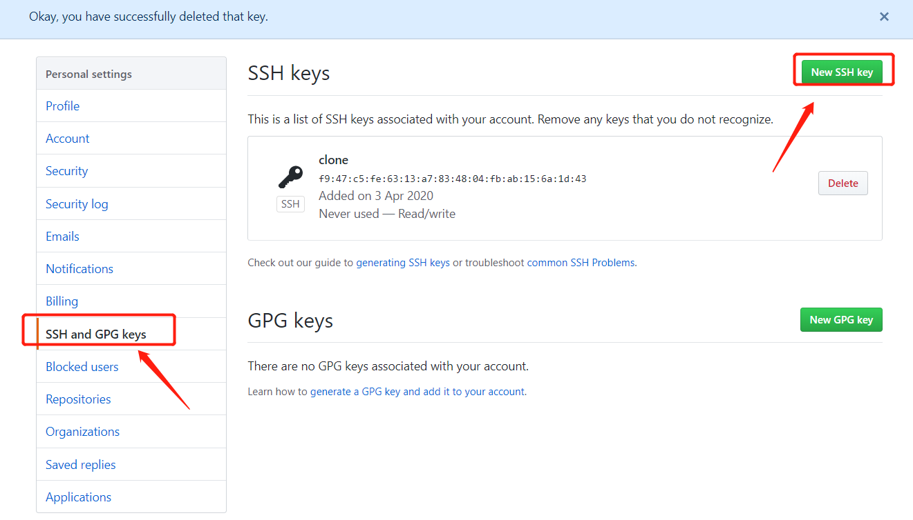
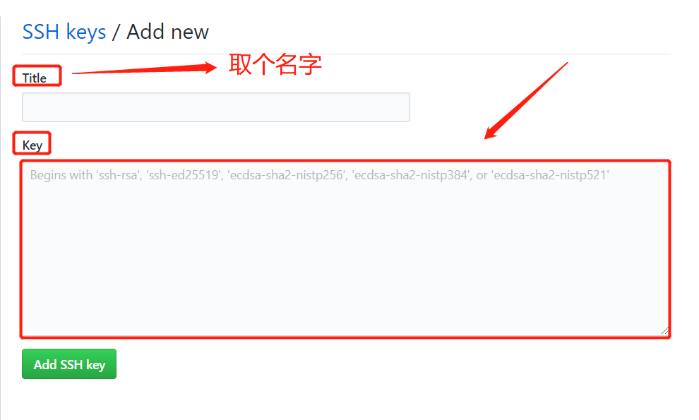
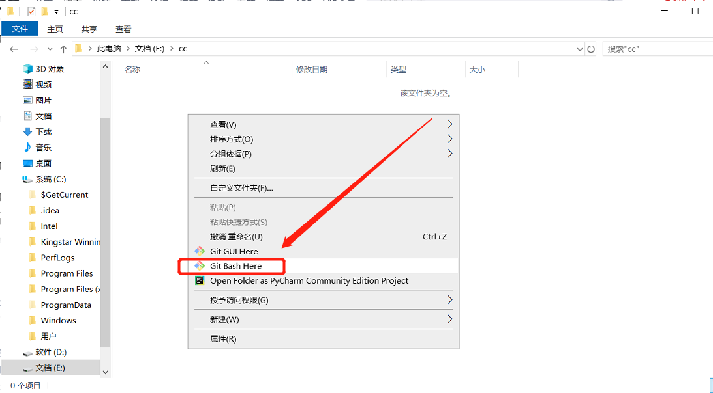
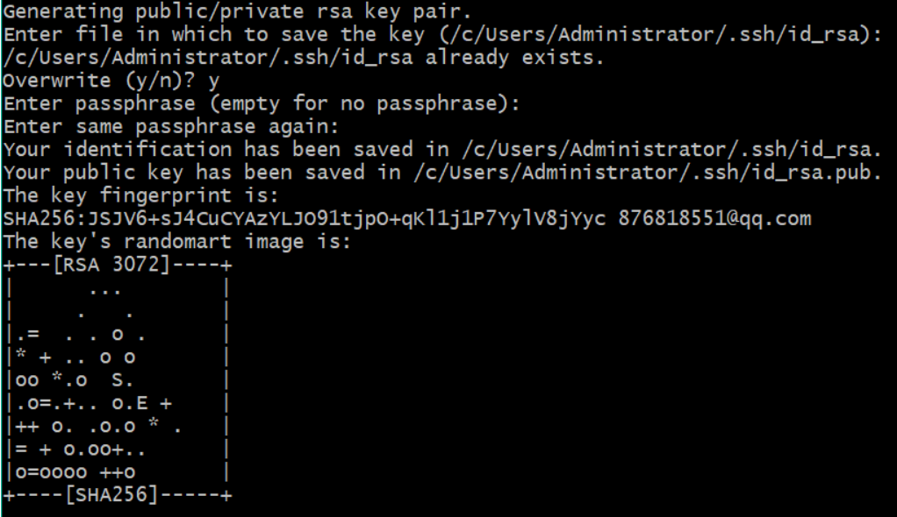
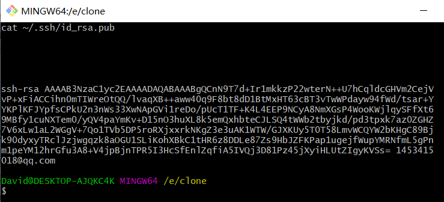
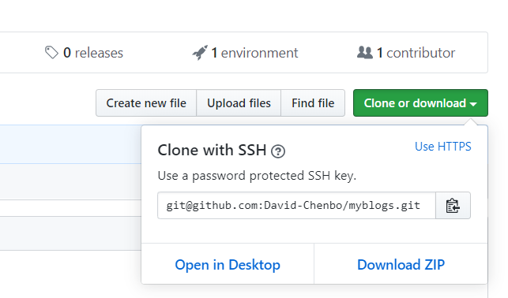
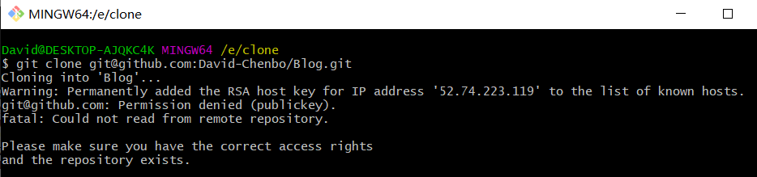

# Github秘钥配置和上传下载仓库

>安装github成功后，当从本地提交文件到github的时候，提交不成功，报错，可能问题就是你还没有生成ssh秘钥 ，配置秘钥规则如下：

### 1、配置用户个人信息
```git
$ git config --global user.name "David_Chenbo"
$ git config --global user.email "1453415018@qq.com"
```


### 2、 从github主页点击设置进入SSH and GPG keys  随后点击创建一个新的密钥"New SSH key"， 




 随即显示出一个输入key的框。 



###  3、获取秘钥Key,找到需要上传的项目文件夹的根目录，右键Git Base Here，如图所示。 





* 在这路径下，打开gitbub的命令控制台

（1） 输入命令：`git init` //初始化一下，看看路径对不对

（2） 输入命令：`ssh-keygen -t rsa -C "1453415018@qq.com"`

然后便一直回车，有y/n的时候尽可能去翻译一下句子，而我下面这个y/n就是是否覆盖原来的秘钥的意思。
接下来经过回车敲击后可以看到一个代码小图片，那就说明成功了。
（3）接下来输入命令：`cat ~/.ssh/id_rsa.pub`
这个时候他便会弹出你的密钥。这个时候直接复制粘贴到刚刚那个GitHub设置密钥SSH的key上面然后保存即可。






### 4、成功创建秘钥

### 5、上传仓库

```
git push -u origin master
```


### 6、克隆仓库

```
$ git clone git@github.com:David-Chenbo/myblogs.git
```





