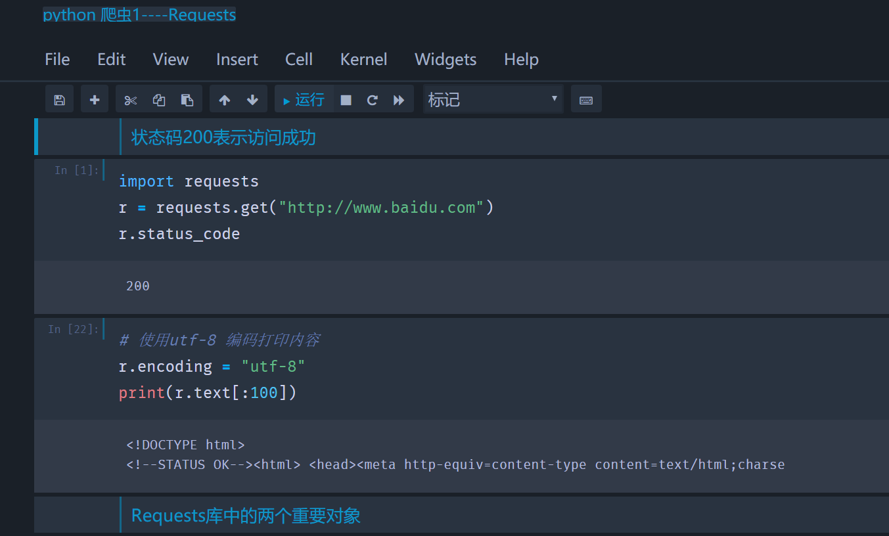
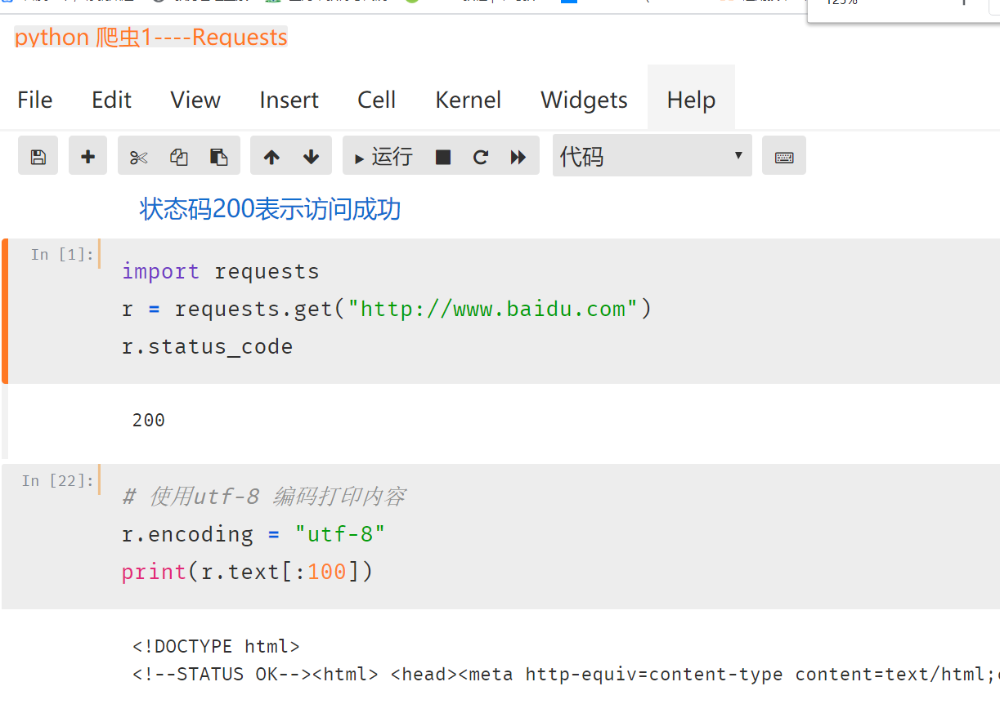
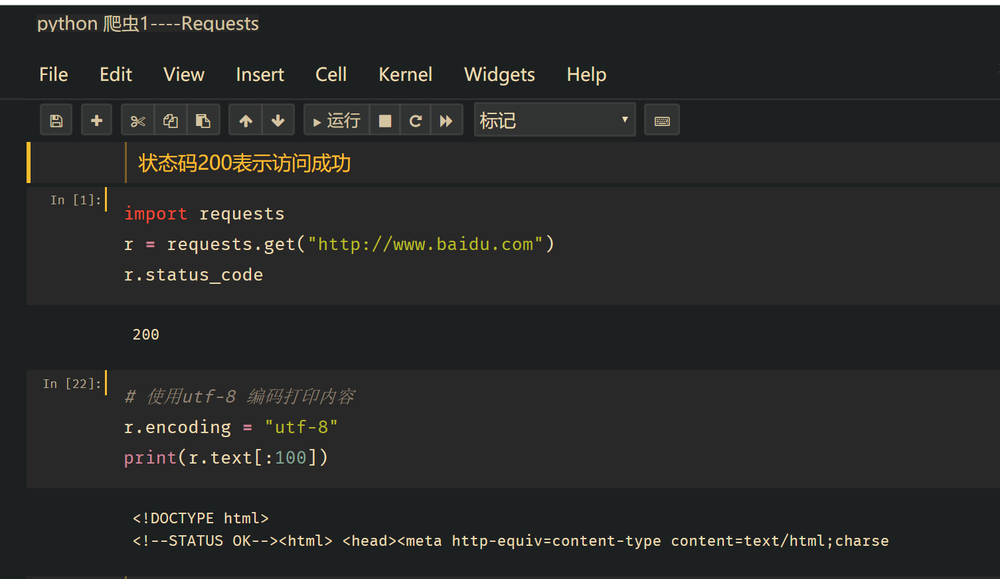
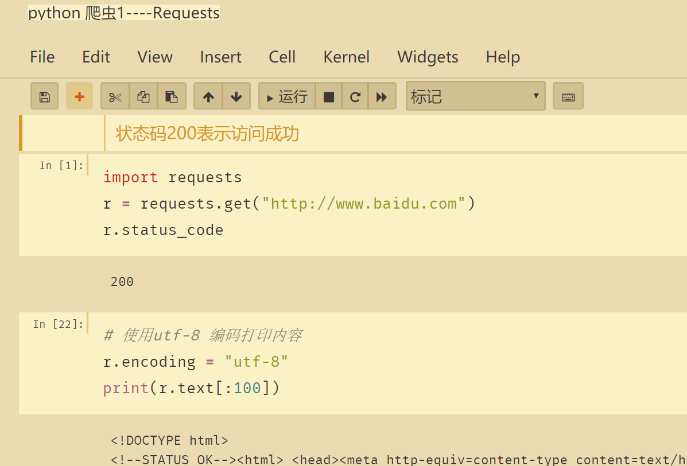
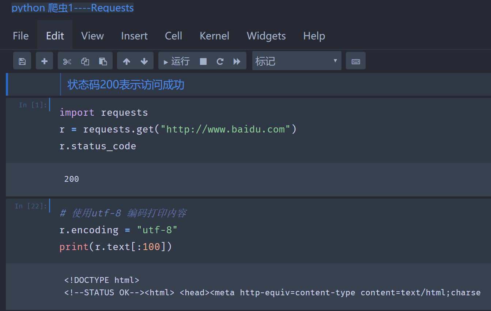
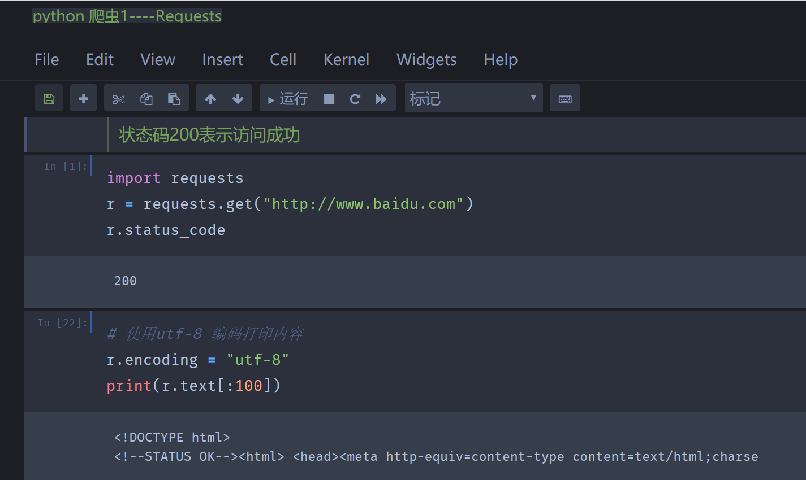
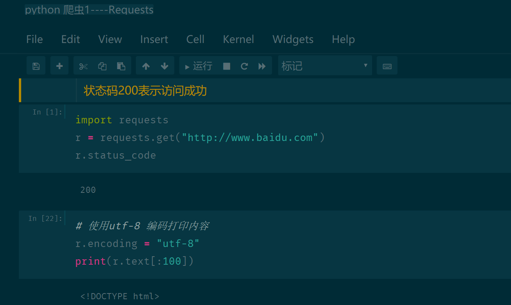

# Jupyter Notebook 设置背景主题、字体大小、代码自动补全

 在github上发现了一个[jupyter-themes](https://github.com/dunovank/jupyter-themes)工具，可以通过pip安装，非常方便使用。 

####  **1.背景主题、字体大小设置** 

 安装Jupyter主题： 

```
 pip install jupyterthemes 
```

 然后，更新Jupyter主题： 

```
pip install --upgrade jupyterthemes
```

 查看可用主题： 

```
 jt -l 
```

```
[root@iZ7etebl1lxmysZ ~]#  jt -l
Available Themes: 
   chesterish
   grade3
   gruvboxd
   gruvboxl
   monokai
   oceans16
   onedork
   solarizedd
   solarizedl
```
命令行的格式如下所示：
```
[root@iZ7etebl1lxmysZ ~]# jt -h
usage: jt [-h] [-l] [-t THEME] [-f MONOFONT] [-fs MONOSIZE] [-nf NBFONT]
          [-nfs NBFONTSIZE] [-tf TCFONT] [-tfs TCFONTSIZE] [-dfs DFFONTSIZE]
          [-ofs OUTFONTSIZE] [-mathfs MATHFONTSIZE] [-m MARGINS]
          [-cursw CURSORWIDTH] [-cursc CURSORCOLOR] [-cellw CELLWIDTH]
          [-lineh LINEHEIGHT] [-altp] [-altmd] [-altout] [-P] [-T] [-N] [-kl]
          [-vim] [-r] [-dfonts]
```

命令行的格式的解释如下表所示：

| cl options            | arg     | default |
| --------------------- | ------- | ------- |
| Usage help            | -h      | --      |
| List Themes           | -l      | --      |
| Theme Name to Install | -t      | --      |
| Code Font             | -f      | --      |
| Code Font-Size        | -fs     | 11      |
| Notebook Font         | -nf     | --      |
| Notebook Font Size    | -nfs    | 13      |
| Text/MD Cell Font     | -tf     | --      |
| Text/MD Cell Fontsize | -tfs    | 13      |
| Pandas DF Fontsize    | -dfs    | 9       |
| Output Area Fontsize  | -ofs    | 8.5     |
| Mathjax Fontsize (%)  | -mathfs | 100     |
| Intro Page Margins    | -m      | auto    |
| Cell Width            | -cellw  | 980     |
| Line Height           | -lineh  | 170     |
| Cursor Width          | -cursw  | 2       |
| Cursor Color          | -cursc  | --      |
| Alt Prompt Layout     | -altp   | --      |
| Alt Markdown BG Color | -altmd  | --      |
| Alt Output BG Color   | -altout | --      |
| Style Vim NBExt*      | -vim    | --      |
| Toolbar Visible       | -T      | --      |
| Name & Logo Visible   | -N      | --      |
| Reset Default Theme   | -r      | --      |
|Force Default Fonts|	-dfonts|	--|


 个人喜欢暗一点的背景主题，于是选择了monokai，它还支持语法高亮。下面是我的背景主题设置：　　 

```
 jt -t monokai -f fira -fs 13 -cellw 90% -ofs 11 -dfs 11 -T -N 
```

 -f(字体) -fs(字体大小) -cellw(占屏比或宽度) -ofs(输出段的字号) -T(显示工具栏) -N(显示自己主机名) 


**其他主题**

1）chesterish

```
jt -t chesterish -f fira -fs 13 -cellw 90% -ofs 11 -dfs 11 -T -N
```



2）grade3

```
jt -t grade3 -f fira -fs 13 -cellw 90% -ofs 11 -dfs 11 -T -N
```



3）gruvboxd

```
jt -t gruvboxd -f fira -fs 13 -cellw 90% -ofs 11 -dfs 11 -T -N
```



4）gruvboxl

```
jt -t gruvboxl -f fira -fs 13 -cellw 90% -ofs 11 -dfs 11 -T -N
```



5）oceans16

```
jt -t oceans16 -f fira -fs 13 -cellw 90% -ofs 11 -dfs 11 -T -N
```



6）   onedork

```
jt -t  onedork -f fira -fs 13 -cellw 90% -ofs 11 -dfs 11 -T -N
```



7）   solarizedd

```
jt -t  solarizedd -f fira -fs 13 -cellw 90% -ofs 11 -dfs 11 -T -N
```


8）   solarizedl

```
jt -t solarizedl -f fira -fs 13 -cellw 90% -ofs 11 -dfs 11 -T -N
```



#### 2.代码自动补全

首先安装 **nbextensions：**

```
pip install jupyter_contrib_nbextensions
```

```
jupyter contrib nbextension install --user
```

 然后安装 **nbextensions_configurator：** 

```
pip install jupyter_nbextensions_configurator
```

```
jupyter nbextensions_configurator enable --user
```

 这时可以打开一个jupyter notebook文件进行书写了： 


