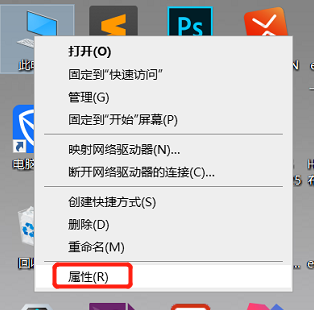
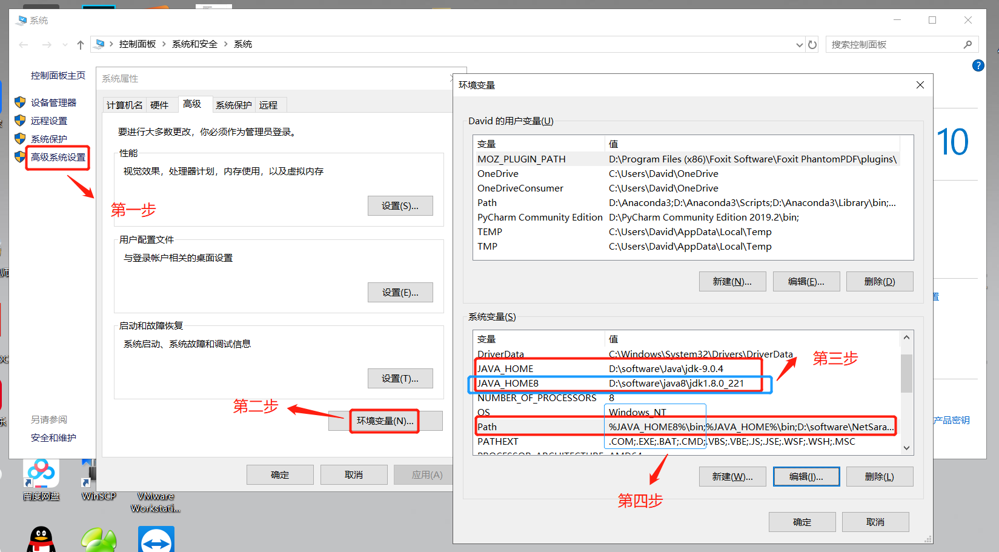
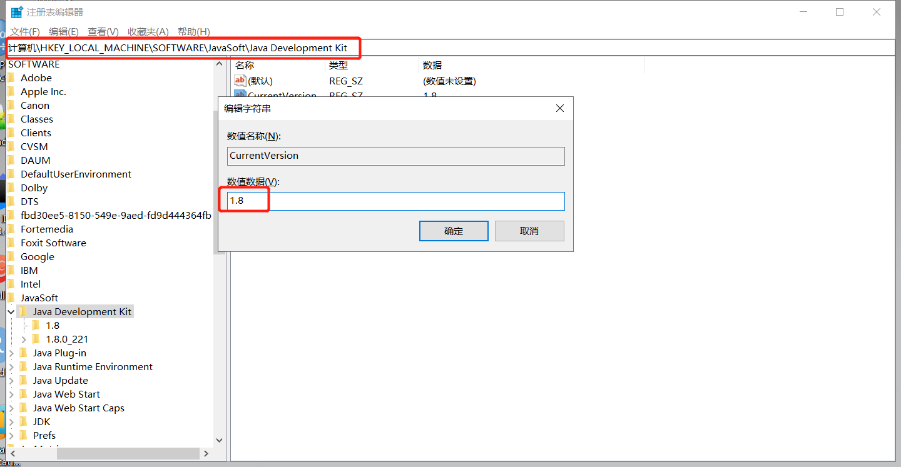
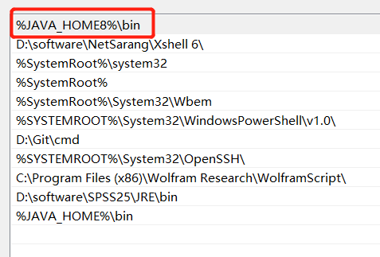
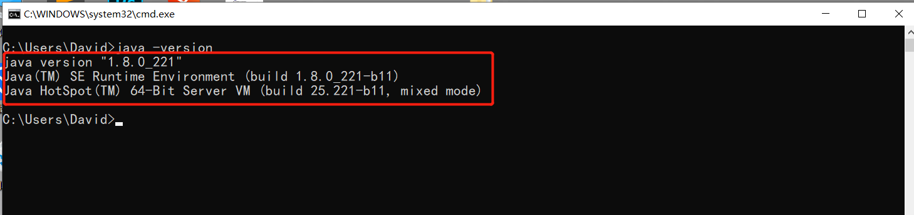

## windows10系统jdk1.8 和jdk9.0共存和切换

由于本人的需要，要用到两个版本的共存。
1.8和9.0版本的共存其实很简单，只要在环境变量中添加进一个新的JAVA_HOME,在切换时修改环境变量的注册表即可。
如下图

### 1.右键计算机选择属性

### 2.修改环境变量

仔细看图，win10版本的直观简单。

### 3.版本间的切换

在安装jdk8的时候,安装过程中会在系统变量path的最前面加上了c:\ProgramData\Oracle\Java\javapath;

这是安装jdk8的时候带出来的,并且在Path的最前面,所以无论修改注册表还是Java控制台都没有用,

执行的指令在系统变量中搜寻命令时最先找到的就是C:\ProgramData\Oracle\Java\javapath;

始终是jdk8的。

那么,我们需要把Path最前面的C: \ProgramData\Oracle\Java\javapath删除

这样才能对 JAVA_HOME修改来切换需要的jdk环境。

（1）jdk9切换回jdk1.8（反过来同理）

①修改注册表的数值数据

在该路径下：HKEY_LOCAL_MACHINE--SOFTWARE--JavaSoft

②修改环境变量

%JAVA_HOME8%\bin  放置在最前面

③打开cmd测试成功

这几个步骤完成后基本没问题，环境变量格式要写对，不能错。就可以了
调出cmd测试，记得测试时切换完变量后要重新开启cmd重新输命令java -version。

